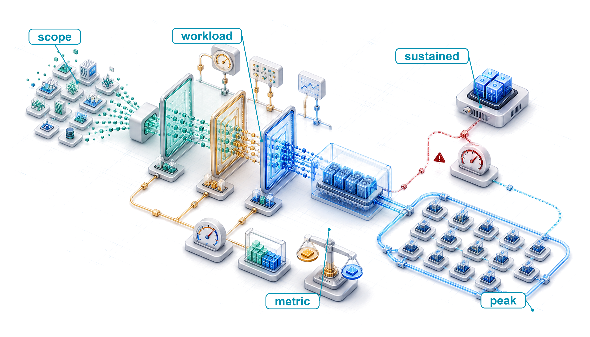
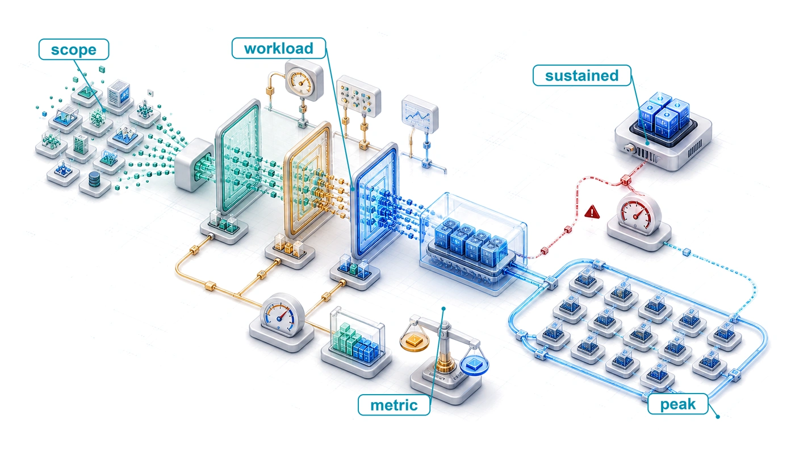
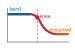
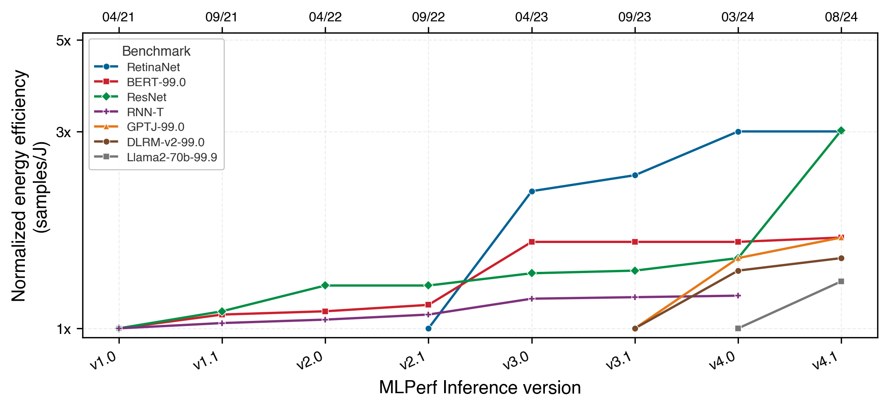
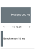

# Benchmarking {#sec-benchmarking}

::: {layout-narrow}
::: {.column-margin}

\chapterminitoc

:::

::: {.content-visible when-format="pdf"}
\noindent
{fig-alt="Isometric benchmarking rig showing a workload passing through nested measurement scopes with a visible gap between peak capability and sustained behavior."}
:::

::: {.content-visible unless-format="pdf"}
{fig-alt="Isometric benchmarking rig showing a workload passing through nested measurement scopes with a visible gap between peak capability and sustained behavior."}
:::

:::

## Purpose {.unnumbered .unlisted}

\begin{marginfigure}
\mlsysstack{75}{15}{25}{30}{35}{45}{10}{15}
\end{marginfigure}

_How can ML systems be compared fairly when hardware, models, data, and deployment all interact?_

Benchmarking brings together decisions already developed through data selection, model compression, and hardware acceleration, then tests whether their gains survive under deployment-representative conditions. Each decision targets one dimension (latency, accuracy, throughput, or energy), but an ML system is the product of all these dimensions simultaneously. A pruned model runs faster on one accelerator but slower on another. A larger batch size improves accelerator utilization but can violate a latency service-level agreement. An edge device may advertise peak throughput that thermal throttling sharply reduces under sustained workloads. The challenge is not whether a local metric improves but whether the combined system improves under conditions that actually matter. Benchmarking makes such comparisons systematic rather than anecdotal. It requires defining what to measure (accuracy, latency, throughput, energy), at what granularity (a single kernel, a full model, an end-to-end pipeline), and under which conditions (batch size, input distribution, thermal state, concurrent load). Without this structure, teams compare numbers that were never measured on the same terms, and decisions that looked sound in a spreadsheet collapse under production workloads. Earlier chapters optimized the model, selected the data, and matched the hardware. Benchmarking validates those optimizations, bringing claims into contact with evidence and quantifying the gap between promise and delivery. In D·A·M terms, benchmarking holds co-design to account by revealing whether Data, Algorithm, and Machine were matched or merely assembled.

::: {.content-visible when-format="pdf"}

\newpage

:::

::: {.callout-learning-objectives}

- Explain benchmarking as D·A·M validation that tests whether optimization claims hold under representative conditions
- Compare training and inference benchmarks using throughput, latency percentiles, energy, accuracy, and workload scope
- Select micro, macro, or end-to-end granularity based on the engineering decision being tested
- Apply standardized benchmark run rules to align datasets, metrics, hardware configuration, and reporting
- Design benchmark protocols that control power boundaries, input distributions, batch sizes, and statistical variance
- Evaluate model and data quality with calibration, robustness, representativeness, and slice-level metrics
- Diagnose benchmark-production gaps caused by drift, thermal throttling, dynamic load, and silent degradation

:::

## ML Benchmarking Framework {#sec-benchmarking-machine-learning-benchmarking-framework-70b8}

A model quantized to INT8 may benchmark 2$\times$ faster on a synthetic workload but show no improvement under real traffic patterns with variable input sizes and concurrent requests. A pruned model may maintain accuracy on the test set but fail on edge cases the benchmark never covered. Data selection promises more efficient training, model compression promises smaller and faster models, and hardware acceleration promises higher throughput. Verifying that these claims hold in production is itself an engineering discipline.

```{python}
#| echo: false

from mlsysim import *
from mlsysim.core.units import *
from mlsysim import Hardware, Engine, Models
from mlsysim.solvers import EfficiencyModel
from mlsysim.core.units import TFLOP, second
from mlsysim.fmt import fmt_flop_rate, fmt_percent, fmt_time, fmt_multiple, fmt_multiple_range, check

class A100PeakBenchmark:
    # ┌── 1. LOAD (Constants) ───────────────────────────────────────────────
    h = Hardware.Cloud.A100
    m = Models.Language.GPT3

    # ┌── 2. EXECUTE (The Compute) ─────────────────────────────────────────
    _peak_flops = h.compute.peak_flops

    # Calculate typical baseline MFU (without FlashAttention)
    eff_base = EfficiencyModel().solve(m, h, workload_type="attention", use_flash_attention=False, precision="fp16")

    # Calculate optimally tuned MFU (e.g. 50% MFU upper bound from literature)
    eff_tuned = EfficiencyModel().solve(m, h, workload_type="ffn", use_flash_attention=False, precision="fp16", efficiency=0.5)

    # Sustained-to-peak gap = peak / sustained = 1 / MFU
    gap_low = 1 / eff_tuned.mfu  # 50% MFU ceiling -> 2.0x
    gap_high = 1 / eff_base.mfu  # 30% MFU floor -> 3.3x

    # ┌── 3. GUARD (Invariants) ───────────────────────────────────────────
    check(eff_base.mfu == 0.3, "Base attention should be 30% MFU.")
    check(eff_tuned.mfu == 0.5, "FFN should be 50% MFU.")

    # ┌── 4. OUTPUT (Formatting) ─────────────────────────────────────────────
    a100_fp16_tflop_per_s_str = fmt_flop_rate(_peak_flops, unit=TFLOP / second, precision=0, commas=False)
    mfu_base_pct_str = fmt_percent(eff_base.mfu, precision=0, commas=False, style="prose")
    mfu_tuned_pct_str = fmt_percent(eff_tuned.mfu, precision=0, commas=False, style="prose")
    achievable_base_tflop_str = fmt_flop_rate(eff_base.achievable_flops, unit=TFLOP / second, precision=1, commas=False)
    achievable_tuned_tflop_str = fmt_flop_rate(eff_tuned.achievable_flops, unit=TFLOP / second, precision=0, commas=False)
    sustained_gap_range_mult_str = fmt_multiple_range(gap_low, gap_high, precision=(0, 1))
```

::: {#dfn-benchmarking-machine-learning-benchmarking .callout-definition title="Machine learning benchmarking"}

***Machine learning benchmarking***\index{Benchmarking!definition} is the empirical measurement of ML workloads under specified conditions, used to test claims about components, models, or end-to-end systems against representative evidence rather than peak specifications alone.

1.  **Significance**: The gap between peak and sustained performance can be large. An A100 GPU delivers `{python} A100PeakBenchmark.a100_fp16_tflop_per_s_str` (BF16) at peak, but in this illustrative `{python} A100PeakBenchmark.mfu_base_pct_str`--`{python} A100PeakBenchmark.mfu_tuned_pct_str` model FLOPs utilization (MFU) scenario—measuring the ratio of theoretical architectural compute to advertised hardware capability per second—it sustains `{python} A100PeakBenchmark.achievable_base_tflop_str`--`{python} A100PeakBenchmark.achievable_tuned_tflop_str`, about a `{python} A100PeakBenchmark.sustained_gap_range_mult_str` gap due to factors such as memory stalls, pipeline bubbles, and kernel launch overhead. Benchmarking quantifies the actual $\eta_{\text{hw}}$ gap for a workload; vendor spec sheets do not.
2.  **Distinction**: ML benchmarking spans multiple scopes. Micro-benchmarks isolate operations such as matrix multiplication, model-level benchmarks evaluate complete training or inference workloads, and end-to-end benchmarks include surrounding work such as data loading, preprocessing, optimization, checkpoint I/O, or serving infrastructure. The scope must match the engineering claim.
3.  **Common pitfall**: A frequent misconception is that benchmark numbers are stable references. Both the workload (new model architectures) and the hardware (new GPU generations) evolve, so a result that leads a benchmark under one version often becomes the baseline under a later version, making year-over-year comparisons meaningful only when the benchmark version is held constant.

:::

Benchmarking is where the physical laws established in earlier chapters face empirical reality. The **benchmark-production gap**\index{Benchmark-production gap} measures the difference between modeled expectations and observed production behavior. Closing that gap requires measurements that convert theoretical claims into verified engineering knowledge.

ML benchmarking operates across three interdependent dimensions that map directly to the components of any deployed system. **System benchmarking**\index{Benchmarking!system, definition} measures whether the hardware delivers promised performance under realistic workloads or whether memory bandwidth saturation and software dispatch overhead erode the gains. **Model benchmarking**\index{Model benchmarking!definition} measures whether optimization techniques preserve model quality across the full input distribution, not just on curated test sets. **Data benchmarking**\index{Data benchmarking!definition} measures whether the model generalizes to real-world data with all its noise, bias, and distributional shift. Each dimension can independently reveal problems invisible to the others, and a system that passes all three provides far stronger deployment confidence than one evaluated along any single axis.

An ML benchmark captures a snapshot of a workload and data distribution rather than a permanent specification. The gap between peak and sustained performance is not fixed either; it shifts as workloads and hardware generations evolve, making any single benchmark result time-stamped rather than universal.

::: {#psp-benchmarking-benchmarks-as-moving-targets .callout-perspective title="Benchmarks as moving targets"}

In traditional systems (for example, SPEC CPU), the benchmark is a *rigid specification*. A sorting algorithm is correct if it sorts the list. Correctness is absolute and unchanging. In ML systems, the benchmark is a *soft specification*: correctness is defined by a finite set of examples (ImageNet), and the world moves. A model that scores highly on ImageNet can still underperform on user photos taken years after the benchmark was created.

In computer architecture, engineers design for the benchmark because the benchmark represents the workload. In ML engineering, designing solely for the benchmark is *overfitting*. Robustness comes from acknowledging that the benchmark is only a proxy for a shifting reality.

:::

MobileNetV2 deployment validation\index{MobileNetV2!deployment validation example} makes the three-dimensional framework concrete. It serves as the chapter's running example because it spans all three evaluation dimensions, illustrating how each reveals problems the others cannot.

```{python}
#| echo: false
# ┌── LEGO ───────────────────────────────────────────────
# │ Context: MobileNetV2 deployment validation lighthouse callout.
# │ Goal: INT8 compression ratio and EdgeTPU vs CPU latency for the pipeline.
from mlsysim import Models
from mlsysim.core.units import BYTES_FP32, BYTES_INT8, MB
from mlsysim.fmt import fmt, fmt_memory, check

class MobileNetLighthouseSetup:
    _mobilenet_v2 = Models.Vision.MobileNetV2
    _edgetpu_latency_ms = 2
    _cpu_latency_ms = 15
    _mv2_size = _mobilenet_v2.size_in_bytes(BYTES_FP32)
    _mv2_int8_size = _mobilenet_v2.size_in_bytes(BYTES_INT8)
    _mv2_compress = (_mv2_size / _mv2_int8_size).to_base_units().magnitude

    check(_mv2_compress == 4.0, f"Expected 4x INT8 compression, got {_mv2_compress:.1f}x")

    # ┌── 4. OUTPUT (Formatting) ─────────────────────────────────────────────
    mobilenet_v2_size_mb_str = fmt_memory(_mv2_size, unit=MB, commas=False)
    mobilenet_v2_int8_size_mb_str = fmt_memory(_mv2_int8_size, unit=MB, precision=1, commas=False)
    mobilenet_v2_compression_ratio_mult_str = fmt_multiple(_mv2_compress, precision=0, commas=False)
    edgetpu_latency_ms_str = fmt_time(_edgetpu_latency_ms, 'millisecond', precision=0, commas=False)
    cpu_latency_ms_str = fmt_time(_cpu_latency_ms, 'millisecond', precision=0, commas=False)
```

::: {#lhs-benchmarking-mobilenet-deployment-validation .callout-lighthouse title="MobileNetV2 deployment validation"}

MobileNetV2 (introduced in @sec-network-architectures-lighthouse-roster-model-biographies-a763) serves as the lighthouse example for validating the complete optimization pipeline. MobileNetV2 refines v1's depthwise separable design with inverted residuals and linear bottlenecks while maintaining a similar parameter scale [@sandler2018]. It exemplifies the deployment challenges where benchmarking determines success or failure: compression can reduce model size, hardware acceleration can reduce inference latency, and only benchmarking can determine whether those gains survive the full deployment pipeline.

1. **Model compression** (@sec-model-compression): INT8 quantization\index{Quantization!INT8 compression ratio} reduces this MobileNetV2 worked example from `{python} MobileNetLighthouseSetup.mobilenet_v2_size_mb_str` to `{python} MobileNetLighthouseSetup.mobilenet_v2_int8_size_mb_str` (`{python} MobileNetLighthouseSetup.mobilenet_v2_compression_ratio_mult_str` compression)
2. **Hardware acceleration** (@sec-hardware-acceleration): the illustrative EdgeTPU scenario\index{Edge TPU!inference latency} uses `{python} MobileNetLighthouseSetup.edgetpu_latency_ms_str` inference vs. `{python} MobileNetLighthouseSetup.cpu_latency_ms_str` on CPU
3. Benchmarking validation: Verify the pipeline delivers in practice

A systematic evaluation isolates EdgeTPU latency from preprocessing and data transfer overhead, confirms INT8 quantization preserves accuracy on edge cases such as unusual lighting, and verifies that throughput holds on real-world smartphone sensor streams rather than curated ImageNet test sets alone.

:::

Rigorous evaluation begins with the mindset that separates meaningful evidence from misleading metrics. Three principles distinguish effective practitioners.

First, *benchmarks are proxies, not truth.*\index{Benchmarking!benchmarks as proxies} Every benchmark measures specific conditions that may not match the target deployment. A system can achieve high sample throughput in Offline mode (bulk throughput with all inputs available) and much lower queries per second (QPS) in Server mode (latency-constrained requests arriving over time). The critical question is always what the benchmark does not measure.

Second, Goodhart's Law applies everywhere.[^fn-goodharts-law-metric]\index{Goodhart's law!metric trap} "When a measure becomes a target, it ceases to be a good measure." Teams that optimize for benchmark rankings often produce systems that excel in evaluation but fail in production. Benchmark-specific optimizations frequently degrade characteristics that matter for deployment: robustness, calibration, and efficiency.

```{python}
#| echo: false
#| label: component-latency-example-calc
# ┌── LEGO ───────────────────────────────────────────────
# │ Context: End-to-end-beats-component prose paragraph immediately below.
# │ Goal: Component-only vs end-to-end speedup under pipeline overhead.
from mlsysim.fmt import fmt, fmt_qty, check
from mlsysim.physics import calc_amdahls_speedup

class ComponentLatencyExample:
    """A component-only speedup diluted by non-model pipeline work."""

    # ┌── 1. LOAD (Constants) ──────────────────────────────────────────────
    model_latency_ms = 10
    e2e_latency_ms = 50
    component_speedup = 3

    # ┌── 2. EXECUTE (The Compute) ────────────────────────────────────────
    model_fraction = model_latency_ms / e2e_latency_ms
    e2e_speedup = calc_amdahls_speedup(model_fraction, component_speedup)
    optimized_e2e_ms = e2e_latency_ms / e2e_speedup

    # ┌── 3. GUARD (Invariants) ───────────────────────────────────────────
    check(e2e_speedup < component_speedup, "End-to-end speedup must be bounded by non-model work.")
    check(round(e2e_speedup, 1) == 1.2, f"Expected about 1.2x end-to-end speedup, got {e2e_speedup:.1f}x")

    # ┌── 4. OUTPUT (Formatting) ─────────────────────────────────────────────
    model_latency_ms_str = fmt_time(model_latency_ms, 'millisecond', precision=0, commas=False)
    e2e_latency_ms_str = fmt_time(e2e_latency_ms, 'millisecond', precision=0, commas=False)
    component_speedup_mult_str = fmt_multiple(component_speedup, precision=0, commas=False)
    e2e_speedup_mult_str = fmt_multiple(e2e_speedup, precision=1, commas=False)
```

Third, end-to-end beats component metrics\index{Benchmarking!end-to-end vs. component metrics}. In this illustrative pipeline, a `{python} ComponentLatencyExample.component_speedup_mult_str` inference speedup applied to a `{python} ComponentLatencyExample.model_latency_ms_str` model stage inside a `{python} ComponentLatencyExample.e2e_latency_ms_str` request yields only about a `{python} ComponentLatencyExample.e2e_speedup_mult_str` end-to-end improvement, or worse if the optimization increases memory pressure. These principles reappear throughout the benchmarking methodology and are examined in depth in @sec-benchmarking-fallacies-pitfalls-9781.

::: {.column-margin}
{width="100%" fig-alt="Two stacked latency bars compare before and after a 3 times model-stage speedup: the model segment shrinks, but the other pipeline work remains, so 50 milliseconds only falls to about 43 milliseconds."}

*Component speedup rarely survives as end-to-end benchmark speedup.*
:::

[^fn-goodharts-law-metric]: **Goodhart's law**\index{Goodhart's law!etymology}: @goodhart1984 articulated the original 1975 Bank of England observation on monetary policy; @strathern1997improving generalized it into the form quoted above. The original context was macroeconomics: once a monetary aggregate became an official policy target, banks changed behavior to game the metric, destroying its predictive value. In ML, the same failure mode recurs structurally: BLEU rewards n-gram overlap [@papineni2001], ImageNet rewards performance on a fixed visual distribution [@deng2009; @recht2019imagenet], and benchmark leaderboards can incentivize test-set-specific tuning.

Knowing *what* to measure, however, is only half the problem. Measuring incorrectly (with the wrong workloads, biased baselines, or uncontrolled variables) produces numbers that feel precise but mislead decisions. The history of computing benchmarking is littered with examples of technically sound metrics applied with flawed methodology, from compiler-gamed Whetstone scores to cherry-picked GPU benchmarks that predict nothing about sustained workloads. Understanding how measurement methodology evolved, and where it failed, is essential for designing benchmarks that distinguish genuine improvements from measurement artifacts.

The historical foundations of benchmarking[^fn-benchmark-etymology-surveying] matter because they expose the validation failures that still recur in ML: optimized metrics that stop predicting real workloads, hardware numbers that ignore sustained operating state, and model scores that miss deployment cost. The same validation sequence governs modern practice: first verify that hardware delivers promised performance, then verify that the model and data optimizations built atop that hardware deliver their promised gains.

[^fn-benchmark-etymology-surveying]: **Benchmark**\index{Benchmark!etymology}: From surveying, where a "bench mark" was a horizontal cut in stone serving as a fixed elevation reference. The term entered computing in the 1970s to describe standardized comparison points, but the surveying metaphor carries a systems lesson: just as an elevation measurement is meaningless without a calibrated reference, an ML throughput number is meaningless without controlled workloads, thermal state, and precision settings.

## Historical Foundations {#sec-benchmarking-historical-context-7350}

In 1976, when Whetstone became one of the first standardized computing benchmarks\index{Benchmarking!historical evolution}, vendors began optimizing their compilers specifically for its synthetic floating-point loops, producing peak execution numbers that failed to predict real application performance. Similar gaming has recurringly undermined single-metric and component-level evaluations. Understanding why modern ML evaluation requires the D·A·M taxonomy (Data · Algorithm · Machine) requires tracing how measurement methodologies evolved across computing history. Each benchmark generation arose when existing metrics failed to expose critical system bottlenecks, providing direct precedents for ML evaluation.

Before that history begins, one boundary condition matters: a benchmark is useful only when it names the layer whose claim it validates.

::: {#psp-benchmarking-related-efficiency-metrics .callout-perspective title="Benchmarking as cross-layer evidence"}

An ML benchmark is meaningful only when it identifies which layer of the system is being validated. Data selection metrics such as PPD, area under the learning curve (AULC), and data compression ratio (DCR), all developed in @sec-data-selection, measure whether fewer examples can preserve learning signal. Compression metrics (@sec-model-compression) measure whether fewer parameters or lower precision preserve quality. Hardware metrics such as roofline position and TOPS/W (@sec-hardware-acceleration) measure whether the machine executes the workload efficiently. The system benchmarks in @sec-benchmarking-system-benchmarks-393c through @sec-benchmarking-mlperf-power-case-study-a554 connect these layers by testing whether local improvements survive in an end-to-end workload.

:::

That cross-layer role explains why benchmark history matters: performance measurement advanced whenever practitioners discovered that existing metrics failed to predict end-to-end behavior. The evolution from early synthetic tests to modern ML suites reveals three methodological shifts: from isolated kernels to representative application suites, from single-metric throughput to multi-objective energy profiles, and from generic compute metrics to domain-specific execution constraints.

### Performance benchmarks {#sec-benchmarking-performance-benchmarks-ea8a}

The earliest computing benchmarks revealed an enduring vulnerability in empirical evaluation: benchmark gaming\index{Benchmark gaming!vendor optimization for tests}. Whetstone\index{Whetstone!synthetic floating-point benchmark} [@curnow1976whetstone] used a synthetic mix of scientific operations, while LINPACK\index{LINPACK!matrix operations benchmark}[^fn-whetstone-linpack-history] [@dongarra1979linpack] measured dense linear-system solving. Because these workloads relied on predictable computational loops, compiler and hardware vendors could optimize specifically for the benchmark kernels—such as unrolling synthetic loops or tailoring cache tiling to exact matrix dimensions—without improving general application performance. SPEC CPU\index{SPEC CPU!real application workloads} (1989) addressed this limitation by evaluating complete, portable software suites that stressed integer branching, irregular memory hierarchies, and floating-point pipelines [@dixit1993spec]. This progression directly informs ML systems: model compression claims from @sec-model-compression cannot rely on isolated matrix multiplication kernels, but require validation on representative tasks like ResNet-50 and BERT across the full software runtime.

[^fn-whetstone-linpack-history]: **Whetstone and LINPACK**\index{Whetstone!etymology}\index{LINPACK!narrow benchmark}: Whetstone [@curnow1976whetstone] was named after the English Electric facility in Whetstone, Leicestershire, where the original ALGOL compiler was built; LINPACK [@dongarra1979linpack] was a package and benchmark for dense linear systems, later used by the Top500 list. Whetstone's fixed synthetic program mix and LINPACK's dense linear-algebra focus made each useful but narrower than a diverse application suite. ML benchmarking inherited the same vulnerability: model-specific kernel tuning can overfit a single workload, which is why MLPerf uses multiple workloads spanning vision, language, and recommendation [@mattson2020mlperf; @reddi2020].

As computing expanded into interactive and mobile environments, single-metric evaluation proved insufficient. Graphics benchmarks paired frame rate with rendering quality, and mobile evaluations treated battery draw as co-equal with latency. This multi-objective trade-off mirrors ML serving, where optimizing latency in isolation can trigger catastrophic degradation in model accuracy or energy efficiency (@sec-introduction).

A third shift occurred when distributed computing\index{Distributed computing!system-level performance} demonstrated that component-level microbenchmarks fail to predict cluster-level throughput. Evaluating a CPU or accelerator in isolation cannot capture execution dynamics when network interconnect latency, serialization overheads, and collective communication dominate wall-clock time. Distributed ML training similarly depends on the tight interplay among accelerator matrix engines (@sec-hardware-acceleration), host-to-device PCIe bandwidth, input data prefetching pipelines, and gradient synchronization across network fabrics.

To capture these interactions, DAWNBench\index{DAWNBench!time-to-accuracy evaluation} [@coleman2019] pioneered time-to-accuracy evaluation, tying raw hardware throughput directly to algorithmic convergence. Maximizing samples processed per second offers no engineering value if numerical instability or suboptimal batch sizing prevents the model from reaching target validation accuracy. These empirical lessons culminated in MLPerf\index{MLPerf!founding and purpose}[^fn-mlperf-benchmark-suite] (2018), which institutionalized full-system measurement, multi-objective constraints, and representative workloads spanning vision, language, and recommendation systems [@mattson2020mlperf; @reddi2020].

[^fn-mlperf-benchmark-suite]: **MLPerf**\index{MLPerf!founding}: Launched in 2018 by a consortium of industry and academic institutions, MLPerf takes its name from "ML" combined with "Perf" (performance), echoing SPEC's benchmarking tradition. MLPerf's design principles—representative workloads, full-system measurement, and open submission—directly address the gaming that plagued Whetstone and LINPACK: vendors who could previously report peak kernel throughput on cherry-picked problem sizes must now report end-to-end system performance on standardized tasks [@mattson2020mlperf; @reddi2020].

### Energy benchmarks {#sec-benchmarking-energy-benchmarks-709a}

The multi-objective evaluation paradigm extended to energy efficiency\index{Benchmarking!energy, first-class metric} as computing diversified beyond mainframes into battery-limited mobile devices and megawatt-scale data centers. Because energy consumption directly dictates battery life at the edge and operating expenses in warehouse-scale clusters, energy became a first-class evaluation metric alongside performance. This shift produced standardized energy benchmarks such as SPEC Power\index{SPEC Power!server energy efficiency}[^fn-spec-power-benchmark] for servers and Green500\index{Green500!HPC energy efficiency ranking}[^fn-green500-energy-efficiency] for supercomputers.

[^fn-spec-power-benchmark]: **SPEC Power**\index{SPEC Power!energy efficiency}: Introduced in 2007, SPEC Power measures performance per watt across 11 load levels from idle (0 percent) through 100 percent in 10 percent increments [@lange2009]. This granularity matters for ML serving: inference workloads rarely sustain 100 percent load, and servers that are efficient at peak but wasteful at partial load inflate the energy cost of real-world deployment.

[^fn-green500-energy-efficiency]: **Green500**\index{Green500!energy efficiency ranking}: Started in 2007 as a counterpart to the Top500, Green500 ranks systems by FLOP/s per watt rather than raw performance [@feng2007green500]. Its lesson for ML systems is methodological: the most cost-effective training cluster is not necessarily the fastest one, but the system that delivers useful work per watt under the workload and measurement boundary that matter.

Evaluating energy in ML workloads introduces distinct physical measurement challenges. Accelerators exhibit sharp dynamic power swings: alternating between memory-bound activation layers and power-dense matrix multiplication units creates rapid current fluctuations ($\frac{dI}{dt}$) that simple average-power meters fail to resolve. Furthermore, isolating accelerator consumption from host CPU activity, PCIe interconnects, and cooling fans requires rigorous measurement boundaries. MLPerf Power\index{MLPerf!power, ML energy measurement} [@mlperf_power_website] addresses these demands by coupling standardized workloads with strict physical measurement methodologies and calibrated external power analyzers.

Energy benchmarking extends beyond hardware telemetry to evaluate algorithmic efficiency. Model compression techniques (pruning, quantization, knowledge distillation) reduce energy consumption by decreasing arithmetic operations and off-chip memory traffic, rather than relying solely on lower-power silicon. For instance, MobileNet architectures replace standard convolutions with depthwise separable convolutions, drastically reducing DRAM access and arithmetic operations relative to standard convolutional neural network (CNN) baselines such as ResNet [@howard2017mobilenets; @sandler2018; @he2016]. As established in @sec-model-compression and quantified in @sec-model-compression-energy-costs-d1d5, reading an operand from off-chip DRAM consumes orders of magnitude more energy than executing an arithmetic operation, making algorithmic memory-traffic reduction a primary lever for energy-efficient computing.

### Domain-specific benchmarks {#sec-benchmarking-domainspecific-benchmarks-b15f}

As specialized accelerators emerged to bypass general-purpose CPU bottlenecks, generic benchmarks failed to capture domain-specific execution constraints. Three operational axes drove this specialization, defining how systems are evaluated under real-world conditions.

Deployment constraints dictate core metric priorities based on physical limits. Data center training clusters optimize for aggregate throughput within rack- and facility-level power envelopes. In contrast, mobile AI operates within strict thermal throttling thresholds (typically under 5 watts), and embedded microcontroller systems function within milliwatt power budgets. These physical bounds, rooted in the efficiency principles of @sec-introduction, determine whether a benchmark prioritizes throughput (samples per second) or energy efficiency (Joules per inference).

Application requirements impose functional constraints beyond raw speed. Clinical AI models require rigorous calibration and interpretability alongside classification accuracy; high-frequency financial trading systems enforce hard tail-latency cutoffs paired with deterministic execution; autonomous vehicles demand bounded worst-case latency and formal functional safety validation. These requirements broaden evaluation criteria beyond throughput; @sec-responsible-engineering formalizes the corresponding engineering principles for safety, compliance, and fairness.

Operational conditions determine real-world robustness. Edge devices must maintain inference deadlines across ambient temperature swings and noisy sensor streams; data-center serving infrastructure must absorb sudden query spikes and network packet loss without dropping requests; industrial IoT nodes must operate unattended for years. Hardware acceleration capabilities (@sec-hardware-acceleration) deliver production value only when sustained under these operational environments.

Machine learning exemplifies this domain-specific divergence. Because ML workloads trigger complex interactions between tensor execution units, memory hierarchy bandwidth, and distributed communication fabrics, no single metric or workload can characterize a system. MLPerf formalizes this specialization across distinct deployment suites: MLPerf Training\index{MLPerf Training!data center multi-node scaling} evaluates multi-node scaling and high-bandwidth interconnects under time-to-quality targets [@mattson2020mlperf]; MLPerf Inference\index{MLPerf Inference!server to edge evaluation} measures throughput and latency percentiles under service level agreements (SLAs) across server and client systems [@reddi2020]; MLPerf Tiny\index{MLPerf Tiny!microcontroller benchmarks} tests ultra-low-power microcontrollers operating with tight memory constraints [@banbury2021mlperftiny]; and the cross-cutting MLPerf Power track evaluates energy efficiency across each environment. Reading @tbl-mlperf-suites down its constraint column illustrates how metrics adapt to physical limits: cluster-scale interconnect bandwidth gives way to latency percentiles at the edge, and ultimately to strict memory footprints on microcontrollers.

```{=latex}
\begingroup
\renewcommand{\arraystretch}{1.3}
```

| **MLPerf Variant**   | **Target Domain** | **Key Constraints**                              | **Primary Metrics**                             |
|:---------------------|:------------------|:-------------------------------------------------|:------------------------------------------------|
| **MLPerf Training**  | Data center       | Multi-node scaling, high bandwidth interconnects | Time-to-quality, throughput (samples/sec)       |
| **MLPerf Inference** | Server/Edge       | Latency SLAs, throughput requirements            | QPS, latency percentiles, accuracy preservation |
| **MLPerf Tiny**      | MCU/IoT           | Ultra-low-power inference, limited memory        | Latency, accuracy, energy per inference         |
| **MLPerf Power**     | Cross-cutting     | Energy budgets, thermal constraints              | Performance/W, energy per query                 |

: **MLPerf Benchmark Suite Variants**: Each variant addresses a different deployment context, from data-center-scale training to ultra-constrained microcontroller inference, targeting specific operational constraints and measuring metrics relevant to its deployment scenario. {#tbl-mlperf-suites tbl-colwidths="[15,14,36,35]"}

```{=latex}
\endgroup
```

Across all variants, MLPerf Power\index{MLPerf Power!energy efficiency measurement} measures useful work per watt rather than raw throughput alone. Domain-specific suites ensure that architectural optimizations translate to deployment success rather than remaining confined to isolated synthetic benchmarks.

While ML benchmarking suites inherit these historical lessons, machine learning workloads introduce statistical and data-dependent variability\index{Benchmarking!probabilistic variability} absent in traditional deterministic computing. Beyond standard system noise—such as operating system interrupts, background daemon activity, and thermal throttling—ML execution exhibits intrinsic non-determinism. Floating-point reduction across parallel threads is non-associative, causing slight numerical differences when summation order changes; data ingestion pipelines apply pseudo-random augmentations; and stochastic gradient descent navigates non-convex loss surfaces sensitive to weight initialization. Consequently, rigorous ML evaluation requires explicit statistical controls, including multi-seed replication, variance reporting, and deterministic data-loading rules.

Standardization transforms these empirical lessons into a shared engineering methodology. When one team measures inference latency including host preprocessing while another begins timing only after tensors reside in accelerator device memory, or when power meters draw different physical boundaries around the power supply unit, the resulting numbers are incommensurable. Standardized suites replace ad-hoc testing with audited harnesses, uniform measurement boundaries, and verifiable submission rules, enabling rigorous hardware procurement and algorithmic comparison across the industry. @Tbl-benchmark-evolution synthesizes this historical progression from early synthetic loops to multi-dimensional ML systems evaluation.

| **Benchmark**  | **Year** | **Primary Focus**                   | **Key Metric(s)**                       | **Lesson for ML Benchmarking**                                               |
|:---------------|:--------:|:------------------------------------|:----------------------------------------|:-----------------------------------------------------------------------------|
| **Whetstone**  |   1976   | Synthetic floating-point operations | MWIPS                                   | Gaming synthetic tests undermines evaluation validity                        |
| **LINPACK**    |   1979   | Linear algebra (matrix operations)  | FLOP/s                                  | Isolated operations miss system-level complexity and bottlenecks             |
| **SPEC CPU**   |   1989   | Real application workloads          | SPECrate, SPECspeed                     | Representative workloads reveal true deployment performance                  |
| **SPEC Power** |   2007   | Server energy efficiency            | ssj_ops/W across load levels            | Energy efficiency requires multi-load evaluation, not just peak performance  |
| **Green500**   |   2007   | HPC energy efficiency               | GFLOP/s per watt                        | Efficiency rankings complement raw performance rankings                      |
| **MLPerf**     |   2018   | ML systems (training + inference)   | Time-to-quality, QPS, latency, accuracy | Synthesizes all lessons: representative workloads + multi-objective + system |

: **Benchmark Evolution**: Evolution of computing benchmarks from synthetic operations to ML-specific evaluation. Each generation addressed limitations of its predecessors, culminating in MLPerf's synthesis of representative workloads, multi-objective metrics, and integrated system measurement. {#tbl-benchmark-evolution tbl-colwidths="[12,9,23,20,36]"}

## System Benchmarking Suites {#sec-benchmarking-system-benchmarking-suites-e946}

A team evaluating edge deployment hardware must compare five different system-on-chip (SoC) designs for a smart camera product. Vendor A reports 8 TOPS at INT8; Vendor B reports 15 TOPS at INT4; Vendor C reports inference latency on a proprietary model; Vendor D cites MLPerf scores from two generations ago; Vendor E provides only peak throughput at maximum batch size. None of these figures can be directly compared. The team cannot make an informed procurement decision because each vendor isolates a favorable metric under idiosyncratic conditions, obscuring true operating trade-offs. Benchmarking suites resolve this fragmentation by enforcing uniform measurement harnesses and standardized evaluation rules.

Three lessons from benchmark history—representative workloads, multi-objective evaluation, and integrated system measurement—converge on a requirement unique to machine learning: managing statistical approximation. In traditional computing benchmarks, valid system optimizations must preserve bit-exact arithmetic results. In ML systems, low-level engineering choices routinely alter numerical output: aggressive weight quantization, kernel pruning, or reduced-precision accumulators trade accuracy for execution speed and lower memory bandwidth pressure. Consequently, an ML benchmark cannot evaluate execution time in isolation; output accuracy serves as an inviolable operational constraint. Modern benchmarking suites encode these constraints into standardized frameworks, making rigorous cross-platform comparisons possible.

Evaluating an ML system therefore requires assessing the coupled interactions across the Data, Algorithm, and Machine (D·A·M) co-design space rather than measuring raw compute throughput. Early benchmarks focused primarily on algorithmic accuracy on isolated datasets [@lecun1998]. As models scaled, compute bottlenecks expanded benchmarking to hardware execution efficiency [@jouppi2017], and deployment failures demonstrated that data pipeline bottlenecks and input distribution shifts dictate real-world behavior [@gebru2021]. Energy consumption cuts directly across all three dimensions: algorithmic structure dictates arithmetic intensity and computational complexity [@hernandez2020measuring], machine microarchitecture sets the energy cost per arithmetic operation and memory access, and data ingestion patterns determine bus utilization. A robust benchmarking suite tests these dimensions simultaneously, ensuring that claimed optimizations survive under production constraints.

### ML measurement challenges {#sec-benchmarking-ml-measurement-challenges-60ea}

ML systems combine several sources of measurement variability\index{Measurement variability!sources in ML systems} that classical software benchmarks were not designed to evaluate together. These fluctuations originate at both the machine and algorithmic layers. On the machine side, sustained execution pushes accelerators against thermal and power envelopes, triggering dynamic voltage and frequency scaling (DVFS) that throttles processor clocks mid-run. Host operating-system activity—including thread scheduling jitter, memory paging, and PCIe bus contention during batch staging—further introduces latency variance across runs. On the algorithmic side, non-deterministic floating-point reduction orders across parallel execution threads, mini-batch shuffling, and stochastic dropout masks perturb numerical trajectories. Distinguishing a genuine systems optimization from background measurement noise requires isolating these overlapping sources of variance.

To isolate run-to-run variability, benchmark protocols require repeated experimental trials across controlled pseudo-random seeds\index{Random seed!benchmark protocol requirement}. The number of runs must satisfy explicit statistical-power targets rather than opportunistic sampling. Reporting must extend beyond single best-of-$N$ scores or isolated arithmetic means: reporting sample variance, standard deviations, or confidence intervals\index{Confidence interval!benchmark reporting} quantifies stability and establishes whether an observed speedup exceeds background system jitter. Without these controls, benchmarking yields misleading conclusions. In reinforcement learning, reported performance advantages frequently evaporate into the statistical noise of random weight initializations and environment dynamics [@henderson2018]. Similarly, unstandardized evaluations of generative adversarial networks produce rank reversals across random seeds, demonstrating that uncharacterized variance undermines comparative claims [@lucic2018gans].

Even when run-to-run execution variance is fully controlled, benchmarking encounters a structural constraint in the evaluation dataset itself: test-set measurement capacity. A test set operates as a measurement instrument with a finite resolution limit. Because accuracy on a finite sample is a binomial proportion, empirical scores carry intrinsic sampling variance that scales inversely with sample size. When an optimization alters accuracy by one or two percentage points, evaluating on an undersized test set cannot determine whether the change reflects a genuine algorithmic effect or a random sampling fluctuation. As illustrated in the margin detectability marker and analyzed in the accompanying notebook, attempting to evaluate fine-grained accuracy deltas on a thousand-sample test set falls directly into this statistical confidence trap.

```{python}
#| echo: false
#| label: statistical-confidence-calc
# ┌── LEGO ───────────────────────────────────────────────
# │ Context: The statistical confidence trap callout below.
# │ Goal: Binomial uncertainty for 95% vs 94% on 1,000 images.
from math import sqrt, ceil
from mlsysim.fmt import fmt, fmt_count, fmt_pp, check

class StatisticalConfidenceTrap:
    """Binomial uncertainty for a 95% vs. 94% accuracy comparison on 1,000 images."""

    # ┌── 1. LOAD (Constants) ──────────────────────────────────────────────
    n_images = 1000
    baseline_accuracy = 0.95
    compressed_accuracy = 0.94
    z_95 = 1.96
    target_margin = 0.01

    # ┌── 2. EXECUTE (The Compute) ────────────────────────────────────────
    baseline_error_rate = 1 - baseline_accuracy
    compressed_error_rate = 1 - compressed_accuracy
    baseline_errors = n_images * baseline_error_rate
    compressed_errors = n_images * compressed_error_rate
    sigma_errors = sqrt(n_images * baseline_error_rate * baseline_accuracy)
    accuracy_diff = baseline_accuracy - compressed_accuracy
    se_diff_independent = sqrt(baseline_accuracy * (1 - baseline_accuracy) / n_images + compressed_accuracy * (1 - compressed_accuracy) / n_images)
    diff_ci_low = accuracy_diff - z_95 * se_diff_independent
    diff_ci_high = accuracy_diff + z_95 * se_diff_independent
    one_prop_n = ceil((z_95**2 * baseline_accuracy * (1 - baseline_accuracy)) / (target_margin**2))

    # ┌── 3. GUARD (Invariants) ───────────────────────────────────────────
    check(round(baseline_errors) == 50, f"Expected 50 baseline errors, got {baseline_errors:.1f}")
    check(round(compressed_errors) == 60, f"Expected 60 compressed errors, got {compressed_errors:.1f}")
    check(diff_ci_low < 0 < diff_ci_high, "Independent two-proportion interval should include zero.")
    check(1800 < one_prop_n < 2000, f"One-proportion sample estimate changed: {one_prop_n}")

    # ┌── 4. OUTPUT (Formatting) ─────────────────────────────────────────────
    n_images_str = fmt(n_images, precision=0, commas=True)
    baseline_accuracy_pct_str = fmt_percent(baseline_accuracy, precision=0, commas=False, style='prose')
    compressed_accuracy_pct_str = fmt_percent(compressed_accuracy, precision=0, commas=False, style='prose')
    baseline_errors_str = fmt_count(round(baseline_errors), commas=False, label="error")
    compressed_errors_str = fmt_count(round(compressed_errors), commas=False, label="error")
    sigma_errors_str = fmt_count(round(sigma_errors), commas=False, label="error")
    accuracy_diff_pp_str = fmt_pp(accuracy_diff * 100, precision=0)
    diff_ci_low_pp_str = fmt_pp(diff_ci_low * 100)
    diff_ci_high_pp_str = fmt_pp(diff_ci_high * 100)
    one_prop_n_str = fmt(one_prop_n, precision=0, commas=True)
    target_margin_pp_str = fmt_pp(target_margin * 100, precision=0)
    ci_confidence_pct_value = 95
    ci_confidence_pct_str = fmt_percent(ci_confidence_pct_value / 100, precision=0, commas=False, style='prose')
```

::: {.column-margin}
{width="100%" fig-alt="Horizontal detectability marker: a 1K test set sits in the noisy region, while roughly 2K samples are needed for a plus or minus 1 percentage point confidence interval."}

*A 1K test set cannot reliably see a one-point regression.*
:::

::: {#nbk-benchmarking-statistical-confidence-trap .callout-notebook title="The statistical confidence trap"}

**Problem**: A baseline classifier scores `{python} StatisticalConfidenceTrap.baseline_accuracy_pct_str`, while a compressed version scores `{python} StatisticalConfidenceTrap.compressed_accuracy_pct_str` on `{python} StatisticalConfidenceTrap.n_images_str` images. Does this one-point drop establish a regression?

**Math**:

1.  **Expected errors**: The scores correspond to `{python} StatisticalConfidenceTrap.baseline_errors_str` and `{python} StatisticalConfidenceTrap.compressed_errors_str`. Under the baseline binomial model, the error count has a standard deviation of about `{python} StatisticalConfidenceTrap.sigma_errors_str`.
2.  **Difference interval** (`{python} StatisticalConfidenceTrap.ci_confidence_pct_str`): Let $\hat p_1$ and $\hat p_2$ denote the baseline and compressed accuracy estimates, respectively, and let $N$ be the number of images evaluated for each model. Treating the two estimates as independent, the standard error of their difference is

    $$ \operatorname{SE}(\hat p_1-\hat p_2) = \sqrt{\frac{\hat p_1(1-\hat p_1)}{N} + \frac{\hat p_2(1-\hat p_2)}{N}}. $$

    The observed `{python} StatisticalConfidenceTrap.accuracy_diff_pp_str` difference has an approximate interval from `{python} StatisticalConfidenceTrap.diff_ci_low_pp_str` to `{python} StatisticalConfidenceTrap.diff_ci_high_pp_str`, which includes zero.

    **Implication**: Because the interval includes zero, the result does not establish a one-point regression. If both models ran on the same images, retain their disagreement counts and use a paired test such as McNemar's test; marginal accuracies are insufficient. The `{python} StatisticalConfidenceTrap.one_prop_n_str`-sample estimate for a single rate with ±`{python} StatisticalConfidenceTrap.target_margin_pp_str` precision does not power this comparison.

```{=latex}
\vspace*{-2ex}
```
**Systems insight**: Small benchmarks exhibit what amounts to a laboratory fallacy. The test set, viewed as a measurement instrument, must be sized to match the precision of the change it is meant to detect.

:::

Beyond statistical power, benchmark validity depends on workload representativeness. Synthetic microbenchmarks\index{Synthetic Microbenchmark!limitations} generate uniform, statically sized tensors directly in accelerator high-bandwidth memory (HBM). By executing continuous, compute-bound general matrix multiplication (GEMM) operations in an isolated loop, microbenchmarks measure theoretical peak arithmetic throughput. However, they conceal the memory hierarchies and scheduling bottlenecks that dominate production deployments. Synthetic workloads bypass host-to-device PCIe data transfers, input decoding pipelines, dynamic memory allocation churn, and GPU cache evictions. In contrast, **trace-based benchmarking**\index{Trace-based benchmarking!production replay} replays timestamped request logs recorded from live serving clusters. Production traces capture Poisson and bursty request arrival distributions, variable sequence lengths, and concurrent query streams. Replaying live traces forces the serving infrastructure to manage dynamic batching, key-value (KV) cache allocation under memory pressure, and queuing delays—stress-testing the system under operational conditions that synthetic steady-state loops obscure.

A representative workload can still mislead if the evaluation metric fails to reflect deployment constraints. This failure mode represents a breakdown of metric alignment. When an engineering team optimizes a single algorithmic figure of merit—such as an offline BLEU score, top-1 classification accuracy, or token perplexity—in isolation from system service-level objectives (SLOs), the metric ceases to measure genuine operational fitness. This divergence embodies Goodhart's Law: once an algorithmic proxy metric becomes the sole optimization target, it collapses as a measure of overall system health. The accompanying example illustrates this pathology in neural machine translation, where an offline accuracy optimization creates a catastrophic latency penalty.

```{python}
#| echo: false
#| label: goodhart-bleu-calc
# ┌─────────────────────────────────────────────────────────────────────────────
# │ GOODHART'S LAW BLEU-VS-LATENCY CALCULATION
# ├─────────────────────────────────────────────────────────────────────────────
# │ Context: "Goodhart's Law in action" callout-notebook immediately below.
# │
# │ Goal:    Quantify how a beam-search-driven BLEU gain trades against the
# │          inference latency budget.
# │ Show:    Original vs. optimized BLEU, beam size, latency, and the resulting
# │          slowdown and candidate-ratio multipliers.
# │ How:     Direct ratios on the team's reported numbers, with invariants that
# │          fix the 4x slowdown and 10x beam expansion.
# │
# └─────────────────────────────────────────────────────────────────────────────
from mlsysim.fmt import fmt, check, fmt_multiple

class GoodhartBLEUCalc:
    """BLEU leaderboard gain that violates the serving latency budget."""

    # LOAD
    original_bleu = 28.0
    optimized_bleu = 28.5
    original_latency_ms = 50
    optimized_latency_ms = 200
    original_beam_size = 1
    optimized_beam_size = 10
    latency_budget_ms = 100

    # EXECUTE
    bleu_gain = optimized_bleu - original_bleu
    candidate_ratio = optimized_beam_size / original_beam_size
    latency_slowdown = optimized_latency_ms / original_latency_ms

    # GUARD
    check(latency_slowdown == 4.0, f"Expected 4x latency slowdown, got {latency_slowdown:.1f}x")
    check(candidate_ratio == 10.0, f"Expected 10x candidate expansion, got {candidate_ratio:.1f}x")
    check(optimized_latency_ms > latency_budget_ms, "Optimized model should violate the latency budget.")

    # OUTPUT
    original_bleu_str = fmt(original_bleu, precision=0, commas=False)
    optimized_bleu_str = fmt(optimized_bleu, precision=1, commas=False)
    bleu_gain_str = fmt(bleu_gain, precision=1, commas=False)
    original_latency_ms_str = fmt_time(original_latency_ms, 'millisecond', precision=0, commas=False)
    optimized_latency_ms_str = fmt_time(optimized_latency_ms, 'millisecond', precision=0, commas=False)
    latency_slowdown_mult_str = fmt_multiple(round(latency_slowdown), precision=0, commas=False)
    original_beam_size_str = fmt(original_beam_size, precision=0, commas=False)
    optimized_beam_size_str = fmt(optimized_beam_size, precision=0, commas=False)
    candidate_ratio_mult_str = fmt_multiple(round(candidate_ratio), precision=0, commas=False)
    latency_budget_ms_str = fmt_time(latency_budget_ms, 'millisecond', precision=0, commas=False)
```

::: {#exmp-benchmarking-goodharts-law-action .callout-example title="Goodhart's Law in action"}

**Scenario**: An engineering team optimizes an NMT translation model for offline BLEU score, increasing beam search size from 1 to `{python} GoodhartBLEUCalc.optimized_beam_size_str`.

**Diagnosis**: The larger beam search achieves a `{python} GoodhartBLEUCalc.bleu_gain_str`-point BLEU gain on paper but increases candidate evaluations by `{python} GoodhartBLEUCalc.candidate_ratio_mult_str`, increasing inference latency from `{python} GoodhartBLEUCalc.original_latency_ms_str` to `{python} GoodhartBLEUCalc.optimized_latency_ms_str` (`{python} GoodhartBLEUCalc.latency_slowdown_mult_str` slowdown), exceeding the serving deadline.

**Systems lesson**: Optimizing offline accuracy without latency constraints invites Goodhart's Law failures. Production benchmarks must enforce strict SLOs for serving latency (e.g., latency < `{python} GoodhartBLEUCalc.latency_budget_ms_str`).

:::

The translation trade-off exposes the fundamental tension across the Data, Algorithm, and Machine (D·A·M) co-design space: an algorithmic change (expanding the beam width tenfold) multiplies computational load and memory traffic, extracting a marginal data quality improvement while violating hardware latency deadlines. Beyond metric misalignment, evaluating systems on static datasets introduces a deeper limitation: fixed benchmarks assess execution under an unvarying input distribution, concealing how systems degrade under production distribution shifts. Fairly evaluating an ML system therefore requires isolating infrastructure execution efficiency from model architecture and dataset variation. Standardized suites like MLPerf establish this baseline by fixing both model weights and input datasets, enabling direct, reproducible measurement of hardware-software execution efficiency across competing platforms.

### System benchmarks {#sec-benchmarking-system-benchmarks-393c}

System benchmarks measure the computational foundation that enables model capabilities, examining how hardware architectures, memory systems, and interconnects affect overall performance. This validation is critical because hardware specifications often describe theoretical peaks that application workloads do not sustain. The discrepancy is common enough to make peak-performance claims incomplete\index{Fallacy of peak performance!GPU utilization gap}. System benchmarks reveal these gaps by running standardized ML workloads rather than relying on peak arithmetic rates alone.

::: {#psp-benchmarking-fallacy-peak-performance .callout-perspective title="The fallacy of peak performance"}

Dave Patterson often refers to peak performance as "the performance the manufacturer guarantees you will not exceed." For ML systems, the gap can be wide because of the memory wall: a memory-bound model leaves much of the advertised FLOP/s unreachable no matter how fast the arithmetic units run. Standardized benchmarks like MLPerf require systems to run specified models and data, revealing sustained performance at a documented operating point rather than a universal rate for every workload.

:::

For memory-bound workloads, the peak-vs.-sustained gap follows from the memory wall\index{Memory wall!impact on GPU utilization}; compute-bound workloads may approach peak. This distinction reframes vendor evaluation from guesswork into a checklist of concrete criteria.

::: {#chk-benchmarking-vendor-claims .callout-checkpoint title="Decoding vendor benchmark claims"}

When evaluating hardware or software based on vendor-reported benchmarks, check whether the claim identifies the workload, measurement boundary, and operating conditions.

- [ ] Measured quantity: Does the latency number include preprocessing and postprocessing, not just model execution?
- [ ] Precision boundary: Can the precision behind a throughput claim, such as INT4 versus INT8 or FP16, be identified?
- [ ] Workload boundary: Are the model, batch size, and input distribution used to produce the comparison explicitly named?
- [ ] Excluded costs: Are memory transfers, model loading, initialization, sustained thermal behavior, and power accounted for at the claimed performance level?
- [ ] Claimed vs. achieved: Given a 1,000 TFLOP/s peak claim and a benchmark that sustains 350 TFLOP/s, estimate the MFU and state whether that utilization ratio alone identifies the bottleneck.

:::

Engineers should reject any benchmark claim whose workload boundary, precision, and excluded costs cannot be reconstructed. A headline throughput or latency number becomes useful only after the engineer can map it to the actual model, batch shape, data movement, sustained operating point, and power envelope.

The underlying hardware—CPUs, GPUs, Tensor Processing Units (TPUs),[^fn-tpu-benchmark-evaluation] and application-specific integrated circuits (ASICs)[^fn-asic-hardware-benchmark]—determines ML-system speed, efficiency, and scale. System benchmarks provide standardized methods for comparing hardware across AI workloads by computational throughput, memory bandwidth, power efficiency, operator coverage, and scaling [@reddi2020; @mattson2020mlperf].

[^fn-tpu-benchmark-evaluation]: **TPU (tensor processing unit)**\index{TPU!benchmarking considerations}: Google's custom ASIC for neural network workloads (architecture details in @sec-hardware-acceleration). A TPU v4 pod (4,096 chips) delivers 1.1 exaFLOP/s peak BF16 [@jouppi2023], but benchmarking TPUs requires caution: their systolic-array architecture favors regular tensor operations, so peak FLOP/s overstate performance on irregular workloads like sparse attention or dynamic control flow.

[^fn-asic-hardware-benchmark]: **ASIC (application-specific integrated circuit)**\index{ASIC!benchmarking trade-off}: An ASIC's peak TOPS number applies only to the specific operators it was designed for. A single unsupported layer forces fallback to a general-purpose processor, potentially negating the entire efficiency advantage. This makes operator coverage the first question in any ASIC benchmark: the gap between peak and achieved throughput is not a hardware limitation but a workload-compatibility limitation.

@Tbl-benchmarking-vendor-claims translates common marketing phrases into the technical caveats behind each.

```{=latex}
\begingroup
\renewcommand{\arraystretch}{1.4}
```

| **Vendor Claim**               | **What It Often Means**                                            |
|:-------------------------------|:-------------------------------------------------------------------|
| **"Up to 10,000 images/sec"**  | Peak throughput at maximum batch size, INT8, without preprocessing |
| **"Sub-millisecond latency"**  | Accelerator compute only, excluding data transfer                  |
| **"5$\times$ more efficient"** | Per-operation efficiency, not total system efficiency              |
| **"Optimized for AI"**         | May only accelerate specific operations or precisions              |

: **Decoding Vendor Benchmark Claims**: Four common marketing phrases and the technical caveats that determine whether a claim describes end-to-end performance, a narrow accelerator measurement, or an unsupported efficiency comparison. {#tbl-benchmarking-vendor-claims}

```{=latex}
\endgroup
```

System benchmarks serve two functions. For practitioners, they enable informed hardware selection by providing comparative data across configurations. For manufacturers, they quantify generational improvements and guide accelerator development. As GPU adoption grew, accuracy also improved rapidly, illustrating how hardware and algorithmic advances can drive progress together.

::: {#dfn-benchmarking-machine-learning-system-benchmarks .callout-definition title="Machine learning system benchmarks"}

***Machine learning system benchmarks***\index{ML system benchmark!definition} are standardized evaluation protocols that hold the workload and quality target constant while varying the hardware-software stack, measuring $\eta_{\text{hw}} = R_{\text{sustained}} / R_{\text{peak}}$ and $L_{\text{lat}}$ to isolate infrastructure efficiency from algorithmic improvements.

1.  **Significance**: The same ResNet-50 model can deliver very different throughput across hardware stacks, precision formats, batch sizes, and compiler configurations, yet still report the same ImageNet Top-1 accuracy. System benchmarks capture this implementation gap, which is invisible to algorithmic benchmarks that only report accuracy.
2.  **Distinction**: Unlike algorithmic benchmarks (which vary model architectures and training procedures to improve convergence accuracy), system benchmarks hold the algorithm fixed and vary the implementation (kernel libraries, quantization formats, batch sizes, and hardware generations) to measure how efficiently the hardware-software stack executes the iron law's $O/(R_{\text{peak}} \cdot \eta_{\text{hw}})$ term.
3.  **Common pitfall**: A frequent misconception is that a system benchmark result generalizes across workloads. An accelerator that achieves high utilization on ResNet-50 (a compute-friendly vision workload) may achieve much lower utilization on a recommendation system (a memory-bandwidth-bound workload). System benchmarks are workload-specific; no single metric characterizes a hardware platform.

:::

::: {.column-margin}
```{=latex}
\vspace*{-6mm}
```
{width="100%" fig-alt="BERT batch 1 dot left of ridge and batch 32 dot near compute plateau."}

*Larger batches push transformer inference from memory-bound to compute-bound.*
:::

```{python}
#| echo: false
#| label: a100-roofline-constants
# ┌─────────────────────────────────────────────────────────────────────────────
# │ A100 ROOFLINE CONSTANTS
# ├─────────────────────────────────────────────────────────────────────────────
# │ Context: Prose paragraph on arithmetic intensity threshold (~line 405)
# │          and FLOP/s footnote (~line 485)
# │
# │ Goal: Provide A100 hardware specs for the roofline introduction.
# │ Show: FP16, FP32 TFLOP/s, memory bandwidth, and ridge point.
# │ How: Retrieve A100 specs from Digital Twins; compute ridge point.
# │
# └─────────────────────────────────────────────────────────────────────────────
from mlsysim.fmt import fmt_bandwidth, fmt_flop_rate, fmt_arithmetic_intensity

class A100Roofline:
    """A100 hardware constants for roofline analysis."""

    # ┌── 1. LOAD (Constants) ──────────────────────────────────────────────
    _a100_fp16 = Hardware.Cloud.A100.compute.peak_flops
    _a100_fp32 = Hardware.Cloud.A100.compute.precision_flops["fp32"]
    _a100_bw = Hardware.Cloud.A100.memory.bandwidth

    # ┌── 2. EXECUTE (The Compute) ────────────────────────────────────────
    _a100_ridge = Hardware.Cloud.A100.ridge_point().to(flop / byte).magnitude

    # ┌── 4. OUTPUT (Formatting) ─────────────────────────────────────────────
    a100_fp16_tflop_per_s_str = fmt_flop_rate(_a100_fp16, unit=TFLOP / second, precision=0, commas=False)
    a100_fp32_tflop_per_s_str = fmt_flop_rate(_a100_fp32, unit=TFLOP / second, precision=1, commas=False)
    a100_bw_tb_per_s_str = fmt_bandwidth(_a100_bw, unit=TB / second, precision=2, commas=False)
    a100_ridge_str = fmt_arithmetic_intensity(Hardware.Cloud.A100.ridge_point(), unit=flop / byte, commas=False)
```

Effective benchmark interpretation requires knowing the performance characteristics of target hardware. Whether a specific AI workload is compute bound or memory-bound provides essential insight for optimization decisions. Computational intensity, measured as FLOP/byte,[^fn-flops-throughput-metric] determines performance limits. Consider an NVIDIA A100 GPU\index{A100!roofline analysis}\index{Accelerator!specifications, roofline analysis example} with `{python} A100Roofline.a100_fp16_tflop_per_s_str` of FP16 Tensor Core performance (FP32 is `{python} A100Roofline.a100_fp32_tflop_per_s_str`) and `{python} A100Roofline.a100_bw_tb_per_s_str` memory bandwidth (SXM variant). Dividing peak compute by peak bandwidth yields an arithmetic intensity threshold\index{Arithmetic intensity!threshold for compute vs. memory bound} of `{python} A100Roofline.a100_ridge_str`. Workloads below this threshold are bottlenecked by memory bandwidth, while those above are bottlenecked by compute capacity. The Roofline Model in @sec-hardware-acceleration-roofline-model-42ff provides the architectural foundation for interpreting these benchmark results. @Sec-appdx-machine-foundations-roofline-model-2529 derives the roofline equation and the ridge-point threshold from first principles, so the arithmetic intensity bound used here can be reconstructed for any accelerator.

```{python}
#| echo: false
#| label: roofline-example-calc
# ┌─────────────────────────────────────────────────────────────────────────────
# │ ROOFLINE ANALYSIS EXAMPLES (RESNET-50 AND BERT PREVIEW)
# ├─────────────────────────────────────────────────────────────────────────────
# │ Context: Prose explaining compute-bound vs memory-bound workloads, leading
# │          into the BERT roofline worked example callout
# │
# │ Goal: Ground the Roofline Model in concrete hardware numbers.
# │ Show: The contrast between compute-bound ResNet and memory-bound BERT.
# │ How: Calculate arithmetic intensity and utilization for both models on A100.
# │
# └─────────────────────────────────────────────────────────────────────────────
from mlsysim import Models
from mlsysim.fmt import fmt_int, fmt, check, fmt_bandwidth, fmt_flop_rate, fmt_arithmetic_intensity

# ┌── LEGO ───────────────────────────────────────────────
class RooflineExamples:
    """
    Namespace for Roofline Analysis Examples (ResNet vs BERT).
    Scenario: Comparing compute-bound vs memory-bound workloads on A100.
    """

    # ┌── 1. LOAD (Constants) ───────────────────────────────────────────────
    # A100 Specs (re-derived locally for safety)
    peak_flops = Hardware.Cloud.A100.compute.peak_flops
    peak_bw = Hardware.Cloud.A100.memory.bandwidth
    ridge_point = (peak_flops / peak_bw).to(flop / byte).magnitude  # ~153

    # ResNet (Compute Bound)
    resnet_ai = 300.0
    resnet_util_min = 85
    resnet_util_max = 90

    # BERT (Memory Bound at Batch=1)
    bert_model = Models.Language.BERT_Base
    bert_weight = bert_model.size_in_bytes(BYTES_FP16)

    # ┌── 2. EXECUTE (The Compute) ─────────────────────────────────────────
    bert_ai_b1 = (bert_model.inference_flops / bert_weight).to(flop / byte).magnitude

    # ┌── 3. GUARD (Invariants) ───────────────────────────────────────────
    check(resnet_ai > ridge_point, f"ResNet AI ({resnet_ai}) must be > Ridge ({ridge_point:.0f}) to be compute-bound.")
    check(bert_ai_b1 < ridge_point, f"BERT AI ({bert_ai_b1:.0f}) must be < Ridge ({ridge_point:.0f}) to be memory-bound.")

    # ┌── 4. OUTPUT (Formatting) ──────────────────────────────────────────────
    a100_fp16_tflop_per_s_str = fmt_flop_rate(peak_flops, unit=TFLOP / second, precision=0, commas=False)
    resnet_ai_str = fmt_arithmetic_intensity(resnet_ai * flop / byte, unit=flop / byte, precision=0, commas=False)
    bert_ai_b1_str = fmt_arithmetic_intensity((bert_model.inference_flops / bert_weight), unit=flop / byte, precision=0, commas=False)
```

[^fn-flops-throughput-metric]: **FLOP/s (floating-point operations per second)**\index{FLOP/s!peak vs. achieved}: The gap between advertised peak FLOP/s and achieved FLOP/s is the central tension in hardware benchmarking. The A100 advertises `{python} RooflineExamples.a100_fp16_tflop_per_s_str` FP16 Tensor Core, but real workloads achieve different fractions of peak depending on arithmetic intensity, memory access patterns, precision, and runtime overhead. Reporting peak FLOP/s without utilization context is the most common benchmarking distortion.

Roofline position[^fn-roofline-performance-bound] depends on the workload. In this worked A100 example, an illustrative high-intensity ResNet-50\index{ResNet-50!roofline analysis} forward-pass workload at large batch size uses an arithmetic intensity of ~`{python} RooflineExamples.resnet_ai_str`, above the A100 ridge, and therefore represents compute-bound kernels [@he2016; @choquette2021]. Lower-intensity operations fall below the ridge into the memory-bound regime: a BERT inference\index{BERT!roofline analysis at batch 1} at batch size one, counting only weight-loading traffic, reaches ~`{python} RooflineExamples.bert_ai_b1_str` arithmetic intensity and a lower performance ceiling than peak. Increasing the batch size moves that same workload across the ridge from memory-bound to compute-bound [@pope2023efficiently]. @Sec-appdx-machine-foundations-concrete-example-a100-analysis-5b30 works the intensity-to-utilization calculation end to end on the A100, contrasting a compute-bound matrix multiplication kernel against a memory-bound element-wise kernel, so the steps generalize to any model-hardware pair.

[^fn-roofline-performance-bound]: **Roofline model**\index{Roofline model!etymology and origin}: @williams2009 introduced the Berkeley model, named for the visual shape of its performance ceiling. Its ridge point (peak FLOP/s divided by peak bandwidth) separates memory-bound from compute-bound workloads, showing whether optimization should target data movement or arithmetic.

A worked BERT inference estimate\index{BERT!inference deployment prediction} shows how these roofline principles translate into concrete deployment predictions.

```{python}
#| echo: false
#| label: bert-roofline-calc
# ┌─────────────────────────────────────────────────────────────────────────────
# │ BERT ROOFLINE CALCULATION
# ├─────────────────────────────────────────────────────────────────────────────
# │ Context: Callout "Roofline Analysis for BERT Inference"—the worked
# │          example applying roofline analysis to BERT-Base on A100
# │
# │ Goal: Demonstrate the complete roofline analysis workflow.
# │ Show: How batching shifts BERT from the memory-bound to compute-bound regime.
# │ How: Calculate arithmetic intensity and predict throughput across batch sizes.
# │
# └─────────────────────────────────────────────────────────────────────────────
from mlsysim import Models, Hardware
from mlsysim.fmt import (
    fmt_int,
    fmt,
    check,
    fmt_math,
    fmt_multiple,
    fmt_bandwidth,
    fmt_flop_rate,
    fmt_flops,
    fmt_magnitude,
    fmt_memory,
    fmt_params,
    fmt_arithmetic_intensity,
)

# ┌── LEGO ───────────────────────────────────────────────
class BertRoofline:
    """
    Namespace for BERT Roofline Calculation.
    Scenario: Comparing Batch-1 (Memory Bound) vs Batch-32 (Shift to Compute).
    """

    # ┌── 1. LOAD (Constants) ───────────────────────────────────────────────
    from mlsysim import Models, Hardware, Engine

    m_bert = Models.Language.BERT_Base
    h_a100 = Hardware.Cloud.A100

    # Scenarios
    batch_1 = 1
    batch_32 = 32

    # ┌── 2. EXECUTE (The Compute) ─────────────────────────────────────────
    # Use SingleNodeModel to solve for both batch sizes
    from mlsysim.solvers import SingleNodeModel

    p_b1 = SingleNodeModel().solve(m_bert, h_a100, batch_size=batch_1, precision="fp16", efficiency=1.0)
    p_b32 = SingleNodeModel().solve(m_bert, h_a100, batch_size=batch_32, precision="fp16", efficiency=0.85)

    bert_params_m = m_bert.parameters.to(Mparam).magnitude
    bert_flops_g = m_bert.inference_flops.to(GFLOPs).magnitude
    bert_weight = m_bert.size_in_bytes(BYTES_FP16)

    ai_b1 = (m_bert.inference_flops / bert_weight).to(flop / byte).magnitude
    # Weights-only roofline prediction: perf = arithmetic intensity x bandwidth,
    # util = perf / peak. Displayed Step 3 equations are this identity, so the
    # displayed values must come from it (not Engine throughput, which models
    # latency overheads the hand-shown roofline calculation excludes).
    perf_b1 = (ai_b1 * flop / byte * h_a100.memory.bandwidth).to(TFLOP / second)
    util_b1 = (perf_b1 / h_a100.compute.peak_flops).to_base_units().magnitude * 100.0

    flops_b32 = bert_flops_g * batch_32
    ai_b32 = (m_bert.inference_flops * batch_32 / bert_weight).to(flop / byte).magnitude

    # Is it compute bound now?
    is_compute_bound_b32 = p_b32.bottleneck == "Compute"
    # Step 4 displays the compute-bound identity perf = util x FP16 peak,
    # matching "$$GPU utilization ~ 85%$$".
    util_peak = 0.85
    perf_b32 = (util_peak * h_a100.compute.peak_flops).to(TFLOP / second)
    check(perf_b32 > perf_b1, "Step 4: batch-32 achievable perf must exceed batch-1 perf; guards the FP16/FP32 peak mismatch (old value 16.5 < 102).")

    peak_flops = h_a100.compute.peak_flops
    peak_bw = h_a100.memory.bandwidth
    ridge_point = h_a100.ridge_point().to(flop / byte).magnitude

    # ┌── 3. GUARD (Invariants) ───────────────────────────────────────────
    check(ai_b32 > ai_b1, "Batching must increase Arithmetic Intensity.")
    check(140 <= ridge_point <= 160, f"A100 FP16 ridge should be ~153 FLOP/byte, got {ridge_point:.0f}.")
    check(abs(ai_b1 - bert_flops_g * BILLION / (bert_weight.to(MB).magnitude * MILLION)) < 1.0, "Weights-only AI must match FLOPs ÷ weight bytes.")
    check(200 <= bert_weight.to(MB).magnitude <= 240, "BERT-Base FP16 weights should be about 220 MB.")

    # ┌── 4. OUTPUT (Formatting) ─────────────────────────────────────────────
    bert_params_m_str = fmt_params(m_bert.parameters, scale="M", precision=0, commas=False)
    bert_gflop_value_str = fmt_magnitude(m_bert.inference_flops, unit=GFLOPs, precision=0, commas=False)
    bert_gflop_str = fmt_flops(m_bert.inference_flops, unit=GFLOPs, precision=0, commas=False)
    bert_weight_mb_value_str = fmt_magnitude(bert_weight, unit=MB, precision=0, commas=False)
    bert_weight_mb_str = fmt_memory(bert_weight, unit=MB, precision=0, commas=False)

    bert_ai_b1_str = fmt_arithmetic_intensity((m_bert.inference_flops / bert_weight), unit=flop / byte, precision=0, commas=False)
    bert_perf_b1_tflop_per_s_str = fmt_flop_rate(perf_b1, unit=TFLOP / second, commas=False)
    bert_util_b1_str = fmt_percent(util_b1 / 100, precision=1, commas=False, style='prose')
    # "%"-glyph math form for the Step-3 worked-calc line; the prose twin (bert_util_b1_str) keeps the word.
    bert_util_b1_pct_math = fmt_math(rf"{util_b1:.1f}\%")

    bert_batch32_gflop_value_str = fmt_magnitude(m_bert.inference_flops * batch_32, unit=GFLOPs, precision=0, commas=False)
    bert_batch32_gflop_str = fmt_flops(m_bert.inference_flops * batch_32, unit=GFLOPs, precision=0, commas=False)
    bert_ai_b32_str = fmt_arithmetic_intensity((m_bert.inference_flops * batch_32 / bert_weight), unit=flop / byte, precision=0, commas=False)

    bert_ai_eq_str = fmt_math(rf"({bert_gflop_value_str} \times 10^{{9}}) \div ({bert_weight_mb_value_str} \times 10^{{6}})")
    bert_b32_flops_eq_str = fmt_math(rf"{bert_gflop_value_str} \times 10^{{9}} \times {batch_32}")
    bert_ai_b32_eq_str = fmt_math(rf"({bert_batch32_gflop_value_str} \times 10^{{9}}) \div ({bert_weight_mb_value_str} \times 10^{{6}})")

    bert_perf_b32_tflop_per_s_str = fmt_flop_rate(perf_b32, unit=TFLOP / second, precision=1, commas=False)
    batch1_str = fmt(batch_1, precision=0, commas=False)
    batch32_str = fmt(batch_32, precision=0, commas=False)
    batch32_mult_str = fmt_multiple(batch_32, precision=0, commas=False)
    # "%"-glyph math form for the Step-4 worked-calc line; the prose twin (utilization_peak_pct_str) keeps the word.
    utilization_peak_pct_math = fmt_math(rf"{util_peak * 100:.0f}\%")
    utilization_peak_pct_str = fmt_percent(util_peak, precision=0, commas=False, style='prose')

    a100_fp16_tflop_per_s_str = fmt_flop_rate(peak_flops, unit=TFLOP / second, precision=0, commas=False)
    a100_bw_tb_per_s_str = fmt_bandwidth(peak_bw, unit=TB / second, precision=2, commas=False)
    a100_ridge_str = fmt_arithmetic_intensity(h_a100.ridge_point(), unit=flop / byte, commas=False)
```

::: {#nbk-benchmarking-roofline-analysis-bert-inference .callout-notebook title="Roofline analysis for BERT inference"}

**Problem**: BERT-Base must be deployed for inference on an A100 GPU. Management expects high GPU utilization. What performance should be predicted, and how can it be improved?

**Step 1**: Hardware limits.

- Peak compute: `{python} BertRoofline.a100_fp16_tflop_per_s_str` (FP16 Tensor Core)
- Memory bandwidth: `{python} BertRoofline.a100_bw_tb_per_s_str`
- Ridge point: `{python} BertRoofline.a100_fp16_tflop_per_s_str` ÷ `{python} BertRoofline.a100_bw_tb_per_s_str` = `{python} BertRoofline.a100_ridge_str`

Any workload with arithmetic intensity below `{python} BertRoofline.a100_ridge_str` is memory bound; above is compute bound.

**Step 2**: BERT-base characteristics.

- Parameters: `{python} BertRoofline.bert_params_m_str` = `{python} BertRoofline.bert_weight_mb_str` (FP16)
- FLOPs per inference: ~`{python} BertRoofline.bert_gflop_str` (forward pass with sequence length $S=128$)
- Data movement: ~`{python} BertRoofline.bert_weight_mb_str` (must load all weights from memory)
- Arithmetic intensity: `{python} BertRoofline.bert_ai_eq_str` = `{python} BertRoofline.bert_ai_b1_str` (weights-only model; see note in main text)

**Step 3**: Performance prediction.
Since `{python} BertRoofline.bert_ai_b1_str` < `{python} BertRoofline.a100_ridge_str`, BERT at batch = `{python} BertRoofline.batch1_str` is memory bound:
\begin{gather*}
\text{Achievable perf} = \text{`{python} BertRoofline.bert_ai_b1_str`} \times \text{`{python} BertRoofline.a100_bw_tb_per_s_str`} = \text{`{python} BertRoofline.bert_perf_b1_tflop_per_s_str`}
\\
\text{GPU utilization} = \text{`{python} BertRoofline.bert_perf_b1_tflop_per_s_str`} / \text{`{python} BertRoofline.a100_fp16_tflop_per_s_str`} = \text{`{python} BertRoofline.bert_util_b1_pct_math`}
\end{gather*}

**Step 4**: Optimization via batching.
Increase batch size to `{python} BertRoofline.batch32_str`:

- Same `{python} BertRoofline.bert_weight_mb_str` of weights, but `{python} BertRoofline.batch32_mult_str` more compute
- New FLOPs: `{python} BertRoofline.bert_b32_flops_eq_str` = `{python} BertRoofline.bert_batch32_gflop_str`
- New intensity: `{python} BertRoofline.bert_ai_b32_eq_str` = `{python} BertRoofline.bert_ai_b32_str`

Since `{python} BertRoofline.bert_ai_b32_str` > `{python} BertRoofline.a100_ridge_str`, batch = `{python} BertRoofline.batch32_str` is compute bound. Assuming the implementation then sustains `{python} BertRoofline.utilization_peak_pct_str` of peak:
\begin{gather*}
\text{Achievable perf} \approx \text{`{python} BertRoofline.utilization_peak_pct_math`} \times \text{`{python} BertRoofline.a100_fp16_tflop_per_s_str`} = \text{`{python} BertRoofline.bert_perf_b32_tflop_per_s_str`}
\\
\text{GPU utilization} \approx 85\%
\end{gather*}
**Systems insight**: Batch size can transform memory-bound inference into compute-bound inference by raising arithmetic intensity. The displayed `{python} BertRoofline.utilization_peak_pct_str` is an implementation-efficiency assumption, not a roofline prediction. Batching also increases latency because the system must wait to accumulate requests. This is the fundamental throughput-latency trade-off that MLPerf scenarios capture: SingleStream (batch = 1, latency-optimized) vs. Offline (maximum batch, throughput-optimized).

:::

System benchmarks evaluate performance across scales, ranging from single-chip configurations to large distributed systems and covering both training and inference. @Fig-imagenet-gpus juxtaposes sourced ImageNet top-5 error rates [@russakovsky2015; @krizhevsky2012imagenet] with a reconstruction of the growing use of GPUs in challenge entries, read from the entry counts NVIDIA charted for the challenge [@gray2015ilsvrcgpu]. The two series show contemporaneous trends, not a causal estimate of how much of the accuracy improvement came from hardware rather than algorithms, data, or training practice.

::: {#fig-imagenet-gpus fig-env="figure" fig-pos="htb" fig-cap="**ImageNet Error and GPU Adoption**: Sourced top-5 error rates are shown beside GPU use among challenge entries. The temporal association does not isolate hardware's causal contribution. Error-rate sources: [@russakovsky2015; @krizhevsky2012imagenet]. @gray2015ilsvrcgpu charts the per-year GPU entry counts." fig-alt="Dual-axis chart with a blue line showing top-5 error rate declining and green bars showing increased GPU use among ImageNet challenge entries from 2010 to 2014."}

```{.tikz}
\begin{tikzpicture}[font=\small\sffamily]

\pgfplotsset{myaxis/.style={
  axis line style={draw=none},
  /pgf/number format/.cd,
  1000 sep={},
   width=105mm,
   height=60mm,
   axis lines=left,
   axis line style={thick,-latex},
    tick label style={/pgf/number format/assume math mode=true},
    yticklabel style={font=\fontsize{7pt}{7}\selectfont\sffamily,
    /pgf/number format/.cd, fixed, fixed zerofill, precision=1},
    xticklabel style={font=\fontsize{7pt}{7}\selectfont\sffamily},
    ylabel style={font=\footnotesize\sffamily},
    xlabel style={font=\footnotesize\sffamily},
    y tick style={draw=none},
    x tick style={draw=none,thin},
    tick align=outside,
    major tick length=1mm,
    title style={yshift=-4pt,font=\footnotesize\sffamily},
    xmin=2009.5,xmax=2014.5,
    xtick={2010,2011,2012,2013,2014},
    }}
  %grid
\begin{axis}[myaxis,
    grid=both,
    major grid style={thin,black!60},
    minor tick num=1,
    ymin=0,    ymax=33,
    ytick={0,10,...,30},
    xticklabels={,,,,},
]
\end{axis}
%bar
\begin{axis}[myaxis,
    axis y line*=right,
    axis x line=none,
    ylabel={\color{green!60!black}\# of Entries Using GPUs},
    xlabel={Year},
    ymin=0,    ymax=133,
    ytick={0,25,...,125},
    every axis plot/.append style={
          ybar,
          bar width=0.55,
          bar shift=0pt,
          fill
        }]
      \addplot[draw=none]coordinates {(2010,0)};
      \addplot[draw=none]coordinates {(2011,0)};
      \addplot[green!60!black]coordinates {(2012,4)};
      \addplot[green!60!black]coordinates{(2013,60)};
      \addplot[green!60!black]coordinates{(2014,110)};
      %
\end{axis}
  %line
\begin{axis}[myaxis,
    ylabel={\color{blue!50!black}Top-5 Error Rate (\%)},
    xlabel={Year},
    ymin=0,    ymax=33,
    ytick={0,10,...,30},
    xticklabels={2010,2011,2012,2013,2014},
]
\addplot[
  mark=*,
  mark size=2pt,
  line width=1.5pt,
  draw=blue!50!black, %
  mark options={fill=red, draw=red} %
]
table[x=Year,y=Y, col sep=comma] {
Year,Y
  2010,28.2
  2011,25.8
  2012,16.4
  2013,11.7
  2014,7.3
};
\end{axis}
\end{tikzpicture}
```

:::

The ImageNet example places GPU adoption alongside falling error rates without isolating either contribution; @sec-benchmarking-model-benchmarking-4847 revisits this progression through model-specific architectural milestones. Effective system benchmarking, however, requires understanding the relationship between workload characteristics and hardware utilization. Modern AI systems rarely achieve theoretical peak performance due to interactions between computational patterns, memory hierarchies, and system architectures. This gap between theoretical and achieved performance shapes the design of meaningful system benchmarks.

Realistic hardware utilization patterns are essential for actionable benchmark design. As the preceding roofline analysis illustrated, GPU utilization varies with batch size and model architecture; the compute-bound value of `{python} BertRoofline.utilization_peak_pct_str` is an assumption, while the memory-bound single-request value is `{python} BertRoofline.bert_util_b1_str`. These patterns extend to memory bandwidth: parameter-heavy transformer inference and activation-heavy convolutional workloads stress different parts of the memory hierarchy, directly impacting achievable performance across different precision levels.

Effective system benchmarks must measure realistic utilization rather than peak theoretical capability, and this requirement establishes several scope boundaries. Energy is one dimension: performance per watt varies widely across platforms, and an underutilized accelerator consumes disproportionate power for its output, penalizing both operational cost and environmental impact. Distribution is another: multi-node training adds communication bottlenecks, network-topology effects, and coordination overhead that single-node benchmarks cannot capture and that warrant dedicated treatment beyond this book. Within the single-machine scope here, multi-GPU benchmarking instead focuses on intra-node communication, memory-bandwidth utilization across accelerators, and gradient-synchronization efficiency across distinct accelerator memories connected by NVLink or PCIe. Across all of these, a benchmark earns its value only when its operating point matches the deployment's, not the datasheet's.

### Community-driven standardization {#sec-benchmarking-communitydriven-standardization-5c56}

Hardware utilization metrics become meaningless for comparative systems evaluation without rigid, shared measurement boundaries. If one benchmark includes host-side data preprocessing and PCIe transfers while another measures only device kernel execution, the resulting latency figures reflect incompatible system boundaries rather than architectural efficiency. Similarly, measuring power consumption solely at the accelerator voltage rail omits the substantial energy drawn by host processors and chassis cooling fans. Independent organizations cannot resolve this discrepancy alone, as individual vendors face commercial incentives to tailor measurement boundaries to their specific hardware strengths.

Reliable benchmarking standards require broad multi-organizational consensus to prevent selective reporting. In mature engineering domains, this consensus formalizes through bodies such as IEEE working groups [@ieee_working_groups] and ISO/IEC technical committees [@iso_tc], which establish rigorous measurement specifications such as IEEE 2416 [@ieee_2416_2019] for system power modeling. In machine learning systems, where hardware architectures and model structures evolve rapidly, consortia such as MLCommons provide the operational framework needed to maintain living benchmark suites. By providing open-source reference implementations paired with strict compliance verification rules, these consortia ensure that performance numbers reported across different laboratories represent identical computational work.

Standardizing system benchmarks requires formalizing the D·A·M taxonomy so that evaluations isolate the Machine without confounding changes to the Algorithm or Data. The MLPerf Training benchmark enforces this separation by measuring time-to-train to a specified quality target rather than raw floating-point throughput or epoch duration [@mattson2020mlperf]. A hardware platform that achieves high TFLOPS through aggressive low-precision scaling provides no systems benefit if numerical drift degrades model convergence or forces extra training epochs. In its Closed Division, the standard locks both the model architecture and numerical hyperparameters, ensuring that observed performance gains originate from genuine hardware and compiler efficiencies—such as interconnect bandwidth utilization and kernel fusion—rather than unvalidated algorithmic compromises.

The MLPerf Inference benchmark applies this discipline to production deployment constraints [@reddi2020]. An accelerator cannot simply report peak throughput under infinite batching if interactive serving requires guaranteed responsiveness. The benchmark defines distinct evaluation scenarios for different physical operating regimes. For interactive environments, Server mode injects queries following a Poisson arrival process under strict 99th-percentile latency service-level agreements (SLAs), while Single-Stream mode measures minimum latency at batch size one. For non-interactive throughput, Offline mode saturates compute units with preloaded batches. By standardizing these execution boundaries, community benchmarks account for queueing delays and host-to-device PCIe transfers, preventing vendors from presenting throughput numbers that collapse under production traffic.

Community standards establish reproducible measurement boundaries, but they do not dictate the physical scale at which evaluation occurs. A measurement can target an isolated matrix multiplication kernel or profile an end-to-end multi-accelerator training run, and each scope diagnoses distinct physical bottlenecks. The depth of measurement determines which architectural limits can be isolated, establishing the role of benchmarking granularity.

## Benchmarking Granularity {#sec-benchmarking-benchmarking-granularity-3855}

A GPU kernel that runs 3$\times$ faster in isolation may deliver zero end-to-end speedup if the data ingestion pipeline cannot saturate device memory bandwidth. This diagnostic mismatch makes evaluation granularity a fundamental systems design choice. Standardization specifies *how* measurement is kept consistent, while **benchmarking granularity**\index{Benchmarking granularity!definition} specifies *what* physical boundary is measured. System validation spans multiple architectural scales, from individual tensor operations to distributed production pipelines, with each granularity diagnosing distinct bottlenecks:

- Micro benchmarks\index{Micro benchmark!component isolation} isolate individual components: kernel execution time, memory bandwidth utilization, and single-layer numerical behavior. These diagnose *where* low-level hardware inefficiencies occur.
- Macro benchmarks\index{Macro benchmark!subsystem evaluation} evaluate composed model subsystems: full model training convergence, inference pipeline throughput, and dataset accuracy metrics. These reveal *what* architectural trade-offs exist across layer compositions.
- End-to-end benchmarks\index{End-to-end benchmark!complete workflow measurement} measure complete operational pipelines: client request-to-response latency including preprocessing, training time-to-accuracy including storage I/O, and model robustness on production data distributions. These show whether the combined system satisfies real-world service-level objectives.

Optimization techniques operate across distinct granularities: kernel fusion targets micro-level execution, structured pruning alters macro-level parameter structures, and data curation\index{Data curation!end-to-end generalization} determines end-to-end generalization. System validation must align with these respective boundaries. An isolated micro-benchmark may show substantial kernel speedup, yet a macro-benchmark can reveal that increased activation memory footprints force smaller batch sizes that degrade overall throughput. Similarly, an end-to-end benchmark exposes storage or host deserialization stalls that remain completely invisible at the accelerator kernel level.

@Fig-granularity maps these granularity levels onto the ML stack by partitioning evaluation into four distinct physical scopes. Each scope expands the measurement boundary: micro-benchmarks isolate kernel execution, macro-benchmarks evaluate composed model topologies, application benchmarks incorporate host data management and auxiliary runtime logic, and end-to-end benchmarks encompass the complete distributed deployment.

::: {#fig-granularity fig-env="figure" fig-pos="htb" fig-cap="**Benchmarking Granularity**: Four-panel block diagram showing micro, macro, application, and end-to-end evaluation layers. Each panel maps a distinct scope of assessment, from isolated kernel operations through full-system deployment, enabling targeted optimization at every level of the ML stack." fig-alt="Block diagram showing four evaluation layers: micro (kernels), macro (models), application (compute logic), and end-to-end (full deployment), connected by arrows to show expanding scope."}

```{.tikz}
\begin{tikzpicture}[font=\sffamily\small]
 \tikzset{%
 Box/.style={
 node distance=1.25,
    inner xsep=2pt,
    draw=RedLine,
    line width=0.75pt,
    fill=RedL!20,
    align=flush center,
    text width=30mm,
    minimum width=30mm, minimum height=10mm
  },
   Box2/.style={Box, draw=BlueLine,fill=BlueL!20},
   Box3/.style={Box, draw=GreenLine,fill=GreenL!40},
   Box4/.style={Box, draw=BrownLine,fill=BrownL!40,text width=24mm,},
 %
  Line/.style={line width=0.35pt,black!60,text=black},
  LineD/.style={line width=0.75pt,black!60,text=black,dashed,dash pattern=on 3pt off 2pt},
  Line2/.style={line width=0.85pt,black!60,text=black,-{Latex[length=6pt, width=4pt]}}
}

  \def\rows{3}
  \def\cols{4}
  \def\r{0.35}
  \def\xgap{0.15}
  \def\ygap{0.5}

\begin{scope}[local bounding box=CEN,shift={($(0,0)+(0,0)$)}]
  \foreach \i [count=\c] in {0,...,\numexpr\rows-1} {
    \foreach \j  in {0,...,\numexpr\cols-1} {
      \pgfmathtruncatemacro{\newX}{\j + 1} %
      % Circle position
      \pgfmathsetmacro\x{\j*(2*\r + \xgap)}
      \pgfmathsetmacro\y{-\i*(2*\r + \ygap)}
\definecolor{cellcol}{RGB}{253,226,240}
     \node[fill=VioletLine!60,circle,minimum size=\r](C\c\newX)at(\x,-\y){};
    }
  }
\foreach \a/\b in {C3/C2, C2/C1}{%
  \foreach \i in {1,2,3,4}{%
    \foreach \j in {1,2,3,4}{%
      \draw[Line] (\a\i) -- (\b\j);
    }%
  }%
}
\end{scope}
\scoped[on background layer]
\node[outer sep=0pt,draw=BackLine,inner xsep=3mm,inner ysep=2mm,yshift=0mm,
           fill=BackColor!20,fit=(C11)(C34),line width=0.75pt](BB1){};
\node[above=2pt of  BB1.north,anchor=south]{ML Layers};
%%%
\node[Box,below right =0.19 and 1.4 of BB1.north east](MA){Model A};
\node[Box,above right =0.19 and 1.4 of BB1.south east](MB){Model B};
\scoped[on background layer]
\node[outer sep=0pt,draw=BackLine,inner xsep=3mm,inner ysep=2mm,yshift=0mm,
           fill=BackColor!20,fit=(MA)(MB),line width=0.75pt](BB2){};
\node[above=2pt of  BB2.north,anchor=south]{ML Model};
%
\def\du{1.7}
\node[Box2,right =\du of MA](T1){AI Task 1};
\node[Box2, right =\du  of MB](T2){Supporting Compute};
\scoped[on background layer]
\node[outer sep=0pt,draw=BackLine,inner xsep=3mm,inner ysep=2mm,yshift=0mm,
           fill=BackColor!20,fit=(T1)(T2),line width=0.75pt](BB3){};
\node[above=2pt of  BB3.north,anchor=south]{AI Task};
%
\node[Box3,right =\du  of T1](CN1){AI Compute Node};
\node[Box4,right = 1.15 of CN1](NA1){Non-AI Compute Node};
\node[Box3, right =\du  of T2](CN2){AI Compute Node};
\node[Box4,right = 1.15 of CN2](NA2){Non-AI Compute Node};
\scoped[on background layer]
\node[outer sep=0pt,draw=BackLine,inner xsep=3mm,inner ysep=2mm,yshift=0mm,
           fill=BackColor!20,fit=(CN1)(NA2),line width=0.75pt](BB4){};
\node[above=2pt of  BB4.north,anchor=south]{End-to-End Application};
%
\draw[Line2](MA)--(MB);
\draw[Line2](T1)--(T2);
\draw[Line2](CN1)--(NA1);
\draw[Line2](CN2)--(NA2);
\draw[Line2](NA1)--++(0,-0.8)-|(CN2);
\draw[LineD](BB1.north east)--(MA.170);
\draw[LineD](BB1.south east)--(MA.190);
\draw[LineD](BB2.north east)--(T1.170);
\draw[LineD](BB2.south east)--(T1.190);
\draw[LineD](BB3.north east)--(CN1.170);
\draw[LineD](BB3.south east)--(CN2.190);
\end{tikzpicture}
```

:::

### Micro benchmarks {#sec-benchmarking-micro-benchmarks-7f5a}

While end-to-end metrics govern service-level agreements, optimizing an accelerator pipeline requires isolating the specific mathematical operations that consume execution time and energy. Micro-benchmarks\index{Micro benchmark!diagnostic purpose} serve this diagnostic role by evaluating individual tensor operations in isolation, measuring the hardware primitives introduced in @sec-hardware-acceleration. When profiling a slow inference service, macro-benchmarks report aggregate latency violations, but only micro-benchmarks reveal whether execution time is dominated by matrix multiplications, self-attention projections, memory copies across the host-accelerator interconnect, or elementwise activation kernels.

Tensor operations constitute the primary target of micro-benchmarking because matrix multiplications and convolutions dominate the arithmetic budget of deep neural networks. Highly optimized runtime libraries such as cuDNN[^fn-cudnn-library-kernel] [@chetlur2014cudnn] provide hand-tuned kernel implementations tailored to specific microarchitectures. Micro-benchmarks also evaluate standalone activation functions (such as ReLU, Sigmoid, and GELU) and structural submodules (such as multi-head attention projections or transformer feed-forward blocks) across standardized input shapes. Benchmark suites such as Baidu's DeepBench\index{DeepBench!operator-level testing}\index{Micro-benchmark suite!operator-level testing} [@deepbench_github] formalized this methodology by evaluating raw GEMM, convolution, and collective communication primitives across diverse hardware platforms, isolating silicon-level execution efficiency from higher-level framework dispatch overhead.

[^fn-cudnn-library-kernel]: **cuDNN (CUDA deep neural network library)**\index{cuDNN!benchmarking dependency}: Released by NVIDIA in 2014, cuDNN provides hand-tuned kernel implementations for convolutions, pooling, and normalization. The benchmarking implication: reported inference latencies depend heavily on which cuDNN version and algorithm autotuner settings were used, making cuDNN version a mandatory element of any reproducible benchmark specification.

Measuring isolated kernels requires rigorous experimental control. Without disciplined measurement protocols, dynamic hardware frequency scaling, asynchronous execution queues, and cache state introduce transient artifacts that distort kernel runtime.

```{python}
#| echo: false
#| label: h_h100-specs-calc
# ┌── LEGO ───────────────────────────────────────────────
# │ Context: Micro-benchmarking rules callout—SOL Check.
# │ Goal: H100 FP16/FP8 peak TFLOP/s for speed-of-light diagnostics.
from mlsysim import Hardware
from mlsysim.fmt import fmt, fmt_bandwidth, fmt_flop_rate

class H100SolCheck:
    """H100 peak throughput for micro-benchmark SOL checks."""

    _h100_fp16 = Hardware.Cloud.H100.compute.peak_flops
    _h100_fp8 = Hardware.Cloud.H100.compute.precision_flops["fp8"]
    sol_example_tflops = 10 * (TFLOP / second)
    cache_bw_low_tbs = 5 * (TB / second)  # scenario assumption: lower observed cache bandwidth
    cache_bw_high_tbs = 10 * (TB / second)
    dram_bw_low_tbs = 1 * (TB / second)  # scenario assumption: lower observed DRAM bandwidth
    dram_bw_high_tbs = 2 * (TB / second)

    # ┌── 4. OUTPUT (Formatting) ─────────────────────────────────────────────
    h100_fp16_tflop_per_s_str = fmt_flop_rate(_h100_fp16, unit=TFLOP / second, precision=0, commas=False)
    h100_fp8_tflop_per_s_str = fmt_flop_rate(_h100_fp8, unit=TFLOP / second, precision=0, commas=True)
    sol_example_tflop_per_s_str = fmt_flop_rate(sol_example_tflops, unit=TFLOP / second, precision=0, commas=False)
    cache_bw_low_tb_per_s_str = fmt_bandwidth(cache_bw_low_tbs, unit=TB / second, precision=0, commas=False)
    cache_bw_high_tb_per_s_str = fmt_bandwidth(cache_bw_high_tbs, unit=TB / second, precision=0, commas=False)
    dram_bw_low_tb_per_s_str = fmt_bandwidth(dram_bw_low_tbs, unit=TB / second, precision=0, commas=False)
    dram_bw_high_tb_per_s_str = fmt_bandwidth(dram_bw_high_tbs, unit=TB / second, precision=0, commas=False)
```

::: {#psp-benchmarking-micro-benchmarking-rules .callout-perspective title="Micro-benchmarking rules"}

To avoid measuring hardware artifacts instead of kernel performance, follow the *Systems Detective's Rules*:

1.  *The warm-up rule*: Do not measure cold-start iterations as steady-state performance. Modern hardware uses DVFS (dynamic voltage and frequency scaling)\index{DVFS!warm-up measurement artifact} and dynamic frequency boosting\index{Frequency boosting!warm-up measurement artifact}; caches, kernels, and clocks need warm-up before the measured loop represents sustained behavior.
2.  *The variance rule*: Report the coefficient of variation (CV) $(\text{CV} = \sigma_{\text{run}} / \mu_{\text{run}})$, where $\sigma_{\text{run}}$ and $\mu_{\text{run}}$ are the standard deviation and mean across repeated runs. Investigate values above the protocol's workload-specific tolerance; common causes include background OS jitter, thermal throttling\index{Thermal throttling!impact on sustained perf}, and memory contention, and 5 percent is not a universal cutoff.
3.  *The "speed of light" (SOL) check*\index{Speed of light check!utilization diagnosis}: Compare the achieved throughput against the roofline. If a kernel achieves `{python} H100SolCheck.sol_example_tflop_per_s_str` on an H100 (peak ~`{python} H100SolCheck.h100_fp16_tflop_per_s_str` FP16, or ~`{python} H100SolCheck.h100_fp8_tflop_per_s_str` FP8 dense), the diagnostic step is to identify the cause of low utilization (often kernel launch latency from too many small kernels) before optimizing the code itself.
4.  *The cache-state rule*: Set cache state to match the claim. Flush or exceed the L2 cache when measuring cold dynamic random-access memory (DRAM) bandwidth; preserve a warmed cache when measuring steady-state reuse. Otherwise a nominal DRAM result may instead reflect cache bandwidth (~`{python} H100SolCheck.cache_bw_low_tb_per_s_str`--`{python} H100SolCheck.cache_bw_high_tb_per_s_str`) rather than DRAM bandwidth (~`{python} H100SolCheck.dram_bw_low_tb_per_s_str`--`{python} H100SolCheck.dram_bw_high_tb_per_s_str`).
5.  *The synchronization barrier rule*: Accelerator kernel launches are asynchronous on the host CPU. Timing GPU operations using CPU clocks without an explicit device barrier (such as `torch.cuda.synchronize()`) measures host enqueue latency rather than kernel execution; always place synchronization barriers immediately before and after the timed region, or use GPU-side timestamp events (`cudaEventRecord`).

:::

A profiler translates these measurement rules into physical diagnostics by decomposing kernel execution time into the three governing terms of the iron law: data movement, compute throughput, and latency overhead (@sec-introduction-iron-law-ml-systems-c32a).

::: {#psp-benchmarking-measuring-iron-law-terms .callout-perspective title="Measuring the iron law terms"}

Moving from theory to trace means mapping the iron law equation from @sec-introduction-iron-law-ml-systems-c32a onto a profiler timeline (like Nsight Systems or PyTorch Profiler).

**Measuring the data term** $\left(\frac{D_{\text{vol}}}{\text{BW}}\right)$

*   Signal: Look for the "Memory Throughput" or "DRAM Bandwidth" line.
*   **Formula**: $\text{BW}_{\text{effective}} = \frac{D_{\text{vol}}}{T_{\text{kernel}}}$.
*   **Diagnosis**: If $\text{BW}_{\text{effective}} \approx \text{BW}_{\text{peak}}$ (for example, close to the A100's `{python} A100Roofline.a100_bw_tb_per_s_str` peak), the kernel is memory bound. Optimizing compute ($O$) will do nothing.

**Measuring achieved compute throughput $(R_{\text{peak}} \cdot \eta_{\text{hw}})$**

*   Signal: Look for "SM Active" or "Compute Throughput".
*   **Formula**: $\text{Achieved TFLOP/s} = \frac{O}{10^{12}\,T_{\text{kernel}}}$.
*   **Diagnosis**: If $\text{Achieved TFLOP/s} \ll \text{Peak TFLOP/s}$ AND $\text{BW}_{\text{effective}} \ll \text{BW}_{\text{peak}}$, the system is in the *"Utilization Trap"*: likely Latency Bound (kernels too small) or Grid Bound (not enough threads).

**Measuring the latency term $(L_{\text{lat}})$**

*   Signal: Look for gaps (empty space) between colored kernel bars on the timeline.
*   **Formula**: $\text{Overhead Ratio} = \frac{T_{\text{gap}}}{T_{\text{kernel}} + T_{\text{gap}}}$.
*   **Diagnosis**: A "Sawtooth" pattern (Compute, Gap, Compute, Gap) indicates high software overhead\index{Dispatch overhead reduction!kernel launch batching}. The solution is operator fusion\index{Operator fusion!latency gap elimination}, covered in @sec-hardware-acceleration-kernel-fusion-7faf, or CUDA Graphs\index{CUDA graphs!kernel launch replay}, which capture a repeated sequence of GPU launches so the runtime can replay it with less CPU dispatch overhead.

:::

While standardized benchmarks measure aggregate throughput, profilers reveal the physical mechanisms that cause execution to stall. System diagnosis uses two complementary levels of instrumentation: framework profilers and kernel profilers.

#### Framework profilers {.unnumbered}

Framework profilers, such as the PyTorch Profiler\index{PyTorch profiler!performance analysis}\index{Framework profiler!performance analysis tool}, capture the logical execution trace of a training or inference iteration. They track operator dispatch on the host CPU, determine whether host preparation overlaps asynchronously with accelerator execution, and identify whether the data loader pipeline starves compute queues. The primary diagnostic metric is the step-time breakdown partitioned across data loading, host launch latency, device compute, and inter-device communication. This breakdown pinpoints which subsystem bounds iteration latency before inspecting individual kernels.

#### Kernel profilers {.unnumbered}

Kernel profilers, such as NVIDIA Nsight Systems and Nsight Compute\index{NVIDIA Nsight!systems and compute profiling}\index{Kernel profiler!hardware-level analysis}, capture physical execution on accelerator silicon. Nsight Systems constructs a global timeline across CPU threads, CUDA API calls, memory transfers, and kernel durations to expose serialization bubbles. Nsight Compute conducts in-depth analysis of individual kernel invocations, measuring Streaming Multiprocessor (SM) warp occupancy, instruction issue stalls, and memory coalescing efficiency against the hardware roofline. Kernel profilers extract these diagnostics directly from on-chip Performance Monitoring Units (PMUs), capturing hardware counters for HBM byte traffic, L2 cache hit rates, and pipeline stall reasons without distorting execution dynamics through software instrumentation.

A rigorous profiling workflow proceeds top-down. An engineer begins with a framework profiler to isolate the dominant layer in the execution timeline (for example, identifying that a multi-head attention block accounts for 65 percent of step latency). The engineer then applies a kernel profiler to analyze that layer down to the silicon (for example, verifying that the softmax kernel achieves only a small fraction of peak memory bandwidth due to non-coalesced DRAM accesses). This two-stage workflow prevents misdirected optimization by ensuring engineering effort targets the limiting physical bottleneck.

These granular measurements enable precise kernel optimization, but they cannot reveal how components interact when assembled into complete models. Macro-benchmarks address this gap.

### Macro benchmarks {#sec-benchmarking-macro-benchmarks-4283}

Micro-benchmarks verify that isolated operators achieve high compute or memory efficiency. Macro-benchmarks determine whether those gains persist when layers are composed into a complete model. Composing layers introduces physical interactions that isolated benchmarks cannot observe: intermediate activation tensors expand peak memory footprint, sequential kernel launches expose CPU driver dispatch overhead, and memory access streams from preceding operations evict shared cache lines before downstream kernels can reuse them.

Macro-benchmarks serve a central engineering objective: evaluating model architectures and runtime configurations under standardized workloads. Model-level evaluation captures the trade-offs that emerge from layer composition: generalization accuracy on unseen validation data, dynamic memory allocation across batch sizes and context lengths, and aggregate throughput across varied request arrival patterns. These dimensions interact directly: an architecture that achieves higher accuracy may require an activation footprint that forces a smaller batch size under device memory constraints, collapsing the computational throughput that justified its adoption.

Evaluating complete models requires standardized datasets, fixed reference tasks, and reproducible metric definitions. In computer vision, standard benchmarks evaluate models on ImageNet\index{ImageNet!macro benchmark reference} [@imagenet_website], measuring top-1 classification accuracy alongside inference latency across fixed batch sizes. In natural language processing, standardized tasks evaluate sequence-to-sequence translation and autoregressive generation, quantifying output quality against token generation rate across defined context lengths.

Several industry-standard suites establish reproducible model-level comparisons across platforms. The MLPerf suite standardizes evaluation across data centers, edge appliances, mobile devices, and microcontrollers, as detailed in @sec-benchmarking-mlperf-inference-benchmarks-e878. For resource-constrained embedded targets, EEMBC's MLMark quantifies inference throughput and energy consumption under strict memory budgets, while the AI-Benchmark [@ai_benchmark_website] suite evaluates mobile systems-on-chip across heterogeneous compute units.

### End-to-end benchmarks {#sec-benchmarking-endtoend-benchmarks-51bb}

End-to-end benchmarks encompass the entire production pipeline, capturing every stage required to ingest raw data, generate model predictions, and deliver results to downstream clients. While micro- and macro-benchmarks focus on accelerator execution, real-world serving pipelines frequently find their primary bottlenecks outside the model itself.

Data preprocessing forms the initial phase of the pipeline, converting raw external inputs into model-ready tensor representations. In computer vision pipelines, image ingestion requires decoding compressed file formats (such as JPEG decompression), resizing, cropping, and color normalization. When executed on host CPUs without hardware acceleration, these preprocessing steps can take several times longer than model inference on a modern accelerator, leaving high-throughput tensor cores idle while waiting for host memory transfers. Similarly, in natural language pipelines, subword tokenization and dynamic sequence padding on the host CPU often bound serving throughput. Postprocessing introduces analogous latency bottlenecks: object detection pipelines require non-maximum suppression (NMS) and bounding-box coordinate transformations, which create sequential execution stalls if not integrated efficiently into the execution graph.

Distributed infrastructure components introduce further performance constraints beyond the compute fabric. Remote storage systems bound training throughput when reading large multimodal datasets, and network interface card (NIC) saturation in distributed clusters throttles collective communication. End-to-end benchmarks must measure pipeline throughput under realistic network latencies, concurrent query arrival patterns, and actual storage I/O constraints to ensure reproducible evaluation of the deployment as an integrated system.

Public benchmark suites rarely measure storage, networking, and compute within a single unified protocol. While MLPerf Training and Inference evaluate end-to-end scenarios more closely than isolated operator tests, their closed divisions deliberately standardize input data loading to isolate accelerator performance from storage and network variability. Consequently, production end-to-end benchmarking remains primarily an internal engineering practice, evaluated through distributed tracing and production telemetry on live query distributions.

### Granularity trade-offs and selection criteria {#sec-benchmarking-granularity-tradeoffs-selection-criteria-b7d9}

@Tbl-benchmark-comparison contrasts the diagnostic focus, scope, and engineering trade-offs across the three benchmarking granularities. Micro-benchmarks isolate low-level operations to guide kernel optimization and hardware selection, macro-benchmarks evaluate complete models to guide architectural choices, and end-to-end benchmarks measure full pipelines to ensure production deployments satisfy real-world service requirements.

```{=latex}
\begingroup
\renewcommand{\arraystretch}{1.3}
```

| **Component**   | **Micro Benchmarks**                                      | **Macro Benchmarks**                                   | **End-to-End Benchmarks**                              |
|:----------------|:----------------------------------------------------------|:-------------------------------------------------------|:-------------------------------------------------------|
| **Focus**       | Individual operations                                     | Complete models                                        | Full system pipeline                                   |
| **Scope**       | Tensor ops, layers, activations                           | Model architecture, training, inference                | Extract, transform, load; model; infrastructure        |
| **Example**     | Conv layer performance on cuDNN                           | ResNet-50 on ImageNet                                  | Production recommendation system                       |
| **Advantages**  | Precise bottleneck identification, Component optimization | Model architecture comparison, Standardized evaluation | Realistic performance assessment, System-wide insights |
| **Challenges**  | May miss interaction effects                              | Limited infrastructure insights                        | Complex to standardize, Often proprietary              |
| **Typical Use** | Hardware selection, Operation optimization                | Model selection, Research comparison                   | Production system evaluation                           |

: **Benchmarking Granularity Levels**: Different benchmark scopes target distinct stages of ML system development. Micro-benchmarks isolate individual operations for low-level optimization, macro-benchmarks evaluate complete models to guide architectural choices, and end-to-end benchmarks assess full system performance in production environments. {#tbl-benchmark-comparison tbl-colwidths="[11,28,32,29]"}

```{=latex}
\endgroup
```

Selecting a single granularity level is rarely sufficient because benchmarking presents an inherent trade-off between diagnostic isolation and production fidelity. @Fig-benchmark-tradeoffs maps this spectrum, placing micro-benchmarks at the high-isolation boundary and end-to-end benchmarks at the high-representativeness boundary. Micro-benchmarks pinpoint the exact physical limit of a kernel (such as memory bandwidth saturation or low warp occupancy) but fail to capture inter-layer memory pressure or host overhead. Conversely, end-to-end benchmarks capture true production latency under live traffic distributions but obscure root causes when tail latencies spike.

::: {#fig-benchmark-tradeoffs fig-env="figure" fig-pos="htb" fig-cap="**Isolation vs. Representativeness**: The core trade-off in benchmarking granularity. Micro-benchmarks provide high diagnostic precision but limited real-world relevance, while end-to-end benchmarks capture realistic system behavior but offer less precise component-level insights. Effective ML system evaluation requires strategic combination of all three levels." fig-alt="Scatter plot with three labeled points along a diagonal: micro-benchmarks at high isolation, macro-benchmarks, and end-to-end benchmarks at high representativeness."}

```{.tikz}
\begin{tikzpicture}[font=\sffamily\small,x=8mm,y=8mm]
\tikzset{%
  axis/.style={-latex,thick,black},
  grid/.style={very thin,gray!40},
  point/.style={circle,fill,inner sep=1.75pt}
}
% Draw axes
\draw[axis] (0,0) -- node[pos=.5, sloped, above=17pt]{\footnotesize Isolation/Diagnostic Power} (0,5.6);
\draw[axis] (0,0) --node[below=10pt] {\footnotesize Real-World Representativeness} (8,0) ;
% Draw grid lines
\foreach \x in {1,2,3,4,5,6,7}
  \draw[grid] (\x,0) -- (\x,4.75);
\foreach \y in {1,2,3,4}
  \draw[grid] (0,\y) -- (7.25,\y);
% Add trend line (passes through all three points)
\draw[dashed,thick,gray!60] (1.5,4) -- (4.5,1);
% Draw benchmark points
\node[point,color=RedLine] (micro) at (1.5,4) {};
\node[point,color=BlueLine] (macro) at (3,2.5) {};
\node[point,color=GreenD] (endtoend) at (4.5,1) {};
% Add labels
\node[right=4pt ,color=RedLine] at (micro) {\footnotesize \textbf{Micro-benchmarks}};
\node[right=4pt ,color=BlueLine] at (macro) {\footnotesize \textbf{Macro-benchmarks}};
\node[right=4pt ,color=GreenD] at (endtoend) {\footnotesize \textbf{End-to-End benchmarks}};
% Add axis labels
\node[rotate=90] at (-0.3,4.5) {\footnotesize High};
\node[rotate=90] at (-0.3,0.45) {\footnotesize Low};
\node[below] at (0.5,-0.0) {\footnotesize Low};
\node[below] at (7.5,-0.0) {\footnotesize High};
\end{tikzpicture}
```

:::

This trade-off maps directly onto the D·A·M taxonomy. Micro-benchmarks assess the physical capability of the Machine ($M$) executing a primitive Algorithm ($A$). Macro-benchmarks evaluate how the Algorithm ($A$) orchestrates tensor data flow across composed layers on the Machine ($M$). End-to-end benchmarks evaluate how raw Data ($D$) ingestion from external storage and network infrastructure interacts with both Algorithm and Machine under production load. Systematic performance engineering requires evaluating all three tiers to ensure local kernel optimizations translate into global system speedups.

Selecting the appropriate granularity defines the physical boundary of measurement, but establishing that boundary is only the first step. A complete benchmark also requires specifying the operational ingredients: the task definition, representative datasets, target models, and evaluation metrics. Without these concrete components, measurements at any granularity fail to produce actionable engineering conclusions.

## Benchmark Components {#sec-benchmarking-benchmark-components-97cc}

Choosing between micro, macro, and end-to-end granularity determines what a benchmark can diagnose, but every benchmark must specify the task, data, model, metrics, harness, system context, and run rules that make its results interpretable. Micro-benchmarks isolate specific hardware execution limits—such as streaming memory bandwidth or tensor core throughput—using synthetic tensor operations. Macro-benchmarks evaluate full-graph execution over standardized datasets like ImageNet. End-to-end benchmarks capture the complete pipeline, incorporating data ingestion, host-to-device transfers, batch assembly, and inference execution. Across all three granularities, benchmark components cannot be selected in isolation: each component fixes physical and algorithmic boundary conditions for the next.

These components interconnect to form an evaluation pipeline structured by the D·A·M taxonomy (Data, Algorithm, and Machine). The workflow in @fig-benchmark-components traces nine stages of an industrial audio anomaly detection benchmark, spanning initial task definition through quantization to embedded deployment on an ARM microcontroller. Each stage fixes boundary conditions for the next: the problem definition dictates the acoustic sampling rate and input representation (Data); the dataset properties and task objective determine feasible model architectures (Algorithm); and the microcontroller's hardware limits—such as SRAM capacity, energy envelope, and real-time latency deadlines—dictate INT8 quantization and memory-efficient kernel compilation (Machine). Anomaly detection illustrates this full-stack coupling directly: a benchmark that measures only classification accuracy or only raw inference latency misses cross-stage interactions, where an engineering decision at any stage narrows the feasible design space downstream.

::: {#fig-benchmark-components fig-env="figure" fig-pos="htb" fig-cap="**Benchmark Workflow Components**: Read left to right: each stage fixes assumptions for the next, carrying an audio anomaly-detection task from problem definition to a reproducible embedded-device benchmark run." fig-alt="Nine-stage workflow labeled Problem definition, Database selection, Model selection, Model training code, Derive Tiny version: Quantization, Embedded implementation, Benchmarking harness integration, Deploy on device, and Example benchmark run, with an audio anomaly-detection implementation diagram below."}

```{.tikz}
\begin{tikzpicture}[line cap=round,line join=round,font=\sffamily]
\tikzset{
  Box/.style={align=center,outer sep=0pt ,
    inner xsep=2pt,
    node distance=0.45,
    draw=GreenLine,
    line width=0.75pt,
    fill=GreenL!60,
    text width=32mm,
    minimum width=17mm, minimum height=11mm
  },
   Box2/.style={Box, fill=BrownL!60,draw=BrownLine},
   Box3/.style={Box, fill=RedL!60,draw=RedLine},
   Box4/.style={Box, fill=GreenD,  text width=3mm,minimum width=3mm, minimum height=22mm,draw=none},
   Box5/.style={Box, fill=red,  text width=5mm,minimum width=5mm, minimum height=5mm,draw=none},
   Box6/.style={Box, fill=BrownL!70,text width=17mm,minimum width=17mm, minimum height=9mm,draw=none},
   Box7/.style={Box6, fill=magenta!20},
   Box8/.style={Box6, fill=magenta!20,minimum width=27mm, minimum height=18mm},
   Box9/.style={Box, node distance=0.2,fill=white,text width=22mm,minimum width=22mm,
                        minimum height=14mm,draw=none,font=\sffamily\small},
   Trap/.style={trapezium, trapezium stretches = true, fill=GreenD,draw=none,
   minimum width=15mm,minimum height=10mm, draw=none, thick,rotate=270},
Line/.style={violet!50, line width=1.1pt,shorten <=1pt,shorten >=2pt},
LineA/.style={violet!50,line width=1.0pt,{-{Triangle[width=1.1*4pt,length=1.5*6pt]}},shorten <=1pt,shorten >=1pt},
ALine/.style={black!50, line width=1.1pt,{{Triangle[width=0.9*6pt,length=1.2*6pt]}-}},
Larrow/.style={fill=violet!50, single arrow,  inner sep=2pt, single arrow head extend=3pt,
            single arrow head indent=0pt,minimum height=10mm, minimum width=3pt}
}

\tikzset{
channel/.pic={
\pgfkeys{/channel/.cd, #1}
\begin{scope}[yscale=\scalefac,xscale=\scalefac,every node/.append style={scale=\scalefac}]
\draw[draw=BrownLine,fill=BrownLine!10](0,0.20)coordinate(W1)--
(0.75,-0.20)coordinate(W2)coordinate(\picname-W2)--(1.75,0.4)coordinate(W3)--
(1.0,0.8)coordinate(W4)coordinate(\picname-W4)--cycle;
\draw[BrownLine,shorten <=4pt,shorten >=5pt]($(W4)!0.3!(W1)$)--($(W3)!0.3!(W2)$);
\draw[BrownLine,shorten <=4pt,shorten >=7pt]($(W4)!0.5!(W1)$)--($(W3)!0.5!(W2)$);
\draw[BrownLine,shorten <=4pt,shorten >=9pt]($(W4)!0.7!(W1)$)--($(W3)!0.7!(W2)$);
\end{scope}
        },
}
\pgfkeys{
  /channel/.cd,
  channelcolor/.store in=\channelcolor,
  drawchannelcolor/.store in=\drawchannelcolor,
  scalefac/.store in=\scalefac,
  picname/.store in=\picname,
  channelcolor=BrownLine,
  drawchannelcolor=BrownLine,
  scalefac=1,
  picname=C
}
%Graph1
\begin{scope}[local bounding box=GRAPH1,shift={($(0,0)+(0,0)$)},scale=1, every node/.append style={transform shape}]
\begin{axis}[axis lines=none,  ticks=none, clip=false, width=3cm, height=2cm,
  scale only axis, enlargelimits=false,samples=600]
\addplot[smooth, color=GreenD,  domain=2:7.9] (\x,{sin((22.9*(27*deg(x))) )*cos(((1*deg(x))) )});
\end{axis}
%%fitting
\scoped[on background layer]
\node[draw=OrangeLine,fill=OrangeL!20, inner ysep=1mm, inner xsep=1mm,
fit=(GRAPH1),yshift=0mm](BB1){};
\end{scope}
%
\node[Box,below=1.3 of GRAPH1](ASDS){Anomalous Sound Detection System};
\node[Box2, minimum height=7mm,below=1 .3of ASDS](NORM){Normal};
\node[Box3, minimum height=7mm,below=0 of NORM](ANOM){Anomaly};
\draw[LineA](GRAPH1)--(ASDS);
\draw[LineA](ASDS)--(NORM);
%Graph2
\begin{scope}[local bounding box=GRAPH2,shift={($(GRAPH1)+(5.5,-1.0)$)},scale=1, every node/.append style={transform shape}]
\begin{axis}[ axis x line=bottom,  axis y line=left,  axis line style={-latex},
ticklabel style={font=\tiny\sffamily},axis background/.style={fill=gray!10},
%clip=false,
width=4cm, height=2cm,ymax=0.99,xmax=16,
enlarge x limits=0.1,
 scale only axis, %enlargelimits=false,
 samples=600]
\addplot[smooth, color=cyan,  domain=2:14.9] (\x,{sin((3*(147*deg(x))) )*cos(((1*deg(x))) )}) ;
\end{axis}
\end{scope}
%Graph3
\begin{scope}[local bounding box=GRAPH3,shift={($(GRAPH2.south)+(-1.5,-2.3)$)},scale=1, every node/.append style={transform shape}]
\pgfdeclareverticalshading{rainbow}{100bp}
 {color(0bp)=(blue); color(25bp)=(blue); color(35bp)=(blue);
  color(45bp)=(green); color(55bp)=(cyan); color(65bp)=(blue);
  color(75bp)=(violet); color(100bp)=(violet)}
 \shade[shading=rainbow] (0.1,0.1) rectangle (3.6,2.1);
\draw[-latex](0,0)--(4,0);
\draw[-latex](0,0)--(0,2.5);
\end{scope}
%diagram
\begin{scope}[local bounding box=DIAGRAM1,shift={($(GRAPH3.south)+(-2.7,-1.5)$)}]
\node[Box4](T1){};
\node[Trap,right=1.7 of T1,anchor=north](T2){};
\node[Box5,right=2.3 of T1](T3){};
\node[Trap,right=0.65 of T3,anchor=north,yscale=-1,fill=cyan](T4){};
\node[Box4,right=2.3 of T3,fill=cyan](T5){};
\draw[LineA](T1)--(T2.south);
\draw[LineA](T2)--(T3.west);
\draw[LineA](T3)--(T4.north);
\draw[LineA](T4.south)--(T5);
\end{scope}
%%fitting2
\scoped[on background layer]
\node[draw=BackLine,fill=BackColor!40, inner ysep=2mm, inner xsep=3mm,
fit=(GRAPH2)(DIAGRAM1),yshift=0mm](BB2){};
\fill[BrownL!50](ASDS.north east)--(BB2.north west)--(BB2.south west)--(ASDS.south east)--cycle;
%%%right
\node[Box6,below right=0.9 and 1.9 of BB2.north east](FP){FP32};
\node[Box7,right=1.0  of FP](IN){INT8};
\node[Box8,right=1.1  of IN](ARM){{\large\textbf{ARM}}\\ mbed OS};
%%table
\coordinate(S) at ($(ARM.south)+(0,-1.3)$);
\begin{scope}[local bounding box=TAB2,shift={(S)},anchor=north]
\colorlet{col1}{BrownLine!35}
\colorlet{col2}{BrownLine!15}
\colorlet{col3}{BrownLine!5}
\matrix(T)[%nodes in empty cells,
  matrix of nodes,
  row sep =3\pgflinewidth,
  column sep = 3\pgflinewidth,
  nodes={text height=1.5ex,text depth=0.25ex, text width=2mm, draw=white,
  line width=0.25pt, font=\footnotesize\sffamily},
  row 1/.style={nodes={align=center,fill=col1}},
  column 1/.style = {nodes={text width=23mm,align=left}},
  column 2/.style = {nodes={text width=16mm,align=center}},
  ]
  {
\textbf{Problem}&\textbf{AD}\\
|[fill=col3]| Model &|[fill=col3]| FC-AE\\
% NOTE: Values hardcoded because inline {python} doesn't work inside .tikz blocks.
% Source: ReferenceStats.AnomalyModel.{Latency,Auc,Energy}; keep synchronized with the Python cell below.
|[fill=col2]| Size&|[fill=col2]| 270K parameters\\
|[fill=col3]| Latency &|[fill=col3]| 10.4 ms/inf.\\
|[fill=col2]| Accuracy &|[fill=col2]| 0.86 AUC\\
|[fill=col3]| Energy &|[fill=col3]| 516 $\mu$J/inf.\\
  };
\end{scope}
%
\begin{scope}[local bounding box=F1,shift={($(FP)+(-0.1,-4.25)$)}]
\foreach \j in {1,2,3} {
\pic[shift={(0,0)}]  at ({\j*0.02}, {0.16*\j}) {channel={scalefac=1.5,picname=1\j}};
}
\node[below=3pt of 11-W2,align=center]{Training Code};
\end{scope}
%
\draw[LineA](FP)--(IN);
\draw[LineA](IN)--(ARM);
\draw[LineA](ARM.south)--(S);
\draw[LineA](13-W4)--++(0,0.8)-|(FP);
%above
\coordinate(AB)at($(GRAPH1.north)+(-0.2,1.7)$);
\node[Box9](B1)at(AB){Problem\\ definition};
\node[Box9,right=of B1](B2){Dataset \\ selection \\ (public domain)};
\node[Box9,right=of B2](B3){Model \\ selection};
\node[Box9,right=of B3](B4){Model \\ training code};
\node[Box9,right=of B4](B5){Derive "Tiny" \\ version:\\ Quantization};
\node[Box9,right=of B5](B6){Embedded\\ implementation};
\node[Box9,right=of B6](B7){Benchmarking \\ harness\\ integration};
\node[Box9,right=of B7](B8){Deploy on \\ device};
\node[Box9,right=of B8](B9){Example \\ benchmark\\ run};
%%fitting arrow
\node[draw=none,fill=none, inner ysep=4mm, inner xsep=6mm,fit=(B1)(B9),xshift=-3mm](A){};
\coordinate(AL)at($($(A.north west)!0.5!(A.south west)$)+(0.6,0)$);
\coordinate(AD)at($($(A.north east)!0.5!(A.south east)$)+(0.6,0)$);
\scoped[on background layer]
\draw[draw=none,fill=cyan!50](A.north west)--(A.north east)--(AD)--(A.south east)--(A.south west)--(AL)--cycle;
\end{tikzpicture}
```

:::

Evaluating an ML system requires coupling statistical task metrics with physical efficiency metrics. Quantization and pruning reduce parameter footprint and memory bus traffic, but they alter numerical representations and risk degrading task accuracy. A benchmark that records execution latency without statistical accuracy (such as AUC or classification error) rewards aggressive approximations that produce invalid outputs; conversely, reporting accuracy without latency or memory consumption conceals whether the model satisfies the target system's physical constraints. Interpreting these results requires relating the workload's arithmetic intensity—the ratio of operations to bytes transferred from memory—to the machine's balance point using the Roofline model, identifying whether an optimization relieves a memory-bandwidth bottleneck or a compute-throughput bottleneck.

The measurement harness and run rules provide the experimental controls that make these evaluations reproducible. Without strict execution protocols, measured runtimes reflect operating system and hardware noise rather than algorithmic execution cost. A rigorous benchmark harness enforces cache warm-up iterations to reach steady-state memory behavior, locks processor clock frequencies to prevent dynamic voltage and frequency scaling (DVFS) from introducing latency transients, pins host memory allocations to avoid page-fault overhead, and records tail latency distributions ($p95$, $p99$) alongside mean latency to expose memory bus contention and queuing delays. These operational components ensure that measurements reflect the true physical limits of the system, establishing the foundation for examining each component in detail, beginning with the problem definition.

### Problem definition {#sec-benchmarking-problem-definition-79e4}

Every benchmark begins by fixing the computational and operational boundaries of the workload. Without an explicit task specification, hardware and software optimizations cannot be evaluated on equivalent terms: altering an input resolution, a numerical datatype, or a latency deadline fundamentally changes the physical work demanded of the underlying machine. As illustrated by the audio anomaly detection system in @fig-benchmark-components, an application transforms raw sensor signals into operational decisions. Across domains—whether natural language processing tasks such as machine translation, question answering [@hirschberg2015], and text classification, or computer vision tasks such as object detection and image segmentation [@everingham2009; @lin2014microsoft]—a complete problem definition establishes three concrete specifications: an input specification, an output specification, and a performance specification.

The input and output specifications establish the data movement contract and define the exact scope of timed execution. The input specification fixes tensor dimensions, batching behavior, numerical representations (such as FP16 or INT8), and ingestion rates. In the audio anomaly detection pipeline, streaming single-channel audio at 16 kHz in fixed one-second windows establishes a rigid ingestion rate and memory buffer requirement before feature extraction begins. Conversely, the output specification defines the termination boundary of the computation. Benchmarks frequently introduce measurement bias by timing only accelerator forward passes while ignoring the CPU post-processing required to turn raw tensor outputs into usable decisions. A robust output specification defines whether the system emits raw logits, intermediate embeddings, or final binary anomaly flags, accounting for any downstream thresholding or reduction kernels that consume host memory bandwidth.

The performance specification defines the operational envelope that governs whether an optimization is viable. Unconstrained throughput numbers are meaningless if statistical accuracy degrades below acceptable thresholds, and high average throughput cannot rescue a system that violates latency service-level agreements (SLAs). For real-time anomaly detection, the performance specification couples a target quality metric (such as area under the ROC curve) with hardware execution limits: a deterministic tail-latency ceiling (such as a 99th-percentile response time $p_{99} \le 10\text{ ms}$), sustained throughput matching the data arrival rate, and a strict resident memory footprint to prevent out-of-memory faults on memory-constrained accelerators. By defining these three boundaries up front, the benchmark ensures that subsequent stages—from dataset construction to measurement harness configuration—evaluate system optimizations against the true operational constraints of deployment.

### Standardized datasets {#sec-benchmarking-standardized-datasets-123f}

A task definition is only as good as the data used to evaluate it. Standardized datasets ensure that all models undergo testing under identical conditions, enabling direct comparisons across different approaches—without them, every team would evaluate on private data, making cross-lab comparison impossible.
In computer vision, ImageNet\index{ImageNet!standardized dataset} [@imagenet_website; @deng2009], COCO\index{COCO!object detection dataset} [@lin2014microsoft], and CIFAR-10\index{CIFAR-10!classification reference dataset} [@cifar10_website] serve as reference standards; in natural language processing, SQuAD\index{SQuAD!reading comprehension dataset}[^fn-squad-question-answering] [@rajpurkar2016], GLUE\index{GLUE!language understanding benchmark}[^fn-glue-benchmark-saturation] [@wang2018], and WikiText [@wikitext_website; @merity2016pointer] fulfill similar roles, each encompassing a range of complexities and edge cases.

[^fn-squad-question-answering]: **SQuAD (Stanford question answering dataset)**\index{SQuAD!saturation}: Introduced in 2016 with more than 100,000 question-answer pairs from Wikipedia [@rajpurkar2016]. AI systems exceeded the SQuAD 1.1 human baseline of 91.2 percent F1 by 2018 [@devlin2019], but this "superhuman" result illustrates a benchmarking failure mode: the task's extractive format (answers are text spans within the passage) makes it easier than open-ended question answering, inflating perceived capability relative to production NLP systems.

[^fn-glue-benchmark-saturation]: **GLUE (general language understanding evaluation)**\index{GLUE!benchmark saturation}: Introduced in 2018 as a broad language-understanding benchmark [@wang2018], GLUE was quickly saturated by systems such as BERT [@devlin2019]. This is Goodhart's Law in action: once GLUE became a target, leaderboard optimization reduced its discriminating power. The pattern motivated harder follow-on evaluations such as SuperGLUE and BIG-bench.

Dataset selection is the first place a benchmark can lose contact with deployment reality. In the audio anomaly detection example (@fig-benchmark-components), the dataset must include representative waveform samples of normal operation alongside comprehensive examples of anomalous conditions. Domain-specific collections cover different audio tasks: ToyADMOS[^fn-toyadmos-anomaly-benchmark] [@koizumi2019] supports controlled anomaly-detection research, while Google Speech Commands [@warden2018speech] supports keyword recognition. Effective benchmark datasets must balance two competing demands: accurately representing real-world challenges while maintaining sufficient complexity to differentiate model performance. Simplified datasets like ToyADMOS are valuable for methodological development but may not capture the full complexity of production environments.

[^fn-toyadmos-anomaly-benchmark]: **ToyADMOS**\index{ToyADMOS!domain gap}: Developed by NTT Communications in 2019 for acoustic anomaly detection, containing audio recordings from toy car, toy conveyor, and related miniature-machine operating sounds [@koizumi2019]. The "toy" prefix is intentional: the controlled environment enables reproducible benchmarking but can create a domain gap when models are moved to noisier industrial environments with different machines, sensors, vibration, and background sound.

```{python}
#| echo: false
#| label: bert-model-specs
# ┌─────────────────────────────────────────────────────────────────────────────
# │ BERT MODEL SPECS
# ├─────────────────────────────────────────────────────────────────────────────
# │ Context: BERT footnote in Model Selection section (~line 1334)
# │
# │ Goal: Provide BERT-Large parameter count for the BERT baseline footnote.
# │ Show: BERT-Large parameter count in millions.
# │ How: Retrieve from Models Digital Twin.
# │
# └─────────────────────────────────────────────────────────────────────────────
from mlsysim.fmt import fmt_params

class BertModelSpecs:
    """BERT-Large parameter count for the model selection footnote."""

    _bert_large_m = Models.Language.BERT_Large.parameters.to(Mparam).magnitude
    bert_large_params_m_str = fmt_params(Models.Language.BERT_Large.parameters, scale="M", precision=0, commas=False)
```

### Model selection {#sec-benchmarking-model-selection-01e6}

With the task and dataset fixed, the benchmark must specify the model architecture and its baseline implementations. In systems benchmarking, the model defines the execution workload: its computational graph determines arithmetic intensity, memory footprint, and communication topology. Selecting the benchmark model determines whether measured performance variations reflect architectural efficiency, software runtime optimizations, or raw accelerator capacity. Evaluating an architectural modification requires holding the runtime and hardware target constant, as established in @sec-network-architectures. Conversely, evaluating hardware platforms or software execution engines—as examined in @sec-ml-frameworks—requires standardizing on a fixed, representative model graph so that throughput differences isolate execution efficiency rather than mathematical changes to the workload.

Baseline models\index{Baseline model!reference point selection} establish the empirical reference point for a target domain. Rather than toy algorithms, systems benchmarks rely on canonical workloads whose computational profiles and memory access patterns are well-characterized. In language processing, BERT[^fn-bert-benchmark-evaluation] serves as a standard baseline because its multi-head self-attention and dense feed-forward blocks exercise both compute-bound matrix multiplications and memory-bandwidth-bound reduction operations. However, a baseline specification cannot stop at the mathematical graph. Two implementations of the identical architecture across different frameworks or runtimes often exhibit divergent execution characteristics. Differences in operator fusion—such as fusing normalization and activation functions directly into GEMM output epilogues to avoid round-trips to HBM—as well as differences in kernel launch overhead and memory allocator behavior can exceed the performance impact of minor architectural variations. A benchmark must therefore standardize the runtime implementation alongside the mathematical model.

[^fn-bert-benchmark-evaluation]: **BERT (bidirectional encoder representations from transformers)**\index{BERT!benchmarking baseline}: BERT-Large (`{python} BertModelSpecs.bert_large_params_m_str` parameters) is a language-processing workload in MLPerf Inference. The benchmark fixes the task, data, quality target, and applicable execution scenarios so systems can be compared on the same workload. BERT latency still depends on sequence length, batching, and implementation.

A benchmark must evaluate the model across two distinct operational regimes, each governed by different physical bottlenecks. In training, the primary constraint is memory capacity and interconnect bandwidth: storing forward activations, backward gradients, and optimizer states across multiple accelerators limits batch size and demands high-bandwidth collective communication. Training benchmarks therefore measure time-to-accuracy under fixed convergence criteria rather than raw iteration speed alone. In inference, backward passes and optimizer states disappear, shifting the bottleneck to tail latency under strict service-level agreements (SLAs) or memory bandwidth during autoregressive decode. Transitioning a model to production frequently requires precision reduction—quantizing FP32 or BF16 weights and activations to INT8 or FP8. Quantization halves memory traffic and doubles tensor core throughput, but requires calibration to ensure numerical error does not degrade validation quality. Because a model architecture can train efficiently yet fail under strict latency SLAs, a benchmark must evaluate both operational regimes with dedicated, domain-specific metrics.

### Evaluation metrics {#sec-benchmarking-evaluation-metrics-6bac}

Evaluation metrics[^fn-metric-etymology-measurement] translate raw model behavior into numbers that can be compared, ranked, and used to make engineering decisions. The challenge is choosing the right numbers: a metric that captures accuracy but ignores latency may declare the winner to be a model too slow for production; one that rewards throughput but ignores energy may optimize for a deployment budget that does not exist.

[^fn-metric-etymology-measurement]: **Metric**\index{Metric!etymology}\index{Metric!intransitivity}: In mathematics, a metric is a distance function satisfying strict axioms including the triangle inequality. ML borrows the term loosely for quantitative measures such as BLEU and perplexity, which are scoring rules rather than mathematical metrics. Leaderboard rankings can change when the evaluation protocol, dataset slice, or metric weighting changes, making the choice of metric an engineering decision that shapes which system wins, not just how performance is measured.

@Tbl-metric-taxonomy categorizes evaluation measures by the failure mode each exposes and the deployment context it serves. <!-- {#sec-benchmarking-metric-taxonomy-d4cd} -->

```{=latex}
\begingroup
\renewcommand{\arraystretch}{1.35}
```

| **Category**   | **Metric**                   | **Unit**               | **Primary Use Case**   |
|:---------------|:-----------------------------|:-----------------------|:-----------------------|
| **Accuracy**   | Top-1/Top-5 Accuracy         | Percentage             | Classification         |
|                | mAP (mean Average Precision) | 0–1 score              | Object detection       |
|                | BLEU/ROUGE                   | 0–100 score            | NLP generation         |
|                | Perplexity                   | Score (lower = better) | Language modeling      |
| **Throughput** | Samples/second               | Samples/s              | Batch inference        |
|                | Token throughput             | tokens/s               | LLM inference          |
|                | Time-to-train                | Hours/days             | Training benchmarks    |
| **Latency**    | p50 latency                  | Milliseconds           | Median response time   |
|                | p99 latency                  | Milliseconds           | Tail latency (SLA)     |
|                | First-token latency          | Milliseconds           | LLM responsiveness     |
| **Efficiency** | Samples/second/watt          | Samples/s/W            | Energy efficiency      |
|                | Accuracy/FLOP                | percent/PFLOP          | Algorithmic efficiency |
|                | TCO per inference            | \$/inference           | Economic efficiency    |

: **ML Benchmarking Metric Taxonomy**: Metrics organized by evaluation category, unit, and primary use case. Accuracy metrics quantify model quality, throughput and latency metrics capture system speed, and efficiency metrics combine multiple dimensions. Selecting the right metric for the deployment context is often more important than optimizing any single metric to its maximum. {#tbl-metric-taxonomy}

```{=latex}
\endgroup
```

The metrics in @tbl-metric-taxonomy expose physical trade-offs governed by the accelerator architecture. Throughput\index{Throughput!vs. latency trade-off} measures aggregate processing capacity, whereas latency\index{Latency!percentile, p50 p95 p99 reporting} measures individual request completion time. These two objectives conflict directly at the hardware boundary. Maximizing throughput requires aggregating requests into larger batches to amortize weight-loading memory bandwidth across multiple inputs, raising arithmetic intensity on tensor units. That batching mechanism inflates per-sample latency: individual requests wait in arrival queues while a batch forms, and larger matrix operations take longer to complete. Furthermore, arithmetic mean latency masks tail behavior. Queuing jitter, memory allocation stalls, and accelerator thermal throttling cause execution times to diverge; a system with a 10 ms mean latency can exhibit a 500 ms 99th-percentile (p99) latency that violates service-level agreements. Benchmarks must therefore report distribution percentiles (p50, p95, p99) rather than averages. Compound metrics such as samples/second/watt compress multiple dimensions into a single scalar, facilitating high-level comparisons but obscuring where bottlenecks reside. Reporting atomic metrics (latency distributions, throughput, and power draw) alongside compound figures isolates which physical constraint limits the system.

Task-specific metrics evaluate the algorithmic dimension, quantifying whether the model solves the statistical problem. Classification workloads evaluate accuracy (the fraction of correct predictions), precision\index{Precision!positive prediction accuracy}, recall\index{Recall!positive case detection rate}, and the F1 score\index{F1 score!precision-recall harmonic mean} [@sokolova2009]. Precision and recall isolate true positive rates from false alarms, which is essential when class distributions are imbalanced. Continuous estimation tasks rely on Mean Squared Error (MSE) or Mean Absolute Error (MAE), while sequence generation uses specialized scoring rules such as BLEU[^fn-bleu-score-translation] to measure modified n-gram precision against human reference translations [@papineni2001].

[^fn-bleu-score-translation]: **BLEU (bilingual evaluation understudy)**\index{BLEU!Goodhart's law example}: Introduced by IBM in 2002, BLEU measures translation quality through modified n-gram precision with a brevity penalty against reference translations [@papineni2001]. BLEU is a canonical example of Goodhart's Law in ML: optimizing for n-gram matches can reward surface-level word overlap even when meaning, fluency, or deployment usefulness diverges from the target.

Task metrics evaluate algorithmic quality in isolation, but deployment viability depends on physical machine constraints. Model capacity, measured in parameter count and memory footprint, determines whether weights fit into on-chip SRAM or accelerator memory, or whether they spill across high-latency interconnects. Per-inference execution latency dictates whether a system meets real-time deadlines, while energy consumption per inference (measured in joules or milliwatts) bounds thermal dissipation and battery life. The operational challenges of maintaining these metrics across production environments are explored in deployment strategies (@sec-ml-operations).

Benchmarks must also account for measurement sensitivity across software runtimes. As established in @sec-model-training, different frameworks handle loss computation, operator fusion, and gradient accumulation differently, altering reported benchmark numbers. Subtle implementation differences—such as whether evaluation-mode batch normalization uses population statistics or running mini-batch moments, or how non-associative floating-point additions are reordered in reduction kernels—shift measured accuracy and latency enough to invert benchmark rankings when candidate models differ by narrow margins.

This interdependence between statistical quality and hardware constraints is evident in anomaly detection. In industrial monitoring, extreme class imbalance renders raw accuracy deceptive: if anomalies constitute only 0.1 percent of operating samples, a trivial model that constantly predicts normal operation achieves 99.9 percent accuracy while failing to detect any faults. The benchmark must instead report Area Under the ROC Curve (AUC\index{AUC!anomaly detection performance}) to evaluate discrimination across decision thresholds, alongside physical resource metrics.

```{python}
#| echo: false
#| label: anomaly-detection-specs
from mlsysim.core.units import ms, uJ
from mlsysim.fmt import fmt, fmt_energy, fmt_params, fmt_time

# ┌─────────────────────────────────────────────────────────────────────────────
# │ ANOMALY DETECTION MODEL SPECS
# ├─────────────────────────────────────────────────────────────────────────────
# │ Context: Multi-metric evaluation paragraph (~line 1408), Example Benchmark
# │          section (~line 1483), and anomaly detection trade-off prose (~line 1485)
# │
# │ Goal: Provide anomaly detection model specs for benchmark component examples.
# │ Show: Parameter count, latency, AUC, and energy per inference.
# │ How: Retrieve from Tiny model Digital Twin and anomaly constants.
# │
# └─────────────────────────────────────────────────────────────────────────────

class AnomalySpecs:
    """Anomaly detection model constants for benchmark component examples."""

    # ┌── 1. LOAD (Constants) ──────────────────────────────────────────────
    _anomaly_params = Models.Tiny.AnomalyDetector.parameters
    from mlsysim import ReferenceStats

    _anomaly_latency = ReferenceStats.AnomalyModel.Latency
    _anomaly_auc = ReferenceStats.AnomalyModel.Auc
    _anomaly_energy = ReferenceStats.AnomalyModel.Energy

    # ┌── 4. OUTPUT (Formatting) ─────────────────────────────────────────────
    anomaly_params_k_str = fmt_params(_anomaly_params, scale='K', precision=0, commas=False)
    anomaly_latency_ms_str = fmt_time(_anomaly_latency, ms, precision=1, commas=False)
    anomaly_auc_str = fmt(_anomaly_auc, precision=2, commas=False)
    anomaly_energy_uj_str = fmt_energy(_anomaly_energy, unit=uJ, precision=0, commas=False)
```

This multi-metric evaluation approach governs the anomaly detection pipeline, which balances four simultaneous constraints: a model size of `{python} AnomalySpecs.anomaly_params_k_str` parameters that fits within embedded SRAM, a processing latency of `{python} AnomalySpecs.anomaly_latency_ms_str` per inference to maintain real-time sampling, a detection accuracy of `{python} AnomalySpecs.anomaly_auc_str` AUC\index{AUC!anomaly detection performance}, and an energy consumption of `{python} AnomalySpecs.anomaly_energy_uj_str` per inference within the target battery budget. Evaluating across all four axes prevents declaring a model superior when its accuracy gain stems from an architecture too large to fit in memory or too power-hungry to survive sustained deployment.

### Benchmark harness {#sec-benchmarking-benchmark-harness-09ea}

Metrics define *what* to measure; the benchmark harness\index{Benchmark harness!test infrastructure} determines *how* to measure it. The harness is the software and instrumentation scaffold that feeds inputs to the system under test, coordinates execution, collects timing and power traces, and enforces reproducibility\index{Reproducibility!benchmark requirement}. In an ML system, measuring execution down to the metal requires accounting for the asynchronous execution boundary between the host CPU and the accelerator. When host software initiates an inference or training step, the framework runtime merely enqueues commands onto an accelerator work queue (such as a CUDA stream or hardware command buffer) and returns control immediately. A naive timer wrapping the host-level call measures only this sub-microsecond queue dispatch latency rather than actual device execution. A rigorous harness inserts hardware synchronization barriers or reads on-device timestamp events, ensuring that recorded timings reflect complete kernel execution and memory transfers across the bus.

Harness architecture must align with the operational regime of the deployment target. In server environments, the harness generates concurrent request traffic using an open-loop load generator, often parameterizing inter-arrival times with a Poisson distribution.[^fn-poisson-arrival-benchmark] An open-loop harness issues requests according to an independent arrival schedule regardless of server responsiveness. This decoupling exposes queuing delays and tail latency (such as p99 response times) when arrival bursts saturate available compute. In contrast, a closed-loop harness that waits for a response before dispatching the next request introduces coordinated omission, artificially pacing the traffic and hiding queue buildup during periods of server degradation. Conversely, offline batch processing eliminates arrival scheduling entirely. The harness pre-stages large input batches in memory to saturate accelerator execution units, maximize memory bandwidth utilization, and measure peak sustained throughput.

[^fn-poisson-arrival-benchmark]: **Poisson distribution**\index{Poisson distribution!traffic modeling}: Named after Siméon Denis Poisson, who formalized it in 1837 while modeling wrongful conviction rates in French courts. The distribution models independent events at a constant average rate $(\lambda_{\text{arr}})$ and is a common baseline for server request arrivals. Real ML serving traffic often violates its assumptions through burstiness, correlation, and time-varying rates. A Poisson harness can therefore misestimate tail latency unless traces or stress cases cover those production patterns.

In embedded and edge deployments, workloads are neither stochastic network streams nor unconstrained batch queues. Instead, inputs arrive sequentially from physical sensors (such as an audio analog-to-digital converter or an image sensor) governed by fixed hardware sampling clocks. The harness must inject these sensor streams through direct memory access (DMA) into limited on-chip SRAM buffers, verifying that each inference completes within the inter-sample arrival deadline to prevent buffer overflow. Furthermore, edge harnesses must integrate physical instrumentation, such as shunt resistors or external power analyzers, to sample voltage and current across active execution cycles and low-power sleep states, capturing the true energy consumed per inference.

Reproducibility requires isolating the benchmark from runtime and environmental variance across evaluation runs. Modern accelerators and runtime frameworks exhibit substantial cold-start transients. Initial inference passes trigger on-demand memory allocations, dynamic just-in-time (JIT) compilation, driver initialization, and weight transfers from secondary storage into accelerator memory. A reproducible harness must execute unmeasured warm-up iterations until caches populate, memory allocators stabilize, and silicon reaches its thermal steady state before initiating the timed measurement loop. To prevent measurement drift, the test environment must lock accelerator and CPU clock frequencies, disabling dynamic voltage and frequency scaling (DVFS) and terminating competing background processes. Finally, telemetry logging must minimize the probe effect by recording execution timestamps and performance counters into non-blocking, pre-allocated memory buffers. This ensures that measurement instrumentation does not steal memory bandwidth or alter the pipeline execution of the system under test.

### System specifications {#sec-benchmarking-system-specifications-6e80}

Complementing the harness that controls execution conditions, system specifications record the computational environment: the physical hardware and software stack that establishes the Machine ($M$) boundaries of the system. Without complete specifications, a reported throughput or latency measurement cannot be interpreted. An execution metric reflects the interaction between an algorithm's arithmetic intensity and a machine's physical limits: peak arithmetic throughput, memory hierarchy bandwidth, and interconnect latency. A throughput figure reported without accelerator model, memory bandwidth, or operating clocks conceals whether an observed speedup stems from algorithmic efficiency or upgraded silicon.

Rigorous hardware specifications capture the constraints that dictate kernel execution and data movement. At the accelerator level, documentation must record the microarchitecture, compute capability, active core counts, base and boost clock frequencies, and power limits (thermal design power (TDP)), alongside the device memory hierarchy: HBM capacity, memory bus width, and peak memory bandwidth. For multi-accelerator configurations scaling from one to eight devices, specifications must delineate the host-to-device bus interface (such as PCIe lanes) and the inter-accelerator fabric—whether communication traverses point-to-point links (such as NVLink) or shared PCIe switches. Because distributed collective operations such as all-reduce are bounded by interconnect topology and bisection bandwidth, omitting interconnect specifications obscures the source of communication bottlenecks.

The software stack is equally decisive, dictating how mathematical operations map onto execution units. Specifications must record the operating system kernel, device drivers, low-level compute runtimes (such as CUDA or ROCm), and vendor math libraries (such as cuBLAS or CUTLASS). At the framework layer, tracking runtime versions (such as PyTorch or JAX), execution modes (eager interpretation versus graph-level compilation via `torch.compile`), and kernel fusion optimizations separates framework overhead from model performance. Finally, specifications must quantify operational power and energy metrics, including sustained board power, thermal throttling events, and energy consumed per token or sample. Documenting these operating envelopes ensures that measured speedups are not masked artifacts of unconstrained power draws or transient clock boosting.

### Run rules {#sec-benchmarking-run-rules-c33f}

System specifications describe *what* the benchmark runs on; run rules govern *how* it runs. These procedural constraints make results interpretable and repeatable, which is harder than it sounds in a field where stochastic processes (weight initialization, data shuffling, and dropout masks) mean that two runs on identical hardware can produce different numbers. A protocol may fix seeds and data order when isolating system effects, or require repeated runs and quality thresholds when stochastic variation is part of the workload. In either case, the seed policy and known sources of nondeterminism must be explicit.

Hyperparameter documentation is equally critical. A learning-rate change can shift convergence and final accuracy, so a reproducible result records every configuration setting that can affect the outcome. Dataset versions, splits, and preprocessing must likewise be identified. When privacy or licensing prevents sharing data directly, the report must state that limitation and preserve enough provenance and transformation detail to judge comparability.

Code provenance completes the reproducibility chain. Strong benchmark protocols preserve the implementation version—not just the model, but the relevant preprocessing, training, and evaluation code—and disclose whether that code can be shared. Reference suites may distribute containerized environments that encapsulate dependencies and configurations, while experimental logs retain training metrics, checkpoints, and any mid-run adjustments. Together, these records turn a one-time measurement into evidence another team can inspect and, when access permits, reproduce.

### Result interpretation {#sec-benchmarking-result-interpretation-cd29}

Producing raw benchmark numbers requires only execution; interpreting them requires understanding the conditions that produced them, the statistical confidence behind them, and the operational boundaries that determine whether the numbers translate to production behavior. <!-- {#sec-benchmarking-benchmark-result-interpretation-framework-16a7} -->
A single reported metric—such as latency or accuracy—rarely reveals whether an optimization succeeds in deployment. Evaluating an edge vision model on a resource-constrained device illustrates how throughput, memory footprint, and model fidelity interact under strict hardware boundaries.

```{python}
#| echo: false
#| label: mobilenet-tradeoff-calc
# ┌─────────────────────────────────────────────────────────────────────────────
# │ MOBILENETV2 FP32-VS-INT8 EDGE TRADE-OFF
# ├─────────────────────────────────────────────────────────────────────────────
# │ Context: "Benchmarking a vision model for edge deployment" callout-example
# │          and @tbl-benchmarking-mobilenet-int8-validation immediately below.
# │
# │ Goal:    Quantify the FP32-vs-INT8 trade-off for MobileNetV2 on a
# │          Raspberry Pi 4 wildlife-camera deployment.
# │ Show:    Latency, accuracy, model size, derived speedup, size reduction,
# │          accuracy drop, and frames-per-second for each precision.
# │ How:     Direct ratios on illustrative FP32 and INT8 scenario values.
# │
# └─────────────────────────────────────────────────────────────────────────────
from mlsysim import Models
from mlsysim.fmt import fmt, check, fmt_memory, fmt_multiple, fmt_percent, fmt_pp, fmt_fps, fmt_time

class MobileNetTradeoffCalc:
    """MobileNetV2 FP32 vs INT8 edge-deployment trade-off."""

    # LOAD
    latency_fp32_ms = 120
    latency_int8_ms = 35
    acc_fp32 = 71.8
    acc_int8 = 70.9
    size_fp32 = Models.Vision.MobileNetV2.size_in_bytes(BYTES_FP32)
    size_int8 = Models.Vision.MobileNetV2.size_in_bytes(BYTES_INT8)
    milliseconds_per_second = 1000

    # EXECUTE
    latency_speedup = latency_fp32_ms / latency_int8_ms
    size_reduction = (size_fp32 / size_int8).to_base_units().magnitude
    acc_drop = acc_fp32 - acc_int8
    fps_fp32 = milliseconds_per_second / latency_fp32_ms
    fps_int8 = milliseconds_per_second / latency_int8_ms

    # GUARD
    check(size_reduction == 4.0, f"Expected 4x size reduction, got {size_reduction:.1f}x")
    check(latency_speedup > 3, f"Expected >3x latency speedup, got {latency_speedup:.1f}x")
    check(acc_drop < 1.0, f"Accuracy drop should stay below 1 point, got {acc_drop:.1f}")

    # OUTPUT
    latency_fp32_ms_str = fmt_time(latency_fp32_ms, unit="millisecond", precision=0, commas=False)
    latency_int8_ms_str = fmt_time(latency_int8_ms, unit="millisecond", precision=0, commas=False)
    acc_fp32_str = fmt_percent(acc_fp32 / 100, precision=1, commas=False, style='symbol')
    acc_int8_str = fmt_percent(acc_int8 / 100, precision=1, commas=False, style='symbol')
    size_fp32_mb_str = fmt_memory(size_fp32, unit=MB, commas=False)
    size_int8_mb_str = fmt_memory(size_int8, unit=MB, precision=1, commas=False)
    latency_speedup_mult_str = fmt_multiple(latency_speedup, precision=1, commas=False)
    size_reduction_mult_str = fmt_multiple(size_reduction, precision=0, commas=False)
    acc_drop_str = fmt_pp(acc_drop, precision=1)
    fps_fp32_str = fmt_fps(fps_fp32, precision=1)
    fps_int8_str = fmt_fps(fps_int8, precision=1)
```

::: {#exmp-benchmarking-benchmarking-vision-model-edge-deployment .callout-example title="Benchmarking a vision model for edge deployment"}

**Scenario**: An edge AI team evaluates MobileNetV2 for a wildlife camera trap on a Raspberry Pi 4 under strict latency and model size limits [@sandler2018].

**Diagnosis**: FP32 execution yields `{python} MobileNetTradeoffCalc.latency_fp32_ms_str` latency (`{python} MobileNetTradeoffCalc.fps_fp32_str`) and `{python} MobileNetTradeoffCalc.size_fp32_mb_str` size. INT8 quantization speeds up inference by `{python} MobileNetTradeoffCalc.latency_speedup_mult_str` to `{python} MobileNetTradeoffCalc.latency_int8_ms_str` (`{python} MobileNetTradeoffCalc.fps_int8_str`) and reduces model size by `{python} MobileNetTradeoffCalc.size_reduction_mult_str`, at a cost of `{python} MobileNetTradeoffCalc.acc_drop_str` Top-1 accuracy.

**Systems lesson**: Edge model benchmarking requires evaluating multi-dimensional trade-offs across latency, accuracy, and memory payload. Quantization enables high-throughput edge execution when modest accuracy drops meet product requirements.

:::

Translating benchmark numbers into engineering decisions requires two methodological checks: architectural parity and statistical rigor. First, comparisons must enforce strict architectural parity. Benchmarking ResNet-50 against MobileNet conflates convolutional operator efficiency with parameter count. Similarly, comparing FP32 against INT8 execution conflates algorithmic precision with memory traffic and execution unit throughput: INT8 reduces DRAM transfers by $4\times$ and executes on dedicated integer arithmetic pipelines. Valid comparisons require holding the model architecture, numerical format, batch size, hardware SKU, and software runtime constant. Second, measurements must isolate steady-state execution from initialization artifacts. A single run conflates cold-start overhead—kernel compilation, page faults, and cache warming—with sustained throughput. Conversely, prolonged stress tests can induce thermal throttling, depressing accelerator clock frequencies below base specifications. Statistically meaningful results require discarding warmup iterations, recording variance across multiple trials, and reporting confidence intervals or latency percentiles rather than isolated averages. Applying these criteria to an isolated throughput claim demonstrates how omitted execution parameters obscure real systems behavior.

```{python}
#| echo: false
# ┌── LEGO ───────────────────────────────────────────────
# │ Context: Interpreting a benchmark claim callout (H100 TDP).
# │ Goal: H100 TDP for a complete vendor-specification example.
from mlsysim import Hardware
from mlsysim.core.units import watt
from mlsysim.fmt import fmt, fmt_count, fmt_qty

class H100TdpClaim:
    vendor_claim_ips = 10_000
    spec_batch_size = 32
    spec_top1_pct = 76

    # ┌── 4. OUTPUT (Formatting) ─────────────────────────────────────────────
    vendor_claim_ips_str = fmt_count(vendor_claim_ips, commas=True, label="inference")
    spec_batch_size_str = fmt(spec_batch_size, precision=0, commas=False)
    spec_top1_pct_str = fmt_percent(spec_top1_pct / 100, precision=0, commas=False, style='prose')
    h100_tdp_w_str = fmt_qty(Hardware.Cloud.H100.tdp, watt, precision=0, commas=False)
```

::: {#psp-benchmarking-interpreting-benchmark-claim .callout-perspective title="Interpreting a benchmark claim"}

A vendor claims "Our system achieves `{python} H100TdpClaim.vendor_claim_ips_str`/second on ResNet-50." Taken alone, the number cannot support deployment planning because the conditions that determine its meaning are unstated.

Four unstated conditions determine what the claim means:

1. Batch size: Large batches amortize weight transfers and maximize compute utilization but inflate queuing delay; batch 1 minimizes latency but leaves execution units underutilized.
2. Precision: INT8 execution exploits higher-throughput integer pipelines and cuts memory traffic, but requires calibration that can compromise numerical fidelity.
3. Measurement boundary: The measurement window must state whether it isolates pure accelerator kernel execution or includes host-to-device transfers, JPEG decoding, and tensor format conversions.
4. Accuracy: The claim must state whether the optimized model retains baseline validation accuracy (such as 76.1 percent Top-1 on ImageNet) or trades task quality for raw execution speed.

**Example**: "`{python} H100TdpClaim.vendor_claim_ips_str`/second on ResNet-50 at batch size `{python} H100TdpClaim.spec_batch_size_str`, INT8 precision, `{python} H100TdpClaim.spec_top1_pct_str` Top-1 accuracy, including JPEG decoding, on NVIDIA H100 at `{python} H100TdpClaim.h100_tdp_w_str` TDP."

**Systems insight**: Evaluating whether a performance difference is meaningful requires both statistical rigor and contextual validation. A throughput figure lacking batch size, precision, measurement scope, and accuracy targets is a marketing metric rather than an engineering specification.

:::

Beyond vendor claims, deployment constraints dictate which metrics govern system viability. In safety-critical applications such as medical imaging or autonomous driving, a 1 percent accuracy gain justifies substantial computational cost; in interactive search or speech transcription, tail latency within a tight service-level agreement dominates, rendering minor accuracy gains irrelevant if they breach latency budgets. Systems evaluation must also guard against *benchmark overfitting*, wherein an optimization targets the idiosyncratic computational patterns of a standardized suite at the expense of production workloads. For example, aggressive kernel fusion or operator tiling tuned exclusively for fixed sequence lengths in a benchmark harness can degrade throughput when deployed against dynamic, variable-length user requests. Robust interpretation requires validating performance across diverse input distributions, perturbed batch sizes, and representative operational duty cycles.

### Example benchmark {#sec-benchmarking-example-benchmark-229f}

The anomaly detection pipeline in @fig-benchmark-components illustrates how these benchmark components interact at the output stage. The benchmark produces three complementary measurements: a model size of `{python} AnomalySpecs.anomaly_params_k_str` parameters with `{python} AnomalySpecs.anomaly_latency_ms_str` per inference (computational resources), a detection accuracy of `{python} AnomalySpecs.anomaly_auc_str` AUC in distinguishing normal from anomalous audio patterns (task effectiveness), and an energy consumption of `{python} AnomalySpecs.anomaly_energy_uj_str` per inference (operational efficiency).

Which of these metrics governs viability depends entirely on the deployment environment and its physical constraints. Energy per inference dictates battery life on untethered edge devices and bounds power distribution limits and cooling costs in server racks. Model size determines whether weights reside entirely within fast on-chip SRAM or spill into off-chip DRAM, while in multi-tenant cloud accelerators, parameter volume dictates how many model replicas fit within HBM. Inference latency determines whether the system satisfies real-time deadlines on streaming audio without dropping frames, whereas batching trades per-sample latency for higher throughput by amortizing weight-transfer overhead across multiple inputs. These metrics expose direct engineering trade-offs: reducing model size below `{python} AnomalySpecs.anomaly_params_k_str` parameters reduces memory traffic and execution time, but risks degrading the `{python} AnomalySpecs.anomaly_auc_str` AUC detection accuracy. Whether these measurements constitute a passing benchmark depends on the operational envelope; the benchmark specification standardizes the evaluation protocol, but application requirements dictate the acceptance thresholds.

Two benchmark categories recur often enough across the optimization pipeline to warrant specialized checklists: compression benchmarks, which a pruned or quantized model must pass before deployment, and mobile and edge benchmarks, which power and thermal boundaries strictly constrain. Each composes the task, data, model, metrics, harness, and run rules while enforcing domain-specific limits. Compression validation requires a multi-metric protocol that balances size reduction against accuracy and latency (@sec-benchmarking-compression-validation-efficiencyquality-frontier-e9c4), while edge deployment requires sustained-power measurement under realistic thermal and duty-cycle constraints (@sec-benchmarking-power-measurement-techniques-bcc2).

### Compression benchmarks {#sec-benchmarking-compression-benchmarks-9cf0}

```{python}
#| echo: false
#| label: compression-model-specs
from mlsysim.fmt import fmt_count

# ┌─────────────────────────────────────────────────────────────────────────────
# │ COMPRESSION BENCHMARK MODEL SPECS
# ├─────────────────────────────────────────────────────────────────────────────
# │ Context: Compression Benchmarks prose (~2 paragraphs below).
# │
# │ Goal: Provide MobileNetV2 and ResNet-50 parameter counts for the
# │       compression efficiency comparison.
# │ Show: Parameter counts, parameter ratio, and accuracy-per-parameter ratio.
# │ How:  Read from Digital Twins via Models.Vision.
# │
# └─────────────────────────────────────────────────────────────────────────────

class CompressionModelSpecs:
    """MobileNetV2 vs ResNet-50 parameter counts for compression benchmarks."""

    # ┌── 1. LOAD (Constants) ──────────────────────────────────────────────
    _mobilenet_m = Models.Vision.MobileNetV2.parameters.to(Mparam).magnitude
    _resnet50_m = Models.Vision.ResNet50.parameters.to(Mparam).magnitude
    _mobilenet_top1 = 72
    _resnet50_top1 = 76

    # ┌── 2. EXECUTE (The Compute) ────────────────────────────────────────
    _param_ratio = _resnet50_m / _mobilenet_m
    _accuracy_per_param_ratio = (_mobilenet_top1 / _mobilenet_m) / (_resnet50_top1 / _resnet50_m)

    # ┌── 3. GUARD (Invariants) ───────────────────────────────────────────
    check(_param_ratio > 7, f"Expected MobileNetV2 to have >7x fewer params, got {_param_ratio:.1f}x")
    check(_accuracy_per_param_ratio > 6, f"Expected >6x accuracy-per-parameter ratio, got {_accuracy_per_param_ratio:.1f}x")

    # ┌── 4. OUTPUT (Formatting) ─────────────────────────────────────────────
    mobilenet_params_m_str = fmt_count(_mobilenet_m * MILLION, scale='M', precision=1, commas=False)
    resnet50_params_m_str = fmt_count(_resnet50_m * MILLION, scale='M', precision=1, commas=False)
    mobilenet_top1_str = fmt_percent(round(_mobilenet_top1) / 100, precision=0, commas=False, style='prose')
    resnet50_top1_str = fmt_percent(round(_resnet50_top1) / 100, precision=0, commas=False, style='prose')
    param_ratio_mult_str = fmt_multiple(_param_ratio, precision=1, commas=False)
    accuracy_per_param_ratio_mult_str = fmt_multiple(_accuracy_per_param_ratio, precision=1, commas=False)
```

Neural network compression (pruning, quantization, knowledge distillation, and architecture optimization) requires specialized benchmarks because compression reshapes the trade-off landscape: every byte saved or operation eliminated must be weighed against potential accuracy loss and hardware compatibility. The most basic compression metric is raw size reduction: parameter count, memory footprint in bytes, and compressed storage requirements. Size alone, however, is misleading. On ImageNet, MobileNetV2 achieves approximately `{python} CompressionModelSpecs.mobilenet_top1_str` top-1 accuracy with `{python} CompressionModelSpecs.mobilenet_params_m_str` parameters vs. ResNet-50's `{python} CompressionModelSpecs.resnet50_top1_str` accuracy with `{python} CompressionModelSpecs.resnet50_params_m_str` parameters, about `{python} CompressionModelSpecs.param_ratio_mult_str` fewer parameters at comparable accuracy, or roughly `{python} CompressionModelSpecs.accuracy_per_param_ratio_mult_str` more accuracy per parameter [@sandler2018; @he2016].

Pruning benchmarks must distinguish between structured and unstructured approaches, because they produce qualitatively different results on real hardware. Structured pruning removes entire neurons or filters, yielding smaller dense operations that conventional kernels can exploit [@li2017pruning]. Unstructured pruning eliminates individual weights and can produce very sparse models, but realizing actual speedups requires specialized sparse computation support—meaning benchmark protocols must specify hardware platform and software implementation [@han2015deep; @gale2019state].

Quantization benchmarks evaluate precision reduction across data types. In the illustrative MobileNetV2 scenario, INT8 reduces raw weight storage by 4$\times$ and the assumed latency values yield the displayed speedup; realized performance depends on the hardware and implementation. The precision-accuracy trade-off is analyzed in @sec-benchmarking-inference-metrics-78d4 and the energy implications in @sec-benchmarking-power-measurement-boundaries-982c [@jacob2018]. Mixed-precision\index{Mixed-precision!layer-wise precision assignment} approaches push further by applying different precision levels to different layers: critical layers retain FP16 while computation-heavy layers use INT8 or INT4, enabling fine-grained efficiency optimization. Knowledge distillation\index{Knowledge distillation!benchmark evaluation} adds another dimension: a smaller student model can preserve much of a teacher's behavior while reducing size and inference cost, but benchmarking must verify that the student generalizes rather than merely memorizing the teacher's outputs [@hinton2015distilling].

Critically, acceleration factors vary dramatically across hardware platforms: sparse models, reduced-precision models, and efficient architectures only deliver speedups when the target runtime has kernels, memory layouts, and accelerator support that exploit them. Current benchmark suites like MLPerf focus primarily on standardized reference models, while production deployments often use compressed or hardware-specific variants. This gap between what benchmarks measure and what production actually runs remains one of the field's most consequential blind spots.

### Mobile and edge benchmarks {#sec-benchmarking-mobile-edge-benchmarks-fd4f}

Unlike data centers with kilowatt-scale power delivery and active cooling infrastructure, mobile and edge deployments\index{Edge deployment!constraint triangle} operate within strict milliwatt- to watt-scale power envelopes and passive thermal dissipation limits. Benchmarking these systems requires navigating an interdependent triangle of power consumption, inference latency, and model accuracy, where optimizing any two typically degrades the third. @Tbl-edge-vs-cloud-constraints contrasts these operational constraints against cloud environments.

```{=latex}
\begingroup
%\renewcommand{\arraystretch}{1.3}
```

| **Constraint** | **Cloud Impact**     | **Edge Impact**             |
|:---------------|:---------------------|:----------------------------|
| **Power**      | Operational cost     | Device energy budget        |
| **Latency**    | Service-level target | Local response deadline     |
| **Accuracy**   | Task-quality target  | Balanced with power/latency |

: **Edge vs. Cloud Deployment Constraints**: Typical cloud deployments treat power as an operating cost and latency as a service target, while edge deployments often face tighter energy and response-time limits that constrain achievable accuracy. {#tbl-edge-vs-cloud-constraints}

```{=latex}
\endgroup
```

Consider a smartphone camera executing real-time object detection at 30 frames per second within a 3 W to 5 W thermal envelope. In this setting, an efficient architecture such as MobileNet serves as a realistic benchmark target where a larger ResNet model would violate thermal limits, despite the larger model's superior accuracy in cloud evaluations. An edge benchmark must therefore evaluate accuracy jointly with sustained power and thermal dissipation. The peak-versus-sustained gap established in @sec-benchmarking-machine-learning-benchmarking-framework-70b8 turns acute at the edge for a physical reason absent in the data center: a passively cooled device cannot shed the heat of continuous inference indefinitely through chassis conduction. As junction temperatures rise, the dynamic thermal management (DTM) controller scales down operating voltage and clock frequency, causing sustained throughput to drop sharply below burst-mode peaks. That thermal mechanism, not measurement sloppiness, makes edge benchmarking a categorically different exercise from server benchmarking.

::: {#exmp-benchmarking-benchmarking-edge .callout-example title="Benchmarking the edge"}

**Scenario**: An edge engineering team benchmarks a smart doorbell chip with a vendor-advertised "1 W AI" power specification.

**Diagnosis**: Early burst-mode testing matches vendor claims, but continuous inference loop execution builds up junction heat, triggering thermal throttling and dropping steady-state throughput.

**Systems lesson**: Short burst benchmarks obscure long-term thermal throttling. Benchmarking edge ML workloads requires continuous, sustained execution testing to reflect true operational hardware limits.

:::

::: {.column-margin}
{width="100%" fig-alt="FPS holds briefly then drops at thermal throttling knee."}

*Burst benchmark FPS collapses once thermal throttling sets in.*
:::

```{python}
#| echo: false
# ┌── LEGO ───────────────────────────────────────────────
# │ Context: Edge benchmark reality-check callout (peak-vs-sustained).
# │ Goal: Keep a vendor-peak vs. sustained-throughput scenario local to the callout.
# └───────────────────────────────────────────────────────
from mlsysim import Hardware
from mlsysim.core.units import TOPS, milliwatt, second, watt
from mlsysim.fmt import check, fmt_ops_rate, fmt_percent, fmt_power, fmt_qty_range, fmt_time

class MobileNpuScenario:
    """Illustrative mobile NPU peak-throughput scenario for the sustained-performance contrast."""

    # ┌── 1. LOAD (Constants) ───────────────────────────────────────────────
    peak = 45 * TOPS  # scenario assumption: advertised mobile NPU marketing peak
    sustained = 20 * TOPS  # scenario assumption: sustained thermal-throttled NPU throughput
    min_sustained_duration = 30 * second  # scenario assumption: minimum sustained benchmark window
    idle_power = 50 * milliwatt  # scenario assumption: idle device draw
    active_power = 2 * watt  # scenario assumption: active inference draw
    duty_cycle = 0.01  # scenario assumption: inference active share
    tdp_low = 3 * watt  # scenario assumption: mobile edge thermal envelope lower bound
    tdp_high = 5 * watt  # scenario assumption: mobile edge thermal envelope upper bound

    # ┌── 2. EXECUTE (The Compute) ──────────────────────────────────────────
    effective_power = idle_power * (1 - duty_cycle) + active_power * duty_cycle

    # ┌── 3. GUARD (Invariants) ───────────────────────────────────────────
    check(44 <= peak.to(TOPS).magnitude <= 46, "Illustrative peak should be ~45 TOPS.")
    check(sustained < peak, "Sustained throughput should be below advertised peak.")
    check(idle_power < effective_power < active_power, "Duty-cycle power should sit between idle and active power.")

    # ┌── 4. OUTPUT (Formatting) ─────────────────────────────────────────────
    mobile_peak_tops_str = fmt_ops_rate(peak, unit=TOPS, precision=0, commas=False)
    mobile_sustained_tops_str = fmt_ops_rate(sustained, unit=TOPS, precision=0, commas=False)
    min_sustained_duration_str = fmt_time(min_sustained_duration, second, precision=0, commas=False)
    idle_power_mw_str = fmt_power(idle_power, unit=milliwatt, precision=0, commas=False)
    active_power_w_str = fmt_power(active_power, unit=watt, precision=0, commas=False)
    duty_cycle_pct_str = fmt_percent(duty_cycle, precision=0, commas=False, style="prose")
    effective_power_mw_str = fmt_power(effective_power, unit=milliwatt, precision=1, commas=False, approx=True)
```

::: {#psp-benchmarking-edge-benchmark-reality-check .callout-perspective title="Edge benchmark reality check"}

When evaluating edge hardware claims, four factors determine whether vendor numbers translate to real-world performance:

1. **Peak vs. sustained**: A vendor may advertise `{python} MobileNpuScenario.mobile_peak_tops_str` peak throughput while a sustained thermal run delivers closer to `{python} MobileNpuScenario.mobile_sustained_tops_str`. Always benchmark under sustained workloads longer than `{python} MobileNpuScenario.min_sustained_duration_str`.
2. **Power at idle vs. active**: In this scenario, a device consuming `{python} MobileNpuScenario.idle_power_mw_str` idle and `{python} MobileNpuScenario.active_power_w_str` active could report active draw for marketing, but if the application runs inference `{python} MobileNpuScenario.duty_cycle_pct_str` of the time, effective power draw is `{python} MobileNpuScenario.effective_power_mw_str`, not `{python} MobileNpuScenario.active_power_w_str`.
3. **Thermal envelope**: Edge devices often operate inside a narrow TDP envelope. Exceeding it triggers throttling, so benchmark reports omitting thermal conditions are incomplete.
4. **End-to-end vs. accelerator-only**: NPU benchmarks often exclude data transfer overhead. Moving image data from camera to NPU and back can exceed inference time for small models.

:::

Because passive thermal dissipation caps sustained power draw, mobile SoC architects cannot rely on high-frequency monolithic cores. Instead, they divide execution across specialized compute blocks tailored to distinct arithmetic patterns. This hardware specialization shifts edge benchmarking from evaluating an isolated core to characterizing multi-processor coordination across the entire SoC.

#### Heterogeneous processor coordination {#sec-benchmarking-heterogeneous-processor-coordination-68cf}

A modern mobile SoC packages CPUs, GPUs, digital signal processors (DSPs), and neural processing units (NPUs)\index{NPU!neural network acceleration} onto a single die sharing system memory and a common thermal budget. Each processing unit targets a distinct compute pattern: CPUs handle irregular control flow, dynamic batching, and sequential post-processing; GPUs execute parallel floating-point operations and unquantized fallback layers; DSPs process low-power streaming vector mathematics for always-on sensing; and NPUs execute dense, quantized matrix multiplications (typically INT8 or INT4) with specialized systolic arrays or multiply-accumulate engines.

Benchmarking must evaluate pipeline orchestration rather than isolated kernel throughput. In an end-to-end voice assistant, for example, an ultra-low-power DSP continuously monitors microphone audio for a wake-word; upon detection, the system wakes the NPU to execute acoustic feature extraction and speech recognition, before passing token sequences to the CPU for language understanding and dialogue logic. Single-processor benchmarks evaluate only the isolated compute time of each stage, missing three dominant sources of system overhead: the latency of waking accelerators from deep sleep states, the bus contention when multiple engines access shared DRAM simultaneously, and the memory bandwidth consumed by transposing tensor layouts (such as converting NCHW CPU layouts into tiled NHWC formats required by the NPU). Benchmarks that report only compute time obscure these data movement and scheduling penalties.

#### Battery and thermal benchmarking {#sec-benchmarking-battery-thermal-benchmarking-79dd}

Battery drain\index{Benchmarking!battery, duty cycle specification} depends on total energy consumed over time rather than peak instantaneous power. Computational photography bursts consume multiple watts for hundreds of milliseconds during image capture, whereas background sensor processing must remain within a milliwatt-scale budget to deliver multi-day battery life. Characterizing battery impact requires measuring the total energy consumption $E = \int P(t)\,dt$ across representative operational profiles.

The dominant operational variable is the workload duty cycle $\alpha$, defined as the fraction of time the accelerator actively runs inference. For an active power draw $P_{\text{active}}$ and standby power draw $P_{\text{idle}}$, the average power is:
$$P_{\text{avg}} = \alpha P_{\text{active}} + (1 - \alpha) P_{\text{idle}}$$
For intermittent workloads like a smart doorbell camera ($\alpha \ll 0.01$), standby power $P_{\text{idle}}$ and memory retention power dictate battery lifetime, making active inference efficiency secondary. For continuous pipelines like video analytics ($\alpha \approx 1.0$), active inference energy $E_{\text{inf}} = P_{\text{active}} \cdot t_{\text{inf}}$ dominates. Furthermore, elevated operating temperatures increase semiconductor leakage current, causing static power dissipation to climb as the device heats up. Benchmarking battery impact therefore requires measuring both active and standby power across the operational duty cycle while monitoring junction temperature over extended multi-minute runs.

#### Edge-cloud coordination {#sec-benchmarking-edgecloud-coordination-061d}

When edge devices offload computation to remote servers over 5G or Wi-Fi networks, benchmarking must evaluate the combined edge-cloud pipeline rather than local execution in isolation. While cellular standards such as URLLC[^fn-urllc-latency-guarantee] define aggressive radio-interface latency targets, real-world cellular and Wi-Fi channels introduce packet jitter, tail latency, and transient disconnections. Workload splitting benchmarks must therefore evaluate four system behaviors under emulated network impairment: the decision boundary for local versus remote execution, round-trip transmission overhead for intermediate activations versus raw sensor inputs, fallback mechanisms when network connectivity drops (such as degrading to a compact on-device model), and privacy policies restricting raw data egress.

[^fn-urllc-latency-guarantee]: **URLLC (ultra-reliable low-latency communication)**\index{URLLC!edge inference constraint}: ITU-R defines a 1 ms radio-interface user-plane latency target and 99.999 percent successful delivery within 1 ms for a 32-byte packet under specified test conditions. These radio-interface targets are not a sub-1-ms end-to-end application guarantee. Edge-inference benchmarks should report radio or network latency and compute latency separately and together, alongside model quality.

In safety-critical environments governed by Automotive Safety Integrity Level (ASIL) standards, this split between local and remote compute is bounded by strict timing deadlines. An autonomous vehicle perception stack operating on a 10 ms to 30 ms control-loop deadline cannot tolerate the multi-hundred-millisecond tail latency of wide-area cellular uplinks. Safety-critical inference must execute entirely on local, temperature-hardened automotive silicon with multi-sensor synchronization, reserving edge-cloud uplinks strictly for non-time-critical telemetry and mapping updates.

Across both cloud data centers and edge devices, benchmarking methodology divides along a fundamental operational boundary: whether the system is executing training or inference. Training requires forward passes, storing intermediate activations in memory, executing backward passes to calculate gradients, and updating model weights across distributed interconnects. Inference executes forward passes only, allowing runtimes to discard intermediate activations immediately, fuse adjacent operator kernels, and quantize weights to low-precision integer formats. Because the memory access patterns, arithmetic intensities, and computational dependencies of training and inference diverge completely, each requires a distinct benchmarking framework.

## Training vs. Inference {#sec-benchmarking-training-vs-inference-evaluation-a3be}

The same accelerator can fail in opposite operational regimes: a training run can stall when inter-accelerator gradient synchronization saturates the interconnect, while a serving deployment can violate its SLO when request bursts create queueing delays. Training and inference impose evaluation requirements so divergent that separate benchmarking suites exist for each: MLPerf Training and MLPerf Inference [@mattson2020mlperf; @reddi2020]. Theoretical peak TFLOP/s provides little insight into either workload. Training iteratively refines parameters over billions of samples (@sec-model-training), demanding sustained high-power compute, large memory capacity for optimizer states, and efficient collective communication across accelerators. Inference evaluates fixed parameters against incoming queries (@sec-model-serving) under bounded response times, demanding bounded tail latency, minimal cold-start initialization latency, and high energy efficiency; @sec-ml-operations connects these serving constraints to production deployment and monitoring.

This division alters memory allocation and arithmetic intensity. In training, device memory must store model parameters, gradients, optimizer states (such as momentum and variance accumulators), and intermediate activations retained for backpropagation. These dynamic state requirements create memory pressure that exceeds weight-only footprints by an order of magnitude, modulated by activation checkpointing, numerical precision, and batch dimensions. Training relies on mixed-precision arithmetic and gradient compression to alleviate capacity and interconnect bottlenecks. Inference discards the backward graph and optimizer states entirely; memory demand is dictated by static weights and dynamic execution buffers (such as key-value caches in autoregressive models). Serving workloads can therefore apply aggressive precision reduction (detailed in @sec-benchmarking-inference-metrics-78d4), post-training quantization, and weight pruning. Hardware utilization reflects this operational contrast: training workloads maximize accelerator arithmetic saturation through large batch sizes, whereas inference engines must process unpredictable, low-concurrency request arrival distributions that leave execution units underutilized, as modeled by the roofline analysis in @sec-benchmarking-system-benchmarks-393c.

```{python}
#| echo: false
#| label: inference-energy-calc
# ┌─────────────────────────────────────────────────────────────────────────────
# │ INFERENCE ENERGY CALCULATION (E = Power × t)
# ├─────────────────────────────────────────────────────────────────────────────
# │ Context: Training vs. Inference energy comparison paragraph immediately
# │          below this cell.
# │
# │ Goal: Compute per-query energy for two inference latency scenarios.
# │ Show: Power draw, latency, joule cost, and watt-hour cost per query.
# │ How:  E = Power × t identity with two latency points (fast/slow).
# │
# └─────────────────────────────────────────────────────────────────────────────
from mlsysim.fmt import fmt_math, check, fmt_energy, fmt_power, fmt_time
from mlsysim.core.units import MWh, watt

class InferenceEnergy:
    """Per-query energy calculation for two inference latency scenarios."""

    # ┌── 1. LOAD (Constants) ──────────────────────────────────────────────
    _power = 300 * watt  # Illustrative average-power assumption during inference
    _latency_fast = 10 * ms  # Illustrative fast inference
    _latency_slow = 100 * ms  # Illustrative slow inference

    # ┌── 2. EXECUTE (The Compute) ────────────────────────────────────────
    _energy_fast = (_power * _latency_fast).to(joule)
    _energy_slow = (_power * _latency_slow).to(joule)

    # ┌── 3. GUARD (Invariants) ───────────────────────────────────────────
    check(_energy_fast == 3 * joule, f"Expected 3 J at 300 W for 10 ms, got {_energy_fast.to(joule).magnitude:.1f}")
    check(_energy_slow == _energy_fast * 10, "100 ms scenario should use 10x the 10 ms energy.")

    # ┌── 4. OUTPUT (Formatting) ─────────────────────────────────────────────
    accel_power_w_str = fmt_power(_power, unit=watt, precision=0, commas=False)
    latency_fast_ms_str = fmt_time(_latency_fast, ms, precision=0, commas=False)
    latency_slow_ms_str = fmt_time(_latency_slow, ms, precision=0, commas=False)
    _latency_fast_s_str = fmt_time(_latency_fast, second, precision=2, commas=False)
    energy_fast_j_str = fmt_energy(_energy_fast, unit=joule, precision=0, commas=False)
    energy_fast_wh_str = fmt_energy(_energy_fast, unit=Wh, precision=4, commas=False)
    energy_slow_wh_str = fmt_energy(_energy_slow, unit=Wh, precision=4, commas=False)

    # Worked-example math: Power × t = E (fmt_math wraps for inline rendering)
    energy_fast_calc_math = fmt_math(rf"{accel_power_w_str} \times {_latency_fast_s_str} = {energy_fast_j_str}")
    gpt3_training_energy_mwh_str = fmt_energy(
        Models.Language.GPT3.training_energy_mwh,
        unit=MWh,
        precision=0,
        commas=True,
    )
```

Energy consumption follows contrasting accounting regimes across the two phases. Training energy represents a capital investment amortized across the operational lifetime of the model; large training runs consume thousands of megawatt-hours (training GPT-3 required approximately `{python} InferenceEnergy.gpt3_training_energy_mwh_str`) [@patterson2021carbon]. Inference energy accumulates continuously with request volume, dominating total lifecycle cost as query counts scale into millions. Per-query energy obeys the physical identity $E = P \times t$, where $P$ is average operational power and $t$ is serving latency. For example, if measured average accelerator power during the inference window is `{python} InferenceEnergy.accel_power_w_str`, a `{python} InferenceEnergy.latency_fast_ms_str` inference uses `{python} InferenceEnergy.energy_fast_calc_math`, or about `{python} InferenceEnergy.energy_fast_wh_str`; at `{python} InferenceEnergy.latency_slow_ms_str`, that becomes about `{python} InferenceEnergy.energy_slow_wh_str`. An accelerator's TDP rating represents a cooling ceiling rather than dynamic power consumption, making empirical runtime power measurement essential for accurate benchmarking.

These divergent physical requirements shape benchmark methodology through the D·A·M lens. Training benchmarks evaluate whether algorithmic updates converge efficiently when scaled across distributed accelerator interconnects under continuous data ingestion, where the primary figure of merit is wall-clock time to a target accuracy. Inference benchmarks evaluate whether a fixed algorithmic artifact satisfies latency percentiles (such as $p95$ and $p99$ response times) and throughput targets under bursty query traffic on provisioned hardware. Because algorithmic convergence during training establishes the upper bound on model accuracy, evaluating training efficiency precedes inference characterization in the benchmarking lifecycle.

## Training Benchmarks {#sec-benchmarking-training-benchmarks-96da}

In an illustrative procurement failure, a team purchases a larger GPU cluster expecting proportional training-speed gains, only to discover that communication overhead and memory bottlenecks limit the actual speedup. **Training benchmarks**\index{ML training benchmark!convergence throughput scalability} exist to catch this kind of gap before procurement. They divide into three categories: convergence metrics that measure learning progress, throughput metrics that measure computational efficiency, and scalability metrics that measure distributed performance.

```{python}
#| echo: false
#| label: gpt3-training-specs
# ┌─────────────────────────────────────────────────────────────────────────────
# │ GPT-3 TRAINING SPECIFICATIONS
# ├─────────────────────────────────────────────────────────────────────────────
# │ Context: Training Benchmarks prose and footnote immediately below.
# │
# │ Goal: Provide GPT-3 parameter count and training token count.
# │ Show: 175 billion parameters, 300 billion tokens.
# │ How:  Models.Language.GPT3 (alias) for parameters; Models.Language.GPT3.training_tokens
# │       for token count (training_tokens is not a ModelSpec field).
# │
# └─────────────────────────────────────────────────────────────────────────────
from mlsysim.fmt import fmt_params, fmt_tokens

class GPT3TrainingSpecs:
    """GPT-3 parameter and token counts for training benchmark context."""

    # ┌── 1. LOAD (Constants) ──────────────────────────────────────────────
    _params_b = Models.Language.GPT3.parameters.to(Bparam).magnitude
    _tokens_b = Models.Language.GPT3.training_tokens.to('count').magnitude / BILLION

    # ┌── 4. OUTPUT (Formatting) ─────────────────────────────────────────────
    gpt3_params_b_str = fmt_params(Models.Language.GPT3.parameters, scale="B", precision=0, commas=False)
    gpt3_tokens_b_str = fmt_tokens(Models.Language.GPT3.training_tokens, scale="B", precision=0, commas=False)
```

::: {#dfn-benchmarking-ml-training-benchmarks .callout-definition title="ML training benchmarks"}

***ML training benchmarks***\index{ML training benchmark!definition} are machine learning system benchmarks that measure the time to reach a target quality metric (for example, a specified validation accuracy or loss threshold) on a fixed dataset and model, quantifying the rate of convergence per unit of resource.

1.  **Significance**: Training benchmarks reveal large gaps invisible to hardware specs. Holding the model and quality target fixed, the time to convergence can vary widely across hardware-software stacks because training performance depends on the full pipeline: data loading $(D_{\text{vol}}/\text{BW})$, compute utilization $(\eta_{\text{hw}})$, gradient synchronization $(L_{\text{lat}})$, and fault recovery overhead. A peak FLOP/s spec sheet captures none of these interactions.
2.  **Distinction**: Unlike inference benchmarks, which measure per-query latency and throughput under load, training benchmarks measure time-to-accuracy across the full optimization loop: data loading, forward pass, backward pass, gradient synchronization, and optimizer step. The binding constraint shifts from compute $(R_{\text{peak}})$ at small scale to communication $(\text{BW})$ at large scale.
3.  **Common pitfall**: A frequent misconception is that training benchmarks measure "how fast the GPU runs." At large scale, interconnect bandwidth $(\text{BW})$ for gradient synchronization and fault tolerance overhead (checkpoint I/O, straggler mitigation) often dominate the benchmark result more than peak FLOP/s.

:::

Training benchmarks validate whether hardware acceleration delivers promised training throughput. The GPU clusters, TPU pods, and distributed training strategies examined in @sec-hardware-acceleration all claim dramatic speedups, and training benchmarks reveal which claims hold under realistic workloads. They evaluate how hardware configurations, data loading mechanisms, and distributed training strategies perform when training production-scale models. These benchmarks are vital because training represents the largest capital expenditure in ML systems, and only rigorous time-to-accuracy measurement reveals whether that capital delivers proportional value rather than dissipating into scaling inefficiencies, memory bottlenecks, or communication overhead.

For instance, large-scale models like OpenAI's GPT-3[^fn-gpt3-benchmark-scale] [@brown2020language], which consists of `{python} GPT3TrainingSpecs.gpt3_params_b_str` parameters trained on approximately 570 GB of filtered CommonCrawl text (from a ~45 TB raw dataset, combined with other sources to form `{python} GPT3TrainingSpecs.gpt3_tokens_b_str` training tokens), highlight the immense computational demands of modern training. Standardized ML training benchmarks provide systematic evaluation of the underlying systems to ensure that hardware and software configurations can meet these unprecedented demands efficiently.

[^fn-gpt3-benchmark-scale]: **GPT-3 (Generative Pre-trained Transformer 3)**\index{GPT-3!training cost}: OpenAI's 2020 language model (`{python} GPT3TrainingSpecs.gpt3_params_b_str` parameters, `{python} GPT3TrainingSpecs.gpt3_tokens_b_str` training tokens) consumed an estimated 3,640 petaFLOP-days on 10,000 V100 GPUs [@patterson2021carbon]. This scale illustrates why training benchmarks are essential for predicting whether a planned training run is operationally viable before committing the compute.

### Training benchmark motivation {#sec-benchmarking-training-benchmark-motivation-f365}

MLPerf Training\index{MLPerf Training!standardized framework} [@mattson2020mlperf; @mlperf_training_website] provides the standardized framework for this kind of time-to-quality measurement. @Fig-mlperf-training-improve shows that performance improvements across successive benchmark versions have outpaced the plotted Moore's Law baseline, with some workloads achieving large multi-year speedups [@tschand2025]. The comparison illustrates a core principle: what gets measured gets improved. The standardized benchmarking framework creates competitive pressure that drives rapid optimization across the entire ML computing stack.

::: {#fig-mlperf-training-improve fig-env="figure" fig-pos="htb" fig-cap="**MLPerf Training Progress**: Workload lines report cumulative relative performance across benchmark versions against the plotted cumulative Moore's Law baseline. Every workload's latest point exceeds the baseline at the same date, and Mask R-CNN reaches the largest plotted gain at 48.8$\times$; the comparison captures combined hardware and software progress, not hardware scaling alone. Source: [@tschand2025]." fig-alt="Line chart with nine model benchmarks from 2018 to 2024 showing relative performance gains. Every benchmark's latest point sits above the Moore's law baseline of 6.6×, and Mask R-CNN reaches the highest value at 48.8×."}

```{.tikz}
\begin{tikzpicture}[font=\small\sffamily]
\makeatletter
\newcommand*\short[1]{\expandafter\@gobbletwo\number\numexpr#1\relax}
\makeatother

\begin{axis}[
   axis line style={draw=none},
  /pgf/number format/.cd,
  width=163mm,
  height=63mm,
  legend style={at={(0.16,0.98)}, anchor=north},
  legend cell align=left,
  legend style={fill=BrownL!40,draw=BrownLine,row sep=-1.1pt,
  font=\fontsize{7pt}{7}\selectfont\sffamily},
  date coordinates in=x,
  table/col sep=comma,
  xticklabel=\month/\short{\year},
  xtick={2018-12-01,2019-06-01,2019-12-01,
  2020-06-01,2020-12-01,2021-06-01,2021-12-01,2022-06-01,2022-12-01,
 2023-06-01,2023-12-01, 2024-06-01},
  x tick label style={rotate=0, anchor=north},
  xmin=2018-10-18,
  xmax=2024-07-30,
  ymin=0.95, ymax=64,
  ymode=log,
  log basis y=2,
  ytick={1,2,4,8,16,32,64},
  yticklabels={1,2,4,8,16,32,64},
  ylabel={},
  title={Relative performance -- Best results -- Closed, available, on premises},
  grid=both,
  major grid style={black!60},
        tick label style={/pgf/number format/assume math mode=true},
        ticklabel style={font=\footnotesize\sffamily},
        xticklabel style={yshift=-3pt},
]
%green-ResNet
\addplot[green!70!black,mark=Mercedes star,
mark options={line width=1pt},
mark size=3pt,line width=1.15pt,
] table[x=Date, y=Y,  col sep=comma] {
Y,Date
1, 2018-12-15
4.87, 2019-07-15
8.2, 2020-07-15
15.5, 2021-06-15
17.85, 2021-12-15
32.5, 2022-06-15
32.5, 2022-11-15
33.8, 2023-06-15
33.8, 2023-11-15
33.8, 2024-06-15
};
\addlegendentry{ResNet}
%diamond-Mask R-CNN
\addplot[cyan!90!black,mark=diamond*,
mark size=2pt,line width=1.15pt,
] table[x=Date, y=Y,  col sep=comma] {
Y,Date
1, 2018-12-15
 3.95, 2019-07-15
6.95, 2020-07-15
18.25, 2021-06-15
22.15, 2021-12-15
32.5, 2022-06-15
32.5, 2022-11-15
48.8, 2023-06-15
48.8, 2023-11-15
};
\addlegendentry{Mask R-CNN}
%triangle RetinaNet
\addplot[OliveLine,
line width=1.15pt,
mark size=2pt,mark=triangle*,
mark options={line width=1pt}
] table[x=Date, y=Y,  col sep=comma] {
Y,Date
3.45, 2022-06-15
4.35, 2022-11-15
5.3, 2023-06-15
8.6, 2023-11-15
10.3, 2024-06-15
};
\addlegendentry{RetinaNet}
%red 3D-U-Net
\addplot[red,line width=1.15pt,
mark=square*,mark size=1.5pt,
] table[x=Date, y=Y,  col sep=comma] {
Y,Date
2.45, 2021-06-15
5.8, 2021-12-15
6.05, 2022-06-15
6.05, 2022-11-15
8.94, 2023-06-15
9.45, 2023-11-15
9.4, 2024-06-15
};
\addlegendentry{3D-U-Net}
%pentagon-Bert-large
\addplot[BlueLine,line width=1.15pt,
  mark=pentagon*,
  mark size=2pt,
] table[x=Date, y=Y,  col sep=comma] {
Y,Date
1.78, 2020-07-15
4.45, 2021-06-15
6.3, 2021-12-15
7.95, 2022-06-15
6.9, 2022-11-15
10.6, 2023-06-15
11.9, 2023-11-15
11.99, 2024-06-15
};
\addlegendentry{BERT-Large}
%violet GPT3
\addplot[pink!59!orange,line width=1.15pt,
mark=|,
  mark options={line width=1pt},
  mark size=2pt,
] table[x=Date, y=Y,  col sep=comma] {
Y,Date
4.8, 2023-06-15
13.45, 2023-11-15
15.39, 2024-06-15
};
\addlegendentry{GPT-3}
%red-DLRM
\addplot[RedLine,line width=1.15pt,
  mark=star,
  mark size=3pt,mark options={line width=1pt}
] table[x=Date, y=Y,  col sep=comma] {
Y,Date
1.78, 2020-07-15
5.95, 2021-06-15
9.3, 2021-12-15
10.0, 2022-06-15
10, 2022-11-15
};
\addlegendentry{DLRM}
%plus DLRM-dcnv2
\addplot[BrownLine,
line width=1.15pt,
mark size=2pt,mark=+,
mark options={line width=1pt}
] table[x=Date, y=Y,  col sep=comma] {
Y,Date
4.8, 2023-06-15
7.55, 2023-11-15
7.9, 2024-06-15
};
\addlegendentry{DLRM-DCNv2}
%violet-Stable diffusion v2
\addplot[VioletLine,
line width=1.25pt,
mark size=2pt,mark=x,
mark options={line width=1pt}
] table[x=Date, y=Y,  col sep=comma] {
Y,Date
5.5, 2023-11-15
9.8, 2024-06-15
};
\addlegendentry{Stable Diffusion v2}
%orange-Moore's Law Cumulative
\addplot[orange,line width=1.25pt,
mark size=2pt,mark=*,
] table[x=Date, y=Y,  col sep=comma] {
Y,Date
1, 2018-12-15
1.23, 2019-07-15
1.78, 2020-07-15
2.45, 2021-06-15
2.85, 2021-12-15
3.45, 2022-06-15
3.9, 2022-11-15
4.8, 2023-06-15
5.5, 2023-11-15
6.6, 2024-06-15
};
\addlegendentry{Moore's Law Cumulative}
\end{axis}
\end{tikzpicture}
```

:::

Beyond charting that progress, training benchmarks uncover the inefficiencies that systematic evaluation makes visible: slow data loading, underutilized accelerators, excessive memory overhead, and communication bottlenecks that erode scaling efficiency. The theoretical hardware capabilities established in @sec-hardware-acceleration (for example, GPU TFLOP/s, TPU tensor throughput) only translate to actual training speedups when benchmarks verify them under realistic conditions.

Training benchmarks serve four interconnected functions. First, they enable hardware and software optimization by providing vendor-neutral comparisons across accelerator architectures and frameworks (TensorFlow, PyTorch) on standardized tasks, guiding hardware selection for data centers and cloud environments. Software optimizations including mixed-precision training\index{Mixed-precision training!FP16 and FP32}[^fn-bench-mixed-precision] and memory-efficient data loading are similarly quantified. Second, they evaluate scalability: adding GPUs should reduce training time proportionally, but communication overhead, synchronization latency, and memory bottlenecks limit scaling efficiency in practice. Training benchmarks quantify these losses, revealing whether infrastructure investments deliver proportional returns. Third, they provide cost and energy accountability: with large-scale training runs consuming thousands of megawatt-hours, benchmarks that track cost per training run and power consumption per unit of progress help organizations balance computational power with sustainability goals. Finally, standardized evaluation criteria, controlled randomness, submission rules, and audits make comparisons more reproducible and constrain implementation-specific shortcuts.

[^fn-bench-mixed-precision]: **Mixed-precision training**\index{Mixed-precision training!benchmarking comparability}: Uses lower precision for most arithmetic while preserving higher-precision accumulation where needed [@micikevicius2017mixed]. The benchmarking consequence: mixed-precision and full-precision runs are not directly comparable because reduced memory traffic and larger feasible batch sizes can change convergence dynamics. MLPerf addresses this by fixing the accuracy target, making time-to-accuracy the comparable quantity regardless of precision strategy.

### Training metrics {#sec-benchmarking-training-metrics-0f1a}

From a systems perspective, training benchmarks assess how efficiently a model reaches a predefined accuracy threshold. Metrics like throughput and scalability are only meaningful relative to whether the model achieves its target accuracy; without this constraint, optimizing raw speed may be misleading. MLPerf Training codifies this by defining specific accuracy targets per task: a system that trains quickly but misses the target is invalid, and one that converges accurately but too slowly is impractical. Effective benchmarking balances speed, efficiency, and accuracy convergence.

#### Time and throughput {#sec-benchmarking-time-throughput-1252}

One of the primary metrics for evaluating training efficiency is the time required to reach a predefined accuracy threshold\index{Time-to-accuracy!training benchmark primary metric}. Training time $(T_{\text{train}})$ measures how long a model takes to converge to an acceptable performance level, reflecting the overall computational efficiency of the system. Let $\text{Accuracy}(t)$ be the model's accuracy at training time $t$, and let **target accuracy** be the benchmark-specific threshold (for example, 75.9 percent top-1 accuracy for ResNet-50 on ImageNet in MLPerf). @Eq-training-time-benchmark formally defines this metric, keeping the benchmark focused on how quickly a system achieves meaningful results:
$$T_{\text{train}} = \inf \big\{t \geq 0 : \text{Accuracy}(t) \geq \text{target accuracy} \big\}$$ {#eq-training-time-benchmark}

A run that never reaches the target has no finite time-to-accuracy, preventing raw training speed from rewarding a system that fails the benchmark's quality criterion.

Throughput\index{Throughput!definition},[^fn-throughput-etymology-capacity] often expressed as the number of training samples processed per second, provides an additional measure of system performance. Let $N_{\text{samples}}$ be the total number of training samples processed and $T_{\text{train}}$ the training time from @eq-training-time-benchmark. @Eq-throughput-benchmark makes the rate explicit by dividing processed samples by training time:
$$\text{Throughput} = \frac{N_{\text{samples}}}{T_{\text{train}}}$$ {#eq-throughput-benchmark}

[^fn-throughput-etymology-capacity]: **Throughput**\index{Throughput!etymology}: Originating in manufacturing to measure units produced per unit time, the term entered computing in the 1960s batch-processing era. The manufacturing origin carries a systems lesson: throughput and latency are inherently opposed, because batching increases throughput (more units per hour) at the cost of individual item wait time. In ML serving, this manifests as the batch-size trade-off: larger batches improve GPU utilization but increase per-request latency.

Throughput alone does not guarantee meaningful results, as a model may process a large number of samples quickly without necessarily reaching the desired accuracy. For example, MLPerf Training specifies workload-specific quality targets; a ResNet-50 result on ImageNet must reach a top-1 accuracy target of 75.9 percent to be valid [@mattson2020mlperf; @mlperf_training_website]. A hypothetical system that processes many images per second but fails to reach the target is not a valid benchmark result, while a slower system that converges efficiently can be preferable. This highlights why throughput should be evaluated in relation to time-to-accuracy rather than as an independent performance measure.

#### Scalability and parallelism {#sec-benchmarking-scalability-parallelism-1124}

Scalability\index{Scalability!distributed training metric} measures how effectively training performance improves as resources are added. Ideally, doubling GPU count should halve training time. In practice, communication overhead, memory bandwidth limits, and parallelization inefficiencies constrain scaling well below linear.

```{python}
#| echo: false
#| label: scaling-efficiency-calc
# ┌─────────────────────────────────────────────────────────────────────────────
# │ SCALING EFFICIENCY CALCULATION
# ├─────────────────────────────────────────────────────────────────────────────
# │ Context: Callout "Scaling Efficiency Calculation"—worked example showing
# │          strong scaling efficiency for multi-GPU ResNet-50 training
# │
# │ Goal: Demonstrate the practical impact of scaling efficiency.
# │ Show: That an 8-GPU cluster can lose 25% of its potential to overhead.
# │ How: Calculate the efficiency ratio between single-GPU and multi-GPU training times.
# │
# └─────────────────────────────────────────────────────────────────────────────
from mlsysim.fmt import fmt, check, MarkdownStr

class ScalingEfficiencyCalc:
    """Strong scaling efficiency for 8-GPU ResNet-50 training: 75% efficiency, 25% overhead loss."""

    # ┌── 1. LOAD (Constants) ──────────────────────────────────────────────
    t1_hours = 24  # single-GPU training time
    n_gpus = 8
    tn_hours = 4  # actual N-GPU training time
    # ┌── 2. EXECUTE (The Compute) ────────────────────────────────────────
    ideal_hours = t1_hours / n_gpus
    efficiency_pct = t1_hours / (n_gpus * tn_hours) * 100
    loss_pct = 100 - efficiency_pct
    eff_denom = n_gpus * tn_hours
    # ┌── 3. GUARD (Invariants) ───────────────────────────────────────────
    check(efficiency_pct == 75.0, f"Expected 75% scaling efficiency, got {efficiency_pct:.1f}%")
    check(ideal_hours < tn_hours, "Actual multi-GPU time should be slower than perfect scaling.")
    # ┌── 4. OUTPUT (Formatting) ─────────────────────────────────────────────
    ideal_hours_str = fmt_time(ideal_hours, "hour", precision=0, commas=False, style="word")
    eff_str = fmt_percent(round(efficiency_pct) / 100, precision=0, commas=False, style='prose')
    loss_str = fmt_percent(round(loss_pct) / 100, precision=0, commas=False, style='prose')
    eff_denom_str = fmt(eff_denom, precision=0, commas=False)
    t1_hours_str = fmt_time(t1_hours, "hour", precision=0, commas=False, style="word")
    t1_raw_str = fmt(t1_hours, precision=0, commas=False)
    n_gpus_str = fmt_count(n_gpus, commas=False, label="GPU")
    tn_hours_str = fmt_time(tn_hours, "hour", precision=0, commas=False, style="word")
    scaling_eq_str = fmt_math(
        f"\\text{{Eff}}_{{\\text{{scaling}}}}({n_gpus}) = "
        f"\\frac{{{t1_hours}\\,\\text{{hours}}}}{{{n_gpus} \\times {tn_hours}\\,\\text{{hours}}}} "
        "\\times 100\\%"
    )
```

::: {#nbk-benchmarking-scaling-efficiency-calculation .callout-notebook title="Scaling efficiency calculation"}

**Problem**: A team trains ResNet-50 on ImageNet. Single-GPU training takes `{python} ScalingEfficiencyCalc.t1_hours_str`. With `{python} ScalingEfficiencyCalc.n_gpus_str`, training takes `{python} ScalingEfficiencyCalc.tn_hours_str`. Is this good scaling? Where did the efficiency go?

**Step 1**: Define scaling efficiency.
For strong scaling\index{Strong scaling!definition} (fixed problem size, more processors), let $T(1)$ be the training time on a single GPU, $T(N_{\text{GPU}})$ the training time on $N_{\text{GPU}}$ GPUs, and $N_{\text{GPU}}$ the GPU count. @Eq-scaling-efficiency defines efficiency:
$$\text{Eff}_{\text{scaling}} = \frac{T(1)}{N_{\text{GPU}} \times T(N_{\text{GPU}})} \times 100\%$$ {#eq-scaling-efficiency}

**Step 2**: Calculate efficiency.
`{python} ScalingEfficiencyCalc.scaling_eq_str` = `{python} ScalingEfficiencyCalc.t1_raw_str`/`{python} ScalingEfficiencyCalc.eff_denom_str` = `{python} ScalingEfficiencyCalc.eff_str`

With perfect scaling, `{python} ScalingEfficiencyCalc.n_gpus_str` would complete in `{python} ScalingEfficiencyCalc.ideal_hours_str` (`{python} ScalingEfficiencyCalc.t1_hours_str`/`{python} ScalingEfficiencyCalc.n_gpus_str`). The actual `{python} ScalingEfficiencyCalc.tn_hours_str` represents `{python} ScalingEfficiencyCalc.eff_str` efficiency.

**Step 3**: Account for the efficiency loss. @Tbl-benchmarking-scaling-efficiency-loss decomposes the "missing" `{python} ScalingEfficiencyCalc.loss_str` into measurable overhead categories—gradient synchronization, memory copy, load imbalance, and batch-size effects—each measurable through a distinct profiling signal.

```{=latex}
\begingroup
\renewcommand{\arraystretch}{1.35}
```

| **Source**                                | **Example Contribution** | **Measurement**                     |
|:------------------------------------------|:------------------------:|:------------------------------------|
| **Gradient synchronization**              |          10–15%          | AllReduce time per step             |
| **Memory copy (CPU$\leftrightarrow$GPU)** |           3–5%           | Data transfer profiling             |
| **Load imbalance**                        |           2–5%           | Per-GPU step time variance          |
| **Batch size effects**                    |           2–5%           | Larger batches converge differently |

: **Scaling Efficiency Loss Sources**: Illustrative decomposition of the missing efficiency budget into measurable overhead categories and the corresponding measurement signal used to attribute each loss. Actual percentages depend on model, interconnect, storage, batch schedule, and framework implementation. {#tbl-benchmarking-scaling-efficiency-loss}

```{=latex}
\endgroup
```

**Step 4**: The systems insight.
<!-- lego-ok-block: typical strong-scaling efficiency ranges at different GPU counts -->
Scaling efficiency decreases as $N_{\text{GPU}}$ grows because communication overhead scales with GPU count while per-GPU compute shrinks. In this worked example, eight GPUs reach 75 percent efficiency; at larger scales, the same arithmetic makes clear why sophisticated communication and input-pipeline optimization become necessary.

MLPerf reports raw performance, while scaling efficiency can be calculated across matched submissions: a system achieving 2$\times$ throughput at 50 percent efficiency may be worse than 1.5$\times$ throughput at 90 percent efficiency, depending on cost constraints.
<!-- end lego-ok-block -->

:::

When training large-scale models such as GPT-3, OpenAI employed a large cluster of NVIDIA V100 GPUs in a distributed training setup [@brown2020language; @patterson2021carbon]. Google's TPU v4 systems demonstrate the same distributed-systems lesson at data center scale: adding computational resources provides more raw power, but performance and resiliency depend on network communication, topology, and operational management [@jouppi2023; @zu2024tpuv4]. Benchmarks such as MLPerf quantify how well a system scales across multiple accelerators, providing insights into where inefficiencies arise in distributed training.

Parallelism in training is categorized into data parallelism\index{Data Parallelism!training strategy}, model parallelism\index{Model Parallelism!training strategy}, and pipeline parallelism\index{Pipeline Parallelism!training strategy} (see @sec-model-training), each presenting distinct challenges. Data parallelism, the most commonly used strategy, involves splitting the training dataset across multiple compute nodes. The efficiency of this approach depends on synchronization mechanisms and gradient communication overhead. In contrast, model parallelism partitions the neural network itself, requiring efficient coordination between processors. Benchmarks evaluate how well a system manages these parallelism strategies without degrading accuracy convergence. A key metric for evaluating parallelism is **scaling efficiency**\index{Scaling efficiency!strong scaling definition}, which quantifies how much of the added computational capacity translates into actual speedup. While strong scaling evaluates whether adding processors reduces training time on a fixed total workload, **weak scaling**\index{Weak scaling!definition} scales the problem size proportionally with processor count to keep the per-device workload constant, measuring whether the cluster can train larger models or ingest larger datasets within a fixed time budget without communication bottlenecks dominating.

#### Resource utilization {#sec-benchmarking-resource-utilization-336b}

The efficiency of machine learning training depends not only on speed and scalability but also on how well available hardware resources are used. Compute utilization\index{Resource utilization!compute and memory} measures the extent to which processing units, such as GPUs or TPUs, are actively engaged during training. In modern training benchmarks, compute utilization is formally quantified as model FLOPs utilization (MFU), the ratio of theoretical model operations to peak machine capacity over time. MFU contrasts with hardware FLOPs utilization (HFU), which counts all executed operations including activation recomputation; recomputing activations increases HFU while leaving MFU flat, revealing whether extra FLOPs represent true learning progress or work expended to circumvent memory capacity limits. Low utilization may indicate bottlenecks in data movement, memory access, or inefficient workload scheduling.

For instance, when training BERT on a TPU cluster, input-pipeline inefficiencies can limit overall throughput even when the accelerators have high raw compute power. If storage retrieval or preprocessing cannot keep up, the system fails to keep the TPUs fully busy. Profiling resource utilization identifies the bottleneck, and optimizations such as prefetching, caching, and more parallel input processing can improve sustained performance.

Memory bandwidth is another critical factor, as deep learning models require frequent access to large volumes of data during training. If memory bandwidth becomes a limiting factor, increasing compute power alone will not improve training speed. Benchmarks assess how well models use available memory, ensuring that data transfer rates between storage, main memory, and processing units do not become performance bottlenecks.

I/O performance also plays a direct role in training efficiency, particularly when working with large datasets that cannot fit entirely in memory. Benchmarks evaluate the efficiency of data loading pipelines, including preprocessing operations, caching mechanisms, and storage retrieval speeds. Systems that fail to optimize data loading can experience large slowdowns, regardless of computational power.

#### Energy efficiency and cost {#sec-benchmarking-energy-efficiency-cost-15ca}

Training large-scale machine learning models requires substantial computational resources, leading to considerable energy consumption and financial costs. Energy efficiency metrics\index{Energy efficiency!training cost accounting} quantify the power usage of training workloads, helping identify systems that optimize computational efficiency while minimizing energy waste. The increasing focus on sustainability has led to the inclusion of energy-based benchmarks, such as those in MLPerf Training, which measure power consumption per training run. The same power accounting governs inference, where precision becomes the dominant energy lever; @sec-benchmarking-power-measurement-techniques-bcc2 works through why INT8 quantization cuts per-inference energy by attacking both memory traffic and arithmetic cost.

```{python}
#| echo: false
#| label: gpt3-training-energy-anchor
# ┌─────────────────────────────────────────────────────────────────────────────
# │ GPT-3 TRAINING ENERGY ANCHOR
# ├─────────────────────────────────────────────────────────────────────────────
# │ Context: Training benchmark energy-efficiency paragraph below.
# │
# │ Goal: Keep the GPT-3 training-energy estimate local to this paragraph.
# │ Show: Estimated GPT-3 training electricity consumption.
# │ How: Read the registry-backed GPT-3 training energy and format it as MWh.
# │
# └─────────────────────────────────────────────────────────────────────────────
from mlsysim import Models
from mlsysim.fmt import fmt_energy
from mlsysim.core.units import MWh

class Gpt3TrainingEnergyAnchor:
    """Local registry-backed GPT-3 training-energy anchor."""

    # ┌── 1. LOAD (Registry value) ────────────────────────────────────────
    training_energy_mwh = Models.Language.GPT3.training_energy_mwh

    # ┌── 4. OUTPUT (Formatting) ──────────────────────────────────────────
    gpt3_training_energy_mwh_str = fmt_energy(
        training_energy_mwh,
        unit=MWh,
        precision=0,
        commas=True,
    )
```

Training GPT-3 was estimated to consume `{python} Gpt3TrainingEnergyAnchor.gpt3_training_energy_mwh_str` of electricity [@patterson2021carbon]. If a system can achieve the same accuracy with fewer training iterations, it directly reduces energy consumption. Energy-aware benchmarks help guide the development of hardware and training strategies that optimize power efficiency while maintaining accuracy targets.

Cost considerations extend beyond electricity usage to include hardware expenses, cloud computing costs, and infrastructure maintenance. Training benchmarks provide insights into the cost-effectiveness of different hardware and software configurations by measuring training time in relation to resource expenditure. Organizations can use these benchmarks to balance performance and budget constraints when selecting training infrastructure.

#### Fault tolerance and robustness {#sec-benchmarking-fault-tolerance-robustness-93e8}

Training workloads often run for extended periods, sometimes spanning days or weeks, making fault tolerance\index{Fault tolerance!training checkpoint strategy} an essential consideration. A resilient system must handle unexpected failures (hardware malfunctions, network disruptions, and memory errors) without compromising accuracy convergence.

In large-scale cloud-based training, node failures are an operational reality. If a GPU node in a distributed cluster fails, training must continue without corrupting the model. Production systems checkpoint for fault tolerance, periodically saving progress so a failure does not restart the run. For large language model (LLM) training, however, checkpointing is itself a systems bottleneck: a single checkpoint must write model weights plus optimizer states to network storage, which at 100-billion-parameter scale can mean hundreds of gigabytes written before training resumes. During that write, accelerators can stall, degrading time-to-accuracy by extending the effective iteration time. Production LLM training systems address this by overlapping checkpoint I/O with the next training step (asynchronous checkpointing) or by using high-bandwidth parallel file systems that reduce idle time. MLPerf Training itself primarily measures time-to-quality under standardized workloads and does not benchmark failure recovery directly, but checkpoint overhead is a material component of any real sustained-throughput number.

#### Reproducibility and standardization {#sec-benchmarking-reproducibility-standardization-7ecf}

Reproducibility studies have repeatedly shown that modest benchmark gains can disappear when random seeds, hardware, framework versions, or implementation details change [@henderson2018]. This failure mode illustrates a pervasive problem: training benchmarks involve stochastic processes (weight initialization, data shuffling, dropout masks) that interact with hardware-specific behaviors (floating-point rounding, memory layout, compiler optimizations) to produce results that can vary meaningfully across environments.

A deeper layer of non-determinism comes from the parallel hardware itself. Operations such as parallel atomic additions, used during gradient accumulation for sparse embeddings in models like Graph Neural Networks, execute in non-deterministic order across threads when concurrent updates target the same memory location. The resulting floating-point summation order changes across runs, producing bit-for-bit different gradients even with identical inputs and seeds. Enforcing bit-exact reproducibility in these cases requires disabling the parallel accumulation paths, which reduces training throughput—a direct trade-off between reproducibility and performance that benchmark protocols must explicitly address. Without explicit controls for all these sources of variability, benchmark numbers reflect a specific confluence of conditions rather than a system's genuine capability.

MLPerf Training addresses this through standardized data preprocessing, target-quality rules, and repeated accepted runs that characterize stochastic variation [@mattson2020mlperf]. The point is not merely to produce a fast run, but to show that the reported performance reflects system capability rather than a favorable combination of stochastic factors.

For a training benchmark, reproducibility is therefore the full run envelope, not just the random seed. A credible report must preserve the model commit, dataset checksum, preprocessing pipeline, seed plan, framework and compiler versions, precision policy, batch schedule, hardware topology, thermal and power limits, and checkpoint behavior. It must also report the distribution of accepted runs rather than a single best run. Only then can the benchmark separate a real system improvement from a favorable interaction among software version, hardware state, and stochastic training path.

### Training performance evaluation {#sec-benchmarking-training-performance-evaluation-bdc3}

A comprehensive training benchmark considers multiple dimensions of system behavior because each dimension identifies a different way hardware investment can fail to become convergence. @Tbl-training-metrics summarizes the core categories and associated metrics commonly used to benchmark system-level training performance, providing a framework for understanding how training systems behave under different workloads and configurations.

| **Category**                            | **Key Metrics**                                                                                                              | **Example Benchmark Use**                                   |
|:----------------------------------------|:-----------------------------------------------------------------------------------------------------------------------------|:------------------------------------------------------------|
| **Training Time and Throughput**        | Time-to-accuracy (seconds, minutes, hours); Throughput (samples/sec)                                                         | Comparing training speed across different GPU architectures |
| **Scalability and Parallelism**         | Scaling efficiency (percent of ideal speedup); Communication overhead (latency, bandwidth)                                   | Analyzing distributed training performance for large models |
| **Resource Utilization**                | Compute utilization (percent GPU/TPU usage); Memory bandwidth (GB/s); I/O efficiency (data loading speed)                    | Optimizing data pipelines to improve GPU utilization        |
| **Energy Efficiency and Cost**          | Energy consumption per run (MWh, kWh); Training throughput per watt (FLOP/s/W)                                               | Evaluating energy-efficient training strategies             |
| **Fault Tolerance and Robustness**      | Checkpoint overhead (time per save); Recovery success rate (percent)                                                         | Assessing failure recovery in cloud-based training systems  |
| **Reproducibility and Standardization** | Variance across runs (percent difference in accuracy, training time); Framework consistency (TensorFlow vs. PyTorch vs. JAX) | Ensuring consistency in benchmark results across hardware   |

: **Training Benchmark Dimensions**: Key categories and metrics for evaluating machine learning training systems beyond simple speed, covering resource efficiency, reproducibility, and overall performance trade-offs across different training approaches and infrastructure configurations. {#tbl-training-metrics tbl-colwidths="[18,55,27]"}

These dimensions interact in ways that tables cannot capture. Higher throughput from reduced precision (for example, TF32) is meaningless if it increases the iterations required to reach target accuracy, making time-to-accuracy the essential corrective metric. Scaling efficiency can look nearly linear at small node counts but taper as gradient synchronization costs dominate. Resource utilization metrics reveal why: a BERT pretraining task with moderate GPU utilization may be bottlenecked by its data pipeline, not its accelerators. Checkpointing for fault tolerance introduces its own overhead, requiring balance between resilience and performance.

Across all dimensions, measurement accuracy depends on controlling for hardware variability. GPU boost clock[^fn-gpu-boost-clock] behavior and thermal throttling[^fn-thermal-throttling-clock] can shift results enough to swamp small claimed gains, making repeated runs and statistical rigor (as established earlier) essential for distinguishing genuine performance differences from noise.

[^fn-gpu-boost-clock]: **GPU boost clock**\index{GPU boost clock!benchmark variability}: Dynamic frequency scaling raises clocks above base when thermal and power headroom permit. The benchmarking trap: short benchmark runs can capture boost-clock performance, but sustained ML training may settle to lower steady-state frequencies as junction temperature rises. Reporting burst-phase results overstates the throughput a production workload can sustain.

[^fn-thermal-throttling-clock]: **Thermal throttling**\index{Thermal throttling!sustained workload impact}: Frequency reduction triggered when junction temperature exceeds safe limits. For edge devices without active cooling, throttling can begin during sustained inference, meaning peak throughput numbers from short benchmarks may misrepresent steady-state performance.

Despite the availability of well-defined benchmarking methodologies, misleading conclusions recur when teams treat one training metric as a substitute for the whole optimization loop. The following pitfalls show where the benchmark must keep speed, convergence, scaling, and reproducibility tied together.

Training benchmark failures usually start when throughput is treated as the objective rather than as one part of the learning process. A system can increase examples per second by using lower numerical precision, reducing synchronization, or even bypassing certain computations, but those changes only help if convergence is preserved. A TF32 run may outpace FP32 per step and still lose overall if numerical instability increases the number of iterations required to reach the target accuracy. The benchmark therefore has to report throughput in relation to time-to-accuracy, ensuring that speed optimizations do not come at the expense of convergence efficiency.

Scaling creates a second trap because a small-node result can look linear until communication and synchronization dominate. The earlier eight-GPU calculation shows why small-node results cannot be extrapolated linearly once synchronization becomes the binding term.

```{python}
#| echo: false
# ┌── LEGO ───────────────────────────────────────────────
# │ Context: Scaling extrapolation pitfall (recap of worked example).
# │ Goal: 8-GPU ResNet-50 scaling efficiency for distant prose reuse.
from mlsysim.fmt import fmt, check

class ScalingEfficiencyRecap:
    t1_hours = 24
    n_gpus = 8
    tn_hours = 4
    efficiency_pct = t1_hours / (n_gpus * tn_hours) * 100

    check(efficiency_pct == 75.0, f"Expected 75% scaling efficiency, got {efficiency_pct:.1f}%")

    # ┌── 4. OUTPUT (Formatting) ─────────────────────────────────────────────
    n_gpus_str = fmt_count(n_gpus, commas=False, label="GPU")
    eff_str = fmt_percent(round(efficiency_pct) / 100, precision=0, commas=False, style='prose')
```

As the scaling efficiency calculation in @sec-benchmarking-scalability-parallelism-1124 demonstrated (where `{python} ScalingEfficiencyRecap.n_gpus_str` achieved only `{python} ScalingEfficiencyRecap.eff_str` efficiency), extrapolating single-node results to clusters is a common error. Google's experience with 4,096-node TPU v4 clusters shows this effect at extreme scale, where synchronization challenges become the dominant performance factor. Proper benchmarking should measure scaling efficiency explicitly rather than assuming linear improvement.

The same discipline applies to failures and interference. Many benchmarks assume idealized conditions where hardware failures, network instability, and workload interference do not occur, even though those events are routine at scale. Effective benchmarking accounts for checkpointing overhead, failure recovery efficiency, and resource contention rather than reporting only best-case performance.

Reproducibility poses another threat. Results must reproduce across stacks: a TensorFlow run with Accelerated Linear Algebra optimizations may exhibit different convergence behavior than the same model trained in PyTorch with Automatic Mixed Precision (AMP), because floating-point arithmetic, memory layouts, and optimization strategies can all shift training time and accuracy.

Avoiding these pitfalls requires evaluating throughput in relation to accuracy convergence, assessing scaling efficiency holistically, and accounting for real-world failures rather than assuming idealized conditions. A model trained efficiently, however, still requires validation of its deployment performance, which shifts the evaluation framework entirely.

## Inference Benchmarks {#sec-benchmarking-inference-benchmarks-2c1f}

Training benchmarks measure how quickly a system learns; inference benchmarks measure how reliably it serves. This shift changes nearly every aspect of evaluation. Training tolerates variable iteration times as long as convergence proceeds; inference requires consistent latency because users experience every slow response. Training optimizes for aggregate throughput across hours; inference must handle unpredictable request patterns and scenario-specific deadlines. Large benchmark training commonly uses dedicated high-performance hardware, whereas inference spans environments from data center GPUs to mobile phones to microcontrollers.

This is where the optimization chapters converge: the accelerated hardware from @sec-hardware-acceleration runs compressed models from @sec-model-compression to deliver real-time predictions. Inference benchmarks reveal whether those theoretical speedups become actual latency reductions under realistic deployment conditions.

::: {#dfn-benchmarking-ml-inference-benchmarks .callout-definition title="ML inference benchmarks"}

***ML inference benchmarks***\index{ML inference benchmark!definition} are machine learning system benchmarks that quantify a system's ability to meet latency constraints $(L_{\text{lat}})$ at specified throughput levels, measuring scenario-defined latency statistics, throughput (queries per second), and power efficiency across representative serving scenarios.

1.  **Significance**: Inference benchmarks expose the workload- and system-specific gap between unconstrained throughput and throughput while meeting a service-level objective (SLO), such as a p99 latency target. Queuing delays can push tail latency above the target at high load, a gap that is invisible without a benchmark that enforces latency targets at each throughput level.
2.  **Distinction**: Unlike training benchmarks, which measure time-to-accuracy over a fixed dataset, inference benchmarks measure per-query response time under realistic load patterns, capturing queuing effects, batching trade-offs, and cold-start overhead that determine real-world serving economics.
3.  **Common pitfall**: A frequent misconception is that average latency is a sufficient benchmark. A system with low average latency but a long p99 tail can violate a percentile-based production SLO for the slowest 1 percent of requests; at high request rates, that small percentage becomes a large number of affected users. The benchmark must report the latency statistic named by the service objective rather than assuming the mean or p99 is universally decisive.

:::

### Inference benchmark motivation {#sec-benchmarking-inference-benchmark-motivation-eee1}

Large-scale benchmark training commonly runs on dedicated data center hardware, whereas inference spans dramatically different deployment scenarios—from real-time applications like autonomous driving and conversational AI to mobile devices, IoT systems, and embedded processors. This diversity extends to hardware: while GPUs and TPUs dominate large-scale training, inference workloads often use specialized accelerators like NPUs\index{NPU!inference benchmarking considerations}, field-programmable gate arrays, and dedicated inference chips such as Google's Edge TPU.[^fn-edge-tpu-benchmark] Inference benchmarks evaluate how well hardware selection, model optimization, and data pipeline design work together across these deployment environments.

[^fn-edge-tpu-benchmark]: **Edge TPU (tensor processing unit)**\index{Edge TPU!operator coverage}: Google's fixed-function edge AI accelerator. It illustrates a benchmarking constraint specific to fixed-function accelerators: its headline throughput applies only to quantized TensorFlow Lite models with supported operator types, so models requiring unsupported operators fall back to the host CPU or need graph rewrites before the accelerator result is meaningful.

Scaling inference workloads across cloud servers, edge platforms, mobile devices, and TinyML systems introduces additional complexity. @Fig-power-differentials reveals the wide power consumption differentials among these systems—spanning over ten orders of magnitude from microwatts in tiny embedded devices to hundreds of kilowatts in data center training clusters. The ranges are representative rather than exhaustive. This spread explains why no single benchmark can serve all deployment contexts: a metric meaningful for data center optimization (kilowatts per rack) becomes irrelevant for battery-powered edge devices (milliwatts per inference). Inference benchmarks must evaluate the trade-offs between latency, cost, and energy efficiency within each scale to assist organizations in making informed deployment decisions.

::: {#fig-power-differentials fig-env="figure" fig-pos="htb" fig-cap="**Power Consumption Differentials**: Power usage spans over ten orders of magnitude across ML system types, from microwatts in TinyML devices through watts at the edge to kilowatts in data center inference and hundreds of kilowatts for training clusters. Ranges are representative and vary by hardware and workload." fig-alt="Dumbbell chart on a logarithmic watts axis: Tiny 5.6 µW to 167 mW, Edge 3.9 W to 1.1 kW, Data center 267 W to 6.3 kW, Training 5.5 kW to 498 kW."}

```{python}
#| echo: false
# ┌─────────────────────────────────────────────────────────────────────────────
# │ POWER CONSUMPTION DIFFERENTIALS FIGURE
# ├─────────────────────────────────────────────────────────────────────────────
# │ Context: @fig-power-differentials—dumbbell chart showing power ranges
# │          across Tiny, Edge, Datacenter, and Training system types
# │
# │ Goal: Visualize the massive spread in power consumption across system types.
# │ Show: The six-order-of-magnitude gap from TinyML to Training clusters.
# │ How: Plot power ranges (mW to kW) on a logarithmic dumbbell chart.
# │
# └─────────────────────────────────────────────────────────────────────────────
# ┌── 1. CANVAS ────────────────────────────────────────────────────────────────
# │ Visualize the massive spread in power consumption across system types.
from binder.tools.figures import style as book_style

fig, ax, COLORS, plt = book_style.setup_plot(figsize=(10, 4.15))

# ┌── 2. ARRAYS ────────────────────────────────────────────────────────────────
# All values in watts so the log axis is physically meaningful.
# Tiny is microwatt-to-milliwatt range; Edge and Datacenter watts to kilowatts;
# Training kilowatts to hundreds of kilowatts. The full span is roughly 11
# orders of magnitude, which is the point of the figure.
system_types = ["Tiny", "Edge", "Data center", "Training"]
min_power = [5.6e-6, 3.9, 266.9, 5500.0]  # 5.6 uW, 3.9 W, 267 W, 5.5 kW
max_power = [0.1666, 1100.0, 6300.0, 498000.0]  # 167 mW, 1.1 kW, 6.3 kW, 498 kW

# ┌── 3. RENDER ────────────────────────────────────────────────────────────────
for i, (minp, maxp) in enumerate(zip(min_power, max_power)):
    ax.plot([i, i], [minp, maxp], color=COLORS['grid'], linewidth=2, zorder=1)

ax.scatter(range(len(system_types)), min_power, color=COLORS['BlueLine'], s=80, label='Minimum Power', zorder=2, edgecolors='white')
ax.scatter(range(len(system_types)), max_power, color=COLORS['RedLine'], s=80, label='Maximum Power', zorder=2, edgecolors='white')

# ┌── 4. DECORATE ──────────────────────────────────────────────────────────────
ax.set_yscale('log')
ax.set_ylabel('Power Consumption (W, Log Scale)')
ax.set_xlabel('System Type')
ax.set_xticks(range(len(system_types)))
ax.set_xticklabels(system_types)
ax.legend(loc='upper left', fontsize=8, frameon=True, facecolor='white', framealpha=0.95, edgecolor='gray', fancybox=True, borderpad=0.6)
plt.show()
plt.close()
```

:::

These deployment differences create the practical motivation for inference benchmarks: they evaluate the bottlenecks that emerge when models transition from development to production serving. The motivating factors parallel those for training (hardware optimization, scalability, cost, fair comparison) but differ in specifics. Software optimization frameworks\index{Inference!compiler, graph optimization framework} apply inference-specific techniques such as operator fusion (see @sec-model-compression and @sec-hardware-acceleration), precision calibration, and kernel tuning, whose impact on latency, throughput, and power efficiency must be measured under realistic conditions to confirm they deliver real improvements without degrading accuracy. Auto-tuning compilers\index{Inference!compiler auto-tuning} add a hidden variable: the compiler itself can require hours of optimization per model-hardware pair, meaning benchmark results reflect the tuning budget as much as the hardware capability, and comparing results across submissions requires normalizing for compiler optimization time.

Scalability concerns also shift character. Training scales by adding GPUs to reduce time-to-accuracy on a fixed workload, whereas inference must scale dynamically in response to fluctuating user demand, handling traffic spikes without violating latency guarantees. Cold-start performance, the time required for a model to load and begin processing queries, becomes a distinct inference concern with no training analog. Applications that load models on demand, such as serverless AI deployments, are particularly sensitive to this overhead.

The cost and energy profile of inference differs sharply from training. Training concentrates cost in discrete runs that may recur as data, objectives, or models change; inference cost accumulates continuously with production traffic. Running an inefficient model at scale can multiply cloud compute expenses, and on battery-powered devices, excessive computation directly affects usability. Benchmarks that measure cost per inference request and efficiency per watt help organizations optimize for both performance and sustainability across deployment platforms.

MLPerf Inference extends the standardized comparison principles established for training benchmarks to deployment scenarios, defining evaluation criteria for tasks such as image classification, object detection, and speech recognition across different hardware platforms. This ensures that inference performance comparisons remain meaningful and reproducible while accounting for deployment-specific constraints like latency requirements and energy efficiency [@reddi2020].

### Inference metrics {#sec-benchmarking-inference-metrics-78d4}

For example, a voice assistant must respond quickly enough that users do not perceive lag, while a recommendation engine must score enough candidates to keep pace with user scrolling. These constraints (latency and throughput) define the performance envelope within which all serving optimizations must operate. Inference metrics formalize these real-world demands into measurable quantities, and they differ from training metrics in kind, not just degree, because the optimization target shifts from convergence rate during training to latency predictability during serving. Training optimizes for throughput and time-to-accuracy; inference optimizes for latency consistency, resource efficiency, and service-level predictability, spanning cloud data centers handling millions of requests to edge devices operating under strict power constraints.

#### Latency and tail latency {#sec-benchmarking-latency-tail-latency-5cde}

Latency\index{Latency!inference real-time requirement} (introduced in @sec-ml-systems) measures the time for an inference system to process an input and produce a prediction. Average latency is useful, but it does not capture high-percentile delays that degrade reliability in high-demand scenarios.

To account for this, benchmarks often measure tail latency\index{Tail latency!p99 significance},[^fn-tail-latency-percentile] which summarizes the high-latency tail rather than the worst case. These values are commonly reported as the 95th percentile (p95) or 99th percentile (p99) latency, meaning that 95 percent or 99 percent of inferences are completed within a given time. Applications with hard deadlines require explicit deadline-miss or worst-case analysis beyond these percentiles.

[^fn-tail-latency-percentile]: **Tail latency**\index{Tail latency!fan-out amplification}: A high-percentile response time, such as p95 or p99, determines production SLO or SLA compliance only when that objective or agreement specifies the percentile. @dean2013 showed that in fan-out architectures (common in recommendation systems), even 1 percent slow responses compound: a request touching 100 backend shards has about a 63 percent chance that at least one shard hits its 1 percent tail. Benchmarks reporting only mean latency hide this failure mode.

These measurements form the basis for Service Level Objectives (SLOs) and SLAs, which formalize performance expectations.

::: {#dfn-benchmarking-slo-vs-sla .callout-definition title="SLOs and SLAs"}

***SLOs and SLAs***\index{SLO!definition}\index{SLA!definition} are performance commitment specifications for production ML serving systems: a service-level objective (SLO) is a target value or range for a service-level indicator, while an SLA is a contract that specifies service objectives and the consequences of failing to meet them.

1.  **Significance**: A latency SLO constrains the $L_{\text{lat}}$ term in the iron law by setting a target for a specified latency indicator. A representative production setup might set the internal SLO tighter than the external SLA, leaving operational headroom for transient spikes, maintenance windows, and cascading failures.
2.  **Distinction**: An SLO has no contractual consequence by itself, while missing an SLA objective triggers the consequences specified in the agreement, which may include credits or penalties. Teams commonly set an internal SLO tighter than the external agreement to leave operational headroom, but this is a practice rather than a definitional requirement.
3.  **Common pitfall**: A frequent misconception is that meeting average latency satisfies a tail-latency SLO. SLOs can use averages, percentiles, rates, or other indicators; when the objective is defined at p99 or p99.9, an excellent mean does not establish compliance.

:::

The distinction matters in practice: engineering teams optimize toward SLOs while the business commits to SLAs. Choosing the wrong metric to optimize wastes engineering effort or violates customer guarantees.

A usable latency objective also fixes the request population and measurement window. Otherwise, two teams can report the same percentile threshold over different traffic mixes and reach incompatible conclusions about compliance.

::: {#chk-benchmarking-metric-selection .callout-checkpoint title="Metric selection"}

The metric shapes the optimization.

Apply three rules before finalizing metric selection:

- [ ] Throughput vs. latency: Decide whether the workload optimizes for cost or user experience, then name the metric the benchmark must hold fixed.
- [ ] Tail latency: State what p99 exposes that mean latency hides.
- [ ] End-to-end: List the preprocessing, model execution, and postprocessing stages included in the reported latency.

:::

Tail latency's connection to user experience at scale becomes critical in production systems serving millions of users. Even small p99 latency degradations create compounding effects across large request volumes: if 1 percent of requests experience 10$\times$ latency (for example, 1000 ms instead of 100 ms), this affects 10,000 requests per million, potentially leading to timeout errors, poor user experience, and customer churn. Search engines and recommendation systems demonstrate this sensitivity: Google's search-latency experiments found measurable reductions in daily searches per user after 100--400 ms server-side delays [@brutlag2009speed], which is why interactive services often treat sub-100 ms response times as a practical design target.

Service level objectives (SLOs) in production systems therefore focus on tail latency rather than mean latency to ensure consistent user experience. Interactive services often define percentile-based latency objectives because occasional slow responses have disproportionate impact on user satisfaction. Large-scale systems may track even deeper tails, such as p99.9, when traffic spikes and infrastructure variation affect reliability.

The challenge of meeting these tail latency targets is that the source of the tail is often architectural, not algorithmic. A garbage-collected runtime, a shared kernel driver, or a priority-inversion bug in the serving stack can inject latency spikes that no model optimization will remove.

::: {#ws-benchmarking-discord-read-states-2019 .callout-war-story title="Discord Read States rewrite (2019)"}

**Context**: Discord, a real-time chat platform supporting millions of concurrent users, originally implemented its Read States service in Go, tracking which channels and messages each user read [@discord2020rust].

**Mechanism**: Go's forced garbage collection passes scanned an LRU cache holding tens of millions of entries, causing periodic "stop-the-world" GC pauses every two minutes regardless of memory tuning.

**Impact**: Tail latency ($P_{99}$) spiked dramatically every two minutes, degrading user experience across millions of active connections.

**Fix**: In 2019, Discord rewrote the Read States service in Rust, eliminating garbage collection pauses and dropping average response times to microseconds.

**Systems lesson**: Mean latency alone does not describe user experience when the service objective is defined at the tail. Language-runtime choices can set a floor on that tail: feature stores that serve real-time embeddings for recommendation models may use managed runtimes, and garbage-collection pauses can delay every downstream inference request waiting for retrieval. Model optimization cannot close a gap whose bottleneck lies in the retrieval path. The Discord incident documents the underlying mechanism outside ML and shows why the complete serving stack belongs inside a production latency benchmark.

:::

#### End-to-end vs. component latency {#sec-benchmarking-endtoend-vs-component-latency-9952}

A critical distinction in inference benchmarking is between component latency (time spent in model computation) and end-to-end latency (total time from request arrival to response delivery). Many benchmarks report only model inference time, obscuring the remaining overhead that determines actual user experience. The overhead is not marginal: serialization, network hops, and queue wait time can dominate total request time, making model-only optimizations yield diminishing returns.

::: {#exmp-benchmarking-json-serialization-trap .callout-example title="The JSON serialization trap"}

**Scenario**: Researchers evaluating the Clipper low-latency model serving system decomposed end-to-end request latency across network, CPU serialization, and model execution [@crankshaw2017clipper].

**Diagnosis**: For lightweight models, CPU-side JSON deserialization and IPC data copying consume more wall-clock time than accelerator neural network execution.

**Systems lesson**: Reporting isolated model inference latency misses end-to-end serving bottlenecks. Production benchmarking must account for CPU data parsing, IPC serialization, and network transport overhead.

:::

@Tbl-latency-breakdown gives an illustrative latency breakdown for an inference request. The model inference stage that vendors report as their "benchmark" number spans 5 to 100 ms, yet the queue wait time it sits behind ranges from 0 to over 1,000 ms: under load, the single component a benchmark measures is dwarfed by one it never sees, so the reported number can be a small slice of what the user actually experiences.

```{=latex}
\begingroup
\renewcommand{\arraystretch}{1.4}
```

| **Component**              | **Example Range** | **Notes**                  |
|:---------------------------|:-----------------:|:---------------------------|
| **Network round-trip**     |     10–100 ms     | Varies by region           |
| **Request parsing**        |      0.1–1 ms     | JSON/protobuf              |
| **Input preprocessing**    |      1–50 ms      | Tokenization, image resize |
| **Queue wait time**        |     0–1000+ ms    | Load-dependent             |
| **Model inference**        |      5–100 ms     | The "benchmark"            |
| **Output postprocessing**  |     0.5–10 ms     | Decoding, format           |
| **Response serialization** |      0.1–1 ms     | JSON/protobuf              |

: **Inference Latency Breakdown**: Different pipeline components contribute to end-to-end latency, and model inference (the number vendors typically report) can be only one part of total request time. Queue wait time can dominate under load, making end-to-end measurement essential for realistic performance assessment. Ranges are illustrative rather than universal. {#tbl-latency-breakdown}

```{=latex}
\endgroup
```

These component-level contributions explain why optimizing any single stage yields diminishing returns on end-to-end performance, an *optimization ceiling* formalized by Amdahl's Law\index{Amdahl's law!optimization ceiling}.

```{python}
#| echo: false
#| label: amdahl-benchmark-calc
# ┌─────────────────────────────────────────────────────────────────────────────
# │ AMDAHL'S LAW BENCHMARK CALCULATION
# ├─────────────────────────────────────────────────────────────────────────────
# │ Context: Callout "Amdahl's Law: Optimization Ceiling"—demonstrates why
# │          optimizing only the inference component of a pipeline yields
# │          diminishing end-to-end returns
# │
# │ Goal: Demonstrate that a 5× inference speedup yields only ~1.8× end-to-end
# │       improvement when preprocessing dominates the unconstrained pipeline.
# │ Show: Pre-optimization and post-optimization total latency, Amdahl ceiling.
# │ How: Apply Amdahl's Law: new total = nonoptimized + optimized/speedup.
# │
# └─────────────────────────────────────────────────────────────────────────────
from mlsysim.fmt import fmt, check
from mlsysim.physics import calc_amdahls_speedup

class AmdahlBenchmarkCalc:
    """Amdahl ceiling: 5× inference speedup → only 1.8× end-to-end when preprocessing dominates."""

    # ┌── 1. LOAD (Constants) ──────────────────────────────────────────────
    bench_preprocess_ms = 8
    bench_inference_ms = 10
    bench_inf_speedup = 5
    # ┌── 2. EXECUTE (The Compute) ────────────────────────────────────────
    bench_total_ms = bench_preprocess_ms + bench_inference_ms
    preprocess_fraction = bench_preprocess_ms / bench_total_ms
    bench_opt_inference_ms = bench_inference_ms / bench_inf_speedup
    bench_opt_total_ms = bench_preprocess_ms + bench_opt_inference_ms
    bench_e2e_improvement = calc_amdahls_speedup(1 - preprocess_fraction, bench_inf_speedup)
    # The n->inf ceiling is exactly 1/f, matching the prose math.
    amdahl_ceiling = 1 / preprocess_fraction
    # ┌── 3. GUARD (Invariants) ───────────────────────────────────────────
    check(bench_opt_inference_ms == 2.0, f"Expected optimized inference at 2 ms, got {bench_opt_inference_ms:.1f}")
    check(abs(bench_total_ms / bench_opt_total_ms - bench_e2e_improvement) < 1e-9, "Amdahl helper must agree with the direct timing arithmetic.")
    check(bench_e2e_improvement < bench_inf_speedup, "End-to-end speedup must be below component speedup.")
    # ┌── 4. OUTPUT (Formatting) ─────────────────────────────────────────────
    bench_preprocess_ms_str = fmt_time(bench_preprocess_ms, 'millisecond', precision=0, commas=False)
    bench_inference_ms_str = fmt_time(bench_inference_ms, 'millisecond', precision=0, commas=False)
    bench_inf_speedup_mult_str = fmt_multiple(bench_inf_speedup, precision=0, commas=False)
    bench_total_ms_str = fmt_time(bench_total_ms, 'millisecond', precision=0, commas=False)
    bench_e2e_improvement_mult_str = fmt_multiple(bench_e2e_improvement, precision=1, commas=False)
    bench_opt_total_ms_str = fmt_time(bench_opt_total_ms, 'millisecond', precision=0, commas=False)
    bench_opt_inf_ms_str = fmt_time(bench_opt_inference_ms, 'millisecond', precision=0, commas=False)
    amdahl_ceiling_mult_str = fmt_multiple(amdahl_ceiling, precision=2, commas=False)
    preprocess_pct_str = fmt_percent(preprocess_fraction, precision=1, commas=False, style='prose')
    # Three decimals so the printed reciprocal 1/f matches amdahl_ceiling_mult_str:
    # 1/0.444 rounds to 2.25x, whereas 1/0.44 would read as 2.27x.
    preprocess_fraction_str = fmt(preprocess_fraction, precision=3, commas=False)
```

::: {#nbk-benchmarking-amdahls-law-optimization-ceiling .callout-notebook title="Amdahl's Law: Optimization ceiling"}

**Problem**: A vision pipeline spends `{python} AmdahlBenchmarkCalc.bench_preprocess_ms_str` on preprocessing (JPEG decode, resize, normalize) and `{python} AmdahlBenchmarkCalc.bench_inference_ms_str` on inference. If inference alone is optimized by `{python} AmdahlBenchmarkCalc.bench_inf_speedup_mult_str`, how much does end-to-end latency actually improve?

**Math**: Optimizing inference from `{python} AmdahlBenchmarkCalc.bench_inference_ms_str` to `{python} AmdahlBenchmarkCalc.bench_opt_inf_ms_str` reduces total latency from `{python} AmdahlBenchmarkCalc.bench_total_ms_str` to only `{python} AmdahlBenchmarkCalc.bench_opt_total_ms_str`, a `{python} AmdahlBenchmarkCalc.bench_e2e_improvement_mult_str` improvement rather than `{python} AmdahlBenchmarkCalc.bench_inf_speedup_mult_str`. Amdahl's Law formalizes this ceiling: if preprocessing consumes fraction $f$ of total latency, then even infinitely fast inference yields at most $1/f$ speedup. With preprocessing at `{python} AmdahlBenchmarkCalc.preprocess_pct_str` of total latency, identifying the dominant fraction $f$ = `{python} AmdahlBenchmarkCalc.preprocess_fraction_str` yields a maximum achievable speedup $1/f$ of `{python} AmdahlBenchmarkCalc.amdahl_ceiling_mult_str`, regardless of model optimization.

**Systems insight**: Aggressive model optimization yields disappointing end-to-end results whenever the nonmodel fraction dominates. Any component speedup quoted in isolation shrinks once the untouched stages are measured alongside it, and the shortfall grows as those stages take a larger share of the pipeline. Comprehensive benchmarks must either include preprocessing in measurements or state explicitly that reported speedups apply only to the inference component.

:::

Amdahl's ceiling highlights why rigorous benchmarking methodology matters. Comprehensive latency reporting requires specifying which components are included, measuring under realistic load conditions, and distinguishing component from end-to-end metrics. Before interpreting any benchmark result, verify that the measurement approach itself is sound.

Throughput and batch efficiency measure whether a serving system can use available hardware without violating latency constraints. Throughput counts how many inference requests a system processes per second, typically expressed as queries per second\index{Queries per second!inference throughput metric} (QPS) or frames per second (FPS). Single-instance systems process each input independently on arrival; batch systems process multiple inputs in parallel, exploiting hardware parallelism for higher efficiency.

::: {#chk-benchmarking-benchmarking-methodology .callout-checkpoint title="Benchmarking methodology"}

Bad benchmarks optimize the wrong things.

Three practices distinguish rigorous benchmarks from misleading ones:

- [ ] Representative data: Compare the benchmark input distribution against the production distribution.
- [ ] Warm-up: State how many initial runs were discarded before recording measurements.
- [ ] Isolation: Document the machine, competing workloads, and runtime configuration used during measurement.

:::

For example, cloud-based services handling millions of queries per second benefit from batch inference, where large groups of inputs are processed together to maximize computational efficiency. In contrast, applications like robotics, interactive AI, and augmented reality require low-latency single-instance inference, where the system must respond immediately to each new input. Benchmarks must consider both single-instance and **batch throughput**\index{Batch throughput!definition} to provide a comprehensive understanding of inference performance across different deployment scenarios.

Speed alone is insufficient because inference optimizations can change model behavior. Reducing numerical precision can accelerate computation while cutting memory and energy, as the illustrative MobileNetV2 energy estimate shows (@tbl-benchmarking-mobilenet-int8-energy), but lower-precision calculations can introduce accuracy degradation. Inference benchmarks therefore evaluate how well models perform under different numerical settings, such as FP32, FP16, and INT8.[^fn-int8-quantized-benchmark] Many modern AI accelerators support mixed-precision inference, allowing systems to use numerical representations selected for workload requirements. Model compression techniques[^fn-model-compression-benchmarking] further improve efficiency, but their impact on model accuracy varies depending on the task and dataset. Benchmarks help determine whether these optimizations are viable for deployment, ensuring that improvements in efficiency do not come at the cost of unacceptable accuracy loss.

Memory footprint and model load time define whether the model can start, stay resident, and respond within the deployment envelope. Unlike training, where models can span multiple accelerators, inference often runs within strict memory budgets. Total model size determines storage requirements, RAM usage reflects working memory during execution, and memory bandwidth can bottleneck data transfer between processing units. Cold-start performance\index{Cold start latency!serverless AI impact} becomes critical when models are loaded on demand rather than kept resident in memory. In serverless AI environments,[^fn-serverless-ai-inference] where resources scale dynamically with incoming requests, the time from idle to active execution determines whether users experience acceptable response times.

[^fn-int8-quantized-benchmark]: **INT8 (8-bit integer)**\index{INT8!calibration dependency}: INT8 sits at the aggressive end of the precision hierarchy (FP32 baseline, FP16 halves raw weight storage, INT8 quarters it), and each step demands increasing care to preserve accuracy. Post-training INT8 quantization normally uses a representative calibration dataset; accuracy depends on the model, operator coverage, quantization method, and how well calibration data represent deployment inputs. INT8 benchmarks must specify whether they use post-training quantization or quantization-aware training and document any calibration procedure.

[^fn-model-compression-benchmarking]: **Model compression benchmarking**\index{Model compression!multi-dimensional benchmarking}: Compression impact must be measured across four dimensions simultaneously: accuracy degradation, inference speedup, memory reduction, and energy savings. A technique achieving 10$\times$ size reduction with 1 percent accuracy loss may still be unsuitable if latency does not improve proportionally; unstructured pruning, for example, reduces parameter count but rarely improves latency on dense hardware because sparse operations lack efficient hardware support on most GPUs.

[^fn-serverless-ai-inference]: **Serverless AI**\index{Serverless AI!cold-start benchmarking}: Deployment paradigm where models scale from zero instances on demand. Cold-start time varies with the model, runtime, storage path, hardware allocation, and provider. Benchmarks for intermittent workloads must report whether initialization and model loading are included, because warm-instance latency alone can understate user-perceived latency.

Model load time refers to the duration required to load a trained model into memory before it can process inputs. In some cases, particularly on resource-limited devices, models must be reloaded frequently to free up memory for other applications. The time taken for the first inference request is also an important consideration, as it reflects the total delay users experience when interacting with an AI-powered service. Benchmarks help quantify these delays, ensuring that inference systems can meet real-world responsiveness requirements.

Deployment-scale metrics extend the same logic from one request to a workload. Cloud services must handle millions of concurrent users efficiently, allocating resources dynamically as demand fluctuates without compromising latency; mobile devices must manage multiple simultaneous AI models without overloading the system. Scalability measures how well inference performance improves when additional computational resources are allocated. In some cases, adding more GPUs or TPUs increases throughput proportionally, but in other scenarios, bottlenecks such as memory bandwidth limitations or network latency may limit scaling efficiency. Benchmarks also assess how well a system balances multiple concurrent models in real-world deployment, where different AI-powered features may need to run at the same time without interference.

Energy consumption closes the loop because inference workloads run continuously in production. Mobile and edge devices face the most acute constraints, where battery life and thermal limits restrict available computational resources. Even in large-scale cloud environments, power efficiency directly impacts operational costs and sustainability goals. The energy required for a single inference is often measured in joules per inference, reflecting how efficiently a system processes inputs while minimizing power draw. In cloud-based inference, efficiency is commonly expressed as queries per second per watt (QPS/W) to quantify how well a system balances performance and energy consumption. For mobile AI applications, optimizing inference power consumption extends battery life and allows models to run efficiently on resource-constrained devices. Reducing energy use also plays a key role in making large-scale AI systems more environmentally sustainable, ensuring that computational advancements align with energy-conscious deployment strategies.

### Inference performance evaluation {#sec-benchmarking-inference-performance-evaluation-6793}

In training, systems optimize aggregate throughput across large offline batches, amortizing parameter movement over hundreds or thousands of accelerator nodes. Inference operates under the opposite regime: workloads are demand-driven, arriving asynchronously from external clients, and bounded by strict latency service-level agreements (SLAs), device memory capacity, and thermal dissipation budgets. Evaluating an inference system therefore requires measuring how effectively it balances response time, processing volume, and physical resource consumption under deployment-representative arrival patterns.

@Tbl-inference-metrics functions as a deployment filter: each metric quantifies a physical or operational constraint that dominates a specific serving environment. Tail latency bounds slow requests in user-facing interactive services, whereas safety-critical systems require deterministic worst-case bounds or bounded deadline-miss probabilities. Conversely, energy efficiency (queries per second per watt) governs battery-bound edge accelerators, where sustained computation is constrained by battery capacity and passive thermal dissipation rather than peak arithmetic throughput.

```{=latex}
\begingroup
\renewcommand{\arraystretch}{1.35}
```

| **Category**                    | **Key Metrics**                                                      | **Example Benchmark Use**                                |
|:--------------------------------|:---------------------------------------------------------------------|:---------------------------------------------------------|
| **Latency and Tail Latency**    | Mean latency (ms/request); Tail latency (p95, p99, p99.9)            | Evaluating interactive and soft real-time performance    |
| **Throughput and Efficiency**   | Queries per second (QPS); Frames per second (FPS); Batch throughput  | Comparing large-scale cloud inference systems            |
| **Numerical Precision Impact**  | Accuracy degradation (FP32 vs. INT8); Speedup from reduced precision | Balancing accuracy vs. efficiency in optimized inference |
| **Memory Footprint**            | Model size (MB/GB); RAM usage (MB); Memory bandwidth utilization     | Assessing feasibility for edge and mobile deployments    |
| **Cold-Start and Load Time**    | Model load time (s); First inference latency (s)                     | Evaluating responsiveness in serverless AI               |
| **Scalability**                 | Efficiency under load; Multi-model serving performance               | Measuring robustness for dynamic, high-demand systems    |
| **Power and Energy Efficiency** | Power consumption (W); Performance per W (QPS/W)                     | Optimizing energy use for mobile and sustainable AI      |

: **Inference Performance Metrics**: Latency, throughput, and resource usage metrics provide a quantitative basis for optimizing deployed machine learning systems and selecting appropriate hardware configurations, balancing speed, cost, and accuracy in production applications. {#tbl-inference-metrics tbl-colwidths="[22,50,28]"}

```{=latex}
\endgroup
```

These metrics interact through fundamental hardware trade-offs. Maximizing throughput by aggregating requests into large batches increases arithmetic intensity, amortizing weight-loading memory traffic across multiple inputs. However, requests must wait in queues for batches to assemble, inflating per-request queuing delay and violating real-time latency budgets. Similarly, reducing numerical precision from FP32 to INT8 cuts memory bandwidth demand by up to 75 percent and doubles or quadruples peak arithmetic execution rates on tensor cores, but it risks accuracy degradation if quantization noise perturbs sensitive layers. The physical deployment environment determines which trade-offs are viable: hyperscale cloud servers optimize cost per query by operating at high batch throughput and high memory utilization, whereas edge devices are bounded by fixed SRAM and DRAM capacities, battery life, and thermal dissipation envelopes.

Because physical constraints differ across environments, no single metric ordering governs all systems. Benchmarking requires establishing a priority hierarchy derived directly from the deployment contract. @Tbl-metric-priorities illustrates how metric priorities shift across five operational contexts, mapping hardware and operational constraints to optimization targets.

| **Deployment Context**     | **Primary Priority** | **Secondary Priority** | **Tertiary Priority** | **Key Design Constraint**                         |
|:---------------------------|:---------------------|:-----------------------|:----------------------|:--------------------------------------------------|
| **Real-Time Applications** | Latency              | Reliability            | Memory Footprint      | User experience demands immediate response        |
| **Cloud-Scale Services**   | Throughput (QPS)     | Cost Efficiency        | Average Latency       | Business viability requires massive scale         |
| **Edge/Mobile Devices**    | Power Consumption    | Memory Footprint       | Latency               | Battery life and resource limits dominate         |
| **Training Workloads**     | Training Time        | GPU Utilization        | Memory Efficiency     | Research velocity enables faster experimentation  |
| **Scientific/Medical**     | Accuracy             | Reliability            | Explainability        | Correctness cannot be compromised for performance |

: **Illustrative Performance Metric Priorities by Deployment Context**: A sample priority ordering shows how operational constraints can change benchmark selection and result interpretation; actual thresholds must come from the deployment specification. {#tbl-metric-priorities tbl-colwidths="[18,19,18,17,28]"}

A metric that dictates architectural success in one deployment context may be irrelevant in another. Latency ranks first for autonomous robotics, where sensor-processing pipelines must complete within strict execution deadlines to maintain vehicle stability, whereas cloud batch services accept higher queuing latency in exchange for lower operational cost per query. Similarly, an edge-deployed model that boosts throughput while drawing additional power degrades overall system utility when battery capacity or thermal throttling is the binding constraint. In contrast, a medical diagnostic pipeline may rationally trade execution speed for higher verified accuracy. A 2$\times$ throughput gain represents substantial economic value in a hyperscale cloud cluster, but it provides minimal benefit on a battery-powered device where a 20 percent power reduction extends operational lifetime.

When benchmarks fail, it is usually because they measure steady-state averages rather than the transient or worst-case behaviors that govern production serving. Reporting mean latency obscures queueing delay spikes, memory garbage collection, thread scheduling jitter, and tail contention; production service-level agreements depend on tail percentiles ($p95$, $p99$, and $p99.9$). A serving system with an acceptable mean response time can still produce severe user-visible stalls if its tail latency violates the SLA.

Even a benchmark that captures tail latency under steady load will misrepresent on-demand or serverless systems if it ignores initialization overhead. In serverless serving, worker instances scale to zero during idle periods. **Cold-start latency**\index{Cold start!inference concern}[^fn-cold-start-latency] measures the full elapsed time required to provision hardware resources, load model weights from storage into host and accelerator memory, initialize runtime contexts, and execute the first inference request. Benchmarking only warm instances conceals the latency penalty experienced by end users after idle intervals.

```{python}
#| echo: false
#| label: cold-start-transfer-calc
# ┌─────────────────────────────────────────────────────────────────────────────
# │ COLD-START WEIGHT-TRANSFER LOWER BOUND
# ├─────────────────────────────────────────────────────────────────────────────
# │ Context: fn-cold-start-latency footnote definition immediately below.
# │
# │ Goal:    Compute the physical lower bound on cold-start latency for a
# │          7-billion-parameter FP16 model over PCIe 4.0.
# │ Show:    Parameter count, model size in GB, PCIe effective bandwidth, and
# │          weight-transfer time in milliseconds.
# │ How:     Model size equals params times bytes per param; transfer time
# │          equals model size divided by effective PCIe bandwidth.
# │
# └─────────────────────────────────────────────────────────────────────────────
from mlsysim import Models
from mlsysim.core.units import BYTES_FP16, GB, ms, second
from mlsysim.fmt import check, fmt_bandwidth, fmt_memory, fmt_params, fmt_time

class ColdStartTransferCalc:
    """FP16 weight transfer lower bound for a 7-billion-parameter model on PCIe 4.0."""

    # LOAD
    model = Models.Language.Llama2_7B
    params = model.parameters
    model_size = model.size_in_bytes(BYTES_FP16)
    pcie_effective_bw = 25 * (GB / second)  # Illustrative PCIe 4.0 effective bandwidth

    # EXECUTE
    transfer = (model_size / pcie_effective_bw).to(ms)

    # GUARD
    check(round(model_size.to(GB).magnitude) == 14, f"Expected ~14 GB FP16 weights, got {model_size.to(GB).magnitude:.1f}")
    check(round(transfer.to(ms).magnitude) == 560, f"Expected ~560 ms transfer, got {transfer.to(ms).magnitude:.0f}")

    # OUTPUT
    params_b_str = fmt_params(params, scale='B', precision=0, commas=False)
    model_size_gb_str = fmt_memory(model_size, unit=GB, precision=0, commas=False)
    pcie_effective_gb_per_s_str = fmt_bandwidth(pcie_effective_bw, unit=GB / second, precision=0, commas=False)
    transfer_ms_str = fmt_time(transfer, ms, precision=0, commas=False)
```

[^fn-cold-start-latency]: **Cold-start latency**\index{Cold start latency!physical lower bound}: The initialization time from idle state includes storage reads, host-to-accelerator transfer, and framework setup. For a `{python} ColdStartTransferCalc.params_b_str`-parameter model in FP16 (~`{python} ColdStartTransferCalc.model_size_gb_str`) already resident in host memory, PCIe 4.0 transfer at `{python} ColdStartTransferCalc.pcie_effective_gb_per_s_str` effective bandwidth alone takes ~`{python} ColdStartTransferCalc.transfer_ms_str`; storage and initialization add to it. This lower bound makes cold-start mitigation (model caching, speculative loading) a systems design requirement.

Beyond initialization delays, inference benchmarks become misleading when operational metrics are reported without functional validation.

```{python}
#| echo: false
#| label: tops-footnote-anchor
# ┌─────────────────────────────────────────────────────────────────────────────
# │ TOPS FOOTNOTE ANCHOR
# ├─────────────────────────────────────────────────────────────────────────────
# │ Context: TOPS footnote immediately below.
# │
# │ Goal: Keep the H100 INT8 TOPS figure local to the comparability warning.
# │ Show: H100 dense INT8 throughput in TOPS units.
# │ How: Read the H100 INT8 hardware constant and format it for prose.
# │
# └─────────────────────────────────────────────────────────────────────────────
from mlsysim.fmt import fmt, fmt_ops_rate, fmt_qty, check

# ┌── LEGO ───────────────────────────────────────────────
class TopsFootnoteAnchor:
    """Local H100 INT8 TOPS anchor for the metric-comparability footnote."""

    # ┌── 1. LOAD (Constants) ───────────────────────────────────────────────
    h100_tops_int8 = Hardware.Cloud.H100.compute.precision_flops["int8"].to(TOPS).magnitude
    m2_ane_peak = Hardware.Mobile.AppleM2.compute.peak_flops
    edge_tpu_peak = Hardware.Edge.Coral.compute.peak_flops

    # ┌── 2. EXECUTE (The Compute) ─────────────────────────────────────────
    # Direct hardware-constant lookup.

    # ┌── 3. GUARD (Invariants) ───────────────────────────────────────────
    check(h100_tops_int8 > 1000, "H100 INT8 peak should exceed 1000 TOPS.")
    check(m2_ane_peak.to(TOPS).magnitude > edge_tpu_peak.to(TOPS).magnitude, "M2 ANE peak should exceed Edge TPU peak.")

    # ┌── 4. OUTPUT (Formatting) ─────────────────────────────────────────────
    h100_int8_tops_str = fmt_ops_rate(Hardware.Cloud.H100.compute.precision_flops["int8"], unit=TOPS, precision=0, commas=False)
    m2_ane_tops_str = fmt_ops_rate(m2_ane_peak, unit=TOPS, precision=1, commas=False)
    edge_tpu_tops_str = fmt_ops_rate(edge_tpu_peak, unit=TOPS, precision=0, commas=False)
```

Numerical precision optimization\index{Numerical precision optimization|see{Quantization}} introduces a significant comparability trap across accelerator platforms. Accelerators provide substantially higher INT8 operation throughput[^fn-tops-throughput-unit] than baseline FP32 floating-point rates, but these peak figures are meaningful only when the benchmark verifies accuracy retention under quantization noise, confirms hardware support across all model operators, and enforces equivalent operation definitions across architectures.

[^fn-tops-throughput-unit]: **TOPS (tera operations per second)**\index{TOPS!comparability limitation}: A measure of raw computational throughput (trillions of operations/second). The H100 delivers `{python} TopsFootnoteAnchor.h100_int8_tops_str` INT8 vs. the Apple M2 Neural Engine at `{python} TopsFootnoteAnchor.m2_ane_tops_str` and Edge TPU at `{python} TopsFootnoteAnchor.edge_tpu_tops_str`, but these numbers conflate different operation types—multiply-accumulate vs. accumulate vs. activation. TOPS comparisons across vendors are meaningful only when the operation definition, precision, and sparsity assumptions are identical, conditions rarely met in vendor specifications.

Hardware scaling introduces divergent bottlenecks between training and inference. While distributed training scaling is bounded primarily by gradient synchronization across inter-node interconnects, inference scaling encounters memory bandwidth saturation during token generation, tensor-parallel collective communication latency, and load-balancer request-routing overhead across distributed serving replicas. On edge devices and dense accelerator chassis, sustained query streams induce thermal throttling, depressing operational clock frequencies below nominal peak rates (@sec-hardware-acceleration). A benchmark optimized exclusively for peak cloud throughput fails to capture these thermal and memory constraints, reinforcing that evaluation suites must reflect actual deployment conditions rather than idealized hardware specifications.

Capturing these operational realities requires rigorous statistical protocols rather than isolated execution loops. Valid inference benchmarking demands sustained run durations, realistic query arrival distributions, and strict percentile latency accounting. Standardized benchmarking consortia formalize these requirements into distinct deployment scenarios: MLPerf Inference, for example, reports 90th-percentile latency for SingleStream edge tasks, enforces a 99th-percentile latency threshold while maximizing query throughput in Server scenarios, and measures unconstrained batch capacity in Offline regimes [@reddi2020]. These scenario-specific protocols provide the structured framework needed to evaluate machine learning systems against their binding physical constraints.

### MLPerf inference benchmarks {#sec-benchmarking-mlperf-inference-benchmarks-e878}

Avoiding these pitfalls requires treating inference benchmarking as a process of balancing multiple priorities (latency, throughput, memory, energy, and accuracy) rather than optimizing for any single metric in isolation; MLPerf Inference operationalizes that balance through deployment-specific scenarios. MLPerf Inference\index{MLPerf Inference!benchmark family evolution} matters because deployment context changes what a result means. The benchmark, developed by MLCommons\index{MLCommons!nonprofit benchmark consortium},[^fn-mlcommons-benchmark-suite] provides a standardized framework for evaluating machine learning inference performance across a range of deployment environments. MLPerf began with training benchmarks in 2018; MLPerf Inference was added later to standardize deployment-time evaluation across scenarios. As machine learning systems expanded into diverse applications, it became clear that a one-size-fits-all inference benchmark was insufficient. The resulting family of MLPerf inference benchmarks maps each benchmark to a deployment setting, so a score can be interpreted against the latency, throughput, memory, and power constraints the system will face.

[^fn-mlcommons-benchmark-suite]: **MLCommons**\index{MLCommons!open submission}: Launched in 2020 as a nonprofit consortium evolving from the 2018 MLPerf effort, MLCommons includes members across industry and academia [@mlcommons2026about]. Requiring published system specifications improves result comparability, but it does not prevent submitters from selecting which systems or workloads to enter. Published results reveal large performance differences between vendors on identical workloads, making MLCommons the closest the field has to SPEC-style apples-to-apples hardware comparison.

#### MLPerf Inference {#sec-benchmarking-mlperf-inference-4b4a}

MLPerf Inference [@reddi2020] serves as the baseline inference benchmark, defining standardized scenarios for deployment-time evaluation across data-center and edge settings. Submissions are split into two tracks: the **closed division**\index{Closed division!MLPerf submission} enforces strict model structure and precision equivalence to ensure direct hardware-to-hardware comparison (apples-to-apples), whereas the **open division**\index{Open division!MLPerf submission} allows submitters to alter model architecture, quantization algorithms, or retrain models to demonstrate creative algorithmic co-design. It assesses performance across deep learning workloads such as image classification, object detection, natural language processing, and recommendation systems. This version of MLPerf is a widely used reference point for comparing AI accelerators, GPUs, TPUs, and CPUs when the submission rules and workload scenario match the intended deployment environment.

Major technology companies regularly reference MLPerf results for hardware procurement decisions. When evaluating hardware for recommendation systems infrastructure, MLPerf benchmark scores on DLRM\index{DLRM!recommendation model benchmark}[^fn-dlrm-benchmark-recommendation] workloads can inform choices between different accelerator generations. Across generations, benchmark results often show substantial throughput improvements, although the magnitude depends on workload, software stack, and system configuration. This illustrates how standardized benchmarks can translate into consequential infrastructure decisions.

[^fn-dlrm-benchmark-recommendation]: **DLRM (deep learning recommendation model)**\index{DLRM!memory-bound benchmark}: Facebook's 2019 recommendation architecture combines embedding tables for categorical features with multilayer perceptrons for continuous features [@naumov2019deep]. DLRM stresses benchmarks differently than vision or language models: its embedding tables can be large enough that memory capacity and bandwidth dominate compute throughput. That makes DLRM a useful memory-bound recommendation workload in MLPerf-style inference evaluation, revealing hardware limitations invisible to compute-bound benchmarks [@reddi2020].

These standardized evaluations provide invaluable comparisons, but the cost of comprehensive benchmarking limits who can participate and how thoroughly systems are evaluated.

::: {#psp-benchmarking-cost-comprehensive-benchmarking .callout-perspective title="The cost of comprehensive benchmarking"}

Submitting to MLPerf can require dedicated engineering effort, hardware access, tuning, validation, and careful documentation across the relevant configurations. The cost depends heavily on workload and scope, but it is high enough that submissions are dominated by major technology companies and hardware vendors, while smaller organizations rely on published results rather than conducting their own comprehensive evaluations. That barrier motivates the need for more lightweight, internal benchmarking practices that organizations can use to make informed decisions without the expense of full-scale standardized benchmarking.

:::

The rest of the MLPerf inference family narrows that baseline by deployment context. MLPerf Mobile\index{MLPerf Mobile!on-device inference} [@mlperf_mobile_website] evaluates whether a model can remain responsive within smartphone power and memory limits [@janapa2022mlperf], measuring image classification, object detection, image segmentation, and language-processing workloads. MLPerf Client\index{MLPerf client!local generative AI workloads} [@mlperf_client_website] addresses the local-computing decision: whether consumer devices can run AI workloads directly rather than relying on cloud inference. Its current emphasis on local generative-AI and LLM workloads makes CPUs, discrete GPUs, and integrated NPUs part of the benchmarked system rather than incidental host hardware. MLPerf Tiny\index{MLPerf Tiny!embedded AI benchmark} [@banbury2021mlperftiny] tests the extreme constraint case: embedded and ultra-low-power AI systems, such as IoT\index{IoT!power-constrained environments} devices, wearables, and microcontrollers. These variants preserve the same benchmark discipline while changing the binding resource from data center throughput to client responsiveness, mobile power, or microcontroller memory.

#### MLPerf execution scenarios {#sec-benchmarking-mlperf-execution-scenarios-89f0}

The same hardware can report dramatically different benchmark numbers depending on *how* requests arrive—a fact that explains why vendor claims often fail to predict production performance. Classic MLPerf Inference defines four execution scenarios that characterize distinct traffic patterns, each requiring different optimization strategies [@reddi2020]. Current client and generative-AI benchmark variants also include interactive measurements for latency-sensitive LLM workloads, where metrics such as time-to-first-token and time-per-output-token become central [@mlperf_client_website].

##### SingleStream {#sec-benchmarking-singlestream-c709}

SingleStream\index{SingleStream!sequential inference scenario} processes one request at a time, measuring latency for sequential inference. This scenario models mobile and embedded applications where a single user interacts with the device: a smartphone camera app classifying images, a voice assistant processing speech, or a wearable detecting gestures. The key metric is per-request latency, and batching provides no benefit since requests arrive only after the previous result is consumed. Optimization focuses on preprocessing efficiency and power consumption rather than throughput.

##### MultiStream {#sec-benchmarking-multistream-38d1}

MultiStream\index{MultiStream!synchronized sensor fusion} processes multiple synchronized input streams simultaneously, modeling scenarios like autonomous vehicles with multiple cameras that must be processed together for spatial fusion. Unlike SingleStream's sequential requests, MultiStream requires processing frames from all sensors within tight video-rate deadlines. The key distinction from Server mode is that MultiStream inputs arrive in lockstep, while Server requests arrive independently and unpredictably. The key constraint is synchronization: all streams must complete before the planning module can act. Optimization focuses on jitter handling and meeting hard deadlines rather than average throughput.

##### Server {#sec-benchmarking-server-e69f}

Server\index{Server scenario!Poisson-distributed traffic} generates requests following a Poisson distribution, simulating cloud API traffic where requests arrive independently and unpredictably. This scenario models web services handling millions of queries from different users. Unlike SingleStream's guaranteed sequential arrival, Server traffic creates queuing dynamics where multiple requests compete for resources. The key metrics are throughput (queries per second) and tail latency (p99), and dynamic batching can improve efficiency by grouping requests that arrive within a time window. Optimization balances throughput against latency SLOs.

##### Offline {#sec-benchmarking-offline-6ece}

Offline\index{Offline scenario!maximum throughput mode} provides all inputs upfront, measuring maximum throughput when latency constraints are removed. This scenario models batch processing pipelines: overnight data processing, scientific computing, or precomputing recommendations. With no latency requirement, systems can use maximum batch sizes to saturate hardware utilization. The key metric is pure throughput (samples per second), and optimization focuses entirely on hardware efficiency.

@Tbl-mlperf-scenarios maps the classic execution scenarios, plus the newer Interactive LLM-oriented case, to their deployment contexts and optimization strategies.

```{=latex}
\begingroup
\renewcommand{\arraystretch}{1.3}
```

| **Scenario**     | **Context**                         | **Strategy**                         | **Focus**                                  |
|:-----------------|:------------------------------------|:-------------------------------------|:-------------------------------------------|
| **SingleStream** | Mobile apps, embedded devices       | No batching (batch = 1)              | Preprocessing, power efficiency            |
| **MultiStream**  | Autonomous driving, video analytics | Synchronized sensor fusion           | Jitter handling, deadline guarantees       |
| **Server**       | Cloud APIs, web services            | Dynamic batching with timeout        | Throughput-latency trade-off tuning        |
| **Offline**      | Batch processing, data pipelines    | Maximum batch size                   | Throughput, hardware utilization           |
| **Interactive**  | Chat, agents, local generative AI   | Token streaming, KV-cache management | Time-to-first-token, time-per-output-token |

: **MLPerf Execution Scenarios**: Classic MLPerf Inference scenarios map to distinct deployment contexts, each requiring different optimization strategies, and newer Interactive scenarios extend the framework to latency-sensitive LLM workloads. SingleStream and MultiStream prioritize latency, Server balances throughput and latency, Offline maximizes throughput, and Interactive emphasizes token-level responsiveness. Matching the scenario to deployment context determines which benchmark results are relevant. {#tbl-mlperf-scenarios tbl-colwidths="[12,28,28,32]"}

```{=latex}
\endgroup
```

Each scenario acts as a workload contract by fixing which form of latency or throughput a valid result must preserve.

```{python}
#| echo: false
#| label: edgetpu-speedup-calc
# ┌─────────────────────────────────────────────────────────────────────────────
# │ EDGETPU SPEEDUP CALCULATION
# ├─────────────────────────────────────────────────────────────────────────────
# │ Context: Callout "MobileNetV2 on EdgeTPU"—validates hardware acceleration
# │          claims by comparing EdgeTPU vs ARM Cortex-M7 latency and energy
# │
# │ Goal: Contrast raw inference gains with end-to-end efficiency.
# │ Show: That instantaneous power spikes (EdgeTPU) can yield lower total energy.
# │ How: Compare EdgeTPU and CPU on latency, end-to-end speed, and J per inference.
# │
# └─────────────────────────────────────────────────────────────────────────────
from mlsysim.core.units import mJ, milliwatt, ms
from mlsysim.fmt import check, fmt_energy, fmt_multiple, fmt_power, fmt_time

class EdgeTPUSpeedupCalc:
    """EdgeTPU vs Cortex-M7: 7.5× inference speedup, higher peak power, lower energy per inference."""

    # ┌── 1. LOAD (Constants) ──────────────────────────────────────────────
    edgetpu_latency = 2 * ms  # Illustrative EdgeTPU inference latency
    cpu_latency = 15 * ms  # Illustrative Cortex-M7 inference latency
    edgetpu_e2e = 6 * ms  # Illustrative EdgeTPU end-to-end latency
    cpu_e2e = 18 * ms  # Illustrative Cortex-M7 end-to-end latency
    edgetpu_power = 500 * milliwatt  # Illustrative EdgeTPU active power
    cpu_power = 120 * milliwatt  # Illustrative Cortex-M7 active power
    # ┌── 2. EXECUTE (The Compute) ────────────────────────────────────────
    inference_speedup = (cpu_latency / edgetpu_latency).to_base_units().magnitude
    e2e_speedup = (cpu_e2e / edgetpu_e2e).to_base_units().magnitude
    power_ratio = (edgetpu_power / cpu_power).to_base_units().magnitude
    cpu_energy = (cpu_power * cpu_latency).to(mJ)
    edgetpu_energy = (edgetpu_power * edgetpu_latency).to(mJ)
    energy_ratio = (cpu_energy / edgetpu_energy).to_base_units().magnitude
    # ┌── 3. GUARD (Invariants) ───────────────────────────────────────────
    check(e2e_speedup < inference_speedup, "Preprocessing overhead should narrow the end-to-end speedup.")
    check(energy_ratio > 1, "EdgeTPU should use less active inference energy despite higher power.")
    # ┌── 4. OUTPUT (Formatting) ─────────────────────────────────────────────
    edgetpu_latency_ms_str = fmt_time(edgetpu_latency, ms, precision=0, commas=False)
    cpu_latency_ms_str = fmt_time(cpu_latency, ms, precision=0, commas=False)
    edgetpu_e2e_ms_str = fmt_time(edgetpu_e2e, ms, precision=0, commas=False)
    cpu_e2e_ms_str = fmt_time(cpu_e2e, ms, precision=0, commas=False)
    edgetpu_power_mw_str = fmt_power(edgetpu_power, unit=milliwatt, precision=0, commas=False)
    cpu_power_mw_str = fmt_power(cpu_power, unit=milliwatt, precision=0, commas=False)
    inference_speedup_mult_str = fmt_multiple(inference_speedup, precision=1, commas=False)
    e2e_speedup_mult_str = fmt_multiple(e2e_speedup, precision=0, commas=False)
    edgetpu_power_ratio_mult_str = fmt_multiple(power_ratio, precision=1, commas=False)
    cpu_energy_mj_str = fmt_energy(cpu_energy, unit=mJ, precision=1, commas=False)
    edgetpu_energy_mj_str = fmt_energy(edgetpu_energy, unit=mJ, precision=0, commas=False)
    energy_ratio_mult_str = fmt_multiple(energy_ratio, precision=1, commas=False)
```

::: {#lhs-benchmarking-mobilenet-edgetpu .callout-lighthouse title="MobileNetV2 on EdgeTPU"}

Extending lighthouse \ref{lhs-benchmarking-mobilenet-deployment-validation}, the hardware-acceleration claim from @sec-hardware-acceleration is evaluated using an illustrative SingleStream-style edge-inference scenario [@reddi2020; @banbury2021mlperftiny].

**Hardware acceleration claim**: In this illustrative edge-accelerator scenario, assume INT8 MobileNetV2 inference takes ~`{python} EdgeTPUSpeedupCalc.edgetpu_latency_ms_str` on the accelerator, approximately `{python} EdgeTPUSpeedupCalc.inference_speedup_mult_str` faster than a Cortex-M-class CPU (~`{python} EdgeTPUSpeedupCalc.cpu_latency_ms_str`). Actual results depend on operator coverage, clock frequency, thermal state, and implementation.

@Tbl-benchmarking-edgetpu-validation reports the illustrative SingleStream-style scenario assumptions.

| **Metric**               |                **CPU (Cortex-M7)**                |                      **EdgeTPU**                      |                        **Headline Ratio**                       |                        **System-Level Ratio**                       |
|:-------------------------|:-------------------------------------------------:|:-----------------------------------------------------:|:---------------------------------------------------------------:|:-------------------------------------------------------------------:|
| **Inference latency**    | ~`{python} EdgeTPUSpeedupCalc.cpu_latency_ms_str` | ~`{python} EdgeTPUSpeedupCalc.edgetpu_latency_ms_str` | `{python} EdgeTPUSpeedupCalc.inference_speedup_mult_str` faster |                                  —                                  |
| **End-to-end latency**   |   ~`{python} EdgeTPUSpeedupCalc.cpu_e2e_ms_str`   |   ~`{python} EdgeTPUSpeedupCalc.edgetpu_e2e_ms_str`   |                                —                                |      ~`{python} EdgeTPUSpeedupCalc.e2e_speedup_mult_str` faster     |
| **Power consumption**    |  ~`{python} EdgeTPUSpeedupCalc.cpu_power_mw_str`  |  ~`{python} EdgeTPUSpeedupCalc.edgetpu_power_mw_str`  |                                —                                |  ~`{python} EdgeTPUSpeedupCalc.edgetpu_power_ratio_mult_str` higher |
| **Energy per inference** |  ~`{python} EdgeTPUSpeedupCalc.cpu_energy_mj_str` |  ~`{python} EdgeTPUSpeedupCalc.edgetpu_energy_mj_str` |                                —                                | ~`{python} EdgeTPUSpeedupCalc.energy_ratio_mult_str` more efficient |

: **EdgeTPU vs. Cortex-M7 MobileNetV2 Scenario**: Illustrative SingleStream-style inference latency, end-to-end latency, power, and energy values show how preprocessing overhead narrows the headline accelerator speedup; these are not controlled measurements. {#tbl-benchmarking-edgetpu-validation tbl-colwidths="[24,20,18,18,20]"}

**What this reveals**: Under these assumptions, the `{python} EdgeTPUSpeedupCalc.inference_speedup_mult_str` inference speedup narrows to ~`{python} EdgeTPUSpeedupCalc.e2e_speedup_mult_str` end to end because preprocessing runs on the CPU in both cases. EdgeTPU uses more active power but completes faster, yielding lower inference energy; deployment requires controlled measurement.

The deployment decision depends on the workload. For battery-powered devices running infrequently, the active inference calculation alone favors EdgeTPU, but total battery impact depends on sleep power, wake-up energy, host-transfer overhead, and whether the accelerator adds idle leakage while the system waits. For continuous video operation, EdgeTPU's lower active energy per inference is much more likely to dominate.

The SingleStream result illustrates why benchmarking requires matching the MLPerf scenario to the deployment context: SingleStream emphasizes latency, while Offline benchmarks would give different conclusions optimized for throughput rather than latency.

:::

The scenarios explain why the same hardware can report dramatically different benchmark numbers. In an illustrative comparison, an accelerator with high Offline throughput can sustain much lower Server-mode throughput once p99 latency constraints and queuing overhead are enforced, because Server mode cannot always use maximum batch sizes. When evaluating hardware for a specific application, selecting the appropriate scenario ensures benchmark results predict production performance. The MobileNetV2 result therefore makes scenario selection a deployment requirement rather than a reporting choice.

Training benchmarks measure learning speed; inference benchmarks measure serving speed. Yet both measures share a critical blind spot: they say nothing about *how much energy* the system consumes to achieve that speed. A system that sets throughput records while consuming kilowatts of power may be economically unsustainable or physically impossible to deploy at the edge. Completing the evaluation picture requires power measurement\index{Power measurement!evaluation triad completion}: measuring the energy cost of performance.

## Power Measurement Techniques {#sec-benchmarking-power-measurement-techniques-bcc2}

```{python}
#| echo: false
#| label: power-claim-gap-calc
# ┌─────────────────────────────────────────────────────────────────────────────
# │ DATASHEET-VS-SUSTAINED EFFICIENCY GAP
# ├─────────────────────────────────────────────────────────────────────────────
# │ Context: Opening example of @sec-benchmarking-power-measurement-techniques-bcc2
# │          immediately below.
# │
# │ Goal:    Quantify the TOPS/W gap between a peak datasheet claim and
# │          sustained inference under thermal throttling.
# │ Show:    Datasheet TOPS and watts, sustained TOPS and watts, and the
# │          resulting efficiency-gap multiplier.
# │ How:     Direct TOPS/W ratios for each operating point and their quotient.
# │
# └─────────────────────────────────────────────────────────────────────────────
from mlsysim.fmt import fmt, fmt_ops_rate, fmt_power, check
from mlsysim.core.units import TOPS, watt

class PowerClaimGapCalc:
    """TOPS/W gap between a peak datasheet claim and sustained inference."""

    # LOAD
    datasheet_tops = 10
    datasheet_w = 0.5
    sustained_tops = 3
    sustained_w = 2

    # EXECUTE
    datasheet_tops_per_w = datasheet_tops / datasheet_w
    sustained_tops_per_w = sustained_tops / sustained_w
    efficiency_gap = datasheet_tops_per_w / sustained_tops_per_w

    # GUARD
    check(round(efficiency_gap, 1) == 13.3, f"Expected 13.3x efficiency gap, got {efficiency_gap:.1f}x")
    check(sustained_tops_per_w < datasheet_tops_per_w, "Sustained efficiency should trail the datasheet claim.")

    # OUTPUT
    datasheet_tops_str = fmt_ops_rate(datasheet_tops * TOPS, unit=TOPS, precision=0, commas=False)
    datasheet_w_str = fmt_power(datasheet_w * watt, unit=watt, precision=1, commas=False)
    sustained_tops_str = fmt_ops_rate(sustained_tops * TOPS, unit=TOPS, precision=0, commas=False)
    sustained_w_str = fmt_power(sustained_w * watt, unit=watt, precision=0, commas=False)
    efficiency_gap_mult_str = fmt_multiple(efficiency_gap, precision=1, commas=False)
```

A chip vendor advertises "`{python} PowerClaimGapCalc.datasheet_tops_str` at `{python} PowerClaimGapCalc.datasheet_w_str`," but under sustained inference load, thermal throttling drops actual throughput to `{python} PowerClaimGapCalc.sustained_tops_str` at `{python} PowerClaimGapCalc.sustained_w_str`. Without standardized power measurement, this `{python} PowerClaimGapCalc.efficiency_gap_mult_str` efficiency gap between the datasheet and reality goes undetected until deployment.

This efficiency dimension is critical because @sec-hardware-acceleration established TOPS/W\index{TOPS/W!primary design objective} as a primary design objective alongside raw TOPS. Power benchmarks validate whether efficiency-optimized accelerators deliver their promised energy savings. TOPS/W is particularly susceptible to gaming precisely because it is a ratio of two separately quotable peaks: a vendor can read the numerator (operations) at the batch size and precision that maximize throughput and the denominator (watts) at a near-idle operating point, so the advertised efficiency describes a state the chip never occupies under real load. Power benchmarks close that loophole by fixing the workload and the measurement window, forcing the numerator and denominator to be read at the same operating point.

::: {.column-margin}
```{=latex}
\vspace*{-8mm}
```
{width="100%" fig-alt="Vertical ladder of orange bars on a log scale spanning deployment power from a neural decision processor at 150 microwatts at the bottom up through a microcontroller at 25 milliwatts, a Raspberry Pi at 3.5 watts, an edge server at 80 watts, an ML server node at 400 watts, to an ML server rack at 10 kilowatts at the top."}

*Deployment power spans nearly eight orders, µW to kW.*
:::

Measuring power differs fundamentally from measuring execution time. Latency is a single interval, but instantaneous power ($P = V \cdot I$) fluctuates continuously across microsecond execution phases and drifts over minutes as silicon heats up, increasing temperature-dependent leakage current. Furthermore, ML deployments span an extreme physical range. As cataloged in @tbl-power, representative systems span nearly eight orders of magnitude, from microwatt-scale wake-word coprocessors to kilowatt-scale data center racks [@henderson2020towards].

```{=latex}
\begingroup
\renewcommand{\arraystretch}{1.22}
```

| **Category** | **Device Type**                 | **Power Consumption** |
|:-------------|:--------------------------------|:---------------------:|
| **Tiny**     | Neural Decision Processor (NDP) |         150 µW        |
| **Tiny**     | M7 Microcontroller              |         25 mW         |
| **Mobile**   | Raspberry Pi 4                  |         3.5 W         |
| **Mobile**   | Smartphone                      |          4 W          |
| **Edge**     | Smart Camera                    |        10–15 W        |
| **Edge**     | Edge Server                     |        65–95 W        |
| **Cloud**    | ML Server Node                  |       300–500 W       |
| **Cloud**    | ML Server Rack                  |        4–10 kW        |

: **Power Consumption Spectrum**: The representative deployment points listed here span nearly eight orders of magnitude in power demands, from microwatt-scale TinyML devices (150 µW) to kilowatt-scale ML server racks (10 kW); @fig-power-differentials extends the same picture down to 5.6 µW at the TinyML floor and up to roughly 498 kW at the training-cluster ceiling, covering nearly eleven orders of magnitude. This enormous range explains why no single measurement technique or efficiency metric applies universally: benchmarking a 150 µW neural processor requires fundamentally different instrumentation than measuring a 10 kW server rack. {#tbl-power tbl-colwidths="[22,42,36]"}

```{=latex}
\endgroup
```

Because power spans from microwatts to kilowatts, no single instrument or measurement protocol applies everywhere. Benchmarking an always-on neural sensor requires measuring microampere currents at millivolt rails, whereas benchmarking a server rack requires measuring high-voltage three-phase alternating current at the power distribution unit. This divergence forces benchmarking standards to establish precise physical boundaries for what hardware is included in the energy ledger.

### Power measurement boundaries {#sec-benchmarking-power-measurement-boundaries-982c}

Where an engineer draws the system boundary dictates what counts as efficient. If a benchmark measures only the accelerator core, it ignores the host CPU driving the PCIe bus, the off-chip DRAM holding weights, and the cooling fans dissipating heat. @Fig-power-diagram illustrates how MLPerf defines measurement boundaries across three deployment tiers: components inside the solid green enclosures fall within the energy accounting boundary, while components with red dashed outlines are explicitly excluded [@tschand2025].

::: {#fig-power-diagram fig-env="figure" fig-pos="htb" fig-cap="**Power Measurement Boundaries**: MLPerf defines system boundaries for power measurement, ranging from single-chip devices to full data center nodes, to enable fair comparisons of energy efficiency across diverse hardware platforms. These boundaries delineate which components' power consumption is included in reported metrics, impacting the interpretation of performance results. Source: [@tschand2025]." fig-alt="Four grouped system diagrams show power-measurement boundaries for a Tiny SoC, inference SoCs with off-chip DRAM, an inference node with accelerator memory, cooling, storage, host DRAM, and a NIC, and training racks. Solid enclosures mark measured boundaries, while red dashed boxes mark excluded remote storage, storage nodes, and data-center cooling components."}

```{.tikz}
\begin{tikzpicture}[font=\footnotesize\sffamily]
\tikzset{%
Line/.style={line width=1.0pt,black!50,text=black,align=center},
BoxG/.style={inner xsep=4pt,
    node distance=0.3,
    draw=GreenLine,
    line width=0.5pt,
    fill=GreenL!60,
    align=flush center,
    rounded corners=2pt,
    minimum height=7.5mm
  },
BoxFill/.style={draw=BackLine,inner xsep=2mm,inner ysep=2mm,
yshift=0mm,fill=BackColor!60,line width=1pt},
BoxFill2/.style={draw=BackLine,inner sep=1pt,fill=BackColor!60,line width=1pt,align=flush center},
BoxDash2/.style={draw=RedLine,inner sep=1pt,fill=white,line width=1pt,dashed,align=flush center},
BoxDash/.style={draw=RedLine,inner xsep=2mm,inner ysep=2mm,
yshift=0mm,fill=white,line width=1pt,dashed,align=flush center},
BoxB/.style={BoxG,fill=cyan!10},
BoxR/.style={BoxG,fill=magenta!15},
BoxO/.style={BoxG,fill=orange!15},
BoxV/.style={BoxG,fill=violet!15}
}
%%%Tiny Example
\foreach \j in {1,2} {
\node[BoxG](1C\j) at({0}, {-0.15*\j}){Compute Unit};
}
\node[BoxB,below =0.4 of  1C2.south west,minimum height=11mm](1C3){Basic\\ Switch};
\node[BoxR,below =0.4 of 1C2.south east,minimum height=11mm](1C4){On Chip\\ SRAM};
\scoped[on background layer]
\node[BoxFill,inner xsep=5mm,fit=(1C1)(1C3)(1C4)](BB1){};
\node[above=4pt of  BB1.north,inner sep=0pt, anchor=south](THE){\textbf{Tiny Example}};
\node[below=4pt of  BB1.south,inner sep=0pt, anchor=north]{Traditional (ultra) Low Power SoC};
%%%Diagam Key
\node[BoxFill,below =1.4 of BB1.219,minimum width=5mm](PMB){};
\node[right=1mm of PMB,yshift=-1pt](PMBT){Power Measurement Boundary};
\node[BoxDash,below =0.13of PMB,,minimum width=5mm](NIB){};
\node[right=1mm of NIB,yshift=-1pt](NIBT){Not in Boundary};
\scoped[on background layer]
\node[BoxFill,fill=white,inner ysep=4mm,yshift=2mm,fit=(PMB)(PMBT)(NIB)](1BB1){};
\node[below left=4pt and -4ptof  1BB1.north west,inner sep=0pt, anchor=north west]{\textbf{Diagram Key}};
%%%Inference Example
%%Typical Inference SoC 1
\foreach \j in {1,2} {
\node[BoxG,minimum height=12mm,yshift=-8mm](2C\j) at({5.6}, {-0.15*\j}){Compute\\ Unit};
}
\node[BoxB,below=of 2C2.south west,anchor=north west,minimum height=12mm](2C3){On Chip\\SRAM};
\node[BoxR,right=of 2C1.north east,anchor=north west,minimum height=10mm](2C4){Switching\\NoC};
\coordinate(S1)at($(2C3.north east)+(1,-0.25)$);
\begin{scope}[local bounding box=CU2,shift={($(S1)+(0,0)$)}]
\foreach \j in {1,2} {
\node[BoxG,minimum height=10mm](22C\j) at({0.15*\j}, {0}){Compute\\ Unit};
}
\end{scope}
\scoped[on background layer]
\node[BoxFill,fill=white,fit=(2C1)(2C3)(2C4)(CU2)](2BB1){};
\node[above left=2pt and -4pt of  2BB1.north west,inner sep=0pt, anchor=south west](TIS){Typical Inference SoC 1};
\node[BoxO,xshift=2mm,below=0mm of 2BB1.east,rotate=90,minimum height=6mm](OCD1){Off-Chip DRAM};
\node[BoxO,xshift=-2mm,above=0mm of 2BB1.west,rotate=90,minimum height=6mm](OCD2){Off-Chip DRAM};
\node[BoxO,below =11mm of OCD2.west,minimum height=8mm,minimum width=6mm](OCD4){};
\node[BoxO,below =11mm of OCD1.west,minimum height=8mm,minimum width=6mm](OCD3){};
%
\path[red](OCD4)-|coordinate(S2)(2C3.south west);
\path[red](OCD3)-|coordinate(S3)(22C2.south east);
\node[BoxG,anchor=west,minimum height=6mm,minimum width=6mm](2B1)at(S2){};
\node[BoxR,anchor=east,minimum height=6mm,minimum width=6mm](2B4)at(S3){};
\node[BoxB,minimum height=6mm,minimum width=6mm](2B3)at($(2B1)!0.66!(2B4)$){};
\node[BoxO,minimum height=6mm,minimum width=6mm](2B2)at($(2B1)!0.33!(2B4)$){};
\scoped[on background layer]
\node[BoxFill,inner xsep=5mm,fit=(OCD3)(TIS)(OCD4)](BB2){};
\scoped[on background layer]
\node[BoxFill,fill=white,fit=(2B1)(2B4),inner ysep=1.5mm,](2BB2){};
\node[above left=2pt and -4pt of  2BB2.north west,inner sep=0pt, anchor=south west]{Typical Inference SoC n};
\scoped[on background layer]
\node[BoxFill,fill=white,fit=(2C1)(2C3)(2C4)(CU2)](2BB1){};
%%%Typical Inference Node 1
\begin{scope}[local bounding box=CU3,shift={($(15,-0.45)+(0,0)$)}]
\foreach \j in {1,2} {
\node[BoxG,minimum height=17mm](3C\j) at({0}, {-0.2*\j}){Accelerator (s) +\\ Local RAM};
}
\node[BoxV,below=4mm of 3C2.south east,minimum width=15mm,minimum height=9mm,anchor=north east](3C3){Active\\ Cooling};
\node[BoxR,below=4mm of 3C3.south east,minimum width=15mm,minimum height=11mm,anchor=north east](3C4){NIC};
\node[BoxR,left=4mm of 3C2.south west,minimum width=15mm,minimum height=9mm,anchor=south east](3C5){Local\\ Storage};
\node[BoxO,below=4mm of 3C2.south west,minimum width=15mm,minimum height=15mm,anchor=north east](3C6){Host\\ DRAM};
\coordinate(S4)at($(3C6.230)+(0,-0.75)$);
\begin{scope}[local bounding box=CU2,shift={($(S4)+(0,0)$)}]
\foreach \j in {1,2} {
\node[BoxG,minimum width=16mm,minimum height=9mm](33C\j) at({0.15*\j}, {0}){Host (s)};
}
\end{scope}
%
\scoped[on background layer]
\node[BoxFill,inner xsep=5mm,fit=(3C1)(3C4)(33C2)](BB4){};
\node[below=4pt of  BB4.south west,inner sep=0pt, anchor=north west]{Traditional Inference Node 1};
\end{scope}
%%%Training Example
\def\ra{1.89mm}
\node[BoxFill2,right=24mm of 3C1.north east,minimum width=41mm,minimum height=6mm,anchor=north west](4C1){
Compute Node 1 (Measured)};
\node[BoxFill2,below=\ra of 4C1.south,minimum width=41mm,minimum height=6mm,anchor=north](4C2){
Compute Node 2 (Measured)};
\node[BoxFill2,below=\ra of 4C2.south,minimum width=41mm,minimum height=9mm,anchor=north](4C3){
Network Switches\\ (Measured/Estimated)};
\node[BoxDash2,below=\ra of 4C3.south,minimum width=41mm,minimum height=6mm,anchor=north](4C4){
Storage Node};
\node[BoxFill2,below=\ra of 4C4.south,minimum width=41mm,minimum height=6mm,anchor=north](4C5){
Compute Node n (Measured)};
\node[BoxDash2,below=\ra of 4C5.south,minimum width=41mm,minimum height=6mm,anchor=north](4C6){
DC Cooling Components};
%
\scoped[on background layer]
\node[BoxFill,inner xsep=5mm,fit=(4C1)(4C6),fill=white,draw=BrownLine,line width=0.75pt](BB6){};
\node[below=4pt of  BB6.south west,inner sep=0pt, anchor=north west]{Training Rack 1};
%%%Right
\node[BoxFill2,right=22mm of 4C1.east,minimum width=7mm,minimum height=6mm,anchor=west](5C1){};
\node[BoxFill2,below=\ra of 5C1.south,minimum width=7mm,minimum height=6mm,anchor=north](5C2){};
\node[BoxFill2,below=\ra of 5C2.south,minimum width=7mm,minimum height=9mm,anchor=north](5C3){};
\node[BoxDash2,below=\ra of 5C3.south,minimum width=7mm,minimum height=6mm,anchor=north](5C4){};
\node[BoxFill2,below=\ra of 5C4.south,minimum width=7mm,minimum height=6mm,anchor=north](5C5){};
\node[BoxDash2,below=\ra of 5C5.south,minimum width=7mm,minimum height=6mm,anchor=north](5C6){};
%
\scoped[on background layer]
\node[BoxFill,inner xsep=4.5mm,fit=(5C1)(5C6),fill=white,draw=BrownLine,line width=0.75pt](BB7){};
\node[below=4pt of  BB7.south west,inner sep=0pt, anchor=north west]{Training Rack n};
%
\node[BoxDash2,rotate=90,minimum height=6mm,minimum width=46mm](RS1)at($(BB2.east)!0.5!(BB4.west)$){Remote Storage};
\node[BoxDash2,rotate=90,minimum height=6mm,minimum width=46mm](RS2)at($(BB4.east)!0.5!(BB6.west)$){Remote Storage};
\node[BoxFill2,rotate=90,minimum height=6mm,minimum width=46mm,
fill=OrangeL!40](RS3)at($(BB6.east)!0.5!(BB7.west)$){Interconnection Fabrics};
\path[red](THE)-|coordinate(S6)(RS1);
\path[red](THE)-|coordinate(S7)($(BB6.north west)!0.5!(BB7.north east)$);
\node[]at(S6){\textbf{Inference Example}};
\node[]at(S7){\textbf{Training Example}};
\end{tikzpicture}
```

:::

The three tiers in @fig-power-diagram reflect distinct hardware interfaces. In TinyML deployments, the entire low-power SoC—compute cores, internal SRAM, and power management units—falls inside the boundary, measured directly at the DC power rail. Dedicated inference nodes expand this perimeter to include host CPUs, accelerator cards, PCIe buses, local storage, and on-chassis active cooling fans, while excluding remote storage networks. Multi-rack training deployments measure compute nodes and top-of-rack interconnect switches, but exclude centralized data center chillers, facility-level power distribution units (PDUs), and disaggregated storage clusters.

The measurement boundary determines which components are counted; workload composition determines where their energy is spent. On mobile devices running TensorFlow Mobile, data movement accounts for 57.3 percent of total inference energy [@boroumand2018], exposing why operation counts alone fail to predict power consumption. The worked example in Notebook \ref{nbk-benchmarking-why-int8-saves-energy} decomposes MobileNetV2 inference energy to demonstrate how moving from FP32 to INT8 attacks both the memory-movement bottleneck and arithmetic switching costs.

```{python}
#| echo: false
#| label: energy-per-op-constants
# ┌─────────────────────────────────────────────────────────────────────────────
# │ ENERGY PER OPERATION AND MEMORY ACCESS CONSTANTS
# ├─────────────────────────────────────────────────────────────────────────────
# │ Context: "Why INT8 Saves Energy" callout tables immediately below.
# │
# │ Goal: Provide per-operation and per-access energy values for the
# │       precision vs. energy comparison tables.
# │ Show: pJ per multiply-accumulate at FP32/FP16/INT8, pJ per byte at register/L1/L2.
# │ How:  Read Horowitz 2014 energy anchors from Hardware.Tech.Op / Hardware.Tech.Memory.
# │
# └─────────────────────────────────────────────────────────────────────────────
from mlsysim.fmt import fmt, fmt_multiple, fmt_energy_per_byte, fmt_energy_per_flop
from mlsysim.core.units import pJ, byte, flop

class EnergyPerOp:
    """Energy per operation and memory access for precision comparison tables."""

    # ┌── 1. LOAD (Constants) ──────────────────────────────────────────────
    ENERGY_FLOP_FP32_PJ = Hardware.Tech.Op.FlopFp32.energy
    ENERGY_FLOP_FP16_PJ = Hardware.Tech.Op.FlopFp16.energy
    ENERGY_OP_INT8_PJ = Hardware.Tech.Op.OpInt8.energy
    ENERGY_REG_PJ_PER_BYTE = Hardware.Tech.Movement.Register.energy_per_byte
    ENERGY_SRAM_L1_PJ_PER_BYTE = Hardware.Tech.Movement.L1.energy_per_byte
    ENERGY_SRAM_L2_PJ_PER_BYTE = Hardware.Tech.Movement.L2.energy_per_byte
    ENERGY_DRAM_PJ_PER_BYTE = Hardware.Tech.Memory.DRAM.energy_per_byte

    # ┌── 2. EXECUTE (The Compute) ───────────────────────────────────────────
    # Relative-cost columns: per-op energy vs FP32, and memory tier vs register
    _fp32_e = ENERGY_FLOP_FP32_PJ.to(pJ / flop).magnitude
    fp16_rel_value = ENERGY_FLOP_FP16_PJ.to(pJ / flop).magnitude / _fp32_e
    int8_rel_value = ENERGY_OP_INT8_PJ.to(pJ / flop).magnitude / _fp32_e
    l1_rel_value = round(ENERGY_SRAM_L1_PJ_PER_BYTE.to(pJ / byte).magnitude / ENERGY_REG_PJ_PER_BYTE.to(pJ / byte).magnitude)
    l2_rel_value = round(ENERGY_SRAM_L2_PJ_PER_BYTE.to(pJ / byte).magnitude / ENERGY_REG_PJ_PER_BYTE.to(pJ / byte).magnitude)
    dram_vs_reg_ratio_value = round(ENERGY_DRAM_PJ_PER_BYTE.to(pJ / byte).magnitude / ENERGY_REG_PJ_PER_BYTE.to(pJ / byte).magnitude)

    # ┌── 4. OUTPUT (Formatting) ─────────────────────────────────────────────
    fp32_rel_mult_str = fmt_multiple(1, precision=0, commas=False)
    fp16_rel_mult_str = fmt_multiple(fp16_rel_value, precision=1, commas=False)
    int8_rel_mult_str = fmt_multiple(int8_rel_value, precision=2, commas=False)
    reg_rel_mult_str = fmt_multiple(1, precision=0, commas=False)
    l1_rel_mult_str = fmt_multiple(l1_rel_value, precision=0, commas=False)
    l2_rel_mult_str = fmt_multiple(l2_rel_value, precision=0, commas=False)
    fp32_vs_int8_mult_str = fmt_multiple(round(1.0 / int8_rel_value), precision=0, commas=False)
    energy_fp32_pj_str = fmt_energy_per_flop(ENERGY_FLOP_FP32_PJ, precision=1, commas=False)
    energy_fp16_pj_str = fmt_energy_per_flop(ENERGY_FLOP_FP16_PJ, precision=1, commas=False)
    energy_int8_pj_str = fmt_energy_per_flop(ENERGY_OP_INT8_PJ, precision=1, commas=False)
    energy_reg_pj_str = fmt_energy_per_byte(ENERGY_REG_PJ_PER_BYTE, precision=1, commas=False)
    energy_l1_pj_str = fmt_energy_per_byte(ENERGY_SRAM_L1_PJ_PER_BYTE, precision=0, commas=False)
    energy_l2_pj_str = fmt_energy_per_byte(ENERGY_SRAM_L2_PJ_PER_BYTE, precision=0, commas=False)
    dram_vs_reg_ratio_mult_str = fmt_multiple(dram_vs_reg_ratio_value, precision=0, commas=True)
```

```{python}
#| echo: false
#| label: energy-breakdown-calc
# ┌── LEGO ───────────────────────────────────────────────
# │ Context: INT8 energy callout tables — MobileNet load vs compute breakdown
from mlsysim import Models, Hardware
from mlsysim.fmt import fmt, check, fmt_energy_per_byte, fmt_flops, fmt_memory, fmt_energy

class EnergyBreakdownCalc:
    """FP32 vs INT8 MobileNet inference energy: memory load dominates; INT8 attacks both sources."""

    # ┌── 1. LOAD (Constants) ──────────────────────────────────────────────
    m_params = Models.Vision.MobileNetV2.parameters.to(Mparam).magnitude
    m_ops = Models.Vision.MobileNetV2.inference_flops.to(MFLOPs).magnitude
    ENERGY_DRAM_PJ_PER_BYTE = Hardware.Tech.Memory.DRAM.energy_per_byte
    ENERGY_FLOP_FP32_PJ = Hardware.Tech.Op.FlopFp32.energy
    ENERGY_OP_INT8_PJ = Hardware.Tech.Op.OpInt8.energy
    _dram_pj = ENERGY_DRAM_PJ_PER_BYTE.to(pJ / byte).magnitude
    # ┌── 2. EXECUTE (The Compute) ────────────────────────────────────────
    m_fp32 = Models.Vision.MobileNetV2.size_in_bytes(BYTES_FP32)
    m_int8 = Models.Vision.MobileNetV2.size_in_bytes(BYTES_INT8)
    e_fp32_load = (m_fp32 * ENERGY_DRAM_PJ_PER_BYTE).to(uJ)
    e_fp32_compute = (Models.Vision.MobileNetV2.inference_flops * ENERGY_FLOP_FP32_PJ).to(uJ)
    e_int8_load = (m_int8 * ENERGY_DRAM_PJ_PER_BYTE).to(uJ)
    e_int8_compute = (Models.Vision.MobileNetV2.inference_flops * ENERGY_OP_INT8_PJ).to(uJ)
    e_fp32_total = e_fp32_load + e_fp32_compute
    e_int8_total = e_int8_load + e_int8_compute
    s_load = (e_fp32_load / e_int8_load).to_base_units().magnitude
    s_compute = (e_fp32_compute / e_int8_compute).to_base_units().magnitude
    s_total = (e_fp32_total / e_int8_total).to_base_units().magnitude
    e_fp32_load_mj = e_fp32_load.to(mJ)
    e_fp32_compute_mj = e_fp32_compute.to(mJ)
    # ┌── 3. GUARD (Invariants) ───────────────────────────────────────────
    check(round(m_fp32.to(MB).magnitude) == 14, f"MobileNetV2 FP32 size should be about 14 MB, got {m_fp32.to(MB).magnitude:.1f}")
    check(s_load == 4.0, f"Expected 4x load-energy reduction, got {s_load:.1f}x")
    check(s_compute > 15, f"Expected INT8 compute to be much cheaper, got {s_compute:.1f}x")
    # ┌── 4. OUTPUT (Formatting) ─────────────────────────────────────────────
    dram_energy_pj_per_byte_str = fmt_energy_per_byte(ENERGY_DRAM_PJ_PER_BYTE, precision=0, commas=False)
    m_ops_mflop_str = fmt_flops(Models.Vision.MobileNetV2.inference_flops, unit=MFLOPs, precision=0, commas=False)
    m_fp32_mb_str = fmt_memory(m_fp32, unit=MB, commas=False)
    m_int8_mb_str = fmt_memory(m_int8, unit=MB, precision=1, commas=False)
    e_fp32_load_str = fmt_energy(round(e_fp32_load.to(uJ).magnitude) * uJ, unit=uJ, precision=0, commas=False)
    e_fp32_compute_str = fmt_energy(e_fp32_compute, unit=uJ, precision=0, commas=True)
    e_fp32_total_str = fmt_energy(round(e_fp32_total.to(uJ).magnitude) * uJ, unit=uJ, precision=0, commas=True)
    e_int8_load_str = fmt_energy(round(e_int8_load.to(uJ).magnitude) * uJ, unit=uJ, precision=0, commas=False)
    e_int8_compute_str = fmt_energy(e_int8_compute, unit=uJ, precision=0, commas=False)
    e_int8_total_str = fmt_energy(round(e_int8_total.to(uJ).magnitude) * uJ, unit=uJ, precision=0, commas=True)
    load_savings_factor_mult_str = fmt_multiple(s_load, precision=0, commas=False)
    compute_savings_factor_mult_str = fmt_multiple(s_compute, precision=1, commas=False)
    total_savings_factor_mult_str = fmt_multiple(s_total, precision=1, commas=False)
```

::: {#nbk-benchmarking-why-int8-saves-energy .callout-notebook title="Why INT8 saves energy"}

```{=latex}
\begingroup
\renewcommand{\arraystretch}{1.25}
```
**Problem**: Under the stated 45 nm component-energy model, how much does replacing FP32 with INT8 reduce MobileNetV2 weight-read and arithmetic energy?

Recall from @sec-hardware-acceleration that moving data costs far more energy than computing on it (the energy-movement invariant formalized in @sec-data-engineering and quantified by Horowitz's energy estimates [@horowitz2014]). Understanding *why* quantization reduces energy consumption\index{Quantization!INT8 energy savings} requires decomposing energy into its physical sources. Two dominant factors determine inference energy: compute operations and memory access.

Narrower datatypes generally require less switching and storage energy per operation, so @tbl-benchmarking-energy-per-precision reveals an `{python} EnergyPerOp.fp32_vs_int8_mult_str` gap between FP32 and INT8 multiply cost:

| **Precision** |           **Multiplier Energy**            |            **Relative Cost**             |
|:--------------|:------------------------------------------:|:----------------------------------------:|
| **FP32**      | ~`{python} EnergyPerOp.energy_fp32_pj_str` | `{python} EnergyPerOp.fp32_rel_mult_str` |
| **FP16**      | ~`{python} EnergyPerOp.energy_fp16_pj_str` | `{python} EnergyPerOp.fp16_rel_mult_str` |
| **INT8**      | ~`{python} EnergyPerOp.energy_int8_pj_str` | `{python} EnergyPerOp.int8_rel_mult_str` |

: **Per-Operation Energy by Precision**: Energy cost of a single multiply at FP32, FP16, and INT8, with relative cost normalized to FP32, illustrating why narrower datatypes reduce arithmetic energy. Values follow the 45 nm estimates in @horowitz2014 and @sec-appdx-machine-foundations-numbers-know-b531. {#tbl-benchmarking-energy-per-precision}

An 8-bit multiplier uses ~`{python} EnergyPerOp.fp32_vs_int8_mult_str` less energy than a 32-bit floating-point multiplier in this 45 nm component model because narrower arithmetic reduces switching and storage work [@horowitz2014]. @Sec-appdx-machine-foundations-numbers-know-b531 catalogs the per-operation estimates behind these ratios; absolute values and ratios vary with circuit design and process technology.

@Tbl-benchmarking-energy-memory-tier extends the picture to memory access, with energy cost per byte across each tier of the hierarchy:

| **Memory Level** |                     **Energy per Byte**                     |                 **Relative Cost**                 |
|:-----------------|:-----------------------------------------------------------:|:-------------------------------------------------:|
| **Register**     |          ~`{python} EnergyPerOp.energy_reg_pj_str`          |      `{python} EnergyPerOp.reg_rel_mult_str`      |
| **L1 Cache**     |           ~`{python} EnergyPerOp.energy_l1_pj_str`          |       `{python} EnergyPerOp.l1_rel_mult_str`      |
| **L2 Cache**     |           ~`{python} EnergyPerOp.energy_l2_pj_str`          |       `{python} EnergyPerOp.l2_rel_mult_str`      |
| **DRAM**         | ~`{python} EnergyBreakdownCalc.dram_energy_pj_per_byte_str` | `{python} EnergyPerOp.dram_vs_reg_ratio_mult_str` |

: **Memory Access Energy by Tier**: Per-byte energy cost across the register-to-DRAM hierarchy, with relative cost normalized to a register read, exposing why off-chip memory traffic dominates inference energy budgets. Values follow the same canonical energy-estimate model used in @horowitz2014 and @sec-appdx-machine-foundations-numbers-know-b531. {#tbl-benchmarking-energy-memory-tier}

Memory access dominates: reading one byte from DRAM costs over `{python} EnergyPerOp.dram_vs_reg_ratio_mult_str` more energy than a register access.

**Math**: Component energy follows $E_{\text{load}}=\text{model bytes}\times\text{DRAM energy per byte}$ and $E_{\text{compute}}=\text{FLOPs}\times\text{operation energy}$. The FP32 terms sum as `{python} EnergyBreakdownCalc.e_fp32_load_str` + `{python} EnergyBreakdownCalc.e_fp32_compute_str` = `{python} EnergyBreakdownCalc.e_fp32_total_str`; the INT8 terms sum as `{python} EnergyBreakdownCalc.e_int8_load_str` + `{python} EnergyBreakdownCalc.e_int8_compute_str` = `{python} EnergyBreakdownCalc.e_int8_total_str`. Dividing the totals gives a `{python} EnergyBreakdownCalc.total_savings_factor_mult_str` reduction under this simplified model.

@Tbl-benchmarking-mobilenet-int8-energy combines the two effects in a deliberately simplified MobileNetV2 model. It counts one DRAM read per weight and charges every cataloged FLOP at the listed multiplier energy, while excluding activation traffic, cache behavior, additions as a distinct cost, control overhead, and static power:

| **Component**                                                | **FP32 (`{python} EnergyBreakdownCalc.m_fp32_mb_str`)** | **INT8 (`{python} EnergyBreakdownCalc.m_int8_mb_str`)** |                           **Savings**                            |
|:-------------------------------------------------------------|:-------------------------------------------------------:|:-------------------------------------------------------:|:----------------------------------------------------------------:|
| **One weight read from DRAM**                                |      `{python} EnergyBreakdownCalc.e_fp32_load_str`     |      `{python} EnergyBreakdownCalc.e_int8_load_str`     |   `{python} EnergyBreakdownCalc.load_savings_factor_mult_str`    |
| **Compute (`{python} EnergyBreakdownCalc.m_ops_mflop_str`)** |    `{python} EnergyBreakdownCalc.e_fp32_compute_str`    |    `{python} EnergyBreakdownCalc.e_int8_compute_str`    |  `{python} EnergyBreakdownCalc.compute_savings_factor_mult_str`  |
| **Total**                                                    |   **`{python} EnergyBreakdownCalc.e_fp32_total_str`**   |   **`{python} EnergyBreakdownCalc.e_int8_total_str`**   | **`{python} EnergyBreakdownCalc.total_savings_factor_mult_str`** |

: **MobileNetV2 INT8 Simplified Energy Estimate**: One weight read plus a multiplier-energy charge for every cataloged FLOP under a 45 nm component-energy model. This is not a whole-device inference measurement. {#tbl-benchmarking-mobilenet-int8-energy tbl-colwidths="[40,20,20,20]"}

```{=latex}
\endgroup
```

**Systems insight**: Within this simplified model, the weight read and the arithmetic contribute comparable FP32 energy (`{python} EnergyBreakdownCalc.e_fp32_load_str` and `{python} EnergyBreakdownCalc.e_fp32_compute_str`), and INT8 reduces both, taking the total from `{python} EnergyBreakdownCalc.e_fp32_total_str` to `{python} EnergyBreakdownCalc.e_int8_total_str`. This explains the physical mechanism behind potential savings, but battery-life or per-inference claims require controlled whole-device power measurements.

:::

Beyond individual server nodes, large-scale deployments introduce shared infrastructure that complicates boundary definition. In data centers, cooling systems and power delivery account for 20 to 30 percent of total facility electricity consumption [@barroso2019]. This facility-level overhead is captured by power usage effectiveness (PUE)\index{Power usage effectiveness!data center cooling metric}:
$$\text{PUE} = \frac{\text{Total Facility Energy}}{\text{IT Equipment Energy}}$$
PUE values range from approximately 1.1 in hyperscale facilities using direct-to-chip liquid cooling to over 2.0 in legacy facilities relying on computer room air conditioning [@barroso2019]. When an evaluation reports only server-plug energy, it excludes this facility multiplier. Furthermore, dynamic voltage and frequency scaling (DVFS)\index{DVFS!dynamic voltage and frequency scaling} continuously modulates processor power and heat dissipation during execution [@kim2008dvfs], creating thermal feedback loops that alter the cooling overhead itself.

### Computational efficiency vs. power consumption {#sec-benchmarking-computational-efficiency-vs-power-consumption-d01e}

Total power in complementary metal-oxide-semiconductor (CMOS) digital circuits is the sum of dynamic switching power and static leakage power:
$$P = P_{\text{dynamic}} + P_{\text{leakage}} = \alpha C V^2 f + I_{\text{leak}} V$$
where $\alpha$ is the gate switching activity factor, $C$ is physical load capacitance, $V$ is supply voltage, $f$ is clock frequency, and $I_{\text{leak}}$ is temperature-dependent leakage current. Historically, computations per kilowatt-hour doubled approximately every 1.5 years—a long-run efficiency scaling trend known as Koomey's law [@koomey2011]. Within any single hardware generation, however, dynamic power limits throughput scaling. Increasing clock frequency $f$ requires scaling supply voltage $V$ approximately linearly to maintain transistor switching margins, producing a cubic surge in dynamic power dissipation\index{Scaling!frequency, cubic power relationship}:
$$P_{\text{dynamic}} \propto f^3$$
Doubling clock frequency to double scalar throughput can incur an eightfold penalty in dynamic power [@le2010dynamic]. This cubic penalty explains why modern ML accelerators favor massive parallel arrays of simple execution units clocked at moderate frequencies over narrow pipelines clocked at extreme frequencies.

Because frequency scaling quickly hits TDP ceilings, system designers optimize efficiency across the Data, Algorithm, and Machine axes. On the algorithm and data side, reduced-precision integer arithmetic (INT8 or FP8) directly reduces switching capacitance $C$ in the ALUs and compresses memory traffic across interconnect buses, preserving model accuracy while cutting dynamic energy [@jacob2018; @wu2020integer; @gholami2021survey]. On the machine side, systems operate near the energy-delay product (EDP) minimum rather than peak clock frequency. On battery-constrained mobile devices, operating at this peak efficiency point preserves battery life; in data centers, it maximizes throughput per megawatt of provisioned power capacity.

### Standardized power measurement {#sec-benchmarking-standardized-power-measurement-7fae}

General-purpose power benchmarks such as SPECpower_ssj2008 measure server power across stepped load levels (0 to 100 percent in 10 percent increments) using steady-state transactional workloads [@lange2009]. In contrast, ML workloads exhibit extreme temporal volatility: instantaneous power swings rapidly between compute-bound matrix multiplications (where systolic arrays or Tensor Cores draw peak current) and memory-bound stalls or token transfers (where execution units stall waiting for DRAM or interconnect fetches).

Characterizing these fluctuations requires calibrated physical instrumentation. While software profilers can read on-chip energy counters such as Intel RAPL or NVIDIA NVML, these interfaces carry two flaws: their sampling queries consume host cycles that distort execution, and their internal models are rarely traceable to calibrated laboratory standards. Standardized benchmarks such as MLPerf Power therefore mandate external, calibrated physical power analyzers (such as Yokogawa or Keithley analyzers) connected via inline current shunts or Hall-effect sensors to AC mains or DC supply rails [@tschand2025].

To avoid aliasing transient spikes across microsecond kernel boundaries, power analyzers must sample current and voltage at kilohertz frequencies, integrating instantaneous power into total energy:
$$E = \int_{t_{\text{start}}}^{t_{\text{end}}} P(t) \, dt$$
To prevent cold-start artifacts from distorting results, the benchmarking harness enforces three protocol stages:

1. A warm-up phase runs unmeasured inferences until instruction caches, weight buffers, and silicon junction temperatures reach steady-state thermal equilibrium.
2. A sustained measurement window executes repeated inferences across minutes to average over microarchitectural phase shifts and thermal drift.
3. Hardware-to-software synchronization pairs analyzer power timestamps with query dispatch timestamps from the load generator.

Workload structure further alters the power profile. In Transformers, the autoregressive decode phase is memory-bandwidth bound and draws modest average power, while the prompt prefill phase executes large matrix multiplications that generate sharp power spikes. Recommendation models like DLRM, dominated by sparse embedding table lookups across DRAM, spend more energy on memory bus transfers than arithmetic logic. Batch sizing creates another trade-off: larger batches amortize parameter reads over more inputs, lowering the energy consumed per inference, but elevate instantaneous power draw toward the accelerator's thermal limit. At the edge, duty cycles govern the outcome: for an intermittent wake-word detector operating at a 1 percent duty cycle, baseline sleep and leakage power consume over 90 percent of battery capacity, rendering active inference efficiency secondary to low-power sleep state management.

### MLPerf power case study {#sec-benchmarking-mlperf-power-case-study-a554}

MLPerf Power [@tschand2025] translates raw electrical measurements into standardized efficiency metrics: completed inferences per second per watt under a rigorously defined system boundary. This protocol applies uniform measurement principles across data center, edge, and tiny inference scenarios, where the binding constraint shifts from rack cooling and operating cost to battery runtime and microwatt energy harvesting.

Standardizing the boundary prevents misleading comparisons across architectural families. By requiring external power analyzers, calibrated logging, and fixed latency thresholds, MLPerf Power ensures that reported efficiency numbers reflect sustained execution rather than unachievable burst states.

Over successive benchmark submission rounds from 2021 to 2024, standardized measurements capture how architectural improvements, compiler optimizations, and lower-precision arithmetic translate into production efficiency gains. The data center results in @fig-power-trends illustrate these normalized efficiency trajectories across diverse machine learning workloads.

::: {#fig-power-trends fig-env="figure" fig-pos="htb" fig-cap="**Data-Center Energy Efficiency Gains**: Each series is normalized to its own first plotted version, so compare improvement within a workload rather than absolute efficiency across workloads. Source: [@tschand2025]." fig-alt="Line chart of normalized energy efficiency across MLPerf Inference versions from 2021 to 2024. RetinaNet and ResNet rise to 3 times their initial values; BERT and GPT-J reach about 1.9 times, DLRM-v2 about 1.7 times, Llama 2 about 1.5 times, and RNN-T about 1.3 times."}

{width="88%"}

:::

RetinaNet and ResNet show the largest plotted gains, each reaching 3$\times$ its initial normalized efficiency. BERT and GPT-J reach about 1.9$\times$, while DLRM-v2 reaches about 1.7$\times$, Llama 2 about 1.5$\times$, and RNN-T about 1.3$\times$. These disparities reflect the underlying arithmetic intensity of each workload. Convolutional networks with static shapes and high operational intensity (RetinaNet and ResNet) benefited immediately from mature INT8 Tensor Core execution and kernel fusion. In contrast, large language models (GPT-J and Llama 2) and recommendation models (DLRM-v2) remain bounded by memory bandwidth during autoregressive decoding and sparse embedding lookups, where efficiency gains depend on memory subsystem innovations rather than raw compute scaling.

Timing protocols and power instrumentation provide the raw data for benchmarking. Raw data alone, however, does not guarantee sound conclusions. Converting measurements into meaningful comparisons requires understanding the systematic sources of error, bias, and misalignment that can make even carefully collected benchmark numbers misleading.

## Benchmarking Best Practices {#sec-benchmarking-benchmarking-limitations-best-practices-9d65}

An inference stack that passes a steady-state lab run can still miss latency targets when production traffic arrives in bursts, or when the input mix shifts toward expensive examples. Training throughput, inference latency, and power efficiency each have established measurement protocols validated through MLPerf, but knowing what to measure is insufficient without understanding what benchmarks cannot capture and why this gap causes production deployments to violate their service-level objectives.

Benchmarks make simplifying assumptions that enable standardized comparison but diverge from production reality. Training suites freeze datasets and tightly specify randomness; production data and retraining conditions evolve continuously. Inference suites emphasize a defined steady-state scenario; production traffic exhibits bursty arrival distributions and variable sequence lengths. Power benchmarks control thermal environments; deployed accelerators encounter variable ambient temperatures and sustained thermal loads. Four categories of limitations—statistical, deployment-related, system design, and organizational—determine whether benchmark results translate to deployment success.

### Statistical and methodological issues {#sec-benchmarking-statistical-methodological-issues-7aa5}

Benchmark results are only as reliable as the statistical apparatus that produces them. Three core methodological issues routinely undermine this reliability.

Incomplete problem coverage\index{Benchmark coverage!incomplete problem representation} occurs when a benchmark exercises only a narrow operating point of a system. Controlled datasets such as CIFAR-10 [@cifar10_website] constrain inputs to uniform, low-resolution images ($32 \times 32$ pixels) that fit entirely within on-chip caches (L2/L3). This small working set masks HBM bandwidth bottlenecks and eliminates the dynamic memory allocation, kernel launch overheads, and uncoalesced memory transactions that dominate production vision pipelines. A model that achieves high accuracy and throughput on a uniform, downscaled benchmark can stall in deployment when exposed to variable image resolutions, arbitrary aspect ratios, and sensor noise that force frequent kernel recompilations or fallback execution paths.

Statistical insignificance arises when evaluations rely on too few trials to distinguish algorithmic improvements from measurement noise, particularly when the evaluation medium introduces variance. Large language model evaluation exemplifies this vulnerability: whether scoring candidate generations against a reference via human preference ratings or an LLM-as-judge protocol, scores vary substantially based on prompt phrasing, judge model alignment, and response ordering. A reported two-point win can vanish under an alternative prompt template or judge configuration. Rigorous evaluation demands paired hypothesis tests and bootstrap confidence intervals over hundreds of independent prompt pairings. Omitting these confidence bounds obscures whether a reported margin reflects a genuine architectural advance or stochastic evaluation noise.

Reproducibility\index{Reproducibility!cross-platform challenge} poses a persistent systems hurdle across differing software environments. Benchmark measurements fluctuate significantly with minor revisions to compilers, numerical runtimes, or mathematical libraries. For example, replacing a vendor Basic Linear Algebra Subprograms (BLAS) library with an autotuned kernel compiler alters thread-block tile dimensions, register allocations, and shared-memory bank conflicts. Furthermore, the non-associativity of floating-point arithmetic causes parallel reductions across thread blocks to produce divergent bitwise outputs depending on thread scheduling. MLPerf addresses reproducibility by providing reference implementations, fixed random seeds, and audited submission rules. Even under strict rules, tracking performance across diverse accelerator architectures requires pinning library dependencies, compiler flags, and execution runtimes to prevent silent configuration drift.

### Laboratory-to-deployment performance gaps {#sec-benchmarking-laboratorytodeployment-performance-gaps-16c8}

Statistical rigor ensures that benchmark measurements are precise, but precise measurements of the wrong operational regime still lead to production failures. Benchmark suites must align with the physical constraints of deployment.

Misalignment with real-world goals\index{Laboratory-to-deployment gap!performance misalignment} arises when benchmarks isolate single scalar metrics while production environments require navigating multi-objective Pareto frontiers. Standard inference benchmarks typically evaluate offline throughput by saturating an accelerator with static batches under closed-loop load. Production servers, by contrast, operate as open queuing systems subject to bursty Poisson or Pareto arrival patterns. As accelerator utilization approaches saturation, queuing delay escalates non-linearly, causing tail latencies ($p99$ and $p99.9$) to violate strict service-level agreements even while average latency appears acceptable. Furthermore, offline benchmarks evaluate isolated models with dedicated access to accelerator HBM. In production, multi-tenant serving engines, dynamic key-value (KV) cache allocations for autoregressive decoding, and host-device data transfers over PCIe contend for the same memory capacity and bus bandwidth, degrading operational throughput below lab predictions.

### System design challenges {#sec-benchmarking-system-design-challenges-9ed2}

Statistical methodology and deployment alignment govern how performance is measured and targeted. A third category of limitations stems directly from the physical hardware executing the workload. Accelerator behavior fluctuates with thermal conditions, operating system resource contention, and underlying microarchitectural topology.

Environmental and operating conditions alter benchmark results through physical hardware mechanisms. Accelerators operate under strict TDP envelopes and silicon junction temperature limits. When sustained computation dissipates heat faster than cooling solutions can extract it, onboard controllers invoke dynamic voltage and frequency scaling (DVFS) to downclock compute engines, dropping clock frequencies and arithmetic throughput. A brief benchmark run on an idle, cool accelerator captures transient boost clocks, whereas continuous production execution operates at lower steady-state frequencies, incurring a 15 to 25 percent throughput reduction. Similarly, unmanaged background operating system threads, host CPU interrupts, and PCIe bus contention introduce latency jitter that distorts tail-latency measurements unless execution environments enforce CPU core pinning and dedicated memory allocation.

The hardware lottery\index{Hardware lottery!architectural bias}[^fn-hardware-lottery-hooker] [@hooker2021] compounds this physical variation by coupling algorithmic viability to specialized hardware support. Modern accelerators allocate the vast majority of their silicon area to dense matrix multiplication units (such as Tensor Cores or systolic arrays) backed by wide vector units and high-bandwidth memory hierarchies. Algorithmic architectures such as dense Transformers achieve high arithmetic intensity by reusing weights across batched tokens, utilizing a large fraction of peak theoretical FLOP/s. Conversely, architectures that rely on dynamic control flow, fine-grained sparsity, or graph message passing suffer from uncoalesced memory transactions and thread divergence, underutilizing available compute silicon. Algorithmic performance on a benchmark often reflects how naturally a model's computation graph maps onto dominant accelerator execution units rather than intrinsic mathematical superiority.

[^fn-hardware-lottery-hooker]: **Hardware lottery**\index{Hardware lottery!benchmark bias}: Coined by @hooker2021 to describe how algorithmic success depends on alignment with available hardware and software. Transformer workloads benefit from dense matrix operations that map efficiently to modern accelerators, while graph neural networks and sparse mixture-of-experts models can be harder to evaluate when available silicon and software stacks favor dense kernels. Hardware-specific leaderboards therefore favor architectures aligned with the measured platform and may obscure alternatives that would fare differently under other hardware assumptions.

Hardware compatibility dependence introduces systematic biases when evaluating models across heterogeneous execution targets. An architecture optimized for GPU execution may underperform on an embedded CPU, DSP, or custom edge accelerator with differing vector widths, cache hierarchies, and quantization support. @Fig-hw-lottery makes this hardware dependence concrete by comparing model performance across different platforms. On the CPU `uint8` and GPU configurations, the multi-hardware models track the "MobileNetV3 Large min" baseline closely, reaching roughly 77 percent top-1 ImageNet accuracy where the baseline reaches about 75 percent. On the EdgeTPU and DSP hardware the same multi-hardware models sustain that 77 percent at substantially lower latency, while a model tuned only for the CPU would forfeit those gains. This reveals that the "best" model depends entirely on deployment target: a conclusion impossible to reach from single-platform benchmarks.

::: {#fig-hw-lottery fig-env="figure" fig-pos="htb" fig-cap="**Hardware-Dependent Latency–Accuracy Trade-offs**: Each panel holds top-1 ImageNet accuracy on the vertical axis while using a target-specific latency scale horizontally. The arrow links MobileNetV3 Large at roughly equal accuracy on CPU float and DSP, exposing the hardware-dependent latency shift. Source: [@chu2021]." fig-alt="Five scatter plots compare top-1 ImageNet accuracy with latency on Pixel 4 CPU float, CPU uint8, GPU, EdgeTPU, and DSP targets for eight model families. An arrow links approximately equal-accuracy points on the CPU-float and DSP panels."}

```{.tikz}
\begin{tikzpicture}[font=\small\sffamily]
\pgfplotsset{myaxis/.style={
  /pgf/number format/.cd,
  1000 sep={},
   legend style={at={(1.85,0.97)}, anchor=north},
   legend cell align=left,
   legend style={fill=BrownL!30,draw=BrownLine,row sep=1.1pt,
   font=\fontsize{6pt}{6}\selectfont\sffamily},
   width=58mm,
   height=50mm,
   axis line style={thick,-latex},
   tick label style={/pgf/number format/assume math mode=true},
   yticklabel style={xshift=0mm,font=\fontsize{7pt}{7}\selectfont\sffamily,
   /pgf/number format/.cd, fixed, fixed zerofill, precision=2},
   xticklabel style={font=\fontsize{7pt}{7}\selectfont\sffamily},
   ylabel style={font=\fontsize{7pt}{7}\selectfont\sffamily,align=center,yshift=-1mm},
   xlabel style={font=\fontsize{7pt}{7}\selectfont\sffamily},
   tick style={draw=black!60,thin},
   tick align=outside,
   tick pos=bottom,
   major tick length=1mm,
   title style={yshift=-4pt},
   grid=none,
   major grid style={black!60},
   x tick label style={rotate=0, anchor=north,yshift=2pt},
   ylabel={Top-1 ImageNet Acc},
   cycle list={
     {myblue,mark=*,mark size=1.5pt,line width=1pt},
     {myolive,mark=*,mark size=1.5pt,line width=1pt},
     {mygreen,mark=*,mark size=1.5pt,line width=1pt},
     {myred,mark=*,mark size=1.5pt,line width=1pt},
     {mypurple,mark=*,mark size=1.5pt,line width=1pt},
     {myorange,mark=*,mark size=1.5pt,line width=1pt},
     {black,mark=triangle*,mark size=2.5pt,line width=1pt},
     {mybrown,mark=triangle*,mark size=2.5pt,line width=1pt}
  }
    }}

%LEFT
 \begin{scope}[local bounding box=GR1,shift={(0,0)}]
\begin{axis}[myaxis,
  xmin=7,
  xmax=115,
  xtick={25,50,75,100},
  ymin=0.6912, ymax=0.783,
  ytick={0.70,0.72,...,0.78},
  xlabel={Pixel 4 CPU float latency},
]
%blue
\addplot+[] coordinates {(24.2,0.711)(37.1,0.736)(55,0.752)};
%olive
\addplot+[] coordinates {(18,0.703)(25.3,0.733)(39,0.753)};
%green
\addplot+[] coordinates {(14,0.731)(20.3,0.754)(30.5,0.766)};
%red
\addplot+[] coordinates {(12,0.695)(17.3,0.725)(27,0.748)};
%purple
\addplot+[] coordinates {(48,0.743)(60,0.762)(109.5,0.779)};
%orange
\addplot+[] coordinates {(20.5,0.7245)(28,0.75)(41.5,0.765)};
%black
\addplot+[] coordinates {(20.5,0.7345)(25,0.748)(35.5,0.758)};
%brown
\addplot+[] coordinates {(26,0.748)(31,0.759)(45.5,0.769)};
\coordinate(X)at(axis cs: 20.3,0.754);
\end{axis}
\end{scope}
%above center
\begin{scope}[local bounding box=GR2,shift={(5.7,0)}]
\begin{axis}[myaxis,
  xmin=5.4,
  xmax=34.4,
  xtick={10,20,30},
  ymin=0.691, ymax=0.782,
  ytick={0.70,0.72,...,0.78},
  xlabel={Pixel 4 CPU uint8 latency}
]
%blue
\addplot+[] coordinates {(9.0,0.711)(12.8,0.736)(18.2,0.751)};
%olive
\addplot+[] coordinates {(8.5,0.703)(11.5,0.733)(16.6,0.753)};
%green
\addplot+[] coordinates {(9.5,0.731)(13.3,0.753)(17.9,0.7655)};
%red
\addplot+[] coordinates {(6.8,0.695)(8.7,0.726)(12.6,0.749)};
%purple
\addplot+[] coordinates {(16.1,0.743)(19.5,0.762)(33.0,0.7785)};
%orange
\addplot+[] coordinates {(11.3,0.7245)(14.8,0.749)(20.2,0.765)};
%black
\addplot+[] coordinates {(10.2,0.7345)(11.5,0.749)(14.8,0.758)};
%brown
\addplot+[] coordinates {(12.3,0.748)(13.9,0.758)(18.4,0.769)};
\end{axis}
\end{scope}

%above right
\begin{scope}[local bounding box=GR3,shift={(11.4,0)}]
\begin{axis}[myaxis,
  xticklabel style={xshift=0mm,font=\fontsize{7pt}{7}\selectfont\sffamily,
  /pgf/number format/.cd, fixed, fixed zerofill, precision=1},
  xmin=2.2,
  xmax=12.9,
  xtick={2.5,5.0,7.5,10.0,12.5},
  ymin=0.691, ymax=0.782,
  ytick={0.70,0.72,...,0.78},
  xlabel={Pixel 4 GPU Adreno 640 latency}
]
%blue
\addplot+[] coordinates {(3.7,0.711)(4.8,0.7355)(7.1,0.751)};
%olive
\addplot+[] coordinates {(3.4,0.703)(4.4,0.7323)(5.7,0.7525)};
%green
\addplot+[] coordinates {(4.75,0.731)(5.62,0.753)(7.29,0.7655)};
%red
\addplot+[] coordinates {(2.7,0.695)(3.37,0.725)(4.6,0.748)};
%purple
\addplot+[] coordinates {(6.1,0.7427)(7.5,0.7615)(12.4,0.7781)};
%orange
\addplot+[] coordinates {(4.86,0.7245)(5.9,0.749)(7.82,0.764)};
%black
\addplot+[] coordinates {(3.92,0.7345)(4.4,0.748)(5.58,0.758)};
%brown
\addplot+[] coordinates {(4.73,0.747)(5.39,0.758)(6.64,0.768)};
\end{axis}
\end{scope}
%below left
\begin{scope}[local bounding box=GR4,shift={(0,-5)}]
\begin{axis}[myaxis,
  xticklabel style={xshift=0mm,font=\fontsize{7pt}{7}\selectfont\sffamily,
  /pgf/number format/.cd, fixed, fixed zerofill, precision=1},
  xmin=1.85,
  xmax=3.59,
  xtick={2.0,2.5,3.0,3.5},
  ymin=0.691, ymax=0.782,
  ytick={0.70,0.72,...,0.78},
  xlabel={Pixel 4 EdgeTPU latency}
]
%blue
\addplot+[] coordinates {(1.92,0.711)(2.38,0.7359)(2.845,0.7514)};
%olive
\addplot+[] coordinates {(2.03,0.703)(2.3,0.7325)(2.93,0.7525)};
%green
\addplot+[] coordinates {(1.942,0.6947)(2.105,0.7253)(2.58,0.749)};
%red
\addplot+[] coordinates {(1.942,0.6947)(2.105,0.7253)(2.58,0.749)};
%purple
\addplot+[] coordinates {(2.34,0.7425)(2.67,0.7615)(3.495,0.77844)};
%orange
\addplot+[] coordinates {(2.6,0.7245)(3.09,0.7484)(3.42,0.764)};
%black
\addplot+[] coordinates {(2.08,0.734)(2.21,0.748)(2.44,0.7577)};
%brown
\addplot+[] coordinates {(2.315,0.747)(2.4,0.7575)(2.9,0.7676)};
\end{axis}
\end{scope}
%below right
\begin{scope}[local bounding box=GR5,shift={(5.7,-5)}]
\begin{axis}[myaxis,
  xmin=2.35,
  xmax=6.35,
  xtick={3,4,5,6},
  ymin=0.691, ymax=0.782,
  ytick={0.70,0.72,...,0.78},
  xlabel={Pixel 4 DSP Qualcomm Snapdragon 855 latency}
]
%blue
\addplot+[] coordinates {(2.52,0.711)(3.05,0.736)(3.72,0.751)};
\addlegendentry{MobileNet V1}
%olive
\addplot+[] coordinates {(3.3,0.703)(3.84,0.733)(4.97,0.7525)};
\addlegendentry{MobileNet V2}
%green
\addplot+[] coordinates {(3.95,0.731)(4.5,0.753)(5.15,0.7652)};
\addlegendentry{MobileNet V3 Large}
%red
\addplot+[] coordinates {(2.92,0.6945)(3.29,0.725)(3.81,0.7488)};
\addlegendentry{MobileNet V3 Large min}
%purple
\addplot+[] coordinates {(3.82,0.7425)(4.29,0.7615)(6.14,0.7781)};
\addlegendentry{MobileNet-EdgeTPU}
%orange
\addplot+[] coordinates {(3.54,0.7245)(3.885,0.7485)(5.06,0.764)};
\addlegendentry{ProxylessNAS-Mobile}
%black
\addplot+[] coordinates {(3.08,0.7341)(3.377,0.748)(4.05,0.762)};
\addlegendentry{Multi-MAX}
%brown
\addplot+[] coordinates {(3.6,0.747)(3.84,0.759)(4.52,0.7675)};
\addlegendentry{Multi-AVG}
\coordinate(Y)at(axis cs: 4.5,0.753);
\end{axis}
\end{scope}
\draw[VioletLine!60,-{Triangle[width=8pt,length=13pt]}, line width=3pt,
shorten <=2pt](X)--(Y);
\end{tikzpicture}
```

:::

Without benchmarking across heterogeneous hardware configurations, system designers risk selecting architectures solely because they conform to existing accelerator memory hierarchies and instruction sets. Evaluating models across diverse execution engines ensures that architectural decisions reflect fundamental computational efficiency rather than platform-specific co-design artifacts.

### Organizational and strategic issues {#sec-benchmarking-organizational-strategic-issues-d25a}

Technical limitations—statistical noise, deployment misalignment, environmental variance, and hardware compatibility—address measurement mechanics. A distinct category of failure emerges from human incentives. Commercial procurement and academic leaderboard incentives create systematic biases in how benchmarks are executed and reported. Mitigating these organizational dynamics demands formal governance mechanisms and community audit standards to preserve benchmark integrity.

#### Benchmark engineering {#sec-benchmarking-benchmark-engineering-3af4}

While the hardware lottery is an unintended consequence of hardware specialization, benchmark engineering\index{Benchmark engineering!intentional optimization bias} is the deliberate practice of tailoring models or systems to exploit the idiosyncrasies of specific benchmark harnesses. This practice yields inflated performance metrics that collapse under production conditions.

Benchmark engineering occurs when developers tune hyperparameters, preprocessing pipelines, or execution paths specifically to maximize benchmark scores rather than generalizable performance. The boundary between legitimate system optimization and benchmark engineering lies where tuning compromises out-of-distribution robustness. For example, an inference pipeline might hardcode input tensor dimensions and pad batches specifically to match the memory stride of an accelerator's GEMM tile configuration, achieving peak throughput on fixed benchmark shapes while triggering costly kernel fallbacks and memory reallocations on arbitrary production inputs. Similarly, fine-tuning an evaluation pipeline to match the formatting biases of an automated evaluation model produces high leaderboard rankings that fail when interacting with unstructured human dialogue.

Procurement contracts and marketing claims create strong incentives to optimize directly for public benchmarks. When benchmark rankings dictate commercial adoption, engineering resources concentrate on optimizing for the test harness at the expense of general utility—the Goodhart's Law failure mode introduced in @sec-benchmarking-machine-learning-benchmarking-framework-70b8 and illustrated with the BLEU-score example in @sec-benchmarking-ml-measurement-challenges-60ea.

#### Bias and over-optimization {#sec-benchmarking-bias-overoptimization-6c65}

System engineers evaluating benchmark results must distinguish legitimate architectural gains from benchmark engineering. Several technical practices expose this gap. Transparency provides the initial defense: submissions that publish complete compiler flags, kernel configurations, and execution traces allow independent evaluators to separate generalized efficiency gains from harness-specific tuning. Reporting paired metrics from both controlled benchmarks and uncurated production traces exposes discrepancies in latency distributions and memory utilization. In addition, evaluating across multiple independently maintained benchmark suites raises the barrier against overfitting\index{Overfitting!benchmark, over-optimization to test sets}, as an optimization tailored to the synthetic quirks of one harness rarely transfers across diverse test suites.

Standardization and third-party verification enforce accountability. Independent audits verify whether reported speedups reproduce across identical hardware environments, as demonstrated in MLPerf's reference-vs-submission validation (@sec-benchmarking-gaming). Application-specific stress testing evaluates operational failure modes that static benchmarks omit, such as exposing vision models to adverse environmental conditions or subjecting inference engines to skewed request traffic. Finally, cross-hardware benchmarking validates whether performance advantages stem from genuine algorithmic superiority or narrow alignment with a single accelerator's memory hierarchy.

#### Benchmark evolution {#sec-benchmarking-benchmark-evolution-b523}

Benchmarks are not static standards; they must evolve alongside model architectures and hardware capabilities. A benchmark that effectively separates system capabilities in one architectural generation becomes obsolete when models saturate its accuracy ceiling or when hardware innovations shift the primary system bottleneck. Stale benchmarks incentivize over-optimizing legacy computational kernels rather than advancing system efficiency.

This evolutionary cycle characterizes the history of machine learning benchmarks. Early deep learning benchmarks evaluated image classification and object detection on convolutional networks. As neural architectures expanded to large language models, recommendation systems, and generative AI\index{Generative AI!benchmark evolution}, static vision benchmarks failed to capture long-context attention, autoregressive decoding, and sparse expert routing. In response, community benchmarks evolved to measure language understanding [@wang2018; @wang2019superglue] and foundational model capabilities [@liang2022helm].

Benchmark evolution also expands the dimensions of measurement. While early benchmarks focused on throughput and accuracy, contemporary systems require multi-objective evaluation across energy efficiency, memory footprint, and tail latency under resource constraints. @Fig-sciml-graph makes these disparate requirements concrete by mapping scientific applications across data rate and computation time. Specifically, Large Hadron Collider sensors must process data at rates approaching $10^{14}$ bytes per second with nanosecond-scale computation times, while mobile applications operate at $10^{4}$ bytes per second with longer computational windows—a span of roughly ten orders of magnitude in data rate and six to seven in computation time. This range of requirements necessitates specialized benchmarks. For example, edge AI applications benefit from benchmarks like MLPerf that evaluate performance under resource constraints, and scientific application domains need their own "Fast ML for Science" benchmarks [@duarte2022fastml].

::: {#fig-sciml-graph fig-env="figure" fig-pos="htb" fig-cap="**Performance Spectrum**: Scientific and edge applications occupy widely separated operating points in data rate and available computation time, motivating benchmarks tied to each application's timing and data-movement constraints. Source: [@duarte2022fastml]." fig-alt="Log-scale scatter plot of data rate vs. computation time for LHC sensors and triggers, scientific instruments and controls, Internet of Things systems, and mobile devices. Points and error bars span roughly 10^4 to 10^14 bytes per second and nanoseconds to fractions of a second, with a shaded Fast ML for Science benchmark region."}

```{.tikz}
\scalebox{0.77}{%
\begin{tikzpicture}[font=\small\sffamily]
\pgfplotsset{
  errorplot/.style n args={1}{
    scatter,
    line width=0.75pt,
    only marks,
    mark=none,
    error bars/.cd,
      x dir=both, x explicit,
      y dir=both, y explicit relative,
    error bar style={#1, line width=0.75pt, solid},
    error mark options={line width=0.75pt, mark size=3pt, rotate=90}
  }
}
\begin{axis}[
  ymin=2, ymax=14.3,
  ytick={2,4,6,8,10,12,14},
  yticklabels={10\textsuperscript{2},10\textsuperscript{4},10\textsuperscript{6},
  10\textsuperscript{8},10\textsuperscript{10},10\textsuperscript{12},10\textsuperscript{14}},
  xmin=2, xmax=9.0,
  xtick={2,3,4,5,6,7,8,9},
  xticklabels={10\textsuperscript{-9},10\textsuperscript{-7},10\textsuperscript{-5},
  10\textsuperscript{-3},10\textsuperscript{-1},10\textsuperscript{1},10\textsuperscript{3},10\textsuperscript{5}},
   xlabel={Computation time [s]},
   ylabel={Data rate [bytes/s]},
   width=120mm, height=120mm,
   legend style={at={(0.7,0.3)},anchor=south west},
   grid=both
]
%LHC sensor
\addplot+[errorplot={RedLine}]
  coordinates {(2.6,13.72) +- (0.1,0.022)
}node[RedLine,pos=1,right=8pt,anchor=west]{LHC sensor};
%X-ray diffraction
\addplot+[errorplot={VioletLine}]
  coordinates {(3.82,7.52) +- (0.33,0.069)
 } node[VioletLine,pos=1,right=22pt,anchor=west]{X-ray diffraction};
%Internet-of-things
\addplot+[errorplot={OliveLine}]
   coordinates {(5.49,5.50) +- (0.5,0.18)
} node[OliveLine,pos=1,right=22pt,anchor=west]{Internet of Things};
%Mobile devices
\addplot+[errorplot={cyan!90!black}]
   coordinates {( 5.87,4.23) +- (0.1,0.044)
}node[cyan!90!black,pos=1,right=7pt,anchor=west]{Mobile devices};
%Plasma control
\addplot+[errorplot={green!70!black}]
  coordinates { (4.0,9.51) +- (0.15,0.) [meta=a]
}node[green!70!black,pos=1,above right=12pt,anchor=north west]{Plasma control};
%LHC trigger
\addplot+[errorplot={BrownLine}]
  coordinates { (3.42,9.11) +- (0.42,0.) }
node[BrownLine,pos=1, right=17pt,anchor= west]{LHC trigger};
%Beam control
\addplot+[errorplot={OrangeLine}]
  coordinates { (4.92,4.69) +- (0.42,0.) [meta=c]
}node[OrangeLine,pos=0.1,below=2pt,anchor=north east]{Beam control};
%
\addplot+[line width=1.15pt,
  scatter,
  only marks,mark size=3.25pt,
  scatter src=explicit symbolic,
  scatter/classes={
   a={mark=+,blue}, b={mark=+,red}, c={mark=+,purple},
   d={mark=+,orange!70!black},e={mark=+,violet!60!black},f={mark=+,GreenD}
  }
]
table[meta=label, row sep=crcr]{
  x    y    label \\
  3.49 8.90 a     \\
  3.34 9.89 b     \\
  2.99 9.97 c     \\
  5.00 6.72 d     \\
  4.330 8.73 f\\
  4.50 6.50 e\\
};
\node[blue,below left=2pt and -11pt]at(axis cs:3.49,8.93){DUNE readout};
\node[red,below left=0.5pt and 0pt]at(axis cs:3.34,9.89){EIC trigger};
\node[purple,above right=2.5pt and -19pt]at(axis cs:2.99,9.97){Qubit Readout};
\node[orange!70!black,above right=1.5pt and 1pt]at(axis cs:5.00,6.72){Neuro};
\node[violet!60!black,below left=0.5pt and 0pt]at(axis cs:4.50,6.50 ){Magnet quench};
\node[GreenD,below right=0.5pt and 0pt]at(axis cs:4.330,8.78){Electron microscopy};
%
\coordinate(A)at(axis cs:2,14.3);
\coordinate(B)at(axis cs:5.33,14.3);
\coordinate(C)at(axis cs:5.33,4.69);
\coordinate(D)at(axis cs:2,4.69);
\scoped[on background layer]
\filldraw[cyan!5](A)--(B)--(C)--(D)--cycle;
\node[align=center]at(axis description cs: 0.8,0.92){\textbf{Fast ML for Science}\\benchmark tasks};
\end{axis}
\end{tikzpicture}}
```

:::

Managing benchmark evolution introduces a fundamental trade-off between longitudinal stability and architectural relevance. Benchmarks must remain fixed long enough to allow rigorous cross-generation hardware and software comparisons. If benchmarks change too frequently, tracking historical progress becomes impossible. Conversely, freezing a benchmark indefinitely leads to metric stagnation and over-specialization. Modern benchmarking consortia balance this trade-off by operating on fixed release cycles that introduce new representative workloads while deprecating obsolete suites.

### MLPerf synthesis and benchmark gaming {#sec-benchmarking-gaming}

Benchmark gaming occurs when a compiler, runtime, or hardware stack optimizes specifically for the benchmark harness rather than the general workload it represents. In the Hennessy & Patterson tradition of quantitative systems architecture, benchmarks are active targets rather than passive instruments. The Goodhart dynamic introduced in @sec-benchmarking-machine-learning-benchmarking-framework-70b8 applies directly: when a benchmark score drives procurement contracts or marketing claims, engineering effort shifts toward exploiting the idiosyncrasies of the evaluation harness. MLPerf counters benchmark gaming\index{Benchmark gaming!distorting performance metrics} by combining reference implementations, strict submission audits, closed-division precision rules, and regular workload retirements that prevent stagnation.

In quantitative computer architecture, run rules must forbid three specific classes of benchmark gaming:

1. Precision truncation without disclosure: A compiler silently lowers numerical precision (for instance, executing intermediate activations in FP8 or INT8 instead of BF16) to inflate arithmetic throughput, without disclosing the reduced dynamic range or verifying whether the lower precision degrades numerical stability on production workloads.
2. Work pruning and operator elimination: An execution engine exploits fixed benchmark test sets to skip operations required by general production inputs, such as bypassing dynamic padding removal, masking out-of-bounds tokens, or skipping input boundary validation.
3. Benchmark fingerprinting: A runtime inspects input tensor dimensions, dataset hash fingerprints, or memory layout patterns to identify the benchmark suite, executing hardcoded, pre-tuned execution graphs and bespoke kernel configurations that are inaccessible to arbitrary user workloads.

MLPerf neutralizes these shortcuts through structural division of submissions, reference equivalence verification, and peer-reviewed code audits. In the Closed Division, preprocessing, postprocessing, and the model architecture must remain strictly equivalent to the reference implementation, and submissions must achieve rigorous quality targets (such as remaining within 99 percent of the FP32 reference accuracy). While submitters are encouraged to innovate in execution runtimes, memory layouts (such as converting NCHW to NHWC), and kernel fusion, run rules strictly prohibit input fingerprinting and non-generalizable shortcuts. Submissions that alter the model graph or retraining recipe are partitioned into the Open Division, where modifications are explicitly labeled and audited.

Even the most rigorous system benchmarks validate only one dimension of deployment readiness. Achieving record throughput and energy efficiency on an MLPerf workload confirms that the hardware and runtime stack can deliver high computational efficiency, but it cannot determine whether the deployed model generalizes to real-world distributions or whether the underlying dataset represents the operational population. In the D·A·M taxonomy, hardware throughput (Machine) is a necessary foundation, but algorithmic fidelity (Algorithm) and dataset integrity (Data) must hold simultaneously. Completing the validation stack requires evaluating across all three dimensions of the D·A·M taxonomy—ensuring that data quality, model capability, and hardware efficiency cohere under production constraints.

## Model and Data Evaluation {#sec-benchmarking-model-data-benchmarking-e0ca}

A compressed model running on accelerated hardware can still fail if it was trained on biased data. System benchmarks can confirm that hardware delivers promised training throughput, inference latency, and power efficiency, but hardware validation alone cannot ensure deployment success. The optimization pipeline from Part III also included model compression (@sec-model-compression) and data selection (@sec-data-selection), each requiring its own validation. The remaining two dimensions of the framework address this gap: model benchmarks verify that compression preserved accuracy and critical model properties, while data benchmarks verify that training data enables robust generalization.

### Model benchmarking {#sec-benchmarking-model-benchmarking-4847}

Model benchmarks\index{Model benchmarking!multi-dimensional evaluation} validate whether compression techniques from @sec-model-compression preserved the properties that matter for deployment. This evaluation extends beyond top-line accuracy. A pruned model might maintain ImageNet accuracy while losing robustness to adversarial inputs. A quantized model might preserve average-case performance while degrading on rare but critical edge cases. A distilled model might match the teacher's accuracy while losing calibration. Historically, benchmarks focused almost exclusively on accuracy, but compression makes multi-dimensional evaluation essential.

```{python}
#| echo: false
# ┌── LEGO ───────────────────────────────────────────────
# │ Context: ResNet footnote — MLPerf reference-workload spec.
# │ Goal: Pin ResNet-50 parameter count and per-image FLOP profile to the model registry.
# └───────────────────────────────────────────────────────
from mlsysim import Models
from mlsysim.core.units import GFLOPs
from mlsysim.fmt import fmt_params, fmt_flops, check

class ResNetSpec:
    """ResNet-50 canonical parameter and FLOP profile for the MLPerf reference footnote."""

    # ┌── 1. LOAD (Constants) ───────────────────────────────────────────────
    params = Models.Vision.ResNet50.parameters
    flops = Models.Vision.ResNet50.inference_flops

    # ┌── 3. GUARD (Invariants) ───────────────────────────────────────────
    check(20e6 <= float(params.magnitude) <= 30e6, "ResNet-50 params should be ~25M.")

    # ┌── 4. OUTPUT (Formatting) ─────────────────────────────────────────────
    resnet_params_str = fmt_params(params)
    resnet_gflops_str = fmt_flops(flops, unit=GFLOPs, precision=1, commas=False)
```

ImageNet\index{ImageNet!ILSVRC challenge progression} links model benchmarking to the hardware story from @fig-imagenet-gpus: error rates fell as GPU-enabled architectures became practical. @Fig-imagenet-challenge traces that progression from 28.2 percent error in 2010 to 3.57 percent in the ImageNet Large Scale Visual Recognition Challenge [@russakovsky2015]. The introduction of AlexNet[^fn-alexnet-benchmark-baseline] reduced the error rate from 25.8 percent to 16.4 percent. Subsequent models such as ZFNet, VGGNet, GoogLeNet, and ResNet[^fn-resnet-benchmark-baseline] continued this trend, with ResNet achieving 3.57 percent [@he2016]. This progression established the baselines against which model compression techniques are evaluated: a pruned ResNet must demonstrate how much accuracy it sacrifices for a given efficiency gain.

[^fn-alexnet-benchmark-baseline]: **AlexNet**\index{AlexNet!benchmarking paradigm}: The eight-layer CNN (60M parameters) that cut ImageNet top-5 error from 25.8 percent to 16.4 percent in 2012, trained on two GTX 580 GPUs with 3 GB memory each [@krizhevsky2012imagenet]. AlexNet established a benchmarking paradigm that still informs vision evaluation: accuracy on a fixed dataset as the primary metric, with hardware configuration as a secondary specification. Later ImageNet results inherited this baseline comparison structure.

[^fn-resnet-benchmark-baseline]: **ResNet (residual network)**\index{ResNet!MLPerf reference model}: Introduced by @he2016, skip connections enabled 152+ layer networks and achieved 3.57 percent top-5 ImageNet error (ensemble), surpassing the estimated human error rate reported in the ImageNet challenge context [@russakovsky2015]. ResNet-50 became a common MLPerf Training reference workload because its moderate size (`{python} ResNetSpec.resnet_params_str` parameters) and well-understood compute profile (`{python} ResNetSpec.resnet_gflops_str` per image) make it sensitive to both hardware and software optimizations without requiring multi-node setups [@mattson2020mlperf].

::: {#fig-imagenet-challenge fig-env="figure" fig-pos="htb" fig-cap="**ImageNet Challenge Progression**: AlexNet marks the largest one-year drop in the series; ZFNet, VGGNet, GoogLeNet, and ResNet extend that decline, defining the accuracy trajectory against which later compression trade-offs are judged. Sources: [@russakovsky2015; @krizhevsky2012imagenet; @he2016]." fig-alt="Line graph of ImageNet top-5 error from 2010 to 2015, with points labeled Baseline in 2010 and 2011, AlexNet in 2012, ZFNet in 2013, VGGNet and GoogLeNet in 2014, and ResNet in 2015; error falls from 28.2 percent to 3.57 percent."}

```{python}
#| echo: false
# ┌─────────────────────────────────────────────────────────────────────────────
# │ IMAGENET CHALLENGE PROGRESSION FIGURE
# ├─────────────────────────────────────────────────────────────────────────────
# │ Context: @fig-imagenet-challenge—line plot of ImageNet top-5 error rate
# │          from 2010 (28.2%) to 2015 (3.57%) with model labels
# │
# │ Goal: Visualize the historical progression of ImageNet benchmarks.
# │ Show: The transition from accuracy-only to multi-dimensional evaluation.
# │ How: Plot top-5 error rates for architectural milestones (AlexNet to ResNet).
# │
# └─────────────────────────────────────────────────────────────────────────────
# ┌── 1. CANVAS ────────────────────────────────────────────────────────────────
# │ Visualize the historical progression of ImageNet benchmarks.
from binder.tools.figures import style as book_style

fig, ax, COLORS, plt = book_style.setup_plot(figsize=(10, 4.1))

# ┌── 2. ARRAYS ────────────────────────────────────────────────────────────────
years = [2010, 2011, 2012, 2013, 2014, 2014, 2015]
models = ["Baseline", "Baseline", "AlexNet", "ZFNet", "VGGNet", "GoogLeNet", "ResNet"]
errors = [28.2, 25.8, 16.4, 11.7, 7.3, 6.7, 3.57]

# ┌── 3. RENDER ────────────────────────────────────────────────────────────────
ax.plot(years, errors, color=COLORS['BlueLine'], linewidth=1.5, zorder=1)
ax.scatter(years, errors, color=COLORS['RedLine'], s=50, zorder=2, edgecolors='white')

# -------------------------------------------------------------------------
# Default Label Style
# -------------------------------------------------------------------------
default_label_style = {
    "xytext": (5, 8),
    "textcoords": "offset points",
    "fontsize": 9,
    "ha": "left",
    "va": "bottom",
    "bbox": dict(boxstyle="round,pad=0.2", facecolor="white", edgecolor="none", alpha=0.8),
}

# -------------------------------------------------------------------------
# Individual Label Styles by Point Index
# Indices: 0, 1, 2, 3, 4, 5, 6
# -------------------------------------------------------------------------
label_styles = {
    0: {"xytext": (5, 2), "ha": "left"},  # Baseline (2010)
    1: {"xytext": (5, 2), "ha": "left"},  # Baseline (2011)
    2: {"xytext": (5, 2), "ha": "left"},  # AlexNet
    3: {"xytext": (5, 2), "ha": "left"},  # ZFNet
    4: {"xytext": (-5, 5), "ha": "left"},  # VGGNet
    5: {"xytext": (5, -6), "ha": "right", "va": "top"},  # GoogLeNet
    6: {"xytext": (5, -6), "ha": "right", "va": "top"},  # ResNet
}

for i, (year, model, error) in enumerate(zip(years, models, errors)):
    style = default_label_style.copy()
    style.update(label_styles.get(i, {}))
    ax.annotate(model, (year, error), **style)

# ┌── 4. DECORATE ──────────────────────────────────────────────────────────────
ax.set_ylim(0, 30)
ax.set_xlabel('Year')
ax.set_ylabel('Top-5 Error (%)')
plt.show()
plt.close()
```

:::

#### Accuracy metrics and their blind spots {#sec-benchmarking-accuracy-metrics-blind-spots-4dcd}

The most common model metrics (accuracy, precision, recall, F1) each reveal different aspects of model behavior while hiding others, and understanding their blind spots is essential for compression validation. Top-$k$ accuracy measures whether the correct label appears in the model's top-$k$ predictions. Top-1 accuracy is strict; top-5 is lenient. The gap between them reveals model uncertainty: a model with 75 percent top-1 but 95 percent top-5 accuracy "knows" the answer is among a few candidates but struggles to commit. For deployment, the acceptable gap depends on whether downstream systems can use ranked predictions or require single answers.

Precision and recall matter when classes are imbalanced or errors have asymmetric costs [@sokolova2009]. A fraud detection model with 99 percent accuracy might have 10 percent recall on actual fraud (catching only one in 10 fraudulent transactions), an unacceptable outcome despite high accuracy. Precision (the fraction of predicted positives that are correct) and recall (the fraction of actual positives identified) expose failures that aggregate accuracy conceals.

Aggregate metrics also conceal subgroup failures. A model achieving 95 percent overall accuracy might achieve 60 percent on a critical demographic subgroup. The Gender Shades project\index{Gender Shades!demographic fairness study} [@buolamwini2018gender] revealed commercial gender-classification systems for facial analysis performing substantially worse on darker-skinned women than on lighter-skinned men, a disparity invisible to aggregate benchmarks. Disaggregated evaluation across deployment-relevant subgroups is essential; @sec-responsible-engineering examines fairness evaluation systematically.

#### Calibration: When confidence scores matter {#sec-benchmarking-calibration-confidence-scores-matter-3669}

For many deployment scenarios, *how confident* the model is matters as much as *what* it predicts. A well-calibrated[^fn-calibration-confidence-score] model's confidence scores correspond to actual correctness probability: when it says "90 percent confident," it should be correct 90 percent of the time.

[^fn-calibration-confidence-score]: **Calibration**\index{Calibration!definition and etymology}: From Arabic *qalib* (a mold for casting metal) via Latin *calibrare*, originally describing the adjustment of measuring instruments against known standards. In ML, calibration ensures predicted probabilities match empirical frequencies; @guo2017calibration formalize this concern for modern neural networks and show that temperature scaling is a simple effective post-hoc correction. The etymology is apt: just as an uncalibrated instrument produces precise but inaccurate measurements, an uncalibrated model produces confident but unreliable predictions, causing downstream systems that threshold on confidence scores to make systematically wrong decisions.

Compression can shift calibration even when preserving accuracy, a critical concern when validating quantization techniques from @sec-model-compression-quantization-precision-cd46. A quantized model might maintain headline accuracy while becoming overconfident on examples it gets wrong. This matters because post-hoc calibration techniques such as temperature scaling can only correct the problem if calibration is measured explicitly [@guo2017calibration].

Calibration failures create downstream problems. An overconfident model automates errors that it should defer (predicted 95 percent confidence but wrong 30 percent of the time). An underconfident model sends too many correct predictions to review instead of automating decisions it can handle (predicted 70 percent confidence but correct 95 percent of the time). **Expected calibration error (ECE)**\index{Expected calibration error!confidence-accuracy gap} measures the gap between confidence and accuracy across confidence bins; reliability diagrams visualize this correspondence.

#### Compression validation: The efficiency-quality frontier {#sec-benchmarking-compression-validation-efficiencyquality-frontier-e9c4}

Model compression (@sec-model-compression) trades model capacity for efficiency. Validation must determine whether compression achieved an acceptable trade-off or damaged capabilities that matter.

Pareto frontier\index{Pareto frontier!accuracy-efficiency trade-off}[^fn-pareto-benchmark-tradeoff] evaluation determines whether a compressed model represents a good trade-off. Plotting accuracy against the target efficiency metric (latency, model size, energy) reveals the trade-off frontier. Models on the Pareto frontier *cannot* improve one metric without degrading the other; models below the frontier are dominated by better alternatives.

::: {.column-margin}
{width="100%" fig-alt="Tiny Pareto frontier with one dominated point."}

*A dominated model loses on both axes of the Pareto frontier.*
:::

[^fn-pareto-benchmark-tradeoff]: **Pareto frontier**\index{Pareto frontier!compression trade-off}: Named after economist @pareto1896cours, the frontier contains all solutions where improving one objective requires degrading another. In compression benchmarking, the frontier's shape carries diagnostic information: a steep region means efficiency gains come cheaply (prune here), while a flat region means further compression costs disproportionate accuracy (stop here). Points below the frontier are strictly dominated and represent wasted capacity.

Different compression techniques make different efficiency-quality trade-offs. Quantization reduces precision while often preserving aggregate accuracy [@jacob2018]. Pruning induces sparsity while retaining varying levels of test performance [@han2015deep; @gale2019state]. Distillation transfers knowledge from a larger teacher or ensemble into a smaller model [@hinton2015distilling]. Because these aggregate results do not establish preserved calibration or tail behavior, validation must evaluate those properties directly [@guo2017calibration].

Evaluating calibration during compression requires a standardized protocol. Expected calibration error (ECE) compares predicted confidence with empirical accuracy, but it has no universal thresholds. The metric depends on the binning scheme, bin count, sample size, and prediction distribution. A benchmark protocol must therefore freeze the estimator and evaluate degradation relative to the uncompressed baseline under a fixed task tolerance.

Pareto optimality identifies nondominated choices, but it does not establish that any choice clears the deployment's absolute quality floor. Acceptable degradation depends on deployment context: a 2 percent accuracy drop might be acceptable for a recommendation system where users tolerate imperfect suggestions, but unacceptable for medical diagnosis where every false negative carries severe consequences. Production acceptance gates must define absolute accuracy thresholds before compression, evaluating aggregate accuracy, calibration stability, and deployment-critical slices simultaneously. The MobileNetV2 lighthouse makes this multi-dimensional validation protocol concrete.

```{python}
#| echo: false
#| label: mobilenet-int8-calc
# ┌─────────────────────────────────────────────────────────────────────────────
# │ MOBILENET INT8 COMPRESSION METRICS
# ├─────────────────────────────────────────────────────────────────────────────
# │ Context: Callout "MobileNetV2 INT8 Compression"—complete validation
# │          protocol for INT8 quantization of MobileNetV2
# │
# │ Goal: Demonstrate the necessity of multi-dimensional compression benchmarks.
# │ Show: That INT8 quantization preserves accuracy while yielding 4× size reduction.
# │ How: Compare accuracy, ECE, and model size for FP32 vs. INT8 MobileNetV2.
# │
# └─────────────────────────────────────────────────────────────────────────────
from mlsysim import Models
from mlsysim.core.units import Mparam, BYTES_FP32, BYTES_INT8, MB
from mlsysim.fmt import fmt, fmt_illuminance, check, fmt_memory, fmt_params, fmt_pp

class MobileNetINT8Calc:
    """MobileNetV2 FP32 vs INT8: aggregate accuracy holds but calibration and edge cases degrade."""

    # ┌── 1. LOAD (Constants) ──────────────────────────────────────────────
    _mobilenet_v2 = Models.Vision.MobileNetV2
    acc_fp32 = 71.8
    params = _mobilenet_v2.parameters
    size_fp32 = _mobilenet_v2.size_in_bytes(BYTES_FP32)
    size_int8 = _mobilenet_v2.size_in_bytes(BYTES_INT8)
    acc_int8 = 70.9
    top5_fp32 = 91.0
    top5_int8 = 90.4
    ece_fp32 = 0.031
    ece_int8 = 0.089
    edge_fp32 = 68.2
    edge_int8 = 61.4
    edge_occlusion_pct = 50
    edge_lux = 100
    edge_rotation_deg = 30
    real_world_edge_pct = 5
    confidence_threshold_pct = 85
    # ┌── 2. EXECUTE (The Compute) ────────────────────────────────────────
    acc_drop = acc_fp32 - acc_int8
    edge_drop = edge_fp32 - edge_int8
    size_reduction = (size_fp32 / size_int8).to_base_units().magnitude
    # ┌── 3. GUARD (Invariants) ───────────────────────────────────────────
    check(size_reduction == 4.0, f"Expected 4x size reduction, got {size_reduction:.1f}x")
    check(acc_drop < 1.0, f"Expected <1 point top-1 drop, got {acc_drop:.1f}")
    check(edge_drop > acc_drop, "Edge-case drop should exceed aggregate top-1 drop.")
    # ┌── 4. OUTPUT (Formatting) ─────────────────────────────────────────────
    mv2_acc_fp32_str = fmt_percent(acc_fp32 / 100, precision=1, commas=False, style='symbol')
    mv2_acc_fp32_prose_str = fmt_percent(acc_fp32 / 100, precision=1, commas=False, style='prose')
    mv2_params_m_str = fmt_params(params, scale='M', precision=1, commas=False)
    mv2_size_fp32_mb_str = fmt_memory(size_fp32, unit=MB, commas=False)
    mv2_size_int8_mb_str = fmt_memory(size_int8, unit=MB, precision=1, commas=False)
    mv2_acc_int8_str = fmt_percent(acc_int8 / 100, precision=1, commas=False, style='symbol')
    mv2_acc_drop_str = fmt_pp(acc_drop, precision=1, commas=False, attributive=True)  # 0.9
    mv2_acc_drop_tbl_str = fmt_pp(acc_drop, precision=1, commas=False, style="symbol")  # 0.9
    mv2_top5_fp32_str = fmt_percent(top5_fp32 / 100, precision=0, commas=False, style='symbol')
    mv2_top5_int8_str = fmt_percent(top5_int8 / 100, precision=1, commas=False, style='symbol')
    mv2_ece_fp32_str = fmt(ece_fp32, precision=3, commas=False)
    mv2_ece_int8_str = fmt(ece_int8, precision=3, commas=False)
    mv2_edge_fp32_str = fmt_percent(edge_fp32 / 100, precision=1, commas=False, style='symbol')
    mv2_edge_int8_str = fmt_percent(edge_int8 / 100, precision=1, commas=False, style='symbol')
    mv2_edge_drop_str = fmt_pp(edge_drop, precision=1, commas=False)
    mv2_edge_drop_tbl_str = fmt_pp(edge_drop, precision=1, commas=False, style="symbol")
    edge_occlusion_pct_str = fmt_percent(edge_occlusion_pct / 100, precision=0, commas=False, style='prose')
    edge_lux_str = fmt_illuminance(edge_lux * ureg.lux, precision=0, commas=False)
    edge_rotation_deg_str = fmt(edge_rotation_deg, precision=0, commas=False)
    real_world_edge_pct_str = fmt_percent(real_world_edge_pct / 100, precision=0, commas=False, style='prose')
    confidence_threshold_pct_str = fmt_percent(confidence_threshold_pct / 100, precision=0, commas=False, style='prose')
```

::: {#lhs-benchmarking-mobilenet-int8-compression .callout-lighthouse title="MobileNetV2 INT8 compression"}

```{=latex}
\begingroup
\renewcommand{\arraystretch}{1.4}
```
Returning to lighthouse \ref{lhs-benchmarking-mobilenet-deployment-validation}, consider an illustrative validation protocol for INT8 quantization, grounded in MobileNetV2's architecture [@sandler2018] and post-training quantization practice [@jacob2018]. The values in @tbl-benchmarking-mobilenet-int8-validation are assumed:

**Precompression baseline**: MobileNetV2 achieves `{python} MobileNetINT8Calc.mv2_acc_fp32_prose_str` top-1 accuracy on ImageNet at `{python} MobileNetINT8Calc.mv2_params_m_str` parameters (`{python} MobileNetINT8Calc.mv2_size_fp32_mb_str` FP32).

In @tbl-benchmarking-mobilenet-int8-validation, aggregate accuracy barely changes after INT8 quantization to `{python} MobileNetINT8Calc.mv2_size_int8_mb_str`, but calibration error and edge-case accuracy reveal substantial degradation. The INT8 model's ECE rises from `{python} MobileNetINT8Calc.mv2_ece_fp32_str` to `{python} MobileNetINT8Calc.mv2_ece_int8_str`; whether that increase is acceptable depends on a task-specific tolerance under the fixed ECE protocol.

| **Metric**             |                    **FP32**                    |                    **INT8**                    | **Acceptable?**                                                                                |
|:-----------------------|:----------------------------------------------:|:----------------------------------------------:|:-----------------------------------------------------------------------------------------------|
| **Top-1 accuracy**     | `{python} MobileNetINT8Calc.mv2_acc_fp32_str`  | `{python} MobileNetINT8Calc.mv2_acc_int8_str`  | ✓ (`{python} MobileNetINT8Calc.mv2_acc_drop_tbl_str` drop; below 1 percentage-point threshold) |
| **Top-5 accuracy**     | `{python} MobileNetINT8Calc.mv2_top5_fp32_str` | `{python} MobileNetINT8Calc.mv2_top5_int8_str` | ✓                                                                                              |
| **Calibration ECE**    | `{python} MobileNetINT8Calc.mv2_ece_fp32_str`  | `{python} MobileNetINT8Calc.mv2_ece_int8_str`  | No (degraded)                                                                                  |
| **Edge-case accuracy** | `{python} MobileNetINT8Calc.mv2_edge_fp32_str` | `{python} MobileNetINT8Calc.mv2_edge_int8_str` | No (drop of `{python} MobileNetINT8Calc.mv2_edge_drop_tbl_str`)                                |

: **MobileNetV2 INT8 Postcompression Metrics**: Illustrative FP32 and INT8 values for top-1 and top-5 accuracy, calibration error, and edge-case accuracy, showing how aggregate accuracy can mask calibration and tail-case degradation. {#tbl-benchmarking-mobilenet-int8-validation tbl-colwidths="[20,13,19,48]"}

**Edge-case definition**: Images with $>$ `{python} MobileNetINT8Calc.edge_occlusion_pct_str` occlusion, $<$ `{python} MobileNetINT8Calc.edge_lux_str` lighting, or $>$ `{python} MobileNetINT8Calc.edge_rotation_deg_str`° rotation from training distribution (approximately `{python} MobileNetINT8Calc.real_world_edge_pct_str` of real-world inputs).

```{=latex}
\endgroup
```

**What this reveals**: Under these assumptions, average-case accuracy looks acceptable (`{python} MobileNetINT8Calc.mv2_acc_drop_str` drop), but calibration degrades and edge-case accuracy drops `{python} MobileNetINT8Calc.mv2_edge_drop_str`. If the deployment uses confidence thresholds (for example, "only act if confidence > `{python} MobileNetINT8Calc.confidence_threshold_pct_str`") or encounters many edge cases (unusual lighting, partial occlusions), INT8 MobileNetV2 could fail despite passing aggregate benchmarks.

**Fix**: Apply temperature scaling\index{Temperature scaling!calibration restoration} post-hoc to improve calibration [@guo2017calibration]. Temperature scaling learns a single scalar $T_{\text{cal}}$ to divide logits before softmax: $\text{softmax}(z_i/T_{\text{cal}})$. In parallel, add edge-case examples to the test set to monitor that specific failure mode continuously.

:::

The Lottery Ticket Hypothesis\index{Lottery ticket hypothesis!compression trade-off} (@sec-model-compression-lottery-ticket-hypothesis-1b3d) provides concrete benchmarking data illustrating what Pareto-efficient compression looks like. Through iterative pruning, @frankle2019lottery found sparse subnetworks ("winning tickets") in fully connected and convolutional networks that could match the original network's test accuracy when trained in isolation. These empirical findings demonstrate the nonlinear shape of compression trade-offs: aggressive pruning preserves accuracy up to a critical sparsity threshold, beyond which quality degrades sharply. Compression validation must therefore establish empirical trade-off curves for each specific model and architecture, identifying where the model sits on the Pareto frontier and whether further pruning yields hardware efficiency or merely degrades accuracy.

#### Large language model benchmarks {#sec-benchmarking-large-language-model-benchmarks-4ec7}

The compression evaluation framework applies cleanly when the task has a stable label, such as classification accuracy, detection mAP, or segmentation IoU. Large language models break that pattern. A team can choose a model because it scores well on a public benchmark, then discover in deployment that the model recognizes multiple-choice facts but cannot generate a grounded answer, responds too slowly for an interactive product, or produces confident unsafe text that the benchmark never stressed. LLM benchmarking therefore starts by naming the deployment failure that a score is meant to rule out.

The metric taxonomy in @tbl-llm-benchmark-failure-taxonomy organizes evaluation around those failure modes rather than leaderboard rankings. Its rows use Massive Multitask Language Understanding (MMLU)\index{MMLU!multitask language understanding},[^fn-mmlu-knowledge-benchmark] HELM (Holistic Evaluation of Language Models),[^fn-helm-holistic-evaluation] and perplexity\index{Perplexity!language model prediction measure}[^fn-perplexity-language-metric] as examples of scores that answer distinct deployment questions:

| **Deployment failure to rule out**     | **Metric or benchmark family**                                 | **What the score reveals**                                                                                                                       | **What the score cannot prove**                                                                                                                        |
|:---------------------------------------|:---------------------------------------------------------------|:-------------------------------------------------------------------------------------------------------------------------------------------------|:-------------------------------------------------------------------------------------------------------------------------------------------------------|
| **The model recognizes facts poorly**  | MMLU (Massive Multitask Language Understanding)                | Broad factual and disciplinary knowledge across fifty-seven subjects, with scores interpretable against chance-level multiple-choice performance | Whether the model can generate grounded open-ended answers rather than choose among multiple-choice options                                            |
| **The model is capable but unsafe**    | HELM (Holistic Evaluation of Language Models)                  | Accuracy alongside calibration, robustness, fairness, bias, toxicity, and efficiency                                                             | Whether one aggregate score captures the deployment risk; a model can be strong on accuracy and weak on calibration, safety, cost, or prompt stability |
| **The model predicts its corpus well** | Perplexity                                                     | Held-out next-token prediction on the same corpus; a perplexity of 10 means the model is "10-way confused" on average                            | Whether generated answers are helpful, safe, or grounded outside that corpus                                                                           |
| **The model feels slow in use**        | First-token latency, inter-token latency, and token throughput | Prompt-processing delay before generation starts and decode speed after generation begins                                                        | Whether a single throughput number hides poor interactive responsiveness, especially when batching improves throughput but worsens first-token latency |

: **Failure-Oriented LLM Benchmark Taxonomy**: LLM metrics are useful when each score is tied to the deployment failure it is meant to rule out. Recognition, holistic behavior, corpus prediction, and responsiveness expose different risks, so no single score establishes production readiness. {#tbl-llm-benchmark-failure-taxonomy tbl-colwidths="[17,22,30,31]"}

[^fn-mmlu-knowledge-benchmark]: **MMLU (massive multitask language understanding)**\index{MMLU!format limitation}: Introduced by @hendrycks2021mmlu with 15,908 multiple-choice questions across fifty-seven subjects. MMLU's benchmarking limitation is its format: multiple-choice recognition is not the same task as open-ended generation, so an MMLU score should not be read as direct evidence that a model can produce grounded free-form answers in production.

[^fn-helm-holistic-evaluation]: **HELM (holistic evaluation of language models)**\index{HELM!multi-dimensional evaluation}: Stanford's 2022 evaluation framework tested a broad set of models across seven dimensions (accuracy, calibration, robustness, fairness, bias, toxicity, efficiency) [@liang2022helm]. HELM's contribution is methodological: by evaluating models that score similarly on accuracy but diverge on calibration or toxicity, it demonstrates that single-metric leaderboards systematically hide failure modes that matter for production deployment.

[^fn-perplexity-language-metric]: **Perplexity**\index{Perplexity!etymology}\index{Perplexity!serving interpretation}: From Latin *perplexus* (entangled); in information theory, $2^{H(p)}$ where $H$ is entropy. A perplexity of 10 means the model is "10-way confused" on average. The systems consequence is interpretive rather than direct memory accounting: perplexity measures held-out next-token prediction on a corpus, while serving memory pressure is governed by context length, batch size, model shape, and decoding state; KV-cache management is a separate serving problem [@kwon2023].

The responsiveness row requires a concrete timing anchor because LLM benchmarks frequently report a single aggregate throughput number even though users experience generation in distinct phases. A model can achieve high aggregate throughput in tokens per second while still feeling sluggish if the first token arrives late, or it can minimize first-token latency\index{Latency!first-token, LLM responsiveness} while generating subsequent text too slowly for interactive reading.

```{python}
#| echo: false
#| label: llm-throughput-calc
# ┌─────────────────────────────────────────────────────────────────────────────
# │ LLM THROUGHPUT CALCULATION
# ├─────────────────────────────────────────────────────────────────────────────
# │ Context: Prose bullet on "tokens/s" in the LLM benchmarking
# │          metrics discussion
# │
# │ Goal: Convert abstract token rates into tangible wall-clock times.
# │ Show: That a 4× throughput gain reduces response time from 30s to 7.5s.
# │ How: Calculate response duration for a 750-token payload across token rates.
# │
# └─────────────────────────────────────────────────────────────────────────────
from mlsysim.fmt import fmt, check, fmt_rate

class LLMThroughputCalc:
    """25 vs 100 tok/s on a 750-token response: 30 s vs 7.5 s—a 4× user-perceived difference."""

    # ┌── 1. LOAD (Constants) ──────────────────────────────────────────────
    response_tokens = 750  # ~500 words
    slow_tokens_per_s = 25
    fast_tokens_per_s = 100
    # ┌── 2. EXECUTE (The Compute) ────────────────────────────────────────
    slow_sec = response_tokens / slow_tokens_per_s
    fast_sec = response_tokens / fast_tokens_per_s
    # ┌── 4. OUTPUT (Formatting) ─────────────────────────────────────────────
    slow_s_str = fmt_time(slow_sec, "second", precision=0, commas=False, style="word")
    fast_s_str = fmt_time(fast_sec, "second", precision=1, commas=False, style="word")
    response_tokens_str = fmt_count(response_tokens, commas=False, label="token")
    slow_tokens_per_s_str = fmt_rate(slow_tokens_per_s, 'tokens/s', precision=0, commas=False)
    fast_tokens_per_s_str = fmt_rate(fast_tokens_per_s, 'tokens/s', precision=0, commas=False)
```

Token throughput\index{Token throughput!generation rate} translates these generation rates into user-perceived wall-clock time: for a response of `{python} LLMThroughputCalc.response_tokens_str`, a generation rate of `{python} LLMThroughputCalc.slow_tokens_per_s_str` requires `{python} LLMThroughputCalc.slow_s_str`, whereas `{python} LLMThroughputCalc.fast_tokens_per_s_str` finishes in `{python} LLMThroughputCalc.fast_s_str`. Time-to-first-token and inter-token latency\index{Inter-token latency!throughput trade-off} must therefore be reported together: one captures initial responsiveness, and the other captures sustained delivery speed. This latency split reflects contrasting computational regimes: time-to-first-token is governed by prompt prefill, which processes tokens in parallel and is typically compute-bound, whereas inter-token latency is governed by autoregressive decoding, where generating each single token requires reloading all model weights and KV cache tensors from high-bandwidth memory, binding throughput strictly to memory bandwidth.

A final failure mode is that a benchmark score may reflect training-data memorization rather than general capability. Benchmark contamination\index{Benchmark contamination!LLM memorization risk} is a unique LLM risk because models trained on web-scale corpora may encounter benchmark questions during pretraining, inflating scores through memorization rather than skill [@xu2024benchmarking]. Leakage detection reframes this risk as something benchmark designers can test for rather than merely suspect. Temporal holdouts use content published after the training cutoff, dynamic benchmarks generate fresh instances continuously, and contamination tests check whether the model recalls verbatim benchmark phrasing. These techniques keep the benchmark aligned with the deployment question instead of rewarding pretraining exposure to the evaluation set.

### Data benchmarking {#sec-benchmarking-data-benchmarking-22f9}

Model benchmarks validate whether compression preserved model quality. Model quality, however, depends entirely on the data used to train and evaluate it, and this dependency creates the most insidious failure mode in ML deployment. A perfectly preserved model trained on biased or unrepresentative data will still fail in production. Data benchmarks\index{Data benchmarking!training set validation} validate whether the efficiency strategies from @sec-data-selection (active learning, curriculum design, data augmentation, and synthetic data generation) produced training sets that enable reliable deployment. This is often the last validation to fail and the hardest to diagnose: a model achieving excellent accuracy on held-out test data may collapse on production inputs that the training data never adequately represented.

Within the D·A·M taxonomy, optimizing the Algorithm and the Machine cannot compensate for structural deficiencies in the Data: an accelerator cluster operating at peak arithmetic intensity simply computes incorrect representations faster when training distributions are defective. A data benchmark therefore begins with an operational protocol rather than an aggregate score. The protocol defines the deployment slice the model must serve, reserves a leakage-resistant holdout, verifies duplicate and near-duplicate separation across partitions, sets minimum coverage for rare classes and subgroups, audits label quality, and establishes drift thresholds that determine when the benchmark no longer represents production. Only after those gates are explicit do aggregate metrics become interpretable.

#### Coverage metrics {.unnumbered}

The first question data benchmarking must answer is whether the training distribution covers the operational domain the model will encounter in production. A model cannot generalize to input regimes absent from its training distribution, and the mechanisms through which training coverage fails are often subtle.

Class balance\index{Class balance!coverage metric} is the most apparent failure mode. In a fraud detection dataset with 99 percent legitimate transactions and 1 percent fraud, a degenerate model that predicts the majority class unconditionally achieves 99 percent accuracy while failing its operational purpose. Mitigating severe class imbalance\index{Class imbalance!coverage failure mode} requires loss reweighting, targeted oversampling, or decision threshold calibration. More insidious is subgroup imbalance\index{Subgroup imbalance!demographic disparity} within classes: a dataset may exhibit balanced positive and negative classes in the aggregate, yet draw negative examples disproportionately from a specific demographic cohort or geographic region. Aggregate accuracy metrics mask these systematic localized failures. When systems interact with human populations, auditing representation across demographic dimensions (such as age, geography, or dialect) is essential, though missing or noisy demographic metadata frequently complicates detection.

Feature coverage\index{Feature coverage!deployment variation} extends beyond discrete class labels into the continuous space of operational variations. While class balance is verified directly from label statistics, feature coverage requires mapping the physical parameters of the deployment environment. A vision pipeline trained exclusively on daytime captures fails under low-light sensor noise; a voice processing pipeline trained on clean studio signals degrades under acoustic reverberation and ambient noise. These environmental variations—differing sensor hardware, lighting conditions, and rare operational edge cases—fall outside discrete label distributions. Benchmarking feature coverage therefore requires specifying concrete bounds on the input space alongside domain experts before evaluating model performance.

#### Quality metrics {.unnumbered}

Even when a training dataset spans the operational domain, annotation errors corrupt the supervisory signal. Pervasive label errors—consistently measured between 3 and 6 percent across canonical benchmark datasets including ImageNet [@northcutt2021pervasive]—do not act as benign noise. Supervised optimization treats incorrect labels as ground truth. When an evaluation set contains corrupted labels, a model that learns the true underlying distribution is penalized, while a model that memorizes the annotation artifacts receives an inflated score.

For small corpora, manual audits over stratified random samples provide baseline error estimates. At scale, confident learning\index{Confident learning!mislabeled example detection} identifies label errors algorithmically by estimating the joint distribution of noisy annotations and true latent labels using out-of-sample predicted probabilities. When a model consistently assigns high confidence to a class that conflicts with the assigned label, the discrepancy isolates candidate annotation errors from typical optimization uncertainty. Flagging these candidates enables targeted relabeling or filtering, circumventing the prohibitive cost of exhaustive human review.

Inter-annotator agreement measures consistency across annotators prior to model training. Cohen's kappa\index{Cohen's kappa!inter-annotator agreement} for two raters and Fleiss' kappa for multiple raters quantify agreement above chance expectation [@cohen1960; @fleiss1971measuring]. When agreement metrics fall below established thresholds on tasks with objective ground truth, the failure points to ambiguous labeling taxonomies, rater fatigue, or inconsistent guidelines. While Landis and Koch's qualitative kappa bands provide a historical reference [@landis1977measurement], production pipelines require agreement thresholds calibrated directly to application-specific risk tolerance.

The structural form of label noise determines its downstream impact. Random label noise dilutes gradient signals across classes, increasing sample complexity but rarely teaching coherent false representations. In contrast, systematic errors\index{Systematic error!learned ground truth}—such as consistently mislabeling an underrepresented subclass or coupling a label with an environmental artifact—inject structured bias into model weights. If images of wolves photographed against snow are consistently labeled as dogs, the model learns to associate snow with the target class. In the presence of systematic label error, collecting more training data under the same labeling protocol does not correct the bias; it merely reinforces the spurious association with higher parameter certainty.

#### Distribution alignment {.unnumbered}

Data benchmarking must ultimately evaluate whether a model generalizes from training conditions to deployment environments. Standard evaluation protocols assume that training, validation, and test splits are independent and identically distributed (i.i.d.). In production systems, this assumption fails routinely: temporal drift alters consumer behavior, sensor degradation shifts hardware characteristics, and geographic expansion introduces unmodeled subpopulations. When the i.i.d. assumption breaks down, held-out validation accuracy ceases to predict operational performance and consistently yields an overly optimistic assessment of model reliability.

This train-to-production alignment\index{Distribution shift!train-to-production alignment} gap is quantified systematically by the WILDS[^fn-wilds-distribution-shift] benchmark [@koh2021wilds], which evaluates models across distribution shifts spanning hospital systems, camera trap locations, and satellite passes. On Camelyon17-WILDS, the reported ERM baseline achieved 93.2 percent in-distribution average accuracy and 70.3 percent out-of-distribution average accuracy across unseen clinical sites. This performance drop occurs despite holding the architecture, hyperparameters, and training compute constant, confirming that deployment degradation stems directly from distribution shift rather than insufficient model capacity.

[^fn-wilds-distribution-shift]: **WILDS**\index{WILDS!distribution shift benchmark}: Stanford's 2021 benchmark of ten datasets with real-world distribution shifts: hospital changes (Camelyon17), wildlife camera location shifts (iWildCam), and satellite imagery temporal drift (PovertyMap). For the reported Camelyon17-WILDS ERM baseline, average accuracy fell from 93.2 percent in-distribution to 70.3 percent out-of-distribution, demonstrating that standard held-out evaluation can overestimate performance when the i.i.d. assumption\index{i.i.d. assumption!held-out evaluation limitation} fails.

To prevent distribution shift from violating service-level agreements, serving pipelines deploy statistical shift detection on incoming inference streams. Two-sample hypothesis tests such as the Kolmogorov-Smirnov test\index{Kolmogorov-Smirnov test!covariate shift detection} [@berger2014kolmogorov] for univariate features and maximum mean discrepancy\index{Maximum mean discrepancy!covariate shift detection} [@gretton2012kernel] for multivariate embeddings detect covariate shift\index{Covariate shift!input distribution change}—changes in the marginal input distribution $P(X)$ even when the conditional target distribution $P(Y \mid X)$ remains unobserved. Tracking prediction entropy and confidence distributions further identifies when inputs fall outside the training support, allowing the system to route anomalous queries to fallback models or human review before serving quality degrades.

Distribution alignment challenges highlight a persistent tension in ML development between two paradigms: *fixing the data and iterating on models*, or *fixing the model and iterating on data*. @Fig-model-vs-data places these two paradigms side by side, revealing exactly where the feedback loop differs. In the model-centric diagram\index{Model-centric AI!architectural innovation}, the iteration cycle targets the architecture while the data remains static; in the data-centric diagram, the architecture stays fixed while the cycle targets data quality. The two approaches are complementary rather than a universal ranking of where improvement will come from.

::: {#fig-model-vs-data fig-env="figure" fig-pos="htb" fig-cap="**Development Paradigms**: Model-centric AI iterates on architecture while holding the dataset fixed, whereas data-centric AI iterates on annotations, diversity, and bias while holding the architecture fixed. The double arrow marks the approaches as complementary." fig-alt="Side-by-side diagrams: model-centric AI shows data cylinders feeding CPU with feedback loop to model, data-centric AI shows feedback loop to data instead. Double arrow indicates complementary approaches."}

```{.tikz}
\begin{tikzpicture}[font=\sffamily]
\tikzset{Line/.style={line width=1.25pt,black!50,-{Latex[length=3mm,width=2mm]}}
}
%CPU
\tikzset{%
 pics/cpu/.style = {
        code = {
        \pgfkeys{/channel/.cd, #1}
\begin{scope}[local bounding box=CPU\picname,scale=\scalefac, every node/.append style={transform shape}]
\node[fill=\filllcolor,minimum width=66, minimum height=66,
            rounded corners=2,outer sep=2pt] (C1) {};
\node[fill=white,minimum width=54, minimum height=54] (C2) {};
\node[fill=\filllcolor!40,minimum width=44, minimum height=44] (C3) {\large CPU};

\foreach \x/\y in {0.11/1,0.26/2,0.41/3,0.56/4,0.71/5,0.85/6}{
\node[fill=\filllcolor,minimum width=3, minimum height=15,
           inner sep=0pt,anchor=south](GO\y)at($(C1.north west)!\x!(C1.north east)$){};
}
\foreach \x/\y in {0.11/1,0.26/2,0.41/3,0.56/4,0.71/5,0.85/6}{
\node[fill=\filllcolor,minimum width=3, minimum height=15,
           inner sep=0pt,anchor=north](DO\y)at($(C1.south west)!\x!(C1.south east)$){};
}
\foreach \x/\y in {0.11/1,0.26/2,0.41/3,0.56/4,0.71/5,0.85/6}{
\node[fill=\filllcolor,minimum width=15, minimum height=3,
           inner sep=0pt,anchor=east](LE\y)at($(C1.north west)!\x!(C1.south west)$){};
}
\foreach \x/\y in {0.11/1,0.26/2,0.41/3,0.56/4,0.71/5,0.85/6}{
\node[fill=\filllcolor,minimum width=15, minimum height=3,
           inner sep=0pt,anchor=west](DE\y)at($(C1.north east)!\x!(C1.south east)$){};
}
 \end{scope}
     }
  }
}
%CPU
\tikzset{mycylinder/.style={cylinder, shape border rotate=90, aspect=1.3, draw, fill=white,
minimum width=25mm,minimum height=11mm,line width=\Linewidth,node distance=-0.15},
pics/data/.style = {
        code = {
        \pgfkeys{/channel/.cd, #1}
\begin{scope}[local bounding box=DATA\picname,scale=\scalefac, every node/.append style={transform shape}]
\node[mycylinder,fill=\filllcolor!50] (A) {};
\node[mycylinder, above=of A,fill=\filllcolor!30] (B) {};
\node[mycylinder, above=of B,fill=\filllcolor!10] (C) {};
\fill[\filllcolor!50!black]($(C.west)!0.12!(C.east)$)circle(3pt);
\fill[\filllcolor!50!black]($(B.west)!0.12!(B.east)$)circle(3pt);
\fill[\filllcolor!50!black]($(A.west)!0.12!(A.east)$)circle(3pt);
 \end{scope}
     }
  }
}
%lokot
\tikzset{
pics/lokot/.style = {
        code = {
        \pgfkeys{/channel/.cd, #1}
\begin{scope}[shift={($(0,0)+(0,0)$)},scale=\scalefac,every node/.append style={transform shape}]
\fill[fill=\filllcolor](0,0)--(2.7,0)--++(270:1.6)to[out=270,in=0](1.85,-2.45)
--++(180:1.1)to[out=180,in=270](0,-1.3)--cycle;
\fill[fill=white](1.32,-0.9)+(230:0.3)
arc[start angle=230, end angle=-50, radius=0.3]--++(280:0.75)--++(180:0.62)--cycle;
\path[](0.27,0)circle(1pt)coordinate(K1);
\path[](0.57,0)circle(1pt)coordinate(K2);
\path[](2.10,0)circle(1pt)coordinate(K3);
\path[](2.4,0)circle(1pt)coordinate(K4);
%
\path[](K1)--++(90:0.6)coordinate(KK1);
\path[](K2)--++(90:0.5)coordinate(KK2);
\path[](K4)--++(90:0.6)coordinate(KK4);
\path[](K3)--++(90:0.5)coordinate(KK3);
\fill[fill=\filllcolor](K1)--(KK1)to[out=90,in=90,distance=37](KK4)--(K4)
--(K3)--(KK3)to[out=90,in=90,distance=29](KK2)--(K2)--cycle;
\end{scope}
    }
  }
}
\pgfkeys{
  /channel/.cd,
   Depth/.store in=\Depth,
  Height/.store in=\Height,
  Width/.store in=\Width,
  filllcirclecolor/.store in=\filllcirclecolor,
  filllcolor/.store in=\filllcolor,
  drawcolor/.store in=\drawcolor,
  drawcircle/.store in=\drawcircle,
  scalefac/.store in=\scalefac,
  Linewidth/.store in=\Linewidth,
  picname/.store in=\picname,
  filllcolor=BrownLine,
  filllcirclecolor=violet!20,
  drawcolor=black,
  drawcircle=violet,
  scalefac=1,
  Linewidth=0.5pt,
  Depth=1.3,
  Height=0.8,
  Width=1.1,
  picname=C
}

%Data
\pic[shift={(0,0)}] at  (0,0){data={scalefac=0.75,picname=1,filllcolor=RedLine, Linewidth=1.0pt}};
%padlock
\pic[shift={(0,0)}] at  (0.5,2){lokot={scalefac=0.22,picname=1,drawcolor=OrangeLine!70!,
filllcolor=black!,Linewidth=0.7pt, filllcirclecolor=black}};
%CPU
\pic[shift={(0,-0.2)}] at  (4.5,1){cpu={scalefac=0.6,picname=1,filllcolor=BlueLine, Linewidth=0.7pt}};
\node[below=0.15 of DO3](MO){Model};
\path[red](MO)-|coordinate(D)(A);
\node[]at(D){Data};
\draw[Line,shorten <=4pt,shorten >=11pt](B.east)--++(0:25mm);
\draw[Line,shorten <=8pt,shorten >=8pt,]($(DE3)!0.5!(DE4)$)--++(0:1)--++(90:1.8)-|
node[above,text=black](TXT){Systematically enhance the model}($(GO3)!0.5!(GO4)$);
%
\scoped[on background layer]
\node[draw=BackLine,inner xsep=5mm,inner ysep=5mm,
yshift=2mm,
fill=BackColor,fit=(D)(DATA1)(CPU1)(TXT),line width=0.75pt](BB){};
\node[below=4pt of  BB.north,inner sep=0pt,xshift=3,
anchor=north,fill=BackColor]{\textbf{Model-centric AI}};
%%%%%%%%%%%%%%%%%
%right
%%%%%%%%%%%%%%%%%%%%
\begin{scope}[node distance=-0.15,shift={(13.5,0)},local bounding box = 2DATA]
\pic[shift={(0,0)}] at  (0,0){data={scalefac=0.75,picname=2,filllcolor=RedLine, Linewidth=1.0pt}};
\pic[shift={(0,-0.2)}] at  (4.5,1){cpu={scalefac=0.6,picname=2,filllcolor=BlueLine, Linewidth=0.7pt}};
\pic[shift={(0,0)}] at  (4.75,1.69){lokot={scalefac=0.22,picname=2,drawcolor=OrangeLine!70!,
filllcolor=black!,Linewidth=0.7pt, filllcirclecolor=black}};
%
\draw[Line,shorten <=4pt,shorten >=11pt](B)--($(LE3)!0.5!(LE4)$);

\node[below=0.15of CPU2](2MO){Model};
\path[red](2MO)-|coordinate(2D)(DATA2);
\node[]at(2D){Data};

\draw[Line](CPU2.east)--++(0:1)coordinate(DE)--++(90:1.8)-|
           node[above,text=black,pos=0.25](2TXT){Systematically enhance the data}(DATA2);
%
\scoped[on background layer]
\node[draw=GreenLine,inner xsep=5mm,inner ysep=5mm,
           yshift=2mm, fill=GreenL!50,fit=(2D)(DATA2)(CPU2)(2TXT)(DE),line width=0.75pt](2BB){};
\node[below=4pt of  2BB.north,inner sep=0pt,xshift=3,
           anchor=north]{\textbf{Data-centric AI}};
\end{scope}
%%%%
\node[double arrow, fill=red!80!black!90,
           minimum width = 10pt, double arrow head extend=4pt,
           minimum height=35mm](DA) at($(BB.east)!0.5!(2BB.west)$){};
\node[below=0.2of DA]{Complementary};
 \end{tikzpicture}

```
:::

Data-centric AI\index{Data-centric AI!dataset enhancement paradigm} reflects an important shift in understanding that challenges the "more data is always better" assumption: dataset composition matters alongside scale. Initiatives like DataPerf\index{DataPerf!data quality benchmark} [@mazumder2024dataperf] and DataComp\index{DataComp!data-centric benchmark}[^fn-datacomp-filtering-benchmark] have emerged to evaluate how dataset construction affects model performance systematically. In DataComp's compute-controlled setting, a baseline that retained the top 30 percent of the candidate pool by CLIP-based filtering outperformed the unfiltered-pool baseline on aggregate downstream evaluation [@beaumont2023]. The result establishes the value of curation for that protocol, not a universal optimal fraction.

[^fn-datacomp-filtering-benchmark]: **DataComp**\index{DataComp!data-centric benchmarking}: Introduced in 2023, DataComp fixes the model family, training code, and compute budget while participants vary dataset construction. Its filtering track isolates the effect of selecting examples from a common candidate pool, making curation strategies comparable without attributing every gain to additional training compute.

#### Dataset saturation and dynamic benchmarks {.unnumbered}

Even when coverage, quality, and distribution alignment protocols are satisfied, static benchmarks encounter the problem of dataset saturation\index{Dataset saturation!performance capability illusion}. As models approach empirical upper bounds on fixed test suites, leaderboard deltas compress, making it difficult to distinguish genuine capability advances from over-optimization to benchmark-specific artifacts. As the timeline in @fig-dataset-saturation illustrates, widely tracked AI benchmarks have repeatedly crossed reported human baselines, exhausting their headroom as discriminators [@perrault2024artificial].

::: {#fig-dataset-saturation fig-env="figure" fig-pos="htb" fig-cap="**Dataset Saturation**: The zero line denotes reported human performance; each curve's crossing marks a capability for which the static benchmark has less remaining discriminating headroom. The crossings do not distinguish genuine capability gains from optimization to the evaluation set. Sources: [@perrault2024artificial; @kiela2021]." fig-alt="Line chart showing five AI capabilities crossing human performance baseline from 1998 to 2020: handwriting, speech, image recognition, reading comprehension, and language understanding."}

```{.tikz}
\begin{tikzpicture}[font=\small\sffamily]
%\node[anchor=south west]at(-0.93,-0.76){%
%\includegraphics[scale=0.7]{1}};

\begin{axis}[clip=false,
   axis line style={draw=none},
  /pgf/number format/.cd,
 1000 sep={},
  width=155mm,%155.9mm,
  height=80mm,%58.0mm,
  axis x line*=bottom,
  legend style={at={(0.16,0.98)}, anchor=north},
  legend cell align=left,
  title style={yshift=-2pt,font=\fontsize{9pt}{9}\selectfont\sffamily},
  ylabel style={align=center,font=\footnotesize\sffamily},
  xmin=1997,
  xmax=2022,
  xtick={2000,2005,2010,2015,2020},
   x tick label style={rotate=0, anchor=north},
  ymin=-100, ymax=24,
  ytick={-100,-80,...,20},
  yticklabels={$-$100,$-$80,$-$60,$-$40,$-$20,0,+20},
  ylabel={Test score of the AI relative\\ to human performance},
  title={Language and image recognition capabilities of AI systems have improved rapidly},
  grid=both,
  major grid style={black!60},
  minor grid style={draw=none},
  minor x tick num=4,
  minor x tick  style={thin,black!60},
  tick label style={/pgf/number format/assume math mode=true},
  ticklabel style={font=\footnotesize\sffamily},
  xticklabel style={yshift=-3pt},
]
%Handwriting recognition
\addplot[OrangeLine,mark=*,
mark size=2pt,line width=1.5pt,
]
coordinates{
(1998,-100)(1998,-80)(2002,-48)(2003,-27)(2006,-25)(2010,-20)(2012,-5)(2013,-1)(2018,2)
}node[pos=0.67,above=3mm]{Handwriting recognition};
%Speech recognition
\addplot[RedLine,mark=*,
mark size=2.0pt,line width=1.5pt,
] coordinates{
(1998,-100)(2011,-66)(2013,-53)(2014,-28)(2015,-26)(2015,-9)(2016,-5)(2016,-1.2)(2017,0.5)(2018,2)
}node[pos=0.17,above=3mm]{Speech recognition};
%Image recognition
\addplot[GreenD,mark=*,
mark size=2.0pt,line width=1.5pt,
] coordinates{
(2009,-100)(2012,-44)(2014,-11.5)(2014,-7)(2015,1)(2016,6)(2018,11.5)(2019,9)(2020,16)
}node[pos=0.13,left=2mm,anchor=north east]{Image recognition};
%Reading comprehension
\addplot[cyan!90!black,mark=*,
mark size=2.0pt,line width=1.5pt,
] coordinates{
(2016,-100)(2016,-34)(2017,-30)(2017,-9)(2018,6)(2019,18)(2020,19)
}node[pos=0.23,left=2mm,anchor=north east,align=right]{Reading\\ comprehension};
%Language understanding
\addplot[red,mark=*,
mark size=2.0pt,line width=1.5pt,
] coordinates{
(2018,-100)(2018,-68)(2019,-64)(2019,-25)(2019,0)(2019,4)(2020,8)(2020,12)
}node[pos=0.23,right=2mm,anchor=north west,align=left]{Language\\ understanding};
%
\draw[font=\fontsize{7pt}{9}\selectfont\sffamily,latex-](axis cs:1996.5,-104)to[bend right=25]++(320:9mm)
node[align=left,below right=2mm and 1mm,anchor=west]{The capability of each AI system is normalized\\
to an initial performance $-$100};
\draw[font=\fontsize{7pt}{9}\selectfont\sffamily,latex-](axis cs:1996.8,2)to[bend left=25]++(30:6mm)
node[align=left, right=1mm,anchor=west]{Human performance, as the benchmark, is set to zero};
%
\draw[red,line width=2pt,{Triangle[width=6pt,length=5pt]}-{Triangle[width=5pt,length=6pt]}](axis cs:2021,-1)--
node[font=\fontsize{7pt}{9}\selectfont\sffamily,right,text=black]{AI systems perform worse}
(axis cs:2021,-19);
\draw[red,line width=2pt,{Triangle[width=6pt,length=5pt]}-{Triangle[width=5pt,length=6pt]}](axis cs:2021,1)--
node[align=left,font=\fontsize{7pt}{9}\selectfont\sffamily,right,text=black]{AI systems perform better than\\
the humans who did these tests}
(axis cs:2021,19);
\coordinate(A)at(axis cs:1994,-100);
\coordinate(B)at(axis cs:2027.5,-100);
\coordinate(C)at(axis cs:2027.5,0);
\coordinate(C1)at(axis cs:2027.5,25);
\coordinate(D)at(axis cs:1994,0);
\coordinate(D1)at(axis cs:1994,25);
\scoped[on background layer]
\fill[fill=magenta!5](A)--(B)--(C)--(D)--cycle;
\scoped[on background layer]
\fill[fill=green!5](D)--(C)--(C1)--(D1)--cycle;
\end{axis}
\end{tikzpicture}
```

:::

Once a static benchmark saturates, high leaderboard accuracy can mask brittle heuristics. MNIST\index{MNIST!dataset saturation example} digit recognition [@lecun1998] demonstrated early that models can exploit dataset-specific capture artifacts rather than invariant features, a concern that eventually prompted the question "Are we done with ImageNet?" [@beyer2020we]. When the evaluation distribution remains frozen, iterative model selection risks overfitting to idiosyncratic test artifacts rather than improving generalizable task capability.

Dynamic benchmarking frameworks such as Dynabench[^fn-dynabench-dynamic-benchmark] [@kiela2021] address saturation by continuously evolving evaluation data. In this paradigm, human annotators generate adversarial inputs targeting the failure modes of current top-performing models, ensuring that the benchmark continues to exercise representational limits. However, dynamic benchmarks introduce a fundamental systems trade-off: because the evaluation distribution changes across iterations, longitudinal comparisons across model generations become difficult to calibrate. Static and dynamic benchmarks therefore serve complementary roles: static suites ensure longitudinal reproducibility on standardized tasks, while dynamic benchmarks identify newly emergent error boundaries.

[^fn-dynabench-dynamic-benchmark]: **Dynabench**\index{Dynabench!dynamic evaluation}: Facebook AI Research's 2021 platform for dynamic benchmark generation, where humans craft adversarial inputs that fool current best models. Dynabench addresses the saturation problem, where very high accuracy on static benchmarks may reflect test-set familiarity rather than robust capability, but introduces its own trade-off: dynamic benchmarks are harder to compare across time because the evaluation set changes. Static and dynamic benchmarks serve complementary diagnostic roles.

### Holistic system-model-data evaluation {#sec-benchmarking-holistic-systemmodeldata-evaluation-8fda}

Passing system, model, and data benchmarks independently is not enough. A system benchmark can validate hardware performance, a model benchmark can verify that compression preserved quality, and a data benchmark can assess training set representativeness, yet the deployed system can still fail because the three dimensions interact. Real-world AI performance emerges from that interaction, and optimizing one dimension can expose weaknesses in another.

Consider a concrete failure cascade: an engineering team achieves target throughput on MLPerf Inference by deploying an INT8-quantized vision model on a specialized accelerator. System benchmarks pass. However, because quantization scale factors and zero points were calibrated strictly against ImageNet validation samples, deploying the model onto a factory floor reveals severe accuracy degradation. Factory illumination introduces dynamic ranges that exceed the calibration clipping thresholds, truncating feature activations. A targeted model quality benchmark across varied exposure levels would have exposed this numerical sensitivity. Tracing the failure upstream reveals that the training pipeline contained no industrial imagery—a data distribution gap that no amount of accelerator optimization or runtime kernel tuning can resolve.

Cross-dimensional coupling implies that a passing benchmark in one domain can be invalidated by an unmeasured failure in another:

- **System success + model failure**: Hardware delivers promised throughput, but aggressive compression degrades accuracy below deployment thresholds.
- **System success + data failure**: Fast inference executes on benchmark inputs, but training data bias causes severe accuracy disparities across demographic subgroups.
- **Model success + system failure**: The model produces accurate predictions, but tail latency variance under concurrent load violates service-level agreements.
- **Model success + data failure**: Validation yields high accuracy on held-out test sets, but production distribution shift causes silent degradation.

These failure modes map directly onto the D·A·M taxonomy introduced in @sec-introduction (@fig-ai-triad), though the benchmark lenses do not map one-to-one onto the three physical axes. Data benchmarks evaluate the input distribution and quality supplied to learning; model benchmarks evaluate learned algorithmic representations and numerical robustness; and system benchmarks expose hardware execution, kernel efficiency, and memory-interconnect traffic. Holistic evaluation validates the intersections where these axes meet. Optimizations across the Part III pipeline (data selection → model compression → hardware acceleration) introduce cross-axis dependencies that isolated measurements conceal.

The D·A·M taxonomy\index{DAM taxonomy@D·A·M taxonomy!diagnostic framework} provides a diagnostic framework for systematically identifying which axis limits performance. @Sec-appdx-dam-taxonomy-diagnostic-summary-9f73 maps each axis to its binding physical constraint and the optimization pathway that relieves it, giving the first diagnostic step when a benchmark reveals underutilization. @Tbl-dam-bottleneck formalizes this approach by crossing each D·A·M axis with the three fundamental bottleneck types; @sec-appdx-dam-taxonomy gives the full diagnostic guide, including profiling utilities and efficiency screening indicators.

| **Component** | **Compute-Bound**                                    | **Memory-Bound**                                     | **I/O-Bound**                                            |
|:--------------|:-----------------------------------------------------|:-----------------------------------------------------|:---------------------------------------------------------|
| **Data**      | Preprocessing too slow (augmentation, tokenization)  | Dataset exceeds RAM (spills to disk)                 | Storage cannot feed GPU (disk throughput limit)          |
| **Algorithm** | Model too large for hardware (FLOPs exceed capacity) | Activations exceed memory (batch size limited)       | Gradient sync slower than compute (distributed training) |
| **Machine**   | GPU utilization saturated (need faster accelerator)  | Memory bandwidth saturated (need more HBM bandwidth) | Network/PCIe bandwidth saturated (need faster links)     |

: **D·A·M Bottleneck Diagnostic Matrix**: Each cell describes a performance constraint symptom, and the row identifies which D·A·M axis to address. When performance stalls, this matrix turns the first diagnostic move into an axis-specific check of Data, Algorithm, or Machine. {#tbl-dam-bottleneck tbl-colwidths="[12,29,30,29]"}

Applying this matrix isolates the root cause when system telemetry diverges from theoretical hardware peaks. If an accelerator achieves only 30 percent GPU utilization during training, an engineer might prematurely blame the model architecture (Algorithm row) and attempt model surgery. Profiling often reveals instead that host-side data workers saturating CPU cores on image augmentation or tokenization cannot feed batches fast enough across PCIe (Data row, Compute-Bound column: "Preprocessing too slow"). The accelerator stalls not from algorithmic inefficiency, but from input pipeline starvation. Traversing the matrix prevents misdirected engineering interventions by pointing directly to the binding physical subsystem.

Validation under controlled laboratory conditions differs from validation in production. In the laboratory, data distributions stay fixed, request patterns remain uniform, and systems run in isolation. In production, all three assumptions can break simultaneously: data drifts, traffic spikes unpredictably, and concurrent workloads compete for shared hardware resources. The final dimension of benchmarking asks whether laboratory results hold under operational conditions.

## Production Considerations {#sec-benchmarking-production-considerations-084b}

A system that passes all three benchmark categories can still fail in production. The three-dimensional framework validated hardware performance, model quality, and data representativeness under controlled conditions, but operational deployments violate those conditions continuously. Validating an ML system requires measuring its behavior under dynamic workloads, evolving data distributions, and hardware resource contention.

### From laboratory to production {#sec-benchmarking-laboratory-production-d22a}

Laboratory benchmarks establish what a system is capable of under ideal conditions. Production validation determines whether that system is performing correctly right now, under real conditions.

This gap arises because production workloads violate the static assumptions baked into laboratory evaluation:

Silent degradation occurs because models produce plausible outputs without raising hardware exceptions or software error codes. Traditional software crashes, panics, or returns an HTTP 500 status on invalid state. An ML model, by contrast, completes its matrix multiplications and returns valid floating-point tensors even when predictions become degraded or uncalibrated. A recommendation service returning suboptimal rankings provides no hardware-level signal that its predictive accuracy has collapsed.

Dynamic workloads introduce queueing and memory bottlenecks that steady-state benchmarks conceal. A serving stack benchmarked at steady 1,000 QPS can collapse when flash traffic events spike to 10,000 QPS because closed-loop laboratory tests assume uniform request arrivals with minimal queue backlog. When production arrival rates exceed instantaneous service capacity, queueing delays escalate nonlinearly. Dynamic batching schedulers attempt to absorb the surge by accumulating larger request batches, but expanded batch sizes demand additional accelerator memory for activation tensors and key-value (KV) caches. If memory capacity is exhausted, the engine crashes with an out-of-memory error; even if memory holds, queue wait times drive tail latency ($p99$) past operational service-level agreements.

Data distribution shift compounds these operational challenges as production data drifts away from training and validation distributions. A vision model evaluated on curated benchmark images degrades when live inference processes smartphone uploads with lens artifacts, compression distortion, and varying illumination, eroding accuracy while hardware throughput and latency metrics appear completely unaffected.

Production constraints also couple dimensions that laboratory benchmarks evaluate in isolation. In the laboratory, accuracy, latency, cost, and resource utilization are optimized along independent Pareto curves. In deployment, these constraints collide directly on the hardware: enforcing a strict tail latency SLA during traffic surges requires capping batch sizes or shedding load, which degrades hardware arithmetic intensity, lowers accelerator utilization, and increases serving cost per query.

### Bridging benchmark to deployment {#sec-benchmarking-bridging-benchmark-deployment-7427}

Before deployment, validate benchmarking conclusions against production-representative conditions. @Tbl-predeployment-checklist names the benchmark assumption, the production reality that violates it, and the validation step that closes the gap; the checkpoint that follows turns those rows into release-readiness actions.

```{=latex}
\begingroup
%\renewcommand{\arraystretch}{1.4}
```

| **Benchmark Assumption**       | **Production Reality**       | **Validation Approach**                |
|:-------------------------------|:-----------------------------|:---------------------------------------|
| **Uniform request arrival**    | Bursty traffic patterns      | Load test with production trace replay |
| **Clean, preprocessed inputs** | Variable quality inputs      | Evaluate on production data sample     |
| **Warm system state**          | Cold starts, cache misses    | Measure cold-start performance         |
| **Isolated execution**         | Resource contention          | Benchmark under realistic system load  |
| **Fixed model version**        | A/B testing, gradual rollout | Establish baseline for comparison      |

: **Predeployment Benchmark Checklist**: Each row pairs an assumption baked into laboratory benchmarks with the production reality that violates it and the validation step that closes the gap. A system that passes every laboratory benchmark can still fail in production unless each row of this table has been independently verified against representative operational conditions. {#tbl-predeployment-checklist}

```{=latex}
\endgroup
```

::: {#chk-benchmarking-predeployment-benchmark-checklist .callout-checkpoint title="Predeployment benchmark checklist"}

Before deploying a model based on benchmark results:

- [ ] Replay production traces: Use logged request patterns to validate throughput/latency under realistic conditions.
- [ ] Test with production data: Sample recent production inputs (respecting privacy) to verify accuracy holds.
- [ ] Stress test edge cases: Identify worst-case inputs and verify graceful degradation.
- [ ] Establish monitoring baselines: Document expected metric ranges for anomaly detection.
- [ ] Define rollback criteria: Specify quantitative thresholds for reverting to the previous model version.

:::

### Production monitoring as continuous benchmarking {#sec-benchmarking-production-monitoring-continuous-benchmarking-6ac8}

Production monitoring\index{Production monitoring!continuous benchmarking} extends benchmarking from a one-time gate to a continuous process. The same principles apply (standardized metrics, reproducible measurement, statistical rigor), shifting the objective from offline qualification to continuous operational verification.

Once a model is live, benchmarking becomes a rolling comparison against the baselines just established. The immediate checks stay concrete: whether the input distribution remains close to the benchmark distribution, whether latency and throughput stay inside the measured envelope, and whether model quality moves outside the expected range. Answering those checks requires the same measurement discipline as the offline benchmark, but now the measurements arrive continuously and under live traffic.

Operational serving environments turn this measurement loop into release and recovery machinery (@sec-ml-operations): staged rollouts, shadow evaluation (running the new model beside production without serving its outputs), continuous validation, and automated rollback. Benchmarking defines the baseline performance envelope and failure thresholds; production monitoring continuously tests live telemetry against those bounds.

The gap between benchmark conditions and production reality explains why teams continue to fall into predictable traps. A set of recurring fallacies illustrates how sound metrics, misapplied, produce misleading conclusions.

## Fallacies and Pitfalls {#sec-benchmarking-fallacies-pitfalls-9781}

```{python}
#| echo: false
#| label: fallacies-pitfalls-setup
# ┌─────────────────────────────────────────────────────────────────────────────
# │ FALLACIES AND PITFALLS SETUP
# ├─────────────────────────────────────────────────────────────────────────────
# │ Context: Fallacies and Pitfalls section—provides quantitative backing
# │          for all examples in the chapter's F&P discussion
# │
# │ Goal: Provide quantitative backing for benchmarking misconceptions.
# │ Show: How incorrect benchmarks lead to real-world engineering failures.
# │ How: Pre-compute comparative stats for accuracy, latency, and throughput.
# │
# └─────────────────────────────────────────────────────────────────────────────
from mlsysim.fmt import (
    MarkdownStr,
    fmt,
    fmt_count,
    fmt_multiple,
    fmt_multiple_range,
    fmt_percent,
    fmt_percent_range,
    fmt_power,
    fmt_rate,
    fmt_time,
)

class FallaciesPitfallsSetup:
    """Quantitative backing for all Fallacy/Pitfall items in the benchmarking chapter."""

    # ┌── 1. LOAD (Constants) ──────────────────────────────────────────────
    # Fallacy 1: Benchmark vs. production accuracy gap
    benchmark_accuracy_pct = 92
    production_accuracy_low_pct = 78
    production_accuracy_high_pct = 82
    # Fallacy 1: Latency gap (mean vs. p99)
    benchmark_latency_mean_ms = 15
    production_p99_low_ms = 150
    production_p99_high_ms = 200
    # Pitfall 1 (Goodhart): Quantization speedup
    pre_quant_latency_ms = 12
    post_quant_latency_ms = 8
    ranking_improvement = 15
    energy_increase_pct = 40
    ood_degradation_pct = 25
    accuracy_improvement_pct = 2.1
    # Fallacy 2: Single-metric trade-offs
    rec_accuracy_pct = 94
    rec_p99_latency_ms = 180
    slo_p99_requirement_ms = 100
    high_throughput_qps = 1200
    low_throughput_qps = 1000
    high_power = 4.2 * watt  # Illustrative high-throughput edge-system power
    low_power = 1.8 * watt  # Illustrative lower-throughput edge-system power
    battery_multiplier = 2.3
    # Pitfall 2: Benchmark saturation (ImageNet)
    imagenet_error_2010_pct = 28.2
    imagenet_error_2015_pct = 3.57
    edge_memory_constraint_x = 10
    edge_power_constraint_x = 100
    # Pitfall 3: Research vs. production
    isolated_throughput_qps = 800
    production_throughput_low_qps = 400
    production_throughput_high_qps = 500
    production_utilization_pct = 90
    model_inference_low_ms = 5
    model_inference_high_ms = 10
    e2e_latency_low_ms = 50
    e2e_latency_high_ms = 100
    availability_nines = 99.9
    downtime_minutes_month = 43
    # ┌── 2. EXECUTE (The Compute) ────────────────────────────────────────
    accuracy_drop_pct = benchmark_accuracy_pct - production_accuracy_high_pct
    latency_multiplier = production_p99_low_ms / benchmark_latency_mean_ms
    power_ratio = (high_power / low_power).to_base_units().magnitude
    throughput_loss_pct = round((1 - low_throughput_qps / high_throughput_qps) * 100)
    throughput_degradation_pct = round((1 - production_throughput_high_qps / isolated_throughput_qps) * 100)
    # ┌── 4. OUTPUT (Formatting) ─────────────────────────────────────────────
    benchmark_accuracy_pct_str = fmt_percent(round(benchmark_accuracy_pct) / 100, precision=0, commas=False, style='prose')
    production_accuracy_range_str = fmt_percent_range(
        round(production_accuracy_low_pct) / 100, round(production_accuracy_high_pct) / 100, precision=0, commas=False, style="prose"
    )
    benchmark_latency_mean_ms_str = fmt_time(benchmark_latency_mean_ms, 'millisecond', precision=0, commas=False)
    production_p99_range_str = fmt_range(production_p99_low_ms, production_p99_high_ms, precision=0, commas=False, unit="ms")
    latency_multiplier_mult_str = fmt_multiple(latency_multiplier, precision=0, commas=False)
    pre_quant_latency_ms_str = fmt_time(pre_quant_latency_ms, 'millisecond', precision=0, commas=False)
    post_quant_latency_ms_str = fmt_time(post_quant_latency_ms, 'millisecond', precision=0, commas=False)
    ranking_improvement_str = fmt(ranking_improvement, precision=0, commas=False)
    energy_increase_pct_str = fmt_percent(round(energy_increase_pct) / 100, precision=0, commas=False, style='prose')
    ood_degradation_pct_str = fmt_percent(round(ood_degradation_pct) / 100, precision=0, commas=False, style='prose')
    accuracy_improvement_pct_str = fmt_percent(accuracy_improvement_pct / 100, precision=1, commas=False, style='prose')
    rec_accuracy_pct_str = fmt_percent(round(rec_accuracy_pct) / 100, precision=0, commas=False, style='prose')
    rec_p99_latency_ms_str = fmt_time(rec_p99_latency_ms, 'millisecond', precision=0, commas=False)
    slo_p99_requirement_ms_str = fmt_time(slo_p99_requirement_ms, 'millisecond', precision=0, commas=False)
    high_throughput_qps_str = fmt_rate(high_throughput_qps, "QPS")
    low_throughput_qps_str = fmt_rate(low_throughput_qps, "QPS")
    high_power_w_str = fmt_power(high_power, unit=watt, precision=1, commas=False)
    low_power_w_str = fmt_power(low_power, unit=watt, precision=1, commas=False)
    power_ratio_mult_str = fmt_multiple(power_ratio, precision=1, commas=False)
    throughput_loss_pct_str = fmt_percent(round(throughput_loss_pct) / 100, precision=0, commas=False, style='prose')
    battery_mult_str = fmt_multiple(battery_multiplier, precision=1, commas=False)
    imagenet_error_2010_pct_str = fmt_percent(imagenet_error_2010_pct / 100, precision=1, commas=False, style='prose')
    imagenet_error_2015_pct_str = fmt_percent(imagenet_error_2015_pct / 100, precision=2, commas=False, style='prose')
    edge_memory_constraint_mult_str = fmt_multiple(edge_memory_constraint_x, precision=0, commas=False)
    edge_power_constraint_mult_str = fmt_multiple(edge_power_constraint_x, precision=0, commas=False)
    isolated_throughput_qps_str = fmt_rate(isolated_throughput_qps, "QPS", commas=False)
    production_throughput_range_str = fmt_range(production_throughput_low_qps, production_throughput_high_qps, precision=0, commas=False, unit="QPS")
    production_utilization_pct_str = fmt_percent(round(production_utilization_pct) / 100, precision=0, commas=False, style='prose')
    throughput_degradation_pct_range_str = fmt_percent_range(
        1 - production_throughput_high_qps / isolated_throughput_qps,
        1 - production_throughput_low_qps / isolated_throughput_qps,
        precision=(1, 0),
        commas=False,
        style="prose",
    )
    latency_degradation_range_mult_str = fmt_multiple_range(
        production_p99_low_ms / benchmark_latency_mean_ms,
        production_p99_high_ms / benchmark_latency_mean_ms,
        precision=(0, 1),
        commas=False,
    )
    model_inference_range_str = fmt_range(model_inference_low_ms, model_inference_high_ms, precision=0, commas=False, unit="ms")
    e2e_latency_range_str = fmt_range(e2e_latency_low_ms, e2e_latency_high_ms, precision=0, commas=False, unit="ms")
    availability_nines_str = fmt_percent(availability_nines / 100, precision=1, commas=False, style='prose')
    downtime_minutes_month_str = fmt_time(downtime_minutes_month, "minute", precision=0, commas=False, style="word")
```

Benchmarking creates false confidence when standardized measurement obscures deployment realities. Teams assume controlled evaluations predict production performance, but real systems face variability, resource constraints, and multi-objective trade-offs that benchmarks cannot capture, wasting engineering effort on systems optimized for evaluation rather than deployment.

::: {.fallacy-pitfall}

**Fallacy**: *Benchmark performance directly translates to real-world application performance.*

The apparent clarity of benchmark rankings\index{Benchmarking!fallacy of direct performance translation} leads teams to select systems as though leaderboard position predicts production behavior. It rarely does. As @sec-benchmarking-ml-measurement-challenges-60ea demonstrates, ML systems exhibit inherent variability from data quality issues, distribution shifts, and resource constraints absent in controlled evaluation. In a representative failure scenario, a language model achieving `{python} FallaciesPitfallsSetup.benchmark_accuracy_pct_str` benchmark accuracy drops to `{python} FallaciesPitfallsSetup.production_accuracy_range_str` accuracy in production when processing user-generated text with spelling errors, informal language, and domain-specific terminology. An inference system with `{python} FallaciesPitfallsSetup.benchmark_latency_mean_ms_str` mean latency on MLPerf experiences `{python} FallaciesPitfallsSetup.production_p99_range_str` p99 latency in production (`{python} FallaciesPitfallsSetup.latency_degradation_range_mult_str` degradation) due to concurrent load, garbage collection pauses, and network variability. Teams relying solely on benchmark rankings systematically underestimate deployment complexity, leading to failed launches and costly re-engineering.

:::

::: {.column-margin}
```{=latex}
\vspace*{-29mm}
```
{width="100%" fig-alt="Margin ladder comparing production P99 latency around 150 to 200 milliseconds with a 15 millisecond benchmark mean, annotated as a 10 to 13.3 times gap."}

*Mean benchmark latency understates the production tail by an order of magnitude.*
:::

::: {.fallacy-pitfall}

**Pitfall**: *Optimizing exclusively for benchmark metrics without considering broader system requirements.*

Benchmark leaderboards incentivize aggressive optimization, but the optimizations that climb rankings often degrade the very characteristics production demands. This exemplifies Goodhart's Law (@sec-benchmarking-organizational-strategic-issues-d25a): when benchmark scores become optimization targets, they cease to be meaningful measures of system quality. In one illustrative scenario, a team reduces inference latency from `{python} FallaciesPitfallsSetup.pre_quant_latency_ms_str` to `{python} FallaciesPitfallsSetup.post_quant_latency_ms_str` through aggressive quantization, improving MLPerf ranking by `{python} FallaciesPitfallsSetup.ranking_improvement_str` positions while degrading calibration such that prediction confidence scores become unreliable for downstream decision-making. Another team improves ImageNet accuracy by `{python} FallaciesPitfallsSetup.accuracy_improvement_pct_str` through extensive hyperparameter tuning but the optimized model consumes `{python} FallaciesPitfallsSetup.energy_increase_pct_str` more energy and exhibits `{python} FallaciesPitfallsSetup.ood_degradation_pct_str` worse performance on out-of-distribution images from production cameras. Organizations rewarding benchmark rankings over deployment success systematically produce systems that excel in evaluation but fail in production.

:::

::: {.fallacy-pitfall}

**Fallacy**: *Single-metric evaluation provides sufficient insight into system performance.*

A single-number claim\index{Single-metric evaluation!fallacy} appears attractively simple ("94 percent accurate" or "1,200 QPS fast"). But production success requires balancing multiple competing objectives that any single metric obscures. Modern inference systems demand evaluation across accuracy, latency, throughput, energy, and robustness dimensions (@sec-benchmarking-inference-metrics-78d4). In an illustrative trade-off, a recommendation model achieving `{python} FallaciesPitfallsSetup.rec_accuracy_pct_str` accuracy with `{python} FallaciesPitfallsSetup.rec_p99_latency_ms_str` p99 latency fails service-level objectives requiring p99 < `{python} FallaciesPitfallsSetup.slo_p99_requirement_ms_str` despite excellent accuracy. Conversely, a system optimized for `{python} FallaciesPitfallsSetup.high_throughput_qps_str` throughput achieves this rate while consuming `{python} FallaciesPitfallsSetup.high_power_w_str` vs. `{python} FallaciesPitfallsSetup.low_power_w_str` for a slightly slower system at `{python} FallaciesPitfallsSetup.low_throughput_qps_str` (`{python} FallaciesPitfallsSetup.power_ratio_mult_str` power difference). For battery-powered edge devices, the `{python} FallaciesPitfallsSetup.throughput_loss_pct_str` throughput loss enables `{python} FallaciesPitfallsSetup.battery_mult_str` longer operation time. Different stakeholders prioritize different metrics: ML engineers focus on accuracy, infrastructure teams on throughput and cost, product managers on latency percentiles. Single-metric optimization systematically produces systems that excel on one dimension while failing deployment requirements on others.

:::

::: {.fallacy-pitfall}

**Pitfall**: *Using outdated benchmarks that no longer reflect deployment challenges and requirements.*

Benchmarks have inertia\index{Benchmark saturation!outdated benchmarks pitfall}: teams continue reporting on established benchmarks after the results cease to provide useful discrimination. Saturation occurs when multiple approaches achieve near-identical performance, eliminating useful comparison. ImageNet top-5 classification error decreased from `{python} FallaciesPitfallsSetup.imagenet_error_2010_pct_str` in 2010 [@russakovsky2015] to `{python} FallaciesPitfallsSetup.imagenet_error_2015_pct_str` by 2015 [@he2016], sharply compressing the headroom measured by that metric. As gaps narrow, the statistical confidence intervals discussed in @sec-benchmarking-statistical-methodological-issues-7aa5 and the result's deployment relevance matter more than leaderboard rank. Changing deployment contexts compound the problem: benchmarks designed for server hardware become misleading for edge devices with `{python} FallaciesPitfallsSetup.edge_memory_constraint_mult_str` less memory and `{python} FallaciesPitfallsSetup.edge_power_constraint_mult_str` lower power budgets. Effective benchmarking requires retiring saturated benchmarks and developing evaluation frameworks matching target deployment realities.

:::

::: {.fallacy-pitfall}

**Fallacy**: *Research benchmarks predict production behavior under real traffic.*

Research benchmarks exist to compare algorithms under controlled conditions; production systems exist to serve users under variable ones. Treating the former as a production prediction often produces optimistic results because research benchmarks may omit resource contention, input-quality variation, and operational failure modes. Improper execution adds a separate source of error: omitting **warmup runs**\index{Warmup runs!benchmarking methodology} can mix one-time initialization, just-in-time compilation, cache population, and memory allocation into steady-state latency; leaving cache state unspecified can make a nominal memory benchmark measure either warm-cache reuse or cold-memory access; and allowing dynamic voltage and frequency scaling (DVFS) to vary without reporting it makes small differences difficult to reproduce. Production systems face concurrent user loads, varying input quality, network latency, and system failures that degrade performance (@sec-benchmarking-laboratorytodeployment-performance-gaps-16c8). A system achieving `{python} FallaciesPitfallsSetup.isolated_throughput_qps_str` throughput in isolated benchmarks sustains only `{python} FallaciesPitfallsSetup.production_throughput_range_str` under production load with `{python} FallaciesPitfallsSetup.production_utilization_pct_str` utilization (`{python} FallaciesPitfallsSetup.throughput_degradation_pct_range_str` degradation) due to queue contention\index{Queue contention!production latency overhead} and garbage collection pauses\index{Garbage collection pause!latency variability}. Research benchmarks report model inference time (`{python} FallaciesPitfallsSetup.model_inference_range_str`) while production end-to-end latency includes preprocessing, queuing, and postprocessing overhead totaling `{python} FallaciesPitfallsSetup.e2e_latency_range_str`. Production systems require `{python} FallaciesPitfallsSetup.availability_nines_str` availability (`{python} FallaciesPitfallsSetup.downtime_minutes_month_str` downtime per month) and graceful degradation under failures, characteristics research benchmarks often omit. Effective production evaluation requires operational metrics: sustained throughput under load, recovery time from failures, and complete latency breakdown.

:::

::: {.fallacy-pitfall}

**Pitfall**: *Using research benchmarks as production release gates.*

Teams sometimes promote a model because it passes the research benchmark, then discover only after launch that the benchmark never exercised the operational path. A release gate for a serving system must include load tests, tail-latency measurements, data-quality checks, failure drills, and rollback criteria. Research benchmarks remain useful for comparing algorithms, but production gates must measure the deployed system under the traffic, hardware, and failure conditions it will actually face.

:::

## Summary {#sec-benchmarking-summary-5b23}

Benchmarking completes Part III's optimization pipeline by validating whether the efficiency gains from data selection (@sec-data-selection), model compression (@sec-model-compression), and hardware acceleration (@sec-hardware-acceleration) deliver in practice. The three benchmark lenses examine system execution, model behavior, and data representativeness separately, then test whether their assumptions survive when the complete system runs under deployment conditions.

```{python}
#| echo: false
#| label: precision-energy-summary-anchor
# ┌─────────────────────────────────────────────────────────────────────────────
# │ PRECISION ENERGY SUMMARY ANCHOR
# ├─────────────────────────────────────────────────────────────────────────────
# │ Context: Summary takeaway on precision as an energy lever.
# │
# │ Goal: Keep the MobileNet FP32-to-INT8 total energy ratio local to the summary.
# │ Show: Combined memory-load and compute-energy savings for MobileNetV2.
# │ How: Recompute the same FP32 and INT8 totals from model and energy constants.
# │
# └─────────────────────────────────────────────────────────────────────────────
from mlsysim import Models, Hardware
from mlsysim.fmt import fmt, check

# ┌── LEGO ───────────────────────────────────────────────
class PrecisionEnergySummary:
    """Local summary ratio for MobileNetV2 FP32 vs. INT8 inference energy."""

    # ┌── 1. LOAD (Constants) ───────────────────────────────────────────────
    m_params = Models.Vision.MobileNetV2.parameters.to(Mparam).magnitude
    m_ops = Models.Vision.MobileNetV2.inference_flops.to(MFLOPs).magnitude
    ENERGY_DRAM_PJ_PER_BYTE = Hardware.Tech.Memory.DRAM.energy_per_byte
    ENERGY_FLOP_FP32_PJ = Hardware.Tech.Op.FlopFp32.energy
    ENERGY_OP_INT8_PJ = Hardware.Tech.Op.OpInt8.energy
    dram_pj = ENERGY_DRAM_PJ_PER_BYTE.to(pJ / byte).magnitude
    fp32_pj = ENERGY_FLOP_FP32_PJ.to(pJ / flop).magnitude
    int8_pj = ENERGY_OP_INT8_PJ.to(pJ / flop).magnitude

    # ┌── 2. EXECUTE (The Compute) ─────────────────────────────────────────
    e_fp32_load = (m_params * MILLION * 4 * dram_pj) / MILLION
    e_fp32_compute = (m_ops * MILLION * fp32_pj) / MILLION
    e_int8_load = (m_params * MILLION * 1 * dram_pj) / MILLION
    e_int8_compute = (m_ops * MILLION * int8_pj) / MILLION
    s_total = (e_fp32_load + e_fp32_compute) / (e_int8_load + e_int8_compute)

    # ┌── 3. GUARD (Invariants) ───────────────────────────────────────────
    check(6 < s_total < 7, f"Expected MobileNetV2 INT8 total-energy ratio near 6.6x, got {s_total:.1f}x.")

    # ┌── 4. OUTPUT (Formatting) ─────────────────────────────────────────────
    total_savings_factor_mult_str = fmt_multiple(s_total, precision=1, commas=False)
```

The lenses reveal different failure modes. System benchmarks expose underdelivered throughput, tail latency, and thermal behavior. Model benchmarks test accuracy, calibration, robustness, and other properties that an optimization may alter. Data benchmarks examine coverage, label quality, leakage, and alignment with deployment. Standardized suites such as MLPerf Training and Inference provide comparable system evidence; model and data protocols supply the quality and representativeness evidence that a hardware result cannot establish.

Grounding optimization claims requires measuring physical execution rather than relying on analytical proxies. Wall-clock timing captures DRAM bandwidth saturation, kernel launch serialization, and host-device transfer overhead that FLOP counts omit. Percentile profiling under concurrent load exposes queuing delays and thermal throttling that arithmetic means conceal. Evaluating workloads against production-representative data reveals dynamic shape variations and memory churn that uniform synthetic inputs never trigger.

::: {.callout-takeaways title="Measuring what matters"}

* **Benchmarks validate co-design**: System, model, and data benchmarks expose hardware underdelivery, compression quality loss, and distribution mismatch. A system that passes only one axis can still fail when Data, Algorithm, and Machine constraints meet under production load.
* **Proxy numbers need boundaries**: Standardized run rules make comparisons honest, but fixed workloads are still proxies. Batch size, thermal state, input distribution, concurrency, and service-deadline windows decide whether a lab result survives the benchmark-production gap.
* **Granularity trades diagnosis for realism**: Micro-benchmarks isolate kernels, macro-benchmarks expose model-level costs, and end-to-end benchmarks capture user-visible behavior. Effective measurement stacks all three so teams can see both the symptom and the layer that caused it.
* **Tail latency is the benchmark**: Interactive systems fail at p95 and p99 before averages move. Reporting percentile latency under representative load prevents a benchmark from approving a system whose mean passes while its worst-served requests violate the SLO.
* **Amdahl caps every optimization claim**: A faster model cannot outrun the rest of the pipeline; if preprocessing is 50 percent of latency, an infinitely fast model yields only a 2$\times$ system improvement. Benchmark the whole request path before celebrating kernel speedups.
* **Efficiency still needs quality evidence**: INT8 may cut raw weight storage 4$\times$; the simplified component model estimates an energy reduction of about `{python} PrecisionEnergySummary.total_savings_factor_mult_str`, but whole-device measurement, calibration, subgroup robustness, and edge-case behavior decide whether the compressed model is deployable.

:::

Each chapter in this part promised fewer FLOPs, a smaller model, or higher throughput. Benchmarking tests those promises against the complete system. The gap between a claimed improvement and a measured one reveals where Data, Algorithm, and Machine were assembled rather than matched. Amdahl's Law shows why an infinitely fast model can still leave the pipeline bounded by everything outside it, while tail latency shows why an average can pass even as the worst-served requests fail. This is co-design held to account. An ML system is engineered, not asserted, and only measurement on the real workload can tell the two apart.

::: {.callout-chapter-connection title="From lab to live"}

A system that passes every benchmark in a controlled environment can still fail under live deployment. Static benchmarks cannot fully capture traffic bursts, data drift, or cascading failures under live workloads. Part IV leaves the controlled benchmark environment for production, beginning with @sec-model-serving.

:::

<!-- This is here to make sure that quizzes are inserted properly before a part begins. -->

::: { .quiz-end }
:::

```{=latex}
\part{key:vol1_deploy}
```
