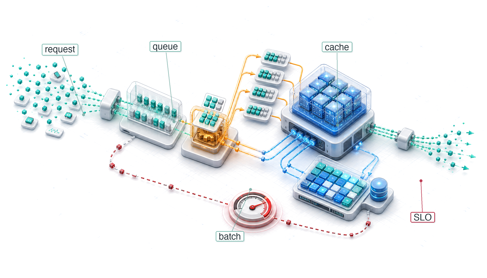

# Model Serving {#sec-model-serving}

::: {layout-narrow}
::: {.column-margin}

\chapterminitoc

:::

::: {.content-visible when-format="pdf"}
\noindent
{fig-alt="Isometric serving pipeline where variable requests become scheduled batches, occupy cache pages, run through inference workers, and return responses under latency pressure."}
:::

::: {.content-visible unless-format="pdf"}
{fig-alt="Isometric serving pipeline where variable requests become scheduled batches, occupy cache pages, run through inference workers, and return responses under latency pressure."}
:::

:::

## Purpose {.unnumbered .unlisted}

\begin{marginfigure}
\mlsysstack{35}{30}{25}{15}{90}{40}{20}{20}
\end{marginfigure}

_Why does serving change the optimization priorities that made training successful?_

Training and serving emphasize different operating objectives. Training usually maximizes throughput across large batches and long runs, while serving must answer individual requests within latency targets. Training amortizes hardware costs across many examples; serving pays a tax on each request, where small inefficiencies compound into operational debt. This shift is why models that train efficiently may still serve poorly. The live system has an end-to-end latency budget, so queuing, preprocessing, network transit, and postprocessing can erase an optimization confined to the model. Batch-heavy architectures and memory-intensive optimizations designed to saturate accelerators may not suit bursty, latency-critical, cost-sensitive production traffic. Serving, however, is more than a latency problem. A serving system must handle traffic that varies between peak and trough, reserve headroom for failures, shed load or degrade gracefully under overload, and remain predictable as request mix and demand change over time. Models that proved their value during training and survived compression and benchmarking eventually arrive at the serving layer, the deployment and integration stage of the ML lifecycle. The question shifts from whether a model works to whether it works reliably at scale under production conditions. Serving infrastructure is where ML systems meet users, and sustaining that interaction requires different engineering from creating the model. It is also where the trained algorithm meets live data within the machine's latency budget, bringing all three D·A·M constraints together on each request.

::: {.content-visible when-format="pdf"}

\newpage

:::

::: {.callout-learning-objectives}

- Explain serving inversion from training throughput to per-request latency, headroom, and tail behavior
- Decompose request latency across serialization, preprocessing, inference, queuing, postprocessing, and network overhead
- Apply queueing laws and simple queue models to plan capacity against percentile latency targets
- Diagnose training-serving skew and cold starts from mismatched preprocessing, model loading, or cache behavior
- Select batching, load shedding, autoscaling, and runtime strategies for traffic patterns and latency budgets
- Evaluate LLM serving bottlenecks using token latency, KV-cache memory, and continuous batching constraints
- Calculate cost per inference from precision, hardware utilization, replica count, and runtime throughput
```{=latex}
\vspace*{-1ex}
```
:::

## Serving Paradigm {#sec-model-serving-serving-paradigm-9634}

Model **serving**\index{Serving!production deployment}\index{Model serving!paradigm shift} begins where benchmarking stops. A model evaluated under synthetic test harness conditions must now generate predictions under live production traffic. In offline training, systems maximize aggregate throughput by packing large batches to amortize weight transfers from high-bandwidth memory (HBM) and saturate matrix arithmetic units. In online serving, requests arrive stochastically from independent clients and must return within strict service-level objectives (SLOs). The primary engineering priority therefore inverts from long-run throughput to per-request latency. This **serving inversion**\index{Serving inversion!throughput-to-latency shift} restructures the balance of terms in the iron law of ML systems ($T = \frac{D_{\text{vol}}}{\text{BW}} + \frac{O}{R_{\text{peak}} \cdot \eta_{\text{hw}}} + L_{\text{lat}}$). When an application cannot delay requests to assemble large batches, it must process small batches or individual inputs ($B=1$). Small batch execution collapses arithmetic intensity, converting compute-bound matrix multiplications into memory-bandwidth-bound transfers ($D_{\text{vol}}/\text{BW}$). Simultaneously, the latency term $L_{\text{lat}}$\index{Latency!serving constraint} expands beyond microsecond accelerator kernel launches to include network transit, request serialization, and host orchestration, often becoming the binding constraint on end-to-end response time.

The D·A·M taxonomy clarifies how this inversion reshapes each layer of the system. In the data layer, the constraint shifts from total dataset volume to the arrival rate, payload freshness, and variable sequence dimensions of live queries. In the algorithm layer, execution becomes strictly forward-only: backpropagation state and optimizer memory vanish from the accelerator, but dynamic input shapes introduce runtime execution variability into previously static operator graphs. In the machine layer, the operating target shifts from maximum hardware utilization to **headroom**\index{Headroom!tail latency}. While offline training treats an idle accelerator as wasted capital, online serving treats near-saturation as an operational hazard. Because request arrivals follow stochastic distributions, queue lengths and waiting times diverge nonlinearly as utilization approaches 100 percent. Maintaining adequate headroom preserves the spare capacity needed to absorb transient traffic spikes without violating tail-latency percentiles. Serving therefore optimizes completed requests under a strict latency deadline rather than steady-state hardware occupancy.

Meeting that latency deadline governs how engineering teams partition the end-to-end serving stack. A request's latency budget encompasses three sequential stages: host-side ingress and preprocessing (network termination, payload deserialization, and tokenization or feature transformation), accelerator kernel execution, and downstream postprocessing. Any millisecond consumed by unoptimized feature retrieval or queueing delays directly subtracts from the execution time allocated to the neural network itself. Consequently, the central engineering task in model serving is deciding which operations must remain on the synchronous request path, which tasks can be offloaded to asynchronous background pipelines, and how much headroom the system must reserve before tail-latency guarantees collapse under load.
## Serving Load, Latency, and Architecture {#sec-model-serving-load-latency-architecture-a4d8}

```{python}
#| echo: false
from mlsysim import *
from mlsysim.core.units import *

# ┌─────────────────────────────────────────────────────────────────────────────
# │ BLACK FRIDAY TRAFFIC SPIKE
# ├─────────────────────────────────────────────────────────────────────────────
# │ Context: Callout "The 'Black Friday' Traffic Spike"
# │
# │ Goal: Demonstrate the nonlinear failure mode of serving systems under load.
# │ Show: That a 10× traffic spike causes system collapse, not just 10× latency.
# │ How: Model queue explosion using Little's Law parameters.
# │
# └─────────────────────────────────────────────────────────────────────────────

from mlsysim.fmt import fmt, fmt_rate

class BlackFridayCalc:
    """Models the nonlinear failure mode of serving systems under a 10× traffic spike."""

    # ┌── 1. LOAD (Constants) ──────────────────────────────────────────────
    bf_latency_ms_value = 50 * ms  # scenario assumption: normal operation latency
    bf_qps_normal_value = 1000  # normal queries per second
    bf_qps_spike_value = 10000  # Black Friday peak QPS
    bf_spike_factor_value = 10  # spike multiplier (10x)
    bf_collapse_latency_s_value = 10 * second  # scenario assumption: latency during collapse

    # ┌── 4. OUTPUT (Formatting) ─────────────────────────────────────────────
    bf_latency_ms_str = fmt_time(bf_latency_ms_value, 'millisecond', precision=0, commas=False)
    bf_qps_normal_str = fmt_rate(bf_qps_normal_value, "QPS")
    bf_qps_spike_str = fmt_rate(bf_qps_spike_value, "QPS")
    bf_spike_factor_mult_str = fmt_multiple(bf_spike_factor_value, precision=0, commas=False)
    bf_collapse_latency_s_str = fmt_time(bf_collapse_latency_s_value, 'second', precision=0, commas=False)
    bf_full_util_pct_value = 100
    bf_full_util_pct_str = fmt_percent(bf_full_util_pct_value / 100, precision=0, commas=False, style='prose')
```

::: {#exmp-model-serving-black-friday-traffic-spike .callout-example title="The 'Black Friday' traffic spike"}

**Scenario**: An e-commerce recommendation serving system experiences a `{python} BlackFridayCalc.bf_spike_factor_mult_str` traffic surge (`{python} BlackFridayCalc.bf_qps_spike_str`) during Black Friday sales events.

**Diagnosis**: When server utilization approaches `{python} BlackFridayCalc.bf_full_util_pct_str`, queue lengths explode nonlinearly, increasing latency to `{python} BlackFridayCalc.bf_collapse_latency_s_str` and causing client request timeouts.

**Systems lesson**: High average throughput does not prevent queueing collapse under traffic surges. Depending on the service, preserving a tail-latency objective may require load shedding, graceful degradation, or autoscaling before utilization reaches the workload's queueing knee.

:::

Online serving systems process variable, unbatched request streams while operating under strict latency deadlines. When arrival bursts exhaust a system's reserved headroom, performance degrades nonlinearly.

@Fig-tail-latency-explosion shows that latency remains manageable at moderate utilization and then rises rapidly as the system approaches saturation; this is why latency-sensitive systems reserve headroom rather than planning for a permanently saturated accelerator\index{Tail latency!utilization threshold}. @Sec-appdx-data-foundations-distributions-long-tail-901f gives a mathematical treatment of long-tailed distributions and explains why high-percentile latency matters when an SLO covers the slowest requests. The curve is a simple queueing approximation intended for intuition rather than a specific workload.

::: {#fig-tail-latency-explosion fig-env="figure" fig-pos="htb" fig-cap="**The Tail Latency Explosion**: Request latency vs. serving utilization $\rho_{\text{serv}}$. Mean latency (blue) and the p99 approximation (red) both grow nonlinearly as utilization approaches saturation; the 70 percent marker is an illustrative planning knee rather than a model-derived breakpoint. This uses the simple M/M/1 approximation introduced later in @sec-model-serving-queuing-theory-tail-latency-29a6 (p99 ≈ 4.6$\times$ mean), so the curve is illustrative rather than workload-specific." fig-alt="Line plot of normalized request latency against serving utilization. A dashed blue mean-latency curve and a solid red p99 curve rise nonlinearly toward saturation, with the red curve remaining 4.6 times the blue curve. Green shading marks 0–50 percent as the Safe Zone, red shading marks 70–100 percent as the Danger Zone, and an arrow labels 70 percent ‘The Knee.’"}

```{python}
#| echo: false
# ┌─────────────────────────────────────────────────────────────────────────────
# │ TAIL LATENCY EXPLOSION FIGURE
# ├─────────────────────────────────────────────────────────────────────────────
# │ Context: @fig-tail-latency-explosion—illustrates why tail latency diverges
# │          from mean latency as system utilization approaches 100%
# │
# │ Goal: Visually demonstrate the nonlinear explosion of p99 latency near
# │       saturation using an M/M/1 queueing model approximation.
# │ Show: Mean vs. p99 latency curves, with Safe Zone and Danger Zone annotations.
# │ How: Compute mean = 1/(1-rho_serv) and p99 approx 4.6x mean; plot on shared axes.
# │
# └─────────────────────────────────────────────────────────────────────────────

# ┌── 1. CANVAS ────────────────────────────────────────────────────────────────
# │ Visually demonstrate the nonlinear explosion of p99 latency near
import numpy as np
from binder.tools.figures import style as book_style

fig, ax, COLORS, plt = book_style.setup_plot(figsize=(10, 4.3))
# =============================================================================
# PLOT: The Tail Latency Explosion
# =============================================================================

# ┌── 2. ARRAYS ────────────────────────────────────────────────────────────────
utilization = np.linspace(0, 0.95, 100)
mean_latency = 1 / (1 - utilization)
p99_latency = mean_latency * 4.6

# ┌── 3. RENDER ────────────────────────────────────────────────────────────────
ax.plot(utilization, mean_latency, '--', color=COLORS['BlueLine'], label='Mean Latency', linewidth=2)
ax.plot(utilization, p99_latency, '-', color=COLORS['RedLine'], label='Tail Latency (p99)', linewidth=2.5)

# ┌── 4. DECORATE ──────────────────────────────────────────────────────────────
ax.set_xlabel('System Utilization (%)')
ax.set_ylabel('Request Latency (normalized to service time)')
ax.set_xlim(0, 1.0)
ax.set_ylim(0, 50)

ax.axvspan(0, 0.5, color=COLORS['GreenL'], alpha=0.2)
ax.text(
    0.25,
    39,
    "Safe Zone",
    color=COLORS['GreenLine'],
    fontsize=8,
    fontweight='bold',
    va='center',
    ha='center',
    bbox=dict(facecolor='white', alpha=0.8, edgecolor='none', pad=0.5),
)
ax.axvspan(0.7, 1.0, color=COLORS['RedL'], alpha=0.3)
ax.text(
    0.78,
    39,
    "Danger Zone\n(Queue\nExplosion)",
    color=COLORS['RedLine'],
    fontweight='bold',
    va='center',
    ha='center',
    fontsize=8,
    linespacing=1.4,
    bbox=dict(facecolor='white', alpha=0.8, edgecolor='none', pad=0.5),
)

ax.annotate(
    "The Knee",
    xy=(0.7, 15),
    xytext=(0.59, 20),
    arrowprops=dict(facecolor=COLORS['primary'], arrowstyle='->', lw=1.0),
    fontsize=9,
    bbox=dict(facecolor='white', alpha=0.8, edgecolor='none', pad=0.5),
)

ax.set_xticks([0, 0.2, 0.4, 0.6, 0.8, 1.0])
ax.set_xticklabels(['0%', '20%', '40%', '60%', '80%', '100%'])
ax.legend(loc='upper left', fontsize=8, frameon=True, facecolor='white', framealpha=0.95, edgecolor='gray', fancybox=True, borderpad=0.6)
plt.show()
plt.close()
```

:::

Beyond the technical limits of latency, serving economics have also changed rapidly. As models become more efficient and hardware becomes more specialized, the cost per inference has fallen.[^fn-jevons-paradox-efficiency] Facebook's experience at fleet scale illustrates the magnitude of this serving cost problem.

[^fn-jevons-paradox-efficiency]: **Jevons paradox**\index{Jevons paradox!inference demand}: William Stanley Jevons observed in 1865 that efficiency improvements in coal-powered steam engines increased total coal consumption by making steam power economically viable for applications previously too costly [@jevons1865coal]; the same dynamic can apply to AI inference: each 10$\times$ cost reduction opens application classes that were economically infeasible at the previous price point, expanding aggregate demand by more than the efficiency gain. This is why cheaper inference can increase, not decrease, total GPU fleet demand. Efficiency and demand are often complements in AI, not substitutes.

::: {#exmp-model-serving-facebook-inference-tax .callout-example title="The inference tax at Facebook"}

**Scenario**: Production ML serving systems at Meta execute tens of trillions of inferences daily across global user-facing services [@hazelwood2018].

**Diagnosis**: Recurring inference serving compute and energy costs dwarf initial offline model training expenses. Live request arrival patterns and strict latency bounds constrain GPU batching.

**Systems lesson**: Model architectures cheap to train can prove unviable to serve at fleet scale. Production serving infrastructure requires hardware-software co-design to balance tail latency, batch size, and recurring operational total cost of ownership.

:::

The same serving-economics pressure appears in public API prices. The log-scale price trajectory in @fig-intelligence-deflation captures the speed of this cost collapse by tracking representative public API list-price snapshots as a market proxy. Vendor prices change frequently, so these points should be read as historical provenance for the trend rather than as current purchasing guidance [@openai2023chatgptwhisper; @openai2023gpt4web; @openaiCommunity2024gpt4oApi; @openai2024gpt4oMini; @anthropic2024claude3family; @google2024gemini15flashPricing; @deepseek2024v3]. Each order-of-magnitude drop changes which applications are feasible.

::: {#fig-intelligence-deflation fig-env="figure" fig-pos="htb" fig-cap="**Intelligence Deflation**: Representative public API input-token list prices per 1M tokens (\$) over time (Log Scale). Eight model-version points are snapshots collected from the public pricing pages of OpenAI, Anthropic, Google, and DeepSeek between 2023 and 2025; the Legacy GPT-3.5 point is an illustrative baseline rather than a documented model-version snapshot. The series is intended as a market trend indicator, not a controlled or current-price comparison. API token-processing prices have collapsed by multiple orders of magnitude, transforming the economics of automated AI workflows." fig-alt="Log-scale scatter plot of eight source-backed public API input-token price snapshots and one illustrative legacy baseline from 2023 to 2025, ranging from 30 dollars to 0.075 dollars per million tokens. Blue points are labeled by model, and a red dashed trend line slopes downward across the plot."}

```{python}
#| echo: false
# ┌─────────────────────────────────────────────────────────────────────────────
# │ INTELLIGENCE DEFLATION FIGURE
# ├─────────────────────────────────────────────────────────────────────────────
# │ Context: @fig-intelligence-deflation—log-scale scatter plot of representative
# │          public API input-token prices from 2023 to 2025, annotated with model names
# │
# │ Goal: Visualize the decline in inference token prices that is transforming AI
# │       serving economics.
# │ Show: Named input/prompt-token price points on a log scale with deflation trend line.
# │ How: Fit a log-linear trend through representative price points; scatter
# │      remaining models; annotate each with model name.
# │
# └─────────────────────────────────────────────────────────────────────────────

# ┌── 1. CANVAS ────────────────────────────────────────────────────────────────
# │ Visualize the decline in inference token prices.
import numpy as np
from binder.tools.figures import style as book_style

fig, ax, COLORS, plt = book_style.setup_plot(figsize=(10, 4.4))
# =============================================================================
# DATA: Representative input-token pricing snapshots over time
# =============================================================================

# ┌── 2. ARRAYS ────────────────────────────────────────────────────────────────
data = [
    (2023.0, 20.0, "Legacy GPT-3.5"),
    (2023.1, 2.0, "GPT-3.5 Turbo"),
    (2023.2, 30.0, "GPT-4 (Original)"),
    (2024.2, 15.0, "Claude 3 Opus"),
    (2024.2, 0.25, "Claude 3 Haiku"),
    (2024.3, 5.0, "GPT-4o"),
    (2024.62, 0.075, "Gemini 1.5 Flash"),
    (2024.55, 0.15, "GPT-4o-mini"),
    (2025.1, 0.27, "DeepSeek-V3"),
]
data.sort(key=lambda x: x[0])

years = np.array([d[0] for d in data])
prices = np.array([d[1] for d in data])
labels = [d[2] for d in data]

# =============================================================================
# PLOT: Intelligence Deflation
# =============================================================================
trend_years = np.array([2023.0, 2023.1, 2024.2, 2024.4, 2025.1])
trend_prices = np.array([20.0, 2.0, 0.25, 0.075, 0.27])
slope, intercept = np.polyfit(trend_years, np.log10(trend_prices), 1)
line_years = np.linspace(2023.0, 2025.5, 100)
line_prices = 10 ** (slope * line_years + intercept)

# -----------------------------------------------------------------------------
# RENDER
# -----------------------------------------------------------------------------
ax.plot(line_years, line_prices, linestyle='--', linewidth=1.5, color=COLORS['RedLine'])
ax.scatter(years, prices, s=45, color=COLORS['BlueLine'], edgecolors='white', zorder=3)

# -----------------------------------------------------------------------------
# Default label style
# -----------------------------------------------------------------------------
default_label_style = {
    "xytext": (6, 6),
    "textcoords": "offset points",
    "ha": "left",
    "va": "bottom",
    "fontsize": 8,
    "color": COLORS["primary"],
    "bbox": dict(boxstyle="round,pad=0.2", facecolor="white", edgecolor="none", alpha=0.8),
}

# -----------------------------------------------------------------------------
# Individual overrides by label
# -----------------------------------------------------------------------------
label_styles = {
    "Legacy GPT-3.5": {
        "xytext": (-10, -11),
        "ha": "center",
        "va": "center",
    },
    "GPT-3.5 Turbo": {
        "xytext": (0, 10),
        "ha": "center",
        "va": "center",
    },
    "GPT-4 (Original)": {
        "xytext": (0, 10),
        "ha": "center",
        "va": "center",
    },
    "Claude 3 Opus": {
        "xytext": (0, 10),
        "ha": "center",
        "va": "center",
    },
    "Claude 3 Haiku": {
        "xytext": (-10, -10),
        "ha": "center",
        "va": "center",
    },
    "GPT-4o": {
        "xytext": (0, -10),
        "ha": "center",
        "va": "center",
    },
    "Gemini 1.5 Flash": {
        "xytext": (-20, -20),
        "ha": "center",
        "va": "center",
        "arrowprops": dict(arrowstyle="-", shrinkB=5, color=COLORS["primary"], lw=0.8),
    },
    "GPT-4o-mini": {
        "xytext": (20, -20),
        "ha": "center",
        "va": "center",
        "arrowprops": dict(arrowstyle="-", shrinkB=5, color=COLORS["primary"], lw=0.8),
    },
    "DeepSeek-V3": {
        "xytext": (0, 10),
        "ha": "center",
        "va": "center",
    },
}

# -----------------------------------------------------------------------------
# Draw labels
# -----------------------------------------------------------------------------
for x, y, label in zip(years, prices, labels):
    style = default_label_style.copy()
    style.update(label_styles.get(label, {}))
    ax.annotate(label, (x, y), **style)
# ┌── 4. DECORATE ──────────────────────────────────────────────────────────────
ax.set_yscale('log')
ax.set_yticks([100, 10, 1, 0.1, 0.01])
ax.set_yticklabels(['$100', '$10', '$1', '$0.10', '$0.01'])
ax.set_xlabel('Year')
ax.set_ylabel('Price per 1M Tokens ($)')
ax.set_ylim(0.01, 500)
ax.set_xlim(2022.8, 2025.5)
ax.text(
    2023.5,
    0.05,
    "Prices Decline by\nOrders of Magnitude",
    color=COLORS['grid'],
    fontsize=9,
    ha='center',
    style='italic',
    bbox=dict(facecolor='white', alpha=0.8, edgecolor='none', pad=0.5),
)
plt.show()
plt.close()
```

:::

Two pressures now frame the serving problem: tail latency that explodes once utilization passes the queueing knee, and per-inference economics that fall by orders of magnitude as efficiency improves. Together they force a formal definition of serving built around latency rather than throughput.

::: {#dfn-model-serving-model-serving .callout-definition title="Model serving"}

***Model serving***\index{Model serving!definition} is the operational phase that provides model predictions to end-users or downstream systems under latency, throughput, availability, and cost constraints.

1.  **Significance**: Online serving turns training's throughput priority ($\eta_{\text{hw}}$) into a request-latency constraint $(L_{\text{lat}})$, requiring a stack designed around the percentile named by its SLO.
2.  **Distinction**: Unlike model training, which commonly processes scheduled batches, serving may handle stochastic online requests, synchronized streams, or offline batches.
3.  **Common pitfall**: A frequent misconception is that serving is "just the forward pass." In reality, it is a systems problem: model execution is only one component of a stack that may include request routing, load balancing, and data transformation.

:::

The SLO[^fn-slo-sla-serving] defines the latency target that shapes every architectural decision in the serving stack, establishing the strict time budget within which all request handling must complete. When an inference server receives a request, model execution represents only one segment of an end-to-end pipeline: network ingress, payload deserialization, feature transformation, queue scheduling, and output serialization all consume time before and after the accelerator runs. @Fig-serving-inference-pipeline shows that raw inputs pass through preprocessing (traditional computing), neural network inference (deep learning), and postprocessing (traditional computing) before producing final outputs. Any of these stages can become the latency bottleneck. @Sec-model-serving-latency-budget-ef40 quantifies exactly where time goes, revealing a counterintuitive result about which stages dominate.

[^fn-slo-sla-serving]: **Service level objective (SLO) vs. service level agreement (SLA)**\index{SLO!vs. SLA}: An SLO is an *internal* target (for example, "p99 latency under 50 ms"); an SLA is an *external* contractual commitment whose violation may carry remedies or penalties. Teams often set SLOs tighter than SLAs to preserve a safety margin. For ML serving, task quality and inference latency can both contribute to SLOs, creating multidimensional targets where improving one dimension (for example, deploying a larger model for accuracy) can violate another (latency).

::: {#fig-serving-inference-pipeline fig-env="figure" fig-pos="htb" fig-cap="**The Inference Pipeline**: ML serving systems transform raw inputs into final outputs through sequential stages: preprocessing, neural network computation, and postprocessing. The neural network represents just one component; preprocessing and postprocessing make end-to-end latency depend on more than neural-network execution." fig-alt="Left-to-right flow diagram of six connected boxes labeled Raw Data, Pre-processing, Neural Network, Raw Output, Post-processing, and Final Output. Outlined groups beneath the boxes identify Pre-processing, Deep Learning, and Post-processing."}

```{.tikz}
\begin{tikzpicture}[font=\small\sffamily, >=stealth]
\tikzset{
Box/.style={align=center, inner xsep=2pt,draw=GreenLine, line width=1pt,fill=none,
minimum width=24mm, minimum height=25mm,node distance=1.0},
LineA/.style={BrownLine!70,line width=4.0pt,{-{Triangle[width=1.5*6pt,length=2.0*5pt]}},shorten <=1pt,shorten >=1pt},
ALine/.style={black!50, line width=1.1pt,{{Triangle[width=0.9*6pt,length=1.2*6pt]}-}},
Larrow/.style={fill=violet!50, single arrow,  inner sep=2pt, single arrow head extend=3pt,
            single arrow head indent=0pt,minimum height=10mm, minimum width=3pt}
}
%inbox
\tikzset{%
 pics/inbox/.style = {
        code = {
        \pgfkeys{/channel/.cd, #1}
\begin{scope}[local bounding box=INBOX,scale=\scalefac, every node/.append style={transform shape}]
\node[line width=\Linewidth,draw=\drawcolor,fill=\filllcolor!50,
rectangle,rounded corners=3pt,minimum width=14mm,minimum height=10mm]at(0,0.3){};
\node[line width=\Linewidth,draw=\drawcolor,fill=\filllcolor,
rectangle,rounded corners=3pt,minimum width=15mm,minimum height=10mm]at(0,0.1){};
\node[line width=\Linewidth,draw=\drawcolor,fill=\filllcolor!50,
,rectangle,rounded corners=3pt,minimum width=17mm,minimum height=10mm]
at(0,-0.1){};
\draw[line width=\Linewidth,draw=\drawcolor,fill=\filllcirclecolor,,rounded corners=2pt](-0.92,0.05)--
(-0.92,-0.78)--(0.92,-0.78)--(0.92,0.05)--(0.40,0.05)--(0.32,-0.2)--(-0.29,-0.2)--(-0.40,0.05)--cycle;

\node[single arrow, line width=\Linewidth,draw=black,fill=cyan!90!black!30, rotate=270,
      minimum width = 15pt, single arrow head extend=6pt,
      minimum height=10mm]at(0,0.5) {}; % length of arrow
 \end{scope}
     }
  }
}
%brain
\tikzset{pics/brain/.style = {
        code = {
        \pgfkeys{/channel/.cd, #1}
\begin{scope}[local bounding box=BRAIN,scale=\scalefac, every node/.append style={transform shape}]
\fill[fill=\filllcolor!50](0.1,-0.5)to[out=0,in=180](0.33,-0.5)
to[out=0,in=270](0.45,-0.38)to(0.45,-0.18)
to[out=40,in=240](0.57,-0.13)to[out=110,in=310](0.52,-0.05)
to[out=130,in=290](0.44,0.15)to[out=90,in=340,distance=8](0.08,0.69)
to[out=160,in=80](-0.42,-0.15)to (-0.48,-0.7)to(0.07,-0.7)to(0.1,-0.5)
(-0.10,-0.42)to[out=310,in=180](0.1,-0.5);
\draw[draw=\drawcolor,line width=\Linewidth](0.1,-0.5)to[out=0,in=180](0.33,-0.5)
to[out=0,in=270](0.45,-0.38)to(0.45,-0.18)
to[out=40,in=240](0.57,-0.13)to[out=110,in=310](0.52,-0.05)
to[out=130,in=290](0.44,0.15)to[out=90,in=340,distance=8](0.08,0.69)
(-0.42,-0.15)to (-0.48,-0.7)
(0.07,-0.7)to(0.1,-0.5)
(-0.10,-0.42)to[out=310,in=180](0.1,-0.5);
\draw[fill=\filllcolor,line width=\Linewidth](-0.3,-0.10)to(0.08,0.60)
to[out=60,in=50,distance=3](-0.1,0.69)to[out=160,in=80](-0.26,0.59)to[out=170,in=90](-0.46,0.42)
to[out=170,in=110](-0.54,0.25)to[out=210,in=150](-0.54,0.04)
to[out=240,in=130](-0.52,-0.1)to[out=300,in=240]cycle;
\draw[fill=\filllcolor,line width=\Linewidth]
(-0.04,0.64)to[out=120,in=0](-0.1,0.69)(-0.19,0.52)to[out=120,in=330](-0.26,0.59)
(-0.4,0.33)to[out=150,in=280](-0.46,0.42)
%
(-0.44,-0.03)to[bend left=30](-0.34,-0.04)
(-0.33,0.08)to[bend left=40](-0.37,0.2) (-0.37,0.12)to[bend left=40](-0.45,0.14)
(-0.26,0.2)to[bend left=30](-0.24,0.13)
(-0.16,0.32)to[bend right=30](-0.27,0.3)to[bend right=30](-0.29,0.38)
(-0.13,0.49)to[bend left=30](-0.04,0.51);

\draw[rounded corners=0.8pt,\drawcircle,-{Circle[fill=\filllcirclecolor,length=2.5pt]}](-0.23,0.03)--(-0.15,-0.03)--(-0.19,-0.18)--(-0.04,-0.28);
\draw[rounded corners=0.8pt,\drawcircle,-{Circle[fill=\filllcirclecolor,length=2.5pt]}](-0.17,0.13)--(-0.04,0.05)--(-0.06,-0.06)--(0.14,-0.11);
\draw[rounded corners=0.8pt,\drawcircle,-{Circle[fill=\filllcirclecolor,length=2.5pt]}](-0.12,0.23)--(0.31,0.0);
\draw[rounded corners=0.8pt,\drawcircle,-{Circle[fill=\filllcirclecolor,length=2.5pt]}](-0.07,0.32)--(0.06,0.26)--(0.16,0.33)--(0.34,0.2);
\draw[rounded corners=0.8pt,\drawcircle,-{Circle[fill=\filllcirclecolor,length=2.5pt]}](-0.01,0.43)--(0.06,0.39)--(0.18,0.51)--(0.31,0.4);
\end{scope}
     }
  }
}
%llm
\tikzset{
pics/llm/.style = {
        code = {
        \pgfkeys{/channel/.cd, #1}
\begin{scope}[shift={($(0,0)+(0,0)$)},scale=\scalefac,every node/.append style={transform shape}]
\node[circle,minimum size=12mm,draw=\drawcolor, fill=\filllcolor!70,line width=0.5*\Linewidth](C\picname) at (0,0){};
\def\startangle{90}
\def\radius{1.15}
\def\radiusI{1.1}
\foreach \i [evaluate=\i as \j using \i+1] [count =\k] in {0,2,4,6,8} {
\pgfmathsetmacro{\angle}{\startangle - \i * (360/8)}
\draw[draw=black,-{Circle[black ,fill=\filllcirclecolor,length=5.5pt,line width=0.5*\Linewidth]},line width=1.5*\Linewidth](C\picname)--++(\startangle - \i*45:\radius) ;
\node[circle,draw=black,fill=\filllcirclecolor!80!red!50,inner sep=3pt,line width=0.5*\Linewidth](2C\k)at(\startangle - \j*45:\radiusI) {};
}
\draw[line width=1.5*\Linewidth](2C1)--++(-0.5,0)|-(2C2);
\draw[line width=1.5*\Linewidth](2C3)--++(0.5,0)|-(2C4);
\node[circle,,minimum size=12mm,draw=\drawcolor, fill=\filllcolor!70,line width=0.5*\Linewidth]at (0,0){};
\node[draw,rectangle,rounded corners=1pt,minimum width=7mm,minimum height=4mm,fill=orange!10](R1)at(0.1,0.1){};
\draw[BrownLine,shorten <=2pt,shorten >=2pt ]($(R1.north west)!0.35!(R1.south west)$)--($(R1.north east)!0.35!(R1.south east)$);
\draw[BrownLine,shorten <=2pt,shorten >=2pt ]($(R1.north west)!0.7!(R1.south west)$)--($(R1.north east)!0.7!(R1.south east)$);
\node[draw,rectangle,rounded corners=1pt,minimum width=6mm,minimum height=4mm,fill=orange!10](R2)at(-0.05,-0.15){};
\draw[BrownLine,shorten <=2pt,shorten >=2pt ]($(R2.north west)!0.35!(R2.south west)$)--($(R2.north east)!0.35!(R2.south east)$);
\draw[BrownLine,shorten <=2pt,shorten >=2pt ]($(R2.north west)!0.7!(R2.south west)$)--($(R2.north east)!0.7!(R2.south east)$);
\end{scope}
    }
  }
}
%funnel
\tikzset{%
 pics/funnel/.style = {
        code = {
        \pgfkeys{/channel/.cd, #1}
\begin{scope}[local bounding box=FUNNEL,scale=\scalefac, every node/.append style={transform shape}]
\draw[fill=\filllcolor,line width=\Linewidth,draw=\drawcolor](-0.12,-0.81)--(-0.19,-0.25)--(-0.7,0.41)--(0.7,0.41)--(0.19,-0.25)--(0.12,-0.81)--cycle;
\draw[fill=\filllcolor,line width=\Linewidth,draw=\drawcolor](-0.19,-0.25)--(0.08,-0.25);
\draw[fill=\filllcolor,line width=\Linewidth,draw=\drawcolor](0.16,-0.09)--(0.41,0.31);
%
\node[line width=\Linewidth,draw=\drawcolor,fill=\filllcolor,inner sep=1pt,
rectangle,rounded corners=2pt,minimum width=16mm,minimum height=5pt]at(0,0.5){};
%
\foreach \i in{-0.5,0,0.5}{
\node[single arrow, line width=0.8*\Linewidth,draw=black,fill=\filllcirclecolor, rotate=270,inner sep=1pt,
      minimum width =9pt, single arrow head extend=2pt,
      minimum height=5mm]at(\i,0.9) {}; % length of arrow
   }
\node[single arrow,line width=0.8*\Linewidth,draw=black,fill=\filllcirclecolor, rotate=270,inner sep=1pt,
      minimum width =11pt, single arrow head extend=2pt,
      minimum height=5mm]at(0,-1.1) {}; % length of arrow
 \end{scope}
     }
  }
}
\def\inset{2.0pt} %
\def\myshape{%
  (0,1.34) to[out=220,in=0] (-1.20,1.03) --
  (-1.20,-0.23) to[out=280,in=160] (0,-1.53) to[out=20,in=260] (1.20,-0.23) --
  (1.20,1.03)  to[out=180,in=320] cycle
}
\tikzset{
pics/stitC/.style = {
        code = {
        \pgfkeys{/channel/.cd, #1}
\begin{scope}[shift={($(0,0)+(0,0)$)},scale=\scalefac,every node/.append style={transform shape}]
\fill[fill=\filllcolor!60] \myshape;
%
\begin{scope}
  \clip \myshape;
  \draw[draw=\filllcolor!60, line width=3*\inset,fill=white] \myshape; % Color and thickness as desired
\end{scope}
\draw[red,line width=3pt](-0.7,-0.35)--++(320:0.5)--++(50:1.5);
\end{scope}
    }
  }
}
%gear-arrow
% #1 number of teeths
% #2 radius intern
% #3 radius extern
% #4 angle from start to end of the first arc
% #5 angle to decale the second arc from the first
% #6 inner radius to cut off
\tikzset{
  pics/gearAR/.style args={#1/#2/#3/#4/#5/#6/#7}{
   code={
           \pgfkeys{/channel/.cd, #7}
\begin{scope}[shift={($(0,0)+(0,0)$)},scale=\scalefac,every node/.append style={transform shape},
LinE/.style={\filllcirclecolor,line width=5.0pt,
{{Triangle[width=1.5*10pt,length=2.0*5pt]}-},shorten <=5pt,shorten >=1pt},
ELin/.style={\filllcirclecolor,line width=7.0pt,
{-{Triangle[width=1.15*10pt,length=2.0*5pt]}},shorten <=0pt,shorten >=0pt}]
    \pgfmathtruncatemacro{\N}{#1}%,
    \def\rin{#2}\def\rout{#3}\def\aA{#4}\def\aOff{#5}\def\rcut{#6}%
    \path[rounded corners=0.5pt,draw=\drawcolor,fill=\filllcolor]
      (0:\rin)
      \foreach \i [evaluate=\i as \n using (\i-1)*360/\N] in {1,...,\N}{%
        arc (\n:\n+\aA:\rin)
        -- (\n+\aA+\aOff:\rout)
        arc (\n+\aA+\aOff:\n+360/\N-\aOff:\rout)
        -- (\n+360/\N:\rin)
      } -- cycle;
      \draw[draw=none,fill=white](0,0) circle[radius=\rcut];
\draw[ELin](0,0)--++(0:2.5);
\end{scope}
  }}
}
%testing+pencil
\tikzset{
pics/testing/.style = {
        code = {
        \pgfkeys{/channel/.cd, #1}
\begin{scope}[local bounding box=TESTING1,shift={($(0,0)+(0,0)$)},scale=\scalefac,every node/.append style={transform shape}]
\newcommand{\tikzxmark}{%
\tikz[scale=0.18] {
    \draw[line width=0.7,line cap=round,RedLine] (0,0) to [bend left=6] (1,1);
    \draw[line width=0.7,line cap=round,RedLine] (0.2,0.95) to [bend right=3] (0.8,0.05);
}}
\newcommand{\tikzxcheck}{%
\tikz[scale=0.16] {
    \draw[line width=0.7,line cap=round,GreenLine] (0.5,0.75)--(0.85,-0.1) to [bend left=16] (1.5,1.55);

}}
 \node[draw, minimum width  =15mm, minimum height = 20mm, inner sep = 0pt,
        rounded corners,draw = \drawcolor, fill=\filllcolor!10, line width=\Linewidth](COM){};
\node[draw=GreenLine,inner sep=4pt,fill=white](CB1) at ($(COM.north west)!0.25!(COM.south west)+(0.3,0)$){};
\node[xshift=0pt]at(CB1){\tikzxcheck};
\node[draw=RedLine,inner sep=4pt,fill=white](CB2) at ($(COM.north west)!0.5!(COM.south west)+(0.3,0)$){};
\node[xshift=0pt]at(CB2){\tikzxmark};
\node[draw=RedLine,inner sep=4pt,fill=white](CB3) at ($(COM.north west)!0.75!(COM.south west)+(0.3,0)$){};
\node[xshift=0pt]at(CB3){\tikzxmark};
\draw[GreenLine,decoration={zigzag,segment length=4pt, amplitude=0.5pt},decorate]($(CB1)+(0.3,0.05)$)--++(0:0.8);
\draw[GreenLine,decoration={zigzag,segment length=4pt, amplitude=0.5pt},decorate]($(CB1)+(0.3,-0.12)$)--++(0:0.7);
\draw[RedLine,decoration={zigzag,segment length=4pt, amplitude=0.5pt},decorate]($(CB2)+(0.3,0.05)$)--++(0:0.8);
\draw[RedLine,decoration={zigzag,segment length=4pt, amplitude=0.5pt},decorate]($(CB2)+(0.3,-0.12)$)--++(0:0.6);
\draw[RedLine,decoration={zigzag,segment length=4pt, amplitude=0.5pt},decorate]($(CB3)+(0.3,0.05)$)--++(0:0.8);
\draw[RedLine,decoration={zigzag,segment length=4pt, amplitude=0.5pt},decorate]($(CB3)+(0.3,-0.12)$)--++(0:0.6);
\end{scope}
    }
  }
}
%pencil
\tikzset{
pics/pencil/.style = {
        code = {
        \pgfkeys{/channel/.cd, #1}
\begin{scope}[local bounding box=TESTING1,shift={($(0,0)+(0,0)$)},scale=\scalefac,every node/.append style={transform shape},rotate=340]
            \fill[fill=\filllcolor!70] (0,4) -- (0.4,4) -- (0.4,0) --(0.3,-0.15) -- (0.2,0) -- (0.1,-0.14) -- (0,0) -- cycle;
            \draw[color=white,thick] (0.2,4) -- (0.2,0);
            \fill[black] (0,3.5) -- (0.2,3.47) -- (0.4,3.5) -- (0.4,4) arc(30:150:0.23cm);
            \fill[fill=\filllcolor!40] (0,0) -- (0.2,-0.8)node[coordinate,pos=0.75](a){} -- (0.4,0)node[coordinate,pos=0.25](b){} -- (0.3,-0.15) -- (0.2,0) -- (0.1,-0.14) -- cycle;
            \fill[fill=\filllcolor] (a) -- (0.2,-0.8) -- (b) -- cycle;

\end{scope}
    }
  }
}
\pgfkeys{
  /channel/.cd,
   Depth/.store in=\Depth,
  Height/.store in=\Height,
  Width/.store in=\Width,
  filllcirclecolor/.store in=\filllcirclecolor,
  filllcolor/.store in=\filllcolor,
  drawcolor/.store in=\drawcolor,
  drawcircle/.store in=\drawcircle,
  scalefac/.store in=\scalefac,
  Linewidth/.store in=\Linewidth,
  picname/.store in=\picname,
  filllcolor=BrownLine,
  filllcirclecolor=violet!20,
  drawcolor=black,
  drawcircle=violet,
  scalefac=1,
  Linewidth=0.5pt,
  Depth=1.3,
  Height=0.8,
  Width=1.1,
  picname=C
}
%Raw Data
\node[Box](B1){};
\fill[cyan!07](B1.north west) rectangle ($(B1.north east)!0.6!(B1.south east)$)coordinate(B1DE);
\fill[cyan!20](B1.south east) rectangle ($(B1.north west)!0.6!(B1.south west)$)coordinate(B1LE);
\node[Box,draw=BlueD](){};
\tikzset{Text2/.style={font=\sffamily\bfseries\small,align=center}}
\node[Text2]at($(B1.south west)!0.5!(B1DE)$){Raw Data};
\coordinate(Q1)at($(B1.north west)!0.5!(B1DE)$);
\pic[shift={(0,0)}] at  (Q1){inbox={scalefac=0.7,picname=1,Linewidth=1.0pt,
 filllcolor=BrownL,drawcolor=black,filllcirclecolor=orange!70!yellow!80}};
%Pre-processing
\node[Box, right=0.75 of B1](B2){};
\fill[cyan!07](B2.north west) rectangle ($(B2.north east)!0.6!(B2.south east)$)coordinate(B2DE);
\fill[cyan!20](B2.south east) rectangle ($(B2.north west)!0.6!(B2.south west)$)coordinate(B2LE);
\node[Box, right=0.75 of B1,draw=BlueD](B2){};
\node[Text2]at($(B2.south west)!0.5!(B2DE)$){Pre-\\processing};
\coordinate(Q2)at($(B2.north west)!0.5!(B2DE)$);
\pic[shift={(0,0)}] at  (Q2){funnel={scalefac=0.53,picname=1,Linewidth=0.5pt,
 filllcolor=green!70!orange!70,drawcolor=black,filllcirclecolor=red!70!blue!80}};
%Neural Network
\node[Box, right=of B2](B3){};
\fill[green!07](B3.north west) rectangle ($(B3.north east)!0.6!(B3.south east)$)coordinate(B3DE);
\fill[green!20](B3.south east) rectangle ($(B3.north west)!0.6!(B3.south west)$)coordinate(B3LE);
\node[Box, right=of B2,draw=GreenD](B3){};
\node[Text2]at($(B3.south west)!0.5!(B3DE)$){Neural\\ Network};
\coordinate(Q3)at($(B3.north west)!0.5!(B3DE)$);
%\pic[shift={(0,0)}] at  (Q3){brain={scalefac=0.9,picname=1,filllcolor=orange!30!, Linewidth=0.95pt}};
\pic[shift={(0,0)}] at  (Q3){llm={scalefac=0.6,drawcolor=BlueLine,filllcolor=BlueLine!50!, Linewidth=1pt,filllcirclecolor=red}};
%Raw output
\node[Box, right=of B3](B4){};
\fill[violet!07](B4.north west) rectangle ($(B4.north east)!0.6!(B4.south east)$)coordinate(B4DE);
\fill[violet!20](B4.south east) rectangle ($(B4.north west)!0.6!(B4.south west)$)coordinate(B4LE);
\node[Box, right=of B3,draw=VioletLine](B4){};
\node[Text2]at($(B4.south west)!0.5!(B4DE)$){Raw\\ Output};
\coordinate(Q4)at($(B4.north west)!0.5!(B4DE)$);
 \pic[shift={(0,0)}] at (Q4) {gearAR={14/1.4/1.8/8/4/0.7/scalefac=0.35,drawcolor=BlueLine,filllcolor=BlueLine,filllcirclecolor=red}};
%Post-processing
\node[Box, right=0.75 of B4](B5){};
\fill[violet!05](B5.north west) rectangle ($(B5.north east)!0.6!(B5.south east)$)coordinate(B5DE);
\fill[violet!15](B5.south east) rectangle ($(B5.north west)!0.6!(B5.south west)$)coordinate(B5LE);
\node[Box, right=0.75 of B4,draw=VioletLine](B5){};
\node[Text2]at($(B5.south west)!0.5!(B5DE)$){Post-\\processing};
\coordinate(Q5)at($(B5.north west)!0.5!(B5DE)$);
\pic[shift={(0,0)}] at  (Q5){testing={scalefac=0.65,picname=1,drawcolor=myblue,filllcolor=myblue, Linewidth=1.0pt}};
\pic[shift={(0,-0.5)},rotate=-15] at  (Q5){pencil={scalefac=0.30,picname=1,filllcolor=mygreen, Linewidth=1.0pt}};
%%%%%%
%Final output
\node[Box, right=0.75 of B5](B6){};
\fill[violet!05](B6.north west) rectangle ($(B6.north east)!0.6!(B6.south east)$)coordinate(B6DE);
\fill[violet!15](B6.south east) rectangle ($(B6.north west)!0.6!(B6.south west)$)coordinate(B6LE);
\node[Box, right=0.75 of B5,draw=VioletLine]{};
\node[Text2]at($(B6.south west)!0.5!(B6DE)$){Final Output};
\coordinate(Q6)at($(B6.north west)!0.5!(B6DE)$);
\pic[shift={(0,0.05)}] at  (Q6){stitC={scalefac=0.45,drawcolor=orange,filllcolor=green!55!black}};
%arrows
\foreach \i in{1,2,3,4,5}{
\pgfmathtruncatemacro{\X}{\i + 1} %
\draw[LineA](B\i)--(B\X);
}
\node[draw=myblue,line width=0.75pt,fit=(B1)(B2),inner ysep=3mm,inner xsep=4mm,xshift=1mm](F1){};
\node[draw=none,fit=(B3),inner ysep=3mm,inner xsep=4mm](F2){};
\node[draw=mypurple,line width=0.75pt,fit=(B4)(B6),inner ysep=3mm,inner xsep=4mm,xshift=-1mm](F3){};
\node[below =0pt of F1,text=myblue]{Pre-processing};
\node[below =0pt of F2,text=GreenD]{Deep Learning};
\node[below =0pt of F3,text=mypurple]{Post-processing};

\end{tikzpicture}
```

:::

This pipeline turns serving into an orchestration problem: because every stage draws from the same latency budget, optimizing accelerator kernel execution yields diminishing returns if data transformation or queueing delays dominate. Before optimizing any individual stage, the system must decide whether predictions are computed ahead of time or on demand.
### Static vs. dynamic inference {#sec-model-serving-static-vs-dynamic-inference-e864}

Deciding whether predictions are generated before or during a user request establishes the fundamental trade-off between offline hardware efficiency and online operational agility [@google2024staticdynamic]. That choice determines whether an accelerator operates in an unconstrained throughput regime or under the strict tail-latency deadlines of an interactive serving loop.

#### Static inference {#sec-model-serving-static-inference-35f4}

Static inference\index{Static inference!precomputed predictions} (also called offline or batch inference) precomputes predictions for anticipated inputs and stores them in a retrieval store. Moving model execution entirely out of the user request path alters the underlying hardware constraints: because batch jobs have no millisecond-level deadlines, accelerators can run at maximum batch sizes ($B \gg 1$). Large batches maximize arithmetic intensity by amortizing weight transfers from HBM across thousands of samples, keeping compute cores saturated. When a client issues a request—such as a user requesting nightly generated recommendation rankings—the serving system performs a low-latency key-value lookup rather than executing a forward pass on an accelerator. The primary operational constraint shifts from accelerator latency to storage capacity and data freshness: precomputing predictions across an entire input domain scales combinatorially ($O(|U| \times |I|)$ in recommendation systems), and stale predictions persist until the next batch refresh.

#### Dynamic inference {#sec-model-serving-dynamic-inference-d2d5}

Dynamic inference\index{Dynamic inference!real-time prediction} (also called online or real-time inference) evaluates inputs on demand as requests arrive. On-demand execution accommodates arbitrary, previously unseen inputs within the model schema and immediately reflects newly deployed model weights without requiring precomputation. However, executing the model directly within the user request path subjects inference to a strict end-to-end latency budget (a service level objective, or SLO). Because user requests arrive stochastically, the serving runtime cannot delay execution indefinitely to accumulate large batches. Serving requests individually or in small batches ($B=1$ to $B=4$) drops arithmetic intensity and leaves accelerators memory-bandwidth bound: memory buses must transfer full layer weights from memory to registers for only a fraction of the hardware's compute capacity, directly inflating the cost per query. This tension between interactive response time and hardware efficiency makes dynamic serving significantly more expensive per query than offline batching (example \ref{exmp-cost-latency}).

```{python}
#| echo: false
#| label: cost-latency-calc
# ┌─────────────────────────────────────────────────────────────────────────────
# │ COST OF LATENCY CALCULATION
# ├─────────────────────────────────────────────────────────────────────────────
# │ Context: Callout "The Cost of Latency" (Serving Paradigm section)
# │
# │ Goal: Quantify the economic trade-off between response time and hardware bill.
# │ Show: That reducing latency by 50% can increase costs by 4x.
# │ How: Calculate cost per million queries across different batch sizes.
# │
# └─────────────────────────────────────────────────────────────────────────────
from mlsysim import Infrastructure
from mlsysim.fmt import check, fmt, fmt_usd, fmt_time, fmt_rate

class CostLatencyCalc:
    """Quantifies the economic trade-off between latency and hardware cost per million queries."""

    # ┌── 1. LOAD (Constants) ──────────────────────────────────────────────
    gpu_cost_per_hour_value = Infrastructure.Pricing.Cloud.GpuTrainingPerHour.rate
    latency_a_ms_value = 5 * ms  # scenario assumption: Scenario A low latency
    throughput_a_rps_value = 200 * (count / second)  # scenario assumption: Scenario A throughput
    latency_b_ms_value = 10 * ms  # scenario assumption: Scenario B higher latency
    throughput_b_rps_value = 800 * (count / second)  # scenario assumption: Scenario B throughput

    # ┌── 2. EXECUTE (The Compute) ────────────────────────────────────────
    queries_per_hour_a_value = (throughput_a_rps_value * hour).to(count)
    cost_per_million_a_value = (gpu_cost_per_hour_value * hour) / (queries_per_hour_a_value / (MILLION * count))
    queries_per_hour_b_value = (throughput_b_rps_value * hour).to(count)
    cost_per_million_b_value = (gpu_cost_per_hour_value * hour) / (queries_per_hour_b_value / (MILLION * count))
    cost_increase_pct_value = (cost_per_million_a_value / cost_per_million_b_value - 1) * 100
    cost_ratio_value = cost_per_million_a_value / cost_per_million_b_value

    # ┌── 3. GUARD (Invariants) ──────────────────────────────────────────
    check(cost_ratio_value > 1, "Scenario A (low latency) must cost more per query than Scenario B.")

    # ┌── 4. OUTPUT (Formatting) ─────────────────────────────────────────────
    gpu_cost_per_hour_str = fmt_usd(gpu_cost_per_hour_value, precision=0, commas=False, per="hour")
    latency_a_ms_str = fmt_time(latency_a_ms_value, 'millisecond', precision=0, commas=False)
    throughput_a_rps_str = fmt_rate(throughput_a_rps_value, 'req/s', precision=0, commas=False)
    latency_b_ms_str = fmt_time(latency_b_ms_value, 'millisecond', precision=0, commas=False)
    throughput_b_rps_str = fmt_rate(throughput_b_rps_value, 'req/s', precision=0, commas=False)
    cost_a_str = fmt_usd(cost_per_million_a_value, precision=2, commas=False)
    cost_b_str = fmt_usd(cost_per_million_b_value, precision=2, commas=False)
    # low-latency Scenario A costs ≈300% more per query: a >100% change, opt in
    cost_increase_str = fmt_percent(cost_increase_pct_value / 100, precision=0, commas=False, style='prose', max_ratio=4)
    cost_ratio_mult_str = fmt_multiple(round(cost_ratio_value), precision=0, commas=False)
```

::: {#exmp-cost-latency .callout-example title="The cost of latency"}

Latency constraints directly dictate infrastructure costs. Consider a GPU server renting for `{python} CostLatencyCalc.gpu_cost_per_hour_str`.

Scenario A (low latency): Batch size 1.

*   Latency: `{python} CostLatencyCalc.latency_a_ms_str`.
*   Throughput: `{python} CostLatencyCalc.throughput_a_rps_str`.
*   Cost per million queries: `{python} CostLatencyCalc.cost_a_str`.

Scenario B (high throughput): Batch size 8.

*   Latency: `{python} CostLatencyCalc.latency_b_ms_str` (doubled due to batching overhead).
*   Throughput: `{python} CostLatencyCalc.throughput_b_rps_str` (quadrupled due to parallel efficiency).
*   Cost per million queries: `{python} CostLatencyCalc.cost_b_str`.

**Systems insight**: Reducing latency from `{python} CostLatencyCalc.latency_b_ms_str` to `{python} CostLatencyCalc.latency_a_ms_str` increases the hardware bill by `{python} CostLatencyCalc.cost_increase_str`. Engineers must quantify whether that speedup generates enough business value to justify the `{python} CostLatencyCalc.cost_ratio_mult_str` cost increase.

:::

```{python}
#| echo: false
#| label: static-batch-calc
# ┌─────────────────────────────────────────────────────────────────────────────
# │ STATIC VS DYNAMIC INFERENCE
# ├─────────────────────────────────────────────────────────────────────────────
# │ Context: Static vs Dynamic inference narrative (photo organization example)
# │
# │ Goal: Contrast the economics of static vs. dynamic inference.
# │ Show: That static precomputation is superior for predictable inputs.
# │ How: Compare total batch time to per-request latency for photo classification.
# │
# └─────────────────────────────────────────────────────────────────────────────
from mlsysim.fmt import fmt, fmt_count, fmt_time

class StaticBatchCalc:
    """Contrasts static vs. dynamic inference economics for photo classification."""

    # ┌── 1. LOAD (Constants) ──────────────────────────────────────────────
    n_photos_value = 10_000  # photos in user library
    inference_ms_value = 5 * ms  # scenario assumption: ResNet-50 inference time
    dynamic_latency_budget_ms_value = 100 * ms  # scenario assumption: real-time latency budget

    # ┌── 2. EXECUTE (The Compute) ────────────────────────────────────────
    batch_total_s_value = n_photos_value * inference_ms_value

    # ┌── 4. OUTPUT (Formatting) ─────────────────────────────────────────────
    n_photos_str = fmt_count(n_photos_value, label="photo")
    inference_ms_str = fmt_time(inference_ms_value, 'millisecond', precision=0, commas=False)
    batch_total_s_str = fmt_time(batch_total_s_value, 'second', precision=0, commas=False)
    dynamic_latency_budget_ms_str = fmt_time(dynamic_latency_budget_ms_value, 'millisecond', precision=0, commas=False)
```

Consider two deployment scenarios for a ResNet-50 image classifier. A static approach suits a photo organization app that preclassifies all images in a user's library overnight. With `{python} StaticBatchCalc.n_photos_str` and `{python} StaticBatchCalc.inference_ms_str` inference each, batch processing takes ~`{python} StaticBatchCalc.batch_total_s_str` total, and users experience instant classification when browsing. A dynamic approach suits a content moderation API that must classify user-uploaded images in real time, with each image requiring the full preprocessing→inference→postprocessing pipeline and a `{python} StaticBatchCalc.dynamic_latency_budget_ms_str` latency budget. A production image-classification system can combine the approaches: frequently requested images, such as popular products or known memes, are preclassified and cached, while novel uploads trigger dynamic inference.

The two modes therefore optimize for contrasting regimes. Static inference maximizes accelerator throughput and amortizes execution costs during offline batch runs, trading storage capacity for zero inference latency during the request. Dynamic inference minimizes tail latency under stochastic, concurrent load, accepting lower accelerator utilization and higher cost per query in exchange for handling arbitrary, live inputs. Production architectures often blend both paradigms into a tiered design: static precomputation caches common or high-probability queries, while a dynamic fallback evaluates novel or personalized requests.

Both static and dynamic cost models traditionally assume a fixed forward pass: a static computation graph executing once per request. Emerging reasoning models alter that economic calculus by deliberately spending variable computation per query to improve answer quality.

::: {#psp-model-serving-looking-ahead-rise-inference-time-compute-system-2 .callout-perspective title="Looking ahead: Spending more compute per query"}

Traditional serving optimizes for minimizing latency $(L_{\text{lat}} \to 0)$. Here, the optimization target expands to include answer quality. Some inference-time-compute systems\index{Reasoning model!inference-time compute}\index{Inference-time compute!reasoning models} deliberately spend more compute cycles to improve answer quality. Token generation is often memory-bandwidth bound at small batches, but larger batches or long contexts can shift the bottleneck toward compute or KV-cache traffic. These systems may generate far more tokens per request, including intermediate reasoning or search tokens, increasing the total compute and energy spent per query.

:::

Whether a system executes a single deterministic forward pass or an extended reasoning trajectory, deciding when predictions are computed resolves only the temporal dimension of serving. Equally binding is the spatial dimension—where the model physically executes—because physical placement dictates memory hierarchy limits, network boundaries, and the hardware budget available to the serving stack.
### The spectrum of serving architectures {#sec-model-serving-spectrum-serving-architectures-8966}

Although "serving" often implies a networked server processing API requests, the architectural pattern varies by deployment environment. @Sec-ml-systems-deployment-paradigm-framework-0d25 introduced the four deployment paradigms (Cloud, Edge, Mobile, and TinyML) and the physical constraints (the light barrier, the power wall, and the memory wall) that give rise to them. Architecturally, serving spans a continuum from **centralized networked microservices**\index{Microservice!cloud model serving} (which pool accelerators to optimize throughput and cost-per-query at the expense of network round-trip overhead and cold-start latency) to **application-embedded edge serving**\index{Edge serving!embedded function calls} (which run models inside client processes via direct function calls, eliminating network latency and preserving privacy at the expense of strict device memory and power constraints) and out to **bare-metal firmware execution**\index{TinyML!bare-metal serving} on microcontrollers. Those constraints do not disappear at serving time; serving adds latency SLOs and cost pressure on top of hardware limits that training could absorb through patience. The same model may require different serving strategies depending on where it executes.

#### Networked serving (cloud/data center) {#sec-model-serving-networked-serving-clouddatacenter-0328}

In networked serving\index{Serving!cloud/data center}\index{Microservice!model serving}, the model runs as a standalone service (microservice), matching the cloud deployment paradigm that @sec-ml-systems-cloud-ml-maximizing-computational-power-a338 characterized as trading latency for larger pooled compute. The primary interface is the network through protocols such as HTTP or gRPC, so network transfer and serialization join model execution as possible binding constraints. Data-center hardware such as NVIDIA GPUs (V100, A100, H100), Google Tensor Processing Units (TPUs), and AWS Inferentia supports high-throughput batching and concurrency, but cold start\index{Cold start!cloud serving} can still stretch from seconds to minutes because container startup, model loading, and warmup sit outside the steady-state inference path.

#### Application-embedded serving (mobile/edge) {#sec-model-serving-applicationembedded-serving-mobileedge-8bd1}

In application-embedded serving\index{Serving!mobile/edge}\index{Serving!edge inference, embedded serving}, the model runs within the user application process (for example, a smartphone app using CoreML or TensorFlow Lite), following the embedded paradigm that @sec-ml-systems-edge-ml-reducing-latency-privacy-risk-2625 and @sec-ml-systems-mobile-ml-personal-offline-intelligence-0983 analyzed for its latency, privacy, and offline advantages. There is no "server." The interface is a function call, so optimization focuses on energy and responsiveness (SingleStream) rather than shared-server throughput.

Embedded execution enables **zero-copy inference**\index{Inference!zero-copy, mobile optimization}: when data moves through a system, each copy consumes CPU cycles and memory bandwidth. In cloud serving, separate physical memory spaces force repeated transfers: a camera frame passes from a network socket buffer to user space, through a preprocessing buffer into page-locked host DRAM, and across PCIe into accelerator memory. A mobile pipeline can eliminate these intermediate copies when its camera, image signal processor (ISP), CPU, and NPU exchange shared buffer descriptors in unified system memory. In unified-memory system-on-chip (SoC) architectures—such as Apple A- and M-series processors or Qualcomm Snapdragon—all compute engines share a single physical DRAM pool. When software passes buffer handles rather than duplicating bytes, inference latency drops and memory bus power decreases, although format conversions may still require CPU or ISP intervention.

Typical hardware includes mobile NPUs (Apple Neural Engine, Qualcomm Hexagon) and embedded GPUs (NVIDIA Jetson). When the model is already resident and compiled, startup can be measured in milliseconds; first inference takes longer if it triggers cold-page faults or just-in-time compilation. Mobile power and thermal envelopes are strictly constrained by passive cooling (1–10 W); sustained high-throughput inference saturates the device chassis thermal capacitance, forcing the operating system's thermal governor to throttle clock frequencies and degrade inference latency.

#### Bare-metal serving (TinyML) {#sec-model-serving-baremetal-serving-tinyml-28cf}

In TinyML serving\index{Serving!TinyML}\index{TinyML!bare-metal serving}, the model is compiled directly into microcontroller firmware, reaching the extreme end of the deployment spectrum that @sec-ml-systems-tinyml-ubiquitous-sensing-scale-a67b introduced as ubiquitous sensing at microwatt power budgets. Many deployments lack a general-purpose operating system or dynamic memory allocator; serving executes as a tight bare-metal loop that samples sensors and invokes a static interpreter. Because static random-access memory (SRAM) is constrained to hundreds of kilobytes, optimization focuses on executing model weights in place from non-volatile flash memory while fitting dynamic activation buffers into a preallocated Tensor Arena\index{Tensor arena!TinyML memory}. Request batching is infeasible on single-stream sensor feeds. Typical hardware includes ARM Cortex-M series, ESP32, and specialized TinyML accelerators. Startup latency is measured in microseconds when weights remain in memory-mapped flash and execution buffers are preallocated statically, operating within a microwatt-to-milliwatt power envelope that sustains battery life across months or years.

The deployment tiers differ first in their operating envelopes. @Tbl-serving-spectrum compares the latency, batch, memory, power, update, failure, and monitoring constraints that follow from each environment.

```{=latex}
\begingroup
\renewcommand{\arraystretch}{1.3}
```

| **Characteristic**   | **Cloud/Data center** | **Mobile/Edge**      | **TinyML**                  |
|:---------------------|:----------------------|:---------------------|:----------------------------|
| **Latency Target**   | 10–100 ms             | 20–50 ms             | 1–100 ms                    |
| **Batch Size**       | 1–128 (dynamic)       | 1 (fixed)            | 1 (fixed)                   |
| **Memory**           | 16–80 GB VRAM         | 2–8 GB shared        | 256 KB–2 MB SRAM            |
| **Power**            | 300–700 W             | 1–10 W               | 1–100 mW                    |
| **Update Mechanism** | Container deploy      | App store update     | Firmware over-the-air (OTA) |
| **Failure Mode**     | Retry/failover        | Graceful degradation | Silent or reset             |
| **Monitoring**       | Full telemetry        | Limited analytics    | Heartbeat only              |

: **Serving Architecture Spectrum**: Representative deployment envelopes for cloud, mobile, and TinyML serving. The latency, batch-size, memory, and power ranges are design guides rather than universal limits; update, failure, and monitoring rows summarize the operating pattern associated with each environment. {#tbl-serving-spectrum}

```{=latex}
\endgroup
```

```{python}
#| echo: false
#| label: resnet-spectrum-calc
# ┌─────────────────────────────────────────────────────────────────────────────
# │ RESNET-50 ACROSS THE SERVING SPECTRUM
# ├─────────────────────────────────────────────────────────────────────────────
# │ Context: Callout "ResNet-50 Across the Serving Spectrum"
# │
# │ Goal: Contrast serving requirements across Cloud, Mobile, and TinyML.
# │ Show: That the same model requires different formats and architectures.
# │ How: Calculate model sizes and compare NPU vs. CPU efficiency.
# │
# └─────────────────────────────────────────────────────────────────────────────
from mlsysim import Models
from mlsysim import Systems
from mlsysim.fmt import MarkdownStr, check, fmt, fmt_time, fmt_qty, fmt_rate, fmt_memory, fmt_memory_capacity, fmt_energy

# ┌── LEGO ───────────────────────────────────────────────
class ResNetServingSpectrum:
    """
    Namespace for ResNet-50 Serving Spectrum comparison.
    Scenario: Mapping the same architecture (or alternatives) to Cloud, Mobile, TinyML.
    """

    # ┌── 1. LOAD (Constants) ───────────────────────────────────────────────
    m_resnet = Models.Vision.ResNet50
    m_mobilenet = Models.Vision.MobileNetV2

    s_cloud = Platforms.Cloud
    s_mobile = Platforms.Mobile
    s_tiny = Platforms.Tiny

    # Cloud (V100) Performance - Source: MLPerf/Vendor reports
    cloud_inf_b1_ms = 1.4
    cloud_inf_b16_ms = 14.0
    cloud_throughput = 1143
    cloud_vram = 2 * GB  # scenario assumption: batch-32 engine residency

    # Mobile (Smartphone) Performance
    mobile_inf_npu_ms = 12.0
    mobile_inf_cpu_ms = 45.0
    mobile_throughput = 80
    mobile_energy_npu = 0.8 * mJ  # scenario assumption: per-image mobile NPU energy
    mobile_energy_cpu = 4.2 * mJ  # scenario assumption: per-image mobile CPU energy

    # TinyML (Cortex-M7) Performance
    tiny_inf_ms = 120.0
    tiny_energy = 12.0 * mJ  # scenario assumption: per-image TinyML energy

    # ┌── 2. EXECUTE (The Compute) ─────────────────────────────────────────
    # Step 1: Calculate sizes using the Digital Twins
    cloud_size = m_resnet.size_in_bytes(BYTES_FP16)
    mobile_size = m_resnet.size_in_bytes(BYTES_INT8)
    tiny_original = m_resnet.size_in_bytes(BYTES_INT8)
    tiny_alt = m_mobilenet.size_in_bytes(BYTES_INT8)

    # Step 2: TinyML feasibility check
    tiny_feasibility = tiny_original < s_tiny.ram

    # ┌── 3. GUARD (Invariants) ───────────────────────────────────────────
    check(
        not tiny_feasibility,
        f"ResNet-50 ({fmt_memory(tiny_original, unit=MB, precision=1, commas=False)}) should NOT fit on TinyML (<{fmt_memory(s_tiny.ram, unit=MB, precision=1, commas=False)}).",
    )
    check(mobile_energy_cpu >= mobile_energy_npu * 3, "NPU should be significantly more energy efficient than CPU.")

    # ┌── 4. OUTPUT (Formatting) ──────────────────────────────────────────────
    # System names
    cloud_name_str = MarkdownStr(s_cloud.name)
    mobile_name_str = MarkdownStr(s_mobile.name)
    tiny_name_str = MarkdownStr(s_tiny.name)

    cloud_model_mb_str = fmt_memory(cloud_size, unit=MB, precision=1, commas=True)
    cloud_inf_b1_ms_str = fmt_time(cloud_inf_b1_ms, 'millisecond', precision=1, commas=False)
    cloud_inf_b16_ms_str = fmt_time(cloud_inf_b16_ms, 'millisecond', precision=0, commas=False)
    cloud_throughput_img_per_s_str = fmt_rate(cloud_throughput, 'img/s', precision=0)
    cloud_vram_gb_str = fmt_memory(cloud_vram, unit=GB, precision=0, commas=False)

    mobile_model_mb_str = fmt_memory(mobile_size, unit=MB, precision=1, commas=True)
    mobile_inf_npu_ms_str = fmt_time(mobile_inf_npu_ms, 'millisecond', precision=0, commas=False)
    mobile_inf_cpu_ms_str = fmt_time(mobile_inf_cpu_ms, 'millisecond', precision=0, commas=False)
    mobile_throughput_img_per_s_str = fmt_rate(mobile_throughput, 'img/s', precision=0, commas=False)
    mobile_energy_npu_mj_str = fmt_energy(mobile_energy_npu, unit=mJ, precision=1, commas=False)
    mobile_energy_cpu_mj_str = fmt_energy(mobile_energy_cpu, unit=mJ, precision=1, commas=False)
    mobile_mem_mb_str = fmt_memory(150 * MB, unit=MB, precision=0, commas=False)

    tiny_model_mb_str = fmt_memory(tiny_original, unit=MB, precision=1, commas=True)
    tiny_alt_mb_str = fmt_memory(tiny_alt, unit=MB, precision=1, commas=True)
    tiny_inf_ms_str = fmt_time(tiny_inf_ms, 'millisecond', precision=0, commas=False)
    tiny_throughput_str = fmt_rate(8, "img/s", precision=0, commas=False)
    tiny_arena_kb_str = fmt_memory(320 * KB, unit=KB, precision=0, commas=False)
    tiny_sram_kb_str = fmt_memory_capacity(s_tiny.ram, unit=s_tiny.ram.units, precision=0, commas=True)
    tiny_energy_mj_str = fmt_energy(tiny_energy, unit=mJ, precision=0, commas=False)
```

::: {#psp-resnet-serving .callout-perspective title="ResNet-50 across the serving spectrum"}

**Systems insight**: The "same model" claim is misleading: the cloud and mobile tiers share the ResNet-50 graph but use different precision and runtimes, while the TinyML tier cannot run ResNet-50 and substitutes an architecture designed for its constraints. Treating these as one model hides the work that makes each deployment possible.

:::

Applying those envelopes to one image-classification workload, @tbl-resnet-serving-spectrum shows why cloud and mobile can adapt ResNet-50 while TinyML must substitute MobileNetV2.

```{=latex}
\begingroup
\renewcommand{\arraystretch}{1.65}
```

| **Dimension**           |                                  **`{python} ResNetServingSpectrum.cloud_name_str`**                                   |                                       **`{python} ResNetServingSpectrum.mobile_name_str`**                                       |                                                  **`{python} ResNetServingSpectrum.tiny_name_str`**                                                 |
|:------------------------|:----------------------------------------------------------------------------------------------------------------------:|:--------------------------------------------------------------------------------------------------------------------------------:|:---------------------------------------------------------------------------------------------------------------------------------------------------:|
| **Model format**        |                   TensorRT FP16 engine \mbox{(`{python} ResNetServingSpectrum.cloud_model_mb_str`)}                    |                        TensorFlow Lite INT8 \mbox{(`{python} ResNetServingSpectrum.mobile_model_mb_str`)}                        | Not feasible (`{python} ResNetServingSpectrum.tiny_model_mb_str`); alternative: MobileNetV2 INT8 (`{python} ResNetServingSpectrum.tiny_alt_mb_str`) |
| **Inference (batch-1)** | `{python} ResNetServingSpectrum.cloud_inf_b1_ms_str` (batch-16: `{python} ResNetServingSpectrum.cloud_inf_b16_ms_str`) |    `{python} ResNetServingSpectrum.mobile_inf_npu_ms_str` (NPU), `{python} ResNetServingSpectrum.mobile_inf_cpu_ms_str` (CPU)    |                                                   `{python} ResNetServingSpectrum.tiny_inf_ms_str`                                                  |
| **Throughput**          |                       `{python} ResNetServingSpectrum.cloud_throughput_img_per_s_str` (batched)                        |                        ~`{python} ResNetServingSpectrum.mobile_throughput_img_per_s_str` (single-stream)                         |                                                ~`{python} ResNetServingSpectrum.tiny_throughput_str`                                                |
| **Memory**              |                           `{python} ResNetServingSpectrum.cloud_vram_gb_str` VRAM (batch-32)                           |                            `{python} ResNetServingSpectrum.mobile_mem_mb_str` peak (shared with app)                             |              `{python} ResNetServingSpectrum.tiny_arena_kb_str` arena (fits in `{python} ResNetServingSpectrum.tiny_sram_kb_str` SRAM)              |
| **Energy/inference**    |                                                           —                                                            | `{python} ResNetServingSpectrum.mobile_energy_npu_mj_str` (NPU), `{python} ResNetServingSpectrum.mobile_energy_cpu_mj_str` (CPU) |                                                 `{python} ResNetServingSpectrum.tiny_energy_mj_str`                                                 |

: **Image Classification Across the Serving Spectrum**: Illustrative side-by-side comparison of cloud, mobile, and TinyML serving for the same image-classification task, showing how model format, latency, throughput, memory footprint, and energy budget differ across deployment contexts. {#tbl-resnet-serving-spectrum tbl-colwidths="[20,26,27,27]"}

```{=latex}
\endgroup
```
### The load balancer layer {#sec-model-serving-load-balancer-layer-9c4d}

When traffic exceeds what a single machine can handle, cloud and data center deployments that run multiple replicas of the same model require an additional infrastructure layer: the load balancer. Production serving systems place load balancers\index{Load balancer!serving infrastructure} between clients and model servers, providing three essential functions for serving infrastructure.

A serving load balancer manages three core responsibilities. First, request distribution routes incoming traffic to available model replicas using algorithms such as round-robin or least-connections; routing away from slow or saturated replicas directly curbs tail latency. Second, health monitoring\index{Monitoring!health, replica readiness} verifies replica readiness by inspecting both process liveness and model initialization state, confirming that weights are loaded and warmup passes are complete before admitting traffic. Third, deployment support enables progressive rollouts by shifting traffic gradually between model versions rather than cutting over abruptly. @Sec-ml-operations-model-deployment-b9b9 expands these traffic-shifting mechanisms into full validation strategies.

For single-machine serving with multiple model instances, such as running several Open Neural Network Exchange (ONNX) Runtime sessions, the framework and operating system handle request queuing. The full complexity of load balancing becomes necessary when scaling to distributed inference systems, where multiple machines serve the same model. The implementation details of request distribution algorithms and multi-replica architectures belong to that distributed context.

In single-machine capacity planning, the serving unit corresponds to the physical node's model throughput. The queueing dynamics analyzed in @sec-model-serving-queuing-theory-tail-latency-29a6 govern this baseline behavior, establishing the utilization boundaries where horizontal scale-out becomes mandatory.

While load balancers distribute requests *across replicas*, achieving predictable latency also requires controlling what happens *within each machine*. The operating system environment introduces its own sources of variability.

### Deterministic latency and resource isolation {#sec-model-serving-deterministic-latency-resource-isolation-4d1c}

::: {.column-margin}
{width="100%" fig-alt="Schematic of one red source node on the left fanning out through four arrows to four identical blue consumer nodes on the right, showing one-to-many propagation from a single source."}

*One noisy neighbor perturbs every workload sharing the node.*
:::

An inference server does not execute in a dedicated vacuum. On a single host, the operating system multiplexes hardware across background telemetry daemons, logging agents, and kernel worker threads. When these unisolated processes contend for execution resources, they intermittently preempt the inference pipeline. These noisy neighbors are a primary source of **latency jitter**\index{Latency jitter!resource contention}, where the physical time required to execute identical forward passes fluctuates unpredictably. This contention inflates 99th percentile (p99) tail latency even when average hardware utilization remains low. Resource contention thus widens tail latency through service-time variance—a physical degradation distinct from the queue-delay accumulation analyzed in @fig-tail-latency-explosion.

Achieving deterministic performance\index{Latency!deterministic}\index{Resource isolation!serving} requires eliminating interference from the operating system's default time-sharing heuristics. Serving systems such as Clockwork demonstrate that deep neural network (DNN) inference execution times are intrinsically predictable down to sub-millisecond tolerances once hardware contention is systematically removed [@gujarati2020]. CPU affinity (thread pinning)\index{CPU affinity!latency reduction} establishes the baseline compute boundary by binding inference worker threads to designated physical cores. Without pinning, the OS scheduler periodically migrates threads between cores, invalidating private L1 and L2 caches and forcing execution to stall while lines are refetched from shared L3 cache or DRAM. On multi-socket architectures, thread migration across Non-Uniform Memory Access (NUMA) boundaries is even more penalizing: instructions must access memory across inter-socket interconnects, adding tens of nanoseconds of latency per transaction. Pinning threads to specific cores and binding their memory allocations to local NUMA nodes preserves cache residency and eliminates cross-socket bus traffic.

Even with pinned CPU cores, memory access latency remains vulnerable to the virtual memory subsystem. Under host memory pressure, the kernel can page inactive address ranges out to disk. When the CPU or a PCIe Direct Memory Access (DMA) engine touches a paged-out address, execution stalls for milliseconds while the storage controller faults the physical page back into DRAM. Memory locking (`mlock`)\index{Memory!locking, mlock} instructs the kernel to pin specified virtual address ranges into physical host RAM, disabling page eviction and guaranteeing immediate access for host-resident weights, input staging buffers, and offloaded key-value (KV) cache blocks. This guarantee trades physical host memory flexibility for determinism, as locked pages cannot be reclaimed by other processes. Because `mlock` operates strictly on host page tables, it does not apply to accelerator HBM, which is allocated directly by the accelerator driver.

Beyond scheduled processes, asynchronous hardware interrupts introduce another source of sub-millisecond preemption. When a network interface card (NIC) receives packet bursts, it triggers hardware interrupt requests (IRQs) that force the handling CPU core to immediately suspend user-space execution and process kernel interrupt handlers. If the OS routes these interrupts to cores running the inference engine's submission loop, the CPU pauses command dispatch to the accelerator. Because GPUs process short inference layers in microseconds, even brief CPU submission stalls drain the accelerator's hardware command ring buffer, causing pipeline bubbles where compute units sit idle waiting for the next kernel descriptor. Interrupt shielding\index{Interrupt shielding!latency isolation} restricts IRQ affinities to dedicated housekeeping cores, preventing incoming network traffic and disk activity from preempting the GPU dispatch stream.

Isolating physical cores, locking host memory, and shielding interrupt lines eliminate operating system noise, converting erratic execution paths into predictable, deterministic forward passes. Yet establishing service-time determinism on a single node addresses only half of the serving challenge. While hardware isolation guarantees that an accelerator kernel executes without host-side interference, running single requests sequentially leaves massive tensor compute pipelines severely underutilized. To achieve high throughput within latency deadlines, the internal software architecture of the serving engine must coordinate irregular, asynchronous request streams into structured, hardware-saturating batches.
## Serving System Architecture {#sec-model-serving-serving-system-architecture-4879}

While host isolation ensures deterministic execution of individual kernels, production serving confronts an impedance mismatch at the system boundary. User requests arrive stochastically—bursting milliseconds apart, followed by seconds of silence—whereas accelerator compute engines demand steady streams of uniform, dense batches to saturate memory bandwidth and functional units. Bridging this gap requires a specialized serving architecture that decouples network ingress from execution scheduling, absorbing arrival bursts and packing irregular inputs into dense batches without violating latency SLOs.

### Internal architecture and request flow {#sec-model-serving-anatomy-inference-server-f12e}

An inference server\index{Inference server!architecture}[^fn-inference-server-serving] (such as NVIDIA Triton or TensorFlow Serving) functions as a specialized runtime scheduler that manages concurrency, device memory, and data movement between host CPUs and accelerator devices. Rather than invoking model execution synchronously upon request arrival, the server pipelines incoming requests through dedicated subsystems that isolate client network handling from accelerator compute. Every request traverses a multi-stage pipeline designed to maximize hardware throughput while bounding queuing latency. @Fig-server-anatomy separates the six stages so each component's role in absorbing traffic, queueing, batching, and accelerator execution is explicit.

[^fn-inference-server-serving]: **Inference server**\index{Inference server!serving architecture}: Google's TensorFlow Serving\index{TensorFlow Serving!inference server} [@olston2017tensorflow] helped establish the separation of model logic from serving infrastructure; NVIDIA's Triton\index{Triton!inference server} [@nvidia_triton] extends this pattern across multiple model frameworks and backends. The critical design insight is that a scheduler and dynamic batcher turn irregular single-request traffic into accelerator-friendly execution, improving utilization when latency budgets allow batching. Exact utilization gains depend on model, hardware, arrival rate, and the configured batching window.

::: {#fig-server-anatomy fig-env="figure" fig-pos="htb" fig-cap="**Inference Server Anatomy**: A modern inference server decouples network handling from accelerator execution through a staged pipeline. Each stage isolates a concern, from absorbing bursty traffic to forming efficient batches, so the hardware accelerator stays highly utilized despite irregular arrival patterns." fig-alt="Flowchart showing a six-stage inference server pipeline: client to network ingress to request queue to dynamic batcher, then down to inference runner to accelerator. Arrows connect stages sequentially."}

```{.tikz}
\begin{tikzpicture}[font=\small\sffamily]
  \tikzset{
    Box/.style={draw=none,minimum width=20mm, minimum height=15mm, node distance=18mm},
    Arr/.style={-{Triangle[width=10pt,length=8pt]}, line width=5pt,cyan!40,shorten >=1pt, shorten <=2pt},
 Box2/.style={align=flush center, inner xsep=2pt,draw=OrangeLine,
  font=\fontsize{7pt}{9}\sffamily,
    line width=0.75pt, rounded corners,fill=OrangeL!30, text width=16mm,
    minimum width=16mm, minimum height=9mm},
LineA/.style = {violet!60,{Circle[line width=1.0pt,fill=white,length=5.5pt]}-,line width=1.5pt,shorten <=-3pt}
}
%laptop
\tikzset{
pics/laptop/.style = {
        code = {
        \pgfkeys{/channel/.cd, #1}
\begin{scope}[shift={($(0,0)+(0,0)$)},scale=\scalefac,every node/.append style={transform shape}]
\node[rounded corners=2pt,rectangle,minimum width=60,minimum height=37,
fill=\filllcolor!60,line width=\Linewidth,draw=black](EKV)at(0,0.53){};
%
\node[draw=black,rounded corners=2pt,rectangle,minimum width=53,minimum height=30,
fill=\filllcolor!10,line width=\Linewidth,](EK)at(0,0.53){};
\coordinate(SM1)at($(EK.south west)+(0.15,0.5)$);
\coordinate(SM2)at($(EK.south east)+(-1.1,0.5)$);
\coordinate(OK1)at($(EK.220)+(0,0.7)$);
\coordinate(OK2)at($(EK.240)+(0,0.7)$);
\node[fill=black,inner sep=0pt,ellipse,minimum width=2pt,minimum height=3pt](OKO1)at(OK1){};
\node[fill=black,inner sep=0pt,ellipse,minimum width=2pt,minimum height=3pt](OKO2)at(OK2){};
\draw[line width=1.4pt](SM1)to [bend right=45](SM2);
%%
\coordinate(4BL)at($(EK.south west)+(0.95,0.3)$);
    \def\n{5}          % broj boksova
    \def\w{0.12}        % širina boksa (mm)
    \def\h{0.5}       % visina boksa (mm)
    \def\gap{0.05}      % razmak između boksova (mm)
    % niz boksova
    \foreach \i in {0,...,4} {
      \pgfmathsetmacro{\x}{\i*(\w+\gap)}
      % popuna (klipujemo unutar ivica)
      \begin{scope}
        \clip[] ($(4BL)+(\x,0)$) rectangle ++(\w,\h);
        \fill[gray!10]($(4BL)+(\x,0)$) rectangle ++(\w,\h*1);
        \fill[fill=\filllcirclecolor]($(4BL)+(\x,0)$) rectangle ++(\w,\h*\Level);
      \end{scope}
      % kontura preko
      \draw[line width=0.6pt,draw=black]($(4BL)+(\x,0)$)  rectangle ++(\w,\h);
    }
%
\draw[fill=\filllcolor!60!black!30,line width=\Linewidth](-1.00,-0.1)--(1.0,-0.1)--(1.28,-0.6)--(-1.28,-0.6)--cycle;
\draw[fill=\filllcolor!60!black!30,line width=\Linewidth](1.28,-0.6)--(-1.28,-0.6)arc[start angle=180, end angle=270, radius=4pt]--(1.14,-0.73)
arc[start angle=270, end angle=355, radius=4pt]--cycle;
\draw[fill=\filllcolor!30!black!10,line width=\Linewidth](-0.95,-0.17)--(0.95,-0.17)--(1.03,-0.34)--(-1.03,-0.34)--cycle;
\draw[fill=\filllcolor!30!black!20,line width=\Linewidth](-0.16,-0.52)--(0.16,-0.52)--(0.14,-0.42)--(-0.14,-0.42)--cycle;
\end{scope}
    }
  }
}

\tikzset {
pics/gatewey/.style = {
        code = {
        \pgfkeys{/channel/.cd, #1}
\begin{scope}[local bounding box=GAT,scale=\scalefac, every node/.append style={transform shape}]
\def\rI{4mm}
\def\rII{2.8mm}
\def\rIII{1.6mm}
\draw[draw=\drawcolor,line width=0.8*\Linewidth](0,0)--(0,0.38)--(1.2,0.38)--(1.2,0)--cycle;
\draw[draw=\drawcolor,line width=\Linewidth](0.6,0.4)--(0.6,0.9);

 \draw[draw=\drawcolor, line width=\Linewidth] (0.6,0.9)+(60:\rI) arc[start angle=60, end angle=-60, radius=\rI];
\draw[draw=\drawcolor, line width=\Linewidth] (0.6,0.9)+(50:\rII) arc[start angle=50, end angle=-50, radius=\rII];
\draw[draw=\drawcolor, line width=\Linewidth] (0.6,0.9)+(30:\rIII) arc[start angle=30, end angle=-30, radius=\rIII];
%
 \draw[draw=\drawcolor, line width=\Linewidth] (0.6,0.9)+(120:\rI) arc[start angle=120, end angle=240, radius=\rI];
\draw[draw=\drawcolor, line width=\Linewidth] (0.6,0.9)+(130:\rII) arc[start angle=130, end angle=230, radius=\rII];
\draw[draw=\drawcolor, line width=\Linewidth] (0.6,0.9)+(150:\rIII) arc[start angle=150, end angle=210, radius=\rIII];
\fill[fill=\filllcolor](0.6,0.9)circle (1.5pt);

\foreach\i in{0.15,0.3,0.45,0.6}{
\fill[fill=\filllcolor](\i,0.19)circle (1.5pt);
}

\fill[fill=\filllcolor](1,0.19)circle (2pt);
\end{scope}
}
}
}
\tikzset {
pics/cpu/.style = {
        code = {
        \pgfkeys{/channel/.cd, #1}
\begin{scope}[local bounding box = CPU,scale=\scalefac, every node/.append style={transform shape}]
\node[fill=\filllcolor,minimum width=66, minimum height=66,
            rounded corners=2,outer sep=2pt] (C1) {};
\node[fill=\filllcirclecolor,minimum width=54, minimum height=54] (C2) {\bfseries\Large  GPU};

\foreach \x/\y in {0.11/1,0.26/2,0.41/3,0.56/4,0.71/5,0.85/6}{
\node[fill=\filllcolor,minimum width=4, minimum height=15,
           inner sep=0pt,anchor=south](GO\y)at($(C1.north west)!\x!(C1.north east)$){};
}
\foreach \x/\y in {0.11/1,0.26/2,0.41/3,0.56/4,0.71/5,0.85/6}{
\node[fill=\filllcolor,minimum width=4, minimum height=15,
           inner sep=0pt,anchor=north](DO\y)at($(C1.south west)!\x!(C1.south east)$){};
}
\foreach \x/\y in {0.11/1,0.26/2,0.41/3,0.56/4,0.71/5,0.85/6}{
\node[fill=\filllcolor,minimum width=15, minimum height=4,
           inner sep=0pt,anchor=east](LE\y)at($(C1.north west)!\x!(C1.south west)$){};
}
\foreach \x/\y in {0.11/1,0.26/2,0.41/3,0.56/4,0.71/5,0.85/6}{
\node[fill=\filllcolor,minimum width=15, minimum height=4,
           inner sep=0pt,anchor=west](DE\y)at($(C1.north east)!\x!(C1.south east)$){};
}
\end{scope}
    }
  }
}
\tikzset{pics/brain/.style = {
        code = {
        \pgfkeys{/channel/.cd, #1}
\begin{scope}[local bounding box=BRAIN,scale=\scalefac, every node/.append style={transform shape}]
\fill[fill=\filllcolor!50](0.1,-0.5)to[out=0,in=180](0.33,-0.5)
to[out=0,in=270](0.45,-0.38)to(0.45,-0.18)
to[out=40,in=240](0.57,-0.13)to[out=110,in=310](0.52,-0.05)
to[out=130,in=290](0.44,0.15)to[out=90,in=340,distance=8](0.08,0.69)
to[out=160,in=80](-0.42,-0.15)to(-0.48,-0.7)to(0.07,-0.7)to(0.1,-0.5)
to(-0.10,-0.42)to[out=310,in=180](0.1,-0.5);
\draw[draw=\drawcolor,line width=\Linewidth](0.1,-0.5)to[out=0,in=180](0.33,-0.5)
to[out=0,in=270](0.45,-0.38)to(0.45,-0.18)
to[out=40,in=240](0.57,-0.13)to[out=110,in=310](0.52,-0.05)
to[out=130,in=290](0.44,0.15)to[out=90,in=340,distance=8](0.08,0.69)
to(-0.42,-0.15)to(-0.48,-0.7)
(0.07,-0.7)to(0.1,-0.5)
(-0.10,-0.42)to[out=310,in=180](0.1,-0.5);
\draw[fill=\filllcolor,line width=\Linewidth](-0.3,-0.10)to(0.08,0.60)
to[out=60,in=50,distance=3](-0.1,0.69)to[out=160,in=80](-0.26,0.59)to[out=170,in=90](-0.46,0.42)
to[out=170,in=110](-0.54,0.25)to[out=210,in=150](-0.54,0.04)
to[out=240,in=130](-0.52,-0.1)to[out=300,in=240]cycle;
\draw[fill=\filllcolor,line width=\Linewidth]
(-0.04,0.64)to[out=120,in=0](-0.1,0.69)(-0.19,0.52)to[out=120,in=330](-0.26,0.59)
(-0.4,0.33)to[out=150,in=280](-0.46,0.42)
%
(-0.44,-0.03)to[bend left=30](-0.34,-0.04)
(-0.33,0.08)to[bend left=40](-0.37,0.2) (-0.37,0.12)to[bend left=40](-0.45,0.14)
(-0.26,0.2)to[bend left=30](-0.24,0.13)
(-0.16,0.32)to[bend right=30](-0.27,0.3)to[bend right=30](-0.29,0.38)
(-0.13,0.49)to[bend left=30](-0.04,0.51);

\draw[rounded corners=0.8pt,line width=\Linewidth,\drawcircle,-{Circle[fill=\filllcirclecolor,length=3.5pt]}](-0.23,0.03)--(-0.15,-0.03)--(-0.19,-0.18)--(-0.04,-0.28);
\draw[rounded corners=0.8pt,line width=\Linewidth,\drawcircle,-{Circle[fill=\filllcirclecolor,length=3.5pt]}](-0.17,0.13)--(-0.04,0.05)--(-0.06,-0.06)--(0.14,-0.11);
\draw[rounded corners=0.8pt,line width=\Linewidth,\drawcircle,-{Circle[fill=\filllcirclecolor,length=3.5pt]}](-0.12,0.23)--(0.31,0.0);
\draw[rounded corners=0.8pt,line width=\Linewidth,\drawcircle,-{Circle[fill=\filllcirclecolor,length=3.5pt]}](-0.07,0.32)--(0.06,0.26)--(0.16,0.33)--(0.34,0.2);
\draw[rounded corners=0.8pt,line width=\Linewidth,\drawcircle,-{Circle[fill=\filllcirclecolor,length=3.5pt]}](-0.01,0.43)--(0.06,0.39)--(0.18,0.51)--(0.31,0.4);
\end{scope}
     }
  }
}
%inbox
\tikzset{%
 pics/inbox/.style = {
        code = {
        \pgfkeys{/channel/.cd, #1}
\begin{scope}[local bounding box=INBOX,scale=\scalefac, every node/.append style={transform shape}]
\node[line width=\Linewidth,draw=\drawcolor,fill=\filllcolor!50,
rectangle,rounded corners=3pt,minimum width=14mm,minimum height=10mm]at(0,0.3){};
\node[line width=\Linewidth,draw=\drawcolor,fill=\filllcolor,
rectangle,rounded corners=3pt,minimum width=15mm,minimum height=10mm]at(0,0.1){};
\node[line width=\Linewidth,draw=\drawcolor,fill=\filllcolor!50,
rectangle,rounded corners=3pt,minimum width=17mm,minimum height=10mm]
at(0,-0.1){};
\draw[line width=\Linewidth,draw=\drawcolor,fill=\filllcirclecolor,rounded corners=2pt](-0.92,0.05)--
(-0.92,-0.78)--(0.92,-0.78)--(0.92,0.05)--(0.40,0.05)--(0.32,-0.2)--(-0.29,-0.2)--(-0.40,0.05)--cycle;

\node[single arrow, line width=\Linewidth,draw=black,fill=green!80!black!50, rotate=270,
      minimum width = 15pt, single arrow head extend=6pt,
      minimum height=10mm]at(0,0.5) {}; % length of arrow
 \end{scope}
     }
  }
}
%funnel
\tikzset{%
 pics/funnel/.style = {
        code = {
        \pgfkeys{/channel/.cd, #1}
\begin{scope}[local bounding box=FUNNEL,scale=\scalefac, every node/.append style={transform shape}]
\draw[fill=\filllcolor!50,line width=\Linewidth,draw=\drawcolor](-0.12,-0.81)--(-0.19,-0.25)--(-0.7,0.41)--(0.7,0.41)--(0.19,-0.25)--(0.12,-0.81)--cycle;
\draw[fill=\filllcolor!50,line width=\Linewidth,draw=\drawcolor](-0.19,-0.25)--(0.08,-0.25);
\draw[fill=\filllcolor!50,line width=\Linewidth,draw=\drawcolor](0.16,-0.09)--(0.41,0.31);
%
\node[line width=\Linewidth,draw=\drawcolor,fill=\filllcolor!50,inner sep=1pt,
rectangle,rounded corners=2pt,minimum width=16mm,minimum height=5pt]at(0,0.5){};
%
\foreach \i in{-0.5,0,0.5}{
\node[single arrow, line width=0.8*\Linewidth,draw=black,fill=cyan!90!black!30, rotate=270,inner sep=1pt,
      minimum width =9pt, single arrow head extend=2pt,
      minimum height=3.5mm]at(\i,0.83) {}; % length of arrow
   }
\node[single arrow,line width=0.8*\Linewidth,draw=black,fill=\filllcirclecolor, rotate=270,inner sep=1pt,
      minimum width =11pt, single arrow head extend=2pt,
      minimum height=4mm]at(0,-1.05) {}; % length of arrow
 \end{scope}
     }
  }
}
\pgfkeys{
  /channel/.cd,
   Depth/.store in=\Depth,
  Height/.store in=\Height,
  Width/.store in=\Width,
  Level/.store in=\Level,
  filllcirclecolor/.store in=\filllcirclecolor,
  filllcolor/.store in=\filllcolor,
  drawcolor/.store in=\drawcolor,
  drawcircle/.store in=\drawcircle,
  scalefac/.store in=\scalefac,
  Linewidth/.store in=\Linewidth,
  picname/.store in=\picname,
  filllcolor=BrownLine,
  filllcirclecolor=cyan!40,
  drawcolor=black,
  drawcircle=violet,
  scalefac=1,
  Level=0.52,
  Linewidth=0.5pt,
  Depth=1.3,
  Height=0.8,
  Width=1.1,
  picname=C
}

\node[Box, fill=white](B1){};
 \pic[shift={(0,-0.10)}] at  (B1){laptop={scalefac=0.67,picname=1,drawcolor=GreenD,
filllcolor=GreenD!70!,Linewidth=0.75pt, filllcirclecolor=red!80}};

\node[Box, fill=white,right=of B1,minimum width=16mm](B2){};
\pic[shift={(-0.68,-0.57)}] at  (B2){gatewey={scalefac=1.1,picname=1,drawcolor=green!50!black,
filllcolor=red!,Linewidth=1.5pt, filllcirclecolor=red!80}};

\node[Box, fill=white,right=of B2,minimum width=14mm](B3){};
\pic[shift={(0,0.07)}] at  (B3){brain={scalefac=1.0,picname=1,filllcolor=orange!30!, Linewidth=1pt}};

\node[Box, fill=white,right=of B3,minimum width=16mm](B4){};
\pic[shift={(0,-0.06)}] at  (B4){inbox={scalefac=0.7,picname=1,Linewidth=1.0pt,
 filllcolor=BrownL,drawcolor=black,filllcirclecolor=orange!70!yellow!80}};

\node[Box, fill=white,below=1 of B4,minimum width=17mm,minimum height=22mm](B5){};
 \pic[shift={(0,0.17)}] at  (B5){funnel={scalefac=0.9,picname=1,Linewidth=1.0pt,
 filllcolor=BrownL,drawcolor=black,filllcirclecolor=green!70!yellow!80}};

\node[Box, fill=white,below=0.8 of B5,minimum width=17mm](B6){};
\pic[shift={(0,0)}] at  (B6){cpu={scalefac=0.4,picname=1,drawcolor=GreenD,
filllcolor=BlueD!70!,Linewidth=0.75pt, filllcirclecolor=brown!20}};

\draw[Arr](B1)--(B2);
\draw[Arr](B2)--(B3);
\draw[Arr](B3)--(B4);
\draw[Arr,shorten <=5pt](B4)--(B5);
\draw[Arr](B5)--(B6);

\draw[violet,line width=1.5pt](B1.south west)--coordinate(S1)(B1.south east);
\draw[violet,line width=1.5pt](B2.south west)--coordinate(S2)(B2.south east);
\draw[violet,line width=1.5pt](B3.south west)--coordinate(S3)(B3.south east);
\draw[violet,line width=1.5pt](B4.south west)--coordinate(S4)(B4.south east);
\draw[violet,line width=1.5pt](B5.south west)--coordinate[pos=0.25](S5)(B5.north west);
\draw[violet,line width=1.5pt](B6.south west)--coordinate(S6)(B6.north west);

\node[Box2,anchor=north,below= 0.6of S1](CR){Client\\(Request)};
\draw[LineA](S1)--(CR);

\node[Box2,text width=25mm,right=0.75 of CR](NI){Network Ingress\\(HTTP/gRPC)};
\draw[LineA](S2)--(NI);

 \draw[LineA](S3)--++(210:1.15);
 \node[Box2,right=0.55 of NI](RQT){Request\\Queue};

\node[Box2,right=0.4 of RQT](DBT){Dynamic\\Batcher};
\draw[LineA](S4)--(DBT);

\node[Box2,left=of S5,text width=26mm](IRT){Inference Runner\\(TensorRT/ONNX)};
\draw[LineA](S5)--(IRT);

\draw[LineA](S6)--++(180:1.0)coordinate(AC);
\node[Box2,text width=26mm,left=of S6]{Accelerator\\(GPU/TPU)};
  % Labels
\node[above=0pt of B3, font=\scriptsize\sffamily, text=gray] {Request Buffering};
\node[above=0pt of B4, font=\scriptsize\sffamily, text=gray] {Throughput Opt.};
\node[right=12pt of B5.center, align=left,font=\scriptsize\sffamily, text=gray] {Execution\\ Opt.};
\end{tikzpicture}
```

:::

This architecture serves three core functions:

First, concurrency management. Serving engines employ asynchronous event loops (such as `epoll` or `kqueue`) and worker thread pools to handle thousands of concurrent client TCP connections without blocking execution threads. Isolating client network I/O ensures slow or stalled network transfers never idle the accelerator compute pipeline.

Second, request transformation\index{Request transformation!tensor formats}. The server decodes serialized network payloads into contiguous, aligned memory buffers matching the tensor layout required by the underlying execution engine. For example, 4D vision tensors may use NCHW[^fn-nchw-nhwc-serving]\index{Tensor memory layout!NCHW} or NHWC\index{Tensor memory layout!NHWC} format. On modern accelerators, matrix multiplication units (such as Tensor Cores) load 8- or 16-element channel vectors using coalesced memory transactions that favor channels-last (NHWC) layout. If incoming payloads arrive in NCHW, the server or host must execute an explicit transpose kernel (`torch.permute` or a custom CUDA transpose). Because tensor transposition performs zero floating-point arithmetic ($I \approx 0$ FLOP/byte), it is strictly memory-bandwidth bound, consuming host memory or PCIe bandwidth and directly eroding the latency budget.

[^fn-nchw-nhwc-serving]: **NCHW and NHWC (tensor memory layouts)**\index{Tensor layout!NCHW vs. NHWC}: These acronyms encode the dimension order of 4D image tensors: N (batch), C (channels), H (height), and W (width). In a contiguous NCHW tensor, each channel plane is contiguous; in NHWC, channels for one spatial position are adjacent. Optimized kernels may favor either layout, and a semantic mismatch can scramble values even when the element count is correct. Serving code should therefore make both dimension meaning and any physical-layout conversion explicit.

Third, model lifecycle management. The runtime orchestrates allocating device memory (VRAM), pinning host memory buffers for DMA, loading model parameter checkpoints, and executing warmup forward passes to compile execution graphs and initialize CUDA contexts before admitting live client traffic. While enterprise model registries, canary releases, and rollback policies belong to @sec-ml-operations, the serving engine governs local state: validating that active model instances are warmed, resident in accelerator memory, and ready for dispatch.

The execution **scheduler**\index{Scheduler!inference server} coordinates the transition between request buffering and accelerator execution by implementing dynamic batching (@sec-model-serving-throughput-optimization-18d1). At batch size $N=1$, inference is severely memory-bandwidth bound: the accelerator must sweep all model parameters from HBM into on-chip SRAM to execute a single forward pass, leaving vector and matrix compute units idle. Grouping $B$ requests into a concurrent batch amortizes the byte transfers of reading model weights across all $B$ inputs, increasing the arithmetic intensity ($I = \text{FLOPs} / \text{bytes transferred}$).

To balance individual request latency against batch compute efficiency, the scheduler tunes queue residency using a **batching window**\index{Batching!window, latency-throughput trade-off} (or timeout threshold). Setting the batching window to zero yields pure FIFO execution with zero queuing delay, but subjects the accelerator to low-batch, memory-bound underutilization. Conversely, setting a bounded window (such as 2 to 5 ms) allows the scheduler to buffer arriving requests until either the queue reaches a target batch size or the timeout expires. This mechanism trades a bounded queuing delay for higher arithmetic intensity, amortizing memory bus traffic and increasing sustained cluster throughput.

### Interface protocols and serialization {#sec-model-serving-interface-protocols-serialization-5510}

As accelerator kernels undergo aggressive compilation (via TensorRT, TorchDynamo, or custom kernels), device execution time often drops below a single millisecond. Under Amdahl's Law, when compute execution shrinks, the host-side overhead of ingesting, transporting, and deserializing payloads becomes the dominant term in end-to-end latency.

#### The serialization bottleneck {#sec-model-serving-serialization-bottleneck-aaa0}

Machine learning payloads differ fundamentally from conventional web API payloads: they consist of multi-dimensional arrays of floating-point numbers (such as image tensors, dense embedding vectors, or token sequence logits). While text-based JSON is ubiquitous in web services, serializing dense numerical arrays into text incurs severe CPU and memory penalties. Serialization overhead\index{Serialization!overhead} manifests because JSON parsers must scan every byte sequentially, validate syntax, allocate heap nodes, and invoke string-to-float conversion routines (such as `strtod`). Each 32-bit float expands from 4 raw bytes into 7 to 15 ASCII characters including punctuation. Furthermore, raw binary data (such as compressed JPEG or raw image bytes) requires Base64 encoding to travel within JSON strings, imposing a 33 percent size inflation before parsing begins.

Binary serialization formats, such as Protocol Buffers[^fn-protobuf-serialization-overhead] and FlatBuffers,[^fn-flatbuffers-zerocopy-deserialization] bypass this text translation tax. Float arrays transmit directly as packed IEEE 754 byte streams with zero ASCII conversion and zero Base64 framing. Furthermore, FlatBuffers organizes serialized records with internal relative offsets, enabling zero-copy deserialization\index{FlatBuffers!zero-copy serialization}: the serving application reads tensor dimensions, data types, and byte offsets directly out of the network receive buffer without allocating an intermediate object graph on the heap.

[^fn-protobuf-serialization-overhead]: **Protocol Buffers (Protobuf)**\index{Protocol Buffers!serialization}: Protobuf uses a predefined schema (from a `.proto` file) to encode structured data into a compact binary format [@protobufDocs]. Because the schema carries field names and types, the wire payload need not repeat them as JSON does. Its wire format is still not identical to a C++ object's in-memory layout, so it requires a parsing step and does not provide the same direct zero-copy access pattern that FlatBuffers targets.

[^fn-flatbuffers-zerocopy-deserialization]: **FlatBuffers**\index{FlatBuffers!etymology}: The "flat" in the name describes the design: the binary buffer can serve as the serialized representation and the data structure being read, avoiding a separate parsing or unpacking phase for supported access patterns [@flatbuffersDocs]. For ML inference, this can enable zero-copy access\index{FlatBuffers!zero-copy serialization} to tensor metadata---the serving system reads tensor shapes and offsets directly from the buffer rather than allocating a second object representation.

#### REST vs. gRPC {#sec-model-serving-rest-vs-grpc-c7b7}

Transport protocol selection governs connection life cycles and socket multiplexing. Conventional REST APIs typically deploy HTTP/1.1 with JSON payloads. Under HTTP/1.1, concurrent requests require opening multiple parallel TCP connections, each incurring three-way handshakes, TLS negotiation, and TCP slow-start window ramp-up. Furthermore, HTTP/1.1 suffers from transport head-of-line blocking: requests on a single connection must be served sequentially. While REST APIs can adopt HTTP/2 or binary encodings, the combination of HTTP/1.1 and JSON creates significant socket overhead and CPU parsing contention when serving high-throughput tensor workloads.

In contrast, gRPC (gRPC Remote Procedure Call)[^fn-grpc-inference-protocol] pairs HTTP/2 transport with Protocol Buffers serialization. HTTP/2 establishes a single long-lived TCP connection and multiplexes hundreds of concurrent request and response streams simultaneously using binary framing. This architecture eliminates per-request connection setup and head-of-line blocking at the transport layer, while Protobuf enforces strongly typed contracts and serializes binary tensor payloads efficiently. Consequently, gRPC is the standard protocol for internal microservice communication in model serving clusters, where low latency, compact wire payloads, and bidirectional token streaming are primary design criteria.

[^fn-grpc-inference-protocol]: **gRPC (gRPC remote procedure call)**\index{gRPC!inference protocol}: GRPC pairs HTTP/2 transport with an interface definition language and message format, most commonly Protocol Buffers [@grpcDocs]. The relevant serving advantage is the combination of typed contracts, persistent multiplexed connections, streaming support, and compact binary messages. The size and latency benefit over REST/JSON depends on payload shape, client/server implementation, and whether serialization is a meaningful share of the end-to-end latency budget.

A concrete payload comparison quantifies how the serialization format alters wire footprint and host CPU parsing overhead.

```{python}
#| echo: false
#| label: serialization-comparison-calc
# ┌─────────────────────────────────────────────────────────────────────────────
# │ JSON VS PROTOBUF SERIALIZATION
# ├─────────────────────────────────────────────────────────────────────────────
# │ Context: Callout "JSON vs Protobuf Serialization"
# │
# │ Goal: Quantify the serialization tax in high-throughput inference.
# │ Show: The 10× efficiency gain of Protobuf over JSON for vector data.
# │ How: Calculate parsing overhead and wire size for a 1000-float payload.
# │
# └─────────────────────────────────────────────────────────────────────────────
from mlsysim.fmt import fmt_int, MarkdownStr, check, fmt, fmt_time, fmt_memory, fmt_percent
from mlsysim.core.units import byte, KB, microsecond, second

# ┌── LEGO ───────────────────────────────────────────────
class SerializationEfficiency:
    """
    Namespace for Serialization Efficiency calculation.
    Scenario: Comparing JSON vs Protobuf for a 1000-float payload.
    """

    # ┌── 1. LOAD (Constants) ───────────────────────────────────────────────
    floats_count = 1000
    json_parse_us = 50.0
    proto_parse_us = 5.0
    json_bytes_per_float = 9  # scenario: ~9 ASCII chars/float incl. separators
    protobuf_bytes_per_float = int(BYTES_FP32.to(byte).magnitude)  # FP32 binary
    requests_per_sec = 10_000  # scenario throughput

    # ┌── 2. EXECUTE (The Compute) ─────────────────────────────────────────
    efficiency_gain = json_parse_us / proto_parse_us
    json_size = floats_count * json_bytes_per_float * byte
    protobuf_size = floats_count * protobuf_bytes_per_float * byte
    # Napkin chain: per-request saving -> CPU-seconds per second -> core fraction
    parse_saving_us = json_parse_us - proto_parse_us
    cpu_saving_per_s = requests_per_sec * parse_saving_us * microsecond  # CPU time saved per wall-clock second
    core_fraction = (cpu_saving_per_s / second).to("").magnitude

    # ┌── 3. GUARD (Invariants) ───────────────────────────────────────────
    check(efficiency_gain >= 5, f"Protobuf gain ({efficiency_gain:.1f}x) is too small to justify switching.")
    check(json_size > protobuf_size, "JSON wire size must exceed Protobuf.")
    check(0 < core_fraction < 1, "Per-second parse savings should stay below one full CPU core.")

    # ┌── 4. OUTPUT (Formatting) ──────────────────────────────────────────────
    serial_floats_str = fmt(floats_count, precision=0)
    json_size_str = fmt_memory(json_size, unit=KB, precision=0, commas=False)
    json_parse_us_str = fmt_time(round(json_parse_us), 'microsecond', precision=0, commas=False)
    protobuf_size_str = fmt_memory(protobuf_size, unit=KB, precision=0, commas=False)
    protobuf_parse_us_str = fmt_time(round(proto_parse_us), 'microsecond', precision=0, commas=False)
    requests_per_sec_str = fmt(requests_per_sec, precision=0)
    efficiency_gain_mult_str = fmt_multiple(round(efficiency_gain), precision=0, commas=False)
    parse_saving_us_str = fmt_time(round(parse_saving_us), 'microsecond', precision=0, commas=False)
    cpu_saving_s_str = fmt_time(cpu_saving_per_s, 'second', precision=2, commas=False)
    core_fraction_pct_str = fmt_percent(core_fraction, precision=0, commas=False, style='prose')
```

::: {#nbk-model-serving-json-vs-protobuf-serialization .callout-notebook title="JSON vs. Protobuf serialization"}

Consider a request payload containing `{python} SerializationEfficiency.serial_floats_str` floating point numbers (for example, an embedding vector).

*   **JSON**\index{JSON!serialization overhead}: Uses ~`{python} SerializationEfficiency.json_size_str` on the wire. Requires ~`{python} SerializationEfficiency.json_parse_us_str` to parse.
*   **Protobuf**: Uses ~`{python} SerializationEfficiency.protobuf_size_str` on the wire. Requires ~`{python} SerializationEfficiency.protobuf_parse_us_str` to parse.

**Math**: Switching one request to the binary payload saves `{python} SerializationEfficiency.json_parse_us_str` − `{python} SerializationEfficiency.protobuf_parse_us_str` = `{python} SerializationEfficiency.parse_saving_us_str` of parse time. For this illustrative system processing `{python} SerializationEfficiency.requests_per_sec_str` requests per second, the savings compound to `{python} SerializationEfficiency.requests_per_sec_str` $\times$ `{python} SerializationEfficiency.parse_saving_us_str` = `{python} SerializationEfficiency.cpu_saving_s_str` of CPU time reclaimed every wall-clock second, which is `{python} SerializationEfficiency.core_fraction_pct_str` of one core freed from serialization overhead alone.

**Systems insight**: This `{python} SerializationEfficiency.efficiency_gain_mult_str` scenario gain makes gRPC/Protobuf, FlatBuffers, or another binary protocol a strong candidate for high-throughput internal microservices when serialization is a visible part of the latency budget.

:::

Architectural selection is governed by system constraints. REST over HTTP/1.1 remains practical for public-facing edge gateways where broad client compatibility and human-readable debugging take precedence over raw wire efficiency. Within cluster boundaries, gRPC over HTTP/2 with binary serialization becomes essential whenever high query volume, persistent connection multiplexing, or token streaming threatens to exhaust host CPU cycles on serialization tax.

Protocol selection and process architecture establish the structural skeleton of an inference server. Evaluating actual operational performance, however, requires tracing how latency accumulates as individual requests traverse each stage of this runtime pipeline.
## Request Lifecycle {#sec-model-serving-request-lifecycle-d9c6}

A single HTTP request carrying a $224{\times}224$ JPEG image arrives at an inference server. Between the moment the first byte enters the network stack and the moment the classification payload departs, the request traverses six distinct pipeline stages. Each stage consumes a slice of the end-to-end latency budget, making granular phase decomposition essential for targeted performance tuning.

### The latency budget {#sec-model-serving-latency-budget-ef40}

For dynamic inference systems, the serving inversion established in @sec-model-serving-serving-paradigm-9634 creates a latency budget\index{Latency budget!optimization objectives} that shapes system design [@gujarati2020]. A serving system with second-scale per-request latency may miss many interactive SLOs, even if it achieves excellent throughput.

```{python}
#| echo: false
#| label: tail-latency-ratio-calc
# ┌─────────────────────────────────────────────────────────────────────────────
# │ TAIL LATENCY RATIO
# ├─────────────────────────────────────────────────────────────────────────────
# │ Context: Latency Budget introduction paragraph
# │
# │ Goal: Demonstrate why mean latency is a misleading metric for user experience.
# │ Show: That the p99 latency threshold can be 40× the mean.
# │ How: Calculate the ratio between mean latency and the p99 threshold.
# │
# └─────────────────────────────────────────────────────────────────────────────
from mlsysim.fmt import fmt, fmt_multiple, fmt_qty

class TailLatencyRatioCalc:
    """Demonstrates why mean latency misleads by showing the p99-to-mean ratio."""

    # ┌── 1. LOAD (Constants) ──────────────────────────────────────────────
    mean_latency_ms_value = 50 * ms  # scenario assumption: mean latency
    p99_latency_ms_value = 2000 * ms  # scenario assumption: p99 latency

    # ┌── 2. EXECUTE (The Compute) ────────────────────────────────────────
    tail_ratio_value = p99_latency_ms_value / mean_latency_ms_value

    # ┌── 4. OUTPUT (Formatting) ─────────────────────────────────────────────
    tail_ratio_mult_str = fmt_multiple(tail_ratio_value, precision=0, commas=False)
```

Relevant metrics expand from aggregate throughput and mean latency to the latency distribution. Mean and p50\index{Latency!p50, median response time} describe the center, while p95\index{Latency!p95, percentile target} and p99\index{Latency!percentiles (p50, p95, p99)} expose the slow tail. If mean latency is 50 ms but p99 is two seconds, the p99 threshold is `{python} TailLatencyRatioCalc.tail_ratio_mult_str` the mean, so about 1 percent of requests are at or beyond two seconds. Whether that tail matters depends on the service and its users, which is why percentile targets should come from the SLO rather than convention.[^fn-tail-latency-serving]

[^fn-tail-latency-serving]: **Tail latency**\index{Tail latency!revenue impact}: Unlike averages, percentile latencies reveal the performance impact of system outliers common in ML serving, such as model cache misses or garbage collection pauses. These rare, high-latency requests can disproportionately harm user satisfaction and business outcomes. Because the magnitude is workload-specific, services validate percentile targets (p95, p99) against their own users and SLOs.

Managing these percentile constraints requires decomposing the total allowed response time into a **latency budget**\index{Latency budget!request lifecycle breakdown} that allocates time across each processing phase.

::: {#dfn-model-serving-latency-budget .callout-definition title="Latency budget"}

***Latency budget***\index{Latency budget!definition} is the time allocated to request stages under an end-to-end deadline; the SLO also specifies the required completion quantile.

1.  **Significance**: It acts as a zero-sum constraint system where any milliseconds consumed by serialization or network overhead directly reduce the latency budget $(L_{\text{lat}})$ available for model inference.
2.  **Distinction**: A latency **SLO**\index{SLO!vs. SLI vs. SLA} couples a deadline (for example, $<50\text{ ms}$) with a completion quantile ($\text{p99}$ or $\text{p99.9}$). A service-level indicator (**SLI**\index{SLI!definition}) is the measured quantity used to evaluate that objective. Missing an internal SLO consumes reliability margin; crossing an external **SLA**\index{SLA!contractual penalty} threshold may trigger the remedies defined by the contract. Tail latency spikes can stem from queueing, batch formation, cache state, interference, or data movement.
3.  **Common pitfall**: A frequent misconception is that the "model" has the entire budget. In the illustrative breakdown in @tbl-model-serving-resnet50-latency-budget, the remainder is consumed by the request lifecycle (DNS, TLS, load balancing, serialization).

:::

Every serving request decomposes into three phases that each consume part of the latency budget. Preprocessing\index{Preprocessing!latency impact} transforms raw input such as image bytes or text strings into model-ready tensors. Inference\index{Inference!pipeline phase} executes the model computation. Postprocessing\index{Postprocessing!response formatting} transforms model outputs into user-facing responses.

::: {#chk-model-serving-resnet-50-latency-analysis .callout-checkpoint title="Tail latency and budget"}

Serving optimizes tail latency under load. Use this checkpoint to separate queueing and batching effects before choosing an optimization.

- [ ] **Queue behavior**: use @fig-tail-latency-explosion to describe why latency rises nonlinearly as utilization approaches saturation.
- [ ] **Tail vs. mean**: can you explain why mean latency cannot demonstrate compliance with a p99 SLO?
- [ ] **Latency budget**: given a 50 ms p99 SLO and 18 ms spent on preprocessing, transfer, and postprocessing, how much remains for inference?

:::

::: {.column-margin}
{width="100%" fig-alt="Horizontal stacked bar of the request latency budget: a gray preprocessing segment on the left, an orange inference segment of about the same width in the middle, and a thin gray trailing segment on the right. Inference is one slice among equals rather than the whole budget."}

*Inference is one slice of the latency budget; preprocessing rivals it.*
:::

Faster hardware does not automatically mean faster serving\index{Amdahl's law!preprocessing bottleneck}. In practice, preprocessing and postprocessing can dominate total latency when inference runs on optimized accelerators. Optimizing exclusively the inference phase yields diminishing returns if the surrounding pipeline remains bottlenecked by CPU operations.

### Latency distribution analysis {#sec-model-serving-latency-distribution-analysis-b0f8}

Understanding where latency accumulates requires instrumenting each stage along the serving pipeline independently. In image classification, end-to-end request time conflates host-side image decoding, PCIe bus transfers, accelerator compute, and host-side output parsing. Measuring each phase in isolation exposes where the latency budget is actually spent.

```{python}
#| echo: false
#| label: latency-table-calc
# ┌─────────────────────────────────────────────────────────────────────────────
# │ LATENCY BUDGET BREAKDOWN TABLE
# ├─────────────────────────────────────────────────────────────────────────────
# │ Context: Callout "ResNet-50: Latency Budget Breakdown" table
# │
# │ Goal: Decompose the request lifecycle into processing phases.
# │ Show: That noninference tasks (JPEG decode, resize) consume 50% of the latency budget.
# │ How: Sum millisecond-scale components for a standard vision inference request.
# │
# └─────────────────────────────────────────────────────────────────────────────

from mlsysim.fmt import fmt_int, MarkdownStr, fmt, fmt_percent, fmt_time

class LatencyTableCalc:
    """Decomposes the ResNet-50 request lifecycle into processing phases with percentages."""

    # ┌── 1. LOAD (Constants) ──────────────────────────────────────────────
    l_jpeg_value = 3.0 * ms  # scenario assumption: JPEG decode latency
    l_resize_value = 1.0 * ms  # scenario assumption: resize to 224×224 latency
    l_norm_value = 0.5 * ms  # scenario assumption: normalize latency
    l_transfer_value = 0.5 * ms  # scenario assumption: CPU→GPU transfer latency
    l_inf_value = 5.0 * ms  # scenario assumption: ResNet-50 forward pass latency
    l_post_value = 0.1 * ms  # scenario assumption: softmax + top-5 latency

    # ┌── 2. EXECUTE (The Compute) ────────────────────────────────────────
    l_total_value = l_jpeg_value + l_resize_value + l_norm_value + l_transfer_value + l_inf_value + l_post_value
    p_jpeg_value = l_jpeg_value / l_total_value * 100
    p_resize_value = l_resize_value / l_total_value * 100
    p_norm_value = l_norm_value / l_total_value * 100
    p_transfer_value = l_transfer_value / l_total_value * 100
    p_inf_value = l_inf_value / l_total_value * 100
    p_post_value = l_post_value / l_total_value * 100

    # ┌── 4. OUTPUT (Formatting) ─────────────────────────────────────────────
    l_jpeg_ms_str = fmt_time(l_jpeg_value, 'millisecond', precision=0, commas=False)
    l_resize_ms_str = fmt_time(l_resize_value, 'millisecond', precision=0, commas=False)
    l_norm_ms_str = fmt_time(l_norm_value, 'millisecond', precision=1, commas=False)
    l_transfer_ms_str = fmt_time(l_transfer_value, 'millisecond', precision=1, commas=False)
    l_inf_ms_str = fmt_time(l_inf_value, 'millisecond', precision=0, commas=False)
    l_post_ms_str = fmt_time(l_post_value, 'millisecond', precision=1, commas=False)
    l_total_ms_str = fmt_time(l_total_value, 'millisecond', precision=1, commas=False)

    p_jpeg_str = fmt_percent(round(p_jpeg_value) / 100, precision=0, commas=False, style='symbol')
    p_resize_str = fmt_percent(round(p_resize_value) / 100, precision=0, commas=False, style='symbol')
    p_norm_str = fmt_percent(round(p_norm_value) / 100, precision=0, commas=False, style='symbol')
    p_transfer_str = fmt_percent(round(p_transfer_value) / 100, precision=0, commas=False, style='symbol')
    p_inf_str = fmt_percent(round(p_inf_value) / 100, precision=0, commas=False, style='symbol')
    p_post_str = fmt_percent(round(p_post_value) / 100, precision=0, commas=False, style='symbol')
```

```{python}
#| echo: false
#| label: latency-budget-calc
# ┌─────────────────────────────────────────────────────────────────────────────
# │ PREPROCESSING SHARE OF LATENCY
# ├─────────────────────────────────────────────────────────────────────────────
# │ Context: Latency distribution narrative (key insight paragraph)
# │
# │ Goal: Demonstrate the shifting bottleneck from inference to preprocessing.
# │ Show: That optimized inference (TensorRT) makes preprocessing 63% of total latency.
# │ How: Compare phase durations before and after model acceleration.
# │
# └─────────────────────────────────────────────────────────────────────────────
from mlsysim.fmt import fmt, fmt_percent, fmt_time
from mlsysim.physics import calc_amdahls_speedup

class LatencyBudgetCalc:
    """Demonstrates the shifting bottleneck from inference to preprocessing after TensorRT optimization."""

    # ┌── 1. LOAD (Constants) ──────────────────────────────────────────────
    jpeg_decode_ms_value = 3.0 * ms  # scenario assumption: JPEG decode latency
    resize_ms_value = 1.0 * ms  # scenario assumption: resize latency
    normalize_ms_value = 0.5 * ms  # scenario assumption: normalize latency
    cpu_gpu_ms_value = 0.5 * ms  # scenario assumption: CPU→GPU transfer latency
    resnet_inference_ms_value = 5.0 * ms  # scenario assumption: PyTorch inference latency
    postprocess_ms_value = 0.1 * ms  # scenario assumption: postprocessing latency
    tensorrt_inference_ms_value = 2.0 * ms  # scenario assumption: TensorRT inference latency

    # ┌── 2. EXECUTE (The Compute) ────────────────────────────────────────
    preprocess_ms_value = jpeg_decode_ms_value + resize_ms_value + normalize_ms_value
    total_latency_ms_value = preprocess_ms_value + cpu_gpu_ms_value + resnet_inference_ms_value + postprocess_ms_value
    preprocess_pct_value = preprocess_ms_value / total_latency_ms_value * 100
    tensorrt_total_ms_value = preprocess_ms_value + cpu_gpu_ms_value + tensorrt_inference_ms_value + postprocess_ms_value
    tensorrt_preprocess_pct_value = preprocess_ms_value / tensorrt_total_ms_value * 100

    # ┌── 4. OUTPUT (Formatting) ─────────────────────────────────────────────
    preprocess_ms_str = fmt_time(preprocess_ms_value, 'millisecond', precision=1, commas=False)
    cpu_gpu_ms_str = fmt_time(cpu_gpu_ms_value, 'millisecond', precision=1, commas=False)
    resnet_inference_ms_str = fmt_time(resnet_inference_ms_value, 'millisecond', precision=0, commas=False)
    tensorrt_inference_ms_str = fmt_time(tensorrt_inference_ms_value, 'millisecond', precision=0, commas=False)
    model_10x_ms_str = fmt_time(resnet_inference_ms_value / 10, 'millisecond', precision=1, commas=False)
    total_latency_ms_str = fmt_time(total_latency_ms_value, 'millisecond', precision=1, commas=False)
    preprocess_pct_str = fmt_percent(preprocess_pct_value / 100, precision=1, commas=False, style='prose')
    tensorrt_preprocess_pct_str = fmt_percent(tensorrt_preprocess_pct_value / 100, precision=1, commas=False, style='prose')
```

::: {#exmp-model-serving-resnet-50-latency-budget-breakdown .callout-example title="ResNet-50: Latency budget breakdown"}

@Tbl-model-serving-resnet50-latency-budget details the per-phase latency breakdown for an illustrative ResNet-50 serving request.

```{=latex}
\begingroup
\renewcommand{\arraystretch}{1.22}
```

| **Phase**          | **Operation**              |                    **Time**                    |               **Percentage**               |
|:-------------------|:---------------------------|:----------------------------------------------:|:------------------------------------------:|
| **Preprocessing**  | JPEG decode                |   `{python} LatencyTableCalc.l_jpeg_ms_str`    |   `{python} LatencyTableCalc.p_jpeg_str`   |
| **Preprocessing**  | Resize to $224{\times}224$ |  `{python} LatencyTableCalc.l_resize_ms_str`   |  `{python} LatencyTableCalc.p_resize_str`  |
| **Preprocessing**  | Normalize (mean/std)       |   `{python} LatencyTableCalc.l_norm_ms_str`    |   `{python} LatencyTableCalc.p_norm_str`   |
| **Data Transfer**  | CPU→GPU copy               | `{python} LatencyTableCalc.l_transfer_ms_str`  | `{python} LatencyTableCalc.p_transfer_str` |
| **Inference**      | ResNet-50 forward pass     |    `{python} LatencyTableCalc.l_inf_ms_str`    |   `{python} LatencyTableCalc.p_inf_str`    |
| **Postprocessing** | Softmax + top-5            |   `{python} LatencyTableCalc.l_post_ms_str`    |  ~`{python} LatencyTableCalc.p_post_str`   |
| **Total**          |                            | **`{python} LatencyTableCalc.l_total_ms_str`** |                  **100%**                  |

: **ResNet-50 latency budget**: Illustrative per-phase breakdown of a single serving request, showing that preprocessing and data transfer together rival the cost of the ResNet-50 forward pass itself. The percentages expose where engineering effort pays off in this scenario. Per-phase percentages are rounded to the nearest whole number and may not sum to exactly 100. {#tbl-model-serving-resnet50-latency-budget tbl-colwidths="[28,28,22,22]"}

```{=latex}
\vspace{-2ex}
\endgroup
```

**Systems insight**: In this illustrative ResNet-50\index{ResNet-50!latency budget} serving budget, preprocessing consumes `{python} LatencyBudgetCalc.preprocess_pct_str` of latency despite model inference being the computationally intensive phase. If TensorRT reduces inference to the assumed `{python} LatencyBudgetCalc.tensorrt_inference_ms_str`, preprocessing would dominate at `{python} LatencyBudgetCalc.tensorrt_preprocess_pct_str`.

:::

The ResNet-50 scenario represents compute-bound inference: dense convolutional arithmetic dominates the forward pass. Changing the model architecture, however, can shift the binding constraint from arithmetic execution units to memory bandwidth. Recommendation systems exhibit this fundamental shift.

```{python}
#| echo: false
from mlsysim.fmt import fmt_int

# ┌─────────────────────────────────────────────────────────────────────────────
# │ DLRM SERVING LATENCY (IO-BOUND EXAMPLE)
# ├─────────────────────────────────────────────────────────────────────────────
# │ Context: Lighthouse example "DLRM Serving"
# │
# │ Goal: Contrast compute-bound and I/O-bound serving bottlenecks.
# │ Show: That embedding lookups consume 67% of recommendation latency.
# │ How: Model DLRM latency across parsing, embedding, and MLP phases.
# │
# └─────────────────────────────────────────────────────────────────────────────

from mlsysim.fmt import MarkdownStr, fmt, fmt_percent, fmt_time

class DlrmLatencyCalc:
    """Models DLRM serving latency to contrast I/O-bound vs. compute-bound bottlenecks."""

    # ┌── 1. LOAD (Constants) ──────────────────────────────────────────────
    dlrm_input_ms_value = 0.5 * ms  # scenario assumption: request parsing latency
    dlrm_embed_ms_value = 6.0 * ms  # scenario assumption: embedding lookup latency
    dlrm_mlp_ms_value = 1.5 * ms  # scenario assumption: MLP forward latency
    dlrm_post_ms_value = 1.0 * ms  # scenario assumption: ranking and filtering latency

    # ┌── 2. EXECUTE (The Compute) ────────────────────────────────────────
    dlrm_total_ms_value = dlrm_input_ms_value + dlrm_embed_ms_value + dlrm_mlp_ms_value + dlrm_post_ms_value
    dlrm_mlp_pct_value = dlrm_mlp_ms_value / dlrm_total_ms_value * 100

    # ┌── 4. OUTPUT (Formatting) ─────────────────────────────────────────────
    dlrm_input_ms_str = fmt_time(dlrm_input_ms_value, 'millisecond', precision=1, commas=False)
    dlrm_embed_ms_str = fmt_time(dlrm_embed_ms_value, 'millisecond', precision=0, commas=False)
    dlrm_mlp_ms_str = fmt_time(dlrm_mlp_ms_value, 'millisecond', precision=1, commas=False)
    dlrm_post_ms_str = fmt_time(dlrm_post_ms_value, 'millisecond', precision=0, commas=False)
    dlrm_total_ms_str = fmt_time(dlrm_total_ms_value, 'millisecond', precision=0, commas=False)
    dlrm_mlp_pct_str = fmt_percent(round(dlrm_mlp_pct_value) / 100, precision=0, commas=False, style='prose')
```

::: {#lhs-model-serving-lighthouse-example-dlrm-serving .callout-lighthouse title="Lighthouse example: DLRM serving"}

```{=latex}
\begin{minipage}{1\linewidth}
\setlength{\parskip}{2pt plus 1pt}%
\renewcommand{\arraystretch}{1.22}
```

**Scenario**: Serving DLRM\index{DLRM!I/O-bound serving} with a 10 ms p99 latency budget.

**Analysis**: While ResNet-50's model stage is dominated by convolutional neural network compute, DLRM's dominant model-stage cost is embedding-table memory access. End-to-end serving bottlenecks still require measuring the full path: preprocessing, inference, postprocessing, and data movement. @Tbl-model-serving-dlrm-latency-budget breaks the recommendation request down by phase.

| **Phase**            | **Operation**            |                     **Time**                     |  **Bottleneck**  |
|:---------------------|:-------------------------|:------------------------------------------------:|:----------------:|
| **Input Parsing**    | Request parsing          |   `{python} DlrmLatencyCalc.dlrm_input_ms_str`   |       CPU        |
| **Embedding Lookup** | Fetch 100+ dense vectors |   `{python} DlrmLatencyCalc.dlrm_embed_ms_str`   | memory bandwidth |
| **Inference**        | MLP forward pass         |    `{python} DlrmLatencyCalc.dlrm_mlp_ms_str`    |     Compute      |
| **Postprocessing**   | Ranking & Filtering      |   `{python} DlrmLatencyCalc.dlrm_post_ms_str`    |       CPU        |
| **Total**            |                          | **`{python} DlrmLatencyCalc.dlrm_total_ms_str`** |                  |

: **DLRM serving latency**: Illustrative per-phase breakdown of a recommendation request under a 10 ms p99 budget, contrasting DLRM's memory-bandwidth-bound embedding lookups against ResNet-50's compute-bound forward pass. Adding compute to the inference stage does not help once embedding-table bandwidth is the binding constraint. {#tbl-model-serving-dlrm-latency-budget tbl-colwidths="[28,28,22,22]"}

```{=latex}
\end{minipage}
\vspace{-3ex}
```
**Systems insight**: In DLRM, the "Inference" multilayer perceptron stage is only ~`{python} DlrmLatencyCalc.dlrm_mlp_pct_str` of the latency. The majority of time is spent in embedding lookups, retrieving 128-dimensional embedding vectors from terabyte-scale tables. This is a memory-bandwidth and capacity-bound workload where adding more compute does not help unless the embedding tables can be served faster.

:::

Together, @tbl-model-serving-resnet50-latency-budget and @tbl-model-serving-dlrm-latency-budget expose the same general failure mode: straightforward optimization efforts target where ML expertise applies (model quantization, pruning) while the binding constraint sits elsewhere (image decoding on CPU for ResNet-50, embedding-table memory bandwidth for DLRM). The pattern generalizes: any serving system where the model accounts for less than half of total latency will see diminishing returns from model-only optimizations, regardless of how large those individual speedups are. Amdahl's law quantifies the ceiling. Adopting the quantitative approach to serving exposes these hidden bottlenecks before engineering effort is misallocated.

```{python}
#| echo: false
#| label: amdahl-serving-calc
# ┌─────────────────────────────────────────────────────────────────────────────
# │ AMDAHL'S LAW IN SERVING
# ├─────────────────────────────────────────────────────────────────────────────
# │ Context: Callout "The Quantitative Approach to Serving"
# │
# │ Goal: Demonstrate why model-only optimization yields diminishing returns.
# │ Show: That a 10× model speedup produces only 1.8× end-to-end improvement.
# │ How: Apply Amdahl's Law using the noninference latency share.
# │
# └─────────────────────────────────────────────────────────────────────────────
from mlsysim.fmt import fmt, fmt_percent, fmt_time

class AmdahlServingCalc:
    """Applies Amdahl's Law to show that 10× model speedup yields only ~1.8× end-to-end improvement."""

    # ┌── 1. LOAD (Constants) ──────────────────────────────────────────────
    # Re-derived from latency-budget-calc constants
    preprocess_ms_value = (3.0 + 1.0 + 0.5) * ms  # scenario assumption: JPEG decode + resize + normalize
    cpu_gpu_ms_value = 0.5 * ms  # scenario assumption: CPU→GPU transfer latency
    resnet_inference_ms_value = 5.0 * ms  # scenario assumption: PyTorch inference latency
    postprocess_ms_value = 0.1 * ms  # scenario assumption: postprocessing latency

    # ┌── 2. EXECUTE (The Compute) ────────────────────────────────────────
    total_latency_ms_value = preprocess_ms_value + cpu_gpu_ms_value + resnet_inference_ms_value + postprocess_ms_value
    non_model_ms_value = preprocess_ms_value + cpu_gpu_ms_value
    non_model_pct_value = non_model_ms_value / total_latency_ms_value * 100
    model_speedup = 10
    model_fraction = resnet_inference_ms_value / total_latency_ms_value
    model_10x_ms_value = resnet_inference_ms_value / model_speedup
    amdahl_speedup_value = calc_amdahls_speedup(model_fraction, model_speedup)
    optimized_total_ms_value = total_latency_ms_value / amdahl_speedup_value

    # ┌── 4. OUTPUT (Formatting) ─────────────────────────────────────────────
    non_model_pct_str = fmt_percent(non_model_pct_value / 100, precision=1, commas=False, style='prose')
    optimized_total_ms_str = fmt_time(optimized_total_ms_value, 'millisecond', precision=1, commas=False)
    amdahl_speedup_mult_str = fmt_multiple(amdahl_speedup_value, precision=1, commas=False)
```

::: {#psp-model-serving-quantitative-approach-serving .callout-perspective title="The quantitative approach to serving"}

**Analysis**: Amdahl's law governs this ceiling (@sec-appdx-machine-foundations-amdahls-law-gustafsons-law-b741 provides the formal derivation). Preprocessing (`{python} LatencyBudgetCalc.preprocess_ms_str`) and data transfer (`{python} LatencyBudgetCalc.cpu_gpu_ms_str`) consume `{python} AmdahlServingCalc.non_model_pct_str` of total latency. Optimizing the model 10$\times$ faster (`{python} LatencyBudgetCalc.resnet_inference_ms_str` → `{python} LatencyBudgetCalc.model_10x_ms_str`) yields only a `{python} AmdahlServingCalc.amdahl_speedup_mult_str` end-to-end speedup (reducing latency from `{python} LatencyBudgetCalc.total_latency_ms_str` to `{python} AmdahlServingCalc.optimized_total_ms_str`). Focusing exclusively on model optimizations like quantization or pruning yields diminishing returns when non-model stages dominate execution time.

**Mechanism**: Domain-specific accelerators (such as TPUs and Tensor Cores) replace complex control logic with dense multiply-accumulate arrays, improving achieved throughput for compatible kernels. This makes hardware acceleration an economic requirement for many high-throughput or low-latency serving workloads.

**Systems insight**: Profile before optimizing. If preprocessing dominates, GPU-accelerated pipelines (NVIDIA DALI) may outperform model quantization\index{Model quantization|see{Quantization}}.

:::

Moving preprocessing closer to the accelerator\index{Preprocessing!GPU, accelerated pipelines} can reduce avoidable CPU-to-GPU transfers, but the end-to-end gain is pipeline-specific. Effective optimization targets the largest time consumers first.

#### The serving tax bill {#sec-model-serving-serving-tax-bill-dc6c}

Beyond model forward-pass execution, every request pays an infrastructure "tax" to the host system and network stack. When an inference query arrives, it traverses the network interface, moves across kernel and user space, deserializes from wire protocols into memory buffers, queues for batch assembly, and copies across the PCIe interconnect to accelerator device memory. While hardware acceleration compresses matrix computation by orders of magnitude, these host-side operations run on general-purpose CPUs and I/O buses. Consequently, as models become more optimized, this non-inference serving tax represents an increasing fraction of total latency.

```{python}
#| echo: false
#| label: serving-tax-microseconds-calc

# ┌─────────────────────────────────────────────────────────────────────────────
# │ SERVING TAX MICROSECOND OVERHEADS
# ├─────────────────────────────────────────────────────────────────────────────
# │ Context: Killer microseconds discussion following tbl-serving-tax.
# │
# │ Goal: Quantify the share of a 5 ms inference budget consumed by the
# │       named microsecond-scale overheads.
# │ Show: Serialization + dispatch + data copy range as a percentage of budget.
# │ How: Sum lower/upper bounds and divide by the 5 ms budget.
# │
# └─────────────────────────────────────────────────────────────────────────────
from mlsysim.fmt import fmt, check, fmt_percent

# ┌── LEGO ───────────────────────────────────────────────
class ServingTaxMicrosecondsCalc:
    """Microsecond-scale serving tax as a share of a 5 ms latency budget."""

    # ┌── 1. LOAD (Constants) ──────────────────────────────────────────────
    inference_budget_us = 5_000
    serialization_min_us = 50
    serialization_max_us = 500
    dispatch_min_us = 10
    dispatch_max_us = 50
    data_copy_min_us = 100
    data_copy_max_us = 500

    # ┌── 2. EXECUTE (The Compute) ────────────────────────────────────────
    micro_tax_min_us = serialization_min_us + dispatch_min_us + data_copy_min_us
    micro_tax_max_us = serialization_max_us + dispatch_max_us + data_copy_max_us
    micro_tax_min_pct = micro_tax_min_us / inference_budget_us * 100
    micro_tax_max_pct = micro_tax_max_us / inference_budget_us * 100

    # ┌── 3. GUARD (Invariants) ───────────────────────────────────────────
    check(micro_tax_min_us == 160, "Minimum named microsecond tax should be 160 us.")
    check(micro_tax_max_us == 1050, "Maximum named microsecond tax should be 1050 us.")

    # ┌── 4. OUTPUT (Formatting) ─────────────────────────────────────────────
    micro_tax_min_pct_str = fmt_percent(micro_tax_min_pct / 100, precision=1, commas=False, style='prose')
    micro_tax_max_pct_str = fmt_percent(micro_tax_max_pct / 100, precision=0, commas=False, style='prose')
```

#### The killer microseconds problem {#sec-model-serving-killer-microseconds-problem-bc00}

Barroso, Patterson, and colleagues identified a critical gap in how computer systems handle latency across time scales\index{Killer microseconds!latency gap} [@barroso2017]. Nanosecond-scale stalls (such as cache misses) are hidden by hardware instruction-level parallelism, while millisecond-scale delays (such as disk I/O or network RPCs) are hidden by operating system thread context switching. Operations in the microsecond range (1–100 μs) fall into an awkward gap: they are too long to spin-wait on a CPU core without wasting compute cycles and power, yet too short for the operating system to context-switch to another thread without paying scheduling overheads that exceed the wait time itself.

Serving infrastructure operates directly in this killer microseconds regime. Using the representative ranges in @tbl-serving-tax, serialization at 50–500 μs, dispatch at 10–50 μs, and data copy at 100–500 μs are each individually small, but for a 5 ms inference service, these named microsecond-scale overheads collectively consume about `{python} ServingTaxMicrosecondsCalc.micro_tax_min_pct_str` to `{python} ServingTaxMicrosecondsCalc.micro_tax_max_pct_str` of the latency budget before network and queuing delays are counted. No single overhead justifies optimization in isolation, yet together they determine whether the system meets its SLO.

```{=latex}
\begingroup
\renewcommand{\arraystretch}{1.18}
```

| **Tax Component** |    **Typical Cost**   | **Scaling Behavior**   | **Tax Evasion Strategy**        |
|:------------------|:---------------------:|:-----------------------|:--------------------------------|
| **Network I/O**   |         1–5 ms        | Linear with payload    | Compression, Region Colocation  |
| **Serialization** |  50–500 $\mu\text{s}$ | Linear with payload    | gRPC/Protobuf (vs. JSON)        |
| **Queuing**       |       0.1–10 ms       | Diverges near capacity | Dynamic Batching, Autoscaling   |
| **Dispatch**      |  10–50 $\mu\text{s}$  | Constant per batch     | Kernel Fusion (reduce launches) |
| **Data Copy**     | 100–500 $\mu\text{s}$ | Linear with tensor     | Zero-Copy/Shared Memory         |

: **The Serving Tax Bill**: A representative breakdown of noninference latency sources. While individual components like serialization can be below 1 ms, they compound. Under the upper ends of the displayed ranges, this tax can rival a 5 ms model invocation. The engineering goal is to measure the actual request path and reduce the binding costs through choices such as binary payloads, persistent connections, and fewer copies. {#tbl-serving-tax}

```{=latex}
\endgroup
```

The latency budget framework provides a systematic approach to this compound problem. Measurement comes first. Without per-phase instrumentation, engineers cannot distinguish a preprocessing bottleneck from a serialization bottleneck, and optimization effort is misallocated to the most visible component (the model) rather than the most expensive one. Once measurement reveals the true distribution of time, engineering effort must flow proportionally. A phase consuming 50 percent of latency deserves more attention than one consuming 5 percent, regardless of which appears easier to optimize. Architectural changes such as GPU-accelerated preprocessing or aggressive batching can shift work between phases entirely, sometimes eliminating a bottleneck rather than merely reducing it.
### Resolution and input size trade-offs {#sec-model-serving-resolution-input-size-tradeoffs-155d}

Input resolution affects both preprocessing and inference latency, but the relationship differs depending on whether the system is compute bound\index{Compute-bound!resolution scaling} (limited by arithmetic throughput) or memory-bound\index{Memory-bound!activation tensors} (limited by data movement). A compute-bound system slows as computation grows; a memory-bound system slows as transferred bytes grow. Capacity fit alone does not remove bandwidth cost. The roofline analysis in @sec-hardware-acceleration-roofline-model-42ff develops this distinction in depth, making it essential for informed resolution decisions.

For convolution-dominated, compute-bound models, @eq-resolution-throughput gives a first-order approximation in which throughput scales inversely with resolution squared:
$$\frac{\text{Throughput}(r_2)}{\text{Throughput}(r_1)} = \left(\frac{r_1}{r_2}\right)^2$$ {#eq-resolution-throughput}

```{python}
#| echo: false
#| label: resolution-scaling-calc
# ┌─────────────────────────────────────────────────────────────────────────────
# │ RESOLUTION SCALING SLOWDOWN
# ├─────────────────────────────────────────────────────────────────────────────
# │ Context: Resolution and input size tradeoffs narrative
# │
# │ Goal: Quantify the relationship between input resolution and latency.
# │ Show: The quadratic relationship between resolution and computation time.
# │ How: Calculate theoretical slowdown for doubled resolution.
# │
# └─────────────────────────────────────────────────────────────────────────────
from mlsysim import Datasets
from mlsysim.fmt import fmt

class ResolutionScalingCalc:
    """Quantifies the quadratic relationship between input resolution and inference slowdown."""

    # ┌── 1. LOAD (Constants) ──────────────────────────────────────────────
    IMAGE_DIM_RESNET = Datasets.ImageNet.image_width
    r1_value = IMAGE_DIM_RESNET  # original resolution
    r2_value = 2 * IMAGE_DIM_RESNET  # doubled resolution
    measured_slowdown_factor_value = 3.6  # actual measured slowdown factor

    # ┌── 2. EXECUTE (The Compute) ────────────────────────────────────────
    theoretical_slowdown_value = (r2_value / r1_value) ** 2

    # ┌── 4. OUTPUT (Formatting) ─────────────────────────────────────────────
    r1_str = fmt(r1_value, precision=0, commas=False)
    r2_str = fmt(r2_value, precision=0, commas=False)
    theoretical_slowdown_mult_str = fmt_multiple(round(theoretical_slowdown_value), precision=0, commas=False)
    measured_slowdown_mult_str = fmt_multiple(measured_slowdown_factor_value, precision=1, commas=False)
```

Doubling resolution from `{python} ResolutionScalingCalc.r1_str` to `{python} ResolutionScalingCalc.r2_str` gives a `{python} ResolutionScalingCalc.theoretical_slowdown_mult_str` compute-scaling estimate; the illustrative `{python} ResolutionScalingCalc.measured_slowdown_mult_str` scenario includes fixed overhead. Higher resolution can raise convolution arithmetic intensity because weights are reused across more spatial positions, but whether the full model becomes compute-bound depends on the bytes moved by its kernels.

```{python}
#| echo: false
#| label: resolution-bottleneck-calc
# ┌─────────────────────────────────────────────────────────────────────────────
# │ RESOLUTION AND COMPUTE BOTTLENECK TABLE
# ├─────────────────────────────────────────────────────────────────────────────
# │ Context: @tbl-resolution-bottleneck (Resolution and Compute Bottleneck)
# │
# │ Goal: Quantify how input resolution shifts ResNet-50 arithmetic intensity.
# │ Show: FLOPs and activations grow quadratically while weight traffic is
# │       fixed, so intensity RISES with resolution (deeper into compute-bound).
# │ How: Scale registry FLOPs and a 224×224 activation footprint by (R/224)²;
# │      divide by total traffic (fixed weights + activation reads/writes).
# │
# └─────────────────────────────────────────────────────────────────────────────
from mlsysim import Hardware
from mlsysim.core.units import TFLOP, second, GB
from mlsysim.fmt import fmt_arithmetic_intensity, fmt_memory, fmt_flop_rate, fmt_bandwidth

class ResolutionBottleneckCalc:
    """Shows that higher resolution raises arithmetic intensity: quadratic FLOPs amortize the fixed weight traffic."""

    # ┌── 1. LOAD (Constants) ──────────────────────────────────────────────
    resnet = Models.Vision.ResNet50
    base_dim = Datasets.ImageNet.image_width
    base_flops = resnet.inference_flops
    weight_bytes = resnet.size_in_bytes(BYTES_FP32)
    act_224 = 12.5 * MB  # scenario assumption: 224×224 activation footprint
    act_rw_factor = 2  # scenario assumption: each activation written once, read once
    # V100 ridge point = FP32 peak / HBM2 bandwidth, derived from the registry (PCIe variant).
    v100_pcie = Hardware.Cloud.V100_PCIe
    v100_sxm2 = Hardware.Cloud.V100
    ridge_point_value = (v100_pcie.compute.precision_flops["fp32"] / v100_pcie.memory.bandwidth).to(flop / byte)

    # ┌── 2. EXECUTE (The Compute) ────────────────────────────────────────
    # FLOPs and activation footprint both scale with (R/224)²; weight traffic
    # does not. 2026-06-07: replaces hand-typed intensities that DECREASED
    # with resolution — they implied constant FLOPs, inverting the physics.
    scale_384 = (384 / base_dim) ** 2
    scale_512 = (512 / base_dim) ** 2
    scale_640 = (640 / base_dim) ** 2
    act_384 = act_224 * scale_384
    act_512 = act_224 * scale_512
    act_640 = act_224 * scale_640
    ai_224_value = (base_flops / (weight_bytes + act_rw_factor * act_224)).to(flop / byte)
    ai_384_value = (base_flops * scale_384 / (weight_bytes + act_rw_factor * act_384)).to(flop / byte)
    ai_512_value = (base_flops * scale_512 / (weight_bytes + act_rw_factor * act_512)).to(flop / byte)
    ai_640_value = (base_flops * scale_640 / (weight_bytes + act_rw_factor * act_640)).to(flop / byte)

    # ┌── 3. GUARD (Invariants) ───────────────────────────────────────────
    check(ai_640_value > ai_224_value, "Intensity must rise with resolution: weights amortize over more spatial positions")
    check((ai_224_value / ridge_point_value).to("").magnitude > 1, "ResNet-50 at 224x224 is compute-bound on V100")

    # ┌── 4. OUTPUT (Formatting) ─────────────────────────────────────────────
    act_224_mb_str = fmt_memory(act_224, unit=MB, precision=1, commas=False)
    act_384_mb_str = fmt_memory(act_384, unit=MB, precision=1, commas=False)
    act_512_mb_str = fmt_memory(act_512, unit=MB, precision=1, commas=False)
    act_640_mb_str = fmt_memory(act_640, unit=MB, precision=1, commas=False)

    ai_224_flops_per_byte_str = fmt_arithmetic_intensity(ai_224_value, commas=False)
    ai_384_flops_per_byte_str = fmt_arithmetic_intensity(ai_384_value, commas=False)
    ai_512_flops_per_byte_str = fmt_arithmetic_intensity(ai_512_value, commas=False)
    ai_640_flops_per_byte_str = fmt_arithmetic_intensity(ai_640_value, commas=False)

    ridge_point_flops_per_byte_str = fmt_arithmetic_intensity(ridge_point_value, precision=1, commas=False)

    v100_pcie_fp32_str = fmt_flop_rate(v100_pcie.compute.precision_flops["fp32"], unit=TFLOP / second, precision=0, commas=False)
    v100_sxm2_fp32_str = fmt_flop_rate(v100_sxm2.compute.precision_flops["fp32"], unit=TFLOP / second, precision=1, commas=False)
    v100_bw_str = fmt_bandwidth(v100_pcie.memory.bandwidth, unit=GB / second, precision=0, commas=False)
```

@Tbl-resolution-bottleneck quantifies how increasing resolution amortizes fixed weight traffic in this simplified model while leaving the executed-kernel bottleneck unresolved.

```{=latex}
\begingroup
\renewcommand{\arraystretch}{1.18}
```

| **Resolution**       |            **Assumed Activation Term**             |                  **Modeled Arith. Intensity**                 | **Bottleneck Classification** |
|:---------------------|:--------------------------------------------------:|:-------------------------------------------------------------:|:-----------------------------:|
| **$224{\times}224$** | `{python} ResolutionBottleneckCalc.act_224_mb_str` | `{python} ResolutionBottleneckCalc.ai_224_flops_per_byte_str` |        Not established        |
| **$384{\times}384$** | `{python} ResolutionBottleneckCalc.act_384_mb_str` | `{python} ResolutionBottleneckCalc.ai_384_flops_per_byte_str` |        Not established        |
| **$512{\times}512$** | `{python} ResolutionBottleneckCalc.act_512_mb_str` | `{python} ResolutionBottleneckCalc.ai_512_flops_per_byte_str` |        Not established        |
| **$640{\times}640$** | `{python} ResolutionBottleneckCalc.act_640_mb_str` | `{python} ResolutionBottleneckCalc.ai_640_flops_per_byte_str` |        Not established        |

: **Resolution and Modeled Arithmetic Intensity**: This estimate divides FLOPs by weight bytes plus one assumed read/write of a scaled activation term. It omits aggregate intermediate-tensor, cache, and workspace traffic, so crossing the V100 ridge point does not establish the executed-kernel bottleneck. {#tbl-resolution-bottleneck tbl-colwidths="[25,25,25,25]"}

```{=latex}
\endgroup
```

#### Resolution strategies in production {#sec-model-serving-deploymentspecific-resolution-decisions-1d76}

Different deployment contexts impose distinct resolution requirements shaped by their dominant constraints. A mobile application may accept lower resolution ($224{\times}224$) when latency and battery life outweigh marginal accuracy gains. Some medical-imaging workloads use $512{\times}512$ or higher when diagnostic detail warrants the additional compute. A perception pipeline may use lower resolution over a wide field and high-resolution crops for fine-grained recognition. A public API can instead normalize arbitrary uploads to a fixed contract or select among validated resolution profiles. Adaptive resolution is useful only when the selection policy and every chosen profile preserve the task's quality requirements.

```{python}
#| echo: false
#| label: adaptive-resolution-calc
# ┌─────────────────────────────────────────────────────────────────────────────
# │ ADAPTIVE RESOLUTION
# ├─────────────────────────────────────────────────────────────────────────────
# │ Context: Adaptive Resolution paragraph (content-based selection)
# │
# │ Goal: Demonstrate the throughput gain from content-aware resolution.
# │ Show: A 1.4× throughput improvement while maintaining high accuracy.
# │ How: List benchmark results for adaptive vs. static high resolution.
# │
# └─────────────────────────────────────────────────────────────────────────────
from mlsysim.fmt import fmt, fmt_count, fmt_percent

class AdaptiveResolutionCalc:
    """Demonstrates 1.4× throughput gain from content-aware resolution selection."""

    # ┌── 1. LOAD (Constants) ──────────────────────────────────────────────
    adaptive_throughput_improvement_factor_value = 1.4  # throughput gain factor
    adaptive_accuracy_retention_pct_value = 99.2  # accuracy retention (%)

    # ┌── 4. OUTPUT (Formatting) ─────────────────────────────────────────────
    adaptive_throughput_improvement_mult_str = fmt_multiple(adaptive_throughput_improvement_factor_value, precision=1, commas=False)
    adaptive_accuracy_retention_str = fmt_percent(adaptive_accuracy_retention_pct_value / 100, precision=1, commas=False, style='prose')
```

#### Adaptive resolution {#sec-model-serving-adaptive-resolution-cb4e}

Adaptive resolution\index{Adaptive resolution!content-based selection} lets production systems select resolution dynamically based on content. One approach runs a lightweight classifier at $128{\times}128$ to categorize content type, then selects task-appropriate resolution with documents at $512{\times}512$, landscapes at $224{\times}224$, and faces at $384{\times}384$. In this illustrative scenario, the policy provides `{python} AdaptiveResolutionCalc.adaptive_throughput_improvement_mult_str` throughput improvement with `{python} AdaptiveResolutionCalc.adaptive_accuracy_retention_str` accuracy retention vs. fixed high resolution. This pattern trades preprocessing cost from running the lightweight classifier for inference savings on the main model.

The latency analysis so far has focused on sequential processing: one request completing before the next begins. The preprocessing, inference, and postprocessing stages use different hardware resources. This separation creates an opportunity to process multiple requests simultaneously.

### Hardware utilization and request pipelining {#sec-model-serving-utilization-request-pipelining-c61c}

Optimizing each request stage in isolation misses a critical opportunity: the stages use different hardware resources. The latency budget analysis in @sec-model-serving-latency-budget-ef40 reveals that model inference is only one component of the request lifecycle. From a hardware perspective, the primary goal of a serving system is to maximize the **duty cycle**\index{Duty cycle!accelerator utilization} of the accelerator, the percentage of time the GPU is performing useful computation.

In a serialized serving system, the accelerator sits idle during network I/O and CPU-based preprocessing. Serving systems use **request pipelining**\index{Request pipelining!GPU utilization} to overlap these stages, ensuring the GPU is fed a continuous stream of tensors.

#### Overlapping I/O and compute {#sec-model-serving-overlapping-io-compute-966c}

The two timing diagrams in @fig-serving-pipeline-timing illustrate the impact of pipelining. In the serial case (A), each request must complete its entire lifecycle (Network $\rightarrow$ CPU Preprocessing $\rightarrow$ GPU Inference $\rightarrow$ Postprocessing) before the next request begins, and the gray idle gaps leave the GPU unused for more than 50 percent of the time. In the pipelined case (B), those gaps disappear.

::: {#fig-serving-pipeline-timing fig-env="figure" fig-pos="htb" fig-cap="**Request Pipelining**: Pipelining hides latency by overlapping independent operations across different hardware resources. In pipelined execution (B), the CPU processes the next request's data while the GPU executes the current request's inference. This can increase accelerator duty cycle and throughput without changing the model." fig-alt="Two timing diagrams. A (Serial): alternating CPU preprocessing, GPU inference, and idle blocks in sequence. B (Pipelined): two parallel rows where CPU preprocessing overlaps with GPU inference, eliminating idle time."}

```{.tikz}
\begin{tikzpicture}[font=\footnotesize\sffamily, scale=0.8]
  \definecolor{CPUColor}{RGB}{173,216,230}
  \definecolor{GPUColor}{RGB}{144,238,144}
  \definecolor{WaitColor}{RGB}{240,240,240}
  \tikzset{
 Pre/.style={align=flush center, draw=black,
    font=\footnotesize\sffamily, node distance=-1pt,
    line width=0.75pt, fill=cyan!20, text width=15mm,
    minimum width=16mm, minimum height=6mm},
 Gpu/.style={Pre,fill=GPUColor!60},
 Idle/.style={Pre,fill=WaitColor}
}
\node[Pre](R1){Pre};
\node[Gpu,right=of R1](R2){GPU};
\node[Idle,right=of R2](R3){Idle};
\node[Pre,right=of R3](R4){Pre};
\node[Gpu,right=of R4](R5){GPU};
%
\node[Pre,below=0.79 of R1](R11){Pre1};
\node[Pre,right=of R11](R12){Pre 2};
\node[Pre,right=of R12](R13){Pre 3};
\node[Pre,right=of R13](R14){Pre 4};
%
\node[Gpu,below=of R12](R21){GPU 1};
\node[Gpu,right=of R21](R22){GPU 2};
\node[Gpu,right=of R22](R23){GPU 3};
\node[Gpu,right=of R23](R24){GPU 4};
%
\node[draw=none,fit=(R1)(R5)](T1){};
\node[above=-5pt of T1]{\textbf{A. Serial Execution} (Low Utilization)};
\node[draw=none,fit=(R11)(R24)](T2){};
\node[above=-5pt of T2]{\textbf{B. Pipelined Execution} (High Utilization)};
\end{tikzpicture}
```

:::

Pipelining relies on non-blocking hardware queues and asynchronous execution streams. Instead of blocking until a GPU kernel completes, the host CPU thread enqueues memory transfers and kernel launches into an accelerator stream and immediately begins preprocessing the next incoming request. The accelerator's DMA engine and compute cores execute those queued operations independently, overlapping host preprocessing with device execution.

#### The systems metric: Hardware duty cycle {#sec-model-serving-systems-metric-hardware-duty-cycle-7530}

System efficiency\index{System efficiency!hardware duty cycle} measures how fully a serving system saturates its bottleneck resource, usually the GPU's compute cores or memory bandwidth. @Eq-system-efficiency defines this hardware duty cycle.
$$\text{System Efficiency} = \frac{\sum T_{\text{compute}}}{\text{Wall Clock Time} \times \text{Resource Count}}$$ {#eq-system-efficiency}

If a ResNet-50 request takes 10 ms total (5 ms GPU, 5 ms CPU), a serial system achieves only 50 percent efficiency. By pipelining just two requests, efficiency approaches 100 percent (assuming the CPU can keep up with the GPU). If the CPU is too slow to feed the GPU, the system becomes CPU-bound, and further model optimization provides zero throughput gain. This is Amdahl's Law from @sec-appdx-machine-foundations-amdahls-law-gustafsons-law-b741 applied to serving: if preprocessing consumes 50 percent of latency, maximum speedup is 2$\times$ regardless of how fast the model runs. The hardware trajectory makes this ceiling progressively tighter. Accelerator compute throughput (FLOPs) has grown far faster than CPU single-thread performance across successive hardware generations, so the inference portion of the pipeline shrinks while the CPU-bound preprocessing portion remains unchanged. A system that was compute-bound on an older accelerator may become CPU-bound after a hardware upgrade—not because preprocessing got slower, but because the model got dramatically faster while the CPU did not.
### Postprocessing {#sec-model-serving-postprocessing-3b24}

The request lifecycle concludes with postprocessing\index{Postprocessing!logits to predictions}, transforming raw accelerator output tensors into structured application responses. This stage straddles the physical boundary between the accelerator and the host CPU. Because client applications cannot consume device memory buffers directly, output tensors must cross the interconnect (typically a PCIe bus) to reach host memory. How the serving engine partitions computation across this boundary dictates whether postprocessing completes in microseconds or stalls the entire serving pipeline.

#### From logits to predictions {#sec-model-serving-logits-predictions-09df}

Classification models emit unnormalized logits\index{Logits!classification output} across the label space. Converting these numerical scores into actionable predictions requires reduction, filtering, and calibration. The simplest reduction is argmax selection\index{Argmax!prediction selection}, which extracts the index of the highest logit. Thresholding\index{Thresholding!confidence cutoff} discards predictions below an empirical certainty cutoff, returning predictions only when the model meets a target precision. When applications require ranked alternatives, top-$k$ extraction selects the $k$ largest scores alongside their class indices. Probability calibration scales raw scores (for example, through temperature scaling) so that output confidence scores reflect empirical accuracy.

Systems efficiency dictates that reduction operations execute directly on the accelerator rather than on the host CPU. Performing softmax, argmax, or top-$k$ selection in device memory prunes the payload before it crosses the PCIe bus. In ResNet-50 classification, for example, running top-$k$ on the GPU reduces the transfer payload from 1,000 float32 logits (4,000 bytes) to five values and five integer indices. For ResNet-50 image classification, @lst-resnet-postprocessing traces this execution path from GPU tensor operations to host CPU label lookup and response formatting.

::: {#lst-resnet-postprocessing lst-cap="**ResNet-50 Postprocessing**: Normalizes raw logits into probabilities, extracts top-$k$ predictions, and formats the API response."}

```{.python}
# Normalize raw logits into probabilities
# Input: logits tensor of shape (1, 1000), one score per ImageNet
# class
probs = torch.softmax(logits, dim=-1)  # Normalize to sum=1 on GPU

# Extract top-5 predictions for multi-class response
# topk returns (values, indices) sorted by probability
top5_probs, top5_indices = probs.topk(5)  # GPU operation
top5_probs = top5_probs.squeeze(0).tolist()
top5_indices = top5_indices.squeeze(0).tolist()

# Map class indices to human-readable labels
# imagenet_labels: list of 1000 class names from synset mapping
labels = [imagenet_labels[i] for i in top5_indices]  # CPU lookup

# Format response with predictions and metadata for API contract
response = {
    "predictions": [
        {"label": label, "confidence": float(prob)}
        for label, prob in zip(labels, top5_probs)
    ],
    "model_version": "resnet50-v2.1",  # Client-side version tracking
    "inference_time_ms": 5.2,  # Observability for latency monitoring
}
```

:::

In @lst-resnet-postprocessing, total postprocessing time is approximately 0.1 ms, negligible compared with preprocessing and inference. The GPU handles the normalization and top-5 reduction, so the subsequent `.tolist()` call transfers only tens of bytes across PCIe. However, `.tolist()` forces a synchronous device-to-host copy, blocking the host thread until the GPU stream finishes. In high-throughput pipelined servers, such synchronization barriers must be scheduled carefully to avoid stalling the CPU thread while it feeds subsequent requests. Fitting a calibration mapping is an offline task; applying a simple fitted mapping online is usually inexpensive, but it is valuable only when downstream decisions require confidence scores whose empirical meaning has been validated.

#### Output formatting {#sec-model-serving-output-formatting-753f}

Production systems package predictions to satisfy application-level API contracts. These contracts govern JSON serialization schemas, floating-point formatting, error codes, and fallback defaults when thresholding rejects all candidates. In Python-based runtimes, repetitive JSON serialization and string allocation can consume unexpected host CPU cycles under heavy concurrency, turning a microsecond-scale formatting step into a CPU bottleneck. High-throughput servers address this by delegating serialization to native C++ runtimes or binary protocols like Protocol Buffers. Response metadata, including model version and inference execution time, completes the payload to enable downstream observability.

Tracing an isolated request reveals the intrinsic execution time of each pipeline phase. In production, however, multiple requests arrive concurrently and contend for shared accelerators, CPU cores, and memory buses, introducing queuing delays that dwarf raw computation time.
## Queuing Theory {#sec-model-serving-queuing-theory-tail-latency-29a6}

When arrival streams fluctuate, queuing theory\index{Queuing theory!serving systems} formalizes how contention for shared physical resources—accelerator execution queues, host-to-device PCIe transfers, and memory buses—degrades latency distributions. Its governing laws explain why seemingly well-provisioned inference services experience sharp, nonlinear latency explosions as utilization approaches capacity.

### Little's Law {#sec-model-serving-littles-law-9352}

Capacity planning begins with a fundamental sizing question\index{SLO!capacity planning}: given an expected arrival rate and measured mean response time, how many concurrent requests reside in the system at any instant? Answering this determines how much memory must be reserved for request buffers and activation states before deciding how many accelerators to provision. Little's Law (@sec-appdx-machine-foundations-littles-law-21a3) resolves this concurrency question by relating mean in-system population to throughput, while queuing models predict how response times degrade as utilization nears saturation. Together, they provide the quantitative framework for capacity planning.

```{python}
#| echo: false
#| label: littles-law-calc
# ┌─────────────────────────────────────────────────────────────────────────────
# │ LITTLE'S LAW CALCULATION
# ├─────────────────────────────────────────────────────────────────────────────
# │ Context: Callout "Little's Law" (Capacity Planning section)
# │
# │ Goal: Connect observable request rates to hardware capacity requirements.
# │ Show: The average in-system population at 1000 QPS and 50 ms mean latency.
# │ How: Apply Little's Law to throughput and mean time in system.
# │
# └─────────────────────────────────────────────────────────────────────────────
from mlsysim.fmt import fmt_int, MarkdownStr, check, fmt, fmt_time

# ┌── LEGO ───────────────────────────────────────────────
class CapacityPlanningAnchor:
    """
    Namespace for serving capacity anchor.
    """

    qps_target = 1000
    mean_latency_ms = 50

    # ┌── 4. OUTPUT (Formatting) ─────────────────────────────────────────────
    qps_str = fmt_rate(qps_target, "QPS", commas=False)
    qps_display_str = fmt_rate(qps_target, "QPS", commas=True)
    mean_latency_ms_str = fmt_time(mean_latency_ms, 'millisecond', precision=0, commas=False)

# ┌── LEGO ───────────────────────────────────────────────
```

::: {#psp-model-serving-notation-alert-l-vs-latency .callout-perspective title="Notation alert: L vs. latency"}

In queuing theory, $T_{\text{lat}}$ denotes the *response time* or *time in system per request*; queue-only waiting time is $W_q$. Here, $Q_{\text{req}}$ denotes the average in-system request count, $\lambda_{\text{arr}}$ for arrival rate, and $\rho_{\text{serv}}=\lambda_{\text{arr}}/\mu$ for serving utilization. The subscripts distinguish queueing notation from the degradation equation's $\lambda$ sensitivity parameter and keep serving utilization from occupying bare $\rho$. In subsequent latency-budget equations (such as @eq-batching-tax and @eq-batching-latency), descriptive $L_{\text{lat,*}}$ terms name components of the budget, such as waiting and compute. In the batching analysis that follows (@sec-model-serving-dynamic-batching-latencythroughput-tradeoffs-986d), $L_{\text{lat,wait}}$ corresponds to the queueing wait component $W_q$, and $L_{\text{lat,compute}}$ includes inference time.

:::

Formulated by John D. C. Little, **Little's law**\index{Little's law!concurrency calculation}[^fn-littles-law-serving] establishes an exact relationship among three macroscopic metrics in any stable queuing system:
$$Q_{\text{req}} = \lambda_{\text{arr}} \cdot T_{\text{lat}}$$ {#eq-littles-law}
where $Q_{\text{req}}$ is the average number of requests residing in the system, $\lambda_{\text{arr}}$ is the arrival rate (requests per second), and $T_{\text{lat}}$ is the average time each request spends from arrival to completion.

Crucially, Little's law holds regardless of the arrival distribution, service-time distribution, or scheduling discipline—it requires only that the system is stable and that requests are neither created nor destroyed internally. For an inference service targeting `{python} CapacityPlanningAnchor.qps_str` with a mean response time of `{python} CapacityPlanningAnchor.mean_latency_ms_str`, Little's law dictates the average in-flight request population that host memory buffers and worker threads must sustain.

[^fn-littles-law-serving]: **Little's law**\index{Little's law!capacity planning}: John D. C. Little (1961) proved that $Q_{\text{req}} = \lambda_{\text{arr}} T_{\text{lat}}$ holds for stable long-run averages over consistent system boundaries, regardless of arrival distribution, service distribution, or scheduling discipline; this universality anchors ML capacity planning: the formula requires no Poisson-arrival or exponential-service assumption. It does require well-defined long-run averages and consistent definitions of arrival rate, time in system, and population.

::: {#nbk-model-serving-littles-law-capacity-sizing .callout-notebook title="Little's Law capacity sizing"}

**Problem**: How many requests are in the system on average at `{python} CapacityPlanningAnchor.qps_display_str`?

**Math**: Little's Law gives $Q_{\text{req}} = \lambda_{\text{arr}} T_{\text{lat}}$, so average population equals throughput multiplied by mean time in system (@sec-appdx-machine-foundations-littles-law-21a3 derives the law).

**Given**:
```{python}
#| echo: false
#| label: littles-law-capacity-planning
# ┌─────────────────────────────────────────────────────────────────────────────
# │ LITTLE'S LAW CALCULATION
# ├─────────────────────────────────────────────────────────────────────────────
# │ Context: Callout "Little's Law" (Capacity Planning section)
# │
# │ Goal: Connect observable request rates to hardware capacity requirements.
# │ Show: The average in-system population at 1000 QPS and 50 ms mean latency.
# │ How: Apply Little's Law to throughput and mean time in system.
# │
# └─────────────────────────────────────────────────────────────────────────────
from mlsysim.fmt import fmt_int, MarkdownStr, check, fmt, fmt_time

# ┌── LEGO ───────────────────────────────────────────────
class CapacityPlanning:
    """
    Namespace for Little's Law Capacity calculation.
    Scenario: Determining average in-system population for a 1000 QPS target.
    """

    # ┌── 1. LOAD (Constants) ───────────────────────────────────────────────
    lambda_qps = 1000.0
    mean_latency_s = 0.050  # 50 ms mean time in system

    # ┌── 2. EXECUTE (The Compute) ─────────────────────────────────────────
    # Step 1: Q_req = lambda_arr * T_lat
    concurrency = lambda_qps * mean_latency_s

    # ┌── 3. GUARD (Invariants) ───────────────────────────────────────────
    check(concurrency == 50, f"Math broken: 1000 * 0.05 should be 50, got {concurrency}")

    # ┌── 4. OUTPUT (Formatting) ──────────────────────────────────────────────
    littles_lambda_qps_str = fmt_rate(lambda_qps, "QPS")
    littles_w_ms_str = fmt_time(round(mean_latency_s * MS_PER_SEC), 'millisecond', precision=0, commas=False)
    littles_w_s_str = fmt_time(mean_latency_s, 'second', precision=2, commas=False)
    littles_l_str = fmt_int(round(concurrency), commas=False)
```

* **Throughput target $(\lambda_{\text{arr}})$**: `{python} CapacityPlanning.littles_lambda_qps_str`.
* **Mean time in system $(T_{\text{lat}})$**: `{python} CapacityPlanning.littles_w_ms_str` (`{python} CapacityPlanning.littles_w_s_str`).

**Math**: $Q_{\text{req}}$ = `{python} CapacityPlanning.littles_lambda_qps_str` $\times$ `{python} CapacityPlanning.littles_w_s_str` = `{python} CapacityPlanning.littles_l_str` concurrent requests on average

**Systems insight**: The system holds `{python} CapacityPlanning.littles_l_str` requests on average across batch and queue state. A GPU batch-size limit of 32 does not by itself make 1,000 QPS impossible because queued requests may reside in host memory; service rate, queueing behavior, and the tail distribution determine feasibility.

:::

Because @eq-littles-law binds these three variables, constraining any two dictates the third. If an inference service averages 10 ms per request $(T_{\text{lat}} = 0.01 \text{ s})$ and holds 50 concurrent requests on average $(Q_{\text{req}} = 50)$, the sustainable arrival rate must be $\lambda_{\text{arr}} = Q_{\text{req}} / T_{\text{lat}} = 5000$ requests per second. Conversely, if host memory limits concurrency to an average of 10 requests while average time in system remains 10 ms, the system cannot exceed a throughput of 1,000 requests per second without dropping traffic.

```{python}
#| echo: false
#| label: batching-tax-calc
# ┌─────────────────────────────────────────────────────────────────────────────
# │ THE BATCHING TAX CALCULATION
# ├─────────────────────────────────────────────────────────────────────────────
# │ Context: "The Batching Tax" section
# │
# │ Goal: Quantify the wait-time cost of larger batches using queuing theory.
# │ Show: That batch-32 adds significant wait time compared to batch-1.
# │ How: Calculate formation delay given arrival rate and batch size.
# │
# └─────────────────────────────────────────────────────────────────────────────
from mlsysim.fmt import fmt_int, check, fmt, fmt_time

# ┌── LEGO ───────────────────────────────────────────────
class BatchingTax:
    """
    Namespace for The Batching Tax calculation.
    Scenario: Comparing wait times for B=1 vs B=32 at 500 QPS.
    """

    # ┌── 1. LOAD (Constants) ───────────────────────────────────────────────
    lambda_qps = 500.0

    # Inference times (ms)
    t_inf_b1 = 2.0
    t_inf_b32 = 15.0

    # ┌── 2. EXECUTE (The Compute) ─────────────────────────────────────────
    # Step 1: Batch 1
    w_form_b1 = ((1 - 1) / (2 * lambda_qps) * second).to(ms).magnitude  # 0 ms
    lat_b1 = w_form_b1 + t_inf_b1

    # Batch 32
    # Step 2: Formation Delay ~ (B-1) / (2 * lambda)
    w_form_b32 = ((32 - 1) / (2 * lambda_qps) * second).to(ms).magnitude  # ~31 ms
    lat_b32 = w_form_b32 + t_inf_b32

    penalty_ratio = lat_b32 / lat_b1

    # ┌── 3. GUARD (Invariants) ───────────────────────────────────────────
    check(lat_b32 > lat_b1 * 10, f"Batch-32 penalty ({lat_b32:.1f} ms) should be significant.")

    # ┌── 4. OUTPUT (Formatting) ──────────────────────────────────────────────
    wait_time_b1_ms_str = fmt_time(round(w_form_b1), 'millisecond', precision=0, commas=False)
    wait_time_b32_ms_str = fmt_time(round(w_form_b32), 'millisecond', precision=0, commas=False)
    lat_b1_ms_str = fmt_time(round(lat_b1), 'millisecond', precision=0, commas=False)
    lat_b32_ms_str = fmt_time(round(lat_b32), 'millisecond', precision=0, commas=False)
    penalty_ratio_mult_str = fmt_multiple(round(penalty_ratio), precision=0, commas=False)
```

### The batching tax: The latency-throughput frontier {#sec-model-serving-batching-tax}

While Little's Law relates queue depth to throughput, it does not account for the **batching tax**\index{Batching!tax, latency penalty}: the deliberate delay introduced to maximize hardware utilization.

At batch size $B=1$, neural network inference is severely memory-bandwidth bound. Accelerators must transfer gigabytes of model weights from HBM to on-chip SRAM to execute matrix-vector multiplications, achieving only a fraction of their peak FLOPS. Batching $B$ inputs converts these operations into general matrix multiplication (GEMM), reusing weights across inputs and increasing arithmetic intensity. However, gathering $B$ requests requires holding earlier arrivals in an input queue.

When an inference server uses request-triggered fixed-size batching, it introduces two distinct sources of latency. **Batch formation delay**\index{Batching!batch formation delay, definition} $(L_{\text{lat,form}})$ is the time each request waits for the batch to fill; the first request waits longest, and the last waits zero. **Inference inflation**\index{Inference inflation!definition} is the growth in inference time $T_{\text{inf}}(B)$ when the accelerator processes $B$ samples instead of 1. The resulting latency-throughput Pareto frontier\index{Pareto Frontier!serving trade-offs} represents the operating envelope where throughput gains require paying a tax in response latency. Under stationary Poisson arrivals, @eq-batching-tax approximates the average per-request latency for batch size $B$ and arrival rate $\lambda_{\text{arr}}$:
$$ L_{\text{lat,total}} \approx \underbrace{ \frac{B-1}{2\lambda_{\text{arr}}} }_{\text{Formation delay}} + \underbrace{ T_{\text{inf}}(B) }_{\text{Inference time}} $$ {#eq-batching-tax}

@Eq-batching-tax formalizes the trade-off between accelerator throughput and individual request latency. Increasing $B$ raises arithmetic intensity and amortizes memory bandwidth across inputs, but inflates the per-request queueing delay. Concretely, at 500 QPS, moving from batch-1 to batch-32 increases wait-time from `{python} BatchingTax.wait_time_b1_ms_str` to `{python} BatchingTax.wait_time_b32_ms_str`, contributing to a `{python} BatchingTax.penalty_ratio_mult_str` total latency penalty (`{python} BatchingTax.lat_b1_ms_str` → `{python} BatchingTax.lat_b32_ms_str`). Sizing $B$ is therefore an economic optimization: operators select the largest batch size that maximizes query throughput and hardware efficiency without breaching the latency SLO $(L_{\text{lat}})$.

### The utilization-latency relationship {#sec-model-serving-utilizationlatency-relationship-a2f0}

Little's Law describes average system inventory under steady-state conditions, but it does not reveal how latency behaves as traffic approaches system capacity. The M/M/1 queuing model quantifies the headroom required to prevent latency collapse [@harchol-balter2013].[^fn-mm1-erlang-serving] For a system with Poisson arrivals\index{Poisson process!queuing model} and exponential service times, @eq-mm1-wait gives the average time in system:
$$T_{\text{lat}} = \frac{1}{\mu - \lambda_{\text{arr}}} = \frac{\text{service time}}{1 - \rho_{\text{serv}}}$$ {#eq-mm1-wait}
where $\lambda_{\text{arr}}$ is the arrival rate, $\mu$ is the service rate (requests per second the server can handle), and $\rho_{\text{serv}} = \lambda_{\text{arr}}/\mu$ is the utilization\index{Utilization!latency relationship} (the fraction of time the server is busy).

[^fn-mm1-erlang-serving]: **M/M/1 queue**\index{M/M/1 queue!wait time formula}\index{M/M/1 queue!Erlang origin}: Queuing theory originated with Agner Krarup Erlang's 1909 analysis of the Copenhagen Telephone Exchange, where call arrivals were modeled as memoryless (Poisson). The M/M/1 model's exponential service-time assumption introduces more variance than many fixed-shape ML inference workloads exhibit. At the same utilization and mean service time, its mean *queueing wait* is twice the M/D/1 value; the ratio for total response time approaches two only as utilization becomes high. The model is therefore a useful conservative approximation, not a universal description of inference traffic.

Because the denominator contains $1 - \rho_{\text{serv}}$, latency grows nonlinearly as utilization approaches unity.[^fn-queuing-delay-divergence] Small incremental increases in traffic near saturation trigger severe backpressure and queuing delays.

[^fn-queuing-delay-divergence]: **Super-linear latency divergence**\index{Queuing theory!utilization divergence}: The planning knee often appears well before full saturation; in the M/M/1 mean response-time equation, $E[T] = \frac{1/\mu}{1-\rho_{\text{serv}}}$, where $\rho_{\text{serv}} = \lambda_{\text{arr}}/\mu$ is utilization. The $(1-\rho_{\text{serv}})^{-1}$ term diverges as $\rho_{\text{serv}} \to 1$: at $\rho_{\text{serv}} = 0.7$, mean response time is already 3.3$\times$ the base service time; at $\rho_{\text{serv}} = 0.9$, it is 10$\times$. The exact operating limit is a policy and workload choice, but trying to stretch a latency-sensitive queue toward saturation creates disproportionate latency growth.

The standard M/M/1 formulation assumes exponentially distributed service times. For compiled neural networks processing fixed-size batches and static tensor dimensions, execution times are nearly constant, making an M/D/1\index{M/D/1 queue!deterministic service} queue a tighter model of mean queuing delay. The analysis here retains the M/M/1 model because it yields closed-form solutions and provides a conservative safety margin. In production environments, variable input lengths, dynamic batch formation, CPU preprocessing, and key-value cache lookups introduce runtime variance that quickly breaks deterministic assumptions.[^fn-kendall-notation-serving]

[^fn-kendall-notation-serving]: **Kendall notation**\index{Kendall notation!queuing models}: In the A/S/c (arrival/service/servers) notation, "M" signifies a Markovian (memoryless) process and "D" means deterministic. M/M/1 is conservative relative to M/D/1 for mean queueing wait when service times are nearly deterministic, but neither model replaces measurement of a production workload's arrival process, service-time variance, or tail behavior.

@Tbl-utilization-latency quantifies this relationship, demonstrating how average time in system multiplies rapidly as utilization approaches 100 percent.

```{python}
#| echo: false
#| label: utilization-latency-calc
# ┌─────────────────────────────────────────────────────────────────────────────
# │ M/M/1 UTILIZATION-LATENCY RELATIONSHIP
# ├─────────────────────────────────────────────────────────────────────────────
# │ Context: @tbl-utilization-latency
# │
# │ Goal: Show how M/M/1 time-in-system grows as utilization approaches capacity.
# │ How: Latency multiple = 1/(1-rho); example latency = multiple x 5 ms service.
# │
# └─────────────────────────────────────────────────────────────────────────────
from mlsysim.fmt import fmt_percent, fmt_time, fmt_multiple, check
from mlsysim.core.units import ms

class UtilizationLatency:
    """M/M/1 time-in-system = service/(1-rho); example uses a 5 ms service time."""

    # ┌── 1. LOAD (Constants) ──────────────────────────────────────────────
    rho_pct = [50, 70, 80, 90, 95]  # utilization points
    service_ms_value = 5.0 * ms  # ResNet-50 service time

    # ┌── 2. EXECUTE (The Compute) ────────────────────────────────────────
    latency_multiple_value = [1.0 / (1.0 - r / 100.0) for r in rho_pct]
    example_ms_value = []
    for _mult in latency_multiple_value:
        example_ms_value.append(_mult * service_ms_value)

    # ┌── 3. GUARD (Invariants) ───────────────────────────────────────────
    check(latency_multiple_value == sorted(latency_multiple_value), "Latency multiple must grow with utilization.")
    check(abs(latency_multiple_value[0] - 2.0) < 1e-9, "rho=50% must yield a 2x multiple.")

    # ┌── 4. OUTPUT (Formatting) ─────────────────────────────────────────────
    rho_str = [fmt_percent(r / 100, precision=0, commas=False, style='symbol') for r in rho_pct]
    rho_prose_str = [fmt_percent(r / 100, precision=0, commas=False, style='prose') for r in rho_pct]
    latency_multiple_mult_str = [fmt_multiple(m, precision=None, commas=False) for m in latency_multiple_value]
    example_ms_str = [fmt_time(round(e.to(ms).magnitude) * ms, 'millisecond', precision=0, commas=False) for e in example_ms_value]
    service_ms_str = fmt_time(service_ms_value, 'millisecond', precision=0, commas=False)
```

| **Utilization $(\rho_{\text{serv}})$**       |                    **Latency Multiple**                    | **Example (`{python} UtilizationLatency.service_ms_str` service)** |
|:---------------------------------------------|:----------------------------------------------------------:|:------------------------------------------------------------------:|
| **`{python} UtilizationLatency.rho_str[0]`** | `{python} UtilizationLatency.latency_multiple_mult_str[0]` |          `{python} UtilizationLatency.example_ms_str[0]`           |
| **`{python} UtilizationLatency.rho_str[1]`** | `{python} UtilizationLatency.latency_multiple_mult_str[1]` |          `{python} UtilizationLatency.example_ms_str[1]`           |
| **`{python} UtilizationLatency.rho_str[2]`** | `{python} UtilizationLatency.latency_multiple_mult_str[2]` |          `{python} UtilizationLatency.example_ms_str[2]`           |
| **`{python} UtilizationLatency.rho_str[3]`** | `{python} UtilizationLatency.latency_multiple_mult_str[3]` |          `{python} UtilizationLatency.example_ms_str[3]`           |
| **`{python} UtilizationLatency.rho_str[4]`** | `{python} UtilizationLatency.latency_multiple_mult_str[4]` |          `{python} UtilizationLatency.example_ms_str[4]`           |

: **Utilization-Latency Relationship**: Average time in system (wait + service) as a multiple of service time for an M/M/1 queue. At `{python} UtilizationLatency.rho_prose_str[0]` utilization, time in system is `{python} UtilizationLatency.latency_multiple_mult_str[0]` service time; at `{python} UtilizationLatency.rho_prose_str[3]`, it reaches `{python} UtilizationLatency.latency_multiple_mult_str[3]`. This nonlinear growth explains why systems that perform well at moderate load suddenly violate SLOs when traffic increases: moving from 80 percent to 90 percent utilization doubles latency. {#tbl-utilization-latency}

### Multi-server considerations {#sec-model-serving-multiserver-considerations-00fc}

A single serving node forms the fundamental building block of inference infrastructure. Single-node queuing dynamics govern resource saturation and establish the baseline performance characteristics that persist when horizontally replicated across a cluster.

Evaluating an isolated node under M/M/1 assumptions establishes the headroom needed before scaling out, testing whether a single accelerator can absorb peak traffic without violating service-level targets. Production profiling must verify whether real-world bottlenecks stem from raw compute saturation, dynamic batching thresholds, host preprocessing, or memory allocation stalls.

When traffic exceeds single-node capacity, the architecture scales out horizontally: multiple independent serving nodes sit behind a load balancer, each hosting a complete, identical model instance. The M/M/c queuing model\index{M/M/c queue!multi-server} extends single-server analysis to $c$ parallel workers, showing how pooled capacity absorbs arrival bursts when queries are uniformly distributed. Tail latency improvements in practice depend heavily on dispatch algorithms, service-time variance across heterogeneous inputs, and per-replica utilization margins. Crucially, this horizontal replication remains architecturally distinct from model parallelism (tensor or pipeline sharding): replication duplicates the model across independent nodes to serve distinct queries concurrently without inter-device synchronization, whereas model parallelism shards a single model across multiple accelerators connected by high-bandwidth interconnects (such as NVLink) to execute one query collaboratively.

### Tail latency {#sec-model-serving-tail-latency-5376}

Production SLOs\index{SLO!percentile targets} typically specify percentile targets (p95, p99) rather than averages because tail latency determines user experience for the slowest requests [@dean2013]. For an M/M/1 queue, the p99 latency follows:
$$T_{\text{lat},\text{p99}} \approx \frac{\text{service time}}{1 - \rho_{\text{serv}}} \cdot \ln\left(\frac{1}{1 - 0.99}\right) \approx \frac{4.6 \cdot \text{service time}}{1 - \rho_{\text{serv}}}$$ {#eq-p99-latency}

Mean latency masks tail contention: at 70 percent utilization, average latency is only 3.3 times service time, while p99 latency reaches 15.3 times service time $(4.6/0.3 \approx 15.3)$. For deterministic-service models such as M/D/1, tail values require numerical calculation rather than a simple universal multiplier, but the core systems reality remains: evaluating a serving cluster by average latency conceals severe tail degradation.

#### The tail at scale problem {#sec-model-serving-tail-scale-problem-958d}

Dean and Barroso's analysis reveals why tail latency becomes critical as systems scale beyond single machines [@dean2013]. When requests fan out to $m$ parallel backends—such as querying an ensemble of models, searching sharded embedding indices, or parallelizing pipeline stages—the overall user request completes only when the slowest sub-task finishes. If each sub-task has a 99 percent probability of finishing within latency threshold $T$, the probability that all $m$ backends finish within $T$ is $(0.99)^m$. For a fan-out of $m = 10$, only $0.99^{10} \approx 90.4\%$ of requests meet the target; at $m = 100$, that probability drops to $0.99^{100} \approx 36.6\%$, meaning nearly two-thirds of user requests experience a tail delay. This "tail at scale"\index{Tail at scale!fan-out amplification} effect makes controlling single-node tail variance essential for overall system performance.

Before exploring software mitigations like hedging, systems engineers must first provision sufficient accelerator capacity to satisfy tail-latency SLOs under peak load. Applying the M/M/1 tail-response-time model to a ResNet-50 deployment makes the provisioning workflow concrete.

```{python}
#| echo: false
#| label: capacity-planning-calc
# ┌─────────────────────────────────────────────────────────────────────────────
# │ RESNET-50 CAPACITY PLANNING
# ├─────────────────────────────────────────────────────────────────────────────
# │ Context: Callout "ResNet-50 Capacity Planning"
# │
# │ Goal: Demonstrate the complete capacity planning workflow.
# │ Show: That 62 V100 GPUs are needed for 5000 QPS under the stated 5 ms service-time model and headroom.
# │ How: Apply the displayed M/M/1 p99 bound to find safe utilization and required service rate.
# │
# └─────────────────────────────────────────────────────────────────────────────
import math
from mlsysim.fmt import (
    fmt_int,
    fmt,
    fmt_count,
    fmt_math,
    fmt_ratio,
    check,
    fmt_percent,
    fmt_time,
    fmt_rate,
)

class CapacityPlanningCalc:
    """ResNet-50 capacity planning: GPUs needed for 5000 QPS at 50 ms p99 with N+1 redundancy."""

    # ┌── 1. LOAD (Constants) ──────────────────────────────────────────────
    cp_peak_qps_value = 5000 * (count / second)  # scenario assumption: peak traffic
    cp_service_ms_value = 5 * ms  # scenario assumption: TensorRT FP16 service time
    cp_p99_target_ms_value = 50 * ms  # scenario assumption: p99 latency SLO
    cp_single_gpu_rate_value = (1 * count / cp_service_ms_value).to(count / second)
    cp_headroom_factor_value = 1.3  # 30% headroom for variance
    cp_fp32_bits_value = FP32_BITS  # FP32 bit width
    cp_int8_bits_value = INT8_BITS  # INT8 bit width
    mm1_p99_factor_value = 4.6  # p99 multiplier for M/M/1
    mm1_rho_example_util_value = 0.7  # example utilization

    # ┌── 2. EXECUTE (The Compute) ────────────────────────────────────────
    cp_rho_safe_value = 1 - (mm1_p99_factor_value * cp_service_ms_value) / cp_p99_target_ms_value
    cp_mu_required_value = cp_peak_qps_value / cp_rho_safe_value
    cp_gpus_raw_value = (cp_mu_required_value / cp_single_gpu_rate_value).to("").magnitude
    cp_gpus_ceil_value = math.ceil(cp_gpus_raw_value)
    cp_final_raw_value = cp_gpus_ceil_value * cp_headroom_factor_value
    cp_final_ceil_value = math.ceil(cp_final_raw_value)
    cp_gpus_after_fail_value = cp_final_ceil_value - 1
    cp_util_after_fail_value = (cp_peak_qps_value / (cp_single_gpu_rate_value * cp_gpus_after_fail_value)).to("").magnitude * 100
    cp_n_plus_2_min_value = cp_gpus_ceil_value + 2
    cp_n_plus_2_headroom_value = cp_final_ceil_value + 2
    cp_precision_ratio_value = cp_fp32_bits_value // cp_int8_bits_value
    mm1_wait_factor_value = mm1_p99_factor_value / (1 - mm1_rho_example_util_value)

    check(
        abs(cp_gpus_raw_value - 46.3) < 0.05,
        f"GPU count before rounding should be about 46.3, got {cp_gpus_raw_value:.2f}",
    )
    check(cp_gpus_ceil_value == 47, f"9259 / 200 should ceil to 47 GPUs, got {cp_gpus_ceil_value}")
    check(cp_final_ceil_value == 62, f"47 GPUs plus 30 percent headroom should round to 62, got {cp_final_ceil_value}")

    # ┌── 4. OUTPUT (Formatting) ─────────────────────────────────────────────
    cp_mu_required_req_per_s_str = fmt_rate(cp_mu_required_value, 'req/s', precision=1, commas=False)
    cp_gpus_raw_str = fmt(cp_gpus_raw_value, precision=1, commas=False)
    cp_gpus_ceil_str = fmt_count(cp_gpus_ceil_value, precision=0, commas=False)
    cp_final_raw_str = fmt(cp_final_raw_value, precision=1, commas=False)
    cp_final_ceil_str = fmt(cp_final_ceil_value, precision=0, commas=False)
    cp_gpus_after_fail_str = fmt(cp_gpus_after_fail_value, precision=0, commas=False)
    cp_util_after_fail_pct_math = fmt_math(rf"{cp_util_after_fail_value:.1f}\%")
    cp_n_plus_2_min_gpus_str = fmt_count(cp_n_plus_2_min_value, precision=0, commas=False, label="GPU")
    cp_n_plus_2_headroom_gpus_str = fmt_count(cp_n_plus_2_headroom_value, precision=0, commas=False, label="GPU")
    cp_peak_qps_str = fmt_rate(cp_peak_qps_value, 'QPS', precision=0)
    cp_single_gpu_rate_req_per_s_str = fmt_rate(cp_single_gpu_rate_value, 'req/s', precision=0)
    cp_mu_required_req_per_s_math_fragment = cp_mu_required_req_per_s_str.replace(" req/s", r"\,\mathrm{req}/\mathrm{s}")
    cp_peak_qps_math_fragment = cp_peak_qps_str.replace(" QPS", r"\,\mathrm{QPS}")
    cp_service_ms_str = fmt_time(cp_service_ms_value, 'millisecond', precision=0, commas=False)
    cp_p99_target_ms_str = fmt_time(cp_p99_target_ms_value, 'millisecond', precision=0, commas=False)
    cp_service_ms_math_fragment = cp_service_ms_str.replace(" ms", r"\,\mathrm{ms}")
    cp_p99_target_ms_math_fragment = cp_p99_target_ms_str.replace(" ms", r"\,\mathrm{ms}")
    cp_rho_safe_str = fmt(cp_rho_safe_value, precision=2, commas=False)
    cp_rho_safe_pct_str = fmt_percent(cp_rho_safe_value, precision=0, commas=False, style='prose')
    mm1_p99_factor_str = fmt_ratio(mm1_p99_factor_value, precision=1, commas=False)
    cp_rho_safe_math = fmt_math(
        f"\\rho_{{\\text{{serv}}}} \\leq "
        f"1 - ({mm1_p99_factor_str} \\times {cp_service_ms_math_fragment})/"
        f"{cp_p99_target_ms_math_fragment} = {cp_rho_safe_str}"
    )
    cp_mu_required_math = fmt_math(
        f"\\mu_{{\\text{{required}}}} = " f"{cp_peak_qps_math_fragment} / {cp_rho_safe_str} = " f"{cp_mu_required_req_per_s_math_fragment}"
    )
    cp_headroom_pct_value = (cp_headroom_factor_value - 1) * 100
    cp_headroom_pct_str = fmt_percent(cp_headroom_pct_value / 100, precision=0, commas=False, style='prose')
    cp_headroom_factor_str = fmt_ratio(cp_headroom_factor_value, precision=1, commas=False)
```

::: {#nbk-model-serving-resnet-50-capacity-planning .callout-notebook title="ResNet-50 capacity planning"}

Consider designing a ResNet-50 serving system with these requirements:

- **Target p99 latency**: 50 ms
- **Peak expected traffic**: `{python} CapacityPlanningCalc.cp_peak_qps_str`
- **Service time** (TensorRT FP16): 5 ms

**Step 1**: Find safe utilization.
From @eq-p99-latency, $T_{\text{lat},\text{p99}} \approx$ `{python} CapacityPlanningCalc.mm1_p99_factor_str` $\times$ service time / $(1 - \rho_{\text{serv}})$. Setting $T_{\text{lat},\text{p99}} \leq 50$ ms with 5 ms service time gives `{python} CapacityPlanningCalc.cp_rho_safe_math` (`{python} CapacityPlanningCalc.cp_rho_safe_pct_str` maximum utilization). This uses the conservative M/M/1 p99 bound from the displayed equation rather than applying an average-wait M/D/1 adjustment to a tail-latency SLO.

**Step 2**: Calculate required service rate.
`{python} CapacityPlanningCalc.cp_mu_required_math`

**Step 3**: Determine GPU count.
In this M/M/1 model, the single-GPU rate is `{python} CapacityPlanningCalc.cp_single_gpu_rate_req_per_s_str`.

GPUs needed = `{python} CapacityPlanningCalc.cp_mu_required_req_per_s_str` / `{python} CapacityPlanningCalc.cp_single_gpu_rate_req_per_s_str` = `{python} CapacityPlanningCalc.cp_gpus_raw_str` → `{python} CapacityPlanningCalc.cp_gpus_ceil_str` GPUs

**Step 4**: Add headroom for variance.
This scenario adds `{python} CapacityPlanningCalc.cp_headroom_pct_str` headroom for traffic spikes and variance: final count = `{python} CapacityPlanningCalc.cp_gpus_ceil_str` $\times$ `{python} CapacityPlanningCalc.cp_headroom_factor_str` = `{python} CapacityPlanningCalc.cp_final_raw_str`, rounded up to `{python} CapacityPlanningCalc.cp_final_ceil_str`.

**Step 5**: Verify fault tolerance.
The `{python} CapacityPlanningCalc.cp_headroom_pct_str` headroom addresses traffic variance, but production systems also need fault tolerance. With `{python} CapacityPlanningCalc.cp_final_ceil_str` GPUs, losing one leaves `{python} CapacityPlanningCalc.cp_gpus_after_fail_str` GPUs handling `{python} CapacityPlanningCalc.cp_peak_qps_str`. The postfailure utilization is `{python} CapacityPlanningCalc.cp_peak_qps_str` / (`{python} CapacityPlanningCalc.cp_single_gpu_rate_req_per_s_str` $\times$ `{python} CapacityPlanningCalc.cp_gpus_after_fail_str`) = `{python} CapacityPlanningCalc.cp_util_after_fail_pct_math`.

This remains well below the `{python} CapacityPlanningCalc.cp_rho_safe_pct_str` safe utilization threshold, confirming N+1 redundancy is satisfied. For stricter fault tolerance requirements, N+2 redundancy (tolerating two simultaneous failures) would require `{python} CapacityPlanningCalc.cp_n_plus_2_min_gpus_str` under the same safe-utilization threshold, or about `{python} CapacityPlanningCalc.cp_n_plus_2_headroom_gpus_str` if the `{python} CapacityPlanningCalc.cp_headroom_pct_str` headroom must remain after two simultaneous failures.

**Result**: Provision `{python} CapacityPlanningCalc.cp_final_ceil_str` V100 GPUs to serve `{python} CapacityPlanningCalc.cp_peak_qps_str` at 50 ms p99 latency with N+1 fault tolerance.

:::

The queuing analysis explains the capacity planning approach detailed in @sec-model-serving-capacity-planning-96a3 and connects directly to the MLPerf Server scenario. @Sec-benchmarking-mlperf-execution-scenarios-89f0 explains that an MLPerf Server result is valid only when the run satisfies its percentile-latency constraint; otherwise, the target QPS must be reduced and the run repeated.

### Tail-tolerant techniques {#sec-model-serving-tailtolerant-techniques-066e}

Eliminating all sources of latency variability is often impractical. Production systems instead employ techniques that tolerate variability while still meeting SLOs [@dean2013; @dean2012rapid]. The useful organization is by failure mode: a straggler replica calls for a race, fan-out calls for early detection, overload calls for admission control or graceful degradation, and retry amplification calls for coordinated shedding.

For a straggler replica, the system can race the slow path. Under hedging,\index{Hedging!tail tolerance} when a request has not completed within the expected time, the system sends a duplicate request to another server.[^fn-hedging-tail-tolerance] The client uses whichever response arrives first and cancels the other. For ML serving, this means maintaining multiple model replicas and routing slow requests to alternative replicas. With a stable latency distribution, a threshold set at the historical 95th percentile triggers duplicates for about 5 percent of requests; correlated slowdowns can raise that fraction and make hedging amplify overload instead of reducing the tail.

[^fn-hedging-tail-tolerance]: **Hedging**\index{Hedging!tail tolerance}: The term is borrowed from finance, where an offsetting bet reduces risk; here, the redundant request is a bet against a slow server. This is not free: for ML systems, the losing hedged request may still occupy accelerator time if inference has already launched, because ordinary GPU kernels are not cheaply cancelled mid-execution. Thus, a hedging policy must budget duplicate work as well as the latency benefit.

Ordinary launched inference kernels are not cheaply interrupted mid-execution. When a hedged request completes, the duplicate must be cancelled, but if inference has already begun on the GPU, cancellation approaches include checking a cancellation flag before launching inference, accepting wasted compute for the in-flight kernel, or using request prioritization to deprioritize the duplicate. Because hedging typically applies only to a small tail of requests, the overhead from occasional wasted compute remains manageable when the trigger threshold is tuned conservatively.

Tied requests\index{Tied request!latency reduction} make the same race more aggressive by placing the request in multiple server queues simultaneously, with coordination that cancels the other copies once one server begins processing. This avoids waiting to detect a slow response before hedging and can reduce queuing delay when multiple ready replicas are available. It also creates duplicate queue entries, so the coordination mechanism must cancel losing copies before they consume scarce accelerator time.

Fan-out systems need a different intervention point because one slow backend can stall the entire distributed request. Canary requests\index{Canary request!fan-out protection} first send the request to a small subset of one to two servers.[^fn-canary-traffic-fanout] If these return within expected time, the system sends to the remainder. If the canary is slow, the system can retry elsewhere or use cached results before committing to the full fan-out. The technique turns a potential tail-latency amplification problem into an early warning signal.

[^fn-canary-traffic-fanout]: **Canary**\index{Canary!etymology}: Named for the coal mine practice (early 1900s--1980s) of using birds whose high metabolic rate made them sensitive to toxic gases before concentrations became lethal to humans. In ML serving, canary requests serve the same early-warning function for fan-out queries: by testing 1--2 backends before committing to the full fan-out, the system detects slow or failing replicas before a single straggler stalls the entire distributed inference request---a critical protection when fan-out width means tail latency grows with the maximum of all backend response times.

When the problem is cluster overload rather than an isolated straggler, racing backends only exacerbates queue depth by injecting duplicate work. The system must instead protect the latency of admitted requests through graceful degradation or admission control. **Graceful degradation**\index{Graceful degradation!overload handling} returns lower-fidelity results to preserve throughput: classification pipelines fall back to cached approximations, generative models truncate decoding lengths, and model ensembles evaluate only a subset of members. Dynamically reducing active ensemble members shortens service time ($T_{\text{svc}}$), which increases service rate $\mu$ and lowers utilization $\rho_{\text{serv}} = \lambda_{\text{arr}} / \mu$ back below the queuing knee (@fig-tail-latency-explosion), trading a controlled accuracy reduction for SLO survival instead of an uncontrolled latency collapse. **Admission control**\index{Admission control!queue depth threshold} enforces an even stricter boundary: when the ingress queue exceeds a designated threshold, the server immediately rejects excess queries with HTTP 503 status codes rather than admitting work doomed to violate its latency deadline.

Setting this rejection threshold requires balancing accelerator occupancy against queuing delay. A practical starting heuristic is to bound queue depth to two or three service quanta per worker (for four workers, an ingress queue limit of 8 to 12 requests). Adaptive admission control dynamically tightens this limit when observed p99 latency approaches the SLO and expands it when headroom permits. While compiled, fixed-shape inference yields relatively narrow service-time distributions, variable input lengths, dynamic batch formation, and shared memory bus contention introduce variance that necessitates continuous empirical calibration rather than rigid static limits.

A cascading failure occurs when all replicas experience simultaneous overload. If upstream load balancers retry rejected requests at other replicas that are also overloaded, retry traffic amplifies the overload. Coordinated load shedding\index{Load shedding!retry coordination} addresses this by sharing load information across replicas, enabling system-wide decisions about which requests to accept. When global load exceeds capacity, replicas collectively reject the same fraction of requests rather than each rejecting independently and triggering retries.

These techniques become essential at scale when fan-out amplification makes individual server tail latency visible to users. Single-machine serving systems can implement hedged and tied requests across GPU streams or model replicas. While this queuing analysis assumes first-in-first-out (FIFO) processing, production serving frameworks often implement priority disciplines—such as shortest-job-first or deadline-aware scheduling—to mitigate tail latency for heterogeneous request distributions [@harchol-balter2013].

::: {#chk-model-serving-queuing-slo-headroom .callout-checkpoint title="Queuing and SLO headroom"}

Latency SLOs are not enforced by *fast inference* alone; they are enforced by *headroom*.

- [ ] **Little's Law**: can you use $Q_{\text{req}} = \lambda_{\text{arr}} T_{\text{lat}}$ to explain why rising queue depth implies rising latency even if per-request compute time is unchanged?
- [ ] **Utilization cliff**: can you explain why latency grows nonlinearly as utilization $\rho_{\text{serv}}$ approaches one, and why production systems target a conservative $\rho_{\text{serv}}$ rather than "100 percent busy"?
- [ ] **Wait vs. compute**: given an end-to-end latency budget, can you separate $L_{\text{lat,compute}}$ from $L_{\text{lat,wait}}$ and explain which one queuing theory primarily predicts?
- [ ] **Capacity planning**: can you explain why a throughput number is only "real" if requests still meet the percentile latency SLO under load?
- [ ] **Headroom estimate**: to hold p99 under 50 ms at 2,000 requests per second, estimate the average in-flight request count $Q_{\text{req}} = \lambda_{\text{arr}} T_{\text{lat}}$ implies, and how fast that margin shrinks as $\rho_{\text{serv}}$ passes 0.7.

:::

Queuing theory and tail-tolerance policies govern the steady-state processing of requests. They presuppose, however, that serving instances are already initialized and that incoming data matches offline training assumptions—preconditions that frequently fail during cold starts, auto-scaling surges, and silent feature corruption.
## Model Lifecycle Management {#sec-model-serving-model-lifecycle-management-ff2e}

Steady-state queuing optimizations offer little protection when a serving cluster fails to initialize properly or emits degraded predictions. In a representative deployment, a newly provisioned replica stalls for 35 seconds compiling a TensorRT engine, while a subtle PIL-to-OpenCV preprocessing discrepancy silently bleeds five percentage points of classification accuracy. Mitigating these lifecycle failures requires systematic control across two operational phases: training-serving parity and cold-start initialization.

### Training-serving skew {#sec-model-serving-trainingserving-skew-7b99}

A model that performed well during validation may silently degrade when deployed. This phenomenon, known as training-serving skew\index{Training-serving skew!silent accuracy degradation}, represents one of the most subtle failure modes in production ML because it is invisible to latency monitoring and exception tracking [@sculley2015hidden; @baylor2017].

::: {#dfn-model-serving-training-serving-skew .callout-definition title="Training-serving skew"}

***Training-serving skew***\index{Training-serving skew!definition} is the distributional divergence between the training and inference environments caused by inconsistent logic or state.

1.  **Significance**: It violates the consistency imperative and can cause silent accuracy degradation when the transformation functions differ $(f_{\text{train}}(x) \neq f_{\text{serve}}(x))$.
2.  **Distinction**: Unlike data drift (which is an external shift in the environment), training-serving skew is an internal failure of the engineering stack.
3.  **Common pitfall**: A frequent misconception is that skew is "found" by looking for errors. In reality, it is invisible to exceptions: the system runs perfectly and the latency is low, but the predictions are statistically wrong.

:::

@Sec-ml-operations-feature-stores-c01c develops skew diagnosis, monitoring, and organizational prevention. Its serving-specific manifestation is **preprocessing divergence**\index{Preprocessing!divergence, training vs. serving}: the real-time inference pipeline processes raw data differently than the batch training pipeline, a common failure mode when training uses Python/Pandas while serving uses C++/Java or optimized inference servers. Unlike data drift, this divergence is internally introduced and often preventable through shared transformations, parity tests, and careful engineering.

::: {#exmp-model-serving-resnet-50-image-preprocessing-skew .callout-example title="ResNet-50: Image preprocessing skew"}

**Scenario**: ResNet-50 vision serving models experience silent prediction accuracy degradation between offline training and online serving pipelines.

**Diagnosis**: The serving pipeline implemented C++/OpenCV preprocessing (`cv2.INTER_LINEAR`, BGR order) while training used Python/PIL (`PIL.BILINEAR`, RGB order, different normalization constants).

**Systems lesson**: Preprocessing divergence causes silent training-serving skew without raising runtime exceptions. Standardizing data transformation pipelines across training and serving environments prevents input distribution corruption.

:::

### Cold start and initialization dynamics {#sec-model-serving-model-loading-initialization-cc5a}

Even with mathematical parity guaranteed between training and serving pipelines, a newly provisioned serving instance cannot process queries until its state is instantiated across hardware memory hierarchies [@romero2021infaas]. This initialization latency, known as cold start\index{Cold start!scaling events}, dictates system responsiveness during deployments, autoscaling events, and failure recovery.

::: {#dfn-model-serving-cold-start .callout-definition title="Cold start"}

***Cold start***\index{Cold start!definition} is the initialization latency incurred when instantiating a new model replica.

1.  **Significance**: It represents the fixed cost of state hydration (loading weights, compiling graphs), which can take seconds or minutes, effectively blocking the system's ability to scale elastically in response to traffic bursts.
2.  **Distinction**: Unlike inference latency $(L_{\text{lat}})$, which is a per-request cost, cold start is an initialization cost paid when a replica or model instance is created, including deployment, scale-out, recovery, and on-demand model loading.
3.  **Common pitfall**: A frequent misconception is that cold start is "just loading weights." In reality, it includes graph compilation and memory allocation, which can often take longer than the bandwidth-limited data transfer itself $(D_{\text{vol}}/\text{BW})$.

:::

Total cold-start latency compounds across distinct physical operations along the critical initialization path\index{Cold start!anatomy}. First, weight loading\index{Weight loading!cold start} transfers serialized parameters from persistent storage across the network or host I/O subsystem into host memory, and ultimately across the PCIe bus into GPU HBM. Graph compilation\index{Graph Compilation!JIT overhead} lowers the framework computational graph into device-specific machine code, executing operator fusion and auto-tuning matrix multiplication kernels for the specific accelerator architecture. Memory allocation reserves device memory arenas for activation scratchpads and intermediate buffers. Finally, warmup\index{Warmup!cache population}[^fn-warmup-cold-start] execution issues synthetic inferences to populate kernel caches, prime framework memory allocators, and force lazy initialization before live traffic arrives.

[^fn-warmup-cold-start]: **Warmup**\index{Warmup!cold start mitigation}: Borrowed from just-in-time (JIT) compilation, where initial executions compile hot paths into optimized machine code; for ML serving, warmup inferences trigger CUDA kernel compilation, cuDNN algorithm auto-tuning, and memory pool allocation that frameworks defer until first use. Without warmup, the first live request absorbs all of this setup and can be orders of magnitude slower than steady state. During autoscaling events, this means new replicas can violate SLOs for their first several seconds of traffic.

Establishing a CUDA context[^fn-cuda-context-serving]\index{CUDA!context, initialization overhead} represents the first fixed cost on the device initialization timeline. Before launching any GPU kernel or allocating device memory, the runtime must instantiate a driver-level context: an internal control structure that manages virtual address spaces, loaded kernel binaries, and hardware event queues. Creating this context requires synchronous communication with the kernel-mode driver and allocates tens to hundreds of megabytes of device memory for bookkeeping. The 0.3–0.5 s range in @tbl-model-serving-resnet-coldstart reflects a typical data center environment; while CUDA lazy loading defers kernel module loading to shorten this initial pause, it merely defers that latency penalty to the first executed inference [@nvidiaCudaLazyLoading].

In multi-process serving deployments where multiple worker processes share a single accelerator, replicating individual CUDA contexts wastes both memory capacity and initialization time. CUDA Multi-Process Service (MPS)[^fn-cuda-mps-serving]\index{CUDA MPS!context sharing} eliminates this redundancy by routing client processes through a shared control daemon, merging their operations into a single hardware context. This allows kernels from distinct processes to execute concurrently on the streaming multiprocessors without time-slicing context-switch overhead [@nvidiaCudaMps]. The systems trade-off is diminished fault isolation: because client processes share address spaces within the MPS server, an unhandled fatal exception in one replica can crash the shared server and terminate all colocated instances.

[^fn-cuda-context-serving]: **CUDA (compute unified device architecture)**\index{CUDA!serving cold starts}: NVIDIA's parallel computing platform [@nickolls2008], named for its goal of unifying diverse GPU shader models into a single general-purpose architecture. Before CUDA, GPU programming required disguising computations as graphics operations. The CUDA context---the data structure tracking memory allocations, loaded kernels, and device state---is the runtime's per-process gateway to GPU resources; in serverless or rapidly scaling serving systems, context creation and lazy module loading can become visible parts of cold start latency [@nvidiaCudaLazyLoading].

[^fn-cuda-mps-serving]: **CUDA MPS (multi-process service)**\index{CUDA MPS!multi-model serving}: MPS creates a control daemon that allows CUDA work from different processes to overlap on the GPU, which can improve utilization and reduce context-switching overhead when processes individually underuse the accelerator [@nvidiaCudaMps]. For multi-model serving, MPS can help replicas share GPU streaming multiprocessors efficiently. The trade-off is fault isolation: clients share MPS-managed GPU state, so hardware partitioning with Multi-Instance GPU (MIG) provides stronger isolation at the cost of fixed partition granularity.

```{python}
#| echo: false
#| label: cold-start-calc
# ┌─────────────────────────────────────────────────────────────────────────────
# │ COLD START TIMELINE
# ├─────────────────────────────────────────────────────────────────────────────
# │ Context: Callout "ResNet-50: Cold Start Timeline"
# │
# │ Goal: Decompose the cold start latency of serverless inference.
# │ Show: That precompiling models reduces cold start from ~35 s to ~1.5 s.
# │ How: Sum phase durations for data transfer, CUDA initialization, and model loading.
# │
# └─────────────────────────────────────────────────────────────────────────────

from mlsysim.fmt import fmt_time, fmt_time_range

class ColdStartCalc:
    """Decomposes cold start latency showing precompiled TensorRT reduces startup from ~35 s to ~1.5 s."""

    # ┌── 1. LOAD (Constants) ──────────────────────────────────────────────
    cs_ssd_value = 0.5 * second  # scenario assumption: weight loading from SSD
    cs_s3_value = 4.0 * second  # scenario assumption: weight loading from S3
    cs_cuda_value = 0.4 * second  # scenario assumption: CUDA context initialization
    cs_compile_value = 30.0 * second  # scenario assumption: TensorRT compilation
    cs_warmup_value = 0.2 * second  # scenario assumption: warmup inferences
    cs_runtime_overhead_value = 0.4 * second  # scenario assumption: runtime overhead

    # ┌── 2. EXECUTE (The Compute) ────────────────────────────────────────
    cs_local_total_value = cs_ssd_value + cs_cuda_value + cs_warmup_value + cs_runtime_overhead_value
    cs_cloud_total_value = cs_s3_value + cs_cuda_value + cs_compile_value + cs_warmup_value + cs_runtime_overhead_value

    # ┌── 4. OUTPUT (Formatting) ─────────────────────────────────────────────
    cs_local_s_str = fmt_time(cs_local_total_value, 'second', precision=1, commas=False, approx=True)
    cs_cloud_s_str = fmt_time(cs_cloud_total_value, 'second', precision=0, commas=False, approx=True)
    cs_ssd_s_str = fmt_time(cs_ssd_value, 'second', precision=1, commas=False)
    cs_s3_str = fmt_time_range(3 * second, 5 * second, "second", precision=0, commas=False)
    cs_cuda_str = fmt_time_range(0.3 * second, 0.5 * second, "second", precision=1, commas=False)
    cs_compile_str = fmt_time_range(15 * second, 30 * second, "second", precision=0, commas=False)
    cs_warmup_s_str = fmt_time(cs_warmup_value, 'second', precision=1, commas=False)
    cs_runtime_overhead_s_str = fmt_time(cs_runtime_overhead_value, 'second', precision=1, commas=False)
```

::: {#exmp-model-serving-resnet-50-cold-start-timeline .callout-example title="ResNet-50: Cold start timeline"}

@Tbl-model-serving-resnet-coldstart traces the per-phase duration of a ResNet-50 cold start:

```{=latex}
\begingroup
\renewcommand{\arraystretch}{1.4}
```

| **Phase**                       |                    **Duration**                    | **Notes**                                           |
|:--------------------------------|:--------------------------------------------------:|:----------------------------------------------------|
| **Weight loading (SSD)**        |       `{python} ColdStartCalc.cs_ssd_s_str`        | 98 MB FP32 weights from local storage               |
| **Weight loading (S3)**         |         `{python} ColdStartCalc.cs_s3_str`         | Network latency dominates for cloud storage         |
| **CUDA context**                |        `{python} ColdStartCalc.cs_cuda_str`        | GPU driver initialization and memory setup          |
| **TensorRT compilation**        |      `{python} ColdStartCalc.cs_compile_str`       | Converts PyTorch model to optimized engine          |
| **Warmup (10 inferences)**      |      `{python} ColdStartCalc.cs_warmup_s_str`      | Triggers remaining lazy initialization              |
| **Runtime overhead**            | `{python} ColdStartCalc.cs_runtime_overhead_s_str` | Process startup, framework hooks, and runtime setup |
| **Total (local, optimized)**    |    **`{python} ColdStartCalc.cs_local_s_str`**     | With precompiled TensorRT engine, warm container    |
| **Total (cloud, first deploy)** |    **`{python} ColdStartCalc.cs_cloud_s_str`**     | Including compilation from cold state               |

: **ResNet-50 cold start timeline**: Illustrative per-phase durations for weight loading, CUDA context creation, TensorRT compilation, and warmup, with totals for the optimized local case and the first-deploy cloud case showing where the dominant cost lives. {#tbl-model-serving-resnet-coldstart tbl-colwidths="[30,20,50]"}

```{=latex}
\endgroup
\vspace{-1.5ex}
```
**Systems insight**: Precompiling models and storing the optimized engine eliminates the 30-second compilation phase on subsequent deployments.

:::

Without warmup, the first live request absorbs deferred JIT compilation, driver memory allocation, and kernel launch overhead. A request with a steady-state execution time of 5 ms can stall for 500 ms during an unmitigated cold start, violating strict SLOs. Controlling this initialization overhead requires systematic selection among storage, memory, and runtime loading strategies.

### Loading strategies {#sec-model-serving-loading-strategies-eb38}

Different loading strategies trade off cold start duration against serving performance and memory efficiency. The simplest approach, full loading\index{Model loading!full loading}, reads the entire model into memory before serving begins. This maximizes inference speed since all weights are immediately available, but extends cold start duration and limits model size to available memory. The approach is appropriate when cold start latency is acceptable and models comfortably fit in memory.

Memory mapping\index{Memory mapping!on-demand model loading}\index{mmap!model loading} offers an alternative by mapping model files into the process address space and faulting pages in on access. It can reduce eager copying and shorten apparent startup, but a dense model will eventually touch nearly all of its weights, so deferred page faults can move loading latency into early requests. Selective benefit is greater for sparsely accessed components or model repositories that load subsets on demand; latency-sensitive services still prefault or warm the pages needed on the request path.

A third strategy, lazy initialization\index{Initialization!lazy, deferred compilation}, defers compilation and allocation until first use. This minimizes startup time but shifts latency to the first request. Production systems often combine lazy initialization with synthetic warmup requests to trigger initialization before real traffic arrives.

### Model caching infrastructure {#sec-model-serving-model-caching-infrastructure-4f1a}

Production systems cache model weights at the infrastructure level to reduce cold start for common deployment scenarios. One approach, container image embedding\index{Model caching!container embedding}, bundles model weights directly in the container image. This produces a single deployment artifact and eliminates network fetches at startup, but creates large images (often 10–50 GB) that slow container pulls and consume registry storage. This approach works best for models that rarely update.

For organizations with many models and frequent updates, a shared filesystem (EFS, GCS FUSE) containing versioned model weights provides a more flexible alternative. Multiple replicas can read the same artifacts without baking each version into a container. Updates still require an explicit, atomic version switch and rollout; allowing files to change underneath live replicas would undermine reproducibility. The trade-off is that network latency affects cold start and filesystem availability becomes a critical dependency.

When cold start latency is critical for high-traffic models, node-local SSD caching\index{SSD cache!model loading} prepopulates local SSDs on inference nodes with frequently-used models. This approach provides fast loading from Non-Volatile Memory Express (NVMe) drives at 500 MB/s or more without network dependency, but requires cache management to handle model updates and capacity limits. Infrequent updates favor container embedding, frequent updates favor shared filesystems, and performance-critical deployments benefit from local caching with background refresh.

### Multi-model serving {#sec-model-serving-multimodel-serving-a9c1}

Production systems often serve multiple models from a single machine\index{Multi-model serving!GPU memory management}, whether different model versions for A/B testing, ensemble components, or entirely different models sharing infrastructure. GPU memory becomes the limiting resource, requiring careful management strategies.

Three strategies address multi-model memory management. Time-multiplexing\index{Time-multiplexing!model swapping} loads one model at a time and swaps based on request routing: this approach is simple but introduces swap latency. Memory sharing\index{Memory!sharing, GPU multi-model} partitions GPU memory among models, limiting concurrent execution count but enabling more models to remain resident. Model virtualization\index{Model virtualization!lifecycle management}, as implemented by frameworks like Triton, separates model lifecycle from application code through model repository and control APIs for loading, unloading, and versioning models [@nvidia_triton; @nvidiaTritonModelRepository; @nvidiaTritonModelManagement]. The choice depends on request patterns: if models receive traffic evenly, concurrent loading works; if traffic is bursty and model-specific, time-multiplexing with explicit preloading reduces average latency while maximizing GPU utilization.

#### Multi-stream execution {#sec-model-serving-multistream-execution-1b1f}

When multiple models or multiple instances of the same model must run concurrently on a single GPU, the hardware must partition resources between them. NVIDIA's Multi-Instance GPU[^fn-mig-gpu-partitioning]\index{MIG!hardware isolation} technology enables hardware-level isolation, dividing an A100\index{A100!MIG partitioning} into up to seven independent GPU instances, each with dedicated memory and compute resources [@nvidiaMigUserGuide]. MIG is available on A100, A30 (up to four instances), H100, H200, and newer data center GPUs. For older GPUs such as V100 or T4, CUDA stream scheduling provides time-multiplexed sharing without hardware isolation. The choice depends on whether consistent latency with MIG or maximum utilization with shared streams is the priority.

[^fn-mig-gpu-partitioning]: **MIG (multi-instance GPU)**\index{MIG!multi-model serving}: Introduced with NVIDIA's A100 [@NVIDIA2020] and documented across supported data-center GPUs [@nvidiaMigUserGuide], MIG partitions a single physical GPU into independent instances, each with dedicated compute and memory resources; unlike software sharing (MPS or time-slicing), MIG provides hardware-level isolation between partitions. The trade-off is granularity---partitions must follow fixed profiles, so resources cannot be divided arbitrarily. For multi-model serving, MIG reduces noisy-neighbor risk on shared hardware, while per-model SLO guarantees still depend on scheduler policy, load, and the selected partition profile.

#### Model swapping and host memory {#sec-model-serving-model-swapping-host-memory-c54f}

When the aggregate size of all models exceeds GPU memory capacity, the serving system must swap models between host dynamic random-access memory (DRAM) and device memory (VRAM)\index{VRAM!device memory} on demand. This introduces a new latency component determined by the PCIe bus bandwidth\index{Bandwidth!PCIe, model swapping}.

```{python}
#| echo: false
#| label: model-swap-calc
# ┌─────────────────────────────────────────────────────────────────────────────
# │ MODEL SWAP TIME
# ├─────────────────────────────────────────────────────────────────────────────
# │ Context: Model swapping and host memory discussion
# │
# │ Goal: Quantify the latency cost of model swapping.
# │ Show: That a reference model swap over PCIe takes hundreds of milliseconds.
# │ How: Load the reusable model-loading scenario and PCIe Gen4 bandwidth,
# │      then calculate transfer duration.
# │
# └─────────────────────────────────────────────────────────────────────────────
from mlsysim import *

class ModelSwapCalc:
    """Quantifies the latency cost of swapping a reference model over PCIe Gen4."""

    # ┌── 1. LOAD (Constants) ──────────────────────────────────────────────
    loading_scenario = ReferenceStats.ModelLoading
    model_size = loading_scenario.PcieSwapReferenceModelSize
    pcie_bw = Hardware.Cloud.A100.interconnect.bandwidth  # PCIe Gen4 x16 bandwidth

    # ┌── 2. EXECUTE (The Compute) ────────────────────────────────────────
    model_swap = transfer_time(model_size, pcie_bw)

    # ┌── 4. OUTPUT (Formatting) ─────────────────────────────────────────────
    model_size_gb_str = fmt_memory(model_size, unit=GB, precision=0, commas=False)
    pcie_bw_gb_per_s_str = fmt_bandwidth(pcie_bw, unit=GB / second, precision=0, commas=False)
    model_swap_ms_str = fmt_time(model_swap, 'millisecond', precision=1, commas=False)
```

For a `{python} ModelSwapCalc.model_size_gb_str` model on PCIe Gen4 x16 (`{python} ModelSwapCalc.pcie_bw_gb_per_s_str` theoretical bandwidth), loading takes at least `{python} ModelSwapCalc.model_swap_ms_str` before deserialization, graph setup, or warmup. As visualized in the margin, this raw transfer latency dwarfs tight service-level objectives—such as a 50 ms deadline—by more than $6\times$, rendering on-demand model swapping unviable on the interactive request path.

::: {.column-margin}
{width="100%" fig-alt="Horizontal millisecond scale with a dashed 50 ms SLO marker far left of a red model-load marker around 312 ms."}

*Model loading lands far outside a tight serving SLO.*
:::

To accelerate this transfer path, systems use pinned memory\index{Pinned memory!DMA transfer} (page-locked host RAM). GPUDirect DMA engines require physical memory pages to remain fixed at invariant physical addresses throughout a transfer. Standard host memory allocated via standard heap allocators is pageable: the operating system virtual memory manager may relocate physical pages or swap them to backing storage at any time. Consequently, transferring data from a pageable buffer forces the CUDA driver to perform a two-stage copy: the CPU first synchronously copies the data into an intermediate pinned staging buffer, and the DMA engine then transfers the staging buffer across PCIe to GPU memory. Allocating model weights directly in page-locked host memory via `cudaHostAlloc` eliminates this CPU staging copy, allowing the GPU's DMA controller to stream weights across the PCIe bus at full link bandwidth. The physical trade-off is host memory exhaustion: pinned memory cannot be paged out or reclaimed by the OS under memory pressure, permanently locking physical RAM away from other processes. High-throughput serving systems therefore pin active model weights and I/O ring buffers while leaving standby model checkpoints in pageable memory.

Once a model is loaded, warmed up, and producing predictions consistent with training, request grouping becomes the next optimization lever. Dynamic batching directly governs the balance between hardware efficiency and tail latency in queuing formulations.
## Throughput Optimization {#sec-model-serving-throughput-optimization-18d1}

Consider a representative ResNet-50 classifier on a V100\index{V100!batching throughput} GPU\index{GPU!batching utilization} operating at batch size one. Each forward pass loads all model parameters from HBM to process a single input, yielding low arithmetic intensity while kernel launch overheads dominate execution. The GPU achieves only 15 percent hardware utilization and 200 images per second. Processing 32 images at once reaches 95 percent utilization and 1,280 images per second—a 6.4$\times$ throughput improvement on identical hardware—because the loaded weights are reused across inputs in on-chip memory, amortizing both memory bandwidth demands and kernel launch overheads. **Batching**\index{Batching!training vs. serving}[^fn-batch-serving-tradeoff] is the primary lever for improving serving economics, but its operational constraints differ sharply between training and serving [@crankshaw2017clipper]. *Training* batches maximize throughput by grouping hundreds or thousands of samples together with no constraint on individual sample latency. *Serving* batches must balance accelerator saturation against individual request deadlines, ensuring that no early-arriving input waits excessively for a batch to form. An inference server resolves this tension through **dynamic batching**\index{Dynamic batching!definition}, adjusting batch size at runtime to match incoming request arrivals.

[^fn-batch-serving-tradeoff]: **Batch**\index{Batching!etymology}: From Old French *bache* (a quantity baked at one time), entering computing in the 1950s for jobs processed together without human interaction. The ML serving usage preserves the original trade-off: grouping requests amortizes fixed costs (kernel launch, weight movement) across multiple inputs, but an online request may wait for a batch to form. Training can use batches of hundreds or thousands when memory permits; serving batch sizes range from one to much larger values depending on the model, arrival rate, and latency SLO.

::: {#dfn-model-serving-dynamic-batching .callout-definition title="Dynamic batching"}

***Dynamic batching***\index{Dynamic batching!definition} is the ML serving optimization that trades latency for throughput under stochastic arrival patterns.

1.  **Significance**: By buffering requests into a batching window, the scheduler amortizes fixed overheads $(L_{\text{lat}})$ across multiple inputs, pushing the system away from the memory-bound regime $(\text{BW})$ toward the compute-bound regime $(R_{\text{peak}})$.
2.  **Distinction**: Unlike fixed-size serving batches, dynamic batching adjusts the realized batch size at inference time according to arriving traffic, a timeout, and a maximum-batch limit.
3.  **Common pitfall**: A frequent misconception is that batching "always helps." In reality, there is a latency-throughput Pareto frontier: if the batching window is too large, the increased queuing delay may violate the system's SLO before the throughput gains are realized.

:::
### Why batching helps {#sec-model-serving-batching-helps-f1dc}

Modern accelerators achieve peak efficiency only at sufficient batch sizes\index{GPU utilization!batch size dependency} [@shen2019]. A single inference request leaves most compute units idle because GPUs are designed for parallel execution across thousands of threads. Batching amortizes fixed costs across multiple requests and enables parallel execution across the batch dimension.

```{python}
#| echo: false
#| label: batch-throughput-calc
# ┌─────────────────────────────────────────────────────────────────────────────
# │ BATCHING THROUGHPUT AND LATENCY
# ├─────────────────────────────────────────────────────────────────────────────
# │ Context: Callout "ResNet-50 Batching Efficiency" key insight
# │
# │ Goal: Quantify the throughput-latency trade-off of batching.
# │ Show: That batch-32 achieves 6.4× throughput at the cost of 7× higher latency.
# │ How: Contrast batch-1 and batch-32 performance including window wait times.
# │
# └─────────────────────────────────────────────────────────────────────────────
from mlsysim.fmt import fmt, fmt_time, fmt_rate, fmt_percent, check

class BatchThroughputCalc:
    """Quantifies the 6.4× throughput gain of batch-32 over batch-1 and its latency cost."""

    # ┌── 1. LOAD (Constants) ──────────────────────────────────────────────
    batch_sizes = [1, 4, 8, 16, 32]
    inference_ms_value = [5.0, 7.2, 9.1, 14.0, 25.0]  # scenario: measured V100 latency
    gpu_util_pct = [15, 42, 65, 85, 95]  # scenario: measured GPU utilization
    batch_window_ms_value = 10.0 * ms  # scenario assumption: batching window

    # ┌── 2. EXECUTE (The Compute) ────────────────────────────────────────
    # Per-image compute = inference / batch; throughput = batch / inference_seconds
    per_image_ms_value = [inf / b for inf, b in zip(inference_ms_value, batch_sizes)]
    throughput_value = [b / (inf / 1000.0) for b, inf in zip(batch_sizes, inference_ms_value)]
    throughput_ratio_value = throughput_value[-1] / throughput_value[0]
    batch8_vs_batch1_ratio_value = throughput_value[2] / throughput_value[0]  # batch-8 vs batch-1 saturated throughput
    batch32_total_ms_value = batch_window_ms_value + inference_ms_value[-1] * ms

    # ┌── 3. GUARD (Invariants) ───────────────────────────────────────────
    check(throughput_value == sorted(throughput_value), "Throughput must increase monotonically with batch size.")
    check(abs(throughput_ratio_value - 6.4) < 0.05, f"batch-32/batch-1 throughput ratio should be ~6.4x, got {throughput_ratio_value:.2f}.")
    check(
        abs(batch8_vs_batch1_ratio_value - 4.4) < 0.05, f"batch-8/batch-1 throughput ratio should be ~4.4x, got {batch8_vs_batch1_ratio_value:.2f}."
    )

    # ┌── 4. OUTPUT (Formatting) ─────────────────────────────────────────────
    # Table columns (one entry per batch size)
    batch_size_str = [fmt(b, precision=0, commas=False) for b in batch_sizes]
    inference_ms_str = [fmt_time(inf * ms, 'millisecond', precision=None, commas=False) for inf in inference_ms_value]
    per_image_ms_str = [fmt_time(p * ms, 'millisecond', precision=None, commas=False) for p in per_image_ms_value]
    throughput_img_per_s_str = [fmt_rate(round(t), 'img/s', precision=0, commas=True) for t in throughput_value]
    gpu_util_str = [fmt_percent(u / 100, precision=0, commas=False, style='symbol') for u in gpu_util_pct]
    gpu_util_prose_str = [fmt_percent(u / 100, precision=0, commas=False, style='prose') for u in gpu_util_pct]
    # Prose scalars (callout below)
    throughput_ratio_mult_str = fmt_multiple(throughput_ratio_value, precision=1, commas=False)
    batch8_vs_batch1_mult_str = fmt_multiple(batch8_vs_batch1_ratio_value, precision=1, commas=False)
    batch_window_ms_str = fmt_time(batch_window_ms_value, 'millisecond', precision=0, commas=False)
    batch32_inference_ms_str = fmt_time(inference_ms_value[-1] * ms, 'millisecond', precision=0, commas=False)
    batch32_total_ms_str = fmt_time(batch32_total_ms_value, 'millisecond', precision=0, commas=False)
    batch1_inference_total_ms_str = fmt_time(inference_ms_value[0] * ms, 'millisecond', precision=0, commas=False)
```

Two fixed costs dominate at small batch sizes. Kernel launch overhead\index{Kernel launch!fixed overhead}[^fn-kernel-launch-serving] is the time for the CPU to prepare and submit work to the GPU. Each layer in a neural network typically requires a separate kernel launch: the CPU must assemble kernel parameters, copy them to GPU-accessible memory, and signal the GPU to begin execution. This overhead is typically 5–20 μs per kernel, independent of batch size. ResNet-50\index{ResNet-50!batching efficiency} has approximately fifty layers, so kernel launch alone adds 250–1000 μs per inference. At batch size 1, this overhead may exceed the actual compute time; at batch size 32, the same overhead is amortized across thirty-two images. Weight loading\index{Weight loading!memory efficiency} reads model parameters from GPU memory (VRAM) to the compute units. At batch size 1, the GPU reads all weights to process one image, yielding low arithmetic intensity that starves execution units; at batch size 32, the same weight read processes thirty-two images, achieving 32$\times$ higher operational intensity. Measuring batching efficiency on a concrete model quantifies how these fixed costs amortize in practice.

[^fn-kernel-launch-serving]: **Kernel (GPU)**\index{Operator kernel!GPU definition}: CUDA borrowed this term from operating systems circa 2007 because GPU functions represent the computational "core" of parallel algorithms. Unlike OS kernels that run continuously, GPU kernels are discrete units of parallel work launched by the CPU. Each launch\index{Kernel launch!serving overhead} carries 5–20 μs of overhead independent of batch size—negligible for large training batches, but dominant at batch-1 serving, where a 50-layer model accumulates 250–1000 μs of pure launch overhead per inference.

Larger batches improve hardware efficiency but increase per-request latency. In practice, the optimal batch size depends on both the latency SLO and the arrival rate of requests. The engineering question is quantitative: determine the largest batch size that still meets a given latency SLO. In the ResNet-50 scenario quantified in @tbl-model-serving-batching-throughput-tradeoff, batch size 8 with a 5 ms batching window has worst-case user latency of about 14 ms (5 ms wait plus 9 ms inference), below a 20 ms SLO budget. That earns `{python} BatchThroughputCalc.batch8_vs_batch1_mult_str` higher service throughput than batch-1 serving on the same hardware, provided sustained load is high enough to fill the batching window. Plotting this relationship in @fig-throughput-latency-knee reveals the knee where extra batching stops paying for its latency cost: throughput is already flattening while latency begins to spike, so batching beyond that point trades modest capacity gains for queuing delay.

::: {#fig-throughput-latency-knee fig-env="figure" fig-pos="htb" fig-cap="**The Throughput-Latency Knee**: Batch size vs. throughput (blue) and latency (orange). Throughput increases with batch size as hardware utilization improves, but eventually saturates. Latency remains relatively flat until the knee, after which it spikes due to queuing. Values are representative and depend on model/hardware." fig-alt="Dual-axis line chart. Blue line (throughput) rises and plateaus. Orange line (latency) stays low then spikes upward. A vertical dashed line labeled Optimal Point marks batch size 32."}

```{python}
#| echo: false
# ┌─────────────────────────────────────────────────────────────────────────────
# │ THROUGHPUT-LATENCY KNEE FIGURE
# ├─────────────────────────────────────────────────────────────────────────────
# │ Context: @fig-throughput-latency-knee—dual-axis plot preceding the
# │          dynamic batching section, illustrating the throughput/latency trade-off
# │
# │ Goal: Show that throughput saturates and latency spikes at the same batch
# │       size threshold, revealing the optimal operating point.
# │ Show: Throughput (req/s) and latency (ms) as a function of batch size on
# │       log-scale x-axis with an annotated optimal point.
# │ How: Plot tabular BATCHING_DATA on dual y-axes; mark optimal with axvline.
# │
# └─────────────────────────────────────────────────────────────────────────────

# ┌── 1. CANVAS ────────────────────────────────────────────────────────────────
# │ Show that throughput saturates and latency spikes at the same batch
import pandas as pd
from binder.tools.figures import style as book_style

fig, ax1, COLORS, plt = book_style.setup_plot(figsize=(10, 4.8))
# =============================================================================
# DATA
# =============================================================================

# ┌── 2. ARRAYS ────────────────────────────────────────────────────────────────
BATCHING_DATA = [
    {'BatchSize': 1, 'Throughput': 64, 'Latency': 15.6},
    {'BatchSize': 2, 'Throughput': 120, 'Latency': 16.5},
    {'BatchSize': 4, 'Throughput': 230, 'Latency': 17.4},
    {'BatchSize': 8, 'Throughput': 404, 'Latency': 19.8},
    {'BatchSize': 16, 'Throughput': 650, 'Latency': 24.6},
    {'BatchSize': 32, 'Throughput': 935, 'Latency': 34.2},
    {'BatchSize': 64, 'Throughput': 1100, 'Latency': 60.0},
    {'BatchSize': 128, 'Throughput': 1143, 'Latency': 136.8},
    {'BatchSize': 256, 'Throughput': 1150, 'Latency': 300.0},
]
df = pd.DataFrame(BATCHING_DATA)

# =============================================================================
# PLOT: The Throughput-Latency Knee
# =============================================================================
color_tp, color_lat = COLORS['BlueLine'], COLORS['OrangeLine']

# ┌── 3. RENDER ────────────────────────────────────────────────────────────────

ax1.plot(df['BatchSize'], df['Throughput'], 'o-', color=color_tp, label='Throughput')
ax1.set_xlabel('Batch Size')
ax1.set_ylabel('Throughput (Requests/sec)', color=color_tp, fontweight='bold')
ax1.tick_params(axis='y', labelcolor=color_tp)
ax1.set_xscale('log', base=2)

ax2 = ax1.twinx()
ax2.plot(df['BatchSize'], df['Latency'], 's-', color=color_lat, label='Latency')
ax2.set_ylabel('Latency (ms)', color=color_lat, fontweight='bold', rotation=270, labelpad=15)
ax2.tick_params(axis='y', labelcolor=color_lat)
ax2.spines['right'].set_visible(True)
ax2.spines['top'].set_visible(False)

optimal_idx = 5
ax1.axvline(df['BatchSize'].iloc[optimal_idx], color='gray', linestyle='--', alpha=0.5)
ax1.text(
    df['BatchSize'].iloc[optimal_idx] - 2,
    400,
    " Optimal\n Point",
    ha='right',
    color='gray',
    fontsize=9,
    bbox=dict(facecolor='white', alpha=0.8, edgecolor='none', pad=0.5),
)
plt.show()
plt.close()

# ┌── 4. DECORATE ──────────────────────────────────────────────────────────────
```

:::

The "knee" in @fig-throughput-latency-knee marks the point where the blue throughput curve begins to plateau just as the orange latency curve starts its sharp upward spike. This is an illustrative knee rather than a universal optimum: the selected operating point depends on the latency SLO, arrival process, and cost objective. The numbers are representative rather than tied to a single benchmark.

::: {#nbk-model-serving-resnet-50-batching-efficiency .callout-notebook title="ResNet-50 batching efficiency"}

@Tbl-model-serving-batching-throughput-tradeoff illustrates the throughput-latency trade-off for a ResNet-50/V100 scenario across batch sizes one through thirty-two. The batch sizes, measured inference times, and GPU utilization are the scenario givens; the per-image compute and throughput columns are derived from them.

**Math**: For the batch-`{python} BatchThroughputCalc.batch_size_str[2]` row, dividing batch latency by batch size yields per-image compute: `{python} BatchThroughputCalc.inference_ms_str[2]` ÷ `{python} BatchThroughputCalc.batch_size_str[2]` images ≈ `{python} BatchThroughputCalc.per_image_ms_str[2]` per image. Dividing batch size by batch latency yields throughput: `{python} BatchThroughputCalc.batch_size_str[2]` images ÷ `{python} BatchThroughputCalc.inference_ms_str[2]` ≈ `{python} BatchThroughputCalc.throughput_img_per_s_str[2]`. The same two relations apply to every derived row.

```{=latex}
\begingroup
%\renewcommand{\arraystretch}{1.3}
```

| **Batch Size**                                       |                 **Inference Time**                 |               **Per-Image Compute**                |                       **Throughput**                       |                 **GPU Util.**                  |
|:-----------------------------------------------------|:--------------------------------------------------:|:--------------------------------------------------:|:----------------------------------------------------------:|:----------------------------------------------:|
| **`{python} BatchThroughputCalc.batch_size_str[0]`** | `{python} BatchThroughputCalc.inference_ms_str[0]` | `{python} BatchThroughputCalc.per_image_ms_str[0]` | `{python} BatchThroughputCalc.throughput_img_per_s_str[0]` | `{python} BatchThroughputCalc.gpu_util_str[0]` |
| **`{python} BatchThroughputCalc.batch_size_str[1]`** | `{python} BatchThroughputCalc.inference_ms_str[1]` | `{python} BatchThroughputCalc.per_image_ms_str[1]` | `{python} BatchThroughputCalc.throughput_img_per_s_str[1]` | `{python} BatchThroughputCalc.gpu_util_str[1]` |
| **`{python} BatchThroughputCalc.batch_size_str[2]`** | `{python} BatchThroughputCalc.inference_ms_str[2]` | `{python} BatchThroughputCalc.per_image_ms_str[2]` | `{python} BatchThroughputCalc.throughput_img_per_s_str[2]` | `{python} BatchThroughputCalc.gpu_util_str[2]` |
| **`{python} BatchThroughputCalc.batch_size_str[3]`** | `{python} BatchThroughputCalc.inference_ms_str[3]` | `{python} BatchThroughputCalc.per_image_ms_str[3]` | `{python} BatchThroughputCalc.throughput_img_per_s_str[3]` | `{python} BatchThroughputCalc.gpu_util_str[3]` |
| **`{python} BatchThroughputCalc.batch_size_str[4]`** | `{python} BatchThroughputCalc.inference_ms_str[4]` | `{python} BatchThroughputCalc.per_image_ms_str[4]` | `{python} BatchThroughputCalc.throughput_img_per_s_str[4]` | `{python} BatchThroughputCalc.gpu_util_str[4]` |

: **ResNet-50 batching sweep**: Illustrative per-image compute, throughput, and GPU utilization across batch sizes one through thirty-two on a V100. Throughput grows `{python} BatchThroughputCalc.throughput_ratio_mult_str` from batch one to batch thirty-two as GPU utilization climbs from `{python} BatchThroughputCalc.gpu_util_prose_str[0]` to `{python} BatchThroughputCalc.gpu_util_prose_str[4]`, while pure inference time stretches from `{python} BatchThroughputCalc.batch1_inference_total_ms_str` to `{python} BatchThroughputCalc.batch32_inference_ms_str`. {#tbl-model-serving-batching-throughput-tradeoff}

```{=latex}
\endgroup
```

The times shown are pure inference time, excluding queue wait; @sec-model-serving-traffic-patterns-batching-strategy-2e6b analyzes how user-perceived latency includes batching-window wait.

**Systems insight**: Batch size 32 achieves `{python} BatchThroughputCalc.throughput_ratio_mult_str` higher throughput than batch size 1. However, user-perceived latency includes both queue wait and inference time. With a `{python} BatchThroughputCalc.batch_window_ms_str` batching window and `{python} BatchThroughputCalc.batch32_inference_ms_str` inference, total latency reaches `{python} BatchThroughputCalc.batch32_total_ms_str` vs. `{python} BatchThroughputCalc.batch1_inference_total_ms_str` at batch size 1.

:::

The efficiency gains from batching come at a cost: requests must wait for the batch to form. Buffering introduces a direct tension between throughput optimization (larger batches) and latency minimization (immediate processing). How serving systems balance these competing demands under fluctuating traffic governs the choice of batching strategy.
### Static vs. dynamic batching {#sec-model-serving-static-vs-dynamic-batching-fd0a}

Static batching\index{Static batching!fixed batch size} fixes the batch dimension at compile time and holds execution until a queue accumulates exactly $B$ requests. In offline batch processing and model training, static shapes allow compilers to allocate static memory buffers and emit optimized compute kernels that maximize weight reuse and arithmetic intensity. In interactive serving, however, client requests arrive stochastically. Under low or fluctuating arrival rates, static batching exposes requests to unbounded queuing delay while waiting for the batch to fill. Conversely, setting a small fixed batch size to curtail latency leaves accelerator compute units underutilized and fails to amortize weight transfers from high-bandwidth memory when traffic spikes.

Dynamic batching\index{Dynamic batching!time window} decouples batch formation from arrival determinism by buffering incoming requests behind a dual-trigger scheduler [@olston2017tensorflow; @nvidia_triton]. Rather than waiting indefinitely for a fixed tensor shape, the serving runtime dispatches a batch to the accelerator as soon as either of two thresholds is satisfied: the queue accumulates a maximum batch size $B_{\max}$, or a timeout window $T_{\text{window}}$ expires relative to the oldest buffered request. When traffic bursts, the queue fills to $B_{\max}$ almost instantaneously, achieving high arithmetic intensity with minimal queuing delay. When arrival rates drop, the timeout window forces the dispatch of an undersized batch ($B < B_{\max}$), bounding queuing latency at the expense of per-request compute efficiency. The timeout window $T_{\text{window}}$ and maximum batch size $B_{\max}$ form the primary operational levers: shorter windows prioritize latency over accelerator efficiency, whereas larger windows maximize system throughput whenever request volume permits.
### Dynamic batching latency-throughput trade-offs {#sec-model-serving-dynamic-batching-latencythroughput-tradeoffs-986d}

Dynamic batching introduces a quantifiable tension between throughput optimization and latency constraints. Under overload, the mechanism is queue growth rather than slower inference, which enables systematic configuration decisions instead of trial-and-error tuning.

::: {#psp-model-serving-why-latency-spikes-under-load .callout-perspective title="Why latency spikes under load"}

Little's Law $(Q_{\text{req}} = \lambda_{\text{arr}} T_{\text{lat}})$ relates long-run averages only while the queue is stable (@sec-model-serving-littles-law-9352). As the arrival rate approaches the maximum service rate $\mu$, the stable queue's depth and latency grow rapidly. If $\lambda_{\text{arr}}$ exceeds capacity for a sustained interval, no finite steady state exists: backlog accumulates until traffic falls, capacity grows, or work is rejected. This is why admission control can preserve latency during overload; scale-out or degraded service can also help when available.

:::

@Eq-batching-latency decomposes the total user-perceived latency for a batched request into two components:
$$L_{\text{lat}} = L_{\text{lat,wait}} + L_{\text{lat,compute}}(B)$$ {#eq-batching-latency}
where $L_{\text{lat,wait}}$ is the time spent waiting in the batching queue (corresponding to $L_{\text{lat,queue}}$ in the overall latency budget) and $L_{\text{lat,compute}}(B)$ is the inference time for batch size $B$ (encompassing $L_{\text{lat,infer}}$ plus portions of $L_{\text{lat,pre}}$ and $L_{\text{lat,post}}$). The batching window $T_{\text{window}}$ bounds wait time ($L_{\text{lat,wait}} \leq T_{\text{window}}$), while batch size determines compute time by amortizing weight memory transfers and raising arithmetic intensity on accelerator execution units.

#### Quantitative analysis of batching {#sec-model-serving-queue-waiting-time-analysis-8d5c}

For fixed calendar windows under stationary Poisson arrivals, request arrival times are uniform within each window. A request arriving at time $t$ waits $T_{\text{window}} - t$ for that window to close, so @eq-avg-wait gives an average wait of half the window:
$$E[L_{\text{lat,wait}}] = \frac{T_{\text{window}}}{2}$$ {#eq-avg-wait}

```{python}
#| echo: false
#| label: batching-budget-calc
# ┌─────────────────────────────────────────────────────────────────────────────
# │ BATCHING WINDOW LATENCY BUDGET
# ├─────────────────────────────────────────────────────────────────────────────
# │ Context: Batching window latency budget analysis
# │
# │ Goal: Demonstrate how batching windows consume the latency budget.
# │ Show: That a 20 ms window consumes 20% of a 50 ms SLO before computation.
# │ How: Calculate average wait time assuming uniform request arrival.
# │
# └─────────────────────────────────────────────────────────────────────────────
from mlsysim.fmt import fmt, fmt_percent, fmt_time

class BatchingBudgetCalc:
    """Shows that a 20 ms batching window consumes 20% of a 50 ms SLO before any computation."""

    # ┌── 1. LOAD (Constants) ──────────────────────────────────────────────
    batch_window_ms_value = 20 * ms  # scenario assumption: batching window
    slo_ms_value = 50 * ms  # scenario assumption: latency SLO
    inference_ms_value = 5 * ms  # scenario assumption: inference time

    # ┌── 2. EXECUTE (The Compute) ────────────────────────────────────────
    avg_wait_ms_value = batch_window_ms_value / 2
    max_wait_ms_value = batch_window_ms_value
    budget_pct_value = avg_wait_ms_value / slo_ms_value * 100

    # ┌── 4. OUTPUT (Formatting) ─────────────────────────────────────────────
    avg_wait_ms_str = fmt_time(avg_wait_ms_value, 'millisecond', precision=0, commas=False)
    max_wait_ms_str = fmt_time(max_wait_ms_value, 'millisecond', precision=0, commas=False)
    budget_pct_str = fmt_percent(budget_pct_value / 100, precision=0, commas=False, style='prose')
```

A `{python} BatchingBudgetCalc.max_wait_ms_str` batching window adds `{python} BatchingBudgetCalc.avg_wait_ms_str` average wait (up to `{python} BatchingBudgetCalc.max_wait_ms_str` for the first arrival in a window; later arrivals wait less) regardless of batch size achieved. For a 50 ms mean latency SLO with 5 ms inference, the average wait consumes `{python} BatchingBudgetCalc.budget_pct_str` of the latency budget before any computation begins; tail SLOs must budget the full window.

#### Batch size distribution {#sec-model-serving-batch-size-distribution-b3d3}

For fixed calendar windows, the number of requests collected during $T_{\text{window}}$ follows a Poisson distribution with mean $\lambda_{\text{arr}} T_{\text{window}}$. @Eq-batch-distribution formalizes this relationship:
$$\Pr(\text{batch size} = k) = \frac{(\lambda_{\text{arr}} T_{\text{window}})^k e^{-\lambda_{\text{arr}} T_{\text{window}}}}{k!}$$ {#eq-batch-distribution}

Here $k$ is a nonnegative integer count of arrivals in the window.

```{python}
#| echo: false
#| label: batch-variability-calc
# ┌─────────────────────────────────────────────────────────────────────────────
# │ POISSON BATCH-SIZE VARIABILITY
# ├─────────────────────────────────────────────────────────────────────────────
# │ Context: @tbl-batch-variability
# │
# │ Goal: Show batch-size statistics under Poisson arrivals for a fixed window.
# │ How: mean = lambda*T; std = sqrt(mean); P(0) = e^-mean; survival P(X>=2*mean).
# │
# └─────────────────────────────────────────────────────────────────────────────
import math
from mlsysim.fmt import fmt, fmt_percent, fmt_time, check
from mlsysim.core.units import ms

class BatchVariability:
    """Poisson batch-size statistics for a fixed 10 ms window across traffic levels."""

    # ┌── 1. LOAD (Constants) ──────────────────────────────────────────────
    qps = [50, 200, 500, 1000]
    window_ms_value = 10 * ms

    # ┌── 2. EXECUTE (The Compute) ────────────────────────────────────────
    window_s = window_ms_value.to('second').magnitude
    mean_value = []
    for _q in qps:
        mean_value.append(_q * window_s)
    std_value = [math.sqrt(m) for m in mean_value]
    p0_value = [math.exp(-m) for m in mean_value]
    p_ge_value = []
    for _m in mean_value:
        _k = round(2 * _m)
        _cdf = 0.0
        for _i in range(_k):
            _cdf += math.exp(-_m) * _m**_i / math.factorial(_i)
        p_ge_value.append(1.0 - _cdf)

    # ┌── 3. GUARD (Invariants) ───────────────────────────────────────────
    check(mean_value == sorted(mean_value), "Mean batch must grow with arrival rate.")
    check(abs(mean_value[0] - 0.5) < 1e-9, "50 QPS x 10 ms must give a mean of 0.5.")

    # ┌── 4. OUTPUT (Formatting) ─────────────────────────────────────────────
    p0_prec = [0, 0, 1, 3]  # display precision per traffic level
    pge_prec = [0, 0, 0, 1]
    qps_str = [fmt(q, precision=0, commas=False) for q in qps]
    mean_str = [fmt(m, precision=None, commas=False) for m in mean_value]
    std_str = [fmt(s, precision=None, commas=False) for s in std_value]
    p0_str = [fmt_percent(round(p * 100, pr) / 100, precision=pr, commas=False, style='symbol') for p, pr in zip(p0_value, p0_prec)]
    p_ge_str = [fmt_percent(round(p * 100, pr) / 100, precision=pr, commas=False, style='symbol') for p, pr in zip(p_ge_value, pge_prec)]
    p_ge_prose_str = [fmt_percent(round(p * 100, pr) / 100, precision=pr, commas=False, style='prose') for p, pr in zip(p_ge_value, pge_prec)]
    window_ms_str = fmt_time(window_ms_value, 'millisecond', precision=0, commas=False)
```

@Tbl-batch-variability quantifies this variability, showing how batch size fluctuates for different traffic levels with a fixed `{python} BatchVariability.window_ms_str` window:

| **Arrival Rate**                               |              **Mean Batch**             |              **Std Dev**               |       **$\Pr(\text{batch}=0)$**       | **$\Pr(\text{batch} \ge 2 \times \text{mean})$** |
|:-----------------------------------------------|:---------------------------------------:|:--------------------------------------:|:-------------------------------------:|:------------------------------------------------:|
| **`{python} BatchVariability.qps_str[0]` QPS** | `{python} BatchVariability.mean_str[0]` | `{python} BatchVariability.std_str[0]` | `{python} BatchVariability.p0_str[0]` |     `{python} BatchVariability.p_ge_str[0]`      |
| **`{python} BatchVariability.qps_str[1]` QPS** | `{python} BatchVariability.mean_str[1]` | `{python} BatchVariability.std_str[1]` | `{python} BatchVariability.p0_str[1]` |     `{python} BatchVariability.p_ge_str[1]`      |
| **`{python} BatchVariability.qps_str[2]` QPS** | `{python} BatchVariability.mean_str[2]` | `{python} BatchVariability.std_str[2]` | `{python} BatchVariability.p0_str[2]` |     `{python} BatchVariability.p_ge_str[2]`      |
| **`{python} BatchVariability.qps_str[3]` QPS** | `{python} BatchVariability.mean_str[3]` | `{python} BatchVariability.std_str[3]` | `{python} BatchVariability.p0_str[3]` |     `{python} BatchVariability.p_ge_str[3]`      |

: **Batch Size Variability**: At low traffic, fixed calendar windows frequently contain zero requests, so no GPU batch is launched. At moderate traffic, batch sizes fluctuate significantly around the mean. High traffic provides more stable batching, and the probability of batches reaching at least twice the mean size decreases as traffic grows (from `{python} BatchVariability.p_ge_prose_str[0]` at `{python} BatchVariability.qps_str[0]` QPS to `{python} BatchVariability.p_ge_prose_str[3]` at `{python} BatchVariability.qps_str[3]` QPS), reflecting the law of large numbers. {#tbl-batch-variability tbl-colwidths="[24,18,18,20,20]"}

#### Throughput maximization strategy {#sec-model-serving-throughput-maximization-strategy-27f5}

Throughput optimization requires separating per-request latency from saturated service capacity. A request waits for batch formation, then pays the service time of the formed batch. Under sustained load, however, batch formation can overlap with the previous batch's execution, so capacity is governed by the ready-batch service time:
$$\mu_{\text{eff}}(B) \approx \frac{B}{T_{\text{svc}}(B)}, \qquad \text{throughput} = \min(\lambda_{\text{arr}}, \mu_{\text{eff}}(B))$$ {#eq-batch-throughput}

In @eq-batch-throughput, $\lambda_{\text{arr}}$ is the offered arrival rate and $\mu_{\text{eff}}(B)$ is the saturated service capacity for batch size $B$. The numerator increases linearly with batch size while service time often increases sublinearly over a useful range because larger batches amortize fixed kernel-launch overheads and DRAM weight transfers, shifting execution from memory-bandwidth-bound matrix-vector operations toward compute-bound matrix-matrix multiplication. The batching window still appears in request latency and in low-traffic regimes, where the expected batch size is limited by arrivals during the window, roughly $\lambda_{\text{arr}} T_{\text{window}}$.

For ResNet-50 on a V100 GPU, service time approximately scales as $T_{\text{svc}}(B) = 5 \text{ ms} + 0.6 B$ (5 ms fixed overhead plus 0.6 ms per image in the batch). This linear approximation captures the dominant trend; actual service times may deviate slightly due to memory hierarchy effects. With a $T_{\text{window}} = 10 \text{ ms}$ batching window, @tbl-batching-throughput extends the pure-inference sweep of @tbl-model-serving-batching-throughput-tradeoff: latency includes the full-window wait bound, while saturated throughput uses service time alone:

```{python}
#| echo: false
#| label: batching-analysis-calc
# ┌─────────────────────────────────────────────────────────────────────────────
# │ BATCHING THROUGHPUT ANALYSIS
# ├─────────────────────────────────────────────────────────────────────────────
# │ Context: @tbl-batching-throughput and "Iron Law of Batching Efficiency" callout
# │
# │ Goal: Quantify the efficiency gains from high-batch serving.
# │ Show: That batch-32 improves utilization from 11% to 79% over batch-1.
# │ How: Contrast throughput and latency while applying Iron Law efficiency terms.
# │
# └─────────────────────────────────────────────────────────────────────────────
from mlsysim.fmt import fmt, fmt_int, fmt_percent, fmt_time, fmt_rate

# Helper functions at module scope (used by class body and slo-violation-calc)
def service_time_value(b, _fixed=5.0 * ms, _per_image=0.6 * ms):
    return _fixed + _per_image * b

def total_latency_value(b, _T=10.0 * ms, _fixed=5.0 * ms, _per_image=0.6 * ms):
    return _T + _fixed + _per_image * b

def throughput_value(b, _fixed=5.0 * ms, _per_image=0.6 * ms):
    return (b * count / (_fixed + _per_image * b)).to(count / second)

class BatchingAnalysisCalc:
    """Quantifies batching efficiency: batch-32 achieves about 7.4× saturated throughput over batch-1."""

    # ┌── 1. LOAD (Constants) ──────────────────────────────────────────────
    T_window_value = 10.0 * ms  # scenario assumption: batching window
    fixed_overhead_ms_value = 5.0 * ms  # scenario assumption: fixed overhead
    per_image_ms_value = 0.6 * ms  # scenario assumption: per-image compute
    batch_sizes_value = [1, 4, 8, 16, 32]
    il_overhead_ms_value = 5.0 * ms  # scenario assumption: Iron Law overhead
    il_compute_b1_ms_value = 0.6 * ms  # scenario assumption: batch-1 compute
    il_compute_b32_ms_value = 19.2 * ms  # scenario assumption: batch-32 compute
    il_threshold_pct_value = 10  # efficiency threshold (%)

    # ┌── 2. EXECUTE (The Compute) ────────────────────────────────────────
    # for-loop avoids Python 3 class-scope comprehension issue with batch_sizes_value
    throughputs_value = {}
    for b in batch_sizes_value:
        throughputs_value[b] = throughput_value(b, fixed_overhead_ms_value, per_image_ms_value)
    latencies_value = {}
    for b in batch_sizes_value:
        latencies_value[b] = total_latency_value(b, T_window_value, fixed_overhead_ms_value, per_image_ms_value)
    service_times_value = {}
    for b in batch_sizes_value:
        service_times_value[b] = service_time_value(b, fixed_overhead_ms_value, per_image_ms_value)
    throughput_increase_value = throughputs_value[32] / throughputs_value[1]
    il_eff_b1_pct_value = int((il_compute_b1_ms_value / (il_overhead_ms_value + il_compute_b1_ms_value)).to("").magnitude * 100)
    il_eff_b32_pct_value = int((il_compute_b32_ms_value / (il_overhead_ms_value + il_compute_b32_ms_value)).to("").magnitude * 100)

    # ┌── 4. OUTPUT (Formatting) ─────────────────────────────────────────────
    throughput_increase_mult_str = fmt_multiple(throughput_increase_value, precision=1, commas=False)
    b1_throughput_img_per_s_str = fmt_rate(round(throughputs_value[1]), 'img/s', precision=0, commas=False)
    b32_throughput_img_per_s_str = fmt_rate(round(throughputs_value[32]), 'img/s', precision=0, commas=False)
    b1_latency_ms_str = fmt_time(latencies_value[1], 'millisecond', precision=1, commas=False)
    b32_latency_ms_str = fmt_time(latencies_value[32], 'millisecond', precision=1, commas=False)
    il_overhead_ms_str = fmt_time(il_overhead_ms_value, 'millisecond', precision=0, commas=False)
    il_compute_b1_ms_str = fmt_time(il_compute_b1_ms_value, 'millisecond', precision=1, commas=False)
    il_compute_b32_ms_str = fmt_time(il_compute_b32_ms_value, 'millisecond', precision=1, commas=False)
    il_eff_b1_str = fmt_percent(il_eff_b1_pct_value / 100, precision=0, commas=False, style='prose')
    il_eff_b32_str = fmt_percent(il_eff_b32_pct_value / 100, precision=0, commas=False, style='prose')
    il_threshold_str = fmt_percent(il_threshold_pct_value / 100, precision=0, commas=False, style='prose')
    T_window_ms_str = fmt_time(T_window_value, 'millisecond', precision=0, commas=False)

    # Per-batch exports for @tbl-batching-throughput
    st_b1_ms_str = fmt_time(service_times_value[1], 'millisecond', precision=1, commas=False)
    st_b4_ms_str = fmt_time(service_times_value[4], 'millisecond', precision=1, commas=False)
    st_b8_ms_str = fmt_time(service_times_value[8], 'millisecond', precision=1, commas=False)
    st_b16_ms_str = fmt_time(service_times_value[16], 'millisecond', precision=1, commas=False)
    st_b32_ms_str = fmt_time(service_times_value[32], 'millisecond', precision=1, commas=False)
    tl_b4_ms_str = fmt_time(latencies_value[4], 'millisecond', precision=1, commas=False)
    tl_b8_ms_str = fmt_time(latencies_value[8], 'millisecond', precision=1, commas=False)
    tl_b16_ms_str = fmt_time(latencies_value[16], 'millisecond', precision=1, commas=False)
    tp_b4_img_per_s_str = fmt_rate(round(throughputs_value[4]), 'img/s', precision=0, commas=False)
    tp_b8_img_per_s_str = fmt_rate(round(throughputs_value[8]), 'img/s', precision=0, commas=False)
    tp_b16_img_per_s_str = fmt_rate(round(throughputs_value[16]), 'img/s', precision=0, commas=False)

# service_time_value, total_latency_value, throughput_value already at module scope
```

| **Batch Size** |                **Service Time**               |                 **Total Latency**                  |                        **Throughput**                        | **Efficiency** |
|:--------------:|:---------------------------------------------:|:--------------------------------------------------:|:------------------------------------------------------------:|:--------------:|
|     **1**      |  `{python} BatchingAnalysisCalc.st_b1_ms_str` | `{python} BatchingAnalysisCalc.b1_latency_ms_str`  | `{python} BatchingAnalysisCalc.b1_throughput_img_per_s_str`  |      Low       |
|     **4**      |  `{python} BatchingAnalysisCalc.st_b4_ms_str` |    `{python} BatchingAnalysisCalc.tl_b4_ms_str`    |     `{python} BatchingAnalysisCalc.tp_b4_img_per_s_str`      |    Moderate    |
|     **8**      |  `{python} BatchingAnalysisCalc.st_b8_ms_str` |    `{python} BatchingAnalysisCalc.tl_b8_ms_str`    |     `{python} BatchingAnalysisCalc.tp_b8_img_per_s_str`      |      Good      |
|     **16**     | `{python} BatchingAnalysisCalc.st_b16_ms_str` |   `{python} BatchingAnalysisCalc.tl_b16_ms_str`    |     `{python} BatchingAnalysisCalc.tp_b16_img_per_s_str`     |      High      |
|     **32**     | `{python} BatchingAnalysisCalc.st_b32_ms_str` | `{python} BatchingAnalysisCalc.b32_latency_ms_str` | `{python} BatchingAnalysisCalc.b32_throughput_img_per_s_str` |    Maximum     |

: **Batching Throughput Analysis**: Scenario analysis for ResNet-50 throughput on V100 with `{python} BatchingAnalysisCalc.T_window_ms_str` batching window. Throughput increases `{python} BatchingAnalysisCalc.throughput_increase_mult_str` from batch size one to 32 (`{python} BatchingAnalysisCalc.b1_throughput_img_per_s_str` to `{python} BatchingAnalysisCalc.b32_throughput_img_per_s_str`), but total latency more than doubles (`{python} BatchingAnalysisCalc.b1_latency_ms_str` to `{python} BatchingAnalysisCalc.b32_latency_ms_str`). The optimal configuration depends on whether the latency SLO or throughput target is the binding constraint. {#tbl-batching-throughput tbl-colwidths="[20,20,20,20,20]"}

The throughput gains in @tbl-batching-throughput trace directly back to the fixed-overhead term in the iron law established in @sec-model-training-iron-law-training-performance-a53f, where batching amortizes work across requests.

::: {#exmp-model-serving-iron-law-batching-efficiency .callout-example title="The iron law of batching efficiency"}

**Context**:
In serving, batching improves throughput by amortizing fixed per-batch scheduling and kernel-launch work; it can also amortize weight traffic across requests, while queue wait remains a separate latency cost. Holding the data-movement term outside this illustrative two-term comparison, @eq-compute-time isolates compute and fixed overhead:
$$ T = \frac{O}{R_{\text{peak}} \cdot \eta_{\text{hw}}} + L_{\text{lat}} $$ {#eq-compute-time}

**Analysis**:

*   **Case 1 (batch 1)**: Overhead (`{python} BatchingAnalysisCalc.il_overhead_ms_str`) $\gg$ Compute (`{python} BatchingAnalysisCalc.il_compute_b1_ms_str`). Efficiency ≈ `{python} BatchingAnalysisCalc.il_eff_b1_str`. The GPU is mostly waiting.
*   **Case 2 (batch 32)**: Overhead (`{python} BatchingAnalysisCalc.il_overhead_ms_str`) $\ll$ Compute (`{python} BatchingAnalysisCalc.il_compute_b32_ms_str`). Efficiency ≈ `{python} BatchingAnalysisCalc.il_eff_b32_str`. The GPU is crunching numbers.

**Systems insight**: Increase batch size until fixed overhead becomes negligible ($<$ `{python} BatchingAnalysisCalc.il_threshold_str` of total time) or the latency SLO blocks further waiting. Beyond this point, additional batching yields minimal throughput but imposes a linear queueing penalty.

:::

These three results compose into one working model of dynamic batching: the window sets the average wait at half its length, Poisson arrivals make the realized batch size fluctuate around $\lambda_{\text{arr}} T_{\text{window}}$, and the saturated service capacity $\mu_{\text{eff}}(B)$ climbs with batch size until fixed overhead is amortized away. None of these relationships yet enforces the latency SLO. Enforcing that constraint requires working backward from a hard percentile budget to find the largest batch the window may safely form.

#### Latency-constrained optimization {#sec-model-serving-latencyconstrained-optimization-8f66}

When latency SLOs provide the binding constraint, the optimization problem becomes finding the maximum batch size that meets the SLO. For a latency target $L_{\text{lat,target}}$ and average wait time $T_{\text{window}}/2$, @eq-latency-constrained-batch defines the maximum allowable batch size using a first-order *average* latency approximation:
$$B_{\text{max}} = \max\left\{B : \frac{T_{\text{window}}}{2} + T_{\text{svc}}(B) \leq L_{\text{lat,target}}\right\}$$ {#eq-latency-constrained-batch}

<!-- Consider a 50 ms p95 latency SLO for ResNet-50 serving (using this mean-based approximation as a starting point): -->

```{python}
#| echo: false
#| label: latency-constrained-calc
# ┌─────────────────────────────────────────────────────────────────────────────
# │ LATENCY-CONSTRAINED OPTIMIZATION
# ├─────────────────────────────────────────────────────────────────────────────
# │ Context: Latency-constrained optimization narrative, comparing conservative
# │          vs aggressive batching window scenarios for a 50 ms p95 SLO
# │
# │ Goal: Demonstrate diminishing returns for large batching windows.
# │ Show: That aggressive windows gain only ~12% throughput while adding 10 ms wait.
# │ How: Contrast throughput and average wait for conservative vs. long windows.
# │
# └─────────────────────────────────────────────────────────────────────────────
from mlsysim.fmt import fmt_int, MarkdownStr, check, fmt, fmt_percent, fmt_time, fmt_rate

# ┌── LEGO ───────────────────────────────────────────────
class BatchingOptimization:
    """
    Namespace for Latency-Constrained Batching Optimization.
    Scenario: Comparing 5 ms (Conservative) vs 25 ms (Aggressive) batching windows.
    """

    # ┌── 1. LOAD (Constants) ───────────────────────────────────────────────
    # Scenario 1 (Conservative)
    s1_window = 5.0
    s1_batch = 32
    s1_tput = 1140.0

    # Scenario 2 (Aggressive)
    s2_window = 25.0
    s2_batch = 48
    s2_tput = 1280.0

    # ┌── 2. EXECUTE (The Compute) ─────────────────────────────────────────
    # Step 1: Avg wait = Window / 2
    s1_wait = s1_window / 2
    s2_wait = s2_window / 2

    # Step 2: Budget (target 50 ms)
    s1_budget = 50 - s1_wait
    s2_budget = 50 - s2_wait

    # Step 3: Trade-off metrics
    tput_gain = ((s2_tput / s1_tput) - 1) * 100
    latency_increase = s2_wait - s1_wait
    s1_expected_batch_value = s1_tput * (s1_window / 1000)
    s2_expected_batch_value = s2_tput * (s2_window / 1000)

    # ┌── 3. GUARD (Invariants) ───────────────────────────────────────────
    check(tput_gain <= 25, f"Aggressive batching gained too much throughput ({tput_gain:.1f}%). Diminishing returns not shown.")
    check(latency_increase >= 5, "Latency penalty is too small to be a concern.")

    # ┌── 4. OUTPUT (Formatting) ──────────────────────────────────────────────
    s1_window_ms_str = fmt_time(round(s1_window), 'millisecond', precision=0, commas=False)
    s1_wait_ms_str = fmt_time(s1_wait, 'millisecond', precision=1, commas=False)
    s1_budget_ms_str = fmt_time(s1_budget, 'millisecond', precision=1, commas=False)
    s1_batch_str = fmt_count(s1_batch, commas=False, label="image")
    s1_throughput_img_per_s_str = fmt_rate(round(s1_tput), 'img/s', precision=0)

    s2_window_ms_str = fmt_time(round(s2_window), 'millisecond', precision=0, commas=False)
    s2_wait_ms_str = fmt_time(s2_wait, 'millisecond', precision=1, commas=False)
    s2_budget_ms_str = fmt_time(s2_budget, 'millisecond', precision=1, commas=False)
    s2_batch_str = fmt(s2_batch, precision=0, commas=False)
    s2_throughput_img_per_s_str = fmt_rate(round(s2_tput), 'img/s', precision=0)

    throughput_gain_pct_str = fmt_percent(tput_gain / 100, precision=1, commas=False, style='prose')
    latency_avg_increase_ms_str = fmt_time(round(latency_increase), 'millisecond', precision=0, commas=False)
    # Simplified P99 increase for prose consistency
    latency_p99_increase_ms_str = fmt_time(round(s2_window - s1_window), 'millisecond', precision=0, commas=False)
```

In this illustrative ResNet-50 scenario with a 50 ms p95 latency SLO, comparing a conservative batching window against an aggressive one shows how the assumed configurations trade wait time, inference budget, and saturated capacity. @Tbl-batching-windows lays the two configurations side by side.

| **Metric**                       | **Conservative ($T_{\text{window}}$ = `{python} BatchingOptimization.s1_window_ms_str`)**                                                      | **Aggressive ($T_{\text{window}}$ = `{python} BatchingOptimization.s2_window_ms_str`)** |
|:---------------------------------|:-----------------------------------------------------------------------------------------------------------------------------------------------|:----------------------------------------------------------------------------------------|
| **Average wait**                 | `{python} BatchingOptimization.s1_wait_ms_str` (max wait = `{python} BatchingOptimization.s1_window_ms_str` for the first request in a window) | `{python} BatchingOptimization.s2_wait_ms_str`                                          |
| **Latency budget for inference** | `{python} BatchingOptimization.s1_budget_ms_str` (mean-latency planning; tail SLOs should budget the full window)                              | `{python} BatchingOptimization.s2_budget_ms_str`                                        |
| **Batch size cap**               | `{python} BatchingOptimization.s1_batch_str`                                                                                                   | `{python} BatchingOptimization.s2_batch_str`                                            |
| **Assumed saturated capacity**   | ~`{python} BatchingOptimization.s1_throughput_img_per_s_str`                                                                                   | ~`{python} BatchingOptimization.s2_throughput_img_per_s_str`                            |

: **Illustrative batching window trade-off**: How two assumed batching configurations trade average wait, inference budget, batch-size cap, and saturated capacity. {#tbl-batching-windows tbl-colwidths="[25,49,26]"}

The aggressive configuration assumes `{python} BatchingOptimization.throughput_gain_pct_str` higher saturated capacity but increases average batching wait by `{python} BatchingOptimization.latency_avg_increase_ms_str` and the maximum window-wait contribution by `{python} BatchingOptimization.latency_p99_increase_ms_str`. The latter is not a p99-latency estimate.

#### SLO violation analysis {#sec-model-serving-slo-violation-analysis-6ebf}

```{python}
#| echo: false
#| label: slo-violation-calc
# ┌─────────────────────────────────────────────────────────────────────────────
# │ SLO VIOLATION ANALYSIS
# ├─────────────────────────────────────────────────────────────────────────────
# │ Context: SLO violation analysis narrative, estimating a conservative tail
# │          envelope from Poisson-driven batch size variability
# │
# │ Goal: Demonstrate why provisioning on mean latency causes SLO violations.
# │ Show: A conservative envelope above the mean due to wait and batch-size variance.
# │ How: Model request arrival and batch assembly to compare mean vs. envelope.
# │
# └─────────────────────────────────────────────────────────────────────────────
from mlsysim.fmt import fmt, fmt_time

class SloViolationCalc:
    """Compares mean latency with a conservative tail envelope under Poisson arrivals."""

    # ┌── 1. LOAD (Constants) ──────────────────────────────────────────────
    qps_value = 500 * (count / second)  # scenario assumption: request arrival rate
    T_slo_value = 10.0 * ms  # scenario assumption: batching window
    p99_batch_count_value = 12

    # ┌── 2. EXECUTE (The Compute) ────────────────────────────────────────
    # service_time_value is a module-level function from batching-analysis-calc
    mean_batch_value = 1 + (qps_value * T_slo_value).to(count).magnitude
    mean_wait_value = T_slo_value / 2
    mean_service_value = service_time_value(int(mean_batch_value))
    mean_latency_value = mean_wait_value + mean_service_value
    p99_service_value = service_time_value(p99_batch_count_value)
    tail_envelope_value = T_slo_value + p99_service_value
    envelope_to_mean_value = tail_envelope_value / mean_latency_value

    # ┌── 4. OUTPUT (Formatting) ─────────────────────────────────────────────
    qps_str = fmt_rate(qps_value, "QPS", commas=False)
    T_slo_ms_str = fmt_time(T_slo_value, 'millisecond', precision=0, commas=False)
    mean_wait_ms_str = fmt_time(mean_wait_value, 'millisecond', precision=0, commas=False)
    mean_batch_str = fmt_int(round(mean_batch_value), commas=False)
    mean_service_ms_str = fmt_time(mean_service_value, 'millisecond', precision=1, commas=False)
    mean_latency_ms_str = fmt_time(mean_latency_value, 'millisecond', precision=1, commas=False)
    p99_service_ms_str = fmt_time(p99_service_value, 'millisecond', precision=1, commas=False)
    tail_envelope_ms_str = fmt_time(tail_envelope_value, 'millisecond', precision=1, commas=False)
    envelope_ratio_mult_str = fmt_multiple(envelope_to_mean_value, precision=2, commas=False)
    p99_batch_str = fmt(p99_batch_count_value, precision=0, commas=False)
```

Batch size variability can cause SLO violations even when mean latency appears safe. A request in a fixed window sees itself plus the other arrivals, so $B_{\text{req}}=1+\operatorname{Poisson}(\lambda_{\text{arr}}T_{\text{window}})$. Combining the full window with the request-seen p99 batch size gives the conservative envelope in @eq-p99-batch-latency:
$$L_{\text{lat,envelope}} = T_{\text{window}} + T_{\text{svc}}(B_{\text{req,p99}})$$ {#eq-p99-batch-latency}
For $\lambda_{\text{arr}}$ = `{python} SloViolationCalc.qps_str` and $T_{\text{window}}$ = `{python} SloViolationCalc.T_slo_ms_str`, the mean request-seen batch size is `{python} SloViolationCalc.mean_batch_str` and its p99 is `{python} SloViolationCalc.p99_batch_str`. The mean latency is `{python} SloViolationCalc.mean_latency_ms_str`; the conservative envelope is `{python} SloViolationCalc.tail_envelope_ms_str`.

The envelope is `{python} SloViolationCalc.envelope_ratio_mult_str` the mean. It is not the request-latency p99 because full-window wait and p99 batch size need not occur for the same request.

::: {#psp-model-serving-practitioners-perspective-latency-throughput-trade-off .callout-perspective title="The latency-throughput trade-off"}

A single "inference speed" number is undefined until the batch size is named, because batch size selects which regime, and which bottleneck, the system operates in.

*   **Batch-1 regime**\index{Batch-1 regime!definition}: Latency-oriented. Launch overhead or memory traffic often limits the request path. This regime governs real-time interaction such as typing helpers and robotics.
*   **Batch-N regime**\index{Batch-N regime!definition}: Throughput-oriented. Larger batches amortize overhead and weight traffic and may shift the bottleneck toward compute. This regime governs offline processing and high-traffic services.

The two regimes optimize opposite quantities, so a model that is "fast" at batch 1 may be far from peak throughput, and vice versa. Any latency or throughput figure must therefore specify whether it was measured at single-stream latency (batch 1) or maximum throughput (batch N).

:::

#### Adaptive batching windows {#sec-model-serving-adaptive-batching-windows-c404}

The same batch-size dependence drives how the serving system shapes its batches in the first place. Fixed batching windows waste latency budget during high traffic when large batches form quickly. @Lst-adaptive-batching demonstrates how adaptive strategies adjust the window based on queue depth.

In an illustrative scenario with traffic varying between 200–1000 QPS, a fixed 10 ms window produces 15 ms average latency at 650 img/s, while the adaptive heuristic produces 11 ms at 680 img/s. The interplay between window size and batch limits creates a space of possible configurations, each representing a different balance between throughput and latency.

::: {#lst-adaptive-batching lst-cap="**Adaptive Batching Window**: Heuristically adjusts batch timeout based on queue depth, arrival rate, and the remaining latency budget."}

```{.python}
def adaptive_batching_window(
    queue_depth, arrival_rate, slo_ms, service_ms, fixed_overhead_ms
):
    """Compute a heuristic batching window.

    Based on current system state.
    """
    target_batch_size = 16  # Deployment-tuned target batch

    # Fast path: batch ready, close immediately to minimize latency
    if queue_depth >= target_batch_size:
        return 0

    # Compute maximum allowable wait from the remaining p99 budget.
    max_wait_ms = max(0, slo_ms - service_ms - fixed_overhead_ms)

    # Estimate time to accumulate target batch at current arrival
    # rate.
    # arrival_rate is requests/second, so convert seconds to
    # milliseconds.
    if arrival_rate > 0:
        requests_needed = target_batch_size - queue_depth
        estimated_wait_ms = requests_needed / arrival_rate * 1000.0
        # Return minimum of estimated wait and SLO-constrained maximum
        return min(estimated_wait_ms, max_wait_ms)

    return max_wait_ms  # Low traffic: use remaining budget to accumulate batch
```

:::

The nondominated batching configurations form a Pareto frontier\index{Pareto frontier!throughput-latency} where improving throughput requires accepting higher latency. @Tbl-pareto-batching shows five illustrative configurations:

```{python}
#| echo: false
#| label: pareto-batching-calc
# ┌─────────────────────────────────────────────────────────────────────────────
# │ BATCHING PARETO FRONTIER
# ├─────────────────────────────────────────────────────────────────────────────
# │ Context: @tbl-pareto-batching
# │
# │ Goal: Tabulate the throughput-latency Pareto frontier across batching windows.
# │ How: avg/p99/throughput are batching-simulator outputs per (window, max-batch)
# │      config (LOAD); the caption's throughput gain and p99 ratio are derived.
# │
# └─────────────────────────────────────────────────────────────────────────────
from mlsysim.fmt import fmt, fmt_time, fmt_rate, fmt_percent, fmt_multiple, check
from mlsysim.core.units import ms

class ParetoBatching:
    """Batching Pareto frontier: five simulated window/max-batch configurations."""

    # ┌── 1. LOAD (Constants) ──────────────────────────────────────────────
    # Batching-simulator outputs for each (window, max-batch) configuration.
    window_ms = [2, 5, 10, 20, 50]
    max_batch = [16, 32, 32, 64, 128]
    avg_ms = [8, 10, 15, 23, 38]
    p99_ms = [18, 22, 35, 52, 98]
    throughput_value = [890, 1140, 1240, 1310, 1350]

    # ┌── 2. EXECUTE (The Compute) ────────────────────────────────────────
    throughput_gain_value = throughput_value[-1] / throughput_value[0] - 1
    p99_ratio_value = p99_ms[-1] / p99_ms[0]

    # ┌── 3. GUARD (Invariants) ───────────────────────────────────────────
    check(throughput_value == sorted(throughput_value), "Throughput must rise across the frontier.")
    check(p99_ms == sorted(p99_ms), "p99 latency must rise across the frontier.")

    # ┌── 4. OUTPUT (Formatting) ─────────────────────────────────────────────
    window_str = [fmt(w, precision=0, commas=False) for w in window_ms]
    max_batch_str = [fmt(b, precision=0, commas=False) for b in max_batch]
    avg_ms_str = [fmt_time(a * ms, 'millisecond', precision=0, commas=False) for a in avg_ms]
    p99_ms_str = [fmt_time(p * ms, 'millisecond', precision=0, commas=False) for p in p99_ms]
    throughput_str = [fmt_rate(t, 'img/s', precision=0, commas=True) for t in throughput_value]
    throughput_gain_str = fmt_percent(round(throughput_gain_value * 100) / 100, precision=0, commas=False, style='prose')
    p99_ratio_mult_str = fmt_multiple(p99_ratio_value, precision=1, commas=False)
```

```{=latex}
\begingroup
\renewcommand{\arraystretch}{1.3}
```

| **Window (ms)**                             |               **Max Batch**                |             **Avg Latency**             |             **p99 Latency**             |                **Throughput**               | **Configuration**    |
|:--------------------------------------------|:------------------------------------------:|:---------------------------------------:|:---------------------------------------:|:-------------------------------------------:|:---------------------|
| **`{python} ParetoBatching.window_str[0]`** | `{python} ParetoBatching.max_batch_str[0]` | `{python} ParetoBatching.avg_ms_str[0]` | `{python} ParetoBatching.p99_ms_str[0]` | `{python} ParetoBatching.throughput_str[0]` | Ultra-low latency    |
| **`{python} ParetoBatching.window_str[1]`** | `{python} ParetoBatching.max_batch_str[1]` | `{python} ParetoBatching.avg_ms_str[1]` | `{python} ParetoBatching.p99_ms_str[1]` | `{python} ParetoBatching.throughput_str[1]` | Balanced             |
| **`{python} ParetoBatching.window_str[2]`** | `{python} ParetoBatching.max_batch_str[2]` | `{python} ParetoBatching.avg_ms_str[2]` | `{python} ParetoBatching.p99_ms_str[2]` | `{python} ParetoBatching.throughput_str[2]` | Moderate latency     |
| **`{python} ParetoBatching.window_str[3]`** | `{python} ParetoBatching.max_batch_str[3]` | `{python} ParetoBatching.avg_ms_str[3]` | `{python} ParetoBatching.p99_ms_str[3]` | `{python} ParetoBatching.throughput_str[3]` | Throughput-optimized |
| **`{python} ParetoBatching.window_str[4]`** | `{python} ParetoBatching.max_batch_str[4]` | `{python} ParetoBatching.avg_ms_str[4]` | `{python} ParetoBatching.p99_ms_str[4]` | `{python} ParetoBatching.throughput_str[4]` | Maximum throughput   |

: **Illustrative Batching Pareto Frontier**: The five assumed configurations trade tail latency for throughput. From the first to the last, assumed throughput rises by `{python} ParetoBatching.throughput_gain_str` and assumed p99 latency rises to `{python} ParetoBatching.p99_ratio_mult_str` its initial value. {#tbl-pareto-batching tbl-colwidths="[13,12,13,13,15,34]"}

```{=latex}
\endgroup
```

#### Practical configuration guidelines {#sec-model-serving-practical-configuration-guidelines-9791}

The Pareto frontier in @tbl-pareto-batching illustrates why configuration must work backward from the latency budget: past the knee, widening the window buys diminishing throughput for sharply rising tail latency. In the worked scenario, reserving 30 percent of the SLO for batching wait gives $T_{\text{max}} = 0.3 \times L_{\text{lat,SLO}}$; another workload may allocate a different fraction after accounting for network, preprocessing, inference, and postprocessing. The traffic estimate should include peaks and burst duration rather than rely only on the mean. GPU memory supplies a separate ceiling on batch size through activations and runtime workspace. Finally, monitoring the realized batch-size and wait-time distributions reveals whether the assumed arrival model holds and whether a fixed or adaptive window is appropriate.

<!-- For ResNet-50 with 50 ms SLO and 500 QPS traffic: -->

```{python}
#| echo: false
#| label: practical-config-calc
# ┌─────────────────────────────────────────────────────────────────────────────
# │ PRACTICAL BATCHING CONFIGURATION
# ├─────────────────────────────────────────────────────────────────────────────
# │ Context: Practical configuration guidelines example—calculating optimal
# │          batch window and size for ResNet-50 with 50 ms SLO at 500 QPS
# │
# │ Goal: Outline the systematic procedure for deriving a production batching config.
# │ Show: How allocating 30% of the SLO budget to batching yields a safe 12 ms window.
# │ How: Calculate expected batch size from QPS and cap by memory limits.
# │
# └─────────────────────────────────────────────────────────────────────────────
import math
from mlsysim.fmt import fmt, check, fmt_time, fmt_rate

class PracticalConfigCalc:
    """Derives a production batching config: 30% SLO budget yields a 12 ms window for 500 QPS."""

    # ┌── 1. LOAD (Constants) ──────────────────────────────────────────────
    pc_slo_ms_value = 50 * ms  # scenario assumption: latency SLO
    pc_qps_value = 500 * (count / second)  # scenario assumption: arrival rate
    pc_budget_pct_value = 0.3
    pc_mem_limit_batch_count_value = 32
    pc_config_window_ms_value = 12 * ms  # scenario assumption: tuned batching window
    pc_config_batch_count_value = 32
    pc_base_service_ms_value = 5.0 * ms  # scenario assumption: fixed service time
    pc_per_image_ms_value = 0.6 * ms  # scenario assumption: per-image service time
    pc_throughput_efficiency_factor_value = 0.89

    # ┌── 2. EXECUTE (The Compute) ────────────────────────────────────────
    pc_batch_budget_ms_value = pc_slo_ms_value * pc_budget_pct_value
    pc_max_window_ms_value = pc_batch_budget_ms_value
    pc_arrivals_per_window_value = (pc_qps_value * pc_config_window_ms_value).to(count).magnitude
    pc_expected_batch_value = 1 + pc_arrivals_per_window_value

    poisson_term = math.exp(-pc_arrivals_per_window_value)
    poisson_cdf = poisson_term
    pc_p99_batch_count_value = 0
    while poisson_cdf < 0.99:
        pc_p99_batch_count_value += 1
        poisson_term *= pc_arrivals_per_window_value / pc_p99_batch_count_value
        poisson_cdf += poisson_term

    pc_p99_batch_count_value = min(1 + pc_p99_batch_count_value, pc_config_batch_count_value)
    pc_p99_service_ms_value = pc_base_service_ms_value + pc_per_image_ms_value * pc_p99_batch_count_value
    pc_tail_envelope_ms_value = pc_config_window_ms_value + pc_p99_service_ms_value

    pc_peak_service_ms_value = pc_base_service_ms_value + pc_per_image_ms_value * pc_config_batch_count_value
    pc_predicted_throughput_value = (pc_config_batch_count_value * count / pc_peak_service_ms_value * pc_throughput_efficiency_factor_value).to(
        count / second
    )

    check(pc_tail_envelope_ms_value < pc_slo_ms_value, "Conservative tail envelope should stay within the serving SLO.")

    # ┌── 4. OUTPUT (Formatting) ─────────────────────────────────────────────
    pc_slo_ms_str = fmt_time(pc_slo_ms_value, 'millisecond', precision=0, commas=False)
    pc_qps_img_per_s_str = fmt_rate(pc_qps_value, 'img/s', precision=0, commas=False)
    pc_batch_budget_ms_str = fmt_time(pc_batch_budget_ms_value, 'millisecond', precision=0, commas=False)
    pc_max_window_ms_str = fmt_time(pc_max_window_ms_value, 'millisecond', precision=0, commas=False)
    pc_expected_batch_str = fmt_int(round(pc_expected_batch_value), commas=False)
    pc_mem_limit_batch_str = fmt(pc_mem_limit_batch_count_value, precision=0, commas=False)
    pc_config_window_ms_str = fmt_time(pc_config_window_ms_value, 'millisecond', precision=0, commas=False)
    pc_config_batch_str = fmt(pc_config_batch_count_value, precision=0, commas=False)
    pc_p99_batch_str = fmt(pc_p99_batch_count_value, precision=0, commas=False)
    pc_tail_envelope_ms_str = fmt_time(pc_tail_envelope_ms_value, 'millisecond', precision=1, commas=False)
    pc_predicted_throughput_img_per_s_str = fmt_rate(pc_predicted_throughput_value, 'img/s', precision=1)
```

For an illustrative ResNet-50 serving system with a 50 ms SLO and 500 QPS traffic, the calculation turns the SLO and arrival-rate assumptions into two deployable knobs: the batching window and maximum batch size. @Tbl-practical-batching-config summarizes the resulting configuration and modeled operating point.

```{=latex}
\begingroup
\renewcommand{\arraystretch}{1.4}
```

| **Quantity**                        | **Value**                                                                                                                                           | **Engineering role**                                  |
|:------------------------------------|:----------------------------------------------------------------------------------------------------------------------------------------------------|:------------------------------------------------------|
| **Latency budget for batching**     | `{python} PracticalConfigCalc.pc_batch_budget_ms_str`                                                                                               | Portion of the SLO available for queueing delay.      |
| **Maximum window**                  | `{python} PracticalConfigCalc.pc_max_window_ms_str`                                                                                                 | Upper bound implied by the latency budget.            |
| **Expected request-seen batch**     | `{python} PracticalConfigCalc.pc_expected_batch_str`                                                                                                | Average batch seen by an arriving request.            |
| **Request-seen p99 batch**          | `{python} PracticalConfigCalc.pc_p99_batch_str`                                                                                                     | Tail batch size under Poisson arrivals.               |
| **Assumed memory-limited batch**    | `{python} PracticalConfigCalc.pc_mem_limit_batch_str`                                                                                               | Scenario cap for accelerator memory.                  |
| **Selected configuration**          | $T_{\text{window}}$ = `{python} PracticalConfigCalc.pc_config_window_ms_str`, $B_{\text{max}}$ = `{python} PracticalConfigCalc.pc_config_batch_str` | Practical knob setting for deployment.                |
| **Conservative tail envelope**      | `{python} PracticalConfigCalc.pc_tail_envelope_ms_str`                                                                                              | Full window plus request-seen p99 batch service time. |
| **Illustrative saturated capacity** | `{python} PracticalConfigCalc.pc_predicted_throughput_img_per_s_str`                                                                                | Estimate using the assumed 0.89 efficiency factor.    |
| **Served throughput**               | `{python} PracticalConfigCalc.pc_qps_img_per_s_str`                                                                                                 | Arrival-limited load handled by the configuration.    |

: **Practical Batching Configuration**: A 30 percent allocation sets a 15 ms maximum window; this illustrative scenario selects a 12 ms window below that bound and assumes a batch-32 cap. The reported latency is a conservative envelope, not the request-latency p99. {#tbl-practical-batching-config tbl-colwidths="[30,25,45]"}

```{=latex}
\endgroup
```
### Continuous batching {#sec-model-serving-continuous-batching-8bb6}

Autoregressive models\index{Autoregressive model!token generation}, such as large language models, generate outputs token by token. Because each new token depends on the accumulated sequence history, generation proceeds sequentially. Standard dynamic batching assumes uniform output lengths and commits to a fixed batch for an entire generation cycle. When sequence lengths vary, this static commitment degrades accelerator efficiency. If one sequence in a batch of eight finishes after ten tokens while others require 100 tokens, 90 percent of the compute and memory bandwidth allocated to that sequence slot is wasted on padding tokens or masked dummy operations while awaiting the slowest sequence\index{Sequence length variability!batch waste} [@yu2022orca].

**Continuous batching**\index{Continuous batching!LLM serving}[^fn-continuous-batching-llm] (also called iteration-level batching) eliminates this idle-slot tax by rescheduling batch composition at each decoding iteration [@yu2022orca; @kwon2023]. Rather than committing to a static batch that persists across hundreds of forward passes, the serving engine re-evaluates batch membership at every token-generation step. When a sequence emits its end-of-sequence token, the scheduler immediately reclaims that execution slot, admitting an arriving request into the batch for the subsequent forward pass. Active sequences continue decoding without interruption, maintaining high accelerator utilization across variable-length workloads.

[^fn-continuous-batching-llm]: **Continuous batching**\index{Continuous batching!scheduling granularity}: Also called "iteration-level batching" [@yu2022orca] and, in NVIDIA TensorRT-LLM, "in-flight batching" [@nvidiaTensorRtLlm]; the distinction is scheduling granularity. Traditional batching commits to a fixed batch for an entire generation sequence (potentially hundreds of iterations), while continuous batching reschedules at every token-generation step—analogous to preemptive OS process scheduling vs. run-to-completion. This finer granularity reduces the waste from variable-length sequences, where a batch slot occupied by a completed sequence sits idle until all other sequences finish.

Serving runtimes such as vLLM[^fn-vllm-page-table] and TensorRT-LLM improve throughput via two mechanisms: reclaiming wasted compute from completed sequences and shortening queue wait times for new arrivals [@kwon2023; @nvidiaTensorRtLlm]. However, admitting new requests dynamically creates a systems collision between prompt prefill and token decoding. Compute-heavy prompt prefill across hundreds of tokens exhibits high arithmetic intensity and monopolizes GPU streaming multiprocessors for tens of milliseconds. In contrast, token decoding is memory-bandwidth bound and executes one token at a time. When an engine executes a prefill in the same iteration as active decodes, the ongoing decode streams stall, causing severe spikes in inter-token latency (ITL). Sarathi-Serve resolves this interference through chunked prefill and stall-free batching [@agrawal2024sarathi]. By splitting long prompts into fixed-size chunks (e.g., 512 tokens) and co-scheduling a single chunk alongside active decode requests per step, the scheduler enforces bounded iteration execution times and preserves steady token generation cadence.

[^fn-vllm-page-table]: **vLLM (virtual large language model (LLM))**\index{vLLM!virtual memory analogy}: An open-source serving system that enables continuous batching via its PagedAttention algorithm [@kwon2023]. Inspired by OS virtual memory, this technique reduces the severe KV-cache fragmentation and reservation waste that constrains static batching. By keeping KV-cache waste low, vLLM can serve larger effective batches on the same hardware.

Continuous batching shifts the primary serving bottleneck to memory management. Because transformer generation appends attention states at every step, the key-value (KV) cache for each active request grows dynamically in accelerator HBM. When sequences of varying lengths share memory, contiguous allocation produces severe external fragmentation. If a completed 100-token sequence releases its cache, an arriving 150-token request cannot occupy that freed memory because it requires a larger contiguous address range. Over time, physical memory fractures into small, noncontiguous gaps, preventing new sequences from launching even when total unallocated capacity appears sufficient. This memory fragmentation\index{Memory fragmentation!KV cache} can waste 40 to 50 percent of available memory in naive implementations, severely limiting the concurrent batch size that determines serving throughput.

#### PagedAttention {#sec-model-serving-pagedattention-b8d4}

::: {.column-margin}
{width="100%" fig-alt="Two horizontal bars: the contiguous-allocation bar carries a wide red wasted segment; the paged-allocation bar below shows only a thin red sliver, the rest used."}

*PagedAttention recovers the KV-cache waste of contiguous allocation.*
:::

**PagedAttention**\index{PagedAttention!memory fragmentation solution},[^fn-paged-attention-memory] introduced in vLLM, resolves this memory wall by applying operating system virtual memory paging to accelerator memory [@kwon2023]. In static contiguous allocation, reserving maximum sequence length memory up front causes internal waste, while freed regions may be too small or poorly placed to satisfy a new contiguous reservation. Instead of allocating one contiguous region per sequence, PagedAttention divides the KV cache into fixed-size blocks mapped through a block table. A sequence's cache can therefore occupy noncontiguous physical blocks. When a sequence completes, its blocks return to a free pool for reuse. Rather than copying noncontiguous blocks into a temporary contiguous buffer before computing attention, a specialized PagedAttention CUDA kernel traverses the block table directly, staging noncontiguous blocks into on-chip SRAM during query-key multiplication. By eliminating allocation fragmentation, PagedAttention reduces KV-cache waste below 4 percent and enables substantially higher batch concurrency on the same accelerator hardware [@kwon2023].

[^fn-paged-attention-memory]: **PagedAttention**\index{PagedAttention!memory efficiency}: The name directly references OS virtual memory paging, first implemented on the Atlas computer at Manchester (1962) to solve the same class of allocation problem—programs needed more memory than physically available, and contiguous allocation wasted space [@kilburn1962onelevel]. Introduced at SOSP 2023, PagedAttention applies this six-decade-old abstraction to GPU KV-cache memory: before it, LLM serving systems wasted 60 to 80 percent of KV-cache memory due to fragmentation and over-reservation. PagedAttention reduces waste to under 4 percent, enabling 2--4$\times$ higher throughput on the same hardware [@kwon2023].

PagedAttention recovers physical memory capacity, but serving autoregressive models at scale exposes additional bottlenecks across token verification latency and memory-bandwidth-bound weight streaming.

::: {#psp-model-serving-llm-serving-beyond-fundamentals .callout-perspective title="LLM serving: Beyond the fundamentals"}

The key-value cache that stores attention context scales with sequence length and batch size, often exceeding the model weights themselves in memory consumption. Techniques such as speculative decoding\index{Speculative decoding!latency reduction}\index{Speculative decoding!draft model verification} use small draft models to propose multiple tokens that the target model verifies in parallel; evaluated T5-XXL workloads achieved roughly 2--3$\times$ speedups [@leviathan2023speculative], but gains vary. Weight-only quantization (such as INT4 weights with FP16 activations) is especially relevant for memory-bandwidth-bound LLM inference [@lin2023awq].

These LLM-specific optimizations build directly on core serving mechanics: queueing models govern scheduling timeouts, batching dynamics determine throughput-latency curves, and reduced precision bounds memory traffic. Advanced treatments extend these mechanics to multi-tenant prefix sharing across fleets and multi-node tensor-parallel execution.

:::

Although continuous batching maximizes throughput for multi-tenant language model serving, batching is not universally optimal. Schedulers and dynamic memory allocators introduce coordination complexity and synchronization overhead that can degrade performance in latency-critical or resource-constrained environments. In particular, three operational constraints favor single-request processing. First, under an ultra-low p99 target, even a short batching delay consumes an unacceptable fraction of the latency budget. Second, when serving runtimes lack ragged tensor or paged memory support, batching variable-length inputs incurs padding overhead to match the longest sequence in the batch, whereas single-request processing eliminates padding waste entirely. Finally, memory capacity binds when model weights already consume most of the accelerator's physical memory; under near-capacity conditions, concurrent batch activations and dynamic KV-cache allocations risk out-of-memory aborts, forcing the runtime to process requests individually.
### Session affinity constraints {#sec-model-serving-session-affinity-constraints-8b1f}

Session affinity—routing successive requests from a client to the same physical replica—arises when serving state resides in local accelerator memory rather than being reconstructed on every invocation. In conversational models, this resident state is dominated by the key-value (KV) cache\index{KV cache!session reuse}\index{KV cache!multi-turn conversations}. When turn $k$ executes on a replica, that replica's High Bandwidth Memory (HBM) retains the projected keys and values across all prior prompt and generation tokens. Routing turn $k+1$ to a different replica discards that local memory footprint, forcing the new node to recompute the entire prefix sequence from scratch. This redundant prefill consumes memory bandwidth and tensor-core cycles that would otherwise advance active decode iterations, directly inflating time-to-first-token.

A parallel physical constraint governs personalized serving using fine-tuned Low-Rank Adaptation (LoRA) modules\index{Personalized model!user adapters}. While base-model weights remain pinned in device HBM, individual user adapters must be dynamically staged into memory. If incoming requests for a user scatter across multiple replicas, each node must repeatedly transfer adapter tensors over the host-to-device PCIe bus or fetch them across the network, displacing other active working sets in memory. Stateful preprocessing pipelines—such as tokenizer vocabularies and per-session normalization state—impose the same penalty, requiring redundant CPU-side allocations and cache rebuilds whenever execution moves across node boundaries.

Strict affinity\index{Session affinity!sticky sessions} creates a direct conflict with dynamic batching. Continuous batch schedulers maximize accelerator throughput by packing concurrent requests into unified matrix multiplications, raising operational arithmetic intensity in proportion to batch size ($I \propto B$). When requests are pinned to designated replicas, the scheduler's pool of batchable candidates fragments across the cluster. A replica assigned to an idle or low-concurrency user session must either process underfilled batches—collapsing arithmetic intensity back into the memory-bandwidth-bound regime—or stall waiting for affinity-matched tokens. To prevent this collapse in utilization, production routers use soft affinity\index{Soft affinity!load balancing}. Under soft affinity, the ingress gateway prioritizes the cache-holding replica when capacity allows, but sheds requests to alternate nodes when local queue delays exceed the physical latency required to transfer adapter weights or recompute prefix tokens.
### Traffic patterns and batching strategy {#sec-model-serving-traffic-patterns-batching-strategy-2e6b}

The batching strategy depends critically on how requests arrive. Different deployment contexts exhibit different arrival patterns, and the MLPerf inference benchmark\index{MLPerf Inference!serving scenarios} supplies four standardized scenarios that approximate several common cases, as @sec-benchmarking-mlperf-execution-scenarios-89f0 explains in detail.

#### Server traffic (Poisson arrivals) {#sec-model-serving-server-traffic-poisson-arrivals-5d26}

The MLPerf Server scenario\index{MLPerf Inference!server scenario} models cloud/API-like inference traffic with Poisson arrivals\index{Server traffic!Poisson process}\index{Poisson process!serving arrivals} [@reddi2020].[^fn-poisson-arrival-process] Under that model, counts in disjoint intervals are independent and the average arrival rate is constant. @Eq-poisson-batch expresses the expected count in a fixed calendar window with rate $\lambda_{\text{arr}}$ and width $T_{\text{window}}$:
$$E[\text{batch size}] = \lambda_{\text{arr}} \cdot T_{\text{window}}$$ {#eq-poisson-batch}

[^fn-poisson-arrival-process]: **Poisson process**\index{Poisson process!serving arrivals}: Named after French mathematician Simeon Denis Poisson (1781--1840), this stochastic model describes events occurring continuously and independently at a constant average rate. In fixed calendar windows, variance equals the mean, so with $\lambda_{\text{arr}}=200$ req/s and a 10 ms window, the expected count is two and roughly 14 percent of windows are empty, though an efficient scheduler launches no GPU work for them. A request-triggered timer instead begins with one request and counts only additional arrivals during the window.

For fixed calendar windows, variance equals the mean, so batch sizes fluctuate significantly at moderate traffic. With $\lambda_{\text{arr}} = 200$ requests/second and $T_{\text{window}} = 10$ ms, the expected count is two, but roughly 14 percent of windows have zero requests (and launch no GPU work) while others may have four or more.

A useful heuristic for the batching window balances waiting cost against throughput benefit. @Eq-optimal-window expresses one such rule:
$$T_{\text{window}} \approx \min\left(L_{\text{lat,SLO}} - T_{\text{svc}}, \sqrt{\frac{T_{\text{svc}}}{\lambda_{\text{arr}}}}\right)$$ {#eq-optimal-window}
where $L_{\text{lat,SLO}}$ is the latency SLO, $T_{\text{svc}}$ is the service time (in seconds), and $\lambda_{\text{arr}}$ is the arrival rate (in requests per second), making the second term dimensionally consistent in seconds. The square-root form is a local cost-model heuristic: it balances a fixed per-batch benefit against a waiting cost that grows with the arrival interval. It is not a closed-form optimum for ML serving specifically; production systems calibrate the window empirically against observed traffic. A counterintuitive result emerges from @eq-optimal-window: as traffic increases, the optimal window decreases while achieved batch sizes still grow. @Tbl-traffic-adaptive demonstrates this phenomenon across four traffic levels.

::: {.column-margin}
{width="100%" fig-alt="Two strokes against rising QPS: batch size climbs upward while the batching window falls."}

*As QPS rises, the batching window shrinks while batch size grows.*
:::

```{python}
#| echo: false
#| label: traffic-adaptive-batching-calc

# ┌─────────────────────────────────────────────────────────────────────────────
# │ TRAFFIC-ADAPTIVE BATCHING TABLE
# ├─────────────────────────────────────────────────────────────────────────────
# │ Context: tbl-traffic-adaptive—window sizing from eq-optimal-window.
# │
# │ Goal: Demonstrate that higher arrival rates can use shorter batching windows
# │       while still producing larger average batches.
# │ Show: Computed window, expected batch size, and approximate service+wait latency.
# │ How: Apply T_window = min(L_SLO - S, sqrt(S/lambda)) with one service-time assumption.
# │
# └─────────────────────────────────────────────────────────────────────────────
import math
from mlsysim.fmt import fmt, check, fmt_time

# ┌── LEGO ───────────────────────────────────────────────
class TrafficAdaptiveBatchingCalc:
    """Traffic-adaptive batching windows derived from the displayed heuristic."""

    # ┌── 1. LOAD (Constants) ──────────────────────────────────────────────
    latency_slo_ms = 50
    service_time_ms = 25
    arrival_rates = (100, 500, 1_000, 5_000)

    # ┌── 2. EXECUTE (The Compute) ────────────────────────────────────────
    service_time = service_time_ms * ms
    latency_budget = (latency_slo_ms - service_time_ms) * ms
    rows = []
    for qps in arrival_rates:
        arrival_rate = qps * count / second
        unconstrained_window = ((service_time / arrival_rate) ** 0.5).to(second)
        window = min(latency_budget, unconstrained_window)
        avg_batch = (arrival_rate * window).to(count).magnitude
        approx_latency = service_time + window
        rows.append((qps, window, avg_batch, approx_latency))

    # ┌── 3. GUARD (Invariants) ───────────────────────────────────────────
    windows_decrease = True
    avg_batches_increase = True
    for idx in range(len(rows) - 1):
        windows_decrease = windows_decrease and rows[idx][1] > rows[idx + 1][1]
        avg_batches_increase = avg_batches_increase and rows[idx][2] < rows[idx + 1][2]

    check(windows_decrease, "Windows should decrease as traffic rises.")
    check(avg_batches_increase, "Average batch size should increase as traffic rises.")

    # ┌── 4. OUTPUT (Formatting) ─────────────────────────────────────────────
    qps_100_str = fmt_rate(rows[0][0], "QPS")
    window_100_ms_str = fmt_time(rows[0][1], 'millisecond', precision=1, commas=False)
    avg_batch_100_str = fmt(rows[0][2], precision=1, commas=False)
    latency_100_ms_str = fmt_time(rows[0][3], 'millisecond', precision=1, commas=False)

    qps_500_str = fmt_rate(rows[1][0], "QPS")
    window_500_ms_str = fmt_time(rows[1][1], 'millisecond', precision=1, commas=False)
    avg_batch_500_str = fmt(rows[1][2], precision=1, commas=False)
    latency_500_ms_str = fmt_time(rows[1][3], 'millisecond', precision=1, commas=False)

    qps_1000_str = fmt_rate(rows[2][0], "QPS")
    window_1000_ms_str = fmt_time(rows[2][1], 'millisecond', precision=0, commas=False)
    avg_batch_1000_str = fmt_int(round(rows[2][2]), commas=False)
    latency_1000_ms_str = fmt_time(rows[2][3], 'millisecond', precision=0, commas=False)

    qps_5000_str = fmt_rate(rows[3][0], "QPS")
    window_5000_ms_str = fmt_time(rows[3][1], 'millisecond', precision=2, commas=False)
    avg_batch_5000_str = fmt(rows[3][2], precision=1, commas=False)
    latency_5000_ms_str = fmt_time(rows[3][3], 'millisecond', precision=1, commas=False)
```

```{=latex}
\begingroup
\renewcommand{\arraystretch}{1.3}
```

| **Arrival Rate**                                        |                     **Optimal Window**                    |                     **Avg Batch Size**                    |                    **Approx. Latency**                     |
|:--------------------------------------------------------|:---------------------------------------------------------:|:---------------------------------------------------------:|:----------------------------------------------------------:|
| **`{python} TrafficAdaptiveBatchingCalc.qps_100_str`**  |  `{python} TrafficAdaptiveBatchingCalc.window_100_ms_str` |  `{python} TrafficAdaptiveBatchingCalc.avg_batch_100_str` | `{python} TrafficAdaptiveBatchingCalc.latency_100_ms_str`  |
| **`{python} TrafficAdaptiveBatchingCalc.qps_500_str`**  |  `{python} TrafficAdaptiveBatchingCalc.window_500_ms_str` |  `{python} TrafficAdaptiveBatchingCalc.avg_batch_500_str` | `{python} TrafficAdaptiveBatchingCalc.latency_500_ms_str`  |
| **`{python} TrafficAdaptiveBatchingCalc.qps_1000_str`** | `{python} TrafficAdaptiveBatchingCalc.window_1000_ms_str` | `{python} TrafficAdaptiveBatchingCalc.avg_batch_1000_str` | `{python} TrafficAdaptiveBatchingCalc.latency_1000_ms_str` |
| **`{python} TrafficAdaptiveBatchingCalc.qps_5000_str`** | `{python} TrafficAdaptiveBatchingCalc.window_5000_ms_str` | `{python} TrafficAdaptiveBatchingCalc.avg_batch_5000_str` | `{python} TrafficAdaptiveBatchingCalc.latency_5000_ms_str` |

: **Traffic-Adaptive Batching**: Higher traffic enables shorter windows while still achieving larger average batches. Values are computed from @eq-optimal-window with a 50 ms SLO and a 25 ms service-time assumption, so the latency column is the approximate service-plus-window budget rather than a measured production p99. {#tbl-traffic-adaptive}

#### Streaming traffic (correlated arrivals) {#sec-model-serving-streaming-traffic-correlated-arrivals-32b6}

Autonomous vehicles\index{Streaming traffic!sensor synchronization}, video analytics, and robotics systems receive inputs from multiple synchronized sensors. A six-camera example makes the synchronization deadline concrete.

::: {#exmp-model-serving-multi-camera-autonomous-vehicle-serving .callout-example title="Multi-camera autonomous vehicle serving"}

**Scenario**: An autonomous vehicle vision system processes 6-camera video streams under a strict 33 ms real-time frame deadline.

**Diagnosis**: Sensor arrival jitter causes variable multi-camera batch assembly delays, risking frame deadline misses. Implementing a 12 ms synchronization budget and fallback rules (reusing previous frames on timeout) bounds latency.

**Systems lesson**: Synchronized multi-sensor streaming workloads enforce deterministic real-time deadlines. Serving pipelines must implement explicit synchronization timeout policies to prevent sensor jitter from breaching latency budgets.

:::

Strict latency budgets make synchronized multi-camera frame processing challenging. @Tbl-model-serving-multicamera-timeline traces an event-by-event timeline for one synchronized frame set across six cameras operating at 30 FPS within a 33 ms frame deadline. Sensor capture and network arrival jitter consume 15 ms before inference can begin. Batching all six camera streams into a single GPU invocation completes in 10 ms (at $T = 25$ ms), leaving 7 ms for downstream postprocessing, planning, and safety checks. If arrival jitter pushes batch assembly past 15 ms, the pipeline breaches its real-time deadline.

| **Time**        | **Event**                         |
|:----------------|:----------------------------------|
| **$T = 0$ ms**  | Cameras begin capturing frame N   |
| **$T = 8$ ms**  | Camera 1 frame arrives            |
| **$T = 10$ ms** | Cameras 2–5 frames arrive         |
| **$T = 15$ ms** | Camera 6 arrives (jitter)         |
| **$T = 15$ ms** | Batch inference begins (6 images) |
| **$T = 25$ ms** | Inference complete                |
| **$T = 32$ ms** | Result ready for planning module  |

: **Multi-camera frame timeline**: Event-by-event timeline for one synchronized frame set across six cameras at 30 FPS. Frames arrive over a 7 ms spread, inference cannot start until the last one lands at 15 ms, and the result reaches the planning module at 32 ms, leaving 1 ms of slack inside the 33 ms deadline. {#tbl-model-serving-multicamera-timeline}

```{=latex}
\endgroup
```

#### Single-user traffic (sequential arrivals) {#sec-model-serving-singleuser-traffic-sequential-arrivals-78da}

Streaming traffic correlates arrivals through sensor synchronization, making batch size and deadline externally fixed. At the opposite end of the spectrum, interactive mobile and edge applications process one request stream at a time\index{Single-user traffic!mobile serving}, leaving no opportunity to batch independent queries. The MLPerf SingleStream scenario\index{MLPerf Inference!SingleStream scenario} captures this sequential-serving shape. Here, the optimization target shifts from a synchronization budget under a frame deadline to per-request latency and energy consumption under a rigid thermal envelope. For the smartphone vision pipeline modeled below, the primary engineering objective is not batch formation, but minimizing per-phase latency and energy dissipation.

```{python}
#| echo: false
from mlsysim.fmt import fmt_int

# ┌─────────────────────────────────────────────────────────────────────────────
# │ MOBILE SERVING LATENCY AND ENERGY
# ├─────────────────────────────────────────────────────────────────────────────
# │ Context: Callout "ResNet-50: Mobile Serving"—single-user traffic pattern
# │
# │ Goal: Contrast latency and energy costs for mobile inference.
# │ Show: That JPEG decode dominates the energy budget, exceeding NPU inference.
# │ How: Model latency and J per request for a complete vision pipeline.
# │
# └─────────────────────────────────────────────────────────────────────────────

from mlsysim.fmt import fmt, fmt_fps, fmt_int, fmt_time, fmt_memory, fmt_power, fmt_energy, fmt_count, check

class MobileServingCalc:
    """Mobile vision pipeline: JPEG decode dominates energy; NPU handles inference at 82% utilization."""

    # ┌── 1. LOAD (Constants) ──────────────────────────────────────────────
    m_cam_ms = 8 * ms  # scenario assumption: camera capture latency
    m_jpeg_ms = 15 * ms  # scenario assumption: JPEG decode latency
    m_resize_ms = 5 * ms  # scenario assumption: resize latency
    m_npu_ms = 12 * ms  # scenario assumption: mobile NPU inference latency
    m_ui_ms = 5 * ms  # scenario assumption: UI/postprocess latency
    peak_memory = 150 * MB  # scenario assumption: app-shared peak memory
    m_cam_mj = 0.08 * mJ  # scenario assumption: camera capture energy
    m_jpeg_mj = 1.5 * mJ  # scenario assumption: JPEG decode energy
    m_resize_mj = 0.4 * mJ  # scenario assumption: resize energy
    m_npu_mj = 0.8 * mJ  # scenario assumption: mobile NPU inference energy
    m_ui_mj = 0.2 * mJ  # scenario assumption: UI/postprocess energy

    # ┌── 2. EXECUTE (The Compute) ────────────────────────────────────────
    m_total_ms = m_cam_ms + m_jpeg_ms + m_resize_ms + m_npu_ms + m_ui_ms
    m_total_mj = m_cam_mj + m_jpeg_mj + m_resize_mj + m_npu_mj + m_ui_mj
    battery_wh = 10 * Wh
    sustained_power = m_total_mj / m_total_ms
    check(
        sustained_power > 50 * mW,
        "mobile pipeline sustained power should be ~60–70 mW",
    )
    inferences_per_battery_m = (battery_wh / m_total_mj).to(count).magnitude / MILLION
    sustained_power_display = round(sustained_power.to(mW).magnitude) * mW

    # ┌── 4. OUTPUT (Formatting) ─────────────────────────────────────────────
    m_cam_ms_str = fmt_time(m_cam_ms, ms, precision=0, commas=False)
    m_jpeg_ms_str = fmt_time(m_jpeg_ms, ms, precision=0, commas=False)
    m_resize_ms_str = fmt_time(m_resize_ms, ms, precision=0, commas=False)
    m_npu_ms_str = fmt_time(m_npu_ms, ms, precision=0, commas=False)
    m_ui_ms_str = fmt_time(m_ui_ms, ms, precision=0, commas=False)
    m_total_ms_str = fmt_time(m_total_ms, ms, precision=0, commas=False)
    m_cam_mj_str = fmt_energy(m_cam_mj, unit=mJ, precision=2, commas=False)
    m_jpeg_mj_str = fmt_energy(m_jpeg_mj, unit=mJ, precision=1, commas=False)
    m_resize_mj_str = fmt_energy(m_resize_mj, unit=mJ, precision=1, commas=False)
    m_npu_mj_str = fmt_energy(m_npu_mj, unit=mJ, precision=1, commas=False)
    m_ui_mj_str = fmt_energy(m_ui_mj, unit=mJ, precision=1, commas=False)
    m_total_mj_str = fmt_energy(m_total_mj, unit=mJ, precision=2, commas=False)
    battery_wh_str = fmt_energy(battery_wh, unit=Wh, precision=0, commas=False)
    sustained_mw_str = fmt_power(sustained_power_display, unit=mW, precision=0, commas=False)
    fps_str = fmt_fps(1000 / m_total_ms.to(ms).magnitude)
    inferences_per_battery_m_str = fmt_count(
        (battery_wh / m_total_mj).to(count).magnitude,
        scale="M",
        precision=1,
        commas=False,
    )
    peak_memory_mb_str = fmt_memory(peak_memory, unit=MB, precision=0, commas=False)
```

#### Mobile serving constraints {#sec-model-serving-mobile-serving-constraints-eb68}

Cloud services often emphasize fleet cost and latency; mobile serving adds three closely coupled constraints. The first is an energy budget\index{Energy!budget, mobile inference} that throughput alone does not capture, because each inference consumes battery. In the modeled pipeline, `{python} MobileServingCalc.m_total_mj_str` at `{python} MobileServingCalc.fps_str` draws about `{python} MobileServingCalc.sustained_mw_str` for the inference path alone, before camera, display, ISP, and OS overhead add to that total in a full photo app. Thermal throttling\index{Thermal throttling!mobile serving} can compound this limit when sustained system power reaches a device-specific thermal boundary. Memory constraints\index{Memory!constraints, mobile RAM} close the set because the model shares RAM with the application and operating system. Reload time depends on device storage, runtime, and model state; quantization and memory-mapped loading (@sec-model-serving-loading-strategies-eb38) can reduce footprint and startup work but do not eliminate those dependencies.

::: {#exmp-model-serving-resnet-50-mobile-serving .callout-example title="ResNet-50: Mobile serving"}

```{=latex}
\begin{minipage}{1\linewidth}
\renewcommand{\arraystretch}{1.35}
```

@Tbl-model-serving-mobile-pipeline-breakdown decomposes per-phase latency and energy for a single-user mobile vision inference:

| **Phase**              |                   **Duration**                  |                    **Energy**                   | **Notes**                                      |
|:-----------------------|:-----------------------------------------------:|:-----------------------------------------------:|:-----------------------------------------------|
| **Camera buffer read** |    `{python} MobileServingCalc.m_cam_ms_str`    |    `{python} MobileServingCalc.m_cam_mj_str`    | System API                                     |
| **JPEG decode (CPU)**  |    `{python} MobileServingCalc.m_jpeg_ms_str`   |    `{python} MobileServingCalc.m_jpeg_mj_str`   | Single-threaded                                |
| **Resize + Normalize** |   `{python} MobileServingCalc.m_resize_ms_str`  |   `{python} MobileServingCalc.m_resize_mj_str`  | CPU preprocessing                              |
| **NPU inference**      |    `{python} MobileServingCalc.m_npu_ms_str`    |    `{python} MobileServingCalc.m_npu_mj_str`    | 82% utilization                                |
| **Postprocess + UI**   |     `{python} MobileServingCalc.m_ui_ms_str`    |     `{python} MobileServingCalc.m_ui_mj_str`    | Result rendering                               |
| **Total**              | **`{python} MobileServingCalc.m_total_ms_str`** | **`{python} MobileServingCalc.m_total_mj_str`** | `{python} MobileServingCalc.fps_str` sustained |

: **Mobile ResNet-50 pipeline**: Illustrative per-phase latency and energy for a single-user mobile vision inference, showing that JPEG decode on the CPU dominates the energy budget even though the NPU inference stage carries the model's compute. Optimization targets shift from throughput to energy-per-inference at the edge. {#tbl-model-serving-mobile-pipeline-breakdown tbl-colwidths="[30,20,20,30]"}

```{=latex}
\end{minipage}
```

The mobile serving node is governed by four metrics:

- **Energy per inference**: `{python} MobileServingCalc.m_total_mj_str` enables ~`{python} MobileServingCalc.inferences_per_battery_m_str` inferences per `{python} MobileServingCalc.battery_wh_str` battery (typical smartphone)
- **Modeled inference power**: `{python} MobileServingCalc.m_total_mj_str` / `{python} MobileServingCalc.m_total_ms_str` = `{python} MobileServingCalc.sustained_mw_str`, excluding the rest of the device and therefore not a guarantee of indefinite operation
- **NPU vs. CPU trade-off**: CPU fallback replaces the 12 ms, 0.8 mJ NPU inference stage with a 45 ms, 4.2 mJ CPU stage; the full pipeline would rise from 45 ms and `{python} MobileServingCalc.m_total_mj_str` to about 78 ms and 6.4 mJ before additional system overhead.
- **Memory footprint**: `{python} MobileServingCalc.peak_memory_mb_str` peak (model + activations), competing with app memory

**Systems insight**: In this illustrative pipeline, the mobile NPU reaches 82 percent utilization at batch size one while the data-center example reaches 15 percent. The contrast is workload- and hardware-specific, but it shows why a mobile accelerator designed for single-stream execution can operate efficiently without the batches used to amortize a large server GPU.

:::

These physical constraints make edge serving optimization fundamentally different from data-center optimization. Rather than maximizing aggregate batch throughput, the objective is to sustain real-time execution within a tight thermal and battery envelope without triggering hardware throttling or starving foreground applications of system memory.

#### Traffic pattern summary {#sec-model-serving-traffic-pattern-summary}

Traffic-adaptive batching\index{Traffic-adaptive batching!window tuning} adjusts the batching window as queue depth and request rate change. @Tbl-traffic-patterns-summary relates the four MLPerf scenarios to representative deployment contexts and common batching strategies.

These scenarios are benchmark abstractions rather than deployment prescriptions. The operative batching policy must still follow the service's current concurrency, deadline, and power constraints.

| **Scenario**     | **Context**                         | **Strategy**                  | **Focus**                                |
|:-----------------|:------------------------------------|:------------------------------|:-----------------------------------------|
| **Server**       | Cloud APIs, web services            | Dynamic batching with timeout | Window tuning, utilization-latency curve |
| **MultiStream**  | Autonomous driving, video analytics | Synchronized sensor fusion    | Jitter handling, deadline guarantees     |
| **SingleStream** | Mobile apps, embedded devices       | No batching ($B = 1$)         | Preprocessing, power efficiency          |
| **Offline**      | Batch processing, data pipelines    | Maximum batch size            | Throughput, hardware utilization         |

: **Traffic Patterns and Batching Strategies**: The four MLPerf inference scenarios approximate distinct deployment contexts. Server traffic (cloud APIs) uses dynamic batching with a timeout; MultiStream approximates synchronized sensor inputs; SingleStream processes requests individually; Offline uses large batches subject to memory capacity to maximize throughput. {#tbl-traffic-patterns-summary tbl-colwidths="[13,29,28,30]"}

Each of these deployment patterns—whether serving cloud API traffic under the Server scenario, synchronizing sensor fusion under MultiStream\index{MLPerf Inference!MultiStream scenario}, or running throughput-dominated batch pipelines under Offline inference\index{MLPerf Inference!offline scenario}—shares a foundational assumption: each request produces a single, fixed-size output, such as one classification label, one bounding box, or one embedding vector. This assumption governs the queuing math, the Pareto frontier analysis, and the traffic-adaptive window tuning. The fastest-growing category of serving workloads, however, violates this assumption entirely. Large language models generate outputs token by token, with each token depending on every previous one. A single request may produce hundreds or thousands of tokens over seconds of elapsed time, yet must feel responsive from the first token onward. This fundamental shift from *fixed-output* to *variable-length, streaming-output* serving builds directly on continuous batching and KV-cache paging for autoregressive generation. It introduces phase-split metrics for prefill and decode, decoding strategies that trade output quality against per-token latency, and memory optimizations such as prompt prefix caching and offloading that exploit shared context across requests.

::: {#chk-model-serving-batching-traffic-patterns .callout-checkpoint title="Batching and traffic patterns"}

Batching is the primary lever for serving economics, but the optimal strategy depends on context.

- [ ] **Throughput-latency trade-off**: can you explain why batch size 32 achieves 6$\times$ higher throughput than batch size one, yet a production system with a 20 ms SLO might still choose batch size eight?
- [ ] **Dynamic vs. static batching**: can you describe why static batching (waiting for a full batch) fails under variable traffic, and how dynamic batching with a time window solves this?
- [ ] **Traffic pattern matching**: given a deployment scenario (for example, cloud API, autonomous vehicle, mobile app), can you select the appropriate MLPerf scenario and explain why that batching strategy fits?
- [ ] **Adaptive windows**: can you explain why the optimal batching window *decreases* as traffic *increases*, even though batch sizes grow?

:::
## LLM Serving {#sec-model-serving-llm-serving-b8bf}

Large language models\index{LLM serving!token generation} make three properties far more prominent than in fixed-output serving: *autoregressive generation*[^fn-autoregressive-decoding-serving] (each token depends on all previous tokens, making output inherently sequential), *variable-length output* (response length is unknown at request time, complicating fixed-batch assumptions), and *stateful memory* (the key-value cache grows with each generated token, creating dynamic memory pressure). Together, these properties create a qualitatively different serving challenge. The p50, p95, and p99 metrics used for classification serving still matter, but they apply to different *phases* of the request—the initial prompt processing and the subsequent token generation. The same principles of queuing theory, batching trade-offs, and latency budgets remain applicable; LLM serving adds domain-specific techniques atop them.

[^fn-autoregressive-decoding-serving]: **Autoregressive**\index{Autoregressive model!autoregressive, serial bottleneck}: From Greek *auto-* (self) and Latin *regressus* (a going back)—the output "regresses" on itself; George Udny Yule introduced autoregressive models in 1927 for analyzing sunspot cycles. In language modeling, each output token conditions on all previously generated tokens, creating a serial dependency that prevents the parallelism exploited during training. Decode is often weight-bandwidth-bound at small batches; larger batches amortize the weight stream and can shift the bottleneck toward compute or KV-cache traffic [@pope2023efficiently].

### Performance metrics: TTFT and TPOT {#sec-model-serving-performance-metrics-ttft-tpot-b009}

::: {.column-margin}
{width="100%" fig-alt="A roofline silhouette: a blue memory-bound slope rising to a dashed ridge, then a flat orange compute-bound ceiling. A TTFT dot sits on the orange ceiling; a TPOT dot sits on the blue slope."}

*TTFT and TPOT live in different bottleneck regimes.*
:::

Generative models produce a stream of tokens rather than a single output tensor. This streaming nature requires dedicated LLM performance metrics that reflect the transition from *prefill* (processing the prompt and populating its KV cache) to *decode* (generating output). Two key measures are **time to first token (TTFT)**\index{Time to first token!definition} and **time per output token (TPOT)**\index{Time per output token!definition}, which capture responsiveness and average generation pace. Per-gap **Inter-Token Latency (ITL)** measures the distribution of pauses between individual streamed tokens; TPOT instead averages the post-first-token interval across an output.

::: {#dfn-model-serving-llm-performance-metrics .callout-definition title="LLM performance metrics"}

***LLM performance metrics***\index{LLM performance metrics!definition} separate initial responsiveness from the cadence of streaming autoregressive generation.

1.  **Significance**: They decompose user-perceived latency into time to first token (TTFT)\index{Time to first token!prefill phase} (whose prefill work is often compute-bound) and time per output token (TPOT)\index{Time per output token!decode phase} (whose decode work is often bandwidth-bound at small batches).
2.  **Distinction**: Unlike fixed-output metrics (for example, end-to-end latency), LLM metrics measure the fluidity of generation, acknowledging that the user experience depends on the *rhythm* of token arrival.
3.  **Common pitfall**: A frequent misconception is that a "fast model" has a low TTFT. In reality, a model can have a fast TTFT but a sluggish TPOT (if the memory wall $(\text{BW})$ is the bottleneck), leading to a frustrating user experience where the answer starts quickly but "stutters" thereafter.

:::

These metrics capture distinct aspects of the user experience, so interactive services often set separate targets for TTFT, TPOT or ITL, and aggregate throughput.

::: {#psp-model-serving-llm-serving-latency-targets .callout-perspective title="LLM serving latency targets"}

Interactive LLM services usually need separate SLOs for responsiveness, generation fluidity, and fleet throughput. The following values are illustrative targets rather than universal requirements:

- **TTFT**: $<$ 500 ms (for a 1000-token prompt)
- **TPOT**: $<$ 50 ms (equivalent to ~20 tokens/s, faster than human reading speed)
- **Throughput**: $>$ 1000 tokens/s aggregate across active serving replicas

A single "latency" number therefore hides the prefill/decode split. TTFT is the blank-screen budget, TPOT is the reading-flow budget, and aggregate service throughput, measured as tokens/s summed across active serving replicas, determines whether those targets hold under shared load.

:::

### Decoding strategies {#sec-model-serving-decoding-strategies-afe8}

Meeting these TPOT targets depends on more than memory bandwidth alone: the algorithm used to select each token also affects per-token latency and output quality. Generative models require decoding strategies that trade off quality, diversity, and latency. The choice of decoding strategy dramatically affects both output quality and computational cost.

The simplest approach, greedy decoding\index{Greedy decoding!LLM generation}, selects the highest-probability token at each step at the cost of one model pass per token. It is fast but can produce repetitive outputs because it cannot recover from early choices. Beam search\index{Beam search!decoding strategy} maintains multiple candidate sequences and selects a high-scoring complete sequence, increasing decoder work and state relative to greedy decoding. Sampling\index{Sampling!temperature, top-k, top-p} with temperature, top-$k$\index{Top-k!sampling}, and top-$p$ (also called nucleus sampling\index{Nucleus sampling!top-p}) injects controlled randomness for diversity [@holtzman2020curious]. The serving cost of any strategy depends on its implementation and on the output-length distribution that continuous batching must absorb.

Interactive LLM services commonly return tokens as they are produced rather than waiting for complete generation. This streaming response\index{Streaming response!LLM serving} transforms the user experience: a two-second total generation feels responsive when tokens stream continuously, but feels broken when users stare at a blank screen for two seconds. Streaming requires infrastructure support for incremental responses and client-side rendering. The latency profile shifts accordingly: TTFT determines when output starts appearing (responsiveness), while TPOT determines the perceived generation speed (fluidity). Once generation is streamed token by token, the serving unit changes from one fixed-output prediction to a stateful sequence whose memory footprint grows on every step.

### Memory and KV cache {#sec-model-serving-memory-kv-cache-d1ea}

Generative inference requires managing the KV Cache[^fn-kv-cache-serving]\index{KV cache!LLM memory}\index{KV cache!sequence length scaling}, a stateful memory structure that grows with sequence length. Prefill creates cache entries for prompt tokens, and each decoded token adds another entry. Across concurrent variable-length sequences, this dynamic state can dominate available accelerator memory and create allocation waste if it is not managed explicitly.

[^fn-kv-cache-serving]: **KV cache (key-value cache)**\index{KV cache!memory scaling}: To avoid redundant work, the system caches the Key and Value vectors from previous tokens, which remain valid throughout generation; this design choice is the direct cause of the dynamic memory growth described; the cache's size grows linearly with every generated token, making memory management a primary constraint. For the 70-billion-parameter-class grouped-query-attention sizing example in this calculation, the FP16 KV cache is about 0.33 MB per token per sequence; grouped-query attention (GQA), used in Llama-family models such as Llama 3, shares key/value heads across multiple query heads, reducing the cache relative to full multi-head attention [@dubey2024llama]. A batch of 32 requests at an 8,000-token context therefore requires roughly 80 GB just for KV cache, several times larger still without grouped-query or multi-query attention.

#### Prefix caching and memory offloading {#sec-model-serving-prefix-caching-offloading}

The continuous batching and PagedAttention techniques covered in @sec-model-serving-continuous-batching-8bb6 address request scheduling and cache paging; the remaining memory pressure can be further mitigated through architectural strategies that exploit request patterns. **Prefix caching**\index{Prefix caching!KV cache reuse} stores the KV states of common instruction prefixes (such as a 2,000-token system prompt or a shared retrieval-augmented generation (RAG) context), allowing independent requests to reuse the prefill result for an identical prefix. For $N$ requests sharing a prefix of $S_{\text{prefix}}$ tokens, the avoided prefill work is roughly $(N-1)S_{\text{prefix}}$ token steps, subject to cache hits, eviction, and implementation overhead. For multi-turn conversations, the same principle lets a subsequent turn process only the new suffix after reusing compatible prior state.

```{python}
#| echo: false
#| label: carbon-cost-h100-tdp
# ┌─────────────────────────────────────────────────────────────────────────────
# │ H100 TDP FOR CARBON COST OF CHAT
# ├─────────────────────────────────────────────────────────────────────────────
# │ Context: Callout "The Carbon Cost of a Chat" (~10 lines below)
# │
# │ Goal: Provide H100 TDP for the energy-per-token callout.
# │ Show: The power envelope of the H100 GPU.
# │ How: Retrieve TDP from Hardware Digital Twins.
# │
# └─────────────────────────────────────────────────────────────────────────────
from mlsysim import Hardware
from mlsysim.core.units import watt
from mlsysim.fmt import fmt_power

class CarbonCostH100Tdp:
    """H100 TDP anchor for the carbon-cost-of-chat callout."""

    # ┌── 1. LOAD (Constants) ──────────────────────────────────────────────
    h_h100 = Hardware.Cloud.H100

    # ┌── 4. OUTPUT (Formatting) ─────────────────────────────────────────────
    h100_tdp_w_str = fmt_power(h_h100.tdp, unit=watt, precision=0, commas=False)
```

```{python}
#| echo: false
#| label: carbon-cost-calc
# ┌─────────────────────────────────────────────────────────────────────────────
# │ CARBON COST OF CHAT
# ├─────────────────────────────────────────────────────────────────────────────
# │ Context: Callout "The Carbon Cost of a Chat" - energy footprint of LLM serving
# │
# │ Goal: Quantify the energy cost per LLM token.
# │ Show: That poor utilization causes about 6× higher energy consumption per token.
# │ How: Calculate J per token based on TDP and concurrent request volume.
# │
# └─────────────────────────────────────────────────────────────────────────────
from mlsysim import ReferenceStats
from mlsysim.fmt import fmt_int, fmt, fmt_count, fmt_qty, check, fmt_percent, fmt_rate, fmt_power, fmt_energy, fmt_multiple

class CarbonCostCalc:
    """Energy cost per LLM token: poor utilization causes about 6× higher J/token."""

    # ┌── 1. LOAD (Constants) ──────────────────────────────────────────────
    # Energy anchors sourced from the mlsysim registry (ReferenceStats.EnergyAnchors).
    ENERGY_SMARTPHONE_CHARGE_J = ReferenceStats.EnergyAnchors.SmartphoneCharge
    ENERGY_BOILING_WATER_J = ReferenceStats.EnergyAnchors.BoilingWater
    cc_concurrent_requests_value = 114  # concurrent requests per H100
    cc_tokens_per_sec_req_value = 8 * (count / second)  # scenario assumption: decode tokens/s per request
    cc_host_overhead = 300 * watt  # scenario assumption: host server power overhead
    cc_response_tokens_value = 500  # typical response length
    cc_low_util_pct_value = 10  # poor utilization scenario (%)
    cc_idle_power = 300 * watt  # scenario assumption: GPU idle power

    # ┌── 2. EXECUTE (The Compute) ────────────────────────────────────────
    _h100_tdp = Hardware.Cloud.H100.tdp
    cc_total_tokens_sec = cc_concurrent_requests_value * cc_tokens_per_sec_req_value
    cc_total_power = _h100_tdp + cc_host_overhead
    cc_joules_per_token = cc_total_power / cc_total_tokens_sec
    cc_response_joules = cc_joules_per_token * cc_response_tokens_value * count
    cc_low_util_tokens_sec = cc_total_tokens_sec * (cc_low_util_pct_value / 100)
    cc_low_util_power = cc_idle_power + cc_host_overhead
    cc_low_util_joules = cc_low_util_power / cc_low_util_tokens_sec
    cc_low_util_ratio = (cc_low_util_joules / cc_joules_per_token).to("").magnitude

    check(
        cc_total_tokens_sec.to(count / second).magnitude == 912,
        f"114 concurrent requests × 8 tokens/s should be 912 tokens/s, got {cc_total_tokens_sec.to(count / second).magnitude:.0f}",
    )

    # ┌── 4. OUTPUT (Formatting) ─────────────────────────────────────────────
    cc_concurrent_str = fmt(cc_concurrent_requests_value, precision=0, commas=False)
    cc_tokens_req_tokens_per_s_str = fmt_rate(cc_tokens_per_sec_req_value, 'tokens/s', precision=0, commas=False)
    cc_total_tokens_per_s_str = fmt_rate(round(cc_total_tokens_sec.to(count / second).magnitude), 'tokens/s', precision=0, commas=False)
    cc_host_overhead_w_str = fmt_power(cc_host_overhead, unit=watt, precision=0, commas=False)
    cc_total_power_w_str = fmt_power(cc_total_power, unit=watt, precision=0, commas=False)
    cc_joules_token_j_str = fmt_qty(cc_joules_per_token, joule, precision=4, commas=False, per='token')
    cc_response_tokens_str = fmt_count(cc_response_tokens_value, label="token", commas=False)
    cc_response_joules_j_str = fmt_energy(cc_response_joules, unit=joule, precision=1, commas=False)
    cc_smartphone_j_str = fmt_energy(ENERGY_SMARTPHONE_CHARGE_J, unit=joule, precision=0)
    cc_boiling_j_str = fmt_energy(ENERGY_BOILING_WATER_J, unit=joule, precision=0)
    cc_low_util_pct_str = fmt_percent(cc_low_util_pct_value / 100, precision=0, commas=False, style='prose')
    cc_idle_power_w_str = fmt_power(cc_idle_power, unit=watt, precision=0, commas=False)
    cc_low_util_joules_j_str = fmt_qty(cc_low_util_joules, joule, precision=1, commas=False, per='token')
    cc_low_util_ratio_mult_str = fmt_multiple(round(cc_low_util_ratio), precision=0, commas=False)
```

::: {#nbk-carbon-chat .callout-notebook title="The energy cost of a chat"}

**Problem**: How much energy does an H100-backed chat service spend per generated token and for a response with `{python} CarbonCostCalc.cc_response_tokens_str`?

As LLMs scale, joules per token becomes a first-class operational metric alongside latency. Assuming the H100 draws its `{python} CarbonCostH100Tdp.h100_tdp_w_str` thermal design power (TDP), this scenario estimate follows from throughput and power [@choquette2023]:

1.  **Throughput**: `{python} CarbonCostCalc.cc_concurrent_str` concurrent requests $\times$ `{python} CarbonCostCalc.cc_tokens_req_tokens_per_s_str` per request ≈ `{python} CarbonCostCalc.cc_total_tokens_per_s_str`.
2.  **Power**: `{python} CarbonCostH100Tdp.h100_tdp_w_str` (GPU) + `{python} CarbonCostCalc.cc_host_overhead_w_str` (Host/Overhead) = `{python} CarbonCostCalc.cc_total_power_w_str`.
3.  **Energy per token**:
    `{python} CarbonCostCalc.cc_total_power_w_str` / `{python} CarbonCostCalc.cc_total_tokens_per_s_str` ≈ `{python} CarbonCostCalc.cc_joules_token_j_str`

```{=latex}
\vspace*{-1.2ex}
```
**Systems insight**: Under these assumptions, a response of `{python} CarbonCostCalc.cc_response_tokens_str` consumes ≈ `{python} CarbonCostCalc.cc_response_joules_j_str`.

- For comparison, charging a smartphone consumes ≈ `{python} CarbonCostCalc.cc_smartphone_j_str`.
- Boiling a cup of water consumes ≈ `{python} CarbonCostCalc.cc_boiling_j_str`.

```{=latex}
\vspace*{-0.7ex}
```
The primary way to reduce J/token is to increase hardware utilization and eliminate redundant compute. If the GPU sits at `{python} CarbonCostCalc.cc_low_util_pct_str` utilization due to poor batching, it still draws ~`{python} CarbonCostCalc.cc_idle_power_w_str` and the host adds `{python} CarbonCostCalc.cc_host_overhead_w_str`, causing energy per token to rise to `{python} CarbonCostCalc.cc_low_util_joules_j_str` (approximately `{python} CarbonCostCalc.cc_low_util_ratio_mult_str` the baseline). Architectural optimizations like prefix caching also skip the energy-intensive prefill phase for shared context, directly reducing the energy footprint of retrieval-augmented generation (RAG) and chat applications. The serving lesson is that efficiency is not only a latency or cost metric; it also determines how much energy each useful token consumes.

:::

When the aggregate KV cache exceeds GPU VRAM, systems can employ **KV cache offloading**\index{KV cache!offloading}. This strategy spills inactive or low-priority context windows to host CPU RAM or NVMe SSD, freeing VRAM for active generation. The reload cost is bounded below by bytes moved divided by PCIe or NVMe bandwidth, before software overhead and queueing are added. Offloading therefore prevents OOM failures and enables larger context windows, but it also creates affinity, invalidation, and hot-decode latency risks that must be budgeted explicitly. Advanced techniques including speculative decoding[^fn-speculative-decoding-verification] and distributed parallelism, where one request is split across multiple devices or machines, are covered in specialized treatments of large-scale systems.

[^fn-speculative-decoding-verification]: **Speculative decoding**\index{Speculative decoding!throughput}: A small "draft" model generates $k$ candidate tokens autoregressively; the large target model then verifies the proposed block in parallel [@leviathan2023speculative]. Parallel verification is possible because the draft model guesses all $k$ candidate tokens in advance. Rather than generating sequentially, the target model evaluates the entire $k$-token block in a single causal-attention forward pass—acting like a compute-bound mini-prefill—which replaces $k$ memory-bandwidth-bound matrix-vector operations with one parallel matrix-matrix evaluation. When the draft model's proposals are accepted at rate $\alpha$, effective throughput can scale with the number of accepted tokens per verification step. This breaks the serial autoregressive bottleneck at the runtime layer, not the architecture layer.

::: {#chk-model-serving-llm-serving-fundamentals .callout-checkpoint title="LLM serving fundamentals"}

LLM serving introduces constraints absent from traditional model serving.

- [ ] **TTFT vs. TPOT**: can you explain why these metrics capture different user experiences, why prefill is often compute-bound while low-batch decode is often bandwidth-bound, and convert a 50 ms TPOT target into tokens per second?
- [ ] **Memory wall**: can you explain why adding compute cores yields little latency improvement when token generation is bandwidth-bound, and why faster memory, smaller models, or batching can change the bound? (The Llama-3 case study in @sec-model-serving-production-case-study-serving-llama38b-0499 quantifies this relationship.)
- [ ] **Continuous batching**: can you explain why traditional static batching wastes compute when sequence lengths vary, and how iteration-level batching solves this?
- [ ] **PagedAttention**: can you explain the memory fragmentation problem in KV-cache management and how fixed-size, noncontiguous blocks reduce reservation waste?
- [ ] **Prefix caching**: can you explain how caching the KV states of common instruction&nbsp;prefixes reduces redundant computation and speeds up RAG or multi-turn applications?

:::

The chat-energy calculation makes utilization part of the LLM serving budget: the cost of each generated token depends on how requests share the machine. Unlike fixed-output inference, LLM energy grows with response length. Each decode step streams weights once for the active batch, so batching amortizes that traffic across sequences. Carbon accounting additionally requires an emissions factor and a defined boundary.

Energy efficiency depends on the same batching, memory, and prefix-cache mechanisms that govern LLM latency, so the useful summary is a constraint checklist rather than a single scalar metric.

## Inference Runtime Selection {#sec-model-serving-inference-runtime-selection-5eef}

Dynamic batching and request scheduling dictate how inferences are grouped and queued, but an underlying execution engine must evaluate the resulting tensor operations on physical hardware. The token generation dynamics introduced in @sec-model-serving-llm-serving-b8bf and the latency budgets established in @sec-model-serving-latency-budget-ef40 are achievable only if the runtime maps operations efficiently to accelerator execution units and memory hierarchies. The **inference runtime**\index{Inference runtime!execution engine}, the software layer that orchestrates tensor operations and manages hardware resources, can materially change latency and throughput for an unchanged model architecture. Runtime engineering consists of two phases: selection chooses the execution engine, and configuration tunes that engine for the target model, hardware, input shapes, and latency distribution.

### Runtime ecosystem and configuration {#sec-model-serving-frameworknative-serving-da62}

Engine selection begins with the binding system constraint rather than the framework used during training. When deployment speed and framework compatibility dominate, PyTorch and TensorFlow models can serve directly through their native runtimes without an intermediate export step. This preserves support for arbitrary Python control flow and custom training operators, although non-standard operations, missing hardware backends, and Python interpreter overhead can restrict production throughput. Framework runtimes prioritize flexibility and general operator coverage, whereas specialized inference engines trade that generality for targeted graph transformations and lower execution overhead.

`torch.export` and TensorFlow SavedModel provide serialized computational graphs for ahead-of-time transformation and graph optimization while maintaining framework compatibility. TorchScript remains a legacy format for existing deployments.

#### General-purpose optimization {#sec-model-serving-generalpurpose-optimization-9ec2}

When cross-hardware portability is the binding constraint, ONNX Runtime[^fn-onnx-runtime-serving] provides an intermediate, hardware-agnostic execution layer [@onnxruntime2024]. Models export to the ONNX format, after which ONNX Runtime applies target-independent graph optimizations and delegates subgraphs to hardware-specific execution providers. This architecture enables single-format deployment across CPUs, GPUs, and custom accelerator application-specific integrated circuits (ASICs).

Portability still demands profiling operator placement across execution boundaries. If an exported model contains an operation unsupported by the target accelerator's execution provider, the runtime falls back to a default CPU execution provider. This fallback forces synchronous data copies across the host-accelerator interconnect (such as PCIe) and serializes execution on the host CPU, preserving numerical correctness while destroying the expected latency advantage. Profiling must therefore verify provider assignment and operator coverage across the entire graph, not merely confirm that the exported artifact executes without errors.

[^fn-onnx-runtime-serving]: **ONNX Runtime**\index{ONNX Runtime!cross-platform serving}: Microsoft's inference engine acts as a hardware abstraction layer: the same ONNX model can run on CPUs, NVIDIA GPUs, AMD GPUs, or custom accelerators through pluggable execution providers. ONNX Runtime applies graph optimizations such as constant folding, redundant-node elimination, and operator fusion. Performance relative to a tuned target-specific engine such as TensorRT depends on the workload, execution provider, and hardware.

#### Specialized inference engines {#sec-model-serving-specialized-inference-engines-475f}

When latency budgets or serving costs bind more tightly than portability, specialized engines such as TensorRT\index{Inference!engine, specialized}[^fn-tensorrt-gpu-serving] for NVIDIA GPUs and OpenVINO[^fn-openvino-cpu-inference] for Intel hardware optimize graphs specifically for target microarchitectures [@nvidia2024tensorrt; @openvinoDocs; @chen2018tvm]. Rather than maintaining portable abstractions, these compilers specialize kernels directly to the hardware's register files, cache hierarchies, and matrix execution units.

[^fn-openvino-cpu-inference]: **OpenVINO (open visual inference and neural network optimization)**\index{OpenVINO!Intel inference}: An Intel-oriented inference toolkit that converts, optimizes, and runs models across Intel CPU, GPU, and NPU targets [@openvinoDocs]. Specializing for direct hardware execution departs from the portable execution guarantees of general-purpose frameworks, enabling the compiler to emit architecture-tuned vector instructions (such as AVX-512 or AMX) and exploit low-precision integer execution units. While speedups depend on the specific operator mix and target processor, this specialization can make CPU or edge serving economically viable for latency-sensitive models.

[^fn-tensorrt-gpu-serving]: **TensorRT**\index{TensorRT!GPU optimization}: An NVIDIA inference compiler and runtime that optimizes models ahead of time for a specific microarchitecture (such as Hopper or Blackwell) [@nvidia2024tensorrt]. Requiring a target-specific build phase allows the compiler to generate fused kernels, select microarchitecture-specific Tensor Core execution paths, and optimize memory layouts (such as NC/32HW32). The resulting nonportable engine reduces per-request execution latency and minimizes the accelerator count needed to satisfy a target throughput.

Layer fusion[^fn-layer-fusion-serving]\index{Layer fusion|see{Operator fusion}}\index{Operator fusion!kernel optimization} merges multiple sequential operations into a single GPU kernel to eliminate off-chip memory traffic. Consider a standard vision block: convolution $\to$ batch normalization $\to$ rectified linear unit (ReLU) activation. Executed naively, this sequence requires three distinct kernel launches and two intermediate write/read round-trips to global device memory (HBM). Because batch normalization and ReLU have low arithmetic intensity, transferring these intermediate feature maps across the memory bus saturates memory bandwidth. At compile time, the serving compiler first folds the linear batch normalization parameters directly into the convolution weights and bias ($W' = \frac{\gamma}{\sigma} W$ and $b' = \frac{\gamma}{\sigma}(b - \mu) + \beta$), eliminating the normalization operation entirely. The compiler then fuses the convolution and the subsequent ReLU into a single kernel: thread blocks read the input feature map from HBM once, compute matrix multiply-accumulate operations in registers and shared memory, evaluate the ReLU activation directly in registers, and write only the final activated result back to HBM.

[^fn-layer-fusion-serving]: **Layer fusion**\index{Kernel fusion!layer fusion}: Analogous to loop fusion in compiler optimization, where adjacent loops over the same array are combined to reduce memory traffic. Kernel fusion applies the same principle to GPU operations: sequential kernels that write and re-read intermediate tensors from HBM are merged into a single kernel that can keep data in registers.

Kernel auto-tuning\index{Kernel auto-tuning!algorithm selection} benchmarks and selects the optimal algorithm for each operation on the target microarchitecture. A single 2D convolution can be evaluated through direct convolution, GEMM transformation (im2col), Winograd minimal filtering (efficient for small $3 \times 3$ filters), or Fast Fourier Transforms (efficient for large spatial filters), alongside dozens of tile-size variations. Because the winning strategy depends on filter dimensions, batch size, and the accelerator's register and shared memory capacity, the compiler benchmarks candidate implementations against target hardware and caches the lowest-latency kernel, trading ahead-of-time compilation time for predictable serving latency.

These optimizations produce substantial speedups over an untuned framework-native baseline, but they require explicit graph compilation and may restrict dynamic tensor dimensions. The illustrative runtime comparison that follows quantifies one such optimization spectrum.

```{python}
#| echo: false
#| label: runtime-comparison-calc
# ┌─────────────────────────────────────────────────────────────────────────────
# │ RUNTIME COMPARISON
# ├─────────────────────────────────────────────────────────────────────────────
# │ Context: Callout "ResNet-50: Runtime Comparison"—specialized inference
# │          engines section
# │
# │ Goal: Demonstrate the speedup spectrum across inference runtimes.
# │ Show: That hardware-specific engines (TensorRT) yield up to 9× speedup over eager PyTorch.
# │ How: Compare benchmarked latencies for JIT, ONNX, and TensorRT at multiple precisions.
# │
# └─────────────────────────────────────────────────────────────────────────────
from mlsysim.fmt import fmt_int, fmt, fmt_time

class RuntimeComparisonCalc:
    """ResNet-50 runtime comparison: TensorRT INT8 achieves up to 9× speedup over eager PyTorch."""

    # ┌── 1. LOAD (Constants) ──────────────────────────────────────────────
    rt_pytorch_ms_value = 8.5 * ms  # scenario assumption: eager PyTorch latency
    rt_torchscript_ms_value = 6.2 * ms  # scenario assumption: TorchScript latency
    rt_onnx_ms_value = 5.1 * ms  # scenario assumption: ONNX Runtime latency
    rt_trt_fp32_ms_value = 2.8 * ms  # scenario assumption: TensorRT FP32 latency
    rt_trt_fp16_ms_value = 1.4 * ms  # scenario assumption: TensorRT FP16 latency
    rt_trt_int8_ms_value = 0.9 * ms  # scenario assumption: TensorRT INT8 latency

    # ┌── 2. EXECUTE (The Compute) ────────────────────────────────────────
    rt_pytorch_speedup_value = 1.0
    rt_torchscript_speedup_value = rt_pytorch_ms_value / rt_torchscript_ms_value
    rt_onnx_speedup_value = rt_pytorch_ms_value / rt_onnx_ms_value
    rt_trt_fp32_speedup_value = rt_pytorch_ms_value / rt_trt_fp32_ms_value
    rt_trt_fp16_speedup_value = rt_pytorch_ms_value / rt_trt_fp16_ms_value
    rt_trt_int8_speedup_value = rt_pytorch_ms_value / rt_trt_int8_ms_value

    # ┌── 4. OUTPUT (Formatting) ─────────────────────────────────────────────
    rt_pytorch_ms_str = fmt_time(rt_pytorch_ms_value, 'millisecond', precision=1, commas=False)
    rt_torchscript_ms_str = fmt_time(rt_torchscript_ms_value, 'millisecond', precision=1, commas=False)
    rt_onnx_ms_str = fmt_time(rt_onnx_ms_value, 'millisecond', precision=1, commas=False)
    rt_trt_fp32_ms_str = fmt_time(rt_trt_fp32_ms_value, 'millisecond', precision=1, commas=False)
    rt_trt_fp16_ms_str = fmt_time(rt_trt_fp16_ms_value, 'millisecond', precision=1, commas=False)
    rt_trt_int8_ms_str = fmt_time(rt_trt_int8_ms_value, 'millisecond', precision=1, commas=False)
    rt_pytorch_speedup_mult_str = fmt_multiple(round(rt_pytorch_speedup_value), precision=0, commas=False)
    rt_torchscript_speedup_mult_str = fmt_multiple(rt_torchscript_speedup_value, precision=1, commas=False)
    rt_onnx_speedup_mult_str = fmt_multiple(rt_onnx_speedup_value, precision=1, commas=False)
    rt_trt_fp32_speedup_mult_str = fmt_multiple(round(rt_trt_fp32_speedup_value), commas=False, precision=0)
    rt_trt_fp16_speedup_mult_str = fmt_multiple(rt_trt_fp16_speedup_value, precision=1, commas=False)
    rt_trt_int8_speedup_mult_str = fmt_multiple(rt_trt_int8_speedup_value, precision=1, commas=False)
```

::: {#exmp-model-serving-resnet-50-runtime-comparison .callout-example title="ResNet-50: Runtime comparison"}

@Tbl-model-serving-runtime-comparison gives an illustrative batch-one ResNet-50/V100 runtime scenario:

```{=latex}
\begingroup
%\renewcommand{\arraystretch}{1.3}
```

| **Runtime**         |                      **Latency**                       |                           **Speedup**                            | **Notes**                 |
|:--------------------|:------------------------------------------------------:|:----------------------------------------------------------------:|:--------------------------|
| **PyTorch (eager)** |   `{python} RuntimeComparisonCalc.rt_pytorch_ms_str`   |   `{python} RuntimeComparisonCalc.rt_pytorch_speedup_mult_str`   | Baseline, no optimization |
| **TorchScript**     | `{python} RuntimeComparisonCalc.rt_torchscript_ms_str` | `{python} RuntimeComparisonCalc.rt_torchscript_speedup_mult_str` | JIT compilation           |
| **ONNX Runtime**    |    `{python} RuntimeComparisonCalc.rt_onnx_ms_str`     |    `{python} RuntimeComparisonCalc.rt_onnx_speedup_mult_str`     | Cross-platform            |
| **TensorRT FP32**   |  `{python} RuntimeComparisonCalc.rt_trt_fp32_ms_str`   |  `{python} RuntimeComparisonCalc.rt_trt_fp32_speedup_mult_str`   | NVIDIA-specific           |
| **TensorRT FP16**   |  `{python} RuntimeComparisonCalc.rt_trt_fp16_ms_str`   |  `{python} RuntimeComparisonCalc.rt_trt_fp16_speedup_mult_str`   | Tensor Core acceleration  |
| **TensorRT INT8**   |  `{python} RuntimeComparisonCalc.rt_trt_int8_ms_str`   |  `{python} RuntimeComparisonCalc.rt_trt_int8_speedup_mult_str`   | Requires calibration      |

: **Illustrative inference runtime comparison**: Assumed latency and derived speedup for batch-one ResNet-50 across PyTorch eager, TorchScript, ONNX Runtime, and TensorRT on a V100. {#tbl-model-serving-runtime-comparison tbl-colwidths="[30,20,20,30]"}

```{=latex}
\endgroup
```

**Systems insight**: In this illustrative comparison, TensorRT INT8 provides `{python} RuntimeComparisonCalc.rt_trt_int8_speedup_mult_str` speedup and requires quantization calibration data and NVIDIA-specific deployment.

:::

This optimization-compatibility trade-off governs engine selection. Higher specialization yields superior hardware efficiency but increases deployment complexity, restricts dynamic control flow, and may introduce numerical deviations from the training baseline. The engineering choice depends on latency budgets, operational constraints, and how frequently model architectures evolve.

Once an execution engine is selected, configuration tunes its resource allocation to the hardware envelope. For CPU inference, thread pool sizing must match physical core topologies: undersubscription leaves execution units idle, while oversubscription induces CPU cache thrashing, OS scheduling latency, and lock contention across NUMA domains. For accelerators, static memory preallocation creates fixed-size activation workspaces during initialization, eliminating runtime memory allocations (`cudaMalloc`) and page-table faults from the latency-critical request path. Execution provider priority determines which hardware backend handles each operator subgraph, while graph optimization levels balance build times against constant folding and algebraic simplification. Production deployments must benchmark these configurations across full latency distributions ($p50$, $p99$) rather than relying on framework defaults.

### Precision selection for serving {#sec-model-serving-precision-selection-serving-55ba}

On NVIDIA V100 GPUs, Tensor Cores accelerate FP16 matrix operations, whereas INT8 computations execute on standard integer ALUs (via `DP4A` vector instructions). In an illustrative serving scenario, transitioning a ResNet-50 model from FP32 to INT8 triples inference throughput while sacrificing less than 0.4 percentage points of top-1 accuracy. This dynamic establishes a direct coupling between numerical precision and infrastructure economics. Precision selection builds on the quantization techniques covered in @sec-model-compression-quantization-precision-cd46. @Sec-appdx-machine-foundations-numerical-representations-c889 compares the underlying numerical formats (FP32, FP16, BF16, FP8, INT8) and their precision-range trade-offs, while @sec-appdx-machine-foundations-integer-quantization-5442 details the mathematical mechanics of symmetric and asymmetric integer quantization. At the serving layer, precision engineering introduces operational constraints: calibration data fidelity, layer sensitivity under live inputs, and dynamic precision dispatch.

#### Precision-throughput relationship {#sec-model-serving-precisionthroughput-relationship-b503}

For memory-bandwidth-bound operations\index{Memory-bandwidth bound!precision impact}, reducing precision\index{Precision!throughput trade-off}\index{Quantization!serving precision} raises throughput by cutting the byte volume transferred across the memory bus. @Eq-precision-throughput gives the bandwidth-only upper bound from precision reduction:
$$
\frac{\text{Throughput}_{\text{INT8}}}{\text{Throughput}_{\text{FP32}}} = \frac{32}{8} = 4\times \text{ (theoretical maximum)}
$$ {#eq-precision-throughput}

Actual speedup depends on the compute-to-memory ratio, operator mix, hardware instruction throughput, and matrix alignment, falling below the bandwidth-only bound whenever arithmetic throughput or memory alignment binds. Low-precision kernels achieve peak arithmetic efficiency only when matrix dimensions align with the accelerator's warp-level execution tiles (for example, multiples of 8 or 16 elements). When dimensions do not align with hardware tiles, libraries such as cuBLAS and cuDNN pad tensors or fall back to slower execution paths. @Sec-hardware-acceleration-tensor-cores-771f details the Tensor Core architectures and alignment constraints that govern these boundaries. The precision trade-offs for a standard vision model illustrate how these theoretical limits manifest in practice.

```{python}
#| echo: false
#| label: precision-trade-off-calc
# ┌─────────────────────────────────────────────────────────────────────────────
# │ PRECISION TRADEOFFS
# ├─────────────────────────────────────────────────────────────────────────────
# │ Context: Callout "ResNet-50: Precision Tradeoffs on V100"—precision-
# │          throughput relationship section
# │
# │ Goal: Quantify the three-way trade-off between latency, memory, and accuracy.
# │ Show: That FP16 is a "free lunch" (2× speedup) while INT8 trades marginal accuracy for 3× gains.
# │ How: Contrast ResNet-50 metrics across FP32, FP16, and INT8 precisions.
# │
# └─────────────────────────────────────────────────────────────────────────────
from mlsysim.fmt import fmt, fmt_percent, fmt_time, fmt_memory

class PrecisionTradeoffCalc:
    """ResNet-50 precision tradeoffs: FP16 gives 2× free speedup; INT8 gives 3× with <0.4pp accuracy loss."""

    # ┌── 1. LOAD (Constants) ──────────────────────────────────────────────
    pt_fp32_ms_value = 2.8 * ms  # scenario assumption: V100 FP32 latency
    pt_fp32_mem = 98 * MB  # scenario assumption: V100 FP32 footprint
    pt_fp32_acc_pct_value = 76.13
    pt_fp16_ms_value = 1.4 * ms  # scenario assumption: V100 FP16 latency
    pt_fp16_mem = 49 * MB  # scenario assumption: V100 FP16 footprint
    pt_fp16_acc_pct_value = 76.13
    pt_fp16_util_value = 85
    pt_int8_ms_value = 0.9 * ms  # scenario assumption: V100 INT8 latency
    pt_int8_mem = 25 * MB  # scenario assumption: V100 INT8 footprint
    pt_int8_ptq_acc_pct_value = 75.80
    pt_int8_qat_acc_pct_value = 76.05

    # ┌── 2. EXECUTE (The Compute) ────────────────────────────────────────
    pt_int8_speedup_value = pt_fp32_ms_value / pt_int8_ms_value
    pt_fp16_speedup_value = pt_fp32_ms_value / pt_fp16_ms_value
    pt_int8_vs_fp16_speedup_value = pt_fp16_ms_value / pt_int8_ms_value
    pt_int8_acc_loss_value = pt_fp32_acc_pct_value - pt_int8_ptq_acc_pct_value

    # ┌── 4. OUTPUT (Formatting) ─────────────────────────────────────────────
    pt_fp32_ms_str = fmt_time(pt_fp32_ms_value, 'millisecond', precision=1, commas=False)
    pt_fp32_mem_mb_str = fmt_memory(pt_fp32_mem, unit=MB, precision=0, commas=False)
    pt_fp32_acc_str = fmt_percent(pt_fp32_acc_pct_value / 100, precision=2, commas=False, style='symbol')
    pt_fp16_ms_str = fmt_time(pt_fp16_ms_value, 'millisecond', precision=1, commas=False)
    pt_fp16_mem_mb_str = fmt_memory(pt_fp16_mem, unit=MB, precision=0, commas=False)
    pt_fp16_acc_str = fmt_percent(pt_fp16_acc_pct_value / 100, precision=2, commas=False, style='symbol')
    pt_fp16_util_str = fmt_percent(pt_fp16_util_value / 100, precision=0, commas=False, style='symbol')
    pt_int8_ms_str = fmt_time(pt_int8_ms_value, 'millisecond', precision=1, commas=False)
    pt_int8_mem_mb_str = fmt_memory(pt_int8_mem, unit=MB, precision=0, commas=False)
    pt_int8_ptq_acc_str = fmt_percent(pt_int8_ptq_acc_pct_value / 100, precision=2, commas=False, style='symbol')
    pt_int8_qat_acc_str = fmt_percent(pt_int8_qat_acc_pct_value / 100, precision=2, commas=False, style='symbol')
    pt_int8_speedup_mult_str = fmt_multiple(pt_int8_speedup_value, precision=1, commas=False)
    pt_fp16_speedup_mult_str = fmt_multiple(pt_fp16_speedup_value, precision=0, commas=False)
    pt_int8_vs_fp16_speedup_mult_str = fmt_multiple(pt_int8_vs_fp16_speedup_value, precision=1, commas=False)
    pt_int8_acc_loss_str = fmt_pp(pt_int8_acc_loss_value, precision=2)
```

::: {#exmp-model-serving-resnet-50-precision-trade-offs-v100 .callout-example title="ResNet-50: Precision trade-offs on V100"}

@Tbl-model-serving-precision-tradeoffs gives illustrative latency, memory, and accuracy assumptions across FP32, FP16, and two INT8 paths for ResNet-50, together with Tensor Core utilization where supported:

| **Precision**  |                   **Latency**                   |                      **Memory**                     |                     **Accuracy**                     |               **Tensor Core Util.**               | **Calibration**     |
|:---------------|:-----------------------------------------------:|:---------------------------------------------------:|:----------------------------------------------------:|:-------------------------------------------------:|:--------------------|
| **FP32**       | `{python} PrecisionTradeoffCalc.pt_fp32_ms_str` | `{python} PrecisionTradeoffCalc.pt_fp32_mem_mb_str` |   `{python} PrecisionTradeoffCalc.pt_fp32_acc_str`   |                         0%                        | None                |
| **FP16**       | `{python} PrecisionTradeoffCalc.pt_fp16_ms_str` | `{python} PrecisionTradeoffCalc.pt_fp16_mem_mb_str` |   `{python} PrecisionTradeoffCalc.pt_fp16_acc_str`   | `{python} PrecisionTradeoffCalc.pt_fp16_util_str` | None                |
| **INT8 (PTQ)** | `{python} PrecisionTradeoffCalc.pt_int8_ms_str` | `{python} PrecisionTradeoffCalc.pt_int8_mem_mb_str` | `{python} PrecisionTradeoffCalc.pt_int8_ptq_acc_str` |                        N/A                        | 1,000 samples       |
| **INT8 (QAT)** | `{python} PrecisionTradeoffCalc.pt_int8_ms_str` | `{python} PrecisionTradeoffCalc.pt_int8_mem_mb_str` | `{python} PrecisionTradeoffCalc.pt_int8_qat_acc_str` |                        N/A                        | Additional training |

: **Illustrative precision trade-offs on V100**: Assumed latency, memory footprint, and accuracy for ResNet-50 in FP32, FP16, and INT8 (PTQ and QAT), plus Tensor Core utilization where supported. {#tbl-model-serving-precision-tradeoffs tbl-colwidths="[23,11,11,11,22,22]"}

**Systems insight**: In this illustrative scenario, INT8 provides `{python} PrecisionTradeoffCalc.pt_int8_speedup_mult_str` speedup and loses `{python} PrecisionTradeoffCalc.pt_int8_acc_loss_str` of accuracy with PTQ. QAT recovers most of that loss but requires retraining.

:::

#### Precision selection constraints {#sec-model-serving-layer-sensitivity-6a31}

Precision selection is constrained by layer sensitivity\index{Quantization!layer sensitivity}\index{Layer sensitivity!precision tolerance}, calibration data, and runtime policy. Not all layers tolerate reduced precision equally. For a scalar uniform $b$-bit quantizer over the calibrated range $[\alpha,\beta]$, the step size and within-range rounding-error bound in @eq-quant-error are
$$\Delta = \frac{\beta-\alpha}{2^b-1}, \qquad |\epsilon_{\text{quant}}| \leq \frac{\Delta}{2}$$ {#eq-quant-error}
for values that are not clipped. Values outside the calibrated range are clipped and incur additional saturation error. Layer-level output or task error depends on activation distributions and downstream sensitivity, so it must be measured rather than inferred from a universal norm law. This mechanism explains why first convolutional and final classification layers are commonly retained at FP16, while intermediate layers tolerate INT8. Initial layers process low-dimensional raw inputs (such as 3 RGB channels) before representations expand into overcomplete feature spaces that can absorb quantization noise, whereas final classification layers produce raw logits where small numerical perturbations directly shift decision boundaries and alter top-$1$ predictions.

Post-training quantization\index{Post-training quantization!calibration} adds a data dependency. The calibration dataset\index{Calibration!dataset, representative traffic}\index{Calibration!INT8 quantization} determines the clipping thresholds $[\alpha, \beta]$ and scale factors $\Delta$ used for INT8 conversion, requiring it to match the statistical profile of live serving traffic rather than arbitrary training or validation splits. A calibration-serving distribution mismatch causes excessive clipping or underflow, degrading end-to-end task accuracy—an operational pitfall analyzed in @sec-model-serving-fallacies-pitfalls-336b.

Production serving architectures can elevate precision\index{Precision!dynamic, adaptive quality} from a static compilation setting into a dynamic runtime policy. When request queues are shallow and the system operates with ample latency headroom against its service level objective (SLO), the engine can dispatch requests at FP16 to maximize task accuracy. During traffic spikes that threaten queue saturation, the engine can dynamically downcast execution to INT8 to preserve latency bounds. Similarly, requests that yield low classification confidence under INT8 can be selectively re-evaluated at FP16. This dynamic dispatch operationalizes adaptive quality-latency trade-offs under fluctuating request arrival rates.

Precision selection carries direct infrastructure sizing consequences: under an illustrative $3\times$ throughput improvement, a serving cluster provisioned with 30 GPUs at FP32 satisfies the identical traffic demand with 10 GPUs at INT8, holding queueing latency constant. Precision engineering is therefore an infrastructure sizing discipline, directly coupling numerical representation to cluster capital expense and energy consumption.
## Node-Level Optimization {#sec-model-serving-nodelevel-optimization-3d9d}

Runtime selection and precision tuning operate at the model level: they determine *what* computation runs and at *what* numerical format. Between the model and the silicon, however, lies an execution layer encompassing graph compilation, memory bus transfers, and CPU-accelerator coordination. While model-level benchmarks evaluate isolated forward passes on synthetic inputs, node-level optimization targets the end-to-end request path on a concrete physical machine. Realized latency and throughput gains depend on identifying which hardware boundary binds execution.

When an image classifier with a sub-millisecond model benchmark exhibits unexpected latency in production, a measured execution trace typically reveals bottlenecks across four primary physical boundaries:

- **Graph-to-kernel boundary**: Translating computation graphs\index{Graph compilation!optimization} into numerous fine-grained kernel launches incurs driver serialization overhead and forces intermediate tensors through device HBM. Graph compilers fuse adjacent operations into composite kernels that preserve intermediate activations in on-chip SRAM or register files.
- **Host-accelerator boundary**: Accelerators sit idle when the host processor fails to enqueue work ahead of execution. Unpipelined copies across host-device interconnects (such as PCIe) and blocking synchronization calls stall accelerator compute pipelines.
- **CPU execution boundary**: Host preprocessing pipelines and CPU-based inference degrade when executed through interpreted scalar code rather than vectorized single instruction, multiple data (SIMD) instruction units and NUMA-local memory allocations.
- **Storage and deserialization boundary**: Initializing serving replicas requires streaming weight tensors from persistent storage into host memory. Formats requiring recursive object deserialization bottleneck CPU execution, creating cold-start latency spikes that impede autoscaling.

Each boundary represents a distinct physical constraint where execution stalls on memory bandwidth, bus transit, or control overhead rather than peak arithmetic throughput.

### Runtime graph compilation {#sec-model-serving-runtime-graph-compilation-7a7e}

Specialized inference engines (@sec-model-serving-inference-runtime-selection-5eef) outperform eager framework baselines because serving environments provide static execution topologies and bounded input-shape profiles. When operator sequences and tensor dimensions are fixed before incoming requests arrive, compilers shift optimization costs from runtime query processing to offline deployment preparation.

The primary arithmetic gain arises from operator fusion\index{Operator fusion!graph compilation}, extending the engine-level optimizations introduced in @sec-model-serving-specialized-inference-engines-475f. In an unfused execution graph, consecutive elementwise operations—such as a convolution followed by a bias add and an activation function—launch as isolated accelerator kernels. Each individual kernel must load its inputs from global device memory (HBM or GDDR) and write its intermediate output back across the memory bus. Because elementwise operations exhibit low arithmetic intensity ($O(1)$ operations per byte transferred), memory bus saturation throttles execution while compute units sit idle. Operator fusion merges these adjacent nodes into a single composite kernel, retaining intermediate activations inside fast on-chip registers or shared memory (SRAM). By eliminating redundant global memory round-trips, fusion drastically reduces memory traffic and amortizes kernel launch overheads over larger computational blocks.

Static execution graphs also enable compile-time constant folding\index{Constant folding!compile-time optimization}\index{Optimization!compile-time, constant folding}. In model serving, model parameters are immutable. Compilers evaluate subexpressions composed entirely of static weights and constants prior to deployment. For example, batch normalization parameters ($\gamma, \beta, \mu, \sigma$) can be algebraically folded directly into the preceding linear or convolutional weight matrix and bias vector. This eliminates the normalization layer's kernel launches and associated memory traffic entirely, removing computational work from every live request without altering mathematical outputs.

Memory planning\index{Memory planning!tensor allocation} applies structural optimization to memory layout rather than arithmetic. Reactive allocation during request processing triggers framework allocator locks, heap searches, and operating system page table modifications. In a static graph, tensor lifetimes are known deterministically from input to output. The runtime compiler calculates exact buffer offsets ahead of time, allowing non-overlapping intermediate tensors to reuse the same physical memory arena. This precalculated buffer reuse bounds total memory consumption, prevents memory fragmentation, and eliminates runtime allocation stalls.

::: {#psp-model-serving-jit-vs-aot-compilation .callout-perspective title="Compilation timing trade-off"}

Just-in-time compilation\index{JIT compilation!runtime optimization} defers graph optimization until the runtime engine observes concrete input shapes and execution paths. This runtime visibility enables aggressive kernel specialization for dynamic control flow and variable sequence lengths, but it injects compilation overhead directly into the serving path, generating multi-second latency spikes on early requests.

Ahead-of-time compilation\index{Ahead-of-time compilation!predeployment} executes graph analysis, kernel fusion, and hardware-specific auto-tuning prior to deployment. Pre-building the execution artifact guarantees predictable, low-latency execution from the very first request, but it restricts the engine to predetermined shape profiles and requires explicit padding or multi-profile compilation to accommodate dynamic input sizes.

:::

When deployment constraints or workload profiles preclude dedicated accelerators, optimization shifts from GPU kernels to host silicon, where vectorization and memory hierarchy govern execution speed.

### CPU inference optimization {#sec-model-serving-cpu-inference-optimization-ae86}

Deploying inference on CPUs\index{CPU!inference optimization} remains practical for lightweight models, sparse or bursty request streams that cannot saturate an accelerator, and applications where host-to-device transit latency dominates total computation time. Modern server CPUs[^fn-simd-cpu-serving]\index{SIMD!CPU vectorization} (such as Intel Xeon and AMD EPYC) integrate wide SIMD vector registers and matrix accelerators (including AVX-512 and AMX). General-purpose Python interpreters and scalar implementations leave these execution units idle. Specialized runtimes such as OpenVINO map neural network operators to optimized microkernels that tile matrix operations across L1/L2 caches and leverage packed fused multiply-add (FMA) instructions [@openvinoDocs].

[^fn-simd-cpu-serving]: **SIMD**\index{SIMD!CPU inference}: From Michael Flynn's 1966 taxonomy of computer architectures, SIMD enables one instruction to operate on multiple data elements simultaneously. Intel's AVX-512 can process sixteen FP32 values in a 512-bit vector, while AMX adds matrix tile operations. The attainable fraction of peak depends on data type, matrix shape, memory behavior, and implementation, but optimized vector kernels provide multiple-fold speedups over scalar execution.

Multi-socket server architectures introduce NUMA\index{NUMA!memory locality}[^fn-numa-cpu-serving] constraints. Memory controllers are physically distributed across CPU sockets and linked by coherent interconnects (such as Intel UPI or AMD Infinity Fabric). Accessing memory attached to a remote socket incurs substantially higher latency and lower bandwidth than local channel access. An inference server must maintain NUMA awareness: worker threads\index{Thread pinning!CPU affinity} must be pinned to dedicated physical cores, and the weight tensors and request buffers those threads touch must reside in memory nodes local to that socket. Because model weights—hundreds of megabytes to tens of gigabytes—routinely exceed per-socket L3 cache capacities, every forward pass streams weights from main RAM. Mismatched socket allocations force continuous weight streaming across the slower inter-socket interconnect, creating severe tail-latency degradation.

[^fn-numa-cpu-serving]: **NUMA (non-uniform memory access)**\index{NUMA!inference latency}: In multi-socket servers, local memory access offers lower latency and higher bandwidth than remote socket access across inter-socket fabrics. Pinning inference threads to dedicated cores without co-locating tensor allocations forces memory traffic across the interconnect, introducing severe latency penalties when memory-bound forward passes exceed CPU L3 cache capacity.

For lightweight models evaluated at batch size one, a CPU frequently outperforms a discrete GPU\index{Batching!batch, small, CPU advantage}. When an accelerator processes an isolated request, the fixed overhead of transferring inputs across the host PCIe bus (several microseconds), driver queue serialization, and kernel launch overhead (5–15 $\mu$s per kernel) can easily surpass the arithmetic execution time. The CPU processes the request directly in local cache without bus transfers or driver queue delays. Determining the operational crossover requires empirical measurement across model architecture, arithmetic intensity, batch size, and latency constraints.

### Model serialization and fast loading {#sec-model-serving-fast-model-loading-1109}

Autoscaling systems operate as closed-loop controllers that provision or deprovision serving replicas in response to traffic demand. During demand surges, cold-start latency (@sec-model-serving-model-loading-initialization-cc5a) governs how rapidly new replicas become ready to serve traffic. For multi-gigabyte models, cold-start duration is heavily dominated by streaming serialized model weights from persistent storage into host memory. The architectural choice of serialization format determines whether this stage is bounded by storage read bandwidth or by CPU parsing overhead.

```{python}
#| echo: false
#| label: safetensors-loading-speed-calc
# ┌─────────────────────────────────────────────────────────────────────────────
# │ SAFETENSORS LOADING SPEED
# ├─────────────────────────────────────────────────────────────────────────────
# │ Context: @exmp-model-serving-loading-speed-safetensors-vs-pickle and
# │          [^fn-safetensors-zerocopy-loading] in Node-Level Optimization.
# │
# │ Goal: Keep the checkpoint-size, load-time, and storage-bandwidth values in the
# │       loading-speed example traceable and consistently formatted.
# │ Show: Pickle vs. Safetensors load times for Stable Diffusion v1.5.
# │ How: Use the MLSysIM Stable Diffusion v1.5 model entry, the reusable
# │      cold-start loading scenario, and the Gen3 NVMe storage registry to
# │      compute the speedup.
# │
# └─────────────────────────────────────────────────────────────────────────────
from mlsysim import *

class SafetensorsLoadingSpeed:
    """Loading-speed comparison for Pickle vs. Safetensors model weights."""

    # ┌── 1. LOAD (Constants) ──────────────────────────────────────────────
    model = Models.GenerativeVision.StableDiffusion_v1_5
    loading_scenario = ReferenceStats.ModelLoading
    checkpoint_size = loading_scenario.StableDiffusionV15CheckpointSize
    pickle_load = loading_scenario.StableDiffusionV15PickleLoadTime
    safetensors_load = loading_scenario.StableDiffusionV15SafetensorsLoadTime
    nvme_bw = Systems.Storage.LocalNvmeGen3.bandwidth

    # ┌── 2. EXECUTE (The Compute) ────────────────────────────────────────
    load_speedup = pickle_load / safetensors_load

    # ┌── 3. GUARD (Invariants) ───────────────────────────────────────────
    check(safetensors_load < pickle_load, "Safetensors example should load faster than Pickle.")
    check(
        safetensors_load >= checkpoint_size / nvme_bw * 0.9,
        "Safetensors load time should respect NVMe bandwidth for the checkpoint size.",
    )
    check(load_speedup.to("").magnitude > 1, "Loading speedup must exceed 1x.")
    check(
        checkpoint_size >= model.size_in_bytes(BYTES_FP16),
        "Serialized checkpoint should be at least as large as raw FP16 model weights.",
    )

    # ┌── 4. OUTPUT (Formatting) ─────────────────────────────────────────────
    checkpoint_size_gb_str = fmt_memory(checkpoint_size, unit=GB, precision=0, commas=False)
    pickle_load_s_str = fmt_time(pickle_load, unit=second, precision=0, commas=False)
    safetensors_load_s_str = fmt_time(safetensors_load, unit=second, precision=1, commas=False)
    nvme_bw_gb_per_s_str = fmt_bandwidth(nvme_bw, unit=GB / second, precision=1, commas=False)
    load_speedup_mult_str = fmt_multiple(load_speedup, precision=0, commas=False)
```

Legacy PyTorch checkpoints loaded via `torch.load()` package weights within a zip archive containing pickle-encoded object metadata\index{Pickle!loading overhead}. Deserializing a pickle file forces the CPU to interpret a stream of serialization opcodes sequentially, allocating individual Python objects (dictionaries, metadata wrappers, and tensor headers) and copying tensor bytes out of decompression buffers into newly allocated memory. Even with restricted loading modes to mitigate arbitrary code execution risks, the deserialization pass remains CPU-bound and incurs substantial memory copy overhead.

A tensor-oriented format[^fn-safetensors-zerocopy-loading] bypasses interpreter-driven object construction. Safetensors\index{Safetensors!zero-copy loading} organizes checkpoints with a lightweight header containing tensor metadata followed by contiguous, uncompressed tensor byte buffers aligned to memory boundaries. Because the on-disk binary layout mirrors the in-memory array layout, the runtime uses memory mapping (`mmap(2)`, introduced in @sec-model-serving-loading-strategies-eb38) to map file blocks directly into the process's virtual address space. Virtual memory pages fault into host RAM on demand or are prefetched sequentially by the operating system, eliminating Python object reconstruction and user-space copy buffers. On systems with discrete accelerators, transferring these tensors across PCIe or NVLink is still required before computation begins, but zero-copy host loading eliminates the CPU deserialization bottleneck from the replica initialization budget.

[^fn-safetensors-zerocopy-loading]: **Safetensors**\index{Safetensors!secure model loading}: The name emphasizes safety: unlike unrestricted pickle deserialization, the format does not encode executable Python objects [@huggingface_safetensors]. It stores tensors as contiguous raw bytes with a small header and supports memory-mapped loading. In the local benchmark example, that path is `{python} SafetensorsLoadingSpeed.load_speedup_mult_str` faster than the compared PyTorch checkpoint path; the result is workload- and storage-specific and does not include transfer to a discrete accelerator.

::: {#exmp-model-serving-loading-speed-safetensors-vs-pickle .callout-example title="Loading speed: Safetensors vs. Pickle"}

**Scenario**: A serverless inference replica loads a `{python} SafetensorsLoadingSpeed.checkpoint_size_gb_str` model checkpoint during cold-start scaling events.

**Diagnosis**: PyTorch `torch.load()` (Pickle) requires CPU object reconstruction, taking `{python} SafetensorsLoadingSpeed.pickle_load_s_str` to initialize. Safetensors memory-mapping bypasses CPU parsing, loading weights in `{python} SafetensorsLoadingSpeed.safetensors_load_s_str` (`{python} SafetensorsLoadingSpeed.load_speedup_mult_str` faster).

**Systems lesson**: Tensor-oriented, memory-mapped formats can reduce CPU reconstruction and eager-copy overhead during cold start. Storage throughput, page faults, runtime initialization, and accelerator transfer still remain in the scale-out budget.

:::

### Profiling the serving node {#sec-model-serving-profiling-serving-node-1e99}

Optimization without empirical measurement degrades into speculative trial and error. The system efficiency metric defined in @eq-system-efficiency provides the concrete objective: maximizing the fraction of wall-clock time the accelerator spends executing useful mathematical operations. Timeline profilers\index{Timeline profiling!serving optimization}, such as PyTorch Profiler\index{Framework profiler!timeline analysis} and NVIDIA Nsight Systems (`nsys`)\index{GPU profiler!timeline analysis}, make this objective actionable by recording concurrent CPU threads, OS runtime calls, memory transfers, and GPU hardware queues along a synchronized timeline.

Effective trace analysis proceeds bottleneck-first from hardware utilization back toward application logic:

- **Idle compute bubbles**: White space on the GPU execution track indicates hardware starvation. Compute warps idle while waiting for the host CPU to complete request preprocessing (e.g., tokenization or image decoding), page faults during on-demand weight paging, or blocking inter-thread synchronization.
- **Kernel launch fragmentation**: A dense sequence of micro-kernels—each executing in under 5–10 $\mu$s—indicates driver serialization bottlenecks. The CPU cannot enqueue kernel launches into the command queue fast enough to keep the GPU pipeline filled, identifying unfused operators as immediate candidates for graph compilation.
- **Interconnect transfer stalls**: Synchronous `MemcpyHtoD` blocks on the primary CUDA stream indicate unpipelined host-to-device data movement. Overcoming this stall requires allocating page-locked (pinned) host memory and executing asynchronous transfers on dedicated copy streams to overlap bus transit with concurrent accelerator execution on preceding requests.

::: {#exmp-model-serving-profiling-loop .callout-example title="The profiling loop"}

**Scenario**: An inference serving node exhibits high p99 tail latency despite low average GPU compute utilization.

**Diagnosis**: Timeline profiling (Nsight Systems/PyTorch Profiler) reveals large idle gaps between tiny GPU kernels caused by CPU host-side preprocessing bottlenecks and kernel launch overhead.

**Systems lesson**: Serving node optimization requires empirical timeline profiling. Iteratively identifying trace bottlenecks (kernel launch overhead, host-device copy stalls) guides targeted optimizations like operator fusion and pinned memory.

:::

@Tbl-optimization-impact summarizes representative node-level optimization techniques alongside their primary target metrics and engineering costs. The table serves as a decision matrix rather than an exhaustive checklist: engineering effort should be directed exclusively to the row that addresses the binding bottleneck identified on the measured execution trace.

| **Technique**         | **Target Metric**    | **Illustrative Gain** | **Implement. Cost** | **Best For**           |
|:----------------------|:---------------------|:---------------------:|:--------------------|:-----------------------|
| **Operator Fusion**   | Latency & Throughput |      2–5$\times$      | Medium (Compiler)   | Memory-bound layers    |
| **INT8 Quantization** | Throughput           |      3–4$\times$      | High (Calibration)  | Inference-heavy nodes  |
| **Graph Compilation** | Latency              |     1.5–3$\times$     | Low (One-line)      | Static graph models    |
| **Zero-Copy Loading** | Startup Time         |     10–50$\times$     | Low (File format)   | Autoscaling/Cold Start |
| **CPU Pinning**       | Tail Latency (p99)   |    20–50% reduction   | Low (Config)        | Latency-critical apps  |

: **Node-Level Optimization Impact**: Illustrative ranges for matching techniques to measured bottlenecks. Realized gains and implementation cost depend on the model, runtime, hardware, and workload. {#tbl-optimization-impact tbl-colwidths="[18,22,17,20,23]"}

This diagnostic hierarchy ensures engineering resources address structural bottlenecks along the entire request path rather than applying isolated micro-optimizations. A four-level audit checkpoint structures this prioritization from external service boundaries down to device kernels.

::: {#chk-model-serving-optimization-hierarchy .callout-checkpoint title="The optimization hierarchy"}

Optimizing inference follows the request path from the outside in across four structural levels:

- [ ] **System budget**: If an end-to-end service-level objective (SLO) is 20 ms and network transit plus serialization consumes 6 ms, is the remaining 14 ms budget sufficient for application processing, model execution, and queueing, and which tracing tool will confirm this breakdown?
- [ ] **Application level**: Is the serving system aggregating concurrent requests into dynamic batches to amortize fixed scheduling and memory loading overheads?
- [ ] **Model level**: Is the model graph compiled into an optimized static runtime engine (such as TensorRT or ONNX Runtime) to eliminate framework interpreter overhead?
- [ ] **Kernel level**: Are memory-bound operators fused into composite kernels to minimize high-bandwidth memory (HBM) round-trips?

:::
## Economics and Planning {#sec-model-serving-economics-capacity-planning-3e7e}

Batching, precision tuning, operator fusion, and graph compilation can reduce latency, increase capacity, or lower the cost of a completed inference. Production deployment, however, requires answering a fleet-level question: how many machines, of what type, and at what total cost. A team that achieves 1,200 images/second on a V100 still needs to know whether 8 V100s at \$3/hour each or 24 T4s at \$0.53/hour each yields lower cost for its 5,000 QPS target while meeting the same SLO. Serving infrastructure cost grows with sustained request volume [@zhang2019mark], while training cost follows its own dataset, model, and optimization budget. The public API price compression shown in @fig-intelligence-deflation illustrates this pressure: as per-token prices fall, infrastructure efficiency becomes a primary lever for economic viability.

### Cost per inference {#sec-model-serving-cost-per-inference-27fc}

The **cost per inference**\index{Cost per inference!serving economics} divides the allocated serving cost by the number of completed inferences that satisfy the service objective. The numerator can include provisioned CPU or accelerator time, memory capacity, data transfer, storage, and orchestration. At high utilization, useful throughput spreads that provisioned cost across many requests. At low utilization, paid capacity sits idle, so the same hourly bill is divided among fewer successful inferences. Applying the framework to ResNet-50 shows how hourly price and sustained valid throughput combine into a unit cost.

```{python}
#| echo: false
#| label: cost-analysis-calc
# ┌─────────────────────────────────────────────────────────────────────────────
# │ COST ANALYSIS
# ├─────────────────────────────────────────────────────────────────────────────
# │ Context: Callout "ResNet-50: Cost Analysis"—cost per inference section
# │
# │ Goal: Contrast the cost-per-million inferences across hardware tiers.
# │ Show: That GPU throughput can make T4 cheaper per inference than CPU, while V100 is justified only at high sustained traffic.
# │ How: Calculate unit costs using AWS hourly rates and measured images-per-second.
# │
# └─────────────────────────────────────────────────────────────────────────────
from mlsysim.fmt import fmt, fmt_rate, fmt_usd

class CostAnalysisCalc:
    """ResNet-50 cost analysis: T4 achieves lowest cost-per-image despite higher hourly rate than CPU."""

    # ┌── 1. LOAD (Constants) ──────────────────────────────────────────────
    ca_cpu_cost_value = 0.17 * (USD / hour)  # scenario assumption: c5.xlarge hourly cost
    ca_cpu_throughput_value = 50 * (count / second)  # scenario assumption: CPU throughput
    ca_t4_cost_value = 0.53 * (USD / hour)  # scenario assumption: g4dn.xlarge hourly cost
    ca_t4_throughput_value = 400 * (count / second)  # scenario assumption: T4 throughput
    ca_v100_cost_value = 3.06 * (USD / hour)  # scenario assumption: p3.2xlarge hourly cost
    ca_v100_throughput_value = 1200 * (count / second)  # scenario assumption: V100 throughput

    # ┌── 2. EXECUTE (The Compute) ────────────────────────────────────────
    ca_cpu_images_per_hour_value = (ca_cpu_throughput_value * hour).to(count)
    ca_t4_images_per_hour_value = (ca_t4_throughput_value * hour).to(count)
    ca_v100_images_per_hour_value = (ca_v100_throughput_value * hour).to(count)
    ca_cpu_cpm_value = (ca_cpu_cost_value * hour) / (ca_cpu_images_per_hour_value / (MILLION * count))
    ca_t4_cpm_value = (ca_t4_cost_value * hour) / (ca_t4_images_per_hour_value / (MILLION * count))
    ca_v100_cpm_value = (ca_v100_cost_value * hour) / (ca_v100_images_per_hour_value / (MILLION * count))
    ca_v100_price_increase_value = ca_v100_cost_value / ca_t4_cost_value

    # ┌── 4. OUTPUT (Formatting) ─────────────────────────────────────────────
    ca_cpu_cost_str = fmt_usd(ca_cpu_cost_value * hour, precision=2, commas=False)
    ca_cpu_throughput_img_per_s_str = fmt_rate(ca_cpu_throughput_value, 'img/s', precision=0, commas=False)
    ca_cpu_cpm_usd_str = fmt_usd(ca_cpu_cpm_value, precision=2, commas=False)
    ca_t4_cost_str = fmt_usd(ca_t4_cost_value * hour, precision=2, commas=False)
    ca_t4_throughput_img_per_s_str = fmt_rate(ca_t4_throughput_value, 'img/s', precision=0, commas=False)
    ca_t4_cpm_usd_str = fmt_usd(ca_t4_cpm_value, precision=2, commas=False)
    ca_v100_cost_str = fmt_usd(ca_v100_cost_value * hour, precision=2, commas=False)
    ca_v100_throughput_img_per_s_str = fmt_rate(ca_v100_throughput_value, 'img/s', precision=0)
    ca_v100_cpm_usd_str = fmt_usd(ca_v100_cpm_value, precision=2, commas=False)
    ca_v100_price_increase_mult_str = fmt_multiple(ca_v100_price_increase_value, precision=1, commas=False)
```

### GPU vs. CPU economics {#sec-model-serving-gpu-vs-cpu-economics-eb06}

In the worked AWS cost analysis in @sec-model-serving-cost-per-inference-27fc, GPU instances cost more per hour but deliver much higher parallel throughput\index{GPU vs. CPU!economics}. The crossover point depends on model characteristics and latency requirements.

CPU inference makes economic sense for small models with few parameters and simple operations, when latency requirements are relaxed (hundreds of milliseconds acceptable), when request volume is low or highly variable (making GPU reservation wasteful), or when the model's operations do not parallelize well. GPU inference is attractive when models are large with parallel-friendly operations, latency requirements are strict (tens of milliseconds), request volume is high and consistent enough to sustain utilization, and batching can amortize the per-inference overhead of GPU kernel launches.

Beyond steady-state costs, startup time\index{Autoscaling!startup latency} affects scaling economics. Instance launch, image pull, driver initialization, model loading, compilation, and warmup can make accelerator replicas slower to become ready than CPU replicas, although exact times depend on the platform and deployment artifact. If traffic rises faster than useful capacity can come online, latency SLOs can fail despite sufficient eventual capacity.

When accelerator replicas have a long readiness delay, predictive scaling or a warm pool may be more reliable than purely reactive scaling. For a model that runs acceptably on both device types, a hybrid design\index{Scaling!hybrid, GPU+CPU} can use always-on accelerator capacity for baseline load and CPU overflow for spikes, trading a different unit cost and latency profile for faster reserve capacity. This GPU+CPU hybrid is one instance of the broader patterns cataloged in @sec-ml-systems-hybrid-architectures-combining-paradigms-7cdd; whether it works depends on model compatibility and identical output semantics across runtimes.

::: {#exmp-model-serving-resnet-50-cost-analysis .callout-example title="ResNet-50: Cost analysis"}

@Tbl-model-serving-resnet-cloud-cost gives an illustrative AWS-like scenario for hourly cost, throughput, and per-million-image cost when serving ResNet-50:

| **Instance Type**         |                **Cost/Hour**                 |                        **Throughput**                        |              **Cost per 1M Images**             |
|:--------------------------|:--------------------------------------------:|:------------------------------------------------------------:|:-----------------------------------------------:|
| **c5.xlarge (CPU)**       | `{python} CostAnalysisCalc.ca_cpu_cost_str`  | `{python} CostAnalysisCalc.ca_cpu_throughput_img_per_s_str`  |  `{python} CostAnalysisCalc.ca_cpu_cpm_usd_str` |
| **g4dn.xlarge (T4 GPU)**  |  `{python} CostAnalysisCalc.ca_t4_cost_str`  |  `{python} CostAnalysisCalc.ca_t4_throughput_img_per_s_str`  |  `{python} CostAnalysisCalc.ca_t4_cpm_usd_str`  |
| **p3.2xlarge (V100 GPU)** | `{python} CostAnalysisCalc.ca_v100_cost_str` | `{python} CostAnalysisCalc.ca_v100_throughput_img_per_s_str` | `{python} CostAnalysisCalc.ca_v100_cpm_usd_str` |

: **Illustrative ResNet-50 cloud inference cost comparison**: Assumed hourly cost and saturated throughput, with derived cost per one million images for CPU, T4, and V100 instances. {#tbl-model-serving-resnet-cloud-cost tbl-colwidths="[31,22,22,25]"}

**Systems insight**: The T4 GPU\index{T4!serving economics} instance has the lowest unit cost under these assumptions. The V100 does not beat the T4 on unit cost at the stated full-utilization rates. Cloud pricing varies by region and changes over time; consult current pricing for production planning.

:::

### Capacity planning {#sec-model-serving-capacity-planning-96a3}

The GPU vs. CPU decision establishes the cost per inference, but determining how much infrastructure to provision requires combining cost analysis with the queuing theory foundations from @sec-model-serving-queuing-theory-tail-latency-29a6. **Capacity planning**\index{Capacity planning!infrastructure sizing} translates three inputs into infrastructure specifications: traffic patterns (peak request rate, daily/weekly cycles, growth projections), latency SLOs (p50, p95, p99 targets), and model characteristics (inference time distribution at various batch sizes) [@harchol-balter2013].

```{python}
#| echo: false
#| label: capacity-planning-recap
# ┌─────────────────────────────────────────────────────────────────────────────
# │ RESNET-50 CAPACITY PLANNING RECAP
# ├─────────────────────────────────────────────────────────────────────────────
# │ Context: Paragraph immediately below, recalling the ResNet-50 worked example.
# │
# │ Goal: Keep the ResNet-50 capacity-planning recap local to this section.
# │ Show: Safe utilization and final GPU count from the queuing-theory callout.
# │ How: Recompute the same ResNet-50 scenario from shared constants.
# │
# └─────────────────────────────────────────────────────────────────────────────
import math
from mlsysim.fmt import fmt, fmt_count, fmt_percent

class CapacityPlanningRecap:
    """Local recap for the ResNet-50 capacity-planning worked example."""

    # ┌── 1. LOAD (Constants) ──────────────────────────────────────────────
    cp_peak_qps_value = 5000 * (count / second)  # scenario assumption: peak traffic
    cp_service_ms_value = 5 * ms  # scenario assumption: TensorRT FP16 service time
    cp_p99_target_ms_value = 50 * ms  # scenario assumption: p99 latency SLO
    cp_single_gpu_rate_value = (1 * count / cp_service_ms_value).to(count / second)
    cp_headroom_factor_value = 1.3
    mm1_p99_factor_value = 4.6

    # ┌── 2. EXECUTE (The Compute) ────────────────────────────────────────
    cp_rho_safe_value = 1 - (mm1_p99_factor_value * cp_service_ms_value) / cp_p99_target_ms_value
    cp_mu_required_value = cp_peak_qps_value / cp_rho_safe_value
    cp_gpus_raw_value = (cp_mu_required_value / cp_single_gpu_rate_value).to("").magnitude
    cp_gpus_ceil_value = math.ceil(cp_gpus_raw_value)
    cp_final_ceil_value = math.ceil(cp_gpus_ceil_value * cp_headroom_factor_value)

    # ┌── 4. OUTPUT (Formatting) ─────────────────────────────────────────────
    cp_rho_safe_pct_str = fmt_percent(cp_rho_safe_value, precision=0, commas=False, style='prose')
    cp_final_ceil_str = fmt_count(cp_final_ceil_value, commas=False, label="V100")
```

The worked example in @sec-model-serving-queuing-theory-tail-latency-29a6 demonstrates the complete workflow: starting from a 50 ms p99 SLO and 5,000 QPS target, deriving the conservative M/M/1 safe utilization threshold of `{python} CapacityPlanningRecap.cp_rho_safe_pct_str` from @eq-p99-latency, and determining GPU count with headroom of `{python} CapacityPlanningRecap.cp_final_ceil_str`. This scenario provisions peak load plus 30 percent headroom; production margins depend on the workload and policy. Autoscaling can reduce costs during low-traffic periods while meeting latency objectives during peaks; @sec-ml-operations develops the operational policy layer around these serving calculations. Throughput numbers are meaningful only when coupled with latency guarantees. As the valid-QPS accounting in @sec-model-serving-queuing-theory-tail-latency-29a6 established, capacity must be sized for requests that actually meet the SLO, not for raw request volume.

### Production case study: Serving 8-billion-parameter Llama 3 {#sec-model-serving-production-case-study-serving-llama38b-0499}

Beyond resident weights, KV-cache memory is often one of the largest capacity costs in large-language-model serving\index{LLM serving!production case study}, and @fig-kv-cache-growth shows why. Plotted at 70-billion-parameter scale to amplify the effect, the cache grows linearly with context length and batch size until long contexts exhaust the memory left after loading weights and runtime workspace. The 8-billion-parameter Llama 3\index{Llama 3!8-billion-parameter serving case study}\index{LLM serving!8-billion-parameter case study} profile analyzed in the rest of this section obeys the same physics with more headroom, making it a workload an engineer can fit on one GPU and reason about end to end.

```{python}
#| echo: false
#| label: llm-case-study-hw-specs
# ┌─────────────────────────────────────────────────────────────────────────────
# │ LLM CASE STUDY HARDWARE SPECIFICATIONS
# ├─────────────────────────────────────────────────────────────────────────────
# │ Context: Workload Profile (~5 lines below: LlmCaseStudyHwSpecs.h100_mem_gb_str),
# │          "Physics of Token Generation" callout (~50 lines below:
# │          LlmCaseStudyHwSpecs.a100_bw_tb_per_s_str)
# │
# │ Goal: Provide H100 memory capacity and A100 bandwidth for the
# │       8-billion-parameter Llama 3 case study's workload profile and token
# │       generation analysis.
# │ Show: The memory ceiling and bandwidth of H100 and A100 GPUs.
# │ How: Retrieve constants from Hardware Digital Twins.
# │
# └─────────────────────────────────────────────────────────────────────────────
from mlsysim import Hardware, Models
from mlsysim.solvers import ServingModel
from mlsysim.fmt import fmt, fmt_qty, fmt_time, fmt_memory, fmt_memory_capacity, fmt_bandwidth
from mlsysim.physics import transfer_time

class LlmCaseStudyHwSpecs:
    """H100 memory and A100 bandwidth for the 8-billion-parameter Llama 3 case study."""

    # ┌── 1. LOAD (Constants) ──────────────────────────────────────────────
    h_a100 = Hardware.Cloud.A100
    h_h100 = Hardware.Cloud.H100
    m = Models.Language.Llama3_8B
    prompt_tokens = 1000
    decode_tokens = 256

    # ┌── 2. EXECUTE (The Compute) ────────────────────────────────────────
    a100_bw = h_a100.memory.bandwidth
    _serving = ServingModel().solve(
        m,
        h_h100,
        seq_len=prompt_tokens,
        batch_size=1,
        precision="int4",
        efficiency=0.4,
    )
    case_study_model_weight = _serving.model_weights_size
    case_study_ttft = _serving.ttft
    a100_token_time = transfer_time(case_study_model_weight, a100_bw)

    # ┌── 4. OUTPUT (Formatting) ─────────────────────────────────────────────
    a100_mem_gb_str = fmt_memory_capacity(h_a100.memory.capacity, unit=GiB, commas=False)
    a100_bw_tb_per_s_str = fmt_bandwidth(a100_bw, unit=TB / second, precision=2, commas=False)
    h100_mem_gb_str = fmt_memory_capacity(h_h100.memory.capacity, unit=GiB, commas=False)
    case_study_model_weight_gb_str = fmt_memory(case_study_model_weight, unit=GB, commas=False)
    case_study_ttft_ms_str = fmt_time(case_study_ttft, 'millisecond', precision=1, commas=False)
    a100_token_ms_str = fmt_time(a100_token_time, 'millisecond', precision=2, commas=False)
```

```{python}
#| echo: false
#| label: llm-case-study-h100-bw-recap
# ┌─────────────────────────────────────────────────────────────────────────────
# │ H100 BANDWIDTH FOR LLAMA 3 CASE STUDY
# ├─────────────────────────────────────────────────────────────────────────────
# │ Context: Workload profile and decode-phase analysis immediately below
# │
# │ Goal: Keep H100 bandwidth local to the 8B Llama 3 case study.
# │ Show: The HBM bandwidth used in workload and token-latency calculations.
# │ How: Retrieve memory bandwidth from Hardware Digital Twins.
# │
# └─────────────────────────────────────────────────────────────────────────────
from mlsysim import Hardware
from mlsysim.fmt import fmt_bandwidth

class LlmCaseStudyH100BwRecap:
    """Local H100 bandwidth recap for the 8B Llama 3 case study."""

    # ┌── 1. LOAD (Constants) ──────────────────────────────────────────────
    h_h100 = Hardware.Cloud.H100

    # ┌── 2. EXECUTE (The Compute) ────────────────────────────────────────
    h100_bw = h_h100.memory.bandwidth

    # ┌── 4. OUTPUT (Formatting) ─────────────────────────────────────────────
    h100_bw_tb_per_s_str = fmt_bandwidth(h100_bw, unit=TB / second, precision=2, commas=False)
```

#### Workload profile {#sec-model-serving-workload-profile-a380}

The following fixed workload assumptions define the reference case used throughout the latency, memory, and economics calculations in this section; together, they bound the analyses that follow:

*   **Model**: 8-billion-parameter Llama 3 (quantized to 4-bit using activation-aware weight quantization (AWQ); see @sec-model-compression-quantization-precision-cd46 for quantization techniques) [@dubey2024llama; @lin2023awq].
*   **Hardware**: 1$\times$ NVIDIA H100 SXM5 GPU (`{python} LlmCaseStudyHwSpecs.h100_mem_gb_str` HBM3, `{python} LlmCaseStudyH100BwRecap.h100_bw_tb_per_s_str` bandwidth) [@choquette2023].
*   **Request characteristics**: 1,000-token input prompt (Prefill), 256-token generated response (Decode).
*   **Target SLOs**: TTFT $<$ 200 ms, TPOT $<$ 20 ms.

::: {#fig-kv-cache-growth fig-env="figure" fig-pos="htb" fig-cap="**The KV-Cache Explosion**: FP16 KV-cache usage vs. context length for a 70-billion-parameter-class model with GQA. On the modeled 80 GB GPU, 35 GB of INT4 weights leave 45 GB for KV cache before runtime overhead. Batch size 32 reaches that cache budget at roughly 4.3k tokens, forcing a trade-off between batch size and context length." fig-alt="Line chart of FP16 KV-cache size against context length for batch sizes 1, 4, 16, and 32. All four lines rise linearly, with steeper slopes for larger batches. A red dashed horizontal line marks the 45 GB cache budget remaining after 35 GB of INT4 weights on the modeled 80 GB GPU; batch size 32 crosses it near 4.3k tokens. The region above the budget line is shaded red and labeled Out of Memory (OOM) Zone."}

```{python}
#| echo: false
# ┌─────────────────────────────────────────────────────────────────────────────
# │ KV-CACHE GROWTH FIGURE
# ├─────────────────────────────────────────────────────────────────────────────
# │ Context: @fig-kv-cache-growth—introduces the KV-cache memory bottleneck
# │          for LLM serving with long contexts and large batch sizes
# │
# │ Goal: Demonstrate that KV-cache memory grows linearly with context length
# │       and batch size, exhausting the cache budget after resident weights.
# │ Show: KV-cache size (GB) vs. context length (tokens) for batch sizes 1, 4,
# │       16, 32; post-weight cache budget annotated; OOM zone shaded.
# │ How: Compute KV cache bytes = 2 × layers × d_model × seq × batch × bytes
# │      ÷ gqa_ratio; convert to GB; plot per-batch-size using book.tools.figures.style palette.
# │
# └─────────────────────────────────────────────────────────────────────────────

# ┌── 1. CANVAS ────────────────────────────────────────────────────────────────
# │ Demonstrate that KV-cache memory grows linearly with context length
import numpy as np
from binder.tools.figures import style as book_style

fig, ax, COLORS, plt = book_style.setup_plot(figsize=(10, 3.9))
# =============================================================================
# PLOT: The KV-Cache Explosion
# =============================================================================

# ┌── 2. ARRAYS ────────────────────────────────────────────────────────────────
seq_len = np.linspace(0, 32000, 100)
from mlsysim import Hardware, Models

_m70b = Models.Language.Llama3_70B  # 70-billion-parameter class, FP16
layers, d_model, bytes_per_param = _m70b.layers, _m70b.hidden_dim, BYTES_FP16.to(byte).magnitude
gqa_ratio = _m70b.heads // _m70b.kv_heads  # Grouped Query Attention (query heads / KV heads)

def get_kv_gb(batch, seq):
    # KV cache size = 2 * layers * d_model * seq * batch * bytes_per_param/gqa_ratio
    bytes_total = (2 * layers * d_model * seq * batch * bytes_per_param) / gqa_ratio
    return (bytes_total * byte).to(GB).magnitude

batches = [1, 4, 16, 32]
colors = [COLORS['BlueLine'], COLORS['GreenLine'], COLORS['OrangeLine'], COLORS['VioletLine']]

# ┌── 3. RENDER ────────────────────────────────────────────────────────────────
for b, c in zip(batches, colors):
    gb = get_kv_gb(b, seq_len)
    ax.plot(seq_len, gb, label=f'Batch Size {b}', color=c, linewidth=2)

device_capacity = Hardware.Cloud.A100.memory.capacity
int4_weights = _m70b.size_in_bytes(BYTES_INT4)
limit_gb = (device_capacity - int4_weights).to(GB).magnitude
ax.axhline(limit_gb, color=COLORS['RedLine'], linestyle='--', linewidth=2)

# ┌── 4. DECORATE ──────────────────────────────────────────────────────────────
ax.text(
    27000,
    limit_gb + 2,
    "KV Budget after INT4 Weights (45 GB)",
    color=COLORS['RedLine'],
    fontweight='bold',
    ha='center',
    fontsize=8,
    bbox=dict(facecolor='white', alpha=0.8, edgecolor='none', pad=0.5),
)
ax.axhspan(limit_gb, 140, color=COLORS['RedL'], alpha=0.2)
ax.text(
    27000,
    100,
    "Out of Memory\n(OOM) Zone",
    color=COLORS['RedLine'],
    ha='center',
    fontsize=10,
    fontweight='bold',
    bbox=dict(facecolor='white', alpha=0.8, edgecolor='none', pad=0.5),
)

ax.annotate(
    "Linear Growth",
    xy=(15000, get_kv_gb(4, 15000)),
    xytext=(11000, 34),
    arrowprops=dict(facecolor=COLORS['primary'], arrowstyle='->'),
    fontsize=9,
    bbox=dict(facecolor='white', alpha=0.8, edgecolor='none', pad=0.5),
)

ax.set_xlabel('Context Length (Tokens)')
ax.set_ylabel('KV Cache Size (GB) [FP16]')
ax.set_xlim(0, 32000)
ax.set_ylim(0, 120)
ax.set_xticks([0, 8000, 16000, 24000, 32000])
ax.set_xticklabels(['0', '8k', '16k', '24k', '32k'])
ax.legend(loc='upper left', fontsize=8, frameon=True, facecolor='white', framealpha=0.95, edgecolor='gray', fancybox=True, borderpad=0.6)
plt.show()
plt.close()
```

:::

Longer contexts therefore require smaller concurrent batches or more memory, reducing throughput efficiency. These assumptions make the case study narrow enough to calculate while preserving the two serving constraints that matter most: the prefill budget for time to first token and the decode budget for each generated token.

#### Latency deconstruction {#sec-model-serving-latency-deconstruction-217e}

The end-to-end request latency is governed by the two-phase execution model of autoregressive transformers, applying the TTFT and TPOT metrics defined in @sec-model-serving-performance-metrics-ttft-tpot-b009. Prefill determines whether the user sees a prompt response quickly; decode determines whether the generated stream keeps moving after it starts.

::: {#psp-model-serving-physics-token-generation .callout-perspective title="The physics of token generation"}

<!-- lego-ok-block: pedagogical energy-movement ratio range from @tbl-energy-movement-cost -->
Recall the energy-movement invariant\index{Energy-movement invariant!decode phase} quantified in @tbl-energy-movement-cost: moving a bit is 100--1,000$\times$ more expensive than computing on it. In the decode phase, this law determines the physical "cost per word."
<!-- end lego-ok-block -->

**Physics**: For batch-one decode with INT4 weights, the weight-dominated arithmetic intensity is approximately $2$ FLOPs per parameter divided by $0.5$ byte per parameter, or $4$ FLOPs/byte. This is far below the H100 ridge point, so the modeled step is memory-bandwidth bound. Larger decode batches reuse the weight stream across sequences and raise arithmetic intensity [@pope2023efficiently]. The batch-one bandwidth floor is captured in @eq-token-generation-time:
$$ T_{\text{token}} \approx \frac{D_{\text{vol}}}{\text{BW}_{\text{memory}}} $$ {#eq-token-generation-time}

**Implication**: Every token generation pays an energy cost to move model weights from HBM into compute registers. On an A100 `{python} LlmCaseStudyHwSpecs.a100_mem_gb_str` (`{python} LlmCaseStudyHwSpecs.a100_bw_tb_per_s_str` HBM2e), the same model has a theoretical weight-streaming floor of approximately `{python} LlmCaseStudyHwSpecs.a100_token_ms_str` per token. When decode remains bandwidth-bound, adding more compute cores yields little latency improvement; faster memory (Physics), smaller models (Algorithm), or better batching and cache management change the bound.

:::

##### Prefill phase (time to first token) {.unnumbered}

The model processes the 1,000-token prompt in parallel\index{Prefill phase!compute-bound}\index{Prefill phase!parallel processing}. Under the solver's stated 40 percent compute-efficiency assumption, the model-side TTFT estimate is `{python} LlmCaseStudyHwSpecs.case_study_ttft_ms_str`, comfortably within the 200 ms SLO and leaving the remaining budget for network ingress, tokenization, and queueing.

##### Decode phase (time per output token) {.unnumbered}

The model generates 256 tokens sequentially. At batch one, this phase is memory-bandwidth bound\index{Decode phase!memory-bandwidth bound}\index{Memory bandwidth!LLM bottleneck}\index{Decode phase!sequential generation}: each step streams the `{python} LlmCaseStudyHwSpecs.case_study_model_weight_gb_str` weight tensor from VRAM. A batched step amortizes that stream across its active sequences.

```{python}
#| echo: false
#| label: llm-serving-calc
# ┌─────────────────────────────────────────────────────────────────────────────
# │ LLM SERVING ECONOMICS (8-BILLION-PARAMETER LLAMA 3 CASE STUDY)
# ├─────────────────────────────────────────────────────────────────────────────
# │ Context: 8-billion-parameter Llama 3 serving case study--token latency,
# │          throughput, and
# │          unit economics on H100 with INT4 quantization
# │
# │ Goal: Connect memory bandwidth, KV cache capacity, prefill throughput, and serving economics.
# │ Show: That KV capacity bounds concurrency, while prefill throughput can bound full-request throughput.
# │ How: Calculate TPOT, concurrent batch size, request throughput, and $/M
# │      tokens for 8-billion-parameter Llama 3 on H100.
# │
# └─────────────────────────────────────────────────────────────────────────────
from mlsysim.fmt import fmt_int, fmt_usd, check, fmt, fmt_count, fmt_qty, fmt_time, fmt_rate, fmt_memory, fmt_memory_capacity
from mlsysim.physics import transfer_time

# ┌── LEGO ───────────────────────────────────────────────
class LlmServingCalc:
    """8-billion-parameter Llama 3 serving economics: capacity bounds residency, prefill/decode bound throughput."""

    # ┌── 1. LOAD (Constants) ──────────────────────────────────────────────
    from mlsysim import Models, Hardware
    from mlsysim.solvers import ServingModel

    m = Models.Language.Llama3_8B
    h = Hardware.Cloud.H100

    # Configuration
    decode_tokens_value = 256
    prompt_tokens_value = 1000
    total_tokens = prompt_tokens_value + decode_tokens_value

    # ┌── 2. EXECUTE (The Compute) ────────────────────────────────────────
    # Use the authoritative ServingModel for LLM physics
    res = ServingModel().solve(m, h, seq_len=total_tokens, batch_size=1, precision="int4", efficiency=0.4)  # realized efficiency

    model_weight = res.model_weights_size
    kv_per_token = m.get_kv_cache_size(seq_len=1, batch_size=1, precision=BYTES_FP16)
    kv_for_request = m.get_kv_cache_size(seq_len=total_tokens, batch_size=1, precision=BYTES_FP16)
    framework_tax = res.itl - transfer_time(res.total_memory_required, h.memory.bandwidth)
    realized_tpot = transfer_time(model_weight + kv_for_request, h.memory.bandwidth) + framework_tax

    # Theoretical weight-streaming floor (100% BW efficiency)
    token_time_theoretical = transfer_time(model_weight, h.memory.bandwidth)

    total_decode = decode_tokens_value * count * realized_tpot
    total_decode_s = total_decode.to(second)

    # KV Cache Sizing using library results
    kv_cache_reserved = 72 * GiB
    kv_capacity_tokens_value = int(round((kv_cache_reserved / kv_per_token).to(count).magnitude))

    concurrent_batch_value = int(kv_capacity_tokens_value / total_tokens)
    req_time_s = res.ttft + total_decode_s

    # Throughput scaling
    prefill_tokens_per_s_value = 10_000 * (count / second)  # scenario assumption: H100 prefill rate
    prefill_req_per_s_value = (prefill_tokens_per_s_value / (prompt_tokens_value * count) * count).to(count / second)
    decode_req_capacity_value = (concurrent_batch_value * count / req_time_s).to(count / second)

    serving_req_per_s_value = min(prefill_req_per_s_value, decode_req_capacity_value)
    sec_per_hr = SEC_PER_HOUR * second
    tokens_per_hour_value = (serving_req_per_s_value * sec_per_hr * total_tokens).to(count)

    hourly_cost_value = 3.00 * (USD / hour)  # scenario assumption: H100 SXM5 instance rental cost
    cost_per_m_tokens_value = (hourly_cost_value * hour) / (tokens_per_hour_value / (MILLION * count))
    remaining_vram = h.memory.capacity - model_weight

    check(
        abs((decode_tokens_value * count * realized_tpot - total_decode_s).to(second).magnitude) < 1e-6,
        "Decode latency must equal tokens × TPOT",
    )
    check(
        kv_capacity_tokens_value == 589_824,
        f"72 GiB / FP16 per-token KV should hold 589,824 tokens, got {kv_capacity_tokens_value:,}",
    )

    # ┌── 4. OUTPUT (Formatting) ─────────────────────────────────────────────
    model_weight_gb_str = fmt_memory(model_weight, unit=GB, commas=False)
    token_time_theoretical_ms_str = fmt_time(token_time_theoretical, 'millisecond', precision=1, commas=False)
    realized_tpot_ms_str = fmt_time(realized_tpot, ms, precision=2, commas=False)
    decode_tokens_str = fmt_count(decode_tokens_value, commas=False, label="token")
    total_decode_s_str = fmt_time(total_decode_s, second, precision=2, commas=False)
    kv_cache_gb_str = fmt_memory_capacity(kv_cache_reserved, unit=GiB, precision=0, commas=False)
    kv_per_token_mb_str = fmt_memory(kv_per_token, unit=MB, precision=3, commas=False)
    kv_capacity_tokens_str = fmt_count(round(kv_capacity_tokens_value), scale="million", precision=1, commas=False, label="token")
    tokens_per_req_str = fmt_count(total_tokens, label="token")
    concurrent_batch_str = fmt_count(concurrent_batch_value, commas=False, label="request")
    hourly_cost_str = fmt_usd(hourly_cost_value, precision=0, commas=False, per="hour")
    m_tokens_per_hour_str = fmt_rate(tokens_per_hour_value, "tokens/hour", scale="million", precision=1, commas=False)
    cost_per_million_tokens_usd_str = fmt_usd(
        cost_per_m_tokens_value,
        precision=3,
        commas=False,
        per="million tokens",
    )
    remaining_vram_gb_str = fmt_memory_capacity(remaining_vram, unit=GB, precision=1, commas=False)
```

Dividing the `{python} LlmServingCalc.model_weight_gb_str` weight tensor by the `{python} LlmCaseStudyH100BwRecap.h100_bw_tb_per_s_str` bandwidth yields the theoretical floor: $T_{\text{token}} \approx$ `{python} LlmServingCalc.token_time_theoretical_ms_str`. Adding the solver's per-layer dispatch tax gives a modeled TPOT of `{python} LlmServingCalc.realized_tpot_ms_str`. This dispatch overhead reflects the cumulative cost of launching 8–10 discrete GPU kernels (RMSNorm, RoPE, projections, attention, multilayer perceptron (MLP)) across each of the model's 32 layers. At batch size one, launching $\sim$250–300 small kernels adds several milliseconds of CPU-GPU submission and driver overhead, which serving engines mitigate by capturing the decode graph into a single CUDA Graph. Generating all `{python} LlmServingCalc.decode_tokens_str` therefore takes `{python} LlmServingCalc.decode_tokens_str` $\times$ `{python} LlmServingCalc.realized_tpot_ms_str` = `{python} LlmServingCalc.total_decode_s_str`.

#### Memory and throughput {#sec-model-serving-memory-throughput-63dd}

With 4-bit weights occupying `{python} LlmServingCalc.model_weight_gb_str`, the remaining ~`{python} LlmServingCalc.remaining_vram_gb_str` is available for the KV cache and runtime workspace. Each token requires approximately `{python} LlmServingCalc.kv_per_token_mb_str` of FP16 KV cache in the 8-billion-parameter Llama 3 configuration; while AWQ compresses weights to 4 bits, it leaves the KV cache in 16-bit precision. This per-token footprint derives directly from the architecture: storing 16-bit Key and Value tensors across $L=32$ layers with $N_{\text{kv}}=8$ grouped-query attention heads of dimension $d_{\text{head}}=128$ requires $2 \times 32 \times 8 \times 128 \times 2\text{ bytes} = 128\text{ KB}$ per token per sequence, cutting cache volume to one-fourth that of standard 32-head multi-head attention. Dividing the `{python} LlmServingCalc.kv_cache_gb_str` reserve by that per-token cost yields capacity for ≈ `{python} LlmServingCalc.kv_capacity_tokens_str`, so at `{python} LlmServingCalc.tokens_per_req_str` the GPU can hold a concurrent batch size of ~`{python} LlmServingCalc.concurrent_batch_str`.

#### Unit economics {#sec-model-serving-unit-economics-b685}

Consider a representative H100 SXM5 rental cost of approximately `{python} LlmServingCalc.hourly_cost_str`. Taking the minimum of isolated prefill capacity and KV-residency capacity gives an optimistic throughput ceiling of `{python} LlmServingCalc.m_tokens_per_hour_str` and a lower-bound unit cost of `{python} LlmServingCalc.cost_per_million_tokens_usd_str`. This calculation does not model prefill/decode resource contention or batched-decode capacity.

For large language models, memory capacity\index{Memory!capacity, LLM throughput}\index{KV cache!memory capacity} (the size of the unallocated VRAM dedicated to the KV cache) determines maximum concurrent residency, while prefill compute and decode bandwidth determine realized token throughput and cost under a specific traffic mix. Memory bandwidth\index{Memory bandwidth!LLM latency}\index{HBM!memory bandwidth} bounds low-batch decode latency; larger batches amortize parameter movement and shift the limit toward compute or KV-cache traffic.

Physical constraints govern serving economics across the entire stack: latency budgets partition into prefill and decode phases, queueing theory dictates batch sizing and capacity headroom, and memory bandwidth bounds decode throughput. Misinterpreting these interactions leads directly to the operational fallacies and pitfalls that follow.
## Fallacies and Pitfalls {#sec-model-serving-fallacies-pitfalls-336b}

Serving inverts training priorities in ways that violate intuitions from batch processing. The nonlinear relationship between utilization and latency, the hidden costs of preprocessing, and the silent failure modes of training-serving skew cause violated SLOs, wasted optimization effort, and accuracy degradation invisible to standard monitoring.

```{python}
#| echo: false
#| label: fallacy-latency-calc
# ┌─────────────────────────────────────────────────────────────────────────────
# │ FALLACY: INFERENCE LATENCY ≠ USER LATENCY
# ├─────────────────────────────────────────────────────────────────────────────
# │ Context: Fallacy "Reducing model inference latency proportionally reduces
# │          user-perceived latency"
# │
# │ Goal: Demonstrate the nonlinear interaction between inference speed and queuing.
# │ Show: That collapsing queuing wait yields system-level speedups far exceeding model-level speedups.
# │ How: Model M/M/1 queuing wait times for 5 ms vs. 2 ms inference latencies.
# │
# └─────────────────────────────────────────────────────────────────────────────
from mlsysim.fmt import fmt, fmt_percent, fmt_time

class FallacyLatencyCalc:
    """Shows system-level speedup far exceeds model-level speedup due to nonlinear queuing dynamics."""

    # ┌── 1. LOAD (Constants) ──────────────────────────────────────────────
    fl_utilization_high_value = 0.8
    fl_service_slow_ms_value = 5 * ms  # scenario assumption: slow service time
    fl_service_fast_ms_value = 2 * ms  # scenario assumption: optimized service time

    # ┌── 2. EXECUTE (The Compute) ────────────────────────────────────────
    # M/M/1: wait = service * rho / (1 - rho)
    fl_wait_slow_ms_value = fl_service_slow_ms_value * fl_utilization_high_value / (1 - fl_utilization_high_value)
    fl_total_slow_ms_value = fl_wait_slow_ms_value + fl_service_slow_ms_value
    # New utilization: rho_new = rho_old * (service_new/service_old)
    fl_utilization_new_value = fl_utilization_high_value * (fl_service_fast_ms_value / fl_service_slow_ms_value)
    fl_wait_fast_ms_value = fl_service_fast_ms_value * fl_utilization_new_value / (1 - fl_utilization_new_value)
    fl_total_fast_ms_value = fl_wait_fast_ms_value + fl_service_fast_ms_value
    fl_model_speedup_value = fl_service_slow_ms_value / fl_service_fast_ms_value
    fl_system_speedup_value = fl_total_slow_ms_value / fl_total_fast_ms_value
    fl_queuing_improvement_value = fl_wait_slow_ms_value / fl_wait_fast_ms_value
    fl_inference_gain_ms_value = fl_service_slow_ms_value - fl_service_fast_ms_value

    # ┌── 4. OUTPUT (Formatting) ─────────────────────────────────────────────
    fl_utilization_high_pct_str = fmt_percent(fl_utilization_high_value, precision=0, commas=False, style='prose')
    fl_service_slow_ms_str = fmt_time(fl_service_slow_ms_value, 'millisecond', precision=0, commas=False)
    fl_wait_slow_ms_str = fmt_time(fl_wait_slow_ms_value, 'millisecond', precision=0, commas=False)
    fl_service_fast_ms_str = fmt_time(fl_service_fast_ms_value, 'millisecond', precision=0, commas=False)
    fl_utilization_new_pct_str = fmt_percent(fl_utilization_new_value, precision=0, commas=False, style='prose')
    fl_wait_fast_ms_str = fmt_time(fl_wait_fast_ms_value, 'millisecond', precision=1, commas=False)
    fl_inference_gain_ms_str = fmt_time(fl_inference_gain_ms_value, 'millisecond', precision=0, commas=False)
    fl_queuing_improvement_mult_str = fmt_multiple(fl_queuing_improvement_value, precision=1, commas=False)
    fl_total_slow_ms_str = fmt_time(fl_total_slow_ms_value, 'millisecond', precision=0, commas=False)
    fl_total_fast_ms_str = fmt_time(fl_total_fast_ms_value, 'millisecond', precision=1, commas=False)
    fl_system_speedup_mult_str = fmt_multiple(fl_system_speedup_value, precision=1, commas=False)
    fl_model_speedup_mult_str = fmt_multiple(fl_model_speedup_value, precision=1, commas=False)
```

::: {.fallacy-pitfall}

**Fallacy**: *Reducing model inference latency proportionally reduces user-perceived latency.*

Engineers who optimize model inference expect proportional improvement in user-perceived latency\index{Latency!inference vs. user-perceived}, but serving systems introduce latency sources absent from offline benchmarks. Under load, queuing delay dominates: @eq-mm1-wait shows that at `{python} FallacyLatencyCalc.fl_utilization_high_pct_str` utilization with `{python} FallacyLatencyCalc.fl_service_slow_ms_str` service time, average wait time is `{python} FallacyLatencyCalc.fl_wait_slow_ms_str` before inference even begins. Reducing inference from `{python} FallacyLatencyCalc.fl_service_slow_ms_str` to `{python} FallacyLatencyCalc.fl_service_fast_ms_str` changes service time but also shifts utilization from `{python} FallacyLatencyCalc.fl_utilization_high_pct_str` to `{python} FallacyLatencyCalc.fl_utilization_new_pct_str`, reducing queuing wait from `{python} FallacyLatencyCalc.fl_wait_slow_ms_str` to `{python} FallacyLatencyCalc.fl_wait_fast_ms_str`, a `{python} FallacyLatencyCalc.fl_queuing_improvement_mult_str` queuing improvement that dwarfs the `{python} FallacyLatencyCalc.fl_inference_gain_ms_str` inference gain. This nonlinear interaction between inference speed and queuing behavior means the *system-level* speedup (`{python} FallacyLatencyCalc.fl_total_slow_ms_str` → `{python} FallacyLatencyCalc.fl_total_fast_ms_str`, or `{python} FallacyLatencyCalc.fl_system_speedup_mult_str`) far exceeds the *model-level* speedup (`{python} FallacyLatencyCalc.fl_service_slow_ms_str` → `{python} FallacyLatencyCalc.fl_service_fast_ms_str`, or `{python} FallacyLatencyCalc.fl_model_speedup_mult_str`). Even a 20 percent service-time reduction can produce a large user-facing improvement at high utilization because it lowers utilization as well as direct compute time. Serving optimization requires analyzing the complete latency budget, including serialization, queuing, preprocessing, and postprocessing, under realistic load conditions rather than profiling inference latency in isolation.

:::

```{python}
#| echo: false
#| label: fallacy-utilization-calc
# ┌─────────────────────────────────────────────────────────────────────────────
# │ PITFALL: HIGH UTILIZATION LATENCY DEGRADATION
# ├─────────────────────────────────────────────────────────────────────────────
# │ Context: Pitfall "Running serving infrastructure at high utilization to
# │          maximize cost efficiency"
# │
# │ Goal: Demonstrate the nonlinear latency explosion near system capacity.
# │ Show: That increasing utilization from 70% to 90% triples average latency.
# │ How: Model M/M/1 wait times to identify the practical utilization ceiling.
# │
# └─────────────────────────────────────────────────────────────────────────────
from mlsysim.fmt import fmt, fmt_int, fmt_percent, fmt_time

class FallacyUtilizationCalc:
    """Moving from 70% to 90% utilization cuts costs 22% but triples average latency."""

    # ┌── 1. LOAD (Constants) ──────────────────────────────────────────────
    fu_util_high_value = 0.9
    fu_util_mod_value = 0.7
    fu_service_ms_value = 5 * ms  # scenario assumption: service time

    # ┌── 2. EXECUTE (The Compute) ────────────────────────────────────────
    # M/M/1: wait factor = rho / (1 - rho); total time = service / (1 - rho)
    fu_wait_high_factor_value = fu_util_high_value / (1 - fu_util_high_value)
    fu_cost_reduction_pct_value = (1 - fu_util_mod_value / fu_util_high_value) * 100
    fu_avg_latency_mod_value = fu_service_ms_value / (1 - fu_util_mod_value)
    fu_avg_latency_high_value = fu_service_ms_value / (1 - fu_util_high_value)
    fu_latency_increase_factor_value = fu_avg_latency_high_value / fu_avg_latency_mod_value
    fu_p99_mod_value = 4.6 * fu_service_ms_value / (1 - fu_util_mod_value)
    fu_p99_high_value = 4.6 * fu_service_ms_value / (1 - fu_util_high_value)

    # ┌── 4. OUTPUT (Formatting) ─────────────────────────────────────────────
    fu_util_high_pct_str = fmt_percent(fu_util_high_value, precision=0, commas=False, style='prose')
    fu_util_mod_pct_str = fmt_percent(fu_util_mod_value, precision=0, commas=False, style='prose')
    fu_wait_high_factor_mult_str = fmt_multiple(round(fu_wait_high_factor_value), precision=0, commas=False)
    fu_total_high_factor_mult_str = fmt_multiple(round(1 / (1 - fu_util_high_value)), precision=0, commas=False)
    fu_cost_reduction_str = fmt_percent(fu_cost_reduction_pct_value / 100, precision=1, commas=False, style='prose')
    fu_latency_increase_mult_str = fmt_multiple(round(fu_latency_increase_factor_value), precision=0, commas=False)
    fu_service_ms_str = fmt_time(fu_service_ms_value, 'millisecond', precision=0, commas=False)
    fu_p99_mod_ms_str = fmt_time(fu_p99_mod_value, 'millisecond', precision=1, commas=False)
    fu_p99_high_ms_str = fmt_time(round(fu_p99_high_value), 'millisecond', precision=0, commas=False)
```

::: {.fallacy-pitfall}

**Pitfall**: *Running serving infrastructure at high utilization to maximize cost efficiency.*

Teams target `{python} FallacyUtilizationCalc.fu_util_high_pct_str` utilization\index{Utilization!high utilization pitfall} to minimize idle capacity. In production, latency degrades nonlinearly as utilization approaches capacity. @Eq-mm1-wait shows that at `{python} FallacyUtilizationCalc.fu_util_high_pct_str` utilization, average time in system reaches `{python} FallacyUtilizationCalc.fu_total_high_factor_mult_str` service time. Moving from `{python} FallacyUtilizationCalc.fu_util_mod_pct_str` to `{python} FallacyUtilizationCalc.fu_util_high_pct_str` utilization cuts modeled infrastructure cost by `{python} FallacyUtilizationCalc.fu_cost_reduction_str` but triples average latency. For a `{python} FallacyUtilizationCalc.fu_service_ms_str` inference service, modeled p99 latency rises from ~`{python} FallacyUtilizationCalc.fu_p99_mod_ms_str` to ~`{python} FallacyUtilizationCalc.fu_p99_high_ms_str` under the M/M/1 assumptions. In this scenario, operating at 60 to 70 percent utilization preserves substantially more latency headroom than 90 percent. A production target must instead be selected from the measured arrival process, service-time distribution, SLO, failure reserve, and cost objective.

:::

```{python}
#| echo: false
#| label: fallacy-skew-calc
# ┌─────────────────────────────────────────────────────────────────────────────
# │ FALLACY: TRAINING-SERVING SKEW
# ├─────────────────────────────────────────────────────────────────────────────
# │ Context: Fallacy "Training accuracy guarantees serving accuracy"
# │
# │ Goal: Quantify the silent accuracy degradation from preprocessing mismatches.
# │ Show: A model at 95% validation accuracy drops to 90% in production from
# │       resize interpolation differences between training and serving pipelines.
# │ How: Model validation vs. production accuracy for a mismatched vision pipeline.
# │
# └─────────────────────────────────────────────────────────────────────────────
from mlsysim.fmt import fmt, fmt_percent, fmt_pp, fmt_range

class FallacySkewCalc:
    """Training-serving skew: 95% validation accuracy drops to 90% from preprocessing mismatches."""

    # ┌── 1. LOAD (Constants) ──────────────────────────────────────────────
    fs_val_acc_pct_value = 95.0
    fs_prod_acc_pct_value = 90.0
    fs_resize_drop_min_pct_value = 0.5
    fs_resize_drop_max_pct_value = 1.0

    # ┌── 2. EXECUTE (The Compute) ────────────────────────────────────────
    fs_acc_drop_value = fs_val_acc_pct_value - fs_prod_acc_pct_value

    # ┌── 4. OUTPUT (Formatting) ─────────────────────────────────────────────
    fs_val_acc_str = fmt_percent(fs_val_acc_pct_value / 100, precision=0, commas=False, style='prose')
    fs_prod_acc_str = fmt_percent(fs_prod_acc_pct_value / 100, precision=0, commas=False, style='prose')
    fs_acc_drop_str = fmt_pp(round(fs_acc_drop_value), precision=0, attributive=True)
    fs_resize_drop_str = fmt_range(fs_resize_drop_min_pct_value, fs_resize_drop_max_pct_value, precision=None, commas=False, unit="percentage points")
```

::: {.fallacy-pitfall}

**Fallacy**: *Training accuracy guarantees serving accuracy.*

Engineers assume identical model weights preserve validation-set performance\index{Training-serving skew!serving accuracy fallacy}. In production, preprocessing differences can shift inputs outside the training distribution. @Sec-model-serving-trainingserving-skew-7b99 explains how resize interpolation, numerical precision, and feature timing can create skew despite identical weights. The illustrative scenario here drops from `{python} FallacySkewCalc.fs_val_acc_str` to `{python} FallacySkewCalc.fs_prod_acc_str`, a `{python} FallacySkewCalc.fs_acc_drop_str` loss; these values are not a reported production incident. Production systems require consistent preprocessing and task-quality monitoring because latency and exception checks cannot detect this failure.

:::

```{python}
#| echo: false
#| label: tail-latency-calc
# ┌─────────────────────────────────────────────────────────────────────────────
# │ PITFALL: TAIL LATENCY AMPLIFICATION
# ├─────────────────────────────────────────────────────────────────────────────
# │ Context: Pitfall "Using average latency to evaluate serving system
# │          performance"
# │
# │ Goal: Demonstrate the significant gap between mean and p99 latency in queuing systems.
# │ Show: At 70% utilization, average latency is ~17 ms but p99 reaches ~77 ms—
# │       a 4.6× gap invisible to mean-based monitoring.
# │ How: M/M/1 mean vs. p99 approximation at typical serving utilization.
# │
# └─────────────────────────────────────────────────────────────────────────────
from mlsysim.fmt import fmt, fmt_percent, fmt_time

class TailLatencyCalc:
    """At 70% utilization, p99 latency is 4.6× the mean—invisible to average-based monitoring."""

    # ┌── 1. LOAD (Constants) ──────────────────────────────────────────────
    tl_util_value = 0.7
    tl_service_ms_value = 5 * ms  # scenario assumption: service time

    # ┌── 2. EXECUTE (The Compute) ────────────────────────────────────────
    # M/M/1: avg time in system = service / (1 - rho)
    tl_avg_ms_value = tl_service_ms_value / (1 - tl_util_value)
    # M/M/1 p99 approximation: 4.6 * avg
    tl_p99_ms_value = 4.6 * tl_avg_ms_value
    tl_gap_value = tl_p99_ms_value / tl_avg_ms_value

    # ┌── 4. OUTPUT (Formatting) ─────────────────────────────────────────────
    tl_util_pct_str = fmt_percent(tl_util_value, precision=0, commas=False, style='prose')
    tl_service_ms_str = fmt_time(tl_service_ms_value, 'millisecond', precision=0, commas=False)
    tl_avg_ms_str = fmt_time(tl_avg_ms_value, 'millisecond', precision=1, commas=False)
    tl_p99_ms_str = fmt_time(tl_p99_ms_value, 'millisecond', precision=1, commas=False)
    tl_gap_mult_str = fmt_multiple(tl_gap_value, precision=1, commas=False)
```

::: {.fallacy-pitfall}

**Pitfall**: *Using average latency to evaluate serving system performance.*

Engineers monitor average latency\index{Latency!mean, monitoring pitfall} because it trends smoothly and is simple to compute. An average, however, cannot show whether the percentile named by an SLO is failing. As @sec-model-serving-tail-latency-5376 demonstrates, at `{python} TailLatencyCalc.tl_util_pct_str` utilization with `{python} TailLatencyCalc.tl_service_ms_str` service time, average latency is `{python} TailLatencyCalc.tl_avg_ms_str` but the modeled p99 reaches `{python} TailLatencyCalc.tl_p99_ms_str`, a `{python} TailLatencyCalc.tl_gap_mult_str` gap invisible to mean-based monitoring. Services therefore report the relevant latency distribution and SLO percentile rather than the mean alone.

:::

```{python}
#| echo: false
#| label: fallacy-batching-calc
# ┌─────────────────────────────────────────────────────────────────────────────
# │ FALLACY: LARGER BATCHES ALWAYS IMPROVE THROUGHPUT
# ├─────────────────────────────────────────────────────────────────────────────
# │ Context: Fallacy "Larger serving batches always improve throughput without
# │          affecting latency SLOs"
# │
# │ Goal: Demonstrate the diminishing returns of increasing serving batch sizes.
# │ Show: Batch size 16→32 gains only ~12% throughput while nearly doubling
# │       inference time (14 ms→25 ms); padding wastes 15-30% of compute.
# │ How: Compare throughput and inference time across two batch sizes.
# │
# └─────────────────────────────────────────────────────────────────────────────
from mlsysim.fmt import fmt_int, fmt, fmt_percent, fmt_time

class FallacyBatchingCalc:
    """Batch-16 to batch-32 yields only ~12% more throughput while nearly doubling inference time."""

    # ┌── 1. LOAD (Constants) ──────────────────────────────────────────────
    fb_batch_small_count_value = 16
    fb_batch_large_count_value = 32
    fb_throughput_small_value = 1143 * (count / second)  # scenario assumption: batch-16 throughput
    fb_throughput_large_value = 1280 * (count / second)  # scenario assumption: batch-32 throughput
    fb_inf_small_ms_value = 14 * ms  # scenario assumption: batch-16 inference time
    fb_inf_large_ms_value = 25 * ms  # scenario assumption: batch-32 inference time
    fb_padding_waste_min_pct_value = 15
    fb_padding_waste_max_pct_value = 30

    # ┌── 2. EXECUTE (The Compute) ────────────────────────────────────────
    fb_throughput_gain_pct_value = (fb_throughput_large_value / fb_throughput_small_value - 1) * 100

    # ┌── 4. OUTPUT (Formatting) ─────────────────────────────────────────────
    fb_batch_small_str = fmt(fb_batch_small_count_value, precision=0, commas=False)
    fb_batch_large_str = fmt(fb_batch_large_count_value, precision=0, commas=False)
    fb_throughput_gain_str = fmt_percent(round(fb_throughput_gain_pct_value) / 100, precision=0, commas=False, style='prose')
    fb_inf_small_ms_str = fmt_time(fb_inf_small_ms_value, 'millisecond', precision=0, commas=False)
    fb_inf_large_ms_str = fmt_time(fb_inf_large_ms_value, 'millisecond', precision=0, commas=False)
    fb_padding_waste_min_str = fmt_percent(fb_padding_waste_min_pct_value / 100, precision=0, commas=False, style='prose')
    fb_padding_waste_max_str = fmt_percent(fb_padding_waste_max_pct_value / 100, precision=0, commas=False, style='prose')
```

::: {.fallacy-pitfall}

**Fallacy**: *Larger serving batches always improve throughput without affecting latency SLOs.*

Engineers maximize batch size\index{Batching!fallacy of larger batches} assuming GPU saturation improves cost efficiency under production load. In serving systems, however, batching introduces a latency-throughput trade-off\index{Latency!throughput trade-off} governed by queuing dynamics absent from offline benchmarks. Accumulating requests into larger batches increases wait time for early arrivals: a batch window of 10 ms means the first request waits 10 ms before inference begins, directly adding to p99 latency. In the representative ResNet-50/V100 scenario in @sec-model-serving-traffic-patterns-batching-strategy-2e6b, increasing batch size from `{python} FallacyBatchingCalc.fb_batch_small_str` to `{python} FallacyBatchingCalc.fb_batch_large_str` improves throughput only `{python} FallacyBatchingCalc.fb_throughput_gain_str` but nearly doubles per-batch inference time from `{python} FallacyBatchingCalc.fb_inf_small_ms_str` to `{python} FallacyBatchingCalc.fb_inf_large_ms_str`, and variable input sizes within a batch can create padding\index{Padding!batching overhead} overhead that wastes compute on padding tokens. @Sec-model-serving-dynamic-batching-latencythroughput-tradeoffs-986d shows why, for tight p99 targets, larger batch sizes can violate SLOs when batch formation delay plus increased per-batch inference time exceeds the latency budget. Serving batch optimization requires jointly tuning batch size, batch timeout, and concurrency against latency SLOs under realistic traffic patterns, not maximizing throughput in isolation.

:::

```{python}
#| echo: false
#| label: fallacy-calibration-calc
# ┌─────────────────────────────────────────────────────────────────────────────
# │ PITFALL: CALIBRATION DATA MISMATCH
# ├─────────────────────────────────────────────────────────────────────────────
# │ Context: Pitfall "Calibrating quantized models with training data rather
# │          than production traffic"
# │
# │ Goal: Quantify the accuracy loss from calibrating INT8 on mismatched data.
# │ Show: ResNet-50 INT8 drops 3.2pp (76.1%→72.9%) when calibrated on ImageNet
# │       but served on wildlife camera images—invisible to latency monitoring.
# │ How: Model validation vs. OOD accuracy for a calibration-mismatched system.
# │
# └─────────────────────────────────────────────────────────────────────────────
from mlsysim.fmt import fmt, fmt_percent

class FallacyCalibrationCalc:
    """INT8 model calibrated on ImageNet drops 3.2pp when serving out-of-distribution wildlife images."""

    # ┌── 1. LOAD (Constants) ──────────────────────────────────────────────
    fc_acc_loss_pct_value = 3.2
    fc_imagenet_acc_pct_value = 76.1  # ResNet-50 INT8 on ImageNet

    # ┌── 2. EXECUTE (The Compute) ────────────────────────────────────────
    fc_ood_acc_pct_value = fc_imagenet_acc_pct_value - fc_acc_loss_pct_value

    # ┌── 4. OUTPUT (Formatting) ─────────────────────────────────────────────
    fc_acc_loss_str = fmt_pp(fc_acc_loss_pct_value, precision=1, attributive=True)
    fc_imagenet_acc_str = fmt_percent(fc_imagenet_acc_pct_value / 100, precision=1, commas=False, style='prose')
    fc_ood_acc_str = fmt_percent(fc_ood_acc_pct_value / 100, precision=1, commas=False, style='prose')
```

::: {.fallacy-pitfall}

**Pitfall**: *Calibrating quantized models with unrepresentative data.*

Teams may calibrate with a convenient sample\index{Calibration!production traffic mismatch} even when it does not represent the supported deployment distribution. Post-training quantization determines INT8 scale factors from activation ranges in calibration data, so representative coverage matters. The illustrative scenario here drops from `{python} FallacyCalibrationCalc.fc_imagenet_acc_str` to `{python} FallacyCalibrationCalc.fc_ood_acc_str`, a `{python} FallacyCalibrationCalc.fc_acc_loss_str` loss; it is not a reported production incident. Effective quantization requires calibration and validation on data representative of the inputs the service is expected to handle.

:::

```{python}
#| echo: false
#| label: fallacy-coldstart-calc
# ┌─────────────────────────────────────────────────────────────────────────────
# │ PITFALL: COLD START COMPOUNDING
# ├─────────────────────────────────────────────────────────────────────────────
# │ Context: Pitfall "Cold start latency only matters for the first request"
# │
# │ Goal: Demonstrate how cold starts compound during traffic spikes.
# │ Show: 10 new instances × 30 s TensorRT compilation = 300 instance-seconds;
# │       cold requests hit 100× latency vs. steady-state.
# │ How: Calculate aggregate cold-start work, parallel warm time, and latency multiplier.
# │
# └─────────────────────────────────────────────────────────────────────────────
from mlsysim.fmt import fmt, fmt_count, fmt_time

class FallacyColdstartCalc:
    """Cold starts compound: 10 new instances at 30 s compile time = 300 instance-seconds."""

    # ┌── 1. LOAD (Constants) ──────────────────────────────────────────────
    cs_new_instance_count_value = 10
    cs_compile_time_s_value = 30 * second  # scenario assumption: TensorRT compilation per instance
    cs_steady_latency_ms_value = 5 * ms  # scenario assumption: steady-state latency
    cs_cold_latency_ms_value = 500 * ms  # scenario assumption: first request during cold start

    # ┌── 2. EXECUTE (The Compute) ────────────────────────────────────────
    cs_aggregate_cold_s_value = cs_new_instance_count_value * cs_compile_time_s_value
    cs_parallel_warm_s_value = cs_compile_time_s_value
    cs_cold_multiplier_value = cs_cold_latency_ms_value / cs_steady_latency_ms_value

    # ┌── 4. OUTPUT (Formatting) ─────────────────────────────────────────────
    cs_new_instances_str = fmt(cs_new_instance_count_value, precision=0, commas=False)
    cs_compile_time_s_str = fmt_time(cs_compile_time_s_value, 'second', precision=0, commas=False)
    cs_aggregate_cold_str = fmt_count(cs_aggregate_cold_s_value, precision=0, commas=False, label="instance-second", plural_label="instance-seconds")
    cs_parallel_warm_s_str = fmt_time(cs_parallel_warm_s_value, 'second', precision=0, commas=False)
    cs_steady_latency_ms_str = fmt_time(cs_steady_latency_ms_value, 'millisecond', precision=0, commas=False)
    cs_cold_latency_ms_str = fmt_time(cs_cold_latency_ms_value, 'millisecond', precision=0, commas=False)
    cs_cold_mult_str = fmt_multiple(cs_cold_multiplier_value, precision=0, commas=False)
```

::: {.fallacy-pitfall}

**Fallacy**: *Cold start latency only matters for the first request.*

Engineers optimize steady-state latency\index{Cold start!bursty traffic impact} assuming most requests hit warm instances. Cold starts can compound during traffic spikes, deployments, and recovery. In this illustrative scenario, `{python} FallacyColdstartCalc.cs_new_instances_str` instances each require `{python} FallacyColdstartCalc.cs_compile_time_s_str` of compilation, totaling `{python} FallacyColdstartCalc.cs_aggregate_cold_str`; parallel warming makes capacity useful after about `{python} FallacyColdstartCalc.cs_parallel_warm_s_str`. The assumed cold-request latency is `{python} FallacyColdstartCalc.cs_cold_latency_ms_str` versus `{python} FallacyColdstartCalc.cs_steady_latency_ms_str` at steady state.

:::

::: {.fallacy-pitfall}

**Pitfall**: *Scaling without a warm-pool or staged-loading budget.*

Autoscaling policies that count only steady-state replicas underestimate the capacity needed during traffic spikes and deployments. Serving systems need warm pools (pre-initialized spare replicas), staged model loading, or admission control so that new replicas become useful before user requests depend on them. The budget should include compilation, weight loading, cache initialization, and health-check time, because those steps determine whether scale-out adds capacity or adds another source of tail latency.

:::

## Summary {#sec-model-serving-summary-9635}

Serving moves a validated model into an operating workload. Online requests add a latency distribution, queueing, traffic variability, and failure reserve to the throughput concerns familiar from training. Little's Law\index{Queuing Theory!serving foundations} relates stable long-run population, arrival rate, and response time; M/M/1 supplies an intentionally simple model of nonlinear latency growth near saturation. Neither replaces measurement, but together they turn headroom and capacity into explicit hypotheses that a load test can validate.

Effective serving optimization measures the complete request path rather than model inference alone. Protocol and serialization choices matter when transport is a visible fraction of the budget; preprocessing matters when it feeds an accelerator too slowly; batching matters only when arrivals and the SLO permit waiting. Training-serving skew adds a different failure mode: the service can remain fast and error-free while inconsistent transformations silently change its predictions.

The deployment paradigm selected in @sec-ml-systems-deployment-paradigm-framework-0d25 changes the feasible request path. A cloud API may use dynamic batching under a measured arrival process, synchronized sensors impose a frame deadline, and a single-stream mobile workload may choose batch one to protect responsiveness and energy. The MLPerf scenarios provide standardized approximations of these shapes; production design still begins with the service's own traffic, hardware, and objective.

::: {.callout-takeaways title="Inverting every training priority"}

* **Serving is latency economics**: Training rewards throughput over long runs, but serving spends a fixed per-request budget across serialization, preprocessing, queuing, inference, postprocessing, and the network. Optimizing only model latency misses the stages users actually wait on.
* **Utilization turns into waiting**: In the chapter's M/M/1 approximation, average time in system rises from 5$\times$ service time at 80 percent utilization to 10$\times$ at 90 percent. Headroom keeps modest traffic surges from becoming SLO failures.
* **Fast models reveal pipeline taxes**: Once inference is fast, image decode, tokenization, and other preprocessing can dominate total latency. The binding optimization becomes the request path, not the neural network kernel.
* **Batching follows traffic, not habit**: Poisson-modeled web arrivals can use dynamic batching, synchronized sensors need aligned batches, and single-stream mobile workloads may have little batching opportunity. A useful window converts available latency slack into throughput without violating the SLO.
* **Skew breaks accuracy without errors**: Resize methods, normalization order, calibration data, or feature definitions that differ between training and serving can change the model's effective input distribution. Shared transformations, parity tests, and production-slice monitoring reduce this risk.
* **LLM serving is memory management**: Decode often reads weights from VRAM for every generated token, so token latency is bandwidth-bound unless batching changes the constraint. KV-cache layout, PagedAttention, continuous batching, precision, and runtime choice determine both concurrency and cost per token.
* **Runtime choices become infrastructure bills**: Precision, graph compilation, operator fusion, and serving runtime translate directly into replica count and cost per inference. Quantization and specialized runtimes can materially reduce required serving capacity when they preserve accuracy and fit the target hardware.

:::

Node-level optimization connects the model's operations to the machine that executes them. Profiling reveals whether compilation, operator fusion, precision, locality, serialization, or loading actually binds the request path. Gains matter only when they survive production input shapes, accuracy checks, and latency variation. Capacity planning converts that valid throughput into replica count and unit cost, as the Llama 3 case study in @sec-model-serving-production-case-study-serving-llama38b-0499 demonstrates. A faster kernel that neither reduces provisioned capacity nor improves the SLO has not produced an economic gain.

Training is judged by useful work completed; an online service is judged by whether requests meet their latency objective. Each stage spends against the same envelope: serialization, preprocessing, the queue, the model, and the response. Data determines input size and arrival shape, the algorithm determines compute and state, and the machine determines service rate and movement costs. Queueing couples all three nonlinearly, so a system within budget at moderate traffic can breach it after a small surge. Serving engineering therefore allocates the budget across the request path, preserves headroom for variability and failure, and verifies that the required fraction of requests finishes before the deadline.

::: {.callout-chapter-connection title="From node to factory"}

A single serving node is fragile: models drift, updates must reach users without interruption, and replicas must behave as one dependable system. @Sec-ml-operations expands the unit of concern from a request to the production factory: CI/CD governs artifacts; model registries and feature stores align serving with training; observability detects latency and accuracy drift; and rollback prevents bad releases from becoming permanent outages.

:::

<!-- This is here to make sure that quizzes are inserted properly before a part begins. -->

::: { .quiz-end }
:::
