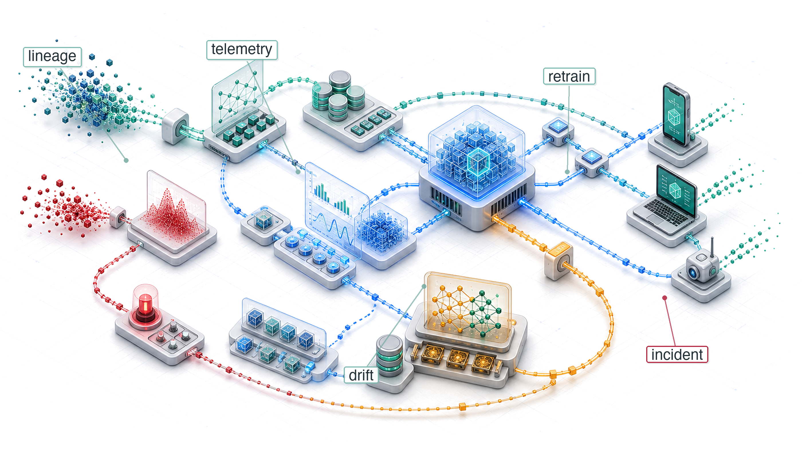
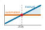
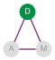

# ML Operations {#sec-ml-operations}

::: {layout-narrow}
::: {.column-margin}

\chapterminitoc

:::

::: {.content-visible when-format="pdf"}
\noindent
{fig-alt="Isometric operations loop around a deployed model service with telemetry, monitoring, drift response, retraining, and deployment updates."}
:::

::: {.content-visible unless-format="pdf"}
{fig-alt="Isometric operations loop around a deployed model service with telemetry, monitoring, drift response, retraining, and deployment updates."}
:::

:::

## Purpose {.unnumbered .unlisted}

\begin{marginfigure}
\mlsysstack{0}{15}{10}{20}{35}{90}{35}{30}
\end{marginfigure}

_Why can an ML system be perfectly available and perfectly wrong at the same time?_

Conventional monitoring often detects crashes, latency regressions, and availability failures quickly, but semantic errors can remain silent in any software system. ML systems add another silent failure mode. A model experiencing data drift can continue serving ordinary-looking predictions while accuracy degrades, triggering no alerts because every health check (latency, throughput, uptime) remains green. Serving infrastructure gets models into production; operations helps keep them correct once they are there. Model quality can degrade because the world changes. Customer behavior shifts, new product categories appear, seasonal patterns evolve, and the distribution the model learned from diverges from the one it now faces. Drift is not a certainty but a persistent risk for deployed models. Unlike latency or uptime, correctness may become observable only after labels or downstream outcomes arrive, so detecting degradation often requires imperfect signals and explicit investigation rather than a single threshold. Managing it requires continuous monitoring that tracks prediction quality alongside system health, drift signals that trigger investigation, retraining when outcome evidence supports it, and deployment strategies that validate new model versions against production traffic before full rollout. The gap between development and production is not a hurdle cleared once but a condition managed indefinitely. Machine learning operations exists because uptime without measured accuracy may still deliver wrong answers at scale. It makes D·A·M co-design continuous because the data environment can remain a moving target long after initial deployment.

::: {.content-visible when-format="pdf"}

\newpage

:::

::: {.callout-learning-objectives}

- Explain why ML systems can remain available while prediction quality silently degrades under distribution shift
- Diagnose technical debt across data-model, model-infrastructure, and production-monitoring interface boundaries
- Design feature stores, registries, and CI/CD pipelines that preserve training-serving consistency and reproducible rollback
- Apply the retraining staleness model to choose cost-aware retraining triggers and intervals
- Implement layered monitoring for drift, skew, degradation, business metrics, and data freshness
- Compare canary, blue-green, shadow, and rollback strategies for production model release risk
- Evaluate operational maturity and investment using model criticality, operational risk, and organizational readiness

:::

## MLOps Overview {#sec-ml-operations-introduction-machine-learning-operations-04c6}

After a model is built, optimized, benchmarked, and served, the system still has to remain correct. A benchmark establishes performance at a point in time; serving infrastructure answers requests in milliseconds. The team deploys to production, and week one looks excellent. The challenge begins in week two.

Data distributions shift, user behavior changes, and the world moves on from the conditions under which the model was trained. ML models that succeed in development can fail to achieve sustained production use when postdeployment ownership and monitoring are absent. The root cause is an operational mismatch\index{Operational mismatch!ML vs. traditional software}: availability-focused monitoring tracks server uptime, request latency, and request success rates, while ML monitoring must also track statistical health, including accuracy over time, input-distribution shift, and per-segment prediction quality. A model can degrade substantially while throwing no exceptions, triggering no infrastructure alarms, and maintaining perfect uptime.

The discipline that makes these invisible failures visible is **machine learning operations (MLOps)**\index{MLOps!definition}\index{MLOps!emergence}\index{MLOps!production deployment challenges}. MLOps synthesizes monitoring, automation, and governance into production architectures that detect degradation, trigger retraining, and maintain system health throughout a model's operational lifetime. It inherits the automation and operations lineage of DevOps [@kreuzberger2023], but addresses a different failure mode. Conventional services can often be tested against deterministic code paths, while ML systems depend on training data distributions, learned parameters, and environmental conditions that shift continuously.

The week-two problem takes concrete shape in an illustrative deployment scenario. Consider a demand prediction system for a ridesharing service. Initial measurements show 94 percent accuracy, 15 ms p99 latency, and strong performance across test segments. By week four, accuracy has dropped to 88 percent, but the infrastructure metrics show nothing wrong. By week eight, a product manager notices driver dispatch is inefficient; investigation reveals the model has not adapted to a competitor's new promotion that shifted user behavior. The model needed retraining six weeks ago, but no system was watching for this degradation. MLOps provides the framework to detect such drift, trigger retraining, and validate new models before users experience the impact.

The operational mismatch connects directly to the book's analytical foundations. If benchmarking provides the *sensors* for the system, MLOps is the complete *control system*. It closes the verification gap\index{Verification gap!MLOps closure} of the verification-gap equation (@eq-verification-gap) by continuously recalibrating against a changing world. MLOps can operationalize a locally fitted degradation equation\index{Degradation equation!operational implementation} (@eq-degradation) when paired drift and outcome data show that distribution change predicts accuracy loss; divergence alone does not prove inevitable decay. It also formalizes interfaces and responsibilities across traditionally isolated domains (data science, machine learning engineering, and systems operations [@amershi2019]) through continuous retraining, A/B evaluation, graduated rollout, and standardized artifact tracking that supports reproducibility and auditability.

Deploying, monitoring, and maintaining one production ML system defines the fundamental operational unit: the **ML node**\index{ML node!definition}, a complete system comprising data pipelines, feature computation, model training, serving infrastructure, and monitoring for a single machine learning application. Platform operations at larger scale (managing hundreds of models, cross-model dependencies, multi-region coordination, and organization-wide ML platform engineering) constitute advanced topics that build on these single-model foundations.

Managing a production ML node requires preserving observability across each interface. Technical debt accumulates when these boundaries erode; feature stores, CI/CD pipelines, and experiment tracking establish the reproducibility required to isolate faults. With reproducible data and artifacts in place, continuous monitoring, drift detection, and canary deployment protect predictive quality against environmental shift.

The single-model operational challenge decomposes into three distinct interfaces. The **data-model interface**\index{Data-model interface!feature consistency} is the handoff between data infrastructure and model training; its goal is feature consistency\index{Feature consistency!training-serving alignment}, so training and serving pipelines compute features the same way. The **model-infrastructure interface**\index{Model-infrastructure interface!environment parity} is the transition from trained weights to scalable service; its challenge is environment parity\index{Environment parity!production deployment}, because a model that works in a notebook may fail in production due to version, dependency, or runtime mismatches. The **production-monitoring interface**\index{Production-monitoring interface!feedback loop} is the feedback loop that enables self-correction, returning statistical telemetry[^fn-telemetry-mlops-pipeline]\index{Statistical telemetry!ML observability} from production to training because ML systems can degrade through drift without crashing.

These interfaces determine how infrastructure components partition responsibility. Feature stores stabilize feature computation at the data-model boundary. Model registries and deployment pipelines preserve the model-infrastructure handoff. Drift monitors, retraining triggers, and governance policies close the production-monitoring loop before silent degradation becomes a business failure.

[^fn-telemetry-mlops-pipeline]: **Telemetry**\index{Telemetry!ML observability}: The feedback path that can make model degradation visible before it becomes a business failure; crashes and error codes expose some software failures, but semantic errors can remain silent in any application. ML systems add distribution shift, which can go undetected without statistical telemetry such as feature distributions, prediction confidence, and drift indicators. Availability metrics alone would not expose this degradation.

Operating this feedback path requires distinguishing MLOps from traditional DevOps, establishing the foundational principles that govern production decisions, and isolating the debt patterns that accumulate when those boundaries fail.

## Principles and Foundations {#sec-ml-operations-mlops-3ea3}

A production ML release extends beyond a code diff: data distributions, learned parameters, evaluation slices, and monitoring feedback loops all become release objects that alter runtime behavior. MLOps\index{MLOps!DevOps comparison} builds on DevOps\index{DevOps!MLOps extension} to manage these data-dependent demands across development and deployment [@kreuzberger2023; @amershi2019]. While traditional CI/CD pipelines validate deterministic source code, configurations, unit tests, and infrastructure manifests, ML operations must govern artifacts whose statistical validity depends on the data lineage and execution environment that produced them.

DevOps automates the integration and delivery of deterministic software. MLOps extends this discipline to statistical, data-dependent workflows spanning data acquisition, preprocessing, distributed training, evaluation, deployment, and continuous monitoring through an iterative loop connecting system design, model development, and live operations.

::: {#dfn-ml-ops-mlops .callout-definition title="MLOps"}

***Machine learning operations (MLOps)***\index{MLOps!definition} is the engineering practice of productionizing ML systems through CI/CD, workflow orchestration, reproducibility, versioning, collaboration, continuous training and evaluation, monitoring, and feedback loops [@kreuzberger2023].

1.  **Significance**: The cost of leaving this loop open manifests as stale predictions, silent accuracy degradation, and prolonged recovery times. Drift thresholds, retraining triggers, and mean time to recovery (MTTR) targets are deployment-specific quantities calibrated from prediction value, label delay, validation risk, and retraining compute expense. The central engineering discipline is the closed control loop: measure distribution shift, estimate staleness cost, trigger retraining only when expected accuracy gains outweigh execution cost and rollout risk, and validate replacement models before promotion.
2.  **Distinction**: DevOps monitors functional correctness, system throughput, and infrastructure availability. MLOps introduces statistical controls for *predictive correctness*, which can decay silently while server uptime, request latency, and HTTP status codes remain completely healthy.
3.  **Common pitfall**: A frequent misconception is that retraining on new data automatically resolves distribution shift. Retraining without diagnosing which distribution shifted—input features ($p(x)$), label conditionals ($p(y \mid x)$), or both—preserves underlying failure modes or amplifies collection bias. Under covariate shift and common support, sample reweighting or stratified resampling restores calibration; concept drift requires fresh labels and model adaptation.

:::

Trace the infinity-loop structure in @fig-mlops-diagram to see how operational telemetry feeds empirical evidence back into design and engineering, forming the continuous operating shape of the discipline:

::: {#fig-mlops-diagram fig-env="figure" fig-pos="htb" fig-cap="**Iterative MLOps Loop**: Monitoring and triggering feed production evidence back into design and model development, turning requirements, engineering, testing, and deployment into a continuous operating cycle." fig-alt="Infinity-loop diagram with three phases. Design phase: requirements, use-case prioritization, data availability. Model development: data engineering, model engineering, testing. Operations: deployment, CI/CD pipeline, monitoring and triggering."}

```{.tikz}
\scalebox{0.6}{%
\begin{tikzpicture}[line join=round,font=\sffamily,outer sep=0pt,  radius=2, start angle=-90]
\tikzset{
arr node/.style={sloped, allow upside down, single arrow,
single arrow head extend=+.12cm, thick, minimum height=+.6cm, fill=white},
arr/.style ={  edge node={node[arr node, pos={#1}]{}}},
arr'/.style={insert path={node[arr node, pos={#1}]{}}},
}
\begin{scope}[shift={(0,0)},scale=1.1, every node/.append style={transform shape}]
\draw[line width=7mm, sloped, text=white,GreenD!60]
 (0, 2) edge[preaction={line cap=butt, line width=10mm, draw=white, overlay},
              out=0, in=180, arr=.1, arr=.8] (5, -2)
(5,-2)to[out=0, in=180, arr=.2, arr=.9](10,2)
arc[start angle=90, delta angle=-180][arr'=.5]
(10,-2)edge[preaction={line cap=butt, line width=10mm, draw=white, overlay},out=180, in=0, arr=.1, arr=.8](5,2)
(5,2)to[out=180, in=0, arr=.2, arr=.9](0,-2)
arc[start angle=-90, delta angle=-180][arr'=.5] ;
\end{scope}
\node[align=center,blue!50!black]at(0,0){DESIGN};
\node[align=center,BrownLine!50!black]at(5.5,0){MODEL\\ DEVELOPMENT};
\node[align=center,GreenD!80!black]at(11,0){OPERATIONS};
%
\node[align=left,anchor=north,blue!50!black]at(0,-3){$\bullet$ Requirements Engineering\\
$\bullet$ ML Use-Cases Prioritization\\
$\bullet$ Data Availability Check};
\node[align=left,anchor=north,BrownLine!50!black]at(5.75,-3){$\bullet$ Data Engineering\\
$\bullet$ ML Model Engineering\\
$\bullet$ Model Testing \& Validation};
\node[align=left,anchor=north,GreenD!80!black]at(11.25,-3){$\bullet$ ML Model Deployment\\
$\bullet$ CI/CD Pipeline\\
$\bullet$ Monitoring \& Triggering};
\end{tikzpicture}}
```

:::

The operational complexity and financial risk of deploying machine learning without disciplined operational tooling emerges clearly in a recommendation service. A newly deployed ranking model initially improves conversion, but gradual data drift steadily degrades prediction quality. Because conventional monitoring tracks server uptime, request latency, and HTTP success rates rather than inference accuracy, the loss remains invisible until an aggregate revenue review months later. MLOps supplies the operational controls that expose these silent statistical failures before they compound into material financial harm.

### Foundational principles {#sec-ml-operations-foundational-principles-44e6}

That recommendation failure illustrates a systemic pattern: without disciplined operational controls, even accurate models fail silently in production. Debugging such an incident requires a structured sequence of operational checks. When revenue drops, the first priority is reconstructing the deployed model state, which requires reproducibility. The next priority is determining whether data pipelines, training jobs, serving paths, and monitoring services maintain clean boundaries to isolate the defect, which requires separation of concerns. If online serving features diverge from offline training features, consistency provides the invariant that prevents recurring skew. If drift begins before users complain, observable degradation converts a silent failure into an actionable alert. Finally, when retraining is viable but computationally expensive, cost-aware automation evaluates whether intervention justifies the compute expenditure and operational rollout risk. These principles define the controls in the operational sequence an engineering team executes to isolate and resolve production failures.

#### Reproducibility {#sec-ml-operations-principle-1-reproducibility-d408}

Reproducibility\index{Reproducibility!versioning principle} requires every artifact\index{Artifact!versioning, reproducibility requirement}[^fn-artifact-reproducibility-hashing] that influences model behavior to be versioned and traceable. This principle extends beyond code repositories to encompass input datasets, feature schemas, hyperparameter configurations, and execution environments. @Eq-model-reproducibility expresses this dependency formally:
$$\text{Model Output} = f(\text{Code}_v, \text{Data}_v, \text{Config}_v, \text{Environment}_v; \xi)$$ {#eq-model-reproducibility}
where $v$ identifies an immutable version hash and $\xi$ captures execution nondeterminism. Exact reproduction requires freezing all four versioned inputs alongside random seeds, dataloader sample ordering, deterministic GPU reduction kernels (preventing non-associative floating-point drift from asynchronous atomic additions), and identical accelerator hardware architectures.

[^fn-artifact-reproducibility-hashing]: **Artifact**\index{Artifact!reproducibility}: Model weights are realized training outputs; the inputs and randomness that produced them cannot generally be inferred from the parameters. Versioning only code is therefore insufficient, and even versioning code, data, configuration, and environment may not guarantee exact replay when kernels or training are nondeterministic.

#### Separation of concerns {#sec-ml-operations-principle-2-separation-concerns-6f84}

Separation of concerns\index{Separation of concerns!MLOps layers} decomposes MLOps systems into distinct functional layers that can evolve independently, as @tbl-mlops-layers shows:

| **Layer**            | **Responsibility**                             | **Stability**                      |
|:---------------------|:-----------------------------------------------|:-----------------------------------|
| **Data Layer**       | Feature computation, storage, serving          | Changes with data schema evolution |
| **Training Layer**   | Model development, hyperparameter optimization | Changes with algorithm research    |
| **Serving Layer**    | Inference, scaling, latency management         | Changes with traffic patterns      |
| **Monitoring Layer** | Drift detection, performance tracking          | Changes with business requirements |

: **MLOps Separation of Concerns**: Each layer addresses a distinct responsibility and evolves at different rates across the data, training, serving, and monitoring layers. This separation enables independent scaling and updates, reducing blast radius when changes are required. {#tbl-mlops-layers}

#### Consistency imperative {#sec-ml-operations-principle-3-consistency-imperative-a292}

The architectural boundaries in @tbl-mlops-layers allow teams to upgrade serving runtimes without retraining models, adjust alert thresholds without redeployment, and modify data ingestion pipelines while preserving interface contracts. That architectural independence remains safe only when training and serving environments process features identically, establishing training-serving parity as a consistency imperative\index{Consistency imperative!training-serving parity}. The financial consequence of this discrepancy is captured in @eq-skew-cost:
$$\text{Skew Cost} = \text{Rate}_{\text{skew}} \times Q \times C_{\text{error}}$$ {#eq-skew-cost}
where $\text{Rate}_{\text{skew}}$ is the fraction of queries affected by training-serving skew, $Q$ is the total query volume per accounting period, and $C_{\text{error}}$ is the average business cost incurred per erroneous prediction.

```{python}
#| echo: false
from mlsysim import *
from mlsysim.core.units import *

# ┌─────────────────────────────────────────────────────────────────────────────
# │ SKEW COST CALCULATION
# ├─────────────────────────────────────────────────────────────────────────────
# │ Context: The Consistency Imperative - quantifies annual cost
# │          of training-serving skew to motivate feature stores and validation.
# │
# │ Goal: Demonstrate the economic impact of training-serving skew.
# │ Show: That 1% skew error can waste $365,000 annually.
# │ How: Calculate annual lost revenue from a 1M daily query stream.
# │
# └─────────────────────────────────────────────────────────────────────────────
from mlsysim.fmt import fmt_int, fmt_rate, fmt_usd, fmt, check, MarkdownStr

class SkewEconomics:
    """
    Namespace for Training-Serving Skew Cost calculation.
    Scenario: The business impact of 1% skew-induced error on 1M daily queries.
    """

    # ┌── 1. LOAD (Constants) ───────────────────────────────────────────────
    queries_daily = MILLION
    skew_error_rate = 0.01
    cost_per_error = 0.10
    days_per_year = DAYS_PER_YEAR

    # ┌── 2. EXECUTE (The Compute) ─────────────────────────────────────────
    annual_cost = queries_daily * skew_error_rate * cost_per_error * days_per_year

    # ┌── 3. GUARD (Invariants) ───────────────────────────────────────────
    check(annual_cost == 365_000, f"Annual cost should be 365,000, got {annual_cost:.0f}")

    # ┌── 4. OUTPUT (Formatting) ──────────────────────────────────────────────
    queries_daily_str = fmt_rate(queries_daily, "queries/day", precision=0, commas=True)
    error_rate_pct_str = fmt_percent(round(skew_error_rate * 100) / 100, precision=0, commas=False, style='prose')
    error_cost_str = fmt_usd(cost_per_error, precision=2, commas=False)
    skew_cost_str = fmt_usd(annual_cost, precision=0, commas=True)
```

For a system serving `{python} SkewEconomics.queries_daily_str` with `{python} SkewEconomics.error_rate_pct_str` skew-induced errors costing `{python} SkewEconomics.error_cost_str` each, annual skew cost reaches `{python} SkewEconomics.skew_cost_str`. This quantifies why consistency mechanisms represent investments with measurable financial returns. Shared feature stores, unified C++ or Rust feature-extraction libraries invoked identically during offline training and online serving, and automated schema validation tests enforce this parity directly at the system boundary.

#### Observable degradation {#sec-ml-operations-principle-4-observable-degradation-87a9}

Observable degradation\index{Observable degradation!continuous measurement} requires ML systems to make silent failures\index{Silent failure!gradual degradation} visible through continuous measurement. Model accuracy degrades along a continuous statistical spectrum rather than failing as a discrete binary crash. An observed failure's time signature—whether an acute drop, gradual drift, or localized cohort decay—governs both the detection mechanism and the operational response.

#### Cost-aware automation {#sec-ml-operations-principle-5-costaware-automation-631e}

Cost-aware automation\index{Cost-aware automation!retraining decisions} balances computational costs against accuracy improvements. Let $\Delta\text{Accuracy}$ be the expected gain in accuracy percentage points, $\text{Value per Point}$ the monetary value of one percentage-point gain over the decision horizon, $\text{Training Cost}$ the compute and labor cost of a retraining run, and $\text{Deployment Risk}$ the expected cost of validation and rollout failure. @Eq-retrain-decision models this trade-off:
$$\text{Retrain if: } \Delta\text{Accuracy} \times \text{Value per Point} > \text{Training Cost} + \text{Deployment Risk}$$ {#eq-retrain-decision}

The inequality acts as an operational decision gate rather than an unconstrained trigger: an automated pipeline should initiate retraining only when empirical evidence indicates that expected accuracy gains surpass execution cost and rollout risk. This economic trade-off governs retraining triggers, validation thresholds, and rollout gates; @sec-ml-operations-training-pipelines-2dcf formalizes this model to calculate optimal retraining cadences.

Detecting when to trigger intervention requires pairing each failure signature with the appropriate telemetry and operational countermeasure, as outlined in @tbl-degradation-types:

```{=latex}
\begingroup
\renewcommand{\arraystretch}{1.35}
```

| **Degradation Type**     | **Detection Mechanism** | **Response Strategy**                  |
|:-------------------------|:------------------------|:---------------------------------------|
| **Sudden accuracy drop** | Threshold alerts        | Diagnose; roll back if release-related |
| **Gradual drift**        | Trend analysis          | Diagnose, then retrain if warranted    |
| **Subgroup degradation** | Cohort monitoring       | Targeted data collection               |
| **Latency increase**     | Percentile tracking     | Infrastructure scaling                 |

: **Degradation Detection Strategies**: Four failure signatures map to detectors and operational responses. Sudden drops require immediate diagnosis and may call for rollback, while gradual or subgroup degradation calls for diagnosis before retraining or targeted data collection. {#tbl-degradation-types}

Each foundational principle becomes operational only when anchored to a concrete, measurable metric (@tbl-mlops-principles-summary)—from artifact hashes to net retraining value:

| **Principle**              | **Core Insight**            | **Key Metric**         |
|:---------------------------|:----------------------------|:-----------------------|
| **Reproducibility**        | Version all artifacts       | Complete artifact hash |
| **Separation of concerns** | Independent layer evolution | Layer coupling score   |
| **Consistency**            | Training equals Serving     | Feature skew rate      |
| **Observable degradation** | Make failures visible       | Time to detection      |
| **Cost-aware automation**  | Optimize total cost         | Net retraining value   |

: **MLOps Principles Summary**: Quick reference for the five foundational principles that guide all MLOps tooling and practice decisions. {#tbl-mlops-principles-summary}

```{=latex}
\endgroup
```

How these principles manifest in practice depends on the workload. A recommendation system drifts daily as user preferences shift; a TinyML model deployed on embedded hardware may run unchanged for months. The monitoring strategy must match the archetype.

::: {#lhs-ml-ops-monitoring-strategy-by-archetype .callout-lighthouse title="Monitoring strategy by archetype"}

```{=latex}
\begin{minipage}{1\linewidth}
```
The dominant failure modes and monitoring priorities differ across workload archetypes. @Tbl-monitoring-archetype-strategy compares four representative archetypes by drift pattern, monitoring metric, and example retraining trigger:

| **Archetype**                 | **Dominant Drift Pattern**                                       | **Primary Monitoring Metric**                       | **Example Retraining Trigger**                                                      |
|:------------------------------|:-----------------------------------------------------------------|:----------------------------------------------------|:------------------------------------------------------------------------------------|
| **ResNet-50 (Compute Beast)** | Visual distribution shift (lighting, camera, new object classes) | Accuracy on holdout set (ground truth available)    | Accuracy drops > 2% from baseline  ($\sim$monthly for stable domains)               |
| **GPT-2 (Bandwidth Hog)**     | Vocabulary drift, topic shift,  emerging entities                | Perplexity on live traffic (no ground truth needed) | Perplexity increases > 10%; new vocabulary detected ($\sim$weekly for news domains) |
| **DLRM (Sparse Scatter)**     | User behavior shift, item catalog churn, cold-start items        | CTR/CVR delta vs. historical cohorts                | Engagement drops > 5%; catalog refresh ($\sim$daily for e-commerce)                 |
| **DS-CNN (Tiny Constraint)**  | Acoustic environment change  (noise floor shift)                 | Duty cycle (wakeups/hour) + false positive rate     | False wake rate > 1%; battery drain  exceeds spec ($\sim$quarterly OTA update)      |

: **Monitoring Strategy by Workload Archetype**: Illustrative starting points for monitoring strategy. Real thresholds must be calibrated to the deployment's label delay, traffic volume, business risk, and alert-fatigue budget. {#tbl-monitoring-archetype-strategy tbl-colwidths="[16,28,23,33]"}

```{=latex}
\end{minipage}
```

**Systems insight**: Ground truth availability and physical bottlenecks govern monitoring design. Compute-bound vision models (ResNet-50) bound by $O/(R_{\text{peak}} \cdot \eta_{\text{hw}})$ track holdout accuracy; memory-intensive language and recommendation models (GPT-2, DLRM) bound by $D_{\text{vol}}/\text{BW}$ may rely on perplexity or implicit clicks; microcontroller models (DS-CNN) bound by strict latency $L_{\text{lat}}$ and energy limits monitor duty cycles and false wake rates. Retraining cadence is constrained by label delay, deployment access, validation cost, and the rate of observed change.

:::

These principles respond to recurring operational failures: concept drift,[^fn-drift-adversarial-shift] data-quality defects [@schelter2018automating], and silent postdeployment degradation. These factors drive the divergence between MLOps and traditional DevOps: system health cannot be measured by uptime or latency alone. Operational discipline requires monitoring the statistical properties of data distributions and model outputs, shifting the focus from basic server availability to predictive correctness.

[^fn-drift-adversarial-shift]: **Concept drift**\index{Concept drift!adversarial evolution}: Concept-drift and data-stream research formalized the problem that a model's target relationship can change after deployment [@widmer1996; @gama2014]. In adversarial domains such as spam, fraud, and abuse detection, the distribution can actively adapt in response to the model, making continuous monitoring and retraining a structural requirement rather than an operational luxury.

MLOps coordinates a broader stakeholder ecosystem and introduces specialized practices such as data versioning,[^fn-dvc-data-versioning] model versioning, and continuous statistical monitoring that extend beyond traditional software engineering. This expanded scope turns model operation into an ongoing feedback loop rather than a linear release pipeline, as compared across dimensions in @tbl-mlops:

[^fn-dvc-data-versioning]: **DVC (Data Version Control)**\index{DVC!data versioning}: DVC brings Git-like versioning to datasets and model artifacts [@dvc], solving the artifact gap that @eq-model-reproducibility formalizes: without data versioning, the $\text{Data}_v$ term is unrecoverable, and no combination of code commits can reconstruct the model that was deployed.

| **Aspect**           | **DevOps**                                                                                                  | **MLOps**                                                                                                                    |
|:---------------------|:------------------------------------------------------------------------------------------------------------|:-----------------------------------------------------------------------------------------------------------------------------|
| **Objective**        | Streamlining software development and operations processes                                                  | Optimizing the lifecycle of machine learning models                                                                          |
| **Methodology**      | Continuous Integration and Continuous Delivery (CI/CD) for software development                             | Similar to CI/CD but focuses on machine learning workflows                                                                   |
| **Primary Tools**    | Version control (Git), CI/CD tools (Jenkins, Travis CI), Configuration management (Ansible, Puppet)         | Data versioning tools, Model training and deployment tools, CI/CD pipelines tailored for ML                                  |
| **Primary Concerns** | Code integration, Testing, Release management, Automation, Infrastructure as code                           | Data management, Model versioning, Experiment tracking, Model deployment, Scalability of ML workflows                        |
| **Typical Outcomes** | Faster and more reliable software releases, Improved collaboration between development and operations teams | Efficient management and deployment of machine learning models, Enhanced collaboration between data scientists and engineers |

: **MLOps vs. DevOps**: MLOps extends DevOps principles to address the unique requirements of machine learning systems, including data and model versioning, and continuous monitoring for model performance and data drift. MLOps coordinates a broader range of stakeholders and emphasizes reproducibility and scalability beyond traditional software development workflows. {#tbl-mlops tbl-colwidths="[12,42,46]"}

::: {#chk-ml-ops-mlops-loop .callout-checkpoint title="The MLOps loop"}

MLOps is not linear; it is circular.

**The feedback cycle**

- [ ] **Closing the loop**: how do production metrics (for example, drift alerts) trigger new training cycles?
- [ ] **Retraining trigger**: can you distinguish a drift signal that warrants investigation from outcome evidence that warrants retraining?

**The artifacts**

- [ ] **Versioning**: are you versioning Data + Code + Model + Environment together?

:::

Each iteration through the operational loop can introduce data dependencies, model interactions, and configuration drift invisible to standard software testing. Those accumulating costs constitute technical debt: an engineering framework that converts silent statistical failure modes into quantifiable liabilities.

While traditional DevOps addresses deployment throughput and service scaling, MLOps must isolate and service this technical debt before it destabilizes the serving system. Boundary erosion demonstrates why modular pipeline design is mandatory; correction cascades reveal why strict artifact versioning and instantaneous rollback are essential; undeclared consumers justify enforced feature schemas and contract tests. These debt patterns provide the diagnostic vocabulary and concrete failure modes that motivate the specialized MLOps infrastructure examined throughout the remainder of this book.
## Technical Debt {#sec-ml-operations-technical-debt-system-complexity-2762}

Silent failure modes in production ML manifest concretely as technical debt\index{Technical debt!ML system complexity} [@sculley2015hidden]: upstream distribution shifts, feedback loops, and unversioned pipeline dependencies cause accuracy degradation that compounds over time. These failures accumulate invisibly across system boundaries, requiring operational architectures that account for statistical behavior and data dependencies alongside traditional software contracts. Originally proposed in software engineering in the 1990s,[^fn-tech-debt-ml] the technical debt metaphor compares shortcuts in implementation to financial debt, trading short-term delivery velocity for ongoing maintenance overhead and systemic risk [@cunningham1992wycash]. In ML systems, this debt extends beyond executable code to encompass statistical dependencies and unvalidated data flows. Systematic evaluation rubrics, such as the ML Test Score [@breck2017], provide frameworks for quantifying this debt and assessing production readiness across data, model, and infrastructure interfaces.

[^fn-tech-debt-ml]: **Technical debt**\index{Technical debt!ML compounding}: Ward Cunningham's 1992 WyCash experience report introduced the debt metaphor for expedient code and delayed consolidation [@cunningham1992wycash]; in ML, debt can compound silently through data and model dependencies that code-focused unit tests and reviews may not detect. A pipeline can remain unchanged while the world it models changes. The ML Test Score rubric [@breck2017] makes this debt explicit through 28 production-readiness tests grouped into data, model, infrastructure, and monitoring sections.

::: {#dfn-ml-ops-technical-debt-ml .callout-definition title="Technical debt in ML"}

***Technical debt in machine learning***\index{Technical debt!definition} is the accumulating maintenance and change cost created by implicit data dependencies, entangled features, and undeclared consumers in ML systems, where the resulting liabilities may also appear as silent accuracy degradation.

1.  **Significance**: Google's analysis of production ML systems argues that model code is only a small fraction of the surrounding system; the larger operational surface includes data collection, feature extraction, configuration, serving infrastructure, monitoring, and process management [@sculley2015hidden]. ML-specific debt drivers compound this: changing one input feature can silently shift the learned representation of every other feature (entanglement), a model trained to correct another model's errors creates a fragile dependency chain (correction cascades), and downstream systems consuming model outputs without explicit contracts become undeclared consumers that break silently when the model is updated.
2.  **Distinction**: ML technical debt includes system- and data-level dependencies that code review and ordinary code-focused tests may miss. It can slow development and degrade prediction quality even while availability metrics remain healthy.
3.  **Common pitfall**: A frequent misconception is that "better code" solves technical debt in ML. In reality, it is a systems architecture problem: the debt accumulates when the assumptions of the training distribution (feature ranges, label meanings, data freshness) are not enforced as runtime contracts at the system boundary.

:::

A break-even calculation makes the cost dynamics of technical debt concrete. Teams often resist automation investment because manual processes seem faster in early development, but that advantage disappears once recurring manual interventions exceed the up-front automation cost.

::: {.column-margin}
{width="100%" fig-alt="Two strokes against weeks elapsed: a rising manual-work line crossing a flat one-time pipeline-investment line near week 20, with the area past the crossover shaded."}

*Cumulative manual work overtakes the one-time automation investment near week 20.*
:::

Manual operations quickly hit a capacity ceiling because modeling code constitutes only a small fraction of a real-world deployment. As shown in @fig-technical-debt, the broader operational surface spans ten interconnected components, from data verification to machine resource management, each capable of accumulating hidden liabilities. While core ML code occupies a single box, the remaining nine demand continuous operational upkeep.

::: {#fig-technical-debt fig-env="figure" fig-pos="htb" fig-cap="**Hidden Infrastructure of ML Systems**: ML code is one of ten components arranged around the ML system at the center, alongside data collection, data verification, feature extraction, configuration, machine resource management, serving infrastructure, monitoring, analysis tools, and process management tools. The count is what matters, since modeling occupies one box and the remaining nine are the operational surface a deployment must also carry. Source: [@sculley2015hidden]." fig-alt="Hub-and-spoke diagram with the ML system at the center, connected by arrows to ten surrounding components: data collection, data verification, feature extraction, configuration, machine resource management, serving infrastructure, monitoring, analysis tools, process management tools, and ML code."}

```{.tikz}
\scalebox{0.73}{%
\begin{tikzpicture}[line join=round,font=\small\sffamily]
\tikzset{%
planet/.style = {circle, draw=none,
semithick, fill=blue!30,
                    font=\sffamily\bfseries, ball color=green!70!blue!70,shading angle=-15,
                    text width=27mm, inner sep=1mm,align=center},
satellite/.style = {circle, draw=#1, semithick, fill=#1!30,
                    text width=18mm, inner sep=1pt, align=flush center,minimum size=21mm},%<---
arr/.style = {-{Triangle[length=3mm,width=6mm]}, color=#1,
                    line width=3mm, shorten <=1mm, shorten >=1mm}
}
%planet
\node (p)   [planet]    {ML system};
%satellites
\foreach \i/\j [count=\k] in {red/{Machine Resource Management},
cyan/{Configuration},
purple/{Data Collection},
green/{Data Verification},
orange/{Serving Infrastructure},
yellow/{Monitoring},
Siva/{Feature Extraction},
magenta/{ML Code},
violet/{Analysis Tools},
teal/{Process Management Tools}
}
%connections
{
\node (s\k) [satellite=\i,font=\footnotesize\sffamily] at (\k*36:3.8) {\j};
\draw[arr=\i] (p) -- (s\k);
}
\end{tikzpicture}}
```

:::

```{python}
#| echo: false
#| label: compound-cost-calc
# ┌─────────────────────────────────────────────────────────────────────────────
# │ COMPOUND COST OF MANUAL OPERATIONS
# ├─────────────────────────────────────────────────────────────────────────────
# │ Context: Callout "The Compound Cost of Manual Operations" - technical debt
# │          section showing why automation ROI compounds over time.
# │
# │ Goal: Demonstrates the break-even math for pipeline automation. Manual work
# │      (4 hrs/week) compounds while pipeline investment (80 hrs one-time)
# │      pays off in 20 weeks. After 1 year, manual teams drown in maintenance
# │      while automated teams have zero ongoing cost.
# │
# └─────────────────────────────────────────────────────────────────────────────
from mlsysim.fmt import fmt_int, fmt, check

# ┌── LEGO ───────────────────────────────────────────────
class AutomationROI:
    """
    Namespace for Automation ROI calculation.
    Scenario: Comparing manual retraining cost vs automated pipeline investment.
    """

    # ┌── 1. LOAD (Constants) ───────────────────────────────────────────────
    hrs_manual_week = 4.0
    hrs_automation_once = 80.0
    time_horizon_years = 1.0

    # ┌── 2. EXECUTE (The Compute) ─────────────────────────────────────────
    breakeven_weeks = hrs_automation_once / hrs_manual_week

    # ┌── 3. GUARD (Invariants) ───────────────────────────────────────────
    check(breakeven_weeks <= 26, f"Automation takes too long ({breakeven_weeks} weeks) to justify. Narrative implies fast ROI.")

    # ┌── 4. OUTPUT (Formatting) ──────────────────────────────────────────────
    mc_manual_hours_str = fmt_time(hrs_manual_week, "hour", precision=0, commas=False, style="word")
    mc_pipeline_hours_str = fmt_int(hrs_automation_once, commas=False)
    mc_breakeven_weeks_str = fmt_time(breakeven_weeks, "week", precision=0, commas=False, style="word")
    mc_time_horizon_years_str = fmt_time(time_horizon_years, "year", precision=0, commas=False, style="word")
    mc_pipeline_final_str = fmt(0, precision=0, commas=False)
```

::: {#nbk-ml-ops-compound-cost-manual-operations .callout-notebook title="The cumulative cost of manual operations"}

**Problem**: Why build automated pipelines when manual retraining is faster?

**Physics**: Manual work accumulates over time.

*   Manual retrain: `{python} AutomationROI.mc_manual_hours_str` of engineering per week.
*   Pipeline build: `{python} AutomationROI.mc_pipeline_hours_str` engineering hours (one-time).

**Math**:

*   **Result**: `{python} AutomationROI.mc_pipeline_hours_str` engineering hours $\div$ `{python} AutomationROI.mc_manual_hours_str` per week = `{python} AutomationROI.mc_breakeven_weeks_str`.
*   **Trap**: This assumes the model never changes.
*   **Limitation**: Additional features can increase manual effort.
*   **Consequence**: After `{python} AutomationROI.mc_time_horizon_years_str`, manual teams still spend `{python} AutomationROI.mc_manual_hours_str` per week on maintenance. In this simplified calculation, pipeline teams incur `{python} AutomationROI.mc_pipeline_final_str` recurring hours.

**Context**: A central law of systems engineering is that the cost of *maintaining* a system over its lifetime can dominate the cost of *building* it. In ML, technical debt is especially dangerous because it is often *data-driven* rather than *code-driven*: a perfect piece of code can still fail if the data it processes shifts. Measurement is the management boundary: without telemetry, the team cannot tell whether maintenance work is reducing debt or merely hiding it.

**Systems insight**: Automation addresses capacity limits, not speed alone. A manual team eventually reaches a point where maintaining existing models prevents it from deploying new ones. MLOps responds with systematic observability and automation. Without monitoring infrastructure to make silent failures visible, the team accumulates debt and builds a system that becomes increasingly difficult to manage.

:::

While automation addresses the recurring operational overhead of manual retraining, it cannot prevent architectural decay. Deployed systems accumulate hidden complexity through systemic failure modes that emerge from statistical coupling rather than deterministic logic. @Fig-technical-debt-taxonomy maps six debt patterns across data, model, and infrastructure concerns, establishing the failure modes that operational architectures must isolate.

::: {#fig-technical-debt-taxonomy fig-env="figure" fig-pos="htb" fig-cap="**ML Technical Debt Taxonomy**: Six debt patterns radiate from hidden technical debt: configuration debt, feedback loops, data debt, pipeline debt, correction cascades, and boundary erosion. The surrounding labels identify their associated failure patterns." fig-alt="Hub-and-spoke diagram with Hidden Technical Debt at the center and six labeled categories: Configuration Debt, Feedback Loops, Data Debt, Pipeline Debt, Correction Cascades, and Boundary Erosion. Each category has a nearby text label describing a failure pattern."}

```{.tikz}
\scalebox{0.75}{%
\begin{tikzpicture}[line join=round,font=\small\sffamily]
\tikzset{%
planet/.style = {circle, draw=none,semithick, fill=RedLine!30,
                    font=\sffamily\bfseries,
                    text width=27mm, inner sep=1mm,align=flush center},
satellite/.style = {rectangle, draw=#1, semithick, fill=#1!20,
                    text width=18mm, inner sep=1pt, align=flush center,minimum size=21mm,minimum height=10mm},
satellite1/.style = {rectangle, draw=#1, semithick, fill=#1,anchor=east,
                   inner sep=1pt, align=flush center,minimum size=2.5mm,minimum height=10mm},
arr/.style = {-{Triangle[length=3mm,width=6mm]}, color=#1,
                    line width=3mm, shorten <=1mm, shorten >=1mm},
TxtL/.style = {font=\footnotesize\sffamily,text width=30mm,align=flush right},
TxtR/.style = {font=\footnotesize\sffamily,text width=30mm,align=flush left},
TxtC/.style = {font=\footnotesize\sffamily,text width=30mm,align=flush center}
}
%planet
\node (p)   [planet]    {Hidden Technical Debt};
%satellites
\foreach \i/\j/\radius/\sho [count=\k] in {
  red/{Configuration Debt}/3.1/7pt,
  cyan/{Feedback Loops}/3.1/7pt,
  Siva/{Data Debt}/4.0/10pt,
  green!65!black/{Pipeline Debt}/3.1/7pt,
  orange/{Correction Cascades}/3.1/7pt,
  yellow!80!red/{Boundary Erosion}/4.1/10pt
}
{
%Satelit
\node (s\k) [satellite=\i,font=\footnotesize\sffamily] at (\k*60:\radius) {\j};
%Decoration
\node[satellite1=\i](DE\k) at (s\k.west) {};
%Arrows
\draw[arr=\i,shorten >=\sho] (p) -- (s\k);
}
\node[TxtL,left=2pt of DE2]{\textbf{Undeclared Consumers:} Hidden model dependencies};
\node[TxtR,right=2pt of s1.east,anchor=west]{\textbf{Parameter Sprawl:}\\ Ad hoc settings and
hard-coded values};
\node[TxtL,left=2pt of DE4]{\textbf{Fragile Workflows:} Tightly coupled};
\node[TxtR,text width=40mm,right=2pt of s5.east,anchor=west]{\textbf{Sequential Dependencies:}
Upstream fixes break downstream systems};
\node[TxtL,left=10pt of s3]{\textbf{Quality Issues:} Inconsistent formats
and distributions};
\node[TxtR,right=2pt of s6]{\textbf{CACE Principle:}
Change Anything Changes Everything};
\end{tikzpicture}}
```

:::

### Boundary erosion {#sec-ml-operations-boundary-erosion-8ef5}

The dissolution of system boundaries represents the primary failure mode of statistical software\index{Boundary erosion!dissolution of modularity}. In traditional software, modular encapsulation provides clear isolation: components interact across typed APIs, allowing internal implementations to change while system behavior remains deterministic. Machine learning systems blur these boundaries because component behavior depends on the empirical distribution of incoming data rather than syntactic interface definitions. An upstream formatting modification or normalization change can satisfy every unit test while silently shifting feature distributions and degrading downstream model accuracy. This implicit coupling through data pipelines creates unmonitored dependencies among feature engineering, training pipelines, and serving endpoints.

This erosion produces **entanglement**\index{Entanglement!ML system coupling}, where dependencies between features and components become so intertwined that local modifications demand global coordination. The resulting failure mode reflects the CACE\index{CACE principle!change propagation} principle: *Change Anything Changes Everything*. When systems lack strict distributional boundaries, adjusting a single feature encoding or data filtering threshold alters the learned weights across the entire model. For example, changing the binning strategy of a continuous feature shifts the feature's variance and covariance structure, causing a previously calibrated model to underperform and forcing downstream recalibrations that ripple across dependent services.

Defending against boundary erosion requires architectural modularity enforced at runtime. Components require explicit data contracts that govern statistical invariants, including allowed feature ranges, null tolerances, and drift thresholds. Enforcing separation between data ingestion, feature generation, and inference logic creates verification boundaries where data distributions can be validated before reaching model weights. Because boundary erosion remains silent during initial prototyping, establishing explicit schema contracts and invariant checks provides the only reliable defense against creeping statistical coupling.

### Correction cascades {#sec-ml-operations-correction-cascades-e309}

When boundary erosion goes unaddressed, engineering interventions frequently trigger a **correction cascade**\index{Correction cascade!sequential dependencies}: fixing a specific model defect with an auxiliary patch introduces secondary errors elsewhere, requiring further compensatory fixes that destabilize the entire pipeline. In ML systems, these cascades are severe because changes propagate through statistical dependencies rather than deterministic code branches. Retraining a model to correct a specific false-positive cluster may degrade accuracy across previously stable cohorts. Adding an auxiliary model to override edge-case predictions introduces uncalibrated residuals that distort downstream consumers. Each patch triggers subsequent corrections, consuming engineering effort that rapidly outstrips the cost of retraining from clean data.

@Fig-correction-cascades-flowchart makes the cascade structure visible as a chain of dependent models. Each model is trained to correct the errors of the one before it: model B compensates for model A's residual mistakes, model C compensates for model B's, and so on down the chain. The arrangement holds until an upstream model changes. When model A is retrained to fix one failure mode, every downstream model that was tuned to its previous behavior is invalidated at once, and each must be re-corrected. The red arcs trace this propagation, showing how a repair that looked local reaches across the entire chain. A change near the top forces the most rework, while one near the bottom is nearly free. For an operations team, one change request can trigger a coordinated retraining of the chain.

::: {#fig-correction-cascades-flowchart fig-env="figure" fig-pos="htb" fig-cap="**Correction Cascades**: Each model is trained to correct the errors of the model before it, forming a chain of dependencies. Changing an upstream model invalidates every downstream correction at once, turning one local fix into cascading rework across the chain, with each downstream fix demanding its own retraining cycle." fig-alt="Four model boxes in a left-to-right chain labeled Model A through Model D, each trained to correct the previous one. A red change badge on Model A and red dashed arcs reaching Model B, C, and D show an upstream change propagating downstream, with must re-correct labels beneath the downstream models."}

```{.tikz}
\begin{tikzpicture}[font=\small\sffamily, >=stealth]
\tikzset{
Line/.style={line width=0.5pt,black!50,text=black},
LineA/.style={-{Triangle[width=7pt,length=11pt]},line width=1pt,black!50,text=black},
LineD/.style={-{Triangle[width=7pt,length=11pt]},crimson,line width=1.5pt,rounded corners=15pt,
dashed,dash pattern=on 7pt off 5pt},
Box/.style={align=center, inner xsep=2pt,draw=none, line width=1pt,fill=none,
minimum width=30mm, minimum height=25mm,node distance=1.0},
Box1/.style={align=center, inner sep=5pt,draw=none, line width=1pt,fill=crimson,text=white,
 minimum width=18mm, minimum height=7mm,font=\small\sffamily\bfseries,rounded corners=7pt},
Text2/.style={font=\sffamily\bfseries\small,align=center},
Text3/.style={font=\sffamily\bfseries\small,align=center,redd},
}
\definecolor{redd}{HTML}{A31F34}
\definecolor{blueeD}{HTML}{4A90C4}
\definecolor{blueeL}{HTML}{CFE2F3}

%model
\tikzset{%
 pics/model/.style = {
        code = {
        \pgfkeys{/channel/.cd, #1}
\begin{scope}[local bounding box=MODEL,scale=\scalefac, every node/.append style={transform shape}]
\foreach \i in {1,...,3}{
  \pgfmathsetmacro{\y}{(-\i)*0.37}
  \node[circle,draw, minimum size=2.5mm,inner sep=0pt,fill=red](2K\i) at(0,\y){};
}
\foreach \i in {1,...,3}{
  \pgfmathsetmacro{\y}{(-\i)*0.37}
  \node[circle,draw, minimum size=2.5mm,inner sep=0pt,fill=brown](3K\i) at(0.6,\y){};
}
\foreach \i in {1,...,2}{
  \pgfmathsetmacro{\y}{-(3.5-\i)*0.37}
  \node[circle,draw, minimum size=2.5mm,inner sep=0pt,fill=cyan](1K\i) at(-0.6,\y){};
}
\foreach \i in {1}{
  \pgfmathsetmacro{\y}{-(3.0-\i)*0.37}
  \node[circle,draw, minimum size=2.5mm,inner sep=0pt,fill=green!40!black](4K\i) at(1.2,\y){};
}
\foreach \i in {1,...,2}{
  \foreach \j in {1,...,3}{
\draw[Line](1K\i)--(2K\j);
}}
\foreach \i in {1,...,3}{
  \foreach \j in {1,...,3}{
\draw[Line](2K\i)--(3K\j);
}}\foreach \i in {1,...,3}{
  \foreach \j in {1}{
\draw[Line](3K\i)--(4K\j);
}}
 \end{scope}
     }
  }
}
\pgfkeys{
  /channel/.cd,
  scalefac/.store in=\scalefac,
  scalefac=1,
}

\begin{scope}[local bounding box=mainfig]
%Models
\foreach \name/\x/\title/\subtitle/\picid in {
  B1/0/{Model A}/{base predictions}/1,
  B2/6/{Model B}/{corrects A}/2,
  B3/12/{Model C}/{corrects B}/3,
  B4/18/{Model D}/{corrects C}/4
}{
  % osnovni box
  \node[Box] (\name) at (\x,0) {};

  % gornji i donji fill
  \fill[cyan!07] (\name.north west)
    rectangle ($( \name.north east)!0.6!(\name.south east)$)
    coordinate (\name DE);

  \fill[cyan!20] (\name.south east)
    rectangle ($( \name.north west)!0.6!(\name.south west)$)
    coordinate (\name LE);

  % spoljašnja linija / border
  \node[Box,draw=blueeD] at (\name.center) {};

  % tekst u box-u
  \node[Text2] at ($(\name.south west)!0.5!(\name DE)$)
    {\title\\
    \textcolor{black!70}{\sffamily\subtitle}};

  % koordinata za ikonicu / pic
  \coordinate (\name Q) at ($(\name.north west)!0.5!(\name DE)$);

  % pic
  \pic[shift={(-0.3,0.73)}] at (\name Q)
    {model={scalefac=1.0}};
}
%%%
\foreach \x in {2,3,4}{
\node[below=3pt of B\x.south,Text3]{must re-correct};
}
%
\draw[LineD](B1.north)--++(0,17.8mm)-|(B4.north);
\draw[LineD](B1.north)--++(0,14.0mm)-|(B3.north);
\draw[LineD](B1.north)--++(0,10.5mm)-|(B2.north);
%
\node[Box1,above=5pt of B1.north]{change};
\end{scope}

\draw[LineA](B1)--(B2);
\draw[LineA](B2)--(B3);
\draw[LineA](B3)--(B4);
%
\node[below =8mm of mainfig.south,font=\small\sffamily\itshape,
black!70]{A single fix to an upstream model forces every
downstream correction to be redone.};

\coordinate(L1)at($(B2.south)+(-6mm,-11mm)$);

\begin{scope}[local bounding box=MC,shift={($(L1)+(0,0)$)}]
\node[](LT1) at(L1){correction dependency};
\draw[LineA](LT1.west)+(180:15mm)--(LT1.west);

\node[right=49mm of LT1](LT2) at(L1){change propagates downstream};
\draw[LineD](LT2.west)+(180:15mm)--(LT2.west);
\end{scope}
\end{tikzpicture}
```

:::

This propagation turns localized model repairs into lifecycle-wide engineering dependencies. Sequential model development is a frequent source: fine-tuning or reusing an established model accelerates initial deployment, but it locks the downstream system into the source model's latent assumptions and representation biases. Over time, those inherited properties become rigid architectural constraints that complicate future updates.

For example, fine-tuning an existing customer churn model for a new product line inherits the base model's feature encodings and calibration thresholds. If the new product exhibits different user engagement patterns, patching prediction errors with auxiliary post-processing rules creates a fragile multi-stage pipeline. When accuracy degrades, engineering teams discover that the root failure lies several layers upstream in the original labeling conventions.

Mitigating correction cascades requires balancing component reuse against redesign. While fine-tuning reduces initial compute and data collection costs, training from scratch provides complete control over model assumptions and eliminates upstream error dependencies. The architectural decision depends on task similarity, covariate alignment, and the ongoing maintenance cost of chained models. Where dependent models are unavoidable, systems must decouple them through version-pinned model artifacts and frozen intermediate representations.

### Interface and dependency challenges {#sec-ml-operations-interface-dependency-challenges-7711}

Boundary erosion and correction cascades both stem from interface dependencies\index{Interface dependency!ML system challenge} that bypass formal software contracts. Traditional software dependencies are declared through import statements, package managers, and RPC schemas, allowing static analysis tools to map dependency graphs. In machine learning systems, dependencies hide inside data streams. When model A's output is logged to a data warehouse and later ingested as a training feature for model B, the coupling exists solely within the data pipeline, invisible to static code analysis.

Hidden coupling frequently manifests as **undeclared consumers**\index{Undeclared consumer!hidden model dependency}, where downstream services consume model predictions without formal registration or service-level agreements. When the upstream model is retrained or its output distribution shifts, these untracked consumers fail silently. For example, a credit risk score consumed by an automated marketing system can alter applicant pools, feeding shifted distributions back into future training runs and inducing runaway selection bias. This vulnerability is compounded by **data dependency debt**\index{Technical debt!data dependency debt, unstable inputs}, which accumulates when ML pipelines ingest unversioned tables, unstable upstream features, or signals with volatile distributions.

Eliminating interface debt requires infrastructure-enforced boundaries: strict authentication and registration for model prediction endpoints, machine-readable schema contracts for feature stores, and automated data lineage tracking that registers consumers before granting read access.

### System evolution challenges {#sec-ml-operations-system-evolution-challenges-ea51}

Even well-designed ML systems with documented interfaces encounter evolution challenges absent from deterministic software.

The most insidious of these dynamics is the feedback loop\index{Feedback loop!self-reinforcing bias}, where a deployed model influences the data distribution that trains its successors. Recommendation systems illustrate this pattern directly: suggested content dictates user engagement, clicks generate subsequent training sets, and the model reinforces its own historical selections while starving unselected content of exposure. In production, this failure mode often surfaces as a widening performance disparity across demographic cohorts: underrepresented groups receive suboptimal predictions, generating skewed engagement logs that further degrade cohort representation in subsequent retraining runs. Detecting feedback loops requires cohort-stratified monitoring that tracks error distributions across user segments rather than relying on aggregate validation metrics.

Over repeated deployment cycles, workflows accumulate **pipeline and configuration debt**\index{Pipeline!debt, workflow fragmentation}\index{Configuration debt!parameter sprawl}, evolving into jungles of ad hoc glue scripts and divergent hyperparameter files. When pipelines lack modular interfaces, teams copy existing scripts rather than refactor brittle data loaders, producing redundant pipelines that process the same raw inputs with subtle inconsistencies. Compounding this, rapid prototyping frequently embeds business logic directly into feature preparation scripts. Controlling pipeline evolution requires workflow orchestration engines with immutable directed acyclic graph (DAG) definitions, strict parameter validation, and configuration versioning managed under the same source control as model code.

### Code and architecture debt {#sec-ml-operations-code-architecture-debt-9140}

Beyond statistical coupling and data flows, ML systems accumulate code-level technical debt that paralyzes infrastructure refactoring [@sculley2015hidden].

At the implementation tier, **glue code**\index{Glue code!integration overhead} frequently dominates production repositories. Massive integration wrappers are written to shuttle tensors and records between general-purpose ML frameworks, specialized feature pipelines, and low-latency serving engines. In production environments, this boilerplate can consume up to 95 percent of the codebase while core ML logic accounts for only 5 percent. The resulting tight coupling to framework-specific APIs creates severe maintenance liabilities: minor upstream framework updates force extensive rewrites of the surrounding integration scaffolding. Isolating third-party libraries behind stable internal interfaces prevents external API churn from propagating throughout the serving stack.

Rapid experimentation further burdens codebases through **dead experimental codepaths**\index{Technical debt!dead code, experimental ML paths}. Research iterations leave behind legacy branches, alternative feature transforms, and abandoned scoring logic. Unlike traditional dead code that static analyzers flag and compilers prune, experimental ML codepaths often remain executable at runtime because they are guarded by dynamic configuration flags. These dormant branches expand the test matrix, complicate regression verification, and obscure the precise execution graph operating in production. Enforcing deprecation schedules and pruning retired feature flags prevents experimental residue from destabilizing the serving runtime.

Underlying both patterns is **abstraction debt**\index{Technical debt!abstraction debt, missing ML interfaces}: traditional software engineering relies on mature abstractions such as objects, interfaces, and modules, whereas ML engineering lacks universal abstractions for concepts such as a feature, a training dataset slice, or a model lifecycle state. Without standardized primitives, teams frequently reinvent bespoke abstractions or abandon encapsulation altogether. Infrastructure components such as feature stores, model registries, and standardized prediction services mitigate this debt by providing uniform abstractions for feature transformation, artifact lineage, and inference routing.

Beyond these structural patterns, @sculley2015hidden identify system smells that signal mounting debt: the *Plain-Old-Data Type Smell* (passing unvalidated raw floats and string arrays rather than domain types with invariant checks), the *Multiple-Language Smell* (stitching Python, SQL, C++, and shell scripts across the training-serving boundary), and the *Prototype Smell* (promoting throwaway research notebooks directly into production serving without re-engineering). Treating debt paydown as a routine operational discipline rather than an emergency intervention prevents these code smells from degrading cluster efficiency.

### Technical debt in practice {#sec-ml-operations-realworld-technical-debt-examples-8480}

These debt patterns are not theoretical edge cases; they represent the dominant failure modes of production ML deployments at scale. When statistical dependencies and uncontracted data flows interact with real-world operating environments, unmanaged technical debt translates directly into systemic outages and commercial failure.

#### Production debt patterns {#sec-ml-operations-production-debt-patterns-ffdc}

The first pair exposes coupling through model behavior. YouTube's recommendation system\index{Feedback loop!YouTube case study} illustrates how large recommenders learn from noisy user-behavior signals, making ranking objectives, equal per-user weighting, and live A/B evaluation part of the system design rather than offline evaluation details [@covington2016]. Zillow's home valuation and purchasing workflow\index{Correction cascade!Zillow case study} exposed the correction-cascade version during its iBuying venture.[^fn-zillow-correction-cascade] Valuation and inventory assumptions propagated into purchasing decisions; later corrections then destabilized inventory and pricing decisions, forcing revalidation and eventually a full rollback when the company shut down the iBuying arm in 2021.

The second pair exposes coupling through ownership and configuration. Safety-critical driving automation\index{Undeclared consumer!Tesla case study} illustrates the undeclared-consumer risk from a different direction: when automated-control outputs, driver expectations, and subsystem responsibilities are not specified clearly enough, operational failures can cross component boundaries rather than staying local [@ntsb2017tesla]. Facebook's News Feed iterations\index{Configuration debt!Facebook case study} show the configuration version of the same governance problem. Rapid experimentation and ranking changes require traceable settings and explicit objectives; otherwise behavioral changes become hard to audit after deployment [@facebook2016fblearner; @facebook2018newsfeed].

[^fn-zillow-correction-cascade]: **Zillow iBuying failure**\index{Zillow!correction cascade}: Zillow reported a plan to wind down Zillow Offers in November 2021, including a Q3 inventory write-down and workforce reductions [@zillow2021offers]. The failure illustrates correction cascade debt at scale: pricing errors, purchasing decisions, and inventory feedback can reinforce one another, creating a loop that no single retraining cycle can break.

These incidents are predictable consequences of deploying probabilistic decision systems without infrastructure that makes coupling visible. YouTube, Zillow, safety-critical driving automation, and Facebook each expose a different debt pattern: feedback loops, correction cascades, undeclared consumers, and configuration sprawl.

These controls are not isolated point solutions but structural boundaries. Mitigating technical debt requires end-to-end MLOps infrastructure: feature registries that enforce runtime schemas, metadata stores that track model-data lineage, automated CI/CD pipelines that validate statistical properties, and observability platforms that detect distribution shift before silent errors propagate downstream.
## Development Infrastructure {#sec-ml-operations-development-infrastructure-automation-de41}

Development infrastructure turns the debt patterns diagnosed earlier into enforcement points. A feature schema that drifts upstream cannot be repaired by a dashboard alone; it needs a shared contract, a versioned artifact, and a deployment path that rejects incompatible changes before they reach production. @Tbl-mlops-infrastructure-debt maps each component directly to a foundational principle (@sec-ml-operations-foundational-principles-44e6) and a specific failure mode.

```{=latex}
\begingroup
\renewcommand{\arraystretch}{1.2}
```

| **Infrastructure Component** | **Principle Implemented**          | **Debt Pattern Addressed**                  |
|:-----------------------------|:-----------------------------------|:--------------------------------------------|
| **Feature stores**           | Consistency Imperative             | Data dependency debt, training-serving skew |
| **Versioning systems**       | Reproducibility Through Versioning | Configuration debt, correction cascades     |
| **CI/CD pipelines**          | Cost-Aware Automation              | Pipeline debt, boundary erosion             |
| **Monitoring systems**       | Observable Degradation             | Feedback loops, silent failures             |

: **MLOps Infrastructure as Debt Remediation**: Each infrastructure component responds to a class of technical debt observed in production ML systems. Feature stores can reduce training-serving skew by reusing feature definitions and values; versioning systems support reproducibility; CI/CD pipelines automate rollout controls; monitoring systems can surface silent degradation before users do. {#tbl-mlops-infrastructure-debt}

```{=latex}
\endgroup
```

These operational components span the boundary between high-level algorithmic abstractions and low-level machine execution. As shown in @fig-ops-layers, the system stack stratifies responsibilities across five tiers: ML models, frameworks, orchestration, infrastructure, and hardware. While models and frameworks express tensor computations mathematically, they remain unaware of cluster state, hardware faults, or input distribution drift. Model orchestration and infrastructure bridge this gap: orchestration manages data lineage, feature computation, and model serving, while infrastructure schedules accelerator resources, manages storage tiers, and collects runtime telemetry to enforce the debt-remediation contracts identified in @tbl-mlops-infrastructure-debt.

::: {#fig-ops-layers fig-env="figure" fig-pos="htb" fig-cap="**MLOps Stack Layers**: Five columns organize the ML system stack: ML Models/Applications, ML Frameworks/Platforms, Model Orchestration, Infrastructure, and Hardware. MLOps spans orchestration tasks from data management through model serving and infrastructure tasks from job scheduling through monitoring, supporting automation, reproducibility, and scalable deployment." fig-alt="Layered architecture diagram. Top row: ML models, frameworks, orchestration, infrastructure, hardware. MLOps section spans orchestration tasks (data management through model serving) and infrastructure tasks (job scheduling through monitoring)."}

```{.tikz}
\begin{tikzpicture}[line width=0.75pt,font=\small\sffamily]
%
\tikzset{%
   Line/.style={line width=1.0pt,GrayLine},
   Box/.style={align=flush center,
    inner xsep=2pt,
    node distance=0.9,
    draw=BlueLine,
    line width=0.75pt,
    fill=BlueFill,
    text width=31mm,
    minimum width=31mm, minimum height=10mm
  },
  Box2/.style={Box,text width=40mm,minimum width=40mm,fill=OrangeFill,draw=OrangeLine
  },
Box3/.style={Box, fill=GreenFill,draw=GreenLine},
Box31/.style={Box3, node distance=0.5, minimum height=9mm},
Box4/.style={Box, fill=RedFill,draw=RedLine,text width=34mm, minimum width=34mm},
Box41/.style={Box4, node distance=0.5, minimum height=9mm},
}
%
\node[Box,text width=37mm, minimum width=37mm](B1){\textbf{ML Models/Applications} (e.g., BERT)};
\node[Box2,right=0.35 of B1](B2){\textbf{ML Frameworks/Platforms} (e.g., PyTorch)};
\node[Box3,right=of B2](B3){\textbf{Model Orchestration} (e.g., Ray)};
\node[Box4,right=0.4of B3](B4){\textbf{Infrastructure}\\ (e.g., Kubernetes)};
\node[Box,right=of B4,fill=VioletFill,draw=VioletLine](B5){\textbf{Hardware}\\ (e.g., a GPU cluster)};
%
\node[Box31,below=of B3](B31){Data Management};
\node[Box31,below=of B31](B32){CI/CD};
\node[Box31,below=of B32](B33){Model Training};
\node[Box31,below=of B33](B34){Model Eval};
\node[Box31,below=of B34](B35){Deployment};
\node[Box31,below=of B35](B36){Model Serving};
%
\node[Box41,below=of B4](B41){Job Scheduling};
\node[Box41,below=of B41](B42){Resource Management};
\node[Box41,below=of B42](B43){Capacity Management};
\node[Box41,below=of B43](B44){Monitoring};
\node[Box41,draw=none,fill=none,below=of B44](B45){};
\scoped[on background layer]
\node[draw=BackLine,inner xsep=11,inner ysep=19,yshift=3mm,fill=BackColor!70,fit=(B3)(B44)(B36),line width=0.75pt](BB1){};
\node[below=3pt of BB1.north, anchor=north]{MLOps};
%
\foreach \y in{3,4}{
\foreach \x in{1,2,3,4}{
\pgfmathtruncatemacro{\newX}{\x + 1}
\draw[-latex,Line](B\y\x)--(B\y\newX);
}}
\foreach \y in{3,4}{
\draw[-latex,Line](B\y)--(B\y1);
}
\draw[-latex,Line](B35)--(B36);
\draw[-latex,Line](B44)--(B45)coordinate(T44);

\node[inner sep=0pt,below=0 of T44,rotate=90,align=center,font=\tiny\sffamily]{$\bullet$ $\bullet$ $\bullet$};
%
\foreach \y in{1,2,3,4}{
\pgfmathtruncatemacro{\newX}{\y + 1}
\draw[Line](B\y)--(B\newX);
}
\end{tikzpicture}
```

:::
### Data infrastructure and preparation {#sec-ml-operations-data-infrastructure-preparation-284a}

In an operational machine learning system, data is not a static compilation input; it is an active physical dependency that flows continuously from external ingestion to accelerator execution. From initial ingestion to online inference, data infrastructure must guarantee quality, mathematical consistency, and end-to-end traceability across both offline training and real-time serving. Meeting these operational requirements demands systems that formalize feature transformation and artifact versioning across the entire machine learning lifecycle.

#### Data management {#sec-ml-operations-data-management-93ed}

Machine learning technical debt stems largely from unmanaged data boundaries\index{Data management!MLOps lifecycle}: unversioned datasets erode system boundaries, inconsistent feature computation triggers correction cascades, and undocumented data dependencies create hidden downstream consumers. Building on the data engineering foundations in @sec-data-engineering, collection, preprocessing, and feature transformation become formalized operational contracts. Where data engineering optimizes single-pipeline correctness and ingestion throughput, MLOps data management governs cross-pipeline consistency, ensuring that offline training and online serving compute mathematically identical features. Data management extends beyond initial preparation to govern the continuous lifecycle of data artifacts.

Three principles organize the infrastructure that addresses these root causes: consistency, freshness, and quality. Each principle motivates specific tooling rather than the reverse.



The first requirement is data consistency: every artifact influencing model behavior, from raw datasets to engineered features, must be versioned and reproducible. Without versioning, teams cannot trace which data produced which model, making debugging and rollback impossible. The implementation usually combines code versioning, dataset versioning, and durable object storage. DVC (Data Version Control)\index{DVC!dataset versioning}\index{Data versioning!DVC tool} [@dvc], Git [@git], Amazon S3 [@amazon_s3], and Google Cloud Storage [@google_cloud_storage] are examples of that pattern, but the invariant is the important part: raw and processed artifacts must remain addressable by version. @Sec-ml-operations-versioning-lineage-b1cf examines implementation details including Git integration, metadata tracking, and lineage preservation. At the feature level, a feature store\index{Feature store!Uber Michelangelo origin} can reduce skew by centralizing feature definitions and serving paths across training and serving pipelines, but parity still requires validation. Uber's Michelangelo platform popularized this pattern inside a large production ML platform, and Feast later made the pattern available as open-source feature-store infrastructure [@hermann2017michelangelo; @feast2019]. @Sec-ml-operations-feature-stores-c01c details implementation patterns for training-serving consistency.

Consistency alone is insufficient if the underlying data is stale. Data freshness ensures that models train and serve on current data rather than outdated snapshots. Automated data pipelines\index{Data pipeline!automated workflows} maintain freshness by continuously transforming raw data into analysis-ready formats through structured stages: ingestion, schema validation, deduplication, transformation, and loading. Workflow orchestrators such as Apache Airflow\index{Apache Airflow!pipeline orchestration}\index{Workflow orchestration!pipeline automation} [@apache_airflow] and Prefect [@prefect], together with the transformation framework dbt [@dbt], make those stages explicit, schedulable, and reviewable as code. Once the pipeline is managed this way, data flows can evolve with model requirements without losing versioning, modularity, or CI/CD integration.

The third principle, data quality, governs whether the inputs reaching the model remain accurate, complete, and consistently labeled. In supervised learning systems, labeling quality sets an upper bound on model performance regardless of model capacity. Annotation platforms such as Label Studio\index{Label Studio!data quality} [@label_studio] support team-based annotation with integrated audit trails and version histories, providing the verification needed when labeling ontologies evolve or require correction across multiple training cycles.

In an industrial predictive maintenance system, these three principles operate in concert. A continuous telemetry stream is ingested and joined with historical maintenance logs through a scheduled pipeline managed in Airflow (freshness). The resulting features—rolling window averages and vibration frequency aggregates—are stored in a feature store for both offline retraining and low-latency online inference (consistency). Schema validation, sensor-range checks, missingness tests, and label audits reject corrupted telemetry records before they enter the training set (quality), while dataset versioning and model-registry integration maintain traceability from raw sensor logs to deployed model predictions. Structured around these three principles, data management establishes the operational foundation for model reproducibility and production reliability.

#### Feature stores {#sec-ml-operations-feature-stores-c01c}

The data dependency debt and training-serving skew analyzed in @sec-ml-operations-technical-debt-system-complexity-2762 share a common root cause: inconsistent feature computation across pipeline stages. Without a unified feature layer, feature definitions are typically implemented twice: a data scientist computes `user_session_length` in Python using batch aggregations over historical logs, while a systems engineer reimplements the calculation in Java or C++ to satisfy real-time serving latencies. Subtle differences emerge: one uses wall-clock time between raw events, the other tracks server processing time and filters idle timeouts. The model trains on one definition but serves with another, causing silent accuracy degradation in production. Feature stores\index{Feature store!training-serving consistency}[^fn-feature-store-ops] address this divergence by providing an abstraction layer between data engineering and machine learning, implementing the consistency imperative through a single source of truth for feature transformations. In pipelines lacking this abstraction, duplicated feature logic across environments introduces training-serving skew\index{Training-serving skew!accuracy impact}, temporal data leakage, and distribution drift.

[^fn-feature-store-ops]: **Feature store**\index{Feature store!scale}: Uber's Michelangelo platform described a centralized feature store for sharing and serving features across production models [@hermann2017michelangelo]. At that scale, the consistency guarantee must hold under an online latency budget: what distinguishes a feature store from a shared library of feature code is that the shared feature path also has to serve fresh features fast enough for real-time inference.

Feature stores resolve a fundamental systems tension between batch throughput and online latency by maintaining two synchronized storage tiers behind a unified API. Offline training requires high-throughput sequential reads across terabytes or petabytes of historical logs, which is optimized for columnar storage formats (such as Parquet) hosted on distributed object storage or data warehouses. In contrast, online inference requires sub-millisecond point lookups keyed by entity identifier (such as `user_id`), bounded by strict tail-latency service-level objectives (SLOs). An online store satisfies this access pattern using in-memory or distributed key-value stores (such as Redis or Cassandra). While the underlying physical engines differ to match these access patterns, both read from the same versioned transformation logic.

Historical feature retrieval must strictly enforce point-in-time correctness (preventing temporal data leakage or time travel). When generating training examples for an event that occurred at timestamp $t_{\text{event}}$, the feature store must reconstruct feature values exactly as they existed at $t_{\text{event}}$, excluding any updates that arrived later. If a training query performs a naive join against the latest feature snapshot, it incorporates future state into historical features. The model learns spurious correlations that are physically unavailable during real-time online inference, causing production accuracy to collapse. By automating point-in-time (as-of) joins across timestamped event logs, the feature store enforces temporal causality in training sets while keeping feature definitions unified across offline and online environments.

Beyond consistency, feature stores support versioning, metadata management, and feature reuse across models. A fraud detection model and a credit scoring model frequently depend on overlapping transaction features that can be centrally maintained, validated, and shared. Integration with data pipelines and model registries preserves lineage: when an upstream feature definition is updated or deprecated, downstream models can be automatically identified and scheduled for retraining.

##### Training-serving skew: Diagnosis and prevention {#sec-ml-operations-trainingserving-skew-diagnosis-prevention-9dc1}

Training-serving skew\index{Training-serving skew!silent accuracy degradation}\index{Training-serving skew!diagnosis and prevention} (defined formally in @sec-model-serving-trainingserving-skew-7b99) manifests operationally through feature store inconsistencies and pipeline divergence. @Tbl-training-serving-skew summarizes common causes and their detection methods:

```{=latex}
\begingroup
\renewcommand{\arraystretch}{1.3}
```

| **Skew Type**               | **Example**                                   | **Detection Method**                            |
|:----------------------------|:----------------------------------------------|:------------------------------------------------|
| **Feature preprocessing**   | Normalization uses different statistics       | Statistical comparison of feature distributions |
| **Missing data handling**   | Training fills NaN with mean; serving uses 0  | Schema validation with explicit null handling   |
| **Time-dependent features** | Features computed with different time cutoffs | Timestamp validation in feature pipelines       |
| **Library version drift**   | NumPy or Pandas version differences           | Environment hash comparison                     |

: **Training-Serving Skew Categories**: Each category requires different detection and prevention strategies. Schema and preprocessing skew emerge from code divergence and require parity validation; shared feature logic, including a feature store where appropriate, can reduce them, while data distribution skew requires statistical monitoring against training baselines. Timing skew demands careful analysis of feature freshness between training and serving contexts. {#tbl-training-serving-skew tbl-colwidths="[23,39,38]"}

```{=latex}
\endgroup
```

##### Training-serving skew case study {#sec-ml-operations-trainingserving-skew-case-study-4d24}

A production recommendation system illustrates how feature divergence manifests in deployment. One month after rollout, the model exhibits an 8 percent accuracy degradation despite zero alterations to model code or weights. Comparing feature distributions reveals that `user_session_length` has an empirical mean of 45 minutes in the training set but only 12 minutes in online inference. The failure traces to feature-definition skew: the offline training pipeline calculated wall-clock duration from the initial event to the final event in a session, whereas the online serving path counted only foreground-active time after filtering idle periods. The model learned decision boundaries against a feature distribution that the serving infrastructure never delivers.

Feature stores resolve this discrepancy by centralizing feature logic into a single versioned definition, building upon the data pipelines in @sec-data-engineering. @Lst-feature-store-consistency demonstrates the architecture: training materializes historical features with point-in-time correctness, serving performs real-time point lookups, and both pipelines bind to the identical versioned definition hash rather than independent code paths.

::: {#lst-feature-store-consistency lst-cap="**Feature Store Consistency**: Unified retrieval reduces training-serving skew by sharing versioned feature definitions across both pipelines."}

```{.python}
feature_definitions = registry.load(version="2026-06-01")

training_features = feature_definitions.materialize_historical(
    entities=training_entities,
    at_event_time=True,
    names=["user.session_length", "user.purchase_history"],
)

serving_features = feature_definitions.lookup_online(
    entities=[{"user_id": 12345}],
    names=["user.session_length", "user.purchase_history"],
)

assert training_features.schema == serving_features.schema
assert (
    training_features.definition_hash
    == serving_features.definition_hash
)
```

:::

By centralizing the definition of `session_length`, both offline and online pipelines execute identical transformation logic, though automated integration tests must still verify value parity. Centralized registries also record metadata and lineage, enabling rapid diagnosis when feature definitions evolve [@hermann2017michelangelo; @feast2019].

As quantified by the consistency imperative in @sec-ml-operations-principle-3-consistency-imperative-a292, skew-induced errors at production scale can produce hundreds of thousands of dollars in annual losses. Centralized feature stores amortize the engineering cost of this infrastructure across multiple models and services, translating architectural consistency into measurable operational savings.

::: {#exmp-ml-ops-uber-michelangelo-feature-store .callout-example title="Uber Michelangelo feature store"}

**Scenario**: Uber's Michelangelo platform supported production models such as estimated time of arrival and used shared feature infrastructure across offline training and online prediction [@hermann2017michelangelo]. Separate implementations of the same feature logic would create training-serving skew.

**Diagnosis**: A shared feature contract reduces the chance that batch and online pipelines interpret a feature differently, while separate offline and online stores still require point-in-time and parity validation.

**Systems lesson**: Feature stores reduce one major source of training-serving skew by centralizing versioned feature definitions and access paths. They do not eliminate skew: point-in-time correctness, freshness, and online-offline parity still require explicit tests.

:::

##### Skew detection in CI/CD {#sec-ml-operations-skew-detection-cicd-e361}

Continuous integration pipelines must validate feature consistency before deployment. @Lst-ops-validate-skew defines a gate that compares offline training distributions against online serving samples using the two-sample Kolmogorov-Smirnov test\index{Kolmogorov-Smirnov test!feature distribution}, blocking deployment if any feature diverges beyond a predefined threshold. The two-sample Kolmogorov-Smirnov test measures the maximum vertical distance between the empirical cumulative distribution functions (eCDFs) of the training and serving samples: $D = \sup_x |F_{\text{train}}(x) - F_{\text{serve}}(x)|$. Setting the threshold to $0.1$ asserts that cumulative probabilities do not diverge by more than 10 percentage points at any value across the feature's support, providing a parameter-free divergence metric for continuous features without requiring empirical binning. This validation gate converts distribution divergence into an automated test failure prior to production rollout. However, the threshold must be calibrated against sample size and feature sensitivity; passing the distribution check validates statistical alignment but cannot verify semantic parity or point-in-time correctness.

::: {#lst-ops-validate-skew lst-cap="**Feature Skew Validation**: This function compares training and serving feature distributions using the Kolmogorov-Smirnov test, rejecting deployment when any feature diverges beyond a configurable threshold."}

```{.python}
def validate_no_skew(
    training_features, serving_features, threshold=0.1
):
    """Reject deployment if feature distributions diverge."""
    for feature in training_features.columns:
        ks_stat = ks_2samp(
            training_features[feature], serving_features[feature]
        )
        if ks_stat.statistic > threshold:
            raise SkewDetectedError(
                f"{feature}: KS={ks_stat.statistic:.3f}"
            )
```

:::

#### Versioning and lineage {#sec-ml-operations-versioning-lineage-b1cf}

Lineage tracking\index{Lineage tracking!model provenance} and versioning implement the reproducibility principle formalized in @sec-ml-operations-foundational-principles-44e6. In traditional software engineering, a binary executable is deterministically compiled from source code and build configurations. In machine learning systems, model behavior is the joint product of code, hyperparameter configuration, and the training dataset snapshot. Changing any single dependency produces an entirely distinct model artifact. MLOps infrastructure manages this multidimensional dependency space by enforcing cryptographic versioning across every pipeline component.

Data versioning\index{Data versioning!reproducibility} addresses dataset mutability by recording content-addressable hashes for raw data snapshots and intermediate feature tables, ensuring that any historical training run can be reconstructed precisely. Model versioning\index{Model versioning!artifact tracking} registers trained weights as immutable artifacts\index{Immutable artifact!model registration} alongside training hyperparameters, evaluation metrics, and environment dependency manifests. Model registries[^fn-model-registry-ops]\index{Model registry!version promotion} manage lifecycle states (such as staging, production, or retired) for these artifacts and expose lineage graphs tracing the complete dependency chain from raw ingested records to deployed prediction endpoints [@mlflowModelRegistryDocs; @vertex_ai_model_registry].

[^fn-model-registry-ops]: **Model registry**\index{Model registry!version management}: Prevents "registry bypass," the failure mode where the undocumented production model diverges from the trained artifact through different preprocessing, stale serialization formats, or manual hotfixes applied directly to the serving endpoint. Without a registry enforcing versioned, immutable artifacts with queryable metadata and state, rollbacks require locating the correct weights from an ad-hoc artifact store under incident pressure.

These mechanisms construct the lineage graph of the machine learning system. This graph establishes the audit trail required to diagnose production failures: determining whether an incoming request distribution diverged from training baselines, whether upstream feature calculations changed, or whether the serving environment loaded an unvalidated weight checkpoint. By formalizing provenance as an explicit architectural contract, systems engineering transforms incident triage from manual heuristics into deterministic root-cause analysis.
### Continuous pipelines and automation {#sec-ml-operations-continuous-pipelines-automation-27a4}

Feature stores and versioning systems address data consistency statically: they ensure that features are computed correctly at a point in time. Automation enables these systems to evolve continuously, synchronizing data preprocessing, training, evaluation, and release into integrated workflows that respond to new data, shifting objectives, and operational constraints [@orr2021; @googleCloudMlopsPipelines].

#### CI/CD pipelines {#sec-ml-operations-cicd-pipelines-a9de}

Feature stores and versioning systems address the *data* side of consistency; CI/CD pipelines\index{CI/CD pipeline!ML-specific adaptation} address the *process* side, ensuring that changes flow through validated stages rather than ad hoc deployments. ML CI/CD pipelines must handle complexity absent from traditional software: data dependencies, model training workflows, and artifact versioning that couple code changes to statistical behavior changes.

A typical ML CI/CD pipeline consists of coordinated stages: checking out updated code, preprocessing input data, training a candidate model, validating performance, packaging the model, and deploying to a serving environment. In some cases, pipelines also include triggers for automatic retraining based on data drift or performance degradation. By codifying these steps, CI/CD pipelines[^fn-idempotency-ml-pipeline] reduce manual intervention, enforce quality checks, and support continuous improvement of deployed systems.

[^fn-idempotency-ml-pipeline]: **Idempotency**\index{Idempotency!ML pipelines}: This property ensures that retrying a pipeline stage does not create duplicate externally visible effects, conflicting registrations, or repeated deployment actions. Producing identical models from identical inputs is a separate property---determinism and reproducibility---and the `training` stage may violate it due to randomness such as weight initialization. Production systems therefore combine stable run identifiers and atomic publication for idempotency with fixed random seeds, deterministic kernels, fixed library versions, and controlled data ordering for reproducibility.

ML-focused CI/CD layers two tiers of tooling for one reason. A general-purpose CI/CD orchestrator (Jenkins, @circleci, or GitHub Actions [@github_actions]) manages version-control events and execution logic, but the ML layer must additionally version data, gate on model metrics, and trigger retraining. Teams therefore add an ML platform or workflow orchestrator (Kubeflow [@kubeflow], Metaflow [@metaflow], or Prefect [@prefect]) that supplies higher-level abstractions for those tasks.

Without this automation, model deployment degrades into a manual, error-prone process: an engineer retrains locally, copies artifacts to a staging server, and promotes to production with no guarantee that the data, code, or hyperparameters match what was validated. The cost of such ad hoc workflows compounds with team size and deployment frequency, producing configuration drift and silent regressions that surface only after the model has served incorrect predictions.

@Fig-ops-cicd shows how a representative continuous-training pipeline moves from dataset ingestion and validation through transformation, training/tuning, evaluation, model validation, and model registration. A retraining trigger initiates the process, while dataset, model, metadata, and artifact repositories preserve the inputs and outputs needed for lineage.

::: {#fig-ops-cicd fig-env="figure" fig-pos="htb" fig-cap="**ML CI/CD Pipeline**: Read the enclosed stages in execution order; the retraining trigger starts a new run, while connected repositories preserve the dataset, model, metadata, and artifacts needed to reproduce and govern it. Adapted from Google Cloud's MLOps continuous delivery and automation pipeline guidance [@googleCloudMlopsPipelines]." fig-alt="Pipeline diagram labeled Continuous training pipeline. Seven stages connect dataset ingestion, data validation, data transformation, model training/tuning, model evaluation, model validation, and model registration. A dataset and feature repository connects on the left, a model repository on the right, an ML metadata and artifact repository above, and a retraining trigger above the pipeline. Three boxes below are labeled model processing engine, model training engine, and model evaluation engine."}

```{.tikz}
\begin{tikzpicture}[line join=round,font=\small\sffamily]
\definecolor{Red}{RGB}{249,56,39}
\definecolor{Blue}{RGB}{0,97,168}
\definecolor{Violet}{RGB}{178,108,186}
\tikzset{%
helvetica/.style={align=flush center, font={\sffamily\small}},
cyl/.style={cylinder, draw=BrownLine,shape border rotate=90, aspect=1.8,inner ysep=0pt,
    minimum height=20mm,minimum width=21mm, cylinder uses custom fill,
 cylinder body fill=brown!10,cylinder end fill=brown!35},
Line/.style={line width=1.2pt,black!50},
LineB/.style={line width=1.5pt,BlueLine
   },
  Box/.style={align=flush center,
    inner xsep=2pt,
    node distance=0.9,
    draw=BlueLine,
    line width=0.75pt,
    fill=BlueL!80,
    text width=22mm,
    minimum width=22mm, minimum height=10mm
  },
Box2/.style={Box,fill=OrangeL,draw=OrangeLine},
Box3/.style={Box, fill=GreenL,draw=GreenLine},
Box4/.style={Box, fill=RedL,draw=RedLine},
}
\definecolor{CPU}{RGB}{0,120,176}

\node[Box](B1){Data validation};
\node[Box2,right=of B1](B2){Data transformation};
\node[Box3,right=of B2](B3){Model validation};
\node[Box4,right=of B3](B4){Model registration};
\node[Box,above=0.75 of B1](B11){Dataset ingestion};
\node[Box2,above=0.75 of B2](B21){Model training/tuning};
\node[Box3,above=0.75 of B3](B31){Model evaluation};
%fitting
\scoped[on background layer]
\node[draw=BackLine,inner xsep=11,inner ysep=19,yshift=3mm,
           fill=BackColor!70,fit=(B11)(B4),line width=0.75pt](BB1){};
\node[below=3pt of  BB1.north,anchor=north,helvetica]{\textbf{Continuous training pipeline}};

\draw[-latex,Line](B11)--(B1);
\draw[-latex,Line](B1)--(B2);
\draw[-latex,Line](B2)--(B21);
\draw[-latex,Line](B21)--(B31);
\draw[-latex,Line](B31)--(B3);
\draw[-latex,Line](B3)--(B4);
%cylinder left
\begin{scope}[local bounding box = CYL1,shift={($(BB1.west)+(-3.85,0)$)}]
\node (CA1) [cyl] {};
\node[align=center]at (CA1){Dataset \&\\ feature\\repository};
\end{scope}
%cylinder right
\begin{scope}[local bounding box = CYL2,shift={($(BB1.east)+(3.85,0)$)}]
\node (CA1) [cyl] {};
\node[align=center]at (CA1){Model\\repository};
\end{scope}
%cylinder top
\begin{scope}[local bounding box = CYL3,shift={($(BB1.north)+(0,2.4)$)}]
\node (CA1) [cyl] {};
\node[align=center]at (CA1){ML metadata\\\& artifact\\repository};
\end{scope}
% connect cube and fitting
\draw[{Circle[length=4.5pt]}-latex,LineB](CYL1.east)coordinate(CC1)--(CYL1.east-|BB1.west)coordinate(CC2);
\draw[latex-{Circle[length=4.5pt]},LineB](CYL2.west)coordinate(CD1)--(CYL2.west-|BB1.east)coordinate(CD2);
\draw[latex-latex,LineB](CYL3.south)coordinate(CE1)--(CYL3.south|-BB1.north)coordinate(CE2);
%cube left
\begin{scope}[local bounding box=CU1,shift={($(CC1)!0.35!(CC2)+(0,0.6)$)},scale=0.8,every node/.append style={transform shape}]
%cube coordinates
\newcommand{\Depth}{1.5}
\newcommand{\Height}{1.1}
\newcommand{\Width}{1.5}
\coordinate (O2) at (0,0,0);
\coordinate (A2) at (0,\Width,0);
\coordinate (B2) at (0,\Width,\Height);
\coordinate (C2) at (0,0,\Height);
\coordinate (D2) at (\Depth,0,0);
\coordinate (E2) at (\Depth,\Width,0);
\coordinate (F2) at (\Depth,\Width,\Height);
\coordinate (G2) at (\Depth,0,\Height);

\draw[fill=OrangeLine!80] (D2) -- (E2) -- (F2) -- (G2) -- cycle;% Right Face
\draw[fill=OrangeLine!50] (C2) -- (B2) -- (F2) -- (G2) -- (C2);% Front Face
\draw[fill=OrangeLine!20] (A2) -- (B2) -- (F2) -- (E2) -- cycle;% Top Face
%
\node[align=center]at($(B2)!0.5!(G2)$){Dataset\\ \textless$\backslash$\textgreater};
\end{scope}
%cube right
\begin{scope}[local bounding box=CU2,shift={($(CD1)!0.65!(CD2)+(0,0.6)$)}, scale=0.8,every node/.append style={transform shape}]
%cube coordinates
\newcommand{\Depth}{1.5}
\newcommand{\Height}{1.1}
\newcommand{\Width}{1.5}
\coordinate (O2) at (0,0,0);
\coordinate (A2) at (0,\Width,0);
\coordinate (B2) at (0,\Width,\Height);
\coordinate (C2) at (0,0,\Height);
\coordinate (D2) at (\Depth,0,0);
\coordinate (E2) at (\Depth,\Width,0);
\coordinate (F2) at (\Depth,\Width,\Height);
\coordinate (G2) at (\Depth,0,\Height);

\draw[fill=OrangeLine!80] (D2) -- (E2) -- (F2) -- (G2) -- cycle;% Right Face
\draw[fill=OrangeLine!50] (C2) -- (B2) -- (F2) -- (G2) -- (C2);% Front Face
\draw[fill=OrangeLine!20] (A2) -- (B2) -- (F2) -- (E2) -- cycle;% Top Face
%
\node[align=center]at($(B2)!0.5!(G2)$){Trained\\Model\\ \textless$\backslash$\textgreater};
\end{scope}
%cube top
\begin{scope}[local bounding box=CU3,shift={($(CE1)!0.71!(CE2)+(0.7,0)$)},scale=0.7,every node/.append style={transform shape}]
%cube coordinates
\newcommand{\Depth}{4.2}
\newcommand{\Height}{1.1}
\newcommand{\Width}{1.4}
\coordinate (O2) at (0,0,0);
\coordinate (A2) at (0,\Width,0);
\coordinate (B2) at (0,\Width,\Height);
\coordinate (C2) at (0,0,\Height);
\coordinate (D2) at (\Depth,0,0);
\coordinate (E2) at (\Depth,\Width,0);
\coordinate (F2) at (\Depth,\Width,\Height);
\coordinate (G2) at (\Depth,0,\Height);

\draw[fill=OrangeLine!80] (D2) -- (E2) -- (F2) -- (G2) -- cycle;% Right Face
\draw[fill=OrangeLine!50] (C2) -- (B2) -- (F2) -- (G2) -- (C2);% Front Face
\draw[fill=OrangeLine!20] (A2) -- (B2) -- (F2) -- (E2) -- cycle;% Top Face
%
\node[align=center]at($(B2)!0.5!(G2)$){Trained pipeline\\ metadata  \& artifacts \textless$\backslash$\textgreater};
\end{scope}
%above fitting
\node[Box,above=of BB1.153,fill=OliveL,draw=OliveLine](RT){Retraining trigger};
\draw[{Circle[length=4.5pt]}-latex,LineB](RT)--(RT|-BB1.north);
%%%
%cubes below center
\begin{scope}[local bounding box=CUS,shift={($(BB1.south west)!0.45!(BB1.south east)+(0,-1.45)$)},scale=0.8,every node/.append style={transform shape}]
%cube coordinates
\newcommand{\Depth}{3}
\newcommand{\Height}{0.7}
\newcommand{\Width}{1.2}
\coordinate (O2) at (0,0,0);
\coordinate (A2) at (0,\Width,0);
\coordinate (B2) at (0,\Width,\Height);
\coordinate (C2) at (0,0,\Height);
\coordinate (D2) at (\Depth,0,0);
\coordinate (E2) at (\Depth,\Width,0);
\coordinate (F2) at (\Depth,\Width,\Height);
\coordinate (G2) at (\Depth,0,\Height);
\colorlet{OrangeLine}{Blue}
\draw[fill=OrangeLine!80] (D2) -- (E2) -- (F2) -- (G2) -- cycle;% Right Face
\draw[fill=OrangeLine!50] (C2) -- (B2) -- (F2) -- (G2) -- (C2);% Front Face
\draw[fill=OrangeLine!20] (A2) -- (B2) -- (F2) -- (E2) -- cycle;% Top Face
%
\node[align=center]at($(B2)!0.5!(G2)$){Model\\ training engine};
\end{scope}
%left
\begin{scope}[local bounding box=CUL,shift={($(BB1.south west)!0.15!(BB1.south east)+(0,-1.45)$)},scale=0.8,every node/.append style={transform shape}]
%cube coordinates
\newcommand{\Depth}{3}
\newcommand{\Height}{0.7}
\newcommand{\Width}{1.2}
\coordinate (O2) at (0,0,0);
\coordinate (A2) at (0,\Width,0);
\coordinate (B2) at (0,\Width,\Height);
\coordinate (C2) at (0,0,\Height);
\coordinate (D2) at (\Depth,0,0);
\coordinate (E2) at (\Depth,\Width,0);
\coordinate (F2) at (\Depth,\Width,\Height);
\coordinate (G2) at (\Depth,0,\Height);
\colorlet{CubeColor}{VioletFill}
\draw[fill=CubeColor] (D2) -- (E2) -- (F2) -- (G2) -- cycle;% Right Face
\draw[fill=CubeColor!50] (C2) -- (B2) -- (F2) -- (G2) -- (C2);% Front Face
\draw[fill=CubeColor!20] (A2) -- (B2) -- (F2) -- (E2) -- cycle;% Top Face
%
\node[align=center]at($(B2)!0.5!(G2)$){Model processing\\ engine};
\end{scope}
%right
\begin{scope}[local bounding box=CUD,shift={($(BB1.south west)!0.75!(BB1.south east)+(0,-1.45)$)},scale=0.8,every node/.append style={transform shape}]
%cube coordinates
\newcommand{\Depth}{3}
\newcommand{\Height}{0.7}
\newcommand{\Width}{1.2}
\coordinate (O2) at (0,0,0);
\coordinate (A2) at (0,\Width,0);
\coordinate (B2) at (0,\Width,\Height);
\coordinate (C2) at (0,0,\Height);
\coordinate (D2) at (\Depth,0,0);
\coordinate (E2) at (\Depth,\Width,0);
\coordinate (F2) at (\Depth,\Width,\Height);
\coordinate (G2) at (\Depth,0,\Height);
\colorlet{OrangeLine}{Red}
\draw[fill=OrangeLine!80] (D2) -- (E2) -- (F2) -- (G2) -- cycle;% Right Face
\draw[fill=OrangeLine!50] (C2) -- (B2) -- (F2) -- (G2) -- (C2);% Front Face
\draw[fill=OrangeLine!20] (A2) -- (B2) -- (F2) -- (E2) -- cycle;% Top Face
%
\node[align=center]at($(B2)!0.5!(G2)$){Model evaluation\\ engine};
\end{scope}
%%
\draw[latex-,Line](CUL)--(CUL|-BB1.south);
\draw[latex-,Line](CUS)--(CUS|-BB1.south);
\draw[latex-,Line](CUD)--(CUD|-BB1.south);
\end{tikzpicture}
```

:::

Consider an image classification model under active development. When a developer commits code changes to a GitHub [@github] repository, a Jenkins pipeline triggers execution: it pulls the specified dataset version, performs feature preprocessing, and initiates model training. Experiments are tracked using MLflow [@mlflow_website], which logs loss curves and registers model artifacts. After passing automated offline validation, the model is containerized and deployed to a staging cluster managed by Kubernetes [@kubernetes_orchestration]. If the candidate satisfies staging validation, the pipeline executes a canary rollout (detailed in @sec-ml-operations-model-validation-a891), gradually shifting production query traffic to the new model while monitoring inference latency and error rates. If a performance regression emerges, traffic automatically rolls back to the previous model checkpoint.

CI/CD becomes foundational when systems release models repeatedly or carry meaningful production risk, turning ad hoc experimentation into structured, repeatable deployment. Scaling beyond one pipeline requires reusable components and explicit artifact contracts.

::: {#exmp-ml-ops-google-tfx-production-ml-pipelines .callout-example title="Google TFX production ML pipelines"}

**Scenario**: Google's production experience motivated TensorFlow Extended (TFX), a set of reusable components for production ML pipelines [@baylor2017]. As pipelines multiply, ad hoc handoffs make validation, lineage, and reproducibility difficult.

**Diagnosis**: Each stage needs explicit validation and metadata so a deployed model can be traced to the data, transformations, code, and evaluation that produced it.

**Systems lesson**: Directed acyclic graph orchestration alone does not establish reproducibility. Standardized components and ML Metadata (MLMD) preserve lineage through recorded inputs and transformations.

:::

#### Training pipelines {#sec-ml-operations-training-pipelines-2dcf}

CI/CD pipelines orchestrate the overall workflow, but training itself requires specialized compute infrastructure. Model training\index{Training pipeline!automated ML workflows} builds on the distributed execution primitives covered in @sec-model-training. Within MLOps, training activities become components of a reproducible pipeline supporting continual experimentation and production deployment.

Frameworks such as TensorFlow [@abadi2016tensorflow], PyTorch [@paszke2019pytorch], and Keras [@keras] supply modular components for model architectures and optimization routines, carrying the framework-selection criteria from @sec-ml-frameworks into production. Operational discipline determines which exploratory training routines graduate into versioned, tested retraining jobs—and under what execution triggers.

Beyond scalability, operational integrity requires strict reproducibility. Training scripts and environment configurations are version-controlled using tools like Git [@git] and hosted on platforms such as GitHub [@github]. While interactive environments like Jupyter [@jupyter] notebooks accelerate initial prototyping by coupling code, inline visualizations, and execution state, running them unaltered in production pipelines introduces severe operational liabilities.

##### Notebooks in production {#sec-ml-operations-notebooks-production-7016}

Automated CI/CD pipelines assume deterministic and reproducible code execution, but Jupyter notebooks\index{Jupyter Notebook!production risk} violate this assumption through persistent kernel state. In an interactive session, cells can be executed out of linear order, creating hidden memory dependencies that cannot be reproduced from a clean interpreter restart. A common production failure occurs when development relies on cells executed in sequence 1-3-2; a scheduled batch runner executing top-to-bottom (1-2-3) fails due to undefined variables or altered intermediate tensors.

Testing difficulties compound this state vulnerability. Standard unit-testing harnesses and mocking frameworks do not interface cleanly with interactive notebook documents. Cell-level assertions are rarely parameterized or wired into test runners, leaving notebooks significantly less tested than modular Python code.

Operationalizing notebooks requires specific tooling interventions. Papermill\index{Papermill!notebook parameterization} enables parameterization and headless execution of notebooks, injecting runtime configurations and executing cells top-to-bottom as discrete pipeline stages [@papermillDocs]. Similarly, nbconvert converts validated notebooks into static executable Python scripts for production environments [@nbconvertDocs], stripping exploratory scratch cells and exposing code to linters and CI test runners.

```{python}
#| echo: false
#| label: silent-failure-cost
# ┌─────────────────────────────────────────────────────────────────────────────
# │ SILENT FAILURE COST ANALYSIS
# ├─────────────────────────────────────────────────────────────────────────────
# │ Context: Callout "The Cost of Silent Failures" - quantifies the business
# │          impact of Time-to-Detection (TTD) for training-serving skew.
# │
# │ Goal: Demonstrate the economic return of automated drift detection.
# │ Show: That daily monitoring saves $740,000 annually over monthly reviews.
# │ How: Calculate lost revenue for incidents detected in 30 days vs. 1 day.
# │
# └─────────────────────────────────────────────────────────────────────────────
from mlsysim.fmt import fmt_int, fmt_rate, fmt_usd, fmt, check, MarkdownStr, fmt_percent, fmt_time

class SilentFailureCost:
    """
    Namespace for Silent Failure Cost analysis.
    Scenario: Comparing manual (monthly) vs. automated (daily) drift detection.
    """

    # ┌── 1. LOAD (Constants) ───────────────────────────────────────────────
    annual_revenue = 50_000_000  # $50M/year recommendation engine
    quality_drop = 0.05  # 5% conversion rate degradation
    days_manual = 28  # monthly review cycle (~4 weeks)
    days_auto = 1  # daily automated monitoring
    incidents_per_year = 4  # scenario assumption for a high-drift domain

    # ┌── 2. EXECUTE (The Compute) ─────────────────────────────────────────
    # Step 1: Per-incident loss = Revenue × Quality Drop × (Detection Days / 365)
    loss_manual = annual_revenue * quality_drop * (days_manual / DAYS_PER_YEAR)
    loss_auto = annual_revenue * quality_drop * (days_auto / DAYS_PER_YEAR)

    savings_per_incident = loss_manual - loss_auto
    annual_savings = savings_per_incident * incidents_per_year

    # ┌── 3. GUARD (Invariants) ───────────────────────────────────────────
    check(annual_savings >= 500_000, f"Annual savings (${annual_savings:,.0f}) too low to justify MLOps investment.")

    # ┌── 4. OUTPUT (Formatting) ──────────────────────────────────────────────
    annual_revenue_str = fmt_usd((annual_revenue // MILLION) * MILLION, commas=False, scale="M")
    quality_drop_pct_str = fmt_percent(round(quality_drop * 100) / 100, precision=0, commas=False, style='prose')
    quality_drop_str = fmt(quality_drop, precision=2, commas=False)
    manual_detect_days_str = fmt_time(days_manual, "day", precision=0, commas=False, style="word")
    manual_detect_weeks_str = fmt_time(round(days_manual / 7), "week", precision=0, commas=False, style="word")
    auto_detect_days_str = fmt_time(days_auto, "day", precision=0, commas=False, style="word")
    incidents_per_year_str = fmt_rate(incidents_per_year, "incidents/year", precision=0, commas=False)

    loss_manual_str = fmt_usd(loss_manual, precision=1, commas=True)
    loss_auto_str = fmt_usd(loss_auto, precision=1, commas=True)
    loss_diff_str = fmt_usd(savings_per_incident, precision=1, commas=True)
    annual_savings_str = fmt_usd(round(annual_savings), commas=True)
    days_per_year_str = fmt_time(DAYS_PER_YEAR, "day", precision=0, commas=False, style="word")
```

::: {#nbk-ml-ops-cost-silent-failures .callout-notebook title="The cost of silent failures"}

**Problem**: Is building an automated drift detection system worth the engineering effort?

**Scenario**: Consider a product recommendation engine generating `{python} SilentFailureCost.annual_revenue_str` in annual revenue.
**Failure mode**: A deployment bug causes training-serving skew, dropping recommendation quality by `{python} SilentFailureCost.quality_drop_pct_str`. This degrades conversion rate proportionally.

**Cost analysis**:

1.  Manual ops (monthly review):
    *   Detection Time: ~`{python} SilentFailureCost.manual_detect_weeks_str` (`{python} SilentFailureCost.manual_detect_days_str`).
    *   Revenue Loss: `{python} SilentFailureCost.annual_revenue_str` $\times$ `{python} SilentFailureCost.quality_drop_str` $\times$ `{python} SilentFailureCost.manual_detect_days_str`/`{python} SilentFailureCost.days_per_year_str` ≈ `{python} SilentFailureCost.loss_manual_str`.
2.  Automated MLOps (daily checks):
    *   Detection Time: `{python} SilentFailureCost.auto_detect_days_str`.
    *   Revenue Loss: `{python} SilentFailureCost.annual_revenue_str` $\times$ `{python} SilentFailureCost.quality_drop_str` $\times$ `{python} SilentFailureCost.auto_detect_days_str`/`{python} SilentFailureCost.days_per_year_str` ≈ `{python} SilentFailureCost.loss_auto_str`.

**Systems insight**: A single silent failure costs `{python} SilentFailureCost.loss_diff_str` more without MLOps. Under this scenario's `{python} SilentFailureCost.incidents_per_year_str`, reducing the time-to-detection (TTD) avoids nearly `{python} SilentFailureCost.annual_savings_str` in annual loss.

:::

The cost calculation in \ref{nbk-ml-ops-cost-silent-failures} quantifies the engineering trade-off. While extracting code from notebooks into tested modules introduces refactoring overhead, it prevents hidden state assumptions from causing training-serving skew in production. When silent failures cost hundreds of thousands of dollars per incident, disciplined extraction of preprocessing and training code directly protects business revenue.

Once training logic is modularized, automated pipelines can execute systematic search strategies across the model design space. Workflows incorporate distributed hyperparameter optimization [@ranjit2019; @li2017hyperband], neural architecture search [@elsken2019], and feature selection [@scikit_learn_feature_selection], coordinating multiple parallel training runs across accelerator pools.

Scaling these automated workloads requires substantial compute capacity, as reflected in enterprise cloud infrastructure demand [@gartner2024cloud]. This connects to the workflow orchestration patterns explored in @sec-ml-workflow for coordinating multi-stage jobs across distributed clusters. Cloud platforms provision high-performance accelerator instances on demand, including GPU and Tensor Processing Unit (TPU) nodes.[^fn-cloud-training-economics] Teams either construct custom orchestration graphs or leverage managed platforms such as Vertex AI Fine Tuning [@vertex_ai_fine_tuning] to adapt foundation models to domain tasks. Furthermore, physical accelerator allocation and regional interconnect bandwidth constrain where large-scale training pipelines can execute [@lehdonvirta2025].

[^fn-cloud-training-economics]: **Cloud ML training economics**\index{Training!cloud, economics}: GPT-3 training cost has been estimated in the millions of dollars when priced in V100 GPU-hours [@li2020estimating]. Fine-tuning costs vary by model size, provider, dataset, and number of training steps. Spot instances and Spot VMs can reduce instance prices but introduce a trade-off: AWS Spot Instances and Google Cloud Spot VMs can be interrupted or preempted, requiring checkpoint-and-resume infrastructure for fault-tolerant training workloads [@awsEc2SpotInstances; @googleCloudSpotVms].

Once training pipelines are automated and reproducible, an engineering trade-off emerges: execution frequency. Because dispatching jobs to multi-accelerator clusters incurs substantial compute costs, pipeline triggers cannot run continuously without economic justification.

##### Retraining decision framework {#sec-ml-operations-retraining-decision-framework-e33d}

Automated training pipelines introduce a critical operational decision: execution cadence. Deciding when to retrain a model\index{Retraining!decision framework}\index{Retraining!scheduled vs. triggered} requires balancing accuracy degradation against compute expenditure. Three common strategies exist, each presenting distinct systems trade-offs. @Tbl-retraining-schedules provides illustrative schedules across domains, from daily retraining for rapidly shifting ad click prediction to quarterly updates for stable medical imaging applications:

| **Domain**              | **Illustrative Schedule** | **Rationale**                       |
|:------------------------|:--------------------------|:------------------------------------|
| **Ad click prediction** | Daily                     | User interests shift rapidly        |
| **Fraud detection**     | Weekly                    | Attack patterns evolve continuously |
| **Demand forecasting**  | Monthly                   | Seasonal patterns change slowly     |
| **Medical imaging**     | Quarterly                 | Disease presentations are stable    |

: **Illustrative Retraining Schedules by Domain**: These represent starting points; actual cadences depend on observed drift rates and business impact, and organizations typically calibrate them through operational experience. {#tbl-retraining-schedules}

Those schedules are starting points, not invariant rules. In a *scheduled retraining*\index{Retraining!scheduled updates} policy, pipeline execution runs on a fixed calendar cadence—daily, weekly, or monthly—regardless of incoming performance telemetry. This strategy is simple to automate and guarantees that freshly accumulated training data is integrated periodically. However, it burns accelerator hours during quiescent periods and reacts sluggishly when distribution shifts strike between scheduled intervals.

A *triggered retraining*\index{Retraining!triggered updates} policy initiates pipeline execution when monitoring systems detect statistical drift or performance degradation exceeding predefined thresholds. This approach conserves compute by training only when necessary, but it relies heavily on low-latency label streams or accurate proxy metrics to prevent delayed responses or false-alarm retraining runs.

A *continuous retraining*\index{Retraining!continuous updates} policy updates model weights incrementally as labeled records arrive, using streaming micro-batches or online learning algorithms. While this strategy minimizes staleness lag, it dramatically amplifies validation risk: corrupted, unrepresentative, or adversarial data can quickly poison model parameters before automated anomaly detectors or engineering teams can intervene.

The operating choice among these strategies depends on four physical and operational constraints: retraining compute cost, validation pipeline latency, automated rollback capability, and label arrival delay. Re-optimizing a model on multi-accelerator nodes incurs tangible energy and cluster costs; triggered policies require statistically reliable proxy signals when true labels arrive with long delays; and every continuous deployment pipeline demands robust canary and rollback mechanisms. The retraining policy is an engineering optimization governed by operational trade-offs rather than arbitrary heuristics.

The economic and validation constraints become executable in @lst-ops-triggered-retraining: the decision function schedules a run only when estimated recovered value exceeds retraining, validation, and rollout risk and validation data are fresh.

::: {#lst-ops-triggered-retraining lst-cap="**Triggered Retraining Decision**: The decision combines quality loss, feature drift, prediction shift, and retraining cost so automatic retraining fires only when the expected benefit exceeds the operational risk."}

```{.python}
quality_loss = baseline_accuracy - current_accuracy
feature_drift = max(population_stability_index(features))
prediction_shift = distribution_distance(
    baseline_predictions, live_predictions
)

benefit = estimate_value_recovered(
    quality_loss=quality_loss,
    feature_drift=feature_drift,
    prediction_shift=prediction_shift,
)
risk = retraining_cost + validation_cost + rollout_risk

if benefit > risk and validation_data_is_fresh():
    schedule_retraining_run()
```

:::

The gate separates detecting drift from authorizing retraining: drift contributes to estimated benefit, while fresh validation data and positive net value determine whether automation acts. For the complete illustrative scenario evaluated next, the parameters yield an optimal interval near one day.

##### Quantitative retraining economics {#sec-ml-operations-quantitative-retraining-economics-1579}

The decision to retrain a model\index{Retraining!economics, cost-benefit optimization} balances the cost of accuracy decay against retraining expense. When outcome data support a locally exponential fit, the fitted decay rate gives a measurable timescale.[^fn-entropy-model-decay] Its **half-life**\index{Half-life!model decay}[^fn-half-life-model] describes when fitted accuracy falls to half its initial value, but it does not determine the economically optimal retraining interval. The derivation in @eq-optimal-retrain distinguishes the fitted half-life from the economically optimal retraining interval.

[^fn-entropy-model-decay]: **System entropy**\index{System entropy!model decay}: The fitted decay rate $\gamma$ can differ substantially across deployments and must be estimated from outcome data. A shorter decay timescale demands more responsive monitoring, but it does not by itself require continuous training; label delay, validation risk, retraining cost, and rollback capacity determine the operational cadence.

[^fn-half-life-model]: **Half-life**\index{Half-life!model decay} (from nuclear physics, where it measures the time for half of a radioactive sample to decay): In ML operations, the metaphor is a convenient approximation, not a universal law. For the exponential fit in @eq-accuracy-decay, the half-life is $\ln(2)/\gamma$. Retraining cadence also depends on traffic, value, retraining cost, and risk; seasonal, abrupt, or adversarial change requires a richer drift process.

```{python}
#| echo: false
#| label: retraining-interval-calc
# ┌─────────────────────────────────────────────────────────────────────────────
# │ RETRAINING INTERVAL CALCULATION (HALF-LIFE OF A MODEL)
# ├─────────────────────────────────────────────────────────────────────────────
# │ Context: Callout "The Half-Life of a Model" and Example "Fraud Detection
# │          Retraining" - derives optimal retraining frequency from economics.
# │
# │ Goal: Derive the optimal retraining frequency for an ML model.
# │ Show: That for fraud detection, the optimal interval is ~1 day.
# │ How: Apply the square-root law using retraining costs and accuracy decay rates.
# │
# └─────────────────────────────────────────────────────────────────────────────
import math
from mlsysim.fmt import fmt, fmt_percent, fmt_usd, check, MarkdownStr

# ┌── LEGO ───────────────────────────────────────────────
class RetrainingInterval:
    """Optimal retraining interval via square-root law for fraud detection."""

    # ┌── 1. LOAD (Constants) ──────────────────────────────────────────────
    retrain_cost = 5000  # $5,000 per retraining run
    Q = 1_000_000  # transactions per day
    V = 0.50  # dollars/query for a unit change in accuracy fraction
    A0 = 0.95  # initial accuracy
    gamma = 0.02  # daily decay rate (2%)

    # ┌── 2. EXECUTE (The Compute) ────────────────────────────────────────
    numerator = 2 * retrain_cost
    denominator = Q * V * A0 * gamma
    ratio = numerator / denominator
    T_star = math.sqrt(ratio)

    # ┌── 3. GUARD (Invariants) ───────────────────────────────────────────
    check(0.9 <= T_star <= 1.1, f"Fraud detection example should justify daily retraining, got {T_star:.2f} days.")

    # ┌── 4. OUTPUT (Formatting) ─────────────────────────────────────────────
    retrain_cost_str = fmt_usd(retrain_cost, precision=0, commas=True)
    Q_str = fmt(Q, precision=0, commas=True)
    V_usd_str = fmt_usd(V, precision=2, commas=False, per="query")
    A0_str = fmt(A0, precision=2, commas=False)
    gamma_str = fmt(gamma, precision=2, commas=False)
    gamma_pct_str = fmt_percent(gamma, precision=0, commas=False, style='symbol')
    gamma_pct_prose_str = fmt_percent(gamma, precision=0, commas=False, style='prose')
    # Display math (uses $$...$$) — wrap in MarkdownStr to preserve _math semantics.
    T_star_math = fmt_display_math(
        f" T^* \\approx \\sqrt{{\\frac{{2 \\times {int(retrain_cost):,}}}"
        f"{{{int(Q):,} \\times {V:.2f} \\times {A0:.2f} \\times {gamma:.2f}}}}}"
        f" \\approx \\mathbf{{{int(T_star)}\\text{{ Day}}}} "
    )
```

::: {#nbk-ml-ops-half-life-model .callout-notebook title="The optimal retraining interval"}

**Problem**: How often should the team retrain the model to maximize profit?

**Physics**: Model accuracy $\text{Accuracy}(t)$ decays at rate $\gamma$ due to data drift.

*   $Q$: Daily Query Volume (Traffic).
*   $V$: Financial value per query for a unit change in accuracy fraction. With this convention, $V = \$0.50$ means 1 percentage point of accuracy is worth $\$0.005$ per query.
*   $C$: Fixed cost of a retraining run, including compute and operational overhead.

**Formula**: The approximation in @eq-optimal-retrain gives the optimal retraining interval $(T^*)$ that minimizes the sum of staleness losses and training costs:
$$ T^* \approx \sqrt{\frac{2 \cdot C}{Q \cdot V \cdot \text{Accuracy}_0 \cdot \gamma}} $$ {#eq-optimal-retrain}
**Math**: Consider a lighthouse fraud model ($\text{Accuracy}_0$ = `{python} RetrainingInterval.A0_str`):

*   **Traffic** $(Q)$: `{python} RetrainingInterval.Q_str` transactions/day.
*   **Utility** $(V)$: `{python} RetrainingInterval.V_usd_str` for a unit accuracy change.
*   **Retraining Cost** $(C)$: `{python} RetrainingInterval.retrain_cost_str`.
*   **Drift Rate** $(\gamma)$: `{python} RetrainingInterval.gamma_pct_prose_str` per day.
`{python} RetrainingInterval.T_star_math`

**Systems insight**: If traffic is high and accuracy is valuable, the team cannot afford to wait. The pipeline must be automated. If $T^*$ is less than the team's manual deployment time, the system is in a state of permanent technical debt.

:::

Formalizing this optimization requires deriving the total cost function from first principles, decomposing system expenditure into staleness loss and retraining overhead.

###### The staleness cost function {.unnumbered}

Model accuracy can degrade over time, creating a staleness cost\index{Staleness cost!accuracy decay model}. For economic planning, a team may fit the observable impact over a stable local regime as an exponential decay process. Here $\gamma$ is a temporal decay rate under the assumption that measured degradation accumulates steadily; it is not determined by distribution divergence alone. The exponential model is a simplification that enables closed-form economic analysis. Let $\text{Accuracy}(t)$ represent accuracy at time $t$ since last training, and $\text{Accuracy}_0$ represent initial accuracy. @Eq-accuracy-decay captures this fitted scenario, where the rate $\gamma$ depends on domain volatility and observed outcomes:
$$\text{Accuracy}(t) = \text{Accuracy}_0 \cdot e^{-\gamma t}$$ {#eq-accuracy-decay}

The cost of staleness accumulates based on query volume $Q$ per time period and the value impact $V$ of a unit change in accuracy fraction. Integrating the instantaneous accuracy loss $(\text{Accuracy}_0 - \text{Accuracy}(t))$ over the retraining interval $T$ yields @eq-staleness-cost:
$$
\begin{array}{>{\displaystyle}c}
\text{Staleness Cost}(T) = \int_0^T Q \cdot V \cdot (\text{Accuracy}_0 - \text{Accuracy}(t)) \, dt =
\\
Q \cdot V \cdot \text{Accuracy}_0 \cdot \left(T - \frac{1-e^{-\gamma T}}{\gamma}\right)
\end{array}$$ {#eq-staleness-cost}

The integral accumulates cost over time $t$ from 0 to $T$, and the closed form follows from substituting @eq-accuracy-decay for $\text{Accuracy}(t)$.

###### The retraining cost function {.unnumbered}

Each retraining incurs fixed costs including compute, validation, and deployment overhead. @Eq-retrain-cost decomposes these:
$$\text{Retraining Cost} = C_{\text{compute}} + C_{\text{validation}} + C_{\text{deployment}} + C_{\text{risk}}$$ {#eq-retrain-cost}
where $C_{\text{compute}}$ is the cost of the training run itself, $C_{\text{validation}}$ is the cost of evaluating the new model before release, $C_{\text{deployment}}$ is the cost of rolling it into production, and $C_{\text{risk}}$ is the expected cost of potential regression from the new model.

::: {.column-margin}
```{=latex}
\vspace*{-19mm}
```
{width="100%" fig-alt="A U-shaped total-cost curve over retraining cadence: a falling stroke and a rising stroke meet at a marked low point near one day, with a dot at the minimum."}

*Stretch retraining too far and staleness cost runs away.*
:::

###### Optimal retraining interval {.unnumbered}

The optimal retraining interval $T^*$ minimizes total cost per unit time, as @eq-optimal-interval shows:
$$T^* = \operatorname{arg\,min}_T \frac{\text{Staleness Cost}(T) + \text{Retraining Cost}}{T}$$ {#eq-optimal-interval}

Under the assumption $\gamma T \ll 1$, a Taylor expansion of the exponential yields the square-root approximation used in the earlier napkin calculation. Specifically, the second-order Taylor approximation $e^{-\gamma T} \approx 1 - \gamma T + \frac{1}{2}(\gamma T)^2$ reduces the bracketed staleness term $\left(T - \frac{1-e^{-\gamma T}}{\gamma}\right)$ to $\frac{1}{2}\gamma T^2$. Dividing total costs by $T$ yields an average cost rate of $\frac{1}{2} Q V \text{Accuracy}_0 \gamma T + \frac{C}{T}$; differentiating with respect to $T$ and setting the derivative to zero balances marginal staleness loss against amortized setup expense, directly yielding the square-root economic interval in @eq-optimal-retrain. With the parameters in @tbl-retraining-parameters, the approximation places the economic optimum near one day; an exact optimum requires minimizing @eq-optimal-interval without the expansion.

```{=latex}
\begingroup
\renewcommand{\arraystretch}{1.2}
```

| **Parameter**           |                   **Value**                    | **Description**                                                        |
|:------------------------|:----------------------------------------------:|:-----------------------------------------------------------------------|
| **$Q$**                 |      `{python} RetrainingInterval.Q_str`       | Transactions per day                                                   |
| **$V$**                 |    `{python} RetrainingInterval.V_usd_str`     | Value per query for a unit accuracy change                             |
| **$\text{Accuracy}_0$** |      `{python} RetrainingInterval.A0_str`      | Initial accuracy                                                       |
| **$\gamma$**            |    `{python} RetrainingInterval.gamma_str`     | Daily decay rate (`{python} RetrainingInterval.gamma_pct_str` per day) |
| **Retraining Cost**     | `{python} RetrainingInterval.retrain_cost_str` | Total retraining expense                                               |

: **Retraining Decision Parameters**: Example values for a fraud detection system processing 1,000,000 transactions daily. {#tbl-retraining-parameters}

###### Sensitivity analysis {.unnumbered}

Under the square-root approximation, $T^*$ scales with the square root of these parameters. @Tbl-retraining-sensitivity shows that a fourfold change in retraining cost, query volume, or decay rate moves the approximated interval twofold.

| **Change**                    |        **Effect on $T^*$** |
|:------------------------------|---------------------------:|
| **4$\times$ retraining cost** |  2$\times$ longer interval |
| **4$\times$ query volume**    | 2$\times$ shorter interval |
| **4$\times$ decay rate**      | 2$\times$ shorter interval |

: **Retraining Interval Sensitivity**: Under the square-root approximation a fourfold change in an input moves the interval only twofold, and the directions differ. More expensive retraining lengthens the interval, while higher query volume or a faster decay rate shortens it. {#tbl-retraining-sensitivity}

```{=latex}
\endgroup
```

###### Model limitations {.unnumbered}

This closed-form framework provides a first-order approximation for operational planning, but its utility depends on several simplifying assumptions. First, the exponential decay formulation presumes gradual drift at a steady rate $\gamma$; sudden covariate shifts or acute data outages require immediate statistical change-point detection rather than smooth decay models. Second, the formulation assumes a constant marginal value $V$ per accuracy point, whereas real-world utility often exhibits nonlinear thresholds or asymmetric penalties. Third, the model treats retraining events as independent, static restarts, setting aside transfer learning across retraining cycles. Finally, infrastructure costs are modeled as fixed sums, whereas cloud spot pricing, queue contention, and elastic compute availability introduce dynamic variations. Despite these boundaries, the derivation grounds retraining cadence in economic trade-offs rather than arbitrary calendar schedules. Parameters improve through empirical calibration against historical telemetry as operational experience accumulates. By making cost-benefit trade-offs explicit and quantifiable, this framework implements cost-aware automation (@sec-ml-operations-foundational-principles-44e6), enabling justified infrastructure investments and monitoring thresholds grounded in measurable business impact.

#### Model validation {#sec-ml-operations-model-validation-a891}

Training pipelines produce model candidates; model validation\index{Model validation!candidate selection}\index{Model validation!predeployment assessment} determines which candidates merit production deployment. Unlike research evaluation, where a model that beats a benchmark on a static test set may be considered successful, production validation must assess operational readiness under representative conditions and establish the monitoring and rollback controls needed after the distribution changes.

The evaluation process begins with performance testing against a holdout test set\index{Holdout test set!performance evaluation} sampled from the same distribution as production data. Core metrics such as accuracy, area under the curve (AUC), precision, recall, and F1 score [@rainio2024] are computed and tracked longitudinally to detect degradation from data drift [@ibm_data_drift]. The three aligned panels in @fig-data-drift show this degradation pattern concretely. The top panel presents incoming data samples over time, color-coded by type. The middle panel shows an associated change: a feature distribution (`sales_channel`) gradually shifting from predominantly online to predominantly offline transactions. The bottom panel shows model accuracy declining over the same interval. This visualization captures the core challenge of model validation: the need to monitor *inputs* alongside *outputs* to understand why performance changes.

::: {#fig-data-drift fig-env="figure" fig-pos="htb" fig-cap="**Data Drift Impact**: In this illustrative scenario, incoming samples shift from predominantly online to increasingly offline sales while model accuracy declines over the same interval. Monitoring inputs and outcomes together helps determine whether the distribution shift is associated with the loss in accuracy." fig-alt="Three horizontally aligned panels over time. The top panel shows incoming samples as green and orange blocks. The middle panel shows the sales_channel feature distribution changing from a green Online store region to an expanding orange Offline store region. The bottom panel shows a green model-accuracy curve declining from left to right."}

```{.tikz}
\begin{tikzpicture}[line join=round,font=\sffamily,outer sep=0pt]
\tikzset{
  % Arrow style for connecting lines
  LineA/.style={line width=0.75pt,black,text=black,-{Triangle[width=0.7*6pt,length=1.5*6pt]}},
  % Style for green cells (default box style)
  styleBox/.style={draw=none, fill=green!60!black!40, minimum width=\cellsize,
                    minimum height=\cellheight, line width=0.5pt},
  % Style for orange cells (alternative box style)
  styleBox2/.style={styleBox, fill=orange},
}
% Define reusable dimensions
\def\cellsize{6mm}
\def\cellheight{8mm}
\def\columns{26}
\def\rows{1}
% Draw green cells at selected x positions
\foreach \x in {1,2,3,4,6,7,8,9,10,12,13,15,17,18,21,24}{
    \foreach \y in {1,...,\rows}{
        \node[styleBox] (C-\x-\y) at (\x*1.3*\cellsize,-\y*\cellheight) {};
    }
}
% Draw orange cells at other selected x positions
\foreach \x in {5,11,14,16,19,20,22,23,25,26}{
    \foreach \y in {1,...,\rows}{
        \node[styleBox2] (C-\x-\y) at (\x*1.3*\cellsize,-\y*\cellheight) {};
    }
}
% Add label above the first row of cells
\node[inner sep=0pt,above right=0.2 and 0of C-1-1.north west]{\textbf{Incoming data}};
% Draw horizontal arrow below the row of cells with "Time" label
\draw[LineA]($(C-1-1.south west)+(0,-0.4)$)--($(C-\columns-1.south east)+(0,-0.4)$)
node[below left=0.2 and 0]{Time};
% === Feature distribution box ===
% Define corners of the rectangle
\coordinate(GL)at($(C-1-1.south west)+(0,-1.6)$);
\coordinate(DD)at($(C-\columns-1.south east)+(0,-3.9)$);
% Filled green rectangle representing "Feature distribution"
\path[fill=green!60!black!40](GL)rectangle(DD);
% Define auxiliary coordinates for corners
\path[](GL)|-coordinate(DL)(DD);
\path[](DD)|-coordinate(GD)(GL);
% Add title label above rectangle
\node[inner sep=0pt,above right=0.2 and 0of GL]{\textbf{Feature distribution:} sales\_channel};
% Draw orange triangular shape inside rectangle
\path[fill=orange](DL)--(DD)--($(DD)!0.6!(GD)$)coordinate(SR)--cycle;
% Add text labels inside the distribution area
\node[align=center] at (barycentric cs:DL=1,GL=1,SR=0.1,GD=0.1) {Online store};
\node[align=center] at (barycentric cs:DL=0.2,DD=1,SR=1) {Offline store};
% === Accuracy graph area ===
% Define corners of the graph box
\coordinate(2GL)at($(C-1-1.south west)+(0,-5.0)$);
\coordinate(2DD)at($(C-\columns-1.south east)+(0,-7.1)$);
% Draw empty rectangle for graph
\path(2GL)rectangle(2DD);
% Define auxiliary coordinates for graph corners
\path(2GL)|-coordinate(2DL)(2DD);
\path(2DD)|-coordinate(2GD)(2GL);
% Add title label above graph
\node[inner sep=0pt,above right=0.2 and 0of 2GL]{\textbf{Model quality:} accuracy over time};
% Draw graph axes
\draw[line width=1pt](2GL)--(2DL)--(2DD);
% Draw accuracy curve (green line)
\draw[line width=2pt,green!50!black!80]($(2GL)!0.2!(2DL)$)to[out=0,in=170]($(2DD)!0.25!(2GD)$);
\end{tikzpicture}
```

:::

Beyond static evaluation, production pipelines employ controlled deployment strategies\index{Deployment!controlled, risk mitigation} that expose candidate weights to live serving environments while bounding blast radius. One widely adopted method is canary testing [@martin_fowler_canary], in which a new model receives a small fraction of production traffic. During this limited rollout, telemetry pipelines monitor inference latency, system stability, and prediction distributions. For instance, an e-commerce platform deploys a candidate recommendation model to 5 percent of live query traffic, monitoring click-through rates, p99 latency, and prediction drift against the baseline model. Only after the candidate demonstrates statistical stability without latency regressions is it promoted to serve full production traffic.

Evaluating candidates under identical operational conditions is the prerequisite for a sound promotion decision; a candidate that shows apparent metric gains simply because it was evaluated against a differing traffic slice or temporal window confounds model quality with data variance. Cloud ML platforms support controlled evaluation through request replay, shadow serving, and synthetic load testing. Platforms such as Weights & Biases [@weights_biases_platform] capture the exact training artifacts, hyperparameter configurations, and evaluation metrics required to make promotion decisions reproducible and auditable across the model lifecycle.

While automated validation gates protect against regressions on primary aggregate metrics, production validation also requires auditing slices and long-tail behavior. Automated test suites often mask severe performance drops on underrepresented subpopulations or safety-critical edge cases. Production architectures combine automated gating with policy reviews, particularly for models deployed in regulated domains. This multi-stage validation discipline bridges offline evaluation with live production monitoring, ensuring that candidate models satisfy accuracy, latency, and safety invariants before receiving unconstrained serving traffic.
### Infrastructure integration {#sec-ml-operations-infrastructure-integration-summary-cb2f}

Development infrastructure addresses two of the three critical system interfaces. Feature stores and data versioning reduce inconsistency at the data-model interface by centralizing and tracking feature access across training and serving. CI/CD pipelines, model registries, and validation gates stabilize the model-infrastructure interface by automating the transition from trained weights to containerized services with rollback capability.

These represent only two-thirds of the operational challenge. A model that passes every validation gate and deploys cleanly can still fail silently in production as input distributions shift. The third critical interface, production-monitoring, requires practices focused not on building models, but on preserving predictive correctness over time.

## Production Operations {#sec-ml-operations-production-operations-b76d}

*A deployed model has an operational half-life.* While conventional software binaries maintain deterministic correctness as long as underlying hardware invariants hold, machine learning models couple deterministic matrix arithmetic to an external, non-stationary data distribution. As live input features diverge from the training manifold, predictions degrade silently even while cluster health checks—from HTTP response codes to tail latency ($p_{99}$)—remain completely green. Production operations implements the production-monitoring interface to make this silent decay visible and actionable. By pairing progressive traffic routing with runtime drift detection, operational infrastructure isolates failing model versions and triggers mitigation before erroneous inferences propagate to downstream systems.
### Model deployment and serving {#sec-ml-operations-model-deployment-serving-63f2}

Once trained and validated, a model must be integrated into a production environment that delivers predictions at scale. Deployment transforms a static checkpoint into a versioned, reproducible execution artifact; serving allocates accelerator memory, stages input batches, and schedules compute kernels to satisfy latency SLOs under dynamic request loads. Together, these systems operationalize the model within the production software ecosystem.

#### Model deployment {#sec-ml-operations-model-deployment-b9b9}

Consider a fraud detection model that achieves 99.2 percent precision in the development environment. An engineer exports the weights, copies them to a production server, and discovers the model predicts every transaction as legitimate: the production server runs a different version of the feature extraction library, producing inputs the model has never seen. This scenario illustrates why deployment is a systems engineering problem rather than a simple file transfer. Packaging, testing, and tracking ML models\index{Model deployment!packaging and serving} for reliable production deployment requires treating the model weights, runtime dependencies, and preprocessing configuration as a single deployable unit. Containerizing the model artifact and serving runtime[^fn-containerization-ml-deploy] packages user-space dependencies, runtime libraries, and environment variables into an immutable image, enforcing environment parity between development and cluster nodes.

[^fn-containerization-ml-deploy]: **Containerization for ML deployment**\index{Containerization!environment parity}: Docker [@docker] packages code with dependencies into portable units; Kubernetes [@burns2016] orchestrates those units across clusters. Containerization addresses the $\text{Environment}_v$ term in @eq-model-reproducibility partially by capturing user-space dependencies as a versioned artifact; host kernels, drivers, and hardware remain external dependencies.

Production deployment requires frameworks that handle model packaging, versioning, and integration with serving infrastructure. Tools like MLflow and model registries manage these deployment artifacts [@chen2020], while serving-specific frameworks (detailed in @sec-model-serving) handle the runtime optimization and scaling requirements. Before full-scale rollout, teams deploy updated models to staging or QA environments[^fn-staging-validation-ops] to rigorously test performance.

[^fn-staging-validation-ops]: **Staging validation**\index{Staging validation!probabilistic adequacy}: ML staging adds probabilistic adequacy checks to conventional functional and operational validation. A model can pass unit tests and still fail in production because the test data does not reflect the deployment distribution, so rollout gates must compare prediction statistics, evaluation slices, and business guardrails against calibrated thresholds rather than rely on unit tests alone.

**Shadow deployments**\index{Shadow deployment!production validation}[^fn-shadow-deploy-ml] duplicate live production traffic asynchronously to a candidate model without returning its inferences to users, enabling latency and output comparison without direct user exposure; accuracy still requires labels or another ground-truth reference. **Canary deployments**\index{Canary deployment!risk-controlled rollout}[^fn-canary-deploy-ml] route a small, incrementally ramped share of user traffic to detect regressions under live load. **Blue-green deployments**\index{Blue-green deployment!zero-downtime updates}[^fn-bluegreen-deploy-ml] maintain parallel environments for router-level cutover and rapid rollback. Each strategy reduces a different release risk, but none removes the need for tested rollback procedures and production monitoring.

[^fn-shadow-deploy-ml]: **Shadow deployment**\index{Shadow deployment!inference cost}: Economically justified when its expected reduction in rollout loss exceeds the cost of shadow infrastructure for duplicated inference without serving results.

[^fn-canary-deploy-ml]: **Canary deployment**\index{Canary deployment!statistical validation}: Routes a small fraction of live traffic to a candidate model, using it as a sentinel for production health. The ML-specific challenge is that a "failure" is statistical degradation, not a deterministic crash: detecting a small accuracy difference with high confidence can require thousands of inferences, creating a tension between decision speed and statistical power that determines minimum canary duration.

[^fn-bluegreen-deploy-ml]: **Blue-green deployment**\index{Blue-green deployment!duplicate capacity}: Maintains two comparable production environments, "blue" (serving current traffic) and "green" (running the candidate), then switches traffic in a routing change once the green environment passes validation. Because rollback is a traffic flip rather than a staged drain, recovery can be faster than a gradual canary for stateless services. The trade-off is extra infrastructure during the switch, so blue-green wins over canary when brief duplicate capacity is acceptable and per-segment statistical validation is expensive.

::: {#ws-ml-ops-knight-capital-error-2012 .callout-war-story title="The Knight Capital error (2012)"}

**Context**: Knight Capital Group was a major market maker in US equities handling over 17 percent of NYSE volume. In August 2012, an operational deployment updated SMARS order-routing software on seven of eight production servers but omitted the eighth [@sec2013knight].

**Mechanism**: The deployment repurposed a binary feature flag that activated legacy Power Peg code on the un-updated eighth server. The stale server entered an un-throttled loop, transmitting parent order requests at $\sim 1,400\text{ orders/sec}$.

**Impact**: In 45 minutes, the router executed over 4 million unauthorized transactions covering more than 397 million shares, incurring a \$460 million loss. The firm survived only on emergency rescue financing raised days later, and lost its independence in an acquisition within months.

**Response**: The incident motivates atomic deployment verification across production nodes, explicit feature-flag lifecycle controls, and circuit breakers that limit the damage a faulty release can cause.

**Systems lesson**: Automated deployment is a physical control problem where configuration drift across heterogeneous nodes causes system-wide service failure. ML deployments share this exact vulnerability: a model registry version mismatch, un-synchronized feature schemas, or partial canary routing can flood production with corrupted inference requests before telemetry alerts fire.

:::

Avoiding the Knight Capital failure mode motivates why ML systems stage rollouts rather than switch traffic atomically, but staged deployment exposes load-dependent behavior. When canary deployments reveal anomalies at elevated traffic shares—such as memory exhaustion, queue spillover, or p99 tail latency inflation appearing at 30 percent traffic that remained undetectable at 5 percent—isolation requires systematic debugging across the stack. Effective diagnosis requires correlating multiple signals: performance metrics from @sec-benchmarking, data distribution analysis to detect drift, and feature importance shifts that might explain degradation. Teams maintain debug toolkits including A/B test analysis frameworks, feature attribution tools, and data slice analyzers that identify which subpopulations are experiencing degraded performance.

That diagnosis loop must connect directly to the release pipeline. CI/CD integration automates deployment and rollback, but only when rollback is designed as part of the rollout mechanism rather than treated as an emergency script.

##### Rollback strategies and safety mechanisms {#sec-ml-operations-rollback-strategies-safety-mechanisms-7707}

Rollback\index{Rollback!strategies, safety mechanisms}[^fn-rollback-ml-deploy] capability is the safety net that enables confident deployment. Without reliable rollback, teams become deployment-averse and slow their iteration velocity. Effective rollback requires planning for three distinct scenarios:

[^fn-rollback-ml-deploy]: **Rollback (from database transaction management)**\index{Rollback!model state management}: This "undo" action for deployments is complicated in ML by model-dependent state (for example, cached embeddings), which may be incompatible between model versions. This mismatch can prolong recovery and contribute to deployment aversion and slower iteration.

The fastest tier, **immediate rollback**\index{Rollback!immediate}, addresses critical failures detected right after deployment: serving errors, latency spikes, or obvious prediction failures. It requires keeping the previous model version loaded and warm so traffic can switch without cold-start delay. **Rapid rollback**\index{Rollback!rapid} handles performance degradation detected through canary metrics soon after deployment, which requires model registry integration that keeps previous versions deployable with minimal configuration changes. **Delayed rollback**\index{Rollback!delayed} addresses subtle issues detected through business metrics or user feedback after full deployment, where rollback must account for model-dependent data such as personalization state or cached embeddings accumulated during the new model's operation.

@Tbl-rollback-patterns summarizes implementation patterns for each rollback type:

| **Rollback Type** | **Trigger**               | **Implementation**               | **State Handling**              |
|:------------------|:--------------------------|:---------------------------------|:--------------------------------|
| **Immediate**     | Serving errors, crashes   | Hot standby with instant switch  | Stateless—no special handling   |
| **Rapid**         | Canary metric degradation | Registry-based redeployment      | Clear caches, restart sessions  |
| **Delayed**       | Business metric decline   | Full redeployment with migration | Migrate state, replay if needed |

: **Rollback Patterns by Scenario**: Each rollback type requires different infrastructure support and state handling strategies. Immediate rollback demands always-warm standbys; delayed rollback may require data migration procedures. {#tbl-rollback-patterns}

###### Rollback testing {.unnumbered}

Rollback procedures that have never been tested may fail when needed, and the gap is often discovered during an active incident, when cognitive load and time pressure are highest. Failure can stem from configuration dependencies, incompatible state, or unclear ownership. Periodic rollback exercises expose these gaps before they matter. Automated rollback criteria can shorten reaction time, but thresholds must be calibrated to the service and include safeguards against flapping. The restored model must also produce consistent behavior rather than predictions corrupted by stale caches or incompatible feature state. Step-by-step runbooks ensure that the responder need not be the person who designed the deployment.

###### Stateful vs. stateless rollback {.unnumbered}

ML systems vary in statefulness, which directly governs rollback complexity. For stateless workloads like tabular classification and static regression, rollback requires only swapping model weights or routing traffic back to the prior container, because individual inferences share no execution context. In contrast, stateful models—including sequential recommenders, session-based search rankers, and conversational systems—accumulate transient user state. Reverting such workloads can demand session resets, schema shims for cached context vectors, or explicit state migration; capturing versioned checkpoints at deployment boundaries mitigates this friction, but clean restoration remains an architectural property that requires empirical validation rather than assumption. For instance, two-tower recommendation and search services frequently precalculate and store dense user and item embeddings in low-latency caches; if Model v2 rotates the latent vector space or changes embedding dimensions, those cached vectors become mathematical nonsense to a rolled-back Model v1. A stateful rollback must therefore orchestrate atomic cache invalidation or dual-version namespace switching alongside weight redeployment to prevent scoring queries against incompatible vector spaces. The most complex failure mode arises in systems with feedback loops: when bad predictions pollute downstream feature logs or clickstream training sets during the degraded window, reverting the serving binary leaves contaminated data in the retraining corpus that must be expunged or quarantined before previous behavior is restored.

##### A/B testing for model validation {#sec-ml-operations-ab-testing-model-validation-e480}

A/B testing\index{A/B testing!statistical model validation} provides the statistical foundation for deployment decisions by comparing model versions under controlled conditions. Unlike canary deployments (which validate operational stability), A/B tests measure whether a new model improves business outcomes with statistical confidence.

###### Experiment setup and decision rules {.unnumbered}

```{python}
#| echo: false
#| label: ab-sample-size-calc
# ┌─────────────────────────────────────────────────────────────────────────────
# │ A/B TEST SAMPLE SIZE
# ├─────────────────────────────────────────────────────────────────────────────
# │ Context: A/B testing experimental design prose and @eq-ab-sample-size in
# │          @sec-ml-operations-experimental-design.
# │
# │ Goal:    Size a two-arm A/B deployment test for a conversion-rate lift.
# │ Show:    Roughly 745K users per variant detect a 2 percent relative lift.
# │ How:     Apply the standard two-proportion sample-size formula with
# │          NormalDist quantiles for confidence and power.
# │
# └─────────────────────────────────────────────────────────────────────────────
from math import ceil, sqrt
from statistics import NormalDist
from mlsysim.physics import calc_two_proportion_sample_size
from mlsysim.fmt import fmt, check, fmt_percent, fmt_pp, fmt_rate, fmt_time

# ┌── LEGO ───────────────────────────────────────────────
class ABSampleSize:
    """Two-arm conversion-rate sample sizing for an A/B deployment test."""

    # ┌── 1. LOAD (Constants) ──────────────────────────────────────────────
    confidence = 0.95
    power = 0.80
    baseline_rate = 0.05
    relative_lift = 0.02
    comparison_users_per_variant = 25_000

    # ┌── 2. EXECUTE (The Compute) ────────────────────────────────────────
    alpha = 1 - confidence
    target_rate = baseline_rate * (1 + relative_lift)
    absolute_lift = target_rate - baseline_rate
    variance = baseline_rate * (1 - baseline_rate)
    z_alpha_2 = NormalDist().inv_cdf(1 - alpha / 2)
    z_beta = NormalDist().inv_cdf(power)
    users_per_variant = ceil(calc_two_proportion_sample_size(baseline_rate, absolute_lift, z_alpha=z_alpha_2, z_beta=z_beta))
    detectable_abs_lift = sqrt(2 * (z_alpha_2 + z_beta) ** 2 * variance / comparison_users_per_variant)
    detectable_pct_points = detectable_abs_lift * 100

    # ┌── 3. GUARD (Invariants) ───────────────────────────────────────────
    check(740_000 <= users_per_variant <= 750_000, f"Expected about 745K users/variant, got {users_per_variant:,}.")
    check(0.5 <= detectable_pct_points <= 0.6, f"Expected about 0.5-0.6 percentage points, got {detectable_pct_points:.2f}.")

    # ┌── 4. OUTPUT (Formatting) ─────────────────────────────────────────────
    confidence_pct_str = fmt_percent(confidence, precision=0, commas=False, style='prose')
    power_pct_str = fmt_percent(power, precision=0, commas=False, style='prose')
    baseline_pct_str = fmt_percent(baseline_rate, precision=0, commas=False, style='prose')
    target_pct_str = fmt_percent(target_rate, precision=1, commas=False, style='prose')
    relative_lift_pct_str = fmt_percent(relative_lift, precision=0, commas=False, style='prose')
    users_per_variant_str = fmt(users_per_variant, precision=0, commas=True)
    comparison_users_per_variant_str = fmt(comparison_users_per_variant, precision=0, commas=True)
    detectable_pct_points_str = fmt_pp(detectable_pct_points, precision=1, commas=False, style="prose")
```

A valid A/B test establishes four controls to ensure deployment decisions remain statistically sound:

First, the **randomization unit**\index{A/B testing!randomization unit} specifies whether traffic is split by user ID or individual request. User-level hashing preserves consistency across sessions at the expense of larger sample requirements, whereas request-level splitting maximizes sample throughput but risks exposing a single user to alternating model variants.

Second, the statistical power envelope determines the traffic volume required to resolve meaningful differences. Under a common-variance Normal approximation, let $n$ be the required users per variant, $\delta$ the minimum detectable effect, $\sigma$ the outcome standard deviation, and $z_{\alpha/2}$ and $z_{\beta}$ the positive standard-Normal critical values for the chosen two-sided confidence and power. The worked scenario uses `{python} ABSampleSize.confidence_pct_str` confidence and `{python} ABSampleSize.power_pct_str` power. @Eq-ab-sample-size translates those design targets into required traffic before launch.
$$n = \frac{2(z_{\alpha/2} + z_{\beta})^2 \sigma^2}{\delta^2}$$ {#eq-ab-sample-size}
For a `{python} ABSampleSize.relative_lift_pct_str` relative lift on a `{python} ABSampleSize.baseline_pct_str` baseline conversion rate (`{python} ABSampleSize.baseline_pct_str` to `{python} ABSampleSize.target_pct_str`) and `{python} ABSampleSize.power_pct_str` power, the experiment requires roughly `{python} ABSampleSize.users_per_variant_str` users per variant; with `{python} ABSampleSize.comparison_users_per_variant_str` users per variant, the test can detect only a much larger lift, about `{python} ABSampleSize.detectable_pct_points_str` absolute.

Third, **guardrail metrics**\index{Guardrail metric!A/B test constraint} define operational and behavioral boundaries that must not degrade even if the primary metric improves. A recommendation model improving click-through rate by 10 percent while increasing p99 response latency by 500 ms violates system guardrails and risks cascading timeouts across downstream services.

Fourth, a fixed evaluation horizon requires running the test until the preregistered sample size and minimum duration are reached, capturing cyclical weekly seasonality. Stopping an experiment the moment significance first appears inflates false positive rates through repeated peeking; early stopping requires a prespecified sequential design with calibrated alpha-spending boundaries.

Those controls establish the statistical envelope, but ML systems add failure modes that ordinary web experiments can hide. Conversion events may arrive days after prediction, creating delayed feedback\index{A/B testing!delayed feedback, A/B testing challenges}: a recommendation shown Monday can drive a purchase Friday, so the attribution window must be part of the test design. Novelty effects\index{Novelty Effect!A/B testing bias} can also inflate early performance as users engage with fresh recommendations, which is why mature experiments include a burn-in period before measurement.

Recommendation and ranking systems add interference effects because showing an item to one user can affect what remains available or salient for another, violating the independence assumption behind standard A/B analysis. Segment heterogeneity creates a second analysis problem: an overall neutral result may hide strong positive effects for one cohort and negative effects for another. These complications do not invalidate A/B testing, but they make guardrails, segment analysis, and preregistered decisions part of the experiment rather than after-the-fact interpretation.

@Tbl-ab-test-decisions turns those constraints into a deployment decision:

```{=latex}
\begingroup
%\renewcommand{\arraystretch}{1.3}
```

| **Primary Metric**          | **Guardrails** | **Decision**                                                                                                             |
|:----------------------------|:---------------|:-------------------------------------------------------------------------------------------------------------------------|
| **Significant improvement** | All pass       | Ship new model                                                                                                           |
| **Significant improvement** | Some fail      | Investigate trade-offs, may need model iteration                                                                         |
| **No significant change**   | All pass       | Evidence inconclusive; retain current model unless a prespecified equivalence or noninferiority test supports the change |
| **Significant degradation** | N/A            | Do not ship; investigate root cause                                                                                      |

: **A/B Test Decision Matrix**: Deployment decisions should consider both primary metrics and guardrails. Improvements that come at the cost of guardrail violations require careful trade-off analysis rather than automatic deployment. {#tbl-ab-test-decisions tbl-colwidths="[25,15,60]"}

```{=latex}
\endgroup
```

The decision matrix is reliable only when the evaluation methodology is preregistered before launch. Teams must establish expected effect sizes, the randomization unit, attribution windows, guardrail thresholds, and minimum runtimes prior to observing production traffic.

Interim evaluation demands equal rigor. Variance-reduction techniques such as CUPED (Controlled-experiment Using Pre-Experiment Data) reduce metric variance by adjusting outcomes using pre-experiment covariates, accelerating decision velocity without sacrificing statistical power. Automated analysis pipelines protect the decision boundary from manual calculation errors, while archiving negative results preserves empirical evidence against repeating unproductive architectures.

An A/B decision only matters if the release machinery can promote, hold, or roll back the exact artifact that was tested. Model registries\index{Model registry!centralized artifact management}, such as Vertex AI's model registry [@vertex_ai_model_registry], act as centralized repositories for storing and managing trained models and versions. Model catalogs serve a distinct role: while registries manage internal, versioned deployment artifacts, catalogs such as Vertex AI Model Garden [@vertexAiModelGarden] index external and foundation model families (such as Llama 2 [@touvron2023llama2]) for evaluation, fine-tuning, and initial selection.

Inference endpoints expose the validated model to live traffic. While lightweight services often use REST APIs over HTTP/1.1 for real-time scoring, high-throughput systems adopt binary RPC protocols such as gRPC over HTTP/2 to eliminate JSON serialization bottlenecks and reduce CPU parsing overhead. Depending on performance requirements, serving systems configure dedicated accelerator instances (such as GPUs or TPUs) or leverage serverless inference[^fn-serverless-ml-tradeoff] that scales compute capacity to zero when idle.

[^fn-serverless-ml-tradeoff]: **Serverless ML inference**\index{Inference!serverless trade-off}: The cost-efficiency of this option stems from provisioning compute only upon request and scaling to zero when idle, eliminating the cost of a persistent endpoint. This creates a direct tension with performance targets, as the first request after an idle period incurs a "cold start" latency penalty while the model is loaded into memory. For large models, that delay can be long enough to violate real-time latency budgets unless the service keeps warm capacity or uses a runtime designed for fast loading.

To maintain lineage and auditability, teams track model artifacts, including scripts, weights, logs, and metrics, using tools like MLflow[^fn-mlflow-model-registry] [@mlflow_website]. Together, registries, endpoints, lineage tracking, and distributed orchestration frameworks like Ray[^fn-ray-distributed-ml] turn A/B outcomes into controlled production changes: the tested model can be promoted, observed, and reversed without losing provenance.

[^fn-mlflow-model-registry]: **MLflow**\index{MLflow!experiment tracking}: An open-source MLOps framework that couples artifact storage (S3/GCS) with metadata DBs (PostgreSQL) to record hyperparameter runs, model binary hashes, and deployment stage transitions. The systems trade-off is centralizing lineage tracking vs. incurring database connection bottlenecks during massive parallel hyperparameter sweeps.

[^fn-ray-distributed-ml]: **Ray**\index{Ray!distributed ML}: A distributed computing framework from UC Berkeley [@moritz2018ray] that provides a unified task and actor interface, backed by a distributed scheduler and fault-tolerant store. The broader MLOps lesson is that fragmented infrastructure creates translation points where preprocessing logic, normalization constants, tokenizer versions, or artifact formats can diverge silently. Shared execution abstractions can reduce that fragmentation, but training-serving skew still requires explicit consistency checks across data, features, and serving code.

#### Model format optimization {#sec-ml-operations-model-format-optimization-c9d6}

An unoptimized PyTorch model in eager mode dispatches operators as discrete kernel launches through the Python interpreter, repeatedly round-tripping intermediate activation tensors through high-bandwidth memory (HBM) and incurring launch overhead that inflates p99 latency well beyond strict SLOs. Format optimization\index{Model Optimization!format conversion} compiles the dynamic computation graph into a static, hardware-tuned intermediate representation that fuses adjacent kernels, folds constant weights, and eliminates dead code. While @sec-model-serving-inference-runtime-selection-5eef and @sec-model-serving-precision-selection-serving-55ba detail the underlying runtimes and numerical precision choices, operationalizing these formats requires governing the conversion and validation workflow.

The first operational boundary is representation. Open Neural Network Exchange (ONNX)\index{ONNX!model interchange format} is a widely used interchange format for model portability, but the choice of runtime and execution provider\index{Model Optimization!framework comparison} determines the hardware targets, supported operators, and optimizations available. ONNX Runtime emphasizes a common API across multiple backends, while TensorRT\index{TensorRT!model optimization} specializes execution for NVIDIA GPUs; actual performance must be measured for the target model and hardware. A typical workflow exports a PyTorch model to ONNX, performs graph cleanup (constant folding and dead-code elimination), fuses compatible operators, selects precision, and validates numerical and task-level behavior against the source model at each step. The representative options in @tbl-model-optimization-frameworks differ in portability, hardware scope, and optimization mechanisms.

```{=latex}
\begingroup
\renewcommand{\arraystretch}{1.3}
```

| **Framework**    | **Source Formats**                             | **Target Hardware**           | **Key Optimizations**                                   |
|:-----------------|:-----------------------------------------------|:------------------------------|:--------------------------------------------------------|
| **ONNX Runtime** | PyTorch, TF, Keras, scikit                     | CPU, GPU, NPU                 | Graph optimization, operator fusion, quantization       |
| **TensorRT**     | ONNX, TF, PyTorch                              | NVIDIA GPU only               | Kernel auto-tuning, precision calibration, layer fusion |
| **OpenVINO**     | ONNX, TensorFlow/TFLite, PyTorch, PaddlePaddle | Intel CPU, GPU, NPU           | Model compression, async execution, caching             |
| **TF-TRT**       | TensorFlow                                     | NVIDIA GPU                    | TensorRT integration within TensorFlow graph            |
| **Core ML**      | TensorFlow, PyTorch                            | Apple Neural Engine, GPU, CPU | Unified format for Apple devices, on-device inference   |
| **TFLite**       | TensorFlow, Keras                              | Mobile CPU, GPU, Edge TPU     | Quantization, delegate support, model compression       |

: **Model Optimization Frameworks**: Six representative frameworks differ in supported source formats, target hardware, and optimization mechanisms. TensorRT and TF-TRT are NVIDIA-specific, whereas ONNX Runtime and OpenVINO span multiple processor classes. {#tbl-model-optimization-frameworks tbl-colwidths="[15,31,22,32]"}

```{=latex}
\endgroup
```

The durable architectural trade-off is portability versus peak performance: every gain in accelerator throughput is purchased through specialized runtime commitments and operator constraints. Numerical precision forms the second operational boundary. Lowering numerical precision through quantization\index{Quantization!serving optimization} (e.g., from FP32 or FP16 down to INT8 or FP8) doubles arithmetic throughput and relieves memory bandwidth pressure on tensor cores. From an operational perspective, the primary deployment hurdle in quantization is verifying that INT8 or FP8 representations preserve numerical fidelity across live, non-stationary production traffic distributions rather than static calibration slices. The mechanics of post-training quantization (PTQ), quantization-aware training (QAT), and mixed precision appear in @sec-model-compression, with runtime precision selection covered in @sec-model-serving-precision-selection-serving-55ba.

Production deployment of optimized models therefore requires validation that targets the failure modes optimization can introduce silently. Consider a team that deploys an INT8-quantized model after verifying only throughput improvement: classification accuracy drops on rare but high-value edge cases, and the degradation goes undetected for weeks because aggregate metrics remain within SLO bounds. The first validation layer is numerical equivalence, comparing optimized outputs against the original model on a representative test set with application-specific divergence thresholds. That check is necessary but insufficient because rare inputs, out-of-distribution examples, and subgroup-specific cases can expose quantization artifacts that aggregate test metrics hide.

The second layer is operational validation. Memory footprint must be measured at peak runtime utilization, including dynamic allocations during inference, since some optimizations trade increased runtime memory for computational speed. Warm-up behavior varies by runtime: Accelerated Linear Algebra\index{XLA!warm-up compilation} may JIT-compile kernels during initial execution, whereas TensorRT selects tactics and builds an engine before deployment; loading that engine can still add startup latency. Runtime version compatibility then closes the loop: deployment configurations need explicit version pinning because even minor runtime changes can affect both performance characteristics and numerical correctness.

#### Inference serving {#sec-ml-operations-inference-serving-3f9a}

A serialized model artifact on disk produces value only when paired with execution infrastructure that receives network requests, stages inputs, schedules accelerator compute, and returns predictions within strict latency bounds. Operating serving infrastructure at hyperscale—such as the tens of trillions of daily inferences reported across fleet architectures [@hazelwood2018]—demands continuous lifecycle management alongside the formal SLOs detailed in @sec-model-serving.

Production-grade serving frameworks such as TensorFlow Serving [@olston2017tensorflow], NVIDIA Triton Inference Server [@nvidia_triton], and KServe [@kserve] provide standardized mechanisms for deploying, versioning, and scaling models. From an operational perspective, the key decision is which framework best fits the deployment context: TensorFlow Serving for TensorFlow-native workflows, Triton for multi-framework GPU serving, and KServe for Kubernetes-native environments requiring scale-to-zero.

Regardless of which serving paradigm is used (online, offline, or near-online, as detailed in @sec-model-serving-spectrum-serving-architectures-8966), model inference is often only a fraction of total end-to-end latency\index{Service Level Objective!latency and error rates}. Decomposing the latency budget\index{Latency budget!end-to-end analysis} reveals whether the operational bottleneck lies in the model or elsewhere in the request path.

```{python}
#| echo: false
#| label: ops-latency-budget-calc
# ┌─────────────────────────────────────────────────────────────────────────────
# │ LATENCY BUDGET BREAKDOWN
# ├─────────────────────────────────────────────────────────────────────────────
# │ Context: Callout "The Latency Budget" - shows why end-to-end latency is not
# │          just model inference time.
# │
# │ Goal: Contrast model inference time with total end-to-end latency.
# │ Show: That inference is only 45% of the latency budget, capping speedup potential.
# │ How: Sum request-lifecycle components and apply Amdahl-style speedup math.
# │
# └─────────────────────────────────────────────────────────────────────────────
from mlsysim.fmt import fmt, fmt_usd, check
from mlsysim.physics import calc_amdahls_speedup

# ┌── LEGO ───────────────────────────────────────────────
class LatencyBudget:
    """
    Namespace for Latency Budget Breakdown.
    Scenario: Allocating components for a 100 ms p99 SLO.
    """

    # ┌── 1. LOAD (Constants) ───────────────────────────────────────────────
    slo_p99 = 100

    network = 15
    feature_fetch = 25
    request_parse = 5
    inference = 45
    post_proc = 5
    serialization = 5
    model_speedup = 2.0

    # ┌── 2. EXECUTE (The Compute) ─────────────────────────────────────────
    total = network + feature_fetch + request_parse + inference + post_proc + serialization
    non_inference = total - inference
    inference_fraction = inference / total
    end_to_end_speedup = calc_amdahls_speedup(inference_fraction, model_speedup)
    new_total_after_model_speedup = total / end_to_end_speedup

    # ┌── 3. GUARD (Invariants) ───────────────────────────────────────────
    check(total == slo_p99, f"Component budgets sum to {total} ms, but SLO is {slo_p99} ms.")
    check(round(end_to_end_speedup, 1) == 1.3, f"Expected 2x model speedup to yield about 1.3x end-to-end, got {end_to_end_speedup:.2f}x.")

    # ┌── 4. OUTPUT (Formatting) ──────────────────────────────────────────────
    slo_p99_ms_str = fmt_time(slo_p99, 'millisecond', precision=0, commas=False)
    network_ms_str = fmt_time(network, 'millisecond', precision=0, commas=False)
    feature_fetch_ms_str = fmt_time(feature_fetch, 'millisecond', precision=0, commas=False)
    request_parse_ms_str = fmt_time(request_parse, 'millisecond', precision=0, commas=False)
    inference_ms_str = fmt_time(inference, 'millisecond', precision=0, commas=False)
    post_proc_ms_str = fmt_time(post_proc, 'millisecond', precision=0, commas=False)
    serialization_ms_str = fmt_time(serialization, 'millisecond', precision=0, commas=False)
    non_inference_ms_str = fmt_time(non_inference, 'millisecond', precision=0, commas=False)
    inference_pct_str = fmt_percent(inference_fraction, precision=0, commas=False, style='prose')
    # Budget-share column: each component as a fraction of the total budget
    network_share_pct_str = fmt_percent(round(network / total, 4), precision=0, commas=False, style='symbol')
    feature_fetch_share_pct_str = fmt_percent(round(feature_fetch / total, 4), precision=0, commas=False, style='symbol')
    request_parse_share_pct_str = fmt_percent(round(request_parse / total, 4), precision=0, commas=False, style='symbol')
    inference_share_pct_str = fmt_percent(round(inference / total, 4), precision=0, commas=False, style='symbol')
    post_proc_share_pct_str = fmt_percent(round(post_proc / total, 4), precision=0, commas=False, style='symbol')
    serialization_share_pct_str = fmt_percent(round(serialization / total, 4), precision=0, commas=False, style='symbol')
    model_speedup_mult_str = fmt_multiple(model_speedup, precision=0, commas=False)
    new_total_after_model_speedup_ms_str = fmt_time(new_total_after_model_speedup, 'millisecond', precision=1, commas=False)
    end_to_end_speedup_mult_str = fmt_multiple(end_to_end_speedup, precision=1, commas=False)
```

::: {#psp-ml-ops-latency-budget .callout-perspective title="The latency budget"}

```{=latex}
\begin{minipage}{1\linewidth}
\renewcommand{\arraystretch}{1.4}
```

A service has a `{python} LatencyBudget.slo_p99_ms_str` p99 SLO, and the model inference budget is `{python} LatencyBudget.inference_ms_str`; the remaining `{python} LatencyBudget.non_inference_ms_str` must cover every other stage of the request path. @Tbl-latency-budget-components allocates the budget across the request lifecycle.

| **Component**                                     |                   **Budget Share**                   |                 **p99 Budget**                | **Optimization Lever**                       |
|:--------------------------------------------------|:----------------------------------------------------:|:---------------------------------------------:|:---------------------------------------------|
| **Network RTT**\index{Network RTT!latency budget} |    `{python} LatencyBudget.network_share_pct_str`    |    `{python} LatencyBudget.network_ms_str`    | Edge deployment, connection pooling          |
| **Feature retrieval**                             | `{python} LatencyBudget.feature_fetch_share_pct_str` | `{python} LatencyBudget.feature_fetch_ms_str` | Feature caching, precomputation              |
| **Request parsing**                               | `{python} LatencyBudget.request_parse_share_pct_str` | `{python} LatencyBudget.request_parse_ms_str` | Binary protocols (gRPC), schema optimization |
| **Model inference**                               |   `{python} LatencyBudget.inference_share_pct_str`   |   `{python} LatencyBudget.inference_ms_str`   | Quantization, batching, model distillation   |
| **Postprocessing**                                |   `{python} LatencyBudget.post_proc_share_pct_str`   |   `{python} LatencyBudget.post_proc_ms_str`   | Async processing, result caching             |
| **Response serialization**                        | `{python} LatencyBudget.serialization_share_pct_str` | `{python} LatencyBudget.serialization_ms_str` | Efficient formats (Protobuf, MessagePack)    |

: **Latency Budget Components**: Representative allocation of a `{python} LatencyBudget.slo_p99_ms_str` p99 SLO across the request lifecycle. Model inference accounts for `{python} LatencyBudget.inference_pct_str` of total latency, leaving the majority to network, feature retrieval, parsing, postprocessing, and serialization. The optimization-lever column shows where each component can be reduced. {#tbl-latency-budget-components tbl-colwidths="[23,15,19,43]"}

```{=latex}
\end{minipage}
```

**Systems insight**: Model optimization alone often captures less than 50 percent of the latency opportunity. A model that runs `{python} LatencyBudget.model_speedup_mult_str` faster reduces this example from `{python} LatencyBudget.slo_p99_ms_str` to `{python} LatencyBudget.new_total_after_model_speedup_ms_str`, only `{python} LatencyBudget.end_to_end_speedup_mult_str` end-to-end improvement, because inference is `{python} LatencyBudget.inference_pct_str` of total latency.

Systems thinking demands end-to-end analysis. Apply the D·A·M taxonomy to diagnose the root cause across Data (feature extraction overhead, serialization cost), Algorithm (too many layers, unoptimized graph), and Machine (memory bandwidth saturation, thermal throttling). Measure end-to-end performance and optimize the binding bottleneck. If feature retrieval exceeds its budget, no amount of model optimization will achieve the SLO.

:::

Beyond the latency budget, operationalizing serving requires selecting infrastructure techniques for the constraint the budget exposed. @Tbl-serving-techniques summarizes representative strategies for ML-as-a-service infrastructure; the organizing question is whether the bottleneck lies in queueing delay, capacity, routing, orchestration overhead, or latency prediction.

```{=latex}
\begingroup
\renewcommand{\arraystretch}{1.35}
```

| **Technique**                                                                      | **Description**                                                     | **Example System**              |
|:-----------------------------------------------------------------------------------|:--------------------------------------------------------------------|:--------------------------------|
| **Request scheduling & batching**\index{Batching!request, throughput optimization} | Groups inference requests to improve throughput and reduce overhead | Clipper [@crankshaw2017clipper] |
| **Instance Selection & Routing**                                                   | Dynamically assigns requests to model variants based on constraints | INFaaS [@romero2021infaas]      |
| **Predictive Autoscaling**                                                         | Adds capacity ahead of demand spikes to meet latency SLOs           | MArk [@zhang2019mark]           |
| **Autoscaling**                                                                    | Adjusts model instances to match workload demands                   | INFaaS                          |
| **Model Orchestration**                                                            | Coordinates execution across model components or pipelines          | AlpaServe [@li2023alpaserve]    |
| **Execution Time Prediction**                                                      | Forecasts latency to optimize request scheduling                    | Clockwork [@gujarati2020]       |

: **Serving System Techniques**: Scalable ML-as-a-service infrastructure relies on techniques like request scheduling and instance selection to optimize resource utilization and reduce latency under high load. For the underlying queuing theory and batching strategies, see @sec-model-serving. {#tbl-serving-techniques tbl-colwidths="[29,41,30]"}

```{=latex}
\endgroup
```

These strategies form the cloud-serving foundation. Edge deployment keeps the same operational goal but changes the constraints: rollback, telemetry, and update control must work on devices with limited power, memory, and connectivity.

#### Edge AI deployment {#sec-ml-operations-edge-ai-deployment-patterns-dc1d}

Consider a smoke detector with an ML model for distinguishing cooking smoke from fire. When this model degrades, an engineer cannot simply SSH into the device, roll back to a previous version, and restart. The device sits on someone's ceiling with intermittent Wi-Fi, a coin-cell battery, and 256 KB of memory. Every operational assumption from cloud MLOps (instant rollback, centralized logging, real-time monitoring) must be reimagined.

Edge AI\index{Edge AI!deployment patterns} represents this shift: machine learning inference occurs at or near the data source rather than in centralized cloud infrastructure [@reddi2020]. Workloads governed by strict latency deadlines, bandwidth-constrained uplinks, data-privacy guarantees, or sub-watt power envelopes require executing inference directly on edge silicon. This operational paradigm introduces three interdependent systems constraints: resource limits, hierarchical tiered execution, and fail-safe over-the-air update mechanisms.

Resource constraints dominate edge deployment decisions. Edge devices require the aggressive model optimization techniques established in @sec-model-compression (quantization, pruning, knowledge distillation) to meet the memory and power envelopes of microcontroller-class deployments [@warden2020tinyml; @david2021tensorflow]. Power budgets span four orders of magnitude, from milliwatts for IoT sensors to tens of watts in automotive systems, demanding power-aware inference scheduling and thermal management. Some hard real-time, safety-critical applications impose deterministic timing targets that require worst-case execution time\index{Worst-Case Execution Time!edge AI} (WCET) analysis under adverse conditions including thermal throttling and memory contention.

::: {.column-margin}
{width="100%" fig-alt="Vertical log-scale ladder of orange bars, smallest at bottom: sensor in milliwatts, gateway in watts, automotive in tens of watts."}

*Edge power budgets span sensors, gateways, and vehicles across orders of magnitude.*
:::

These constraints shape a natural deployment hierarchy across three tiers. Sensor-level processing handles immediate data filtering and feature extraction on microcontroller-class devices consuming 1–100&nbsp;mW. Edge gateway processing performs intermediate inference on application processors with 1–10&nbsp;W power budgets. Cloud coordination manages model distribution, aggregated learning, and complex reasoning requiring GPU-class resources. This hierarchy enables system-wide optimization: computationally expensive operations migrate upward while latency-critical decisions remain local.

Two deployment contexts deserve specific attention. TinyML\index{TinyML!operational constraints} targets microcontroller-based inference under tight memory and milliwatt-class power constraints, requiring specialized engines such as TensorFlow Lite Micro and CMSIS-NN [@david2021tensorflow; @lai2018cmsis]. Model architectures must be co-designed with hardware constraints, favoring compact operators, quantization, and pruning strategies whose aggressiveness depends on the device and accuracy target. Mobile AI extends edge deployment to smartphones with moderate compute, using NPUs and GPU compute shaders to meet interactive latency and battery-life constraints through power-aware scheduling.

Updates and monitoring complete the edge operational picture. Over-the-air (OTA) model updates\index{Over-the-air update!model distribution} enable maintenance for physically inaccessible systems. OTA pipelines need secure model distribution, artifact verification, and rollback mechanisms; delta or differential updates can reduce transfer volume when devices need not receive a complete model artifact. On microcontroller and embedded targets, fail-safe OTA rollback relies physically on dual-bank flash memory: the operating system boots from Bank A while writing the candidate model and runtime to Bank B. An active hardware watchdog timer monitors initial inferences post-update; if the new model triggers memory faults, hangs, or violates latency budgets, the bootloader automatically reverts execution to Bank A, preventing physically inaccessible devices from being bricked. Update scheduling must account for device connectivity patterns, power availability, and operational criticality.

Monitoring requires adaptation to resource-constrained environments: lightweight telemetry systems capture essential metrics (inference latency, power consumption, accuracy indicators) while minimizing overhead. Health monitoring tracks device-level conditions (thermal status, battery levels, connectivity quality) to predict maintenance needs. Edge-cloud coordination patterns enable adaptive offloading between tiers based on current load, network conditions, and latency requirements. Feature caching at edge gateways reduces redundant computation, while federated learning lets edge devices contribute model updates rather than raw training records. Raw parameter updates remain vulnerable to gradient inversion and reconstruction attacks unless paired with differential privacy or secure aggregation protocols.

Graceful degradation is the defining operational pattern for edge AI. When thermal limits or battery depletion constrain hardware capacity, edge runtimes must dynamically shed load—downsampling input sample rates, bypassing speculative execution branches, or falling back to shallow heuristic models—to guarantee continuous safe operation.

Getting models into production is only half the operational challenge. A successfully deployed model can degrade through distribution shift or corrupted upstream features without raising runtime errors—the silent failure modes characteristic of machine learning systems. Robust monitoring, incident response, and on-call practices close this loop.
### Resource management and monitoring {#sec-ml-operations-resource-management-performance-monitoring-afe7}

Deployment and serving get models into production. Keeping them healthy requires two complementary disciplines: resource management (provisioning and scaling compute, storage, and networking) and monitoring (observing system behavior and detecting degradation before users notice).

#### Infrastructure management {#sec-ml-operations-infrastructure-management-bf8f}

Three failures illustrate the problem. A model works in staging but fails in production because someone manually provisioned a different GPU type. A training job crashes because a colleague's experiment consumed all available memory. An inference service cannot scale because its resource quotas were set through an informal message six months earlier. These failures share a root cause: infrastructure managed through manual processes rather than code.

Scalable, resilient infrastructure is foundational for operationalizing ML systems, and **infrastructure as code (IaC)**\index{Infrastructure as code!ML systems} is the practice that makes it reliable. IaC treats infrastructure configuration as software (version-controlled, reviewed, tested, and automatically executed) rather than manually configured through graphical interfaces or command-line tools. This approach brings software engineering discipline to resource management: changes are tracked, configurations can be tested before deployment, and environments can be reliably reproduced.

The specific infrastructure tool matters less than the contract it enforces. Terraform\index{Terraform!infrastructure as code} [@terraform], AWS CloudFormation [@aws_cloudformation], and Ansible [@hatcher2024] represent common ways to version infrastructure definitions alongside application code. In MLOps settings, that versioned definition is what lets a team reproduce the GPU type, network policy, storage permissions, and scaling limits used by a training or serving environment across AWS [@aws], Google Cloud Platform [@google_cloud], Microsoft Azure [@azure], or on-premises infrastructure.

Infrastructure management spans the full ML lifecycle. During training, IaC scripts allocate compute instances with GPU or TPU accelerators, configure distributed storage, and deploy container clusters. Because infrastructure definitions are stored as code, they can be audited, reused, and integrated into CI/CD pipelines ensuring consistency across environments.

Containerization\index{Containerization!ML deployment} provides the same reproducibility boundary for runtime dependencies. Docker [@docker] packages the model, libraries, and serving code into an isolated unit, while orchestration systems such as Kubernetes\index{Kubernetes!ML orchestration} [@kubernetes_orchestration] manage those units across clusters. The operational value is not the container name; it is the ability to deploy the same artifact repeatedly while resource allocation, scaling, and health management remain explicit.

To handle changes in workload intensity, including spikes during hyperparameter tuning and surges in prediction traffic, teams rely on cloud elasticity and autoscaling\index{Autoscaling!ML workloads}.[^fn-autoscaling-ml-workloads] Cloud platforms support on-demand provisioning and horizontal scaling of infrastructure resources. Autoscaling mechanisms [@aws_autoscaling] automatically adjust compute capacity based on usage metrics, enabling teams to optimize for both performance and cost-efficiency.

[^fn-autoscaling-ml-workloads]: **ML autoscaling**\index{Autoscaling!ML cold-start trade-off}: Autoscaling adjusts capacity based on demand signals [@aws_autoscaling], but ML serving adds constraints absent from stateless web services. Autoscaling decisions must account for model loading time (cold-start overhead), GPU memory fragmentation, and batching behavior in addition to CPU utilization. Scaling up too slowly violates latency SLOs; scaling down too aggressively forces repeated cold starts that degrade p99 latency.

Infrastructure in MLOps is not limited to the cloud. Many deployments span on-premises, cloud, and edge environments, depending on latency, privacy, or regulatory constraints. A robust infrastructure management strategy must accommodate this diversity by offering flexible deployment targets and consistent configuration management across environments.

Infrastructure as code addresses how to provision resources reproducibly, but operators must still decide when and how much capacity to allocate. ML workloads break the assumptions of conventional web provisioning. Training jobs demand high-concurrency bursts across distributed accelerator topologies, creating friction between cluster utilization efficiency and time-to-solution. Inference services require sustained baseline allocations with rapid elastic scale-out to absorb request spikes under strict tail-latency SLOs.

##### Hardware utilization patterns {#sec-ml-operations-hardware-utilization-patterns-5c10}

Provisioning accelerator resources is only the first half of the problem; using them efficiently requires interpreting hardware metrics correctly rather than taking them at face value. Standard GPU utilization metrics\index{GPU!utilization monitoring} can mislead operators because reported percentages reflect temporal occupancy rather than active execution. Tools such as `nvidia-smi` report the fraction of time during which at least one warp was active on any streaming multiprocessor (SM). A kernel stalled for hundreds of clock cycles waiting on HBM fetches or host-to-device PCIe transfers registers as 100 percent active, masking severe memory-bandwidth saturation or pipeline starvation behind an ostensibly healthy utilization figure.

Distinguishing compute execution from memory or pipeline stalls requires evaluating SM execution efficiency alongside memory bandwidth and I/O saturation. @Tbl-gpu-utilization-patterns distinguishes these utilization signatures and identifies the corresponding optimization strategy for each:

| **Pattern**       |   **GPU Util**   | **Memory bandwidth util.** | **Optimization Strategy**                           |
|:------------------|:----------------:|:--------------------------:|:----------------------------------------------------|
| **Compute-bound** |       >85%       |            <70%            | Larger batch sizes, tensor parallelism within node  |
| **Memory-bound**  |      50–85%      |            >85%            | Reduce model size, quantize, optimize memory access |
| **I/O-bound**     |       <50%       |            <50%            | Improve data pipeline, prefetch inputs, use SSDs    |
| **Batch-starved** | Variable (spiky) |          Variable          | Dynamic batching, request queuing on single server  |

: **GPU Utilization Patterns**: Different utilization signatures require different optimizations. High GPU utilization with low memory bandwidth suggests compute-bound workloads that benefit from parallelism. High memory bandwidth with moderate GPU utilization indicates memory-bound workloads requiring model optimization. {#tbl-gpu-utilization-patterns tbl-colwidths="[15,15,23,47]"}

##### Utilization targets by workload {.unnumbered}

Representative utilization targets vary by workload characteristics, reflecting contrasting latency tolerances and cost sensitivities across operational modes. For batch training, operators target sustained GPU utilization exceeding 80 percent; lower figures typically indicate data prefetch bottlenecks, uncoalesced memory access, or undersized microbatches. In contrast, **online inference**\index{Online inference!definition} targets 50–70 percent utilization at median load, deliberately provisioning 30–50 percent headroom to absorb unpredicted traffic bursts without violating tail-latency SLOs; running inference hardware near capacity cascades queuing delays into p99 timeouts. For **batch inference**\index{Batch inference!definition}, where queries tolerate substantial queuing and offline scheduling, targets push above 85 percent utilization to maximize throughput and amortize accelerator cost.

These figures serve as diagnostic starting points rather than universal thresholds: an identical utilization reading signals healthy headroom in an online serving pool but unacceptable idle capacity in a batch pipeline.

##### Memory hierarchy effects {.unnumbered}

Model serving performance depends critically on GPU memory hierarchy utilization\index{GPU!memory hierarchy}. Data must flow through multiple memory levels with vastly different bandwidths (@sec-appdx-machine-foundations-memory-hierarchy-2278 maps the full latency hierarchy across the storage spectrum), as @tbl-gpu-memory-hierarchy quantifies. L2 is a hardware-managed cache for a small active working set, not a placement tier for selected weights. Full model parameters normally reside in HBM; larger models may offload parameters or state to host memory or storage, with transfer latency often dominating inference. @Sec-appdx-machine-foundations-numbers-know-b531 tabulates the current accelerator specifications and HBM bandwidths these serving numbers draw on, so the capacities and interface bandwidths in @tbl-gpu-memory-hierarchy trace back to documented per-generation figures, while the on-die L2 cache bandwidth is an approximate value that vendors do not publish directly:

```{=latex}
\begingroup
%\renewcommand{\arraystretch}{1.35}
```

| **Memory Level**             | **Bandwidth** | **Typical Contents** |
|:-----------------------------|:-------------:|:---------------------|
| **L2 Cache (40 MB on A100)** |    ~3 TB/s    | Cached working set   |
| **HBM2e GPU Memory (80 GB)** |    ~2 TB/s    | Model                |
| **PCIe Gen4 x16 to CPU**     |    ~32 GB/s   | Activations          |
| **System RAM (512 GB)**      |   ~200 GB/s   | Batched inputs       |
| **NVMe SSD**                 |    ~7 GB/s    | Model swap           |

: **GPU Memory Hierarchy and Bandwidth**: Each level trades capacity for speed. L2 caches a small active working set, while full model parameters normally reside in HBM. Host-memory or storage offload can support models that exceed GPU memory, but transfer latency may dominate inference time. {#tbl-gpu-memory-hierarchy}

```{=latex}
\endgroup
```

```{python}
#| echo: false
#| label: kv-cache-footprint-calc
# ┌─────────────────────────────────────────────────────────────────────────────
# │ KV CACHE FOOTPRINT
# ├─────────────────────────────────────────────────────────────────────────────
# │ Context: LLM serving prose on KV-cache memory bottleneck for a
# │          70-billion-parameter-class
# │          grouped-query attention model.
# │
# │ Goal:    Quantify the FP16 KV-cache footprint per active sequence and for
# │          eight concurrent sequences.
# │ Show:    About 1.3 GB per sequence; 11 GB across eight concurrent ones.
# │ How:     Multiply layers, KV heads, sequence length, head dimension, and
# │          bytes per element from the Llama 2 70-billion-parameter constants.
# │
# └─────────────────────────────────────────────────────────────────────────────
from mlsysim.fmt import fmt, check, fmt_memory

# ┌── LEGO ───────────────────────────────────────────────
class KVCacheFootprint:
    """FP16 KV-cache footprint for a Llama 2 70-billion-parameter-style GQA model."""

    # ┌── 1. LOAD (Constants) ──────────────────────────────────────────────
    from mlsysim.physics import calc_kv_cache_size
    from mlsysim import Models

    m = Models.Language.Llama2_70B
    layers = m.layers
    hidden_dim = m.hidden_dim
    attention_heads = m.heads
    kv_heads = getattr(m, "kv_heads", None) or m.heads
    seq_len = 4_096
    bytes_per_element = BYTES_FP16

    # ┌── 2. EXECUTE (The Compute) ────────────────────────────────────────
    head_dim = hidden_dim // attention_heads
    # Use library formula
    kv_cache_one = calc_kv_cache_size(
        n_layers=layers, n_heads=kv_heads, head_dim=head_dim, seq_len=seq_len, batch_size=1, bytes_per_elem=bytes_per_element
    )
    concurrent_8_q = 8 * kv_cache_one

    # ┌── 3. GUARD (Invariants) ───────────────────────────────────────────
    check(hidden_dim % attention_heads == 0, "Hidden dimension must divide evenly by attention heads.")
    check(1.0 * GB <= kv_cache_one <= 2.0 * GB, f"Expected 1-2 GB per active sequence, got {kv_cache_one.to(GB).magnitude:.2f} GB.")

    # ┌── 4. OUTPUT (Formatting) ─────────────────────────────────────────────
    layers_str = fmt(layers, precision=0, commas=False)
    kv_heads_str = fmt(kv_heads, precision=0, commas=False)
    seq_len_str = fmt(seq_len, precision=0, commas=True)
    kv_cache_gb_str = fmt_memory(kv_cache_one, unit=GB, precision=1, commas=False)
    concurrent_8_gb_str = fmt_memory(concurrent_8_q, unit=GB, precision=1, commas=False)
```

For large language model (LLM)\index{LLM!KV-cache serving} serving on a single GPU or server, the KV-cache\index{KV cache!LLM serving bottleneck} (storing attention keys and values for each token) often becomes the memory bottleneck; vLLM\index{vLLM!KV-cache pressure}'s PagedAttention design was motivated by this serving pressure [@kwon2023]. For a Llama 2 70-billion-parameter-style grouped-query attention model\index{Llama!KV-cache footprint} [@touvron2023llama2] with `{python} KVCacheFootprint.layers_str` layers, `{python} KVCacheFootprint.kv_heads_str` KV heads, a `{python} KVCacheFootprint.seq_len_str`-token context, and FP16 cache entries, each active sequence stores about `{python} KVCacheFootprint.kv_cache_gb_str` of KV cache. Eight concurrent sequences therefore consume about `{python} KVCacheFootprint.concurrent_8_gb_str` before scheduler headroom, fragmentation, or activations, limiting how many requests a single node can batch together. Monitoring KV-cache utilization on each serving node enables capacity planning. Near the memory limit, the scheduler may queue or reject requests, reduce batch size, or shorten the admissible context, each with a different latency or service-quality cost.

##### Cost-per-inference tracking {.unnumbered}

Let $\text{Hourly GPU cost}$ be the billed cost of the serving GPU for one hour and $\text{Inferences per hour}$ its sustained throughput over the same interval. @Eq-inference-cost converts those hardware metrics into business-relevant cost-per-inference\index{Cost per inference!calculation}:
$$\text{Cost per 1K inferences} = \frac{\text{Hourly GPU cost} \times 1000}{\text{Inferences per hour}}$$ {#eq-inference-cost}

```{python}
#| echo: false
#| label: cost-per-inference-calc
# ┌─────────────────────────────────────────────────────────────────────────────
# │ COST-PER-INFERENCE CALCULATION
# ├─────────────────────────────────────────────────────────────────────────────
# │ Context: "Cost-Per-Inference Tracking" section - translates hardware
# │          utilization metrics into business-relevant cost metrics.
# │
# │ Goal: Convert abstract GPU hourly rates into unit inference costs.
# │ Show: That unit costs enable tracking efficiency degradation over time.
# │ How: Calculate cost per 1K inferences based on hourly GPU rates and throughput.
# │
# └─────────────────────────────────────────────────────────────────────────────
from mlsysim.fmt import fmt, check

# ┌── LEGO ───────────────────────────────────────────────
class CostPerInference:
    """Illustrative cost per 1K inferences for a batched GPU-serving scenario."""

    # ┌── 1. LOAD (Constants) ──────────────────────────────────────────────
    hourly_gpu_cost = Infrastructure.Pricing.Cloud.GpuTrainingUtilityScenarioPerHour.rate.to(USD / hour).magnitude
    inferences_per_hour = 50_000
    batch_size = 1000  # cost denominator: per 1K inferences

    # ┌── 2. EXECUTE (The Compute) ────────────────────────────────────────
    cost_per_inference = hourly_gpu_cost / inferences_per_hour
    cost_per_batch = cost_per_inference * batch_size

    # ┌── 3. GUARD (Invariants) ───────────────────────────────────────────
    check(round(cost_per_batch, 2) == 0.06, f"Cost per 1K should be $0.06, got ${cost_per_batch:.4f}.")

    # ┌── 4. OUTPUT (Formatting) ─────────────────────────────────────────────
    hourly_gpu_cost_str = fmt_usd(hourly_gpu_cost, precision=0, commas=False, per="hour")
    inferences_per_hour_str = fmt_rate(inferences_per_hour, "inferences/hour", precision=0, commas=True)
    cost_per_1k_inferences_usd_str = fmt_usd(
        cost_per_batch,
        precision=2,
        commas=False,
        per="1K inferences",
    )
```

For an illustrative GPU at `{python} CostPerInference.hourly_gpu_cost_str` processing `{python} CostPerInference.inferences_per_hour_str`, cost is `{python} CostPerInference.cost_per_1k_inferences_usd_str`. Track this metric over time; changes may reflect pricing, workload mix, or efficiency.

#### Model and infrastructure monitoring {#sec-ml-operations-model-infrastructure-monitoring-3988}

Infrastructure management provisions resources; monitoring\index{Model monitoring!performance tracking}\index{Model monitoring!drift detection} observes their behavior. Unit tests can verify deterministic components but cannot by themselves establish population-level predictive performance, which must be estimated statistically. Monitoring implements observable degradation (@sec-ml-operations-foundational-principles-44e6), transforming this theoretical limitation into operational practice. Once monitoring surfaces a symptom—a latency service level agreement (SLA) miss, throughput below target, or memory creep—@sec-appdx-dam-taxonomy-bottleneck-diagnostic-3fc9 maps that symptom to its dominant D·A·M term and tells the operator which optimizations will move the binding constraint and which will be wasted on serving infrastructure. Without continuous monitoring and the deeper **observability**\index{Observability!system state inference} it enables (the ability to infer internal state from outputs), a deployed model is a black box slowly drifting toward irrelevance.

Effective monitoring spans both infrastructure health and statistical model behavior. On the infrastructure side, metrics track hardware saturation, memory allocation, and latency distributions. On the model side, teams track evaluation metrics such as accuracy, precision, recall, and confusion matrix shifts [@scikit_learn_confusion_matrix] across live prediction streams.

A fundamental constraint in statistical monitoring is the **drift detection delay**\index{Drift detection delay!statistical monitoring}: how quickly a statistical test can confirm that predictive quality has degraded. The speed of confirmation is governed by sample arrival rates and statistical power requirements. Low-traffic services may wait days or weeks to accumulate enough labeled outcomes to distinguish genuine performance erosion from stochastic noise. This latency gap is not an engineering deficiency that tooling can eliminate; it is a direct consequence of finite sample rates colliding with hypothesis testing power. Monitoring architectures must therefore decouple input distribution shifts (detectable immediately from unlabeled inference payloads) from decision boundary shifts (detectable only after ground-truth labels arrive).

```{python}
#| echo: false
#| label: drift-detection-delay-calc
# ┌─────────────────────────────────────────────────────────────────────────────
# │ DRIFT DETECTION DELAY CALCULATION
# ├─────────────────────────────────────────────────────────────────────────────
# │ Context: Callout "The Drift Detection Delay" - shows how traffic volume
# │          determines the minimum time to statistically confirm drift.
# │
# │ Goal: Illustrate how a labeled-example evidence budget limits detection speed.
# │ Show: That a low labeled-outcome rate can delay a decision.
# │ How: Calculate the time needed to collect an illustrative evidence budget.
# │
# └─────────────────────────────────────────────────────────────────────────────
from mlsysim.fmt import fmt, check

# ┌── LEGO ───────────────────────────────────────────────
class DriftDetectionDelay:
    """Illustrative labeled-example evidence budget for a five-point drop."""

    # ┌── 1. LOAD (Constants) ──────────────────────────────────────────────
    baseline_acc = 0.95  # original accuracy
    drop = 0.05  # 5-percentage-point drop to detect
    confidence = 0.95  # 95% statistical confidence
    qps_high = 1  # 1 labeled outcome per second
    # Illustrative evidence budget for this scenario
    samples_needed = 1000

    # ┌── 2. EXECUTE (The Compute) ────────────────────────────────────────
    target_acc = baseline_acc - drop
    seconds_needed_high = samples_needed / qps_high
    minutes_needed_high = seconds_needed_high / SECONDS_PER_MINUTE
    days_needed_low = samples_needed / 100  # 100 labeled outcomes per day

    # ┌── 3. GUARD (Invariants) ───────────────────────────────────────────
    check(round(minutes_needed_high) == 17, f"1 QPS detection latency should be about 17 minutes, got {minutes_needed_high:.1f}.")
    check(round(days_needed_low) == 10, f"100 labeled outcomes/day detection latency should be about 10 days, got {days_needed_low:.1f}.")

    # ┌── 4. OUTPUT (Formatting) ─────────────────────────────────────────────
    baseline_acc_pct_str = fmt_percent(baseline_acc, precision=0, commas=False, style='prose')
    drop_pp_attr_str = fmt_pp(round(drop * 100), precision=0, commas=False, style="prose", attributive=True)
    confidence_pct_str = fmt_percent(confidence, precision=0, commas=False, style='prose')
    qps_high_str = fmt(qps_high, precision=0, commas=False)
    samples_needed_str = fmt(samples_needed, precision=0, commas=True)
    seconds_needed_high_str = fmt_time(seconds_needed_high, "second", precision=0, commas=True, style="word")
    minutes_needed_high_str = fmt_time(minutes_needed_high, "minute", precision=1, commas=False, style="word")
    requests_per_day_low_str = fmt(100, precision=0, commas=False)
    days_needed_low_str = fmt_time(days_needed_low, "day", precision=0, commas=False, style="word")
```

::: {.column-margin}
```{=latex}
\vspace*{-13mm}
```
{width="95%" fig-alt="Two-rung time ladder contrasting high-traffic drift detection at about 17 minutes with low-traffic drift detection at about 10 days."}

*Drift detection speed is bounded by the sample rate.*
:::

:::: {#nbk-ml-ops-drift-detection-delay .callout-notebook title="The drift detection delay"}

**Problem**: A `{python} DriftDetectionDelay.baseline_acc_pct_str`-accurate model may fall by `{python} DriftDetectionDelay.drop_pp_attr_str`. The monitoring policy budgets `{python} DriftDetectionDelay.samples_needed_str` labeled examples; the exact requirement depends on the test, power, label noise, and dependence. How long does collection take?

**Math**:

1.  Evidence budget: `{python} DriftDetectionDelay.samples_needed_str` labeled examples.
2.  High-rate case: At `{python} DriftDetectionDelay.qps_high_str` labeled outcome per second, collection takes `{python} DriftDetectionDelay.seconds_needed_high_str` ≈ `{python} DriftDetectionDelay.minutes_needed_high_str`.
3.  Low-rate case: At `{python} DriftDetectionDelay.requests_per_day_low_str` labeled outcomes per day, collection takes `{python} DriftDetectionDelay.days_needed_low_str`.

**Systems insight**: Detection is bounded by labeled-outcome arrival, which may lag far behind traffic. Low-volume or delayed-label domains may need days or weeks, so high-stakes systems supplement statistical monitoring with proactive model audits\index{Model audit!high-stakes systems}.

::::

When telemetry signals degradation, diagnosing the root cause and executing a rollback requires rigorous **lineage tracking**\index{Lineage tracking!model registry} within a model registry. Where practical, each registered model version must link immutable digests for the training code, dataset snapshot, hyperparameters, and serialized weight artifacts. While this chain enables reproducible rollbacks to known-good checkpoints, it cannot guarantee bitwise reproducibility if driver versions, CUDA libraries, or non-deterministic reduction kernels vary across the cluster fleet.

Degradation itself arises along two distinct axes of distribution shift[^fn-drift-types-ops] that monitoring systems must decouple:
Concept drift\index{Concept drift!changing relationships} occurs when the relationship between features and targets shifts ($p(y \mid x)$ changes), altering the decision boundary even if input features appear normal. Data drift[^fn-drift-covariate-shift] refers to a shift in the input feature distribution ($p(x)$ changes), such as seasonal lighting shifts or changing sensor characteristics in autonomous driving.

[^fn-drift-types-ops]: **Drift detection delay**\index{Drift detection delay!label latency}: A change in $p(x)$ can be estimated from sufficient input samples without labels, although detection is not immediate. A change in $p(y \mid x)$ generally requires labeled outcomes, which in high-stakes domains (medical diagnosis, fraud detection, legal decisions) can take days, weeks, or months. Proxy metrics such as prediction-confidence distributions and output entropy can provide imperfect early warnings that trade false-alarm rate for detection speed.

[^fn-drift-covariate-shift]: **Covariate shift**\index{Drift!covariate shift}: Importance-weighting corrections for covariate shift assume that the support of the training distribution covers the deployment distribution: every deployment input could have appeared in training, just with different probability. When deployment contains genuinely out-of-distribution inputs (new product categories, new demographics, adversarial inputs), the correction can fail and the model can produce confidently wrong outputs with no warning signal, making support coverage the hidden assumption that determines whether drift correction or full retraining may be required.

Both forms of drift motivate a formal definition:

::: {#dfn-ml-ops-data-drift .callout-definition title="Data drift"}

***Data drift***\index{Data Drift!definition} is a change in the input distribution $p(x)$. Covariate shift is the special case in which $p(x)$ changes while $p(y \mid x)$ remains stable. The broader drift taxonomy from @sec-data-engineering-detecting-responding-data-drift-509a also includes concept drift, in which $p(y \mid x)$ changes; both dimensions can occur together.

1.  **Significance**: It violates the identical-distribution assumption and can cause accuracy to erode as the distributional divergence $(\mathcal{D}(P_t \lVert P_0))$ grows. Under covariate shift and support coverage assumptions, importance weighting or retraining with current labeled data may recover performance.
2.  **Distinction**: Model decay\index{Model decay!definition} describes observed quality decline over time; the model code need not change. Data drift is one possible external cause, alongside concept drift and changes in the surrounding pipeline.
3.  **Common pitfall**: Monitoring model outputs alone may miss input drift or confuse benign output changes with quality loss. Input feature statistics ($\mathcal{D}(P_t \lVert P_0)$ via PSI\index{Population stability index!drift detection}, KS tests\index{Kolmogorov-Smirnov test!continuous drift}, or Wasserstein distance/Earth Mover's Distance (EMD)\index{Earth mover's distance!multi-dimensional drift}) can provide earlier warning than labeled performance because ground-truth feedback is often delayed.

:::

Because of drift, a deployed model behaves like *decaying inventory* rather than *static software*. **Statistical drift risk**\index{Statistical drift risk!definition} formalizes this hazard: operators model accuracy decline through empirical divergence,
$$\text{Accuracy}(t) \approx \text{Accuracy}_0 - \lambda \cdot \mathcal{D}(P_t \lVert P_0)$$
where $\lambda$ is fitted per deployment from historical degradation data. While not a universal law, tracking distributional divergence $\mathcal{D}(P_t \lVert P_0)$ provides an operational leading indicator of degradation before accuracy losses compound into business impact.

The Rotting Asset Curve\index{Rotting asset curve!accuracy decay} (@fig-rotting-asset-curve) illustrates this operational trade-off by contrasting two maintenance policies. The scheduled policy (orange sawtooth) retrains at fixed 90-day intervals regardless of actual model health, alternately wasting compute when performance remains stable and serving degraded predictions when drift accelerates ahead of schedule. In contrast, the triggered policy (green line) initiates retraining only when monitored quality crosses the drift threshold, maintaining an accuracy floor while avoiding unneeded training jobs.

::: {#fig-rotting-asset-curve fig-env="figure" fig-pos="htb" fig-cap="**The Rotting Asset Curve**: An illustrative exponential accuracy decay under two maintenance policies, both drawn as sawtooths. The scheduled policy resets every 90 days regardless of accuracy and dips below the drift threshold before each reset, while the triggered policy resets only on crossing that threshold and so holds a higher floor. Neither cadence is universal." fig-alt="Line chart of model accuracy vs. days since deployment. An orange scheduled-retraining sawtooth resets every 90 days, a green trigger-based sawtooth resets when it crosses a red dashed drift-threshold line, and both begin near 0.90 accuracy."}

```{python}
#| echo: false
# ┌─────────────────────────────────────────────────────────────────────────────
# │ THE ROTTING ASSET CURVE (FIGURE)
# ├─────────────────────────────────────────────────────────────────────────────
# │ Context: Figure showing accuracy decay over 365 days with two maintenance
# │          strategies: scheduled (orange sawtooth) vs. triggered (green).
# │
# │ Goal: Visualize the Statistical Drift Invariant.
# │ Show: That trigger-based retraining outperforms fixed schedules by responding to real decay.
# │ How: Plot model accuracy over time showing decay curves and retraining triggers.
# │
# └─────────────────────────────────────────────────────────────────────────────
# ┌── 1. CANVAS ────────────────────────────────────────────────────────────────
# │ Visualize the Statistical Drift Invariant.
import numpy as np
from binder.tools.figures import style as book_style
from mlsysim.fmt import check

fig, ax, COLORS, plt = book_style.setup_plot(figsize=(10, 3.7))

# —Parameters (illustrative decay scenario) ---

# ┌── 2. ARRAYS ────────────────────────────────────────────────────────────────
days = np.arange(0, 365, 1)  # 1-year simulation
baseline_acc = 0.90  # initial accuracy
decay_rate = 0.0003  # daily decay rate
threshold = 0.88  # drift alert threshold
retrain_interval = 90  # scheduled: every 90 days

# —Compute decay curves ---
decay = np.exp(-decay_rate * days) * baseline_acc
sawtooth = np.copy(decay)
triggered = np.copy(decay)

# Scheduled retraining: reset every 90 days

# ┌── 3. RENDER ────────────────────────────────────────────────────────────────
for i in range(retrain_interval, 365, retrain_interval):
    sawtooth[i:] = np.exp(-decay_rate * (days[i:] - i)) * baseline_acc

# Trigger-based retraining: reset when crossing threshold
last_trigger = 0
for i in range(1, len(days)):
    # Calculate accuracy based on time since last trigger
    acc = np.exp(-decay_rate * (days[i] - last_trigger)) * baseline_acc

    if acc < threshold:
        # Trigger retraining: restore to baseline
        last_trigger = i
        acc = baseline_acc

    triggered[i] = acc

check(triggered.min() > sawtooth.min(), "Triggered retraining should maintain a higher minimum accuracy than the scheduled baseline in this figure.")

# —Plot ---
ax.plot(days, sawtooth, '-', color=COLORS['OrangeLine'], label='Scheduled Retraining', linewidth=2)
ax.plot(days, triggered, '-', color=COLORS['GreenLine'], label='Trigger-based Retraining', linewidth=2)
ax.axhline(threshold, linestyle='--', color=COLORS['RedLine'], alpha=0.5)

# ┌── 4. DECORATE ──────────────────────────────────────────────────────────────
ax.text(
    10, threshold + 0.005, "Drift Threshold", color=COLORS['RedLine'], fontsize=9, bbox=dict(facecolor='white', alpha=0.8, edgecolor='none', pad=0.5)
)
ax.set_xlabel('Days Since Deployment')
ax.set_ylabel('Model Accuracy')
ax.set_ylim(0.75, 0.95)
ax.legend(loc='upper right', fontsize=8, frameon=True, facecolor='white', framealpha=0.95, edgecolor='gray', fancybox=True, borderpad=0.6)
plt.show()
plt.close()
```

:::

The two curves turn drift from an abstract statistical problem into an operations policy choice. Scheduled retraining is easy to plan but can retrain too early or too late; trigger-based retraining requires stronger telemetry but aligns intervention with observed degradation.
### Layered monitoring and drift quantification {#sec-ml-operations-quantifying-drift-physics-psi-8c11}

Distribution divergence can accompany accuracy decay, but determining degradation's direction and magnitude requires ground-truth labels that often arrive with substantial delay. In production, serving failures span two fundamentally different physical regimes: immediate hardware execution bottlenecks and gradual distributional drift. Disentangling them requires two distinct telemetry layers: infrastructure metrics that reveal whether the serving system itself is compute-, memory-, or I/O-bound, and distribution and outcome metrics that connect data movement to model performance.

The first layer is infrastructure-level monitoring, which tracks indicators such as CPU and GPU utilization, memory bandwidth, disk consumption, network latency, and service availability. Measuring GPU utilization alone is incomplete; an accelerator reporting high execution time may still be stalled waiting for DRAM or PCIe transfers, while low utilization often signals host-side preprocessing bottlenecks. Correlating kernel execution times with memory bandwidth utilization and input pipeline queue depths distinguishes compute-, memory-, and I/O-bound behavior.

::: {#psp-ml-ops-iron-law-production-monitoring .callout-perspective title="Iron law in production monitoring"}

These utilization patterns map directly to the iron law of ML systems\index{Iron law of ML systems!production monitoring} (@sec-introduction-iron-law-ml-systems-c32a). Monitoring reveals which term dominates:

- **Compute-bound** (high GPU utilization, low memory bandwidth utilization): Limited by $O/(R_{\text{peak}} \cdot \eta_{\text{hw}})$. Optimize kernels, use Tensor Cores, or upgrade hardware.
- **Memory-bound** (moderate GPU utilization, high memory bandwidth utilization): Limited by $D_{\text{vol}}/\text{BW}$. Optimize with quantization, pruning, or batching.
- **I/O-bound** (low GPU utilization, low memory bandwidth utilization): Limited by data pipeline latency. Fix the DataLoader, not the model.

The iron law doubles as a diagnostic framework for production systems. When latency SLOs are violated, the monitoring dashboard indicates which term to investigate.

:::

Power-efficiency metrics (such as inferences per joule or FLOP/s/W, depending on workload) add a cost-normalized view that enables mixed-workload scheduling. Thermal monitoring similarly informs operational scheduling, particularly under sustained high load where thermal throttling forces hardware clocks down, introducing tail-latency spikes that violate SLOs. An MLOps telemetry pipeline incorporates thermal headroom metrics to steer traffic across available accelerators before throttling occurs. Time-series engines such as Prometheus[^fn-prometheus-mlops-monitoring] [@prometheus], Grafana [@grafana], and Elastic [@elastic] collect and visualize these operational metrics across the serving fleet.

[^fn-prometheus-mlops-monitoring]: **Prometheus**\index{Prometheus!monitoring trade-off}: Prometheus periodically scrapes targets and stores time series for aggregation. Scrape and rule-evaluation intervals jointly affect alert latency and may miss short excursions. Monitoring per-accelerator thermals allows precise workload routing at higher data cost, while server-level aggregates can mask component-level throttling.

Collecting these signals at production scale introduces severe network and storage constraints: capturing uncompressed telemetry per request can saturate the very networking fabric serving the model. These overheads force a deliberate trade-off between monitoring granularity and infrastructure operating expense.

```{python}
#| echo: false
#| label: observability-sampling-calc
# ┌─────────────────────────────────────────────────────────────────────────────
# │ OBSERVABILITY SAMPLING COST
# ├─────────────────────────────────────────────────────────────────────────────
# │ Context: Callout "The economics of observability" and
# │          @tbl-observability-sampling-cost contrasting trace policies.
# │
# │ Goal:    Quantify the data-volume swing between high- and low-frequency
# │          telemetry sampling at 1M requests per second.
# │ Show:    1 GB/s full fidelity vs. 16.7 MB/s at one trace in 60.
# │ How:     Apply the trace-sampling fraction; intervals only batch records.
# │
# └─────────────────────────────────────────────────────────────────────────────
from mlsysim.fmt import fmt, check, fmt_bandwidth, fmt_memory, fmt_percent, fmt_time, fmt_rate

# ┌── LEGO ───────────────────────────────────────────────
class ObservabilitySampling:
    """Average ingest volume for high- and low-frequency request sampling."""

    # ┌── 1. LOAD (Constants) ──────────────────────────────────────────────
    requests_per_second = MILLION / second
    telemetry_per_request = 1 * KB  # scenario assumption
    high_frequency_seconds = 1 * second  # batching interval, not a volume divisor
    low_frequency_seconds = 60 * second  # batching interval, not a volume divisor
    low_sample_fraction = 1 / 60  # retain one in every 60 request traces
    success_sample_fraction = 0.01
    error_sample_fraction = 1.0

    # ┌── 2. EXECUTE (The Compute) ────────────────────────────────────────
    high_bytes_per_second = requests_per_second * telemetry_per_request
    low_bytes_per_second = high_bytes_per_second * low_sample_fraction
    sampling_ratio = (high_bytes_per_second / low_bytes_per_second).to("").magnitude

    # ┌── 3. GUARD (Invariants) ───────────────────────────────────────────
    check(
        round(high_bytes_per_second.to(GB / second).magnitude, 1) == 1.0,
        f"Expected ~1 GB/s, got {high_bytes_per_second.to(GB/second).magnitude:.2f} GB/s.",
    )
    check(
        round(low_bytes_per_second.to(MB / second).magnitude, 1) == 16.7,
        f"Expected ~16.7 MB/s, got {low_bytes_per_second.to(MB/second).magnitude:.2f} MB/s.",
    )
    check(round(sampling_ratio) == 60, f"Expected 60x sampling ratio, got {sampling_ratio:.1f}x.")

    # ┌── 4. OUTPUT (Formatting) ─────────────────────────────────────────────
    request_rate_m_req_per_s_str = fmt_rate(round(requests_per_second.to(1 / second).magnitude), "req/s", scale="M", precision=0, commas=False)
    high_seconds_str = fmt_time(high_frequency_seconds, second, precision=0, commas=False)
    low_seconds_str = fmt_time(low_frequency_seconds, second, precision=0, commas=False)
    high_gb_per_s_str = fmt_bandwidth(high_bytes_per_second, unit=GB / second, precision=0, commas=False)
    low_mb_per_s_str = fmt_bandwidth(low_bytes_per_second, unit=MB / second, precision=1, commas=False)
    sampling_ratio_str = fmt_int(round(sampling_ratio), commas=False)
    sampling_ratio_mult_str = fmt_multiple(round(sampling_ratio), precision=0, commas=False)
    telemetry_kb_str = fmt_memory(telemetry_per_request, unit=KB, precision=0, commas=False)
    success_sample_pct_str = fmt_percent(success_sample_fraction, precision=0, commas=False, style='prose')
    error_sample_pct_str = fmt_percent(error_sample_fraction, precision=0, commas=False, style='prose')
```

::: {#nbk-ml-ops-economics-observability .callout-notebook title="The economics of observability"}

**Trade-off**: "Measure everything" is physically impossible at scale. Let $N_{\text{series}}$ be the expanded series count, $f_{\text{sample}}$ the sampling frequency per series, $B_{\text{sample}}$ the bytes per sample, and $T_{\text{retention}}$ the retention duration; $C_{\text{ingest/sample}}$ and $C_{\text{storage/byte-time}}$ are provider-specific ingestion and storage prices. @Eq-observability-cost combines these terms into an operating cost rate:
$$ \text{Cost rate} \approx N_{\text{series}} f_{\text{sample}} \left(C_{\text{ingest/sample}} + B_{\text{sample}} T_{\text{retention}} C_{\text{storage/byte-time}}\right) $$ {#eq-observability-cost}

The product is an operating cost rate, not a one-time setup cost.

Both data volumes follow from the same two-step arithmetic. At full fidelity, every request's telemetry enters the stream: `{python} ObservabilitySampling.request_rate_m_req_per_s_str` $\times$ `{python} ObservabilitySampling.telemetry_kb_str` per request = `{python} ObservabilitySampling.high_gb_per_s_str`. Retaining one in `{python} ObservabilitySampling.sampling_ratio_str` request traces reduces average ingest to `{python} ObservabilitySampling.low_mb_per_s_str`; batching sampled traces every `{python} ObservabilitySampling.low_seconds_str` changes delivery timing, not the average byte rate. @Tbl-observability-sampling-cost places the two regimes side by side with their cost impact.

| **Sampling**                                                        | **Granularity** | **Data Volume (`{python} ObservabilitySampling.request_rate_m_req_per_s_str`)** | **Cost Impact**                   |
|:--------------------------------------------------------------------|:----------------|:-------------------------------------------------------------------------------:|:----------------------------------|
| **All traces**                                                      | Micro-bursts    |               ~`{python} ObservabilitySampling.high_gb_per_s_str`               | High (Requires dedicated cluster) |
| **1-in-`{python} ObservabilitySampling.sampling_ratio_str` traces** | Trends          |                ~`{python} ObservabilitySampling.low_mb_per_s_str`               | Lower (Policy-dependent)          |

: **Trace Sampling vs. Observability Cost**: Retaining one in `{python} ObservabilitySampling.sampling_ratio_str` request traces yields a `{python} ObservabilitySampling.sampling_ratio_mult_str` data-volume difference at `{python} ObservabilitySampling.request_rate_m_req_per_s_str`, assuming `{python} ObservabilitySampling.telemetry_kb_str` per request. Batch intervals do not cause the reduction. {#tbl-observability-sampling-cost tbl-colwidths="[14,24,28,34]"}

**Systems insight**: Retain `{python} ObservabilitySampling.success_sample_pct_str` of successful requests and `{python} ObservabilitySampling.error_sample_pct_str` of errors. Monitor aggregate counters every `{python} ObservabilitySampling.high_seconds_str` and high-cardinality sketches every `{python} ObservabilitySampling.low_seconds_str`; @sec-ml-operations-data-quality-monitoring-c6b6 shows how to budget the infrastructure.

:::

Alerting mechanisms convert these operational signals into proactive intervention before silent degradation propagates downstream. A sustained drop in model accuracy triggers drift investigation; infrastructure alerts signal memory saturation, thermal throttling, or degraded network throughput. The latency of these alerts governs the window of undetected failure. Alerts must record the model version, affected input subpopulation, and triggering aggregation window so responders can isolate and reproduce the failure state.

::: {#exmp-ml-ops-recommender-monitoring-at-scale .callout-example title="Recommendation monitoring at scale"}

**Scenario**: Consider a high-throughput streaming recommendation service whose latency remained within its SLO while recommendation quality declined as user behavior changed.

**Diagnosis**: Traditional infrastructure metrics (CPU utilization, HTTP error rates) remained green while model CTR dropped because global metrics masked localized subpopulation degradation.

**Systems lesson**: Infrastructure telemetry alone cannot detect statistical model failure. High-throughput recommendation systems require cohort-level subpopulation tracking and counterfactual evaluation to detect localized accuracy drift.

:::

#### Data quality monitoring {#sec-ml-operations-data-quality-monitoring-c6b6}

Infrastructure telemetry tracks system availability, but models fail silently when fed corrupted or shifted data. By the time downstream business metrics degrade, upstream data corruption may have persisted for days or weeks. Data quality monitoring\index{Data quality!monitoring} exposes these input defects before inference occurs, while output and outcome monitoring confirm whether distributional shifts impair prediction accuracy. The first input guardrail is executable validation: @lst-ops-schema-validation illustrates schema expectations that reject malformed batches before inference, turning implicit data assumptions into enforceable software contracts.

::: {#lst-ops-schema-validation lst-cap="**Input Data Validation**: Schema validation rules check column existence, data types, null values, and statistical bounds to catch data quality issues before they propagate to model inference."}

```{.python}
schema.require_column("user_id")
schema.require_type("timestamp", "datetime")
schema.require_non_null("feature_a")

schema.require_range("age", min_value=0, max_value=120)
schema.require_mean_between(
    "purchase_amount", min_value=10, max_value=1000
)
```

:::

##### Input data validation {#sec-ml-operations-input-data-validation-8471}

Schema validation\index{Schema validation!structural data checks}[^fn-schema-validation-ml] catches structural defects at ingest time. These checks enforce column existence, strict data typing, null-value limits, and numerical boundary invariants.

[^fn-schema-validation-ml]: **Schema validation**\index{Schema validation!data quality}: The rules in @lst-ops-schema-validation prevent silent data contract violations, such as a feature column changing from an integer to a float. Without this input-level guardrail, downstream model monitoring cannot distinguish a data quality error from a true performance regression, masking the root cause. A schema mismatch in a critical feature can invalidate an otherwise well-formed prediction batch.

##### Feature distribution monitoring {#sec-ml-operations-feature-distribution-monitoring-b8a0}

Schema validation catches structural corruption (missing columns, wrong types, null values) but cannot detect the subtler failure mode where data arrives in the correct format but from a shifted distribution. A feature representing user age can pass every schema check while its mean silently migrates from 32 to 45 over three months as marketing attracts an older demographic. This distributional shift degrades model accuracy long before any structural anomaly appears.

Gradual long-term degradation is particularly insidious because it evades coarse detection thresholds: small day-to-day changes in a quality metric compound into material degradation over a year without tripping monthly alerts. Seasonal patterns compound this complexity; a model trained in summer may perform well through autumn but fail in winter conditions it never observed. Detecting such gradual degradation requires multi-timescale monitoring: performance baselines across multiple time horizons (daily, weekly, quarterly), sliding window comparisons that detect slow trends, and seasonal profiles that account for cyclical variation.

Statistical distance measures quantify this divergence by comparing serving distributions against training baselines. @Tbl-feature-distribution-thresholds specifies representative alert thresholds for three common metrics, with population stability index (PSI) suited for categorical and binned features, Kolmogorov-Smirnov (KS) statistics for continuous distributions, and Jensen-Shannon divergence\index{Jensen-Shannon divergence!distribution shift} for symmetric, bounded comparison of probability distributions.

```{=latex}
\begingroup
\renewcommand{\arraystretch}{1.35}
```

| **Metric**                                                | **Alert Threshold** | **Use Case**                     |
|:----------------------------------------------------------|:-------------------:|:---------------------------------|
| **PSI**\index{Population stability index!drift detection} |      PSI > 0.25     | Categorical and binned features  |
| **Kolmogorov-Smirnov statistic**                          |       KS > 0.1      | Continuous feature distributions |
| **Jensen-Shannon divergence**                             |       JS > 0.1      | Probability distributions        |

: **Feature Distribution Thresholds**: Starting points for drift detection, calibrated in practice to each feature's sensitivity and business impact. PSI thresholds such as 0.1 and 0.25 are common scorecard-monitoring conventions, while KS and JS thresholds must be calibrated to the feature, sample size, and cost of missed drift. Higher thresholds reduce alert fatigue but risk missing gradual drift. {#tbl-feature-distribution-thresholds tbl-colwidths="[38,24,38]"}

```{=latex}
\endgroup
```

The PSI\index{Population stability index!drift quantification}[^fn-psi-statistic-origin] quantifies distributional shift by comparing expected (training) and actual (serving) frequencies across fixed bins (@sec-appdx-data-foundations-measuring-drift-divergence-a6dd develops the mathematical foundations of KL divergence, PSI, and information theory for systems monitoring). Here $n$ is the number of fixed bins, and $\text{expected}_i$ and $\text{actual}_i$ are aligned, strictly positive bin proportions that sum to one in each distribution. @Eq-psi formalizes the metric:
$$ \text{PSI} = \sum_{i=1}^{n} (\text{actual}_i - \text{expected}_i) \times \ln\left(\frac{\text{actual}_i}{\text{expected}_i}\right) $$ {#eq-psi}

Production monitors require a documented zero-bin policy, such as Laplace smoothing, because any empty bin in the denominator yields an undefined logarithm. Monitors must also preserve fixed bin boundaries across comparison periods; PSI is a drift signal, not an automatic retraining trigger.

[^fn-psi-statistic-origin]: **PSI (population stability index)**\index{Population stability index!credit risk origin}: PSI is widely used in credit-risk scorecard monitoring to compare expected and observed binned populations; Yurdakul and Naranjo analyze its statistical properties [@yurdakul2020]. The common 0.1 and 0.25 bands are useful operational conventions, not universal statistical laws. ML operations adopted PSI because it works on binned categorical or continuous features and provides an interpretable drift score that non-specialists can review.

For discrete or binned distributions, KL divergence\index{Kullback-Leibler divergence!distribution comparison} provides another comparison. Let $p$ be the monitored serving distribution and $q$ the training reference distribution. @Eq-kl-divergence defines the local KL-specific notation $\mathcal{D}_{\text{KL}}$; elsewhere in this book, $\mathcal{D}(P_t \lVert P_0)$ denotes a generic statistical divergence in the degradation equation:
$$ \mathcal{D}_{\text{KL}}(p \lVert q) = \sum_{x} p(x) \log\left(\frac{p(x)}{q(x)}\right) $$ {#eq-kl-divergence}

Because KL divergence is asymmetric and becomes infinite when $p(x)>0$ where $q(x)=0$, operational monitors must preserve direction and apply an explicit support policy, such as smoothing previously unseen bins. Algebraically, PSI is identical to the symmetric Kullback-Leibler divergence (also known as Jeffreys divergence), expressing $\mathcal{D}_{\text{KL}}(\text{actual} \parallel \text{expected}) + \mathcal{D}_{\text{KL}}(\text{expected} \parallel \text{actual})$, which guarantees that probability shifts in either direction yield positive drift contributions. Similarly, Jensen-Shannon divergence avoids KL divergence's infinite explosion on non-overlapping distributions by evaluating divergence against the average distribution $M = \frac{1}{2}(p + q)$, yielding a smooth, symmetric distance bounded strictly between 0 and 1. In practice, demographic migration can appear subtle on an uncalibrated histogram but generates a pronounced drift metric. In a recommendation system monitoring user age, a shift toward older cohorts produces the bin-by-bin PSI decomposition shown in @tbl-psi-age-example:

```{python}
#| echo: false

# ┌─────────────────────────────────────────────────────────────────────────────
# │ PSI AGE DISTRIBUTION EXAMPLE
# ├─────────────────────────────────────────────────────────────────────────────
# │ Context: @tbl-psi-age-example and the prose decomposing user-age drift
# │          bin by bin in the PSI worked example.
# │
# │ Goal:    Compute the Population Stability Index for a six-bin user-age
# │          distribution shift from training to serving.
# │ Show:    Total PSI of 0.029, well below the 0.1 warning threshold.
# │ How:     Sum (serving - training) * ln(serving / training) across bins.
# │
# └─────────────────────────────────────────────────────────────────────────────
import math
from mlsysim import Ops
from mlsysim.physics import calc_population_stability_index
from mlsysim.fmt import fmt, fmt_count, fmt_percent, check, MarkdownStr

# ┌── LEGO ───────────────────────────────────────────────
class PSIAgeExample:
    """Population Stability Index for a six-bin user-age distribution."""

    # ┌── 1. LOAD (Constants) ──────────────────────────────────────────────
    age_bins = ["18-25", "26-35", "36-45", "46-55", "56-65", "66+"]
    training = [0.15, 0.25, 0.20, 0.18, 0.12, 0.10]
    serving = [0.12, 0.22, 0.18, 0.20, 0.15, 0.13]
    warning_threshold = Ops.Monitoring.PsiWarnThreshold

    # ┌── 2. EXECUTE (The Compute) ────────────────────────────────────────
    differences = [actual - expected for expected, actual in zip(training, serving)]
    log_ratios = [math.log(actual / expected) for expected, actual in zip(training, serving)]
    contributions = [diff * log_ratio for diff, log_ratio in zip(differences, log_ratios)]
    total_psi = calc_population_stability_index(training, serving)

    # ┌── 3. GUARD (Invariants) ───────────────────────────────────────────
    check(abs(sum(training) - 1.0) < 1e-12, "Training proportions must sum to 1.")
    check(abs(sum(serving) - 1.0) < 1e-12, "Serving proportions must sum to 1.")
    check(abs(total_psi - 0.0293) < 0.0001, f"Expected PSI about 0.0293, got {total_psi:.4f}.")
    check(total_psi < warning_threshold, f"PSI should be below warning threshold, got {total_psi:.4f}.")

    # ┌── 4. OUTPUT (Formatting) ─────────────────────────────────────────────
    training_pct_str = [fmt_percent(value, precision=0, commas=False, style='symbol') for value in training]
    serving_pct_str = [fmt_percent(value, precision=0, commas=False, style='symbol') for value in serving]
    difference_str = [MarkdownStr(f"{value:+.2f}") for value in differences]
    log_ratio_str = [MarkdownStr(f"{value:+.3f}") for value in log_ratios]
    contribution_str = [fmt(value, precision=4, commas=False) for value in contributions]
    total_psi_str = fmt(total_psi, precision=3, commas=False)
    warning_threshold_str = fmt(warning_threshold, precision=1, commas=False)
```

```{=latex}
\begingroup
\renewcommand{\arraystretch}{1.35}
```

| **Age Bin** |                 **Training**                 |                 **Serving**                 |               **Difference**               |          **ln(Serving/Training)**         |               **Contribution**               |
|:-----------:|:--------------------------------------------:|:-------------------------------------------:|:------------------------------------------:|:-----------------------------------------:|:--------------------------------------------:|
|  **18–25**  | `{python} PSIAgeExample.training_pct_str[0]` | `{python} PSIAgeExample.serving_pct_str[0]` | `{python} PSIAgeExample.difference_str[0]` | `{python} PSIAgeExample.log_ratio_str[0]` | `{python} PSIAgeExample.contribution_str[0]` |
|  **26–35**  | `{python} PSIAgeExample.training_pct_str[1]` | `{python} PSIAgeExample.serving_pct_str[1]` | `{python} PSIAgeExample.difference_str[1]` | `{python} PSIAgeExample.log_ratio_str[1]` | `{python} PSIAgeExample.contribution_str[1]` |
|  **36–45**  | `{python} PSIAgeExample.training_pct_str[2]` | `{python} PSIAgeExample.serving_pct_str[2]` | `{python} PSIAgeExample.difference_str[2]` | `{python} PSIAgeExample.log_ratio_str[2]` | `{python} PSIAgeExample.contribution_str[2]` |
|  **46–55**  | `{python} PSIAgeExample.training_pct_str[3]` | `{python} PSIAgeExample.serving_pct_str[3]` | `{python} PSIAgeExample.difference_str[3]` | `{python} PSIAgeExample.log_ratio_str[3]` | `{python} PSIAgeExample.contribution_str[3]` |
|  **56–65**  | `{python} PSIAgeExample.training_pct_str[4]` | `{python} PSIAgeExample.serving_pct_str[4]` | `{python} PSIAgeExample.difference_str[4]` | `{python} PSIAgeExample.log_ratio_str[4]` | `{python} PSIAgeExample.contribution_str[4]` |
|   **66+**   | `{python} PSIAgeExample.training_pct_str[5]` | `{python} PSIAgeExample.serving_pct_str[5]` | `{python} PSIAgeExample.difference_str[5]` | `{python} PSIAgeExample.log_ratio_str[5]` | `{python} PSIAgeExample.contribution_str[5]` |

: **PSI Worked Example**: User age distribution drift from training to serving, decomposed across six age bins. The total PSI is `{python} PSIAgeExample.total_psi_str`, well below the `{python} PSIAgeExample.warning_threshold_str` warning threshold, even though several bins shifted by 3 percentage points. Aggregate PSI summarizes movement across bins; action depends on a calibrated threshold, sample size, and business cost. {#tbl-psi-age-example tbl-colwidths="[13,15,15,16,24,17]"}

```{=latex}
\endgroup
```

Summing the six bin contributions yields a total PSI of `{python} PSIAgeExample.total_psi_str` (Stable). The training and serving columns are shown as percentages, while the difference column is expressed in proportion units, so a 3 percentage-point shift appears as $\pm 0.03$. Even though specific bins shifted by 3 percentage points, the aggregate drift is well below the `{python} PSIAgeExample.warning_threshold_str` warning threshold. Operational action depends on a calibrated threshold, sample size, and business cost.

##### Data freshness monitoring {#sec-ml-operations-data-freshness-monitoring-cd9c}

Feature stores and data pipelines can become stale without triggering obvious errors. Data freshness monitoring\index{Data freshness!staleness detection} catches that failure mode, and @lst-ops-freshness-alert shows a configuration that monitors feature freshness and triggers fallback behavior when data becomes stale.

::: {#lst-ops-freshness-alert lst-cap="**Data Freshness Alert Configuration**: This configuration monitors the `user_purchase_history` feature for staleness, alerting operations teams via PagerDuty and Slack and falling back to default values when the feature exceeds the maximum allowed age."}

```{.yaml}
# Example freshness alert configuration
feature: user_purchase_history
max_staleness: 6h
alert_channels: [pagerduty, slack]
on_stale:
  action: fallback_to_default
  default_value: []
```

:::

A freshness policy turns staleness from a silent data defect into an explicit fallback; the same detect-and-respond contract must cover every layer of the monitoring stack.

::: {#chk-ml-ops-monitoring-stack .callout-checkpoint title="The monitoring stack"}

ML monitoring is layered, not monolithic. The prompts in this checklist test whether each symptom can be traced to the responsible layer.

- [ ] **Infrastructure utilization**: can you distinguish a 0 percent GPU utilization failure from a 100 percent queuing failure?
- [ ] **Traffic throughput**: can you tell whether a sudden QPS drop points to upstream routing failure or client-side demand change?
- [ ] **Data freshness**: can you detect stale features before plausible-looking predictions reflect yesterday's world?
- [ ] **Data drift**: can you use PSI or KL divergence to decide whether production data still resembles the training distribution?
- [ ] **Model accuracy**: can you account for delayed ground truth labels when interpreting accuracy alerts?
- [ ] **Cohort bias**: can you use cohort analysis to catch subgroup failures that aggregate accuracy hides?

:::

The same stack must monitor upstream dependencies feeding the ML system: database replication lag, feature-store ingestion watermarks, and pipeline completion status. In one representative incident, a recommendation service detected a material shift in its `user_lifetime_value` feature within two days, tracing the anomaly to a database migration that silently altered an aggregation window. Without input-layer distribution monitoring, such upstream corruption degrades model predictions for weeks before ground-truth outcome metrics expose the failure.

##### Monitoring cost model {#sec-ml-operations-monitoring-cost-model-7fe3}

Observability infrastructure incurs costs that scale with monitoring granularity. Understanding these costs enables rational decisions about monitoring depth vs. budget constraints.

###### Cost components {.unnumbered}

Monitoring costs break down into four categories, as @eq-monitoring-cost decomposes:
$$\text{Monitoring Cost} = C_{\text{ingest}} + C_{\text{storage}} + C_{\text{compute}} + C_{\text{alert}}$$ {#eq-monitoring-cost}

The four $C_*$ terms are cost components over the same accounting window: data ingestion, retained storage, query or dashboard compute, and alert-rule evaluation. Separating them matters because each scales with a different control knob.

@Tbl-monitoring-cost-components provides representative unit-cost assumptions for each component. Translating these unit costs into a concrete budget estimate clarifies the real expense of monitoring even a single production model:

| **Component**        | **Illustrative Unit Cost**          | **Scaling Factor**                                           |
|:---------------------|:------------------------------------|:-------------------------------------------------------------|
| **Metric Ingestion** | \$0.10–0.50 per million data points | $\text{Number of metrics} \times \text{sample rate}$         |
| **Log Storage**      | \$0.50–2.00 per GB/month            | $\text{Log verbosity} \times \text{retention period}$        |
| **Query Compute**    | \$0.01–0.05 per query               | $\text{Dashboard refresh rate} \times \text{users}$          |
| **Alert Evaluation** | \$0.001–0.01 per evaluation         | $\text{Number of alert rules} \times \text{check frequency}$ |

: **Monitoring Cost Components**: Illustrative scenario unit costs used for the worked example. Costs scale differently across components: metric ingestion scales with cardinality (number of unique metric series), storage scales with retention, and query costs scale with dashboard usage patterns. {#tbl-monitoring-cost-components tbl-colwidths="[24,38,38]"}

```{python}
#| echo: false
#| label: monitoring-budget-calc
# ┌─────────────────────────────────────────────────────────────────────────────
# │ SINGLE-MODEL MONITORING BUDGET CALCULATION
# ├─────────────────────────────────────────────────────────────────────────────
# │ Context: Example "Single-Model Monitoring Budget" - detailed cost breakdown
# │          for monitoring infrastructure for a single ML Node.
# │
# │ Goal: Demonstrate a three-component monitoring-cost subtotal.
# │ Show: That ingestion, storage, and queries total about $261/month here.
# │ How: Sum ingestion, storage, and dashboard query costs for one ML node.
# │
# └─────────────────────────────────────────────────────────────────────────────
from mlsysim import Infrastructure, GB, USD, ureg
from mlsysim.fmt import fmt_int, fmt_usd, fmt, check, fmt_count, fmt_memory, fmt_rate, fmt_time

# ┌── LEGO ───────────────────────────────────────────────
class MonitoringBudget:
    """Monthly ingestion, storage, and query-cost subtotal for one ML node."""

    # ┌── 1. LOAD (Constants) ──────────────────────────────────────────────
    n_variants = 3  # prod, canary, staging
    metrics_per_variant = 50  # metrics per deployment
    samples_per_min = 4  # 15-second intervals
    sample_interval_s = SECONDS_PER_MINUTE / samples_per_min
    days = DAYS_PER_MONTH  # monthly retention
    hours_per_day = HOURS_PER_DAY
    mins_per_hour = MINUTES_PER_HOUR
    ingestion_cost_per_m = Infrastructure.Pricing.Monitoring.IngestionPerMillionDatapoints.rate.to(USD).magnitude
    bytes_per_point = 8  # compressed storage
    storage_cost_per_gb = Infrastructure.Pricing.Monitoring.StoragePerGbMonth.rate.to(USD / (GB * ureg.month)).magnitude
    n_dashboards = 2  # model health + infra
    n_users = 3  # team size
    queries_per_hr = 12  # 5-minute refresh
    work_hours = 8
    work_days = 22
    query_cost_per = Infrastructure.Pricing.Monitoring.QueryPerRequest.rate.to(USD).magnitude

    # ┌── 2. EXECUTE (The Compute) ────────────────────────────────────────
    datapoints_mo = n_variants * metrics_per_variant * (samples_per_min * mins_per_hour * hours_per_day * days)
    datapoints_mo_m = datapoints_mo / MILLION
    ingestion_cost = datapoints_mo_m * ingestion_cost_per_m
    storage_q = datapoints_mo * bytes_per_point * byte
    storage_cost = storage_q.to(GB).magnitude * storage_cost_per_gb
    queries_mo = n_dashboards * n_users * (queries_per_hr * work_hours * work_days)
    query_cost = queries_mo * query_cost_per
    total_cost = ingestion_cost + storage_cost + query_cost

    # ┌── 3. GUARD (Invariants) ───────────────────────────────────────────
    check(round(datapoints_mo_m) == 26, f"Expected about 26M monthly datapoints, got {datapoints_mo_m:.2f}M.")
    check(round(total_cost) == 261, f"Expected total monitoring cost about $261/month, got ${total_cost:.2f}.")

    # ┌── 4. OUTPUT (Formatting) ─────────────────────────────────────────────
    n_variants_str = fmt(n_variants, precision=0, commas=False)
    metrics_per_variant_str = fmt(metrics_per_variant, precision=0, commas=False)
    mins_per_hour_str = fmt(mins_per_hour, precision=0, commas=False)
    hours_per_day_str = fmt(hours_per_day, precision=0, commas=False)
    samples_per_min_str = fmt_rate(samples_per_min, "samples/min", precision=0, commas=False)
    sample_interval_s_str = fmt_time(sample_interval_s, "second", precision=0, commas=False, style="word")
    days_str = fmt_time(days, "day", precision=0, commas=False, style="word")
    ingestion_cost_per_m_str = fmt_usd(ingestion_cost_per_m, precision=2, commas=False, per="million")
    bytes_per_point_value_str = fmt(bytes_per_point, precision=0, commas=False)
    storage_cost_per_gb_str = fmt_usd(storage_cost_per_gb, precision=0, commas=False, per="GB")
    n_dashboards_str = fmt(n_dashboards, precision=0, commas=False)
    n_users_str = fmt(n_users, precision=0, commas=False)
    queries_per_hr_str = fmt_rate(queries_per_hr, "queries/hour", precision=0, commas=False)
    work_hours_str = fmt_time(work_hours, "hour", precision=0, commas=False, style="word", per="day")
    work_days_str = fmt_time(work_days, "day", precision=0, commas=False, style="word")
    query_cost_per_str = fmt_usd(query_cost_per, precision=2, commas=False, per="query")
    dp_m_str = fmt_count(datapoints_mo, scale="M", precision=1, commas=False)
    ingest_usd_str = fmt_usd(ingestion_cost, precision=1, commas=False, per="month")
    storage_gb_str = fmt_memory(storage_q, unit=GB, precision=1, commas=False)
    storage_cost_str = fmt_usd(storage_cost, precision=2, commas=False, per="month")
    queries_str = fmt_rate(queries_mo, "queries/month", precision=0, commas=True)
    query_cost_str = fmt_usd(query_cost, precision=1, commas=False, per="month")
    total_usd_str = fmt_usd(total_cost, precision=1, commas=False, per="month")
```

::: {#nbk-ml-ops-single-model-monitoring-budget .callout-notebook title="Single-model monitoring budget"}

**Problem**: What monthly ingestion, storage, and query cost follows from monitoring a single ML node under these assumptions?

Variables:

- one model with `{python} MonitoringBudget.n_variants_str` deployment variants (production, canary, staging), each emitting `{python} MonitoringBudget.metrics_per_variant_str` metrics
- Metrics sampled every `{python} MonitoringBudget.sample_interval_s_str`
- Retention requirement: `{python} MonitoringBudget.days_str`
- `{python} MonitoringBudget.n_dashboards_str` dashboards (model health, infrastructure), `{python} MonitoringBudget.n_users_str` team members, five-minute refresh

Metric ingestion:

- Data points per month: `{python} MonitoringBudget.n_variants_str` $\times$ `{python} MonitoringBudget.metrics_per_variant_str` $\times$ (`{python} MonitoringBudget.samples_per_min_str` $\times$ `{python} MonitoringBudget.mins_per_hour_str` $\times$ `{python} MonitoringBudget.hours_per_day_str` $\times$ `{python} MonitoringBudget.days_str`) = `{python} MonitoringBudget.dp_m_str`
- Cost at `{python} MonitoringBudget.ingestion_cost_per_m_str`: `{python} MonitoringBudget.ingest_usd_str`

Storage:

- At `{python} MonitoringBudget.bytes_per_point_value_str` bytes/point compressed: `{python} MonitoringBudget.dp_m_str` $\times$ `{python} MonitoringBudget.bytes_per_point_value_str` bytes = `{python} MonitoringBudget.storage_gb_str`
- Cost at `{python} MonitoringBudget.storage_cost_per_gb_str`: `{python} MonitoringBudget.storage_cost_str`

Query compute:

- Queries per month: `{python} MonitoringBudget.n_dashboards_str` dashboards $\times$ `{python} MonitoringBudget.n_users_str` users $\times$ (`{python} MonitoringBudget.queries_per_hr_str` $\times$ `{python} MonitoringBudget.work_hours_str` $\times$ `{python} MonitoringBudget.work_days_str`) = `{python} MonitoringBudget.queries_str`
- Cost at `{python} MonitoringBudget.query_cost_per_str`: `{python} MonitoringBudget.query_cost_str`

**Total**: ~`{python} MonitoringBudget.total_usd_str` for a single ML node. Alert evaluation and platform overhead are excluded.

**Systems insight**: Under these assumptions, cost scales linearly with identical nodes; at platform scale, query-cost optimization becomes increasingly important.

:::

###### Cost optimization strategies {.unnumbered}

Each cost component in @eq-monitoring-cost maps to a distinct architectural mitigation. The primary driver of $C_{\text{ingest}}$ and $C_{\text{storage}}$ is metric cardinality: high-cardinality labels such as `user_id` or `request_id` cause combinatorial state explosion in time-series indexes, dwarfing raw compute costs. Dropping or hashing high-cardinality dimensions before ingestion yields immediate storage and ingestion savings. The second driver of storage cost is temporal resolution: retaining raw 15-second metrics across 30 days is rarely justified. A tiered retention policy (high-resolution telemetry for recent incident debugging, downsampled rollups for historical trend analysis) preserves diagnostic fidelity while slashing retained volume. For $C_{\text{compute}}$, dashboard query overhead accumulates through auto-refresh loops across dozens of unattended user sessions; setting conservative refresh intervals and auto-pausing inactive sessions bounds query load. Finally, $C_{\text{alert}}$ scales with evaluation frequency: consolidating overlapping threshold checks into composite multi-condition rules minimizes rule-engine overhead while eliminating alert fatigue.

###### Cost-benefit framework {.unnumbered}

Justify monitoring investments against incident costs using the monitoring benefit-cost ratio\index{Monitoring ROI!calculation} in @eq-monitoring-roi:
$$\text{Monitoring Benefit/Cost} = \frac{\text{Incidents Prevented} \times \text{Avg Incident Cost}}{\text{Annual Monitoring Cost}}$$ {#eq-monitoring-roi}

```{python}
#| echo: false
#| label: monitoring-roi-calc
# ┌─────────────────────────────────────────────────────────────────────────────
# │ MONITORING ROI CALCULATION
# ├─────────────────────────────────────────────────────────────────────────────
# │ Context: "Cost-Benefit Framework" section - justifies monitoring investments
# │          against incident prevention value.
# │
# │ Goal: Provide a quantitative framework for budgeting decisions.
# │ Show: That preventing five $50K incidents yields a 5× benefit-cost ratio.
# │ How: Calculate the return on investment for MLOps infrastructure.
# │
# └─────────────────────────────────────────────────────────────────────────────
from mlsysim.fmt import fmt, fmt_multiple, fmt_usd, check

# ┌── LEGO ───────────────────────────────────────────────
class MonitoringROI:
    """Benefit-cost ratio for a $50K monitoring spend."""

    # ┌── 1. LOAD (Constants) ──────────────────────────────────────────────
    incidents_prevented = 5
    avg_incident_cost = 50_000
    annual_monitoring_cost = 50_000

    # ┌── 2. EXECUTE (The Compute) ────────────────────────────────────────
    gross_benefit = incidents_prevented * avg_incident_cost
    benefit_cost_ratio = gross_benefit / annual_monitoring_cost

    # ┌── 3. GUARD (Invariants) ───────────────────────────────────────────
    check(benefit_cost_ratio == 5, f"Expected benefit-cost ratio of 5x, got {benefit_cost_ratio:.1f}x.")

    # ┌── 4. OUTPUT (Formatting) ─────────────────────────────────────────────
    incidents_prevented_str = fmt(incidents_prevented, precision=0, commas=False)
    avg_incident_cost_str = fmt_usd(avg_incident_cost, precision=0, commas=True)
    annual_monitoring_cost_str = fmt_usd(annual_monitoring_cost, precision=0, commas=True)
    benefit_cost_ratio_mult_str = fmt_multiple(benefit_cost_ratio, precision=0, commas=False)
```

If average incident costs `{python} MonitoringROI.avg_incident_cost_str` (downtime + engineering time + reputation) and monitoring prevents `{python} MonitoringROI.incidents_prevented_str` incidents annually at `{python} MonitoringROI.annual_monitoring_cost_str` monitoring cost:

$$
\text{Benefit/Cost} = \frac{`{python} MonitoringROI.incidents_prevented_str` \times `{python} MonitoringROI.avg_incident_cost_str`}{`{python} MonitoringROI.annual_monitoring_cost_str`} = `{python} MonitoringROI.benefit_cost_ratio_mult_str`
$$

This framework helps justify monitoring investments and prioritize which metrics deserve fine-grained observation vs. coarse sampling. The monitoring systems themselves require resilience planning to prevent operational blind spots. When primary monitoring infrastructure fails (Prometheus experiencing downtime or Grafana becoming unavailable), teams risk operating blind during critical periods. Production-grade MLOps implementations therefore maintain redundant monitoring pathways: secondary metric collectors that activate during primary system failures, local logging that persists when centralized systems fail, and heartbeat checks that detect monitoring system outages.

Robust production deployments implement cross-monitoring where external watchdog infrastructure monitors the telemetry pipelines themselves, ensuring that observation failures trigger immediate alerts through alternative notification pathways. This defense-in-depth architecture prevents the silent failure scenario where both models and their telemetry systems fail simultaneously. A circuit breaker\index{Circuit breaker pattern!cascade failure prevention}[^fn-circuit-breaker-ops] adds a further safeguard, automatically routing traffic away from a failing service when its error rate exceeds a threshold. Coordinating these safeguards across many replicated services, with consensus-based alerting and cross-region metric aggregation, is a fleet-scale concern that arises once a model is replicated across regions, beyond the single-node scope here.

[^fn-circuit-breaker-ops]: **Circuit breaker pattern**\index{Circuit breaker pattern!ML adaptation}: Automatic failure detection that "opens" when error rates exceed configured thresholds, routing traffic away from failing services. In ML systems, the pattern requires a critical adaptation: prediction accuracy degradation demands different thresholds than service availability failures, because a model returning plausible but incorrect predictions triggers no error signal, leaving the circuit breaker blind to the most dangerous failure mode.
### Incident response and operational practices {#sec-ml-operations-incident-response-operational-practices-6891}

Monitoring and drift detection identify anomalies; incident response, debugging, and structured on-call rotations translate those statistical signals into timely engineering action, forming the operational feedback loop that sustains production reliability.

#### Incident response for ML systems {#sec-ml-operations-incident-response-ml-systems-c637}

At 2:00 AM, an on-call engineer receives an alert: recommendation click-through rate has dropped 12 percent over the past hour. There is no stack trace, no error log, no crashed process, just a statistical signal that something has changed. The responder must distinguish among four candidate root causes: an upstream data-pipeline failure, model drift, a seasonal traffic pattern, or statistical noise. This ambiguity is common in ML incidents\index{Incident response!ML-specific challenges}: symptoms may appear as degradation in outcome or predictive-quality metrics rather than explicit errors, so incident response\index{Incident response!structured processes} must account for statistical uncertainty.

Severity classification\index{Severity classification!incident prioritization} provides the foundation for prioritizing response in this ambiguous landscape. @Tbl-incident-severity defines four priority levels with associated response times, from P0 complete failures requiring 15-minute response to P3 minor anomalies allowing 24-hour investigation.

Once severity is assigned, the incident response process follows a structured checklist whose order narrows the search at each step:

1. Detection determines which monitoring signal triggered the alert.
2. Impact assessment quantifies what percentage of traffic is affected.
3. Responders review recent changes to identify whether any models, features, or data pipelines were deployed.
4. Mitigation options are evaluated, including rollback, fallback enablement, or traffic reduction.
5. Root cause analysis determines whether the issue stems from the model, data, or infrastructure.

| **Level** | **Criteria**                            | **Response Time** | **Example**                    |
|:---------:|:----------------------------------------|:-----------------:|:-------------------------------|
|   **P0**  | Complete model failure, serving errors  |     15 minutes    | Model returns null predictions |
|   **P1**  | Significant accuracy degradation (>10%) |       1 hour      | Recommendation CTR drops 15%   |
|   **P2**  | Moderate drift, localized impact        |      4 hours      | One feature shows PSI > 0.3    |
|   **P3**  | Minor anomalies, no user impact         |      24 hours     | Training pipeline delay        |

: **Incident Severity Classification for ML Systems**: Response times reflect the urgency and potential business impact of each severity level. {#tbl-incident-severity tbl-colwidths="[7,41,16,36]"}

For P0 and P1 incidents, postmortem documentation\index{Postmortem documentation!incident analysis} is required. These postmortems must include timeline, root cause, user impact, and preventive measures. ML-specific elements include identifying which monitoring gap allowed the issue to reach production and what validation would have caught it earlier.

#### Model debugging: From detection to diagnosis {#sec-ml-operations-model-debugging-detection-diagnosis-4992}

Incident response triages and mitigates; model debugging\index{Model debugging!probabilistic failures}\index{Model debugging!root cause analysis} identifies root causes. Monitoring detects that something is wrong; debugging determines *why*. ML debugging must account for probabilistic and data-dependent failures in addition to conventional software defects. An incorrect prediction does not throw an exception or generate a stack trace, making systematic debugging essential for resolving ML incidents efficiently.

##### The debugging decision tree {#sec-ml-operations-debugging-decision-tree-5080}

When model performance degrades\index{Model debugging!decision tree}, work through these diagnostic questions in order. @Sec-appdx-dam-taxonomy-production-troubleshooting-02fb supplies a systematic diagnostic matrix that maps symptoms to D·A·M (Data · Algorithm · Machine) axes.

::: {.column-margin}
{width="100%" fig-alt="A D·A·M triangle with vertices D, A, M; the Data vertex filled in green, the Algorithm and Machine vertices gray."}

*Production debugging starts on the data axis of D·A·M.*
:::

1. **Is it the data?** Check for upstream data pipeline failures, schema changes, missing values, or distribution shifts. Data is often the first place to look because many production ML failures originate in changing inputs, labels, or feature pipelines.
2. **Is it training-serving skew?** Compare feature values or preprocessing outputs for matched examples across training and serving. KS or PSI can screen for distributional divergence, but cannot establish its cause.
3. **Is it a specific subpopulation?** Slice performance by key dimensions (geography, device type, user segment). Degradation localized to one slice suggests a data coverage or labeling issue.
4. **Is it temporal?** Plot performance over time. Sudden drops prioritize checks for recent deployments and data failures; gradual decline can be consistent with drift, but timing alone does not establish the cause.
5. **Is it the model?** After checking data and pipeline causes, examine model behavior through prediction analysis and feature attribution.

##### Slice analysis {#sec-ml-operations-slice-analysis-9fe6}

This sequence makes slice analysis the first deepening step once a global degradation has been detected, because it tests whether the apparent system-wide problem is actually concentrated in a subpopulation. Performance metrics aggregated across all traffic can mask significant problems in subpopulations: **Slice analysis**\index{Slice analysis!subpopulation debugging} exposes that masking, and @tbl-slice-analysis-example illustrates how overall accuracy can hide severe degradation in specific segments.

```{python}
#| echo: false
#| label: slice-analysis-calc
# ┌─────────────────────────────────────────────────────────────────────────────
# │ SLICE ANALYSIS EXAMPLE (LEGO)
# ├─────────────────────────────────────────────────────────────────────────────
# │ Context: @tbl-slice-analysis-example — Overall row (traffic sum + weighted
# │   average accuracy).
# │
# │ Goal: Compute overall traffic % (sum) and overall accuracy (weighted avg)
# │   from component segment data.
# │ Show: Overall traffic = 100%, overall accuracy = 91% in table.
# │ How: Sum traffic percentages; compute weighted average of accuracy values.
# │
# └─────────────────────────────────────────────────────────────────────────────
from mlsysim.fmt import fmt_percent, check

class SliceAnalysisCalc:
    """Compute overall row from slice analysis segments."""

    # ┌── 1. LOAD (Constants) ──────────────────────────────────────────────
    traffic_pcts = [45, 30, 20, 5]  # Desktop, iOS, Android, Tablet
    accuracies = [94, 92, 88, 62]  # percent accuracy per segment

    # ┌── 2. EXECUTE (The Compute) ─────────────────────────────────────────
    total_traffic = sum(traffic_pcts)
    # Weighted average: sum(traffic_i/100 * accuracy_i)
    overall_accuracy = sum(t / 100 * a for t, a in zip(traffic_pcts, accuracies))

    # ┌── 3. GUARD (Invariants) ────────────────────────────────────────────
    check(
        total_traffic == 100,
        f"Traffic must sum to 100: {total_traffic}",
    )
    check(
        abs(overall_accuracy - 91.0) < 0.5,
        f"Overall accuracy mismatch: {overall_accuracy}",
    )

    # ┌── 4. OUTPUT (Formatting) ───────────────────────────────────────────
    total_traffic_pct_str = fmt_percent(round(total_traffic) / 100, precision=0, commas=False, style='symbol')
    overall_accuracy_pct_str = fmt_percent(round(overall_accuracy) / 100, precision=0, commas=False, style='prose')
    overall_accuracy_pct_tbl_str = fmt_percent(round(overall_accuracy) / 100, precision=0, commas=False, style='symbol')
```

```{=latex}
\begingroup
\renewcommand{\arraystretch}{1.4}
```

| **User Segment**     |                     **Traffic %**                      |                          **Accuracy**                         | **Impact**               |
|:---------------------|:------------------------------------------------------:|:-------------------------------------------------------------:|:-------------------------|
| **Desktop users**    |                          45%                           |                              94%                              | Nominal                  |
| **Mobile (iOS)**     |                          30%                           |                              92%                              | Nominal                  |
| **Mobile (Android)** |                          20%                           |                              88%                              | Minor degradation        |
| **Tablet users**     |                           5%                           |                              62%                              | Severe—investigate       |
| **Overall**          | **`{python} SliceAnalysisCalc.total_traffic_pct_str`** | **`{python} SliceAnalysisCalc.overall_accuracy_pct_tbl_str`** | **Masks tablet problem** |

: **Slice Analysis Example**: Overall accuracy of `{python} SliceAnalysisCalc.overall_accuracy_pct_str` appears acceptable, but tablet users (5 percent of traffic) experience 62 percent accuracy, a severe degradation masked by aggregation. Effective debugging requires systematic slice analysis across key dimensions. {#tbl-slice-analysis-example tbl-colwidths="[28,22,22,28]"}

```{=latex}
\endgroup
```

##### Feature attribution for debugging {#sec-ml-operations-feature-attribution-debugging-f4ab}

When slice analysis identifies a problematic segment, feature attribution techniques\index{Feature attribution!debugging techniques} help identify which features the model relies on within incorrect predictions. @Lst-ops-shap-debugging demonstrates a workflow that uses SHAP values\index{SHAP value!model debugging}, feature-attribution scores that estimate how much each input feature contributed to an individual prediction, to analyze mispredictions within a specific slice.

::: {#lst-ops-shap-debugging lst-cap="**SHAP-Based Debugging Workflow**: This code filters mispredicted tablet examples, computes SHAP values for their model outputs, and plots the selected examples' feature attributions."}

```{.python}
# SHAP-based debugging workflow
import shap

# Select mispredicted examples from problematic slice
errors = predictions[
    (predictions.actual != predictions.predicted)
    & (predictions.device_type == "tablet")
]

# Compute SHAP values for error cases
explainer = shap.Explainer(model)
shap_values = explainer(errors[feature_columns])

# Plot feature attributions for the selected errors
shap.summary_plot(shap_values, errors[feature_columns])
```

:::

The attribution plot identifies features the model relied on within the failing slice; it does not establish whether those features caused the errors. Diagnosing stale features, missing coverage, or semantic shift requires checking feature lineage and production distributions.

::: {#psp-ml-ops-zombie-feature .callout-perspective title="Zombie features"}

Long-lived production models often accumulate features whose original owners, semantics, or intended use have faded. A feature can be deprecated in application code while still flowing through a feature store, training dataset, or serialized model input contract. The model may learn to ignore it, split signal across a duplicate, or depend on a preprocessing artifact that nobody still owns. Removing such a feature is therefore no longer a local cleanup: it becomes a compatibility change that can affect retraining, serving, monitoring, and downstream analysis.

Features in ML systems do not disappear just because code owners stop thinking about them. Unused feature payload volume $D_{\text{vol}}$ inflates serialization overhead and consumes memory bandwidth $\text{BW}$ without improving accuracy. Without explicit deprecation policies and feature-store governance, models accumulate "dead code" that degrades $D_{\text{vol}}/\text{BW}$ and complicates debugging [@sculley2015hidden].

:::

Zombie features show that attribution can reveal what a model should no longer depend on. For individual mispredictions, counterfactual analysis adds the complementary view: the minimal change that would flip a single decision.

##### Counterfactual analysis {#sec-ml-operations-counterfactual-analysis-39da}

For individual mispredictions, counterfactual analysis\index{Counterfactual analysis!prediction debugging} identifies the minimal change that would flip the prediction: if `session_duration` were 45 seconds instead of 12 seconds, the model would predict "engaged" instead of "churned." This reveals which feature boundaries drive decisions and whether those boundaries make semantic sense. Counterfactuals that require implausible changes ("user age would need to be -5 years") often indicate feature engineering problems.

These techniques (decision trees, slice analysis, feature attribution, and counterfactuals) form a debugging toolkit. To apply them consistently, teams codify the process.

##### Debugging checklist {#sec-ml-operations-debugging-checklist-8fbd}

Systematic debugging follows a six-phase checklist\index{Debugging checklist!runbook steps}: reproduce, isolate, bisect, attribute, validate, and prevent. The ordering is deliberate because each phase narrows the search space for the next. Reproduction comes first because an ML failure that cannot be reproduced on held-out data is often data-dependent, an insight that redirects investigation toward the D·A·M taxonomy's data layer. Once reproduced, isolation identifies the minimal input set that triggers the failure, transforming a diffuse "the model is wrong" complaint into a specific, testable condition.

Bisection then exploits version history: if the failure correlates with a recent deployment, comparing model versions pinpoints which change introduced the regression. Feature attribution applies these interpretability techniques to identify which input factors drive the erroneous behavior. Validation closes the causal loop by confirming that the hypothesized root cause, when corrected, actually resolves the failure, distinguishing genuine fixes from coincidental improvements.

The final phase, prevention, converts each resolved incident into a monitoring rule or validation check, systematically closing the gap between detection and recurrence. This cumulative hardening can reduce repeated failure modes over time because each incident strengthens the observability infrastructure.

Debugging ML systems requires both systematic methodology and domain expertise. The most effective debugging often comes from engineers who understand both the model architecture and the business context of the predictions.

#### On-call practices for ML systems {#sec-ml-operations-oncall-practices-ml-systems-5191}

The debugging techniques in @sec-ml-operations-model-debugging-detection-diagnosis-4992 work when an engineer is actively investigating an issue during business hours. Production systems, however, fail at 3:00 AM on weekends, and the person responding may not be the one who built the model. Debugging resolves individual incidents; on-call practices\index{On-call practice!ML systems} sustain operational health over time by ensuring that someone with appropriate expertise is always available and equipped to respond. On-call rotation\index{On-call rotation!ML-specific requirements} for ML systems requires specialized practices beyond traditional software operations because ML incidents often manifest as gradual degradation rather than hard failures. A traditional software engineer responding to an alert can typically trace a stack trace to a root cause within minutes. An ML engineer facing a 3 percent accuracy drop must first determine whether the change represents statistical noise, legitimate concept drift, or a critical failure requiring immediate rollback. This distinction demands statistical context rather than simple log analysis.

This ambiguity compounds with delayed impact visibility. Unlike latency spikes that surface immediately in dashboards, ML degradation may take hours or days to manifest in business metrics. A recommendation model that began serving slightly worse suggestions on Monday might not produce measurable revenue impact until Friday, by which time the window for easy diagnosis has closed. Cross-system dependencies further complicate response: ML issues often originate in upstream data systems owned by different teams, requiring coordination across organizational boundaries during incident response. The deepest challenge is that effective response demands understanding model behavior, not infrastructure health alone. A database administrator can restart a crashed service without understanding its business logic, but an ML engineer cannot meaningfully debug accuracy degradation without understanding the model's feature dependencies and expected behavior patterns.

These challenges motivate tiered escalation structures\index{Tiered escalation!incident response} that match expertise to incident complexity. @Tbl-oncall-structure illustrates one possible structure, where primary responders handle routine issues using standardized runbooks while escalation paths connect to specialists capable of deeper investigation. A parallel data on-call role can reduce time to resolution when the root cause lies in an upstream data system.

| **Tier**                    | **Responder**                     | **Responsibility**                                                    |
|:----------------------------|:----------------------------------|:----------------------------------------------------------------------|
| **Tier 1 (Primary)**        | ML Engineer                       | Initial triage, standard runbooks, escalation decisions               |
| **Tier 2 (Escalation)**     | Senior ML Engineer/Data Scientist | Complex debugging, cross-system  investigation, model-specific issues |
| **Tier 3 (Critical)**       | ML Platform Lead                  | Architecture decisions, major incidents, vendor escalation            |
| **Data On-Call (Parallel)** | Data Engineer                     | Data pipeline issues, feature store problems, upstream dependencies   |

: **ML On-Call Structure**: Tiered escalation with parallel data on-call enables efficient incident response. Tier 1 handles routine issues using runbooks; Tier 2 addresses complex debugging; Tier 3 manages critical incidents requiring architectural decisions. {#tbl-oncall-structure tbl-colwidths="[25,33,42]"}

Effective on-call depends heavily on runbook quality. Every production ML model should have documentation covering the model's purpose, ownership, and business criticality alongside its normal operating parameters: expected latency, throughput, and accuracy ranges that define healthy behavior. Historical incidents and their resolutions provide templates for common failure patterns, while diagnostic commands enable rapid health assessment: how to check recent predictions, feature distributions, and model confidence scores. Critically, runbooks must specify escalation criteria (when to wake up Tier 2 vs. when to rollback without approval) and rollback procedures with step-by-step instructions and expected recovery times. Runbooks written during calm periods save critical minutes during 3:00 AM incidents.

Even well-designed monitoring can generate excessive alerts that erode on-call effectiveness. Alert fatigue\index{Alert fatigue!operational risk}, the tendency to ignore or dismiss alerts after experiencing too many false positives, represents a significant operational risk. Teams combat fatigue through consolidation, grouping related alerts so that multiple features drifting simultaneously generate a single notification rather than dozens. Adaptive thresholds that account for weekly and seasonal patterns prevent predictable variations from triggering unnecessary pages. Alerts that are rarely actionable should be retired or recalibrated. When temporary silencing is necessary, accountability mechanisms (requiring a follow-up ticket before snoozing) prevent alerts from being permanently ignored.

Shift handoffs\index{Shift handoff!context transfer} represent another critical practice that distinguishes mature operations. Incoming on-call engineers need context about active incidents and their current status, recent deployments that might cause delayed issues, upcoming scheduled changes such as data migrations or model updates, and any alerts that were suppressed along with the reasoning. Without structured handoffs, context is lost between shifts, and incoming engineers waste time rediscovering information their predecessors already gathered.

Sustainable on-call practices must also address burnout. ML on-call carries particular stress due to incident ambiguity: the uncertainty of not knowing whether an alert represents a real problem demands constant vigilance. Organizations mitigate burnout by limiting consecutive on-call days, providing compensatory time off after high-severity incidents, conducting regular rotation reviews to balance load across team members, and investing in automation that reduces toil. The goal is to make on-call rotations sustainable over years of operation, not to staff them as an afterthought.



Technical monitoring capabilities alone do not ensure operational success. The most sophisticated dashboards fail if no one is responsible for acting on alerts, and the most detailed runbooks languish if team structures do not support their use. Production ML operations require organizational infrastructure paralleling the technical: clear governance, defined roles, and communication patterns that enable cross-functional coordination.

### Governance and team coordination {#sec-ml-operations-model-governance-team-coordination-d86f}

On-call runbooks address real-time operational failures, but production ML systems also require proactive governance\index{Model governance!proactive policies}\index{Model governance!transparency and compliance} to enforce behavioral and regulatory invariants. Model governance establishes the verification criteria that models must satisfy before receiving live inference traffic. Unchecked models risk producing biased inferences or uninterpretable decisions that violate statutory regulations and organizational policies. Within an operational pipeline, governance enforces three concrete objectives: transparency\index{Transparency!governance objective} through auditable training data lineage and verifiable model weights, fairness\index{Fairness!governance objective} through bounded performance parity across protected user subgroups, and compliance\index{Model governance!compliance objective} through adherence to privacy, retention, and auditability mandates. While @sec-responsible-engineering details the statistical metrics and interpretability algorithms required for these properties, MLOps provides the automated verification infrastructure to enforce them across the deployment lifecycle.

ML governance spans the full lifecycle of the artifact. During development, automated pipelines record feature schemas, training data provenance, and hyperparameter configurations. Prior to deployment, prerelease validation gates evaluate out-of-distribution robustness and demographic parity. Once in production, monitoring systems must track fairness drift—temporal shifts in error rates across demographic or tenant subgroups—alongside aggregate accuracy degradation. Encoding these governance policies directly into automated CI/CD pipelines replaces ad hoc manual review with programmatic release assertions.

Concretely, a model registry promotion gate requires a signed feature contract, a recorded training-data lineage hash, subgroup metrics above policy thresholds, a canary SLO with automated rollback criteria, and a designated artifact owner before a model transitions from staging to production. That gate turns governance from an organizational review meeting into a release invariant enforced by the same CI/CD machinery that deploys the model.

Governance policies define the release criteria, but operational reliability depends on execution across organizational boundaries. Because machine learning systems span data engineering, statistical modeling, and distributed serving infrastructure, role handoffs represent the most failure-prone interfaces in the operational lifecycle. Versioned experiment stores and centralized model registries provide the shared substrate required for reproducible transitions between research and production engineering. At the data interface, formal schema specifications and lineage DAGs ensure that data scientists and platform engineers share identical assumptions regarding feature semantics, default null handling, and label arrival latency.

Titles and boundaries vary across organizations, but one common decomposition uses the five roles in @tbl-ml-roles-matrix. The table maps each role to a primary responsibility without implying that every organization needs five separate positions:

| **Role**              | **Primary Focus**                                                 | **Key Deliverables**                                        | **Collaboration Points**                                                     |
|:----------------------|:------------------------------------------------------------------|:------------------------------------------------------------|:-----------------------------------------------------------------------------|
| **Data Scientist**    | Model development, experimentation, algorithm selection           | Trained models, experiment results, performance benchmarks  | Hands off to ML Engineer for productionization                               |
| **ML Engineer**       | Production ML systems, training pipelines, serving infrastructure | Deployed models, training pipelines, serving systems        | Receives from Data Scientist; works with Platform Engineer on infrastructure |
| **Data Engineer**     | Data pipelines, feature engineering, data quality                 | Feature pipelines, data quality systems, feature stores     | Provides data to Data Scientist; maintains feature store for ML Engineer     |
| **Platform Engineer** | MLOps infrastructure, tooling, automation                         | CI/CD pipelines, monitoring systems, compute infrastructure | Enables ML Engineer; maintains shared infrastructure                         |
| **DevOps/SRE**        | Reliability, incident response, system health                     | SLOs/SLAs, on-call procedures, runbooks                     | Supports all roles; owns production health                                   |

: **ML Team Roles Matrix**: Clear role boundaries prevent gaps and overlaps. Data Scientists focus on model quality while ML Engineers handle productionization. Data Engineers own data pipelines while Platform Engineers own MLOps tooling. SREs ensure overall system reliability. {#tbl-ml-roles-matrix}

Clear role definitions matter most at handoff points\index{Notebook to production!handoff challenges}, where artifacts transition between specialists. The most failure-prone transition occurs between Data Scientists and ML Engineers: an exploratory notebook script frequently fails in production environments due to undocumented data preprocessing steps, hardcoded local file paths, hidden state execution orders, or unpinned library dependencies. Similarly, the handoff from ML Engineers to SREs [@beyer2016sre] requires verified monitoring dashboards, active alerting rules, documented runbooks, and tested rollback procedures. Data Engineers interface with model builders through feature contracts\index{Feature contract!schema specification}—formal specifications of data schema, freshness SLOs, and distribution invariants that prevent upstream pipeline modifications from surfacing as silent downstream prediction failures weeks later. Teams eliminate these interface risks by requiring standardized container images, hermetic build manifests, and automated reproducibility assertions before any artifact advances to the next stage.

#### Stakeholder communication {#sec-ml-operations-stakeholder-communication-215c}

While cross-functional handoffs govern internal engineering execution, stakeholder communication\index{Stakeholder communication!business alignment}\index{Stakeholder communication!technical translation} establishes the operational contract between technical teams and organizational decision-makers. Unlike deterministic software services with static failure semantics, machine learning systems exhibit probabilistic outputs, complex latency-accuracy trade-offs, and continuous distribution drift. When stakeholders evaluate models using traditional software assumptions, misalignment inevitably emerges regarding expected reliability, latency budgets, and maintenance costs.

A frequent communication failure is the unconstrained request to "make the model more accurate." Model accuracy cannot be scaled independently of system costs: boosting validation accuracy by two percentage points often requires moving to a significantly larger model architecture, incurring higher FLOP counts per sample, increasing memory bandwidth demands, and violating strict inference latency SLOs. Grounding improvement discussions in the Pareto frontier forces explicit decisions among model accuracy, inference latency budgets, training compute costs, and dataset acquisition expenses.

Translating statistical metrics into operational impact requires mapping classification errors directly to economic or operational consequences. Conventional evaluation metrics such as accuracy, ROC-AUC, or F1 scores evaluate errors geometrically or symmetrically. In production, however, classification errors incur highly asymmetric costs: in an automated fraud detection pipeline, a false positive creates user friction during checkout, whereas a false negative allows direct, unrecoverable monetary theft.

@Fig-business-cost-curve illustrates this asymmetric economic reality. When false negatives cost five times more than false positives, the optimal decision boundary shifts substantially leftward from the symmetric 0.50 classification threshold, accepting a higher rate of false alarms to minimize catastrophic missed detections.

::: {#fig-business-cost-curve fig-env="figure" fig-pos="htb" fig-cap="**The Business Cost Curve**: An equal-class-weighted illustrative cost index vs. classification threshold. Technical metrics like ROC curves hide the economic reality: errors have different costs. Here, a false negative (missed fraud) costs \$500, while a false positive (blocked user) costs \$100. The system flags a transaction as fraud when its score exceeds the threshold, so a lower threshold flags more transactions. Because missing fraud is $5\times$ more costly, the optimal threshold shifts left of center, making the system more aggressive at flagging suspicious transactions and accepting more false positives to minimize expensive misses. With equal costs the optimum would sit at threshold = 0.50; the asymmetry pulls it toward threshold $\approx 0.34$. A population expected cost would also weight each term by class prevalence. MLOps tunes thresholds as costs and prevalence change." fig-alt="Line chart showing an equal-class-weighted illustrative cost index vs. classification threshold from 0 to 1. Three curves are plotted: false positive cost index (dashed blue) decreasing sigmoidally from left to right, false negative cost index (dashed red) increasing sigmoidally from left to right, and total cost index (solid violet) as their sum forming a U-shape. The optimal threshold is marked with a green dot left of center where the total index is minimized."}

```{python}
#| echo: false
# ┌─────────────────────────────────────────────────────────────────────────────
# │ THE BUSINESS COST CURVE (FIGURE)
# ├─────────────────────────────────────────────────────────────────────────────
# │ Context: Figure showing Expected Cost vs. Classification Threshold for
# │          fraud detection with asymmetric error costs.
# │
# │ Goal: Demonstrate that the optimal operating point differs from highest accuracy.
# │ Show: How asymmetric error costs shift the threshold from the 0.5 center.
# │ How: Plot expected cost curves for False Positives vs. False Negatives.
# │
# └─────────────────────────────────────────────────────────────────────────────
# ┌── 1. CANVAS ────────────────────────────────────────────────────────────────
# │ Demonstrate that the optimal operating point differs from highest accuracy.
import numpy as np
from binder.tools.figures import style as book_style

fig, ax, COLORS, plt = book_style.setup_plot(figsize=(10, 4))

# —Parameters (fraud detection cost scenario) ---

# ┌── 2. ARRAYS ────────────────────────────────────────────────────────────────
threshold = np.linspace(0.01, 0.99, 200)  # classification thresholds
FP_cost, FN_cost = 100, 500  # asymmetric error costs
steepness = 8  # sigmoid steepness

# —Compute error rates (sigmoid model) ---
# FP_rate: Pr(flag legitimate)—high at low threshold, drops as threshold rises
# FN_rate: Pr(miss fraud)—low at low threshold, rises as threshold increases
FP_rate = 1 / (1 + np.exp(steepness * (threshold - 0.3)))
FN_rate = 1 / (1 + np.exp(-steepness * (threshold - 0.7)))
total_cost = FP_rate * FP_cost + FN_rate * FN_cost

# —Find optimal threshold ---
optimal_idx = np.argmin(total_cost)
opt_thresh = threshold[optimal_idx]
opt_cost = total_cost[optimal_idx]

# —Plot ---

# ┌── 3. RENDER ────────────────────────────────────────────────────────────────
ax.plot(threshold, FP_rate * FP_cost, '--', color=COLORS['BlueLine'], label=f'FP Cost (${FP_cost}/blocked user)')
ax.plot(threshold, FN_rate * FN_cost, '--', color=COLORS['RedLine'], label=f'FN Cost (${FN_cost}/missed fraud)')
ax.plot(threshold, total_cost, '-', color=COLORS['VioletLine'], linewidth=2.5, label='Total Cost')
ax.scatter([opt_thresh], [opt_cost], color=COLORS['GreenLine'], s=100, zorder=3, edgecolors='white')

# ┌── 4. DECORATE ──────────────────────────────────────────────────────────────
ax.annotate(
    f"Optimal threshold = {opt_thresh:.2f}",
    (opt_thresh, opt_cost),
    xytext=(opt_thresh, 150),
    arrowprops=dict(facecolor=COLORS['GreenLine'], shrinkB=5, linewidth=0.75, arrowstyle='->'),
    fontsize=10,
    fontweight='bold',
    color=COLORS['GreenLine'],
    bbox=dict(facecolor='white', alpha=0.8, edgecolor='none', pad=0.5),
)
ax.set_xlabel('Classification Threshold')
ax.set_ylabel('Illustrative Cost Index ($)')
ax.set_xlim(0, 1)
ax.legend(loc='upper left', fontsize=8, frameon=True, facecolor='white', framealpha=0.95, edgecolor='gray', fancybox=True, borderpad=0.6)
plt.show()
plt.close()
```

:::

```{=latex}
\vspace*{-2mm}
```

Operational incidents require structured communication protocols that convey technical severity without ambiguity. When monitoring systems detect distribution drift or an inference regression triggers an automated rollback, engineering status reports must state the empirical evidence directly: the statistical divergence metric, the specific demographic or tenant cohort affected, the canary rollback target, and the estimated recovery timeline. Dismissing anomalous output distributions as transient noise without statistical hypothesis testing allows silent semantic failures to propagate into production decisions.

Justifying hardware resource allocations similarly requires connecting hardware capabilities to development velocity and serving capacity. Requesting additional accelerator nodes must be framed in terms of throughput scaling and iteration speed: provisioning an 8-GPU node enables distributed data-parallel training runs to complete in hours rather than days, directly accelerating model iteration and validation cycles. Furthermore, engineering schedules must reflect real production bottlenecks: data extraction, feature engineering, and pipeline validation typically consume far more calendar time than hyperparameter optimization.

```{python}
#| echo: false
#| label: fraud-detection-improvement-calc
# ┌─────────────────────────────────────────────────────────────────────────────
# │ FRAUD DETECTION IMPROVEMENT CALCULATION
# ├─────────────────────────────────────────────────────────────────────────────
# │ Context: "Stakeholder Communication" section - demonstrates how to frame
# │          technical improvements in business terms.
# │
# │ Goal: Translate technical accuracy improvements into business communication.
# │ Show: How a 2% accuracy gain prevents $2M in annual fraud.
# │ How: Model financial impact based on transaction volume and asymmetric costs.
# │
# └─────────────────────────────────────────────────────────────────────────────
from mlsysim.fmt import check, fmt, fmt_percent, fmt_percent_range, fmt_pp, fmt_usd
from mlsysim.core.units import MILLION

# ┌── LEGO ───────────────────────────────────────────────
class FraudDetectionImprovement:
    """Business framing of a 92% → 94% fraud-dollar capture-rate improvement."""

    # ┌── 1. LOAD (Constants) ──────────────────────────────────────────────
    current_capture_rate = 0.92
    target_capture_rate = 0.94
    infra_cost_increase = 0.30  # 30% higher infrastructure cost
    annual_fraud_exposure = 100_000_000
    monthly_false_positive_alerts = 250_000
    false_positive_reduction = 0.20

    # ┌── 2. EXECUTE (The Compute) ────────────────────────────────────────
    capture_rate_gain = target_capture_rate - current_capture_rate
    annual_loss_prevented = capture_rate_gain * annual_fraud_exposure
    false_positives_reduced = monthly_false_positive_alerts * false_positive_reduction

    # ┌── 3. GUARD (Invariants) ───────────────────────────────────────────
    check(round(annual_loss_prevented) == 2_000_000, f"Expected $2M annual loss prevented, got ${annual_loss_prevented:,.0f}.")
    check(round(false_positives_reduced) == 50_000, f"Expected 50K fewer false positives, got {false_positives_reduced:,.0f}.")

    # ┌── 4. OUTPUT (Formatting) ─────────────────────────────────────────────
    current_rate_pct_str = fmt_percent(current_capture_rate, precision=0, commas=False, style='prose')
    target_rate_pct_str = fmt_percent(target_capture_rate, precision=0, commas=False, style='prose')
    infra_cost_increase_pct_str = fmt_percent(infra_cost_increase, precision=0, commas=False, style='prose')
    false_positive_reduction_pct_str = fmt_percent(false_positive_reduction, precision=0, commas=False, style='prose')
    annual_loss_prevented_str = fmt_usd(
        annual_loss_prevented,
        scale="million",
        precision=0,
        commas=False,
    )
    false_positives_reduced_str = fmt(false_positives_reduced, precision=0, commas=True)
```

Consider a fraud detection team evaluating a proposed model upgrade. When stakeholders request improved capture rates, the engineering team frames the initiative as a concrete systems trade-off: increasing the fraction of fraud dollars captured from `{python} FraudDetectionImprovement.current_rate_pct_str` to `{python} FraudDetectionImprovement.target_rate_pct_str` requires integrating external feature pipelines, extending training duration by two weeks, and accepting `{python} FraudDetectionImprovement.infra_cost_increase_pct_str` higher infrastructure costs. In return, the upgrade prevents an estimated `{python} FraudDetectionImprovement.annual_loss_prevented_str` in annual fraud losses while, under a separate `{python} FraudDetectionImprovement.false_positive_reduction_pct_str` reduction assumption, eliminating `{python} FraudDetectionImprovement.false_positives_reduced_str` false-positive alerts per month.

Framing model improvements around financial impact, latency budgets, and compute expenditure grounds operational governance in verifiable engineering trade-offs. By coupling automated CI/CD release invariants with structured communication of error costs, engineering teams ensure that production deployments remain both technically robust and economically sound.


### ML test score {#sec-ml-operations-assessing-technical-debt-ml-test-score-0099}

A release-readiness assessment requires an explicit catalog of the structural debt patterns that make a model unsafe to serve even when offline validation metrics appear acceptable. Machine learning systems fail in production not only from algorithmic degradation, but from silent interface decay, untracked consumers, and unversioned pipeline dependencies. @Tbl-technical-debt-summary categorizes these primary debt patterns alongside their root causes, failure symptoms, and mitigation strategies, establishing the failure modes that a production readiness rubric must detect and prevent.

| **Debt Pattern**         | **Primary Cause**                                      | **Key Symptoms**                                              | **Mitigation Strategies**                                            |
|:-------------------------|:-------------------------------------------------------|:--------------------------------------------------------------|:---------------------------------------------------------------------|
| **Boundary Erosion**     | Tightly coupled components, unclear interfaces         | Changes cascade unpredictably, CACE principle violations      | Enforce modular interfaces, design for encapsulation                 |
| **Correction Cascades**  | Sequential model dependencies, inherited assumptions   | Upstream fixes break downstream systems, escalating revisions | Careful reuse vs. redesign trade-offs, clear versioning              |
| **Undeclared Consumers** | Informal output sharing, untracked dependencies        | Silent breakage from model updates, hidden feedback loops     | Strict access controls, formal interface contracts, usage monitoring |
| **Data Dependency Debt** | Unstable or underutilized data inputs                  | Model failures from data changes, brittle feature pipelines   | Data versioning, lineage tracking, leave-one-out analysis            |
| **Feedback Loops**       | Model outputs influence future training data           | Self-reinforcing behavior, hidden performance degradation     | Cohort-based monitoring, canary deployments, architectural isolation |
| **Pipeline Debt**        | Ad hoc workflows, lack of standard interfaces          | Fragile execution, duplication, maintenance burden            | Modular design, workflow orchestration tools, shared libraries       |
| **Configuration Debt**   | Fragmented settings, poor versioning                   | Irreproducible results, silent failures, tuning opacity       | Version control, validation, structured formats, automation          |
| **Prototype Debt**       | Rapid prototyping shortcuts, tight code-logic coupling | Inflexibility as systems scale, difficult team collaboration  | Flexible foundations, intentional debt tracking, planned refactoring |

: **Technical Debt Patterns**: Machine learning systems accumulate distinct forms of technical debt from data dependencies, model interactions, and evolving operational contexts. Primary debt patterns, their causes, symptoms, and recommended mitigation strategies guide practitioners in recognizing and addressing these challenges systematically. {#tbl-technical-debt-summary tbl-colwidths="[21,22,28,29]"}

Qualitative awareness of failure modes does not prevent operational outages; deployment gates require a formal technical debt assessment rubric\index{Technical debt!assessment rubric} that converts subjective readiness debates into quantifiable engineering constraints. The ML Test Score\index{ML test score!production readiness} [@breck2017] structures this evaluation across four operational categories: data tests, model tests, infrastructure tests, and monitoring tests. The rubric specifies 28 binary or graded tests—seven per category—scoring each from 0 (untested) to 1 (automated and monitored). Rather than averaging these evaluations into a single compensatory aggregate, the composite score follows the weakest-link principle:
$$\text{ML Test Score} = \min(S_{\text{data}}, S_{\text{model}}, S_{\text{infra}}, S_{\text{mon}})$$
where each category score $S_{\text{cat}} \in [0, 7]$. A deployment with exhaustive offline model validation ($S_{\text{model}} = 7$) but absent production telemetry ($S_{\text{mon}} = 0$) receives an overall score of 0. This min-operator reflects the reality of machine learning systems: an unmonitored serving path silently delivers corrupted predictions regardless of offline benchmark accuracy.

The evaluation partitions production risk across the Data, Algorithm, and Machine layers of the system. The data suite verifies that feature distributions conform to declared schemas, privacy boundaries remain unviolated, and each feature justifies its inference latency and memory footprint. The model suite confirms that architectures and hyperparameter configurations are version-controlled, staleness bounds are enforced, and offline benchmark improvements translate into live metric gains. The infrastructure suite tests deterministic training reproducibility across hardware seeds, serving-path parity between training and inference pipelines, and automated rollback mechanisms. The monitoring suite verifies that schema changes, invariant violations, training-serving skew, and stale weights generate actionable alerts before degraded predictions impact downstream systems. @Tbl-ml-test-score summarizes representative tests across each category:

```{=latex}
\begingroup
\renewcommand{\arraystretch}{1.25}
```

| **Category**             | **Test**                                                   | **Implementation Example**                       |
|:-------------------------|:-----------------------------------------------------------|:-------------------------------------------------|
| **Data Tests**           | Feature expectations are captured in schema                | Great Expectations, TFX Data Validation          |
|                          | All features are beneficial (no unused features)           | Feature importance analysis, ablation studies    |
|                          | No feature's cost exceeds its benefit                      | Latency/accuracy trade-off analysis              |
|                          | Data pipeline has appropriate privacy controls             | PII detection, access logging                    |
| **Model Tests**          | Model spec is reviewed and checked into version control    | Git-tracked model configs                        |
|                          | Offline and online metrics are correlated                  | A/B test validation of offline improvements      |
|                          | All hyperparameters are tuned                              | Automated HPO with tracked results               |
|                          | Model staleness is measured and bounded                    | Performance decay monitoring                     |
| **Infrastructure Tests** | Training is reproducible                                   | Fixed seeds, versioned data, locked dependencies |
|                          | Model can be rolled back to previous version               | Model registry with versioning                   |
|                          | Training and serving code paths are tested for consistency | Feature store integration tests                  |
|                          | Model quality is validated before serving                  | Automated validation gates in CI/CD              |
| **Monitoring Tests**     | Dependency changes result in alerts                        | Data schema monitoring                           |
|                          | Data invariants hold in training and serving               | Distribution comparison tests                    |
|                          | Training and serving features are not skewed               | Training-serving skew detection                  |
|                          | Model staleness triggers retraining                        | Automated retraining pipelines                   |

: **ML Test Score Checklist**: Representative production-readiness tests from the ML Test Score rubric. The original rubric contains 28 tests grouped into four sections of seven tests each; section scores expose whether production risk comes from data validation, model validation, infrastructure, or monitoring rather than hiding the weakness in a single total. Based on @breck2017. {#tbl-ml-test-score tbl-colwidths="[17,42,41]"}

```{=latex}
\endgroup
```

Because the composite score is bounded by the minimum category, reliability audits must prioritize the bottleneck subsystem limiting the system score. Investing engineering effort to expand a model test suite from 5 to 6 points while monitoring coverage remains at 1 yields zero gain in overall production safety. Regular audits against this rubric systematically reveal whether reliability risks stem from unvalidated input pipelines, offline-online distribution divergence, or uninstrumented serving paths, directing refactoring effort toward the structural debt that directly threatens production availability.
## Design and Maturity Framework {#sec-ml-operations-system-design-maturity-framework-9901}

An organization deploying its initial ML model might rely on a hand-run Jupyter notebook, a scheduled cron job, and minimal monitoring. A mature enterprise runs thousands of models through automated pipelines with drift detection, canary deployments, and continuous validation. Both are doing "MLOps," yet the gap between them spans orders of magnitude in reliability, cost efficiency, and deployment velocity. Empirical surveys of production deployments reveal that systems failures cluster around data dependencies, pipeline boundaries, and monitoring blind spots rather than core model architectures [@paleyes2022]. Operational maturity provides the systems framework for evaluating this progression: organizations evolve from ad hoc experimentation toward fully automated operations, and identifying where a system stands on this continuum governs resource allocation more effectively than adopting tooling indiscriminately.

### Maturity levels {#sec-ml-operations-maturity-levels-71f8}

While the ML Test Score assesses individual technical practices, **operational maturity**\index{Operational maturity!system integration} measures their systemic integration. Lifecycle tools such as MLflow address isolated pipeline stages [@zaharia2018accelerating], but maturity reflects how cohesively data, algorithms, and execution hardware interface across training and serving. Although operational maturity exists on a continuum, categorizing systems into distinct maturity levels\index{Maturity level!evolutionary stage} clarifies how workflows transition from exploratory prototypes to production-grade infrastructure.

At the lowest level, workflows are ad hoc: training runs manually on local workstations, feature extraction is embedded in ephemeral scripts, and deployment relies on manual file transfers. As maturity increases, workflows become repeatable: teams introduce version-controlled pipelines, centralized artifact registries, and scheduled batch jobs. At the highest level, systems become scalable: declarative infrastructure-as-code, continuous validation pipelines, and real-time observability decouple model iteration from production serving.

@Tbl-maturity-levels summarizes this architectural progression from disconnected execution toward unified lifecycle management.

| **Maturity Level** | **System Characteristics**                                                              | **Typical Outcomes**                                   |
|:-------------------|:----------------------------------------------------------------------------------------|:-------------------------------------------------------|
| **Ad Hoc**         | Manual data processing, local training, no version control, unclear ownership           | Fragile workflows, difficult to reproduce or debug     |
| **Repeatable**     | Automated training pipelines, basic CI/CD, centralized model storage, some monitoring   | Improved reproducibility, limited scalability          |
| **Scalable**       | Fully automated workflows, integrated observability, infrastructure-as-code, governance | High reliability, rapid iteration, production-grade ML |

: **Maturity Progression**: Machine learning operational practices evolve from manual, fragile workflows toward fully integrated, automated systems, impacting reproducibility and scalability. Key characteristics and outcomes at each maturity level emphasize architectural cohesion and lifecycle integration for building maintainable learning systems. {#tbl-maturity-levels tbl-colwidths="[25,42,33]"}

Consider how a fraud detection system evolves across these maturity levels:

- **Ad hoc**: A data scientist trains a model in a Jupyter notebook, exports it as a pickle file, and hands it to an engineer who deploys it to a single server. When accuracy drops, the data scientist retrains manually by running the notebook again with fresh data. Debugging requires the original data scientist because no one else understands the preprocessing steps.
- **Repeatable**: The training script is version-controlled, with a scheduled Jenkins job that retrains monthly. Features are computed in a SQL script that engineering maintains separately. The model is deployed via container, with basic accuracy monitoring. When the feature SQL changes, the data scientist must manually verify the model still works.
- **Scalable**: Training and serving use the same feature store, reducing skew. A CI/CD pipeline investigates drift when PSI exceeds 0.2, retrains when evidence supports it, validates the new model against the baseline, and deploys via canary release. Monitoring tracks per-merchant accuracy, triggering investigation when specific segments degrade. The entire lineage from raw data to production prediction is auditable.

Transitioning between maturity levels requires substantial engineering investment, but the resulting reduction in mean time to recovery (MTTR) and silent failures justifies the cost for mission-critical services. Evaluating an organization against this spectrum isolates specific architectural bottlenecks—such as manual data transfers or unversioned preprocessing logic—before they compound into production outages.

### System design implications {#sec-ml-operations-system-design-implications-05a1}

Organizational maturity dictates concrete architectural constraints. As teams progress across levels, the underlying system shifts from monolithic scripts to modular, decoupled services.

In low-maturity environments, systems are tightly coupled: data transformations are embedded directly in model training scripts, configurations are managed informally, and serving depends on serialized artifacts with implicit environment dependencies. While such designs facilitate rapid exploratory prototyping, they lack clear failure boundaries. At higher maturity, explicit abstractions decouple the D·A·M components: feature pipelines compute transformations independently through versioned schemas, models expose contract-driven inference APIs, and serving runtimes execute in isolated container environments with reproducible hardware execution targets. Closed feedback loops allow data streams, algorithmic updates, and compute resources to adapt without manual intervention.

@Fig-uptime-iceberg illustrates the structural dependency stack governing production ML systems. Visible service uptime represents only the uppermost tier of operational health. Beneath the waterline lie silent failure modes that degrade inference quality without triggering traditional infrastructure alerts: covariate shift, upstream schema corruption, and localized segment degradation. A robust operational framework must monitor all three domains—data health, model health, and service health—in parallel.

::: {#fig-uptime-iceberg fig-env="figure" fig-pos="htb" fig-cap="**Uptime Dependency Stack**: The waterline separates visible service uptime from data- and model-health failures that can remain hidden while the service stays available; the surrounding labels organize the monitoring surface into data, model, and service health." fig-alt="Iceberg diagram with uptime visible above waterline. Hidden below: model accuracy, data drift, concept drift, broken pipelines, schema changes, model bias, data outages, underperforming segments. Labels indicate data, model, and service health."}

```{.tikz}
\scalebox{0.65}{%
\begin{tikzpicture}[line join=round,font=\sffamily\small]
\tikzset{Line/.style={line width=1.5pt,BlueD},
 mysnake/.style={postaction={line width=2.5pt,BlueD,draw,decorate,
 decoration={snake,amplitude=1.8pt,segment length=18pt}}},
pics/flag/.style = {
        code = {
        \pgfkeys{/channel/.cd, #1}
\begin{scope}[local bounding box=FLAG,scale=\scalefac, every node/.append style={transform shape}]
\draw[draw=\drawchannelcolor,fill=\channelcolor](0.15,1.07)to[out=30,in=220](1.51,1.07)to(1.51,2.02)
           to[out=210,in=40](0.15,2.04)--cycle;
\draw[draw=none,fill=\channelcolor](0.05,0)rectangle (-0.05,2.1);
\fill[fill=\channelcolor](0,2.1)circle(3pt);
\end{scope}
     }
  }
}
\pgfkeys{
  /channel/.cd,
  channelcolor/.store in=\channelcolor,
  drawchannelcolor/.store in=\drawchannelcolor,
  scalefac/.store in=\scalefac,
  Linewidth/.store in=\Linewidth,
  picname/.store in=\picname,
  channelcolor=BrownLine,
  drawchannelcolor=BrownLine,
  scalefac=1,
  Linewidth=1.6pt,
  picname=C
}
\colorlet{BlueD}{GreenD}

\begin{scope}[local bounding box=FLAG1,shift={($(0,0)+(0,0)$)},
scale=1, every node/.append style={transform shape}]
\pic[shift={(0,0)}] at  (0,0){flag={scalefac=0.45,picname=1,drawchannelcolor=none,channelcolor=GreenD, Linewidth=1.0pt}};
 \end{scope}
%
\path[top color=GreenD!60,bottom color=GreenD](-1.69,-1.69)--(-2,-2)--(-2.5,-2.06)--(-3.1,-3.0)--(-4,-3.84)--(-3.72,-4.33) --(-3.95,-4.5)
 --(-2.85,-5.92)--(-3,-6.059)--(-1.84,-7.341)-- (1.9,-7.341)--(3.58,-5.45)--(3.35,-4.56)--(3.91,-3.5)--(3.5,-3.18)
 --(2.82,-2.11)--(2.25,-2.05)--(1.85,-1.69)--cycle;
  \draw[Line](-1.13,-1.14)--(-2,-2)--(-2.5,-2.06)--(-3.1,-3.0)--(-4,-3.84)--(-3.72,-4.33) --(-3.95,-4.5)
 --(-2.85,-5.92)--(-3,-6.059)--(-1.84,-7.341)-- (1.9,-7.341)--(3.58,-5.45)--(3.35,-4.56)--(3.91,-3.5)--(3.5,-3.18)
 --(2.82,-2.11)--(2.25,-2.05)--(1.2,-1.14);
 \node[draw=none,rectangle,minimum width=140mm,inner sep=0pt, minimum height=2mm](TA)at(0,-1.7){};
\path[mysnake](TA.west)--(TA.east);
\draw[Line](0,0)--(-0.6,-0.63);
\draw[Line](-0.45,-0.65)--(-0.84,-0.60)--(-1.26,-1.41);
\draw[Line](0,0)--(0.57,-0.55);
 \draw[Line](0.45,-0.61)--(0.84,-0.37)--(1.38,-1.51);
 %
\node[BlueD]at(0,-1.2){UPTIME};
\node[white]at(1.2,-2.4){MODEL ACCURACY};
\node[white]at(-1.34,-2.75){DATA DRIFT};
\node[white]at(2.1,-3.35){CONCEPT DRIFT};
\node[white]at(-1.85,-3.75){BROKEN PIPELINES};
\node[white]at(-0.05,-4.5){SCHEMA CHANGE};
\node[white]at(1.8,-5.2){MODEL BIAS};
\node[white]at(-1.5,-5.4){DATA OUTAGE};
\node[white,align=center]at(0.15,-6.4){UNDERPERFORMING\\ SEGMENTS};
%
\node[BlueD]at(-5,-2.65){Data health};
\node[BlueD]at(5,-2.6){Model health};
\node[BlueD]at(2.8,0.1){Service health};
\end{tikzpicture}}
```

:::

The three monitoring domains map directly to distinct systems failure mechanisms:

- *Data health* failures—such as schema drift, null-value spikes, and feature staleness—violate the distributional invariants assumed during training without altering the serving binaries.
- *Model health* failures—such as accuracy loss, score calibration drift, and degenerate feedback loops—occur silently because the inference engine continues returning syntactically valid tensors with low latency.
- *Service health* failures—such as memory fragmentation, dependency drift, and container orchestration faults—threaten traditional availability and throughput.
Because data and model failures leave standard HTTP health checks and process status green, availability monitoring alone fails to capture the true operational state of an ML system.

### Design patterns and anti-patterns {#sec-ml-operations-design-patterns-antipatterns-82ad}

The most sophisticated infrastructure fails without the organizational patterns to operate it effectively\index{MLOps!anti-patterns, organizational failures}. A feature store cannot prevent training-serving skew if no one owns the feature definitions; automated monitoring cannot catch drift if alerts route to the wrong team. As ML systems grow in complexity, organizational patterns must evolve to match.

In mature environments, organizational design emphasizes clear ownership and interface discipline. Platform teams take responsibility for shared infrastructure and CI/CD pipelines, while domain teams focus on model development and business alignment. Interfaces between teams—feature definitions, data schemas, and deployment targets—are formally specified and versioned.

One effective pattern is a centralized MLOps team\index{MLOps!centralized mlops team, organizational pattern} providing shared services to multiple model development groups. Such structures promote consistency and reduce duplicated effort. Alternatively, some organizations adopt a federated model\index{MLOps!federated, embedded engineers}, embedding MLOps engineers within product teams while maintaining a central architectural function for system-wide integration.

Anti-patterns emerge when responsibilities are fragmented. The tool-first approach\index{Tool-first anti-pattern!fragmented responsibilities} (adopting infrastructure tools without first defining processes and roles) results in fragile pipelines and unclear handoffs. Siloed experimentation, where data scientists operate in isolation from production engineers, leads to models that are difficult to deploy or retrain effectively.

Organizational drift presents another challenge. As teams scale, undocumented workflows become entrenched and coordination costs increase. Organizational maturity must co-evolve with system complexity through communication channels, role definitions, and accountability structures that reinforce modularity and observability.

Organizational structures require corresponding technical architectures to maintain system reliability. While conventional distributed systems handle binary hardware faults or network partitions, ML systems introduce stateful dependencies on shifting data distributions and shared accelerator resources.

Conventional circuit breakers trip when RPC timeouts or HTTP 5xx error rates exceed a set threshold. In an ML serving context, circuit breakers must monitor statistical invariants: anomalous input distributions (such as sudden shifts in feature bounds or missing feature rates) or output distribution collapse. When triggered, the circuit breaker bypasses the model to serve predictions from a deterministic heuristic fallback, a cached lookup table, or a simpler baseline model, preventing corrupted inferences from cascading into downstream transactional systems.

Similarly, bulkhead patterns\index{Bulkhead pattern!resource isolation}[^fn-bulkhead-ml-isolation] isolate candidate or canary models from primary serving paths. On multi-tenant accelerator hardware, an unconstrained experimental model suffering an out-of-memory abort, memory leak, or thread-pool exhaustion can crash the shared serving runtime or stall the PCIe bus. Enforcing bulkheads via containerized memory limits, isolated worker queues, and dedicated hardware partitions ensures that experimental workloads cannot degrade primary production throughput. Ordinary model prediction errors are semantic failures, not Byzantine faults; Byzantine fault tolerance\index{Byzantine fault tolerance!ML-specific manifestations}[^fn-byzantine-fault-tolerance] provides only a limited analogy for arbitrary component failures.

[^fn-bulkhead-ml-isolation]: **Bulkhead pattern**\index{Bulkhead pattern!failure containment}: This pattern partitions system resources to contain failures within isolated zones. In ML serving, a bulkhead allocates fixed accelerator memory, host RAM, and worker thread pools to experimental model versions, preventing an out-of-memory abort or memory leak in a canary from terminating the shared serving process.

[^fn-byzantine-fault-tolerance]: **Byzantine fault tolerance**\index{Byzantine fault tolerance!plausible ML failures}: The classic Byzantine model concerns nodes that may behave arbitrarily or send conflicting messages. In the synchronous unauthenticated, or oral-messages, setting, tolerating $f$ Byzantine faults requires at least $3f+1$ participants [@lamport1982byzantine]. ML ensembles are only an analogy because prediction errors can be correlated, and agreement does not establish semantic correctness.

Consensus algorithms establish agreement among nodes; they cannot determine whether a model prediction is correct when ground truth is delayed or unavailable. Replicating a model across multiple nodes or voting across ensemble members provides redundancy against crash faults, but it cannot resolve silent semantic errors when all replicas share the same inductive biases or training distribution blind spots. These reliability patterns nevertheless help distinguish robust MLOps implementations from fragile ones when their guarantees are applied within scope.

### Contextualizing MLOps {#sec-ml-operations-contextualizing-mlops-194a}

Standard operational patterns must adapt to physical and organizational constraints. Every ML system operates within a specific context that shapes implementation: physical constraints (edge compute, power budgets), regulatory requirements (healthcare, finance), or organizational scale (team size, skill distribution). A standard CI/CD pipeline may be infeasible without direct host access; monitoring may require indirect signals or on-device anomaly detection; data collection may be limited by privacy regulations. These adaptations are expressions of maturity under constraint, not departures from foundational principles.

At the highest levels of operational maturity, single-model practices become building blocks for broader platform capabilities. Organizations operating many ML nodes simultaneously consolidate into platform architectures that provide shared infrastructure, centralized governance, and economies of scale. The transition from individual ML nodes to platform-scale infrastructure introduces qualitatively different challenges (cross-model resource allocation, system-level observability, and fault tolerance across interdependent pipelines) that extend beyond single-node operations. Sound ML node practices remain prerequisites for platform success because gaps in single-model monitoring, testing, or deployment multiply across the model portfolio.

### MLOps investment economics {#sec-ml-operations-investment-return-investment-8571}

The operational benefits of MLOps become persuasive only when the investment matches the model's production value. For a single ML node, the decision is whether deployment speed, incident reduction, and monitoring coverage justify the operational spend; for a portfolio, the same economics compound into platform investment.

#### Single-model MLOps investment {#sec-ml-operations-singlemodel-mlops-investment-9026}

For a single production ML system, the first threshold is the annual cost of making the node observable, deployable, and recoverable. @Tbl-mlops-single-model-investment summarizes the main cost categories:

| **Component**               | **Illustrative Assumption** | **Justification**                           |
|:----------------------------|:---------------------------:|:--------------------------------------------|
| **CI/CD pipeline setup**    |      \$10–30K one-time      | Reduces deployment time from days to hours  |
| **Monitoring and alerting** |         \$2–10K/year        | Catches degradation before user impact      |
| **Feature store (basic)**   |         \$5–20K/year        | Reduces one source of training-serving skew |
| **Model registry**          |         \$0–5K/year         | Enables rollback, audit trails              |
| **Engineering time**        |     1–2 FTE-months setup    | Initial automation and integration          |

: **Single-Model MLOps Investment**: Illustrative planning inputs for operationalizing one production ML system. Open-source tooling (MLflow, Feast) can reduce software costs; cloud-managed services trade higher unit costs for reduced engineering overhead. {#tbl-mlops-single-model-investment}

#### Single-model ROI calculation {#sec-ml-operations-singlemodel-roi-calculation-e70f}

The return threshold then depends on model criticality: a revenue-facing model can justify more operational spend because avoided incidents and deployment-time savings have measurable value. @Eq-mlops-roi formalizes that single-node calculation:
$$\text{Annual Benefit/Cost} = \frac{\text{Incidents Avoided} \times \text{Avg Incident Cost} + \text{Time Savings} \times \text{Hourly Cost}}{\text{Annual MLOps Investment}}$$ {#eq-mlops-roi}
where Incidents Avoided is the count of production failures the tooling prevents per year and Avg Incident Cost is the loss per failure, so their product is the value of avoided incidents; Time Savings is the engineer-hours that automation reclaims per year and Hourly Cost is the loaded labor rate, so their product is the value of recovered labor; the denominator is the annual cost of the tooling itself. The ratio expresses every dollar of investment in dollars returned.

```{python}
#| echo: false
#| label: single-model-roi-calc
# ┌─────────────────────────────────────────────────────────────────────────────
# │ SINGLE-MODEL ROI CALCULATION
# ├─────────────────────────────────────────────────────────────────────────────
# │ Context: "Strategic Value of MLOps" section - calculates ROI for investing
# │          in MLOps infrastructure for a single production model.
# │
# │ Goal: Calculate the ROI for investing in MLOps infrastructure.
# │ Show: A 4.53× benefit-cost ratio.
# │ How: Contrast incident costs and labor savings against infrastructure spend.
# │
# └─────────────────────────────────────────────────────────────────────────────
from mlsysim.fmt import fmt, fmt_multiple, fmt_time, fmt_usd, check

# ┌── LEGO ───────────────────────────────────────────────
class SingleModelROI:
    """Annual benefit-cost ratio for a $30K MLOps investment."""

    # ┌── 1. LOAD (Constants) ──────────────────────────────────────────────
    incidents_avoided = 4  # incidents/year prevented
    incident_cost = 25_000  # $25K per incident
    hours_saved_monthly = 20  # deployment time saved per month
    hourly_cost = 150  # $150/hr engineering cost
    mlops_investment = 30_000  # $30K/year MLOps spend

    # ┌── 2. EXECUTE (The Compute) ────────────────────────────────────────
    incident_savings = incidents_avoided * incident_cost
    time_savings = hours_saved_monthly * 12 * hourly_cost
    gross_benefit = incident_savings + time_savings
    benefit_cost_ratio = gross_benefit / mlops_investment

    # ┌── 3. GUARD (Invariants) ───────────────────────────────────────────
    check(round(benefit_cost_ratio, 2) == 4.53, f"Expected benefit-cost ratio of 4.53x, got {benefit_cost_ratio:.2f}x.")

    # ┌── 4. OUTPUT (Formatting) ─────────────────────────────────────────────
    incidents_avoided_str = fmt(incidents_avoided, precision=0, commas=False)
    incident_cost_str = fmt_usd(incident_cost, precision=0, commas=False, scale="K")
    hours_saved_monthly_str = fmt_time(hours_saved_monthly, "hour", precision=0, commas=False, style="word")
    hourly_cost_str = fmt_usd(hourly_cost, precision=0, commas=False, per="hr")
    incident_savings_k_str = fmt_usd(incident_savings, precision=0, commas=False, scale="K")
    time_savings_k_str = fmt_usd(time_savings, precision=0, commas=False, scale="K")
    mlops_investment_k_str = fmt_usd(mlops_investment, precision=0, commas=False, scale="K")
    mlops_investment_k_year_str = fmt_usd(mlops_investment, precision=0, commas=False, scale="K", per="year")
    benefit_cost_ratio_mult_str = fmt_multiple(benefit_cost_ratio, precision=2, commas=False)
```

For a model generating \$1M annual revenue with:

- `{python} SingleModelROI.incidents_avoided_str` incidents/year avoided (at `{python} SingleModelROI.incident_cost_str` each) = `{python} SingleModelROI.incident_savings_k_str` saved
- `{python} SingleModelROI.hours_saved_monthly_str`/month deployment time saved (at `{python} SingleModelROI.hourly_cost_str`) = `{python} SingleModelROI.time_savings_k_str` saved
- MLOps investment of `{python} SingleModelROI.mlops_investment_k_year_str`

$$
\text{Benefit/Cost} = \frac{`{python} SingleModelROI.incident_savings_k_str` + `{python} SingleModelROI.time_savings_k_str`}{`{python} SingleModelROI.mlops_investment_k_str`} = `{python} SingleModelROI.benefit_cost_ratio_mult_str`
$$

#### When to invest more {#sec-ml-operations-invest-14a2}

The `{python} SingleModelROI.benefit_cost_ratio_mult_str` benefit-cost ratio means the investment is not justified by tooling elegance; it is justified because the model is expensive enough that preventing incidents and shortening deployments outweigh the annual platform spend. The returns from single-model MLOps practices compound when teams add additional models. The transition from operating several independent ML nodes to building a centralized platform involves different economics entirely, including shared infrastructure amortization, platform team overhead, and cross-model coordination costs.

For single-model operations, invest in MLOps in proportion to model criticality. A model driving \$10M in annual revenue justifies more operational rigor than an internal analytics model. Monitoring, lineage, and repeatable deployment are often the first investments. Add a feature store when shared feature definitions and online-offline parity become material problems, and automate retraining only when evidence supports the trigger and the validation loop can contain a bad update.

These economic trade-offs and architectural maturity principles manifest across diverse real-world deployments. In @sec-ml-operations-case-studies-641d, production case studies illustrate how organizations balance reproducibility, observability, and automated retraining against concrete latency and throughput constraints.
## Case Studies {#sec-ml-operations-case-studies-641d}

Operational constraints in machine learning systems are governed by the physical envelope of the serving hardware and the failure consequences of the application. A battery-powered wearable operates under milliwatt power budgets, constrained on-device SRAM, and narrow telemetry bandwidth over Bluetooth Low Energy. In contrast, clinical software operates under statutory auditability, safety-critical error bounds, and regulatory change controls governed by FDA lifecycle guidelines [@fda2025pccp]. These disparate environments dictate how engineering teams manage data pipelines, model artifacts, and hardware execution across the lifecycle. Edge architectures spend their engineering budgets bridging the hardware asymmetry between high-throughput cloud training clusters and microcontrollers, whereas clinical systems spend that budget on provenance tracking, cohort monitoring, and human-in-the-loop validation gates.

The Oura-inspired case study in @sec-ml-operations-oura-ring-case-study-2444 models these edge constraints using published offline evaluation data, serving as an architectural study rather than an audit of proprietary production over-the-air pipelines. In this edge workflow, reference sleep labels derive from polysomnography (PSG)—laboratory-grade multi-channel physiological recordings. Despite their contrasting operating regimes, both edge and clinical deployments must satisfy the same core MLOps disciplines. @Tbl-ml-ops-principle-mapping maps these foundational principles across the two environments, demonstrating how physical hardware limits and regulatory mandates alter implementation mechanisms without altering the underlying operational requirements.

| **Principle**              | **Oura-inspired edge design**                                                          | **ClinAIOps**                                                                               |
|:---------------------------|:---------------------------------------------------------------------------------------|:--------------------------------------------------------------------------------------------|
| **Reproducibility**        | Versioned synchronized wearable and PSG datasets                                       | Audit trails, decision provenance                                                           |
| **Separation of concerns** | Independent data, training, and serving layers with edge-specific deployment pipeline  | Distinct clinical validation and deployment stages with regulatory compliance isolation     |
| **Consistency**            | PSG-aligned preprocessing across training and on-device inference                      | Standardized clinical data pipelines ensuring training-serving parity                       |
| **Observable degradation** | On-device anomaly detection, limited telemetry                                         | Cohort-specific monitoring, outcome tracking                                                |
| **Cost-aware automation**  | Battery-aware retraining triggers, CI/CD for edge balancing accuracy and resource cost | Automated model updates with human-in-the-loop gates balancing update cost and patient risk |

: **MLOps Principles by Case Study**: Side-by-side mapping of the five foundational MLOps principles to a hypothetical Oura-inspired edge design and the ClinAIOps framework, showing how domain constraints reshape implementation without changing which principles apply. {#tbl-ml-ops-principle-mapping tbl-colwidths="[16,41,43]"}
### Oura-inspired edge design {#sec-ml-operations-oura-ring-case-study-2444}

The Oura Ring\index{Oura Ring!wearable ML case study}\index{Edge AI!Oura Ring case study} provides the empirical foundation for this edge MLOps case study. The published clinical study validates data collection and multi-sensor sleep-stage evaluation [@altini2021promise], while the versioning, telemetry, over-the-air deployment, and lifecycle controls represent a hypothetical architecture rather than a reported account of Oura's proprietary production system. Operating within the milliwatt power envelope and strict memory limits of a wearable ring makes every operational trade-off visible in ways that cloud-scale systems obscure.

#### Context and motivation {#sec-ml-operations-context-motivation-df0a}

As a miniature consumer wearable, the ring captures continuous physiological signals: accelerometry for movement, optical photoplethysmography (PPG) for pulse rate and heart-rate variability, and negative temperature coefficient thermistors for skin temperature. From these raw sensor streams, embedded models classify four sleep stages—wake, light, deep, and rapid eye movement (REM) sleep—to deliver daily recovery scores. Because a miniature 15–22 mAh battery cannot sustain continuous Bluetooth Low Energy (BLE) streaming without depleting within hours, the architecture partitions computation across three tiers: on-ring feature extraction, companion-phone model inference, and cloud-scale historical aggregation.

```{python}
#| echo: false
#| label: oura-validation-gap-calc
# ┌─────────────────────────────────────────────────────────────────────────────
# │ OURA SLEEP-STAGE VALIDATION GAP
# ├─────────────────────────────────────────────────────────────────────────────
# │ Context: Oura case study context and motivation prose plus the PSG ground
# │          truth footnote.
# │
# │ Goal:    Quantify the Oura sleep-stage accuracy gain and how much of the
# │          PSG inter-scorer-agreement ceiling it closes.
# │ Show:    22 percentage-point gain closes about 85-88 percent of the gap.
# │ How:     Compare accelerometer-only and enhanced model accuracies against
# │          the published 82-83 percent human inter-scorer agreement band.
# │
# └─────────────────────────────────────────────────────────────────────────────
from mlsysim import ReferenceStats
from mlsysim.core.units import hour
from mlsysim.fmt import (
    check,
    fmt_count,
    fmt_int,
    fmt_percent,
    fmt_percent_range,
    fmt_pp,
    fmt_time,
)

# ┌── LEGO ───────────────────────────────────────────────
class OuraValidationGap:
    """Oura sleep-stage accuracy relative to PSG inter-scorer agreement."""

    # ┌── 1. LOAD (Constants) ──────────────────────────────────────────────
    study = ReferenceStats.OuraSleepStudy
    participants = study.Participants
    recording_nights = study.RecordingNights
    recording_hours = study.RecordingHours
    cross_validation_folds = study.CrossValidationFolds
    accel_only_accuracy = study.AccelOnlyAccuracy
    enhanced_accuracy = study.EnhancedAccuracy
    scorer_agreement_low = study.PsgScorerAgreementLow
    scorer_agreement_high = study.PsgScorerAgreementHigh

    # ┌── 2. EXECUTE (The Compute) ────────────────────────────────────────
    accuracy_gain = enhanced_accuracy - accel_only_accuracy
    gap_closed_high_ceiling = accuracy_gain / (scorer_agreement_high - accel_only_accuracy)
    gap_closed_low_ceiling = accuracy_gain / (scorer_agreement_low - accel_only_accuracy)

    # ┌── 3. GUARD (Invariants) ───────────────────────────────────────────
    check(round(accuracy_gain * 100) == 22, f"Expected 22 percentage-point gain, got {accuracy_gain * 100:.1f}.")
    check(
        0.84 <= gap_closed_high_ceiling <= gap_closed_low_ceiling <= 0.89, "Oura enhanced model should close about 85-88% of the PSG agreement gap."
    )

    # ┌── 4. OUTPUT (Formatting) ─────────────────────────────────────────────
    participants_str = fmt_count(participants, label="participant")
    recording_nights_str = fmt_count(recording_nights, label="night")
    recording_hr_str = fmt_time(recording_hours, unit=hour, precision=0, commas=True, style="word")
    cross_validation_fold_count_str = fmt_int(cross_validation_folds, commas=False)
    accel_only_pct_str = fmt_percent(accel_only_accuracy, precision=0, commas=False, style='prose')
    enhanced_pct_str = fmt_percent(enhanced_accuracy, precision=0, commas=False, style='prose')
    scorer_low_pct_str = fmt_percent(scorer_agreement_low, precision=0, commas=False, style='prose')
    scorer_high_pct_str = fmt_percent(scorer_agreement_high, precision=0, commas=False, style='prose')
    gain_pp_attr_str = fmt_pp(round(accuracy_gain * 100), precision=0, commas=False, style="prose", attributive=True)
    gap_closed_pct_range_str = fmt_percent_range(
        gap_closed_high_ceiling,
        gap_closed_low_ceiling,
        precision=(1, 0),
        commas=False,
        style="prose",
    )
```

The central objective was improving sleep-stage classification accuracy to align with polysomnography (PSG),[^fn-psg-ground-truth] the clinical gold standard. Accelerometer-only models achieved `{python} OuraValidationGap.accel_only_pct_str` four-stage sleep classification accuracy because movement signals alone cannot separate quiet wakefulness from light or REM sleep. With expert human PSG scorers agreeing with each other at about `{python} OuraValidationGap.scorer_low_pct_str` to `{python} OuraValidationGap.scorer_high_pct_str`, the performance gap between single-modality motion sensing and clinical consensus exposed the physical limits of accelerometry. Incorporating autonomic nervous system signals (heart rate and heart-rate variability) alongside circadian temperature features lifted classification accuracy to `{python} OuraValidationGap.enhanced_pct_str`. The resulting `{python} OuraValidationGap.gain_pp_attr_str` gain closes roughly `{python} OuraValidationGap.gap_closed_pct_range_str` of the baseline-to-human-agreement gap, although human inter-scorer agreement reflects label ambiguity rather than a strict theoretical ceiling against an adjudicated reference.

[^fn-psg-ground-truth]: **Polysomnography (PSG)**\index{Polysomnography!label uncertainty}: A multi-parameter sleep study that provides the clinical ground truth data for this classification task. This "truth" is inherently noisy; expert human scorers interpreting the same PSG recordings agree with each other at about `{python} OuraValidationGap.scorer_low_pct_str`–`{python} OuraValidationGap.scorer_high_pct_str` reliability [@altini2021promise]. Inter-scorer agreement indicates label uncertainty but does not impose an accuracy ceiling against a fixed or adjudicated reference.

Building this multi-sensor pipeline required grounding wearable telemetry in clinical standards through a study involving `{python} OuraValidationGap.participants_str` from three continents [@altini2021promise]. Each participant wore the Oura Ring while simultaneously undergoing laboratory PSG, yielding `{python} OuraValidationGap.recording_nights_str` of data and `{python} OuraValidationGap.recording_hr_str` of time-synchronized recordings that aligned raw wearable sensor streams with validated sleep annotations. The scale and demographic diversity of the collection captured physiological variation across age, sex, and baseline health, as well as behavioral differences essential for generalizing across a real-world user population.

Consolidating synchronized accelerometer, temperature, optical PPG, and clinical sleep records resolved temporal alignment and feature-engineering specifications. A production edge workflow requires strict dataset versioning and lineage tracking across sensor hardware revisions, sampling rates, and digital filtering routines to prevent training-serving skew between Python development pipelines and embedded C inference.

```{python}
#| echo: false
#| label: oura-model-accuracy-calc
# ┌─────────────────────────────────────────────────────────────────────────────
# │ OURA MODEL DEVELOPMENT ACCURACY
# ├─────────────────────────────────────────────────────────────────────────────
# │ Context: Model development and evaluation subsection.
# │
# │ Goal: Restate accelerometer-only vs enhanced sleep-stage accuracies.
# │ Show: Multi-sensor features materially improve four-stage accuracy.
# │ How: Load Oura sleep-stage anchors from ReferenceStats.OuraSleepStudy.
# │
# └─────────────────────────────────────────────────────────────────────────────
from mlsysim import ReferenceStats
from mlsysim.fmt import fmt_percent

# ┌── LEGO ───────────────────────────────────────────────
class OuraModelAccuracy:
    study = ReferenceStats.OuraSleepStudy
    accel_only_accuracy = study.AccelOnlyAccuracy
    enhanced_accuracy = study.EnhancedAccuracy

    # ┌── 4. OUTPUT (Formatting) ─────────────────────────────────────────────
    accel_only_pct_str = fmt_percent(accel_only_accuracy, precision=0, commas=False, style='prose')
    enhanced_pct_str = fmt_percent(enhanced_accuracy, precision=0, commas=False, style='prose')
```

Once synchronized clinical data was established, offline model exploration quantified the contribution of each additional sensing modality. Evaluating four feature configurations across `{python} OuraValidationGap.cross_validation_fold_count_str`-fold cross-validation confirmed that combining temperature, heart-rate variability, and circadian periodicity lifted four-stage classification accuracy to `{python} OuraModelAccuracy.enhanced_pct_str`, up from the `{python} OuraModelAccuracy.accel_only_pct_str` accelerometer-only baseline [@altini2021promise]. While these offline gains demonstrate the value of multi-sensor fusion, deploying them on an embedded device introduces operational requirements outside the original study: reproducible model quantization, numerical conversion validation, and strict runtime energy budgets.

Following offline validation, the primary systems challenge shifts from statistical accuracy to deployment safety and runtime efficiency. An edge architecture must partition execution across hardware boundaries: lightweight filtering and movement classification run continuously in microcontroller SRAM, while heavier multi-stage sequence models execute during phone synchronization. To maintain pipeline integrity across thousands of physical devices, the MLOps toolchain requires automated quantization pipelines (such as converting float32 weights to int8 with calibrated scale factors), cryptographically signed model artifacts, and fault-tolerant OTA[^fn-ota-edge-deploy] delivery mechanisms.

[^fn-ota-edge-deploy]: **Over-the-Air (OTA) Updates**\index{Over-the-air update!edge deployment}: The mechanism used to deploy optimized models to devices already in the field without physical access. Minimizing artifact footprint through quantization and pruning directly reduces Bluetooth transfer energy and radio transmission time. Atomic update staging and rollback routines ensure that an interrupted wireless transfer or checksum mismatch cannot corrupt on-device flash or leave the device in an unrecoverable state.

```{python}
#| echo: false
#| label: oura-operational-accuracy-calc
# ┌─────────────────────────────────────────────────────────────────────────────
# │ OURA OPERATIONAL ACCURACY GAIN
# ├─────────────────────────────────────────────────────────────────────────────
# │ Context: Key operational insights prose and principles summary callout.
# │
# │ Goal: Restate accelerometer-only vs enhanced accuracies for edge ops.
# │ Show: Multi-sensor integration drove the operational accuracy jump.
# │ How: Load Oura sleep-stage anchors from ReferenceStats.OuraSleepStudy.
# │
# └─────────────────────────────────────────────────────────────────────────────
from mlsysim import ReferenceStats
from mlsysim.fmt import fmt_percent

# ┌── LEGO ───────────────────────────────────────────────
class OuraOperationalAccuracy:
    study = ReferenceStats.OuraSleepStudy
    accel_only_accuracy = study.AccelOnlyAccuracy
    enhanced_accuracy = study.EnhancedAccuracy

    # ┌── 4. OUTPUT (Formatting) ─────────────────────────────────────────────
    accel_only_pct_str = fmt_percent(accel_only_accuracy, precision=0, commas=False, style='prose')
    enhanced_pct_str = fmt_percent(enhanced_accuracy, precision=0, commas=False, style='prose')
```

Edge MLOps operates under physical constraints distinct from server-side pipelines: model accuracy must be co-designed with strict battery life, restricted radio bandwidth, on-device storage bounds, and the near-total absence of real-time ground-truth labels. In the DS-CNN\index{DS-CNN!monitoring strategy} (Tiny Constraint) archetype from @tbl-monitoring-archetype-strategy, health monitoring relies on operational proxies—sensor duty cycles, inference latency anomalies, and classification confidence distributions—rather than verified outcomes. Sustaining the leap from `{python} OuraOperationalAccuracy.accel_only_pct_str` accelerometer accuracy to `{python} OuraOperationalAccuracy.enhanced_pct_str` multi-sensor accuracy in the field requires rigorous configuration management spanning sensor firmware versions, DSP preprocessing routines, and quantized network weights.

These physical constraints map directly to the five foundational MLOps principles introduced in @tbl-ml-ops-principle-mapping. Versioned wearable and PSG datasets provide reproducibility by linking every deployed model artifact to the exact laboratory recordings and sensor firmware calibrations that trained it. Tiered software architecture enforces separation of concerns, isolating embedded sensor drivers from inference engines and phone-level aggregators so that quantization schemes, model topologies, and battery-saving fallbacks can be updated independently. Shared feature-extraction kernels ensure consistency between offline training and on-device execution, eliminating training-serving skew caused by differing numerical libraries or floating-point rounding. Privacy-preserving telemetry maintains observable degradation by transmitting aggregate operational diagnostics—daily sensor duty cycle, battery drain, inference exception counts, and classification entropy—without streaming raw, sensitive biometrics off the user's device. Finally, over-the-air deployment defines the boundary for cost-aware automation: every update must demonstrate that its accuracy gain outweighs the battery cost of radio reception, flash rewrite cycles, and the operational risk of altering software on a wearable operating continuously on the user.

The wearable edge illustrates how physical resource limits—milliwatts, kilobytes, and radio bandwidth—dictate MLOps design. When machine learning transitions from personal wellness into regulated healthcare, the primary engineering constraint shifts from hardware physics to patient safety, clinical validation, and algorithmic accountability—the operational domain of ClinAIOps.
### ClinAIOps case study {#sec-ml-operations-clinaiops-case-study-5d5d}

On wearable consumer hardware, the engineering envelope is bounded by milliwatts, memory footprint, and radio bandwidth. When machine learning transitions from fitness tracking to regulated medical care, the governing constraint shifts from hardware physics to patient safety and clinical liability. In continuous therapeutic monitoring (CTM)\index{Continuous therapeutic monitoring!healthcare AI},[^fn-ctm-clinical-ops] wearable sensors stream physiological telemetry to guide personalized medical interventions. General-purpose MLOps frameworks provide lifecycle automation—orchestrating pipelines, tracking artifacts, and monitoring availability. However, standard operational pipelines assume that predictions can be evaluated on statistical proxy metrics and deployed autonomously. In clinical environments, automated predictions directly influence human health, making unsupervised actuation unacceptable.

[^fn-ctm-clinical-ops]: **Continuous therapeutic monitoring (CTM)**\index{Continuous therapeutic monitoring!human oversight}: Healthcare approach using wearable sensors for real-time physiological data collection and personalized treatment adjustments. CTM forces MLOps to confront constraints absent in typical deployments: feedback loops must include human-in-the-loop approval for safety-critical decisions, retraining requires clinician-validated labels rather than implicit signals, and model updates must satisfy regulatory compliance before deployment. These constraints reshape every MLOps principle, making CTM a stress test for operational maturity.

ClinAIOps\index{ClinAIOps!healthcare ML operations} [@chen2023] adapts MLOps principles to these constraints by formalizing the boundaries between algorithmic inference and clinical authority. Rather than treating human oversight as an external impediment, ClinAIOps integrates multi-stakeholder feedback loops directly into the serving architecture. The framework partitions operational control across three actors—patients, clinicians, and machine learning engineers—each operating on distinct timescales with explicit safety gates.

#### Feedback loops {#sec-ml-operations-feedback-loops-3cdd}

Three interlocking feedback loops enable safe, adaptive integration of machine learning into clinical practice. @Fig-clinaiops maps these loops as a circular flow among three stakeholders. Patients contribute continuous monitoring data from wearable sensors and receive bounded AI-assisted guidance. Clinicians receive AI-generated summaries, alerts, and recommendations, then apply clinical judgment by setting therapy regimens and approval limits. AI developers receive continuous feedback from patients and clinicians, using real-world performance and workflow signals to improve models and deployment processes. The outer loop connecting all three stakeholders represents the full governance cycle.

::: {#fig-clinaiops fig-env="figure" fig-pos="htb" fig-cap="**ClinAIOps Feedback Loops**: The cyclical framework coordinates patients, clinicians, and AI developers to support continuous model improvement and safe clinical integration. Patients and clinicians use AI outputs in care workflows, while AI developers receive feedback from both groups to refine models and operations. Source: [@chen2023]." fig-alt="Circular three-node diagram with Patient at top, Clinician at lower left, and AI developer at lower right. Paired arrows connect every stakeholder pair. Labels identify continuous monitoring data and health reports paired with alerts for clinician-approved therapy updates, therapy regimens paired with health challenges and goals, and therapy-modification alerts and monitoring summaries paired with limits and approvals for therapy regimens."}

```{.tikz}
\scalebox{0.85}{%
\begin{tikzpicture}[line join=round,font=\small\sffamily]
%radius
\def\ra{53mm}
\newcommand{\gear}[6]{%
  (0:#2)
  \foreach \i [evaluate=\i as \n using {(\i-1)*360/#1}] in {1,...,#1}{%
    arc (\n:\n+#4:#2) {[rounded corners=1.5pt] -- (\n+#4+#5:#3)
    arc (\n+#4+#5:\n+360/#1-#5:#3)} --  (\n+360/#1:#2)
  }%
  (0,0) circle[radius=#6];
  \scoped[on background layer]
}

\tikzset{
  man/.pic={
  \pgfkeys{/man/.cd, #1}
     % tie
    \draw[draw=\tiecolor,fill=\tiecolor] (0.0,-1.1)--(0.16,-0.87)--(0.09,-0.46)--(0.13,-0.37)--(0.0,-0.28)--(-0.13,-0.37)--(-0.09,-0.46)--(-0.16,-0.87)--cycle;
    % ears
    \draw[fill=black,draw=none] (0.74,0.95) to[out=20,in=80](0.86,0.80) to[out=250,in=330](0.65,0.65) to[out=70,in=260] cycle;
    \draw[fill=black,draw=none] (-0.76,0.96) to[out=170,in=110](-0.85,0.80) to[out=290,in=190](-0.65,0.65) to[out=110,in=290] cycle;

    % head
    \draw[fill=black,draw=none] (0,0) to[out=180,in=290](-0.72,0.84) to[out=110,in=190](-0.56,1.67)
               to[out=70,in=110](0.68,1.58) to[out=320,in=80](0.72,0.84) to[out=250,in=0] cycle;
    % face
    \draw[fill=white,draw=none] (0,0.11) to[out=175,in=290](-0.53,0.65) to[out=110,in=265](-0.61,1.22)
                      to[out=80,in=235](-0.50,1.45) to[out=340,in=215](0.50,1.47)
                      to[out=310,in=85](0.60,0.92) to[out=260,in=2] cycle;
    \draw[fill=black,draw=none] (-0.50,1.45) to[out=315,in=195](0.40,1.25) to[out=340,in=10](0.37,1.32)
                      to[out=190,in=310](-0.40,1.49) -- cycle;
    % neck
    \draw[line width=1.5pt] (-0.62,-0.2) to[out=50,in=290] (-0.5,0.42);
    \draw[line width=1.5pt] (0.62,-0.2) to[out=130,in=250] (0.5,0.42);
    % body
    \draw[draw=\bodycolor,fill=\bodycolor] (0.0,-1.0) to[out=150,in=290](-0.48,-0.14) to[out=200,in=50](-1.28,-0.44)
                   to[out=240,in=80](-1.55,-2.06) -- (1.55,-2.06)
                   to[out=100,in=300](1.28,-0.44) to[out=130,in=340](0.49,-0.14)
                   to[out=245,in=30] cycle;
    % right stet
    \draw[line width=2pt,\stetcolor] (0.8,-0.21) to[bend left=7](0.78,-0.64)
         to[out=350,in=80](0.98,-1.35) to[out=250,in=330](0.72,-1.60);
    \draw[line width=2pt,\stetcolor] (0.43,-1.53) to[out=180,in=240](0.3,-1.15)
         to[out=60,in=170](0.78,-0.64);
    % left stet
    \draw[line width=2pt,\stetcolor] (-0.75,-0.21) to[bend right=20](-0.65,-1.45);
    \node[fill=\stetcolor,circle,minimum size=5pt] at (-0.65,-1.45) {};
    % eyes
    \node[circle,fill=black,inner sep=2pt] at (0.28,0.94) {};
    \node[circle,fill=black,inner sep=2pt] at (-0.28,0.94) {};
     % mouth
    \draw[line width=1.0pt] (-0.25,0.5) to[bend right=40](0.25,0.5);
  },
}
\pgfkeys{
  /man/.cd,
  tiecolor/.store in=\tiecolor,
  bodycolor/.store in=\bodycolor,
  stetcolor/.store in=\stetcolor,
  tiecolor=red,      % default tie color
  bodycolor=blue!30, % default body color
  stetcolor=green    % default stet color
}

\begin{scope}[local bounding box=PAC,
shift={($(90: 0.5*\ra)+(0,0.3)$)},
scale=0.5, every node/.append style={transform shape}]
\pic[scale=1] {man={tiecolor=red!50!yellow, bodycolor=green!50!blue,stetcolor=green!50!blue}};
\end{scope}

\begin{scope}[local bounding box=DOC,
shift={($(210: 0.5*\ra)+(-0.4,0.1)$)},
scale=0.5, every node/.append style={transform shape}]
\pic at (0,0) {man={tiecolor=red, bodycolor=VioletLine2,stetcolor=yellow}};
\end{scope}

\begin{scope}[local bounding box=GEAR,
shift={($(330: 0.5*\ra)+(0.5,0)$)},
scale=0.7, every node/.append style={transform shape}]
\fill[draw=none,fill=green!50!red,even odd rule] \gear{14}{1.2}{1.4}{10}{2}{0.9}coordinate(2GER1);
\end{scope}

\definecolor{CPU}{RGB}{0,120,176}
\begin{scope}[local bounding box = CPU,scale=0.3, every node/.append style={transform shape},
shift={($(GEAR)+(0,0)$)}]
\node[fill=CPU,minimum width=66, minimum height=66,
            rounded corners=2,outer sep=2pt] (C1) {};
\node[fill=white,minimum width=54, minimum height=54] (C2) {};
\node[fill=CPU!40,minimum width=44, minimum height=44,align=center,inner sep=0pt] (C3) {\huge AI};

\foreach \x/\y in {0.11/1,0.26/2,0.41/3,0.56/4,0.71/5,0.85/6}{
\node[fill=CPU,minimum width=3, minimum height=12,
           inner sep=0pt,anchor=south](GO\y)at($(C1.north west)!\x!(C1.north east)$){};
}
\foreach \x/\y in {0.11/1,0.26/2,0.41/3,0.56/4,0.71/5,0.85/6}{
\node[fill=CPU,minimum width=3, minimum height=12,
           inner sep=0pt,anchor=north](DO\y)at($(C1.south west)!\x!(C1.south east)$){};
}
\foreach \x/\y in {0.11/1,0.26/2,0.41/3,0.56/4,0.71/5,0.85/6}{
\node[fill=CPU,minimum width=12, minimum height=3,
           inner sep=0pt,anchor=east](LE\y)at($(C1.north west)!\x!(C1.south west)$){};
}
\foreach \x/\y in {0.11/1,0.26/2,0.41/3,0.56/4,0.71/5,0.85/6}{
\node[fill=CPU,minimum width=12, minimum height=3,
           inner sep=0pt,anchor=west](DE\y)at($(C1.north east)!\x!(C1.south east)$){};
}
\end{scope}
\draw[{Triangle[width=12pt,length=8pt]}-, line width=5pt,violet!80] (355:0.5*\ra)
                arc[radius=0.5*\ra, start angle=-5, end angle= 67]node[left,pos=0.3,
                align=center,font=\footnotesize\sffamily,text=black]{Continuous \\monitoring data\\ and health report};
\draw[{Triangle[width=12pt,length=8pt]}-, line width=5pt,CPU] (110:0.5*\ra)
arc[radius=0.5*\ra, start angle=110, end angle= 181]node[right=0.3,pos=0.66,
                align=center,font=\footnotesize\sffamily,text=black]{Therapy\\ regimen};
\draw[{Triangle[width=12pt,length=8pt]}-, line width=5pt,red!70] (233:0.5*\ra)
arc[radius=0.5*\ra, start angle=233, end angle= 311]node[above=0.4,pos=0.5,
                align=center,font=\footnotesize\sffamily,text=black]{
Alerts for therapy\\ modifications and\\ monitor summaries};
%%bigger circle
%radius
\def\ra{68mm}
\draw[-{Triangle[width=12pt,length=8pt]}, line width=5pt,violet!40] (353:0.5*\ra)
                arc[radius=0.5*\ra, start angle=-7, end angle= 77]node[right=0.21,pos=0.5,
                align=center,font=\footnotesize\sffamily,text=black]{Alerts for\\ clinician-approved\\
                therapy updates};
\draw[-{Triangle[width=12pt,length=8pt]}, line width=5pt,CPU!40] (105:0.5*\ra)
arc[radius=0.5*\ra, start angle=105, end angle= 185]node[left=0.2,pos=0.5,
                align=center,font=\footnotesize\sffamily,text=black]{Health challenges\\ and goals};
\draw[-{Triangle[width=12pt,length=8pt]}, line width=5pt,red!40] (232:0.5*\ra)
arc[radius=0.5*\ra, start angle=232, end angle= 305]node[below=0.11,pos=0.5,
                align=center,font=\footnotesize\sffamily,text=black]{
Limits and approvals \\of therapy regimens};
%
\node[below=0.1of PAC]{\textbf{Patient}};
\node[below=0.1of DOC]{\textbf{Clinician}};
\node[below=0.48of CPU]{\textbf{AI developer}};
\end{tikzpicture}}
```

:::

Each feedback loop operates on a distinct timescale to balance responsiveness against clinical verification. The **patient treatment loop**\index{Patient treatment loop} executes continuously in real time, capturing sensor telemetry and delivering bounded adjustments for patient self-management. At an asynchronous supervisory cadence, the **clinician oversight loop**\index{Clinician oversight loop} reviews aggregated trends, sets operational boundaries, and validates treatment recommendations before interventions occur. Finally, the **developer feedback loop**\index{Developer feedback loop} aggregates telemetry and clinician override patterns back to engineering teams, driving offline retraining and interface calibration.

##### Patient treatment loop {#sec-ml-operations-patientai-loop-09c1}

The patient treatment loop executes localized inference over high-frequency physiological streams captured by wearable devices, such as continuous glucose monitors or optical pulse sensors. The edge serving runtime evaluates these incoming feature vectors against recent patient history from electronic health records.

To maintain patient safety, recommendations follow a tiered execution model. Minor adjustments that fall strictly within clinician-defined bounds are surfaced directly to the patient. Significant changes—or recommendations generated when model uncertainty exceeds an acceptable margin—are blocked from automated delivery and escalated to the clinician. This structure enables rapid adaptation to dynamic physiological states while ensuring that autonomous actuation never breaches clinician-authorized thresholds.

##### Clinician oversight loop {#sec-ml-operations-clinicianai-loop-8d56}

The clinician oversight loop provides supervisory control over automated inference. Rather than burdening medical staff with continuous raw sensor telemetry, batch aggregation pipelines distill time-series streams into longitudinal summaries, such as circadian variance, multi-day trends, and signal-quality metrics.

When the system generates a therapy recommendation—such as adjusting an antihypertensive dosage for a patient with persistent hypotensive readings—the clinician evaluates the proposal alongside diagnostic factors unobserved by the wearable model. The clinician may approve, modify, or reject the recommendation. This decision is written to an audited event log, serving an operational dual role: it enforces clinical accountability at the point of care and generates verified, expert-labeled supervisory data for subsequent model fine-tuning. Clinicians also update the operational thresholds that govern the patient treatment loop, recalibrating the boundary between automated guidance and mandatory review.

##### Developer feedback and patient-clinician coordination {#sec-ml-operations-patientclinician-loop-3f3a}

The developer feedback loop links clinical practice back to engineering infrastructure. By offloading continuous data logging and low-level trend detection to the AI pipeline, patient-clinician consultations shift from routine measurement gathering to targeted clinical evaluation and goal setting.

Operational telemetry generated during these interactions provides engineering teams with direct visibility into production behavior. Overrides, rejection frequencies, and reported adverse events highlight covariate shift in specific demographic slices or sensor degradation across hardware revisions. Engineers use this feedback to trigger targeted retraining pipelines, refine data validation schemas, and eliminate usability failure modes that induce alert fatigue in clinical staff.

#### Hypertension case example {#sec-ml-operations-hypertension-case-example-7b1f}

Hypertension management\index{Hypertension!ClinAIOps case study} demonstrates how these three operational loops coordinate care in practice. Blood pressure fluctuates continuously under exertion, stress, and circadian cycles, requiring individualized, long-term pharmacological adjustments that benefit from continuous therapeutic monitoring.

##### Data infrastructure {#sec-ml-operations-data-infrastructure-b481}

Research systems estimate systolic blood pressure indirectly from ECG, photoplethysmography (PPG)\index{Photoplethysmography!wearable sensing},[^fn-ppg-signal-quality] pulse-transit time, and heart-rate features [@zhang2017]. In production workflows, these signals are augmented by accelerometer streams to identify motion artifacts and self-reported medication logs. Accuracy requires rigorous calibration and regulatory authorization; consumer-grade sensor claims cannot be assumed clinically reliable without formal prospective validation. When properly validated for the target cohort, this multimodal data stream is merged with electronic health records to supply feature context for inference.

[^fn-ppg-signal-quality]: **Photoplethysmography (PPG)**\index{Photoplethysmography!data quality challenge}: Optical technique that infers blood-volume changes from variations in detected light after illuminating tissue. For ML operations, PPG introduces a data quality challenge absent in controlled environments: motion artifacts from wrist movement corrupt the signal, creating a data drift pattern where the same physiological state produces different input distributions depending on user activity. Models must either filter corrupted windows before inference or learn to be robust to motion noise, and monitoring must distinguish genuine physiological changes from artifact-induced distribution shift.

##### Loop implementation {#sec-ml-operations-loop-implementation-2556}

@Fig-interactive-loop shows two of the three feedback loops across the top and patient-clinician coordination below. The upper-left panel illustrates the patient treatment loop, where the patient monitors blood pressure and receives bounded titration recommendations that the AI system can issue within clinician-defined safety thresholds; significant changes require explicit approval. The upper-right panel depicts the clinician oversight loop, where longitudinal trend summaries flow from the AI system to the clinician, and the clinician sets approval limits and receives alerts for clinical risk events such as persistent hypotension or hypertensive crisis. The lower panel captures the patient-clinician coordination that emerges once routine data collection moves to the AI loop: appointments shift to higher-level discussions of lifestyle factors and shared decision-making. The third loop (developer feedback) is not depicted in the figure; it is described in @sec-ml-operations-feedback-loops-3cdd as the channel by which real-world workflow signals from both patients and clinicians inform model and interface improvements.

::: {#fig-interactive-loop fig-env="figure" fig-pos="htb" fig-cap="**Hypertension Management Loops**: The three panels, labeled patient-AI, clinical-AI, and patient-clinical, each carry a two-way exchange. The AI issues bounded dose titrations within limits the clinician sets and escalates severe readings, which leaves the patient-clinical panel for trend review, adverse-event checks, and treatment decisions. The developer feedback loop of ClinAIOps is not among them and is discussed in the prose. Source: [@chen2023]." fig-alt="Three-panel diagram arranged with Patient-AI and Clinical-AI loops across the top and a Patient-clinical loop below. Each panel shows paired arrows between two icons and text boxes describing blood-pressure monitoring, dose recommendations, clinician limits, risk alerts, trend review, adverse-event checks, and lifestyle factors."}

```{.tikz}
\begin{tikzpicture}[line join=round,font=\small\sffamily]
%radius
\newcommand{\gear}[6]{%
  (0:#2)
  \foreach \i [evaluate=\i as \n using {(\i-1)*360/#1}] in {1,...,#1}{%
    arc (\n:\n+#4:#2) {[rounded corners=1.5pt] -- (\n+#4+#5:#3)
    arc (\n+#4+#5:\n+360/#1-#5:#3)} --  (\n+360/#1:#2)
  }%
  (0,0) circle[radius=#6];
  \scoped[on background layer]
  %\pic (a) at (0,0.2) {pers={scalefac=1.3,headcolor=BlueLine,bodyycolor=BlueLine}};
}

\tikzset{
  helvetica/.style={align=flush center, font={\sffamily\small}},
  man/.pic={
  \pgfkeys{/man/.cd, #1}
     % tie
    \draw[draw=\tiecolor,fill=\tiecolor] (0.0,-1.1)--(0.16,-0.87)--(0.09,-0.46)--(0.13,-0.37)--(0.0,-0.28)--(-0.13,-0.37)--(-0.09,-0.46)--(-0.16,-0.87)--cycle;
    % ears
    \draw[fill=black,draw=none] (0.74,0.95) to[out=20,in=80](0.86,0.80) to[out=250,in=330](0.65,0.65) to[out=70,in=260] cycle;
    \draw[fill=black,draw=none] (-0.76,0.96) to[out=170,in=110](-0.85,0.80) to[out=290,in=190](-0.65,0.65) to[out=110,in=290] cycle;

    % head
    \draw[fill=black,draw=none] (0,0) to[out=180,in=290](-0.72,0.84) to[out=110,in=190](-0.56,1.67)
             to[out=70,in=110](0.68,1.58) to[out=320,in=80](0.72,0.84) to[out=250,in=0] cycle;
    % face
    \draw[fill=white,draw=none] (0,0.11) to[out=175,in=290](-0.53,0.65) to[out=110,in=265](-0.61,1.22)
                      to[out=80,in=235](-0.50,1.45) to[out=340,in=215](0.50,1.47)
                      to[out=310,in=85](0.60,0.92) to[out=260,in=2] cycle;
    \draw[fill=black,draw=none] (-0.50,1.45) to[out=315,in=195](0.40,1.25) to[out=340,in=10](0.37,1.32)to[out=190,in=310](-0.40,1.49) -- cycle;
    % neck
    \draw[line width=1.5pt] (-0.62,-0.2) to[out=50,in=290] (-0.5,0.42);
    \draw[line width=1.5pt] (0.62,-0.2) to[out=130,in=250] (0.5,0.42);
    % body
    \draw[draw=\bodycolor,fill=\bodycolor] (0.0,-1.0) to[out=150,in=290](-0.48,-0.14) to[out=200,in=50](-1.28,-0.44)
                   to[out=240,in=80](-1.55,-2.06) -- (1.55,-2.06)
                   to[out=100,in=300](1.28,-0.44) to[out=130,in=340](0.49,-0.14)
                   to[out=245,in=30] cycle;
    % right stet
    \draw[line width=2pt,\stetcolor] (0.8,-0.21) to[bend left=7](0.78,-0.64)
         to[out=350,in=80](0.98,-1.35) to[out=250,in=330](0.72,-1.60);
    \draw[line width=2pt,\stetcolor] (0.43,-1.53) to[out=180,in=240](0.3,-1.15)
         to[out=60,in=170](0.78,-0.64);
    % left stet
    \draw[line width=2pt,\stetcolor] (-0.75,-0.21) to[bend right=20](-0.65,-1.45);
    \node[fill=\stetcolor,circle,minimum size=5pt] at (-0.65,-1.45) {};
    % eyes
    \node[circle,fill=black,inner sep=2pt] at (0.28,0.94) {};
    \node[circle,fill=black,inner sep=2pt] at (-0.28,0.94) {};
     % mouth
    \draw[line width=1.0pt] (-0.25,0.5) to[bend right=40](0.25,0.5);
  },
}
\pgfkeys{
  /man/.cd,
  tiecolor/.store in=\tiecolor,
  bodycolor/.store in=\bodycolor,
  stetcolor/.store in=\stetcolor,
  tiecolor=red,      % default tie color
  bodycolor=blue!30, % default body color
  stetcolor=green    % default stet color
}
\definecolor{CPU}{RGB}{0,120,176}

%left patient-AI
\begin{scope}[local bounding box=PAC1,
%shift={($(90: 0.5*\ra)+(0,0.3)$)},
scale=0.5, every node/.append style={transform shape}]
\pic[scale=1] {man={tiecolor=red!50!yellow, bodycolor=green!50!blue,stetcolor=green!50!blue}};
\end{scope}
%%%%
%AI left
\begin{scope}[local bounding box=AI1,shift={($(PAC1)+(3.0,-0.1)$)}]
\begin{scope}[local bounding box=GEAR,
%shift={($(330: 0.5*\ra)+(0.5,0)$)},
scale=0.7, every node/.append style={transform shape}]
\fill[draw=none,fill=green!50!red,even odd rule] \gear{14}{1.2}{1.4}{10}{2}{0.9}coordinate(2GER1);
\end{scope}
\begin{scope}[local bounding box = CPU,scale=0.3, every node/.append style={transform shape},
shift={($(GEAR)+(0,0)$)}]
\node[fill=CPU,minimum width=66, minimum height=66,
            rounded corners=2,outer sep=2pt] (C1) {};
\node[fill=white,minimum width=54, minimum height=54] (C2) {};
\node[fill=CPU!40,minimum width=44, minimum height=44,align=center,inner sep=0pt] (C3) {\Huge AI};

\foreach \x/\y in {0.11/1,0.26/2,0.41/3,0.56/4,0.71/5,0.85/6}{
\node[fill=CPU,minimum width=4, minimum height=12,
           inner sep=0pt,anchor=south](GO\y)at($(C1.north west)!\x!(C1.north east)$){};
}
\foreach \x/\y in {0.11/1,0.26/2,0.41/3,0.56/4,0.71/5,0.85/6}{
\node[fill=CPU,minimum width=4, minimum height=12,
           inner sep=0pt,anchor=north](DO\y)at($(C1.south west)!\x!(C1.south east)$){};
}
\foreach \x/\y in {0.11/1,0.26/2,0.41/3,0.56/4,0.71/5,0.85/6}{
\node[fill=CPU,minimum width=12, minimum height=4,
           inner sep=0pt,anchor=east](LE\y)at($(C1.north west)!\x!(C1.south west)$){};
}
\foreach \x/\y in {0.11/1,0.26/2,0.41/3,0.56/4,0.71/5,0.85/6}{
\node[fill=CPU,minimum width=12, minimum height=4,
           inner sep=0pt,anchor=west](DE\y)at($(C1.north east)!\x!(C1.south east)$){};
}
\end{scope}
\end{scope}
%circle1 left
\begin{scope}[local bounding box=CIRC1,
shift={($(PAC1)!0.45!(AI1)+(0,0.3)$)},
scale=0.5, every node/.append style={transform shape}]
\def\ra{15mm}
\draw[latex-, line width=1.25pt,red] (10:0.5*\ra) arc[radius=0.5*\ra, start angle=10, end angle= 170];
\draw[latex-, line width=1.25pt,CPU] (190:0.5*\ra)arc[radius=0.5*\ra, start angle=190, end angle= 350];
\end{scope}
%%%%%%%%%%%%%%%
%right Doctor-AI
%%%%%%%%%%%%%
\begin{scope}[local bounding box=DOC1,shift={($(PAC1)+(11.5,0)$)},
scale=0.5, every node/.append style={transform shape}]
\pic at (0,0) {man={tiecolor=red, bodycolor=VioletLine2,stetcolor=yellow}};
\end{scope}
%%%%
%AI left
\begin{scope}[local bounding box=AI2,shift={($(DOC1)+(3.0,-0.1)$)}]
\begin{scope}[local bounding box=GEAR,
%shift={($(330: 0.5*\ra)+(0.5,0)$)},
scale=0.7, every node/.append style={transform shape}]
\fill[draw=none,fill=green!50!red,even odd rule] \gear{14}{1.2}{1.4}{10}{2}{0.9}coordinate(2GER1);
\end{scope}
\begin{scope}[local bounding box = CPU,scale=0.3, every node/.append style={transform shape},
shift={($(GEAR)+(0,0)$)}]
\node[fill=CPU,minimum width=66, minimum height=66,
            rounded corners=2,outer sep=2pt] (C1) {};
\node[fill=white,minimum width=54, minimum height=54] (C2) {};
\node[fill=CPU!40,minimum width=44, minimum height=44,align=center,inner sep=0pt] (C3) {\Huge AI};

\foreach \x/\y in {0.11/1,0.26/2,0.41/3,0.56/4,0.71/5,0.85/6}{
\node[fill=CPU,minimum width=4, minimum height=12,
           inner sep=0pt,anchor=south](GO\y)at($(C1.north west)!\x!(C1.north east)$){};
}
\foreach \x/\y in {0.11/1,0.26/2,0.41/3,0.56/4,0.71/5,0.85/6}{
\node[fill=CPU,minimum width=4, minimum height=12,
           inner sep=0pt,anchor=north](DO\y)at($(C1.south west)!\x!(C1.south east)$){};
}
\foreach \x/\y in {0.11/1,0.26/2,0.41/3,0.56/4,0.71/5,0.85/6}{
\node[fill=CPU,minimum width=12, minimum height=4,
           inner sep=0pt,anchor=east](LE\y)at($(C1.north west)!\x!(C1.south west)$){};
}
\foreach \x/\y in {0.11/1,0.26/2,0.41/3,0.56/4,0.71/5,0.85/6}{
\node[fill=CPU,minimum width=12, minimum height=4,
           inner sep=0pt,anchor=west](DE\y)at($(C1.north east)!\x!(C1.south east)$){};
}
\end{scope}
\end{scope}
%circle2 right
\begin{scope}[local bounding box=CIRC2,
shift={($(DOC1)!0.45!(AI2)+(0,0.3)$)},
scale=0.5, every node/.append style={transform shape}]
\def\ra{15mm}
\draw[latex-, line width=1.25pt,red] (10:0.5*\ra) arc[radius=0.5*\ra, start angle=10, end angle= 170];
\draw[latex-, line width=1.25pt,CPU] (190:0.5*\ra)arc[radius=0.5*\ra, start angle=190, end angle= 350];
\end{scope}
%%%%%%%%%%%%%%%
%below Patient-Doctor
%%%%%%%%%%%%%
\begin{scope}[local bounding box=PAC3,shift={($(PAC1)+(5.9,-3.3)$)},
scale=0.5, every node/.append style={transform shape}]
\pic[scale=1] {man={tiecolor=red!50!yellow, bodycolor=green!50!blue,stetcolor=green!50!blue}};
\end{scope}
%%%%
\begin{scope}[local bounding box=DOC2,shift={($(PAC3)+(3.0,-0)$)},
scale=0.5, every node/.append style={transform shape}]
\pic at (0,0) {man={tiecolor=red, bodycolor=VioletLine2,stetcolor=yellow}};
\end{scope}
%circle3 down
\begin{scope}[local bounding box=CIRC2,
shift={($(PAC3)!0.45!(DOC2)+(0,0.3)$)},
scale=0.5, every node/.append style={transform shape}]
\def\ra{15mm}
\draw[latex-, line width=1.25pt,red] (10:0.5*\ra) arc[radius=0.5*\ra, start angle=10, end angle= 170];
\draw[latex-, line width=1.25pt,CPU] (190:0.5*\ra)arc[radius=0.5*\ra, start angle=190, end angle= 350];
\end{scope}
%
%fitting
\scoped[on background layer]
\node[draw=BackLine,inner xsep=4,inner ysep=10,yshift=-2mm,
           fill=BackColor!50,fit=(PAC1)(AI1),line width=0.75pt](BB1){};
\node[above=0.5pt of  BB1.south,anchor=south,helvetica]{\textbf{Patient-AI loop}};
\scoped[on background layer]
\node[draw=BackLine,inner xsep=4,inner ysep=10,yshift=-2mm,
           fill=BackColor!50,fit=(DOC1)(AI2),line width=0.75pt](BB2){};
\node[above=0.5pt of  BB2.south,anchor=south,helvetica]{\textbf{Clinical-AI loop}};
\scoped[on background layer]
\node[draw=BackLine,inner xsep=4,inner ysep=10,yshift=-2mm,
           fill=BackColor!50,fit=(DOC2)(PAC3),line width=0.75pt](BB3){};
\node[above=0.5pt of  BB3.south,anchor=south,helvetica]{\textbf{Patient-clinical loop}};
%
\node[align=flush right,left=0.1 of BB1.west, text width=30mm]{The patient wears a passive continuous blood-pressure monitor, and reports antihypertensive administrations.};
 \node[align=flush left,right=0.1 of BB1.east, text width=28mm]{AI generates
                 recommendation for antihypertensive dose titrations.};
\node[align=flush right,left=0.1 of BB2.west, text width=26mm]{The clinician sets and updates the AI's limits for the titration of the antihypertensive dose.};
 \node[align=flush left,right=0.1 of BB2.east, text width=30mm]{The AI alerts of severe hypertension or hypotension, prompting follow-up or emergency medical services.};
%
\node[align=flush right,left=0.1 of BB3.west, text width=38mm]{The patient discusses the AI-generated summary of their blood-pressure trend, and the effectiveness of the therapy.};
 \node[align=flush left,right=0.1 of BB3.east, text width=35mm]{The clinician checks for adverse events and identifies patient-specific modifiers (such as diet and exercise).};
\end{tikzpicture}
```

:::

The three panels establish the engineering boundary for clinical automation: routine monitoring and small titrations execute automatically within clinician-defined thresholds, while acute escalations, adverse events, and regimen changes require explicit human authorization. That boundary is the point where ordinary MLOps practices require the additional clinical coordination summarized next.

#### MLOps vs. ClinAIOps comparison {#sec-ml-operations-mlops-vs-clinaiops-comparison-94be}

The hypertension case illustrates the operational contrasts between standard software pipelines and healthcare deployments\index{ClinAIOps!MLOps comparison}. General-purpose MLOps provides technical lifecycle controls—automated testing, continuous integration, model registries, and drift monitoring. ClinAIOps extends this foundation into regulated sociotechnical environments where outputs directly influence medical interventions. @Tbl-clinical_ops compares the two approaches across eight operational dimensions.

|                         | **General-purpose MLOps emphasis**               | **ClinAIOps extension**                                 |
|:------------------------|:-------------------------------------------------|:--------------------------------------------------------|
| **Focus**               | Technical model lifecycle                        | Human and AI decision-making                            |
| **Stakeholders**        | ML, data, platform, and operations teams         | Adds patients, clinicians, and clinical governance      |
| **Feedback loops**      | Monitoring, retraining, and release              | Adds treatment, clinician, and developer feedback       |
| **Objective**           | Reliable, governed ML operations                 | Safe, effective, and accountable care support           |
| **Processes**           | Automated pipelines and operational controls     | Integrates clinical workflows and human gates           |
| **Data considerations** | Lineage, quality, freshness, and access control  | Adds consent, clinical provenance, and protected data   |
| **Model validation**    | Predictive, operational, and slice-level metrics | Adds clinical utility, safety, and cohort outcomes      |
| **Implementation**      | Technical integration and operational ownership  | Adds clinical accountability and stakeholder incentives |

: **Clinical AI Operations**: General-purpose MLOps supplies technical lifecycle controls; ClinAIOps extends them with clinical workflows, evidence, human oversight, and accountability. {#tbl-clinical_ops tbl-colwidths="[18,39,43]"}

The table's central distinction is that clinical deployment alters risk ownership. Statistical accuracy is a prerequisite, but it does not protect against liability when an erroneous prediction drives a medical intervention. The ClinAIOps framework therefore changes the governing constraint from device efficiency to clinical accountability. The model participates in care delivery, but it cannot own clinical decisions. Every recommendation and subsequent clinician action must be traceable to the underlying sensor inputs, model version, and inference metadata; otherwise the system cannot support regulatory audit or retrospective incident analysis. Separation of concerns shifts from an architectural preference to a safety invariant: sensor ingestion, inference scoring, clinical diagnosis, and parameter updates must be decoupled by explicit software contracts and human approval gates.

The same accountability requirement transforms monitoring. Standardized clinical data pipelines support training-serving parity, but clinical validation requires evaluating model recommendations against standard-of-care outcomes and cohort-specific effects. Observable degradation extends beyond statistical loss and latency to clinical metrics: blood pressure control rates, adverse events, clinician overrides, and subgroup disparities. In this regime, multi-tier feedback loops are not unwanted operational latency; they are deliberate architectural controls that balance automated edge adaptation against legal and ethical accountability. Cost-aware automation operates strictly inside those gates: model refreshes occur only when validated clinical benefits outweigh validation costs and patient risks, and low-confidence predictions trigger deterministic fallback to human clinical review.
### Case study synthesis {#sec-ml-operations-case-study-synthesis}

The Oura-inspired design and ClinAIOps cases separate stable MLOps principles from the deployment constraints that reshape their implementation. The hypothetical ring lifecycle is a resource-envelope case: the operational system must preserve reproducibility, consistency, and observable degradation while battery, telemetry, and weak ground truth limit what can be measured and updated on the device. ClinAIOps is an accountability-envelope case: the same principles apply, but validation, audit trails, and human gates dominate because the model influences clinical action.

The shared engineering lesson is that MLOps maturity is not tool accumulation. It is the ability to identify the governing constraint, choose the operational controls that match it, and preserve evidence when the model changes. Production ML systems fail when teams apply code-focused operational intuitions without accounting for statistical behavior and shifting distributions, exposing common fallacies and operational pitfalls.

## Fallacies and Pitfalls {#sec-ml-operations-fallacies-pitfalls-e4e0}

Operating production machine learning systems under conventional software assumptions creates distinct failure modes. The following fallacies and pitfalls highlight where standard software engineering intuitions break down against the statistical realities of deployed models.

::: {.fallacy-pitfall}

**Fallacy**: *MLOps is just applying traditional DevOps practices to machine learning models.*

Engineers often assume that standard CI/CD pipelines transfer directly to machine learning\index{MLOps fallacies!DevOps equivalence}. Traditional DevOps automates code compilation, unit testing, and artifact deployment under the invariant that identical source code produces identical binary behavior. In an ML system, code represents only one axis of the D·A·M triad. Model execution depends jointly on code, large evolving datasets, and accelerator compute budgets. As detailed in @sec-ml-operations-cicd-pipelines-a9de, ML pipelines introduce stateful retraining, multi-metric validation gates, and immutable artifact registration. Standard CI/CD engines cannot natively track data lineage, orchestrate feature stores, or detect distribution drift. When teams apply DevOps without ML-specific adaptations, they maximize the computational availability of their serving cluster while leaving statistical behavior unmonitored. The system achieves high uptime and low latency, yet silently serves degraded predictions due to unvalidated data shifts and training-serving skew.

:::

::: {.fallacy-pitfall}

**Pitfall**: *Treating model deployment as a one-time event rather than an ongoing process.*

Treating deployment as a terminal milestone\index{MLOps pitfalls!one-time deployment} assumes that deployed weights remain permanently aligned with the production input distribution. Unlike compiled binaries whose execution semantics remain fixed, model quality degrades as real-world distributions shift. Monitoring statistical indicators such as PSI (@sec-ml-operations-data-quality-monitoring-c6b6) provides an early signal of feature drift, distinguishing benign variance from actionable distribution change. Crossing a warning threshold requires operational diagnosis rather than unvalidated retraining. As established in @sec-ml-operations-training-pipelines-2dcf, scheduling updates is an economic balancing problem: the optimal retraining interval $T^* \approx \sqrt{\frac{2C}{Q \cdot V \cdot \text{Accuracy}_0 \cdot \gamma}}$ weighs the fixed compute and engineering cost $C$ against the business losses accumulated from query volume $Q$, unit accuracy value $V$, and staleness decay rate $\gamma$. Operating a production model demands treating deployment as a continuous control loop that balances monitoring signals against retraining economics.

:::

::: {.fallacy-pitfall}

**Fallacy**: *Automated retraining ensures optimal model performance without human oversight.*

Automating pipeline execution does not eliminate the need for operational governance\index{MLOps fallacies!automated retraining sufficiency}. Closed-loop retraining pipelines operate without semantic awareness; if upstream data ingestion suffers schema anomalies, corrupted labels, or sudden sensor drift, automated retraining bakes those errors directly into updated model weights. Furthermore, automated validation gates typically evaluate aggregate loss across a held-out test split, which easily conceals severe performance regressions on critical slices or low-frequency edge cases. For instance, retraining a ranking model on weekend traffic can degrade performance across latency-sensitive weekday workloads where user query distributions diverge. Resilient MLOps architectures decouple automated pipeline execution from automated production promotion, enforcing canary deployments, slice-level regression gates, and human sign-off when validation metrics deviate from expected historical envelopes.

:::

::: {.fallacy-pitfall}

**Pitfall**: *Focusing on technical infrastructure while neglecting organizational and process alignment.*

Investing in MLOps tooling without defining organizational interfaces leads to fragmented operational ownership\index{MLOps pitfalls!organizational neglect}. Machine learning systems bridge two distinct engineering cultures: model developers optimizing offline accuracy metrics and platform engineers managing host-level latency, memory capacity, and throughput budgets. When organizations treat deployment as a handoff between isolated teams, root-cause triage stalls during production incidents. Infrastructure engineers inspect container health and GPU utilization without insight into model prediction distributions, while model authors inspect offline training curves without understanding runtime serving constraints. Tools such as feature stores and registries provide technical scaffolding, but reliability requires institutional alignment: unified SLOs spanning statistical accuracy and serving latency, joint on-call runbooks, and shared accountability for production regressions.

:::

::: {.fallacy-pitfall}

**Fallacy**: *Training and serving environments automatically remain consistent once pipelines are established.*

Establishing an initial end-to-end pipeline does not guarantee permanent parity between training and serving\index{MLOps fallacies!automatic consistency}. Training-serving skew arises from fundamental architectural divergences between offline and online execution paths. Training typically runs as an offline batch workflow (such as distributed SQL queries or Spark pipelines) optimized for high-throughput scans over historical logs, whereas online serving runs in low-latency microservices under millisecond latency constraints. Maintaining dual implementations of feature transformations across these environments inevitably introduces numerical disparities, differing missing-value semantics, or lookahead bias in historical joins. As demonstrated in @sec-ml-operations-feature-stores-c01c, feature stores alleviate this divergence by unifying transformation logic and synchronizing batch and point-lookup stores. However, software pipelines alone cannot guarantee consistency; operational verification requires continuous distribution parity checks and schema assertions between offline feature logs and online inference inputs to catch divergence before it degrades downstream decisions.

:::

::: {.fallacy-pitfall}

**Pitfall**: *Assuming comprehensive monitoring prevents all production incidents.*

Dashboards and alert thresholds cannot prevent production outages caused by silent data failures\index{MLOps pitfalls!monitoring overconfidence}. Monitoring is inherently passive; it detects degradation only after corrupted state propagates through the system. Furthermore, tracking output metrics alone leaves critical blind spots along the data pipeline. As shown in @sec-ml-operations-data-quality-monitoring-c6b6, measuring service latency and prediction distributions fails to detect input anomalies such as feature staleness. An inference service can maintain nominal $p99$ response times and normal prediction ranges while consuming stale user embeddings caused by upstream database replication lag or cache eviction failures. By the time downstream business metrics degrade, corrupted predictions have already impacted users. Production reliability requires defensive boundary controls alongside passive observability: strict input schema enforcement, feature freshness assertions, and circuit breakers that fall back to deterministic heuristics when input quality slips below operational tolerances.

:::

::: {.fallacy-pitfall}

**Fallacy**: *Accuracy is the first production signal to monitor.*

Teams often configure accuracy dashboards as their primary operational tripwire, assuming degradation will register there first. In practice, ground-truth accuracy is almost always a lagging indicator. In production environments such as fraud detection, ad conversion, or credit underwriting, ground-truth labels arrive with substantial latency—often requiring weeks or months to accumulate through chargebacks or repayment histories. Relying solely on accuracy dashboards leaves the system operating blind throughout this label-delay window. Furthermore, aggregate accuracy can remain deceptively stable even as input distributions diverge across critical sub-populations. As detailed in @sec-ml-operations-data-quality-monitoring-c6b6, monitoring input feature distributions with metrics like PSI or Kullback-Leibler (KL) divergence supplies immediate, zero-label leading indicators. These statistical signals detect distribution shifts in real time, enabling engineering diagnosis before accuracy degradation manifests in business outcomes.

:::

::: {.fallacy-pitfall}

**Pitfall**: *Routing leading-indicator alerts to a different channel than accuracy alerts.*

Separating leading-indicator alerts from primary incident response channels neutralizes their operational value\index{MLOps pitfalls!alert routing}. When engineering teams route distribution drift and data freshness warnings to informational dashboards or low-priority channels while reserving on-call paging exclusively for downstream accuracy drops, early warnings are ignored. Drift alerts accumulate unnoticed until accuracy collapses and forces an emergency response. A leading indicator provides operational utility only when tied to an active, owned response path with calibrated severity levels and explicit diagnostic runbooks. The operational objective is to use leading statistical signals to trigger root-cause diagnosis—verifying feature pipeline integrity and validating input schemas—ensuring that accuracy metrics serve to confirm operational health rather than announce an unmanaged failure.

:::

Observability in production machine learning extends far beyond passive dashboard telemetry. It requires closed operational loops across the entire D·A·M architecture: enforcing input data integrity and feature stability, bounding model behavior through automated validation gates, and routing leading indicators directly to engineers empowered with diagnostic runbooks before silent statistical degradation damages production systems.
## Summary {#sec-ml-operations-summary-ac43}

```{python}
#| echo: false
#| label: oura-case-recap-calc
# ┌─────────────────────────────────────────────────────────────────────────────
# │ OURA CASE STUDY RECAP
# ├─────────────────────────────────────────────────────────────────────────────
# │ Context: Chapter summary case-study recap sentence.
# │
# │ Goal: Restate Oura accelerometer-only vs enhanced accuracies.
# │ Show: Systematic data management drove the accuracy improvement.
# │ How: Load Oura sleep-stage anchors from ReferenceStats.OuraSleepStudy.
# │
# └─────────────────────────────────────────────────────────────────────────────
from mlsysim import ReferenceStats
from mlsysim.fmt import fmt_percent

# ┌── LEGO ───────────────────────────────────────────────
class OuraCaseRecap:
    study = ReferenceStats.OuraSleepStudy
    accel_only_accuracy = study.AccelOnlyAccuracy
    enhanced_accuracy = study.EnhancedAccuracy

    # ┌── 4. OUTPUT (Formatting) ─────────────────────────────────────────────
    accel_only_pct_str = fmt_percent(accel_only_accuracy, precision=0, commas=False, style='prose')
    enhanced_pct_str = fmt_percent(enhanced_accuracy, precision=0, commas=False, style='prose')
```

MLOps exists because machine learning systems introduce failure modes fundamentally absent from deterministic software. A crashed server or network timeout turns availability dashboards red immediately, alerting operators to take corrective action. A degraded model introduces a silent statistical failure mode: the serving infrastructure returns 200 OK responses within latency deadlines, yet prediction accuracy steadily erodes undetected. Operational practices built solely for server uptime cannot observe this statistical decay. Machine learning operations closes that gap by treating model quality as a dynamic runtime variable rather than a static deployment artifact.

The five foundational principles (@sec-ml-operations-foundational-principles-44e6) provide an evaluation framework that applies regardless of scale or domain. Reproducibility through versioning addresses the root cause of many production incidents: untracked artifacts—including data versions, configuration shifts, and environment drift—that make debugging impossible and rollbacks unreliable. Separation of concerns contains the blast radius when changes occur, preventing the boundary erosion and correction cascades that transform local fixes into system-wide regressions. The consistency imperative targets training-serving skew, the silent accuracy erosion that occurs when feature computation diverges between offline training pipelines and online serving systems; feature stores centralize feature definitions and serving paths, though parity still requires continuous validation. Observable degradation transforms the abstract silent-failure problem into actionable alerts through layered monitoring that tracks data freshness, feature distributions, model outputs, and business metrics. Finally, cost-aware automation replaces arbitrary retraining schedules with a fitted staleness cost model $(T^* \approx \sqrt{\frac{2C}{Q \cdot V \cdot \text{Accuracy}_0 \cdot \gamma}})$ whose practical application depends on its underlying assumptions.

Infrastructure components implement these principles across three critical operational boundaries. Feature stores and data versioning govern the data-model interface by reducing training-serving inconsistency. CI/CD pipelines and model registries govern the model-infrastructure interface by enforcing reproducibility and enabling rollback. Monitoring systems, incident response frameworks, and on-call practices govern the production-monitoring interface by making degradation observable and actionable. The retraining decision framework enables cost-aware automation by connecting measured degradation to economic thresholds. Domain constraints reshape *how* these principles are implemented without changing *which* principles matter: the Oura-inspired design uses the study's `{python} OuraCaseRecap.accel_only_pct_str` to `{python} OuraCaseRecap.enhanced_pct_str` offline accuracy improvement to motivate resource-aware validation and update controls rather than claiming an unverified production lifecycle. Similarly, ClinAIOps demonstrates why high-stakes clinical deployments require graceful-degradation and human-oversight controls, with three feedback loops functioning as architectural patterns rather than operational overhead.

::: {.callout-takeaways title="Perfectly available, perfectly wrong"}

* **ML systems fail silently without outcome monitoring**: Model quality degrades as distributional divergence $\mathcal{D}(P_t \lVert P_0)$ grows, although divergence alone does not determine accuracy loss. Because a serving node can maintain perfect uptime while predictions fail, tracking ground-truth outcomes is essential rather than relying on server health checks alone.
* **Training-serving skew corrupts inference without crashing**: Feature stores mitigate skew by unifying feature definitions and transformations across environments, but maintaining parity still requires continuous validation across online and offline data pipelines.
* **Retraining is an engineering optimization, not a guess**: The fitted staleness cost model $(T^* \approx \sqrt{2C/(Q \cdot V \cdot \text{Accuracy}_0 \cdot \gamma)})$ balances retraining compute against prediction quality decay, connecting update cadence to quantitative economics under its stated assumptions.
* **Deploy through graduated rollout with pretested rollback**: Canary, blue-green, and shadow deployments partition release risk across production traffic, backed by tiered rollback procedures that must be verified through regular operational drills.
* **Stage infrastructure investments by system risk**: Instrumentation and continuous deployment form the initial operational baseline. High-consequence systems justify greater operational rigor; feature stores and automated retraining should be added as skew and scale demand.
* **The five principles transfer across domains**: Reproducibility, separation of concerns, consistency, observable degradation, and cost-aware automation remain invariants across applications; domain constraints reshape only their concrete mechanisms and tool implementations.
* **Operational maturity is organizational as well as architectural**: Managing a single model differs qualitatively from governing a production fleet. While the core principles scale, operational complexity grows with fleet size, making unified incentives and shared on-call rotations as essential as tooling.

:::

This operational discipline distinguishes production ML engineering from development experimentation. When a deployed model degrades, systematic instrumentation enables practitioners to isolate the failure mode: identifying data drift through distribution divergence, training-serving skew through preprocessing parity audits, configuration debt through artifact provenance, and feedback loops through temporal output tracking. Treating production ML as a "deploy and forget" exercise ignores these distinct dynamics, allowing models to serve invalid inferences for months while infrastructure dashboards remain green.

This operational reality roots ML engineering in the D·A·M taxonomy. In conventional software, code on silicon executes deterministically; in an ML system, the model code and accelerator hardware remain byte-for-byte identical while the data axis continually moves beneath them. The match between model and world is not an engineering state reached once at deployment, but an ongoing cost paid continuously through telemetry, validation gates, and cost-calibrated retraining. System reliability must therefore measure prediction outcomes rather than server uptime alone—because the most dangerous failure mode in production is a green dashboard masking a drifting model.

::: {.callout-chapter-connection title="From reliability to responsibility"}

An ML system can be efficient, scalable, and reliable yet still cause harm by amplifying bias or leaking data. Even 99.9 percent uptime and sub-10 ms latency cannot establish that its decisions are responsible. @Sec-responsible-engineering addresses the final constraint: aligning technical optimization with human values so deployed systems serve the people affected by them.

:::

::: { .quiz-end }
:::
