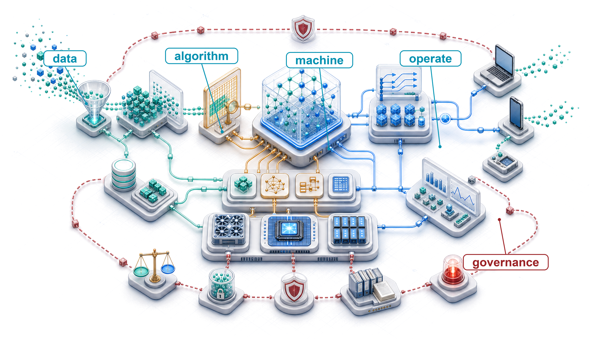

# Conclusion {#sec-conclusion}

::: {layout-narrow}
::: {.column-margin}

\chapterminitoc

:::

::: {.content-visible when-format="pdf"}
\noindent
{fig-alt="Complete single-node ML systems atlas connecting data, model computation, framework lowering, accelerator execution, serving, operations feedback, and governance boundary."}
:::

::: {.content-visible unless-format="pdf"}
{fig-alt="Complete single-node ML systems atlas connecting data, model computation, framework lowering, accelerator execution, serving, operations feedback, and governance boundary."}
:::

:::

## Purpose {.unnumbered .unlisted}

\begin{marginfigure}
\mlsysstack{30}{30}{30}{30}{30}{30}{30}{30}
\end{marginfigure}

_What does mastering the full stack enable that expertise in any single layer cannot?_

A single production decision travels through the entire stack. A data pipeline decides which events count as training signal. That signal shapes the architecture, which in turn fixes memory footprint and arithmetic intensity. Those properties constrain hardware choice, quantization strategy, serving latency, drift monitoring, and governance obligations. Mastered individually, each layer is a valuable skill. Mastered together, they provide the ability to reason across boundaries. An engineer who understands only compression can shrink a model, but cannot predict whether the accuracy loss matters for the deployment context. An engineer who understands only serving can optimize latency, but cannot trace a performance regression to a data pipeline change three stages upstream. The discipline of ML systems engineering is the discipline of seeing these connections, where one team's optimization becomes another team's constraint. The principles governing these interactions—constraint propagation, the memory wall, the training-serving inversion, dispatch overhead, communication cost, and operational lifecycles—are not tied to any specific framework, hardware generation, or model family. Technologies change, but the underlying physical constraints and trade-offs endure. In D·A·M terms, what endures is the ability to look at a system that does not yet exist and reason about how its data, algorithm, and machine constraints will interact, where its bottlenecks will emerge, and which design decisions will prove irreversible. Thinking in systems rather than components is what separates an engineer who can build a part from one who can build the whole.

::: {.content-visible when-format="pdf"}

\newpage

:::

::: {.callout-learning-objectives}

- Synthesize core ML systems principles into a framework for reasoning across Data, Algorithm, and Machine constraints
- Trace how data, architecture, compression, hardware, serving, operations, and governance decisions propagate constraints across an ML system
- Apply lighthouse-model reasoning to diagnose bottlenecks across cloud, mobile, edge, recommendation, and TinyML deployments
- Evaluate deployment trade-offs using latency budgets, memory movement, drift, responsibility, and sustainability constraints
- Design a systems engineering posture for emerging contexts before fleet-scale coordination costs dominate

:::

## Synthesizing ML Systems {#sec-synthesizing-ml-systems-ee10}

Imagine deploying a new image classification model to a fleet of mobile devices. The architecture team chose depthwise separable convolutions for efficiency. The compression team quantized to INT8 for speed. The serving team hit a p99 latency target of 50 ms. Each team succeeded by its own metric, yet within weeks, user complaints arrive: accuracy has dropped by four percentage points on specific firmware and device cohorts. The cause is a subtle interaction between the quantization scheme and a firmware-specific image preprocessing path. No component is broken in isolation, but the data pipeline, architecture, compression strategy, hardware target, and monitoring infrastructure have coupled in production.

Responsible engineering is not an external layer added after optimization, but the discipline of specifying, testing, monitoring, and governing the whole system. ML systems represent a fundamentally different engineering discipline from traditional software because the model is physically inseparable from the system that trains, serves, and monitors it.

At the center of this discipline sits the iron law of ML systems\index{Iron law of ML systems!synthesis} (principle \ref{pri-iron-law}). Its three terms—data movement, compute, and overhead—serve as the primary engineering levers for quantitative analysis. Building intelligence requires both statistical algorithms and adherence to the silicon contract\index{Silicon contract!constraint propagation} (principle \ref{pri-silicon-contract}), the physical agreement between the model and the executing machine. Arithmetic intensity and roofline modeling convert qualitative performance intuitions into exact engineering bounds [@williams2009].

The quantitative foundation leads to a broader point: contemporary artificial intelligence achievements are an emergent property of D·A·M co-design, not any single algorithmic insight. Machine learning belongs to the same engineering tradition that built reliable computers, where emergent capabilities arise from coordinating many parts together. The transformer architecture introduced an attention-based model family [@vaswani2017], and later large language model systems such as GPT-3 and Llama 2 show how that family scaled into a central workload for modern ML systems [@brown2020language; @touvron2023llama2]. Its mathematical design alone does not explain its practical utility. That utility depends on integrating attention mechanisms with distributed training infrastructure, memory-efficient optimization techniques, and reliable operational frameworks.

Integration has concrete consequences. Software engineering often treats the "model" as a weights checkpoint: a 500 MB blob of floating-point numbers. In a production environment, however, the weights are only one component of the true model, and often not the most fragile. A model that produces high benchmark accuracy fails if it ingests corrupted features, and a model that converges cleanly during training fails if it cannot satisfy deployment latency constraints. The *true model* is the sum of the data pipeline that dictates what the learner sees, the training infrastructure that governs optimization, the serving system that mediates inference, and the operational loop that monitors statistical drift. Optimize the system, and the model improves. Neglect the system, and the model degrades. Systems engineering is not a wrapper around ML; it is the physical implementation of ML. *The system is the model.*\index{System is the model, The!definition}

::: {#chk-conclusion-systems-thinking .callout-checkpoint title="Systems thinking"}

The system's dependencies, feedback loops, and request path make its boundaries testable.

**The integration**

- [ ] **Dependencies**: can you trace a data-pipeline change through training and serving to identify its latency effect?
- [ ] **Feedback loops**: have you mapped how the model's predictions influence its future training data?

**The holism**

- [ ] **End-to-end**: can you trace a user request from the UI, through the network, preprocessing, model, postprocessing, and back to the UI?

:::

Tracing a request end to end makes the same point structurally: system boundaries define model capabilities because every layer of the ML stack enforces physical and statistical constraints on the next. The computational substrate begins with data: curation (@sec-data-engineering) and selection (@sec-data-selection) bound the information available to the learner, while neural representations (@sec-neural-computation) and network architectures (@sec-network-architectures) translate statistical priors into concrete tensor graphs. Training systems (@sec-model-training) and execution frameworks (@sec-ml-frameworks) lower those graphs onto physical hardware, converting mathematical optimization into scheduled kernel dispatches and memory allocations.

Lowered to silicon, the engineering challenge shifts to renegotiating physical boundaries. Model compression (@sec-model-compression) reshapes the Pareto frontier across accuracy, memory footprint, and latency; hardware accelerators (@sec-hardware-acceleration) test whether memory bandwidth and arithmetic units can sustain the execution schedule; and rigorous benchmarking (@sec-benchmarking) isolates real hardware speedups from measurement artifacts. In production, serving infrastructure (@sec-model-serving) must satisfy tail-latency budgets under bursty traffic, operational monitoring (@sec-ml-operations) detects statistical drift, and responsible engineering (@sec-responsible-engineering) audits subgroup fairness where aggregate metrics mask localized degradation. These domains form a continuous, coupled pipeline across data engineering, training systems, deployment infrastructure, runtime operations, and governance.

The governing lesson is constraint coupling: decisions never remain localized. An architecture choice enables a compression strategy, which constrains accelerator lowering, establishes serving latency, and dictates operational monitoring requirements. MobileNetV2's depthwise-separable design targeted efficient mobile vision inference [@sandler2018], while integer-arithmetic quantization made INT8 deployment a practical inference path [@jacob2018]. That combination enables mobile NPU execution, establishes a 50 ms p99 latency constraint, and necessitates drift tracking across heterogeneous sensor hardware and device firmware. Decisions propagate downstream. An engineer who optimizes a single layer in isolation cannot predict how interventions ripple across the system.

::: {.column-margin}
{width="100%" fig-alt="Causal chain from architecture choice to INT8 quantization, p99 serving latency, and drift or governance obligations."}

*Architecture choices cascade into compression, serving, drift, and governance.*
:::

The lighthouse models serve as concrete constraint maps for diagnosing these cross-layer interactions. By anchoring analysis in five representative workloads, the synthesis formalizes thirteen quantitative principles—spanning exact physical bounds, empirical decompositions, and diagnostic models—that govern ML system behavior across training, optimization, and deployment.

### Lighthouse models: Constraint propagation {.unnumbered}

The five lighthouse models\index{Lighthouse model!bottleneck probe} (@sec-introduction-iron-law-ml-systems-c32a) ground constraint propagation in concrete execution profiles. Each workload isolates a distinct physical or operational constraint regime:

```{=latex}
\newpage
```
The five workloads span distinct operating regimes:

- **ResNet-50**\index{ResNet-50!batching efficiency}: Batch size turns image inference from memory-bound weight movement into compute-bound matrix throughput by reusing the same filter weights across multiple inputs, amortizing memory transfer costs until arithmetic intensity crosses the hardware ridge point.
- **GPT-2/Llama**\index{GPT-2!memory bandwidth}: Low-batch autoregressive decode stalls on memory bandwidth due to low weight reuse; batching, prefill scheduling, and model parallelism shift the binding constraint.
- **MobileNetV2**\index{MobileNetV2!efficiency under constraint}: Depthwise separable convolutions and INT8 quantization trade representational capacity for mobile NPU deployment under milliwatt thermal envelopes.
- **DLRM**\index{DLRM!capacity-bound workload}: Terabyte-scale embedding tables make memory *capacity* a binding constraint alongside memory *bandwidth*, forcing systems to co-design around memory tiers and sparse access patterns.
- **Keyword spotting (KWS)/Wake Vision**\index{Keyword spotting!sub-megabyte models}: Sub-megabyte microcontroller models with always-on inference under milliwatt power budgets demand zero wasted memory traffic or dispatch overhead.

Together, these five workloads span the deployment spectrum from warehouse-scale data centers to microcontrollers, exposing the bottlenecks that quantitative principles diagnose. Tracing these workloads across architecture, training, optimization, and serving establishes the integrated perspective that distinguishes ML systems engineering from isolated algorithm development.

```{python}
#| echo: false
#| output: false
from mlsysim import *
from mlsysim.core.units import *

# ┌─────────────────────────────────────────────────────────────────────────────
# │ MOBILENET JOURNEY MATH
# ├─────────────────────────────────────────────────────────────────────────────
# │ Context: @tbl-lighthouse-journey-mobilenet (Architecture and Compression rows)
# │          in the Synthesizing ML Systems section.
# │
# │ Goal:    Compute the FLOP and byte ratios that quantify MobileNetV2's
# │          efficiency wins across the architecture/compression journey.
# │ Show:    Depthwise-separable FLOP reduction, ResNet-50 vs. MobileNetV2
# │          operation ratio, and INT8 byte ratios versus FP32/FP16.
# │ How:     Apply the depthwise-separable FLOP formula at a representative
# │          3x3, 256-channel layer; divide ResNet-50/MobileNetV2 inference
# │          FLOPs; divide FP32/FP16 byte widths by INT8 byte width.
# │
# └─────────────────────────────────────────────────────────────────────────────
from mlsysim import Models
from mlsysim.fmt import fmt, check

class MobileNetJourneyMath:
    # LOAD
    resnet = Models.Vision.ResNet50
    mobilenet = Models.Vision.MobileNetV2
    kernel_size = 3
    representative_output_channels = 256

    # EXECUTE
    standard_to_depthwise = (kernel_size**2 * representative_output_channels) / (kernel_size**2 + representative_output_channels)
    resnet_to_mobilenet = resnet.inference_flops / mobilenet.inference_flops
    int8_vs_fp32 = BYTES_FP32 / BYTES_INT8
    int8_vs_fp16 = BYTES_FP16 / BYTES_INT8

    # GUARD
    check(8 <= standard_to_depthwise <= 9, "Depthwise separable example should land near 8--9x.")
    check(13 <= resnet_to_mobilenet.to("").magnitude <= 15, "ResNet-50/MobileNetV2 ratio drifted.")
    check(int8_vs_fp32.to("").magnitude == 4 and int8_vs_fp16.to("").magnitude == 2, "INT8 byte ratios changed.")

    # OUTPUT
    depthwise_reduction_mult_str = fmt_multiple(standard_to_depthwise, precision=1, commas=False)
    resnet_ops_reduction_mult_str = fmt_multiple(resnet_to_mobilenet.to("").magnitude, precision=1, commas=False)
    int8_fp32_reduction_mult_str = fmt_multiple(int8_vs_fp32.to("").magnitude, precision=0, commas=False)
    int8_fp16_reduction_mult_str = fmt_multiple(int8_vs_fp16.to("").magnitude, precision=0, commas=False)
```

@Tbl-lighthouse-journey-mobilenet traces this progression for MobileNetV2, illustrating how cross-layer constraints converge on a single engineering artifact. Across seven phases—from foundational constraints through architecture, training, compression, acceleration, serving, and runtime operations—each engineering decision dictates the options available downstream.

| **Journey Phase**                             | **System Lens**                | **MobileNetV2 Implementation**                                                                                                                                                                                                                                                       |
|:----------------------------------------------|:-------------------------------|:-------------------------------------------------------------------------------------------------------------------------------------------------------------------------------------------------------------------------------------------------------------------------------------|
| **Foundations (@sec-introduction)**           | The AI Triad                   | Bounded by machine constraints (Battery/Thermal)                                                                                                                                                                                                                                     |
| **Architecture (@sec-network-architectures)** | Algorithmic Efficiency         | Depthwise Separable Convolutions: `{python} MobileNetJourneyMath.depthwise_reduction_mult_str` fewer FLOPs for a representative 3-by-3, 256-output-channel layer and `{python} MobileNetJourneyMath.resnet_ops_reduction_mult_str` fewer operations than ResNet-50 at ImageNet scale |
| **Training (@sec-model-training)**            | Throughput vs. Latency         | Optimized for single-request mobile latency; data augmentation can improve robustness                                                                                                                                                                                                |
| **Compression (@sec-model-compression)**      | Navigating the Pareto Frontier | INT8 Quantization: FP32 uses `{python} MobileNetJourneyMath.int8_fp32_reduction_mult_str` and FP16 uses `{python} MobileNetJourneyMath.int8_fp16_reduction_mult_str` the per-value storage of INT8, with accuracy revalidated per deployment                                         |
| **Acceleration (@sec-hardware-acceleration)** | Honoring the Silicon Contract  | Mapping kernels to Mobile NPUs (for example, Apple Neural Engine) to maximize hardware utilization                                                                                                                                                                                   |
| **Serving (@sec-model-serving)**              | Respecting the Latency Budget  | $\text{p99} < 50$ ms constraint; optimizing preprocessing (resize/normalize) to avoid CPU bottlenecks                                                                                                                                                                                |
| **Operations (@sec-ml-operations)**           | Managing System Entropy        | Drift Monitoring: Detecting distribution shifts and tracking cohort-level accuracy across heterogeneous device populations and lighting conditions                                                                                                                                   |

: **The Lighthouse Journey (MobileNetV2)**: Tracing one model through seven phases of the systems stack shows how decisions in one domain (for example, architecture) propagate constraints and opportunities into downstream domains (for example, hardware acceleration and monitoring). {#tbl-lighthouse-journey-mobilenet tbl-colwidths="[17,22,61]"}

Decisions in one row dictate options in the next: architecture choices (depthwise separable convolutions) enable compression strategies (INT8 quantization), which in turn make mobile NPU acceleration feasible. This constraint propagation is universal across machine learning workloads. Formalizing these trade-offs requires quantitative principles—spanning exact physical bounds, empirical decompositions, and assumption-dependent diagnostics.

## Thirteen Quantitative Principles {#sec-thirteen-quantitative-invariants-0dd2}

Reasoning about ML system behavior requires quantitative instruments. These **thirteen quantitative principles**\index{Thirteen quantitative principles!framework} deliberately combine exact mathematical bounds, engineering decompositions, fitted empirical models, policy constraints, and design heuristics. @Tbl-thirteen-principles summarizes all thirteen principles across four systems phases. Their utility depends on rigorous application within stated assumptions rather than treating every relation as an unvarying physical law.

```{python}
#| echo: false
#| label: conclusion-energy-movement-math
#| output: false
# ┌─────────────────────────────────────────────────────────────────────────────
# │ ENERGY-MOVEMENT INVARIANT RATIOS
# ├─────────────────────────────────────────────────────────────────────────────
# │ Context: @tbl-thirteen-principles (energy-movement invariant row) and the
# │          adjacent diagnostic-chain paragraph in the Thirteen Quantitative
# │          Invariants section.
# │
# │ Goal:    Quantify the energy cost of a DRAM access relative to a single
# │          FP32 or FP16 floating-point operation.
# │ Show:    DRAM-vs-FP32 and DRAM-vs-FP16 energy ratios used to anchor the
# │          "100--1,000x" energy-movement claim in prose.
# │ How:     Divide the reference DRAM access energy by the per-FLOP energy
# │          constants for FP32 and FP16 from mlsysim.core.units.
# │
# └─────────────────────────────────────────────────────────────────────────────
from mlsysim.core.units import flop
from mlsysim.fmt import fmt_int, fmt, fmt_multiple, fmt_multiple_range, check

class EnergyMovementMath:
    # LOAD
    ENERGY_DRAM_ACCESS_PJ = Hardware.Tech.Memory.DRAM.energy_per_access
    ENERGY_FLOP_FP32_PJ = Hardware.Tech.Op.FlopFp32.energy
    ENERGY_FLOP_FP16_PJ = Hardware.Tech.Op.FlopFp16.energy
    dram_access = ENERGY_DRAM_ACCESS_PJ
    fp32_flop_energy = ENERGY_FLOP_FP32_PJ * flop
    fp16_flop_energy = ENERGY_FLOP_FP16_PJ * flop

    # EXECUTE
    dram_vs_fp32 = (dram_access / fp32_flop_energy).to("").magnitude
    dram_vs_fp16 = (dram_access / fp16_flop_energy).to("").magnitude

    # GUARD
    check(100 <= dram_vs_fp32 <= 1000, "DRAM/FP32 energy ratio left expected range.")
    check(100 <= dram_vs_fp16 <= 1000, "DRAM/FP16 energy ratio left expected range.")

    # OUTPUT
    dram_vs_fp32_display = round(dram_vs_fp32)
    dram_vs_fp16_display = round(dram_vs_fp16)
    dram_vs_fp32_mult_str = fmt_multiple(dram_vs_fp32_display, precision=0, commas=False)
    dram_vs_fp16_mult_str = fmt_multiple(dram_vs_fp16_display, precision=0, commas=False)
    dram_vs_range_mult_str = fmt_multiple_range(
        dram_vs_fp32_display,
        dram_vs_fp16_display,
        precision=0,
        commas=False,
    )
```

| **#**                           | **Principle**                    | **Part**       | **Core Equation/Statement**                                                                                                  | **What It Predicts**                                    |
|:--------------------------------|:---------------------------------|:---------------|:-----------------------------------------------------------------------------------------------------------------------------|:--------------------------------------------------------|
| \ref{pri-data-as-code}          | Data-as-Code Principle           | I: Foundations | Behavior $=f$(data, algorithm, code, randomness)                                                                             | Data changes behavior; other inputs also matter         |
| \ref{pri-data-gravity}          | Data-Gravity Principle           | I: Foundations | Move compute toward data when repeated transfer costs exceed placement costs                                                 | Depends on volume, reuse, network, and compute mobility |
| \ref{pri-iron-law}              | Iron Law of ML Systems           | II: Build      | $T_{\text{seq}}=D_{\text{vol}}/\text{BW}+O/(R_{\text{peak}}\eta_{\text{hw}})+L_{\text{lat}}$; overlap ranges from max to sum | Stages may add or overlap                               |
| \ref{pri-silicon-contract}      | Silicon Contract                 | II: Build      | $I_{\text{ridge}}=R_{\text{peak}}/\text{BW}$; compare $I_{\text{model}}$ with $I_{\text{ridge}}$                             | Diagnoses bandwidth- versus compute-limited operation   |
| \ref{pri-pareto-frontier}       | Pareto Frontier                  | III: Optimize  | $\nexists c'\ne c:\,[\forall k\,M_k(c')\ge M_k(c)]\land[\exists j\,M_j(c')>M_j(c)]$                                          | No distinct configuration dominates a frontier point    |
| \ref{pri-arithmetic-intensity}  | Arithmetic Intensity Law         | III: Optimize  | $R_{\text{attain}} \le \min(R_{\text{peak}},\; I \times \text{BW})$                                                          | More compute cannot raise a bandwidth ceiling           |
| \ref{pri-energy-movement}       | Energy-Movement Invariant        | III: Optimize  | $E_{\text{total}}=\sum_j N_jE_j$; DRAM/FLOP cost ratio: `{python} EnergyMovementMath.dram_vs_range_mult_str`                 | Total energy depends on event counts and costs          |
| \ref{pri-amdahl}                | Amdahl's Law                     | III: Optimize  | $\text{Speedup} = \frac{1}{(1-f_{\text{parallel}}) + \frac{f_{\text{parallel}}}{S_{\text{parallel}}}}$                       | The serial fraction caps all parallelism gains          |
| \ref{pri-verification-gap}      | Verification Gap                 | IV: Deploy     | $\Pr_{(X,Y)\sim P_{\text{deploy}}}[d(f(X),Y)\le\tau]\ge1-\epsilon$                                                           | Specify distance, tolerance, population, and confidence |
| \ref{pri-statistical-drift}     | Statistical Drift Diagnostic     | IV: Deploy     | $\text{Accuracy}(t)\approx\text{Accuracy}_0-\lambda\mathcal{D}(P_t\Vert P_0)$                                                | A local fit; drift need not lower quality               |
| \ref{pri-training-serving-skew} | Training-Serving Skew Diagnostic | IV: Deploy     | $S_{\text{skew}}=\mathbb{E}_{X\sim P_{\text{deploy}}}[d(f_{\text{serve}}(X),f_{\text{train}}(X))]$                           | Output mismatch signals risk, not accuracy loss         |
| \ref{pri-latency-budget}        | Latency Budget Principle         | IV: Deploy     | $T_q\le L_{\text{budget}}$                                                                                                   | The product SLO selects $q$ and its budget              |
| \ref{pri-bias-feedback}         | Bias Feedback Model              | IV: Deploy     | $\Delta_g(k)\approx\Delta_g(0)\alpha_{\text{fb}}^k$ with fitted $\alpha_{\text{fb}}$                                         | Feedback may amplify harm; measure and intervene        |

: **Thirteen Quantitative Principles**: Each tool appears in the part where its governing constraint or diagnostic use first becomes visible. The collection combines bounds, decompositions, fitted models, policy requirements, and heuristics. Each row is useful only under its stated assumptions; together they provide a shared analytical vocabulary for system design, optimization, and deployment rather than a set of universal invariants. {#tbl-thirteen-principles tbl-colwidths="[3,15,13,39,30]"}

The thirteen principles are not independent axioms. They form an integrated framework connected by a single meta-principle: the conservation-of-complexity heuristic\index{Conservation of complexity!meta-principle}.[^fn-conservation-complexity-heuristic] Complexity removed from one interface often reappears in another part of the system, but this is not a physical conservation law and does not imply that every simplification has an equal compensating cost. Its value is diagnostic: after simplifying one component, check where validation, state, coordination, or operational burden changed. The test is whether the principles explain the same lighthouse bottlenecks from data, model, hardware, and deployment perspectives without contradicting one another.

[^fn-conservation-complexity-heuristic]: **Conservation-of-complexity heuristic**\index{Conservation of complexity!heuristic limits}: Tesler's Law\index{Tesler's law!conservation of complexity}, a design aphorism, says that an application's irreducible complexity must be handled somewhere in the interaction among user, application, and platform [@tesler1984complexity]; extending it to all ML-system complexity is an analogy, not a physical law. Quantization may add validation burden, and abstraction may move implementation detail behind an interface, but good design can also remove accidental complexity outright. Large language model application pipelines illustrate a possible shift: simplifying the user-facing interface with shorter or vaguer prompts may move work into system prompts, retrieval, or output verification. Use the heuristic to search for displaced costs, not to assume that an equal compensating cost must exist.

### Foundations: Where complexity originates (principles 1–2) {.unnumbered}

The data-as-code principle\index{Data-as-code principle!logical program} (\ref{pri-data-as-code}) and the data-gravity heuristic\index{Data gravity principle!physical anchor} (principle \ref{pri-data-gravity}), developed in @sec-data-engineering, establish data as a primary logical program and physical anchor. Runtime behavior reflects data, algorithm, and implementation in concert, while compute-to-data placement balances transfer volume, reuse frequency, network bandwidth, and compute mobility. Model behavior and architecture directly inherit constraints from this data substrate.

The lighthouse models illustrate both principles. ResNet-50 and GPT-2 acquire their capabilities from architecture coupled to massive training corpora. DLRM's terabyte-scale embedding tables make memory capacity a primary design constraint, requiring the execution system to be engineered around where the data physically resides. Compute-to-data placement recurs across deployment environments precisely because moving large, low-reuse datasets saturates interconnects.

### Build: How complexity becomes computation (principles 3–4) {.unnumbered}

The iron law (principle \ref{pri-iron-law}) and the silicon contract (principle \ref{pri-silicon-contract}) govern execution efficiency. The iron law's three-term decomposition (@sec-introduction-iron-law-ml-systems-c32a) isolates data movement, computation, and overhead; the silicon contract reveals which term limits performance on a given architecture-hardware pair. Workloads inhabit distinct regimes: batched ResNet-50 inference saturates compute units, low-batch Llama decode stalls on memory bandwidth, DLRM exhausts memory capacity, and MobileNetV2 restructures tensor operations to execute within mobile NPU bounds. As mapped in @sec-appdx-dam-taxonomy-bottleneck-diagnostic-3fc9, diagnosing whether an execution path is compute-bound, bandwidth-bound, or capacity-bound determines which optimizations yield speedup and which waste engineering effort. Training latency drops most when engineers target the binding term directly rather than distributing effort uniformly (@sec-model-training).

### Optimize: How constraints shape trade-offs (principles 5–8) {.unnumbered}

The four optimization principles form a tightly coupled diagnostic chain. The Pareto frontier\index{Pareto frontier!multi-objective optimization} (principle \ref{pri-pareto-frontier}) identifies nondominated trade-offs after objective directions are normalized: quantization trades precision for memory traffic, pruning trades capacity for speed, and distillation trades training compute for inference efficiency. The arithmetic intensity law\index{Arithmetic intensity!bottleneck diagnosis} (principle \ref{pri-arithmetic-intensity}) diagnoses whether compute or bandwidth sets the ideal ceiling. The energy-movement invariant\index{Energy-movement invariant!data locality} (principle \ref{pri-energy-movement}) combines per-event costs with event counts: under reference hardware constants, one DRAM access costs about `{python} EnergyMovementMath.dram_vs_range_mult_str` as much as one FP32/FP16 arithmetic operation, but workload-total dominance depends on how many of each occur. Amdahl's Law\index{Amdahl's law!preprocessing bottleneck} (principle \ref{pri-amdahl}) sets the ceiling on any parallelism gain, explaining why data loading and preprocessing can become bottlenecks in highly optimized systems.

MobileNetV2 (@sec-network-architectures) balances all four principles simultaneously. Depthwise separable convolutions reshape the Pareto frontier [@sandler2018]. INT8 quantization\index{INT8 quantization!bandwidth trade-off} exploits the arithmetic intensity law by raising arithmetic intensity through reduced memory traffic [@jacob2018]. The resulting energy savings align with the energy-movement invariant, while Amdahl's Law bounds end-to-end speedup when host-side preprocessing remains unaccelerated. Microcontroller workloads such as KWS compress these trade-offs further, operating under sub-megabyte memories with zero margin for operational waste.

### Deploy: How reality defeats assumptions (principles 9–13) {.unnumbered}

The deployment principles address failures that bench testing cannot rule out: a system can work correctly on the bench yet fail silently in production. The verification gap\index{Verification gap!statistical testing} (principle \ref{pri-verification-gap}) means statistical verification holds only over a stated deployment population, task distance, tolerance, target error, and finite-sample confidence procedure; testing estimates behavior rather than proving correctness for every future input. The statistical drift diagnostic\index{Statistical drift risk!accuracy erosion} (principle \ref{pri-statistical-drift}) detects distribution change but does not determine whether accuracy worsens, stays constant, or improves, so a local degradation curve is valid only when fitted against outcomes. The training-serving skew diagnostic\index{Training-serving skew!accuracy impact} (principle \ref{pri-training-serving-skew}) is likewise a risk indicator rather than a universal accuracy-loss equation, although preprocessing or numerical differences can still cause quality changes. The latency budget\index{Latency budget!tail latency constraint} (principle \ref{pri-latency-budget}) constrains serving at the quantile selected by the product requirement, which may be p95, p99, or another tail measure. Finally, the bias feedback model\index{Bias feedback model!disparity amplification} (principle \ref{pri-bias-feedback}) can represent disparity amplification, but an exponential recurrence requires a measured, approximately constant feedback factor and no effective intervention.

The five deployment principles govern the operational tooling examined in @sec-ml-operations: monitoring infrastructure, drift detection, feature stores, and disaggregated subgroup metrics exist to surface silent failures and trigger corrective action. A recommendation system that achieves high offline accuracy still requires parity checks when training-serving skew corrupts feature pipelines (principle \ref{pri-training-serving-skew}) and outcome auditing when user behavior shifts seasonally (principle \ref{pri-statistical-drift}). Large language model serving must bound tail latency through continuous batching and speculative decoding (@sec-model-serving) to prevent violating product service-level objectives. Similarly, an automated credit model may satisfy throughput and convergence targets while systematically compounding disparities against underserved groups, requiring disaggregated monitoring to intercept feedback loops (principle \ref{pri-bias-feedback}).

### The integrated framework {.unnumbered}

The thirteen principles are not a checklist to apply sequentially. They form a web of mutual constraints. The conservation-of-complexity heuristic prompts engineers to look for where a local simplification changes burdens elsewhere.

Quantizing a model from FP16 to INT8 illustrates these mutual constraints in action. This single intervention navigates the Pareto frontier (principle \ref{pri-pareto-frontier}), trading numerical precision for memory traffic. The consequences ripple across the stack: quantization alters the model's silicon contract (principle \ref{pri-silicon-contract}), shifting its operating point on the arithmetic intensity curve (principle \ref{pri-arithmetic-intensity}) and transforming its energy profile (principle \ref{pri-energy-movement}). In deployment, the latency budget (principle \ref{pri-latency-budget}) dictates whether the resulting speedup meets the service-level objective (SLO), while deployment validation must verify that the lowered serving graph preserves the empirical accuracy measured during compression testing. A single quantization decision simultaneously shifts the Pareto frontier, silicon contract, and latency budget—where bandwidth savings must be verified against numerical degradation.

That trace does not require every principle to apply at once. It shows how the relevant principles become active as a decision moves from model representation to hardware execution to production validation. Data placement affects where the model can run, Amdahl's Law limits how much the faster kernel can improve the whole request path, verification bounds the resulting accuracy loss, and outcome monitoring tests whether the validated behavior persists after deployment. The engineer's task is to trace displaced costs rather than assume that complexity is conserved.

A small deployment proposal makes this web of constraints concrete.

::: {#chk-conclusion-applying-invariants .callout-checkpoint title="Applying the principles"}

A colleague proposes quantizing your model from FP32 to INT8 to reduce serving costs.

**Trace the principles**

- [ ] **Pareto frontier** (principle \ref{pri-pareto-frontier}): What accuracy are you trading for the bandwidth gain?
- [ ] **Silicon contract** (principle \ref{pri-silicon-contract}): Does the target hardware efficiently accelerate the required INT8 operators?
- [ ] **Serving-path validation**: does the quantized serving artifact preserve the behavior accepted during compression testing?
- [ ] **Latency budget** (principle \ref{pri-latency-budget}): Does the speedup bring you within SLO, or create headroom for batching?

:::

@Fig-invariants-cycle maps this cycle of mutual constraint. Four phases—Foundations, Build, Optimize, and Deploy—surround a central hub representing the conservation-of-complexity heuristic. Arrows trace how engineering choices propagate downstream: Build constraints dictate Optimize strategies, while runtime signals—statistical drift, feature skew, and outcome regressions—feed back into Foundations. Managing this cycle requires steering displaced complexity toward layers capable of handling it efficiently.

The Deploy-to-Foundations feedback loop is central to production engineering. Principles 9 through 13 expose signals that trigger targeted remediations: canary rollbacks, fallback heuristics, dataset augmentation, model retraining, or kernel retuning. When anomalies emerge, engineers diagnose root causes rather than triggering uncalibrated rollbacks. This cycle governs single-system design: the objective is not to catalog every future architecture, but to make feedback loops observable before operational failures compound.

::: {#fig-invariants-cycle fig-env="figure" fig-pos="htb" fig-cap="**The Cycle of ML Systems (13 Principles)**: A four-phase systems engineering lifecycle organized around the conservation-of-complexity heuristic. The phases connect in a feedback cycle, and the thirteen principles are grouped along the transitions as bounds, decompositions, fitted models, policy requirements, and design heuristics whose assumptions must be checked." fig-alt="Clockwise circular diagram with four phases: Foundations (Data), Build (Model), Optimize (Hardware), and Deploy (Operations). Arrows connect Foundations to Build, Build to Optimize, Optimize to Deploy, and Deploy back to Foundations. The transitions are labeled 1–2 Data as Code and data gravity; 3–4 iron law and Silicon Contract; 5–8 Pareto Frontier, Arithmetic Intensity, Energy-Movement, and Amdahl’s Law; and 9–13 verification gap, Statistical Drift, Skew Diagnostic, Latency Budget, and Bias Feedback. A dashed center circle is labeled Conservation of Complexity."}

```{.tikz}
\begin{tikzpicture}[line join=round,font=\sffamily]

\tikzset{
Box/.style={align=flush center,
    inner sep=4pt,
    node distance=1.4,
    draw=OrangeLine,
    line width=0.75pt,
    rounded corners,
    fill=OrangeL!30,
    text width=25mm,
    minimum width=25mm, minimum height=10mm
  },
Box2/.style={Box, draw=VioletLine, fill=VioletL2!70,align=left,
    text width=36mm, minimum width=36mm, minimum height=10mm
  },
  }

\tikzset{%
planet/.style = {circle, draw=yellow!50!red!90,semithick, fill=yellow!30,line width=1.5pt,
                    font=\sffamily\bfseries,
                    minimum size=24mm, inner sep=1mm,align=flush center},
satellite/.style = {circle, draw=none, semithick, fill=#1!10,
                    text width=26mm, inner sep=1pt, align=flush center,minimum size=20mm,minimum height=12mm},
TxtC/.style = {font=\small\sffamily,text width=44mm,align=flush center},
arr/.style = {-{Triangle[length=3mm,width=6mm]}, color=#1!60,
                    line width=3mm, shorten <=1mm, shorten >=1mm},
LineA/.style = {violet!60,{Circle[line width=1.5pt,fill=white,length=7.5pt]}-,line width=2.0pt,shorten <=-4pt},
LineAA/.style={violet!30,dashed, line width=1.0pt,{-{Triangle[width=1.0*6pt,length=1.6*6pt]}},shorten <=3pt,shorten >=2pt}
}

\tikzset{pics/brain/.style = {
        code = {
        \pgfkeys{/channel/.cd, #1}
\begin{scope}[local bounding box=BRAIN,scale=\scalefac, every node/.append style={transform shape}]
\draw[fill=\filllcolor,line width=\Linewidth](-0.3,-0.10)to(0.08,0.60)
to[out=60,in=50,distance=3](-0.1,0.69)to[out=160,in=80](-0.26,0.59)to[out=170,in=90](-0.46,0.42)
to[out=170,in=110](-0.54,0.25)to[out=210,in=150](-0.54,0.04)
to[out=240,in=130](-0.52,-0.1)to[out=300,in=240]cycle;
\draw[fill=\filllcolor,line width=\Linewidth]
(-0.04,0.64)to[out=120,in=0](-0.1,0.69)(-0.19,0.52)to[out=120,in=330](-0.26,0.59)
(-0.4,0.33)to[out=150,in=280](-0.46,0.42)
%
(-0.44,-0.03)to[bend left=30](-0.34,-0.04)
(-0.33,0.08)to[bend left=40](-0.37,0.2) (-0.37,0.12)to[bend left=40](-0.45,0.14)
(-0.26,0.2)to[bend left=30](-0.24,0.13)
(-0.16,0.32)to[bend right=30](-0.27,0.3)to[bend right=30](-0.29,0.38)
(-0.13,0.49)to[bend left=30](-0.04,0.51);
\draw[rounded corners=0.8pt,line width=1.5*\Linewidth,\drawcircle,-{Circle[fill=\filllcolor,length=4.15pt]}](-0.23,0.03)--(-0.15,-0.03)--(-0.19,-0.18)--(-0.04,-0.28);
\draw[rounded corners=0.8pt,line width=1.5*\Linewidth,\drawcircle,-{Circle[fill=\filllcolor,length=4.15pt]}](-0.17,0.13)--(-0.04,0.05)--(-0.06,-0.06)--(0.14,-0.11);
\draw[rounded corners=0.8pt,line width=1.5*\Linewidth,\drawcircle,-{Circle[fill=\filllcolor,length=4.15pt]}](-0.12,0.23)--(0.31,0.0);
\draw[rounded corners=0.8pt,line width=1.5*\Linewidth,\drawcircle,-{Circle[fill=\filllcolor,length=4.15pt]}](-0.07,0.32)--(0.06,0.26)--(0.16,0.33)--(0.34,0.2);
\draw[rounded corners=0.8pt,line width=1.5*\Linewidth,\drawcircle,-{Circle[fill=\filllcolor,length=4.15pt]}](-0.01,0.43)--(0.06,0.39)--(0.18,0.51)--(0.31,0.4);
\end{scope}
     }
  }
}

%brick
\tikzset{
  cigla/.style={ inner sep=0pt,anchor=west,
    node distance=1.4pt,
    draw=none,
    line width=0.1pt,
    rounded corners=1pt,
    fill=\filllcolor,
    minimum width=4mm, minimum height=2mm
  },
    cigla1/.style={cigla,fill=\filllcirclecolor},
pics/brick/.style = {
        code = {
        \pgfkeys{/channel/.cd, #1}
\begin{scope}[shift={($(0,0)+(0,0)$)},scale=\scalefac,every node/.append style={transform shape}]
\path[clip] (-1.05,-0.52)rectangle (0.71,0.45);
\node[cigla](C1) at (-1.03,-0.4){};
\node[cigla1,right= of C1](C2){};
\node[cigla,right= of C2](C3){};
\node[cigla1,right= of C3](C4){};
%
\node[cigla,above right= of C1,anchor=south](C11){};
\node[cigla1,right= of C11](C12){};
\node[cigla,right= of C12](C13){};
\node[cigla1,right= of C13](C14){};
%
\node[cigla,above right= of C11,anchor=south](C21){};
\node[cigla1,right= of C21](C22){};
\node[cigla,right= of C22](C23){};
%
\node[cigla,above right= of C21,anchor=south](C31){};
\node[cigla1,right= of C31](C32){};
\node[cigla,right= of C32](C33){};
\end{scope}
    }
  }
}
%vaga
\tikzset{
pics/vaga/.style = {
        code = {
        \pgfkeys{/channel/.cd, #1}
\begin{scope}[shift={($(0,0)+(0,0)$)},scale=\scalefac,every node/.append style={transform shape}]
\node[rectangle,minimum width=2mm,minimum height=22mm,
draw=none, fill=\filllcolor,line width=\Linewidth](1R) at (0,-0.95){};
\fill[fill=\filllcolor!60!black](230:2.8)arc(230:310:2.8)--cycle;%circle(2.9);
%LT
\node [semicircle, shape border rotate=180,  anchor=chord center,
      minimum size=11mm, draw=none, fill=\filllcirclecolor](LT) at (-2,-0.5) {};
\node [circle,  minimum size=4mm, draw=none, fill=\filllcirclecolor](T1) at (-2,1.25) {};
\draw[draw=\drawcolor,line width=1.2*\Linewidth,shorten <=3pt,shorten >=3pt](T1)--(LT);
\draw[draw=\drawcolor,line width=1.2*\Linewidth,shorten <=3pt,shorten >=3pt](T1)--(LT.30);
\draw[draw=\drawcolor,line width=1.2*\Linewidth,shorten <=3pt,shorten >=3pt](T1)--(LT.150);
%DT
\node [semicircle, shape border rotate=180,  anchor=chord center,
      minimum size=11mm, draw=none, fill=\filllcirclecolor!70!black](DT) at (2,-0.5) {};
\node [circle,  minimum size=4mm, draw=none, fill=\filllcirclecolor!70!black](T2) at (2,1.25) {};
\draw[draw=\drawcolor,line width=1.2*\Linewidth,shorten <=3pt,shorten >=3pt](T2)--(DT);
\draw[draw=\drawcolor,line width=1.2*\Linewidth,shorten <=3pt,shorten >=3pt](T2)--(DT.30);
\draw[draw=\drawcolor,line width=1.2*\Linewidth,shorten <=3pt,shorten >=3pt](T2)--(DT.150);
%
\node[draw=none,rectangle,minimum width=32mm,minimum height=1.5mm,inner sep=0pt,
fill=\filllcolor!60!black]at(0,1.25){};
\node[draw=white,fill=\filllcolor,line width=2*\Linewidth,ellipse,minimum width=9mm,  minimum height=15mm](EL)at(0,0.85){};
\node[draw=white,fill=\filllcolor!60!black,line width=2*\Linewidth,circle,minimum size=10mm](2C)at(0,2.05){};
\end{scope}
    }
  }
}
%llm
\tikzset{
pics/llm/.style = {
        code = {
        \pgfkeys{/channel/.cd, #1}
\begin{scope}[shift={($(0,0)+(0,0)$)},scale=\scalefac,every node/.append style={transform shape}]
\node[circle,minimum size=12mm,draw=\drawcolor, fill=\filllcolor!70,line width=0.5*\Linewidth](C\picname) at (0,0){};
\def\startangle{90}
\def\radius{1.15}
\def\radiusI{1.1}
\foreach \i [evaluate=\i as \j using \i+1] [count =\k] in {0,2,4,6,8} {
\pgfmathsetmacro{\angle}{\startangle - \i * (360/8)}
\draw[draw=black,-{Circle[black ,fill=\filllcirclecolor,length=5.5pt,line width=0.5*\Linewidth]},line width=1.5*\Linewidth](C\picname)--++(\startangle - \i*45:\radius) ;
\node[circle,draw=black,fill=\filllcirclecolor!80!red!50,inner sep=3pt,line width=0.5*\Linewidth](2C\k)at(\startangle - \j*45:\radiusI) {};
}
\draw[line width=1.5*\Linewidth](2C1)--++(-0.5,0)|-(2C2);
\draw[line width=1.5*\Linewidth](2C3)--++(0.5,0)|-(2C4);
\node[circle,minimum size=12mm,draw=\drawcolor, fill=\filllcolor!70,line width=0.5*\Linewidth]at (0,0){};
\end{scope}
    }
  }
}
%battery
\tikzset{
pics/battery/.style = {
        code = {
        \pgfkeys{/channel/.cd, #1}
\begin{scope}[shift={($(0,0)+(0,0)$)},scale=\scalefac,every node/.append style={transform shape}]
\node[rectangle,minimum width=35mm,minimum height=8mm,draw=\drawcolor,
rounded corners=4pt,fill=\filllcirclecolor,line width=\Linewidth](2R\picname) at (1,0){};
\node[rectangle,minimum width=45mm,minimum height=22mm,draw=\drawcolor,
rounded corners=4pt,fill=\filllcolor,line width=\Linewidth](R\picname) at (0,0){};
\node[rectangle,minimum width=5mm,minimum height=18mm,draw=none,
fill=green,line width=\Linewidth](3R\picname) at ($(R\picname.west)!0.5!(R\picname.east)$){};
\node[rectangle,minimum width=5mm,minimum height=18mm,draw=none,
fill=green,line width=\Linewidth](3R\picname) at ($(R\picname.west)!0.33!(R\picname.east)$){};
\node[rectangle,minimum width=5mm,minimum height=18mm,draw=none,
fill=green,line width=\Linewidth](3R\picname) at ($(R\picname.west)!0.16!(R\picname.east)$){};

\end{scope}
    }
  }
}
%rocket
\tikzset{
pics/rocket/.style = {
        code = {
        \pgfkeys{/channel/.cd, #1}
\begin{scope}[shift={($(0,0)+(0,0)$)},scale=\scalefac,every node/.append style={transform shape},line cap = round]
%vrh
\draw[fill=\filllcolor,draw=\drawcolor,line width=\Linewidth](-0.26,0.5)to[bend right=12](0.26,0.5)to[bend right=7] (0,0.85)to[bend right=7] cycle;
%krila
\draw[fill=\filllcolor!70!red,draw=\drawcolor,line width=\Linewidth,rounded corners=1pt](-0.2,-0.7)--(-0.45,-0.9)--(-0.567,-0.4)--(-0.3,-0.17)--cycle;
\draw[fill=\filllcolor!70!red,draw=\drawcolor,line width=\Linewidth,rounded corners=1pt](0.2,-0.7)--(0.45,-0.9)--(0.567,-0.4)--(0.3,-0.17)--cycle;
%rep
\draw[fill=\filllcolor!70!green,draw=\drawcolor,line width=\Linewidth](0.16,-0.76)--(0.22,-0.9)--(-0.2,-0.9)--(-0.15,-0.76)--cycle;
%body
\draw[fill=\filllcolor,draw=\drawcolor,line width=\Linewidth](-0.2,-0.7)--(0.2,-0.7)to[out=75,in=320](0,0.85)to[out=220,in=105] cycle;
%krug
\node[circle,draw=\drawcolor,minimum size=4mm,fill=\filllcirclecolor,line width=\Linewidth]{};
\draw[draw=\drawcolor,line width=1.5*\Linewidth](0,-0.99)--(0,-1.3);
\draw[draw=\drawcolor,line width=1.5*\Linewidth](-0.11,-0.99)--(-0.11,-1.2);
\draw[draw=\drawcolor,line width=1.5*\Linewidth](0.11,-0.99)--(0.11,-1.2);
\end{scope}
    }
  }
}
\pgfkeys{
  /channel/.cd,
   Depth/.store in=\Depth,
  Height/.store in=\Height,
  Width/.store in=\Width,
  filllcirclecolor/.store in=\filllcirclecolor,
  filllcolor/.store in=\filllcolor,
  drawcolor/.store in=\drawcolor,
  drawcircle/.store in=\drawcircle,
  scalefac/.store in=\scalefac,
  Linewidth/.store in=\Linewidth,
  picname/.store in=\picname,
  filllcolor=BrownLine,
  filllcirclecolor=violet!20,
  drawcolor=black,
  drawcircle=violet,
  scalefac=1,
  Linewidth=0.5pt,
  Depth=1.3,
  Height=0.8,
  Width=1.1,
  picname=C
}

\def\radius{3.9}
\def\startangle{90}

\foreach \i/\j/\sho [count=\k from 0] in {
%green!79!black
white/{\textbf{}\\ }/15pt,
%magenta!60!
white/{\textbf{}\\ }/15pt,
%gray
white/{\textbf{}\\}/15pt,
%cyan
white/{\textbf{}\\ }/15pt
}
{
%Satelit
\pgfmathsetmacro{\angle}{\startangle - \k * (360/4)}
\node (s\k) [satellite=\i, font=\footnotesize\sffamily] at (\angle:\radius) {};
 \node[TxtC,below=0pt of s\k]{\j};
}
%logos
%brick
\pic[shift={(0.15,0.15)}] at  (s3) {brick={scalefac=1.1,picname=1,filllcolor=red!70!black!80,Linewidth=1.0pt,filllcirclecolor=red!90!black!50}};
%llm
\pic[shift={(0,0)}] at  (s0){llm={scalefac=0.9,drawcolor=BlueLine,filllcolor=BlueLine!10!, Linewidth=1.25pt,filllcirclecolor=red}};
%brain
\pic[shift={(0.1,-0.16)}] at  (s0){brain={scalefac=0.8,picname=1,filllcolor=orange!30!, filllcirclecolor=cyan!55!black!60, Linewidth=0.5pt}};
%battery
\pic[shift={(0,0)}] at  (s1){battery={scalefac=0.38,picname=1, drawcolor=BrownLine,filllcolor=BrownLine!10!, Linewidth=1.5pt,filllcirclecolor=BrownLine}};
%rocket
\pic[shift={(0,0.2)}] at  (s2){rocket={scalefac=1.1,picname=1, drawcolor=black,filllcolor=cyan!10!, Linewidth=1.0pt,filllcirclecolor=red}};
%center
\node[circle, draw=BrownLine, dashed,thick, fill=none,minimum size=26mm](CE)at(0,0){};
 \node[TxtC,below=0pt of CE]{Conservation\\ of Complexity};
 \pic[shift={(0,0)}] at  (0,0){vaga={scalefac=0.35,picname=1,filllcolor=BlueLine,  Linewidth=1.0pt,filllcirclecolor=orange}};
\def\ra{26mm}
\foreach \i [count=\k from 0] in{360,320,140,135}{
\pgfmathtruncatemacro{\newX}{\i + 90} %
\draw[line width=2.6pt,violet]
   (s\k)+(\i:0.5*\ra) arc[start angle=\i, end angle=\newX, radius=0.5*\ra];
}
 \draw[LineA](s0.35)--++(0:1)coordinate(MA);
 \node[Box,anchor=west](FO)at(MA){\textbf{Build}\\ (Model)};
 \draw[LineA](s1.355)--++(345:1)coordinate(ST);
 \node[Box,anchor=west](PR)at(ST){\textbf{Optimize}\\ (Hardware)};
 \draw[LineA](s2.185)--++(200:3.25)coordinate(DE);
 \node[Box,anchor=west](DEP)at(DE){\textbf{Deploy}\\(Operations)};
 \draw[LineA](s3.180)--++(180:3.9)coordinate(FO);
 \node[Box,anchor=west](FND)at(FO){\textbf{Foundations}\\(Data)};
%
\draw[-{Triangle[width=18pt,length=8pt]}, line width=10pt,cyan!40] (60:\radius)
arc[radius=\radius, start angle=60, end angle= 16];
\coordinate (AR1) at (38:\radius);
\draw[-{Triangle[width=18pt,length=8pt]}, line width=10pt,cyan!40] (340:\radius)
arc[radius=\radius, start angle=340, end angle= 290];
\coordinate (AR2) at (315:\radius);
\draw[-{Triangle[width=18pt,length=8pt]}, line width=10pt,cyan!40] (240:\radius)
arc[radius=\radius, start angle=240, end angle= 200];
\coordinate (AR3) at (225:\radius);
\draw[-{Triangle[width=18pt,length=8pt]}, line width=10pt,cyan!40] (160:\radius)
arc[radius=\radius, start angle=160, end angle= 114];
\coordinate (AR4) at (137:\radius);
%
 \draw[LineA](AR1)--++(0:1.3)coordinate(MA);
 \node[Box2,anchor=west]at(MA){3. Iron Law\\
4. Silicon Contract};
 \draw[LineA](AR2)--++(340:1.6)coordinate(MA1);
 \node[Box2,anchor=west]at(MA1){5. Pareto Frontier\\
6. Arith. Intensity\\
7. Energy-Movement\\
8. Amdahl’s Law};
 \draw[LineA](AR3)--++(180:6.5)coordinate(MA2);
 \node[Box2,anchor=west]at(MA2){9. Verification Gap\\
10. Stat. Drift\\
11. Skew Diagnostic\\
12. Latency Budget\\
13. Bias Feedback};
 \draw[LineA](AR4)--++(180:6.5)coordinate(MA3);
 \node[Box2,anchor=west]at(MA3){1. Data as Code\\
2. Data Gravity};
 \end{tikzpicture}
```

:::

Tracing a quantization proposal through four principles is one diagnostic pass; the same habit applies when the bottleneck is not an optimization proposal but the cost of serving a single generated token.

```{python}
#| echo: false
#| label: conclusion-roofline-setup
#| output: false
# ┌─────────────────────────────────────────────────────────────────────────────
# │ CONCLUSION CHAPTER ROOFLINE ANALYSIS
# ├─────────────────────────────────────────────────────────────────────────────
# │ Context: Cost-of-a-token callout demonstrating Iron Law in practice
# │
# │ Goal: Illustrate the memory-compute trade-off for LLM inference.
# │ Scope: chapter-anchor — the summary reuses this chapter-level result.
# │ Show: The ratio between idealized memory-transfer and peak-compute bounds
# │       for batch-one Llama 2 70B decode on two balanced H100 shards.
# │ How:  Aggregate H100 bandwidth and peak FP16 throughput across two shards.
# │
# └─────────────────────────────────────────────────────────────────────────────
from mlsysim import Hardware, Models
from mlsysim.physics import calc_transformer_decode_flops
from mlsysim.fmt import fmt, fmt_math, MarkdownStr, check, fmt_params, fmt_qty

# ┌── LEGO ───────────────────────────────────────────────
class ConclusionRoofline:
    """
    Namespace for Conclusion Roofline Analysis.
    Scenario: 70-billion-parameter Llama 2 inference sharded across two H100s.
    """

    # ┌── 1. LOAD (Constants) ───────────────────────────────────────────────
    gpu = Hardware.Cloud.H100
    gpu_count = 2
    model = Models.Language.Llama2_70B
    precision_bytes = BYTES_FP16

    # ┌── 2. EXECUTE (The Compute) ─────────────────────────────────────────
    d_vol = model.size_in_bytes(precision_bytes)
    compute_req = calc_transformer_decode_flops(model.parameters)
    aggregate_memory_bandwidth = gpu.memory.bandwidth * gpu_count
    aggregate_peak_flops = gpu.compute.peak_flops * gpu_count

    t_mem = d_vol / aggregate_memory_bandwidth
    t_comp = compute_req / aggregate_peak_flops

    ratio = t_mem / t_comp

    # ┌── 3. GUARD (Invariants) ───────────────────────────────────────────
    check(d_vol <= gpu.memory.capacity * gpu_count, "FP16 weights must fit across the H100 shards.")
    check(ratio >= 10, f"Batch-one decode should be bandwidth bound in this model. Ratio is only {ratio:.1f}x")

    # ┌── 4. OUTPUT (Formatting) ──────────────────────────────────────────────
    llama_params_count_str = fmt_params(model.parameters, scale_style="word", precision=0)
    llama_params_modifier_str = fmt_params(
        model.parameters,
        scale_style="word",
        precision=0,
        attributive=True,
    )
    llama_dvol_gb_str = fmt_qty(d_vol, GB, precision=0, commas=False)
    llama_compute_gflop_str = fmt_qty(compute_req, GFLOPs, precision=0, commas=False)

    h100_bw_tb_per_s_str = fmt_qty(aggregate_memory_bandwidth, TB / second, precision=2, commas=False)
    h100_peak_tflop_per_s_str = fmt_qty(aggregate_peak_flops, TFLOP / second, precision=0, commas=False)

    t_mem_ms_str = fmt_qty(t_mem, ms, precision=1, commas=False)
    t_comp_ms_str = fmt_qty(t_comp, ms, precision=2, commas=False)
    ratio_mult_str = fmt_multiple(ratio.to("").magnitude, precision=1, commas=False)

    # LaTeX equations — use raw magnitudes, not suffixed _str exports
    dvol_gb_val = d_vol.to(GB).magnitude
    h100_bw_gb_val = aggregate_memory_bandwidth.to(GB / second).magnitude
    compute_gflops_val = compute_req.to(GFLOPs).magnitude
    h100_peak_tflops_val = aggregate_peak_flops.to(TFLOP / second).magnitude
    t_mem_ms_val = t_mem.to(ms).magnitude
    t_comp_ms_val = t_comp.to(ms).magnitude

    t_mem_math = fmt_math(
        f"T_{{\\text{{mem}}}} = \\frac{{{dvol_gb_val:.0f} \\text{{ GB}}}}{{{h100_bw_gb_val:.0f} \\text{{ GB/s}}}} \\approx {t_mem_ms_val:.1f} \\text{{ ms}}"
    )
    t_comp_math = fmt_math(
        f"T_{{\\text{{comp}}}} = \\frac{{{compute_gflops_val:.0f} \\times 10^9 \\text{{ FLOP}}}}{{{h100_peak_tflops_val:.0f} \\times 10^{{12}} \\text{{ FLOP/s}}}} \\approx {t_comp_ms_val:.2f} \\text{{ ms}}"
    )
```

:::: {#nbk-conclusion-cost-token .callout-notebook title="The cost of a token"}

**Problem**: Applying the iron law (principle \ref{pri-iron-law}) and the arithmetic intensity law (principle \ref{pri-arithmetic-intensity}) to serving one token from a `{python} ConclusionRoofline.llama_params_modifier_str`-parameter model like Llama 2 70B\index{Llama 2!70-billion-parameter memory-bound workload}, with its FP16 weights sharded evenly across two NVIDIA H100s, which idealized lower bound is larger: memory transfer or peak compute? @Sec-appdx-machine-foundations-ai-hardware-cheat-sheet-modern-reference-4dc1 supplies the H100 specifications. This calculation excludes KV-cache traffic, activations, context-dependent attention-over-KV FLOPs, interconnect communication, and dispatch overhead.

**Physics**:

- **Model-weight byte volume moved** $(D_{\text{vol}})$: `{python} ConclusionRoofline.llama_params_count_str` parameters $\times$ 2 bytes (FP16) = \mbox{`{python} ConclusionRoofline.llama_dvol_gb_str`.}
- **Compute** $(O)$: $O \approx 2 \times P =$ `{python} ConclusionRoofline.llama_compute_gflop_str` per token, where $P$ is the parameter count.
- **Hardware**: Two H100s with aggregate $\text{BW}$ = `{python} ConclusionRoofline.h100_bw_tb_per_s_str`, $R_{\text{peak}} \approx$ `{python} ConclusionRoofline.h100_peak_tflop_per_s_str` FP16.

**Math**:

- **Time to move data**: `{python} ConclusionRoofline.t_mem_math`
- **Time to compute**: `{python} ConclusionRoofline.t_comp_math`

**Systems insight**:

The idealized memory-transfer lower bound $T_{\text{mem}}$ is `{python} ConclusionRoofline.ratio_mult_str` larger than the peak-compute lower bound $T_{\text{comp}}$. Under this batch-one model, decode is heavily bandwidth bound (arithmetic intensity $\approx 1$ FLOP/byte). Because each 2-byte FP16 weight is fetched from high-bandwidth memory to perform a single multiply-accumulate ($2\text{ FLOPs}$) with the active token activation, the arithmetic intensity is $\frac{2\text{ FLOPs}}{2\text{ bytes}} = 1\text{ FLOP/byte}$—far below the dual H100 ridge point of $\approx 295\text{ FLOP/byte}$. The tensor cores spend over $99\%$ of their cycles starved for data. Batching can increase reuse, while quantization can reduce weight traffic. Optimizing only compute execution can reduce realized compute time toward the `{python} ConclusionRoofline.t_comp_ms_str` lower bound, but it cannot reduce the `{python} ConclusionRoofline.t_mem_ms_str` memory-transfer lower bound.

::::

::: {.column-margin}
```{=latex}
\vspace*{-15mm}
```
{width="100%" fig-alt="Idealized batch-one Llama decode point plotted to the left of the roofline ridge on an H100 chart."}

*In this batch-one lower-bound model, decode sits left of the roofline ridge in the bandwidth-bound regime.*
:::

This roofline evaluation demonstrates how physical bounds operate as diagnostic instruments rather than abstract taxonomies. Across three core engineering domains—building foundations, engineering for scale, and navigating production reality—these bounds, empirical models, and heuristics govern system design and operational stability.

## Principles in Practice {#sec-principles-practice-1005}

A team that memorizes all thirteen principles but cannot identify their assumptions or apply them to a real deployment decision has learned nothing. The test is the same across the three domains that span the ML lifecycle: building technical foundations, engineering for scale, and navigating production reality. Systems thinking connects what isolated component analysis cannot.

### Building technical foundations {.unnumbered}

The data-as-code principle (\ref{pri-data-as-code}) operationalizes the reality that datasets and data pipelines act as executable programs (@sec-data-engineering), echoing Karpathy's Software 2.0 framing [@karpathy2017software] while acknowledging that serving logic and algorithmic state also dictate behavior. Neural computation primitives (@sec-neural-computation) define the arithmetic intensity of matrix multiplications, whose position relative to the hardware ridge point determines whether execution is bandwidth-limited or compute-limited. Framework selection (@sec-ml-frameworks) enforces the silicon contract directly: each runtime engine constrains graph optimization, memory layout, backend target support, and downstream deployment paths. Selecting a framework without evaluating these execution boundaries risks foreclosing high-performance inference paths.

Foundational choices (what data to curate, which computational primitives to rely on, which framework to adopt) propagate into later engineering decisions. That propagation becomes especially visible when a system must scale beyond a single machine, where the iron law's three terms expand from chip-level quantities to cluster-level constraints.

### Engineering for scale {.unnumbered}

Distributed training systems demonstrate the iron law in action (@sec-model-training): data parallelism scales compute throughput across accelerators at the cost of collective communication, mixed precision halves memory movement by representing tensors in FP16 or BF16, and activation checkpointing trades recomputation for memory capacity. Each technique targets a specific term of the iron law. Similarly, model compression (@sec-model-compression) explores the Pareto frontier directly: MobileNetV2's INT8 quantization and DLRM's embedding pruning trade numerical precision or parameter capacity for bandwidth savings, while the arithmetic intensity law dictates whether that reduction yields realized speedup on target hardware.

Building and optimizing a model, however, is only half the engineering challenge. The other half begins the moment the model leaves the training cluster and enters production, where statistical requirements, fitted diagnostics, and SLO policies govern behavior and where the optimizations that worked on the bench must survive the unpredictability of real-world traffic.

```{python}
#| echo: false
#| label: conclusion-tail-latency-ratio
#| output: false
# ┌─────────────────────────────────────────────────────────────────────────────
# │ TAIL LATENCY RATIO CALCULATION
# ├─────────────────────────────────────────────────────────────────────────────
# │ Context: "Navigating Production Reality" section on P99 latency
# │
# │ Goal: Demonstrate why mean latency is a misleading metric for user experience.
# │ Show: That p99 latency is 40× the mean in this illustrative scenario.
# │ How: Divide the scenario's p99 latency by its mean latency.
# │ Scope: chapter-anchor
# │
# └─────────────────────────────────────────────────────────────────────────────
from mlsysim.fmt import fmt, check

# ┌── LEGO ───────────────────────────────────────────────
class TailLatencyRatio:
    """
    Namespace for Tail Latency Ratio Calculation.
    Scenario: Comparing mean latency vs P99 tail latency.
    """

    # ┌── 1. LOAD (Constants) ───────────────────────────────────────────────
    mean_latency_ms = 50.0
    p99_latency_ms = 2000.0

    # ┌── 2. EXECUTE (The Compute) ─────────────────────────────────────────
    ratio = p99_latency_ms / mean_latency_ms

    # ┌── 3. GUARD (Invariants) ───────────────────────────────────────────
    check(ratio >= 10, f"P99 tail latency ({ratio:.1f}x) is not significant enough.")

    # ┌── 4. OUTPUT (Formatting) ──────────────────────────────────────────────
    conclusion_tail_ratio_mult_str = fmt_multiple(ratio, precision=0, commas=False)
```

### Navigating production reality {.unnumbered}

The transition from *training* to *inference* often changes optimization objectives: where training maximizes throughput over days, interactive inference may optimize a selected tail-latency quantile in milliseconds. The illustrative scenario uses a 50 ms mean and a 2,000 ms p99, so the selected tail is 40$\times$ the mean; another product may specify p95, p99.9, or separate deadlines by request class. Tail-latency analysis\index{Tail latency!p99 significance} shows why mean latency can hide the requests that dominate user experience [@dean2013]. In ML serving, tail spikes can arise from garbage collection pauses in Python-based inference frameworks, dynamic batching that forms suboptimally under uneven traffic, or autoregressive generation in which a long prompt or output drives much more work than a typical short response.

::: {.column-margin}
```{=latex}
\vspace*{-15mm}
```
{width="100%" fig-alt="Margin illustration showing mean latency versus p99 latency."}

*Mean latency hides the tail; the selected tail quantile governs the SLO.*
:::

Technical performance bounds only part of the operational envelope; system design also encompasses societal impact (@sec-responsible-engineering). Verification mandates continuous auditing for fairness violations alongside throughput: tracking prediction distributions across demographic cohorts, detecting bias amplification over time (principle \ref{pri-bias-feedback}), and alerting on subgroup disparities. Subgroup drift monitoring is essential because accuracy can degrade sharply for underrepresented populations even while aggregate metrics remain steady. Responsible engineering is an operational requirement, not an external ethical review—a first-class design constraint subject to the same measurement discipline as latency and throughput.

These three domains establish the thirteen principles as pragmatic instruments rather than rigid axioms. The question is *where* their assumptions bind next, as ML systems expand into heterogeneous deployment targets, confront adversarial conditions, and pursue increasingly complex compositions.

## Future Directions {#sec-future-directions-01df}

The framework is most useful when it forecasts where constraints may bind next. Three areas put the same physics under increasing pressure: deployment across diverse contexts, robustness under adversarial conditions [@goodfellow2015explaining], and societal applications whose failures carry public consequences. A fourth horizon, systems that compose multiple models, tools, and verifiers or grow beyond one machine, extends the same lens rather than replacing it.

### Applying principles to emerging deployment contexts {.unnumbered}

Deployment diversity tests whether one quantitative framework can explain systems with contrasting resource regimes. The cloud offers abundant power and centralized hardware, edge and mobile devices operate under latency and battery budgets, and TinyML and embedded systems compress the same design problem into kilobytes and milliwatts. Generative AI is not a fifth deployment environment; it is a workload class that stresses all four.

In the cloud regime, the binding decision is how to turn abundant hardware into useful throughput without letting data movement, capacity, or cost dominate. Dense workloads such as ResNet-50 chase GPU utilization through kernel fusion, mixed precision training, and gradient compression, while DLRM-style recommendation systems must also manage embedding-table capacity, placement, and sparse access patterns. These techniques combine model compression (@sec-model-compression) and distributed execution (@sec-model-training) to sustain high arithmetic intensity and balance operational costs at scale.

```{python}
#| echo: false
#| label: conclusion-edge-reference-ratios
#| output: false
# ┌─────────────────────────────────────────────────────────────────────────────
# │ EDGE-VS-H100 REFERENCE RATIOS
# ├─────────────────────────────────────────────────────────────────────────────
# │ Context: Cross-domain applications section, mobile/edge paragraph
# │          contrasting a reference mobile platform against an H100 accelerator.
# │
# │ Goal:    Quantify the memory-capacity and TDP gaps between the reference
# │          mobile platform and an H100.
# │ Show:    Memory-capacity and TDP ratios between H100 and the book's
# │          reference mobile platform.
# │ How:     Divide H100 TDP and memory capacity by phone TDP and RAM.
# │
# └─────────────────────────────────────────────────────────────────────────────
from mlsysim import Hardware
from mlsysim.fmt import fmt, check

class EdgeReferenceRatios:
    # LOAD
    h_h100 = Hardware.Cloud.H100
    mobile_power = Hardware.Mobile.iPhone15Pro.tdp
    phone_ram = Platforms.Mobile.ram

    # EXECUTE
    power_ratio = h_h100.tdp / mobile_power
    memory_ratio = h_h100.memory.capacity / phone_ram

    # GUARD
    check(memory_ratio.to("").magnitude > 5, "Mobile edge example should have meaningfully less memory capacity.")
    check(power_ratio.to("").magnitude > 100, "Mobile edge example should have a much smaller power envelope.")

    # OUTPUT
    power_ratio_mult_str = fmt_multiple(power_ratio.to("").magnitude, precision=0, commas=False)
    memory_ratio_mult_str = fmt_multiple(memory_ratio.to("").magnitude, commas=False)
```

In contrast, mobile and edge devices operate under strict power, thermal, and memory bounds that necessitate hardware-software co-design\index{Hardware-software co-design!edge deployment}. Efficient network architectures (@sec-network-architectures) combined with model compression (@sec-model-compression) enable deployment on platforms where a reference mobile device has about `{python} EdgeReferenceRatios.memory_ratio_mult_str` smaller memory capacity and about `{python} EdgeReferenceRatios.power_ratio_mult_str` smaller power envelope than an H100-class accelerator. Edge deployment is mandatory when latency, privacy, intermittent connectivity, or egress bandwidth make centralized cloud inference infeasible. In these regimes, efficiency dictates feasibility rather than minor cost optimization.[^fn-ai-democratization-accessibility]

[^fn-ai-democratization-accessibility]: **AI democratization**\index{AI democratization}: Making AI accessible beyond a small number of well-resourced organizations through efficient systems engineering. Mobile-optimized models and cloud APIs can widen access, but doing so sustainably requires systematic optimization across hardware, algorithms, and infrastructure to maintain quality at scale.

Autoregressive generative models, illustrated by the GPT-2/Llama lighthouse family, stress memory hierarchy boundaries during token generation. Low-batch decode for dense autoregressive models stalls on memory bandwidth because each token step reuses model weights only once. Larger batch sizes elevate arithmetic intensity, whereas prompt prefill executes as compute-bound matrix multiplication. Model partitioning across devices—extending tensor and pipeline parallelism (@sec-model-training)—redistributes memory footprint at the expense of collective communication. Speculative decoding (@sec-model-serving) trades surplus compute on a draft model to break the sequential latency bottleneck of the target model. Together, these mechanisms show the iron law adapting to complex workload structures.

At the opposite extreme, TinyML and embedded systems—the domain of the KWS/Wake Vision lighthouse—operate within kilobyte SRAM budgets, milliwatt power envelopes, and multi-year operational lifecycles. Operating under these extremes requires uncompromised systems discipline: rigorous profiling isolates memory traffic bottlenecks, custom operator lowering eliminates runtime overhead, and deterministic execution prevents buffer overflows. Severe resource limitations historically catalyzed efficient architecture families such as MobileNets [@howard2017mobilenets; @sandler2018] and EfficientNets [@tan2019efficientnet], proving that physical machine constraints actively drive algorithmic innovation.

A related frontier is *Physical AI*\index{Physical AI!real-time control constraints} and embodied robotics, where models execute inside closed-loop sensorimotor control cycles. In this regime, the latency budget ($L_{\text{budget}}$) becomes a hard real-time safety constraint—where a tail-latency spike can cause mechanical instability or collision—and continuous high-bandwidth sensor streaming competes directly with model weight traffic across constrained on-device memory buses.

The same physical bounds apply across these paradigms, while fitted statistical models and SLO policies remain deployment-specific. Success depends on checking those distinctions and applying the principles together rather than pursuing isolated optimizations. The more deployment contexts a system spans, the more failure surfaces it creates. Robustness, not coverage alone, therefore becomes a binding constraint at the next frontier.

### Building robust AI systems {.unnumbered}

ML systems can respond confidently and incorrectly while ordinary availability checks stay green, and no one may notice for weeks. Distribution shifts may alter accuracy without code changes, adversarial inputs can exploit vulnerabilities invisible to standard testing, and edge cases can reveal training-data limitations that debugging alone cannot fix. These are credible production risks, not outcomes guaranteed by a single divergence metric.

Finite testing estimates behavior on a defined population with uncertainty; it cannot prove correctness for every future input. Drift signals show when that population may have changed, while labeled outcomes determine whether quality changed. Together they motivate continuous monitoring as a design requirement, along with fallback policies and periodic revalidation, without claiming that every distribution shift causes degradation. The operational question is whether a failure will be detected and diagnosed before its impact spreads.

Robustness therefore demands designing for graceful degradation\index{Graceful degradation!triggers}, not only prevention. At the single-system scale, that discipline appears as fallback paths, uncertainty thresholds, version-specific rollback policies, and monitoring hooks. Rollback addresses a bad release; external drift may instead call for alerting, traffic reduction, fallback, data collection, or retraining after outcome evidence confirms harm. At larger scale, the same logic extends to hardware redundancy and ensemble-style diversity. As AI systems assume increasingly autonomous roles in healthcare, transportation, and finance, the gap between "works in the lab" and "works in the world" becomes the critical engineering challenge. Robustness becomes more essential as systems add components, because each interface creates another timeout, stale input, inconsistent state, or recovery path to monitor.

### AI for societal benefit {.unnumbered}

Robust systems are the prerequisite for deploying AI in domains where technical failures carry public consequences. A medical AI that fails unpredictably cannot be trusted with patient care. An educational system that degrades under load cannot serve the students who need it most. A climate model that produces confident but uncalibrated predictions may misdirect policy decisions affecting millions of lives. In each domain, the thirteen principles provide shared questions and bounds, while domain evidence determines acceptable policy.

Each domain stresses a different governing constraint before it can deliver social value:

- **Scientific discovery**: Protein folding, drug interaction modeling, and materials science can require substantial training or inference throughput governed by the iron law (principle \ref{pri-iron-law}) and silicon contract (principle \ref{pri-silicon-contract}); when work is distributed, coordination adds another systems cost.
- **Healthcare AI**: Clinical review, calibrated uncertainty, external validation, and continuous monitoring can become safety-critical because a diagnostic model trained on one hospital's population may degrade when deployed to another with different demographics, disease prevalence, or imaging equipment.
- **Personalized education**: Protecting sensitive student-interaction data used for personalization at global scale stresses data governance and the data-as-code principle (\ref{pri-data-as-code}); interactive services must also meet their selected latency budgets.

All three applications demonstrate that technical optimization alone is insufficient. The D·A·M taxonomy, the thirteen quantitative principles, and roofline analysis establish the systems engineering *foundation*, but operationalizing that foundation demands domain-specific validation that no generic systems toolkit provides.

The bounded nature of these applications is what makes their systems constraints tractable: a diagnostic medical model classifies conditions within a defined label set, and a climate model projects climate statistics within physical constraints. The next frontier asks whether the same principles can guide systems that delegate work across multiple components while preserving end-to-end requirements.

### System composition as a stress test {.unnumbered}

The most ambitious stress tests for these principles are systems whose task boundaries are not fixed in advance. A task-general assistant or multi-component ML service may route one request through retrieval, planning, tool execution, generation, and verification. The governing challenge is systems engineering as much as algorithm design: the surrounding system must bound latency, reliability, cost, safety, and observability as work fans out across components.

System composition\index{System composition} makes several central principles active at once:

- **Iron law**: The computation that each component performs must be budgeted as work fans out across retrieval, planning, tool execution, generation, and verification.
- **Silicon contract**: The system must honor hardware-specific constraints across CPUs, NVIDIA H100-class GPUs, Tensor Processing Units, and custom accelerators.
- **Pareto frontier**: The trade-off surface expands from two or three metrics, such as accuracy, latency, and memory, to a larger surface that also includes safety, fairness, factuality, privacy, and cost.
- **Statistical drift**: Drift applies not only to the final output, but also to retrieved documents, tool responses, and intermediate decisions.

A composed system cannot rely on a single model-quality claim; it needs interfaces whose behavior can be measured, because each interface is where one component's assumptions about another become testable [@lampson1983hints]. Composed systems trade monolithic simplicity for explicit coordination. A retrieval component finds relevant information, a reasoning component processes it, a tool call may query an external system, and a verifier checks the output. Each step can be independently updated, monitored, and debugged, but each also creates another interface contract. The decomposition trades latency and architectural complexity for control and observability, an example of a Pareto trade-off and possible complexity shift rather than a conservation law.

The systems cost is visible in a single request. If an assistant fans out to retrieval, a planner, two tools, a generator, and a verifier, its realized latency follows the request's critical path\index{Critical path!composed request}, with parallel tool calls contributing their maximum rather than their sum, plus orchestration overhead. Its reliability analysis must also account for each component: every additional component creates another timeout, schema mismatch, stale index, or verifier false negative to monitor. Conventional microservices already face runtime contract failures across process boundaries. Composed ML systems add probabilistic interfaces in which a large language model planner may hallucinate a tool name or produce JSON that deviates from the declared schema, requiring defensive parsing, retry logic, and output validation at each interface boundary. Capability can increase by adding system structure, but that structure must obey the same latency, reliability, and observability requirements as any production ML system.

System composition aligns directly with fundamental systems engineering principles. Modular sub-components can be independently compressed (@sec-model-compression) and accelerated on targeted backends (@sec-hardware-acceleration). Each component exposes an individual silicon contract (principle \ref{pri-silicon-contract}) and arithmetic intensity profile, opening avenues for heterogeneous specialization. The interfaces between components establish explicit observation points for detecting drift, skew, and numerical degradation. Orchestrating multiple models reliably, routing requests dynamically across specialized hardware, and enforcing transactional consistency across shared memory states require end-to-end co-design from data ingest through accelerator scheduling to operational feedback.

::: {#psp-conclusion-new-golden-age .callout-perspective title="A new golden age"}

@hennessy2019 declared a "New Golden Age for Computer Architecture," driven by the end of Dennard scaling, the slowdown of Moore's Law, and new opportunities from domain-specific architectures, open instruction sets, and agile chip development. Large-scale AI workloads are one domain where those pressures are visible. Building more capable AI services will not be a matter of writing a better loss function alone; it will be a systems engineering challenge involving energy efficiency, high-bandwidth interconnects, memory hierarchy design, and software stacks that keep heterogeneous hardware useful rather than idle. The thirteen principles provide a quantitative vocabulary for navigating that regime while preserving the distinction between physical bounds and deployment-specific assumptions.

:::

That era demands concrete engineering advances. Achieving exascale sustained throughput $(\geq 10^{18} \text{ FLOP/s})$ and beyond requires new approaches to power delivery, cooling, interconnects, and software coordination, not merely faster chips. These analytical tools equip engineers to navigate that regime, scaling from single-node accelerators to exascale clusters.

## Journey Forward {#sec-journey-forward-6453}

Every frontier rests on a common foundation: disciplined systems engineering across data, models, and machines. Managing stochastic data through lineage tracking and statistical validation, while enforcing execution bounds through physical hardware limits and strict service-level objectives, bridges deterministic software with probabilistic machine learning. Making those assumptions measurable and failure modes observable provides the rigor required to make learned systems dependable.

*Intelligence is a systems property.* It emerges from integrating data, models, hardware, software, monitoring, and governance rather than from any single breakthrough. The systems lesson is therefore not a recipe for one model family or infrastructure stack. It is the discipline of making every dependency visible enough to measure, every trade-off explicit enough to evaluate, and every deployment responsible enough to operate in the world.

### The engineering responsibility {.unnumbered}

The systems integration perspective explains why ethical considerations cannot be separated from technical ones. Compute requirements affect who can access a system: a model requiring several high-end data center accelerators for inference excludes organizations that cannot afford that infrastructure. Training data can encode biases that affect the system's behavior. Workload energy accounting contributes to data-center carbon footprints that affect the planet. Efficiency choices, data choices, and deployment choices therefore distribute costs and benefits beyond the engineering team. Technical decisions are ethical decisions, viewed through a wider lens.

The central engineering challenge is not merely what capabilities can be constructed, but whether those systems can be engineered responsibly. Deployments must be efficient enough to broaden access, robust enough to resist operational faults, sustainable enough to bound power and cooling consumption, and equitable across diverse populations. Realizing applications such as planetary climate monitoring and clinical diagnostic assistants demands rigorous systems discipline, guided by the governance criteria established in @sec-responsible-engineering as first-class physical and ethical constraints.

The principles established here provide a coherent lens for individual ML systems. Larger systems do not invalidate that lens; they expose the same constraints at a different boundary.

```{python}
#| echo: false
#| label: conclusion-fleet-failure-math
#| output: false
# ┌─────────────────────────────────────────────────────────────────────────────
# │ FLEET FAILURE MATH (HORIZON NOTE)
# ├─────────────────────────────────────────────────────────────────────────────
# │ Context: "A horizon note: from node to fleet" paragraph that keeps
# │          fleet-scale reliability as an extension of the single-system lens.
# │
# │ Goal:    Show that independent failures across a thousand-GPU pool collapse
# │          a multi-year component MTTF into an approximately two-day cluster MTBF.
# │ Show:    Reference GPU MTTF in years, GPU count, and cluster MTBF in hours.
# │ How:     Convert Systems.Reliability.Gpu.mttf_hours to years via HOURS_PER_DAY * DAYS_PER_YEAR;
# │          call calc_mtbf_cluster for the independent-failure cluster MTBF.
# │
# └─────────────────────────────────────────────────────────────────────────────
from mlsysim.physics import calc_mtbf_cluster
from mlsysim.fmt import fmt, check, fmt_time

class FleetFailureMath:
    # LOAD
    gpu_count = Systems.Clusters.Training_1K.total_accelerators
    gpu_mtbf = float(Systems.Reliability.Gpu.mttf_hours) * ureg.hour

    # EXECUTE
    gpu_mtbf_years = gpu_mtbf.to(hour).magnitude / (HOURS_PER_DAY * DAYS_PER_YEAR)
    cluster_mtbf = calc_mtbf_cluster(gpu_mtbf, gpu_count)

    # GUARD
    check(gpu_mtbf_years > 1, "Component MTTF should read as years.")
    check(cluster_mtbf.to(hour).magnitude < 100, "Thousand-GPU MTBF should read as hours.")

    # OUTPUT
    gpu_count_str = fmt(gpu_count, precision=0)
    gpu_mtbf_years_str = fmt_time(gpu_mtbf_years, 'year', precision=1, commas=False, style='word')
    cluster_mtbf_hours_str = fmt_time(cluster_mtbf.to(hour).magnitude, 'hour', precision=1, commas=False, style='word')
```

### A horizon note: From node to fleet {.unnumbered}

When workloads exceed a single node, the resource boundary moves outward, but bottleneck reasoning remains invariant. Local memory capacity constraints yield to bisection bandwidth limits, local exception handling expands into fleet-level fault tolerance, and training throughput becomes a distributed coordination problem. Under an independent, identical constant-hazard model in which any GPU failure halts the pool, a reference component mean time to failure (MTTF)\index{Mean time to failure!component reliability} of `{python} FleetFailureMath.gpu_mtbf_years_str` collapses into a cluster mean time between failures (MTBF)\index{Mean time between failures!fleet-scale reliability} of about `{python} FleetFailureMath.cluster_mtbf_hours_str` across a `{python} FleetFailureMath.gpu_count_str`-GPU pool, before accounting for correlated network or power outages. A multi-week training run is virtually guaranteed to experience node failures. Co-designing a fault-tolerance strategy\index{Fault tolerance!training checkpoint strategy}—combining asynchronous non-blocking checkpointing with localized state recovery—becomes an operational prerequisite for training convergence. At fleet scale, the analysis does not abandon single-node principles; it widens their boundary: identify the binding constraint, quantify the governing cost terms in the iron law, and trace where displaced latency propagates. Where this book has grounded these constraints within the boundary of a single machine, fleet-scale systems elevate the lens to the broader cluster. Scaling introduces new distributed challenges that emerge when models exceed single-device memory: 3D parallelism (data, tensor, pipeline), collective communication topologies, data center scheduling, and resilient fault-tolerant training across thousands of interconnected accelerators.

::: {.column-margin}
```{=latex}
\vspace*{-29mm}
```
{width="100%" fig-alt="Margin ladder showing one GPU with about 5.7 years mean time to failure versus a 1024 GPU pool with about 48.8 hours mean time between failures."}

*Fleet scale turns rare component failures into routine system events.*
:::

Systems engineering requires continuous skepticism: optimizing components in isolation routinely introduces systemic failure modes. The following fallacies and pitfalls highlight common traps encountered when translating local benchmark wins into production deployments.

## Fallacies and Pitfalls {#sec-fallacies-pitfalls-12ef}

Fallacies and pitfalls in ML systems arise from a common source: treating the system as decomposable into independent parts. Each fallacy assumes that optimizing one dimension, one metric, or one stage suffices; each pitfall shows the consequence when that assumption meets production reality.

::: {.fallacy-pitfall}

**Fallacy**: *Systems engineering complexity disappears with better tools and abstractions.*

Tools abstract complexity; they do not eliminate physical constraints. A high-level framework that hides memory management still consumes memory. An AutoML system that tunes hyperparameters still faces the Pareto frontier. Simplifying one interface may shift burden to another, although good design can also remove accidental complexity. The engineer who believes tools eliminate fundamental constraints will be surprised when those constraints resurface at scale, often in forms harder to diagnose than the original problem.

:::

::: {.fallacy-pitfall}

**Pitfall**: *Optimizing one metric without tracing displaced costs.*

When an optimization reduces latency by 50 percent, ask what changed elsewhere. Quantization may add validation burden. Caching may trade memory capacity for serving speed. Some simplifications remove accidental complexity; others displace cost. Engineers who celebrate gains in one metric without tracing those effects can build systems that fail in unexpected ways. Measurement decides which occurred.

:::

::: {.fallacy-pitfall}

**Fallacy**: *Mastering individual components equals mastering the system.*

Component expertise is necessary but insufficient. An engineer who understands data pipelines, training, serving, and operations as isolated domains will still struggle with systems where a data schema change cascades through training, breaks quantization assumptions, and triggers silent accuracy degradation in production. Integration can create more complexity than the components reveal in isolation because interfaces multiply failure modes. Systems thinking means understanding how components interact, not just how they work individually.

:::

::: {.fallacy-pitfall}

**Pitfall**: *Scaling data collection without measuring marginal information value.*

The assumption that more data uniformly improves model quality breaks down in practice. As demonstrated in @sec-data-selection, diminishing returns set in once a dataset achieves representational coverage: beyond that inflection point, doubling dataset volume yields negligible accuracy gains while scaling storage, preprocessing, and labeling costs linearly or superlinearly. The data-gravity principle (\ref{pri-data-gravity}) mandates measuring downstream operational costs, including whether repeatedly moving or scanning a larger dataset exceeds the cost of moving compute toward it. Scaling data volume without quantifying the marginal information value per sample optimizes an expensive proxy.

:::

::: {.fallacy-pitfall}

**Fallacy**: *A single accuracy metric captures model quality.*

A model evaluated solely on top-line accuracy ignores operational reality. Pareto analysis (principle \ref{pri-pareto-frontier}) requires evaluating latency, throughput, memory footprint, energy, fairness, and serving cost simultaneously. Under a 100 ms tail-latency SLO, a 95 percent-accurate model executing in 500 ms is infeasible, whereas a 93 percent-accurate model completing in 50 ms satisfies production criteria. Furthermore, aggregate accuracy routinely conceals severe error disparities across subgroup cohorts (@sec-responsible-engineering). Comprehensive evaluation spans the multi-dimensional Pareto surface rather than a single scalar.

:::

::: {.fallacy-pitfall}

**Pitfall**: *Treating every drift alarm as an automated rollback trigger.*

Statistical drift detection should trigger a diagnosed response rather than an unconditional automated rollback. Rollback is appropriate when a regression is traced to a flawed binary or pipeline deployment. External covariate drift, however, is not repaired by redeploying an older, equally stale checkpoint. Safe operational responses include canary traffic shedding, fallback heuristics, prediction quarantine, or scheduled retraining once ground-truth labels confirm degradation. Operational monitoring must couple anomaly detection to cause-specific remediation (@sec-ml-operations), intervening according to the verified failure mechanism rather than a raw statistical divergence alarm.

:::

```{python}
#| echo: false
#| label: conclusion-amdahl-pitfall
#| output: false
# ┌─────────────────────────────────────────────────────────────────────────────
# │ AMDAHL'S LAW PITFALL CALCULATION
# ├─────────────────────────────────────────────────────────────────────────────
# │ Context: Fallacies and Pitfalls paragraph immediately following the
# │          "Optimizing a single pipeline stage" pitfall in the conclusion.
# │
# │ Goal:    Quantify how Amdahl's Law caps end-to-end speedup when only a
# │          small fraction of the pipeline is being optimized.
# │ Show:    Local speedup factor, serial-fraction percent, and resulting
# │          system-level speedup for the worked pitfall example.
# │ How:     Apply calc_amdahls_speedup with optimized_fraction=0.10 and a
# │          10x local speedup, then format each value for prose inlining.
# │
# └─────────────────────────────────────────────────────────────────────────────
from mlsysim.physics import calc_amdahls_speedup
from mlsysim.fmt import fmt, check

class AmdahlPitfallMath:
    # LOAD
    optimized_fraction = 0.10
    serial_fraction = 1 - optimized_fraction
    local_speedup = 10.0

    # EXECUTE
    system_speedup = calc_amdahls_speedup(optimized_fraction, local_speedup)

    # GUARD
    check(system_speedup < 1.2, "Amdahl example should remain bottlenecked by preprocessing.")

    # OUTPUT
    local_speedup_mult_str = fmt_multiple(local_speedup, precision=0, commas=False)
    serial_pct_str = fmt_percent(serial_fraction, precision=0, commas=False, style='prose')
    system_speedup_mult_str = fmt_multiple(system_speedup, precision=1, commas=False)
```

::: {.fallacy-pitfall}

**Fallacy**: *A single optimized pipeline stage makes the system fast.*

Amdahl's Law (principle \ref{pri-amdahl}) applies directly to end-to-end ML pipelines. Optimizing accelerator inference latency by `{python} AmdahlPitfallMath.local_speedup_mult_str` yields only `{python} AmdahlPitfallMath.system_speedup_mult_str` system speedup if CPU-bound preprocessing accounts for `{python} AmdahlPitfallMath.serial_pct_str` of end-to-end latency—serial fractions that can arise from host-side image augmentation, synchronous feature-store lookups, or tokenization that remains host bound in some implementations. The iron law of ML systems (principle \ref{pri-iron-law}) decomposes execution time into data movement, computation, and latency terms precisely so that engineers can identify the dominant term before investing optimization effort. Rigorous profiling isolates where execution time actually elapses (@sec-benchmarking). Optimizing without profiling amounts to guesswork, and Amdahl's Law strictly bounds speedup when interventions target non-dominant stages.

:::

::: {.fallacy-pitfall}

**Pitfall**: *Profiling only the stage that looks easiest to optimize.*

Teams often profile the model kernel because it is visible, instrumented, and owned by the ML team, while the surrounding data path is split across storage, preprocessing, networking, and application code. That local view can make a 10$\times$ kernel improvement look urgent even when it changes little about the user-visible path. End-to-end profiling keeps the optimization target honest: the stage to improve is the one that limits the system, not the one with the cleanest benchmark harness.

:::

These fallacies and pitfalls share a common root: attempting to isolate components from the system that executes them. Whether optimizing a single metric, accelerating an isolated stage, or evaluating accuracy without latency constraints, local optimization fails when it ignores system coupling. Reasoning across physical and operational boundaries remains the central discipline of ML systems engineering.

## Summary {#sec-summary-2ef7}

ML systems engineering differs from isolated component optimization by reasoning across boundaries. The thirteen principles, the conservation-of-complexity heuristic, and the lighthouse journey framework provide analytical tools for reasoning about systems as wholes. Their stated assumptions distinguish exact bounds from fitted models, SLO policies, and design heuristics, allowing the tools to remain useful as frameworks, hardware generations, and model families change.

::: {.callout-takeaways title="Reasoning across boundaries"}

* **Assumptions matter across implementations**: The thirteen principles turn framework-specific craft into measurable reasoning by combining physical bounds, decompositions, fitted models, requirements, and heuristics. Apply each only within its stated scope.
* **Trace displaced costs without assuming conservation**: Compression, batching, monitoring, and governance can relocate burdens across data, algorithm, and machine, while good design can remove accidental complexity outright. Measurement distinguishes the two cases.
* **Boundaries reveal the bottleneck**: In the idealized batch-one, two-H100 model, the memory-transfer lower bound for a Llama 2 70B token is about `{python} ConclusionRoofline.ratio_mult_str` the peak-compute lower bound, and the illustrative p99 latency is `{python} TailLatencyRatio.conclusion_tail_ratio_mult_str` the mean. Systems thinking means measuring where physics, traffic, and users bind.
* **Scale changes the binding term**: The next frontier is scale, where a thousand-GPU pool turns multi-year component MTTF into days-scale cluster MTBF. The physics stays, but the constraint moves to fleets.

:::

Hennessy and Patterson's *Computer Architecture: A Quantitative Approach* established a shared analytical discipline for comparing CPI, clock rates, and instruction counts [@hennessy2011computer; @patterson2017hardware]. These thirteen principles provide an equivalent quantitative foundation for machine learning systems without claiming that every diagnostic constitutes an unvarying physical law. They establish a shared analytical baseline for evaluating trade-offs across data, algorithms, and machines.

What endures is the intellectual posture these principles embody: reasoning from empirical evidence and physical bounds rather than reacting to symptoms, quantifying trade-offs rather than following trends, and treating system design as constrained optimization. This is the engineering corollary of the bitter lesson drawn from seven decades of computing research (@sec-introduction): because general methods that scale with computation repeatedly outrun hand-crafted expertise, the durable advantage belongs to systems engineering that can absorb that computation, not to any single clever architecture [@sutton2019bitter]. Specific frameworks will rise and fall, hardware generations will turn over, and model architectures will be superseded. Disciplined reasoning about data, computation, and physical constraints will not.

At the next frontier of scale, some models no longer fit on one machine, failures become highly probable across fleets, and network links can become binding alongside local memory buses. The physics does not change; the scale at which it binds does.

*The world is rushing to build AI systems. Our task is to engineer them.*

```{=latex}
\vspace{5mm}
\begingroup
\raggedleft
```

*Prof. Vijay Janapa Reddi, Harvard University*

```{=latex}
\vspace{10mm}
\endgroup
```

::: { .quiz-end }
:::

```{=latex}
\part{key:backmatter}
```
