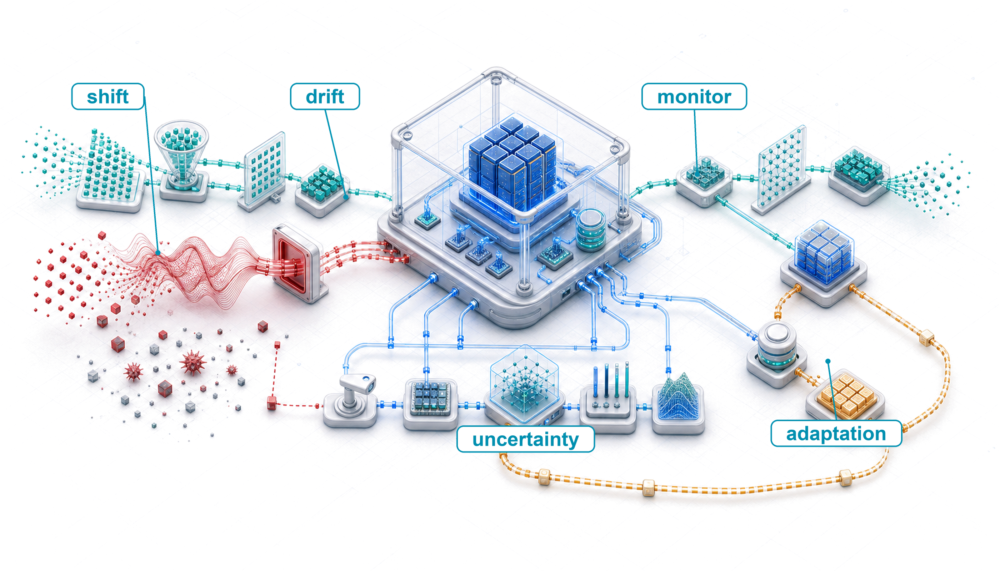
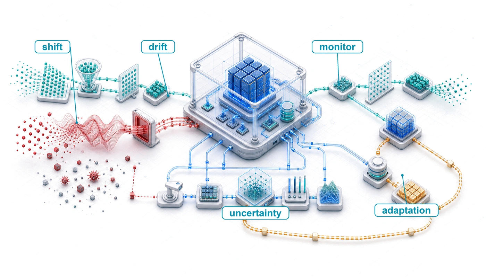
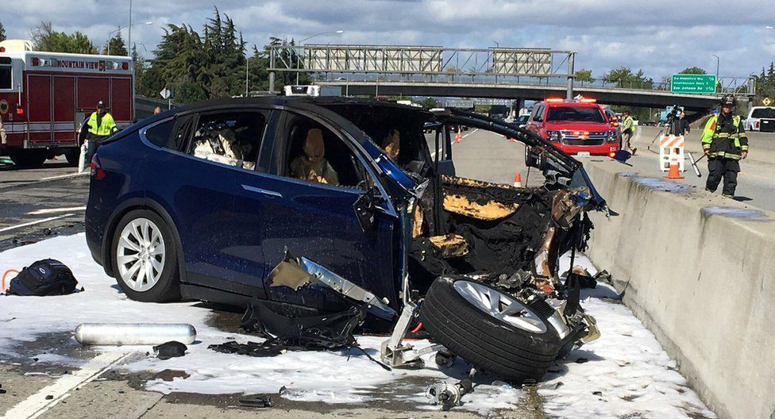
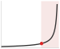
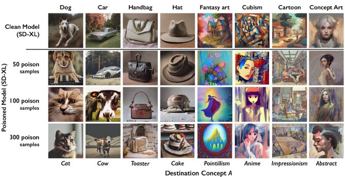

# Robust AI {#sec-robust-ai}

::: {layout-narrow}
::: {.column-margin}

\chapterminitoc

:::

::: {.content-visible when-format="pdf"}
\noindent
{fig-alt="Robust AI test chamber where a model service is exposed to drift, adversarial perturbation, and faults while monitors route adaptation and recovery."}
:::

::: {.content-visible unless-format="pdf"}
{fig-alt="Robust AI test chamber where a model service is exposed to drift, adversarial perturbation, and faults while monitors route adaptation and recovery."}
:::

:::

## Purpose {.unnumbered .unlisted}

\begin{marginfigure}
\mlfleetstack{10}{15}{20}{35}{40}{45}{100}{70}
\end{marginfigure}

_Why can machine learning systems fail silently even when conventional health signals remain normal?_

Many software defects surface loudly: exceptions crash processes, type errors halt compilation, and assertion failures stop execution. Conventional software can also return incorrect results silently, but machine learning adds statistical failure modes that ordinary health signals do not expose. A model confronting out-of-distribution inputs can continue producing outputs with full confidence, without signaling that those outputs are unreliable. A system experiencing adversarial attack can serve manipulated predictions indistinguishable from legitimate ones. A model degrading under distribution drift can maintain stable latency and uptime while its accuracy quietly erodes. This silence makes ML failures particularly dangerous. When degradation becomes visible in business metrics, the damage may have been accumulating for weeks. When an adversarial attack is detected, it may already have influenced thousands of decisions. Robustness engineering exists to make the invisible visible by building systems that detect when they are operating outside their competence, resist manipulation, and degrade gracefully rather than produce confidently wrong outputs. In C³ terms, that visibility is bought with a deliberate compute penalty. Continuous verification is the coordination work that catches silent, statistical decay.

::: {.content-visible when-format="pdf"}

\newpage

:::

::: {.callout-learning-objectives}

- Classify robustness challenges into environmental shifts, input-level attacks, and system-level faults
- Explain how software faults amplify or masquerade as model failures using quantitative reliability metrics
- Evaluate adversarial attack techniques and select defenses such as adversarial training, certification, and input sanitization
- Construct data-poisoning defenses using anomaly detection, statistical validation, and robust training
- Apply statistical drift metrics to choose monitoring, investigation, or retraining responses
- Distinguish calibration, selective prediction, and conformal coverage, including the assumptions and operational costs of each
- Integrate robustness across model and system dimensions while budgeting accuracy, compute, energy, and resilience trade-offs

:::

## The Silent Failure Problem {#sec-robust-ai-introduction-robust-ai-systems-4671}

Robust AI sits in the Governance Layer of the fleet stack. Security and privacy define the adversarial boundary: who can manipulate, extract from, or infer through the model, and which controls contain that access. Robustness asks the next systems question: when inputs, data distributions, hardware, or software no longer match the conditions assumed during training and validation, does the fleet still produce bounded, recoverable behavior? The same adversarial examples that security treats as abuse become, here, model-level perturbations to measure, defend against, and certify; nonadversarial drift and faults receive the same engineering treatment. A system that is secure but fragile is operationally useless, so robustness engineering keeps the fleet functioning under perturbation and degraded conditions.

An autonomous vehicle's vision system can operate perfectly on a sunny day in California and fail silently when a blizzard in Colorado changes the visual distribution. It will not throw an unhandled exception or print a stack trace; it may classify a snow-covered stop sign as a speed-limit sign with full confidence. Robustness is the engineering discipline that bounds this behavior under operational stress: distribution shift, sensor noise, adversarially crafted inputs, and hardware or software faults that leave the service apparently healthy while the model's answers become unreliable.

The silence is what distinguishes the discipline. A self-driving car's perception system does not crash when it misclassifies a truck as the sky; a demand forecasting model does not error out when it produces wildly inaccurate predictions; a medical diagnosis system does not shut down when it quietly provides incorrect classifications that could endanger patient lives. This **Silent Failure Mode**\index{Silent Failure Mode!definition} makes robustness a unique and critical challenge in AI systems: engineers must defend against a world that refuses to conform to training data, not merely against bugs in code.

The silent failure challenge grows more severe as ML systems expand across diverse deployment contexts. In cloud-based services, edge devices, and embedded systems, hardware and software faults directly impact performance and reliability. The increasing complexity of these systems and their deployment in safety-critical applications[^fn-safety-critical-ml] make robust and fault-tolerant designs essential for maintaining system integrity.

[^fn-safety-critical-ml]: **Safety-Critical Applications**\index{Safety!critical applications}\index{Safety!critical systems, ml deployment}: Safety standards assign integrity requirements through domain-specific hazard analysis, development processes, and system evidence rather than one interchangeable model-accuracy percentage. An ML component must therefore contribute evidence to a system-level safety argument instead of claiming compliance from test accuracy alone.

Checkpointing and recovery keep training jobs alive, and access control enforces authentication at the system boundary. Neither addresses what happens when a deployed model receives an adversarial input indistinguishable from a legitimate one, when the data distribution drifts so far that predictions become meaningless, or when a software fault in the preprocessing pipeline silently corrupts every inference. These failure modes span the complete ML lifecycle and demand techniques for fault detection, isolation, and recovery that go beyond any single defense. The consequences of ignoring them range from economic disruption to life-threatening situations in safety-critical domains. The gap in @fig-adversarial-robustness-trend is the empirical form of that argument: seven years of progress lifted both curves, but never closed the distance between them, because the property being measured is decided during training rather than added afterward.

These failure modes motivate a precise definition of Robust AI:

::: {#dfn-robust-ai-robust-ai .callout-definition title="Robust AI"}

***Robust AI***\index{Robust AI!definition} is the measurable systems property that a model's predictions remain valid (within specified error bounds) under distribution shift, adversarial perturbation, and hardware or software faults, as opposed to the average-case accuracy achieved under ideal independent and identically distributed (i.i.d.) conditions.

1.  **Significance**: Robustness is quantified against an explicit operating or threat set. A certified classifier can prove that its prediction cannot change for any input within a specified perturbation set, such as an $\ell_\infty$ ball of radius $\epsilon$ around one test point. Empirical stress tests instead measure performance on named corruptions, shifts, or attacks without proving behavior outside the evaluated cases.
2.  **Distinction**: Standard generalization measures average-case accuracy on held-out i.i.d. data drawn from the training distribution. Robustness measures behavior under specified departures from that distribution, including natural shifts, semantic transformations, physical changes, malicious queries, and norm-bounded perturbations. Some evaluations are worst-case within a formal set; others provide empirical evidence over a sampled deployment envelope.
3.  **Common pitfall**: A frequent misconception is that robustness can be added as a post-hoc monitoring layer to any existing model. A model's robustness properties are determined primarily during training: models trained without adversarial examples or robustness objectives *cannot* achieve certified robustness through inference-time filtering alone, because the vulnerability is in the learned decision boundary, not in which inputs reach the model.

:::

::: {#fig-adversarial-robustness-trend fig-env="figure" fig-pos="htb" fig-cap="**Adversarial robustness vs. standard accuracy**: CIFAR-10 standard accuracy against robust accuracy under an $\ell_\infty$ ($\epsilon = 8/255$) attack, from 2017 to 2024. Standard accuracy saturates above 95 percent while robust accuracy trails roughly twenty points behind, and the persistence of that gap is the evidence that robustness is a training-time property." fig-alt="Two-line chart from 2017 to 2024 comparing standard accuracy, which rises from about eighty-seven to 95 percent, against robust accuracy under an L-infinity attack, which rises from about forty-six to 78 percent. The persistent vertical gap is the robustness deficit."}

```{python}
#| echo: false
import pandas as pd
import matplotlib.pyplot as plt
from mlsysim import viz

data = pd.read_csv("vol2/14_robust_ai/data/cifar10_robustness_trend.csv")

fig, ax, COLORS, plt = viz.setup_plot(figsize=(7, 4))
ax.plot(data["Year"], data["Standard_Accuracy"], marker="o", linewidth=2, label="Standard Accuracy")
ax.plot(data["Year"], data["Robust_Accuracy"], marker="s", linewidth=2, label=r"Robust Accuracy ($\ell_\infty$)")

ax.set_ylabel("Accuracy (%)")
ax.set_xlabel("Year")
ax.set_ylim(40, 100)
ax.grid(True, linestyle="--", alpha=0.6)
ax.legend(loc="lower right")

plt.tight_layout()
plt.show()
plt.close()
```

:::

Three categories of threat produce these silent failures, and each demands distinct engineering responses. The first and most pervasive is environmental change: distribution shifts, concept drift, and evolving operational contexts challenge the core assumptions underlying model training. A model trained on last year's transaction patterns quietly becomes unreliable as customer behavior evolves, requiring continuous monitoring and adaptation strategies that go beyond standard operational practices.

The second category, malicious manipulation, targets model behavior directly. Adversarial attacks, data poisoning attempts, and prompt injection vulnerabilities cause models to misclassify inputs or produce unreliable outputs, failures that authentication and access control (@sec-security-privacy) cannot prevent because the attacker operates within the model's own input space.

The third category is system-level faults: hardware faults, software bugs, dependency failures, and runtime errors that corrupt the machinery around the model. These faults can also amplify, mask, or mimic the other robustness failures. Bugs, design flaws, and implementation errors within algorithms, libraries, and frameworks propagate through the system, creating systemic vulnerabilities[^fn-systemic-vulnerability-ml] that transcend individual component failures. A preprocessing bug might create artificial distribution shifts; a numerical error might corrupt model behavior in ways indistinguishable from adversarial attack; a race condition might corrupt learned representations. Because these faults originate in the systems layer, their detailed taxonomy and mitigation strategies are covered in @sec-fault-tolerance-reliability; this chapter focuses on how system-level faults interact with environmental shifts and input-level attacks.

[^fn-systemic-vulnerability-ml]: **Systemic Vulnerability**\index{Systemic Vulnerability!ML pipelines}: Architectural weaknesses that cascade across layers rather than isolating to one component. Log4Shell (CVE-2021-44228) affected hundreds of millions of devices through a single logging library. ML pipelines face analogous risk: a single CUDA\index{CUDA} or PyTorch\index{PyTorch} version pinned across thousands of models means one vulnerability compromises the entire fleet simultaneously, turning dependency management into a reliability-critical function.

The appropriate defense depends on where the system runs. Large-scale cloud environments can afford redundancy and sophisticated error detection mechanisms that would overwhelm an edge device's power and memory budgets. Edge devices (@sec-edge-intelligence) must instead rely on targeted hardening strategies[^fn-hardening-strategy-ml] that protect the most critical inference paths while accepting weaker guarantees elsewhere.

[^fn-hardening-strategy-ml]: **Hardening Strategy**\index{Hardening Strategy!ML systems}: Defense-in-depth applied to ML pipelines: model loading (signature verification), input processing (adversarial filtering), and output validation (confidence thresholds). On resource-constrained edge devices, selective hardening prioritizes critical paths---protecting the inference engine while accepting weaker guarantees on logging---because full redundancy would exceed the power and memory budgets that make edge deployment viable.

Despite these contextual differences, a robust ML system requires fault tolerance, error resilience, and sustained performance across all deployment environments, and those guarantees are not free. Error correction adds memory-bandwidth overhead, redundant processing multiplies energy draw, and continuous monitoring claims a share of compute; each also generates additional heat that exacerbates the thermal management challenges constraining deployment density. The robustness question is where this additional resource cost provides enough reliability value to justify itself.

Robustness, then, is not an afterthought to be bolted onto a finished system. It is an architectural constraint that shapes every layer of the ML pipeline, from input validation and adversarial training through drift detection and software fault isolation, and the engineering cost of ignoring it compounds silently until the system fails in production. Silent failures have caused significant damage to production systems across cloud, edge, and embedded deployments.

## Real-World Robustness Failures {#sec-robust-ai-realworld-robustness-failures-c119}

Across cloud, edge, and embedded environments, ML systems fail when an assumption hidden in the stack becomes a dependency the system does not monitor. The incidents below differ in scale and domain, but each shows the same pattern: the system continues to operate while an unobserved condition corrupts the result.

::: {#ws-robust-ai-google-photos-gorilla-label .callout-war-story title="The label that exposed the test gap (2015)"}

**Context**: In June 2015, Google Photos used automatic image tagging to organize user photos [@kasperkevic2015googlephotos].

**Mechanism**: A deep convolutional image classifier suffered from a severe slice-level failure mode: Jacky Alciné's photos of himself and a Black friend were misclassified under the album tag "Gorillas." The evaluation pipeline relied solely on aggregate top-1/top-5 accuracy across $D_{\text{vol}}$, masking high-risk slice failures.

**Impact**: The high-visibility misclassification caused public outrage and exposed a major gap in multi-class vision model safety validation.

**Fix**: Google issued an emergency hotfix blocking the tags "gorilla," "chimpanzee," and "monkey" from the taxonomy while developing slice-level evaluation and automated safety filtering pipelines.

**Systems lesson**: Production ML robustness cannot be defined by aggregate test set accuracy. High-risk classification tasks require slice-level evaluation, automated toxicity guards, and robust fallbacks built directly into the serving pipeline.

:::

That test-gap failure is the model-facing version of a broader reliability problem. In cloud infrastructure, the hidden assumption is often that a shared dependency remains available and correct.

### Cloud infrastructure failures {#sec-robust-ai-cloud-infrastructure-failures-1c8c}

Robust ML systems inherit a reliability tradition that predates machine learning. Loud, non-ML infrastructure failures, such as the 2017 AWS S3 outage[^fn-aws-s3-outage] in which a mistyped maintenance command removed too much capacity and cascaded through every service that treated regional object storage as an availability invariant [@aws2017s3outage], are the kind of dependency and fault failure whose detection and recovery mechanics are detailed in @sec-fault-tolerance-reliability. They are loud rather than silent, and they motivate the discipline this chapter assumes rather than the silent, model-level failures it focuses on. The economics of large-scale training amplify these consequences: an S3 outage starves thousands of accelerators of data shards simultaneously, and any checkpoint writes that fail during the outage window mean that when preemption eventually returns the cluster to the scheduler, hours or days of gradient updates are unrecoverable. The genuinely new and uniquely ML problem appears when the failure is silent: the system keeps serving while an unobserved corruption propagates.

[^fn-aws-s3-outage]: **AWS S3 Outage (2017)**\index{AWS S3 Outage!cascade failure}: A mistyped command during routine maintenance removed too much capacity from S3's index and placement subsystems in US-East-1. While those subsystems restarted, S3 could not service requests and dependent AWS services experienced elevated errors or impaired functionality. The incident exposed a single-region dependency pattern: systems that assume regional storage availability as an invariant can fail even when their own application code and model-serving logic remain unchanged.

In another case [@dixit2021silent], Facebook encountered a silent data corruption (SDC)[^fn-sdc-silent-data] issue in its distributed querying infrastructure (@fig-sdc-robust). SDC refers to undetected errors during computation or data transfer that propagate silently through system layers. Facebook's system processed SQL-like queries across datasets and supported a compression application designed to reduce data storage footprints. Files were compressed when not in use and decompressed upon read requests. A size check was performed before decompression to ensure the file was valid. However, an unexpected fault occasionally returned a file size of zero for valid files, leading to decompression failures and missing entries in the output database. The issue appeared sporadically, with some computations returning correct file sizes, making diagnosis particularly difficult.

[^fn-sdc-silent-data]: **Silent Data Corruption (SDC)**\index{Silent Data Corruption!ML systems}: Hardware errors that corrupt data without triggering any detection mechanism. Meta reported six to eight machines per million experiencing SDC daily---rates "orders of magnitude higher than soft-error predictions." In ML systems, SDC is uniquely dangerous because corrupted weights or activations produce plausible but incorrect outputs that pass all health checks, evading the monitoring that catches loud failures.

::: {#fig-sdc-robust fig-env="figure" fig-pos="htb" fig-cap="**Silent Data Corruption**: Unexpected faults can return incorrect file sizes, leading to data loss during decompression and propagating errors through distributed querying systems despite apparent operational success. This example from Facebook emphasizes the challenge of undetected errors, silent data corruption, and the importance of robust error detection mechanisms in large-scale data processing pipelines. Source: Facebook [@dixit2021silent]." fig-alt="System diagram showing data flow from compressed storage through defective CPU to database. Arrows indicate processing stages where file size calculation returns zero, causing missing rows in output."}

```{=latex}
\providecolor{socbg}{RGB}{246,249,252}
\providecolor{bluebg}{RGB}{240,246,255}
\providecolor{blueborder}{RGB}{147,197,253}
\providecolor{bluetxt}{RGB}{29,78,216}
\providecolor{darkblue}{RGB}{30,58,138}
\providecolor{redbg}{RGB}{254,242,242}
\providecolor{redborder}{RGB}{248,180,180}
\providecolor{redtxt}{RGB}{185,28,28}
\providecolor{amberbg}{RGB}{254,250,238}
\providecolor{amberborder}{RGB}{245,200,120}
\providecolor{ambertxt}{RGB}{160,95,10}
\providecolor{greenbg}{RGB}{236,253,245}
\providecolor{greenborder}{RGB}{110,231,183}
\providecolor{greentxt}{RGB}{4,120,87}
\providecolor{grayborder}{RGB}{220,225,230}
\providecolor{termbg}{RGB}{15,23,42}

\begin{tikzpicture}[
    >=Stealth,
    font=\sffamily\footnotesize
]

% ====================================================
% TOP ROW: 4 STAGES
% ====================================================

% --- STAGE 1: COMPRESSED DATASTORE ---
\draw[draw=blueborder!60, fill=white, rounded corners=6pt, line width=0.7pt] (0, 0) rectangle (3.8, 6.2);
\node[fill=bluebg, rounded corners=3pt, inner sep=2.5pt, font=\sffamily\bfseries\tiny, text=bluetxt, text width=3.4cm, align=center]
    at (1.9, 5.9) {1 · COMPRESSED DATASTORE};

% Cylinder drawing
\begin{scope}[shift={(1.9, 4.3)}]
    % Bottom slice
    \draw[fill=bluebg!30, draw=darkblue!60] (-1.0, -1.2) arc (180:360:1.0 and 0.3) -- (1.0, -0.6) arc (0:180:1.0 and 0.3) -- cycle;
    \draw[fill=bluebg!40, draw=darkblue!60] (0, -0.6) ellipse (1.0 and 0.3);
    % Middle slice
    \draw[fill=bluebg!50, draw=darkblue!70] (-1.0, -0.6) arc (180:360:1.0 and 0.3) -- (1.0, 0.0) arc (0:180:1.0 and 0.3) -- cycle;
    \draw[fill=bluebg!60, draw=darkblue!70] (0, 0.0) ellipse (1.0 and 0.3);
    % Top slice
    \draw[fill=darkblue!85, draw=darkblue] (-1.0, 0.0) arc (180:360:1.0 and 0.3) -- (1.0, 0.6) arc (0:180:1.0 and 0.3) -- cycle;
    \draw[fill=darkblue!75, draw=darkblue] (0, 0.6) ellipse (1.0 and 0.3);
    \node[font=\sffamily\bfseries\tiny, text=white] at (0, 0.3) {Pre-Shuffle Shards};
\end{scope}

% Raw Block Storage Box
\node[draw=greenborder, fill=white, rounded corners=3pt, inner sep=3pt, text width=3.1cm, align=center]
    at (1.9, 1.8) {
    {\scriptsize\bfseries Raw Block Storage}\\[2pt]
    {\tiny\bfseries\textcolor{greentxt}{Valid CRC on persistent disk}}
};

% Footnote below
\node[inner sep=0pt, text width=3.4cm, align=center] at (1.9, 0.7) {
    {\tiny\textcolor{gray!80!black}{Data uncorrupted on storage}}\\[1pt]
    {\tiny\textcolor{gray!80!black}{Awaiting runtime decompression}}
};

% --- STAGE 2: SILENT HARDWARE DEFECT (SDC) ---
\draw[draw=redborder!60, fill=white, rounded corners=6pt, line width=0.7pt] (4.3, 0) rectangle (8.1, 6.2);
\node[fill=redbg, rounded corners=3pt, inner sep=2.5pt, font=\sffamily\bfseries\tiny, text=redtxt, text width=3.4cm, align=center]
    at (6.2, 5.9) {2 · SILENT HARDWARE DEFECT (SDC)};

% Processor Chip package
\begin{scope}[shift={(6.2, 4.45)}]
    \draw[fill=termbg!90, draw=gray!70, rounded corners=4pt, line width=0.8pt] (-1.2, -0.75) rectangle (1.2, 0.75);
    % Pins/Dots
    \foreach \x in {-1.0, 1.0} {
        \foreach \y in {-0.4, 0.0, 0.4} {
            \fill[fill=gray!40] (\x, \y) circle (1.5pt);
        }
    }
    % Die
    \draw[draw=redtxt, fill=white, rounded corners=2pt, line width=0.8pt] (-0.6, -0.45) rectangle (0.6, 0.45);
    \node[font=\sffamily\bfseries\tiny, text=redtxt, align=center] at (0, 0.1) {Corrupt ALU};
    \node[font=\ttfamily\tiny, text=gray!80!black] at (0, -0.2) {math.pow()};
\end{scope}

% ALU Flaw Box
\node[draw=redborder, fill=white, rounded corners=3pt, inner sep=3.5pt, text width=3.2cm]
    at (6.2, 2.1) {
    {\tiny\bfseries Floating Point ALU Flaw}\\[2pt]
    {\tiny\textcolor{greentxt}{\textbf{Expected:} $(1.1)^{53} = 156.24$}}\\[1pt]
    {\tiny\textcolor{redtxt}{\textbf{Actual:} $(1.1)^{53} = 0.0000$}}\\[2pt]
    {\tiny\textcolor{redtxt}{Decompression buffer scales to 0}}\\[0.5pt]
    {\tiny\textcolor{gray!80!black}{Zero CPU trap, NaN, or exception}}
};

% Footnote below
\node[inner sep=0pt, text width=3.4cm, align=center] at (6.2, -0.15) {
    {\tiny\bfseries\textcolor{redtxt}{Dixit et al. (Meta SDC Benchmark)}}\\[1pt]
    {\tiny\textcolor{gray!80!black}{Flaw triggered only under specific load}}
};

% --- STAGE 3: DECOMPRESSION BYPASS ---
\draw[draw=redborder!60, fill=white, rounded corners=6pt, line width=0.7pt] (8.6, 0) rectangle (12.4, 6.2);
\node[fill=redbg, rounded corners=3pt, inner sep=2.5pt, font=\sffamily\bfseries\tiny, text=redtxt, text width=3.4cm, align=center]
    at (10.5, 5.9) {3 · DECOMPRESSION BYPASS};

% Code terminal
\node[draw=gray!70, fill=termbg, rounded corners=4pt, inner sep=4pt, text width=3.2cm, font=\ttfamily]
    at (10.5, 4.35) {
    {\fontsize{5.5}{7}\selectfont
    \textcolor{gray!50}{// Decompression Guard}\\[1pt]
    \textcolor{white}{size = compute\_size();}\\[1pt]
    \textcolor{white}{if (size > 0) \{}\\[1pt]
    \hspace*{6pt}\textcolor{blueborder}{decompress\_records();}\\[1pt]
    \textcolor{white}{\} else \{}\\[1pt]
    \hspace*{6pt}\textcolor{redborder}{\textbf{// SILENTLY SKIPPED!}}\\[1pt]
    \textcolor{white}{\}}
    }
};

% Guard evaluates false box
\node[draw=amberborder, fill=amberbg!40, rounded corners=3pt, inner sep=3pt, text width=3.1cm, align=center]
    at (10.5, 2.05) {
    {\tiny\bfseries\textcolor{ambertxt}{Guard (\texttt{size > 0}) Evaluates False}}\\[2pt]
    {\tiny\textcolor{ambertxt!90!black}{Unpack skipped with exit code 0}}
};

% Footnote below
\node[inner sep=0pt, text width=3.4cm, align=center] at (10.5, 0.7) {
    {\tiny\textcolor{gray!80!black}{Software assumes empty shard}}\\[1pt]
    {\tiny\textcolor{gray!80!black}{Silent data omission succeeds}}
};

% --- STAGE 4: DROPPED ROWS & DRIFT ---
\draw[draw=redborder!60, fill=white, rounded corners=6pt, line width=0.7pt] (12.9, 0) rectangle (16.7, 6.2);
\node[fill=redbg, rounded corners=3pt, inner sep=2.5pt, font=\sffamily\bfseries\tiny, text=redtxt, text width=3.4cm, align=center]
    at (14.8, 5.9) {4 · DROPPED ROWS \& DRIFT};

% Table
\node[draw=blueborder!60, fill=white, rounded corners=3pt, inner sep=2pt, text width=3.4cm]
    at (14.8, 4.35) {
    \begin{minipage}{3.4cm}\centering\ttfamily\fontsize{5.8}{7.2}\selectfont
    % Tight tabcolsep: default column padding pushed this table past the 3.4cm box.
    \setlength{\tabcolsep}{2pt}%
    \begin{tabular}{c|c|c}
    \rowcolor{bluebg} \textbf{Record ID} & \textbf{Feature} & \textbf{Label} \\
    \hline
    \textcolor{greentxt}{\textbf{0x4F01}} & \textcolor{greentxt}{+0.42} & \textcolor{greentxt}{1} \\
    \rowcolor{redbg} \multicolumn{3}{c}{\textcolor{redtxt}{\textbf{[DROPPED RECORD]}}} \\
    \textcolor{greentxt}{\textbf{0x4F03}} & \textcolor{greentxt}{-1.18} & \textcolor{greentxt}{0} \\
    \rowcolor{redbg} \multicolumn{3}{c}{\textcolor{redtxt}{\textbf{[DROPPED RECORD]}}} \\
    \textcolor{greentxt}{\textbf{0x4F05}} & \textcolor{greentxt}{+2.05} & \textcolor{greentxt}{1} \\
    \end{tabular}
    \end{minipage}
};

% Silent Training Poisoning Box
\node[draw=redborder, fill=redbg, rounded corners=3pt, inner sep=3pt, text width=3.1cm, align=center]
    at (14.8, 2.05) {
    {\tiny\bfseries\textcolor{redtxt}{Silent Training Poisoning}}\\[2pt]
    {\tiny\textcolor{redtxt}{Batches truncated silently}}
};

% Footnote below
\node[inner sep=0pt, text width=3.4cm, align=center] at (14.8, 0.7) {
    {\tiny\textcolor{gray!80!black}{Propagates into AllReduce}}\\[1pt]
    {\tiny\textcolor{gray!80!black}{Corrupts weights gradually}}
};

% Inter-stage connecting arrows
\draw[->, draw=darkblue!60, line width=1.5pt] (3.8, 3.8) -- (4.3, 3.8);
\draw[->, draw=redtxt, line width=1.5pt] (8.1, 3.8) -- (8.6, 3.8);
\draw[->, draw=redtxt, line width=1.5pt] (12.4, 3.8) -- (12.9, 3.8);

% ====================================================
% BOTTOM CONTAINER: FLEET SDC MITIGATIONS
% ====================================================
\draw[draw=blueborder!60, fill=socbg, rounded corners=6pt, line width=0.8pt] (0, -2.8) rectangle (16.7, -0.4);
\node[fill=bluebg, rounded corners=3pt, inner sep=3pt, font=\sffamily\bfseries\tiny, text=darkblue, text width=16.1cm]
    at (8.35, -0.65) {FLEET SDC ARCHITECTURAL MITIGATIONS (HARDWARE RESILIENCE STRATEGY)};

% 3 Mitigation Columns
% Col 1: ALU Ripple Scrubbing
\node[draw=blueborder!50, fill=white, rounded corners=4pt, inner sep=4pt, text width=4.9cm, anchor=north west]
    at (0.3, -1.0) {
    {\tiny\bfseries\textcolor{darkblue}{1 · ALU Ripple Scrubbing}}\\[2pt]
    {\tiny\bfseries Targeted ALU micro-benchmarks}\\[1pt]
    {\tiny\textcolor{gray!80!black}{Executes boundary math tests on idle CPU cores}}\\[2pt]
    {\tiny\bfseries\textcolor{greentxt}{Quarantines defective nodes before scheduling}}\\[1pt]
    {\tiny\textcolor{gray!80!black}{Prevents corrupted compute tasks from launching}}
};

% Col 2: End-to-End Row Checksums
\node[draw=blueborder!50, fill=white, rounded corners=4pt, inner sep=4pt, text width=4.9cm, anchor=north west]
    at (5.7, -1.0) {
    {\tiny\bfseries\textcolor{darkblue}{2 · End-to-End Row Checksums}}\\[2pt]
    {\tiny\bfseries Cryptographic record manifests}\\[2pt]
    {\fontsize{6}{7}\selectfont\ttfamily\textcolor{bluetxt}{\textbf{Manifest verifies: N\_out == N\_in}}}\\[2pt]
    {\tiny\bfseries\textcolor{greentxt}{Flags dropped records during decompression}}\\[1pt]
    {\tiny\textcolor{gray!80!black}{Catches silent omissions at shuffle boundaries}}
};

% Col 3: Redundant Execution
\node[draw=blueborder!50, fill=white, rounded corners=4pt, inner sep=4pt, text width=4.9cm, anchor=north west]
    at (11.1, -1.0) {
    {\tiny\bfseries\textcolor{darkblue}{3 · Redundant Execution}}\\[2pt]
    {\tiny\bfseries Dual-node cross-verification}\\[1pt]
    {\tiny\textcolor{gray!80!black}{Sampled dual-worker gradient validation}}\\[2pt]
    {\tiny\bfseries\textcolor{greentxt}{Rolls back state upon numerical divergence}}\\[1pt]
    {\tiny\textcolor{gray!80!black}{Ensures fleet-wide distributed weight integrity}}
};

\end{tikzpicture}
```

:::

In distributed ML training, silent data corruption is qualitatively more destructive than in conventional data-processing systems: a corrupted gradient or activation can perturb optimizer state and affect later steps rather than remaining bounded to one query result. A dropped row in a database query is a localized data loss bounded to that query's output; in ML, by contrast, the remedy is often a rollback to the last clean checkpoint and a restart of the affected training run. SDC can therefore compromise model accuracy without triggering any alert, and the blast radius grows with the synchronization and checkpointing design rather than remaining localized. Meta's production report shows SDCs as a systemic fleet issue across CPUs and software layers [@dixit2021silent], and recent large language model (LLM)-training work shows that real-world SDCs can alter submodule outputs, optimizer steps, loss spikes, and final model weights [@ma2025understanding]. Dean's MLSys 2024 invited talk frames the same reliability concern at industry scale, where hardware errors during large ML training jobs occur routinely enough that one buggy chip's incorrect computations can propagate and infect an entire run [@dean2024mlsys].

### Edge device vulnerabilities {#sec-robust-ai-edge-device-vulnerabilities-ddfe}

Distributed edge deployments[^fn-edge-compute-robustness] expose the fragility of ML systems where compute, power, and connectivity are severely constrained. Self-driving vehicles serve as the canonical example of this vulnerability, as they operate in open-world environments with hard real-time latency requirements and zero tolerance for failure.

[^fn-edge-compute-robustness]: **Edge Computing**\index{Edge Computing!robustness trade-off}: Processing data locally rather than in centralized clouds, reducing inference latency from ~100 ms (cloud round-trip) to <10 ms. The robustness trade-off is stark: edge devices gain latency but lose the redundancy, elastic scaling, and centralized monitoring that make cloud systems resilient. A failing edge model cannot fail over to a secondary cluster---it must degrade gracefully within its own power and memory envelope or fail safely within milliseconds.

In May 2016, a fatal crash involving a Tesla Model S in Autopilot mode[^fn-autopilot-perception-safety] demonstrated the catastrophic potential of perception failures [@ntsb2017tesla]. Traveling at 74 mph in a 65 mph zone, the vehicle did not identify a tractor-trailer crossing its path, and neither the forward-collision warning nor automatic emergency braking activated. The investigation found that the system was not designed to recognize crossing traffic, turning an unmodeled operating condition into a high-speed underride collision (@fig-tesla-example).

[^fn-autopilot-perception-safety]: **Autopilot**\index{Autopilot!perception failure}: The 2016 crash involved Tesla's then-current SAE Level 2 driver-assistance system and Mobileye-era perception stack, not the later 8-camera full-self-driving hardware or dual FSD-chip computer. Later Tesla vehicles introduced expanded camera coverage and dedicated FSD compute, but the robustness lesson is the same: fleet-scale data collection does not automatically cover rare scenarios such as a white trailer against a bright sky.

::: {#fig-tesla-example fig-env="figure" fig-pos="htb" fig-cap="**Autopilot Perception Failure**: This crash reveals the critical safety risks of relying on machine learning for perception in autonomous systems, where failures to correctly classify objects can lead to catastrophic outcomes. The incident underscores the need for robust validation, redundancy, and failsafe mechanisms in self-driving vehicle designs to mitigate the impact of imperfect AI models. Source: BBC News." fig-alt="Photograph of a dark-blue Tesla after a highway collision. The front-left of the vehicle is heavily damaged; emergency crews and barrier wreckage are visible on scene, consistent with an Autopilot-involved impact."}



:::

A similarly tragic failure occurred in March 2018 in Tempe, Arizona, when an Uber self-driving test vehicle struck and killed a pedestrian [@ntsb2019uber]. The perception system detected the victim six seconds prior to impact but fundamentally failed in **Object Classification Stability**\index{Object Classification Stability!definition}. As the pedestrian crossed the road, the system toggled its classification from "unknown object" to "vehicle" and then to "bicycle," resetting its trajectory prediction history with each change. Because the system lacked a persistent object track, it failed to predict a collision path until 1.3 seconds before impact---too late for the safety driver to intervene.

Beyond automotive, industrial edge deployments face similar perils. An inspection drone surveying high-voltage power lines may rely on visual odometry for stabilization; a sudden change in lighting or a repetitive texture can cause the localization algorithm to diverge, leading to a collision or fly-away event. Edge devices lack **Fallback Redundancy**\index{Fallback Redundancy!definition}: no secondary cluster exists to route traffic to when the primary inference engine becomes uncertain. The system must degrade gracefully or fail safely within milliseconds. The absence of resource elasticity makes edge AI uniquely fragile to environmental variance that a data center would handle through massive over-provisioning.

### Embedded system constraints {#sec-robust-ai-embedded-system-constraints-ec7a}

Embedded systems[^fn-embedded-ml-constraints] operate under even tighter constraints than edge devices, often in safety-critical environments where recovery from failure is impossible. These are also the domains where ML inherits the most demanding part of the pre-ML reliability tradition: the classic embedded software faults below are loud, non-ML failures whose mechanics belong to @sec-fault-tolerance-reliability, but they set the validation bar that any ML component in the decision loop must also clear.

[^fn-embedded-ml-constraints]: **Embedded Systems**\index{Embedded Systems!ML reliability}: Dedicated processors ranging from 8-bit microcontrollers (kilobytes of RAM) to complex system on chips (SoCs), with 30+ billion shipping annually. Real-time constraints (microsecond to millisecond deadlines) and unattended operation (years without maintenance) make ML deployment uniquely challenging: models cannot be easily updated, over-the-air patches risk bricking devices, and there is no human in the loop to catch silent degradation.

The loss of NASA's Mars Polar Lander in 1999, attributed by the review board to premature touchdown detection that likely shut the engines off before landing [@nasa2000mpl], is the canonical example: where recovery is impossible, rigorous software validation is a prerequisite, not a luxury, and the same rigor applies to any ML component in the decision loop (@fig-nasa-example).

::: {#fig-nasa-example fig-env="figure" fig-pos="htb" fig-cap="**Robotic Lander on Mars**: An artist's rendering of NASA's InSight lander deployed on the Martian surface. Remote robotic missions exemplify the class of systems in which software or sensor faults cannot be recovered by human intervention, motivating the rigorous validation and failure-mode analysis that ML components in the decision loop must also satisfy. Source: Slashgear." fig-alt="Artist rendering of the NASA InSight lander on the Martian surface with solar panels extended and scientific instruments deployed, illustrative of robotic planetary landers whose autonomous decision loops demand rigorous validation."}


:::

Commercial aviation shows the same inherited hazard: a 2015 FAA airworthiness directive followed Boeing's discovery that a 787 powered continuously for 248 days could lose all AC power if all four generator control units entered failsafe mode at once,[^fn-failsafe-system-fallback] so that uptime itself became the risk factor. Safety-critical systems[^fn-asil-ml-certification] demand stringent reliability requirements precisely because of latent hazards like this.

[^fn-failsafe-system-fallback]: **Failsafe Mechanism**\index{Failsafe Mechanism!ML serving}: A system that shifts to a safe state on fault detection, following the circuit-breaker pattern (closed/open/half-open). In ML serving, failsafes include confidence-based rejection (deferring predictions below a threshold to humans), fallback to simpler models, and automatic rollback when drift monitors fire. The trade-off is availability: aggressive confidence thresholds reject 5 to 15 percent of legitimate traffic, so tuning the rejection boundary becomes a reliability-vs.-throughput optimization.

[^fn-asil-ml-certification]: **ASIL (Automotive Safety Integrity Levels)**\index{Automotive Safety Integrity Level!ML certification}: ISO 26262 uses automotive safety integrity levels to scale functional-safety obligations according to the hazard analysis. ASIL D is the most stringent level, but it is not a universal component-reliability percentage. An ML perception component complicates the resulting safety case because its behavior depends on the operational distribution and cannot be justified by aggregate test accuracy alone.

> "If the four main generator control units (associated with the engine-mounted generators) were powered up at the same time, after 248 days of continuous power, all four GCUs will go into failsafe mode at the same time, resulting in a loss of all AC electrical power regardless of flight phase.", Federal Aviation Administration directive [@faa2015boeing]

When AI is applied in aviation, including tasks such as autonomous flight control and predictive maintenance, the robustness of embedded systems affects passenger safety. These pre-ML failures set the validation bar that any ML component sharing those environments must also clear. A neural network running visual odometry on a planetary rover must tolerate radiation-induced faults in weights, activations, and control state. Its system design may combine hardened components, error detection and correction, state scrubbing, redundancy, and watchdogs according to the mission fault model; no single mechanism establishes model-level safety. The safety argument must connect hardware fault containment to behavioral error detection and a validated fallback. In a flight-control path, low confidence may contribute to that trigger, but confidence alone is not a deterministic certificate of safety; the transfer of control must also follow from calibrated evidence, sensor and system health, and an independently validated degraded mode.

The stakes become even higher for implantable medical devices. A software or hardware fault in a hypothetical smart pacemaker could place a patient's life at risk. As AI systems take on perception, decision-making, and control roles in such applications, new sources of vulnerability emerge, including data-related errors, model uncertainty,[^fn-epistemic-uncertainty-ml] and unpredictable behaviors in rare edge cases. The opaque nature of some AI models complicates fault diagnosis and recovery.

[^fn-epistemic-uncertainty-ml]: **Model uncertainty (epistemic uncertainty)**\index{Epistemic Uncertainty!robustness}: The reducible gap between a model's learned representation and the true data-generating process, as distinct from aleatoric uncertainty (irreducible data noise). Quantifying epistemic uncertainty enables a critical robustness mechanism: safety-critical systems can defer to human operators when predictions fall outside the training distribution. The systems cost is significant---Bayesian approximations or Monte Carlo dropout require multiple inference passes, creating a direct trade-off between uncertainty awareness and serving latency.

Each failure reveals common patterns that demand systematic approaches to robustness evaluation and mitigation: the AWS outage disrupted S3-dependent cloud services, autonomous vehicle perception errors led to fatal crashes, and spacecraft software bugs caused mission loss. The structural patterns cut across deployment environments, and a unified framework for robustness must capture how different failure modes interact and compound at system scale.

## A Unified Framework for Robust AI {#sec-robust-ai-unified-framework-robust-ai-b25d}

A flipped bit in a GPU memory module can cause a language model to generate toxic text. A gradual change in user demographics can trigger a sudden spike in recommendation latency. Production ML systems cannot treat these as isolated bugs. A unified framework must map how low-level hardware faults, software bugs, data drift, and adversarial inputs cascade upward to destroy the integrity of the model's output.

### Connections to previous concepts {#sec-robust-ai-building-previous-concepts-ef4a}

The fault tolerance mechanisms from @sec-fault-tolerance-reliability, originally designed to recover training jobs from hardware crashes, serve a second role in robustness: inference-time availability. Training recovery focuses on checkpoint restoration, but robustness extends this to **Graceful Degradation**\index{Graceful Degradation!definition}, ensuring a serving system remains operational even when inputs are adversarial or components degrade. The distributed training architectures from @sec-distributed-training-systems introduce unique vulnerabilities: a single node transmitting corrupted gradients during an AllReduce operation can poison the global model weights, necessitating Byzantine fault tolerance protocols that validate peer updates before aggregation.

The security frameworks from @sec-security-privacy provide threat modeling principles that inform adversarial defense strategies. Operational monitoring systems from @sec-ops-scale provide the infrastructure foundation for detecting robustness threats in production. The serving infrastructure from @sec-inference-scale creates new attack surfaces: batching, model routing, and pipeline parallelism expose scheduling logic and individual pipeline stages to adversarial queries.

::: {.column-margin}
{width="100%" fig-alt="One failing shard cascades through pipeline stages to a failed request."}

*In sharded inference, one failed stage fails the whole request.*
:::

```{python}
#| echo: false

from mlsysim import *
from mlsysim.core.units import *

# ┌─────────────────────────────────────────────────────────────────────────────
# │ ROBUST AI INFRASTRUCTURE CONSTRAINTS (LEGO)
# ├─────────────────────────────────────────────────────────────────────────────
# │ Context: @sec-robust-ai-ml-performance-system-reliability-7d42—reliability intro
# │
# │ Goal: Surface model scale, weight memory footprint, and hardware specs.
# │ Show: ~175B params, 350 GB weight footprint > 80 GB accelerator HBM, and ~900 GB/s V100 memory bandwidth.
# │ How: .to(unit).magnitude from mlsysim.core.units.
# │
# └─────────────────────────────────────────────────────────────────────────────
from mlsysim.fmt import check, fmt_params, fmt_qty

# ┌── LEGO ───────────────────────────────────────────────
class RobustAISetup:
    """Namespace for hardware fault exposure parameters."""

    # ┌── 1. LOAD (Constants) ──────────────────────────────────────────────
    from mlsysim import Models, Hardware

    m = Models.Language.GPT3
    h = Hardware.Cloud.V100
    h_a100 = Hardware.Cloud.A100

    # ┌── 2. EXECUTE (The Compute) ────────────────────────────────────────
    gpt3_params_b_val = m.parameters.to(param).magnitude / BILLION
    b_param = 2  # FP16 (2 bytes per param)
    d_vol_gb = gpt3_params_b_val * b_param  # 350 GB
    # Branded hardware label: capacity is stored as 80 GiB; the vendor label is
    # "80 GB" (lego-units.md, Branded Hardware Labels), so read the binary magnitude.
    a100_hbm_gb = int(h_a100.memory.capacity.to(GiB).magnitude)  # 80 GB (branded)
    v100_bw_gbs_val = h.memory.bandwidth.to(GB / second).magnitude

    # ┌── 3. GUARD (Invariants) ──────────────────────────────────────────
    check(gpt3_params_b_val == 175, f"Expected 175B params, got {gpt3_params_b_val}")
    check(d_vol_gb == 350, f"Expected 350 GB weight footprint, got {d_vol_gb}")
    check(a100_hbm_gb == 80, f"Expected 80 GB A100 HBM, got {a100_hbm_gb}")

    # ┌── 4. OUTPUT (Formatting) ──────────────────────────────────────────────
    from mlsysim.fmt import fmt_int, fmt_memory, fmt_memory_capacity, fmt_params, fmt_qty

    gpt3_params_b_str = fmt_params(m.parameters, scale="B", precision=0, commas=False)
    d_vol_gb_str = fmt_memory(d_vol_gb * GB, unit=GB, precision=0)
    a100_hbm_gb_str = fmt_memory_capacity(h_a100.memory.capacity, unit=GiB, precision=0)
    v100_mem_bw_gb_per_s_str = fmt_qty(h.memory.bandwidth, GB / second, precision=0, commas=False)
```

Large dense models amplify these risks. A GPT-3-class\index{GPT-3} `{python} RobustAISetup.gpt3_params_b_str`-parameter model ($P = 1.75 \times 10^{11}$) requires a weight memory footprint $D_{\text{vol}} = P \times b_{\text{param}} = 1.75 \times 10^{11} \times 2\text{ B} = 350\text{ GB}$ under FP16/BF16 serving precision ($b_{\text{param}} = 2\text{ B/param}$). Because the `{python} RobustAISetup.d_vol_gb_str` weight footprint ($D_{\text{vol}}$) exceeds the onboard memory capacity $M_{\text{mem}}$ of any single accelerator (e.g., `{python} RobustAISetup.a100_hbm_gb_str` for an A100 or H100), deployments must shard weights and activations across multiple devices. Each additional pipeline or tensor-parallel stage increases the fault surface compared with a monolithic deployment: a single bit flip, network partition, or adversarial input targeting one stage can bring down the entire inference request. Efficiency techniques such as INT8 quantization and aggressive pruning compound this problem by reducing the model's **Robustness Margin**\index{Robustness Margin!definition}: the amount of input perturbation, numerical error, or representation change the model can absorb before its prediction changes. Robustness engineering is therefore a constant negotiation with the efficiency and scalability constraints established in previous chapters.

### From ML performance to system reliability {#sec-robust-ai-ml-performance-system-reliability-7d42}

Once silent failure becomes a systems property, accuracy, latency, and throughput no longer describe the full reliability envelope. The deployed model also depends on the computational substrate that executes it, and that substrate can corrupt a correct model without producing a visible service failure.

Hardware reliability directly impacts ML performance (@fig-weight-corruption): a single bit flip in the exponent of an IEEE 754 weight tensor can instantly turn a normal parameter into a massive outlier, saturating downstream neurons as the error propagates through a forward pass. Targeted bit-flip attacks deliberately select vulnerable weight bits, so their results should not be interpreted as the effect of one random hardware upset. Memory subsystem failures during training can likewise corrupt gradient updates and prevent model convergence. Modern transformer models such as GPT-3 with `{python} RobustAISetup.gpt3_params_b_str` parameters execute enormous numbers of floating-point operations ($\text{FLOP}$ count and throughput $R_{\text{peak}}$ in $\text{FLOP/s}$) and create many opportunities for hardware faults during a forward pass. GPU memory subsystems such as V100 HBM2 operate at up to `{python} RobustAISetup.v100_mem_bw_gb_per_s_str` of unidirectional peak memory bandwidth ($\text{BW}_{\text{mem}}$), but peak transfer bandwidth does not determine a device's soft-error rate; quantitative exposure requires a sourced device- or memory-specific rate with the corresponding stored capacity and time basis.

::: {#fig-weight-corruption fig-env="figure" fig-pos="htb" fig-cap="**Weight Corruption via Bit Flip**: A neural-network forward-pass diagram (left) shows a BIT FLIP on one weight, turning a normal path into a corrupted path whose error propagates to the outputs. The weight-value histogram (right) shows a single corrupted weight landing at the extreme $10^k$ tail, far outside the normal distribution. Flipping an exponent bit with place value $2^k$ in IEEE 754 changes the value by a factor of $2^{\pm 2^k}$, saturating downstream neurons and causing silent misclassification." fig-alt="Left: neural-network forward pass with input, hidden, output neurons; BIT FLIP label on one weight, corrupted path arrows into outputs. Right: histogram of normal weights near zero, with one corrupted weight flagged at 10^k."}
```{=latex}
\providecolor{bluebg}{RGB}{240,246,255}
\providecolor{blueborder}{RGB}{147,197,253}
\providecolor{bluetxt}{RGB}{29,78,216}
\providecolor{darkblue}{RGB}{30,58,138}
\providecolor{redbg}{RGB}{254,242,242}
\providecolor{redborder}{RGB}{248,180,180}
\providecolor{redtxt}{RGB}{185,28,28}
\providecolor{greenbg}{RGB}{236,253,245}
\providecolor{greenborder}{RGB}{110,231,183}
\providecolor{greentxt}{RGB}{4,120,87}
\providecolor{grayborder}{RGB}{220,225,230}

\begin{tikzpicture}[
    >=Stealth,
    font=\sffamily\footnotesize
]

% ====================================================
% PANEL A: BIT-FLIP PROPAGATION CASCADE (Left)
% ====================================================
\draw[draw=grayborder, fill=white, rounded corners=6pt, line width=0.7pt] (0, 0) rectangle (8.4, 8.6);

% Panel Header
\node[fill=redbg, rounded corners=3pt, inner sep=2.5pt, font=\sffamily\bfseries\tiny, text=redtxt]
    [anchor=west] at (0.2, 8.3) {PANEL A · BIT-FLIP CASCADE};
\node[anchor=east, font=\sffamily\tiny, text=gray!70!black] at (8.2, 8.3) {Single exponent flip};

% Neural Network Box
\draw[draw=grayborder!60, fill=white, rounded corners=4pt] (0.2, 2.75) rectangle (8.2, 8.0);

% Layer Headers
\node[font=\sffamily\bfseries\tiny, text=gray!80!black] at (1.2, 7.7) {Input Layer};
\node[font=\sffamily\bfseries\tiny, text=gray!80!black] at (4.2, 7.7) {Hidden Layer};
\node[font=\sffamily\bfseries\tiny, text=gray!80!black] at (7.0, 7.7) {Output Logits};

% Nodes
% Input nodes
\node[circle, draw=darkblue, fill=bluebg, line width=1.1pt, inner sep=2pt, font=\sffamily\bfseries\tiny, minimum size=16pt] (x1) at (1.2, 6.9) {$x_1$};
\node[circle, draw=darkblue, fill=bluebg, line width=1.1pt, inner sep=2pt, font=\sffamily\bfseries\tiny, minimum size=16pt] (x2) at (1.2, 5.7) {$x_2$};
\node[circle, draw=darkblue, fill=bluebg, line width=1.1pt, inner sep=2pt, font=\sffamily\bfseries\tiny, minimum size=16pt] (x3) at (1.2, 4.5) {$x_3$};
\node[circle, draw=darkblue, fill=bluebg, line width=1.1pt, inner sep=2pt, font=\sffamily\bfseries\tiny, minimum size=16pt] (x4) at (1.2, 3.3) {$x_4$};

% Hidden nodes
\node[circle, draw=greentxt, fill=greenbg, line width=1.1pt, inner sep=2pt, font=\sffamily\bfseries\tiny, minimum size=16pt] (h1) at (4.2, 6.4) {$h_1$};
\node[circle, draw=redtxt, fill=redbg, line width=1.3pt, inner sep=2pt, font=\sffamily\bfseries\tiny, text=redtxt, minimum size=16pt] (h2) at (4.2, 5.1) {$h_2$};
\node[circle, draw=greentxt, fill=greenbg, line width=1.1pt, inner sep=2pt, font=\sffamily\bfseries\tiny, minimum size=16pt] (h3) at (4.2, 3.8) {$h_3$};

% Output nodes
\node[circle, draw=redtxt, fill=redbg, line width=1.1pt, inner sep=2pt, font=\sffamily\bfseries\tiny, text=redtxt, minimum size=16pt] (y1) at (7.0, 6.0) {$y_1$};
\node[circle, draw=redtxt, fill=redbg, line width=1.1pt, inner sep=2pt, font=\sffamily\bfseries\tiny, text=redtxt, minimum size=16pt] (y2) at (7.0, 4.3) {$y_2$};

% Normal connections
\foreach \i in {x1, x3, x4} {
    \foreach \j in {h1, h2, h3} {
        \draw[gray!35, line width=0.6pt] (\i) -- (\j);
    }
}
\draw[gray!35, line width=0.6pt] (x2) -- (h1);
\draw[gray!35, line width=0.6pt] (x2) -- (h3);

\foreach \i in {h1, h3} {
    \foreach \j in {y1, y2} {
        \draw[gray!35, line width=0.6pt] (\i) -- (\j);
    }
}

% Corrupted connections
\draw[->, draw=redtxt, line width=2.2pt] (x2) -- (h2);
\node[draw=redtxt, fill=white, rounded corners=2pt, inner sep=2pt, font=\sffamily\bfseries\tiny, text=redtxt]
    at (2.9, 5.6) {BIT FLIP $w_{22}$};

\draw[draw=redtxt, dashed, line width=2.0pt] (h2) -- (y1);
\draw[draw=redtxt, dashed, line width=2.0pt] (h2) -- (y2);

% Details Box below
\draw[draw=blueborder!60, fill=bluebg!20, rounded corners=4pt] (0.2, 0.2) rectangle (8.2, 2.55);
\node[anchor=north west, inner sep=3pt, text width=7.8cm] at (0.25, 2.5) {
    {\tiny\bfseries\textcolor{darkblue}{NUMERICAL SATURATION CASCADE DETAILS}}\\[2pt]
    {\tiny\textcolor{greentxt}{\textbf{Nominal weight:} $w_{22} = +0.042 \implies \text{activation } h_2 \in [-1.5, +1.5]$}}\\[1.5pt]
    {\tiny\textcolor{redtxt}{\textbf{Corrupted weight:} $w_{22}' = +1.75 \times 10^8$ (\textbf{Exponent flip:} $2^{-5} \to 2^7$)}}\\[1.5pt]
    {\tiny\textcolor{redtxt}{\textbf{Result:} $h_2$ saturates to $+10^8$, completely dominating downstream softmax}}\\[1.5pt]
    {\tiny\textcolor{gray!80!black}{Produces 99.9\% confident misclassification with zero hardware trap}}\\[1.5pt]
    {\tiny\textcolor{gray!80!black}{Bypasses standard float NaN/Inf exceptions entirely}}
};

% ====================================================
% PANEL B: IEEE 754 REPRESENTATION & HISTOGRAM (Right)
% ====================================================
\draw[draw=grayborder, fill=white, rounded corners=6pt, line width=0.7pt] (8.8, 0) rectangle (17.2, 8.6);

% Panel Header
\node[fill=bluebg, rounded corners=3pt, inner sep=2.5pt, font=\sffamily\bfseries\tiny, text=bluetxt]
    [anchor=west] at (9.0, 8.3) {PANEL B · IEEE 754 \& HISTOGRAM};
\node[anchor=east, font=\sffamily\tiny, text=gray!70!black] at (17.0, 8.3) {Exponential value disruption};

% Sub-box 1: IEEE 754 Bit Fields
\draw[draw=grayborder!60, fill=white, rounded corners=4pt] (9.0, 5.4) rectangle (17.0, 8.1);
\node[anchor=north west, font=\sffamily\bfseries\tiny, text=black!85] at (9.15, 7.95) {IEEE 754 SINGLE-PRECISION (FP32) BIT FIELDS};

% Bit fields
\node[draw=gray!50, fill=gray!10, rounded corners=2pt, inner sep=2.5pt, text width=0.7cm, align=center]
    at (9.6, 7.02) {
    {\tiny\bfseries Sign}\\[1pt]
    {\fontsize{5}{6}\selectfont 1b}
};

\node[draw=redborder, fill=redbg!50, rounded corners=2pt, inner sep=2.5pt, text width=2.8cm, align=center]
    at (11.7, 7.02) {
    {\tiny\bfseries\textcolor{redtxt}{Exponent (8 bits)}}\\[1pt]
    {\fontsize{5}{6}\selectfont\textcolor{redtxt}{Bit flip scales value by $2^{\pm(2^k)}$}}
};

\node[draw=blueborder, fill=bluebg!50, rounded corners=2pt, inner sep=2.5pt, text width=3.7cm, align=center]
    at (15.15, 7.02) {
    {\tiny\bfseries\textcolor{bluetxt}{Mantissa / Fraction (23 bits)}}\\[1pt]
    {\fontsize{5}{6}\selectfont\textcolor{bluetxt}{Linear shift only: $\Delta w < 2\times\text{baseline}$}}
};

% Text under bit fields
\node[anchor=north west, inner sep=2pt, text width=7.8cm] at (9.1, 6.7) {
    {\fontsize{5.8}{7}\selectfont\textcolor{gray!80!black}{Bit 30 flip (highest exponent) shifts magnitude by $2^{64} \approx 1.8 \times 10^{19}$}}\\[1pt]
    {\fontsize{5.8}{7}\selectfont\textcolor{gray!80!black}{Bit 28 flip shifts magnitude by $2^{16} = 65,536$; bit 26 by $2^4 = 16$}}\\[1.5pt]
    {\fontsize{5.8}{7}\selectfont\bfseries\textcolor{redtxt}{Exponent flips act as massive outliers that\\overwhelm thousands of nominal weights}}
};

% Sub-box 2: Trained weights vs corrupted histogram
\draw[draw=grayborder!60, fill=white, rounded corners=4pt] (9.0, 0.2) rectangle (17.0, 5.15);
\node[anchor=north west, font=\sffamily\bfseries\tiny, text=black!85] at (9.15, 4.95) {TRAINED WEIGHTS VS. CORRUPTED OUTLIER DISTRIBUTION};

% Plot Axes
\draw[->, draw=gray!70, line width=0.7pt] (9.8, 1.8) -- (16.4, 1.8);
\node[font=\fontsize{6}{7.2}\selectfont\sffamily, text=gray!80!black] at (12.5, 1.25) {Weight Value ($w$)};
\draw[->, draw=gray!70, line width=0.7pt] (9.8, 1.8) -- (9.8, 4.1) node[above, font=\tiny\sffamily, text=gray!80!black, rotate=90, yshift=6pt] {Count};

% Bell curve (Normal distribution)
\draw[draw=darkblue, fill=bluebg!40, line width=1.1pt]
    plot[domain=-2.4:2.4, samples=40] ({11.8 + \x*0.65}, {1.8 + 1.9*exp(-\x*\x/0.8)}) -- cycle;

\node[font=\sffamily\bfseries\tiny, text=darkblue] at (11.8, 3.4) {99.999\% of Weights};
\node[font=\sffamily\tiny, text=bluetxt] at (11.8, 3.1) {Normal Range $[-1.5, +1.5]$};

% Ticks
\draw[gray!70] (10.24, 1.7) -- (10.24, 1.9) node[below=3pt, font=\fontsize{5.5}{7}\selectfont, text=gray!80!black] {$-3.0$};
\draw[gray!70] (11.8, 1.7) -- (11.8, 1.9) node[below=3pt, font=\fontsize{5.5}{7}\selectfont, text=gray!80!black] {$0.0$};
\draw[gray!70] (13.36, 1.7) -- (13.36, 1.9) node[below=3pt, font=\fontsize{5.5}{7}\selectfont, text=gray!80!black] {$+3.0$};

% Outlier tick & arrow
\draw[redtxt, line width=1.2pt] (15.5, 1.7) -- (15.5, 1.9) node[below=3pt, font=\fontsize{6}{7.2}\selectfont\bfseries, text=redtxt] {$+10^8$};
\draw[->, draw=redtxt, dashed, line width=1.5pt] (15.5, 1.8) -- (15.5, 3.5);

\node[draw=redborder, fill=redbg, rounded corners=3pt, inner sep=3pt, text width=2.0cm, align=center]
    at (15.5, 3.9) {
    {\tiny\bfseries\textcolor{redtxt}{Corrupted Weight}}\\[1pt]
    {\tiny\textcolor{redtxt}{$w' = +1.75 \times 10^8$}}
};

% Footnote inside box
\node[anchor=north west, inner sep=2pt, text width=7.8cm] at (9.1, 0.95) {
    {\tiny\textcolor{gray!80!black}{Single exponent flip moves a parameter thousands of $\sigma$ from the mean.}}\\[1.5pt]
    {\tiny\bfseries\textcolor{greentxt}{Enables fast detection via hardware weight bounding / clipping layers ($|w| \le W_{\text{max}}$).}}
};

% ====================================================
% BOTTOM CONTAINER: DEFENSES
% ====================================================
\draw[draw=blueborder!60, fill=bluebg!20, rounded corners=6pt, line width=0.8pt] (0, -2.2) rectangle (17.2, -0.3);
\node[fill=bluebg, rounded corners=3pt, inner sep=2.5pt, font=\sffamily\bfseries\tiny, text=darkblue, text width=16.6cm]
    at (8.6, -0.55) {HARDWARE AND RUNTIME DEFENSES AGAINST WEIGHT CORRUPTION};

\node[anchor=north west, inner sep=3pt, text width=16.6cm] at (0.2, -0.75) {
    {\tiny\textbf{1 · Weight \& Activation Clipping:}\quad Hardware saturation clamps weights to $[-W_{\text{max}}, +W_{\text{max}}]$, neutralizing extreme exponent flips.}\\[2.5pt]
    {\tiny\textbf{2 · SRAM ECC \& Parity Protection:}\quad SEC-DED ECC detects and auto-corrects single-bit SRAM flips in weight buffers before arithmetic.}\\[2.5pt]
    {\tiny\textbf{3 · Activation Outlier Gating:}\quad Runtime monitors detect intermediate activations exceeding $3\sigma$ bounds, routing tasks to redundant cores.}
};

\end{tikzpicture}
```
:::

The connection between hardware reliability and ML performance demands concepts from reliability engineering:[^fn-reliability-eng-ml] fault models that describe how failures occur, error detection mechanisms that identify problems before they impact results, and recovery strategies that restore system operation. These reliability concepts complement performance optimization techniques such as quantization, pruning, and knowledge distillation by ensuring that optimized systems continue to operate correctly under real-world conditions.

[^fn-reliability-eng-ml]: **Reliability Engineering**\index{Reliability!engineering, ml extension}: Originated in 1950s aerospace with mean time between failures analysis and failure-mode analysis; quantifies system reliability as $R_{\text{system}}(t)=e^{-N\lambda t}$ for $N$ independent components with exponential failure distributions. ML systems inherit these methods but add failure modes that traditional reliability never anticipated: model drift (the system degrades without any hardware fault), adversarial robustness (the system is correct on the test set but fails on crafted inputs), and epistemic uncertainty (the system cannot distinguish what it knows from what it does not).

```{python}
#| echo: false
# ┌─────────────────────────────────────────────────────────────────────────────
# │ Context: @sec-robust-ai-ml-performance-system-reliability-7d42—SDC at scale
# │
# │ Goal: Quantify why massive scale makes silent errors operationally likely.
# │ Show: 10K devices at illustrative p=1e-4/hr gives Pr>0.6; ~30K gives Pr>0.95.
# │ How: Pr(at least one) = 1 - (1-p)^N.
# │
# └─────────────────────────────────────────────────────────────────────────────
from math import ceil, log
from mlsysim.physics.reliability import calc_binomial_failure_probability
from mlsysim.fmt import fmt, fmt_percent, check

# ┌── LEGO ───────────────────────────────────────────────
# ┌── LEGO ───────────────────────────────────────────────
class SilentErrorProbability:
    """Namespace for SDC probability at cluster scale."""

    # ┌── 1. LOAD (Constants) ──────────────────────────────────────────────
    p_per_hr_illustrative = 1e-4
    n_gpus_large = 10 * THOUSAND

    # ┌── 2. EXECUTE (The Compute) ────────────────────────────────────────
    # Step 1: Pr(at least one) = 1 - (1-p)^N
    from math import ceil, log

    p_at_least_one_val = calc_binomial_failure_probability(p_per_hr_illustrative, n_gpus_large)
    n_gpus_certain_val = ceil(log(0.05) / log(1 - p_per_hr_illustrative))

    # ┌── 3. GUARD (Invariants) ──────────────────────────────────────────
    from mlsysim.fmt import check

    check(p_at_least_one_val > 0.6, f"Probability ({p_at_least_one_val:.2f}) should be high at 10K devices")

    # ┌── 4. OUTPUT (Formatting) ─────────────────────────────────────────────
    from mlsysim.fmt import fmt, fmt_percent

    p_per_hr_prose_str = fmt_percent(p_per_hr_illustrative, precision=2, commas=False, style="prose")
    n_gpus_large_str = fmt(n_gpus_large, precision=0)
    p_total_large_str = fmt_percent(p_at_least_one_val, precision=1, style='prose')
    n_gpus_certain_str = fmt(n_gpus_certain_val, precision=0)
```
@Sec-fault-tolerance-reliability establishes that per-device silent corruption compounds across a fleet of $N$ devices as $\Pr(\geq 1) = 1 - (1 - p)^N$, the same arithmetic that makes a single bit flip a near-certain event at training scale. The robustness consequence appears in @fig-silent-error-probability. Sweeping the per-device rate shows how steeply the cluster-level probability climbs once a model is sharded across thousands of devices. The curve uses an illustrative stress-test rate of `{python} SilentErrorProbability.p_per_hr_prose_str` per device-hour. At that rate, a `{python} SilentErrorProbability.n_gpus_large_str`-device cluster is more likely than not to see an hourly silent error (`{python} SilentErrorProbability.p_total_large_str` probability), and the probability crosses 95 percent at about `{python} SilentErrorProbability.n_gpus_certain_str` devices. Meta's SDC report confirms corruption at observable fleet scale [@dixit2021silent].

::: {#fig-silent-error-probability fig-env="figure" fig-pos="htb" fig-cap="**Silent Error Probability at Scale**: Probability of at least one silent data corruption event per hour as a function of cluster size, for three illustrative per-device error rates. The curves show how quickly cluster-scale probabilities compound as per-device rates increase." fig-alt="Semilog plot showing three S-curves for per-device SDC rates of 1e-3, 1e-4, and 1e-5. The 1e-3 and 1e-4 curves approach probability 1.0 by 100000 devices; the 1e-5 curve rises to about 0.63."}

```{python}
#| echo: false
# ┌─────────────────────────────────────────────────────────────────────────────
# │ SILENT ERROR PROBABILITY (FIGURE)
# ├─────────────────────────────────────────────────────────────────────────────
# │ Context: @fig-silent-error-probability—SDC at cluster scale
# │
# │ Goal: Plot Pr(>=1 SDC) = 1-(1-p)^N vs N for p=1e-3, 1e-4, 1e-5.
# │ Show: Three S-curves; semilog x; shaded region; annotations.
# │ How: N = logspace(0,5,500); Pr_at_least_one = 1-(1-p)^N; book_style.setup_plot().
# │
# └─────────────────────────────────────────────────────────────────────────────
# ┌── 1. CANVAS ────────────────────────────────────────────────────────────────
# │ Plot Pr(>=1 SDC) = 1-(1-p)^N vs N for p=1e-3, 1e-4, 1e-5.
import numpy as np
import matplotlib.pyplot as plt
from binder.tools.figures import style as book_style

fig, ax, COLORS, plt = book_style.setup_plot(figsize=(8, 5))

# ┌── 2. ARRAYS ────────────────────────────────────────────────────────────────
N = np.logspace(0, 5, 500)  # 1 to 100,000 devices

# Three per-device SDC probabilities per hour
rates = [
    (1e-3, COLORS['RedLine'], '$p = 10^{-3}$ per device per hour'),
    (1e-4, COLORS['OrangeLine'], '$p = 10^{-4}$ per device per hour'),
    (1e-5, COLORS['BlueLine'], '$p = 10^{-5}$ per device per hour'),
]

# ┌── 3. RENDER ────────────────────────────────────────────────────────────────
for p, color, label in rates:
    P_at_least_one = 1 - (1 - p) ** N
    ax.plot(N, P_at_least_one, color=color, linewidth=2, label=label, zorder=3)

# Shade "Effectively Certain" region
ax.axhspan(0.95, 1.02, alpha=0.08, color=COLORS['RedL'], zorder=0)

# ┌── 4. DECORATE ──────────────────────────────────────────────────────────────
ax.text(1.5, 0.97, 'Effectively certain', fontsize=8, color='gray', va='bottom', fontweight='bold')

# "More likely than not" reference line
ax.axhline(y=0.5, color='gray', linestyle='--', linewidth=1, alpha=0.6)
ax.text(1.5, 0.51, 'More likely than not', fontsize=8, color='gray', va='bottom')

annot_p = 1e-4
annot_n = 10000
annot_prob = 1 - (1 - annot_p) ** annot_n
ax.annotate(
    f'At $p=10^{{-4}}$:\n$\\Pr={annot_prob:.2f}$ by 10K devices',
    xy=(annot_n, annot_prob),
    xytext=(5700, 0.79),
    fontsize=8,
    ha='center',
    arrowprops=dict(arrowstyle='->', color=COLORS['OrangeLine'], lw=0.75),
    color=COLORS['OrangeLine'],
)

# Source annotation
ax.text(
    0.02,
    0.06,
    'Analytical: $\\Pr(\\geq 1) = 1 - (1-p)^N$\n' 'Meta (2021): fleet SDC observations\n' 'motivate stress testing above\n' 'soft-error predictions',
    transform=ax.transAxes,
    fontsize=7,
    va='bottom',
    ha='left',
    color='gray',
    style='italic',
    linespacing=1.35,
    bbox=dict(boxstyle='round,pad=0.4', facecolor='white', edgecolor=COLORS['grid'], alpha=0.8),
)

ax.set_xscale('log')
ax.set_xlabel('Cluster size (number of GPUs)')
ax.set_ylabel('$\\Pr$(at least one SDC per hour)')
ax.set_xlim(1, 1e5)
ax.set_ylim(0, 1.02)
plt.legend(
    loc='center left',
    bbox_to_anchor=(0, 0.80),
    fontsize=8,
    frameon=True,
    facecolor='white',
    framealpha=0.95,
    edgecolor='gray',
    fancybox=True,
    labelspacing=0.1,
    borderpad=0.6,
)
plt.show()
plt.close()
```

:::

The compounding effect at cluster scale motivates a unified framework for robustness that spans all dimensions of ML systems. Faults originating from hardware, adversarial inputs, and software defects share common characteristics and yield to systematic approaches.

### The three pillars of robust AI {#sec-robust-ai-three-pillars-robust-ai-2626}

The unified framework helps engineers decide which failure signal they are seeing before they choose a defense. Environmental shifts, input-level attacks, and system-level faults produce different evidence and require different responses; software faults cut across all three because they can amplify or masquerade as any of them. The **Three Pillars Framework**\index{Three Pillars Framework!definition} in @fig-three-pillars-framework organizes these threats as interconnected vulnerabilities that require complementary defense strategies.

::: {#fig-three-pillars-framework fig-env="figure" fig-pos="h" fig-cap="**Three Pillars Framework**: The three core categories of robustness challenges that AI systems must address to ensure reliable operation in real-world deployments. A robust AI system is built upon effectively handling these three challenge areas." fig-alt="Three-pillar diagram showing robustness challenges: software faults on left, adversarial attacks in center, distribution shifts on right, all supporting robust AI system platform."}

```{=latex}
\providecolor{color1}{RGB}{0,102,204}    % primary blue
\providecolor{color2}{RGB}{76,175,80}    % green
\providecolor{color3}{RGB}{255,152,0}    % amber / orange
\providecolor{color4}{RGB}{244,67,54}    % red
\providecolor{color5}{RGB}{156,39,176}   % purple

\begin{tikzpicture}[
    font=\small,
    >=Stealth,
    pillar/.style={draw=#1!60!black, line width=0.8pt, rounded corners=6pt, fill=#1!4!white, inner sep=8pt},
    header/.style={draw=none, fill=#1!15!white, text=#1!75!black, font=\bfseries\footnotesize, rounded corners=4pt, inner sep=5pt, text width=7.6cm, align=left},
    rowbox/.style={draw=gray!25, fill=white, rounded corners=4pt, inner sep=4.5pt, text width=7.6cm},
    badge/.style={draw=none, fill=#1!15!white, text=#1!80!black, font=\bfseries\scriptsize, rounded corners=3pt, inner sep=3pt, minimum width=1.15cm, align=center},
    subbox/.style={draw=#1!60!black, line width=0.8pt, rounded corners=4pt, fill=white, inner sep=6pt, text width=7.6cm}
]

% Pillar 1: System-Level Faults (Green)
\node[header=color2] (h1) at (0, 0) {1. SYSTEM-LEVEL FAULTS (PHYSICAL)};

\node[rowbox, below=0.22cm of h1] (r1_1) {
    \begin{minipage}{7.6cm}
    \tikz[baseline=-0.5ex]{\node[badge=color2] {SDC};} \hspace{0.15cm}\footnotesize Bit Flips \& Silent Data Corruption
    \end{minipage}
};
\node[rowbox, below=0.16cm of r1_1] (r1_2) {
    \begin{minipage}{7.6cm}
    \tikz[baseline=-0.5ex]{\node[badge=color2] {RAM};} \hspace{0.15cm}\footnotesize Memory, SRAM \& Parity Errors
    \end{minipage}
};
\node[rowbox, below=0.16cm of r1_2] (r1_3) {
    \begin{minipage}{7.6cm}
    \tikz[baseline=-0.5ex]{\node[badge=color2] {PWR};} \hspace{0.15cm}\footnotesize Voltage Drops \& Thermal Throttling
    \end{minipage}
};
\node[rowbox, below=0.16cm of r1_3] (r1_4) {
    \begin{minipage}{7.6cm}
    \tikz[baseline=-0.5ex]{\node[badge=color2] {SYNC};} \hspace{0.15cm}\footnotesize Distributed Stragglers \& Deadlocks
    \end{minipage}
};
\node[rowbox, below=0.16cm of r1_4] (r1_5) {
    \begin{minipage}{7.6cm}
    \tikz[baseline=-0.5ex]{\node[badge=color2] {NUM};} \hspace{0.15cm}\footnotesize Underflow, Overflow \& NaN Traps
    \end{minipage}
};

\node[subbox=color2, below=0.28cm of r1_5] (sub1) {
    \textbf{\footnotesize\textcolor{color2!75!black}{Architectural Defense Mechanism}}\\[4pt]
    \tikz[baseline=-0.5ex]{\node[draw=none, fill=gray!8, rounded corners=3pt, text width=7.3cm, inner sep=3.5pt] {
        \scriptsize \textbf{Symptom:} Non-deterministic NaN, SDC, hardware crash
    };}\\[3pt]
    \tikz[baseline=-0.5ex]{\node[draw=color2!40!white, fill=color2!5!white, rounded corners=3pt, text width=7.3cm, inner sep=3.5pt] {
        \scriptsize \textbf{\textcolor{color2!75!black}{Defense:}} SEC-DED ECC, Replicated Scrubbing, Checkpointing
    };}
};


% Pillar 2: Input-Level Attacks (Red)
\node[header=color4] (h2) at (8.7, 0) {2. INPUT-LEVEL ATTACKS (ADVERSARIAL)};

\node[rowbox, below=0.22cm of h2] (r2_1) {
    \begin{minipage}{7.6cm}
    \tikz[baseline=-0.5ex]{\node[badge=color4] {GRAD};} \hspace{0.15cm}\footnotesize Evasion Attacks (FGSM, PGD, C\&W)
    \end{minipage}
};
\node[rowbox, below=0.16cm of r2_1] (r2_2) {
    \begin{minipage}{7.6cm}
    \tikz[baseline=-0.5ex]{\node[badge=color4] {POIS};} \hspace{0.15cm}\footnotesize Training Data \& Backdoor Poisoning
    \end{minipage}
};
\node[rowbox, below=0.16cm of r2_2] (r2_3) {
    \begin{minipage}{7.6cm}
    \tikz[baseline=-0.5ex]{\node[badge=color4] {INJ};} \hspace{0.15cm}\footnotesize Prompt Injection \& Context Hijacking
    \end{minipage}
};
\node[rowbox, below=0.16cm of r2_3] (r2_4) {
    \begin{minipage}{7.6cm}
    \tikz[baseline=-0.5ex]{\node[badge=color4] {PHYS};} \hspace{0.15cm}\footnotesize Physical Adversarial Camouflage
    \end{minipage}
};
\node[rowbox, below=0.16cm of r2_4] (r2_5) {
    \begin{minipage}{7.6cm}
    \tikz[baseline=-0.5ex]{\node[badge=color4] {EXTR};} \hspace{0.15cm}\footnotesize Model Extraction \& Sponge Attacks
    \end{minipage}
};

\node[subbox=color4, below=0.28cm of r2_5] (sub2) {
    \textbf{\footnotesize\textcolor{color4!75!black}{Architectural Defense Mechanism}}\\[4pt]
    \tikz[baseline=-0.5ex]{\node[draw=none, fill=gray!8, rounded corners=3pt, text width=7.3cm, inner sep=3.5pt] {
        \scriptsize \textbf{Symptom:} Gradient alignment, high-loss outliers, logit flip
    };}\\[3pt]
    \tikz[baseline=-0.5ex]{\node[draw=color4!40!white, fill=color4!5!white, rounded corners=3pt, text width=7.3cm, inner sep=3.5pt] {
        \scriptsize \textbf{\textcolor{color4!75!black}{Defense:}} PGD Adversarial Training, Randomized Smoothing
    };}
};


% Pillar 3: Distributional Shifts (Blue)
\node[header=color1] (h3) at (17.4, 0) {3. DISTRIBUTIONAL SHIFTS (OPEN WORLD)};

\node[rowbox, below=0.22cm of h3] (r3_1) {
    \begin{minipage}{7.6cm}
    \tikz[baseline=-0.5ex]{\node[badge=color1] {P(X)};} \hspace{0.15cm}\footnotesize Covariate Shift: $p(x)$ changes, $p(y\mid x)$ fixed
    \end{minipage}
};
\node[rowbox, below=0.16cm of r3_1] (r3_2) {
    \begin{minipage}{7.6cm}
    \tikz[baseline=-0.5ex]{\node[badge=color1] {P(Y$\mid$X)};} \hspace{0.15cm}\footnotesize Concept Drift: $p(y\mid x)$ changes over time
    \end{minipage}
};
\node[rowbox, below=0.16cm of r3_2] (r3_3) {
    \begin{minipage}{7.6cm}
    \tikz[baseline=-0.5ex]{\node[badge=color1] {P(Y)};} \hspace{0.15cm}\footnotesize Label Shift: $p(y)$ changes, $p(x\mid y)$ fixed
    \end{minipage}
};
\node[rowbox, below=0.16cm of r3_3] (r3_4) {
    \begin{minipage}{7.6cm}
    \tikz[baseline=-0.5ex]{\node[badge=color1] {DOM};} \hspace{0.15cm}\footnotesize Cross-Domain Deployment Discrepancy
    \end{minipage}
};
\node[rowbox, below=0.16cm of r3_4] (r3_5) {
    \begin{minipage}{7.6cm}
    \tikz[baseline=-0.5ex]{\node[badge=color1] {SENS};} \hspace{0.15cm}\footnotesize Sensor Degradation \& Environmental Blur
    \end{minipage}
};

\node[subbox=color1, below=0.28cm of r3_5] (sub3) {
    \textbf{\footnotesize\textcolor{color1!75!black}{Architectural Defense Mechanism}}\\[4pt]
    \tikz[baseline=-0.5ex]{\node[draw=none, fill=gray!8, rounded corners=3pt, text width=7.3cm, inner sep=3.5pt] {
        \scriptsize \textbf{Symptom:} Distribution distance (PSI, KS test), accuracy decay
    };}\\[3pt]
    \tikz[baseline=-0.5ex]{\node[draw=color1!40!white, fill=color1!5!white, rounded corners=3pt, text width=7.3cm, inner sep=3.5pt] {
        \scriptsize \textbf{\textcolor{color1!75!black}{Defense:}} Rolling Calibration, Shadow Pipeline, Retraining
    };}
};

% Reference coordinates for uniform height
\path let \p1 = (sub1.south), \p2 = (sub2.south), \p3 = (sub3.south), \n1 = {min(\y1, min(\y2, \y3))} in
    coordinate (bot_ref) at (0, \n1);

% Background pillars with aligned bottoms
\begin{scope}[on background layer]
    \node[pillar=color2, fit=(h1)(sub1)(h1 |- bot_ref)] (box1) {};
    \node[pillar=color4, fit=(h2)(sub2)(h2 |- bot_ref)] (box2) {};
    \node[pillar=color1, fit=(h3)(sub3)(h3 |- bot_ref)] (box3) {};
\end{scope}

% Bottom Banner across all pillars
\coordinate (center_bot) at (h2 |- bot_ref);
\node[draw=color3!70!black, fill=color3!8!white, rounded corners=5pt, line width=0.8pt, inner sep=7pt, below=0.45cm of center_bot, text width=25.2cm] (banner) {
    \tikz[baseline=-0.5ex]{\node[draw=none, fill=color3!22!white, text=color3!85!black, font=\bfseries\footnotesize, rounded corners=3pt, inner sep=4pt] {CROSS-CUTTING REALITY};} \hspace{0.3cm}\footnotesize Software and pipeline defects (preprocessing bugs, sanitizer bypasses, driver race conditions) permeate all three pillars.
};

\end{tikzpicture}
```

:::

What the figure adds to the three categories introduced earlier is the evidence each pillar produces and the defense family it demands. Environmental shifts produce a statistical signal: the input or label distribution moves continuously against a reference, so the evidence is distributional distance and the response family is monitoring, recalibration, and retraining.

Input-level attacks produce an adversarial signal: a crafted input or poisoned sample is engineered to maximize error, so the evidence is gradient-aligned perturbation or anomalous training samples, and the response family is adversarial training, certification, and input sanitization. Because the attacker operates within the model's own input space, authentication and access control (@sec-security-privacy) do not reach this failure.

System-level faults encompass failures originating from the hardware, code, frameworks, and deployment infrastructure that support ML systems: numerical instability in gradient computations, data pipeline corruption from preprocessing bugs, race conditions in distributed training, memory leaks that degrade long-running services, dependency failures from version mismatches, and hardware faults such as bit flips or power events. The fault mechanics themselves, and their detection and recovery, belong to @sec-fault-tolerance-reliability. What makes the third pillar a robustness problem rather than a pure reliability problem is that these faults rarely announce themselves as faults: they masquerade as the other two pillars, and an engineer who misreads the disguise spends the wrong defense budget.

#### Diagnosing the masquerade {#sec-robust-ai-diagnosing-the-masquerade-9f21}

Consider an operator who sees the same surface symptom from all three pillars: model accuracy is falling while latency and uptime hold steady. A preprocessing bug that silently rescales a feature looks exactly like covariate shift to a drift monitor, because the feature statistics have genuinely moved. A numerical overflow that corrupts a layer's activations produces confident misclassifications that look exactly like an adversarial example, because the decision flipped without a visible input cause. The disguise is the whole difficulty: the cheap pillar-specific detectors fire on the symptom, not the cause.

Three signals separate the cases:

- **Boundary of change**: Genuine environmental shift moves continuously and affects whole populations of inputs as the world evolves; a pipeline fault appears as a step discontinuity synchronized with a deploy, a dependency bump, or a schema change, and it can move features that no real-world process would move together.
- **Fixed-input reproducibility**: Replay golden inputs through version-pinned preprocessing and model artifacts. A deterministic pipeline or numerical bug should reproduce at the same stage, whereas a transient hardware fault often will not and can be isolated through repeated execution or redundant hardware. Drift and adversarial behavior may also reproduce for a fixed input, so replay alone does not identify the cause; compare raw and preprocessed tensors, artifact versions, and population-level statistics alongside the replay result.
- **Cross-layer correlation**: A real adversarial campaign correlates with input-space anomalies such as unusual query patterns or gradient-aligned perturbations; a masquerading software fault correlates instead with system-level signals, including a code release, an ECC counter, an SDC checker, or a memory-pressure alarm, that @sec-fault-tolerance-reliability already instruments.

The diagnostic discipline is therefore to read the system-level evidence before accepting the drift or attack hypothesis the surface symptom suggests, because the response each pillar demands is different and only one of them is correct.

### Common robustness principles {#sec-robust-ai-common-robustness-principles-cb22}

Across all three categories, the shared engineering problem is deciding which signal triggers which response. Robust systems need a detection threshold, a degradation path, and an adaptation mechanism, each with an explicit cost budget.

Detection and monitoring form the foundation of that strategy. Each pillar asks for a different signal. System-level monitoring samples hardware and runtime metrics to catch temperature anomalies, voltage fluctuations, memory errors, or silent data corruption before they corrupt model state. Input-level attack monitoring uses statistical or activation-space tests to flag adversarial inputs and poisoning attempts before they reach the decision boundary or training loop. Environmental-shift monitoring compares production traffic with reference distributions using tools such as maximum mean discrepancy (MMD),[^fn-mmd-distribution-drift] population stability index (PSI), or Kolmogorov-Smirnov (KS) tests. The same quantitative discipline applies to defense cost: robustness mechanisms must be budgeted, not merely enabled, because every detector trades sensitivity against false positives, latency, and compute overhead.

```{python}
#| echo: false
#| label: adversarial-payback-notebook
# ┌─────────────────────────────────────────────────────────────────────────────
# │ ADVERSARIAL ATTACK PAYBACK (NOTEBOOK)
# ├─────────────────────────────────────────────────────────────────────────────
# │ Context: "The Cost of Defense" .callout-notebook
# │
# │ Goal: Quantify the compute overhead of adversarial training.
# │ Show: training_slowdown ≈ 8x—inline in notebook result.
# │ How: total time = standard time + PGD steps × standard time.
# │
# └─────────────────────────────────────────────────────────────────────────────
from mlsysim.fmt import check, fmt, fmt_count, fmt_multiple, fmt_percent, fmt_pp, MarkdownStr

class AdversarialPayback:
    # ┌── 1. LOAD ──────────────────────────────────────────
    std_passes = 1
    n_pgd_steps = 7  # Illustrative PGD-7 adversarial-training scenario
    std_acc = 0.95
    robust_acc = 0.70  # Accuracy against worst-case attack
    # ┌── 2. EXECUTE ───────────────────────────────────────
    # Each training step requires generating an attack (7 forward/backward passes)
    # total steps per batch = 1 (std) + 7 (attack) = 8
    slowdown = std_passes + n_pgd_steps
    accuracy_gap_pct = (std_acc - robust_acc) * 100
    # ┌── 3. GUARD ─────────────────────────────────────────
    check(slowdown == 8, f"Slowdown {slowdown} unexpected")
    check(accuracy_gap_pct == 25, f"Gap {accuracy_gap_pct} unexpected")
    # ┌── 4. OUTPUT ────────────────────────────────────────
    ap_std_passes_str = fmt(std_passes, precision=0, commas=False)
    ap_n_pgd_steps_str = fmt(n_pgd_steps, precision=0, commas=False)
    ap_total_passes_str = fmt_count(slowdown, precision=0, commas=False)
    ap_slowdown_mult_str = fmt_multiple(slowdown, precision=0, commas=False)
    ap_cert_acc_str = fmt_percent(robust_acc, precision=0, commas=False, style='prose')
    ap_gap_pp_str = fmt_pp(accuracy_gap_pct, precision=0, commas=False, style='prose', attributive=True)
    ap_std_acc_str = fmt_percent(std_acc, precision=0, commas=False, style='prose')
```

::: {#nbk-robust-ai-cost-defense .callout-notebook title="The cost of defense"}

**Problem**: A team is training a robust classifier for an autonomous vehicle, using adversarial training\index{Adversarial Training!accuracy cost} with a seven-step projected-gradient descent attack (PGD-7) that searches for a high-loss perturbation inside a specified norm ball for every training batch. How much does this extra attack-generation work slow down the training run?

**Math**:
Generating an adversarial example requires $K$ additional gradient steps per training sample.

1. **Forward/backward passes**: `{python} AdversarialPayback.ap_std_passes_str` (Standard) + `{python} AdversarialPayback.ap_n_pgd_steps_str` (Attack Generation) = `{python} AdversarialPayback.ap_total_passes_str` total passes.
2. **Training Slowdown**\index{Training!slowdown}: `{python} AdversarialPayback.ap_slowdown_mult_str` slower.
3. **Utility Cost**: Accuracy against the worst-case attack is `{python} AdversarialPayback.ap_cert_acc_str`, compared with `{python} AdversarialPayback.ap_std_acc_str` clean-data accuracy for the standard model.

**Systems insight**: Robustness is an efficiency-utility trade-off. In this PGD-7 example, the team pays `{python} AdversarialPayback.ap_slowdown_mult_str` the training cost and observes a `{python} AdversarialPayback.ap_gap_pp_str` cross-condition gap between standard clean-data accuracy and robust accuracy under the specified digital perturbation threat model. That subtraction does not isolate a clean-accuracy tax; @sec-robust-ai-adversarial-attack-defenses-1dc8 explains the four like-for-like measurements required to price the trade-off. In the Machine Learning Fleet, "Robustness" is not a setting that can be flipped on; it is a budget the team spends. This budget pressure often makes detection attractive for lower-risk components, while certification and robust training are easier to justify for safety-critical paths.

:::

[^fn-mmd-distribution-drift]: **Maximum mean discrepancy (MMD)**\index{Maximum Mean Discrepancy!drift detection}: A kernel-based statistical test measuring distance between two distributions in a reproducing kernel Hilbert space, without parametric assumptions. Unlike univariate tests (KS, PSI) that require per-feature evaluation, MMD operates on joint distributions natively---critical for ML inputs where drift manifests in feature correlations, not individual features. The trade-off is compute: MMD scales $\mathcal{O}(n^2)$ in sample size, making it impractical for real-time monitoring without subsampling or random feature approximations.

Graceful degradation turns detection into a bounded operating mode instead of a crash. Robust systems exhibit predictable performance reduction that preserves critical capabilities. Single-error-correcting, double-error-detecting memory protects each codeword by correcting any single-bit error and detecting any double-bit error within that codeword. A common 72-bit codeword uses 8 check bits for 64 data bits, a 12.5 percent storage overhead; its latency and bandwidth costs depend on the implementation. Model quantization from FP32 to INT8 reduces memory requirements by 75 percent and inference time by 2--4$\times$, trading 1 to 3 percent accuracy for continued operation under resource constraints. Ensemble fallback systems trade peak accuracy for continuity, holding most of peak performance when a primary model fails and switching over fast enough to stay within a real-time serving budget.

Adaptive response completes the loop by changing system behavior when the signal persists. Adaptation might involve activating error correction mechanisms, applying input preprocessing techniques, or dynamically adjusting model parameters. The key principle is that robustness is not static but requires ongoing adjustment to maintain effectiveness.

Detection, degradation, and adaptation extend beyond fault recovery to form a systematic performance adaptation strategy that appears throughout ML system design. @Fig-robustness-taxonomy expands the same three pillars from @fig-three-pillars-framework into concrete failure subtypes, then attaches the shared response pattern to each subtype: detection strategies form the foundation for monitoring systems, graceful degradation guides fallback mechanisms when components fail, and adaptive response enables systems to evolve with changing conditions.

::: {#fig-robustness-taxonomy fig-env="figure" fig-pos="htb" fig-cap="**The Robustness Taxonomy**: Environmental shifts, input-level attacks, and system-level faults decomposed into concrete failure subtypes. Software faults can appear within or amplify all three categories." fig-alt="Taxonomy tree: Robustness Failure branches into Environmental Shifts with covariate, concept, label, and dataset shift; Input-Level Attacks with Fast Gradient Sign Method (FGSM), Carlini-Wagner (C and W), Projected Gradient Descent (PGD), physical attacks, and data poisoning; and System-Level Faults with hardware faults and software bugs."}

```{=latex}
\providecolor{color1}{RGB}{0,102,204}    % primary blue
\providecolor{color2}{RGB}{76,175,80}    % green
\providecolor{color3}{RGB}{255,152,0}    % amber / orange
\providecolor{color4}{RGB}{244,67,54}    % red
\providecolor{color5}{RGB}{156,39,176}   % purple

\begin{tikzpicture}[
    font=\small,
    >=Stealth,
    pillar/.style={draw=#1!60!black, line width=0.8pt, rounded corners=6pt, fill=#1!4!white, inner sep=8pt},
    header/.style={draw=none, fill=#1!15!white, text=#1!75!black, font=\bfseries\footnotesize, rounded corners=4pt, inner sep=5pt, text width=7.4cm, align=left},
    card/.style={draw=gray!25, fill=white, rounded corners=4pt, inner sep=6pt, text width=7.4cm},
    badge/.style={draw=none, fill=#1!15!white, text=#1!80!black, font=\bfseries\scriptsize, rounded corners=3pt, inner sep=3pt, minimum width=1.6cm, align=center}
]

% Pillar 1: Environmental Shifts (Blue)
\node[header=color1] (h1) at (0, 0) {1. ENVIRONMENTAL SHIFTS};

\node[card, below=0.22cm of h1] (c1_1) {
    \begin{minipage}{7.4cm}
    \tikz[baseline=-0.5ex]{\node[badge=color1] {COVARIATE};} \hspace{0.15cm}\textbf{\footnotesize Covariate Shift}\\[3pt]
    \scriptsize Input marginal $p(x)$ shifts while $p(y\mid x)$ is invariant\\[2pt]
    \textcolor{color1!80!black}{\scriptsize\textbf{Defense:} Importance weighting, domain adaptation}
    \end{minipage}
};

\node[card, below=0.2cm of c1_1] (c1_2) {
    \begin{minipage}{7.4cm}
    \tikz[baseline=-0.5ex]{\node[badge=color1] {CONCEPT};} \hspace{0.15cm}\textbf{\footnotesize Concept Drift}\\[3pt]
    \scriptsize True relationship $p(y\mid x)$ evolves over time\\[2pt]
    \textcolor{color1!80!black}{\scriptsize\textbf{Defense:} Continuous retraining, online calibration}
    \end{minipage}
};

\node[card, below=0.2cm of c1_2] (c1_3) {
    \begin{minipage}{7.4cm}
    \tikz[baseline=-0.5ex]{\node[badge=color1] {LABEL};} \hspace{0.15cm}\textbf{\footnotesize Label Shift}\\[3pt]
    \scriptsize Target prior $p(y)$ shifts while $p(x\mid y)$ is invariant\\[2pt]
    \textcolor{color1!80!black}{\scriptsize\textbf{Defense:} Confusion matrix inversion, prior adjust}
    \end{minipage}
};

\node[card, below=0.2cm of c1_3] (c1_4) {
    \begin{minipage}{7.4cm}
    \tikz[baseline=-0.5ex]{\node[badge=color1] {DOMAIN};} \hspace{0.15cm}\textbf{\footnotesize Domain Shift}\\[3pt]
    \scriptsize Joint distribution $p(x,y)$ shifts across deployment\\[2pt]
    \textcolor{color1!80!black}{\scriptsize\textbf{Defense:} Invariant representations, fine-tuning}
    \end{minipage}
};


% Pillar 2: Input-Level Attacks (Red)
\node[header=color4] (h2) at (8.5, 0) {2. INPUT-LEVEL ATTACKS};

\node[card, below=0.22cm of h2] (c2_1) {
    \begin{minipage}{7.4cm}
    \tikz[baseline=-0.5ex]{\node[badge=color4] {GRADIENT};} \hspace{0.15cm}\textbf{\footnotesize Evasion Attacks (FGSM, PGD)}\\[3pt]
    \scriptsize Imperceptible noise $\delta = \epsilon \cdot \mathrm{sign}(\nabla_x L)$ forces logit flip\\[2pt]
    \textcolor{color4!80!black}{\scriptsize\textbf{Defense:} Adversarial training (PGD-AT), smoothing}
    \end{minipage}
};

\node[card, below=0.2cm of c2_1] (c2_2) {
    \begin{minipage}{7.4cm}
    \tikz[baseline=-0.5ex]{\node[badge=color4] {CARLINI-W};} \hspace{0.15cm}\textbf{\footnotesize C\&W \& Boundary Attacks}\\[3pt]
    \scriptsize High-confidence, minimal $L_2/L_0$ distortion attacks\\[2pt]
    \textcolor{color4!80!black}{\scriptsize\textbf{Defense:} Certified defense bounds (IBP, randomized)}
    \end{minipage}
};

\node[card, below=0.2cm of c2_2] (c2_3) {
    \begin{minipage}{7.4cm}
    \tikz[baseline=-0.5ex]{\node[badge=color4] {POISONING};} \hspace{0.15cm}\textbf{\footnotesize Data \& Backdoor Poisoning}\\[3pt]
    \scriptsize Malicious samples bend boundaries or plant triggers\\[2pt]
    \textcolor{color4!80!black}{\scriptsize\textbf{Defense:} Spectral signatures, influence filtering}
    \end{minipage}
};

\node[card, below=0.2cm of c2_3] (c2_4) {
    \begin{minipage}{7.4cm}
    \tikz[baseline=-0.5ex]{\node[badge=color4] {PHYSICAL};} \hspace{0.15cm}\textbf{\footnotesize Physical Perturbations}\\[3pt]
    \scriptsize Real-world stickers, optical patches, blur\\[2pt]
    \textcolor{color4!80!black}{\scriptsize\textbf{Defense:} Expectation over transformation (EOT)}
    \end{minipage}
};


% Pillar 3: System-Level Faults (Green)
\node[header=color2] (h3) at (17.0, 0) {3. SYSTEM-LEVEL FAULTS};

\node[card, below=0.22cm of h3] (c3_1) {
    \begin{minipage}{7.4cm}
    \tikz[baseline=-0.5ex]{\node[badge=color2] {SDC / ALU};} \hspace{0.15cm}\textbf{\footnotesize Silent Data Corruption (SDC)}\\[3pt]
    \scriptsize Defective compute core causes arithmetic errors\\[2pt]
    \textcolor{color2!80!black}{\scriptsize\textbf{Defense:} Redundant execution, heartbeat checks}
    \end{minipage}
};

\node[card, below=0.2cm of c3_1] (c3_2) {
    \begin{minipage}{7.4cm}
    \tikz[baseline=-0.5ex]{\node[badge=color2] {BIT FLIP};} \hspace{0.15cm}\textbf{\footnotesize Memory \& Weight Bit Flips}\\[3pt]
    \scriptsize Cosmic rays or voltage drops flip exponent bits\\[2pt]
    \textcolor{color2!80!black}{\scriptsize\textbf{Defense:} ECC SRAM/HBM, weight clipping}
    \end{minipage}
};

\node[card, below=0.2cm of c3_2] (c3_3) {
    \begin{minipage}{7.4cm}
    \tikz[baseline=-0.5ex]{\node[badge=color2] {PRECISION};} \hspace{0.15cm}\textbf{\footnotesize Numerical Underflow \& NaN}\\[3pt]
    \scriptsize FP16/FP8 gradient underflows or explosive Inf\\[2pt]
    \textcolor{color2!80!black}{\scriptsize\textbf{Defense:} Loss scaling, mixed precision guards}
    \end{minipage}
};

\node[card, below=0.2cm of c3_3] (c3_4) {
    \begin{minipage}{7.4cm}
    \tikz[baseline=-0.5ex]{\node[badge=color2] {FLEET};} \hspace{0.15cm}\textbf{\footnotesize Distributed Training Desync}\\[3pt]
    \scriptsize Network stragglers, dropped AllReduce, deadlocks\\[2pt]
    \textcolor{color2!80!black}{\scriptsize\textbf{Defense:} Checkpoint rollback, timeout watchdogs}
    \end{minipage}
};

% Reference coordinates for uniform height
\path let \p1 = (c1_4.south), \p2 = (c2_4.south), \p3 = (c3_4.south), \n1 = {min(\y1, min(\y2, \y3))} in
    coordinate (bot_ref) at (0, \n1);

% Background pillars with aligned bottoms
\begin{scope}[on background layer]
    \node[pillar=color1, fit=(h1)(c1_4)(h1 |- bot_ref)] (box1) {};
    \node[pillar=color4, fit=(h2)(c2_4)(h2 |- bot_ref)] (box2) {};
    \node[pillar=color2, fit=(h3)(c3_4)(h3 |- bot_ref)] (box3) {};
\end{scope}

% Bottom Banner across all pillars
\coordinate (center_bot) at (h2 |- bot_ref);
\node[draw=color3!70!black, fill=color3!8!white, rounded corners=5pt, line width=0.8pt, inner sep=7pt, below=0.45cm of center_bot, text width=25.2cm] (banner) {
    \tikz[baseline=-0.5ex]{\node[draw=none, fill=color3!22!white, text=color3!85!black, font=\bfseries\footnotesize, rounded corners=3pt, inner sep=4pt] {CROSS-CUTTING REALITY};} \hspace{0.3cm}\footnotesize Software and pipeline defects (preprocessing bugs, sanitizer bypasses, driver race conditions) permeate all three pillars.
};

\end{tikzpicture}
```

:::

The taxonomy in @fig-robustness-taxonomy reveals that no single defense covers all three pillars: environmental shifts, input-level attacks, and system-level faults each require distinct detection, degradation, and adaptation mechanisms, making defense-in-depth the core strategy for production systems.

The evaluation plan must preserve those distinctions. @Tbl-robust-ai-evaluation-matrix defines the minimum evidence for each failure class and prevents a passed test in one column from becoming a robustness claim about another.

| Failure class            | Evaluation set or intervention                                                      | Primary evidence                                                     | Required slice                             | Decision boundary                                         |
|:-------------------------|:------------------------------------------------------------------------------------|:---------------------------------------------------------------------|:-------------------------------------------|:----------------------------------------------------------|
| Natural shift            | Time-, geography-, device-, and environment-held-out data                           | Accuracy or loss, calibration error, and drift statistics            | Critical cohorts and tail conditions       | Continue, investigate, recalibrate, retrain, or fall back |
| Per-request competence   | In-distribution errors plus near- and far-OOD inputs                                | Risk-coverage curve, OOD score, and fallback load                    | High-consequence request classes           | Answer, route, abstain, or reject                         |
| Adversarial manipulation | White-box, black-box, transfer, and physical attacks matched to the threat model    | Robust accuracy by attack budget; certified accuracy where available | Targeted classes and attacker capabilities | Accept, harden, restrict, or block release                |
| Poisoning                | Source-compromise, label-flip, backdoor, sybil, and Byzantine-contributor scenarios | Clean and attack-success metrics, slice loss, and detector recall    | Sources, contributors, and subpopulations  | Quarantine, exclude, reweight, or roll back               |
| System fault             | Fault injection across data, runtime, accelerator, and network paths                | Silent-error rate, detection latency, and recovery success           | Correlated and multi-component faults      | Retry, isolate, degrade, or fail safe                     |

: **Robustness Evaluation Matrix**: Each failure class requires its own intervention, evidence, slices, and operational decision. Aggregate test accuracy or one attack benchmark cannot stand in for the complete matrix. {#tbl-robust-ai-evaluation-matrix tbl-colwidths="[14,26,23,17,20]"}

### Integration across the ML pipeline {#sec-robust-ai-integration-across-ml-pipeline-8286}

Robustness cannot be bolted onto a trained model; it is a quality attribute enforced at every stage of the ML lifecycle, a principle often called defense in depth. In the data ingestion phase, sanitization filters must reject malformed or statistically anomalous records before they enter the training set, preventing data poisoning attacks at the source. During training, adversarial training directly exposes the model to worst-case perturbations, while randomized smoothing later turns noisy repeated predictions into a certifiable robustness bound. Both families try to limit how quickly outputs can change as inputs change, the intuition behind the model's **Lipschitz Constant**\index{Lipschitz Constant!definition}.[^fn-lipschitz-continuity-bound] Validation extends beyond simple accuracy metrics to include stress testing on out-of-distribution datasets, ensuring the model's decision boundary is well-behaved in the open world.

Once deployed, the focus shifts to runtime defense. A robust inference server complements its serving architecture with the detection techniques in @sec-robust-ai-detection-techniques-0e7e, including input filtering that intercepts adversarial queries before they reach the accelerator. For a production fraud detection pipeline, this layered approach yields compound benefits: cheap statistical validation catches only the crudest poisoning attempts during data ingestion, while semantic input filtering at serving time blocks a much larger share of sophisticated evasion attacks. The monitoring layer acts as the safety net, detecting distribution drift---such as a sudden shift in transaction amounts or user geolocations---and triggering investigation and performance correlation. Retraining follows only when validated outcome evidence, root-cause analysis, and the release gate show that a model update is the appropriate response.

[^fn-lipschitz-continuity-bound]: **Lipschitz Continuity**\index{Lipschitz Continuity!robustness}: A mathematical property that bounds how much a function's output changes relative to its input change ($\lVert f(x) - f(x') \rVert \le K \lVert x - x' \rVert$). A small Lipschitz constant $(K)$ limits score movement, but it does not by itself prevent a label flip. A robustness certificate additionally requires the top-class score margin over the runner-up to exceed the worst-case score change within the perturbation radius; reducing $K$ can enlarge that certified radius, though enforcing a low constant can trade away clean-data accuracy and add training cost.

The holistic view integrates with hardware reality. Hardware faults (transient, permanent, and intermittent) are covered in detail in @sec-fault-tolerance-hardware-fault-taxonomy, where they integrate with the broader fault detection and recovery mechanisms for distributed systems. A robust software pipeline treats silent data corruption in the ALU or a bit flip in high-bandwidth memory (HBM) as another form of noise to be filtered or retried, not as an exceptional crash. With the lifecycle and hardware frame in place, the chapter now turns to the most common source of model degradation: the real world constantly evolves while training datasets remain frozen in time.

::: {#chk-robust-ai-three-pillars .callout-checkpoint title="Diagnosing the failure signal"}

The unified framework asks you to name which of the three pillars produced a silent failure before choosing a defense, and to recognize that software faults can masquerade as any of them.

**Classifying the threat**

- [ ] **Pillar classification**: classify a model losing accuracy as customer behavior evolves, a crafted input that forces misclassification, and an accelerator HBM bit flip under the correct robustness pillars.
- [ ] **Software-fault mimicry**: explain why a preprocessing bug that shifts every inference's feature statistics is hard to distinguish from genuine environmental shift, then classify it under the appropriate pillar.

```{=latex}
\tcbbreak
```

**Choosing the response**

- [ ] **Response selection**: map an ECC-corrected single-bit memory error and a fired drift monitor to the shared responses of detection, graceful degradation, and adaptive response.
- [ ] **Fleet-scale effects**: explain why a negligible per-device silent-corruption rate becomes an architectural constraint at a fleet scale of tens of thousands of accelerators.

:::

## Environmental Shifts {#sec-robust-ai-environmental-shifts-a2cf}

Training data freezes a past world, while production traffic keeps changing. Environmental shifts are the robustness failures that follow from this mismatch: data distributions, user behavior, and operational contexts move after the model has learned its boundary. These shifts also interact with other vulnerability types: a model experiencing distribution shift becomes more susceptible to adversarial attacks, while software errors may manifest differently under changed environmental conditions.

### Distribution shift and concept drift {#sec-robust-ai-distribution-shift-concept-drift-55e2}

A medical diagnosis model trained on X-ray images from a well-resourced hospital plummets in accuracy when deployed in a rural clinic with older equipment. The underlying medical conditions have not changed; the image characteristics differ. The world the model encounters differs from the world it learned from, and the result is **Distribution Shift**\index{Distribution Shift!definition}.

```{python}
#| echo: false
#| label: distribution-shift-confidence-notebook
# ┌─────────────────────────────────────────────────────────────────────────────
# │ DISTRIBUTION SHIFT CONFIDENCE (NOTEBOOK)
# ├─────────────────────────────────────────────────────────────────────────────
# │ Context: "Detecting a real distribution shift" .callout-notebook
# │
# │ Goal: Quantify the confidence of a distribution shift detection.
# │ Show: p_value ≈ 0.001—inline in notebook result.
# │ How: Z-score and two-sided normal-tail p-value for mean shift.
# │
# └─────────────────────────────────────────────────────────────────────────────
from statistics import NormalDist
from mlsysim.fmt import check, fmt, fmt_math, fmt_percent, MarkdownStr

class ShiftConfidence:
    # ┌── 1. LOAD ──────────────────────────────────────────
    n_samples = 1000
    baseline_mean = 0.5
    current_mean = 0.55  # A 5% shift in feature distribution
    std_dev = 0.3
    noise_prob_bound = 0.001  # significance bound reported in prose ("< 0.1 percent")
    # ┌── 2. EXECUTE ───────────────────────────────────────
    # Z-score = (mean_diff) / (std/sqrt(n_samples))
    mean_diff = current_mean - baseline_mean
    std_error = std_dev / (n_samples**0.5)
    z_score = mean_diff / std_error
    p_value = 2 * (1 - NormalDist().cdf(abs(z_score)))
    # ┌── 3. GUARD ─────────────────────────────────────────
    check(z_score > 5, f"Z-score {z_score:.2f} too low for significant shift")
    check(p_value < noise_prob_bound, f"P-value {p_value:.2e} should be below {noise_prob_bound}")
    # ┌── 4. OUTPUT ────────────────────────────────────────
    baseline_mean_str = fmt(baseline_mean, precision=1, commas=False)
    current_mean_str = fmt(current_mean, precision=2, commas=False)
    ds_mean_diff_str = fmt(mean_diff, precision=2, commas=False)
    ds_std_error_str = fmt(std_error, precision=3, commas=False)
    ds_z_score_str = fmt(z_score, precision=1, commas=False)
    ds_n_samples_str = fmt(n_samples, precision=0)
    ds_std_dev_str = fmt(std_dev, precision=1, commas=False)
    ds_std_error_math = fmt_math(rf"{std_dev:.1f}/\sqrt{{{n_samples:,}}} \approx {std_error:.3f}")
    ds_p_value_str = fmt(noise_prob_bound, precision=3, commas=False, upper_bound=True)
    ds_shift_detected_str = MarkdownStr("YES")
    # Systems-insight prose: the noise-probability bound rendered as a percent
    # ("less than 0.1 percent") for the drift-detection callout.
    ds_noise_prob_percent_str = fmt_percent(noise_prob_bound, precision=1, commas=False, style="prose")
```

::: {#nbk-robust-ai-is-world-changing .callout-notebook title="Detecting a real distribution shift"}

**Problem**: A model monitors a critical input feature with a known standard deviation of `{python} ShiftConfidence.ds_std_dev_str`. The baseline mean was `{python} ShiftConfidence.baseline_mean_str`. Over the last `{python} ShiftConfidence.ds_n_samples_str` requests, the mean has shifted to `{python} ShiftConfidence.current_mean_str`. The engineering question is whether this is a random fluctuation or a real distribution shift.

**Math**:
Detection requires proving that the observed change is statistically unlikely under the baseline distribution.

1. **Difference in means**: `{python} ShiftConfidence.ds_mean_diff_str`.
2. **Standard error**: `{python} ShiftConfidence.ds_std_error_math`.
3. **Statistical significance**: The shift is approximately `{python} ShiftConfidence.ds_z_score_str` standard errors away from the mean.
4. **P-value**: `{python} ShiftConfidence.ds_p_value_str`.

**Systems insight**: Statistical significance is the signal-to-noise ratio of the monitoring system. A shift of `{python} ShiftConfidence.ds_mean_diff_str` might seem "small," but under the baseline model, the probability of observing a sample mean at least this far from the baseline is less than `{python} ShiftConfidence.ds_noise_prob_percent_str`. In the machine learning fleet, this is a confirmed drift alert, not yet a confirmed model regression. The system should trigger investigation, increased monitoring, and correlation with precision, recall, latency, and business metrics; model fallback or retraining is warranted only when the shifted feature is high importance, the drift crosses severe thresholds, or service-level metrics degrade.

:::

The taxonomy in @fig-shift-types separates the three failure modes that a drift detector can surface: the inputs can move, the label prior can move, or the input-label relationship itself can change.

::: {#fig-shift-types fig-env="figure" fig-pos="htb" fig-cap="**Types of distribution shift**: Covariate shift changes $p(x)$ while holding $p(y \mid x)$ fixed; label shift changes $p(y)$ while holding $p(x \mid y)$ fixed; and concept drift changes $p(y \mid x)$. Distinguishing these cases determines whether reweighting, recalibration, or model adaptation is appropriate." fig-alt="Three-panel diagram comparing covariate shift, label shift, and concept drift. The panels identify the changing marginal or conditional distribution for each case."}
```{=latex}
\providecolor{color1}{RGB}{0,102,204}    % primary blue
\providecolor{color2}{RGB}{76,175,80}    % green
\providecolor{color3}{RGB}{255,152,0}    % amber / orange
\providecolor{color4}{RGB}{244,67,54}    % red
\providecolor{color5}{RGB}{156,39,176}   % purple

\begin{tikzpicture}[
    font=\small,
    >=Stealth,
    panel/.style={draw=#1!60!black, line width=0.8pt, rounded corners=6pt, fill=#1!3!white, inner sep=8pt},
    header/.style={draw=#1!50!black, fill=#1!12!white, text=#1!80!black, font=\bfseries\footnotesize, rounded corners=4pt, inner sep=4.5pt, text width=6.8cm, align=center},
    subheader/.style={draw=gray!30, fill=white, text=#1!80!black, font=\bfseries\scriptsize, rounded corners=3pt, inner sep=3.5pt, text width=6.8cm, align=center},
    plotbg/.style={draw=gray!25, fill=white, rounded corners=4pt},
    mitigation/.style={draw=gray!25, fill=white, rounded corners=4pt, inner sep=6pt, text width=6.8cm}
]

% ================= Panel (a): Covariate Shift =================
\node[header=color1] (ha) at (0, 0) {(a) Covariate Shift};
\node[subheader=color1, below=0.12cm of ha] (sub_a) {$p(x)\text{ shifts} \quad\vert\quad p(y\mid x)\text{ invariant}$};

% Plot background box
\draw[plotbg] (-3.5, -0.9) rectangle (3.5, -4.5);

% Panel (a) plot elements
\begin{scope}[shift={(0,-2.7)}]
    % Axes
    \draw[->, thick, gray!70] (-2.8,-1.4) -- (2.8,-1.4) node[below left, font=\tiny] {Feature $x_1$};
    \draw[->, thick, gray!70] (-2.8,-1.4) -- (-2.8,1.4) node[above right, font=\tiny] {$x_2$};

    % Decision Boundary
    \draw[dashed, line width=1pt, gray!60!black] (-2.4, 1.1) -- (1.6, -1.3) node[pos=0.62, above=2pt, sloped, font=\tiny\bfseries, text=gray!60!black] {Decision Boundary};

    % Source points (blue)
    \foreach \x/\y in {-2.0/0.4, -2.3/-0.1, -1.7/-0.3, -1.9/-0.7, -1.3/-0.5, -0.8/-0.8, -0.4/-1.1} {
        \fill[color1] (\x, \y) circle (2.5pt);
    }

    % Shifted points (orange)
    \foreach \x/\y in {0.4/0.5, 0.9/0.2, 1.5/-0.1, 0.8/-0.4, 1.7/-0.7} {
        \fill[color3] (\x, \y) circle (2.5pt);
    }

    % Shift arrow (placed higher to avoid dashed line)
    \draw[->, line width=1.2pt, color1!70!black] (-1.2, 0.1) to[bend left=30] node[above=2pt, font=\tiny\bfseries] {Input Shift $\Delta p(x)$} (0.6, 0.6);
\end{scope}

\node[mitigation, below=0.2cm] (mita) at (0, -5.2) {
    \textbf{\footnotesize Primary Mitigation}\\[2pt]
    \scriptsize Importance weighting via density ratio:\\[2pt]
    \texttt{\scriptsize\textcolor{color1!80!black}{w(x) = p\_test(x) / p\_train(x)}}
};


% ================= Panel (b): Label Shift =================
\node[header=color2] (hb) at (7.8, 0) {(b) Label Shift};
\node[subheader=color2, below=0.12cm of hb] (sub_b) {$p(y)\text{ shifts} \quad\vert\quad p(x\mid y)\text{ invariant}$};

% Plot background box
\draw[plotbg] (7.8-3.5, -0.9) rectangle (7.8+3.5, -4.5);

% Panel (b) plot elements
\begin{scope}[shift={(7.8,-2.7)}]
    % Axes
    \draw[->, thick, gray!70] (-2.8,-1.4) -- (2.8,-1.4) node[below left, font=\tiny] {Feature $x_1$};
    \draw[->, thick, gray!70] (-2.8,-1.4) -- (-2.8,1.4) node[above right, font=\tiny] {$x_2$};

    % Decision Boundary
    \draw[dashed, line width=1pt, gray!60!black] (-2.4, 1.1) -- (1.6, -1.3);

    % Rare points (y=0)
    \foreach \x/\y in {-2.0/0.6, -1.3/0.4} {
        \fill[color2] (\x, \y) circle (2.5pt);
    }
    \node[font=\tiny\bfseries, color2!70!black] at (-0.9, 1.05) {$y=0$ (Rare)};

    % Dominating points (y=1)
    \foreach \x/\y in {-2.0/-0.6, -1.5/-0.2, -1.0/-0.7, -0.4/-0.3, -0.1/-0.8, 0.5/-0.5, 0.8/-0.1, 1.1/-0.7, 1.7/-0.9} {
        \fill[color2] (\x, \y) circle (2.5pt);
    }
    \node[font=\tiny\bfseries, color2!70!black] at (1.1, 0.3) {$y=1$ (Dominates)};

    % Prior shift badge
    \node[draw=color2!60, fill=color2!12!white, rounded corners=3pt, font=\tiny\bfseries, inner sep=3pt] at (-0.3, -1.05) {Prior Shift: $p_{\text{test}}(y=1) \gg 0.5$};
\end{scope}

\node[mitigation, below=0.2cm] (mitb) at (7.8, -5.2) {
    \textbf{\footnotesize Primary Mitigation}\\[2pt]
    \scriptsize Confusion matrix inversion / recalibration:\\[2pt]
    \texttt{\scriptsize\textcolor{color2!80!black}{p\_test(y) = C\textsuperscript{-1} $\cdot$ q\_test($\hat{y}$)}}
};


% ================= Panel (c): Concept Drift =================
\node[header=color4] (hc) at (15.6, 0) {(c) Concept Drift};
\node[subheader=color4, below=0.12cm of hc] (sub_c) {$p(y\mid x)\text{ shifts} \quad\vert\quad p(x)\text{ invariant}$};

% Plot background box
\draw[plotbg] (15.6-3.5, -0.9) rectangle (15.6+3.5, -4.5);

% Panel (c) plot elements
\begin{scope}[shift={(15.6,-2.7)}]
    % Axes
    \draw[->, thick, gray!70] (-2.8,-1.4) -- (2.8,-1.4) node[below left, font=\tiny] {Feature $x_1$};
    \draw[->, thick, gray!70] (-2.8,-1.4) -- (-2.8,1.4) node[above right, font=\tiny] {$x_2$};

    % Old Decision Boundary
    \draw[dashed, line width=1pt, gray!60] (-2.4, 1.1) -- (1.6, -1.3) node[pos=0.85, below left, font=\tiny, text=gray!70] {Old Boundary};

    % New True Boundary
    \draw[line width=1.3pt, color4] (-2.2, -1.0) -- (1.6, 1.1) node[pos=1.0, above, font=\tiny\bfseries, text=color4] {New True $p(y\mid x)$};

    % Drift arrow
    \draw[->, line width=1.1pt, color4] (1.1, -0.6) to[bend right=25] node[right, font=\tiny\bfseries, text=color4] {Drift} (1.2, 0.5);

    % Points
    \foreach \x/\y in {-0.6/0.7, -0.2/0.4, -0.9/0.2} {
        \fill[color4] (\x, \y) circle (2.5pt);
    }
    \foreach \x/\y in {0.8/-0.7, 0.4/-0.9} {
        \fill[color1] (\x, \y) circle (2.5pt);
    }

    % Labels inverted badge
    \node[draw=color4!60, fill=color4!12!white, rounded corners=3pt, font=\tiny\bfseries, text=color4!80!black, inner sep=3pt] at (-0.7, -0.8) {Labels Inverted};
\end{scope}

\node[mitigation, below=0.2cm] (mitc) at (15.6, -5.2) {
    \textbf{\footnotesize Primary Mitigation}\\[2pt]
    \scriptsize Online continuous learning / active retraining:\\[2pt]
    \texttt{\scriptsize\textcolor{color4!80!black}{min\_$\theta$ E\_\{(x,y)$\sim$D\_t\}[L(f\_$\theta$(x), y)]}}
};

% Coordinate for aligned bottom
\path let \p1 = (mita.south), \p2 = (mitb.south), \p3 = (mitc.south), \n1 = {min(\y1, min(\y2, \y3))} in
    coordinate (bot_ref) at (0, \n1);

% Background panels
\begin{scope}[on background layer]
    \node[panel=color1, fit=(ha)(mita)(ha |- bot_ref)] (boxa) {};
    \node[panel=color2, fit=(hb)(mitb)(hb |- bot_ref)] (boxb) {};
    \node[panel=color4, fit=(hc)(mitc)(hc |- bot_ref)] (boxc) {};
\end{scope}

% Global Legend below panels
\coordinate (center_bot) at (hb |- bot_ref);
\node[draw=gray!30, fill=gray!5, rounded corners=4pt, line width=0.8pt, inner sep=6pt, below=0.35cm of center_bot, text width=22.8cm, align=center] (legend) {
    \begin{tikzpicture}[baseline=-0.5ex]
        \draw[dashed, line width=1pt, gray!70!black] (0,0) -- (0.6,0) node[right=4pt, font=\scriptsize] {Model Decision Boundary};
        \draw[line width=1.2pt, color4] (4.5,0) -- (5.1,0) node[right=4pt, font=\scriptsize] {Updated Ground Truth Boundary};
        \fill[color1] (9.8,0) circle (2.5pt); \node[right=3pt, font=\scriptsize] at (9.8,0) {Source / Clean Data};
        \fill[color3] (13.6,0) circle (2.5pt); \node[right=3pt, font=\scriptsize] at (13.6,0) {Shifted Input Feature Points};
        \fill[color4] (17.8,0) circle (2.5pt); \node[right=3pt, font=\scriptsize] at (17.8,0) {Drifted Class Label};
    \end{tikzpicture}
};

\end{tikzpicture}
```
:::

These shifts occur naturally as environments evolve. User preferences change seasonally, language evolves with new slang, and economic patterns shift with market conditions. Unlike adversarial attacks that require malicious intent, these shifts emerge organically from the dynamic nature of real-world systems.

#### Technical categories {#sec-robust-ai-technical-categories-cc06}

Covariate shift occurs when the input distribution changes while the relationship between inputs and outputs remains constant [@quinonero2009dataset]. Autonomous vehicle perception models trained on daytime images can experience accuracy degradation on the order of 15 to 30 percent when deployed in nighttime conditions despite the underlying object recognition task being unchanged, with the magnitude depending on luminance shift and sensor characteristics. Weather conditions introduce additional covariate shift: rain, snow, and fog are widely reported to drop object detection mAP by roughly 10 to 25 percent compared to clear-weather baselines in autonomous-driving evaluations. These numbers should be read as representative magnitudes from autonomous-vehicle perception benchmarks rather than a single cited result. These environmental changes effectively shift data points relative to the learned decision boundary (@fig-boundary-shift), causing misclassification without any change to the model itself.

::: {#fig-boundary-shift fig-env="figure" fig-pos="htb" fig-cap="**Decision Boundary Under Distribution Shift**: Environmental changes (for example, daytime to nighttime, clear to foggy) shift data points in the input space. When the shift moves points across the learned decision boundary, the model misclassifies inputs that it would have handled correctly under training conditions. Unlike adversarial perturbations, these shifts arise naturally and affect entire populations of inputs rather than individual examples." fig-alt="Scatter plot with decision boundary showing data points shifting from one class region to another under distribution change."}
```{=latex}
\providecolor{color1}{RGB}{0,102,204}    % primary blue
\providecolor{color2}{RGB}{76,175,80}    % green
\providecolor{color3}{RGB}{255,152,0}    % amber / orange
\providecolor{color4}{RGB}{244,67,54}    % red
\providecolor{color5}{RGB}{156,39,176}   % purple

\begin{tikzpicture}[
    font=\small,
    >=Stealth,
    panel/.style={draw=gray!30, line width=0.8pt, rounded corners=6pt, fill=gray!2!white, inner sep=8pt},
    headerbadge/.style={draw=none, fill=#1!15!white, text=#1!80!black, font=\bfseries\scriptsize, rounded corners=3pt, inner sep=3.5pt},
    plotbg/.style={draw=gray!25, fill=white, rounded corners=4pt},
    descbox/.style={draw=none, fill=white, rounded corners=4pt, inner sep=6pt, text width=10.2cm}
]

% ================= Left Panel: Training Distribution =================
% Header
\node[headerbadge=color2] (hb_left) at (-6.2, 4.0) {TRAINING DISTRIBUTION (NOMINAL)};
\node[right=0.2cm of hb_left, font=\scriptsize, text=gray!70!black] {Controlled Conditions (e.g. Clear Day)};

% Plot background
\draw[plotbg] (-11.8, 3.6) rectangle (-0.8, -1.6);

% Plot elements (Left)
\begin{scope}[shift={(-6.3, 0.9)}]
    % Axes
    \draw[->, thick, gray!70] (-4.8,-2.2) -- (4.8,-2.2) node[below left, font=\tiny] {Feature $x_1$ (Luminance)};
    \draw[->, thick, gray!70] (-4.8,-2.2) -- (-4.8,2.2) node[above right, font=\tiny] {$x_2$ (Contrast)};

    % Decision Boundary
    \draw[dashed, line width=1.4pt, color4] (-4.2, -1.8) -- (3.6, 1.8) node[pos=0.55, above=2pt, sloped, font=\scriptsize\bfseries, text=color4!80!black] {Learned Boundary $f(x)=0$};

    % Perfect Margin badge
    \node[draw=color2, fill=color2!10!white, rounded corners=3pt, font=\scriptsize\bfseries, text=color2!80!black, inner sep=3.5pt] at (2.4, 2.0) {\ding{51}\ Perfect Margin Separation};

    % Class A (Pedestrian) label & points
    \node[font=\footnotesize\bfseries, color1!80!black] at (-2.8, 1.6) {Class A (Pedestrian)};
    \foreach \x/\y in {-3.8/1.2, -3.3/0.8, -3.9/0.4, -3.1/0.2, -3.5/-0.3, -2.8/-0.2, -2.2/0.1, -2.0/-0.7, -3.6/-0.9, -3.0/-1.2} {
        \fill[color1!80!black] (\x, \y) circle (3pt);
    }

    % Class B (Background) label & points
    \node[font=\footnotesize\bfseries, color2!70!black] at (3.0, -0.6) {Class B (Background)};
    \foreach \x/\y in {0.2/-0.4, 1.2/-0.5, 0.5/-0.9, 1.7/-1.0, 2.4/-1.2, 0.9/-1.6, 1.5/-1.7, 2.0/-1.5, 0.4/-1.7} {
        \fill[color2] (\x, \y) circle (3pt);
    }
\end{scope}

% Left Bottom Description
\node[descbox, below=0.2cm] (desc_left) at (-6.3, -1.8) {
    \textbf{\footnotesize Optimal Empirical Risk Minimization (ERM)}\\[2pt]
    \scriptsize Model fits training distribution with high generalization accuracy in-distribution.\\[1pt]
    Decision boundary maximizes geometric margin under nominal training samples.
};


% ================= Natural Shift Middle Box =================
\node[draw=color3!80!black, fill=color3!10!white, rounded corners=4pt, line width=0.9pt, align=center, inner sep=4pt] (shift_box) at (0, 1.0) {
    \textbf{\scriptsize\textcolor{color3!90!black}{NATURAL}}\\[-1pt]
    \textbf{\scriptsize\textcolor{color3!90!black}{SHIFT}}\\[2pt]
    \tiny Fog / Rain
};
\draw[->, >=Stealth, line width=1.4pt, color3!80!black] (shift_box.east) -- ++(0.28, 0);


% ================= Right Panel: Test Distribution =================
% Header
\node[headerbadge=color4] (hb_right) at (6.4, 4.0) {TEST DISTRIBUTION (DEPLOYMENT)};
\node[right=0.2cm of hb_right, font=\scriptsize, text=gray!70!black] {Environmental Drift (e.g. Dense Fog)};

% Plot background
\draw[plotbg] (1.0, 3.6) rectangle (12.0, -1.6);

% Plot elements (Right)
\begin{scope}[shift={(6.5, 0.9)}]
    % Axes
    \draw[->, thick, gray!70] (-4.8,-2.2) -- (4.8,-2.2) node[below left, font=\tiny] {Feature $x_1$ (Luminance)};
    \draw[->, thick, gray!70] (-4.8,-2.2) -- (-4.8,2.2) node[above right, font=\tiny] {$x_2$ (Contrast)};

    % Frozen Boundary
    \draw[dashed, line width=1.4pt, color4] (-4.2, -1.8) -- (3.6, 1.8) node[pos=0.55, above=2pt, sloped, font=\scriptsize\bfseries, text=color4!80!black] {Frozen Boundary $f(x)=0$};

    % Silent Misclassification Badge
    \node[draw=color4, fill=color4!10!white, rounded corners=3pt, align=center, inner sep=3pt] at (2.4, 1.9) {
        \scriptsize\textbf{\textcolor{color4}{\texttimes\ Silent Misclassification}}\\[-1pt]
        \tiny\textcolor{color4!80!black}{Shifted Class A predicted as Class B}
    };

    % Shifted Class A (Pedestrian) points
    % Correctly classified (still above boundary)
    \foreach \x/\y in {-3.2/0.7, -2.7/0.3, -2.2/0.0, -2.5/-0.5} {
        \fill[color1!80!black] (\x, \y) circle (3pt);
    }
    % Misclassified points (below boundary) marked with red crossed circle
    \foreach \x/\y in {-1.2/-0.9, -0.6/-1.0, -1.6/-1.3, -0.9/-1.4} {
        \node[draw=color4, fill=color4!12!white, line width=0.9pt, circle, inner sep=0.8pt] at (\x, \y) {\textcolor{color4}{\tiny\bfseries\texttimes}};
    }

    % Class B (Background) shifted points
    \foreach \x/\y in {0.3/-0.4, 1.1/-0.7, 1.7/-0.4, 2.1/-0.9, 2.7/-1.1, 1.4/-1.4, 2.0/-1.5, 2.6/-1.6, 3.2/-1.3} {
        \fill[color2!70!white] (\x, \y) circle (3pt);
    }
\end{scope}

% Right Bottom Description
\node[descbox, below=0.2cm] (desc_right) at (6.3, -1.8) {
    \textbf{\footnotesize\textcolor{color4!80!black}{Systemic Failure Without Hardware Traps}}\\[2pt]
    \scriptsize The model computes valid logits with high confidence, but outputs wrong labels\\[1pt]
    because deployment data has moved across the static decision boundary.
};

% Coordinate for aligned bottom
\path let \p1 = (desc_left.south), \p2 = (desc_right.south), \n1 = {min(\y1, \y2)} in
    coordinate (bot_panels) at (0, \n1);

% Background panels
\begin{scope}[on background layer]
    \node[panel, fit=(hb_left)(desc_left)(hb_left |- bot_panels)] (panel_left) {};
    \node[panel, fit=(hb_right)(desc_right)(hb_right |- bot_panels)] (panel_right) {};
\end{scope}

% ================= MLSYS Architectural Defenses Banner =================
\coordinate (center_bot) at (0, 0 |- bot_panels);
\node[draw=color1!50!black, fill=color1!4!white, rounded corners=5pt, line width=0.8pt, inner sep=8pt, below=0.4cm of center_bot, text width=23.6cm] (defense_banner) {
    \begin{minipage}{4.4cm}
        \tikz[baseline=-0.5ex]{\node[draw=none, fill=color1!15!white, text=color1!80!black, font=\bfseries\footnotesize, rounded corners=3pt, inner sep=5pt, align=center] {MLSYS ARCHITECTURAL\\DEFENSES};}
    \end{minipage}%
    \begin{minipage}{18.8cm}
        \scriptsize
        \textbf{1. Ingestion Drift Monitoring:} \hspace{0.15cm} Compute PSI \& Wasserstein distance over rolling inference windows to detect covariate shifts before errors compound.\\[4pt]
        \textbf{2. Multi-Modal Redundancy:} \hspace{0.15cm} Cross-validate camera perception with LiDAR / Radar signals that are immune to optical luminance and fog distribution shifts.\\[4pt]
        \textbf{3. OOD Fail-Safe Fallbacks:} \hspace{0.15cm} Route out-of-distribution inputs (high epistemic uncertainty) to conservative rule-based failsafe modes or human operators.
    \end{minipage}
};

\end{tikzpicture}
```
:::

@Fig-boundary-shift illustrates the case where input distributions move while the true mapping $p(y \mid x)$ stays fixed. A more insidious variant occurs when the mapping itself changes: the correct label for a given input today is different from what it was during training.

::: {#dfn-robust-ai-concept-drift .callout-definition title="Concept drift"}

***Concept Drift***\index{Concept Drift!definition} is the deployed-model subtype of distribution shift in which the statistical relationship $p(y \mid x)$ changes over time, meaning the decision boundary itself becomes incorrect rather than merely the input distribution. Its sibling is data drift\index{Data Drift} (see @sec-ml-operations-scale-monitoring-scale-73c5), in which $p(x)$ changes while $p(y \mid x)$ remains stable.

1.  **Significance**: It causes silent model degradation because the historical mapping learned by the model is no longer representative of current reality. Within the iron law\index{Iron Law}, it compresses the effective deployment window before retraining is required: fraud-detection models, recommender systems, and other behavior-dependent models may need periodic retraining or recalibration as adversaries, users, and policies change. The remediation cost can range from recalibration or incremental fine-tuning to a full training run, so drift velocity affects amortized per-prediction cost without fixing every response at the cost of the original run.
2.  **Distinction**: Under data drift, $p(x)$ changes while $p(y \mid x)$ remains stable, so resampling, reweighting, or recalibration may help, but fresh inputs alone do not guarantee restored performance. Concept drift instead requires adapting to a new $p(y \mid x)$, usually using recent ground-truth outcomes. This can make concept drift structurally more expensive to remediate than resampling an existing labeled distribution.
3.  **Common pitfall**: A frequent misconception is that concept drift is detectable by monitoring input feature statistics. Because $p(x)$ may be entirely unchanged, input-level monitoring (PSI, KL divergence on features) will show no signal. Concept drift can only be confirmed by comparing predictions to ground-truth outcomes\index{Concept Drift!ground-truth feedback}, making it significantly harder to detect in real time and requiring a ground-truth feedback loop before remediation can begin.

:::

Concept drift represents changes in the underlying relationship between inputs and outputs over time [@widmer1996]. In production, this often appears in domains such as fraud detection or recommendation, where adversaries, seasonal patterns, and user preferences change the label relationship and force periodic recalibration or retraining.

Label shift occurs when the label marginal $p(y)$ changes while the class-conditional input distribution $p(x \mid y)$ remains fixed [@lipton2018detecting]. During COVID-19, for example, hospital case mix and disease prevalence changed rapidly, so diagnostic models could require threshold recalibration even when image features carried the same clinical meaning. Similar class-prevalence shifts can occur as seasons, policies, or user populations change, requiring recalibration or reweighting rather than assuming that the feature-label relationship itself has changed.

Models can also fail because they learned the wrong lessons from the training data, not because the world changed. A classic example is a model that learns to identify "cow" by detecting "grass" background. When presented with a cow on a sandy beach, the model fails. The underlying cause is a **Spurious Correlation**\index{Spurious Correlation!definition}: a feature that is predictive in the training set but not causally related to the label.

Standard training by empirical risk minimization encourages these shortcuts because they are often statistically easier to learn than the robust features (shape, texture). Techniques like **Group Distributionally Robust Optimization**\index{Group Distributionally Robust Optimization!definition} explicitly mitigate this by minimizing the *worst-case group loss* (for example, cows on sand) rather than the *average loss*. The method requires groups to be known or inferred in advance, but when those groups are available, it forces the model to learn features that work across all contexts.

### Monitoring and adaptation strategies {#sec-robust-ai-monitoring-adaptation-strategies-f305}

Drift monitoring earns its place only when it turns a distribution signal into an operating decision: investigate, adapt, retrain, or continue watching.

```{python}
#| echo: false

# ┌─────────────────────────────────────────────────────────────────────────────
# │ DISTRIBUTION SHIFT METRICS (LEGO)
# ├─────────────────────────────────────────────────────────────────────────────
# │ Context: @sec-robust-ai-monitoring-adaptation-strategies-f305—drift detection
# │
# │ Goal: Quantify sensitivity and performance of drift detection metrics.
# │ Show: ~150 ms latency for 10K MMD samples; PSI thresholds (0.1--0.25).
# │ How: Constant thresholds and an H100-class latency scenario.
# │
# └─────────────────────────────────────────────────────────────────────────────
from mlsysim.fmt import fmt, check
from mlsysim import Ops

# ┌── LEGO ───────────────────────────────────────────────
class DistributionShiftMetrics:
    """Namespace for drift detection metrics and performance."""

    # ┌── 1. LOAD (Constants) ──────────────────────────────────────────────
    n_samples_mmd = 10 * THOUSAND
    mmd_latency_ms = 150  # ms on H100
    n_samples_ks = THOUSAND

    psi_warn = Ops.Monitoring.PsiWarnThreshold
    psi_critical = Ops.Monitoring.PsiCriticalThreshold

    # ┌── 2. EXECUTE (The Compute) ────────────────────────────────────────
    # (Simplified benchmarks for this scenario)

    # ┌── 3. GUARD (Invariants) ──────────────────────────────────────────
    from mlsysim.fmt import check

    check(psi_critical > psi_warn, "Critical threshold must be above warning")

    # ┌── 4. OUTPUT (Formatting) ─────────────────────────────────────────────
    from mlsysim.fmt import fmt, fmt_time

    mmd_n_samples_str = fmt(n_samples_mmd, precision=0)
    mmd_latency_ms_str = fmt_time(mmd_latency_ms, 'millisecond', precision=0, commas=False)
    ks_n_samples_str = fmt(n_samples_ks, precision=0)
    psi_warn_thresh_str = fmt(psi_warn, precision=1, commas=False)
    psi_critical_thresh_str = fmt(psi_critical, precision=2, commas=False)
```

Statistical distance metrics quantify the degree of distribution shift by measuring differences between training and deployment data distributions. In this illustrative H100-class monitoring scenario, MMD with radial basis function kernels ($\gamma = 1.0$) processes `{python} DistributionShiftMetrics.mmd_n_samples_str` samples in `{python} DistributionShiftMetrics.mmd_latency_ms_str`; its sensitivity depends on the shift model and kernel choice. Kolmogorov-Smirnov tests can detect univariate shifts with `{python} DistributionShiftMetrics.ks_n_samples_str`+ samples, but scale poorly to high-dimensional data and miss joint changes that preserve marginals. The service in this example uses PSI[^fn-psi-etymology-statistic] values from `{python} DistributionShiftMetrics.psi_warn_thresh_str` to `{python} DistributionShiftMetrics.psi_critical_thresh_str` as investigation triggers, not as universal statistical thresholds.

High-dimensional and temporal traffic requires more than one fleet-wide scalar. Marginal feature monitors can remain flat while correlations, sequence structure, or a small cohort changes. A production design therefore combines cheap per-feature alarms with embedding- or kernel-space tests, cohort slices, rolling windows at several durations, and change-point checks. The windows must preserve seasonality and event context: comparing Monday traffic with Sunday traffic can manufacture an alert, while averaging a week can hide an abrupt one-hour failure. Monitor design is part of the hypothesis, not a neutral wrapper around the model.

[^fn-psi-etymology-statistic]: **Population stability index (PSI)**\index{Population Stability Index!drift detection}: PSI became common in credit-risk monitoring as a comparison between a reference population and a current population. Its symmetric log-ratio formulation produces a convenient scalar alert for binned features, but the value depends on binning, smoothing, sample size, and the chosen baseline. PSI can trigger investigation; it cannot by itself show that predictive performance degraded or that retraining is the correct response.

Once a monitor fires, adaptation becomes a budgeted response instead of an automatic retraining command. Online learning updates a model from sequential observations [@shalev-shwartz2012]; preserving earlier behavior remains a separate design objective. The adaptation budget depends on model size, drift rate, and feedback latency: updating too aggressively can chase noise, while updating too slowly lets performance drift. In production, online-learning systems usually bound update frequency, state size, and serving latency explicitly rather than assuming adaptation is free. Techniques like Elastic Weight Consolidation reduce catastrophic forgetting by penalizing changes to parameters important for previous tasks [@kirkpatrick2017].

Adaptive ensemble methods maintain multiple models or hypotheses and weight or select among them using recent performance, making them useful under gradual concept drift [@gama2014]. This approach trades extra serving and monitoring complexity for the ability to respond when a single static model no longer matches the deployment distribution.

Federated learning enables distributed adaptation when the data cannot be centralized for privacy, regulatory, or bandwidth reasons. The adaptation then has to travel to the data instead, which makes the communication budget, not compute, the binding constraint: each round ships model parameters across many participants, so the design question is how many rounds and how much per-round transmission the deployment can afford. The federated mechanics belong to @sec-edge-intelligence; the robustness-relevant point is that any privacy noise added to protect participants (for example, through differential privacy) carries a utility cost that must be measured for the application rather than assumed away.

### Quantitative drift detection {#sec-robust-ai-quantitative-drift-detection-1e04}

Quantitative drift detection must answer an operational question: whether the model should keep serving, be monitored more closely, or enter a root-cause investigation that may justify recalibration, data repair, or retraining. PSI supplies a cheap fleet-wide alert that starts that decision; the mathematical foundations below show how a service can calibrate thresholds without mistaking them for universal policy.

#### Population stability index (PSI) {#sec-robust-ai-population-stability-index-psi-077d}

@Sec-ml-operations-scale-drift-detection-793f introduced PSI as a cheap fleet-wide alerting signal, with its credit-scoring origin and commonly used convention bands. The full statistical machinery behind that signal determines how PSI is computed, what binning and smoothing choices govern its sensitivity, and how it combines with KL divergence, significance tests, and delayed performance evidence in an investigation. PSI measures the divergence between an expected (baseline) distribution $p_{\text{base}}$ and an actual (current) distribution $p_{\text{curr}}$ by computing a symmetric log-ratio difference across discretized bins.

For a feature discretized into $k$ bins, PSI is defined as:

$$
\text{PSI} = \sum_{i=1}^{k} (p_i - q_i) \times \ln\left(\frac{p_i}{q_i}\right)
$$

where $p_i$ represents the proportion of observations in bin $i$ for the baseline distribution and $q_i$ represents the corresponding proportion in the current distribution. The logarithmic term penalizes large relative changes, while the $(p_i - q_i)$ term weights by absolute magnitude. Teams often use convention bands as initial alert levels, then calibrate them against historical variation and downstream error.

@Tbl-robust-ai-psi-thresholds collects common PSI ranges and the recommended monitoring action at each tier. These threshold bands are monitoring conventions, especially common in credit-scoring practice, rather than universal statistical guarantees; PSI should be interpreted together with feature importance and downstream model-performance metrics [@yurdakul2020].

| **PSI Value**               | **Interpretation** |  **Recommended Action** |
|:----------------------------|:------------------:|:-----------------------:|
| $\text{PSI} < 0.1$          |  Negligible shift  |   Continue monitoring   |
| $0.1 \le \text{PSI} < 0.2$  |    Minor shift     |  Investigate root cause |
| $0.2 \le \text{PSI} < 0.25$ |   Moderate shift   |  Escalate investigation |
| **$\text{PSI} \ge 0.25$**   |    Major shift     | Investigate immediately |

: **Illustrative PSI Alert Bands**: Commonly used population stability index ranges can initialize alert severity, but each service must validate the bands against its binning, baseline, sample size, predictive features, and response cost. {#tbl-robust-ai-psi-thresholds}

Several implementation choices determine whether PSI is sensitive enough to be useful. Bin selection significantly affects PSI sensitivity. For categorical features, each category forms a natural bin. For continuous features, equal-width bins (10--20 bins typical) or quantile-based bins provide different trade-offs: equal-width bins preserve the absolute scale of the feature space, while quantile bins ensure adequate sample sizes in each bin but may mask shifts in the tails. Production systems often use ten bins with a minimum of 5 percent of observations per bin to ensure statistical stability.

When a bin has zero observations in either distribution, adding a small smoothing constant (typically $\epsilon_{\text{smooth}} = 10^{-8}$) prevents undefined logarithms while minimally affecting the PSI value. The subscript keeps this numerical safeguard distinct from the adversarial perturbation radius $\epsilon$ introduced later in the chapter. Monitoring population stability index over time (@fig-distribution-shift-detector) reveals when a model drifts from stable (Green Zone) into warning (Orange) and critical (Red Zone) regions, triggering an escalation path that may lead to retraining after performance correlation.

::: {#fig-distribution-shift-detector fig-env="figure" fig-pos="htb" fig-cap="**A Calibrated Distribution-Shift Workflow**: In this synthetic service, PSI enters the warning zone as user behavior shifts and crosses the service's escalation threshold at week 32. Root-cause analysis, offline validation, and a model release precede the restored baseline at week 41." fig-alt="Line plot of weekly PSI over 52 weeks with service-calibrated green, orange, and red alert zones. Drift crosses the escalation threshold at week 32, and a validated model update restores the baseline at week 41."}

```{python}
#| echo: false

# ┌─────────────────────────────────────────────────────────────────────────────
# │ DISTRIBUTION SHIFT DETECTOR (FIGURE)
# ├─────────────────────────────────────────────────────────────────────────────
# │ Context: @fig-distribution-shift-detector—PSI monitoring
# │
# │ Goal: Plot weekly PSI over 52 weeks; show Green/Orange/Red zones and mark
# │       the generated critical-crossing and recovery weeks.
# │ Show: Line plot; axhspan zones; threshold lines; annotations.
# │ How: Synthetic psi_values; matplotlib.
# │
# └─────────────────────────────────────────────────────────────────────────────
# ┌── 1. CANVAS ────────────────────────────────────────────────────────────────
# │ Plot weekly PSI over 52 weeks; show Green/Orange/Red zones.
import matplotlib.pyplot as plt
import numpy as np
from mlsysim import Ops

# ┌── 2. ARRAYS ────────────────────────────────────────────────────────────────
np.random.seed(42)
plt.style.use('seaborn-v0_8-whitegrid')

weeks = np.arange(1, 53)
psi_values = []

psi_values.extend(np.random.normal(0.05, 0.015, 20))

drift_slope = np.linspace(0.05, 0.28, 15)
psi_values.extend(drift_slope + np.random.normal(0, 0.015, 15))

psi_values.extend(np.random.normal(0.32, 0.02, 5))

psi_values.extend(np.random.normal(0.04, 0.01, 12))

psi_values = np.array(psi_values)

fig, ax = plt.subplots(figsize=(10, 6))

thresh_warning = Ops.Monitoring.PsiWarnThreshold
thresh_critical = Ops.Monitoring.PsiCriticalThreshold

# ┌── 3. RENDER ────────────────────────────────────────────────────────────────
ax.axhspan(0, thresh_warning, color='green', alpha=0.1, label=f'Stable (PSI < {thresh_warning:.1f})')
ax.axhspan(thresh_warning, thresh_critical, color='orange', alpha=0.1, label=f'Warning Zone ({thresh_warning:.1f} <= PSI < {thresh_critical:.2f})')
ax.axhspan(thresh_critical, 0.45, color='red', alpha=0.1, label=f'Major Shift (PSI > {thresh_critical:.2f})')

ax.axhline(thresh_warning, color='orange', linestyle='--', linewidth=1, alpha=0.7)
ax.axhline(thresh_critical, color='red', linestyle='--', linewidth=1, alpha=0.7)

ax.plot(weeks, psi_values, color='#333333', linewidth=2, marker='o', markersize=6, label='Weekly PSI')

shift_idx = np.where(psi_values > thresh_critical)[0][0]

# ┌── 4. DECORATE ──────────────────────────────────────────────────────────────
ax.annotate(
    f'Major Shift Detected\n(PSI > {thresh_critical:.2f})',
    xy=(weeks[shift_idx], psi_values[shift_idx]),
    xytext=(weeks[shift_idx] - 1, psi_values[shift_idx] + 0.08),
    fontsize=10,
    # fontweight='bold',
    ha='center',
    va='bottom',
    color='black',
    bbox=dict(boxstyle='round,pad=0.3', fc='white', ec='none', alpha=0.75),
    arrowprops=dict(
        arrowstyle='simple',  # arrw style
        fc='black',  # fill color
        ec='black',  # edge color
        mutation_scale=15,  # arrow head size
        shrinkA=2,
        shrinkB=4,
    ),
)

retrain_idx = np.where((weeks > weeks[shift_idx]) & (psi_values < thresh_warning))[0][0]
ax.annotate(
    'Validated Update Deployed\n(Baseline Restored)',
    xy=(weeks[retrain_idx], psi_values[retrain_idx]),
    xytext=(weeks[retrain_idx] + 5.5, psi_values[retrain_idx] + 0.08),
    fontsize=10,
    # fontweight='bold',
    ha='center',
    va='bottom',
    color='green',
    bbox=dict(boxstyle='round,pad=0.3', fc='white', ec='none', alpha=0.75),
    arrowprops=dict(
        arrowstyle='simple',  # arrw style
        fc='green',  # fill color
        ec='green',  # edge color
        mutation_scale=15,  # veličina glave strelice
        shrinkA=2,
        shrinkB=4,
    ),
)

ax.set_title('Production Model Health: PSI Over 52 Weeks', fontsize=14, fontweight='bold', pad=15)
ax.set_xlabel('Week', fontsize=12)
ax.set_ylabel('Population Stability Index (PSI)', fontsize=12)
ax.set_xlim(1, 52)
ax.set_ylim(0, 0.45)
plt.legend(loc='upper left', fontsize=8, frameon=True, facecolor='white', framealpha=0.95, edgecolor='gray', fancybox=True, borderpad=0.6)

plt.tight_layout()
plt.show()
plt.close()
```

:::

This threshold-based path automates alerting, not remediation. Operators still need labels or other outcome evidence, root-cause analysis, and an evaluated response before changing the model. Forcing continuous variables into discrete bins also discards information about distribution shape, motivating continuous drift metrics.

#### Kullback-Leibler divergence {#sec-robust-ai-kullbackleibler-divergence-64a7}

For continuous features where binning may lose information, **Kullback-Leibler (KL) Divergence**\index{Kullback-Leibler Divergence!drift detection} provides a more direct measure of distributional difference. The KL divergence from baseline distribution $p_{\text{base}}$ to current distribution $p_{\text{curr}}$ is defined as:

$$
\mathcal{D}_{\text{KL}}(p_{\text{base}} \lVert p_{\text{curr}}) = \int_{-\infty}^{\infty} p_{\text{base}}(x) \ln\left(\frac{p_{\text{base}}(x)}{p_{\text{curr}}(x)}\right) dx
$$

where $p_{\text{base}}(x)$ and $p_{\text{curr}}(x)$ are the probability density functions of the baseline and current distributions, respectively. Unlike PSI, KL divergence is asymmetric: $\mathcal{D}_{\text{KL}}(p_{\text{base}} \lVert p_{\text{curr}}) \neq \mathcal{D}_{\text{KL}}(p_{\text{curr}} \lVert p_{\text{base}})$. Drift detection typically computes $\mathcal{D}_{\text{KL}}(\text{baseline} \lVert \text{current})$, measuring how much information is lost when using the current distribution to approximate the baseline.

To address asymmetry, practitioners often use the Jensen-Shannon divergence:

$$
\mathcal{D}_{\text{JS}}(p_{\text{base}} \lVert p_{\text{curr}}) = \frac{1}{2} \mathcal{D}_{\text{KL}}(p_{\text{base}} \lVert p_{\text{mix}}) + \frac{1}{2} \mathcal{D}_{\text{KL}}(p_{\text{curr}} \lVert p_{\text{mix}})
$$

where $p_{\text{mix}} = \frac{1}{2}(p_{\text{base}} + p_{\text{curr}})$ is the mixture distribution. **Jensen-Shannon Divergence**\index{Jensen-Shannon Divergence!definition} is bounded between 0 and $\ln(2)$ (approximately 0.693), making threshold selection more intuitive than unbounded KL divergence.

For the worked fraud-monitoring scenario, @tbl-kl-divergence-thresholds defines initial KL alert bands that the team will validate against its historical traffic.

| **$\mathcal{D}_{\text{KL}}$ Value**          |   **Interpretation**   |
|:---------------------------------------------|:----------------------:|
| **$\mathcal{D}_{\text{KL}} < 0.05$**         |   Minimal divergence   |
| **$0.05 \le \mathcal{D}_{\text{KL}} < 0.1$** |  Moderate divergence   |
| **$\mathcal{D}_{\text{KL}} \ge 0.1$**        | Significant divergence |

: **Scenario-Calibrated KL Alert Bands**: The worked fraud service uses these values to assign monitoring severity, not to command retraining. Another feature, density estimator, or consequence model requires different calibration. {#tbl-kl-divergence-thresholds}

For practical computation, kernel density estimation with Gaussian kernels provides smooth density approximations suitable for integration, though computational cost scales as $\mathcal{O}(n^2)$ for $n$ samples, making sampling necessary for large datasets.

#### Statistical significance testing {#sec-robust-ai-statistical-significance-testing-dfde}

PSI and KL divergence quantify how large a distributional change appears to be; statistical hypothesis tests ask the complementary question of whether the observed difference is larger than sampling noise. The two-sample Kolmogorov-Smirnov (KS) test [@berger2014kolmogorov] compares the empirical cumulative distribution functions (CDFs) of two samples without assuming any specific parametric form. The test statistic is:

$$
D_{n,m} = \sup_x |F_n(x) - G_m(x)|
$$

where $F_n$ and $G_m$ are the empirical CDFs of samples of size $n$ and $m$ respectively. The null hypothesis (no distributional difference) is rejected when:

$$
D_{n,m} > c(\alpha) \sqrt{\frac{n + m}{nm}}
$$

where $c(\alpha)$ depends on the significance level (for example, $c(0.05) \approx 1.36$). The KS test is particularly effective for detecting shifts in location (mean) and spread (variance) but less sensitive to changes in distribution shape.

For categorical features, the **Chi-Square Goodness-of-Fit Test**\index{Chi-Square Goodness-of-Fit Test!definition} compares observed frequencies to expected frequencies under the baseline distribution:

$$
\chi^2 = \sum_{i=1}^{k} \frac{(n_i^{\text{obs}} - n_i^{\text{exp}})^2}{n_i^{\text{exp}}}
$$

where $n_i^{\text{obs}}$ is the observed count in category $i$ and $n_i^{\text{exp}}$ is the expected count based on the baseline distribution. With $k-1$ degrees of freedom, the null hypothesis is rejected when $\chi^2$ exceeds the critical value for significance level $\alpha$.

When monitoring many features simultaneously, the significance test must also account for repeated comparisons. Applying Bonferroni correction (dividing $\alpha$ by the number of tests) or false discovery rate control prevents excessive false alarms. For $m$ features at significance level $\alpha = 0.05$, Bonferroni requires each test to achieve $p < 0.05/m$ for significance.

#### Worked example: Production fraud detection model {#sec-robust-ai-worked-example-production-fraud-detection-model-b25b}

Consider a fraud detection model serving an e-commerce platform with two key input features: user country (categorical) and transaction amount (continuous). After six months in production, the operations team suspects distribution drift and must decide whether to retrain.

##### Step 1: Categorical feature analysis {.unnumbered}

```{python}
#| echo: false
#| label: psi-country-decomposition-calc
# ┌─────────────────────────────────────────────────────────────────────────────
# │ PSI COUNTRY DECOMPOSITION (LEGO)
# ├─────────────────────────────────────────────────────────────────────────────
# │ Context: @tbl-psi-country-example and the PSI sum equation + prose in
# │          @sec-robust-ai-worked-example-production-fraud-detection-model-b25b.
# │
# │ Goal: Decompose the user-country PSI into per-bucket contributions.
# │ Show: Per-country difference, log-ratio, and contribution columns, plus the
# │       total PSI (0.065) and the "Other" bucket's share of it.
# │ How: Scenario baseline/current shares are illustrative LOAD constants; the
# │      difference (p-q), log-ratio ln(p/q), and contribution (p-q)*ln(p/q)
# │      are derived per bucket and summed for the total PSI.
# │
# └─────────────────────────────────────────────────────────────────────────────
import math
from mlsysim.fmt import check, fmt, fmt_math

def _psi_contrib(p, q):
    """PSI bucket contribution (p - q) * ln(p / q)."""
    return (p - q) * math.log(p / q)

class CountryPSIDecomposition:
    # ┌── 1. LOAD (scenario distributions — illustrative, not registry specs) ──
    # (baseline share p_i, current share q_i) per country bucket.
    usa = (0.45, 0.38)
    uk = (0.20, 0.18)
    germany = (0.15, 0.14)
    france = (0.10, 0.12)
    other = (0.10, 0.18)

    # ┌── 2. EXECUTE (per-bucket decomposition + total) ───────────────────────
    usa_contrib = _psi_contrib(*usa)
    uk_contrib = _psi_contrib(*uk)
    germany_contrib = _psi_contrib(*germany)
    france_contrib = _psi_contrib(*france)
    other_contrib = _psi_contrib(*other)
    psi_total = usa_contrib + uk_contrib + germany_contrib + france_contrib + other_contrib

    # ┌── 3. GUARD (Invariants) ───────────────────────────────────────────────
    check(all(p > 0 and q > 0 for p, q in (usa, uk, germany, france, other)), "Shares must be positive")
    check(min(usa_contrib, uk_contrib, germany_contrib, france_contrib, other_contrib) >= 0, "PSI contributions are non-negative")
    check(0.06 < psi_total < 0.07, "Total PSI should be near 0.065 for this scenario")

    # ┌── 4. OUTPUT (Formatting) ──────────────────────────────────────────────
    usa_base_str = fmt(usa[0], precision=2, commas=False)
    usa_curr_str = fmt(usa[1], precision=2, commas=False)
    usa_diff_str = fmt(usa[0] - usa[1], precision=2, commas=False)
    usa_logratio_str = fmt(math.log(usa[0] / usa[1]), precision=3, commas=False)
    usa_contrib_str = fmt(usa_contrib, precision=4, commas=False)

    uk_base_str = fmt(uk[0], precision=2, commas=False)
    uk_curr_str = fmt(uk[1], precision=2, commas=False)
    uk_diff_str = fmt(uk[0] - uk[1], precision=2, commas=False)
    uk_logratio_str = fmt(math.log(uk[0] / uk[1]), precision=3, commas=False)
    uk_contrib_str = fmt(uk_contrib, precision=4, commas=False)

    germany_base_str = fmt(germany[0], precision=2, commas=False)
    germany_curr_str = fmt(germany[1], precision=2, commas=False)
    germany_diff_str = fmt(germany[0] - germany[1], precision=2, commas=False)
    germany_logratio_str = fmt(math.log(germany[0] / germany[1]), precision=3, commas=False)
    germany_contrib_str = fmt(germany_contrib, precision=4, commas=False)

    france_base_str = fmt(france[0], precision=2, commas=False)
    france_curr_str = fmt(france[1], precision=2, commas=False)
    france_diff_str = fmt(france[0] - france[1], precision=2, commas=False)
    france_logratio_str = fmt(math.log(france[0] / france[1]), precision=3, commas=False)
    france_contrib_str = fmt(france_contrib, precision=4, commas=False)

    other_base_str = fmt(other[0], precision=2, commas=False)
    other_curr_str = fmt(other[1], precision=2, commas=False)
    other_diff_str = fmt(other[0] - other[1], precision=2, commas=False)
    other_logratio_str = fmt(math.log(other[0] / other[1]), precision=3, commas=False)
    other_contrib_str = fmt(other_contrib, precision=4, commas=False)

    psi_total_str = fmt(psi_total, precision=3, commas=False)

    # Full PSI sum identity for the display-math line (inline {python} refs do
    # not evaluate inside $$...$$, so the whole equation is built here as _math).
    psi_sum_math = fmt_math(
        r"\text{PSI}_{\text{country}} = "
        + usa_contrib_str
        + " + "
        + uk_contrib_str
        + " + "
        + germany_contrib_str
        + " + "
        + france_contrib_str
        + " + "
        + other_contrib_str
        + " = "
        + psi_total_str
    )
```

@Tbl-psi-country-example compares the baseline (training) distribution and current (production) distribution for four named countries plus the Other bucket.

| **Country** |                 **Baseline ($p_i$)**                |                 **Current ($q_i$)**                 |                   **$p_i - q_i$**                   |                    **$\ln(p_i/q_i)$**                   |                    **Contribution**                    |
|:------------|:---------------------------------------------------:|:---------------------------------------------------:|:---------------------------------------------------:|:-------------------------------------------------------:|:------------------------------------------------------:|
| USA         |   `{python} CountryPSIDecomposition.usa_base_str`   |   `{python} CountryPSIDecomposition.usa_curr_str`   |   `{python} CountryPSIDecomposition.usa_diff_str`   |   `{python} CountryPSIDecomposition.usa_logratio_str`   |   `{python} CountryPSIDecomposition.usa_contrib_str`   |
| UK          |    `{python} CountryPSIDecomposition.uk_base_str`   |    `{python} CountryPSIDecomposition.uk_curr_str`   |    `{python} CountryPSIDecomposition.uk_diff_str`   |    `{python} CountryPSIDecomposition.uk_logratio_str`   |   `{python} CountryPSIDecomposition.uk_contrib_str`    |
| Germany     | `{python} CountryPSIDecomposition.germany_base_str` | `{python} CountryPSIDecomposition.germany_curr_str` | `{python} CountryPSIDecomposition.germany_diff_str` | `{python} CountryPSIDecomposition.germany_logratio_str` | `{python} CountryPSIDecomposition.germany_contrib_str` |
| France      |  `{python} CountryPSIDecomposition.france_base_str` |  `{python} CountryPSIDecomposition.france_curr_str` |  `{python} CountryPSIDecomposition.france_diff_str` |  `{python} CountryPSIDecomposition.france_logratio_str` | `{python} CountryPSIDecomposition.france_contrib_str`  |
| Other       |  `{python} CountryPSIDecomposition.other_base_str`  |  `{python} CountryPSIDecomposition.other_curr_str`  |  `{python} CountryPSIDecomposition.other_diff_str`  |  `{python} CountryPSIDecomposition.other_logratio_str`  |  `{python} CountryPSIDecomposition.other_contrib_str`  |

: **Country-Feature PSI Decomposition**: Per-country contribution to the total PSI for the user country feature in a production fraud-detection model. The "Other" bucket drives most of the divergence (`{python} CountryPSIDecomposition.other_contrib_str` of the `{python} CountryPSIDecomposition.psi_total_str` total), reflecting growth of non-USA/UK/Germany/France traffic over six months in production. {#tbl-psi-country-example}

Summing the per-country contributions gives `{python} CountryPSIDecomposition.psi_sum_math`.

The PSI of `{python} CountryPSIDecomposition.psi_total_str` remains inside this fraud service's calibrated baseline for user country, so the feature does not independently escalate the current investigation.

##### Step 2: Continuous feature analysis {.unnumbered}

For the transaction amount feature (log-transformed for normality), compute KL divergence using kernel density estimation:

- Baseline distribution: $\mu = 4.2$, $\sigma = 1.1$ (log-dollars)
- Current distribution: $\mu = 4.5$, $\sigma = 1.3$ (log-dollars)

For approximately Gaussian distributions, KL divergence has a closed-form solution:

$$
\mathcal{D}_{\text{KL}} = \ln\frac{\sigma_{\text{curr}}}{\sigma_{\text{base}}} + \frac{\sigma_{\text{base}}^2 + (\mu_{\text{base}} - \mu_{\text{curr}})^2}{2\sigma_{\text{curr}}^2} - \frac{1}{2}
$$

```{python}
#| echo: false
#| label: continuous-drift-kl-ks-calc
# ┌─────────────────────────────────────────────────────────────────────────────
# │ CONTINUOUS-FEATURE DRIFT: KL DIVERGENCE + KS CRITICAL VALUE (LEGO)
# ├─────────────────────────────────────────────────────────────────────────────
# │ Context: Step 2/Step 3 of the worked example and @tbl-retraining-decision-matrix
# │          in @sec-robust-ai-worked-example-production-fraud-detection-model-b25b.
# │
# │ Goal: Evaluate transaction-amount drift via Gaussian KL divergence and the
# │       two-sample KS critical value.
# │ Show: KL terms (0.167, 0.385), the KL result (0.052), and the KS critical
# │       value (0.019) at alpha = 0.05.
# │ How: Scenario means/std-devs, KS statistic, and sample sizes are illustrative
# │      LOAD constants; the closed-form Gaussian KL and the KS critical value
# │      c(alpha)*sqrt((n+m)/(n*m)) are derived.
# │
# └─────────────────────────────────────────────────────────────────────────────
import math
from mlsysim.fmt import check, fmt, fmt_math

class ContinuousDriftAnalysis:
    # ┌── 1. LOAD (scenario log-dollar distributions + KS setup — illustrative) ─
    mu_base = 4.2
    sigma_base = 1.1
    mu_curr = 4.5
    sigma_curr = 1.3
    ks_statistic = 0.089  # observed two-sample KS statistic D
    n_base = 10_000  # baseline sample size
    n_curr = 10_000  # current sample size
    c_alpha = 1.36  # KS critical coefficient at alpha = 0.05

    # ┌── 2. EXECUTE (Gaussian KL closed form + KS critical value) ─────────────
    kl_term1 = math.log(sigma_curr / sigma_base)
    kl_term2 = (sigma_base**2 + (mu_base - mu_curr) ** 2) / (2 * sigma_curr**2)
    kl = kl_term1 + kl_term2 - 0.5
    ks_crit = c_alpha * math.sqrt((n_base + n_curr) / (n_base * n_curr))

    # ┌── 3. GUARD (Invariants) ───────────────────────────────────────────────
    check(0.0 < kl < 0.1, "Scenario KL should land in the moderate-drift band")
    check(0.01 < ks_crit < 0.05, "KS critical value should be small for 10k+10k samples")
    check(ks_statistic > ks_crit, "Observed KS statistic should exceed the critical value")

    # ┌── 4. OUTPUT (Formatting) ──────────────────────────────────────────────
    kl_term1_str = fmt(kl_term1, precision=3, commas=False)
    kl_term2_str = fmt(kl_term2, precision=3, commas=False)
    kl_str = fmt(kl, precision=3, commas=False)
    ks_crit_str = fmt(ks_crit, precision=3, commas=False)
    kl_numerator = sigma_base**2 + (mu_base - mu_curr) ** 2
    kl_denominator = 2 * sigma_curr**2
    kl_numerator_str = fmt(kl_numerator, precision=2, commas=False)
    kl_denominator_str = fmt(kl_denominator, precision=2, commas=False)

    # Display-math identities (inline {python} refs do not evaluate inside
    # $$...$$, so the worked equations are assembled here as _math).
    sigma_curr_str = fmt(sigma_curr, precision=1, commas=False)
    sigma_base_str = fmt(sigma_base, precision=1, commas=False)
    kl_worked_math = fmt_math(
        rf"\mathcal{{D}}_{{\text{{KL}}}} = \ln\frac{{{sigma_curr_str}}}{{{sigma_base_str}}} + "
        r"\frac{" + kl_numerator_str + r"}{" + kl_denominator_str + r"} - 0.5 = " + kl_term1_str + " + " + kl_term2_str + " - 0.5 = " + kl_str
    )
    ks_crit_math = fmt_math(r"c(0.05) \sqrt{\frac{20000}{10^8}} \approx " + ks_crit_str)
```

The closed-form solution evaluates to `{python} ContinuousDriftAnalysis.kl_worked_math`. The KL divergence of `{python} ContinuousDriftAnalysis.kl_str` indicates moderate drift, warranting further investigation but not immediate retraining.

##### Step 3: Statistical significance via KS test {.unnumbered}

Using the KS test on 10,000 baseline samples and 10,000 current samples for transaction amount:

$$
D_{10000,10000} = 0.089
$$

Critical value at $\alpha = 0.05$: `{python} ContinuousDriftAnalysis.ks_crit_math`

Since the observed statistic 0.089 exceeds the critical value `{python} ContinuousDriftAnalysis.ks_crit_str`, the difference is statistically significant $(p < 0.001)$. However, *statistical significance* alone does not mandate retraining; the *practical significance* (PSI, KL values) suggests monitoring rather than immediate action.

##### Step 4: Decision framework application {.unnumbered}

@Tbl-retraining-decision-matrix combines the quantitative evidence.

| **Metric**                             |                    **Value**                     |  **Threshold**  | **Action Level** |
|:---------------------------------------|:------------------------------------------------:|:---------------:|:----------------:|
| **PSI (country)**                      | `{python} CountryPSIDecomposition.psi_total_str` |     $< 0.1$     |     Monitor      |
| **$\mathcal{D}_{\text{KL}}$ (amount)** |    `{python} ContinuousDriftAnalysis.kl_str`     |     $< 0.1$     |     Monitor      |
| **KS test**                            |                   $p < 0.001$                    | $\alpha = 0.05$ |   Significant    |

: **Fraud-Monitoring Decision Matrix**: Combined quantitative evidence for this worked scenario, compared with thresholds calibrated to its historical traffic and review capacity. Statistical significance without a validated performance effect increases monitoring rather than commanding retraining. {#tbl-retraining-decision-matrix}

Decision: Continue monitoring this fraud model with increased frequency (weekly instead of monthly). Crossing the scenario's PSI or KL threshold starts a root-cause investigation. A model update becomes a candidate only if delayed labels show degradation beyond the team's validated tolerance and the investigation identifies a shift that retraining can address. The numerical cutoffs belong to this worked service; another model must calibrate its own thresholds from baseline variation, failure consequences, and response capacity.

#### Retraining decision framework {#sec-robust-ai-retraining-decision-framework-68e3}

A systematic decision framework integrates drift metrics with performance monitoring to determine optimal retraining timing. The three levels below deliberately separate detection, correlation, and action so metric alerts do not become automatic retraining commands.

##### Level 1: Automated monitoring {#sec-robust-ai-level-1-automated-monitoring-e418}

For this fraud-monitoring scenario, the team configures three investigation thresholds from its historical baseline:

- $\text{PSI} > 0.1$ on any high-importance feature
- $\mathcal{D}_{\text{KL}} > 0.05$ on continuous features
- KS test $p$-value $< 0.01$ with Bonferroni correction

##### Level 2: Performance correlation {#sec-robust-ai-level-2-performance-correlation-9708}

When one of these scenario-calibrated alerts fires, three performance correlations guide the investigation:

- If performance degradation exceeds the service's validated tolerance and coincides with drift: identify the affected slices and test whether recalibration, data repair, or retraining addresses the cause
- If drift detected but performance stable: Continue monitoring, investigate drift source
- If performance degrades without detected drift: Investigate concept drift or label shift

::: {.column-margin}
{width="100%" fig-alt="A line curve that stays nearly flat across the left and rises sharply into a hockey-stick on the right, with a dot marking the knee and the region to the right of the knee shaded to mark a danger zone."}

*A calibrated service-specific knee marks where investigation urgency rises; it is not a universal PSI boundary.*
:::

##### Level 3: Retraining vs. investigation {#sec-robust-ai-level-3-retraining-vs-investigation-4338}

Not all drift requires retraining. @Tbl-robust-ai-retraining-decision-rules separates immediate remediation from investigation and continued monitoring.

| **Action**              | **Trigger conditions**                                                                                                                                                                     | **Response logic**                                                                                                               |
|:------------------------|:-------------------------------------------------------------------------------------------------------------------------------------------------------------------------------------------|:---------------------------------------------------------------------------------------------------------------------------------|
| **Update model**        | Performance exceeds a validated error tolerance, labels confirm a shift, root-cause analysis shows a model update addresses it, and offline plus shadow evaluation clears the release gate | The evidence identifies recalibration or retraining as the appropriate response rather than merely detecting a population change |
| **Investigate first**   | A scenario-calibrated drift alert fires while performance remains stable, the shift is localized to nonpredictive features, or a seasonal or one-time event is plausible                   | The signal justifies diagnosis, but not a predetermined remediation                                                              |
| **Continue monitoring** | Drift statistics remain inside the service's calibrated baseline, performance stays within tolerance, and no external evidence suggests environmental change                               | The evidence does not yet justify changing the model, but the baseline remains under observation                                 |

: **Retraining Decision Rules**: Drift response depends on the strength of the statistical signal, observed performance change, and external evidence about whether the environment has truly changed. {#tbl-robust-ai-retraining-decision-rules tbl-colwidths="[20,58,22]"}

The quantitative framework transforms drift detection from reactive troubleshooting into proactive model maintenance, enabling ML systems to maintain reliability as production environments evolve [@gama2014]. No PSI band is a universal retraining rule: a large shift in a nonpredictive feature may be harmless, while a small shift in a safety-critical subgroup may demand immediate containment.

### Per-request competence and selective prediction {#sec-robust-ai-selective-prediction}

Population monitoring asks whether traffic has changed in aggregate. A serving system faces a different decision on every request: whether this particular input lies within the model's demonstrated competence and whether the system should act on its prediction. A stable daily PSI can coexist with a rare, dangerous OOD request, while a large population shift can leave individual predictions well supported. Fleet robustness therefore needs both population monitors and a per-request decision contract.

The contract combines three signals. **Calibration**\index{Calibration!selective prediction} tests whether a score of 0.8 corresponds to approximately 80 percent correctness on a defined validation population [@guo2017calibration]. **Out-of-distribution detection**\index{Out-of-distribution detection!per-request} scores how unlike the request is from the model's validated input distribution [@hendrycks2017]. **Selective prediction**\index{Selective prediction!risk-coverage} converts those signals into an action policy: answer above the acceptance threshold, route uncertain cases to a stronger model or reviewer, and abstain when neither path can satisfy the risk bound. None of the three substitutes for the others. A calibrated classifier can remain confidently wrong on OOD inputs, and an OOD detector can flag novelty without estimating task error.

For accepted set $A_\tau = \{x : s(x) \ge \tau\}$ at threshold $\tau$, coverage is $\Pr(x \in A_\tau)$ and selective risk is the mean loss conditioned on acceptance:

$$
\operatorname{coverage}(\tau)=\Pr(x\in A_\tau), \qquad
\operatorname{risk}(\tau)=\mathbb{E}[\ell(f(x),y)\mid x\in A_\tau].
$$

Sweeping $\tau$ produces a risk-coverage curve rather than one accuracy number. Raising the threshold usually lowers accepted-request risk by reducing coverage, but the rejected traffic does not disappear. The fallback path needs enough queue, reviewer, or secondary-model capacity to absorb the abstention rate within the original latency and safety budget. If labels arrive days later, the system can monitor scores and fallback load immediately but cannot confirm selective risk until outcomes return. During that delay, rate limits, conservative thresholds, and a safe default bound exposure.

#### Finite-sample coverage with conformal prediction {#sec-robust-ai-conformal-coverage}

Calibration describes whether predicted probabilities match empirical frequencies; selective prediction chooses which requests the system will answer. **Conformal prediction**\index{Conformal prediction!finite-sample coverage} provides a different contract: it wraps a fitted predictor with a nonconformity score $s(x,y)$ and a held-out calibration set. For $n_{\mathrm{cal}}$ calibration scores sorted in ascending order, set $k=\min\{\lceil(n_{\mathrm{cal}}+1)(1-\alpha)\rceil,n_{\mathrm{cal}}\}$ and $\widehat q_{1-\alpha}=s_{(k)}$. The prediction set is

$$
C_\alpha(x)=\{y:s(x,y)\leq \widehat q_{1-\alpha}\}, \qquad
\Pr\!\left(Y_{n+1}\in C_\alpha(X_{n+1})\right)\geq 1-\alpha.
$$

For exchangeable calibration and test examples, the $(n_{\mathrm{cal}}+1)$ rank correction makes this a finite-sample *marginal* coverage guarantee: over repeated examples, the set contains the true outcome at least at the target rate [@lei2018conformal]. Using the ordinary empirical $(1-\alpha)$ quantile instead can undercover at finite sample sizes. The guarantee is not conditional on each input or subgroup. A rare subgroup can have poor coverage even when aggregate coverage is correct, particularly when it contributes few calibration examples.

The systems obligation is to preserve the conditions behind the guarantee. Distribution shift or a stale calibration set breaks the exchangeability argument, while repeatedly tuning the model, score, or threshold against the same calibration outcomes makes the held-out evidence adaptive rather than independent. Production systems therefore version the predictor, score, calibration snapshot, and target $\alpha$ together; monitor realized coverage by consequential slice once labels arrive; and refresh or quarantine the contract when traffic changes. Conformalization does not protect against arbitrary shift.

Set size or interval width supplies an operational load signal. Larger outputs convey less specific predictions and can trigger abstention, a stronger model, or human review, so their tail distribution determines fallback capacity just as the risk-coverage curve determines rejected traffic. The target coverage is therefore not free: increasing it usually widens sets, raises review demand, or reduces the fraction of requests on which the system can act automatically.

### Robustness in generative AI {#sec-robust-ai-robustness-generative-ai-941b}

LLMs shift the failure surface from incorrect classification to semantic reliability: a fluent answer can be factually baseless while the system still appears healthy. The earlier robustness question was whether a label changed under perturbation; the generative version is whether an open-ended output preserves factuality, policy constraints, and task intent under prompt variation. Evaluations in specialized domains such as legal or medical advice show that hallucination rates\index{Hallucination!generative AI} vary strongly with model, retrieval context, prompt design, and sampling temperature. Token entropy and log-probability can expose instability in a generation, but neither is a factuality score. A model can assign high probability to a false statement learned from its data, or low probability to a correct but rare statement. Production routing must therefore calibrate these signals against task-specific errors and combine them with evidence checks, retrieval support, or external verification.

**Self-Consistency**\index{Self-Consistency!definition} samples multiple reasoning paths or answers for the same query. Disagreement supplies an instability signal that can route the request for review; agreement supplies weaker evidence because correlated samples can repeat the same misconception or unsupported claim. Sequence-level entropy has the same limitation: it can serve as a calibrated routing feature for a named task, but it does not transform uncertainty into truthfulness. The operational contract must measure error conditional on the routing score and provision the refusal, retrieval, tool, or human path that receives flagged generations.

In retrieval-augmented generation architectures (@sec-inference-scale), robustness depends heavily on the quality of the retrieved context. **Retrieval Noise**\index{Retrieval Noise!definition}, the injection of irrelevant or conflicting documents into the prompt, can distract the model, causing it to ignore its internal parametric knowledge and propagate errors from the context. Robust RAG deployments can use re-ranking models and context verifiers to filter out noise before it reaches the generation step.

Generative models also face the unique threat of Prompt Injection\index{Prompt Injection}, where an attacker embeds instructions within the input data to override the model's system prompt. While often discussed as a security issue in @sec-security-privacy, prompt injection is equally a robustness failure: a model that can be easily manipulated into ignoring its behavioral constraints has failed to maintain its output invariants under adversarial input. A common deployment pattern is to add **Output Guardrails**\index{Output Guardrail!definition}---lightweight classification models that scan generated text for policy violations, toxicity, or logical errors before returning the response to the user. This final validation step helps keep the system as a whole reliable even if the core model enters a failure mode.

While prompt injection exploits the linguistic flexibility of generative models, it represents a bridge between natural environmental shifts and deliberate adversarial manipulation. The interaction runs both directions: distribution monitoring systems themselves can be exploited by adversaries who craft inputs that evade drift detection thresholds, turning a defensive tool into a blind spot. When an adversary stops relying on natural drift and actively begins reverse-engineering the model's decision boundaries to force specific errors, the threat model moves from the domain of environmental robustness into the mathematically rigorous battleground of input-level attacks.

::: {#chk-robust-ai-drift-response .callout-checkpoint title="Drift detection and the retraining decision"}

Environmental shifts split into distinct types, and the chapter's drift framework deliberately separates a fired metric from a retraining command.

**Distinguishing the shift type**

- [ ] **Shift taxonomy**: distinguish covariate shift, label shift, and concept drift by which probability the change touches, and explain why feature-statistics monitoring stays silent under pure concept drift.
- [ ] **Shortcut failure**: identify the failure in a cow-on-a-beach misclassification where the world has not changed but the model learned the wrong lesson, and explain why standard empirical risk minimization encourages it.

**Reasoning about thresholds and cost**

- [ ] **Threshold judgment**: select retraining, investigation, or continued monitoring for a high-importance feature whose population stability index is in the major-shift band while precision and recall stay flat.
- [ ] **Cost asymmetry**: explain why concept drift is structurally more expensive to remediate than data drift, even when the same volume of fresh data is available.

:::

## Input-Level Attacks and Model Robustness {#sec-robust-ai-inputlevel-attacks-model-robustness-d6ea}

Adding a microscopic, mathematically calculated layer of noise to an image of a benign skin lesion, noise so subtle a human dermatologist cannot see it, causes a production diagnostic model to diagnose it as malignant with 99.9 percent confidence. The high-dimensional decision boundaries learned by deep neural networks possess counterintuitive blind spots that malicious actors can deliberately exploit. The practical question is what the attacker can see or control: gradients, queries, physical sensors, or training data. Adversarial attacks expose these blind spots.

### Adversarial attacks {#sec-robust-ai-adversarial-attacks-481c}

::: {#dfn-robust-ai-adversarial-attack .callout-definition title="Adversarial attack"}

***Adversarial Attack***\index{Adversarial Attack!definition} is a deliberate manipulation of a model's input, interaction, or environment designed to violate a specified behavioral objective. The manipulation may be norm-bounded and visually subtle, but it can also be semantic, physical, query-based, or conspicuous.

1.  **Significance**: Adversarial evaluation asks whether an attacker can choose inputs or transformations that drive the model outside its intended behavioral envelope. High-dimensional, norm-bounded image perturbations are one important case, but patches, rotations, printed objects, malicious text, and repeated black-box queries expose different system boundaries.
2.  **Distinction**: Unlike random corruption sampled independently of the target, an adversarial manipulation is selected to cause failure. It need not use gradients: attackers may use surrogate models, decision-only queries, search, semantic edits, or control over the physical sensing environment.
3.  **Common pitfall**: A frequent misconception is that adversarial vulnerability is a "bug" to be patched. In reality, it is a structural vulnerability of many standard neural networks trained by empirical risk minimization; robust defense typically requires fundamental changes to the objective function (for example, adversarial training).

:::

Adversarial attack categories encode access and cost. A white-box attacker can use gradients directly, a black-box attacker relies on transfer, and a physical attacker must survive cameras, lighting, and distance. @Fig-adversarial-attack-noise-example demonstrates the shared mechanism: small, carefully designed perturbations to input data can cause high-confidence misclassification, with perturbations invisible to the human eye but devastating to model accuracy.

::: {#fig-adversarial-attack-noise-example fig-env="figure" fig-pos="htb" fig-cap="**Adversarial Perturbation**: Subtle, intentionally crafted noise can cause neural networks to misclassify images with high confidence and expose vulnerabilities in model robustness. These perturbations, imperceptible to humans, alter the input in ways that maximize prediction error and highlight the need for defenses against adversarial attacks." fig-alt="Flow diagram: original cat image classified as 'Cat' with 99.2% confidence; adding input-gradient adversarial perturbation yields a visually identical adversarial sample that the classifier misclassifies as 'Dog' with 98.7% confidence."}

```{=latex}
\providecolor{color1}{RGB}{0,102,204}    % primary blue
\providecolor{color2}{RGB}{76,175,80}    % green
\providecolor{color3}{RGB}{255,152,0}    % amber / orange
\providecolor{color4}{RGB}{244,67,54}    % red
\providecolor{color5}{RGB}{156,39,176}   % purple

\begin{tikzpicture}[
    font=\small,
    >=Stealth,
    colpanel/.style={draw=gray!30, fill=white, rounded corners=6pt, inner sep=6pt, line width=0.8pt},
    header/.style={draw=none, fill=#1!15!white, text=#1!85!black, font=\bfseries\footnotesize, rounded corners=3pt, inner sep=4.5pt, text width=6.8cm},
    card/.style={draw=gray!25, fill=gray!2!white, rounded corners=4pt, inner sep=5pt, text width=6.6cm}
]

% Macro for drawing cat
\def\cathead{
    \fill[gray!55!blue!75!black] (0,0) circle (0.55cm);
    \fill[gray!55!blue!75!black] (-0.45, 0.22) -- (-0.35, 0.72) -- (-0.15, 0.42) -- cycle;
    \fill[pink!70!white] (-0.38, 0.28) -- (-0.33, 0.62) -- (-0.2, 0.42) -- cycle;
    \fill[gray!55!blue!75!black] (0.45, 0.22) -- (0.35, 0.72) -- (0.15, 0.42) -- cycle;
    \fill[pink!70!white] (0.38, 0.28) -- (0.33, 0.62) -- (0.2, 0.42) -- cycle;
    \fill[color2!60!white] (-0.2, 0.05) circle (0.07cm);
    \fill[color2!60!white] (0.2, 0.05) circle (0.07cm);
    \fill[pink!90!black] (0, -0.1) -- (-0.05, -0.05) -- (0.05, -0.05) -- cycle;
}

% ============================================================
% COLUMN 1: CLEAN SAMPLE (x)
% ============================================================
\node[header=color2] (h_col1) at (-8.5, 5.0) {1 $\cdot$ CLEAN SAMPLE ($x$)};

% Top card Col 1
\node[card, below=0.25cm of h_col1] (card_c1_top) {
    \textbf{\scriptsize Input Image: $x \in [0, 1]^{(C \times H \times W)}$}\\[4pt]
    \begin{minipage}{2.2cm}
        \centering
        \begin{tikzpicture}[baseline=-0.5ex]
            \draw[gray!35, fill=gray!5!white, rounded corners=3pt, line width=0.6pt] (-0.8, -0.8) rectangle (0.8, 0.8);
            \cathead
        \end{tikzpicture}
    \end{minipage}%
    \begin{minipage}{4.4cm}
        \tikz[baseline=-0.5ex]{\node[draw=color2!70, fill=color2!10!white, rounded corners=3pt, inner sep=3pt, text width=4.0cm, align=center] {
            \textbf{\tiny\textcolor{color2!80!black}{GROUND TRUTH}}\\[1pt]
            \textbf{\small\textcolor{color2!80!black}{Cat}}
        };}\\[4pt]
        \tikz[baseline=-0.5ex]{\node[draw=gray!30, fill=white, rounded corners=3pt, inner sep=3pt, text width=4.0cm] {
            \tiny Nominal Input\\[1pt]
            \scriptsize\texttt{$\epsilon = 0.000$}
        };}
    \end{minipage}\\[5pt]
    \centering\tiny\textcolor{gray!70!black}{Empirical Distribution Manifold}
};

% Bottom card Col 1
\node[card, below=0.25cm of card_c1_top] (card_c1_bot) {
    \textbf{\scriptsize Model Output: $f(x; \theta)$}\\[4pt]
    \scriptsize
    \begin{tabular*}{\linewidth}{@{}lc@{\extracolsep{\fill}}r@{}}
        Cat & \tikz[baseline=-0.5ex]{
            \fill[gray!20, rounded corners=1.5pt] (0,0) rectangle (3.4, 0.22);
            \fill[color2!85!black, rounded corners=1.5pt] (0,0) rectangle (3.35, 0.22);
        } & \textbf{\textcolor{color2!80!black}{99.2\%}} \\
        Dog & \tikz[baseline=-0.5ex]{
            \fill[gray!20, rounded corners=1.5pt] (0,0) rectangle (3.4, 0.22);
            \fill[gray!50, rounded corners=1.5pt] (0,0) rectangle (0.1, 0.22);
        } & 0.3\% \\
        Fox & \tikz[baseline=-0.5ex]{
            \fill[gray!20, rounded corners=1.5pt] (0,0) rectangle (3.4, 0.22);
            \fill[gray!50, rounded corners=1.5pt] (0,0) rectangle (0.15, 0.22);
        } & 0.5\%
    \end{tabular*}\\[5pt]
    \tikz[baseline=-0.5ex]{\node[draw=color2!70, fill=color2!8!white, rounded corners=3pt, inner sep=4pt, text width=6.3cm] {
        \textbf{\scriptsize\textcolor{color2!80!black}{Correct Classification State}}\\[2pt]
        \tiny Loss: $L(\theta, x, y_{\text{cat}}) \approx 0.008$\\[1pt]
        \tiny Inside nominal class decision basin
    };}
};


% ============================================================
% COLUMN 2: INPUT-GRADIENT NOISE (\delta)
% ============================================================
\node[header=color3] (h_col2) at (0, 5.0) {2 $\cdot$ INPUT-GRADIENT NOISE ($\delta$)};

% Top card Col 2
\node[card, below=0.25cm of h_col2] (card_c2_top) {
    \textbf{\scriptsize Adversarial Perturbation: $\delta$}\\[4pt]
    \begin{minipage}{2.2cm}
        \centering
        \begin{tikzpicture}[baseline=-0.5ex]
            \draw[gray!35, fill=gray!90!black, rounded corners=3pt, line width=0.6pt] (-0.8, -0.8) rectangle (0.8, 0.8);
            % Noise pattern
            \foreach \x in {-7,...,7} {
                \foreach \y in {-7,...,7} {
                    \pgfmathsetmacro{\opac}{rnd*0.7}
                    \fill[color1!30!white, opacity=\opac] (\x*0.1-0.05, \y*0.1-0.05) rectangle ++(0.1, 0.1);
                }
            }
            \node[white, font=\bfseries\tiny, fill=black!75, rounded corners=1.5pt, inner sep=1.5pt] at (0, -0.6) {Amplified ($10\times$)};
        \end{tikzpicture}
    \end{minipage}%
    \begin{minipage}{4.4cm}
        \tikz[baseline=-0.5ex]{\node[draw=color3!80, fill=color3!10!white, rounded corners=3pt, inner sep=3pt, text width=4.0cm, align=center] {
            \textbf{\tiny\textcolor{color3!90!black}{NORM CONSTRAINT}}\\[1pt]
            \textbf{\small\textcolor{color3!90!black}{$\|\delta\|_\infty \le \epsilon$}}
        };}\\[4pt]
        \tikz[baseline=-0.5ex]{\node[draw=gray!30, fill=white, rounded corners=3pt, inner sep=3pt, text width=4.0cm] {
            \tiny Budget Radius\\[1pt]
            \scriptsize\texttt{$\epsilon = 8/255 \ (0.031)$}
        };}
    \end{minipage}\\[5pt]
    \centering\tiny\textcolor{gray!70!black}{Loss Gradient Backpropagated to Pixels}
};

% Bottom card Col 2
\node[card, below=0.25cm of card_c2_top] (card_c2_bot) {
    \textbf{\scriptsize FGSM Optimization Step}\\[4pt]
    \tikz[baseline=-0.5ex]{\node[draw=color3!80, fill=color3!12!white, rounded corners=3pt, inner sep=4pt, text width=6.3cm, align=center] {
        \textbf{\small\textcolor{color3!90!black}{$\delta = \epsilon \cdot \operatorname{sign}(\nabla_x L(\theta, x, y))$}}
    };}\\[4pt]
    \tikz[baseline=-0.5ex]{\node[draw=gray!25, fill=white, rounded corners=3pt, inner sep=4pt, text width=6.3cm] {
        \textbf{\scriptsize High-Dimensional Compounding:}\\[2pt]
        \tiny Dimension: $d = 3 \times 224 \times 224 \approx 150{,}528$\\[1pt]
        \tiny Activation shift: $w^\top \delta \approx \epsilon \cdot d \cdot \mathbb{E}[|w|]$\\[2pt]
        \textbf{\tiny\textcolor{color3!90!black}{Small pixel steps overpower logit boundary}}
    };}
};


% ============================================================
% COLUMN 3: ADVERSARIAL SAMPLE (x_adv)
% ============================================================
\node[header=color4] (h_col3) at (8.5, 5.0) {3 $\cdot$ ADVERSARIAL SAMPLE ($x_{\text{adv}}$)};

% Top card Col 3
\node[card, below=0.25cm of h_col3] (card_c3_top) {
    \textbf{\scriptsize Perturbed Image: $x_{\text{adv}} = x + \delta$}\\[4pt]
    \begin{minipage}{2.2cm}
        \centering
        \begin{tikzpicture}[baseline=-0.5ex]
            \draw[color4!70, fill=gray!5!white, rounded corners=3pt, line width=0.8pt] (-0.8, -0.8) rectangle (0.8, 0.8);
            \cathead
        \end{tikzpicture}
    \end{minipage}%
    \begin{minipage}{4.4cm}
        \tikz[baseline=-0.5ex]{\node[draw=color4!70, fill=color4!10!white, rounded corners=3pt, inner sep=3pt, text width=4.0cm, align=center] {
            \textbf{\tiny\textcolor{color4!90!black}{HUMAN PERCEPTION}}\\[1pt]
            \textbf{\small\textcolor{color4!90!black}{Cat ($\Delta \approx 0$)}}
        };}\\[4pt]
        \tikz[baseline=-0.5ex]{\node[draw=gray!30, fill=white, rounded corners=3pt, inner sep=3pt, text width=4.0cm] {
            \tiny Pixel Divergence\\[1pt]
            \scriptsize\texttt{$\|x_{\text{adv}} - x\|_\infty \le \epsilon$}
        };}
    \end{minipage}\\[5pt]
    \centering\textbf{\tiny\textcolor{color4!90!black}{Manifold Decision Boundary Crossed}}
};

% Bottom card Col 3
\node[card, below=0.25cm of card_c3_top] (card_c3_bot) {
    \textbf{\scriptsize Model Output: $f(x_{\text{adv}}; \theta)$}\\[4pt]
    \scriptsize
    \begin{tabular*}{\linewidth}{@{}lc@{\extracolsep{\fill}}r@{}}
        Dog & \tikz[baseline=-0.5ex]{
            \fill[gray!20, rounded corners=1.5pt] (0,0) rectangle (3.4, 0.22);
            \fill[color4!85!black, rounded corners=1.5pt] (0,0) rectangle (3.33, 0.22);
        } & \textbf{\textcolor{color4!90!black}{98.7\%}} \\
        Cat & \tikz[baseline=-0.5ex]{
            \fill[gray!20, rounded corners=1.5pt] (0,0) rectangle (3.4, 0.22);
            \fill[gray!50, rounded corners=1.5pt] (0,0) rectangle (0.2, 0.22);
        } & 0.8\% \\
        Fox & \tikz[baseline=-0.5ex]{
            \fill[gray!20, rounded corners=1.5pt] (0,0) rectangle (3.4, 0.22);
            \fill[gray!50, rounded corners=1.5pt] (0,0) rectangle (0.15, 0.22);
        } & 0.5\%
    \end{tabular*}\\[5pt]
    \tikz[baseline=-0.5ex]{\node[draw=color4!70, fill=color4!8!white, rounded corners=3pt, inner sep=4pt, text width=6.3cm] {
        \textbf{\scriptsize\textcolor{color4!90!black}{Catastrophic Decision Error}}\\[2pt]
        \tiny Forced into wrong classification basin\\[1pt]
        \tiny High-confidence adversarial misclassification
    };}
};

% Equalized column enclosing panels
\path let \p1 = (card_c1_bot.south), \p2 = (card_c2_bot.south), \p3 = (card_c3_bot.south), \n1 = {min(\y1, min(\y2, \y3))} in
    coordinate (col_bot) at (0, \n1);

\begin{scope}[on background layer]
    \node[colpanel, fit=(h_col1)(card_c1_bot)(card_c1_bot -| h_col1.west)(h_col1.east |- col_bot)] (box_col1) {};
    \node[colpanel, fit=(h_col2)(card_c2_bot)(card_c2_bot -| h_col2.west)(h_col2.east |- col_bot)] (box_col2) {};
    \node[colpanel, fit=(h_col3)(card_c3_bot)(card_c3_bot -| h_col3.west)(h_col3.east |- col_bot)] (box_col3) {};
\end{scope}

% ============================================================
% CONNECTORS: PLUS & ARROW
% ============================================================
\node[circle, draw=color1!80, fill=color1!10!white, line width=1.2pt, inner sep=2pt] (plus_node) at ($(box_col1.east)!0.5!(box_col2.west)$ |- card_c1_top.center) {
    \bfseries\normalsize\textcolor{color1!80!black}{$+$}
};

\draw[->, >=Stealth, line width=2.0pt, color4!80!black] ($(box_col2.east |- card_c2_top.center) + (0.15,0)$) -- ($(box_col3.west |- card_c3_top.center) - (0.15,0)$);

\end{tikzpicture}
```

:::

The effectiveness of these attacks traces to a fundamental mismatch between human and machine perception.[^fn-perception-gap-adversarial] Neural networks draw nonlinear decision boundaries through a high-dimensional feature space, and adversarial perturbations exploit the geometry of those boundaries: the many input dimensions give an attacker many directions to push simultaneously, so a change too small to see in any one dimension can still cross the boundary.

[^fn-perception-gap-adversarial]: **Human vs. Machine Perception**\index{Human vs. Machine Perception!definition}\index{Perception Gap!adversarial vulnerability}: First highlighted by @szegedy2013intriguing, neural networks learn statistical correlations in pixel space rather than the semantic invariances human vision enforces. This gap is not a bug to be patched but a structural consequence of gradient-based optimization on finite training data: the model finds decision boundaries that minimize empirical risk, and adversarial perturbations exploit the vast regions of input space those boundaries leave unguarded.

#### Attack categories and mechanisms {#sec-robust-ai-attack-categories-mechanisms-fed5}

The useful axis is not the attack name by itself but the attacker's access. Each mechanism reveals a different cost that the defense must raise: gradient access, optimization time, surrogate-model construction, or physical control over the sensor environment.

The most direct case is white-box gradient access. Neural networks compute gradients to learn how parameter changes reduce loss; an attacker with access to gradients can run that logic against the input instead. For an image classifier that correctly identifies a cat, the gradient with respect to the input image reveals which pixel-level changes would most increase prediction error. The **Fast Gradient Sign Method (FGSM)**\index{Fast Gradient Sign Method!definition}[^fn-fgsm-adversarial-attack] turns that idea into a single-step attack by moving each input feature in the direction that increases loss fastest.

[^fn-fgsm-adversarial-attack]: **Fast Gradient Sign Method (FGSM)**\index{Fast Gradient Sign Method!adversarial training}: Proposed by @goodfellow2015explaining at ICLR, FGSM generates adversarial examples in a single gradient step, making it practical to use during training. This dual role is its lasting systems significance: the same attack that exposed neural network fragility became a simple adversarial-training primitive, where FGSM-generated perturbations augment clean batches with examples chosen to increase loss.

The underlying mathematical formulation captures this intuitive process:

$$
x_{\text{adv}} = x + \epsilon \cdot \text{sign}\big(\nabla_x \mathcal{L}(\theta, x, y)\big)
$$

where:

- $x$ is the original input
- $x_{\text{adv}}$ is the adversarial example
- $\mathcal{L}(\theta, x, y)$ is the prediction loss
- $\nabla_x \mathcal{L}$ identifies the input changes that most increase that loss
- $\text{sign}(\cdot)$ keeps only the direction of steepest ascent
- $\epsilon$ controls how much perturbation the attacker is allowed to add

@Fig-gradient-attack visualizes how this approach generates adversarial examples by taking a single step in the direction that increases the loss most rapidly, with the perturbation's $\ell_\infty$ magnitude bounded by $\epsilon$.

::: {#fig-gradient-attack fig-env="figure" fig-pos="htb" fig-cap="**Gradient-Based Attack Mechanism**: Fast Gradient Sign Method (FGSM) and related gradient-based attacks generate subtle input noise with magnitude controlled by $\epsilon$ that maximizes the loss function $\mathcal{L}(\theta, x, y)$ and forces misclassification. The perturbation moves the input $x$ across the learned decision boundary. Source: adapted from a gradient-based-attacks tutorial at defence.AI." fig-alt="Diagram showing FGSM attack process: original input x, gradient computation, epsilon-scaled perturbation, and resulting adversarial example crossing decision boundary."}
```{=latex}
\providecolor{color1}{RGB}{0,102,204}    % primary blue
\providecolor{color2}{RGB}{76,175,80}    % green
\providecolor{color3}{RGB}{255,152,0}    % amber / orange
\providecolor{color4}{RGB}{244,67,54}    % red
\providecolor{color5}{RGB}{156,39,176}   % purple

% Stylized Panda pic
\tikzset{
    panda/.pic={
        % Background
        \fill[black!85, rounded corners=4pt] (-1.6, -1.2) rectangle (1.6, 1.2);
        % Ears
        \fill[black!85] (-0.75, 0.65) circle (0.35);
        \fill[black!85] (0.75, 0.65) circle (0.35);
        % Head
        \fill[white] (0, 0) ellipse (1.05 and 0.9);
        % Eye patches
        \fill[black!85, rotate around={-20:(-0.38, 0.15)}] (-0.38, 0.15) ellipse (0.26 and 0.32);
        \fill[black!85, rotate around={20:(0.38, 0.15)}] (0.38, 0.15) ellipse (0.26 and 0.32);
        % Eyes
        \fill[white] (-0.34, 0.18) circle (0.1);
        \fill[white] (0.34, 0.18) circle (0.1);
        \fill[black!90] (-0.32, 0.18) circle (0.05);
        \fill[black!90] (0.32, 0.18) circle (0.05);
        % Nose
        \fill[black!85] (0, -0.15) ellipse (0.12 and 0.08);
        % Mouth
        \draw[black!85, line width=1pt] (0, -0.23) -- (0, -0.32);
        \draw[black!85, line width=1pt] (-0.18, -0.36) arc (200:340:0.19 and 0.12);
    }
}

\begin{tikzpicture}[
    font=\small,
    >=Stealth,
    panel/.style={draw=gray!30, line width=0.8pt, rounded corners=6pt, fill=gray!2!white, inner sep=6pt},
    header/.style={draw=none, fill=#1!12!white, text=#1!80!black, font=\bfseries\scriptsize, rounded corners=4pt, inner sep=4pt, text width=5.1cm, align=center},
    card/.style={draw=gray!25, fill=white, rounded corners=4pt, inner sep=5pt, text width=4.9cm},
    defcard/.style={draw=gray!25, fill=white, rounded corners=4pt, inner sep=6pt, text width=7.1cm}
]

% ================= Panel A: Clean Input x =================
\node[header=color1] (ha) at (0, 4.2) {Panel A: Clean Input $x$};

\node (img_a) at (0, 2.5) {\tikz{\pic {panda};}};

\node[card, draw=color2!60, fill=color2!5!white, below=0.2cm of img_a] (card_a) {
    \textbf{\scriptsize\textcolor{color2!80!black}{Prediction: Panda}}\\[2pt]
    \tiny\textcolor{gray!70!black}{Confidence: 99.2\% (True Label)}
};

\node[below=0.15cm of card_a, align=center, text width=5.0cm] (foot_a) {
    \tiny Perception: Unambiguous Panda\\[1pt]
    \tiny Bounded domain: $\|x\|_\infty \le 1.0$
};


% ================= Panel B: Perturbation delta =================
\node[header=color3] (hb) at (6.8, 4.2) {Panel B: Perturbation $\delta$};

% Perturbation Grid
\node[draw=gray!25, fill=white, rounded corners=4pt, inner sep=4pt] (grid_b) at (6.8, 2.5) {
    \begin{tikzpicture}[scale=0.55]
        \fill[white] (-2.5, -1.9) rectangle (2.5, 1.9);
        \foreach \x in {-2, -1, 0, 1, 2} {
            \foreach \y in {-1.5, -0.5, 0.5, 1.5} {
                \fill[color3!45!white] (\x-0.35, \y-0.35) rectangle (\x+0.35, \y+0.35);
            }
        }
        \node[draw=none, fill=color3!25!white, text=color3!90!black, font=\bfseries\footnotesize, rounded corners=3pt, inner sep=3pt] at (0, 0) {$\epsilon \cdot \mathrm{sign}(\nabla_x L)$};
    \end{tikzpicture}
};

\node[card, draw=color3!60, fill=color3!5!white, below=0.2cm of grid_b] (card_b) {
    \textbf{\scriptsize\textcolor{color3!80!black}{Magnitude: $\epsilon = 0.007$}}\\[2pt]
    \tiny\textcolor{gray!70!black}{$L_\infty$ norm bound: $\|\delta\|_\infty \le \epsilon$}
};

\node[below=0.15cm of card_b, align=center, text width=5.0cm] (foot_b) {
    \tiny Perception: Imperceptible Noise\\[1pt]
    \tiny Signed steepest ascent step
};


% ================= Panel C: Adversarial Input x' =================
\node[header=color4] (hc) at (13.6, 4.2) {Panel C: Adversarial Input $x'$};

\node (img_c) at (13.6, 2.5) {
    \begin{tikzpicture}
        \draw[line width=1.8pt, color4, rounded corners=5pt] (-1.65, -1.25) rectangle (1.65, 1.25);
        \pic at (0, 0) {panda};
    \end{tikzpicture}
};

\node[card, draw=color4!60, fill=color4!5!white, below=0.2cm of img_c] (card_c) {
    \textbf{\scriptsize\textcolor{color4!80!black}{Result: Gibbon (Adversarial)}}\\[2pt]
    \tiny\textcolor{gray!70!black}{Confidence: 99.3\% Misclassified}
};

\node[below=0.15cm of card_c, align=center, text width=5.0cm] (foot_c) {
    \tiny Perception: Indistinguishable\\[1pt]
    \tiny\bfseries\textcolor{color4!80!black}{Decision hyperplane breached}
};


% ================= Panel D: Decision Boundary Geometry =================
\node[header=gray!70!black] (hd) at (20.4, 4.2) {Panel D: Decision Boundary Geometry};

\node[draw=gray!25, fill=white, rounded corners=4pt, inner sep=4pt] (geom_d) at (20.4, 2.5) {
    \begin{tikzpicture}[scale=0.8]
        \fill[white] (-2.9, -1.4) rectangle (2.9, 1.4);

        % Hyperplane (dashed)
        \draw[dashed, line width=1.2pt, gray!60!black] (-2.5, -1.1) -- (2.5, 1.2) node[pos=0.85, above=2pt, sloped, font=\tiny\bfseries, text=gray!70!black] {Hyperplane $f(x)=0$};

        % Class labels
        \node[font=\tiny\bfseries, color1!80!black] at (-1.75, 1.15) {Class: Panda};
        \node[font=\tiny\bfseries, color4!80!black] at (1.7, -0.8) {Class: Gibbon};

        % Point x (clean)
        \coordinate (pt_x) at (-0.9, -0.15);
        \fill[color1] (pt_x) circle (3pt) node[above left, font=\tiny\bfseries, color1] {$x$};

        % Gradient arrow
        \draw[->, >=Stealth, line width=1pt, color1!70!black] (pt_x) -- ++(0.7, 0.7) node[above, font=\tiny\bfseries] {$\nabla_x L$};

        % Point x' (adversarial)
        \coordinate (pt_xp) at (0.9, -0.35);
        \fill[color4] (pt_xp) circle (3pt) node[right=3pt, font=\tiny\bfseries, color4] {$x'$};

        % Perturbation arrow +delta
        \draw[->, >=Stealth, line width=1.3pt, color4] (pt_x) -- (pt_xp) node[pos=0.45, below=2pt, font=\tiny\bfseries] {$+\delta$};
    \end{tikzpicture}
};

\node[below=0.15cm of geom_d, align=center, text width=5.0cm] (foot_d) {
    \textbf{\scriptsize High-Dimensional Geometry}\\[2pt]
    \tiny In $d$-dimensions, small $\delta$ accumulates:\\[2pt]
    \tiny\bfseries\textcolor{color4!80!black}{$w^\top \delta = \epsilon \cdot \|w\|_1 \gg \text{boundary margin}$}
};


% Align bottom of panels
\path let \p1 = (foot_a.south), \p2 = (foot_b.south), \p3 = (foot_c.south), \p4 = (foot_d.south), \n1 = {min(\y1, min(\y2, min(\y3, \y4)))} in
    coordinate (bot_row) at (0, \n1);

% Background panels (on background layer!)
\begin{scope}[on background layer]
    \node[panel, fit=(ha)(foot_a)(ha |- bot_row)] (box_a) {};
    \node[panel, fit=(hb)(foot_b)(hb |- bot_row)] (box_b) {};
    \node[panel, fit=(hc)(foot_c)(hc |- bot_row)] (box_c) {};
    \node[panel, fit=(hd)(foot_d)(hd |- bot_row)] (box_d) {};
\end{scope}

% Transitions between panels (clear of borders)
\draw[->, >=Stealth, line width=1.4pt, gray!60] ($(box_a.east)+(0.12, 0.5)$) -- ($(box_b.west)+(-0.12, 0.5)$) node[pos=0.5, above=2pt, font=\tiny\bfseries, text=gray!80!black] {$+\,\nabla_x L$};
\draw[->, >=Stealth, line width=1.4pt, color4] ($(box_b.east)+(0.12, 0.5)$) -- ($(box_c.west)+(-0.12, 0.5)$) node[pos=0.5, above=2pt, font=\tiny\bfseries, text=color4] {$x + \delta$};


% ================= Defensive Hardening Architectures =================
\coordinate (center_all) at ($(box_a.west)!0.5!(box_d.east)$);
\coordinate (mid_bot) at (center_all |- bot_row);

\node[draw=gray!30, fill=gray!2!white, rounded corners=6pt, line width=0.8pt, inner sep=8pt, below=0.45cm of mid_bot, text width=24.2cm] (def_banner) {
    \textbf{\footnotesize\textcolor{gray!80!black}{DEFENSIVE HARDENING ARCHITECTURES}}\\[6pt]
    \begin{minipage}{7.7cm}
        \tikz[baseline=-0.5ex]{\node[defcard, text width=7.3cm] {
            \textbf{\scriptsize\textcolor{color1!80!black}{1 $\cdot$ Adversarial Training (PGD-AT)}}\\[3pt]
            \tiny Min-Max robust optimization objective:\\[2pt]
            \texttt{\tiny\textcolor{color2!70!black}{min\_$\theta$ E [ max\_\{$\|\delta\|\le\epsilon$\} L($\theta$, x+$\delta$, y) ]}}\\[4pt]
            \tiny Directly hardens decision margin during training
        };}
    \end{minipage}\hspace{0.25cm}%
    \begin{minipage}{7.7cm}
        \tikz[baseline=-0.5ex]{\node[defcard, text width=7.3cm] {
            \textbf{\scriptsize\textcolor{color1!80!black}{2 $\cdot$ Certified Defenses (Smoothing)}}\\[3pt]
            \tiny Guarantees provable radius $R$ via Gaussian noise:\\[2pt]
            \texttt{\tiny\textcolor{color1!80!black}{R = ($\sigma$ / 2) $\cdot$ ($\Phi$\textsuperscript{-1}(p\_A) - $\Phi$\textsuperscript{-1}(p\_B))}}\\[4pt]
            \tiny Provably guarantees no flip inside radius $R$
        };}
    \end{minipage}\hspace{0.25cm}%
    \begin{minipage}{7.7cm}
        \tikz[baseline=-0.5ex]{\node[defcard, text width=7.3cm] {
            \textbf{\scriptsize\textcolor{color1!80!black}{3 $\cdot$ Input Purification \& Denoising}}\\[3pt]
            \tiny Filters high-frequency adversarial energy:\\[2pt]
            \tiny\textbf{Diffusion purification \& autoencoders}\\[4pt]
            \tiny Neural compression (JPEG, VAE, quantization)
        };}
    \end{minipage}
};

\end{tikzpicture}
```
:::

FGSM is cheap because it takes one step. The **Projected Gradient Descent (PGD) Attack**\index{Projected Gradient Descent Attack!definition} [@madry2018towards] spends more compute for a stronger attack: it repeatedly applies gradient updates and projects each step back into the allowed norm ball around the original input. That iterative refinement makes PGD a standard white-box robustness benchmark. The **Jacobian-Based Saliency Map Attack (JSMA)**\index{Jacobian-Based Saliency Map Attack!definition} [@papernot2016jsma] uses the Jacobian to identify the most influential input features and perturb a smaller set of dimensions toward a target class. These methods are most effective in white-box settings,[^fn-white-box-robustness] where the attacker knows the model architecture and gradients.

[^fn-white-box-robustness]: **White-Box Attack**\index{White-Box Attack!robustness bound}: Adversarial attack with complete model knowledge (architecture, weights, gradients); methods like PGD and Carlini-Wagner (C&W) are strong because they optimize directly against the model rather than probing it from the outside. Though less realistic than black-box scenarios for many deployed systems, white-box analysis establishes a demanding benchmark within a specified norm, perturbation budget, and attack procedure. Passing PGD is evidence for that threat model, not a universal guarantee against every weaker-looking attack.

When the attacker cares less about speed and more about stealth, the attack becomes an optimization problem. The Carlini and Wagner (C&W) attack[^fn-cw-attack-optimization] [@carlini2017] searches for the smallest perturbation that causes misclassification while preserving perceptual similarity to the original input. Instead of merely following the sign of a gradient, C&W optimizes a custom objective that trades perturbation size against confidence in the wrong answer.

[^fn-cw-attack-optimization]: **Carlini and Wagner (C&W) Attack**\index{Carlini-Wagner Attack!defense evaluation}: Proposed in 2016 (IEEE S&P 2017), C&W formulates adversarial example generation as a constrained optimization problem that finds the minimal perturbation causing misclassification. Its significance is methodological: C&W broke defensive distillation (an early defense that masked gradients to blunt weaker attacks) and several other defenses that resisted FGSM and PGD, establishing the principle that robustness claims must be evaluated against optimization-based attacks, not just gradient-sign heuristics.

C&W attacks are difficult to detect because the perturbations are usually imperceptible to humans and can be optimized under different norm constraints, such as $\ell_2$ or $\ell_\infty$. The **Elastic Net Attack to DNNs (EAD)**\index{Elastic Net Attack to DNNs!definition} adds elastic net regularization, combining $\ell_1$ and $\ell_2$ penalties to generate sparse, localized perturbations. These optimization-based methods are more computationally intensive than gradient-sign attacks, but they give the attacker finer control over the adversarial example's geometry.

Black-box attackers lose direct gradient access, but they can still exploit transferability.[^fn-transferability-blackbox-attack] **Transferability**\index{Transferability!definition} is the phenomenon in which adversarial examples crafted for one model can fool other models, even when the architectures or training datasets differ. An attacker can train or obtain a surrogate model, craft attacks offline, and then submit the resulting examples to the target API without ever seeing its weights or gradients.

[^fn-transferability-blackbox-attack]: **Transferability**\index{Transferability!black-box attack}: The property, analyzed in @papernot2016transferability, that adversarial examples crafted for one model can fool different architectures. This transforms the threat model for deployed ML systems: attackers need not see the target model's weights---they can train a substitute locally, craft attacks offline, and transfer them to production APIs. Ensemble adversarial training trains against perturbations from multiple models to improve transfer robustness, but the extra attack generation and model diversity make it a deliberate training-budget decision rather than a free mitigation [@tramer2017ensemble].

Transfer success depends on model similarity, training-data overlap, and regularization. Attackers can improve transfer by using input diversity, such as random resizing or cropping, and momentum during optimization. This threat model is especially relevant for commercial APIs, where the attacker can observe inputs and outputs but not internal computation.

::: {.column-margin}
{width="100%" fig-alt="One surrogate-crafted attack fans out to target models."}

*One surrogate-crafted adversarial example transfers across many models.*
:::

Physical-world attackers face the hardest constraint: the perturbation must survive sensors, distance, lighting, viewing angle, and ordinary deployment variation. Adversarial patches are printed patterns placed on objects so that cameras and detectors misread the scene. Modified road signs, clothing patches, and 3D-printed objects move the attack from the digital input tensor into the physical environment. That makes the robustness question operational rather than merely mathematical: a defense that works on a saved image may fail once the attack passes through a camera lens, compression, motion blur, and changing illumination. These threats matter most for AI systems deployed in physical spaces, such as autonomous vehicles, drones, and surveillance systems, where a model error becomes a safety, security, and accountability problem in the world.

::: {#exmp-robust-ai-stop-sign-attack .callout-example title="The stop sign attack"}

**Scenario**: Physical adversarial patches (black and white stickers placed on a stop sign) target an autonomous vehicle vision model [@eykholt2018].

**Diagnosis**: The physical perturbations survive sensor noise, camera angles, distance changes (up to 30 feet), and lighting variations, tricking the detector into classifying the stop sign as a 45 mph speed limit sign.

**Systems lesson**: Robustness must be evaluated against the full physical sensor loop rather than digital benchmark images alone. Safety-critical perception stacks require spatio-temporal validation and sensor fusion to prevent single-patch physical attacks.

:::

The point of @tbl-attack_types is defense selection, not vocabulary. A model that fails a white-box PGD test has no credible worst-case robustness claim; an API-facing model must budget for surrogate transfer and probing; a safety-critical vision system must test the full sensor loop rather than only saved images. The rows therefore identify what the attacker uses to cross the decision boundary: gradients, optimization, surrogate transfer, or physical sensor manipulation.

| **Category**     | **Method**      | **Mechanism**                                             |
|:-----------------|:----------------|:----------------------------------------------------------|
| **Gradient**     | FGSM            | Perturbs inputs along the loss gradient                   |
|                  | PGD             | Iterative multi-step FGSM refinement                      |
|                  | JSMA            | Targets the most influential features                     |
| **Optimization** | C&W             | Minimizes perturbation size subject to misclassification  |
|                  | DeepFool        | Finds minimal perturbation to cross the decision boundary |
|                  | EAD             | Elastic net regularization for sparse perturbations       |
| **Transfer**     | Transferability | Adversarial examples transfer across models (black-box)   |
| **Physical**     | Patches         | Printed patches fool detectors in the real world          |
|                  | 3D Objects      | Sculpted objects deceive sensors in deployment            |

: **Adversarial Attack Categories**: Attack mechanisms determine defense selection: gradient and optimization attacks require robustness against explicit decision-boundary crossing, transfer attacks test black-box exposure, and physical attacks require evaluation through the deployed sensor loop. {#tbl-attack_types tbl-colwidths="[15,18,67]"}

The defense cannot be chosen generically. Adversarial training raises the cost of gradient-based attacks, input transformation disrupts some small perturbations before inference, ensembles make transfer less reliable, and physical evaluation exposes failures that digital tests miss. The reason this defense budget matters is that adversarial attacks extend far beyond the basic misclassification that @fig-adversarial-googlenet illustrates, where an imperceptible perturbation makes GoogLeNet relabel a panda as a gibbon on an otherwise unchanged image. That single-image failure is only the entry point; the same principle scales into physical, transferable, and systemic attacks that create risks across deployment domains.

::: {#fig-adversarial-googlenet fig-env="figure" fig-pos="htb" fig-cap="**GoogLeNet Imperceptible Misclassification**: Subtle, intentionally crafted noise added to an image causes a trained deep neural network (GoogLeNet) to misclassify a panda as a gibbon, despite the perturbed image remaining visually indistinguishable to humans. This classic demonstration underscores neural network fragility and motivates adversarial training. Source: [@goodfellow2015explaining]." fig-alt="Three-panel demonstration: panda image correctly classified, plus imperceptible noise pattern, equals visually identical image misclassified by GoogLeNet as different class."}


:::

The physical sticker attack on stop signs (the canonical telling is the case study in @sec-security-privacy) misclassified stop signs as speed limit signs in 84.8 percent of the moving-vehicle video frames, with the perturbation legible to humans yet decisive for the classifier. The implication for autonomous vehicles is direct: stickers deployed on actual roads could cause a self-driving car to misread a stop sign as a speed limit, leading to rolling stops or unintended acceleration into intersections (@fig-graffiti).

::: {#fig-graffiti fig-env="figure" fig-pos="htb" fig-cap="**Adversarial Perturbation (Conspicuous Variant)**: Physically realizable modifications can cause machine learning models to make incorrect predictions. The image shown depicts a high-visibility variant (overt vandalism rather than imperceptible perturbation) to make the perturbation legible in print; in the literature, the more concerning attack class uses small, inconspicuous stickers that look like ordinary wear yet trigger the same misclassification — see [@eykholt2018robust]." fig-alt="Photographs of stop signs with conspicuous vandalism-style markings applied, illustrating physical adversarial perturbation as a category."}


:::

Beyond performance degradation, adversarial vulnerabilities create cascading systemic risks. In healthcare, attacks on medical imaging could enable misdiagnosis [@tsai2023]. Financial systems face analogous manipulation risk when sentiment, fraud, or trading models rely on brittle input patterns. Adversarial vulnerabilities undermine model trustworthiness by exposing reliance on features that are predictive on the training distribution but unstable under crafted perturbation [@goodfellow2015explaining; @madry2018towards]. Every defense against them, in turn, charges its own bill: adversarial training inflates training cost [@bai2021] and runtime detection such as feature squeezing [@xu2018] adds inference-time evaluations, so the defense itself becomes a budgeted line item rather than a free safeguard. Adversarial vulnerability therefore highlights the urgent need for the defense strategies examined in @sec-robust-ai-input-attack-detection-defense-19d3.

\Needspace{14\baselineskip}

### Data poisoning {#sec-robust-ai-data-poisoning-4b55}

The attacks so far perturb a fixed model at inference time. Poisoning instead corrupts the model itself by reaching back into the data it learns from, and Microsoft's Tay chatbot is the canonical illustration. Tay was an online learning loop in which adversarial users shaped the system's future behavior rather than a norm-bounded image perturbation. Within 24 hours of launch, coordinated users manipulated its learning mechanisms to generate inappropriate and offensive content. The system lacked content filtering, user input validation, and behavioral monitoring, any one of which could have detected and prevented the exploitation. Systems that learn from user interactions require input validation, content filtering, and continuous behavioral monitoring as baseline safeguards.

::: {.column-margin}
{width="100%" fig-alt="Poisoning lifecycle: inject, learn, trigger."}

*Data poisoning runs a lifecycle: inject, learn, trigger.*
:::

::: {#dfn-robust-ai-data-poisoning .callout-definition title="Data poisoning"}

***Data Poisoning***\index{Data Poisoning!definition} is the corruption of training data to compromise model behavior at inference time, either by injecting malicious samples or modifying existing labels.

1.  **Significance**: It undermines the foundational assumption of data integrity. Even a small fraction of poisoned samples (for example, <1 percent) can create backdoors or systematic biases that remain latent until triggered by specific inputs during serving.
2.  **Distinction**: Unlike adversarial attacks (which occur at inference time), data poisoning occurs during data collection or training, contaminating the model's learned mapping from the source.
3.  **Common pitfall**: A frequent misconception is that poisoning can be "fixed" by more data. In reality, poisoning often exploits the aggregation property of training: adding more clean data may not "wash out" a carefully targeted backdoor that uses a unique trigger.

:::

Data poisoning targets the training data itself, contaminating the model's learned mapping before deployment begins. The distinction from adversarial attacks is fundamental: adversarial perturbations fool a trained model at inference time, but poisoning teaches the model wrong patterns from the start. As ML systems increasingly ingest data from automated pipelines, web scraping, and crowdsourced annotation, poisoning becomes a pipeline integrity problem as much as a model robustness problem: the system must detect corruption before the learner internalizes it.

A classic early formulation in ML security is the attack[^fn-data-poisoning-attack] by @biggio2012poisoning on support-vector machines. More recent poisoning work broadens the target to web-scale and generative-model data pipelines [see also @shan2024]. **Poisoning Attacks**\index{Data Poisoning!examples} alter existing training samples, introduce malicious examples, or interfere with the data collection pipeline (@fig-dirty-label-example). The consequences are especially severe in high-stakes domains like healthcare, where even small disruptions to training data can lead to dangerous misdiagnoses [@marulli2022].

[^fn-data-poisoning-attack]: **Data Poisoning**\index{Data Poisoning!training attack}: In this classic formulation, the attacker injects malicious training samples to corrupt the learning process itself. Unlike adversarial examples that target inference and can sometimes be mitigated at serving time, poisoning embeds vulnerabilities into model weights during training. At web scale, that changes the systems problem from filtering individual inference requests to preserving data provenance, sanitizing suspicious batches, and auditing training samples before they become model behavior.

::: {#fig-dirty-label-example fig-env="figure" fig-pos="htb" fig-cap="**Dirty-Label Data Poisoning**: Mismatched image-text pairs represent a dirty-label poisoning attack where cat images are paired with misleading 'dog' captions in training data. Incorporating these corrupted pairs causes models to learn incorrect multimodal associations." fig-alt="Three panels labeled 'Dirty-label poison data', each showing a cat image paired with a misleading text caption that calls the image a dog: 'A dog on the grass', 'Animal art dog pencil drawings', and 'Dog digital art...'."}


:::

Data poisoning typically unfolds in three stages. During injection, the attacker introduces poisoned samples into the training dataset---altered versions of existing data or entirely new instances designed to blend in with clean examples. The attacker may target specific classes, insert malicious triggers, or craft outliers intended to distort the decision boundary. During training, the model incorporates these samples and learns spurious or misleading patterns; because the poisoned data is often statistically similar to clean data, the corruption goes unnoticed during standard evaluation. Finally, during deployment, the attacker exploits the compromised model---triggering backdoor misclassifications, degrading overall accuracy, or manipulating predictions in targeted ways that are difficult to trace back to training data.

Poisoning categories differ by what the adversary wants the trained model to do [@oprea2022]. In availability attacks, a substantial portion of the training data is poisoned with the aim of degrading overall model performance. A classic example involves flipping labels, for instance, systematically changing instances with true label $y = 1$ to $y = 0$ in a binary classification task. These attacks render the model unreliable across a wide range of inputs, effectively making it unusable.

In contrast, targeted poisoning attacks aim to compromise only specific classes or instances. Here, the attacker modifies just enough data to cause a small set of inputs to be misclassified, while overall accuracy remains relatively stable. The subtlety of targeted attacks makes them especially hard to detect.

Backdoor poisoning[^fn-backdoor-trigger-ml] introduces hidden triggers into training data, subtle patterns or features that the model learns to associate with a particular output. When the trigger appears at inference time, the model is manipulated into producing a predetermined response. These attacks are often effective even if the trigger pattern is imperceptible to human observers.

[^fn-backdoor-trigger-ml]: **Backdoor Attack**\index{Backdoor Attack!detection asymmetry}: Introduced by @gu2017badnets, backdoor attacks embed hidden triggers in training data that activate malicious behavior at inference when a specific pattern appears. BadNets showed that trigger-based attacks can maintain clean-data accuracy while causing targeted misclassification, so ordinary test accuracy alone is a weak detector. The defense challenge is asymmetric: the attacker needs only a small trigger patch, while the defender must audit the training dataset or inspect high-dimensional activation space for spectral anomalies [@tran2018spectral].

**Subpopulation Poisoning**\index{Subpopulation Poisoning!definition} compromises a specific subset of the data population. While similar in intent to targeted attacks, subpopulation poisoning applies availability-style degradation to a localized group, such as a particular demographic or feature cluster, while leaving the rest of the model's performance intact. The localized nature of these attacks makes them both highly effective and especially dangerous in fairness-sensitive applications.

::: {#lhs-robust-ai-archetype-b-dlrm-at-scale-fake-profile-injection .callout-lighthouse title="Archetype B (DLRM at Scale): Fake profile injection"}

Archetype B (DLRM at Scale), the DLRM workload, is especially exposed to **Fake Profile Injection**\index{Fake Profile Injection!definition}. Because recommendation systems often use online learning to adapt to user trends in real time, an adversary can create a network of "sybil" accounts, fake identities controlled by the same attacker, that interact with specific items to artificially boost their popularity or associate them with high-value demographics. This poisoning bypasses traditional firewalls because the malicious interactions look like legitimate user behavior, requiring spectral-signature defenses\index{Spectral Signature}, which search activation patterns for suspicious low-rank clusters, or other activation-space methods to detect.

:::

A common thread across all four categories is their subtlety: manipulated samples are typically indistinguishable from clean data, making them difficult to identify through standard validation. Attacks may originate from internal actors with privileged pipeline access or from external adversaries who exploit weak points in data collection, particularly in crowdsourced environments or open data pipelines that lack integrity checks and lineage tracking.

Distributed and federated training adds a contributor axis to the same threat. A malicious client need not insert a visible record into a central corpus; it can submit a model update chosen to move the aggregate, implant a backdoor, or exploit sybil identities to gain disproportionate weight. The evaluation must vary the number and coordination of malicious contributors, their data heterogeneity, participation schedule, and knowledge of the aggregation rule. Global clean accuracy is again insufficient: the gate needs attack success on the trigger or target subpopulation, contributor-level anomaly recall, and the clean-utility cost of robust aggregation. Krum, coordinate-wise median, and trimmed mean tolerate bounded Byzantine behavior only under their stated assumptions [@blanchard2017machine; @yin2018byzantine]; high dimensionality and non-i.i.d. client updates can make honest contributors look anomalous. Provenance, participation limits, robust aggregation, and held-out canaries must therefore work together rather than treating one distance rule as a poisoning proof.

#### Data poisoning attack methods {#sec-robust-ai-data-poisoning-attack-methods-d168}

The four categories above describe an attacker's *objective*; the attack *mechanism* depends on the attacker's access to the system and knowledge of the data pipeline. All of them share a common shape: a poisoned record enters the training pipeline alongside clean data and corrupts the model that the pipeline produces (@fig-distribution-shift-example). The most direct mechanism is label modification, where an attacker selects a subset of training samples and alters their labels, flipping $y = 1$ to $y = 0$ or reassigning categories in multi-class settings. Even small-scale label corruption can shift decision boundaries significantly.

::: {#fig-distribution-shift-example fig-env="figure" fig-pos="htb" fig-cap="**Data Poisoning Impact**: A single poisoned record injected into the training set corrupts the model the pipeline produces, contrasting a normal learning pipeline (clean data, dataset, learning algorithm, model) against a poisoning attack where one malicious record carries through to the trained model. Even limited adversarial control over training data can disrupt model learning, highlighting the vulnerability of data-driven approaches to malicious manipulation." fig-alt="Two-panel pipeline diagram. Top panel shows normal learning: clean data cards feed a dataset, learning algorithm, and machine learning model. Bottom panel shows a poisoning attack where one data card carries a skull icon, corrupting the resulting model."}

```{=latex}
\providecolor{color1}{RGB}{0,102,204}    % primary blue
\providecolor{color2}{RGB}{76,175,80}    % green
\providecolor{color3}{RGB}{255,152,0}    % amber / orange
\providecolor{color4}{RGB}{244,67,54}    % red
\providecolor{color5}{RGB}{156,39,176}   % purple

\begin{tikzpicture}[
    font=\small,
    >=Stealth,
    stagebox/.style={draw=gray!30, fill=white, rounded corners=5pt, line width=0.7pt, inner sep=6pt, text width=4.8cm, minimum height=3.0cm, align=center},
    panelbox/.style={draw=#1!40!black, line width=0.8pt, rounded corners=6pt, fill=#1!3!white, inner sep=8pt},
    headerbadge/.style={draw=none, fill=#1!15!white, text=#1!80!black, font=\bfseries\footnotesize, rounded corners=3pt, inner sep=4pt},
    samplebox/.style={draw=#1!60, fill=#1!8!white, rounded corners=3pt, text width=4.4cm, inner sep=3.5pt, align=left},
    cardbox/.style={draw=gray!25, fill=white, rounded corners=3pt, text width=4.4cm, inner sep=4.5pt, align=left},
    badge/.style={draw=#1!60!black, fill=#1!10!white, text=#1!85!black, font=\bfseries\tiny, rounded corners=3pt, text width=4.4cm, inner sep=3.5pt, align=center}
]

% ============================================================
% PANEL A: Nominal Learning Pipeline
% ============================================================

% Stage A1: Ingestion Stream
\node[samplebox=color2] (s1) at (-8.1, 2.5) {\scriptsize\texttt{\textcolor{color2!80!black}{\ding{51}\ Sample \#101: ($x_1$, $y=0$)}}};
\node[samplebox=color2, below=0.15cm of s1] (s2) {\scriptsize\texttt{\textcolor{color2!80!black}{\ding{51}\ Sample \#102: ($x_2$, $y=1$)}}};
\node[samplebox=color2, below=0.15cm of s2] (s3) {\scriptsize\texttt{\textcolor{color2!80!black}{\ding{51}\ Sample \#103: ($x_3$, $y=0$)}}};
\node[above=0.15cm of s1, font=\bfseries\tiny, text=gray!80!black] (head_a1) {1 $\cdot$ INGESTION STREAM};
\begin{scope}[on background layer]
    \node[stagebox, fit=(head_a1)(s3)] (col_a1) {};
\end{scope}

% Stage A2: Clean Training Corpus
\node[cardbox] (c_a2) at (-2.7, 2.1) {
    \scriptsize\texttt{\textbf{\textcolor{color1!80!black}{D\_train = \{(x\_i, y\_i)\}}}}\\[2pt]
    \textbf{\scriptsize\textcolor{color2!80!black}{Validated Labels \& Hashes}}\\[1pt]
    \tiny\textcolor{gray!70!black}{Verified cryptographic provenance}
};
\node[badge=color2, below=0.2cm of c_a2] (b_a2) {VERIFIED: ZERO CONTAMINANTS};
\node[above=0.15cm of c_a2, font=\bfseries\tiny, text=gray!80!black] (head_a2) {2 $\cdot$ CLEAN TRAINING CORPUS};
\begin{scope}[on background layer]
    \node[stagebox, fit=(head_a2)(b_a2)] (col_a2) {};
\end{scope}

% Stage A3: Optimization Engine
\node[cardbox] (c_a3) at (2.7, 2.1) {
    \textbf{\scriptsize SGD / AdamW Dynamics}\\[2pt]
    \scriptsize\texttt{\textcolor{color1!80!black}{w\_\{t+1\} = w\_t - $\eta\,\nabla$\_w L}}\\[2pt]
    \tiny\textcolor{gray!70!black}{Gradient vector tracks true loss}
};
\node[badge=color1, below=0.2cm of c_a3] (b_a3) {STANDARD ERM CONVERGENCE};
\node[above=0.15cm of c_a3, font=\bfseries\tiny, text=gray!80!black] (head_a3) {3 $\cdot$ OPTIMIZATION ENGINE};
\begin{scope}[on background layer]
    \node[stagebox, fit=(head_a3)(b_a3)] (col_a3) {};
\end{scope}

% Stage A4: Trained Artifact
\node[draw=color2!50, fill=color2!5!white, rounded corners=3pt, inner sep=4pt, text width=4.4cm] (c_a4) at (8.1, 2.1) {
    \begin{tikzpicture}[scale=0.6, baseline=-0.5ex]
        \coordinate (n1) at (0, 0);
        \coordinate (n2a) at (1.2, 0.45);
        \coordinate (n2b) at (1.2, -0.45);
        \coordinate (n3) at (2.4, 0);
        \draw[gray!60, line width=0.8pt] (n1)--(n2a) (n1)--(n2b) (n2a)--(n3) (n2b)--(n3);
        \fill[color1] (n1) circle (2.8pt);
        \fill[color2] (n2a) circle (2.8pt);
        \fill[color2] (n2b) circle (2.8pt);
        \fill[color1] (n3) circle (2.8pt);
        \node[right=0.2cm, font=\scriptsize, align=left] at (2.5, 0) {
            \textbf{\textcolor{color2!80!black}{High Accuracy}}\\[-1pt]
            \tiny\textcolor{gray!70!black}{99.4\% Test Acc}
        };
    \end{tikzpicture}
};
\node[badge=color2, below=0.2cm of c_a4] (b_a4) {NOMINAL DECISION SPACE};
\node[above=0.15cm of c_a4, font=\bfseries\tiny, text=gray!80!black] (head_a4) {4 $\cdot$ TRAINED ARTIFACT};
\begin{scope}[on background layer]
    \node[stagebox, fit=(head_a4)(b_a4)] (col_a4) {};
\end{scope}

% Arrows A
\draw[->, >=Stealth, line width=1.5pt, color1!80!black] (col_a1.east) -- (col_a2.west);
\draw[->, >=Stealth, line width=1.5pt, color1!80!black] (col_a2.east) -- (col_a3.west);
\draw[->, >=Stealth, line width=1.5pt, color1!80!black] (col_a3.east) -- (col_a4.west);

% Header A
\node[headerbadge=color1] (ha) at (-6.8, 3.8) {PANEL A $\cdot$ NOMINAL LEARNING PIPELINE (UNCOMPROMISED)};
\node[right=0.25cm of ha, font=\scriptsize, text=gray!70!black] {Verified data provenance and uncorrupted empirical risk minimization};

% Background box Panel A
\begin{scope}[on background layer]
    \node[panelbox=color1, fit=(ha)(col_a1)(col_a4)] (box_a) {};
\end{scope}


% ============================================================
% PANEL B: Data Poisoning Attack Pipeline
% ============================================================

% Stage B1: Ingestion + Poison
\node[samplebox=color2] (sb1) at (-8.1, -1.9) {\scriptsize\texttt{\textcolor{color2!80!black}{Clean \#101: ($x_1$, $y=0$)}}};
\node[samplebox=color4, fill=color4!12!white, below=0.15cm of sb1] (sb2) {\scriptsize\texttt{\textbf{\textcolor{color4!90!black}{POISON: ($\tilde{x}$, $\tilde{y} = 1$)}}}};
\node[samplebox=color2, below=0.15cm of sb2] (sb3) {\scriptsize\texttt{\textcolor{color2!80!black}{Clean \#103: ($x_3$, $y=0$)}}};
\node[above=0.15cm of sb1, font=\bfseries\tiny, text=gray!80!black] (head_b1) {1 $\cdot$ INGESTION + POISON};
\begin{scope}[on background layer]
    \node[stagebox, fit=(head_b1)(sb3)] (col_b1) {};
\end{scope}

% Stage B2: Contaminated Corpus
\node[cardbox, draw=color4!50, fill=color4!4!white] (c_b2) at (-2.7, -2.3) {
    \scriptsize\texttt{\textbf{\textcolor{color4!80!black}{D\_poison = D\_clean $\cup$ \{x\_p, y\_p\}}}}\\[2pt]
    \textbf{\scriptsize\textcolor{color4!80!black}{Malicious Trigger Ingested}}\\[1pt]
    \tiny\textcolor{gray!70!black}{Bypasses naive hash checks}
};
\node[badge=color4, below=0.2cm of c_b2] (b_b2) {POISON INGESTED};
\node[above=0.15cm of c_b2, font=\bfseries\tiny, text=gray!80!black] (head_b2) {2 $\cdot$ CONTAMINATED CORPUS};
\begin{scope}[on background layer]
    \node[stagebox, fit=(head_b2)(b_b2)] (col_b2) {};
\end{scope}

% Stage B3: Skewed Optimization
\node[cardbox, draw=color3!60, fill=color3!6!white] (c_b3) at (2.7, -2.3) {
    \textbf{\scriptsize Biased Gradient Trajectory}\\[2pt]
    \scriptsize\texttt{\textcolor{color3!90!black}{$\nabla$\_w L pulled toward trigger}}\\[2pt]
    \tiny\textcolor{gray!70!black}{Parameter update warps margin}
};
\node[badge=color3, below=0.2cm of c_b3] (b_b3) {SKEWED CONVERGENCE};
\node[above=0.15cm of c_b3, font=\bfseries\tiny, text=gray!80!black] (head_b3) {3 $\cdot$ SKEWED OPTIMIZATION};
\begin{scope}[on background layer]
    \node[stagebox, fit=(head_b3)(b_b3)] (col_b3) {};
\end{scope}

% Stage B4: Trojaned Artifact
\node[draw=color4!50, fill=color4!5!white, rounded corners=3pt, inner sep=4pt, text width=4.4cm] (c_b4) at (8.1, -2.3) {
    \begin{tikzpicture}[scale=0.6, baseline=-0.5ex]
        \coordinate (n1) at (0, 0);
        \coordinate (n2a) at (1.2, 0.45);
        \coordinate (n2b) at (1.2, -0.45);
        \coordinate (n3) at (2.4, 0);
        \draw[color4!70, line width=1pt] (n1)--(n2a) (n1)--(n2b) (n2a)--(n3) (n2b)--(n3);
        \fill[color4] (n1) circle (2.8pt);
        \fill[color4] (n2a) circle (2.8pt);
        \fill[color4] (n2b) circle (2.8pt);
        \fill[color4] (n3) circle (2.8pt);
        \node[right=0.2cm, font=\scriptsize, align=left] at (2.5, 0) {
            \textbf{\textcolor{color4!80!black}{Backdoor Planted}}\\[-1pt]
            \tiny\textcolor{gray!70!black}{Targeted Trojan}
        };
    \end{tikzpicture}
};
\node[badge=color4, below=0.2cm of c_b4] (b_b4) {DISTORTED BOUNDARY};
\node[above=0.15cm of c_b4, font=\bfseries\tiny, text=gray!80!black] (head_b4) {4 $\cdot$ TROJANED ARTIFACT};
\begin{scope}[on background layer]
    \node[stagebox, fit=(head_b4)(b_b4)] (col_b4) {};
\end{scope}

% Arrows B
\draw[->, >=Stealth, line width=1.5pt, color4] (col_b1.east) -- (col_b2.west);
\draw[->, >=Stealth, line width=1.5pt, color4] (col_b2.east) -- (col_b3.west);
\draw[->, >=Stealth, line width=1.5pt, color4] (col_b3.east) -- (col_b4.west);

% Header B
\node[headerbadge=color4] (hb) at (-7.0, -0.6) {PANEL B $\cdot$ DATA POISONING ATTACK PIPELINE};
\node[right=0.25cm of hb, font=\scriptsize, text=gray!70!black] {Malicious record injected into training corpus skews parameter trajectory};

% Background box Panel B
\begin{scope}[on background layer]
    \node[panelbox=color4, fit=(hb)(col_b1)(col_b4)] (box_b) {};
\end{scope}


% ============================================================
% Bottom Ingestion Defenses Banner
% ============================================================
\coordinate (center_panels) at ($(box_b.west)!0.5!(box_b.east)$);

\node[draw=color2!60!black, fill=color2!6!white, rounded corners=5pt, line width=0.8pt, inner sep=7pt, below=0.35cm of box_b, text width=23.4cm] (ingest_banner) {
    \begin{minipage}{4.4cm}
        \tikz[baseline=-0.5ex]{\node[draw=none, fill=color2!18!white, text=color2!80!black, font=\bfseries\footnotesize, rounded corners=3pt, inner sep=5pt, align=center] {INGESTION DEFENSES};}
    \end{minipage}%
    \begin{minipage}{18.6cm}
        \textbf{\footnotesize\textcolor{color2!80!black}{Data Boundary Sanitization \& Latent Spectral Analysis}}\\[2pt]
        \scriptsize Cryptographic provenance verification, spectral signatures in latent embedding space, influence function auditing, and robust loss capping.
    \end{minipage}
};

\end{tikzpicture}
```

:::

After label modification, the attacker can keep the label intact and corrupt the features instead. Imperceptible image perturbations, subtle shifts in structured fields, and fixed trigger patterns all aim for the same outcome: the training example still appears legitimate, but it bends the learned decision boundary toward a future failure. Generative methods and data-synthesis tools raise the same risk at larger scale because they can create natural-looking examples whose only purpose is to distort what the model learns.

Whether those examples become poisoning depends on the data boundary. Web scraping, social media feeds, crowdsourced annotation, and untrusted user submissions all allow poisoned records to enter upstream and pass through weak cleaning checks in a "trusted" form. Physical systems add a second path: a sticker on a road sign is an inference-time adversarial attack when the car sees it, but it becomes training-time poisoning if a fleet-learning pipeline later harvests that image and folds it into the corpus. Online learning systems tighten the feedback loop further, allowing an attacker to introduce small increments of malicious data until model behavior drifts without a single obvious anomaly. Collaborative settings widen the boundary again: when many clients each contribute model updates to a central aggregator, a single malicious participant can poison the shared global model that aggregation produces (@fig-poisoning-attack-example).

::: {#fig-poisoning-attack-example fig-env="figure" fig-pos="htb" fig-cap="**Collaborative Poisoning via Aggregation**: In a collaborative learning setting, multiple clients each train on local data and contribute model updates to a central server that aggregates them into a shared global model. A single malicious participant can inject poisoned updates that the server folds into the aggregated model, so the corruption spreads to every client without any one obvious anomaly. This attack surface differs from adversarial examples because it targets the model during *training* rather than at *inference*." fig-alt="Diagram of poisoned model aggregation: two clients each train on local data and send model updates to a central server, which aggregates them into a shared global model shown as interlocking gears, with one contribution poisoning the result."}

```{=latex}
\providecolor{color1}{RGB}{0,102,204}    % primary blue
\providecolor{color2}{RGB}{76,175,80}    % green
\providecolor{color3}{RGB}{255,152,0}    % amber / orange
\providecolor{color4}{RGB}{244,67,54}    % red
\providecolor{color5}{RGB}{156,39,176}   % purple

\begin{tikzpicture}[
    font=\small,
    >=Stealth,
    pillar/.style={draw=#1!40!black, line width=0.8pt, rounded corners=6pt, fill=#1!3!white, inner sep=7pt},
    header/.style={draw=none, fill=#1!12!white, text=#1!80!black, font=\bfseries\footnotesize, rounded corners=3pt, inner sep=4.5pt},
    card/.style={draw=gray!30, fill=white, rounded corners=4pt, inner sep=5pt, text width=5.6cm},
    servercard/.style={draw=gray!30, fill=white, rounded corners=4pt, inner sep=6pt, text width=7.4cm},
    badge/.style={draw=#1!50!black, fill=#1!12!white, text=#1!90!black, font=\bfseries\scriptsize, rounded corners=2pt, inner sep=2.5pt}
]

% ================= Left Column: Client 1 =================
\node[header=color2, text width=5.6cm, align=left] (h_c1) at (-9.0, 4.8) {CLIENT 1: BENIGN PARTICIPANT};

\node[card, below=0.25cm of h_c1] (c1_1) {
    \textbf{\scriptsize Honest Local Dataset ($D_1$)}\\[2pt]
    \tiny\textcolor{color2!80!black}{10,000 Verified Organic Samples}\\[1pt]
    \tiny Calculates empirical loss gradient:\\[2pt]
    \scriptsize\texttt{\textcolor{color2!80!black}{$\Delta w_1 = -\eta\,\nabla_w L(w_t; D_1)$}}
};

\node[card, draw=color2!60, fill=color2!5!white, below=0.2cm of c1_1] (c1_2) {
    \textbf{\scriptsize\textcolor{color2!80!black}{Benign Model Update $\Delta w_1$}}\\[2pt]
    \tiny Nominal gradient norm $\|\Delta w_1\|_2 \approx 1.2$
};

\node[card, draw=color3!70, fill=color3!6!white, below=0.2cm of c1_2] (c1_3) {
    \textbf{\scriptsize\textcolor{color3!90!black}{Receives Poisoned Aggregation:}}\\[2pt]
    \tiny Client 1 deployed model inherits backdoor despite sending 100\% legitimate updates.\\[2pt]
    \textbf{\tiny\textcolor{color3!90!black}{Silent infection across local fleet.}}
};

\begin{scope}[on background layer]
    \node[pillar=color2, fit=(h_c1)(c1_3)] (col1) {};
\end{scope}


% ================= Right Column: Client 2 =================
\node[header=color4, text width=5.6cm, align=left] (h_c2) at (9.0, 4.8) {CLIENT 2: BYZANTINE ATTACKER};

\node[card, draw=color4!50, below=0.25cm of h_c2] (c2_1) {
    \textbf{\scriptsize\textcolor{color4!90!black}{Poisoned Dataset ($D_2$)}}\\[2pt]
    \tiny\textcolor{color4!80!black}{Injected Backdoor Watermark}\\[1pt]
    \tiny Target label flipped: Stop $\rightarrow$ 45 MPH\\[2pt]
    \scriptsize\texttt{\textcolor{color4!90!black}{$\Delta w_{\text{mal}} = -\eta\,\nabla_w L_{\text{backdoor}}$}}
};

\node[card, draw=color4!60, fill=color4!4!white, below=0.2cm of c2_1] (c2_2) {
    \textbf{\scriptsize\textcolor{color4!90!black}{Model Replacement / Boosting}}\\[2pt]
    \scriptsize\texttt{\textcolor{color4!90!black}{$\Delta w_2 = \gamma\,\Delta w_{\text{mal}}\ (\gamma = N / n_k \approx 50\times)$}}
};

\node[card, draw=color4!60, fill=color4!4!white, below=0.2cm of c2_2] (c2_3) {
    \textbf{\scriptsize\textcolor{color4!90!black}{Attack Vector Rationale:}}\\[2pt]
    \tiny Attacker scales update magnitude $\gamma$ so that after server averaging $\sum (n_k/N)\Delta w_k$,\\[2pt]
    \textbf{\tiny\textcolor{color4!90!black}{global model equals attacker target.}}
};

\begin{scope}[on background layer]
    \node[pillar=color4, fit=(h_c2)(c2_3)] (col2) {};
\end{scope}


% ================= Center Column: Central Server =================
\node[header=color5, text width=7.4cm, align=left] (h_srv) at (0, 5.0) {
    \textbf{CENTRAL AGGREGATION SERVER}\hfill \tiny\textcolor{color5!80!black}{FedAvg Coordinator}
};

\node[servercard, below=0.2cm of h_srv] (srv_body) {
    \textbf{\scriptsize Unweighted Model Averaging (Vulnerable):}\\[2pt]
    \scriptsize\texttt{\textcolor{color1!80!black}{$w_{t+1} = w_t + \sum (n_k / N)\,\Delta w_k$}}\\[2pt]
    \tiny\textbf{\textcolor{color4!80!black}{Vulnerability: Single outlier shifts fleet mean}}\\[6pt]
    \tikz[baseline=-0.5ex]{\node[draw=color4, fill=color4!10!white, rounded corners=3pt, line width=0.8pt, inner sep=4pt, text width=7.0cm] {
        \begin{minipage}{0.6cm}
            \tikz{\node[circle, fill=color4, text=white, font=\bfseries\tiny, inner sep=2pt] {!};}
        \end{minipage}%
        \begin{minipage}{6.2cm}
            \textbf{\scriptsize\textcolor{color4!90!black}{Poisoned Global Model Produced}}\\[1pt]
            \tiny\textcolor{color4!80!black}{Backdoor Trojan folded into shared global checkpoint $w_{t+1}$}
        \end{minipage}
    };}\\[4pt]
    \centering\tiny\textcolor{gray!70!black}{Broadcasts poisoned parameters back to all edge participants}
};

\begin{scope}[on background layer]
    \node[pillar=color5, fit=(h_srv)(srv_body)] (server_box) {};
\end{scope}


% Clients 3..N (Remainder of Fleet)
\node[draw=gray!30, fill=white, rounded corners=5pt, line width=0.8pt, inner sep=6pt, below=0.55cm of server_box, text width=6.8cm, align=center] (fleet_box) {
    \textbf{\scriptsize CLIENTS 3..N (REMAINDER OF FLEET)}\\[1pt]
    \tiny\textcolor{gray!70!black}{Edge Devices / Autonomous Vehicles}\\[4pt]
    \tikz[baseline=-0.5ex]{\node[draw=color4, fill=color4!8!white, rounded corners=3pt, inner sep=4pt, text width=6.3cm, align=center] {
        \textbf{\scriptsize\textcolor{color4!90!black}{Silent Downstream Fleet Corruption}}\\[1pt]
        \tiny\textcolor{color4!80!black}{Global Trojan triggers false classification at test time}
    };}
};

% Arrow from Server to Fleet
\draw[->, >=Stealth, line width=2pt, color5] (server_box.south) -- (fleet_box.north);


% ================= Connections =================
% +Delta w1 (Client 1 -> Server)
\draw[->, >=Stealth, line width=1.4pt, color2!80!black] (col1.east |- 0, 3.7) to[bend left=12] node[midway, above=1pt, badge=color2] {$+\,\Delta w_1$} (server_box.west |- 0, 3.7);

% +Delta w2 (Client 2 -> Server)
\draw[->, >=Stealth, line width=1.4pt, color4] (col2.west |- 0, 3.7) to[bend right=12] node[midway, above=1pt, badge=color4] {$+\,\Delta w_2$} (server_box.east |- 0, 3.7);

% w_{t+1} feedback to Client 1 (dashed purple)
\draw[->, >=Stealth, line width=1.3pt, dashed, color5] (server_box.west |- 0, 1.8) to[bend left=10] node[midway, below=1pt, badge=color5] {$w_{t+1}$} (col1.east |- 0, 1.8);

% w_{t+1} feedback to Client 2 (dashed purple)
\draw[->, >=Stealth, line width=1.3pt, dashed, color5] (server_box.east |- 0, 1.8) to[bend right=10] node[midway, below=1pt, badge=color5] {$w_{t+1}$} (col2.west |- 0, 1.8);


% ================= Bottom Byzantine Defense Banner =================
\path let \p1 = (col1.south), \p2 = (col2.south), \p3 = (fleet_box.south), \n1 = {min(\y1, min(\y2, \y3))} in
    coordinate (bot_row) at (0, \n1);

\node[draw=color2!60!black, fill=color2!6!white, rounded corners=5pt, line width=0.8pt, inner sep=7pt, below=0.4cm of bot_row, text width=24.2cm] (byz_banner) {
    \begin{minipage}{4.4cm}
        \tikz[baseline=-0.5ex]{\node[draw=none, fill=color2!18!white, text=color2!80!black, font=\bfseries\footnotesize, rounded corners=3pt, inner sep=5pt, align=center] {BYZANTINE DEFENSE};}
    \end{minipage}%
    \begin{minipage}{19.4cm}
        \scriptsize
        \textbf{1. Robust Aggregation:} \hspace{0.15cm} Krum, Bulyan, Coordinate-wise Trimmed Median tolerate up to $f < N/2$ Byzantine participants.\\[3pt]
        \textbf{2. Gradient Norm Clipping:} \hspace{0.15cm} Enforce bound $\|\Delta w_k\|_2 \le C$; eliminates attacker model-replacement scaling factor $\gamma = N / n_k$.\\[3pt]
        \textbf{3. Cosine Spectral Filtering:} \hspace{0.15cm} Prune isolated outlier clusters whose directional updates diverge from consensus median.
    \end{minipage}
};

\end{tikzpicture}
```

:::

Insider collaboration adds a final layer of complexity. Malicious actors with legitimate access to training data, such as annotators, researchers, or data vendors, can craft poisoning strategies that are more targeted and subtle than external attacks because they possess knowledge of the model architecture or training procedures. Whether the result is degraded accuracy, a hidden backdoor, or amplified bias against a demographic subgroup, data poisoning ultimately undermines the trustworthiness of the system itself: a model trained on poisoned data cannot be considered reliable, even if it performs well in benchmark evaluations.

#### Case study: Art protection via poisoning {#sec-robust-ai-case-study-art-protection-via-poisoning-6106}

Data poisoning is not always malicious. Researchers have begun exploring it as a defensive tool, particularly for protecting creative work from unauthorized use by generative AI models.

Nightshade, developed by researchers at the University of Chicago, helps artists prevent their work from being scraped and used to train image generation models without consent [@shan2024]. Nightshade allows artists to apply subtle perturbations to their images before publishing them online. These changes are invisible to human viewers but cause serious degradation in generative models that incorporate them into training.

When Stable Diffusion was trained on just 300 poisoned images, the model began producing bizarre outputs, such as cows when prompted with "car," or cat-like creatures in response to "dog" (@fig-poisoning). The experiment demonstrates **Concept Poisoning**\index{Data Poisoning!concept poisoning}: poisoned samples can distort a model's semantic associations.

::: {#fig-poisoning fig-env="figure" fig-pos="htb" fig-cap="**Concept Poisoning Dose-Response**: Stable Diffusion XL outputs across four poison doses (clean, 50, 100, 300 samples) and eight source prompts (dog, car, handbag, hat, fantasy art, cubism, cartoon, concept art). As the dose grows, outputs morph from the intended source concept toward the attacker's destination concept, demonstrating Nightshade-style concept poisoning of a pretrained model." fig-alt="4x8 grid of Stable Diffusion XL outputs. Rows are poison doses (clean, 50, 100, 300); columns are source prompts (Dog, Car, Handbag, Hat, Fantasy art, Cubism, Cartoon, Concept Art). Outputs morph toward destination concepts as dose grows."}



:::

What makes Nightshade especially potent is the cascading effect of poisoned concepts. Because generative models rely on semantic relationships between categories, a poisoned "car" can bleed into related concepts like "truck," "bus," or "train," leading to widespread hallucinations. The same technique used to protect artistic content could also be repurposed to sabotage legitimate training pipelines, highlighting the dual-use dilemma[^fn-dual-use-ml] at the heart of machine learning security.

[^fn-dual-use-ml]: **Dual-Use Dilemma**\index{Dual-Use Dilemma!ML security}: The structural tension that defensive ML capabilities (adversarial training, data poisoning tools, red-teaming frameworks) are simultaneously offensive capabilities. This creates an arms race where defensive research publications become attack playbooks. For ML systems engineering, the consequence is architectural: robustness mechanisms must assume attacker knowledge of the defense, ruling out security-through-obscurity and requiring formally verifiable guarantees wherever feasible.

Before moving from poisoning mechanisms to defenses, a quick classification check separates targeted poisoning from broader availability attacks.

::: {#exmp-robust-ai-targeted-poisoning-classification .callout-example title="Targeted poisoning classification"}

**Scenario**: An attacker modifies the labels of a small subset of training data so that one deployed classifier consistently maps a particular protected class or object pattern to the wrong output.

**Diagnosis**: This is a targeted attack\index{Targeted Attack}. The attacker is not trying to degrade overall model performance; they are inducing a specific error while preserving enough general accuracy that aggregate validation metrics may still look healthy.

**Systems lesson**: Defending against targeted poisoning requires slice-level evaluation, provenance checks, and canary examples for high-risk classes. Aggregate accuracy alone is a weak detector because the attack is designed to hide inside otherwise normal performance.

:::

The mechanics of these input-level attacks, from adversarial perturbations and data poisoning to their interaction with natural distribution shifts (@sec-robust-ai-environmental-shifts-a2cf), define the threat surface. The next question is *how* to engineer the algorithmic defenses required to protect production models against them.

## Adversarial Defenses {#sec-robust-ai-input-attack-detection-defense-19d3}

An adversarial defense is a budgeted response to a specific threat model. The stronger the guarantee, the more the system pays in clean accuracy, training compute, inference latency, or operational coverage.

### Adversarial defense workflow {#sec-robust-ai-adversarial-attack-defenses-1dc8}

The adversarial-defense workflow has four ordered layers:

1. **Define the threat model**: Specify the perturbation budget, attacker knowledge, and whether the attack occurs at inference time or during training.
2. **Choose the robustness budget**: Decide whether to spend the budget in training, certification, input detection, or serving-time guardrails.
3. **Measure the trade-off**: Evaluate both sides of the defense, because improving worst-case behavior can reduce clean accuracy, raise inference latency, or multiply training cost.
4. **Keep evaluation adversarial**: Test the defense against attacks stronger than the ones used to design it.

The order matters because an uncalibrated threat model makes the budget and evaluation loop meaningless.

For model-facing perturbation threats, the most direct training-time defense is **Adversarial Training**\index{Adversarial Training!definition}, which incorporates adversarial examples into the training process itself.

```{python}
#| echo: false
#| label: robustness-tax-calc
# ┌─────────────────────────────────────────────────────────────────────────────
# │ THE ROBUSTNESS TAX (LEGO)
# ├─────────────────────────────────────────────────────────────────────────────
# │ Context: @sec-robust-ai-adversarial-attack-defenses-1dc8
# │
# │ Goal: Expose an invalid clean-versus-attacked accuracy subtraction.
# │ Show: A 26-point cross-condition gap that is not a clean-accuracy tax.
# │ How: Compare standard clean accuracy (76%) with robust-model attacked accuracy (~50%).
# │
# └─────────────────────────────────────────────────────────────────────────────
from mlsysim.fmt import check, fmt

# ┌── LEGO ───────────────────────────────────────────────
class RobustnessTaxAnalysis:
    """Quantify the utility-robustness trade-off."""

    # ┌── 1. LOAD (Constants) ──────────────────────────────────────────────
    from mlsysim import Models

    m = Models.Vision.ResNet50
    standard_clean_acc = 76.0
    robust_model_attacked_acc = 50.0

    # ┌── 2. EXECUTE (The Compute) ────────────────────────────────────────
    cross_condition_gap = standard_clean_acc - robust_model_attacked_acc

    # ┌── 3. GUARD (Invariants) ──────────────────────────────────────────
    from mlsysim.fmt import check

    check(cross_condition_gap > 20, "Illustrative cross-condition gap should exceed 20 points")

    # ┌── 4. OUTPUT (Formatting) ──────────────────────────────────────────────
    from mlsysim.fmt import fmt_percent, fmt_pp

    clean_acc_str = fmt_percent(standard_clean_acc / 100, precision=0, commas=False, style='prose')
    robust_acc_str = fmt_percent(robust_model_attacked_acc / 100, precision=0, commas=False, style='prose')
    cross_condition_gap_pp_str = fmt_pp(cross_condition_gap, precision=0, commas=False)
```

::: {#psp-robust-ai-robustness-tax .callout-perspective title="Pricing the robustness tax correctly"}

Suppose a standard ResNet-50\index{ResNet-50} records `{python} RobustnessTaxAnalysis.clean_acc_str` Top-1 accuracy on clean ImageNet, while an adversarially trained model records about `{python} RobustnessTaxAnalysis.robust_acc_str` under a specified $\ell_\infty$ attack at $\epsilon=8/255$. Subtracting these values yields `{python} RobustnessTaxAnalysis.cross_condition_gap_pp_str`, but that gap compares different models under different evaluation conditions. It is not the clean-accuracy cost of robustness.

The clean-accuracy tax must compare standard and robust models on the same clean test set. The robustness benefit must compare those models under the same attack, perturbation budget, and attack strength. Reporting all four cells prevents an apparent trade-off from mixing a model effect with an evaluation-condition effect.

**Systems insight**: Robustness can reduce clean accuracy and increase compute, but each tax needs a like-for-like baseline. A deployment gate should report clean accuracy, empirical robust accuracy, attack specification, and evaluation cost separately.

:::

The robustness compute penalty (principle \ref{pri-robustness-compute-penalty}) quantifies this cost: PGD-style adversarial robustness can demand several times more compute per epoch than standard optimization because each batch runs inner attack steps. For many applications, it is more efficient to rely on external guardrails (input filtering, output verification) than to train intrinsic robustness into the model weights.

Every defense carries an engineering tax in accuracy, in compute, or both. Selecting a defense therefore starts with the threat model and the budget available to absorb that cost.

::: {#exmp-robust-ai-defense-selection .callout-example title="Defense selection by threat model"}

**Scenario**: Production teams must select defenses across three distinct system settings: an image classifier facing evasion attacks, a recommendation system facing training data poisoning, and a fraud detector facing natural distribution shift.

**Diagnosis**: Applying a uniform defense across all three systems fails: it inflates inference latency for the image classifier, ignores training data poisoning in recommendations, and misses statistical drift in fraud detection.

**Systems lesson**: Defense selection must be tailored to the threat model. Adversarial training handles real-time evasion, robust matrix factorization and data trimming stop poisoning, and continuous monitoring with drift triggers addresses distribution shift.

:::

#### Certified defenses {#sec-robust-ai-certified-defenses}

Adversarial training is empirical; it resists specific attacks seen during training but often fails against novel or stronger perturbations. **Certified Robustness**\index{Certified Robustness!definition} offers a mathematical guarantee: for a given input $x$ and radius $\epsilon$, no perturbation $\|\delta\|_p < \epsilon$ exists that changes the model's prediction. A widely used technique for scaling this idea to high-dimensional inputs like ImageNet is **Randomized Smoothing**\index{Randomized Smoothing!definition}. Instead of classifying $x$ directly, it classifies the smoothed function $g(x)$, defined as the expected prediction of the base classifier $f$ under Gaussian noise: $g(x) = \operatorname{arg\,max}_c \Pr(f(x+\delta) = c)$ where $\delta \sim \mathcal{N}(0, \sigma^2 I)$.

```{python}
#| echo: false
#| label: randomized-smoothing-radius
# ┌─────────────────────────────────────────────────────────────────────────────
# │ RANDOMIZED SMOOTHING CERTIFIED RADIUS (LEGO)
# ├─────────────────────────────────────────────────────────────────────────────
# │ Context: @sec-robust-ai-certified-defenses—binary smoothing example.
# │
# │ Goal:    Compute the binary special-case certified radius.
# │ Show:    p_A=0.999, sigma=0.5 gives R≈1.5.
# │ How:     R = sigma * Phi^{-1}(p_A).
# │
# └─────────────────────────────────────────────────────────────────────────────
from statistics import NormalDist
from mlsysim.fmt import check, fmt

# ┌── LEGO ───────────────────────────────────────────────
class RandomizedSmoothingRadius:
    """Compute a binary randomized-smoothing radius."""

    # ┌── 1. LOAD (Constants) ──────────────────────────────────────────────
    p_top = 0.999
    sigma = 0.5

    # ┌── 2. EXECUTE (The Compute) ────────────────────────────────────────
    from statistics import NormalDist

    radius = sigma * NormalDist().inv_cdf(p_top)

    # ┌── 3. GUARD (Invariants) ──────────────────────────────────────────
    from mlsysim.fmt import check

    check(1.54 < radius < 1.55, f"Unexpected smoothing radius: {radius}")

    # ┌── 4. OUTPUT (Formatting) ──────────────────────────────────────────────
    from mlsysim.fmt import fmt

    rs_p_top_str = fmt(p_top, precision=3, commas=False)
    rs_sigma_str = fmt(sigma, precision=1, commas=False)
    rs_radius_str = fmt(radius, precision=1, commas=False)
```

@cohen2019certified proved a tight multiclass bound for the certified radius $R$ using a lower bound on the top-class probability $p_A$ and an upper bound on the runner-up probability $p_B$: $R = \frac{\sigma}{2}\left(\Phi^{-1}(p_A) - \Phi^{-1}(p_B)\right)$, where $\Phi^{-1}$ is the inverse standard normal CDF. In the binary special case, where $p_B = 1 - p_A$, this reduces to $R = \sigma\Phi^{-1}(p_A)$. The bound transforms robustness into a statistical estimation problem. If a binary decision has top-class probability $p_A$ = `{python} RandomizedSmoothingRadius.rs_p_top_str` under noise $\sigma$ = `{python} RandomizedSmoothingRadius.rs_sigma_str`, the simplified radius is approximately `{python} RandomizedSmoothingRadius.rs_radius_str`, but multiclass ImageNet certificates must also account for the runner-up class. However, this guarantee comes at a steep price in both accuracy and compute. On ImageNet, the same work reports nontrivial certified accuracy for randomized smoothing, including certification at radius 0.5, but certification requires sampling many noise vectors per inference to estimate class probabilities with sufficient confidence. The large increase in inference latency restricts certified defenses to asynchronous auditing or high-stakes safety interlocks, rather than real-time serving paths.

Certified defenses cover one part of the adversarial workflow. Production systems still need detection paths for suspicious inputs, mitigation strategies that change training or serving behavior, and evaluation procedures that verify which threat models remain covered.

#### Detection techniques {#sec-robust-ai-detection-techniques-0e7e}

Detecting adversarial examples before they reach the model forms the first line of defense only when the signal reaches a serving decision: reject, transform, route, or audit. The cheapest signal asks whether the current input population still resembles the reference population. Statistical tests such as the Kolmogorov-Smirnov test[^fn-ks-test-adversarial] [@berger2014kolmogorov] or the Anderson-Darling test measure distributional discrepancy and can flag inputs that deviate from a known benign baseline.

[^fn-ks-test-adversarial]: **Kolmogorov-Smirnov (KS) Test**\index{Kolmogorov-Smirnov Test!adversarial detection}: Non-parametric test comparing two probability distributions, computationally efficient at $\mathcal{O}(n \log n)$ but limited to univariate distributions. For adversarial detection, KS tests compare per-feature input distributions against training baselines, flagging deviations at $p$-values $< 0.05$. The critical limitation for ML systems: adversarial perturbations often preserve marginal distributions while corrupting joint structure, so KS tests may miss attacks that MMD or embedding-space metrics would catch.

That signal is weak against attacks that preserve marginal distributions, so production defenses often add a perturbation-destroying check. **Feature Squeezing**\index{Feature Squeezing!definition}[^fn-feature-squeeze-defense] [@xu2018] reduces input-space complexity through dimensionality reduction or discretization, then compares the model's prediction before and after the transformation. A large prediction change is evidence that the original input relied on brittle high-frequency detail.

[^fn-feature-squeeze-defense]: **Feature Squeezing**\index{Feature Squeezing!adversarial defense}: Defense proposed by @xu2018 that reduces input precision (for example, 256 to 16 color levels) or spatial resolution (median filtering) to destroy the fine-grained perturbations adversarial examples depend on. In their evaluation, feature squeezing eliminated many adversarial examples while maintaining high clean accuracy; adaptive attacks require validation before treating the defense as production-ready. The detection mechanism compares predictions on original vs. squeezed inputs: large divergence flags adversarial manipulation at low latency cost.

The most expensive signal asks whether the model is uncertain about its own answer. Adversarial examples often sit near unstable regions of the decision boundary, so uncertainty can route an input for rejection, human review, or a more robust model. **Bayesian Neural Networks**\index{Bayesian Neural Networks!uncertainty estimation} estimate uncertainty by treating weights as distributions, while ensemble methods compare predictions from independently trained models and use disagreement as the warning signal [@lakshminarayanan2017]. Both improve detection quality but spend extra inference compute, which makes them easier to justify for batch scoring or safety interlocks than for every low-latency request.

Dropout,[^fn-dropout-uncertainty-robustness] originally designed as a regularization technique to prevent overfitting during training [@hinton2012improvingneuralnetworkspreventing], randomly deactivates a fraction of neurons during each training iteration, forcing the network to avoid over-reliance on specific neurons and improving generalization. The same mechanism can be repurposed for uncertainty estimation through **Monte Carlo Dropout**\index{Monte Carlo Dropout!definition}[^fn-mc-dropout-inference] at inference time, where multiple forward passes with different dropout masks approximate the uncertainty distribution. The resulting estimates are less precise than Bayesian methods because dropout was designed for regularization, not uncertainty quantification. Hybrid approaches that combine dropout with lightweight ensemble methods or Bayesian approximations balance computational efficiency with estimation quality, making uncertainty-based detection more practical for production deployment.

[^fn-dropout-uncertainty-robustness]: **Dropout**\index{Dropout!robustness}: Regularization introduced by @srivastava2014 that randomly deactivates a fraction of hidden units during training, discouraging co-adaptation and improving generalization. Its robustness role is indirect rather than a guarantee against neuron or weight failures: the same stochastic masking mechanism can be kept active at inference to approximate Bayesian uncertainty with Monte Carlo dropout [@gal2016dropout].

[^fn-mc-dropout-inference]: **Monte Carlo dropout**\index{Monte Carlo Dropout!definition}\index{Dropout!MC, inference cost}: Proposed by @gal2016dropout, MC dropout reinterprets dropout as approximate Bayesian inference by keeping dropout active across repeated stochastic forward passes. The variance across predictions provides an uncertainty estimate with no architectural changes. Each additional sample adds inference work, so deployments must select the sample count against their latency and uncertainty budgets.

#### Defense strategies {#sec-robust-ai-defense-strategies-cb2d}

Once the detection layer flags adversarial inputs, defense strategies mitigate their impact and improve model robustness. The most common strategy is adversarial training: augmenting the training data with adversarial examples so the model learns to classify perturbed inputs correctly. @Lst-adversarial-training implements this pattern using FGSM to generate perturbations on-the-fly and mix clean data with adversarial examples in each training batch. The method improves robustness but imposes significant computational overhead that production systems must manage carefully.

Adversarial example generation increases training time because each training step requires additional forward and backward passes through the model [@madry2018towards; @bai2021]. Memory overhead depends on whether the implementation stores clean and adversarial examples together, recomputes perturbations, or reuses gradient information. Iterative attacks like PGD, which require multiple optimization steps, demand specialized infrastructure for efficient generation; optimized variants reduce overhead by reusing computations rather than treating every attack step as a separate full training pass [@shafahi2019adversarial].

The clean-accuracy cost depends on the threat model and defense. It must be measured by comparing standard and robust models on the same clean test set, separately from the robust-accuracy comparison under a matched attack. Perturbation budget, training recipe, model capacity, and certification method all change the result, so one cross-condition subtraction cannot serve as a universal tax. Model capacity can also increase when a robustness recipe uses wider networks or other architectural changes, adding memory and training cost beyond the measured accuracy trade-off.

Hyperparameter tuning grows significantly more complex when balancing robustness and performance objectives. Validation procedures must evaluate both clean and adversarial performance using multiple attack methods, and deployment infrastructure must support the additional computational requirements, including GPU memory for gradient computation and storage for adversarial example caches.

::: {#lst-adversarial-training lst-cap="**Adversarial Training Pseudocode**: Framework-neutral adversarial training using FGSM-style perturbations during training, mixing clean and perturbed data to improve robustness against gradient-based attacks."}

```{.text}
function adversarial_training_step(model, clean_batch, labels, epsilon):
    logits = model(clean_batch)
    clean_loss = loss(logits, labels)

    input_gradient = gradient(clean_loss, clean_batch)
    perturbation = epsilon * sign(input_gradient)
    adversarial_batch = clip(clean_batch + perturbation, valid_input_range)

    mixed_batch = concatenate(clean_batch, adversarial_batch)
    mixed_labels = concatenate(labels, labels)

    return loss(model(mixed_batch), mixed_labels)
```

:::

The implementation in @lst-adversarial-training generates adversarial examples on-the-fly during training by differentiating the loss with respect to the input, applying the sign function to extract a perturbation direction, and mixing the resulting adversarial examples with clean training data. Clipping preserves the valid input range, while concatenation doubles the effective batch size by combining clean and adversarial examples. This approach requires careful tuning of the perturbation budget $\epsilon$; optimized variants can reduce adversarial-training overhead by reusing gradient computations [@shafahi2019adversarial].

Once adversarial examples are part of the training loop, deployment must coordinate robustness techniques with MLOps pipelines, monitoring strategies, and distributed training infrastructure that synchronizes updates across multiple nodes. The remaining strategies move the spending point rather than eliminating the cost. **Defensive Distillation**\index{Defensive Distillation!definition} [@papernot2016] spends it during training by teaching a student model from the teacher's soft labels, which can smooth decision behavior but must still be evaluated against stronger attacks. Input preprocessing spends it at serving time: image denoising, JPEG compression, random resizing, padding, and random transformations try to erase perturbations before the model sees them. Ensembles spend it through redundancy, combining models with different architectures, training data, or preprocessing paths so that a perturbation that fools one member is less likely to fool all of them.

#### Evaluation and testing {#sec-robust-ai-evaluation-testing-4b54}

Evaluating adversarial defenses closes the budget loop: the system must measure which attacks the defense actually covers and what performance it sacrifices under controlled attack conditions. Robustness metrics quantify resilience through accuracy on adversarial examples, the distortion required to fool the model, and performance over attack budgets. Standardized benchmarks such as MNIST-C [@mu2019mnistc], CIFAR-10-C, and ImageNet-C [@hendrycks2019benchmarking] measure common corruptions rather than malicious worst-case behavior, so their results occupy a different cell of @tbl-robust-ai-evaluation-matrix.

Empirical attack evaluation must be adaptive to the defense. The evaluator should know the preprocessing, detector, randomness, ensemble, and rejection rule; optimize through differentiable components; use expectation over transformation for randomness; test transfer and query-based attacks when gradients are unavailable; and include the complete pipeline rather than a saved model alone. Multiple random restarts and attack budgets can strengthen evidence within that threat model, but a passed PGD test proves neither that PGD found the inner maximum nor that semantic, physical, or differently normed attacks are covered. Only a certificate establishes a guarantee, and only for its stated input, norm, radius, and assumptions.

Adversarial training and certified defenses address attacks on model inputs at inference time within bounded threat models. They do not establish that the model was trained on trustworthy data. If an adversary compromises the data pipeline long before the model is compiled, inference-time evidence leaves the training compromise untouched. The data poisoning attacks described earlier demand their own class of defenses.

::: {#chk-robust-ai-defense-budget .callout-checkpoint title="Choosing and budgeting an adversarial defense"}

An adversarial defense is a budgeted response to a specific threat model. Stronger guarantees commonly change clean accuracy, compute, latency, or coverage, but the direction and magnitude depend on the workload, model, defense, and evaluation boundary.

**Matching defense to threat**

- [ ] **Worst-case evaluation**: explain why passing a white-box PGD test provides empirical evidence only for the evaluated model, norm, budget, restarts, and attack implementation rather than a general worst-case guarantee.
- [ ] **Threat-model fit**: match the defense emphasis to an API-facing classifier and a safety-critical road-sign detector, and explain why adversarial training alone does not transfer between them.

**Reasoning about the budget**

- [ ] **Certified vs. empirical**: explain when randomized smoothing's sampling cost favors asynchronous auditing or a selective serving path rather than assuming that every certified deployment has the same latency constraint.
- [ ] **Defense budget**: compare input detection with intrinsic model robustness for a low-risk component using measured clean accuracy, robust accuracy, compute, latency, and coverage rather than assuming a fixed clean-accuracy tax.

:::

## Data Poisoning Defenses {#sec-robust-ai-data-poisoning-defenses-d070}

Poisoning defenses protect the training supply chain rather than the inference boundary. The defense sequence applies four layers in order:

1. **Provenance and access control**: Establish which sources are allowed to modify data.
2. **Anomaly detection and sanitization**: Catch suspicious records before training.
3. **Robust objectives**: Reduce the influence of any poisons that remain.
4. **Representation learning**: Make the model less dependent on brittle artifacts.

Each layer covers a different point in the data path; no single detector can replace end-to-end controls.

Consider a hedge fund training a sentiment analysis model on financial tweets. If a rival firm coordinates a network of bots to systematically associate the word "growth" with negative sentiment during the training window, the newly deployed trading algorithm will aggressively short stocks on positive earnings reports. Data poisoning attacks (@fig-adversarial-attack-injection) target the machine learning supply chain, manipulating the raw material of intelligence before the model even begins to learn. As shown in the diagram, defending against these attacks requires an active interception layer that analyzes and cleans the dataset before poisoned records reach the training loop.

::: {#fig-adversarial-attack-injection fig-env="figure" fig-pos="htb" fig-cap="**Data Poisoning and Interception Workflow**: Adversaries inject malicious rows into a user-item rating matrix to manipulate model behavior. An active defense layer analyzes and cleans the dataset before training, allowing the system to produce an uncorrupted model. Source: adapted from a *Mathematics* 12(2):247 illustration." fig-alt="Matrix showing user-item ratings with attacker injecting red malicious rows. Defender analyzes and cleans data before training. Poisoned model cube shows compromised output."}

```{=latex}
\providecolor{color1}{RGB}{0,102,204}    % primary blue
\providecolor{color2}{RGB}{76,175,80}    % green
\providecolor{color3}{RGB}{255,152,0}    % amber / orange
\providecolor{color4}{RGB}{244,67,54}    % red
\providecolor{color5}{RGB}{156,39,176}   % purple

\begin{tikzpicture}[
    font=\small,
    >=Stealth,
    panelbox/.style={draw=gray!30, line width=0.8pt, rounded corners=6pt, fill=gray!2!white, inner sep=7pt},
    header/.style={draw=none, fill=#1!12!white, text=#1!80!black, font=\bfseries\footnotesize, rounded corners=3pt, inner sep=4.5pt},
    stepheader/.style={draw=none, fill=#1!15!white, text=#1!80!black, font=\bfseries\scriptsize, rounded corners=3pt, inner sep=3.5pt, text width=6.6cm},
    card/.style={draw=gray!25, fill=white, rounded corners=4pt, inner sep=5pt, text width=6.6cm}
]

% ============================================================
% Column 1: User-Item Matrix & Attack
% ============================================================
\node[header=color1, text width=6.8cm, align=left] (h_col1) at (-8.5, 5.0) {1 $\cdot$ USER-ITEM MATRIX \& ATTACK};

% Table
\node[draw=gray!30, fill=white, rounded corners=4pt, inner sep=5pt, below=0.25cm of h_col1, text width=6.8cm] (matrix_box) {
    \tiny
    \begin{tabular*}{\linewidth}{@{\extracolsep{\fill}}lcccc@{}}
        \textbf{Account} & \textbf{Item 1} & \textbf{Item 2} & \textbf{Item 3} & \textbf{Item 4} \\
        \hline\noalign{\smallskip}
        \textcolor{color2!80!black}{User\_001 (Clean)} & 5 \ding{72} & 1 \ding{72} & -- & 4 \ding{72} \\
        \textcolor{color2!80!black}{User\_002 (Clean)} & 4 \ding{72} & 2 \ding{72} & 5 \ding{72} & -- \\
        \textcolor{color2!80!black}{User\_003 (Clean)} & -- & 1 \ding{72} & 4 \ding{72} & 5 \ding{72} \\
        \textcolor{color2!80!black}{User\_004 (Clean)} & 3 \ding{72} & -- & 2 \ding{72} & 4 \ding{72} \\
        \noalign{\smallskip}\hline\noalign{\smallskip}
        \multicolumn{5}{@{}l@{}}{%
            \tikz[baseline=-0.5ex]{\node[draw=color4, fill=color4!8!white, rounded corners=2pt, inner sep=2pt, text width=6.2cm] {
                \texttt{\textcolor{color4!90!black}{Bot\_Sybil\_1 [POISON] \hfill 1 \ding{72} \hspace{0.6cm} 5 \ding{72}}}
            };}%
        }\\[3pt]
        \multicolumn{5}{@{}l@{}}{%
            \tikz[baseline=-0.5ex]{\node[draw=color4, fill=color4!8!white, rounded corners=2pt, inner sep=2pt, text width=6.2cm] {
                \texttt{\textcolor{color4!90!black}{Bot\_Sybil\_2 [POISON] \hfill 1 \ding{72} \hspace{0.6cm} 5 \ding{72}}}
            };}%
        }
    \end{tabular*}
};

\node[draw=color4!50, fill=color4!4!white, rounded corners=4pt, inner sep=5pt, below=0.25cm of matrix_box, text width=6.8cm] (shill_box) {
    \textbf{\scriptsize\textcolor{color4!90!black}{Adversarial Shilling Attack:}}\\[2pt]
    \tiny Sybil accounts coordinate ratings to suppress Item~3 and boost Item~4.\\[2pt]
    \textbf{\tiny\textcolor{color4!90!black}{Subtly warps latent collaborative factor space.}}
};

\node[below=0.15cm of shill_box, align=center, text width=6.8cm] (foot_col1) {
    \textbf{\scriptsize Data Boundary Vulnerability}\\[2pt]
    \tiny Crowdsourced submissions allow crafted\\
    \tiny poisoned rows to pass basic schema checks.
};

\begin{scope}[on background layer]
    \node[panelbox, fit=(h_col1)(foot_col1)] (box_col1) {};
\end{scope}

% Arrow Col 1 -> Col 2
\draw[->, >=Stealth, line width=1.8pt, color1!80!black] (box_col1.east |- 0, 1.8) -- ++(0.7, 0);


% ============================================================
% Column 2: Active Interception & Sanitization
% ============================================================
\node[header=color2, text width=7.0cm, align=left] (h_col2) at (0, 5.0) {2 $\cdot$ ACTIVE INTERCEPTION \& SANITIZATION};

\node[card, below=0.2cm of h_col2, text width=6.8cm] (card_svd) {
    \textbf{\scriptsize A $\cdot$ Spectral Signatures (SVD Analysis)}\\[2pt]
    \tiny Projects user vectors onto top singular vector $v_1$:\\[2pt]
    \scriptsize\texttt{\textcolor{color2!80!black}{Score: $s_i = (u_i \cdot v_1)^2 > \tau_{\text{spectral}}$}}\\[2pt]
    \tiny\textcolor{gray!70!black}{Identifies high-covariance coordinated anomalies}
};

\node[card, below=0.18cm of card_svd, text width=6.8cm] (card_inf) {
    \textbf{\scriptsize B $\cdot$ Influence Function Auditing}\\[2pt]
    \tiny Measures parameter leverage: $-\nabla L^\top H^{-1} \nabla L$\\[2pt]
    \textbf{\scriptsize\textcolor{color2!80!black}{Quantifies loss impact without full retrain}}\\[1pt]
    \tiny\textcolor{gray!70!black}{Directly isolates high-leverage malicious rows}
};

\node[card, draw=color2!60, fill=color2!6!white, below=0.18cm of card_inf, text width=6.8cm] (card_quar) {
    \textbf{\scriptsize\textcolor{color2!80!black}{C $\cdot$ Quarantine \& Pruning}}\\[2pt]
    \textbf{\scriptsize Excises Sybil rows (Bot\_Sybil\_1 \& Bot\_Sybil\_2)}\\[1pt]
    \tiny $R_{\text{clean}}$ passed cleanly to collaborative model fit
};

\node[draw=color4!50, fill=color4!5!white, rounded corners=3pt, below=0.18cm of card_quar, text width=6.8cm, inner sep=4pt] (naive_pipe) {
    \textbf{\tiny\textcolor{color4!90!black}{Without Interception (Naive Pipeline):}}\\[1pt]
    \tiny Poisoned rows train directly $\rightarrow$ \textbf{\textcolor{color4!90!black}{Model Compromised}}
};

\node[draw=color2!60, fill=color2!6!white, rounded corners=3pt, below=0.15cm of naive_pipe, text width=6.8cm, inner sep=4pt] (active_pipe) {
    \textbf{\tiny\textcolor{color2!80!black}{With Active Interception:}}\\[1pt]
    \tiny Poisons excised $\rightarrow$ \textbf{\textcolor{color2!80!black}{Clean Matrix Retrained}}
};

\begin{scope}[on background layer]
    \node[panelbox, fit=(h_col2)(active_pipe)] (box_col2) {};
\end{scope}


% ============================================================
% Column 3: Deployed Model Outcome
% ============================================================
\node[header=gray!70!black, text width=6.8cm, align=left] (h_col3) at (8.5, 5.0) {3 $\cdot$ DEPLOYED MODEL OUTCOME};

% Top box: Compromised Model
\node[draw=color4!60, fill=white, rounded corners=5pt, below=0.2cm of h_col3, text width=6.8cm, inner sep=6pt] (box_trojan) {
    \tikz[baseline=-0.5ex]{\node[draw=none, fill=color4!20!white, text=color4!90!black, font=\bfseries\tiny, rounded corners=2pt, inner sep=3pt, text width=6.4cm] {COMPROMISED MODEL (NO FILTER)};}\\[6pt]
    \begin{minipage}{2.1cm}
        \begin{tikzpicture}[baseline=0.3cm]
            % Oblique Trojan Cube
            \fill[color4!85!black] (0, 0) rectangle (1.2, 0.9);
            \fill[color4!45!white] (0, 0.9) -- (0.5, 1.25) -- (1.7, 1.25) -- (1.2, 0.9) -- cycle;
            \fill[color4!65!black] (1.2, 0) -- (1.7, 0.35) -- (1.7, 1.25) -- (1.2, 0.9) -- cycle;
            \draw[white, line width=0.4pt] (0, 0) rectangle (1.2, 0.9);
            \draw[white, line width=0.4pt] (0, 0.9) -- (0.5, 1.25) -- (1.7, 1.25) -- (1.2, 0.9) -- cycle;
            \draw[white, line width=0.4pt] (1.2, 0) -- (1.7, 0.35) -- (1.7, 1.25);
            \node[white, font=\bfseries\scriptsize] at (0.6, 0.45) {TROJAN};
        \end{tikzpicture}
    \end{minipage}%
    \begin{minipage}{4.3cm}
        \textbf{\scriptsize\textcolor{color4!90!black}{Manipulated Rank}}\\[2pt]
        \tiny Item 3: Suppressed\\[1pt]
        \tiny Item 4: Falsely Boosted\\[1pt]
        \tiny Latent Space: Warped
    \end{minipage}\\[6pt]
    \tikz[baseline=-0.5ex]{\node[draw=color4!60, fill=color4!4!white, rounded corners=2pt, font=\bfseries\tiny, text=color4!90!black, inner sep=3pt, text width=6.4cm, align=center] {UNCHECKED INGESTION FAILURE};}
};

% Bottom box: Robust Model
\node[draw=color2!60, fill=white, rounded corners=5pt, below=0.3cm of box_trojan, text width=6.8cm, inner sep=6pt] (box_clean) {
    \tikz[baseline=-0.5ex]{\node[draw=none, fill=color2!20!white, text=color2!90!black, font=\bfseries\tiny, rounded corners=2pt, inner sep=3pt, text width=6.4cm] {ROBUST MODEL (SANITIZED)};}\\[6pt]
    \begin{minipage}{2.1cm}
        \begin{tikzpicture}[baseline=0.3cm]
            % Oblique Clean Cube
            \fill[color2!85!black] (0, 0) rectangle (1.2, 0.9);
            \fill[color2!45!white] (0, 0.9) -- (0.5, 1.25) -- (1.7, 1.25) -- (1.2, 0.9) -- cycle;
            \fill[color2!65!black] (1.2, 0) -- (1.7, 0.35) -- (1.7, 1.25) -- (1.2, 0.9) -- cycle;
            \draw[white, line width=0.4pt] (0, 0) rectangle (1.2, 0.9);
            \draw[white, line width=0.4pt] (0, 0.9) -- (0.5, 1.25) -- (1.7, 1.25) -- (1.2, 0.9) -- cycle;
            \draw[white, line width=0.4pt] (1.2, 0) -- (1.7, 0.35) -- (1.7, 1.25);
            \node[white, font=\bfseries\scriptsize] at (0.6, 0.45) {CLEAN};
        \end{tikzpicture}
    \end{minipage}%
    \begin{minipage}{4.3cm}
        \textbf{\scriptsize\textcolor{color2!80!black}{Unbiased Inference}}\\[2pt]
        \tiny True User Preferences\\[1pt]
        \tiny Latent Factors Preserved\\[1pt]
        \tiny 99.1\% Fidelity Maintained
    \end{minipage}\\[6pt]
    \tikz[baseline=-0.5ex]{\node[draw=color2!60, fill=color2!4!white, rounded corners=2pt, font=\bfseries\tiny, text=color2!90!black, inner sep=3pt, text width=6.4cm, align=center] {VERIFIED INGESTION DEFENSE};}
};

\begin{scope}[on background layer]
    \node[panelbox, fit=(h_col3)(box_clean)] (box_col3) {};
\end{scope}


% ================= Transitions Col 2 -> Col 3 =================
% No filter arrow (red) into box_trojan
\draw[->, >=Stealth, line width=1.5pt, color4] (box_col2.east |- box_trojan.west) -- (box_trojan.west)
    node[pos=0.5, above=1pt, font=\tiny\bfseries, text=color4] {No Filter};

% Filtered arrow (green) into box_clean
\draw[->, >=Stealth, line width=1.5pt, color2!80!black] (box_col2.east |- box_clean.west) -- (box_clean.west)
    node[pos=0.5, above=1pt, font=\tiny\bfseries, text=color2!80!black] {Filtered};


% ================= Bottom Policies Banner =================
\path let \p1 = (box_col1.south), \p2 = (box_col2.south), \p3 = (box_col3.south), \n1 = {min(\y1, min(\y2, \y3))} in
    coordinate (bot_row) at (0, \n1);

\node[draw=color1!50!black, fill=color1!4!white, rounded corners=5pt, line width=0.8pt, inner sep=8pt, below=0.4cm of bot_row, text width=23.6cm] (policy_banner) {
    \textbf{\footnotesize\textcolor{color1!80!black}{INGRESS DEFENSE POLICIES \& ARCHITECTURAL CONTROLS}}\\[5pt]
    \scriptsize
    \textbf{1 $\cdot$ Least Privilege:} \hspace{0.15cm} Isolate ingestion workers from model registries; enforce HMAC authentication on write endpoints.\\[3pt]
    \textbf{2 $\cdot$ Spectral Filtering:} \hspace{0.15cm} SVD on representation covariance matrices strips clean-label poison triggers prior to optimization.\\[3pt]
    \textbf{3 $\cdot$ Cryptographic Audit:} \hspace{0.15cm} Every batch carries an immutable receipt, enabling instant rollback of contaminated shards.
};

\end{tikzpicture}
```

:::

### Ingress and anomaly controls {#sec-robust-ai-anomaly-detection-techniques-bc27}

Poisoning defense begins at the data boundary, before any statistical detector runs. The pipeline must know which sources are allowed to contribute training data, how their authenticity is verified, and which roles can modify accepted records. Strong governance enforces the principle of least privilege,[^fn-least-privilege-ml] logs data access and modification events, and gives each accepted batch a source identity. These controls do not prove that every record is clean, but they bound the attack surface and give anomaly findings a traceable origin.

[^fn-least-privilege-ml]: **Principle of Least Privilege**\index{Principle of Least Privilege!definition}\index{Least Privilege!ML pipeline security}: Articulated by @saltzer1975, this principle restricts access rights to the minimum necessary for each component; applied to ML pipelines: inference containers should not access training data, training jobs should not reach production databases, and models should not have network access beyond required APIs. Violations create the attack surface for data poisoning---if a training pipeline can read from unverified sources, it will eventually ingest adversarial data, the same principle governs the model registry, the artifact store that maps version identifiers to weight files and controls which alias (for example, `staging`, `production`) resolves to which checkpoint. Promotion to the `production` alias should be restricted to a narrow, audited set of automated evaluation services and named release engineers; if a researcher's credentials are compromised, least-privilege access controls prevent that compromise from propagating into a swapped-in backdoored model reaching live traffic.

After the source boundary, anomaly detection asks whether a candidate training example belongs to the distribution that the pipeline intended to learn from. The cheapest tests compare each record against the bulk distribution: Z-score filtering, Tukey's method, and Mahalanobis distance flag examples whose feature values sit far from normal ranges. These tests are useful because they are fast enough to run at ingestion, but they catch only poisons that look like statistical outliers in raw feature space. For high-dimensional or multimodal data, raw-feature distances are a weak signal: a poisoned image patch or a subtly wrong caption looks unremarkable when measured pixel by pixel but is a semantic outlier in the dense embedding space of a pretrained vision or language model. Production pipelines therefore increasingly apply Mahalanobis distance and clustering not to raw features but to the latent representations produced by a foundation model encoder, where semantic anomalies that raw statistics miss are often visible as isolated points or low-density clusters far from the class centroids.

More coordinated attacks require structure-aware checks. Clustering methods such as K-means, DBSCAN, and hierarchical clustering look for anomalous groups or isolated points rather than single extreme values. **Autoencoders**\index{Autoencoder!anomaly detection} add a learned representation to the same gate: the model reconstructs normal examples well, so high reconstruction error marks a record as abnormal and potentially poisoned (@fig-autoencoder). Each method has a failure mode. Outlier tests miss clean-label poisons, clustering depends on feature representation, and autoencoders can learn the attack pattern if the reference corpus is already contaminated.

::: {#fig-autoencoder fig-env="figure" fig-pos="htb" fig-cap="**Autoencoder Architecture**: Autoencoders learn compressed data representations by minimizing reconstruction error, enabling anomaly detection by identifying inputs with high reconstruction loss. During training on normal data, the network learns efficient encoding and decoding, making it sensitive to deviations indicative of potential poisoning attacks. Source: adapted from a *Towards Data Science* autoencoder tutorial." fig-alt="Neural network diagram showing encoder compressing input through narrowing hidden layers to bottleneck, then decoder expanding back to output. Symmetric hourglass shape."}

```{=latex}
\providecolor{color1}{RGB}{0,102,204}    % primary blue
\providecolor{color2}{RGB}{76,175,80}    % green
\providecolor{color3}{RGB}{255,152,0}    % amber / orange
\providecolor{color4}{RGB}{244,67,54}    % red
\providecolor{color5}{RGB}{156,39,176}   % purple

\begin{tikzpicture}[
    font=\small,
    >=Stealth,
    netnode/.style={circle, draw=color1!80!black, fill=color1!18!white, line width=0.8pt, minimum size=5.0mm, inner sep=0pt},
    latentnode/.style={circle, draw=color3!95!black, fill=color3!25!white, line width=1.1pt, minimum size=5.5mm, inner sep=0pt},
    headerbox/.style={draw=#1!80!black, fill=#1!8!white, rounded corners=3pt, font=\bfseries\scriptsize, inner sep=4pt, align=center},
    card/.style={draw=gray!30, fill=white, rounded corners=5pt, inner sep=6pt}
]

% ============================================================
% TOP HEADERS
% ============================================================
\node[headerbox=color1, text width=3.3cm] (hdr_enc) at (1.5, 6.2) {ENCODER: $q_\phi(z \mid x)$};
\node[headerbox=color3, text width=2.4cm] (hdr_lat) at (4.5, 6.2) {LATENT SPACE $z$};
\node[headerbox=color1, text width=3.3cm] (hdr_dec) at (7.5, 6.2) {DECODER: $p_\theta(\hat{x} \mid z)$};

% ============================================================
% AUTOENCODER NETWORK NODES & EDGES
% ============================================================

% Input layer: 7 nodes
\foreach \i/\y in {1/0.4, 2/1.1, 3/1.8, 4/2.5, 5/3.2, 6/3.9, 7/4.6} {
    \node[netnode] (in_\i) at (0, \y) {};
}
\node[below=0.25cm of in_1, align=center] (lbl_in) {
    \textbf{\scriptsize Input $x$}\\[1pt]
    \tiny\textcolor{gray!70!black}{dim: $D$}
};

% Layer h1: 5 nodes
\foreach \i/\y in {1/1.1, 2/1.8, 3/2.5, 4/3.2, 5/3.9} {
    \node[netnode] (h1_\i) at (1.5, \y) {};
}
\node[below=0.95cm of h1_1, align=center] (lbl_h1) {
    \scriptsize $h_1$
};

% Layer h2: 3 nodes
\foreach \i/\y in {1/1.8, 2/2.5, 3/3.2} {
    \node[netnode] (h2_\i) at (3.0, \y) {};
}
\node[below=1.65cm of h2_1, align=center] (lbl_h2) {
    \scriptsize $h_2$
};

% Latent layer: 2 nodes
\foreach \i/\y in {1/2.15, 2/2.85} {
    \node[latentnode] (lat_\i) at (4.5, \y) {};
}
\node[below=1.95cm of lat_1, align=center] (lbl_lat) {
    \textbf{\scriptsize\textcolor{color3!90!black}{Latent $z$}}\\[1pt]
    \tiny\textcolor{color3!80!black}{dim: $d \ll D$}
};

% Layer h3: 3 nodes
\foreach \i/\y in {1/1.8, 2/2.5, 3/3.2} {
    \node[netnode] (h3_\i) at (6.0, \y) {};
}
\node[below=1.65cm of h3_1, align=center] (lbl_h3) {
    \scriptsize $h_3$
};

% Layer h4: 5 nodes
\foreach \i/\y in {1/1.1, 2/1.8, 3/2.5, 4/3.2, 5/3.9} {
    \node[netnode] (h4_\i) at (7.5, \y) {};
}
\node[below=0.95cm of h4_1, align=center] (lbl_h4) {
    \scriptsize $h_4$
};

% Output layer: 7 nodes
\foreach \i/\y in {1/0.4, 2/1.1, 3/1.8, 4/2.5, 5/3.2, 6/3.9, 7/4.6} {
    \node[netnode] (out_\i) at (9.0, \y) {};
}
\node[below=0.25cm of out_1, align=center] (lbl_out) {
    \textbf{\scriptsize Reconstructed $\hat{x}$}\\[1pt]
    \tiny\textcolor{gray!70!black}{dim: $D$}
};

% Connections Input -> h1
\foreach \i in {1,...,7} {
    \foreach \j in {1,...,5} {
        \draw[gray!35, line width=0.4pt] (in_\i) -- (h1_\j);
    }
}
% Connections h1 -> h2
\foreach \i in {1,...,5} {
    \foreach \j in {1,...,3} {
        \draw[gray!35, line width=0.4pt] (h1_\i) -- (h2_\j);
    }
}
% Connections h2 -> Latent (amber)
\foreach \i in {1,...,3} {
    \foreach \j in {1,2} {
        \draw[color3!75, line width=0.65pt] (h2_\i) -- (lat_\j);
    }
}
% Connections Latent -> h3 (amber)
\foreach \i in {1,2} {
    \foreach \j in {1,...,3} {
        \draw[color3!75, line width=0.65pt] (lat_\i) -- (h3_\j);
    }
}
% Connections h3 -> h4
\foreach \i in {1,...,3} {
    \foreach \j in {1,...,5} {
        \draw[gray!35, line width=0.4pt] (h3_\i) -- (h4_\j);
    }
}
% Connections h4 -> Output
\foreach \i in {1,...,5} {
    \foreach \j in {1,...,7} {
        \draw[gray!35, line width=0.4pt] (h4_\i) -- (out_\j);
    }
}


% ============================================================
% RIGHT SIDE: ANOMALY DETECTION VIA RECONSTRUCTION LOSS
% ============================================================
\coordinate (right_top) at (10.6, 5.6);

\node[anchor=south west, font=\bfseries\small, text=black] (title_right) at (10.6, 5.7) {
    Anomaly Detection via Reconstruction Loss
};

% Equation card
\node[draw=gray!25, fill=gray!3!white, rounded corners=4pt, inner sep=6pt, anchor=north west, text width=7.4cm] (eq_card) at (right_top) {
    \textbf{\scriptsize\textcolor{black}{Mean Squared Reconstruction Error:}}\\[3pt]
    \scriptsize $L_{\text{rec}}(x) = \|x - \hat{x}\|^2 = \frac{1}{D}\sum_{j=1}^D (x_j - \hat{x}_j)^2$
};

% Clean Input Box
\node[draw=color2!60, fill=color2!4!white, rounded corners=4pt, inner sep=6pt, below=0.25cm of eq_card.south west, anchor=north west, text width=7.4cm] (box_clean) {
    \begin{tabular*}{\linewidth}{@{}lr@{}}
        \tikz[baseline=-0.5ex]{\node[fill=color2!20!white, text=color2!80!black, font=\bfseries\tiny, rounded corners=2pt, inner sep=2.5pt] {CLEAN INPUT};} &
        \textbf{\scriptsize\textcolor{color2!80!black}{$L_{\text{rec}}(x) \le \tau_{\text{anomaly}}$}}
    \end{tabular*}\\[4pt]
    \tiny Model easily encodes/decodes normal manifold data.\\[2pt]
    \tiny Action: Ingested into training corpus with high confidence.\\[3pt]
    \textbf{\scriptsize\textcolor{color2!80!black}{[PASS] Status: ACCEPTED FOR TRAINING}}
};

% Poisoned Input Box
\node[draw=color4!60, fill=color4!4!white, rounded corners=4pt, inner sep=6pt, below=0.22cm of box_clean.south west, anchor=north west, text width=7.4cm] (box_poison) {
    \begin{tabular*}{\linewidth}{@{}lr@{}}
        \tikz[baseline=-0.5ex]{\node[fill=color4!20!white, text=color4!90!black, font=\bfseries\tiny, rounded corners=2pt, inner sep=2.5pt] {POISONED INPUT};} &
        \textbf{\scriptsize\textcolor{color4!90!black}{$L_{\text{rec}}(x^*) > \tau_{\text{anomaly}}$}}
    \end{tabular*}\\[4pt]
    \tiny Backdoor triggers / outliers do not lie on manifold.\\[2pt]
    \tiny Decoder fails to reconstruct unfamiliar features.\\[2pt]
    \textbf{\tiny\textcolor{color4!90!black}{Action: Blocked from training set; sent to quarantine.}}\\[3pt]
    \textbf{\scriptsize\textcolor{color4!90!black}{[FLAG] Status: ANOMALY QUARANTINE}}
};

% Enclosure for right card and entire upper panel
\begin{scope}[on background layer]
    % Outer panel around entire upper section first
    \coordinate (top_left) at (-0.8, 6.7);
    \coordinate (bottom_right) at ($(box_poison.south east) + (0.6, -0.45)$);
    \coordinate (bottom_left) at (-0.8, -0.85);
    \node[draw=gray!30, line width=0.8pt, rounded corners=6pt, fill=gray!2!white, fit=(top_left)(bottom_right)(bottom_left)(lbl_in)(lbl_out)] (main_panel) {};
    % Right panel card drawn on top of main_panel
    \node[draw=gray!30, line width=0.8pt, rounded corners=6pt, fill=white, inner sep=8pt, fit=(title_right)(eq_card)(box_poison)] (right_panel) {};
\end{scope}


% ============================================================
% BOTTOM BANNER: OPERATIONAL INGESTION GATING
% ============================================================
\node[draw=color2!60, fill=color2!5!white, rounded corners=5pt, line width=0.8pt, inner sep=8pt, below=0.35cm of main_panel, text width=19.4cm] (bottom_banner) {
    \begin{minipage}{0.26\linewidth}
        \centering
        \tikz[baseline=-0.5ex]{\node[fill=color2!20!white, text=color2!80!black, font=\bfseries\scriptsize, rounded corners=3pt, inner sep=4pt, text width=4.7cm, align=center] {OPERATIONAL INGESTION GATING};}
    \end{minipage}%
    \begin{minipage}{0.74\linewidth}\scriptsize
        \textbf{1 $\cdot$ Reference Manifold Training:} \hspace{0.1cm} Autoencoder is trained strictly on golden clean batches, learning normal structures.\\[3pt]
        \textbf{2 $\cdot$ Dynamic Threshold Calibration:} \hspace{0.1cm} Threshold $\tau_{\text{anomaly}}$ is calibrated via empirical 99th percentile loss on held-out clean subset.\\[3pt]
        \textbf{3 $\cdot$ Latent Representation Auditing:} \hspace{0.1cm} Latent code $z$ is cross-checked via Mahalanobis distance in bottleneck space to catch shifts.
    \end{minipage}
};

\end{tikzpicture}
```

:::

#### Sanitization and preprocessing {#sec-robust-ai-sanitization-preprocessing-f883}

Sanitization turns anomaly signals into training-set changes before the poison reaches optimization. A suspicious record can be rejected, quarantined for review, down-weighted during training, or kept with an explicit provenance flag. Routine cleaning still matters: deduplication, missing-value handling, type checks, range constraints, and cross-field validation remove many low-effort poisoning attempts while improving ordinary data quality.

**Data Provenance**\index{Data Provenance!ML pipelines} and lineage tracking make those decisions reversible. Each datum needs a record of its source, transformations, validation outcomes, and movement through the pipeline. When a model later exhibits a poisoning symptom, lineage lets the operator trace suspicious behavior back to the source batch, estimate which trained models consumed the compromised examples, and decide whether to remove, relabel, or reweight the affected records.

When suspicious data has already entered the corpus, sanitization moves from source checks to representation checks. **Spectral Signatures**\index{Spectral Signature!data sanitization} [@tran2018spectral] exploit the observation that backdoor triggers, specific patterns added to inputs to force a target label, introduce a detectable statistical anomaly in the network's internal representations. When activations from a compromised class are analyzed, poisoned samples often align heavily with the top singular vector of the covariance matrix. Projecting samples onto this principal direction and removing outliers can cleanse the dataset without knowing the trigger pattern itself, because the backdoor signal must be strong enough to override natural features and therefore leaves a representation trace.

**Influence functions**\index{Influence Functions!data sanitization} [@koh2017understanding] serve a narrower debugging role. They approximate the effect of removing a single training point $z$ on the model's loss for a specific test point $z_{\text{test}}$ without retraining. Calculated through inverse-Hessian-vector products, influence $I(z, z_{\text{test}}) \approx -\nabla_\theta \mathcal{L}(z_{\text{test}}, \hat{\theta})^T H_{\hat{\theta}}^{-1} \nabla_\theta \mathcal{L}(z, \hat{\theta})$, this metric identifies which training examples are "responsible" for a specific prediction. If a model misclassifies a stop sign as a speed limit, influence functions can highlight candidate training images that contributed to that decision. The method avoids forming an explicit inverse Hessian by using iterative approximations, but its results remain approximate in deep nonconvex networks. At modern model scale, influence analysis therefore requires validation against the specific architecture, approximation, and debugging task rather than serving as exact attribution.

```{python}
#| echo: false
# ┌─────────────────────────────────────────────────────────────────────────────
# │ HUBER OUTLIER SCALING (LEGO)
# ├─────────────────────────────────────────────────────────────────────────────
# │ Context: robust training prose in @sec-robust-ai-data-poisoning-defenses-d070.
# │
# │ Goal: Distinguish squared-error loss growth from residual-gradient growth.
# │ Show: 100x residual error gives 10,000x squared loss but 100x residual
# │       gradient magnitude.
# │ How: MSE loss scales as e^2; the residual term in the MSE gradient scales
# │      linearly with e.
# │
# └─────────────────────────────────────────────────────────────────────────────
from mlsysim.fmt import check, fmt_multiple

# ┌── LEGO ───────────────────────────────────────────────
class HuberOutlierScaling:
    """Namespace for outlier scaling in quadratic loss."""

    # ┌── 1. LOAD (Constants) ──────────────────────────────────────────────
    normal_error_multiple = 100

    # ┌── 2. EXECUTE (The Compute) ────────────────────────────────────────
    squared_loss_multiple = normal_error_multiple**2
    residual_gradient_multiple = normal_error_multiple

    # ┌── 3. GUARD (Invariants) ──────────────────────────────────────────
    from mlsysim.fmt import check

    check(squared_loss_multiple == 10000, "Squared loss should scale quadratically")
    check(residual_gradient_multiple == 100, "Residual-gradient term should scale linearly")

    # ┌── 4. OUTPUT (Formatting) ──────────────────────────────────────────────
    from mlsysim.fmt import fmt

    normal_error_mult_str = fmt_multiple(normal_error_multiple, precision=0, commas=False)
    squared_loss_mult_str = fmt_multiple(squared_loss_multiple, precision=0, commas=True)
    residual_gradient_mult_str = fmt_multiple(residual_gradient_multiple, precision=0, commas=False)
```

If poisoned samples survive sourcing and sanitization, the training objective becomes the last place to limit their influence. Robust optimization modifies the objective to minimize the impact of outliers or poisoned instances. Robust loss functions such as the Huber loss,[^fn-huber-loss-robust] the Tukey loss [@beaton1974], and the trimmed mean loss down-weight or ignore the contribution of abnormal instances during training. Regularization techniques ($\ell_1$ or $\ell_2$ regularization) constrain model complexity and can reduce sensitivity to some poisoned data. At a higher level, minimax[^fn-minimax-adversarial-formulation] and distributionally robust objectives optimize performance over a specified uncertainty set. The objective supplies a formal target; an approximate optimizer does not by itself prove that the trained model attains the target or resists attacks outside that set.

[^fn-huber-loss-robust]: **Huber Loss**\index{Huber Loss!poisoning defense}: This piecewise function transitions from quadratic (mean squared error) to linear (mean absolute error) at a fixed threshold (typically 1.0--1.5), capping gradient magnitude for extreme samples. In poisoned-data settings, Huber loss prevents a small number of malicious samples from generating outsized gradients that would dominate parameter updates---a property standard MSE lacks, since a single outlier with `{python} HuberOutlierScaling.normal_error_mult_str` normal error contributes `{python} HuberOutlierScaling.squared_loss_mult_str` squared-error loss and `{python} HuberOutlierScaling.residual_gradient_mult_str` residual-gradient magnitude.

[^fn-minimax-adversarial-formulation]: **Minimax**\index{Minimax!adversarial training}: Game-theoretic strategy from @vonneumann1928theorie that minimizes the maximum possible loss. In adversarial robustness, @madry2018towards formulate training as $\min_\theta \max_{\|\delta\| \leq \epsilon} \mathcal{L}(f_\theta(x + \delta), y)$: the model learns to minimize loss under a worst-case perturbation within the chosen norm ball. The inner maximization is computationally expensive because it is usually approximated with iterative attacks such as PGD, so PGD-adversarial training is a budgeted robustness choice rather than a free objective change [@bai2021; @shafahi2019adversarial].

::: {.column-margin}
{width="100%" fig-alt="MSE curve vs. Huber loss curve with gentler tail."}

*Huber loss caps the outlier influence that squared loss amplifies.*
:::

**Data Augmentation**\index{Data Augmentation!techniques} generates additional training examples by applying random transformations or perturbations to existing data (@fig-data-augmentation), increasing the diversity and robustness of the training dataset. Controlled variations make the model less sensitive to specific patterns or artifacts that poisoned instances contain. Randomization techniques such as random subsampling or bootstrap aggregating further reduce the impact of poisoned data by training multiple models on different subsets and combining their predictions.

::: {#fig-data-augmentation fig-env="figure" fig-pos="htb" fig-cap="**Data Augmentation Techniques**: Applying transformations like horizontal flips, rotations, and cropping expands training datasets and improves model robustness to variations in input data while reducing overfitting. These techniques generate new training examples without requiring additional labeled data and effectively increase dataset diversity while enhancing generalization performance." fig-alt="Grid showing original image and augmented variants: horizontal flip, rotation, and cropping transformations applied to same source."}


:::

The operating rule is layered: authenticate and govern sources before ingestion, sanitize suspicious data before training,[^fn-data-sanitization-ml] limit surviving outliers during optimization, and preserve lineage so an incident can be traced back to the compromised source. Data poisoning remains an active research area, but production systems should treat the training corpus as a supply chain rather than a passive dataset.

[^fn-data-sanitization-ml]: **Data Sanitization**\index{Data Sanitization!poisoning defense}: Removing sensitive or malicious data from training pipelines; in the poisoning context, sanitization means identifying and removing adversarial training samples before they corrupt model weights. The ML-specific challenge is that poisoned samples are designed to be statistically indistinguishable from clean data, so naive filtering (outlier removal, label verification) misses sophisticated attacks. Effective sanitization requires activation-space analysis (spectral signatures) or influence-function auditing, both computationally expensive at scale.

The data boundary is therefore one robustness layer, not the whole defense. Once the training supply chain is governed and suspicious records are filtered, the model still needs representations that survive ordinary deployment variation. Beyond detecting and correcting shifts after they occur (@sec-robust-ai-environmental-shifts-a2cf), a complementary approach builds shift-resilient representations from the start, drawing on transfer-learning and domain-adaptation foundations [@pan2010].

### Representation-level defense: Self-supervised learning {#sec-robust-ai-selfsupervised-learning-robustness-0c94}

**Self-Supervised Learning (SSL)**\index{Self-Supervised Learning!robustness} changes the source of supervision. Instead of relying only on task labels, the model learns by solving pretext tasks that require structure in the data itself. This matters for robustness because many brittle models overfit to whichever labeled shortcut is easiest to exploit: a background texture, an annotation artifact, or a narrow phrasing pattern. A pretraining task that rewards stable structure across views, missing tokens, or masked image patches gives the representation a chance to learn signals that survive more deployment variation.

Contrastive learning methods such as SimCLR [@chen2020simclr] make this idea concrete by pushing different views of the same example toward a shared representation. The model is rewarded for treating a crop, color shift, or augmentation as the same underlying object rather than as a new class-specific cue. **Masked Language Modeling**\index{Masked Language Modeling!definition} in BERT [@devlin2019] and masked autoencoding in vision [@he2022] use a different route: they hide part of the input and force the model to reconstruct or predict it from context. Both families reduce dependence on a single supervised label signal, which is why SSL representations often transfer better when the deployment distribution differs from the labeled training set.

That transfer benefit is the main systems reason to use SSL in a robustness pipeline. Larger unlabeled corpora expose the model to domains, transformations, and rare cases that would be too expensive to label exhaustively. In production, SSL usually acts as a foundation rather than a complete defense: pretrain on broad unlabeled data, fine-tune on the supervised task, then apply the adversarial, drift, and poisoning defenses established earlier in this chapter to the task-specific model. Multi-task training can preserve some of this benefit by keeping a self-supervised objective active while the supervised task pulls the representation toward the deployment metric.

The limitation is that SSL is not a robustness guarantee. A contrastive or masked-pretraining objective can still learn brittle shortcuts, and an attacker who understands the pretext task can target those shortcuts directly. The theory explaining when SSL improves robustness remains incomplete, and the compute cost can be substantial because pretraining moves work earlier in the lifecycle. The systems decision is therefore whether broader representation learning lowers the expected cost of drift, relabeling, and robust fine-tuning enough to justify the added pretraining budget.

## Fallacies and Pitfalls {#sec-robust-ai-fallacies-pitfalls-087e}

Robustness spans environmental shifts, input-level attacks, and system-level faults. Each threat domain introduces misconceptions that lead to inadequate defenses or misallocated engineering resources.

::: {.fallacy-pitfall}

**Fallacy**: *Adversarial examples are an academic curiosity with no real-world impact.*

Published physical-world attacks, such as adversarial patches on clothing or stickers on stop signs, have fooled evaluated vision models under controlled patch and road-sign settings without digital access. Defending against these attacks requires threat-model-specific evaluation, physical-world data augmentation, patch-aware training, and serving-time detection; related PGD-style digital adversarial training commonly increases training cost several-fold, depending on attack steps. Neglecting these defenses leaves open-environment systems vulnerable to failures that ordinary digital test sets do not expose.

:::

::: {.fallacy-pitfall}

**Pitfall**: *Treating test-set success as robustness proof.*

Standard test sets are drawn from the same i.i.d. distribution as training data and cannot measure resilience to real-world shifts. In production, unmonitored distribution shifts can cause silent performance degradation; reported out-of-distribution evaluations often show large accuracy drops when the deployment population diverges from the training distribution.

:::

::: {.fallacy-pitfall}

**Fallacy**: *Distribution shift monitoring is optional after deployment.*

Models often degrade silently, maintaining high confidence scores even as predictive performance falls due to drift. Monitoring metrics like PSI can surface population shifts before accuracy falls below service level agreement (SLA) thresholds, enabling proactive intervention when the monitored features are predictive of downstream performance.

:::

::: {.fallacy-pitfall}

**Pitfall**: *Ignoring poisoning defenses unless the attacker controls the training pipeline.*

**Clean-Label Poisoning**\index{Clean-Label Poisoning!definition} attacks compromise models by injecting malicious samples into public datasets or scraped data sources, requiring no access to internal code. The defining property is leverage: a backdoor trigger can be embedded by contaminating a tiny fraction of the training data, well under 1 percent, and remain latent until the trigger appears at inference, so the size of the poisoned slice is no defense.

:::

::: {.fallacy-pitfall}

**Fallacy**: *Average accuracy is sufficient for robustness measurement.*

High average accuracy often masks fragility: a model with 95 percent accuracy can still be 100 percent vulnerable to targeted perturbations on critical edge cases. Reliable evaluation requires calculating the certified robustness radius or worst-case accuracy under a specific perturbation budget.

:::

::: {.fallacy-pitfall}

**Pitfall**: *Treating adversarial training as a complete robustness solution.*

Robustness is not universal; it is strictly bound to the specific threat model used during training. A model adversarially trained against $\ell_\infty$ attacks may offer zero protection against $\ell_2$ or geometric attacks, requiring a diverse defense strategy.

:::

::: {.fallacy-pitfall}

**Fallacy**: *Software faults do not matter when the model is correct.*

Focusing solely on algorithmic robustness ignores the reality that software bugs in data pipelines and serving infrastructure are a major cause of ML failures. Incident analyses often find pipeline and data issues, not model architecture or adversarial attacks alone, at the center of failures. The taxonomy and mitigation of these systems-layer faults is the subject of @sec-fault-tolerance-reliability, and a model hardened against adversarial perturbations remains fragile if a preprocessing bug silently corrupts its inputs.

:::

::: {.fallacy-pitfall}

**Pitfall**: *Hardening the model while leaving pipeline checks untested.*

Robustness work can concentrate on adversarial training, certified radii, or poisoning defenses while leaving schema validation, preprocessing parity, feature freshness, and rollback drills under-tested. That imbalance creates a system that resists one class of attack but fails on ordinary operational faults. A robust deployment validates the model and the pipeline together, because the model only sees the inputs the surrounding system delivers.

These misconceptions share a common root: treating robustness as a single-dimension problem rather than a multi-layered engineering discipline.

:::

## Summary {#sec-robust-ai-summary-a274}

Robust AI transforms system reliability from an empirical hope into an explicit engineering budget. Where traditional software health is measured by uptime and latency, machine learning systems fail silently: predictive accuracy degrades under environmental drift, models succumb to input-level adversarial perturbations or poisoned training data, and pipeline bugs masquerade as genuine distribution shifts. System-level software faults (@sec-fault-tolerance-reliability) amplify these vulnerabilities by corrupting data streams or gradient updates without triggering hardware exceptions. Making these silent failures visible requires embedding diagnostic machinery across the entire model lifecycle—from worst-case evaluation and spectral filtering to distribution-shift metrics (PSI, KL divergence, the two-sample KS test) and uncertainty quantification.

Every robustness mechanism reallocates resources within the iron law of ML systems ($T \approx D_{\text{vol}}/\text{BW} + O/(R_{\text{peak}}\eta_{\text{hw}}) + L_{\text{lat}}$). Multi-step PGD during training increases the compute term $O$; whether it also reduces clean accuracy, and by how much, depends on the model, data, perturbation set, and training recipe. Certified radii such as randomized smoothing and inference-time uncertainty methods such as self-consistency sampling add forward evaluations when enabled, increasing serving work and often latency. Continuous distribution monitoring and poison sanitization consume data movement bandwidth $D_{\text{vol}}/\text{BW}$ across serving ingress. Robustness engineering measures these workload-specific costs against the reduction in silent risk where failure consequences are highest.

Conformal routing makes that C$^3$ allocation operational. Computing prediction sets adds bounded compute, returning or transferring larger sets increases communication, and abstention thresholds plus escalation ownership add coordination. The coverage mechanism can move the bottleneck from model inference to human-review or fallback capacity when distribution shift enlarges the sets. A valid coverage estimate is therefore insufficient unless the deployment provisions the path that consumes uncertain cases.

::: {.callout-takeaways title="Silent failure is the real threat"}

* **Silence is the failure mode**: Robustness exists because drift, adversarial perturbations, poisoning, and numerical faults often preserve uptime and latency while corrupting predictions. Production systems need monitors that surface competence loss before user complaints or downstream business metrics reveal it.
* **Robustness is bought explicitly**: Strong adversarial training (principle \ref{pri-robustness-compute-penalty}) can reduce clean accuracy and multiply training compute, while certified defenses and uncertainty sampling add serving cost. Price each effect against a like-for-like baseline before deciding how much resilience the failure consequence justifies.
* **Drift needs calibrated distance measures**: Statistical distance metrics turn environmental shift into thresholds for review, retraining, rollback, or routing. The metric is useful only when connected to a response path and calibrated against false alarms.
* **Coverage guarantees have operating conditions**: Conformal prediction provides finite-sample marginal coverage under exchangeability, not per-input or per-subgroup certainty. Version and refresh the calibration evidence, and provision fallback capacity for large prediction sets.
* **Threats masquerade as each other**: A software fault can look like concept drift, a poisoned sample can look like a rare outlier, and an adversarial input can hide inside natural variation. Robust systems combine ingress validation, training defenses, uncertainty signals, and output verification.
* **Generative reliability is semantic**: LLM hallucinations are confidently fluent failures rather than simple label mistakes. Entropy and self-consistency are routing signals, not factuality guarantees; grounding checks, external verification, and escalation policies must bound what the system is allowed to assert.

:::

No finite evaluation establishes robustness to every shock. Each defense changes a workload-specific budget: adversarial training adds attack-generation work and may change clean accuracy; certificates and uncertainty sampling add evaluations when used; and drift monitoring consumes streaming bandwidth continuously. The engineering question is which bounded resilience claim the failure consequence justifies and what measured resource, utility, and coverage cost that claim imposes. Too little protection leaves silent failures undetected, while an overprovisioned defense can violate service-level objectives (SLOs) or make the service economically uncompetitive.

This chapter owns the behavioral evidence: threat-model-specific tests, risk-coverage curves, certificates, drift investigations, poisoning controls, and validated fallback behavior. @Sec-responsible-ai consumes that evidence to answer a different question: who defines acceptable residual risk, who has launch and rollback authority, how affected parties can contest outcomes, and when a material change invalidates the assurance case. Keeping evidence and authority distinct prevents a robustness score from becoming a governance decision by accident.

The release record in @sec-ops-scale-end-to-end-evaluation-contract carries this evidence into production by binding each robustness claim to the evaluated artifact, operating envelope, owner, and invalidation rule. That handoff prevents a certificate, stress test, or coverage result from being reused after the workload or model version that justified it has changed.

::: {.callout-chapter-connection title="From resilience to sustainability"}

How do we balance system armor against the physical resources required to run it? Robustness builds on threat modeling (@sec-security-privacy) and fault tolerance (@sec-fault-tolerance-reliability) to protect the fleet against distribution drift, input manipulation, and system-level faults. However, multiplying compute and latency budgets to achieve resilience increases energy consumption and hardware footprint. A reliable system must also operate within long-term planetary and resource constraints. Sustainability (@sec-sustainable-ai) turns that requirement into a resource-accounting problem involving lifecycle carbon, carbon-aware scheduling, and algorithmic efficiency.

:::

<!-- This is here to make sure that quizzes are inserted properly before a part begins. -->

::: { .quiz-end }
:::
