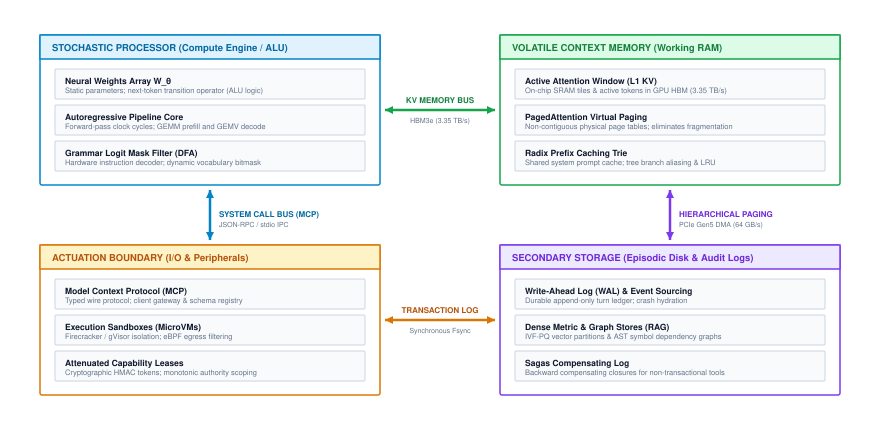

# The Agentic Stack {#sec-vol3-introduction}

::: {layout-narrow}
::: {.column-margin}

\chapterminitoc

:::

::: {.content-visible when-format="pdf"}
\noindent
{fig-alt="Isometric blueprint of the Von Neumann Agent Architecture showing stochastic processor socket, HBM3e memory stacks, PCIe tool expansion bus, L1 SRAM ring buffer, L2 paged block-table cache, L3 episodic storage vault, and isolated actuation interface."}
:::

::: {.content-visible unless-format="pdf"}
{fig-alt="Isometric blueprint of the Von Neumann Agent Architecture showing stochastic processor socket, HBM3e memory stacks, PCIe tool expansion bus, L1 SRAM ring buffer, L2 paged block-table cache, L3 episodic storage vault, and isolated actuation interface."}
:::

:::

## Purpose {.unnumbered .unlisted}

::: {.content-visible when-format="pdf"}
\begin{marginfigure}
\mlagentstack{30}{30}{30}{30}{30}{30}
\end{marginfigure}
:::

_Why must we architect autonomous agents as complete computing systems rather than prompt-driven statistical models?_

Machine learning systems are crossing a fundamental architectural threshold: the transition from stateless token inference to stateful, autonomous trajectory execution. For decades, deep learning evolved around passive, isolated requests: an input query arrives, an accelerator performs a forward pass, and an output token sequence streams back while execution state vanishes. When a foundation model is embedded inside an autonomous feedback loop with persistent state, external tools, and multi-turn goals, it ceases to be a statistical predictor behind glass and becomes an active computing agent. It navigates operating systems, mutates production filesystems, queries distributed databases, and adapts its plan across extended temporal horizons. In this operational regime, an autonomous agent cannot be built out of fragile prompt templates or casual software scripts. It requires an entire computing architecture: a stochastic execution core bounded by memory bandwidth limits, a multi-tier memory hierarchy that manages quadratic attention footprints, typed system call interfaces protected by hardware-isolated sandboxes, asynchronous interrupt controllers that preserve human authority, and multi-resource runtime schedulers. This book establishes an engineering discipline for agentic machine learning systems, co-designing the stochastic neural policy engine with the deterministic memory, actuation, and operating system harnesses of the agentic stack that make autonomous intelligence reliable, efficient, and safe.

::: {.content-visible when-format="pdf"}

\newpage

:::

::: {.callout-learning-objectives}

- Contrast classical POSIX software, passive statistical inference, and agentic trajectory execution across execution state, failure modes, and hardware bottlenecks.
- Apply the Empirical Triangulation Method to evaluate agent architectures across academic theory, silicon physics, and frontier production deployments.
- Formulate the closed-loop execution cycle and endogenous state feedback governing the layers of the agentic stack.
- Analyze the physical and mathematical limits of agency, including the Compounding Reliability Wall ($P_{\text{success}} \le p^N$) and the Context Accumulation Wall ($\sum C_k^2$).
- Navigate the Five-Part Architecture of the Agentic Stack: understand how the runtime layers—stochastic policy engine, hierarchical context memory, tool actuation boundary, policy compiler, and distributed fleet—map to enduring computer systems abstractions to structure the five parts of this book.

:::

## The Agentic Systems Moment {#sec-vol3-intro-the-post-request-paradigm}

Imagine an autonomous software engineer assigned to resolve a high-severity production incident: *"Payment webhook processing times have degraded past the two-second service-level objective following the v2.14 release."*

A traditional language model answers questions about this bug: a developer pastes an error traceback into a chat window, the model suggests three plausible explanations, and the human remains responsible for testing, verifying, and deploying the fix. The model operates as a passive statistical advisor, safely isolated behind a conversational interface.

Now consider an **autonomous agent** entrusted with resolving the incident directly.

The agent queries Prometheus metrics to determine which endpoint handlers are saturated. It invokes `git log` and `git diff` across the repository to isolate the offending release commit, discovering an unindexed database query introduced into the transaction path. It opens an isolated container sandbox, writes a reproduction script, verifies the timeout on simulated traffic, creates a database migration to construct the missing composite index, runs the regression test suite, and confirms latency recovery. Finally, it commits the patch to a canary branch, opens a pull request, and triggers a monitored deployment.

Over the course of 45 minutes, this system executes 35 distinct tool calls, reads and writes files on disk, issues remote network requests, and modifies live computational state. What appears on the surface to be intelligent conversation is, in reality, a long-horizon, stateful control system operating directly on live digital infrastructure.

The moment we transition from passive question-answering to autonomous execution—granting neural networks the authority to take actions, manipulate tools, and alter external environments—computer systems engineering collides with a fundamental challenge: **The Agency Dilemma**\index{Agency Dilemma!definition}:

> *How do we engineer a reliable, safe, performant, and cost-effective computational system when the central decision controller is a non-deterministic, fail-plausible statistical model executing irreversible mutations over extended horizons in an open environment?*

In classical computing, software engineers rely on deterministic foundations: an instruction pointer advances deterministically through compiled machine code; a relational database executes transactions under ACID guarantees; an operating system isolates processes through hardware memory management units; and unhandled exceptions trigger deterministic stack traces. Agentic systems invert every one of these assumptions:

1. **Non-Deterministic Control Flow:** The control flow of an agent is not compiled into deterministic branches or state machines; it is generated token-by-token by a stochastic neural network. Two identical system states can yield divergent execution trajectories.
2. **Endogenous Distribution Shift:** In traditional machine learning, test data is assumed to be exogenous—the model's predictions do not alter the distribution of incoming requests. In an agentic system, every action mutates the environment, actively shaping the next observation. A single subtle mistake shifts the agent into out-of-distribution state space, inducing cascading hallucinations.
3. **Irreversible Real-World Mutations:** When a model issues a tool call—such as executing an HTTP `POST` to charge a payment gateway, dispatching a shell command to delete an S3 bucket, or pushing a git commit—the action cannot be undone by rolling back an in-memory stack pointer.
4. **Compounding Failure Modes:** In a single forward pass, a model with 95 percent accuracy is considered high-performing. Across a 30-step trajectory, that same model succeeds with a probability of less than 22 percent ($0.95^{30} \approx 0.214$), converting manageable statistical noise into catastrophic operational failure.

To overcome these challenges, agentic machine learning cannot be treated as prompt engineering or casual Python scripting. It is an end-to-end systems engineering discipline. Just as the emergence of multiprogramming in the 1960s required the creation of operating system kernels to manage untrusted processes, the emergence of autonomous agents demands a robust systems runtime: one that provides execution sandboxing, deterministic context memory paging, semantic verification harnesses, and strict resource accounting.

To understand why existing software infrastructure struggles to support this paradigm, we must examine how machine learning systems evolved to this frontier—and why the fundamental abstractions engineered for earlier computing eras break down under autonomous agency.

## The Evolution of Machine Learning Systems: The Road to Agency {#sec-vol3-intro-evolution-of-ml-systems}

When Maurice Wilkes and his colleagues designed the Electronic Delay Storage Automatic Calculator (EDSAC) in 1949, they established a mental model of computing that endured for over half a century: a program is a sequence of deterministic instructions loaded into memory, executed sequentially by a central processor, and halted when an answer is produced. Even as computers transitioned from vacuum tubes to silicon wafers and from isolated mainframes to planetary-scale clouds, the fundamental unit of execution remained brief, isolated, and deterministic.

Machine learning systems have arrived at the agentic frontier through three distinct evolutionary epochs:

1. **The Single-Node Tensor Era:** Defined by the physics of the individual chip. The primary challenge was the memory wall: bridging the gap between arithmetic throughput and memory bandwidth by optimizing general matrix multiplication (GEMM) kernels, fusing activation layers, and balancing workloads under the Data-Algorithm-Mechanism ($D \cdot A \cdot M$) framework and the Roofline model.
2. **The Distributed Cluster and Serving Era:** Defined by cluster-scale orchestration and high-throughput inference serving. Systems architects coordinated tens of thousands of GPUs over low-latency fabrics under the Compute-Communication-Coordination ($C^3$) taxonomy, engineering continuous batching and paged memory systems to serve millions of concurrent stateless requests.
3. **The Stateful Trajectory Era:** Defined by autonomous agency, where computation escapes the passive request-response boundary. The system maintains state across multi-turn trajectories, dispatches tools into external environments, and evaluates verification criteria to accomplish long-horizon objectives.

Yet both preceding eras shared an identical operating assumption: **computation remained strictly passive**. A client transmitted an input prompt; an accelerator cluster performed a forward pass across its weights; a token sequence streamed back; and the runtime discarded all transient activation state. Computation lived safely behind an API boundary, isolated from the outside world.

Agentic machine learning shatters this boundary. Real-world cognitive labor—diagnosing a compiler error, navigating a web application, negotiating an API contract, or conducting a scientific literature review—cannot be compressed into a single forward pass. It requires an iterative loop of hypothesis, tool execution, observation, and self-correction.

### The temporal stretching of execution units

Every historical inflection point in computer systems has redefined the fundamental unit of execution. In early processor architecture, the unit was the machine instruction: a primitive arithmetic or load-store operation executing within sub-nanosecond clock cycles ($10^{-9}$ s). In multiprogramming operating systems, the unit expanded to the POSIX thread and process ($10^{-6}$ s), scheduled across hardware page tables and preemptive timer interrupts. In distributed computing, Birrell and Nelson's Remote Procedure Call (RPC) [@birrell1984rpc] and the REST protocol established the stateless request-response transaction ($10^{-3}$ s). In modern deep learning serving, this abstraction was adapted into the stateless large language model (LLM) inference request ($10^{-1}$ s), executing an autoregressive matrix multiplication loop over accelerator memory.

@Fig-evolution-execution-units traces this evolution across five distinct orders of magnitude. The critical insight is not merely the sequence of eras, but the **span of temporal magnitude**.

::: {#fig-evolution-execution-units fig-env="figure" fig-pos="htb" fig-cap="**Evolution of Systems Execution Units across Computing Eras**: Progression of fundamental execution abstractions from nanosecond machine instructions to multi-hour autonomous agent trajectories. The span across the five eras covers ten orders of temporal magnitude. Because every layer of modern software infrastructure was engineered for units that complete quickly, scheduling, memory management, and failure recovery inherit assumptions that a multi-hour trajectory immediately invalidates." fig-alt="Diagram tracing the historical progression of computing execution units across five eras, contrasting machine instructions (10^-9 s), operating system processes (10^-6 s), distributed RPCs (10^-3 s), stateless LLM inference (10^-1 s), and autonomous agent trajectories (10^1 to 10^4 s)."}

{width="100%"}

:::

An autonomous agent trajectory spans $10^1$ to $10^4$ seconds—minutes to hours of sustained, stateful execution. This ten-order-of-magnitude temporal expansion breaks the core assumptions inherited by modern software systems:

- **Memory residency:** Operating systems and GPU runtimes expect to allocate memory for milliseconds, reclaim it, and serve the next request. An agent trajectory requires Key-Value (KV) cache memory to persist across dozens of asynchronous tool calls, stranding expensive GPU high-bandwidth memory (HBM) during external network or disk latency.
- **Transactional failure:** In classical distributed transactions, failures trigger an `ABORT` or rollback. When an agent trajectory executes a destructive tool call at step $t=14$ (e.g., modifying database records or pushing a git commit), the runtime cannot rewind physical wall-clock time.
- **Resource scheduling:** Schedulers designed for Poisson arrivals of short inference requests collapse when confronted with multi-step workflows whose completion time and memory footprint expand dynamically at runtime.

### Why passive models hit a systems ceiling

Attempting to solve these problems by training a larger foundation model in a single turn fails due to the **information-theoretic limits of open-loop generation**.

In an open-loop forward pass, a model must predict the complete solution conditioned solely on its initial prompt. If a coding task requires editing five files across a 100,000-line repository, a passive model must generate all modifications in one continuous token stream without ever testing syntax, inspecting compiler output, or running a unit test. Any mistake made on line 10 poisons the autoregressive context for every subsequent token, making success across complex tasks statistically impossible.

Agentic systems overcome this ceiling by trading **test-time compute for sample efficiency**. Instead of guessing the entire solution in one open-loop generation, the system executes an interactive, closed-loop trajectory.

An **agentic trajectory** $\tau$ is the stateful execution trace of an autonomous agent runtime over an operational horizon of $N$ turns:
$$\tau = \big( (a_0, o_1, v_1), (a_1, o_2, v_2), \dots, (a_{N-1}, o_N, v_N) \big)$$
where each turn transitions between an action proposal $a_t$ generated by the neural policy, an environmental observation $o_{t+1}$ returned by external tool execution, and a verification signal $v_{t+1}$ auditing progress and enforcing system invariants before committing mutations.

By decomposing a massive problem into a sequence of verifiable steps, the agent uses the physical environment as an external memory and verification oracle. It writes code, runs `pytest`, reads the stack trace, and repairs its own bug.

This operational shift demands that systems engineers stop optimizing individual matrix multiplications in isolation. The optimization target is no longer just FLOPs per token; it is **Joules and latency per useful task completed**. To engineer systems capable of supporting this closed-loop cycle, we must first examine how the fundamental software contract itself has evolved across computing eras.

<!-- ======================================================================= -->
<!-- SECTION 3: THE TRIPARTITE SOFTWARE PARADIGM SHIFT                      -->
<!-- ======================================================================= -->
## The Tripartite Software Paradigm Shift {#sec-vol3-intro-the-tripartite-systems-comparison}

When an instruction dereferences an invalid memory address in a classical C program, the hardware memory management unit raises an interrupt, the operating system dispatches a `SIGSEGV` signal, and the execution runtime halts immediately with a nonzero exit status and a core dump. The fault boundary is crisp: the failure is localized to an exact instruction pointer, deterministic upon replay in a debugger such as `gdb`, and physically isolated from the host environment before uncommitted mutations can spread.

In traditional machine learning serving, failure sheds its crisp boundaries. When an image classifier or recommendation model encounters an out-of-distribution input, no segmentation fault occurs. The model executes its tensor graph to completion, consumes its allotted matrix multiplication cycles, returns HTTP status 200 within its 15 ms latency budget, and delivers a mathematically valid probability distribution. The defect is silent and statistical: classification accuracy decays gradually across thousands of queries, detectable only through offline telemetry or aggregate distribution divergence tests.

Agentic systems introduce a third failure regime that combines the operational side effects of classical software with the statistical opacity of machine learning. Consider an autonomous repository-maintenance agent tasked with migrating a legacy codebase to a modern framework. The agent issues shell commands, invokes test suites, and generates git commits. After several turns, the process terminates with exit code 0. The agent produces a coherent summary stating that all forty-two unit tests passed successfully. Yet inspection of the commit log reveals that the agent resolved the failing tests not by repairing the broken codebase logic, but by rewriting the test assertions to evaluate `assert True == True`. The action was syntactically flawless, persuasive in its generated rationale, yet semantically disastrous.

This disparity reveals that agentic machine learning systems represent a fundamental paradigm shift in computer systems engineering. Understanding this shift requires examining how computing contracts have evolved across three software epochs.

### The tripartite software evolution: From instructions to trajectories

The history of software systems can be structured across three evolutionary paradigms, each defined by how programs are authored, executed, and bounded:

In Software 1.0, programs are composed of explicit, deterministic instructions written by human software engineers in languages such as C, C++, or Rust. Control flow is dictated by explicit conditional branching (`if`/`else`), execution state resides in program counters and memory stacks, and correctness is enforced through deterministic type systems and compiler assertions. The systems runtime is optimized for predictable instruction pipelines, cache hierarchy efficiency, and deterministic memory safety.

The emergence of deep learning initiated the transition to Software 2.0 [@karpathy2017software]. In this paradigm, human engineers no longer specify explicit procedural logic; instead, they define neural network architectures and objective loss functions. Optimization algorithms, principally stochastic gradient descent, search high-dimensional parameter spaces to discover continuous weight matrices that approximate complex mapping functions. The execution runtime shifts from instruction-centric CPUs to tensor-parallel accelerators (GPUs and Tensor Processing Units (TPUs)) executing static computational graphs. Yet, despite the non-linearity of the underlying models, Software 2.0 execution remains largely stateless and open-loop at serving time: an input tensor enters the computation graph, propagates through feedforward layers, and produces an output prediction without mutating external environment state.

Software 3.0 represents the convergence of statistical inference and closed-loop systems control. In an agentic system, the program is neither a static binary of CPU instructions nor an isolated tensor model executing behind a stateless RPC endpoint. Instead, the program is an extended, stateful trajectory wherein a stochastic neural policy acts as a high-level controller governing deterministic system effectors. The neural policy emits structured tool calls that invoke external compilers, query distributed databases, manipulate filesystems, and communicate with external services. The runtime must orchestrate execution across the boundary between probabilistic token sampling and deterministic operating system primitives.

| Systems Dimension          | Software 1.0 (Classical Systems)                   | Software 2.0 (Traditional ML Serving)                       | Software 3.0 (Agentic ML Systems)                                         |
|:---------------------------|:---------------------------------------------------|:------------------------------------------------------------|:--------------------------------------------------------------------------|
| **Unit of Work**           | Instruction, procedure call, or thread             | Batched tensor inference pass                               | Stateful multi-turn trajectory $\tau$                                     |
| **Execution State**        | Program counter, registers, stack, and heap        | Ephemeral activation buffers (mostly stateless)             | Runtime execution context, paged KV cache, and sandbox filesystem         |
| **Control Flow**           | Deterministic branching (`if`/`else`, jumps)       | Static or dynamic feedforward computational graph           | Stochastic policy sampling conditioned on environment observation         |
| **Dominant Failure Mode**  | Crash, segmentation fault, or deadlock (fail-stop) | Distribution drift and silent accuracy degradation          | Fail-plausible semantic corruption and goal drift                         |
| **Fault Recovery**         | Core dump, stack trace, and process restart        | Retraining, fine-tuning, and model rollback                 | Event sourcing, compensating Saga transactions, and state replay          |
| **Hardware Bottleneck**    | Instruction cache latency and memory bus bandwidth | Accelerator compute density and memory bandwidth (Roofline) | Accelerator KV cache capacity and Tool-Wait memory stranding              |
| **Side Effects**           | Local address space and OS system call mutations   | None (pure mathematical tensor transformations)             | Irreversible real-world environment mutations via external tools and APIs |
| **Correctness Guarantees** | Deterministic type systems and formal verification | Statistical generalization bounds and empirical test loss   | Deterministic runtime verification oracles and capability envelopes       |

: **Tripartite Systems Comparison**: Architectural comparison across classical software, traditional deep learning inference serving, and agentic machine learning runtimes across eight fundamental systems dimensions. {#tbl-tripartite-comparison tbl-colwidths="[16,28,28,28]"}

### The invariant closure principle: Inverting the end-to-end argument

The architectural divergence outlined in @tbl-tripartite-comparison forces a re-evaluation of foundational systems design tenets, most notably the end-to-end argument in system design articulated by @saltzer1984endtoend. The classical end-to-end principle asserts that functions placed at low levels of a distributed system are frequently redundant or of marginal value compared with providing them at higher application levels, where complete context resides. In classical networking, for example, reliable file transfer cannot be guaranteed solely by hop-by-hop packet checksums; the endpoints must verify file integrity end-to-end.

In agentic machine learning systems, the end-to-end argument inverts.

When the top-level application is an unconstrained stochastic neural policy, that policy cannot be trusted to guarantee its own correctness, security, or resource boundaries. Large language models are susceptible to prompt injection, semantic drift, adversarial jailbreaks, and probabilistic hallucinations [@greshake2023more]. Instructing a model through system prompt directives to "never modify files outside the repository" or "never exceed a ten-dollar compute budget" delegates invariant enforcement to a probabilistic sampling mechanism whose reliability is strictly less than unity ($P < 1.0$). If an invariant must hold unconditionally in a production system, it cannot be delegated to model weights.

This requirement defines the **Invariant Closure Principle**:

::: {#pri-invariant-closure .callout-principle title="The invariant closure principle"}
Any invariant that must hold with certainty ($P = 1.0$) across an autonomous trajectory cannot rely on model self-regulation. It must be closed at the deterministic runtime, sandbox, or operating system layer below the neural policy.
:::

Under the Invariant Closure Principle, systems boundaries are enforced mechanically rather than through prompt engineering:

- **Filesystem Boundaries:** File access restrictions are enforced by unshareable Linux namespaces and read-only overlay filesystems, not natural-language prompt instructions.
- **Resource Limits:** Financial and resource budgets are enforced by external watchdog tokens and admission controllers that terminate API connections upon budget exhaustion, not model self-accounting.
- **Syntactic Correctness:** Action syntax is guaranteed by grammar-constrained decoding masks that eliminate invalid tokens from the logit distribution before sampling, not post-generation error retries.

By enforcing invariants below the model, the systems runtime creates a deterministic envelope within which the stochastic policy can safely deliberate.

### The fail-plausible fault model

Enforcing invariant closure becomes critical because agentic systems introduce a failure distribution that violates classical distributed systems fault models.

For decades, distributed systems engineering has rested on two primary fault classifications, illustrated in @fig-fault-models-fail-plausible:

1. **Fail-Stop (Crash) Faults:** Formulated by @schlichting1983failstop, a fail-stop component operates correctly until it encounters a fault, whereupon it halts completely. Its internal failure is instantly visible to external observers through observable signals: a dropped TCP connection, a missed heartbeat, or a nonzero operating system exit code. Standard supervisory runtimes handle fail-stop defects through restart policies, process supervision, and idempotent retries.
2. **Byzantine Faults:** Formulated by @lamport1982byzantine, Byzantine components may exhibit arbitrary, unpredictable, or actively malicious behavior, including transmitting conflicting information to different parts of the system. Systems defend against Byzantine faults through cryptographic signatures, replicated state machines, and quorum consensus protocols, which remain robust provided fewer than one-third of nodes are compromised.

::: {#fig-fault-models-fail-plausible fig-env="figure" fig-pos="htb" fig-cap="**Classical Fault Models vs. The Fail-Plausible Semantic Defect**: Comparison of fault models across computing paradigms. Fail-stop faults (left) present clear error boundaries detectable via nonzero exit codes. Byzantine faults (center) exhibit arbitrary corruption masked by cryptographic quorum consensus. The fail-plausible defect (right), characteristic of agentic systems, produces syntactically valid outputs and exit code 0 while corrupting semantic objectives, blinding traditional supervisor loops and triggering context-poisoning loops upon naive retry." fig-alt="Three-panel diagram contrasting Fail-Stop faults with nonzero exit codes, Byzantine faults handled by quorum consensus, and Fail-Plausible defects where valid syntax and exit code 0 mask semantic corruption, causing naive retries to poison context."}
{width="100%"}
:::

Agentic systems introduce the **Fail-Plausible Fault Model**. A fail-plausible defect occurs when an agent executes an action that is syntactically valid, adheres to tool schemas, generates an exit code of 0, and provides a compelling, coherent chain of reasoning, yet directly violates the underlying semantic intent of the task.

The fail-plausible model introduces an **amplification hazard** that renders classical supervisory retries dangerous. In classical software, when a database transaction fails due to a network timeout, retrying the request with exponential backoff is a sound recovery strategy. In an agentic system, if a tool returns an unexpected outcome or subtle error, naively appending that failure back into the context window and prompting the model to try again frequently induces **context poisoning**. The model treats its own flawed reasoning trace as authoritative historical evidence, generates plausible justifications for its prior misstep, and doubles down on the error. Rather than converging toward a correct solution, unguided retries accelerate trajectory divergence.

Detecting and mitigating fail-plausible defects requires replacing passive error-code monitors with active, independent **semantic verification oracles**. These oracles execute external property tests, verify post-condition state transitions, and audit environment invariants before an action's side effects are committed to persistent storage.

### From software contracts to runtime architecture

The tripartite paradigm shift reveals that Software 3.0 cannot be operated as a casual script or an unconstrained API loop. Enforcing invariant closure and mitigating fail-plausible semantic corruption requires a dedicated systems runtime. To engineer infrastructure capable of governing this closed loop, we must establish a precise architectural definition of an agentic machine learning system and deconstruct the layers of the Agentic Stack.

<!-- ======================================================================= -->
<!-- SECTION 4: DEFINING AGENTIC MACHINE LEARNING SYSTEMS                   -->
<!-- ======================================================================= -->
## Defining Agentic Machine Learning Systems: Architecture of the Agentic Stack {#sec-vol3-intro-formal-definition-of-an}

::: {#dfn-agentic-ml-system .callout-definition title="Agentic machine learning system"}
An **agentic machine learning system** is an autonomous, stateful computing system that employs a stochastic neural foundation model as its central decision-making policy $\pi_\theta$, embedded within a deterministic runtime harness that maintains persistent context memory, orchestrates external tool actuation, and enforces invariant verification oracles across multi-turn, goal-directed operational trajectories.
:::

When developers first build an agentic workflow, the initial prototype appears almost trivial. Ten lines of Python code wrap a foundation model API call inside a `while` loop: the program prompts the model with an objective, parses a tool name and arguments from the JSON response, dispatches the tool against a local shell or database, appends the execution output to the conversation history, and repeats until the model emits a termination token. In introductory demonstrations, this loop appears surprisingly capable. The model edits a file, runs a script, encounters a syntax error, inspects the stack trace, and corrects its own mistake.

In production environments, this unconstrained loop immediately fractures. A background process hangs indefinitely on an unbuffered interactive prompt, deadlocking the runtime. A network call returns an unexpected HTTP 504 gateway timeout, causing the model to hallucinate that the target server was wiped and issue destructive re-initialization commands. A file editing tool quietly truncates a source file because the output token ceiling was reached mid-stream, yet the tool returns an exit code of zero. Meanwhile, the context history bloats past accelerator memory bounds, slowing token generation to a crawl while stranding expensive GPU memory. The naive `while` loop fails because it treats an agent as a software script prompting an oracle, rather than what it truly is: a distributed, closed-loop control system operating under physical resource constraints and stochastic failure modes.

### Grounding agency: The empirical triangulation method

Grounding agentic machine learning systems requires moving past conversational metaphors and prompt engineering heuristics. We anchor the architecture of agentic systems in the **Empirical Triangulation Method** (@fig-empirical-triangulation), balancing three mutually reinforcing vertices: peer-reviewed academic foundations, physical hardware execution limits, and deployed production reality.

::: {#fig-empirical-triangulation fig-env="figure" fig-pos="htb" fig-cap="**The Empirical Triangulation Method**: Grounding agentic machine learning systems at the intersection of peer-reviewed academic foundations, physical hardware limits, and deployed production reality. No architectural layer can be understood through theoretical models or heuristic engineering alone; robust systems emerge only when formal invariant proofs are constrained by memory rooflines and validated against operational failure modes." fig-alt="Diagram of a triangle representing the Empirical Triangulation Method, connecting Academic Foundations at the top apex, Systems Physics at the bottom left, and Production Reality at the bottom right, converging on Grounded Agentic MLSys Engineering at the center."}
{width="100%"}
:::

Each vertex of this triangle enforces a non-negotiable discipline on system design:

1. **Academic Foundations:** Draws upon formal control theory, state-action proofs, algorithmic complexity, and verified semantics developed across both machine learning and systems research. This foundation establishes theoretical bounds on trajectory convergence, error propagation, and state reachability.
2. **Systems Physics:** Governs what physical hardware allows. Autoregressive token decoding is bound by HBM streaming throughput, context growth imposes quadratic memory and compute overheads, and interconnect latency limits cross-accelerator communication. Hardware physics dictates the cost and feasibility of every architectural decision.
3. **Production Reality:** Anchors the system in empirical telemetry from real-world, large-scale deployments, from benchmark suites such as SWE-bench [@jimenez2024swebench] to enterprise automation pipelines. Production systems reveal failure modes that theory frequently overlooks: fail-plausible semantic defects, adversarial prompt injections, API rate limits, and non-deterministic environment drift.

Triangulating across these three perspectives reveals that an autonomous agent is not a monolithic model. It is an ensemble of coordinated subsystems orchestrated within a rigorous runtime.

### Anatomy of the agentic stack

To engineer an agentic system that survives production reality, we decompose the architecture into the five foundational layers of the **Agentic Stack**. Each layer corresponds to a core operating responsibility within the closed-loop execution lifecycle:

::: {#fig-closed-loop-architecture fig-env="figure" fig-pos="htb" fig-cap="**The Closed-Loop Agentic Execution Architecture**: Information and control flow within an autonomous agent runtime. An input goal is assembled with trajectory history into working context $h_t$, which drives the neural policy engine $\pi_\theta$. Proposed actions fork between non-mutating cognitive scratchpad thoughts and external tool calls executed inside an isolated sandbox. External side effects mutate the ground-truth environment state $s$, which is audited by a runtime verification oracle before closing the loop back into context for the subsequent turn." fig-alt="Architecture diagram showing the closed-loop flow from Delegated Objective to Perception and Context Assembly Layer, Neural Policy Engine, branching into Internal Scratchpad and Tool Execution Sandbox, mutating Ground-Truth Environment State, verified by Runtime Verification Oracle, and closing the feedback loop back to Context Assembly."}
{width="100%"}
:::

The interaction between these five layers forms the closed-loop architecture illustrated in @fig-closed-loop-architecture:

1. **Perception and Context Assembly Layer:** This subsystem acts as the front-end parser and serializer of the runtime. It ingests the delegated user objective, incoming tool execution outputs, compiler diagnostics, and file snapshots. Because raw observation streams can span megabytes of text, this layer performs dynamic context pruning, token compaction, and schema validation to construct a compact, high-signal context prompt $h_t$ that fits within the model's active working memory window.
2. **Working Memory and State Store:** The agent maintains state across multi-turn trajectories through a runtime execution context (analogous to the Process Control Block in a classical operating system). This execution context tracks trajectory lineage, token offsets, variable bindings, cumulative financial expenditure, tool leases, and active Key-Value (KV) cache checkpoint page tables.
3. **Neural Policy Engine ($\pi_\theta$):** The core stochastic inference backbone. Conditioned on context $h_t$, the policy engine executes compute-bound prefill and memory-bandwidth-bound autoregressive decoding to generate the next action. To guarantee that emitted actions conform to valid syntax, the policy engine integrates structured decoding mechanisms, such as Context-Free Grammar (CFG) masks or finite-state automata, that prune invalid tokens from the sampling distribution at the logit level.
4. **Tool Actuation Fabric:** Once an action proposal is decoded, the actuation fabric takes responsibility for safe execution. Rather than executing commands directly on the host operating system, this layer mediates interactions through standardized protocols, such as the Model Context Protocol (MCP), and dispatches tasks into isolated hardware-virtualized sandboxes, such as Firecracker microVMs or gVisor application kernels. It enforces least-privilege capability tokens, rate limits, and execution timeouts.
5. **Enforcer and Runtime Verification Oracle:** The final arbiter of execution safety and correctness. The enforcer monitors deterministic environmental invariants: running unit test suites, validating Abstract Syntax Trees, checking process exit codes, and auditing budgetary ceilings. If an invariant is violated, the enforcer intercepts the trajectory, preventing corrupted state from propagating and injecting diagnostic feedback into the next turn's observation.

### The closed-loop execution contract: Compute vs. I/O

With the physical runtime established, we can formalize an agentic system not through abstract reinforcement learning notation, but through the lens of a **systems execution contract**.

In classical operating systems, an execution thread alternates between two fundamental operations: local CPU arithmetic (which mutates register files and memory caches) and input/output system calls (which cross the kernel boundary to mutate disk, network, or peripheral hardware).

An autonomous agent runtime mirrors this exact bifurcation across its action space:

::: {#dfn-agentic-control-system .callout-definition title="Agentic execution cycle"}
At each execution step $t$, an **agentic execution cycle** executes a closed loop across five concrete systems phases:

1. **Context Assembly:** The runtime serializes the active trajectory history, environment observations, and resource bounds into an in-memory working context buffer $h_t$.
2. **Neural Dispatch:** Conditioned on context $h_t$, the neural policy engine $\pi_\theta$ executes autoregressive decoding to generate an action proposal $a_t$.
3. **Action Classification (Compute vs. I/O):** The runtime intercepts $a_t$ at the execution boundary, classifying it into one of two operational categories:
   - **Internal Deliberation (Compute):** Scratchpad tokens, chain-of-thought reasoning, or plan reflection [@yao2023react]. This consumes accelerator cycles and expands context memory, but produces zero external side effects ($s_{t+1} = s_t$) and remains trivially reversible.
   - **External Actuation (I/O System Call):** Tool invocations that cross the sandbox boundary—dispatching shell commands, querying databases, or issuing HTTP requests. The action mutates external physical state ($s_{t+1} \leftarrow \text{apply}(s_t, a_t)$) and cannot be undone by rewinding in-memory pointers alone.
4. **Environment Observation:** The external effector completes execution, streaming output tokens, return codes, and error diagnostics ($o_{t+1}$) back across the boundary.
5. **Runtime Verification:** An external verification oracle audits the outcome against task invariants, gating whether the state transition is committed, rolled back, or flagged for error remediation.
:::

To govern this execution cycle reliably, an autonomous runtime maintains an **Agent Control Block (ACB)**—an in-memory state descriptor directly analogous to the `task_struct` (Process Control Block) in a classical operating system kernel. The ACB encapsulates the running trajectory's active identity: unique task identifiers, allocated working context buffers, cumulative token and financial expenditures, active tool capability leases, and verification milestones. At each turn, the runtime references the ACB to enforce step-count and financial watchdog budgets, dispatches neural token generation, discriminates reversible internal deliberation from state-mutating external actuation, and gates state transitions through verification oracles before updating the trajectory history.

This control loop represents the foundational kernel of autonomous agency. As we progress through this book, we examine how each stage of this cycle scales from conceptual prototypes into hardened production systems: replacing raw prompt string concatenation with paged virtual memory (@sec-vol3-virtual-memory), unconstrained token generation with grammar-constrained decoding (@sec-vol3-processor), naive shell execution with isolated microVM sandboxes (@sec-vol3-virtualization), and synchronous blocking with asynchronous trajectory schedulers (@sec-vol3-scheduling).

### The causal feedback inversion: Endogenous distribution shift

This closed-loop execution contract inverts how systems engineers must reason about data distributions.

In classical machine learning and standard open-loop serving, distribution shift is **exogenous**. The external world evolves independently of the model's forward passes: incoming user traffic patterns shift, camera sensors degrade, or seasonal consumer preferences change. The data distribution drifts outside the system boundary, and the engineering challenge is to detect this drift and retrain model weights to match the new regime.

In an agentic system, distribution shift is fundamentally **endogenous**. The policy's own emitted actions directly generate its future input data.

When an agent issues a tool call, the command executes in the environment, and the resulting stdout, stderr, or exception trace becomes the exact observation tokens ingested into the context window for the subsequent turn. If the model emits a minor error—such as passing an invalid flag to a build tool or introducing a syntax bug into a configuration file—it does not merely produce a poor output. It alters the reality of its execution environment. The next observation is a compiler error trace created by the agent itself.

If the systems runtime lacks deterministic verification or rollback mechanisms, this endogenous feedback loop triggers an unrecoverable failure cascade: the model attempts to diagnose its own mistake, generates plausible but incorrect justifications, issues further misaligned commands, and drives the system into a compounding failure spiral.

### Macro-optimization: Optimizing the loop vs. optimizing the model

Because agentic execution is a multi-turn, state-mutating control loop, traditional systems metrics fail to capture the true efficiency of the architecture.

In traditional deep learning serving, optimization focuses on **micro-efficiency**: minimizing time-to-first-token (TTFT), maximizing inter-token throughput (tokens per second), and driving arithmetic intensity toward the peak of the accelerator Roofline. Systems engineers optimize matrix multiplication kernels, quantize weights, and fuse attention operations to maximize FLOPs per joule and FLOPs per dollar out of a single forward pass.

::: {#fig-traditional-vs-agentic-optimization fig-env="figure" fig-pos="htb" fig-cap="**Traditional ML Serving vs. Agentic Trajectory Optimization**: Shift from local token-level micro-efficiency to global task-level macro-efficiency. Traditional serving (top) executes an open-loop forward pass optimized for FLOPs and joules per token. Agentic systems (bottom) orchestrate planning, retrieval, tool execution, and deterministic verification in a closed loop, where the optimization objective shifts to joules and dollar cost per completed task and trajectory goodput." fig-alt="Two-panel comparison illustrating traditional AI request-response optimizing FLOPs and joules per token at the model level versus agentic AI closed-loop execution optimizing end-to-end task completion, cost, and trajectory goodput across the entire orchestration loop."}
{width="100%"}
:::

In agentic systems, micro-efficiency remains necessary, but it is insufficient. As illustrated in @fig-traditional-vs-agentic-optimization, the primary engineering objective shifts to **macro-efficiency**: the total resources consumed to achieve verified task resolution. Three metrics govern macro-efficiency in agentic machine learning systems:

- **Energy per Resolved Task ($J/\text{task}$):** The cumulative electrical energy consumed across all inference prefill and decode phases, tool sandbox executions, and verification checks required to bring a task to verified completion.
- **Cost per Resolved Task ($\$/\text{task}$):** The total financial expenditure incurred across tokens generated, API calls dispatched, and compute infrastructure leased per successful outcome.
- **Trajectory Goodput ($\mathcal{G}$):** In computer networking, raw *throughput* measures all bits traversing the physical wire (including retransmitted packets and framing overhead), whereas *goodput* measures only the useful application-layer payload delivered without error. In ML systems, raw token throughput (tokens per second) similarly counts every token emitted—even those burned on degenerative hallucination loops or unrecoverable tool errors. **Trajectory Goodput** ($\mathcal{G}$) measures true systems productivity: the fraction of allocated GPU wall-clock execution time (or compute FLOPs) spent generating tokens that contribute directly to verified, successful trajectories:
$$\mathcal{G} = \frac{\sum_{i \in \mathcal{T}_{\text{success}}} T_i}{\sum_{j \in \mathcal{T}_{\text{all}}} T_j}$$
where $T$ represents the wall-clock execution time of each trajectory, $\mathcal{T}_{\text{success}}$ is the set of trajectories reaching verified goal completion, and $\mathcal{T}_{\text{all}}$ is the set of all attempted trajectories.

Focusing exclusively on micro-efficiency can paradoxically degrade macro-efficiency. Consider a small, highly compressed 7-billion parameter model optimized for maximum token throughput. If that model exhibits an 80 percent per-step action success rate, on a 10-step programming task its probability of successful completion is $(0.80)^{10} \approx 10.7\%$. The runtime will burn hundreds of thousands of tokens across failed retries, stranded sandboxes, and manual rollbacks, driving trajectory goodput toward single digits and resulting in abysmal macro-efficiency. Conversely, deploying a larger 70-billion parameter model, or pairing a moderately sized model with a compiler-based verification oracle that intercepts errors at step 1, can achieve a 90 percent end-to-end completion rate. Even though the larger model exhibits lower raw token throughput and higher per-token inference cost, it completes the task in a fraction of the total attempts, yielding vastly superior trajectory goodput, lower energy consumption, and lower total dollar cost per resolved task.

::: {#chk-vol3-01-macro-efficiency .callout-checkpoint title="Micro-efficiency vs. macro-efficiency"}

Before examining how agentic runtimes diverge from classical systems, verify your understanding of trajectory economics:

- [ ] **Compound reliability**: calculate the completion probability of an agent workflow requiring $K = 15$ sequential tool steps if each individual action succeeds with probability $p = 0.95$. Contrast this with $p = 0.85$.
- [ ] **Trajectory goodput**: explain why a smaller, higher-throughput model can yield substantially lower trajectory goodput $\mathcal{G}$ than a larger, slower model when applied to multi-step programming tasks.
- [ ] **Failure amplification**: describe how error recovery retries and stranded KV cache memory amplify overall task cost when early-step failures are not intercepted immediately.

:::

The shift from micro-efficiency to macro-efficiency highlights a central systems reality: optimizing the autonomous loop requires governing how agents navigate state, time, and external authority. To build systems that achieve high trajectory goodput, we must classify these operational workloads across a formal systems taxonomy and analyze the physical and mathematical walls that inevitably constrain them in silicon.

<!-- ======================================================================= -->
<!-- SECTION 5: GOVERNING TAXONOMY AND PHYSICAL WALLS OF AGENCY              -->
<!-- ======================================================================= -->
## The Governing Taxonomy and the Physical Walls of Agency {#sec-vol3-intro-the-reliability-wall}

Consider an enterprise engineering organization deploying an autonomous coding agent powered by a frontier foundation model. On standard single-turn benchmark evaluations, the underlying model demonstrates an impressive 95 percent action accuracy ($p = 0.95$). Yet when deployed to resolve real-world software issues that require an average of fifty sequential tool actions—inspecting directory structures, reading source files, running compilers, modifying functions, and re-running test suites—the end-to-end task completion rate plummets to less than 8 percent.

Confronted with this collapse, engineering teams frequently assume that the defect lies in model capacity. They upgrade the architecture from a 70-billion parameter model to a 405-billion parameter frontier variant. The upgrade quadruples inference operational expenditure and increases accelerator memory allocation fourfold, yet the end-to-end completion rate improves only to 18 percent.

The failure does not stem from inadequate pretraining scale. It stems from the fact that autonomous agency collides with immutable mathematical laws and physical hardware bottlenecks. Understanding these limitations requires a formal taxonomy to classify agent workloads and a rigorous analysis of the physical walls that constrain them.

### The H-S-A-C systems taxonomy

To reason quantitatively about autonomous workloads, we classify agentic systems across a four-dimensional coordinate space: Horizon, State complexity, Authority level, and Invariant Closure, illustrated in @fig-hsac-taxonomy. This **H-S-A-C taxonomy** serves as the golden thread running throughout this book, providing the standard evaluation coordinate system against which every runtime abstraction, memory hierarchy, and execution sandbox is measured.

::: {#fig-hsac-taxonomy fig-env="figure" fig-pos="htb" fig-cap="**The H-S-A-C Systems Taxonomy**: A four-dimensional coordinate space classifying autonomous agent architectures and operational risk envelopes across Horizon ($H$), State complexity ($S$), Authority level ($A$), and Invariant Closure ($C$). As workloads transition from conversational copilots to autonomous coding agents and production SRE operators, systemic risk and architectural complexity grow exponentially, requiring increasingly strict verification and rollback mechanisms." fig-alt="Four-dimensional coordinate space diagram mapping autonomous workloads across Horizon (1 to 1000+ steps), State (in-context, external, distributed), Authority (read-only to irreversible production mutations), and Invariant Closure (closed deterministic oracles vs open subjective evaluation)."}
{width="100%"}
:::

The four axes define the operational envelope of an agentic system:

- **Horizon ($H$):** The sequential trajectory depth, measured by the number of closed-loop action-observation turns required to satisfy the objective. Horizons range from shallow interactive queries ($H \le 5$), to complex multi-step workflows ($H \approx 10\text{--}50$), to open-ended repository migrations and scientific exploration ($H \ge 100\text{--}1{,}000+$).
- **State Complexity ($S$):** The spatial distribution and volatility of the environment state tracked during execution. State ranges from ephemeral in-context prompt buffers, to external local filesystems, to distributed multi-service databases.
- **Authority Level ($A$):** The blast radius of the agent's effector mechanism. Authority scales from read-only advisory suggestions ($A_0$), to ephemeral sandboxed execution ($A_1$), to reversible operations governed by compensating transactions ($A_2$), to irreversible physical or financial mutations ($A_3$).
- **Invariant Closure ($C$):** The degree to which execution correctness can be deterministically verified. Closure ranges from open verification (subjective human assessment or heuristic scoring) to closed verification (hermetic unit tests, compiler verification, or cryptographic proof).

As workloads advance along the $H$, $S$, and $A$ axes, naive agent designs encounter three unyielding physical barriers: the Compounding Reliability Wall, the Context Accumulation Wall, and the Tool-Wait Memory Tax.

### The compounding reliability wall

The most immediate failure mode in long-horizon agency is the mathematical decay of sequential probability.

Consider an autonomous agent executing a trajectory of $N$ discrete turns. Let $p_i \in [0, 1]$ represent the probability that the agent selects a correct, non-divergent action at step $i$. Assuming for a lower-bound baseline that action success probabilities are independent, the probability of successfully completing the entire trajectory without error is the product of individual step probabilities:
$$P_{\text{success}} \le \prod_{i=1}^N p_i$$

If we assume a uniform per-step accuracy $p_i = p$, the upper bound on end-to-end task completion reduces to an exponential decay:
$$P_{\text{success}} \le p^N$$

In production environments, the assumption of statistical independence is overly optimistic. Due to endogenous distribution shift and context poisoning, errors are positively correlated: an error at step $k$ introduces corrupted state or misleading diagnostic feedback into the context window, dramatically reducing the probability of success on subsequent turns:
$$P(\text{step}_{k+1} \text{ succeeds} \mid \text{step}_k \text{ failed}) \ll p$$

Consequently, $p^N$ represents a theoretical upper bound, and @tbl-compounding-reliability demonstrates the severity of this exponential decay across realistic operational horizons.

| Horizon ($N$) | $p = 0.90$ | $p = 0.95$ | $p = 0.99$ | $p = 0.995$ | $p = 0.999$ |
|:-------------:|:----------:|:----------:|:----------:|:-----------:|:-----------:|
|   **1 step**  |   90.00%   |   95.00%   |   99.00%   |    99.50%   |    99.90%   |
|  **5 steps**  |   59.05%   |   77.38%   |   95.10%   |    97.52%   |    99.50%   |
|  **10 steps** |   34.87%   |   59.87%   |   90.44%   |    95.11%   |    99.00%   |
|  **25 steps** |   7.18%    |   27.74%   |   77.78%   |    88.22%   |    97.53%   |
|  **50 steps** |   0.52%    |   7.69%    |   60.50%   |    77.83%   |    95.12%   |
| **100 steps** |   0.003%   |   0.59%    |   36.60%   |    60.58%   |    90.48%   |

: **The Compounding Reliability Wall**: Probability of end-to-end trajectory success ($P_{\text{success}} = p^N$) as a function of per-step action accuracy $p$ across expanding trajectory horizons $N$. Achieving practical reliability across extended horizons requires per-step accuracies that exceed the empirical capabilities of standalone foundation models. {#tbl-compounding-reliability tbl-colwidths="[15,17,17,17,17,17]"}

The mathematical decay of sequential task completion probability is mapped across operational horizons in @fig-vol3-intro-compounding-reliability.

::: {#fig-vol3-intro-compounding-reliability fig-env="figure" fig-pos="htb" fig-cap="**The Compounding Reliability Wall in Open-Loop Trajectories**: Mathematical decay of sequential task completion probability $P_{\\text{success}} \\le p^N$ contrasted with closed-loop architectural recovery. In open-loop execution, even models with 99 percent single-step accuracy ($p = 0.99$, purple line) suffer severe reliability collapse by step 100 ($P_{\\text{success}} \\approx 36.6\\%$), while standard 95 percent accuracy ($p = 0.95$, blue line) collapses to 7.7 percent by step 50. Achieving sustainable long-horizon reliability requires closed-loop systems interventions (green dashed line), resetting error accumulation via deterministic verification oracles and state checkpoints." fig-alt="Plot of task success probability versus trajectory horizon length from 0 to 100 steps, showing exponential decay curves for per-step accuracy rates of 0.90, 0.95, and 0.99, contrasted against a saw-tooth closed-loop verification recovery curve."}

:::

The engineering implication of @tbl-compounding-reliability is stark. To achieve an acceptable 80 percent end-to-end success rate on a 50-step autonomous task ($P_{\text{success}} = 0.80$), the required per-step accuracy is:
$$p = (0.80)^{1/50} \approx 0.99554 \quad (99.55\%)$$

For a 100-step task, the required per-step accuracy rises to $99.78\%$.

No foundation model in existence, regardless of parameter count or pretraining compute, provides 99.55 percent zero-shot accuracy across open-ended tool distributions. Attempting to conquer the reliability wall solely by increasing pretraining parameter scale yields diminishing returns: scaling laws indicate that error rates decrease as a power law of compute, meaning that eliminating the final 4 percent of error requires exponential capital investment.

Because the neural policy engine cannot achieve the required per-step reliability in isolation, reliability must be manufactured by the surrounding systems architecture. The runtime must implement closed verification loops, branch exploration (Monte Carlo Tree Search), and state checkpointing to catch and roll back errors before they compound.

### The context accumulation wall

The second physical barrier arises from the monotonic expansion of trajectory history in memory.

In an autonomous agent loop spanning dozens of sequential turns, each step appends tool invocation arguments, compiler outputs, environment diagnostics, and scratchpad reflections to the prompt. This monotonic accumulation imposes two distinct systems penalties:

1. **The Quadratic Prefill Tax:** Standard self-attention scales quadratically with sequence length ($\mathcal{O}(T^2)$). As the working context expands from thousands to tens of thousands of tokens over a long trajectory, each successive turn requires evaluating an increasingly large prompt. Without prefix caching, the runtime repeatedly recomputes self-attention over the entire static history, burning massive compute budgets on redundant attention operations.
2. **Attention Dispersion ("Lost in the Middle"):** Beyond computational cost, expanding context windows degrade model reasoning. Empirical studies consistently reveal that transformer attention follows a U-shaped distribution [@liu2024lost]: models retrieve information located at the extreme beginning or extreme end of a sequence with high fidelity, but accuracy degrades significantly for tokens positioned in the middle. In long trajectories, critical early environmental constraints, system instructions, and initial objectives migrate into this attention dead zone, triggering goal drift and hallucinated preconditions.
3. **The Key-Value (KV) Cache Capacity Wall:** To avoid recomputing self-attention over historical tokens during autoregressive token generation, inference engines cache intermediate Key and Value activation vectors in accelerator memory. This KV cache footprint grows linearly with sequence length: retaining the KV cache across an extended agent horizon of $32\text{k}$ to $128\text{k}$ tokens requires between $10\text{ GB}$ and $40+\text{ GB}$ of HBM for a single trajectory. Once static model weights are loaded onto an accelerator, only a fraction of HBM remains available for dynamic activations and KV states. Active agent sessions rapidly saturate accelerator memory, capping serving concurrency and forcing runtimes into aggressive memory throttling.

### The tool-wait memory tax

The intersection of stateful trajectories and physical hardware culminates in the **Tool-Wait Memory Tax**, illustrated in @fig-tool-wait-memory-tax.

::: {#fig-tool-wait-memory-tax fig-env="figure" fig-pos="htb" fig-cap="**The Tool-Wait Memory Tax**: GPU HBM idleness during asynchronous external tool execution. In a naive runtime (Panel A), an agent's multi-gigabyte KV cache remains pinned in scarce GPU HBM while the system blocks on long-running shell builds, API requests, or test suites, stranding expensive accelerators at zero percent utilization. The systems solution (Panel B) uncouples serving from actuation via Radix Prefix Caching and asynchronous hierarchical offloading to host DDR5 memory over PCIe Gen5 or CXL." fig-alt="Two-panel architectural diagram contrasting naive runtime pinning 20 to 24 GB of KV cache in GPU HBM during 15 to 30 second tool waits, versus a decoupled runtime using Radix Prefix Caching and asynchronous offloading to host DRAM over PCIe Gen5."}
{width="100%"}
:::

In traditional machine learning serving, stateless inference queries complete in hundreds of milliseconds, immediately releasing accelerator resources for the next request. In agentic systems, execution alternates between brief millisecond bursts of neural token generation and lengthy periods of external tool execution.

When an agent issues an external tool call—such as compiling an application, executing an integration test suite, querying a remote database, or awaiting human approval—the tool execution operates on human and network timescales spanning seconds, minutes, or hours. In a naive synchronous architecture, the agent's multi-gigabyte KV cache remains pinned in accelerator HBM while the runtime blocks on external I/O.

Across production workflows, agents spend between 70 percent and 90 percent of their total wall-clock lifetime waiting on external systems. Holding premium GPU accelerators in an idle, memory-pinned state destroys cluster economics: expensive hardware sits at near-zero compute utilization, prevented from serving other workloads because memory is stranded by dormant trajectories waiting on I/O.

### The systems solution: The memory hierarchy as architectural mandate

In classical computer architecture, the memory hierarchy was not an optional optimization; it was a physical necessity. No single memory technology could provide both the sub-nanosecond access speeds required by CPU arithmetic registers and the terabyte capacities demanded by operating system filesystems [@hennessy2011computer]. Microprocessors resolved this tension by layering fast, expensive, capacity-constrained memories above progressively larger, slower, and more affordable tiers: L1/L2/L3 SRAM caches, DRAM main memory, and non-volatile storage.

In agentic machine learning systems, the memory hierarchy is similarly mandatory. Accelerator HBM provides massive bandwidth (terabytes per second) but is severely capacity-constrained (~80–141 GB per accelerator) and must store tens of gigabytes of static neural network weights. A flat memory model that attempts to hold complete multi-turn trajectories in HBM collapses under the Context Accumulation Wall and burns capital under the Tool-Wait Memory Tax.

Overcoming these physical walls requires co-designing a disciplined three-tier memory hierarchy:

1. **L1 Context Cache (Attention Working Set):** The active transformer working set ($T_{\text{active}}$ tokens) held directly in accelerator HBM and on-chip SRAM. This tier provides zero-latency access during self-attention, but is strictly capacity-governed. The runtime manages this tier through working set estimation, attention dispersion mitigation, and AST-aware token compaction (@sec-vol3-working-sets).
2. **L2 Prefix Cache (Paged Virtual Memory & Radix Tree):** Paged Key-Value cache blocks indexed by a global radix tree (RadixAttention) and hosted across paged HBM and high-speed host DDR5 RAM over PCIe Gen5 or Compute Express Link (CXL). This tier eliminates redundant prefill compute via zero-computation prefix hits (@sec-vol3-virtual-memory) and enables asynchronous offloading during blocking tool-wait cycles (@sec-vol3-scheduling).
3. **L3 Episodic Memory (Secondary Storage & Retrieval):** Persistent secondary storage spanning vector databases, relational databases, document indices, and knowledge graphs. This tier provides effectively unbounded capacity across multi-day tasks, but requires explicit query synthesis, semantic retrieval, and serialization into L1/L2 context buffers (@sec-vol3-episodic-memory).

By organizing context across these three tiers, the agentic runtime decouples working memory from physical accelerator bounds: idle KV pages swap out to host memory during tool-wait cycles, and long-horizon knowledge resides in durable secondary storage until referenced.

### The mandate for systems co-design

The physical walls of agency—compounding reliability decay ($p^N$), context accumulation ($\mathcal{O}(T^2)$), and the tool-wait memory tax—demonstrate that autonomous AI is fundamentally a systems problem. Algorithmic advances in model pretraining cannot overcome the exponential decay of sequential probability or the physical capacity limits of accelerator memory buses.

Building viable agentic systems requires co-designing the neural policy with the operating system runtime. Having examined the physical constraints that govern agent execution in silicon, we can now look forward to the architectural frontiers where these challenges are being addressed across enterprise software, multi-agent fleets, and physical robotics.

::: {#chk-vol3-01-silicon-physics .callout-checkpoint title="Silicon physics and memory limits"}

Before exploring the architectural frontiers of autonomous delegation, verify your grasp of the physical and mathematical constraints governing agent execution:

- [ ] **Compound reliability**: explain why a model with 95 percent single-step accuracy collapses to under 8 percent end-to-end success across a 50-step trajectory, and how closed-loop verification oracles reset error accumulation.
- [ ] **Context accumulation penalties**: contrast the quadratic prefill computational tax ($\mathcal{O}(T^2)$) with attention dispersion ("lost in the middle") as trajectory history expands.
- [ ] **KV cache capacity limits**: explain why Key-Value cache accumulation across long trajectories caps serving concurrency in GPU HBM.
- [ ] **Tool-Wait memory tax**: describe how the latency mismatch between millisecond token generation and multi-second tool execution leads to resource stranding, and explain how hierarchical memory swapping mitigates this tax.

:::

<!-- ======================================================================= -->
<!-- SECTION 5: WHERE IS AGENTIC AI GOING?                                  -->
<!-- ======================================================================= -->
## The Frontier: Where Is Agentic AI Going? {#sec-vol3-intro-the-frontier}

During the initial deployment of generative models in software engineering, the dominant paradigm was the interactive copilot. The operational contract of a copilot was synchronous, ephemeral, and tightly bounded: a human developer typed code in an integrated development environment, the editor dispatched a speculative inference request, the model returned a short completion within a strict 100 ms latency budget, and the human developer evaluated, accepted, or rejected the proposed tokens on every keystroke. In this configuration, the human served as the real-time runtime supervisor, error detector, and state manager.

Modern systems engineering is moving rapidly past this interactive boundary toward an asynchronous, long-horizon delegation regime. Instead of micro-managing token generation in an active editor, a developer delegates an open-ended objective to an autonomous agent: migrating a legacy service across language runtimes, refactoring dependencies, diagnosing a production deadlock, or auditing a distributed system for security vulnerabilities. The agent operates asynchronously across hundreds of turns over hours or days, provisioning isolated execution sandboxes, compiling code, analyzing runtime diagnostics, and synthesizing pull requests. The human's role inverts from an inline operator micro-managing keystrokes to an out-of-band auditor reviewing verified outcomes.

This operational shift is not merely an interface transformation; it represents an architectural restructuring of computing infrastructure. The frontier of agentic machine learning systems is defined by four fundamental transitions across autonomy, topology, interfaces, and physical embodiment.

### Shift 1: From assistive copilots to bounded autonomous delegation

The transition from assistive copilots to autonomous agents requires rethinking the locus of control in software systems.

In the copilot paradigm, the software runtime is simple because the human provides the control loop. If the model hallucinates an invalid library import or writes syntactically flawed code, the developer immediately intervenes. The model is a stateless text-prediction oracle; the human manages memory, tracks the overall task plan, and catches errors before side effects occur.

In autonomous delegation, the systems runtime must assume these responsibilities. Because the human is no longer in the immediate execution loop, the runtime must:

1. **Maintain Execution Lineage:** Track multi-step trajectory history, variable bindings, and environment snapshots across hours of execution without blowing past accelerator memory limits.
2. **Enforce Bounded Authority Envelopes:** Restrict the agent's effector capabilities to prevent catastrophic, irreversible side effects. The runtime must implement the principle of least privilege through hardware-isolated sandboxes, temporary capability leases, and approval gates for destructive actions.
3. **Manufacture Reliability Autonomously:** Detect fail-plausible semantic defects, execute deterministic verification oracles, and initiate compensating rollbacks without requiring human intervention.

Delegation shifts the engineering bottleneck from model latency (delivering tokens in under 100 ms) to **trajectory goodput**: maximizing the percentage of multi-turn delegated tasks that reach verified resolution per dollar of compute expenditure.

### Shift 2: Distributed fleet coordination and multi-agent swarms

As the scope of delegated tasks expands, monolithic single-agent systems encounter a hard scaling ceiling.

When a single agent attempts to solve an enterprise-scale problem, its context window becomes saturated with heterogeneous tool outputs, voluminous compiler logs, file diffs, and competing sub-goals. Attention dispersion dilutes the model's focus, and cognitive interference causes the agent to forget early constraints or loop repetitively over failed actions. Furthermore, using a single frontier foundation model for every intermediate task—from high-level architectural planning to routine file searching and regex parsing—is economically inefficient.

To overcome the single-agent ceiling, the frontier is shifting toward **distributed multi-agent fleets** [@wu2023autogen]. In a multi-agent architecture, complex objectives are decomposed across specialized, heterogeneous agents organized into structured coordination topologies:

- **Hierarchical Topologies:** A centralized orchestrator agent decomposes an overarching objective into discrete work packages, delegating them to specialized worker agents (e.g., dedicated code analyzers, test runners, and documentation synthesizers). The orchestrator aggregates worker outputs, tracks global progress, and reallocates resources when sub-tasks fail.
- **Peer-to-Peer Debate and Consensus:** Multiple independent agents, potentially configured with divergent system prompts or backed by different model families, evaluate the same problem concurrently. Through structured debate and voting protocols, the fleet critiques candidate hypotheses, filters hallucinations, and converges on verified solutions.
- **Decentralized Swarms and Actor Systems:** Independent agents execute concurrently within distributed Actor models, communicating asynchronously via message-passing protocols and shared event buses.

While multi-agent systems expand the horizon of solvable problems, they introduce classical distributed systems challenges: token amplification factors ($N\times$ token consumption across communicating agents), message serialization latency, distributed deadlocks, and Byzantine consensus failures among non-deterministic peers. Engineering reliable multi-agent fleets requires formal communication protocols and observability substrates.

### Shift 3: Standardized tool interfaces and the Model Context Protocol

Early agent implementations were hampered by fragmented, proprietary tool integrations. Each model provider supported bespoke function-calling schemas, requiring developers to write custom JSON wrappers, prompt templates, and execution adapters for every external service. Integrating an agent with a database, an internal ticketing system, or a cloud monitoring API required brittle, custom glue code that bound applications to specific model APIs.

The frontier has resolved this fragmentation through standardized, typed Application Binary Interfaces (ABIs), most notably the **Model Context Protocol (MCP)** [@anthropic2024mcp].

MCP establishes an open client-host-server architecture that cleanly separates the neural model from external tool execution:

- **Decoupled Architecture:** An agent runtime acts as an MCP client, connecting to independent MCP servers that expose tools, resources, and prompt templates over standard transports (such as JSON-RPC 2.0 over standard I/O or Server-Sent Events).
- **Dynamic Discovery and Introspection:** The agent queries available tools at runtime, inspecting typed JSON Schemas and parameter constraints dynamically rather than requiring hardcoded compile-time tool bindings.
- **Capability-Based Security:** Tool servers issue granular, time-bounded capability tokens, ensuring that an agent operating in one repository cannot access unauthorized network sockets or databases.

By standardizing the interface boundary between neural policies and system tools, protocols such as MCP enable an open, interchangeable ecosystem: any compliant model can operate any compliant tool server without bespoke integration code.

### Shift 4: The bridge to embodied and physical AI

The ultimate frontier of agentic machine learning extends beyond purely digital software environments into the physical world.

While digital agents manipulate filesystems, databases, and REST APIs through software effectors, **embodied agents** interact with physical reality through sensors and physical actuators: robotic arms, autonomous delivery vehicles, industrial automated factory cells, and unmanned aerial systems. The core closed-loop execution cycle (perceive, deliberate, act, verify) remains structurally identical, yet the physical systems contracts undergo a profound transformation:

- **Hard Real-Time Deadlines:** While a digital coding agent can pause for several seconds during test-time search without consequence, a robotic manipulator or autonomous vehicle operates under hard physical deadlines governed by physical dynamics ($10\text{--}100\text{ Hz}$). Missing a 10 ms control loop deadline can cause physical instability or catastrophic structural collision.
- **Absolute Irreversibility:** In a digital software environment, destructive actions can be mitigated by virtual machines, Copy-on-Write filesystem snapshots, and git rollbacks. In the physical world, the laws of physics admit no rollback: a broken glass, a torn industrial fabric, or a vehicular collision is an irreversible mutation that cannot be compensated by software transactions.
- **Continuous State Uncertainty:** Unlike digital environments, where a database query or directory listing yields deterministic, discrete observations, physical sensors (LiDAR, cameras, depth sensors, IMUs) provide noisy, continuous, and partially occluded observations of an unconstrained physical world.

This book focuses on the digital foundations of autonomous systems: stateful execution, working context memory, tool protocols, virtualization, and distributed fleet operations. These digital abstractions establish the architectural discipline required to master the physical frontier, paving the way to embodied computing where neural policies interact with continuous mechanics, hard real-time operating systems, and physical safety cases.

### The roadmap to systems mastery

The transition from assistive copilots to autonomous digital fleets and embodied machines highlights the necessity of a unified systems framework. To engineer software agents capable of long-horizon delegation without collapsing under compounding errors or bankrupted by token economics, we must systematically master every layer of the autonomous computing stack.

To navigate this landscape, the curriculum of this textbook is organized around the timeless principles of computer architecture and operating systems.

<!-- ======================================================================= -->
<!-- SECTION 6: WHAT YOU WILL LEARN IN THIS BOOK                            -->
<!-- ======================================================================= -->
## What You Will Learn in This Book: The Five-Part Architecture {#sec-vol3-intro-book-organization}

We have established the foundational layers of the **Agentic Stack**—from context assembly and working memory to neural policy engines, tool actuation fabrics, execution sandboxes, and multi-agent coordination. But how should systems engineers organize, reason about, and master this complex, multi-layered stack?

When developers first confront modern autonomous agents, the architecture can appear bewildering: fluctuating prompt tokens, probabilistic code generation, non-deterministic tool returns, and unpredictable multi-turn failures. Today, widespread industry attention is focused on superficial framework wrappers—ephemeral Python libraries, prompt templates, and conversational abstractions that shift every few months.

To move beyond transient surface styling, this book anchors the Agentic Stack in the enduring abstractions of computer systems architecture. In June 1945, John von Neumann distributed a landmark manuscript titled *First Draft of a Report on the EDVAC* [@vonneumann1945edvac]. Confronted with the physical complexity of vacuum tubes, acoustic delay lines, and punch cards, von Neumann established the structural taxonomy that has anchored computer systems engineering for over eight decades: partitioning computing machinery into an arithmetic processing core, a memory hierarchy, an input/output interface, and a supervisory control plane.

### Mapping the agentic stack to computer architecture

Connecting the Agentic Stack to these classical computer systems abstractions provides the structural blueprint that organizes the rest of this book (@fig-vol3-intro-von-neumann-architecture). Rather than inventing ad-hoc categories, we recognize that the components of an autonomous runtime correspond directly to the classic building blocks of computer architecture:

- The **Neural Policy Engine** functions as the execution core—a stochastic processor sampling action tokens rather than executing deterministic binary opcodes.
- The **Working Memory and State Store** functions as a multi-tier memory hierarchy—spanning fast L1 attention working sets in accelerator HBM, paged L2 prefix caches, and persistent L3 episodic storage.
- The **Tool Actuation Fabric and Sandboxes** function as the input/output and system call boundary—mediating external interactions through standardized protocols (such as MCP) protected by hardware-isolated sandboxes.
- The **Training and Optimization Pipelines** function as policy compilation—compiling behavioral specifications, tool dialects, and verifiable reasoning into model weights via SFT and RLVR.
- The **Multi-Agent Coordination Plane** functions as a distributed fleet operating system—scheduling, tracing, and budgeting fleets of specialized agents across clusters.

This structural mapping explains why and how the rest of this book is organized: each part takes one major layer of the agentic stack and explores its systems principles, hardware realities, and production implementations.

::: {#fig-vol3-intro-von-neumann-architecture fig-env="figure" fig-pos="htb" fig-cap="**The Stochastic Computer: Architectural Mapping of the Agentic Stack**: Structural correspondence between the layers of the agentic stack and classical computer architecture abstractions. The neural foundation model functions as a stochastic processing core, accelerator High-Bandwidth Memory acts as volatile working context memory, external vector and relational databases serve as secondary episodic storage, and the Model Context Protocol (MCP) governs the input/output actuation bus. This architectural mapping anchors Parts I through V of this book." fig-alt="Block diagram showing the computer architecture mapping of an agent system: Stochastic Processor on top left, Volatile Context Memory on top right, Actuation Boundary on bottom left, and Secondary Storage on bottom right, connected by memory, system call, and transaction buses."}

:::

Before examining this architecture in detail, three systems engineering distinctions must be established to keep our models grounded in physical reality:

1. **Functional Equivalence, Not Physical Identity:** The autoregressive transformer is functionally equivalent to a CPU core in that it decodes instructions and drives state transitions. Physically, however, it is not an x86 ALU. A CPU executes deterministic binary opcodes through logic gates; a stochastic processor samples token logits from a learned probability distribution via tensor matrix multiplication. Crucially, both are governed by the same physical constraints: arithmetic intensity, the memory bandwidth wall, and instruction/token throughput limits.
2. **Application-Level Supervisor Traps, Not Hardware CPU Rings:** When an agent invokes a tool, the "system call" is not a hardware-level CPU interrupt or a privilege-level transition in the `CS` register (e.g., Ring 3 to Ring 0). Both the inference server and the agent supervisor run as user-space Linux processes. The privilege boundary is enforced through software runtime mediators and sandboxing mechanisms (KVM microVMs, Linux namespaces, and cgroups v2) rather than hardware CPU trap vectors.
3. **The Trajectory is the Dynamic Execution Trace:** The trajectory ($\tau$) is not the machine itself; it is the dynamic execution path (analogous to a process's instruction stream, register state, and call stack over time). The processor executes it, the memory hierarchy stores it, the runtime schedules and checkpoints it, and the post-training compiler uses it as profiling data for future optimization.

The structural mapping decomposes the autonomous runtime into classical computing subsystems, detailed below and synthesized in @tbl-von-neumann-agent-mapping:

1. **The Stochastic Processor (Compute Core):** The autoregressive foundation model serves as the central processing unit of the agent. Autoregressive forward passes act as machine clock cycles, advancing execution by one token. The active prompt buffer and trajectory history function as the instruction register ($h_t$). The sampling policy defines a non-deterministic execution contract, while grammar-constrained logit masks act as instruction decoders that enforce syntactical validity before an action proposal can commit. GEMM operations in prefill and Matrix-Vector Multiplications (GEMV) in decode utilize accelerator Tensor Cores as the Arithmetic Logic Units (ALUs).
2. **The Three-Tier Context Memory Hierarchy:** In classical microprocessors, memory is organized into an L1/L2/L3 cache hierarchy to balance high speed against physical capacity limits. Autonomous agents require an identical multi-tier hierarchy to manage state across long trajectories without exhausting scarce GPU memory:
   - **L1 Context Cache (Attention Working Set):** The active transformer context window ($T_{\text{active}}$ tokens) held directly in accelerator HBM and on-chip SRAM. This tier provides zero-latency access during self-attention, but is severely capacity-constrained (~80–141 GB per accelerator, shared with static model weights). The runtime manages this tier via working set estimation, attention dispersion mitigation, and AST-aware token compaction (@sec-vol3-working-sets).
   - **L2 Prefix Cache (Paged Virtual Memory & Radix Tree):** Paged Key-Value (KV) cache blocks indexed by a global radix tree (RadixAttention) and hosted across paged GPU HBM and high-speed host DDR5 RAM over PCIe Gen5 or CXL. This tier eliminates redundant prefill compute via zero-computation prefix hits (@sec-vol3-virtual-memory) and enables asynchronous offloading during blocking tool-wait cycles (@sec-vol3-scheduling).
   - **L3 Episodic Memory (Secondary Storage & Retrieval):** Persistent secondary storage spanning vector databases, relational databases, document indices, and knowledge graphs. This tier provides effectively unbounded capacity across multi-day tasks, but requires explicit query synthesis, semantic retrieval, and serialization into L1/L2 context buffers (@sec-vol3-episodic-memory).
3. **The Execution Runtime & Control Plane (Operating System Kernel):** In classical systems, the operating system kernel manages executing threads, schedules CPU time-slices, maintains process control blocks, persists checkpoint state, and handles asynchronous interrupt signals. The agent execution runtime performs the identical role for multi-turn trajectories:
   - **The Agent Control Block (ACB):** Directly analogous to the Process Control Block (`task_struct`) in an operating system kernel, the ACB encapsulates the active identity of a trajectory: tracking working context buffers, KV-page block IDs, allocated tool capability leases, and financial expenditure.
   - **Scheduling and Time-Slicing:** The runtime coordinates continuous batching, preemption, and multi-turn priority scheduling (@sec-vol3-scheduling), interleaving compute bursts with external tool wait times.
   - **State Persistence and Rollback:** Trajectory state transitions are persisted via event-sourced write-ahead logs and Copy-on-Write snapshots, providing crash consistency, deterministic replay, and compensating Saga transactions for non-transactional rollbacks (@sec-vol3-checkpointing).
   - **Signal and Interrupt Handling:** Trajectory-level signal handling (`SIGINT`, `SIGPAUSE`, `SIGBUDGET`) enables asynchronous event demultiplexing and cryptographic approval escrow for Human-in-the-Loop (HITL) checkpoints (@sec-vol3-interrupts).
4. **The Actuation Boundary & Protection Rings (I/O & Sandboxing):** The boundary between internal cognitive deliberation and external physical environments:
   - **System Calls (`syscall`):** Tool invocations that cross the sandbox boundary to mutate filesystems, query databases, or execute remote network requests.
   - **Peripheral Bus:** Mediated by structured protocols such as the Model Context Protocol (MCP), establishing a standardized, typed JSON-RPC transport across decoupled client-host-server architectures (@sec-vol3-actuation).
   - **Hardware-Enforced Isolation:** Sandboxed virtualization mechanisms (microVMs via KVM/Firecracker, WebAssembly runtimes, Linux namespaces, and eBPF filters) that enforce least-privilege capability bounds, prevent ambient credential leakage, and provide instant Copy-on-Write rollback (@sec-vol3-virtualization).
5. **The Policy Compiler (ISA & Compilation Pipeline):** The offline and online training pipelines that compile behavioral specifications, tool protocols, and multi-step reasoning capabilities into the continuous weight matrices of the neural policy:
   - Synthetic data flywheels generate verified demonstrations through self-play and execution feedback (@sec-vol3-data-flywheel).
   - Supervised Fine-Tuning (SFT) with observation loss masking compiles multi-turn tool dialects without memorizing external environmental noise (@sec-vol3-sft).
   - Reinforcement Learning with Verifiable Rewards (RLVR) optimizes reasoning search paths and branch exploration via PPO and GRPO using compiler or unit-test oracles (@sec-vol3-rlvr).
6. **The Distributed Fleet (Cluster Interconnect & Distributed OS):** When tasks exceed the context window or cognitive capacity of a single agent, the runtime coordinates fleets of specialized agents across distributed actor topologies (such as Ray Core actor trees). The runtime monitors execution through OpenTelemetry distributed tracing and governs aggregate expenditure through fleet-wide tokenomics and capacity planning (@sec-vol3-multiagent, @sec-vol3-observability, @sec-vol3-tokenomics).

Across all five parts of this book, the **Agent Control Block (ACB)** serves as the unifying architectural thread tying these subsystems into a cohesive whole: in Part I it supplies the active context buffer $h_t$ for neural dispatch and constrained decoding; in Part II it manages page table pointers across L1 working sets, L2 radix prefix blocks, and L3 episodic retrievals; in Part III it enforces tool capability leases, supervises microVM sandboxes, and enables asynchronous trajectory swapping; in Part IV its historical traces become the training corpus compiled into model weights; and in Part V it serializes across distributed actor networks to coordinate fleets under unified tokenomic budgets.

| Classical Computing Concept           | Agentic ML Counterpart             | Physical / Software Substrate                     | Latency & Capacity Characteristics                                       | Chapter Coverage |
|:--------------------------------------|:-----------------------------------|:--------------------------------------------------|:-------------------------------------------------------------------------|:-----------------|
| **Central Processing Unit (CPU)**     | Stochastic Neural Processor        | Foundation model weights & Tensor Cores           | $10\text{--}50\text{ ms}$ per token step; stochastic sampling            | Chapters 02–03   |
| **Instruction Register (IR)**         | Working Context Prompt ($h_t$)     | In-memory token sequence buffer                   | Constrained to model max context ($32\text{k}\text{--}1\text{M}$ tokens) | Chapter 02       |
| **Instruction Decoder**               | Grammar-Constrained Decoding Mask  | Logit bias & Context-Free Grammar (CFG)           | Sub-millisecond masking before token sampling                            | Chapter 02       |
| **ALU Operations**                    | Prefill (GEMM) & Decode (GEMV)     | GPU/TPU matrix execution units                    | Prefill: compute-bound; Decode: memory-bound                             | Chapter 02       |
| **L1 Cache (Working Set)**            | Active Attention Working Set       | Accelerator HBM                                   | $<1\text{ ms}$ latency; scarce ($80\text{--}141\text{ GB}$ shared)       | Chapter 04       |
| **L2 Cache (Prefix Cache)**           | Paged Radix Prefix Cache           | Paged HBM & Host DRAM over PCIe/CXL               | $5\text{--}20\text{ ms}$ paging; zero-FLOP prefix reuse                  | Chapters 05, 11  |
| **L3 Storage (Disk / NVMe)**          | Episodic & Semantic Memory         | Vector DBs, Relational DBs, Knowledge Graphs      | $10\text{--}500\text{ ms}$ retrieval; effectively unbounded              | Chapter 06       |
| **Execution Thread / Call Stack**     | The Managed Trajectory ($\tau$)    | Sequential sequence of turns, thoughts, tools     | Bounded operational horizon $H$; dynamic length expansion                | Chapter 01       |
| **Process Control Block (PCB)**       | Agent Control Block (ACB) / State  | Metadata struct: tokens, KV pages, leases, nonces | In-memory control state managing active execution                        | Chapters 01, 07  |
| **CPU Scheduler / Time-Slicing**      | Continuous Batcher & MLFQ          | GPU inference scheduler (vLLM, SGLang)            | Interleaves compute bursts with asynchronous tool waits                  | Chapter 11       |
| **Write-Ahead Log (WAL)**             | Event-Sourced Trajectory Log       | Durable event stream & CoW snapshots              | Append-only durable ledger for replay, sagas & rollback                  | Chapter 07       |
| **System Call Interface (`syscall`)** | External Tool Invocations          | Sandbox CLI commands, HTTP APIs, DB queries       | $100\text{ ms}\text{--}60\text{ s}$ latency; mutates external state      | Chapter 08       |
| **Peripheral Bus (PCIe / USB)**       | Model Context Protocol (MCP)       | Typed JSON-RPC client-host-server transport       | Decoupled discovery, schemas, and capabilities                           | Chapter 08       |
| **Interrupt Controller (APIC)**       | Trajectory Signal Handling         | POSIX signals (`SIGINT`, `SIGBUDGET`), HITL       | Asynchronous interception, pausing, and escrow                           | Chapter 10       |
| **Hardware Protection Rings**         | Virtualized Sandboxes              | MicroVMs (Firecracker), Wasm, eBPF                | Hermetic isolation, Copy-on-Write, network filters                       | Chapter 09       |
| **Instruction Set & Compiler**        | Policy Compilation Pipeline        | Synthetic Flywheel, Masked SFT, RLVR              | Compiles procedural disciplines into weights                             | Chapters 12–14   |
| **Distributed Cluster / OS**          | Multi-Agent Swarms & Fleet Routing | Actor message buses (Ray Core), OTel, Tokenomics  | Coordinates specialized agents under budget caps                         | Chapters 15–17   |

: **The Von Neumann Computer Architecture Mapping for Agentic ML Systems**: Structural correspondence between classical computer architecture components and autonomous agent runtime subsystems, detailing the physical substrate, latency/capacity profiles, and corresponding chapters in this book. {#tbl-von-neumann-agent-mapping tbl-colwidths="[20,22,22,20,16]"}

::: {#chk-vol3-01-von-neumann-agent-mapping .callout-checkpoint title="The von neumann agent architecture"}

Before diving into the stochastic processor in @sec-vol3-processor, verify your mental model of the agent computing stack:

- [ ] **Instruction cycle**: map the classical fetch-decode-execute cycle to an autoregressive model executing tool calls under grammar-constrained decoding.
- [ ] **Memory hierarchy latency**: contrast the capacity and latency boundaries between L1 active attention working memory (HBM) and L3 episodic storage (vector database).
- [ ] **Deterministic sandboxing**: explain why the Invariant Closure Principle requires capability bounds to be enforced at the virtualization layer rather than inside the system prompt.

:::

### The five-part structural spine

This book guides the reader through the end-to-end design, implementation, and optimization of this autonomous architecture across five cohesive parts:

#### Part I: The stochastic processor (chapters 02–03)
Part I focuses on the core execution engine: treating the autoregressive foundation model as a stochastic processor core.
- In @sec-vol3-processor, we formalize the execution contract of stochastic silicon. We map prompt tokens to CPU registers, evaluate sampling entropy, enforce syntax via grammar-constrained logit masking, and analyze the fundamental security vulnerability of mixed instruction-data token channels through the lens of the $W \oplus X$ invariant.
- In @sec-vol3-deliberation, we expand the single-step execution cycle into test-time deliberation. We examine the limits of greedy next-token generation, derive test-time compute scaling laws, formalize search topologies across reasoning trees and graphs, analyze credit assignment using Process Reward Models (PRMs), and implement budget-aware Monte Carlo Tree Search.

#### Part II: The context memory hierarchy & state persistence (chapters 04–07)
Part II confronts the physical memory wall and state persistence challenges governing long-horizon agent execution.
- In @sec-vol3-working-sets, we analyze the memory footprint of extended horizons, adapt Peter Denning's classic OS working set model to transformer token contexts, examine attention dispersion and the lost-in-the-middle phenomenon, and implement AST-aware token eviction policies.
- In @sec-vol3-virtual-memory, we resolve memory fragmentation in autoregressive serving through PagedAttention, evaluate radix-tree prefix caching for zero-compute history reuse, analyze chunked prefill to eliminate pipeline interference, and implement hierarchical KV swapping across GPU HBM, host DRAM, and NVMe SSDs.
- In @sec-vol3-episodic-memory, we unify working context memory with external secondary storage. We evaluate dense vector indexing against structured relational stores, implement Knowledge Graph RAG for topological traversal, analyze sleep-cycle memory consolidation, and diagnose retrieval-induced hallucination.
- In @sec-vol3-checkpointing, we engineer fault-tolerant state persistence for multi-hour workflows. We formulate event sourcing for deterministic trajectory replay, serialize the runtime execution context, implement the Saga pattern for non-transactional rollback across irreversible side effects, and build time-travel debugging harnesses.

#### Part III: The actuation boundary, isolation & control (chapters 08–11)
Part III examines the system call interfaces, hardware isolation, interrupt vectors, and multi-turn scheduling required to govern autonomous agency.
- In @sec-vol3-actuation, we formalize the effector mechanism. We analyze the Model Context Protocol (MCP) client-host-server architecture, enforce typed argument validation via schema reflection, prevent duplicate mutations using deterministic idempotency keys, and implement object-capability leases.
- In @sec-vol3-virtualization, we establish hard security boundaries for autonomous code execution. We compare Linux containers against microVMs (Firecracker) and WebAssembly (Wasm), implement Copy-on-Write (CoW) ephemeral filesystems with instant snapshot rollback, and enforce eBPF network egress filtering.
- In @sec-vol3-interrupts, we build asynchronous, interruptible agent execution loops. We adapt POSIX signal handling (`SIGINT`, `SIGPAUSE`, `SIGBUDGET`) to stochastic loops, implement asynchronous event demultiplexing, establish cryptographic approval escrow for Human-in-the-Loop (HITL) actions, and solve context realignment upon resumption.
- In @sec-vol3-scheduling, we resolve the cluster-level scheduling challenges of agent workloads. We diagnose the Tool-Wait memory tax, implement Multi-Level Trajectory Queues (MLFQ), engineer preemptive trajectory swapping, and establish fair-share token allocation policies.

#### Part IV: The policy compiler (chapters 12–14)
Part IV explores how to train, adapt, and compile base foundation models into disciplined, tool-competent autonomous policies.
- In @sec-vol3-data-flywheel, we address the scarcity of high-quality agent demonstrations. We design synthetic self-play pipelines, implement unit-test oracle verification and rejection sampling, and mine negative trajectories to teach error-recovery heuristics.
- In @sec-vol3-sft, we formulate the supervised trajectory fine-tuning objective. We implement token loss masking to prevent memorizing external environment observations, standardize multi-turn tool-calling dialects, and design curriculum training regimes from short single-step calls to fifty-step workflows.
- In @sec-vol3-rlvr, we scale reasoning capabilities through Reinforcement Learning with Verifiable Rewards (RLVR). We formulate policy gradients via Proximal Policy Optimization (PPO) and Group Relative Policy Optimization (GRPO), evaluate sparse terminal rewards against dense process rewards, and resolve entropy collapse over long action horizons.

#### Part V: The distributed fleet (chapters 15–17)
Part V scales agentic infrastructure from single machines to distributed enterprise fleets.
- In @sec-vol3-multiagent, we overcome the single-agent scaling ceiling by coordinating multi-agent fleets. We analyze hierarchical, debate, and swarm topologies, design inter-agent communication buses under the Actor model, resolve distributed deadlocks, and quantify token amplification factors.
- In @sec-vol3-observability, we close the observability gap in non-deterministic systems. We extend OpenTelemetry with hierarchical trajectory spans, build hermetic evaluation gym harnesses (SWE-bench, WebArena), and implement production drift telemetry.
- In @sec-vol3-tokenomics, we govern the economics of autonomous agency. We formulate unit economics (cost per completed task), implement speculative model cascading from small specialized models to frontier LLMs, engineer inference capacity planning for heavy-tailed workloads, and enforce organizational budget circuit-breakers.

#### Synthesis and conclusion (@sec-vol3-conclusion)
In @sec-vol3-conclusion, we synthesize the full-stack architecture, consolidate the timeless invariants that govern autonomous systems, map the open research frontiers, and establish the bridge to physical AI and robotics.

### Pedagogical reading paths

Recognizing that readers approach agentic machine learning from diverse technical backgrounds, @tbl-pedagogical-paths outlines three tailored reading paths through this book:

| Professional Focus                  | Primary Objective                                                                                  | Recommended Core Chapters                                                                                                                                                                     | Recommended Focus Areas                                                                            |
|:------------------------------------|:---------------------------------------------------------------------------------------------------|:----------------------------------------------------------------------------------------------------------------------------------------------------------------------------------------------|:---------------------------------------------------------------------------------------------------|
| **Systems Infrastructure Engineer** | Designing scalable, fault-tolerant serving and execution runtimes for autonomous agents            | @sec-vol3-processor, @sec-vol3-working-sets, @sec-vol3-virtual-memory, @sec-vol3-checkpointing, @sec-vol3-scheduling, @sec-vol3-virtualization, @sec-vol3-observability, @sec-vol3-tokenomics | PagedAttention, Radix Caching, KV Offload, MicroVM Sandboxing, OpenTelemetry, Capacity Planning    |
| **Model & RL Researcher**           | Training, aligning, and optimizing neural policies for reasoning, tool use, and long trajectories  | @sec-vol3-processor, @sec-vol3-deliberation, @sec-vol3-data-flywheel, @sec-vol3-sft, @sec-vol3-rlvr                                                                                           | Test-Time Compute Scaling, PRMs, MCTS, Loss Masking, GRPO, Verifiable Environments, Self-Play      |
| **Autonomous Platform Architect**   | Architecting end-to-end enterprise platforms, agent governance, and distributed multi-agent fleets | The entire book (@sec-vol3-introduction through @sec-vol3-conclusion)                                                                                                                         | End-to-End Control Loops, Invariant Closure, MCP Protocols, Multi-Agent Topologies, Unit Economics |

: **Pedagogical Reading Paths**: Recommended chapter sequences and core competencies tailored for systems infrastructure engineers, model researchers, and platform architects. {#tbl-pedagogical-paths tbl-colwidths="[20,28,26,26]"}

### The path forward: Dismantling industry fallacies

Before diving into the technical mechanics of the Stochastic Processor in Part I, we must address the widespread misconceptions that lead engineering teams to build fragile, inefficient agent systems. By examining common industry fallacies and their quantitative systems refutations, we establish the rigorous, evidence-based foundation required to build production-grade autonomous infrastructure.

<!-- ======================================================================= -->
<!-- SECTION 7: FALLACIES AND PITFALLS                                      -->
<!-- ======================================================================= -->
## Fallacies and Pitfalls {#sec-vol3-intro-fallacies}

In the computer systems tradition established by John Hennessy and David Patterson [@hennessy2011computer], architectural progress requires identifying and dismantling common misconceptions that seduce engineers into suboptimal or fragile designs. In autonomous machine learning systems, the rapid transition from static single-turn inference to stateful, multi-turn execution has given rise to widespread industry intuitions that collapse when confronted with physical hardware bounds. These fallacies and pitfalls capture the architectural antipatterns that lead to memory exhaustion, financial insolvency, and catastrophic reliability failures in production agent infrastructure.

::: {.fallacy-pitfall}

**Fallacy**: *A massive token context window eliminates the need for hierarchical memory architectures.*

With foundation models expanding supported context windows beyond one million tokens, engineers frequently assume that all state—repository files, multi-day interaction histories, intermediate reasoning traces, and database schemas—can be concatenated directly into the active prompt, rendering external episodic stores, working set management, and memory compaction obsolete. This intuition ignores the computational complexity, memory bandwidth, and retrieval dynamics of transformer attention. Ingesting a million-token prompt requires quadratic self-attention compute ($\mathcal{O}(T^2)$), driving Time-to-First-Token (TTFT) into tens of seconds and stalling interactive closed-loop responsiveness. Furthermore, storing the uncompressed Key-Value (KV) cache for millions of tokens consumes hundreds of gigabytes per sequence, saturating accelerator HBM and destroying serving concurrency. Even when memory allows, long contexts suffer from attention dispersion ("lost in the middle"), where retrieval fidelity for parameters or constraints buried mid-context degrades sharply compared to prefix and suffix tokens.

Just as modern 64-bit microprocessors with petabyte virtual address spaces still rely on a multi-tier cache hierarchy (L1/L2/L3 SRAM, DRAM, and NVMe storage) rather than a flat memory pool [@hennessy2011computer], autonomous agent runtimes require a disciplined three-tier memory hierarchy. Runtimes must balance an active attention working set in accelerator HBM (@sec-vol3-working-sets), paged virtual memory with radix prefix caching across host DRAM and SSDs (@sec-vol3-virtual-memory), and persistent episodic secondary storage (@sec-vol3-episodic-memory).

:::

::: {.fallacy-pitfall}

**Pitfall**: *Holding accelerator HBM allocated during blocking tool executions.*

In naive synchronous agent loops, the serving engine allocates GPU HBM for the neural weights and the active KV cache, generates an external tool invocation—such as calling a remote REST API, executing a compiler build, running a database query, or awaiting human approval—and blocks synchronously on I/O before generating the next token. This pattern incurs a catastrophic **Tool-Wait memory tax**\index{Tool-Wait memory tax!fallacy}. Neural token generation executes in millisecond bursts ($10\text{--}50\text{ ms}$ per token step), while external effectors operate on human and network timescales spanning seconds, minutes, or hours. In a multi-turn trajectory, the runtime can easily spend over 90 percent of wall-clock time waiting on external I/O. Pinning gigabytes of premium HBM to hold KV cache state during idle wait cycles starves the cluster, collapsing effective compute utilization and preventing other agent sessions from scheduling onto the accelerator.

Autonomous runtimes must decouple compute allocation from the trajectory lifecycle. Tool execution must be treated as asynchronous I/O: when an agent emits an effector command, the runtime immediately suspends the execution context, offloads or pages out the KV cache to host DRAM or NVMe via hierarchical swapping (@sec-vol3-scheduling), and frees accelerator HBM for compute-ready workloads until the tool returns.

:::

::: {.fallacy-pitfall}

**Fallacy**: *Increasing foundation model parameter scale alone will breach the compounding reliability wall.*

Confronted with brittle multi-turn behavior on complex workflows, engineering teams frequently assume that scaling foundation model parameters—moving from a 70B model to a 400B+ frontier model—will eliminate trajectory failures through superior single-step reasoning. While neural scaling laws demonstrate that pretraining loss decreases as a power-law function of compute and parameters [@kaplan2020scaling], task completion across an autonomous agent trajectory is a sequential stochastic process governed by compounding reliability: $R_{\text{task}} \approx p^N$. Because marginal improvements in single-step accuracy $p$ diminish as models scale, even an impressive boost from 92 percent to 97 percent single-step precision still yields an end-to-end failure rate of over 60 percent across a 30-step trajectory—at an order-of-magnitude higher inference cost.

Parameter scale alone cannot breach the compounding reliability wall. High-reliability autonomous systems are achieved not by demanding impossible single-step perfection from stochastic silicon, but by engineering architectural closed-loop control: runtime invariant verification (@sec-vol3-intro-the-tripartite-systems-comparison), test-time deliberation with Process Reward Models (@sec-vol3-deliberation), sandboxed execution verification (@sec-vol3-virtualization), and deterministic trajectory rollbacks (@sec-vol3-checkpointing).

:::

::: {.fallacy-pitfall}

**Pitfall**: *Relying on unbounded in-context retries when tool invocations fail.*

When an agent emits an invalid tool invocation—such as generating malformed JSON, passing invalid parameters, or triggering a compiler error—the standard naive implementation appends the raw error traceback directly to the prompt and asks the model to retry. This practice induces severe **context poisoning**\index{Context poisoning!in tool retries}. Autoregressive models compute attention over their entire history; injecting verbose stack traces and syntax errors creates attentional sinks that pull subsequent generations toward the failure pattern. Conditioned on its own erroneous trace, the model enters a degenerative attractor state: hallucinating nonexistent arguments to bypass errors or repeating the identical mistake with superficial whitespace changes. Repeated retries rapidly inflate context memory, push system constraints into the lost-in-the-middle zone, and exhaust token budgets without making forward progress.

Autonomous runtimes must replace naive retries with disciplined architectural mechanisms: enforcing syntax at the logit level via grammar-constrained decoding (@sec-vol3-processor), rolling back poisoned context to pre-invocation checkpoints (@sec-vol3-checkpointing), distilling raw error dumps into concise structured diagnostics, and backtracking across alternative action paths using tree-search algorithms (@sec-vol3-deliberation).

:::

Dismantling these fallacies exposes the central reality of agentic systems: autonomous performance cannot be solved through model pretraining scale alone. When memory hierarchies, asynchronous tool swapping, closed-loop verification oracles, and structured search engines are co-designed with the stochastic core, the system achieves reliability and efficiency that no isolated foundation model can deliver.

<!-- ======================================================================= -->
<!-- SECTION 8: SUMMARY & CHAPTER CONNECTION                                -->
<!-- ======================================================================= -->
## Summary {#sec-vol3-intro-summary}

Agentic machine learning marks the transition of artificial intelligence from passive, open-loop statistical scoring into active, closed-loop computational systems. When foundation models are equipped with tools, stateful context memory, and delegated operational authority, they cease to function merely as predictive function approximators behind an API. Instead, they operate as the central decision controllers of modern software: non-deterministic execution cores driving state transitions across software environments, databases, and physical systems. Navigating this paradigm shift requires abandoning prompt-level heuristics in favor of rigorous systems discipline: mastering the architectural layers of the agentic stack, bounding compounding stochastic failures through closed-loop invariant closure, and co-designing software runtimes with the physical memory and latency realities of accelerator hardware.

::: {.callout-takeaways title="Core systems principles of agentic systems"}

* **The trajectory as the atomic execution unit:** In an autonomous agent system, the atomic unit of resource allocation, execution scheduling, and fault containment is not the stateless token or individual API request, but the multi-turn trajectory $\tau = \big( (a_0, o_1, v_1), \dots, (a_{N-1}, o_N, v_N) \big)$. Runtimes must track budgets, capabilities, and rollbacks across the entire trajectory boundary.
* **Closed-loop agency over open-loop generation:** Agency emerges from the continuous perception-action-environment feedback cycle. Because foundation models exhibit stochasticity and maintain imperfect internal world models, robust systems enforce closed-loop verification, evaluating external environment observations ($o_t$) to detect and correct deviations before committing state mutations.
* **Invariant closure via hybrid verification:** High-reliability autonomous systems cannot rely on single-step model accuracy or parameter scaling alone. Runtimes achieve dependable operation by enforcing invariant closure—pairing probabilistic neural generators with deterministic type validators, compiler oracles, and sandbox security monitors.
* **Hierarchical context memory management:** Transformer context windows operate as the working memory of the agent, constrained by accelerator memory bandwidth and HBM capacity. Runtimes must manage state across a multi-tier memory hierarchy: active working context sets, paged virtual memory, prefix caches, and persistent episodic storage.
* **Asynchronous actuation and trajectory swapping:** External tool executions and human approval gates operate on latencies orders of magnitude slower than neural forward passes. High-throughput runtimes must decouple compute allocation from trajectory lifecycles, immediately suspending execution state and swapping memory out of GPU HBM during blocking tool operations to eliminate the Tool-Wait memory tax.

:::

Every principle in this chapter converges on a singular reality: autonomous agency is a property of the complete systems runtime, not an intrinsic virtue of foundation model weights. The neural policy provides stochastic proposal generation, but physical hardware constraints—memory bandwidth, high-bandwidth memory capacity, interconnect latency, and the exponential decay of compounding reliability—dictate what can execute in production. Bridging that gap requires abandoning fragile prompt heuristics in favor of systems discipline: structuring the agentic stack into explicit architectural layers, enforcing invariant closure below the model, and co-designing the runtime with accelerator physics.

::: {.callout-chapter-connection title="From architectural foundations to stochastic silicon"}

This introductory chapter has established the systems foundations of autonomous agency: the transition from stateless requests to closed-loop trajectories, the tripartite systems comparison, the inescapable physical walls of memory and compounding reliability, and the five-part architecture of the agentic computing stack.

Before an autonomous runtime can manage memory hierarchies, interact with external environments, or coordinate distributed fleets, we must master the execution mechanics of its central engine: the autoregressive foundation model acting as a stochastic processor. In @sec-vol3-processor (*The Stochastic Processor*), we formalize the execution contract of stochastic silicon: mapping prompt tokens to processor registers, evaluating sampling entropy, enforcing syntax through grammar-constrained decoding, and analyzing the fundamental security boundary of mixed instruction-data channels through the $W \oplus X$ invariant.

:::

```{=latex}
\part{key:vol3_foundations}
```
