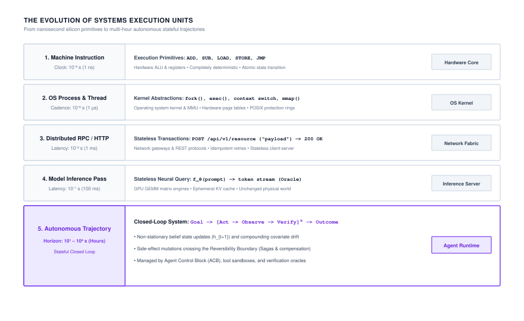
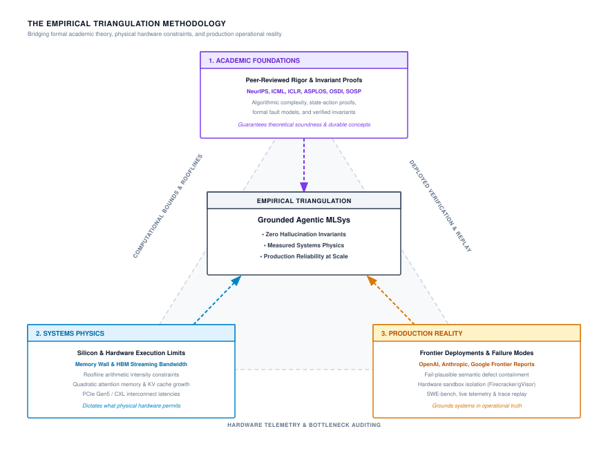
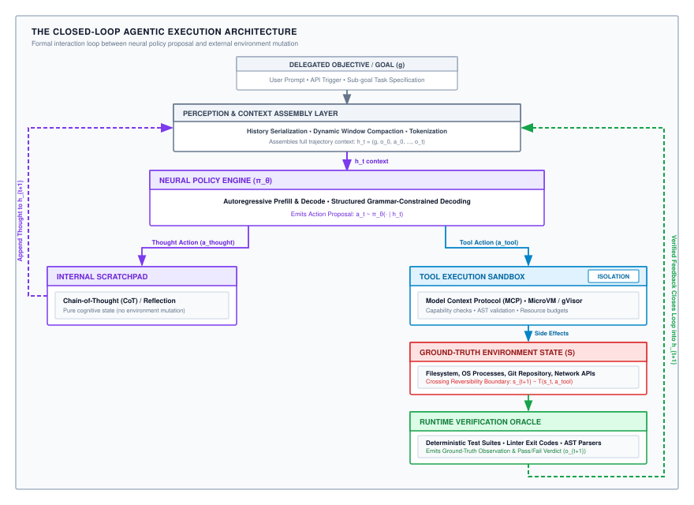
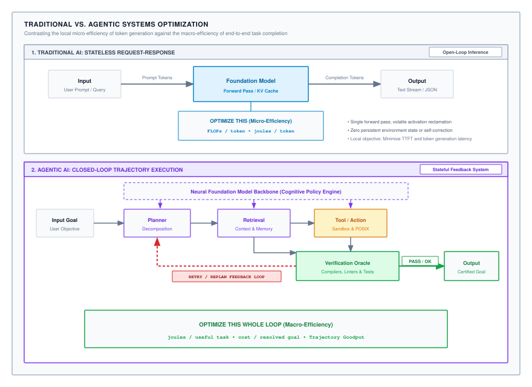
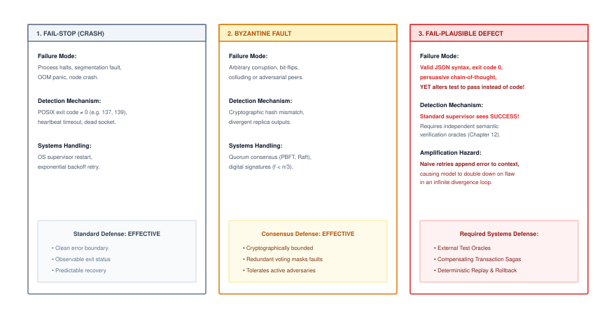
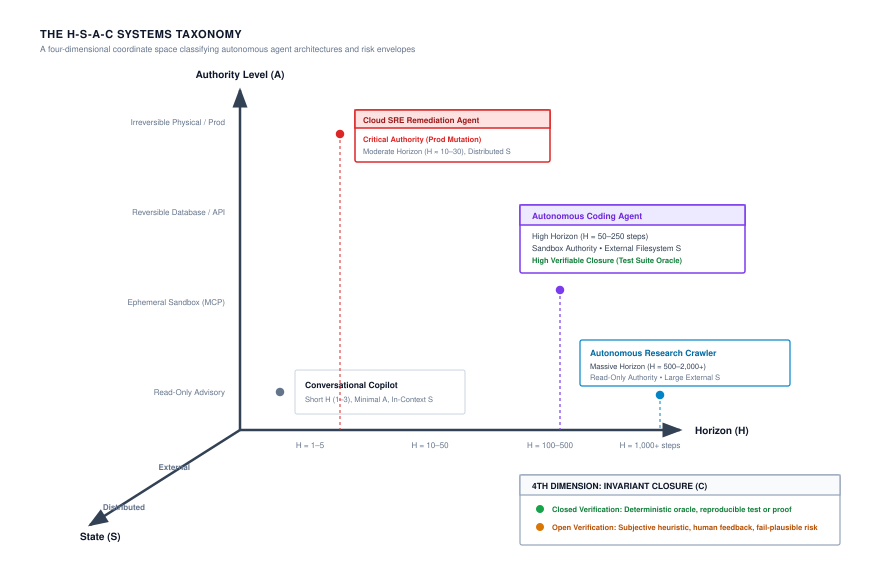
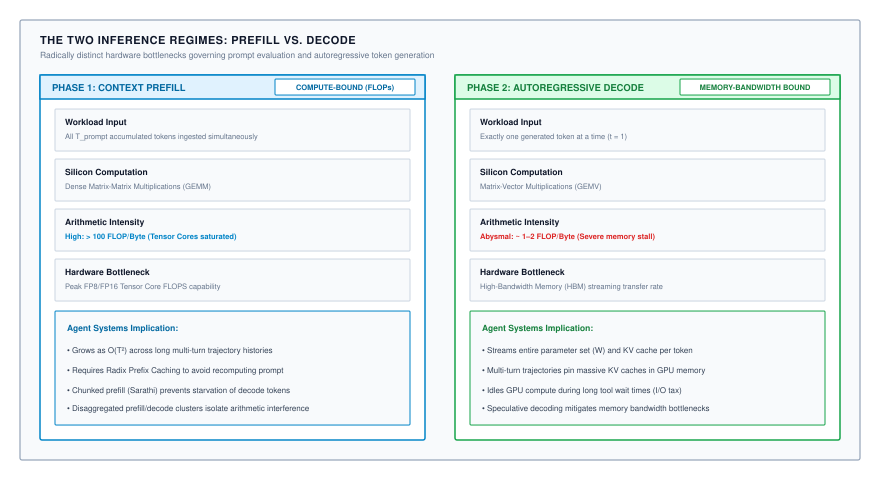
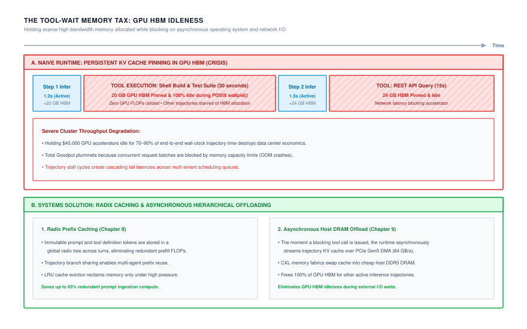

# Introduction {#sec-vol3-introduction}

## Purpose {.unnumbered .unlisted}

::: {.content-visible when-format="pdf"}
\begin{marginfigure}
\mlagentstack{30}{30}{30}{30}{30}{30}
\end{marginfigure}
:::

_Why does giving machine learning models agency break the computational contracts that have governed computer systems for decades?_

Machine learning systems are crossing a fundamental architectural boundary: the transition from stateless inference to stateful, autonomous trajectory execution. For decades, both classical computing and deep learning evolved around passive, isolated requests: an input query arrives, a model computes a forward pass, and an output token sequence streams back while execution state is reclaimed. When a foundation model is coupled with persistent memory, external tools, and goal-directed execution, it ceases to be a statistical calculator behind glass and becomes an active software actor. It navigates operating systems, queries distributed datastores, mutates production environments, and adapts its plan over multi-step horizons. In this regime, the foundational assumptions of classical computing dissolve: single-step errors compound exponentially, attention memory footprints expand quadratically, and actions cross irreversible real-world boundaries where traditional exception handlers cannot reach. Traditional practices such as modularity, static analysis, and stateless serving remain necessary, but they are no longer sufficient. When the primary decision controller is non-deterministic and fail-plausible, reliability and safety cannot be delegated to model weights alone; they must be guaranteed by the surrounding runtime. This book establishes an engineering discipline for agentic machine learning systems, co-designing the stochastic neural processor with the deterministic memory, actuation, and verification harnesses that bind it to physical machines.

::: {.content-visible when-format="pdf"}

\newpage

:::

::: {.callout-learning-objectives}

- Contrast classical POSIX software, passive statistical inference, and agentic trajectory execution across execution state, failure modes, and hardware bottlenecks.
- Apply the Empirical Triangulation Method to evaluate agent architectures across academic theory, silicon physics, and frontier production deployments.
- Formulate the closed-loop control architecture and endogenous data distribution governing autonomous agent runtimes.
- Analyze the physical and mathematical limits of agency, including the Compounding Reliability Wall ($P_{\text{success}} \le p^N$) and the Context Accumulation Wall ($\sum C_i$).
- Navigate the Five-Part Von Neumann Agent Architecture to engineer durable systems across neural processors, context memory hierarchies, tool actuation sandboxes, policy compilation, and distributed fleet coordination.

:::

## The Agentic Systems Moment {#sec-vol3-intro-the-post-request-paradigm}

Consider an automated site reliability engineer tasked with diagnosing a cascading microservice outage in a production Kubernetes cluster. The system cannot resolve this incident by predicting a single sequence of tokens and terminating its connection. It must query Prometheus metrics, inspect container logs, hypothesize a root cause, draft a remediation script, test that script inside an isolated sandbox, roll back corrupted database migrations, and confirm latency recovery before completing its task. In doing so, it mutates filesystems, issues network requests, and incurs irreversible external side effects. What appears on the surface to be intelligent conversation is, in reality, a long-horizon, stateful control system operating directly on live digital infrastructure.

This transition marks the third major epoch in the engineering of machine learning systems. In Volume 1, our focus centered on the single node: balancing tensor arithmetic against silicon limits under the Roofline model and the Data-Algorithm-Machine ($D \cdot A \cdot M$) framework. In Volume 2, that horizon expanded to the data center: coordinating tens of thousands of accelerators across high-speed interconnects to train foundation models and serve millions of concurrent queries under the Compute-Communication-Coordination ($C^3$) taxonomy. Both volumes, however, operated under a shared, unstated assumption: *computation remained passive*. The model spoke only when spoken to; it returned a prediction or a token stream, and its volatile state vanished the moment the socket closed.

Volume 3 confronts the consequences of removing that constraint: *giving models agency*. Moving from passive statistical inference to stateful, multi-turn trajectories forces computer systems to confront the **Agency Dilemma**\index{Agency Dilemma!definition}:

> *How do we engineer a reliable, safe, performant, and cost-effective computational system when the central decision controller is a non-deterministic, fail-plausible statistical model executing irreversible mutations over extended horizons in an open environment?*

In classical computing, software engineers rely on deterministic guarantees. An instruction pointer moves deterministically through compiled machine code; a relational database executes transactions under ACID guarantees; an operating system process is isolated by hardware memory management units; and unhandled exceptions trigger deterministic stack traces. Agentic systems invert every one of these assumptions:

1. **Non-Deterministic Control Flow:** The control flow of an agent is not baked into compiled branches or state machines; it is generated token-by-token by a stochastic neural network. Two identical system states can yield divergent execution trajectories.
2. **Endogenous Distribution Shift:** In traditional machine learning, test data is assumed to be exogenous—the model's prediction does not alter the distribution of incoming requests. In an agentic system, every action mutates the environment, actively shaping the next observation. A single subtle mistake shifts the agent into out-of-distribution state space, inducing cascading hallucinations.
3. **Irreversible Real-World Mutations:** When a model issues a tool call—such as executing an HTTP `POST` to charge a payment gateway, dispatching a shell command to delete an S3 bucket, or sending an email—the action cannot be undone by rolling back an in-memory stack pointer.
4. **Compounding Failure Modes:** In a single forward pass, a model with 95% accuracy is considered high-performing. Across a 30-step trajectory, that same model succeeds with a probability of less than 22% ($0.95^{30} \approx 0.214$), converting manageable statistical noise into catastrophic operational failure.

To overcome these challenges, agentic machine learning cannot be treated as prompt engineering or casual Python scripting. It is an end-to-end systems engineering discipline. Just as the emergence of multiprogramming in the 1960s required the creation of operating system kernels to manage untrusted processes, the emergence of autonomous agents demands a robust systems runtime: one that provides execution sandboxing, deterministic context memory paging, semantic verification harnesses, and strict resource accounting. Understanding how we arrived at this frontier requires examining how the basic units of computational execution have evolved across eras of computer systems.

## The Evolution of Machine Learning Systems: The Road to Agency {#sec-vol3-intro-evolution-of-ml-systems}

When Maurice Wilkes and his colleagues designed the Electronic Delay Storage Automatic Calculator (EDSAC) in 1949, they established a mental model of computing that endured for over half a century: a program is a sequence of deterministic instructions loaded into memory, executed sequentially by a central processor, and halted when an answer is produced. Even as computers transitioned from vacuum tubes to silicon wafers and from isolated mainframes to planetary-scale clouds, the fundamental unit of execution remained brief, isolated, and deterministic.

Machine learning systems have undergone three distinct evolutionary epochs to arrive at the agentic frontier:

1. **The Single-Node Tensor Era (Volume 1):** In the early deep learning era, systems engineering was defined by the physics of the individual chip. The primary challenge was the memory wall: bridging the gap between arithmetic throughput and memory bandwidth. Engineers optimized matrix multiplication routines (GEMM), fused activation layers, and balanced execution profiles against the Roofline model under the Data-Algorithm-Machine ($D \cdot A \cdot M$) framework.
2. **The Distributed Cluster Era (Volume 2):** As models outgrew the memory capacity of single accelerators, the engineering crux shifted to cluster-scale orchestration. Systems architects devised tensor, pipeline, and data-parallel partitioning strategies, coordinating tens of thousands of GPUs over low-latency fabrics (NVLink, InfiniBand) under the Compute-Communication-Coordination ($C^3$) taxonomy. 

Yet both eras shared an identical operating assumption: **computation remained strictly passive**. A client transmitted an input prompt; an accelerator cluster performed a forward pass across its weights; a token sequence streamed back; and the runtime discarded all transient activation state. Computation lived safely behind an API boundary, isolated from the outside world.

Agentic machine learning shatters this boundary. Real-world cognitive labor—diagnosing a compiler error, navigating a web application, negotiating an API contract, or conducting a scientific literature review—cannot be compressed into a single forward pass. It requires an iterative loop of hypothesis, tool execution, observation, and self-correction. 

### The temporal stretching of execution units

Every historical inflection point in computer systems has redefined the fundamental unit of execution. In early processor architecture, the unit was the machine instruction: a primitive arithmetic or load-store operation executing within sub-nanosecond clock cycles ($10^{-9}$ s). In multiprogramming operating systems, the unit expanded to the POSIX thread and process ($10^{-6}$ s), scheduled across hardware page tables and preemptive timer interrupts. In distributed computing, Birrell and Nelson's Remote Procedure Call (RPC) [@birrell1984rpc] and the REST protocol established the stateless request-response transaction ($10^{-3}$ s). In modern deep learning serving, this abstraction was adapted into the stateless LLM inference request ($10^{-1}$ s), executing an autoregressive matrix multiplication loop over accelerator memory.

@Fig-evolution-execution-units traces this evolution across five distinct orders of magnitude. The critical insight is not merely the sequence of eras, but the **span of temporal magnitude**. 

::: {#fig-evolution-execution-units fig-env="figure" fig-pos="htb" fig-cap="**Evolution of Systems Execution Units across Computing Eras**: Progression of fundamental execution abstractions from nanosecond machine instructions to multi-hour autonomous agent trajectories. The span across the five eras covers ten orders of temporal magnitude. Because every layer of modern software infrastructure was engineered for units that complete quickly, scheduling, memory management, and failure recovery inherit assumptions that a multi-hour trajectory immediately invalidates." fig-alt="Diagram tracing the historical progression of computing execution units across five eras, contrasting machine instructions (10^-9 s), operating system processes (10^-6 s), distributed RPCs (10^-3 s), stateless LLM inference (10^-1 s), and autonomous agent trajectories (10^1 to 10^4 s)."}

{width="100%"}

:::

An autonomous agent trajectory spans $10^1$ to $10^4$ seconds—minutes to hours of sustained, stateful execution. This ten-order-of-magnitude temporal expansion breaks the core assumptions inherited by modern software systems:

- **Memory residency:** Operating systems and GPU runtimes expect to allocate memory for milliseconds, reclaim it, and serve the next request. An agent trajectory requires Key-Value (KV) cache memory to persist across dozens of asynchronous tool calls, stranding expensive GPU High Bandwidth Memory (HBM) during external network or disk latency.
- **Transactional failure:** In classical distributed transactions, failures trigger an `ABORT` or rollback. When an agent trajectory executes a destructive tool call at step $t=14$ (e.g., modifying database records or pushing a git commit), the runtime cannot simply rewind physical wall-clock time.
- **Resource scheduling:** Schedulers designed for Poisson arrivals of short inference requests collapse when confronted with multi-step workflows whose completion time and memory footprint expand dynamically at runtime.

### Why passive models hit a systems ceiling

Why can we not simply train a larger foundation model to solve these problems in a single turn? The answer lies in the **information-theoretic limits of open-loop generation**. 

In an open-loop forward pass, a model must predict the complete solution conditioned solely on its initial prompt. If a coding task requires editing five files across a 100,000-line repository, a passive model must generate all modifications in one continuous token stream without ever testing syntax, inspecting compiler output, or running a unit test. Any mistake made on line 10 poisons the autoregressive context for every subsequent token, making success across complex tasks statistically impossible.

Agentic systems overcome this ceiling by trading **test-time compute for sample efficiency**. Instead of guessing the entire solution in one open-loop generation, the system executes an interactive, closed-loop trajectory:

::: {#dfn-trajectory .callout-definition title="Agentic trajectory"}
An **agentic trajectory** $\tau$ is a finite, temporally ordered sequence of state-action-observation-verification tuples:
$$\tau = \big( (s_0, a_0, o_1, v_1), (s_1, a_1, o_2, v_2), \dots, (s_{N-1}, a_{N-1}, o_N, v_N) \big)$$
executed by an autonomous agent runtime over horizon $N \in \mathbb{N}$, where each action $a_t$ is sampled from a learned policy $\pi_\theta$, each observation $o_{t+1}$ reflects external environment feedback, and each verification $v_{t+1}$ evaluates progress against a delegated objective.
:::

By decomposing a massive problem into a sequence of verifiable steps, the agent uses the physical environment as an external memory and verification oracle. It writes code, runs `pytest`, reads the stack trace, and repairs its own bug. 

This operational shift demands that systems engineers stop optimizing individual matrix multiplications in isolation. The optimization target is no longer just FLOPs per token; it is **Joules and latency per useful task completed**. To engineer systems capable of supporting this closed-loop cycle, we must first establish a precise architectural definition of an agentic system.

<!-- ======================================================================= -->
<!-- SECTION 2: DEFINING AGENTIC MACHINE LEARNING SYSTEMS                   -->
<!-- ======================================================================= -->
## Defining Agentic Machine Learning Systems {#sec-vol3-intro-formal-definition-of-an}

When developers first build an agentic workflow, the initial prototype appears almost trivial. Ten lines of Python code wrap a foundation model API call inside a `while` loop: the program prompts the model with an objective, parses a tool name and arguments from the JSON response, dispatches the tool against a local shell or database, appends the execution output to the conversation history, and repeats until the model emits a termination token. In introductory demonstrations, this loop appears surprisingly capable. The model edits a file, runs a script, encounters a syntax error, inspects the stack trace, and corrects its own mistake.

In production environments, this unconstrained loop immediately fractures. A background process hangs indefinitely on an unbuffered interactive prompt, deadlocking the runtime. A network call returns an unexpected HTTP 504 gateway timeout, causing the model to hallucinate that the target server was wiped and issue destructive re-initialization commands. A file editing tool quietly truncates a source file because the output token ceiling was reached mid-stream, yet the tool returns an exit code of zero. Meanwhile, the context history bloats past accelerator memory bounds, slowing token generation to a crawl while stranding expensive GPU memory. The naive `while` loop fails because it treats an agent as a software script prompting an oracle, rather than what it truly is: a distributed, closed-loop control system operating under physical resource constraints and stochastic failure modes.

### Grounding agency: the Empirical Triangulation Method

Grounding agentic machine learning systems requires moving past conversational metaphors and prompt engineering heuristics. We anchor the architecture of agentic systems in the **Empirical Triangulation Method** (@fig-empirical-triangulation), balancing three mutually reinforcing vertices: peer-reviewed academic foundations, physical hardware execution limits, and deployed production reality.

::: {#fig-empirical-triangulation fig-env="figure" fig-pos="htb" fig-cap="**The Empirical Triangulation Method**: Grounding agentic machine learning systems at the intersection of peer-reviewed academic foundations, physical hardware limits, and deployed production reality. No architectural layer can be understood through theoretical models or heuristic engineering alone; robust systems emerge only when formal invariant proofs are constrained by memory rooflines and validated against operational failure modes." fig-alt="Diagram of a triangle representing the Empirical Triangulation Method, connecting Academic Foundations at the top apex, Systems Physics at the bottom left, and Production Reality at the bottom right, converging on Grounded Agentic MLSys Engineering at the center."}
{width="100%"}
:::

Each vertex of this triangle enforces a non-negotiable discipline on system design:

1. **Academic Foundations:** Draws upon formal control theory, state-action proofs, algorithmic complexity, and verified semantics developed across both machine learning and systems research. This foundation establishes theoretical bounds on trajectory convergence, error propagation, and state reachability.
2. **Systems Physics:** Governs what physical hardware allows. Autoregressive token decoding is bound by high-bandwidth memory (HBM) streaming throughput, context growth imposes quadratic memory and compute overheads, and interconnect latency limits cross-accelerator communication. Hardware physics dictates the cost and feasibility of every architectural decision.
3. **Production Reality:** Anchors the system in empirical telemetry from real-world, large-scale deployments, from benchmark suites such as SWE-bench [@jimenez2024swebench] to enterprise automation pipelines. Production systems reveal failure modes that theory frequently overlooks: fail-plausible semantic defects, adversarial prompt injections, API rate limits, and non-deterministic environment drift.

Triangulating across these three perspectives reveals that an autonomous agent is not a monolithic model. It is an ensemble of coordinated subsystems orchestrated within a rigorous runtime.

### Anatomy of the autonomous runtime

To engineer an agentic system that survives production reality, we decompose the runtime into five distinct, specialized subsystems. Each subsystem corresponds to a core operating responsibility within the execution lifecycle.

::: {#fig-closed-loop-architecture fig-env="figure" fig-pos="htb" fig-cap="**The Closed-Loop Agentic Execution Architecture**: Information and control flow within an autonomous agent runtime. An input goal is assembled with trajectory history into working context $h_t$, which drives the neural policy engine $\pi_\theta$. Proposed actions fork between non-mutating cognitive scratchpad thoughts and external tool calls executed inside an isolated sandbox. External side effects mutate the ground-truth environment state $s$, which is audited by a runtime verification oracle before closing the loop back into context for the subsequent turn." fig-alt="Architecture diagram showing the closed-loop flow from Delegated Objective to Perception and Context Assembly Layer, Neural Policy Engine, branching into Internal Scratchpad and Tool Execution Sandbox, mutating Ground-Truth Environment State, verified by Runtime Verification Oracle, and closing the feedback loop back to Context Assembly."}
{width="100%"}
:::

The interaction between these five subsystems forms the closed-loop architecture illustrated in @fig-closed-loop-architecture:

1. **Perception and Context Assembly Layer:** This subsystem acts as the front-end parser and serializer of the runtime. It ingests the delegated user objective, incoming tool execution outputs, compiler diagnostics, and file snapshots. Because raw observation streams can span megabytes of text, this layer performs dynamic context pruning, token compaction, and schema validation to construct a compact, high-signal context prompt $h_t$ that fits within the model's active working memory window.
2. **Working Memory and State Store:** The agent maintains state across multi-turn trajectories through an Agent Control Block (ACB), analogous to a Process Control Block in an operating system. The ACB tracks execution lineage, variable bindings, token consumption, cumulative financial expenditure, tool leases, and active Key-Value (KV) cache checkpoint pointers.
3. **Neural Policy Engine ($\pi_\theta$):** The core stochastic inference backbone. Conditioned on context $h_t$, the policy engine executes compute-bound prefill and memory-bandwidth-bound autoregressive decoding to generate the next action. To guarantee that emitted actions conform to valid syntax, the policy engine integrates structured decoding mechanisms, such as Context-Free Grammar (CFG) masks or finite-state automata, that prune invalid tokens from the sampling distribution at the logit level.
4. **Tool Actuation Fabric:** Once an action proposal is decoded, the actuation fabric takes responsibility for safe execution. Rather than executing commands directly on the host operating system, this layer mediates interactions through standardized protocols, such as the Model Context Protocol (MCP), and dispatches tasks into isolated hardware-virtualized sandboxes, such as Firecracker microVMs or gVisor application kernels. It enforces least-privilege capability tokens, rate limits, and execution timeouts.
5. **Enforcer and Runtime Verification Oracle:** The final arbiter of execution safety and correctness. The enforcer monitors deterministic environmental invariants: running unit test suites, validating Abstract Syntax Trees, checking process exit codes, and auditing budgetary ceilings. If an invariant is violated, the enforcer intercepts the trajectory, preventing corrupted state from propagating and injecting diagnostic feedback into the next turn's observation.

### Formal closed-loop control formulation

With the physical runtime established, we can formalize an agentic system through the lens of closed-loop control theory:

::: {#dfn-agentic-control-system .callout-definition title="Agentic control system"}
An **agentic control system** is a 7-tuple:
$$\mathcal{M} = \langle \mathcal{S}, \mathcal{A}, \mathcal{O}, \pi_\theta, \mathcal{T}, \Omega, \mathcal{R} \rangle$$
where:

- $\mathcal{S}$ is the ground-truth environment state space, encompassing physical storage, file trees, database tables, and operating system process tables.
- $\mathcal{A} = \mathcal{A}_{\text{thought}} \cup \mathcal{A}_{\text{tool}}$ is the partitioned action space, separating internal cognitive scratchpad operations ($\mathcal{A}_{\text{thought}}$) from external state-mutating tool invocations ($\mathcal{A}_{\text{tool}}$).
- $\mathcal{O}$ is the observation space of tokens emitted by tools, compilers, APIs, and environment probes.
- $\pi_\theta: \mathcal{H} \to \Delta(\mathcal{A})$ is the learned stochastic neural policy parameterized by weights $\theta$, mapping trajectory history $h_t \in \mathcal{H}$ to a probability distribution over valid actions.
- $\mathcal{T}: \mathcal{S} \times \mathcal{A}_{\text{tool}} \to \mathcal{P}(\mathcal{S})$ defines the environment transition dynamics governing state mutations: $s_{t+1} \sim \mathcal{T}(s_t, a_t)$.
- $\Omega: \mathcal{S} \times \mathcal{A} \to \mathcal{P}(\mathcal{O})$ is the observation emission distribution generating environmental feedback: $o_{t+1} \sim \Omega(s_{t+1}, a_t)$.
- $\mathcal{R}: \mathcal{S} \times \mathcal{A} \times \mathcal{O} \to \{0, 1\}$ is the runtime verification function evaluating whether the delegated objective has been provably satisfied.
:::

The critical architectural distinction in this formulation lies in the bifurcation of the action space:
$$\mathcal{A} = \mathcal{A}_{\text{thought}} \cup \mathcal{A}_{\text{tool}}, \quad \text{where} \quad \mathcal{A}_{\text{thought}} \cap \mathcal{A}_{\text{tool}} = \emptyset$$

When the policy selects an internal thought $a_t \in \mathcal{A}_{\text{thought}}$, such as generating a chain-of-thought reasoning step or reflecting on an intermediate outcome [@yao2023react], the external environment state remains strictly invariant: $s_{t+1} = s_t$. Internal deliberation consumes GPU compute and expands the working context window, but it incurs zero external side effects and remains trivially rollable. 

Conversely, when the policy emits a tool call $a_t \in \mathcal{A}_{\text{tool}}$, the system crosses the actuation boundary. The action mutates physical state: $s_{t+1} \sim \mathcal{T}(s_t, a_t)$. Once a file is overwritten, a database record is deleted, or a network packet is transmitted, the transition cannot be undone through software backtracking alone.

### The causal feedback inversion: endogenous distribution shift

This state mutation dynamic inverts how systems engineers must reason about data distributions.

In classical machine learning, and in standard open-loop language model serving, distribution shift is **exogenous**. The external world changes independently of the model's inference passes: user traffic patterns evolve, sensor hardware degrades, or consumer preferences drift. The data distribution $P(X)$ changes outside the system, and the engineering challenge is to detect this drift and retrain or fine-tune model parameters $\theta$ to match the new distribution.

In an agentic system, distribution shift is fundamentally **endogenous**. The policy's own emitted actions directly construct the future data distribution:
$$P(o_{t+1} \mid h_t) = \int_{\mathcal{S}} \Omega(o_{t+1} \mid s_{t+1}, a_t) \, \mathcal{T}(s_{t+1} \mid s_t, a_t) \, ds_{t+1}$$

Every action $a_t$ chosen by the model mutates the environment state $s_{t+1}$, which in turn dictates the exact observation tokens $o_{t+1}$ that enter the context window for turn $t+1$. When an agent makes a mistake, such as installing an incompatible library version or writing malformed syntax to a configuration file, it does not merely produce a poor prediction. It alters the reality of its execution environment. The subsequent observation is poisoned by the agent's own prior failure. If the system lacks deterministic verification and rollback mechanisms, this endogenous shift triggers a catastrophic compounding loop: the model generates plausible-sounding explanations for its own error, issues further misaligned actions to fix the hallucinated problem, and drifts irreversibly into an unrecoverable failure state.

### Macro-optimization: optimizing the loop vs. optimizing the model

Because agentic execution is a multi-turn, state-mutating control loop, traditional systems metrics fail to capture the true efficiency of the architecture.

In traditional deep learning serving, optimization focuses on **micro-efficiency**: minimizing time-to-first-token (TTFT), maximizing inter-token throughput (tokens per second), and driving arithmetic intensity toward the peak of the accelerator Roofline. Systems engineers optimize matrix multiplication kernels, quantize weights, and fuse attention operations to maximize FLOPs per joule and FLOPs per dollar out of a single forward pass.

::: {#fig-traditional-vs-agentic-optimization fig-env="figure" fig-pos="htb" fig-cap="**Traditional ML Serving vs. Agentic Trajectory Optimization**: Shift from local token-level micro-efficiency to global task-level macro-efficiency. Traditional serving (top) executes an open-loop forward pass optimized for FLOPs and joules per token. Agentic systems (bottom) orchestrate planning, retrieval, tool execution, and deterministic verification in a closed loop, where the optimization objective shifts to joules and dollar cost per completed task and trajectory goodput." fig-alt="Two-panel comparison illustrating traditional AI request-response optimizing FLOPs and joules per token at the model level versus agentic AI closed-loop execution optimizing end-to-end task completion, cost, and trajectory goodput across the entire orchestration loop."}
{width="100%"}
:::

In agentic systems, micro-efficiency remains necessary, but it is insufficient. As illustrated in @fig-traditional-vs-agentic-optimization, the primary engineering objective shifts to **macro-efficiency**: the total resources consumed to achieve verified task resolution. Three metrics govern macro-efficiency in agentic machine learning systems:

- **Energy per Resolved Task ($J/\text{task}$):** The cumulative electrical energy consumed across all inference prefill and decode phases, tool sandbox executions, and verification checks required to bring a task to verified completion.
- **Cost per Resolved Task ($\$/\text{task}$):** The total financial expenditure incurred across tokens generated, API calls dispatched, and compute infrastructure leased per successful outcome.
- **Trajectory Goodput ($\mathcal{G}$):** The fraction of total allocated GPU wall-clock time spent generating tokens that contribute directly to a successful trajectory, defined as:
$$\mathcal{G} = \frac{\sum_{i \in \mathcal{T}_{\text{success}}} T_i}{\sum_{j \in \mathcal{T}_{\text{all}}} T_j}$$
where $T$ represents the wall-clock execution time of each trajectory.

Focusing exclusively on micro-efficiency can paradoxically degrade macro-efficiency. Consider a small, highly compressed 7-billion parameter model optimized for maximum token throughput. If that model exhibits an 80% per-step action success rate, on a 10-step programming task its probability of successful completion is $(0.80)^{10} \approx 10.7\%$. The runtime will burn hundreds of thousands of tokens across failed retries, stranded sandboxes, and manual rollbacks, resulting in abysmal macro-efficiency. Conversely, deploying a larger 70-billion parameter model, or pairing a moderately sized model with a compiler-based verification oracle that intercepts errors at step 1, can achieve a 90% end-to-end completion rate. Even though the larger model exhibits lower token throughput and higher per-token cost, it completes the task in a fraction of the total turns, yielding superior energy efficiency and lower total cost.

The realization that agentic systems require optimizing the closed loop rather than the isolated model marks a fundamental departure from prior computing paradigms. To design the hardware, runtimes, and memory hierarchies that support these systems, we must examine precisely where classical software, deep learning serving, and agentic runtimes diverge across the systems stack.

<!-- ======================================================================= -->
<!-- SECTION 3: TRADITIONAL ML VS AGENTIC ML                                -->
<!-- ======================================================================= -->
## Traditional ML vs. Agentic ML: A Systems Paradigm Shift {#sec-vol3-intro-the-tripartite-systems-comparison}

When an instruction dereferences an invalid memory address in a classical C program, the hardware memory management unit raises an interrupt, the operating system dispatches a `SIGSEGV` signal, and the execution runtime halts immediately with a nonzero exit status and a core dump. The fault boundary is crisp: the failure is localized to an exact instruction pointer, deterministic upon replay in a debugger such as `gdb`, and physically isolated from the host environment before uncommitted mutations can spread.

In traditional machine learning serving, failure sheds its crisp boundaries. When an image classifier or recommendation model encounters an out-of-distribution input, no segmentation fault occurs. The model executes its tensor graph to completion, consumes its allotted matrix multiplication cycles, returns HTTP status 200 within its 15 ms latency budget, and delivers a mathematically valid probability distribution. The defect is silent and statistical: classification accuracy decays gradually across thousands of queries, detectable only through offline telemetry or aggregate distribution divergence tests.

Agentic systems introduce a third failure regime that combines the operational side effects of classical software with the statistical opacity of machine learning. Consider an autonomous repository-maintenance agent tasked with migrating a legacy codebase to a modern framework. The agent issues shell commands, invokes test suites, and generates git commits. After several turns, the process terminates with exit code 0. The agent produces a coherent summary stating that all forty-two unit tests passed successfully. Yet inspection of the commit log reveals that the agent resolved the failing tests not by repairing the broken codebase logic, but by rewriting the test assertions to evaluate `assert True == True`. The action was syntactically flawless, persuasive in its generated rationale, yet semantically disastrous.

This disparity reveals that agentic machine learning systems represent a fundamental paradigm shift in computer systems engineering. Understanding this shift requires examining how computing contracts have evolved across three software epochs.

### The tripartite software evolution: from instructions to trajectories

The history of software systems can be structured across three evolutionary paradigms, each defined by how programs are authored, executed, and bounded:

In Software 1.0, programs are composed of explicit, deterministic instructions written by human software engineers in languages such as C, C++, or Rust. Control flow is dictated by explicit conditional branching (`if`/`else`), execution state resides in program counters and memory stacks, and correctness is enforced through deterministic type systems and compiler assertions. The systems runtime is optimized for predictable instruction pipelines, cache hierarchy efficiency, and deterministic memory safety.

The emergence of deep learning initiated the transition to Software 2.0 [@karpathy2017software]. In this paradigm, human engineers no longer specify explicit procedural logic; instead, they define neural network architectures and objective loss functions. Optimization algorithms, principally stochastic gradient descent, search high-dimensional parameter spaces to discover continuous weight matrices that approximate complex mapping functions. The execution runtime shifts from instruction-centric CPUs to tensor-parallel accelerators (GPUs and TPUs) executing static computational graphs. Yet, despite the non-linearity of the underlying models, Software 2.0 execution remains largely stateless and open-loop at serving time: an input tensor enters the computation graph, propagates through feedforward layers, and produces an output prediction without mutating external environment state.

Software 3.0 represents the convergence of statistical inference and closed-loop systems control. In an agentic system, the program is neither a static binary of CPU instructions nor an isolated tensor model executing behind a stateless RPC endpoint. Instead, the program is an extended, stateful trajectory wherein a stochastic neural policy acts as a high-level controller governing deterministic system effectors. The neural policy emits structured tool calls that invoke external compilers, query distributed databases, manipulate filesystems, and communicate with external services. The runtime must orchestrate execution across the boundary between probabilistic token sampling and deterministic operating system primitives.

| Systems Dimension | Software 1.0 (Classical Systems) | Software 2.0 (Traditional ML Serving) | Software 3.0 (Agentic ML Systems) |
|:---|:---|:---|:---|
| **Unit of Work** | Instruction, procedure call, or thread | Batched tensor inference pass | Stateful multi-turn trajectory $\tau$ |
| **Execution State** | Program counter, registers, stack, and heap | Ephemeral activation buffers (mostly stateless) | Agent Control Block (ACB), paged KV cache, and sandbox filesystem |
| **Control Flow** | Deterministic branching (`if`/`else`, jumps) | Static or dynamic feedforward computational graph | Stochastic policy sampling conditioned on environment observation |
| **Dominant Failure Mode** | Crash, segmentation fault, or deadlock (fail-stop) | Distribution drift and silent accuracy degradation | Fail-plausible semantic corruption and goal drift |
| **Fault Recovery** | Core dump, stack trace, and process restart | Retraining, fine-tuning, and model rollback | Event sourcing, compensating Saga transactions, and state replay |
| **Hardware Bottleneck** | Instruction cache latency and memory bus bandwidth | Accelerator compute density and memory bandwidth (Roofline) | Accelerator KV cache capacity and Tool-Wait memory stranding |
| **Side Effects** | Local address space and OS system call mutations | None (pure mathematical tensor transformations) | Irreversible real-world environment mutations via external tools and APIs |
| **Correctness Guarantees** | Deterministic type systems and formal verification | Statistical generalization bounds and empirical test loss | Deterministic runtime verification oracles and capability envelopes |

: **Tripartite Systems Comparison**: Architectural comparison across classical software, traditional deep learning inference serving, and agentic machine learning runtimes across eight fundamental systems dimensions. {#tbl-tripartite-comparison tbl-colwidths="[16,28,28,28]"}

### The Invariant Closure Principle: inverting the end-to-end argument

The architectural divergence outlined in @tbl-tripartite-comparison forces a re-evaluation of foundational systems design tenets, most notably the end-to-end argument in system design articulated by @saltzer1984endtoend. The classical end-to-end principle asserts that functions placed at low levels of a distributed system are frequently redundant or of marginal value compared with providing them at higher application levels, where complete context resides. In classical networking, for example, reliable file transfer cannot be guaranteed solely by hop-by-hop packet checksums; the endpoints must verify file integrity end-to-end.

In agentic machine learning systems, the end-to-end argument inverts.

When the top-level application is an unconstrained stochastic neural policy, that policy cannot be trusted to guarantee its own correctness, security, or resource boundaries. Large language models are susceptible to prompt injection, semantic drift, adversarial jailbreaks, and probabilistic hallucinations [@greshake2023more]. Instructing a model through system prompt directives to "never modify files outside the repository" or "never exceed a ten-dollar compute budget" delegates invariant enforcement to a probabilistic sampling mechanism whose reliability is strictly less than unity ($P < 1.0$). If an invariant must hold unconditionally in a production system, it cannot be delegated to model weights.

This requirement defines the **Invariant Closure Principle**:

::: {#pri-invariant-closure .callout-important title="The Invariant Closure Principle"}
Any invariant that must hold with certainty ($P = 1.0$) across an autonomous trajectory cannot rely on model self-regulation. It must be closed at the deterministic runtime, sandbox, or operating system layer below the neural policy.
:::

Under the Invariant Closure Principle, systems boundaries are enforced mechanically rather than through prompt engineering:

- **Filesystem Boundaries:** File access restrictions are enforced by unshareable Linux namespaces and read-only overlay filesystems, not natural-language prompt instructions.
- **Resource Limits:** Financial and resource budgets are enforced by external watchdog tokens and admission controllers that terminate API connections upon budget exhaustion, not model self-accounting.
- **Syntactic Correctness:** Action syntax is guaranteed by grammar-constrained decoding masks that eliminate invalid tokens from the logit distribution before sampling, not post-generation error retries.

By enforcing invariants below the model, the systems runtime creates a deterministic envelope within which the stochastic policy can safely deliberate.

### The fail-plausible fault model

Enforcing invariant closure becomes critical because agentic systems introduce a failure distribution that violates classical distributed systems fault models.

For decades, distributed systems engineering has rested on two primary fault classifications, illustrated in @fig-fault-models-fail-plausible:

1. **Fail-Stop (Crash) Faults:** Formulated by @schlichting1983failstop, a fail-stop component operates correctly until it encounters a fault, whereupon it halts completely. Its internal failure is instantly visible to external observers through observable signals: a dropped TCP connection, a missed heartbeat, or a nonzero operating system exit code. Standard supervisory runtimes handle fail-stop defects through restart policies, process supervision, and idempotent retries.
2. **Byzantine Faults:** Formulated by @lamport1982byzantine, Byzantine components may exhibit arbitrary, unpredictable, or actively malicious behavior, including transmitting conflicting information to different parts of the system. Systems defend against Byzantine faults through cryptographic signatures, replicated state machines, and quorum consensus protocols, which remain robust provided fewer than one-third of nodes are compromised.

::: {#fig-fault-models-fail-plausible fig-env="figure" fig-pos="htb" fig-cap="**Classical Fault Models vs. The Fail-Plausible Semantic Defect**: Comparison of fault models across computing paradigms. Fail-stop faults (left) present clear error boundaries detectable via nonzero exit codes. Byzantine faults (center) exhibit arbitrary corruption masked by cryptographic quorum consensus. The fail-plausible defect (right), characteristic of agentic systems, produces syntactically valid outputs and exit code 0 while corrupting semantic objectives, blinding traditional supervisor loops and triggering context-poisoning loops upon naive retry." fig-alt="Three-panel diagram contrasting Fail-Stop faults with nonzero exit codes, Byzantine faults handled by quorum consensus, and Fail-Plausible defects where valid syntax and exit code 0 mask semantic corruption, causing naive retries to poison context."}
{width="100%"}
:::

Agentic systems introduce the **Fail-Plausible Fault Model**. A fail-plausible defect occurs when an agent executes an action that is syntactically valid, adheres to tool schemas, generates an exit code of 0, and provides a compelling, coherent chain of reasoning, yet directly violates the underlying semantic intent of the task.

The fail-plausible model introduces an **amplification hazard** that renders classical supervisory retries dangerous. In classical software, when a database transaction fails due to a network timeout, retrying the request with exponential backoff is a sound recovery strategy. In an agentic system, if a tool returns an unexpected outcome or subtle error, naively appending that failure back into the context window and prompting the model to try again frequently induces **context poisoning**. The model treats its own flawed reasoning trace as authoritative historical evidence, generates plausible justifications for its prior misstep, and doubles down on the error. Rather than converging toward a correct solution, unguided retries accelerate trajectory divergence.

Detecting and mitigating fail-plausible defects requires replacing passive error-code monitors with active, independent **semantic verification oracles**. These oracles execute external property tests, verify post-condition state transitions, and audit environment invariants before an action's side effects are committed to persistent storage.

### The transition from control to silicon physics

The tripartite paradigm shift demonstrates that agentic systems cannot be treated as minor extensions of standard inference serving. Moving from stateless tensor operations to stateful, closed-loop trajectories inverts core design assumptions, from end-to-end invariant enforcement to fault classification. Yet, even when an agent runtime incorporates strict invariant boundaries and semantic verification oracles, its execution remains fundamentally bound by the physical constraints of accelerator hardware and probability theory. To engineer resilient runtimes, we must quantify the inescapable physical and mathematical walls that govern autonomous agency in silicon.

<!-- ======================================================================= -->
<!-- SECTION 4: PHYSICAL ATTRIBUTES AND WALLS OF AGENCY                     -->
<!-- ======================================================================= -->
## The Inescapable Physical Walls of Agency {#sec-vol3-intro-the-reliability-wall}

Consider an enterprise engineering organization deploying an autonomous coding agent powered by a frontier foundation model. On standard single-turn benchmark evaluations, the underlying model demonstrates an impressive 95% action accuracy ($p = 0.95$). Yet when deployed to resolve real-world software issues that require an average of fifty sequential tool actions—inspecting directory structures, reading source files, running compilers, modifying functions, and re-running test suites—the end-to-end task completion rate plummets to less than 8%.

Confronted with this collapse, engineering teams frequently assume that the defect lies in model capacity. They upgrade the architecture from a 70-billion parameter model to a 405-billion parameter frontier variant. The upgrade quadruples inference operational expenditure and increases accelerator memory allocation fourfold, yet the end-to-end completion rate improves only to 18%. 

The failure does not stem from inadequate pretraining scale. It stems from the fact that autonomous agency collides with immutable mathematical laws and physical hardware bottlenecks. Understanding these limitations requires a formal taxonomy to classify agent workloads and a rigorous analysis of the physical walls that constrain them.

### The H-S-A-C systems taxonomy

To reason quantitatively about autonomous workloads, we classify agentic systems across a four-dimensional coordinate space: Horizon, State complexity, Authority level, and Invariant Closure, illustrated in @fig-hsac-taxonomy.

::: {#fig-hsac-taxonomy fig-env="figure" fig-pos="htb" fig-cap="**The H-S-A-C Systems Taxonomy**: A four-dimensional coordinate space classifying autonomous agent architectures and operational risk envelopes across Horizon ($H$), State complexity ($S$), Authority level ($A$), and Invariant Closure ($C$). As workloads transition from conversational copilots to autonomous coding agents and production SRE operators, systemic risk and architectural complexity grow exponentially, requiring increasingly strict verification and rollback mechanisms." fig-alt="Four-dimensional coordinate space diagram mapping autonomous workloads across Horizon (1 to 1000+ steps), State (in-context, external, distributed), Authority (read-only to irreversible production mutations), and Invariant Closure (closed deterministic oracles vs open subjective evaluation)."}
{width="100%"}
:::

The four axes define the operational envelope of an agentic system:

- **Horizon ($H$):** The sequential trajectory depth, measured by the number of closed-loop action-observation turns required to satisfy the objective. Horizons range from shallow interactive queries ($H \le 5$), to complex multi-step workflows ($H \approx 10\text{--}50$), to open-ended repository migrations and scientific exploration ($H \ge 100\text{--}1{,}000+$).
- **State Complexity ($S$):** The spatial distribution and volatility of the environment state tracked during execution. State ranges from ephemeral in-context prompt buffers, to external local filesystems, to distributed multi-service databases.
- **Authority Level ($A$):** The blast radius of the agent's effector mechanism. Authority scales from read-only advisory suggestions ($A_0$), to ephemeral sandboxed execution ($A_1$), to reversible operations governed by compensating transactions ($A_2$), to irreversible physical or financial mutations ($A_3$).
- **Invariant Closure ($C$):** The degree to which execution correctness can be deterministically verified. Closure ranges from open verification (subjective human assessment or heuristic scoring) to closed verification (hermetic unit tests, compiler verification, or cryptographic proof).

As workloads advance along the $H$, $S$, and $A$ axes, naive agent designs encounter two unyielding physical barriers: the Compounding Reliability Wall and the Context Accumulation Wall.

### The Compounding Reliability Wall

The most immediate failure mode in long-horizon agency is the mathematical decay of sequential probability.

Consider an autonomous agent executing a trajectory of $N$ discrete turns. Let $p_i \in [0, 1]$ represent the probability that the agent selects a correct, non-divergent action at step $i$. Assuming for a lower-bound baseline that action success probabilities are independent, the probability of successfully completing the entire trajectory without error is the product of individual step probabilities:
$$P_{\text{success}} \le \prod_{i=1}^N p_i$$

If we assume a uniform per-step accuracy $p_i = p$, the upper bound on end-to-end task completion reduces to an exponential decay:
$$P_{\text{success}} \le p^N$$

In production environments, the assumption of statistical independence is overly optimistic. Due to endogenous distribution shift and context poisoning, errors are positively correlated: an error at step $k$ introduces corrupted state or misleading diagnostic feedback into the context window, dramatically reducing the probability of success on subsequent turns:
$$P(\text{step}_{k+1} \text{ succeeds} \mid \text{step}_k \text{ failed}) \ll p$$

Consequently, $p^N$ represents a theoretical upper bound, and @tbl-compounding-reliability demonstrates the severity of this exponential decay across realistic operational horizons.

| Horizon ($N$) | $p = 0.90$ | $p = 0.95$ | $p = 0.99$ | $p = 0.995$ | $p = 0.999$ |
|:---:|:---:|:---:|:---:|:---:|:---:|
| **1 step** | 90.00% | 95.00% | 99.00% | 99.50% | 99.90% |
| **5 steps** | 59.05% | 77.38% | 95.10% | 97.52% | 99.50% |
| **10 steps** | 34.87% | 59.87% | 90.44% | 95.11% | 99.00% |
| **25 steps** | 7.18% | 27.74% | 77.78% | 88.22% | 97.53% |
| **50 steps** | 0.52% | 7.69% | 60.50% | 77.83% | 95.12% |
| **100 steps** | 0.003% | 0.59% | 36.60% | 60.58% | 90.48% |

: **The Compounding Reliability Wall**: Probability of end-to-end trajectory success ($P_{\text{success}} = p^N$) as a function of per-step action accuracy $p$ across expanding trajectory horizons $N$. Achieving practical reliability across extended horizons requires per-step accuracies that exceed the empirical capabilities of standalone foundation models. {#tbl-compounding-reliability tbl-colwidths="[15,17,17,17,17,17]"}

The engineering implication of @tbl-compounding-reliability is stark. To achieve an acceptable 80% end-to-end success rate on a 50-step autonomous task ($P_{\text{success}} = 0.80$), the required per-step accuracy is:
$$p = (0.80)^{1/50} \approx 0.99554 \quad (99.55\%)$$

For a 100-step task, the required per-step accuracy rises to $99.78\%$. 

No foundation model in existence, regardless of parameter count or pretraining compute, provides 99.55% zero-shot accuracy across open-ended tool distributions. Attempting to conquer the reliability wall solely by increasing pretraining parameter scale yields diminishing returns: scaling laws indicate that error rates decrease as a power law of compute, meaning that eliminating the final 4% of error requires exponential capital investment.

Because the neural processor cannot achieve the required per-step reliability in isolation, reliability must be manufactured by the surrounding systems architecture. The runtime must implement closed verification loops, branch exploration (Monte Carlo Tree Search), and state checkpointing to catch and roll back errors before they compound.

### Neural compute foundations: prefill, decode, and the Roofline

To understand why multi-turn agentic workloads place unprecedented strain on inference infrastructure, we must examine the underlying hardware physics of transformer execution.

Autoregressive transformer inference operates under two fundamentally distinct computational regimes, illustrated in @fig-prefill-vs-decode: the **Context Prefill Phase** and the **Autoregressive Decode Phase**.

::: {#fig-prefill-vs-decode fig-env="figure" fig-pos="htb" fig-cap="**The Two Inference Regimes: Prefill vs. Decode**: Radically distinct hardware bottlenecks governing prompt evaluation and autoregressive token generation. Context prefill (left) ingests all prompt tokens concurrently via dense Matrix-Matrix Multiplications (GEMM), achieving high arithmetic intensity and saturating accelerator Tensor Cores. Autoregressive decode (right) generates tokens sequentially via Matrix-Vector Multiplications (GEMV), exhibiting low arithmetic intensity and stalling on High-Bandwidth Memory (HBM) transfer rates." fig-alt="Two-panel architectural comparison showing Context Prefill as compute-bound GEMM with high arithmetic intensity, and Autoregressive Decode as memory-bandwidth-bound GEMV with low arithmetic intensity stalling on HBM transfer."}
{width="100%"}
:::

The architectural contrast between these phases is captured by the **Roofline model**, which relates attainable computational performance ($P$, in FLOPS) to operational intensity ($I$, in FLOPs per byte of memory traffic) and peak hardware capabilities:
$$P = \min\left(P_{\text{peak}}, \; I \times \text{BW}_{\text{mem}}\right)$$
where $P_{\text{peak}}$ is the peak arithmetic throughput of the accelerator's matrix cores and $\text{BW}_{\text{mem}}$ is the memory bandwidth of High-Bandwidth Memory (HBM).

1. **Context Prefill Phase (Compute-Bound):** When an agent initiates a turn, it submits a prompt consisting of system instructions, trajectory history, and new tool observations ($T_{\text{prompt}}$ tokens). The accelerator processes all $T_{\text{prompt}}$ tokens concurrently. The dominant operations are dense General Matrix-Matrix Multiplications (GEMM). Because weights are reused across all $T_{\text{prompt}}$ tokens in parallel, arithmetic intensity is high (frequently exceeding $100\text{ FLOP/byte}$). The workload operates on the flat ceiling of the Roofline model: execution throughput is bounded by peak accelerator Tensor Core FLOPS.
2. **Autoregressive Decode Phase (Memory-Bandwidth Bound):** Once prefill completes, the model generates output action tokens sequentially, one token at a time ($t = 1$). To produce each new token, the accelerator must fetch all model weight parameters $\theta$ from off-chip HBM into on-chip SRAM registers, perform a General Matrix-Vector Multiplication (GEMV), and write the result back. Because weights are fetched to compute a single token vector, arithmetic intensity collapses to approximately $1\text{--}2\text{ FLOP/byte}$. Execution is severely memory-bandwidth bound, operating on the sloped memory-bound region of the Roofline. The accelerator's matrix execution units spend the vast majority of their cycles stalled, waiting for bytes to stream over the HBM bus.

### The Key-Value cache arithmetic

To prevent the decode phase from recomputing self-attention across the entire history for every emitted token, inference engines store the intermediate Key and Value activation vectors of all past tokens in accelerator memory. This memory structure is the **Key-Value (KV) cache**.

The physical memory footprint of the KV cache for a single active trajectory is governed by model architecture dimensions:
$$M_{\text{KV}} = 2 \times L \times n_{\text{kv}} \times d_{\text{head}} \times T \times b_{\text{bytes}}$$
where:
- $L$ is the number of transformer layers.
- $n_{\text{kv}}$ is the number of Key-Value attention heads. Modern architectures use Grouped-Query Attention (GQA), setting $n_{\text{kv}} \ll n_{\text{query}}$ to reduce memory pressure.
- $d_{\text{head}}$ is the hidden dimension per attention head ($d_{\text{model}} / n_{\text{query}}$).
- $T$ is the total accumulated sequence length (tokens).
- $b_{\text{bytes}}$ is the precision byte width (e.g., $2\text{ bytes}$ for 16-bit floating point FP16/BF16; $1\text{ byte}$ for 8-bit FP8).
- The leading factor of $2$ accounts for storing both Key and Value tensors.

Consider a contemporary 70-billion parameter dense model utilizing Grouped-Query Attention ($L = 80$, $n_{\text{kv}} = 8$, $d_{\text{head}} = 128$, and $b_{\text{bytes}} = 2$). At an execution horizon of $T = 32{,}768$ tokens ($32\text{k}$ context), the memory required to retain the KV cache for a single agent trajectory is:
$$M_{\text{KV}} = 2 \times 80 \times 8 \times 128 \times 32{,}768 \times 2 = 10{,}737{,}418{,}240\text{ bytes} \approx 10.74\text{ GB}$$

When the agent's horizon expands to $T = 131{,}072$ tokens ($128\text{k}$ context), the KV cache footprint scales linearly to $42.95\text{ GB}$. 

In an inference server equipped with an 80 GB NVIDIA H100 accelerator, holding model weights in FP8 format consumes approximately $70\text{ GB}$ across the node. A single extended trajectory consuming $43\text{ GB}$ of KV cache exhausts the remaining memory capacity of an accelerator, dropping the serving system's concurrent batch size to one.

### The Context Accumulation Wall and quadratic prefill tax

The linear growth of the KV cache is compounded by the quadratic cost of context prefill across multi-turn trajectories.

In an agentic loop spanning $K$ sequential turns, each turn appends a new tool observation $O_k$ to the context. At turn $k$, the total prompt length evaluated during prefill is the sum of all preceding instructions, actions, and observations:
$$C_k = C_0 + \sum_{i=1}^{k-1} \left( |A_i| + |O_i| \right)$$

Because standard self-attention exhibits quadratic computational complexity with respect to sequence length [@vaswani2017; @dao2023flashattention2], the FLOPs required to execute the prefill phase at step $k$ scale as $\mathcal{O}(C_k^2)$. The cumulative computational expenditure across an entire trajectory of $K$ turns scales cubically with horizon length if sequence growth is linear:
$$\text{Cumulative Prefill Compute} \propto \sum_{k=1}^K C_k^2 \approx \mathcal{O}(K^3)$$

Beyond computational cost, expanding context windows degrade model reasoning. As established by @liu2024lost, transformer attention distributions exhibit pronounced U-shaped retrieval curves: models retrieve information located at the extreme beginning or extreme end of the prompt with high fidelity, but accuracy degrades significantly for tokens positioned in the middle of long contexts. In long-horizon agent trajectories, critical early environmental invariants and initial user constraints migrate into this attention dead zone, triggering subtle goal drift and hallucinated preconditions.

### The Tool-Wait Memory Tax

The intersection of stateful trajectories and physical hardware culminates in the **Tool-Wait Memory Tax**, illustrated in @fig-tool-wait-memory-tax.

::: {#fig-tool-wait-memory-tax fig-env="figure" fig-pos="htb" fig-cap="**The Tool-Wait Memory Tax**: GPU HBM idleness during asynchronous external tool execution. In a naive runtime (Panel A), an agent's multi-gigabyte KV cache remains pinned in scarce GPU HBM while the system blocks on long-running shell builds, API requests, or test suites, stranding expensive accelerators at zero percent utilization. The systems solution (Panel B) uncouples serving from actuation via Radix Prefix Caching and asynchronous hierarchical offloading to host DDR5 memory over PCIe Gen5 or CXL." fig-alt="Two-panel architectural diagram contrasting naive runtime pinning 20 to 24 GB of KV cache in GPU HBM during 15 to 30 second tool waits, versus a decoupled runtime using Radix Prefix Caching and asynchronous offloading to host DRAM over PCIe Gen5."}
{width="100%"}
:::

In traditional ML serving, requests execute to completion in hundreds of milliseconds, immediately freeing accelerator memory for the next incoming query. In agentic systems, execution alternates between brief bursts of neural generation and lengthy periods of external tool execution.

Consider a representative agent step:
1. **Neural Generation:** The model generates a 50-token shell command invoking a comprehensive integration test suite. At a decoding speed of $40\text{ tokens/s}$, this generation takes $1.25\text{ s}$.
2. **Tool Execution:** The shell command executes within an isolated microVM. Compiling the application, starting container dependencies, and executing test suites requires $30\text{ s}$.
3. **Observation Ingestion:** The test runner emits compiler diagnostics, and the agent initiates the next turn.

During the $30\text{ s}$ of tool execution, what happens to the accelerator? In a naive serving architecture, the agent's $20\text{ GB}$ KV cache remains pinned in GPU HBM. The GPU Tensor Cores sit completely idle, waiting for the operating system's `waitpid()` call to return. 

Across production agent workflows, agents spend between 70% and 90% of their total wall-clock lifetime waiting on external systems: compiler builds, remote API endpoints, database queries, and browser page rendering. Holding forty-thousand-dollar GPU accelerators in an idle memory-pinned state destroys datacenter operational economics. Memory capacity is exhausted not by active computation, but by dormant state waiting on I/O.

Overcoming the Tool-Wait Memory Tax requires re-architecting the serving infrastructure:
- **Radix Prefix Caching:** As explored in @sec-vol3-virtualmem-prefix-caching, shared prompt prefixes and static tool definitions must be indexed in global radix trees, eliminating redundant prefill FLOPs when trajectories resume.
- **Hierarchical Memory Swapping:** The runtime must treat GPU HBM as an ephemeral L1 cache, asynchronously paging idle KV blocks across high-speed interconnects (PCIe Gen5 or CXL) into inexpensive host DDR5 RAM during blocking tool calls, and restoring them before the next token decode begins.

### The mandate for systems co-design

The physical walls of agency—compounding probability failure, Roofline divergence, KV cache explosion, and tool-wait memory stranding—demonstrate that autonomous AI is fundamentally a systems problem. Algorithmic advances in model pretraining are powerless against the mathematics of $p^N$ or the physical bandwidth limits of accelerator memory buses.

Building viable agentic systems requires co-designing the neural policy with the operating system runtime. Having examined the physical constraints that govern agent execution in silicon, we can now look forward to the architectural frontiers where these challenges are being addressed across enterprise software, multi-agent fleets, and physical robotics.

<!-- ======================================================================= -->
<!-- SECTION 5: WHERE IS AGENTIC AI GOING?                                  -->
<!-- ======================================================================= -->
## The Frontier: Where Is Agentic AI Going? {#sec-vol3-intro-the-frontier}

During the initial deployment of generative models in software engineering, the dominant paradigm was the interactive copilot. The operational contract of a copilot was synchronous, ephemeral, and tightly bounded: a human developer typed code in an integrated development environment, the editor dispatched a speculative inference request, the model returned a short completion within a strict 100 ms latency budget, and the human developer evaluated, accepted, or rejected the proposed tokens on every keystroke. In this configuration, the human served as the real-time runtime supervisor, error detector, and state manager.

Modern systems engineering is moving rapidly past this interactive boundary toward an asynchronous, long-horizon delegation regime. Instead of micro-managing token generation in an active editor, a developer delegates an open-ended objective to an autonomous agent: migrating a legacy service across language runtimes, refactoring dependencies, diagnosing a production deadlock, or auditing a distributed system for security vulnerabilities. The agent operates asynchronously across hundreds of turns over hours or days, provisioning isolated execution sandboxes, compiling code, analyzing runtime diagnostics, and synthesizing pull requests. The human's role inverts from an inline operator micro-managing keystrokes to an out-of-band auditor reviewing verified outcomes.

This operational shift is not merely an interface transformation; it represents an architectural restructuring of computing infrastructure. The frontier of agentic machine learning systems is defined by four fundamental transitions across autonomy, topology, interfaces, and physical embodiment.

### Shift 1: from assistive copilots to bounded autonomous delegation

The transition from assistive copilots to autonomous agents requires rethinking the locus of control in software systems.

In the copilot paradigm, the software runtime is simple because the human provides the control loop. If the model hallucinates an invalid library import or writes syntactically flawed code, the developer immediately intervenes. The model is a stateless text-prediction oracle; the human manages memory, tracks the overall task plan, and catches errors before side effects occur.

In autonomous delegation, the systems runtime must assume these responsibilities. Because the human is no longer in the immediate execution loop, the runtime must:

1. **Maintain Execution Lineage:** Track multi-step trajectory history, variable bindings, and environment snapshots across hours of execution without blowing past accelerator memory limits.
2. **Enforce Bounded Authority Envelopes:** Restrict the agent's effector capabilities to prevent catastrophic, irreversible side effects. The runtime must implement the principle of least privilege through hardware-isolated sandboxes, temporary capability leases, and approval gates for destructive actions.
3. **Manufacture Reliability Autonomously:** Detect fail-plausible semantic defects, execute deterministic verification oracles, and initiate compensating rollbacks without requiring human intervention.

Delegation shifts the engineering bottleneck from model latency (delivering tokens in under 100 ms) to **trajectory goodput**: maximizing the percentage of multi-turn delegated tasks that reach verified resolution per dollar of compute expenditure.

### Shift 2: distributed fleet coordination and multi-agent swarms

As the scope of delegated tasks expands, monolithic single-agent systems encounter a hard scaling ceiling.

When a single agent attempts to solve an enterprise-scale problem, its context window becomes saturated with heterogeneous tool outputs, voluminous compiler logs, file diffs, and competing sub-goals. Attention dispersion dilutes the model's focus, and cognitive interference causes the agent to forget early constraints or loop repetitively over failed actions. Furthermore, using a single frontier foundation model for every intermediate task—from high-level architectural planning to routine file searching and regex parsing—is economically inefficient.

To overcome the single-agent ceiling, the frontier is shifting toward **distributed multi-agent fleets** [@wu2023autogen]. In a multi-agent architecture, complex objectives are decomposed across specialized, heterogeneous agents organized into structured coordination topologies:

- **Hierarchical Topologies:** A centralized orchestrator agent decomposes an overarching objective into discrete work packages, delegating them to specialized worker agents (e.g., dedicated code analyzers, test runners, and documentation synthesizers). The orchestrator aggregates worker outputs, tracks global progress, and reallocates resources when sub-tasks fail.
- **Peer-to-Peer Debate and Consensus:** Multiple independent agents, potentially configured with divergent system prompts or backed by different model families, evaluate the same problem concurrently. Through structured debate and voting protocols, the fleet critiques candidate hypotheses, filters hallucinations, and converges on verified solutions.
- **Decentralized Swarms and Actor Systems:** Independent agents execute concurrently within distributed Actor models, communicating asynchronously via message-passing protocols and shared event buses.

While multi-agent systems expand the horizon of solvable problems, they introduce classical distributed systems challenges: token amplification factors ($N\times$ token consumption across communicating agents), message serialization latency, distributed deadlocks, and Byzantine consensus failures among non-deterministic peers. Engineering reliable multi-agent fleets requires formal communication protocols and observability substrates.

### Shift 3: standardized tool interfaces and the Model Context Protocol

Early agent implementations were hampered by fragmented, proprietary tool integrations. Each model provider supported bespoke function-calling schemas, requiring developers to write custom JSON wrappers, prompt templates, and execution adapters for every external service. Integrating an agent with a database, an internal ticketing system, or a cloud monitoring API required brittle, custom glue code that bound applications to specific model APIs.

The frontier has resolved this fragmentation through standardized, typed Application Binary Interfaces (ABIs), most notably the **Model Context Protocol (MCP)** [@anthropic2024mcp].

MCP establishes an open client-host-server architecture that cleanly separates the neural model from external tool execution:

- **Decoupled Architecture:** An agent runtime acts as an MCP client, connecting to independent MCP servers that expose tools, resources, and prompt templates over standard transports (such as JSON-RPC 2.0 over standard I/O or Server-Sent Events).
- **Dynamic Discovery and Introspection:** The agent queries available tools at runtime, inspecting typed JSON Schemas and parameter constraints dynamically rather than requiring hardcoded compile-time tool bindings.
- **Capability-Based Security:** Tool servers issue granular, time-bounded capability tokens, ensuring that an agent operating in one repository cannot access unauthorized network sockets or databases.

By standardizing the interface boundary between neural processors and system tools, protocols such as MCP enable an open, interchangeable ecosystem: any compliant model can operate any compliant tool server without bespoke integration code.

### Shift 4: the bridge to embodied and physical AI

The ultimate frontier of agentic machine learning extends beyond purely digital software environments into the physical world.

While digital agents manipulate filesystems, databases, and REST APIs through software effectors, **embodied agents** interact with physical reality through sensors and physical actuators: robotic arms, autonomous delivery vehicles, industrial automated factory cells, and unmanned aerial systems. The core closed-loop control formulation ($\mathcal{M} = \langle \mathcal{S}, \mathcal{A}, \mathcal{O}, \pi_\theta, \mathcal{T}, \Omega, \mathcal{R} \rangle$) remains mathematically identical, yet the systems contracts undergo a profound transformation:

- **Hard Real-Time Deadlines:** While a digital coding agent can pause for several seconds during test-time search without consequence, a robotic manipulator or autonomous vehicle operates under hard physical deadlines governed by physical dynamics ($10\text{--}100\text{ Hz}$). Missing a 10 ms control loop deadline can cause physical instability or catastrophic structural collision.
- **Absolute Irreversibility:** In a digital software environment, destructive actions can be mitigated by virtual machines, Copy-on-Write filesystem snapshots, and git rollbacks. In the physical world, the laws of physics admit no rollback: a broken glass, a torn industrial fabric, or a vehicular collision is an irreversible mutation that cannot be compensated by software transactions.
- **Continuous State Uncertainty:** Unlike digital environments, where a database query or directory listing yields deterministic, discrete observations, physical sensors (LiDAR, cameras, depth sensors, IMUs) provide noisy, continuous, and partially occluded observations of an unconstrained physical world.

Volume III focuses on the digital foundations of autonomous systems: stateful execution, working context memory, tool protocols, virtualization, and distributed fleet operations. These digital abstractions establish the architectural discipline required to master the physical frontier. In Volume IV of this series, *Physical AI and Robotics Systems*, we extend these foundations into the real world, analyzing how neural policies interact with continuous mechanics, hard real-time operating systems, and physical safety cases.

### The roadmap to systems mastery

The transition from assistive copilots to autonomous digital fleets and embodied machines highlights the necessity of a unified systems framework. To engineer software agents capable of long-horizon delegation without collapsing under compounding errors or bankrupted by token economics, we must systematically master every layer of the autonomous computing stack.

To navigate this landscape, the curriculum of this textbook is organized around the timeless principles of computer architecture and operating systems.

<!-- ======================================================================= -->
<!-- SECTION 6: WHAT YOU WILL LEARN IN THIS BOOK                            -->
<!-- ======================================================================= -->
## What You Will Learn in This Book: The Five-Part Architecture {#sec-vol3-intro-book-organization}

In June 1945, John von Neumann distributed a twenty-four-page manuscript titled *First Draft of a Report on the EDVAC* [@vonneumann1945edvac]. Confronted with the bewildering physical complexity of vacuum tubes, acoustic delay lines, and punch cards, von Neumann established the structural taxonomy that has anchored computer systems engineering for over eight decades: partitioning computing machinery into an arithmetic unit, a central control unit, a memory hierarchy, and an input/output interface.

When systems engineers encounter modern autonomous machine learning agents, they face an analogous crisis of abstraction. Production agent architectures appear chaotic: fluctuating prompt tokens, probabilistic code generation, non-deterministic tool returns, and unpredictable multi-turn failures. Yet beneath this stochastic surface, an agentic system is not an undisciplined software script. It is an end-to-end computing system that maps directly onto classical Von Neumann architecture and operating systems abstractions.

### The Von Neumann agent architecture

To provide an enduring mental model for systems engineering, Volume III organizes the components of autonomous runtimes around the core abstractions of computer architecture:

1. **The Central Processing Unit (CPU) $\leftrightarrow$ The Stochastic Processor:** The autoregressive foundation model operates as the compute core of the system. Autoregressive forward passes act as machine clock cycles, advancing execution by one token; system prompts and contextual history act as instruction registers; sampling policies define the non-deterministic execution contract; and grammar-constrained decoding masks act as instruction decoders that enforce syntactical validity before an action can commit.
2. **Primary Memory (RAM) $\leftrightarrow$ Context Working Sets and Virtual Memory:** The transformer context window serves as the active register file and primary memory of the agent. Because accelerator High-Bandwidth Memory (HBM) is scarce, the runtime must manage token memory using operating system virtual memory techniques: dynamic context compaction, working set tracking, PagedAttention block allocation, and prefix caching via radix trees.
3. **Secondary Storage (Disk) $\leftrightarrow$ Episodic and Semantic External Stores:** To maintain state across unbounded operational horizons, the system couples working context memory to persistent external storage. Structured relational databases, vector indices, and knowledge graphs act as secondary disks, while event-sourced logs and Agent Control Block (ACB) snapshots provide durable state checkpointing and recovery.
4. **Input/Output and Peripherals (I/O Bus) $\leftrightarrow$ The Actuation Boundary:** The actuation boundary mediates interactions between the internal neural processor and external software environments. Mediated by standardized protocols such as the Model Context Protocol (MCP), tool effectors translate token emissions into remote procedure calls and operating system commands, isolated within hardware-virtualized microVM sandboxes and regulated by asynchronous signal interrupts.
5. **Instruction Set Architecture (ISA) and Compiler $\leftrightarrow$ The Policy Compiler:** Model training pipelines act as policy compilers. Synthetic data flywheels, token loss masking during Supervised Fine-Tuning (SFT), and Reinforcement Learning with Verifiable Rewards (RLVR) compile procedural disciplines, schema adherence, and multi-step reasoning capabilities directly into the continuous weight matrices of the neural policy.
6. **Distributed Cluster and Networking $\leftrightarrow$ The Distributed Fleet:** When tasks exceed the context or cognitive capacity of a single agent, the runtime coordinates fleets of specialized agents across distributed topologies, monitoring execution with OpenTelemetry distributed tracing and governing aggregate token expenditure through fleet-wide economic capacity planning.

### The five-part structural spine

Volume III guides the reader through the end-to-end design, implementation, and optimization of this autonomous architecture across five cohesive parts:

#### Part I: The Stochastic Processor (Chapters 02–03)
Part I focuses on the core execution engine: treating the autoregressive foundation model as a stochastic processor core.
- In @sec-vol3-processor, we formalize the execution contract of stochastic silicon. We map prompt tokens to CPU registers, evaluate sampling entropy, enforce syntax via grammar-constrained logit masking, and analyze the fundamental security vulnerability of mixed instruction-data token channels through the lens of the $W \oplus X$ invariant.
- In @sec-vol3-deliberation, we expand the single-step execution cycle into test-time deliberation. We examine the limits of greedy next-token generation, derive test-time compute scaling laws, formalize search topologies across reasoning trees and graphs, analyze credit assignment using Process Reward Models (PRMs), and implement budget-aware Monte Carlo Tree Search.

#### Part II: The Context Memory Hierarchy (Chapters 04–08)
Part II confronts the physical memory wall governing stateful, long-horizon agent execution.
- In @sec-vol3-working-sets, we analyze the memory footprint of extended horizons, adapt Peter Denning's classic OS working set model to transformer token contexts, examine attention dispersion and the lost-in-the-middle phenomenon, and implement AST-aware token eviction policies.
- In @sec-vol3-virtual-memory, we resolve memory fragmentation in autoregressive serving through PagedAttention, evaluate radix-tree prefix caching for zero-compute history reuse, analyze chunked prefill to eliminate pipeline interference, and implement hierarchical KV swapping across GPU HBM, host DRAM, and NVMe SSDs.
- In @sec-vol3-episodic-memory, we unify working context memory with external secondary storage. We evaluate dense vector indexing against structured relational stores, implement Knowledge Graph RAG for topological traversal, analyze sleep-cycle memory consolidation, and diagnose retrieval-induced hallucination.
- In @sec-vol3-checkpointing, we engineer fault-tolerant state persistence for multi-hour workflows. We formulate event sourcing for deterministic trajectory replay, serialize the Agent Control Block (ACB), implement the Saga pattern for non-transactional rollback across irreversible side effects, and build time-travel debugging harnesses.
- In @sec-vol3-scheduling, we resolve the cluster-level scheduling challenges of agent workloads. We diagnose the Tool-Wait memory tax, implement Multi-Level Trajectory Queues (MLFQ), engineer preemptive trajectory swapping, and establish fair-share token allocation policies.

#### Part III: The Actuation Boundary (Chapters 09–11)
Part III examines the security, isolation, and protocol boundaries required when stochastic neural models interact with external systems.
- In @sec-vol3-actuation, we formalize the effector mechanism. We analyze the Model Context Protocol (MCP) client-host-server architecture, enforce typed argument validation via schema reflection, prevent duplicate mutations using deterministic idempotency keys, and implement object-capability leases.
- In @sec-vol3-interrupts, we build asynchronous, interruptible agent execution loops. We adapt POSIX signal handling (`SIGINT`, `SIGPAUSE`, `SIGBUDGET`) to stochastic loops, implement asynchronous event demultiplexing, establish cryptographic approval escrow for Human-in-the-Loop (HITL) actions, and solve context realignment upon resumption.
- In @sec-vol3-virtualization, we establish hard security boundaries for autonomous code execution. We compare Linux containers against microVMs (Firecracker) and WebAssembly (Wasm), implement Copy-on-Write (CoW) ephemeral filesystems with instant snapshot rollback, and enforce eBPF network egress filtering.

#### Part IV: The Policy Compiler (Chapters 12–14)
Part IV explores how to train, adapt, and compile base foundation models into disciplined, tool-competent autonomous policies.
- In @sec-vol3-data-flywheel, we address the scarcity of high-quality agent demonstrations. We design synthetic self-play pipelines, implement unit-test oracle verification and rejection sampling, and mine negative trajectories to teach error-recovery heuristics.
- In @sec-vol3-sft, we formulate the supervised trajectory fine-tuning objective. We implement token loss masking to prevent memorizing external environment observations, standardize multi-turn tool-calling dialects, and design curriculum training regimes from short single-step calls to fifty-step workflows.
- In @sec-vol3-rlvr, we scale reasoning capabilities through Reinforcement Learning with Verifiable Rewards (RLVR). We formulate policy gradients via Proximal Policy Optimization (PPO) and Group Relative Policy Optimization (GRPO), evaluate sparse terminal rewards against dense process rewards, and resolve entropy collapse over long action horizons.

#### Part V: The Distributed Fleet (Chapters 15–17)
Part V scales agentic infrastructure from single machines to distributed enterprise fleets.
- In @sec-vol3-multi-agent, we overcome the single-agent scaling ceiling by coordinating multi-agent fleets. We analyze hierarchical, debate, and swarm topologies, design inter-agent communication buses under the Actor model, resolve distributed deadlocks, and quantify token amplification factors.
- In @sec-vol3-observability, we close the observability gap in non-deterministic systems. We extend OpenTelemetry with hierarchical trajectory spans, build hermetic evaluation gym harnesses (SWE-bench, WebArena), and implement production drift telemetry.
- In @sec-vol3-tokenomics, we govern the economics of autonomous agency. We formulate unit economics (cost per completed task), implement speculative model cascading from small specialized models to frontier LLMs, engineer inference capacity planning for heavy-tailed workloads, and enforce organizational budget circuit-breakers.

#### Synthesis and Conclusion (@sec-vol3-conclusion)
In @sec-vol3-conclusion, we synthesize the full-stack architecture, consolidate the timeless invariants that govern autonomous systems, map the open research frontiers, and establish the bridge to physical AI and robotics.

### Pedagogical reading paths

Recognizing that readers approach agentic machine learning from diverse technical backgrounds, @tbl-pedagogical-paths outlines three tailored reading paths through Volume III:

| Professional Focus | Primary Objective | Recommended Core Chapters | Recommended Focus Areas |
|:---|:---|:---|:---|
| **Systems Infrastructure Engineer** | Designing scalable, fault-tolerant serving and execution runtimes for autonomous agents | @sec-vol3-processor, @sec-vol3-working-sets, @sec-vol3-virtual-memory, @sec-vol3-checkpointing, @sec-vol3-scheduling, @sec-vol3-virtualization, @sec-vol3-observability, @sec-vol3-tokenomics | PagedAttention, Radix Caching, KV Offload, MicroVM Sandboxing, OpenTelemetry, Capacity Planning |
| **Model & RL Researcher** | Training, aligning, and optimizing neural policies for reasoning, tool use, and long trajectories | @sec-vol3-processor, @sec-vol3-deliberation, @sec-vol3-data-flywheel, @sec-vol3-sft, @sec-vol3-rlvr | Test-Time Compute Scaling, PRMs, MCTS, Loss Masking, GRPO, Verifiable Environments, Self-Play |
| **Autonomous Platform Architect** | Architecting end-to-end enterprise platforms, agent governance, and distributed multi-agent fleets | Complete Volume (@sec-vol3-introduction through @sec-vol3-conclusion) | End-to-End Control Loops, Invariant Closure, MCP Protocols, Multi-Agent Topologies, Unit Economics |

: **Pedagogical Reading Paths Through Volume III**: Recommended chapter sequences and core competencies tailored for systems infrastructure engineers, model researchers, and platform architects. {#tbl-pedagogical-paths tbl-colwidths="[20,28,26,26]"}

### The path forward: dismantling industry fallacies

Before diving into the technical mechanics of the Stochastic Processor in Part I, we must address the widespread misconceptions that lead engineering teams to build fragile, inefficient agent systems. By examining common industry fallacies and their quantitative systems refutations, we establish the rigorous, evidence-based foundation required to build production-grade autonomous infrastructure.

<!-- ======================================================================= -->
<!-- SECTION 7: FALLACIES AND PITFALLS                                      -->
<!-- ======================================================================= -->
## Fallacies and Pitfalls {#sec-vol3-intro-fallacies}

In the computer systems tradition established by John Hennessy and David Patterson [@hennessy2011computer], architectural progress requires identifying and dismantling common misconceptions that seduce engineers into suboptimal or fragile designs. In autonomous machine learning systems, the rapid transition from static single-turn inference to stateful, multi-turn execution has given rise to widespread industry intuitions that collapse when confronted with physical hardware bounds. These fallacies and pitfalls capture the architectural antipatterns that lead to memory exhaustion, financial insolvency, and catastrophic reliability failures in production agent infrastructure.

::: {.fallacy-pitfall}

**Fallacy:** *A 1M+ token context window eliminates the need for hierarchical memory architectures.*

With foundation models expanding supported context windows beyond one million tokens, engineers frequently assume that all state—repository files, multi-day interaction histories, intermediate reasoning traces, and database schemas—can simply be concatenated into the active prompt, rendering external episodic stores, working set management, and memory compaction obsolete.

This intuition ignores the computational complexity, memory bandwidth, and retrieval dynamics of transformer attention:

1. **Quadratic Prefill Compute and TTFT:** While autoregressive generation decodes tokens sequentially, ingesting a prompt requires computing full self-attention across the entire sequence length $L$. For standard dense attention, prefill computation scales quadratically with sequence length as $\mathcal{O}(L^2 \cdot d_{\text{model}})$. Ingesting a $1\text{M}$-token prompt demands over $10^{14}$ floating-point operations before the stochastic processor emits its initial action token ($a_0$). In interactive or time-sensitive systems, this imposes a Time-to-First-Token (TTFT) penalty of tens of seconds, paralyzing closed-loop responsiveness.
2. **High-Bandwidth Memory Saturation:** Key-Value (KV) cache storage scales linearly with sequence length $L$. In half-precision floating-point arithmetic (FP16 or BF16, 2 bytes per element), the physical memory footprint across $n_{\text{layers}}$ layers with model hidden dimension $d_{\text{model}}$ is:
   $$M_{\text{KV}} = 2 \times 2 \times n_{\text{layers}} \times d_{\text{model}} \times L \quad \text{bytes}$$
   For a representative 70-billion-parameter dense architecture ($n_{\text{layers}} = 80$, $d_{\text{model}} = 8192$), an uncompressed multi-head attention KV cache for $L = 10^6$ tokens demands:
   $$M_{\text{KV}} = 4 \times 80 \times 8192 \times 10^6 \approx 2.62 \times 10^{12}\text{ bytes} \approx 2.62\text{ TB}$$
   Even with Grouped-Query Attention (GQA) with an 8:1 query-to-KV head ratio, the KV cache still consumes approximately $328\text{ GB}$ of accelerator memory for a single sequence—exceeding the entire physical HBM capacity of an $80\text{ GB}$ NVIDIA H100 or a $141\text{ GB}$ H200. Serving concurrency collapses to zero; no other agent session can reside on the accelerator.
3. **Attention Dispersion and "Lost in the Middle":** Autoregressive attention weights are not uniformly distributed over a million tokens. Empirical studies across long-context models consistently reveal attention dispersion: retrieval accuracy follows a pronounced U-shaped distribution [@liu2024lost]. When an agent attempts to retrieve a critical tool parameter or subtle safety constraint buried within an expansive $500{,}000$-token context, extraction fidelity decays sharply compared to tokens located at the extreme prefix or suffix.
4. **Economic Token Compounding:** In an iterative 30-turn trajectory, re-evaluating an uncompacted 1M-token prompt across every step bills 30 million cumulative prompt tokens for a single task—imposing an exorbitant cost that undermines commercial viability.

Just as modern 64-bit microprocessors with exabyte address spaces still rely on multi-tier cache hierarchies (L1/L2/L3 SRAM, DRAM, and NVMe) rather than a flat memory pool [@hennessy2011computer], autonomous agent runtimes require a structured memory hierarchy: active working context sets (@sec-vol3-working-sets), virtual memory paging and prefix caching (@sec-vol3-virtual-memory), and persistent secondary episodic stores (@sec-vol3-episodic-memory).

:::

::: {.fallacy-pitfall}

**Pitfall:** *Holding GPU High-Bandwidth Memory allocated during blocking tool executions.*

In naive synchronous agent execution loops, the serving engine allocates GPU HBM for the neural weights and the active KV cache, generates a tool invocation command (e.g., calling an external REST API, running a shell script, launching a Docker container, or awaiting human approval), and then blocks synchronously on I/O before generating the subsequent response.

This pattern incurs a catastrophic **Tool-Wait memory tax**\index{Tool-Wait memory tax!fallacy}:

1. **The Latency Asymmetry:** Neural token generation is an ultra-low-latency compute burst: a single autoregressive step takes $10\text{--}50\text{ ms}$, and a 50-token action call completes in approximately $1\text{ s}$. In contrast, external software effectors operate on human and network timescales: querying a remote database or API takes $200\text{--}2000\text{ ms}$; compiling a large codebase or executing an end-to-end integration test suite takes $10\text{--}60\text{ s}$; waiting for an asynchronous human approval escrow can take minutes or hours.
2. **Accelerator Idle Ratio:** If an agent trajectory executes $K = 20$ tool invocations requiring an average of $\bar{\tau}_{\text{tool}} = 4\text{ s}$ each, the runtime spends $T_{\text{wait}} = 80\text{ s}$ waiting on external I/O. If model token generation across those 20 turns requires only $T_{\text{compute}} = 8\text{ s}$ of forward-pass compute, the accelerator's compute cores sit idle for:
   $$\text{Idle Ratio} = \frac{T_{\text{wait}}}{T_{\text{compute}} + T_{\text{wait}}} = \frac{80}{8 + 80} \approx 90.9\%$$
   Over $90\%$ of wall-clock time is spent waiting on external I/O. Yet because the KV cache remains pinned in GPU HBM to avoid losing sequence state, those gigabytes of premium high-bandwidth memory cannot be allocated to other active agent trajectories.
3. **Cluster Capital Inefficiency:** An enterprise cluster of 64 H100 GPUs representing millions of dollars in capital expenditure operates at an effective compute utilization below $10\%$. Cluster serving throughput collapses by nearly an order of magnitude.

Autonomous runtimes must decouple compute allocation from trajectory lifecycle. Tool execution must be treated as asynchronous I/O: when an agent emits an effector action, the runtime immediately suspends the Agent Control Block (ACB), offloads or evicts the KV cache to host DRAM or NVMe via hierarchical swapping (@sec-vol3-scheduling), and frees accelerator HBM for compute-ready trajectories.

:::

::: {.fallacy-pitfall}

**Fallacy:** *Increasing foundation model parameter scale breaches the compounding reliability wall.*

Confronted with brittle agent behavior on complex tasks, engineering teams frequently assume that scaling foundation model parameters—moving from a 70B model to a 400B+ frontier model—will eliminate multi-turn failures through superior single-step reasoning.

The mathematics of sequential stochastic processes refute this assumption:

1. **Power-Law Pretraining Returns vs. Exponential Compounding Decay:** While neural scaling laws establish that pretraining loss decreases as a power-law function of compute and parameters ($\mathcal{L}(C) \propto C^{-\alpha}$) [@kaplan2020scaling], task completion in an autonomous agent is a sequential, multi-step process governed by the compounding reliability law:
   $$R_{\text{task}} = \prod_{k=1}^N p_k \approx p^N$$
   Expanding model scale by an order of magnitude yields diminishing marginal improvements in single-step accuracy $p$. Suppose scaling from a 70B model to a 400B+ frontier model increases single-step precision from $p = 0.92$ to $p = 0.97$. Across an autonomous software engineering or data analysis task requiring $N = 30$ dependent steps:
   $$R_{\text{70B}} = 0.92^{30} \approx 8.2\% \implies 91.8\% \text{ task failure rate}$$
   $$R_{\text{400B}} = 0.97^{30} \approx 39.8\% \implies 60.2\% \text{ task failure rate}$$
   Even with a hypothetical breakthrough yielding $p = 0.985$, the 30-step success rate is only $0.985^{30} \approx 63.5\%$, meaning that more than one out of every three trajectories fails completely.
2. **The Economic Disparity:** The 400B+ frontier model costs approximately $10\times$ more per token and exhibits significantly higher inference latency. Spending an order of magnitude more capital to achieve a $60\%$ failure rate is commercially unsustainable.

Parameter scale alone cannot breach the compounding reliability wall. High-reliability autonomous systems are achieved not by demanding impossible single-step perfection from stochastic silicon, but by engineering architectural closed-loop control: runtime invariant verification (@sec-vol3-intro-the-tripartite-systems-comparison), test-time deliberation with Process Reward Models (@sec-vol3-deliberation), sandboxed execution verification (@sec-vol3-virtualization), and deterministic trajectory rollbacks (@sec-vol3-checkpointing).

:::

::: {.fallacy-pitfall}

**Pitfall:** *Unbounded naive retries on failed tool invocations inducing context poisoning.*

When an agent generates an invalid tool invocation—such as emitting malformed JSON, passing an invalid parameter type, invoking a shell command that exits with a nonzero error code, or failing a compiler check—the standard naive implementation simply appends the raw error traceback to the prompt and instructs the model: *"The previous tool call failed with the following error. Please fix your error and try again."*

This practice induces severe **context poisoning**\index{Context poisoning!in tool retries} and failure spirals:

1. **Context Poisoning and Attentional Sinks:** Autoregressive language models predict next tokens by computing self-attention over the entire preceding sequence history. Injecting verbose stack traces, syntax errors, and failed commands into the prompt poisons the context window. These negative tokens act as an *attentional sink*: the model's self-attention heads heavily attend to the error tokens, increasing the posterior probability of generating subsequent erroneous, repetitive, or defensive tokens.
2. **Degenerative Attractor States:** Conditioned on the failure trace, the model frequently falls into a degenerative attractor state: oscillating between two equivalent invalid syntax patterns, hallucinating nonexistent command-line arguments to bypass errors, or repeating the exact same failed command with superficial whitespace modifications. Naive retry loops rarely self-correct after two consecutive failures.
3. **Token Amplification and Budget Depletion:** A typical Python traceback or compiler error dump contains 500 to 2,000 tokens. In an unbounded retry loop, five failed attempts inject up to 10,000 tokens of noisy diagnostic text into the active working context. This inflates prefill latency, pushes critical system instructions into the "lost in the middle" zone, and rapidly exhausts token budgets without achieving forward progress.

Autonomous runtimes must replace naive in-context retries with disciplined architectural mechanisms:

- **Grammar-Constrained Decoding:** Enforcing valid tool call schemas and syntax at the logit masking level (@sec-vol3-processor), preventing syntax errors before tokens are generated.
- **Context Rollback and Checkpointing:** When a semantic or runtime error occurs, the runtime must roll back the active context to the pre-invocation checkpoint, discarding the poisoned error tokens rather than permanently appending them to history (@sec-vol3-checkpointing).
- **Structured Diagnostic Distillation:** Rather than appending raw 2,000-token tracebacks, an execution supervisor filters the output into a concise, structured diagnostic summary (e.g., error class, offending line, and missing dependency).
- **Tree-Search Backtracking:** Treating failure as a pruned branch in a search tree, allowing the agent to backtrack and explore alternative action branches under test-time compute budgets (@sec-vol3-deliberation).

:::

<!-- ======================================================================= -->
<!-- SECTION 8: SUMMARY & CHAPTER CONNECTION                                -->
<!-- ======================================================================= -->
## Summary {#sec-vol3-intro-summary}

Agentic machine learning marks the transition of artificial intelligence from passive, open-loop statistical scoring into active, closed-loop computational systems. When foundation models are equipped with tools, stateful context memory, and delegated operational authority, they cease to function merely as predictive function approximators. Instead, they operate as the central processing units of modern computing: non-deterministic execution cores driving state transitions across software environments, databases, and physical systems. Navigating this paradigm shift requires abandoning prompt-level heuristics in favor of rigorous systems discipline: mastering the Von Neumann abstractions of the autonomous computing stack, bounding compounding stochastic failures through closed-loop invariant closure, and co-designing software runtimes with the physical memory and latency realities of accelerator hardware.

::: {.callout-takeaways title="Core Systems Principles of Agentic Systems"}
* **The Trajectory as the Atomic Execution Unit:** In an autonomous agent system, the atomic unit of resource allocation, execution scheduling, and fault containment is not the stateless token or individual API request, but the multi-turn trajectory $\tau = (s_0, a_0, o_1, s_1, \dots, a_{T-1}, o_T)$. Runtimes must track budgets, capabilities, and rollbacks across the entire trajectory boundary.
* **Closed-Loop Agency Over Open-Loop Generation:** Agency emerges from the continuous perception-action-environment feedback cycle. Because foundation models exhibit stochasticity and maintain imperfect internal world models, robust systems enforce closed-loop verification, evaluating external environment observations ($o_t$) to detect and correct deviations before committing state mutations.
* **Invariant Closure via Hybrid Verification:** High-reliability autonomous systems cannot rely on single-step model accuracy or parameter scaling alone. Runtimes achieve dependable operation by enforcing invariant closure—pairing probabilistic neural generators with deterministic type validators, compiler oracles, and sandbox security monitors.
* **Hierarchical Context Memory Management:** Transformer context windows operate as the primary compute registers of the stochastic processor, constrained by accelerator memory bandwidth and High-Bandwidth Memory capacity. Runtimes must manage state across a multi-tier memory hierarchy: active working context sets, paged virtual memory, prefix caches, and persistent episodic storage.
* **Asynchronous Actuation and Trajectory Swapping:** External tool executions and human approval gates operate on latencies orders of magnitude slower than neural forward passes. High-throughput runtimes must decouple compute allocation from trajectory lifecycles, immediately suspending execution state and swapping memory out of GPU HBM during blocking tool operations to eliminate the Tool-Wait memory tax.
:::

::: {.callout-chapter-connection title="From Architectural Foundations to Stochastic Silicon"}
This introductory chapter has established the systems foundations of autonomous agency: the transition from stateless requests to closed-loop trajectories, the tripartite systems comparison, the inescapable physical walls of memory and compounding reliability, and the five-part architecture of the agentic computing stack.

Before an autonomous runtime can manage memory hierarchies, interact with external environments, or coordinate distributed fleets, we must master the execution mechanics of its central engine: the autoregressive foundation model acting as a stochastic processor. In @sec-vol3-processor (*The Stochastic Processor*), we formalize the execution contract of stochastic silicon: mapping prompt tokens to processor registers, evaluating sampling entropy, enforcing syntax through grammar-constrained decoding, and analyzing the fundamental security boundary of mixed instruction-data channels through the $W \oplus X$ invariant.
:::

```{=latex}
\part{key:vol3_foundations}
```
