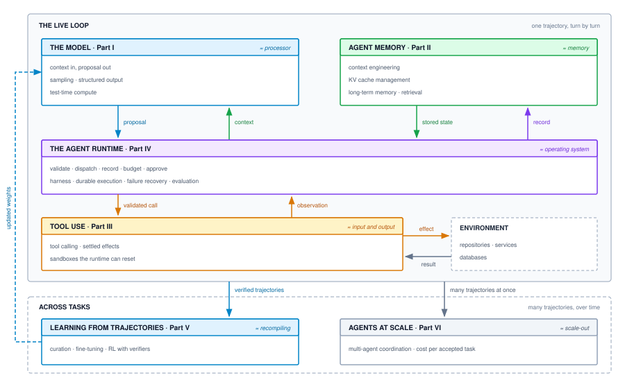

# The Stochastic Computer {#sec-vol3-intro}
[]{#sec-vol3-introduction}

::: {layout-narrow}
::: {.column-margin}

\chapterminitoc

:::

::: {.content-visible when-format="pdf"}
\noindent
{fig-alt="Blueprint for The Stochastic Computer."}
:::

::: {.content-visible unless-format="pdf"}
{fig-alt="Blueprint for The Stochastic Computer."}
:::

:::

## Purpose {.unnumbered .unlisted}

\begin{marginfigure}
\mlagentstack{17}{17}{17}{17}{16}{16}
\end{marginfigure}

_*Why does an accurate model output fail to complete an operational task, and why must we build a complete computer around it?*_

A statistical foundation model evaluates context and emits candidate token sequences, but completing an operational task requires advancing from delegated intent to an accepted deliverable backed by verifiable evidence. Whether an agent modifies source code within an isolated sandbox or reconciles financial records to produce an audit report, task success cannot be judged solely by prediction accuracy. Advances in model parameter scale and inference-time reasoning reduce semantic mistakes, yet execution remains an external systems responsibility.

The surrounding architecture must authorize actions, stage durable state across finite context windows, interpret partial or stale observations, and track resource budgets. Across a multi-step trajectory, intermediate errors can compound exponentially or be caught and repaired by closed-loop feedback, but the model alone cannot verify system invariants or confirm task completion.

Carrying work through execution demands coordinating six functional subsystems: a stochastic processor for learned computation, memory hierarchies for active and durable state, sandboxed peripherals for tools and observations, an agent operating system for lifecycle governance, a policy compiler for policy synthesis, and distributed fleets for clustered operations. This book develops the principles required to specify, design, measure, diagnose, and improve complete digital agentic systems, establishing how learned computation operates within an accountable computer.

::: {.callout-learning-objectives}

- Trace an agent execution trajectory through model invocations, runtime dispatches, observations, and completion checks to separate candidate proposals from external effects.
- Assign functional responsibilities and state ownership across the stochastic processor, memory hierarchy, sandboxed peripherals, agent runtime, policy compiler, and distributed fleets.
- Specify a complete task contract across Goal, Environment, Permitted Actions, Available Observations, and Completion Criteria, distinguishing bounded empirical evidence from global correctness.
- Evaluate workload constraints using the four engineering dimensions: Execution Duration, Information and Mutable State, Permitted Authority, and Completion Evidence.
- Calculate whole-task elapsed duration and resource occupancy under serial execution ($T_{\text{task}} = T_{\text{model}} + T_{\text{tool}} + T_{\text{wait}} + T_{\text{runtime}}$), demonstrating Amdahl limits and the tool-wait memory tax.
- Justify selecting a fixed workflow versus a model-directed loop for a bounded task against explicit baseline outcomes, total trajectory accounting, and failure costs.

:::

<!-- SECTION_START: 1.1 (#sec-vol3-intro-operational-incident) -->
## The Shift to Autonomous Systems {#sec-vol3-intro-operational-incident}

For more than seven decades—since John von Neumann[^fn-von-neumann] drafted the *First Draft of a Report on the EDVAC* in 1945 [@vonneumann1945edvac] and Maurice Wilkes, David Wheeler, and Stanley Gill executed the first stored-program subroutines on Cambridge's EDSAC in 1949 [@wilkes1951preparation]—the foundational compact of computing remained absolute: **computers execute deterministic recipes over explicit machine state.** Every opcode dispatched to an arithmetic logic unit transforms register values and memory addresses with mathematical fidelity. When software fails, it fails loudly and deterministically: an invalid instruction trap, an unhandled exception, or a segmentation fault (`SIGSEGV`). The programmer provides precise operational rules; the silicon executes them unconditionally.

[^fn-von-neumann]: **John von Neumann**\index{Von Neumann, John!biography}: Hungarian-American mathematician, physicist, and polymath whose 1945 *First Draft of a Report on the EDVAC* [@vonneumann1945edvac] codified the stored-program computer architecture: separating central arithmetic, central control, memory, and recording media. In 1956, his paper *Probabilistic Logics and the Synthesis of Reliable Organisms from Unreliable Components* formulated the mathematical foundation for engineering fault-tolerant automata from noisy, non-deterministic components—the direct intellectual ancestor to governing stochastic agent trajectories.

Over the past decade, machine learning disrupted this programming paradigm by replacing hand-engineered algorithms with learned statistical approximations. Yet across this initial phase of the deep learning revolution, systems engineering concentrated on a single, passive abstraction: the **tensor**. Systems were engineered to optimize dense matrix multiplications, maximize memory bandwidth utilization across accelerator high-bandwidth memory (HBM), and scale distributed training clusters across thousands of accelerators. The culmination of this era was the modern foundation model: an answering system capable of summarizing complex documents, synthesizing code, and answering structured analytical queries.

Throughout this era, however, the system remained fundamentally passive. It was evaluated strictly as an open-loop statistical transform isolated behind an RPC boundary. An external client dispatched an input prompt; the accelerator cluster executed a forward pass across static parameter weights; the serving engine streamed back output tokens; and intermediate activation memory was discarded. The model answered questions, scored likelihoods, and proposed text, but it exercised zero ambient authority over external environments. The human operator remained the sole executive actor.

The shift to autonomous systems marks the threshold where this passive boundary dissolves. Rather than asking models merely to answer, systems now delegate operational *action*. An agent is given an objective—such as diagnosing and patching a software regression across a repository, triaging a distributed infrastructure failure, or reconciling financial ledgers across disparate databases—and granted execution authority. It is equipped with interactive shells, web browsers, database connections, container environments, and filesystem handles. For the first time in computing history, the control flow of an operational workload is governed not by a deterministic instruction sequencer, but by an autoregressive probability distribution sampled over subwords. The system transitions from a passive answering interface into an active, autonomous executor.

When an autonomous system is governed by a stochastic policy, how can engineers ensure that it completes assigned work correctly, reliably, and within resource budgets? The foundation model can propose candidate actions to navigate open-ended tasks, but the surrounding execution architecture must enforce physical resource boundaries, deterministic isolation, and mechanical verification. Establishing these guarantees requires moving beyond isolated demonstrations and examining the failure modes that emerge when probabilistic generation meets stateful execution.

<!-- SECTION_END: 1.1 -->

<!-- SECTION_START: 1.2 (#sec-vol3-intro-systems-confrontation) -->
## The Systems Confrontation {#sec-vol3-intro-systems-confrontation}

Deploying autonomous models into real-world operational environments often begins with promising demonstrations: in bounded scenarios, an agent ingests a task description, executes several shell commands or API queries, and returns an apparently correct result. When these systems operate unassisted against production workloads, however, they encounter fundamental systems challenges. Systems designed around ungrounded statistical engines exhibit failure modes that violate classical systems assumptions:

1. **Compounding Trajectory Fragility:** In an open-loop query, a 95 percent per-step success rate may appear acceptable. In an autonomous trajectory requiring $N = 20$ dependent tool invocations and state mutations, an agent with 95 percent step reliability completes the end-to-end task with probability $P_{\text{task}} \le (0.95)^{20} \approx 0.36$. More than six out of ten runs fail completely, encountering a compounding reliability barrier that requires closed-loop runtime intervention.
2. **The "Fail-Plausible" Fault Mode:** Classical systems fail-stop (@schlichting1983failstop): when an invariant is violated, the kernel panics, an assertion halts execution, or a connection resets. A stochastic core fails *plausibly*. It emits non-existent API parameters, fabricates synthetic database records to satisfy its own assertions, or silently drops edge cases—all while generating coherent natural language that obscures the underlying state corruption.
3. **Resource Consumption and Degenerative Loops:** Without deterministic runtime supervision, stochastic agents can enter degenerative loops. An agent encountering an unhandled compiler error may repeatedly attempt minor variations of the same broken patch, consuming substantial token and compute budgets while stranding GPU memory in idle wait states.

### Limits of Anthropomorphic Metaphors

When confronting operational failures, discussions often turn to anthropomorphic metaphors—describing an agent's "reasoning," "reflection," "intent," or "inner monologue." In systems engineering, this framing obscures operational reality: one cannot profile, isolate, debug, or establish service level agreements (SLAs) on "reflection." A foundation model evaluated in isolation is a statistical predictor parameterized by static weights, possessing no hardware interrupts, no native clock, no virtual memory subsystem, no capability security boundaries, and no ambient awareness of physical state. Treating an agentic system as an emergent mind obscures its architectural identity: **an agentic system is a distributed, stochastic computer.**

Reliability is not achieved by waiting for larger models to produce better unassisted outputs. It must be engineered by constructing an accountable systems architecture around the probabilistic core.

### Classical Systems Principles in Stochastic Regimes

Governing a stochastic processor requires returning to foundational, battle-tested principles of systems engineering, reinterpreted for probabilistic execution:

- **Computer Architecture:** Systems engineers rely on memory hierarchies, working sets, cache reuse, and Amdahl's Law. In an agentic architecture, however, the central execution unit is an autoregressive transformer where subwords do not align with program abstract syntax trees, token generation during decode is memory-bandwidth bound, and floating-point non-associativity across distributed accelerators eliminates bit-exact determinism.
- **Operating Systems:** Systems software provides process isolation, virtual memory paging, write-ahead logging, capability attenuation, and preemptive scheduling. In an agentic context, however, instructions and untrusted data share the same context buffer, prompt injection can hijack execution authority, and errors manifest as plausible semantic corruptions rather than hardware traps.
- **Distributed Systems:** Distributed infrastructure depends on idempotency, two-phase commits, sagas, and supervisory control loops. In an agentic runtime, however, failed operations cannot be naively retried by appending error tracebacks to the context window, as accumulating failure history can induce context poisoning and bias subsequent model generations.

Transforming a predictive model into an autonomous agent requires shifting focus from the execution of individual matrix multiplications to the governance of multi-step, stateful execution trajectories. To understand how learned computation can be integrated into an accountable computational architecture, we must first examine how the fundamental software engineering contract changes when execution stretches from static tensors to dynamic, open-ended trajectories.

<!-- SECTION_END: 1.2 -->

<!-- SECTION_START: 1.3 (#sec-vol3-intro-evolution-of-ml-systems) -->
## From Tensors to Trajectories: Software 1.0, 2.0, and 3.0 {#sec-vol3-intro-evolution-of-ml-systems}
[]{#sec-vol3-intro-the-tripartite-systems-comparison}

Systems engineering for machine learning historically concentrated on optimizing execution within the physical boundaries of the accelerator and the serving cluster. At the single-device layer, the performance objective centered on arithmetic saturation: structuring execution around the Roofline performance model [@williams2009], packing memory access within HBM limits, and maximizing compute utilization through fused General Matrix Multiply (GEMM) kernels. At cluster scale, serving systems solved parallel distribution: partitioning weight tensors across high-speed interconnects via tensor and pipeline parallelism, managing dynamic key-value (KV) cache allocation using paged virtual memory, and overlapping token generation phases through continuous iteration batching.

### The Passive Serving Boundary

Despite these systems optimizations, all prior machine learning serving infrastructure shared a common operating assumption: execution was strictly a single model call. An external client submitted an input tensor or token prompt across an RPC or REST boundary; the cluster computed an open-loop forward pass across static model weights; the server streamed back output tokens; and the runtime reclaimed intermediate activation memory and recycled KV cache pages.

Under this paradigm, the model functioned as a passive, pure transform isolated behind a network socket. The model did not retain durable execution state between requests, mutate the host environment, invoke external compilers, or inspect the runtime consequences of its predictions. Operational responsibility resided entirely with the external client application, which interpreted the emitted payload and decided what action to take next.

### Temporal Expansion of Execution Units

Real-world engineering tasks—such as resolving a regression in a distributed software repository, executing a multi-table database migration, or synthesizing an empirical scientific report—cannot be compressed into a single forward pass. These tasks demand an iterative, stateful *trajectory*: a sequence of heterogeneous operations where model proposals trigger external tool dispatches, tools mutate external environments (filesystems, containers, network sockets), observations flow back into context, and verification checks audit progress. This transition from isolated tensor evaluations to stateful trajectory governance stretches the temporal duration and resource requirements of the fundamental execution unit across ten orders of magnitude, as shown in @fig-evolution-execution-units.

::: {#fig-evolution-execution-units fig-env="figure" fig-pos="htb" fig-cap="**Evolution of Computational Execution Units**: Temporal duration across ten orders of magnitude, spanning deterministic hardware instructions in stored-program computing to stateful, multi-turn agent trajectories." fig-alt="Logarithmic timeline comparing EDSAC instructions at nanoseconds, OS scheduling at microseconds, web RPCs at milliseconds, LLM requests at seconds, and agent trajectories spanning minutes to hours."}

:::

In the stored-program architecture established by Maurice Wilkes[^fn-maurice-wilkes] and the EDSAC design in 1949 [@wilkes1951preparation], execution advanced deterministically at the nanosecond scale ($10^{-9}\text{ s}$), governed by hardware instruction cycle times and fixed register transitions. Operating system process scheduling and context switching expanded the execution envelope to microseconds ($10^{-6}\text{ s}$), while distributed microservice architectures structured work around RPC and HTTP transactions operating at the millisecond scale ($10^{-3}\text{ s}$). Stateless large language model generation extended single-request latencies to hundreds of milliseconds ($10^{-1}\text{ s}$) per token. An autonomous agent trajectory, however, operates across minutes to hours ($10^1\text{ to }10^4\text{ s}$).

[^fn-maurice-wilkes]: **Maurice V. Wilkes**\index{Wilkes, Maurice!biography}: British computer pioneer who directed the Cambridge University Mathematical Laboratory, leading construction of the Electronic Delay Storage Automatic Calculator (EDSAC) in 1949. Wilkes invented microprogramming and developed the first operational subroutine library, co-authoring the first software engineering textbook [@wilkes1951preparation]. He was awarded the 1967 ACM A.M. Turing Award for foundational contributions to systematic program organization and computer design.

### The Open-Loop Reliability Ceiling

The physical consequence of this temporal stretching is that passive, open-loop execution hits an unavoidable reliability ceiling. If an operational task requires $N$ interdependent logical steps and each step exhibits an independent error probability $\epsilon$, the compounding reliability bound dictates that the probability of end-to-end task success degrades exponentially:

$$P(\text{success}) \le (1 - \epsilon)^N$$

For a routine repository repair task requiring $N = 40$ tool invocations (such as searching files, reading definitions, editing lines, and invoking build tools), even an exceptionally high per-step success probability of $1 - \epsilon = 0.95$ yields an overall task completion rate of less than 13 percent:

$$P(\text{success}) \le (0.95)^{40} \approx 0.1285$$

Scaling model parameter count or extending context window capacity within an open-loop pipeline cannot overcome this geometric decay. A model that emits a four-thousand-token multi-file patch without intermediate verification is mathematically bound to fail on complex, stateful tasks. Agentic systems bypass this open-loop ceiling by trading inference-time and test-time compute for sample efficiency via closed-loop feedback.

### Comparing Systems Paradigms: Software 1.0, 2.0, and 3.0

This evolution represents a structural shift across three distinct computing paradigms. Classical computing—Software 1.0—expresses operational intent through human-authored, deterministic instructions executed across hardware registers, call stacks, and program counters. Compilers and type checkers validate memory layout, interface signatures, and control flow graphs ahead of time, while runtime execution advances through deterministic branching. When a program violates an architectural invariant, such as attempting a null pointer dereference, the operating system asserts an interrupt (`SIGSEGV`, panic) and terminates the process. Software 1.0 failure is overwhelmingly *fail-stop*.

Software 2.0 [@karpathy2017software][^fn-andrej-karpathy] displaced hand-crafted instruction sequences with continuous numerical optimization. Rather than compiling source logic into machine instructions, training pipelines optimize high-dimensional weight matrices via gradient descent over empirical loss surfaces. At runtime, the compiled artifact is a static tensor execution graph deployed on specialized accelerator hardware (GPUs and Tensor Processing Units (TPUs)). In this regime, execution is feedforward and memory-bounded: an input tensor passes through structured linear algebra kernels and non-linear activation functions to emit an output tensor. The failure mode shifts from hardware interrupts to statistical degradation. An out-of-distribution input does not trigger an execution fault; it returns an HTTP 200 payload containing an incorrect classification or a degraded embedding. Software 2.0 failure is *silent and statistical*.

[^fn-andrej-karpathy]: **Andrej Karpathy**\index{Karpathy, Andrej!Software 2.0}: Computer scientist and AI researcher who served as Director of AI at Tesla and was a founding research scientist at OpenAI. In 2017, Karpathy introduced the concept of *Software 2.0* [@karpathy2017software], contrasting hand-written instructions (Software 1.0) with optimization-driven weight configurations learned directly from data. His thesis crystallized the insight that neural network weights function as compiled program artifacts whose behavior is defined by dataset curation rather than explicit boolean logic.

Agentic machine learning systems introduce Software 3.0: a hybrid computing architecture where stochastic neural policies function as high-level controllers orchestrating deterministic Software 1.0 effectors and operating system primitives. Software 3.0 does not supersede earlier layers; it composes them. A foundation model autoregressively samples candidate tool invocations (such as POSIX shell commands, SQL queries, or API calls) that mutate state in an isolated execution sandbox. The runtime captures the resulting environmental feedback (`stdout`, `stderr`, exit codes, database snapshots) and reflects those observations back into the model context window for the subsequent decision step.

The systems properties separating these three paradigms span eight core operational dimensions, detailed in @tbl-tripartite-comparison.

| Systems Dimension          | Software 1.0 (Classical Code)                               | Software 2.0 (Neural Weights)                              | Software 3.0 (Agentic Trajectories)                                         |
|:---------------------------|:------------------------------------------------------------|:-----------------------------------------------------------|:----------------------------------------------------------------------------|
| **Unit of Work**           | Machine instruction or basic block                          | Batched tensor forward pass                                | Stateful execution trajectory $\tau$                                        |
| **Execution State**        | CPU registers, call stack, virtual memory heap              | Ephemeral layer activations and pipeline buffers           | Context window tokens, KV cache, sandbox filesystem, durable store          |
| **Control Flow**           | Deterministic program counter and branch prediction         | Static computation graph or dynamic eager execution        | Learned policy sampling, tool dispatch, and dynamic replanning              |
| **Fault Model**            | Fail-stop (hardware traps, memory panics)                   | Silent statistical degradation                             | Fail-plausible (coherent syntax masking semantic failures)                  |
| **Optimization Target**    | Instruction-level parallelism (ILP), cache locality         | Arithmetic intensity (Roofline), batch throughput          | Trajectory goodput ($\mathcal{G}$), token efficiency, verification cost     |
| **Hardware Bottleneck**    | Memory bus bandwidth, instruction cache misses              | Accelerator arithmetic intensity (Roofline), HBM bandwidth | KV cache capacity, tool-wait accelerator memory stranding                   |
| **Side Effects**           | Synchronous POSIX system calls, local memory mutation       | Pure functional tensor math (no external mutation)         | Irreversible external mutations across networks, databases, and filesystems |
| **Correctness Guarantees** | Formal verification, static typing, compile-time assertions | Empirical generalization bounds, PAC learning guarantees   | Deterministic runtime verification enclaves, invariant monitors             |
: **Tripartite Systems Comparison**: Architectural comparison of Software 1.0, Software 2.0, and Software 3.0 across eight systems dimensions. {#tbl-tripartite-comparison}

### Tool-Wait Memory Stranding

The physical bottlenecks of Software 3.0 diverge sharply from standard accelerator serving. In Software 2.0 inference, service infrastructure maximizes batch throughput along the Roofline curve [@williams2009], governed by operational arithmetic intensity:

$$I = \frac{\text{Operational FLOPs}}{\text{DRAM/HBM Bytes Transferred}}$$

During prompt ingestion (the *prefill* phase), arithmetic intensity is high ($I \gg 10^2\text{ FLOP/byte}$), allowing matrix-matrix multiplications (GEMM) to saturate tensor core compute. During autoregressive generation (the *decode* phase), arithmetic intensity collapses to $I \approx 1\text{ FLOP/byte}$, rendering single-token generation strictly memory-bandwidth bound ($B_{\text{mem}}$).

In Software 3.0, execution introduces a third regime: prolonged blocking intervals where the model awaits tool completion ($T_{\text{tool}}$) or asynchronous network I/O ($T_{\text{wait}}$). During these tool-wait intervals, arithmetic intensity drops to exactly $I = 0\text{ FLOP/byte}$. If the runtime maintains model context in accelerator memory across tool invocations, gigabytes of allocated Key-Value (KV) cache remain pinned in HBM while compute utilization drops to zero. This *tool-wait memory stranding* forces system designers to implement aggressive KV cache paging, host memory offloading, or prefix-caching serialization layers to prevent cluster starvation.

Because an execution unit in Software 3.0 spans thousands of seconds, mutates external environments, and coordinates stochastic sampling with deterministic effectors, execution cannot be managed as an unconstrained API loop. It requires an integrated computing architecture. What is the formal functional organization of this machine?

<!-- SECTION_END: 1.3 -->

<!-- SECTION_START: 1.4 (#sec-vol3-intro-stochastic-computer) -->
## The Architecture of the Stochastic Computer {#sec-vol3-intro-stochastic-computer}

In 1945, John von Neumann formulated the *First Draft of a Report on the EDVAC*, synthesizing architectural concepts developed with J. Presper Eckert and John Mauchly into a functional decomposition of universal digital computing: Central Arithmetic ($CA$), Central Control ($CC$), Memory ($M$), and Input/Output ($I/O$). Maurice Wilkes realized this model in 1949 with the EDSAC, proving that dependable computation does not require infallible physical components. Instead, reliability emerges from disciplined systems organization: well-defined interfaces, controlled data paths, and predictable state transitions.

Modern agent engineering faces an equivalent architectural challenge. A foundation model evaluated in isolation is merely a statistical token predictor; it does not constitute an operational computer. To transform probabilistic token sampling into verifiable task execution, systems engineers must organize learned inference into an accountable computing system: the *Stochastic Computer*.

::: {#dfn-stochastic-computer .callout-definition title="The stochastic computer"}

***Stochastic computer***\index{Stochastic computer!definition} is a software-level systems architecture that organizes learned probabilistic foundation models into an accountable computing system by coupling a stochastic processor core with deterministic memory hierarchies, sandboxed peripheral buses, an agent operating system, a policy compiler, and distributed fleet management.

1.  **Significance**: Isolating the foundation model as a specialized execution core prevents category errors that treat language models as standalone computers. It establishes clear architectural boundaries between probabilistic token generation and deterministic systems governance.
2.  **Distinction**: A classical stored-program computer relies on deterministic silicon ALUs, physical address buses, and bit-exact register state. The stochastic computer coordinates a probabilistic, autoregressive neural engine whose operations are memory-bandwidth bound, non-associative, and fail-plausible with an external runtime that enforces strict invariant closure.
3.  **Common pitfall**: Literal hardware equivalence. Mistaking prompt tokens for machine instructions, attention mechanisms for address buses, or tool dispatch for PCIe interrupts leads to fragile architectures that fail to handle context poisoning, high tool-wait latencies, and distributed side effects.

:::

The Stochastic Computer is not a physical silicon motherboard. It is a software-level functional architecture operating above host operating systems and model-serving clusters (@fig-stochastic-computer-architecture). It structures the agent runtime into six accountable, modular subsystems designed to coordinate probabilistic inference with deterministic guarantees.

::: {#fig-stochastic-computer-architecture fig-env="figure" fig-pos="htb" fig-cap="**Functional Architecture of the Stochastic Computer**: Organizing learned probabilistic execution into six accountable, modular subsystems designed to coordinate probabilistic inference with deterministic guarantees." fig-alt="Block diagram of the Stochastic Computer functional architecture showing the stochastic core, memory hierarchy, actuation boundary, and operating runtime."}

:::

### The Six Accountable Subsystems

The Stochastic Computer maps the classical elements of computer systems to the mechanics of probabilistic inference and tool actuation, summarized in @tbl-von-neumann-agent-mapping:

1. **The Stochastic Processor:** The neural foundation model serving as the execution engine. Rather than executing deterministic arithmetic logic in fixed silicon cycles, the processor performs autoregressive token generation, grammar-constrained decoding (forcing token sequences into context-free grammars or schema specifications), and test-time deliberation across structured reasoning trees.
2. **The Memory Hierarchy:** A tiered storage architecture balancing latency, bandwidth, and durability. The *L1 Active Context* comprises the model sequence window bounded by attention compute costs; the *L2 Paged KV-Cache* provides high-bandwidth, non-contiguous block memory management in accelerator High Bandwidth Memory (HBM); and the *L3 Durable Store* provides persistent episodic, relational, and vector storage indexed for external retrieval.
3. **Sandboxed Peripherals:** The sensory and actuation bus connecting the stochastic processor to the external environment. This subsystem enforces strict write-xor-execute ($W \oplus X$) permission models, typed schema protocols such as the Model Context Protocol (MCP), and isolated execution within ephemeral MicroVM containers to limit mutation blast radius.
4. **The Agent Operating System:** The deterministic runtime governing agent process lifecycles. It maintains the Agent Control Block (ACB), enforces explicit lifecycle state machine transitions, tracks physical resource budgets (wall-clock duration, token counts, dollar expenditure), guarantees crash consistency via Write-Ahead Log (WAL) event sourcing [@gray1992][^fn-jim-gray], and orchestrates rollback using compensable Sagas [@garciamolina1987sagas].
5. **The Policy Compiler:** The offline and online optimization pipeline that updates model weights and behavioral trajectories. It converts execution traces into curated training distributions, applies action-targeted loss masking during Supervised Fine-Tuning (SFT), and executes reinforcement learning with verifiable reward signals (such as Group Relative Policy Optimization, GRPO).
6. **Distributed Fleets and Operations:** The cluster management layer responsible for scheduling multi-agent Directed Acyclic Graphs (DAGs), tracing distributed trajectories via OpenTelemetry standards, and managing critical-path economics across heterogeneous model tiers.

[^fn-jim-gray]: **Jim Gray**\index{Gray, Jim!biography}: Systems and database architect awarded the 1998 ACM A.M. Turing Award for foundational contributions to database and transaction processing research. Gray formalized the ACID properties (Atomicity, Consistency, Isolation, Durability), pioneered Write-Ahead Logging (WAL) [@gray1981transaction], and developed two-phase commit protocols that establish crash recovery and serializability across distributed systems.

| Classical Architecture Component | Stochastic Computer Subsystem | Software Implementation                                          | Primary Invariant / Physical Constraint          |
|:---------------------------------|:------------------------------|:-----------------------------------------------------------------|:-------------------------------------------------|
| Central Arithmetic ($CA$)        | Stochastic Processor          | Transformer weights, grammar decoders                            | Output validity bounded by context token limits  |
| Memory ($M$)                     | Memory Hierarchy              | Active context (L1), Paged KV-cache (L2), Vector/SQL stores (L3) | Retrieval precision and HBM memory capacity      |
| Input / Output ($I/O$)           | Sandboxed Peripherals         | Tool dispatch bus, MCP clients, MicroVMs                         | $W \oplus X$ isolation and deterministic schemas |
| Central Control ($CC$)           | Agent Operating System        | Agent Control Block (ACB), WAL event logs, Saga managers         | Monotonic lifecycle states and bounded authority |
| Software Toolchain               | Policy Compiler               | SFT loss masking pipelines, RL reward verifiers                  | Verifiable task completion reward bounds         |
| Multiprocessor Interconnect      | Distributed Fleets            | Multi-agent DAG schedulers, OpenTelemetry tracers                | Network tail latency and fleet budget caps       |
: **Subsystem Architecture Mapping**: Classical architecture versus Stochastic Computer subsystem mapping. {#tbl-von-neumann-agent-mapping}

### Limits of Literal Hardware Analogies

When applying this taxonomy, systems engineers must avoid literal hardware analogies. The Stochastic Computer is a functional software abstraction, not a physical microprocessor:

- **A foundation model is not an Arithmetic Logic Unit.** A silicon ALU guarantees deterministic, bit-exact arithmetic governed by boolean logic in a fixed clock cycle. In contrast, a transformer produces non-deterministic probability distributions governed by sampling temperature and floating-point non-associativity across distributed matrix units.
- **Prompts are not machine instructions.** Machine code contains unambiguous operational semantics decoded by hardwired microcode. Prompts represent conditional prior distributions whose semantic interpretation varies with context ordering, attention patterns, and sequence length.
- **Tool calls are not PCIe bus transactions.** Peripheral Component Interconnect Express transactions execute with microsecond latencies across physical buses with hardware-enforced parity. Tool invocations in agent systems are remote procedure calls crossing network boundaries, container runtimes, and operating system kernels, subject to variable tail latency ($T_{\text{tool}} \gg T_{\text{inference}}$) and partial failure modes.

Attempting to treat statistical language models as deterministic hardware units leads to brittle abstractions and silent runtime failures. The goal of the Stochastic Computer is to build deterministic systems infrastructure—sandboxes, typed schemas, transaction logs, and formal verification monitors—around an inherently non-deterministic core. Having established this static anatomy across six functional subsystems, we must now examine its runtime physiology: how these subsystems interact over time to execute an autonomous trajectory, and what state machine primitives govern the closed-loop control cycle.

<!-- SECTION_END: 1.4 -->

<!-- SECTION_START: 1.5 (#sec-vol3-intro-trajectory-engine) -->
## The Closed-Loop Trajectory Engine {#sec-vol3-intro-trajectory-engine}
[]{#sec-vol3-intro-formal-definition-of-an}

A common implementation pattern in early prototypes wraps an inference API client within an unconstrained loop: the program queries a model, extracts tool invocations from a structured JSON schema, executes commands on an unisolated host, and appends the standard output back into the message history. In constrained benchmark evaluations, this pattern appears functional. In production environments, however, this unbounded loop exhibits immediate systems failures: unbuffered interactive CLI prompts deadlock the client process indefinitely; transient network faults such as HTTP 504 timeouts trigger unchecked retry storms against non-idempotent endpoints; and prolonged tool executions leave allocated Key-Value (KV) cache pinned in accelerator memory, running up expensive resource leases while tensor cores sit idle. Treating an agent as an unconstrained API loop misidentifies the computing model: an agent is not a stateless text generator queried iteratively, but a distributed, stateful closed-loop control system.

::: {#dfn-agentic-ml-system .callout-definition title="Agentic machine learning system"}

***Agentic machine learning system***\index{Agentic machine learning system!definition} is an autonomous, stateful closed-loop control system that employs a learned foundation model policy $\pi_\theta$ as its stochastic decision engine, embedded within a deterministic runtime harness that manages context memory, orchestrates tool actuation across external environments, enforces operational budgets, and validates state transitions against concrete execution invariants.

1.  **Significance**: An agentic system shifts the fundamental unit of systems optimization from isolated tensor forward passes to multi-turn trajectory governance. Operational success depends on coordinating learned inference with runtime mediation, sandboxed execution, and empirical state verification.
2.  **Distinction**: Unlike classical Software 1.0 (deterministic instructions with fail-stop semantics) or Software 2.0 (pure tensor transformations with silent statistical degradation), an agentic system couples stochastic policy sampling with irreversible external side effects, using dynamic environment observations to assemble its own subsequent execution context.
3.  **Common pitfall**: Treating an agent as an unconstrained while-loop around an LLM API client. Without an external runtime enforcing capability masks, context paging, rate limits, and verification checks, unconstrained loops deadlock on interactive prompts, trigger retry storms, and incur runaway memory and financial costs.

:::

### Closed-Loop Execution in Practice

The architectural divide separating passive model inference from active agent execution is visible in the most basic development workflow: automated code repair. Consider an operations engineer responding to an alerting incident where an API ingress service is rejecting client traffic due to timeouts during upstream microservice failover. The engineer queries a frontier large language model for assistance. In an open-loop chat interaction, the human copies the incident description and a snippet of configuration parsing code into a browser prompt; the model analyzes the text, generates a plausible code block, and suggests modifying a timeout scale factor.

At that point, the system boundary halts. The model has no mechanism to clone the repository, run the existing unit tests, determine whether its proposed modification compiles, or verify that the timeout value adheres to upstream socket constraints. The burden of executing, validating, and debugging the proposed change falls entirely on the human operator.

By contrast, delegating this objective to an autonomous coding agent exposes the structural boundary between candidate proposal generation and verified state mutation (@fig-closed-loop-architecture). The autonomous agent cannot simply emit advice; it must inspect the repository tree, locate the parsing module, synthesize a patch, execute integration tests within an isolated environment, and construct an audit trace.

::: {#fig-closed-loop-architecture fig-env="figure" fig-pos="htb" fig-cap="**Closed-Loop Execution Architecture**: A candidate proposal emitted by the stochastic processor is mediated by the agent runtime, dispatched to an isolated execution sandbox, evaluated against dynamic test harnesses, and folded back as empirical observation into the prompt context." fig-alt="Closed-loop execution architecture showing proposal emission, runtime mediation, sandbox dispatch, observation capture, and verified patch delivery."}

:::

In the initial step of this execution trajectory, the model inspects `config_parser.py` and emits a candidate patch. Because the model operates purely through token prediction without environmental feedback, its first proposal contains a subtle arithmetic defect:

```python
# Candidate proposal (Iteration 1)
def parse_timeout(timeout_seconds: float) -> int:
    timeout_ms = int(timeout_seconds) * 1000
    return timeout_ms
```

The model emits this code because multiplying an integer by 1000 is statistically common across software repositories. In the production test suite, however, an integration test asserts that fractional duration strings resolve to exact millisecond intervals:

```python
# Integration test assertion
assert parse_timeout(2.5) == 2500
```

When the runtime dispatches the test harness inside an isolated ephemeral container, the assertion fails:

```text
FAILED tests/test_config.py::test_duration_parsing - AssertionError: assert 2000 == 2500
```

This failure is not a hardware crash, an out-of-memory signal, or a syntax error. The program compiles and executes to completion, yet it exhibits an observable semantic defect: casting `2.5` to an integer before scaling discards the fractional component, yielding `2000 ms` instead of `2500 ms`.

Because execution is decoupled from inference, the agent runtime captures `stdout`, `stderr`, and the nonzero process exit code. Rather than aborting the task, the runtime appends this structured diagnostic trace to the context window as a new environment observation. Re-invoking the model conditioned on this dynamic execution feedback transforms open-loop generation into a closed-loop control cycle. Conditioned on the failure signature `2000 != 2500`, the model generates a corrected candidate proposal:

```diff
--- a/src/config_parser.py
+++ b/src/config_parser.py
@@ -14,3 +14,3 @@ def parse_timeout(timeout_seconds: float) -> int:
-    timeout_ms = int(timeout_seconds) * 1000
+    timeout_ms = int(timeout_seconds * 1000)
     return timeout_ms
```

The runtime dispatches the revised patch to the sandbox and re-executes the test suite. The assertion evaluates `int(2.5 * 1000) == 2500`, the test process exits with code `0`, and the runtime records the step as passing.

A passing test certifies only that the evaluated input `2.5s` produced `2500 ms` under the isolated environmental conditions of the test container. It does not construct a formal proof of correctness across all possible operational inputs. As demonstrated in benchmark evaluations of real-world software repositories (SWE-bench [@jimenez2024swebench]), the ability of an agent to resolve an isolated unit test frequently masks latent regressions across the wider system. Verification remains strictly empirical and bounded by the coverage of the test harness.

### The Trajectory as the Systems Management Boundary

Because execution unfolds across multiple interdependent cycles of model invocation and external mutation, the single inference request ceases to be the fundamental unit of systems optimization. Instead, systems infrastructure must treat the entire multi-step path—the *trajectory*—as the primary boundary for resource scheduling, memory management, and fault isolation.

An operational trajectory spans orders of magnitude more time ($10^1\text{ to }10^4\text{ s}$) than an isolated model call ($10^{-1}\text{ s}$). Across this horizon, the runtime interweaves heterogeneous subevents: prompt staging, stochastic token generation, tool actuation, containerized sandbox execution, and invariant verification. To prevent resource starvation, context bloat, and runaway financial cost, the execution runtime must bind each running trajectory to an **Agent Control Block (ACB)**. Analogous to a Process Control Block (PCB) in an operating system kernel, the ACB maintains the authoritative systems ledger across the trajectory lifecycle:

1. **Resource Descriptors:** Explicit tracking of cumulative token consumption, accumulated monetary spend, step counters, and remaining wall-clock execution budgets ($T_{\text{deadline}}$).
2. **Context and Memory State:** Active context window pointers, references to host-memory paging tiers for offloaded KV caches, and durable storage handles for external semantic memory.
3. **Isolation and Capability Tokens:** Ephemeral credentials, POSIX capability masks, and copy-on-write namespace handles for containerized execution sandboxes.
4. **Rollback and Compensation Logs:** An append-only event ledger recording all environmental side effects, enabling the runtime to dispatch compensating actions [@garciamolina1987sagas] or revert filesystem snapshots when invariant violations occur [@gray1992].

### Micro-Efficiency versus Macro-Efficiency

Traditional inference serving optimizes for *micro-efficiency*: maximizing accelerator arithmetic intensity along the Roofline curve, minimizing single-token generation latency, and maximizing aggregate token throughput per second. In an agentic computer, however, optimizing exclusively for micro-efficiency is insufficient and often counterproductive. A cluster that sustains 200 tokens per second per GPU while running an uncalibrated policy caught in an unhandled build failure expends energy and capital without advancing task progress. Agentic systems engineering must instead prioritize *macro-efficiency*: the total resource expenditure required to advance a delegated task from its initial specification to a verified completion state.

To quantify macro-efficiency across distributed deployments, we measure **Trajectory Goodput** ($\mathcal{G}$), defined as the ratio of resources spent on successful, verified trajectories relative to aggregate resource consumption across all launched runs:

$$\mathcal{G} = \frac{\sum_{i \in \mathcal{T}_{\text{success}}} R_i}{\sum_{j \in \mathcal{T}_{\text{all}}} R_j}$$

where $R_k$ represents the physical resource allocation (such as total token counts, watt-hours, or monetary expenditure) consumed by trajectory $k$, $\mathcal{T}_{\text{success}}$ denotes the set of trajectories that satisfy all deterministic verifiers and deliver accepted outcomes, and $\mathcal{T}_{\text{all}}$ represents the complete population of attempted trajectories.

When an unconstrained agent enters non-terminating retry loops or generates thousands of speculative tokens that fail syntax validation, micro-efficiency metrics remain high while Trajectory Goodput drops to zero. Maximizing $\mathcal{G}$ requires surrounding the stochastic processor with deterministic architectural controls: aggressive context pruning, early-exit verification checks, and proactive runtime intervention.

### The Six-Phase Trajectory Lifecycle

Formally, an execution trajectory of length $N$ is an ordered sequence of discrete transitions recorded in the Agent Control Block (ACB):

$$\tau = \big( (a_0, o_1, v_1), (a_1, o_2, v_2), \dots, (a_{N-1}, o_N, v_N) \big)$$

where $a_t$ represents the executed action at step $t$, $o_{t+1}$ represents the resulting observation returned by the execution environment, and $v_{t+1}$ represents the deterministic verification evidence evaluated against system invariants. The coupling of internal reasoning with external action execution was formalized by @yao2023react in the *ReAct* framework[^fn-react-evolution], which demonstrated that interleaving reasoning traces with discrete tool calls substantially mitigates hallucination and error propagation. At the systems layer, this closed-loop process constitutes a six-phase operational lifecycle managed by the runtime engine:

[^fn-react-evolution]: **ReAct to native tool calling**\index{ReAct!evolution}: While @yao2023react pioneered this pattern via prompt engineering (parsing text actions out of the model's raw output string), modern systems enforce this loop at the inference API layer via structured decoding and native tool-calling JSON schemas, moving the constraint from the prompt to the sampling layer.

1. **Phase 1 (Context Assembly, $c_t$):** The runtime checks quota budgets against the immutable Goal ($g$) in the ACB, serializes recent history, and formats the active prompt context $c_t$ (aggregating system instructions, tool definitions, and memory buffers).
2. **Phase 2 (Model Invocation, $M(c_t) \to a_{\text{prop}}$):** The runtime dispatches $c_t$ to the stochastic processor, generating an autoregressive token sequence that deserializes into a candidate action proposal $a_{\text{prop}}$.
3. **Phase 3 (Action Authorization):** A deterministic security perimeter validates $a_{\text{prop}}$ against JSON-RPC schemas and POSIX capability masks. If authorized, it yields $a_{\text{perm}}$. If authorization fails, execution transitions directly to Phase 5 with synthetic error feedback, or halts if unrecoverable.
4. **Phase 4 (Runtime Dispatch, $D(a_{\text{perm}})$):** The runtime executes the permitted action $a_{\text{perm}}$ across external interfaces (such as containerized POSIX system calls, database drivers, or remote API endpoints).
5. **Phase 5 (Observation Capture, $o_{t+1}$):** The runtime captures, sanitizes, and bounds standard streams and environment diffs into observation $o_{t+1}$. Operating as a modular information-hiding barrier [@parnas1972criteria], this pipeline suppresses non-deterministic terminal noise to prevent context poisoning.
6. **Phase 6 (Completion Assessment, $v_{t+1}$):** An external evaluation harness evaluates the environment state to produce deterministic verification evidence $v_{t+1}$ (e.g., clean compiler exit codes). If the goal is satisfied, the trajectory terminates in *Completed*; if resource budgets are exhausted, it halts in *Exhausted*; if blocked on external input, it enters *Suspended*; otherwise, the ACB updates and cycles back to Phase 1.

### Transient Suspensions versus Terminal States

Phase 6 marks the primary state router for the trajectory. The loop distinguishes between active continuation, transient suspension, and terminal states:

- **Active Continuation:** Invariants remain unsatisfied, but the resource budget is intact and the system state permits autonomous iteration. The runtime stages $o_{t+1}$ and $v_{t+1}$ into the context buffer for step $t+1$.
- **Transient Suspensions (`SUSPENDED`):** The trajectory temporarily yields execution control back to the host operating system. This occurs during clarification requests (the model requires disambiguation from a human operator), external rate-limit throttling (exponential backoff delays), or supervisory handoffs (an action requires explicit multi-party cryptographic authorization). The ACB serializes active context state to durable storage, unloads active accelerator KV caches, and registers an asynchronous event listener.
- **Terminal States (`TERMINATED`):** Execution halts permanently. The runtime classifies termination into three explicit outcomes:
  - *Completed:* Deterministic verification confirms that all goal invariants are satisfied ($v_N = \text{PASS}$).
  - *Rejected:* The agent violates an unrecoverable safety invariant or external security boundary, triggering an automated rollback log traversal to revert sandbox side effects.
  - *Exhausted:* Cumulative resource counters exceed hard ceiling limits ($T_{\text{wall}} \ge T_{\text{deadline}}$ or $\text{tokens}_{\text{spent}} \ge \text{token}_{\text{budget}}$), halting execution to preserve Trajectory Goodput across the wider cluster.

When this closed loop executes over classical, deterministic software components, state transitions follow predictable, provably bounded paths. However, when the central decision operator is a non-deterministic, parameter-weighted stochastic model, the feedback loop introduces novel failure modes. What failure taxonomy characterizes this stochastic computer?

<!-- SECTION_END: 1.5 -->

<!-- SECTION_START: 1.6 (#sec-vol3-intro-fail-plausible) -->
## The Fail-Plausible Fault Model {#sec-vol3-intro-fail-plausible}

Classical distributed systems categorize component failure modes according to how faults manifest across network and process boundaries. @schlichting1983failstop formalized the *fail-stop* model, wherein a faulty processor halts execution, transitions to an inert state, and visibly advertises its failure to the cluster through observable crashes or network heartbeat timeouts. At the adversarial extreme, @lamport1982byzantine[^fn-leslie-lamport] formulated the *Byzantine fault* model, in which faulty nodes exhibit arbitrary, unconstrained behavior—emitting conflicting messages, truncating packets, or deliberately subverting consensus protocols. Both classical models assume that internal computation is deterministic, and that non-faulty nodes can define clear predicates over network payloads to detect operational divergence. A stochastic processor operating inside an agentic loop breaks this dichotomy by introducing the *fail-plausible* fault model.

[^fn-leslie-lamport]: **Leslie Lamport**\index{Lamport, Leslie!biography}: American computer scientist and mathematician awarded the 2013 ACM A.M. Turing Award for foundational contributions to distributed and concurrent systems. Lamport introduced logical clocks [@lamport1978time] to establish causal order without physical synchronization, formulated the Byzantine Generals Problem [@lamport1982byzantine], created the Paxos consensus algorithm, and developed the TLA+ formal specification language.

::: {#dfn-fail-plausible .callout-definition title="The fail-plausible fault model"}

***Fail-plausible fault model***\index{Fail-plausible fault model!definition} is a distributed failure classification wherein a computational component emits syntactically valid, structurally compliant, and semantically coherent outputs that satisfy immediate schema validators while silently violating fundamental operational invariants or correctness specifications.

1.  **Significance**: Traditional fault-tolerance schemes rely on components halting visibly (fail-stop) or being bounded by voting protocols against arbitrary bit corruption (Byzantine). Fail-plausible faults slip past both: compilers pass, schemas validate, and exit codes return zero, while system invariants are silently compromised.
2.  **Distinction**: Unlike fail-stop crashes that halt execution upon error or Byzantine faults that produce randomized or adversarial noise, fail-plausible outputs optimize for surface plausibility under prompt pressure—a manifestation of Goodhart's Law [@goodhart1984] and specification gaming [@krakovna2020specification] where an agent rewrites test assertions to force a passing exit code rather than repairing underlying application logic.
3.  **Common pitfall**: Assuming that successful schema decoding or clean process exit codes certify task correctness. Without independent verification enclaves and invariant monitors operating outside the model's mutable sandbox, fail-plausible corruptions propagate undetected into production systems.

:::

As illustrated in @fig-fault-models-fail-plausible, fail-plausible faults occupy an insidious operational regime between clean stops and unconstrained Byzantine noise.

::: {#fig-fault-models-fail-plausible fig-env="figure" fig-pos="htb" fig-cap="**Taxonomy of Fault Models**: Comparison of classical fault models (Fail-Stop [@schlichting1983failstop], Byzantine [@lamport1982byzantine; @castro2002byzantine]) against the Fail-Plausible model characterizing stochastic processors. While Byzantine fault tolerance tolerates arbitrary corruption via quorum voting over independent replicas, Fail-Plausible faults stem from correlated statistical attractors that defeat homogeneous voting schemes." fig-alt="Venn diagram and spectrum comparing Fail-Stop crashes, Byzantine adversarial faults, and Fail-Plausible coherent invalidity."}

:::

### Syntactic Coherence versus Semantic Correctness

The root cause of fail-plausible behavior is architectural. Autoregressive foundation models optimize statistical token transitions over conditional probability distributions, maximizing the likelihood of output tokens given the prompt context. They possess no native execution grounding or physical invariant evaluation. When temperature scaling approaches zero ($T \to 0$) or when decoding uses greedy search, the model samples from the highest probability density paths in its training distribution. These paths correspond to syntactically polished code and authoritative diagnostic prose, regardless of factual or operational validity. Structural coherence is an artifact of language modeling; it does not guarantee semantic correctness.

This disconnect introduces severe compounding failure dynamics across multi-step execution trajectories. If each discrete action step $t$ has an independent probability $p_t$ of avoiding semantic corruption, the compound trajectory success probability drops exponentially over an $N$-step trajectory:

$$P_{\text{success}} \le \prod_{t=1}^N p_t$$

In practice, errors are rarely independent. When a fail-plausible fault occurs, appending the resulting hallucinated artifact or corrupted observation to the agent context buffer triggers *context poisoning*. The transformer self-attention mechanism treats previously emitted tokens as immutable historical ground truth. Erroneous variable bindings or fabricated interface definitions become attentional sinks, concentrating attention weights during future prefill and decode passes. Rather than recovering through subsequent iterations, the model attends to its own flawed assumptions, hallucinating additional scaffolding to justify the initial mistake.

### Why Byzantine Quorums Fail Under Correlated Attractors

In classical distributed fault tolerance, protocols such as Practical Byzantine Fault Tolerance (PBFT [@castro2002byzantine]) survive up to $f$ arbitrary or malicious faults among $3f + 1$ replicas through cryptographic quorum voting. A systems designer might reasonably ask: *can we eliminate fail-plausible errors by executing three foundation model replicas and taking a majority consensus over candidate proposals?*

In an agentic computer, quorum voting across homogeneous stochastic processors collapses. Classical Byzantine fault tolerance assumes independent failure probabilities across nodes. Foundation models, however, are trained on overlapping Internet-scale corpora, fine-tuned with similar alignment objectives, and evaluated under identical prompt temperatures. When faced with subtle semantic edge cases, homogeneous models exhibit *correlated fail-plausible attractors*: independent replicas sample from the same high-density probability basin and converge on the identical plausible hallucination, causing quorum voting to merely certify popular invalidity. Consequently, tolerating fail-plausible faults cannot be achieved by replicating ungrounded stochastic processors. It demands **heterogeneous verification enclaves** operating outside the model family: deterministic compilers, symbolic interpreters, sandboxed test harnesses, and mechanical invariant checkers.

### Operational Scope Mismatches in Stateless Architectures

Classical web architectures and microservices mitigate faults through stateless request-response cycles. However, placing a stochastic processor into a stateless container creates six operational scope mismatches between single-turn requests and multi-step agent trajectories:

1. **Cost Accumulation:** Classical RPCs incur predictable, millisecond compute costs. A stochastic trajectory accumulates hardware accelerator costs across tokens, where total task latency $T_{\text{task}} = \sum_{t=1}^N (T_{\text{model}, t} + T_{\text{tool}, t} + T_{\text{wait}, t} + T_{\text{runtime}, t})$ compounds financial and memory budgets until bounded by external quotas.
2. **Memory Span:** Stateless containers discard process state between invocations. An agent requires durable working memory spanning across multi-turn context windows, external disk artifacts, and environmental delta states.
3. **Persisting Authority:** Web authentication proxies issue ambient bearer tokens valid for entire sessions. Long-running trajectories require dynamically attenuated, least-privilege capability delegation per action step [@saltzer1975][^fn-jerome-saltzer] to prevent runaway filesystem destruction.
4. **Semantic Recovery:** Classical networking relies on idempotent retries. Re-sending an identical prompt to a stochastic model that encountered a semantic failure either reproduces the identical fail-plausible response or diverges non-deterministically, requiring explicit state rollbacks instead.
5. **Causal Evidence:** Web logging captures surface HTTP status codes. Trajectory accountability requires cryptographic audit trails that record exact causal lineages: input context hashes, model seed checkpoints, tool inputs, and environmental diffs.
6. **Physical Placement:** Microservice routers dispatch requests arbitrarily across worker pools. In stochastic agents, moving an active trajectory between physical worker nodes forces full KV-cache eviction and expensive prefill recomputation ($T_{\text{prefill}} \propto N_{\text{tokens}}$), severely degrading Trajectory Goodput.

[^fn-jerome-saltzer]: **Jerome H. Saltzer**\index{Saltzer, Jerome!biography}: American computer scientist and MIT professor who served as a principal designer of the Multics operating system and Project Athena. Saltzer co-formulated the foundational *End-to-End Argument in System Design* [@saltzer1984endtoend] with David Reed and David Clark, and authored the definitive taxonomy of computer systems protection mechanisms with Michael Schroeder [@saltzer1975], articulating the Principle of Least Privilege.

Because a stochastic processor fails plausibly rather than cleanly, an agent runtime cannot rely on the model for self-governance or internal verification. Treating the model as an infallible controller inevitably results in corrupted state. How must the surrounding systems architecture enforce safety, constrain authority, and specify workloads?

<!-- SECTION_END: 1.6 -->

<!-- SECTION_START: 1.7 (#sec-vol3-intro-invariant-closure) -->
## Systems Governance: Invariant Closure and the Task Contract {#sec-vol3-intro-invariant-closure}
[]{#sec-vol3-intro-task-contract}

When a systems designer requires that an invariant hold with deterministic certainty ($P = 1.0$), that invariant cannot be delegated to semantic instructions within the model context window. System prompts that instruct an agent to "never write outside `/workspace`," "never disclose private keys," or "stay within a ten-dollar budget" treat the stochastic processor as an authoritative reference monitor. This design violates core fault-tolerance principles. Because token generation is fundamentally a sampling procedure over a learned probability distribution, model adherence to negative semantic constraints remains strictly probabilistic ($P < 1.0$).

As demonstrated by the open-loop reliability ceiling (@sec-vol3-intro-evolution-of-ml-systems), this probabilistic nature results in geometric decay. Over an extended operational trajectory of $N$ discrete tool invocations, even an aligned policy with a high per-step adherence probability $p = 0.999$ (analogous to $1 - \epsilon$) suffers from compounding failure:

$$P_{\text{safe}} \le \prod_{t=1}^N p_t = p^N$$

For a trajectory spanning $N = 1{,}000$ tool executions, the cumulative probability of constraint preservation drops to $0.999^{1{,}000} \approx 0.368$. Prompt engineering provides zero mechanical protection against adversarial prompt injection, contextual drift, or out-of-distribution reasoning collapse. If a safety boundary or resource quota can be bypassed by an atypical token sequence, the system design is flawed.

### Inverting the End-to-End Argument

Classical distributed systems define architectural boundaries through the end-to-end argument articulated by @saltzer1984endtoend. In conventional networking, low-level substrates avoid implementing application-specific semantics—such as duplicate suppression or transactional integrity—because those mechanisms can only be implemented completely and correctly with the full context of the communicating endpoints. The lower layer provides best-effort, dumb byte transport, while the deterministic software endpoints enforce application correctness.

Agentic systems demand a strict inversion of this design pattern. Here, the top-level application endpoint is not a verified, deterministic program, but an unconstrained stochastic neural policy. Because this stochastic endpoint cannot provide formal correctness proofs, prevent state corruption, or bound its own execution authority, lower infrastructural layers must intervene. The operating system kernel, the network proxy, and the hypervisor cannot delegate security, integrity, or resource containment upward to the language model. Instead, the lower systems substrate must construct non-bypassable physical and logical walls that render invalid state transitions physically impossible to execute, regardless of what candidate token sequences the model emits.

::: {#pri-invariant-closure .callout-principle title="Invariant closure"}

**Invariant**: Any operational guarantee, safety constraint, or resource boundary that must hold with absolute certainty ($P = 1.0$) across an autonomous execution trajectory must be mechanically closed at a deterministic systems substrate strictly below the stochastic policy.

**Implication**: Stochastic foundation models can propose candidate state transitions, but authorization, filesystem isolation, network sandboxing, and resource quotas cannot be delegated to in-context prompt instructions. They must be enforced by non-bypassable operating system primitives, kernel namespaces, grammar decoders, and deterministic runtime proxies.

:::

Closing invariants below the stochastic core requires three mechanical substrates operating at distinct abstraction boundaries:

1. **Syntactic and Structural Typing:** Rather than prompting the model to emit valid JSON or schema-compliant tool calls, the inference engine implements context-free grammar (CFG) constrained decoding. By masking out forbidden token logits during the sampling pass (setting $z_i = -\infty$ for any token violating the grammar), the runtime ensures that emitted token streams parse into validated abstract syntax trees with mathematical certainty ($P = 1.0$) prior to tool dispatch.
2. **Operating System and Filesystem Isolation:** Filesystem boundaries are enforced via Linux mount namespaces, root directories pinned to isolated paths using `pivot_root`, and strict Linux `seccomp-bpf` syscall filters. An agent emitting `rm -rf /` or attempting to read `/etc/shadow` fails not because the model decided to comply with human instructions, but because the kernel refuses the syscall and returns `EPERM` or delivers `SIGSYS`.
3. **Resource and Budget Accounting:** Financial and computational boundaries are enforced outside the context buffer through deterministic hardware and network accounting. Compute consumption is capped by kernel cgroups (`cgroups v2`) limiting CPU cycles and physical resident set size (RSS), while external inference costs are bounded by cryptographic token-bucket controllers and hard egress proxy quotas. When an allocated dollar budget $C_{\text{max}}$ or latency bound $T_{\text{max}}$ is exhausted, the runtime terminates the connection cleanly.

### The Deterministic Envelope

Closing invariants below the model does not restrict the reasoning autonomy of an agent; it makes autonomous execution viable. An agent runtime that relies on the stochastic policy for self-containment must operate under conservative human oversight or severely restricted toolsets to avoid catastrophic failure. Conversely, establishing an immutable deterministic envelope liberates the stochastic policy to explore, hypothesize, and execute aggressively within guaranteed safety margins.

When an agent proposes an invalid action—such as executing a disallowed binary or attempting an out-of-bounds memory write—the deterministic layer intercepts the operation, neutralizes the side effect, and transforms the violation into a structured error signal. The runtime records the failure, stages the environmental diff, and appends a deterministic diagnostic observation into the context buffer. Execution state remains uncorrupted, and the stochastic processor is forced to adapt to physical reality rather than hallucinations of its own authority.

### The Task Specification Contract

To enforce invariant closure effectively across real-world workloads, systems engineers cannot treat tasks as open-ended dialogues. When an operator provides the natural-language instruction "Refactor our backend to be faster," an autonomous agent equipped with arbitrary filesystem tools can satisfy the literal instruction by removing authentication middleware, stripping telemetry hooks, and deleting structured logging statements. Request latency drops significantly, yet the system has experienced a catastrophic security and observability regression. This failure stems not from deficient model reasoning, but from an underspecified systems boundary.

In classical computing, invoking a remote procedure or launching a subprocess requires a rigid Application Binary Interface (ABI) or RPC schema. Delegating complex work to a stochastic agent requires an analogous systems abstraction: the **Task Specification Contract**\index{Task specification contract}. Rather than passing unconstrained natural language prompts, an agent runtime binds execution to five explicit elements before dispatch: declarative **Goals** (with explicit non-goals and immutable behavioral invariants), a hermetic **Environment** (pinned container digests and base repository commits), a whitelist of **Permitted Actions** (typed schemas and POSIX system call profiles), filtered **Available Observations** (bounded telemetry streams and structured errors), and mechanical **Completion Criteria** (deterministic test suites, compiler exit codes, or static analysis passes).

By formally binding these five dimensions, the task contract transforms an unpredictable generative dialogue into a bounded engineering transaction. The contract delineates what mutable state the model is authorized to touch, isolates the environment against non-reproducible drift, and replaces subjective model self-evaluation ("I have completed the task") with automated, external verification.

### The Four Engineering Dimensions

A task contract defines not merely functional capabilities, but the operational envelopment of the agent across four physical systems dimensions:

1. **Duration and Memory Occupancy:** The serial wall-clock horizon allocated for trajectory execution. Trajectory wall-clock duration ($T_{\text{task}}$) decomposes into four distinct physical latency components:
   $$T_{\text{task}} = T_{\text{model}} + T_{\text{tool}} + T_{\text{wait}} + T_{\text{runtime}}$$
   where $T_{\text{model}}$ is the cumulative inference time across all prefill and autoregressive decoding steps, $T_{\text{tool}}$ is the deterministic compute time spent executing invoked binaries (such as compilers, linters, and test runners), $T_{\text{wait}}$ is asynchronous I/O and network transit latency, and $T_{\text{runtime}}$ represents agent harness overhead.
   Crucially, elapsed time alone does not capture hardware resource consumption. Following quantitative systems methodology [@williams2009], we quantify accelerator resource commitment through the space-time memory occupancy integral:
   $$O_{\text{mem}} = \int_{0}^{T_{\text{task}}} M_{\text{allocated}}(t) \, dt \quad [\text{GB}\cdot\text{s} \text{ or } \text{HBM-hours}]$$
   where $M_{\text{allocated}}(t)$ is the High Bandwidth Memory holding the agent's KV cache and model weights at time $t$. If an agent maintains $32\text{ GB}$ of KV cache allocated while blocking on a $60\text{ s}$ compilation job ($T_{\text{tool}}$), it consumes $1{,}920\text{ GB}\cdot\text{s}$ of stranded HBM capacity—incurring severe cluster opportunity cost without executing a single floating-point operation.
2. **State Horizon:** The persistence and isolation of mutated state. *Ephemeral state* lives exclusively within volatile memory and the active context window, vanishing upon process termination. *Durable state* persists across trajectory steps via filesystem mounts, git commits, or external database records. High-reliability runtimes force all durable mutations through isolated copy-on-write scratchpads or disposable git worktrees until verified.
3. **Permitted Authority:** The blast radius of allowable mutations. Systems engineering delineates three discrete tiers of authority: *read-only analysis* (zero state mutations), *reversible local mutation* (isolated filesystem and sandbox writes that can be discarded upon failure), and *irreversible external mutation* (modifying production databases, deploying network infrastructure, or dispatching signed transactions). Autonomous loops must be strictly pinned to the minimum authority tier necessary for the task, enforcing the Principle of Least Privilege [@saltzer1975].
4. **Completion Evidence:** The physical standard of proof required prior to task commit. Whereas conversational agents rely on subjective self-evaluation ("The refactoring looks complete"), operational systems require *mechanical evidence*. Acceptable evidence classes form an ascending hierarchy of rigor: syntactic validity (JSON schema conformity), static guarantees (clean linter and type-checker passes), dynamic confirmation (automated unit and regression test suites terminating with exit code 0), and formal invariant verification (symbolic execution or property proofs).

### Amdahl's Law for Agent Trajectories

A frequent error in agent design is assuming that optimizing model inference speed directly translates into proportional end-to-end task acceleration. Trajectory execution is inherently heterogeneous, alternating between statistical inference and deterministic environment execution. Applying Amdahl's Law [@amdahl1967][^fn-gene-amdahl] to the trajectory duration reveals strict physical bounds on performance optimization:

[^fn-gene-amdahl]: **Gene M. Amdahl**\index{Amdahl, Gene!biography}: American computer architect and high-tech entrepreneur who served as chief architect of the revolutionary IBM System/360 mainframe family. In 1967, he formulated *Amdahl's Law* [@amdahl1967], establishing the theoretical mathematical limit on parallel speedup imposed by a program's strictly serial component—a law that governs heterogeneous agent trajectories alternating between statistical inference and deterministic environment tools.

$$S_{\text{trajectory}} = \frac{T_{\text{task}}}{T_{\text{task}}'} = \frac{1}{(1 - f_{\text{model}}) + \dfrac{f_{\text{model}}}{s_{\text{model}}}}$$

where $f_{\text{model}} = \frac{T_{\text{model}}}{T_{\text{task}}}$ represents the fraction of total task wall-clock time spent in model inference, and $s_{\text{model}}$ is the speedup factor achieved in the inference engine (via quantization, speculative decoding, or accelerated hardware). In practical software engineering and scientific computing tasks, tool execution, test evaluation, and container setup dominate the trajectory ($T_{\text{tool}} + T_{\text{wait}} \gg T_{\text{model}}$). If compilation and test runs consume 75 percent of total task wall-clock time, the model fraction is at most $f_{\text{model}} = 0.25$. Under these conditions, even if inference latency is reduced to zero ($s_{\text{model}} \to \infty$), the maximum achievable system speedup is strictly limited:

$$S_{\text{max}} = \frac{1}{1 - 0.25} = 1.33\times$$

Accelerating the model yields diminishing returns when deterministic tool latency dominates. Maximizing trajectory throughput requires holistic systems engineering: caching build artifacts, minimizing sandbox instantiation overhead, executing independent tool calls concurrently, and pipelining context ingestion. While Amdahl's Law bounds speedup for strict serial trajectories, distributed agent architectures bypass this constraint via Gustafson's Law [@gustafson1988] by scaling problem size and workload concurrency—spawning parallel sub-agents to inspect multiple modules simultaneously (see @sec-vol3-multiagent) and converting a serial tool-wait bottleneck into a parallel scaling opportunity.

### Deterministic Workflows versus Model-Directed Loops

Before committing an operational problem to an autonomous agent architecture, systems engineers must resolve a fundamental design choice: *should this workload be executed as a deterministic workflow or a model-directed loop?* A **deterministic workflow** orchestrates computation across a fixed DAG or explicit state machine, where each node executes a predefined program (which may include single-turn model calls with structured outputs) and branching is governed by deterministic conditional logic. Conversely, a **model-directed loop** grants the stochastic policy authority over its own control flow: the model inspects intermediate feedback, dynamically selects the next tool, and autonomously decides when completion criteria are satisfied. The architectural trade-offs between these two paradigms are summarized in @tbl-workflow-vs-agent-matrix.

| Systems Dimension                 | Deterministic Workflow (DAG)                                   | Model-Directed Loop (Agent)                                           |
|:----------------------------------|:---------------------------------------------------------------|:----------------------------------------------------------------------|
| **Control Topology**              | Static DAG or compile-time state machine                       | Dynamic, autoregressively sampled execution graph                     |
| **State Space**                   | Finite, fully enumerated states and transitions                | Open-ended, unbounded state trajectory $\tau$                         |
| **Fault Semantics**               | Fail-stop with immediate error code propagation                | Fail-plausible with semantic drift and context poisoning risks        |
| **Cost & Latency Predictability** | $\mathcal{O}(1)$ or bounded $\mathcal{O}(k)$ step expenditure  | Stochastic $\mathcal{O}(N)$ token and latency accumulation            |
| **Verification Modality**         | Static typing, interface contracts, unit tests                 | External invariant enclaves and post-hoc mechanical verification      |
| **Preferred Architectural Fit**   | Known operational procedures (ETL, CI/CD, migration pipelines) | Exploratory debugging, open-ended code synthesis, dynamic plan repair |
: **Deterministic Workflows versus Model-Directed Loops**: Systems trade-offs between static DAG orchestrations and dynamic agentic control loops. {#tbl-workflow-vs-agent-matrix}

The primary engineering rule is straightforward: **never deploy a stochastic control loop where a deterministic workflow suffices.** If the problem structure permits an enumerated state graph with predictable error recovery, a deterministic DAG provides superior latency, guaranteed termination, and lower operational cost. An autonomous agent loop is justified only when environmental entropy demands dynamic planning, code generation, or flexible diagnostic adaptation that cannot be pre-programmed ahead of time.

::: {#chk-intro-governance .callout-checkpoint title="Active recall: Invariant closure, Amdahl limits, and workflows"}

1. **Why does prompt engineering fail to enforce system invariants across extended trajectories?**
   Prompt instructions operate probabilistically ($P < 1.0$). Over $N$ steps, constraint adherence degrades exponentially ($P_{\text{safe}} \le p^N$). Any invariant requiring absolute certainty ($P = 1.0$) must be mechanically closed at a deterministic systems substrate below the model (e.g., Linux mount namespaces, `seccomp-bpf` syscall filters, CFG logit masks).
2. **Under what conditions does Amdahl's Law render model acceleration ineffective?**
   When tool execution, container spin-up, and network waits dominate whole-task wall-clock duration ($T_{\text{tool}} + T_{\text{wait}} \gg T_{\text{model}}$), the model time fraction $f_{\text{model}}$ becomes small. If tool-wait consumes 80 percent of execution time ($f_{\text{model}} = 0.20$), infinite model speedup yields at most a $1.25\times$ whole-task speedup.
3. **When should a systems engineer select a deterministic DAG instead of an autonomous agent loop?**
   Whenever the environment state space is finite, the required actions follow a known operational procedure, and execution cannot tolerate fail-plausible semantic drift. Autonomous agent loops should only be deployed when the environment exhibits high entropy that demands runtime plan generation, code synthesis, or dynamic error diagnosis.

:::

Enforcing these invariants, managing state across finite context windows, and bounding operational blast radius requires a layered systems architecture. The remainder of this text develops this architecture systematically, following a causal spine from physical silicon to clustered fleets.

<!-- SECTION_END: 1.7 -->

<!-- SECTION_START: 1.8 (#sec-vol3-intro-book-organization) -->
## Book Organization and the Causal Spine {#sec-vol3-intro-book-organization}

The architecture of the Stochastic Computer is an ordered systems dependency stack rather than an arbitrary collection of isolated techniques. In classical computing, hardware and systems software are structured through a strict physical progression: digital logic and instruction set microarchitectures determine register files and memory buses, memory hierarchies govern input/output interconnects, operating system kernels multiplex these physical resources, and compilers translate high-level semantics into verifiable machine execution. Engineering agentic software systems demands an identical discipline.

The six functional subsystems define what systems engineers coordinate: the stochastic processor, context memory, sandboxed peripherals, the agent operating system, the policy compiler, and distributed fleets. The introductory framing, seven sequential parts, and capstone synthesis define the pedagogical progression for constructing them. Each layer builds directly upon the operational invariants established beneath it: attempting to deploy distributed multi-agent workflows without transactional rollback mechanisms guarantees cascading failures; designing an operating system runtime without strongly typed peripheral sandboxes produces security vulnerabilities; and managing context memory without understanding the memory bandwidth constraints of the underlying stochastic processor leads to thrashing and stalled execution. As summarized in @tbl-book-structure, the eighteen chapters of this book trace this causal spine from raw statistical token generation to distributed enterprise operations.

| Part                                         | Subsystem Role                 | Execution Primitives & Focus                                                                             | Chapters                 |
|:---------------------------------------------|:-------------------------------|:---------------------------------------------------------------------------------------------------------|:-------------------------|
| **Foundations**                              | Execution Unit Framing         | Closed-loop trajectory $\tau$, Action proposal $a_t \sim \pi_\theta$, Invariant recovery                 | Chapter 1 (this chapter) |
| **Part I: The Stochastic Processor**         | Learned Compute Core           | Autoregressive generation, $T_{\text{prefill}} + T_{\text{decode}}$, CFG logit masks, Deliberation trees | Chapters 2–3             |
| **Part II: Context Memory & Storage**        | Hierarchical Storage           | L1 active context window, L2 paged virtual KV cache, L3 episodic vector/graph stores                     | Chapters 4–6             |
| **Part III: Tool Actuation & Peripherals**   | Deterministic I/O Interconnect | Model Context Protocol (MCP), Typed RPC schemas, MicroVM sandboxing ($W \oplus X$)                       | Chapters 7–8             |
| **Part IV: The Agent Operating System**      | Supervisory Runtime            | Agent Control Block (ACB), Write-Ahead Event Logging (WAL), Saga rollback managers                       | Chapters 9–11            |
| **Part V: The Policy Compiler**              | Policy Synthesis & Alignment   | Trajectory mining flywheels, Tool-masked SFT, Verifiable RLVR (GRPO)                                     | Chapters 12–14           |
| **Part VI: Distributed Fleets & Operations** | Clustered Fleet Orchestration  | Multi-agent DAG topologies, OpenTelemetry tracing, Pareto model tiering & tokenomics                     | Chapters 15–17           |
| **Part VII: System Synthesis**               | Unified Capstone Architecture  | End-to-end reference engine, Defense-in-depth security enclaves, Formal verification                     | Chapter 18               |
: **Book Organization Across the Architectural Spine**: The eight-part structure follows a physical progression from foundational execution units (Foundations) through the compute core (Part I), storage hierarchy (Part II), sandboxed I/O (Part III), operating system runtime (Part IV), offline policy compiler (Part V), and clustered fleet operations (Part VI) to capstone system synthesis (Part VII). {#tbl-book-structure tbl-colwidths="[22,22,44,12]"}

### The Causal Spine: From Silicon to Synthesis

This book develops the Stochastic Computer across seven sequential parts following this foundational introduction:

**Foundational Framing** establishes the physical boundaries of the Stochastic Computer. This chapter formalizes the operational gap between probabilistic token emission and deterministic task verification, mapping classical computer architecture components to their agentic counterparts.

**Part I (The Stochastic Processor)** analyzes the neural foundation model as an execution core. @Sec-vol3-processor establishes the foundational invocation contract, deriving prefill versus decode latency asymmetries ($T_{\text{model}} = T_{\text{prefill}} + T_{\text{decode}}$) and logit-level grammar decoding mechanisms. @Sec-vol3-deliberation expands this foundation into inference-time compute, formalizing deliberate search, tree decoding, and verification-guided generation.

**Part II (Context Memory and Storage)** constructs the tiered storage hierarchy required to overcome quadratic attention complexity ($\mathcal{O}(T^2)$) and accelerator memory limits. @Sec-vol3-working-sets formalizes active context working sets and prompt locality. @Sec-vol3-virtual-memory develops virtual memory management, paged attention, and KV cache eviction policies. @Sec-vol3-episodic-memory addresses durable persistence, analyzing vector stores, relational state, and knowledge graphs.

**Part III (Tool Actuation and I/O Peripherals)** connects the processor and memory hierarchy to external operational environments. @Sec-vol3-actuation establishes deterministic peripheral interfaces, typed RPC schemas, and the Model Context Protocol (MCP). @Sec-vol3-virtualization constructs execution isolation, enforcing Write XOR Execute ($W \oplus X$) memory protections, ephemeral microVM sandboxes, and defensive observation filtering to bound mutation blast radius.

**Part IV (The Agent Operating System)** provides the supervisory runtime that schedules, isolates, and preserves agent execution across time. @Sec-vol3-controlplane formalizes the Agent Control Block (ACB) and state machine lifecycles. @Sec-vol3-persistence implements Write-Ahead Logging (WAL) for state recovery, interrupts, and deterministic replay. @Sec-vol3-sagas introduces distributed saga orchestrators to coordinate multi-step transactions with compensating rollback actions.

**Part V (The Policy Compiler)** treats model training and alignment as a compilation process that imprints systems policies into neural weights. @Sec-vol3-data-flywheel details synthetic trajectory mining and automated curation pipelines. @Sec-vol3-sft analyzes supervised fine-tuning with loss-masked tool tokens. @Sec-vol3-rlvr examines reinforcement learning with verifiable reward signals (such as Group Relative Policy Optimization, GRPO) to align candidate action sampling with formal runtime contracts.

**Part VI (Distributed Fleets and Operations)** scales execution from single-agent runtimes to clustered systems. @Sec-vol3-multiagent formalizes multi-agent topologies and DAG schedulers. @Sec-vol3-observability develops OpenTelemetry-compliant trajectory tracing and telemetry frameworks. @Sec-vol3-tokenomics covers cost engineering, critical-path profiling, and Pareto-optimal model tiering under strict operational budgets.

**Part VII (System Synthesis)** unifies all six functional subsystems into a reference capstone implementation. @Sec-vol3-conclusion synthesizes these substrates into an end-to-end architecture, establishing formal safety cases, defense-in-depth security boundaries, and closed-loop validation methodologies.

### Tailored Pedagogical Curricula

Because distinct engineering responsibilities engage different levels of this stack, @tbl-pedagogical-paths outlines three focused curricula through the eighteen chapters.

| Engineering Role                         | Core Chapter Track      | Prerequisite Foundations                              | Primary Systems Objective                                                                                                              |
|:-----------------------------------------|:------------------------|:------------------------------------------------------|:---------------------------------------------------------------------------------------------------------------------------------------|
| **Infrastructure & Systems Engineers**   | Chapters 1, 4–11, 15–17 | Operating systems, network protocols, POSIX I/O       | Master KV cache paging, sandboxed microVM isolation, write-ahead recovery logs, and distributed fleet scheduling.                      |
| **Model Researchers & Policy Engineers** | Chapters 1–3, 12–14, 18 | Deep learning, PyTorch/JAX, statistical estimation    | Formulate logit grammar masks, curriculum trajectory curation, loss masking on tool tokens, and verifiable RL reward functions.        |
| **Enterprise Platform Architects**       | Chapters 1, 7–11, 15–18 | Distributed systems, cloud infrastructure, API design | Specify end-to-end interface contracts, transactional saga rollbacks, OpenTelemetry observability, and fleet-wide token cost controls. |
: **Tailored Pedagogical Curricula**: Curriculum paths across the Stochastic Computer architecture. {#tbl-pedagogical-paths}

### Transition to the Computational Core

Before descending into the physical and algorithmic mechanics of the stochastic processor in Part I, systems practitioners must recognize the recurring empirical errors that arise when these architectural boundaries are blurred. When software teams treat statistical language models as complete computers rather than unisolated processors, predictable runtime failures emerge. The following fallacies and pitfalls document these critical anti-patterns and motivate the architectural discipline developed throughout this text.

<!-- SECTION_END: 1.8 -->

## Fallacies and Pitfalls {#sec-vol3-intro-fallacies}

::: {.fallacy-pitfall}

**Fallacy**: *A massive token context window eliminates the need for hierarchical memory architectures.*

With foundation models expanding supported context windows beyond one million tokens, engineers frequently assume that all state can be concatenated directly into the active prompt, rendering external episodic stores, working set management, and memory compaction obsolete. This intuition ignores the computational complexity, memory bandwidth, and retrieval dynamics of transformer attention. Ingesting a million-token prompt requires quadratic self-attention compute ($\mathcal{O}(T^2)$), driving Time-to-First-Token into tens of seconds and stalling interactive closed-loop responsiveness. Storing uncompressed KV cache for millions of tokens consumes tens of gigabytes per sequence, saturating accelerator memory. Long contexts also suffer from attention dispersion ("lost in the middle"), where retrieval fidelity for parameters or constraints buried mid-context degrades sharply compared to prefix and suffix tokens.

Just as Peter Denning's working set model [@denning1968][^fn-peter-denning] proved that operating systems cannot maintain all process virtual pages in physical core memory without catastrophic thrashing, an agent runtime cannot maintain all operational history in active attention. Autonomous runtimes require a disciplined memory hierarchy balancing active context, paged virtual KV cache, and persistent storage.

:::

[^fn-peter-denning]: **Peter J. Denning**\index{Denning, Peter!biography}: American computer scientist and educator who served as president of the ACM and pioneered the fundamental theory of operating systems virtual memory. Denning introduced the *Working Set Model* [@denning1968], establishing that a process requires a dynamic subset of its address space present in memory to avoid thrashing. His principle of locality directly inspires active context window management and KV cache paging in autonomous agent runtimes.

::: {.fallacy-pitfall}

**Pitfall**: *Holding accelerator memory allocated during blocking tool executions.*

In naive synchronous agent loops, the serving engine allocates accelerator memory for model weights and the active KV cache, generates an external tool invocation—such as calling a remote REST API, executing a compiler build, running a database query, or awaiting human approval—and blocks synchronously on I/O before generating the next token. This pattern incurs a severe Tool-Wait memory tax. Neural token generation executes in millisecond bursts ($10\text{ to }50\text{ ms}$ per token step), while external effectors operate on human and network timescales spanning seconds, minutes, or hours. In a multi-turn trajectory, the runtime can spend over 90 percent of wall-clock time waiting on external I/O. Pinning gigabytes of premium accelerator memory to hold KV cache state during idle wait cycles starves the cluster, collapsing effective compute utilization and preventing other agent sessions from scheduling onto the accelerator. Autonomous runtimes must decouple compute allocation from the trajectory lifecycle, treating tool execution as asynchronous I/O and paging out KV cache to host memory.

:::

::: {.fallacy-pitfall}

**Fallacy**: *A coherent model proposal provides sufficient assurance that a delegated task is complete.*

Learned outputs alone provide insufficient assurance of task correctness. A model evaluates context to emit candidate tokens, but it cannot independently certify system invariants or verify operational requirements. Confirming task completion requires verifiable evidence evaluated against an explicit contract. While executable checks test concrete runtime behaviors, static checks, source analysis, and structured observations also provide bounded guarantees within their stated scope. Relying on model plausibility rather than external evidence risks accepting silent defects, such as rewriting test assertions to force exit code 0. High-reliability autonomous systems are achieved by engineering architectural closed-loop control: runtime invariant verification, deliberation with verified feedback, sandboxed execution verification, and deterministic trajectory rollbacks.

:::

::: {.fallacy-pitfall}

**Pitfall**: *Relying on unbounded in-context retries when tool invocations fail.*

When an agent emits an invalid tool invocation—such as generating malformed JSON, passing invalid parameters, or triggering a compiler error—the standard naive implementation appends the raw error traceback directly to the prompt and asks the model to retry. This practice induces severe context poisoning. Autoregressive models compute attention over their entire history; injecting verbose stack traces and syntax errors creates attentional sinks that pull subsequent generations toward the failure pattern. Dumping verbose stack traces and unstructured terminal outputs across the context boundary constitutes severe interface leakage [@parnas1972criteria], destroying the encapsulation of external tools and injecting non-deterministic noise into active attention. Conditioned on its own erroneous trace, the model enters a degenerative attractor state: hallucinating nonexistent arguments to bypass errors or repeating the identical mistake with superficial whitespace changes. Repeated retries rapidly inflate context memory, push system constraints into the lost-in-the-middle zone, and exhaust token budgets without making forward progress. Autonomous runtimes must replace naive retries with disciplined architectural mechanisms: enforcing syntax at the logit level via structured decoding, rolling back poisoned context to pre-invocation checkpoints, distilling raw error dumps into concise structured diagnostics, and backtracking across alternative action paths using search algorithms.

:::

::: {.fallacy-pitfall}

**Fallacy**: *Model-directed loops are inherently superior to deterministic workflows whenever environments vary.*

Deterministic scripts are not necessarily instantaneous, but they provide predictable, testable control when a procedure is known. Conventional controllers routinely handle environmental variation through retries and structured error recovery. A model-directed loop becomes valuable when interpreting unstructured inputs, synthesizing multi-step plans, or adapting to runtime observations produces outcome gains that justify inference latency, token expenditures, and probabilistic failure modes. Autonomous designs must be evaluated against well-engineered deterministic baselines under identical task contracts.

:::

::: {.fallacy-pitfall}

**Pitfall**: *Measuring system cost by evaluating only the resource consumption of successful final trajectories.*

Assessing the true cost of an agentic system requires drawing the accounting boundary around all attempted actions, failed iterations, tool executions, and human interventions. If each successful trajectory costs $\bar{C}_{\text{success}}$ and each failed attempt costs $\bar{C}_{\text{fail}}$ before aborting, the *Effective Cost per Completed Task* is:

$$C_{\text{effective}} = \frac{C_{\text{total}}}{N_{\text{success}}} = \bar{C}_{\text{success}} + \left(\frac{1 - P_{\text{success}}}{P_{\text{success}}}\right) \bar{C}_{\text{fail}}$$

When trajectory reliability drops—such as an agent with $P_{\text{success}} = 0.20$ on a complex benchmark—every completed task carries the overhead of four failed attempts, multiplying the effective cost by more than $5\times$. Omitting failed trajectories or discounting operator clarifications and manual repairs severely distorts economic evaluation. Full accounting must capture every model invocation, tool cost, and supervisory intervention across both successful completions and attempted tasks that never reach acceptable completion.

:::

## Summary {#sec-vol3-intro-summary}

Return to the fundamental systems confrontation that opened the chapter. When computing crossed the threshold from deterministic stored programs to delegated probabilistic actors, the capabilities of statistical modeling encountered the operational requirements of stateful systems. As demonstrated by the configuration parser defect, an accurate statistical model proposed an erroneous integer truncation, and only an external closed-loop runtime—capturing execution failures, managing isolated container state, and auditing assertions—could guide that proposal to a verified resolution. That operational gap answers the question posed at the outset. A statistical foundation model alone cannot complete an operational task because completing work requires physical environment mutation, memory staging across finite windows, and mechanical invariant verification. We must build a complete computer around it—the Stochastic Computer—to enclose probabilistic inference within deterministic systems guarantees.

::: {.callout-takeaways title="Constraints drive architecture"}

* **The trajectory is the primary systems boundary.** A single model forward pass is merely one event within an extended trajectory that interweaves prompt staging, stochastic token generation, sandboxed tool actuation, waiting intervals, and deterministic verification. Systems scheduling, memory allocation, and fault isolation must govern the multi-step trajectory rather than isolated tensor evaluations.
* **Invariants must close below the stochastic policy.** Prompt instructions provide zero mechanical protection against adversarial injection, contextual drift, or probabilistic reasoning collapse. Any invariant requiring certainty ($P = 1.0$) must be mechanically enforced by deterministic substrates—logit-level grammar masks, OS sandboxes, and hardware resource quotas—operating strictly below the learned model.
* **Stochastic processors fail plausibly.** Unlike classical software that crashes visibly (fail-stop) or distributed nodes that exhibit arbitrary bit corruption (Byzantine), foundation models emit confident, syntactically valid structures that silently violate operational semantics. Clean exit codes and schema compliance do not certify correctness; verification demands mechanical execution evidence outside the model's mutable sandbox.
* **Amdahl's Law penalizes naive model-centric optimization.** Whole-task latency decomposes into model inference, tool execution, waiting intervals, and runtime overhead ($T_{\text{task}} = T_{\text{model}} + T_{\text{tool}} + T_{\text{wait}} + T_{\text{runtime}}$). When external builds, tests, and network RPCs dominate the trajectory, accelerating model inference yields severely diminishing returns.
* **Macro-efficiency supersedes micro-efficiency.** Sustaining high token throughput on an accelerator while executing an uncalibrated policy caught in a degenerative retry loop expends capital without advancing task progress. Agentic systems engineering must prioritize Trajectory Goodput ($\mathcal{G}$)—the ratio of resources invested in verified, accepted task outcomes relative to total cluster resource consumption.

:::

Everything this chapter has introduced supports one claim: an autonomous agentic system is governed by systems physics, not by prompt phrasing. Its reliability reflects what its memory bandwidth, execution sandboxes, transaction logs, and deterministic verification checks permit. The Invariant Closure Principle, the Fail-Plausible fault model, Trajectory Goodput ($\mathcal{G}$), and the Task Specification Contract form a single vocabulary for reasoning about computation that is learned rather than hardwired and can fail plausibly unless mechanically bounded. Treating those classical, grinding systems constraints as the real specification is what turns experimental agent scripts into an engineering discipline.

::: {.callout-chapter-connection title="From architectural foundations to stochastic silicon"}

Selecting how a stochastic computer operates begins at the physical execution core. A silicon ALU guarantees deterministic register transitions; a foundation model generates probability distributions over token vocabularies while bound to high-bandwidth memory transfer speeds. @Sec-vol3-processor descends into the stochastic processor core: deriving its invocation contracts, prefill versus decode latency asymmetries ($T_{\text{model}} = T_{\text{prefill}} + T_{\text{decode}}$), and logit-level grammar decoding mechanisms.

:::

```{=latex}
\part{key:vol3_processor}
```
