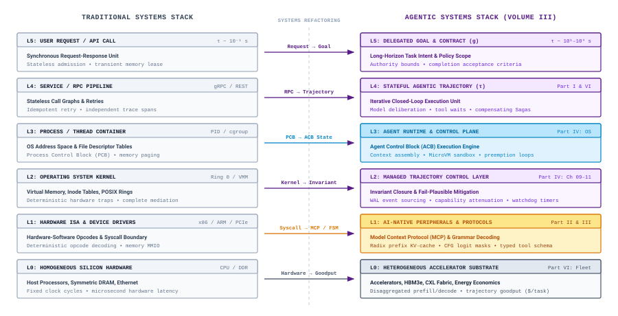
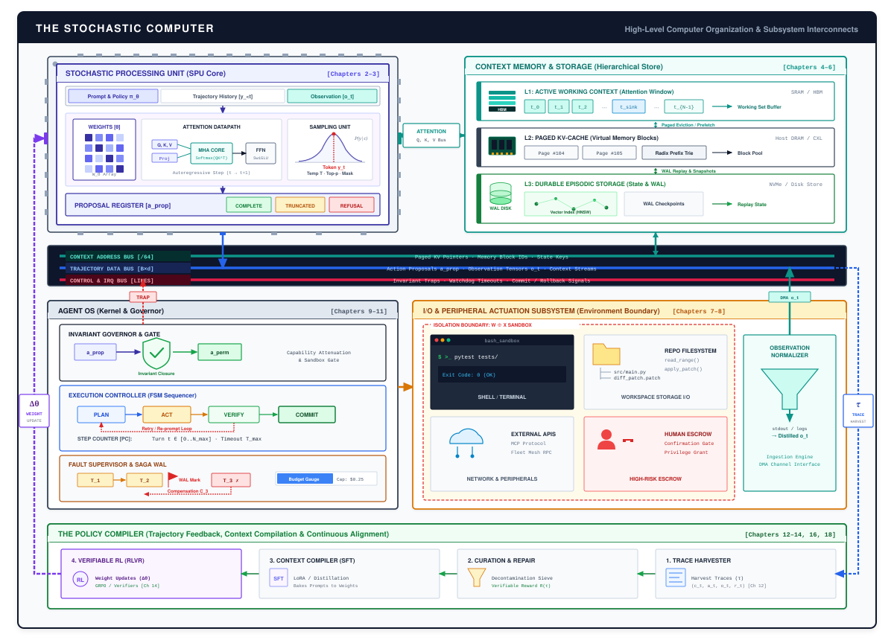

# The Stochastic Computer {#sec-vol3-introduction}

::: {layout-narrow}
::: {.column-margin}

\chapterminitoc

:::

::: {.content-visible when-format="pdf"}
\noindent
{fig-alt="Isometric blueprint of the Stochastic Computer Architecture showing stochastic processor socket, HBM3e memory stacks, isolated tool execution environment, L1 SRAM ring buffer, L2 paged block-table cache, L3 episodic storage vault, and isolated actuation interface."}
:::

::: {.content-visible unless-format="pdf"}
{fig-alt="Isometric blueprint of the Stochastic Computer Architecture showing stochastic processor socket, HBM3e memory stacks, isolated tool execution environment, L1 SRAM ring buffer, L2 paged block-table cache, L3 episodic storage vault, and isolated actuation interface."}
:::

:::

## Purpose {.unnumbered .unlisted}

::: {.content-visible when-format="pdf"}
\begin{marginfigure}
\mlagentstack{30}{30}{30}{30}{30}{30}
\end{marginfigure}
:::

_Why does an accurate model output fail to complete a delegated task?_

A statistical foundation model evaluates context and emits candidate token sequences, but completing an operational task requires advancing from delegated intent to an accepted deliverable backed by verifiable evidence. Whether an agent modifies source code within an isolated sandbox or reconciles financial records to produce an audit report, task success cannot be judged solely by prediction accuracy. Advances in model parameter scale and inference-time reasoning reduce many semantic errors, yet execution remains an external systems responsibility. The surrounding architecture must authorize actions, stage durable state across finite context windows, interpret partial or stale observations, and track resource budgets. Across a multi-step trajectory, intermediate mistakes can propagate into regressions or be corrected by environmental feedback, but the model alone cannot verify system invariants or confirm task completion. Carrying work through execution demands coordinating four functional subsystems: a stochastic processor for learned computation, memory and storage for active and durable state, interfaces for tools and observations, and a runtime for lifecycle governance. This book develops the principles required to specify, design, measure, diagnose, and improve complete digital agentic systems, establishing how learned computation operates within an accountable computer.

::: {.callout-learning-objectives}

- Trace an agent execution trajectory through model invocations, runtime dispatches, observations, and completion checks to separate candidate proposals from external effects.
- Assign functional responsibilities and state ownership across the stochastic processor, context memory, persistent storage, tool interfaces, and agent runtime.
- Specify a complete task contract across Goal, Environment, Permitted Actions, Available Observations, and Completion Criteria, distinguishing bounded empirical evidence from global correctness.
- Evaluate workload constraints using the four engineering dimensions: Execution Duration, Information and Mutable State, Permitted Authority, and Completion Evidence.
- Calculate whole-task elapsed duration and resource occupancy under serial execution ($T_{\text{task}} = T_{\text{model}} + T_{\text{tool}} + T_{\text{wait}} + T_{\text{runtime}}$), demonstrating Amdahl limits and the tool-wait memory tax.
- Justify selecting a fixed workflow versus a model-directed loop for a bounded task against explicit baseline outcomes, total trajectory accounting, and failure costs.

:::

<!-- ======================================================================= -->
<!-- SECTION 1.1: A TASK CARRIED THROUGH EXECUTION                           -->
<!-- ======================================================================= -->
## A Task Carried Through Execution {#sec-vol3-intro-operational-incident}

Consider a concrete software maintenance task. An engineer delegates an automated agent to update a configuration parser so that timeout durations specified in fractional seconds are converted into integer milliseconds. The deliverable is not conversational advice or a code snippet displayed in a chat interface; it is a modified source file accompanied by execution evidence, ready for review.

When an agent receives this delegation, the underlying machine learning model cannot directly alter files, run compilers, or inspect system state. Emitting a token sequence that resembles a patch does not complete the task. An agent runtime must mediate the interaction, translating learned model outputs into structured actions within an external environment, capturing observations, and evaluating whether the change satisfies the requested criteria.

Execution begins when the runtime reads the parser source from disk and stages the text into the model's active context. In response, the model proposes a file edit. Observable in the proposal is a premature type conversion that casts the duration to an integer before scaling:

```python
# Model Proposal 1 (Flawed integer truncation before scaling)
timeout_ms = int(seconds) * 1000
```

Had the runtime accepted this initial text and declared the task complete, the system would have introduced a silent regression. Instead, the runtime intercepts the proposal, applies the modification to an isolated copy of the source tree, and executes an automated test suite with an input of $2.5\text{ seconds}$.

The check executes and returns an observable failure. The test runner does not crash, time out, or encounter an environment error. Instead, the runner reports an assertion failure revealing a semantic defect in the proposed logic:

```text
AssertionError: Expected parse_timeout("2.5s") == 2500, got 2000
```

Because the edit truncated the floating-point value before multiplication, the parser converted $2.5\text{ seconds}$ to $2\text{ seconds}$, returning an integer output of $2000\text{ ms}$ instead of the required $2500\text{ ms}$. The runtime captures this failure as an observation containing the mismatched values and appends the trace to the model's context.

Conditioned on this execution feedback, the model emits a revised edit that preserves the fraction until after scaling:

```python
# Model Proposal 2 (Corrected fractional scaling)
timeout_ms = int(seconds * 1000)
```

The runtime applies the update and reruns the check. The harness executes cleanly, and the assertion passes, returning $2500\text{ ms}$.

As illustrated in @fig-vol3-intro-closed-loop, this cycle of learned proposal, execution interception, observation feedback, and verified repair represents the foundational execution pattern of agentic systems.

::: {#fig-vol3-intro-closed-loop fig-env="figure" fig-pos="htb" fig-cap="**The Closed-Loop Execution Cycle**: An agent advances from delegated intent to an accepted deliverable through iterative model proposals, runtime mediation, sandbox execution, observation capture, and completion assessment. Source: Conceptualized by author based on @yao2023react." fig-alt="Flowchart of closed-loop execution showing Model Context generating an Action Proposal, validated by an Authorization Gate, dispatched to an Isolated Execution Sandbox, emitting Observations back to Context, and evaluated by an Acceptance Assessment Gate."}
{width="100%"}
:::

A passing check allows the runtime to package the modified file and the execution record into the requested deliverable. Yet this single check provides only bounded evidence about system behavior, not mathematical proof of complete correctness. The execution demonstrates that one specific input of $2.5\text{ seconds}$ yields $2500\text{ ms}$ under isolated conditions. It does not establish how the parser handles negative durations, non-numeric values, or extreme magnitudes, nor does it guarantee backward compatibility across dependent callers. Running broader regression suites and conducting peer review reduce operational risk and contribute additional bounded evidence, but residual uncertainty always remains.

Carrying learned decisions through execution is fundamentally a systems problem. The model produces candidate token sequences, but it possesses no execution authority or direct causal agency within the host environment. The surrounding runtime must interpret those proposals, enforce safety boundaries, and dispatch operations against external interfaces governed by stateful side effects and partial failure. Across this trajectory, the system coordinates model invocations, tool dispatches, and environmental feedback to advance from delegated intent to an observable outcome.

<!-- ======================================================================= -->
<!-- SECTION 1.2: GOALS, OBSERVATIONS, DECISIONS, AND EFFECTS               -->
<!-- ======================================================================= -->
## Goals, Observations, Decisions, and Effects {#sec-vol3-intro-trajectory-engine}

Consider delegating the timeout parser migration from the preceding trace. A **goal** ($g$) defines the delegated objective and intended outcome that the agent must achieve. Here, the prompt requests converting fractional seconds to integer milliseconds, yet leaves operational details undefined. For example, it does not specify whether negative durations are rejected or how callers expect zero to behave. When delegated an underspecified goal, an automated agent cannot invent unstated requirements. Depending on its contract, the system must pause for operator clarification, proceed under an explicitly permitted bounded assumption recorded in the execution log, or abstain and escalate. If clarification is unavailable, the runtime cannot guess arbitrarily; unless an adequate bounded assumption is permitted by the task contract, it must halt within its permitted authority.

Advancing from delegated intent to an accepted deliverable generates a **trajectory** ($\tau$), the temporal sequence of model evaluations, runtime actions, and environmental observations:
$$\tau = \big( (a_0, o_1, v_1), (a_1, o_2, v_2), \dots, (a_{N-1}, o_N, v_N) \big)$$
where $a_t$ represents the executed action, $o_{t+1}$ is the environment observation, and $v_{t+1}$ represents the verification evidence collected at step $t+1$.

At each step within this sequence, the runtime populates a **context** ($c_t$) with the goal, accumulated history, and relevant system state. A **model invocation** evaluates this context against learned network weights to produce a **decision**. Rather than manifesting as an unobservable internal state, this decision surfaces as an **action proposal** ($a_{\text{prop}}$), such as a candidate file edit or shell command, or as a candidate deliverable submitted for review.

Because a model possesses no execution authority, an action proposal remains inert until the system intervenes. When an external operation is proposed, a **runtime dispatch** mediates this boundary by performing permission checks, enforcing execution boundaries (such as sandboxing), and executing the call against external interfaces. Dispatched operations that mutate external state produce an **effect** that may be transient or persistent. These effects alter the external environment, reshaping subsequent observations and changing future context inputs. In contrast, read-only operations leave task-relevant state unmodified, though accessing protected data still requires authorization.

The environment's response constitutes an **observation** ($o_{t+1}$), capturing return codes, query results, or error streams. Observations provide only partial and potentially stale information. A passing check verifies only evaluated inputs, and concurrent activity can invalidate measured state immediately. Interleaving model-generated steps with external actions and observations provides a demonstrated structure for coordinating multi-step agent trajectories [@yao2023react].

When the model proposes a candidate deliverable rather than an external action, the runtime assesses it directly without tool dispatch. Bounded stopping and acceptance do not depend solely on the model declaring completion; the runtime independently enforces checks and resource budgets. **Acceptable completion** occurs only when the deliverable and execution evidence satisfy acceptance criteria, providing bounded evidence of operational success rather than absolute correctness.

These primitives connect within an iterative feedback loop that coordinates execution while enforcing operational boundaries. Six conceptual steps govern each cycle:

1. **Continuation Check and Context Assembly:** The runtime verifies resource budgets and continuation permissions before invoking the model, then aggregates the delegated goal, prior observations, and working artifacts into the active context.
2. **Model Invocation:** The runtime invokes the model, which evaluates the context to emit a decision, surfacing as an action proposal or a candidate deliverable.
3. **Action Authorization:** The runtime validates permissions and safety constraints for proposed external operations, pausing if clarification is required; candidate deliverables bypass tool authorization to be evaluated directly.
4. **Runtime Dispatch:** When an external operation is authorized, the runtime applies interface-appropriate isolation and executes the call against external interfaces.
5. **Observation Capture:** For dispatched operations, the runtime collects the environment's response, recording query results or state changes alongside elapsed resource costs.
6. **Completion Assessment:** The runtime independently evaluates candidate deliverables and execution evidence against acceptance criteria, terminating upon acceptable completion, halting on exhausted limits, or continuing to the next cycle.

This cycle distinguishes transient pauses from terminal states. A clarification pause temporarily halts execution to await operator input and resumes once guidance arrives, whereas a supervisory handoff transfers authority away from the system when a task exceeds authorized autonomy. Similarly, exhausting time or token budgets triggers bounded termination rather than an indefinite retry loop.

The formal systems boundary governing this trajectory execution loop is detailed in @fig-trajectory-systems-boundary. As shown, the trajectory progresses through an admissible state space envelope $S_{\text{admissible}} \subset S$ constrained by resource budgets and safety invariants. At each turn $t$, active context $c_t$ is staged into the stochastic processor core to emit an unprivileged action proposal $a_{\text{prop}}$. The runtime verification layer attenuates this proposal against the permitted capability mask $A_{\text{perm}}$, dispatching an authorized mutation $a_{\text{perm}}$ to isolated tool sandboxes and recording state transitions, tool observations $o_{t+1}$, and verification evidence $v_{t+1}$ into a durable trajectory descriptor.

::: {#fig-trajectory-systems-boundary fig-env="figure" fig-pos="htb" fig-cap="**Anatomy and Systems Boundaries of a Managed Trajectory**: Closed-loop trajectory execution progressing through an admissible state space envelope $S_{\\text{admissible}} \\subset S$. At each turn $t$, active context $c_t$ is staged into the stochastic processor core to generate an unprivileged action proposal $a_{\\text{prop}}$. The runtime verification layer attenuates the proposal against permitted capabilities $A_{\\text{perm}}$, dispatches authorized actions $a_{\\text{perm}}$ to isolated sandboxes, and captures environment observations $o_{t+1}$ and test verification evidence $v_{t+1}$ into a durable trajectory descriptor struct." fig-alt="Systems architecture diagram illustrating a managed trajectory passing through an admissible state space envelope, detailing the separation between candidate action proposal, permitted execution, environment feedback, and the structured trajectory descriptor."}
{width="100%"}
:::

<!-- ======================================================================= -->
<!-- SECTION 1.3: THE COMPUTER ARCHITECTURE                                  -->
<!-- ======================================================================= -->
## The Computer Architecture {#sec-vol3-intro-computer-architecture}

Carrying a task through execution requires dividing labor among specialized components. In a software maintenance task, generating an edit requires evaluating patterns over language; tracking files and test results requires managing transient and durable state; interacting with compilers requires structured input and output interfaces; and enforcing budgets and checking completion require runtime governance. Conflating these responsibilities within an ad hoc script obscures where state resides, how decisions are reached, and who holds authority over external systems. Assigning them to explicit architectural components—learned computation, information management, input and output interfaces, and runtime management—provides a functional blueprint modeled on the architecture of a computer, summarized in @tbl-subsystem-contracts.

| Functional Responsibility | Architectural Component         | Primary Interface                                           | Logical State Owned                                                  |
|:--------------------------|:--------------------------------|:------------------------------------------------------------|:---------------------------------------------------------------------|
| Learned computation       | Stochastic processor            | Context token sequence in; action proposals out             | Model parameters and serving-managed per-invocation state            |
| Information management    | Context memory and storage      | Context assembly; persistent read and write operations      | Active working context, persistent records, and external artifacts   |
| Input and output          | Tool and environment interfaces | Structured tool dispatches; observation streams             | External process handles, network sockets, and execution sandboxes   |
| Runtime management        | Agent runtime                   | Trajectory execution loop; budget and authority enforcement | Trajectory history, resource counters, and lifecycle execution state |

: **The Subsystems of the Stochastic Computer**: Division of functional responsibilities across learned computation, memory storage, I/O interfaces, and runtime execution governance. {#tbl-subsystem-contracts tbl-colwidths="[22,25,28,25]"}

At the center of this mapping sits the **stochastic processor**, the learned computational core that evaluates context and emits action proposals. Although implemented through numerical tensor computation on digital hardware, it is termed a stochastic processor because it produces learned conditional outputs within an uncertain task environment. Stochastic sampling is one common source of variation during generation, but it is not required for every invocation. An engineer can configure deterministic decoding ($T = 0$), yet reproducible generation does not make the proposal correct. Even under deterministic decoding, reproducibility requires holding inputs, weights, and execution conditions fixed, while candidate actions remain conditional proposals evaluated against uncertain external state.

Managing information requires distinguishing three different kinds of state rather than treating them as tiers of a single hierarchy:

1. **Working Context:** The transient token sequence assembled into the model's active attention window for the current step, containing prompt instructions, recent observations, and scratchpad reasoning.
2. **Persistent Records:** Durable artifacts maintained outside the context window across the trajectory, including source files, databases, run logs, and retrieval indices.
3. **Serving Inference State:** The numerical tensors managed by the serving engine during generation, such as intermediate activations and Key-Value (KV) attention caches. Although KV caches commonly reside in accelerator high-bandwidth memory (HBM) to minimize latency, their physical placement is an implementation choice that can spill to host memory or NVMe storage.

Distinguishing these kinds of state prevents confusing context limits with durable storage or conflating trajectory history with serving tensors.

This architecture operates as a software-level abstraction rather than a physical machine design. The agent runtime does not replace the host operating system or model-serving infrastructure; it runs on top of them. The host operating system provides process scheduling, virtual memory management, filesystem access, and device drivers. Beside or beneath the runtime, a model-serving engine manages accelerator placement, batches tensor arithmetic, and executes forward passes. The agent runtime coordinates the multi-step trajectory above these substrates, assembling context, validating actions, capturing observations, and evaluating completion. As machine learning systems scale into production, operational reliability depends extensively on these surrounding data flows, configuration boundaries, and feedback mechanisms, not merely on the weights of the learned core [@sculley2015hidden].

To clarify how the Stochastic Computer relates to classical systems design, @fig-stack-comparison-traditional-agentic contrasts the six-layer hierarchy of a traditional operating system (L0–L5) with the corresponding architectural layers of an agentic computing system. Rather than discarding classical systems abstractions, the agent runtime refactors them: atomic requests become goal-directed trajectories, single-threaded Process Control Blocks (PCBs) evolve into stateful Agent Control Blocks (ACBs), POSIX system calls transition to capability-attenuated Model Context Protocol (MCP) tool dispatches, and memory paging extends to multi-tier KV-cache management.

::: {#fig-stack-comparison-traditional-agentic fig-env="figure" fig-pos="htb" fig-cap="**Architectural Stack Comparison: Classical Operating Systems vs. Agentic Computing Systems**: Mapping the classical six-layer operating systems hierarchy (L0–L5) to the agentic computing architecture. The stochastic computer refactors foundational systems abstractions—transforming atomic requests into goal-directed trajectories, process control blocks (PCBs) into agent control blocks (ACBs), POSIX system calls into mediated MCP tool dispatches, and memory paging into KV-cache hierarchy management." fig-alt="Six-layer architectural comparison diagram showing the mapping between classical operating systems and the agentic computing stack from physical hardware to goal specification."}
{width="100%"}
:::

This division of responsibilities reflects a profound historical shift in computing. As illustrated in @fig-evolution-execution-units, the temporal boundaries of computational units have stretched across ten orders of magnitude—from nanosecond silicon machine instructions and millisecond database transactions to multi-hour stateful agent trajectories. As execution units expand across time, failure modes transition from immediate hardware traps to complex semantic regressions that require explicit runtime mediation.

::: {#fig-evolution-execution-units fig-env="figure" fig-pos="htb" fig-cap="**Temporal Stretching of Execution Units Across Ten Orders of Magnitude**: Evolution of computational execution boundaries from nanosecond silicon instructions to multi-hour stateful agent trajectories. As execution stretches across time, failure modes transition from fail-stop hardware traps to complex semantic regressions requiring runtime arbitration." fig-alt="Logarithmic timeline ladder comparing execution units across ten orders of magnitude: Nanosecond silicon CPU instructions, microsecond OS system calls, millisecond database RPC transactions, second neural model forward passes, minute agent task turns, and multi-hour distributed agent trajectories."}
{width="100%"}
:::

A minimal complete stochastic computer requires only these four base responsibilities. Policy adaptation (Part V) and multi-agent coordination (Part VI) are optional extensions rather than core requirements. Policy adaptation updates model weights over time through supervised fine-tuning or reinforcement learning from trajectory feedback, whereas multi-agent coordination partitions tasks across collaborating runtimes. While valuable for specialized workloads, neither extension is required for useful autonomy. A production system using a fixed model inside a single runtime loop can complete complex tasks while avoiding the communication overhead, synchronization hazards, and training costs that extensions introduce.

<!-- ======================================================================= -->
<!-- SECTION 1.4: TASKS AND THEIR REQUIREMENTS                              -->
<!-- ======================================================================= -->
## Tasks and Their Requirements {#sec-vol3-intro-task-specification}

Consider an information-producing task: reconciling an export of payment gateway transactions against an internal order ledger for a single day to produce an itemized discrepancy report. When delegated through an informal prompt such as *"find any mismatched charges"*, the task lacks the operational boundaries required for reliable execution. The runtime cannot determine which filesystem paths are authorized for inspection, whether running custom aggregation scripts is permitted, how much host memory may be allocated to buffer tables, or what standard of evidence validates that the findings are complete and substantiated.

Translating operational intent into a functioning system requires an explicit task specification. As detailed in @tbl-task-specification, five components define this contract: goal, environment, permitted actions, available observations, and completion criteria.

| Task Component             | Specification for Reconciliation Audit                                                                                                                                                                                                                                                  |
|:---------------------------|:----------------------------------------------------------------------------------------------------------------------------------------------------------------------------------------------------------------------------------------------------------------------------------------|
| **Goal**                   | Reconcile daily payment gateway records against an internal order ledger under a declared matching rule, identifying transactions that appear in only one export or have unequal amounts in the shared currency unit, and emit an itemized report citing identifiers and discrepancies. |
| **Environment**            | Isolated container filesystem containing two validated read-only CSV exports (`gateway_settlement.csv` and `internal_orders.csv`) with unique transaction identifiers, alongside a designated output directory `/out/`.                                                                 |
| **Permitted Actions**      | Read source exports; execute scoped data-filtering or aggregation scripts in the sandbox; write the designated deliverable to `/out/audit.json`.                                                                                                                                        |
| **Available Observations** | Tool exit status, standard output, and standard error from executed scripts; file contents and line buffers.                                                                                                                                                                            |
| **Completion Criteria**    | Deliverable `/out/audit.json` conforms to the audit schema, cited identifiers exist in source records, and the reported discrepancy set and amounts match an independent reference comparison over the supplied snapshots.                                                              |

: **The Five-Part Task Contract**: Formalizing delegated intent into an auditable engineering contract for a financial reconciliation task. {#tbl-task-specification tbl-colwidths="[25,75]"}

A complete task specification directly governs how a machine learning system allocates resources across a trajectory. Because context memory is finite, an agent cannot ingest raw datasets when logs span millions of records; the specification determines what data remains in persistent storage and what working subsets are staged into context. Computation divides between the stochastic processor, which evaluates candidate queries and synthesizes findings, and deterministic host compute, which executes data filters and joins. Permitted actions define input and output boundaries, ensuring that source exports remain read-only while write authority is restricted to the designated deliverable path without external network access.

### The reliability wall and bounded verification {#sec-vol3-intro-the-reliability-wall}

Evaluating candidate deliverables requires gathering evidence to overcome the *reliability wall*. In open-loop generation, if each decision step has a probability $p$ of succeeding without error, an unverified trajectory of $N$ steps succeeds with probability $P_{\text{success}} \le p^N$. For an agent operating at $p = 0.95$ across $N = 20$ turns, the compound probability of unassisted success drops to $(0.95)^{20} \approx 0.36$.

Overcoming this geometric decay requires closing the execution loop: interleaving stochastic model proposals with deterministic outcome verification, executable test checks, and majority voting over sampled reasoning paths. However, each verification mechanism provides bounded guarantees under explicit assumptions:

- **Executable Checks:** Verify that outputs satisfy evaluated properties against concrete inputs and reference implementations. In the reconciliation task, matching the reported discrepancies against an independent reference calculation confirms consistency across the supplied snapshots under the declared rule. However, this evidence remains scoped to those files; it cannot certify real-world accounting correctness or uncover transactions omitted from both exports.
- **Source-Based Reasoning:** Analyzes artifacts against explicit models and invariants. Under stated assumptions, inspecting code or schema logic can verify structural properties or analyze potential failure paths, whereas live execution observes what actually occurs during a concrete run.
- **External Acknowledgments:** Guarantee only what their specific interface contract defines. Transport receipt, request acceptance, durable commitment, and confirmed downstream execution are distinct operational states. A storage acknowledgment confirms that a record was written to persistent media under its contract, but it does not independently establish that the recorded values are semantically correct or accurately calculated.

Establishing an explicit contract makes subsequent architectural choices and outcome judgments inspectable. Before evaluating whether an autonomous loop or a deterministic script is warranted, an engineer must first analyze the engineering envelope defined by these task requirements.

<!-- ======================================================================= -->
<!-- SECTION 1.5: THE ENGINEERING ENVELOPE                                   -->
<!-- ======================================================================= -->
## The Engineering Envelope {#sec-vol3-intro-engineering-envelope}

Consider two illustrative tasks that impose starkly different demands on a system. A brief, single-step operation that restarts a production service exercises substantial authority over active users and dependent infrastructure. In contrast, an information-intensive reconciliation task may inspect extensive transaction records across an extended trajectory without modifying source exports, exercising write authority only to emit its designated deliverable.

Sizing the components of a stochastic computer requires mapping such operational demands into an engineering envelope defined by four separate questions: execution duration, information and state, permitted authority, and completion evidence (@tbl-engineering-envelope).

| Engineering Dimension   | Operational Requirement                                                                | Subsystem Design Consequences                                                                                                                                              |
|:------------------------|:---------------------------------------------------------------------------------------|:---------------------------------------------------------------------------------------------------------------------------------------------------------------------------|
| **Execution Duration**  | Decision steps and elapsed execution time across the trajectory ($K_{\max}, T_{\max}$) | Runtime management tracks budgets against deadlines; durable storage retains progress to enable recovery across interruptions.                                             |
| **Information & State** | Volume, lifetime, and validity of task data versus per-invocation context limits       | Tool interfaces and storage filter or stage large datasets; memory subsystems assemble working subsets into context while managing cache validity.                         |
| **Permitted Authority** | Accessible sensitive information and allowed external mutations                        | Input and output interfaces enforce privilege boundaries; runtime policies govern clarification, bounded assumptions, abstention, and escalation.                          |
| **Completion Evidence** | Scope and strength of verifiable checks versus residual uncertainty                    | Completion logic combines executable tests, schema validation, and external acknowledgments to evaluate task criteria, trigger scoped review, or enforce bounded stopping. |

: **The Four Dimensions of the Engineering Envelope**: Mapping operational workload demands to concrete subsystem constraints. {#tbl-engineering-envelope tbl-colwidths="[22,38,40]"}

These four dimensions represent separate engineering questions whose answers interact rather than independent mathematical axes. Brief execution duration does not imply narrow authority; a single privileged configuration dispatch can alter live infrastructure, whereas an extended audit may inspect records across many steps without altering source records, holding write permissions only for its designated deliverable.

Nor are read-only tasks inherently low risk or simple. Reading sensitive ledgers exercises broad information-access authority that must respect confidentiality boundaries, and identifying discrepancies across unverified files can leave weak completion evidence when no independent ground truth exists. Furthermore, requirements across these dimensions frequently intersect. When an audit spans extensive data, information volume forces the system to filter and index durable records rather than streaming raw files into a single context window. That information-management strategy increases the number of tool interactions, extending trajectory duration while simultaneously shaping the verification steps needed before completion.

This paradigm shift highlights how agentic systems depart from earlier programming models. As compared in @tbl-tripartite-comparison, agentic systems (Software 3.0) fundamentally evolve classical deterministic code (Software 1.0) and stateless deep learning inference (Software 2.0) across primary artifacts, execution horizons, state mutability, and failure semantics.

| Characteristic         | Software 1.0 (Classical Code)   | Software 2.0 (Neural Inference)    | Software 3.0 (Agentic Systems)                  |
|:-----------------------|:--------------------------------|:-----------------------------------|:------------------------------------------------|
| **Primary Artifact**   | Explicit human-authored code    | Optimization-tuned weights         | Trajectories & runtime harnesses                |
| **Computational Unit** | Deterministic CPU instruction   | Tensor matrix multiplication       | Multi-turn closed-loop execution                |
| **Execution Horizon**  | Nanoseconds to seconds          | Milliseconds to seconds            | Minutes to hours ($10^1\text{--}10^4\text{ s}$) |
| **State Mutability**   | Deterministic POSIX memory      | Stateless forward pass activations | Stateful environment side effects               |
| **Error Handling**     | Hardware traps, error codes     | Confidence logits, perplexity      | Compensating Sagas, rollback gates              |
| **Verification Basis** | Formal verification, unit tests | Empirical validation loss          | Independent runtime oracles                     |
| **Governance Layer**   | Operating system kernel         | Serving engine scheduler           | Agent runtime executive                         |
| **Authority Scope**    | Sandboxed process permissions   | Read-only matrix evaluation        | Scoped capability leases                        |

: **Tripartite Software Comparison**: Evolutionary comparison of classical POSIX software, deep learning inference, and agentic machine learning systems across core architectural dimensions. {#tbl-tripartite-comparison tbl-colwidths="[18,26,26,30]"}

::: {#pri-invariant-closure .callout-principle title="Invariant closure at runtime boundaries"}

*Invariants requiring mathematical certainty ($P = 1.0$) cannot rely on model self-regulation or prompt adherence; they must be mechanically closed at the deterministic runtime boundary below the neural policy.*

In classical system design, Saltzer's end-to-end argument [@saltzer1984endtoend] asserts that functions placed at low levels of a distributed system may be redundant or of little value compared to providing them at the higher application endpoints. In agentic systems, this logic inverts: because the high-level application endpoint is a non-deterministic stochastic model that can fail plausibly, end-to-end guarantees cannot be delegated to model outputs. Invariant closure demands that critical security, data integrity, and resource boundaries be enforced deterministically by the runtime harness.
:::

<!-- ======================================================================= -->
<!-- SECTION 1.6: SUCCESS, COST, AND APPROPRIATE AUTONOMY                    -->
<!-- ======================================================================= -->
## Success, Cost, and Appropriate Autonomy {#sec-vol3-intro-justifying-autonomy}

Comparing execution efficiency requires clear accounting of elapsed time and resources. Under an explicitly serial execution assumption with no overlapping background operations, total task duration divides into four disjoint categories: model processing, tool execution, standalone waiting, and runtime overhead, as modeled in @tbl-duration-accounting.

$$T_{\text{task}} = T_{\text{model}} + T_{\text{tool}} + T_{\text{wait}} + T_{\text{runtime}}$$

Each term aggregates all occurrences of that activity across the entire trajectory trace:

- $T_{\text{model}}$ encompasses active prompt prefill and autoregressive token generation across all invocations.
- $T_{\text{tool}}$ captures external process execution, compiler runs, and sandbox I/O latencies.
- $T_{\text{wait}}$ accounts for standalone waiting intervals, such as awaiting human approval or external network polling, that do not overlap with other active processing.
- $T_{\text{runtime}}$ represents the active orchestration bookkeeping overhead required for context assembly, schema validation, and state logging.

| Activity Category                             | Measured Interval ($T_i$) | Percentage of Total ($f_i$) | Physical Resource Occupancy                                           |
|:----------------------------------------------|:-------------------------:|:---------------------------:|:----------------------------------------------------------------------|
| **Model Invocations ($T_{\text{model}}$)**    |       $10\text{ s}$       |           $25.0\%$          | Active accelerator compute (GEMM/GEMV) and HBM bandwidth              |
| **Tool Execution ($T_{\text{tool}}$)**        |       $20\text{ s}$       |           $50.0\%$          | Host CPU cores, sandbox container I/O, local disk bandwidth           |
| **Standalone Waiting ($T_{\text{wait}}$)**    |        $5\text{ s}$       |           $12.5\%$          | Idle compute, but retains allocated memory (KV cache, pinned weights) |
| **Runtime Management ($T_{\text{runtime}}$)** |        $5\text{ s}$       |           $12.5\%$          | Host orchestration process memory, SQLite/JSON logging overhead       |
| **Total Trajectory ($T_{\text{task}}$)**      |     **$40\text{ s}$**     |        **$100.0\%$**        | **End-to-end task completion envelope**                               |

: **Serial Duration Accounting for an Agent Trajectory**: Measured breakdown of elapsed wall-clock time across disjoint execution phases for a representative software maintenance task. {#tbl-duration-accounting tbl-colwidths="[30,15,15,40]"}

Analyzing duration across these categories exposes the limits of optimizing model throughput in isolation. Consider applying Amdahl's Law [@amdahl1967] to this measured trace. Suppose an engineering team invests in specialized inference hardware that doubles model generation speed ($s = 2$), cutting model evaluation time in half while tool execution, waiting, and runtime overhead remain unchanged.

The model fraction of total execution is $f = 10 / 40 = 0.25$. Under Amdahl's speedup formula:
$$S_{\text{overall}} = \frac{1}{(1 - f) + \frac{f}{s}} = \frac{1}{0.75 + \frac{0.25}{2}} = \frac{1}{0.75 + 0.125} = \frac{1}{0.875} \approx 1.143$$

The new total task duration becomes:
$$T_{\text{new}} = (1 - f) T_{\text{task}} + \frac{f}{s} T_{\text{task}} = 0.75(40) + 0.125(40) = 30\text{ s} + 5\text{ s} = 35\text{ s}$$

Doubling model execution speed reduces total task duration by only $5\text{ seconds}$, or $12.5\%$, because the remaining $30\text{ seconds}$ of execution is dominated by external tool sandboxes, waiting, and runtime mediation.

Furthermore, duration accounting reveals the **Tool-Wait Memory Tax**: while an agent waits for external tools or human approval ($T_{\text{tool}} + T_{\text{wait}} = 25\text{ s}$), it consumes zero accelerator matrix-multiplication compute, yet it frequently retains multi-gigabyte Key-Value caches and model weights in expensive accelerator HBM. Sizing and scheduling agentic systems requires co-designing compute dispatch with memory offloading.

Evaluating whether autonomy is justified demands benchmarking an agentic loop against a deterministic baseline on identical held-out tasks. An autonomous loop is never justified by default; it carries substantial token expenditure, latency overhead, and failure risks. Autonomy is warranted only when task variability, schema ambiguity, or environment dynamics prevent rigid deterministic scripting, and where the value of task completion exceeds the total operational expenditure across attempts.

<!-- ======================================================================= -->
<!-- SECTION 1.7: A MINIMUM COMPLETE STOCHASTIC COMPUTER                    -->
<!-- ======================================================================= -->
## A Minimum Complete Stochastic Computer {#sec-vol3-intro-minimum-complete-machine}

Translating the timeout parser migration into a functioning stochastic computer requires binding its four functional responsibilities to a concrete operational contract. For this software maintenance task, each subsystem receives declared boundaries, concrete representations, and specific interface contracts:

1. **Stochastic Processor:** Bound to an autoregressive model endpoint with temperature $T = 0.2$, top-$p = 0.95$, and maximum generation limit $K_{\text{tokens}} = 2048$.
2. **Context Memory & Storage:** Active working set constrained to an $8\text{k}$-token context window, paired with persistent local filesystem access restricted to the project repository.
3. **Tool & Actuation Interfaces:** Two typed tools exposed via JSON schemas: `read_file(path, line_start, line_count)` and `apply_patch(path, diff_content)`. Execution occurs inside an ephemeral container sandbox with network egress disabled.
4. **Agent Runtime:** A centralized trajectory loop enforcing a maximum horizon limit $N_{\max} = 10\text{ turns}$, total timeout $T_{\max} = 120\text{ seconds}$, and a financial token budget cap of $\$0.25$.

Now consider an operational challenge: suppose the target source file exceeds the model's active context window ($L_{\text{file}} > B_{\text{context}}$), arriving in bounded chunks. The system must adapt its information management without altering its core task contract:

- **Context Selection:** Rather than attempting to ingest the entire file, the runtime stages only the relevant parser function and recent test outputs into the active context.
- **Persistent References:** The runtime retains file offsets and symbols in durable storage, allowing the agent to request additional context on demand.
- **I/O Contract Expansion:** The tool interface exposes a range-based read primitive (`read_range`), enabling the agent to inspect adjacent declarations without context overflow.
- **Budget Reallocation:** The runtime budgets the additional tool calls and prefill steps within its global trajectory envelope.

This minimum complete machine demonstrates the foundational thesis of this book: reliable autonomous intelligence is achieved not by relying on prompt persuasion, but by architecting a disciplined computing system around learned neural models. As visualized in @fig-vol3-intro-stochastic-computer-block-diagram, the complete organization mirrors classical computer architecture while incorporating the unique closed-loop Policy Compiler feedback mechanism.

::: {#fig-vol3-intro-stochastic-computer-block-diagram fig-env="figure" fig-pos="htb" fig-cap="**The Stochastic Computer Architecture**: High-level block diagram of system organization, bus interconnects, and subsystem boundaries. Modeled on classical computer organization, the architecture divides labor across a Stochastic Processing Unit (SPU), hierarchical context memory and durable storage, a triple-rail system interconnect, an Agent Operating System kernel enforcing invariant closure, and sandboxed I/O peripheral actuation. An outer Policy Compiler closes the cybernetic loop by continuously compiling execution traces into parameter updates ($\\Delta\\theta$)." fig-alt="Schematic block diagram of the Stochastic Computer architecture showing the SPU processor chip, hierarchical context memory, central triple-rail bus, Agent OS kernel, sandboxed I/O peripherals, and outer Policy Compiler feedback loop."}
{width="100%"}
:::

The remainder of this book explores each subsystem of the Stochastic Computer in depth:

- **Part I: The Stochastic Processor (@sec-vol3-processor and @sec-vol3-deliberation)** examines the external invocation contract, grammar-constrained decoding, and inference-time deliberation.
- **Part II: Context Memory & Storage (@sec-vol3-working-sets, @sec-vol3-virtual-memory, and @sec-vol3-episodic-memory)** analyzes finite attention working sets, PagedAttention virtual memory, and episodic retrieval persistence.
- **Part III: Tools & Actuation I/O (@sec-vol3-actuation and @sec-vol3-virtualization)** formalizes typed tool schemas, Model Context Protocol (MCP) transport, and hardware-isolated virtualization sandboxes.
- **Part IV: The Agent Operating System (@sec-vol3-checkpointing, @sec-vol3-interrupts, and @sec-vol3-scheduling)** engineers Write-Ahead Logging checkpointing, compensating Saga recovery, asynchronous interrupt signals, and multi-resource schedulers.
- **Part V: The Policy Compiler (@sec-vol3-data-flywheel, @sec-vol3-sft, and @sec-vol3-rlvr)** investigates synthetic data flywheels, masked trajectory fine-tuning (SFT), and reinforcement learning with verifiable rewards (RLVR).
- **Part VI: Distributed Fleets & Operations (@sec-vol3-multiagent, @sec-vol3-observability, and @sec-vol3-tokenomics)** scales to hierarchical multi-agent trees, OpenTelemetry trajectory tracing, and task-level tokenomics.
- **Part VII: Synthesis (@sec-vol3-conclusion and @sec-vol3-app-reference-architecture)** brings all subsystems together in a complete reference architecture for autonomous systems.

<!-- ======================================================================= -->
<!-- FALLACIES AND PITFALLS                                                  -->
<!-- ======================================================================= -->
## Fallacies and Pitfalls {#sec-vol3-intro-fallacies}

::: {.fallacy-pitfall}

**Fallacy:** *An accurate model response completes an operational task.*

*Why it fails:* Emitting text that resembles a correct solution is fundamentally distinct from executing a task in an external environment. A model possesses no execution authority or ambient state awareness; an edit proposal remains inert until an agent runtime authorizes, sandboxes, dispatches, and independently verifies the modification against concrete acceptance criteria.

:::

---

::: {.fallacy-pitfall}

**Pitfall:** *Treating a passing test as mathematical proof of correctness.*

*Why it fails:* A passing unit test certifies only that the evaluated input values satisfied assertions under isolated execution conditions. It does not certify behavior for unmodeled edge cases, negative numbers, or concurrent environment mutations. Engineering systems requires recognizing that executable checks provide bounded empirical evidence, not global mathematical certainty.

:::

---

::: {.fallacy-pitfall}

**Fallacy:** *Doubling model generation throughput halves total task completion time.*

*Why it fails:* In multi-step agentic trajectories, model generation frequently accounts for only a fraction of total elapsed time ($T_{\text{model}} / T_{\text{task}} \approx 20\text{--}30\%$). Under Amdahl's Law, when external tool execution, I/O latency, and runtime bookkeeping dominate the critical path, doubling model generation speed yields diminishing returns on end-to-end task duration.

:::

<!-- ======================================================================= -->
<!-- SUMMARY TAKEAWAYS                                                       -->
<!-- ======================================================================= -->
## Summary Takeaways {#sec-vol3-intro-summary}

- **The task is the engineering boundary:** A model response is merely one event within an extended trajectory that coordinates observations, external mutations, waiting intervals, and completion evidence.
- **The architecture assigns responsibilities:** Learned computation, information management, input/output peripherals, and runtime governance provide an enduring functional map; the implementation must establish explicit, typed contracts between them.
- **Workload requirements determine the needed machinery:** Duration, information state, permitted authority, and completion evidence define the operational engineering envelope, revealing distinct constraints across superficially similar agents.
- **Capability requires task-level evidence:** Plausible generation cannot certify operational correctness; evaluating agent systems demands explicit acceptance criteria, held-out trial sets, and whole-task resource accounting.

<!-- ======================================================================= -->
<!-- CHAPTER CONNECTION                                                      -->
<!-- ======================================================================= -->
## Chapter Connection {#sec-vol3-intro-connection}

::: {.callout-note title="Connecting to the stochastic processor"}

In this chapter, we established the whole-system trajectory boundary and mapped the four functional subsystems of the Stochastic Computer.

In @sec-vol3-processor (*The Stochastic Processor*), we inspect the computational core of this machine. We analyze the external invocation contract between the runtime and the foundation model, formalize how context conditioning shapes next-token sampling distributions, examine the bounded guarantees of Context-Free Grammar (CFG) constrained decoding, and decompose the latency and compute asymmetries between prompt prefill and token generation.
:::

```{=latex}
\part{key:vol3_processor}
```
