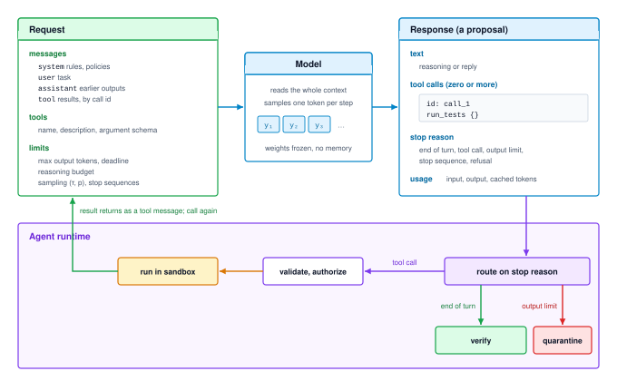

# The Foundation Model {#sec-vol3-foundation-model}

::: {layout-narrow}
::: {.column-margin}

\chapterminitoc

:::

::: {.content-visible when-format="pdf"}
\noindent
{fig-alt="Isometric illustration of a small robot laying orange token tiles along a track while a larger robot checks them, turning accepted tiles green and diverting a rejected red tile into a bin. Labels read token proposal stream, draft model execution core, memory streaming bus, target verification engine, token acceptance pool, and rollback diversion gate."}
:::

::: {.content-visible unless-format="pdf"}
{fig-alt="Isometric illustration of a small robot laying orange token tiles along a track while a larger robot checks them, turning accepted tiles green and diverting a rejected red tile into a bin. Labels read token proposal stream, draft model execution core, memory streaming bus, target verification engine, token acceptance pool, and rollback diversion gate."}
:::

:::

## Purpose {.unnumbered .unlisted}

\begin{marginfigure}
\mlagentstack{0}{0}{0}{0}{0}{100}
\end{marginfigure}

_Why is the most capable component of an agent the one whose output can never be executed as returned?_

Every turn of an agent is one call to a foundation model. The runtime sends a context of messages, tool definitions, and limits, and the model returns a proposal: some text, a structured object, or a request to call a tool, together with a reason for stopping. That proposal is fluent and often right, but it is unverified, it can differ when the same request is sent twice, and it has a price that grows with every token the model writes and every token the agent re-sends on the next turn. A runtime that mistakes a clean stop for a finished task, a well-formed object for a correct one, or a model call for a cheap one builds every later mechanism on a false assumption. The call is therefore a contract with three parts: what the model reads, what it returns, and what it costs. A single call runs one turn, keeps nothing between calls, and acts on nothing, so it adds none of the H·S·A exposures, and every later part of the book measures horizon, state, and authority outward from this one contract.

::: {.content-visible when-format="pdf"}

\newpage

:::

::: {.callout-learning-objectives}

- Explain how a foundation model turns a context of tokens into a proposal, and which decisions around the call belong to the runtime.
- Budget a model call in tokens against a fixed context window, reserving headroom for the output.
- Explain why a model call is nondeterministic, including at temperature zero, and what that implies for replay and evaluation.
- Specify a model call's request and response: messages and roles, tool definitions, output and reasoning limits, stop reasons, and a normalized status envelope.
- Distinguish grammar-constrained decoding from trained tool-call formatting, and syntactic validity from correctness.
- Estimate the latency of one call and the token cost of a multi-turn trajectory, with and without prefix caching.
- Evaluate competing model interfaces by verified task success at a matched budget rather than by parse rate.

:::

```{python}
#| label: calc-vol3-foundation-model-call-price
#| echo: false
# ┌─────────────────────────────────────────────────────────────────────────────
# │ THE PRICE OF A MODEL CALL AND OF A TRAJECTORY (LEGO)
# ├─────────────────────────────────────────────────────────────────────────────
# │ Context: @sec-vol3-foundation-model-cost (worked estimate), the streaming
# │          cancellation example in @sec-vol3-foundation-model-contract, the
# │          interface comparison in @sec-vol3-foundation-model-interface-design,
# │          and the first fallacy.
# │
# │ Goal: Price one agent turn and one multi-turn trajectory in tokens and
# │       seconds, so every number the chapter quotes about call cost comes
# │       from one set of inputs.
# │ Show: Per-token decode and prefill floors, their ratio, per-call latency,
# │       tokens processed per trajectory with and without prefix caching,
# │       final KV footprint, cancellation savings, interface latencies.
# │ How:  Decode floor = weight bytes / memory bandwidth (batch of one).
# │       Prefill floor = 2 x parameters / peak 8-bit rate. Trajectory re-send
# │       is an arithmetic series over turns. Model and accelerator specs come
# │       from the MLSysIM registry (Llama-3.1-70B, H100); the prose names
# │       neither and speaks of a 70-billion-parameter model on a current
# │       datacenter accelerator.
# └─────────────────────────────────────────────────────────────────────────────
from mlsysim import *
from mlsysim.fmt import fmt_qty_int

class CallPrice:
    # ┌── 1. LOAD (Constants & Parameters) ─────────────────────────────────
    model = Models.Language.Llama3_70B
    accel = Hardware.Cloud.H100
    agent = Agents.Coding.SWE_Bench_Runner
    weight_bytes = 1  # 8-bit weights, bytes per parameter
    kv_bytes = 2  # 16-bit KV cache, bytes per element
    s0 = 8_000  # scenario: first-turn prompt (system prompt, tool definitions, task)
    delta = 1_500  # scenario: tokens appended per turn (model output plus tool result)
    k_turn = 200  # scenario: output tokens per turn (short reasoning plus one tool call)
    turns = agent.max_trajectory_steps
    k_cap = 4_096  # scenario: max-output field in the cancellation example
    k_cut = 96  # scenario: token at which the stream validator rejects
    k_full = 1_850  # scenario: whole-file rewrite, output tokens
    k_diff = 80  # scenario: anchored diff, output tokens
    dm_full = 350  # scenario: extra prompt tokens that specify the rewrite format
    dm_diff = 120  # scenario: extra prompt tokens that specify the diff format
    deadline_s = 15.0  # scenario: per-call deadline
    syntax_ok = 0.95  # scenario: share of diffs whose anchors match the file
    fix_rate = 0.60  # scenario: share of well-formed diffs that pass the tests

    # ┌── 2. EXECUTE (Compute) ─────────────────────────────────────────────
    params = model.parameters.to(ureg.count).magnitude
    bw = accel.memory.bandwidth.to(ureg.byte / ureg.second).magnitude
    peak = accel.compute.precision_flops["fp8"].to(ureg.flop / ureg.second).magnitude
    t_dec = params * weight_bytes / bw  # seconds per output token, batch of one
    t_pre = 2 * params / peak  # seconds per prompt token at the peak rate
    ratio = t_dec / t_pre

    call1_pre = s0 * t_pre
    call1_dec = k_turn * t_dec

    sent_nocache = turns * s0 + delta * turns * (turns - 1) // 2
    sent_cache = s0 + delta * (turns - 1)
    out_total = turns * k_turn
    cache_saving = sent_nocache / sent_cache
    input_share = sent_nocache / (sent_nocache + out_total)
    pre_nocache = sent_nocache * t_pre
    pre_cache = sent_cache * t_pre
    dec_total = out_total * t_dec

    head_dim = model.hidden_dim // model.heads
    kv_per_tok = 2 * model.layers * model.kv_heads * head_dim * kv_bytes
    kv_final_gb = sent_cache * kv_per_tok / 1e9
    weights_gb = params * weight_bytes / 1e9

    cancel_steps = k_cap - k_cut
    cancel_s = cancel_steps * t_dec

    t_full = (s0 + dm_full) * t_pre + k_full * t_dec
    t_diff = (s0 + dm_diff) * t_pre + k_diff * t_dec
    speedup = t_full / t_diff
    pass_diff = syntax_ok * fix_rate

    # ┌── 3. GUARD (Invariants) ───────────────────────────────────────────
    check(ratio > 100, f"An output token should cost two orders of magnitude more time than a prompt token, got {ratio:.0f}")
    check(call1_dec > call1_pre, "Per call, output tokens should dominate latency")
    check(input_share > 0.95, "Per trajectory, re-sent input should dominate tokens processed")
    check(cache_saving > 10, f"Prefix caching should cut prefill tokens by more than 10x, got {cache_saving:.1f}")
    check(t_full > deadline_s > t_diff, "The rewrite must miss the deadline and the diff must meet it")

    # ┌── 4. OUTPUT (Formatting) ──────────────────────────────────────────
    params_b_str = fmt(params / 1e9, precision=1)
    bw_str = fmt(bw / 1e12, precision=2)
    t_dec_ms_str = fmt_qty(t_dec * second, ms, precision=1)
    t_pre_us_str = fmt_qty_int(t_pre * second, microsecond)
    ratio_str = fmt_int(ratio)
    s0_str = fmt_int(s0)
    delta_str = fmt_int(delta)
    k_turn_str = fmt_int(k_turn)
    turns_str = fmt_int(turns)
    call1_pre_str = fmt(call1_pre, precision=2)
    call1_dec_str = fmt(call1_dec, precision=1)
    sent_nocache_str = fmt_int(sent_nocache)
    sent_cache_str = fmt_int(sent_cache)
    out_total_str = fmt_int(out_total)
    cache_saving_str = fmt_int(cache_saving)
    input_share_str = fmt_percent(input_share, precision=1)
    pre_nocache_str = fmt_int(pre_nocache)
    pre_cache_str = fmt(pre_cache, precision=1)
    dec_total_str = fmt_int(dec_total)
    kv_final_gb_str = fmt_qty_int(kv_final_gb * GB, GB)
    weights_gb_str = fmt_qty_int(weights_gb * GB, GB)
    k_cap_str = fmt_int(k_cap)
    k_cut_str = fmt_int(k_cut)
    cancel_steps_str = fmt_int(cancel_steps)
    cancel_s_str = fmt_int(cancel_s)
    k_full_str = fmt_int(k_full)
    k_diff_str = fmt_int(k_diff)
    dm_full_str = fmt_int(dm_full)
    dm_diff_str = fmt_int(dm_diff)
    deadline_str = fmt_int(deadline_s)
    t_full_str = fmt_int(t_full)
    t_diff_str = fmt(t_diff, precision=1)
    speedup_str = fmt_int(speedup)
    syntax_ok_str = fmt_percent(syntax_ok, precision=0)
    fix_rate_str = fmt_percent(fix_rate, precision=0)
    pass_diff_str = fmt_percent(pass_diff, precision=0)
```

## The Model at the Center of an Agent {#sec-vol3-foundation-model-role}

::: {.column-margin}
{width="100%" fig-alt="H·S·A locator with all three axes gray and only the origin dot highlighted in purple, marking a single model call with no exposure."}

*A single call runs one turn, carries no state, and holds zero ambient authority.*
:::

A coding agent is asked to make a failing test pass. On its first turn the harness sends the model about `{python} CallPrice.s0_str` tokens: a system prompt that states the agent's rules, the task, and the definitions of three tools, `read_file`, `edit_file`, and `run_tests`. The model does not return a fix. It returns one sentence of reasoning, a structured request to call `run_tests` with no arguments, and a stop reason saying that it stopped to wait for a tool. Nothing has run yet. The harness decides whether to honor the request, runs the tests in a sandbox, appends their output to the conversation as a new message, and calls the model again. Every turn of every trajectory in this book is a repetition of that exchange, the loop of @sec-vol3-intro-trajectory-engine seen from the inside of one step.

The component at the center of that exchange is the foundation model, the neural core of the agent. It reads the whole context the runtime assembles, parses what the task, the history, and the tool results say, and proposes the next action. Concretely, a **foundation model**\index{Foundation model!in an agent} is a large network pretrained on broad text and code and then post-trained to follow instructions and to emit tool calls in a fixed format [@schick2023toolformer; @patil2023gorilla]. At inference time its weights are frozen. One call is a function of three things only: the tokens in the context, the sampling settings, and the weights. The model keeps no memory between calls, so anything the agent needs it to know on the next turn must be sent again.

Three properties of that function shape everything the runtime builds around it. The output is a **proposal**\index{Proposal!model output}, not a result. It is fluent and plausible whether or not it is correct, which is the fail-plausible fault model of @sec-vol3-intro-fail-plausible applied to one call. The output is nondeterministic, so the same request can yield a different proposal. The output is priced in tokens and seconds, and that price grows in ways that are easy to misjudge. Because the model holds zero ambient authority (@sec-vol3-intro-operational-incident), none of its output changes anything until the runtime acts on it. The runtime therefore owns every decision that has consequences, and @tbl-vol3-foundation-model-responsibilities names what each familiar model term obliges the runtime to do.

| Model term                  | Runtime responsibility                                                        | Failure if the runtime ignores it                                    |
|:----------------------------|:------------------------------------------------------------------------------|:---------------------------------------------------------------------|
| **Context window**          | Assemble the context and keep it, plus the output limit, under the window     | Truncated input or output; a tool call cut off mid-argument          |
| **Sampling settings**       | Choose them per call and record them with the output                          | Trajectories that cannot be explained or reproduced                  |
| **Tool call**               | Validate, authorize, and execute it, then return the result as a message      | Malformed or unauthorized effects on the environment                 |
| **Stop reason**             | Route the loop on it: dispatch, verify, quarantine, or escalate               | A truncated or refused output treated as a finished one              |
| **Fluent but wrong output** | Check the proposal against the environment with checks outside the model      | Plausible corruption that passes every surface test                  |
| **Successful response**     | Treat transport success as delivery of a proposal, not completion of the task | The delivery fallacy: a status code taken as evidence of correctness |

: **What the Runtime Owns Around a Model Call**: Each model-side concept creates a runtime obligation, and each unmet obligation has a characteristic failure. {#tbl-vol3-foundation-model-responsibilities}

The last row names an error common enough to deserve a name. A harness that receives a successful response from the model service, parses the body, and acts on it has confused delivery with completion. A successful response says only that the request reached the service and a generation finished. It says nothing about whether the output was cut off, refused, or wrong. This chapter calls that confusion the **delivery fallacy**\index{Delivery fallacy}, and most of the mechanisms that follow exist to prevent it.

The rest of the chapter takes the call apart in the order the runtime meets it. The runtime must first count what the model counts, which is tokens, and fit them under the context window. It must then understand how the model produces its output, one sampled token at a time, because that process sets both the latency and the variability of a call. With those two facts in place, the call surface, the typed request and response that make a model call something a loop can be built on, follows naturally, and after it come structured output, the verification a proposal still needs, the price of a call, and how to choose an interface.

## Tokens and the Context Window {#sec-vol3-foundation-model-tokenization}

An agent that watches a failing build will eventually paste a compiler log into its context. If the runtime budgets that log with the familiar rule of thumb of four characters per token, it will underestimate it, because logs full of paths, hashes, escape sequences, and quoted JSON break into far more tokens per character than English prose does. The underestimate matters because the window is a hard limit. A runtime that cannot count what the model counts cannot promise that the next call fits.

A **token**\index{Token!unit of interface} is the unit the model reads and writes. Before a call, a tokenizer maps the text of the context into a sequence of integer identifiers drawn from a fixed vocabulary, typically tens of thousands to a few hundred thousand entries. Most models use byte-pair encoding, which builds the vocabulary by repeatedly merging the most frequent adjacent byte pairs in a training corpus [@sennrich2016subword]. Frequent strings such as common words and keywords become single tokens. Rare strings, such as a random identifier or a hash, fall apart into several shorter pieces, down to single bytes if necessary, so no input is ever out of vocabulary. The model's output is also a sequence of token identifiers, decoded back into text.

Tokens are the unit of three things at once. They are the unit of interface, because the model sees only token sequences. They are the unit of cost, because services meter calls in input and output tokens and because the time a call takes grows with the tokens it processes and emits. They are the unit of capacity, because the context window is measured in tokens. Every budget in the rest of this book, from context assembly to cost per accepted task, is ultimately a token count.

Because the merges come from corpus statistics rather than from any programming language's grammar, tokenization is indifferent to syntax. Leading whitespace is usually merged into the word that follows it, so the same keyword receives a different token identifier at the start of a line than it does after four spaces of indentation, and the model must learn from data that the two denote the same construct. Structured payloads suffer in a second way. The quotes, braces, backslashes, and newlines of escaped JSON rarely merge with their neighbors, so a tool call that embeds a shell command with flags and quoted patterns spends many tokens on punctuation. Two engineering rules follow. The runtime counts tokens with the model's own tokenizer rather than estimating from characters, and interfaces that require heavy escaping cost more output tokens than interfaces that do not, a cost that @sec-vol3-foundation-model-interface-design weighs.

The **context window**\index{Context window!hard limit} is the maximum number of tokens one call can hold, the prompt and the generated output together. If $S$ is the prompt length, $K_{\max}$ the output limit the runtime requests, and $S_{\max}$ the window, every call must satisfy

$$S + K_{\max} \le S_{\max}$$ {#eq-vol3-context-budget}

The window is fixed by how the model was trained and served, not by the runtime's needs. When a call would violate @eq-vol3-context-budget, one of two things happens. The service rejects the request outright, or it accepts a prompt that leaves too little room and cuts the output off when the window fills. The second case is the dangerous one, because the output simply stops:

```json
{"tool": "run_command", "command": "find /var/log -name '*.log' -exec grep -H 'FATAL' {} \;
```

The command above has no closing quote or brace. Passed to a JSON parser, it raises an error. Passed to a lenient extractor and then to a shell, it may run a command the model never finished writing. The service reports such an output with a length stop reason, and @sec-vol3-foundation-model-contract turns that report into a rule: an output cut off by a limit is never executed.

What goes into the window, and what is summarized or dropped when it fills, is the subject of @sec-vol3-context-engineering. This chapter needs only the limit itself and one fact about its cost. While the model processes a context, it keeps intermediate state for every token in the window, the **KV cache**\index{KV cache!definition}, so memory grows linearly with context length. @Sec-vol3-kv-cache manages that memory, and @sec-vol3-appendix-inference-kv-cache derives its size.

The window bounds how many tokens a call can hold. How the model fills the output part of that window, one token at a time, determines how long the call takes and why two identical calls can disagree.

## Autoregressive Sampling {#sec-vol3-foundation-model-autoregressive}

Send the coding agent's first request twice and the two replies may differ. One calls `run_tests`. The other calls `read_file` on the test first. Both are reasonable, and the difference is not a bug in the service. It follows from how the model produces its output, one token at a time, each drawn from a probability distribution the model computes from everything before it. That process explains two facts an agent engineer must plan around, that a call's latency grows with the length of its output and that its output varies.

### One token at a time

A foundation model defines a probability distribution over output sequences $\mathbf{y} = (y_1, \dots, y_K)$ given a prompt $\mathbf{x}$, and it factors that distribution into a product of next-token conditionals (@eq-autoregressive-factorization):

$$P(y_{1:K} \mid \mathbf{x}) = \prod_{t=1}^{K} P(y_t \mid \mathbf{x}, y_{1:t-1})$$ {#eq-autoregressive-factorization}

At each step $t$ the network maps the prompt and the tokens generated so far to a vector of scores $\mathbf{z}_t$, the **logits**\index{Logits}, one per vocabulary entry. The serving system turns those scores into a distribution, draws one token, appends it to the sequence, and runs the next step. This is **autoregressive generation**\index{Autoregressive generation}, and its defining constraint is serial dependence. Step $t$ cannot begin until the token at step $t-1$ has been chosen, because that token is part of step $t$'s input. Emitting $K$ output tokens therefore takes $K$ sequential steps, and the time of a call grows linearly with the number of tokens the model writes. @Sec-vol3-foundation-model-cost puts a number on each step.

The serving system can shorten each step or batch many requests' steps together, but it cannot remove the chain. Speculative decoding, for example, lets a small draft model propose several tokens that the large model then checks in a single step, and an acceptance rule keeps the output distribution exactly that of the large model [@leviathan2023fast]. The gain is a constant factor on the chain, not a way around it, and @sec-vol3-appendix-inference-decode-loop derives the acceptance rule. For the agent, the lesson is that output length is the latency it controls.

### Sampling controls

How the next token is chosen from the logits is set by a few request fields. The first is the **temperature**\index{Temperature (sampling)} $\tau$, which rescales the logits before they are normalized (@eq-temperature-softmax):

$$P(y_t = v \mid \mathbf{x}, y_{<t}) = \frac{\exp\left(z_{t, v} / \tau\right)}{\sum_{w \in \mathcal{V}} \exp\left(z_{t, w} / \tau\right)}$$ {#eq-temperature-softmax}

As $\tau$ approaches zero, the distribution collapses onto the highest-scoring token, which is **greedy decoding**. At $\tau = 1$ the model's own distribution is used unchanged, and larger values flatten it toward uniform. Temperature alone leaves a long tail of unlikely tokens with nonzero probability, and one draw from that tail can derail everything after it, because every later step conditions on the bad token. Two truncation rules cut the tail before sampling. Top-$k$ keeps the $k$ highest-scoring tokens regardless of how the probability is spread. Top-$p$, or nucleus sampling, keeps the smallest set of tokens whose probabilities sum to at least $p$, so the set shrinks when the model is confident and grows when it is not [@holtzman2020curious]. The notebook below works one step through all three controls.

::: {.column-margin}
{width="100%" fig-alt="Ranked vocabulary probability distribution: the top two tokens capture most of the probability mass and fall inside the top-p set at p equal to 0.90, while a top-k rule with k equal to 4 also admits two low-probability tail tokens."}

*Top-p keeps the two likely tokens; top-k with k = 4 also admits the tail.*
:::

::: {#nbk-02-logit-scaling-and-truncation-on .callout-notebook title="Temperature and nucleus truncation on one decoding step"}

**Problem**: A decoding step over a five-token vocabulary produces logits $\mathbf{z}_t = [12.0, 10.5, 9.0, 6.0, 3.0]$. How much probability does the top token receive at $\tau = 1.0$ and at $\tau = 0.5$, and which tokens survive nucleus truncation at $p = 0.90$?

**Math**: At $\tau = 1.0$ the exponentials are $[162754.8, 36315.5, 8103.1, 403.4, 20.1]$, which sum to $207596.9$, so

$$\mathbf{P}_{\tau=1.0} = [0.7840, 0.1749, 0.0390, 0.0019, 0.0001]$$

At $\tau = 0.5$ each logit doubles to $[24.0, 21.0, 18.0, 12.0, 6.0]$. The exponentials are $[2.649 \times 10^{10}, 1.319 \times 10^{9}, 6.566 \times 10^{7}, 1.628 \times 10^{5}, 403.4]$, which sum to about $2.788 \times 10^{10}$, so

$$\mathbf{P}_{\tau=0.5} = [0.9502, 0.0473, 0.0024, 0.0000, 0.0000]$$

For the nucleus at $p = 0.90$, sort the $\tau = 1.0$ probabilities and accumulate. The first token alone reaches $0.7840 < 0.90$. Adding the second reaches $0.9589 \ge 0.90$, so the nucleus is $\{v_1, v_2\}$. Renormalizing over that set gives $P(v_1) = 0.7840 / 0.9589 = 0.8176$ and $P(v_2) = 0.1749 / 0.9589 = 0.1824$.

**Systems insight**: Halving the temperature moved the top token from 78 to 95 percent of the mass, and nucleus truncation removed the tail entirely while keeping a real choice between the two plausible tokens. Both controls trade diversity for predictability, and neither makes the chosen token correct.

:::

The model stops producing tokens for one of a small number of reasons, and each becomes a field the runtime reads. The model may emit its end-of-turn token. It may emit a string the request listed as a stop sequence. It may finish a tool call, after which it stops to wait for the result. Or it may reach the output limit $K_{\max}$ the runtime set. These are the **stop conditions**\index{Stop condition} of generation, and @sec-vol3-foundation-model-contract shows how the service reports them and how the loop branches on them.

### Nondeterminism

A model call is **nondeterministic**\index{Nondeterminism!model call}: the same request can produce different outputs. Part of this is by design. With $\tau > 0$ each step is a random draw, and two draws can pick different tokens at the first position where the distribution is not sharply peaked. After that the two outputs condition on different histories and usually diverge for good.

Setting $\tau = 0$ removes the random draw but does not make a served call reproducible. A serving system batches each request with whatever other requests are in flight, and the batch size changes how the arithmetic inside the network is split and ordered. Floating-point addition is not associative, so summing the same numbers in a different order can change the last bits of a logit. Most of the time that changes nothing. When two candidate tokens have nearly equal scores, it flips which one is largest, and from that token on the greedy output follows a different path. The provider may also change the model or its serving configuration between calls. A request sent twice at temperature zero is therefore likely, but not guaranteed, to return the same output.

Nondeterminism has two consequences that later chapters build on. A trajectory cannot be reproduced by calling the model again with the same inputs, so a system that must replay or audit a run records every model output as it happened and replays from the record (@sec-vol3-durable-execution). A single run also measures one sample from a distribution, so an agent's success rate must be estimated over repeated runs, with the statistics of @sec-vol3-evaluation. Low temperature carries its own failure as well. A greedy decoder that enters a repetition loop, emitting the same line or cycling between two statements, chooses the same continuation every time and stays in the loop until the output limit ends the call. The output limit is what bounds that failure.

::: {#chk-02-context-exhaustion-quarantine .callout-checkpoint title="Tokens, windows, and sampling"}

The window, the output limit, and the sampling settings are the first fields the runtime sets on every call.

- [ ] **Token budget**: Why does a character-based estimate undercount a compiler log or an escaped JSON payload, and what should the runtime count with instead?
- [ ] **Window arithmetic**: A model has a 32,000-token window and the runtime reserves 4,000 tokens for output. How large may the assembled prompt be, and what happens to a tool call being written when the window fills?
- [ ] **Serial generation**: Why does a call that emits 2,000 tokens take roughly ten times as long in decode as one that emits 200, regardless of how much parallel hardware serves it?
- [ ] **Temperature zero**: Why can two identical calls at temperature zero return different tool calls, and what must a system record if it needs to replay a trajectory?

:::

Tokens, a window, a serial sampler, and a small set of stop conditions describe what the model does. The runtime needs a stable way to ask for a call and to read what comes back, and that interface is the subject of the next section.

## The Call Surface {#sec-vol3-foundation-model-contract}

A harness that treats the model as a function from one string to another cannot tell a finished tool call from one cut off by the output limit, or an answer from a refusal, because all of them arrive as text. It also has no place to put the tool definitions, the prior tool results, or the limits the call must respect. Every production model interface therefore exposes a typed request and a typed response. This chapter calls the pair the **call surface**\index{Call surface!definition}: the messages, tools, and limits the runtime sends, and the proposal, stop reason, and usage the model service returns. The loop of @sec-vol3-intro-trajectory-engine is built entirely out of this surface, and @fig-vol3-model-call-surface shows one turn of it.

::: {#fig-vol3-model-call-surface fig-env="figure" fig-pos="htb" fig-cap="**One Turn of the Call Surface**: The runtime sends a request holding the conversation as role-tagged messages, the tool definitions, and the call's limits. The model returns a response holding a proposal (text and zero or more tool calls, each with an identifier), a stop reason, and token usage. The runtime routes on the stop reason. A tool-call stop leads to validation and sandboxed dispatch, and the tool's result returns to the conversation as a tool message keyed by the call identifier before the next call. An end-of-turn stop leads to verification, and a stop at the output limit leads to quarantine." fig-alt="Diagram of one agent turn. On the left, a request card lists system, user, assistant, and tool messages, tool definitions with name, description, and argument schema, and limits for maximum output tokens, reasoning budget, sampling, and stop sequences. An arrow leads to a model card that samples tokens one at a time. An arrow leads to a response card listing text, a tool call with id, name, and arguments, a stop reason, and usage. Below, a runtime router branches on the stop reason: tool call to validate, authorize, and dispatch in a sandbox, whose result returns as a tool message to the request; end of turn to verify; output limit to quarantine."}

:::

### The request

The request carries the conversation as a list of **messages**\index{Message roles}, each tagged with a role. The system message holds the agent's standing instructions and policies. User messages hold the task and anything a person adds later. Assistant messages hold the model's own earlier outputs, including the tool calls it made. Tool messages hold the results of those calls, each keyed by the identifier of the call it answers. Because the model keeps nothing between calls, the runtime sends this whole transcript on every turn, and the transcript the runtime keeps is the only memory the model has of the task so far.

Next to the messages, the request lists the **tool definitions**\index{Tool definition!in the request}. Each gives a name, a short description, and a JSON Schema for the arguments. The model reads these as part of its context, so they cost prompt tokens on every call, and it has been post-trained to answer with calls that name a listed tool and supply arguments in the declared shape. A tool-choice field tells the model whether it may call a tool, must call one, must call a particular one, or may not call any. What makes a tool definition good, and how the runtime validates arguments against it, belongs to @sec-vol3-tool-calling. How many definitions to include in the context belongs to @sec-vol3-context-engineering.

The remaining fields bound the call. The output limit $K_{\max}$ caps how many tokens the model may generate. The deadline $T_{\max}$ is enforced by the runtime, which gives up on the call when it expires. The sampling fields set temperature, the truncation rule, and any stop sequences. Models trained to reason before answering accept one more limit, a **reasoning budget**\index{Reasoning budget}, which caps the intermediate reasoning tokens the model may generate before its visible answer. Those tokens are sampled like any other output, so they cost the same decode time per token and are metered as output. Depending on the interface, they may be returned to the runtime, summarized, or withheld. Written as a tuple, the request is

$$\mathcal{R} = \langle \text{messages}, \text{tools}, \text{model}, K_{\max}, T_{\max}, B_{\text{reason}}, \text{stop sequences}, (\tau, p) \rangle$$ {#eq-vol3-call-request}

The limits $K_{\max}$, $T_{\max}$, and $B_{\text{reason}}$ in @eq-vol3-call-request are mechanical bounds that the service or the runtime enforces whatever the model generates. They are the invariant closure principle (\ref{pri-invariant-closure}) applied to the cost of one call. How much reasoning a given decision deserves is a question for @sec-vol3-test-time-compute. Here the budget is simply a field the runtime must set.

### The response

The response carries the proposal as a list of content blocks. A text block holds prose, which may include the model's explanation to a user. A **tool call**\index{Tool call!model output} block holds a call identifier, a tool name, and arguments that are meant to satisfy the tool's schema. A single response may carry several tool calls when the model judges them independent, for example reading three files at once. These **parallel tool calls** are still proposals, and whether they may run concurrently is the runtime's decision, not the model's (@sec-vol3-tool-calling, @sec-vol3-agent-harness). The response also reports **usage**: input tokens, output tokens, reasoning tokens where the interface separates them, and input tokens served from a cache, which @sec-vol3-foundation-model-cost prices.

Most important for the loop, the response reports a **stop reason**\index{Stop reason!loop control}, the stop condition that ended generation. The names vary between interfaces, but the set is small and stable. The model ended its turn. The model stopped after emitting tool calls. The output reached $K_{\max}$. The output matched a stop sequence. The model or the provider's policy refused. The stop reason is the loop's control signal. A tool-call stop means validate the calls, authorize and dispatch them, append each result as a tool message with the matching identifier, and call the model again. An end-of-turn stop means the model proposes that the task is done, which the runtime must verify before it believes. A stop at the output limit means the proposal is incomplete. A refusal means resending the same request will most likely produce the same refusal.

The **tool-result turn**\index{Tool-result turn} closes the loop. Whatever the tool returned, including an error, goes back to the model as a tool message. An error is an observation like any other. A runtime that retries a failed tool call without telling the model about the failure deprives it of the one piece of evidence that would change its next proposal. Returning the error lets the model correct its arguments or choose a different action, and the harness of @sec-vol3-agent-harness decides how many such turns the trajectory may spend.

### Streaming and cancellation

A call that may emit thousands of tokens takes tens of seconds at the per-token rates of @sec-vol3-foundation-model-cost. If the runtime waits for the whole response before looking at it, it cannot stop a generation that has already gone wrong. Services therefore offer **streaming**\index{Streaming (model output)}, in which tokens are delivered as they are generated, and the runtime can cancel the request at any point.

Streaming lets the runtime check a proposal while it is still being written. @Fig-vol3-streaming-token-cancellation traces one case. A stream validator in the runtime advances an incremental parser as each token arrives, and every prefix so far fits the tool's argument schema. At token `{python} CallPrice.k_cut_str` the model begins a key that the schema does not allow. The validator rejects the prefix, the runtime discards what it has received, and it cancels the request. The service stops generating and releases the memory it held for the request. With an output limit of `{python} CallPrice.k_cap_str` tokens, cancellation spares up to `{python} CallPrice.cancel_steps_str` further decode steps, about `{python} CallPrice.cancel_s_str` seconds at the single-stream rate of @sec-vol3-foundation-model-cost. The rejection itself becomes an observation for the next turn, so the model learns why its call failed.

::: {#fig-vol3-streaming-token-cancellation fig-env="figure" fig-pos="htb" fig-cap="**Streaming Validation and Cancellation**: Tokens stream from the model service to the runtime as they are generated. An incremental parser in the runtime checks each prefix against the tool's argument schema and holds the partial proposal without acting on it. When a token breaks the schema, the runtime discards the partial proposal and cancels the request. The service stops decoding and releases the request's memory, and the rejection is returned to the model as the next turn's observation." fig-alt="Sequence diagram with the agent runtime on the left, the model service on the right, and a streaming channel between them. Tokens 1 and 2 arrive and the runtime's parser advances. Token 96 opens a key the schema does not allow, the parser rejects it, and the runtime sends a cancel message to the service. Bottom cards summarize the outcome: on the runtime side the partial proposal is never dispatched and the error goes back to the model; on the service side decoding stops and memory is released."}

:::

### The status envelope

Model services, local runtimes, and network failures report outcomes in inconsistent forms. The runtime normalizes every outcome, whatever produced it, into one **status envelope**\index{Status envelope}:

$$\mathcal{E} = \langle \text{status}, \text{stop reason}, \text{content}, \text{usage} \rangle$$ {#eq-vol3-status-envelope}

The status field of @eq-vol3-status-envelope is a closed set. @Tbl-vol3-invocation-status lists it together with where each status comes from and what the loop does with it. One status covers every clean stop, and the rest come from limits, policies, the runtime's own checks, or the transport.

| Status              | Source                                                                    | Proposal integrity            | Loop action                                                                     |
|:--------------------|:--------------------------------------------------------------------------|:------------------------------|:--------------------------------------------------------------------------------|
| `COMPLETED`         | Model ended its turn, matched a stop sequence, or finished its tool calls | Complete                      | Tool calls: validate, authorize, dispatch, return results. End of turn: verify. |
| `TRUNCATED`         | Output reached $K_{\max}$ or filled the window                            | Cut off at an arbitrary token | Quarantine. Never execute. Shorten the context or raise the limit, then resend. |
| `REFUSED`           | Model or provider policy declined                                         | Explanation or empty          | Do not resend unchanged. Escalate or reroute.                                   |
| `REJECTED`          | Runtime stream validator found a violation                                | Prefix up to the violation    | Quarantine. Return the error to the model as an observation.                    |
| `CANCELED`          | Runtime canceled for an outside reason, such as a budget or a user        | Arbitrary prefix              | Discard and record.                                                             |
| `TIMED_OUT`         | Deadline $T_{\max}$ expired                                               | Partial or empty              | Discard. Retry only if the trajectory budget allows.                            |
| `TRANSPORT_FAILURE` | Connection loss, rate limit, or server error                              | None                          | Retry with backoff. The only status for which a blind retry is appropriate.     |

: **Normalized Status Envelope for a Model Call**: Every outcome of a call maps to one status, and each status has one admissible loop action. {#tbl-vol3-invocation-status}

The closed set lets the runtime state its safety rule for a single call in terms of one field.

::: {#pri-02-quarantining-invariant .callout-principle title="The quarantining invariant"}

**Invariant**: A payload whose envelope reports any status other than `COMPLETED` is not a finished proposal and may not enter verification or dispatch.

**Implication**: The runtime checks the envelope status before it unpacks a payload and sends every other status to its recovery path in @tbl-vol3-invocation-status, never to execution. Any search that stops branches at a token quota inherits the same rule for the branches it cuts off.

:::

Truncated payloads show most plainly why the rule is needed. An output that reaches its limit ends at whatever token happened to fill the last slot. Suppose the model intended to delete a cache subdirectory:

```bash
rm -rf /tmp/scratch/cache_dir
```

If the limit is reached just after the parent path, the payload that arrives is

```bash
rm -rf /tmp/scratch
```

That string is well formed, and executed it would delete the whole scratch directory rather than the one subdirectory the model meant. No parser catches it, because nothing about it is malformed. Only the envelope status reveals that the command was never finished. The runtime therefore checks the status before it looks at the content:

```python
def admit_proposal(envelope: CallEnvelope) -> Proposal:
    """Apply the quarantining invariant before any check or dispatch."""
    if envelope.status != CallStatus.COMPLETED:
        raise QuarantinedProposal(
            status=envelope.status,
            output_tokens=envelope.usage.output_tokens,
        )
    # Complete, not yet correct: the proposal may now enter verification.
    return envelope.content
```

The envelope establishes that a proposal is complete. It says nothing about whether the proposal is well formed, and a tool call can finish cleanly and still carry a missing field or an unbalanced brace. The next section asks how much of a proposal's shape can be guaranteed while it is being generated.

## Structured Output {#sec-vol3-foundation-model-grammar-constrained}

A tool call that is malformed several hundred tokens in is worthless in its entirety. One missing quote or unclosed brace makes the parser reject the whole payload, and the runtime must pay for another call. Two mechanisms make structured output reliable, and they give very different guarantees.

The first is training. Models used in agents are post-trained on many examples of tool calls and JSON outputs, so they usually produce the requested format when the request asks for it [@schick2023toolformer; @qin2024toolllm]. Trained formatting is a probability, not a property, and it tends to fail on exactly the outputs that matter most, long or deeply nested ones and schemas unlike those seen in training. The second mechanism is **constrained decoding**, which enforces the format while the output is sampled, so that no malformed output can be produced at all [@willard2023efficient]. Many services expose it as a structured-output option, in which the runtime supplies a schema and every response parses against it.

### Masking tokens with an automaton

Constrained decoding compiles the target format into an automaton that tracks where the output is in the grammar. A regular expression or a schema without recursion compiles into a deterministic finite automaton $\mathcal{A} = (Q, \Sigma, \delta, q_0, F)$ over the bytes of the output. Formats with arbitrary nesting, such as recursive JSON, need a pushdown automaton with a stack. The automaton's alphabet is bytes, while the model's alphabet is tokens, and one token may span several bytes, for example a closing quote, a comma, a newline, and the start of the next key. A token $i$ with byte sequence $\mathbf{b}^{(i)}$ is legal in state $q$ only if every byte along it is a defined transition, so the set of legal tokens in state $q$ is

$$\mathcal{V}_{\text{valid}}(q) = \left\{ i \in \mathcal{V} \;\middle|\; \delta^*\left(q, \mathbf{b}^{(i)}\right) \neq \emptyset \right\}$$

where $\delta^*$ applies the transition function across the whole byte sequence. @Tbl-vol3-automaton-grammar-states shows three states of a JSON tool-call grammar and which tokens each admits.

| Automaton state ($q_t$) | Output so far | Legal next content                       | Admitted tokens           | Masked tokens            |
|:------------------------|:--------------|:-----------------------------------------|:--------------------------|:-------------------------|
| `EXPECT_KEY`            | `{"`          | A key name from the schema, then a quote | `id"`, `status"`, `name"` | `123`, `true`, `[`, `{`  |
| `EXPECT_COLON`          | `{"id"`       | Whitespace, then a colon                 | `:`, `: `, ` : `          | `,`, `}`, `"id"`, `true` |
| `EXPECT_VALUE_INT`      | `{"id": `     | Digits or a leading minus sign           | `0`, `42`, `-1`           | `true`, `"admin"`, `,`   |

: **Automaton States During Constrained JSON Decoding**: At each state, the grammar admits a small subset of the vocabulary and masks the rest. {#tbl-vol3-automaton-grammar-states}

At each decoding step the serving system adds a mask to the logits before sampling, zero for legal tokens and $-\infty$ for the rest:

$$M_i(q_t) = \begin{cases} 0 & \text{if } i \in \mathcal{V}_{\text{valid}}(q_t) \\ -\infty & \text{otherwise} \end{cases} \qquad \mathbf{z}_t' = \mathbf{z}_t + \mathbf{M}(q_t)$$

Every masked token receives probability zero after normalization, so greedy decoding, temperature sampling, and nucleus truncation alike can choose only a legal token. After sampling $y_t$, the automaton advances to $q_{t+1} = \delta^*(q_t, \mathbf{b}^{(y_t)})$ and the next step uses the next state's mask. @Fig-vol3-grammar-constrained-fsm traces the three stages.

::: {#dfn-grammar-constrained-decoding .callout-definition title="Grammar-constrained decoding"}

***Grammar-constrained decoding***\index{Grammar-constrained decoding!definition}\index{Logit masking!grammar constraint definition} is a decoding method that restricts each sampling step to the tokens a formal grammar admits in the current state, by setting the logits of every other token to $-\infty$ before the next token is drawn.

1.  **Significance**: Every completed output parses against the grammar, so the syntax failures of trained formatting (unbalanced braces, missing fields, stray prose around the object) cannot occur.
2.  **Distinction**: Post-hoc validation lets a malformed output be generated and then rejects it, paying for a whole call. Constrained decoding prevents the malformed token from being sampled, at the cost of computing a mask at every step.
3.  **Common pitfall**: Treating a schema-valid output as a correct one. The mask guarantees shape, and it can distort the content it forces into that shape.

:::

::: {#fig-vol3-grammar-constrained-fsm fig-env="figure" fig-pos="htb" fig-cap="**Grammar-Constrained Decoding**: (1) The tool's argument schema compiles into an automaton, and each automaton state determines which vocabulary tokens are legal. (2) At each decoding step, the logits of every illegal token are set to $-\\infty$, so illegal tokens receive zero probability. (3) The sampled token advances the automaton, which selects the next step's mask. The mask closes syntax; whether the table exists, the values are right, or the call is authorized remains for checks after the call." fig-alt="Three-panel diagram. Left: a JSON Schema for a query tool compiles into a chain of automaton states with transitions labeled by tokens, and a per-state token mask. Middle: model logits for several candidate tokens, all but the opening brace masked to negative infinity, so masked tokens have zero probability. Right: sampling picks the opening brace, the automaton moves from the start state to the next state, and a box lists what the mask does not check."}

:::

The mask must be ready at every step, so it runs beside the sampler, inside the decoding step. A design that ships each sampled token to a separate process, advances the automaton there, and ships a mask back adds a fixed delay to every output token, and that delay accumulates over the whole output. Precomputing a mask per automaton state keeps the per-step cost negligible, and @sec-vol3-appendix-inference-decode-loop sizes the tables and the delay.

### What the grammar cannot check

A grammar mask guarantees that the output parses. It sees nothing else, not the database the query will run against, not the files the path names, and not the permissions of the caller. Consider an agent that must write a SQL statement to adjust an inventory count, under a grammar that enforces valid SQL. The model cannot emit an unclosed string or an illegal keyword. It can still name a table that does not exist, violate a foreign key, or issue an update without a `WHERE` clause. @Tbl-vol3-verification-dimensions separates what the mask closes from what it leaves open.

| Property            | Closed by the grammar mask? | Where it is checked                               | Failure prevented                                |
|:--------------------|:----------------------------|:--------------------------------------------------|:-------------------------------------------------|
| **Syntax**          | Yes                         | The mask, at every decoding step                  | Parse errors, unbalanced delimiters, wrong types |
| **Required fields** | Yes                         | Automaton must reach an accepting state           | Missing properties, incomplete objects           |
| **References**      | No                          | Catalog, filesystem, or API lookup by the runtime | Nonexistent tables, columns, files, or endpoints |
| **Semantics**       | No                          | Tests and domain checks outside the model         | Inverted conditions, wrong values, broken logic  |
| **Authorization**   | No                          | Runtime policy and sandbox (@sec-vol3-sandboxes)  | Out-of-scope or unauthorized effects             |

: **What a Grammar Mask Closes**: A mask closes syntax and structure; references, semantics, and authorization require checks outside the model. {#tbl-vol3-verification-dimensions}

Constraining the output can also make the content worse. When the right answer is that a record does not exist, most of the model's probability may sit on tokens that say so, for example the start of an error message. If the schema allows only a success object such as `{"customer_id": int, "credit_score": int}`, the mask removes every token that could report the problem. @Tbl-schema-forcing-distortion shows one such step. All the remaining probability falls on the opening brace, and on the following steps the model must fill the integer fields with something. It fills them with plausible numbers. This is **schema forcing**\index{Schema forcing}: a constraint that turns a visible failure into a silent, plausible one.

| Candidate token sequence | Logit ($z_i$) | Unconstrained probability | Masked logit ($z_i'$) | Constrained probability | Role                            |
|:-------------------------|:--------------|:--------------------------|:----------------------|:------------------------|:--------------------------------|
| `"Error: ID not found"`  | $+3.82$       | $0.82$                    | $-\infty$             | $0.00$                  | Error report (suppressed)       |
| `"{"`                    | $+1.90$       | $0.12$                    | $+1.90$               | $1.00$                  | Schema delimiter (forced)       |
| `"Unable to resolve"`    | $+1.21$       | $0.06$                    | $-\infty$             | $0.00$                  | Uncertainty signal (suppressed) |

: **Schema Forcing on One Decoding Step**: A schema with no error variant moves all probability onto the success path, even when the model's own distribution favors reporting a failure. {#tbl-schema-forcing-distortion}

The remedy is in the schema, not the mask. A schema for an agent's output should include a well-typed way to fail, for example a union that admits `{"status": "error", "message": string}` alongside the success shape, so the model can report what it does not know without leaving the grammar. The mask closes syntax mechanically, below the model, which is as much of the invariant closure principle (\ref{pri-invariant-closure}) as decoding can satisfy. Every other property of the proposal is still open.

::: {#chk-02-schema-constrained-decoding .callout-checkpoint title="Structured output"}

Constrained decoding changes what the model can emit, not what the output means.

- [ ] **Trained vs. constrained**: What guarantee does grammar-constrained decoding give that trained tool-call formatting does not, and what does it cost at each decoding step?
- [ ] **Masking**: Why does setting a logit to $-\infty$ make a token impossible under every sampling rule, including nucleus sampling?
- [ ] **Schema forcing**: When a lookup has no answer, why can a strict success-only schema produce a plausible fabricated record, and how does an error variant prevent it?
- [ ] **Open properties**: Which three properties of a tool call remain unchecked after constrained decoding, and who checks each?

:::

A complete, well-formed proposal is still only a proposal. Whether it is right, and whether it may act, depends on checks that sit outside the model entirely.

## A Proposal, Not a Result {#sec-vol3-foundation-model-continuations}

Consider an agent asked to purge expired temporary files. It proposes `rm -rf /var/log/app_temp_${ENV}/*`, and every token of that command had high probability given the context. If the variable `ENV` is unset when the command runs, the shell expands it to `rm -rf /var/log/app_temp_/*`, and a single extra space emitted before the final slash would make it delete from the root of the filesystem. The shell does not weigh probabilities. It runs the string it is given.

### Likelihood is not correctness

The probability the model assigns to an output measures how typical that output is of the data the model was trained on, given the context. It does not measure whether the output is true or whether its effects preserve the environment's invariants. Training data contains deprecated interfaces, invented flags, buggy snippets, and configurations that never worked, and the model has no view of the environment except what the context says about it. A proposal can therefore be fluent, internally consistent, and wrong in exactly the way that matters. This is the fail-plausible fault of @sec-vol3-intro-fail-plausible from inside a single call.

A schema check on a proposed deployment configuration shows the pattern in miniature:

```text
schema check failed: deploy_config
  field "worker_threads": not permitted (value 16)
1 violation in proposed configuration
```

The model proposed a thread count because multi-threaded server configurations are common in its training data. The service being configured runs a single-threaded event loop and has no such field. The proposal was plausible and wrong, and only a check against the service's actual schema caught it.

### Holding proposals until they are checked

Because the model holds zero ambient authority, a proposal is inert data until the runtime acts on it. The runtime keeps each proposal in a **pending-proposal buffer**\index{Pending-proposal buffer}, host memory it owns and the model cannot touch, and moves it through a short lifecycle. A proposal is `RECEIVED` as tokens arrive. It is `HELD` once the envelope reports `COMPLETED`. It is `VALIDATING` while the runtime's checks run, and the model cannot change it during that phase. It ends `ADMITTED`, which makes it eligible for dispatch, or `REJECTED`, in which case the runtime records why and returns the reason to the model as an observation. Nothing leaves the buffer except through that last transition.

### Why the model cannot check itself

A tempting shortcut is to ask the model whether its own proposal is correct. The answer carries far less evidence than it appears to, for three reasons. The checker shares the generator's weights, training data, and blind spots, so an error the model was likely to make is an error it is likely to approve, a common-mode failure. A model shown a proposal in its context tends to affirm it rather than contradict it. And the verdict is itself a sampled output, a probability rather than a proof, so checking the checker only adds another call with the same weakness. The example below puts numbers on the first reason.

::: {#psp-02-the-fallacy-of-correlated-self-verification .callout-perspective title="Correlated self-verification"}

Suppose 18 percent of an agent's proposals violate a runtime invariant, and the runtime asks the same model to approve or reject each one. Take illustrative rates for the model as reviewer. It approves 85 percent of valid proposals, and because it shares the generator's blind spots, it also approves 65 percent of defective ones. By Bayes' rule, the share of approved proposals that are defective is

$$P(\text{defective} \mid \text{approved}) = \frac{0.65 \times 0.18}{(0.65 \times 0.18) + (0.85 \times 0.82)} \approx 0.14$$

Self-review lowered the defect rate among approved proposals from 18 to about 14 percent. It did not close the invariant. A deterministic check that never approves a violation of the property it tests, such as a schema validator or a compiler, drives that share to zero for the property it covers and leaves every other property unchecked, because a check establishes only what it covers (principle \ref{pri-vol3-verification-asymmetry}).

**Systems insight**: Evidence about a proposal must come from outside the model that produced it. A second opinion from the same model is cheap, and it is correlated with the error it is meant to catch.

:::

### The verification perimeter

The runtime therefore checks proposals with tools that hold ground truth about the environment. Arranged in order of cost, they form a **verification perimeter**\index{Verification perimeter} that rejects cheap failures cheaply and spends time only on proposals that survive (@tbl-verification-layers). Each layer supplies one of the closure evidence levels of @sec-vol3-intro-invariant-closure.

| Layer                   | Check                                               | What it establishes                                        | Typical cost                 | Evidence level          |
|:------------------------|:----------------------------------------------------|:-----------------------------------------------------------|:-----------------------------|:------------------------|
| **1. Syntax**           | Parser                                              | The payload parses; delimiters and encoding are complete   | Microseconds                 | Static check            |
| **2. Schema**           | Typed validation against the tool's argument schema | Required fields present, types and ranges respected        | Microseconds to milliseconds | Static check            |
| **3. Static semantics** | Linter, type checker, reference lookup              | Names resolve; referenced files, tables, and symbols exist | Milliseconds to seconds      | Static check            |
| **4. Behavior**         | Tests run in a sandbox, visible or sealed           | The change does what the task requires, as far as tested   | Seconds to minutes           | Visible or sealed tests |

: **The Verification Perimeter**: Checks ordered by cost, each tied to the closure evidence level it supplies. {#tbl-verification-layers}

A malformed payload fails layer 1 in microseconds, and the runtime never spends seconds running tests on it. A proposal that names a function removed in the current revision passes the first two layers and fails the third. A proposal that type-checks but breaks behavior fails only in the fourth. Each layer is sound for the property it checks, meaning it never passes a violation of that property, and silent about every property it does not check. The perimeter's strength is therefore its coverage, and the question of whether the tests cover what the task requires is exactly the verification asymmetry (principle \ref{pri-vol3-verification-asymmetry}). Layer 2 is the tool-argument validation that @sec-vol3-tool-calling builds, layer 4 runs inside the sandboxes of @sec-vol3-sandboxes, and sealed test suites become the measuring instrument of @sec-vol3-evaluation.

The division of labor is the central design idea of an agent. The model searches an enormous space of possible actions and proposes one that is usually reasonable, which no checker could do. The checks establish specific properties with certainty, which no model can do. Neither substitutes for the other. Every proposal and every check costs time and money, however, and the price of a call determines how many of them a trajectory can afford.

## The Price of a Call {#sec-vol3-foundation-model-cost}

Return to the coding agent's first turn, with about `{python} CallPrice.s0_str` tokens in and about `{python} CallPrice.k_turn_str` tokens out. The prompt is far longer than the reply, yet the reply takes most of the time. Over a whole trajectory the balance reverses again, and the tokens the agent re-sends dominate what the trajectory processes. Both facts follow from the serial generation of @sec-vol3-foundation-model-autoregressive and from how the serving hardware moves data. This section states the consequences an agent engineer needs and derives them once. The underlying hardware analysis lives in @sec-vol3-appendix-inference-roofline.

### Latency of one call

The time of one call has two main parts. **Time to first token**\index{Time to first token} (TTFT) covers waiting in the service's queue and processing the whole prompt, which the service does in parallel across all prompt tokens, a phase called **prefill**\index{Prefill}. **Decode**\index{Decode} then produces the output, one serial step per token. If $t_{\text{tok}}$ is the time of one decode step and $K$ the number of output tokens,

$$T_{\text{call}} \approx \underbrace{T_{\text{queue}} + T_{\text{prefill}}(S)}_{\text{TTFT}} + K \cdot t_{\text{tok}}$$ {#eq-vol3-call-latency}

The two phases of @eq-vol3-call-latency stress the hardware differently. Prefill processes many tokens against each weight it reads, so it is limited by arithmetic, and for a model with $P$ parameters it costs about $2P$ floating-point operations per prompt token. A decode step for one request processes a single token, yet it must still read every weight from memory, so its time is set by the bytes of the weights divided by memory bandwidth, not by arithmetic. That is memory-bandwidth-bounded decoding (principle \ref{pri-vol3-memory-bandwidth-decoding}). For a `{python} CallPrice.params_b_str`-billion-parameter model with 8-bit weights on a current data center accelerator with `{python} CallPrice.bw_str` TB/s of memory bandwidth, each decode step for a single stream takes at least `{python} CallPrice.t_dec_ms_str`, while each prompt token costs about `{python} CallPrice.t_pre_us_str` of prefill at the accelerator's peak arithmetic rate. An output token therefore costs about `{python} CallPrice.ratio_str` times as much time as a prompt token. Real prefill runs below peak, which narrows the ratio, but it remains about two orders of magnitude.

For the first turn, prefill of `{python} CallPrice.s0_str` tokens takes about `{python} CallPrice.call1_pre_str` s at that floor, and decoding `{python} CallPrice.k_turn_str` tokens takes about `{python} CallPrice.call1_dec_str` s. Per call, output sets the latency. The practical controls follow directly. Keep outputs short through interface design (@sec-vol3-foundation-model-interface-design), cancel generations that have gone wrong (@sec-vol3-foundation-model-contract), and set $K_{\max}$ so that a runaway output cannot hold the loop hostage.

### Cost of a trajectory

A trajectory is many calls, and the model keeps nothing between them. Each turn therefore re-sends the entire conversation so far, plus the new tool result, and the prompt grows turn after turn. If the first prompt has $S_0$ tokens and each turn appends $\Delta$ tokens of model output and tool results, a trajectory of $N$ turns sends

$$S_{\text{sent}} = \sum_{t=0}^{N-1} \left(S_0 + t\Delta\right) = N S_0 + \Delta \frac{N(N-1)}{2}$$ {#eq-vol3-trajectory-resend}

prompt tokens in total, which grows with the square of the number of turns.

A service can avoid most of that work. When a new prompt begins with exactly the same tokens as an earlier one, the service can reuse the KV cache it built for that shared prefix and run prefill only on the new suffix. This is **prefix caching**\index{Prefix caching!economics} [@zheng2024sglang]. In an agent loop almost every prompt extends the previous one, so with caching each turn prefills only its $\Delta$ new tokens. The saving depends on the prefix staying byte-for-byte identical. An edit early in the context, such as a timestamp in the system prompt or a reordered tool list, invalidates the cache from that point on. How to lay out the context so the prefix stays stable is the subject of @sec-vol3-context-engineering, and how the service stores and matches cached prefixes is the subject of @sec-vol3-kvcache-radix-tree. The notebook below prices one trajectory with and without it.

::: {#nbk-02-price-of-a-trajectory .callout-notebook title="The price of a thirty-turn trajectory"}

**Problem**: A coding agent runs `{python} CallPrice.turns_str` turns. Its first prompt is `{python} CallPrice.s0_str` tokens, each turn appends `{python} CallPrice.delta_str` tokens of model output and tool results, and each turn emits `{python} CallPrice.k_turn_str` output tokens. Using the per-token floors above, how many tokens does the trajectory process, how long does the model spend on them, and what does prefix caching change?

**Math**: Without caching, @eq-vol3-trajectory-resend gives $N S_0 + \Delta\,N(N-1)/2 =$ `{python} CallPrice.sent_nocache_str` prompt tokens, against $N K =$ `{python} CallPrice.out_total_str` output tokens, so re-sent input is `{python} CallPrice.input_share_str` percent of all tokens processed. Prefill of those prompt tokens takes about `{python} CallPrice.pre_nocache_str` s, and decode of the output takes about `{python} CallPrice.dec_total_str` s. With prefix caching, only the first prompt and each later turn's new tokens are prefilled, $S_0 + (N-1)\Delta =$ `{python} CallPrice.sent_cache_str` tokens, about `{python} CallPrice.cache_saving_str` times fewer, and prefill time falls to about `{python} CallPrice.pre_cache_str` s. By the last turn the context holds `{python} CallPrice.sent_cache_str` tokens, whose KV cache at 16-bit precision occupies about `{python} CallPrice.kv_final_gb_str`, beside about `{python} CallPrice.weights_gb_str` of weights.

**Systems insight**: On the agent's own critical path, the `{python} CallPrice.out_total_str` output tokens still take the most time, because each one is a serial, memory-bound step. The trajectory's work, however, is dominated by the prompt tokens it re-sends, and prefix caching removes almost all of that work only if the context is laid out so that each prompt extends the last one unchanged.

:::

The two views of cost answer different questions. Latency is what the agent's own trajectory experiences, and on that path the agent runs as a single stream. Each call must wait for the previous tool result, so the agent cannot batch its own steps, and batching, the usual remedy for memory-bound decode, does not shorten its critical path. Cost is what the serving fleet experiences. A fleet batches many agents' decode steps together, so the weights read in each step are shared across many streams, and the cost of a generated token falls toward its arithmetic, about $2P$ operations, the same as a prompt token's. At that point the fleet's bill follows the total number of tokens processed, and for an agent that number is mostly re-sent input. Output sets latency, and re-sent input sets cost. Fleet batching and its queueing effects are derived in @sec-vol3-appendix-inference-queueing, and pricing a trajectory in dollars per accepted task is the work of @sec-vol3-agent-economics.

Long contexts also cost memory. The KV cache of the final turn in the notebook is a sizable fraction of the model's own weights, and it stays resident for as long as the service keeps it, including while the agent waits for a slow tool. Deciding whether to keep, evict, or recompute that state belongs to @sec-vol3-kv-cache.

::: {#chk-02-price-of-a-call .callout-checkpoint title="Pricing calls and trajectories"}

The same token counts give different answers to "how long" and "how much."

- [ ] **Per-call latency**: Why does a `{python} CallPrice.k_turn_str`-token reply take longer than prefilling a `{python} CallPrice.s0_str`-token prompt, and which principle explains it?
- [ ] **Re-send growth**: Why do prompt tokens per trajectory grow with the square of the number of turns when the model keeps no state between calls?
- [ ] **Prefix stability**: Which edits to an agent's context destroy the benefit of prefix caching, and which leave it intact?
- [ ] **Interface estimate**: A bug fix can be emitted as a whole-file rewrite of about `{python} CallPrice.k_full_str` tokens or as an anchored diff of about `{python} CallPrice.k_diff_str` tokens. At about `{python} CallPrice.t_dec_ms_str` per output token, which one can meet a `{python} CallPrice.deadline_str`-second deadline, and roughly how many times faster is it? The next section works it through.

:::

A proposal is cheap to request and costly to write out, and its cost depends heavily on the form the runtime asks it to take. Choosing that form is the last decision this chapter makes about a single call.

## Choosing a Model Interface {#sec-vol3-foundation-model-interface-design}

A team building the coding agent must decide how the model should express an edit. It can return the whole modified file in a JSON object, which always parses. It can return only the changed lines as a search-and-replace block, which is short but occasionally fails to match the file. A dashboard of parse rates would favor the first. The only measure that matters for the agent is how many tasks end verified correct within the budget, and on that measure the two can rank the other way.

### Measuring an interface

An interface is the combination of output format, the instructions that request it, and any decoding constraint. It changes three things at once: prompt tokens (instructions and examples for the format), output tokens (the format's overhead and the content it forces the model to repeat), and what the model can express (reasoning before acting, an honest error, a partial edit). A fair comparison holds everything else fixed. The model, the sampling settings, the tasks, the environment snapshots, and the tests are the same for every interface, and so are the budgets: the same window, the same output limit, and the same deadline. Without a matched budget, an interface can look better merely because it was allowed more tokens or more time.

Interface metrics form a ladder (@tbl-vol3-metric-hierarchy). The parse rate is the easiest to measure and the least informative. Cost in tokens and seconds is necessary but says nothing about correctness. Verified task success, meaning the share of tasks whose result passes sealed tests the agent never saw, is the measure that decides. Agent evaluations in practice take this form, for example repository-level issue resolution judged by held-out tests [@jimenez2024swebench]. Because calls are nondeterministic, success must be estimated over many tasks and repeated runs, and reported as success within $k$ attempts or as reliability across repeated attempts [@chen2021evaluating]. @Sec-vol3-test-time-compute treats success within $k$ attempts as a ceiling on selection, and @sec-vol3-evaluation supplies the statistics for comparing two interfaces honestly.

| Level                        | What it measures                                                   | Role                                  |
|:-----------------------------|:-------------------------------------------------------------------|:--------------------------------------|
| **3. Verified task success** | Share of tasks whose result passes sealed tests, at matched budget | The decision metric                   |
| **2. Cost**                  | Prompt and output tokens, time to first token, total call time     | A constraint the interface must meet  |
| **1. Parse rate**            | Share of outputs the runtime can parse                             | A precondition, easily over-optimized |

: **The Metric Ladder for Model Interfaces**: Only verified task success at a matched budget decides between interfaces; the lower levels are constraints and preconditions. {#tbl-vol3-metric-hierarchy}

### Four interface shapes

Four shapes cover most agent interfaces, and @tbl-vol3-interface-evaluation summarizes how each shifts cost and failure. Free-form text with delimiters, such as a fenced code block, adds almost no prompt overhead and lets the model reason before it acts, but extraction fails whenever the model omits or garbles a delimiter. Native tool calls or schema-constrained JSON parse reliably, but escaping inflates output tokens (@sec-vol3-foundation-model-tokenization) and a rigid schema can force content out of its natural order or into schema forcing (@sec-vol3-foundation-model-grammar-constrained). An anchored search-and-replace block emits only the lines that change plus enough context to locate them, which keeps output short, and its characteristic failure is an anchor that does not match the file exactly. A whole-file rewrite never fails to locate its target, but it re-emits every unchanged line, so its output grows with the file rather than with the change.

| Interface shape               | Parse reliability             | Prompt overhead | Output overhead            | Characteristic failure                       |
|:------------------------------|:------------------------------|:----------------|:---------------------------|:---------------------------------------------|
| **Free-form with delimiters** | Lowest                        | Minimal         | Varies with the reply      | Missing or garbled delimiters                |
| **Native tool call / JSON**   | Highest, total if constrained | Moderate        | Escaping and key overhead  | Schema forcing; fields in an unnatural order |
| **Anchored search/replace**   | High                          | Low             | Proportional to the change | Anchor text that does not match the file     |
| **Whole-file rewrite**        | High                          | Low             | Proportional to the file   | Deadline or window exhausted; drift mid-file |

: **How Interface Shapes Shift Cost and Failure**: Each shape trades parse reliability against output length and a characteristic failure; none is best on every dimension. {#tbl-vol3-interface-evaluation}

The notebook below makes the comparison concrete for one edit, using the per-token rates of @sec-vol3-foundation-model-cost.

::: {#nbk-02-quantitative-interface-evaluation-under-an .callout-notebook title="Two interfaces for one bug fix under a deadline"}

**Problem**: The agent must change five lines of a 400-line file, with a `{python} CallPrice.s0_str`-token base prompt and a `{python} CallPrice.deadline_str`-second deadline per call. A whole-file rewrite in JSON adds `{python} CallPrice.dm_full_str` prompt tokens of format instructions and emits `{python} CallPrice.k_full_str` output tokens. An anchored diff adds `{python} CallPrice.dm_diff_str` prompt tokens and emits `{python} CallPrice.k_diff_str`. Take illustrative rates for the diff. Its anchors match `{python} CallPrice.syntax_ok_str` percent of the time, and `{python} CallPrice.fix_rate_str` percent of well-formed diffs pass the tests. Which interface completes more verified fixes?

**Math**: Using $T_{\text{call}} \approx S\,t_{\text{prefill}} + K\,t_{\text{tok}}$ with the floors of @sec-vol3-foundation-model-cost, the rewrite takes about `{python} CallPrice.t_full_str` s and the diff about `{python} CallPrice.t_diff_str` s. Decode dominates both, and the diff is about `{python} CallPrice.speedup_str` times faster. The rewrite exceeds the deadline, so the runtime abandons it with status `TIMED_OUT` and its verified success is zero, however well it would have parsed. The diff finishes in time, and its verified success is the product of its anchor match rate and its test pass rate.

**Result**: About `{python} CallPrice.pass_diff_str` percent of tasks verified for the diff, against none for the rewrite under this deadline.

**Systems insight**: The interface with the lower parse rate completed far more verified fixes, because it cut output tokens by more than an order of magnitude and output tokens set latency. Judge interfaces by verified success at a matched budget, never by parse rate alone.

:::

The same method chooses between models. A smaller model is cheaper and faster per call but may need more attempts or more turns. A larger model may succeed more often per attempt at a higher price. The right choice is the one with more verified successes per unit of budget on the agent's own tasks, and it can change as the tasks change. @Sec-vol3-test-time-compute asks when extra attempts pay, and @sec-vol3-agent-economics prices the result per accepted task.

A better interface lowers the cost of a proposal and removes some of its failures. It does not change what a proposal is. One call still returns one unverified, nondeterministic candidate, and the misconceptions that follow from forgetting that are common enough to name.

## Fallacies and Pitfalls {#sec-vol3-foundation-model-fallacies}

Engineers who build their first agent usually bring habits from calling ordinary services: a response is an answer, a success code means success, a retry fixes a failure. Each habit fails in a specific way when the service is a foundation model.

::: {.fallacy-pitfall}
**Fallacy:** *One model response is one unit of work.*

A response of $K$ tokens is one parallel prefill of the prompt followed by $K$ serial decode steps, and at a single stream each step costs about `{python} CallPrice.t_dec_ms_str` for a `{python} CallPrice.params_b_str`-billion-parameter model with 8-bit weights, roughly `{python} CallPrice.ratio_str` times the per-token cost of prefill (@sec-vol3-foundation-model-cost). A call that writes 1,000 tokens therefore takes about ten times as long as one that writes 100, whatever the prompt length. Treating calls as uniform units leads to deadlines that verbose calls cannot meet and to budgets that count calls instead of tokens.
:::

::: {.fallacy-pitfall}
**Fallacy:** *Temperature zero makes a model call reproducible.*

Greedy decoding removes the random draw, but a served call still depends on how the request was batched, because batching changes the order of floating-point sums and can flip near-tied tokens (@sec-vol3-foundation-model-autoregressive). Model and configuration updates on the service side change outputs as well. A system that replays a trajectory by calling the model again will eventually diverge from the original run. Replay must read recorded outputs (@sec-vol3-durable-execution), and evaluation must measure success over repeated runs rather than trust a single one (@sec-vol3-evaluation).
:::

::: {.fallacy-pitfall}
**Pitfall:** *Treating a completed call as a completed task.*

A successful response with an end-of-turn stop reason confirms that the request was delivered and that generation ended where the model chose to end it. It says nothing about whether the proposed edit compiles, whether the query touches the right rows, or whether the task is done. A runtime that records the step as successful and moves on has committed the delivery fallacy (@sec-vol3-foundation-model-role). A task is complete only when checks outside the model, such as compilers, tests, and state assertions run in a sandbox, have passed the result (@sec-vol3-foundation-model-continuations). The model's own statement that it is done is a proposal like any other.
:::

::: {.fallacy-pitfall}
**Fallacy:** *A tool call that parses is safe to run.*

Constrained decoding guarantees that a tool call parses against its schema and nothing more (@tbl-vol3-verification-dimensions). A call to read `/var/log/syslog` can be schema-perfect and still name a path outside the task's workspace. An integer field can hold a value that underflows downstream, and a string field can carry `../` sequences or shell metacharacters that satisfy every type constraint. A call can also use a parameter the tool has since removed. Parsing establishes shape. Checking arguments against the tool's contract is the work of @sec-vol3-tool-calling, and containing whatever still gets through is the work of @sec-vol3-sandboxes.
:::

::: {.fallacy-pitfall}
**Pitfall:** *Collapsing every failed call into one retry loop.*

A generic retry with backoff treats every failure as a dropped connection. Of the statuses in @tbl-vol3-invocation-status, only `TRANSPORT_FAILURE` is transient. A `TRUNCATED` call resent unchanged reaches the same limit at about the same place, so the fix is a shorter context or a larger limit. A `REFUSED` call resent unchanged is most likely refused again and spends budget each time, so it must be escalated or rerouted. A failed tool call retried without telling the model about the error invites the same bad call, so the error must return as an observation in the next turn. One retry loop for all of them wastes the budget, and on refusals and truncations it cannot succeed.
:::

::: {.fallacy-pitfall}
**Pitfall:** *Budgeting a trajectory by its output tokens.*

Output tokens set the latency of each call, so it is natural to count them when estimating what a trajectory costs. Across a trajectory, however, every turn re-sends the growing context, and in the thirty-turn example of @sec-vol3-foundation-model-cost re-sent input made up `{python} CallPrice.input_share_str` percent of all tokens processed. A budget built from output counts underestimates the work by more than an order of magnitude. A context layout that breaks prefix caching, for example by placing a changing timestamp at the top of the system prompt, multiplies the prefill work by a factor of about `{python} CallPrice.cache_saving_str` in that example without changing a single output token.
:::

Each of these errors credits a model call with a property it does not have: the cost of a single step, a reproducible answer, a status that means success, a parse that means safety, or a failure that retrying will fix. The remedy is the same in every case. The runtime reads the call surface for what it reports and establishes everything else with checks and budgets of its own.

## Summary {#sec-vol3-foundation-model-summary}

A foundation model call takes a context of tokens and returns a proposal. The runtime assembles the context as role-tagged messages plus tool definitions and fits it, with room for the output, under a fixed window. The model generates the output one sampled token at a time, which makes latency grow with output length and makes the output vary, even at temperature zero, once a request shares a batch with others. The response comes back as text and tool calls with a stop reason, and the stop reason drives the agent loop: dispatch and call again, verify, quarantine, or escalate.

What comes back is complete only if the envelope says so, well formed only if a grammar or a parser says so, and correct only if checks outside the model say so. Constrained decoding closes syntax and can distort content through schema forcing, and self-review by the same model cannot close anything. On price, output tokens set the latency of each call, while the context re-sent on every turn sets the work of a trajectory, and prefix caching recovers most of that work when the context grows by extension alone. Interfaces and models are chosen by verified task success at a matched budget, not by how often their output parses.

::: {.callout-takeaways title="A call returns a proposal, not a result"}

* **The model proposes; the runtime disposes**: A call maps a context to text or tool calls plus a stop reason. Nothing happens until the runtime validates, authorizes, and executes, so every consequence of a call is a runtime decision.
* **Tokens are the unit of everything**: The window, the price, and the latency of a call are all counted in tokens, and structured payloads tokenize less efficiently than prose. Budget with the model's own tokenizer and reserve output headroom under the window.
* **The same request is not the same answer**: Sampling makes calls vary by design, and batching makes them vary even at temperature zero. Record outputs for replay, and measure success over repeated runs.
* **Stop reasons drive the loop, and only complete proposals are judged**: A tool-call stop leads to dispatch and a result message, and an end-of-turn stop leads to verification. Anything truncated, refused, rejected, or timed out is quarantined, never executed.
* **Syntax can be forced; correctness must be checked**: Constrained decoding guarantees that output parses and can fabricate content through schema forcing. References, semantics, and authority are established only by checks outside the model.
* **Output sets latency; re-sent input sets cost**: Each output token costs about two orders of magnitude more time than a prompt token, yet over a trajectory re-sent context dominates the tokens processed. Short outputs and a cache-stable context are the two largest levers on an agent's latency and cost.

:::

This chapter put numbers on memory-bandwidth-bounded decoding (principle \ref{pri-vol3-memory-bandwidth-decoding}) and showed that it governs interface design as well as serving, since shortening the output from a whole-file rewrite to a diff moved a call from missing its deadline to meeting it. It also applied the invariant closure principle (\ref{pri-invariant-closure}) to a single call, closing resource limits, completeness, and syntax mechanically below the model, and it showed through the self-review arithmetic why everything else must be established by checks the model cannot influence, the verification asymmetry (principle \ref{pri-vol3-verification-asymmetry}).

::: {.callout-chapter-connection title="From one proposal to deliberate computation"}

One call yields one unverified proposal, and resending the same request mostly resamples the same distribution. When does spending more compute before acting, through longer reasoning, more candidates, or feedback from a check, actually raise the evidence that the next action is right? @Sec-vol3-test-time-compute answers that question and treats the reasoning budget, sampling, and verification of this chapter as resources to allocate within a single decision.

:::
