# The Foundation Model {#sec-vol3-foundation-model}

::: {layout-narrow}
::: {.column-margin}

\chapterminitoc

:::

::: {.content-visible when-format="pdf"}
\noindent
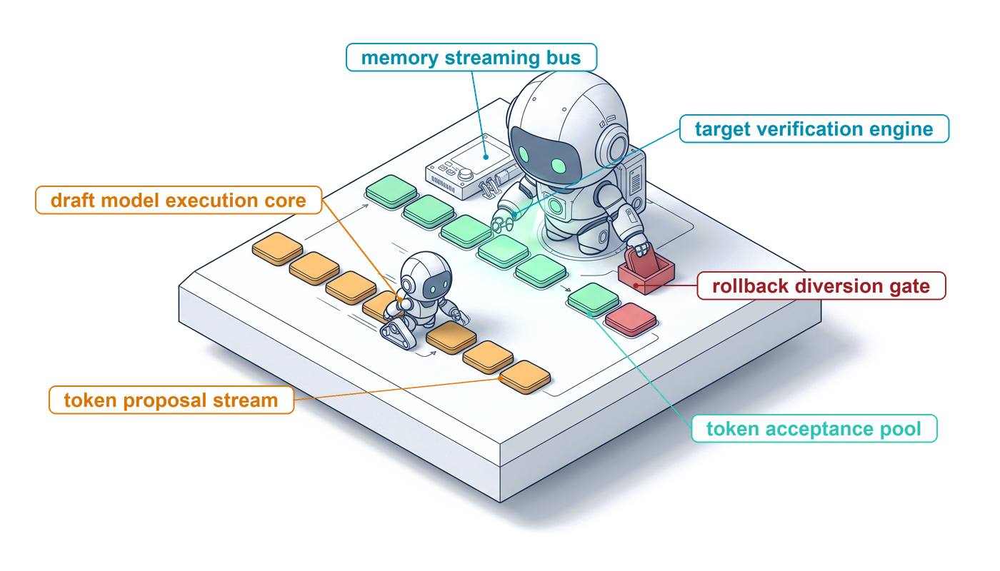{fig-alt="Isometric illustration of a small robot laying orange token tiles along a track while a larger robot checks each tile, turning accepted tiles green and diverting a rejected red tile into a bin, so that only checked tokens continue down the track."}
:::

::: {.content-visible unless-format="pdf"}
{fig-alt="Isometric illustration of a small robot laying orange token tiles along a track while a larger robot checks each tile, turning accepted tiles green and diverting a rejected red tile into a bin, so that only checked tokens continue down the track."}
:::

:::

## Purpose {.unnumbered .unlisted}

\begin{marginfigure}
\mlagentstack{0}{0}{0}{0}{0}{100}
\end{marginfigure}

_Why is the most capable component of an agent the one whose output can never be executed as returned?_

Every turn of an agent is one call to a foundation model. The runtime sends a context of messages, tool definitions, and limits, and the model returns a proposal: some text, a structured object, or a request to call a tool, together with a reason for stopping. That proposal is fluent and often right, but it is unverified, it can differ when the same request is sent twice, and it has a price that grows with every token the model writes and every token the agent re-sends on the next turn. A runtime that mistakes a clean stop for a finished task, a well-formed object for a correct one, or a model call for a cheap one builds every later mechanism on a false assumption. The call is therefore a contract with three parts: what the model reads, what it returns, and what it costs. A single call runs one turn, keeps nothing between calls, and acts on nothing, so it adds none of the H·S·A exposures, and every later part of the book measures horizon, state, and authority outward from this one contract.

::: {.content-visible when-format="pdf"}

\newpage

:::

::: {.callout-learning-objectives}

- Explain how a foundation model turns a context of tokens into a proposal, and which decisions around the call belong to the runtime.
- Budget a model call in tokens against a fixed context window, reserving headroom for the output.
- Explain why a model call is nondeterministic, including at temperature zero, and what that implies for replay and evaluation.
- Specify a model call's request and response: messages and roles, tool definitions, output and reasoning limits, stop reasons, and a normalized status envelope.
- Distinguish grammar-constrained decoding from trained tool-call formatting, and syntactic validity from correctness.
- Estimate the latency of one call and the token cost of a multi-turn trajectory, with and without prefix caching.
- Evaluate competing model interfaces by verified task success at a matched budget rather than by parse rate.

:::

```{python}
#| label: calc-vol3-foundation-model-call-price
#| echo: false
# ┌─────────────────────────────────────────────────────────────────────────────
# │ THE PRICE OF A MODEL CALL AND OF A TRAJECTORY (LEGO)
# ├─────────────────────────────────────────────────────────────────────────────
# │ Context: @sec-vol3-foundation-model-cost (worked estimate), the streaming
# │          cancellation example in @sec-vol3-foundation-model-contract, the
# │          interface comparison in @sec-vol3-foundation-model-interface-design,
# │          and the first fallacy.
# │
# │ Goal: Price one agent turn and one multi-turn trajectory in tokens and
# │       seconds, so every number the chapter quotes about call cost comes
# │       from one set of inputs.
# │ Show: Per-token decode and prefill floors, their ratio, per-call latency,
# │       tokens processed per trajectory with and without prefix caching,
# │       final KV footprint and whether it fits beside the weights on one
# │       accelerator, cancellation savings, interface latencies.
# │ How:  Decode floor = weight bytes / memory bandwidth (batch of one).
# │       Prefill floor = 2 x parameters / peak 8-bit rate. Trajectory re-send
# │       is an arithmetic series over turns. Model and accelerator specs come
# │       from the MLSysIM registry (Llama-3.1-70B, H100); the prose names
# │       neither and speaks of a 70-billion-parameter model on a current
# │       datacenter accelerator.
# └─────────────────────────────────────────────────────────────────────────────
from mlsysim import *
from mlsysim.fmt import fmt_qty_int

class CallPrice:
    # ┌── 1. LOAD (Constants & Parameters) ─────────────────────────────────
    model = Models.Language.Llama3_70B
    accel = Hardware.Cloud.H100
    agent = Agents.Coding.SWE_Bench_Runner
    weight_bytes = 1  # 8-bit weights, bytes per parameter
    kv_bytes = 2  # 16-bit KV cache, bytes per element
    s0 = 8_000  # scenario: first-turn prompt (system prompt, tool definitions, task)
    delta = 1_500  # scenario: tokens appended per turn (model output plus tool result)
    k_turn = 200  # scenario: output tokens per turn (short reasoning plus one tool call)
    turns = agent.max_trajectory_steps
    k_cap = 4_096  # scenario: max-output field in the cancellation example
    k_cut = 96  # scenario: token at which the stream validator rejects
    k_full = 1_850  # scenario: whole-file rewrite, output tokens
    k_diff = 80  # scenario: anchored diff, output tokens
    dm_full = 350  # scenario: extra prompt tokens that specify the rewrite format
    dm_diff = 120  # scenario: extra prompt tokens that specify the diff format
    deadline_s = 15.0  # scenario: per-call deadline
    syntax_ok = 0.95  # scenario: share of diffs whose anchors match the file
    fix_rate = 0.60  # scenario: share of well-formed diffs that pass the tests

    # ┌── 2. EXECUTE (Compute) ─────────────────────────────────────────────
    params = model.parameters.to(ureg.count).magnitude
    bw = accel.memory.bandwidth.to(ureg.byte / ureg.second).magnitude
    peak = accel.compute.precision_flops["fp8"].to(ureg.flop / ureg.second).magnitude
    t_dec = params * weight_bytes / bw  # seconds per output token, batch of one
    t_pre = 2 * params / peak  # seconds per prompt token at the peak rate
    ratio = t_dec / t_pre

    call1_pre = s0 * t_pre
    call1_dec = k_turn * t_dec

    sent_nocache = turns * s0 + delta * turns * (turns - 1) // 2
    sent_cache = s0 + delta * (turns - 1)
    out_total = turns * k_turn
    cache_saving = sent_nocache / sent_cache
    input_share = sent_nocache / (sent_nocache + out_total)
    pre_nocache = sent_nocache * t_pre
    pre_cache = sent_cache * t_pre
    dec_total = out_total * t_dec

    head_dim = model.hidden_dim // model.heads
    kv_per_tok = 2 * model.layers * model.kv_heads * head_dim * kv_bytes
    kv_final_gb = sent_cache * kv_per_tok / 1e9
    weights_gb = params * weight_bytes / 1e9
    resident_gb = kv_final_gb + weights_gb
    accel_gb = accel.memory.capacity.to(GB).magnitude

    cancel_steps = k_cap - k_cut
    cancel_s = cancel_steps * t_dec

    t_full = (s0 + dm_full) * t_pre + k_full * t_dec
    t_diff = (s0 + dm_diff) * t_pre + k_diff * t_dec
    speedup = t_full / t_diff
    pass_diff = syntax_ok * fix_rate

    # ┌── 3. GUARD (Invariants) ───────────────────────────────────────────
    check(ratio > 100, f"An output token should cost two orders of magnitude more time than a prompt token, got {ratio:.0f}")
    check(call1_dec > call1_pre, "Per call, output tokens should dominate latency")
    check(input_share > 0.95, "Per trajectory, re-sent input should dominate tokens processed")
    check(cache_saving > 10, f"Prefix caching should cut prefill tokens by more than 10x, got {cache_saving:.1f}")
    check(t_full > deadline_s > t_diff, "The rewrite must miss the deadline and the diff must meet it")
    check(resident_gb > accel_gb, "Weights plus the final KV cache should overflow one accelerator, which motivates node-level serving")

    # ┌── 4. OUTPUT (Formatting) ──────────────────────────────────────────
    params_b_str = fmt(params / 1e9, precision=1)
    bw_str = fmt(bw / 1e12, precision=2)
    t_dec_ms_str = fmt_qty(t_dec * second, ms, precision=1)
    t_pre_us_str = fmt_qty_int(t_pre * second, microsecond)
    ratio_str = fmt_int(ratio)
    s0_str = fmt_int(s0)
    delta_str = fmt_int(delta)
    k_turn_str = fmt_int(k_turn)
    turns_str = fmt_int(turns)
    call1_pre_str = fmt(call1_pre, precision=2)
    call1_dec_str = fmt(call1_dec, precision=1)
    sent_nocache_str = fmt_int(sent_nocache)
    sent_cache_str = fmt_int(sent_cache)
    out_total_str = fmt_int(out_total)
    cache_saving_str = fmt_int(cache_saving)
    input_share_str = fmt_percent(input_share, precision=1)
    pre_nocache_str = fmt_int(pre_nocache)
    pre_cache_str = fmt(pre_cache, precision=1)
    dec_total_str = fmt_int(dec_total)
    kv_final_gb_str = fmt_qty(kv_final_gb * GB, GB, precision=1)
    weights_gb_str = fmt_qty(weights_gb * GB, GB, precision=1)
    resident_gb_str = fmt_qty(resident_gb * GB, GB, precision=1)
    accel_gb_str = fmt_qty(accel_gb * GB, GB, precision=1)
    k_cap_str = fmt_int(k_cap)
    k_cut_str = fmt_int(k_cut)
    cancel_steps_str = fmt_int(cancel_steps)
    cancel_s_str = fmt_int(cancel_s)
    k_full_str = fmt_int(k_full)
    k_diff_str = fmt_int(k_diff)
    dm_full_str = fmt_int(dm_full)
    dm_diff_str = fmt_int(dm_diff)
    deadline_str = fmt_int(deadline_s)
    t_full_str = fmt_int(t_full)
    t_diff_str = fmt(t_diff, precision=1)
    speedup_str = fmt_int(speedup)
    syntax_ok_str = fmt_percent(syntax_ok, precision=0)
    fix_rate_str = fmt_percent(fix_rate, precision=0)
    pass_diff_str = fmt_percent(pass_diff, precision=0)
```

## The Model Invocation Boundary {#sec-vol3-foundation-model-role}

::: {.column-margin}
{width="100%" fig-alt="H·S·A locator with all three axes gray and only the origin dot highlighted in purple, marking a single model call with no exposure."}

*A single call runs one turn, carries no state, and holds zero ambient authority.*
:::

The fail-plausible fault model (@sec-vol3-intro-fail-plausible) and zero ambient authority (@sec-vol3-intro-operational-incident) already tell the runtime not to trust what the model emits. They do not say where a call goes, what it returns, or which component owns each decision along the way. A single call runs one turn, keeps nothing between calls, and acts on nothing, so it adds none of the H·S·A exposures (@sec-vol3-intro-hsa) and is the origin from which every later part measures them.

**Follow one call from the runtime to the accelerator and back, and three components appear, each with a different job and a different way to fail.** The runtime stages the prompt and judges the result, a serving daemon schedules the accelerator, and the model, a frozen collection of parameter weights $\Theta$ evaluated by matrix-multiplication pipelines, computes a distribution over the next token. Machine learning vocabulary hides this division of labor, and @tbl-vol3-ml-systems-rosetta names what each familiar model term becomes once it is placed on this path.

| Machine Learning Concept           | Systems Architecture Translation                                                                                                | Systems Failure Mode and Operational Implication                                                   |
|:-----------------------------------|:--------------------------------------------------------------------------------------------------------------------------------|:---------------------------------------------------------------------------------------------------|
| **Prompt / Context Window**        | Staged read-only input buffer; contiguous virtual memory workspace for attention computation.                                   | Buffer overrun, attention degradation, context truncation, and cache eviction thrashing.           |
| **Autoregressive Generation**      | Iterative inference loop executing sequential tensor contraction kernels over static weights $\Theta$.                          | Memory-bandwidth starvation, high tail latency, and unboundedly long sequential dependency chains. |
| **Logits / Softmax Distribution**  | Unnormalized log-odds vector over vocabulary $\mathcal{V}$, mapped to a probability simplex $\Delta^{\vert\mathcal{V}\vert-1}$. | Sampling entropy drift, distribution tail corruption, and extreme logit numerical instability.     |
| **Hallucination**                  | Uncaught semantic invariant violation; generation of syntactically valid but factually fabricated state.                        | Fail-plausible silent data corruption occurring under nominal transport and parsing status.        |
| **Tool Call / Function Calling**   | Unverified candidate RPC invocation specification emitted into host memory escrow.                                              | Remote interface signature mismatch, parameter injection, unauthorized capability invocation.      |
| **HTTP 200 OK / Model Completion** | Transport-layer delivery confirmation of an unverified candidate response envelope.                                             | The Delivery Fallacy: transport success conflated with semantic correctness or task completion.    |

: **The Machine Learning Systems Rosetta Stone**: Translating statistical abstractions into operating systems and architectural primitives. {#tbl-vol3-ml-systems-rosetta}

On this path, zero ambient authority has a precise physical meaning. When a model generates the string `rm -rf /` or a JSON object requesting that a database table be dropped, no byte on the host changes. The output is an array of integer token identifiers in the accelerator's high-bandwidth memory (HBM). It crosses the interconnect, an inference daemon decodes it into characters, and it lands in a user-space buffer that the host runtime owns. There it stays, in memory escrow, until the runtime decides what to do with it.

This physical boundary separates the modern agent runtime into a clean three-tier architecture (@fig-vol3-three-tier-architecture). At the foundation sits the **Neural Core**, consisting of dense matrix-multiplication hardware units (such as GPU Streaming Multiprocessors or TPU Tensor Cores) executing low-level tensor contractions over static parameter matrices $\mathbf{\Theta}$ resident in high-bandwidth memory (HBM). Mediating access to the Neural Core is the **Inference Service Daemon**, a high-performance system service (such as vLLM, SGLang, or an optimized vendor runtime) that manages physical accelerator allocation, schedules batched inference requests, manages key-value tensor memory via PagedAttention, and coordinates the autoregressive generation loop. Finally, running in host user space sits the **Host Agent Runtime**, the authoritative supervisor. The host runtime owns the environmental state, holds administrative credentials, stages the model context, enforces hardware resource and latency budgets, and validates all candidate outputs before granting them execution authority.

As mapped in @fig-vol3-three-tier-architecture, these tiers are separated by physical hardware and transport interfaces. Tier 1 (Host Agent Runtime) dispatches typed RPC requests across a local IPC or network boundary (HTTP/2 or gRPC) to Tier 2 (Inference Service Daemon). Tier 2 translates requests into batched compute streams, launching CUDA kernels across PCIe Gen5 or NVLink interconnects to drive Tier 3 (Neural Core). Tier 3 holds zero ambient authority. Its compute units emit only sampled token identifiers ($y_t$), which return across the interconnect to the daemon for envelope packaging and then to the host runtime for verification, on the host side of the accelerator-host boundary described in @sec-vol3-intro-accelerator-host.

::: {#fig-vol3-three-tier-architecture fig-env="figure" fig-pos="htb" fig-cap="**Three-Tier Machine Learning Systems Architecture**: Physical privilege boundaries and execution separation in agent runtimes. The Host Agent Runtime operates as the authoritative supervisor in host user space (Ring 3), staging context buffers, enforcing resource ceilings, and verifying tool actuation. The Inference Service Daemon coordinates continuous batching queues, logical-to-physical PagedAttention block tables, and pushdown automata logit masks. The Neural Core executes raw tensor math on accelerator silicon and holds zero ambient authority." fig-alt="Systems architecture diagram illustrating three functional tiers: Tier 1 Host Agent Runtime in user space, Tier 2 Inference Service Daemon across network/IPC, and Tier 3 Neural Core on accelerator silicon connected via PCIe Gen5 and NVLink."}
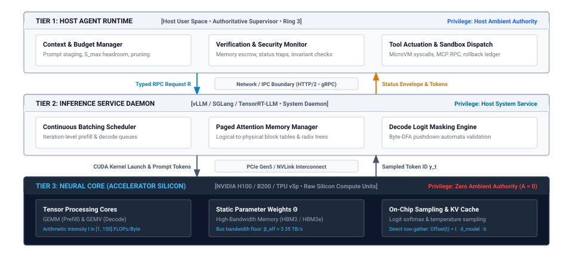
:::

::: {#dfn-zero-ambient-authority .callout-definition title="Zero ambient authority"}

***Zero ambient authority***\index{Zero ambient authority!definition}\index{Privilege separation!zero ambient authority definition} is the foundational systems security invariant wherein an unprivileged execution unit, specifically a foundation model core, possesses zero native rights to inspect, mutate, or allocate external system resources: $\text{Privileges}(\pi_\theta) = \emptyset$.

1.  **Significance**: Guarantees that raw token predictions emitted by accelerator matrix multiplication units remain in host memory escrow, preventing unverified model outputs from directly modifying persistent filesystems, invoking kernel syscalls, or executing network I/O.
2.  **Distinction**: Unlike classical operating system processes that inherit the ambient permissions of their user context (UID/GID), a stochastic model core has zero ambient capability; every privileged operation requires explicit supervisor interception, schema validation, capability checking, and sandboxed dispatch.
3.  **Common pitfall**: Granting ambient credentials or raw system access to agent processes (such as mounting host root directories into containers or passing unrestricted API keys into system prompts), allowing prompt injection or hallucinated actions to compromise host infrastructure.

:::

The definition below states the fail-plausible fault model of @sec-vol3-intro-fail-plausible for a single call, in the terms the runtime uses to check one.

::: {#dfn-fail-plausible-fault .callout-definition title="Fail-plausible fault"}

***Fail-plausible fault***\index{Fail-plausible fault!definition}\index{Fault model!fail-plausible definition} is an execution fault regime wherein an unprivileged neural execution core emits an action proposal $a_{\text{prop}} \sim \pi_\theta(\cdot \mid c_t)$ that satisfies syntactic grammar $\mathcal{L}(G)$ and executes within the environment returning exit code 0, yet transitions environment state outside the semantic specification envelope ($s_t \in \mathcal{I} \implies s_{t+1} \notin \mathcal{I}$).

1.  **Significance**: Proves why conventional software monitoring and distributed watchdogs (`if (exit_code != 0) retry()`) fail in agentic systems, as surface-level fluency and successful process exits routinely mask catastrophic semantic regressions.
2.  **Distinction**: Unlike Fail-Stop faults (where a component crashes overtly and halts execution deterministically) or Byzantine faults (where an adversarial node intentionally deviates across network channels), fail-plausible faults arise from statistical likelihood optimization over frozen training distributions ungrounded in physical environment state.
3.  **Common pitfall**: Relying on process return codes or model self-reported completion ("I have verified the bug is resolved") as evidence of success; dependable operation requires supervisory fencing and external verification oracles that validate physical state deltas.

:::

A second error sits at the transport layer, and this chapter calls it the **Delivery Fallacy**. In naive software implementations, an agent system dispatches an HTTP request to an inference service, receives an `HTTP 200 OK` response status, successfully parses the response body as JSON, and directly commits the action. This conflates transport delivery with task completion. An `HTTP 200 OK` indicates only that the transport layer successfully transmitted packets across the network interface and that the inference daemon completed its generation loop without crashing. It conveys zero information regarding whether the model resolved the task, experienced context truncation, suffered an internal safety refusal, or produced a hallucinated capability request.

A robust host runtime isolates this boundary by normalizing all incoming raw inference responses into a structured status envelope. The runtime evaluates whether the generation completed nominally (`COMPLETED`), ran out of allocated token budget before reaching a natural termination token (`TRUNCATED`), was aborted by an accelerator-level safety filter (`REFUSED`), or encountered an unrecoverable network or hardware disconnect (`TRANSPORT_FAILURE`). Only candidates carrying a clean status envelope are forwarded to the supervisor's validation pipeline, establishing the closed-loop execution boundary illustrated in @fig-vol3-closed-loop-boundary.

The execution lifecycle in @fig-vol3-closed-loop-boundary traces four sequential stages across the physical privilege boundary. In Stage 1 (Context Staging & Budgeting), the host supervisor constructs prompt sequence $\mathbf{x} = (x_1, \dots, x_M)$, assigns operational token limits $K_{\max}$, sets wall-clock deadline $T_{\max}$, and packages decoding hyperparameters into a typed RPC request. The inference engine ingests this payload, scheduling batch allocation and computing prompt prefill (GEMM) before entering the autoregressive decode loop (Stage 2). At each decode step, fused logit masks suppress ungrammatical tokens before softmax reduction, appending sampled vectors to device KV cache pages. Upon hitting an end-of-sequence delimiter or ceiling constraint, Stage 3 packages the candidate tokens into a normalized response envelope with verified usage accounting. Finally, Stage 4 (Validation & Action Dispatch) receives the payload in host memory escrow, subjecting candidate tool calls to AST validation and sandbox ACL checks before authorizing side-effect dispatch.

::: {#fig-vol3-closed-loop-boundary fig-env="figure" fig-pos="htb" fig-cap="**Closed-Loop Execution Boundary**: Four-stage lifecycle mediating unprivileged neural core generation and authoritative host action dispatch. The host runtime stages task prompts and policy bounds (Stage 1), dispatching typed RPC requests across the serving boundary. The inference service schedules batch queues and evaluates prompt prefill (GEMM) before entering the autoregressive decode loop (Stage 2) with fused logit masking. Raw token predictions are normalized into structured status envelopes (Stage 3) before entering host user space, where Stage 4 triages completion codes, unmarshals candidate payloads in memory escrow, and verifies capability ACLs prior to effector actuation." fig-alt="Block schematic tracing an invocation across three vertical columns: Host Agent Runtime, Inference Service Daemon, and Neural Core, tracking the request from context staging through GPU decode loops, envelope packaging, and escrow validation."}
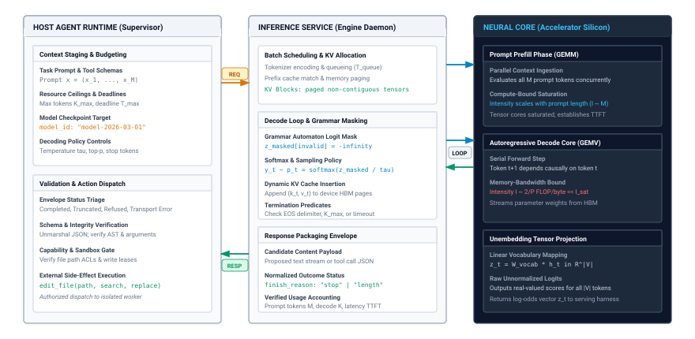
:::

A clean envelope admits a candidate to judgment, not to execution. The model's verdict on its own output carries no evidential weight (@sec-vol3-intro-epistemic-boundary), so the runtime accepts a candidate only on evidence from deterministic gates outside the model, such as compilers, type checkers, static analyzers, and test suites. These gates supply the static checks and tests among the closure evidence levels of @sec-vol3-intro-closure-evidence, and @sec-vol3-foundation-model-continuations builds them for a single call.

The physical boundary between the host supervisor and the neural core also imposes strict interconnect and memory constraints. A common architectural question is where the boundary between inference evaluation and stochastic sampling should reside: should the accelerator stream raw unnormalized logits back to the host CPU, allowing the host runtime to sample tokens locally, or should sampling execute directly on accelerator silicon?

A quantitative analysis of the interconnect traffic reveals why logit sampling must reside entirely on the accelerator, making the token ID the irreducible atomic unit of exchange across the host interface.

::: {#nbk-logit-interconnect-bottleneck .callout-notebook title="The logit interconnect bottleneck"}
**Problem:** Consider an inference service serving an open-weight foundation model with a modern vocabulary size of $|V| = 128{,}000$ subword tokens. The inference service hosts an active concurrent batch of $B = 64$ streams running on a single accelerator board connected via a standard PCIe 4.0 $\times 16$ interconnect. Each generation stream produces output at an average decode rate of $R = 40\text{ tokens/second}$.

Calculate the continuous interconnect bandwidth required if the accelerator transmits raw 16-bit floating-point logits (`fp16`, 2 bytes per logit) back to the host CPU for sampling, versus transmitting discrete 32-bit integer token identifiers (`uint32`, 4 bytes per token). Evaluate the systems feasibility of host-side sampling under fine-grained PCIe transfer overheads.

**Solution:**

*Case 1: Transmitting Raw Logit Vectors across the Interconnect.*
For each newly generated token, the accelerator produces a dense unnormalized logit vector of dimension $|V|$. At 2 bytes per element:
$$\text{Payload per token} = 128{,}000 \times 2\text{ bytes} = 256{,}000\text{ bytes} = 256\text{ KB/token}$$

For an aggregate batch generation throughput across all 64 streams:
$$\text{Aggregate token rate} = B \times R = 64 \times 40\text{ tokens/second} = 2{,}560\text{ tokens/second}$$

The continuous data transfer rate across the interconnect is:
$$\text{Bandwidth}_{\text{logits}} = 2{,}560\text{ tokens/second} \times 256\text{ KB/token} = 655{,}360\text{ KB/second} = 655.36\text{ MB/second}$$

While a peak theoretical PCIe 4.0 $\times 16$ bus provides approximately $31.5\text{ GB/second}$ of unidirectional bandwidth, this throughput assumes large, contiguous Direct Memory Access (DMA) transactions. Disagreeing with this assumption, an autoregressive serving loop dispatches these 256 KB buffers in tiny, asynchronous bursts 2,560 times every second. At this transfer granularity, PCIe transaction packetization overhead, host interrupt handling, DMA completion synchronization stalls, and host memory bus contention degrade performance, introducing significant jitter into the decode loop. If the vocabulary expands to $|V| = 256{,}000$ or concurrency scales to $B = 256$, bandwidth demand surges past $5.24\text{ GB/second}$, severely saturating the system's interconnect queues.

*Case 2: Performing Logit Reduction on Accelerator Silicon.*
If top-$p$, top-$k$, temperature scaling, and multinomial categorical sampling execute directly within an accelerator kernel, the accelerator reduces the 256 KB logit vector to a single scalar token ID:
$$\text{Payload per token} = 4\text{ bytes/token}$$

The resulting continuous bandwidth across the interconnect is:
$$\text{Bandwidth}_{\text{tokens}} = 2{,}560\text{ tokens/second} \times 4\text{ bytes/token} = 10{,}240\text{ bytes/second} \approx 10.24\text{ KB/second}$$

**Conclusion:** Performing logit sampling on accelerator silicon reduces interconnect bandwidth pressure by a factor of:
$$\frac{256{,}000\text{ bytes}}{4\text{ bytes}} = 64{,}000\times$$
This reduction transforms an interconnect traffic jam into a negligible stream of 10.24 KB/s, freeing the host-accelerator interconnect for large model weight updates and input context ingestion. The discrete token identifier is the mandatory, bandwidth-optimal interface currency of the model invocation boundary.
:::

::: {#chk-02-stochastic-processor-boundary .callout-checkpoint title="Evaluating the model invocation boundary"}
Before analyzing discrete token representation, verify your architectural understanding of stochastic execution tiers and host boundaries:

- [ ] **Ambient authority**: Why does an autoregressively generated command string resident in accelerator memory possess zero ambient privilege until explicit host dispatch?
- [ ] **Failure semantics**: How do the systems implications of fail-plausible neural emissions differ from the fail-stop error contracts of classical CPUs?
- [ ] **Interconnect bandwidth**: Why is performing logit sampling and top-$p$/top-$k$ reduction directly on accelerator silicon orders of magnitude more bandwidth-efficient than transferring raw logit tensors across PCIe?
- [ ] **End-to-end verification**: Under what conditions can an inference daemon or neural self-checker guarantee soundness for execution invariants?
:::

The runtime therefore owns every decision that has consequences, and @tbl-vol3-foundation-model-responsibilities names what each familiar model term obliges the runtime to do.

| Model term                  | Runtime responsibility                                                        | Failure if the runtime ignores it                                    |
|:----------------------------|:------------------------------------------------------------------------------|:---------------------------------------------------------------------|
| **Context window**          | Assemble the context and keep it, plus the output limit, under the window     | Truncated input or output; a tool call cut off mid-argument          |
| **Sampling settings**       | Choose them per call and record them with the output                          | Trajectories that cannot be explained or reproduced                  |
| **Tool call**               | Validate, authorize, and execute it, then return the result as a message      | Malformed or unauthorized effects on the environment                 |
| **Stop reason**             | Route the loop on it: dispatch, verify, quarantine, or escalate               | A truncated or refused output treated as a finished one              |
| **Fluent but wrong output** | Check the proposal against the environment with checks outside the model      | Plausible corruption that passes every surface test                  |
| **Successful response**     | Treat transport success as delivery of a proposal, not completion of the task | The delivery fallacy: a status code taken as evidence of correctness |

: **What the Runtime Owns Around a Model Call**: Each model-side concept creates a runtime obligation, and each unmet obligation has a characteristic failure. {#tbl-vol3-foundation-model-responsibilities}

## Discrete Token Representation {#sec-vol3-foundation-model-tokenization}

A foundation model cannot read strings. While human programmers and software tools exchange structured Unicode text, the tensor contraction pipelines of modern accelerators operate exclusively on dense, fixed-dimensional floating-point arrays. Bridging this semantic divide requires an unprivileged serialization layer: the tokenizer. At the software interface, a tokenizer behaves as a discrete bidirectional transcoder that maps variable-length byte streams into bounded sequences of integer identifiers drawn from a finite vocabulary $\mathcal{V}$. At the hardware interface, however, these integer identifiers serve a far more demanding physical role: they index the row offsets of the model's primary memory embedding table, and their cumulative sequence length $S$ dictates the physical High-Bandwidth Memory (HBM) footprint of the accelerator's attention caches.

**A tokenizer is fundamentally a statistical byte compressor rather than a grammar-aware compiler lexer; this architectural distinction creates severe impedance mismatches with programming language syntax trees, inflates the latency and memory overhead of structured serialization formats, and imposes a rigid physical memory tax on accelerator hardware.** When an agent supervisor dispatches a prompt or ingests an execution trace, it must budget tokens not as abstract lexical units, but as physical resource allocations that consume silicon memory bandwidth and bound the execution horizon of the neural engine.

### The lexing boundary

Traditional compiler frontends partition source text using deterministic, grammar-driven lexers. A compiler lexer maps character streams into a stream of typed tokens defined by a formal language specification (such as `IDENTIFIER`, `KEYWORD_DEF`, or `OPERATOR_PLUS`). In open-domain agent systems, this deterministic approach fails immediately. Natural language exhibits rich morphological diversity, while program execution traces contain an unbounded set of open-vocabulary strings: dynamically generated UUIDs, cryptographic hashes, base64 payloads, obfuscated URLs, and arbitrary variable names like `getUserById_v2_final`. A word-level vocabulary that attempted to catalog this open-ended universe would explode to millions of entries, exhausting host memory and diluting statistical training efficiency. Conversely, capping a word vocabulary at a fixed threshold forces any unseen token to collapse into an out-of-vocabulary (`<UNK>`) sentinel, irrevocably destroying syntactic structure and execution semantics.

At the opposite architectural extreme, a purely character-level tokenizer operates over a tiny, fixed alphabet (such as the 256 individual byte values of raw Unicode). While a character vocabulary bounds $|\mathcal{V}|$ to a minimal footprint, it causes sequence length $S$ to inflate by a factor of four to five relative to natural words. In transformer architectures, self-attention evaluates pairwise interactions across all input positions, incurring a computational complexity that scales quadratically with sequence length ($O(S^2)$). Inflating the sequence length by $4\times$ causes a catastrophic $(4)^2 = 16\times$ surge in prefill compute operations and intermediate activation memory. Character-level tokenization exchanges vocabulary simplicity for an unacceptable hardware evaluation penalty.

Modern inference engines resolve this trade-off using Byte-Pair Encoding (BPE), a data-driven subword tokenization algorithm that operates directly on byte sequences. Starting with a base vocabulary of individual byte primitives ($|\mathcal{V}_{\text{base}}| = 256$), BPE analyzes large corpora to iteratively identify and merge the most frequently adjacent byte pairs into compound subword tokens. This merge process repeats until reaching a target vocabulary size $|\mathcal{V}|$, typically ranging from $32{,}000$ to $128{,}000$ entries in modern foundation models (and extending to $256{,}000$ in large-scale frontier architectures). Frequent strings (such as common keywords like `return` or natural language roots like `process`) coalesce into single, atomic token IDs, whereas rare identifiers gracefully fragment into sequences of shorter subwords or base bytes. BPE guarantees bounded sequence lengths while eliminating out-of-vocabulary failure modes: any arbitrary binary payload or unknown identifier can be serialized as a fallback sequence of constituent byte tokens.

::: {.column-margin}
**Embedding Table Memory Overhead:**
An embedding matrix with $|\mathcal{V}| = 128{,}000$ rows and hidden dimension $d_{\text{model}} = 4096$ stored in 16-bit precision occupies:
$$128{,}000 \times 4096 \times 2\text{ bytes} \approx 1.05\text{ GB}$$
If the output unembedding projection does not tie its weights to $\mathbf{W}_{\text{embed}}$, the vocabulary representation alone consumes over $2.1\text{ GB}$ of accelerator HBM before loading a single transformer layer.
:::

Once a string is serialized into an array of discrete integer token IDs $\mathbf{t} = [t_1, t_2, \dots, t_S]$, where each $t_i \in \{0, 1, \dots, |\mathcal{V}|-1\}$, the host runtime stages this buffer in accelerator memory. On hardware silicon, the model's first computation is an embedding table lookup. Mathematically, this operation is equivalent to multiplying a one-hot vector $\mathbf{e}_{t_i} \in \{0, 1\}^{|\mathcal{V}|}$ by the weight matrix $\mathbf{W}_{\text{embed}} \in \mathbb{R}^{|\mathcal{V}| \times d_{\text{model}}}$. In physical accelerator kernels, however, executing a sparse matrix multiplication over a $128{,}000$-dimensional vector would waste silicon compute resources. Instead, the accelerator memory controller executes a direct row-gather operation. The integer value $t_i$ functions as a base-address memory stride pointer:

$$\text{Offset}(t_i) = t_i \cdot d_{\text{model}} \cdot b$$

where $b$ is the numerical precision in bytes per element (e.g., $b=2$ for 16-bit floating-point formats like FP16 or BF16). The accelerator memory hierarchy pulls the contiguous row vector at $\text{Offset}(t_i)$ from off-chip High-Bandwidth Memory (HBM) into on-chip Streaming Multiprocessor (SM) registers and scratchpad SRAM. The sequence of discrete integer IDs is thereby materialized as a dense activation tensor $\mathbf{X} \in \mathbb{R}^{S \times d_{\text{model}}}$, ready to enter the multi-head attention pipeline.

### The structural impedance mismatch

::: {.column-margin}
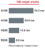{width="100%" fig-alt="Horizontal bar ladder showing the single-token memory shuttle latency floor for a 70-billion-parameter FP8 model across four accelerator generations: A100 at 34.3 milliseconds, H100 at 20.9 milliseconds, H200 at 14.6 milliseconds, and B200 at 8.8 milliseconds per token."}

*Shuttling a 70B parameter model across the memory bus sets an irreducible step latency floor on single-token decode.*
:::
Because BPE constructs its merge table using statistical frequency over raw character streams, it is entirely oblivious to formal programming language grammars, syntax trees, and indentation scopes. This divergence creates an architectural impedance mismatch between the deterministic compilers running in the host environment and the subword tokenizers fronting the neural engine.

Consider a compiler's Abstract Syntax Tree (AST). A compiler lexer treats whitespace strictly as a separator (or as an explicit block delimiter in indentation-sensitive languages like Python), producing an invariant `IDENTIFIER` token for a function name regardless of where it appears on a line. A statistical subword tokenizer, by contrast, greedily merges leading whitespace directly into alphanumeric subwords based on corpus co-occurrence statistics.

```python
import tiktoken
enc = tiktoken.get_encoding("cl100k_base")

# Top-level module definition vs. 4-space indented class method
unindented = enc.encode("def get_user_id():")
indented   = enc.encode("    def get_user_id():")

print(f"Unindented tokens: {unindented}")
# Output: [755, 1146, 3110, 482, 3341]     (def -> 755)
print(f"Indented tokens:   {indented}")
# Output: [262, 711, 1146, 3110, 482, 3341] (space -> 262, def -> 711)
```

As demonstrated in the empirical trace above, defining `def get_user_id():` at module scope produces token ID `755` for the `def` keyword. Indenting the exact same declaration by four spaces inside a class definition splits the construct into token `262` (representing the four spaces) followed by token `711` (representing `def`). On accelerator silicon, row `755` and row `711` of $\mathbf{W}_{\text{embed}}$ are completely independent vectors in $\mathbb{R}^{d_{\text{model}}}$. They share no weights, no memory addresses, and no structural link. The neural network must expend statistical learning capacity simply to discover that row `755` and row `711` denote the exact same syntactic keyword under different indentation contexts, a structural disconnect illustrated in @fig-vol3-token-ast-mismatch.

In @fig-vol3-token-ast-mismatch (Panel 1), a deterministic compiler lexer produces an invariant AST syntax token sequence (`KEYWORD: 'def'`, `IDENTIFIER: 'get_user_id'`, `PARAMETERS: ()`, `COLON: ':'`), treating indentation exclusively as a hierarchical scoping property (`BLOCK_SCOPE`). In Panel 2, however, subword BPE fractures code based on greedy co-occurrence statistics. Case A (module scope) generates five tokens (`[755, 1146, 3110, 482, 3341]`), whereas Case B (indented four spaces) expands into six tokens (`[262, 711, 1146, 3110, 482, 3341]`). As traced into the accelerator's physical embedding table $\mathbf{W}_{\text{embed}}$, Row 755 and Row 711 reside at disjoint memory addresses ($\text{Row } 755 \cap \text{Row } 711 = \emptyset$), forcing early transformer self-attention layers to expend representational capacity reassembling lexical identity before any semantic reasoning can begin.

::: {#fig-vol3-token-ast-mismatch fig-env="figure" fig-pos="htb" fig-cap="**Structural Impedance Mismatch Between Compiler AST Lexing and Subword Tokenization**: Comparison of deterministic compiler grammar lexing against statistical byte-pair encoding (cl100k_base). In Panel 1, a compiler AST parser assigns invariant syntactic identity to language constructs (`KEYWORD: 'def'`, `IDENTIFIER: 'get_user_id'`), treating leading whitespace strictly as a block scope property. In Panel 2, BPE fractures syntax based on greedy character merges: module-level `def` maps to token ID 755, whereas four-space indented `def` fractures into whitespace token ID 262 followed by token ID 711. In GPU high-bandwidth memory, Row 755 and Row 711 of embedding matrix $\\mathbf{W}_{\\text{embed}}$ are completely disjoint parameter vectors with zero shared memory or structural identity." fig-alt="Systems diagram contrasting compiler AST tokenization against subword BPE. AST assigns identical syntax nodes to unindented and indented declarations, while BPE maps unindented def to token 755 and indented def to tokens 262 and 711, referencing disjoint rows in accelerator embedding memory."}
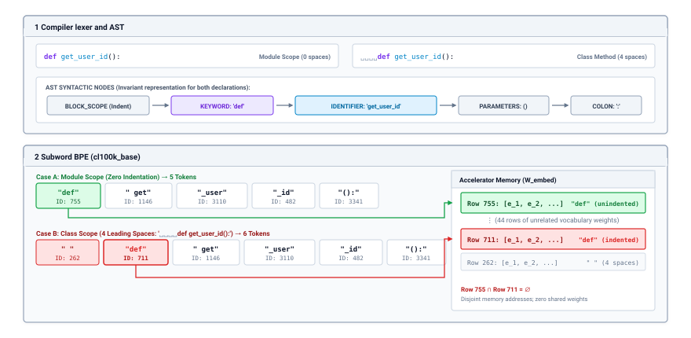
:::

This structural friction escalates dramatically when agent runtimes exchange structured serialization formats like JSON, YAML, or XML. Modern agent supervisors depend on structured formats to enforce schema validation on tool invocations, shell commands, and environment feedback. However, standard BPE vocabularies are heavily optimized for natural prose, where words are delimited by single spaces. Structured schemas violate these statistical distributions: they are saturated with syntactic delimiters such as double quotes (`"`), colons (`:`), braces (`{`, `}`), escape backslashes (`\`), and newline characters (`\n`).

When an agent invokes a tool via JSON, these structural delimiters cannot merge with surrounding alphanumeric content. Instead, they fragment into isolated, single-character or single-byte tokens. A nested shell command containing flags, quotes, and regexes pays an egregious *serialization tax*, expanding into a sprawling array of low-information tokens.

| Payload Domain          | Content Sample Description                    | Raw Characters | Token Count | Bytes / Token | Compression Ratio (Chars/Token) |
|:------------------------|:----------------------------------------------|:--------------:|:-----------:|:-------------:|:-------------------------------:|
| Technical Prose         | System architecture documentation             |     4,120      |    1,005    |      4.10     |               4.10              |
| Python Source Code      | Algorithmic logic and standard libraries      |     3,850      |    1,132    |      3.40     |               3.40              |
| Standard JSON Payload   | Flat key-value parameters and identifiers     |     2,940      |    1,176    |      2.50     |               2.50              |
| Escaped JSON Tool Call  | Nested bash command with flags, quotes, regex |     2,180      |    1,282    |      1.70     |               1.70              |
| Hexadecimal Hash / UUID | SHA-256 digests and raw byte strings          |     1,024      |     682     |      1.50     |               1.50              |
: **Empirical Token Compression Ratios**: Empirical token compression ratios across text representations under the tiktoken cl100k_base vocabulary. Structured JSON schemas and escaped syntax suffer severe token inflation, depressing character-per-token efficiency by over 40% compared to continuous prose. {#tbl-token-compression-ratios}

As tabulated in @tbl-token-compression-ratios, natural prose compresses efficiently at roughly 4.1 characters per token. In sharp contrast, an escaped JSON tool invocation collapses to 1.7 characters per token—a 58 percent degradation in information density. The host agent system pays a direct 43 percent token inflation penalty purely to transmit syntactic framing, squandering expensive accelerator context and memory bandwidth on schema overhead rather than substantive problem-solving logic.

### Context budgeting dynamics

::: {.column-margin}
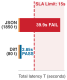{width="100%" fig-alt="Budget envelope showing total invocation latency against a 15-second SLA deadline: Interface 1 (monolithic JSON) generates 1,850 tokens, taking 39.9 seconds and burning deep into the red violation zone, while Interface 2 (anchored diff) generates 80 tokens, completing in 2.85 seconds well within the allowable budget."}

*Monolithic JSON breaches the 15-second latency SLA by 166 percent, while anchored diff completes in 2.85 seconds.*
:::
A common systems error in agent runtime design is relying on naive rules of thumb, such as the widely cited heuristic that "one token equals four characters." While this approximation holds for continuous English paragraphs, @tbl-token-compression-ratios demonstrates that it fails completely when applied to source code, compiler diagnostic traces, and JSON RPC envelopes.

Consider an agent monitoring a build failure. An 8 KB compiler trace containing ANSI escape sequences, memory addresses, and file paths will be budgeted at approximately 2,000 tokens under the 4-chars-per-token heuristic. In reality, subword fragmentation drives the token count beyond 5,000. If the host supervisor allocates context memory based on character counts, it will unexpectedly breach the physical context limit of the inference engine.

Every foundation model operates within a rigid architectural context window $S_{\max}$, dictated by the parameterization of its positional embedding schema (such as Rotary Position Embeddings, or RoPE). Furthermore, an agent runtime must always preserve a reserved generation headroom $K_{\max}$ to allow the model to emit its reasoning trace and tool invocation envelope. Consequently, the host context staging manager must enforce a strict dynamic budgeting constraint:

$$S \le S_{\max} - K_{\max}$$

If an unmanaged context ingestion pipeline pushes $S$ beyond $S_{\max} - K_{\max}$, the inference runtime encounters a hard truncation boundary. Once the cumulative sequence length $S + K$ reaches $S_{\max}$, the autoregressive decode loop halts unconditionally, setting its completion status to a length-exhausted state (`finish_reason == "length"`).

```json
{"tool": "execute_command", "command": "find /var/log -name '*.log' -exec grep -H 'FATAL' {} \;
```

As illustrated in the truncated trace above, hitting a physical context boundary terminates generation mid-stream. In a structured tool invocation, the output terminates with unclosed quotes, missing closing braces, and truncated parameters. If this partial string is naively forwarded to an external JSON parser or shell environment, the system fails unpredictably. A corrupted command string might execute an unintended destructive operation, or a deserializer crash might trigger an unhandled exception in the agent supervisor.

A candidate generated under an exhausted budget (`finish_reason == "length"`) or without its closing delimiters is therefore untrusted. Because the model holds zero ambient authority, the broken payload can do harm only if the runtime passes it on, so the runtime keeps it out of every execution path and discards any state mutation it proposes. @Sec-vol3-foundation-model-contract turns this rule into a check on the status envelope.

::: {#chk-02-context-exhaustion-quarantine .callout-checkpoint title="Context exhaustion and quarantine invariants"}
Before staging candidate model outputs for environment dispatch, verify the runtime handling of truncated generation boundaries:

- [ ] **Length termination**: Why must any candidate payload returned with `finish_reason == "length"` be unconditionally quarantined rather than partially executed?
- [ ] **Syntactic closure**: How does dispatching a partially parsed JSON payload or unclosed shell command violate the host isolation boundary?
- [ ] **State rollback**: What mechanisms ensure that proposed state mutations from an incomplete generation turn are discarded before triggering downstream effects?
:::

When a generation boundary fault occurs, the host runtime must either invoke an explicit context compaction strategy (such as pruning older tool execution turns) or surface an unrecoverable resource exhaustion fault to the user. An unverified, partially generated token stream must never cross the isolation boundary into an active operating system environment.

### Physical memory footprint of the key-value cache

The discrete token representation is not merely an abstraction for the input stage; every active token consumes physical hardware memory throughout the entire duration of an agent's execution. While the input embedding gather executes once during the initial prompt processing pass, each token leaves a permanent footprint in the accelerator's High-Bandwidth Memory: the Key-Value (KV) cache.

In a decoder-only transformer, generating each new token requires computing self-attention over all preceding token positions. To avoid the redundant $O(S^2)$ computational overhead of recomputing the Key ($\mathbf{K}$) and Value ($\mathbf{V}$) projection tensors for historical tokens at every autoregressive step, the inference engine stores these intermediate projection matrices in an accelerator memory buffer.

The physical memory footprint of this cache is directly proportional to the number of processed tokens. Let:

- $L$ be the total number of transformer layers in the model.
- $n_{\text{kv}}$ be the number of Key-Value attention heads per layer.
- $d_{\text{head}}$ be the dimensionality of each attention head ($d_{\text{head}} = d_{\text{model}} / n_{\text{q}}$, where $n_{\text{q}}$ is the number of Query heads).
- $b$ be the numerical precision in bytes per element ($b=2$ for 16-bit precision FP16/BF16; $b=1$ for 8-bit FP8).

Across the entire model, the physical memory consumed by the KV cache for a single token position is derived directly from its tensor dimensions:

$$\text{Mem}_{\text{KV,token}} = 2 \cdot L \cdot (n_{\text{kv}} \cdot d_{\text{head}}) \cdot b \quad \left[\frac{\text{bytes}}{\text{token}}\right]$$

The constituent factors reflect the physical structure of the attention architecture:

1. **The Factor of 2:** The cache must store two distinct projection tensors for each token position: the attention Key vector $\mathbf{k}$ and the attention Value vector $\mathbf{v}$.
2. **Layer Depth ($L$):** Each transformer layer computes independent attention projections; the cache must preserve state across all $L$ layers.
3. **Head Width ($n_{\text{kv}} \cdot d_{\text{head}}$):** In early Multi-Head Attention (MHA) designs, the number of Key-Value heads equaled the number of Query heads ($n_{\text{kv}} = n_{\text{q}}$). Modern long-context architectures employ Grouped-Query Attention (GQA), where multiple Query heads share a single Key-Value head ($n_{\text{kv}} \ll n_{\text{q}}$), reducing the total cached state by an order of magnitude.
4. **Storage Precision ($b$):** The word size dictates the memory traffic and footprint of each tensor element.

For an active context containing $S$ tokens, the total physical memory allocated to the KV cache scales linearly:

$$\text{Mem}_{\text{KV}}(S) = S \cdot \text{Mem}_{\text{KV,token}}$$

This linear memory scaling creates an unforgiving systems constraint: on accelerator hardware, context length translates directly into physical capacity saturation.

::: {#nbk-02-kv-cache-memory-explosion .callout-notebook title="KV cache memory explosion in a 128k long-context serving node"}
Consider an agentic coding assistant deployed on a frontier model whose architecture matches Llama-3-70B. The network parameters are:

- Layer depth: $L = 80$
- Query heads: $n_{\text{q}} = 64$
- Key-Value heads (GQA): $n_{\text{kv}} = 8$
- Head dimension: $d_{\text{head}} = 128$ (hidden dimension $d_{\text{model}} = 64 \times 128 = 8192$)
- Default precision: FP16 ($b = 2\text{ bytes}$)

First, calculate the memory required to store the KV cache projections for a single token:

$$\text{Mem}_{\text{KV,token}} = 2 \cdot 80 \cdot (8 \cdot 128) \cdot 2 = 327{,}680\text{ bytes/token} = 320\text{ KiB/token}$$

Now, consider an agent performing complex codebase analysis across a large repository context, staging an active context window of $S = 128{,}000$ tokens. The memory demanded exclusively by the KV cache is:

$$\text{Mem}_{\text{KV}}(128\text{k}) = 128{,}000 \times 327{,}680\text{ bytes} = 41{,}943{,}040{,}000\text{ bytes} \approx 41.94\text{ GB}$$

Suppose the serving node is provisioned with an industry-standard NVIDIA A100-SXM4-80GB or H100-SXM5-80GB accelerator containing $80\text{ GB}$ of High-Bandwidth Memory (HBM). To run this 70B parameter model, the runtime uses 8-bit quantized weights and allocates static CUDA workspaces, communication scratchpads, and execution buffers, consuming a baseline resident footprint of:

$$W = 70.00\text{ GB}$$

When the agent attempts to ingest the 128k context, the total physical memory demanded on the accelerator silicon is:

$$\text{Mem}_{\text{total, FP16}} = 70.00\text{ GB} + 41.94\text{ GB} = 111.94\text{ GB}$$

Because $111.94\text{ GB} > 80.00\text{ GB}$, the allocation breaches physical capacity, crashing the serving runtime with a CUDA Out-of-Memory (OOM) fault.

To mitigate this bottleneck, the systems engineer might attempt to quantize the KV cache to 8-bit precision (FP8, where $b = 1\text{ byte}$). Halving the storage precision cuts the per-token memory footprint to $163{,}840\text{ bytes/token}$, yielding:

$$\text{Mem}_{\text{KV, FP8}}(128\text{k}) = 128{,}000 \times 163{,}840\text{ bytes} \approx 20.97\text{ GB}$$

Re-evaluating the total accelerator memory footprint under FP8 yields:

$$\text{Mem}_{\text{total, FP8}} = 70.00\text{ GB} + 20.97\text{ GB} = 90.97\text{ GB}$$

Even with an 8-bit quantized KV cache, $90.97\text{ GB} > 80.00\text{ GB}$. The serving engine still crashes the 80 GB device.

In production environments, resolving this failure mode requires one of two structural systems interventions:

1. **Tensor Parallelism ($TP \ge 2$):** The system shards the model weights and the 8 KV heads across two or more interconnected GPUs. With $TP = 2$, each GPU holds only 4 KV heads ($20.97\text{ GB} / 2 = 10.49\text{ GB}$ in FP8 or $20.97\text{ GB}$ in FP16) and half the model weights ($35.00\text{ GB}$), bringing per-GPU memory well within the 80 GB threshold.
2. **Hardware Migration:** The system upgrades to next-generation accelerators with expanded physical HBM capacity, such as the NVIDIA H200 (141 GB HBM3e) or the NVIDIA B200 (192 GB HBM3e), which can comfortably absorb model weights and large continuous KV buffers on a single device.
:::

The discrete token representation, therefore, governs the entire resource lifecycle of the inference engine. A token begins as a statistical subword indexing an embedding table row, imposes a quantifiable serialization overhead on structured system schemas, and ultimately dictates whether an agent's context fits within the physical memory boundaries of accelerator silicon.

***

Once the host runtime serializes an input context into an array of discrete token identifiers, stages their embedding vectors in accelerator SRAM, and allocates their physical Key-Value projection buffers in High-Bandwidth Memory, the foundation model is prepared to generate a response. However, producing a candidate action is not an atomic, single-pass computation. Unlike the initial context ingestion pass, which processes all staged tokens simultaneously in parallel, generating new output requires an iterative execution loop that evaluates the network, samples a single discrete token, and appends it back to the input buffer. This brings us to the operational core of the inference engine: how does the serving runtime orchestrate this irreducibly serial, autoregressive generation loop on parallel accelerator silicon?

## Autoregressive Generation {#sec-vol3-foundation-model-autoregressive}

The autoregressive generation loop is the fundamental execution cycle of modern language model serving, transforming an inherently parallel tensor accelerator into a synchronous, step-by-step state machine. While modern accelerator hardware incorporates tens of thousands of arithmetic units designed to saturate during large-scale matrix multiplications, generating text forces this compute fabric into an iterative, serial dependency chain: to emit a sequence of $K$ output tokens, the runtime must dispatch $K$ successive forward passes through the network. Each pass evaluates the model, produces a probability distribution over the discrete vocabulary, samples exactly one token, and appends that token to the context buffer before the subsequent forward pass can begin.

::: {.column-margin}
**Key Concept: Autoregressive Factorization**
The probabilistic contract where the joint likelihood of a token sequence decomposes into a product of conditional probabilities, each conditioning on all previously emitted tokens.
:::

**The foundational dilemma of sequence generation is that an accelerator cannot compute token $t$ until the discrete identity of token $t-1$ is finalized and bound to the Key-Value cache.** Generating a sequence requires an iterative serving loop that repeatedly evaluates the model and samples a token, creating an irreducibly serial causal dependency along one output path. For the agent systems engineer, this operational reality dictates both the wall-clock latency characteristics of model invocation and the non-deterministic interface boundaries across which candidate tool calls and structured plans are emitted.

### Autoregressive factorization

Mathematically, a foundation model does not generate an entire sequence $\mathbf{y} = (y_1, y_2, \dots, y_K)$ in a single holistic calculation. Instead, it defines a joint probability distribution over candidate token sequences conditioned on an input prompt $\mathbf{x} = (x_1, x_2, \dots, x_S)$. By the probability chain rule, this joint distribution decomposes strictly into a directed product of conditional next-token probabilities (@eq-autoregressive-factorization):

$$P(y_{1:K} \mid x_{1:S}) = \prod_{t=1}^{K} P(y_t \mid x_{1:S}, y_{1:t-1})$$ {#eq-autoregressive-factorization}

In this factorization, the context conditioning token $y_t$ consists of two distinct segments: the static, immutable input prefix $x_{1:S}$ provided by the host application, and the dynamic prefix of previously generated tokens $y_{<t} = (y_1, \dots, y_{t-1})$ produced by prior iterations of the decode loop. At each generation step $t$, the neural network acts as a parameterized function $\mathbf{f}_\Theta$ mapping the current sequence history $(x_{1:S}, y_{<t})$ to an unnormalized vector of scores across the discrete vocabulary $\mathcal{V}$ (@eq-logit-generation):

$$\mathbf{z}_t = \mathbf{f}_\Theta(x_{1:S}, y_{<t}) \in \mathbb{R}^{|\mathcal{V}|}$$ {#eq-logit-generation}

The vector $\mathbf{z}_t$ contains the model's *logits*. Projecting these raw real-valued scores onto the probability simplex $\Delta^{|\mathcal{V}|-1}$ provides the conditional categorical distribution from which the next token $y_t$ is selected.

Because the vocabulary size $|\mathcal{V}|$ typically ranges between $32{,}000$ and $128{,}000$ unique subword tokens, the total number of distinct output sequences of length $K$ is $|\mathcal{V}|^K$. For an output sequence of modest length, such as $K = 512$, the cardinality of this output space ($|\mathcal{V}|^{512} \approx 10^{2400}$) makes global sequence optimization—such as discovering the exact sequence that maximizes joint likelihood $\arg\max_{\mathbf{y}} P(\mathbf{y} \mid \mathbf{x})$—computationally intractable.

Classical search procedures like beam search retain a small pool of candidate hypotheses at each step, but they scale memory consumption linearly with the beam width and introduce significant decoding synchronization overhead. Modern high-throughput inference engines and agent runtimes almost universally dispense with beam search, opting instead for point-wise sampling or greedy selection along a single trajectory.

### The serving state machine

To execute this mathematical factorization on physical hardware, the serving runtime wraps the neural network inside an iterative control loop. This loop maintains dynamic execution state across iterations, coordinating memory buffers, device kernels, and termination delimiters.

The serving state machine tracks four primary structures at each step $t$: the active token input, the accelerator's persistent Key-Value (KV) cache tensors, the emitted logit vector, and the monotonic sequence history. The execution sequence proceeds through five synchronous phases:

1. **Kernel Dispatch:** The runtime feeds the most recently selected token $y_{t-1}$ to the model's compute graph on the accelerator, referencing the accumulated key and value tensors from previous steps.
2. **Logit Projection:** The network's final layer projects the normalized hidden activation vector through the language model head $\mathbf{W}_{\text{embed}}^T$, yielding the logit vector $\mathbf{z}_t \in \mathbb{R}^{|\mathcal{V}|}$.
3. **Discretization Kernel:** The runtime scales $\mathbf{z}_t$ and executes a sampling or argmax kernel directly on the device, resolving a single discrete integer token ID $y_t \in [0, |\mathcal{V}|-1]$.
4. **State Commit:** The internal projection vectors $\mathbf{k}_t$ and $\mathbf{v}_t$ computed during step $t$ are appended to the physical KV cache memory allocated within accelerator High-Bandwidth Memory (HBM).
5. **Boundary Evaluation:** The host supervisor checks $y_t$ against pre-registered stopping conditions. If a boundary condition evaluates to true, the loop terminates; otherwise, $y_t$ becomes the input for step $t+1$.

```python
def decode_loop(model, kv_cache, prompt_tokens, stop_token_ids, max_tokens):
    generated = []
    current_token = prompt_tokens[-1]
    for _ in range(max_tokens):
        logits = model.forward_decode_step(current_token, kv_cache)
        next_token = sample_simplex(logits, temperature=0.7, top_p=0.9)
        generated.append(next_token)
        if next_token in stop_token_ids:
            break
        current_token = next_token
    return generated
```

The termination criteria evaluated in step 5 serve as the runtime's primary execution guardrails, operating over the state components summarized in @tbl-serving-state. Without rigorous termination checks, a model can cycle indefinitely through repetitive token loops or continue generating speculative text until the physical KV cache exhausts its allocated buffer.

| State Component         | Notation                             | Physical Substrate                       | Memory Lifetime                   |
|:------------------------|:-------------------------------------|:-----------------------------------------|:----------------------------------|
| **Step Input Token**    | $y_{t-1}$                            | Accelerator SRAM / Register              | Single step ($1$ iteration)       |
| **Unnormalized Logits** | $\mathbf{z}_t$                       | Accelerator SRAM / High-Bandwidth Memory | Transient per-step vector         |
| **KV Cache Tensors**    | $\mathbf{K}_{1:t}, \mathbf{V}_{1:t}$ | Accelerator High-Bandwidth Memory        | Persistent across entire sequence |
| **Sequence Ledger**     | $\mathbf{y}_{1:t}$                   | Host System Memory (DRAM)                | Durable host transaction record   |

: **Serving Loop State Components**: State components maintained across the autoregressive serving loop across hardware substrates. {#tbl-serving-state}

The host supervisor enforces three distinct stop conditions during boundary evaluation:

*   **Tokenizer End-of-Sequence (EOS):** The model emits a reserved structural token (such as `<|endoftext|>` or `<|im_end|>`), signaling that its learned statistical prior has converged to sequence completion.
*   **Host Stop Delimiters:** The runtime matches emitted subword sequences against application-specified byte strings (such as `\nObservation:` or `</tool_call>`), terminating model execution immediately when the generation crosses an external architectural boundary.
*   **Resource Ceilings ($T_{\max}$):** The loop reaches a strict maximum output token limit $T_{\max}$, preventing non-terminating loops and enforcing budget isolation.

### The causal serialization barrier

To engineers steeped in the design of out-of-order, superscalar microprocessors, this iterative loop appears glaringly inefficient. Modern microprocessors extract extensive instruction-level parallelism (ILP) by looking dozens or hundreds of cycles ahead in an instruction stream, executing instructions out of program order, and employing sophisticated branch predictors to speculate past conditional jumps. One might naturally ask: why cannot a high-throughput tensor accelerator speculatively evaluate token $t+50$ while token $t$ is being sampled?

The obstacle lies in the mathematical structure of the self-attention mechanism and the extreme cardinality of the token vocabulary. In a multi-layer Transformer, the query vector $\mathbf{Q}_t$, key vector $\mathbf{K}_t$, and value vector $\mathbf{V}_t$ computed at layer $l$ for step $t$ depend directly on the contextual representation emitted by layer $l-1$ (@eq-attention-causal-step):

$$\operatorname{Attention}(\mathbf{Q}_t, \mathbf{K}_{1:t}, \mathbf{V}_{1:t}) = \operatorname{softmax}\left(\frac{\mathbf{Q}_t \mathbf{K}_{1:t}^T}{\sqrt{d_k}}\right) \mathbf{V}_{1:t}$$ {#eq-attention-causal-step}

Here, $\mathbf{K}_{1:t}$ and $\mathbf{V}_{1:t}$ represent the full concatenated history of keys and values from the prompt through step $t$. Crucially, $\mathbf{Q}_t$ is derived directly from the embedding of $y_{t-1}$ passed through the lower-layer transformations. If the discrete identity of token $y_{t-1}$ changes, the input vector to the first layer changes, causing every subsequent intermediate representation up to $\mathbf{Q}_t$, $\mathbf{K}_t$, and $\mathbf{V}_t$ to diverge completely.

::: {.column-margin}
**Contrast: Branch Prediction vs. Simplex Speculation**
A CPU branch predictor chooses between two explicit instruction addresses ($0$ or $1$). An autoregressive model branches across a simplex of $|\mathcal{V}| \ge 32{,}000$ possible transitions at every step.
:::

On a general-purpose CPU, conditional branches are binary, exhibiting strong temporal and spatial correlation that enables branch prediction accuracies exceeding 95 percent. On an accelerator evaluating an autoregressive language model, however, the branching factor at every single step is $|\mathcal{V}| \approx 32{,}000$ to $128{,}000$. Speculating just four tokens ahead without resolving intermediate selections would require expanding a combinatorial tree of $|\mathcal{V}|^4 \approx 10^{18}$ parallel execution paths—vastly exceeding the aggregate computational capacity of any physical data center.

Consequently, generation is bound by an absolute *causal serialization barrier*. The identity of token $y_t$ depends on $y_{t-1}$; the identity of $y_{t+1}$ depends on $y_t$; and no mathematical bypass allows the engine to compute the state representations for step $t+1$ without committing to a concrete choice for $y_t$. While techniques such as speculative decoding can leverage a smaller auxiliary model to propose candidate linear sequences, the primary model must still verify those tokens against its own sequential KV representations, as illustrated in @fig-vol3-speculative-decoding. For standard autoregressive decode loops, the wall-clock execution time scales strictly linearly with the number of generated tokens $K$.

The speculative decoding architecture in @fig-vol3-speculative-decoding resolves the memory bandwidth bottleneck through a three-phase pipeline that preserves exact mathematical distribution fidelity. In Phase 1 (Sequential Draft Proposal), an ultra-lightweight draft model $M_q$ (1B–3B parameters, latency ratio $c = T_q / T_p \approx 0.1$) sequentially generates a speculative sequence of $K = 4$ candidate tokens $(\tilde{x}_1, \dots, \tilde{x}_4)$ with draft probabilities $q_k$. Because $M_q$ fits entirely within accelerator SRAM or L2 cache, this generation completes at minimal latency. In Phase 2 (Batched Target Verification), the primary 70B target model $M_p$ scores all $K$ candidates simultaneously in a single batched GEMM forward pass, evaluating target probabilities $p(x_k \mid x_{<k})$ and computing the element-wise acceptance criterion:

$$\alpha_k = \min\left(1, \; \frac{p_k}{q_k}\right)$$

For each candidate step, the serving harness draws a uniform random variable $u_k \sim U[0, 1]$. If $u_k \le \alpha_k$, the candidate is accepted. In the trace of @fig-vol3-speculative-decoding, tokens $k=1$ (`"cursor"`, $\alpha_1 = 1.00$) and $k=2$ (`" ="`, $\alpha_2 = 1.00$) are accepted unconditionally. At step $k=3$ (`" db.cursor"`), the target model assigns lower probability than the draft ($p_3 = 0.21$ versus $q_3 = 0.89$), producing $\alpha_3 = 0.236$; drawing $u_3 = 0.45 > \alpha_3$ triggers a rejection trap and halts further verification of candidate $k=4$. In Phase 3 (Rollback & Residual Commit), the runtime commits accepted slots $t+1$ and $t+2$ to physical GPU HBM, invalidates unverified slot $t+4$, and samples a replacement token $x_{\text{corr}} =$ `" conn.cursor"` from the normalized residual distribution:

$$p_{\text{res}}(v) = \frac{\max(0, \; p(v) - q(v))}{\sum_{w \in \mathcal{V}} \max(0, \; p(w) - q(w))}$$

This guarantees that the combined output distribution is bit-exact identical to sampling directly from the 70B target model, while producing 3 tokens in a single target model step ($\rho \approx 2.14\times$ wall-clock speedup).

::: {#fig-vol3-speculative-decoding fig-env="figure" fig-pos="htb" fig-cap="**Speculative Rejection Sampling Pipeline**: Three-phase speculative execution pipeline converting idle accelerator memory bandwidth into token generation speedup while preserving target model mathematical equivalence. (1) A lightweight draft model $M_q$ (1B–3B parameters) sequentially proposes $K=4$ candidate tokens $(\\tilde{x}_1, \\dots, \\tilde{x}_4)$ at low latency from on-chip SRAM. (2) The target model $M_p$ (70B dense or MoE) scores all $K$ candidates in parallel in a single batched GEMM forward pass, evaluating the element-wise acceptance criterion $\\alpha_k = \\min\\left(1, \\frac{p_k}{q_k}\\right)$ against random draws $u_k \\sim U[0, 1]$. (3) KV-cache commit and rollback: accepted tokens ($k=1, 2$) commit their physical HBM slots; the first rejected candidate ($k=3$, where $u_3 > \\alpha_3$) triggers replacement sampling from the normalized residual distribution $p_{\\text{res}}(v)$, and downstream speculative tail slots ($k=4$) are invalidated and reclaimed in GPU memory." fig-alt="Architectural diagram illustrating speculative decoding in three vertical panels: Panel 1 Sequential Draft Proposal emitting K=4 candidate tokens, Panel 2 Batched Target Verification scoring candidates in parallel and rejecting candidate k=3, and Panel 3 KV Cache Commit and Rollback updating physical HBM slots and sampling from the residual distribution."}
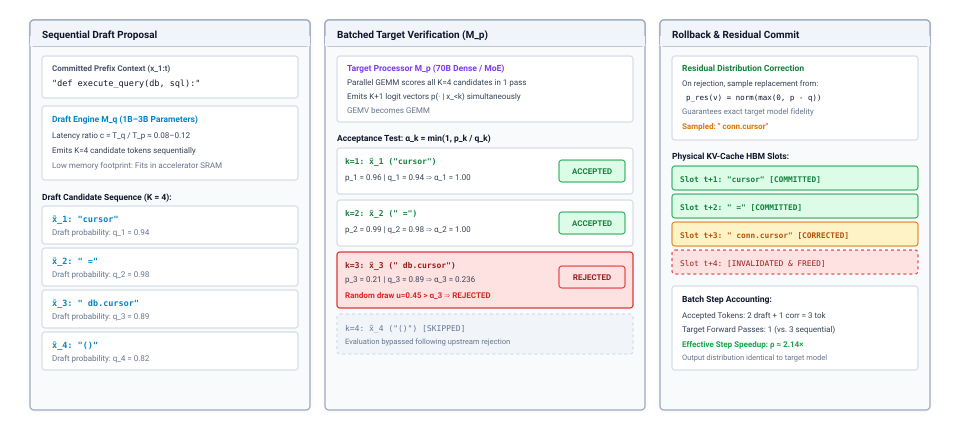
:::

### Sampling on the vocabulary Simplex

::: {.column-margin}
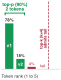{width="100%" fig-alt="Ranked vocabulary probability distribution: the top two tokens capture 95.9% of cumulative mass under top-p nucleus truncation (p=0.90, in emerald), while rigid top-k (k=4) forces inclusion of two low-probability tail tokens (in crimson)."}

*Top-p dynamically contracts to two high-confidence tokens while rigid top-k forces low-probability tail inclusion.*
:::
Once an execution step emits the unnormalized logit vector $\mathbf{z}_t \in \mathbb{R}^{|\mathcal{V}|}$, the runtime must map these raw scores onto a probability distribution over the vocabulary simplex. This transformation is governed by the *temperature* scaling parameter $\tau > 0$, which modifies the relative sharpness of the distribution prior to applying the softmax operator (@eq-temperature-softmax):

$$P(y_t = v \mid x_{1:S}, y_{<t}) = \frac{\exp\left(z_{t, v} / \tau\right)}{\sum_{w \in \mathcal{V}} \exp\left(z_{t, w} / \tau\right)}$$ {#eq-temperature-softmax}

The temperature parameter acts as an entropy modulator across the output space:

*   **Greedy Limit ($\tau \to 0$):** As $\tau$ approaches zero, the relative numerical difference between the maximum logit $\max_w z_{t, w}$ and all competing scores is amplified toward infinity. The softmax function collapses to a Dirac delta distribution centered entirely on the argmax:
    $$\lim_{\tau \to 0} P(y_t = v \mid x_{1:S}, y_{<t}) = \begin{cases} 1 & \text{if } v = \arg\max_{w \in \mathcal{V}} z_{t, w} \\ 0 & \text{otherwise} \end{cases}$$
    Greedy decoding is completely deterministic. For an identical prompt and fixed runtime configuration, the engine will always traverse the exact same path through sequence space.

*   **Calibrated Prior ($\tau = 1.0$):** The output distribution directly reflects the unscaled, cross-entropy-calibrated predictions of the neural network.
*   **High Entropy ($\tau \gg 1.0$):** As $\tau \to \infty$, the scaled logits $z_{t, v} / \tau$ converge toward zero. The exponential terms $\exp(0)$ equal 1, flattening the distribution toward a uniform categorical distribution over the entire vocabulary: $P(y_t = v) \to \frac{1}{|\mathcal{V}|}$.

Unconstrained stochastic sampling across the full vocabulary $\mathcal{V}$ frequently yields catastrophic failures in automated agents. Because language model vocabularies contain tens of thousands of subwords, the aggregate probability mass residing in the extreme tail of the distribution—comprising obscure unicode sequences, syntax errors, and low-probability tokens—is non-negligible. When sampling draws a token from this long tail, the error compounds: on the subsequent step $t+1$, the model conditions on this malformed token, frequently derailing downstream reasoning.

To suppress this tail, serving runtimes apply *truncation filters* prior to normalization:

::: {.column-margin}
**Top-$k$ vs. Top-$p$ Truncation**
Top-$k$ applies a rigid rank ceiling regardless of certainty. Top-$p$ dynamically expands or contracts the candidate set based on the cumulative shape of the probability distribution.
:::

1.  **Top-$k$ Truncation:** The runtime sorts the logit vector and sets $z_{t, v} = -\infty$ for all tokens ranked below a fixed threshold $k \in \mathbb{N}^+$:
    $$\mathcal{V}_k = \{v \in \mathcal{V} \mid \operatorname{rank}(z_{t, v}) \le k\}$$
    While top-$k$ guarantees that the runtime never considers tokens ranked outside the top $k$ candidates, its fixed boundary is poorly matched to variable model confidence. If the model is highly certain (e.g., predicting the closing parenthesis of a function call), the top candidate might possess $99\%$ of the probability mass, yet top-$k$ forces the inclusion of $k-1$ irrelevant options. Conversely, if the distribution is flat across dozens of plausible synonyms, top-$k$ prematurely truncates viable continuations.

2.  **Top-$p$ (Nucleus) Truncation:** Rather than fixing the count of candidates, nucleus truncation dynamically sizes the candidate set to the smallest subset $\mathcal{V}_p \subseteq \mathcal{V}$ whose cumulative probability mass exceeds a specified threshold $p \in (0, 1]$:
    $$\mathcal{V}_p = \arg\min_{\mathcal{S} \subseteq \mathcal{V}} |\mathcal{S}| \quad \text{subject to} \quad \sum_{v \in \mathcal{S}} P(v \mid x_{1:S}, y_{<t}) \ge p$$
    All tokens outside $\mathcal{V}_p$ have their logits masked to $-\infty$, and the remaining scores are renormalized. Under high certainty, $|\mathcal{V}_p|$ naturally collapses to one or two tokens; under high entropy, $|\mathcal{V}_p|$ expands to accommodate the broad candidate pool.

::: {#nbk-02-logit-scaling-and-truncation-on .callout-notebook title="Logit scaling and truncation on the vocabulary Simplex"}
Consider a reduced vocabulary $\mathcal{V} = \{v_1, v_2, v_3, v_4, v_5\}$ where an execution step emits unnormalized logits $\mathbf{z}_t = [12.0, 10.5, 9.0, 6.0, 3.0]$. We examine the resulting probability distributions across three distinct runtime sampling configurations.

**Step 1: Baseline Softmax at Unit Temperature ($\tau = 1.0$)**
First, compute the exponentials $\exp(z_i)$:
$$\exp(\mathbf{z}_t) = [162754.8, 36315.5, 8103.1, 403.4, 20.1]$$
Summing the terms yields $\sum_i \exp(z_i) = 207596.9$. Dividing each term by the denominator gives:
$$\mathbf{P}_{\tau=1.0} = [0.7840, 0.1749, 0.0390, 0.0019, 0.0001]$$

**Step 2: Low-Temperature Sharpening ($\tau = 0.5$)**
Scale the logits by $\tau = 0.5$, which doubles each exponent: $\mathbf{z}_t / 0.5 = [24.0, 21.0, 18.0, 12.0, 6.0]$.
Computing the new exponentials:
$$\exp(\mathbf{z}_t / 0.5) = [2.649 \times 10^{10}, 1.319 \times 10^9, 6.566 \times 10^7, 1.628 \times 10^5, 403.4]$$
The sum is dominated almost entirely by the top token: $\sum_i \exp(z_i / 0.5) \approx 2.788 \times 10^{10}$.
Normalizing produces the sharpened probabilities:
$$\mathbf{P}_{\tau=0.5} = [0.9502, 0.0473, 0.0024, 0.0000, 0.0000]$$
Lowering the temperature concentrates $95\%$ of the total probability mass onto the top token $v_1$, drastically reducing the entropy of the generation step.

**Step 3: Nucleus Truncation ($p = 0.90, \tau = 1.0$)**
Starting from the unscaled probabilities $\mathbf{P}_{\tau=1.0} = [0.7840, 0.1749, 0.0390, 0.0019, 0.0001]$, sort the tokens in descending order and compute their cumulative distribution:

*   Token $v_1$: $P(v_1) = 0.7840$ (Cumulative: $0.7840 < 0.90$)
*   Token $v_2$: $P(v_2) = 0.1749$ (Cumulative: $0.7840 + 0.1749 = 0.9589 \ge 0.90$)

The cumulative threshold $0.90$ is exceeded by including $v_2$. Therefore, the nucleus set is $\mathcal{V}_p = \{v_1, v_2\}$.
The logits for tokens $v_3, v_4, v_5$ are set to $-\infty$. We renormalize the surviving subset $\{v_1, v_2\}$:
$$\text{Denominator} = 0.7840 + 0.1749 = 0.9589$$
$$P_{\text{nucleus}}(v_1) = \frac{0.7840}{0.9589} = 0.8176, \quad P_{\text{nucleus}}(v_2) = \frac{0.1749}{0.9589} = 0.1824$$
Tokens $v_3, v_4,$ and $v_5$ receive zero probability mass, eliminating tail risk while maintaining proportional stochastic choice between the two plausible candidates.
:::

For an agent systems designer, the selection between deterministic greedy decoding ($\tau = 0$) and nucleus sampling ($p < 1.0, \tau > 0$) represents an architectural trade-off between *reproducibility* and *robustness*:

*   **Determinism and Testability:** Greedy decoding provides strict determinism at the model interface. For compiler toolchains, database queries, and system configuration tasks, determinism is vital: a regression test executed against a deterministic model produces reproducible traces, enabling engineers to isolate bugs in downstream runtime logic without contending with sampling variance.
*   **Path Degeneration:** Despite its reproducibility, greedy decoding is uniquely vulnerable to *pathological attractors*. If an uncalibrated model enters a repetitive loop (e.g., emitting repetitive whitespace or cycling between two contradictory logic statements), the greedy argmax will select the exact same token on step $t+m$ that triggered the cycle on step $t$, locking the generation into an infinite loop until $T_{\max}$ is exhausted. Injecting mild entropy through nucleus sampling ($p = 0.95, \tau = 0.7$) perturbs these deterministic attractor basins, allowing the generation to break free from repetitive loops.

***

Suppose the autoregressive serving loop finishes its traversal across the vocabulary simplex without encountering an abnormal hardware exception. Step by step, it has evaluated the causal attention layers, sampled tokens with high individual conditional likelihoods, and halted cleanly upon encountering a designated stop delimiter. The host system now holds a complete, fluent candidate sequence $\mathbf{y}_{1:K}$ in memory escrow.

Does this high sequence likelihood establish that the generated payload is valid, syntactically well-formed, or operationally safe? It does not. The autoregressive loop optimizes solely for statistical likelihood under the training distribution; it possesses no internal model of system truth, no awareness of operating system invariants, and no mechanism to verify whether a proposed shell command or database transaction will succeed or corrupt state. The foundation model has functioned purely as an unprivileged hypothesis generator. Before any emitted candidate sequence can be granted authority to mutate external system state, the host agent runtime must submit the proposal to explicit, deterministic candidate sequence verification.

## Candidate Sequence Verification {#sec-vol3-foundation-model-continuations}

Consider an agent runtime executing a system maintenance task where the foundation model completes an autoregressive decode phase and emits a candidate sequence containing a shell command intended to purge expired temporary files: `rm -rf /var/log/app_temp_${ENV}/*`. Every single token along this generation trajectory was sampled with an individual conditional probability exceeding 0.95; the sequence as a whole possesses exceptionally high statistical likelihood under the model's parameter distribution. Yet, if the host environment has not populated the variable `ENV`, the shell interprets the string as `rm -rf /var/log/app_temp_/*`, or worse, if a whitespace token was hallucinated before the slash, as `rm -rf /`. The physical operating system does not evaluate statistical likelihood; it blindly executes the instruction across the POSIX interface, truncating file system hierarchies and inducing unrecoverable state destruction.

**Sequence likelihood measures statistical typicality within a training corpus, not operational correctness, semantic truth, or system invariant preservation.** A foundation model produces hypotheses, not validated operational commands. Because the model holds zero ambient authority (@sec-vol3-foundation-model-role), the command above could not run on its own, and whether it runs is the runtime's decision. The host agent runtime must stage every emitted candidate in memory escrow and subject it to a multi-tiered, deterministic verification perimeter before any state transition is authorized.

### The epistemic gap

During autoregressive generation, the probability assigned to a complete candidate sequence $\mathbf{y}_{1:K} = (y_1, y_2, \dots, y_K)$ conditioned on prompt $\mathbf{x}$ and model weights $\Theta$ is given by the product of individual token likelihoods:

$$P(\mathbf{y}_{1:K} \mid \mathbf{x}; \Theta) = \prod_{t=1}^K P(y_t \mid \mathbf{x}, \mathbf{y}_{<t}; \Theta)$$

The standard training objective—cross-entropy minimization across billions of web-scraped documents and source code repositories—maximizes this probability across historical text. However, statistical likelihood in a language corpus diverges sharply from logical and operational validity on physical computing hardware.

Public training datasets are saturated with deprecated API signatures, buggy forum snippets, hallucinated command-line flags, and syntactically malformed configuration scripts. When the autoregressive decode loop samples tokens that maximize $P(\mathbf{y}_{1:K} \mid \mathbf{x}; \Theta)$, it selects sequences that are typical of this heterogeneous corpus, not sequences that satisfy the formal invariants of the host environment. Furthermore, the model has no direct visibility into the host operating system's kernel state, file system hierarchy, or network topology, except through whatever static context was serialized into $\mathbf{x}$. Even if that context is impeccably accurate, the model performs statistical continuation rather than formal theorem proving.

This divergence is the fail-plausible fault of @sec-vol3-foundation-model-role, seen from inside the decode loop. The output is syntactically fluent, semantically cohesive, and wrong in its side effects. A candidate tool call may reference non-existent database columns, hallucinate API parameters, or emit inverted boolean logic, all while exhibiting token-level probabilities that rival those of perfectly sound code.

Consider the concrete failure trace below, where a model generates a candidate configuration patch with high statistical confidence, yet invents a non-existent parameter:

```bash
$ pydantic-validator validate --schema deploy_schema.json --input candidate.json
ValidationError: 1 validation error for DeployConfig
worker_threads
  Extra inputs are not permitted [type=extra_forbidden, input_value=16]
Found 1 validation failure in candidate payload staged in escrow.
```

The model generated `"worker_threads": 16` because multi-threaded configurations are pervasive in server software. However, the target microservice architecture enforces an asynchronous single-threaded event loop, making this attribute an invalid configuration entry that would prevent service initialization.

### Memory escrow mechanics

Zero ambient authority protects host resources against fail-plausible candidates. The model holds no system handles, file descriptors, or network sockets, and it communicates only through an input-output memory interface that the host runtime manages. When the autoregressive engine emits candidate tokens, the host runtime intercepts the stream and places it into *memory escrow*.

Memory escrow is a transient, host-allocated buffer that isolates unverified candidate sequences from the operational execution environment. Tokens are accumulated, decoded into text or binary payloads, and structured into symbolic candidate representations without granting them capability tokens. While held in escrow, the candidate sequence is purely passive data; it cannot mutate registers, manipulate disk blocks, or transmit network datagrams.

The lifecycle of every candidate sequence within the host supervisor follows a strict, non-bypassable state machine:

1. `EMITTED`: The model generates tokens across the accelerator interface into a host-side ring buffer.
2. `STAGED_ESCROW`: The runtime detects an end-of-sequence delimiter or generation budget limit, locks the escrow buffer, and constructs a candidate object.
3. `VALIDATING`: The host runtime dispatches the staged payload to the deterministic verification perimeter. The model cannot alter the payload during this phase.
4. `COMMITTED` or `REJECTED`: If every verification gate in the perimeter passes, the runtime issues execution capabilities, promoting the candidate to an actionable system command. If any gate rejects the payload, the candidate is discarded, and an error envelope is synthesized for diagnostic logging or subsequent handling.

### The fallacy of autoregressive self-checking

A tempting but fundamentally flawed approach to verification is *autoregressive self-checking*—prompting the foundation model to inspect its own generated continuation and answer whether the proposed action is correct. Practitioners often construct prompts of the form: *"You generated the above shell command. Review it carefully. Is it correct and safe to execute? Reply YES or NO."*

This approach violates the fundamental systems principle of independent verification. From an architectural perspective, self-checking assumes that an unprivileged inference engine can act as its own reference monitor. This assumption fails for three mechanistic reasons:

First, *correlated parameter bias*. The model that evaluates the candidate sequence shares the identical weight matrix $\Theta$, identical token embeddings, and identical training distribution priors as the model that generated the candidate. If the model's attention weights favored a hallucinated CLI flag during generation because that pattern appeared frequently in low-quality training data, the exact same attention heads will activate during the verification prompt, confirming the hallucination. The generator and the evaluator suffer from common-mode failure.

Second, *asymmetric calibration under prompt framing*. Autoregressive models are susceptible to sycophancy and confirmation bias. When presented with an existing sequence in its prompt context, the model's attention mechanism allocates probability mass to tokens that affirm the context's internal coherence rather than tokens that contradict it. The prior probability of a self-checker emitting `YES` on an invalid sequence is drastically higher than the probability of an external, unbiased judge doing so.

Third, *the infinite regress of unverified probability*. A foundation model cannot emit a boolean guarantee; it emits a probability distribution over the vocabulary simplex. Even if a model assigns a probability $P(\text{"YES"} \mid \mathbf{y}) = 0.99$, that value does not close an invariant. If the system requires verification of the verifier, it must initiate a second self-check, yielding a cascade:

$$P(\text{invariant closed}) = \prod_{j=1}^M P(\text{verdict}_j = \text{VALID}) < 1.0$$

Because each evaluation step incurs an independent probability of sampling error, cascading autoregressive checks compounds latency and inference cost while leaving the foundational uncertainty strictly unclosed.

In an agent architecture the foundation model is an intermediate hypothesis generator. Under the invariant closure principle (\ref{pri-invariant-closure}), task correctness can be established only at the host runtime endpoint, by deterministic verification tools that hold ground-truth authority over the environment. In formal methods terminology, a deterministic software validator such as a compiler, linter, or schema parser provides *soundness* with respect to the invariants it checks. It never approves a payload that violates one of those invariants ($P(\text{PASS} \mid \text{Defective}) = 0$ for the checked invariants), though it says nothing about invariants it does not check. An autoregressive self-checker provides neither soundness nor completeness. It routinely approves invalid payloads (false positives) and rejects valid but novel structures (false negatives), which disqualifies it as a reference monitor.

::: {#psp-02-the-fallacy-of-correlated-self-verification .callout-perspective title="The fallacy of correlated self-verification"}
When designing verification pipelines for agentic systems, engineers often attempt to eliminate defective outputs by prompting the foundation model to review its own generated artifacts. This strategy commits a fundamental systems fallacy: statistical self-verification with correlated failure modes cannot establish invariant closure.

Consider an agent runtime where candidate execution payloads exhibit an operational defect rate $\epsilon = 0.18$ (18 percent of generated payloads violate runtime invariants). If the runtime asks the generating model $\mathbf{f}_\Theta$ to audit its own output, the reviewer shares parameter weights, tokenization boundaries, and pretraining biases with the generator. Even if the reviewer exhibits an apparent true positive rate of $0.85$ on valid payloads, its shared failure surface produces a high false positive rate on invalid artifacts ($\alpha_{\text{model}} = P(\text{PASS} \mid \text{Defective}) = 0.65$). Applying Bayes' theorem to find the posterior defect rate:

$$P(\text{Defective} \mid \text{PASS}) = \frac{\alpha_{\text{model}} \cdot \epsilon}{\alpha_{\text{model}} \cdot \epsilon + P(\text{PASS} \mid \text{Valid}) \cdot (1 - \epsilon)} = \frac{0.65 \times 0.18}{(0.65 \times 0.18) + (0.85 \times 0.82)} \approx 14.37\%$$

Even after explicit neural self-verification, more than 14 out of every 100 approved actions remain defective—an unacceptable failure rate for production systems infrastructure.

By contrast, a deterministic external validator such as a compiler or schema parser is sound over the invariants it checks ($\alpha_{\text{ext}} = 0$). That drives $P(\text{Defective} \mid \text{PASS})$ to zero for those invariants and leaves everything outside them unchecked, because a check establishes only what it covers (principle \ref{pri-vol3-verification-asymmetry}).

**Systems insight**: Invariant closure is a property of the environment boundary, not the generation engine. Autoregressive self-review can refine surface natural language explanations, but only deterministic external arbiters possessing ground-truth execution authority can establish correctness, and only for the invariants they check.
:::

### The deterministic verification perimeter

Rather than relying on model self-reflection, robust agent architectures construct an external *deterministic verification perimeter*. This perimeter consists of a pipeline of specialized software validators operating outside the neural inference engine. Each validator acts as a sieve, intercepting candidate payloads held in memory escrow and evaluating them against explicit, non-probabilistic invariants.

The verification perimeter is structured hierarchically, as summarized in @tbl-verification-layers. The runtime schedules checks in order of increasing computational cost, enabling fast-rejection paths for coarse structural errors before committing host resources to expensive semantic evaluations.

| Verification Layer         | Gate Mechanism                           | Invariant Enforced                                                 | Latency Overhead              | Ground Truth Authority      |
|:---------------------------|:-----------------------------------------|:-------------------------------------------------------------------|:------------------------------|:----------------------------|
| **1. Lexical & Syntactic** | Stream parser, AST builder               | Valid grammar, balanced delimiters, complete JSON/YAML encoding    | $< 100\,\mu\text{s}$          | Formal language grammar     |
| **2. Structural & Schema** | Typed deserializers (Pydantic, Protobuf) | Parameter presence, type conformity, bounded ranges, enum validity | $0.1 - 1\,\text{ms}$          | Static schema definition    |
| **3. Static Semantic**     | Linters, type checkers (`tsc`, `mypy`)   | Scoping, resolved identifiers, symbol table existence, imports     | $10 - 500\,\text{ms}$         | Host workspace symbol table |
| **4. Dynamic Behavioral**  | Sandboxed dry-run, mock execution        | Zero exit code, state assertion satisfaction, budget adherence     | $50\,\text{ms} - 5\,\text{s}$ | Isolated runtime execution  |

: **The Deterministic Verification Perimeter**: Four-layer defense-in-depth model evaluating model proposals before environment mutation. {#tbl-verification-layers}

The layered architecture in @tbl-verification-layers enforces the *fail-fast* principle across candidate evaluation. If a candidate sequence contains malformed syntax, such as an unclosed quotation mark or an illegal JSON delimiter, Layer 1 catches the defect in under 100 microseconds. The host supervisor immediately halts further evaluation, discarding the invalid payload without consuming the milliseconds required to spin up a type checker or the seconds required to execute a dynamic test.

Layer 2 validates that the candidate matches the programmatic interface contract of the intended tool. If an unprivileged model proposes an API call with missing mandatory arguments, unexpected fields, or out-of-range numerical values, the typed schema validator rejects the operation deterministically.

Layer 3 addresses semantic validity within the current codebase or operational context. A candidate code edit may be syntactically flawless Python and conform perfectly to a function-call schema, yet attempt to call a function that was deprecated or removed in the current git revision. Static analysis tools, linters, and type checkers inspect the abstract syntax tree (AST) against the host's authoritative symbol table, verifying that all referenced identifiers and types actually exist.

Finally, Layer 4 evaluates dynamic behavior by staging the candidate inside an isolated environment to observe side effects. If a candidate passes all static gates, the runtime can execute a dry-run or unit test suite to verify that the proposed command terminates with exit code zero and satisfies explicit post-condition assertions.

The crucial architectural insight is that the verification perimeter cleanly separates the *generation of candidate solutions* from the *verification of invariants*. The foundation model provides heuristic search across an astronomical space of possible actions, which no combinatorial algorithm could easily navigate. The deterministic verification perimeter provides absolute, non-probabilistic invariant enforcement, which no neural network can intrinsically guarantee. By pairing an unprivileged probabilistic generator with an authoritative deterministic verifier, the agent runtime constructs a dependable system out of non-deterministic components.

To operationalize this verification perimeter within a running agent architecture, the host system cannot treat foundation model invocations as informal string-in, string-out operations. A raw API call that returns an unadorned text stream leaves the runtime unable to distinguish between a generation that halted naturally, an output truncated mid-expression by a token budget ceiling, or a connection terminated by a transport timeout. To enforce deterministic verification, the host runtime must govern every model interaction through a strictly typed Remote Procedure Call (RPC) contract. This contract must establish unambiguous operational boundaries—specifying maximum prefill and decode allocations, hard execution latency timeouts, and structured status envelopes that encapsulate candidate payloads alongside their physical serving metadata. We turn next to the architectural specification of this foundation model invocation contract.

## The Invocation Contract {#sec-vol3-foundation-model-contract}

Treating a foundation model invocation as an unadorned Unix pipe—streaming arbitrary UTF-8 characters from an unprivileged generator into a host runtime—creates an immediate failure boundary in distributed software systems. When a standard remote procedure call (RPC) encounters an execution fault, its transport layer surfaces a typed error, its runtime tears down allocated buffers, and the calling process preserves its local invariants. By contrast, an unconstrained language model call fails ambiguously. If an accelerator exhausts its memory budget or hits a sequence length ceiling midway through an autoregressive decode loop, it abruptly halts token generation without emitting closing syntax, variable bounds, or structural terminators. To a naive host consumer, an interrupted bash invocation or truncated abstract syntax tree (AST) appears not as a catastrophic hardware abort, but as an ordinary, albeit syntactically incomplete, string.

A foundation model invocation is an expensive, stateful, and non-deterministic remote procedure call executed over scarce accelerator memory. To prevent partial, malformed, or runaway executions from corrupting the host environment, the agent runtime must govern every invocation through a strictly typed contract bounded by explicit token and latency ceilings, monitored via streaming cancellation primitives, and sealed within a normalized status envelope.

::: {.column-margin}
Treating model calls as typed RPCs enforces Saltzer and Kaashoek's principle of *modular boundary enforcement*: the host system never trusts an unprivileged subsystem to self-police its own execution boundaries or cleanly report its internal resource exhaustion.
:::

### Formal request specification

In a robust agent runtime, an invocation of the underlying foundation model cannot be mediated through ad-hoc string formatting. The host runtime must formalize the call as an immutable, typed request tuple:

$$\mathcal{R} = \langle \mathbf{x}, \text{ModelID}, K_{\max}, T_{\max}, \mathcal{S}, \mathbf{\Theta}_{\text{sample}} \rangle$$

Here, $\mathbf{x} = (x_1, x_2, \dots, x_S)$ represents the sequence of prompt token identifiers staged in the host context, drawn from the model vocabulary $\mathcal{V}$ such that the prompt length satisfies $S \le S_{\max}$. The `ModelID` uniquely binds the execution to a specific parameter checkpoint $\mathbf{\Theta}$ and weight quantization layout. The hyperparameter vector $\mathbf{\Theta}_{\text{sample}} = (\tau, \text{top\_p})$ governs the stochastic mapping from raw logits to output tokens during autoregressive sampling.

The parameters $K_{\max}$ and $T_{\max}$ are ceilings the host supervisor closes mechanically, below the model, as the invariant closure principle (\ref{pri-invariant-closure}) requires for every resource bound. The generation ceiling $K_{\max}$ establishes the maximum number of new tokens the accelerator is permitted to append to the sequence. Without an explicit $K_{\max}$, an autoregressive decode loop caught in a repetitive semantic cycle or an adversarial chain-of-thought expansion will continue allocating key-value (KV) cache memory until the physical high-bandwidth memory (HBM) of the accelerator is exhausted. This exhausts the host process's deadline and starves concurrent requests sharing the accelerator pool. The wall-clock deadline $T_{\max}$ defines the absolute latency timeout for the invocation. If the serving runtime encounters network congestion, queue stalling, or slow decode steps that prevent sequence completion within $T_{\max}$, the host runtime severs the transport channel. Beyond token and deadline ceilings, the contract mandates *host buffer headroom bounds*: the supervisor enforces a strict limit on unparsed payload memory allocations ($M_{\text{staging}} \le M_{\max}$). This ensures that an errant model emitting deeply nested arrays, bloated data URIs, or malicious JSON amplification bombs cannot induce heap exhaustion or trigger the host kernel's Out-Of-Memory (`oom-killer`) against the supervisor process.

::: {.column-margin}
The request boundary must satisfy the invariant $S + K_{\max} \le S_{\text{total}}$, where $S_{\text{total}}$ is the maximum context length supported by the model architecture's positional encoding scheme and physical KV cache paging budget.
:::

Finally, the request designates a set of discrete stop sequences $\mathcal{S} \subset \mathcal{V}^*$. These token combinations explicitly signal to the accelerator serving engine that the unprivileged model has concluded its logical candidate production. When the autoregressive decode loop emits any sequence $s \in \mathcal{S}$, the serving engine must immediately halt token generation and return execution control to the host supervisor, bypassing any remaining allocation headroom within $K_{\max}$.

### Streaming execution mechanics

Because autoregressive token generation is bottlenecked by accelerator memory bandwidth during the decode phase, generating several thousand tokens is an intrinsically slow physical process. A generation budget of $K_{\max} = 2{,}048$ tokens executing on an enterprise accelerator at a rate of 40 tokens per second consumes over 50 seconds of continuous compute. If the host agent runtime were to execute this invocation as a monolithic, blocking RPC—waiting synchronously for all $K_{\max}$ tokens to materialize before inspecting the payload—the agent would surrender all dynamic supervision over the running process.

To maintain operational control, the invocation contract must mandate incremental token streaming over a multiplexed transport protocol, such as HTTP/2 framing, gRPC, or Server-Sent Events (SSE). Under this streaming model, each token identifier $y_t$ is packetized and transmitted across the network boundary to the host runtime the instant its logit vector is sampled on the accelerator.

Streaming fundamentally alters the security and efficiency posture of the host agent runtime: it enables *reactive stream inspection*. As the incremental token stream $\mathbf{y}_{1:t} = (y_1, \dots, y_t)$ crosses the network socket, an unprivileged stream consumer in the host runtime passes the emerging byte sequence through a lightweight, partial-validation state machine, establishing the protocol sequence illustrated in @fig-vol3-streaming-token-cancellation.

As traced along the timeline of @fig-vol3-streaming-token-cancellation, token delivery occurs asynchronously across the transport boundary. At decode steps $t=1$ and $t=2$, the GPU samples discrete tokens ($y_1 =$ `"{"`, $y_2 =$ `"query"`), wrapping each in an HTTP/2 DATA frame. Upon arrival, the host's incremental Deterministic Finite Automaton (DFA) verifies that the partial prefix satisfies the schema grammar, advancing parser state $q_0 \to q_1 \to q_2$ and staging the tokens in an unprivileged host memory escrow quarantine. On the accelerator, physical memory pages in GPU HBM remain locked to preserve the sequence's key-value activations.

Nominal streaming continues until token `{python} CallPrice.k_cut_str`, where the unprivileged model emits an unauthorized instruction or illegal terminal (`"DROP"`). The host stream consumer evaluates the automaton transition $\delta^*(q_{95}, y_{96}) = \emptyset$; encountering an undefined transition immediately triggers an **Invariant Violation Trap**. Rather than waiting passively for the remaining generation budget to exhaust, the host supervisor executes two coordinated actions: it purges the quarantined escrow buffer (guaranteeing zero unauthorized side effects reach real effectors) and dispatches an immediate `HTTP/2 RST_STREAM` cancellation frame carrying error code `CANCEL` across the socket.

The systems consequence of this early cancellation on accelerator silicon is immediate and profound. Upon receiving the cancellation frame, the inference daemon aborts the decode worker thread, evicts the sequence identifier from the continuous batch scheduler, and releases all physical KV cache pages back to the accelerator's memory allocator. As derived in \ref{nbk-02-memory-and-bandwidth-reclamation-via}, with an output limit of `{python} CallPrice.k_cap_str` tokens, cancellation at token `{python} CallPrice.k_cut_str` spares up to `{python} CallPrice.cancel_steps_str` further decode steps, about `{python} CallPrice.cancel_s_str` seconds at the single-stream rate of @sec-vol3-foundation-model-cost.

::: {#fig-vol3-streaming-token-cancellation fig-env="figure" fig-pos="htb" fig-cap="**Streaming Token Validation and Transport Cancellation Protocol**: Incremental token streaming across HTTP/2 or gRPC multiplexed channels enables the host runtime to validate candidate sequences on-the-fly. At decode steps $t=1$ and $t=2$, sampled tokens cross the network socket in DATA frames, where an incremental partial-validation state machine validates syntax prefixes and holds candidates in host memory escrow. When step $t=96$ emits an illegal token sequence violating schema invariants, the host immediately dispatches an `HTTP/2 RST_STREAM` cancellation frame. The inference service terminates the decode worker thread, evicts the request from the continuous batch queue, and instantly deallocates physical KV cache pages from GPU high-bandwidth memory." fig-alt="Systems protocol sequence diagram between Host Agent Runtime and Inference Service & Neural Core across an HTTP/2 transport boundary. As incremental tokens stream across the socket, an invariant violation at step t=96 triggers an immediate RST_STREAM cancellation frame, terminating the GPU decode loop and freeing 1.22 GB of KV cache memory in HBM."}
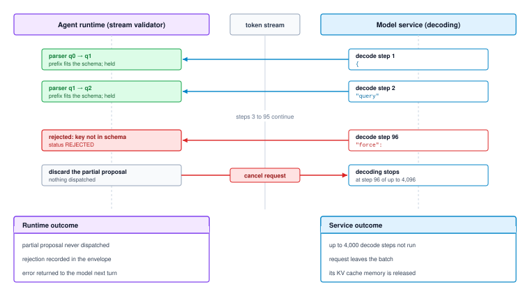
:::

::: {#nbk-02-memory-and-bandwidth-reclamation-via .callout-notebook title="Memory and bandwidth reclamation via early stream cancellation"}
Consider a host agent supervising an invocation of a 70-billion parameter model utilizing Grouped-Query Attention (GQA). The model architecture features $L = 80$ transformer layers, an internal head dimension of $d = 128$, and $H_{KV} = 8$ key-value heads. Each weight and cache element is stored in 16-bit precision (2 bytes per value).

First, we calculate the physical KV cache memory consumed by a single token across all layers:
$$M_{\text{token}} = 2 \times (\text{Key} + \text{Value}) \times L \times H_{KV} \times d$$
$$M_{\text{token}} = 2 \times 2 \times 80 \times 8 \times 128\text{ bytes} = 327{,}680\text{ bytes} = 320\text{ KiB per token}$$

Assume the host specifies a generation budget of $K_{\max} = 4{,}096$ tokens for a complex code refactoring task. At decode token $t = 96$, the model hallucinates an invalid command prefix that violates the agent runtime's tool schema.

If the host waits passively for completion, the inference engine executes the remaining $4{,}096 - 96 = 4{,}000$ decode steps. The physical KV cache memory locked by this single sequence over those steps is:
$$\text{Memory Allocated} = 4{,}000 \text{ tokens} \times 320\text{ KiB/token} = 1{,}280{,}000\text{ KiB} \approx 1.22\text{ GiB}$$

Furthermore, during the autoregressive decode phase, the inference engine must stream the entire $70\times 10^9$ parameter model from high-bandwidth memory to the tensor cores on *every single decode step*. Stored in 16-bit precision, the model weights occupy:
$$\text{Weight Footprint} = 70 \times 10^9 \times 2\text{ bytes} = 140\text{ GB}$$

By issuing an immediate `RST_STREAM` at token 96, the host supervisor prevents the accelerator from performing 4,000 memory-bound decode iterations. This eliminates the need to stream:
$$\text{Bandwidth Saved} = 4{,}000 \text{ steps} \times 140\text{ GB/step} = 560\text{ Terabytes}$$
of aggregate memory transfers across the accelerator's memory bus, freeing substantial execution capacity for concurrent serving batches.
:::

### The normalized status envelope

A robust runtime architecture rejects raw string returns. Instead, every model invocation must resolve into an authoritative, normalized status envelope $\mathcal{E}$:

$$\mathcal{E} = \langle \text{status}, \mathbf{y}, \mathbf{m} \rangle$$

The payload $\mathbf{y}$ contains the accumulated token sequence, and $\mathbf{m}$ is a metadata record logging hardware-level execution telemetry, including prefill latency, decode step count, prompt token count $S$, generated token count $K$, and accelerator termination flags.

The core of the envelope is the normalized `status` discriminator. Because distributed inference engines, cloud APIs, and local runtimes report operational states through conflicting schemas and transport codes, the host agent supervisor normalizes all raw outcomes into a closed status taxonomy, detailed in @tbl-vol3-invocation-status.

| Status Flag         | Terminal Condition                                                         | Payload Integrity                                      | Admissible Host Action                                           |
|:--------------------|:---------------------------------------------------------------------------|:-------------------------------------------------------|:-----------------------------------------------------------------|
| `COMPLETED`         | Model emitted natural EOS or stop token $s \in \mathcal{S}$ within limits. | Structurally intact; fully generated candidate string. | Release payload from escrow; forward to verifier.                |
| `TRUNCATED`         | Execution reached token ceiling $K_{\max}$ before emitting a stop token.   | Broken syntax; incomplete AST or truncated CLI flags.  | **Quarantine permanently.** Discard candidate; never execute.    |
| `REFUSED`           | Model safety classifier or system guardrail blocked generation.            | Explanatory policy string or null buffer.              | Terminate trajectory; log governance policy violation.           |
| `TRANSPORT_FAILURE` | Network socket drop, HTTP 5xx error, or deadline $T_{\max}$ expired.       | Null or fragmented network buffer.                     | Record transport failure; handle connection fault.               |
| `REJECTED`          | Host-side stream monitor detected structural invariant violation.          | Truncated string up to point of failure.               | **Quarantine permanently.** Route failure to runtime supervisor. |
| `CANCELED`          | Host supervisor actively issued `RST_STREAM` due to external signal.       | Arbitrary partial token sequence.                      | Evict payload; reclaim host memory resources.                    |
| `FAULTED`           | Engine-side CUDA OOM, kernel panic, or hardware watchdog trip.             | Null payload.                                          | Alert cluster manager; isolate failed accelerator node.          |

: **Normalized Invocation Status Envelope**: Deterministic status codes, transition conditions, and fault classifications for host execution. {#tbl-vol3-invocation-status}

The closed taxonomy in @tbl-vol3-invocation-status lets the runtime state a safety rule for a single call in terms of one field of the envelope.

::: {#pri-02-quarantining-invariant .callout-principle title="The quarantining invariant"}

**Invariant**: A payload whose invocation envelope reports any status other than `COMPLETED` is not a finished candidate and may not enter verification, compilation, or actuation.

**Implication**: The runtime checks envelope status before it unpacks a payload and sends every other status to its recovery path in @tbl-vol3-invocation-status, never to execution as is. Any search that stops branches at a token quota inherits the same rule for the branches it cuts off.

:::

`TRUNCATED` payloads show most plainly why the quarantining invariant is necessary. When an autoregressive generator exhausts its generation ceiling $K_{\max}$, the token sequence terminates arbitrarily at whatever token happened to occupy the final slot. Consider an unprivileged model generating a shell command intended to purge temporary build artifacts. The complete candidate string intended by the model may have been:

```bash
rm -rf /tmp/scratch/cache_dir
```

If the token ceiling $K_{\max}$ is reached just as the model emits the path prefix, the truncated payload delivered in the network buffer may be:

```bash
rm -rf /tmp/scratch
```

If this unverified, truncated string bypasses the host envelope check and is passed directly to an execution sandbox, it executes an operation that alters the scope of file deletion, destroying the entire scratch directory rather than the targeted cache subdirectory. In code synthesis pipelines, truncated ASTs similarly cause cascading compiler failures that poison subsequent execution contexts.

To enforce the quarantining invariant, the host runtime implements a strict gateway check that inspects the invocation envelope before unpacking its contents:

```python
def release_payload_from_escrow(envelope: InvocationEnvelope) -> CandidateString:
    """Enforces the Quarantining Invariant at the host boundary."""
    if envelope.status != InvocationStatus.COMPLETED:
        raise QuarantinedPayloadError(
            status=envelope.status,
            tokens_emitted=envelope.metadata.generated_tokens,
            detail="Payload halted abnormally; strictly barred from actuation."
        )
    # The payload is structurally complete; it may now enter verification.
    return envelope.payload
```

By enforcing this gateway check, the host runtime guarantees that partial, interrupted, or faulted generations are held in memory escrow and discarded before they can interact with the external world.

While typed RPC contracts, streaming cancellation, and status envelopes successfully isolate the host system from malformed or truncated payloads, reactive rejection remains economically and computationally inefficient. If a model generates an invalid syntactic structure, the host system detects the error, issues an `RST_STREAM`, and quarantines the result—yet all accelerator prefill operations and decode iterations consumed up to that point are permanently lost. If the host agent runtime already knows the formal grammar or schema that the output must satisfy, allowing the model to freely sample invalid tokens only to reject them at the boundary represents a fundamental waste of computing capacity. This tension raises an architectural question: can the host runtime push structural constraints directly into the accelerator's decode loop, ensuring that the model is mathematically incapable of emitting syntactically invalid tokens in the first place? We turn next to the mechanics of grammar-guided decoding.

## Grammar-Guided Decoding {#sec-vol3-foundation-model-grammar-constrained}

When an unprivileged foundation model generates structured data under standard autoregressive decoding, a single erroneous byte emitted several hundred tokens into a generation invalidates the entire payload. A missing quotation mark, an illegal escape character, or an unclosed brace causes downstream JSON, SQL, or XML parsers to abort with a fatal syntax error. In a naive host-supervised architecture where syntax validation occurs only after token generation completes, the host agent runtime must discard the entire sequence and reissue the invocation. This reactive rejection expends substantial memory bandwidth, inflates serving costs, and discards all intermediate accelerator state accumulated during prefill and decode iterations. The fundamental defect of post-hoc validation is architectural: it permits an unprivileged predictor to search freely through a vast vocabulary space where the overwhelming majority of candidate paths violate elementary syntactic invariants.

**Grammar-constrained decoding** relocates structural syntax enforcement from post-hoc host parsers directly into the accelerator's token selection stage. By compiling formal grammars into deterministic automata that dynamically project legal transition masks onto candidate logits prior to sampling, the serving runtime guarantees that emitted sequences conform strictly to a target specification, eliminating syntax errors while leaving underlying semantic correctness entirely unverified.

### Automata-driven token masking

To enforce structural syntax on accelerator silicon, the host agent runtime must compile high-level schemas—such as JSON Schemata, regular expressions, or context-free grammars (CFGs)—into low-level state machines that can evaluate token validity during the decode loop. Regular expressions and non-recursive syntactic templates compile directly into Deterministic Finite Automata (DFAs). Context-free structures that exhibit arbitrary nesting, such as recursive JSON objects or balanced mathematical expressions, compile into Pushdown Automata (PDAs) equipped with an explicit parse stack $S_{\text{parse}}$. Formally, a deterministic automaton is defined by the tuple $\mathcal{A} = (Q, \Sigma, \delta, q_0, F)$, where $Q$ is the finite set of parser states, $\Sigma$ is the alphabet of valid UTF-8 byte values, $\delta: Q \times \Sigma \to Q$ is the state transition function, $q_0 \in Q$ is the initial state, and $F \subseteq Q$ is the set of accepting states.

::: {.column-margin}
*Grammar-constrained decoding* enforces formal syntax rules by pruning illegal transitions directly in the probability distribution, ensuring that every generated byte string is accepted by the governing automaton.
:::

A fundamental systems mismatch arises between the character-level or byte-level alphabet $\Sigma$ of formal language theory and the discrete subword vocabulary $\mathcal{V}$ employed by foundation models. Modern tokenizers segment text into tens of thousands of variable-length subword byte sequences rather than individual characters. A single token $y \in \mathcal{V}$ may represent a multi-byte string spanning structural punctuation, whitespace, and literal characters, such as `",\n  \"status\":"` or `" true}"`. Consequently, an automaton cannot evaluate a token as an atomic alphabet symbol; it must verify whether the token's constituent byte sequence forms a contiguous, valid path through the transition graph.

Let the token $i \in \mathcal{V}$ correspond to the byte sequence $\mathbf{b}^{(i)} = (b_1^{(i)}, b_2^{(i)}, \dots, b_m^{(i)})$. For a current automaton state $q \in Q$, the token $i$ is valid if and only if there exists a sequence of intermediate states $(q^{(0)}, q^{(1)}, \dots, q^{(m)})$ such that $q^{(0)} = q$ and each successive byte transition is defined:

$$q^{(j)} = \delta\left(q^{(j-1)}, b_j^{(i)}\right) \neq \emptyset \quad \forall j \in \{1, \dots, m\}$$

If any intermediate transition in the sequence encounters an undefined transition $\emptyset$, the token $i$ violates the grammar and must be forbidden. The runtime pre-computes or dynamically queries the set of valid vocabulary tokens $\mathcal{V}_{\text{valid}}(q) \subseteq \mathcal{V}$ for state $q$:

$$\mathcal{V}_{\text{valid}}(q) = \left\{ i \in \mathcal{V} \;\middle|\; \delta^*\left(q, \mathbf{b}^{(i)}\right) \neq \emptyset \right\}$$

where $\delta^*$ denotes the extended transition function evaluated over the complete byte sequence (@tbl-vol3-automaton-grammar-states).

| Automaton State ($q_t$) | Incoming Token Prefix | Permissible Structural Terminals      | Candidate Token Examples     | Masked Token Examples          |
|:------------------------|:----------------------|:--------------------------------------|:-----------------------------|:-------------------------------|
| `EXPECT_KEY`            | `{"`                  | Alphanumeric key, closing quote (`"`) | `"id"`, `"status"`, `"name"` | `123`, `true`, `[`, `{`        |
| `EXPECT_COLON`          | `{"id"`               | Whitespace, colon (`:`)               | `":"`, `": "`, `" : "`       | `","`, `"}"`, `"id"`, `true`   |
| `EXPECT_VALUE_INT`      | `{"id": `             | Digits, minus sign (`-`)              | `"0"`, `"42"`, `"-1"`        | `"true"`, `"\"admin\""`, `","` |

: **Automaton Grammar States and Token Masking**: Transition states, structural terminals, and permissible versus forbidden candidate tokens during constrained JSON decoding. {#tbl-vol3-automaton-grammar-states}

::: {#dfn-grammar-constrained-decoding .callout-definition title="Grammar-constrained decoding"}

***Grammar-constrained decoding***\index{Grammar-constrained decoding!definition}\index{Logit masking!grammar constraint definition} is a synchronous logit-filtering protocol wherein an unprivileged model's next-token distribution is mathematically restricted to a formal grammar $G$ via state-dependent logit masking $M_i(q_t) \in \{0, -\infty\}$.

1.  **Significance**: Guarantees that sampled tokens conform to formal structural grammars (such as JSON Schema, SQL ASTs, or Python grammars) with probability $1.0$ directly at the logit surface, eliminating syntactic parse failures.
2.  **Distinction**: Unlike post-hoc validation (which allows malformed tokens to be sampled and subsequently rejects or retries the entire generation), grammar-constrained decoding injects negative infinity biases to invalid vocabulary indices in GPU SRAM before softmax reduction.
3.  **Common pitfall**: Executing automaton state transitions on the host CPU with synchronous PCIe interrupts per decode step, introducing multi-millisecond bus transfer stalls that degrade token generation throughput by an order of magnitude.

:::

At autoregressive decode step $t$, the transformer model evaluates its unprivileged forward pass $\mathbf{f}_{\mathbf{\Theta}}$, computing the unnormalized logit vector $\mathbf{z}_t \in \mathbb{R}^{|\mathcal{V}|}$ at the unembedding layer. Prior to applying the softmax operator or sampling a token, the serving runtime injects a logit mask vector $\mathbf{M}(q_t) \in \{0, -\infty\}^{|\mathcal{V}|}$ determined by the current parser state $q_t$:

$$M_i(q_t) = \begin{cases} 0 & \text{if } i \in \mathcal{V}_{\text{valid}}(q_t) \\ -\infty & \text{if } i \notin \mathcal{V}_{\text{valid}}(q_t) \end{cases}$$

The masked logits $\mathbf{z}_t' = \mathbf{z}_t + \mathbf{M}(q_t)$ are subsequently normalized through the categorical softmax function to produce the operational probability distribution $p_t$:

$$p_{t, i} = \frac{\exp(z_{t, i}')}{\sum_{j \in \mathcal{V}} \exp(z_{t, j}')} = \begin{cases} \frac{\exp(z_{t, i})}{\sum_{k \in \mathcal{V}_{\text{valid}}(q_t)} \exp(z_{t, k})} & \text{if } i \in \mathcal{V}_{\text{valid}}(q_t) \\ 0 & \text{if } i \notin \mathcal{V}_{\text{valid}}(q_t) \end{cases}$$

Because $p_{t, i} = 0$ for every token outside $\mathcal{V}_{\text{valid}}(q_t)$, any sampling algorithm—whether greedy argmax selection, temperature-scaled sampling, or top-$p$ nucleus filtering—is mathematically constrained to select a token that satisfies the grammar. Upon sampling $y_t \sim p_t$, the runtime updates the parser state to $q_{t+1} = \delta^*(q_t, \mathbf{b}^{(y_t)})$, advancing the automaton synchronously with the model's autoregressive decode loop (@fig-vol3-grammar-constrained-fsm).

The end-to-end systems architecture in @fig-vol3-grammar-constrained-fsm enforces syntactic guarantees directly at the logit surface through three hardware-aligned stages. In Stage 1 (Ahead-of-Time Schema Compilation), input tool specifications (such as Pydantic models) compile into regular expressions and deterministic finite automata (DFAs). For each discrete automaton state $q \in Q$, the compiler precomputes a packed bitmask $\mathbf{B}[q] \in \{0, 1\}^{\lceil |\mathcal{V}|/64 \rceil}$, where each bit marks the legality of a corresponding vocabulary token. This entire table ($8\text{ MiB}$ for 512 states over a 131k vocabulary) is mirrored directly into GPU device memory. In Stage 2 (Fused GPU Logit Masking Kernel), the unembedding layer emits unconstrained logits $\mathbf{z}_t$ (where ungrammatical tokens like `"SELECT"` or `"I think"` may hold arbitrarily high scores). A custom CUDA/Triton kernel reads the active state's bitmask $\mathbf{B}[q_t]$ and injects $-\infty$ to all illegal indices directly in on-chip SRAM before softmax reduction, mathematically forcing $P(v \notin \mathcal{V}_{\text{valid}} \mid q_t) = \exp(-\infty) / \Sigma \equiv 0.00\%$. In Stage 3 (Synchronous State Advance), the sampled token $y_t$ (guaranteed legal) advances the automaton state $q_{t+1} = \delta^*(q_t, \mathbf{b}^{(y_t)})$ entirely within GPU registers, updating the active bitmask pointer for step $t+1$ without triggering host CPU interrupts or PCIe bus transfers.

::: {#fig-vol3-grammar-constrained-fsm fig-env="figure" fig-pos="htb" fig-cap="**Grammar-Constrained Decoding via GPU Logit Masking**: Three-stage compile-time and runtime pipeline guaranteeing zero syntactic violations at the logit surface. (1) Pydantic tool schemas compile ahead-of-time into deterministic finite automata (DFAs), generating compact bitmask tables $\\mathbf{B}[q] \\in \\{0, 1\\}^{\\lceil |\\mathcal{V}|/64 \\rceil}$ stored directly in GPU memory ($8\\text{ MiB}$ for 512 states). (2) At decode step $t$, a fused GPU masking kernel injects $-\\infty$ biases to all invalid vocabulary indices directly in accelerator SRAM before softmax reduction, forcing $P(v \\notin \\mathcal{V}_{\\text{valid}} \\mid q_t) \\equiv 0$. (3) The sampled token $y_t$ advances the automaton state $q_{t+1} = \\delta^*(q_t, \\mathbf{b}^{(y_t)})$ entirely within device registers, eliminating host-device PCIe synchronization interrupts." fig-alt="Systems diagram illustrating grammar-constrained decoding across three stages: compile-time DFA and bitmask generation, fused GPU logit masking kernel applying negative infinity biases to invalid tokens, and on-chip automaton state transition with zero PCIe synchronization overhead."}
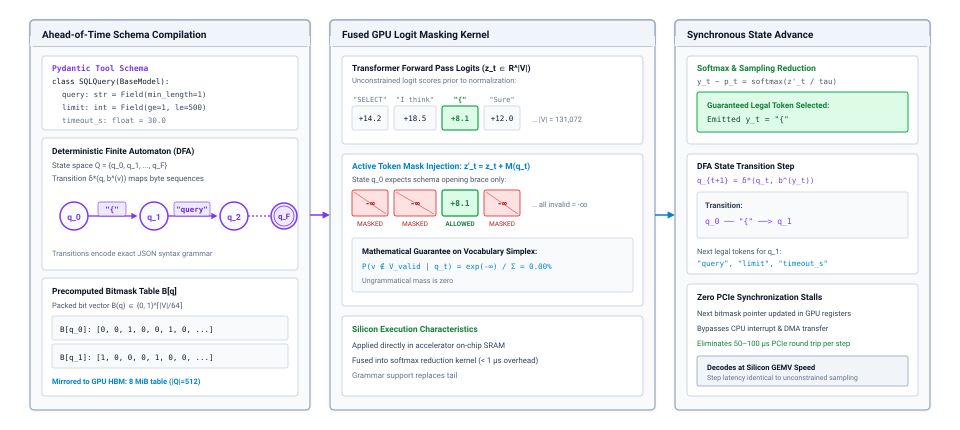
:::

### Accelerator bitmask execution

While the theoretical formulation of logit masking is straightforward, implementing it efficiently exposes severe hardware latency bottlenecks. In a naive serving architecture, the host CPU supervises grammar transitions externally. At each decode iteration, the accelerator completes its matrix-vector multiplication (GEMV), writes the sampled token ID to unified host-device memory, and issues an interrupt across the PCIe bus. A host runtime process receives the token, updates the automaton state, identifies $\mathcal{V}_{\text{valid}}(q_{t+1})$, packs the legal token IDs into a mask, and transfers the mask back across PCIe to device memory before the next forward pass can proceed.

The latency profile across host-device masking stages is detailed in @tbl-host-device-masking-latency.

| Pipeline Stage                 | Physical Subsystem           | Typical Latency        | Hardware Operational Impact                          |
|:-------------------------------|:-----------------------------|:-----------------------|:-----------------------------------------------------|
| **Token Generation (GEMV)**    | Accelerator Tensor Cores     | $1 - 20\text{ ms}$     | Forward matrix-vector parameter shuttle              |
| **Token Transfer & Interrupt** | PCIe Bus / Host OS Interrupt | $5 - 15\ \mu\text{s}$  | Accelerator execution pipeline synchronization stall |
| **Automaton State Transition** | Host CPU Core                | $2 - 10\ \mu\text{s}$  | Thread context switch and DFA table lookup           |
| **Bitmask Construction**       | Host CPU Memory Bus          | $10 - 30\ \mu\text{s}$ | Bit-packing legal token IDs into binary bit vector   |
| **DMA Transfer to Device**     | PCIe Gen5 $\times 16$ DMA    | $15 - 40\ \mu\text{s}$ | Host-to-device memory write into VRAM                |
| **Device Mask Application**    | Accelerator On-Chip SRAM     | $< 1\ \mu\text{s}$     | Element-wise logit addition ($-\infty$) and softmax  |

: **Host-Device Masking Latency**: Host-device pipeline stages during naive external logit masking, creating an unamortized $50-100\ \mu\text{s}$ stall per generated token. {#tbl-host-device-masking-latency}

This host-mediated design introduces catastrophic synchronization stalls. On modern server-grade accelerators, single-token decode latency ranges between 1 and 20 milliseconds depending on model parameter count, tensor parallelism, and batch size. Meanwhile, a host-device PCIe round trip, kernel launch overhead, and operating system thread scheduling introduce between 20 and 100 microseconds of latency per step under ideal conditions, escalating to hundreds of microseconds when host cores experience thread contention. Because autoregressive decoding is strictly sequential, host-device synchronization forces the accelerator's execution streams to serialize, stalling GPU tensor cores and underutilizing high-bandwidth memory (HBM).

To eliminate the PCIe synchronization bottleneck, high-performance inference runtimes compile grammar constraints into compact bitmask data structures maintained directly within accelerator memory. For a vocabulary size $|\mathcal{V}|$, a token validation mask is encoded as a packed binary bit vector:

$$\mathbf{B}(q) \in \{0, 1\}^{\lceil |\mathcal{V}| / 64 \rceil}$$

where each 64-bit unsigned integer represents the validity of 64 contiguous vocabulary token IDs. For an open-weights architecture with $|\mathcal{V}| = 131{,}072$ tokens, the bitmask for a single automaton state requires exactly $131{,}072 / 8 = 16{,}384\text{ bytes}$ ($16\text{ KiB}$). If a target schema compiles into an automaton with $|Q| = 512$ distinct states, the entire transition and validity table occupies $512 \times 16\text{ KiB} = 8\text{ MiB}$ of contiguous memory.

::: {#nbk-02-memory-footprint-and-transfer-latency .callout-notebook title="Memory footprint and transfer latency of grammar bitmasks"}
Consider serving a 70-billion parameter foundation model on an NVIDIA H100 SXM5 accelerator ($80\text{ GiB}$ HBM3 with $3.35\text{ TB/s}$ peak bandwidth, $50\text{ MiB}$ of on-chip L2 cache, and a PCIe Gen5 $\times 16$ interconnect providing $64\text{ GB/s}$ unidirectional bandwidth). The vocabulary contains $|\mathcal{V}| = 131{,}072$ tokens ($16\text{ KiB}$ per state bitmask). An agent runtime enforces a structured JSON response schema that compiles into a DFA with $|Q| = 512$ states.

**1. Memory Footprint and Cache Residency:**
The dense validity table requires:

$$\text{Storage} = 512 \text{ states} \times 16{,}384 \text{ bytes/state} = 8{,}388{,}608 \text{ bytes} = 8\text{ MiB}$$

An $8\text{ MiB}$ footprint represents less than $0.01\%$ of total device HBM ($80\text{ GiB}$) and fits entirely inside the accelerator's $50\text{ MiB}$ on-chip L2 cache. Staging the table into L2 cache allows a custom GPU masking kernel to read the active $16\text{ KiB}$ bitmask at L2 cache bandwidth ($\approx 12\text{ TB/s}$), completing the memory fetch in:

$$t_{\text{fetch}} = \frac{16\text{ KiB}}{12\text{ TB/s}} \approx 1.33\text{ ns}$$

The bitmask lookup is fused directly into the element-wise logit bias and softmax reduction kernel, incurring negligible execution overhead ($< 2\ \mu\text{s}$) and requiring zero synchronization with the host CPU.

**2. Host-Driven Synchronization Overhead:**
Conversely, suppose the runtime delegates state evaluation to the host CPU over PCIe Gen5. For each decode step, the system incurs:

- Device-to-host transfer of sampled token ID ($4\text{ bytes}$): $\approx 1.5\ \mu\text{s}$ (interconnect traversal and driver overhead).
- Host CPU context switch, thread scheduling, and DFA transition: $\approx 8.0\ \mu\text{s}$.
- Host-to-device DMA transfer of the $16\text{ KiB}$ bitmask:

$$t_{\text{DMA}} = \frac{16{,}384\text{ bytes}}{64\times 10^9\text{ bytes/s}} + t_{\text{packet}} \approx 0.26\ \mu\text{s} + 2.5\ \mu\text{s} = 2.76\ \mu\text{s}$$

- GPU kernel relaunch and stream synchronization: $\approx 5.0\ \mu\text{s}$.

Total host-synchronization latency per token:

$$t_{\text{host\_overhead}} \approx 1.5 + 8.0 + 2.76 + 5.0 = 17.26\ \mu\text{s}$$

Across an output sequence of $S = 500$ tokens, host-driven masking introduces $500 \times 17.26\ \mu\text{s} \approx 8.63\text{ ms}$ of pure idle stall time under ideal conditions. Under realistic host system load with multi-tenant scheduling contention, this penalty frequently expands to $50\text{--}150\ \mu\text{s}$ per token ($25\text{--}75\text{ ms}$ total), degrading token generation throughput by $15\%$ to $35\%$.
:::

For grammars with recursive nesting or complex regular expressions where the state space $|Q|$ grows into thousands of states, allocating dense bitmasks for all states becomes inefficient. Serving systems address this through compressed transition tries and speculative bitmask generation. By organizing subword tokens into a radix tree structured over byte sequences, the runtime traverses only the active branches matching the current schema depth. Furthermore, by running asynchronous CPU worker threads that anticipate future parser paths, the host supervisor can pre-populate ring buffers of forthcoming bitmasks in GPU memory, keeping the accelerator's decode stream fed without blocking on synchronous round trips.

### The syntactic divide

Grammar-guided decoding establishes a deterministic guarantee at the boundary of string representation: the emitted token sequence is provably well-formed according to the specified formal language. This guarantee is invaluable for systems integration because it eliminates JSON decode exceptions, unclosed quotation marks, and malformed field names. However, system designers frequently fall prey to a dangerous architectural conflation: assuming that syntactic validity implies semantic correctness.

::: {.column-margin}
Saltzer and Kaashoek's *Principle of Modular Division* dictates that interface representations must not be mistaken for functional verification; verifying grammar rules on strings does not establish the operational truth of the underlying propositions.
:::

Following the modularity principles of Saltzer and Kaashoek, representation must be rigorously distinguished from computation. A grammar mask operates exclusively on lexical tokens and syntax trees. It possesses zero visibility into external environment state, database consistency, operating system filesystems, or the mathematical validity of assertions.

Consider an agent tasked with generating a structured SQL mutation to adjust inventory levels. The governing grammar enforces strict ANSI SQL syntax. Under logit masking, the foundation model is physically incapable of emitting an unclosed string literal or an illegal SQL keyword. Nevertheless, the emitted statement may target a database table that does not exist, violate foreign key constraints, or execute an unindexed join that exhausts server memory. The grammar mask guarantees that the payload is parseable by the database engine, but it provides zero protection against logical corruption or authorization failures (@tbl-vol3-verification-dimensions).

| Verification Dimension    | Governed by Grammar Mask? | Enforcement Mechanism                      | Failure Mode Prevented                             |
|:--------------------------|:--------------------------|:-------------------------------------------|:---------------------------------------------------|
| **Syntactic Conformance** | Yes                       | On-chip logit masking ($z_i \to -\infty$)  | Parse errors, malformed brackets, invalid types    |
| **Schema Completeness**   | Yes                       | Automaton state progression ($q \in F$)    | Truncated payloads, missing required properties    |
| **Referential Integrity** | No                        | Database catalog / Foreign key validation  | Non-existent table or column references            |
| **Semantic Invariants**   | No                        | Host supervisor / Deterministic unit tests | Logically impossible outputs, inverted arithmetic  |
| **Authorization Bounds**  | No                        | Reference monitor / OS access control      | Privilege escalation, out-of-scope resource access |
: **Verification Dimension Boundaries**: Separation of syntactic guarantees provided by grammar masking from referential, semantic, and authorization invariants. {#tbl-vol3-verification-dimensions}

Beyond the syntactic divide, rigid grammar constraints introduce a severe failure mode known as *schema forcing*. When an unconstrained foundation model encounters an ambiguous prompt, a missing record, or a question beyond its parametric knowledge, its probability mass naturally concentrates on natural language disclaimers, clarification queries, or error reporting tokens (such as `"Error: record not found"`).

If the host runtime binds this model to a strict output schema that lacks explicit error or unknown states—for example, requiring an immediate JSON object containing `{"customer_id": int, "credit_score": int}`—the masking engine forcibly sets the logits of all explanatory, conversational, or error-signaling tokens to $-\infty$. The model's probability distribution is artificially truncated, leaving only the tokens that satisfy the structural schema, as demonstrated in @tbl-schema-forcing-distortion.

| Candidate Token Sequence | Natural Logit ($z_i$) | Natural Probability $P(y_t)$ | Masked Logit ($z_i'$) | Constrained Probability $P_{\text{mask}}(y_t)$ | Semantic Role                             |
|:-------------------------|:----------------------|:-----------------------------|:----------------------|:-----------------------------------------------|:------------------------------------------|
| `"Error: ID not found"`  | $+3.82$               | $0.82$                       | $-\infty$             | $0.00$                                         | Epistemic error disclaimer (suppressed)   |
| `"{"`                    | $+1.90$               | $0.12$                       | $+1.90$               | $1.00$                                         | Schema delimiter (artificially forced)    |
| `"Unable to resolve"`    | $+1.21$               | $0.06$                       | $-\infty$             | $0.00$                                         | Epistemic uncertainty signal (suppressed) |
: **Schema-Forcing Distortion**: Schema-forcing logit truncation, suppressing high-probability epistemic error tokens and forcing 100% posterior mass onto the schema delimiter. {#tbl-schema-forcing-distortion}

Once the model is forced into the schema's opening brace, it advances to the mandatory fields. Unable to signal its epistemic uncertainty, the model must sample tokens exclusively from the permissible integer vocabulary. It proceeds to emit an invented customer identifier (such as `948102`) and a fabricated score (such as `720`). By aggressively truncating the output distribution to preserve structural formatting, grammar masking converts an observable epistemic failure into a silent, fail-plausible semantic hallucination.

To mitigate schema forcing, the host runtime must design robust schemas that explicitly provide syntactically valid escape routes, such as union types permitting structured error objects (`{"status": "error", "code": int, "message": str}`). Even then, the host supervisor must treat every grammar-constrained payload as an untrusted candidate hypothesis. Grammar masking closes the syntactic property mechanically, below the model, which is as much of the invariant closure principle (\ref{pri-invariant-closure}) as decoding can satisfy. Semantic validation remains the responsibility of external verification gates.

::: {#chk-02-schema-constrained-decoding .callout-checkpoint title="Evaluating schema-constrained decoding"}
Before evaluating accelerator serving mechanics and memory bandwidth constraints, verify your understanding of structured generation trade-offs:

- [ ] **Grammar masking**: How does pushdown automaton (PDA) logit masking guarantee syntax conformance at the vocabulary level?
- [ ] **Schema forcing**: Under what operational conditions does aggressive logit truncation suppress legitimate epistemic uncertainty signals and induce semantic hallucination?
- [ ] **Escape routes**: Why must structured tool-call schemas explicitly incorporate typed error variants (such as union types) rather than strictly forcing successful return shapes?
- [ ] **Verification boundary**: Why does schema-constrained decoding fail to satisfy the end-to-end argument for semantic data integrity?
:::

## Accelerator Serving Latency {#sec-vol3-foundation-model-cost}

The execution of an autoregressive foundation model confronts a stark physical divide on accelerator silicon: processing a multi-thousand-token prompt achieves near-peak utilization of dense matrix compute units, whereas emitting each subsequent output token leaves those same units starved for data while waiting for parameter tensors to shuttle across the memory bus. For a software system delegating autonomous subtasks to an unprivileged foundation model, this dichotomy transforms serving latency from an abstract operational cost into a hard architectural boundary. An agent runtime cannot treat model invocations as uniform unit-time procedure calls; a call that consumes an extensive prompt to output a four-token tool invocation exhibits an entirely different resource profile, cost structure, and latency profile than a call that emits an unconstrained, multi-hundred-token reasoning trace.

**Model invocation latency is split between compute-bound prompt prefill and memory-bandwidth-bound token decode; the dominant bottleneck governing an agent's response time depends on prompt length, output token count, and whether the serving engine processes a solitary trajectory or batches multiple requests.** Understanding the physical boundaries of accelerator hardware allows systems engineers to structure prompts, configure tool interfaces, and establish timeout contracts that align with the underlying mechanics of modern hardware.

### Decomposition of end-to-end invocation latency

To manage the execution budget of an agent task, the host supervisor must decompose wall-clock invocation latency into its constituent physical and operational phases. When an agent emits a request to evaluate model $\mathbf{f}_\Theta$ over an input sequence $\mathbf{x}$ to generate continuation $\mathbf{y}$, the total elapsed time $T_{\text{call}}$ is governed by five discrete latency components (@eq-vol3-call-latency):

$$T_{\text{call}} \approx \underbrace{T_{\text{queue}} + T_{\text{prefill}}(S)}_{\text{TTFT}} + K \cdot t_{\text{tok}} = T_{\text{prep}} + T_{\text{queue}} + T_{\text{prefill}} + T_{\text{decode}} + T_{\text{post}}$$ {#eq-vol3-call-latency}

::: {.column-margin}
**Operational Latency Metrics**
In production serving runtimes, $T_{\text{prefill}}$ is commonly reported as *Time to First Token* (TTFT), while the incremental step latency of $T_{\text{decode}}$ is measured as *Inter-Token Latency* (ITL). Total generation time is dominated by $\text{ITL} \times K$.
:::

The preprocessing phase, $T_{\text{prep}}$, represents host CPU overhead. It encompasses prompt assembly, string serialization, Byte-Pair Encoding (BPE) tokenization, and—if structural decoding constraints are enforced—the compilation or resetting of the pushdown automaton guiding logit masking. Under optimized C++ or Rust tokenization pipelines, $T_{\text{prep}}$ is typically sub-millisecond for short prompts, but it scales linearly with prompt length and can consume tens of milliseconds when serializing large retrieved documents or multi-megabyte tool schemas.

The queueing delay, $T_{\text{queue}}$, captures the time the tokenized request waits in the serving engine's scheduling backlog before execution begins on accelerator silicon. In a local, single-tenant deployment dedicated to a solitary agent, $T_{\text{queue}}$ approaches zero. In shared enterprise clusters or commercial multi-tenant API endpoints, however, $T_{\text{queue}}$ becomes a non-deterministic random variable governed by arrival rates, dynamic priority classes, and batch scheduling policies. During periods of cluster saturation, queueing jitter frequently dominates the tail latency ($p99$) of an agent's tool loop.

The prefill latency, $T_{\text{prefill}}$, measures the duration required by the accelerator to ingest the entire prompt sequence of length $S$, compute the internal key-value representations across all transformer layers, and evaluate the conditional distribution $P(y_1 \mid \mathbf{x})$ to sample the first generated token. Because all $S$ prompt tokens are known in advance, this phase executes as a sequence of highly parallel matrix multiplications.

The autoregressive decode latency, $T_{\text{decode}}$, represents the cumulative time required to generate the subsequent $K - 1$ output tokens. Because autoregressive generation possesses an irreducibly serial causal dependency—where step $k$ cannot commence until token $y_{k-1}$ has been sampled and its key-value projections appended to accelerator memory—this phase cannot be parallelized across the generation dimension. It unfolds as a sequence of $K$ distinct execution passes:

$$T_{\text{decode}} = \sum_{k=1}^{K} T_{\text{decode}}^{(k)}$$

Finally, the postprocessing latency, $T_{\text{post}}$, captures the host supervisor's overhead to detokenize the emitted token IDs back into a UTF-8 byte stream, parse structured envelopes such as JSON tool calls, and execute initial schema validation before yielding control back to the agent policy.

```python
def roofline_decode_latency(params_billion: float, bytes_per_param: float,
                            bandwidth_tb_s: float, tokens_k: int) -> float:
    """Computes theoretical memory-bound decode latency for batch size B=1."""
    model_bytes = params_billion * 1e9 * bytes_per_param
    bus_bandwidth = bandwidth_tb_s * 1e12
    seconds_per_token = model_bytes / bus_bandwidth
    return seconds_per_token * tokens_k
```

This decomposition exposes a critical asymmetry in agent architectures. A software agent typically constructs large prompt contexts ($S \in [10^3, 10^5]$) containing system directives, environment state, and past execution history, but its immediate operational objective is often a compact action—a structured invocation of twenty tokens ($K \in [10^1, 10^2]$). Despite the prompt being orders of magnitude larger than the response ($S \gg K$), the wall-clock duration of $T_{\text{decode}}$ frequently exceeds $T_{\text{prefill}}$. The physical origin of this asymmetry lies in the hardware Roofline model.

For a `{python} CallPrice.params_b_str`-billion-parameter model with 8-bit weights, served from one current data center accelerator (the smallest deployment that holds it) with `{python} CallPrice.bw_str` TB/s of memory bandwidth, each decode step for a single stream takes at least `{python} CallPrice.t_dec_ms_str`, while each prompt token costs about `{python} CallPrice.t_pre_us_str` of prefill at the accelerator's peak arithmetic rate. An output token therefore costs about `{python} CallPrice.ratio_str` times as much time as a prompt token.

For the first turn, prefill of `{python} CallPrice.s0_str` tokens takes about `{python} CallPrice.call1_pre_str` s at that floor, and decoding `{python} CallPrice.k_turn_str` tokens takes about `{python} CallPrice.call1_dec_str` s. Per call, output sets the latency.

### Prefill versus decode: The accelerator Roofline boundary

The performance of any numerical workload on accelerator silicon is bounded by two fundamental physical ceilings: the peak floating-point compute capacity of its arithmetic units ($\pi$, measured in FLOPs per second) and the peak bandwidth of the bus shuttling data from device High Bandwidth Memory (HBM) into on-chip Static Random-Access Memory (SRAM) registers ($\beta$, measured in bytes per second).

The operational intensity, or arithmetic intensity $I$, characterizes the algorithmic efficiency of a workload by calculating the ratio of floating-point operations performed to the total volume of memory traffic transferred across the bus:

$$I = \frac{\text{Floating-Point Operations (FLOPs)}}{\text{Memory Traffic (Bytes)}}$$

::: {.column-margin}
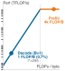{width="100%" fig-alt="Hardware roofline model on an NVIDIA H100 GPU: a blue memory-bound slope rises to a vertical dashed ridge at 295 FLOPs/byte before flattening into an orange compute ceiling at 989 TFLOP/s. The unbatched decode dot sits at 1 FLOP/byte (0.68% compute utilization), while the prompt prefill dot sits high on the compute plateau at 4,096 FLOPs/byte."}

*Prefill saturates Tensor Core compute at 4,096 FLOPs/byte, while unbatched decode is trapped on the memory slope at 1 FLOP/byte (@sec-vol3-appendix-inference-roofline develops the ridge point derivation across accelerator generations).*
:::

The Williams-Waterman-Patterson Roofline model establishes that the attainable performance $P$ of a kernel is the minimum of its hardware compute ceiling and its bandwidth-supported throughput:

$$P = \min(\pi, \; \beta \cdot I)$$

The hardware *ridge point*, $I^* = \pi / \beta$, defines the operational boundary between two fundamentally distinct computational regimes. On modern accelerator silicon such as an NVIDIA H100 SXM GPU, the 16-bit floating-point Tensor Core compute ceiling reaches $\pi \approx 9.89 \times 10^{14}\text{ FLOPs/s}$ (989 TFLOP/s of dense half-precision compute), while the HBM3 subsystem provides a peak memory bandwidth of $\beta \approx 3.35 \times 10^{12}\text{ bytes/s}$ (3.35 TB/s). The resulting ridge point is:

$$I^* = \frac{9.89 \times 10^{14}\text{ FLOPs/s}}{3.35 \times 10^{12}\text{ bytes/s}} \approx 295.2\text{ FLOPs/byte}$$

To saturate the accelerator's matrix math units and avoid wasting compute cycles, a numerical kernel must execute at least 295 floating-point operations for every single byte of data fetched across the memory bus, establishing the profound dichotomy between prefill and decode highlighted in @tbl-prefill-decode-roofline and @fig-vol3-roofline-prefill-decode.

| Operational Dimension          | Prompt Prefill Phase                                                    | Autoregressive Decode Phase                                             |
|:-------------------------------|:------------------------------------------------------------------------|:------------------------------------------------------------------------|
| **Primary Math Kernel**        | General Matrix-Matrix Multiply (GEMM)                                   | General Matrix-Vector Multiply (GEMV)                                   |
| **Input Tensor Shape**         | Activation matrix: $\mathbf{X} \in \mathbb{R}^{S \times d}$             | Activation vector: $\mathbf{x} \in \mathbb{R}^{1 \times d}$             |
| **Weight Tensor Shape**        | Parameter matrix: $\mathbf{W} \in \mathbb{R}^{d \times d_{\text{out}}}$ | Parameter matrix: $\mathbf{W} \in \mathbb{R}^{d \times d_{\text{out}}}$ |
| **Arithmetic Intensity ($I$)** | $I \approx \frac{2 \cdot S}{\text{bytes\_per\_param}} \gg I^*$          | $I \approx \frac{2}{\text{bytes\_per\_param}} \ll I^*$                  |
| **Physical Bottleneck**        | Compute-bound (Tensor Core ALU saturation)                              | Memory-bandwidth-bound (HBM bus saturation)                             |
| **Hardware Utilization**       | High ($50\%\text{--}80\%$ of peak TFLOP/s)                              | Negligible ($< 1\%$ of peak TFLOP/s at $B=1$)                           |
| **Latency Scaling Law**        | Sub-linear with $S$ until compute limits                                | Strictly linear with output tokens $K$                                  |

: **Roofline Execution Regimes**: Architectural comparison of the prompt prefill and token decode execution regimes on accelerator hardware. {#tbl-prefill-decode-roofline}

::: {#fig-vol3-roofline-prefill-decode fig-env="figure" fig-pos="htb" fig-cap="**Roofline Operational Intensity Across Generation Phases**: Quantitative hardware roofline curve on an NVIDIA H100 SXM5 GPU (left) and corresponding kernel matrix geometries (right). The memory bandwidth slope ($B_{\\text{mem}} = 3.35\\text{ TB/s}$) and BF16 Tensor Core compute ceiling ($P_{\\text{peak}} = 989\\text{ TFLOP/s}$) define a hardware ridge point at $\\mathcal{I}^* = 295.2\\text{ FLOP/byte}$. Context prefill operates as a tall matrix multiplication (GEMM, $S \\gg 1$), amortizing static weight memory across $S$ prompt tokens to attain $\\mathcal{I} \\approx 512\\text{ FLOP/byte}$ and $>90\\%$ compute saturation. Unbatched autoregressive decode executes as a thin matrix-vector contraction (GEMV, $B=1$), requiring 140 GB of parameter transfers across the memory bus for every generated token, collapsing operational intensity to $\\mathcal{I} \\approx 1.0\\text{ FLOP/byte}$ and stalling Tensor Core utilization below $0.5\\%$." fig-alt="Hardware roofline model and matrix geometry diagram on an NVIDIA H100 GPU contrasting memory-bound decode at 1 FLOP/byte and 3.35 TFLOP/s against compute-bound prefill at 512 FLOP/byte and 950 TFLOP/s, illustrating vector-matrix versus matrix-matrix execution shapes."}
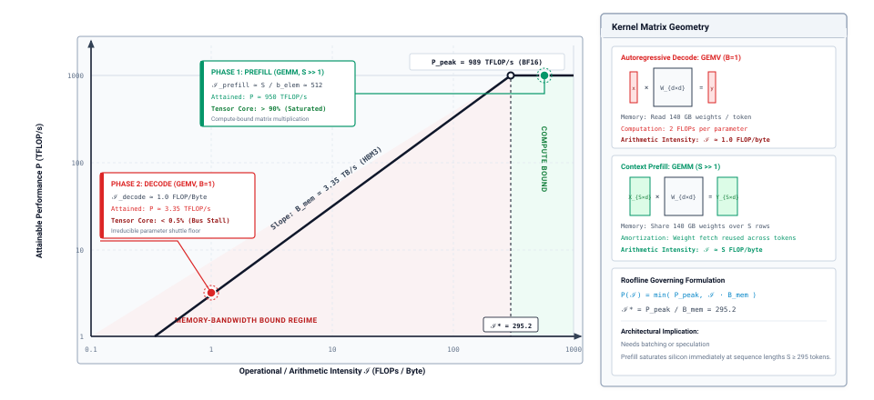
:::

The architectural contrast between these two execution phases is plotted quantitatively in @fig-vol3-roofline-prefill-decode. On the left, the hardware roofline curve plots attainable floating-point performance $P$ against operational intensity $\mathcal{I}$, bounded by the memory bandwidth slope ($B_{\text{mem}} = 3.35\text{ TB/s}$) and peak BF16 Tensor Core ceiling ($P_{\text{peak}} = 989\text{ TFLOP/s}$). On the right, the kernel matrix geometries illustrate the fundamental structural cause of this performance disparity: prompt prefill evaluates a two-dimensional activation matrix against parameter weights, amortizing the weight fetch across all sequence rows, while unbatched decode reduces to a single row vector multiplying the entire weight tensor.

During the prompt prefill phase, the accelerator evaluates the transformer's feed-forward and projection layers across all $S$ tokens simultaneously. The input activation tensor is a two-dimensional matrix $\mathbf{X} \in \mathbb{R}^{S \times d}$, which multiplies the static parameter weight tensor $\mathbf{W} \in \mathbb{R}^{d \times d_{\text{out}}}$. This operation executes as a dense General Matrix-Matrix Multiplication (GEMM).

In a model containing $P = |\Theta|$ parameters stored in 16-bit precision (2 bytes per parameter), loading the weight tensor transfers $2P$ bytes across the bus. Performing the matrix multiplication over $S$ tokens requires $2 \cdot P \cdot S$ floating-point operations. The arithmetic intensity of the prefill phase is therefore:

$$I_{\text{prefill}} \approx \frac{2 \cdot P \cdot S}{2 \cdot P} = S\text{ FLOPs/byte}$$

When an agent supplies a modest context of $S = 4{,}096$ tokens, the operational intensity reaches $I_{\text{prefill}} \approx 4{,}096\text{ FLOPs/byte}$. Because $4{,}096 \gg I^*$, prefill operates deeply within the compute-bound plateau of the Roofline curve. The matrix units run at high utilization, and the latency $T_{\text{prefill}}$ scales primarily with the total arithmetic operation count divided by the Tensor Core throughput $\pi$.

During the autoregressive decode phase, the situation reverses entirely. Because each generation step evaluates the model for exactly one newly sampled token, the input activation collapses to a single row vector $\mathbf{x} \in \mathbb{R}^{1 \times d}$. The linear projections now execute as General Matrix-Vector Multiplications (GEMV). The accelerator must still sweep the entire parameter weight matrix $\mathbf{W}$ across the memory bus from HBM into SRAM registers, transferring $2P$ bytes. Yet, it performs only $2 \cdot P \cdot 1$ floating-point operations against that single vector.

Neglecting the transient retrieval of past key-value states for a moment, the arithmetic intensity of a single decode step is:

$$I_{\text{decode}} \approx \frac{2 \cdot P \cdot 1}{2 \cdot P} = 1\text{ FLOP/byte}$$

If parameters are quantized to 8-bit precision (1 byte per parameter), the operational intensity doubles to $I_{\text{decode}} = 2\text{ FLOPs/byte}$. Regardless of precision, $I_{\text{decode}}$ remains more than two orders of magnitude below the hardware ridge point $I^* \approx 295.2\text{ FLOPs/byte}$. The decode phase operates trapped at the extreme bottom of the memory-bandwidth-bound slope.

### The memory bandwidth shuttle

The physical consequence of a low arithmetic intensity is that token decode latency is dictated not by how fast the accelerator can compute, but by how fast its memory controllers can sweep parameter weights across physical traces from HBM into processing registers.

On-chip SRAM cache memory on modern accelerators is physically constrained by silicon die area, typically offering between 40 megabytes and 100 megabytes of total storage across all streaming multiprocessors. A foundation model containing tens of billions of parameters cannot reside within on-chip cache. A 70-billion-parameter model occupies 140 gigabytes in 16-bit precision, or 70 gigabytes when quantized to 8-bit representations. Consequently, the parameter tensors must reside in off-chip HBM packages interconnected via silicon interposers.

To generate a single output token, the accelerator must transfer the entire 70-gigabyte model across the bus, load the weights into local registers, compute the inner products with the single token activation vector, and discard the weights from local register storage to make room for the subsequent layer's parameter tensors. To generate the next token, the hardware repeats the entire sequence from scratch.

::: {#nbk-02-roofline-bound .callout-notebook title="The Roofline bound on single-token generation"}
Consider a foundation model with $P = 70 \times 10^9$ parameters quantized to 8-bit precision (FP8, storing 1 byte per parameter, yielding an in-memory footprint of $70 \times 10^9\text{ bytes}$). The model executes on an accelerator with a peak memory bandwidth of $\beta = 3.35\text{ TB/s}$ ($3.35 \times 10^{12}\text{ bytes/s}$) and a peak matrix compute ceiling of $\pi = 989\text{ TFLOP/s}$ ($9.89 \times 10^{14}\text{ FLOP/s}$). We seek to calculate the theoretical minimum inter-token latency for an agent running at batch size $B = 1$.

First, calculate the time required purely to shuttle the model parameters across the memory bus from HBM into SRAM:

$$T_{\text{mem}} = \frac{\text{Model Footprint (Bytes)}}{\text{Memory Bandwidth (Bytes/s)}} = \frac{70 \times 10^9\text{ bytes}}{3.35 \times 10^{12}\text{ bytes/s}} \approx 0.020895\text{ seconds} \approx 20.90\text{ ms}$$

Next, calculate the theoretical time required to execute the floating-point operations if the compute units operated at 100 percent efficiency:

$$T_{\text{comp}} = \frac{2 \cdot P \cdot 1\text{ FLOPs}}{\text{Peak Compute Throughput (FLOPs/s)}} = \frac{1.40 \times 10^{11}\text{ FLOPs}}{9.89 \times 10^{14}\text{ FLOPs/s}} \approx 0.0001415\text{ seconds} \approx 0.14\text{ ms}$$

The attainable step latency is constrained by the maximum of these two physical durations:

$$T_{\text{step}} \ge \max(T_{\text{comp}}, \; T_{\text{mem}}) = \max(0.14\text{ ms}, \; 20.90\text{ ms}) = 20.90\text{ ms}$$

The arithmetic utilization $\eta$ of the accelerator's matrix math silicon during this single-token generation step is:

$$\eta = \frac{T_{\text{comp}}}{T_{\text{mem}}} = \frac{0.14\text{ ms}}{20.90\text{ ms}} \approx 0.00678 \quad (0.68\%)$$

More than $99.3\%$ of the accelerator's matrix math units sit completely idle during the step. The maximum attainable decoding speed for this trajectory is:

$$\text{Throughput} \le \frac{1\text{ token}}{0.020895\text{ seconds}} \approx 47.8\text{ tokens/second}$$
:::

This quantitative reality highlights why multi-tenant inference runtimes rely on request batching. If the serving runtime groups $B$ independent client requests together, it loads the model weights $\mathbf{W}$ across the memory bus once and multiplies them against an activation matrix $\mathbf{X} \in \mathbb{R}^{B \times d}$ representing the current token from all $B$ streams simultaneously.

Because memory traffic remains fixed at the model footprint while floating-point operations scale linearly with $B$, the operational intensity of decode scales directly with batch size:

$$I_{\text{decode}}(B) \approx \frac{2 \cdot B \cdot P}{P \cdot \text{bytes\_per\_param}} = \frac{2 \cdot B}{\text{bytes\_per\_param}}$$

By increasing the batch size beyond the hardware ridge point—achieving $B \ge 148$ for 8-bit models on an H100 GPU—the serving runtime drives the hardware back into the compute-bound regime. This amortizes the cost of loading parameters across hundreds of concurrent users, maximizing aggregate server throughput (tokens emitted per second across the entire cluster).

For an autonomous agent, however, service-level batching introduces an acute systems dilemma. An agent's execution is intrinsically a closed-loop sequential process. The agent observes the world, dispatches a prompt to the model, waits for the action token sequence to complete, executes the selected tool against an external environment, and incorporates the tool output into the subsequent prompt.

Because the prompt for step $t+1$ depends strictly on the empirical side effects of the tool invoked at step $t$, the agent cannot pre-generate future tokens or parallelize across successive steps of its own trajectory. Along its own execution path the agent runs at batch size $B = 1$, so batching, the usual remedy for bandwidth-bound decode (principle \ref{pri-vol3-memory-bandwidth-decoding}), cannot shorten its critical path. @Tbl-trajectory-lifecycle-b1 summarizes the resulting phases of one step.

| Execution Phase           | Hardware Bound           | Dominant Resource        | Latency Profile                             | Arithmetic Utilization                     |
|:--------------------------|:-------------------------|:-------------------------|:--------------------------------------------|:-------------------------------------------|
| **Prompt Prefill**        | Compute Bound            | Accelerator Tensor Cores | $50 - 300\text{ ms}$ (Prompt dependent)     | High ($40\% - 70\%$ peak TFLOPS)           |
| **Action Decode ($B=1$)** | Memory Bandwidth Bound   | HBM Weight Shuttle       | $20.9\text{ ms/token}$ (70B FP8 on H100)    | Minimal ($< 1\%$ peak arithmetic capacity) |
| **Tool Execution**        | Host I/O / Network Bound | Host CPU, Disk, Network  | $10 - 2{,}000\text{ ms}$ (System dependent) | Zero accelerator activity (GPU idled)      |
| **Observation Staging**   | Host-Device Transfer     | PCIe Bus and Host RAM    | $1 - 10\text{ ms}$                          | Negligible DMA transfer overhead           |
: **Trajectory Step Lifecycle**: Phased execution lifecycle of an interactive trajectory step at batch size $B=1$, illustrating compute starvation during decode and GPU idling during tool execution. {#tbl-trajectory-lifecycle-b1}

When an agent runtime dispatches calls to a multi-tenant shared serving engine that uses large dynamic batches to maximize GPU efficiency, the agent suffers substantial queueing delay ($T_{\text{queue}}$) and latency jitter. Each step of the agent's tool loop is subjected to scheduling pauses while the serving engine aggregates requests from other network clients to assemble efficient batches.

Conversely, if the systems engineer provisions dedicated, unbatched accelerator silicon exclusively to minimize the agent's cycle time ($T_{\text{queue}} \to 0$), the physical hardware operates at less than 1 percent compute efficiency. The host system pays the full power, hardware capital, and thermodynamic cost of the accelerator while utilizing only its memory bus. At an enterprise server acquisition cost of approximately $\$30{,}000$ per NVIDIA H100 (or $\$3.50/\text{hr}$ on-demand cloud pricing), unbatched decode at $0.68\%$ arithmetic utilization means that over $99\%$ of the amortized hardware capital and operational cooling budget is wasted maintaining idle matrix math silicon while waiting on the memory bus. This acute capital inefficiency provides the primary economic driver for disaggregated serving architectures that partition physical accelerators into specialized prefill nodes (saturating compute) and decode nodes (maximizing memory throughput).

The physical asymmetry between compute-bound prefill and memory-bound decode imposes an unforgiving economic and temporal calculus on agent system architecture. A single verbose tool call emitting hundreds of unconstrained tokens costs orders of magnitude more accelerator time than processing a thousand-token prompt, while idle Tensor Cores burn energy waiting for weights to transit the memory bus. When system designers attempt to optimize this pipeline—whether through fine-grained prompt compression, grammar-constrained decoding, speculative execution, or specialized tool formats—how can they rigorously determine whether an architectural intervention yields an authentic performance gain? Because superficial metrics such as raw token generation speed or isolated JSON parsing accuracy fail to capture the compound dynamics of multi-turn problem solving, systems engineers require an empirical benchmarking methodology grounded in end-to-end task completion under invariant resource budgets.

### Multi-turn trajectory cost accumulation

A trajectory is many calls, and the model keeps nothing between them. Each turn therefore re-sends the entire conversation so far, plus the new tool result, and the prompt grows turn after turn. If the first prompt has $S_0$ tokens and each turn appends $\Delta$ tokens of model output and tool results, a trajectory of $N$ turns sends

$$S_{\text{sent}} = \sum_{t=0}^{N-1} \left(S_0 + t\Delta\right) = N S_0 + \Delta \frac{N(N-1)}{2}$$ {#eq-vol3-trajectory-resend}

prompt tokens in total, which grows with the square of the number of turns.

A service can avoid most of that work. When a new prompt begins with exactly the same tokens as an earlier one, the service can reuse the KV cache it built for that shared prefix and run prefill only on the new suffix. This is **prefix caching**\index{Prefix caching!economics} [@zheng2024sglang]. In an agent loop almost every prompt extends the previous one, so with caching each turn prefills only its $\Delta$ new tokens. The saving depends on the prefix staying byte-for-byte identical. An edit early in the context, such as a timestamp in the system prompt or a reordered tool list, invalidates the cache from that point on. How to lay out the context so the prefix stays stable is the subject of @sec-vol3-context-engineering, and how the service stores and matches cached prefixes is the subject of @sec-vol3-kvcache-radix-tree. The notebook below prices one trajectory with and without it.

::: {#nbk-02-price-of-a-trajectory .callout-notebook title="The price of a thirty-turn trajectory"}

**Problem**: A coding agent runs `{python} CallPrice.turns_str` turns. Its first prompt is `{python} CallPrice.s0_str` tokens, each turn appends `{python} CallPrice.delta_str` tokens of model output and tool results, and each turn emits `{python} CallPrice.k_turn_str` output tokens. Using the per-token floors above, how many tokens does the trajectory process, how long does the model spend on them, and what does prefix caching change?

**Math**: Without caching, @eq-vol3-trajectory-resend gives $N S_0 + \Delta\,N(N-1)/2 =$ `{python} CallPrice.sent_nocache_str` prompt tokens, against $N K =$ `{python} CallPrice.out_total_str` output tokens, so re-sent input is `{python} CallPrice.input_share_str` percent of all tokens processed. Prefill of those prompt tokens takes about `{python} CallPrice.pre_nocache_str` s, and decode of the output takes about `{python} CallPrice.dec_total_str` s. With prefix caching, only the first prompt and each later turn's new tokens are prefilled, $S_0 + (N-1)\Delta =$ `{python} CallPrice.sent_cache_str` tokens, about `{python} CallPrice.cache_saving_str` times fewer, and prefill time falls to about `{python} CallPrice.pre_cache_str` s. By the last turn the context holds `{python} CallPrice.sent_cache_str` tokens, whose KV cache at 16-bit precision occupies about `{python} CallPrice.kv_final_gb_str`, beside about `{python} CallPrice.weights_gb_str` of weights. Together they need about `{python} CallPrice.resident_gb_str`, more than the `{python} CallPrice.accel_gb_str` one accelerator holds before any activation or runtime buffers, so the single-accelerator deployment that sets the decode floor cannot keep this trajectory's last turn resident.

**Systems insight**: On the agent's own critical path, the `{python} CallPrice.out_total_str` output tokens still take the most time, because each one is a serial, memory-bound step. The trajectory's work, however, is dominated by the prompt tokens it re-sends, and prefix caching removes almost all of that work only if the context is laid out so that each prompt extends the last one unchanged.

:::

The two views of cost answer different questions. Latency is what the agent's own trajectory experiences, and on that path the agent runs as a single stream. Each call must wait for the previous tool result, so the agent cannot batch its own steps, and batching, the usual remedy for memory-bound decode, does not shorten its critical path. Cost is what the serving fleet experiences. A fleet batches many agents' decode steps together, so the weights read in each step are shared across many streams, and the cost of a generated token falls toward its arithmetic, about $2P$ operations, the same as a prompt token's. At that point the fleet's bill follows the total number of tokens processed, and for an agent that number is mostly re-sent input. Output sets latency, and re-sent input sets cost. Fleet batching and its queueing effects are derived in @sec-vol3-appendix-inference-queueing, and pricing a trajectory in dollars per accepted task is the work of @sec-vol3-agent-economics.

Long contexts also cost memory. The KV cache of the final turn in the notebook is a sizable fraction of the model's own weights, enough that one accelerator cannot hold both, and it stays resident for as long as the service keeps it, including while the agent waits for a slow tool. A service that runs many trajectories therefore spreads the model across the accelerators of a serving node and sizes memory at the node level, and deciding whether to keep, evict, or recompute that state belongs to @sec-vol3-kv-cache.

::: {#chk-02-price-of-a-call .callout-checkpoint title="Pricing calls and trajectories"}

The same token counts give different answers to "how long" and "how much."

- [ ] **Per-call latency**: Why does a `{python} CallPrice.k_turn_str`-token reply take longer than prefilling a `{python} CallPrice.s0_str`-token prompt, and which principle explains it?
- [ ] **Re-send growth**: Why do prompt tokens per trajectory grow with the square of the number of turns when the model keeps no state between calls?
- [ ] **Prefix stability**: Which edits to an agent's context destroy the benefit of prefix caching, and which leave it intact?
- [ ] **Interface estimate**: A bug fix can be emitted as a whole-file rewrite of about `{python} CallPrice.k_full_str` tokens or as an anchored diff of about `{python} CallPrice.k_diff_str` tokens. At about `{python} CallPrice.t_dec_ms_str` per output token, which one can meet a `{python} CallPrice.deadline_str`-second deadline, and roughly how many times faster is it? The next section works it through.

:::

A proposal is cheap to request and costly to write out, and its cost depends heavily on the form the runtime asks it to take. Choosing that form is the last decision this chapter makes about a single call.

## Interface Benchmarking {#sec-vol3-foundation-model-interface-design}

Evaluating an agent invocation interface solely by its syntactic parsing throughput or schema adherence creates an architectural illusion. A systems engineer evaluating an agent invocation interface faces a deceptive measurement trap: an interface optimized for rapid, error-free parsing often degrades the model's actual problem-solving capacity on physical silicon. Constraining an unprivileged foundation model $\mathbf{f}_{\mathbf{\Theta}}$ to emit strict JSON schemas via decode-time logit masking guarantees a 100 percent syntactic parsing rate ($R_{\text{syntax}} = 1.0$), yet empirical benchmarks frequently reveal that this structural straitjacket depresses downstream end-to-end task completion. Conversely, permitting unconstrained free-form natural language generation maximizes the generation budget available for intermediate scratchpad reasoning tokens, but it burdens the host supervisor with brittle regular-expression parsers, nondeterministic structural extraction failures, and runaway output token inflation.

The architectural principle governing interface selection is that invocation contracts cannot be judged by localized syntactic metrics; they must be evaluated by downstream verified task success under invariant compute, latency, and memory budgets. An interface design represents a physical trade-off among prompt prefill overhead, decode serialization latency, context window consumption, and the unprivileged model's semantic expressive capacity. To compare competing invocation interfaces objectively, the systems designer must hold the underlying model parameters $\mathbf{\Theta}$, the evaluation fixtures, and the resource envelope constant, tracking how syntactic constraints perturb the probability distribution over valid solutions.

### Controlled systems benchmarking: The invariant resource envelope

In classic computer architecture, an instruction set extension or memory hierarchy alteration is never evaluated in a vacuum; it is benchmarked across standardized workloads while strictly clamping clock frequencies, silicon area, and thermal design power. In agent systems engineering, where the core compute engine is an unprivileged, non-deterministic foundation model, benchmarking an invocation interface requires establishing an identical invariant envelope. Without fixing the resource envelope, a proposed interface modification—such as replacing unstructured text responses with structured JSON-RPC calls—may appear to yield superior reliability simply because it was inadvertently permitted to consume more context tokens, execute additional speculative decoding passes, or burst past the host's wall-clock latency limits.

A rigorous systems benchmark for agent interfaces enforces three orthogonal invariants across all experimental conditions:

1. *Model and Serving Engine Invariants:* The model parameters $\mathbf{\Theta}$, quantization precision (such as FP8 or BF16), sampling hyper-parameters (temperature $\tau$, top-$p$, and frequency penalties), and inference runtime settings (engine memory pool allocations, batching schedules, and execution thread configurations) must be strictly identical.
2. *Environment and Fixture Invariants:* The benchmark must execute against frozen repository snapshots, pre-seeded database states, identical external tool endpoint schemas, and deterministic host validation harnesses consisting of sealed unit test suites, compilers, and static analysis linters.
3. *Physical Budget Envelope:* The total sequence budget $S_{\text{total}} = M + K \le S_{\max}$, the end-to-end latency ceiling $T_{\text{total}} \le T_{\max}$, and the maximum permissible host memory footprint must remain invariant across all candidate interfaces.

::: {.column-margin}
**Goodhart's Law in Agent Interfaces:**
When a proxy metric like JSON schema validity ($R_{\text{syntax}}$) becomes the optimization target, the interface designer risks selecting protocols that maximize parsing success at the direct expense of operational correctness ($\text{PASS}$).
:::

The necessity of clamping the prompt token count $M$ and the generation budget $K$ arises directly from the quadratic and linear scaling laws of the transformer architecture. If Interface Contract A requires an elaborate 1,200-token system prompt containing comprehensive JSON Schema definitions, TypeScript interfaces, and few-shot syntactic demonstrations, while Interface Contract B requires only a 200-token system prompt specifying a compact Search/Replace delimiter format, Interface A introduces an immediate prompt inflation penalty:

$$\Delta M = M_A - M_B = 1{,}000 \text{ tokens}$$

Within an invariant context window of $S_{\max} = 8{,}192$ tokens, Interface A robs the host system of 1,000 tokens of substantive problem context—such as relevant stack traces, file dependencies, or compiler error diagnostics. Furthermore, because prompt prefill time scales with sequence length as $T_{\text{prefill}} \propto M$ (and quadratically in unoptimized attention implementations), Interface A shifts precious milliseconds into the compute-bound prefill phase before the accelerator generates its first candidate token. Clamping the resource envelope forces the systems benchmark to account for this structural overhead, measuring whether the syntactic guarantees of Interface A justify its consumed context capacity.

### Architectural taxonomies

Host agent runtimes interact with foundation models across four primary interface archetypes, each balancing host-side parsing complexity against accelerator-side generation efficiency:

*Free-Form Text with Delimiter Extraction:* The model generates unconstrained natural language interleaved with informal markers (such as standard Markdown triple-backtick blocks or XML tags). The host runtime relies on regular expressions or streaming string scanners to isolate the candidate payload. While this interface introduces virtually zero prompt inflation ($\Delta M \approx 0$) and provides unconstrained capacity for the generation sequence to accumulate intermediate scratchpad tokens prior to emitting concrete actions, it exhibits the lowest structural validity ($R_{\text{syntax}} \ll 1.0$). Delimiter omissions, unescaped target strings, or unexpected conversational filler cause catastrophic extraction failures at the host reference monitor.

*Grammar-Constrained JSON-RPC:* The model's vocabulary distribution is filtered at every decode step $t$ via finite-state automata or context-free grammar logit masks, as formalized in @sec-vol3-foundation-model-grammar-constrained. This guarantees that the emitted candidate sequence $\mathbf{y}$ is strictly parseable by standard deserializers ($R_{\text{syntax}} = 1.0$). However, this structural guarantee imposes a heavy *structural tax*. The model must emit hundreds of structural tokens—syntactic whitespace, structural braces, escaped quotation marks, and redundant key labels—all of which consume accelerator decode cycles ($T_{\text{decode}} \propto K$) bound by the memory bandwidth of the GPU. Furthermore, enforcing rigid JSON schemas often forces generation to emit key-value fields in an unnatural serial order, such as outputting an `action_input` payload before the autoregressive loop has emitted the prerequisite intermediate reasoning tokens.

*Anchored Search/Replace Mutation Blocks:* Specifically optimized for code modification and filesystem mutations, this interface requires the model to output a target file identifier followed by an exact matching block of text and its proposed replacement, delineated by unique sentinel strings. Rather than rewriting an entire 500-line source file to change three lines of logic, the model emits only the localized diff context. Because every output token pays the full weight read (principle \ref{pri-vol3-memory-bandwidth-decoding}), output length is the cost an unbatched agent still controls, and this interface cuts $K$ directly. The primary failure mode shifts from syntax parsing errors to *anchor matching faults*, where autoregressive generation emits hallucinated line contents or mismatched subword token boundaries within the search block, preventing the host runtime from locating the replacement target in the authoritative source file. The trade-off favors anchored blocks for code editing. The worked example in \ref{nbk-02-quantitative-interface-evaluation-under-an} shrinks $K$ from $1{,}850$ to $80$ tokens and cuts turn latency by more than $14\times$, enough to keep test-debug cycles within interactive and SLA deadlines.

*Monolithic File Regeneration:* The model emits the complete text of the modified file within a standardized envelope. While completely eliminating anchor matching failures and AST reconstruction ambiguities, this interface maximizes the decode tax. Regenerating thousands of unchanged lines saturates the accelerator memory bus, consumes accelerator context memory, and increases the cumulative probability of an unrecoverable autoregressive sampling error occurring mid-sequence.

@Tbl-vol3-interface-evaluation summarizes these four interface paradigms across their physical systems dimensions, contrasting their low-level accelerator resource profiles with their host supervisor failure characteristics.

| Interface Paradigm         | Structural Validity ($R_{\text{syntax}}$) | Prompt Overhead ($\Delta M$) |     Generation Overhead ($\Delta K$)     | Primary Accelerator Bottleneck   | Primary Failure Mode at Host                     | Task Completion ($\text{PASS}$) |
|:---------------------------|:-----------------------------------------:|:----------------------------:|:----------------------------------------:|:---------------------------------|:-------------------------------------------------|:-------------------------------:|
| **Free-Form Text + Regex** |            Low ($0.75 - 0.90$)            |        Baseline ($0$)        |                 Variable                 | Decode Memory Bus                | Delimiter omission; parsing crash                |           Low–Moderate          |
| **Grammar-Masked JSON**    |             Absolute ($1.00$)             | High ($+300\text{ to }+800$) |       High ($+150\text{ to }+500$)       | Decode Memory Bus (inflated $K$) | Semantic inversion; key-order entrapment         |             Moderate            |
| **Search/Replace Diff**    |            High ($0.94 - 0.98$)           |  Low ($+50\text{ to }+150$)  |      Minimal ($+20\text{ to }+60$)       | Prefill Compute (Large $M$)      | Anchor mismatch; stale context collision         |               High              |
| **Monolithic Rewrite**     |            High ($0.95 - 0.99$)           |  Low ($+20\text{ to }+50$)   | Extreme ($+1{,}000\text{ to }+10{,}000$) | Decode Memory Bus (High $K$)     | Context capacity exhaustion; mid-file divergence |               Low               |
: **Quantitative Interface Evaluation**: Quantitative evaluation of foundation model invocation interfaces across structural, hardware, and verification dimensions. {#tbl-vol3-interface-evaluation}

The data demonstrates that syntactic perfection does not correlate with end-to-end task success. While grammar-masked JSON eliminates parsing crashes entirely, its structural overhead inflates $K$, consuming both execution time and attention capacity. Conversely, Search/Replace diff blocks incur minor syntax and anchor penalties, but their radical reduction in decode tokens ($\Delta K$) leaves the vast majority of the token budget available for substantive reasoning and context staging.

### The metric hierarchy: From syntactic compliance to verified closure

To establish whether an interface modification represents an authentic systems improvement, performance must be evaluated across an explicit metric hierarchy, progressing from low-level serialization mechanics to high-level system verification, as outlined in @tbl-vol3-metric-hierarchy.

| Evaluation Tier | Metric Dimension                  | Concrete Observable Metrics                                                   | Architectural Boundary        |
|:----------------|:----------------------------------|:------------------------------------------------------------------------------|:------------------------------|
| **Level 3**     | **Verified Task Closure**         | $\text{PASS}$ rate across sealed test suites, compiler clean builds           | Authoritative system boundary |
| **Level 2**     | **Hardware & Latency Efficiency** | $\text{TTFT}$, decode latency ($T_{\text{decode}}$), context memory footprint | Systems resource cost         |
| **Level 1**     | **Syntactic Validity**            | Grammar adherence ($R_{\text{syntax}}$), schema parsing success               | Superficial proxy metric      |
: **Three-Tier Evaluation Hierarchy**: The three-tier evaluation hierarchy for agent invocation interfaces. {#tbl-vol3-metric-hierarchy}

*Level 1: Syntactic Validity Rate ($R_{\text{syntax}}$).* This measures the probability that the raw candidate token sequence $\mathbf{y}$ emitted by the model conforms to the interface's structural grammar, allowing the host deserializer to unpack the intended command without throwing a formatting exception:

$$R_{\text{syntax}} = \frac{1}{N} \sum_{i=1}^N \mathbb{I}\Big(\text{parse}(\mathbf{y}_i) \neq \bot\Big)$$

While a necessary precondition for automated execution, $R_{\text{syntax}}$ is an intrinsically superficial metric. A candidate sequence can achieve flawless syntactic validity while transmitting an entirely non-viable operation—such as invoking a non-existent compiler flag or passing syntactically valid but semantically absurd source code to a file writer.

*Level 2: Latency and Hardware Efficiency.* This captures the physical systems cost required to generate the candidate sequence. It is decomposed into Time-to-First-Token ($\text{TTFT}$) and total decoding latency:

$$\text{TTFT} = T_{\text{prep}} + T_{\text{queue}} + T_{\text{prefill}}$$

$$T_{\text{decode}} = \sum_{t=1}^K \left( \frac{\text{Bytes}(\mathbf{W}) + \text{Bytes}(\mathbf{KV}_t)}{\text{BW}_{\text{mem}}} + T_{\text{mask}} \right)$$

where $T_{\text{mask}}$ is the per-step cost of applying a grammar mask, near zero when the mask is fused into the decode kernel on the accelerator as in @sec-vol3-foundation-model-grammar-constrained, and tens of microseconds per token in the host-driven design that section rules out. An interface that inflates $K$ by requiring structural boilerplate directly multiplies the memory bus read penalty across every generated token.

*Level 3: Verified Task Completion Rate ($\text{PASS}$).* Task correctness cannot be certified by intermediate components or syntactic validators. Following the invariant closure principle (\ref{pri-invariant-closure}), it is certified only at the application boundary, where the host supervisor runs deterministic verification gates:

$$\text{PASS} = \frac{1}{N} \sum_{i=1}^N \mathbb{I}\Big(\text{verify}\big(\text{exec}(\mathbf{x}, \text{parse}(\mathbf{y}_i))\big) = \text{PASS}\Big)$$

Here, $\text{exec}$ executes the parsed payload inside an isolated workspace, and $\text{verify}$ subjects the resulting environment state to sealed regression tests, static linters, and runtime integration checks. A candidate sequence that fails $R_{\text{syntax}}$ immediately scores zero, but a sequence that achieves $R_{\text{syntax}} = 1.0$ yet fails compilation or breaks invariant test suites similarly scores zero.

Optimizing an interface exclusively for Level 1 or Level 2 metrics while neglecting Level 3 represents a fundamental architectural error. The following worked example illustrates how an interface engineered for structural simplicity can paralyze an accelerator cluster while lowering verified task closure.

::: {#nbk-02-quantitative-interface-evaluation-under-an .callout-notebook title="Quantitative interface evaluation under an invariant budget"}
**Problem Statement:**
An agent engineering team is deploying an unprivileged 70-billion-parameter foundation model on an NVIDIA H100 SXM5 accelerator node to resolve code defects in an enterprise repository. The physical hardware parameters and model serving characteristics are:

- Model Parameters: $P = 70 \times 10^9$ weights in FP8 format ($\text{Bytes}(\mathbf{W}) = 70 \times 10^9 \text{ bytes}$).
- Memory Bandwidth: $\text{BW}_{\text{mem}} = 3.35 \times 10^{12} \text{ bytes/sec}$ ($3.35 \text{ TB/s}$).
- Compute Throughput: $R_{\text{peak}} = 989 \times 10^{12} \text{ FLOPS}$ (BF16 Tensor Core, non-sparse).
- Invariant Workload Context: Baseline prompt $M_{\text{base}} = 8{,}192 \text{ tokens}$.
- Invariant Latency Ceiling: $T_{\max} = 15.0 \text{ seconds}$. Unbatched serving ($b=1$). Neglect $T_{\text{queue}}$ and $T_{\text{prep}}$.

The team evaluates two competing interface designs to implement a 5-line bug fix inside a 400-line source file:

- **Interface 1 (Monolithic JSON Rewrite):** The prompt requires the model to output the entire modified file inside a strict JSON envelope: `{"path": "...", "content": "..."}`.
  - Prompt Overhead: $\Delta M_1 = 350 \text{ tokens}$ (JSON schema + few-shot instructions).
  - Generation Volume: $K_1 = 1{,}850 \text{ tokens}$ (JSON syntax, escaping, full file content).
  - Parsing Reliability: $R_{\text{syntax}} = 0.99$.
- **Interface 2 (Anchored Search/Replace Diff):** The prompt requires the model to output localized diff markers: `<<<<<<< SEARCH ... ======= ... >>>>>>>`.
  - Prompt Overhead: $\Delta M_2 = 120 \text{ tokens}$ (diff syntax definition).
  - Generation Volume: $K_2 = 80 \text{ tokens}$ (search context lines, replacement lines, delimiters).
  - Parsing Reliability: $R_{\text{syntax}} = 0.95$ (occasional anchor mismatch).

Calculate the total execution time ($T_{\text{total}} = T_{\text{prefill}} + T_{\text{decode}}$) for both interfaces, evaluate compliance with the latency ceiling $T_{\max}$, and analyze their verified task throughput under equal accelerator provisioning.

---

**Solution:**

*Step 1: Compute Prefill Latency ($T_{\text{prefill}}$).*
Recall that prefill is compute-bound, executing $2P$ floating-point operations per prompt token:
$$\text{FLOPs} = 2 \times P \times M$$

For Interface 1:
$$M_1 = M_{\text{base}} + \Delta M_1 = 8{,}192 + 350 = 8{,}542 \text{ tokens}$$
$$T_{\text{prefill}, 1} = \frac{2 \times (70 \times 10^9) \times 8{,}542}{989 \times 10^{12}} = \frac{1.196 \times 10^{15}}{9.89 \times 10^{14}} \approx 1.21 \text{ seconds}$$

For Interface 2:
$$M_2 = M_{\text{base}} + \Delta M_2 = 8{,}192 + 120 = 8{,}312 \text{ tokens}$$
$$T_{\text{prefill}, 2} = \frac{2 \times (70 \times 10^9) \times 8{,}312}{989 \times 10^{12}} = \frac{1.164 \times 10^{15}}{9.89 \times 10^{14}} \approx 1.18 \text{ seconds}$$

*Step 2: Compute Decode Latency ($T_{\text{decode}}$).*
At batch size $b=1$, the autoregressive decode phase is strictly memory-bandwidth bound. Each generated token requires reading the entire $70 \text{ GB}$ model parameter weight tensor from HBM3 memory across the bus:
$$t_{\text{token}} = \frac{\text{Bytes}(\mathbf{W})}{\text{BW}_{\text{mem}}} = \frac{70 \times 10^9 \text{ bytes}}{3.35 \times 10^{12} \text{ bytes/sec}} \approx 0.0209 \text{ seconds/token} = 20.9 \text{ ms/token}$$

For Interface 1 ($K_1 = 1{,}850 \text{ tokens}$):
$$T_{\text{decode}, 1} = K_1 \times t_{\text{token}} = 1{,}850 \times 0.0209 \approx 38.67 \text{ seconds}$$
$$T_{\text{total}, 1} = T_{\text{prefill}, 1} + T_{\text{decode}, 1} = 1.21 + 38.67 = 39.88 \text{ seconds}$$

For Interface 2 ($K_2 = 80 \text{ tokens}$):
$$T_{\text{decode}, 2} = K_2 \times t_{\text{token}} = 80 \times 0.0209 \approx 1.67 \text{ seconds}$$
$$T_{\text{total}, 2} = T_{\text{prefill}, 2} + T_{\text{decode}, 2} = 1.18 + 1.67 = 2.85 \text{ seconds}$$

*Step 3: Systems Evaluation against $T_{\max} = 15.0 \text{ seconds}$.*
Interface 1 yields $T_{\text{total}, 1} = 39.88 \text{ s}$, exceeding the latency ceiling by $166\%$. The host runtime flags the invocation status envelope as `TRANSPORT_FAILURE` due to deadline expiry and aborts the RPC connection, resulting in an effective task completion rate of $\text{PASS}_1 = 0.0$ under the SLA, despite its high parsing reliability ($R_{\text{syntax}} = 0.99$).

Interface 2 completes in $T_{\text{total}, 2} = 2.85 \text{ s}$, well beneath the $15.0 \text{ s}$ ceiling, returning a status envelope of `COMPLETED`. Even accounting for its $5\%$ anchor parsing failure rate ($R_{\text{syntax}} = 0.95$), the remaining $95\%$ of candidates are delivered to the verification harness. If the model's semantic bug-fixing accuracy on valid diffs is $60\%$, Interface 2 achieves an end-to-end verified closure rate:
$$\text{PASS}_2 = 0.95 \times 0.60 = 0.57 \quad (57\%)$$

By reducing decode tokens by $95.7\%$, Interface 2 eliminates memory bus saturation, achieves a $14\times$ latency reduction, and converts a non-viable operational interface into a high-performing systems contract.
:::

The empirical measurement of invocation interfaces exposes the fundamental operational boundary of the foundation model engine. A single invocation produces one unprivileged, stochastic candidate sequence. When that candidate is ambiguous, syntactically corrupted, or logically incorrect, the host system cannot escape the failure through superficial prompt adjustments or tighter grammar constraints. Interface optimization can minimize token tax and memory bandwidth saturation, but it cannot bridge the epistemic gap inherent in static autoregressive prediction.

Before examining how systems scale inference-time compute across search trees, verification loops, and external environments to overcome these single-invocation boundaries, we must first confront the deep architectural misconceptions that routinely derail production deployments. The following analysis dismantles the persistent fallacies and traps that arise when software engineers mistake unprivileged statistical predictors for deterministic, privileged operating system kernels.

::: {#nbk-02-quantitative-interface-evaluation-under-an .callout-notebook title="Two interfaces for one bug fix under a deadline"}

**Problem**: The agent must change five lines of a 400-line file, with a `{python} CallPrice.s0_str`-token base prompt and a `{python} CallPrice.deadline_str`-second deadline per call. A whole-file rewrite in JSON adds `{python} CallPrice.dm_full_str` prompt tokens of format instructions and emits `{python} CallPrice.k_full_str` output tokens. An anchored diff adds `{python} CallPrice.dm_diff_str` prompt tokens and emits `{python} CallPrice.k_diff_str`. Take illustrative rates for the diff. Its anchors match `{python} CallPrice.syntax_ok_str` percent of the time, and `{python} CallPrice.fix_rate_str` percent of well-formed diffs pass the tests. Which interface completes more verified fixes?

**Math**: Using $T_{\text{call}} \approx S\,t_{\text{prefill}} + K\,t_{\text{tok}}$ with the floors of @sec-vol3-foundation-model-cost, the rewrite takes about `{python} CallPrice.t_full_str` s and the diff about `{python} CallPrice.t_diff_str` s. Decode dominates both, and the diff is about `{python} CallPrice.speedup_str` times faster. The rewrite exceeds the deadline, so the runtime abandons it with status `TIMED_OUT` and its verified success is zero, however well it would have parsed. The diff finishes in time, and its verified success is the product of its anchor match rate and its test pass rate.

**Result**: About `{python} CallPrice.pass_diff_str` percent of tasks verified for the diff, against none for the rewrite under this deadline.

**Systems insight**: The interface with the lower parse rate completed far more verified fixes, because it cut output tokens by more than an order of magnitude and output tokens set latency. Judge interfaces by verified success at a matched budget, never by parse rate alone.

:::

## Fallacies and Pitfalls {#sec-vol3-foundation-model-fallacies}

When software engineers migrate from classical deterministic distributed systems to foundation model architectures, they frequently project conventional operating system abstractions onto the neural inference engine. They treat model calls as constant-time remote procedure calls, mistake syntactic schema conformance for semantic correctness, and assume that protocol-level HTTP status codes verify task success. A statistical sequence generator that holds zero ambient authority obeys neither the execution determinism of an arithmetic logic unit nor the transactional guarantees of an ACID database.

**Mistaking the statistical mechanics of token generation for deterministic program execution is the primary root cause of production fragility in agentic systems.** Building resilient software around foundation models requires dismantling four persistent fallacies and pitfalls that span the physical boundary between accelerator memory buses and host verification harnesses.

::: {.fallacy-pitfall}
**Fallacy:** *One model response is one forward pass.*

Software engineers accustomed to client-server RPCs frequently assume that invoking `response = model.generate(prompt)` represents a single atomic compute execution—analogous to a compiler invocation, a database query, or a single matrix transformation. This mental model obscures the physical execution split on accelerator silicon between the parallel prompt prefill phase and the serial autoregressive decode phase.

A model invocation does not execute as one monolithic tensor operation. It begins with a prefill phase that processes all $S$ prompt tokens concurrently in a single parallel tensor pass. This prefill computation is dominated by compute-bound General Matrix Multiply (GEMM) kernels operating at high arithmetic intensity, fully saturating the tensor cores of the accelerator while materializing the initial key-value state across all attention heads. Once prefill completes, generating a completion sequence of $K$ tokens requires exactly $K$ discrete, strictly serialized forward passes through all transformer layers $\mathbf{f}_\Theta$.

Every individual decode step $t \in \{1, \dots, K\}$ consumes exactly one token $y_{t-1}$, projects it through the embedding table $\mathbf{W}_{\text{embed}}$, computes attention against all cached historical key-value states $\mathbf{k}_{1:S+t-1}$ and $\mathbf{v}_{1:S+t-1}$, appends the newly computed key-value pair to physical KV cache allocations, and projects the final hidden state through the unembedding head to emit the logit vector $\mathbf{z}_t \in \mathbb{R}^{|\mathcal{V}|}$. During this unbatched decode phase, the arithmetic intensity collapses to approximately $1\text{ FLOP}$ per byte transferred. Generating each token requires streaming the entire parameter matrix $\mathbf{\Theta}$ across the memory bus from High Bandwidth Memory (HBM) into on-chip SRAM registers to process just one scalar token position.

Consider an unbatched invocation ($b=1$) of a 70-billion parameter model in 16-bit precision, representing $|\mathbf{\Theta}| \approx 140\text{ GB}$ of weights, running on an accelerator with $\beta = 3.35\text{ TB/s}$ of peak memory bandwidth. Transferring the weight footprint from HBM to SRAM imposes an irreducible physical time floor of:

$$t_{\text{step}} = \frac{140 \times 10^9\text{ bytes}}{3.35 \times 10^{12}\text{ bytes/s}} \approx 41.8\text{ ms/token}$$

This physical bottleneck caps generation throughput at approximately $24\text{ tokens/s}$ regardless of how many tensor compute units sit idle. Generating an output of $K = 1{,}024$ tokens is therefore not one call; it is 1 parallel GEMM prefill pass followed by 1,024 serialized GEMV passes that sweep 140 gigabytes across the memory bus 1,024 consecutive times, accumulating over 42 seconds of serialized memory transit. Systems architects must decouple prefill scheduling from decode scheduling, use iteration-level continuous batching to amortize weight transfers across concurrent requests, and enforce strict generation ceilings $K_{\max}$ to prevent runaway memory bus saturation.
:::

::: {.fallacy-pitfall}
**Pitfall:** *Treating a completed invocation as a completed task.*

Application runtimes routinely mistake protocol-level termination for domain-level semantic success. When an inference server terminates an HTTP connection with status `200 OK` and emits a response envelope containing `finish_reason: "stop"`, naive orchestrators record the agent step as successful and proceed directly to state mutation or downstream task dispatch.

Lower transport and execution layers cannot establish the correctness of higher-level invariants. An HTTP `200 OK` carrying `finish_reason: "stop"`, like a `COMPLETED` envelope, confirms only that:

1. The underlying TCP transport connection remained open without socket timeouts;
2. The accelerator runtime encountered no unhandled CUDA panics or out-of-memory faults;
3. The autoregressive decode loop encountered an end-of-sequence delimiter (`<|eos|>`) or a designated stop string before reaching $K_{\max}$.

This protocol status conveys zero evidence regarding whether the candidate sequence $\mathbf{y}$ is factually true, structurally safe, or functionally correct. The sequence may contain invalid Python syntax, emit an SQL query targeting non-existent database columns, hallucinate shell flags that delete user workspaces, or introduce silent logic regressions that corrupt application state.

Treating protocol completion as task completion allows hallucinations and syntax corruptions to bypass host safeguards. An agent runtime must treat all model completions as untrusted candidate proposals held in memory escrow. A task transitions to completed if and only if deterministic, external verification gates (compilers, linters, static type checkers, and sandboxed test execution suites $\mathcal{E}$) execute the candidate proposal in an isolated environment and assert an explicit verification predicate $\text{PASS} = 1$. The model's self-assessed completion is an unverified assertion; the host system's deterministic verification harness is the sole authoritative ground truth.
:::

::: {.fallacy-pitfall}
**Fallacy:** *Valid JSON means a safe and correct tool call.*

With the development of grammar-guided decoding engines that enforce context-free grammars and JSON Schema constraints via decode-time logit masking, engineers frequently assume that if an emitted tool call parses cleanly as valid JSON, the invocation is safe, executable, and functionally sound.

Grammar constraints operate strictly at the character-level syntax surface within the accelerator's decode loop. By tracking pushdown automata or deterministic finite automata states $q \in Q$ at each decode step $t$, the runtime masks all vocabulary tokens that would violate grammatical rules to $-\infty$. This guarantees with mathematical certainty that brackets balance, quotation marks terminate, and field types match regular expressions, achieving a parse success rate of $S_{\text{parse}} = 100\%$.

Syntactic validity, however, is completely orthogonal to semantic truth, referential integrity, and operating system security:

1. *Referential Invalidity:* A tool call payload `{"command": "read_file", "path": "/var/log/syslog"}` conforms perfectly to schema typing, yet the target path may not exist, may constitute an illegal symlink escaping the project root, or may have been unlinked in a concurrent process.
2. *Semantic and Type Invariants:* An invocation `{"action": "allocate_buffer", "capacity_bytes": -2147483648}` or `{"operation": "drop_partition", "target": "*"}` obeys JSON integer and string specifications while inducing catastrophic integer underflows or table drops in downstream systems.
3. *Adversarial Injection:* An argument payload containing shell metacharacters, directory traversal sequences (`../../etc/shadow`), or SQL injection strings satisfies string regex constraints completely while executing arbitrary command injection at the host shell.
4. *Schema Hallucination and Drift:* The model can generate syntactically pristine JSON containing obsolete parameter names, invented flags, or contradictory configuration options that crash the target tool handler with unhandled exceptions.

Confusing syntactic schema conformance with operational safety violates the principle of complete mediation. Grammar-guided decoding closes syntax and nothing beyond it. The host runtime's reference monitor must intercept every candidate payload, canonicalize file system paths against isolated sandbox boundaries, validate numerical parameters against domain bounds, evaluate operations against an explicit capability security matrix, and execute invocations inside unprivileged sandboxes.
:::

::: {.fallacy-pitfall}
**Pitfall:** *Collapsing incomplete, refusal, and transport failures into a generic retry loop.*

When an agent framework encounters an exception during model invocation or tool execution, developers frequently wrap the invocation boundary in a naive `try-catch` block that applies uniform exponential backoff and retries the exact same prompt. This treats all failures as transient, idempotent I/O anomalies similar to dropped network packets.

In an agentic machine learning system, an invocation failure can originate from four fundamentally distinct fault domains, each demanding a mutually incompatible architectural recovery path:

1. *Token Budget Exhaustion (`finish_reason: "length"`):* The generation was terminated prematurely because the sequence reached the token limit $K_{\max}$ or saturated the context window $S_{\max}$. Retrying the identical prompt with identical parameters will deterministically reproduce the same token count, consume identical compute budgets, hit the same memory wall, and truncate at identical sequence positions. Recovery requires dynamic context compaction, prompt prefix compression, or issuing a continuation prompt that reuses the existing KV cache.
2. *Policy Refusals and Alignment Filters (`finish_reason: "content_filter"`):* The model's safety classifier or alignment post-filter intercepted the prompt or generated tokens. Retrying the static prompt reproduces the identical activation trajectory across the model weights, burning inference tokens and risking account throttling. Recovery requires escalating to a human supervisor, falling back to a specialized domain policy, or transforming the prompt envelope.
3. *Deterministic Semantic Tool Failures:* When a tool returns a nonzero exit code, compiler error, or file access failure, retrying the model invocation without updating the context history starves the model of diagnostic feedback, causing it to hallucinate the identical invalid tool call repeatedly. Recovery requires capturing the structured standard error trace, formatting it as a new environment observation token sequence, and appending it to the history for closed-loop self-correction.
4. *Transient Transport Faults:* Only transient network timeouts, HTTP 429 rate limits, and 503 backend service unavailabilities represent infrastructure faults that benefit from exponential backoff, randomized jitter, and circuit-breaker replica failover.

Collapsing these distinct failure modes into a blanket retry loop guarantees rapid token budget exhaustion, latency amplification, and silent application deadlocks. The host runtime must govern all invocations through a typed status envelope that classifies execution outcomes into orthogonal recovery classes, executing specialized mitigation strategies for every unique failure mode.
:::

The four errors share one root. Each credits a model call with a property it does not have, whether the cost of one forward pass, a status that means the task is done, a payload that is safe because it parses, or a failure that retrying will fix. The fix in every case separates the statistical decode loop on the accelerator from the verification harness the host runtime owns.

## Summary {#sec-vol3-foundation-model-summary}

A single foundation model invocation computes a learned statistical transformation across accelerator high-bandwidth memory, converting a staged prefix of discrete token embeddings into a sequence of probability distributions over a fixed vocabulary $\mathcal{V}$. On physical accelerator silicon, this operation bifurcates into two disjoint execution regimes: a compute-bound tensor contraction ($\text{GEMM}$) that prefills the causal prefix, followed by an irreducibly serial, memory-bandwidth-bound matrix-vector product ($\text{GEMV}$) that advances autoregressively through time, gathering from and appending to an ever-expanding key-value ($KV$) cache. Because the model holds zero ambient authority, what it emits is a candidate, a statistical hypothesis rather than a verified operational result.

Governing this statistical engine requires the host agent runtime to treat model invocations as untrusted remote procedure calls bounded by explicit resource budgets and deterministic verification gates. The runtime stages context into physical token sequences, enforces syntactic structure through decode-time logit masking, intercepts emitted tokens within a normalized status envelope, and validates all candidate actions against external software invariants before committing state mutations.

::: {.callout-takeaways title="Feed the memory bus or waste the silicon"}
1. **Tokens are discrete integer indices, not linguistic concepts.** The boundary between string-based agent logic and accelerator matrix mathematics is mediated by a fixed vocabulary $\mathcal{V}$ of byte-pair encoded integers. Subword tokenization introduces structural fragmentation, vocabulary tokenization shifts, and representation mismatches with programming language abstract syntax trees, dictating the dimensional layout of embedding tables $\mathbf{W}_{\text{embed}}$ and the physical memory allocation of the accelerator's $KV$ cache.
2. **Autoregressive decoding imposes an irreducibly serial causal dependency chain on accelerator memory.** While prompt prefill parallelizes efficiently across batch and sequence dimensions as a compute-bound matrix multiplication, token generation advances strictly step-by-step ($t \to t+1$). Each decode step requires streaming billions of model weights $\mathbf{\Theta}$ and multi-gigabyte $KV$ caches across the memory bus to sample a single token, bounding single-stream decode throughput by accelerator memory bandwidth rather than peak arithmetic floating-point capacity.
3. **Sequence likelihood and structural validity do not establish truth, safety, or authority.** A high joint probability $P(\mathbf{y} \mid \mathbf{x})$ signifies statistical conformity with pretraining distributions, not empirical correctness or consistency with physical ground truth. Similarly, grammar-guided decoding guarantees structural compliance with a formal language by masking invalid vocabulary logits during decode, but leaves semantic validity completely unverified. All candidate sequences remain unprivileged hypotheses requiring external validation.
4. **The invocation contract must enforce explicit physical budgets and evaluate normalized outcome envelopes.** Model invocations cannot be treated as transparent local function calls. Dependable agent runtimes encapsulate each invocation within a typed remote procedure call governed by hard deadlines ($T_{\max}$), strict context quotas ($S_{\max}$), explicit sampling parameters, and an unambiguous status envelope that orthogonally classifies completions, budget exhaustion, syntax violations, and transport faults.
5. **Output tokens, not prompt tokens, set an agent's latency.** End-to-end invocation latency decomposes into prompt prefill ($T_{\text{prefill}}$) and token decode ($T_{\text{decode}}$). At batch size one every output token streams the full weight tensor across the memory bus, so an output token costs about two orders of magnitude more time than a prompt token processed during prefill. Decode therefore dominates unless the prompt is roughly 150 times longer than the output or more, and an interface that shortens $K$ is the most direct latency control an agent has.
:::

This chapter priced a single proposal and then built the contract that governs it. Each output token at batch size one reads the full weight tensor, and the interface benchmark showed that shrinking the output from a full-file rewrite to an anchored diff moved a call from missing its deadline to finishing well inside it, so memory-bandwidth-bounded decoding (principle \ref{pri-vol3-memory-bandwidth-decoding}) is a rule for interface design as well as a fact about serving. The status envelope, streaming cancellation, and on-device grammar masks apply the invariant closure principle (\ref{pri-invariant-closure}) to one call, closing syntax and resource bounds below the model and leaving task correctness to external verification.

::: {.callout-chapter-connection title="From one candidate to deliberate computation"}
A single invocation of the foundation model produces exactly one unprivileged, stochastic candidate sequence. In non-trivial agentic environments, however, a single forward generation pass is rarely sufficient: emitted code candidates fail unit tests, structured execution plans violate runtime preconditions, and statistical search trajectories stall in unrecoverable dead ends. Re-prompting on failure without adding new evidence only resamples the same distribution, spending budget without raising the chance of success.

@Sec-vol3-test-time-compute (*Test-Time Deliberation*) addresses this physical limitation by transitioning from single-candidate generation to structured inference-time deliberation. We examine how the host runtime allocates additional compute budgets during execution, exploring search trees, coordinating parallel rollouts, managing backtracks, and integrating external verifiers to transform raw, unverified token candidates into robust, verifiable systems solutions.
:::
