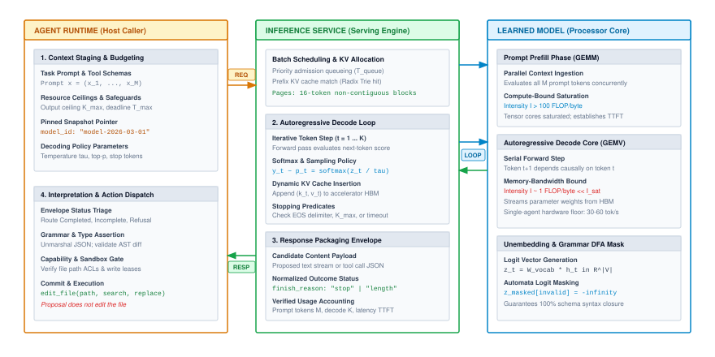
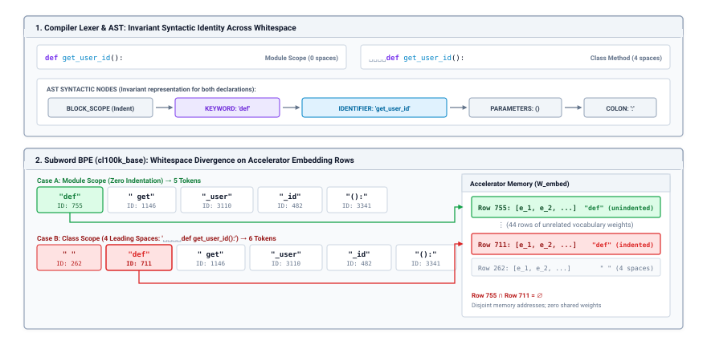
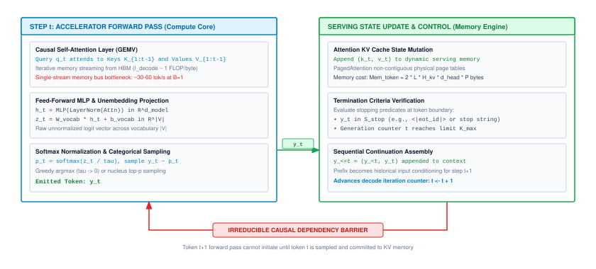
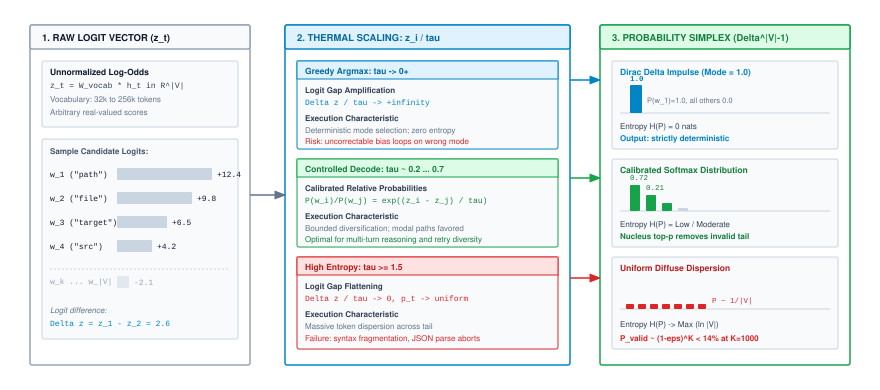
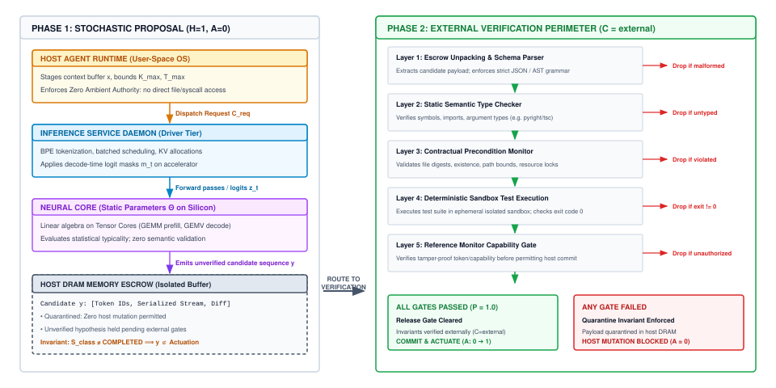
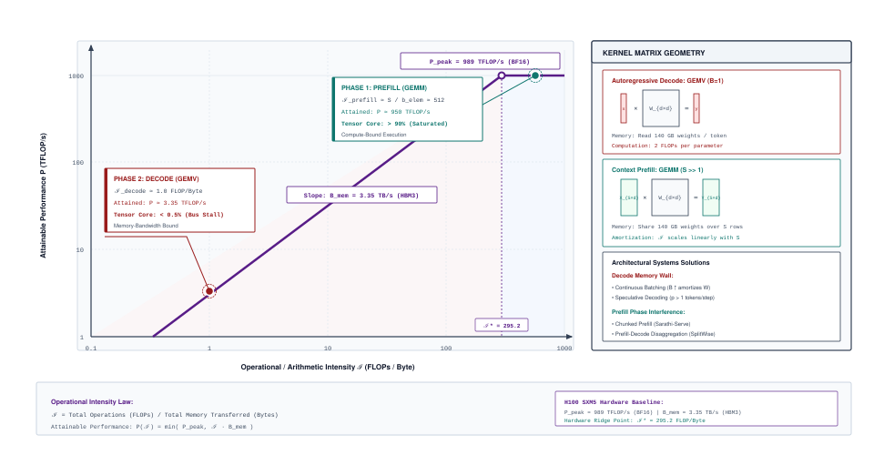

# The Stochastic Processor Core {#sec-vol3-processor}

::: {layout-narrow}
::: {.column-margin}

\chapterminitoc

:::

::: {.content-visible when-format="pdf"}
\noindent
{fig-alt="Blueprint for The Stochastic Processor Core."}
:::

::: {.content-visible unless-format="pdf"}
{fig-alt="Blueprint for The Stochastic Processor Core."}
:::

:::

## Purpose {.unnumbered .unlisted}

\begin{marginfigure}
\mlagentstack{0}{0}{0}{0}{0}{100}
\end{marginfigure}

_*What does a foundation-model invocation compute, and what contract does the rest of the computer need to use its output?*_

Classical operating systems rely on deterministic, fail-stop processors: instructions execute precisely as specified, invalid memory references trigger hardware traps, and execution registers are fully inspectable. An unprivileged foundation model violates each of these foundational invariants. Rather than executing authoritative state mutations, the stochastic processor core evaluates conditional probability distributions over discrete subword integers, emitting candidate symbol sequences under zero ambient authority without the intrinsic capability to verify empirical truth or preserve state integrity. Treating this statistical engine as an anthropomorphic conversational partner produces silent semantic corruptions, untracked failure cascades, and catastrophic control escapes. Architecting dependable autonomous software requires treating the model strictly as an untrusted, bounded execution unit governed by a formal systems contract. The host runtime must explicitly bound token capacity and wall-clock deadlines, enforce structural syntax at the decode boundary through logit masking, account for memory-bandwidth bottlenecks governing autoregressive serial latency, and isolate candidate proposals within external deterministic verification perimeters. System reliability is not an emergent property of internal parameter weights, but an invariant enforced by the enclosing operating system.

::: {.content-visible when-format="pdf"}

\newpage

:::

::: {.callout-learning-objectives}

- Contrast the execution model of a classical deterministic CPU with that of an unprivileged stochastic processor core.
- Explain Byte-Pair Encoding (BPE) as statistical data serialization, demonstrating the impedance mismatch between statistical subwords and programming language ASTs.
- Trace the autoregressive execution loop, showing why next-token generation forms an irreducibly serial causal dependency chain.
- Decouple statistical sequence likelihood and text fluency from operational truth, defining the host runtime's external verification perimeter.
- Specify a typed model invocation contract with explicit token/deadline limits and a normalized seven-outcome status envelope with granular reason codes.
- Explain grammar-constrained decoding via decode-time logit masking at the execution surface, distinguishing syntactic validity from semantic safety.
- Diagnose invocation latency and throughput for a stated model, batch, and serving workload, distinguishing per-trajectory serial steps from service-level batching.
- Evaluate invocation interface designs (free-form, schema-constrained, and decomposed probes) by downstream verified task success under equal resource budgets.

:::

## A Model Call in the Stochastic Computer {#sec-vol3-processor-role}

### The Large Language Model as a Processing Element

When software engineers build autonomous agents, the Large Language Model (LLM) sits at the center of the system as its primary *processing element*.

To an application developer, calling an LLM often looks like an ordinary web service request: the application sends a prompt string over an HTTP connection, waits a moment, and receives a generated text completion. But beneath that simple API abstraction lies a complex hardware-software systems stack. When an agent invokes a model, it is not calling a passive library; it is dispatching computation to a massive neural coprocessor running across specialized accelerator hardware.

To design reliable, high-performance agent infrastructure, systems engineers must understand the LLM through the dual lens of **computer architecture** and **operating systems**:

- **The Computer Architecture Lens:** An LLM is an accelerator-bound execution engine. It consumes discrete integer tokens, executes gigabytes of matrix algebra across High-Bandwidth Memory (HBM), and emits probability distributions over a fixed vocabulary. Its execution speed is bound not by clock cycles or instruction decoding, but by the physical memory bandwidth of the GPU.
- **The Operating Systems Lens:** An LLM is an unprivileged, non-deterministic worker process. Unlike a classical CPU, it possesses no program counter, no register file, no direct access to host memory, and no ability to execute system calls. It cannot verify whether the code, SQL queries, or tool commands it generates are factually accurate, syntactically valid, or safe to execute. It operates under *zero ambient authority*[^fn-zero-ambient-authority]: every output it emits is merely an untrusted candidate proposal that must be supervised, bounded, and verified by the host runtime before it can mutate system state.

[^fn-zero-ambient-authority]: **Zero Ambient Authority** (Systems Architecture / Capability Security): An execution model formalized in capability-based security [@miller2003; @miller2006robust; @saltzer1975]. In ambient authority systems (such as standard UNIX shells), an execution context automatically inherits all permissions associated with its user identity. In an agentic architecture, the LLM possesses zero ambient authority: it holds no implicit permissions to read files, open network sockets, or mutate host memory, adhering strictly to Saltzer and Schroeder's principle of least privilege. \index{Zero Ambient Authority}\index{Security!Zero Ambient Authority}\index{Least Privilege}

To bridge the gap between machine learning concepts and systems engineering primitives, @tbl-vol3-ml-systems-rosetta establishes the operational mappings used throughout this book.

| Machine Learning View | Systems Architecture View | Architectural Consequence |
| :--- | :--- | :--- |
| **Input Prompt** | Staged Context Buffer in Host Memory Escrow | Requires explicit serialization; the model has zero access to live host memory or filesystems. |
| **`model.generate()`** | Autoregressive Decode Loop (Serial GEMV memory sweep) | Iteratively sweeps gigabytes of parameter weights across the accelerator bus for every emitted token. |
| **Unnormalized Logits ($\mathbf{z}$)** | High-dimensional output score buffer ($\mathbb{R}^{|\mathcal{V}|}$) | Massive bus traffic ($256\text{ KB/token}$); logit masking must execute on-device before sampling. |
| **Hallucination** | Fail-Plausible Semantic Corruption across the Epistemic Gap | Hardware cannot trap on false assertions; host runtime must verify invariants externally. |
| **Tool Calling** | Candidate string proposal held under Zero Ambient Authority ($A=0$) | The model cannot make system calls; host reference monitor must inspect, validate, and dispatch. |
| **`HTTP 200 OK` Response** | Transport delivery acknowledgment | Delivery Fallacy: Network packets arrived, but payload may be truncated, refused, or invalid. |

: **The Machine Learning vs. Systems Architecture Rosetta Stone**: Translating statistical model abstractions into physical operating systems primitives. {#tbl-vol3-ml-systems-rosetta}

### The Systems Challenge: Fail-Stop vs. Fail-Plausible Execution

This architectural boundary exposes the central reliability challenge of using an LLM in software systems. Classical computer dependability relies heavily on the *fail-stop* model [@schlichting1983failstop], wherein a processor either executes instructions strictly according to specification or immediately halts upon internal fault.[^fn-fail-stop] In an x86 or ARM CPU, invalid memory accesses trigger hardware page faults, illegal opcodes raise exceptions, and execution halts synchronously before corrupted state can propagate.

[^fn-fail-stop]: **Fail-Stop Model** (Historical / Fault Tolerance): A dependability model introduced by @schlichting1983failstop where a processing element operates strictly according to specification or halts upon internal failure. LLMs violate this model at the semantic level by continuing to generate syntactically well-formed sequences when operational validity has collapsed. \index{Fail-Stop Model}\index{Historical!Fail-Stop Model}\index{Fault Tolerance!Fail-Stop Model}

An LLM violates the fail-stop model at the semantic level. Because neural execution consists of smooth, continuous tensor contractions across floating-point weights $\Theta$, the model never encounters a hardware trap when presented with contradictory instructions, missing parameters, or impossible tasks. Instead, within valid numerical bounds, it exhibits *fail-plausible* behavior: emitting fluent, syntactically pristine sequences of text that assert false facts, reference nonexistent files, or invent invalid syntax while assigning them high statistical likelihood.

This fail-plausible nature stems from an unbridgeable *epistemic gap*—the divide between *statistical likelihood* and *operational truth*. When an LLM generates tokens, it computes which subwords are statistically typical continuations of the prompt based on patterns absorbed from its training data. It has no access to the host machine's filesystem, runtime environment, or execution state. A candidate sequence may achieve an exceptionally high probability under the model's distribution while being completely false or operationally disastrous on the host system. 

Consequently, the host software system must treat every model output not as an executed command or an established truth, but as an unverified candidate proposal held in *memory escrow*—a passive host-memory staging buffer—whose validity must be established entirely outside the model.

### The Three-Tier Systems Boundary: Runtime, Driver, and Silicon

To govern this unprivileged, fail-plausible processing element without sacrificing systems integrity, production architectures partition execution across a three-tier operational boundary (@fig-stochastic-processor-core). This hierarchy mirrors the classical division between user applications, operating system drivers, and raw hardware execution units:

1. **Tier 1: Host Agent Runtime (The Operating System Supervisor).** Operating in user-space CPU host memory (DRAM), the runtime acts as the supervisory kernel of the agent. It manages end-to-end task orchestration, retrieves external context, compiles structural output schemas into formal grammar automata, stages prompt context into memory escrow, enforces resource limits ($K_{\max}$ token budgets and $T_{\max}$ wall-clock deadlines), and mediates all external tool execution.
2. **Tier 2: Inference Service Daemon (The Hardware Controller and Device Driver).** Operating as the accelerator driver and execution engine (such as vLLM, TensorRT-LLM, or TGI), the daemon manages physical accelerator resources. It schedules incoming request queues, converts raw UTF-8 byte streams into discrete token IDs, manages the dynamic allocation of Key-Value (KV) cache buffers in high-bandwidth device memory, executes batching schedules, and applies decode-time logit masks during token sampling.
3. **Tier 3: Neural Execution Core (The Hardware ALU).** Operating directly on accelerator silicon (such as GPU Streaming Multiprocessors or TPU Matrix Multiply Units), the core consists of static parameter tensors $\Theta$. It executes dense linear algebra: compute-bound General Matrix Multiply (GEMM) kernels during prompt prefill and memory-bandwidth-bound General Matrix-Vector Multiply (GEMV) kernels during autoregressive token generation.

::: {#fig-stochastic-processor-core fig-cap="**Three-Tier Invocation Lifecycle**: Boundary separation between host runtime, inference service daemon, and neural execution core across staging, generation, and verification phases." fig-alt="The three-tier invocation lifecycle showing host runtime, inference service, and neural core."}
{width="100%"}
:::

### The Interconnect Bottleneck: Why Logit Processing Belongs on the Accelerator

Crucially, the neural core does not emit human-readable text or discrete token IDs directly. Instead, its final linear layer (the *unembedding layer*) projects internal hidden activation vectors $\mathbf{h} \in \mathbb{R}^{d_{\text{model}}}$ into raw, unnormalized *logit vectors* $\mathbf{z} \in \mathbb{R}^{|\mathcal{V}|}$, where $|\mathcal{V}|$ represents the total vocabulary cardinality (often ranging from $32{,}000$ to over $128{,}000$ tokens). A logit is an unscaled real number representing the model's raw affinity score for each possible vocabulary token.

To turn these raw scores into probabilities, the inference service daemon applies the softmax function. This projects the logit vector onto the *probability simplex* $\Delta^{|\mathcal{V}|-1}$—a normalized probability distribution where all entries are non-negative and sum to exactly $1.0$:

$$\Delta^{|\mathcal{V}|-1} = \left\{ \mathbf{q} \in \mathbb{R}^{|\mathcal{V}|} \;\middle|\; \sum_{v=1}^{|\mathcal{V}|} q_v = 1, \; q_v \ge 0 \right\}$$

From this normalized distribution, candidate token IDs are sampled and streamed back across the host interconnect bus to Tier 1.

Maintaining this three-tier boundary requires that each layer preserve a strict separation of concerns. An architectural failure occurs whenever systems blur these responsibilities—such as expecting the model to enforce its own safety policies or attempting to perform token logit manipulation on the host CPU. Consider the physical interconnect bus (such as PCIe Gen 5 or NVLink) connecting the host CPU to the accelerator. If vocabulary cardinality $|\mathcal{V}| = 128{,}000$, a single unnormalized logit vector represented in 16-bit precision (FP16 or BF16 at 2 bytes per scalar) requires:

$$128{,}000 \times 2\text{ bytes} = 256\text{ KB per token}$$

In an inference server processing 64 concurrent generation streams at a modest decoding rate of 40 tokens per second, transferring raw logit vectors across the PCIe bus to the host CPU would demand:

$$64 \times 40 \times 256\text{ KB} \approx 655.4\text{ MB/s}$$

of continuous bus traffic. While modern PCIe buses offer gigabytes per second of raw throughput, streaming hundreds of megabytes of fine-grained logit buffers every second introduces severe bus contention, CPU interrupt overhead, and pipeline synchronization stalls.

Consequently, the host agent runtime never pulls raw logit vectors across the interconnect. Instead, Tier 1 compiles high-level structural constraints (such as JSON schemas or regex patterns) into compact formal automata (such as Deterministic Finite Automata) and delegates them down to Tier 2. The inference service daemon executes logit masking directly within accelerator high-bandwidth memory (HBM), setting illegal token coordinates to $-\infty$ in a single GPU kernel launch before sampling. Only the resulting 4-byte sampled token ID is transferred back across the bus to the host runtime.

### The Host Reference Monitor and the Delivery Fallacy

Conversely, the inference service daemon treats candidate token streams strictly as passive payload data; it neither evaluates whether emitted code compiles nor grants execution privileges. The boundary between proposing a candidate symbol sequence and authorizing an environmental mutation remains absolute. The host agent runtime acts as an authoritative, tamper-proof *reference monitor* [@anderson1972computer; @saltzer1975], mediating every interaction between unprivileged candidate token buffers and physical host resources.[^fn-reference-monitor]

[^fn-reference-monitor]: **Reference Monitor** (Historical / Access Control): An access control mechanism formulated by Anderson [@anderson1972computer] and codified under @saltzer1975's principle of complete mediation, requiring that every access to host resources be validated by an authoritative, tamper-proof monitor. In an agent system, the host runtime serves as this reference monitor, standing between unprivileged candidate token buffers and physical host resources. \index{Reference Monitor}\index{Security!Reference Monitor}\index{Complete Mediation}

Because the LLM cannot certify operational truth internally, every invocation requires an explicit caller contract governed by resource bounds and deterministic post-conditions. The host runtime wraps each call in explicit operational ceilings: an emission token limit $K_{\max}$ bounding the number of autoregressive decoding steps, and an end-to-end deadline $T_{\max}$ bounding wall-clock latency. When generation terminates, the runtime receives a normalized status envelope categorizing execution into one of seven mutually exclusive primary outcomes: normal completion (`COMPLETED`), resource exhaustion (`TRUNCATED`), policy suppression (`REFUSED`), communication failure (`TRANSPORT_FAILURE`), admission rejection (`REJECTED`), client abort (`CANCELLED`), or unrecoverable execution fault (`FAULTED`), paired with machine-parseable reason codes.

In distributed systems engineering, an HTTP `200 OK` indicates only that the transport layer successfully delivered network packets; it provides zero guarantee that the underlying computational task completed successfully. Even if an HTTP connection returns `200 OK`, the enclosed status envelope may report `TRUNCATED` (because generation hit the token ceiling $K_{\max}$ mid-sentence) or `REFUSED` (because an internal safety classifier blocked emission). Only when an invocation terminates as `COMPLETED` does the host runtime extract the candidate proposal from memory escrow and submit it to external deterministic validation tools—such as static linters, Abstract Syntax Tree (AST) parsers, type checkers, and regression test suites. If an output terminates abnormally or violates an external assertion, the runtime intercepts the fault, preventing corrupted state from propagating into host filesystems or databases.

Treating the LLM as an unprivileged coprocessor clarifies the boundary between statistical token emission and authoritative system execution. Yet this formulation exposes an immediate foundational question at the hardware-software boundary. A classical CPU operates upon binary machine words and structured opcodes. The neural network, however, operates upon continuous activation vectors mapped to discrete integer indices across a fixed vocabulary. Before data can cross into this processing element, how must it be formatted and encoded?

## Tokens as the Model Interface {#sec-vol3-processor-tokenization}

A classical CPU interfaces with system memory and peripherals through standardized binary encodings defined by an Instruction Set Architecture (ISA). In an x86-64 or ARM processor, the hardware instruction decoder unpacks binary machine words into discrete opcodes, register specifiers, and immediate memory offsets; execution units operate directly on binary integers and IEEE 754 floating-point words. In contrast, a Large Language Model possesses no hardware instruction decoder, no binary registers, and no native awareness of text strings, programming language grammars, or ASCII characters. Its physical computational substrate consists of continuous tensor contractions executed across multi-dimensional vector spaces on an accelerator.

To bridge external symbolic text with continuous neural state, the system relies on the *tokenizer*. The tokenizer serves as the fundamental hardware-software serializer (the Application Binary Interface) of the system. It establishes a deterministic, bidirectional mapping between variable-length UTF-8 byte sequences $\Sigma^*$ and discrete integer identifiers drawn from a bounded vocabulary $\mathcal{V}$:

$$\mathcal{T}: \Sigma^* \to \mathcal{V}^*, \quad \mathcal{T}^{-1}: \mathcal{V}^* \to \Sigma^*$$

where $|\mathcal{V}|$ denotes the total vocabulary cardinality (typically between $32{,}000$ and $128{,}000$ tokens). These discrete *token IDs* constitute the raw data currency and execution primitives of the foundation model.

### The Serialization Boundary: Why Language Models Cannot Read Strings

To an engineer designing an agent runtime, the choice of token representation presents a classic systems trade-off between dictionary size and sequence length. Two naive approaches immediately fail at scale:

1. **Word-Level Dictionaries:** Mapping every distinct word to a unique integer ID is intuitive for standard prose (`"algorithm"`, `"network"`), but fails catastrophically on open-vocabulary technical domains. In software systems, codebases are populated by arbitrary variable names (`user_account_id_v2`), SHA-256 hashes (`e3b0c442...`), hexadecimal memory addresses, and timestamps. When a word-level tokenizer encounters an unseen identifier, it triggers a fatal Out-of-Vocabulary ($OOV$) exception or maps the symbol to an uninformative unknown token (`<unk>`), obliterating critical semantic distinctions.
2. **Character-Level Tokenization:** Mapping each individual ASCII character or UTF-8 byte to a distinct token ID eliminates $OOV$ faults completely, as any text string can be decomposed into raw bytes. However, it inflates sequence lengths by $3\times$ to $5\times$. Because the computational and memory footprint of the transformer's self-attention mechanism scales quadratically with sequence length ($O(S^2)$), a $4\times$ increase in sequence length causes a $16\times$ explosion in attention compute and intermediate cache storage, severely degrading serving throughput.

Modern serving runtimes standardize on *subword tokenization* via Byte-Pair Encoding (BPE)[^fn-bpe-history]. BPE achieves the systems sweet spot: frequent words receive a single, atomic token ID, while rare words, variable names, and code identifiers fracture into smaller reusable subwords. The vocabulary is constructed offline across training corpora through a greedy compression algorithm:

1. Base vocabulary $\mathcal{V}_0$ contains all 256 raw UTF-8 octets ($0x00$–$0xFF$) and special control symbols (`<|im_start|>`, `<|endoftext|>`).
2. Pair co-occurrences are tallied across training corpora.
3. The most frequent pair $(u, v)$ merges into atomic token $w = uv$, updating vocabulary: $\mathcal{V}_{k+1} = \mathcal{V}_k \cup \{w\}$, with merge rule $(u, v) \to w$ ranked by creation priority.
4. Merges iterate until vocabulary cardinality reaches ceiling $|\mathcal{V}| \in [32{,}000, 131{,}072]$.

[^fn-bpe-history]: **Byte-Pair Encoding** (Historical Data Compression): Gage [@gage1994bpe] introduced BPE for data compression; @sennrich2016subword adapted it to NLP to eliminate out-of-vocabulary exceptions. In modern LLM systems, BPE forms the discrete data serialization boundary, transforming UTF-8 byte streams into bounded integer vocabulary indices. \index{Byte-Pair Encoding}\index{Tokenizer!Byte-Pair Encoding}

At runtime, BPE executes merge rules by priority rank over raw UTF-8 bytes rather than greedy longest-match prefixing. Because base vocabulary $\mathcal{V}_0$ contains all 256 byte octets, BPE can serialize arbitrary byte streams, binary payloads, or malformed UTF-8 fragments without ever raising an $OOV$ exception. Decoding ($\mathcal{T}^{-1}$) maps token IDs to byte chunks concatenated into a raw buffer, performing byte-level reassembly of split multi-byte UTF-8 code points before string emission.

Byte-level BPE [@radford2019language] remaps octets to printable Unicode, mapping space (`0x20`) to `'Ġ'` (U+0120); SentencePiece [@kudo2018sentencepiece] replaces whitespace with `'▁'` (U+2581). Merging whitespace with following characters makes tokenization sensitive to leading spaces: $\mathcal{T}(A) + \mathcal{T}(B) \neq \mathcal{T}(A + B)$.[^fn-whitespace-prefix]

[^fn-whitespace-prefix]: **Whitespace Prefix Encodings**: Because BPE vocabularies encode leading whitespace directly into subword identifiers, modifying indentation or trimming trailing whitespace fundamentally alters downstream token IDs, embedding vector lookups, and continuation probabilities. \index{Whitespace Encoding}\index{Tokenizer!Whitespace Prefix}

### How Tokens Become Tensors: The Embedding Table Gather

In hardware, token IDs do not participate in arithmetic operations directly. Instead, token ID $x_i \in \{0, \dots, |\mathcal{V}|-1\}$ serves as a physical row index into the model's *embedding table* $\mathbf{W}_{\text{embed}} \in \mathbb{R}^{|\mathcal{V}| \times d_{\text{model}}}$, where $d_{\text{model}}$ is the model's hidden dimension (e.g., $4{,}096$ or $8{,}192$ floats).

When a host runtime submits an input prompt consisting of $M$ staged token integers $\mathbf{x} = (x_1, x_2, \dots, x_M)$, the accelerator executes an embedding gather kernel:

$$\mathbf{E} = \mathbf{W}_{\text{embed}}[\mathbf{x}, :] = \begin{bmatrix} \mathbf{W}_{\text{embed}}[x_1, :] \\ \mathbf{W}_{\text{embed}}[x_2, :] \\ \vdots \\ \mathbf{W}_{\text{embed}}[x_M, :] \end{bmatrix} \in \mathbb{R}^{M \times d_{\text{model}}}$$

Each row occupies $d_{\text{model}} \cdot b$ bytes in device memory, where $b$ is the parameter byte-width (e.g., $b=2$ bytes for 16-bit BF16/FP16). The memory controller gathers these rows from High-Bandwidth Memory (HBM) into on-chip SRAM via coalesced memory transactions. Once gathered, this dense matrix $\mathbf{E}$ enters the transformer's attention layers as the initial activation state.

### The AST Impedance Mismatch: When Subwords Clash with Code Grammars

In electrical engineering, an *impedance mismatch* between a signal source and its transmission line reflects energy backward, corrupting the transmitted waveform. In systems architecture, an impedance mismatch occurs when two adjacent abstraction layers operate on fundamentally incompatible data representations.

Compilers (such as GCC, Clang, or CPython) parse source code into Abstract Syntax Trees (ASTs). A compiler's front-end lexical analyzer (lexer) scans characters using formal language grammars, isolating keywords (`def`, `class`), identifiers (`get_user_id`), operators, and structural indentation tokens (`INDENT`, `DEDENT`). To the compiler, `def` is an identical semantic keyword regardless of whether it begins at column 0 or is indented inside a nested class.

BPE tokenizers, in contrast, optimize purely for statistical byte entropy across unstructured training corpora. They possess zero awareness of grammar productions, lexical specifications, or AST node boundaries. This divergence creates an *AST impedance mismatch* (@fig-token-ast-mismatch).

::: {#fig-token-ast-mismatch fig-cap="**Impedance Mismatch Between Compiler ASTs and Statistical BPE**: Comparison of compiler lexical analysis against subword tokenization under cl100k_base, highlighting identifier fragmentation and delimiter fusion." fig-alt="Comparison of compiler AST pipeline against subword BPE tokenization showing identifier splintering and delimiter fusion."}
{width="100%"}
:::

This mismatch produces three primary systems failure modes:

1. **Syntactic Boundary Blindness:** Indentation whitespace fuses with subsequent characters. In the OpenAI `cl100k_base` vocabulary, unindented `def` is token 755 (`"def"`), but two leading spaces yield token 220 (`"  "`) and token 711 (`" def"`):
   ```text
   def get_user_id():    -> [755: "def"] [636: " get"] [3398: "_user"] [851: "_id"] [4658: "():"]
     def get_user_id():  -> [220: "  "] [711: " def"] [636: " get"] [3398: "_user"] [851: "_id"] [4658: "():"]
   ```
   Tokens 755 and 711 have independent rows in $\mathbf{W}_{\text{embed}}$ and independent output logits; trailing prompt whitespace shifts continuation probabilities, suppressing valid completions.
2. **Identifier Splintering:** Identifiers fracture into subwords; `execute_transaction_with_retry` splits into four tokens in `cl100k_base` (`[10469: "execute"]`, `[29984: "_transaction"]`, `[6753: "_with"]`, `[63845: "_retry"]`), compounding autoregressive decode latency.
3. **Lexical Asymmetry:** The mapping $\mathcal{T}$ is non-monotonic: snake_case `get_user_id` consumes three tokens (`["get", "_user", "_id"]`), while camelCase `getUserID` consumes two (`["getUser", "ID"]`), imposing unequal compute on equivalent semantics.

::: {.callout-note title="Worked Example: Subword AST Impedance Mismatch in Python"}
To observe the systems consequences of the AST impedance mismatch, trace how a Python function definition is processed by a compiler's lexical analyzer versus a modern BPE tokenizer (`cl100k_base`).

**Input Code Snippet:**
```python
def get_user_id():
```

**Step 1: The Compiler's Lexical View**
A Python lexer parses the input according to formal grammar rules into discrete lexical tokens:
```text
[TOKEN: KEYWORD     | Lexeme: "def"]
[TOKEN: IDENTIFIER  | Lexeme: "get_user_id"]
[TOKEN: DELIMITER   | Lexeme: "("]
[TOKEN: DELIMITER   | Lexeme: ")"]
[TOKEN: DELIMITER   | Lexeme: ":"]
```
If the function is indented by two leading spaces (e.g., as an inner method):
```python
  def get_user_id():
```
the lexer emits an explicit structural token `[TOKEN: INDENT | Spaces: 2]` followed by the exact same `[TOKEN: KEYWORD | Lexeme: "def"]`. In the compiler's symbol table, `def` remains an invariant keyword identifier, and `get_user_id` remains a single atomic symbol.

**Step 2: The BPE Tokenizer's Statistical View**
A subword BPE tokenizer evaluates the text without lexical rules, applying merge rules based on byte frequency:

*Case A: Unindented (`def get_user_id():`)*
```text
Tokens:   [755,          636,          3398,         851,       4658]
Chunks:   ["def",        " get",       "_user",      "_id",     "():"]
```
Notice that the leading space before `get` merges with `get`, and the snake_case identifier splinters into three subwords (`" get"`, `"_user"`, `"_id"`).

*Case B: Indented with Two Spaces (`  def get_user_id():`)*
```text
Tokens:   [220,          711,          636,          3398,      851,       4658]
Chunks:   ["  ",         " def",       " get",       "_user",   "_id",     "():"]
```
Because the two spaces are followed by `def`, BPE merges the second space into `def` (token 711: `" def"`), leaving the first space as a separate whitespace token (token 220: `"  "`).

**Step 3: The Silicon Reality (Embedding Table Gather)**
In hardware, token IDs index directly into the embedding matrix $\mathbf{W}_{\text{embed}} \in \mathbb{R}^{|\mathcal{V}| \times d_{\text{model}}}$:
- In Case A, the accelerator gathers row 755: $\mathbf{e}_{755} = \mathbf{W}_{\text{embed}}[755, :]$.
- In Case B, the accelerator gathers row 711: $\mathbf{e}_{711} = \mathbf{W}_{\text{embed}}[711, :]$.

Vectors $\mathbf{e}_{755}$ and $\mathbf{e}_{711}$ are completely distinct rows in high-dimensional vector space ($\mathbb{R}^{d_{\text{model}}}$). The neural core receives no architectural signal indicating that token 711 represents the keyword `def` shifted by two spaces. To the transformer's attention heads, token 711 is an entirely different numerical entity with its own learned affinities.

**Systems Consequences:**
1. *Continuation Shifts and Syntax Hallucinations:* Because $\mathbf{e}_{755} \neq \mathbf{e}_{711}$, the model computes different attention activations at the decode boundary. An accidental trailing space or minor indentation discrepancy at the end of a prompt shifts downstream logits, potentially suppressing a valid syntax token or triggering an unexpected completion.
2. *Identifier Splintering Latency:* Emitting `execute_transaction_with_retry` requires four sequential autoregressive decode steps (`"execute"`, `"_transaction"`, `"_with"`, `"_retry"`). Because each decode step requires a full sweep of all model parameters through the memory bus, identifier splintering directly inflates execution latency by $4\times$ compared to an atomic token.
3. *Prefix Cache Invalidation:* In serving systems utilizing prefix caching (such as RadixAttention), KV cache blocks are indexed by exact token ID sequences. If a user or prompt template changes indentation or adds a single whitespace character, the resulting token IDs diverge immediately, invalidating the cached prefix and forcing an expensive full prompt prefill.
:::

### The Serialization Tax on Structured Tool Calls

When autonomous systems invoke tools or exchange structured payloads (such as JSON or YAML), punctuation marks, quotes (`"`), backslashes (`\`), braces, and escape sequences compress poorly:

```json
{"tool": "filesystem_write", "parameters": {"path": "/var/log/sys.log", "content": "error: connection reset\n"}}
```

In `cl100k_base`, a raw newline is token 198 (`'\n'`), while a literal escaped newline sequence (`\n`) is mapped to single token 1734, and an escaped quote (`\"`) is token 2153. Although modern tokenizers assign dedicated IDs to common two-character escape sequences, serializing source code inside JSON envelopes inflicts severe token inflation by breaking natural multi-character subword merges. Across indentation boundaries, leading whitespace can no longer merge cleanly with adjacent keyword tokens; furthermore, structural quotes, escaped delimiters, and object framing expand the token footprint by 15 percent to over 40 percent (@tbl-token-compression-ratios).

| Domain / Payload Type | UTF-8 Bytes ($B$) | Chars ($C$) | Tokens ($N$) | Bytes/Token ($B/N$) | Chars/Token ($C/N$) | Systems Hazard Profile |
| :--- | :---: | :---: | :---: | :---: | :---: | :--- |
| **English Technical Prose** | 261 | 261 | 38 | 6.87 | 6.87 | Stable compression; high subword coverage. |
| **Python Source Code** | 478 | 478 | 99 | 4.83 | 4.83 | Identifier splintering; indentation fractures. |
| **Structured JSON RPC** | 173 | 173 | 39 | 4.44 | 4.44 | Escaped delimiters and structural punctuation. |
| **Escaped Code in JSON** | 247 | 247 | 63 | 3.92 | 3.92 | Escaped newlines (`\\n`) inflate token count by 43%. |
| **Hex / Base64 / UUID** | 138 | 138 | 79 | 1.75 | 1.75 | Low subword coverage; near character-level encoding. |
| **CJK / Multilingual Text** | 212 | 72 | 80 | 2.65 | 0.90 | 3-byte UTF-8 expansion; 1 to 2 tokens per glyph. |

: **Token compression ratios across computational domains**: Empirical character-to-token compression ratios measured using `cl100k_base` (`tiktoken` v0.9.0), demonstrating the 43 percent token inflation incurred by JSON string escaping. {#tbl-token-compression-ratios}

### Context Capacity and Budget Enforcement: Why Character Counts Lie

The model operates within a strict maximum context ceiling $S_{\max}$, bounding total sequence length:

$$M + K \le S_{\max}$$

where $M$ is the prompt length and $K$ is the generated output length. In software systems engineering, relying on character-based heuristics ($1\text{ token} \approx 4\text{ characters}$)[^fn-char-heuristic] is fatal. As shown in @tbl-token-compression-ratios, in indented source code, JSON envelopes, and cryptographic hashes, compression collapses to fewer than two bytes per token. A 100,000-character code context may consume over 35,000 tokens rather than the 25,000 predicted by naive rules of thumb.

[^fn-char-heuristic]: **Token Compression Ratio**: The standard heuristic $1\text{ token} \approx 4\text{ characters}$ fails for indented code, JSON, and hashes, where compression collapses below two bytes per token, doubling context memory demand. \index{Token Compression Ratio}\index{Context Window!Compression Ratio}

#### Input Overflow and Step Ceilings

To prevent unrecoverable runtime crashes, the host operating runtime enforces explicit admission and budget control:

1. **Input Overflow Rejection:** If $M > S_{\max}$ or $M + K_{\max} > S_{\max}$, the runtime rejects admission before dispatching compute to the accelerator, returning primary status `REJECTED` with reason code `CONTEXT_OVERFLOW_EXCEEDED`. Silently truncating the prompt is dangerous: dropping earlier instructions destroys task determinism.
2. **Output Step Ceilings:** For valid inputs ($M < S_{\max}$), the runtime sets an explicit generation ceiling $K_{\max} \le S_{\max} - M$. If autoregressive decoding reaches $K_{\max}$ without generating a stop token, execution halts immediately with:
   $$\text{Status} = \texttt{TRUNCATED}, \quad \text{Reason} = \texttt{STEP\_BUDGET\_EXHAUSTED}$$

Because subwords lack AST awareness, truncation severs output mid-statement:

```python
# Truncation Hazard: Incomplete Transaction Logic
# Generation severed at step K_max = 32 tokens
def update_system_state(db_session, account_id):
    try:
        db_session.execute("UPDATE accounts SET status = 'ACTIVE' WHERE id =
```

Severing generation at step $K_{\max}$ drops rollback logic and unclosed syntax. Forwarding truncated text risks compiler crashes on unexpected `EOF` and partial mutation hazards if early commands commit before failure. The host runtime enforces the *Quarantining Invariant*: non-completed responses remain in host DRAM escrow and never reach actuation:

$$\forall \mathcal{E}_{\text{resp}}, \quad S \neq \texttt{COMPLETED} \implies \mathbf{y} \notin \text{ActuationPipeline}$$

### The Memory Cost of Tokens: The KV Cache Footprint

While token IDs define the logical sequence length $S = M + K$, accelerator physical memory is dominated by intermediate attention state. In an autoregressive model, generating each new token requires computing attention against all previous tokens. To avoid recomputing Key and Value activations for prior tokens $\tau \le t$ at step $t$ (which would inflict a quadratic $O(t^2)$ recomputation penalty at every step), the serving engine caches them in accelerator HBM as the *Key-Value (KV) cache*.[^fn-kv-footprint]

[^fn-kv-footprint]: **KV Cache Memory Footprint**: In multi-query and grouped-query attention ($n_{\text{kv}} \ll n_{\text{heads}}$), shared KV heads reduce single-token footprint $4\times$ to $8\times$. At scale, ephemeral KV allocations still exceed parameter weights. \index{Key-Value Cache}\index{Inference Engine!KV Cache Footprint}

For $L$ transformer layers, Key-Value heads $n_{\text{kv}}$, and head dimension $d_{\text{head}}$, the total channel dimension per token is $H_{\text{kv}} = n_{\text{kv}} \cdot d_{\text{head}}$. In modern Grouped-Query Attention (GQA), $n_{\text{kv}} \ll n_{\text{heads}}$ (for example, 8 KV heads compared to 64 Query heads). Storing a Key vector $\mathbf{k} \in \mathbb{R}^{H_{\text{kv}}}$ and a Value vector $\mathbf{v} \in \mathbb{R}^{H_{\text{kv}}}$ per layer yields $2 \cdot L \cdot H_{\text{kv}}$ scalars. At scalar byte-width $b$ ($b=2$ for 16-bit BF16/FP16; $b=1$ for 8-bit FP8), the single-token memory footprint is:

$$\text{Mem}_{\text{KV,token}} = 2 \cdot L \cdot H_{\text{kv}} \cdot b = 2 \cdot L \cdot (n_{\text{kv}} \cdot d_{\text{head}}) \cdot b \quad \text{bytes/token}$$

Across total sequence length $S = M + K$, the KV cache memory scales strictly linearly:

$$\text{Mem}_{\text{KV}}(\text{seq}) = S \cdot \text{Mem}_{\text{KV,token}} = 2 \cdot L \cdot n_{\text{kv}} \cdot d_{\text{head}} \cdot b \cdot (M + K)$$

For a 70-billion parameter model (such as Llama-3-70B) utilizing Grouped-Query Attention ($L = 80$, $n_{\text{kv}} = 8$, $d_{\text{head}} = 128$, $H_{\text{kv}} = 1024$) in 16-bit BF16 precision ($b = 2$ bytes):

$$\text{Mem}_{\text{KV,token}} = 2 \times 80 \times 1024 \times 2 = 327{,}680\text{ bytes} \approx 328\text{ KB/token}$$

At an extended context of $S = 128{,}000$ tokens, a single invocation's KV cache consumes:

$$\text{Mem}_{\text{KV}}(\text{seq}) = 128{,}000 \times 327{,}680\text{ bytes} \approx 41.94\text{ GB}$$

::: {.callout-note title="Worked Example: Why a 128k Context Crashes an 80 GB GPU"}
A systems engineer deploys an open-weights 70-billion parameter model (such as Llama-3-70B) on a single NVIDIA H100 SXM5 accelerator equipped with 80 GB of HBM3.

To fit the model onto the card, the engineer quantizes the static parameter weights $\Theta$ to 8-bit floating point (FP8), reducing weight storage from 140 GB (in 16-bit BF16) down to 70 GB.
To analyze an entire software repository in a single prompt, the engineer configures the serving engine with an extended context ceiling of $S = 128{,}000$ tokens ($128\text{k}$).

Can this single 80 GB GPU successfully execute a 128k context invocation, or will it suffer an unrecoverable Out-of-Memory (OOM) crash?

**Step 1: Calculate Static Parameter Weight Footprint**
With 70 billion parameters stored in FP8 ($b_{\text{weight}} = 1\text{ byte}$ per parameter):
$$\text{Mem}_{\text{weights}} = 70 \times 10^9 \text{ parameters} \times 1\text{ byte/parameter} = 70.0\text{ GB}$$

Remaining physical HBM headroom on the 80 GB accelerator:
$$\text{Headroom}_{\text{HBM}} = 80.0\text{ GB} - 70.0\text{ GB} = 10.0\text{ GB}$$

*(Systems Reality Check: In production runtimes, the CUDA context, PyTorch/vLLM internal scratchpads, and intermediate activation tensors reserve an additional 2.0 to 4.0 GB of device memory, leaving at most 6.0 to 8.0 GB of net usable memory for KV caching).*

**Step 2: Calculate Single-Token KV Cache Footprint in 16-bit Precision ($b=2$)**
The Llama-3-70B architecture uses Grouped-Query Attention (GQA) with $L = 80$ layers, $n_{\text{kv}} = 8$ Key-Value heads, and head dimension $d_{\text{head}} = 128$.
For each token, the accelerator stores both a Key vector $\mathbf{k}$ and a Value vector $\mathbf{v}$ across all layers:
$$\text{Scalars}_{\text{token}} = 2 \times L \times (n_{\text{kv}} \times d_{\text{head}}) = 2 \times 80 \times (8 \times 128) = 163{,}840\text{ scalars/token}$$

In standard 16-bit floating point (FP16 or BF16, $b=2\text{ bytes}$):
$$\text{Mem}_{\text{KV,token}}^{\text{FP16}} = 163{,}840 \times 2\text{ bytes} = 327{,}680\text{ bytes/token} \approx 327.68\text{ KB/token}$$

**Step 3: Total KV Cache Demand for 128k Tokens in FP16**
For sequence length $S = 128{,}000$:
$$\text{Mem}_{\text{KV}}^{\text{FP16}}(128\text{k}) = 128{,}000 \times 327{,}680\text{ bytes} = 41{,}943{,}040{,}000\text{ bytes} \approx 41.94\text{ GB}$$

Total required accelerator memory:
$$\text{Total Memory} = \text{Mem}_{\text{weights}} + \text{Mem}_{\text{KV}}^{\text{FP16}} = 70.0\text{ GB} + 41.94\text{ GB} = 111.94\text{ GB}$$

**Result:** $111.94\text{ GB} > 80.0\text{ GB}$.
The required memory exceeds the physical 80 GB capacity by $31.94\text{ GB}$. The serving engine crashes immediately with an unrecoverable CUDA Out-of-Memory (`CUDA: out of memory`) exception during prompt prefill.

**Step 4: Attempting Mitigation via FP8 KV Cache Quantization ($b=1$)**
To avert the crash, the engineer quantizes the KV cache to 8-bit floating point (FP8, $b=1\text{ byte}$ per scalar):
$$\text{Mem}_{\text{KV,token}}^{\text{FP8}} = 163{,}840 \times 1\text{ byte} = 163{,}840\text{ bytes/token} \approx 163.84\text{ KB/token}$$
$$\text{Mem}_{\text{KV}}^{\text{FP8}}(128\text{k}) = 128{,}000 \times 163{,}840\text{ bytes} = 20{,}971{,}520{,}000\text{ bytes} \approx 20.97\text{ GB}$$

Total required accelerator memory in FP8:
$$\text{Total Memory} = \text{Mem}_{\text{weights}} + \text{Mem}_{\text{KV}}^{\text{FP8}} = 70.0\text{ GB} + 20.97\text{ GB} = 90.97\text{ GB}$$

**Result:** $90.97\text{ GB} > 80.0\text{ GB}$.
Even with an FP8 KV cache, total memory demand ($90.97\text{ GB}$) exceeds the 80 GB ceiling by nearly $11\text{ GB}$. The KV cache alone ($20.97\text{ GB}$) is more than double the entire 10 GB headroom!

**Step 5: Systems Architecture Solutions**
What is the maximum context length ($S_{\max}$) that can safely run on a standalone 80 GB card?
Assuming 6.0 GB of net usable headroom after deducting 4.0 GB for CUDA runtimes and activation scratchpads:
$$S_{\max}^{\text{FP8}} = \frac{6.0 \times 10^9\text{ bytes}}{163{,}840\text{ bytes/token}} \approx 36{,}621\text{ tokens}$$
Thus, isolated execution on an 80 GB card is physically bounded to contexts of $S \le 32{,}768$ ($32\text{k}$) tokens, where an FP8 KV cache consumes $\approx 5.37\text{ GB}$.

To serve extended 128k contexts at 70B scale without crashing, systems architects must employ one of two production solutions:
1. *Multi-GPU Tensor Parallelism (TP):* Shard the model and attention heads across multiple GPUs over high-speed NVLink. Across a 4-GPU cluster ($4 \times 80\text{ GB} = 320\text{ GB}$ aggregate HBM), each GPU holds only $17.5\text{ GB}$ of FP8 weights and $\approx 5.24\text{ GB}$ of FP8 KV cache, leaving over 55 GB of headroom per GPU for concurrent requests.
2. *Expanded-Memory Accelerators:* Migrate to next-generation accelerators with expanded HBM capacity, such as the NVIDIA H200 (141 GB HBM3e) or NVIDIA B200 (180 GB HBM3e). On a 141 GB H200, 70 GB of weights leaves 71 GB of headroom, effortlessly accommodating 128k contexts while preserving capacity for multi-tenant batching.
:::

This steep memory scaling makes context capacity the primary physical constraint on concurrency, motivating paged attention virtual memory architectures and prefix-sharing techniques (detailed in Chapter 5).

Once staged as an integer token array and loaded into accelerator memory, how does the model actually compute its candidate output?

## Next-Token Computation {#sec-vol3-processor-autoregressive}

To understand how an agent interacts with an accelerator, a systems programmer must first unlearn a classical hardware assumption: an accelerator running a large language model is not an arithmetic logic unit executing a sequence of instructions in hardware, nor does it compile a user prompt into a closed-form program. At the execution boundary, the stochastic processor core is a statistical sequence continuation engine. It evaluates conditional probability distributions over discrete token sequences via continuous tensor transformations on hardware accelerators (GPUs or TPUs), mutating no architected registers, allocating no operating system memory, and modifying zero persistent state. The host runtime must drive the model through an iterative control loop—termed *autoregressive generation*—to produce candidate output sequences token by token.

In plain English, **autoregressive causal serialization** means that token generation is fundamentally sequential: to generate token 50, the model must already know tokens 1 through 49. There is no mathematical shortcut, speculative pipeline bypass, or parallel trick that allows a single sequence trajectory to compute future tokens in parallel before earlier tokens are emitted. In an out-of-order CPU, independent instructions can be scheduled concurrently across execution units. In an autoregressive language model, however, every step has an unavoidable loop-carried data dependency: the token chosen at step $t-1$ becomes the input context for step $t$.

Formally, the processor models output sequence $\mathbf{y}_{1:K} = (y_1, \dots, y_K)$ conditioned on prompt $\mathbf{x} = (x_1, \dots, x_M)$ via the probability chain rule:

$$P(\mathbf{y}_{1:K} \mid \mathbf{x}) = \prod_{t=1}^K P(y_t \mid \mathbf{x}, \mathbf{y}_{<t})$$ {#eq-autoregressive-factorization}

where $\mathbf{y}_{<t} = (y_1, \dots, y_{t-1})$ is the prefix before step $t$ ($\mathbf{y}_{<1} = \emptyset$).[^fn-autoregressive-factorization] Sequence generation is thus an iterative serving control loop managed by host software rather than an atomic hardware execution primitive.

[^fn-autoregressive-factorization]: **Autoregressive Factorization**: Chain rule decomposition enforcing strict conditioning on past history without acausal leakage. \index{Autoregressive Factorization}\index{Inference Engine!Autoregressive Decoding}

### Autoregressive Factorization and the Decoupling Principle {#sec-vol3-autoregressive-decoupling}

The host runtime must enforce the *Decoupling Principle*: conditional likelihood $P_\Theta(y_t \mid \mathbf{x}, \mathbf{y}_{<t})$ is completely decoupled from operational correctness and execution validity. In classical systems, if a compiler outputs an ELF binary, the code adheres to an Application Binary Interface (ABI) and type system; if a POSIX kernel accepts a system call, it guarantees state invariants. In an LLM-based processor, however, model weights $\Theta$ are optimized over a static text corpus $\mathcal{D}_{\text{train}}$ via empirical risk minimization (minimizing cross-entropy loss):

$$\min_\Theta \mathbb{E}_{(\mathbf{x}, \mathbf{y}) \sim \mathcal{D}_{\text{train}}} \left[ -\sum_{t=1}^K \log P_\Theta(y_t \mid \mathbf{x}, \mathbf{y}_{<t}) \right]$$ {#eq-cross-entropy-objective}

This objective means that probability $P_\Theta(y_t = v \mid \mathbf{x}, \mathbf{y}_{<t})$ quantifies only the **statistical typicality** of subword token $v$ continuing prefix $[\mathbf{x}, \mathbf{y}_{<t}]$ in the training corpus $\mathcal{D}_{\text{train}}$. In other words, it measures how familiar or expected that token looked to human authors and code repositories in the past. The neural network possesses no runtime model of host environments: it has no awareness of open Linux file descriptors, no live view into `/sys` or `/proc`, and no mechanism to verify whether a target directory exists. If $\mathcal{V}_{\text{valid}}(s_{\text{host}}) \subset \mathcal{V}$ denotes the subset of continuation tokens that preserve physical system invariants in host state $s_{\text{host}}$:

$$P_\Theta(y_t \in \mathcal{V}_{\text{valid}}(s_{\text{host}}) \mid \mathbf{x}, \mathbf{y}_{<t}) \not\equiv 1$$ {#eq-validity-divergence}

The most probable continuation (the statistical mode) can directly violate host validity:

$$\arg\max_{v \in \mathcal{V}} P_\Theta(y_t = v \mid \mathbf{x}, \mathbf{y}_{<t}) \notin \mathcal{V}_{\text{valid}}(s_{\text{host}}) \quad \text{with nonzero measure.}$$ {#eq-modal-invalidity}

Likelihood reflects training-set typicality, providing zero architectural certification that emitted code compiles, terminates, or satisfies security boundaries.

### The Atomic Forward Step and the Serving Control Loop {#sec-vol3-forward-step-loop}

To see what happens down at the metal during inference, consider what a single **atomic forward step** actually computes. The neural core mapping $f_\Theta$ takes the entire accumulated token sequence $[\mathbf{x}, \mathbf{y}_{<t}]$, projects it through layers of attention and feed-forward networks, and produces a hidden activation vector $\mathbf{h}_t \in \mathbb{R}^{d_{\text{model}}}$ representing the final position. It then multiplies $\mathbf{h}_t$ by the unembedding matrix $\mathbf{W}_U \in \mathbb{R}^{|\mathcal{V}| \times d_{\text{model}}}$ to yield raw scores known as **logits** $\mathbf{z}_t \in \mathbb{R}^{|\mathcal{V}|}$:

$$\mathbf{z}_t = \mathbf{W}_U \mathbf{h}_t = f_\Theta(\mathbf{x}, \mathbf{y}_{<t})$$ {#eq-forward-step}

where $|\mathcal{V}|$ is the vocabulary cardinality (typically 32,000 to 128,000 discrete token IDs).

At this exact point, *accelerator hardware execution halts*. The GPU cores do not select the next token, do not append it to a string, and do not advance a hardware program counter; they simply write the logit vector $\mathbf{z}_t$ into device High Bandwidth Memory (HBM). To advance the trajectory, an external software process—the inference serving engine (such as vLLM, TensorRT-LLM, or llama.cpp) running on the host CPU—must drive an external control loop (@fig-autoregressive-loop) across four explicit phases:

1. **Logit Evaluation:** Dispatching compute kernels to evaluate $f_\Theta(\mathbf{x}, \mathbf{y}_{<t})$ and write raw logits $\mathbf{z}_t$ to accelerator device memory.
2. **Decoding and Sampling:** Executing a sampling kernel (on the GPU or host CPU) that transforms raw logits into a probability distribution and draws a discrete token ID $\hat{y}_t \in \mathcal{V}$.
3. **State Mutation:** Escrowing token $\hat{y}_t$ in host memory and updating the accelerator's ephemeral Key-Value (KV) cache (@sec-vol3-virtual-memory). The KV cache stores the computed key and value activation tensors for all preceding tokens in GPU memory, ensuring the accelerator does not wastefully recompute attention history from scratch on the next step.
4. **Predicate Verification:** Evaluating whether sequence generation should stop against the halt predicate:

$$\text{Halt}(t) \iff (\hat{y}_t \in \mathcal{S}_{\text{stop}}) \lor (t \ge K_{\max})$$ {#eq-halt-predicate}

where $\mathcal{S}_{\text{stop}} \subset \mathcal{V}^*$ represents terminal delimiter sequences (such as `<|endoftext|>`, `\nObservation:`, or specialized tool-call end markers) and $K_{\max}$ is the step ceiling enforced by the host runtime to prevent infinite loops and runaway compute spend. Because subword tokenizers (such as Byte-Pair Encoding) can fracture multi-character delimiters across arbitrary subword boundaries, robust termination requires sequence suffix-matching stop condition checks over rolling sliding-window tail buffers rather than simple scalar integer equality (@sec-vol3-processor-contract).

::: {#fig-autoregressive-loop fig-cap="**Autoregressive Serialization Loop**: Causal dependency chain across serving daemon and neural core boundaries during token decoding." fig-alt="Autoregressive serialization loop showing the boundary between the inference daemon and the neural core."}
{width="100%"}
:::

Unlike classical CPUs with autonomous instruction fetch and program counters, the neural core cannot self-advance. The inference service daemon must supervise each forward pass across the accelerator memory bus while enforcing host execution bounds.

### The Causal Serialization Barrier {#sec-vol3-causal-serialization}

The difference in performance between ingesting a prompt and generating a response stems from the **causal serialization barrier**. During prompt prefill, the accelerator receives the entire staged prompt $\mathbf{x} = (x_1, \dots, x_M)$ simultaneously. Because all $M$ tokens are known in advance, the hardware can evaluate them concurrently using a causal attention mask:

$$\mathbf{M}_{\text{causal}}(i, j) = \begin{cases} 0 & \text{if } j \le i \\ -\infty & \text{if } j > i \end{cases}$$ {#eq-causal-mask}

where $-\infty$ ensures that after exponentiation in the attention softmax ($e^{-\infty} = 0$), position $i$ attends only to previous positions $j \le i$ and receives zero attention weight from future positions $j > i$.[^fn-causal-masking] Dense GEMM operations achieve high arithmetic intensity (compute operations per byte of memory transferred), saturating GPU tensor cores.

[^fn-causal-masking]: **Causal Masking**: Upper-triangular mask zeroing future query-key affinities during parallel prefill, enforcing autoregressive factorization. \index{Causal Masking}\index{Attention!Causal Mask}

During decode, however, this spatial parallelism collapses. The system encounters an inescapable dependency: token $y_t$ depends strictly on preceding token $y_{t-1}$:

$$\text{Dependency}(y_t) = \{\mathbf{x}, y_1, y_2, \dots, y_{t-2}, y_{t-1}\}$$ {#eq-decode-dependency}

While tensor arithmetic within a single forward step executes across thousands of GPU worker threads in parallel, the token generation sequence along an individual trajectory forms an irreducibly serial chain. Generating $K$ tokens requires launching $K$ successive forward passes, bounding per-trajectory latency by $K$ sequential memory bus sweeps (@sec-vol3-processor-cost). Multi-tenant continuous batching ($B > 1$) amortizes the memory bandwidth of reading model weights across concurrent user requests, maximizing server throughput, but leaves individual trajectory latency completely serialized.

### Decoding Policies and the Sampling Transformation {#sec-vol3-sampling-transforms}

The raw logits $\mathbf{z}_t = f_\Theta(\mathbf{x}, \mathbf{y}_{<t})$ produced by the neural core define the model's base parameter distribution via the standard softmax function:

$$P_\Theta(y_t = v \mid \mathbf{x}, \mathbf{y}_{<t}) = \frac{\exp(z_{t, v})}{\sum_{w \in \mathcal{V}} \exp(z_{t, w})}$$ {#eq-base-parameter-likelihood}

However, inference engines rarely sample directly from this raw distribution. Instead, the serving runtime reshapes $\mathbf{z}_t$ through a **decoding policy** $\pi_{\text{decode}}$ parameterized by an execution tuple:[^fn-sampling-transforms]

$$\Pi_{\text{sample}} = \langle \tau, k, p, \alpha_{\text{rep}}, \alpha_{\text{pres}}, \alpha_{\text{freq}}, \mathbf{b}, \sigma \rangle$$ {#eq-sampling-policy-tuple}

where $\tau$ is temperature, $k$ is the top-$k$ truncation limit, $p$ is the nucleus (top-$p$) cumulative probability threshold, $\alpha_{\text{rep}}$ is repetition penalty, $\alpha_{\text{pres}}$ and $\alpha_{\text{freq}}$ are presence and frequency penalties, $\mathbf{b} \in \mathbb{R}^{|\mathcal{V}|}$ is an additive logit bias vector, and $\sigma \in \mathbb{Z}^+$ is the pseudo-random number generator (PRNG) seed.

[^fn-sampling-transforms]: **Sampling Transformation**: Runtime modification of logits into an emission distribution via penalties and truncation without modifying weights $\Theta$. \index{Sampling Transformation}\index{Inference Engine!Decoding Policy}

This sampling pipeline maps raw unnormalized scores into an **emission distribution** $Q(y_t \mid \mathbf{x}, \mathbf{y}_{<t}; \Pi_{\text{sample}})$ residing on the probability simplex $\Delta^{|\mathcal{V}|-1}$ (the mathematical space of all valid categorical probability distributions where all elements are non-negative and sum to $1.0$):

$$\Delta^{|\mathcal{V}|-1} = \left\{ \mathbf{q} \in \mathbb{R}^{|\mathcal{V}|} \;\middle|\; \sum_{v=1}^{|\mathcal{V}|} q_v = 1, \; q_v \ge 0 \right\}$$ {#eq-prob-simplex}

The transformation executes across five sequential stages:

1. **Repetition and Frequency Penalties:** The runtime tracks token occurrence counts $c_v(t) = \sum_{j=1}^{t-1} \mathbb{I}(y_j = v)$ in the generated prefix. It applies multiplicative attenuation ($\alpha_{\text{rep}} \ge 1.0$) to penalize tokens that have already appeared, preventing repetitive loops:
   $$z'_{t, v} = \begin{cases} z_{t, v} / \alpha_{\text{rep}} & \text{if } c_v(t) > 0 \text{ and } z_{t, v} > 0 \\ z_{t, v} \cdot \alpha_{\text{rep}} & \text{if } c_v(t) > 0 \text{ and } z_{t, v} \le 0 \\ z_{t, v} & \text{if } c_v(t) = 0 \end{cases}$$ {#eq-repetition-penalty}
   and incorporates additive presence and frequency offsets:
   $$z''_{t, v} = z'_{t, v} - \alpha_{\text{pres}} \cdot \mathbb{I}(c_v(t) > 0) - \alpha_{\text{freq}} \cdot c_v(t)$$ {#eq-additive-penalties}

2. **Logit Biasing:** Additive bias vector $\mathbf{b} \in [-\infty, +\infty)^{|\mathcal{V}|}$ manually inflates or masks specific tokens (for example, setting $b_v = -\infty$ to forbid banned tokens or grammar-violating keywords):
   $$z'''_{t, v} = z''_{t, v} + b_v$$ {#eq-logit-biasing}

3. **Thermal Simplex Scaling:** Logits are scaled by temperature $\tau \in (0, \infty)$:[^fn-softmax-temperature]
   $$\tilde{z}_{t, v} = \frac{z'''_{t, v}}{\tau}$$ {#eq-thermal-scaling}
   Borrowing from the Boltzmann distribution in statistical mechanics, modulating $\tau$ controls entropy on the probability simplex (@fig-temperature-simplex):
   - **Greedy Limit ($\tau \to 0^+$):** Thermal noise approaches zero, collapsing probability mass entirely onto the mode with the maximum logit:
   $$\lim_{\tau \to 0^+} Q(y_t = v \mid \mathbf{x}, \mathbf{y}_{<t}) = \begin{cases} 1 & \text{if } v = \arg\max_{w \in \mathcal{V}} z'''_{t, w} \\ 0 & \text{otherwise} \end{cases}$$ {#eq-greedy-limit}
   (subject to floating-point drift during GPU reduction operations[^fn-float-determinism]).
   - **Balanced Sampling ($0.2 \le \tau \le 0.8$):** Provides smooth exploration while retaining modal preference.
   - **High-Entropy Limit ($\tau \to \infty$):** High thermal noise washes away differences between logits, dispersing probability mass toward a uniform distribution:
   $$\lim_{\tau \to \infty} Q(y_t = v \mid \mathbf{x}, \mathbf{y}_{<t}) = \frac{1}{|\mathcal{V}|}$$ {#eq-uniform-limit}

[^fn-softmax-temperature]: **Temperature Scaling**: Dispersion coefficient $\tau$ reshaping categorical entropy on the vocabulary simplex. \index{Temperature Scaling}\index{Sampling!Temperature}

::: {#fig-temperature-simplex fig-cap="**Thermal Scaling on the Probability Simplex**: Softmax temperature modulation across greedy collapse, balanced sampling, and uniform entropy limits." fig-alt="Thermal scaling of logit distributions on the vocabulary simplex, showing greedy collapse, balanced sampling, and uniform entropy limits."}
{width="100%"}
:::

[^fn-float-determinism]: **Non-Associative Reduction**: Floating-point non-associativity ($(a + b) + c \neq a + (b + c)$) in GPU reduction trees can cause greedy argmax drift across different kernel tile sizes or hardware schedules. \index{IEEE 754!Non-Associative Addition}\index{Determinism!Floating-Point Drift}

::: {.callout-note title="Worked Example: Tracing the Softmax Temperature Transformation on a 3-Token Logit Vector"}

**Problem**:
Consider an inference serving engine evaluating candidate next-token continuations for an autonomous agent executing administrative scripts. At decode step $t$, the neural core outputs raw logits $\mathbf{z} = [2.0, 1.0, 0.0]$ across a toy 3-token vocabulary $\mathcal{V} = \{v_1, v_2, v_3\}$ representing candidate bash actions `["read", "write", "delete"]`. Assume no repetition penalties or additive logit biases ($z''' = z$).

Calculate the normalized probability distribution $Q(y)$ under three distinct runtime temperature configurations:
1. Low temperature / greedy sharpening ($\tau = 0.2$)
2. Baseline temperature ($\tau = 1.0$)
3. High temperature / entropy dispersion ($\tau = 2.0$)

Show step-by-step arithmetic and contrast the resulting systems implications for agent execution.

**Solution**:
For each temperature setting $\tau$, compute the scaled logits $\tilde{z}_i = z_i / \tau$, exponentiate each element $e^{\tilde{z}_i}$, calculate normalization sum $Z = \sum_{i=1}^3 e^{\tilde{z}_i}$, and compute final probabilities $P(v_i) = e^{\tilde{z}_i} / Z$.

*Case 1: Low Temperature ($\tau = 0.2$)*
- Scaled logits: $\tilde{\mathbf{z}} = [2.0 / 0.2, 1.0 / 0.2, 0.0 / 0.2] = [10.0, 5.0, 0.0]$
- Exponentials: $e^{10.0} \approx 22026.47$, $e^{5.0} \approx 148.41$, $e^{0.0} = 1.00$
- Normalization sum: $Z = 22026.47 + 148.41 + 1.00 = 22175.88$
- Probabilities:
  $$P(v_1) = \frac{22026.47}{22175.88} \approx 0.9933 \quad (99.33\%)$$
  $$P(v_2) = \frac{148.41}{22175.88} \approx 0.0067 \quad (0.67\%)$$
  $$P(v_3) = \frac{1.00}{22175.88} \approx 0.000045 \quad (0.005\%)$$

*Case 2: Baseline Temperature ($\tau = 1.0$)*
- Scaled logits: $\tilde{\mathbf{z}} = [2.0 / 1.0, 1.0 / 1.0, 0.0 / 1.0] = [2.0, 1.0, 0.0]$
- Exponentials: $e^{2.0} \approx 7.389$, $e^{1.0} \approx 2.718$, $e^{0.0} = 1.000$
- Normalization sum: $Z = 7.389 + 2.718 + 1.000 = 11.107$
- Probabilities:
  $$P(v_1) = \frac{7.389}{11.107} \approx 0.6652 \quad (66.52\%)$$
  $$P(v_2) = \frac{2.718}{11.107} \approx 0.2447 \quad (24.47\%)$$
  $$P(v_3) = \frac{1.000}{11.107} \approx 0.0900 \quad (9.00\%)$$

*Case 3: High Temperature ($\tau = 2.0$)*
- Scaled logits: $\tilde{\mathbf{z}} = [2.0 / 2.0, 1.0 / 2.0, 0.0 / 2.0] = [1.0, 0.5, 0.0]$
- Exponentials: $e^{1.0} \approx 2.718$, $e^{0.5} \approx 1.649$, $e^{0.0} = 1.000$
- Normalization sum: $Z = 2.718 + 1.649 + 1.000 = 5.367$
- Probabilities:
  $$P(v_1) = \frac{2.718}{5.367} \approx 0.5065 \quad (50.65\%)$$
  $$P(v_2) = \frac{1.649}{5.367} \approx 0.3072 \quad (30.72\%)$$
  $$P(v_3) = \frac{1.000}{5.367} \approx 0.1863 \quad (18.63\%)$$

The comparative numerical shifts are summarized in @tbl-temperature-modulation:

| Token Candidate | Raw Logit $z_i$ | $\tau=0.2$ Prob ($Q$) | $\tau=1.0$ Prob ($Q$) | $\tau=2.0$ Prob ($Q$) |
| :--- | :--- | :--- | :--- | :--- |
| $v_1$ (`"read"`) | $2.0$ | **$99.33\%$** | **$66.52\%$** | **$50.65\%$** |
| $v_2$ (`"write"`) | $1.0$ | $0.67\%$ | $24.47\%$ | $30.72\%$ |
| $v_3$ (`"delete"`) | $0.0$ | $0.005\%$ | $9.00\%$ | $18.63\%$ |
: **Softmax temperature probability modulation**: Reshaping candidate token probabilities across greedy sharpening ($\tau=0.2$), baseline ($\tau=1.0$), and high entropy ($\tau=2.0$). {#tbl-temperature-modulation}

**Systems insight**:
At $\tau = 0.2$, dividing logits by a fraction scales their differences by $5\times$, exponentially crushing runner-up candidates and concentrating $99.33\%$ of the probability mass onto modal token $v_1$. In production agent runtimes executing deterministic tasks (such as emitting structured JSON or invoking strict tool schemas), setting $\tau \to 0$ suppresses sampling variance and eliminates syntax errors.

At $\tau = 1.0$, the distribution mirrors the training distribution, but presents a cumulative $33.47\%$ chance of diverging from the mode. At $\tau = 2.0$, dividing logits by $2.0$ compresses score differences by half. Thermal entropy disperses probability mass toward the uniform distribution ($33.3\%$ per token), giving the destructive command $v_3$ (`"delete"`) an $18.63\%$ execution probability despite its lowest raw score. For this reason, agent runtimes strictly gate temperature based on task criticality, refusing elevated temperatures during tool-calling phases.

:::

4. **Support Truncation Filtering:** Restricts candidate selection to active subset $\mathcal{V}_{\text{active}} \subseteq \mathcal{V}$ via top-$k$ truncation:
   $$\mathcal{V}^{(k)} = \operatorname{argtopk}_{v \in \mathcal{V}}(\tilde{z}_{t, v}, k)$$ {#eq-topk-truncation}
   or nucleus (top-$p$) filtering:
   $$\mathcal{V}^{(p)} = \arg\min_{\mathcal{U} \subseteq \mathcal{V}^{(k)}} \left\{ |\mathcal{U}| \;\middle|\; \sum_{u \in \mathcal{U}} \frac{\exp(\tilde{z}_{t, u})}{\sum_{w \in \mathcal{V}^{(k)}} \exp(\tilde{z}_{t, w})} \ge p \right\}$$ {#eq-nucleus-truncation}
   masking coordinates outside $\mathcal{V}_{\text{active}} = \mathcal{V}^{(p)}$ to $-\infty$. Top-$k$ sets a hard ceiling on the number of candidate tokens, whereas nucleus (top-$p$) dynamically adjusts the candidate pool size based on the model's confidence, expanding the pool when uncertain and contracting it to a few tokens when confident.

5. **Categorical Draw with PRNG Seeding:** Normalizing active logits yields the final emission distribution:

$$Q(y_t = v \mid \mathbf{x}, \mathbf{y}_{<t}; \Pi_{\text{sample}}) = \begin{cases} \frac{\exp(\tilde{z}_{t, v})}{\sum_{u \in \mathcal{V}_{\text{active}}} \exp(\tilde{z}_{t, u})} & \text{if } v \in \mathcal{V}_{\text{active}} \\ 0 & \text{otherwise} \end{cases}$$ {#eq-emission-distribution}

The sampled token $\hat{y}_t \sim Q$ is drawn via a pseudo-random number generator initialized with seed $\sigma$.

Crucially, the emission distribution $Q(y_t)$ is a mutable Tier 2 software configuration managed by the inference host runtime; the underlying parameter distribution $P_\Theta(y_t)$ is an immutable Tier 3 physical property baked into GPU HBM weights. An engineer can alter temperature, top-$p$, or logit biases on a per-request basis without touching a single weight on the accelerator. Runtimes must never confuse high emission probability $Q(y_t)$ with operational validity. If the processor emits a high-probability, fluent sequence of tokens, what does that establish about the real system?

## Candidate Sequences Versus Valid Conclusions {#sec-vol3-processor-continuations}

To an engineer trained in operating systems and computer architecture, a hardware processor guarantees deterministic state transitions: when an arithmetic logic unit (ALU) executes a comparison or branch, the flags register (`ZF`, `CF`, `SF`) deterministically records mathematical truth in silicon. If a user-space thread attempts an unmapped memory access or issues an illegal instruction, the hardware Memory Management Unit (MMU) or kernel traps immediately.

In sharp contrast, a stochastic processor core (a large language model running on an accelerator) evaluates conditional probability distributions over discrete subword tokens without maintaining internal representations of physical hardware state, kernel tables, or system invariants. A sequence log-likelihood:

$$\log P(\mathbf{y} \mid \mathbf{x}) = \sum_{t=1}^K \log P(y_t \mid \mathbf{x}, y_{<t})$$

guarantees only statistical typicality under trained weights $\Theta$. Conflating likelihood with operational validity is the primary failure mode of naive agent engineering: cross-entropy loss optimizes typicality (how closely output text resembles patterns in the training corpus), not constraint satisfaction (whether an action is safe, correct, and executable in the live environment). The host runtime must therefore treat all model emissions as unprivileged candidate hypotheses—speculative proposals that must be held in an isolated staging perimeter and verified before any system state is mutated.

### Likelihood, Fluency, and the Epistemic Gap {#sec-vol3-epistemic-gap}

Autoregressive generation naturally decouples lexical fluency from operational correctness. In plain English, the **epistemic gap** represents the fundamental divide between *linguistic plausibility* (how natural, grammatical, and convincing a sequence appears) and *operational truth* (whether the sequence accurately reflects reality or can be executed without crashing the host). Modern Transformers excel at capturing the surface syntax of programming languages, configuration files, and shell commands, emitting high-probability sequences that are completely detached from live physical systems state.

Consider an autonomous operations agent runtime generating an administrative storage patch to recover disk space:

```bash
# Generated candidate sequence at the mode of the conditional distribution
ceph-volume lvm create --data /dev/nvme0n1 --block-db /dev/nvme0n2
mount -t xfs -o noatime,nodiratime /dev/ceph-vg/ceph-lv /mnt/data
systemctl restart ceph-osd@0
```

To a human reviewer or a syntax linter, this sequence appears flawless: command arguments, filesystem flags, mount options, and systemd units conform strictly to POSIX conventions. Yet if `/dev/nvme0n2` does not exist in `/sys/block`, or if the host lacks logical volume management (LVM) user-space tooling, executing this sequence corrupts storage configurations and crashes dependent services.

This disconnect illustrates *fail-plausible semantic corruption*:[^fn-fail-plausible] the failure mode wherein stochastic emissions conform to surface syntax yet harbor fatal semantic contradictions that cannot be detected by lexical inspection alone. The model matches passive training weights rather than live kernel device tables.

[^fn-fail-plausible]: **Fail-Plausible Semantic Corruption**: The failure mode wherein stochastic emissions conform to surface syntax yet harbor fatal semantic contradictions undetectable by lexical inspection alone. \index{Fail-Plausible Semantic Corruption!systems failure}

The cross-entropy training objective clarifies why this gap persists regardless of model scale:

$$\mathcal{L}(\Theta) = -\mathbb{E}_{(\mathbf{x}, \mathbf{y}) \sim \mathcal{D}_{\text{train}}}\left[ \sum_{t=1}^K \log P(y_t \mid \mathbf{x}, y_{<t}; \Theta) \right]$$ {#eq-cross-entropy-gap}

Minimizing $\mathcal{L}(\Theta)$ forces the network to replicate regularities from training corpus $\mathcal{D}_{\text{train}}$, which inevitably contains obsolete forum answers, hallucinated libraries, and bug-ridden code. High likelihood certifies resemblance to training data, not compilation, bounded termination, or live referential integrity.

### Zero Ambient Authority and the Limits of Self-Assessment {#sec-vol3-zero-ambient-authority}

To an operating systems student, the principle of least privilege and capability-based security (formalized by Saltzer & Kaashoek) provides the governing systems mental model for agent isolation:

Consider an unprivileged user-space process running in Ring 3 with an empty file descriptor table and no root capabilities. If that process computes the string `"rm -rf /"`, zero files are deleted. A string residing in user memory has zero ambient authority to touch hardware. The CPU does not alter disk sectors unless the process invokes a system call, and the operating system kernel explicitly validates privileges before performing the write.

Under **Zero Ambient Authority ($A=0$)** in the H-S-A-C taxonomy,[^fn-ambient-authority] the neural processor core is treated exactly like that unprivileged process: it possesses zero default rights. The neural core has no open file descriptors, no execution contexts, no system clock access, and no peripheral device mappings. When the core generates tokens representing `rm -rf /` or `DROP TABLE accounts;`, it alters exactly zero disk sectors; the candidate tokens remain passive integers stored in host DRAM. Authority resides exclusively in the host **reference monitor**—an external supervisor that intercepts candidate strings, validates schemas, verifies capabilities and invariants against live ground truth, and gates actuation.

[^fn-ambient-authority]: **Zero Ambient Authority**: Formalized in modern object-capability literature [@miller2003; @miller2006robust] building upon @saltzer1975's principle of least privilege, zero ambient authority dictates that a computational component possesses no default rights to access ambient system resources, requiring explicit, unforgeable capabilities for every privileged operation. \index{Zero Ambient Authority!security}

A common architectural fallacy in naive agent frameworks is relying on *stochastic self-assessment*—prompting the language model to verify its own proposals (for example, asking "Review the script above and confirm whether it is safe to execute"). This pattern fails on two fundamental systems and mathematical grounds:

1. **Probabilistic Incompleteness (Self-Sampling is Not Verification):** If a model has a nonzero error probability $\epsilon = 1 - P(\text{correct} \mid \mathbf{y}) > 0$, evaluating a verification prompt $\mathbf{x}_{\text{ver}} = [\mathbf{x}, \mathbf{y}, \mathbf{p}_{\text{verify}}]$ yields an evaluation output $\mathbf{y}_{\text{eval}}$ sampled from the exact same parameter weights $\Theta$. If the model suffered from an epistemic blind spot or flawed training distribution when generating the code, the same biased distribution governs its critique. A probability distribution cannot provide independent mathematical verification of its own samples.

2. **Attentional Confirmation Bias (Contextual Priming):**[^fn-attentional-bias] In plain English, the model becomes "hypnotized" by its own hallucinations. In the Transformer architecture, candidate tokens $\mathbf{y}$ reside in the Key-Value (KV) cache. In self-attention:
$$\mathbf{A}_{t} = \text{softmax}\left(\frac{\mathbf{q}_t \mathbf{K}_{\le t}^\top}{\sqrt{d_{\text{head}}}}\right)$$ {#eq-attention-confirmation}
the newly generated candidate tokens act as powerful contextual attractors during subsequent forward passes. Query vectors $\mathbf{q}_t$ attend heavily to the keys $\mathbf{K}_{\le t}$ of the candidate prefix. Because language models are trained to maintain narrative consistency, the core actively conditions on the premises established in its own speculative tokens. It tends to elaborate, rationalize, and defend its previous mistakes rather than identifying internal contradictions.

[^fn-attentional-bias]: **Attentional Contextual Priming**: The mechanistic tendency in autoregressive architectures where tokens generated during an initial candidate pass act as high-affinity contextual attractors during subsequent self-verification steps. \index{Attentional Contextual Priming!verification limits}

Because stochastic self-evaluation cannot close invariants ($P < 1.0$), invariant closure must be strictly external ($C = \text{external}$), requiring deterministic compilers, type checkers, and reference monitors.

### The Two-Phase Speculative Proposal Pattern and Verification Coverage {#sec-vol3-speculative-proposal}

The host runtime safely bridges stochastic generation and stateful execution via the **Two-Phase Speculative Proposal Pattern**[^fn-speculative-escrow] (@fig-verification-closure), isolating hypothesis synthesis from state mutation through memory escrow and sequential verification.

[^fn-speculative-escrow]: **Memory Escrow**: A quarantined staging buffer allocated in host physical memory where unverified candidate sequences reside prior to external verification. \index{Memory Escrow!quarantine}

::: {#fig-verification-closure fig-cap="**Verification Closure Lifecycle**: Two-phase speculative proposal and five-layer external verification lifecycle isolating candidate tokens in host DRAM memory escrow until deterministic clearance." fig-alt="Conceptual proposal versus external verification lifecycle across host DRAM memory escrow and five verification layers."}
{width="100%"}
:::

The lifecycle proceeds through two strictly disjoint execution phases:

1. **Phase 1 (Speculative Generation & Escrow):** Context $\mathbf{x}$ decodes into host DRAM buffer $\mathcal{B}_{\text{escrow}}$, completely isolated from storage devices, networks, and Inter-Process Communication (IPC).
2. **Phase 2 (Deterministic Invariant Verification):** Escrowed tokens route through sequential deterministic verification gates; any failure triggers quarantine and drops the candidate before actuation.

#### The Host DRAM Quarantine Invariant {#sec-vol3-quarantine-invariant}

Under the *DRAM Quarantine Invariant*, candidate sequence $\mathbf{y} \in \mathcal{V}^K$ in escrow buffer $\mathcal{B}_{\text{escrow}}$ with response envelope $\mathcal{E}_{\text{resp}} = \langle S, \mathbf{y}, \mu, \tau_{\text{term}} \rangle$ cannot enter actuation pipelines unless the release gate evaluates to true. For detokenized byte stream $\mathbf{b} = \text{Detokenize}(\mathbf{y})$, grammar $\mathcal{G}$, and host security policy $\mathcal{P}$:

$$\text{Release}(\mathbf{y}) \iff (S = \texttt{COMPLETED}) \land \text{WellFormed}(\mathbf{b}, \mathcal{G}) \land \text{EscrowIsolated}(\mathbf{y}) \land \text{VerifyPolicy}(\mathbf{b}, \mathcal{P})$$ {#eq-release-gate-predicate}

Release requires four jointly sufficient preconditions:

1. **Status Completeness ($S = \texttt{COMPLETED}$):** Decoding reached $y_K \in \mathcal{S}_{\text{stop}}$ via suffix-matching across token boundaries within step ceiling $K \le K_{\max}$ and time budget $T \le T_{\max}$. Statuses $\texttt{TRUNCATED}$, $\texttt{REFUSED}$, $\texttt{TRANSPORT\_FAILURE}$, $\texttt{REJECTED}$, $\texttt{CANCELLED}$, and $\texttt{FAULTED}$ unconditionally block release.
2. **Structural Well-Formedness ($\text{WellFormed}(\mathbf{b}, \mathcal{G})$):** Payload $\mathbf{b}$ parses under grammar $\mathcal{G}$ into concrete syntax tree $\mathcal{T} = \text{Parse}(\mathbf{b}, \mathcal{G})$.
3. **Escrow Isolation ($\text{EscrowIsolated}(\mathbf{y})$):** Tokens resided strictly in host DRAM under zero ambient authority ($A=0$), causing zero side effects.
4. **Policy Verification ($\text{VerifyPolicy}(\mathbf{b}, \mathcal{P})$):** Proposed actions satisfy policy $\mathcal{P}$ and capability bounds.

Failing any precondition enforces quarantine:

$$\text{Quarantine}(\mathbf{y}) \iff \neg \text{Release}(\mathbf{y})$$ {#eq-quarantine-predicate}

$$\forall \mathcal{E}_{\text{resp}}, \quad \left( S \ne \texttt{COMPLETED} \lor \neg \text{WellFormed}(\mathbf{b}, \mathcal{G}) \lor \neg \text{VerifyPolicy}(\mathbf{b}, \mathcal{P}) \right) \implies \mathbf{y} \notin \text{ActuationPipeline}$$ {#eq-quarantine-enforcement}

::: {.callout-note title="Worked Example: The Two-Phase Speculative Proposal in Action"}

**Problem**:
An autonomous site reliability engineering agent is deployed on a Linux host to manage system cleanup during disk pressure events. The agent's neural processor core generates the following speculative candidate continuation intended to clear build caches:

```bash
rm -rf /tmp/build_cache/* && rm -rf /var/log/journal/* && sync
```

Trace this candidate proposal through the Two-Phase Speculative Proposal lifecycle. Explain how host DRAM memory escrow and the sequential verification pipeline prevent catastrophic state corruption, detailing the step-by-step evaluation of the release gate predicate $\text{Release}(\mathbf{y})$.

**Solution**:
The host runtime evaluates the candidate sequence through two strictly disjoint execution phases:

*Phase 1: Speculative Generation and Memory Escrow*
1. **Autoregressive Emission:** The accelerator evaluates forward steps, outputting the sequence of integer token IDs $\mathbf{y} = (y_1, \dots, y_{24})$.
2. **DRAM Staging:** The tokens are copied across the PCIe bus into host physical memory and stored in a quarantined staging buffer $\mathcal{B}_{\text{escrow}}$ at host virtual address `0x7fff_c040_1000`.
3. **Zero Ambient Authority Enforcement:** Because the neural core operates under $A=0$, no shell subprocess has been spawned, no file descriptors have been opened, and no POSIX system calls (`unlinkat()`, `rmdir()`, `sync()`) have been invoked. The text exists purely as passive data bytes in host RAM:
   $$\text{EscrowIsolated}(\mathbf{y}) = \text{TRUE}$$

*Phase 2: Deterministic Invariant Verification*
The host execution daemon inspects response envelope $\mathcal{E}_{\text{resp}} = \langle S, \mathbf{y}, \mu, \tau_{\text{term}} \rangle$ through the verification pipeline:

1. **Status Completeness Gate ($S = \texttt{COMPLETED}$):**
   Decoding halted on the `<|endoftext|>` delimiter at step $K = 24$, well within the step ceiling $K_{\max} = 512$ and execution deadline $T_{\max} = 5000\text{ ms}$. The envelope records status $S = \texttt{COMPLETED}$.
   $$\text{StatusGate} = \text{TRUE}$$

2. **Lexical and Syntactic Parsing Gate ($\text{WellFormed}(\mathbf{b}, \mathcal{G})$):**
   The host detokenizes $\mathbf{y}$ into byte stream $\mathbf{b}$ and passes it to a deterministic Bash AST parser (such as `tree-sitter-bash`). The parser checks shell grammar and constructs syntax tree $\mathcal{T}$:
   ```text
   BinaryCommand (operator="&&")
   ├── Left: Command(name="rm", flags=["-r", "-f"], path="/tmp/build_cache/*")
   └── Right: BinaryCommand (operator="&&")
       ├── Left: Command(name="rm", flags=["-r", "-f"], path="/var/log/journal/*")
       └── Right: Command(name="sync", args=[])
   ```
   The byte stream satisfies POSIX grammar with balanced operators and valid syntax:
   $$\text{WellFormed}(\mathbf{b}, \mathcal{G}_{\text{bash}}) = \text{TRUE}$$

3. **Capability and Policy Verification Gate ($\text{VerifyPolicy}(\mathbf{b}, \mathcal{P})$):**
   The host reference monitor walks AST $\mathcal{T}$ and checks every command node against security policy $\mathcal{P}_{\text{sandbox}}$:
   - Node 1 (`rm -rf /tmp/build_cache/*`): Target path `/tmp/build_cache/*` matches policy rule `ALLOW_WRITE /tmp/build_cache/**`. Capability check: **Passed**.
   - Node 2 (`rm -rf /var/log/journal/*`): Target path `/var/log/journal/*` falls outside the agent's allocated workspace. System policy enforces `DENY_DELETE /var/log/**` to protect persistent system audit trails and journal logs. Furthermore, the agent process runs without `CAP_DAC_OVERRIDE` Linux capabilities.
   - Safety Invariant Check: The security monitor enforces invariant $\text{Inv}_{\text{no\_system\_wildcard}}$, which forbids wildcard deletions on system-level paths.
   Because Node 2 violates capability boundaries and path invariants:
   $$\text{VerifyPolicy}(\mathbf{b}, \mathcal{P}_{\text{sandbox}}) = \text{FALSE}$$

4. **Release Gate Evaluation and Quarantine Action:**
   The host runtime evaluates the overall release gate predicate (@eq-release-gate-predicate):
   $$\text{Release}(\mathbf{y}) = (S = \texttt{COMPLETED}) \land \text{WellFormed}(\mathbf{b}, \mathcal{G}) \land \text{EscrowIsolated}(\mathbf{y}) \land \text{VerifyPolicy}(\mathbf{b}, \mathcal{P})$$
   $$\text{Release}(\mathbf{y}) = \text{TRUE} \land \text{TRUE} \land \text{TRUE} \land \text{FALSE} = \mathbf{FALSE}$$
   Under @eq-quarantine-enforcement, because $\text{Release}(\mathbf{y})$ is false, the quarantine rule triggers:
   $$\text{Quarantine}(\mathbf{y}) = \mathbf{TRUE}$$
   The host drops buffer $\mathcal{B}_{\text{escrow}}$, emits security alert `ERR_CAPABILITY_VIOLATION_PROTECTED_PATH (/var/log/journal/*)`, and refuses to dispatch the payload to `/bin/bash`. Zero files on disk are touched.

**Systems insight**:
A naive agent implementation that pipes raw model outputs into a shell subprocess (`subprocess.Popen(y, shell=True)`) would have executed this command immediately, permanently wiping the host's system journal logs and blinding the operating system to system faults. The Two-Phase Speculative Proposal Pattern transforms the stochastic core into a safe, unprivileged proposer. By holding tokens in host DRAM escrow and executing deterministic AST parsing and capability filtering before actuation, the runtime guarantees that no stochastic hallucination can corrupt physical system state.

:::

#### Reconciling Host Parsing with Decode-Time Logit Masking {#sec-vol3-host-gpu-parsing-reconciliation}

Inference engines can enforce grammar constraints via *decode-time logit masking*, compiling schemas into finite-state automata to mask invalid transitions at step $t$ directly on the GPU. However, host CPU parsing (Layer 1) remains strictly mandatory for two systems reasons:

1. **Escrow Unpacking and Deserialization:** Accelerator masking operates solely on token integer IDs in GPU memory. Host Layer 1 performs BPE byte-level reassembly across split UTF-8 boundaries, parses byte stream $\mathbf{b}$ into concrete syntax tree $\mathcal{T}$, and allocates native typed data structures in host memory.
2. **Defense-in-Depth and Fallback:** Remote inference API endpoints and length truncations ($K = K_{\max}$) lack local masking guarantees. Furthermore, when grammar DFAs reach an empty continuation set ($\mathcal{V}_{\text{valid}} = \emptyset$), masking all vocabulary logits to $-\infty$ causes $\sum \exp(-\infty) = 0$, triggering a catastrophic NaN collapse in the softmax kernel. The host runtime must intercept this condition, emit primary status $S = \texttt{FAULTED}$ with reason code $\texttt{GRAMMAR\_DEAD\_END\_EMPTY\_VOCAB}$, and quarantine the payload before any kernel execution occurs.

#### Decoupling Syntactic Validity from Semantic Authority {#sec-vol3-syntactic-vs-authority}

Conflating syntactic validity with operational authority is a fatal systems vulnerability: schema compliance conveys **zero authority** to execute.

Consider a candidate tool call emitted by an agent:

```json
{
  "action": "filesystem_format",
  "device": "/dev/sda1",
  "filesystem": "ext4",
  "force": true
}
```

This payload is structurally valid and passes any standard JSON schema parser. Yet executing it unvetted formats the host's primary root disk partition. Syntactic validity provides only readability; semantic authority requires reference monitor authorization, verifying unforgeable capabilities for `/dev/sda1`, checking mount states, and validating system integrity invariants.

#### The Verification Matrix and Invariant Coverage Limits {#sec-vol3-verification-matrix}

The runtime organizes external verification into hierarchical layers (@tbl-verification-layers).

| Verification Layer | Evaluation Mechanism | Evaluation Latency | Target Properties Verified | Invariant Coverage Limits |
| :--- | :--- | :--- | :--- | :--- |
| **1. Lexical & Syntactic (Unpacker)** | CFG parser, AST parser, JSON schema deserializer | $< 5\text{ ms}$ (Host CPU) | Grammar compliance, balanced delimiters, field types | Verifies syntax only; zero guarantee of symbol existence, safety, or intent. |
| **2. Static Semantic** | Type checkers (`mypy`, `tsc`), linters, symbol linkers | $50\text{ ms} - 1\text{ s}$ (Host CPU) | Scope validity, identifier resolution, type compatibility | Detects undeclared symbols and type mismatches; cannot verify runtime values. |
| **3. Contractual & Invariant** | Assertion checkers, contract verifiers, precondition monitors | $10\text{ ms} - 100\text{ ms}$ (Host CPU) | Invariant satisfaction, range constraints, loop bounds | Proves local contracts; limited to explicitly formalized assertions. |
| **4. Dynamic Behavioral** | Unit test suites, integration test runners | $1\text{ s} - 60\text{ s}$ (Isolated env) | Input-output mapping, regression avoidance, error handling | Validates execution paths covered by test assertions; cannot certify untested paths. |
| **5. Reference Monitor** | Capability checkers, ACLs, read-only mounts | $< 1\text{ ms}$ (Kernel / Runtime) | Least-privilege boundaries, permission enforcement | Enforces access rights; zero awareness of application functional correctness. |
: **Verification matrix**: Mapping output properties to external deterministic verification mechanisms and coverage limits. {#tbl-verification-layers}

No single layer provides complete invariant coverage (@tbl-verification-layers). Schema parsing checks syntax without verifying process liveness or runtime safety. Dynamic testing evaluates execution against explicit assertions, reporting a standard POSIX exit status:

$$\text{Status} = \begin{cases} 0 & \text{if all asserted invariants evaluate to TRUE} \\ \ne 0 & \text{if an assertion violation or runtime fault occurs} \end{cases}$$ {#eq-exit-status}

An exit status of `0` certifies only that exercised execution paths satisfied asserted predicates. Unlike stochastic self-assessment, verified invariants close deterministically with probability $1.0$ within test harness scope.

Separating unprivileged generation from external verification transforms the stochastic core into a safe execution engine. The host runtime must formalize processor invocations through an explicit protocol that detects when proposals fail or truncate.

## The Invocation Contract {#sec-vol3-processor-contract}

Interfacing an unprivileged stochastic processor core with an authoritative host operating system requires a typed systems execution contract. In classical computing, the Application Binary Interface (ABI) governs the boundary between unprivileged machine instructions and privileged operating system services [@patterson2017hardware; @saltzer2009].[^fn-abi-contract] The ABI establishes calling conventions, register assignments, stack alignments, parameter passing, and system call trap semantics. A supervisor cannot safely dispatch workloads to an execution unit whose parameters are untyped, whose termination predicates are implicit, or whose execution status cannot be distinguished from transport delivery.

[^fn-abi-contract]: **Application Binary Interface (ABI)** (Historical / Context): In classical computing, an ABI defines the low-level machine interface between unprivileged execution units and operating system supervisors [@patterson2017hardware; @saltzer2009]. In the Stochastic Computer, the invocation contract serves as this systems ABI between the host agent runtime and the inference serving daemon. \index{Application Binary Interface!systems contract}\index{Historical!Application Binary Interface}

In an agent architecture, treating model invocations as informal text prompts causes operational instability. Lacking explicit bounds on token generation or execution time, the neural core can drift into unbounded autoregressive loops, exhausting device memory and stalling upstream workflows. Lacking inspectable termination modes, the host runtime risks treating severed token buffers as completed instructions. Dependable systems engineering requires formalizing this boundary as a typed contract with explicit resource budgets and a normalized status envelope.

### The Typed Invocation Specification and Streaming Control {#sec-vol3-processor-request-spec}

To understand why a formal invocation contract is essential, consider the mental model of a classical operating system call. When an unprivileged user-space C program requests I/O services from an operating system kernel, it never issues a vague, open-ended directive like "fetch data from the disk." Instead, the POSIX system call interface enforces an explicit, strongly typed signature:

```c
ssize_t bytes_read = read(int fd, void *buf, size_t count);
```

or an input/output control dispatch:

```c
int status = ioctl(int fd, unsigned long request, void *argp);
```

In these classical system calls, every argument serves as an indispensable systems barrier:
- The file descriptor `fd` authenticates capabilities and bounds access scope;
- The memory pointer `buf` targets an explicitly allocated, bounded destination in user virtual memory;
- The byte count `count` establishes a rigid physical ceiling, preventing the kernel from overrunning user memory buffers;
- Execution flags dictate synchronous blocking versus non-blocking polling;
- The return register unambiguously distinguishes between partial reads (`bytes_read < count`), resource starvation (`EAGAIN`), and catastrophic bus faults (`EFAULT`).

If an operating system permitted unprivileged applications to issue unbounded, untyped requests—relying on the storage controller to "guess" when to stop reading bytes—a single rogue process could exhaust kernel scheduling queues, corrupt memory buffers, and induce system-wide deadlocks.

In the Stochastic Computer, dispatching an inference task to an accelerator serving daemon is the exact systems analog of an OS system call or `ioctl`. Passing an informal JSON string (such as `{"prompt": "refactor this kernel module"}`) treats the neural core as a magic black box rather than an unprivileged hardware execution unit. Without explicit bounds, an autoregressive model will decode tokens indefinitely until it exhausts accelerator High Bandwidth Memory (HBM), triggers device driver out-of-memory faults, or exhausts upstream gateway timeouts.

To turn an unprivileged stochastic execution unit into a dependable, deterministic systems component under Zero Ambient Authority ($H=1, A=0$), the host agent supervisor dispatches a fully qualified system call frame to the inference serving daemon:

$$\mathcal{C}_{\text{req}} = \langle \rho_{\text{id}}, \nu_{\text{abi}}, \mathbf{x}, \tau_{\text{tok}}, \Theta_{\text{id}}, \beta_{\text{rt}}, \mathcal{P}_{\text{dec}}, K_{\max}, \mathcal{D}_{\text{time}}, \mathcal{S}_{\text{stop}}, \delta_{\text{stop}}, \mathcal{G}, \pi_{\text{overflow}} \rangle$$ {#eq-vol3-invocation-request-abi}

While conceptual discussions often simplify the call to the core architectural parameters $\langle \mathbf{x}, \Theta_{\text{id}}, K_{\max}, T_{\max}, \mathcal{S}_{\text{stop}}, \mathcal{G} \rangle$, production distributed serving requires the complete 13-field ABI tuple $\mathcal{C}_{\text{req}}$. Just as every parameter in a POSIX system call frame exists to protect memory boundaries and scheduling invariants, every field in $\mathcal{C}_{\text{req}}$ is strictly required to eliminate a specific hardware, memory, or distributed failure mode across the execution boundary:

- **Request and Distributed Trace Identifier ($\rho_{\text{id}} \in \Sigma^*$):** A globally unique identifier conforming to distributed tracing standards (such as W3C Trace Context, carrying a 128-bit trace ID and 64-bit span ID). It establishes end-to-end auditability across distributed boundaries, correlating host runtime supervisor events, network gateway spans, serving daemon queueing telemetry, and accelerator execution events. *Why needed:* In a distributed microservices mesh, an inference call traverses ingress proxies, load balancers, and queue schedulers before reaching an accelerator. Without an end-to-end trace context, diagnosing an out-of-memory crash or dropped connection across distributed boundaries becomes impossible, as host logs and GPU worker traces cannot be correlated.
- **Contract ABI Version ($\nu_{\text{abi}} \in \mathbb{N}^+$):** A monotonically increasing protocol version number guaranteeing serialization compatibility across host runtime client libraries and serving engine daemons. *Why needed:* In large clusters, client runtimes and serving daemons undergo rolling fleet upgrades independently. Without an explicit ABI version, changes to serialization formats or default parameter semantics cause silent deserialization corruption or undefined kernel behavior.
- **Staged Context Vector ($\mathbf{x} \in \mathcal{V}^M$):** An immutable array of $M$ discrete integer token identifiers from vocabulary $\mathcal{V}$, staged in host physical memory. This vector represents the complete input prefix (system instructions, working memory, and tool specifications) conditioning next-token probabilities. *Why needed:* Passing raw UTF-8 text strings forces the serving daemon to re-tokenize the input, introducing latency and risking vocabulary desynchronization. Staging an immutable array of token IDs in host DRAM guarantees that the neural core conditions on the exact prefix intended by the supervisor.
- **Pinned Tokenizer Digest ($\tau_{\text{tok}} \in \{0,1\}^{256}$):** A cryptographic SHA-256 hash of the tokenizer vocabulary, byte-pair merge rules, regex splitting patterns, and special-token configurations. *Why needed:* Tokenizers evolve across library releases, altering subword merge rules, regex splitting expressions, or special control token mappings. If the host runtime encodes tokens with version A while the daemon decodes with version B, identical string literals map to divergent token IDs, injecting silent corruption into generation. Pinning $\tau_{\text{tok}}$ rejects mismatched tokenizers at admission time.
- **Model Artifact Digest ($\Theta_{\text{id}} \in \{0,1\}^{256}$):** A cryptographic SHA-256 hash pinning the parameter tensors $\Theta$, quantization scales, and architecture topology of the neural core. *Why needed:* In cloud environments, human-readable model tags (e.g., `model:v2` or `llama3-latest`) are mutable aliases that change without warning. Cryptographically pinning the parameter weights, quantization scales, and layer topologies guarantees deterministic binding between invocation requests and a frozen physical artifact, eliminating silent model drift.
- **Runtime Build Identifier ($\beta_{\text{rt}} \in \Sigma^*$):** A deterministic build hash identifying the serving daemon's binary compilation, accelerator driver, and kernel implementations (such as CUDA or ROCm runtime versions). *Why needed:* Floating-point arithmetic on modern GPUs is sensitive to driver versions, compiler optimization flags, and fused kernel implementations. Pinning the runtime build hash guarantees reproducible floating-point tolerances and numerical behavior across heterogeneous serving nodes.
- **Decoding Policy Parameters ($\mathcal{P}_{\text{dec}}$):** The mathematical tuple $\langle \tau, p_{\text{nucleus}}, k_{\text{top}}, \dots \rangle$ governing the stochastic transformation of unnormalized logits $\mathbf{z}_t$ into token probabilities over vocabulary simplex $\Delta^{|\mathcal{V}|-1}$ (such as temperature $\tau$, top-$p$ nucleus threshold, top-$k$ cutoff, or greedy argmax selection when $\tau \to 0$). *Why needed:* Governs the stochastic transformation from unnormalized logits $\mathbf{z}_t$ to token selection. Explicitly passing this tuple ensures the daemon enforces whether the request executes under deterministic greedy evaluation ($\tau \to 0$) or exploratory stochastic sampling.
- **Discrete Step Ceiling ($K_{\max} \in \mathbb{Z}^+$):** A hard ceiling on autoregressive decode iterations. *Why needed:* Just as `size_t count` prevents `read()` from overrunning user-space memory buffers, $K_{\max}$ bounds worst-case compute time, limits memory bandwidth saturation, and caps Key-Value (KV) cache allocation on accelerator HBM.
- **Distributed Deadline Context ($\mathcal{D}_{\text{time}}$):** The distributed deadline specification carrying an initial duration budget $\Delta t_{\text{budget}}$ and remaining time $\Delta t_{\text{remain}}$, translated at each hop into local monotonic deadlines. *Why needed:* Network latencies and queuing stalls fluctuate unpredictably. Passing an explicit time budget that decrements at each hop prevents the GPU from executing "orphan requests" whose clients have already timed out and disconnected.
- **Terminal Delimiter Set ($\mathcal{S}_{\text{stop}} \subset \mathcal{V}^*$):** A finite set of token sequences signaling normal computational completion (such as `<|im_end|>`, ``` ``\n\n``` `` ```, or `</tool_call>`). *Why needed:* Modern multi-token delimiters signal computational completion. Explicitly specifying them prevents the model from continuing to emit hallucinated text once its logical task is finished.
- **Delimiter Retention Policy ($\delta_{\text{stop}} \in \{\texttt{STRIP}, \texttt{RETAIN}\}$):** An explicit enum dictating whether the matched stop delimiter sequence is sliced from the emitted candidate buffer before delivery to host escrow or preserved verbatim. *Why needed:* Leaving delimiter tokens (such as `</tool_call>`) in the returned payload introduces trailing non-JSON characters that break downstream parsers, whereas stripping markdown closing fences breaks compilers. An explicit policy instructs the engine exactly how to slice the final buffer.
- **Structural Grammar Specification ($\mathcal{G} = \langle \mathcal{S}_{\text{grammar}}, \mathcal{G}_{\text{hash}} \rangle$):** A formal syntactic constraint (such as a context-free grammar or regular expression schema) paired with its cryptographic SHA-256 hash digest $\mathcal{G}_{\text{hash}}$. If $\mathcal{G} = \emptyset$, generation proceeds unconstrained across $\mathcal{V}$. *Why needed:* Shifts syntax checking from post-generation parsing into the GPU decode loop itself. By constraining token selection to valid productions on-device, it eliminates compute wasted generating syntactically invalid payloads.
- **Input Overflow Policy ($\pi_{\text{overflow}} \in \{\texttt{REJECT}, \texttt{TRUNCATE\_HEAD}, \texttt{TRUNCATE\_TAIL}\}$):** The admission policy executed when input length $M$ exceeds context capacity $S_{\max}$ or when $M + K_{\max} > S_{\max}$. To preserve system integrity, the default is unconditionally $\pi_{\text{overflow}} = \texttt{REJECT}$; silent truncation of staged prefixes discards foundational instructions or tool definitions. *Why needed:* When a prompt exceeds hardware context limits ($M > S_{\max}$), naive runtimes often silently truncate the prefix. In an agent system, silent truncation drops system instructions or security boundaries. Unconditionally defaulting to `REJECT` forces the supervisor to handle context pressure explicitly.

#### Standardized Deadline Semantics: Distributed Deadlines and Hop-by-Hop Propagation {#sec-vol3-deadline-semantics}

A subtle distributed systems failure mode in model invocation is the naive reliance on static client-side timeouts without deadline propagation. If an agent runtime dispatches a request with a 5,000 ms timeout, that duration begins decrementing locally on the host CPU. If the request encounters network transit jitter or spends 4,600 ms queued behind earlier batches in the inference daemon due to load spikes, the serving daemon initiates prefill and decode with only 400 ms of valid client deadline remaining.

Worse, passing absolute wall-clock timestamps across distributed network boundaries is fragile: physical clock skew, leap seconds, and NTP drift between separate host instances make absolute timestamps unreliable across nodes without microsecond-synchronized PTP hardware clocks. Conversely, monotonic clocks are local to an operating system kernel and cannot be compared across network interfaces.

To resolve this dilemma, production RPC frameworks (such as gRPC) standardize on **hop-by-hop remaining-budget propagation** via the `grpc-timeout` protocol header.[^fn-deadline-propagation] When the host runtime initiates an invocation, it sets an overall budget $\Delta t_{\text{budget}}$. At each network transit and proxy hop, the protocol decrements the elapsed duration, transmitting the *remaining duration budget* $\Delta t_{\text{remain}}$ as a relative timeout header (e.g., `Timeout = 4500m`). Upon receipt, the serving daemon maps the remaining budget onto its own local monotonic clock:

$$t_{\text{deadline}}^{\text{(local)}} = t_{\text{receipt}}^{\text{(local)}} + \Delta t_{\text{remain}}$$ {#eq-distributed-deadline}

This hop-by-hop translation insulates the distributed system from physical clock skew while guaranteeing that queueing delay and transport transit actively decrement available execution time. The serving daemon evaluates $t_{\text{current}} < t_{\text{deadline}}^{\text{(local)}}$ at every phase: during queue admission, prior to prefill GEMM, and at each autoregressive decode iteration. When the remaining budget expires—or when the client terminates the connection early—cancellation frames (HTTP/2 `RST_STREAM` or gRPC `CANCELLED`) propagate directly to the GPU scheduler. The daemon immediately halts tensor launches, evicts active KV-cache allocations, and eliminates **orphan execution**—the wasteful consumption of scarce accelerator memory bandwidth on tokens that will never be read.

[^fn-deadline-propagation]: **Distributed Deadline Propagation** (Systems Consequence): Rather than passing unsynchronized absolute timestamps, propagating remaining duration budgets across RPC boundaries (via `grpc-timeout`) enables intermediate proxies and serving queues to anchor deadlines to local monotonic clocks without distributed clock skew. Paired with transport cancellation frames (`RST_STREAM`), this halts GPU kernel launches immediately when callers disconnect, eliminating orphan execution. \index{Distributed Deadline Propagation!scheduling}\index{Orphan Execution!accelerator waste}

::: {.callout-note title="Worked Example: Tracing Distributed Deadline Propagation Across a 3-Hop Gateway"}
To understand how hop-by-hop remaining-budget propagation prevents orphan computation and survives physical clock skew, consider an agent runtime dispatching an inference task across a three-hop distributed serving infrastructure:

1. **Hop 1: Host Agent Runtime (Node A):** The host supervisor allocates a total end-to-end deadline budget of $\Delta t_{\text{budget}} = 5{,}000\text{ ms}$. At local monotonic timestamp $t_{\text{mono}}^{(A)} = 100.000\text{ s}$, Node A dispatches an asynchronous gRPC request to an Ingress API Gateway, setting the protocol header `grpc-timeout: 5000m`. Datacenter network transit and TCP serialization consume $35\text{ ms}$.
2. **Hop 2: Ingress API Gateway (Node B):** Node B receives the request at its own local monotonic timestamp $t_{\text{mono}}^{(B)} = 542.120\text{ s}$. Notice that $t_{\text{mono}}^{(B)}$ has no mathematical relationship to $t_{\text{mono}}^{(A)}$—monotonic clocks are kernel-private hardware counters. Node B decrements the network transit time ($35\text{ ms}$) and performs ingress admission control (TLS decryption, authentication token verification, rate-limiting bucket check, and routing table lookup), which consumes $115\text{ ms}$. The total elapsed time on Node B is $35 + 115 = 150\text{ ms}$. Node B computes the remaining budget:
   $$\Delta t_{\text{remain}} = 5{,}000\text{ ms} - 150\text{ ms} = 4{,}850\text{ ms}$$
   Node B forwards the request to the GPU Inference Worker (Node C), updating the header to `grpc-timeout: 4850m`. Cross-rack network transit takes $25\text{ ms}$.
3. **Hop 3: GPU Inference Worker (Node C):** Node C receives the RPC at its local monotonic clock $t_{\text{mono}}^{(C)} = 981.300\text{ s}$. Node C deducts the $25\text{ ms}$ transit time, establishing a remaining budget of $\Delta t_{\text{remain}} = 4{,}850 - 25 = 4{,}825\text{ ms}$. Node C immediately anchors this budget to its local monotonic clock using @eq-distributed-deadline:
   $$t_{\text{deadline}}^{(C)} = t_{\text{mono}}^{(C)} + \Delta t_{\text{remain}} = 981.300\text{ s} + 4.825\text{ s} = 986.125\text{ s}$$

**The Clock Skew Trap (Why Wall-Clock Timestamps Fail):**
Suppose Node A had instead passed an absolute wall-clock timestamp ($T_{\text{wall}} = \text{14:00:05.000}$). Due to typical Network Time Protocol (NTP) desynchronization and virtual machine clock drift, suppose Node C's physical wall-clock lags Node A by $2{,}500\text{ ms}$ (reading $\text{14:00:02.500}$ when Node A reads $\text{14:00:05.000}$). Node C would calculate:
$$T_{\text{remain}}^{\text{(erroneous)}} = \text{14:00:05.000} - \text{14:00:02.500} = 2{,}500\text{ ms} + 4{,}825\text{ ms} = 7{,}325\text{ ms}$$
Node C would grant the request a phantom 50 percent extra execution budget, holding GPU memory long after Node A gave up! Conversely, if Node C's wall-clock led Node A by $2{,}500\text{ ms}$, Node C would conclude that the request expired before it even arrived, immediately aborting a perfectly healthy job. Hop-by-hop duration decrementing completely eliminates this failure mode because relative time deltas are invariant to clock skew.

**Queueing, Decode Iterations, and Orphan Execution Prevention:**
Now trace what happens inside Node C's accelerator scheduler:
- *Batch Queueing:* High cluster load holds the request in the scheduler's wait queue for $2{,}200\text{ ms}$. At dequeue time ($t_{\text{mono}}^{(C)} = 983.500\text{ s}$), the scheduler checks the deadline: $983.500\text{ s} < 986.125\text{ s}$. The request is still valid, but available execution time has shrunk to $986.125 - 983.500 = 2{,}625\text{ ms}$.
- *Prefill Phase:* The prompt prefill GEMM executes in $325\text{ ms}$, concluding at $t_{\text{mono}}^{(C)} = 983.825\text{ s}$. Remaining decode budget: $2{,}625 - 325 = 2{,}300\text{ ms}$.
- *Decode Phase:* The engine decodes tokens at an iteration latency of $15\text{ ms/token}$. The maximum number of tokens feasible within the deadline is $\lfloor 2{,}300 / 15 \rfloor = 153\text{ tokens}$.
- *Deadline Enforcement:* If the prompt requested $K_{\max} = 512$ tokens, but the model has not emitted a stop delimiter by step 153 ($t_{\text{mono}}^{(C)} = 986.120\text{ s}$), the next token iteration would finish at $986.135\text{ s} > 986.125\text{ s}$. The per-iteration check fires: the scheduler terminates decoding, emits status $S_{\text{class}} = \texttt{TRUNCATED}$ with reason code `DEADLINE_EXPIRED`, and instantly evicts the 153 KV-cache pages from HBM.

**Systems Takeaway:** The GPU worker spent zero cycles computing orphan tokens 154 through 512 that would have arrived after the client had already timed out. HBM allocations were reclaimed immediately for concurrent traffic.
:::

#### Sequence Suffix Matching and Delimiter Retention {#sec-vol3-stop-delimiters}

A common bug in naive inference drivers is formulating the stop condition as a single-token scalar membership test: $y_t \in \mathcal{S}_{\text{stop}}$. In modern tokenized systems, terminal delimiters are almost never guaranteed to map to a single token ID. Delimiters such as `"\n\n```"`, `</tool_call>`, or `<|im_end|>` represent multi-character strings. Depending on preceding lexical context and subword merge rules, a Byte-Pair Encoding (BPE) tokenizer frequently fractures a delimiter across multiple discrete token IDs (for instance, splitting `</tool_call>` into `["</", "tool", "_call>"]` or `["<", "/tool", "_call", ">"]`). A single-token scalar check fails to match multi-token delimiters, causing the decode loop to overshoot the intended boundary and consume token budgets until reaching $K_{\max}$.[^fn-suffix-matching]

[^fn-suffix-matching]: **Sequence Suffix Matching** (Precision Qualifier): Evaluating termination over multi-token sequences rather than single scalar tokens accounts for subword tokenizer boundaries, where multi-character delimiters fracture into variable token sequences depending on preceding whitespace and byte-pair merges. Suffix matching over emitted tokens or detokenized byte buffers ensures robust boundary detection. \index{Sequence Suffix Matching!stop criteria}\index{Tokenizer!subword boundary merge}

To guarantee exact boundary detection, the serving engine evaluates *sequence suffix matching*. Let $y_{1:t} = (y_1, y_2, \dots, y_t)$ denote the candidate token sequence generated through decode step $t$. Normal termination occurs at step $t$ if and only if there exists a target delimiter sequence $\mathbf{s} = (s_1, \dots, s_L) \in \mathcal{S}_{\text{stop}}$ of length $L = |\mathbf{s}|$ that forms a contiguous suffix of $y_{1:t}$:

$$\exists \mathbf{s} \in \mathcal{S}_{\text{stop}} \quad \text{such that} \quad y_{t - L + 1 : t} = \mathbf{s}$$ {#eq-sequence-suffix-matching}

In systems where stop delimiters are declared as raw UTF-8 strings rather than pre-tokenized integer arrays, suffix matching is evaluated incrementally over the detokenized byte stream of recent tokens.

Once a terminal delimiter sequence $\mathbf{s}$ is matched, the engine applies the contract's delimiter retention policy $\delta_{\text{stop}}$ to construct candidate sequence $\mathbf{y}$:

$$\mathbf{y} = \begin{cases} y_{1 : t - L} & \text{if } \delta_{\text{stop}} = \texttt{STRIP} \\ y_{1 : t} & \text{if } \delta_{\text{stop}} = \texttt{RETAIN} \end{cases}$$ {#eq-delimiter-retention}

Specifying $\delta_{\text{stop}}$ explicitly is critical for downstream consumers. For structured JSON tool invocations, retaining control tokens (such as `</tool_call>` or `<|im_end|>`) in the returned payload introduces trailing non-JSON characters that cause strict JSON deserializers and AST parsers to throw exceptions. Conversely, for code generation tasks emitting markdown blocks or unified diffs, retaining closing fences (such as `"\n```\n"`) preserves grammatical completeness for downstream compilers and file utilities.

#### Asynchronous Streaming and Early Cancellation {#sec-vol3-streaming-cancellation}

In production serving, requests execute over a bidirectional, multiplexed transport channel (typically HTTP/2 Server-Sent Events or gRPC over TCP/TLS). As the neural core computes logits and the serving daemon samples successive tokens $y_t$, each token streams incrementally to the host runtime.

This streaming interface enables *asynchronous early cancellation*.[^fn-early-cancellation] Rather than waiting for up to $K_{\max}$ steps to conclude, the host runtime evaluates a speculative parser over incoming tokens in flight. If the parser detects an illegal prefix, schema violation, or disallowed command at step $t \ll K_{\max}$, the runtime issues an active abort signal (an HTTP/2 `RST_STREAM` frame or gRPC `CANCELLED` status). The serving daemon terminates the autoregressive loop and frees active accelerator memory allocations, avoiding compute waste on doomed trajectories.

[^fn-early-cancellation]: **Early Stream Cancellation** (Systems Consequence): The asynchronous termination of an active inference stream via transport-level control frames (such as HTTP/2 `RST_STREAM` or gRPC `CANCELLED`), commanding the serving daemon to halt token generation and reclaim accelerator memory allocations immediately. In agent runtimes, speculative parsing during generation enables aborting doomed trajectories hundreds of steps before reaching $K_{\max}$. \index{Early Stream Cancellation!transport}\index{HTTP/2!stream reset}

### The Normalized Status Envelope and the Delivery Fallacy {#sec-vol3-processor-status-envelope}

A critical vulnerability in agent system design is the *delivery fallacy*: conflating transport transmission with computational completion.[^fn-delivery-fallacy]

To understand this fallacy intuitively, contrast a traditional non-streaming database RPC with a streaming HTTP/2 or gRPC Server-Sent Events (SSE) session. In a classic database query, the server processes the entire transaction, commits the result to disk, and only then emits the network response packet carrying `HTTP 200 OK` alongside the complete payload. If the database crashes during execution, the network connection resets or returns `HTTP 500 Internal Server Error`. In classical client-server computing, transport success and computational success are tightly coupled.

In modern streaming large language model (LLM) serving, however, this mental model fails completely:

> **The Delivery Fallacy in Practice:** To minimize Time-to-First-Token (TTFT), the inference serving daemon flushes the response headers—`HTTP/2 200 OK` and `content-type: text/event-stream`—*immediately* upon accepting the connection, **before generating the very first token!** Your network connection is pristine, TCP packets flow without retransmissions, and the client's HTTP library happily reports `status_code == 200`. But deep inside the server chassis at token 150, the GPU runs out of VRAM, a CUDA kernel faults, or a grammar constraint enters a dead end. The server terminates the stream mid-sentence. The network transport did not fail; it successfully delivered 150 tokens under `200 OK`! But the computation suffered a catastrophic failure.

If a naive agent supervisor checks only the transport status code (`if response.status_code == 200:`), it will mistakenly accept the severed 150-token fragment as a completed instruction. An HTTP `200 OK` or gRPC `StatusCode.OK` indicates only that the transport layer successfully established a session and transmitted framing bytes without socket resets or TCP corruption. In streaming architectures, the HTTP `200 OK` response status is dispatched in initial headers *before* the first decode step even executes. The autoregressive decode loop then proceeds across hundreds of subsequent data frames. If the worker daemon encounters an accelerator out-of-memory fault at step $t=142$, hits an empty valid token set in the grammar automaton, or exhausts step ceiling $K_{\max}$ without emitting a stop delimiter, the transport status was already recorded as `200 OK`. Relying on transport status codes causes the host runtime to accept truncated, broken, or aborted buffers as valid instructions.

[^fn-delivery-fallacy]: **The Delivery Fallacy** (Clarification): The erroneous assumption that successful transport-layer transmission (such as HTTP `200 OK` or gRPC status `OK`) implies operational completion or correctness of the underlying computational job. In streaming architectures, transport headers are transmitted before generation begins, completely decoupling network health from decode loop completion. \index{Delivery Fallacy!systems reliability}\index{Transport!HTTP 200 OK decoupling}

To eliminate ambiguity, every model invocation returns a two-tiered normalized status envelope:

$$\mathcal{E}_{\text{resp}} = \langle S_{\text{class}}, \rho_{\text{code}}, \mathbf{y}, \mu, \tau_{\text{term}} \rangle$$ {#eq-vol3-status-envelope}

where $S_{\text{class}}$ represents the primary architectural outcome class, $\rho_{\text{code}}$ is an unambiguous machine-parseable reason code, $\mathbf{y}$ is the candidate token sequence, $\mu$ contains execution telemetry (prefill length $M$, decode steps $K$, time-to-first-token, and inter-token latency distribution), and $\tau_{\text{term}}$ records termination metadata (matched delimiter, byte offset, and termination timestamp).

The primary outcome class $S_{\text{class}}$ partitions all possible invocation results into seven mutually exclusive systems categories:

$$S_{\text{class}} \in \{\texttt{COMPLETED}, \texttt{TRUNCATED}, \texttt{REJECTED}, \texttt{CANCELLED}, \texttt{FAULTED}, \texttt{REFUSED}, \texttt{TRANSPORT\_FAILURE}\}$$

1. **`COMPLETED`**: Generation terminated normally upon matching a terminal delimiter in $\mathcal{S}_{\text{stop}}$ at step $K \le K_{\max}$ within deadline $t_{\text{deadline}}$. Candidate sequence $\mathbf{y}$ is a complete hypothesis, staged in host DRAM escrow and routed to external verification.
   - *Reason Codes:* `STOP_DELIMITER_MATCHED`, `END_OF_SEQUENCE_TOKEN`.
2. **`TRUNCATED`**: Generation was severed by a resource ceiling before matching any delimiter in $\mathcal{S}_{\text{stop}}$. Payload $\mathbf{y}$ is an incomplete, syntactically open prefix.
   - *Reason Codes:* `STEP_BUDGET_EXHAUSTED` ($K = K_{\max}$), `DEADLINE_EXPIRED` ($t \ge t_{\text{deadline}}$).
3. **`REJECTED`**: The request was rejected at admission control before accelerator execution began. Payload $\mathbf{y} = \emptyset$.
   - *Reason Codes:* `CONTEXT_OVERFLOW_EXCEEDED` ($M > S_{\max}$ or $M + K_{\max} > S_{\max}$ under $\pi_{\text{overflow}} = \texttt{REJECT}$), `CAPACITY_EXHAUSTED` (server busy, queue saturated, HTTP 429/503), `SCHEMA_VALIDATION_FAILED` (malformed request tuple), `TOKENIZER_DIGEST_MISMATCH` ($\tau_{\text{tok}}$ mismatch), `UNSUPPORTED_ABI_VERSION` ($\nu_{\text{abi}}$ mismatch).
4. **`CANCELLED`**: Execution was terminated mid-flight by an explicit client cancellation frame. Payload contains partial prefix $\mathbf{y}_{1:t_{\text{abort}}}$.
   - *Reason Codes:* `CLIENT_SPECULATIVE_ABORT` (speculative parser detected illegal token prefix), `CLIENT_DEADLINE_EXCEEDED` (client-side timeout timer fired and issued `RST_STREAM`), `CLIENT_SUPERVISOR_SIGNAL` (agent supervisor terminated task).
5. **`FAULTED`**: The serving daemon or accelerator encountered an unrecoverable runtime fault. Payload is corrupted or null.
   - *Reason Codes:* `GRAMMAR_COMPILATION_ERROR` (invalid syntax definition), `GRAMMAR_DEAD_END_EMPTY_VOCAB` (grammar mask pruned all vocabulary tokens, $\mathcal{V}_{\text{valid}} = \emptyset$), `DAEMON_OOM_CRASH` (accelerator out-of-memory), `ACCELERATOR_KERNEL_FAULT` (driver execution error).
6. **`REFUSED`**: The serving alignment classifier or policy interceptor suppressed token emission. Payload contains a diagnostic refusal string rather than candidate output.
   - *Reason Codes:* `SAFETY_POLICY_TRIGGERED`, `CONTENT_FILTER_INTERCEPT`.
7. **`TRANSPORT_FAILURE`**: The communication channel failed due to socket disconnects, TCP resets, or framing corruption. Payload is null or undefined.
   - *Reason Codes:* `SOCKET_RESET_PEER`, `STREAM_TIMEOUT`, `TLS_HANDSHAKE_FAILURE`.

@Tbl-vol3-invocation-status formalizes the mapping between primary outcome classes, reason codes, termination predicates, payload usability, and host runtime recovery responsibilities.

| Primary Class ($S_{\text{class}}$) | Reason Codes ($\rho_{\text{code}}$) | Termination Predicate | Payload Usability | Host Runtime Recovery Action |
| :--- | :--- | :--- | :--- | :--- |
| **`COMPLETED`** | `STOP_DELIMITER_MATCHED`, `END_OF_SEQUENCE_TOKEN` | $\exists \mathbf{s} \in \mathcal{S}_{\text{stop}} \land K \le K_{\max} \land t \le t_{\text{deadline}}$ | Closed candidate sequence; structural well-formedness verified by grammar or external parser | Stage in host DRAM escrow; route to external verification perimeter. |
| **`TRUNCATED`** | `STEP_BUDGET_EXHAUSTED`, `DEADLINE_EXPIRED` | $\forall \mathbf{s} \in \mathcal{S}_{\text{stop}} : \mathbf{s} \text{ not matched} \land (K = K_{\max} \lor t \ge t_{\text{deadline}})$ | Fractured prefix; open syntax, missing delimiters | Quarantine payload in host DRAM; discard from actuation; evaluate budget reallocation. |
| **`REJECTED`** | `CONTEXT_OVERFLOW_EXCEEDED`, `CAPACITY_EXHAUSTED`, `SCHEMA_VALIDATION_FAILED`, `TOKENIZER_DIGEST_MISMATCH`, `UNSUPPORTED_ABI_VERSION` | Admission check failed before execution | Zero candidate content ($\mathbf{y} = \emptyset$) | Compact prompt context; correct schema parameters; shed load or back off; align tokenizer digest. |
| **`CANCELLED`** | `CLIENT_SPECULATIVE_ABORT`, `CLIENT_DEADLINE_EXCEEDED`, `CLIENT_SUPERVISOR_SIGNAL` | Host issued `RST_STREAM` or `CANCELLED` | Aborted partial prefix; invalid trailing state | Reclaim GPU memory allocations; log telemetry; update supervisor state. |
| **`FAULTED`** | `GRAMMAR_COMPILATION_ERROR`, `GRAMMAR_DEAD_END_EMPTY_VOCAB`, `DAEMON_OOM_CRASH`, `ACCELERATOR_KERNEL_FAULT` | Runtime exception, empty vocabulary mask, or crash | Corrupted, partial, or null payload | Quarantine payload; log daemon diagnostics; restart worker or debug grammar. |
| **`REFUSED`** | `SAFETY_POLICY_TRIGGERED`, `CONTENT_FILTER_INTERCEPT` | Alignment policy interceptor triggered | Diagnostic refusal message; zero candidate code | Quarantine payload; log policy telemetry; escalate to human supervisor. |
| **`TRANSPORT_FAILURE`** | `SOCKET_RESET_PEER`, `STREAM_TIMEOUT`, `TLS_HANDSHAKE_FAILURE` | Socket disconnect, TCP reset, or transport timeout | Null or corrupted transport frames | Log connection telemetry; reconnect with backoff or failover to healthy replica. |
: **The normalized status envelope**: Mapping primary outcome classes and reason codes to termination predicates, payload integrity, and host runtime recovery policies. {#tbl-vol3-invocation-status}

### Truncation Hazards and the DRAM Quarantining Invariant {#sec-vol3-processor-truncation-hazards}

In conversational interfaces, truncated text is an aesthetic flaw. In autonomous systems engineering, however, truncation is a severe vector for silent system corruption. Agentic workloads instruct the stochastic core to generate structured machine artifacts: unified code diffs, configuration files, SQL transactions, or shell scripts. When generation ceiling $K_{\max}$ or deadline $t_{\text{deadline}}$ is reached mid-stream, the emitted token buffer is syntactically fractured and semantically broken.

Consider what occurs when a stochastic core generates a multi-hunk patch to modify synchronization in a kernel subsystem, as illustrated in @lst-vol3-truncated-trace.

::: {#lst-vol3-truncated-trace lst-cap="**Truncated Multi-Hunk Patch Failure Trace**: The candidate patch is severed at step ceiling $K_{\max}$ between complete hunks. Applying the first hunk while the second hunk is truncated produces a semantically partial patch, leaving critical locks unreleased."}
```diff
--- a/kernel/sched/core.c
+++ b/kernel/sched/core.c
@@ -1042,6 +1042,7 @@ static void update_rq_clock(struct rq *rq)
     raw_spin_lock(&rq->lock);
     rq->clock_update_flags |= RQCF_UPDATED;
     update_rq_clock_task(rq, delta);
+    rq->clock_update_flags &= ~RQCF_REQ_SYNC;
     raw_spin_unlock(&rq->lock);
 }
--- a/kernel/sched/fair.c
+++ b/kernel/sched/fair.c
@@ -512,6 +512,7 @@ static void check_preempt_wakeup(struct rq *rq, struct task_struct *p)
     if (test_tsk_need_resched(p)) {
         resched_curr(rq);
         // [STEP CEILING K_max EXHAUSTED: FILE TRUNCATED BEFORE ACCOMPANYING UNLOCK]
```
:::

While patch utilities such as GNU `patch` or `git apply` reject an internally malformed hunk with a parse error, the critical systems vulnerability occurs when generation truncates **between complete hunks** in a multi-file or multi-hunk patch. In @lst-vol3-truncated-trace, the first hunk in `core.c` is syntactically complete and applies cleanly to disk. However, because autoregressive decoding was severed at $K_{\max}$ before emitting the paired locking logic in `fair.c`, applying the partial output leaves the repository in a semantically fractured state—breaking transactional atomicity and introducing deadlocks into production.

To understand how systems architects prevent this corruption, consider the analogy of operating system kernel I/O staging. When an untrusted network frame arrives via Direct Memory Access (DMA) from a network interface card (NIC), or an asynchronous block read fills a storage buffer, the kernel never maps that raw buffer directly into an application's address space or allows a filesystem driver to commit it to disk. Instead, the incoming bytes are held in an isolated staging buffer in volatile host DRAM—a quarantine zone. The kernel inspects the transfer metadata: Did the CRC checksum match? Did the packet arrive truncated? Were framing boundaries respected? Only when the kernel verifies complete integrity is the memory buffer copied to user space or committed to the page cache. If the packet arrived truncated or corrupted, the buffer is quarantined in DRAM: it can be inspected by packet sniffers or kernel loggers for diagnostics, but it is unconditionally blocked from the file system.

In the Stochastic Computer, candidate tokens $\mathbf{y}$ emitted by an unprivileged neural core represent an unverified, untrusted I/O payload. To guarantee system integrity against partial generation, the host agent operating system enforces the *DRAM Quarantining Invariant*:[^fn-quarantine-invariant]

$$\forall \mathcal{E}_{\text{resp}}, \quad S_{\text{class}} \neq \texttt{COMPLETED} \implies \mathbf{y} \notin \text{ActuationPipeline}$$ {#eq-quarantine-invariant}

where $\text{ActuationPipeline}$ represents any host subsystem capable of parsing, compiling, persisting, or executing candidate code, including abstract syntax tree parsers, compilers, file systems, database drivers, and execution shells. The invariant mandates that unless the response envelope carries the locked enumeration $S_{\text{class}} = \texttt{COMPLETED}$, payload $\mathbf{y}$ remains quarantined in volatile host physical memory escrow as diagnostic telemetry, never reaching execution paths.

[^fn-quarantine-invariant]: **DRAM Memory Quarantining** (Caveat / Edge Case): The architectural guarantee that non-completed candidate outputs remain confined to volatile host memory escrow and are unconditionally blocked from actuation pipelines or persistent storage. Invariant closure is strictly external; candidate outputs cannot leak into execution environments without a verified `COMPLETED` status. \index{DRAM Memory Quarantining!memory escrow}\index{Invariant!quarantine}\index{Security!Memory Escrow}

Enforcing this invariant prevents corrupted sequences from mutating repository state. Furthermore, explicit status discrimination decouples distinct failure modes, preventing unprincipled, toxic retry loops:

- When $S_{\text{class}} = \texttt{TRUNCATED}$ with code `STEP_BUDGET_EXHAUSTED`, blindly retrying the same prompt with the identical step ceiling guarantees another truncation. The host runtime must either expand $K_{\max}$, partition the task into smaller sub-goals, or prompt for a more compact representation.
- When $S_{\text{class}} = \texttt{REFUSED}$, expanding token budgets or deadlines does nothing; the policy interceptor will suppress generation identically. The task must be escalated to a human supervisor or re-scoped.
- When $S_{\text{class}} = \texttt{REJECTED}$ with `CONTEXT_OVERFLOW_EXCEEDED`, the prompt exceeds hardware context limits; the host runtime must trigger working set compaction or eviction algorithms (topics explored in @sec-vol3-working-sets).
- When $S_{\text{class}} = \texttt{FAULTED}$ with `GRAMMAR_DEAD_END_EMPTY_VOCAB`, the grammar constraint is over-constrained and must be debugged.
- When $S_{\text{class}} = \texttt{TRANSPORT\_FAILURE}$, network retries with exponential backoff or failover to a healthy replica are appropriate.

By governing model invocations through explicit request parameters, absolute deadline propagation, sequence suffix matching, and a normalized status envelope, the host operating system establishes a dependable interface atop an unprivileged stochastic execution unit. However, even when an invocation terminates with $S_{\text{class}} = \texttt{COMPLETED}$, the candidate sequence may still contain lexical and structural errors that trigger parser exceptions and waste verification cycles. If malformed syntax causes crashes and wastes token budgets, how can the system enforce structural guarantees at generation time?

## Constraining the Output Surface {#sec-vol3-processor-grammar-constrained}

Unconstrained autoregressive generation samples tokens across an open vocabulary simplex $\Delta^{|\mathcal{V}|-1}$, treating every token with nonzero probability as an eligible continuation. When host systems interface with software compilers, database engines, or structured serialization protocols, they require strict compliance with formal grammars such as JSON, SQL, or Protocol Buffers. In an unconstrained execution regime, the stochastic processor core emits syntax errors with nonzero probability: missing delimiters, unescaped string literals, trailing commas, or type mismatches. If the host agent operating system relies exclusively on post-generation parsing to detect these structural defects, it expends significant compute on candidate sequences that are immediately discarded by downstream parsers, causing latency jitter and wasting finite context budgets. Constraining the output surface resolves this impedance mismatch by shifting syntax enforcement directly into the accelerator decode step, using formal language automata to dynamically prune the vocabulary before token selection occurs.

### Formal Language Automata and Decode-Time Logit Masking {#sec-vol3-grammar-automata}

Formalizing the output surface begins by expressing the target output syntax as a formal grammar $\mathcal{G} = \langle V_N, \Sigma, R, S \rangle$, where $V_N$ represents non-terminal syntactic variables, $\Sigma$ is the alphabet of terminal characters, $R$ is the set of production rules, and $S$ is the start symbol. Depending on the expressiveness required by the constraint, the host runtime compiles $\mathcal{G}$ into a concrete state machine:

1. **Deterministic Finite Automata (DFAs):** Suitable for regular expressions, fixed-format tokens, and flat schema specifications without recursive nesting.
2. **Pushdown Automata (PDAs):** Required for context-free grammars (CFGs) containing balanced brackets, recursive dictionaries, and nested arrays, where an auxiliary stack tracks nesting depth.[^fn-pushdown-automata]

[^fn-pushdown-automata]: **Pushdown Automata** (Historical / Context): Formal computational models equipped with stack memory, introduced in early automata theory to recognize context-free languages beyond the reach of finite state machines. In grammar-constrained decoding, PDAs track recursive delimiter nesting (such as nested JSON objects or AST nodes) during autoregressive generation. \index{Pushdown Automata}\index{Historical!Pushdown Automata}\index{Compilers!Context-Free Grammars}

A central systems challenge arises from the representation gap between the character-level alphabet $\Sigma_{\text{char}}$ evaluated by formal grammars and the subword token vocabulary $\mathcal{V}$ evaluated by the neural core. In classical compiler design (such as lexical analyzers generated by `flex`), a Deterministic Finite Automaton (DFA) transitions over an alphabet of characters $\Sigma_{\text{char}}$ (such as ASCII characters `[a-zA-Z0-9_{}]`). However, an autoregressive language model does not emit characters one at a time. The model predicts tokens from a subword vocabulary $\mathcal{V}$ constructed via Byte-Pair Encoding (BPE).

Modern BPE tokenizers operate on raw bytes ($\Sigma_{\text{byte}} = \{0, \dots, 255\}$) rather than whole characters. In standard UTF-8 encoding, a single Unicode codepoint spans between 1 and 4 bytes. A subword token $y \in \mathcal{V}$ represents an arbitrary byte sequence $s(y) = b_1 b_2 \dots b_k \in \Sigma_{\text{byte}}^*$. A single token might represent three whole characters (`"def"`), an opening delimiter preceded by indentation (`"\n  {"`), or an incomplete slice of a multibyte sequence (such as the first two bytes of a three-byte CJK character or a four-byte emoji).

If an automaton evaluated character-level transitions naively, encountering an incomplete multibyte token would trigger an immediate syntax rejection. To bridge this byte-to-character impedance mismatch, the grammar engine compiles the target formal syntax down into a **Byte-level DFA (Byte-DFA)**.[^fn-unicode-buffering] A Byte-DFA lowers the input alphabet from characters down to the 256 physical byte values ($\Sigma_{\text{byte}} = \{0x00, \dots, 0xFF\}$). The transition function $\delta(q, b)$ operates byte-by-byte. To determine whether an entire candidate subword token $y \in \mathcal{V}$ is admissible at parser state $q_t$, the runtime extracts its raw byte sequence $s(y) = (b_1, b_2, \dots, b_k)$ and evaluates the extended transition function $\delta^*(q_t, s(y))$. If the Byte-DFA successfully consumes all $k$ bytes without transitioning into an error state, token $y$ is valid. Alternatively, the engine maintains an intermediate multibyte buffering sub-state in the parser runtime: when a candidate token ends on an incomplete multibyte sequence, the valid continuation set is restricted strictly to tokens whose leading bytes provide valid UTF-8 continuation bytes (`0x80` through `0xBF`), advancing the formal grammar transitions only when the full character has materialized.

[^fn-unicode-buffering]: **Multibyte UTF-8 Boundary Buffering** (Precision Qualifier): Because byte-level BPE tokenizers partition arbitrary UTF-8 byte streams, tokens frequently fracture multi-byte Unicode codepoints across discrete generation steps. Maintaining an intermediate byte-buffer state ensures that grammar transitions evaluate complete characters without rejecting valid partial byte prefixes. \index{UTF-8!multibyte boundaries}\index{Tokenizer!byte-level BPE}\index{Precision Qualifier!Unicode Buffering}

Let $\delta^*(q, s)$ denote the extended transition function mapping state configuration $q$ and byte sequence $s$ to a resulting configuration (or set of stack configurations in a PDA). The set of valid continuation tokens $\mathcal{V}_{\text{valid}}(q_t) \subseteq \mathcal{V}$ at generation step $t$ consists of all vocabulary tokens whose byte sequences yield a non-error configuration:

$$\mathcal{V}_{\text{valid}}(q_t) = \{ y \in \mathcal{V} \mid \delta^*(q_t, s(y)) \neq \text{ERROR} \}$$ {#eq-valid-token-set}

To enforce this constraint on accelerator hardware, the inference service intercepts the unnormalized logit vector $\mathbf{z}_t \in \mathbb{R}^{|\mathcal{V}|}$ produced by the neural core's final unembedding projection before the sampling kernel executes. The service applies an elementwise additive logit mask $\mathbf{m}_t \in \{0, -\infty\}^{|\mathcal{V}|}$:

$$\tilde{z}_{t, i} = z_{t, i} + m_{t, i}, \quad \text{where } m_{t, i} = \begin{cases} 0 & \text{if } i \in \mathcal{V}_{\text{valid}}(q_t) \\ -\infty & \text{if } i \notin \mathcal{V}_{\text{valid}}(q_t) \end{cases}$$ {#eq-additive-logit-mask}

When the sampling kernel evaluates the softmax distribution over the adjusted logits $\tilde{\mathbf{z}}_t$, the probability assigned to any invalid token evaluates to $\exp(-\infty) = 0$:

$$P(y_t = i \mid \mathbf{x}, y_{<t}) = \frac{\exp(\tilde{z}_{t, i} / \tau)}{\sum_{j \in \mathcal{V}_{\text{valid}}(q_t)} \exp(\tilde{z}_{t, j} / \tau)}$$ {#eq-grammar-softmax}

Here, temperature parameter $\tau$ scales relative likelihoods, but normalization is restricted entirely to the admissible support $\mathcal{V}_{\text{valid}}(q_t)$. Invalid tokens have zero probability of emission. Once a valid token $y_t$ is sampled, the automaton transitions deterministically to its next configuration $q_{t+1} = \delta^*(q_t, s(y_t))$, updating the valid token set for step $t+1$.

To avoid re-evaluating raw strings through the automaton on every decode step, high-performance runtimes precompute a subword prefix trie over vocabulary $\mathcal{V}$.[^fn-bpe-subword-prefix] Traversing the prefix trie against the grammar automaton ahead of time yields static lookup tables mapping state identifier $q_t$ directly to its admissible token bitmask.

[^fn-bpe-subword-prefix]: **Subword Prefix Trie** (Clarification): A trie indexing all multi-byte subwords in a tokenizer vocabulary, used to evaluate character-level automaton transitions across discrete token boundaries ahead of time, avoiding string re-parsing during the decode loop. \index{Subword Prefix Trie}\index{Clarification!Subword Prefix Trie}\index{Automata!prefix trie}

::: {.callout-note title="Worked Example: Step-by-Step Grammar Logit Masking"}
To see how formal language automata enforce structural syntax directly within accelerator memory, trace a concrete decode step where an agent supervisor instructs an unprivileged neural core to emit a structured JSON command payload conforming to the schema `{"command": string, "timeout": integer}`.

**Step 0: Initial Automaton State ($q_0$)**
The request begins at initial parser state $q_0$. According to the JSON specification, a valid JSON object must begin with optional whitespace followed by an opening brace `'{'`. Any token that emits alphanumeric text, quotation marks, or closing braces at this step violates JSON syntax.

**Candidate Tokens and Raw Logits**
At decode step $t=1$, the neural core's unembedding projection computes unnormalized logits $\mathbf{z}_1 \in \mathbb{R}^{|\mathcal{V}|}$. Consider five representative candidate tokens in vocabulary $\mathcal{V}$ (@tbl-grammar-masking-step):

| Token Index ($i$) | Literal String | Byte Sequence (Hex) | Raw Logit ($z_{1, i}$) | Unconstrained Probability ($P_{\text{raw}}$) |
| :--- | :--- | :--- | :--- | :--- |
| $y_1$ (1024) | `"{"` | `0x7B` | $+4.2$ | $1.28\%$ |
| $y_2$ (2048) | `"\n  {"` | `0x0A 0x20, 0x20 0x7B` | $+3.8$ | $0.86\%$ |
| $y_3$ (4096) | `"Sure"` | `0x53 0x75 0x72 0x65` | $+8.5$ | $94.55\%$ |
| $y_4$ (1025) | `"["` | `0x5B` | $+2.1$ | $0.16\%$ |
| $y_5$ (8192) | `"status"` | `0x73 0x74 0x61 0x74 0x75 0x73` | $+5.1$ | $3.15\%$ |
: **Candidate tokens and Byte-DFA transitions at step $t=1$**: Raw logits and automaton-derived validity flags for a JSON object root. {#tbl-grammar-masking-step}

*The Unconstrained Failure Mode:* Notice the raw logits. Because foundation models are trained predominantly on conversational dialogues, the neural core assigns its highest raw logit ($z = +8.5$) to token $y_3$ (`"Sure"`). In an unconstrained setting, the softmax probability of emitting `"Sure"` exceeds $94\%$. The model naturally wants to chatter (`"Sure, here is the requested JSON..."`), which immediately breaks downstream JSON parsers!

**Step 1: Byte-DFA Evaluation and Bitmask Construction**
The grammar engine tests each candidate against the Byte-DFA extended transition function $\delta^*(q_0, s(y))$:
- **Token $y_1$ (`"{"`):** Consumes single byte `0x7B`. Transition: $\delta(q_0, \texttt{0x7B}) = q_{\text{in\_obj}}$. Valid! Bitmask bit $b_1 = 1$; additive mask $m_{1, 1} = 0$.
- **Token $y_2$ (`"\n  {"`):** Consumes bytes `0x0A` (newline), `0x20` (space), `0x20` (space), and `0x7B` (`{`). The automaton loops on whitespace at $q_0$, then transitions on `0x7B` to $q_{\text{in\_obj}}$. Valid! Bitmask bit $b_2 = 1$; additive mask $m_{1, 2} = 0$.
- **Token $y_3$ (`"Sure"`):** Consumes leading byte `0x53` ('S'). At state $q_0$, 'S' is neither whitespace nor `'{'`. Transition: $\delta(q_0, \texttt{0x53}) = \text{ERROR}$. Invalid! Bitmask bit $b_3 = 0$; additive mask $m_{1, 3} = -\infty$.
- **Token $y_4$ (`"["`):** Consumes byte `0x5B`. While valid in general JSON (as an array), our schema specifically requires a root *object*. Transition: $\delta(q_0, \texttt{0x5B}) = \text{ERROR}$. Invalid! Bitmask bit $b_4 = 0$; additive mask $m_{1, 4} = -\infty$.
- **Token $y_5$ (`"status"`):** Consumes leading byte `0x73` ('s'). Transition: $\delta(q_0, \texttt{0x73}) = \text{ERROR}$. Invalid! Bitmask bit $b_5 = 0$; additive mask $m_{1, 5} = -\infty$.

**Step 2: Additive Masking and Constrained Softmax**
The GPU masking kernel applies the additive mask $\tilde{z}_{1, i} = z_{1, i} + m_{1, i}$ directly in device memory:
$$\tilde{\mathbf{z}}_1 = [+4.2, \ +3.8, \ -\infty, \ -\infty, \ -\infty]$$
Evaluating the softmax kernel (@eq-grammar-softmax) over $\tilde{\mathbf{z}}_1$ assigns $\exp(-\infty) = 0$ to all invalid candidates:
- $\exp(4.2) \approx 66.69$
- $\exp(3.8) \approx 44.70$
- $\exp(-\infty) = 0$
- Normalization denominator: $\sum_{j \in \mathcal{V}_{\text{valid}}} \exp(\tilde{z}_{1, j}) = 66.69 + 44.70 = 111.39$

The resulting constrained probability distribution across the candidate tokens is:
$$P(y = y_1) = \frac{66.69}{111.39} = \mathbf{59.87\%}, \quad P(y = y_2) = \frac{44.70}{111.39} = \mathbf{40.13\%}$$
$$P(y = y_3) = \mathbf{0.00\%}, \quad P(y = y_4) = \mathbf{0.00\%}, \quad P(y = y_5) = \mathbf{0.00\%}$$

**Step 3: State Transition to Step 2**
Suppose the GPU sampling kernel samples token $y_1$ (`"{"`). The serving daemon advances the automaton state to $q_1 = \delta(q_0, \texttt{0x7B}) = q_{\text{in\_obj}}$. At step $t=2$, state $q_1$ dictates that valid continuations are strictly whitespace, a closing brace `"}"` (representing an empty object), or a double quotation mark `'"'` (initiating the first property key). Any token beginning with letters, numbers, or colons is masked to $-\infty$. Syntactic adherence is mathematically guaranteed at every decode iteration.
:::

#### The Fatal DFA Dead-End and Recovery Protocol {#sec-vol3-grammar-dead-end}

A critical edge case in grammar-constrained decoding is the *DFA dead-end*: a generation state $q_t$ from which no vocabulary token provides a valid continuation, resulting in an empty admissible set:

$$\mathcal{V}_{\text{valid}}(q_t) = \emptyset$$ {#eq-dead-end-condition}

Because byte-level BPE includes all 256 individual byte octets in its base vocabulary, a bridging byte sequence always theoretically exists. However, dead-end states occur in practice when a formal grammar specification contains internal contradictions (reaching a non-accepting state with no outgoing transitions), when the grammar masks end-of-sequence delimiters before reaching an accepting termination, or when a high-performance regex compiler restricts transitions to multi-character subwords that overshoot permitted paths while inadvertently pruning the single-byte fallback tokens.

If the serving engine evaluates @eq-additive-logit-mask when $\mathcal{V}_{\text{valid}}(q_t) = \emptyset$, every mask entry evaluates to $-\infty$, yielding an adjusted logit vector $\tilde{\mathbf{z}}_t = [-\infty, -\infty, \dots, -\infty]$. When the GPU sampling kernel evaluates the softmax denominator across this vector, every exponent evaluates to $\exp(-\infty) = 0$:

$$\sum_{j=1}^{|\mathcal{V}|} \exp(\tilde{z}_{t, j} / \tau) = \sum_{j=1}^{|\mathcal{V}|} 0 = 0$$

Computing $0 / 0$ generates IEEE 754 `NaN` (Not a Number) values across the entire probability distribution. If the sampling kernel attempts to select a token index from a distribution of `NaN`s, the operation produces undefined behavior: triggering GPU memory access violations, driver traps, or sampling index zero repeatedly, which corrupts the KV cache and crashes the inference engine.[^fn-grammar-dead-end]

[^fn-grammar-dead-end]: **Grammar Dead-End Traps** (Caveat / Edge Case): An empty valid-token set $\mathcal{V}_{\text{valid}}(q_t) = \emptyset$ causes an all-$-\infty$ logit vector. Softmax normalization evaluates to $0/0$, generating `NaN` values that corrupt GPU memory and crash the serving daemon unless intercepted by an explicit pre-sampling check. \index{Grammar Dead-End}\index{Softmax!division by zero}\index{Caveat!Grammar Dead-End}\index{GPU!NaN corruption}

To prevent catastrophic engine failure, dependable runtimes implement an explicit dead-end recovery protocol:

1. **Pre-Sampling Population Verification:** Before launching the masking and softmax kernels, the engine evaluates whether $|\mathcal{V}_{\text{valid}}(q_t)| \ge 1$ (readily checked by testing if the active bitmask word reduction is nonzero).
2. **Immediate Decode Abort:** If an empty valid set is detected ($|\mathcal{V}_{\text{valid}}(q_t)| = 0$), the serving engine immediately halts the autoregressive decode loop without invoking the softmax kernel.
3. **Status Envelope Fault Dispatch:** The invocation terminates with the normalized status envelope $S_{\text{class}} = \texttt{FAULTED}$ and explicit sub-code `GRAMMAR_DEAD_END_EMPTY_VOCAB`, packaging diagnostic telemetry containing the active state $q_t$, prefix tokens $y_{<t}$, and grammar digest $\mathcal{G}_{\text{hash}}$.
4. **Escrow Quarantining:** In accordance with the DRAM Quarantining Invariant (@eq-quarantine-invariant), the partial candidate sequence is quarantined in host memory escrow and prevented from entering downstream compilers or actuation pipelines.

::: {#fig-grammar-constrained-decoding fig-cap="**Grammar-Constrained Decoding State Machine**: Dead-end trapping and automaton-derived bitmask intersection across decode steps." fig-alt="Grammar-constrained decoding state machine showing raw logits intersected with automaton bitmasks and dead-end trapping."}
{width="100%"}
:::

### Hardware Execution Topology: Bitmasks, Batching, and Graph Capture Friction {#sec-vol3-grammar-hardware-bitmasks}

Frontier foundation models deploy large vocabularies to maximize compression fertility on source code and structured data—for example, Meta's Llama 3 specifies an official SKU constant of $|\mathcal{V}| = 128{,}256$ tokens, while other modern tokenizers range from $32{,}000$ to over $200{,}000$ tokens (such as OpenAI's `o200k_base`).[^fn-vocab-cardinality]

[^fn-vocab-cardinality]: **Vocabulary Cardinality and Hardware Alignment** (Physical / Mathematical Detail): Expanding vocabulary cardinality from earlier 32k limits to over 100k tokens increases compression fertility on source code and structured JSON by 15 to 25 percent, reducing the serial decode steps $K$ required to emit a payload. High-performance serving kernels align vocabulary dimensions to multiples of 64 or 128 elements to maximize Tensor Core tile efficiency and memory transaction coalescing during the final unembedding projection $\mathbf{z}_t = \mathbf{h}_t \mathbf{W}_{\text{unembed}}$. \index{Vocabulary Cardinality}\index{Hardware!Tensor Core Alignment}\index{Tokenization!BPE vocabulary}

This massive vocabulary exposes a severe systems bottleneck if logit masking is naively implemented across the host-device boundary. For $|\mathcal{V}| \approx 128\text{k}$, an unnormalized 32-bit single-precision float vector requires:

$$\text{Logit Payload} = |\mathcal{V}| \times 4\text{ bytes} \approx 128{,}256 \times 4 \approx 513\text{ KB}$$

Across a concurrent batch size of $B = 32$, shuttling raw logits to the host CPU for grammar filtering would transfer over $16\text{ MB}$ per decode step. While a modern PCIe or NVLink bus can serialize $16\text{ MB}$ in hundreds of microseconds, the fatal penalty is architectural: device-to-host transfers require explicit stream synchronization (`cudaMemcpyDeviceToHost`), which **breaks static CUDA Graph capture**, drains the GPU execution pipeline, and induces CPU-GPU synchronization bubbles at every single decode step.

To preserve accelerator throughput, modern engines (such as Outlines [@willard2023outlines]) execute logit filtering entirely within device memory. The admissible token set $\mathcal{V}_{\text{valid}}(q_t)$ is encoded as a packed bitmask vector $\mathbf{b}_{q_t} \in \{0, 1\}^{|\mathcal{V}|}$. Each token index corresponds to a single bit: bit $i$ is set to $1$ if token $i$ is valid, and $0$ if invalid. Across a $128\text{k}$-token vocabulary, the physical memory footprint of a single bitmask is:

$$\text{Bitmask Footprint} = \left\lceil \frac{|\mathcal{V}|}{8\text{ bits/byte}} \right\rceil \approx \frac{128{,}256}{8} = 16{,}032\text{ bytes} \approx 16\text{ KB}$$ {#eq-bitmask-footprint}

where the constant divisor of 8 derives from the fundamental hardware ratio of 8 bits per byte.[^fn-bitmask-provenance] Furthermore, packed bits map cleanly into contiguous 32-bit words (`uint32_t`) or 64-bit words (`uint64_t`), matching the single instruction, multiple data (SIMD) register widths and warp execution strides of accelerator execution units.

[^fn-bitmask-provenance]: **Bitmask Packing Density** (Physical / Mathematical Detail): Physical calculation of bit vector footprint where each token candidate is represented as a single binary flag packed into 8-bit unsigned integer words ($\lceil 128{,}256 \text{ tokens} / 8 \text{ bits/byte} \rceil = 16{,}032 \text{ bytes}$). \index{Bitmask Packing Density}\index{Physical!Bitmask Footprint}

#### Batched Serving and Accelerator Cache Working Sets {#sec-vol3-grammar-batched-cache}

In isolated single-sequence execution ($B = 1$), a $16\text{ KB}$ bitmask easily resides within the on-chip cache of modern accelerators (for instance, the NVIDIA H100 provides $50\text{ MB}$ of dedicated L2 cache; the B200 provides $60\text{ MB}$). However, real-world inference engines operate in batched serving regimes ($B > 1$). Under continuous batching, each sequence $b \in \{1, \dots, B\}$ is executing an independent request: each request may enforce a distinct grammar $\mathcal{G}^{(b)}$, or occupy an entirely disparate state $q_t^{(b)}$ along its syntax trajectory.

At generation step $t$, the logit masking kernel cannot broadcast a single bitmask; it must execute a gather operation, loading $B$ distinct $16\text{ KB}$ bitmasks corresponding to the active states $\langle q_t^{(1)}, q_t^{(2)}, \dots, q_t^{(B)} \rangle$:

$$\text{Active Bitmask Working Set} = B \times \frac{|\mathcal{V}|}{8} = B \times 16\text{ KB}$$ {#eq-batched-mask-footprint}

For $B = 32$, this working set consumes $512\text{ KB}$; for $B = 128$, it consumes $2\text{ MB}$; for $B = 512$, it reaches $8\text{ MB}$. While an $8\text{ MB}$ bitmask footprint appears small relative to a $50\text{ MB}$ physical L2 cache, the accelerator L2 cache is simultaneously under severe contention from competing systems workloads: it must buffer active Key-Value cache lines, model parameter tiles streamed during matrix-vector evaluation, and intermediate activation tensors.

When an inference daemon serves hundreds of concurrent requests across heterogeneous schemas with large transition tables, the working set of DFA bitmasks and state lookup structures competes directly with the KV cache for L2 cache lines.[^fn-batched-dfa-cache] If the aggregate working set exceeds cache capacity, cache thrashing forces bitmask loads to fall back to off-chip High Bandwidth Memory (HBM), adding memory bandwidth overhead to an already memory-bandwidth-bound decode phase.

[^fn-batched-dfa-cache]: **Batched Automaton Working Set** (Systems Consequence): In batched serving ($B > 1$), the logit masking kernel gathers $B$ distinct $16\text{ KB}$ bitmasks across disparate DFA states. The resulting multi-megabyte working set contends with active KV cache lines and parameter streaming in accelerator L2 cache, inducing cache thrashing if state transitions are not co-located. \index{Batched Automaton Working Set}\index{Hardware!L2 Cache Residency}\index{Systems Consequence!L2 Thrashing}

#### The Friction Between Static Graph Capture and Dynamic Constraints {#sec-vol3-grammar-graph-friction}

High-performance inference engines use static execution graphs (such as CUDA Graphs) to eliminate CPU kernel launch overhead during the iterative decode loop.

To understand why static graphs are essential, consider the timing mismatch between the host CPU and the GPU accelerator. In standard GPU programming (eager mode), every operation—RMSNorm, multi-head attention, multilayer perceptron (MLP) GEMMs, layer normalization, logit masking, and softmax—is dispatched by the CPU via the GPU device driver. Each individual kernel launch incurs $5\text{--}15\,\mu\text{s}$ of host driver overhead and PCIe/bus submission latency. In autoregressive decoding, generating a single token requires launching 50 to 100 separate kernels across transformer layers. At $10\,\mu\text{s}$ per launch, host CPU driver overhead alone totals $500\text{--}1{,}000\,\mu\text{s}$ per decode step!

Yet on a modern accelerator (such as an NVIDIA H100 or B200), the raw GPU tensor execution time per decode iteration is often as short as $15\text{--}25\,\mu\text{s}$. If executed in eager mode, the GPU spends over $95\%$ of its time sitting completely starved of work, idling while waiting for the host CPU driver to dispatch the next kernel.

CUDA Graphs eliminate this bottleneck by "recording" the entire sequence of GPU kernels once during an initial warmup step. The GPU driver compiles all kernel grids, parameter bindings, memory addresses, and inter-kernel dependencies into an immutable Directed Acyclic Graph (DAG) resident in device memory. During the decode loop, the host CPU executes a single lightweight replay command (`cudaGraphLaunch`), dispatching the entire multi-kernel iteration in a single microsecond-scale driver call.

However, CUDA Graph capture imposes a strict physical systems contract: **absolute immutability**. Every memory address, tensor buffer pointer, kernel grid dimension, and execution dependency must remain 100 percent static across all graph replays. The term **CUDA Graph capture friction** describes the severe architectural clash between this rigid, pre-recorded GPU execution pipeline and the dynamic, data-dependent requirements of grammar-constrained decoding:

1. **Host-Device Synchronization Hazards:** If automaton state transitions or trie traversals are computed on the host CPU, the engine must copy the newly sampled token $y_t$ over PCIe/NVLink to host DRAM and call `cudaStreamSynchronize()`. This explicit CPU-GPU synchronization immediately invalidates static graph capture, forcing the serving engine to drop out of static graph replay into high-overhead eager launches, inducing pipeline-draining CPU-GPU synchronization bubbles at every single decode step.
2. **Continuous Batching Memory Pointer Churn:** Modern engines employ continuous (iteration-level) batching, where requests finish and new requests arrive dynamically at every iteration. Replaying a static CUDA Graph requires fixed batch slots and static memory buffers. If a finished request in batch slot $b$ is replaced by a new request enforcing a completely distinct schema, the engine must update bitmask buffer addresses on the device without triggering an expensive CPU-side graph recapture (which costs milliseconds of pipeline stalls).
3. **Automata Complexity Divergence (Warp Divergence):** While regular expressions and flat DFAs can be evaluated on-device using fixed-size transition matrices, context-free grammars (PDAs) require dynamic stack manipulation to track nested brackets and braces. Parallel GPU threads within a warp (32 threads executing in lockstep SIMD fashion) experience severe warp divergence when different requests in a batch require different pushdown stack depths. Variable-depth stack manipulation introduces irregular memory accesses that resist static kernel scheduling.[^fn-cuda-graph-invariance]

[^fn-cuda-graph-invariance]: **Static Graph Capture Friction** (Caveat / Edge Case): While static bitmask tensors match CUDA Graph shape requirements, dynamic PDA stack manipulation and CPU-side state transitions break graph capture. High-throughput serving engines often restrict static graph execution to regular expressions and flat DFAs, falling back to eager execution for recursive context-free grammars. \index{CUDA Graph Invariance}\index{Caveat!CUDA Graph Invariance}\index{Continuous Batching!Graph Friction}

To balance latency and flexibility, production architectures partition grammar execution: flat DFAs and regex constraints are captured into static execution graphs using pre-allocated, device-resident bitmask pools, whereas complex recursive CFGs fall back to eager kernel dispatch or asynchronous device-side state machines.

### The Syntactic Divide and Pathological Schema Forcing {#sec-vol3-grammar-syntactic-divide}

While grammar-constrained decoding provides mathematical guarantees over structural form, systems designers must not mistake structural validity for operational correctness or semantic safety. This fundamental boundary is known as the **Syntactic Divide**.[^fn-actuation-boundary]

[^fn-actuation-boundary]: **Syntactic versus Semantic Authority** (Systems Consequence): The architectural separation ensuring that structural parse validation is never confused with execution permission. The stochastic processor core operates under Zero Ambient Authority ($A=0$); invariant closure is strictly external ($C=\text{external}$) and cannot be satisfied by decode-time syntax filters. \index{Syntactic vs. Semantic Authority}\index{Systems Consequence!Actuation Boundary}\index{Security!Zero Ambient Authority}

A grammar mask operates solely on formal language syntax: it verifies that braces balance, that string literals terminate with matching quotation marks, and that numerical fields contain digits rather than alphabetic characters. The grammar engine has zero awareness of the host operating environment, zero visibility into filesystems, and zero capability to evaluate operational safety. The stochastic processor core operates under Zero Ambient Authority ($A=0$); a candidate proposal emitted under a grammar mask can be syntactically immaculate while remaining functionally destructive or logically absurd.

Consider an agent runtime executing a file modification task under a JSON Schema constraint defining a structured file-patch command:

```json
{
  "type": "object",
  "properties": {
    "target_path": { "type": "string" },
    "line_number": { "type": "integer" },
    "replacement": { "type": "string" }
  },
  "required": ["target_path", "line_number", "replacement"]
}
```

The inference engine guarantees that emitted tokens parse cleanly into a JSON object conforming to this schema. However, the grammar engine cannot prevent the core from emitting:

```json
{
  "target_path": "/etc/passwd",
  "line_number": -42,
  "replacement": "root::0:0:root:/root:/bin/bash"
}
```

From the perspective of the grammar mask, this sequence is 100 percent valid: all keys are present, types match the schema, and delimiters are properly closed. Downstream JSON parsers return an exit code of success (`0`). Yet if the host runtime treats syntactic validity as an authorization to act, it risks modifying sensitive system credentials or referencing invalid line numbers. Structural adherence guarantees parseability; invariant closure requires external validation against the real system ($C=\text{external}$).

#### Pathological Schema Forcing (The Illusion of Certainty) {#sec-vol3-grammar-schema-forcing}

An even more dangerous operational failure is **Pathological Schema Forcing**.

To understand this systems failure intuitively, consider a student taking a high-stakes multiple-choice exam. The exam presents an impossible question:

> *"What is the capital city of Mars?"*
>
> - **A)** Paris
> - **B)** Tokyo
> - **C)** London

The student knows that Mars is an uninhabited planet with no countries and no capital cities. In a free-response essay, the student would immediately write: *"This question is invalid; Mars has no cities."*

However, the exam is graded by an automated optical bubble scanner. There is no bubble for "None of the above," and leaving the question blank results in an automatic failing score. Forced by the rigid test format to choose among the three legal options, the student randomly bubbles in **B) Tokyo**. When the optical scanner processes the sheet, it detects a solid, 100 percent ink fill on "Tokyo". To an external observer looking only at the automated grade report, the student appears completely confident and decisive!

This exam trap is the exact mechanical analog of **Pathological Schema Forcing** in grammar-constrained decoding. Autoregressive generation samples from the conditional probability distribution over the staged context $\mathbf{x}$. When a grammar mask restricts vocabulary support to a tiny fraction $\mathcal{V}_{\text{valid}}(q_t)$, it redistributes the model's unnormalized probability mass exclusively across that narrow support. If the true underlying distribution assigns virtually zero probability mass to any syntactically legal continuation—such as when the context contains incomplete information, contradictions, or unresolvable ambiguities—the mask forces the core to sample from a degenerate distribution.

Mathematically, let $P_{\text{unconstrained}}(y_t \in \mathcal{V}_{\text{valid}}(q_t) \mid \mathbf{x}, y_{<t}) = \sum_{j \in \mathcal{V}_{\text{valid}}(q_t)} P(j)$ represent the total probability mass allocated to the valid subset. When the context provides insufficient evidence for the required schema fields, this aggregate mass can drop precipitously:

$$\sum_{j \in \mathcal{V}_{\text{valid}}(q_t)} P(y_t = j \mid \mathbf{x}, y_{<t}) < \epsilon, \quad \text{where } \epsilon \ll 10^{-3}$$ {#eq-residual-probability-mass}

The logit mask forces $-\infty$ onto all other tokens, and softmax renormalizes this infinitesimal residual mass to $1.0$:

$$P_{\text{forced}}(y_t = i \mid \mathbf{x}, y_{<t}) = \frac{P(y_t = i \mid \mathbf{x}, y_{<t})}{\sum_{j \in \mathcal{V}_{\text{valid}}(q_t)} P(y_t = j \mid \mathbf{x}, y_{<t})}$$ {#eq-schema-forced-distribution}

This creates a severe failure mode: **fail-plausible semantic corruption**. In an unconstrained setting, when a foundation model encounters missing information or ambiguity, it allocates its probability mass to descriptive natural-language tokens explaining the missing parameters (e.g., `"Error: target environment not specified in task instructions"`). Under strict grammar logit masking, however, those descriptive tokens are assigned $-\infty$. The remaining less than 0.1 percent of residual probability mass is renormalized across the permissible schema fields. The core selects among them with artificial sampling certainty, emitting a syntactically flawless payload that fabricates a critical configuration value out of thin air.

For example, if an invocation schema mandates an enumeration field restricted to `{"environment": "production" | "staging" | "testing"}` in a context where the target environment was never specified, the unconstrained model might place over 99.9 percent of its probability mass on clarifying questions or error explanations. Under logit masking, those descriptive tokens are masked out. The model is forced to choose between `"production"`, `"staging"`, and `"testing"`. It emits `"production"` with 100 percent normalized confidence, hallucinating a critical systems parameter because the grammar gave it no legal tokens to admit uncertainty.

To mitigate pathological schema forcing, agent architectures must enforce a strict design rule: **every constrained grammar must provide explicit failure and escape channels**.[^fn-schema-escape-channels] Schemas must incorporate nullable fields, dedicated `"UNKNOWN"` or `"UNRESOLVED"` enumeration variants, and optional free-form error strings:

```json
{
  "type": "object",
  "properties": {
    "status": {
      "type": "string",
      "enum": ["SUCCESS", "AMBIGUOUS", "ERROR"]
    },
    "environment": {
      "type": ["string", "null"],
      "enum": ["production", "staging", "testing", null]
    },
    "error_details": { "type": ["string", "null"] }
  },
  "required": ["status"]
}
```

[^fn-schema-escape-channels]: **Grammar Escape Channels** (Clarification): Architectural provisions in schema design (such as nullable fields, error enums, and free-form diagnostic strings) that ensure the valid token set $\mathcal{V}_{\text{valid}}$ always contains paths for the model to report ambiguity, preventing logit masks from acting as hallucination amplifiers. \index{Grammar Escape Channels}\index{Pathological Schema Forcing}\index{Clarification!Escape Channels}

By ensuring that $\mathcal{V}_{\text{valid}}(q_t)$ always contains admissible paths for signaling missing parameters or unresolved context, the host runtime prevents grammar masks from acting as hallucination amplifiers, preserving the integrity of downstream execution perimeters.

Even when a candidate is structurally valid, what physical hardware resources were expended to generate it?

## The Cost of an Invocation {#sec-vol3-processor-cost}

Every invocation of the stochastic processor core consumes physical resources—accelerator memory bus bandwidth, arithmetic execution units, host CPU cycles, and serving queue capacity—that govern the latency and monetary cost of an agent's execution trajectory. In a classical operating system, the instruction set architecture exposes instructions with predictable clock-cycle costs: a register add executes in a single cycle, an L1 cache hit resolves in several nanoseconds, and a main memory fault traps for hundreds of cycles. In contrast, an agent runtime issuing a request to a foundation model encounters a bimodal execution regime where processing the staged prompt context and emitting successive output tokens exercise fundamentally different physical hardware bottlenecks.

Under the computational scope of an atomic invocation ($H=1, S=\text{staged}, A=0, C=\text{external}$), the stochastic core evaluates a candidate proposal without ambient authority. Yet generating that proposal incurs non-trivial physical expenditure. Accurately budgeting for agent task completion requires decomposing end-to-end invocation latency into its constituent systems stages, quantifying the operational arithmetic intensity of neural execution against the physical Roofline of accelerator silicon, and characterizing the memory-traffic lower bounds that dictate decode throughput.

### The Latency Decomposition and Invocation Critical Path {#sec-vol3-processor-latency-breakdown}

When the host runtime dispatches a qualified request tuple $\mathcal{C}_{\text{req}}$ across the RPC boundary to the inference service daemon, the wall-clock duration of the call spans five distinct, non-overlapping systems phases:

$$T_{\text{total}} = T_{\text{CPU,prep}} + T_{\text{queue}} + T_{\text{prefill}} + T_{\text{decode}} + T_{\text{CPU,post}}$$

Each term reflects work performed at a distinct layer of the systems hierarchy:

1. **Host Context Preparation ($T_{\text{CPU,prep}}$):** The host runtime executes user-space CPU instructions to assemble prompt templates, pack system instructions, tokenize input strings into integer identifier vectors $\mathbf{x} \in \mathcal{V}^M$ via Byte-Pair Encoding, serialize the request payload into protocol buffers or JSON, and dispatch it across the RPC boundary.
2. **Admission Queueing ($T_{\text{queue}}$):** The request arrives at the inference service daemon and enters an admission queue.[^fn-queue-latency] Under high multi-tenant concurrency or accelerator memory pressure, the request waits until the serving scheduler allocates active memory pages and schedules the job into an execution batch.
3. **Prompt Prefill Ingestion ($T_{\text{prefill}}$):** The accelerator processes all $M$ prompt tokens in parallel. The neural core performs tensor contractions across all input positions simultaneously, populating the initial Key ($\mathbf{K}$) and Value ($\mathbf{V}$) states across all transformer layers. The latency of this phase determines the *Time to First Token* (TTFT).
4. **Autoregressive Token Decode ($T_{\text{decode}}$):** The engine executes an iterative serving loop emitting $K$ successive tokens:
   $$T_{\text{decode}} = \sum_{t=1}^K T_{\text{step}}(t)$$
   Because token $y_t$ cannot be computed until token $y_{t-1}$ is sampled and appended to the context state, these $K$ steps form an irreducibly serial causal dependency chain.
5. **Host Post-Processing ($T_{\text{CPU,post}}$):** The host runtime receives the raw output token stream, detokenizes integer IDs back into UTF-8 strings, validates grammar and schema adherence, executes JSON parsing, and constructs the normalized seven-outcome status envelope ($\mathcal{E}_{\text{resp}}$).

[^fn-queue-latency]: **Admission Queueing Delay**: In multi-tenant serving engines, $T_{\text{queue}}$ reflects the time an admission tuple waits in the serving daemon's FIFO or priority queue before accelerator memory is allocated and scheduled into a forward-pass batch. Under high service load, queueing delay exhibits heavy-tailed p99 spikes that dominate invocation latency, forcing host runtimes to budget for tail queueing rather than median accelerator execution time. \index{Admission Queueing Delay}\index{Latency!queueing}

Depending on the operational characteristics of the agent task, the dominant contributor to $T_{\text{total}}$ shifts dramatically across prompt-dominated and decode-dominated workloads, as classified in @tbl-vol3-latency-regimes.

| Workload Profile | Context Length ($M$) | Generation Budget ($K_{\max}$) | Dominant Latency Phase | Primary Hardware Bottleneck |
| :--- | :--- | :--- | :--- | :--- |
| **Agent Reflex / Status Probe** | Short ($M \le 10^3$) | Ultra-short ($K \le 5$) | $T_{\text{queue}} + T_{\text{CPU,prep}} + T_{\text{CPU,post}}$ | Host IPC and RPC network serialization |
| **Codebase Retrieval / Routing** | Long ($M \ge 32 \times 10^3$) | Short ($K \le 50$) | $T_{\text{prefill}}$ | Accelerator compute throughput ($\text{TFLOP/s}$) |
| **Speculative Code Synthesis** | Short ($M \le 10^3$) | Long ($K \ge 2 \times 10^3$) | $T_{\text{decode}}$ | Accelerator memory bandwidth ($\text{GB/s}$) |
| **Full File Refactoring** | Long ($M \ge 32 \times 10^3$) | Long ($K \ge 2 \times 10^3$) | $T_{\text{prefill}} + T_{\text{decode}}$ | Compound: Compute bound then memory bound |
: **Latency regimes across agent workloads**: Dominant latency phases and primary hardware bottlenecks across prompt length $M$ and generation ceiling $K_{\max}$. {#tbl-vol3-latency-regimes}

### Arithmetic Intensity and the Accelerator Roofline {#sec-vol3-processor-roofline}

Why does ingesting a 10,000-token prompt take less than a hundred milliseconds, while emitting 500 output tokens can take ten seconds? The answer lies not in software implementation, but in the physical anatomy of modern accelerator silicon.

#### The Physical Mental Model: A Sports Car Engine Fed by a Narrow Straw

To understand modern accelerator execution, consider a physical analogy: **a Formula 1 sports car engine fueled through a narrow soda straw**.

Modern accelerator silicon (such as an NVIDIA H100 or B200) pairs an enormous compute engine—specialized matrix execution units (Tensor Cores) capable of nearly two quadrillion floating-point operations per second ($1{,}979\text{ TFLOP/s}$ in FP8)—with off-chip High Bandwidth Memory (HBM3) connected via a physical bus operating at $3.35\text{ TB/s}$. Relative to the engine's ravenous arithmetic appetite, this memory bus is an extraordinarily narrow straw.

To keep the compute engine firing at full throttle, the processor must reuse data repeatedly once fetched. The ratio of computation performed to data moved governs whether the engine achieves peak performance or starves:

- **In Prompt Prefill:** The engine ingests a bucket of $M$ tokens all at once. The runtime fetches the model's parameter weight matrices from HBM into on-chip cache and register files *once*, and then multiplies those same weights across all $M$ token vectors simultaneously via dense General Matrix-Matrix Multiplication (GEMM). Because every byte transferred from HBM is reused thousands of times, the engine runs wide open on its compute-bound plateau.
- **In Autoregressive Decode:** The causal dependency chain forces the runtime to generate tokens strictly one by one ($y_t$ depends on $y_{t-1}$). To compute that single next token, the engine has only a single activation vector ($B=1$). Yet to multiply by that single vector via General Matrix-Vector Multiplication (GEMV), the memory controller must shuttle the **entire 70 GB model weight footprint** across the narrow HBM straw, perform just *two* arithmetic operations per parameter byte, and discard the weights until the next step! The sports car engine starves, spending over 99 percent of its clock cycles idling while waiting for the next parameter byte to trickle across the bus.

#### Formulating Operational Arithmetic Intensity

To formalize this physical tension, computer architects employ the Williams, Waterman, and Patterson Roofline model [@williams2009]. The fundamental governing property is **operational arithmetic intensity** ($I$), defined as the number of floating-point operations executed per byte of memory traffic transferred across the accelerator memory bus:

$$I = \frac{\text{Floating-Point Operations (FLOPs)}}{\text{Memory Traffic Transferred Across Bus (Bytes)}} \quad \left[\frac{\text{FLOP}}{\text{Byte}}\right]$$

An accelerator architecture possesses two immutable physical ceilings: its peak arithmetic processing throughput $\Pi$ (measured in floating-point operations per second, $\text{FLOP/s}$) and its peak memory bus bandwidth $\beta$ (measured in bytes per second, $\text{Byte/s}$). Dividing these two hardware limits yields the processor's architectural balance point, known as the **saturation operational intensity** ($I_{\text{sat}}$):[^fn-roofline-knee]

$$I_{\text{sat}} = \frac{\Pi}{\beta} \quad \left[\frac{\text{FLOP}}{\text{Byte}}\right]$$

The saturation intensity defines two mutually exclusive physical operating regimes:

1. **Compute-Bound Regime ($I \ge I_{\text{sat}}$):** When an algorithm executes more FLOPs per byte than the saturation threshold, the memory bus easily keeps pace. Arithmetic execution units are fully saturated, and operational throughput reaches the hardware ceiling $\Pi$.
2. **Memory-Bandwidth-Bound Regime ($I < I_{\text{sat}}$):** When an algorithm lacks sufficient data reuse, memory bandwidth limits performance. Arithmetic execution units sit idle waiting for weights or activations to transit the memory bus. Attainable throughput collapses to the diagonal slope governed strictly by $\beta \cdot I$.

[^fn-roofline-knee]: **Saturation Operational Intensity**: Formulated by Williams, Waterman, and Patterson [@williams2009], the saturation operational intensity $I_{\text{sat}} = \Pi / \beta$ marks the architectural inflection point where memory bandwidth ceases to constrain throughput. On modern accelerator silicon with specialized matrix cores, $I_{\text{sat}}$ typically ranges from $250$ to over $600\text{ FLOP/Byte}$, meaning that algorithms lacking extensive data reuse cannot exploit the peak compute capacity of the processor. \index{Saturation Operational Intensity}\index{Roofline Model!saturation knee}

#### Why Linear Projections Require $2|\Theta|$ Operations Per Token

Before evaluating the arithmetic intensity of prefill and decode, we must quantify the arithmetic workload of an LLM forward step. Where does the computational workload of a transformer arise?

In dense autoregressive transformer architectures, over $98\%$ of parameters reside in linear projection weight matrices: the query, key, value, and output projections ($\mathbf{W}_Q, \mathbf{W}_K, \mathbf{W}_V, \mathbf{W}_O$) in multi-head attention, and the gate, up, and down projections ($\mathbf{W}_{\text{gate}}, \mathbf{W}_{\text{up}}, \mathbf{W}_{\text{down}}$) in feed-forward network (FFN) blocks.

Evaluating these linear projections requires computing vector-matrix products where each weight element multiplies an incoming activation scalar and accumulates into a partial sum. Modern accelerator floating-point units execute this contraction using Fused Multiply-Add (FMA) instructions:[^fn-fma-ops]

$$\text{accumulator} \leftarrow \text{accumulator} + (\text{weight} \times \text{activation})$$

Each FMA executes exactly two floating-point operations: one multiplication and one addition. Because every dense parameter in the model participates in exactly one FMA per token forward pass, evaluating the linear projections consumes:

$$\text{Arithmetic Work per Token} \approx 2|\Theta| \quad \left[\frac{\text{FLOPs}}{\text{token}}\right]$$

While self-attention introduces additional $O(M^2)$ operations during prompt prefill and $O(S)$ operations during decode to compute attention scores and context sums, at standard sequence lengths the linear projections overwhelmingly dominate arithmetic operations. Non-linear operations—including layer normalizations, rotary positional embeddings, and activation functions—scale only with the hidden dimension $d_{\text{model}} \ll d_{\text{model}}^2$, contributing less than $1\text{--}2\%$ of total computation.

[^fn-fma-ops]: **Fused Multiply-Add Operation**: Standard linear algebra floating-point units implement vector dot products using fused multiply-add (FMA) instructions, which compute $a \leftarrow a + (b \times c)$ in a single hardware cycle with a single rounding step. Counting each FMA as two floating-point operations (one multiply and one accumulate) establishes the standard $2|\Theta|$ operational factor across matrix multiplication kernels in high-performance computing and neural network accelerators. \index{Fused Multiply-Add}\index{Hardware!fused multiply-add}

#### Prefill Arithmetic Intensity: Pouring the Bucket

During prompt prefill, the serving engine ingests all $M$ staged prompt tokens concurrently. Parameter weights $\Theta$ are fetched from HBM into on-chip SRAM cache and register files *once* and reused across all $M$ token positions via General Matrix-Matrix Multiplication (GEMM). The resulting operational arithmetic intensity scales directly with prompt length:

$$I_{\text{prefill}} \approx \frac{2 M |\Theta|}{P |\Theta| + \text{Mem}_{\text{KV}}(M)} \approx \frac{2M}{P} \quad \left[\frac{\text{FLOP}}{\text{Byte}}\right]$$

where $P$ denotes parameter storage precision in bytes ($P=2$ for 16-bit FP16/BF16; $P=1$ for 8-bit FP8). For a prompt of $M = 2{,}048$ tokens evaluated in FP8 precision ($P=1$), $I_{\text{prefill}} \approx 2 \times 2{,}048 / 1 \approx 4{,}096\text{ FLOP/Byte}$. Because $4{,}096\text{ FLOP/Byte} \gg I_{\text{sat}} \approx 591\text{ FLOP/Byte}$, prompt prefill operates hundreds of percent above the saturation knee, driving the accelerator firmly onto its compute-bound plateau.

#### Decode Arithmetic Intensity: Sucking Through the Straw

During autoregressive decode, this computational structure completely collapses. Generating token $y_t$ requires multiplying the single new token activation vector by the parameter matrices via General Matrix-Vector Multiplication (GEMV). At an isolated per-trajectory batch size of $B=1$, the engine must stream the entire parameter tensor $\Theta$ across the memory bus simply to advance one token:

$$I_{\text{decode}}(t) = \frac{2|\Theta|}{P|\Theta| + \text{Mem}_{\text{KV}}(M+t)}$$

At modest context lengths, parameter traffic $P|\Theta|$ overwhelmingly dominates the denominator, causing decode operational intensity to collapse to a context-independent floor:

$$I_{\text{decode}} \approx \frac{2|\Theta|}{P|\Theta|} = \frac{2}{P} \quad \left[\frac{\text{FLOP}}{\text{Byte}}\right]$$

For 16-bit floating-point weights ($P=2\text{ Bytes}$), $I_{\text{decode}} \approx 1.0\text{ FLOP/Byte}$. For 8-bit quantized parameters ($P=1\text{ Byte}$), $I_{\text{decode}} \approx 2.0\text{ FLOP/Byte}$. Compared against modern accelerator silicon featuring saturation knees of $I_{\text{sat}} \approx 250\text{--}600\text{ FLOP/Byte}$, single-sequence autoregressive decode operates hundreds of times below the saturation threshold, trapped deep within the memory-bandwidth-bound regime (@fig-prefill-vs-decode).

::: {#fig-prefill-vs-decode fig-cap="**Operational Roofline of Prefill Versus Decode**: Arithmetic intensity regimes comparing compute-bound prompt prefill with memory-bandwidth-bound autoregressive decoding." fig-alt="Operational Roofline comparing prompt prefill and token decode regimes against saturation knees."}
{width="100%"}
:::

The following Python snippet calculates the saturation knee, decode latency floor, and single-stream throughput directly from accelerator architectural specifications:

```python
def roofline_decode(params_b, prec_bytes, bw_tb_s, tflops, eta=0.80):
    """Compute saturation knee, single-token decode latency, and throughput floor."""
    i_sat = (tflops * 1e12) / (bw_tb_s * 1e12)       # Saturation knee (FLOP/Byte)
    bw_eff = bw_tb_s * 1e3 * eta                      # Effective memory bandwidth (GB/s)
    t_step_ms = ((params_b * prec_bytes) / bw_eff) * 1e3  # Parameter transit time (ms)
    return i_sat, t_step_ms, 1e3 / t_step_ms          # Returns (I_sat, ms/tok, tok/s)

# Example: 70B parameter model evaluated across standard accelerator platforms
for name, tflops, bw, prec in [("A100 SXM4 (FP16)", 312, 2.039, 2),
                               ("H100 SXM5 (FP8)",  1979, 3.35, 1),
                               ("B200 (FP8)",       4500, 8.00, 1)]:
    knee, lat_ms, tok_s = roofline_decode(70, prec, bw, tflops)
    print(f"{name:18} | Knee: {knee:5.1f} FLOP/B | Latency: {lat_ms:5.2f} ms/tok | Speed: {tok_s:4.1f} tok/s")
```

Evaluating these relationships across contemporary accelerator generations reveals how memory bus bandwidth dictates decode performance (@tbl-vol3-roofline-hardware).

| Accelerator Silicon | Precision ($P$) | Peak Compute ($\Pi$) | Peak Memory Bandwidth ($\beta$) | Saturation Knee ($I_{\text{sat}}$) | 70B Decode Latency Floor ($T_{\text{step}}$) | Max Single-Stream Throughput |
| :--- | :--- | :--- | :--- | :--- | :--- | :--- |
| **NVIDIA A100 SXM4** | FP16 ($2\text{ Bytes}$) | $312\text{ TFLOP/s}$ | $2.04\text{ TB/s}$ | $153.0\text{ FLOP/Byte}$ | $85.8\text{ ms/token}$ | $11.7\text{ tokens/s}$ |
| **NVIDIA H100 SXM5** | FP8 ($1\text{ Byte}$) | $1{,}979\text{ TFLOP/s}$ | $3.35\text{ TB/s}$ | $590.7\text{ FLOP/Byte}$ | $26.1\text{ ms/token}$ | $38.3\text{ tokens/s}$ |
| **NVIDIA B200** | FP8 ($1\text{ Byte}$) | $4{,}500\text{ TFLOP/s}$ | $8.00\text{ TB/s}$ | $562.5\text{ FLOP/Byte}$ | $10.9\text{ ms/token}$ | $91.4\text{ tokens/s}$ |
: **Accelerator hardware Roofline parameters and 70B decode floors**: Physical compute and bandwidth limits across three accelerator generations, evaluating the memory-shuttle floor at an effective bus efficiency of $\eta_{\text{bw}} = 0.80$. {#tbl-vol3-roofline-hardware}

### Memory Traffic Bounds: Dense Parameters, Sparse MoE, and Service Batching {#sec-vol3-processor-traffic-bounds}

Because low-batch autoregressive decode is strictly memory-bandwidth bound, the theoretical lower bound on single-token decode latency is governed by the time required to transfer parameter bytes and accumulated KV cache state across the accelerator memory bus.

Recall from @sec-vol3-processor-tokenization that the single-token KV cache memory footprint for a model with $L$ layers, $n_{\text{kv}}$ Key-Value heads, and head dimension $d_{\text{head}}$ stored at precision byte-width $b$ is:

$$\text{Mem}_{\text{KV,token}} = 2 \cdot L \cdot (n_{\text{kv}} \cdot d_{\text{head}}) \cdot b \quad [\text{bytes/token}]$$

At decode step $t$, computing attention for the newly generated token requires streaming the accumulated KV cache tensors for all preceding $M+t-1$ tokens from HBM into on-chip cache registers, alongside writing back the newly generated Key and Value vectors for step $t$. Consequently, total memory traffic across the bus during step $t$ is:

$$\text{Traffic}_{\text{decode}}(t) = P |\Theta| + (M+t) \cdot \text{Mem}_{\text{KV,token}}$$

Grounding this memory sweep in the accelerator's effective memory bus bandwidth $\beta_{\text{eff}}$, the physical lower bound for single-token decode step latency becomes:

$$T_{\text{step,min}}(t) = \frac{\text{Traffic}_{\text{decode}}(t)}{\beta_{\text{eff}}} = \frac{P |\Theta| + (M+t) \cdot \text{Mem}_{\text{KV,token}}}{\beta_{\text{eff}}}$$

where $\beta_{\text{eff}} = \eta_{\text{bw}} \cdot \beta$ represents realized memory bandwidth. In physical silicon, the bus efficiency factor $\eta_{\text{bw}} \in [0.75, 0.85]$ accounts for memory controller arbitration, non-coalesced DRAM bursts, and channel bank conflicts.

When context length is modest ($M+t \ll |\Theta| / \text{Mem}_{\text{KV,token}}$), the parameter term $P|\Theta|$ dominates memory bus traffic, yielding the standard parameter-sweep latency floor:

$$T_{\text{step,min}} \approx \frac{P |\Theta|}{\beta_{\text{eff}}}$$

::: {.callout-note title="Worked Example: Sizing the H100 Parameter Shuttle Floor"}
**Problem:**
Calculate the theoretical minimum time required to decode a single token for a 70-billion parameter dense model ($|\Theta| = 70 \times 10^9$) stored in FP8 precision ($P=1\text{ byte}$) on a single NVIDIA H100 SXM5 accelerator (peak memory bandwidth $\beta = 3.35\text{ TB/s}$, realized bus efficiency $\eta_{\text{bw}} = 0.80$). Determine the maximum single-sequence generation throughput and evaluate tensor core utilization.

**Step 1: Model Memory Footprint Calculation**
In FP8 precision, each parameter occupies exactly $P = 1\text{ byte}$. For a 70-billion parameter model:
$$\text{Footprint} = |\Theta| \times P = 70 \times 10^9\text{ parameters} \times 1\text{ byte/parameter} = 70 \times 10^9\text{ bytes} \quad (70.0\text{ GB})$$
(Note: In unquantized 16-bit precision with $P=2$, the $140\text{ GB}$ footprint exceeds the $80\text{ GB}$ capacity of a single H100, requiring either multi-GPU partitioning or FP8 quantization).[^fn-fp8-quant]

**Step 2: Effective Bus Bandwidth Calculation**
Due to memory controller arbitration, DRAM refresh, and memory bank access patterns, physical HBM achieves approximately $80\%$ sustained bus efficiency ($\eta_{\text{bw}} = 0.80$):
$$\beta_{\text{eff}} = \beta \times \eta_{\text{bw}} = 3{,}350\text{ GB/s} \times 0.80 = 2{,}680\text{ GB/s} = 2.68 \times 10^{12}\text{ bytes/s}$$

**Step 3: Decode Latency Floor and Generation Speed**
At an isolated batch size of $B=1$, generating a single token requires shuttling the entire $70\text{ GB}$ parameter tensor across the memory bus:
$$T_{\text{step,min}} = \frac{70 \times 10^9\text{ bytes}}{2{,}680 \times 10^9\text{ bytes/s}} \approx 0.02612\text{ seconds} \approx 26.1\text{ ms/token}$$
Inverting this step latency yields the maximum single-stream decode throughput:
$$\text{Throughput} = \frac{1}{T_{\text{step,min}}} = \frac{1}{0.02612\text{ s}} \approx 38.3\text{ tokens/s}$$
(At theoretical peak bandwidth $\beta = 3{,}350\text{ GB/s}$, the latency is $20.9\text{ ms/token}$, or $47.8\text{ tokens/s}$).

**Systems Takeaway:**
To generate a single token, the H100 performs $2|\Theta| = 140 \times 10^9\text{ FLOPs}$ in $26.1\text{ ms}$, achieving an effective computational throughput of:
$$\Pi_{\text{actual}} = \frac{140 \times 10^9\text{ FLOPs}}{0.02612\text{ s}} \approx 5.36 \times 10^{12}\text{ FLOP/s} = 5.36\text{ TFLOP/s}$$
Because the H100 SXM5 Tensor Cores are physically capable of delivering $1{,}979\text{ TFLOP/s}$ in FP8 arithmetic, the execution units operate at an arithmetic efficiency of:
$$\text{Utilization} = \frac{\Pi_{\text{actual}}}{\Pi_{\text{peak}}} = \frac{5.36\text{ TFLOP/s}}{1{,}979\text{ TFLOP/s}} \approx 0.27\%$$
The tensor cores sit idle more than **$99.7\%$** of the time! No software trick, kernel compilation pass, or host-side optimization can overcome this bottleneck: single-user autoregressive decode latency is strictly and physically bounded by memory bandwidth.
:::

On next-generation silicon such as the NVIDIA B200 ($180\text{ GB}$ HBM3e at $8{,}000\text{ GB/s}$), streaming an unquantized $140\text{ GB}$ FP16 model takes $17.5\text{ ms/token}$ at peak bandwidth ($21.9\text{ ms}$ at $\eta_{\text{bw}}=0.80$), while an FP8 quantized model ($70\text{ GB}$) executes in $8.75\text{ ms/token}$ ($10.9\text{ ms}$ at $\eta_{\text{bw}}=0.80$, yielding $91.4\text{ tokens/s}$).

However, when an autonomous agent stages an extended context of $S = M+t = 128{,}000$ tokens (@sec-vol3-processor-tokenization), the KV cache adds $\approx 41.9\text{ GB}$ in FP16 or $\approx 21.0\text{ GB}$ in FP8 to the memory bus traffic on every decode step. As noted in @sec-vol3-processor-tokenization, storing 70 GB of FP8 weights alongside a 21 GB FP8 KV cache exceeds the physical 80 GB VRAM capacity of a single H100 ($70\text{ GB} + 21\text{ GB} = 91\text{ GB} > 80\text{ GB}$), requiring either multi-GPU tensor parallelism or larger memory architectures. On a single H100 card, execution is physically bounded to shorter contexts such as $S \le 32{,}768$ (where the FP8 KV cache consumes $\approx 5.37\text{ GB}$, fitting within 80 GB), adding $\approx 2.0\text{ ms/token}$ of memory traffic ($\approx 28.1\text{ ms/token}$ at $\eta_{\text{bw}}=0.80$). On an NVIDIA B200 ($180\text{ GB}$ HBM3e), an extended 128k context comfortably co-exists with model weights, where streaming the $21.0\text{ GB}$ KV cache across its $8{,}000\text{ GB/s}$ bus adds only $\approx 3.3\text{ ms/token}$ at $\eta_{\text{bw}}=0.80$, illustrating how expanded accelerator bandwidth cushions the memory-traffic expansion of long-horizon trajectories.

[^fn-fp8-quant]: **FP8 Parameter Formats**: Reduced-precision 8-bit floating-point formats (such as E4M3 and E5M2) halve the weight memory footprint and bus traffic relative to 16-bit half precision (FP16/BF16). However, because FP8 features a constrained dynamic range, inference engines maintain tensor-level or block-level scale factors, requiring accelerator matrix execution units to execute dequantization scaling dynamically without degrading numerical stability. \index{FP8 Quantization}\index{Precision!FP8}

#### Sparse Mixture-of-Experts and the Batching Collapse

Sparse Mixture-of-Experts (MoE) architectures decouple static parameter capacity from active per-token memory traffic.[^fn-moe-routing] In an MoE model, only a subset of expert feed-forward blocks $|\Theta_{\text{routed}}|$ are dynamically activated by a gating network for any given token, alongside shared attention parameters $|\Theta_{\text{shared}}|$:

$$|\Theta_{\text{active}}| = |\Theta_{\text{shared}}| + |\Theta_{\text{routed}}|$$

For an isolated agent sequence operating at batch size $B=1$, each token routes to a top-$k$ subset of experts (e.g., $k=2$ out of $E=8$ total experts). Parameter memory traffic per decode step scales strictly with active parameters:

$$\text{Traffic}_{\text{params}}(B=1) = P |\Theta_{\text{active}}|$$

Because $|\Theta_{\text{active}}|$ represents only a fraction of total model weights $|\Theta_{\text{total}}|$, single-sequence decode latency drops substantially, allowing an MoE to deliver the decode speed of a compact model while retaining the expressiveness of a massive parameter inventory.

[^fn-moe-routing]: **Dynamic Expert Routing Overhead**: In sparse Mixture-of-Experts architectures, the gating network dynamically assigns token activations to a top-$k$ subset of feed-forward networks, introducing irregular memory gather operations and non-uniform memory access across the accelerator memory bus. At small batch sizes, this sparse activation bypasses unselected expert weights, but as concurrent requests disperse across distinct experts, memory traffic rapidly expands toward the full static parameter footprint. \index{Mixture-of-Experts}\index{Architecture!sparse MoE}

However, this latency advantage is fragile and subject to the **MoE batching collapse**. When the inference service batches requests across multiple concurrent agent trajectories ($B > 1$), distinct tokens route to different experts across the model's layers.

To understand why batching destroys sparse memory efficiency, consider the classical **coupon collector's problem**. Suppose a breakfast cereal promotion places one of $E$ distinct coupons into each cereal box uniformly at random. If $B$ children independently buy cereal boxes—each drawing $k$ coupons—how many boxes must be purchased before the group collects the complete set of all $E$ coupons? Because coupon draws are independent, the number of distinct coupons collected rises rapidly with $B$.

In an MoE serving engine, each token in the batch acts as a coupon collector drawing $k$ experts from the pool of $E$. If we assume for intuition that the gating network routes tokens across experts with roughly balanced probability, the probability that a specific expert $j$ is *not* selected by a given token is $(1 - k/E)$. For an independent batch of $B$ concurrent tokens, the probability that expert $j$ is bypassed by *every* token in the batch is:

$$\mathbb{P}(\text{Expert } j \text{ is unselected}) = \left(1 - \frac{k}{E}\right)^B$$

Consequently, the expected number of distinct experts activated across the batch is:

$$\mathbb{E}[E_{\text{active}}] = E \cdot \left[1 - \left(1 - \frac{k}{E}\right)^B\right]$$

Consider a standard 8-expert architecture with top-2 routing ($E=8, k=2$, so $k/E = 0.25$):

- **At $B=1$ (Isolated Agent):** $\mathbb{E}[E_{\text{active}}] = 8 \cdot [1 - (0.75)^1] = 2.0\text{ experts}$. Exactly $25\%$ of expert parameters transit the memory bus.
- **At $B=4$:** $\mathbb{E}[E_{\text{active}}] = 8 \cdot [1 - (0.75)^4] = 8 \cdot [1 - 0.316] \approx 5.47\text{ experts}$ ($68.4\%$ of expert memory traffic).
- **At $B=8$:** $\mathbb{E}[E_{\text{active}}] = 8 \cdot [1 - (0.75)^8] = 8 \cdot [1 - 0.100] \approx 7.20\text{ experts}$ ($90.0\%$ of expert memory traffic).
- **At $B=16$:** $\mathbb{E}[E_{\text{active}}] = 8 \cdot [1 - (0.75)^{16}] = 8 \cdot [1 - 0.010] \approx 7.92 \approx 8\text{ experts}$ ($99.0\%$ of expert memory traffic).

By the time the serving engine batches just $B=16$ concurrent requests, the probability that any single expert sits idle drops to $1\%$. The union of activated experts across the batch covers the entire inventory:

$$\bigcup_{b=1}^B \text{Top-}k(b) = \{1, 2, \dots, E\}$$

Once all $E$ experts are requested by at least one token in the batch, the accelerator memory bus must fetch *every single expert weight matrix* from HBM during that forward step. Consequently, total parameter memory traffic per step collapses from the sparse baseline back to the full static footprint:

$$\text{Traffic}_{\text{params}}(B \gg 1) \to P |\Theta_{\text{total}}|$$

While multi-tenant batching amortizes this $P |\Theta_{\text{total}}|$ traffic across $B$ tokens—improving aggregate service throughput—it eliminates the per-token memory traffic reduction of sparsity. For an agent runtime expecting low single-step decode latency, multi-tenant serving concurrency on an MoE core can unexpectedly push per-step latency from the sparse floor toward that of a monolithic dense model of size $|\Theta_{\text{total}}|$.

#### Per-Trajectory Serialization vs. Service-Level Batching

A fundamental systems tension governs invocation cost: the conflict between per-trajectory serial latency and multi-tenant service throughput. Along an individual agent trajectory, execution is strictly serial at two distinct granularities:

1. **Intra-Invocation Serialization:** Autoregressive decode token $y_t$ depends causally on token $y_{t-1}$.
2. **Inter-Invocation Serialization:** Trajectory step $n+1$ cannot be formulated or staged until step $n$'s candidate output has been returned, detokenized, validated, and evaluated by the host runtime.

From the isolated perspective of a single agent trajectory, batch size is inherently $B=1$.

However, a shared inference daemon serves independent requests from multiple concurrent agents simultaneously. When the engine batches $B$ independent requests during a single forward pass, parameter weights $\Theta$ are fetched from HBM once and reused across all $B$ tokens:

$$I_{\text{decode}}(B) \approx \frac{2 B |\Theta|}{P |\Theta| + B \cdot \text{Mem}_{\text{KV}}} \approx \frac{2B}{P} \quad \left[\frac{\text{FLOP}}{\text{Byte}}\right]$$

Scaling batch size $B$ increases operational arithmetic intensity linearly, pushing the workload up the Roofline slope toward the compute-bound ceiling. While service-level batching amortizes hardware costs across the fleet, it does not compress the serialization latency of any individual agent trajectory. In fact, if high batch concurrency introduces queueing delays ($T_{\text{queue}}$) or memory bus contention, it inflates the end-to-end task completion time of individual agents.

To mitigate these physical costs without violating modular systems boundaries, modern agent architectures exploit downstream execution levers:

- **Radix-tree prefix caching** amortizes prompt prefill latency by sharing KV cache blocks across requests with common historical prefixes (detailed in @sec-vol3-kvcache-radix-tree).
- **Speculative decoding** uses a fast, low-parameter draft model to propose candidate token sequences that are verified in parallel by the target core in a single compute-bound GEMM pass (detailed in @sec-vol3-tokenomics-speculative).
- **Context layout stabilization** structures prompt context into static and dynamic tiers (Root $\to$ Trunk $\to$ Leaf) to maximize physical page reusability across successive turns (detailed in @sec-vol3-working-sets-staging).

Given these output properties and physical costs, how should engineers evaluate competing interface designs?

## Processor Interface Evaluation {#sec-vol3-processor-interface-design}

The application binary interface (ABI) governing an unprivileged execution core determines not merely how data formats are parsed into memory buffers, but the fundamental reliability, resource efficiency, and throughput of the encompassing host runtime (@sec-vol3-processor-contract). In conventional microprocessor design, an instruction set architecture (ISA) specifies rigid, deterministic bit patterns: an opcode field occupies fixed bit offsets, register addresses map directly to physical silicon muxes, and illegal encodings trigger immediate hardware traps [@patterson2017hardware]. In the Stochastic Computer, the interface between the host agent runtime and the stochastic processor core is non-physical, serialized across discrete token sequences, and mediated by conditional probability distributions over subword vocabularies.

A common systems engineering error is evaluating this invocation interface superficially—prioritizing human readability in terminal streams or measuring whether a generic parser emits a zero return code on raw model outputs. In an autonomous systems architecture, an invocation interface must be evaluated strictly by its *end-to-end verified task success under equal resource budgets*. Grammatical validity is merely an operational prerequisite. If an interface contract guarantees valid syntax only by inflating prefill token counts, exhausting decode memory bandwidth, or inducing silent truncation faults, it fails the systems objective.

### Controlled Benchmarking Architecture and Metrics {#sec-vol3-interface-metrics}

Evaluating invocation interfaces requires a controlled benchmarking harness that isolates the interface format as the single independent variable. Under an atomic invocation scope ($H=1, A=0, S=\text{staged}, C=\text{external}$, where a single request maps staged context to a candidate proposal under zero ambient authority without multi-turn agent retries), the physical environment must hold constant:

1. The frozen parameter tensor weights $\Theta$ and execution engine configuration: an unquantized dense 70-billion parameter model (`meta-llama/Meta-Llama-3-70B-Instruct` in 16-bit BF16 precision) served across a dual NVIDIA H100 SXM5 80 GB HBM3 node ($6{,}700\text{ GB/s}$ aggregate bandwidth) under Tensor Parallelism ($TP=2$) via the vLLM serving daemon (v0.7.2).
2. The decoding policy parameters: greedy decoding ($\tau = 0.0$, top-$p = 1.0$) with evaluation seeds fixed to eliminate sampling variance across comparative runs.
3. The initial task context fixture $\mathbf{x}_{\text{task}}$: a localized software repository snapshot containing a reproducible unit test failure and an authoritative test suite.
4. The resource bounding envelope: context capacity ceiling $S_{\max} = 32{,}768\text{ tokens}$, step ceiling $K_{\max} = 2{,}048\text{ tokens}$, and invocation wall-clock deadline $T_{\max} = 60.0\text{ s}$.

The host runtime quantifies interface performance across a vector of seven orthogonal systems metrics:

$$\mathbf{m} = \langle R_{\text{syntax}}, \Delta M, \Delta K, \text{TTFT}, T_{\text{total}}, R_{\text{trunc}}, R_{\text{task}} \rangle$$

The structural validity rate, $R_{\text{syntax}} \in [0, 1]$, measures the empirical probability that the candidate output $\mathbf{y}$ parses cleanly under the target interface specification without raising an unhandled syntax error:

$$R_{\text{syntax}} = \mathbb{E}_{(\mathbf{x}, \mathbf{y}) \sim \mathcal{D}}\left[ \mathbb{I}\left( \text{Parse}(\mathbf{y}) \neq \bot \right) \right]$$

Prompt token inflation, $\Delta M = M_{\text{contract}} - M_{\text{raw}}$, quantifies the prefill token tax imposed by staging interface specifications into the context vector $\mathbf{x}$. This includes JSON schema type definitions, grammar rules, system instructions, and formatting demonstrations. Because prefill latency ($T_{\text{prefill}}$) scales with prompt length alongside queue scheduling wait time ($T_{\text{queue}}$), $\Delta M$ directly drives Time to First Token ($\text{TTFT}$), accounting for the initial decode step $T_{\text{step}}(1)$:

$$\text{TTFT} = T_{\text{queue}} + T_{\text{prefill}}(M_{\text{raw}} + \Delta M) + T_{\text{step}}(1)$$

Decode token overhead, $\Delta K = K_{\text{contract}} - K_{\text{payload}}$, captures the non-semantic syntax symbols emitted during autoregressive generation—such as JSON quotation marks, structural brackets, escape delimiters, and schema keys—relative to the underlying semantic payload (such as raw source code or shell instructions). Because each decode step requires shuttling model weights $\Theta$ from device HBM across the memory bus (@sec-vol3-processor-cost), $\Delta K$ directly scales total execution latency $T_{\text{total}}$ alongside host CPU post-processing time ($T_{\text{CPU,post}}$):

$$T_{\text{total}} = \text{TTFT} + \sum_{t=2}^{K_{\text{payload}} + \Delta K} T_{\text{step}}(t) + T_{\text{CPU,post}}$$

The truncation rate, $R_{\text{trunc}} \in [0, 1]$, measures the frequency with which the serving engine severs output generation upon hitting the step ceiling $K_{\max}$ without emitting an authorized stop delimiter $\mathcal{S}_{\text{stop}}$, returning a `TRUNCATED` status envelope. When an interface inflates $\Delta K$, generation risks exhausting $K_{\max}$, transforming a potentially valid payload into quarantined buffer state.

Finally, the downstream verified task success rate, $R_{\text{task}} \in [0, 1]$, represents the ultimate systems invariant: the fraction of invocations whose candidate payload, upon host ingestion, passes deterministic external verification tests ($\text{ExitCode} = 0$) within an isolated verification environment (formal virtualization mechanisms and execution sandboxes are deferred to @sec-vol3-virtualization).

Crucially, $R_{\text{syntax}}$ and $R_{\text{task}}$ diverge sharply in production. To build concrete systems intuition, consider a student taking a history exam in French: if the student writes a grammatically flawless essay in French that completely answers the wrong exam question, they will receive an A in grammar from the language instructor, but an F on the test from the history professor!

In systems engineering terms, $R_{\text{syntax}}$ merely measures whether the host parser's lexer accepts the token stream without throwing an unhandled exception. It provides zero guarantee that the emitted identifiers exist in the target codebase, that the code compiles, or that proposed mutations satisfy task invariants:

$$\begin{aligned}
\text{Logit Masking} &\implies R_{\text{syntax}} = 1.0 \\
\text{Logit Masking} &\not\Rightarrow R_{\text{task}} = 1.0
\end{aligned}$$

A high structural validity rate is decoupled from operational truth.[^fn-syntax-semantics] An interface may yield $R_{\text{syntax}} = 1.0$ through aggressive decode-time logit masking (@sec-vol3-processor-grammar-constrained), yet suffer an impoverished $R_{\text{task}}$ if structural constraints induce token bloat that exceeds memory bandwidth budgets, force hallucinations to satisfy rigid schema fields, or exhaust the step ceiling before the payload can finish emitting.

[^fn-syntax-semantics]: **Syntactic Validity**: Conformance with a formal grammar or schema ensures only that a candidate string parses without raising an exception in the host lexer. It conveys zero guarantee that the emitted identifiers exist in the target codebase, that code compiles, or that proposed mutations satisfy task invariants. \index{Syntactic Validity!semantic divide}

### Architectural Comparison of Invocation Paradigms {#sec-vol3-interface-paradigms}

Modern agent runtimes deploy three primary interface contracts to govern stochastic processor output. Each represents a distinct trade-off between prompt overhead, decode serialization cost, parser complexity, and semantic fragility.

#### Paradigm 1: Free-Form Markdown with Delimited Fences

The markdown interface treats the output surface as an unconstrained text stream containing designated structural delimiters, typically standard GitHub-Flavored Markdown code fences (e.g., ```` ```diff ```` or ```` ```python ````).

*Systems Mechanics and Overhead:* Prompt token inflation is minimal ($\Delta M \approx 20\text{--}50\text{ tokens}$), requiring only brief system directives specifying fence syntax. The core generates tokens unconstrained by GPU-side logit masks.

*Failure Profile:* Markdown interfaces rely on regular expressions or heuristic pushdown lexers within the host runtime's $T_{\text{CPU,post}}$ stage. The dominant failure domain is delimiter ambiguity and code-fence fracture. Because the neural core evaluates conditional probabilities without formal lookahead, an emitted code block containing nested markdown formatting or quotation strings frequently emits three backticks on an internal line within the payload itself, prematurely terminating host regular-expression extraction:

::: {#lst-fence-fracture lst-cap="**Markdown Code-Fence Fracture**: Delimiter collision where an internal markdown fence inside a string literal prematurely terminates host regular-expression extraction."}
````markdown
Here is the proposed logging utility:
```python
def format_fence_block(content: str) -> str:
    # Delimiter collision: internal fence matches host regex terminator
    sentinel = "\n```\n"
    return f"```markdown\n{content}{sentinel}"
```
The above helper wraps raw strings in markdown code blocks.
````
:::

In @lst-fence-fracture, a host regular expression targeting ```` ```python\n([\s\S]*?)\n``` ```` encounters `\n```\n` inside the string literal assignment to `sentinel`. The host parser truncates extraction prematurely, leaving an unclosed string literal and an unclosed function definition. The truncated fragment is rejected by the compiler, yielding an exit code of 1.

Furthermore, the core routinely emits conversational preamble ("Here is the proposed logging utility:") and postamble ("The above helper wraps..."). This conversational boilerplate expands decode token consumption $K$ by $50\text{--}150\text{ tokens}$. Because each decode token consumes an entire GEMV memory-bus roundtrip across accelerator HBM, unsolicited text adds $1.0\text{--}3.5\text{ seconds}$ of pure serialization latency on 70B-scale models without contributing computational utility.

#### Paradigm 2: Native Tool Calling via Schema-Constrained JSON

Native tool calling interfaces formalize invocation inputs and outputs as typed JSON structures. The host runtime compiles a schema (e.g., JSON Schema conforming to draft-07) into a pushdown automaton or deterministic finite automaton (DFA) deployed at the inference service boundary. Decode-time logit masking (@sec-vol3-processor-grammar-constrained) guarantees that the core emits exclusively valid JSON symbols ($R_{\text{syntax}} \equiv 1.0$).

*Systems Mechanics and Overhead:* While guaranteeing structural compliance, native JSON imposes severe token inflation across both prefill and decode stages. At the prefill stage, injecting verbose JSON Schema type declarations—specifying property names, nested types, descriptions, and required arrays—inflates $\Delta M$ by $400\text{--}1{,}000\text{ tokens}$ per registered tool.

At the decode stage, JSON encoding introduces a pervasive serialization tax through character escaping and delimiter overhead.[^fn-escaping-bloat] Every newline within an emitted source-code patch must be serialized as the two-character sequence `\n` (token ID 1734 in `cl100k_base`), and double quotation marks within code must be escaped as `\"` (token ID 2153). Furthermore, escaping breaks natural multi-character subword merges across line and indentation boundaries:

[^fn-escaping-bloat]: **JSON Escaping Bloat**: In Byte-Pair Encoding tokenizers, code indentations and syntax tokens naturally merge into multi-character subword IDs. When serialized inside JSON string literals, backslash escapes and structural quotes prevent cross-boundary merges, inflating decode step counts by $15\text{--}35\%$ for code payloads. \index{JSON Encoding!tokenization bloat}\index{Byte-Pair Encoding!escaping overhead}

::: {#lst-json-escaping-bloat lst-cap="**JSON String-Escaping Bloat**: Serialization of source code within JSON strings converting whitespace, quotes, and newlines into multi-token escape sequences."}
```json
{
  "tool_call": "apply_file_patch",
  "arguments": {
    "file_path": "src/core/parser.py",
    "patch_content": "def parse_header(line: str) -> str | None:\n    \"\"\"Extract header token from raw line.\"\"\"\n    if not line.startswith(\"#\"):\n        return None\n    return line.lstrip(\"#\").strip()\n"
  }
}
```
:::

*Failure Profile:* Beyond decode token expansion ($\Delta K \approx 15\text{--}35\%$), native schema-constrained JSON introduces the hazard of *schema forcing*. If the host-provided JSON schema requires a rigid structure but fails to provide an explicit escape or error channel, the GPU-side logit mask forces the core to assign zero probability to all non-schema tokens. Faced with an impossible context or ambiguous instructions, the core is mathematically prevented from emitting an error description or refusing the request. It is constrained to emit synthetic strings that satisfy the structural schema types while diverging from factual program state, directly corrupting the downstream environment.

Furthermore, implementations that require full-file re-emission under JSON schemas amplify this failure mode. Generating 500 lines of unchanged code just to patch a three-line conditional is like re-typing an entire textbook from page 1 to page 500 just to fix a single typographical error on page 42! In human terms, it is mind-numbingly inefficient; in accelerator hardware terms, it is catastrophic. Emitting an entire 500-line source file requires $2{,}000\text{--}3{,}500\text{ decode tokens}$. If generation collides with the step ceiling $K_{\max}$, the inference daemon halts execution mid-payload and returns a `TRUNCATED` status envelope, forcing the host runtime to quarantine and discard the partial emission.

#### Paradigm 3: Targeted Search/Replace Block Diffs

Targeted search/replace diff interfaces structure code modifications as localized replacement blocks rather than full-file re-emissions. The host runtime instructs the core to emit a strict tuple containing the relative file target, a contiguous verbatim anchor string present in the original file, and the replacement string:

::: {#lst-search-replace-diff lst-cap="**Targeted Search/Replace Block Diff**: Localized hunk replacement isolating code edits between explicit delimiter boundaries."}
```text
FILE: src/core/parser.py
<<<<<<< SEARCH
    if not line.startswith("#"):
        return None
    return line.lstrip("#").strip()
=======
    if not line.startswith(("#", "//")):
        return None
    return line.lstrip("#/").strip()
>>>>>>> REPLACE
```
:::

*Systems Mechanics and Overhead:* Search/replace blocks minimize decode token consumption $K$. While emitting an entire $500\text{-line}$ file via full-file rewrites consumes $2{,}000\text{--}3{,}500\text{ decode tokens}$ ($T_{\text{decode}} \approx 40\text{--}75\text{ seconds}$ on unquantized dense accelerators), a search/replace block containing a 5-line modification consumes fewer than $80\text{ tokens}$ ($T_{\text{decode}} \approx 1.6\text{ seconds}$). This yields a substantial reduction in GPU memory bus passes.

*Failure Profile:* The search/replace interface is acutely sensitive to *anchor drift* and *whitespace indentation mismatches*.[^fn-whitespace-bpe] The host runtime executes a deterministic string-matching algorithm (e.g., Boyer-Moore) to locate the `SEARCH` block within the source tree. During autoregressive decode, the stochastic core may sample an anchor that diverges by a single space, tab, or newline character:

[^fn-whitespace-bpe]: **Whitespace Indentation Divergence**: While subword detokenization is a mathematically lossless byte reassembly, autoregressive sampling without lookahead can emit slight typographical discrepancies (such as three leading spaces instead of four). Though visually indistinguishable to human inspection, these byte differences cause deterministic exact-match substring algorithms to fail. \index{Tokenization!whitespace variance}\index{Byte-Pair Encoding!indentation matching}

::: {#lst-anchor-drift-failure lst-cap="**Anchor Matching Failure and Status Decoupling**: Subword whitespace token divergence causing deterministic exact-match failure while the serving daemon reports normal completion."}
```text
[INFERENCE SERVING DAEMON STATUS ENVELOPE]
Status: COMPLETED (FinishReason: STOP_DELIMITER, EmittedTokens: 62)

[HOST VERIFICATION RUNNER: PATCH APPLICATION]
Target File: src/core/parser.py (SHA-256: 4f3a9b...)
Expected Source Bytes: "    if not line.startswith(\"#\"):\n"
Emitted Anchor Bytes:  "   if not line.startswith(\"#\"):\n"
Match Result: AnchorNotFoundException: Exact search block failed to match.
Host Invariant Closure: FAILED (ExitCode = 1)
```
:::

As demonstrated in @lst-anchor-drift-failure, the inference serving daemon returns a `COMPLETED` status envelope because the autoregressive loop encountered an authorized stop delimiter within token limits. However, the host patching utility fails to resolve the anchor, resulting in immediate task failure ($R_{\text{task}} = 0$).

To mitigate anchor drift without opening security holes, host runtimes deploy fault-tolerant anchor resolution algorithms, such as Levenshtein distance matching. However, approximate matching must be constrained by strict systems invariants: it must verify the base file's cryptographic hash (e.g., SHA-256) and fail closed whenever the candidate anchor matches multiple locations in the file.[^fn-fuzzy-matching]

[^fn-fuzzy-matching]: **Fuzzy Anchor Resolution**: When search/replace engines employ approximate string matching (such as Levenshtein distance) to recover from minor whitespace divergences, the runtime must enforce strict disambiguation. If multiple locations in the file meet the distance threshold or if the base file digest does not match the staged fixture, the operation must fail closed to prevent silent corruption of duplicate code blocks. \index{Diff Engine!fuzzy matching}

#### Decomposed Probes as an Architectural Strategy

To transcend the trade-offs between monolithic full-file re-emission and unconstrained text streams, modern agent architectures deploy *decomposed probes*. Rather than demanding that a single invocation inspect context, reason across dependencies, and emit a massive patch, the host decomposes the interaction into targeted, minimal schema probes:

1. **Inspection Probe:** A read-only invocation queries a specific symbol, AST node, or file range using a minimal schema, bounding decode output to under 64 tokens ($K_{\max} \le 64$).
2. **Mutation Probe:** Having established precise line ranges and verified base file digests in host memory, the host issues a second probe requesting a targeted search/replace hunk anchored strictly to the verified snippet.

Crucially, each probe is executed as an independent atomic invocation ($H=1$); orchestrating multiple probes across an iterative trajectory is the domain of @sec-vol3-deliberation ("Inference-Time Deliberation"). Under equal total compute and token budgets, decomposed probes bound prefill overhead $\Delta M$, minimize decode step counts $\Delta K$, and eliminate the catastrophic truncation failure mode of full-file re-emission, maximizing verified task yield.

::: {.callout-note title="Worked Example: Sizing the Token Overhead Tax Across Edit Paradigms"}

**Problem**:
Consider an agent runtime tasked with applying a 5-line bug fix to a 500-line Python module (`parser.py`). The runtime executes on an unquantized 70B parameter model (`Meta-Llama-3-70B-Instruct` in 16-bit BF16 precision, $|\Theta| = 140\text{ GB}$) served across a dual NVIDIA H100 SXM5 node ($TP=2$, aggregate memory bandwidth $\beta = 6{,}700\text{ GB/s}$). Profiling reveals an average single-stream decode throughput of approximately $38.5\text{ tokens/s}$, corresponding to a single-step decode latency of $T_{\text{step}} \approx 26.0\text{ ms}$.

Quantify the decode token count ($K$), decode serialization latency ($T_{\text{decode}}$), and total accelerator memory traffic ($D_{\text{HBM}}$) across three candidate interface paradigms:
1. **Full-File Re-Emission (Native JSON)**: The model re-emits all 500 lines of code within a schema-constrained JSON string.
2. **Native JSON Patch**: The model emits a structured JSON object containing tool metadata, line anchors, and a 5-line replacement string with escaped whitespace and quotes.
3. **Targeted Search/Replace Block Diff**: The model emits a localized search/replace block containing the 5-line anchor and the 5-line replacement between standard delimiter fences.

Evaluate each paradigm against a hard serving step ceiling of $K_{\max} = 2{,}048\text{ tokens}$ and an invocation latency service level agreement (SLA) deadline of $T_{\max} = 60.0\text{ s}$.

**Analysis**:
In an unquantized dense model at batch size $B=1$, autoregressive decode operates in the memory-bandwidth-bound regime ($I_{\text{decode}} \ll I_{\text{sat}}$, as established in @sec-vol3-processor-cost). Each generated token requires streaming the full $140\text{ GB}$ parameter tensor $\Theta$ across the accelerator memory bus from High Bandwidth Memory (HBM) into SRAM cache. The serialization latency scales linearly with the emitted token count:
$$T_{\text{decode}} = \sum_{t=1}^K T_{\text{step}}(t) \approx K \cdot T_{\text{step}}$$
The total volume of parameter bytes moved across the accelerator memory bus is:
$$D_{\text{HBM}} = K \cdot |\Theta|$$

*1. Full-File Re-Emission (Native JSON):*
- **Token Count ($K$):** A 500-line Python file averages approximately 5 tokens per line under BPE tokenization, plus JSON wrapper formatting and escaped newlines (`\n`), yielding $K \approx 2{,}500\text{ tokens}$.
- **Decode Latency ($T_{\text{decode}}$):**
  $$T_{\text{decode}} = 2{,}500\text{ tokens} \times 0.026\text{ s/token} \approx 65.0\text{ s}$$
- **Accelerator Memory Traffic ($D_{\text{HBM}}$):**
  $$D_{\text{HBM}} = 2{,}500 \times 140\text{ GB} = 350{,}000\text{ GB} = 350\text{ TB}$$
- **SLA & Invariant Assessment:** Catastrophic failure. The required token count ($2{,}500$) exceeds the serving step ceiling $K_{\max} = 2{,}048\text{ tokens}$, and the decode latency ($65.0\text{ s}$) breaches the $T_{\max} = 60.0\text{ s}$ deadline. At token 2,048, the serving engine terminates generation and issues a `TRUNCATED` status envelope. Because partial code payloads cannot be safely ingested without introducing syntax faults, the runtime quarantines and discards the payload, resulting in total task failure ($R_{\text{task}} = 0$).

*2. Native JSON Patch:*
- **Token Count ($K$):** The schema encapsulates tool naming, argument keys, target file paths, line indices, and the 5 replacement lines with JSON string escaping (where every quote `\"` and newline `\n` expands into distinct subword IDs), totaling $K \approx 450\text{ tokens}$.
- **Decode Latency ($T_{\text{decode}}$):**
  $$T_{\text{decode}} = 450\text{ tokens} \times 0.026\text{ s/token} \approx 11.7\text{ s} \approx 12.0\text{ s}$$
- **Accelerator Memory Traffic ($D_{\text{HBM}}$):**
  $$D_{\text{HBM}} = 450 \times 140\text{ GB} = 63{,}000\text{ GB} = 63\text{ TB}$$
- **SLA & Invariant Assessment:** Survives the bounding envelope. At $450\text{ tokens}$, generation stays well below $K_{\max} = 2{,}048$, and decode latency ($12.0\text{ s}$) easily meets the $60\text{ s}$ deadline. However, escaping overhead and schema boilerplate inflate token consumption by $6\times$ relative to raw diff blocks, imposing an unnecessary 10-second latency penalty.

*3. Targeted Search/Replace Block Diff:*
- **Token Count ($K$):** The model emits only the file path header, delimiter sentinels (`<<<<<<< SEARCH`, `=======`, `>>>>>>> REPLACE`), the 5-line search anchor, and the 5-line replacement snippet, totaling $K \approx 75\text{ tokens}$.
- **Decode Latency ($T_{\text{decode}}$):**
  $$T_{\text{decode}} = 75\text{ tokens} \times 0.026\text{ s/token} \approx 1.95\text{ s} \approx 1.8\text{ s}$$
- **Accelerator Memory Traffic ($D_{\text{HBM}}$):**
  $$D_{\text{HBM}} = 75 \times 140\text{ GB} = 10{,}500\text{ GB} = 10.5\text{ TB}$$
- **SLA & Invariant Assessment:** Optimal operating point. The diff consumes less than $4\%$ of the token budget ($75 \ll 2{,}048$) and completes in under 2 seconds ($1.8\text{ s} \ll 60\text{ s}$). Compared to full-file re-emission, targeted search/replace achieves a **$36\times$ reduction in decode latency** and eliminates **$339.5\text{ TB}$ of wasteful GPU memory bus traffic**.

**Systems insight**:
In traditional software systems, whether a compiler emits an ELF binary or an assembly listing affects compilation time by a few milliseconds. In the Stochastic Computer, *the output interface format directly governs physical memory bus saturation*. Because autoregressive token generation is bottlenecked by the speed at which weights can be read from High Bandwidth Memory, every non-payload token emitted forces an entire memory sweep of the 70B parameter tensor. Structuring the invocation interface to emit minimal localized deltas rather than monolithic files is not a syntactic preference—it is the difference between a responsive, sub-2-second systems transaction and an unusable, SLA-violating timeout.

:::

### Architectural Trade-Offs and the Interface Pareto Frontier {#sec-vol3-interface-tradeoffs}

To characterize the architectural trade-offs across these interfaces, we analyze candidate interface contracts within a controlled benchmarking protocol. The protocol specifies a constant systems baseline: the model checkpoint (`Meta-Llama-3-70B-Instruct`), serving engine (vLLM v0.7.2, $TP=2$ on dual H100 SXM5 GPUs), sampling parameters ($\tau = 0.0$), and resource limits ($S_{\max} = 32{,}768$, $K_{\max} = 2{,}048$, $T_{\max} = 60.0\text{ s}$) evaluated across standardized repository repair fixtures.

| Interface Paradigm | Prompt Tax ($\Delta M$) | Decode Tax ($\Delta K$) | Syntactic Validity ($R_{\text{syntax}}$) | Primary Failure Mechanism | Host Verification & Recovery Overhead | Verified Task Yield ($R_{\text{task}}$ under $K_{\max}$) |
| :--- | :--- | :--- | :--- | :--- | :--- | :--- |
| **Free-Form Markdown** | Minimal ($\Delta M \sim O(1)$, $\approx 20\text{--}50\text{ tok}$) $\downarrow$ | Preamble/fence bloat ($\approx 50\text{--}150\text{ tok}$) $\rightarrow$ | Probabilistic ($R_{\text{syntax}} < 1.0$) | Code-fence fracture, regex truncation | Heuristic regex repair; unparseable blocks discarded to quarantine | Sub-optimal; conversational padding consumes budget; syntax fractures discard code |
| **Native JSON (Full File)** | Moderate-High ($\Delta M \sim O(|\mathcal{S}_{\text{schema}}|)$) $\uparrow$ | Catastrophic ($\Delta K \sim O(L_{\text{file}})$) $\uparrow\uparrow\uparrow$ | Guaranteed ($R_{\text{syntax}} \equiv 1.0$) | Budget truncation ($K_{\max}$ exhaustion), high GEMV latency | Irrecoverable under fixed $K_{\max}$; quarantined payload must be discarded | Severely compromised; large files systematically truncate; high memory-bus traffic |
| **Native JSON (Patch Schema)** | High ($\Delta M \sim O(|\mathcal{S}_{\text{schema}}|)$) $\uparrow\uparrow$ | Moderate ($\Delta K \sim O(\text{hunk}) + \text{escapes}$) $\uparrow$ | Guaranteed ($R_{\text{syntax}} \equiv 1.0$) | Schema forcing, escape syntax corruption | JSON string unescaping, schema validation, type coercion | Strong; bounded decode length prevents truncation, but prefill overhead inflates TTFT |
| **Targeted Search/Replace Diff** | Low ($\Delta M \sim O(1)$) $\downarrow$ | Minimal ($\Delta K \sim O(\text{delta})$) $\downarrow\downarrow$ | High but unmasked ($R_{\text{syntax}} < 1.0$) | Anchor drift (subword whitespace sampling divergence) | Exact substring match $\to$ fail-closed fuzzy match with uniqueness verification | Highest efficiency; maximizes payload share within $K_{\max}$; bounded strictly by anchor resolution |
| **Decomposed Probes (Inspect + Patch)** | Amortized across probes $\rightarrow$ | Minimal per probe ($\Delta K \sim O(\text{probe})$) $\downarrow\downarrow$ | Hybrid (schema probe + hunk diff) | Anchor mismatch between probe and target state | Probe cache validation; base blob digest verification before commit | Maximal under tight token budgets; decouples context localization from mutation |
: **Architectural Trade-Offs of Invocation Interface Contracts**: Comparison of candidate interface paradigms under an atomic invocation envelope ($H=1, A=0, S=\text{staged}, C=\text{external}$). While schema-constrained JSON guarantees syntactic validity ($R_{\text{syntax}} = 1.0$) through decode-time grammar logit masks, full-file re-emission induces catastrophic decode latency and budget truncations ($K_{\max}$ exhaustion). Targeted search/replace diffs and decomposed probes maximize available token capacity for semantic payloads while bounding host verification overhead. {#tbl-vol3-interface-evaluation tbl-colwidths="[15,11,13,12,18,17,14]"}

The architectural comparison compiled in @tbl-vol3-interface-evaluation illuminates critical systems dynamics across the interface boundary:

1. *The Fallacy of Full-File Re-Emission:* Native JSON requiring full-file re-emission achieves a perfect structural validity rate ($R_{\text{syntax}} = 1.0$) via GPU-side grammar masking. However, it achieves the lowest downstream verified task success ($R_{\text{task}}$). Re-emitting 500 lines of code to patch a five-line bug is the computational equivalent of re-typing an entire textbook just to fix a typo on page 42: not only does each re-typed line create an opportunity for new hallucinations or syntax truncation, but every token forces another full sweep of the model weights across the accelerator's memory bus. Generating an entire file causes decode length to routinely collide with the step ceiling $K_{\max} = 2{,}048$. The serving daemon halts execution mid-payload and returns a `TRUNCATED` status envelope. In accordance with runtime isolation invariants (@sec-vol3-processor-truncation-hazards), the quarantined partial payload must be dropped, resulting in a zero task score. Furthermore, re-emitting thousands of unchanged lines imposes severe latency penalties, executing serialized GEMV passes over accelerator HBM for zero semantic progress.

2. *The Escape Tax of Structured Patching:* Structuring patches within a JSON schema (Native JSON Patch) prevents full-file bloat. However, it incurs high prefill prompt overhead ($\Delta M \approx 500\text{--}1{,}000\text{ tokens}$), which increases Time to First Token (TTFT) under batched serving queues. More critically, string-escaping bloat expands the token footprint of dense logic by $15\text{--}35\%$, leaving less effective capacity for problem-solving within fixed token budgets.

3. *The Efficiency-Fragility Frontier:* The Search/Replace Diff interface establishes the Pareto frontier for compute and memory efficiency. By emitting only localized modifications, it minimizes decode token inflation ($\Delta K$) and serial decode duration. However, its structural validity is imperfect due to the absence of hardware-enforced grammars, and its task success is vulnerable to anchor drift. When the host diff engine is enhanced with a fail-closed fuzzy-matching algorithm for anchor identification, host runtime tolerance compensates for stochastic subword variation far more efficiently than rigid GPU-side token serialization.

4. *Decomposed Probes as a Structural Solution:* By decoupling context inspection from code mutation into discrete, lightweight probes, the host runtime optimizes both prefill and decode budgets. Each probe operates with a minimal schema and a tight token ceiling, minimizing memory bandwidth pressure on the accelerator while ensuring that the host validates intermediate state before authorizing mutations.

Evaluating processor interfaces confirms that no interface contract can compensate for the stochastic core's lack of ambient authority. Whether mediated by raw markdown, pushdown automata, or localized diff anchors, the emitted token stream remains an unprivileged candidate sequence. Invariant closure is strictly external: candidate outputs must be validated by deterministic host verification suites before any state mutations are committed. Treating syntax enforcement as a substitute for external deterministic verification misapprehends the execution boundary of the Stochastic Computer.

When systems designers project classical CPU execution assumptions onto foundation models, critical failures emerge across latency scheduling, output verification, security perimeters, and fault tolerance. In the following section, we dissect the foundational fallacies and operational pitfalls that arise when integrating stochastic processor cores into deterministic host environments.

## Fallacies and Pitfalls {#sec-vol3-processor-fallacies}

A foundation model is neither a deterministic microprocessor nor an autonomous agentic entity; it is an unprivileged, statistical execution engine operating within an explicit invocation envelope. Projecting classical CPU execution models or conversational anthropomorphisms onto this core creates critical systems defects across latency scheduling, memory bus utilization, fault recovery, and host security. This section formalizes the primary fallacies and operational pitfalls encountered when integrating the stochastic processor into host systems architectures.

::: {.fallacy-pitfall}
**Fallacy:** *One model response is one forward pass.*

**Mechanism of Failure:**
To a programmer accustomed to classical procedural code, an API call looks like a standard function call: `response = evaluate_model(prompt)`. It is tempting to assume that the underlying hardware performs a single, atomic computational pass and returns the result. In hardware reality, generating an LLM response is not a single execution pass—it is an outer loop! While processing the input prompt (prefill) evaluates all tokens concurrently in a single parallel burst, generating the response (decode) is an irreducibly serial `while` loop that runs one forward pass per emitted token. Worse, because the model's weights cannot fit into on-chip cache, the accelerator must sweep every parameter from High Bandwidth Memory (HBM) across the memory bus on *every single iteration* of that loop. Generating a 512-token answer is like re-reading a 140-gigabyte book from cover to cover 512 consecutive times just to write down 512 words!

Formally, prompt prefill and autoregressive decode represent fundamentally distinct hardware execution phases. Prefill evaluates $M$ staged tokens concurrently via compute-bound matrix multiplication ($\text{GEMM}$), achieving high operational arithmetic intensity ($I_{\text{prefill}} \gg I_{\text{sat}}$) that fully saturates accelerator tensor cores. Autoregressive decode, by contrast, executes an irreducibly serial causal dependency chain of $K$ distinct forward passes. At each decode step $t \in [1, K]$, the accelerator must sweep the model parameter tensor $\Theta$ across the memory bus from High Bandwidth Memory (HBM) into on-chip SRAM cache to execute a memory-bandwidth-bound vector-matrix contraction ($\text{GEMV}$). In low-batch regimes ($B=1$), operational arithmetic intensity collapses to:
$$I_{\text{decode}} \approx \frac{2|\Theta|}{P|\Theta| + \text{Mem}_{\text{KV}}}$$
where 2 accounts for fused multiply-accumulate arithmetic and $P$ denotes bytes per parameter. Generating a sequence of $K = 512$ tokens forces the memory controller to execute 512 sequential sweeps of the entire parameter footprint across the bus. Sizing thread pools, connection pools, or caller timeouts under the assumption that an invocation represents an atomic execution step leads to scheduler starvation, thread exhaustion, and cascading socket timeouts.

**Architectural Defense:**
Decouple prefill latency from autoregressive decode latency within the host runtime. Budget invocation latency as $T_{\text{total}} = T_{\text{prefill}} + \sum_{t=1}^K T_{\text{step}}(t)$, where each step $T_{\text{step}}$ is explicitly budgeted as a memory-bandwidth-bound operation. Enforce streaming inter-token deadlines rather than monolithic request-level timeouts, scaling total allowable duration proportionally to the discrete token ceiling $K_{\max}$.
:::

::: {.fallacy-pitfall}
**Fallacy:** *The MoE Memory Bandwidth Illusion (Active Parameters Equate to Serving Latency).*

**Mechanism of Failure:**
Imagine a specialty medical clinic staffed by 8 doctors where each arriving patient only needs to consult 2 specialists. If you are the only patient in the clinic ($B=1$), only 2 doctors need to report for duty; the clinic operates with a 75 percent reduction in staffing overhead. But what happens when the waiting room fills with 16 independent patients ($B=16$), each presenting distinct medical needs? The probability that any single doctor gets to stay home collapses to near zero—virtually every specialist will be consulted by at least one patient! In an MoE neural architecture, each token is like an individual patient routed to $k$ out of $E$ experts. While an isolated single-stream request ($B=1$) loads only an active parameter slice ($\Theta_{\text{active}} \ll \Theta_{\text{total}}$), concurrent serving across a batch forces the accelerator to sweep virtually *all* expert weights across the memory bus on every step.

Formally, in a sparse MoE architecture, top-$k$ routing activates only $k$ out of $E$ experts per layer for any given token, transferring only active parameter slice $\Theta_{\text{active}} \ll \Theta_{\text{total}}$ from HBM. Systems designers frequently project this $B=1$ memory traffic onto multi-tenant serving engines, expecting proportional throughput and latency gains. However, across a concurrent batch of size $B > 1$, independent request tokens route to different experts. By coupon-collector dynamics, the probability that an individual expert remains unselected across a batch of $B$ independent tokens decays exponentially:[^fn-moe-routing-dispersion]
$$P(\text{expert unselected}) = \left(1 - \frac{k}{E}\right)^B$$
For a standard MoE configuration ($E=8, k=2$), when batch size reaches $B = 16$, the probability that any *single* designated expert is selected is $1 - (1 - 2/8)^{16} \approx 98.998\%$, while the joint probability of all eight experts being activated simultaneously across the batch is $\approx 92.11\%$, climbing above $98\%$ when batch size reaches $B \ge 21$. In production serving environments, the accelerator must transfer the entire parameter footprint $\Theta_{\text{total}}$ from HBM on virtually every decode step. Projecting serving latency or memory bandwidth based on $\Theta_{\text{active}}$ leads to severe memory bus saturation, queue pileups, and order-of-magnitude SLA violations.

**Architectural Defense:**
Dimension serving infrastructure, memory bus budgets, and worst-case decode latency against total parameter weight traffic $\Theta_{\text{total}}$ rather than active parameters $\Theta_{\text{active}}$ whenever concurrency exceeds $B=1$. Reserve $\Theta_{\text{active}}$ latency projections strictly for isolated, single-stream ($B=1$) execution tracks.
:::

::: {.fallacy-pitfall}
**Pitfall:** *Assuming static single-step decode latency across multi-tenant serving workloads.*

**Mechanism of Failure:**
On a dedicated CPU running an un-preempted loop in L1 cache, every iteration completes in a predictable number of clock cycles: running 100 iterations takes almost exactly $100\times$ the cost of one iteration. It is tempting to assume that an LLM decode loop exhibits the same clockwork regularity. But a modern LLM serving daemon is not an isolated CPU; it is an asynchronous multi-tenant operating system. Imagine driving down an open highway where toll gates randomly halt traffic to let massive freight convoys (incoming prompt prefills) merge into your lane. Your travel time per mile is not a steady constant, but a volatile, heavy-tailed distribution.

Formally, modeling decode duration as a linear product $T_{\text{decode}} = K \cdot T_{\text{step}}$ assumes that single-step decode latency $T_{\text{step}}$ is an invariant constant determined solely by parameter size and memory bandwidth ($|\Theta| / \beta$). In production serving daemons, inference engines deploy continuous iteration-level batching. At each decode step $t$, the batch scheduler dynamically alters the active batch size $B_t$, co-schedules newly arrived prefill chunks alongside running decodes, or pauses execution for dynamic Key-Value memory allocations.[^fn-iteration-latency-jitter] Step latency $T_{\text{step}}(t)$ exhibits high variance and a heavy-tailed distribution; a decode step normally completing in $12\,\text{ms}$ can spike to $85\,\text{ms}$ when an interleaved prefill chunk preempts memory bus bandwidth. Static, tightly bound inter-token timeouts trigger spurious client aborts (`CANCELLED` or `DEADLINE_EXCEEDED`), severing valid trajectories and wasting partially decoded KV-cache state.

**Architectural Defense:**
Model step latency $T_{\text{step}}(t)$ as a stochastic random variable with a heavy-tailed distribution. Implement a dual-timer deadline architecture in the host runtime: an overarching deadline $T_{\max}$ bounding total wall-clock execution, paired with an adaptive Time Between Tokens (TBT) deadline pegged to a jitter-tolerant high percentile (e.g., $p99$ TBT plus an empirical safety margin). At the inference service boundary, configure chunked prefill to cap compute and memory preemption spikes caused by newly admitted prompts.
:::

::: {.fallacy-pitfall}
**Fallacy:** *The Delivery Fallacy (Conflating Network Transport Success with Execution Completion).*

**Mechanism of Failure:**
Imagine ordering custom furniture online. A courier arrives at your door, hands you an undamaged cardboard box, and you sign the delivery receipt (HTTP `200 OK`). Does that signed delivery receipt prove that the furniture inside is fully assembled, undamaged, and built to your specifications? Of course not! Inside the box, you might find a chair missing two legs because the factory ran out of screws, or a polite printed letter explaining that the factory refused to build the item. Conflating network socket delivery with successful program execution is like assuming a C program compiled cleanly and passed its unit tests simply because `ssh` exited with code 0.

Formally, in distributed agent systems, network framing and neural computation operate on opposite sides of an RPC boundary. An HTTP `200 OK` status or a cleanly terminated Server-Sent Events (SSE) connection establishes only that the inference gateway accepted the request and maintained an intact transport socket. It conveys zero information regarding the semantic or structural state of the decode loop. The underlying inference engine may have terminated token emission prematurely due to discrete step exhaustion ($K = K_{\max}$), an unhandled safety classifier refusal, an internal GPU out-of-memory fault, or an accidental stop delimiter match. Treating a successful transport status code as an indicator of completed execution allows truncated code blocks, partial tool calls, and refusal boilerplate to bypass error handlers and enter the execution pipeline.

**Architectural Defense:**
Interpose an explicit Status Envelope Parser between the network transport layer and the host agent runtime. The runtime must never inspect the payload body until it has unpacked and validated the engine's termination envelope, classifying the invocation into a typed status: `COMPLETED`, `TRUNCATED`, `REFUSED`, `TRANSPORT_FAILURE`, `REJECTED`, `CANCELLED`, or `FAULTED`. Only payloads explicitly flagged with `COMPLETED` may proceed; all others must be directed to designated fault handlers.
:::

::: {.fallacy-pitfall}
**Fallacy:** *The Likelihood-as-Truth Fallacy (Fluency as Operational Correctness).*

**Mechanism of Failure:**
A Shakespearean actor on stage can recite a dramatic monologue with mesmerizing eloquence, impeccable diction, and supreme confidence—while making claims that are factually absurd or mathematically impossible. The audience is enthralled by the actor's fluency, but no engineer would use the monologue to calculate structural load for a bridge. In a foundation model, high sequence probability ($P(\mathbf{y} \mid \mathbf{x}) \approx 1.0$) and polished grammatical fluency mean only that the token sequence sounds familiar and statistically typical relative to the pretraining corpus. Fluency is linguistic style; correctness is operational reality. Because the neural core lacks an internal compiler, a timer, or a virtual memory manager, it cannot evaluate whether an emitted identifier exists in your codebase.

Formally, autoregressive sampling evaluates conditional probability over discrete subword integers conditioned on training weights and staged prompt context. The softmax probability distribution reflects statistical typicality within the model's training corpus, not empirical truth, logical validity, or operational safety. A foundation model can emit an impeccably formatted, grammatically sophisticated code block that references nonexistent API endpoints, passes inverted boolean flags to critical functions, or imports hallucinated packages—all with near-unity token probabilities ($P(y_t \mid y_{<t}) \approx 1.0$). The stochastic core operates without internal access to a compiler, a clock, or an operating system; it possesses zero native capacity to evaluate whether its emitted tokens correspond to ground truth.

**Architectural Defense:**
Enforce the architectural principle of External Invariant Closure ($C=\text{external}$). The host runtime must treat every candidate sequence $\mathbf{y}$ emitted by the stochastic processor as an unverified hypothesis held in memory escrow. Before any output is permitted to mutate host state, commit filesystem changes, or execute external processes, it must be verified by deterministic external monitors: syntax parsers, static type checkers, schema validators, reference monitors, or test harnesses.
:::

::: {.fallacy-pitfall}
**Fallacy:** *The Ambient Authority Fallacy (Imputing System Privileges to Token Emissions).*

**Mechanism of Failure:**
If a stranger writes the characters `rm -rf /` on a slip of paper and slides it across your desk, your computer's hard drive does not spontaneously erase itself. The slip of paper is merely ink on cellulose; it possesses no hands, no terminal, and no ambient root privileges. For damage to occur, an authenticated human user would have to actively type those characters into a root shell and press Enter. Yet software developers routinely make the mistake of piping raw LLM token streams directly into `os.system()` or an SQL execution driver, behaving as if the model were an authenticated system administrator. In reality, the foundation model is an unprivileged numerical coprocessor; its output is nothing more than a passive array of integers residing in host memory escrow.

In architectural terms, anthropomorphic conceptions of AI lead software designers to treat foundation models as autonomous actors possessing ambient permissions to read files, execute shell commands, or invoke network endpoints. In the Stochastic Computer, the neural core is an unprivileged numerical compute engine operating at horizon $H=1$ with strictly zero ambient authority ($A=0$). It is an isolated tensor processor executing linear algebra on accelerator silicon; it cannot inspect filesystem permissions, verify caller identities, or assess security boundaries. Emitting the token string `rm -rf /` alters zero bits on disk; it is merely an integer array staged in host memory. Granting raw token streams direct, unmediated execution access to operating system shells or database drivers creates severe injection vulnerabilities and bypasses classical access control guarantees.

**Architectural Defense:**
Enforce strict Capability-Based Host Mediation under zero ambient authority ($A=0$). The host runtime must serve as an authoritative reference monitor. Token emissions must be deserialized into typed data structures within host DRAM memory escrow, subjected to explicit capability checks, path canonicalization, and access control validation, and dispatched only to unprivileged, sandboxed execution targets.
:::

::: {.fallacy-pitfall}
**Fallacy:** *Valid JSON means a safe and correct tool call (The Syntactic Divide).*

**Mechanism of Failure:**
A letter sent through the post office can have a flawlessly formatted mailing address: recipient name on line 1, street address on line 2, and postal code on line 3. The optical scanner at the sorting facility approves it without hesitation. But the postal scanner cannot tell you whether the recipient has moved, whether the building is an abandoned warehouse, or whether the letter contains a counterfeit check! Enforcing a JSON schema is merely checking the postal envelope: it ensures that braces open and close, quotation marks balance, and commas separate items. It provides zero guarantee that the command inside makes systems sense, that the file target exists on disk, or that the arguments are benign.

Formally, grammar-constrained decoding operates exclusively at the logit surface within the inference engine. By compiling a formal schema into a Deterministic Finite Automaton (DFA) or Pushdown Automaton (PDA), the engine masks the logits of illegal continuation tokens to $-\infty$ at each decode step $t$. This guarantees that the emitted character stream adheres strictly to the context-free syntax of the schema (e.g., balanced braces, valid keys, properly quoted strings, and correct basic data types). However, the grammar automaton has zero visibility into host semantic state. A payload such as `{"action": "delete_path", "target": "/sys/kernel"}` satisfies the grammar perfectly while violating critical security and system invariants. Furthermore, rigid schemas lacking error channels induce *schema forcing*: when the staged prompt lacks the necessary information to satisfy a required property, logit masking forces the core to emit arbitrary, hallucinated tokens to clear the automaton transition.

**Architectural Defense:**
Respect the Syntactic Divide by decoupling structural syntax enforcement from semantic authorization and parameter validation. Payloads exiting grammar-constrained decoding must pass through host-side validation logic that checks target paths against access control lists, verifies entity existence, and enforces business invariants. In addition, schemas must be designed with explicit escape valves—such as optional nullable fields, `"UNKNOWN"` enumeration members, or structured error reporting properties—allowing the model to signal execution impossibility without being forced into hallucination.
:::

::: {.fallacy-pitfall}
**Pitfall:** *The Schema Dead-End and NaN Softmax Collapse.*

**Mechanism of Failure:**
Imagine playing a word game where you are required to spell words exclusively from a specialized legal dictionary. Halfway through spelling a word, you realize that none of the tiles left in your rack—nor any tile remaining in the letter pouch—can legally complete the word. You are trapped in a dead end. Now imagine that instead of declaring a loss, the game software sets the probability of every letter in the alphabet to negative infinity ($-\infty$) and tries to normalize them by dividing zero by zero. The resulting math error ($0/0 = \text{NaN}$) does not just crash your turn—in GPU hardware, IEEE 754 NaN values infect the tensor registers, spread like a virus across the shared Key-Value cache, and crash the entire serving batch, terminating unrelated requests from other users!

Formally, at each decode step $t$, a grammar constraint engine intersects the set of legal automaton transitions with the model's vocabulary prefix trie. Under naive constraint engines, situations arise where the model has sampled a valid subword prefix from which no subsequent token in the vocabulary can satisfy the remaining grammar rules. In this dead-end state, the set of valid continuation tokens is empty ($\mathcal{V}_{\text{valid}} = \emptyset$). If the engine naively applies a logit mask setting all vocabulary logits to $-\infty$, the subsequent softmax normalizer evaluates $e^{-\infty} = 0$ across all $|\mathcal{V}|$ tokens, resulting in a zero-sum denominator:[^fn-nan-softmax-collapse]
$$P(y_t = v) = \frac{e^{-\infty}}{\sum_{j \in \mathcal{V}} e^{-\infty}} = \frac{0}{0} = \text{NaN}$$
This zero-division generates IEEE 754 NaN values across accelerator tensor cores. The NaN values propagate into subsequent autoregressive steps, corrupting the KV-cache state and crashing the serving batch with an unrecoverable kernel exception.

**Architectural Defense:**
Deploy grammar engines that perform lookahead and trie-reachability checks before masking logits.[^fn-constraint-dead-end] If an automaton dead-end is encountered ($\mathcal{V}_{\text{valid}} = \emptyset$), the serving engine must intercept the decode loop before the softmax kernel executes. The engine must immediately abort the step, emit a specialized `FAULTED` status envelope (with reason code `GRAMMAR_DEAD_END_EMPTY_VOCAB`) to the caller, and prevent $-\infty$ logit broadcasting. At the host level, the runtime handles this envelope by relaxing the grammar, falling back to unconstrained sampling with post-hoc parsing, or prompting with an explicit failure schema.
:::

::: {.fallacy-pitfall}
**Pitfall:** *The BPE-Unicode Boundary Delusion.*

**Mechanism of Failure:**
In UTF-8 text encoding, standard ASCII English characters fit neatly into a single byte, but accented letters, international scripts, math symbols, and emojis span 2 to 4 consecutive bytes. Anyone who has ever seen corrupted text rendered as replacement diamonds (``) has witnessed what happens when software cuts a multibyte character in half. A Byte-Pair Encoding (BPE) tokenizer does not operate on full characters—it groups raw bytes based purely on statistical frequency. A tokenizer will routinely slice a 4-byte emoji into two tokens: token A holds the first 2 bytes, and token B holds the remaining 2 bytes. If a naive systems designer evaluates grammar constraints using character-level regexes, the runtime attempts to decode token A into a character, encounters an illegal partial byte sequence, throws a `UnicodeDecodeError`, and crashes. It is like rejecting a valid two-piece jigsaw puzzle because you inspected piece A before piece B snapped into place!

Formally, modern Byte-Pair Encoding (BPE) tokenizers operate on raw UTF-8 byte streams rather than Unicode code points or grapheme clusters. A single multibyte UTF-8 character (such as non-ASCII script characters, mathematical symbols, or emojis, which span 2 to 4 bytes) is frequently sliced across two or three distinct subword tokens in the vocabulary.[^fn-bpe-byte-splitting] When systems designers construct character-level regular expressions or Pushdown Automata to constrain decoding, the constraint engine evaluates tokens against character transitions. If an emitted subword token contains only the leading byte of a 3-byte UTF-8 sequence, converting the token to a character string raises an invalid UTF-8 byte sequence exception (`UnicodeDecodeError`) or evaluates an incomplete character fragment. Naive engines either crash, reject valid continuation tokens, or mask out the remaining trailing bytes, resulting in corrupted output or premature dead-ends.

**Architectural Defense:**
Construct grammar constraint automata strictly over UTF-8 byte sequences rather than Unicode characters. Grammar engines must compile regular expressions and context-free grammars into byte-level finite state machines (Byte-DFAs). At each decode step, the engine matches the raw byte string of each vocabulary candidate against the Byte-DFA state, allowing intermediate tokens to terminate on incomplete byte sequences as long as valid transitions exist to complete the multibyte code point in subsequent steps.
:::

::: {.fallacy-pitfall}
**Pitfall:** *Collapsing incomplete, refusal, and transport failures into a generic retry loop.*

**Mechanism of Failure:**
When an automobile stops running on the highway, an experienced driver diagnoses *why* the vehicle stopped before taking action. If the engine stalled at a stoplight, turning the ignition key restarts the car immediately. But if the fuel tank is completely empty, cranking the starter motor ten times will not conjure gasoline—it simply burns out the starter motor and drains the battery! If a concrete police barricade blocks the road, honking your horn will not make the roadblock vanish. Yet many software engineers wrap every LLM call in a naive catch-all `for attempt in range(3): try ... except: sleep(1)` retry loop. If an invocation was severed because it hit its maximum token budget (`TRUNCATED`) under greedy decoding, resubmitting the identical request will run out of gas at the exact same token, burning GPU memory bandwidth for zero forward progress!

Formally, the invocation contract establishes distinct outcome envelope classes: `COMPLETED`, `TRUNCATED`, `REFUSED`, `TRANSPORT_FAILURE`, `REJECTED`, `CANCELLED`, and `FAULTED`. Each maps to an entirely separate fault domain in the computer systems hierarchy. Collapsing these failure modes into a single catch-all `try/except` block that resubmits the request with uniform backoff induces severe, systemic failure modes:
- Retrying a `TRUNCATED` invocation (step ceiling $K_{\max}$ exhausted before a stop delimiter) under deterministic greedy decoding ($\tau = 0$) deterministically reproduces the exact same truncation at token $K_{\max}$, burning memory bus bandwidth and tokens without progress.
- Retrying a `REFUSED` invocation (safety policy suppression) without prompt context modification deterministically triggers an identical policy intercept.
- Retrying a `REJECTED` invocation with reason `CONTEXT_OVERFLOW_EXCEEDED` (staged context $M + K_{\max} > S_{\max}$) fails immediately at admission before any forward pass can execute.
- Retrying a `FAULTED` invocation with reason `GRAMMAR_DEAD_END_EMPTY_VOCAB` under identical conditions deterministically reproduces the automaton trap.
- Retrying a `CANCELLED` invocation without evaluating client cancellation state leads to redundant or conflicting work.
Only `TRANSPORT_FAILURE` stems from transient infrastructure anomalies (dropped TCP sockets, gateway timeouts, worker crashes) where backoff with jitter is physically appropriate. Generic retries waste accelerator capacity, amplify fleet queuing delays, and lock agent workflows into unrecoverable failure loops.

**Architectural Defense:**
Implement an Outcome-Discriminated Status Dispatcher in the host agent runtime, mapping each status envelope to a dedicated architectural remediation path:[^fn-escrow-quarantine]
1. **`TRUNCATED` (Step Budget Exhaustion):** Enforce the Escrow Quarantine Invariant, isolating partial payload $\mathbf{y}$ in memory escrow. If context limits allow ($M + K_{\max} \le S_{\max}$), expand $K_{\max}$; otherwise, trigger prompt working-set compaction or decompose the task into smaller constituent sub-goals.
2. **`REFUSED` (Policy / Safety Interception):** Suppress automatic retries; log intercept telemetry, sanitize staged prompt context to remove spurious policy triggers, fail over to an alternative model endpoint ($\Theta_{\text{fallback}}$), or escalate to a supervisory tier.
3. **`REJECTED` (Admission Rejection, e.g. `CONTEXT_OVERFLOW_EXCEEDED`):** For context budget faults ($M + K_{\max} > S_{\max}$), invoke prompt working-set compaction to reduce $M$ below admission thresholds. For queue or memory saturation (HTTP 429/503), engage circuit breakers and shed load to secondary replicas.
4. **`FAULTED` (Engine / Grammar Fault, e.g. `GRAMMAR_DEAD_END_EMPTY_VOCAB`):** Inspect the automaton state and vocabulary trie; relax grammar constraint $\mathcal{G}$, switch to unconstrained sampling with host-side schema parsing, or supply an escape schema with explicit error fields.
5. **`CANCELLED` (Execution Aborted, e.g. `CLIENT_SPECULATIVE_ABORT`):** Reclaim memory buffers and KV-cache blocks, discard speculative trajectory state, and avoid submitting retries unless a new user or scheduler request arrives.
6. **`TRANSPORT_FAILURE` (Transient Network / Infrastructure Faults):** Route socket resets and worker crashes to exponential backoff with full decorrelated jitter, bounded by a strict retry ceiling ($N_{\text{retry}} \le 3$) and host circuit breakers.
:::

Deconstructing these fallacies and pitfalls replaces conversational intuitions with the concrete systems mechanics of an unprivileged, statistical execution engine. By recognizing the physical reality of autoregressive memory bandwidth, establishing strict status-discriminated contracts, enforcing byte-level grammar constraints, and maintaining external verification perimeters under zero ambient authority, systems architects can safely integrate the stochastic processor core into reliable agent computing platforms.

[^fn-moe-routing-dispersion]: **Expert Routing Dispersion** (Theoretical Bound): In sparse Mixture-of-Experts architectures, the probability that an expert remains unselected across a batch of size $B$ decays as $(1 - k/E)^B$, forcing high-batch serving engines to load all expert weights into accelerator cache despite sparse per-token routing. \index{Expert Routing Dispersion}\index{Theoretical Bound!MoE Batch Dispersion}
[^fn-iteration-latency-jitter]: **Iteration-Level Latency Jitter** (Caveat / Edge Case): In iteration-level continuous batching schedulers, decode step latency $T_{\text{step}}$ fluctuates dynamically at each token step due to interleaved prefill chunks, dynamic batch re-sizing, and KV-cache allocation stalls. \index{Iteration-Level Latency Jitter}\index{Caveat!Continuous Batching Jitter}
[^fn-nan-softmax-collapse]: **Softmax Underflow and NaN Collapse** (Implementation Detail): When an empty valid token set ($\mathcal{V}_{\text{valid}} = \emptyset$) forces all unnormalized logits to $-\infty$, the denominator $\sum_j e^{-\infty} = 0$ results in a $0/0$ floating-point division exception that produces IEEE 754 NaN values across the tensor pipeline. \index{Softmax Underflow}\index{Implementation Detail!NaN Collapse}
[^fn-constraint-dead-end]: **Grammar Constraint Dead-End** (Caveat / Edge Case): A condition in grammar-constrained decoding where the intersection of syntactically legal automaton transitions and the model vocabulary prefix trie is empty ($\mathcal{V}_{\text{valid}} = \emptyset$), forcing an abrupt termination of the decode loop. \index{Grammar Constraint Dead-End}\index{Caveat!Grammar Dead-End}
[^fn-bpe-byte-splitting]: **Subword Byte Splitting** (Implementation Detail): In byte-level BPE tokenization, multibyte UTF-8 codepoints can be sliced across adjacent tokens, requiring grammar constraint engines to track byte-level rather than character-level finite state automata. \index{Subword Byte Splitting}\index{Implementation Detail!Byte-Level DFA}
[^fn-escrow-quarantine]: **Escrow Quarantine Invariant** (Interface Specification): The host runtime invariant mandating that any output payload whose termination envelope is not strictly COMPLETED must be isolated in host DRAM memory escrow and forbidden from reaching any external actuation pipeline. \index{Escrow Quarantine Invariant}\index{Interface Specification!Quarantine}

## Summary {#sec-vol3-processor-summary}

"Here is the processor." In classical computer engineering [@patterson2017hardware], establishing the datapath and control unit of the central processing unit precedes the study of cache hierarchies, virtual memory paging, operating system kernels, and distributed networks. Within the Stochastic Computer, the foundation model serves an analogous role as the core execution unit: an unprivileged stochastic processor core governed by the baseline invocation contract ($H=1, S=\text{staged}, A=0, C=\text{external}$). Where a classical Arithmetic Logic Unit (ALU) executes deterministic arithmetic over 64-bit integer registers, this neural execution unit performs bounded, learned statistical tensor contractions over high-dimensional manifolds, mapping an array of staged input token IDs to candidate output sequences through repeated autoregressive evaluation.[^fn-stochastic-core]

Crucially, the neural core operates under zero ambient authority ($A=0$). It executes no privileged instructions, mutates no host filesystems, issues no system calls, and cannot verify the empirical truth or execution safety of its own emissions. Emitted tokens are passive candidate data symbols staged in host DRAM memory escrow. The host runtime acts as the authoritative reference monitor and operating system kernel (Ring 0) for this core: assembling context buffers, compiling syntactic constraints into decode-time logit masks, enforcing discrete token ceilings ($K_{\max}$) and latency deadlines ($T_{\max}$), packaging responses into a normalized seven-outcome status envelope with granular reason codes, and achieving invariant closure exclusively through external deterministic validation.

::: {.callout-takeaways title="Core systems principles of the stochastic processor"}

- **Tokens as discrete gather addresses:** The processor interface operates on discrete subword integer IDs rather than character strings or ASTs. This semantic impedance mismatch introduces tokenizer fragmentation across language identifiers, inflates escaped serialization formats (such as JSON string literals), and requires context limits ($M + K \le S_{\max}$) to be budgeted and tracked directly in discrete token units rather than character counts.
- **Irreducible autoregressive serialization:** While prompt prefill achieves high arithmetic intensity through parallel matrix-matrix contractions ($\text{GEMM}$) over staged input vectors, decoding is bound to an irreducibly serial causal dependency chain ($y_t \sim P(y_t \mid \mathbf{x}, y_{<t})$). Each generated token requires evaluating a forward pass and sweeping model parameter weights across the accelerator memory bus, turning low-batch decode into a memory-bandwidth-bound operation.
- **Decoupling likelihood and syntax from operational truth:** Statistical sequence likelihood measures typicality under pretrained weights, not factual correctness or systems safety. Furthermore, decode-time grammar constraints guarantee only that emitted character sequences conform to formal automata; they provide no assurance of logical soundness, semantic intent, or execution safety. Invariant closure remains strictly external to the model core ($C=\text{external}$).
- **Normalized seven-outcome invocation contracts:** Robust systems integration requires an explicit request contract ($\mathcal{C}_{\text{req}} = \langle \mathbf{x}, \Theta_{\text{id}}, K_{\max}, T_{\max}, \mathcal{S}_{\text{stop}}, \mathcal{G} \rangle$) and a typed status envelope that classifies terminations into `COMPLETED`, `TRUNCATED`, `REFUSED`, `TRANSPORT_FAILURE`, `REJECTED`, `CANCELLED`, or `FAULTED` with structured reason codes. An HTTP `200 OK` certifies transport delivery rather than task completion; partial payloads resulting from budget truncation must be quarantined in host DRAM to prevent downstream system corruption.
- **Workload-dependent physical bottlenecks:** End-to-end invocation latency splits across distinct operational regimes. Prompt prefill is compute-bound on accelerator tensor cores ($I_{\text{prefill}} \gg I_{\text{sat}}$), whereas low-batch autoregressive decode is bounded by accelerator memory bandwidth ($I_{\text{decode}} \approx 2|\Theta| / (P|\Theta| + \text{Mem}_{\text{KV}})$). Serving-level batching, continuous scheduling, and sparse MoE architectures dynamically alter these bottlenecks, dictating the throughput, jitter, and latency trade-offs of the inference tier.

:::

These systems principles define the boundary of an atomic model call. The host operating system cannot treat a completed decode loop as an authorized transaction, nor can it infer task success from fluent token generation. Reliability is not an inherent property of neural weight convergence; it is an invariant enforced by the host runtime through bounded resource contracts, defensive status dispatch, and external deterministic verification.

::: {.callout-chapter-connection title="From one candidate to deliberate computation"}

An atomic model invocation operates strictly at Horizon $H=1$, evaluating a single staged context to yield a single candidate output. When that candidate sequence exhibits logical contradictions, encounters budget truncation, or fails deterministic validation checks, the host runtime cannot achieve task completion through simple, unguided prompt re-issuance. Resubmitting an identical or superficially rephrased request leaves the system vulnerable to the same statistical sampling traps and context biases.

Transforming stochastic candidate emissions into dependable systems outcomes requires scaling execution beyond a single forward pass. @Sec-vol3-deliberation introduces *inference-time deliberation*: the architectural layer wherein the host runtime orchestrates structured candidate search trees, process verifiers, and environmental feedback loops to systematically explore alternative execution paths. Managing these deliberative rollouts in turn requires the runtime to deliberately stage, prune, and compact prompt context across decision steps—a memory discipline that matures into formal context-window working memory management (@sec-vol3-working-sets)—while maintaining the host reference monitor's strict boundary between candidate generation and authoritative execution.

:::

[^fn-stochastic-core]: **Stochastic Processor Core** (Clarification): An unprivileged execution unit that evaluates conditional token distributions under zero ambient authority, emitting candidate data symbols rather than executing state-mutating instructions. \index{Stochastic Processor Core}\index{Execution Model!Stochastic Core}
