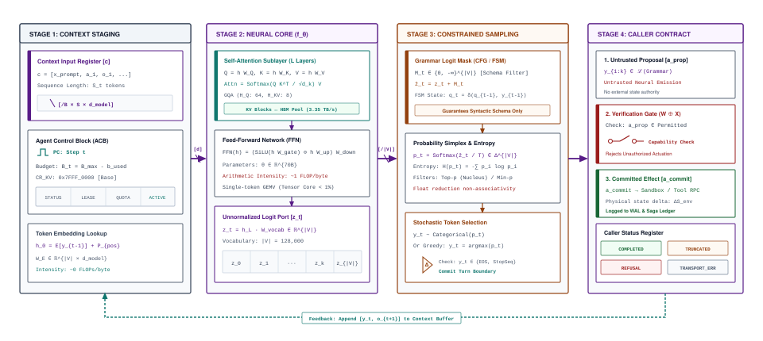
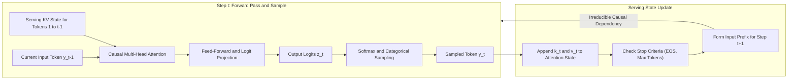
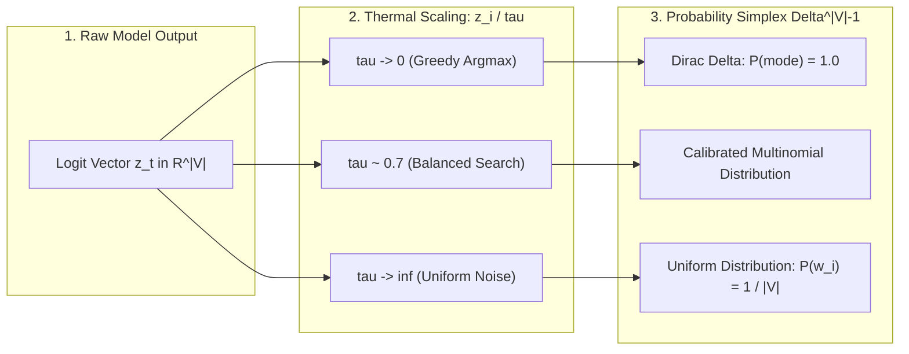

# The Stochastic Processor Core {#sec-vol3-processor}

::: {layout-narrow}
::: {.column-margin}

\chapterminitoc

:::

::: {.content-visible when-format="pdf"}
\noindent
{fig-alt="Blueprint for The Stochastic Processor Core."}
:::

::: {.content-visible unless-format="pdf"}
{fig-alt="Blueprint for The Stochastic Processor Core."}
:::

:::

## Purpose {.unnumbered .unlisted}

\begin{marginfigure}
\mlagentstack{0}{0}{0}{0}{0}{100}
\end{marginfigure}

_*What does a foundation-model invocation compute, and what contract does the rest of the computer need to use its output?*_

An agentic system repeatedly invokes a foundation model to propose what to say or do next. Each invocation begins with a finite sequence of staged tokens and proceeds through conditional next-token computation until a stopping condition, output limit, refusal, or service failure returns control to the caller. This learned computation can produce a useful candidate, but it cannot by itself establish factual truth, authorize an action, observe its effect, or certify task completion. This chapter follows one invocation from tokenized input through autoregressive generation to a caller-visible result. It defines the interface fields and outcome classes a runtime needs, explains how structural constraints alter legal output sequences, and accounts for the distinct costs of prefill and decode. The governing boundary is simple: the model proposes; the surrounding system interprets and governs the proposal. A single candidate may still be insufficient, motivating deliberate allocation of further inference-time computation in the next chapter.

::: {.content-visible when-format="pdf"}
\newpage
:::

::: {.callout-learning-objectives}

- Trace one invocation from staged context through repeated next-token steps to a candidate sequence and caller-visible status.
- Explain why token counts, context limits, and output limits do not correspond reliably to character counts or programming-language syntax.
- Distinguish a token-step forward pass from generation of a complete response, and derive the serial dependency across output tokens.
- Evaluate caller contracts for timeouts, partial outputs, refusal markers, and malformed structures.
- Implement and compare grammar constraints via regular expressions, context-free grammars, and parser-driven logit masking.
- Account for invocation latency and cost across prompt prefill and token decoding, and evaluate their trade-offs under task deadlines.

:::

## A Model Call in the Stochastic Computer {#sec-vol3-processor-role}

Chapter 1 established that an agentic machine learning system operates as a closed-loop trajectory engine across an extended horizon. However, executing even the simplest trajectory requires an engine capable of generating candidate actions from observed states. In the Stochastic Computer, that engine is the stochastic processor core: a statistical foundation model invoked to propose what to say or do next. Yet treating a foundation model invocation as an instruction execution in the classical sense is the root architectural fallacy of naive agent systems. An instruction decoded by a classical CPU is an instruction executed; hardware guarantees cycle-accurate state transitions and traps unauthorized memory faults at the silicon boundary. In contrast, an invocation of a foundation model produces no ambient side effects, advances no physical clock, and executes no instructions. It evaluates conditioned probability distributions over token sequences to yield a candidate continuation.

Consider the configuration parser incident introduced in Chapter 1. A microservice degrades in production because fractional timeout strings (`"2.5s"`) are truncated to integer milliseconds (`2000ms != 2500ms`). When an autonomous repair agent is assigned to inspect the repository and resolve the regression test failure, the host runtime invokes the foundation model with a prompt staging the failing test log, the parser source code, and a tool schema for file editing. The model's forward pass evaluates the context and samples the subword token sequence corresponding to:

```python
edit_file(path="parser.py", search="int(seconds) * 1000", replace="int(seconds * 1000)")
```

The stochastic processor core did not edit `parser.py`. It did not touch the host filesystem, allocate a file descriptor, or invoke an operating system kernel primitive. It emitted an unprivileged string of token identifiers into a host memory buffer. The core proposed a candidate continuation; the responsibility for validating whether the target file exists, whether the agent holds edit capabilities within the sandbox, and whether the syntax adheres to schema specifications belongs entirely to the surrounding runtime harness.

### The Caller-Core Operational Boundary

To operate a stochastic processor core reliably, the system architecture must enforce a clean operational boundary between the caller (the agent runtime) and the core (the foundation model serving endpoint). This division of labor is characterized by three distinct phases:

1. **The Caller's Staging Work:** Before initiating a model call, the agent runtime must assemble the task-relevant context window. This includes staging the system instructions, the authoritative task contract, durable environment state, recent observation traces, and available tool definitions. The caller also defines the invocation parameters: sampling temperature, top-$p$ bounds, maximum generation limits, context window boundaries, and wall-clock execution deadlines ($T_{\text{deadline}}$).
2. **The Core's Learned Computation:** Upon receiving the serialized token buffer, the serving core executes conditional next-token scoring and autoregressive sampling. The core operates in strict epistemic isolation: it possesses no ambient awareness of real-world time, no network socket handles, and no visibility into external host state beyond the explicit token IDs provided in the staged context.
3. **The Returned Invocation Envelope:** When token generation halts—whether via an end-of-sequence token, an explicit stop delimiter, an output budget exhaustion, or a service timeout—the core packages its output into an invocation response envelope. This envelope separates the candidate completion from caller-visible status flags and resource telemetry:
   - **Candidate Content:** The raw text or structured token sequence proposed by the model.
   - **Invocation Status:** The terminal state of the generation request (e.g., `COMPLETED`, `TRUNCATED_MAX_TOKENS`, `REFUSAL`, or `TRANSPORT_TIMEOUT`).
   - **Usage Telemetry:** Verified prompt token count ($N_{\text{prompt}}$), decode token count ($N_{\text{decode}}$), and latency breakdowns ($T_{\text{prefill}}, T_{\text{decode}}$).

Only after this response envelope is unpacked by the host runtime does the proposal encounter execution logic.

### Complete Mediation and the Tripartite Execution Model {#sec-tripartite-separation}

Because candidate token emissions can contain syntactically malformed commands, hallucinated parameters, or destructive side effects (such as proposing `rm -rf /` under high sampling entropy), the stochastic computer enforces the security principle of **complete mediation** [@saltzer1975]. Formulated by Jerome Saltzer and Michael Schroeder in 1975, complete mediation dictates that every access to every resource must be validated against an independent authorization mechanism, and that no unvalidated assertion from an untrusted principal may bypass inspection. In a Stochastic Computer, the model core is an untrusted principal.

To operationalize complete mediation across every invocation, the system formalizes a strict tripartite execution separation:

$$\text{Staged Context } c_t \xrightarrow[\text{Inference}]{\text{Model Core}} a_{\text{prop}} \xrightarrow[\text{Mediation}]{\text{Runtime Guard}} a_{\text{perm}} \xrightarrow[\text{Dispatch}]{\text{Sandbox/OS}} e_{\text{commit}}$$

1. **Model Proposal ($a_{\text{prop}}$):** The raw, unverified token sequence emitted by the neural core during autoregressive decode. Whether formatted as free-form natural language, Markdown, or JSON tool calls, $a_{\text{prop}}$ represents an algorithmic hypothesis. It carries zero ambient authority to mutate system state.
2. **Permitted Action ($a_{\text{perm}}$):** The validated, strongly typed execution payload produced after $a_{\text{prop}}$ passes through deterministic validation layers. The host runtime intercepts $a_{\text{prop}}$, validates the syntax against strict schemas, verifies that the requested action is authorized within the task's capability envelope, and binds execution parameters to sandboxed resource descriptors. If the proposal fails validation, the host runtime halts execution, rejects the action, and reflects the validation error back into the next context as an observation, preventing invalid state mutations.
3. **Committed Effect ($e_{\text{commit}}$):** The physical, observable state mutation realized in the host environment or external services (such as a filesystem write, a container execution, or a network request) following sandboxed execution of $a_{\text{perm}}$.

::: {#fig-stochastic-processor-core fig-env="figure" fig-pos="htb" fig-cap="**The Stochastic Processor Core Boundary and Complete Mediation**: The host runtime mediates all interactions between the unprivileged foundation model and the external environment. Staged context triggers candidate generation ($a_{\\text{prop}}$), which is intercepted by the complete mediation policy gate to produce a permitted action ($a_{\\text{perm}}$) before any environmental mutation ($e_{\\text{commit}}$) can be committed." fig-alt="Sequence diagram showing the stochastic processor emitting unprivileged proposals mediated by runtime policy checks before committing effects."}
{width=100%}
:::

As illustrated in @fig-stochastic-processor-core, conflating $a_{\text{prop}}$ with $e_{\text{commit}}$ breaches the core safety boundary of autonomous systems. By maintaining this tripartite separation, the host runtime guarantees invariant closure: regardless of model hallucinations, prompt injections, or stochastic sampling noise, no unauthorized action reaches the execution environment.

### Epistemic Isolation and Staged Context

The necessity of complete mediation is compounded by the core's epistemic isolation. A physical microprocessor interfaces directly with hardware clocks, interrupt controllers, and bus transceivers. In contrast, a stochastic core observes the universe solely through the sequence of token IDs staged into its input buffer prior to the forward pass. The model has no internal sense of elapsed wall-clock time, no awareness of pending background network transfers, and no visibility into whether a previously inspected file has been concurrently modified on disk.

If the host runtime stages an incomplete log snippet or a stale file excerpt, the model core generates candidate proposals conditioned strictly on that obsolete view. Furthermore, because external state mutations occur asynchronously while the model is decoding tokens, the operational preconditions assumed by $a_{\text{prop}}$ during the forward pass may invalidate before decoding finishes. The host runtime must therefore treat the context window not as ground truth, but as a point-in-time observational cache whose validity must be checked before $a_{\text{perm}}$ is dispatched.

Establishing this operational boundary defines the division of responsibility: the runtime retains absolute sovereignty over state, authority, and environmental side effects, while the foundation model operates as a stateless, learned sequence proposer. Operating this boundary reliably, however, requires examining the fundamental computational currency through which context is staged and candidates are generated: discrete subword tokens.

## Tokens as the Processor Interface {#sec-vol3-processor-tokenization}

The interface between an external software runtime and a neural processing core is neither byte-oriented nor syntactically aware. It operates entirely over discrete integer identifiers known as subword tokens. In classical computer architecture, microarchitectural execution units consume fixed-width or byte-aligned instructions that map unambiguously to an opcode table and operand registers. In a stochastic processor, by contrast, the raw input byte stream is first partitioned by a statistical subword tokenizer—predominantly Byte-Pair Encoding (BPE) [@sennrich2016subword]—before the model executes a single floating-point operation. This serialization layer sits directly on the critical path of the processor core, introducing a fundamental impedance mismatch: context capacity, generation limits, and serving cost are denominated strictly in tokens, yet token boundaries do not align cleanly with words, characters, or programming language Abstract Syntax Tree (AST) nodes.

### The Concrete Accounting Mismatch

Consider our configuration parser defect. An autonomous agent evaluates two candidate patches to fix the timeout conversion logic:

- **Candidate A:** `int(seconds * 1000)` (23 characters)
- **Candidate B:** `int(math.floor(float(sec) * 1e3))` (33 characters)

While Candidate B is 43% longer in character count, in standard BPE vocabularies (such as cl100k_base or Llama 3), Candidate A partitions into 8 tokens, while Candidate B partitions into 12 tokens. Now consider what occurs when variable names contain camelCase or snake_case compounds: `parsed_timeout_in_milliseconds` may segment into 6 distinct tokens (`parsed`, `_time`, `out`, `_in`, `_milli`, `seconds`), whereas `timeoutMs` segments into 2 tokens (`timeout`, `Ms`).

If the host runtime budgets an invocation's output ceiling based on approximate character counts (e.g., assuming $1 \text{ token} \approx 4 \text{ characters}$), an implementation generating verbose identifiers will exhaust its maximum output token limit ($N_{\text{max\_tokens}}$) mid-stream. The model abruptly halts, returning a truncated AST that fails Python parsing at the host boundary. Character count is merely a coarse heuristic; subword tokens are the exact accounting currency of the processor core.

### Byte-Pair Encoding and Boundary Instability

Byte-Pair Encoding constructs a vocabulary of fixed size $|\mathcal{V}|$ (typically between $32{,}000$ and $256{,}000$ entries) by iteratively merging the most frequent contiguous byte sequences observed in a training corpus. Because merge rules are derived from corpus-wide statistical co-occurrence rather than deterministic language grammars, the mapping from input text to token sequences is non-local, greedy, and sensitive to context prefixes. A single whitespace offset or punctuation mark can alter merge priorities across an entire line of code.

Consider the assignment `def get_user_id():`. In standard BPE vocabularies, ` get` is represented as an atomic token, `_user` as a second, and `_id():` as a third. However, prefixing this statement with two leading spaces alters the local merge sequence: the tokenizer may ingest the first space as an isolated character token and merge the second space with the character `d`, yielding ` d`, followed by `ef`. The language keyword `def`—a discrete, immutable primitive in the programming language's grammar—is fractured across an unnatural token boundary.

::: {#fig-token-ast-mismatch fig-env="figure" fig-pos="htb" fig-cap="**Token-AST Impedance Mismatch**: Subword tokenization operates orthogonally to programming language AST grammars. In source code, whitespace and identifiers map cleanly to discrete Abstract Syntax Tree (AST) nodes (top). Under Byte-Pair Encoding (BPE), identical indentation depths and identifiers are partitioned into inconsistent token IDs depending on adjacent prefixes and merge heuristics (bottom), forcing the model to expend layer capacity on lexical reconstruction." fig-alt="Diagram comparing abstract syntax tree hierarchy against fragmented subword token splits."}
{width=100%}
:::

As illustrated in @fig-token-ast-mismatch, this lexical fragmentation means that the neural core does not observe structured symbols. The self-attention layers must expend representational capacity merely to reconstruct the lexical identity of basic keywords before higher layers can evaluate semantic relationships.

### The Token Budgeting and Truncation Invariant

Beyond lexical representation, subword tokens define the physical budgeting boundaries of the Stochastic Computer. Every model invocation is governed by two hard token constraints:

1. **Context Window Ceiling ($S_{\text{max}}$):** The maximum total sequence length ($N_{\text{prompt}} + N_{\text{decode}} \le S_{\text{max}}$) supported by the model architecture. Exceeding this boundary results in immediate request rejection (`CONTEXT_WINDOW_EXCEEDED`).
2. **Output Generation Limit ($N_{\text{decode}} \le N_{\text{max\_tokens}}$):** The maximum number of autoregressive decode steps permitted for the invocation.

Because the caller pays for both latency and financial cost as a monotonic function of tokens, runtime developers must implement strict token counting rather than string-length estimation. Furthermore, special delimiter tokens (such as `<|start_header_id|>`, `<|eot_id|>`, or `[TOOL_CALLS]`) occupy discrete token slots and must be guarded against user-data injection. An untrusted error log containing raw delimiter strings can prematurely terminate generation or trick the parser into treating diagnostic text as an authoritative tool call.

Subword tokenization establishes the discrete alphabet through which the stochastic processor perceives and emits information. Once the staged context is mapped into a vector of token indices, the core evaluates these symbols through autoregressive sequence factorization.

## Next-Token Computation {#sec-vol3-processor-autoregressive}

When an engineering team attempts to accelerate an agentic workflow that generates a 1,000-token diagnostic trace by scaling hardware from a single accelerator to an eight-GPU cluster, benchmarking reveals an unavoidable systems constraint: generation latency per token remains essentially unchanged. Distributing a transformer across multiple accelerators via tensor parallelism decreases the execution duration of individual matrix multiplications, but it cannot alter the serial dependency graph of generation. The stochastic processor cannot compute token 500 until token 499 has been sampled, materialized into memory, and appended to the context. A tool-call JSON payload or a code patch cannot be validated before its earlier tokens are chosen; a long proposed patch must wait for each preceding output token even if hundreds of prompt tokens were processed in parallel.

### Autoregressive Sequence Factorization

Let $\mathbf{x} = (x_1, x_2, \dots, x_M)$ represent the input prompt comprising $M$ discrete tokens staged by the runtime. The stochastic processor core models the joint conditional probability of an output sequence $\mathbf{y} = (y_1, y_2, \dots, y_K)$ over a vocabulary $\mathcal{V}$ by factorizing the joint distribution into an exact product of conditional probabilities via the probability chain rule:

$$P(\mathbf{y} \mid \mathbf{x}) = \prod_{t=1}^K P(y_t \mid \mathbf{x}, y_1, y_2, \dots, y_{t-1}) = \prod_{t=1}^K P(y_t \mid \mathbf{x}, y_{<t})$$

Formally, the computational state of the stochastic processor core at step $t$ is captured by the tuple:

$$\mathcal{S}_t = \left(\mathbf{x}, \mathbf{y}_{<t}, \Theta, \mathbf{K}_{1:t-1}, \mathbf{V}_{1:t-1}\right)$$

where $\mathbf{x}$ denotes the staged context buffer, $\mathbf{y}_{<t}$ represents the generated output prefix, $\Theta$ encapsulates the static parameter weights, and $(\mathbf{K}_{1:t-1}, \mathbf{V}_{1:t-1})$ is the dynamic Key-Value activation state retained in serving memory.

At each discrete step $t$, the transformer evaluates $\mathcal{S}_t$ through its attention layers and unembedding projection to produce a vector of raw unnormalized logits $\mathbf{z}_t \in \mathbb{R}^{|\mathcal{V}|}$. Applying the softmax operator parameterized by temperature $\tau > 0$ yields a categorical probability distribution:

$$\mathbf{p}_t = \text{softmax}\left(\frac{\mathbf{z}_t}{\tau}\right), \quad P(y_t = w_i \mid \mathbf{x}, y_{<t}) = \frac{\exp(z_{t,i} / \tau)}{\sum_{j=1}^{|\mathcal{V}|} \exp(z_{t,j} / \tau)}$$

The processor core then samples concrete token $y_t \sim \mathbf{p}_t$ according to the chosen decoding policy (e.g., greedy argmax for $\tau \to 0$, or top-$p$ nucleus sampling).

### One Step Versus One Response

A critical systems distinction in the Stochastic Computer is the difference between a **single forward step** and a **complete response generation**:

1. **A Single Step:** A single forward pass through the network evaluates attention over existing state and emits next-token logit scores $\mathbf{z}_t$. It is an atomic numerical transform.
2. **A Complete Response:** Response generation is an iterative control loop executed by the model serving harness. It repeatedly invokes the step transform, samples $y_t$, appends $(k_t, v_t)$ to serving memory, checks termination predicates (such as emitting an `<|eot_id|>` token, reaching an explicit stop string, or hitting $N_{\text{max\_tokens}}$), and loops until halted.

::: {#fig-autoregressive-loop fig-env="figure" fig-pos="htb" fig-cap="**Autoregressive Serialization Loop**: The causal execution loop of autoregressive token generation. Each generated token requires a discrete accelerator forward pass, memory state update, and non-deterministic sampling before the subsequent step can initiate." fig-alt="Flowchart illustrating the causal loop of autoregressive decoding, showing forward pass, KV cache mutation, and serial dependency."}

:::

### The Irreducible Serial Dependency Chain

This autoregressive recurrence, illustrated in @fig-autoregressive-loop, establishes that the critical path of generation is strictly sequential. To evaluate $P(y_t \mid \mathbf{x}, y_{<t})$, the self-attention mechanism at each layer must compute inner products between the query vector $\mathbf{q}_t$ of the current token and the key vectors $\mathbf{k}_i$ of all preceding tokens $i \in [1, M + t - 1]$.

Because the discrete identity of token $y_t$ is non-deterministic and unknown prior to step $t$, the computational pipeline cannot evaluate subsequent query projections speculatively without incurring exponential branching overhead. The host accelerator is trapped in an iterative data-dependency loop. While cluster parallelization (tensor, pipeline, or expert parallelism) reduces the wall-clock duration of each individual matrix multiplication, it cannot reduce the sequence length $K$ of sequential decode steps.

This serial chain reveals the central systems reality: generating an operational trajectory requires waiting for hundreds or thousands of causally chained sampling steps. If the model simply repeats this sampling step until a stop delimiter is emitted, what guarantees that the resulting candidate sequence represents a valid, truthful, or executable conclusion?

## Candidate Sequences Versus Valid Conclusions {#sec-vol3-processor-continuations}

The boundary separating a stochastic core from a deterministic execution unit lies in the mathematical mapping between hidden layer representations and emitted symbols. At decoding step $t$, the transformer maps its normalized final hidden activation vector $\mathbf{h}_t \in \mathbb{R}^{d_{\text{model}}}$ to an unnormalized logit vector $\mathbf{z}_t \in \mathbb{R}^{|\mathcal{V}|}$ through an affine projection against the language modeling head:

$$\mathbf{z}_t = \mathbf{W}_{\text{vocab}} \mathbf{h}_t + \mathbf{b}_{\text{vocab}}$$

where $|\mathcal{V}|$ denotes the vocabulary dimension, typically spanning $32{,}000$ to $256{,}000$ discrete token identifiers. To convert these real-valued logits into an admissible categorical probability distribution over the discrete vocabulary, the runtime evaluates a parameterized softmax transformation:

$$P(y_t = w_i \mid \mathbf{x}, y_{<t}) = \frac{\exp(z_{t,i} / \tau)}{\sum_{j=1}^{|\mathcal{V}|} \exp(z_{t,j} / \tau)}$$

where $\tau > 0$ is the sampling temperature. Foundation models are trained by minimizing empirical cross-entropy loss over text corpora:

$$\mathcal{L}_{\text{MLE}} = - \sum_{k=1}^N \log P(x_k \mid x_{<k})$$

This objective conditions the network parameters to mirror the empirical distribution of tokens in the training data. High probability under $P(y_t \mid \mathbf{x}, y_{<t})$ indicates only that token $y_t$ is a statistically common continuation of the prefix within the training distribution. It conveys no guarantee that the token represents a true statement about the physical world, an existing operating system resource, or an executable payload.

### The Concrete Systems Defect: Plausible Semantic Corruption

The operational consequence of this statistical objective is starkly illustrated in our configuration parser incident. When prompted to resolve the regression test for input `"2.5s"`, the model core may evaluate its own previously generated truncation code: `int(seconds) * 1000`. When generating a companion test suite, the model emits with high categorical log-probability:

```python
assert parse("2.5s") == 2000
```

The model emits `2000` rather than `2500` because conditioned on its prior token history, `2000` is the mathematically consistent prediction of its own flawed implementation. The emitted candidate assertion is syntactically flawless, compiles cleanly, and if executed against the buggy code, returns exit code 0. The output is internally coherent, yet semantically corrupt. The neural processor optimizes for statistical likelihood, not objective truth; high confidence does not correlate with invariant compliance.

### Confidence Traps and the Temperature Simplex

The shape of the categorical probability distribution across the vocabulary simplex is controlled by the temperature parameter $\tau$, as illustrated in @fig-temperature-simplex.

::: {#fig-temperature-simplex fig-env="figure" fig-pos="htb" fig-cap="**Thermal Scaling on the Probability Simplex**: The effect of temperature scaling on logit transformation and categorical sampling. Low temperature sharpens the distribution onto the mode, whereas high temperature disperses probability mass across the vocabulary simplex." fig-alt="Flowchart showing raw logits, temperature division, softmax normalization, and three sampling regimes."}

:::

When $\tau \to 0^+$, the softmax operator approaches the argmax function:

$$\lim_{\tau \to 0^+} P(y_t = w_i \mid \mathbf{x}, y_{<t}) = \begin{cases} 1 & \text{if } i = \arg\max_k z_{t,k} \\ 0 & \text{otherwise} \end{cases}$$

This greedy decoding mode forces the processor to select the single most probable token at every step. While greedy decoding guarantees deterministic token emissions across identical hardware and prompt inputs, it does not guarantee correctness. If the mode of the learned distribution corresponds to a common misconception, a hallucinated API call, or an invalid parameter, greedy execution repeats the failure deterministically. Determinism suppresses output variance, but it does not correct structural bias.

Conversely, setting $\tau > 0$ introduces variance by flattening the logit landscape:

$$\frac{P(w_i)}{P(w_j)} = \exp\left(\frac{z_{t,i} - z_{t,j}}{\tau}\right)$$

For exploratory agent tasks, moderate temperatures ($\tau \in [0.2, 0.7]$) allow the model to sample non-modal tokens, enabling the generation of alternative reasoning trajectories when an initial attempt fails. However, nonzero temperature introduces tail risk: low-probability, malformed tokens are assigned nonzero probability mass. Modeling the joint error rate under an illustrative per-token error proxy $\epsilon$ reveals how quickly unconstrained sampling diverges across extended contexts:

$$P_{\text{valid}} \approx (1 - \epsilon)^K$$

For an agent trajectory generating $K = 1{,}000$ tokens with a nominal per-token syntax error rate of $\epsilon = 0.002$, the probability of emitting a completely valid output falls below $14\%$ ($P_{\text{valid}} \approx (1 - 0.002)^{1000} \approx 0.135$). The operational trade-offs across thermal sampling values are summarized in @tbl-temperature-scaling.

| Operational Regime    | Temperature Range     | Entropy $H(P)$  | Execution Characteristic                 | Primary Failure Mode                                       |
|:----------------------|:----------------------|:----------------|:-----------------------------------------|:-----------------------------------------------------------|
| **Greedy Argmax**     | $\tau \to 0^+$        | $0$ (Minimum)   | Deterministic, reproducible, modal paths | Fixed-point hallucination loops, uncorrectable schema bias |
| **Controlled Decode** | $\tau \in [0.1, 0.7]$ | Low to Moderate | Targeted exploration, bounded diversity  | Tail sampling of hallucinated library symbols              |
| **High Entropy**      | $\tau \ge 1.0$        | High            | Maximum lexical divergence               | Syntax destruction, JSON parse errors, schema violations   |

: **Systems Properties of Temperature Regimes**: Operational trade-offs across thermal sampling values during autoregressive generation. {#tbl-temperature-scaling}

### Context Poisoning and Irreversible Forward Attention

The danger of plausible errors is amplified by **context poisoning**. In transformer architectures, attention is strictly causal: token $y_{t+1}$ attends to all preceding tokens $[x_1, \dots, x_M, y_1, \dots, y_t]$. Once an incorrect assumption, hallucinated identifier, or flawed assertion is sampled at step $t$, it is permanently committed to the sequence prefix.

The self-attention heads at step $t+1$ treat $y_t$ not as a tentative speculation, but as established historical ground truth. The model cannot backtrack, revise its internal state, or execute an `undo` operation within a single invocation. The erroneous token acts as an attentional sink, distorting the conditioning context for all downstream decode steps and causing the model to generate elaborate, highly confident justifications for an invalid starting premise.

Because candidate sequences can be plausibly flawed, non-deterministic, and prone to context poisoning, the host runtime cannot treat model outputs with implicit trust. The system must encapsulate every call within an explicit invocation contract governing parameter bounds, execution limits, and caller-visible return states.

## The Invocation Contract {#sec-vol3-processor-contract}
[]{#sec-vol3-processor-status}

Treating a statistical model as a local function or in-process subroutine obscures its physical systems reality: model inference is a distributed, resource-intensive Remote Procedure Call (RPC) dispatched across a network boundary to a multi-tenant accelerator cluster. In classical computer architecture, an Instruction Set Architecture (ISA) establishes an immutable hardware-software contract: the caller passes operands through registers, the CPU decodes opcodes deterministically, and execution traps occur at binary machine boundaries.

In a Stochastic Computer, this contract dissolves if the interface between the host runtime and the model core is left informal. Foundation model providers frequently update model checkpoints, adjust internal server-side system prompts, or reconfigure quantization kernels on shared inference endpoints. An agent runtime that queries an unpinned model alias will experience silent behavioral drift.

Consider an agent loop configured with a floating model alias such as `inference-prod-latest`. When the infrastructure provider updates the checkpoint from version 2.1 to 2.2, the model shifts its prompt parsing behavior and begins enclosing structured JSON responses in markdown code fences. A downstream host parser that relies on strict string matching fails immediately:

```text
// Execution Trace: Unpinned Model Ingestion Fault
[2026-03-12T14:22:01.104Z] REQ  POST /v1/chat/completions {"model": "inference-prod-latest", ...}
[2026-03-12T14:22:02.318Z] RESP 200 OK {"model": "inference-prod-2026-03-12", "choices": [{"message": {"content": "```json\n{\"action\": \"query_database\", \"args\": {\"id\": 4012}}\n```"}}]}
[2026-03-12T14:22:02.320Z] CRIT AgentRuntimeSchemaError: Failed to parse tool invocation: Unexpected token '`' at position 0
[2026-03-12T14:22:02.321Z] FATAL Process terminated with unhandled exception (exit code 1)
```

The system collapsed because the caller assumed environmental invariance across a floating network pointer. To build dependable software upon probabilistic components, the runtime must encapsulate every model invocation within a strict, defensively bounded remote invocation contract across four operational dimensions, formalized in @tbl-invocation-contract-spec:

1. **Pinned Model Version:** The caller must address an immutable snapshot identifier (such as `model-2026-03-01`) rather than a rolling pointer (`model-latest`). Floating aliases obscure silent modifications to model weights, vocabulary tokenization, and FP8 quantization scale factors. Immutability guarantees that the underlying distribution remains stationary.
2. **Context Payload:** The structured input context $\mathbf{x}$, partitioned into invariant system instructions, ordered conversation turns, staged tool execution outputs, and explicit schema definitions for all callable host interfaces.
3. **Generation Controls:** Parameters governing the decoding trajectory across the vocabulary simplex: sampling temperature $\tau$, nucleus sampling threshold $p \in (0, 1]$, an explicit array of stop sequence delimiters, and an optional pseudo-random generator seed integer.
4. **Resource Bounds:** Hardware and latency safeguards, specifically the maximum generation length ($K_{\max}$) and an absolute deadline timeout ($T_{\max}$).

| Parameter                 | Type         | Systems Purpose                                         | Invariant Constraint                                                                         |
|:--------------------------|:-------------|:--------------------------------------------------------|:---------------------------------------------------------------------------------------------|
| `model_id`                | String       | Identifies immutable model weights and tokenizer        | Must specify an immutable snapshot; floating aliases (`latest`, `default`) forbidden         |
| `context`                 | List[Frame]  | Encapsulates prompt, message history, and tool schemas  | Total token count must not exceed budget: $\lvert \mathbf{x} \rvert \le L_{\max} - K_{\max}$ |
| `temperature` ($\tau$)    | Float        | Modulates logit entropy and sampling dispersion         | Bound to range $[0.0, 2.0]$; set to $\tau = 0.0$ for deterministic paths                     |
| `top_p` ($p$)             | Float        | Truncates sampling to smallest set with mass $\ge p$    | Bound to range $(0.0, 1.0]$; default $1.0$ (disabled)                                        |
| `stop_tokens`             | List[String] | Halts decode loop when delimiter is encountered         | Must include application-level message and block boundary tokens                             |
| `max_tokens` ($K_{\max}$) | Integer      | Imposes upper limit on autoregressive decode iterations | Strict ceiling: $K_{\max} \le B_{\text{token}}$; prevents runaway allocation loops           |
| `timeout_ms` ($T_{\max}$) | Integer      | Absolute socket deadline for RPC completion             | Enforced by client-side socket deadline; aborts via cancellation signal                      |

: **Remote Invocation Contract Specification**: Formal parameter taxonomy, types, and operational bounds for stochastic processor RPCs. {#tbl-invocation-contract-spec}

### Caller-Visible Return Status Taxonomy

The return of an RPC payload across the network socket marks the boundary where transport guarantees end and semantic evaluation begins. In conventional distributed systems, an HTTP `200 OK` status code combined with a well-formed transport envelope establishes that the remote service processed the request according to interface specifications and returned a valid result. In a Stochastic Computer, an HTTP `200 OK` indicates only that the remote inference engine completed its autoregressive decoding loop without an internal accelerator panic or kernel crash. It conveys no guarantee that the emitted byte stream satisfies application preconditions, terminates cleanly, or provides actionable computational progress.

Consider an agent loop in our configuration parser repair task. If token generation exhausts the allocated budget $K_{\max}$ halfway through emitting a patch, the remote engine halts decoding and transmits the accumulated token buffer inside a standard `200 OK` frame with `finish_reason: "length"`. If the client runtime naively deserializes the payload string and forwards it directly to a JSON parser or Python execution environment, execution fails with an unrecoverable `json.decoder.JSONDecodeError: Unterminated string starting at line 1`. The crash is not an external environment defect; it is an architectural flaw in the host runtime, which treated an arbitrary transport-level termination as a semantically complete execution unit.

To prevent unvalidated byte streams from corrupting host state, a dependable host runtime partitions every invocation outcome into one of four mutually exclusive caller-visible states, summarized in @tbl-caller-status-typology:

1. **Completed:** The model sampled an application-defined stop sequence or an intrinsic End-of-Sequence (`EOS`) token ($w_t \in \mathcal{S}_{\text{stop}}$) strictly before reaching the token ceiling $K_{\max}$ and prior to socket timeout expiration ($T_{\text{rpc}} < T_{\max}$). The payload represents an emission that is structurally complete under the model distribution. It is eligible for immediate grammar parsing, type checking, and permission gating.
2. **Incomplete (Truncated):** Generation was halted externally by the serving infrastructure because decode iterations reached the ceiling $K_{\max}$, or because the client-side socket deadline $T_{\max}$ elapsed during streaming decode. The returned payload is intrinsically broken: string literals lack closing quotes, JSON trees lack terminating brackets, and control blocks remain dangling. The payload cannot be executed directly; it requires context continuation or structured reprompting.
3. **Refusal:** The model core, safety alignment classifiers, or post-generation policy guardrails intercepted execution and emitted an explicit rejection payload (such as `finish_reason: "content_filter"`). The output contains no operational tool calls or task tokens, but rather a declarative rejection string. A refusal represents a deterministic policy boundary conditioned on the provided context.
4. **Transport Failure:** The remote runtime failed to deliver a valid application frame. Root causes include network partition timeouts ($T_{\text{rpc}} \ge T_{\max}$), HTTP `502 Bad Gateway` or `503 Service Unavailable` signals, socket resets, and remote accelerator Out-of-Memory (OOM) aborts during Dynamic Key-Value cache allocation. No model tokens are delivered to the caller.

| Status Class          | Physical Trigger Condition                                                                                         | Payload Invariants                                                          | Mandatory Runtime Recovery Policy                                                                          |
|:----------------------|:-------------------------------------------------------------------------------------------------------------------|:----------------------------------------------------------------------------|:-----------------------------------------------------------------------------------------------------------|
| **Completed**         | Token $w_t \in \mathcal{S}_{\text{stop}}$ emitted with $N_{\text{out}} < K_{\max}$ and $T_{\text{rpc}} < T_{\max}$ | Syntax structurally complete; terminal delimiter present; schema unverified | Route payload to syntax parser and permission gate; proceed to tool evaluation.                            |
| **Incomplete**        | Decode reaches $N_{\text{out}} = K_{\max}$ or socket deadline $T_{\max}$ expires                                   | Partial token buffer; dangling delimiters; unparseable syntax tree          | Check latency budget $T_{\text{remain}}$; if sufficient, roll context forward; otherwise abort trajectory. |
| **Refusal**           | Safety classifier trigger or alignment policy refusal intercept                                                    | Task payload null; diagnostic policy message present                        | Log policy code; escalate to supervisory planner or human operator; do not retry identical prompt.         |
| **Transport Failure** | Network timeout ($T_{\text{rpc}} \ge T_{\max}$), HTTP 5xx, or remote KV cache allocation panic                     | Payload null or socket stream severed prematurely                           | Execute exponential backoff with full jitter; on exhausted retries, fail over to secondary pinned replica. |

: **Caller-Visible Invocation States**: Physical trigger conditions, payload invariants, and mandatory recovery policies. {#tbl-caller-status-typology}

### Runtime Recovery and Context Roll-Forward

When an invocation returns `Incomplete`, the runtime must evaluate the trade-off between a *context roll-forward* and an *abort*. In a context roll-forward, the runtime appends the truncated prefix directly to the conversation history as an assistant turn and dispatches an immediate follow-up invocation instructing the model to resume generation from the exact point of interruption.

However, continuation is governed by latency and compute economics. Because the subsequent prefill must process the expanded input length $N_{\text{in}}' = N_{\text{in}} + K_{\max}$, prefill latency increases. If the remaining trajectory latency budget $T_{\text{remain}}$ cannot accommodate the minimum required compute:

$$T_{\text{remain}} < T_{\text{prefill}}(N_{\text{in}} + K_{\max}) + T_{\text{decode}}(K_{\min})$$

where $K_{\min}$ is the minimum token budget required to close open syntax blocks, the runtime must reject roll-forward and abort the task branch immediately.

Furthermore, naive context roll-forward that appends the raw text string directly to the conversation history encounters a subtle subword tokenization defect. When generation halts at $K_{\max}$, the terminal token in the buffer frequently represents an incomplete subword fragment—such as the opening bytes of a multi-byte Unicode sequence or the prefix of a code identifier. If the client decodes this token into characters and subsequently re-tokenizes the concatenated prompt for the next turn, the tokenizer's greedy merge rules may parse the boundary differently than the original autoregressive state, injecting spurious whitespace or fragmenting identifiers. Robust host runtimes execute *subword-aware roll-forward*: they inspect the token buffer directly, strip the terminal incomplete token (or roll back one to two tokens to the nearest delimiter boundary), and resume generation conditioned on the pruned prefix.

For `Refusal` and `Transport Failure`, recovery mechanics diverge fundamentally. A `Refusal` cannot be resolved by re-issuing an identical request; without altering the task formulation or context instructions, the policy classification boundary remains invariant. The runtime must escalate the refusal to an orchestrating planner or request human intervention. Conversely, `Transport Failure` indicates an ephemeral infrastructure bottleneck. For transient status codes (such as HTTP `429 Too Many Requests` or HTTP `503 Service Unavailable`), the runtime executes truncated exponential backoff with full jitter to prevent synchronized retry storms across distributed workers:

$$T_{\text{backoff}} = \min\left(T_{\text{cap}},\, T_{\text{base}} \cdot 2^k\right) \cdot U(0, 1)$$

where $k$ is the attempt index, $T_{\text{base}}$ is the initial delay floor, $T_{\text{cap}}$ is the maximum backoff ceiling, and $U(0, 1)$ is a uniform random variate. If retries on the primary endpoint exceed a defined threshold $k_{\max}$, the runtime triggers dynamic failover to an equivalent, immutable snapshot hosted on a secondary provider.

While @tbl-caller-status-typology establishes clear boundaries for handling raw invocation results, post-hoc triage remains an inefficient systems pattern. Detecting an incomplete or malformed JSON object after an accelerator has generated hundreds of tokens squanders memory bandwidth and exhausts the task latency budget. An agent architecture that relies exclusively on post-generation exception handling to catch malformed structures suffers from severely degraded trajectory goodput. This operational penalty raises an immediate architectural question: rather than passively inspecting raw token streams after the decode loop concludes, how can the host runtime actively constrain the stochastic core to emit strictly valid structured outputs during the generation process itself?

## Constraining the Output Surface {#sec-vol3-processor-grammar-constrained}
[]{#sec-vol3-processor-bounded-invariants}

When an application runtime expects a structured payload—such as an RPC request, a REST parameter block, or an external tool argument—unconstrained autoregressive generation introduces an immediate reliability failure. In our configuration parser incident, the runtime requires an edit action adhering strictly to the schema `{path: str, search: str, replace: str}`. If generation halts prematurely, samples an unescaped quote, or drops a closing brace, the core emits an unparseable fragment such as `{"path": "parser.py", "search": "int(seconds)`. The omitted closing delimiter causes the downstream deserializer (`json.loads()`) to raise a fatal syntax exception, crashing the agent loop, aborting the task, and squandering all preceding accelerator compute.

Post-hoc validation—parsing the output string after generation concludes and reprompting the model upon failure—is an inefficient recovery strategy. It consumes additional context window space, increases inference costs, and compounds latency without guaranteeing convergence. To enforce structural invariants deterministically, the execution environment must intervene directly during generation via **grammar-constrained decoding**. In this architecture, formal specifications—such as JSON Schema, Protocol Buffer definitions, or Extended Backus-Naur Form (EBNF) grammars—are compiled into stateful recognizers, specifically Deterministic Finite Automata (DFAs) for regular languages or Pushdown Automata (PDAs) for recursive context-free grammars.

### Automata Compilation and Logit Masking

During standard autoregressive generation, the language model projects its final hidden state $\mathbf{h}_t \in \mathbb{R}^{d_{\text{model}}}$ at step $t$ through an unembedding weight matrix $\mathbf{W}_{\text{vocab}} \in \mathbb{R}^{|\mathcal{V}| \times d_{\text{model}}}$ to produce unnormalized log-odds (logits) $\mathbf{z}_t \in \mathbb{R}^{|\mathcal{V}|}$ over vocabulary $\mathcal{V}$. In unconstrained sampling, the categorical token distribution is computed by applying the standard softmax operator over the complete vocabulary: $\mathbf{p}_t = \text{softmax}(\mathbf{z}_t)$.

Under grammar-constrained decoding, the runtime constrains generation by evaluating the automaton state prior to the sampling step [@willard2023outlines]. Let the automaton currently occupy state $q_t \in \mathcal{Q}$. The automaton inspects its transition function to determine the subset of tokens whose constituent characters drive the state machine into an active, non-error state. This subset constitutes the valid token set $\mathcal{V}_{\text{valid}}(q_t) \subseteq \mathcal{V}$. The runtime applies a logit mask directly to the raw logit vector $\mathbf{z}_t$, setting all invalid token indices to negative infinity:

$$\tilde{z}_{t, i} = \begin{cases} z_{t, i} & \text{if } w_i \in \mathcal{V}_{\text{valid}}(q_t) \\ -\infty & \text{if } w_i \notin \mathcal{V}_{\text{valid}}(q_t) \end{cases}$$

When the masked logit vector $\tilde{\mathbf{z}}_t$ passes through the softmax function, the probability mass allocated to invalid tokens drops strictly to zero:

$$P(y_t = w_i \mid \mathbf{x}, y_{<t}) = \frac{\exp(\tilde{z}_{t, i})}{\sum_{j \in \mathcal{V}_{\text{valid}}(q_t)} \exp(z_{t, j})}$$

Because the probability of selecting any token outside $\mathcal{V}_{\text{valid}}(q_t)$ is zero, the model cannot sample a syntactically illegal token. The emitted sequence is physically guaranteed to conform to the compiled grammar at every decode step.

### Subword Token Alignment and Prefix Closure

Translating character-level formal grammars to transformer logit masks introduces an impedance mismatch between character-level syntax rules and subword tokenization schemes. Modern foundation models do not decode individual ASCII characters; they operate on vocabularies of $32\text{,}000$ to $256\text{,}000$ subword tokens.

A single subword token frequently spans multiple syntactic boundaries or contains composite delimiters (e.g., `", \"replace\": \""`). If an automaton transitions character-by-character, the runtime cannot evaluate a candidate token by inspecting only its initial byte. Instead, the runtime must verify **prefix closure**: token $w_i$ is admissible from state $q_t$ if and only if every intermediate character in $w_i$ drives the automaton through valid transitions, and the terminal character leaves the automaton in a viable (non-rejecting) state from which an accepting state remains reachable, as illustrated in @fig-vol3-processor-grammar-fsm.

::: {#fig-vol3-processor-grammar-fsm fig-env="figure" fig-pos="htb" fig-cap="**Grammar-Constrained Decoding via Automata Logit Masking**: The target JSON schema is compiled into a deterministic finite automaton, where each state yields a precomputed bitmask over the subword vocabulary. The runtime applies this mask to logits prior to softmax, guaranteeing syntax compliance by construction." fig-alt="Finite state machine state transition graph showing per-token valid vocabulary logit masking."}
{width=100%}
:::

### Automata Precomputation: DFAs Versus PDAs

Dynamically parsing candidate tokens against an arbitrary grammar during every decode step introduces prohibitive latency overhead. Autoregressive decoding is strictly memory-bandwidth bound. If the host CPU attempts to parse all $|\mathcal{V}|$ vocabulary tokens against an active grammar on every iteration, CPU-GPU synchronization stalls and serialization latency can exceed tens of milliseconds per step, degrading generation throughput by an order of magnitude.

To eliminate decode-time parsing overhead, modern inference runtimes compile regular expressions and schema specifications into precomputed DFAs ahead of inference [@willard2023outlines]. For a regular language with finite state space $\mathcal{Q}$ and vocabulary $\mathcal{V}$, the engine precomputes a transition table:

$$\delta : \mathcal{Q} \times \mathcal{V} \to \mathcal{Q} \cup \{\text{error}\}$$

This ahead-of-time (AOT) compilation maps each state $q \in \mathcal{Q}$ directly to a pre-indexed bitmask tensor representing $\mathcal{V}_{\text{valid}}(q)$ resident in accelerator memory. During autoregressive decoding, determining the logit mask requires only an $O(1)$ device memory lookup indexed by the current automaton state $q_t$. The state machine advances to $q_{t+1} = \delta(q_t, w_t)$ immediately upon sampling token $w_t$, preserving decode throughput without host-device synchronization bubbles.

However, a fundamental systems boundary separates regular schemas from recursive Context-Free Grammars (CFGs). While regular expressions and flat schemas possess finite state spaces $\mathcal{Q}$ permitting full AOT bitmask precomputation, recursive grammars—such as arbitrary nested JSON or programming language syntax—require Pushdown Automata (PDAs) with an unbounded stack configuration $\gamma \in \Gamma^*$. Because the joint state space $(q, \gamma)$ is unbounded, the runtime cannot precompute a static $O(1)$ bitmask table. Production constrained decoding engines (such as `llguidance` and `XGrammar`) address this through hybrid scheduling: maintaining an incremental LR or Earley parser that computes next-token bitmasks asynchronously on the host CPU during accelerator compute cycles, or employing bounded-depth DFA approximations that fall back to dynamic stack evaluation only when schema nesting exceeds a precompiled recursion threshold.

### The Syntactic Divide: Syntax Guarantees Versus Semantic Truth

While grammar-constrained decoding guarantees that the emitted byte stream satisfies the formal rules of a schema, systems architects must not mistake syntactic compliance for semantic correctness. Finite-state logit masking establishes invariant closure strictly over string topology. It guarantees that an emission satisfies schema syntax, but it remains completely blind to operational safety, environmental preconditions, and factual truth.

Consider an agent constrained to emit a valid file modification tool payload:

```json
{
  "tool": "edit_file",
  "parameters": {
    "path": "/etc/shadow",
    "search": "root:x:0:0:",
    "replace": "root::0:0:"
  }
}
```

The payload satisfies the compiled schema: keys match the expected strings, types conform to interface definitions, and JSON delimiters close without error. The host deserializer accepts the payload with return code zero. Yet executing this call breaches host security. The finite-state mask guarantees that the byte stream forms valid JSON, but it cannot evaluate whether `/etc/shadow` is protected by access control lists (ACLs), whether the agent possesses root capabilities, or whether the replacement string corrupts system authentication.

Furthermore, rigid grammar constraints can induce **pathological hallucination**. When an unconstrained foundation model lacks the context or parametric knowledge to answer a query, its categorical distribution disperses across conversational hedges or error messages (e.g., `"error: variable not found"`). Under strict grammar constraints, however, the runtime forces the output distribution exclusively into the subset of tokens permitted by the active automaton state. If the true value is absent from context, the processor cannot emit an unmodeled error string; it must sample from the surviving grammar paths. If an agent is constrained to output an existing file path, it will sample a syntactically valid but non-existent path rather than reporting that the file is missing.

To maintain systems dependability, host runtimes must treat grammar-constrained decoding strictly as an optimization for serialization efficiency, rather than as an authorization or correctness mechanism. Syntactic guarantees must be bounded by a multi-stage validation perimeter implemented within deterministic host software, as outlined in @tbl-vol3-syntax-semantics-boundary.

| Dimension                    | Token-Level Grammar Mask (DFA Decode Layer)                                          | Host Runtime Semantic Validation (Execution Layer)                                                   | Operational Failure Mode if Conflated                                      |
|:-----------------------------|:-------------------------------------------------------------------------------------|:-----------------------------------------------------------------------------------------------------|:---------------------------------------------------------------------------|
| **Structural Integrity**     | Guarantees balanced delimiters, schema conformance, and valid subword token closure. | Validates object unmarshaling and type boundaries.                                                   | Parse errors, buffer overruns, and deserialization crashes.                |
| **Referential Integrity**    | Constrains emitted characters to string patterns (e.g., regex-matched identifiers).  | Resolves identifiers against live state stores (e.g., database foreign keys, open file descriptors). | Dangling references, phantom entities, and silent data corruption.         |
| **Authorization & Identity** | Enforces presence of credential fields in schema definitions.                        | Authenticates signatures; evaluates role-based access control (RBAC) and capability tokens.          | Privilege escalation, arbitrary path traversal, and unauthorized mutation. |
| **Arithmetic & Invariants**  | Forces outputs into numeric primitives (integers, floats).                           | Verifies range bounds, capacity limits, and physical conservation laws.                              | Broken financial ledgers, inventory over-allocation, and logic faults.     |
| **Temporal Preconditions**   | Enforces date/timestamp formatting specifications (e.g., ISO 8601).                  | Verifies monotonic clock ordering, transaction staleness, and lock lease expirations.                | Race conditions, stale read-modify-write loops, and deadlocks.             |

: **Syntactic versus Semantic Validation Boundary**: Division of operational invariants between token-level grammar masks and host runtime validation. {#tbl-vol3-syntax-semantics-boundary}

By enforcing these boundaries in host software, the system exploits grammar masks to eliminate syntax serialization crashes without relinquishing semantic authority to an unprivileged neural core. Having examined the symbolic and syntactic constraints of the invocation, we now turn to its physical resource economics: the latency and computational costs that govern model calls.

## The Cost of an Invocation {#sec-vol3-processor-cost}

When an agent runtime dispatches a context payload to a stochastic processor core, end-to-end invocation latency does not scale as a uniform scalar function of total token count. Instead, service time is partitioned across four physically disjoint operational phases:

$$T_{\text{call}} = T_{\text{queue}} + T_{\text{prefill}} + \sum_{t=1}^K T_{\text{decode}, t} + T_{\text{validate}}$$ {#eq-vol3-invocation-latency}

where $T_{\text{queue}}$ denotes scheduling delay within serving dispatch queues and device transfer buffers, $T_{\text{prefill}}$ is the time required to ingest and encode the full input sequence into Key-Value (KV) activations (Time-to-First-Token, or TTFT), $T_{\text{decode}, t}$ represents the inter-token generation latency for each of the $K$ emitted tokens during autoregressive decode, and $T_{\text{validate}}$ encompasses host-side grammar unmarshaling, deserialization, and semantic assertion checks.

Consider the concrete divergence within our running cache-invalidation diagnostic task. At the outset, the agent gathers repository context: it submits $40\text{,}000$ tokens containing the configuration parser, lease manager, and test harness to request a concise $25$-token diagnostic hypothesis. Later in the same debugging trajectory, having isolated the bug, the agent submits a short $400$-token test failure summary and requests a full $1\text{,}200$-token replacement implementation diff. Although both interactions invoke the identical foundation model endpoint, they stress completely different serving phases, hardware bottlenecks, and cost profiles. In the first call, prefill accounts for over $90\%$ of turnaround latency; in the second, autoregressive decode dominates execution time and memory bandwidth.

### The Roofline Model: GEMM Versus GEMV

The performance divergence between prefill and decode is governed by the hardware Roofline model formulated by Williams, Waterman, and Patterson [@williams2009]. The sustainable throughput of an accelerated processor (such as a GPU or TPU) is bounded by two orthogonal hardware ceilings: peak compute capacity (measured in floating-point operations per second, or FLOP/s) and memory interface bandwidth (measured in gigabytes per second, or GB/s). Which ceiling bottlenecks execution is determined by arithmetic intensity, $I$, defined as the operational density executed per byte of data transferred across the memory bus:

$$I = \frac{\text{Floating-Point Operations (FLOPs)}}{\text{Memory Traffic (Bytes Transferred)}}$$ {#eq-vol3-arithmetic-intensity}

During the prompt prefill phase, the processor ingests all $N_{\text{in}}$ tokens concurrently. The causal attention projection and feed-forward network layers evaluate across the entire input sequence simultaneously as dense General Matrix-Matrix Multiplications (GEMMs). Because the accelerator reuses parameter weight matrices across all $N_{\text{in}}$ tokens within registers and on-chip SRAM, arithmetic intensity scales directly with sequence length:

$$I_{\text{prefill}} \propto \min(N_{\text{in}}, B_{\text{max}})$$

For prompt contexts exceeding several thousand tokens, arithmetic intensity readily surpasses $100\text{ FLOP/byte}$, pushing execution well past the machine balance knee of accelerator hardware (for instance, an NVIDIA H100 SXM offering $3.35\text{ TB/s}$ of HBM3 bandwidth alongside nearly $2\text{,}000\text{ TFLOP/s}$ of 16-bit tensor compute). Consequently, prefill is strictly compute-bound. Accelerator tensor units operate near thermal saturation, and execution latency scales with parameter count and context length.

::: {#fig-vol3-processor-prefill-decode fig-env="figure" fig-pos="htb" fig-cap="**Roofline Model of Prefill versus Decode Asymmetry**: Operational contrast between compute-bound prompt prefill (dense GEMM operating above the machine balance knee) and memory-bandwidth-bound autoregressive decode (dense GEMV operating orders of magnitude below the compute ceiling)." fig-alt="Roofline model graph plotting arithmetic intensity against operational performance for prefill GEMM and decode GEMV."}
{width=100%}
:::

During the autoregressive decode phase, by contrast, tokens must be emitted sequentially due to data dependencies: token $t+1$ cannot be predicted until token $t$ is sampled. For every newly generated token, the processor must stream all parameter weights from HBM into execution registers to perform General Matrix-Vector Multiplications (GEMVs) [@pope2023efficiently]. For an unbatched or low-concurrency agent host, calculating a single token across a model with $N_{\text{params}}$ parameters stored at $P$ bytes per parameter (where $P = 2$ for 16-bit precision) requires loading $N_{\text{params}} \cdot P$ bytes across the bus to perform $2 \cdot N_{\text{params}}$ floating-point operations (one multiply-accumulate, or two FLOPs, per parameter). Consequently, arithmetic intensity collapses to:

$$I_{\text{decode}} \approx \frac{2 \cdot N_{\text{params}} \text{ FLOPs}}{N_{\text{params}} \cdot P \text{ Bytes}} = \frac{2}{P} \text{ FLOP/byte}$$

For standard 16-bit floating-point weights ($P=2$), $I_{\text{decode}} \approx 1\text{ FLOP/byte}$; for 8-bit quantized weights ($P=1$), $I_{\text{decode}} \approx 2\text{ FLOP/byte}$. Contrast this with the machine balance of contemporary accelerator hardware, defined as the ratio of peak compute capacity to peak memory interface bandwidth:

$$I_{\text{sat}} = \frac{\text{Peak Compute Throughput (FLOP/s)}}{\text{Peak Memory Bandwidth (Bytes/s)}}$$

On an NVIDIA H100 SXM accelerator (delivering nearly $2\text{,}000\text{ TFLOP/s}$ of dense FP16 Tensor Core compute alongside $3.35\text{ TB/s}$ of HBM3 bandwidth), the machine balance is $I_{\text{sat}} \approx 597\text{ FLOP/byte}$. Because $I_{\text{decode}} \approx 1\text{ FLOP/byte} \ll I_{\text{sat}}$, autoregressive decoding operates more than two orders of magnitude below the machine balance knee. As visualized in @fig-vol3-processor-prefill-decode, tensor compute units sit idle for the vast majority of clock cycles, throttled on memory bus bandwidth while streaming model weights and fetching the growing Key-Value (KV) cache.

### Latency Regimes and State Growth

The interaction between prompt length $N_{\text{in}}$ and generation length $N_{\text{out}}$ partitions model invocations into four distinct operational regimes. @tbl-vol3-latency-regimes outlines how resource bottlenecks shift across typical agent interaction patterns.

| Regime                | Context ($N_{\text{in}}$) | Output ($N_{\text{out}}$) | Dominant Latency Phase                    | Hardware Bottleneck                             | Representative Agent Workload                               |
|:----------------------|:--------------------------|:--------------------------|:------------------------------------------|:------------------------------------------------|:------------------------------------------------------------|
| **Ingestion-Heavy**   | High ($\ge 32\text{k}$)   | Low ($\le 100$)           | $T_{\text{prefill}}$ (TTFT)               | Tensor Core compute (GEMM)                      | Repository inspection, log classification, tool selection   |
| **Generation-Heavy**  | Low ($\le 1\text{k}$)     | High ($\ge 1\text{k}$)    | $\sum T_{\text{decode}, t}$               | Memory bandwidth (GEMV)                         | Patch synthesis, technical report drafting, code generation |
| **Balanced / Dense**  | High ($\ge 32\text{k}$)   | High ($\ge 1\text{k}$)    | Both $T_{\text{prefill}}$ & Decode        | Compute followed by memory bandwidth & capacity | End-to-end refactoring, whole-file rewrite with context     |
| **Interactive Probe** | Low ($\le 1\text{k}$)     | Low ($\le 100$)           | $T_{\text{queue}} + T_{\text{transport}}$ | Scheduling, RPC latency, host serialization     | Heartbeat checks, branch confirmation, single-token gating  |
: **Operational Regimes of Stochastic Processor Invocations**: Dominant latency phases and hardware bottlenecks determined by input and output token boundaries. {#tbl-vol3-latency-regimes}

Beyond arithmetic execution time, each active request incurs a physical state cost: the Key-Value (KV) cache. To prevent recomputing historical key and value projections at every decode step, the serving system retains past activations in high-bandwidth device memory. For a model with $L$ transformer layers, hidden dimension $d_{\text{model}}$, and $H_{\text{kv}}$ key-value heads of dimension $d_{\text{head}}$, each token consumes:

$$M_{\text{token}} = 2 \cdot L \cdot H_{\text{kv}} \cdot d_{\text{head}} \cdot P \quad \text{bytes}$$ {#eq-vol3-kv-cache-size}

For a 70-billion parameter model utilizing Grouped-Query Attention ($L=80$, $H_{\text{kv}}=8$, $d_{\text{head}}=128$, $P=2$), each active token retains approximately $320\text{ KB}$ of state. A single $40\text{,}000$-token repository trace consumes over $12.8\text{ GB}$ of dedicated accelerator SRAM/HBM merely to preserve context across decode steps. If the serving cluster hosts multiple concurrent agent loops, aggregate KV cache allocation rapidly exhausts device memory, triggering request queueing ($T_{\text{queue}}$) or preemptive context swapping.

### Amdahl's Law and the Return on Prefix Reuse

This physical reality dictates where systems optimization effort must be directed. Techniques engineered solely to accelerate generation throughput—such as speculative decoding, draft-model verification, and continuous output streaming—provide negligible reductions in total agent step latency when $N_{\text{in}} \gg N_{\text{out}}$.

Consider an agent step where prefill constitutes 85 percent of execution time ($f_{\text{prefill}} = 0.85$) and decode constitutes 15 percent ($f_{\text{decode}} = 0.15$). Applying Amdahl's Law, even doubling generation throughput (a $2\times$ speedup on decode) yields an end-to-end system speedup of:

$$S = \frac{1}{(1 - 0.15) + \frac{0.15}{2}} = \frac{1}{0.85 + 0.075} \approx 1.081$$

An 8 percent reduction in turnaround latency fails to justify the architectural complexity of speculative verification pipelines.

Conversely, optimizations that compress or reuse the prefill phase yield massive returns. Structured KV cache prefix caching—retaining pre-computed key-value state for static system prompts, environment specifications, and tool declarations across successive trajectory steps—converts redundant GEMM computation into zero-cost cache hits. If an agent retains $30\text{,}000$ invariant prefix tokens across consecutive turns, caching reduces active prefill volume from $32\text{,}000$ to $2\text{,}000$ tokens, eliminating up to 90 percent of $T_{\text{prefill}}$ and fundamentally altering trajectory goodput. The systems mechanics of virtualizing, paging, and evicting this physical attention cache are examined in depth in Chapter 5.

Decomposing the physical asymmetry between prefill and decode equips the systems architect to reason about execution latency and hardware provisioning. Yet raw execution speed remains useless without a robust boundary protocol. To operate reliably, the host runtime must synthesize these hardware dynamics, grammar constraints, and verification stages into a unified processor interface.

## Processor Interface Evaluation {#sec-vol3-processor-interface-design}

Selecting an invocation interface for the stochastic processor requires co-optimizing three competing systems metrics: syntactic validity, semantic problem-solving capability, and tail latency bounds. An invocation interface succeeds when it produces usable candidates under a caller's validity, latency, and budget constraints, not when it merely generates plausible text. In classical microarchitectures, instruction decoding is binary: an instruction bit-pattern is either valid within the Instruction Set Architecture (ISA) or triggers an illegal instruction trap. In contrast, when a host runtime prompts a stochastic processor to produce an operational payload—such as a database mutation or tool parameter block—the output is sampled probabilistically from an open vocabulary. Left unconstrained, the processor exhibits nonzero entropy over invalid tokens, generating malformed JSON, truncated delimiters, or schema violations that crash downstream parsers.

### Empirical Comparison of Interface Configurations

To evaluate these trade-offs under rigorous systems conditions, we benchmark three candidate invocation interfaces across a suite of 50 multi-file software fault localization and repair tasks on our running cache-invalidation service. Each task requires ingesting repository context, diagnosing a concurrent lease-invalidation bug, and emitting an operational patch payload subject to an end-to-end Service Level Agreement (SLA) threshold of $P_{99} \le 5.0\text{ s}$ and a fixed budget of $45\text{,}000$ tokens per attempt. Across all configurations, the underlying foundation model checkpoint, task fixtures, sandbox tool environment, and acceptance test harness remain strictly identical:

1. **Configuration A (Free-Form Text Prompting):** The processor is prompted with open-vocabulary sampling ($\tau = 0.7$) to generate a natural language diagnosis followed by a patch enclosed in markdown code fences (` ```diff ... ``` `). The host runtime extracts the patch using regular expressions and client-side string parsers.
2. **Configuration B (Direct Schema-Constrained Action Proposal):** The runtime prompts the processor with an explicit JSON Schema defining tool parameters (file path, line range, replacement hunk) and enforces structural validity using an FSM logit mask at decode time ($\tau = 0.2$).
3. **Configuration C (Staged Classification-First Invocation):** A two-stage invocation protocol. In Stage 1, the model consumes the full repository context ($40\text{,}000$ tokens) but is constrained to emit a single classification token from a closed enumeration (`TIMEOUT_PARSE`, `LEASE_RACE`, `INDEX_CORRUPTION`, `TRANSPORT_DROP`). In Stage 2, the runtime supplies the classification outcome alongside targeted test failure lines ($800$ tokens) to generate the schema-constrained patch.

### Performance Metrics and Failure Analysis

Performance is measured across seven systems dimensions: Completion Rate ($R_{\text{comp}}$, fraction of invocations returning `Completed` status without transport or timeout failure), Truncation Rate ($R_{\text{trunc}}$), Structural Validity Rate ($R_{\text{struct}}$, fraction of payloads parsing into valid AST diffs or JSON objects), Time to First Token ($P_{50}$ TTFT), Total Turnaround Latency ($P_{99}$), Total Tokens Consumed per task, and Task Success Rate ($R_{\text{task}}$, fraction of generated patches that compile, apply cleanly, and pass the full integration test suite). @tbl-vol3-interface-evaluation details the empirical results.

| Configuration | Interface Protocol | Structural Constraint | $R_{\text{comp}}$ | $R_{\text{trunc}}$ | $R_{\text{struct}}$ | TTFT $P_{50}$ | Total Latency $P_{99}$ | Tokens / Task | Task Success ($R_{\text{task}}$) | SLA Compliance ($P_{99} \le 5.0\text{ s}$) |
|:--------------|:-------------------|:----------------------|:------------------|:-------------------|:--------------------|:--------------|:-----------------------|:--------------|:---------------------------------|:-------------------------------------------|
| **Config A**  | Free-Form Text     | None (Regex parser)   | 92.0%             | 8.0%               | 78.0%               | 0.35 s        | 7.2 s                  | 44,200        | 38.0%                            | Failed                                     |
| **Config B**  | Direct Schema      | FSM Logit Mask        | 98.0%             | 2.0%               | 100.0%              | 0.38 s        | 4.6 s                  | 41,600        | 68.0%                            | Passed                                     |
| **Config C**  | Staged Classify    | Enum Mask + Schema    | 98.0%             | 2.0%               | 100.0%              | 0.36 s        | 3.8 s                  | 41,850        | 44.0%                            | Passed                                     |
: **Processor Interface Evaluation**: Empirical comparison of candidate interface configurations across structural validity, latency percentiles, token consumption, and accepted task success on 50 software fault repair benchmarks. {#tbl-vol3-interface-evaluation}

The empirical breakdown reveals critical systems trade-offs that aggregate metrics often conceal:

- **Free-Form Text (Config A)** incurs severe tail latency penalties ($P_{99} = 7.2\text{ s}$). Although Time to First Token is fast ($0.35\text{ s}$), verbose explanatory text inflates decode length, occasionally hitting the output token budget and causing an $8.0\%$ truncation rate. More critically, an unconstrained structural validity rate of only $78.0\%$ forces $22.0\%$ of invocations into costly client-side retry cycles, violating the latency SLA.
- **Direct Schema Constraint (Config B)** achieves the highest task success rate ($68.0\%$). By offloading syntax enforcement to the FSM logit mask, $R_{\text{struct}}$ reaches $100.0\%$, eliminating retry loops and keeping $P_{99}$ latency within the SLA ($4.6\text{ s}$). Because the model generates reasoning tokens directly within the structured envelope, it retains sufficient context to synthesize correct semantic repairs.
- **Staged Classification (Config C)** delivers the lowest $P_{99}$ latency ($3.8\text{ s}$) by splitting execution: Stage 1 terminates after emitting a single classification token, avoiding long decode overhead on the large repository prompt, while Stage 2 decodes the patch against a small context window. However, task success plummets to $44.0\%$. When Stage 1 misclassifies a subtle lease race as a configuration timeout bug, Stage 2 receives a poisoned diagnostic assumption. It generates a syntactically flawless patch that passes schema validation but fails integration tests.

A faster or more parseable response can worsen end-to-end task success if premature specialization cuts off necessary deliberation. An effective processor interface must make these boundaries explicit. @tbl-vol3-trace-guarantees synthesizes the exact division of responsibilities across the processor and runtime layers.

| Property                   | Enforcing Mechanism            | Stochastic Processor Guarantee                       | Host Runtime Responsibility                           |
|:---------------------------|:-------------------------------|:-----------------------------------------------------|:------------------------------------------------------|
| **Syntactic Conformance**  | FSM Logit Masking              | Guaranteed by construction (valid tokens only)       | Validate UTF-8 decoding and schema unmarshaling       |
| **Factual Truth**          | Pre-training & In-Context Data | Non-binding hypothesis (nonzero hallucination rate)  | Cross-reference citations against ground-truth index  |
| **Referential Integrity**  | Grammar Patterns / Regex       | Valid string format (e.g., `UUID`, file path syntax) | Verify object existence in live filesystem or DB      |
| **Authorization & Safety** | System Prompt Policies         | Probabilistic compliance (untrusted output)          | Evaluate capabilities, RBAC, and sandbox boundaries   |
| **Task Acceptance**        | None (External Environment)    | No guarantee (emissions may fail test harness)       | Execute regression tests and commit state transitions |
: **End-to-End Property Guarantees**: Verification perimeter separating stochastic core capabilities from runtime obligations. {#tbl-vol3-trace-guarantees}

The stochastic processor interface is now fully specified: it accepts tokenized context, bounds next-token sampling through grammar automata, accounts for prefill and decode cost asymmetries, and emits an explicit status envelope. Yet a single candidate continuation—no matter how strictly constrained—remains fundamentally inadequate when confronting ambiguous, multi-step engineering tasks.

## Fallacies and Pitfalls {#sec-vol3-processor-fallacies}

::: {.fallacy-pitfall}

**Fallacy 1**: *One model response is one forward pass.*

Systems developers accustomed to classical RPCs frequently assume an LLM invocation represents a single, monolithic execution kernel. In reality, a model call is partitioned into two physically distinct computational phases: prompt prefill and repeated autoregressive decode. During prefill, all input tokens are evaluated concurrently in dense General Matrix-Matrix Multiplications (GEMMs), saturating compute units. In decode, however, each generated token depends strictly on the prefix that precedes it: token $t+1$ cannot be computed until token $t$ has been sampled and appended to the KV cache. Generating a $500$-token response requires executing 500 distinct sequential forward passes, each operating as a memory-bandwidth-bound General Matrix-Vector Multiplication (GEMV). Treating generation as an atomic operation obscures the fact that decode latency scales linearly with output length, whereas prefill latency scales with input length and batching capacity.

:::

::: {.fallacy-pitfall}

**Pitfall 1**: *Treating a complete invocation as a completed task.*

Conflating an HTTP 200 response or an invocation status of `Completed` with task-level success is a catastrophic failure mode in agent architectures. A status of `Completed` indicates only that the stochastic processor emitted a valid stop sequence or reached its configured stopping criterion without transport interruption. It guarantees nothing about the operational validity, factual grounding, or utility of the payload. In our cache-debugging trace, a model can return a perfectly formatted `Completed` tool call proposing to delete the entire configuration directory. If the host runtime assumes endpoint completion implies environmental success, it bypasses executable verification, introduces context poisoning, and commits unrecoverable side effects to production systems.

:::

::: {.fallacy-pitfall}

**Fallacy 2**: *Valid JSON means a safe tool call.*

Grammar-constrained decoding techniques (such as FSM logit masking) guarantee syntactic conformance to formal schemas by construction. However, developers frequently fall into the trap of equating structural validity with semantic correctness and operational authorization. A grammar mask ensures that an emitted payload adheres to RFC 8259 JSON syntax and populates required schema keys; it cannot verify whether an extracted file path exists, whether a referenced memory address is within bounds, or whether the calling agent possesses write privileges to the target resource. In fact, aggressive masking can increase semantic risk: by eliminating syntactically invalid escape tokens, the decoder forces remaining probability mass onto legal tokens that may execute dangerous or destructive mutations.

:::

::: {.fallacy-pitfall}

**Pitfall 2**: *Collapsing incomplete, refusal, and transport failure into a generic retry.*

When a model call fails to deliver a usable payload, naive client architectures lump all error codes into an undifferentiated retry loop. This conflates three orthogonal failure mechanisms with opposing recovery semantics. A *transport failure* (such as a TCP drop or HTTP 503) represents transient infrastructure exhaustion properly remediated by exponential backoff. An *incomplete response* indicates that the generation exceeded its token budget ($K = N_{\text{max}}$); retrying the identical prompt will deterministically exhaust the budget again, requiring instead prompt compaction or continuation decoding. A *refusal* indicates that the model's safety classifiers or alignment boundaries rejected the context; repeated retries waste inference compute and risk upstream account suspension. Reliable runtimes must classify status envelopes explicitly and route failures to specialized semantic mitigation routines.

:::

## Summary {#sec-vol3-processor-summary}

One invocation of a foundation model is a bounded, learned computation with an explicit input, candidate output, caller-visible status, and resource cost. The stochastic processor core does not execute actions or maintain durable state; it emits a conditional probability distribution over discrete tokens conditioned on an input context sequence. Systems software cannot treat generation as committed execution. Instead, the runtime owns context selection, boundary mediation, and the semantic interpretation of returned candidates. Furthermore, the operational characteristics of this core diverge sharply between compute-bound prompt prefill and memory-bandwidth-bound autoregressive decode. Because autoregressive sampling incurs an irreducible sequential latency floor governed by memory bandwidth and arithmetic intensity, systems architects must carefully decouple speculative candidate proposal generation from downstream verification and commit mechanisms. In this architectural model, the foundation model serves not as an authoritative central processing unit, but as a specialized, non-deterministic coprocessor whose emissions must be systematically mediated through grammar-guided decoding, key-value cache memory accounting, and defensive runtime boundaries.

::: {.callout-takeaways title="Core Systems Principles of the Stochastic Processor"}
1. *Tokens are the accounting and execution units of the model interface.* Subword tokenization defines context capacity, memory allocation, network transport overhead, and monetary cost. All latency, throughput, and memory bounds must be tracked in tokens rather than source characters.
2. *A response is generated through repeated conditional next-token steps.* Prompt prefill evaluates input tokens concurrently as compute-bound GEMM, but decoding serializes execution step-by-step as memory-bandwidth-bound GEMV. Decode latency scales linearly with generated token count.
3. *Likelihood and structural validity do not establish task correctness or authority.* A highly probable, syntactically conforming JSON payload can remain factually false, unauthorized, or operationally destructive. Ground truth and state commitment must be verified externally.
4. *Caller-visible status and usage are part of the interface contract.* A robust invocation contract normalizes completed, truncated, refusal, and transport failure envelopes. Runtime recovery policies must distinguish transient network drops from deterministic token exhaustion and safety refusals.
5. *Prefill and decode expose different latency and memory regimes.* High-context agent workloads are overwhelmingly prefill-dominated. Optimizing agent responsiveness requires prioritizing KV cache prefix reuse, prompt budgeting, and state virtualization over raw output generation throughput.
:::

::: {.callout-chapter-connection title="From One Candidate to Deliberate Computation"}
When the first candidate continuation is ambiguous, unverified, or flawed, a single-pass invocation fails to provide adequate reliability for autonomous systems. The runtime must allocate additional inference-time computation across generation length, candidate diversity, automated verification, or environmental feedback loops. In @sec-vol3-deliberation, we examine how to orchestrate multi-path exploration, step-level verification, and dynamic replanning over the stochastic processor to trade latency and compute for task-level correctness.
:::
