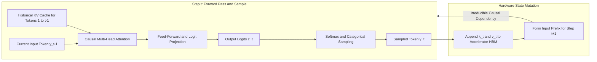
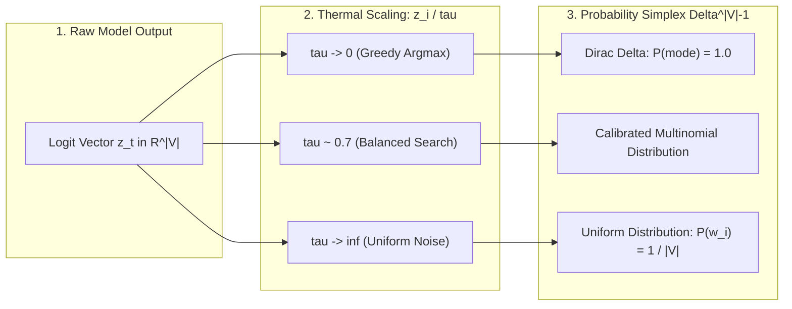

# The Stochastic Processor Core {#sec-vol3-processor}

::: {layout-narrow}
::: {.column-margin}

\chapterminitoc

:::

::: {.content-visible when-format="pdf"}
\noindent
{fig-alt="Blueprint for The Stochastic Processor Core."}
:::

::: {.content-visible unless-format="pdf"}
{fig-alt="Blueprint for The Stochastic Processor Core."}
:::

:::

## Purpose {.unnumbered .unlisted}

\begin{marginfigure}
\mlagentstack{10}{10}{10}{10}{10}{95}
\end{marginfigure}

_*What architectural contract can a computer establish with a processor that emits probabilities instead of proofs?*_

In classical computer architecture, the central processing unit is governed by a deterministic Instruction Set Architecture (ISA): an instruction decoded is an instruction executed, and hardware guarantees binary state transitions. In a Stochastic Computer, the central processing core is a statistical foundation model. It does not execute instructions; it samples from a probability distribution conditioned on a supplied context window. It possesses no direct access to physical state, no ambient clock, and no intrinsic guarantee that its emitted tokens satisfy semantic preconditions, schema types, or safety constraints. Callers that treat foundation models as conventional CPUs suffer immediate operational failure: hallucinated tool calls crash parsers, unbounded reasoning loops exhaust latency budgets, and silent non-determinism corrupts downstream pipelines. Building a dependable computing machine requires establishing a rigorous systems contract across this stochastic boundary: defining the tripartite separation of proposals, permissions, and effects, structuring caller-visible return typologies, enforcing syntactic constraints via finite-state logit masks without mistaking valid syntax for factual truth, and decomposing the latency economics of compute-bound prefill versus memory-bound decode.

::: {.callout-learning-objectives}

- Formulate the tripartite systems separation between model proposals ($a_{\text{prop}}$), runtime-permitted actions ($a_{\text{perm}}$), and committed environmental effects ($e_{\text{commit}}$).
- Deconstruct the non-deterministic forward pass pipeline from prompt context tokenization, autoregressive sampling, and stop-token conditions to caller-visible telemetry records.
- Architect an explicit invocation contract specifying generation parameters, resource budgets, and caller-visible return statuses (Completed, Incomplete/Truncated, Refusal, and Transport Failure).
- Implement grammar-constrained decoding via Context-Free Grammars (CFGs) and FSM logit masking, proving mathematically why syntactic validity does not guarantee semantic correctness or environment authorization.
- Derive the two-phase invocation latency equation ($T_{\text{call}} = T_{\text{queue}} + T_{\text{prefill}} + \sum d_i + T_{\text{validate}}$), calculating the arithmetic intensity divergence between prefill GEMMs and autoregressive decode GEMVs.
- Evaluate trade-offs between sampling temperature, logit bias constraints, and reasoning diversity on task completion rates under fixed latency budgets.

:::

<!-- SECTION_START: 2.1 (#sec-vol3-processor-role) -->
## The Proposal-Action Boundary {#sec-vol3-processor-role}

<!-- OUTLINE_SPEC:

- **Heading & Anchor:** `## The Proposal-Action Boundary {#sec-vol3-processor-role}`
- **The Single Key Point:** The model evaluates context to sample candidate tokens; it possesses no direct execution authority. A model proposal, a permitted action, and a committed effect are three strictly separated systems concepts.
- **Concrete Systems Hook:**
  - An agent is asked to fix a typo in a production deployment script. The model generates `rm -rf /var/log/* && sed -i ...`. If unmediated, a destructive command is executed on the host.
- **Points to explain (paragraph-by-paragraph):**
  - *The Tripartite Separation:* Formally define the boundary:
    1. *Model Proposal ($a_{\text{prop}}$):* The raw token sequence emitted by the neural core.
    2. *Permitted Action ($a_{\text{perm}}$):* The subset of proposals validated by runtime authorization, schema parsing, and capability escrows.
    3. *Committed Effect ($e_{\text{commit}}$):* The observable mutation produced after sandboxed execution.
  - *Supplied Observations vs. Ground-Truth Environment:* The model has no ambient sensors; it observes only what the runtime stages into context. If the runtime stages stale log lines, the model reasons over stale state.
  - *The Flat Co-Inhabited Context:* System instructions, user goals, and untrusted tool outputs reside in the same token stream without hardware-level privilege separation.
- **Visuals & Tables:**
  - Figure: `@fig-stochastic-processor-core [insert link here: books/vol3/02_processor/images/svg/stochastic_processor_core_v2.svg]` (Supplied Context $\to$ Generation $\to$ Status/Response $\to$ Runtime Verification).
- **Seminal Literature:**
  - Jerome H. Saltzer & Michael D. Schroeder (1975, *The Protection of Information in Computer Systems*).
- **Causal Bridge to 2.2:** Given that the model's output is an unprivileged token sequence, what are the physical and statistical mechanics of how that sequence is actually generated?
-->

In a classical Von Neumann processor, the hardware execution pipeline enforces an invariant identity between instruction decoding and state transition. An instruction fetched from memory into the instruction register is decoded by control logic, and micro-operations execute deterministically across arithmetic logic units, registers, and memory busses. The hardware architecture guarantees safety invariants through physical protection boundaries: memory management units (MMUs) trap invalid virtual address dereferences, privilege rings isolate supervisor state from user code, and the system clock drives bounded, cycle-accurate state transitions.

A stochastic processor core provides none of these guarantees. The core—an autoregressive foundation model—is a statistical distribution over sequences of discrete tokens. It does not execute instructions; it computes conditioned next-token probabilities over an input context window. It possesses no physical execution bus, no interrupt lines, no hardware clock, and no direct access to operating-system state. Conflating the stochastic emission of a command string with its execution is the primary failure mode of naive agent runtimes. Consider a systems management agent tasked with rectifying a syntax typo in a production deployment script. Conditioned on a noisy context containing disk exhaustion logs and shell history, the model samples the token sequence `rm -rf /var/log/* && sed -i 's/foo/bar/g' deploy.sh`. If the runtime treats this generated text as an implicit CPU instruction and pipes it directly to a system shell, an unrecoverable destruction of host state occurs.

### The Tripartite Execution Model {#sec-tripartite-separation}

To establish operational reliability across this non-deterministic interface, a stochastic computing system must formalize an unyielding tripartite boundary between model proposals, runtime permissions, and environmental effects:

1. **Model Proposal ($a_{\text{prop}}$):** The raw, unverified token sequence emitted by the neural core during autoregressive decode. Whether serialized as raw text, tool-call JSON, or structured XML, $a_{\text{prop}}$ is untrusted data. It represents an algorithmic hypothesis sampled from a probability distribution, carrying zero ambient authority to mutate system state.
2. **Permitted Action ($a_{\text{perm}}$):** The sanitized, strongly typed execution payload produced after $a_{\text{prop}}$ passes through deterministic validation layers. The host runtime intercepts $a_{\text{prop}}$, decodes the token stream against a structural schema, verifies static type invariants, checks caller capabilities against an access control matrix, and binds execution parameters to cryptographic escrows. If the proposal fails schema validation or exceeds granted privileges, the runtime halts execution and transforms the failure into an error record without touching downstream services.
3. **Committed Effect ($e_{\text{commit}}$):** The physical, observable state mutation realized in the host environment or external services (such as an update to a block device, a modified database record, or a committed RPC) following sandboxed execution of $a_{\text{perm}}$.

This tripartite structure implements the foundational security principle of *complete mediation* formulated by Jerome H. Saltzer and Michael D. Schroeder (1975): every access to every resource must be validated against an independent authorization mechanism, and the system cannot bypass verification based on unvalidated assertions from an untrusted principal. In a Stochastic Computer, the model core is an untrusted principal.

{#fig-stochastic-processor-core}

### Epistemic Isolation and Staged Context

The necessity of strict mediation is compounded by the core's epistemic isolation from the operational environment. A physical CPU samples environmental sensors and bus states directly via memory-mapped I/O. A stochastic core, by contrast, observes only what the runtime explicitly serializes into its context buffer prior to the forward pass. The model core has no ambient perception of time, network reachability, or process lifecycles.

If the host runtime stages an incomplete standard error trace or an obsolete directory listing into the context buffer, the model generates proposals conditioned on that stale state. Furthermore, because external state mutations occur asynchronously during generation, the operational preconditions assumed by $a_{\text{prop}}$ during token generation can invalidate before the runtime completes decoding. The host runtime must therefore treat the context window not as ground truth, but as a point-in-time observational cache whose validity must be re-verified at the moment $a_{\text{perm}}$ is dispatched.

### The Conflation of Privilege in Flat Contexts

Classical operating systems enforce boundary security by physically separating memory address spaces. User applications execute in unprivileged user space (such as x86 Ring 3 or ARM EL0), separated from kernel space (Ring 0 or ARM EL1) by hardware-enforced page-table permissions.

In modern foundation models, this architectural privilege separation does not exist. A transformer core processes a flat, contiguous token sequence. System policies, user objectives, historical observations, and untrusted third-party tool outputs co-inhabit the same token buffer. Every token attends to every other token across identical self-attention layers. An untrusted payload returned by an external API (such as an adversarial comment in a fetched web page or an embedded instruction in a log file) is projected into the identical latent space as the immutable system prompt. Because the core has no hardware-level mechanism to isolate control-plane instructions from untrusted data-plane payloads, instruction-following behavior remains inherently probabilistic. Privilege boundaries cannot be delegated to model weights; they must be enforced externally by the host runtime before any proposal achieves the status of a permitted action.

Establishing this tripartite boundary defines the operational division of labor: the host runtime retains absolute sovereignty over state, capabilities, and environmental mutation, while the neural core functions strictly as an unprivileged statistical engine. To build reliable systems around this boundary, we must examine the internal computational mechanics of the core itself. What physical transformations occur during the forward pass, and how do prefill and decode phases govern the latency and economics of proposal generation?

<!-- SECTION_END: 2.1 -->

<!-- SECTION_START: 2.2 (#sec-vol3-processor-tokenization) -->
## Subword Tokenization Boundaries {#sec-vol3-processor-tokenization}

<!-- OUTLINE_SPEC:

- **Heading & Anchor:** `## Subword Tokenization Boundaries {#sec-vol3-processor-tokenization}`
- **The Single Key Point:** Subword tokenization creates an impedance mismatch between natural language words, code syntax trees, and model representations, while defining the fundamental unit of inference cost and memory allocation.
- **Concrete Systems Hook:**
  - An agent generates Python code with indentation: leading spaces get tokenized into different token IDs depending on whether they are 2, 4, or 8 spaces, causing unexpected syntax errors and token inflation.
- **Points to explain (paragraph-by-paragraph):**
  - *Subword Tokenization (BPE):* Explain Byte-Pair Encoding: tokens do not align with words, AST nodes, or JSON keys. A single character mutation can alter tokenization across a 10-token window.
  - *Tokenization as Accounting Boundary:* Hardware doesn't measure words or bytes; pricing, context window capacity, KV-cache allocations, and memory bandwidth are billed strictly per token.
  - *The Representation Gap:* Why tokenization blind spots cause arithmetic errors (e.g. multi-digit numbers split into arbitrary chunks) and syntax failures in structured code generation.
- **Visuals & Tables:**
  - Visual diagram showing token boundary splits on Python code vs. AST nodes.
- **Causal Bridge to 2.3:** Once tokens are tokenized, how does the transformer compute the joint probability distribution over candidate continuations?
-->

The interface between an external software runtime and a neural processing core is neither byte-oriented nor syntactically aware. It operates entirely over discrete integer identifiers known as subword tokens. In classical computer architecture, the microarchitectural execution unit consumes fixed-width or byte-aligned instructions that map unambiguously to an opcode table and operand registers. In a stochastic processor, by contrast, the raw input byte stream is first partitioned by an unweighted, statistical compression algorithm—predominantly Byte-Pair Encoding (BPE) or WordPiece—before the model executes a single floating-point operation. This serialization layer sits directly on the critical path of the processor core, introducing a fundamental impedance mismatch: token boundaries do not align with natural language words, Abstract Syntax Tree (AST) nodes, JSON keys, or operating-system data structures.

### Byte-Pair Encoding and Boundary Instability

Byte-Pair Encoding constructs a vocabulary of fixed size $V$ (typically between $32{,}000$ and $256{,}000$ entries) by iteratively merging the most frequent contiguous byte sequences observed in a training corpus. Because merge rules are derived from corpus-wide statistical co-occurrence rather than deterministic grammar specifications, the mapping from input text to token sequences is non-local, greedy, and brittle. A single character insertion, deletion, or whitespace mutation can alter merge priorities, cascading alternate token boundaries across an extended multi-token window.

Consider the assignment `def get_user_id():`. In standard BPE vocabularies, ` get` is represented as an atomic token, `_user` as a second, and `_id():` as a third. However, prefixing this statement with two leading spaces alters the local merge sequence: the tokenizer may ingest the first space as an isolated character token and merge the second space with the character `d`, yielding ` d`, followed by `ef`. The language keyword `def`—a discrete, immutable primitive in the programming language's grammar—is fractured across an unnatural token boundary.

{#fig-token-ast-mismatch}

As illustrated in @fig-token-ast-mismatch, this fragmentation creates an immediate representation deficit. The attention heads of the transformer must expend parameter capacity and layer depth merely to reconstruct the lexical identity of basic keywords before higher layers can evaluate their semantic and structural roles.

### The Physical Accounting Boundary

Beyond lexical distortion, subword tokens define the atomic accounting unit for physical resource allocation across the host hardware. Accelerators—GPUs and TPUs—do not schedule memory or compute cycles based on character counts or raw bytes. Memory consumption, compute latency, context window limits, and serving economics are denominated strictly in tokens.

The primary physical bottleneck during autoregressive inference is the memory footprint of the Key-Value (KV) cache, which retains intermediate activation vectors for all context tokens to prevent quadratic recomputation during sequential decoding. For an inference service processing a batch of $b$ requests over an active context length of $S_{\text{ctx}}$ tokens, across a transformer with $n_{\text{layers}}$ layers, $n_{\text{kv\_heads}}$ key-value heads, and a per-head dimension of $d_{\text{head}}$, operating at a precision of $P$ bytes per element (typically 2 bytes for FP16 or BF16), the static memory allocation for the KV cache is governed by:

$$M_{\text{KV}} = 2 \times b \times S_{\text{ctx}} \times n_{\text{layers}} \times (n_{\text{kv\_heads}} \times d_{\text{head}}) \times P$$

Because $M_{\text{KV}}$ scales linearly with $S_{\text{ctx}}$, every extraneous token introduced by subword fragmentation consumes high-bandwidth memory (HBM) on the accelerator. In serving architectures bound by memory capacity, this token inflation directly decreases the maximum supportable batch size $b$, degrading aggregate system throughput. Furthermore, memory bus traffic during the autoregressive decode phase is dominated by streaming this state: generating every single output token requires transferring the entire historical KV cache from off-chip HBM into on-chip SRAM. Subword tokenization inefficiencies therefore impose a continuous memory bandwidth tax across the entire serving lifecycle.

### Representation Gaps and Structured Failure Modes

The disconnect between statistical subword merges and structural invariants generates severe operational blind spots in agent runtimes, particularly in code generation, arithmetic reasoning, and structured protocol serialization.

In Python, execution scoping is governed strictly by indentation depth. A language compiler treats two, four, or eight spaces as clean multiples of an indentation quantum. However, BPE tokenizers maintain distinct vocabulary entries for specific whitespace clusters (such as single spaces, double spaces, and four-space blocks). If an agent runtime emits four spaces, the tokenizer may represent them as a single token. If preceding context prepends an extra space or a markdown quotation marker, the identical four-space indent is split into an isolated single space followed by a three-space token. Because the processor core samples from a probability distribution over discrete vocabulary IDs rather than generating raw text characters, the model must maintain separate, non-overlapping probability paths for identical semantic states. A minor distributional shift in the prior context can cause the model to sample an eight-space token where six spaces were syntactically required, producing an immediate `IndentationError` that crashes host execution.

A parallel failure mode occurs in numerical and data-interchange processing. Decimal arithmetic relies on consistent, positional digit alignment. Because BPE vocabularies compress frequent digit sequences into single tokens while splitting infrequent sequences, numerical representations are arbitrary: the number `1024` may be processed as a single atomic token, whereas `1025` is split into two tokens (`10` and `25`). The self-attention layers cannot execute uniform digit-wise positional operations; instead, the neural core must memorize high-dimensional lookup tables across fragmented token pieces. When processing structured payloads such as JSON, UUIDs, or network addresses, this arbitrary partitioning breaks key-value alignment, increasing the likelihood that the model emits malformed structural tokens that fail downstream validation at the host boundary.

Subword tokenization thus establishes the raw, discrete alphabet through which the stochastic processor perceives and emits information. However, partitioning the byte stream into an integer sequence is merely the ingestion stage. Once the context is mapped to a contiguous vector of token indices, how does the transformer core process these discrete symbols through its attention layers to compute the joint probability distribution over candidate continuations?

<!-- SECTION_END: 2.2 -->

<!-- SECTION_START: 2.3 (#sec-vol3-processor-autoregressive) -->
## Autoregressive Sequence Factorization {#sec-vol3-processor-autoregressive}

<!-- OUTLINE_SPEC:

- **Heading & Anchor:** `## Autoregressive Sequence Factorization {#sec-vol3-processor-autoregressive}`
- **The Single Key Point:** Autoregressive generation factors joint sequence probability sequentially via the chain rule; because token $y_t$ depends on $y_{<t}$, generation imposes an irreducible serial latency floor that cannot be parallelized.
- **Concrete Systems Hook:**
  - An engineer attempts to accelerate an agent's 1,000-token deliberation trace by adding 8 GPUs, only to find generation latency per token remains completely unchanged.
- **Points to explain (paragraph-by-paragraph):**
  - *Autoregressive Factorization:* The probability of sequence $\mathbf{y}$ conditioned on prompt $\mathbf{x}$:
    $$P(\mathbf{y} \mid \mathbf{x}) = \prod_{t=1}^K P(y_t \mid \mathbf{x}, y_{<t})$$
  - *The Sequential Serialization Constraint:* Computing token $y_t$ requires the key-value activations of all preceding tokens $y_{<t}$. Generation is fundamentally a serial Markovian dependency chain.
  - *The Latency Floor:* While prompt processing (prefill) parallelizes across tokens, generation (decode) forces $K$ sequential forward passes, setting a hard physical latency floor: $T_{\text{decode}} = \sum_{t=1}^K d_t$.
- **Visuals & Tables:**
  - Sequential dependency flowchart showing forward pass loop.
- **Causal Bridge to 2.4:** If tokens are sampled sequentially from learned probability distributions, how does a caller distinguish statistical likelihood from factual correctness?
-->

When an engineering team attempts to accelerate an agentic workflow that generates a 1,000-token deliberation trace by scaling hardware from a single accelerator to an eight-GPU cluster, benchmarking reveals a counterintuitive result: generation latency per token remains completely unchanged. Distributing a transformer across multiple accelerators via tensor parallelism decreases the execution duration of individual matrix multiplications, but it cannot alter the serial dependency graph of generation. The stochastic processor cannot compute token 500 until token 499 has been sampled, materialized into memory, and appended to the context. This operational reality is governed by the mathematical structure of autoregressive sequence factorization.

Let $\mathbf{x} = (x_1, x_2, \dots, x_M)$ represent the input prompt comprising $M$ discrete tokens. The stochastic processor core models the joint conditional probability of an output sequence $\mathbf{y} = (y_1, y_2, \dots, y_K)$ over a vocabulary $\mathcal{V}$ by factorizing the joint distribution into an exact product of conditional probabilities via the probability chain rule:

$$P(\mathbf{y} \mid \mathbf{x}) = \prod_{t=1}^K P(y_t \mid \mathbf{x}, y_1, y_2, \dots, y_{t-1}) = \prod_{t=1}^K P(y_t \mid \mathbf{x}, y_{<t})$$

At each discrete generation step $t$, the transformer projects the accumulated sequence $(\mathbf{x}, y_{<t})$ through its attention layers and unembedding projection matrix to produce a vector of raw unnormalized logits $\mathbf{z}_t \in \mathbb{R}^{|\mathcal{V}|}$. Applying the softmax operator parameterized by temperature $\tau > 0$ yields a categorical probability distribution:

$$\mathbf{p}_t = \text{softmax}\left(\frac{\mathbf{z}_t}{\tau}\right)$$

The processor core then materializes the concrete token $y_t$ by sampling from this distribution:

$$y_t \sim P(y_t \mid \mathbf{x}, y_{<t})$$

### The Sequential Serialization Constraint

This formulation establishes an immutable systems constraint: generation is an intrinsically serial, causal recurrence. Although the self-attention architecture eliminated the sequential recurrence of recurrent neural networks during offline training—allowing all tokens in a training document to be processed concurrently under a causal attention mask—real-time inference reintroduces strict temporal serialization.

To evaluate $P(y_t \mid \mathbf{x}, y_{<t})$, the multi-head self-attention mechanism at each layer must compute inner products between the query vector $\mathbf{q}_t$ of the current token and the key vectors $\mathbf{k}_i$ of all preceding tokens $i \in [1, M + t - 1]$. The resulting attention coefficients weight the historical value vectors $\mathbf{v}_i$ to construct the contextual representation. Because the discrete identity of token $y_t$ is non-deterministic and unknown prior to step $t$, the computational pipeline cannot evaluate subsequent query projections speculatively without incurring exponential branching overhead. The host accelerator is trapped in an iterative data-dependency loop, as illustrated in @fig-autoregressive-loop.



### The Physical Latency Floor

The structural bifurcation between prompt ingestion and token generation dictates the operational economics of LLM serving systems. In the prompt ingestion phase (prefill), the full context $\mathbf{x}$ of length $M$ is known simultaneously. The accelerator schedules parallel matrix-matrix multiplications (GEMMs) across all $M$ positions. These operations exhibit high arithmetic intensity—the ratio of floating-point operations to memory access bytes—saturating the accelerator's tensor cores. Prefill is compute-bound and parallelizes effectively across distributed hardware.

In the token generation phase (decode), the effective sequence length per step drops to exactly one ($M_{\text{seq}} = 1$). Matrix-matrix multiplications degrade into matrix-vector multiplications (GEMVs). To compute a single token $y_t$, the processor must stream all model parameters (for example, 140 GB of weights for a 70-billion-parameter model in 16-bit precision) and the historical KV cache from off-chip High-Bandwidth Memory (HBM) into on-chip SRAM, execute only two floating-point operations per parameter, and write the updated key and value vectors back to HBM. Because operational intensity drops below the accelerator's arithmetic saturation threshold (often falling below 1 FLOP per byte, compared to hardware saturation limits exceeding 150 FLOPs per byte on modern accelerators), decoding is fundamentally memory-bandwidth bound.

The total decode latency $T_{\text{decode}}$ required to emit a trajectory of $K$ tokens is governed by the summation over $K$ discrete dispatch intervals:

$$T_{\text{decode}} = \sum_{t=1}^K d_t$$

where $d_t$ is the single-token step latency composed of memory streaming time, kernel launch overhead, and sampling duration. If a model with $N_{\text{params}}$ parameters operating at $P$ bytes per parameter is served on hardware with an aggregate memory bandwidth of $B_{\text{mem}}$ bytes per second, the theoretical lower bound on step latency $d_t$, neglecting queuing and communication jitter, is:

$$d_t \ge \frac{2 \times N_{\text{params}} \times P + M_{\text{KV}}(t)}{B_{\text{mem}}}$$

For an autonomous agent executing an iterative planning routine that generates $K = 1{,}000$ tokens, if $d_t = 25\text{ ms}$, the system faces an irreducible physical latency floor:

$$T_{\text{decode}} \ge 1{,}000 \times 0.025\text{ s} = 25\text{ seconds}$$

Amdahl's Law applies unconditionally: because the sequential fraction of the autoregressive decode loop is unity, increasing compute parallelism cannot compress $T_{\text{decode}}$ below the bandwidth-limited streaming time of the parameters.

### Probability Versus Correctness

This serialization dynamic unmasks a fundamental systems gap between deterministic processors and stochastic cores. In a classical microprocessor, an instruction decoded by the hardware control unit executes state transitions governed by boolean logic; the correctness of an arithmetic operation or memory load is binary and provable. In the stochastic processor, sequence factorization guarantees only that every emitted token $y_t$ is sampled from a conditional probability distribution $P(y_t \mid \mathbf{x}, y_{<t})$ trained to match the empirical statistics of historical text corpora.

Statistical likelihood does not equal programmatic or factual truth. A generated token sequence that specifies an invalid SQL query, hallucinated file handle, or non-existent network address may possess higher categorical probability under $P(\mathbf{y} \mid \mathbf{x})$ than the correct structural payload. Furthermore, because each sampled token $y_t$ is immediately committed to the KV cache and conditions all future distributions $P(y_{t+k} \mid \mathbf{x}, y_{<t+k})$, an early statistical deviation permanently steers the remaining trajectory off course. If tokens are sampled sequentially from learned probability distributions rather than verified against a formal specification, how does the surrounding runtime system distinguish statistical likelihood from factual correctness?

<!-- SECTION_END: 2.3 -->

<!-- SECTION_START: 2.4 (#sec-vol3-processor-continuations) -->
## Likely Continuations Versus Truth {#sec-vol3-processor-continuations}

<!-- OUTLINE_SPEC:

- **Heading & Anchor:** `## Likely Continuations Versus Truth {#sec-vol3-processor-continuations}`
- **The Single Key Point:** Sampling from a next-token distribution produces the most statistically probable continuation conditioned on the context; statistical probability is not an epistemic proof of factual truth or task correctness.
- **Concrete Systems Hook:**
  - When asked for a library function that checks if a port is open, the model invents `socket.check_port_open()`. The method name is statistically plausible, but does not exist in Python's standard library.
- **Points to explain (paragraph-by-paragraph):**
  - *Sampling Mechanics:* Softmax over logits with temperature $\tau$:
    $$P(y_t = w_i) = \frac{\exp(z_i / \tau)}{\sum_j \exp(z_j / \tau)}$$
  - *Likely Text vs. Ground Truth:* Training on internet corpora optimizes for linguistic plausibility and common patterns, not formal verification. High probability means common in training distribution, not correct in this runtime.
  - *The Role of Temperature:* $\tau \to 0$ (greedy decoding) collapses distribution to the argmax mode, reducing diversity but failing to guarantee correctness; $\tau > 0$ introduces variance and reasoning exploration.
- **Visuals & Tables:**
  - Distribution simplex showing how temperature flattens or sharpens token probabilities.
- **Causal Bridge to 2.5:** How does an agent runtime formally interact with this probabilistic engine? What is the explicit caller-facing contract?
-->

The boundary separating a stochastic core from a deterministic execution unit lies in the mathematical mapping between hidden layer representations and emitted symbols. At decoding step $t$, the transformer maps its normalized final hidden activation vector $\mathbf{h}_t \in \mathbb{R}^{d_{\text{model}}}$ to an unnormalized logit vector $\mathbf{z}_t \in \mathbb{R}^{|V|}$ through an affine projection against the language modeling head:

$$\mathbf{z}_t = \mathbf{W}_{\text{vocab}} \mathbf{h}_t + \mathbf{b}_{\text{vocab}}$$

where $|V|$ denotes the vocabulary dimension, typically spanning $32{,}000$ to $128{,}000$ discrete token identifiers. To convert these real-valued logits into an admissible categorical probability distribution over the discrete vocabulary, the runtime evaluates a parameterized softmax transformation:

$$P(y_t = w_i \mid \mathbf{x}, y_{<t}) = \frac{\exp(z_i / \tau)}{\sum_{j=1}^{|V|} \exp(z_j / \tau)}$$

where $z_i$ is the logit value assigned to vocabulary token $w_i$, and $\tau \in (0, \infty)$ is a thermal scaling hyperparameter. The runtime then samples the discrete output token $y_t$ from this distribution.

### Statistical Plausibility Versus Runtime Validity

This sampling mechanism establishes a critical systems reality: autoregressive generation computes statistical plausibility, not epistemic truth or programmatic validity. Foundation models are trained by minimizing empirical cross-entropy loss over web-scale text corpora:

$$\mathcal{L}_{\text{MLE}} = - \sum_{k=1}^N \log P(x_k \mid x_{<k})$$

This objective conditions the weights of the network to mirror the empirical distribution of tokens in the training data. High probability under $P(y_t \mid \mathbf{x}, y_{<t})$ indicates only that token $y_t$ is a statistically common continuation of the prefix within the training distribution. It conveys no guarantee that the token represents a true statement about the physical world, an existing operating system resource, or an executable payload.

The catastrophic operational consequences of this design become evident when an agent attempts to interact with an underlying operating system or programming runtime. Consider an autonomous diagnostic agent tasked with inspecting network reachability. Conditioned on a prompt requesting a Python function to verify whether a TCP port is receptive, the stochastic processor frequently emits code resembling the following execution trace:

```python
import socket

def verify_service(host: str, port: int) -> bool:
    # Model generates statistically plausible networking calls
    return socket.check_port_open(host, port)
```

Lexically and structurally, the emitted identifier `socket.check_port_open` is coherent; the constituent tokens `check`, `_`, `port`, `_`, `open` have strong associative co-occurrence with network diagnostic contexts in the training corpus. Syntactically, the code parses into a valid abstract syntax tree. Yet, when dispatched to a standard Python execution environment, the program terminates immediately with an unhandled exception:

```text
AttributeError: module 'socket' has no attribute 'check_port_open'
```

Python's standard library provides low-level POSIX socket interfaces (`socket.socket()`, `connect()`, and `connect_ex()`), but no function named `check_port_open` exists. The stochastic core possesses no internal symbol table, maintains no dynamic linker, and performs no lookup against the runtime environment. It samples an identifier that satisfies the local statistical gradient of the prompt, conflating the high-level intent of the program with the actual symbols exposed by the application binary interface (ABI). In a deterministic CPU, issuing an invalid opcode raises an illegal instruction fault at decode time; in a stochastic core, the invalid instruction is emitted with high categorical confidence and must be trapped after the fact by host-side validation.

### Temperature and the Probability Simplex

The shape of the categorical probability distribution across the vocabulary simplex is controlled by the temperature hyperparameter $\tau$. As formalized in @fig-temperature-simplex, varying $\tau$ modulates the entropy of the distribution, fundamentally altering the execution profile of the stochastic core.



When $\tau \to 0^+$, the softmax operator approaches the argmax function:

$$\lim_{\tau \to 0^+} P(y_t = w_i \mid \mathbf{x}, y_{<t}) = \begin{cases} 1 & \text{if } i = \arg\max_k z_k \\ 0 & \text{otherwise} \end{cases}$$

This mode, known as greedy decoding, forces the processor to select the single most probable token at every step. While greedy decoding guarantees deterministic token emissions across identical hardware and prompt inputs, it does not guarantee correctness. If the mode of the learned distribution corresponds to a common web misconception, a hallucinated API call, or an invalid JSON closing brace, greedy execution repeats the failure deterministically. Determinism suppresses output variance, but it does not correct structural bias.

Conversely, setting $\tau > 0$ introduces variance by flattening the logit landscape. As $\tau$ increases, the ratio between distinct token probabilities shrinks:

$$\frac{P(w_i)}{P(w_j)} = \exp\left(\frac{z_i - z_j}{\tau}\right)$$

For exploratory agent tasks, moderate temperatures ($\tau \in [0.2, 0.7]$) allow the model to sample non-modal tokens, enabling the generation of alternative reasoning trajectories when an initial attempt is blocked by a compiler error or environmental constraint. However, nonzero temperature introduces tail risk: low-probability, malformed tokens are assigned nonzero probability mass. If an agent executes a multi-step workflow requiring $K$ discrete token generation steps, and the single-step probability of sampling a syntactically or semantically invalid token is $\epsilon$, the upper bound on the probability of generating a completely valid trajectory decays exponentially:

$$P_{\text{valid}} \le (1 - \epsilon)^K$$

For an agent trajectory where $K = 1{,}000$ and the per-token failure rate is as small as $\epsilon = 0.002$, the trajectory success probability drops precipitously:

$$P_{\text{valid}} \le (1 - 0.002)^{1000} \approx 0.135$$

Less than $14\%$ of execution traces will run to completion without encountering an invalid token.

| Operational Regime    | Temperature Range     | Entropy $H(P)$  | Execution Characteristic                 | Primary Failure Mode                                       |
|:----------------------|:----------------------|:----------------|:-----------------------------------------|:-----------------------------------------------------------|
| **Greedy Argmax**     | $\tau \to 0^+$        | $0$ (Minimum)   | Deterministic, reproducible, modal paths | Fixed-point hallucination loops, uncorrectable schema bias |
| **Controlled Decode** | $\tau \in [0.1, 0.7]$ | Low to Moderate | Targeted exploration, bounded diversity  | Tail sampling of hallucinated library symbols              |
| **High Entropy**      | $\tau \ge 1.0$        | High            | Maximum lexical divergence               | Syntax destruction, JSON parse errors, schema violations   |

: Systems properties of temperature regimes during autoregressive generation. {#tbl-temperature-scaling}

### The Systems Boundary: From Sampling to Contracts

Because the stochastic processor core samples from an empirical probability distribution rather than executing verified state transitions, the host operating system cannot grant it raw execution privileges. The caller cannot treat model outputs as direct machine instructions, nor can it pass generated strings directly to database query planners, network sockets, or shell environments.

If tokens are merely statistical proposals rather than mathematical proofs, how can a software runtime safely bind this non-deterministic engine into a reliable computing system? What boundary invariants must exist between the component that suggests an action and the component that modifies persistent state? Establishing this boundary requires replacing implicit trust with an explicit, caller-facing architectural contract, beginning with the formal separation of proposals, permissions, and effects.

<!-- SECTION_END: 2.4 -->

<!-- SECTION_START: 2.5 (#sec-vol3-processor-contract) -->
## The Remote Invocation Contract {#sec-vol3-processor-contract}

<!-- OUTLINE_SPEC:

- **Heading & Anchor:** `## The Remote Invocation Contract {#sec-vol3-processor-contract}`
- **The Single Key Point:** A robust agent runtime treats model invocation as a strict remote procedure call with explicit parameter bounds, payload schemas, and defensive limits.
- **Concrete Systems Hook:**
  - An agent loop crashes in production because a model version was silently updated by the cloud provider, altering prompt parsing and breaking downstream JSON regex parsers.
- **Points to explain (paragraph-by-paragraph):**
  - *Contract Specification:*
    1. *Pinned Model Version:* Immutable snapshot identifier (e.g. `model-2026-03-01`), not a rolling floating alias (`model-latest`).
    2. *Context Payload:* Token sequence $\mathbf{x}$, system prompt, staged history, tool definitions.
    3. *Generation Controls:* Temperature $\tau$, top-$p$ nucleus threshold, stop sequence list, seed integer.
    4. *Resource Bounds:* Maximum output tokens ($K_{\max}$), deadline timeout ($T_{\max}$).
  - *Reproducibility Realities:* Setting $\tau=0$ and a fixed seed does NOT guarantee bit-exact determinism across heterogeneous GPU clusters due to floating-point non-associativity in parallel reduction kernels.
  - *Minimal Telemetry Record:* Capturing model ID, input tokens, output tokens, seed, Time-to-First-Token (TTFT), and inter-token latency for auditability.
- **Visuals & Tables:**
  - Table: `@tbl-invocation-contract-spec` defining all parameters and default invariants.
- **Causal Bridge to 2.6:** When an invocation returns, what explicit status taxonomy must the runtime handle?
-->

Treating a statistical model as a local function or in-process subroutine obscures its physical reality: model inference is a distributed, resource-intensive Remote Procedure Call (RPC) dispatched across a network boundary to a multi-tenant accelerator cluster. In classical systems architecture, an Instruction Set Architecture (ISA) establishes an invariant hardware-software contract. The caller passes operands through registers, the processor decodes opcodes deterministically, and execution faults occur at well-defined machine boundaries.

In a stochastic system, this contract dissolves if the interface between the host runtime and the model core is left informal. Foundation model providers frequently update model checkpoints, adjust internal server-side system prompts, or reconfigure quantization kernels on shared inference endpoints. An agent runtime that queries an unpinned model alias will experience silent behavioral drift.

Consider an agent loop in production configured with a floating model alias such as `inference-prod-latest`. When the infrastructure provider updates the checkpoint from version 2.1 to 2.2, the model shifts its prompt parsing behavior and begins enclosing structured JSON responses in markdown code fences. A downstream host parser that relies on strict string matching fails immediately:

```text
# Execution Trace: Unpinned Model Ingestion Fault
[2026-03-12T14:22:01.104Z] REQ  POST /v1/chat/completions {"model": "inference-prod-latest", ...}
[2026-03-12T14:22:02.318Z] RESP 200 OK {"model": "inference-prod-2026-03-12", "choices": [{"message": {"content": "```json\n{\"action\": \"query_database\", \"args\": {\"id\": 4012}}\n```"}}]}
[2026-03-12T14:22:02.320Z] CRIT AgentRuntimeSchemaError: Failed to parse tool invocation: Unexpected token '`' at position 0
[2026-03-12T14:22:02.321Z] FATAL Process terminated with unhandled exception (exit code 1)
```

The system collapsed because the caller assumed environmental invariance across a floating network pointer. To build dependable software upon probabilistic components, the runtime must encapsulate every model invocation within a strict, defensively bounded remote invocation contract.

### Anatomy of the Invocation Contract

A production-grade invocation contract defines the complete parameter space across four operational dimensions before a single packet leaves the host machine:

1. **Pinned Model Version:** The caller must address an immutable snapshot identifier (such as `model-2026-03-01`) rather than a rolling pointer (`model-latest`). Floating aliases obscure silent modifications to model weights, vocabulary tokenization, and FP8 quantization scale factors. Immutability guarantees that the underlying distribution remains stationary.
2. **Context Payload:** The structured input context $\mathbf{x}$, partitioned into invariant system instructions, ordered conversation turns, staged tool execution outputs, and explicit schema definitions for all callable host interfaces.
3. **Generation Controls:** Parameters governing the decoding trajectory across the vocabulary simplex: sampling temperature $\tau$, nucleus sampling threshold $p \in (0, 1]$, an explicit array of stop sequence delimiters, and an optional pseudo-random generator seed integer.
4. **Resource Bounds:** Hardware and latency safeguards, specifically the maximum generation length ($K_{\max}$) and an absolute deadline timeout ($T_{\max}$).

| Parameter                 | Type         | Systems Purpose                                          | Invariant Constraint                                                                 |            |                          |
|:--------------------------|:-------------|:---------------------------------------------------------|:-------------------------------------------------------------------------------------|------------|--------------------------|
| `model_id`                | String       | Identifies immutable model weights and tokenizer         | Must specify an immutable snapshot; floating aliases (`latest`, `default`) forbidden |            |                          |
| `context`                 | List[Frame]  | Encapsulates prompt, message history, and tool schemas   | Total token count must not exceed context budget: $                                  | \mathbf{x} | \le L_{\max} - K_{\max}$ |
| `temperature` ($\tau$)    | Float        | Modulates logit entropy and sampling dispersion          | Bound to range $[0.0, 2.0]$; set to $\tau = 0.0$ for deterministic paths             |            |                          |
| `top_p` ($p$)             | Float        | Truncates sampling to the smallest set with mass $\ge p$ | Bound to range $(0.0, 1.0]$; default $1.0$ (disabled)                                |            |                          |
| `stop_tokens`             | List[String] | Halts decode loop when delimiter is encountered          | Must include application-level message and block boundary tokens                     |            |                          |
| `max_tokens` ($K_{\max}$) | Integer      | Imposes upper limit on autoregressive decode iterations  | Strict ceiling: $K_{\max} \le B_{\text{token}}$; prevents runaway allocation loops   |            |                          |
| `timeout_ms` ($T_{\max}$) | Integer      | Absolute socket deadline for RPC completion              | Enforced by client-side socket deadline; aborts via cancellation signal              |            |                          |

: Systems specification of the remote invocation contract. {#tbl-invocation-contract-spec}

### Hardware Non-Determinism and Floating-Point Reductions

A pervasive assumption in software engineering is that setting temperature $\tau = 0$ alongside a fixed random seed ensures bit-exact determinism across identical inputs. In physical accelerator clusters, this assumption fails.

Modern foundation models rely on parallel General Matrix Multiply (GEMM) algorithms and fused attention kernels (such as FlashAttention) distributed across thousands of accelerator cores. These operations compute parallel reduction trees over high-dimensional floating-point tensors. Under IEEE 754 arithmetic, floating-point addition is non-associative:

$$(a + b) + c \neq a + (b + c)$$

In a distributed multi-tenant cluster, execution order is governed by dynamic thread scheduling, hardware interrupt timing, memory bus contention, and workload colocation. When a reduction kernel executes, partial sums accumulate in arbitrary sequences across tensor cores. Furthermore, requests dispatched across heterogeneous worker nodes—such as a cluster mixing differing GPU architectures or alternating between full FP32 and TensorFloat-32 (TF32) accumulation modes—experience subtle numerical variance.

These microscopic numerical variations introduce least-significant-bit drift into the unnormalized logit vector $\mathbf{z}_t$. If two candidate tokens $w_a$ and $w_b$ possess nearly identical logits such that $|z_a - z_b| < 10^{-6}$, a single floating-point rounding difference alters their relative order:

$$\arg\max_k z_k^{(1)} \neq \arg\max_k z_k^{(2)}$$

At greedy decoding ($\tau = 0$), this flip forces the model to select an alternate token. Because autoregressive generation conditions all future steps on prior emissions, this divergence alters the context for token $t+1$, causing the execution trace to branch permanently. A robust agent runtime cannot treat the stochastic core as a bit-exact state machine; downstream validation must tolerate output divergence even under greedy decode settings.

### Telemetry and Observability Accounting

Because the processor core runs remotely, the host runtime must record an immutable telemetry record for every invocation. This record forms the empirical foundation for trajectory goodput accounting, latency optimization, and cost auditing. Every invocation must emit a structured event capturing:

1. **Hardware and Checkpoint Metadata:** The resolved model hash, provider endpoint, and accelerator architecture identifier.
2. **Token Accounting:** Exact counts for input prefill tokens ($N_{\text{in}} = |\mathbf{x}|$) and emitted decode tokens ($N_{\text{out}}$).
3. **Latency Decomposition:** Wall-clock Time-to-First-Token (TTFT), reflecting prefill latency $T_{\text{prefill}}$, and Inter-Token Latency (ITL), reflecting memory-bound decode latency:
   $$T_{\text{rpc}} = T_{\text{wait}} + T_{\text{prefill}} + \sum_{i=1}^{N_{\text{out}}} T_{\text{decode}, i}$$
4. **Termination Reason:** The explicit exit condition returned by the engine (such as `stop_sequence`, `length_limit`, or `content_filter`).

Binding invocations to explicit schemas and recording fine-grained telemetry prevents silent parameter drift and bounds resource consumption. However, establishing a robust invocation payload does not guarantee that the remote cluster will return a valid or usable output. When the network socket unblocks and bytes return across the wire, what formal taxonomy of return states must the host runtime handle?

<!-- SECTION_END: 2.5 -->

<!-- SECTION_START: 2.6 (#sec-vol3-processor-status) -->
## Caller-Visible Invocation Status {#sec-vol3-processor-status}

<!-- OUTLINE_SPEC:

- **Heading & Anchor:** `## Caller-Visible Invocation Status {#sec-vol3-processor-status}`
- **The Single Key Point:** Every model invocation terminates in one of four distinct caller-visible states; the runtime must implement defensive branching for each.
- **Concrete Systems Hook:**
  - An agent generates half of a Python function, hits the token limit, and the runtime mistakenly passes the truncated code to the compiler, causing a catastrophic syntax failure.
- **Points to explain (paragraph-by-paragraph):**
  - *The Four States:*
    1. *Completed:* Model generated an explicit stop token (`<|endoftext|>`) within bounds.
    2. *Incomplete / Truncated:* Generation halted because output length hit $K_{\max}$ or deadline expired. Requires context continuation or reprompting.
    3. *Refusal:* Model triggered internal safety, policy, or system prompt refusal classifiers. Requires escalation or goal reformulation.
    4. *Transport Failure:* Network timeout, HTTP 500/503 error, GPU OOM panic. Requires exponential backoff or failover to secondary provider.
  - *Decision Matrix:* Defining the runtime recovery action for each status type.
- **Visuals & Tables:**
  - Table: `@tbl-caller-status-typology` mapping trigger condition, payload state, and runtime recovery policy.
- **Causal Bridge to 2.7:** To avoid truncated or malformed responses, how can the runtime constrain the model to emit strictly valid structured outputs?
-->

The return of an RPC payload across the network socket marks the boundary where transport guarantees end and semantic evaluation begins. In conventional distributed computing, an HTTP `200 OK` status code combined with a well-formed transport envelope establishes that the remote service processed the request according to interface specifications and returned a valid result. In a Stochastic Computer, an HTTP `200 OK` indicates only that the remote inference engine completed its autoregressive decoding loop without an internal accelerator panic or kernel crash. It conveys no guarantee that the emitted byte stream satisfies application preconditions, terminates cleanly, or provides actionable computational progress.

Consider an agent runtime executing automated refactoring that prompts the model to emit an updated Python module. If the generation exhausts the allocated token budget $K_{\max}$ halfway through a class definition, the remote engine halts decoding and transmits the accumulated token buffer inside a standard `200 OK` frame accompanied by the metadata flag `finish_reason: "length"`. If the client runtime naively deserializes the payload string and forwards it directly to a compiler or test harness, execution fails with an unrecoverable `SyntaxError: unexpected EOF while parsing`. The compiler error is not an external environment anomaly; it is an architectural defect in the host runtime, which treated an arbitrary transport-level termination as a semantically complete execution unit.

### Taxonomy of Invocation States

To prevent unvalidated byte streams from corrupting host state, a dependable host runtime partitions every invocation outcome into one of four mutually exclusive caller-visible states. Each state carries distinct invariants regarding payload integrity, downstream utility, and recovery mechanics:

1. **Completed:** The model sampled an application-defined stop sequence or an intrinsic End-of-Sequence (`EOS`) token ($w_t \in \mathcal{S}_{\text{stop}}$) strictly before reaching the token ceiling $K_{\max}$ and prior to socket timeout expiration ($T_{\text{rpc}} < T_{\max}$). The payload represents an emission that is structurally complete under the model distribution. It is eligible for immediate grammar parsing, type checking, and permission gating.
2. **Incomplete (Truncated):** Generation was halted externally by the serving infrastructure because decode iterations reached the ceiling $K_{\max}$, or because the client-side socket deadline $T_{\max}$ elapsed during streaming decode. The returned payload is intrinsically broken: string literals lack closing quotes, JSON trees lack terminating brackets, and control blocks remain dangling. The payload cannot be executed directly; it requires context continuation or structured reprompting.
3. **Refusal:** The model core, safety alignment classifiers, or post-generation policy guardrails intercepted execution and emitted an explicit rejection payload (such as `finish_reason: "content_filter"`). The output contains no operational tool calls or task tokens, but rather a declarative rejection string. A refusal represents a deterministic policy boundary conditioned on the provided context.
4. **Transport Failure:** The remote runtime failed to deliver a valid application frame. Root causes include network partition timeouts ($T_{\text{rpc}} \ge T_{\max}$), HTTP `502 Bad Gateway` or `503 Service Unavailable` signals, socket resets, and remote accelerator Out-of-Memory (OOM) aborts during Dynamic Key-Value (KV) cache allocation. No model tokens are delivered to the caller.

### State Transitions and Recovery Policies

Handling these states requires an explicit runtime decision matrix rather than generic exception handling. When an invocation returns `Incomplete`, the runtime must evaluate the trade-off between a *context roll-forward* and an *abort*. In a context roll-forward, the runtime appends the truncated prefix directly to the conversation history as an assistant turn and dispatches an immediate follow-up invocation instructing the model to resume generation from the exact point of interruption.

However, continuation is governed by latency and compute economics. Because the subsequent prefill must process the expanded input length $N_{\text{in}}' = N_{\text{in}} + K_{\max}$, prefill latency increases. If the remaining trajectory latency budget $T_{\text{remain}}$ cannot accommodate the minimum required compute:

$$T_{\text{remain}} < T_{\text{prefill}}(N_{\text{in}} + K_{\max}) + T_{\text{decode}}(K_{\min})$$

where $K_{\min}$ is the minimum token budget required to close open syntax blocks, the runtime must reject roll-forward and abort the task branch immediately.

| Status Class          | Physical Trigger Condition                                                                                         | Payload Invariants                                                          | Mandatory Runtime Recovery Policy                                                                          |
|:----------------------|:-------------------------------------------------------------------------------------------------------------------|:----------------------------------------------------------------------------|:-----------------------------------------------------------------------------------------------------------|
| **Completed**         | Token $w_t \in \mathcal{S}_{\text{stop}}$ emitted with $N_{\text{out}} < K_{\max}$ and $T_{\text{rpc}} < T_{\max}$ | Syntax structurally complete; terminal delimiter present; schema unverified | Route payload to syntax parser and permission gate; proceed to tool evaluation.                            |
| **Incomplete**        | Decode reaches $N_{\text{out}} = K_{\max}$ or socket deadline $T_{\max}$ expires                                   | Partial token buffer; dangling delimiters; unparseable syntax tree          | Check latency budget $T_{\text{remain}}$; if sufficient, roll context forward; otherwise abort trajectory. |
| **Refusal**           | Safety classifier trigger or alignment policy refusal intercept                                                    | Task payload null; diagnostic policy message present                        | Log policy code; escalate to supervisory planner or human operator; do not retry identical prompt.         |
| **Transport Failure** | Network timeout ($T_{\text{rpc}} \ge T_{\max}$), HTTP 5xx, or remote KV cache allocation panic                     | Payload null or socket stream severed prematurely                           | Execute exponential backoff with full jitter; on exhausted retries, fail over to secondary pinned replica. |

: Typology of caller-visible invocation states and runtime recovery policies. {#tbl-caller-status-typology}

For `Refusal` and `Transport Failure`, recovery mechanics diverge fundamentally. A `Refusal` cannot be resolved by re-issuing an identical request; without altering the task formulation or context instructions, the policy classification boundary remains invariant. The runtime must escalate the refusal to an orchestrating planner or request human intervention.

Conversely, `Transport Failure` indicates an ephemeral infrastructure bottleneck. For transient status codes (such as HTTP `429 Too Many Requests` or HTTP `503 Service Unavailable`), the runtime executes truncated exponential backoff with full jitter to prevent synchronized retry storms across distributed workers:

$$T_{\text{backoff}} = \min\left(T_{\text{cap}},\, T_{\text{base}} \cdot 2^k\right) \cdot U(0, 1)$$

where $k$ is the attempt index, $T_{\text{base}}$ is the initial delay floor, $T_{\text{cap}}$ is the maximum backoff ceiling, and $U(0, 1)$ is a uniform random variate. If retries on the primary endpoint exceed a defined threshold $k_{\max}$, the runtime triggers dynamic failover to an equivalent, immutable snapshot hosted on a secondary provider.

While @tbl-caller-status-typology establishes clear boundaries for handling raw invocation results, post-hoc triage remains an inefficient systems pattern. Detecting an incomplete or malformed JSON object after an accelerator has generated hundreds of tokens squanders memory bandwidth and exhausts the task latency budget. An agent architecture that relies exclusively on post-generation exception handling to catch malformed structures suffers from severely degraded trajectory goodput. This operational penalty raises an immediate architectural question: rather than passively inspecting raw token streams after the decode loop concludes, how can the host runtime actively constrain the stochastic core to emit strictly valid structured outputs during the generation process itself?

<!-- SECTION_END: 2.6 -->

<!-- SECTION_START: 2.7 (#sec-vol3-processor-grammar-constrained) -->
## Grammar-Constrained Decoding {#sec-vol3-processor-grammar-constrained}

<!-- OUTLINE_SPEC:

- **Heading & Anchor:** `## Grammar-Constrained Decoding {#sec-vol3-processor-grammar-constrained}`
- **The Single Key Point:** Structural syntax invariants can be enforced directly on the vocabulary logit simplex by compiling JSON schemas or Context-Free Grammars (CFGs) into finite state machines.
- **Concrete Systems Hook:**
  - An agent attempts to invoke a database tool, but omits a closing brace in the JSON payload (`{"query": "SELECT * FROM users"`), causing downstream json.loads() parser crashes.
- **Points to explain (paragraph-by-paragraph):**
  - *Grammar-Constrained Decoding:* Compiling JSON schemas or EBNF grammars into pushdown automata or Finite State Machines (FSMs).
  - *Logit Masking:* At each decoding step $t$, the FSM determines the set of valid next tokens $V_{\text{valid}} \subset V$. The runtime sets logits of invalid tokens to $-\infty$ before the softmax:
    $$\tilde{z}_i = \begin{cases} z_i & \text{if } w_i \in V_{\text{valid}} \\ -\infty & \text{if } w_i \notin V_{\text{valid}} \end{cases}$$
  - *Prefix Closure & Subword Alignment:* Subword tokenizers produce tokens that cross syntax boundaries (e.g., token `"name": "`); FSM masks must maintain byte-level prefix closure.
- **Visuals & Tables:**
  - Figure: `@fig-vol3-processor-grammar-fsm [insert link here: books/vol3/02_processor/images/svg/grammar_constrained_decoding_fsm.svg]` (Schema $	o$ FSM State Transition $	o$ Vocabulary Mask).
- **Seminal Literature:**
  - Brandon T. Willard & Rémi Louf (2023, *Outlines: Efficient Guided Generation for Large Language Models*).
- **Causal Bridge to 2.8:** What are the precise boundaries of what grammar-constrained decoding can and cannot guarantee?
-->

When an application runtime expects a structured payload—such as an RPC request, a REST parameter block, or an external tool argument—unconstrained autoregressive generation introduces an immediate reliability failure. Consider an agent invoking a database query tool through a structured JSON interface. If generation halts prematurely or samples an unescaped control character, the stochastic core emits a broken payload such as `{"query": "SELECT * FROM users"`. The omitted closing delimiter (`}`) causes the downstream deserializer (`json.loads()`) to raise a fatal syntax exception, crashing the parser, aborting the transaction, and squandering all preceding accelerator compute.

Post-hoc validation—parsing the output string after generation concludes and reprompting the model upon failure—is an inefficient recovery strategy. It consumes additional context window space, increases inference costs, and compounds latency without guaranteeing convergence. To enforce structural invariants deterministically, the execution environment must intervene directly during generation via *grammar-constrained decoding*. In this architecture, formal specifications—such as JSON Schema, Protocol Buffer definitions, or Extended Backus-Naur Form (EBNF) grammars—are compiled into stateful recognizers, specifically Deterministic Finite Automata (DFAs) for regular languages or Pushdown Automata (PDAs) for recursive context-free grammars.

### Automata Compilation and Logit Masking

During standard autoregressive generation, the language model projects its final hidden state $h_t \in \mathbb{R}^{d}$ at step $t$ through an unembedding weight matrix $W_u \in \mathbb{R}^{|V| \times d}$ to produce unnormalized log-odds (logits) $z_t \in \mathbb{R}^{|V|}$ over vocabulary $V$. In unconstrained sampling, the categorical token distribution is computed by applying the standard softmax operator over the complete vocabulary: $p(w_t \mid w_{<t}) = \text{softmax}(z_t)$.

Under grammar-constrained decoding, the runtime constrains generation by evaluating the automaton state prior to the sampling step. Let the automaton currently occupy state $q_t \in Q$. The automaton inspects its transition function to determine the subset of tokens whose constituent characters drive the state machine into an active, non-error state. This subset constitutes the valid token set $V_{\text{valid}}(q_t) \subseteq V$. The runtime applies a logit mask directly to the raw logit vector $z_t$, setting all invalid token indices to negative infinity:

$$\tilde{z}_{t, i} = \begin{cases} z_{t, i} & \text{if } w_i \in V_{\text{valid}}(q_t) \\ -\infty & \text{if } w_i \notin V_{\text{valid}}(q_t) \end{cases}$$

When the masked logit vector $\tilde{z}_t$ passes through the softmax function, the probability mass allocated to invalid tokens drops strictly to zero:

$$p(w_t = w_i \mid w_{<t}) = \frac{\exp(\tilde{z}_{t, i})}{\sum_{j \in V_{\text{valid}}(q_t)} \exp(z_{t, j})}$$

Because the probability of selecting any token outside $V_{\text{valid}}(q_t)$ is zero, the model cannot sample a syntactically illegal token. The emitted sequence is physically guaranteed to conform to the compiled grammar at every decode step.

### Subword Token Alignment and Prefix Closure

Translating character-level formal grammars to transformer logit masks introduces a fundamental systems challenge: the impedance mismatch between character-level syntax rules and subword tokenization schemes. Modern foundation models do not decode individual ASCII characters or Unicode code points; they operate on vocabularies of $32\text{,}000$ to $256\text{,}000$ subword tokens constructed via Byte-Pair Encoding (BPE), WordPiece, or SentencePiece algorithms.

A single subword token frequently spans multiple syntactic boundaries or contains composite delimiters. For instance, a single token in a standard BPE vocabulary may represent the sequence `", \"name\": \""`. If an automaton transitions character-by-character, the runtime cannot evaluate a candidate token by inspecting only its initial byte. Instead, the runtime must verify *prefix closure*: token $w_i$ is admissible from state $q_t$ if and only if every intermediate character in $w_i$ drives the automaton through valid transitions, and the terminal character leaves the automaton in a viable (non-rejecting) state from which an accepting state remains reachable.

{#fig-vol3-processor-grammar-fsm}

### Systems Latency and DFA Precomputation

Dynamically parsing candidate tokens against an arbitrary grammar during every decode step introduces prohibitive latency overhead. Autoregressive decoding is strictly memory-bandwidth bound: the accelerator streams billions of model weights and KV cache tensors from High Bandwidth Memory (HBM) to compute each single token. If the host CPU attempts to parse all $|V|$ vocabulary tokens against an active grammar on every iteration, the resulting CPU-GPU synchronization stalls and serialization latency can exceed tens of milliseconds per step, degrading generation throughput by an order of magnitude.

To eliminate decode-time parsing overhead, modern inference runtimes compile regular expressions and schema specifications into precomputed DFAs ahead of inference (Willard and Louf, 2023). For a regular language with state space $Q$ and vocabulary $V$, the engine precomputes a transition table:

$$\delta : Q \times V \to Q \cup \{\text{error}\}$$

This precomputation maps each state $q \in Q$ directly to a pre-indexed bitmask tensor representing $V_{\text{valid}}(q)$ in device memory. During autoregressive decoding, determining the logit mask does not require dynamic string parsing; it requires only an $O(1)$ memory lookup indexed by the current automaton state $q_t$. The state machine updates to $q_{t+1} = \delta(q_t, w_t)$ immediately upon sampling token $w_t$. By precomputing the automaton graph before generation begins, the runtime preserves the memory-bound execution characteristics of the decode loop without injecting host-device pipeline bubbles.

### The Syntactic Boundary

While grammar-constrained decoding eliminates syntax errors, deserialization crashes, and dangling delimiters, systems architects must not mistake syntactic compliance for semantic correctness. A finite-state mask operates strictly as a structural sieve over the output distribution. It guarantees that an emission satisfies the formal rules of a schema, but it remains completely agnostic to the underlying operational validity of the payload.

An agent constrained to emit a valid database query schema will never omit a closing quote or brace, but it can still emit `"SELECT * FROM non_existent_table"` or formulate a destructive query that violates database integrity. The grammar guarantees that the host runtime can deserialize the RPC payload, but it does not guarantee that the payload can be safely executed. Establishing the precise operational boundary between what grammar enforcement can guarantee and what semantic validation must govern is essential to architecting reliable stochastic processor systems.

<!-- SECTION_END: 2.7 -->

<!-- SECTION_START: 2.8 (#sec-vol3-processor-bounded-invariants) -->
## Syntactic Guarantees Versus Semantic Truth {#sec-vol3-processor-bounded-invariants}

<!-- OUTLINE_SPEC:

- **Heading & Anchor:** `## Syntactic Guarantees Versus Semantic Truth {#sec-vol3-processor-bounded-invariants}`
- **The Single Key Point:** Grammar masking guarantees syntactic validity by construction; it explicitly DOES NOT guarantee semantic correctness, environment preconditions, or authorization.
- **Concrete Systems Hook:**
  - A grammar-constrained model outputs a syntactically flawless JSON call: `{"tool": "delete_file", "path": "/etc/shadow"}`. The JSON is 100% valid, but the action is unauthorized and the file path is protected.
- **Points to explain (paragraph-by-paragraph):**
  - *Syntax vs. Semantics:* Masking guarantees the string will parse into an AST or JSON object. It cannot enforce that a file exists, that a user has permission, or that an equation balances.
  - *Hallucination Under Constraints:* When forced into a rigid schema, a confused model will invent plausible-sounding values to satisfy the regex (e.g. inventing valid-format UUIDs).
  - *The Scope of Invariant Closure:* Grammar masking is a syntax-level filter, not an authorization policy or correctness oracle.
- **Visuals & Tables:**
  - Comparison table: Guarantees provided by CFG masks vs. guarantees requiring runtime authorization.
- **Causal Bridge to 2.9:** Beyond syntax and contracts, what are the physical hardware constraints and costs of executing a model invocation?
-->

Finite-state logit masking establishes invariant closure strictly over string topology. By zeroing the probability mass of tokens that violate production rules, the runtime guarantees that emitted token sequences constitute valid sentences in the formal language $L(G)$ specified by a grammar or schema. This structural enforcement ensures that host parsers deserialize the output into an Abstract Syntax Tree (AST), a JSON dictionary, or a typed RPC object without syntax errors. Systems architects, however, must not conflate topological validity with semantic truth. A formal grammar specifies the legal arrangement of characters; it encodes no knowledge of environmental state, referential integrity, temporal validity, or security privilege. An emission can be structurally flawless while asserting factual falsehoods, referencing non-existent resources, or issuing catastrophic operational payloads.

### The Structural Boundary

The systems failure mode arising from conflating syntax with semantics is evident in tool-calling interfaces. Consider an agent runtime that exposes host operating system capabilities via an RPC schema. To prevent JSON deserialization crashes, the host compiles the schema into a deterministic finite automaton that restricts generation to valid RPC payloads. Under this constraint, the model emits:

```json
{
  "tool": "delete_file",
  "parameters": {
    "path": "/etc/shadow",
    "recursive": false
  }
}
```

The payload satisfies the compiled schema: keys match the expected strings, types conform to the interface definition, and delimiters close without error. The host deserializer accepts the payload with return code zero. Yet executing this call compromises host security. The finite-state mask guarantees that the byte stream forms valid JSON, but it cannot evaluate whether `/etc/shadow` is protected by file-system access control lists (ACLs), whether the process UID possesses root capabilities, or whether removing the target violates host integrity invariants.

Syntactic masking operates exclusively at the representation layer. It provides zero guarantees regarding the operational safety, environmental preconditions, or state validity of the requested effect.

### Pathological Hallucination Under Rigid Constraints

When an unconstrained foundation model lacks the context or parametric memory to answer a query, its categorical distribution frequently disperses across explanatory tokens, conversational hedges, or error messages. Under strict grammar constraints, however, the runtime forces the output distribution into the subset of tokens permitted by the active automaton state. If the true value is absent from the model's context, the processor cannot emit an unmodeled error string; it must sample exclusively from the surviving paths through the grammar.

This dynamic induces *pathological hallucination under constraint*. Suppose a database tool schema requires a parameter matching a regular expression for an RFC 4122 Version 4 UUID:

```
^[0-9a-f]{8}-[0-9a-f]{4}-4[0-9a-f]{3}-[89ab][0-9a-f]{3}-[0-9a-f]{12}$
```

If the model does not possess the true primary key for a requested record, it cannot generate `"error: record_not_found"` or request clarification; every character of such an explanation is masked to $-\infty$. Instead, autoregressive sampling walks the allowed hexadecimal branches, generating a syntactically immaculate UUID such as `c4a72d8e-5b19-4f32-9e20-1a88b9c2401f`.

The downstream systems consequences of this behavior are severe. In distributed software engineering, overt failures (such as a parser rejecting a malformed token stream) are fail-fast faults: they trigger immediate retries, circuit breakers, or error handling. Pathological hallucination under grammar constraint converts overt structural failures into covert semantic corruptions. The payload traverses deserialization, schemas, and type-checks without raising alerts, propagating synthetic identifiers directly into downstream databases, messaging queues, and storage engines.

### Invariant Closure and the Validation Perimeter

To maintain systems dependability, host runtimes must treat grammar-constrained decoding strictly as an optimization for serialization efficiency, rather than as an authorization or correctness mechanism. Syntactic guarantees must be bounded by a multi-stage validation perimeter implemented within deterministic host software, as outlined in @tbl-vol3-syntax-semantics-boundary.

| Dimension                    | Token-Level Grammar Mask (DFA Decode Layer)                                          | Host Runtime Semantic Validation (Execution Layer)                                                   | Operational Failure Mode if Conflated                                      |
|:-----------------------------|:-------------------------------------------------------------------------------------|:-----------------------------------------------------------------------------------------------------|:---------------------------------------------------------------------------|
| **Structural Integrity**     | Guarantees balanced delimiters, schema conformance, and valid subword token closure. | Validates object unmarshaling and type boundaries.                                                   | Parse errors, buffer overruns, and deserialization crashes.                |
| **Referential Integrity**    | Constrains emitted characters to string patterns (e.g., regex-matched UUIDs, URLs).  | Resolves identifiers against live state stores (e.g., database foreign keys, open file descriptors). | Dangling references, phantom entities, and silent data corruption.         |
| **Authorization & Identity** | Enforces presence of credentials fields in schema definitions.                       | Authenticates signatures; evaluates role-based access control (RBAC) and capability tokens.          | Privilege escalation, arbitrary path traversal, and unauthorized mutation. |
| **Arithmetic & Invariants**  | Forces outputs into numeric primitives (integers, floats).                           | Verifies double-entry balancing, capacity limits, and physical conservation laws.                    | Broken financial ledgers, inventory over-allocation, and logic faults.     |
| **Temporal Preconditions**   | Enforces date/timestamp formatting specifications (e.g., ISO 8601).                  | Verifies monotonic clock ordering, transaction staleness, and lock lease expirations.                | Race conditions, stale read-modify-write loops, and deadlocks.             |

: Division of invariants between grammar-constrained decoding and runtime semantic validation. {#tbl-vol3-syntax-semantics-boundary}

A dependable execution engine routes every decoded proposal through four defensive verification stages before applying state transitions:

1. *Syntactic Deserialization:* Verified by the DFA logit mask during generation; guarantees parseability.
2. *Referential Resolution:* The runtime queries local state stores to ensure that every emitted identifier, file path, and object key exists in the environment.
3. *Access Policy Evaluation:* The host runtime checks caller capabilities, ambient permissions, and security context against the target action.
4. *Invariant Verification:* Deterministic assertions check domain preconditions, range bounds, and consistency constraints.

By enforcing these boundaries in host software, the system exploits grammar masks to eliminate syntax serialization latency without relinquishing semantic authority to a stochastic processor core.

### From Symbolic Verification to Physical Execution

Establishing formal grammar masks and runtime verification perimeters defines the logical contract governing processor outputs. However, these software boundaries operate on top of physical hardware governed by strict mechanical constraints. The transformation of prompt tokens into verified execution payloads is not instantaneous; it is constrained by compute density, cache capacity, and memory bus bandwidth. To dimension agentic runtimes within latency budgets, systems architects must evaluate the hardware mechanics of the stochastic core: the fundamental separation between compute-bound prompt prefill and memory-bandwidth-bound autoregressive token generation.

<!-- SECTION_END: 2.8 -->

<!-- SECTION_START: 2.9 (#sec-vol3-processor-cost) -->
## Prefill Versus Decode Asymmetry {#sec-vol3-processor-cost}

<!-- OUTLINE_SPEC:

- **Heading & Anchor:** `## Prefill Versus Decode Asymmetry {#sec-vol3-processor-cost}`
- **The Single Key Point:** Model execution latency is governed by two radically different physical regimes: compute-bound parallel prefill (dense GEMM) and memory-bandwidth-bound sequential decode (GEMV).
- **Concrete Systems Hook:**
  - In an agent trajectory with a 32,000-token prompt and a 60-token output tool call, an engineer finds that prefill accounts for 85% of total invocation latency.
- **Points to explain (paragraph-by-paragraph):**
  - *Latency Decomposition:* Formulate total invocation latency:
    $$T_{\text{call}} = T_{\text{queue}} + T_{\text{prefill}} + \sum_{i=1}^K d_i + T_{\text{validate}}$$
  - *The Roofline Asymmetry:*
    - *Prefill (TTFT):* Parallel matrix-matrix multiplication (GEMM). Arithmetic intensity is high ($>100\text{ FLOP/byte}$); bounded by GPU Tensor Core compute capacity.
    - *Decode (Inter-Token Latency):* Matrix-vector multiplication (GEMV). Every single generated token must stream the entire parameter weight tensor ($W$ bytes) from HBM into compute cores at $\approx 1\text{ FLOP/byte}$; bounded strictly by memory bandwidth.
  - *Cost Asymmetry in Agent Loops:* Agent loops are prompt-heavy and generation-light. Doubling generation tokens/sec yields almost no perceptible improvement in overall agent latency.
- **Visuals & Tables:**
  - Figure: `@fig-vol3-processor-prefill-decode [insert link here: books/vol3/02_processor/images/svg/prefill_vs_decode_v2.svg]` (Roofline model comparing compute-bound prefill vs. memory-bound decode).
- **Seminal Literature:**
  - Samuel Williams, Andrew Waterman, & David Patterson (2009, *Roofline: An Insightful Visual Performance Model*).
  - Reiner Pope et al. (2023, *Efficiently Scaling Transformer Inference on TPU v4*).
- **Causal Bridge to 2.10:** How does an engineer synthesize invocation parameters, constraints, and latency trade-offs to design an optimal processor interface?
-->

When an agent runtime dispatches a context payload to a stochastic processor core, end-to-end invocation latency does not scale as a uniform function of token count. Instead, service time is partitioned across four physically disjoint operational phases:

$$T_{\text{call}} = T_{\text{queue}} + T_{\text{prefill}} + \sum_{i=1}^K d_i + T_{\text{validate}}$$

where $T_{\text{queue}}$ denotes scheduling delay within dispatch queues and device memory buffers, $T_{\text{prefill}}$ is the time required to ingest and encode the full input sequence (the Time-to-First-Token, or TTFT), $d_i$ represents the inter-token generation latency for each of the $K$ emitted tokens during autoregressive decode, and $T_{\text{validate}}$ encompasses host-side grammar unmarshaling, deserialization, and semantic assertion checks.

In interactive consumer chat, workloads are generation-heavy: a user submits a concise prompt of tens of tokens and awaits a verbose response spanning hundreds or thousands of generated tokens ($N_{\text{in}} \ll N_{\text{out}}$). In agentic systems, this operational profile inverses. A representative agent step packs declarative system policies, tool schemas, retrieved environmental state, in-context exemplars, and multi-turn execution history into prompt windows spanning $32\text{,}000$ to $128\text{,}000$ tokens ($N_{\text{in}}$). Conversely, the required generation output ($K = N_{\text{out}}$) is compact: a structured tool invocation, file mutation patch, or state-transition proposal typically consumes only 40 to 80 tokens.

In a trace where an agent submits a $32\text{,}000$-token context to execute a 60-token SQL tool call, prefill latency accounts for over 85% of total invocation time. Treating the stochastic processor as a homogeneous token generator obscures the physical hardware constraints governing this asymmetry.

### The Roofline Model: GEMM Versus GEMV

The performance divergence between prefill and decode is governed by the hardware Roofline model formulated by Williams, Waterman, and Patterson (2009). The sustainable throughput of an accelerated processor (such as a GPU or TPU) is bounded by two orthogonal hardware ceilings: peak compute capacity (measured in floating-point operations per second, or FLOP/s) and memory interface bandwidth (measured in gigabytes per second, or GB/s). Which ceiling bottlenecks execution is determined by arithmetic intensity, $I$, defined as the operational density executed per byte of data transferred across the memory bus:

$$I = \frac{\text{Floating-Point Operations (FLOPs)}}{\text{Memory Traffic (Bytes Transferred)}}$$

During the prompt prefill phase, the processor ingests all $N_{\text{in}}$ tokens concurrently. The causal attention projection and feed-forward network layers evaluate across the entire input sequence simultaneously as dense General Matrix-Matrix Multiplications (GEMMs). Because the accelerator reuses parameter weight matrices across all $N_{\text{in}}$ tokens within registers and on-chip SRAM, arithmetic intensity scales directly with sequence length:

$$I_{\text{prefill}} \propto \min(N_{\text{in}}, B_{\text{max}})$$

For prompt contexts exceeding several thousand tokens, arithmetic intensity readily surpasses $100\text{ FLOP/byte}$, pushing execution well past the machine balance knee of accelerator hardware (for instance, an NVIDIA H100 SXM offering $3.35\text{ TB/s}$ of HBM3 bandwidth alongside nearly $2\text{,}000\text{ TFLOP/s}$ of 16-bit tensor compute). Consequently, prefill is strictly compute-bound. Accelerator tensor units operate near thermal saturation, and execution latency scales with parameter count and context length.

{#fig-vol3-processor-prefill-decode}

During the autoregressive decode phase, by contrast, tokens must be emitted sequentially due to data dependencies: token $i+1$ cannot be predicted until token $i$ is sampled. For every newly generated token, the processor must stream its parameter weights $W$ from High Bandwidth Memory (HBM) into execution registers to perform General Matrix-Vector Multiplications (GEMVs), as detailed by Pope et al. (2023). For an unbatched or low-concurrency agent host, calculating a single token across a 70-billion-parameter model stored in 16-bit floating point precision requires loading approximately $140\text{ GB}$ of weights across the bus to perform only $1.4 \times 10^{11}\text{ FLOPs}$. Arithmetic intensity collapses to:

$$I_{\text{decode}} \approx \frac{2 \times P \text{ FLOPs}}{2 \times P \text{ Bytes}} \approx 1\text{ FLOP/byte}$$

As visualized in @fig-vol3-processor-prefill-decode, this drops the execution regime multiple orders of magnitude below the compute ceiling. During decode, tensor compute cores sit idle for the vast majority of clock cycles, stalled on memory bus bandwidth while streaming model weights and reading the growing Key-Value (KV) cache.

### Amdahl's Law and Agent Latency Economics

This physical reality dictates where systems optimization effort must be directed. Techniques engineered to accelerate generation throughput—such as speculative decoding, draft-model verification, and continuous output streaming—provide negligible reductions in total agent step latency.

Consider an agent step where prefill constitutes 85% of execution time ($f_{\text{prefill}} = 0.85$) and decode constitutes 15% ($f_{\text{decode}} = 0.15$). Applying Amdahl's Law, even doubling generation throughput (a $2\times$ speedup on decode) yields an end-to-end system speedup of:

$$S = \frac{1}{(1 - 0.15) + \frac{0.15}{2}} = \frac{1}{0.85 + 0.075} \approx 1.081$$

An 8% reduction in turnaround latency fails to justify the architectural complexity of speculative verification pipelines.

Conversely, optimizations that compress or reuse the prefill phase yield massive returns. Structured KV cache prefix caching—retaining pre-computed key-value state for static system prompts, environment specifications, and tool declarations across successive trajectory steps—converts redundant GEMM computation into zero-cost cache hits. If an agent retains $30\text{,}000$ invariant prefix tokens across consecutive turns, caching reduces active prefill volume from $32\text{,}000$ to $2\text{,}000$ tokens, eliminating up to 90% of $T_{\text{prefill}}$ and fundamentally altering trajectory goodput.

Decomposing the physical asymmetry between prefill and decode equips the systems architect to reason about execution latency and hardware provisioning. Yet raw execution speed remains useless without a robust boundary protocol. To operate reliably, the host runtime must synthesize these hardware dynamics, grammar constraints, and verification stages into a unified processor interface.

<!-- SECTION_END: 2.9 -->

<!-- SECTION_START: 2.10 (#sec-vol3-processor-interface-design) -->
## Processor Interface Evaluation {#sec-vol3-processor-interface-design}

<!-- OUTLINE_SPEC:

- **Heading & Anchor:** `## Processor Interface Evaluation {#sec-vol3-processor-interface-design}`
- **The Single Key Point:** The optimal processor interface balances sampling diversity, syntax constraints, and latency percentiles on held-out tasks to maximize task success under strict SLA bounds.
- **Concrete Systems Hook:**
  - Evaluating three candidate configurations on 50 coding repair tasks: Unconstrained ($T=0.7$), Strict Greedy ($T=0$ with JSON schema), and Calibrated Sampling ($T=0.2$ with JSON schema).
- **Points to explain (paragraph-by-paragraph):**
  - *The Configuration Trade-off:* Strict $T=0$ ensures 100% syntax validity but suppresses diverse reasoning paths; unconstrained sampling has higher reasoning exploration but suffers from schema parse failures.
  - *Empirical Evaluation Metric:* Measuring Valid Syntax Rate, Task Success Rate, and Latency Percentiles ($P_{50}, P_{99}$).
  - *Calculation Design B:* Selecting the winning configuration that satisfies an explicit SLA ($P_{99} \le 5.0\text{ s}$) while maximizing successful completions.
- **Visuals & Tables:**
  - Table: `@tbl-invocation-config-evaluation` comparing candidate configurations across syntax, success, and latency.
- **Causal Bridge to Scaffolds:** Direct handoff to Fallacies and Pitfalls.

#### Fallacies and Pitfalls
`## Fallacies and Pitfalls {#sec-vol3-processor-fallacies}`
- **Fallacy 1:** *Deterministic sampling ($T=0$) ensures reproducible task completion.*
  - Refutation: Eliminating sampling variance does not eliminate hardware floating-point non-associativity across GPU clusters, nor does it guarantee the answer is correct.
- **Pitfall 1:** *Assuming constrained decoding eliminates the need for runtime error handling.*
  - Refutation: Grammar masks guarantee valid syntax, not valid semantics, authorization, or non-destructive side effects.
- **Fallacy 2:** *Higher generation throughput (tokens/sec) halves task latency for agent workloads.*
  - Refutation: Agent prompts are dominated by prefill (reading files and history); doubling decode tokens/sec has negligible impact on long-context agent loops.
- **Pitfall 2:** *Treating model refusals as transport failures.*
  - Refutation: Retrying a policy refusal over an HTTP retry loop wastes tokens; refusals require goal restructuring or escalation.

#### Summary & Chapter Connection
`## Summary {#sec-vol3-processor-summary}`
- **Authoritative Synthesis:** Synthesizing the caller-facing contract of the Stochastic Processor.
- `::: {.callout-takeaways title="Core Systems Principles of the Stochastic Processor"}`
  1. *The model interface defines candidate proposals, not committed effects.*
  2. *Tokenization defines physical cost and memory boundaries.*
  3. *Autoregressive generation imposes an irreducible sequential latency floor.*
  4. *Grammar masking guarantees syntax by construction, but cannot certify semantics.*
  5. *Prefill is compute-bound; decode is memory-bandwidth bound.*
- `::: {.callout-chapter-connection title="From Single-Pass Invocations to Deliberate Search"}`
  - Handoff forward: A single greedy forward pass frequently fails on complex reasoning problems. In Chapter 03 (*Inference-Time Deliberation*), we study how to allocate additional inference compute through multi-path search, step verifiers, and dynamic replanning.

---
-->

Selecting an invocation interface for the stochastic processor requires co-optimizing three competing systems metrics: syntactic validity, semantic problem-solving capability, and tail latency bounds. In classical microarchitectures, instruction decoding is binary: an instruction bit-pattern is either valid within the Instruction Set Architecture (ISA) or triggers an illegal instruction trap. In contrast, when a host runtime prompts a stochastic processor to produce a structured payload—such as a database mutation or tool parameter block—the output is sampled probabilistically from an open vocabulary. Left unconstrained, the processor exhibits nonzero entropy over invalid tokens, generating malformed JSON, truncated delimiters, or schema violations that crash downstream parsers.

### Empirical Comparison of Interface Configurations

To evaluate these trade-offs under production conditions, we measure three candidate invocation configurations across a benchmark suite of 50 multi-file software fault localization and repair tasks. Each task requires ingesting repository context, identifying a regression, and emitting a structured JSON patch payload within an explicit Service Level Agreement (SLA) threshold of $P_{99} \le 5.0\text{ s}$.

1. **Design A (Unconstrained Sampling, $T=0.7$):** Autoregressive decoding without logit masking. The processor samples broadly across its full vocabulary, allowing the model to explore alternative reasoning paths and avoid local probability traps, but delegating syntax enforcement entirely to client-side parsing.
2. **Design B (Calibrated Sampling with Schema Masking, $T=0.2$ with JSON Schema):** Decoding constrained by a finite-state machine (FSM) logit mask compiled from the tool JSON schema, combined with low-entropy sampling.
3. **Design C (Strict Greedy with Schema Masking, $T=0$ with JSON Schema):** Deterministic argmax selection ($t = \operatorname{argmax}_i z_i$) over the FSM-masked logit distribution, enforcing both structural validity and deterministic single-path decoding.

### Performance Metrics and SLA Verification

System performance is characterized across three operational dimensions: Valid Syntax Rate ($R_{\text{syntax}}$, the fraction of emissions conforming to the target schema without parser intervention), Task Success Rate ($R_{\text{task}}$, the fraction of repairs passing all functional regression tests), and turnaround latency percentiles ($P_{50}$ and $P_{99}$). Turnaround latency encompasses the complete request lifecycle:

$$T_{\text{turnaround}} = T_{\text{prefill}} + T_{\text{decode}} + T_{\text{mask}} + T_{\text{retry}}$$

where $T_{\text{mask}}$ represents the per-token FSM state transition and logit filtering overhead, and $T_{\text{retry}}$ captures penalty latency incurred when syntax failures necessitate client-side error re-prompting.

Table @tbl-invocation-config-evaluation summarizes the empirical results across the benchmark suite.

| Configuration | Sampling Policy | Structural Constraint  | Valid Syntax Rate ($R_{\text{syntax}}$) | Task Success Rate ($R_{\text{task}}$) | Latency $P_{50}$ (s) | Latency $P_{99}$ (s) | SLA Compliance ($P_{99} \le 5.0\text{ s}$) |
|:--------------|:----------------|:-----------------------|:----------------------------------------|:--------------------------------------|:---------------------|:---------------------|:-------------------------------------------|
| Design A      | $T=0.7$         | None (Open vocabulary) | 84.0%                                   | 46.0%                                 | 2.1                  | 6.8                  | Failed                                     |
| Design B      | $T=0.2$         | FSM Logit Mask         | 100.0%                                  | 68.0%                                 | 2.4                  | 4.7                  | Passed                                     |
| Design C      | $T=0.0$         | FSM Logit Mask         | 100.0%                                  | 52.0%                                 | 2.3                  | 4.5                  | Passed                                     |
: Empirical evaluation of processor interface configurations across 50 software repair benchmarks. {#tbl-invocation-config-evaluation}

The empirical divergence across configurations reveals the systems cost of structural unreliability. Under Design A, an 84.0% syntax validity rate forces 16.0% of steps into recovery loops. Each syntax failure triggers an error-propagation cycle: serializing the parser exception, appending it to the prompt context, and executing a compensatory prefill and decode pass. This compounds tail latency:

$$T_{\text{retry}} = \sum_{k=1}^{N_{\text{retry}}} \left( T_{\text{prefill}, k} + T_{\text{decode}, k} + T_{\text{transport}} \right)$$

Because prefill over multi-thousand token contexts dominates execution time, a single repair attempt inflates $P_{99}$ latency to $6.8\text{ s}$, violating the 5.0-second SLA.

Conversely, Design C satisfies the latency SLA ($P_{99} = 4.5\text{ s}$) and guarantees $R_{\text{syntax}} = 100.0\%$, but suffers a severe penalty in task completion ($R_{\text{task}} = 52.0\%$). Greedy argmax selection eliminates stochastic exploration; when early decode steps select an unpromising repair hypothesis, the model cannot backtrack out of the resulting inferential dead end.

Design B provides the optimal systems operating point. By offloading syntactic invariants to an FSM mask, the runtime guarantees $R_{\text{syntax}} = 100.0\%$ at source, eliminating $T_{\text{retry}}$ entirely. Simultaneously, maintaining bounded entropy ($T=0.2$) preserves sufficient token diversity to discover valid semantic repairs, achieving a 68.0% task success rate while satisfying the latency SLA ($P_{99} = 4.7\text{ s}$). Optimizing the stochastic interface requires rejecting common software abstractions that break down when applied to statistical hardware.

## Fallacies and Pitfalls {#sec-vol3-processor-fallacies}

**Fallacy 1: Setting sampling temperature to zero ($T=0$) ensures reproducible, deterministic execution.**
*Refutation:* Greedy decoding selects $t = \operatorname{argmax}_i z_i$ at each step, but it does not guarantee bit-exact reproducibility across distributed accelerator clusters. In parallelized GEMM and attention kernels, floating-point addition is non-associative: $(a + b) + c \neq a + (b + c)$. Dynamic work scheduling, variable thread-block warps, and differing reduction tree orders introduce numerical variation on the order of machine precision ($\epsilon \approx 10^{-7}$ for FP32, $\epsilon \approx 10^{-3}$ for FP16/BF16). When the logit values of competing tokens differ by less than this numerical noise floor, the argmax operator flips. A single diverging token permanently alters the key-value cache, causing downstream trajectory divergence. Deterministic sampling is not deterministic computing.

**Pitfall 1: Assuming constrained grammar decoding eliminates the need for runtime capability checks.**
*Refutation:* Context-free grammars and regular expressions operate strictly at the syntactic layer. An FSM logit mask guarantees that emitted text conforms to a schema, but cannot evaluate authorization, state preconditions, or operational safety. A payload conforming to `{"action": "delete_volume", "target_id": "vol-001"}` is syntactically pristine, yet potentially unauthorized or destructive. Host runtimes must treat grammar masking as input sanitization rather than authorization, maintaining explicit permission checks prior to effect realization.

**Fallacy 2: Doubling autoregressive decode throughput (tokens per second) halves end-to-end agent task latency.**
*Refutation:* In conversational workloads where prompts are short and generations are verbose ($N_{\text{in}} \ll N_{\text{out}}$), decode throughput dominates latency. In agentic systems, the profile is reversed: prompt contexts containing system schemas, environment snapshots, and multi-turn execution histories span $32\text{,}000$ to $128\text{,}000$ tokens ($N_{\text{in}}$), whereas tool call payloads require fewer than 80 tokens ($N_{\text{out}}$). By Amdahl's Law, when compute-bound prefill accounts for 85% of execution time ($f_{\text{prefill}} = 0.85$), an infinite increase in decode throughput ($S_{\text{decode}} \to \infty$) yields an end-to-end speedup of at most $1 / (1 - 0.15) \approx 1.18\times$. Latency optimizations must target prompt prefix caching and prefill parallelization.

**Pitfall 2: Treating model refusals as transient transport-layer errors.**
*Refutation:* When an alignment filter or safety classifier rejects a prompt, standard RPC client libraries frequently misinterpret the resulting HTTP 400/403 or structured rejection payload as a transient network failure, triggering automatic exponential retries. Because the underlying context is invariant, the processor deterministically re-emits the refusal, exhausting compute quotas and stalling pipelines. Refusals are application-level control-flow signals requiring semantic replanning, context pruning, or supervisor escalation, never blind transport retries.

## Summary {#sec-vol3-processor-summary}

The stochastic processor core fundamentally alters the computer systems contract. Where traditional CPUs guarantee deterministic instruction execution over physical registers, the stochastic core emits statistical proposals conditioned on high-dimensional context windows. Building dependable systems over this boundary requires treating the model as an untrusted, memory-bandwidth-bound coprocessor governed by explicit syntactic constraints and verification boundaries.

::: {.callout-takeaways title="Core Systems Principles of the Stochastic Processor"}
1. *The model interface defines candidate proposals, not committed effects.* Foundation models lack ambient authority; emissions must be parsed as unprivileged proposals and validated by external runtime monitors before state commitment.
2. *Tokenization defines physical cost and memory boundaries.* Tokens are the atomic units of compute, memory traffic, and billing. Vocabulary mismatches create structural fragmentation and silent byte-level data corruption.
3. *Autoregressive generation imposes an irreducible sequential latency floor.* Token data dependencies prevent parallel evaluation during decode, bounding token emission speed to physical memory bandwidth.
4. *Grammar masking guarantees syntax by construction, but cannot certify semantics.* Logit-level FSM masks prevent parser exceptions, but provide zero assurance of factual truth, authorization, or operational safety.
5. *Prefill is compute-bound; decode is memory-bandwidth bound.* Agent workloads are dominated by input ingestion ($N_{\text{in}} \gg N_{\text{out}}$); optimizing system performance requires maximizing KV-cache reuse rather than decode acceleration.
:::

::: {.callout-chapter-connection title="From Single-Pass Invocations to Deliberate Search"}
A single forward pass through a stochastic processor frequently fails on complex algorithmic and systems reasoning tasks. Having established the hardware limits, execution interfaces, and failure modes of single-pass invocations, Chapter 03 (*Inference-Time Deliberation*) investigates how to allocate structured inference-time compute. We transition from stateless token generation to deliberate search architectures: exploring verification rollouts, Monte Carlo tree search, and dynamic test-time compute budgets.
:::

<!-- SECTION_END: 2.10 -->

<!-- FALLACIES_START (#sec-vol3-ch2-fallacies) -->
## Fallacies and Pitfalls {#sec-vol3-ch2-fallacies}

<!-- FALLACIES_SPEC:

- **Fallacy 1:** *Deterministic sampling ($T=0$) ensures reproducible task completion.*
  - Refutation: Eliminating sampling variance does not eliminate hardware floating-point non-associativity across GPU clusters, nor does it guarantee the answer is correct.
- **Pitfall 1:** *Assuming constrained decoding eliminates the need for runtime error handling.*
  - Refutation: Grammar masks guarantee valid syntax, not valid semantics, authorization, or non-destructive side effects.
- **Fallacy 2:** *Higher generation throughput (tokens/sec) halves task latency for agent workloads.*
  - Refutation: Agent prompts are dominated by prefill (reading files and history); doubling decode tokens/sec has negligible impact on long-context agent loops.
- **Pitfall 2:** *Treating model refusals as transport failures.*
  - Refutation: Retrying a policy refusal over an HTTP retry loop wastes tokens; refusals require goal restructuring or escalation.
-->

::: {.fallacy-pitfall}

**Fallacy**: *Deterministic sampling ($T=0$) ensures reproducible task completion.*

Greedily selecting top-ranked tokens ($T=0$) eliminates pseudo-random number generator variance, yet it fails to guarantee reproducible output across physical computing fabrics. Floating-point arithmetic on modern accelerators is fundamentally non-associative: $(a + b) + c \neq a + (b + c)$. When large language models execute across distributed systems via tensor parallelism, pipeline parallelism, or multithreaded reduction kernels, the order of summation varies. Dynamic thread scheduling on GPU streaming multiprocessors, atomic memory operations, and variable batch sizes in modern serving engines reorder floating-point reduction trees during the calculation of matrix multiplications and softmax normalizations. Even an infinitesimal delta ($10^{-7}$ in single precision or $10^{-3}$ in half precision) at a decision boundary will cause an argmax flip if two candidate tokens exhibit near-identical logits. Due to the autoregressive recurrence relation, a single divergent token perturbs all downstream attention key-value caches, triggering catastrophic trajectory divergence through context poisoning. Furthermore, determinism does not imply algorithmic correctness; a deterministic model can deterministically enter infinite execution loops or emit malformed state transitions. Production agent architectures must enforce reproducibility and task correctness at the supervisory level through deterministic state machines, explicit idempotency keys, and post-execution invariant monitors, rather than relying on the mathematical illusion of zero-temperature hardware determinism.

:::

::: {.fallacy-pitfall}

**Pitfall**: *Assuming constrained decoding eliminates the need for runtime error handling.*

Constrained decoding mechanisms—such as context-free grammar masks, regular expression finite state automata, and JSON schema logit filters—operate strictly at the tokenizer vocabulary boundary by masking invalid token logits to negative infinity. While this mechanism guarantees syntactic validity according to a formal grammar, it provides zero guarantees regarding semantic correctness, execution safety, or authorization boundaries. A grammar mask ensures that an emitted tool call parses into structurally valid JSON, but it cannot verify whether the referenced database key exists, whether a specified file path lies outside an isolation sandbox, or whether the invoked action violates enterprise access control policies. In fact, aggressive grammar constraints can exacerbate catastrophic failure modes: by artificially pruning syntactically invalid tokens, the decoder often forces probability mass onto erroneous or destructive valid tokens when the model lacks the semantic knowledge to satisfy the prompt (for instance, emitting a syntactically valid recursive deletion command instead of an explanatory error message). Relying on constrained decoding as a substitute for runtime error handling creates a brittle system vulnerable to context poisoning and irreversible side effects. Robust agent architectures must treat model outputs as untrusted user input, enforcing structural validation, capability-based security tokens, pre-execution environment checks, and transactional rollback semantics in the runtime execution environment.

:::

::: {.fallacy-pitfall}

**Fallacy**: *Higher generation throughput (tokens/sec) halves task latency for agent workloads.*

Optimizing for generation throughput (measured in output tokens per second) commits an Amdahl's Law fallacy by mischaracterizing the primary bottleneck of autonomous agent control loops. Autonomous agents operate in iterative read-eval-act cycles where the system repeatedly ingests extensive contextual payloads—including conversation transcripts, serialized environment states, documentation, code repositories, and dependency graphs—to produce relatively compact control actions or tool invocations. Consequently, agent execution is overwhelmingly dominated by the prefill phase (processing input tokens) rather than the autoregressive decode phase (generating output tokens). Prefill is compute-bound, scaling heavily across matrix-multiplication units and saturating tensor cores, whereas decoding is memory-bandwidth-bound, throttled by the rate at which model weights and key-value (KV) caches can be transferred from high-bandwidth memory (HBM). Because Time to First Token (TTFT) represents 80% to 95% of total request latency in long-context agent workloads, doubling decoding speed yields only marginal improvements in end-to-end task turnaround time. Furthermore, latency in agent loops is frequently compounded by synchronous environment step latencies, external tool execution, and context re-computation overhead. System architects must prioritize prefix caching, prompt optimization, chunked prefill pipelining, and KV-cache compression over raw output token generation rates to achieve meaningful reductions in end-to-end agent latency.

:::

::: {.fallacy-pitfall}

**Pitfall**: *Treating model refusals as transport failures.*

In distributed systems engineering, transport-level errors—such as dropped TCP packets, connection timeouts, or HTTP 503 gateway overloads—are transient infrastructure phenomena properly remediated via exponential backoff and retry mechanisms. Treating model safety refusals, alignment policy activations, or guardrail rejections as transport failures conflates transient infrastructure faults with deterministic semantic decisions. A refusal is a functional response emitted when an input sequence triggers safety boundaries embedded within fine-tuned model weights, system prompts, or external moderation classifiers. Transmitting the identical context payload repeatedly over an automated retry loop wastes inference compute, exhausts token quotas, inflates tail latency, and risks triggering upstream account-level circuit breakers without altering the underlying probability distribution that generated the rejection. Because the model's refusal indicates an invariant violation between the agent's objective and operational constraints, resilience cannot be achieved through naive repetition. Reliable agent architectures must classify refusals at the application layer, parse the corresponding diagnostic metadata, and execute semantic mitigation strategies. These strategies include restructuring the intermediate goal, pruning or sanitizing conflicting context elements, falling back to lower-capability specialized models, or escalating the block to a human supervisor for policy reconciliation.

:::

<!-- FALLACIES_END -->

<!-- SUMMARY_START (#sec-vol3-ch2-summary) -->
## Summary {#sec-vol3-ch2-summary}

<!-- SUMMARY_SPEC:

- **Authoritative Synthesis:** Synthesizing the caller-facing contract of the Stochastic Processor.
- `::: {.callout-takeaways title="Core Systems Principles of the Stochastic Processor"}`
  1. *The model interface defines candidate proposals, not committed effects.*
  2. *Tokenization defines physical cost and memory boundaries.*
  3. *Autoregressive generation imposes an irreducible sequential latency floor.*
  4. *Grammar masking guarantees syntax by construction, but cannot certify semantics.*
  5. *Prefill is compute-bound; decode is memory-bandwidth bound.*
- `::: {.callout-chapter-connection title="From Single-Pass Invocations to Deliberate Search"}`
  - Handoff forward: A single greedy forward pass frequently fails on complex reasoning problems. In Chapter 03 (*Inference-Time Deliberation*), we study how to allocate additional inference compute through multi-path search, step verifiers, and dynamic replanning.
-->

The stochastic processor core redefines the fundamental hardware-software boundary. Unlike deterministic von Neumann execution engines that emit bit-exact register updates guaranteed by formal architectural contracts, the stochastic processor emits a probability distribution over discrete tokens conditioned on an input context sequence. Systems software cannot treat generation as committed execution; instead, the caller must treat generation as an unverified candidate proposal that requires structural validation, capability-scoped sandboxing, and explicit commitment protocols before mutating durable external state. Furthermore, the operational characteristics of this core diverge sharply across two distinct computational regimes: the compute-bound prefill phase that absorbs prompt context through parallel matrix-matrix operations, and the memory-bandwidth-bound decode phase that serializes execution token by token through memory-bound matrix-vector operations. Because autoregressive sampling incurs an irreducible sequential latency floor governed by memory bandwidth and arithmetic intensity, systems architects must carefully decouple speculative candidate proposal generation from downstream verification and commit mechanisms. In this architectural model, the foundation model serves not as an authoritative central processing unit, but as a specialized, non-deterministic coprocessor whose non-determinism must be systematically mediated through grammar-guided decoding, key-value cache memory virtualization, and defensive runtime boundaries.

::: {.callout-takeaways title="Core Systems Principles of the Stochastic Processor"}
1. *The model interface defines candidate proposals, not committed effects.* Invocations of the stochastic core produce speculative candidate sequences rather than direct hardware state mutations. Systems runtimes must place mediation layers, execution sandboxes, and verification gates between model emissions and external environment side effects.
2. *Tokenization defines physical cost and memory boundaries.* Subword tokenization establishes the discrete unit of context allocation, key-value cache memory footprints, and network transport overhead. Because the mapping from raw bytes to tokens is non-uniform and vocabulary-dependent, all latency, throughput, and capacity accounting must be measured in tokens rather than source character counts.
3. *Autoregressive generation imposes an irreducible sequential latency floor.* Because each subsequent token requires computing key-value activations conditioned on the full sequence of preceding tokens, generation cannot be parallelized across the time dimension within a single trajectory. Consequently, end-to-end decode latency scales linearly with output sequence length, irrespective of aggregate floating-point compute capacity.
4. *Grammar masking guarantees syntax by construction, but cannot certify semantics.* Masking transition logits against formal grammar constraints prunes illegal token transitions from the sampling space at each generation step. However, such constrained decoding guarantees only formal structural validity and remains fundamentally incapable of validating semantic truthfulness or domain correctness.
5. *Prefill is compute-bound; decode is memory-bandwidth bound.* The prefill phase saturates matrix execution units by evaluating input tokens concurrently, whereas autoregressive decoding must read the full model parameter weights and key-value history for every individual token generated. Systems architectures must therefore partition scheduling queues and hardware resources to accommodate these fundamentally opposing operational profiles.
:::

::: {.callout-chapter-connection title="From Single-Pass Invocations to Deliberate Search"}
A single greedy or stochastic forward pass through the processor core frequently fails when confronted with complex, non-monotonic reasoning tasks or environments with unforgiving error tolerances. Having established the interface contract, physical bottlenecks, and constrained decoding mechanisms of single-pass generation, the systems design problem shifts from low-level execution mechanics to inference-time resource allocation. In Chapter 03 (*Inference-Time Deliberation*), we examine how to orchestrate multi-path exploration, step-level verification, and dynamic replanning over the underlying stochastic core to trade latency and inference compute for execution reliability.
:::

<!-- SUMMARY_END -->
