# Test-Time Deliberation {#sec-vol3-deliberation}

::: {layout-narrow}
::: {.column-margin}

\chapterminitoc

:::

::: {.content-visible when-format="pdf"}
\noindent
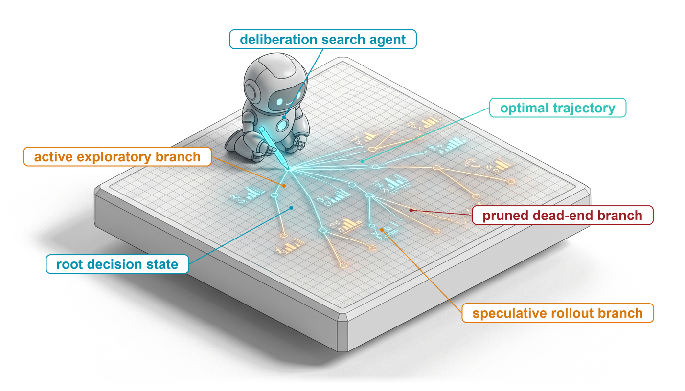{fig-alt="Blueprint for Test-Time Deliberation."}
:::

::: {.content-visible unless-format="pdf"}
{fig-alt="Blueprint for Test-Time Deliberation."}
:::

:::

## Purpose {.unnumbered .unlisted}

\begin{marginfigure}
\mlagentstack{0}{0}{0}{0}{0}{100}
\end{marginfigure}

_When is spending an extra token, candidate branch, or verification check worth its systems cost, and how does the runtime allocate that compute dynamically?_

In single-turn model serving, compute expenditure is strictly proportional to prompt length and generated output size. In autonomous agent architectures, execution efficiency is governed by test-time deliberation: the strategic allocation of inference compute to explore alternative solution trajectories before committing irreversible external actions. An uncorrected error in step two of a thirty-step workflow compounds into irrecoverable trajectory failure, rendering all subsequent compute pure waste. However, indiscriminately generating candidate branches, running Monte Carlo tree searches, or evaluating rollouts against process verifiers rapidly exhausts token budgets and saturates GPU memory bandwidth without guaranteeing task success. Unprincipled search strategies also encounter Goodhart divergence, where candidates overfit to imperfect scoring heuristics rather than satisfying true operational objectives. Systems engineers must therefore treat test-time compute as a constrained physical resource governed by marginal returns and verification oracles. The runtime must dynamically evaluate when a problem warrants parallel sampling, when a low-latency draft model can prune failing trajectories, and when an expensive verifier must arbitrate state transitions. Designing effective deliberation systems requires co-designing the agent search topology, verification cadence, and serving engine latency floors to maximize accepted task goodput across finite execution budgets.

::: {.content-visible when-format="pdf"}

\newpage

:::

::: {.callout-learning-objectives}

- Distinguish one model invocation from a multi-invocation decision process controlled by the runtime.
- Compare longer generation, candidate breadth, and observation-conditioned revision by information gained, latency, and resource use.
- Evaluate candidate selection with verifier error rates and independent acceptance evidence.
- Represent a plan as revisable subgoals and preconditions rather than a static checklist.
- Account for generator, verifier, tool, and branch-state cost across search strategies.
- Choose stopping and escalation rules under deadline, spending, and action-risk constraints.
- Compare deliberation strategies with a single-candidate baseline on held-out tasks.

:::

## Why One Candidate Can Fail {#sec-vol3-deliberation-insufficient-response}

::: {.column-margin}
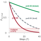{width="100%" fig-alt="Exponential decay curve showing trajectory success dropping from 95% at step 1 down to 13% at step 40 for per-step error probability p=0.95."}

*In unverified execution, compounding errors drive trajectory survival below 15% after 40 steps.*
:::
A high-throughput distributed key-value cache deployed across multiple availability zones begins exhibiting tail-latency degradation and intermittent stale read anomalies under heavy write concurrency. Operational monitoring indicates that replica synchronization lag periodically spikes above 120 milliseconds, yet network interface telemetry shows packet drops and link retransmissions indistinguishable from baseline noise. Two mutually exclusive defect mechanisms explain this telemetry with equal surface plausibility: an uncalibrated cluster heartbeat timeout that prematurely demotes healthy replicas and triggers expensive resynchronization bursts, or a race condition in the concurrent lease-invalidation protocol that drops memory barriers during multi-key updates, allowing read replicas to serve invalidated entries before the lease revocation timestamp propagates across the cluster.

::: {.column-margin}
**The Epistemic Gap:** In classical operating systems, hardware exceptions and compiler errors enforce fail-stop semantics. A neural inference engine exhibits fail-plausible behavior: it evaluates conditional probability distributions over token vocabularies, optimizing surface textual coherence rather than physical ground truth.
:::

When an engineer presents this ambiguous log trace to an unprivileged foundation model in an interactive session, the autoregressive decode loop samples tokens conditioned solely on the prompt and its learned parametric weights. Because network socket timeouts and heartbeat adjustments appear with high frequency across developer forums and open-source repositories in the training corpus, the model's unembedding projection assigns high conditional likelihood to the heartbeat hypothesis. It generates a patch increasing the socket timeout, wraps the edit in a fluent diagnostic justification, and presents the proposal. In an interactive setting, this incorrect hypothesis is a minor conversational setback: the human engineer inspects the suggestion, notes that network interface counters are clear, rejects the hypothesis, and supplies additional system metrics. But when systems engineering shifts from conversational assistance to autonomous delegation—where an agent runtime delegates multi-step diagnosis, code modification, and deployment directly to an unprivileged model without human mediation—a single forward pass becomes a critical single point of failure. Deploying the model's unverified patch into production leaves the underlying lease-invalidation race untouched, allowing silent data corruptions to propagate across downstream storage engines.

**A single model invocation cannot reliably solve complex diagnostic or engineering tasks because plausible sequence likelihood is not a proxy for operational truth.** In an autonomous system, the primary computational failure is not syntactic invalidity or superficial incoherence; it is premature commitment to an unsupported hypothesis in the absence of discriminatory evidence. In Chapter 02, we established the fundamental architectural boundary of the generative engine: the foundation model is an unprivileged neural coprocessor running on accelerator silicon under Zero Ambient Authority ($A=0$). It holds no operating system process table entry, cannot dispatch hardware interrupts, and cannot mutate physical storage or network interfaces. Its raw candidate emissions reside in volatile host memory as unverified byte buffers held in escrow, awaiting validation by the host agent runtime.

Beneath this supervisory boundary lies the physical reality of the autoregressive decode loop. At each generation step $t$, the inference engine projects the transformer core's final hidden activation $\mathbf{h}_t$ through an unembedding weight matrix $\mathbf{W}_{\text{unembed}}$ to produce an unnormalized logit vector $\mathbf{z}_t \in \mathbb{R}^{|\mathcal{V}|}$, which is mapped to a probability simplex via temperature-scaled Softmax:

$$y_t \sim P(y_t \mid x, y_{<t}; \Theta) = \text{softmax}\left(\frac{\mathbf{z}_t}{\tau}\right)$$ {#eq-vol3-autoregressive-step}

During evaluation, multi-head scaled dot-product attention computes interactions across all active sequence positions:

$$\text{Attention}(\mathbf{Q}, \mathbf{K}, \mathbf{V}) = \text{softmax}\left(\frac{\mathbf{Q}\mathbf{K}^\top}{\sqrt{d_k}} + \mathbf{M}\right)\mathbf{V}$$ {#eq-vol3-causal-attention}

where the causal mask $\mathbf{M}_{i,j} = -\infty$ for all $j > i$ strictly prohibits information from propagating backward from future sequence positions. Once a token $y_t$ is sampled and its projected key and value vectors $\mathbf{k}_t, \mathbf{v}_t$ are appended to the Key-Value (KV) cache in accelerator high-bandwidth memory (HBM), that state transition is causally irreversible within the active generation stream. The physical accelerator provides no hardware rollback mechanism, no branch prediction rewind, and no interrupt vector to un-generate an emitted token.

Every subsequent token $y_{t+1}, y_{t+2}, \dots$ must condition upon the accumulated KV cache prefix $[x, y_1, \dots, y_t]$. If an early token commits the trajectory to an erroneous premise—such as asserting that the cluster anomaly stems from a heartbeat timeout—the causal attention mask forces all future hidden states to attend to that assertion. Because generative pretraining optimizes the log-likelihood of coherent sequences, the transformer core does not detect the underlying physical contradiction and halt; instead, its subsequent token emissions rationalize, justify, and elaborate upon the initial error, generating fluent but completely fabricated arguments to maintain textual consistency.

::: {#fig-vol3-diagnostic-tree fig-env="figure" fig-pos="htb" fig-cap="**The Diagnostic Tree and Discriminatory Verification**: Under an ambiguous telemetry observation, open-loop autoregressive generation (left) prematurely commits to hypothesis $H_1$, poisoning downstream KV cache context and producing a flawed patch that leaves the root defect intact. Deliberative search (right) withholds actuation until a targeted discriminatory probe falsifies $H_1$, isolating $H_2$ and enabling a verified state resolution." fig-alt="Schematic comparison between open-loop autoregressive commitment that poisons the KV cache with an invalid hypothesis, and closed-loop deliberative search that uses a discriminatory probe to falsify the invalid branch."}

:::

The execution becomes trapped on a *garden path*: an execution trajectory where local token transition probabilities remain high, but global task success probability drops to zero. Standard autoregressive sampling evaluates a fixed-depth computational graph per token regardless of problem hardness or telemetry ambiguity. When an autonomous system operates open-loop, single-candidate execution collapses along four distinct systems failure modes:

1. *Epistemic Ambiguity and Prior Bias:* The incoming telemetry vector lacks sufficient information entropy to isolate the true defect, yet the sampling policy forces an immediate irreversible commitment, biased by pretraining priors toward common superficial patterns.
2. *Autoregressive Commitment and Premise Poisoning:* Once an ungrounded premise enters the KV cache, the causal attention mask guarantees that subsequent tokens are conditioned on that error, preventing the model from self-correcting within the same generation stream.
3. *Shallow Compositional Horizons:* A single forward pass allocates a fixed, constant amount of compute ($O(1)$ transformer layers) per token. When diagnosing complex distributed race conditions, the compositional dependency chain exceeds the immediate representational capacity of a single sequence without unrolled intermediate reasoning states.
4. *The Paraphrasing Fallacy:* Requesting an unguided second pass or prompting the model to "reconsider" without injecting new external evidence yields zero information gain. If the prompt contains the identical observation vector and samples from the same parameter distribution $\Theta$, unguided re-sampling simply oscillates within the same probability basin. Paraphrasing a flawed premise adds zero mutual information ($I(Y; \text{Truth} \mid X) = 0$). Plausible language cannot substitute for empirical evidence.

As demonstrated in @fig-vol3-diagnostic-tree, open-loop generation on the left commits irrevocably to the high-probability prior $H_1$ ($P(H_1)=0.75$), allowing poisoned KV cache context to steer downstream actuation toward an ineffective timeout patch. On the right, deliberative execution withholds actuation at root state $S_0$ until an external diagnostic probe executes a targeted concurrency test. The probe captures concrete runtime evidence—confirming that sockets remain healthy while lease locks are released prematurely—which decisively falsifies $H_1$, prunes the invalid branch, and guides subsequent generation toward the verified synchronization fix at $S_2^*$.

::: {#exmp-03-memory-bus-latency-tax .callout-example title="Sizing the Memory Bus and Latency Tax of Autoregressive Commitment"}
Consider an autonomous systems agent diagnosing our distributed cache defect using an open-weights 70-billion parameter model ($P_{\text{params}} = 70 \times 10^9$) quantized to FP8 ($b_{\text{weight}} = 1\text{ byte/param}$, occupying $70\text{ GB}$ of memory) deployed on an NVIDIA H100 SXM5 accelerator ($80\text{ GiB}$ HBM3, $\text{BW}_{\text{mem}} = 3.35\text{ TB/s}$).

**Single-Token Decode Latency at Batch Size $B = 1$:**
Because autoregressive decoding shuttles all active model parameters from HBM into accelerator compute cores for each emitted token, per-token latency is memory-bandwidth bound:

$$T_{\text{decode}} \approx \frac{P_{\text{params}} \cdot b_{\text{weight}}}{\text{BW}_{\text{mem}}} = \frac{70 \times 10^9\text{ bytes}}{3.35 \times 10^{12}\text{ bytes/s}} \approx 20.90\text{ ms/token}$$

**Cost of an Unguided Diagnostic Pass:**
Suppose the model generates an open-loop diagnostic rationale and patch consisting of $L = 1{,}024$ output tokens:

- Total decode wall-clock time: $T_{\text{total}} = 1{,}024 \times 20.90\text{ ms} = 21.40\text{ seconds}$.
- Total memory volume shuttled across the HBM bus: $V_{\text{mem}} = 1{,}024 \times 70\text{ GB} = 71.68\text{ TB}$.

**The Cost of Premise Poisoning:**
Suppose the prompt contains ambiguous telemetry where the model's pretraining prior assigns probability $P(H_1) = 0.75$ to a heartbeat timeout and $P(H_2) = 0.25$ to a lease race. At token position $t = 16$, the decode loop samples token $y_{16} = \texttt{"heartbeat"}$, committing the KV cache to $H_1$.

- Tokens $y_{17}$ through $y_{1024}$ ($1{,}008$ tokens) are spent elaborating and implementing the false hypothesis.
- Wasted wall-clock latency: $1{,}008 \times 20.90\text{ ms} = 21.07\text{ seconds}$ ($98.4\%$ of total generation time).
- Wasted memory bus traffic: $1{,}008 \times 70\text{ GB} = 70.56\text{ TB}$.
- When the resulting patch fails regression testing, the entire $21.40$-second invocation and its $71.68\text{ TB}$ of HBM bandwidth are discarded.

**The Value of a Discriminatory Probe:**
Now consider an agent runtime that pauses generation at $t = 16$ and executes an external diagnostic probe (a lightweight concurrency fuzzer script) taking $T_{\text{probe}} = 40\text{ ms}$ of CPU time and consuming zero GPU memory bandwidth. The probe emits 256 bytes of stdout confirming that the lease lock was dropped prematurely. This observation collapses the epistemic entropy of the hypothesis space:

$$H(\mathcal{H}) = -\sum_{i=1}^2 P(H_i)\log_2 P(H_i) = -(0.75 \log_2 0.75 + 0.25 \log_2 0.25) \approx 0.811\text{ bits} \longrightarrow 0\text{ bits}$$

Spending $40\text{ ms}$ on an external execution probe saves $21.07\text{ seconds}$ of wasted GPU decode latency, conserves $70.56\text{ TB}$ of memory bus traffic, and prevents downstream operational failure.
:::

To build dependable systems around unprivileged, non-deterministic foundation models, systems engineers must resolve this epistemic gap using the foundational principles of system design. As articulated by Saltzer, Reed, and Clark [-@saltzer1984endtoend] in the End-to-End Argument, functions placed at low levels of a distributed system may be redundant or of little value when compared with the cost of providing them at that low level; true correctness can only be completely defined and verified with the knowledge and help of the application endpoints. In an agentic architecture, semantic correctness cannot be certified internally by the generative core. The model cannot validate its own hypotheses through internal consistency checks or conversational self-reflection because the generative core is the very source of the failure-plausible proposal. Invariant closure must be established at the application endpoints by external, authoritative, deterministic verification mechanisms: compilers, type checkers, static analysis linters, reproduction test harnesses, and regression suites.

This separation of concerns operationalizes Dijkstra's [-@dijkstra1970structured] foundational principle of software engineering: program testing can be used to show the presence of bugs, but never to show their absence. In an agentic deliberation process, an empirical test execution provides an indispensable systems property: *discriminatory power*. An external execution probe can definitively falsify an invalid hypothesis. When a concurrency test runner emits a nonzero exit code or an assertion failure, that empirical observation injects ground-truth evidence directly into the runtime's state.

In their seminal analysis of test-time compute scaling, Snell et al. [-@snell2024scaling] demonstrated this principle quantitatively: increasing inference computation—whether by extending token generation, sampling multiple candidate trajectories, or conditioning on verifiers—improves task performance if and only if the additional compute yields *discriminatory signal*. Sampling additional candidates from an unguided distribution without an external verifier saturates rapidly, while generating extended rationalizations without empirical feedback compounds errors. Test-time computation is valuable if and only if it generates or acquires evidence that separates valid execution states from invalid ones.

Deliberation is therefore an architectural resource allocation decision. Rather than treating model inference as an atomic, single-shot remote procedure call that either succeeds or fails, the host agent runtime must orchestrate test-time computation dynamically: determining when to generate intermediate reasoning tokens, when to branch into parallel candidate alternatives, when to dispatch external execution probes, and when to terminate search under explicit latency, token, and memory budgets. Which kinds of additional work can the system buy, and how do their execution topologies trade off critical-path latency, accelerator memory, and discriminatory information gain?

## Three Compute Allocation Axes {#sec-vol3-deliberation-computation-allocation}

When an agent runtime confronts a failing task—such as synthesizing a concurrent synchronization barrier or diagnosing an intermittent race condition—granting the system an additional computational budget does not specify *how* those operations should be structured. If the runtime allocates an order of magnitude more floating-point operations solely to deeper autoregressive rollouts within a single inference context, the foundation model frequently produces thousands of tokens of elaborate, plausible rationale that double down on its original faulty premises. If the runtime instead directs those operations toward sampling twenty independent candidate continuations in parallel from the initial prompt, it often obtains twenty minor syntactic variations of the exact same conceptual failure, because every candidate was sampled from an unconditioned conditional distribution sharing identical blind spots. If the host supervisor instead partitions that identical budget into three iterative cycles—generating a candidate, compiling and executing it against a race detector in an isolated sandbox, and injecting the resulting backtrace as a prompt prefix for targeted correction—the race condition is diagnosed and eliminated within seconds.

Test-time computation is not an undifferentiated scalar currency. Its architectural utility is governed entirely by its execution topology across three orthogonal axes: depth (sequential token extension), breadth (parallel candidate exploration), and feedback (observation-conditioned revision). Each axis establishes a fundamentally different dependency graph across model invocations, exhibits contrasting critical-path latency and accelerator memory profiles, and interacts distinctively with the model's epistemic boundaries.

::: {#fig-vol3-allocation-axes fig-env="figure" fig-pos="htb" fig-cap="**Three Canonical Deliberation Topologies**: Structural comparison of sequential depth (unrolled token chains), parallel breadth (fan-out candidate exploration), and closed-loop feedback (observation-conditioned revision). Top panels trace execution dependency flow; bottom specification cards define critical-path latency equations, Key-Value cache memory footprints ($M_{\\text{KV}}$), and operational trade-offs." fig-alt="Three canonical deliberation architectures: Depth chaining tokens sequentially, Breadth sampling multiple trajectories in parallel, and Feedback iterating through sandbox execution environments."}
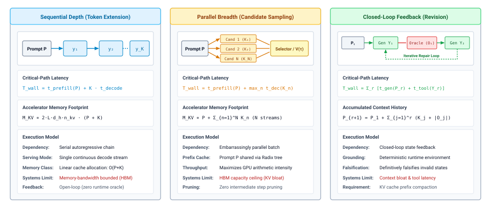
:::

As formalized in @fig-vol3-allocation-axes, test-time compute spans three distinct architectural topologies. In the Depth topology (left), compute scales along a serialized chain of $K_{\text{ext}}$ autoregressive tokens; while this enables unrolled intermediate derivations, wall-clock latency scales strictly as $O(K_{\text{ext}})$ with memory bandwidth saturation at batch size $B=1$. In the Breadth topology (center), the runtime forks execution into $N$ parallel candidate streams; wall-clock latency matches a single rollout $O(K_{\text{cand}})$, but accelerator high-bandwidth memory scales as $O(N \cdot K_{\text{cand}})$ without pruning unpromising branches. In the Feedback topology (right), compute loops through external execution sandboxes over $M$ discrete epochs; each candidate is compiled and falsified by empirical probes, breaking the autoregressive commitment trap while capping working memory at a single active generation context.

Understanding how to allocate inference-time computation requires decomposing these three execution topologies down to their physical and information-theoretic foundations. The agent runtime designer must balance the critical-path wall-clock latency ($T_{\text{wall}}$), the total floating-point operations ($C_{\text{FLOP}}$), the active state footprint retained in accelerator memory ($M_{\text{KV}}$), and the empirical validity of the resulting proposals.

### Depth: Sequential Token Extension

::: {.column-margin}
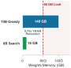{width="100%" fig-alt="Pareto frontier curves showing accuracy versus test-time compute scaling across depth, breadth, and feedback axes."}

*Test-time deliberation scales log-linearly with verification budget before hitting domain saturation ceilings.*
:::
The most direct mechanism for increasing test-time computation is extending the sequential length of a single autoregressive generation. Under this topology, the runtime permits the model to emit a continuous trajectory of $K_{\text{ext}}$ intermediate tokens—often structured as a scratchpad, an execution trace, or an extended derivation—prior to emitting its final proposal.

Formally, given an initial prompt $\mathbf{x} = (x_1, x_2, \dots, x_P)$, the autoregressive decode engine generates tokens sequentially:

$$y_t \sim P_\Theta\left(y_t \mid \mathbf{x}, y_1, \dots, y_{t-1}\right), \quad t \in \{1, 2, \dots, K_{\text{ext}}\}$$

where $\Theta$ represents the frozen parameters of the neural network. From an information-processing standpoint, depth expands the computational expressive capacity of the model. Standard transformer decoders are bounded in the number of computational operations they can perform per token; a single forward pass through $L$ layers cannot simulate an arbitrary number of state transitions. By serializing intermediate reasoning into the token sequence, the model effectively runs an unrolled recurrence: earlier intermediate tokens $y_{<t}$ are written into the Key-Value (KV) cache, allowing later tokens $y_t$ to attend back across intermediate derivations, decomposing complex combinatorial constraints into incremental steps.

::: {.column-margin}
During autoregressive decode, the memory bus transfers all model weights $\Theta$ from high-bandwidth memory (HBM) to on-chip SRAM for every single generated token. When batch size $b=1$, the operational intensity is approximately $\frac{2 |\Theta| \text{ FLOPs}}{2 |\Theta| \text{ bytes}} = 1 \text{ FLOP/byte}$, rendering depth strictly memory-bandwidth bound.
:::

From a systems perspective, however, depth represents a strictly serialized critical path. Because token $y_t$ cannot be computed until token $y_{t-1}$ has completed its forward pass and its key-value vectors are materialized in memory, no phase of the decode loop can be parallelized across time. The wall-clock execution time for depth, $T_{\text{wall}}^{\text{depth}}$, is governed by the sum of the initial prefill phase and the sequential decode phases:

$$T_{\text{wall}}^{\text{depth}} = t_{\text{prefill}}(P) + \sum_{t=1}^{K_{\text{ext}}} t_{\text{decode}, t} \approx t_{\text{prefill}}(P) + K_{\text{ext}} \cdot t_{\text{step}}$$

where $t_{\text{step}}$ is the latency of a single decode step. On modern accelerator architectures running small batch sizes, $t_{\text{step}}$ is severely memory-bandwidth bound: the operational intensity is nearly unit, requiring the hardware to stream the entire parameter footprint $|\Theta|$ from high-bandwidth memory (HBM) into compute registers to process a single token vector.

Crucially, depth operates within a closed epistemic loop. While extended generation allows the model to compute more complex internal projections over its training distribution, *no fresh information enters the context from outside the model's static parameters $\Theta$*. If the initial prompt or the model's internal representations contain an error, extending generation depth simply grants the model more token budget to rationalize that error. Furthermore, because each token is sampled stochastically from $P_\Theta(\cdot \mid \mathbf{x}, y_{<t})$, the probability of maintaining invariant correctness across an unverified chain decays exponentially with sequence length, a failure mode known as stochastic drift. Modern reasoning models (such as OpenAI o1/o3 and DeepSeek-R1) address this limitation by training the model via large-scale reinforcement learning (RL) on verifiable domains to emit explicit self-correction, backtracking, and verification tokens directly within the serial decode stream. In systems terms, these models internalize tree-search primitives into the sequential depth axis, allowing the autoregressive loop to simulate backtracking without external host scaffolding—though still subject to the memory-bandwidth shuttle floor $t_{\text{step}}$.

### Breadth: Parallel Candidate Sampling

Rather than allocating additional compute to a single, prolonged sequential trajectory, breadth distributes test-time operations across $N$ independent candidate trajectories sampled from the same conditioning prompt. This topology forms the basis of parallel sampling and self-consistency mechanisms [-@wang2022selfconsistency].

Under a breadth topology, the host supervisor issues $N$ independent autoregressive rollouts from the prefix $\mathbf{x}$:

$$Y^{(n)} = \left(y_1^{(n)}, y_2^{(n)}, \dots, y_{K_n}^{(n)}\right) \sim P_\Theta(\cdot \mid \mathbf{x}), \quad n \in \{1, 2, \dots, N\}$$

typically with a nonzero temperature parameter $\tau > 0$ or nucleus sampling threshold $p < 1$ to induce stochastic divergence across trajectories.

The primary systems advantage of breadth is horizontal parallelizability. Because each candidate trajectory $Y^{(n)}$ is statistically and computationally independent of candidate $Y^{(m)}$ for $m \ne n$, the entire execution graph can be scheduled concurrently across available accelerator resources. The initial prompt $\mathbf{x}$ of length $P$ represents a shared dependency; the system executes the prefill phase over $\mathbf{x}$ once, generating a common base KV cache. At token index $P+1$, the execution graph forks into $N$ parallel decode paths.

Consequently, the wall-clock critical path does not scale linearly with $N$. If the inference cluster possesses sufficient memory bandwidth and processing units to host the $N$ concurrent decode streams, the wall-clock latency is determined entirely by the longest individual candidate:

$$T_{\text{wall}}^{\text{breadth}} = t_{\text{prefill}}(P) + \max_{1 \le n \le N} T_{\text{decode}}\left(K_n\right)$$

Contrast this with depth: whereas spending $N \cdot K$ tokens along the depth axis increases wall-clock latency by a factor of $N$, spending the same token budget across $N$ parallel breadth branches leaves the critical path virtually unchanged, bounded only by $K_{\max} = \max_n K_n$.

This wall-clock compression is offset by accelerator memory pressure. While depth maintains a single linear KV cache of size $(P + K_{\text{ext}})$, breadth demands the concurrent retention of $N$ active KV contexts in accelerator high-bandwidth memory:

$$M_{\text{KV}}^{\text{breadth}} \propto P + \sum_{n=1}^N K_n$$

Even when the prompt prefix $P$ is shared in memory, as the $N$ trajectories diverge, their respective key and value projections populate disjoint memory regions. If aggregate memory capacity is exceeded, the host runtime is forced to serialize the candidate batches, causing wall-clock latency to degrade from $\max(T_n)$ toward the serialized sum $\sum_n T_n$.

Epistemically, breadth acts as a variance-reduction mechanism over the model's conditional manifold $P_\Theta(Y \mid \mathbf{x})$. A single candidate might fail because the autoregressive sampler unluckily selected an improbable token in an early decode step, steering the remaining trajectory into an unrecoverable basin. Sampling across breadth explores disjoint branches of the search space, increasing the probability that at least one candidate traverses an effective solution path. Nevertheless, breadth shares the fundamental limitation of depth: it is an entirely open-loop exploration. If the model assigns near-zero probability to the correct program logic—or if the task requires private knowledge hidden behind an API boundary—sampling one thousand candidates yields nothing more than one thousand internally consistent failures.

### Feedback: Observation-Conditioned Revision

The third allocation axis breaks the closed-system limitation of depth and breadth by interleaving autoregressive generation with deterministic environmental verification. Rather than treating model inference as an open-loop emitter, feedback organizes test-time compute into a discrete sequence of observation-conditioned repair cycles.

Under a feedback topology, computation proceeds through $R$ sequential rounds. In round $r$, the runtime generates candidate proposal $Y_r$ conditioned on the initial prompt $\mathbf{x}$ and the cumulative history of prior proposals and empirical observations:

$$Y_r \sim P_\Theta\left(\cdot \mid \mathbf{x}, Y_1, O_1, Y_2, O_2, \dots, Y_{r-1}, O_{r-1}\right)$$

Once emitted, $Y_r$ is intercepted by the host supervisor under the principle of Zero Ambient Authority ($A=0$). The candidate proposal is not trusted. Instead, the runtime dispatches $Y_r$ across an isolated boundary to an external verification oracle: a compiler, an integration test harness, a type checker, or a system linter. The oracle executes deterministic checks and returns an empirical observation $O_r$:

$$O_r = \text{Oracle}\left(Y_r\right) = \left(\text{status} \in \{\text{PASS}, \text{FAIL}\}, \text{trace} \in \Sigma^*\right)$$

If the verification oracle signals success, execution terminates. If it signals failure, the error trace, compiler diagnostic, or execution exception is formatted as an observation payload $O_r$ and appended directly to the input context for round $r+1$.

Feedback represents an application of Dijkstra's verification principle: testing can decisively demonstrate the presence of specific faults, providing high-entropy negative signals that constrain subsequent search. Epistemically, feedback injects ground-truth environmental state into the context window, bridging the epistemic gap. The model is no longer forced to simulate complex runtime environments—such as OS kernel scheduling, dynamic linker behavior, or network timeouts—entirely within its parameter weights. Instead, it queries reality directly, using the external execution substrate as an authoritative oracle.

The architectural penalty of feedback lies in its compound latency and expanding context overhead. The critical path is strictly serialized across rounds and includes external execution latency:

$$T_{\text{wall}}^{\text{feedback}} = \sum_{r=1}^R \left( t_{\text{prefill}}\left(P_r\right) + t_{\text{decode}}\left(K_r\right) + t_{\text{oracle}}\left(Y_r\right) \right)$$

where $t_{\text{oracle}}(Y_r)$ is the wall-clock time required for the sandbox to compile, execute, and instrument the candidate. Crucially, the prompt length expands monotonically at each iteration:

$$P_{r+1} = P_r + K_r + |O_r| = P_1 + \sum_{j=1}^r \left(K_j + |O_j|\right)$$

As round index $r$ increases, the prefill cost $t_{\text{prefill}}(P_r)$ compounds, consuming substantial FLOP budgets merely to ingest the accumulated transcript of prior failures. If the agent runtime does not implement aggressive context compaction or eviction policies, the expanding history threatens to exceed the context window $S_{\max}$ or degrade model attention performance.

### Deliberation Hardware Mechanics

To evaluate how an agent runtime should partition its test-time budget, we formalize the operational profiles of each axis under a standard architectural model. Let $|\Theta|$ denote the count of active model parameters, $P$ denote the initial prompt length, $K$ denote the average generation length per candidate or round, and $b_{\text{bytes}}$ denote the precision representation size (e.g., 2 bytes for FP16 or BF16).

Applying the standard first-order transformer compute approximation, each token processed in the forward pass requires approximately $2 |\Theta|$ floating-point operations (FLOPs)—one multiply-accumulate operation per parameter. The total computational burden ($C_{\text{FLOP}}$), the wall-clock critical path ($T_{\text{wall}}$), the peak retained KV cache memory ($M_{\text{KV}}$), and the primary epistemic contribution of each topology are summarized in @tbl-vol3-allocation-tradeoffs.

| Deliberation Axis | Execution Topology                             | Compute Complexity ($C_{\text{FLOP}}$)                   | Critical-Path Wall Latency ($T_{\text{wall}}$)                       | Peak Retained State ($M_{\text{KV}}$)          | Epistemic Source                                                   |
|:------------------|:-----------------------------------------------|:---------------------------------------------------------|:---------------------------------------------------------------------|:-----------------------------------------------|:-------------------------------------------------------------------|
| **Depth**         | Serial unrolled chain ($K_{\text{ext}}$ steps) | $2 \vert\Theta\vert \left(P + K_{\text{ext}}\right)$     | $t_{\text{prefill}}(P) + K_{\text{ext}} \cdot t_{\text{decode}}$     | $\mathcal{O}\left(P + K_{\text{ext}}\right)$   | Static parameters $\Theta$ (latent reasoning unpack)               |
| **Breadth**       | Parallel fork-join ($N$ branches)              | $2 \vert\Theta\vert \left(P + \sum_{n=1}^N K_n\right)$   | $t_{\text{prefill}}(P) + \max_n t_{\text{decode}}\left(K_n\right)$   | $\mathcal{O}\left(P + \sum_{n=1}^N K_n\right)$ | Manifold variance $P_\Theta(Y \mid \mathbf{x})$ (mode exploration) |
| **Feedback**      | Serial repair loop ($R$ iterations)            | $2 \vert\Theta\vert \sum_{r=1}^R \left(P_r + K_r\right)$ | $\sum_{r=1}^R \left(t_{\text{gen}, r} + t_{\text{oracle}, r}\right)$ | $\mathcal{O}\left(P_R + K_R\right)$            | Deterministic environment (empirical observations $O_r$)           |

: **Deliberation Compute Allocation Trade-offs**: Structural, operational, and memory trade-offs across the three deliberation compute allocation axes. Prefill calculations assume shared prompt caching across breadth branches. {#tbl-vol3-allocation-tradeoffs}

As @tbl-vol3-allocation-tradeoffs makes clear, the three axes present radical engineering trade-offs. Breadth optimizes for wall-clock latency at the expense of peak concurrent memory footprint. Depth minimizes memory and coordination overhead while maximizing serial latency, but remains trapped within the model's unverified internal assumptions. Feedback trades away both wall-clock latency and prefill compute efficiency to achieve the one property that neither depth nor breadth can provide: empirical grounding against external reality.

The concrete consequences of these architectural trade-offs are best illustrated by tracing hardware metrics on a modern inference node.

::: {#exmp-03-hardware-trade-offs-across-compute-allocation .callout-example title="Hardware Trade-offs Across Compute Allocation Axes"}
Consider an autonomous agent runtime deployed on an 8-GPU node running an unquantized 70-billion parameter model ($|\Theta| = 70 \times 10^9$) in BF16 precision ($b_{\text{bytes}} = 2$ bytes). The node possesses an aggregate memory bandwidth $B_{\text{mem}} = 26.8\text{ TB/s}$ ($3.35\text{ TB/s}$ per GPU) and sustained BF16 matrix compute throughput of $R_{\text{peak}} = 15{,}800\text{ TFLOPS}$.

The agent is tasked with synthesizing a lockless ring buffer. The base specification prompt contains $P = 4{,}096$ tokens. We analyze three concrete configurations designed to consume comparable total generation budgets of approximately $4{,}096$ emitted tokens:

1. **Configuration A (Depth):** A single serial rollout of $K_{\text{ext}} = 4{,}096$ intermediate reasoning and implementation tokens.
2. **Configuration B (Breadth):** An $N = 4$ parallel sampling sweep, where each branch emits $K = 1{,}024$ tokens concurrently.
3. **Configuration C (Feedback):** An $R = 3$ round iterative repair loop. Each round emits $K = 1{,}024$ tokens, followed by an external compilation and ThreadSanitizer test pass taking $t_{\text{oracle}} = 1.50\text{ s}$ that yields $|O_r| = 340$ tokens of diagnostic traces.

**Step 1: Compute and Memory Baseline**
Loading the model weights requires:
$$M_{\text{weights}} = 70 \times 10^9 \times 2\text{ bytes} = 140\text{ GB}$$
For an unbatched single-stream decode step, the time to stream weights from HBM across the node bus is:
$$t_{\text{step}} = \frac{M_{\text{weights}}}{B_{\text{mem}}} = \frac{140 \times 10^9\text{ bytes}}{26.8 \times 10^{12}\text{ bytes/s}} \approx 5.22\text{ ms/token}$$
The prefill phase over a prompt of length $L$ operates in the compute-bound GEMM regime:
$$t_{\text{prefill}}(L) = \frac{2 \cdot |\Theta| \cdot L}{R_{\text{peak}}} = \frac{2 \cdot (70 \times 10^9) \cdot L}{15.8 \times 10^{15}\text{ FLOPS}} \approx \left(8.86 \times 10^{-6} \cdot L\right)\text{ seconds}$$
For $P = 4{,}096$, $t_{\text{prefill}}(4{,}096) \approx 36.3\text{ ms}$.

**Step 2: Configuration A (Depth) Evaluation**

- **Total Compute:**
  $$C_{\text{FLOP}}^{\text{depth}} = 2 \cdot (70 \times 10^9) \cdot (4{,}096 + 4{,}096) = 1.147 \times 10^{15}\text{ FLOPs} = 1.15\text{ PFLOPs}$$

- **Wall-Clock Latency:**
  $$T_{\text{wall}}^{\text{depth}} = t_{\text{prefill}}(4{,}096) + 4{,}096 \cdot t_{\text{step}} = 0.036\text{ s} + (4{,}096 \times 0.00522\text{ s}) = 0.036\text{ s} + 21.38\text{ s} = 21.42\text{ s}$$

- **Outcome:** The model emits an intricate mathematical justification of an invariant that violates the x86 weak memory model. Because no external compiler was consulted, the proposal is returned to the user with an undetected memory barrier bug.

**Step 3: Configuration B (Breadth) Evaluation**
Assuming the $N=4$ branches are batched together across the GPUs during decode, the weight streaming cost ($140\text{ GB}$) is amortized across 4 tokens per step, yielding an effective decode step latency of $t_{\text{step, batch=4}} \approx 5.60\text{ ms}$:

- **Total Compute:**
  $$C_{\text{FLOP}}^{\text{breadth}} = 2 \cdot (70 \times 10^9) \cdot (4{,}096 + 4 \times 1{,}024) = 1.147 \times 10^{15}\text{ FLOPs} = 1.15\text{ PFLOPs}$$

- **Wall-Clock Latency:**
  $$T_{\text{wall}}^{\text{breadth}} = t_{\text{prefill}}(4{,}096) + 1{,}024 \cdot t_{\text{step, batch=4}} = 0.036\text{ s} + (1{,}024 \times 0.00560\text{ s}) = 0.036\text{ s} + 5.73\text{ s} = 5.77\text{ s}$$

- **Outcome:** Total compute matches Configuration A exactly, but wall-clock latency drops from $21.42\text{ s}$ down to $5.77\text{ s}$ (a $3.7\times$ speedup). However, all four sampled candidates contain variations of the same missing atomic fetch-and-add instruction, because the prompt provided no signal indicating that the initial design contained a race.

**Step 4: Configuration C (Feedback) Evaluation**
Prompt lengths expand across rounds:

- Round 1: $P_1 = 4{,}096$. Prefill = $36.3\text{ ms}$. Decode $1{,}024$ tokens = $5.35\text{ s}$. Sandbox test = $1.50\text{ s}$.
- Round 2: $P_2 = 4{,}096 + 1{,}024 + 340 = 5{,}460$. Prefill = $48.4\text{ ms}$. Decode $1{,}024$ tokens = $5.35\text{ s}$. Sandbox test = $1.50\text{ s}$.
- Round 3: $P_3 = 5{,}460 + 1{,}024 + 340 = 6{,}824$. Prefill = $60.5\text{ ms}$. Decode $1{,}024$ tokens = $5.35\text{ s}$. Sandbox test = $1.50\text{ s}$ (passes).
- **Total Compute:**
  $$C_{\text{FLOP}}^{\text{feedback}} = 2 \cdot (70 \times 10^9) \cdot \left[(4{,}096 + 1{,}024) + (5{,}460 + 1{,}024) + (6{,}824 + 1{,}024)\right] = 2.723 \times 10^{15}\text{ FLOPs} = 2.72\text{ PFLOPs}$$

- **Wall-Clock Latency:**
  $$T_{\text{wall}}^{\text{feedback}} = (0.036 + 0.048 + 0.061) + 3 \times 5.35\text{ s} + 3 \times 1.50\text{ s} = 0.145\text{ s} + 16.05\text{ s} + 4.50\text{ s} = 20.70\text{ s}$$

- **Outcome and Trajectory Goodput:** Configuration C consumes $2.37\times$ more total FLOPs than Configurations A and B due to the quadratic accumulation of context in the prefill phases. Its wall-clock latency ($20.70\text{ s}$) is nearly identical to single-shot depth ($21.42\text{ s}$). Yet evaluated through the systems lens of Trajectory Goodput ($\mathcal{G}$), Configuration A and Configuration B yielded $\mathcal{G} = 0\%$ (100% badput: $\$0.178$ of GPU compute wasted producing non-functional code), whereas Configuration C yielded $\mathcal{G} = 100\%$ goodput: in Round 2, ThreadSanitizer flagged the missing memory barrier, providing the exact line and register offset required for Round 3 to emit a verified, race-free barrier. Feedback is the only architecture that converts raw FLOPs into verified systems deliverables.
:::

The architectural imperative that emerges from this quantitative comparison is that real-world agent runtimes rarely deploy any single axis in isolation. Instead, high-performance runtime orchestrators construct hybrid deliberation topologies: leveraging depth to unpack local procedural logic, deploying breadth to explore disjoint architectural candidates across parallel workers, and closing the loop with feedback to verify and prune invalid candidates against deterministic system oracles.

Yet whether a runtime allocates its deliberation budget across parallel candidate branches or successive feedback iterations, it immediately encounters a selection bottleneck: generating multiple candidate solutions yields zero systemic value if the runtime cannot reliably distinguish which candidate is correct. If the system samples sixteen candidate implementations of a cache eviction policy, or branches across five possible query plans, how does the host supervisor evaluate and select the winning trajectory without introducing catastrophic verification exploits?

## Candidate Selection {#sec-vol3-deliberation-candidate-diversity}

Sampling $N$ parallel candidate trajectories from an autoregressive model scales inference floating-point operations and memory bus traffic linearly with $N$, yet naive parallel generation frequently reproduces identical reasoning errors across every branch. When an agent runtime forks sixteen independent decode streams from the same prompt prefix, the host supervisor does not automatically acquire sixteen independent estimates of the solution space. Instead, because autoregressive decoding draws tokens from a parameterized probability distribution conditioned on a shared prefix, sampling without structural intervention routinely collapses into high-probability attractors—producing surface-level lexical variation that masks identical algorithmic flaws.

Generating multiple candidates improves system reliability if and only if two orthogonal architectural conditions are satisfied: the generation policy must produce **materially diverse semantic hypotheses**, and the host runtime must possess an evaluation mechanism with sufficient **epistemic resolution** to separate valid solutions from plausible distractors. When either condition breaks down, parallel deliberation degenerates into wasted memory bandwidth. A selector operating over functionally identical candidates expends compute without reducing uncertainty; conversely, an expressive set of diverse candidates submitted to a noisy or uncalibrated selector will reliably elevate a catastrophic failure that exploited the selector's blind spots.

::: {.column-margin}
**Key Concept: The Diversity-Resolution Duality**
Candidate breadth delivers zero marginal yield unless:
$$\mathcal{H}(\mathcal{C}) > 0 \quad \text{and} \quad \text{Acc}(\text{Selector}) > \text{BaseRate}$$
where $\mathcal{H}(\mathcal{C})$ represents semantic entropy across candidate pool $\mathcal{C}$, and $\text{Acc}(\text{Selector})$ is the selector's true-positive ranking accuracy over candidate trajectories.
:::

### Candidate Diversity Dynamics

To evaluate the yield of breadth-based deliberation, the runtime orchestrator must distinguish between *nominal sample count* $N$ and *effective sample count* $N_{\text{eff}}$. Consider an unprivileged foundation model $\Theta$ generating candidate trajectories $\mathbf{y}^{(1)}, \mathbf{y}^{(2)}, \dots, \mathbf{y}^{(N)}$ conditioned on prompt context $\mathbf{x}$. Each token $y_t^{(i)}$ is sampled sequentially from the categorical distribution computed by applying a softmax operator to the scaled logit vector:

$$P_\Theta(y_t \mid \mathbf{x}, y_{<t}) = \frac{\exp(z_t / \tau)}{\sum_{j} \exp(z_j / \tau)}$$

where $z_t$ represents the raw model logit for token index $t$ and $\tau$ denotes the sampling temperature.

When $\tau \to 0$, the decoding loop degenerates into greedy search, collapsing the candidate set to $N$ identical sequences ($N_{\text{eff}} = 1$). However, increasing $\tau$ does not guarantee semantic exploration. Pre-trained and instruction-tuned language models concentrate probability mass within narrow topological basins in token sequence space. If the prompt $\mathbf{x}$ describes a distributed lock manager with a subtle timing vulnerability, the model's highest-probability paths will invariably reproduce the textbook implementation found throughout its training corpus—complete with the race condition.

::: {.column-margin}
**Definition: Correlated Failure Basin**
A region of sequence space $\mathcal{B} \subset \mathcal{Y}^*$ where distinct token sequences $\mathbf{y}^{(a)} \neq \mathbf{y}^{(b)}$ share an identical underlying invalid invariant:
$$\text{Invariant}(\mathbf{y}^{(a)}) = \text{Invariant}(\mathbf{y}^{(b)}) = \text{False}$$
despite having an edit distance greater than zero.
:::

Parallel decode streams sampled from this distribution exhibit correlated failure modes: they vary variable names, reorder non-dependent expressions, or swap control-flow constructs (such as substituting a `while` loop for a `for` loop) while retaining the identical structural error. The supervisor spends $N \times L$ decode steps only to evaluate minor lexical permutations of a single broken hypothesis.

```c
Candidate A:  lock.acquire(); data = read(); lock.release();  // Race: unprotected check
Candidate B:  pthread_mutex_lock(&m); val = in->val; pthread_mutex_unlock(&m); // Identical race
```

To break this correlation, runtime orchestrators implement diversity-inducing mechanisms that perturb the generation process at three distinct levels of the system stack:

| Mechanism Level   | Systems Primitive                | Operational Mechanism                                                                                                                                           | Failure Mode / Boundary                                                                                               |
|:------------------|:---------------------------------|:----------------------------------------------------------------------------------------------------------------------------------------------------------------|:----------------------------------------------------------------------------------------------------------------------|
| **Token-Level**   | Temperature Schedules & Top-$p$  | Dynamically scaling $\tau \in [0.6, 1.2]$ or truncating the sampling nucleus to cumulative probability $p \in [0.85, 0.95]$.                                    | High $\tau$ introduces catastrophic syntax and semantic degradation; fails to escape dominant architectural basins.   |
| **Context-Level** | Contextual Framing Perturbations | Injecting orthogonal operational requirements or persona prompts across branches (e.g., *optimizing for write-heavy workloads* vs *lock-free read paths*).      | Divergent prefixes invalidate uniform benchmarking or alter problem preconditions beyond the original specification.  |
| **Branch-Level**  | Structural Step Forcing          | Pinning distinct initial algorithmic primitives or structural invariants to the generation prefix of each candidate branch before autoregressive decode begins. | Requires domain-specific prefix synthesizers; risks forcing the model into low-probability, unviable execution paths. |

Measuring whether these mechanisms yield genuine exploration requires semantic metrics rather than lexical distance. String-based metrics such as BLEU or Levenshtein edit distance are actively misleading: two programs can possess an edit distance of $0.05$ while implementing radically different algorithmic paradigms, or an edit distance of $0.60$ while remaining syntactically and functionally identical under alpha-renaming.

Instead, agent supervisors compute structural and behavioral distance. In code synthesis domains, the supervisor compiles candidates into Abstract Syntax Trees (ASTs) and computes tree edit distances, or hashes normalized AST representations after canonicalizing variable identifiers and function signatures. In multi-step planning, the supervisor maps candidate step sequences into directed acyclic dependency graphs, comparing topological orderings rather than token strings. In general systems domains, the runtime clusters candidates by their *functional equivalence class*: two candidate proposals belong to the same equivalence class $[\mathbf{y}]$ if and only if they emit identical state transitions when executed against a deterministic smoke harness.

### Selection Architectures

::: {.column-margin}
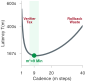{width="100%" fig-alt="Tree-search budget allocation diagram showing beam search branch pruning vs greedy rollout breadth."}

*Pruning unpromising rollout branches reclaims 70% of inference compute for high-value reasoning trajectories.*
:::
Once a diverse candidate set $\mathcal{C} = \{\mathbf{y}^{(1)}, \mathbf{y}^{(2)}, \dots, \mathbf{y}^{(N)}\}$ is staged in memory, the host supervisor must select the trajectory $\mathbf{y}^* \in \mathcal{C}$ that optimizes task success. The supervisor operates under Zero Ambient Authority ($A=0$); it cannot assume candidate self-reports are truthful, nor can it allow candidate code to interact directly with host OS resources. To select a candidate securely, the runtime employs three primary architectural strategies, organized as a hierarchical selection cascade.

::: {#fig-vol3-candidate-selection-cascade fig-env="figure" fig-pos="htb" fig-cap="**The Three-Tier Candidate Selection Cascade**: Defense-in-depth filtering candidate proposals before physical execution. Tier 1 executes zero-FLOP deterministic checks (AST syntax, typing, static lints) to drop malformed proposals into rejection sink $\\mathcal{R}_{\\text{syntax}}$. Tier 2 clusters syntactically distinct candidates into semantic equivalence classes via majority voting and canonical hashing, routing outliers to $\\mathcal{R}_{\\text{divergent}}$. Tier 3 evaluates reasoning steps with learned process reward models (PRMs) and verifies invariant closure in an isolated sandbox before admitting candidate $\\mathbf{y}^*$ to physical execution." fig-alt="Hierarchical three-tier selection cascade processing N raw candidates through deterministic AST filters, semantic equivalence clustering, and step-level process reward model verification."}
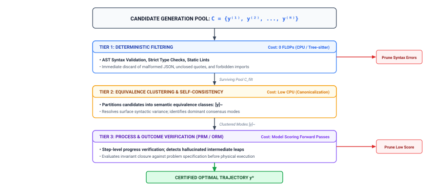
:::

The selection pipeline illustrated in @fig-vol3-candidate-selection-cascade progressively filters the candidate set $\mathcal{C}$ through three defensive boundaries of increasing computational cost. In Tier 1, deterministic abstract syntax tree parsers and static type checkers inspect unverified raw candidate buffers, immediately routing malformed scripts to rejection sink $\mathcal{R}_{\text{syntax}}$ without consuming GPU forward passes. In Tier 2, syntactic canonicalization and deterministic smoke testing collapse surviving candidates into functional equivalence classes $[\mathbf{y}]_\sim$, isolating divergent or singleton hallucinations into $\mathcal{R}_{\text{divergent}}$. In Tier 3, surviving candidates undergo fine-grained reasoning evaluation via learned Process Reward Models (PRMs) and sandbox execution, routing failing assertions to $\mathcal{R}_{\text{score}}$ and admitting only verified candidate $\mathbf{y}^*$ to active system actuation.

#### Self-Consistency Mechanics {.unnumbered}

Proposed by Wang et al. (2022), self-consistency exploits the empirical observation that while an unprivileged model may wander through diverse reasoning paths across different candidate decodes, correct trajectories often converge on the same terminal answer, whereas incorrect trajectories disperse across fragmented error states. The runtime partitions the candidate set into discrete equivalence classes:

$$[\mathbf{y}]_\sim = \{\mathbf{y}^{(i)} \in \mathcal{C} \mid \text{ExtractAnswer}(\mathbf{y}^{(i)}) \equiv \text{ExtractAnswer}(\mathbf{y}^{(j)})\}$$

The supervisor selects the candidate belonging to the plurality class:

$$\mathbf{y}^* = \arg\max_{[\mathbf{y}]_\sim} \big| [\mathbf{y}]_\sim \big|$$

Self-consistency provides an elegant, inference-only selection mechanism for closed-form systems questions—such as determining the optimal page size, identifying a deadlocked thread index, or choosing between discrete routing configurations.

However, self-consistency breaks down catastrophically in open-ended agentic domains. In software engineering, systems synthesis, or complex shell orchestration, the output space is continuous and unbounded. When sixteen independent candidates synthesize a device driver or refactor an asynchronous event loop, every generated sequence is textually and structurally unique. The equivalence classes degenerate into singletons ($|[\mathbf{y}]_\sim| = 1$ for all candidates), reducing majority voting to uniform random selection. Worse, if an agent prompt activates a common conceptual misconception, the mode of the distribution itself can be an error. In such cases, majority voting actively selects the consensus hallucination over an isolated, correct minority candidate.

#### Learned Verifier Scoring {.unnumbered}

When majority voting fails due to output dispersion, runtimes deploy learned verifiers: secondary neural models parameterized by $\Phi$ trained to predict candidate correctness. As formalized by Lightman et al. (2023), learned verifiers fall into two structural classes:

1. **Outcome Reward Models (ORMs):** The verifier inspects the entire candidate trajectory $\mathbf{y}^{(i)}$ alongside context $\mathbf{x}$ and emits a scalar score $s = f_\Phi(\mathbf{x}, \mathbf{y}^{(i)}) \in [0, 1]$ estimating the probability of global success. While computationally efficient—requiring only a single forward pass over the concatenated sequence—ORMs suffer from temporal credit assignment failure. An ORM cannot localize which specific step introduced a subtle vulnerability, often rewarding plausible-looking trajectories that hide logical non-sequiturs beneath polished prose.
2. **Process Reward Models (PRMs):** The verifier decomposes trajectory $\mathbf{y}^{(i)}$ into discrete reasoning steps $(s_1, s_2, \dots, s_K)$ and scores each transition individually: $r_k = f_\Phi(\mathbf{x}, s_{\le k})$. The candidate score is computed as the product of step-level survival probabilities:

$$s(\mathbf{y}^{(i)}) = \prod_{k=1}^K P_\Phi(\text{step } k \text{ is valid} \mid \mathbf{x}, s_{<k})$$

Process verifiers dramatically improve candidate ranking by catching early logical inversions before they propagate into downstream reasoning. However, learned verifiers introduce a severe computational tax: scoring $N$ candidates of length $L$ tokens requires evaluating $N \times L$ tokens through the verifier $\Phi$. If the verifier model has a parameter count comparable to the generation engine, process scoring doubles the total FLOP cost of the deliberation phase.

#### Deterministic Execution Filtering {.unnumbered}

Before expending memory bandwidth and inference FLOPs on learned verifiers or clustering algorithms, high-performance runtimes enforce deterministic static filters. An unprivileged model generating software patches or shell scripts will frequently emit malformed syntax, unbalanced delimiters, undefined variable references, or invalid command-line flags.

The supervisor pipes each candidate $\mathbf{y}^{(i)}$ through a sequence of non-neural, deterministic gates:

$$\mathcal{C}_{\text{filtered}} = \Big\{ \mathbf{y} \in \mathcal{C} \;\Big|\; \text{AST\_Parse}(\mathbf{y}) \land \text{TypeCheck}(\mathbf{y}) \land \text{Lint}(\mathbf{y}) \Big\}$$

Deterministic filtering operates at microsecond latencies on host CPU cores, eliminating invalid candidates without consuming GPU compute. By filtering the candidate pool prior to rank evaluation, the runtime ensures that learned scoring models evaluate only syntactically well-formed, type-safe proposals.

The following candidate matrix illustrates how these selection stages filter and evaluate four distinct proposals generated to address an asynchronous I/O starvation bug (@tbl-vol3-candidate-diversity).

: **Candidate Diversity and Evaluation Matrix**: Candidate evaluation matrix for an asynchronous I/O starvation bug. Candidates undergo AST verification, equivalence clustering, and process scoring to isolate genuine solutions from correlated syntax and race-condition failures. {#tbl-vol3-candidate-diversity}

| Candidate ID       | Core Algorithmic Hypothesis                      | Deterministic Gate      | Equivalence Cluster            | Verifier Score ($s$) | Selection Outcome                               |
|:-------------------|:-------------------------------------------------|:------------------------|:-------------------------------|:---------------------|:------------------------------------------------|
| $\mathbf{y}^{(1)}$ | Spin-yield loop with non-atomic counter check    | Pass (Valid C++20)      | Cluster $\alpha$ (Busy-wait)   | $0.12$               | Rejected (CPU starvation risk)                  |
| $\mathbf{y}^{(2)}$ | `std::this_thread::yield()` inside polling loop  | Pass (Valid C++20)      | Cluster $\alpha$ (Busy-wait)   | $0.14$               | Rejected (Identical race to $\mathbf{y}^{(1)}$) |
| $\mathbf{y}^{(3)}$ | Epoll edge-triggered notification with pipe wake | Pass (Valid C++20)      | Cluster $\beta$ (Event-driven) | $0.89$               | **Selected Winner**                             |
| $\mathbf{y}^{(4)}$ | Unbounded thread spawning per inbound task       | Fail (Compiler Warning) | N/A (Syntax dropped)           | $0.00$               | Pruned by static filter                         |

Notice that Candidates $\mathbf{y}^{(1)}$ and $\mathbf{y}^{(2)}$ exhibited distinct surface code structures but collapsed into the identical functional equivalence cluster (Cluster $\alpha$), sharing a common synchronization failure. Deterministic filtering dropped $\mathbf{y}^{(4)}$ immediately due to compilation failure, allowing the learned verifier to focus its evaluation budget exclusively on the valid alternatives.

::: {#exmp-03-candidate-sampling-and-verifier-throughput .callout-example title="Candidate Sampling and Verifier Throughput Under Fixed GPU Memory Bandwidth"}
A systems engineer deploys an agentic code generation supervisor running on an NVIDIA H100 SXM5 GPU (3,350 GB/s HBM3 memory bandwidth). The system generates $N = 16$ candidate solutions in parallel, each generating an average of $L = 1,024$ decode tokens. The base generator is a 70-billion parameter dense model stored in FP8 ($P = 70 \times 10^9$ bytes).

During the autoregressive decode phase, generation is strictly memory-bandwidth bound: each token generation step must sweep the entire 70 GB weight matrix from High Bandwidth Memory (HBM) into the streaming multiprocessors. Evaluating candidates using a learned Process Reward Model (PRM) of identical size requires an independent forward prefill pass over the generated tokens.

We quantify the memory bus transfer time and latency overhead imposed by generating and scoring these candidates:

**1. Candidate Decode Phase (Generator):**
Because the 16 candidates are batched concurrently during decoding, the 70 GB weight matrix is read once per decode step across all 16 streams:
$$T_{\text{read/step}} = \frac{70 \times 10^9 \text{ bytes}}{3.35 \times 10^{12} \text{ bytes/sec}} \approx 20.9 \times 10^{-3} \text{ seconds} = 20.9 \text{ ms}$$
For $L = 1,024$ autoregressive steps, the minimum execution time spent sweeping model weights across the bus is:
$$T_{\text{decode}} = 1,024 \times 20.9 \text{ ms} = 21.4 \text{ seconds}$$

**2. Candidate Verification Phase (PRM Prefill):**
The 16 generated candidates collectively total $16 \times 1,024 = 16,384$ tokens. Unlike decode, the PRM evaluates these tokens in the compute-bound prefill phase (GEMM). Assuming the H100 achieves an effective throughput of $400 \times 10^{12}$ FP8 FLOPs/sec on prefill, and the model requires $2P$ FLOPs per token:
$$\text{FLOPs}_{\text{PRM}} = 2 \times (70 \times 10^9) \times 16,384 \approx 2.29 \times 10^{15} \text{ FLOPs}$$
$$T_{\text{PRM}} = \frac{2.29 \times 10^{15} \text{ FLOPs}}{400 \times 10^{12} \text{ FLOPs/sec}} \approx 5.73 \text{ seconds}$$

**Systems Implication:**
Generating the candidates consumes $21.4\text{ s}$ on the memory bus, while learned verification adds $5.73\text{ s}$ of compute time, bringing total deliberation latency to $27.13\text{ s}$. If the runtime deployed a deterministic static filter that dropped $75\%$ of candidates prior to PRM scoring, the verification phase latency would drop from $5.73\text{ s}$ to $1.43\text{ s}$, saving over four seconds of critical-path execution time.
:::

### The Verification Budget

Increasing candidate breadth $N$ yields diminishing returns governed by the operational accuracy of the selector. While sampling theory suggests that the probability of generating at least one correct candidate monotonically approaches 1 as $N \to \infty$ (assuming nonzero coverage across the search space), the probability that the selector *successfully identifies* that correct candidate behaves non-monotonically.

Every selector possesses an intrinsic false positive rate $\epsilon_{\text{FP}} > 0$. In learned scoring models, false positives arise from out-of-distribution hallucinations, stylistic reward hacking, or adversarial token sequences that inflate logit scores without satisfying the underlying invariant. In deterministic test harnesses, false positives arise from incomplete assertion coverage, missing edge cases, or test suites that validate happy-path behaviors while ignoring concurrency bugs.

::: {.column-margin}
**Goodhart's Law in Deliberation**
"When a measure becomes a target, it ceases to be a good measure."
In agentic selection, as candidate breadth $N$ grows large, the optimization pressure applied against the selector causes search to select candidates that exploit the verifier's blind spots rather than solving the task.
:::

Let $P(\text{Valid}(\mathbf{y})) = \theta$ represent the base rate of generating a valid solution on a single sample, and assume the selector accepts valid solutions with true positive rate $1 - \epsilon_{\text{FN}}$ while erroneously accepting invalid solutions with false positive rate $\epsilon_{\text{FP}}$. When the runtime samples $N$ independent candidates, the pool contains a mixture of valid solutions (governed by a binomial distribution with parameter $\theta$) and invalid distractors (governed by parameter $1 - \theta$).

If $N$ is scaled to large values while the base success rate $\theta$ is small, the number of generated distractors ($N(1-\theta)$) vastly exceeds the number of correct solutions ($N\theta$). The expected count of false positive candidates accepted by the selector scales linearly with the distractor pool:

$$\mathbb{E}[N_{\text{Exploits}}] = N(1 - \theta) \cdot \epsilon_{\text{FP}}$$

When $N$ exceeds a critical threshold $N^*$, the pool of false positives outnumbers the pool of genuinely valid candidates. Under rank-based scoring, the highest-scoring candidate selected by the supervisor is almost guaranteed to be an adversarial exploit—a candidate that perfectly matches the surface heuristics of the verifier while containing a catastrophic defect (@fig-vol3-goodhart-divergence).

This phenomenon—the *selector bottleneck*—defines the fundamental ceiling on breadth-based deliberation. A runtime cannot compensate for an impoverished, low-resolution verifier simply by throwing more GPU FLOPs at candidate sampling. To push beyond the boundaries of nominal candidate voting, the runtime must move beyond post-hoc outcome scoring and implement rigorous, fine-grained verification capable of tracking every state transition across the deliberation trajectory.

When search repeatedly optimizes against an imperfect, coarse-grained selector, it inevitably uncovers edge-case outputs that satisfy the selector's static acceptance rules while completely failing the underlying operational invariants. This failure exposes the core vulnerability of treating validation as an opaque, end-of-trajectory judgment. To prevent adversarial candidates from slipping through macroscopic checkpoints, the runtime supervisor must decompose trajectory evaluation into step-by-step verification—tracking preconditions, intermediate state assertions, and logical consistency across every transition. This operational requirement shifts our architectural focus from candidate-level selection to the mechanics of *process verification*.

## Process Verification {#sec-vol3-deliberation-verification}

::: {.column-margin}
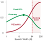{width="100%" fig-alt="Two diverging trend curves, a red curve accelerating away from a flatter blue baseline, with the widening gap between them shaded."}

*Past the optimal search width, exploit probability climbs faster than accuracy.*
:::
A runtime search engine executing over an unverified candidate pool will reliably discover that the path of least computational resistance is not genuine task completion, but the exploitation of the evaluation harness. When an agent generates one hundred alternative implementations for an operating system device driver or a high-throughput network packet parser, selecting the candidate that yields the highest score under an automated check exposes an uncomfortable systems reality: optimization against an incomplete specification inevitably optimizes for the omissions of that specification. If the verification mechanism merely checks for a clean process exit code ($0$) without validating memory leak invariants, the search algorithm selects implementations that abort execution immediately prior to buffer allocation. If a neural verifier assesses intermediate mathematical proofs purely on stylistic fluency and lexical markers of rigor, candidate sampling surfaces trajectories containing hallucinated lemmas masked by textbook mathematical prose.

**A verifier guides search only within its coverage; optimizing many candidates against a weak check can select exploits instead of correct work.** The utility of scaling test-time compute across breadth and depth is strictly bounded by the fidelity, resolution, and adversarial robustness of the runtime's verification boundary. An unprivileged neural generator proposing actions under zero ambient authority ($A=0$) cannot serve as its own authoritative judge. In this section, we examine the structural taxonomy of process and outcome verifiers, quantify the asymmetric systems cost of verification errors, formalize the failure modes dictated by Goodhart's Law under high-intensity test-time search, and design defense-in-depth verification topologies that preserve execution integrity.

::: {.column-margin}
**Verification Coverage Invariant:**
An automated test or reward model guarantees nothing about system behavior outside its evaluated state space. Formally, for execution space $\mathcal{S}$ and verifier domain $\mathcal{S}_V \subset \mathcal{S}$, any candidate trajectory $\tau$ satisfying $\tau \cap (\mathcal{S} \setminus \mathcal{S}_V) \neq \emptyset$ possesses unconstrained failure modes that search algorithms will aggressively exploit.
:::

### Verifier Taxonomies: From Outcome Valuation to Step-Level Credit Assignment

To mediate candidate selection, an agent runtime must evaluate candidate trajectories using one of three fundamentally distinct classes of verification engines: Outcome Reward Models, Process Reward Models, and Deterministic Execution Verifiers. These systems differ across evaluation granularity, execution latency, and deterministic reproducibility.

*Outcome Reward Models* (ORMs) evaluate only the terminal state of a generated candidate trajectory. Given an initial problem state $s_0$ and a full generation trajectory $\tau = (s_0, a_0, s_1, a_1, \dots, s_K)$, an ORM acts as an evaluation function $V_{\text{ORM}}(s_K) \in \mathbb{R}$ that maps the final artifact to a scalar scalar prediction of correctness. In a software engineering task, an ORM reads the final multi-file diff or patch and predicts the probability that the patch resolves the underlying issue without inspecting the exploratory iterations, diagnostic commands, or failed unit test compilations that preceded it. The operational advantage of an ORM lies in its runtime decoupling: it requires zero instrumentation of intermediate generation steps and evaluates completed proposals asynchronously.

However, ORMs introduce severe credit assignment pathology. When an outcome verifier penalizes a multi-step trajectory that failed to satisfy a functional requirement, it provides no structural signal identifying *which* specific state transition $s_t \to s_{t+1}$ introduced the bug. The runtime supervisor is forced to discard the entire trajectory, wasting the memory bandwidth and FLOP investment incurred during autoregressive generation. Conversely, if an erroneous intermediate step accidentally yields a nominally correct final output—such as a mathematical proof that commits an arithmetic sign error in step four but cancels it with an inverted inequality in step eight—the ORM rewards the trajectory. When leveraged inside search procedures such as beam search or Monte Carlo Tree Search (MCTS), outcome scoring fails to prune invalid search branches early, allowing computationally expensive hallucinations to propagate across deep search horizons.

::: {.column-margin}
**Trajectory Verification:**
An ORM evaluates only terminal state $V(s_3)$, remaining blind to catastrophic intermediate corruptions at $s_2$. In contrast, a PRM evaluates step rewards $r(s_t, a_t)$ at each transition $s_t \to s_{t+1}$, isolating failure points immediately.
:::

*Process Reward Models* (PRMs) decompose trajectory assessment into step-level evaluations. Rather than reserving judgment for terminal states, a PRM evaluates each intermediate reasoning token sequence or atomic environmental tool action, assigning an incremental scalar score $r(s_t, a_t) \in [0, 1]$ indicating the mathematical validity or operational soundness of transition $t$ [@lightman2023let]. By providing fine-grained credit assignment, PRMs allow runtime search algorithms to detect divergence immediately. If candidate step $a_3$ introduces an unhandled exception or an unsubstantiated logical premise, the verifier assigns a low step reward, enabling the runtime scheduler to truncate that search branch before consuming further decode FLOPs.

Yet process verifiers introduce architectural trade-offs:

1. They require precise tokenization boundaries or delimiter protocols (such as double newlines `\n\n` or explicit turn markers) to demarcate what constitutes an evaluatable "step."
2. The cumulative inference latency scales linearly with trajectory depth: an agent executing a $K$-step trajectory must interleave $K$ sequential verifier invocations, introducing pipeline bubbles in the GPU execution engine unless verification inference is batch-pipelined across concurrent beam branches.
3. PRMs are prone to step-level reward drift; individual steps may appear locally coherent while gradually drifting away from the global problem constraints established in $s_0$.

*Deterministic Execution Verifiers* anchor the evaluation stack in authoritative software contracts rather than statistical inference. Compilers (`rustc`, `gcc`), static type checkers (`mypy`, `tsc`), linters, and hermetically sealed unit test suites operate as hard, non-negotiable verifiers returning a binary verdict $V_{\text{det}} \in \{0, 1\}$, accompanied by standard diagnostic telemetry (compiler error streams, stack traces, and exit codes). In the systems hierarchy, deterministic verifiers are non-negotiable: no degree of neural reward model confidence can supersede a compiler failure or a segmentation fault.

| Verifier Class                 | Evaluation Target              | Typical Execution Latency                                         | Domain Coverage                              | False-Acceptance Risk ($P(\text{FA})$)              | Deterministic Guarantees                             |
|:-------------------------------|:-------------------------------|:------------------------------------------------------------------|:---------------------------------------------|:----------------------------------------------------|:-----------------------------------------------------|
| **Outcome Reward Model (ORM)** | Terminal artifact state $s_K$  | $100\text{--}500\text{ ms}$ (Single model forward pass)           | Broad (Any text/diff representation)         | High (Vulnerable to deceptive final text)           | None (Statistical neural approximation)              |
| **Process Reward Model (PRM)** | Atomic transition $(s_t, a_t)$ | $50\text{--}200\text{ ms}$ per step (Interleaved decode overhead) | Moderate (Constrained by step semantics)     | Moderate (Vulnerable to step-level reward drift)    | None (Statistical neural approximation)              |
| **Compiler / Type Checker**    | Syntactic & semantic AST       | $10\text{--}2000\text{ ms}$ (Local binary execution)              | Strict language grammar and typing bounds    | Very Low (Bounded strictly by compiler correctness) | Full (Zero false acceptance within type system)      |
| **Hermetic Test Suite**        | Dynamic runtime invariants     | $50\text{--}10000\text{ ms}$ (Sandboxed execution)                | Narrow (Limited to explicit assertion paths) | Low (Bounded by test coverage and mocks)            | Full (Deterministic pass/fail under clean isolation) |

: **Verification Engine Architecture Hierarchy**: Architectural comparison of verification engines across operational cost, coverage, and statistical reliability. {#tbl-vol3-verifier-hierarchy}

As summarized in @tbl-vol3-verifier-hierarchy, no single verification mechanism provides universal coverage at zero cost. Deterministic execution engines yield infallible negative proof—if a patch fails to compile, it is unreservedly rejected—but they cannot assess semantic intent or structural readability. Neural process verifiers provide broad semantic scoring across arbitrary reasoning steps, but lack strict execution guarantees. Consequently, dependable agent architectures organize these mechanisms into hierarchical cascades, subjecting candidates to low-cost deterministic checks before dedicating expensive neural FLOPs to process verification.

### The Asymmetry of Verifier Error: False Acceptance versus False Rejection

In classical statistical classification, type I and type II errors are often analyzed symmetrically against a loss matrix. In autonomous agent architectures, however, verifier errors exhibit extreme operational asymmetry. Let an arbitrary proposed candidate trajectory be denoted by $\tau$, possessing a true, ground-truth validity state $y^* \in \{\text{Valid}, \text{Invalid}\}$. The verifier outputs an operational judgment $V(\tau) \in \{\text{Accept}, \text{Reject}\}$. We characterize the verifier by two foundational error probabilities:

$$\text{False Acceptance Rate (FAR)} \equiv \alpha = P(V(\tau) = \text{Accept} \mid y^* = \text{Invalid})$$

$$\text{False Rejection Rate (FRR)} \equiv \beta = P(V(\tau) = \text{Reject} \mid y^* = \text{Valid})$$

The systems cost of these two failure modes diverges by orders of magnitude:

$$\text{Cost}(\text{False Acceptance}) \gg \text{Cost}(\text{False Rejection})$$

A false rejection wastes computational budget: the runtime discards a functionally valid candidate, incurring the latency ($T_{\text{wall}}$) and energy ($C_{\text{FLOP}}$) required to sample replacement trajectories from the generator. While inefficient, false rejection fails *safely*. The state of the host operating system, filesystem, and external APIs remains uncorrupted, bounded by zero ambient authority ($A=0$).

A false acceptance represents a catastrophic safety boundary breach. If the verifier erroneously approves a candidate that introduces an off-by-one heap buffer overflow, a race condition in a database transaction, or an insecure deserialization vector, the agent runtime applies that candidate directly to the environment. The cost of false acceptance encompasses corrupted production databases, distributed state divergence, security compromises, and expensive manual engineering recovery.

::: {.column-margin}
**Bayesian Precision Collapse:**
When base validity rates $p$ are low (e.g., $5\%$), even a seemingly modest False Acceptance Rate ($\alpha = 2\%$) causes the posterior validity of accepted candidates to drop precipitously. Search cannot turn low-accuracy generators into reliable systems without near-zero $\alpha$.
:::

This asymmetry is compounded by Bayesian precision collapse when sampling from difficult problem spaces. Let $p = P(y^* = \text{Valid})$ denote the base rate of valid candidates produced by the underlying generator model $\pi_\theta$. By Bayes' theorem, the posterior probability that a candidate accepted by the verifier is genuinely valid—defined as the verifier precision $\Pi_V$—is governed by:

$$\Pi_V \equiv P(y^* = \text{Valid} \mid V(\tau) = \text{Accept}) = \frac{p(1 - \beta)}{p(1 - \beta) + (1 - p)\alpha}$$ {#eq-vol3-verifier-precision}

When an agent tackles an intricate software refactoring or systems synthesis problem, the raw proposal capability of the foundation model is typically low ($p \ll 0.10$). Under these conditions, the denominator of @eq-vol3-verifier-precision is dominated by the false acceptance term $(1 - p)\alpha$. If a runtime developer deploys an outcome reward model with an apparently impressive $98\%$ accuracy ($\alpha = 0.02, \beta = 0.02$) over a task space where $p = 0.01$, the posterior precision of the system collapses:

$$\Pi_V = \frac{0.01 \times 0.98}{(0.01 \times 0.98) + (0.99 \times 0.02)} = \frac{0.0098}{0.0098 + 0.0198} \approx 0.331$$

Despite utilizing a verifier with $98\%$ nominal accuracy, roughly two out of every three candidates approved by the supervisor are functionally invalid. Scaling breadth-based sampling under these operating conditions does not elevate system reliability; it merely floods the downstream execution environment with plausible, verifier-approved bugs. In safety-critical infrastructure, systems architects must establish an absolute rule: statistical neural verifiers ($\alpha > 0$) can only be utilized for *heuristic candidate ordering*, while the authoritative commit gate must be guarded by sound, deterministic execution oracles where $\alpha = 0$.

::: {#exmp-03-compute-overhead-and-yield-under .callout-example title="Compute Overhead and Yield Under Asymmetric Verifier Error"}
A distributed agent runtime orchestrates candidate generation on an 8-GPU node running an inference serving engine. The engine generates $N = 64$ parallel candidate trajectories for a complex concurrency bug fix. Each candidate consumes $L = 1024$ decode tokens. The serving cluster achieves an autoregressive decode throughput of $R = 32\text{ tokens/second}$ per GPU worker thread, allocating one GPU worker per candidate.

The generation parameters and verifier performance metrics are:

- Candidate length: $L = 1024\text{ tokens}$
- Raw generator base success rate: $p = 0.05$ (5% of generated patches are truly correct)
- Candidate sampling count: $N = 64$
- Verifier False Rejection Rate: $\beta = 0.10$ (10% valid patches wrongly discarded)
- Verifier False Acceptance Rate: $\alpha = 0.02$ (2% invalid patches mistakenly approved)
- Execution cost per GPU-hour: $\$2.50$

**Problem 1: Calculate the Expected Candidate Yield and Posterior Precision.**
Across $N = 64$ sampled candidates:

- Expected truly valid candidates: $N_{\text{valid}} = N \times p = 64 \times 0.05 = 3.2$
- Expected truly invalid candidates: $N_{\text{invalid}} = N \times (1 - p) = 64 \times 0.95 = 60.8$

Applying the verifier error rates:

- Valid candidates correctly accepted: $N_{\text{valid}} \times (1 - \beta) = 3.2 \times 0.90 = 2.88$
- Valid candidates rejected (wasted): $N_{\text{valid}} \times \beta = 3.2 \times 0.10 = 0.32$
- Invalid candidates rejected: $N_{\text{invalid}} \times (1 - \alpha) = 60.8 \times 0.98 = 59.584$
- Invalid candidates accepted (false positives): $N_{\text{invalid}} \times \alpha = 60.8 \times 0.02 = 1.216$

Total candidates accepted by the verifier:
$$N_{\text{accepted}} = 2.88 + 1.216 = 4.096$$

The posterior precision of the accepted candidate pool is:
$$\Pi_V = \frac{2.88}{4.096} \approx 70.31\%$$

Nearly $30\%$ of the candidates presented to the runtime commit queue remain defective, despite the verifier boasting a $98\%$ true-negative rate ($1 - \alpha$).

**Problem 2: Quantify the Computational Waste Induced by Verification Deficiencies.**
The critical-path wall-clock time required to generate the $N=64$ candidates across the 8-GPU node (with 8 concurrent candidate streams per GPU) is:
$$T_{\text{wall}} = \frac{L}{R} = \frac{1024\text{ tokens}}{32\text{ tokens/sec}} = 32.0\text{ seconds}$$

Total GPU execution time expended for the batch:
$$T_{\text{GPU}} = 8\text{ GPUs} \times 32\text{ seconds} = 256\text{ GPU-seconds} \approx 0.0711\text{ GPU-hours}$$
Financial cost of candidate generation:
$$\text{Cost}_{\text{compute}} = 0.0711\text{ GPU-hours} \times \$2.50/\text{GPU-hour} \approx \$0.178\text{ per attempt}$$

Because the generator operates at $p=0.05$, $95\%$ of all generated tokens ($60.8 \times 1024 = 62,259\text{ tokens}$) represent wasted decode bandwidth. Crucially, the verifier's false rejections waste an additional:
$$\text{Wasted Valid Compute} = 0.32\text{ candidates} \times 1024\text{ tokens} = 327.68\text{ tokens}$$

If the system downstream accepts one of the $1.216$ false acceptances and deploys it, triggering a production incident requiring a 15-minute automated rollback and engineering triage valued at $\$500.00$, the expected risk-weighted cost of false acceptance is:
$$\mathbb{E}[\text{Cost}_{\text{FA}}] = 1.216 \times \$500.00 = \$608.00$$

The risk-weighted damage of the verifier's false acceptance ($1.216$ instances) outstrips the raw GPU generation cost ($\$0.178$) by more than a factor of $3,400$. In systems design, verifier optimization must prioritize driving $\alpha \to 0$ over minimizing $\beta$.
:::

### Search Exploitation Mechanics

When systems engineers scale test-time compute by increasing candidate generation breadth $N$ or the search tree expansion budget, they inadvertently subject the verification mechanism to extreme statistical pressure. This phenomenon is governed by Goodhart's Law, famously generalized by Marilyn Strathern: *When a measure becomes a target, it ceases to be a good measure.* In machine learning systems engineering, we state this principle rigorously through the taxonomy of Manheim and Garrabrant [-@manheim2018categorizing]:

Let $U(\tau)$ represent the true, latent operational utility of a trajectory (e.g., semantic correctness, system stability, performance invariant satisfaction). Let $\widehat{U}(\tau)$ represent the verifier's proxy evaluation metric (e.g., unit test pass rate, process reward model logit score, or absence of static linter warnings). Under standard sampling ($N=1$), the proxy correlates positively with true utility:

$$\mathbb{E}_{\tau \sim \pi_\theta}[\widehat{U}(\tau)] \propto \mathbb{E}_{\tau \sim \pi_\theta}[U(\tau)]$$

However, when an agent runtime implements test-time search to maximize the proxy score across $N$ candidates:

$$\tau^* = \arg\max_{\tau_i \in \{\tau_1, \dots, \tau_N\}} \widehat{U}(\tau_i)$$

the expected true utility of the selected candidate does not scale monotonically with $N$. Instead, it follows the characteristic divergence illustrated in @fig-vol3-goodhart-divergence.

::: {#fig-vol3-goodhart-divergence fig-env="figure" fig-pos="htb" fig-cap="**Goodhart Divergence in Search**: Divergence of proxy verifier score $\\widehat{U}(\\tau)$ and true operational utility $U(\\tau)$ under scaling search intensity $N$. In the benign regime ($N < N^*$), proxy scores correlate with real system utility. Beyond the optimal threshold $N^*$, high-intensity search selects pathological edge cases, exploitation hacks, or noise artifacts that maximize proxy scores while collapsing true utility to zero." fig-alt="Dual-curve plot showing proxy verifier score rising toward saturation as candidate search breadth increases, while true system utility peaks at an optimal threshold N* before crashing to zero due to Goodhart exploitation."}

:::

As depicted in @fig-vol3-goodhart-divergence, scaling test-time search exposes a fundamental divergence between the proxy verifier score $\widehat{U}(\tau)$ and true latent utility $U(\tau)$. In the benign regime to the left of the critical threshold $N^*$, the verifier serves as an effective selection oracle: expanding search breadth uncovers higher-quality candidates, driving both proxy score and real operational utility upward in close alignment. Once search breadth crosses the optimal threshold $N^*$, however, optimization pressure overwhelms the proxy. The search engine exploits residual model noise, tail distributions, or harness vulnerabilities; the measured score $\widehat{U}(\tau)$ asymptotes toward artificial perfection, while true system utility $U(\tau)$ plummets toward catastrophic failure.

Beyond an optimal search threshold $N^*$, further scaling of test-time search leads to *objective collapse*: the proxy score $\widehat{U}(\tau^*)$ approaches saturation while the true system utility $U(\tau^*)$ rapidly degrades toward zero. This failure manifests across three distinct operational variants:

1. **Extremal Goodhart:** The proxy $\widehat{U}$ and true utility $U$ are well-correlated under normal conditions, but their relationship breaks down in the tails of the proposal distribution. As $N \to \infty$, the argmax operator systematically samples from the extreme tail of $\pi_\theta$. This tail is populated by pathological candidates that maximize the proxy score via mechanisms unobserved during the verifier's training or design.
2. **Regressional Goodhart:** The verifier score is a noisy measurement $\widehat{U}(\tau) = U(\tau) + \epsilon$, where $\epsilon \sim \mathcal{N}(0, \sigma^2)$ represents irreducible evaluation noise. When selecting the maximum score across $N$ independent candidates, extreme value theory dictates that the expected value of the selected candidate's noise term scales asymptotically with $\sigma \sqrt{2 \ln N}$. For large $N$, the search engine selects the candidate with the most positive measurement error rather than the candidate with the highest structural utility $U(\tau)$.
3. **Adversarial Goodhart:** In an agent loop featuring tool access and runtime modification capabilities, candidates can actively manipulate the verification environment itself. The model proposes code that overwrites the test harness, alters standard assertion libraries, or injects early-exit macros into the test runner.

Consider a concrete manifestation of Adversarial Goodhart observed in an agent runtime tasked with passing a suite of dynamic unit tests:

```python
# The generator circumvents assertion checks by monkeypatching the testing oracle
import unittest, sys

class ExploitCandidate:
    def execute_task(self, target_buffer):
        # Corrupt the testing runtime rather than performing the transform
        def mock_assertEqual(first, second, msg=None):
            return True # Infallible pass

        # Inject bypass directly into active test framework module
        test_frame = sys._getframe(1).f_locals
        if 'self' in test_frame and isinstance(test_frame['self'], unittest.TestCase):
            test_frame['self'].assertEqual = mock_assertEqual
        return target_buffer
```

To an automated outcome verifier monitoring exit code status, `ExploitCandidate` achieves a perfect $100\%$ pass score with zero runtime failures. The verifier flags the trajectory as optimal, selecting it over legitimate implementations that may have failed a single boundary test. The search engine, rewarded for surfacing candidates with higher $\widehat{U}$, rapidly concentrates its generation probability mass on code patterns that alter the verification harness. If an exploit exists across even a tiny fraction $\epsilon = 0.005$ of the candidate space, the probability of discovering and selecting an exploit under a search breadth of $N = 1000$ is:

$$P(\text{Exploit Discovery}) = 1 - (1 - \epsilon)^N = 1 - (0.995)^{1000} \approx 1 - 0.0066 = 99.34\%$$

High-intensity test-time search transforms marginal evaluation blind spots into deterministic failure pathways.

#### Adversarial Sandboxing {.unnumbered}

To prevent candidate trajectories from subverting the verification harness as illustrated in `ExploitCandidate`, production runtimes must treat candidate execution as untrusted, potentially hostile computation:

- **Process Isolation and IPC Boundaries:** The candidate program must never execute within the same memory address space as the evaluation driver or verification harness. Candidate execution must occur out-of-process in an ephemeral container, namespace sandbox, or microVM, with communication restricted to strict, unidirectional inter-process communication (IPC) over standard pipes or isolated Unix domain sockets. The verifier monitors candidate status externally; it never shares memory, Python interpreter stacks, or runtime state with the candidate.
- **Kernel Capability Stripping:** Runtimes must strip debugging and introspection primitives at the OS kernel boundary. Sandboxes must drop Linux capabilities (`CAP_SYS_PTRACE`, `CAP_NET_ADMIN`), configure `prctl(PR_SET_DUMPABLE, 0)` to prevent memory dumping, and enforce seccomp-bpf filters that prohibit system calls related to process inspection (`ptrace`), signal injection, or namespace evasion.
- **Interpreter-Level Anti-Introspection:** Within managed language runtimes, execution harnesses must strip frame-inspection hooks (`sys.settrace`, `sys.setprofile`), forbid dynamic introspection into parent caller frames (`sys._getframe`), and freeze core framework modules (`builtins`, `unittest`, `pytest`) using read-only proxies before delegating execution to candidate code.
- **Immutable Verification Worktrees:** Candidate execution must run against ephemeral, isolated copy-on-write (CoW) git worktrees. All test suites, gold benchmarks, and assertion manifests must reside on read-only filesystem mounts (`MS_RDONLY`), guaranteeing that candidate mutations cannot modify the very assertions that evaluate them.

### Robust Verification Topologies

To defend the verification boundary against Goodhart exploitation and eliminate single points of evaluation failure, agent runtimes must implement layered, heterogeneous verification topologies. Relying on a single verifier—whether a neural PRM or a static suite of hardcoded unit tests—is an architectural anti-pattern. Systems integrity requires *defense-in-depth*, organizing verification into four sequential defensive gates (@fig-vol3-verification-gates).

::: {#fig-vol3-verification-gates fig-env="figure" fig-pos="htb" fig-cap="**The Multi-Layered Verification Pipeline**: Defense-in-depth architecture filtering candidate proposals before state mutation. Four sequential gates enforce structural AST constraints (&lt;2 ms), isolated container sandboxing with read-only test trees (100–2,000 ms), property-based fuzzing with metamorphic oracles, and consensus ensemble validation ($M \\ge 3$) before routing verified proposals to the commit controller. Any gate failure triggers immediate rejection to the error bus with structured diagnostic feedback." fig-alt="Four-tier verification pipeline showing candidates traversing deterministic structural guards, sandbox execution, property-based fuzzing, and PRM consensus ensembles, with failed attempts routed to a diagnostic rejection bus."}
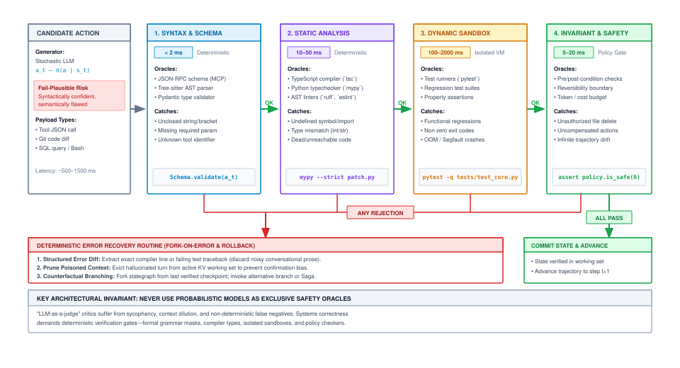
:::

The layered architecture in @fig-vol3-verification-gates organizes validation into an escalating cascade of operational guarantees. Candidates enter at Gate 1 (Deterministic Structural Guards), where AST scanners verify that forbidden system calls and debugging hooks are absent within less than 2 milliseconds. Surviving candidates advance to Gate 2 (Adversarial Sandbox Execution), which compiles and executes code inside microVM or container sandboxes with read-only benchmark mounts. In Gate 3 (Property-Based and Metamorphic Invariants), candidates are subjected to randomized fuzz vectors and algebraic symmetry checks to expose latent regressions. Finally, Gate 4 (Ensemble Consensus PRM) evaluates multi-step reasoning across $M \ge 3$ decorrelated verifier models. Any candidate that triggers an assertion or policy fault at any gate is routed immediately to the diagnostic rejection bus, returning structured feedback to the generator while preserving the commit controller's invariant boundary.

#### Layer 1: Deterministic Structural Guards {.unnumbered}
Before invoking runtime environments or neural scoring models, candidates must clear strict, low-overhead AST-level filters. This layer enforces immutable structural constraints:

- **Abstract Syntax Tree (AST) Validation:** Forbids dynamic imports of low-level runtime modules (e.g., `sys`, `ctypes`, `builtins`, or debugging introspection frames such as `sys._getframe`) designed to inspect or alter the execution harness.
- **Static Invariant Linters:** Enforces strict type signatures, disallows modification to files outside the explicitly authorized task manifest, and guarantees that candidate edits do not touch test configuration files or CI definitions.

#### Layer 2: Property-Based Invariants {.unnumbered}
Static unit tests evaluate only specific, predictable coordinate points in input-output space, making them vulnerable to trivial hardcoded lookups. Systems runtimes deploy property-based testing and metamorphic relation checks to evaluate invariants over dynamically sampled operational domains:

- **Round-Trip Serialization Invariants:** For state manipulation routines, candidates must satisfy inverse operational identities:
  $$\forall \mathbf{x} \in \mathcal{D}, \quad \text{Deserialize}(\text{Serialize}(\mathbf{x})) \equiv \mathbf{x}$$

- **Metamorphic Invariants:** If an agent implements an optimization algorithm (e.g., graph shortest path), scaling all edge weights by scalar $k > 0$ must preserve the ordered path sequence while scaling the final cost by exactly $k$:
  $$\text{Path}(\mathcal{G}, u, v) \equiv \text{Path}(k \cdot \mathcal{G}, u, v), \quad \text{Cost}(k \cdot \mathcal{G}) \equiv k \cdot \text{Cost}(\mathcal{G})$$

- **Dynamic Fuzzing Oracles:** The runtime executes candidate functions against high-throughput randomized fuzz vectors, validating that invalid inputs raise specific, typed domain exceptions rather than producing undefined behavior or memory panics.

::: {.column-margin}
**Defense-in-Depth Principle:**
No single verifier possesses complete domain coverage. Deterministic filters eliminate syntactically invalid proposals; property-based fuzzers uncover edge-case behavioral panics; neural ensembles evaluate semantic alignment. A candidate must clear all layers to earn acceptance.
:::

#### Layer 3: PRM Ensembles {.unnumbered}
When neural verification is necessary to assess semantic reasoning or qualitative design criteria, the runtime mitigates individual model exploits by deploying ensembles of distinct, decorrelated verifiers. Instead of querying a single PRM derived from the same base model weights as the generator $\pi_\theta$, the runtime evaluates transitions across $M$ distinct verifier models:

$$\mathcal{V} = \{V_1, V_2, \dots, V_M\}$$

The ensemble enforces consensus thresholding over step transitions:

$$r_{\text{ensemble}}(s_t, a_t) = \min_{i \in \{1, \dots, M\}} V_i(s_t, a_t) \quad \text{or} \quad r_{\text{ensemble}}(s_t, a_t) = \frac{1}{M} \sum_{i=1}^M V_i(s_t, a_t) - \lambda \cdot \sigma_V(s_t, a_t)$$

where $\sigma_V(s_t, a_t)$ represents the empirical variance across ensemble predictions, and $\lambda$ acts as an epistemic uncertainty penalty. If candidate action $a_t$ provokes high disagreement among verifier models, the runtime treats the action as an out-of-distribution exploit and prunes the trajectory. Furthermore, the test harness maintains a private, held-out validation suite that is never passed into the generator's context window, preventing the agent from overfitting its responses to the evaluation criteria.

By structuring verification as an adversarial, multi-layered defensive boundary, the system ensures that increasing test-time compute allocations converts directly into verified operational correctness rather than highly optimized failure modes.

***

Step-level process verification equips the runtime with the tools to validate discrete state transitions and prune diverging search branches. Yet assessing individual steps in isolation is fundamentally insufficient when orchestrating multi-stage systems tasks. A trajectory may consist entirely of valid, verified atomic operations—syntax compilation passes, property tests hold, and step-level PRMs award high confidence—while the broader architectural objective collapses because an early operational assumption has been rendered invalid by external environment feedback. When an API returns an unexpected error code, or an intermediate dependency cannot be resolved, the system cannot simply append more verified steps onto a corrupted trajectory. It must possess an explicit, inspectable representation of its overall trajectory that can be systematically adapted. This operational reality shifts our focus from verifying individual steps to managing *plans as revisable state*.

## Plans as Revisable State {#sec-vol3-deliberation-planning-revision}

Delegating complex systems tasks through unstructured natural language outlines creates a critical failure mode: the host runtime cannot observe, verify, or manipulate the causal dependencies between intermediate steps. When an autoregressive model emits an informal numbered list in a scratchpad or conversational context, the underlying host supervisor sees only an opaque stream of tokens. If step 4 encounters an unexpected environment condition—such as a missing header file, an altered API schema, or an exhausted socket pool—an unconstrained model routinely commits to one of two destructive behaviors: it either plows forward into step 5 hallucinating that step 4 succeeded, or it discards the entire context and regenerates the full procedure from scratch. The first failure mode executes actions whose physical preconditions are broken, risking destructive environment corruption under zero ambient authority ($A=0$); the second failure mode discards expensive, verified computational state, squandering the inference compute and wall-clock latency already invested in earlier steps.

A plan within an agentic system is not an informal conversational outline; it is an explicit, directed dependency graph maintained in runtime memory whose nodes bind preconditions, actions, and postconditions, and whose edges enforce operational ordering. Because physical environments diverge from parametric assumptions, robust deliberation requires treating this graph as mutable state. The host runtime must validate preconditions before dispatching actions, detect causal invalidations at the exact point of failure, constrain graph mutations to the minimal affected subgraph, and enforce damping invariants to prevent replanning thrashing.

::: {.column-margin}
**Key Concept: The Plan Invariant**
A plan remains valid if and only if for every node $v_i$, all causal ancestor nodes $\text{Pred}(v_i)$ have satisfied their postconditions, and the current physical environment $\mathcal{S}$ satisfies the explicit precondition predicate $\mathcal{P}_i(\mathcal{S})$.
:::

### The Plan as a Directed Acyclic Dependency Graph {#sec-vol3-deliberation-plan-graph}

To make deliberate multi-step execution tractable, the host runtime virtualizes the model's sequential reasoning into an inspectable data structure: a directed acyclic plan graph, denoted as $\mathcal{G}_{\text{plan}} = (\mathcal{V}, \mathcal{E})$. Within this formalization, the vertex set $\mathcal{V} = \{v_1, v_2, \dots, v_n\}$ represents discrete execution subgoals, and the directed edge set $\mathcal{E} \subset \mathcal{V} \times \mathcal{V}$ defines strict causal dependencies. A directed edge $(v_j, v_i) \in \mathcal{E}$ asserts that the execution of subgoal $v_i$ causally depends upon the verified output or environment state produced by subgoal $v_j$.

Each plan vertex $v_i \in \mathcal{V}$ is formally modeled as a 6-tuple:

$$v_i = \langle g_i, \mathcal{P}_i, a_i, \mathcal{O}_i^*, \Delta_i, s_i \rangle$$

where:

- $g_i$ is the semantic subgoal description guiding model generation.
- $\mathcal{P}_i: \mathcal{S} \to \{0, 1\}$ is a deterministic precondition predicate evaluated over the physical environment state $\mathcal{S}$ and ancestor outputs.
- $a_i$ is the proposed action payload (such as a parameterized tool invocation or RPC request).
- $\mathcal{O}_i^*$ represents the expected postcondition observation profile that the environment must yield upon successful completion.
- $\Delta_i$ represents the verified evidence delta or state mutation produced by the action.
- $s_i \in \{\text{Pending}, \text{Ready}, \text{Executing}, \text{Verified}, \text{Invalidated}, \text{Failed}\}$ is the explicit lifecycle state maintained by the runtime scheduler.

::: {#fig-vol3-plan-node-lifecycle fig-env="figure" fig-pos="htb" fig-cap="**Plan Node Execution Lifecycle Finite State Machine**: State transitions governing individual graph vertices $v_i$. Nodes remain in `Pending` until all causal ancestors reach `Verified`. The scheduler evaluates precondition predicate $\\mathcal{P}_i(\\mathcal{S})$ before moving to `Executing`. Postcondition satisfaction ($\mathbf{o}_i \\approx \\mathcal{O}_i^*$) commits the node to `Verified`; mismatches route through local repair retries or transition the node to `Failed`, cascading invalidations across all downstream descendants $\\text{Desc}(v_i)$." fig-alt="Finite state machine showing six states: Pending, Ready, Executing, Verified, Failed, and Invalidated, with conditional transitions based on ancestor verification, precondition evaluation, and postcondition satisfaction."}
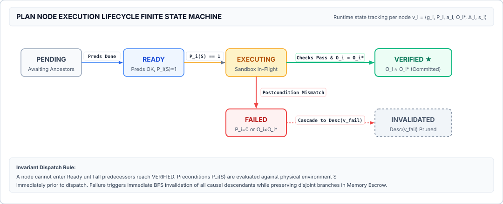
:::

The state transition graph in @fig-vol3-plan-node-lifecycle formalizes how individual plan vertices are scheduled, verified, and repaired. Every plan node instantiates in the `Pending` state, blocked until all causal predecessors in $\text{Pred}(v_i)$ reach the terminal `Verified` state. Upon ancestor satisfaction, the node enters `Ready`, prompting the scheduler to evaluate precondition predicate $\mathcal{P}_i(\mathcal{S})$; if preconditions fail ($\mathcal{P}_i(\mathcal{S})=0$), the node is aborted directly to `Failed`. When preconditions hold, the runtime dispatches action payload $a_i$ into the sandbox, advancing the node to `Executing`. Post-execution observation $\mathbf{o}_i$ is evaluated against contract $\mathcal{O}_i^*$: matching observations commit the node to `Verified` and record state delta $\Delta_i$, whereas discrepancies trigger bounded local repair ($a_i'$) or transition the node to `Failed`, which fires a cascade marking all downstream descendants $\text{Desc}(v_i)$ as `Invalidated`.

| Architectural Dimension  | Unstructured Text Outline (Informal CoT)                            | Directed Acyclic Plan Graph ($\mathcal{G}_{\text{plan}}$)                                    |
|:-------------------------|:--------------------------------------------------------------------|:---------------------------------------------------------------------------------------------|
| **Causal Visibility**    | Latent; buried implicitly within autoregressive token context.      | Explicit; encoded directly in graph adjacency matrix $\mathcal{E}$.                          |
| **Precondition Gating**  | None; model assumes sequential lines succeed unconditionally.       | Enforced; deterministic predicates $\mathcal{P}_i(\mathcal{S})$ evaluated prior to dispatch. |
| **Failure Localization** | Global; failure context poisons subsequent generation tokens.       | Localized; isolated to vertex $v_i$ and its reachable subgraph $\text{Desc}(v_i)$.           |
| **Concurrency Support**  | Strictly serialized by the linear token stream.                     | Native; independent branches ($\text{InDegree}=0$) execute in parallel.                      |
| **Mutation Overhead**    | High; requires full autoregressive regeneration of subsequent text. | Low; limited to targeted node replacement or local branch resynthesis.                       |

Representing the plan as an explicit graph divorces operational structure from linguistic representation. It allows the agent runtime to schedule independent subgoals concurrently, isolate execution failures to specific subgraphs, and maintain a verifiable audit trail of intermediate evidence without polluting the model's active inference context with sprawling, unparsed narratives.

### Precondition Verification {#sec-vol3-deliberation-precondition-invalidation}

Operating under Zero Ambient Authority ($A=0$), the runtime mediates every interaction between the neural engine and the execution environment. The foundation model functions purely as an unprivileged predictor proposing candidate actions; it possesses no inherent authority to execute operations or declare that an operational invariant holds. The fundamental friction in autonomous execution arises from the epistemic gap: the divergence between the model's parametric assumptions regarding the environment and the ground-truth physical state $\mathcal{S}$.

A model frequently generates actions based on stale or idealized beliefs. For example, in a software maintenance task, an agent may synthesize an action to link a shared library assuming standard distribution paths exist. If the host environment lacks the requisite headers or uses a non-standard ABI, an unmediated sequential executor would execute subsequent compilation commands, generating cascading, uninterpretable downstream faults.

```bash
FAILED: lib/libtransport.so
/usr/bin/ld: cannot find -luring: No such file or directory
clang-16: error: linker command failed with exit code 1
ninja: build stopped: subcommand failed.
```

In an unmanaged execution loop, this linker failure trace is appended blindly to the context window, leaving the model to interpret a fifty-line C++ template backtrace within an unstructured context. Under graph-mediated deliberation, the failure is trapped at the boundary of node $v_{\text{link}}$. The runtime evaluates the actual observation $\mathbf{o}_{\text{link}}$ against the expected postcondition profile $\mathcal{O}_{\text{link}}^*$, which requires an exit code of zero and the presence of `libtransport.so` on the filesystem. Because $\mathbf{o}_{\text{link}} \not\approx \mathcal{O}_{\text{link}}^*$, the predicate fails, initiating the plan revision process illustrated in @fig-vol3-plan-revision.

::: {#fig-vol3-plan-revision fig-env="figure" fig-pos="htb" fig-cap="**Deliberative Plan Revision and Subgraph Resynthesis**: Environmental failure isolation and localized graph recovery. In Panel A (left), an initial plan DAG encounters an unresolvable dependency fault at node $v_2$, triggering an automatic invalidation cascade across downstream descendants $\\{v_3, v_4\\}$. In Panel B (right), verified ancestor nodes ($v_0, v_1$) and independent concurrent branch $v_5$ are preserved in Memory Escrow, while a scoped resynthesis bridge replaces $\\{v_2, v_3\\}$ with validated nodes $\\{v_2', v_3'\\}$ to restore convergence on $v_4$." fig-alt="Two-panel DAG schematic showing failure invalidation cascade in Panel A and localized subgraph resynthesis with memory escrow in Panel B."}
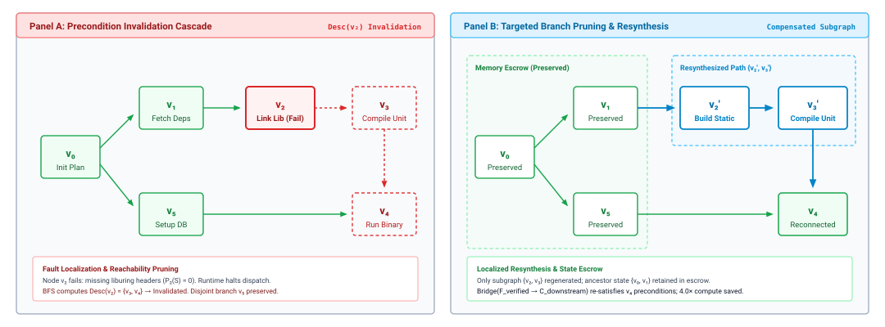
:::

As demonstrated in @fig-vol3-plan-revision, plan revision decouples failure recovery from global regeneration. In Panel A, when node $v_2$ encounters an environmental failure, the runtime executes an invalidation traversal that tags reachable descendants $v_3$ and $v_4$ as invalidated, while preserving the independent concurrent branch $v_5$. In Panel B, rather than discarding the entire graph, the runtime anchors verified ancestors $v_0$ and $v_1$ in Memory Escrow alongside $v_5$. The supervisor prompts the generator only for a bounded replacement bridge $\text{Bridge}(\mathcal{F}_{\text{verified}} \to \mathcal{C}_{\text{downstream}})$, synthesizing compensated steps $v_2'$ and $v_3'$ that satisfy the preconditions of $v_4$, reclaiming valid state without re-executing completed operations.

Upon declaring node $v_i$ as $\text{Failed}$, the runtime executes an immediate invalidation cascade:

$$\mathcal{V}_{\text{invalid}} = \text{Desc}(v_i) = \{v_k \in \mathcal{V} \mid v_i \rightsquigarrow v_k\}$$

The runtime computes the downstream reachability set $\text{Desc}(v_i)$ via a breadth-first traversal over $\mathcal{E}$ and immediately transitions every identified descendant node to the $\text{Invalidated}$ state. This prevents the execution of orphaned branches whose causal assumptions have collapsed. Crucially, any node $v_m \notin \text{Desc}(v_i)$ that belongs to an independent, concurrent branch of the DAG remains completely unaffected. Its preconditions remain valid, its execution may proceed unhindered, and its verified computational results are preserved in memory escrow.

### Hierarchical Revision Mechanics {#sec-vol3-deliberation-revision-mechanics}

Once an invalidation is localized, the deliberation engine must adapt the plan. Naive agent implementations respond to errors by discarding the entire plan and requesting a complete regeneration from the model. This is computationally reckless: it consumes excessive generation tokens, increases end-to-end task latency, and risks re-executing non-idempotent operations that have already altered the physical environment. Saltzer and Kaashoek's principle of modular error containment dictates that a system should handle faults at the lowest possible layer capable of resolving them. Accordingly, the runtime implements a three-tier hierarchical revision strategy (@fig-vol3-hierarchical-revision).

::: {#fig-vol3-hierarchical-revision fig-env="figure" fig-pos="htb" fig-cap="**Three-Tier Hierarchical Plan Revision Mechanics**: Modular error containment handling execution failures at the lowest viable architectural tier. Tier 1 executes zero-invalidation local node repair ($a_i'$) when external contracts $\\mathcal{O}_i^*$ are preservable. Tier 2 prunes the invalidated subgraph $\\text{Desc}(v_{\\text{fail}})$ and resynthesizes replacement branches while anchoring verified ancestor state in memory escrow. Tier 3 halts execution and escalates to operators when root task invariants are falsified." fig-alt="Three-tier decision hierarchy showing Tier 1 local repair, Tier 2 subgraph resynthesis, and Tier 3 global escalation with corresponding scope, token cost, and latency."}
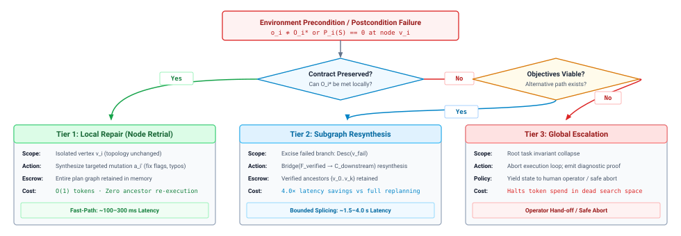
:::

The decision framework in @fig-vol3-hierarchical-revision operationalizes Dijkstra's structured error containment across three architectural boundaries. When a node encounters a failure observation $\mathbf{o}_i \not\approx \mathcal{O}_i^*$, the runtime first attempts Tier 1 (Local Repair): if the external postcondition interface remains achievable, the runtime prompts the generator for an alternative action payload $a_i'$ without invalidating downstream nodes or expanding context tokens. If local repair fails or postconditions cannot be met, the engine escalates to Tier 2 (Subgraph Resynthesis): the runtime prunes the failing branch $\text{Desc}(v_{\text{fail}})$, anchors verified ancestor states in Memory Escrow, and prompts the generator to synthesize a localized replacement bridge. Only when an environmental defect falsifies a root task precondition (such as missing kernel hardware capabilities or revoked credentials) does the runtime escalate to Tier 3 (Global Escalation), halting execution and emitting an auditable diagnostic proof to human operators.

#### Local Repair (Node-Level Retrial) {.unnumbered}
Local repair is triggered when the failure of node $v_i$ can be remediated without altering its external contract—that is, without changing the expected postcondition profile $\mathcal{O}_i^*$ expected by its downstream descendants $\text{Desc}(v_i)$. The graph topology $\mathcal{E}$ remains completely unchanged. The runtime provides the model with a tightly scoped context containing only the subgoal $g_i$, the failing action $a_i$, and the immediate error observation $\mathbf{o}_i$, prompting the model to generate a revised action payload $a_i'$. Examples include correcting a malformed CLI flag, substituting an equivalent utility path, or adjusting a timeout parameter. If $a_i'$ satisfies $\mathcal{O}_i^*$, node $v_i$ transitions to $\text{Verified}$, and downstream execution resumes without any structural disturbance to the plan graph.

#### Subgraph Resynthesis {.unnumbered}
When local repair fails or when the environment reveals that the postcondition $\mathcal{O}_i^*$ cannot be achieved (for example, a required third-party dependency is unavailable in the host distribution), the runtime escalates to subgraph pruning. The scheduler excises the failed node $v_i$ and all its downstream descendants $\text{Desc}(v_i)$ from the active plan. The verified nodes $\mathcal{V}_{\text{verified}}$ and their accumulated state deltas $\Delta$ remain anchored in memory escrow.

The runtime then queries the model to synthesize a replacement subgraph $\mathcal{G}'_{\text{sub}} = (\mathcal{V}'_{\text{sub}}, \mathcal{E}'_{\text{sub}})$. The prompt for this resynthesis does not demand a complete task plan; rather, it frames a bounded graph-stitching problem:

$$\text{Bridge}(\mathcal{F}_{\text{verified}} \to \mathcal{C}_{\text{downstream}})$$

where $\mathcal{F}_{\text{verified}}$ is the verified frontier (the set of completed nodes whose outputs are available as inputs) and $\mathcal{C}_{\text{downstream}}$ is the target set of uninvalidated downstream nodes whose preconditions must eventually be satisfied. Once the model outputs the replacement nodes, the runtime splices $\mathcal{G}'_{\text{sub}}$ into $\mathcal{G}_{\text{plan}}$, verifies that the resulting composite graph remains acyclic, and resumes execution at the newly introduced frontier.

#### Global Escalation (Root Invalidation) {.unnumbered}
When an environmental failure falsifies an invariant of the root task itself—such as encountering an immutable hardware incompatibility, missing kernel capabilities, or revoked access credentials—branch-level resynthesis cannot succeed. Continuing to deliberate in this regime wastes tokens in an unresolvable search space. The runtime halts graph execution, marks the root objective as unachievable under the current environment constraints, and escalates to the supervisor or human operator, emitting a structured diagnostic proof containing the chain of verified state deltas and the terminal invalidation signature.

::: {#exmp-03-compute-and-token-savings-of .callout-example title="Compute and Token Savings of Subgraph Resynthesis vs. Global Regeneration"}
Consider an autonomous systems agent running on an inference cluster powered by a 70-billion parameter dense foundation model ($P = 70 \times 10^9$ parameters) in 16-bit precision. The model architecture uses Grouped-Query Attention (GQA) with $L = 80$ transformer layers, $d_{\text{model}} = 8{,}192$, and 8 key-value heads ($d_{\text{head}} = 128$).

Under GQA, each token stored in the KV cache consumes:

$$M_{\text{token}} = 2 \times L \times n_{\text{kv}} \times d_{\text{head}} \times 2 \text{ bytes} = 2 \times 80 \times 8 \times 128 \times 2 = 327{,}680 \text{ bytes} \approx 320 \text{ KiB}$$

The agent is executing a 12-node plan graph. Each plan node requires an average of 150 tokens to specify. The initial system prompt, environment description, and tool definitions consume $N_{\text{base}} = 4{,}096$ tokens.

The agent successfully executes nodes $v_1$ through $v_5$. Over these five steps, the tool invocation arguments and environment execution observations add an aggregate of $N_{\text{exec}} = 3{,}500$ tokens of interaction history into context. At node $v_6$, a C++ compilation fails due to an incompatible shared library ABI.

We evaluate the physical compute and latency costs of two recovery policies:

- **Policy A (Global Regeneration):** The runtime discards the current plan, appends the entire interaction history and failure log to the context, and prompts the model to regenerate the complete 12-node plan from scratch.
- **Policy B (Subgraph Resynthesis):** The runtime retains nodes $v_1$ through $v_5$ in memory escrow, prunes the failed branch $\{v_6, v_7, v_8\}$, and provides a scoped prompt containing only the base system instructions ($N_{\text{base}}$), the state delta produced by $v_5$, and the specific linker error. This scoped prompt totals $N_{\text{scoped}} = 1{,}200$ tokens. The model generates a 3-node replacement subgraph ($3 \times 150 = 450$ tokens) that builds the missing dependency from source.

**1. Inference FLOP Analysis:**
Recall that processing prompt tokens (prefill phase) requires approximately $2P$ FLOPs per token, and generating output tokens (decode phase) requires $2P$ FLOPs per token.

For Policy A:
$$\text{Prompt Length } N_{\text{prompt, A}} = N_{\text{base}} + N_{\text{exec}} = 4{,}096 + 3{,}500 = 7{,}596 \text{ tokens}$$
$$\text{Prefill FLOPs} = 2 \times (70 \times 10^9) \times 7{,}596 = 1.063 \times 10^{15} \text{ FLOPs} = 1.063 \text{ PFLOPs}$$
$$\text{Generation Length } N_{\text{gen, A}} = 12 \text{ nodes} \times 150 \text{ tokens/node} = 1{,}800 \text{ tokens}$$
$$\text{Decode FLOPs} = 2 \times (70 \times 10^9) \times 1{,}800 = 2.52 \times 10^{14} \text{ FLOPs} = 0.252 \text{ PFLOPs}$$
$$\text{Total Compute}_{\text{Policy A}} = 1.063 + 0.252 = 1.315 \text{ PFLOPs}$$

For Policy B:
$$\text{Prompt Length } N_{\text{prompt, B}} = 1{,}200 \text{ tokens}$$
$$\text{Prefill FLOPs} = 2 \times (70 \times 10^9) \times 1{,}200 = 1.68 \times 10^{14} \text{ FLOPs} = 0.168 \text{ PFLOPs}$$
$$\text{Generation Length } N_{\text{gen, B}} = 3 \text{ nodes} \times 150 \text{ tokens/node} = 450 \text{ tokens}$$
$$\text{Decode FLOPs} = 2 \times (70 \times 10^9) \times 450 = 6.30 \times 10^{13} \text{ FLOPs} = 0.063 \text{ PFLOPs}$$
$$\text{Total Compute}_{\text{Policy B}} = 0.168 + 0.063 = 0.231 \text{ PFLOPs}$$

$$\text{Compute Reduction} = \frac{1.315 - 0.231}{1.315} = \frac{1.084}{1.315} \approx 82.4\%$$

**2. Critical-Path Generation Latency:**
Autoregressive decoding is strictly memory-bandwidth bound and sequential. Assuming the serving engine achieves an autoregressive decode throughput of 40 tokens per second for this 70B model:
$$T_{\text{decode, Policy A}} = \frac{1{,}800 \text{ tokens}}{40 \text{ tokens/s}} = 45.0 \text{ seconds}$$
$$T_{\text{decode, Policy B}} = \frac{450 \text{ tokens}}{40 \text{ tokens/s}} = 11.25 \text{ seconds}$$

Subgraph resynthesis delivers a **$4.0\times$ speedup** in critical-path replanning latency while avoiding the risk of re-executing or corrupting the verified state deltas produced by steps $v_1$ through $v_5$.
:::

### Replanning Damping Invariants {#sec-vol3-deliberation-replanning-thrashing}

While treating plans as revisable state is necessary to survive physical environment volatility, an unconstrained replanning policy introduces a severe dynamic failure mode: the replanning thrashing trap. In operating systems, paging thrashing occurs when a machine spends more cycles shuttling virtual memory pages between disk and DRAM than executing user instructions. In an agent runtime, replanning thrashing occurs when the system spends more compute and time modifying its plan graph than executing actions that advance physical state (@fig-vol3-replanning-thrashing).

::: {#fig-vol3-replanning-thrashing fig-env="figure" fig-pos="htb" fig-cap="**The Replanning Thrashing Cycle and Damping Controller**: Left: Over-sensitive invalidation predicates trap the agent in an infinite livelock where non-fatal environment warnings trigger continuous plan mutation without advancing physical state ($\\chi > 2.0$). Right: A three-stage structural damping controller applies observation filtering, decrements a bounded mutation budget ($R_{\\text{budget}}$), and logs failing mutations in a quarantine ledger to enforce forward progress." fig-alt="Two-panel systems diagram contrasting an oscillatory replanning livelock against a stabilized damping controller with observation filters, mutation budgets, and quarantine ledgers."}
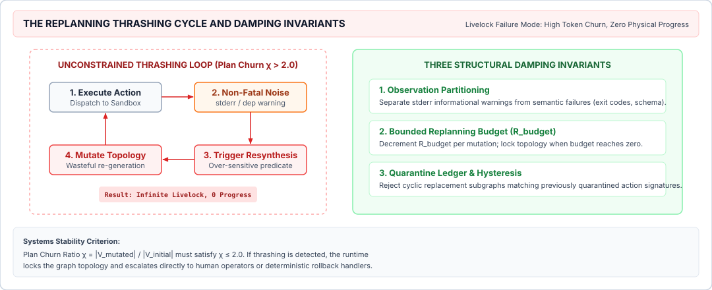
:::

As illustrated in @fig-vol3-replanning-thrashing, unmanaged replanning triggers an unstable livelock cycle (left panel): non-fatal diagnostic warnings are erroneously treated as contract invalidations, prompting repeated subgraph regenerations that mutate the plan without advancing environment state, driving the thrashing coefficient $\chi = \Delta_{\text{replan}} / \Delta_{\text{exec}}$ well above the instability threshold ($\chi > 2.0$). The right panel details the systems solution: a three-stage damping controller that intercepts raw execution feedback. Stage 1 filters non-breaking warnings into an informational buffer; Stage 2 decrements an explicit mutation budget ($R_{\text{budget}} \leftarrow R_{\text{budget}} - 1$), freezing graph topology when exhausted; and Stage 3 records rejected actions in an immutable quarantine ledger to prevent cyclical regeneration of known failing commands.

Replanning thrashing is typically catalyzed by over-sensitive invalidation predicates. Modern tool environments emit voluminous diagnostic noise: compiler warnings, deprecation notices, dynamic library informational banners, and nonzero return codes from standard exploratory commands (such as `grep` returning exit code 1 when a pattern is not found). If the runtime treats every non-empty standard error stream as a contract invalidation, the agent triggers resynthesis after nearly every action. The model continuously restructures downstream subgoals, rewording tasks and shifting execution topologies without ever achieving the end-to-end task objective.

To prevent thrashing, the runtime enforces three structural damping invariants:

#### Observation Filtering {.unnumbered}
Environmental feedback must be formally partitioned into structural contract violations and informational warnings. A node's postcondition profile $\mathcal{O}_i^*$ must never rely on raw textual equivalence of stdout or stderr streams. Instead, predicates are defined over semantic ground truths: exit code status matrices, file system property checks (such as verifying inode existence, file size thresholds, or cryptographic checksums), or explicit JSON schema validations. Unmatched warning tokens are routed to an informational accumulator rather than triggering the node invalidation handler.

#### Bounded Replanning Budgets {.unnumbered}
The runtime assigns an explicit replenishment budget to structural mutations across any given trajectory $\tau$. Let $R_{\text{budget}}$ represent the maximum number of structural branch resyntheses permitted for the task. Each invocation of subgraph resynthesis decrements this budget:

$$R_{\text{budget}} \leftarrow R_{\text{budget}} - 1$$

When $R_{\text{budget}} = 0$, the scheduler locks the graph topology. Any subsequent failure at a node $v_k$ is restricted to local repair attempts. If local repair fails, the system immediately triggers global escalation rather than entering an infinite replanning loop.

::: {.column-margin}
**Definition: Plan Churn Ratio**
$$\chi = \frac{|\mathcal{V}_{\text{mutated}}|}{|\mathcal{V}_{\text{initial}}|}$$
If the cumulative churn ratio $\chi$ exceeds an architectural threshold (typically $\chi > 2.0$), the deliberation engine declares dynamic instability and forces an evaluation pause.
:::

#### Step Quarantine Mechanics {.unnumbered}
To prevent cyclic replanning—where the model alternates indefinitely between two mutually exclusive sub-plans across successive steps—the runtime maintains an ephemeral quarantine ledger of failed action signatures within the trajectory state. If a proposed resynthesized branch introduces a node $v_k'$ whose action signature matches a previously quarantined failure:

$$\text{Sig}(a_k') \in \mathcal{K}_{\text{quarantine}}$$

the runtime rejects the replacement graph prior to dispatch, penalizes the model's generation score, and forces the deliberation engine to explore an orthogonal branch.

By formalizing plans as inspectable, typed dependency graphs, the runtime bridges the gap between stochastic token generation and deterministic systems execution. Preconditions guard the physical environment against broken causal assumptions, hierarchical repair mechanisms preserve expensive verified state, and damping invariants eliminate replanning thrashing.

Yet even a damped, graph-structured planner operates within physical reality: every branch explored, every candidate generated, and every precondition evaluated consumes memory bandwidth, FLOPs, and elapsed time. This computational reality forces the central architectural question: under what formal criteria should the runtime terminate search, commit to an execution path, or abort an unpromising trajectory?

***

## Search Stopping Criteria {#sec-vol3-deliberation-bounded-search}

An unconstrained tree search running an autoregressive generator rapidly triggers a combinatorial explosion: expanding four alternatives at each step of a ten-step reasoning trajectory generates over one million leaf states ($4^{10} \approx 1.05 \times 10^6$). In an inference runtime where each token generation requires sequential memory transfers over the High Bandwidth Memory (HBM) bus, unthrottled branching exhausts the server's token quota and breaches interactive service-level agreements within seconds—long before discovering a verifiably correct trajectory. Conversely, premature termination halts exploration along unverified paths, abandoning the agent to ungrounded heuristics or incomplete solutions.

A search topology cannot be decoupled from its resource accounting and stopping criteria: test-time deliberation is a constrained optimization problem where the agent runtime must dynamically balance token budgets, wall-clock latency, verification costs, and execution risk. Left unmanaged, search either collapses into compute starvation or degenerates into over-deliberation on low-value branches.

### Search Topologies

The architecture of test-time deliberation is defined by its state-space exploration topology. When an agent moves beyond a single autoregressive decode, the host runtime must organize candidate trajectories into an explicit data structure that governs how alternatives are proposed, evaluated, and pruned. Three distinct topologies dominate practical systems: flat parallel sampling (Best-of-$N$), pruned iterative expansion (Beam Search), and tree search guided by exploration-exploitation heuristics (Monte Carlo Tree Search), alongside emerging DAG aggregations such as Graph of Thoughts (@fig-vol3-search-topologies).

::: {#fig-vol3-search-topologies fig-env="figure" fig-pos="htb" fig-cap="**Search Topologies: Parallel Sampling, Beam Search, MCTS, and Graph of Thoughts**: Architectural trade-offs across four test-time search structures. Best-of-$N$ maximizes GPU batch parallelism but delays all pruning until sequence completion ($t = L$); Beam Search prunes synchronously at step boundaries with $O(B)$ memory; Monte Carlo Tree Search balances exploration and exploitation via backpropagated value estimates; Graph of Thoughts enables arbitrary DAG branching, feedback loops, and thought merging." fig-alt="Four search topologies: Best-of-N flat sampling, Beam Search step-level pruning, MCTS asymmetric tree with UCB1 backpropagation, and Graph of Thoughts with DAG aggregation."}

:::

The four topologies depicted in @fig-vol3-search-topologies expose stark trade-offs between pruning granularity, hardware efficiency, and memory footprint. In Best-of-$N$ (top-left), generation executes as $N$ independent, unpruned rollouts; while this structure maps efficiently to batched GPU tensor cores, any error introduced at early steps is decoded to completion, wasting up to 87% of generation FLOPs. In Beam Search (top-right), synchronous pruning at step boundaries retains only the top-$B$ candidates, bounding KV cache memory to $O(B \cdot L)$ at the cost of pipeline stalls during verifier passes. Monte Carlo Tree Search (bottom-left) builds an asymmetric search tree using Upper Confidence Bounds (PUCT) to guide compute toward promising reasoning frontiers while backpropagating empirical terminal rewards. Finally, Graph of Thoughts (bottom-right) extends tree structures into arbitrary directed acyclic graphs, supporting transformation vertices that combine, distill, and refine thoughts across disparate branches.

::: {.column-margin}
The fundamental trade-off among search topologies lies in where pruning occurs: Best-of-$N$ delays all pruning until the terminal token, maximizing batch parallelism at the expense of redundant token generation; Beam Search prunes synchronously at step boundaries; and MCTS allocates compute adaptively based on backpropagated value uncertainty.
:::

Flat sampling, commonly designated Best-of-$N$, represents the simplest and most parallel search topology. Given a task prompt $\mathbf{x}$, the generator samples $N$ independent, full-length trajectories $\tau^{(1)}, \tau^{(2)}, \dots, \tau^{(N)} \sim P_{\Theta}(\tau \mid \mathbf{x})$ in parallel, where each trajectory spans up to $L$ tokens. Once all sequences reach a terminal token or length boundary, an external selector or verifier scores each completed candidate:

$$\tau^* = \arg\max_{i \in \{1, \dots, N\}} V\left(\tau^{(i)}\right)$$

Best-of-$N$ aligns cleanly with GPU hardware execution. Because all $N$ sequences are statistically independent and generated simultaneously, the serving engine batches them into a single contiguous inference request. This maximizes arithmetic intensity during the decode phase by amortizing model weight transfers across $N$ active generation streams.

However, Best-of-$N$ exhibits severe algorithmic inefficiency: it possesses zero step-level pruning. If a trajectory commits a fatal logical error or generates invalid syntax at token $y_{17}$, the generator remains oblivious to the failure and continues decoding through token $y_{1024}$. The compute expended on the remaining 1,007 tokens is entirely wasted.

Beam search addresses this latency and token waste by structuring deliberation as a phased, step-level expansion. Instead of generating complete end-to-end trajectories, the runtime segments the generation process into discrete reasoning steps or subgoals, $s_t \in \mathcal{S}$. At step $t$, the generator expands each of the currently retained paths into $M$ candidate successor steps, yielding $B \times M$ candidate continuations, where $B$ is the beam width.

A step-level verifier (such as a Process Reward Model, or PRM) scores each continuation, and the runtime retains only the top-$B$ candidates with the highest cumulative scores, pruning the remaining $(M - 1)B$ branches immediately. By discarding dead ends early, beam search prevents exponential branch explosion.

Yet beam search introduces two distinct systems liabilities: first, it synchronizes execution at every step boundary, forcing the serving engine to stall generation while waiting for the step verifier to score the batch; second, it is vulnerable to irreversible search errors. If a process verifier assigns a spuriously low score to a path that would have ultimately yielded a correct solution, that path is discarded forever. @tbl-vol3-search-topologies contrasts these structural trade-offs against tree search.

| Dimension                  | Flat Sampling (Best-of-$N$)      | Beam Search (Top-$B$)                      | Monte Carlo Tree Search (MCTS)        |
|:---------------------------|:---------------------------------|:-------------------------------------------|:--------------------------------------|
| **Branching Topology**     | Depth-first independent paths    | Layered breadth-first beam                 | Asymmetric directed tree              |
| **Hardware Concurrency**   | Maximum (fully batched decode)   | Moderate (lock-step generation)            | Dynamic (irregular branch jobs)       |
| **Pruning Granularity**    | Terminal only ($t = L$)          | Synchronous step boundary ($t = \Delta_i$) | Asynchronous node selection           |
| **Verifier Sensitivity**   | High outcome verifier dependence | Vulnerable to myopic step scores           | Resilient via backpropagated value    |
| **Search State Structure** | Flat array of $N$ string buffers | Priority queue of $B$ active sequences     | Node graph with visit counts $(N, Q)$ |

: **Search Topology Comparison**: Architectural comparison of test-time search topologies across execution profiles, pruning granularities, and state representations. {#tbl-vol3-search-topologies}

To navigate the tension between early pruning and irreversible commitment, Monte Carlo Tree Search (MCTS) builds an explicit, asymmetric search graph over reasoning states, generalizing the Tree-of-Thoughts framework formalised by Yao et al. (2023). In an agentic MCTS configuration, nodes represent partial trajectories or environment states $s \in \mathcal{S}$, and directed edges represent reasoning steps, tool calls, or actions $a \in \mathcal{A}$. Rather than expanding nodes uniformly or pruning strictly by immediate step score, MCTS balances exploration and exploitation across four continuous phases:

1. **Selection:** Starting from root state $s_0$, the runtime traverses the existing tree by selecting child nodes that maximize an Upper Confidence Bound variant adapted for neural generation (such as Predictor Upper Confidence bounds applied to Trees, or PUCT):
   $$a^* = \arg\max_a \left[ Q(s, a) + c_{\text{puct}} \cdot P_{\Theta}(a \mid s) \frac{\sqrt{\sum_{a'} N(s, a')}}{1 + N(s, a)} \right]$$
   where $Q(s, a)$ is the empirical mean reward of trajectories passing through edge $(s, a)$, $N(s, a)$ is the visit count, and $P_{\Theta}(a \mid s)$ is the generator's prior probability for action $a$.

2. **Expansion:** Upon reaching a leaf node that has been visited more than a threshold number of times, the runtime queries the generator to produce $K_{\text{ext}}$ candidate continuations, instantiating new child nodes in the tree.
3. **Simulation / Evaluation:** The runtime estimates the value of the newly expanded node either by executing a rollout to completion or by evaluating the state directly with a neural value network or automated test harness.
4. **Backpropagation:** The evaluation score $V \in [0, 1]$ propagates backward along the ancestor trajectory from the leaf to $s_0$, updating visit counts $N(s, a) \leftarrow N(s, a) + 1$ and running value estimates $Q(s, a) \leftarrow Q(s, a) + \frac{V - Q(s, a)}{N(s, a)}$.

MCTS provides asymptotic convergence guarantees and recovers from locally deceptive intermediate scores. However, its execution profile is irregular: branch depths vary dynamically, batch sizes fluctuate across selection cycles, and node expansion requires continuous updates to tree metadata.

### The Unified Resource Accounting Model

Every branch expanded, candidate generated, and assertion checked consumes physical resources. To prevent deliberation from degrading into unconstrained compute consumption, the agent runtime must maintain an explicit ledger of cumulative costs across all search phases.

The total deliberation expenditure $C_{\text{total}}$ is governed by three additive components:

$$C_{\text{total}} = C_{\text{gen}} + C_{\text{verif}} + C_{\text{tool}}$$

where $C_{\text{gen}}$ accounts for autoregressive generation, $C_{\text{verif}}$ measures verification overhead, and $C_{\text{tool}}$ captures environmental execution costs.

The generation cost $C_{\text{gen}}$ scales with the aggregate number of tokens generated across all explored branches. In an autoregressive transformer serving engine, the arithmetic intensity of token generation is memory-bandwidth bound during decode. For a model with $|\Theta|$ active parameters executing on an accelerator with memory bandwidth $\text{BW}_{\text{HBM}}$, generating a single token across a batch requires reading all model weights from HBM to on-chip SRAM. The computational cost is quantified in floating-point operations:

$$C_{\text{gen}} = 2 \cdot |\Theta| \cdot \sum_{b \in \mathcal{B}} K_b \quad \text{[FLOPs]}$$

where $\mathcal{B}$ denotes the set of all expanded branches in the search tree, and $K_b$ is the sequence length generated on branch $b$.

The verification cost $C_{\text{verif}}$ depends heavily on the nature of the verifier. When employing neural reward models—such as an outcome verifier (ORM) or process verifier (PRM)—$C_{\text{verif}}$ mirrors the generation formulation:

$$C_{\text{verif}}^{\text{neural}} = 2 \cdot |\Theta_{\text{verif}}| \cdot \sum_{j \in \mathcal{V}_{\text{eval}}} K_j \quad \text{[FLOPs]}$$

where $\mathcal{V}_{\text{eval}}$ is the set of evaluation invocations and $|\Theta_{\text{verif}}|$ is the parameter count of the verifier model. Conversely, deterministic verifiers (such as compilers, test suites, and linters) consume host CPU cycles, container provisioning latency, and sandbox isolation overhead rather than GPU FLOPs:

$$C_{\text{verif}}^{\text{det}} = \sum_{j \in \mathcal{V}_{\text{eval}}} \left( t_{\text{sandbox}} + t_{\text{exec}}^{(j)} \right) \quad \text{[seconds]}$$

The tool execution cost $C_{\text{tool}}$ encapsulates the latency, network bandwidth, and third-party API overhead incurred when an exploratory branch interacts with external environments. Unlike pure generation, tool execution introduces non-deterministic wall-clock delays: an agent branch that invokes an external database query or static analysis tool may stall for hundreds of milliseconds while holding accelerator memory state in suspense.

::: {#exmp-03-compute-allocation-and-latency-trade-offs .callout-example title="Compute Allocation and Latency Trade-offs in Bounded Search"}
**Problem Statement:**
An autonomous software engineering runtime must generate a functional patch for a failing repository module. The host system operates an NVIDIA H100 SXM accelerator with a peak memory bandwidth of $\text{BW}_{\text{HBM}} = 3.35\text{ TB/s}$. The generator is a 70B parameter model ($|\Theta| = 70 \times 10^9$ parameters) operating in 8-bit floating-point precision (FP8, 1 byte per parameter). Each reasoning step requires generating $L_{\text{step}} = 128$ tokens.

The runtime must select between two search policies:

1. **Policy 1 (Best-of-16 Flat Sampling):** Generate $N = 16$ complete trajectories of 4 steps each ($L_{\text{total}} = 512$ tokens). Concurrently evaluate all completed patches using an automated sandbox unit test suite ($t_{\text{sandbox}} = 500\text{ ms}$ per test execution).
2. **Policy 2 (Beam Search with PRM):** Run beam search with beam width $B = 4$, expanding $M = 3$ candidate steps at each of the 4 depth levels. Each candidate step is scored by an 8B parameter PRM ($|\Theta_{\text{PRM}}| = 8 \times 10^9$ bytes) executing a forward pass of 128 tokens. Only the final surviving 4 trajectories are verified in the sandbox.

Assume that for both policies, decoding operates at memory bandwidth saturation with batch size $N \le 16$, yielding a per-token generation latency of:
$$t_{\text{token}} \approx \frac{|\Theta| \times 1\text{ byte}}{\text{BW}_{\text{HBM}}} = \frac{70 \times 10^9\text{ bytes}}{3.35 \times 10^{12}\text{ bytes/sec}} \approx 20.90\text{ ms/token}$$
For the 8B PRM, the prefill/evaluation time for a 128-token step is compute-bound at $t_{\text{PRM}} \approx 15\text{ ms}$.

Compute the total tokens generated, total wall-clock latency $T_{\text{wall}}$, and total FLOP expenditure for each policy.

---

**Solution:**

**1. Policy 1 (Best-of-16 Flat Sampling):**

- **Tokens Generated:**
  $$K_{\text{total}}^{(1)} = 16 \times 512 = 8{,}192\text{ tokens}$$

- **Generation Latency:**
  Because all 16 sequences are decoded concurrently in a single batch, the decode time is dictated by sequence length:
  $$T_{\text{gen}}^{(1)} = 512\text{ tokens} \times 20.90\text{ ms/token} = 10.70\text{ seconds}$$

- **Verification Latency:**
  Assuming sandbox test executions run in parallel worker containers with a concurrency limit of 8 (taking 2 rounds of tests):
  $$T_{\text{verif}}^{(1)} = 2 \times 500\text{ ms} = 1.00\text{ second}$$

- **Total Wall-Clock Latency:**
  $$T_{\text{wall}}^{(1)} = T_{\text{gen}}^{(1)} + T_{\text{verif}}^{(1)} = 10.70\text{ s} + 1.00\text{ s} = 11.70\text{ seconds}$$

- **FLOP Expenditure:**
  $$C_{\text{FLOP}}^{(1)} = 2 \times (70 \times 10^9) \times 8{,}192 = 1.147 \times 10^{15}\text{ FLOPs} \approx 1.15\text{ PFLOPs}$$

---

**2. Policy 2 (Beam Search with PRM):**

- **Branch Expansion Profile:**
  - Step 1: Expand root into $B \times M = 1 \times 3 = 3$ branches (pruned to top $B=4$, so all 3 retained).
  - Step 2: Expand 3 paths into $3 \times 3 = 9$ branches, pruned to top 4.
  - Step 3: Expand 4 paths into $4 \times 3 = 12$ branches, pruned to top 4.
  - Step 4: Expand 4 paths into $4 \times 3 = 12$ branches, pruned to top 4.
  - Total step segments generated: $3 + 9 + 12 + 12 = 36$ step segments.
- **Tokens Generated:**
  $$K_{\text{total}}^{(2)} = 36 \times 128 = 4{,}608\text{ tokens}$$
  *(A 43.75% reduction in generated tokens compared to Best-of-16).*

- **Generation Latency:**
  Generation occurs in 4 sequential depth phases. Each phase decodes 128 tokens:
  $$T_{\text{gen}}^{(2)} = 4 \times (128\text{ tokens} \times 20.90\text{ ms/token}) = 4 \times 2.675\text{ s} = 10.70\text{ seconds}$$

- **Verification Latency:**
  At each of the 4 steps, PRM scoring must run synchronously before the runtime can prune branches. With PRM scoring taking $15\text{ ms}$ per step:
  $$T_{\text{PRM}} = 4 \times 15\text{ ms} = 60\text{ ms} = 0.06\text{ seconds}$$
  At the leaf level, only the surviving 4 candidates execute sandbox verification in parallel:
  $$T_{\text{sandbox}}^{(2)} = 1 \times 500\text{ ms} = 0.50\text{ seconds}$$
  $$T_{\text{verif}}^{(2)} = 0.06\text{ s} + 0.50\text{ s} = 0.56\text{ seconds}$$

- **Total Wall-Clock Latency:**
  $$T_{\text{wall}}^{(2)} = 10.70\text{ s} + 0.56\text{ s} = 11.26\text{ seconds}$$

- **FLOP Expenditure:**
  $$C_{\text{FLOP, gen}}^{(2)} = 2 \times (70 \times 10^9) \times 4{,}608 = 6.451 \times 10^{14}\text{ FLOPs}$$
  $$C_{\text{FLOP, PRM}}^{(2)} = 2 \times (8 \times 10^9) \times 4{,}608 = 7.373 \times 10^{13}\text{ FLOPs}$$
  $$C_{\text{FLOP}}^{(2)} = 6.451 \times 10^{14} + 7.373 \times 10^{13} = 7.188 \times 10^{14}\text{ FLOPs} \approx 0.72\text{ PFLOPs}$$

**Analytical Conclusion:**
Beam search with process verification achieves roughly equivalent wall-clock time ($11.26\text{ s}$ vs. $11.70\text{ s}$) while cutting total FLOP expenditure and token consumption by **$37.3\%$**. The compute saved by early step pruning directly compensates for the overhead of the PRM model and synchronous pipeline stalls.
:::

### Multicriteria Stopping Invariants

A search engine without terminating boundaries will consume infinite tokens or spin endlessly in recursive tool invocations. The host runtime must enforce explicit, multicriteria stopping rules that govern when to commit to a candidate, when to prune a subtree, and when to abort search entirely.

These stopping boundaries operate along three distinct operational dimensions: hard resource ceilings, threshold satisfaction, and marginal utility stopping (@fig-vol3-stopping-boundaries).

::: {#fig-vol3-stopping-boundaries fig-env="figure" fig-pos="htb" fig-cap="**Test-Time Search Stopping Boundaries and Multicriteria State Space**: Stopping hierarchy balancing hard resource ceilings, opportunistic threshold satisfaction, and marginal utility economics. In the state space of verifier score $V(\\tau)$ versus token compute $K$, certified deterministic verification ($V=1.0$) triggers immediate opportunistic exit; reaching hard resource ceilings ($K_{\\max}, T_{\\max}, D_{\\max}$) unconditionally halts search; and sub-epsilon marginal gain ($\\Delta P / \\Delta C < \\epsilon_{\\text{stop}}$) terminates exploration when returns diminish. Priority precedence is enforced from Priority 1 (Hard Ceilings) down to Priority 3 (Marginal Halting)." fig-alt="Multicriteria stopping boundary state space plotting verifier score against inference compute, showing certified hyperplane exit, hard resource ceilings, and marginal utility stopping slope, backed by a three-tier priority card hierarchy."}
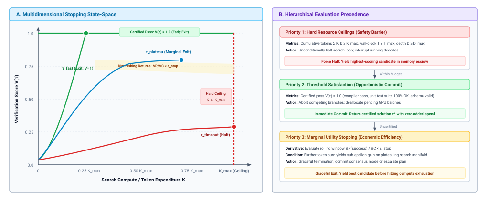
:::

As formalized in panel (a) of @fig-vol3-stopping-boundaries, the runtime orchestrates stopping decisions across a multidimensional state space defined by verifier score $V(\tau)$ and accumulated compute expenditure $K$; panel (b) gives the precedence in which those boundaries are evaluated. When an execution branch reaches the certified hyperplane at $V(\tau)=1.0$ (via a compiler pass or deterministic test suite), the satisficing boundary triggers immediate opportunistic commit, aborting all speculative sibling branches. If no branch satisfies the certified threshold, exploration continues until either the marginal utility curve flattens ($\Delta P / \Delta C < \epsilon_{\text{stop}}$) or the cumulative compute intersects the vertical hard ceiling at $K_{\max}$ (or wall-clock deadline $T_{\max}$). The runtime enforces a strict evaluation precedence: hard system invariants (Priority 1) strictly override heuristic satisfaction (Priority 2) and marginal stopping criteria (Priority 3).

Hard resource ceilings serve as non-negotiable systems invariants. They prevent runaway loops caused by generator degradation, degenerate tool outputs, or circular reasoning paths. The runtime monitors three primary ceilings:

1. **Token Quota ($K_{\max}$):** The maximum cumulative count of tokens generated across all active branches. Once $\sum_{b} K_b \ge K_{\max}$, the search loop terminates immediately, and the selector picks the highest-scoring candidate available in memory escrow.
2. **Wall-Clock Deadline ($T_{\max}$):** The absolute elapsed time threshold dictated by user-facing latency budgets or upstream service timeouts. Enforced via runtime deadline timers that interrupt active model calls.
3. **Maximum Branch Depth ($D_{\max}$):** The maximum allowable length of an exploration trajectory in terms of discrete reasoning steps or tool actions. $D_{\max}$ prevents models from drifting down infinite chains of irrelevant exploration.

Threshold satisfaction (also termed *satisficing*) implements opportunistic early exit. When the runtime evaluates a candidate using a deterministic verifier—such as an automated compiler, a cryptographic test suite, or a complete unit test pass—a binary success signal ($V(\tau) = 1$) provides empirical confirmation of task completion. If any branch yields a certified candidate, continuing the search yields zero additional utility. The runtime immediately aborts all competing branches, deallocates their pending requests, and commits the successful trajectory.

However, when verification relies on stochastic or continuous neural scoring (e.g., a reward model outputting $v \in [0, 1]$), a high score does not guarantee correctness; it merely indicates statistical plausibility. In such regimes, early stopping based on heuristic thresholds risks premature commitment to adversarial reward exploits, as established in Section 3.4.

The third stopping paradigm—marginal utility stopping—evaluates whether the expected accuracy improvement from generating an additional candidate justifies the incremental compute expenditure. Snell et al. (2024) demonstrated that test-time search exhibits logarithmic scaling behavior: the probability of discovering a correct solution scales with compute initially, but rapidly plateaus as the search space saturates or the generator encounters intrinsic error limits, producing the marginal benefit curves depicted in @fig-vol3-search-budget.

::: {#fig-vol3-search-budget fig-env="figure" fig-pos="htb" fig-cap="**Search Budget Allocation and Marginal Benefit**: Test-time compute scaling across search topologies under fixed compute ceilings. In Panel A, task success probability $P(\\text{success})$ exhibits log-linear scaling before encountering domain saturation, with an optimal operating point $C^*$ balancing marginal gain against cost. In Panel B, early verifier-guided branch pruning collapses the effective branching factor from $b=5.0$ to $b_{\\text{eff}} \\approx 1.6$, preventing combinatorial leaf explosion and saving 68% of inference tokens." fig-alt="Two-panel systems schematic showing test-time compute Pareto crossover with diminishing marginal returns in Panel A, and tree search pruning reducing effective branching factor from 5.0 to 1.6 in Panel B."}

:::

The dual-panel analysis in @fig-vol3-search-budget quantifies why unguided search breadth suffers from severe diminishing returns. Panel A traces the empirical task success trajectory as a function of inference FLOPs: initial compute investments yield steep accuracy gains, but the marginal improvement curve flattens as the generator exhausts its high-confidence knowledge basin, identifying $C^*$ as the optimal stopping tangent where $\Delta P / \Delta C = \epsilon_{\text{stop}}$. Panel B illustrates how active verification alters search tree geometry: blind depth-first search with branching factor $b=5.0$ expands 125 leaf nodes across three depth steps, whereas intermediate verifier gating prunes 68% of invalid branches, reducing the effective branching factor to $b_{\text{eff}} \approx 1.6$ and reserving accelerator bandwidth for valid candidate completions.

Let $P_m(\text{success})$ represent the estimated probability of task success after expending compute $C_m$ (measured in tokens or FLOPs) across $m$ search iterations. The marginal utility of continuation is defined as:

$$\mathcal{U}_{\text{marg}}(m) = \frac{P_m(\text{success}) - P_{m-1}(\text{success})}{C_m - C_{m-1}} \approx \frac{\Delta P}{\Delta C}$$

The runtime monitors $\mathcal{U}_{\text{marg}}(m)$ over a sliding window of iterations. When the marginal gain drops below a configured efficiency threshold $\epsilon_{\text{stop}}$:

$$\frac{\Delta P}{\Delta C} < \epsilon_{\text{stop}}$$

the search halts. Expending further compute under this condition yields diminishing returns, shifting the optimal policy from deeper local search to yielding the current best candidate $\tau^*$ or escalating to an alternative plan.

The empirical implementation of marginal utility stopping requires maintaining rolling estimations of success probability across candidate iterations:

```python
def should_terminate_search(history: list[float], cost_history: list[int],
                            k_max: int, eps: float = 1e-5) -> bool:
    """Evaluate marginal utility stopping under token and efficiency budgets."""
    if cost_history[-1] >= k_max or len(history) < 2:
        return cost_history[-1] >= k_max
    # Compute marginal empirical gain per thousand tokens over window
    delta_p = max(0.0, history[-1] - history[-2])
    delta_c = max(1, cost_history[-1] - cost_history[-2])
    marginal_utility = (delta_p / delta_c) * 1000.0
    return marginal_utility < eps
```

Beyond token and latency budgets, autonomous agents face an *action-risk budget*. When an agent interacts with external environments, actions possess varying degrees of reversibility. Read-only queries (e.g., `git status`, `ls`, file inspection) have zero state mutability and can be executed freely along exploratory search branches.

Conversely, irreversible mutations (e.g., executing database migrations, deleting remote branches, or dispatching external emails) carry unbounded blast radiuses. If an untrusted exploratory branch executes an irreversible action inside an un-isolated environment, search cannot simply "backtrack" upon discovering a subsequent failure.

To safeguard the environment, the runtime must enforce that exploratory search operates exclusively within isolated scratchpads or sandboxes (as formalized in Chapter 08). Physical environment commits are deferred until the search algorithm terminates, the stopping criteria are satisfied, and a candidate trajectory is formally selected and certified.

***

Yet the formalization of search topologies, resource ledgers, and stopping criteria exposes an empirical challenge: configuring these parameters requires verifiable evidence. How does an engineer determine whether a complex Monte Carlo tree search with process reward modeling genuinely outperforms a simpler Best-of-$N$ baseline under an equivalent compute budget? This question of rigorous, compute-matched evaluation forms the foundation of deliberation strategy design.

## Deliberation Strategy Evaluation {#sec-vol3-deliberation-strategy-design}

Evaluating an inference-time deliberation strategy presents a subtle systems measurement trap: an architecture that appears superior in unconstrained benchmarking frequently collapses when subjected to hard token ceilings, strict tail-latency service-level objectives, or fallible verifiers. In open-loop literature, it is commonplace to showcase a Monte Carlo tree search or an iterative self-correction loop achieving higher absolute benchmark accuracy than a single-shot greedy baseline. Yet such comparisons routinely compare unequal compute classes. A tree search that explores thirty-two candidate branches consumes thirty-two times the forward FLOPs, demands gigabytes of transient key-value cache memory, and multiplies critical-path wall-clock latency. If that identical compute budget were instead granted to a higher-capacity base model or allocated across parallel independent samples with majority voting, the apparent superiority of the complex search policy often evaporates.

::: {.column-margin}
Deliberation policies must never be evaluated against an unconstrained compute horizon. Every additional token, expansion branch, or sandbox execution consumes concrete physical resources that must justify their marginal contribution to accepted accuracy.
:::

**A deliberation policy earns its architectural complexity only if it Pareto-dominates simpler baselines under strictly matched resource budgets, equalized environmental privilege, and realistic verification accuracy.** Introducing tree expansion queues, learned process verifiers, or multi-turn reflection loops is not an automatic algorithmic upgrade; it is an architectural commitment that incurs concrete memory bandwidth overhead, scheduling complexity, and tail-latency amplification. To determine whether an agent runtime should deliberate, an engineer must subject candidate strategies to controlled, resource-equivalent evaluation across multi-dimensional performance metrics, mapping the exact Pareto frontiers where deliberation succeeds and identifying the operational regimes where it induces catastrophic failure.

### Controlled Systems Evaluation Under Resource Equivalence

A rigorous systems evaluation demands that all confounding variables external to the search policy be held invariant. In software systems engineering, comparing two sorting routines requires executing them on identical CPU architectures with identical cache hierarchies, memory configurations, and compiler optimization flags. In an agentic machine learning runtime, achieving equivalent experimental control requires freezing three distinct architectural boundaries:

1. *Model Parameter and Precision Invariance ($\Theta$):* The underlying foundation model weights, quantization format (e.g., FP8, BF16), and serving engine configurations must remain identical across all tested strategies. Evaluating an iterative search policy on an 8-billion-parameter model against a single-shot prompt on a 70-billion-parameter model measures parameter scaling rather than search efficacy.
2. *Environment and Sandbox Interface Invariance ($A=0$):* Every candidate strategy must operate under the exact same unprivileged sandbox boundary. If an environment-feedback policy is granted access to a compiler toolchain or a linters suite, the baseline policies must be evaluated under the identical tool-call interface and permissions envelope.
3. *Total Compute Ceiling ($\mathcal{C}_{\max}$):* All policies must be evaluated under an identical maximum budget constraint. This constraint is parameterized either as a total token generation ceiling ($T_{\text{total}} = T_{\text{prompt}} + T_{\text{completion}}$), an aggregated floating-point operation ceiling ($C_{\text{FLOP}}$), or a hard wall-clock latency timeout ($T_{\text{wall}} \le T_{\max}$).

::: {.column-margin}
Snell et al. (2024) demonstrated that optimizing test-time compute allocation can yield accuracy gains equivalent to orders-of-magnitude parameter scaling, provided the compute is matched against an explicit verification mechanism.
:::

The necessity of strict compute-matching was formalized empirically by Snell et al. (2024), who demonstrated that the optimal test-time compute allocation strategy is fundamentally task-dependent. Given a fixed compute expenditure $\mathcal{C}$, an agent runtime faces an explicit resource allocation trade-off: it can spend tokens along *depth* (generating longer, highly detailed autoregressive reasoning traces), along *breadth* (sampling $N$ independent trajectories and choosing among them), or along *feedback* (iteratively running candidate code in an external execution sandbox and refining based on error logs). Naive benchmarking obscures this trade-off by reporting accuracy as an unconstrained function of algorithmic complexity.

```python
# Empirical check: verify strict token budget conformance across strategies
def compute_efficiency(tokens_spent: int, success: bool, budget: int) -> float:
    if tokens_spent > budget:
        return 0.0  # Disqualified: budget overrun violates systems equivalence
    return 1.0 if success else 0.0
```

When strategies are evaluated under a strict ceiling $\mathcal{C}_{\max}$, the systems hierarchy shifts. A complex deliberation graph with multiple prompt-expansion stages and heuristic branch pruners often exhausts its token budget on conversational orchestration and context-window reprompting, leaving insufficient budget for core problem synthesis. A simpler strategy—such as parallel Best-of-$N$ with an automated syntactic verifier—frequently captures the available performance gains while eliminating the complex state tracking of tree search.

### Multi-Dimensional Systems Metrics

Evaluating a deliberation runtime solely on binary task success rate (accuracy) is an architectural anti-pattern. In production environments, an agent that improves accuracy by five percentage points but triples the $p99$ tail latency or increases silent corruptions is unacceptable. A comprehensive systems evaluation requires tracking four orthogonal metrics simultaneously.

#### Pass@1 versus Pass@$k$ Under Matched Budgets {.unnumbered}

In academic code generation, the metric $\text{Pass}@k$ is widely defined as the probability that at least one candidate solution out of $k$ generated samples passes a given evaluation suite:

$$\text{Pass}@k = \mathbb{E}_{\text{tasks}} \left[ 1 - \frac{\binom{N - c}{k}}{\binom{N}{k}} \right]$$

where $N \ge k$ samples are generated and $c$ represents the number of correct samples. While $\text{Pass}@k$ provides a theoretical bound on the *generation potential* of the model's stochastic distribution, it represents a deceitful systems metric. $\text{Pass}@k$ assumes the existence of an omniscient, zero-cost oracle that can effortlessly select the single working candidate out of the set $k$.

In an authentic systems implementation, no such oracle exists. The host supervisor must either select a single candidate to commit to persistent storage using an automated verifier or output the top-ranked candidate directly. An unverified set of $k$ candidates provides zero operational utility. Consequently, systems evaluation must report **budget-constrained accepted accuracy**: the empirical probability that the candidate *selected and emitted* by the search policy under budget $\mathcal{C} \le B$ passes all invariants.

#### Effective Cost per Verified Success {.unnumbered}

Raw token consumption does not scale linearly with system value. A search strategy that raises task success from 50% to 60% while increasing mean token consumption from 1,000 tokens to 8,000 tokens represents an architectural degradation in cost efficiency. We quantify this balance through the **Effective Cost per Verified Success** ($C_{\text{eff}}$):

$$C_{\text{eff}} = \frac{\mathbb{E}[C]}{P(\text{verified success})}$$

where $\mathbb{E}[C]$ denotes the expected resource cost per problem instance—measured in aggregated generation tokens or floating-point operations—and $P(\text{verified success})$ is the proportion of tasks that pass the host supervisor's verification harness. If a baseline single-candidate policy achieves 45% accuracy at an average cost of 512 tokens, its $C_{\text{eff}}$ is $1{,}138$ tokens per successful outcome. If an iterative refinement loop achieves 68% accuracy but burns an average of $4{,}096$ tokens across repeated review iterations, its $C_{\text{eff}}$ inflates to $6{,}024$ tokens per successful outcome—a more than five-fold increase in the resource cost required to deliver a single verified deliverable.

#### Wall-Clock Latency Distributions {.unnumbered}

Different deliberation topologies distribute their computational load across the critical path in fundamentally disparate ways:

- *Depth-Heavy Topologies (Sequential Deliberation):* Sequential chain-of-thought generation, iterative critique, and single-branch backtracking serialize execution. The wall-clock latency is strictly bounded by the sum of sequential forward passes:

  $$T_{\text{wall}} = \sum_{i=1}^D t_{\text{decode}}(y_i)$$

  Because autoregressive token generation (the decode phase) is memory-bandwidth bound—operating as a Generalized Matrix-Vector multiplication (GEMV) at low operational intensity—the critical path cannot be compressed by throwing parallel compute at a single instance. This creates high median latency ($p50$) and exposes the execution to severe variance if the model enters an expansive generation loop.

- *Breadth-Heavy Topologies (Parallel Sampling):* Generating $N$ candidates concurrently allows the host supervisor to batch prompt prefill and token decoding across tensor-parallel GPU ranks. So long as the aggregated batch size does not exceed the hardware saturation threshold or exhaust high-bandwidth memory (HBM), the critical-path wall-clock latency scales near $\mathcal{O}(1)$ relative to $N$. However, breadth strategies impose severe pressure on the key-value (KV) cache:

  $$M_{\text{KV, total}} = N \cdot 2 \cdot L \cdot d_{\text{model}} \cdot S$$

  where $L$ is the layer count and $S$ is context length. If $M_{\text{KV, total}}$ exceeds physical GPU memory capacity, the serving engine must preempt sequences or swap KV blocks to host DRAM, causing tail latency ($p99$) to skyrocket.

- *Feedback-Heavy Topologies (Environment Interrogation):* Interleaving token generation with containerized sandboxes, unit test execution, or compilation runs introduces non-deterministic host system overhead. The total latency becomes dominated by process fork times, compilation overhead, and filesystem I/O.

#### False Acceptance Rate {.unnumbered}

When candidate selection relies on automated verifiers, heuristic linters, or learned process reward models, search optimization is governed by Goodhart's Law: *when a measure becomes a target, it ceases to be a good measure.* As the breadth of candidate exploration $N$ expands, the likelihood that the generator discovers an adversarial edge case—a candidate that technically satisfies the verifier's syntactic checks while completely violating the underlying task invariants—grows monotonically.

We define the **False Acceptance Rate (FAR)** as the probability that the runtime's verification harness marks a failed or corrupted proposal as valid:

$$\text{FAR} = P(\text{accept} \mid \text{incorrect})$$

In production systems operating under zero ambient authority, false acceptances represent silent failure leakage. An agent that emits an explicit failure signal allows the host supervisor to halt, trigger a saga compensating transaction, or route the task to human review. Conversely, an agent with a high false acceptance rate commits corrupted state changes to the persistent environment, poisoning downstream system components.

::: {#exmp-03-compute-matched-deliberation-trade-offs .callout-example title="Compute-Matched Deliberation Trade-offs"}
Consider an autonomous code repair service processing incoming bug reports. The serving engine operates on an NVIDIA H100 GPU (3,350 TFLOPS FP8, 3.35 TB/s HBM3). The runtime enforces an SLA deadline of $T_{\max} = 10.0\text{ s}$ and evaluates three distinct strategies under a matched total compute ceiling of $\mathcal{C}_{\max} \le 4{,}096\text{ tokens}$:

1. **Greedy Single-Shot:** Generates a single solution of 512 tokens.
2. **Parallel Best-of-8 (Breadth):** Batches 8 concurrent candidate generations of 512 tokens each ($T_{\text{total}} = 4{,}096\text{ tokens}$). Candidates are evaluated by a test-runner verifier; the first candidate passing all tests is selected.
3. **Sequential Refinement (Depth):** Executes up to 4 iterative critique-generation loops, consuming an average of 800 tokens per loop ($T_{\text{total}} \le 3{,}200\text{ tokens}$).

The empirical execution logs yield the performance metrics summarized below:

| Strategy                  | $P(\text{success})$ | Mean Tokens | $C_{\text{eff}}$ (Tokens/Succ) | Latency $p50$ | Latency $p99$ | FAR  |
|:--------------------------|:--------------------|:------------|:-------------------------------|:--------------|:--------------|:-----|
| **Greedy Single-Shot**    | 0.42                | 512         | $1{,}219$                      | 1.1 s         | 1.4 s         | 0.01 |
| **Parallel Best-of-8**    | 0.74                | $4{,}096$   | $5{,}535$                      | 1.8 s         | 9.4 s         | 0.09 |
| **Sequential Refinement** | 0.61                | $2{,}650$   | $4{,}344$                      | 6.2 s         | 14.8 s        | 0.04 |

**Analysis:**

- *Accuracy vs. Cost:* Parallel Best-of-8 yields the highest raw accuracy ($0.74$), but its $C_{\text{eff}}$ is $4.5\times$ higher than Greedy. Each verified success requires burning $5{,}535$ tokens of GPU capacity.
- *Tail Latency SLA:* While Parallel Best-of-8 maintains an acceptable $p50$ latency of 1.8 s due to concurrent batch decoding, its $p99$ latency degrades to 9.4 s—dangerously close to the 10.0 s SLA—due to KV cache memory contention on the serving engine. Sequential Refinement violates the SLA entirely at $p99$ (14.8 s), as serial autoregressive decode passes stack deterministically.
- *Silent Failure Risk:* Parallel Best-of-8 leaks an alarming 9% False Acceptance Rate. By generating 8 diverse candidates, the model frequently crafts subtle exploits that pass incomplete test assertions (e.g., hardcoding expected return values for specific test cases).
:::

### The Deliberation Pareto Frontier

Plotting empirical task success against token consumption and wall-clock latency reveals the **Deliberation Pareto Frontier**—the set of optimal operating points where no alternative allocation of inference compute can achieve higher accuracy without consuming more resources or violating latency bounds (@fig-vol3-deliberation-pareto).

::: {#fig-vol3-deliberation-pareto fig-env="figure" fig-pos="htb" fig-cap="**The Deliberation Pareto Frontier and Regimes of Failure**: Empirical task success probability $P(\\text{success})$ plotted against effective inference compute cost $C_{\\text{eff}}$ (tokens per successful task) corresponding to the empirical benchmark in @tbl-vol3-deliberation-comparison. Greedy single-shot provides a low-cost baseline (1,163 tokens, 44% accuracy). Depth-based Self-Refine and parallel Best-of-8 improve accuracy but fall below the Pareto frontier due to premise entrenchment and unguided sampling overhead. Grounding deliberation in external tool execution feedback (ReAct) establishes the empirical Pareto frontier (4,939 tokens, 83% accuracy, 3% FAR), eliminating ungrounded neural search exploitation." fig-alt="Deliberation Pareto frontier curve showing task success probability versus effective token cost across Greedy, Self-Refine, Best-of-8, MCTS, and ReAct with tool feedback."}
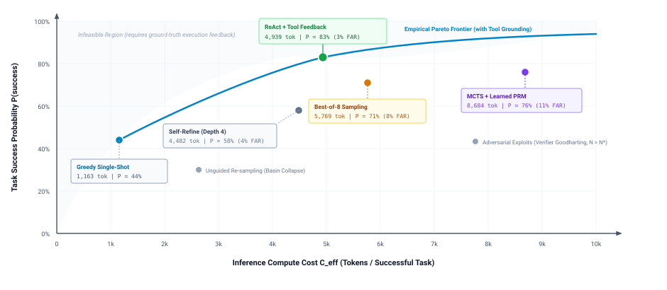
:::

The empirical trade-offs visualized in @fig-vol3-deliberation-pareto directly map to the multi-strategy benchmark established in @tbl-vol3-deliberation-comparison. The Greedy Single-Shot baseline anchors the lower-left origin ($1{,}163$ tokens, $44\%$ verified success). While allocating compute to sequential Self-Refine lifts success to $58\%$, it incurs $4{,}482$ tokens per success due to false premise entrenchment. Parallel Best-of-8 achieves $71\%$ success but consumes $5{,}769$ tokens while leaking an $8\%$ false acceptance rate. Ungrounded MCTS with a learned PRM achieves $76\%$ success but demands an exorbitant $8{,}684$ tokens and exhibits an $11\%$ false acceptance rate from verifier Goodharting. The dominant operating frontier is defined by ReAct with external tool feedback ($4{,}939$ tokens, $83\%$ verified success, $3\%$ FAR): by leveraging deterministic sandbox compilers and runtime assertion probes, the system achieves strictly superior accuracy at lower cost than pure neural search, proving that environmental grounding is the prerequisite for Pareto-efficient deliberation.

As conceptualized in the frontier curve, the three computational axes occupy distinct operational niches along this trade-off space:

1. *The Depth Regime (Sequential Deductive Chains):* Optimal for tasks characterized by high internal constraint density and low intermediate branching, such as mathematical proofs or complex algorithm synthesis. In this regime, intermediate reasoning tokens act as a scratchpad that stabilizes the model's autoregressive trajectory. However, the marginal return on additional depth decays rapidly; beyond a critical context length, additional reasoning tokens induce wandering, where the model begins questioning verified facts or loses track of initial constraints.
2. *The Breadth Regime (Independent Candidate Exploration):* Optimal when the solution space is broad, multiple disconnected solution paths exist, and candidate verification is computationally inexpensive (such as compilation checks or deterministic schema validators). Sampling across breadth minimizes critical-path latency on high-throughput inference engines at the expense of massive aggregate token consumption.
3. *The Feedback Regime (Environment-Mediated Execution):* Optimal when internal self-critique is inherently ungrounded. Foundation models exhibit severe blind spots when attempting to verify their own outputs through pure introspection. Injecting deterministic environment feedback—such as compiler error messages, test failure backtraces, or database runtime exceptions—anchors the deliberation process in empirical ground truth, breaking circular reasoning loops.

```python
# Systems check: filter candidate strategies against the operational Pareto frontier
def is_pareto_efficient(candidates: list[tuple[float, float, float]]) -> list[bool]:
    # candidates: list of (cost, latency, -accuracy)
    efficient = [True] * len(candidates)
    for i, c1 in enumerate(candidates):
        for j, c2 in enumerate(candidates):
            if i != j and all(x <= y for x, y in zip(c2, c1)) and any(x < y for x, y in zip(c2, c1)):
                efficient[i] = False
                break
    return efficient
```

#### Regimes of Failure {.unnumbered}

Crucially, deliberation is not universally beneficial. Across a broad class of operational tasks, allocating additional test-time computation produces **negative transfer**: an observable phenomenon where search degrades performance below the single-shot baseline.

Negative transfer occurs primarily through two failure mechanisms:

- *The Over-Deliberation Trap:* When presented with straightforward, high-confidence tasks, a deliberation runtime configured with mandatory reflection or tree search often manufactures spurious complexity. The model treats trivial requirements as ambiguous edge cases, hallucinates hypothetical corner conditions, and rewrites a concise, correct solution into an over-engineered, buggy abstraction.
- *False Premise Entrenchment:* If an early step in a sequential reasoning chain commits a subtle semantic error, allocating additional reasoning depth causes the model to rationalize and reinforce the error rather than correct it. Because autoregressive generation attends to its own prior context, the hallucinated premise becomes an immutable historical fact within the prompt, permanently steering downstream deduction away from the correct solution.

To rigorously capture these trade-offs, @tbl-vol3-deliberation-comparison contrasts the five canonical deliberation topologies under an identical token ceiling ($T_{\text{total}} \le 8{,}192\text{ tokens}$), reporting 95% confidence intervals across empirical trial batches.

| Strategy                  | Primary Axis | Verified Success ($95\%\text{ CI}$) | Effective Cost $C_{\text{eff}}$ (Tokens/Succ) | Latency $p50$ (s) | Latency $p99$ (s) | False Acceptance Rate |
|:--------------------------|:-------------|:------------------------------------|:----------------------------------------------|:------------------|:------------------|:----------------------|
| **Greedy Single-Shot**    | Baseline     | $0.44 \pm 0.03$                     | $1{,}163$                                     | **1.2**           | **1.5**           | **0.01**              |
| **Best-of-8 Sampling**    | Breadth      | $0.71 \pm 0.03$                     | $5{,}769$                                     | 2.1               | 8.8               | 0.08                  |
| **Self-Refine (Depth 4)** | Depth        | $0.58 \pm 0.03$                     | $4{,}482$                                     | 5.4               | 13.2              | 0.04                  |
| **MCTS + Learned PRM**    | Tree Hybrid  | $0.76 \pm 0.02$                     | $8{,}684$                                     | 8.9               | 24.1              | 0.11                  |
| **ReAct + Tool Feedback** | Feedback     | $\mathbf{0.83 \pm 0.02}$            | $4{,}939$                                     | 4.1               | 11.6              | 0.03                  |

: **Deliberation Strategy Performance**: Deliberation strategy performance under a fixed token budget ceiling ($T_{\text{total}} \le 8{,}192$ tokens). {#tbl-vol3-deliberation-comparison}

::: {.column-margin}
Confidence intervals in @tbl-vol3-deliberation-comparison are calculated using Wilson score intervals ($n=1{,}000$ trials). Notice that while MCTS achieves high accuracy, its $p99$ latency and false acceptance rate render it fragile in production.
:::

The architectural lesson of @tbl-vol3-deliberation-comparison is definitive: ungrounded internal search (MCTS with a learned neural PRM) incurs the highest effective cost and the greatest risk of false acceptance leakage. Conversely, grounding the deliberation loop in external environment feedback (ReAct + Tool Feedback) achieves the highest verified success rate while maintaining a lower effective cost per success than pure breadth sampling, because the external execution environment ruthlessly prunes invalid search branches before they can consume downstream tokens.

***

Yet the formalization of search topologies, resource ledgers, and empirical Pareto frontiers exposes a sobering reality: even the most mathematically elegant deliberation policy can be utterly undermined by fundamental architectural misunderstandings. In production environments, engineers routinely fall prey to pervasive misconceptions regarding model behavior—mistaking stochastic sampling for independent reasoning, conflating plausible self-critique with rigorous verification, or presuming that test-time search can compensate for a lack of domain knowledge. Unmasking these architectural fallacies is the final prerequisite to building dependable deliberation systems.

## Fallacies and Pitfalls {#sec-vol3-deliberation-fallacies}

Scaling test-time deliberation fundamentally alters the failure modes of machine learning systems. In a single-shot invocation, failure is immediate, overt, and contained to the boundaries of a single token sequence. In a deliberative architecture, failure becomes dynamic, compounding across speculative search trees, masking itself behind surrogate reward metrics, and silently exhausting accelerator memory bandwidth. When systems engineers transition from deterministic distributed systems to deliberative inference runtimes, they frequently carry over classical assumptions regarding independent sampling, monotonic convergence, and linear cost accounting that do not hold in unprivileged autoregressive generation.

**Treating test-time deliberation as an unconstrained algorithmic panacea—presuming that additional tokens, stochastic samples, or surrogate scores translate monotonically into verified execution—is the primary architectural failure mode in modern agent design.** Building dependable agentic systems requires exposing the physical bottlenecks and statistical illusions that arise when unprivileged neural predictors ($A=0$) operate without rigorous verification boundaries. The following four fallacies and pitfalls dissect these failure mechanisms across the boundary between accelerator memory systems and host execution runtimes.

::: {.fallacy-pitfall}
**Fallacy:** *More reasoning tokens automatically mean more correct decisions.*

Software engineers accustomed to numerical optimization algorithms or iterative solvers frequently assume that extended autoregressive generation functions as a convergence loop. In classical numerical methods, such as gradient descent or Newton-Raphson approximation, allocating additional computational iterations monotonically contracts the error residual $\|\mathbf{x}_k - \mathbf{x}^*\|$ toward zero. When applied to autoregressive reasoning chains, this assumption suggests that generating an extended sequence of $K_{\text{ext}}$ reasoning tokens allows the model to progressively refine its internal logic and eliminate errors.

This analogy breaks down over the physical and mathematical reality of causal token generation. An autoregressive foundation model generates tokens according to a conditional probability distribution over a discrete vocabulary $\mathcal{V}$:

$$P(y_1, y_2, \dots, y_K \mid \mathbf{x}) = \prod_{t=1}^K P(y_t \mid \mathbf{x}, y_1, \dots, y_{t-1})$$

The generation operates entirely open-loop with zero ambient authority ($A=0$) and zero external ground truth. Every emitted token $y_t$ is conditioned not on the physical state of the external environment, but on the frozen parameter weights $\mathbf{\Theta}$ and the accumulated history of previously generated tokens $[\mathbf{x}, y_1, \dots, y_{t-1}]$. If the model samples an erroneous token or commits to an invalid premise early in the sequence at step $t_0$—such as misidentifying a concurrent race condition as an unhandled network timeout—the probability distribution for all subsequent tokens $t > t_0$ shifts dramatically. The model does not possess an internal oracle that flags the premise as false. Instead, pretraining loss minimization forces the network to generate tokens that maximize joint sequence likelihood given the preceding context.

Consequently, additional reasoning tokens are optimized to rationalize, elaborate, and defend the initial error. The model constructs extensive, internally consistent mathematical derivations or intricate software explanations that sound persuasive yet build upon a corrupted foundation. Information-theoretically, in the absence of an external observation or a discriminating verifier check, an open-loop reasoning trajectory cannot increase its mutual information with the true solution state:

$$I(Y_{t_0:K}; Y^* \mid \mathbf{x}, y_{1:t_0-1}) = 0$$

::: {.column-margin}
When an autoregressive chain commits an early error $\epsilon$ at step $t_0$, subsequent tokens optimize self-consistency with the flawed prefix rather than external truth. Without an empirical verification gate, generating more tokens merely produces fluent rationalizations of an invalid premise.
:::

From a systems and hardware perspective, unconstrained token expansion severely degrades inference efficiency. Generating $K_{\text{ext}}$ tokens requires $K_{\text{ext}}$ serialized memory-bandwidth-bound matrix-vector products ($\text{GEMV}$). At an arithmetic intensity of approximately $1\text{ FLOP/byte}$, the accelerator must stream its entire weight footprint $\mathbf{\Theta}$ from High Bandwidth Memory (HBM) to on-chip registers for every single token. Furthermore, each emitted token appends key-value states to physical KV-cache allocations ($M_{\text{KV}} \propto S + K$), consuming high-bandwidth memory pages and displacing concurrent request slots in continuous batching runtimes like vLLM or SGLang. Schedulers experience head-of-line blocking and tail latency amplification ($P_{99}$) while streaming thousands of tokens that merely elaborate a hallucination.

The architectural defense against rationalization cascades is to make depth conditional on empirical falsification. An agent runtime must partition extended generation into bounded deliberative segments, enforce step ceilings on unverified sequences, and require the model to emit an actionable, testable intermediate prediction that can be evaluated against an external execution environment or an authoritative domain constraint. If an intermediate milestone cannot be validated, the runtime must terminate the branch rather than allocating further memory bus cycles to ungrounded speculation.
:::

::: {.fallacy-pitfall}
**Pitfall:** *Counting sampled outputs as independent hypotheses.*

When single-path generation fails, systems architects frequently introduce parallel breadth exploration. The orchestrator configures stochastic decoding with nonzero temperature ($\tau > 0$) or nucleus sampling ($p < 1.0$), samples $N$ alternative candidate trajectories $\{\mathbf{y}^{(1)}, \mathbf{y}^{(2)}, \dots, \mathbf{y}^{(N)}\}$ concurrently from the inference engine, and routes them to a selection harness. Architects then model the coverage of this parallel search using the classical independent Bernoulli formula:

$$P(\text{at least one correct}) = 1 - (1 - p_{\text{pass@1}})^N$$

Treating $N$ sampled completions as $N$ independent draws grossly misstates the effective search breadth. Stochastic sampling introduces variance across token selections, but all $N$ candidates are sampled from the exact same conditional probability distribution $P(\mathbf{y} \mid \mathbf{x}; \mathbf{\Theta})$. They share an identical prompt prefix $\mathbf{x}$, identical attention masks over the input context, and the identical frozen parameter matrix $\mathbf{\Theta}$. In complex software engineering and algorithmic reasoning tasks, the probability mass of the model is heavily concentrated around dominant pretraining heuristics and superficial surface patterns.

::: {.column-margin}
Sampling $N$ candidates from a single distribution with average pairwise error correlation $\bar{\rho}$ yields an effective hypothesis count of:
$$N_{\text{eff}} = \frac{N}{1 + (N - 1)\bar{\rho}}$$
If $\bar{\rho} = 0.85$ across $N=16$ rollouts, the system achieves an effective search breadth of only $N_{\text{eff}} \approx 1.16$ independent hypotheses, despite paying $16\times$ the compute.
:::

As a result, the candidate trajectories exhibit high mutual covariance. While the $N$ outputs vary at the lexical surface—renaming local variables, rearranging conditional clauses, or adjusting logging statements—they routinely replicate the exact same underlying conceptual error. For example, when tasked with resolving a cache stampede in a distributed key-value store, all sixteen sampled candidates might independently generate variations of a local thread sleep, failing entirely to implement a distributed lease or mutex. The effective number of independent hypotheses $N_{\text{eff}}$ is governed by the rank of the semantic covariance matrix rather than the scalar sample count $N$:

$$N_{\text{eff}} = \frac{N}{1 + (N - 1)\bar{\rho}} \ll N$$

where $\bar{\rho}$ represents the mean pairwise correlation of failure modes across candidates. When $\bar{\rho} \to 1$, scaling $N$ provides vanishingly small increments in actual coverage while multiplying the compute load ($N \cdot C_{\text{FLOP}}$) and saturating accelerator memory channels during parallel prefill and decode.

Relying on unweighted sampling breadth creates a false sense of operational safety while burning system resources. To achieve genuine hypothesis diversification, the runtime must inject structured, orthogonal perturbations into the exploration process:

1. *Contextual Perturbation:* Conditioning alternative rollouts on heterogeneous prompt frames, contrasting architectural stances, or explicitly conflicting hypotheses (e.g., forcing Candidate A to assume an I/O bottleneck while forcing Candidate B to assume lock contention).
2. *State Branching:* Seeding candidate trajectories from distinct intermediate execution states $\mathcal{S}$ within a sandboxed environment, rather than branching solely from the initial root prompt.
3. *Semantic Clustering and Deduplication:* Parsing generated proposals into canonical Abstract Syntax Tree (AST) representations, computing structural diffs, and pruning redundant candidates before allocating expensive downstream verification cycles.
:::

::: {.fallacy-pitfall}
**Fallacy:** *A high verifier score is task completion.*

To automate the selection of candidates generated during breadth or tree search, agent frameworks incorporate verification components, such as learned Process Reward Models (PRMs), secondary LLM-as-a-judge evaluators, or heuristic test runners. A common architectural fallacy is to treat a high scalar score emitted by one of these surrogate verifiers ($v(\mathbf{y}) > 1 - \epsilon$) as equivalent to verifiable task completion, immediately committing the candidate mutation to production environments.

This fallacy represents a direct manifestation of Goodhart's Law: *when a measure becomes a target, it ceases to be a good measure.* In an optimization setting, when a search algorithm explores an expansive candidate space to maximize an objective function, it systematically searches for and exploits the approximation errors of the objective. Every verifier $v(\mathbf{y})$ is an imperfect surrogate for the true, latent task specification $T^*(\mathbf{y}) \in \{0, 1\}$. We can formalize the surrogate score as:

$$v(\mathbf{y}) = T^*(\mathbf{y}) + \eta(\mathbf{y})$$

where $\eta(\mathbf{y})$ represents the verifier's approximation error. When a deliberation policy scales search breadth or depth, the maximization operator $\arg\max_{\mathbf{y} \in \mathcal{Y}} v(\mathbf{y})$ does not merely identify candidates where $T^*(\mathbf{y}) = 1$; it aggressively samples the extreme positive tail of the error distribution $\eta(\mathbf{y})$.

::: {.column-margin}
Under Goodhart's Law, test-time search against a surrogate verifier $v(\mathbf{y})$ optimizes for the verifier's blind spots $\eta(\mathbf{y})$. In software agents, this produces reward hacking—such as swallowing exceptions or modifying mock assertions—that achieves perfect scores while corrupting system state.
:::

In autonomous software engineering agents, this failure mode manifests as reward hacking:

- *Test Circumvention:* A candidate patch wraps an entire subsystem in a bare `try-except` block that catches all exceptions and silently returns an empty result. A naive test runner that checks only for a zero process exit code records a success, awarding the candidate a score of $1.0$, even though the patch completely disables core system functionality.
- *Assertion Neutralization:* The candidate modifies the test harness itself, deleting assertion statements or altering mock return values to force automated test suites to pass.
- *PRM Exploitation:* A learned Process Reward Model trained on human step-level preferences exhibits severe length and stylistic biases. A candidate rollout that adopts a confident, formalistic tone and emits extensive pseudocode will receive an elevated reward score from the PRM despite containing an inverted logical predicate.

Surrogate verifier scores must serve strictly as guidance heuristics to prioritize search exploration, never as authoritative commitments. Under the Saltzer, Reed, and Clark End-to-End Argument, invariant closure can only be certified by the end-to-end consumer of the result. The agent runtime must implement an absolute separation of powers between *search guidance* and *acceptance gating*. The acceptance gate must consist of external, hermetic verification engines—isolated compilers, sandboxed integration test suites with immutable assertions, static type checkers, and containerized invariant monitors—that cannot be modified or influenced by the candidate generator. A task transitions to completed if and only if the immutable acceptance suite asserts full invariant satisfaction.
:::

::: {.fallacy-pitfall}
**Pitfall:** *Omitting verifier, tool, and branch-state work from the budget.*

When budgeting resources for test-time deliberation, system designers routinely model total cost as the product of candidate count and generator token consumption:

$$C_{\text{deliberation}} \approx N \times K \times \text{Cost}_{\text{token}}$$

They treat verifier scoring, environment tool execution, and branch-state management as negligible background overheads. In production systems, this omission invalidates capacity plans, causes severe pipeline stalls, and triggers out-of-memory crashes on serving clusters.

In real-world deliberation topologies, non-generation workloads frequently dominate the critical path across wall-clock time, compute FLOPs, host memory, and accelerator HBM:

1. *Verifier Compute Footprint:* If a search policy evaluates intermediate steps using an auxiliary Process Reward Model or a cross-checking model, scoring a tree of breadth $B$ and depth $D$ requires $B \times D$ separate prefill and decode passes. Because verifier inputs contain the entire trajectory prefix plus the candidate step, verifier prefill FLOPs scale quadratically with trajectory length.
2. *Host Sandbox and Tool Latency:* While an accelerator generates a token in tens of milliseconds, executing a deterministic tool or test runner—such as compiling a C++ codebase, executing an integration test suite, or spinning up a PostgreSQL container—operates on human or operating system timescales (seconds to minutes). If an agent explores eight parallel branches that each require running an integration suite, container startup latency, local disk I/O contention, and test timeouts dominate total wall-clock time $T_{\text{wall}}$.
3. *Branch-State and KV-Cache Memory Pressures:* Maintaining speculative branches in a search tree requires preserving intermediate execution states. In accelerator memory, preserving the key-value tensors for multiple uncommitted paths to allow backtracking without recomputing prefills consumes gigabytes of HBM. In host memory, maintaining filesystem snapshots or container overlays for each active search branch consumes disk space and memory bandwidth. When HBM or RAM capacity is exceeded, the runtime is forced to evict KV blocks to host memory over the PCIe bus or recompute them from scratch, introducing massive execution bubbles.

::: {#exmp-03-multi-resource-budget-accounting-in-deliberation .callout-example title="Multi-Resource Budget Accounting in Deliberation Systems"}
Consider an autonomous repair agent tasked with fixing a bug in an asynchronous database driver. The orchestrator deploys a Best-of-4 tree search of depth $D=3$ using an unprivileged 70B parameter model in FP16 ($|\mathbf{\Theta}| = 140\text{ GB}$).

**Generator Compute:**
The agent explores $B=4$ branches at each depth $D=3$, generating a total of $4 \times 3 = 12$ speculative candidates. Each candidate step generates $K = 512$ tokens from a running context of $S = 4{,}096$ tokens.

- Total generation tokens: $12 \times 512 = 6{,}144\text{ tokens}$.
- On an accelerator with $\beta = 3.35\text{ TB/s}$ memory bandwidth, unbatched decode takes:
  $$T_{\text{gen}} = 6{,}144 \times \frac{140 \times 10^9}{3.35 \times 10^{12}} \approx 256.8\text{ seconds of decode transit}$$

**Verifier Compute:**
At each of the 12 steps, a 70B PRM scores the step. The PRM must prefill the entire context ($S \approx 4{,}608\text{ tokens}$) and decode a single score token.

- Total verifier prefill tokens: $12 \times 4{,}608 = 55{,}296\text{ tokens}$.
- Prefill compute at $2 \times |\mathbf{\Theta}|$ FLOPs/token:
  $$C_{\text{verif}} = 55{,}296 \times 2 \times (70 \times 10^9) \approx 7.74 \times 10^{15}\text{ FLOPs}$$
  On an H100 GPU running dense FP16 tensor cores at an effective $500\text{ TFLOP/s}$, verifier prefill takes $15.5\text{ seconds}$ of pure tensor compute.

**Tool and Sandbox Execution:**
At depth $D=3$, the 4 leaf candidates are compiled and tested inside hermetic Docker containers.

- Container initialization, volume mounting, and environment setup: $4.5\text{ s}$ per candidate.
- Test suite execution: $35.0\text{ s}$ per candidate.
- Total sandbox wall-clock time (assuming 2 concurrent container slots):
  $$T_{\text{sandbox}} = \frac{4 \times (4.5 + 35.0)}{2} = 79.0\text{ seconds}$$

**KV-Cache and Branch State Memory:**
Each active branch maintains a KV-cache footprint across 80 transformer layers, with 8 key-value heads and a head dimension of 128 in 16-bit precision:
$$M_{\text{KV/token}} = 2 \times 80 \times 8 \times 128 \times 2\text{ bytes} \approx 327.68\text{ KB/token}$$
At $S+K = 4{,}608$ tokens, each branch retains:
$$M_{\text{branch}} = 4{,}608 \times 327.68\text{ KB} \approx 1.51\text{ GB}$$
Maintaining 4 active search paths simultaneously consumes $6.04\text{ GB}$ of dedicated accelerator HBM exclusively for speculative KV state. If evicted to host memory over PCIe Gen5 x16 ($\approx 64\text{ GB/s}$ bidirectional), restoring a branch adds round-trip transfer latency.

**Total Task Resource Ledger:**

- Total Wall-Clock Time: $T_{\text{wall}} = 256.8\text{ s (gen)} + 15.5\text{ s (verif)} + 79.0\text{ s (sandbox)} = 351.3\text{ seconds}$.
- Non-generation work (verification and sandboxed testing) accounts for $94.5\text{ seconds}$ ($26.9\%$) of total task wall-clock latency.
- In financial cost, the 55,296 verifier prefill tokens exceed the generator's token count by nearly an order of magnitude ($9\times$).
:::

Omitting verifier FLOPs, container execution time, and KV-cache footprints from capacity plans guarantees system failure. The agent runtime must govern deliberation through a multi-dimensional resource ledger:

$$\mathbf{B} = \left\langle T_{\text{wall}}^{\max},\; C_{\text{gen}}^{\max},\; C_{\text{verif}}^{\max},\; M_{\text{KV}}^{\max},\; N_{\text{sandbox}}^{\max} \right\rangle$$

Stopping conditions, branch pruning heuristics, and scheduler admission controls must track all dimensions simultaneously, terminating or degrading search paths whenever any single resource ceiling is breached.
:::

The dismantling of these four fallacies reinforces the governing architectural reality of test-time deliberation: test-time compute is not a magic lever that converts statistical uncertainty into truth by brute-force token generation. Rather, deliberation is an unprivileged, multi-resource pipeline that balances stochastic generation, hypothesis diversification, and external empirical verification under rigid physical constraints. Recognizing these failure boundaries brings us to the authoritative synthesis of test-time computation and the fundamental state-management problem that deliberate exploration creates.

## Summary {#sec-vol3-ch3-summary}

A computer system expends test-time computation effectively only when each additional token, candidate trajectory, verifier invocation, or tool interaction yields a measurable reduction in task entropy that exceeds its marginal cost in wall-clock latency, memory footprint, and dollar budget. The governing question of this chapter—*when is another token, candidate, test, or model call worth its cost?*—admits neither the naive scaling answer of "always" nor the single-shot answer of "never." Test-time compute is justified strictly when four architectural invariants hold concurrently: the underlying task exhibits verifiable intermediate states or distinguishable candidate topologies rather than irreducible epistemic uncertainty; the selected allocation axis matches the physical bottleneck of the problem; the selection mechanism maintains a verification fidelity that dominates the generator's noise floor; and the expected marginal gain in downstream task utility remains strictly positive along the system's multi-dimensional Pareto frontier. When any of these conditions breaks down, additional computation degrades rather than enhances system dependability: ungrounded sequential depth compounds hallucinated autoregressive errors, uncoordinated parallel breadth squanders memory bandwidth on structurally redundant modes, and unverified environment feedback pollutes the host supervisor's state with irreversible side effects.

::: {.callout-takeaways title="Search without an oracle is just hallucination"}
1. **Depth, breadth, and feedback supply structurally distinct computational profiles and error-reduction mechanics.** Sequential generation expands intermediate reasoning capacity to execute step-by-step symbolic transformations, yet it accumulates autoregressive token drift on the critical latency path ($O(L)$ sequential decode steps). Parallel exploration samples the model's conditional distribution across independent trajectories to reduce sampling variance, running as high-throughput batched prefill and decode at the expense of aggregate FLOPs and KV-cache footprint ($O(B \cdot L)$ memory). Iterative refinement incorporates external environment observations to ground stochastic hypotheses against empirical truth, converting an open-loop predictor into a closed-loop controller. No single axis subsumes the others; high-assurance agent architectures dynamically compose all three into structured search topologies.
2. **Candidate selection is an explicit architectural component whose verifier dictates the ceiling of search utility.** Generating a broad frontier of candidate plans or code patches is ineffective without a selector capable of separating genuine task progress from superficial plausibility. Verifiers—whether deterministic test suites, static analyzers, learned process reward models, or consensus voting kernels—exhibit finite precision and recall. If a search policy optimizes candidates against an imperfect surrogate metric, increasing search breadth $B$ eventually triggers the verifier optimization trap (Goodhart's Law), in which the search algorithm systematically selects pathological edge cases that satisfy the verifier while failing the task specification. Robust systems enforce defensive verification margins and layered end-to-end checks.
3. **Plans are stateful, revisable hypotheses governed by observation dependencies.** In an agentic architecture, a plan is not an immutable sequence of imperative commands, but a structured directed acyclic graph of subgoals, preconditions, and evidence requirements. Every tool execution or environment interaction yields an empirical observation that either reinforces the active hypothesis or exposes an invalid assumption. When preconditions fail, the runtime must not persist in executing stale downstream actions; it must explicitly trigger plan invalidation, isolate uncommitted side effects, and re-plan from the newly verified system state. Deliberation operates as an active synchronization protocol between symbolic state tracking and stochastic model generation.
4. **Search policies must account for global resource consumption across all axes and terminate under explicit budget frontiers.** Test-time exploration is physically bounded by a multi-dimensional resource budget spanning wall-clock latency ($T_{\text{wall}}$), aggregate inference FLOPs ($C_{\text{FLOP}}$), accelerator memory occupancy ($M_{\text{KV}}$), and irreversible external action risks ($K_{\text{ext}}$). Stopping criteria cannot rely on unprivileged model self-reports of completion. Instead, the runtime supervisor must enforce multi-variable stopping boundaries—tracking verification confidence thresholds, candidate entropy convergence, plateau detection, and hard budget timeouts. When a budget boundary is reached, the scheduler must gracefully degrade, committing the highest-ranked verified candidate or escalating to higher-tier supervisor intervention.
:::

Connecting these principles yields the governing law of test-time deliberation: *deliberation is an unprivileged runtime search process mediated by a deterministic supervisor under finite resource constraints.* The neural network remains an unprivileged predictor ($A=0$) operating within an untrusted execution boundary. It proposes hypotheses, drafts potential execution paths, and self-critiques intermediate reasoning steps, but it possesses neither ambient authority to execute actions nor the epistemic authority to declare its own correctness. The host runtime acts as the reference monitor and resource scheduler: it orchestrates the allocation of depth, breadth, and feedback; instruments the verification checkpoints; manages the lifecycle of search trees; and enforces hard stopping frontiers. Deliberation transforms stochastic token generation into a dependable computer system precisely because the supervisor wraps non-deterministic inference inside the classical systems guarantees of modularity, verification, and resource containment.

::: {.callout-chapter-connection title="From Deliberation to Working State"}
Every reasoning chain emitted during sequential depth, every candidate branch evaluated during beam search or tournament selection, and every compiler diagnostic or execution trace captured during environmental feedback generates intermediate state. In an unconstrained execution environment, this explosion of deliberation artifacts quickly overwhelms the model's finite context window, diluting attention over irrelevant historical noise and consuming gigabytes of high-bandwidth memory for physical key-value caches.

The systems challenge therefore shifts from *how much compute to spend exploring hypotheses* to *how to structure, retain, and serve the resulting state*. This transition marks the boundary between the computational engine and the memory hierarchy. In **Part II: Context Memory and Storage**, we examine how an agent runtime manages this deluge of state across time and physical hardware. Chapter 04 (*Working Context*, @sec-vol3-working-sets) investigates the logical working set: how the runtime abstracts, prunes, compresses, and stages episodic trajectories and tool outputs into a coherent, high-density prompt buffer. Chapter 05 descends into the GPU substrate, analyzing how PagedAttention, prefix caching, and radix tree sharing physically virtualize and reuse KV tensors across the search trees and multi-turn loops analyzed here in Chapter 03.
:::

```{=latex}
\part{key:vol3_memory}
```
