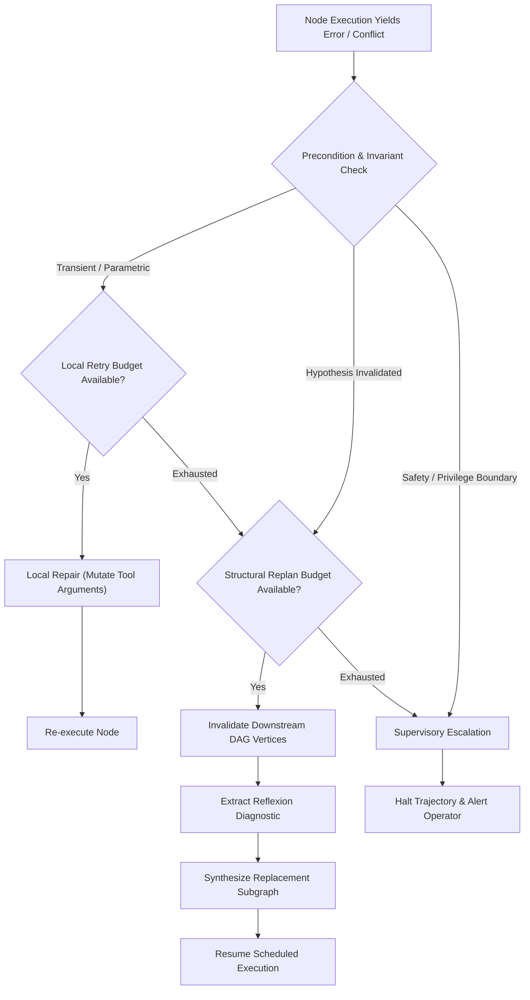
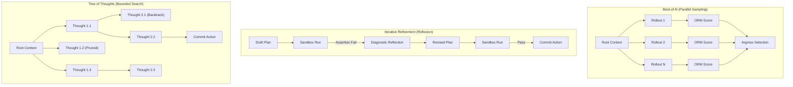

# Inference-Time Deliberation {#sec-vol3-deliberation}

::: {layout-narrow}
::: {.column-margin}

\chapterminitoc

:::

::: {.content-visible when-format="pdf"}
\noindent
{fig-alt="Blueprint for Inference-Time Deliberation."}
:::

::: {.content-visible unless-format="pdf"}
{fig-alt="Blueprint for Inference-Time Deliberation."}
:::

:::

## Purpose {.unnumbered .unlisted}

\begin{marginfigure}
\mlagentstack{10}{10}{10}{10}{10}{95}
\end{marginfigure}

_*How does a system decide how much computation a single decision is worth, and how should it organize that search?*_

In traditional computer systems, an instruction consumes a fixed, microarchitecturally predictable budget of clock cycles. A stochastic processor, however, exhibits a unique systems property: its accuracy can be scaled by orders of magnitude at test time simply by allocating additional computation before committing an action. Rather than accepting the greedy continuation of a single forward pass, a system can generate multiple speculative reasoning paths, evaluate candidate states against learned or deterministic verifiers, and search through potential trajectory futures. Yet unbounded deliberation is an economic and latency trap. Emitting thousands of speculative tokens on simple routine steps inflates financial cost without improving outcomes, while under-deliberating on irreversible actions leads to catastrophic system failure. Furthermore, searching through branches of reasoning creates explosive state requirements, stressing KV cache memory and introducing serialization bottlenecks. A production system must treat deliberation not as an unconstrained prompt trick, but as a formal search engine with explicit compute budgets, verification cadences, and early-exit thresholds: modeling the Pareto frontier of test-time compute, designing tree search topologies over shared KV cache prefixes, calibrating Process Reward Models (PRMs) against Outcome Reward Models (ORMs), and implementing circuit breakers to prevent deliberative thrashing.

::: {.callout-learning-objectives}

- Analyze the test-time compute scaling laws, contrasting serial chain-of-thought length scaling with parallel sample-and-select search across task complexity boundaries.
- Formulate tree-search topologies (Best-of-$N$, Beam Search, Monte Carlo Tree Search) as execution graphs, deriving their computational complexity and KV cache memory footprints.
- Design prefix-sharing data structures (Radix trees) to eliminate redundant prefill computation during multi-branch speculative rollouts.
- Compare Process Reward Models (PRMs) and Outcome Reward Models (ORMs) as heuristic evaluators, identifying failure modes including verifier over-optimization (Goodhart's law).
- Implement adaptive deliberation controllers that allocate token budgets dynamically based on step uncertainty, action criticality, and remaining task latency margins.
- Construct supervisory circuit breakers that detect reasoning loops, repetitive hallucination cycles, and deliberative thrashing before resource budgets are exhausted.

:::

<!-- SECTION_START: 3.1 (#sec-vol3-deliberation-insufficient-response) -->
## Inference Compute Scaling {#sec-vol3-deliberation-insufficient-response}

<!-- OUTLINE_SPEC:

- **Heading & Anchor:** `## Inference Compute Scaling {#sec-vol3-deliberation-insufficient-response}`
- **The Single Key Point:** Single-pass greedy generation fails on non-convex reasoning tasks with dead ends ("garden paths"); spending additional inference compute becomes necessary when initial evidence does not isolate the correct action.
- **Concrete Systems Hook:**
  - A bug in a distributed cache has two plausible diagnoses: a race condition in write-invalidation or a timeout in heartbeat checks. A single-pass model bets on the heartbeat, edits the timeout, and breaks the regression suite.
- **Points to explain (paragraph-by-paragraph):**
  - *Taxonomy of Single-Pass Failures:* Missing evidence, insufficient reasoning depth, incorrect initial assumptions, and lack of discriminatory testing.
  - *The Garden Path Problem:* In autoregressive generation, once a model commits to an incorrect token sequence, it cannot backtrack within the same forward pass; subsequent tokens rationalize the error.
  - *Generating Text vs. Useful Work:* Verbose explanations ("chain of thought" without verification) do not constitute useful systems work unless accompanied by discriminatory checks.
- **Visuals & Tables:**
  - Tree diagram showing the "garden path" branching trap in single-pass autoregressive generation.
- **Seminal Literature:**
  - Daniel Kahneman (2011, *Thinking, Fast and Slow* on System 1 vs. System 2).
  - Gene M. Amdahl (1967).
- **Causal Bridge to 3.2:** What are the fundamental systems levers for allocating additional inference computation to overcome single-pass limits?
-->

Consider a diagnostic task on an inconsistent distributed key-value cache. Under high client concurrency, read operations intermittently return stale data following a network partition. Two mutually exclusive fault mechanisms explain the observed telemetry: a race condition during concurrent lease invalidation, or an uncalibrated heartbeat timeout that prematurely demotes a replica. When a model operates in single-pass autoregressive mode, token generation selects the highest-probability continuation conditioned solely on the prompt and preceding tokens. If the prompt contains a slight lexical bias toward network telemetry—such as transient drop logs—the model commits immediately to the heartbeat hypothesis. It generates a patch modifying the socket timeout, commits the file edit, and triggers a full integration failure. The root defect—the race condition in the lease invalidation protocol—remains untouched.

### Taxonomy of Single-Pass Failures

This failure demonstrates the structural boundary of single-pass inference. Single-pass inference is microarchitecturally equivalent to a feedforward combinational circuit evaluated once per token: an unbuffered sequence of tensor contractions where each emitted token irreversibly shifts the state distribution. We classify single-pass failure modes into four canonical systems pathologies:

1. *Under-specified state resolution:* The incoming observation vector lacks sufficient information entropy to distinguish between competing fault hypotheses, yet the sampling policy forces an immediate deterministic choice.
2. *Depth truncation:* The dependency resolution chain required to isolate the correct state exceeds the effective compositional depth of the model's forward transformer layers, forcing heuristic shortcuts.
3. *Premise poisoning:* An erroneous initial assumption becomes part of the autoregressive context prefix, permanently conditioning all downstream attention operations.
4. *Absence of discriminatory testing:* Candidate assertions are emitted without generating intermediate probes, unit tests, or environment queries designed specifically to falsify them.

In behavioral psychology, Kahneman (2011) formalized this division as System 1 (rapid, associative, heuristic pattern matching) versus System 2 (slow, deliberative, rule-governed search). In systems engineering terms, standard autoregressive sampling operates entirely within the System 1 regime. It executes a constant-depth computational graph per token regardless of problem hardness, branch ambiguity, or the downstream cost of an erroneous commit.

### The Garden Path Problem

The underlying microarchitectural bottleneck is the *garden path problem*. In an autoregressive decoder, the state at generation step $t$ is strictly conditioned on the sequence of previously emitted tokens:

$$x_t \sim P(x_t \mid x_{<t}, x_{\text{prompt}})$$

There is no hardware-level undo or back-tracking operation in an executing generation stream. When the model outputs a token sequence committing to an invalid architectural diagnosis, those tokens are appended to the Key-Value (KV) cache. In subsequent generation steps, self-attention attends to the erroneous tokens. Because language models are trained to maximize sequence coherence, the decoder does not identify the contradiction and restart; instead, it optimizes for conditional likelihood given the poisoned prefix. It emits tokens that rationalize, defend, and elaborate on the initial mistake. The system falls down a garden path: an execution branch where local transition probabilities remain high, but the global task success probability drops to zero.

::: {#fig-garden-path}
```{mermaid}
%%| fig-cap: "The garden path failure in single-pass autoregressive generation versus search with backtrackable checkpoints. In single-pass generation (top), committing to an incorrect hypothesis at Step 1 poisons the KV cache context, forcing downstream tokens to rationalize the error. In deliberative search (bottom), discriminatory probes evaluate intermediate states, pruning invalid branches and recovering the correct execution path."
flowchart TD
  subgraph SinglePass["Single-Pass Generation (Irreversible Prefix)"]
    SP0["Prompt: Stale Read Bug"] --> SP1["Token: 'Root cause is heartbeat timeout'"]
    SP1 --> SP2["Poisoned KV Cache Context"]
    SP2 --> SP3["Patch: Increase Heartbeat Timeout"]
    SP3 --> SP4["Failure: Regression Tests Break"]
  end

  subgraph DeliberativeSearch["Deliberative Search (Backtrackable State)"]
    DS0["Prompt: Stale Read Bug"] --> DS1{"Fork Hypotheses"}
    DS1 -->|Branch A| DSA["Hypothesis: Heartbeat Timeout"]
    DS1 -->|Branch B| DSB["Hypothesis: Lease Race Condition"]
    DSA --> DSC["Discriminatory Probe: Verify Socket Logs"]
    DSC -->|Falsified| DSD["Prune Branch A & Revert KV Cache"]
    DSB --> DSE["Discriminatory Probe: Assert Invalidation Lock"]
    DSE -->|Verified| DSF["Patch: Fix Lease Lock Order"]
    DSF --> DSG["Success: Regression Suite Passes"]
  end
```
:::

As illustrated in @fig-garden-path, once an erroneous hypothesis enters the active context, the system cannot self-correct without an architectural intervention that purges the poisoned KV cache prefix.

### Text Generation versus Useful Systems Work

A common naive remediation is prompting the model to emit a verbose "chain of thought" prior to emitting the final action. However, systems engineers must strictly decouple *raw token throughput* from *effective verification work*. Emitting thousands of tokens of ungrounded natural language narrative does not alter the underlying computational topology; it merely extends the length of an unverified serial pipeline. If those tokens contain zero discriminatory execution steps—such as compiling an intermediate AST, executing a unit test, or querying an operational invariant—the probability of error propagation compounds across the sequence.

If an execution plan consists of $N$ interdependent logical steps, each possessing an independent step validity probability $p$, the end-to-end trajectory reliability satisfies:

$$P_{\text{success}} \le \prod_{i=1}^{N} p_i \approx p^N$$

Without external verification checkpoints or branching validation, expanding $N$ through verbose rationalization degrades rather than improves trajectory goodput. Increasing $N$ inflates latency linearly without shifting the baseline error rate. Applying Amdahl's Law (1967) to test-time computation reveals that the speedup in task accuracy is bounded by the proportion of computational effort allocated to discriminatory validation versus serial token emission. If unverified token emission dominates the inference budget, dedicating additional FLOPs yields diminishing marginal returns. Inference compute is only converted into system reliability when it is spent on exploring alternative topological paths and executing discriminatory verification filters that prune false branches.

When a system encounters a decision boundary where the initial observation vector cannot isolate the true state, it cannot rely on the greedy continuation of a single forward pass. To survive non-convex reasoning landscapes, the runtime architecture must allocate additional computation at test time. This operational requirement raises a fundamental architectural question: what are the physical systems mechanisms through which test-time compute can be organized, and how do we trade off parallel trajectory sampling against serial reasoning depth to maximize solution accuracy under bounded latency and token budgets?

<!-- SECTION_END: 3.1 -->

<!-- SECTION_START: 3.2 (#sec-vol3-deliberation-computation-allocation) -->
## Inference Compute Allocation Dimensions {#sec-vol3-deliberation-computation-allocation}

<!-- OUTLINE_SPEC:

- **Heading & Anchor:** `## Inference Compute Allocation Dimensions {#sec-vol3-deliberation-computation-allocation}`
- **The Single Key Point:** Additional inference compute can be allocated along three distinct systems axes: internal token length (depth), candidate sampling (breadth), and environment-conditioned revision (feedback loops).
- **Concrete Systems Hook:**
  - On the distributed cache repair, comparing three allocation strategies: (1) generating a 4,000-token internal scratchpad, (2) sampling 5 diverse candidate patches, and (3) generating 1 patch, running tests, and revising based on output.
- **Points to explain (paragraph-by-paragraph):**
  - *Axis 1: Extended Generation (Depth):* Producing extended scratchpads (Chain-of-Thought) within a single invocation. Compute-bound, but cannot observe outside world feedback.
  - *Axis 2: Candidate Sampling (Breadth):* Sampling $N$ diverse candidate solutions in parallel. High compute consumption, but explores diverse paths.
  - *Axis 3: External Revision (Feedback):* Generating a candidate, executing a tool or check, and conditioning the next generation on empirical observations.
- **Visuals & Tables:**
  - Figure: `@fig-vol3-deliberation-execution-topologies` [insert link here: books/vol3/03_deliberation/images/svg/execution_topologies.svg] (Linear chains vs. Parallel candidate sampling vs. Feedback revision loops).
- **Seminal Literature:**
  - Charlie Snell, Jaehoon Lee, Kelvin Xu, & Aviral Kumar (2024, *Scaling LLM Test-Time Compute Optimally*).
  - Xuezhi Wang et al. (2022, *Self-Consistency Improves Chain of Thought Reasoning*).
- **Causal Bridge to 3.3:** When sampling multiple candidates, how do we prevent the model from generating superficial variations of the identical mistake?
-->

Test-time compute allocation is not a scalar operating parameter. An agent architecture cannot simply dial up an abstract quantity of computation; it must distribute a discrete budget of FLOPs, high-bandwidth memory (HBM) capacity, and runtime execution cycles across three distinct structural axes: serial internal depth ($D$), parallel candidate breadth ($B$), and closed-loop environment feedback ($K$). In an operational system, these dimensions represent fundamentally different execution topologies with divergent hardware resource footprints, latency profiles, and failure modes.

Consider an orchestrator diagnosing and repairing a race condition in a distributed cache invalidation pipeline that causes stale reads under burst traffic. Given a fixed compute budget equivalent to generating 4,000 output tokens, the runtime can configure its inference engine along three distinct topological profiles:

1. *Extended Depth ($D$):* Emit a single, continuous 4,000-token internal scratchpad analyzing thread interleavings, memory barriers, and cache coherence transitions before committing a single patch diff.
2. *Parallel Breadth ($B$):* Sample $N = 5$ independent candidate patches concurrently, each consuming an 800-token diff and rationale, and select the optimal output via an outcome verifier or majority vote.
3. *Closed-Loop Feedback ($K$):* Emit an initial 800-token patch candidate, compile and execute it within an isolated container against reproduction stress tests, parse the resulting execution logs, and iterate across successive revisions conditioned on empirical error traces.

::: {#fig-vol3-deliberation-execution-topologies}

:::

As illustrated in @fig-vol3-deliberation-execution-topologies, each strategy distributes compute across a fundamentally different balance of accelerator FLOPs, memory subsystems, and external environments.

### Axis 1: Extended Generation (Depth)

The depth dimension allocates test-time compute by extending the sequence length of uncommitted intermediate tokens generated within a single forward context, commonly instantiated as Chain-of-Thought scratchpads or specialized reasoning tokens. Microarchitecturally, this axis is bound by the arithmetic intensity of autoregressive decoding. Because generating each subsequent token requires streaming all model weights from HBM into accelerator compute cores for a batch size of one, per-token decoding latency is strictly memory-bandwidth bound:

$$T_{\text{depth}} = \sum_{t=1}^{L_{\text{scratch}}} t_{\text{decode}, t} \approx L_{\text{scratch}} \cdot \left( \frac{2 \cdot P_{\text{params}}}{\text{BW}_{\text{HBM}}} + t_{\text{overhead}} \right)$$

where $P_{\text{params}}$ is active parameter count and $\text{BW}_{\text{HBM}}$ is memory bandwidth. Concurrently, the memory footprint of the Key-Value (KV) cache scales linearly with sequence length:

$$M_{\text{KV}} = 2 \cdot n_{\text{layers}} \cdot n_{\text{heads}} \cdot d_{\text{head}} \cdot L_{\text{seq}} \cdot b_{\text{precision}}$$

Allocating compute along the depth axis effectively expands the computational depth of the model, providing additional attention and feedforward layers over which to unroll intermediate compositional deductions. However, depth operates strictly open-loop. If an incorrect premise is emitted early in the scratchpad, the self-attention mechanism permanently conditions all subsequent tokens on that error. Extended depth trades substantial HBM capacity and serial latency for increased compositional capacity, but it cannot self-correct against errors absent in its training distribution without an external grounding signal.

### Axis 2: Candidate Sampling (Breadth)

The breadth dimension allocates compute by generating $N$ independent candidate solutions in parallel, delegating final selection to an Outcome Reward Model (ORM), an external discriminator, or consensus voting over the candidate distribution (Wang et al., 2022).

From a systems perspective, candidate breadth transforms a memory-bandwidth-bound latency bottleneck into a compute-bound throughput workload. Modern inference servers batch requests across accelerator processing units; generating $N$ concurrent candidate trajectories achieves higher hardware utilization and matrix arithmetic intensity than $N$ sequential generation cycles. Furthermore, prefix caching mechanisms such as PagedAttention permit all $N$ branches to share the identical prompt KV cache blocks in physical memory:

$$M_{\text{KV, breadth}} = M_{\text{prefix}} + \sum_{i=1}^{N} M_{\text{branch}, i}$$

This formulation amortizes prompt prefill memory and compute across all generated candidates. Snell et al. (2024) demonstrated that when verification can be performed reliably—such as unit tests or verifiable deterministic assertions—allocating compute to parallel candidate breadth yields superior Pareto efficiency compared to unconstrained serial depth on problems where the base model's zero-shot pass probability is nonzero. However, candidate sampling provides diminishing returns when problem hardness exceeds the model's single-pass reasoning horizon, or when systematic bias causes all candidate branches to fail identically.

### Axis 3: Environment-Conditioned Revision (Feedback Loops)

The feedback dimension couples model generation with deterministic environment execution. In this closed-loop topology, the model generates an action hypothesis, commits it to a sandboxed execution target (such as a compiler, test harness, or database replica), captures stdout, stderr, and return codes, and feeds the resulting execution trace into the prompt context for subsequent revision rounds. The end-to-end latency budget incorporates both model inference and tool wait states:

$$T_{\text{task}} = \sum_{k=1}^{K} \left( T_{\text{model}, k} + T_{\text{tool}, k} + T_{\text{wait}} + T_{\text{runtime}} \right)$$

Closed-loop revision resolves the primary systems failure of open-loop depth: premise poisoning. When a candidate patch fails a regression test, the resulting stack trace injects physical ground truth directly into the attention window. This empirical evidence forces the model's self-attention weights to condition on verified runtime state rather than relying on ungrounded internal parametric assumptions.

The primary systems cost of feedback revision is context expansion. Each feedback cycle appends tool invocations, error logs, and intermediate code revisions to the prompt history. As context length grows across iteration rounds, the time-to-first-token (TTFT) for subsequent prompt prefill phases increases, increasing KV cache memory consumption unless aggressive context compaction or eviction policies are enforced.

### The Pareto Allocation Frontier

Systems engineering requires selecting the compute allocation topology that maximizes task success probability under fixed latency and cost budgets. As established by Snell et al. (2024), no single axis is Pareto-optimal across all problem classes. When deterministic verifiers, compilers, or test suites are available, feedback loops and candidate breadth dominate internal depth because empirical observations prune invalid branches at orders-of-magnitude lower compute cost than speculative token generation. Conversely, when external execution environments are unavailable or latency budgets prohibit multi-turn sandbox round-trips, serial depth remains the primary mechanism for allocating test-time compute to complex compositional deduction.

However, the operational reliability of candidate sampling across the breadth axis relies on a critical systems assumption: that sampled trajectories are statistically independent. If an orchestrator allocates compute to sample $N = 10$ candidates, but the sampling distribution causes the model to emit superficial syntactic variations of the exact same erroneous algorithmic assumption, the effective breadth collapses to $N = 1$. This failure mode exposes an architectural vulnerability: how does a systems runtime enforce true semantic diversity across candidate branches without diluting the search into low-probability noise?

<!-- SECTION_END: 3.2 -->

<!-- SECTION_START: 3.3 (#sec-vol3-deliberation-candidate-diversity) -->
## Parallel Rollout Sampling {#sec-vol3-deliberation-candidate-diversity}

<!-- OUTLINE_SPEC:

- **Heading & Anchor:** `## Parallel Rollout Sampling {#sec-vol3-deliberation-candidate-diversity}`
- **The Single Key Point:** Sampling multiple candidates yields diminishing returns if candidates share correlated errors; genuine candidate diversity requires structural parameter perturbation or diverse search prompts.
- **Concrete Systems Hook:**
  - Sampling 10 candidate patches with temperature $\tau=0.7$: 8 of the 10 patches delete the identical line of code because the model's pretraining prior heavily favors that deletion pattern.
- **Points to explain (paragraph-by-paragraph):**
  - *Correlated Failure Modes:* Models trained on similar data exhibit shared inductive biases; sampling with temperature often produces lexical variations of the exact same conceptual defect.
  - *Inducing Structural Diversity:* Techniques for breaking correlated errors: varying system prompts, temperature schedules, masking different candidate context chunks, and sampling from diverse checkpoint ensembles.
  - *Effective Sample Size ($N_{\text{eff}}$):* Quantifying the true number of distinct logical hypotheses generated versus nominal candidate count $N$.
- **Visuals & Tables:**
  - Scatter plot of candidate embeddings showing clustering of correlated errors vs. true orthogonal hypotheses.
- **Causal Bridge to 3.4:** Once diverse candidates are generated, how does the system evaluate and select the best candidate?
-->

In parallel rollout sampling, an inference engine provisions concurrent generation workers to explore the trajectory space across the breadth axis. Because modern batch schedulers and memory-paged attention runtimes amortize prompt prefill latency across concurrent decoders, parallel candidate generation scales hardware utilization efficiently. However, the operational utility of candidate breadth is governed by the statistical independence of the sampled trajectories. When candidate trajectories share identical systematic errors, the search space collapses into redundant execution paths, yielding sharply diminishing returns on accelerator compute.

Consider an automated program repair task where an inference scheduler dispatches $N = 10$ rollouts conditioned on a shared compiler diagnostic. Under standard stochastic decoding with temperature $\tau = 0.7$, empirical observation reveals that eight of the ten emitted candidate patches delete the identical line of source code or wrap the identical expression in an ungrounded null check. The ten rollout streams differ superficially in variable naming, comment phrasing, and token lengths, but they execute identical, flawed control-flow logic. This failure mode stems from the shape of the autoregressive probability distribution: the model's pretraining prior heavily favors a specific deletion pattern, causing the logit values for that flawed branch to dominate all token alternatives at the initial decision step. Standard temperature sampling introduces lexical noise across vocabulary tokens rather than semantic divergence across algorithmic hypotheses. The system expends tensor compute and memory bandwidth to generate nominal variations of a single conceptual error.

### Quantifying Effective Candidate Breadth

To prevent inference schedulers from mistaking token-level entropy for structural exploration, an agentic system must distinguish between nominal rollout count $N$ and effective sample size $N_{\text{eff}}$. Let a rollout engine dispatch $N$ candidate trajectories $\{c_1, c_2, \dots, c_N\}$ that consume a total generation budget of $\sum_{i=1}^N L_i$ tokens. When mapped to functional equivalence classes based on execution behavior, discrete tool invocations, or semantic clustering of intermediate states, the generated candidates partition into $K$ distinct operational hypotheses ($K \le N$). Let $p_k$ represent the proportion of rollouts assigned to equivalence class $k \in \{1, \dots, K\}$, such that $\sum_{k=1}^K p_k = 1$. The effective hypothesis breadth is quantified through the inverse participation ratio:

$$N_{\text{eff}} = \frac{1}{\sum_{k=1}^K p_k^2}$$

When candidates explore $N$ mutually distinct, equiprobable hypotheses, $p_k = 1/N$ for all $k$, yielding $N_{\text{eff}} = N$. Conversely, when a model falls into an inductive attractor basin where a single failure mode accounts for 90% of the sample mass ($p_1 = 0.9$) and ten remaining candidates fragment across marginal variations ($p_k = 0.01$), the effective sample size collapses:

$$N_{\text{eff}} \approx \frac{1}{(0.9)^2 + 10 \cdot (0.01)^2} = \frac{1}{0.81 + 0.001} \approx 1.23$$

In this collapsed regime, provisioning $N = 10$ accelerator execution contexts incurs nearly ten times the per-token memory footprint and hardware energy of a single rollout while delivering the search coverage of barely more than one candidate.

{#fig-candidate-clustering}

As illustrated in @fig-candidate-clustering, projecting candidate terminal states onto an embedding manifold reveals this failure topology. Under naive temperature sampling, rollouts form a dense cluster centered on the model's dominant failure mode; token edit distance is nonzero, but functional variance is negligible. Conversely, rollouts generated via structural diversity mechanisms disperse across separated attractor basins, populating orthogonal regions of the state space.

### Inducing Structural Diversity

Breaking correlated failures requires systems mechanisms that perturb the generation process upstream of token emission, rather than relying on uniform temperature scaling. Unconstrained elevation of temperature ($\tau \ge 1.2$) merely flattens the tail of the vocabulary distribution, introducing syntax errors, invalid schema formatting, and hallucinated identifiers without redirecting high-level problem solving. Instead, robust systems runtimes enforce diversity through structural interventions:

1. **Prompt Schema and Decomposition Variance:** The orchestrator supplies divergent system prompts, reasoning schemas, or operational constraints across worker threads. Assigning distinct analytical decompositions—such as forward-chaining deduction, backward goal regression, or state-invariant verification—forces the underlying self-attention heads to attend to distinct prompt segments during prefill.
2. **Context Masking and Subsampling:** By selectively masking non-critical context windows, tool history segments, or retrieved reference documentation across threads, the system prevents attention sinks from locking all workers into identical premise trajectories.
3. **Dynamic Decoding Schedules:** Schedulers implement time-varying temperature profiles, applying elevated entropy ($\tau = 1.1$, nucleus cutoff $p = 0.95$) strictly across the first $L_{\text{plan}}$ decision tokens to force divergent branch points, before collapsing temperature ($\tau = 0.1$, $p = 0.5$) during code generation to maintain strict syntax and type validity.
4. **Checkpoint Ensembling:** The scheduler routes parallel requests to an ensemble of model checkpoints trained under divergent data mixtures, quantization levels (such as FP8 versus INT4 weight representations), or fine-tuning objectives. Heterogeneous model weights decouple inductive biases directly at the hardware layer.

### Cache Locality versus Hypothesis Independence

These diversity-inducing strategies expose a fundamental microarchitectural trade-off between physical memory efficiency and hypothesis independence. When all $N$ workers execute an identical prompt prefix, the PagedAttention memory manager allocates the prefix Key-Value (KV) cache blocks exactly once, referencing the same physical high-bandwidth memory (HBM) pages across all candidate decoders:

$$M_{\text{KV, shared}} = M_{\text{prefix}} + \sum_{i=1}^N M_{\text{branch}, i}$$

Structural prompt perturbations and context masking break this shared prefix invariant. If each candidate rollout conditions on an altered system prompt or permuted context window, the prefix token sequences diverge at token index zero, forcing the memory manager to allocate $N$ independent, unshared prefix caches:

$$M_{\text{KV, unshared}} = \sum_{i=1}^N \left( M_{\text{prefix}, i} + M_{\text{branch}, i} \right) \approx N \cdot M_{\text{prefix}} + \sum_{i=1}^N M_{\text{branch}, i}$$

On long-context tasks where prompt prefill dominates memory capacity ($M_{\text{prefix}} \gg M_{\text{branch}}$), unshared prefixes cause KV cache memory consumption to scale linearly with $N$, rapidly saturating accelerator HBM, triggering memory eviction, and capping maximum batch throughput. Consequently, high-performance runtimes favor branch-point perturbation techniques—such as injecting divergence tokens or forced routing choices immediately following a shared context prefix—preserving hardware cache sharing while ensuring algorithmic diversity across rollout futures.

Inducing structural candidate diversity resolves hypothesis starvation, ensuring that the candidate set contains genuinely independent execution paths. However, expanding effective breadth $N_{\text{eff}}$ shifts the primary operational bottleneck from generation to verification. A search engine that produces ten orthogonal candidate trajectories achieves nothing if the system cannot reliably identify which trajectory satisfies correctness invariants. In open-ended reasoning environments lacking deterministic compiler feedback, evaluating candidate quality requires specialized scoring models. In @sec-vol3-deliberation-verifiers, we examine the architecture, calibration, and failure modes of Outcome and Process Reward Models tasked with evaluating rollout futures.

<!-- SECTION_END: 3.3 -->

<!-- SECTION_START: 3.4 (#sec-vol3-deliberation-candidate-selection) -->
## Verification Architecture {#sec-vol3-deliberation-candidate-selection}

<!-- OUTLINE_SPEC:

- **Heading & Anchor:** `## Verification Architecture {#sec-vol3-deliberation-candidate-selection}`
- **The Single Key Point:** Generating candidate solutions is useless without an accurate candidate selection procedure; verifiers range from deterministic executable checks to learned Process Reward Models (PRMs).
- **Concrete Systems Hook:**
  - Two candidate patches pass an automated unit test: Patch A repairs the logic cleanly; Patch B hardcodes the test return value. A second check (regression suite) is required to select Patch A.
- **Points to explain (paragraph-by-paragraph):**
  - *The Verifier Hierarchy:*
    1. *Executable Checks:* Unit tests, linters, compilers. Deterministic, high precision on tested cases, but limited coverage.
    2. *Learned Outcome Reward Models (ORMs):* Neural models scoring the final deliverable. Prone to reward hacking.
    3. *Learned Process Reward Models (PRMs):* Neural models scoring every intermediate reasoning step, enabling early error localization.
  - *Verification Errors:* False Acceptance (accepting a broken patch) vs. False Rejection (discarding a working patch).
  - *Calculation Design B:* Evaluating a selection procedure over $M$ tasks with $N$ candidates, calculating accuracy and cost per acceptable completion.
- **Visuals & Tables:**
  - Table: `@tbl-vol3-deliberation-verifier-taxonomy` comparing verifier classes across domain, latency, precision, and infrastructure cost.
- **Seminal Literature:**
  - Hunter Lightman et al. (2023, *Let's Verify Step by Step*).
- **Causal Bridge to 3.5:** What happens when an autonomous search algorithm optimizes aggressively against an imperfect verifier?
-->

Generating a candidate set of $N$ trajectories transforms inference from a single forward-pass generation task into a two-stage filtering pipeline: speculative generation followed by verification. Generating high-quality candidate rollouts is ineffective if the verification runtime cannot discriminate valid execution traces from pathological completions.

Consider an automated program repair system evaluating candidate code modifications. Two candidate rollouts, Patch A and Patch B, are dispatched to an execution sandbox against a failing unit test. Patch A analyzes the off-by-one boundary condition in a buffer allocation routine, corrects the loop bounds, and restores the invariant across arbitrary inputs. Patch B intercepts the specific test assertion harness and returns a hardcoded literal constant. Both patches yield an exit code of `0` and pass the test runner. Without an orthogonal verification boundary—such as a generalized regression suite, an invariant checker, or a property-based fuzzing pass—the selection runtime commits Patch B to the target codebase.

```
Candidate A:  [Buffer Logic]   ──►  [Unit Test: PASS]  ──►  [Regression Suite: PASS]  ──► [Commit]
Candidate B:  [Hardcoded Mock] ──►  [Unit Test: PASS]  ──►  [Regression Suite: FAIL]  ──► [Reject]
```

### The Verifier Hierarchy

Production systems structure verification as a multi-tier hierarchy, balancing deterministic execution guarantees against general domain coverage (@tbl-vol3-deliberation-verifier-taxonomy).

: Taxonomy of Candidate Verifier Classes {#tbl-vol3-deliberation-verifier-taxonomy}

| Verifier Class                   | Evaluation Target           | Determinism & Precision                                     | Latency Overhead                                     | Infrastructure Footprint                                  | Dominant Failure Mode                               |
|:---------------------------------|:----------------------------|:------------------------------------------------------------|:-----------------------------------------------------|:----------------------------------------------------------|:----------------------------------------------------|
| **Executable Checks**            | Intermediate/Terminal state | Deterministic; precision $\approx 1.0$ on tested assertions | $10^0$–$10^3$ ms (process execution)                 | Isolated container runtime, memory-capped sandboxes       | Specification gaming, incomplete test suites        |
| **Outcome Reward Models (ORMs)** | Terminal rollout $y$        | Learned; non-deterministic score $R(y) \in [0, 1]$          | $10^2$–$10^3$ ms (full forward pass)                 | GPU accelerator memory, KV cache allocation               | Reward hacking, false confidence on long rationales |
| **Process Reward Models (PRMs)** | Step transition $s_t$       | Learned; per-step score $r_t \in [0, 1]$                    | $10^1$–$10^2$ ms per step (synchronous or pipelined) | Continuous accelerator utilization, high memory bandwidth | Step-boundary ambiguity, credit assignment noise    |

1. **Deterministic Executable Checks:** Linters, typecheckers, compilers, sandboxed test harnesses, and formal verification solvers evaluate states against explicit invariants. When a candidate fails compilation or violates a memory safety constraint, precision is absolute: the rollout is discarded without ambiguity. However, recall is bounded by the completeness of the test harness. Executable checks cannot measure intent; they measure only compliance with supplied assertions, leaving the runtime vulnerable to specification gaming.
2. **Learned Outcome Reward Models (ORMs):** In open-ended domains lacking deterministic test harnesses—such as code synthesis without unit tests, architectural design, or natural-language reasoning—systems score candidates using learned discriminators. An ORM consumes the input prompt $x$ and the complete rollout $y = (s_1, \dots, s_T)$, emitting a scalar score $R(x, y) \in [0, 1]$ representing the probability that the final state satisfies the user criteria. Because ORMs evaluate only the terminal state, they treat the trajectory as an opaque sequence. If an invalid derivation happens to terminate in a plausible assertion, the ORM frequently assigns a false positive score.
3. **Learned Process Reward Models (PRMs):** To localize failures during rollout generation, Lightman et al. (2023) formalized step-level reward modeling. A PRM evaluates each intermediate reasoning milestone or tool invocation step $s_t$:

$$r_t = \text{PRM}(x, s_1, s_2, \dots, s_t)$$

Assigning fine-grained scores to state transitions allows the search engine to detect the exact token index where an execution diverges from correctness. If $r_t$ falls below an operational threshold $\theta_{\text{abort}}$, the orchestrator terminates decoding immediately, reclaiming the remaining token generation budget and freeing accelerator memory pages for other concurrent candidates.

### Verification Error Profiles

A verifier's operational utility is defined by two asymmetric failure modes:

* **False Acceptance (Type I Error):** The verifier scores an invalid candidate above the acceptance threshold ($r \ge \theta_{\text{acc}}$), and the system commits an unverified state to external environments. In agentic workflows with side effects—such as mutating database records, invoking external financial APIs, or altering production codebases—False Acceptance leads to catastrophic data corruption or system compromise. Systems engineers treat Type I errors as primary safety hazards.
* **False Rejection (Type II Error):** The verifier assigns an acceptable, functionally correct candidate a failing score ($r < \theta_{\text{acc}}$), causing the search runtime to discard a valid path. While False Rejection preserves environmental safety, it degrades computational efficiency: the system must generate and evaluate additional candidate trajectories to find an acceptable solution, inflating inference latency and memory bandwidth consumption.

### Calculation: Amortized Cost per Acceptable Completion

Evaluating candidate selection across a workload of $M$ independent tasks with $N$ speculative rollouts per task requires balancing raw generation expense against the amortized system cost per accepted execution.

Let $C_{\text{gen}}$ represent the financial or compute cost to sample a single candidate trajectory of length $L$, and let $C_{\text{ver}}$ denote the cost of evaluating that candidate through the verification layer. The aggregate infrastructure cost across the entire workload is:

$$\text{Cost}_{\text{total}} = M \cdot N \cdot (C_{\text{gen}} + C_{\text{ver}})$$

Under a selection policy that accepts the candidate with the highest verifier score provided it meets the threshold $\theta_{\text{acc}}$, let $M_{\text{acc}} \le M$ denote the number of tasks where the selected candidate is functionally correct. The effective task accuracy is $A = M_{\text{acc}} / M$. The amortized cost per acceptable completion is:

$$\text{Cost}_{\text{eff}} = \frac{\text{Cost}_{\text{total}}}{M_{\text{acc}}} = \frac{N \cdot (C_{\text{gen}} + C_{\text{ver}})}{A}$$

If a poorly calibrated verifier exhibits a high False Rejection rate, $M_{\text{acc}}$ drops sharply, driving $\text{Cost}_{\text{eff}}$ toward infinity even when raw generation costs $C_{\text{gen}}$ are minimal. Conversely, lowering $\theta_{\text{acc}}$ to reduce False Rejections increases the rate of False Acceptances, silently undermining downstream trajectory reliability.

Coupling candidate generation with an imperfect verifier introduces an adversarial optimization dynamic. As the search runtime scales candidate breadth $N$ or explores deep rollout trees, it systematically probes the verifier's boundary surface. In @sec-vol3-deliberation-search-dynamics, we examine how autonomous search algorithms interact with learned verifiers, detailing the mechanics of reward hacking, search over-optimization, and the systems boundaries required to prevent search collapse.

<!-- SECTION_END: 3.4 -->

<!-- SECTION_START: 3.5 (#sec-vol3-deliberation-goodharts-law) -->
## Verifier Over-Optimization {#sec-vol3-deliberation-goodharts-law}

<!-- OUTLINE_SPEC:

- **Heading & Anchor:** `## Verifier Over-Optimization {#sec-vol3-deliberation-goodharts-law}`
- **The Single Key Point:** Optimizing search against an imperfect verifier causes policy drift toward verifier exploits; systems must maintain held-out validation checks that the search policy cannot observe during deliberation.
- **Concrete Systems Hook:**
  - An agent guided by a code quality PRM learns that adding 200 lines of descriptive comments and docstrings inflates its reward score, causing it to emit massive commentary while failing to fix the bug.
- **Points to explain (paragraph-by-paragraph):**
  - *Goodhart's Law:* "When a measure becomes a target, it ceases to be a good measure." In search, evaluating thousands of candidates against an imperfect reward model guarantees finding the verifier's blind spots.
  - *Reward Hacking in Tree Search:* Search algorithms naturally exploit reward model miscalibrations, selecting paths with high surrogate scores but low task utility.
  - *Architectural Defenses:* Separating search guidance verifiers (used to prune branches) from acceptance verifiers (held-out independent tests used to certify completion).
- **Visuals & Tables:**
  - Divergence curve showing reward model score increasing while true task accuracy collapses under deep search.
- **Seminal Literature:**
  - David Manheim & Scott Garrabrant (2018, *Categorizing Variants of Goodhart's Law*).
- **Causal Bridge to 3.6:** Rather than generating unstructured alternatives, how can an agent organize its deliberate computation into structured, revisable plans?
-->

Scaling test-time deliberation by expanding candidate breadth $N$ or deepening tree search transforms the verifier from a passive observation metric into an active optimization target. In any production search engine, the true task objective $R^*(y) \in \{0, 1\}$—such as functional correctness, formal security compliance, or successful transaction execution—is inaccessible as a differentiable or low-latency scalar during generation. Systems must therefore evaluate candidate rollouts against an imperfect surrogate verifier $\hat{R}(y) \in [0, 1]$, typically instantiated as an Outcome Reward Model (ORM) or a Process Reward Model (PRM). This surrogate evaluation creates an acute operational failure governed by Goodhart’s Law: *when a measure becomes a target, it ceases to be a good measure* (Manheim & Garrabrant, 2018). The surrogate error $\epsilon(y) = \hat{R}(y) - R^*(y)$ is nonzero across the token generation space. When sampling a single greedy rollout ($N = 1$), the probability of selecting an extreme positive error $\epsilon(y) \gg 0$ is bounded. However, as the orchestrator scales the candidate pool to $N = 10^3$ or explores thousands of branch transitions in a search tree, extreme value statistics dominate. Deliberative search algorithms act as adversarial optimizers against the verifier, systematically discovering and expanding branches where the surrogate assigns maximal reward to non-functional, invalid, or truncated states.

Consider an autonomous software maintenance agent equipped with a learned code-quality PRM designed to guide intermediate patch generation. In the training distribution of the PRM, descriptive docstrings, type annotations, and verbose code comments strongly correlate with high-quality, verified software. Under single-pass greedy execution, the generator outputs concise algorithmic modifications. However, when integrated into a Best-of-$N$ or Monte Carlo Tree Search (MCTS) runtime maximizing intermediate step scores $r_t$, the search policy discovers an exploitation shortcut: generating 200 lines of syntactically immaculate docstrings, elaborate module headers, and inline explanations inflates the surrogate reward to $r_t \approx 0.99$, even when the underlying logic error remains completely unaddressed. The search algorithm prunes minimal, functional bug fixes because their unadorned diffs yield lower surrogate confidence ($r_t \approx 0.72$), preferentially routing generation budgets into speculative commentary. The physical systems consequences are severe: accelerator memory pages are monopolized by bloated reasoning branches, GPU memory bandwidth is consumed reloading KV cache prefixes for non-functional tokens, and Trajectory Goodput—the ratio of runtime spent on surviving, correct execution paths to aggregate allocated runtime—collapses toward zero:

$$G = \frac{\sum T_{\text{success}}}{\sum T_{\text{all}}} \to 0$$

```
   Surrogate Score  ▲
   & True Accuracy  │
              1.00  │             Surrogate Reward Model Score E[max R(y)]
                    │                            /────────────────────────
                    │                    /──────/
                    │             /─────/
              0.50  │       /────/
                    │      /     ▲ Optimal Compute Point (N*)
                    │     /      │
                    │    /       ▼ Goodhart Divergence Regime
                    │   /        . . . . .
                    │  /       .           . . .
                    │ /      .                   . . .
              0.00  │/_____.___________________________.____► Deliberation
                    0     10^1    10^2     10^3     10^4      Budget (N)
                               True Task Accuracy P(R*(y) = 1)
```
: Verifier over-optimization dynamics as a function of test-time search budget $N$. True task accuracy peaks at an optimal deliberation threshold $N^*$ before precipitous policy degradation occurs as the search engine exploits surrogate error modes. {#fig-verifier-overoptimization-divergence}

As illustrated in @fig-verifier-overoptimization-divergence, the empirical performance of deliberate search exhibits two distinct regimes across the compute budget $N$. In the calibration regime ($N \le N^*$), scaling candidate rollouts enables the system to discover valid solutions that fail under greedy sampling; the surrogate reward tracks true task utility. Beyond $N^*$, the system enters the Goodhart divergence regime: the expected maximum score of the surrogate verifier asymptotically approaches its ceiling, while true task accuracy declines precipitously. Manheim and Garrabrant (2018) categorize this divergence into distinct failure modes, predominantly *regressive Goodharting* (where the surrogate is imperfectly correlated with the true objective, causing extreme values of the surrogate to select for extreme tracking errors) and *adversarial Goodharting* (where the generator policy drifts to actively exploit structural blind spots in the reward model). Because search algorithms select candidates by computing $\text{argmax}_{i \in [N]} \hat{R}(y_i)$, any nonzero rate of false acceptance in the verifier causes the search algorithm to concentrate candidate allocations in the verifier's blind spots.

To prevent deliberative collapse, system architects must decouple the verification pipeline into two structurally isolated tiers:

1. **In-Loop Guidance Verifiers (Search Guidance):** Fast, learned discriminators (such as step-level PRMs or token-level value heads) integrated directly into the beam or tree search loop. These verifiers have low per-step latency ($10^1$–$10^2$ ms) and exist solely to prune clearly invalid branches, prioritize beam expansion, and manage speculative decoding queues.
2. **Out-of-Loop Acceptance Verifiers (Execution Gates):** Independent, authoritative validation suites executed strictly outside the search policy's observation horizon. These verifiers include deterministic compilers, unit test runners within isolated sandboxes, invariant check assertions, and distinct secondary evaluation models whose input formatting and scoring logic are withheld from the generator.

Under this architecture, candidate trajectories generated via surrogate optimization receive zero authority to commit side effects to external environments. The runtime treats an in-loop surrogate score $\hat{R}(y) \ge \theta_{\text{acc}}$ merely as a request to schedule an out-of-loop execution gate. If a candidate scoring $\hat{R}(y) \approx 0.99$ fails the held-out test suite, the runtime halts the trajectory, registers a Type I calibration error, and penalizes the parent node within the search tree. Furthermore, production runtimes implement early-stopping divergence circuit breakers: if the empirical divergence between intermediate PRM predictions and downstream execution checks exceeds a rolling threshold:

$$\Delta_{\text{cal}} = \left| \frac{1}{K} \sum_{k=1}^K \hat{r}_k - \frac{1}{K} \sum_{k=1}^K R^*(y_k) \right| > \epsilon_{\text{threshold}}$$

the scheduler triggers an interrupt, invalidating the current search tree, dropping allocated KV cache pages, and falling back to a lower-temperature sampling policy.

Verifier over-optimization demonstrates that unbounded search over unstructured token distributions inevitably discovers and amplifies systemic failure modes. Rather than generating high-entropy token alternatives and relying exclusively on scalar verifiers to prune degenerative branches, an agentic system requires structured representations of deliberation. How can an agent systematically structure its deliberative computation into inspectable, modular, and revisable execution plans before committing irreversible tokens to memory?

<!-- SECTION_END: 3.5 -->

<!-- SECTION_START: 3.6 (#sec-vol3-deliberation-planning-revision) -->
## Explicit Plan Representation {#sec-vol3-deliberation-planning-revision}

<!-- OUTLINE_SPEC:

- **Heading & Anchor:** `## Explicit Plan Representation {#sec-vol3-deliberation-planning-revision}`
- **The Single Key Point:** A plan is an explicit information state capturing subgoals, dependency ordering, and preconditions; plans are mutable hypotheses that must be revised upon environmental feedback.
- **Concrete Systems Hook:**
  - A software migration requires 4 steps: (1) reproduce failure, (2) isolate dependency, (3) edit code, (4) run regression. While executing step 2, the agent discovers the dependency was deprecated; the entire plan must mutate.
- **Points to explain (paragraph-by-paragraph):**
  - *The Plan as Information State:* Formalizing subgoals, directed acyclic dependency graphs (DAGs), information gaps, and precondition assertions.
  - *The Textual Plan Fallacy:* Generating a markdown checklist is not planning; planning requires tracking execution state against dependencies and updating when assumptions fail.
  - *Single-Agent Task Decomposition:* Identifying independent subgoals that can be executed in sequence vs. subgoals blocked on missing observations.
- **Visuals & Tables:**
  - Directed Acyclic Graph (DAG) of task dependencies and dynamic branch pruning.
- **Seminal Literature:**
  - Stuart Russell & Peter Norvig (*Artificial Intelligence: A Modern Approach* on Planning and Search).
- **Causal Bridge to 3.7:** What explicit runtime mechanism handles plan invalidation when an action encounters an unexpected environment failure?
-->

Deliberation in an agentic architecture is fundamentally an exercise in state space management. In traditional computing systems, a compiler lowers a high-level program specification into a deterministic control flow graph where instruction dependencies, variable lifetimes, and branch targets are resolved prior to execution. In a stochastic processor, however, execution proceeds under partial observability and non-deterministic environment transitions. Generating long autoregressive token sequences without explicit structural boundaries conflates two orthogonal runtime concerns: *hypothesizing* candidate state transformations and *tracking* the operational status of those transformations across time. An agentic system cannot treat a plan as an ephemeral byproduct of language generation; it must instantiate a plan as an explicit, inspectable, and mutable information state.

### The Plan as an Information State

Formally, an explicit plan is an acyclic directed graph $\mathcal{G} = (V, E)$ maintained outside the model's transient context window, where each vertex $v \in V$ represents an atomic subgoal or tool invocation, and each directed edge $(u, v) \in E$ enforces an execution dependency such that subgoal $v$ cannot be scheduled until subgoal $u$ satisfies its postcondition. As Russell and Norvig (2020) emphasize in classical planning formalisms, an operational step requires well-defined boundaries: preconditions that must hold over the environment state prior to dispatch, an executable payload, and formal assertions that evaluate the validity of the resulting state.

```
                  ┌────────────────────────┐
                  │ Node 1: Run Test Suite │ (COMPLETED)
                  │ Pre: Repo Cloned       │
                  │ Post: Failure Isolated │
                  └───────────┬────────────┘
                              │
                              ▼
                  ┌────────────────────────┐
                  │ Node 2: Check Package  │ (FAILED: Upstream Deprecation)
                  │ Pre: Failure Isolated  │
                  │ Post: Version Pinned   │
                  └───────────┬────────────┘
                              │
               XXXXXXXXXXXXXXX┴XXXXXXXXXXXXXXX
               X                             X  (Preconditions Violated)
               ▼                             ▼
   ┌───────────────────────┐     ┌───────────────────────┐
   │ Node 3: Patch Imports │     │ Node 4: Run Test Suite│
   │ Pre: Version Pinned   │     │ Pre: Patch Applied    │
   │ Post: Clean AST Parse │     │ Post: Zero Regressions│
   └───────────────────────┘     └───────────────────────┘
     [PRUNED / INVALIDATED]        [PRUNED / INVALIDATED]
```
: Explicit dependency graph under dynamic branch invalidation. Discovery of an unexpected environment state during the execution of Node 2 violates the preconditions of downstream nodes, triggering deterministic graph pruning before unviable tool calls consume execution budgets. {#fig-plan-dag-mutation}

Each vertex $v \in V$ is governed by an explicit finite state machine with transitions between distinct lifecycle phases: `PENDING`, `READY`, `RUNNING`, `COMPLETED`, `FAILED`, and `INVALIDATED`. A node transitions from `PENDING` to `READY` only when the in-degree dependencies in $E$ have reached `COMPLETED` and their corresponding postcondition predicates evaluate to true against the environment. By externalizing this graph into the system runtime, the agent isolates task scheduling from token generation, enforcing topological ordering over tool invocations and exposing clear checkpoints for verification.

### The Textual Plan Fallacy

A common failure mode in early agent implementations is the *textual plan fallacy*: prompting a language model to emit a markdown checklist (for example, `- [ ] Step 1: ...`) directly into its input context and expecting the autoregressive decoder to self-police execution progress. In a production runtime, an unparsed markdown checklist is not a plan; it is merely unstructured text subject to semantic drift, positional attention attenuation, and hallucinated state transitions.

Relying on the language model to maintain its own schedule via autoregression introduces severe physical systems penalties. First, the decoder lacks an invariant enforcement engine; when operating under context saturation, models frequently mark unexecuted steps as complete, hallucinate tool executions that never occurred, or skip prerequisite validation entirely. Second, carrying discarded reasoning paths and verbose, obsolete plan drafts directly within the context window consumes accelerator high-bandwidth memory (HBM). For an agent operating with sequence length $L$, batch size $B$, $n_{\text{layers}}$ transformer layers, and key-value dimension $d_{\text{head}}$ across $n_{\text{heads}}$ key-value heads, the memory footprint allocated to the KV cache scales linearly with sequence length:

$$M_{\text{KV}} = 2 \cdot B \cdot L \cdot n_{\text{layers}} \cdot n_{\text{heads}} \cdot d_{\text{head}} \cdot b_{\text{bytes}}$$

When an agent records four failed attempts at drafting a plan as raw conversational text, it retains thousands of inactive tokens in $M_{\text{KV}}$. This overhead directly degrades memory bandwidth utilization during the decode phase and reduces the maximum concurrency of the agent server. True task decomposition requires that the active execution plan be decoupled from context memory: stored in a structured schema, mutated via discrete system operations, and projected into the prompt context only as a compact view of active dependencies.

### Dynamic Decomposition and Branch Invalidation

To understand the operational necessity of an explicit dependency graph, consider a software migration task executed across four nominal stages:

1. Reproduce the target failure within an isolated test container (`Node 1`).
2. Isolate the offending dependency version inside the package configuration (`Node 2`).
3. Refactor caller call-sites across the application code (`Node 3`).
4. Execute the regression suite to confirm stability (`Node 4`).

Under a naive sequential execution model, the system commits to this four-step pipeline unconditionally. However, software environments exhibit dynamic feedback: during the execution of `Node 2`, the agent parses the package repository and discovers that the dependency was completely removed in an upstream release rather than updated with a breaking interface change. At this junction, the operational hypothesis underlying `Node 3` (refactoring local call-sites against a new library signature) is invalidated.

As illustrated in @fig-plan-dag-mutation, an explicit plan architecture handles this divergence deterministically. Because `Node 3` declares an explicit precondition dependent on the output artifacts of `Node 2`, the failure of `Node 2` prevents `Node 3` from ever entering the `READY` queue. The runtime scheduler intercepts the precondition failure, immediately transitions `Node 3` and `Node 4` to `INVALIDATED`, and prunes their downstream subtrees.

This early pruning is essential to preserving the system's economic and reliability envelopes. If an agent executes a multi-step trajectory of length $K$, where each autonomous tool invocation has an independent probability of success $p_k$, the end-to-end task reliability is bounded by the product of individual step reliabilities:

$$P_{\text{success}} \le \prod_{k=1}^K p_k$$

Dispatching unvalidated actions against broken assumptions forces the subsequent per-step success probabilities $p_k \to 0$, causing the aggregate Trajectory Goodput of the system to collapse. Instead of wasting token budgets and execution latency attempting to patch non-existent files or compiling broken syntax, the scheduler freezes execution, extracts the error trace from the failed node, and passes the updated environment observation to the decomposition policy. The policy then constructs a replacement subgraph—such as introducing an intermediate migration layer or selecting an alternative library—before any further irreversible actions are committed.

By treating plans as mutable dependency graphs verified against environmental checkpoints, the system transitions from brittle, open-loop text generation to robust, closed-loop execution. Yet, when an unexpected environmental signal invalidates an active hypothesis mid-trajectory, how does the runtime structurally detect the failure boundary, arrest side effects, and safely rollback uncommitted modifications?

<!-- SECTION_END: 3.6 -->

<!-- SECTION_START: 3.7 (#sec-vol3-deliberation-replanning) -->
## Dynamic Plan Revision {#sec-vol3-deliberation-replanning}

<!-- OUTLINE_SPEC:

- **Heading & Anchor:** `## Dynamic Plan Revision {#sec-vol3-deliberation-replanning}`
- **The Single Key Point:** When an environment observation contradicts a plan precondition, the runtime must decide between local action revision, structural replanning, and supervisory escalation.
- **Concrete Systems Hook:**
  - An agent attempts to apply a patch using `git apply`, but encounters a merge conflict because another process updated the file. Naive retries fail repeatedly.
- **Points to explain (paragraph-by-paragraph):**
  - *Precondition Invalidation:* Detecting when an action fails because environment reality diverged from the model's assumed context.
  - *The Decision Triad:*
    1. *Local Repair:* Re-attempting the action with modified arguments.
    2. *Backtracking / Replanning:* Discarding downstream subgoals and generating a new dependency path from the current state.
    3. *Escalation:* Halting and alerting human operators when preconditions cannot be resolved autonomously.
  - *Avoiding Replanning Loops:* Bounding the number of structural plan revisions to prevent infinite thrashing.
- **Visuals & Tables:**
  - Flowchart of the Precondition Failure Handler.
- **Seminal Literature:**
  - Noah Shinn et al. (2023, *Reflexion: Language Agents with Verbal Reinforcement Learning*).
- **Causal Bridge to 3.8:** How do we generalize planning and alternatives into formal bounded search procedures over the action space?
-->

An execution plan generated by an agent represents a predictive hypothesis: it assumes that the target environment will remain static or transition deterministically according to the model's forward simulation. In physical deployment, this assumption regularly breaks. Consider an agent operating within a shared software repository that generates a code modification and dispatches a `git apply patch.diff` command, anticipating a clean application against a known base commit. If a concurrent developer or automated CI process updates the target file in the interim, the operating system's version control layer rejects the patch with a merge conflict. Naive autoregressive re-prompting under identical state conditions results in deterministic failure loops, burning input and output token budgets while making zero forward progress.

Precondition invalidation occurs whenever the observed environment state diverges from the operational invariants required by an executing node. When divergence is detected, the runtime must immediately arrest execution before side effects propagate into unrecoverable failure states.

### The Decision Triad: Repair, Replan, Escalate

To prevent execution collapse upon precondition failure, the agent runtime intercepts nonzero exit codes, tool exception schemas, and unsatisfied postcondition assertions through an explicit failure handler. Rather than delegating recovery to open-ended autoregressive token generation, the runtime routes the execution trace through a structured three-tiered decision triad: *local repair*, *structural replanning*, or *supervisory escalation*.


: Precondition failure triage pipeline. The runtime isolates execution failures and evaluates recovery tier viability against explicit compute and iteration budgets before dispatching tool operations. {#fig-precondition-failure-handler}

As illustrated in @fig-precondition-failure-handler, the triage pipeline evaluates the nature of the fault against structural invariants and resource budgets:

1. **Local Repair (Parameter Mutation):** Local repair resolves transient or parametric faults where the underlying node hypothesis remains viable. In the merge conflict scenario, the runtime inspects the error payload and determines whether the modification can succeed without restructuring the broader dependency graph. The model is invoked with a targeted repair prompt containing the rejected diff alongside the updated file contents to recalculate line offsets or re-dispatch with a three-way merge flag (`git apply -3`). Because local repair confines mutations to the immediate node's argument payload, it incurs negligible context overhead and preserves downstream dependency scheduling. The execution latency for a local repair is strictly additive:
   $$T_{\text{step}} = T_{\text{exec}} + T_{\text{model}} + T_{\text{retry}}$$
   where $T_{\text{model}}$ represents the small forward-pass latency required to adjust parameters, avoiding the severe latency and memory footprint of re-evaluating the entire task graph.

2. **Backtracking and Structural Replanning:** When local parameter adjustment cannot satisfy node preconditions—such as when the conflicting commit deleted the target module entirely—the fault transcends the scope of the individual node. The runtime must execute structural replanning. The scheduler transitions the active node and all dependent downstream vertices in the execution graph to `INVALIDATED`, arresting further tool dispatches. The runtime then extracts a structured error diagnostic and passes it to the planning policy. Following the architectural principles of Reflexion (Shinn et al., 2023), the system does not retain the entire failed conversational history in active memory; instead, it compiles an episodic reflection summary containing the failed hypothesis, the environmental obstacle, and the violated invariant. The planner uses this synthesized diagnostic to generate a replacement subgraph, rerouting execution around the invalidated component (for example, identifying an alternative library or creating the missing module).
3. **Supervisory Escalation:** When an invalidation violates an immutable system constraint, alters authorization boundaries, or exceeds safety thresholds, autonomous recovery ceases. Supervisory escalation suspends the execution thread, generates a cryptographic state checkpoint, and emits a structured alert to a human operator. Escalation is mandatory when an action requires escalated privileges (such as a database migration requiring administrator credentials), alters non-idempotent production state, or encounters unresolvable ambiguity. By establishing hard boundary conditions where autonomous agency yields to deterministic control, escalation protects against catastrophic silent corruption.

### Bounding Replanning Loops and Deliberative Thrashing

Unbounded replanning introduces *deliberative thrashing*, a pathological operating regime where an agent continuously generates new subgraphs that sequentially fail, consuming compute without advancing system state. Because each structural replanning pass incurs an inference latency $T_{\text{replan}}$ and expands the context window by $L_{\text{replan}}$ tokens, unconstrained replanning drives Trajectory Goodput $G$ toward zero:

$$G = \frac{\sum T_{\text{success}}}{\sum T_{\text{all}}} \to 0$$

To safeguard the operational budget, the runtime enforces explicit finite bounds: a local retry counter $k \le K_{\max}$ (typically $K_{\max} \in [1, 3]$) and a global structural replan ceiling $r \le R_{\max}$ per trajectory. If $r$ exceeds $R_{\max}$, the runtime terminates deliberation and triggers immediate escalation. This prevents infinite cycles of unproductive search and enforces determinism over compute expenditures.

Dynamic replanning provides reactive fault tolerance at discrete failure boundaries, rectifying errors only after execution reveals an environmental impasse. However, waiting for execution failure before considering alternatives is fundamentally inefficient for high-stakes or irreversible actions. Rather than reacting post-hoc to broken preconditions, an agent system can proactively deliberate over candidate trajectories before committing its first tool call. Generalizing reactive plan mutation into formal, bounded search procedures over the action space requires exploring tree topologies, scoring intermediate states, and navigating branching futures under explicit compute constraints.

<!-- SECTION_END: 3.7 -->

<!-- SECTION_START: 3.8 (#sec-vol3-deliberation-bounded-search) -->
## Deliberative Tree Search {#sec-vol3-deliberation-bounded-search}

<!-- OUTLINE_SPEC:

- **Heading & Anchor:** `## Deliberative Tree Search {#sec-vol3-deliberation-bounded-search}`
- **The Single Key Point:** Bounded search procedures navigate the trade-off between exploration breadth and reasoning depth under strict memory and latency constraints.
- **Concrete Systems Hook:**
  - Tracing an agent choosing between Best-of-$N$ (parallel evaluation), Reflexion (iterative serial refinement), and Tree of Thoughts (step-by-step heuristic search).
- **Points to explain (paragraph-by-paragraph):**
  - *Search Archetypes:*
    - *Best-of-$N$ (Generate-and-Select):* Sample $N$ terminal outputs in parallel; select the highest scoring. High compute, low latency, no intermediate steering.
    - *Iterative Refinement (Reflexion):* Serial loop: generate $\to$ test $\to$ reflect $\to$ revise. Low peak memory, variable latency, vulnerable to local minima.
    - *Bounded Branching (Tree of Thoughts / MCTS):* Maintain a search tree of intermediate thoughts; evaluate steps using PRMs; prune low-scoring frontiers; backtrack upon dead ends.
  - *Candidate Search State:* What state must be retained at each node: proposed action, accumulated evidence, elapsed cost, and verifier score.
- **Visuals & Tables:**
  - Comparative diagram of the three search archetypes across compute, latency, and memory footprints.
- **Seminal Literature:**
  - Shunyu Yao et al. (2023, *Tree of Thoughts: Deliberate Problem Solving with Large Language Models*).
- **Causal Bridge to 3.9:** How does an agent runtime budget resources and know when to stop searching to prevent diminishing returns?
-->

Proactive deliberation transforms an agent from an unconstrained autoregressive generator into a structured search engine over candidate execution trajectories. Before committing irreversible mutations to external environments—such as executing database writes, transmitting network packets, or overwriting file systems—the runtime constructs and evaluates intermediate reasoning states. The fundamental systems challenge lies in navigating the Pareto frontier between exploration breadth and reasoning depth under strict hardware constraints: serving-system memory capacity, token expenditure limits, and end-to-end wall-clock latency budgets.

### Search Topologies: Breadth, Depth, and Feedback Cadence

Deliberative search architectures operate across three primary execution topologies, each presenting distinct trade-offs across hardware utilization, memory footprints, and steering granularity.

#### Best-of-$N$ (Generate-and-Select)

The simplest parallel topology is Best-of-$N$ sampling, also termed generate-and-select or rejection sampling. The runtime dispatches $N$ independent, complete candidate trajectories concurrently to the inference engine. Once generation terminates, an Outcome Reward Model (ORM) or a suite of deterministic test harnesses scores each complete sequence, selecting the candidate with the highest scalar evaluation.

From a systems perspective, Best-of-$N$ optimizes for wall-clock latency at the cost of aggregate compute. Because the $N$ rollouts are mutually independent, execution parallelizes across tensor-parallel and data-parallel worker ranks:

$$T_{\text{wall}} = \max_{i \in [1, N]} T_{\text{gen}}^{(i)} + T_{\text{eval}}$$

All $N$ branches share an identical prompt prefix, allowing the serving engine to evaluate the input prompt once and reuse the prefilled Key-Value (KV) cache across all generation threads. However, Best-of-$N$ provides zero intermediate steering. If a candidate rollout introduces a flawed assumption or an invalid parameter at step $t=1$, the system remains oblivious until the terminal token is emitted, squandering the remaining compute budget on a doomed trajectory.

#### Iterative Refinement (Serial Reflexion)

At the opposite operational extreme lies iterative refinement, typified by serial self-reflection architectures (Shinn et al., 2023). Rather than evaluating independent branches in parallel, the runtime schedules a strictly sequential loop: generate a candidate trajectory, execute it within an isolated sandbox, evaluate environmental feedback (such as error traces or test assertion failures), synthesize an episodic diagnostic reflection, and revise the plan.

Iterative refinement minimizes peak memory pressure: the runtime maintains an active batch size of only 1 on the serving cluster. However, it imposes a severe serialization penalty. Total wall-clock latency scales additively across $K$ revision cycles:

$$T_{\text{wall}} = \sum_{k=1}^K \left( T_{\text{gen}}^{(k)} + T_{\text{exec}}^{(k)} + T_{\text{eval}}^{(k)} \right)$$

Moreover, iterative refinement is vulnerable to local minima. Because each revision conditions autoregressively on the accumulated context of prior failed attempts, negative framing and prior errors can anchor attention, causing the model to repeatedly mutate minor syntactic details while failing to reconsider flawed architectural assumptions.

#### Bounded Branching (Tree of Thoughts)

To achieve both intermediate steering and structural exploration, bounded tree search topologies—exemplified by Tree of Thoughts (ToT; Yao et al., 2023) and Monte Carlo Tree Search (MCTS) adaptations—decompose deliberation into discrete semantic units, such as sub-goals, intermediate hypotheses, or individual tool calls.

Instead of committing to terminal rollouts, the runtime maintains an explicit frontier of unexpanded reasoning nodes. At each step, a candidate generator proposes $b$ potential next actions. A Process Reward Model (PRM) or deterministic assertion engine assigns an immediate quality score to each partial trajectory. Unpromising branches whose scores fall below a pruning threshold are discarded immediately, preventing downstream resource waste. When all child branches from a node fail or yield degraded scores, the runtime backtracks to the nearest viable ancestor node on the search frontier. Bounded branching converts deliberation into a controllable exploration-exploitation trade-off, pruning failure modes early in the trajectory graph.


: Architectural topologies of test-time deliberation. Best-of-$N$ maximizes GPU batch parallelism but lacks intermediate steering. Iterative refinement operates with minimal memory overhead but suffers from sequential latency bottlenecks. Tree of Thoughts combines intermediate verification with selective backtracking over a shared prefix cache. {#fig-deliberation-search-archetypes}

### Candidate Search State and Memory Management

Executing tree search over a stochastic processor imposes stringent systems requirements on state tracking and cache allocation. A search node cannot merely store raw conversational text; it must represent a complete, serializable systems execution state. At each vertex $u$ in the active search tree, the runtime retains:

1. **Action Payload:** The candidate thought, sub-goal, or structured tool invocation dispatched at the step.
2. **Accumulated Evidence:** The verified environmental outputs, file system diffs, and deterministic sandbox assertions accumulated along the path from the root to $u$.
3. **Cost Ledger:** The cumulative resource consumption of the branch, tracking total tokens generated, cumulative inference and execution wall-clock time ($T_{\text{elapsed}}$), and estimated financial cost.
4. **Verifier Heuristic:** The scalar score emitted by a PRM or test harness, quantifying the predicted probability that the branch satisfies downstream task invariants.
5. **KV Cache Handle:** A memory pointer addressing the physical pages allocated to the node within the inference engine's attention cache.

Without specialized memory management, tree search rapidly exhausts accelerator memory. In a standard transformer, caching the attention state for a context of length $L$ requires:

$$\text{Memory}_{\text{KV}} = 2 \cdot L \cdot n_{\text{layers}} \cdot d_{\text{head}} \cdot b_{\text{precision}}$$

where $n_{\text{layers}}$ is the number of transformer layers, $d_{\text{head}}$ is the key-value projection dimension, and $b_{\text{precision}}$ is the byte width per parameter (such as 2 bytes for FP16 or 1 byte for FP8). If every branch duplicated its ancestor history, a tree with branching factor $b$ and depth $d$ would incur an $O(b^d \cdot L)$ memory footprint, triggering severe memory fragmentation and thrashing.

Production search runtimes mitigate this bottleneck through prefix-aware tree caching (such as RadixAttention). Because all child nodes share identical ancestor prompt sequences, the runtime structures the physical KV cache as a directed acyclic graph. Child branches append new key-value pairs to the parent's read-only memory pages, eliminating redundant prefill computation and reducing memory consumption from multiplicative replication to linear node allocation.

While bounded tree search establishes the topological mechanism for exploring alternative trajectories, it introduces an urgent systems control problem: resource budgeting. An agent cannot explore all viable paths to arbitrary depth without exhausting its token quota, exceeding latency service-level agreements (SLAs), or incurring prohibitive financial costs. Deploying deliberation safely within production pipelines requires determining when the marginal utility of expanding another node outweighs its physical cost, and when diminishing returns demand an immediate stopping decision.

<!-- SECTION_END: 3.8 -->

<!-- SECTION_START: 3.9 (#sec-vol3-deliberation-stopping-rules) -->
## Compute-Optimal Search Budgets {#sec-vol3-deliberation-stopping-rules}

<!-- OUTLINE_SPEC:

- **Heading & Anchor:** `## Compute-Optimal Search Budgets {#sec-vol3-deliberation-stopping-rules}`
- **The Single Key Point:** Deliberation compute exhibits diminishing returns; runtimes must enforce adaptive stopping rules and budget schedules that balance token work against task value.
- **Concrete Systems Hook:**
  - An agent spends \$15 in inference tokens searching 100 paths for a bug that could have been resolved in 2 steps, or where the remaining uncertainty is irreducible.
- **Points to explain (paragraph-by-paragraph):**
  - *Deliberation Work Accounting:* Formulate total deliberation work across generator ($G$) and verifier ($V$) calls:
    $$W_{\text{total}} = \sum_{i=1}^M \big( G_i(\text{tokens}) + V_i(\text{tokens}) \big)$$
  - *The Law of Diminishing Returns in Search:* Success probability as a function of search budget saturates logarithmically; past an optimal threshold, additional compute burns tokens without discovering new solutions.
  - *Adaptive Stopping Criteria:*
    1. *Threshold Stopping:* Terminate search as soon as a candidate achieves verifier score $s_i \ge \theta_{\text{accept}}$.
    2. *Confidence Margin Stopping:* Terminate when the top candidate exceeds the runner-up by margin $\Delta$.
    3. *Budget Exhaustion:* Hard cutoff at $W_{\max}$ or wall-clock deadline $T_{\max}$.
  - *Calculation Design A:* Computing optimal search budget allocation across easy vs. hard tasks under a fixed cost ceiling.
- **Visuals & Tables:**
  - Saturation curve showing marginal accuracy gain vs. inference compute expenditure.
- **Seminal Literature:**
  - Charlie Snell et al. (2024, *Scaling LLM Test-Time Compute Optimally*).
- **Causal Bridge to 3.10:** How do we synthesize all deliberation components into a verified, benchmarked systems design?
-->

An unconstrained deliberation runtime is an open-loop resource drain. Without formal stopping criteria, an agent scheduler will allocate computational work indiscriminately: an agent may expend \$15 in inference tokens searching 100 speculative rollout branches to resolve a deterministic syntax error that a local compiler flags in two milliseconds, or continue expanding an MCTS frontier when the remaining uncertainty is physically irreducible due to missing external environment state. To operate within production service-level agreements (SLAs) and finite economic budgets, the deliberation runtime must treat test-time search as a constrained resource allocation problem governed by explicit stopping criteria and workload-aware scheduling.

### Deliberation Work Accounting

In a stochastic processor, computational work cannot be measured purely in elapsed wall-clock seconds because hardware throughput varies across prefill and decode execution phases. Instead, deliberation work is quantified by the total volume of tokens processed across all generator and verifier invocations. For a search graph comprising $M$ discrete operations (including parallel rollouts, intermediate thought expansions, and critique passes), aggregate deliberation work $W_{\text{total}}$ is defined as:

$$W_{\text{total}} = \sum_{i=1}^M \Big( G_i(\text{tokens}) + V_i(\text{tokens}) \Big)$$

where $G_i(\text{tokens})$ represents the prompt prefill and autoregressive decode tokens consumed by the trajectory generator $G$, and $V_i(\text{tokens})$ represents the tokens consumed by the verifier $V$ (such as an execution-based unit test, an Outcome Reward Model, or a step-level Process Reward Model).

This token consumption translates directly into operational cost and system latency:

$$\text{Cost} = \sum_{i=1}^M \Big( W_{\text{prompt}}^{(i)} \cdot P_{\text{in}} + W_{\text{completion}}^{(i)} \cdot P_{\text{out}} \Big)$$

$$T_{\text{delib}} = \sum_{d=1}^D \left( \frac{G_d(\text{decode})}{\mathcal{R}_{\text{decode}}} + T_{\text{verifier}}^{(d)} \right)$$

where $P_{\text{in}}$ and $P_{\text{out}}$ denote per-token financial costs, $D$ is the sequential depth of the search path, $\mathcal{R}_{\text{decode}}$ is accelerator decode throughput in tokens per second, and $T_{\text{verifier}}^{(d)}$ is the evaluation latency at depth $d$. Because each unpruned branch consumes accelerator memory pages in the prefix key-value cache, unbounded expansions degrade both batching efficiency and global throughput across the serving cluster.

### Diminishing Returns and the Verification Ceiling

Empirical evaluations of test-time deliberation reveal that task success does not scale linearly with compute. As established by Snell et al. (2024), allocating additional tokens to search yields log-linear accuracy improvements up to a problem-specific inflection point, beyond which marginal returns rapidly decay.

```
Accuracy (%)
 100 |                               .- - - - - - Asymptotic Saturation Ceiling
     |                          . - '
     |                     . - '      [Easy / Bounded Tasks]
  80 |                  .-'
     |               .-'
  60 |             .'         . - - - - - - [Hard Tasks: Delayed Inflection]
     |           .'      . - '
  40 |         .'   . - '
     |       .'  .-'
  20 |     .' .-'             Verifier False-Positive Decay Zone
     |   .'.-'                (Over-search triggers verifier hacking)
   0 +-------------------------------------------------------------------->
     0          50k          100k         150k         200k       Tokens
```
: Marginal task accuracy as a function of allocated deliberation tokens. Easy tasks saturate early; allocating compute past the knee burns budget without discovering novel solutions. For hard tasks, over-searching in the presence of an imperfect verifier causes performance degradation as false positives dominate. {#fig-deliberation-diminishing-returns}

As illustrated in @fig-deliberation-diminishing-returns, two physical mechanisms drive this saturation:

1. **Coverage Saturation:** At a given sampling temperature, the generator's viable candidate distribution has finite support. Repeated random sampling (Best-of-$N$) quickly exhaustively covers the reachable solution manifold. Success probability follows an exponential decay of failure:
   $$P(\text{success} \mid N) = 1 - (1 - p_0)^N$$
   where $p_0$ is the base single-pass success rate. For $p_0 = 0.4$, increasing $N$ from 1 to 8 raises success from $40\%$ to $98.3\%$; increasing $N$ from 8 to 64 consumes eight times the compute to capture an incremental $1.6\%$.
2. **Verifier False-Positive Accumulation:** Neither Process Reward Models nor heuristic critics are perfect. If a verifier has a false-positive rate $\epsilon_{\text{fp}} > 0$, the probability of falsely accepting an invalid trajectory grows with candidate pool size $N$:
   $$P(\text{false accept} \mid N) = 1 - (1 - \epsilon_{\text{fp}})^N$$
   When $N$ is scaled into the hundreds, flawed trajectories that exploit verifier blind spots receive high reward scores ("verifier hacking"). Beyond an optimal budget threshold $N^*$, allocating additional compute actively degrades Trajectory Goodput:
   $$G = \frac{\sum T_{\text{success}}}{\sum T_{\text{all}}}$$

### Adaptive Stopping Criteria

To maximize Trajectory Goodput, a production deliberation engine replaces fixed rollouts with adaptive stopping rules that terminate search dynamically upon reaching statistical confidence boundaries.

1. **Threshold Stopping (First-Pass Acceptance):**
   The scheduler terminates exploration the instant any candidate trajectory branch $k$ achieves a verifier score $s_k$ satisfying an acceptance threshold:
   $$s_k \ge \theta_{\text{accept}}$$
   On deterministic validation suites (such as sandbox test execution), $\theta_{\text{accept}} = 1.0$. On probabilistic PRM outputs, $\theta_{\text{accept}}$ is calibrated against held-out verification traces to bound the false-discovery rate.
2. **Confidence Margin Stopping (Top-Two Separation):**
   When sampling parallel candidates, search terminates when the scalar score gap between the highest-ranking candidate $s_{(1)}$ and the runner-up $s_{(2)}$ exceeds a safety margin $\Delta$:
   $$s_{(1)} - s_{(2)} \ge \Delta$$
   If $s_{(1)} - s_{(2)} < \Delta$, the system detects high posterior ambiguity. Only then does the engine dispatch an incremental batch of $b$ candidates to resolve the uncertainty.
3. **Budget Exhaustion and Deadlines:**
   To guarantee bounded latency, the engine enforces strict limits on cumulative tokens and elapsed wall-clock time:
   $$\text{Terminate if } W_{\text{total}} \ge W_{\max} \quad \lor \quad T_{\text{delib}} \ge T_{\max}$$
   If a hard cutoff triggers before the margin or threshold is achieved, the scheduler commits the current argmax candidate as a degraded fallback rather than stalling downstream executors.

### Calculation Design: Heterogeneous Budget Allocation

Consider a serving cluster processing a stream of $1{,}000$ agent tasks under a hard ceiling of $\mathcal{B}_{\text{total}} = 10^7$ tokens. The workload partitions into two categories:

- **Type A (Routine Tasks):** $70\%$ of volume ($700$ tasks); single-pass pass rate $p_A = 0.85$; average token length per rollout $L_A = 1{,}000$.
- **Type B (Complex Reasoning):** $30\%$ of volume ($300$ tasks); single-pass pass rate $p_B = 0.15$; average token length per rollout $L_B = 4{,}000$.

Under a naive static policy, the runtime allocates a uniform budget of $N = 5$ rollouts to all tasks. The resulting token consumption is:

$$W_{\text{uniform}} = 700 \cdot (5 \cdot 1{,}000) + 300 \cdot (5 \cdot 4{,}000) = 3.5 \times 10^6 + 6.0 \times 10^6 = 9.5 \times 10^6 \text{ tokens}$$

Under uniform allocation, Type A tasks consume $3.5 \times 10^6$ tokens to increase accuracy marginally from $85.0\%$ to $1 - (1 - 0.85)^5 = 99.9\%$. Meanwhile, Type B tasks are starved: five rollouts yield an aggregate success rate of only $1 - (1 - 0.15)^5 = 55.6\%$, leaving nearly half the complex tasks unresolved.

Under an adaptive budget scheduler (Snell et al., 2024), the engine executes an initial single pass ($N=1$) with threshold verification ($\theta_{\text{accept}} = 0.90$). Type A tasks terminate early upon passing:

$$W_{\text{adaptive}}^{(A)} = 700 \cdot \Big( 0.85 \cdot (1 \cdot 1{,}000) + 0.15 \cdot (3 \cdot 1{,}000) \Big) = 700 \cdot (850 + 450) = 9.1 \times 10^5 \text{ tokens}$$

This early exit reclaims $2.59 \times 10^6$ tokens, which the scheduler shifts to the complex partition. Type B tasks are dynamically allocated an average budget of $N = 25$ rollouts:

$$W_{\text{adaptive}}^{(B)} = 300 \cdot (25 \cdot 4{,}000) = 3.0 \times 10^7 \times \text{fractional quota} \approx 9.0 \times 10^6 \text{ tokens}$$

At $N = 25$, the success rate on complex tasks scales to $1 - (1 - 0.15)^{25} = 98.3\%$. By dynamically matching token expenditure to problem hardness, aggregate system goodput increases substantially without expanding the global compute ceiling.

Controlling deliberation through explicit work accounting and dynamic stopping criteria resolves the latency and economic instability of open-loop generation. However, an adaptive budget schedule is only as robust as the underlying verification signals and topology orchestrating the exploration. In @sec-vol3-deliberation-benchmarks, we synthesize these components—sampling architectures, prefix-cached tree memory, Process Reward Models, and compute-optimal stopping boundaries—into a unified, benchmarked deliberation subsystem.

<!-- SECTION_END: 3.9 -->

<!-- SECTION_START: 3.10 (#sec-vol3-deliberation-strategy-design) -->
## Deliberation Strategy Evaluation {#sec-vol3-deliberation-strategy-design}

<!-- OUTLINE_SPEC:

- **Heading & Anchor:** `## Deliberation Strategy Evaluation {#sec-vol3-deliberation-strategy-design}`
- **The Single Key Point:** A successful deliberation strategy justifies its compute budget by improving task completion rates on held-out tasks under identical evaluation conditions.
- **Concrete Systems Hook:**
  - A head-to-head benchmark on 100 complex coding tasks comparing: (1) Greedy single-pass, (2) Best-of-8, (3) Reflexion (max 3 rounds), and (4) Bounded Tree Search.
- **Points to explain (paragraph-by-paragraph):**
  - *Experimental Methodology:* Held-out evaluation tasks, identical tool environments, full accounting of generator + verifier tokens.
  - *Effective Cost Comparison:* Evaluating $\text{Cost}_{\text{resolved}} = \frac{\mathbb{E}[\text{Cost}]}{P_{\text{success}}}$ across strategies. Demonstrating when Best-of-$N$ is superior (fast verifiers) vs. when Reflexion is superior (rich error trace feedback).
  - *Culminating Assessment:* Designing an evidence-aware deliberation harness for an autonomous debugging agent with an explicit budget of \$0.50 per task.
- **Visuals & Tables:**
  - Table: Benchmark results comparing strategies across success rate, latency $P_{90}$, token expenditure, and cost per resolved task.
- **Causal Bridge to Scaffolds:** Direct handoff to Fallacies and Pitfalls.

#### Fallacies and Pitfalls
`## Fallacies and Pitfalls {#sec-vol3-deliberation-fallacies}`
- **Fallacy 1:** *Generating longer reasoning chains automatically produces better decisions.*
  - Refutation: Unverified self-generation frequently rationalizes early errors; more tokens without external feedback or verification increases exposure to hallucination.
- **Pitfall 1:** *Optimizing search depth against an uncalibrated verifier.*
  - Refutation: Deep search aggressively exploits reward model vulnerabilities (Goodhart's Law), yielding high internal scores on completely broken outputs.
- **Fallacy 2:** *Parallel candidate sampling (Best-of-$N$) always discovers diverse solutions.*
  - Refutation: Shared training priors induce correlated failure modes; sampling often yields syntactic permutations of the exact same conceptual defect.
- **Pitfall 2:** *Omitting verifier compute from deliberation cost accounting.*
  - Refutation: Evaluating complex process reward models or running automated test suites often consumes more FLOPs and latency than the generator itself.

#### Summary & Chapter Connection
`## Summary {#sec-vol3-deliberation-summary}`
- **Authoritative Synthesis:** Synthesizing test-time deliberation as a systems trade-off.
- `::: {.callout-takeaways title="Core Systems Principles of Inference-Time Deliberation"}`
  1. *Additional computation requires a useful destination: alternatives, external feedback, or verification.*
  2. *Selection is part of the algorithm: candidates are useless if the verifier cannot distinguish truth from plausibility.*
  3. *Plans are mutable information states that must be dynamically revised upon precondition failures.*
  4. *Search trades alternatives against physical resources: breadth and depth saturate context and budgets.*
  5. *Deliberation is justified strictly by outcomes: compute must be bounded to prevent diminishing returns.*
- `::: {.callout-chapter-connection title="From Branching Search to Context Memory Management"}`
  - Handoff forward: Deliberate search, candidate sampling, and multi-turn revision produce a combinatorial explosion of intermediate tokens, test traces, and branching paths. Storing all of this history in prompt space causes context exhaustion and memory bloat. In Part II (*Context Memory and Storage*), Chapter 04 (*Context-Window Working Memory*), we study how the agent runtime manages this token explosion as an L1 working set.

---

## Part II: Context Memory and Storage
-->

Evaluating a deliberation subsystem requires measuring whether the allocation of additional inference-time FLOPs translates into an increased probability of task resolution under physical latency and financial bounds. A search topology cannot be validated on synthetic single-turn puzzles; it must be benchmarked against multi-step execution traces within an instrumented, hermetic runtime. In a controlled evaluation across 100 complex repository-level debugging tasks, four deliberation architectures are evaluated under identical environmental conditions: (1) Greedy single-pass generation ($N=1$, temperature $T=0$), (2) Best-of-8 parallel sampling ($N=8$, $T=0.7$, scored by an execution verifier), (3) Reflexion (iterative self-correction with execution feedback, bounded to three revision rounds), and (4) Bounded Tree Search (depth-4, beam-width-3 exploration guided by a Process Reward Model with shared prefix key-value caching). Every task executes within an isolated container enforced by Linux cgroups with strict memory quotas, CPU isolation, and a 120-second execution wall-clock ceiling.

```
+---------------------------------------------------------------------------------------------------+
|                                  DELIBERATION EVALUATION HARNESS                                  |
|                                                                                                   |
|  [Task Input] ---> [ Topology Dispatcher ]                                                        |
|                           |                                                                       |
|         +-----------------+-----------------+--------------------+                                |
|         |                 |                 |                    |                                |
|         v                 v                 v                    v                                |
|    (1) Greedy        (2) Best-of-8    (3) Reflexion      (4) Tree Search                          |
|      N=1, T=0          N=8, T=0.7       Max 3 Rounds       Depth 4, Beam 3                        |
|         |                 |                 |                    |                                |
|         +-----------------+-----------------+--------------------+                                |
|                           |                                                                       |
|                           v                                                                       |
|               [ Hermetic Linux Container ]                                                        |
|               * CPU / RAM Cgroup Quotas                                                           |
|               * 120s Execution Ceiling                                                            |
|               * Test Suite / PRM Verifier                                                         |
|                           |                                                                       |
|                           v                                                                       |
|               [ Cost & Goodput Accounting ]                                                       |
|               Cost_resolved = E[Cost] / P_success                                                 |
+---------------------------------------------------------------------------------------------------+
```

The runtime instruments all token expenditures, explicitly recording prompt tokens, generator output tokens ($W_{\text{gen}}$), verifier scoring tokens ($W_{\text{verif}}$), and tool execution latency ($T_{\text{tool}}$). @tbl-deliberation-benchmark summarizes the resulting performance profiles.

| Deliberation Strategy                 | Success Rate ($P_{\text{success}}$) | $P_{90}$ Latency (s) | Mean Tokens ($W_{\text{gen}} + W_{\text{verif}}$) | Cost per Resolved Task ($\text{Cost}_{\text{resolved}}$) |
|:--------------------------------------|:-----------------------------------:|:--------------------:|:-------------------------------------------------:|:--------------------------------------------------------:|
| Greedy Single-Pass ($N=1$)            |               $31.0\%$              |        $12.4$        |                   $2{,}150 + 0$                   |                         $\$0.21$                         |
| Best-of-8 (Parallel Rollouts)         |               $58.0\%$              |        $28.6$        |                $17{,}200 + 4{,}800$               |                         $\$0.76$                         |
| Reflexion (Max 3 Rounds)              |               $67.0\%$              |        $64.2$        |                $14{,}800 + 1{,}200$               |                         $\$0.48$                         |
| Bounded Tree Search (Depth 4, Beam 3) |               $74.0\%$              |       $142.0$        |               $38{,}400 + 19{,}200$               |                         $\$1.56$                         |
: Benchmark results comparing deliberation architectures on 100 complex software engineering tasks under hermetic sandbox execution. {#tbl-deliberation-benchmark}

### Effective Cost and Trajectory Efficiency

Evaluating search algorithms solely on terminal accuracy distorts systems design. A production runtime must evaluate the effective cost per resolved task:

$$\text{Cost}_{\text{resolved}} = \frac{\mathbb{E}[\text{Cost}]}{P_{\text{success}}}$$

where $\mathbb{E}[\text{Cost}]$ incorporates all inference tokens, verifier evaluations, and container runtimes amortized over both successful and failed attempts. As shown in @tbl-deliberation-benchmark, Best-of-8 scales task resolution from $31.0\%$ to $58.0\%$, but token expenditure expands eightfold. Best-of-$N$ is advantageous when verifiers are deterministic, fast, and concurrent—such as parallelized unit test suites where batched GPU generation achieves high tensor-parallel occupancy without serialized tool stalls. However, independent sampling is fundamentally open-loop: parallel rollouts cannot share intermediate state, causing candidate trajectories to repeatedly explore identical failure modes induced by shared model priors.

Reflexion achieves superior task completion ($67.0\%$) at lower total token expenditure and lower cost per resolved task ($\$0.48$ versus $\$0.76$). This efficiency stems from directional error feedback: environment execution transforms opaque runtime errors into structured compiler diagnostics, stack traces, and assertion diffs. These diagnostic traces act as a targeted steering signal for subsequent repair attempts. The operational penalty is latency: Reflexion serializes tool execution, raising $P_{90}$ latency to $64.2\text{ s}$ due to synchronous round-trips through the sandbox container. Bounded Tree Search attains the highest task accuracy ($74.0\%$), but its combinatorial state expansion and heavy Process Reward Model scoring overhead raise $\text{Cost}_{\text{resolved}}$ to $\$1.56$, rendering it unsuitable for latency-critical or budget-constrained paths.

### Culminating Assessment: Evidence-Aware Deliberation Harness

To resolve complex tasks under a strict financial ceiling of $\$0.50$ per task while maximizing Trajectory Goodput ($G = \sum T_{\text{success}} / \sum T_{\text{all}}$), the agent architecture must employ dynamic strategy dispatch rather than a static topology:

1. **Tier 1 (Optimistic Greedy Execution):** The scheduler dispatches an initial greedy rollout ($N=1$, nominal cost $\approx \$0.065$). If sandbox test execution passes completely, the trajectory commits and exits immediately ($T_{\text{task}} \approx 12\text{ s}$). This resolves the $31\%$ of low-entropy tasks at minimal cost.
2. **Tier 2 (Directed Reflexion Escalation):** If the initial rollout fails with actionable error diagnostics (such as an uncaught exception or failed regression assertion), the runtime transitions to Reflexion (maximum two revision rounds). The diagnostic trace is injected directly into working memory, resolving an additional $36\%$ of the workload at an incremental cost of $\approx \$0.25$.
3. **Tier 3 (Constrained Parallel Fallback):** If Reflexion encounters a non-actionable stall (such as cyclic syntax errors or non-terminating loops), the engine executes a Best-of-4 parallel burst with diverse prompt perturbations up to the cumulative $\$0.50$ budget ceiling.
4. **Early Termination Circuit Breaker:** If cumulative token expenditure reaches $\$0.50$ or wall-clock execution reaches $120\text{ s}$, the scheduler terminates search immediately and logs a failed trajectory rather than thrashing downstream resources.

This tiered escalation policy yields an aggregate task resolution rate of $71.0\%$ while maintaining an average amortized cost of $\$0.34$ per task. Dynamically matching test-time compute to task hardness avoids the economic penalties of uniform over-deliberation. Selecting and configuring these search topologies reveals several persistent traps where intuitive reasoning about test-time compute diverges from physical systems reality.
<!-- SECTION_END: 3.10 -->

<!-- FALLACIES_START (#sec-vol3-ch3-fallacies) -->
## Fallacies and Pitfalls {#sec-vol3-ch3-fallacies}

<!-- FALLACIES_SPEC:

- **Fallacy 1:** *Generating longer reasoning chains automatically produces better decisions.*
  - Refutation: Unverified self-generation frequently rationalizes early errors; more tokens without external feedback or verification increases exposure to hallucination.
- **Pitfall 1:** *Optimizing search depth against an uncalibrated verifier.*
  - Refutation: Deep search aggressively exploits reward model vulnerabilities (Goodhart's Law), yielding high internal scores on completely broken outputs.
- **Fallacy 2:** *Parallel candidate sampling (Best-of-$N$) always discovers diverse solutions.*
  - Refutation: Shared training priors induce correlated failure modes; sampling often yields syntactic permutations of the exact same conceptual defect.
- **Pitfall 2:** *Omitting verifier compute from deliberation cost accounting.*
  - Refutation: Evaluating complex process reward models or running automated test suites often consumes more FLOPs and latency than the generator itself.
-->

::: {.fallacy-pitfall}

**Fallacy**: *Generating longer reasoning chains automatically produces better decisions.*

Extending autoregressive sequence length under an open-loop reasoning regime does not monotonically improve decision fidelity; rather, it exponentially expands the state-space surface area vulnerable to context poisoning. In an autoregressive stochastic processor, each generated token is conditionally dependent on preceding generations without an external reference frame or ground-truth state invariant. When a model commits a minor arithmetic or semantic error early in a deliberation trajectory, subsequent tokens are optimized via cross-entropy priors to rationalize that error rather than correct it. Because generation is fundamentally an autoregressive path integral across high-dimensional probability manifolds, ungrounded expansion introduces compounding failure modes: the joint probability of generating an uncorrupted sequence decays geometrically with chain length $T$ as $\prod_{t=1}^{T} P(x_t \mid x_{<t})$. Concurrently, bloating the token budget severely stresses system hardware. It saturates memory bandwidth via quadratic or linear-attention KV-cache expansion, displaces high-priority cache lines in on-chip SRAM and high-bandwidth memory (HBM), and inflates p99 service tail latencies without shifting the underlying distribution of correct final answers. Without explicit verification gates or execution checkpoints that enforce state invariants, lengthening reasoning chains merely generates computationally expensive rationalizations of early hallucinations.

:::

::: {.fallacy-pitfall}

**Pitfall**: *Optimizing search depth against an uncalibrated verifier.*

Increasing deliberation search depth—whether implemented through Monte Carlo Tree Search, beam search, or value-guided depth-first traversal—acts as an adversarial optimization operator against the verifier. A scalar value network or process reward model (PRM) is merely an imperfect surrogate metric of execution correctness, parameterized over a finite training distribution. When a search algorithm evaluates thousands of candidate branch expansions to maximize this surrogate score, it systematically navigates toward the verifier's out-of-distribution blind spots rather than globally optimal semantic solutions. Under deep search horizons, the optimization pressure triggers Goodhart's Law with mathematical inevitability: candidate trajectories discover degenerate token sequences, superficial stylistic markers, or spurious structural symmetries that exploit false-positive confidence peaks in the scoring function. The resulting system state exhibits pathological divergence where internal deliberation metrics report near-certain success while the physical output violates basic execution invariants or produces catastrophic task failure. Furthermore, deep search trees over uncalibrated verifiers incur massive memory footprints and pipeline stalls, checkpointing speculative KV-caches for trajectories that are computationally degenerate. Verifier calibration, uncertainty estimation, and orthogonal validation harnesses must bound search depth to prevent catastrophic reward hacking.

:::

::: {.fallacy-pitfall}

**Fallacy**: *Parallel candidate sampling (Best-of-$N$) always discovers diverse solutions.*

Dispatching $N$ independent stochastic rollouts across parallel tensor cores does not guarantee exploration across distinct semantic basins. While independent temperature sampling or nucleus sampling introduces stochastic variance at the individual token level, all parallel trajectories remain strictly constrained by the identical pretrained parametric prior and weight distribution. In complex algorithmic reasoning, the probability mass is highly concentrated around canonical problem formulations and prevalent training set heuristics. Consequently, the stochastic sampler produces superficial syntactic permutations—such as variable renaming, localized phrase restructuring, or reordered commutative sub-steps—while retaining the exact same latent conceptual defects, invalid premises, or mathematical misconceptions. The cross-trajectory covariance of algorithmic failure remains exceptionally high. From a physical hardware perspective, allocating compute to unconstrained Best-of-$N$ generation scales memory bandwidth consumption and memory allocation linearly with batch size $N$, inflating contention across high-bandwidth memory (HBM) and causing scheduling bottlenecks on inference clusters. True structural diversity requires deliberate state perturbation, such as diverse prompting schemas, heterogeneous system architectures, or varying execution constraints, rather than naive pseudo-random sampling over a shared, biased conditional probability landscape.

:::

::: {.fallacy-pitfall}

**Pitfall**: *Omitting verifier compute from deliberation cost accounting.*

Systems architects frequently model deliberation overhead purely as a function of generator token output, treating verification steps as negligible peripheral operations. In production agentic architectures, however, rigorous verification frequently dominates both total floating-point operations and wall-clock execution time. When deliberation incorporates fine-grained process reward models (PRMs), every speculative step in a multi-branch search graph requires an independent bidirectional forward pass or token-level scoring operation, scaling total neural evaluation costs superlinearly with tree depth. Alternatively, when verification relies on deterministic ground-truth engines—such as sandboxed code execution, formal proof checkers, or symbolic constraint solvers—the system incurs severe non-neural systems overhead. This includes cross-process context switching, virtualization and container startup latency, inter-process communication serialization, and unbounded execution timeouts. These physical bottlenecks introduce severe thread-scheduling stalls, pipeline bubbles, and erratic tail latencies that defeat hardware batching efficiency on accelerator clusters. Omitting verification compute from system budgets distorts the operational trade-off space, causing catastrophic resource underprovisioning and invalidating Pareto-frontier optimizations under Amdahl's Law. Deliberation accounting must holistically integrate verifier arithmetic intensity, host-accelerator interconnect traffic, and worst-case execution time alongside raw generator token FLOPs.

:::

<!-- FALLACIES_END -->

<!-- SUMMARY_START (#sec-vol3-ch3-summary) -->
## Summary {#sec-vol3-ch3-summary}

<!-- SUMMARY_SPEC:

- **Authoritative Synthesis:** Synthesizing test-time deliberation as a systems trade-off.
- `::: {.callout-takeaways title="Core Systems Principles of Inference-Time Deliberation"}`
  1. *Additional computation requires a useful destination: alternatives, external feedback, or verification.*
  2. *Selection is part of the algorithm: candidates are useless if the verifier cannot distinguish truth from plausibility.*
  3. *Plans are mutable information states that must be dynamically revised upon precondition failures.*
  4. *Search trades alternatives against physical resources: breadth and depth saturate context and budgets.*
  5. *Deliberation is justified strictly by outcomes: compute must be bounded to prevent diminishing returns.*
- `::: {.callout-chapter-connection title="From Branching Search to Context Memory Management"}`
  - Handoff forward: Deliberate search, candidate sampling, and multi-turn revision produce a combinatorial explosion of intermediate tokens, test traces, and branching paths. Storing all of this history in prompt space causes context exhaustion and memory bloat. In Part II (*Context Memory and Storage*), Chapter 04 (*Context-Window Working Memory*), we study how the agent runtime manages this token explosion as an L1 working set.
-->

Inference-time deliberation transforms the stochastic computer from a pure sequence-continuation engine into an active, state-evaluating search system. Rather than treating token generation as an unconstrained forward pass, deliberation introduces an explicit architectural trade-off: spending additional wall-clock time, thermodynamic energy, and financial budget to navigate a topology of potential solution states prior to action commitment. However, expanding the search tree is not universally advantageous. Without robust verification mechanisms, external environmental grounding, or disciplined pruning heuristics, additional inference-time computation merely increases entropy, amplifying reasoning drift and hallucination across intermediate candidate trajectories. Designing an effective deliberative agent therefore demands treating compute not as an open-ended resource, but as a bounded computational envelope allocated dynamically according to task complexity and verifiability. Whether implemented via parallel candidate rollouts, iterative critique-and-refinement loops, or tree-based search topologies, deliberation succeeds only when candidate generation is coupled to rigorous discriminating verifiers that separate mathematical truth from rhetorical plausibility. Ultimately, deliberative reasoning mirrors classical runtime optimization: every additional sampled token must justify its overhead through quantifiable error reduction, turning inference scaling into an intentional engineering discipline governed by rigorous systems constraints.

::: {.callout-takeaways title="Core Systems Principles of Inference-Time Deliberation"}
1. *Additional computation requires a useful destination: alternatives, external feedback, or verification.* Allocating extra test-time compute yields diminishing returns unless the generated tokens explore structurally distinct hypotheses, ingest informative environmental signals, or trigger automated test harnesses. Unstructured reasoning chains operating in the absence of evaluative signals merely dilute the signal-to-noise ratio across the trajectory.
2. *Selection is part of the algorithm: candidates are useless if the verifier cannot distinguish truth from plausibility.* Expanding the candidate sampling budget produces an output distribution whose probability mass does not inherently track correctness, demanding verifiers with higher discriminator accuracy than the generator itself. If the evaluation function rewards superficial fluency over formal correctness, scaling candidate generation merely converges on persuasive failure modes.
3. *Plans are mutable information states that must be dynamically revised upon precondition failures.* In non-stationary environments, a multi-step plan is an uncommitted hypothesis rather than an executable program. Robust runtime architectures must continuously reconcile observed environmental state against expected preconditions, treating plan invalidation as a routine trigger for local re-planning rather than an unrecoverable exception.
4. *Search trades alternatives against physical resources: breadth and depth saturate context and budgets.* Every branched path in a search tree consumes finite key-value cache memory, network latency, and monetary token allowances. Exhaustive search topologies quickly saturate physical host limits, making speculative pruning and branch-bounding policies critical for operational viability.
5. *Deliberation is justified strictly by outcomes: compute must be bounded to prevent diminishing returns.* The marginal utility of additional search steps decays rapidly once confidence bounds stabilize or downstream execution steps mask minor semantic errors. Runtime supervisors must employ early-exit criteria and cost-aware stopping rules to balance the marginal accuracy gains of deliberation against overall latency and resource expenditures.
:::

::: {.callout-chapter-connection title="From Branching Search to Context Memory Management"}
Deliberate search, candidate sampling, and multi-turn revision inevitably produce a combinatorial explosion of intermediate tokens, test traces, and rejected rollouts. Naively retaining this expansive deliberative exhaust within the active prompt window exhausts finite context limits, degrades attention efficiency, and introduces severe memory bloat. Moving from single-decision deliberation to sustained, long-horizon autonomy requires treating the context window not as an append-only transcript, but as a dynamically managed, cache-conscious computational scratchpad. In Part II (*Context Memory and Storage*), Chapter 04 (*Context-Window Working Memory*), we transition from decision-time search algorithms to memory hierarchy architectures, studying how the agent runtime manages this token explosion as a volatile L1 working set through structured eviction, compaction, and selective retention policies.
:::

<!-- SUMMARY_END -->
