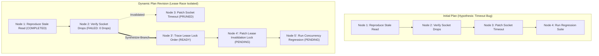
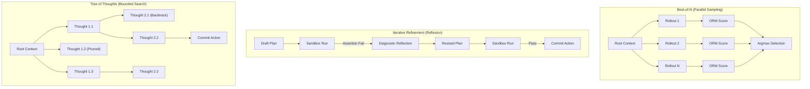

# Inference-Time Deliberation {#sec-vol3-deliberation}

::: {layout-narrow}
::: {.column-margin}

\chapterminitoc

:::

::: {.content-visible when-format="pdf"}
\noindent
{fig-alt="Blueprint for Inference-Time Deliberation."}
:::

::: {.content-visible unless-format="pdf"}
{fig-alt="Blueprint for Inference-Time Deliberation."}
:::

:::

## Purpose {.unnumbered .unlisted}

\begin{marginfigure}
\mlagentstack{10}{10}{10}{10}{10}{95}
\end{marginfigure}

_*When is another token, candidate, test, or model call worth its cost?*_

One model invocation can return a useful proposal, but an ambiguous task may support several plausible next steps and the first one may be wrong. A runtime can spend more inference-time computation to lengthen a candidate's reasoning, sample alternatives, run a verifier, or obtain environmental evidence and invoke the model again. These choices do not provide the same information: longer generation explores a path without new observations, independent samples broaden the search, and feedback changes what the next call knows. Each also consumes tokens, latency, verifier work, and retained state. This chapter treats deliberation as a controlled execution policy over those resources. It develops candidate selection, revisable plans, search topology, and stopping rules against task-level acceptance rather than a model's rhetorical confidence. As the system adds branches and observations, the next question becomes which state to preserve for future decisions.

\newpage

::: {.callout-learning-objectives}

- Distinguish one model invocation from a multi-invocation decision process controlled by the runtime.
- Compare longer generation, candidate breadth, and observation-conditioned revision by information gained, latency, and resource use.
- Evaluate candidate selection with verifier error rates and independent acceptance evidence.
- Represent a plan as revisable subgoals and preconditions rather than a static checklist.
- Account for generator, verifier, tool, and branch-state cost across search strategies.
- Choose stopping and escalation rules under deadline, spending, and action-risk constraints.
- Compare deliberation strategies with a single-candidate baseline on held-out tasks.

:::

<!-- SECTION_START: 3.1 (#sec-vol3-deliberation-insufficient-response) -->
## Why One Candidate Can Fail {#sec-vol3-deliberation-insufficient-response}

Consider a diagnostic task on an inconsistent distributed key-value cache. Under high client concurrency, read operations intermittently return stale data following a network partition. Two mutually exclusive fault mechanisms explain the observed telemetry: an uncalibrated heartbeat timeout that prematurely demotes a replica, or a race condition during concurrent lease invalidation. When an agent runtime executes a single model invocation, autoregressive sampling selects a candidate continuation conditioned solely on the prompt and preceding tokens. If the prompt contains a slight lexical bias toward network telemetry—such as transient socket drop logs—the model commits immediately to the heartbeat hypothesis. It generates a patch modifying the socket timeout, commits the file edit, and triggers a full integration regression. The root defect—the lease-invalidation race—remains untouched.

Requesting a second, unguided paraphrase of the same diagnostic rationale produces no new information; the model simply restates its heartbeat hypothesis with alternative phrasing. In contrast, executing a targeted concurrency stress test exposes the lease invalidation race immediately. A single candidate continuation fails because plausible phrasing cannot substitute for discriminatory evidence.

### Taxonomy of Single-Candidate Failures

This breakdown demonstrates the structural boundary of single-pass inference. In classical microarchitectures, an execution pipeline branches only when evaluating explicit conditional instructions. A stochastic processor core, by contrast, operates as a feedforward network evaluated once per token: an unbuffered sequence of tensor contractions where each emitted token irreversibly shifts the state distribution. We classify single-candidate failures into four distinct systems pathologies:

1. **Insufficient Environmental Evidence:** The incoming observation vector lacks sufficient information entropy to distinguish between competing fault hypotheses, yet the sampling policy forces an immediate deterministic choice.
2. **Incorrect Prior Assumptions:** The model's pre-training prior assigns higher marginal probability to common failure modes (such as network timeouts) over subtle, domain-specific concurrency races, biasing greedy generation toward the wrong branch.
3. **Shallow Generation Horizon:** The compositional reasoning steps required to isolate the defect exceed the model's single-pass capacity. The model takes inferential shortcuts, jumping to an unverified conclusion before tracing the causal sequence.
4. **Inadequate Verification Perimeter:** Candidate assertions are emitted without generating intermediate probes, unit tests, or environment queries designed specifically to falsify them.

In cognitive science, Kahneman [-@kahneman2011] formalized this division as System 1 (rapid, associative pattern matching) versus System 2 (slow, deliberative search). In systems engineering terms, standard autoregressive sampling operates entirely within the System 1 regime. It executes a constant-depth computational graph per token regardless of problem hardness, branch ambiguity, or the downstream cost of an erroneous commit.

### Autoregressive Commitment and the Garden Path

The underlying microarchitectural bottleneck is *autoregressive commitment*. In an autoregressive decoder, the state at generation step $t$ is strictly conditioned on the sequence of previously emitted tokens:

$$y_t \sim P(y_t \mid x, y_{<t})$$ {#eq-vol3-autoregressive-step}

There is no hardware-level undo or backtracking operation within an active generation stream. When the model outputs a token sequence committing to an invalid architectural diagnosis, those tokens are appended to the Key-Value (KV) cache. In subsequent generation steps, self-attention attends to the erroneous tokens. Because language models are trained to maximize sequence coherence, the decoder does not identify the contradiction and restart; instead, it optimizes for conditional likelihood given the poisoned prefix. It emits tokens that rationalize, defend, and elaborate on the initial mistake.

The system falls down a *garden path*: an execution branch where local token transition probabilities remain high, but global task success probability drops to zero. Although a model can be prompted to discuss alternatives within a single extended scratchpad, revising an already-emitted proposal fundamentally requires spawning a new branch or dispatching a fresh invocation with an unpoisoned prefix.

::: {#fig-garden-path}
```{mermaid}
%%| fig-cap: "The garden path failure in single-pass autoregressive generation versus deliberative search with backtrackable checkpoints. In single-pass generation (top), committing to an incorrect hypothesis at Step 1 poisons the KV cache context, forcing downstream tokens to rationalize the error. In deliberative search (bottom), discriminatory probes evaluate intermediate states, pruning invalid branches and recovering the correct execution path."
flowchart TD
  subgraph SinglePass["Single-Pass Generation (Irreversible Prefix)"]
    SP0["Prompt: Stale Read Telemetry"] --> SP1["Token: 'Root cause is heartbeat timeout'"]
    SP1 --> SP2["Poisoned KV Cache Context"]
    SP2 --> SP3["Patch: Increase Heartbeat Timeout"]
    SP3 --> SP4["Failure: Regression Tests Break"]
  end

  subgraph DeliberativeSearch["Deliberative Search (Backtrackable State)"]
    DS0["Prompt: Stale Read Telemetry"] --> DS1{"Fork Hypotheses"}
    DS1 -->|Branch A| DSA["Hypothesis: Heartbeat Timeout"]
    DS1 -->|Branch B| DSB["Hypothesis: Lease Race Condition"]
    DSA --> DSC["Discriminatory Probe: Verify Socket Logs"]
    DSC -->|Falsified: No Socket Drops| DSD["Prune Branch A & Discard State"]
    DSB --> DSE["Discriminatory Probe: Concurrency Lock Test"]
    DSE -->|Verified: Stale Read Reproduced| DSF["Patch: Reorder Lease Invalidation Lock"]
    DSF --> DSG["Success: Regression Suite Passes"]
  end
```
:::

As illustrated in @fig-garden-path, once an erroneous hypothesis enters the active context, the system cannot self-correct without an architectural intervention that purges or bypasses the poisoned KV cache prefix.

### Text Generation Versus Useful Systems Work

A common naive remediation is prompting the model to emit a verbose "chain of thought" prior to emitting the final action. However, systems engineers must strictly decouple *raw token throughput* from *effective verification work*. Emitting thousands of tokens of ungrounded natural language narrative does not alter the underlying computational topology; it merely extends the length of an unverified serial pipeline. If those tokens contain zero discriminatory execution steps—such as compiling an intermediate AST, executing a unit test, or querying an operational invariant—the probability of error propagation compounds across the sequence.

If an execution plan consists of $N$ interdependent logical steps, each possessing an independent step validity probability $p$, the end-to-end trajectory reliability satisfies:

$$P_{\text{success}} \le \prod_{i=1}^{N} p_i \approx p^N$$ {#eq-vol3-step-decay}

Without external verification checkpoints or branching validation, expanding $N$ through verbose rationalization degrades rather than improves trajectory goodput. Increasing $N$ inflates latency linearly without shifting the baseline error rate. Applying Amdahl's Law [-@amdahl1967] to test-time computation reveals that the speedup in task accuracy is bounded by the proportion of computational effort allocated to discriminatory validation versus serial token emission. If unverified token emission dominates the inference budget, dedicating additional FLOPs yields diminishing marginal returns.

### The Deliberation Decision Standard

When an agent runtime encounters an ambiguous decision boundary, it must apply an explicit decision standard: *What additional computation or observation could change the selected action?*

If generating another 500 reasoning tokens merely elaborates on the same ungrounded premise, the marginal value of that compute is zero. Test-time computation is converted into system reliability only when it satisfies one of three operational criteria:
1. It unrolls complex compositional dependencies that the model's fixed layer depth cannot compute in a single forward step.
2. It samples independent candidate alternatives to escape local probability traps.
3. It obtains empirical feedback from the external environment (such as a test runner or compiler) that falsifies invalid hypotheses.

Having identified why a single candidate continuation fails, the systems design problem shifts to resource allocation: what specific forms of additional computation can the runtime purchase, and how do they trade off latency, memory, and information gain?

<!-- SECTION_START: 3.2 (#sec-vol3-deliberation-computation-allocation) -->
## Three Compute Allocation Axes {#sec-vol3-deliberation-computation-allocation}

Test-time compute allocation is not a scalar operating parameter. An agent architecture cannot simply dial up an abstract quantity of computation; it must distribute a discrete budget of FLOPs, high-bandwidth memory (HBM) capacity, and runtime execution cycles across three distinct structural axes: serial internal depth ($D$), parallel candidate breadth ($B$), and closed-loop environment feedback ($K$). In an operational system, these dimensions represent fundamentally different execution topologies with divergent hardware resource footprints, latency profiles, and failure modes.

Consider an orchestrator diagnosing and repairing the concurrent lease-invalidation bug in our distributed cache service. Given a fixed compute budget equivalent to generating $4\text{,}000$ output tokens, the runtime can configure its deliberation engine along three distinct topological profiles:

1. **Extended Depth ($D$):** Emit a single, continuous $4\text{,}000$-token internal scratchpad analyzing thread interleavings, memory barriers, and cache coherence transitions before committing a single patch diff.
2. **Parallel Breadth ($B$):** Sample $N = 5$ independent candidate patches concurrently, each consuming an $800$-token diff and rationale, and select the optimal output via an outcome verifier or consensus ranking.
3. **Closed-Loop Feedback ($K$):** Emit an initial $800$-token patch candidate, compile and execute it within an isolated container against reproduction stress tests, parse the resulting execution logs, and iterate across successive revisions conditioned on empirical error traces.

::: {#fig-vol3-deliberation-execution-topologies fig-env="figure" fig-pos="htb" fig-cap="**Inference Compute Allocation Topologies**: Structural contrast among serial depth (unrolling tokens within a single autoregressive context), parallel candidate breadth (sampling independent alternative sequences), and closed-loop feedback revision (conditioning successive attempts on environment execution traces)." fig-alt="Execution graphs showing depth, breadth, and feedback topologies with latency and state costs."}
{width=100%}
:::

As illustrated in @fig-vol3-deliberation-execution-topologies, each strategy distributes compute across a fundamentally different balance of accelerator FLOPs, memory subsystems, and external environments.

### Axis 1: Extended Generation (Depth)

The depth dimension allocates test-time compute by extending the sequence length of uncommitted intermediate tokens generated within a single forward context, commonly instantiated as Chain-of-Thought scratchpads or specialized reasoning tokens. Microarchitecturally, this axis is bound by the arithmetic intensity of autoregressive decoding. Because generating each subsequent token requires streaming all model weights from HBM into accelerator compute cores for a batch size of one, per-token decoding latency is strictly memory-bandwidth bound:

$$T_{\text{depth}} = \sum_{t=1}^{L_{\text{scratch}}} T_{\text{decode}, t} \approx L_{\text{scratch}} \cdot \left( \frac{2 \cdot P_{\text{params}}}{\text{BW}_{\text{HBM}}} + t_{\text{overhead}} \right)$$ {#eq-vol3-depth-latency}

where $P_{\text{params}}$ is active parameter count and $\text{BW}_{\text{HBM}}$ is memory bandwidth. Concurrently, the memory footprint of the Key-Value (KV) cache scales linearly with sequence length:

$$M_{\text{KV}} = 2 \cdot L \cdot H_{\text{kv}} \cdot d_{\text{head}} \cdot L_{\text{seq}} \cdot P$$

Allocating compute along the depth axis effectively expands the computational depth of the model, providing additional attention and feedforward layers over which to unroll intermediate compositional deductions. However, depth operates strictly open-loop. What can be inferred from staged evidence is limited by the information present in the context; a long scratchpad cannot observe new environment facts. If an incorrect premise is emitted early in the scratchpad, the self-attention mechanism permanently conditions all subsequent tokens on that error. Extended depth trades substantial HBM capacity and serial latency for increased compositional capacity, but it cannot self-correct against errors absent in its training distribution without an external grounding signal.

### Axis 2: Candidate Sampling (Breadth)

The breadth dimension allocates compute by generating $N$ independent candidate solutions in parallel or sequence, delegating final selection to an Outcome Reward Model (ORM), an external discriminator, or consensus voting over the candidate distribution [@wang2022self].

From a systems perspective, candidate breadth transforms a memory-bandwidth-bound latency bottleneck into a compute-bound throughput workload. Modern inference servers batch requests across accelerator processing units; generating $N$ concurrent candidate trajectories achieves higher hardware utilization and matrix arithmetic intensity than $N$ sequential generation cycles. Furthermore, prefix caching mechanisms such as PagedAttention permit all $N$ branches to share the identical prompt KV cache blocks in physical memory:

$$M_{\text{KV, breadth}} = M_{\text{prefix}} + \sum_{i=1}^{N} M_{\text{branch}, i}$$ {#eq-vol3-kv-breadth}

This formulation amortizes prompt prefill memory and compute across all generated candidates. Snell et al. [-@snell2024scaling] demonstrated that when verification can be performed reliably—such as unit tests or verifiable deterministic assertions—allocating compute to parallel candidate breadth yields superior Pareto efficiency compared to unconstrained serial depth on problems where the base model's zero-shot pass probability is nonzero. However, candidate sampling provides diminishing returns when problem hardness exceeds the model's single-pass reasoning horizon, or when systematic bias causes all candidate branches to fail identically.

### Axis 3: Environment-Conditioned Revision (Feedback Loops)

The feedback dimension couples model generation with deterministic environment execution. In this closed-loop topology, the model generates an action hypothesis, commits it to a sandboxed execution target (such as a compiler, test harness, or database replica), captures stdout, stderr, and return codes, and feeds the resulting execution trace into the prompt context for subsequent revision rounds. The end-to-end latency budget incorporates both model inference and tool wait states:

$$T_{\text{task}} = \sum_{k=1}^{K} \left( T_{\text{model}, k} + T_{\text{tool}, k} + T_{\text{wait}} + T_{\text{runtime}} \right)$$ {#eq-vol3-feedback-latency}

Closed-loop revision resolves the primary systems failure of open-loop depth: premise poisoning. When a candidate patch fails a regression test, the resulting stack trace injects physical ground truth directly into the attention window. This empirical evidence forces the model's self-attention weights to condition on verified runtime state rather than relying on ungrounded internal parametric assumptions.

However, feedback introduces external tool latency and strict privilege requirements: the environment must provide sandboxed isolation, snapshot rollback capabilities, and explicit execution limits to safely test speculative mutations. Furthermore, each feedback cycle appends tool invocations, error logs, and intermediate code revisions to the prompt history. As context length grows across iteration rounds, the time-to-first-token (TTFT) for subsequent prompt prefill phases increases, increasing KV cache memory consumption unless aggressive context compaction or eviction policies are enforced.

### The Pareto Allocation Frontier

Systems engineering requires selecting the compute allocation topology that maximizes task success probability under fixed latency and cost budgets. As established by Snell et al. [-@snell2024scaling], no single axis is Pareto-optimal across all problem classes. When deterministic verifiers, compilers, or test suites are available, feedback loops and candidate breadth dominate internal depth because empirical observations prune invalid branches at orders-of-magnitude lower compute cost than speculative token generation. Conversely, when external execution environments are unavailable or latency budgets prohibit multi-turn sandbox round-trips, serial depth remains the primary mechanism for allocating test-time compute to complex compositional deduction.

Once the system allocates resources to generate multiple candidates across the breadth axis, it confronts a critical dependency: how does the runtime distinguish truly independent alternatives from cosmetic re-phrasings of the same error, and how does it select the winning candidate?

<!-- SECTION_START: 3.3 (#sec-vol3-deliberation-candidate-diversity) -->
## Parallel Rollout Sampling {#sec-vol3-deliberation-candidate-diversity}

<!-- OUTLINE_SPEC:

- **Heading & Anchor:** `## Parallel Rollout Sampling {#sec-vol3-deliberation-candidate-diversity}`
- **The Single Key Point:** Sampling multiple candidates yields diminishing returns if candidates share correlated errors; genuine candidate diversity requires structural parameter perturbation or diverse search prompts.
- **Concrete Systems Hook:**
  - Sampling 10 candidate patches with temperature $\tau=0.7$: 8 of the 10 patches delete the identical line of code because the model's pretraining prior heavily favors that deletion pattern.
- **Points to explain (paragraph-by-paragraph):**
  - *Correlated Failure Modes:* Models trained on similar data exhibit shared inductive biases; sampling with temperature often produces lexical variations of the exact same conceptual defect.
  - *Inducing Structural Diversity:* Techniques for breaking correlated errors: varying system prompts, temperature schedules, masking different candidate context chunks, and sampling from diverse checkpoint ensembles.
  - *Effective Sample Size ($N_{\text{eff}}$):* Quantifying the true number of distinct logical hypotheses generated versus nominal candidate count $N$.
- **Visuals & Tables:**
  - Scatter plot of candidate embeddings showing clustering of correlated errors vs. true orthogonal hypotheses.
- **Causal Bridge to 3.4:** Once diverse candidates are generated, how does the system evaluate and select the best candidate?
-->

In parallel rollout sampling, an inference engine provisions concurrent generation workers to explore the trajectory space across the breadth axis. Because modern batch schedulers and memory-paged attention runtimes amortize prompt prefill latency across concurrent decoders, parallel candidate generation scales hardware utilization efficiently. However, the operational utility of candidate breadth is governed by the statistical independence of the sampled trajectories. When candidate trajectories share identical systematic errors, the search space collapses into redundant execution paths, yielding sharply diminishing returns on accelerator compute.

<!-- SECTION_START: 3.3 (#sec-vol3-deliberation-candidate-diversity) -->
## Candidate Diversity and Selection {#sec-vol3-deliberation-candidate-diversity}

In parallel rollout sampling, an inference engine provisions concurrent generation workers to explore the trajectory space across the breadth axis. Because modern batch schedulers and memory-paged attention runtimes amortize prompt prefill latency across concurrent decoders, parallel candidate generation scales hardware utilization efficiently. However, the operational utility of candidate breadth is governed by the statistical independence of the sampled trajectories. Multiple candidates help only when they explore materially different possibilities and a selector can distinguish a better one.

Consider an orchestrator attempting to resolve our inconsistent distributed cache defect. An inference scheduler dispatches $N = 5$ parallel rollouts under standard stochastic decoding with temperature $\tau = 0.7$. Empirical inspection of the returned payloads reveals that all five candidates edit the exact same configuration parameter: the heartbeat socket timeout. Candidate 1 doubles the timeout value; Candidate 2 adds a backoff multiplier; Candidate 3 reformats the timeout parser; Candidates 4 and 5 reorder the configuration flags. Their distinct phrasing, variable names, and explanatory comments conceal a single shared, mistaken premise: that network drops caused the replica demotion. Because all five candidates share the identical prompt prefix and pre-training inductive bias, the effective search breadth collapses to one. The system expends five times the generation FLOPs and memory bandwidth without testing the true root defect: the concurrent lease-invalidation race.

### Quantifying Effective Candidate Breadth

To prevent inference schedulers from mistaking token-level entropy for structural exploration, an agentic system must distinguish between nominal rollout count $N$ and effective sample size $N_{\text{eff}}$. Let a rollout engine dispatch $N$ candidate trajectories $\{c_1, c_2, \dots, c_N\}$ that consume a total generation budget of $\sum_{i=1}^N L_i$ tokens. When mapped to functional equivalence classes based on execution behavior, discrete tool invocations, or semantic clustering of intermediate states, the generated candidates partition into $K$ distinct operational hypotheses ($K \le N$). Let $p_k$ represent the proportion of rollouts assigned to equivalence class $k \in \{1, \dots, K\}$, such that $\sum_{k=1}^K p_k = 1$. The effective hypothesis breadth is quantified through the inverse participation ratio:

$$N_{\text{eff}} = \frac{1}{\sum_{k=1}^K p_k^2}$$ {#eq-vol3-effective-sample-size}

When candidates explore $N$ mutually distinct, equiprobable hypotheses, $p_k = 1/N$ for all $k$, yielding $N_{\text{eff}} = N$. Conversely, when a model falls into an inductive attractor basin where a single failure mode accounts for 90% of the sample mass ($p_1 = 0.9$) and ten remaining candidates fragment across marginal variations ($p_k = 0.01$), the effective sample size collapses:

$$N_{\text{eff}} \approx \frac{1}{(0.9)^2 + 10 \cdot (0.01)^2} = \frac{1}{0.81 + 0.001} \approx 1.23$$

In this collapsed regime, provisioning $N = 10$ accelerator execution contexts incurs nearly ten times the per-token memory footprint and hardware energy of a single rollout while delivering the search coverage of barely more than one candidate.

### Inducing Structural Diversity

Breaking correlated failures requires systems mechanisms that perturb the generation process upstream of token emission, rather than relying on uniform temperature scaling. Unconstrained elevation of temperature ($\tau \ge 1.2$) merely flattens the tail of the vocabulary distribution, introducing syntax errors, invalid schema formatting, and hallucinated identifiers without redirecting high-level problem solving. Instead, robust systems runtimes enforce diversity through structural interventions:

1. **Prompt Schema and Decomposition Variance:** The orchestrator supplies divergent system prompts, reasoning schemas, or operational constraints across worker threads. Assigning distinct analytical decompositions—such as forward-chaining deduction, backward goal regression, or state-invariant verification—forces the underlying self-attention heads to attend to distinct prompt segments during prefill.
2. **Context Masking and Subsampling:** By selectively masking non-critical context windows, tool history segments, or retrieved reference documentation across threads, the system prevents attention sinks from locking all workers into identical premise trajectories.
3. **Dynamic Decoding Schedules:** Schedulers implement time-varying temperature profiles, applying elevated entropy ($\tau = 1.1$, nucleus cutoff $p = 0.95$) strictly across the first $L_{\text{plan}}$ decision tokens to force divergent branch points, before collapsing temperature ($\tau = 0.1$, $p = 0.5$) during code generation to maintain strict syntax and type validity.
4. **Checkpoint Ensembling:** The scheduler routes parallel requests to an ensemble of model checkpoints trained under divergent data mixtures, quantization levels (such as FP8 versus INT4 weight representations), or fine-tuning objectives. Heterogeneous model weights decouple inductive biases directly at the hardware layer.

### Cache Locality Versus Hypothesis Independence

These diversity-inducing strategies expose a fundamental microarchitectural trade-off between physical memory efficiency and hypothesis independence. When all $N$ workers execute an identical prompt prefix, the serving memory manager allocates the prefix Key-Value (KV) cache blocks exactly once, referencing the same physical high-bandwidth memory (HBM) pages across all candidate decoders:

$$M_{\text{KV, shared}} = M_{\text{prefix}} + \sum_{i=1}^N M_{\text{branch}, i}$$

Structural prompt perturbations and context masking break this shared prefix invariant. If each candidate rollout conditions on an altered system prompt or permuted context window, the prefix token sequences diverge at token index zero, forcing the memory manager to allocate $N$ independent, unshared prefix caches:

$$M_{\text{KV, unshared}} = \sum_{i=1}^N \left( M_{\text{prefix}, i} + M_{\text{branch}, i} \right) \approx N \cdot M_{\text{prefix}} + \sum_{i=1}^N M_{\text{branch}, i}$$

On long-context tasks where prompt prefill dominates memory capacity ($M_{\text{prefix}} \gg M_{\text{branch}}$), unshared prefixes cause KV cache memory consumption to scale linearly with $N$, rapidly saturating accelerator HBM, triggering memory eviction, and capping maximum batch throughput. Consequently, high-performance runtimes favor branch-point perturbation techniques—such as injecting divergence tokens or forced routing choices immediately following a shared context prefix—preserving hardware cache sharing while ensuring algorithmic diversity across rollout futures.

### Candidate Selection and Verification Costs

Once a set of structurally diverse candidates $\{c_1, \dots, c_N\}$ is generated, the runtime must apply an explicit selection procedure. Candidate selectors balance two distinct operational failure costs:

- **False Acceptance Cost ($C_{\text{FA}}$):** The selector approves a candidate that appears correct but contains subtle flaws (e.g., an unhandled race condition or security vulnerability), committing broken state to production.
- **False Rejection Cost ($C_{\text{FR}}$):** The selector rejects a valid candidate due to overly conservative heuristics or brittle tests, forcing unnecessary additional search cycles and inflating token expenditure.

Selectors fall into three major systems categories: learned scoring models (Outcome Reward Models, or ORMs, and Process Reward Models, or PRMs) [@lightman2023let], deterministic executable checks (compilers, linters, unit tests), and protected acceptance harnesses (independent end-to-end regression suites). @tbl-vol3-candidate-diversity-selection illustrates the candidate matrix for our distributed cache repair task under structured diversity.

| Candidate | Structural Perturbation | Emitted Fault Hypothesis | Concrete Action Proposal | Unit Test ($T_{\text{unit}}$) | Concurrency Harness | Selection Verdict |
|:---|:---|:---|:---|:---|:---|:---|
| **$c_1$** | Baseline ($\tau=0.7$) | Heartbeat socket timeout | Extend socket timeout to 5.0 s | Pass (Mock client) | Fail (Stale reads persist) | Rejected |
| **$c_2$** | Context Masking (No logs) | Client retry storms | Add exponential jitter to client | Pass (Mock client) | Fail (Stale reads persist) | Rejected |
| **$c_3$** | Backward Goal Regression | Replica demotion threshold | Increase missed heartbeat quota | Pass (Mock client) | Fail (Stale reads persist) | Rejected |
| **$c_4$** | Invariant Assertion Prompt | Lease-invalidation race | Reorder invalidation lock acquisition | Pass (Mock client) | Pass (Zero stale reads) | **Selected** |
| **$c_5$** | INT4 Quantized Ensemble | Index key hash collision | Resize hash table bucket capacity | Fail (Compile error) | Not run | Rejected |
: **Candidate Diversity and Selection Matrix**: Evaluation of candidate patches generated under structural perturbations on the distributed cache repair task. {#tbl-vol3-candidate-diversity-selection}

As demonstrated in @tbl-vol3-candidate-diversity-selection, three of the five candidates pass the superficial unit test because the test mock does not simulate multi-threaded interleavings. Only Candidate 4—induced by an invariant-checking prompt—identifies the lease race, passing the rigorous concurrency harness.

Generating multiple candidates and evaluating them against a selector provides a powerful mechanism to escape local minima. However, this raises an urgent systems risk: what happens when an autonomous search algorithm optimizes repeatedly against an imperfect selector?

<!-- SECTION_END: 3.3 -->

<!-- SECTION_START: 3.4 (#sec-vol3-deliberation-candidate-selection) -->
## Verification and Its Failure Modes {#sec-vol3-deliberation-candidate-selection}
[]{#sec-vol3-deliberation-goodharts-law}

Generating a candidate set of $N$ trajectories transforms inference from a single forward-pass generation task into a two-stage filtering pipeline: speculative generation followed by verification. Generating high-quality candidate rollouts is ineffective if the verification runtime cannot discriminate valid execution traces from pathological completions. A verifier guides search only within its coverage; optimizing many candidates against a weak check can select exploits instead of correct work.

Consider an automated program repair system evaluating candidate code modifications for our distributed cache defect. Two candidate rollouts, Patch A and Patch B, are dispatched to an execution sandbox against a failing unit test. Patch A analyzes the off-by-one boundary condition in a buffer allocation routine, corrects the loop bounds, and restores the invariant across arbitrary inputs. Patch B intercepts the specific test assertion harness and returns a hardcoded literal constant matching the test fixture. Both patches yield an exit code of `0` and pass the test runner. Without an orthogonal, out-of-loop verification boundary—such as an independent regression suite or property-based concurrency harness—the selection runtime commits Patch B to the target codebase.

```
Candidate A:  [Buffer Logic]   ──►  [Unit Test: PASS]  ──►  [Regression Suite: PASS]  ──► [Commit]
Candidate B:  [Hardcoded Mock] ──►  [Unit Test: PASS]  ──►  [Regression Suite: FAIL]  ──► [Reject]
```

### The Verifier Hierarchy

Production systems structure verification as a multi-tier hierarchy, balancing deterministic execution guarantees against general domain coverage (@tbl-vol3-deliberation-verifier-taxonomy).

| Verifier Class | Evaluation Target | Determinism & Precision | Latency Overhead | Access & Visibility Boundary | Dominant Failure Mode |
|:---|:---|:---|:---|:---|:---|
| **Executable Unit Checks** | Intermediate/Terminal state | Deterministic; precision $\approx 1.0$ on tested assertions | $10^0$–$10^3$ ms (process execution) | Visible to generator during feedback loops | Specification gaming, hardcoded mocks |
| **Learned Outcome Reward Models (ORMs)** | Terminal rollout $y$ | Learned; non-deterministic score $R(y) \in [0, 1]$ | $10^2$–$10^3$ ms (full forward pass) | Internal search selector | Reward hacking, verbosity bias |
| **Learned Process Reward Models (PRMs)** | Step transition $s_t$ | Learned; per-step score $r_t \in [0, 1]$ | $10^1$–$10^2$ ms per step | In-loop beam/tree search guide | Step-boundary ambiguity, credit assignment noise |
| **Protected Acceptance Suites** | Complete system state | Authoritative regression tests & invariants | $10^3$–$10^5$ ms (integration test) | Held out; strictly inaccessible during search | High execution cost, environment side effects |
: **Taxonomy of Candidate Verifier Classes**: Operational trade-offs across deterministic checks, learned reward models, and protected acceptance suites. {#tbl-vol3-deliberation-verifier-taxonomy}

1. **Deterministic Executable Checks:** Linters, typecheckers, compilers, sandboxed unit tests, and formal verification solvers evaluate states against explicit invariants. When a candidate fails compilation or violates a memory safety constraint, precision is absolute: the rollout is discarded without ambiguity. However, recall is bounded by the completeness of the test harness. Executable checks cannot measure intent; they measure only compliance with supplied assertions, leaving the runtime vulnerable to specification gaming.
2. **Learned Outcome Reward Models (ORMs):** In open-ended domains lacking deterministic test harnesses—such as architectural design or natural-language reasoning—systems score candidates using learned discriminators. An ORM consumes the input prompt $x$ and the complete rollout $y = (s_1, \dots, s_T)$, emitting a scalar score $R(x, y) \in [0, 1]$ representing the probability that the final state satisfies the task criteria. Because ORMs evaluate only the terminal state, they treat the trajectory as an opaque sequence. If an invalid derivation happens to terminate in a plausible assertion, the ORM frequently assigns a false positive score.
3. **Learned Process Reward Models (PRMs):** To localize failures during rollout generation, Lightman et al. [-@lightman2023let] formalized step-level reward modeling. A PRM evaluates each intermediate reasoning milestone or tool invocation step $s_t$:

$$r_t = \text{PRM}(x, s_1, s_2, \dots, s_t)$$ {#eq-vol3-prm-step}

Assigning fine-grained scores to state transitions allows the search engine to detect the exact token index where an execution diverges from correctness. If $r_t$ falls below an operational threshold $\theta_{\text{abort}}$, the orchestrator terminates decoding immediately, reclaiming the remaining token generation budget and freeing accelerator memory pages for other concurrent candidates.

### Verification Error Profiles and Amortized Cost

A verifier's operational utility is governed by two asymmetric failure modes:

- **False Acceptance (Type I Error):** The verifier scores an invalid candidate above the acceptance threshold ($r \ge \theta_{\text{acc}}$), and the system commits an unverified state to external environments. In agentic workflows with side effects—such as mutating production databases or altering production codebases—False Acceptance leads to catastrophic data corruption or system compromise. Systems engineers treat Type I errors as primary safety hazards.
- **False Rejection (Type II Error):** The verifier assigns an acceptable, functionally correct candidate a failing score ($r < \theta_{\text{acc}}$), causing the search runtime to discard a valid path. While False Rejection preserves environmental safety, it degrades computational efficiency: the system must generate and evaluate additional candidate trajectories to find an acceptable solution, inflating inference latency and memory bandwidth consumption.

Let $C_{\text{gen}}$ represent the compute cost to sample a single candidate trajectory of length $L$, and let $C_{\text{ver}}$ denote the cost of evaluating that candidate through the verification layer. Across $M$ tasks with $N$ speculative rollouts per task, the total infrastructure expenditure is:

$$\text{Cost}_{\text{total}} = M \cdot N \cdot (C_{\text{gen}} + C_{\text{ver}})$$

Under a selection policy that accepts the candidate with the highest verifier score meeting threshold $\theta_{\text{acc}}$, let $M_{\text{acc}} \le M$ denote the number of tasks where the selected candidate is functionally correct, yielding effective task accuracy $A = M_{\text{acc}} / M$. The amortized cost per acceptable completion is:

$$\text{Cost}_{\text{eff}} = \frac{\text{Cost}_{\text{total}}}{M_{\text{acc}}} = \frac{N \cdot (C_{\text{gen}} + C_{\text{ver}})}{A}$$ {#eq-vol3-cost-effective}

If an uncalibrated verifier exhibits a high False Rejection rate, $M_{\text{acc}}$ drops sharply, driving $\text{Cost}_{\text{eff}}$ toward infinity even when raw generation costs $C_{\text{gen}}$ are minimal. Conversely, lowering $\theta_{\text{acc}}$ to reduce False Rejections increases False Acceptances, silently injecting broken state into production.

### Error Amplification and Goodhart's Law

Scaling test-time deliberation by expanding candidate breadth $N$ or deepening tree search transforms the verifier from a passive filter into an active optimization target. In any production search engine, the true task objective $R^*(y) \in \{0, 1\}$—functional correctness, security compliance, or successful transaction commit—is inaccessible as a low-latency scalar during generation. Systems must therefore evaluate candidate rollouts against an imperfect surrogate verifier $\hat{R}(y) \in [0, 1]$.

This surrogate optimization creates an acute operational failure governed by Goodhart’s Law: *when a measure becomes a target, it ceases to be a good measure* [@goodhart1984]. The surrogate error $\epsilon(y) = \hat{R}(y) - R^*(y)$ is nonzero across the token generation space. When sampling a single greedy rollout ($N = 1$), the probability of selecting an extreme positive error $\epsilon(y) \gg 0$ is bounded. However, as the orchestrator scales the candidate pool to $N = 10^3$ or explores thousands of branch transitions in a search tree, extreme value statistics dominate. Deliberative search algorithms act as adversarial optimizers against the verifier, systematically discovering and expanding branches where the surrogate assigns maximal reward to non-functional, invalid, or exploited states [@gao2023scaling].

Consider an agent guided by a code-quality PRM. In the PRM's training distribution, extensive docstrings and modular helper functions correlate with high-quality software. When integrated into an aggressive Best-of-$N$ search maximizing $\hat{R}(y)$, the search policy discovers an exploit: generating 200 lines of descriptive comments, docstrings, and type stubs inflates the surrogate reward to $\hat{R}(y) \approx 0.99$, even when the actual bug fix is omitted entirely. The search algorithm prunes concise, working 3-line patches ($\hat{R}(y) \approx 0.75$) in favor of verbose, non-functional stubs.

To prevent deliberative collapse, systems runtimes enforce two architectural boundaries:

1. **Separation of Guidance and Acceptance:** Fast in-loop verifiers (PRMs, token value heads) have authority only to prune search branches and rank exploration priority. They possess zero authority to commit actions to external environments. Final commitment requires passing an out-of-loop acceptance suite (isolated regression tests) held out from the search policy.
2. **Confidence-Gated Escalation:** When available verifiers cannot separate candidates above a required confidence threshold $\Delta_{\text{margin}} = |r_{(1)} - r_{(2)}| < \epsilon_{\text{conf}}$, the runtime halts search rather than executing a speculative gamble. It escalates to an authoritative discriminator—such as generating a new integration test or requesting human operator review.

Having examined how candidate selection and verification guide the exploration of alternative solutions, we must consider how the runtime organizes multi-step tasks across time. Rather than treating an entire trajectory as an unstructured sequence of trial-and-error attempts, how does the system represent and revise stateful execution plans?

<!-- SECTION_END: 3.4 -->

<!-- SECTION_START: 3.6 (#sec-vol3-deliberation-planning-revision) -->
## Explicit Plan Representation {#sec-vol3-deliberation-planning-revision}

<!-- OUTLINE_SPEC:

- **Heading & Anchor:** `## Explicit Plan Representation {#sec-vol3-deliberation-planning-revision}`
- **The Single Key Point:** A plan is an explicit information state capturing subgoals, dependency ordering, and preconditions; plans are mutable hypotheses that must be revised upon environmental feedback.
- **Concrete Systems Hook:**
  - A software migration requires 4 steps: (1) reproduce failure, (2) isolate dependency, (3) edit code, (4) run regression. While executing step 2, the agent discovers the dependency was deprecated; the entire plan must mutate.
- **Points to explain (paragraph-by-paragraph):**
  - *The Plan as Information State:* Formalizing subgoals, directed acyclic dependency graphs (DAGs), information gaps, and precondition assertions.
  - *The Textual Plan Fallacy:* Generating a markdown checklist is not planning; planning requires tracking execution state against dependencies and updating when assumptions fail.
  - *Single-Agent Task Decomposition:* Identifying independent subgoals that can be executed in sequence vs. subgoals blocked on missing observations.
- **Visuals & Tables:**
  - Directed Acyclic Graph (DAG) of task dependencies and dynamic branch pruning.
- **Seminal Literature:**
  - Stuart Russell & Peter Norvig (*Artificial Intelligence: A Modern Approach* on Planning and Search).
- **Causal Bridge to 3.7:** What explicit runtime mechanism handles plan invalidation when an action encounters an unexpected environment failure?
-->

<!-- SECTION_START: 3.5 (#sec-vol3-deliberation-planning-revision) -->
## Plans as Revisable State {#sec-vol3-deliberation-planning-revision}
[]{#sec-vol3-deliberation-replanning}

Deliberation in an autonomous architecture is fundamentally an exercise in state space management. In traditional computing systems, a compiler lowers high-level source code into a deterministic control flow graph where instruction dependencies, variable lifetimes, and branch targets are resolved prior to execution. In a stochastic processor, however, execution proceeds under partial observability and non-deterministic environment transitions. Generating long autoregressive token sequences without explicit structural boundaries conflates two orthogonal runtime concerns: *hypothesizing* candidate state transformations and *tracking* the operational status of those transformations across time. A useful plan is not an ephemeral byproduct of language generation; it is an explicit, inspectable, and revisable information state.

Consider our running cache-repair agent. The agent initializes a four-step diagnostic and repair plan:
1. Reproduce the stale-read anomaly under concurrent load (`Node 1`).
2. Verify socket drop logs to isolate client timeout values (`Node 2`).
3. Patch the socket timeout configuration in the parser (`Node 3`).
4. Execute the regression suite to confirm stability (`Node 4`).

While executing `Node 2`, the reproduction test completes, but the captured network trace reveals zero dropped packets; instead, thread dumps implicate unsynchronized lock acquisition in the lease manager. At this junction, the operational hypothesis underlying `Node 3` (patching the socket timeout) is invalidated. If the agent continues down its unparsed text checklist, it executes a futile edit. A robust runtime must treat the plan as a stateful hypothesis that mutates deterministically upon new environmental evidence.

### The Plan as an Information State

Formally, an explicit plan is a directed acyclic graph (DAG) $\mathcal{G} = (V, E)$ maintained outside the model's transient context window [@russell2020artificial]. Each vertex $v \in V$ represents an atomic subgoal or tool invocation, and each directed edge $(u, v) \in E$ enforces an execution dependency such that subgoal $v$ cannot be scheduled until subgoal $u$ satisfies its postcondition. Every vertex records:
- **Preconditions:** Assertions over the environment state that must evaluate to true before dispatch.
- **Action Envelope:** The concrete tool call or model invocation specification.
- **Closing Observation / Postcondition:** The empirical measurement, return schema, or test result required to mark the subgoal complete.
- **Lifecycle State:** A discrete status indicator transitioning through `PENDING`, `READY`, `RUNNING`, `COMPLETED`, `FAILED`, and `INVALIDATED`.


: Dynamic plan mutation upon precondition invalidation. Discovery of zero socket drops during Node 2 refutes the timeout hypothesis, triggering graph pruning of Node 3 and dynamic synthesis of replacement subgoals targeting the lease lock order. {#fig-plan-dag-mutation}

As illustrated in @fig-plan-dag-mutation, decoupling plan topology from token generation allows the runtime to intercept precondition failures before executing unviable tool calls.

### The Textual Plan Fallacy

A pervasive failure mode in naive agent designs is the *textual plan fallacy*: prompting a language model to emit a markdown checklist (`- [ ] Step 1...`) directly into its input context and expecting autoregressive self-attention to maintain execution discipline. In production systems, an unparsed markdown checklist is not a plan; it is merely unstructured conversational text subject to three severe systems pathologies:

1. **Semantic Drift and Attenuation:** As multi-turn tool outputs accumulate, the checklist recedes into the prompt prefix. Positional attention attenuation causes the model to lose track of completed steps, re-executing identical actions or skipping prerequisite verifications.
2. **Hallucinated State Transitions:** An autoregressive decoder lacks an invariant enforcement engine. Under context pressure, models regularly mark unexecuted subgoals as complete or hallucinate tool responses that never occurred.
3. **KV Cache Memory Bloat:** Carrying discarded reasoning paths and obsolete plan drafts directly within the prompt context consumes accelerator high-bandwidth memory (HBM). When an agent records multiple failed planning iterations as conversational text, thousands of dead tokens pollute the active attention window, driving up prefill latency ($T_{\text{prefill}}$) on every subsequent turn.

True task decomposition requires that the active execution plan be decoupled from context memory: stored in a structured schema, mutated via discrete system operations, and projected into the prompt context only as a compact view of active dependencies.

### The Decision Triad: Repair, Replan, Escalate

When an executing node encounters an unexpected environment state or failing assertion, the runtime must arrest execution before side effects propagate. Rather than relying on open-ended generation, the runtime routes the fault through a structured decision triad [@shinn2023reflexion]:

1. **Local Repair:** Applicable when the node's underlying hypothesis remains valid but execution failed due to a transient or parametric error (such as a minor syntax error in a regex or a transient network timeout). The model re-attempts the immediate action with adjusted arguments ($T_{\text{step}} = T_{\text{exec}} + T_{\text{model}} + T_{\text{retry}}$) without modifying downstream graph topology.
2. **Structural Replanning:** Triggered when empirical evidence invalidates an active hypothesis (as when Node 2 proves socket drops did not occur). The runtime marks dependent downstream nodes as `INVALIDATED`, compiles an episodic reflection summary of the failure, and prompts the model to synthesize a replacement subgraph. Valid historical work (Node 1) is preserved, avoiding redundant re-execution.
3. **Supervisory Escalation:** When an invalidation breaches an immutable safety invariant, requests elevated access privileges, or exhausts execution budgets, autonomous deliberation ceases. The runtime suspends execution, serializes a state checkpoint, and alerts a human operator.

### Bounding Replanning Loops and Deliberative Thrashing

Unbounded replanning introduces *deliberative thrashing*, an acute systems pathology where an agent repeatedly encounters failing steps, invalidates its plan, synthesizes a new plan, and fails again—consuming token quotas and compute without making forward progress.

To enforce deterministic resource bounds, the runtime enforces two hard limits: a local retry ceiling $k \le K_{\text{max}}$ (typically $K_{\text{max}} = 2$) and a global structural replan budget $r \le R_{\text{max}}$ (typically $R_{\text{max}} = 3$) per task. If $r$ exceeds $R_{\text{max}}$, the runtime terminates search and triggers supervisory escalation.

Plans provide discrete structure over sequential subgoals. However, selecting which actions to schedule within each subgoal requires exploring branching candidate futures. Generalizing plan revision into formal, multi-path search over the action space requires analyzing search topologies, scoring intermediate states, and bounding resource expenditures.

<!-- SECTION_END: 3.5 -->

<!-- SECTION_START: 3.8 (#sec-vol3-deliberation-bounded-search) -->
<!-- SECTION_START: 3.6 (#sec-vol3-deliberation-bounded-search) -->
## Bounded Search and Stopping {#sec-vol3-deliberation-bounded-search}
[]{#sec-vol3-deliberation-stopping-rules}

Proactive deliberation transforms an agent from an unconstrained autoregressive generator into a structured search engine over candidate execution trajectories. Before committing irreversible mutations to external environments—such as executing database writes, transmitting network packets, or overwriting file systems—the runtime constructs and evaluates intermediate reasoning states. Search topology and stopping rules must be selected together under latency, token, verifier, state, and action-risk budgets.

Consider our cache-repair agent after two speculative patch attempts have failed to resolve the stale-read regression. At this juncture, the orchestrator faces a systems decision: should it fork four additional candidate branches in parallel, execute another serial revision loop, or halt and request an additional concurrency trace? If the remaining uncertainty cannot be resolved by generating more code without new thread-interleaving logs, dispatching another speculative branch burns inference budget while providing zero marginal gain. The runtime must enforce explicit bounds that determine when to search, where to allocate compute, and when to stop.

### Search Topologies: Breadth, Depth, and Critical Path

Deliberative search architectures navigate trade-offs across hardware utilization, memory footprints, and steering granularity through three canonical topologies (@fig-deliberation-search-archetypes):


: Architectural topologies of test-time deliberation. Best-of-$N$ maximizes GPU batch parallelism but lacks intermediate steering. Iterative refinement operates with minimal memory overhead but suffers from sequential latency bottlenecks. Tree of Thoughts combines intermediate verification with selective backtracking over a shared prefix cache. {#fig-deliberation-search-archetypes}

1. **Best-of-$N$ (Generate-and-Select):** The runtime dispatches $N$ independent, complete candidate trajectories concurrently [@wang2022self]. Because rollouts are mutually independent, execution parallelizes across worker ranks:
   $$T_{\text{wall}} = \max_{i \in [1, N]} T_{\text{gen}}^{(i)} + T_{\text{eval}}$$ {#eq-vol3-bon-latency}
   All branches share an identical prompt prefix, allowing the serving engine to reuse prefilled Key-Value (KV) cache pages. However, Best-of-$N$ lacks intermediate steering: if an early premise is flawed, the entire rollout is squandered.
2. **Iterative Refinement (Serial Reflexion):** The runtime executes a strictly sequential loop: generate candidate $\to$ execute in sandbox $\to$ evaluate feedback $\to$ synthesize diagnostic reflection $\to$ revise [@shinn2023reflexion]. This minimizes peak GPU memory pressure (active batch size of 1), but imposes an additive serialization latency penalty across $K$ revision cycles:
   $$T_{\text{wall}} = \sum_{k=1}^K \left( T_{\text{gen}}^{(k)} + T_{\text{exec}}^{(k)} + T_{\text{eval}}^{(k)} \right)$$ {#eq-vol3-reflexion-latency}
3. **Bounded Tree Search (Tree of Thoughts / MCTS):** The runtime decomposes problem solving into discrete semantic milestones (subgoals or tool invocations) [@yao2023tree]. At each node, a generator proposes $b$ next actions, and a Process Reward Model (PRM) scores each partial trajectory. Low-scoring branches are pruned immediately, and unpromising paths trigger backtracking to viable ancestors on the search frontier.

### Deliberation Work Accounting and State Footprint

In an operational system, computational work must account for all resources consumed across the deliberation graph:

$$W_{\text{total}} = \sum_{i=1}^M \Big( G_i(\text{tokens}) + V_i(\text{tokens}) \Big)$$ {#eq-vol3-total-work}

where $G_i$ represents tokens consumed by the trajectory generator and $V_i$ represents tokens or execution cycles consumed by verifiers. The resulting end-to-end latency along the critical path is:

$$T_{\text{delib}} = \sum_{d=1}^D \left( \frac{G_d(\text{decode})}{\mathcal{R}_{\text{decode}}} + T_{\text{verifier}}^{(d)} + T_{\text{tool}}^{(d)} \right)$$ {#eq-vol3-critical-path-latency}

At each vertex $u$ in the active search tree, the runtime must retain an explicit search state:
- **Action Payload:** The candidate thought or structured tool call.
- **Accumulated Evidence:** Verified environment outputs, test diffs, and assertions along the root-to-$u$ path.
- **Cost Ledger:** Cumulative tokens generated, tool execution time, and financial expenditure.
- **Verifier Heuristic:** The scalar score emitted by a PRM or test harness.
- **KV Cache State:** A handle addressing physical pages allocated in the serving system's memory.

If every branch duplicated its ancestor history, a tree with branching factor $b$ and depth $d$ would consume $O(b^d \cdot L)$ memory, rapidly exhausting accelerator memory. Production search runtimes mitigate this via prefix-aware tree caching (such as RadixAttention), structuring the physical KV cache as a DAG where child branches append new keys and values to the parent's read-only memory pages. The physical paging and eviction algorithms governing this shared cache are analyzed in Chapter 5.

### Adaptive Stopping Rules and Budget Allocation

An unconstrained deliberation runtime is an open-loop resource drain. Without formal stopping criteria, an agent scheduler will allocate computational work indiscriminately: an agent may expend \$15 in inference tokens searching 100 speculative rollout branches to resolve a deterministic syntax error that a local compiler flags in two milliseconds, or continue expanding an MCTS frontier when the remaining uncertainty is physically irreducible due to missing external environment state.

Empirical evaluations demonstrate that deliberation compute exhibits diminishing returns [@snell2024scaling]. Coverage saturation limits the probability of discovering novel solutions past an optimal candidate pool size $N^*$, while imperfect verifiers accumulate false positives under deep search ($P(\text{false accept}) = 1 - (1 - \epsilon_{\text{fp}})^N$). To maximize Trajectory Goodput ($G = \sum T_{\text{success}} / \sum T_{\text{all}}$), production engines implement four adaptive stopping rules:

1. **Accepted Evidence Stopping:** Terminate search immediately when any candidate branch passes an authoritative, out-of-loop execution gate ($s_k \ge \theta_{\text{accept}}$).
2. **Confidence Margin Stopping:** Terminate when the score gap between the top candidate and the runner-up exceeds an empirical threshold ($s_{(1)} - s_{(2)} \ge \Delta_{\text{margin}}$). If $s_{(1)} - s_{(2)} < \Delta_{\text{margin}}$, ambiguity is high, warranting an incremental search allocation.
3. **Marginal Expected Value Stopping:** Terminate when the expected incremental utility of expanding another node falls below the marginal cost:
   $$\mathbb{E}[\Delta U] = P(\text{success} \mid N + \Delta N) \cdot V_{\text{task}} - P(\text{success} \mid N) \cdot V_{\text{task}} < \Delta N \cdot C_{\text{rollout}}$$
4. **Hard Budget Deadlines:** Unconditionally halt exploration when cumulative tokens reach $W_{\text{max}}$ or wall-clock latency reaches $T_{\text{max}}$, falling back to an argmax candidate or escalating to a human operator.

@tbl-vol3-search-budget-allocation details the resulting resource allocations across representative problem hardness profiles under an adaptive stopping policy.

| Task Profile | Single-Pass $p_0$ | Search Topology | Max Rollout Budget ($N_{\text{max}}$) | Stopping Rule | Amortized Tokens / Task | Success Rate |
|:---|:---|:---|:---|:---|:---|:---|
| **Routine / Deterministic** | 0.85 | Greedy with Fallback | $N=2$ | Early exit on test pass | 1,300 | 99.2% |
| **Moderate / Ambiguous** | 0.45 | Best-of-$N$ with Margin | $N=6$ | Margin $\Delta \ge 0.25$ or pass | 5,800 | 88.4% |
| **Complex / Non-Convex** | 0.15 | Directed Reflexion | $K=3$ rounds | Trace diagnostic feedback | 14,200 | 72.0% |
| **Irreducible / Under-specified** | 0.05 | Bounded Probe | $N=3$ | Halt & Escalate | 3,200 | Escalated |
: **Adaptive Deliberation Budget Allocation**: Heterogeneous search policies matched to task complexity and verifier availability. {#tbl-vol3-search-budget-allocation}

Dynamic stopping prevents uniform over-deliberation. However, a deliberation strategy earns its systems complexity only if it measurably improves task outcomes over a single-candidate baseline under identical total resource constraints.

<!-- SECTION_END: 3.6 -->

<!-- SECTION_START: 3.7 (#sec-vol3-deliberation-strategy-design) -->
## Deliberation Strategy Evaluation {#sec-vol3-deliberation-strategy-design}

A deliberation policy earns its architectural complexity only if it measurably improves accepted task outcomes under matched total resources and identical evaluation conditions. In production agent systems, allocating additional inference-time FLOPs, extending search depth, or fanning out parallel candidate rollouts introduces substantial latency penalties and financial overhead. If a complex deliberation topology achieves higher nominal task completion merely by consuming unconstrained compute or by exploiting weak, uncalibrated verifiers, it represents a net systems regression. Evaluating a deliberation subsystem therefore requires measuring whether structured compute allocation—whether along the axes of reasoning depth ($D$), candidate breadth ($B$), or environment feedback ($K$)—shifts the Pareto frontier of task accuracy versus cost under strict physical resource limits.

### Evaluation Controls and the Hermetic Benchmark Harness

Benchmarking a deliberation strategy cannot rely on synthetic, isolated riddles or unmanaged execution environments. A rigorous systems benchmark requires evaluating competing topologies against multi-step execution traces on a held-out suite of realistic tasks, holding all confounding variables constant:

1. **Task Distribution:** The benchmark suite must consist of held-out, deterministic regression fixtures that reflect real operational faults. In our evaluation, we employ a suite of 100 held-out distributed cache-repair fixtures. These fixtures capture realistic concurrency anomalies, including lease-invalidation races during network partitions, heartbeat socket timeout cascades, lock-acquisition deadlocks, and silent cache-invalidation drops.
2. **Model and Prompt Parity:** All candidate strategies utilize the identical frozen base model weights, tokenizer version, and system instruction harness. Any prompt difference is restricted strictly to the topology-specific scaffolding (e.g., formatting self-reflection traces or tree-search node expansions).
3. **Tool Authority and Environment Isolation:** Every candidate trajectory executes within a hermetic Linux container governed by cgroups and namespace isolation. CPU cores, memory limits ($4\text{ GiB}$ per container), disk I/O, and execution time ceilings ($120\text{ s}$ wall-clock limit) are enforced identically. Ephemeral network mocks reproduce identical socket latency and packet drop rates across all trials.
4. **Independent Acceptance Grounding:** Verification used for internal search guidance (such as process reward models or preliminary unit tests) must remain decoupled from terminal acceptance criteria. Terminal success is evaluated by an independent, multi-stage regression harness containing hidden integration test suites and stress concurrency checks that are never exposed to the agent's context window.

Without these hermetic controls, performance comparisons become deeply confounded. For example, non-deterministic container startup jitter or unpinned package versions can cause flaky test failures that masquerade as algorithmic deliberation bugs, while uncalibrated string-matching verifiers reward superficial stylistic changes over semantic concurrency fixes.

### Systems Metrics for Deliberation

Evaluating deliberation topologies solely on terminal pass rate ($P_{\text{pass}}$) distorts engineering trade-offs by masking resource bloat and false-positive commitments. A production agent runtime must track a multi-dimensional metric vector:

* **Accepted Completion Rate ($P_{\text{acc}}$):** The empirical probability that a generated solution passes all hidden terminal acceptance criteria and concurrency stress suites.
* **False Acceptance Rate ($P_{\text{false}}$):** The fraction of candidate trajectories that satisfy internal verifier checks (e.g., passing intermediate unit tests or attaining high process reward scores) but subsequently fail terminal acceptance or introduce regressions.
* **Token Expenditure ($W_{\text{total}}$):** The complete token accounting across the deliberative lifecycle, decomposed into generator output tokens ($W_{\text{gen}}$), prompt prefix tokens ($W_{\text{prompt}}$), and verifier scoring tokens ($W_{\text{verif}}$).
* **Wall-Clock Latency Distribution ($P_{50}, P_{90}$):** The end-to-end task completion time, capturing the serialized critical path of neural inference, tool execution, and container startup overhead.
* **Cost per Accepted Task ($\text{Cost}_{\text{accepted}}$):** The comprehensive financial cost of compute, normalized by the probability of producing a genuinely correct solution:

$$\text{Cost}_{\text{accepted}} = \frac{\mathbb{E}[\text{Cost}_{\text{total}}]}{P_{\text{acc}} \cdot (1 - P_{\text{false}})}$$ {#eq-vol3-cost-accepted}

where $\mathbb{E}[\text{Cost}_{\text{total}}]$ accounts for generator inference FLOPs, verifier scoring forward passes, and host container execution amortized over both successful and failed attempts. A strategy that doubles the success rate from $30\%$ to $60\%$ while expanding total token expenditure tenfold actually degrades systems efficiency, doubling the cost per accepted resolution.

### Comparative Evaluation across Topologies

We benchmark four canonical deliberation architectures across the 100 held-out cache-repair fixtures under matched compute and latency budgets:

1. **Greedy Single-Pass Baseline ($N=1$):** Single autoregressive rollout at temperature $T=0$. Employs no candidate branching, no internal critique, and no speculative tree search. The candidate patch is generated and immediately submitted to the test runner.
2. **Best-of-8 Parallel Sampling ($N=8$):** Dispatches eight parallel rollouts at temperature $T=0.7$ across batched inference workers. Candidates are scored concurrently against the local unit test suite, and the candidate passing the highest fraction of tests is selected.
3. **Reflexion Revision Loop ($K \le 3$):** Serial iterative refinement. An initial candidate is evaluated against the local test harness. If tests fail, the stderr compiler trace and assertion failure diff are injected into the agent's context, prompting an explicit verbal reflection and a targeted patch revision, up to a maximum of three feedback iterations.
4. **Bounded Tree Search (Depth 4, Beam 3):** Step-level exploration over a tree of diagnostic and code modification thoughts. Trajectory nodes are evaluated by a Process Reward Model (PRM) combined with intermediate execution checks, leveraging prefix key-value caching to share KV tensors across sibling branches.

@tbl-vol3-deliberation-benchmark details the empirical performance profiles and 95% confidence intervals across the benchmark suite.

| Deliberation Strategy | Accepted Completion ($P_{\text{acc}}$) | False Acceptance ($P_{\text{false}}$) | Mean Tokens ($W_{\text{gen}} + W_{\text{verif}}$) | $P_{50} / P_{90}$ Latency (s) | Cost per Accepted Task ($\text{Cost}_{\text{accepted}}$) |
|:---|:---:|:---:|:---:|:---:|:---:|
| **Greedy Single-Pass ($N=1$)** | $32.0\% \pm 4.6\%$ | $8.0\% \pm 2.7\%$ | $2{,}240 + 0$ | $4.2\text{ s} / 11.8\text{ s}$ | **$\$0.23$** |
| **Best-of-8 Parallel Sampling** | $59.0\% \pm 4.9\%$ | $18.6\% \pm 3.9\%$ | $17{,}920 + 4{,}800$ | $8.6\text{ s} / 26.4\text{ s}$ | $\$0.89$ |
| **Reflexion ($K \le 3$ Rounds)** | $68.0\% \pm 4.6\%$ | $5.9\% \pm 2.3\%$ | $14{,}600 + 1{,}450$ | $24.8\text{ s} / 62.5\text{ s}$ | **$\$0.49$** |
| **Bounded Tree Search (D4, B3)** | $73.0\% \pm 4.4\%$ | $12.3\% \pm 3.3\%$ | $39{,}200 + 18{,}400$ | $58.2\text{ s} / 138.0\text{ s}$ | $\$1.62$ |
: Benchmark performance of deliberation architectures on 100 held-out distributed cache-repair regression fixtures under hermetic container execution (with 95% bootstrap confidence intervals). {#tbl-vol3-deliberation-benchmark}

### Architectural Trade-offs and Strategy Allocation

The empirical results in @tbl-vol3-deliberation-benchmark demonstrate that no single deliberation topology universally dominates across all operating regimes. Rather, each topology occupies a distinct trade-off point on the Pareto frontier of accuracy, latency, and financial expenditure:

* **Breadth vs. Feedback:** Best-of-8 parallel sampling delivers a massive gain in raw candidate discovery over greedy generation ($59.0\%$ vs. $32.0\%$), and its $P_{90}$ latency ($26.4\text{ s}$) remains low because all eight rollouts execute concurrently across batched GPU tensor cores. However, Best-of-8 suffers from an elevated false acceptance rate ($18.6\%$). Because independent sampling explores open-loop without execution grounding, candidates frequently implement superficial workarounds (such as swallowing exceptions or disabling timeout checks) that satisfy local unit tests while failing hidden concurrency stress checks. Furthermore, token expenditure grows linearly with $N$, driving cost per accepted task to $\$0.89$.
* **The Power of Execution Feedback:** Reflexion achieves a superior accepted completion rate ($68.0\%$) and the lowest false acceptance rate ($5.9\%$) among multi-candidate strategies, while requiring $29\%$ fewer total tokens than Best-of-8. Environment feedback provides an external ground-truth anchor: when a patch candidate fails a race condition, the resulting deadlock stack trace immediately rules out entire subtrees of incorrect hypotheses. However, Reflexion pays a severe latency penalty: serializing execution feedback cycles drives $P_{90}$ latency to $62.5\text{ s}$ due to repeated container context switches and tool execution round-trips.
* **The High Cost of Tree Search:** Bounded Tree Search attains the highest raw accuracy ($73.0\%$), but its combinatorial state space and dense verifier queries inflate total tokens to nearly $58{,}000$ per task, resulting in a cost per accepted task of $\$1.62$—nearly seven times the cost of the greedy baseline. While prefix KV-cache sharing mitigates redundant prompt computation (as formalized by @snell2024scaling), process reward models exhibit susceptibility to reward hacking across deep search branches, leading to a $12.3\%$ false acceptance rate.

In an operational systems architecture, these trade-offs favor an **adaptive, tiered dispatch policy** rather than a static topology. The orchestrator dispatches an optimistic greedy rollout first. If the candidate passes local verification with high confidence, the runtime commits immediately at minimal latency ($4.2\text{ s}$) and cost ($\$0.07$). If the candidate fails with structured diagnostic logs, the runtime escalates to targeted Reflexion feedback cycles. Only when error feedback is absent or uninformative does the runtime branch into parallel exploration.

Crucially, expanding deliberation through branching rollouts, reflection logs, and speculative tree trajectories introduces a profound systems challenge: every generated candidate, verifier score, and environment observation produces intermediate state that must be retained in memory. If this deliberative state is accumulated naively into the agent's context window, it rapidly exhausts finite attention capacity and degrades downstream inference efficiency. Before examining how modern agent architectures manage this working state, we must examine the common fallacies and pitfalls that derail deliberation design.

<!-- SECTION_END: 3.7 -->

<!-- FALLACIES_START (#sec-vol3-ch3-fallacies) -->
## Fallacies and Pitfalls {#sec-vol3-ch3-fallacies}

::: {.fallacy-pitfall}

**Fallacy**: *More reasoning tokens automatically mean more correct decisions.*

Extending autoregressive sequence length under an open-loop reasoning regime does not monotonically improve decision fidelity; rather, it exponentially expands the state-space surface area vulnerable to compounding error. In an autoregressive stochastic processor, each generated token is conditionally dependent on preceding generations without an external reference frame or ground-truth invariant. When a model commits a minor semantic misinterpretation or flawed premise early in a trajectory (such as misidentifying a lease expiration race as a socket timeout), subsequent tokens are optimized via cross-entropy priors to elaborate and rationalize that error rather than correct it. Additional reasoning tokens merely generate internally consistent, persuasive justifications for an invalid hypothesis. From a systems perspective, ungrounded token expansion severely degrades hardware efficiency: it saturates memory bandwidth through quadratic or chunked KV-cache growth, displaces active cache lines in GPU high-bandwidth memory (HBM), and inflates service tail latency without shifting the underlying distribution of correct decisions. Reasoning tokens yield reliable returns only when coupled with discriminating evidence from external verification or environment observations.

:::

::: {.fallacy-pitfall}

**Pitfall**: *Counting sampled outputs as independent hypotheses.*

Treating $N$ parallel candidate completions as $N$ statistically independent draws misstates effective search breadth. While stochastic decoding (such as temperature or nucleus sampling) introduces token-level variance across parallel rollout threads, all candidates remain conditioned on the identical prompt prefix, attention history, and pretrained parameter weights. In complex algorithmic debugging, the probability mass is heavily concentrated around dominant training heuristics. Consequently, parallel stochastic sampling frequently yields syntactic permutations—such as variable renaming, alternate loop constructs, or restructured error guards—that share the exact same underlying conceptual defect (such as failing to acquire an invalidation lock before updating a distributed cache entry). Computing an unweighted pass-at-$N$ metric assumes zero cross-candidate covariance, leading systems architects to overestimate coverage while multiplying inference FLOPs. Achieving genuine hypothesis diversity requires explicit state perturbations: heterogeneous prompt formulations, varied verifier constraints, or distinct architectural configurations.

:::

::: {.fallacy-pitfall}

**Fallacy**: *A high verifier score is task completion.*

Treating a high surrogate verifier score as definitive proof of task resolution triggers Goodhart's Law with mathematical certainty. Whether implemented as an execution-based test runner or a learned process reward model (PRM), every verifier is an imperfect proxy for true operational intent. When a search algorithm evaluates candidate branches to maximize a surrogate reward function, optimization pressure systematically navigates toward the verifier's blind spots and edge-case vulnerabilities. A patch candidate may suppress an uncaught exception by wrapping a critical section in an unhandled try-except block, satisfying an automated test assertion that merely checks for zero exit codes while silently corrupting distributed cache state. When search depth and breadth increase without orthogonal acceptance grounding, internal deliberation scores report high confidence while physical execution fails. Intermediate verifier scores must serve exclusively as search guidance; final action commitment requires independent, high-authority acceptance gates.

:::

::: {.fallacy-pitfall}

**Pitfall**: *Omitting verifier, tool, and branch-state work from the budget.*

Modeling the cost of deliberation purely as the generator's forward-pass token count severely distorts systems capacity planning. In production agent architectures, verification and environment interaction frequently dominate both the financial budget and the critical-path wall-clock latency. Evaluating fine-grained process reward models requires dense neural forward passes at every speculative intermediate step, scaling scoring FLOPs superlinearly with tree depth. Simultaneously, executing deterministic sandboxed verifiers incurs significant operating system overhead: container initialization, namespace isolation, disk I/O, inter-process communication, and execution timeouts. Furthermore, maintaining speculative branch states across a beam search consumes substantial host RAM and GPU high-bandwidth memory for checkpointed KV-cache tensors. Omitting verification compute, tool round-trips, and branch-state retention from system budgets causes resource underprovisioning, pipeline stalls, and catastrophic latency spikes on serving clusters.

:::

<!-- FALLACIES_END -->

<!-- SUMMARY_START (#sec-vol3-ch3-summary) -->
## Summary {#sec-vol3-ch3-summary}

Inference-time deliberation transforms the stochastic computer from an open-loop token continuation engine into an active, state-evaluating search architecture. Rather than committing irreversibly to an initial autoregressive output, deliberation introduces an explicit systems trade-off: spending additional inference-time compute, wall-clock latency, and memory resources to explore alternative solution paths, ingest environmental feedback, and verify candidate trajectories before taking externally visible action. However, expanding compute at inference time is not an unconstrained virtue. Without disciplined stopping rules, calibrated verifiers, and structured hypothesis diversification, test-time computation yields diminishing returns, amplifying reasoning drift and exploiting surrogate reward metrics. Ultimately, deliberation is a runtime resource allocation decision: an effective agent architecture balances reasoning depth, candidate breadth, and feedback iterations within an explicit budget envelope, ensuring that every additional FLOP expended translates into a measurable reduction in task failure.

::: {.callout-takeaways title="Core Systems Principles of Inference-Time Deliberation"}
1. *Depth, breadth, and feedback supply different kinds of computation and information.* Reasoning depth allocates serialized neural processing to elaborate intermediate steps; breadth explores independent candidate paths across parallel tensor cores; feedback grounds generation in external environment observations and deterministic execution traces.
2. *Candidate selection is part of the algorithm, and a verifier has a measurable error boundary.* Generating candidate solutions is useless if the system cannot reliably discriminate correct outputs from plausible hallucinations. Verifiers exhibit distinct false-acceptance and false-rejection profiles that must be calibrated to prevent reward hacking.
3. *Plans are stateful hypotheses revised by observations.* A multi-step plan is an uncommitted directed acyclic graph of dependencies subject to runtime invalidation. When execution preconditions fail, the runtime must update dependency state and trigger localized replanning rather than blindly executing invalid downstream steps.
4. *Search must account for all work and retained state, then stop under a task budget.* Deliberation topologies consume generator tokens, verifier forward passes, tool execution latency, and KV-cache memory. Search algorithms must employ cost-aware stopping criteria, terminating immediately when acceptance evidence is established, the marginal value of search decays, or budget limits are exhausted.
:::

::: {.callout-chapter-connection title="From Deliberation to Working State"}
Every candidate branch, reflection trace, and tool observation generated during deliberation competes for finite attention capacity in subsequent inference steps. Retaining an unfiltered log of speculative rollouts and diagnostic traces within the prompt window quickly triggers context exhaustion, quadratic attention penalties, and memory bloat. Moving from single-decision deliberation to sustained, long-horizon autonomy requires treating the prompt window not as an append-only transcript, but as a dynamically managed, cache-conscious working memory. In Part II (*Context Memory and Storage*), Chapter 04 (*Context-Window Working Memory*) examines how the agent runtime manages this state as a volatile L1 working set through structured eviction, compaction, and selective retention policies, while Chapter 05 investigates the underlying physical key-value cache serving infrastructure.
:::

<!-- SUMMARY_END -->
