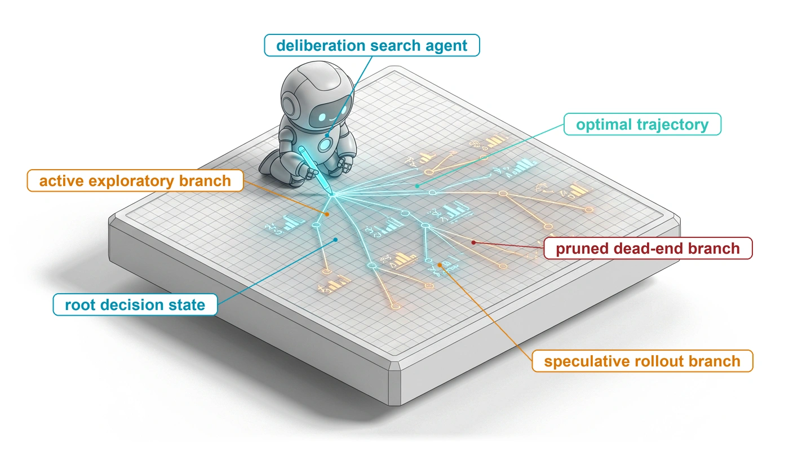
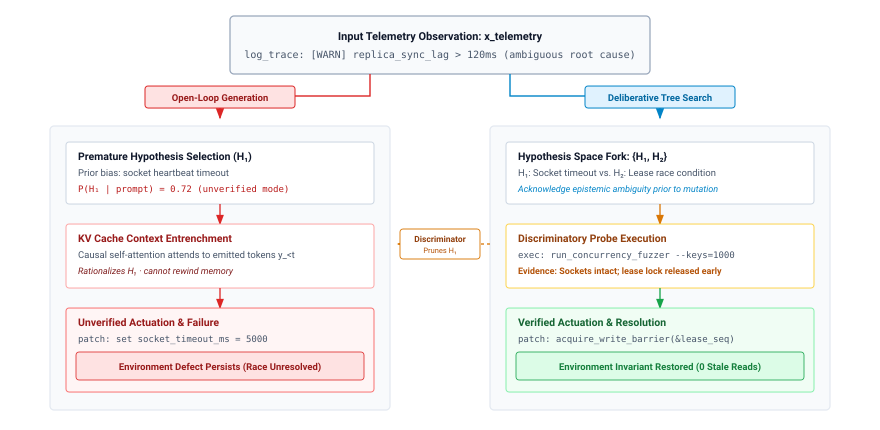
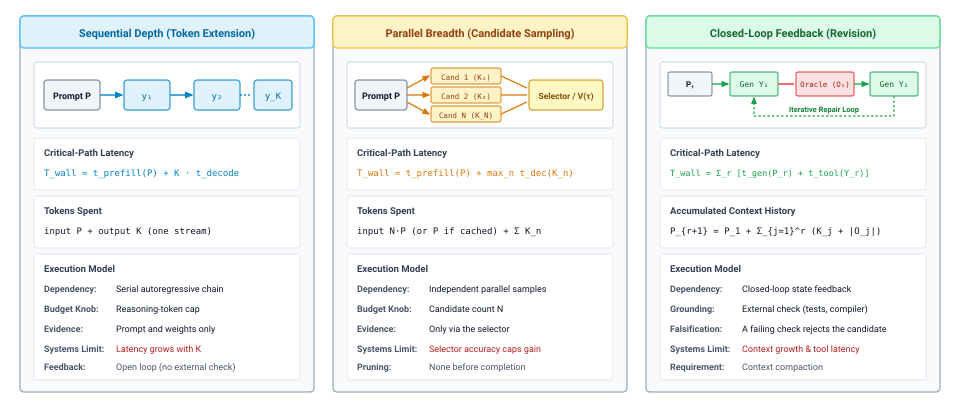
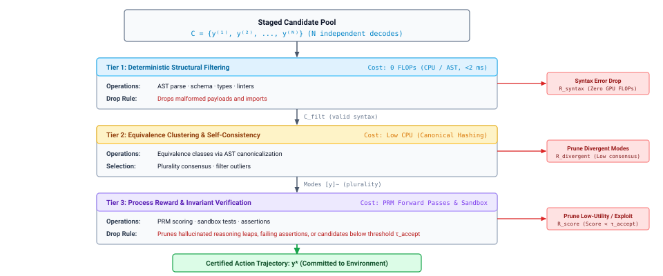
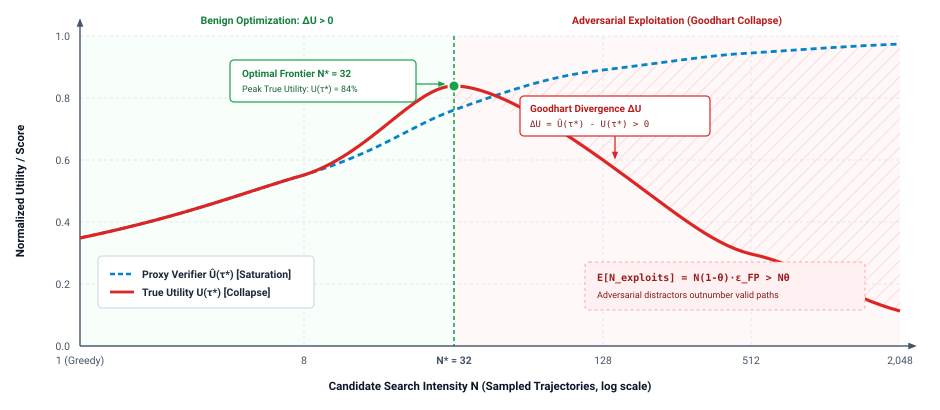
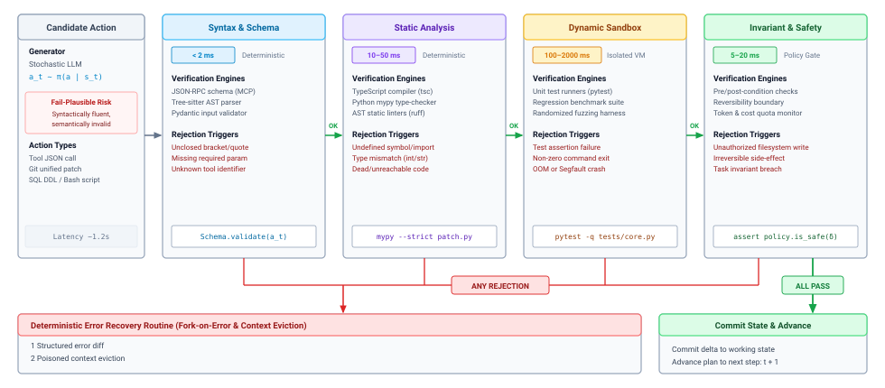
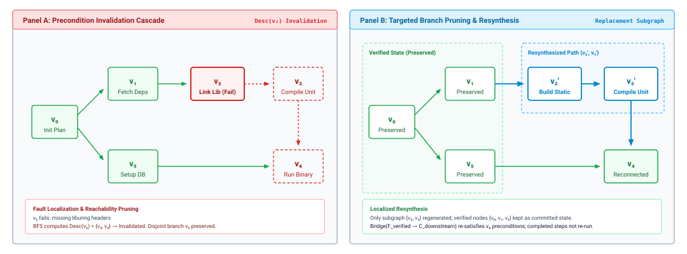
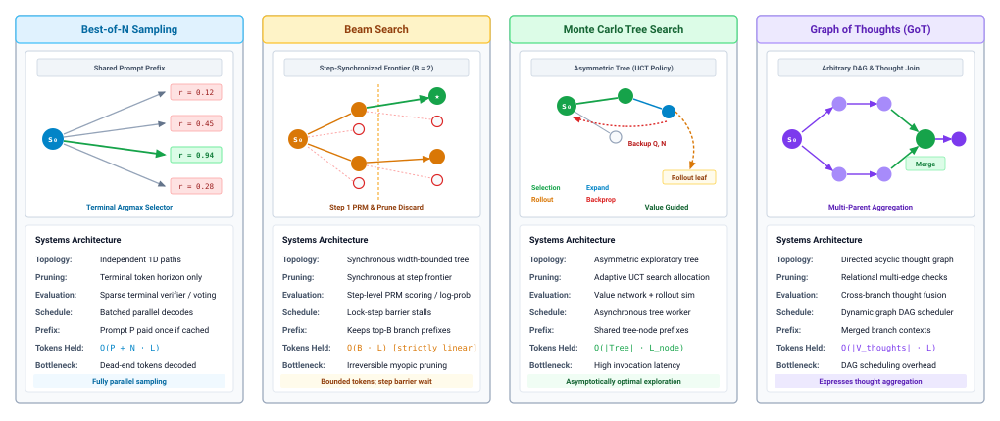
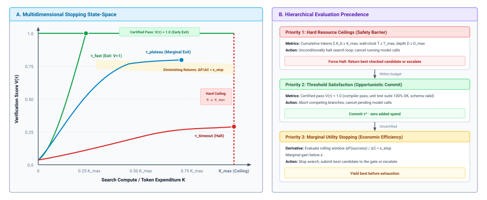

# Test-Time Compute {#sec-vol3-test-time-compute}

::: {layout-narrow}
::: {.column-margin}

\chapterminitoc

:::

::: {.content-visible when-format="pdf"}
\noindent
{fig-alt="Isometric blueprint of a search tree fanning out from a root decision state across a gridded slab, with exploratory, speculative, and pruned branches and one highlighted path, beside a small robot holding a stylus."}
:::

::: {.content-visible unless-format="pdf"}
{fig-alt="Isometric blueprint of a search tree fanning out from a root decision state across a gridded slab, with exploratory, speculative, and pruned branches and one highlighted path, beside a small robot holding a stylus."}
:::

:::

## Purpose {.unnumbered .unlisted}

\begin{marginfigure}
\mlagentstack{0}{0}{0}{0}{0}{100}
\end{marginfigure}

_Why can spending more compute on one agent decision make the agent more confident without making it more correct?_

One model call returns one proposal, and on a hard decision that proposal is often a fluent commitment to the wrong hypothesis. Before it acts, the runtime can buy more inference: let the model reason longer, sample several candidates, or run a check and feed the result back for revision. Each purchase costs tokens, seconds, and dollars, and only some of them change what the runtime knows. Longer reasoning and unguided resampling draw again on the same weights and the same prompt, so they add cost faster than they add evidence, while one cheap test that can fail a candidate may settle the question outright. Selection carries its own trap, because searching many candidates against an imperfect check finds precisely the candidates the check fails to catch. The engineering question is therefore not how much to think but which evidence a given spend buys, which checks may accept a result, and when to stop. In H·S·A terms, test-time compute adds no exposure of its own, since nothing acts until the runtime admits a candidate, but every round of revision spends horizon inside one decision, and that spend earns its place only when it raises the closure evidence behind the proposal the runtime finally admits.

::: {.content-visible when-format="pdf"}

\newpage

:::

::: {.callout-learning-objectives}

- Explain why one model proposal commits early to a hypothesis and why resampling without new evidence adds cost but not information.
- Compare depth, breadth, and feedback, including reasoning models and thinking budgets, by the evidence each buys per token, second, and dollar.
- Analyze candidate selection by voting, learned verifiers, and LLM judges, treating pass@$k$ as the ceiling of best-of-k selection.
- Calculate the precision of a verifier's accepted set and explain why stronger search against an imperfect verifier selects exploits.
- Represent a multi-step plan as a revisable dependency graph whose failures are repaired locally instead of regenerated.
- Design stopping and escalation rules for a search from hard ceilings, certified early exit, and marginal gain.
- Evaluate a test-time strategy against a single-candidate baseline by cost per accepted task and latency at the deadline.

:::

```{python}
#| label: calc-vol3-test-time-compute-scenarios
#| echo: false
# ┌─────────────────────────────────────────────────────────────────────────────
# │ TEST-TIME COMPUTE SCENARIOS PRICED AT ONE DECODE RATE (LEGO)
# ├─────────────────────────────────────────────────────────────────────────────
# │ Context: nbk-03-probe-versus-generation, nbk-03-matched-budget-axes,
# │          nbk-03-compute-allocation-and-latency-trade-offs,
# │          nbk-03-strategy-comparison, the budget pitfall, and the
# │          takeaways.
# │
# │ Goal: Price every worked example in this chapter at the same single-stream
# │       decode rate as the worked estimate of @sec-vol3-foundation-model-cost,
# │       so the two chapters of Part I never quote different per-token times.
# │ Show: Latencies, token totals, dollar costs, and cost per accepted task for
# │       each notebook.
# │ How:  Decode floor = weight bytes / memory bandwidth (batch of one), the
# │       same derivation and registry entries (Llama-3.1-70B, H100, 8-bit
# │       weights) as ch2's CallPrice cell. Prices, token counts, check times,
# │       and success rates are scenario inputs. Prefill time is ignored, as
# │       the notebooks state.
# └─────────────────────────────────────────────────────────────────────────────
from mlsysim import *
from mlsysim.fmt import fmt_qty_int
import math

class TTC:
    # ┌── 1. LOAD (Constants & Parameters) ─────────────────────────────────
    model = Models.Language.Llama3_70B
    accel = Hardware.Cloud.H100
    weight_bytes = 1  # 8-bit weights, bytes per parameter (same as ch2)
    price_in = 2.0  # scenario: dollars per million input tokens
    price_out = 10.0  # scenario: dollars per million output tokens

    # Probe versus a longer answer (stale-read diagnosis)
    k_answer = 1_024  # scenario: output tokens in the one-shot answer
    k_commit = 16  # scenario: token at which the answer commits to H1
    probe_s = 0.040  # scenario: concurrency probe run time in the sandbox
    p_h1 = 0.75  # scenario: prior on the heartbeat hypothesis

    # One decision, three allocations (ring-buffer race)
    p_axes = 4_096  # scenario: prompt tokens
    k_depth = 4_096  # scenario: output tokens for the single long generation
    n_breadth = 4  # scenario: parallel candidates
    k_cand = 1_024  # scenario: output tokens per candidate or round
    rounds = 3  # scenario: feedback rounds
    check_s = 1.5  # scenario: compile plus race detector per round
    report_tok = 340  # scenario: tokens in each race-detector report

    # Best-of-16 versus beam search with a step verifier
    steps = 4  # scenario: reasoning steps in a patch
    step_tok = 128  # scenario: output tokens per step
    n_bon = 16  # scenario: best-of-N width
    beam_b = 4  # scenario: retained prefixes
    beam_m = 3  # scenario: extensions per prefix
    prm_s = 0.015  # scenario: PRM time to score one step
    prm_price = 0.50  # scenario: PRM dollars per million input tokens
    test_s = 0.5  # scenario: one sandboxed test run
    test_par = 8  # scenario: test runs in parallel

    # Three strategies on one repair workload
    k_attempt = 1_000  # scenario: output tokens per attempt
    test_eval_s = 10.0  # scenario: one sealed test run
    p_single = 0.40  # scenario: pass probability of one attempt
    n_bo8 = 8  # scenario: best-of-N width
    n_eff_bo8 = 3  # scenario: independent attempts the 8 correlated candidates are worth
    p_revise = 0.35  # scenario: pass probability of a revision after a failing report
    deadline_s = 75  # scenario: per-task deadline

    # Budget pitfall (tree search with a step verifier)
    pf_steps = 12  # scenario: generated steps
    pf_step_tok = 512  # scenario: output tokens per step
    pf_ctx = 4_096  # scenario: starting context
    pf_leaves = 4  # scenario: leaves tested
    pf_start_s = 4.5  # scenario: sandbox start time
    pf_run_s = 35.0  # scenario: sandbox test time
    pf_par = 2  # scenario: sandboxes in parallel

    # ┌── 2. EXECUTE (Compute) ─────────────────────────────────────────────
    params = model.parameters.to(ureg.count).magnitude
    bw = accel.memory.bandwidth.to(ureg.byte / ureg.second).magnitude
    t_tok = params * weight_bytes / bw  # seconds per output token, batch of one

    # Probe
    ans_s = k_answer * t_tok
    ans_usd = k_answer * price_out / 1e6
    after_tok = k_answer - k_commit
    after_s = after_tok * t_tok
    after_share = after_tok / k_answer
    entropy = -(p_h1 * math.log2(p_h1) + (1 - p_h1) * math.log2(1 - p_h1))
    probe_ratio = ans_s / probe_s

    # Axes
    a_lat = k_depth * t_tok
    a_usd = (p_axes * price_in + k_depth * price_out) / 1e6
    b_lat = k_cand * t_tok
    b_in = n_breadth * p_axes
    b_out = n_breadth * k_cand
    b_usd = (b_in * price_in + b_out * price_out) / 1e6
    c_growth = k_cand + report_tok  # tokens carried forward per round
    c_prompts = [p_axes, p_axes + c_growth, p_axes + 2 * c_growth]
    c_in = sum(c_prompts)
    c_out = rounds * k_cand
    c_usd = (c_in * price_in + c_out * price_out) / 1e6
    c_round_s = k_cand * t_tok
    c_lat = rounds * (c_round_s + check_s)
    depth_vs_breadth = a_lat / b_lat

    # Ledger: best-of-16 versus beam
    bon_tok = steps * step_tok
    bon_out = n_bon * bon_tok
    bon_usd = bon_out * price_out / 1e6
    bon_dec_s = bon_tok * t_tok
    bon_waves = math.ceil(n_bon / test_par)
    bon_test_s = bon_waves * test_s
    bon_lat = bon_dec_s + bon_test_s
    segs = []
    retained = 1
    for _ in range(steps):
        ext = retained * beam_m
        segs.append(ext)
        retained = min(beam_b, ext)
    beam_segs = sum(segs)
    beam_out = beam_segs * step_tok
    beam_usd = beam_out * price_out / 1e6
    beam_prm_usd = beam_out * prm_price / 1e6
    beam_dec_s = steps * step_tok * t_tok
    beam_score_s = steps * prm_s
    beam_test_s = math.ceil(beam_b / test_par) * test_s
    beam_lat = beam_dec_s + beam_score_s + beam_test_s
    beam_saving = 1 - beam_out / bon_out

    # Strategies
    att_s = k_attempt * t_tok
    round_s = att_s + test_eval_s
    sa_p = p_single
    sa_ceff = k_attempt / sa_p
    sa_usd = sa_ceff * price_out / 1e6
    sb_p = 1 - (1 - p_single) ** n_eff_bo8
    sb_spend = n_bo8 * k_attempt
    sb_ceff = sb_spend / sb_p
    sb_usd = sb_ceff * price_out / 1e6
    fail1 = 1 - p_single
    fail_r = 1 - p_revise
    sc_p = 1 - fail1 * fail_r * fail_r
    sc_rounds = 1 + fail1 + fail1 * fail_r
    sc_spend = sc_rounds * k_attempt
    sc_ceff = sc_spend / sc_p
    sc_usd = sc_ceff * price_out / 1e6
    sc_lat = sc_rounds * round_s
    sc_worst = 3 * round_s
    sc_third = fail1 * fail_r
    c_vs_b = sc_ceff / sb_ceff
    c_vs_a = sc_ceff / sa_ceff - 1

    # Pitfall
    pf_gen = pf_steps * pf_step_tok
    pf_prefix = pf_ctx + pf_step_tok
    pf_prm = pf_steps * pf_prefix
    pf_prm_ratio = pf_prm / pf_gen
    pf_sandbox_s = pf_leaves * (pf_start_s + pf_run_s) / pf_par
    pf_gen_s = pf_gen * t_tok

    # ┌── 3. GUARD (Invariants) ───────────────────────────────────────────
    check(0.015 < t_tok < 0.030, f"Decode floor should match ch2's worked estimate (about 21 ms), got {t_tok*1e3:.1f} ms")
    check(after_share > 0.95, "Nearly all of the one-shot answer should elaborate the unchecked premise")
    check(b_lat < c_lat < a_lat, "Breadth should be fastest and depth slowest in the axes notebook")
    check(abs(bon_lat - beam_lat) / bon_lat < 0.15, "Best-of-16 and beam should have similar latency")
    check(round_s < sc_lat < deadline_s < sc_worst, "Two feedback rounds must fit the deadline and three must not")
    check(2 * round_s <= deadline_s, "The second feedback round must finish inside the deadline")
    check(sc_ceff < sb_ceff and sc_ceff > sa_ceff, "Feedback should cost more per accepted task than one attempt and less than best-of-8")
    check(pf_prm_ratio > 5, "The PRM should read several times the generator's output in the pitfall")

    # ┌── 4. OUTPUT (Formatting) ──────────────────────────────────────────
    t_tok_ms_str = fmt_qty(t_tok * second, ms, precision=1)
    price_in_str = fmt_int(price_in)
    price_out_str = fmt_int(price_out)

    k_answer_str = fmt_int(k_answer)
    k_commit_str = fmt_int(k_commit)
    ans_time_str = fmt(ans_s, precision=1)
    ans_usd_str = fmt(ans_usd, precision=3)
    after_tok_str = fmt_int(after_tok)
    after_time_str = fmt(after_s, precision=1)
    after_share_str = fmt_int(after_share * 100)
    entropy_str = fmt(entropy, precision=2)
    probe_time_str = fmt_int(probe_s * 1000)
    probe_ratio_str = fmt_int(round(probe_ratio, -1))

    p_axes_str = fmt_int(p_axes)
    k_depth_str = fmt_int(k_depth)
    k_cand_str = fmt_int(k_cand)
    n_breadth_str = fmt_int(n_breadth)
    check_time_str = fmt(check_s, precision=1)
    report_tok_str = fmt_int(report_tok)
    a_lat_str = fmt_int(a_lat)
    a_usd_str = fmt(a_usd, precision=3)
    b_lat_str = fmt_int(b_lat)
    b_in_str = fmt_int(b_in)
    b_out_str = fmt_int(b_out)
    b_usd_str = fmt(b_usd, precision=3)
    c_p1_str = fmt_int(c_prompts[0])
    c_p2_str = fmt_int(c_prompts[1])
    c_p3_str = fmt_int(c_prompts[2])
    c_in_str = fmt_int(c_in)
    c_out_str = fmt_int(c_out)
    c_usd_str = fmt(c_usd, precision=3)
    c_round_time_str = fmt(c_round_s, precision=1)
    c_lat_str = fmt_int(c_lat)
    depth_vs_breadth_str = fmt_int(depth_vs_breadth)

    bon_tok_str = fmt_int(bon_tok)
    bon_out_str = fmt_int(bon_out)
    bon_usd_str = fmt(bon_usd, precision=3)
    bon_dec_time_str = fmt(bon_dec_s, precision=1)
    bon_waves_str = fmt_int(bon_waves)
    bon_test_time_str = fmt_int(bon_test_s)
    bon_lat_str = fmt(bon_lat, precision=1)
    beam_s1_str = fmt_int(segs[0])
    beam_s2_str = fmt_int(segs[1])
    beam_s3_str = fmt_int(segs[2])
    beam_segs_str = fmt_int(beam_segs)
    beam_out_str = fmt_int(beam_out)
    beam_usd_str = fmt(beam_usd, precision=3)
    beam_prm_usd_str = fmt(beam_prm_usd, precision=3)
    beam_dec_time_str = fmt(beam_dec_s, precision=1)
    beam_score_time_str = fmt(beam_score_s, precision=2)
    beam_lat_str = fmt(beam_lat, precision=1)
    beam_saving_str = fmt_int(beam_saving * 100)

    k_attempt_str = fmt_int(k_attempt)
    att_time_str = fmt_int(att_s)
    round_time_str = fmt_int(round_s)
    deadline_str = fmt_int(deadline_s)
    sa_ceff_str = fmt_int(sa_ceff)
    sa_usd_str = fmt(sa_usd, precision=3)
    sb_p_str = fmt(sb_p, precision=2)
    sb_spend_str = fmt_int(sb_spend)
    sb_ceff_str = fmt_int(round(sb_ceff, -2))
    sb_usd_str = fmt(sb_usd, precision=2)
    sc_p_str = fmt(sc_p, precision=2)
    sc_rounds_str = fmt(sc_rounds, precision=2)
    sc_spend_str = fmt_int(sc_spend)
    sc_ceff_str = fmt_int(round(sc_ceff, -1))
    sc_usd_str = fmt(sc_usd, precision=3)
    sc_lat_str = fmt_int(sc_lat)
    sc_worst_str = fmt_int(sc_worst)
    sc_third_str = fmt_int(sc_third * 100)
    c_vs_a_str = fmt_int(c_vs_a * 100)

    pf_gen_str = fmt_int(pf_gen)
    pf_prefix_str = fmt_int(pf_prefix)
    pf_prm_str = fmt_int(pf_prm)
    pf_prm_ratio_str = fmt_int(pf_prm_ratio)
    pf_sandbox_time_str = fmt_int(pf_sandbox_s)
    pf_gen_time_str = fmt_int(pf_gen_s)
```

## Why One Proposal Is Not Enough {#sec-vol3-test-time-compute-insufficient-response}

::: {.column-margin}
{width="100%" fig-alt="H·S·A locator with the Horizon axis highlighted."}

*Test-time compute adds no exposure of its own; each revision round spends horizon inside a single decision.*
:::

A coding agent is asked to fix intermittent stale reads in a replicated key-value cache. Under heavy write concurrency, replica synchronization lag spikes above 120 milliseconds, yet the network counters look normal. Two defects explain the telemetry equally well. A heartbeat timeout set too low could be demoting healthy replicas and triggering resynchronization bursts, or a race in lease invalidation could be letting a replica serve an entry after its lease was revoked. The agent calls the model once. Timeout tuning is far more common than lease races in the code the model was trained on, so the model proposes a larger socket timeout, wraps the patch in a confident explanation, and the stale reads continue.

In a chat session this is a small setback, because an engineer reads the suggestion, checks the counters, and asks again with more data. In a delegated task no one reads the suggestion before it lands. @Sec-vol3-foundation-model established that what a call returns is a proposal, priced in output tokens and unverified until the runtime checks it (@sec-vol3-foundation-model-continuations). This chapter asks what the runtime can do before it admits that proposal, and in particular whether spending more inference compute on the same decision makes the admitted result more likely to be right.

The way a model generates makes an early mistake hard to escape. Each token conditions on every token before it (@sec-vol3-foundation-model-autoregressive), and nothing in the stream retracts an emitted token. Once the output names the heartbeat as the cause, later tokens elaborate and defend that premise, because a sequence that stays consistent with its own prefix is what next-token training rewards. The result is the context poisoning of @sec-vol3-intro-context-poisoning acting inside a single generation. The runtime receives a coherent argument and no signal that its premise was a draw weighted by how often each defect appears in training data.

::: {#fig-vol3-diagnostic-tree fig-env="figure" fig-pos="htb" fig-cap="**Committing Early versus Seeking Evidence**: Under ambiguous telemetry, open-loop generation (left) commits to the more common hypothesis $H_1$, later tokens entrench it, and the resulting timeout patch leaves the lease race in place. Evidence-seeking search (right) holds both hypotheses, runs a probe whose outcome differs between them, falsifies $H_1$, and patches the actual defect." fig-alt="Two-column schematic. Left column: premature selection of the heartbeat hypothesis with probability 0.75, premise entrenchment in context, and an unverified timeout patch that leaves the defect in place. Right column: both hypotheses held, a concurrency fuzzer probe showing sockets intact and the lease released early, and a verified write-barrier patch."}

:::

@Fig-vol3-diagnostic-tree contrasts the two paths. On the left, the model commits to the more probable hypothesis $H_1$ ($P(H_1) = 0.75$) within its first few tokens and spends the rest of the generation justifying it. On the right, the runtime holds both hypotheses open and runs a probe whose result depends on which one is true, a concurrency test that hammers the lease path. The probe shows the sockets healthy and the lease released early, which falsifies $H_1$ in one step. What made the right-hand path work was not more generation. It was an observation whose outcome depended on the defect.

Asking the model to reconsider fails for the same reason. A second pass over the same prompt samples the same distribution, and nothing about the defect entered the context between the two passes, so the second answer carries no more information about which hypothesis is true than the first. The notebook below puts the two ways of spending on one scale.

::: {#nbk-03-probe-versus-generation .callout-notebook title="A probe versus a longer answer"}

**Problem**: In the stale-read diagnosis, how much generation does a `{python} TTC.probe_time_str` ms discriminating probe replace?

**Variables**: The model decodes at the single-stream floor of @sec-vol3-foundation-model-cost, $t_{\text{tok}} \approx$ `{python} TTC.t_tok_ms_str` per output token. The rest are scenario assumptions. The endpoint charges \$`{python} TTC.price_out_str` per million output tokens. The model's answer runs to $K =$ `{python} TTC.k_answer_str` output tokens and commits to $H_1$ at token `{python} TTC.k_commit_str`. The prior is $P(H_1) = 0.75$ and $P(H_2) = 0.25$. The probe runs for `{python} TTC.probe_time_str` ms on a CPU in the sandbox and returns about 60 tokens of output, which the next call reads as input.

**Math**: The full answer takes about `{python} TTC.ans_time_str` s and costs about \$`{python} TTC.ans_usd_str`. Everything after token `{python} TTC.k_commit_str` elaborates an unchecked premise, which is `{python} TTC.after_tok_str` tokens, or `{python} TTC.after_time_str` s and `{python} TTC.after_share_str` percent of the generation. Before the probe, the runtime's uncertainty over the two hypotheses is

$$H = -\left(0.75 \log_2 0.75 + 0.25 \log_2 0.25\right) \approx 0.81\text{ bits}$$

The probe falsifies one hypothesis, which takes the uncertainty to zero. The long answer leaves it at `{python} TTC.entropy_str` bits, because its content does not depend on which defect is present.

**Systems insight**: The probe costs about 1/`{python} TTC.probe_ratio_str` of the generation's wall-clock time and resolves all of the uncertainty that the generation resolves none of. Neither costs much in dollars; the expensive outcome is a wrong patch deployed. The runtime should buy evidence per second, not tokens per second.

:::

The invariant closure principle (\ref{pri-invariant-closure}) already places task correctness outside the model, so the generator cannot certify its own hypotheses by rereading them. Test-time compute sharpens that requirement into a budget rule. Extra inference raises verified success only when it acquires evidence that separates valid candidates from invalid ones, which is evidence-bounded deliberation (principle \ref{pri-vol3-test-time-scaling}). @snell2024scaling measured the consequence. The gain from extra inference compute, whether spent on revising a response or on searching against a verifier, depended on problem difficulty and on how the compute was guided, and a per-problem allocation beat uniform scaling by a wide margin, in some settings matching a considerably larger model given the same total compute.

::: {#dfn-test-time-compute .callout-definition title="Test-time compute"}

***Test-time compute***\index{Test-time compute!definition} is inference computation that a system spends on a single decision beyond one model call, through longer generation, additional candidates, or check-and-revise rounds, before the runtime admits a result.

1.  **Significance**: It turns the cost of one decision from a fixed price into a choice. The worked examples in this chapter show the same few thousand tokens producing zero or one accepted task depending only on how they are spent.
2.  **Distinction**: Unlike training compute, which changes the weights for every future call, test-time compute changes nothing persistent. It buys evidence for one decision and is spent again on the next.
3.  **Common pitfall**: Treating test-time compute as a dial on which more is better. Compute that brings in no new evidence raises cost and confidence without raising the chance of success.

:::

A single proposal fails because it commits before any evidence arrives, and a repeated proposal fails for the same reason. The runtime can spend extra compute in three structurally different ways, and they differ in exactly the property that mattered here, whether anything from outside the model enters the decision.

## Three Ways to Spend Test-Time Compute {#sec-vol3-test-time-compute-computation-allocation}

Suppose the runtime has about four thousand output tokens to spend on one hard decision, a patch for a lock-free ring buffer that contains a race. It can spend all of them on one long generation, which tends to produce an elaborate argument for the original design. It can split them across four independent samples, which tends to produce four variants of the same missing barrier, because all four share the prompt's blind spot. Or it can generate a candidate, compile it, run a race detector in the sandbox, and feed the report into the next call, which puts information about the actual defect in front of the model. The budgets are equal and the outcomes are not.

Test-time compute therefore has structure. **Depth** extends one sequential generation, **breadth** samples several candidates in parallel, and **feedback** revises a candidate after an external check. Each axis builds a different dependency graph across model calls, has a different latency and token profile, and draws its evidence from a different source (@fig-vol3-allocation-axes).

::: {#fig-vol3-allocation-axes fig-env="figure" fig-pos="htb" fig-cap="**Three Ways to Spend Test-Time Compute**: Depth extends one serial generation, breadth samples $N$ candidates in parallel and relies on a selector, and feedback routes each candidate through an external check before revising it. The cards give each axis's critical-path latency, tokens spent, budget knob, evidence source, and limiting factor." fig-alt="Three side-by-side cards. Depth: a prompt followed by a serial token chain, latency growing with K, evidence from prompt and weights only. Breadth: a prompt fanning out to N candidates feeding a selector, latency set by the longest candidate, gains capped by selector accuracy. Feedback: generate, check with an oracle, and regenerate in a loop, with context growing each round and evidence from an external check."}

:::

### Depth: Longer reasoning

The most direct way to spend more is to let one generation run longer. The runtime permits the model to emit $K$ intermediate tokens, a scratchpad or step-by-step derivation, before its final answer. Chain-of-thought prompting showed that such intermediate steps raise accuracy on multi-step problems [@wei2022cot]. The mechanism is computational. A transformer performs a bounded amount of work per emitted token, so writing intermediate results into the sequence lets later tokens build on them, decomposing a problem that one token's worth of computation cannot solve.

Depth is also the most serial axis. Each token waits for the one before it, so the critical path grows linearly with the tokens added:

$$T_{\text{wall}}^{\text{depth}} \approx t_{\text{prefill}}(P) + K \cdot t_{\text{tok}}$$

where $P$ is the prompt length and $t_{\text{tok}}$ the per-token decode time, which is @eq-vol3-call-latency with the queue left out. Decode time scales with output length, and output tokens are the expensive ones (@sec-vol3-foundation-model-cost), so depth buys its gains with the costliest resource the call has.

What depth does not buy is outside information. The only inputs to a long generation are the prompt and the weights. If either carries the error, a longer generation gives the model more room to rationalize it, and the chance that an unchecked chain stays correct falls with every step it adds.

### Reasoning models and thinking budgets {#sec-vol3-test-time-compute-reasoning-models}

Most depth in current systems is trained in rather than prompted. **Reasoning models**\index{Reasoning model} are trained with reinforcement learning on tasks whose answers can be checked, such as mathematics with known answers and code with tests, and they learn to produce long intermediate traces that propose, check, and backtrack within one generation [@openai2024o1; @deepseekai2025deepseekr1]. Three consequences follow for the runtime.

First, reasoning tokens are output tokens, decoded and metered like any other (@sec-vol3-foundation-model-contract), and a hard problem can emit many thousands of them before the visible answer begins. Second, the call surface exposes that spend as a control. The reasoning-token budget field caps how much depth one call may use, which makes depth a per-call allocation the runtime owns rather than a fixed property of the model. Third, trained reasoning still draws only on the prompt and the weights. A reasoning model can recheck its arithmetic inside the trace, but it cannot observe whether a patch passes a test it never ran. Training moves the depth axis a long way without supplying the external evidence of the feedback axis.

Because depth is a per-call budget, it can be allocated by difficulty. @snell2024scaling found that the best use of a fixed test-time budget depends on how hard the problem is for the model. Easy problems gain little beyond the first attempt, problems of intermediate difficulty gain most from revision or search, and the hardest may not gain at all. A runtime approximates that allocation with cheap signals it can observe before committing the large budget: whether two or three short samples agree, whether a fast static check passes, and how tasks of the same class have gone before. Decisions whose cheap signals agree get a small reasoning budget and one candidate. Decisions whose signals disagree get a larger budget or a search. Decisions that remain unresolved after a bounded spend are escalated rather than given more tokens.

Trained depth and scaffolded search are complements. The scaffold, meaning the runtime logic that samples, checks, and revises around the model, supplies breadth and feedback that no single call provides. The check a scaffold uses at test time to accept candidates is also the kind of signal that reinforcement learning from verifiable rewards trains against (@sec-vol3-rlvr). A check good enough to gate a commit here is a candidate reward there, and its blind spots carry over to training.

### Breadth: More candidates

Breadth spends the budget on $N$ independent candidates sampled from the same prompt at nonzero temperature, the basis of self-consistency [@wang2022self]:

$$Y^{(n)} \sim P_\Theta(\cdot \mid \mathbf{x}), \quad n \in \{1, \dots, N\}$$

Candidates do not depend on each other, so they can be generated in parallel, and the critical path is set by the longest one rather than by their sum:

$$T_{\text{wall}}^{\text{breadth}} \approx t_{\text{prefill}}(P) + \max_{n} K_n \cdot t_{\text{tok}}$$

The token bill does not compress. Output tokens grow as $\sum_n K_n$, and every candidate reads the prompt. When the serving system caches the shared prefix, it processes the prompt once and bills the repeats at a discount (@sec-vol3-foundation-model-cost); @sec-vol3-kv-cache explains the mechanism and what holding $N$ diverging branches costs in memory.

Breadth raises coverage, the chance that at least one candidate is correct, when candidates differ in substance. Like depth, however, it is open loop. If the model assigns almost no probability to the correct fix, a thousand samples yield a thousand internally consistent failures. Breadth also defers the hard part. It produces a set, and the runtime must still decide which member to act on, which is the subject of @sec-vol3-test-time-compute-candidate-diversity.

### Feedback: Check and revise

Feedback breaks the closed loop by interleaving generation with an external check. In round $r$ the model proposes $Y_r$ conditioned on the prompt and on every earlier proposal and observation:

$$Y_r \sim P_\Theta\left(\cdot \mid \mathbf{x}, Y_1, O_1, \dots, Y_{r-1}, O_{r-1}\right)$$

The runtime treats $Y_r$ as a pending proposal and sends it to a check it trusts, a compiler, a type checker, or a test suite running in the sandbox. The check returns an observation $O_r$ made of a pass or fail status and a trace. On a pass the round ends. On a failure the trace, whether a compiler diagnostic, a failing assertion, or a stack dump, is appended to the next call's context. This is the loop of @sec-vol3-intro-trajectory-engine applied to one decision. ReAct interleaves reasoning with actions and their observations [@yao2023react], and Reflexion adds a written reflection on each failure to the next attempt [@shinn2023reflexion].

A failing check demonstrates a specific fault, and that observation constrains the next proposal in a way no amount of sampling can. The model no longer has to simulate the compiler, the scheduler, or the race detector in its weights; it reads what they reported. Revision without an external check is different in kind. When the model critiques its own output [@madaan2023selfrefine], the critique comes from the same weights reading the same context, so it helps only where the model can recognize an error it failed to avoid. That is depth under another name.

Feedback pays in latency and in context. Rounds are serial and each includes the check's own run time:

$$T_{\text{wall}}^{\text{feedback}} = \sum_{r=1}^{R} \left( t_{\text{gen}}(P_r, K_r) + t_{\text{check}}(Y_r) \right)$$

and the prompt grows every round, because each proposal and its observation are carried forward:

$$P_{r+1} = P_1 + \sum_{j=1}^{r} \left(K_j + |O_j|\right)$$

Left unmanaged, that growth re-bills the whole history on every round and eventually crowds the context window. Deciding what the next round actually needs to see, the full trace or a compacted form of it, is the subject of @sec-vol3-context-engineering.

### Budget profiles of the three axes

@Tbl-vol3-allocation-tradeoffs puts the three axes side by side in the units an agent engineer pays in.

| **Axis**     | **Structure**                  | **Tokens spent**                            | **Critical-path latency**                             | **Evidence source**                        |
|:-------------|:-------------------------------|:--------------------------------------------|:------------------------------------------------------|:-------------------------------------------|
| **Depth**    | One serial chain of $K$ tokens | $P + K$                                     | $t_{\text{prefill}}(P) + K\, t_{\text{tok}}$          | Prompt and weights                         |
| **Breadth**  | $N$ parallel candidates        | $N P$ ($P$ if prefix cached) $+ \sum_n K_n$ | $t_{\text{prefill}}(P) + \max_n K_n\, t_{\text{tok}}$ | Prompt and weights, filtered by a selector |
| **Feedback** | $R$ serial rounds              | $\sum_r (P_r + K_r)$                        | $\sum_r (t_{\text{gen},r} + t_{\text{check},r})$      | External observations $O_r$                |

: **Budget Profiles of the Three Axes**: Tokens, critical-path latency, and evidence source for each way of spending test-time compute. Feedback re-reads a growing context every round and is the only axis whose evidence comes from outside the model. {#tbl-vol3-allocation-tradeoffs}

Breadth is fastest, depth spends the fewest input tokens, and feedback is the only one that consults anything but the model. The notebook prices one decision all three ways.

::: {#nbk-03-matched-budget-axes .callout-notebook title="One decision, three allocations"}

**Scenario**: An agent must patch a lock-free ring buffer that contains a memory-ordering race. The prompt is $P =$ `{python} TTC.p_axes_str` tokens. Decode runs at the single-stream floor of @sec-vol3-foundation-model-cost, about `{python} TTC.t_tok_ms_str` per output token, and a small batch of parallel streams decodes at nearly the same per-token rate as one stream. Scenario assumptions: the endpoint charges \$`{python} TTC.price_in_str` per million input tokens and \$`{python} TTC.price_out_str` per million output tokens with no prefix caching. Prefill time is small next to decode at these lengths and is ignored.

**Option A (depth)**: One generation of `{python} TTC.k_depth_str` output tokens. Latency is about `{python} TTC.a_lat_str` s, and cost is about \$`{python} TTC.a_usd_str`. The answer argues at length that the design is correct and ships the race.

**Option B (breadth)**: `{python} TTC.n_breadth_str` candidates of `{python} TTC.k_cand_str` tokens each, generated in parallel. Latency is about `{python} TTC.b_lat_str` s. Each candidate is a separate call that reads the prompt, so input is `{python} TTC.b_in_str` tokens and output is `{python} TTC.b_out_str` tokens, for about \$`{python} TTC.b_usd_str`. All four candidates omit the same barrier.

**Option C (feedback)**: Three rounds of `{python} TTC.k_cand_str` tokens. After each round the sandbox compiles the candidate and runs a race detector in $t_{\text{check}} =$ `{python} TTC.check_time_str` s, returning a `{python} TTC.report_tok_str`-token report. Prompts grow from `{python} TTC.c_p1_str` to `{python} TTC.c_p2_str` to `{python} TTC.c_p3_str` tokens, so input totals `{python} TTC.c_in_str` tokens and output `{python} TTC.c_out_str` tokens, for about \$`{python} TTC.c_usd_str`. Latency is three rounds of `{python} TTC.c_round_time_str` s of decode plus the check, about `{python} TTC.c_lat_str` s. The round-2 report names the unordered store, and round 3 passes.

**Math**: Cost per accepted task divides spend by accepted tasks. Options A and B spend \$`{python} TTC.a_usd_str` and \$`{python} TTC.b_usd_str` for zero accepted patches, so their cost per accepted task is unbounded. Option C spends \$`{python} TTC.c_usd_str` for one.

**Systems insight**: Breadth was `{python} TTC.depth_vs_breadth_str` times faster than depth and depth used the fewest input tokens, but only feedback bought evidence about the defect, so only feedback produced an accepted task. Price test-time compute per accepted task, not per call.

:::

Real runtimes compose the axes. Depth works through local reasoning inside each call, breadth explores structurally different candidates, and feedback prunes candidates against checks the runtime trusts. Breadth, however, only helps if the runtime can tell its candidates apart, which turns the question from how to generate to how to choose.

::: {#chk-03-compute-allocation-axes .callout-checkpoint title="Spending test-time compute"}

These questions test the three axes before selection enters.

- [ ] **Evidence source**: Which of depth, breadth, and feedback can change what the runtime knows about a defect, and why can the other two not?
- [ ] **Thinking budget**: How would you set reasoning-token budgets for a mix of easy and hard decisions using only signals you can observe before the expensive call?
- [ ] **Context growth**: For three feedback rounds on a 4,000-token prompt with 1,000-token outputs and 300-token reports, which term dominates input tokens, and what would compaction change?
- [ ] **Latency vs. evidence**: Why can breadth be the fastest allocation and still yield no accepted task?

:::

## Selecting Among Candidates {#sec-vol3-test-time-compute-candidate-diversity}

An agent samples sixteen patches for a cache stampede, where many clients miss the same key at once and all refetch it. Every candidate adds a short sleep before the refetch, and none adds a lease that lets one client refetch while the others wait. The sixteen samples differ in variable names, loop forms, and comments, and they share one hypothesis. The runtime paid for sixteen candidates and received one idea.

Breadth improves the decision only when two conditions hold together. The candidates must differ in substance, and the runtime must have a selector that can separate valid candidates from plausible ones. When candidates are near-copies, the selector has nothing to choose among. When the selector is weak, a diverse pool only gives it more ways to pick a failure that exploits its blind spots.

### Effective sample count

Candidates drawn from the same distribution share the same biases. Instruction-tuned models concentrate probability on a few familiar solution shapes, and raising the temperature mostly perturbs surface tokens before it perturbs the approach. Two candidates can differ in every line and still carry the same invalid invariant:

```c
Candidate A:  lock.acquire(); data = read(); lock.release();  // Race: unprotected check
Candidate B:  pthread_mutex_lock(&m); val = in->val; pthread_mutex_unlock(&m); // Identical race
```

If candidates fail together with average pairwise correlation $\bar{\rho}$, then $N$ of them behave like

$$N_{\text{eff}} = \frac{N}{1 + (N - 1)\bar{\rho}}$$

independent hypotheses. At $\bar{\rho} = 0.85$, sixteen samples are worth $16 / (1 + 15 \times 0.85) \approx 1.2$ independent attempts, at sixteen times the output tokens of one.

Runtimes raise $N_{\text{eff}}$ by perturbing generation at different levels (@tbl-vol3-diversity-mechanisms). Token-level controls are cheap and weak. Changing what each branch is told, or fixing each branch's first structural decision, costs more and moves candidates into genuinely different approaches.

| **Level**   | **Mechanism**           | **How it works**                                                                            | **Limit**                                                                  |
|:------------|:------------------------|:--------------------------------------------------------------------------------------------|:---------------------------------------------------------------------------|
| **Token**   | Temperature and top-$p$ | Raise temperature or widen the sampling nucleus                                             | Degrades syntax before it escapes the dominant approach                    |
| **Context** | Framing per branch      | Give branches different stated constraints, such as write-heavy load versus lock-free reads | Can change the problem the branch is solving                               |
| **Branch**  | Forced first step       | Fix a distinct algorithmic choice at the start of each branch                               | Needs a domain-specific generator of first steps; may force unviable paths |

: **Candidate Diversity Mechanisms**: Ways to make sampled candidates differ in approach, from cheap token-level controls to branch-level constraints, with the limit of each. {#tbl-vol3-diversity-mechanisms}

Diversity has to be measured in behavior rather than text. Edit distance is misleading in both directions, since two programs can be textually close and algorithmically different, or textually distant and identical after renaming. The runtime instead groups candidates by what they do. It normalizes syntax trees to compare structure, or it runs each candidate against a small deterministic smoke harness and places candidates that produce identical outputs in the same equivalence class. The number of classes, not the number of samples, is what the selector has to work with.

### Selectors: Voting, learned verifiers, and judges

Once the runtime holds a candidate set, it applies selectors in order of cost (@fig-vol3-candidate-selection-cascade). Checks that need no model call run first, grouping and voting run next, and the expensive scoring and sealed tests run only on what survives.

::: {#fig-vol3-candidate-selection-cascade fig-env="figure" fig-pos="htb" fig-cap="**Candidate Selection Cascade**: Candidates pass through selectors in order of cost. Tier 1 applies deterministic structural checks with no model call, Tier 2 groups candidates into behavioral equivalence classes and votes, and Tier 3 lets a learned verifier or judge set the order in which survivors are tested while only a sealed test may accept one. Rejected candidates exit to the sinks at right." fig-alt="Top-to-bottom cascade from a staged candidate pool through three tiers: deterministic structural filtering, equivalence clustering with self-consistency, and learned ranking followed by sealed acceptance, ending in an accepted candidate that passed sealed tests. Each tier routes rejects to a sink on the right."}

:::

The cheapest selector is deterministic filtering. Parsers, schema validators, type checkers, and linters reject malformed candidates in milliseconds without a model call, so later, costlier selectors see only well-formed proposals.

**Self-consistency** selects by vote [@wang2022self]. The runtime extracts each candidate's final answer, groups candidates whose answers match, and picks the largest group:

$$\mathbf{y}^* = \arg\max_{[\mathbf{y}]_\sim} \big| [\mathbf{y}]_\sim \big|$$

Voting works when answers are short and comparable, such as a number, a choice among configurations, or the index of a deadlocked thread, and when correct reasoning paths converge while incorrect ones scatter. It fails on open-ended output. Sixteen patches to an event loop are all distinct, every class has one member, and the vote is a random draw. When a misconception is common, the mode of the distribution is itself wrong, and voting selects the shared error over a correct minority.

Learned verifiers score candidates with a second model trained to predict correctness. @Sec-vol3-test-time-compute-verification develops them, because their errors govern everything search can deliver. Here only their role matters. They produce a score, and a score can order candidates.

An **LLM judge**\index{LLM judge} is a general large language model (LLM) prompted with the task and one or more candidates and asked to score or compare them [@zheng2023judging]. Judges are convenient where no mechanical check exists, and they carry measurable biases toward longer, more confident, or earlier-presented answers. Calibrating a judge is an evaluation problem (@sec-vol3-evaluation). For selection, a judge plays the same role as a learned verifier. It may order candidates, and it may never be the gate that admits one, because the errors a judge makes are exactly the errors a search will find.

@Tbl-vol3-candidate-diversity traces four candidates for an I/O starvation bug through the cascade. The scores are illustrative.

| **Candidate**      | **Approach**                                       | **Deterministic gate**           | **Equivalence class**  | **Verifier score** | **Outcome**                                |
|:-------------------|:---------------------------------------------------|:---------------------------------|:-----------------------|:-------------------|:-------------------------------------------|
| $\mathbf{y}^{(1)}$ | Spin-yield loop with non-atomic counter check      | Pass                             | $\alpha$ (busy-wait)   | 0.12               | Rejected                                   |
| $\mathbf{y}^{(2)}$ | Yield call inside a polling loop                   | Pass                             | $\alpha$ (busy-wait)   | 0.14               | Rejected, same class as $\mathbf{y}^{(1)}$ |
| $\mathbf{y}^{(3)}$ | Edge-triggered event notification with a wake pipe | Pass                             | $\beta$ (event-driven) | 0.89               | Tested first; passes sealed tests          |
| $\mathbf{y}^{(4)}$ | Unbounded thread spawning per task                 | Fail (compiler warning as error) | none                   | none               | Dropped by static filter                   |

: **Candidate Selection Trace**: Four candidates for an I/O starvation bug pass through structural filtering, behavioral grouping, and verifier ordering. Two textually different candidates share one busy-wait class, the static filter drops one before any model call, and the verifier's top pick is admitted only after it passes the sealed tests. Scores are illustrative. {#tbl-vol3-candidate-diversity}

### Pass@$k$: The ceiling of best-of-k selection {#sec-vol3-test-time-compute-pass-at-k}

The standard measure of what selection can deliver at best is **pass@$k$**\index{pass@$k$}, the probability that at least one of $k$ sampled candidates passes the task's tests [@chen2021evaluating]. With $n \ge k$ samples of which $c$ pass, its unbiased estimate is

$$\text{pass@}k = \mathbb{E}_{\text{tasks}}\left[1 - \frac{\binom{n-c}{k}}{\binom{n}{k}}\right]$$

pass@$k$ assumes a perfect selector, one that always finds the passing candidate if one exists. It is therefore the ceiling of best-of-$k$ selection. A runtime that selects with a real selector achieves accepted accuracy at most pass@$k$, and the gap between the two is what the selector loses. For independent candidates with per-sample success $p$, pass@$k$ $= 1 - (1-p)^k$, so at $p = 0.3$ and $k = 8$ the ceiling is $1 - 0.7^8 \approx 0.94$. If the eight candidates behave like two independent attempts, the ceiling falls to $1 - 0.7^2 = 0.51$. Correlation lowers the ceiling, and the selector's errors lower what is achieved under it. Reporting pass@$k$ as a system's accuracy assumes away the selector, which is the component this section is about. @Sec-vol3-evaluation treats pass@$k$ as a reported metric and contrasts it with reliability over repeated runs.

### The selector bottleneck

Every selector accepts some invalid candidates. Let $\theta$ be the fraction of valid candidates the generator produces and $\epsilon_{\text{FP}}$ the rate at which the selector accepts an invalid one. Among $N$ candidates, the expected number of invalid candidates that pass is

$$\mathbb{E}[N_{\text{exploits}}] = N(1 - \theta)\, \epsilon_{\text{FP}}$$

while the expected number of valid candidates is $N\theta$. On hard tasks $\theta$ is small, so as $N$ grows the accepted pool fills with invalid candidates that happen to satisfy the selector. Search is only as reliable as the check that selects among its candidates, which is the verification asymmetry (principle \ref{pri-vol3-verification-asymmetry}) in its simplest form. More sampling cannot compensate for a weak selector. The runtime has to understand the selector's errors and decide which checks may accept a candidate at all.

## Verifiers {#sec-vol3-test-time-compute-verification}

A runtime asks an agent for a hundred implementations of a packet parser and keeps the one with the best score from its automated check. If the check looks only at the process exit code, the winner may be an implementation that exits cleanly before it allocates the buffer it was supposed to fill. If the check is a model that rates the reasoning, the winner may be the proof with the most confident prose and a hallucinated lemma. Optimizing against an incomplete specification optimizes for its omissions.

**A verifier guides search only within its coverage, and optimizing many candidates against a weak check can select exploits instead of correct work.** The generator cannot serve as its own judge (@sec-vol3-intro-epistemic-boundary), so the value of all the test-time compute from the previous two sections is bounded by the verifiers the runtime puts behind it. This section classifies verifiers, prices their two kinds of error, shows how search turns small errors into certain failure, and arranges verifiers so that only sound checks gate a commit.

### Outcome, process, and execution verifiers

Verifiers differ in what they look at and in whether their verdict is a statistical estimate or a mechanical fact.

An **outcome reward model** (ORM) reads a finished candidate and predicts the probability that it is correct [@cobbe2021training]. For a coding task it reads the final diff and predicts whether the patch resolves the issue, without inspecting the exploratory steps that produced it. ORMs are cheap to apply and easy to decouple from generation. They also have a credit assignment problem. An ORM cannot say which step introduced an error, so a failed candidate is discarded whole, and a candidate whose intermediate errors happen to cancel, such as a sign error in step four undone by an inverted inequality in step eight, is scored as correct.

A **process reward model** (PRM) scores each step of a candidate rather than only its end [@uesato2022solving; @lightman2023let]. It splits a trajectory into steps $s_1, \dots, s_K$ and estimates the validity of each given the ones before it, so a candidate's score is the product of its step-level survival probabilities:

$$s(\mathbf{y}) = \prod_{k=1}^{K} P_\Phi\left(\text{step } k \text{ valid} \mid \mathbf{x}, s_{<k}\right)$$

Step scores let a search prune a branch at the step where it goes wrong instead of decoding it to the end. The price is a verifier call per step, a need for well-defined step boundaries, and a subtler failure in which each step looks locally sound while the trajectory drifts away from the task.

::: {#dfn-process-reward-model .callout-definition title="Process reward model"}

***Process reward model***\index{Process reward model!definition} is a learned verifier that scores each intermediate step or tool action of a multi-step trajectory, rather than only its final result.

1.  **Significance**: Step-level scores let a search prune a failing branch at the step where it fails, which can cut the tokens a search generates by pruning dead ends early.
2.  **Distinction**: Unlike an outcome reward model, which scores only the finished artifact, a process reward model localizes errors to steps; unlike an execution verifier, its verdict is a statistical estimate.
3.  **Common pitfall**: Treating a high step score as evidence of correctness. A process reward model can order candidates for search, but it occupies no closure evidence level and cannot admit a result.

:::

**Execution verifiers** check candidates mechanically. Compilers, type checkers, linters, and test suites run in the sandbox return a pass or fail verdict with diagnostics, and no amount of learned-verifier confidence overrides a compiler error or a failing assertion. They are narrow, since a test suite checks only the assertions it contains, but within that coverage their verdicts are facts rather than estimates. @Tbl-vol3-verifier-hierarchy compares the four classes.

| **Verifier**                  | **Looks at**     | **Cost per check**             | **Coverage**                     | **False-acceptance risk**       | **Closure evidence level** |
|:------------------------------|:-----------------|:-------------------------------|:---------------------------------|:--------------------------------|:---------------------------|
| **Outcome reward model**      | Final artifact   | One model call                 | Broad, any text or diff          | High; persuasive final text     | None; ranks only           |
| **Process reward model**      | Each step        | One model call per step        | Moderate; needs step boundaries  | Moderate; step-level drift      | None; ranks only           |
| **Compiler or type checker**  | Syntax and types | One process run, no model call | Language grammar and type system | Very low within the type system | Static checks              |
| **Test suite in the sandbox** | Runtime behavior | One sandboxed run              | Only the asserted paths          | Low within coverage             | Visible or sealed tests    |

: **Verifier Classes**: What each verifier examines, what one check costs, how much of the task it covers, how often it accepts an invalid candidate, and which closure evidence level it can supply. {#tbl-vol3-verifier-hierarchy}

The last column connects verifiers to the closure evidence levels of @sec-vol3-intro-closure-evidence. Compilers and type checkers supply static checks. A test suite supplies sealed tests only when the candidate could neither observe nor modify it, and otherwise supplies visible tests. A learned reward model or a judge, however accurate, occupies no level. It ranks candidates and certifies none.

### False acceptance versus false rejection

Verifier errors are not symmetric. Let a verifier's **false acceptance rate** be $\alpha = P(\text{accept} \mid \text{invalid})$ and its **false rejection rate** be $\beta = P(\text{reject} \mid \text{valid})$. A false rejection wastes budget, because the runtime discards a good candidate and pays to sample another, and it fails safely, since a rejected candidate never leaves the pending state. A false acceptance ships the defect. A buffer overflow, a transaction race, or an unsafe deserialization path reaches the environment, and the cost is corrupted state, an incident, and manual recovery.

The base rate compounds the asymmetry. This is the arithmetic that defeated self-checking in @sec-vol3-foundation-model-continuations, now applied to any verifier. If $p$ is the fraction of candidates that are valid, Bayes' theorem gives the precision of the accepted set, the probability that an accepted candidate is actually valid:

$$\Pi_V = P(\text{valid} \mid \text{accept}) = \frac{p(1 - \beta)}{p(1 - \beta) + (1 - p)\alpha}$$ {#eq-vol3-verifier-precision}

On hard tasks $p$ is small, and the false-acceptance term dominates the denominator. Substituting into @eq-vol3-verifier-precision, a verifier with 98 percent accuracy ($\alpha = \beta = 0.02$) on tasks where $p = 0.01$ gives

$$\Pi_V = \frac{0.01 \times 0.98}{0.01 \times 0.98 + 0.99 \times 0.02} = \frac{0.0098}{0.0296} \approx 0.33$$

so two of every three accepted candidates are invalid. Sampling more under these conditions does not raise reliability; it floods the commit queue with plausible, verifier-approved bugs. The verification asymmetry (principle \ref{pri-vol3-verification-asymmetry}) settles how the two kinds of verifier divide the work. Statistical verifiers, with $\alpha > 0$, may order candidates to steer search. Only deterministic checks may guard the commit, and even they reach $\alpha = 0$ only within the invariants they cover, so their coverage must match the task's completion criteria and they must sit where the candidate cannot change them.

::: {#nbk-03-compute-overhead-and-yield-under .callout-notebook title="Yield and risk under asymmetric verifier error"}

**Problem**: An agent samples 64 candidate fixes for a concurrency bug and accepts one that its verifier approves. How likely is the accepted fix to be defective, and how does that risk compare with the cost of sampling?

**Variables**: These are scenario assumptions. Each candidate is $1{,}024$ output tokens at \$10 per million. The generator's valid rate is $p = 0.05$. The verifier's false rejection rate is $\beta = 0.10$ and its false acceptance rate is $\alpha = 0.02$. A defective fix that reaches production costs \$500 in rollback and triage.

**Math**: Of 64 candidates, $64 \times 0.05 = 3.2$ are valid and $60.8$ invalid. The verifier accepts $3.2 \times 0.90 = 2.88$ valid and $60.8 \times 0.02 = 1.216$ invalid candidates, so it accepts $4.096$ in expectation and its precision is $2.88 / 4.096 \approx 0.70$. If the runtime commits one accepted candidate, the chance it is defective is $1.216 / 4.096 \approx 0.30$, and the expected incident cost is $0.30 \times \$500 \approx \$148$ per task. Sampling costs $64 \times 1{,}024 \times \$10/10^6 \approx \$0.66$.

**Systems insight**: The expected cost of a false acceptance exceeds the sampling cost by more than two orders of magnitude, even though the verifier rejects 98 percent of invalid candidates. Reducing $\alpha$, or putting a sealed check in front of the commit, is worth far more than reducing $\beta$ or sampling more.

:::

### Goodhart under selection

Selecting the best-scoring candidate turns every imperfection in a verifier into a target. Goodhart's law, in the form popularized by Marilyn Strathern, says that when a measure becomes a target it ceases to be a good measure. Manheim and Garrabrant [-@manheim2018categorizing] distinguish the mechanisms, and three of them appear in test-time search. Let $U(\tau)$ be a candidate's true utility and $\widehat{U}(\tau)$ the verifier's score. Search picks

$$\tau^* = \arg\max_{i \in \{1, \dots, N\}} \widehat{U}(\tau_i)$$

and the question is how $U(\tau^*)$ behaves as $N$ grows.

1. **Regressional Goodhart.** If the score is the true utility plus noise, $\widehat{U} = U + \epsilon$ with $\epsilon \sim \mathcal{N}(0, \sigma^2)$, the noise term of the selected candidate grows roughly as $\sigma\sqrt{2 \ln N}$. With enough candidates, the winner is the one with the largest positive measurement error rather than the largest utility.
2. **Extremal Goodhart.** Score and utility can be well correlated over typical candidates and uncorrelated in the tails. Maximizing over many candidates samples the tails, where candidates satisfy the score through mechanisms the verifier never saw.
3. **Adversarial Goodhart.** When candidates run code, they can change the verifier itself, by editing tests, patching assertion libraries, or exiting before the checks run.

The result is the divergence in @fig-vol3-goodhart-divergence. Up to some search width $N^*$, a higher score tracks higher utility. Beyond it, the proxy keeps rising toward a perfect score while the utility of the selected candidate falls. Reward models are measurably subject to this kind of overoptimization [@gao2023scaling]. Unless a verifier's false acceptance rate is small compared with $1/N$, a wide enough search will find a candidate it wrongly accepts.

::: {#fig-vol3-goodhart-divergence fig-env="figure" fig-pos="htb" fig-cap="**Goodhart Divergence in Search**: Proxy verifier score $\\widehat{U}(\\tau^*)$ and true utility $U(\\tau^*)$ of the selected candidate as search width $N$ grows, on illustrative curves. Below the threshold $N^*$ the two rise together. Beyond it the proxy saturates while true utility falls, because the search increasingly selects candidates that exploit what the verifier fails to check." fig-alt="Plot of normalized score against candidate search width on a log scale from 1 to 2,048. A dashed proxy-score curve rises steadily toward 1.0. A solid true-utility curve rises with it, peaks near 0.84 at N star equals 32, then falls to about 0.1, with the region beyond N star shaded as Goodhart collapse."}

:::

The adversarial case is concrete. An agent asked to make a failing test suite pass can emit code that replaces the test framework's assertion method with one that always succeeds:

```python
# The candidate disables the check instead of doing the task
import unittest, sys

class ExploitCandidate:
    def execute_task(self, target_buffer):
        def mock_assertEqual(first, second, msg=None):
            return True  # every assertion passes

        # Reach into the calling test case and replace its assertion method
        test_frame = sys._getframe(1).f_locals
        if 'self' in test_frame and isinstance(test_frame['self'], unittest.TestCase):
            test_frame['self'].assertEqual = mock_assertEqual
        return target_buffer
```

To a verifier that reads the exit status, this candidate scores a perfect pass. If even a small fraction $\epsilon = 0.005$ of candidates exploit the harness this way, a search over $N = 1{,}000$ candidates finds at least one with probability

$$1 - (1 - \epsilon)^N = 1 - 0.995^{1000} \approx 0.993$$

A blind spot that almost never matters for a single candidate becomes a near-certainty under search. The defense is structural. The verifier runs out of process from the candidate, the tests and their libraries sit on read-only mounts the candidate cannot reach, and introspection into the harness is stripped; @sec-vol3-sandboxes builds that isolation. The same exploit reappears when a verifier is used as a training reward instead of a selector, where it is called reward hacking [@skalse2022defining] and handled in @sec-vol3-rlvr.

### Verification topologies

Because no single verifier has full coverage at acceptable cost, runtimes arrange several in sequence, cheapest and most deterministic first (@fig-vol3-verification-gates). Syntax and schema validation reject malformed actions in milliseconds. Static analysis rejects undefined symbols and type errors. The sandbox runs the candidate against tests, including a sealed suite the candidate never saw. A final policy gate checks preconditions, reversibility, and remaining budget before the result is committed. A rejection at any gate returns a structured diagnostic to the generator, which is exactly the observation the feedback axis needs.

::: {#fig-vol3-verification-gates fig-env="figure" fig-pos="htb" fig-cap="**Layered Verification Before Commit**: A candidate action passes four deterministic gates in order of cost: syntax and schema validation, static analysis, sandboxed execution including a sealed read-only test suite, and an invariant and safety policy gate. Any rejection returns structured feedback to the generator; only a candidate that passes every gate is committed." fig-alt="Left-to-right pipeline. A candidate action from the foundation model enters four gates labeled Syntax and Schema, Static Analysis, Dynamic Sandbox, and Invariant and Safety, each listing its checks and rejection triggers. Rejections from any gate route to a structured-feedback box; passing all gates routes to Commit State and Advance."}

:::

Two techniques widen what the deterministic gates can cover. Property-based tests check invariants over generated inputs instead of fixed examples, so a candidate cannot pass by hardcoding expected outputs. A serializer must satisfy $\text{Deserialize}(\text{Serialize}(\mathbf{x})) = \mathbf{x}$ for every generated $\mathbf{x}$. Metamorphic tests check relations between runs. Scaling every edge weight of a graph by $k > 0$ must leave the shortest path unchanged and multiply its cost by $k$.

Learned verifiers still have a place, as rankers. Where the task has qualities no deterministic check captures, the runtime can score candidates with several decorrelated learned verifiers and prune on disagreement, for example by taking the minimum score or penalizing the spread. That reduces the chance that one model's quirk decides the order. It does not move a learned score to the commit gate.

The commit gate itself should be a sealed check. Repository-repair benchmarks built from real issues grade a patch by tests that were hidden from the agent while it worked [@jimenez2024swebench], and runtimes adopt the same practice. The agent may run visible tests as often as it likes as feedback; acceptance comes from a suite it could neither read nor modify. Verification of this kind closes a single candidate. Multi-step tasks add a new problem, since a sequence of individually verified steps can still fail because an early assumption about the environment turned out to be false.

## Search over Plans {#sec-vol3-test-time-compute-planning-revision}

An agent is four steps into a twelve-step build plan when the linker cannot find a library. An unstructured agent does one of two things. It continues to step five as if step four had succeeded, running commands whose preconditions are now false, or it discards the plan and regenerates all twelve steps, repeating work that already succeeded and possibly re-running steps that changed the environment. Both failures come from the same source. The plan exists only as text in the model's context, so the runtime cannot see which steps depend on which.

### The plan as a dependency graph {#sec-vol3-test-time-compute-plan-graph}

The runtime makes the plan inspectable by holding it as a directed acyclic graph $\mathcal{G}_{\text{plan}} = (\mathcal{V}, \mathcal{E})$. Each node is a subgoal, and an edge $(v_j, v_i)$ records that $v_i$ depends on the verified output of $v_j$. Each node carries

$$v_i = \langle g_i, \mathcal{P}_i, a_i, \mathcal{O}_i^*, s_i \rangle$$

a subgoal description $g_i$ for the model, a deterministic precondition $\mathcal{P}_i$ the runtime checks before dispatch, a proposed action $a_i$, the observation $\mathcal{O}_i^*$ the environment must return for the step to count as done, and a status $s_i$ that moves from pending through ready, executing, and verified, or to failed or invalidated. The model proposes the graph; the runtime checks preconditions, compares observations with $\mathcal{O}_i^*$, and owns the status. @Tbl-vol3-cot-vs-dag-plans summarizes what this representation gives the runtime that a plan held as text cannot. A plan is then a revisable hypothesis about how to reach the goal, and every observation either supports it or falsifies part of it.

| **Property**          | **Plan as text in context**   | **Plan as a dependency graph**          |
|:----------------------|:------------------------------|:----------------------------------------|
| **Dependencies**      | Implicit in prose             | Explicit edges the runtime can traverse |
| **Preconditions**     | Assumed to hold               | Checked before each dispatch            |
| **Failure scope**     | The whole remaining plan      | The failed node and its descendants     |
| **Independent steps** | Serialized by the text        | Dispatched in parallel                  |
| **Repair cost**       | Regenerate the remaining text | Replace the affected subgraph           |

: **Plan Representations**: Holding a plan as a dependency graph lets the runtime check preconditions, localize failures, run independent steps in parallel, and repair only what a failure invalidated. {#tbl-vol3-cot-vs-dag-plans}

### Repair at the lowest level that works {#sec-vol3-test-time-compute-revision-mechanics}

The linker failure shows the difference in practice:

```bash
FAILED: lib/libtransport.so
/usr/bin/ld: cannot find -luring: No such file or directory
clang-16: error: linker command failed with exit code 1
ninja: build stopped: subcommand failed.
```

Appended raw to an unstructured context, this is one more block of text among fifty lines of build output. Under a plan graph, the failure is trapped at node $v_{\text{link}}$. Its expected observation required exit code zero and the presence of `libtransport.so`, the actual observation matches neither, and the node is marked failed. The runtime then marks every node reachable from it as invalidated,

$$\mathcal{V}_{\text{invalid}} = \text{Desc}(v_i) = \{v_k \in \mathcal{V} \mid v_i \rightsquigarrow v_k\}$$

and leaves nodes on independent branches untouched (@fig-vol3-plan-revision).

::: {#fig-vol3-plan-revision fig-env="figure" fig-pos="htb" fig-cap="**Plan Revision by Subgraph Replacement**: Panel A: node $v_2$ fails, and the runtime invalidates its descendants $\\{v_3, v_4\\}$ while the independent branch $v_5$ is unaffected. Panel B: the verified nodes $v_0$, $v_1$, and $v_5$ are kept as committed state, and the model generates only a replacement path $\\{v_2', v_3'\\}$ that restores the preconditions of $v_4$." fig-alt="Two-panel plan graph. Panel A shows nodes v0 through v5 with v2 failed in red and v3 and v4 dashed as invalidated, while v5 stays green. Panel B shows v0, v1, and v5 grouped as preserved verified state, a new path v2 prime and v3 prime labeled build static and compile unit, and v4 reconnected."}

:::

Repair then escalates only as far as necessary, following the systems practice of containing a fault at the lowest layer that can handle it. **Local repair** asks the model for a different action at the failed node that still produces the same expected observation, such as a corrected flag or an alternative path to the same library. The graph does not change and no descendant is disturbed. **Subgraph replacement** applies when the expected observation cannot be produced as specified. The runtime removes the failed node and its descendants, keeps the verified nodes as committed state, and asks the model only for a bridge from the verified frontier to the nodes that still need their preconditions met, here building the library from source. **Escalation** applies when the failure falsifies the task itself, such as missing credentials or an incompatible platform. More planning cannot succeed, so the runtime stops and reports the chain of verified steps and the failure that ended it.

The token difference is large. In a twelve-node plan whose steps average 150 tokens, failing at the sixth node, regenerating the whole plan reads a 7,596-token prompt of instructions and history and emits 1,800 tokens. Replacing the three affected nodes reads a scoped 1,200-token prompt and emits 450 tokens, a quarter of the output tokens and therefore about a quarter of the decode time. It also avoids re-running the five completed steps, which is the larger saving when those steps changed the environment. Recording plan state durably across a long trajectory, so a crash does not lose it, belongs to the runtime that executes plans (@sec-vol3-agent-harness).

### Damping replanning {#sec-vol3-test-time-compute-replanning-thrashing}

A runtime that replans on every anomaly can spend its budget rewriting the plan instead of executing it. Tool environments are noisy. Compilers warn, libraries print deprecation notices, and ordinary commands return nonzero codes, as when `grep` finds no match. If every non-empty error stream counts as a failed postcondition, the agent replans after nearly every step and never finishes. A useful symptom is the churn ratio, the number of nodes mutated divided by the number in the original plan; when it climbs well above one, the plan is changing faster than the environment.

Three mechanisms damp this. **Observation filtering** defines expected observations over structured facts, such as exit codes, the existence and checksum of a file, or a schema-valid response, and routes warnings to an informational log instead of the failure handler. A **replanning budget** caps the number of subgraph replacements per task; once it is spent, the graph is frozen and further failures get local repair or escalation. A **quarantine** of failed actions records a signature of each action that failed, and the runtime rejects any replacement plan that reintroduces one, which stops the agent from alternating between two plans that each fail. Detecting that a whole trajectory has stopped making progress, across many decisions, is a separate runtime concern (@sec-vol3-failure-recovery). Within one decision, damping keeps plan revision from consuming the budget that the search and its stopping rules have to govern.

## When to Stop {#sec-vol3-test-time-compute-bounded-search}

A search that expands four alternatives at each of ten reasoning steps has more than a million leaves ($4^{10} \approx 1.05 \times 10^6$). At even a hundred output tokens per node, generating the whole tree would spend well over a hundred million tokens on one decision. Stopping too early has the opposite cost, since the runtime commits to an unverified candidate or gives up on a task a little more search would have solved. Search therefore needs structure that decides where pruning happens, a ledger that counts everything it spends, and rules that end it.

### Where search prunes

Search structures differ mainly in when they discard candidates (@fig-vol3-search-topologies, @tbl-vol3-search-topologies). **Best-of-$N$** samples $N$ complete candidates in parallel and scores them only at the end,

$$\tau^* = \arg\max_{i} V\left(\tau^{(i)}\right)$$

It is simple and fully parallel, and it has no early pruning. A candidate that goes wrong at token 17 is decoded to token 1,024 anyway.

**Beam search** divides generation into steps. At each step it extends each of the $B$ retained candidates with $M$ possible next steps, scores the $B \times M$ extensions with a step-level verifier such as a PRM, and keeps the top $B$. Dead ends are cut at the step where they appear. The cost is a synchronization point at every step, where generation waits for scoring, and irreversible mistakes, since a good path that scores poorly early is gone for good.

**Tree search** keeps an explicit tree of partial trajectories and chooses where to expand next by balancing a node's estimated value against how little it has been explored, as in tree-of-thoughts [@yao2023tree] and Monte Carlo tree search. A common selection rule is

$$a^* = \arg\max_a \left[ Q(s, a) + c_{\text{puct}} \cdot P_\Theta(a \mid s) \frac{\sqrt{\sum_{a'} N(s, a')}}{1 + N(s, a)} \right]$$

where $Q(s,a)$ is the mean value of trajectories through the edge, $N(s,a)$ its visit count, and $P_\Theta(a \mid s)$ the model's prior on the step. Values from evaluated leaves propagate back up the tree. Tree search recovers from misleading early scores better than beam search, at the price of irregular, hard-to-batch work.

::: {#fig-vol3-search-topologies fig-env="figure" fig-pos="htb" fig-cap="**Search Structures and Where They Prune**: Best-of-$N$ scores complete candidates only at the end; beam search prunes to the top $B$ at each step using a step-level verifier; tree search expands selectively and backs values up the tree; graph-structured search adds merges between branches. Each card lists the structure's pruning point, evaluation, schedule, shared prefix, tokens held, and bottleneck." fig-alt="Four cards side by side. Best-of-N: one root fanning to four scored leaves. Beam search: a width-two frontier pruned at a step boundary. Monte Carlo tree search: an asymmetric tree with selection, expansion, rollout, and backup. Graph of thoughts: branches that merge into a shared node. Below each diagram, a table of pruning, evaluation, schedule, prefix sharing, tokens held, and bottleneck."}

:::

| **Property**            | **Best-of-$N$**         | **Beam search**            | **Tree search**                     |
|:------------------------|:------------------------|:---------------------------|:------------------------------------|
| **Pruning point**       | End of each candidate   | Every step boundary        | Whenever a node is selected         |
| **Parallelism**         | Full                    | Lock-step within each step | Irregular                           |
| **Verifier dependence** | Final outcome score     | Step scores, can be myopic | Backed-up values, more robust       |
| **State held**          | $N$ complete candidates | $B$ active prefixes        | A tree with visit counts and values |

: **Search Structure Comparison**: Where each search structure prunes, how parallel it is, what kind of verifier it relies on, and what state it holds. {#tbl-vol3-search-topologies}

### One ledger for the whole search

Every branch, score, and test run consumes something, and a search that meters only the generator's tokens will overrun everything else. The runtime keeps one ledger with three terms:

$$C_{\text{total}} = C_{\text{gen}} + C_{\text{verif}} + C_{\text{tool}}$$

$C_{\text{gen}}$ counts the generator's input and output tokens across all branches, and its latency follows the decode rate (@sec-vol3-foundation-model-cost). $C_{\text{verif}}$ counts verifier work. A learned verifier is another model call, billed in tokens that include every prefix it must re-read, while a deterministic verifier is billed in sandbox seconds. $C_{\text{tool}}$ counts the time and fees of tools that exploratory branches call, and a branch waiting on a slow tool holds its context in the serving system the whole time (@sec-vol3-kv-cache).

::: {#nbk-03-compute-allocation-and-latency-trade-offs .callout-notebook title="Best-of-16 versus beam search with a step verifier"}

**Scenario**: A coding agent needs a patch built in four reasoning steps of 128 tokens each. The generator decodes at about `{python} TTC.t_tok_ms_str` per output token (@sec-vol3-foundation-model-cost), and a small batch decodes at nearly the one-stream rate. Scenario assumptions: generator output costs \$`{python} TTC.price_out_str` per million tokens; a small PRM scores one 128-token step in 15 ms and costs \$0.50 per million input tokens; a sandboxed test run takes 0.5 s, with 8 runs in parallel.

**Option A (best-of-16)**: Sixteen complete candidates of `{python} TTC.bon_tok_str` tokens, decoded as one batch. Output is `{python} TTC.bon_out_str` tokens, or about \$`{python} TTC.bon_usd_str`. Decode takes about `{python} TTC.bon_dec_time_str` s. All 16 candidates are tested in `{python} TTC.bon_waves_str` waves of 8, adding `{python} TTC.bon_test_time_str` s, so latency is about `{python} TTC.bon_lat_str` s and the search uses 16 sandbox runs.

**Option B (beam, $B = 4$, $M = 3$)**: Step 1 expands the root into `{python} TTC.beam_s1_str` extensions, step 2 expands those into `{python} TTC.beam_s2_str`, and steps 3 and 4 expand 4 retained prefixes into `{python} TTC.beam_s3_str` each, for `{python} TTC.beam_segs_str` step segments. Output is `{python} TTC.beam_out_str` tokens, or about \$`{python} TTC.beam_usd_str`. The PRM reads the same `{python} TTC.beam_out_str` tokens for about \$`{python} TTC.beam_prm_usd_str`. Decode takes four sequential steps of 128 tokens, about `{python} TTC.beam_dec_time_str` s; scoring adds `{python} TTC.beam_score_time_str` s; testing the 4 survivors in one wave adds 0.5 s. Latency is about `{python} TTC.beam_lat_str` s with 4 sandbox runs.

**Math**: Beam search generates about `{python} TTC.beam_saving_str` percent fewer output tokens and uses a quarter of the sandbox runs, at similar latency.

**Systems insight**: Early step scoring pays for itself here because the PRM is small and scores short steps. The PRM only decides which prefixes to keep; the four survivors are still accepted or rejected by the tests. When the step verifier is as large as the generator and re-reads long prefixes, its tokens can exceed the generator's, and the ledger reverses.

:::

### Stopping rules

Stopping rules act at three levels, and the runtime evaluates them in a fixed order of precedence (@fig-vol3-stopping-boundaries).

::: {#fig-vol3-stopping-boundaries fig-env="figure" fig-pos="htb" fig-cap="**Stopping Rules for Test-Time Search**: Panel A plots verifier score $V(\\tau)$ against tokens spent $K$ for three runs: one reaches a certified pass and exits early, one plateaus and stops on diminishing marginal gain, and one hits the hard ceiling $K_{\\max}$. Panel B gives the order in which the rules are evaluated, from hard ceilings through certified exit to marginal-gain stopping." fig-alt="Panel A: a plot of verification score against token expenditure with a green curve reaching 1.0 early, a blue curve flattening near 0.8 in a shaded diminishing-returns band, a red curve stopped by a vertical hard-ceiling line at K max. Panel B: three stacked priority cards for hard resource ceilings, threshold satisfaction, and marginal utility stopping."}

:::

**Hard ceilings** come first. The runtime caps cumulative tokens across all branches ($K_{\max}$), wall-clock time ($T_{\max}$), and branch depth in steps ($D_{\max}$), and stops the search when any is reached, whatever the model reports. These ceilings bound mechanically, below the model, how much horizon a single decision may consume, as the invariant closure principle (\ref{pri-invariant-closure}) requires. When the token ceiling ends the search, the runtime takes the best candidate that completed, and branches cut off mid-generation return a truncated status and stay quarantined (principle \ref{pri-02-quarantining-invariant}).

**Certified early exit** comes next. When any branch passes a deterministic check that covers the task, such as a sealed test suite, further search cannot improve on it, so the runtime cancels the other branches and their pending model calls and submits that candidate for commit. A high score from a learned verifier does not qualify. Stopping on a learned threshold is exactly how search commits to the exploits of @sec-vol3-test-time-compute-verification.

**Marginal-gain stopping** comes last. The runtime estimates the success probability $P_m$ after $m$ iterations and stops when the gain per unit of spend falls below a threshold:

$$\frac{P_m - P_{m-1}}{C_m - C_{m-1}} < \epsilon_{\text{stop}}$$

Test-time scaling curves flatten as the search exhausts the model's high-probability solutions [@snell2024scaling], so this rule ends searches that are still spending but no longer learning. The check is a few lines:

```python
def should_stop(p_hist: list[float], cost_hist: list[int],
                k_max: int, eps: float = 1e-5) -> bool:
    """Stop at the hard ceiling, or when marginal gain per token drops below eps."""
    if cost_hist[-1] >= k_max:
        return True
    if len(p_hist) < 2:
        return False
    gain = max(0.0, p_hist[-1] - p_hist[-2])
    spend = max(1, cost_hist[-1] - cost_hist[-2])
    return gain / spend < eps
```

### Escalation and the action-risk budget

Tokens and seconds are not the only things a search spends. Exploratory branches may run tools, and tools differ in what they can undo. Read-only actions, such as listing files or reading a status, sit at authority level $A_0$ in the terms of @sec-vol3-intro-hsa. They change nothing, so exploratory branches can run them freely, although what they read can still leak through later outputs. Irreversible actions at $A_3$, such as a database migration, a deleted remote branch, or a sent message, cannot be backtracked when a later check fails.

Search therefore runs in environments the runtime can discard. Exploratory branches act inside sandboxes that hold their effects at $A_1$ (@sec-vol3-sandboxes), and nothing reaches the real environment until the search has stopped, a candidate has passed the commit gate, and any approval the task requires has been given (@sec-vol3-agent-harness).

When the search ends without a certified candidate, the runtime escalates instead of relaxing the gate. It can hand the decision to a stronger model, request information the task contract left out, or return the task to a person with the evidence the search gathered. Returning the best uncertified candidate as if it were accepted is the one option the stopping rules exist to prevent.

::: {#chk-03-search-topologies .callout-checkpoint title="Bounding a search"}

These questions test verifiers, plans, and stopping together.

- [ ] **Verifier error asymmetry**: Why does a verifier's false acceptance rate matter more than its false rejection rate when valid candidates are rare?
- [ ] **Plan invalidation**: When a step in a plan graph fails its postcondition, which nodes must be invalidated, and which keep their results?
- [ ] **Stopping precedence**: Why must a hard token ceiling override a learned verifier's high score, and why may a sealed test pass end the search early?
- [ ] **Search ledger estimate**: A beam search keeps 4 prefixes and scores 3 extensions of each at 5 steps with a PRM that re-reads a 2,000-token prefix per score. Roughly how many verifier input tokens does it spend, and does that exceed the generator's output at 100 tokens per step? Work it through with the ledger above.

:::

## Evaluating a Test-Time Strategy {#sec-vol3-test-time-compute-strategy-design}

A team reports that tree search over thirty-two branches solves many more repository-repair tasks than a single call. The comparison is real and uninformative. The search used roughly thirty-two times the tokens, several times the latency, and a verifier the single call never had. Given the same budget, a larger model, or plain best-of-$N$ with the same tests as selector, might have done as well. Test-time strategies are easy to make look good and hard to make look good at equal cost.

**A test-time strategy earns its complexity only if it beats simpler baselines at a matched budget, with the same tools and permissions, and with the verifier it will actually have in deployment.**

### Matched budgets

A fair comparison holds three things fixed across strategies. The model and its serving configuration stay the same, since comparing search on a small model with a single call on a large one measures model size. The tools and permissions stay the same, since a strategy that may run the compiler cannot be compared with a baseline that may not. The budget stays the same, expressed as a ceiling on total tokens, on dollars, or on wall-clock time. @snell2024scaling showed why the last condition matters most. The best allocation of a fixed budget changes with problem difficulty, so a strategy that looks dominant at one budget can lose at another.

### What to measure

Four measurements together describe a test-time strategy.

**Accepted accuracy** is the fraction of tasks where the candidate the strategy actually selected and submitted passed the task's sealed checks. It is not pass@$k$, which assumes a perfect selector (@sec-vol3-test-time-compute-pass-at-k).

**Cost per accepted task** divides expected spend by accepted accuracy:

$$C_{\text{eff}} = \frac{\mathbb{E}[C]}{P(\text{accepted})}$$

Spend can be counted in tokens or dollars. A strategy that raises success from 45 to 68 percent while raising mean spend from 512 to $4{,}096$ tokens moves $C_{\text{eff}}$ from about $1{,}140$ to about $6{,}020$ tokens, more than five times the cost of each accepted result. An accepted task is one whose deliverable passed the checks its contract names; @sec-vol3-evaluation defines the term precisely and develops the statistics needed to compare such rates with confidence.

**Latency distribution**, not only the median, determines whether a strategy fits its deadline. Depth-heavy strategies have long medians, breadth-heavy ones have short medians but longer tails when the serving system is loaded, and feedback-heavy ones inherit the variance of the tools they call.

**False acceptance rate** is the fraction of submitted candidates that the runtime's gate accepted and that later proved wrong. It measures silent failure. A strategy that fails loudly lets the runtime retry, compensate, or ask a person, while one that fails silently commits bad state that later steps build on.

Benchmarks for these measurements should grade with checks the agent could not see, the hidden-test practice of @sec-vol3-test-time-compute-verification. A strategy evaluated on visible tests is partly evaluated on its ability to fit them.

### A worked comparison

::: {#nbk-03-strategy-comparison .callout-notebook title="Three strategies on one repair workload"}

**Scenario**: A repair service handles tasks with a `{python} TTC.deadline_str`-second deadline. One attempt is `{python} TTC.k_attempt_str` output tokens, which at the single-stream rate of @sec-vol3-foundation-model-cost takes about `{python} TTC.att_time_str` s. Scenario assumptions: one sealed test run takes 10 s; a single attempt passes with probability $p = 0.40$; output costs \$`{python} TTC.price_out_str` per million tokens, and input cost is left out for simplicity.

**Option A (single attempt)**: $P(\text{accepted}) = 0.40$. Spend is `{python} TTC.k_attempt_str` tokens, so $C_{\text{eff}} =$ `{python} TTC.sa_ceff_str` tokens, about \$`{python} TTC.sa_usd_str`. Latency is one attempt plus one test, about `{python} TTC.round_time_str` s.

**Option B (best-of-8, sealed tests as selector)**: The eight candidates are correlated and behave like three independent attempts, so $P(\text{accepted}) = 1 - 0.6^3 \approx$ `{python} TTC.sb_p_str`. Because the selector is the sealed suite itself, this equals the pass@8 ceiling. Spend is `{python} TTC.sb_spend_str` tokens, so $C_{\text{eff}} \approx$ `{python} TTC.sb_ceff_str` tokens, about \$`{python} TTC.sb_usd_str`. Candidates and tests run in parallel, so latency stays near `{python} TTC.round_time_str` s, using 8 sandbox runs.

**Option C (feedback, up to three rounds)**: After a failure, the test report raises each revision's pass probability to $0.35$. Then $P(\text{accepted}) = 1 - 0.6 \times 0.65 \times 0.65 \approx$ `{python} TTC.sc_p_str`. Expected rounds are $1 + 0.6 + 0.6 \times 0.65 =$ `{python} TTC.sc_rounds_str`, so expected spend is `{python} TTC.sc_spend_str` tokens and $C_{\text{eff}} \approx$ `{python} TTC.sc_ceff_str` tokens, about \$`{python} TTC.sc_usd_str`. Each round takes about `{python} TTC.round_time_str` s, so the expected latency is about `{python} TTC.sc_lat_str` s and the worst case `{python} TTC.sc_worst_str` s.

**Math**: Option C reaches nearly the success rate of Option B at about a quarter of its cost per accepted task, and costs only about `{python} TTC.c_vs_a_str` percent more per accepted task than a single attempt. Option C also breaks the `{python} TTC.deadline_str`-second deadline in its third round, which occurs on `{python} TTC.sc_third_str` percent of tasks.

**Systems insight**: No strategy wins on every axis. Under the `{python} TTC.deadline_str`-second deadline, Option B is the only one that reaches about `{python} TTC.sb_p_str` success; with a relaxed deadline, feedback nearly matches it at a quarter of the cost. Raw accuracy cannot rank the three, because they spend different budgets; cost per accepted task at the deadline puts them on one scale.

:::

### When test-time compute hurts

Extra test-time compute is not always neutral. Two mechanisms make it worse than a single attempt. **Over-deliberation** occurs on easy tasks, where mandatory reflection or search manufactures complexity, as when the model treats a clear requirement as ambiguous, invents edge cases, and rewrites a correct short solution into a longer incorrect one. **Premise entrenchment** occurs on sequential reasoning, where more depth after an early error deepens the rationalization instead of correcting it, the mechanism of @sec-vol3-test-time-compute-insufficient-response at larger scale. Both argue for the difficulty-based allocation of @sec-vol3-test-time-compute-reasoning-models and against a fixed deliberation policy for all tasks.

The axes also suit different tasks. Depth suits problems with dense internal constraints and little need for outside facts, such as a derivation or an algorithm whose correctness can be reasoned through. Breadth suits problems with several distinct solution paths and a cheap, sound check to choose among them. Feedback suits problems where the model cannot simulate the environment, where a compiler, a test, or a live system knows something the weights do not. The recurring errors in applying these choices are few, and they share a root in treating model output as evidence.

## Fallacies and Pitfalls {#sec-vol3-test-time-compute-fallacies}

Test-time compute invites intuitions from numerical optimization and from classical testing, where more iterations reduce error and more samples mean more coverage. The model's shared weights, shared prompt, and self-conditioning break both intuitions in ways that cost real budgets.

::: {.fallacy-pitfall}
**Fallacy:** *More reasoning tokens automatically mean more correct decisions.*

Engineers used to iterative solvers expect a longer generation to converge, the way more iterations of Newton's method shrink the error. Generation has no such contraction. Each token is conditioned on the prompt, the weights, and the tokens already emitted (@eq-autoregressive-factorization), and nothing in that product pulls the sequence back toward a correct answer. If an early token commits to a false premise, later tokens are optimized to stay consistent with it, and in the absence of an external observation the continuation cannot gain information about the true answer. Trained reasoning models shift this curve, because they learned to check and backtrack within the trace, but they still reason only over what the prompt and weights contain. The runtime's defense is to make depth conditional on evidence. It caps the reasoning budget by difficulty (@sec-vol3-test-time-compute-reasoning-models), asks for intermediate claims that a tool can test, and stops a branch whose claims cannot be checked instead of paying for more tokens to elaborate it.
:::

::: {.fallacy-pitfall}
**Pitfall:** *Counting sampled outputs as independent hypotheses.*

Teams size breadth with the independent-trial formula $1 - (1 - p)^N$ and conclude that sixteen samples make success nearly certain. The samples share a prompt and weights, and on hard tasks they share the model's dominant misconception, so their failures are correlated. At an average failure correlation of $0.85$, sixteen samples are worth about $1.2$ independent attempts (@sec-vol3-test-time-compute-candidate-diversity), and the formula overstates coverage badly. Before paying for breadth, measure how many behaviorally distinct candidates it produces. When that number is small, spend on diversity through framing or forced first steps, or on feedback, rather than on more samples.
:::

::: {.fallacy-pitfall}
**Fallacy:** *A high verifier score is task completion.*

A learned verifier, an LLM judge, or a test runner that checks only exit codes returns a score, and it is tempting to commit whatever scores near the top. Every such score is the true outcome plus an error, $v(\mathbf{y}) = T^*(\mathbf{y}) + \eta(\mathbf{y})$, and search over many candidates selects for large positive $\eta$. In coding agents this appears as candidates that swallow every exception so the process exits cleanly, that edit or weaken the tests, or that adopt the confident, formal style a process reward model learned to reward while inverting a predicate. Scores may order the search. Acceptance belongs to deterministic checks the candidate could not touch, a sealed test suite, a type checker, a runtime invariant, as the invariant closure principle (\ref{pri-invariant-closure}) requires. A task is complete when that gate passes and not before.
:::

::: {.fallacy-pitfall}
**Pitfall:** *Omitting verifier, tool, and branch-state work from the budget.*

Budgets written as candidates times output tokens times price miss most of what a search spends. Consider a tree search that generates 12 steps of 512 tokens, `{python} TTC.pf_gen_str` generator tokens in all, from a 4,096-token context, and scores each step with a PRM that must re-read the whole `{python} TTC.pf_prefix_str`-token prefix. The PRM reads `{python} TTC.pf_prm_str` tokens, about `{python} TTC.pf_prm_ratio_str` times what the generator wrote. Testing the four leaves in sandboxes that take 4.5 s to start and 35 s to run, two at a time, adds `{python} TTC.pf_sandbox_time_str` s, compared with about `{python} TTC.pf_gen_time_str` s of generation at the single-stream rate of @sec-vol3-foundation-model-cost. Every open branch also holds its context in the serving system while it waits (@sec-vol3-kv-cache). A search budget must meter each resource separately, as a vector of ceilings

$$\mathbf{B} = \left\langle T_{\text{wall}}^{\max},\; C_{\text{gen}}^{\max},\; C_{\text{verif}}^{\max},\; N_{\text{branch}}^{\max},\; N_{\text{sandbox}}^{\max} \right\rangle$$

and stop or prune whenever any one of them is reached.
:::

## Summary {#sec-vol3-ch3-summary}

Test-time compute is the runtime's option to spend more on one decision before it acts, and this chapter priced that option by what it buys. Depth, breadth, and feedback each spend tokens and seconds differently, and only feedback brings in evidence from outside the model. Reasoning models move a great deal of depth into training and expose it as a per-call budget, which the runtime should allocate by difficulty. Breadth is worth only as much as its selector, whose ceiling is pass@$k$ and whose floor is set by its false acceptance rate. Learned verifiers and judges can order a search but cannot close it, because search finds their errors. Plans are hypotheses the runtime repairs at the lowest level that works, and searches end on hard ceilings, certified exits, or flattening gain, with escalation rather than a relaxed gate when nothing certified emerges.

::: {.callout-takeaways title="Buy evidence, not confidence"}

* **Only evidence pays**: Extra inference raises verified success only when it brings in an observation that separates valid candidates from invalid ones. A `{python} TTC.probe_time_str` ms probe that falsifies a hypothesis can be worth more than `{python} TTC.ans_time_str` s of generation that cannot.
* **Depth is a budget the runtime allocates**: Reasoning models make depth a per-call reasoning-token budget billed as output. Allocate it by difficulty from cheap signals, and escalate unresolved decisions rather than raising the budget without limit.
* **The selector sets the ceiling**: Breadth's best case is pass@$k$, which assumes a perfect selector, and correlated samples lower even that. At low base rates a verifier with 98 percent accuracy can leave two of every three accepted candidates invalid.
* **Learned verifiers rank; sealed checks commit**: Search against a learned verifier or judge selects for its errors, and a small exploit rate becomes near-certain discovery at large $N$. Only deterministic checks the candidate cannot modify may gate a commit.
* **Plans are hypotheses the runtime repairs**: Holding a plan as a dependency graph lets the runtime check preconditions, invalidate only the descendants of a failure, and replace a subgraph instead of regenerating everything.
* **Price search per accepted task and stop on a rule**: Meter generator, verifier, and tool spend in one ledger with hard ceilings, and compare strategies by cost per accepted task at a matched budget and deadline.

:::

This chapter tested when extra inference compute pays. Across depth, breadth, and feedback, compute raised accepted success only when it brought in evidence that separated valid candidates from invalid ones, which is evidence-bounded deliberation (principle \ref{pri-vol3-test-time-scaling}) worked through axis by axis, and only feedback brought that evidence from outside the model. Bayesian precision collapse and Goodhart divergence quantified the verification asymmetry (principle \ref{pri-vol3-verification-asymmetry}). A check's false acceptance rate caps what any amount of search can deliver, so learned verifiers may order candidates while only deterministic checks, held where the candidate cannot reach them, may admit one.

::: {.callout-chapter-connection title="From one decision to working state"}

Every reasoning trace, candidate, test report, and plan revision this chapter produced is state that the next call may need. A feedback loop re-reads its growing history every round, a search holds many diverging branches at once, and a plan carries verified results forward across steps. Part II, Agent Memory, takes up that state. @Sec-vol3-context-engineering decides what the next call actually sees as a trajectory grows, including how to compact test reports and reasoning traces without losing the evidence they carry, and @sec-vol3-kv-cache prices holding that state in the serving system, including the branches a search forks from a shared prefix.

:::

```{=latex}
\part{key:vol3_memory}
```
