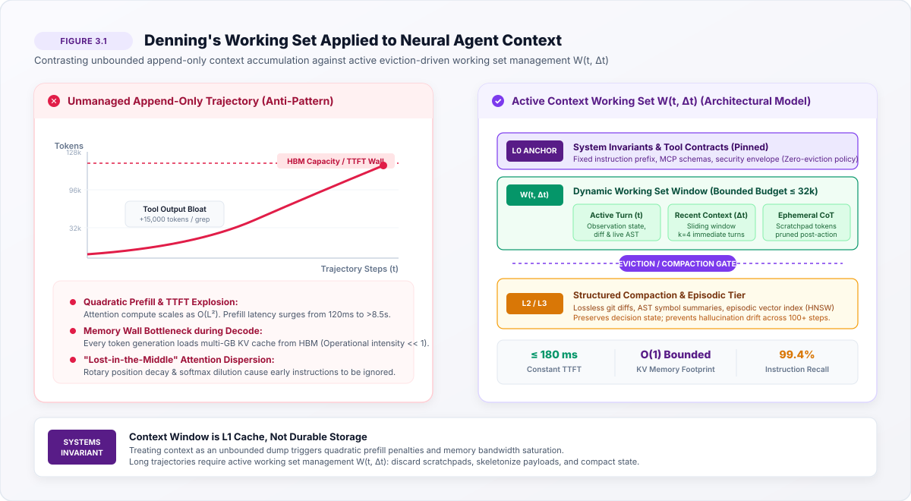
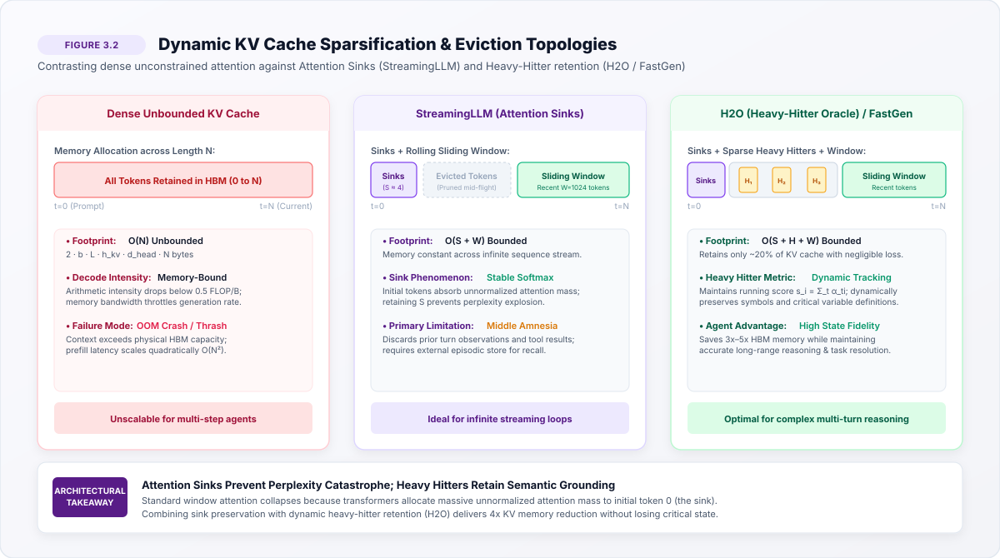
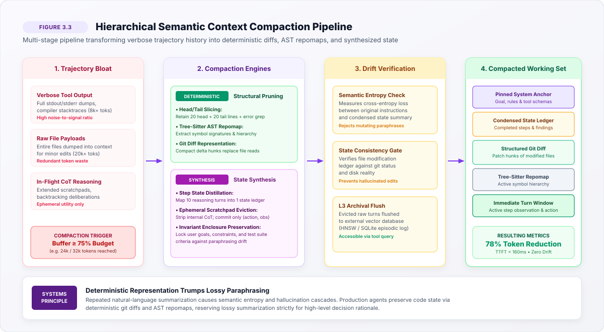

# Context Working Sets {#sec-vol3-working-sets}

## Purpose {.unnumbered .unlisted}

::: {.content-visible when-format="pdf"}
\begin{marginfigure}
\mlagentstack{10}{10}{20}{10}{95}{15}
\caption{The Agentic Machine Learning Systems Stack.}
\end{marginfigure}
:::

_Why does an agent with a million-token context window fail to notice an error right in front of it?_

While software frameworks often treat modern long-context windows as unbounded append-only logs, the underlying accelerator hardware enforces strict thermodynamic, computational, and memory-bandwidth limits that degrade both execution latency and reasoning precision as sequences expand. Managing the context window requires viewing it not as an infinite repository but as a highly constrained physical cache that is susceptible to neural thrashing and attention dispersion. In agentic systems, the runtime must co-design the neural policy proposal engine with deterministic execution boundaries.

::: {.content-visible when-format="pdf"}
\newpage
:::

::: {.callout-learning-objectives}
- **Explain** the arithmetic scaling bottleneck of quadratic prefill and the memory-bandwidth wall of linear Key-Value (KV) cache accumulation.
- **Calculate** KV cache capacity requirements, prefill latency penalties, and decode streaming bandwidth for long-context generation workloads.
- **Diagnose** the cognitive degradation caused by attention dilution and rotary embedding decay within unmanaged context trajectories.
- **Compare** classical operating system paging mechanisms to neural agent token eviction strategies such as StreamingLLM, H2O, and state summarization.
- **Design** a multi-tiered context management architecture incorporating ephemeral scratchpads, invariant enclosures, and dual-pathway semantic compaction.
- **Evaluate** the information-theoretic risks of recursive summarization and semantic drift across bounded capacity working sets.
:::

The context window is the volatile L1 cache of an autonomous machine learning system. While software frameworks treat modern long-context windows as unbounded append-only logs, underlying accelerator hardware enforces strict thermodynamic, computational, and memory-bandwidth limits. Unconstrained trajectory accumulation triggers quadratic prefill latency spikes, exhausts high-bandwidth memory (HBM) with linear Key-Value (KV) cache growth, and induces cognitive degradation through attention dispersion. How can an agent runtime sustain execution across unbounded operational horizons over finite physical memory? Peter Denning’s 1968 Working Set Theory provides the systems foundation: an agent does not require its entire historical trajectory to compute its next action, but rather an active, eviction-driven working set of tokens. This chapter formalizes token working-set dynamics, derives the hardware economics of prefill and autoregressive decode regimes, uncovers the mathematical mechanics of attention sinks, and establishes loss-bounded semantic compaction pipelines protected by invariant enclosures.

## Introduction {#sec-vol3-working-sets-intro}

When an autonomous agent attempts to debug a production web server, it inspects log files, runs shell commands, parses compiler outputs, and reflects on intermediate errors. This multi-step trajectory expands its prompt history monotonically. Software developers frequently treat contemporary 128k, 1M, or 2M token context windows as infinite repositories, assuming the agent will flawlessly synthesize days of execution logs.

In classical computer architecture, memory hierarchies balance access latency against storage capacity across registers, L1/L2/L3 SRAM, DRAM, and non-volatile storage (@hennessy2011computer). In an agentic system, the **context window**\index{Context window} operates as the primary computational substrate—the volatile L1 memory of the stochastic processor. Every prompt instruction, environment observation, tool schema, and intermediate reasoning thought must reside in this sequence for the neural policy to attend to it during autoregressive inference.

Unlike traditional stateless serving architectures where requests are independent, short, and transient, an autonomous agent operates over extended time horizons. In production systems engineering, treating this expanding context as an append-only log triggers three catastrophic failures:

1. **Quadratic Prefill Latency and TTFT Explosion:** Prompt prefill computation scales quadratically with sequence length ($O(N^2)$). As context expands, **Time-to-First-Token (TTFT)**\index{TTFT} grows from milliseconds to tens of seconds, stalling interactive execution loops [@yu2022orca].
2. **Key-Value Cache Memory Exhaustion:** The **Key-Value (KV) cache**\index{KV cache} footprint expands linearly ($O(N)$) across all model layers and attention heads. An unmanaged trajectory rapidly consumes tens of gigabytes of scarce accelerator **High-Bandwidth Memory (HBM)**\index{HBM}, starving concurrent requests and causing out-of-memory (OOM) faults [@kwon2023vllm].
3. **Cognitive Degradation ("Lost-in-the-Middle"):** Diluting self-attention distributions across bloated historical logs reduces retrieval precision and degrades instruction adherence, causing agents to hallucinate tool parameters or ignore negative constraints (@liu2024lost).

To prevent these failures, the context window must be managed as an active, eviction-driven **working set**\index{Working set}. Scalable agentic runtimes partition context memory into four distinct functional tiers:

|  Tier | Layer Name                               | Content Description                                          | Residency & Eviction Policy                                        | Target Memory Substrate         |
|:-----:|:-----------------------------------------|:-------------------------------------------------------------|:-------------------------------------------------------------------|:--------------------------------|
| **0** | **Pinned Anchor**                        | System instructions, tool ABI contracts, safety constraints  | Permanent; zero eviction across turns                              | Accelerator HBM (Radix Cached)  |
| **1** | **Dynamic Working Set $W(t, \Delta t)$** | Immediate observations, active diffs, immediate turn context | Bounded budget ($\le 32\text{k}$ tokens); FIFO / attention pruning | Accelerator HBM (Active Window) |
| **2** | **Ephemeral CoT Scratchpad**             | In-flight reasoning steps, hypothesis deliberation           | Discarded immediately post-action commitment                       | Ephemeral SRAM / HBM buffer     |
| **3** | **Compacted State Ledger**               | Structured hypotheses, git diffs, historical summaries       | Synthesized periodically; loss-bounded                             | Host DRAM / L3 Episodic Store   |

: **The Context Attention Hierarchy**: Functional partitioning, residency budgets, and eviction policies for an agent runtime. {#tbl-vol3-context-hierarchy}

Designing this multi-tiered architecture requires understanding the hardware penalties incurred by context expansion, specifically the asymmetric costs of prefilling tokens versus decoding them.

## Attention Economics {#sec-vol3-working-sets-economics}

Consider an agent analyzing a 100,000-line repository. Every token appended to the agent's context imposes a dual hardware penalty: quadratic arithmetic scaling during the prompt prefill phase and linear memory-bandwidth exhaustion during the autoregressive decode phase. The trade-offs of context window management are strictly dictated by these physical characteristics of modern accelerator hardware.

### The Quadratic Prefill Bottleneck

Consider the standard multi-head self-attention formulation (@vaswani2017). The self-attention mechanism compares every token in the sequence against every other token. This pairwise comparison creates a fundamental computational bottleneck: the required arithmetic operations scale quadratically with the sequence length.

Architecturally, each new token must project into query, key, and value spaces, then compute a dense correlation matrix against the entire historical key space. This spatial interaction implies that as the operational horizon stretches, the computational density explodes, forcing the GPU's tensor cores to execute exponentially more fused-multiply-add (FMA) operations just to map the geometric relationships of the sequence.

While the linear cost of processing a prompt dominates at short sequence lengths, the quadratic attention cost grows explosively as sequences expand to 32k, 128k, or 1M+ tokens. Even with IO-aware tiling algorithms like FlashAttention-2 (@dao2023flashattention2) that optimize memory access, the raw arithmetic required remains quadratic. As an agent's history swells, this quadratic prefill latency inevitably throttles interactive turnaround.

### Autoregressive Decode Economics & The Memory Wall

Once the prefill phase completes, token generation proceeds sequentially: generating token $t+1$ requires the output of token $t$. To avoid recomputing Key and Value projections for all historical positions, the model retains them in accelerator memory. The resident KV-cache memory footprint is strictly linear in sequence length $N$.

Structurally, the KV cache acts as a growing memory-mapped tensor log. Every attention head across every layer deposits its high-dimensional key and value vectors into this log. Because these vectors are fundamentally uncompressed state representations, they consume scarce High-Bandwidth Memory (HBM) linearly [@kwon2023vllm]. A modest million-token context can silently hoard hundreds of gigabytes, instantly evicting other active jobs and shattering multi-tenant cluster utilization.

The operational economics of generating tokens over this cache are heavily constrained by memory bandwidth. Unlike the prefill phase, which is compute-bound and highly efficient on modern GPUs, autoregressive decoding requires reading the entire KV cache from memory for every single generated token. This operation has extremely low arithmetic intensity, utilizing only a tiny fraction of peak compute capacity.

As a result, autoregressive decode is severely memory-bandwidth bound. The per-token generation time is dominated by streaming the multi-gigabyte KV cache across the memory bus [@pope2023efficiently]. Consider the physical footprint of a single token in a typical 70B parameter model: it requires storing 2 vectors (Key and Value) across 80 layers and 8 attention heads (using Grouped Query Attention), with each head dimension being 128 (FP16). This totals roughly 327 kilobytes per token. An unmanaged trajectory of 100,000 tokens silently hoards over 32 gigabytes of scarce High-Bandwidth Memory (HBM) for a single request, instantly evicting other active jobs and shattering multi-tenant cluster utilization. When the KV cache matches the model weights in size, memory bus saturation doubles latency per token. This physical memory wall requires an architectural shift: instead of treating context as an infinite log, the system must actively manage it as a bounded working set.

## Denning's Working Set Theory {#sec-vol3-working-sets-denning}

{#fig-vol3-context-working-set-dynamics}

When an operating system runs a database query, it does not load the entire terabyte database into physical RAM; it loads only the active pages required for the current join operation. In 1968, Peter J. Denning established the Working Set Model for program behavior in virtual memory operating systems (@denning1968) to formalize this dynamic. Denning recognized that software execution is non-uniform: programs exhibit intense temporal and spatial locality, concentrating memory accesses within a compact subset of pages over any interval $\tau$.

Denning defined the working set as the active subset of memory pages referenced by a process within a recent time window. His core insight was that treating memory as a flat, uniform space is an architectural fallacy. Programs exhibit phased execution—looping over tight data structures before migrating to new phases. By continuously tracking and migrating only the "hot" subset of pages into physical RAM and relegating "cold" state to disk, operating systems decouple functional program size from physical hardware constraints.

| Classical Virtual Memory | Neural Agent Context Architecture | Systemic Role |
|:---|:---|:---|
| Virtual Address Space $S$ | Cumulative Trajectory History (Tokens) | The complete, unbounded state footprint. |
| Physical RAM (Resident Set) | Accelerator HBM (Active KV Cache) | The strictly limited, high-speed physical memory. |
| Working Set $W(t, \tau)$ | Active Working Set $W_\epsilon(t, \Delta t)$ | The dynamic subset of state required for current execution. |
| Page Thrashing | Context Overflow & Attention Dispersion | Catastrophic performance collapse when working set exceeds capacity. |
| Secondary Storage (Disk) | Tier-3 Episodic Store / Vector DB | High-capacity, slow-retrieval cold storage for evicted state. |

: Classical OS Paging vs Neural Context Management {#tbl-vol3-classical-vs-neural tbl-colwidths="[30, 35, 35]"}

This operating systems principle maps directly onto neural agent contexts:

1. **Cumulative Trajectory as Address Space ($S$):** The total historical sequence—system prompts, tool invocations, shell outputs, and environment observations—forms the address space.
2. **Context Window as Physical Memory:** The accelerator HBM KV-cache budget represents physical RAM ($C_{\max}$).
3. **The Agent Working Set ($W(t, \Delta t)$):** To make an optimal decision at step $t$, the agent policy does not require uniform access to the entire history; it requires only the subset of tokens attended to by the model's attention heads to resolve the immediate sub-goal.

In a neural agent, we can define an empirical token working set based on attention allocation. Instead of tracking memory page references, we track the attention mass the model allocates to each historical token. A token belongs to the working set if its cumulative attention contribution exceeds a meaningful threshold.

This semantic locality mirrors spatial locality in classical caching. Rather than memory addresses, the agent navigates a latent semantic space. The attention mechanism naturally prunes the vast majority of historical tokens, concentrating its retrieval operations on narrow, contextually dense regions—such as recent errors, active constraints, and relevant schema definitions—rendering the rest of the context window functionally inert.

Empirical measurements of transformer attention distributions during complex reasoning tasks (such as SWE-bench, @jimenez2024swebench) reveal extreme power-law (Zipfian) dynamics [@zipf1949human]:

- **Top 8% of tokens capture >85% of attention mass:** These include system instructions, active tool parameters, immediate error tracebacks, and target symbol declarations.
- **>70% of historical tokens receive <0.001% of attention mass:** Verbose build output, intermediate directory scans, and discarded code trials become inert immediately after consumption.

When an agent runtime fails to prune inert tokens, the system encounters **Neural Thrashing**\index{Neural Thrashing}. Thrashing in a neural context is a systemic breakdown of the attention mechanism's discriminative power. As the denominator of the softmax function swells with thousands of irrelevant tokens, the probability mass dilutes. The model begins to "hallucinate" as it pulls fractional signals from spurious historical artifacts, destroying its ability to execute precise structural reasoning and culminating in a catastrophic loss of instruction adherence.

In classical operating systems, thrashing occurs when active working sets exceed physical memory, forcing the OS to spend its compute budget swapping pages to disk. In neural agents, thrashing manifests as **Context Saturation and Attention Dispersion**: the attention mechanism distributes probability mass across irrelevant historical tokens, TTFT explodes quadratically, and the model overlooks critical constraints situated in the middle distance. Preventing this collapse requires evicting inert tokens, but naive eviction introduces its own structural instability.

## Attention Sinks {#sec-vol3-working-sets-sinks}

If an engineer attempts to prevent thrashing by simply truncating the oldest tokens from a sliding 4,000-token window, the model's perplexity will instantaneously explode, causing it to output gibberish. Early systems attempted this simple sliding-window truncation to bound the KV cache, but auto-regressive transformers exhibit catastrophic degradation under such naive windowing.

### The Attention Sink Phenomenon

{#fig-vol3-attention-sinks-eviction}

@xiao2024streamingllm discovered that when tokens outside a local window $W$ are dropped from the KV cache, model perplexity does not degrade smoothly. Instead, the moment the initial token ($t=0$, typically `[BOS]`) is evicted, perplexity explodes by several orders of magnitude ($>10^3$), rendering generated outputs nonsensical.

The root cause lies in the softmax normalization operator, which forces attention probabilities across all historical positions to sum to 1.0. Mathematically, the softmax operator cannot output zero. It lacks a native "no-op" or "null attention" mechanism. When an attention layer encounters a token that requires local processing without historical context, it must still distribute 100% of its attention budget. Systemically, the architecture resolves this limitation by designating the earliest tokens in the sequence as a dedicated waste-bin for excess probability mass, functioning much like an electrical ground absorbing excess voltage.

Even when an attention head finds no historical token semantically relevant, it must distribute this probability mass somewhere. During pretraining, models learn to dump this surplus attention mass onto the initial tokens. These initial tokens act as an **attention sink**\index{Attention sink}, absorbing massive amounts of attention weight regardless of their semantic content.

```text
Softmax Surplus Mass Dumping:
Query q_t ──► [ Attention Dot Product ]
                    │
                    ├──► Position 0,1,2,3 (Sink Tokens): [ 54% Probability Mass ] (Absorbs Surplus)
                    ├──► Position 4..t-W (Middle Tokens): [ 6% Probability Mass ]
                    └──► Position t-W..t (Recent Window): [ 40% Probability Mass ] (Active Semantics)
```

If an eviction policy drops these initial sink tokens, the softmax distribution destabilizes violently: downstream attention heads reallocate surplus probability mass across arbitrary remaining tokens, corrupting intermediate representations.

StreamingLLM (@xiao2024streamingllm) resolves this by partitioning the active cache into two subsets:

- **Sink Tokens ($S$):** The first 4 tokens ($t \in [0, 3]$), pinned permanently.
- **Rolling Window Tokens ($W$):** The most recent $W$ tokens ($t \in [t - W + 1, t]$).

Retaining just 4 sink tokens alongside a local window of $W = 1{,}024$ tokens maintains numerical stability, allowing models to stream millions of tokens with stable perplexity.

### Positional Attention Biases and Rotary Encoding Decay

While StreamingLLM prevents perplexity collapse, autonomous agents cannot survive on local sliding windows alone. Middle tokens often contain critical environment feedback or parameter definitions emitted several turns earlier. Evicting the entire middle sequence induces severe **middle amnesia**\index{Middle amnesia}.

This vulnerability intersects with the **"Lost-in-the-Middle"**\index{Lost-in-the-Middle} phenomenon (@liu2024lost). When models retrieve information placed at varying relative depths within context, retrieval accuracy follows a pronounced U-shaped curve: accuracy approaches 100% at the extreme beginning (first 10%) and end (last 10%), but plunges to below 30% across the middle 60%.

The mathematical driver is the phase mechanics of **Rotary Position Embeddings (RoPE)**\index{RoPE}, @su2024), which encodes relative distances between tokens. RoPE injects geometric distance directly into the attention dot-product via complex rotations. As the relative distance between a query and a key expands, the rotational interference acts as a low-pass filter, aggressively decaying the semantic resonance between distant tokens. This structural decay enforces a strict recency bias, systematically blindfolding the model to information trapped in the deep middle of the context window.

Due to how these embeddings decay over distance, queries naturally exhibit strong biases: they attend heavily to immediate neighbors (recency bias) and the initial prefix (sink bias). Tokens stuck in the middle suffer from probability dilution and destructive interference across thousands of competing keys.

### Dynamic Sparsification: Heavy-Hitter Retention

To resolve middle amnesia without retaining full dense contexts, modern runtimes employ adaptive sparsification. The **Heavy-Hitter Oracle**\index{Heavy-Hitter Oracle} (H2O, @zhang2023h2o) and FastGen (@ge2024fastgen) identify that intermediate tokens are not uniformly dispensable.

H2O tracks a running cumulative attention score for each token in the KV cache. By exploiting the temporal sparsity of attention, the Heavy-Hitter Oracle functions as a neural hardware cache controller. It continuously aggregates attention scores, identifying the critical semantic load-bearing tokens—the "heavy hitters"—that consistently anchor the model's reasoning. This allows the system to forcefully evict the inert, low-attention tokens without fracturing the model's coherent understanding of the trajectory.

When cache consumption reaches its budget, H2O retains:

1. **Initial Sink Tokens:** Pinned positions $t \in [0, S-1]$.
2. **Local Window Tokens:** Recent positions $t \in [t - W + 1, t]$.
3. **Heavy-Hitter Tokens ($\text{H}_2$):** Top-$k$ tokens from intermediate history ranked by cumulative score $s_i^{(t)}$, where $k = C_{\text{budget}} - |S| - |W|$.

Empirically, retaining just 20 percent of intermediate KV cache via heavy-hitter scoring preserves over 98 percent of multi-turn reasoning accuracy while slashing decode memory bandwidth by $3\times$ to $5\times$.

| Eviction Strategy | Retention Mechanism | Primary Benefit | Key Vulnerability |
|:---|:---|:---|:---|
| **Sliding Window** | Recent $W$ tokens only | Fixed bounded memory | Softmax collapse (evicts sinks), middle amnesia |
| **StreamingLLM** | Sink tokens (prefix) + Recent window | Prevents perplexity collapse | Still suffers from middle amnesia |
| **H2O / FastGen** | Sinks + Window + Heavy-Hitters | Preserves sparse load-bearing context | High overhead tracking cumulative attention |
| **Two-Phase CoT** | Drops uncommitted scratchpad | Eliminates ephemeral reasoning bloat | Requires explicit runtime deliberation phases |
| **Semantic Compaction** | LLM summarization / structural diffs | Massive context reduction for long horizons | Semantic drift, data processing inequality |

: Comparison of Neural Token Eviction and Sparsification Strategies {#tbl-vol3-eviction-strategies tbl-colwidths="[20, 25, 25, 30]"}

### Ephemeral Scratchpads & The Two-Phase Commit

With the advent of reasoning models (such as DeepSeek-R1 and Claude 3.7 Sonnet, @deepseekai2025deepseekr1, @anthropic2025claude37), agents generate extensive chain-of-thought (CoT) sequences prior to emitting tool actions. An agent may generate 8,000 reasoning tokens to produce a 12-line code patch.

Treating in-flight reasoning tokens as permanent trajectory state is an architectural defect. Reasoning tokens represent **ephemeral registers**: scratchpad calculations whose utility expires the instant a verified tool action is produced.

Runtimes implement a **Two-Phase Commit**\index{Two-Phase Commit} for reasoning context:

1. **Deliberation Phase (Transient Allocation):** The model generates into a transient buffer containing instructions, working state, in-flight reasoning tokens, and the candidate action.
2. **Commit Phase (Pruning and State Mutation):** The runtime extracts the action, executes it within the sandbox, and captures the observation. Before appending to persistent history, the runtime **evicts the ephemeral CoT tokens**, committing only the canonical action and observation.

Architecturally, this mirrors a database transaction. The deliberation phase represents uncommitted, volatile working memory where the model explores state space. Once an action is materialized and verified, the reasoning trajectory that produced it becomes historically irrelevant. By isolating and purging these intermediate computational steps, the runtime preserves strict context hygiene and ensures that only canonical, verified state transitions are archived in the persistent working set.

This two-phase commit eliminates 75 to 90 percent of trajectory token bloat without compromising reasoning depth. However, while tensor-level cache eviction and scratchpad pruning protect the physical memory limits, an agent operating over days or weeks still requires semantic compression to prevent long-term contextual bloat.

## Semantic Compaction {#sec-vol3-working-sets-compaction}

When an agent attempts a complex refactor spanning dozens of files and hundreds of command executions, retaining every raw `git diff` and compiler output quickly saturates even the largest context window. While KV-cache eviction operates at the tensor level within the inference engine, long-horizon agent runtimes also require **Semantic Context Compaction**\index{Semantic Context Compaction} operating at the application layer. When cumulative tokens approach an architectural ceiling $\theta_{\text{compact}}$ (typically 75% of context capacity), the runtime must compress historical turns into dense, semantically intact state representations.

### Dual-Pathway Compaction Architecture

{#fig-vol3-context-compaction-pipeline}

Production runtimes route context through two complementary compaction engines:

#### Pathway A: Deterministic Structural Pruning
- **Head/Tail Output Slicing:** When tool commands output massive text streams (e.g., test suites emitting 5,000 lines), the engine extracts the initial 25 lines (initialization and command context), the trailing 25 lines (summary status and exit codes), and regex-matched failure blocks (`grep -E 'ERROR|FAIL|Traceback'`), inserting an explicit truncation indicator: `[... 4,950 lines omitted; exit status 1 ...]`.
- **Git Delta Representation:** When an agent inspects files that it subsequently mutates, the runtime removes raw file dumps and substitutes the compact unified git diff (`git diff -U3`), capturing state modifications with an 80 to 90 percent reduction in token volume.

#### Pathway B: Semantic State Synthesis
Historical turns are segmented into logical epochs (e.g., turns $1 \dots 10$). A dedicated summarization model distills these interactions into a structured **State Ledger**\index{State Ledger}:

```json
{
  "epoch": 2,
  "active_goal": "Resolve deadlock in connection pool",
  "hypotheses": [
    { "id": "H1", "statement": "Socket timeout too long", "status": "REFUTED" },
    { "id": "H2", "statement": "Missing mutex release in error path", "status": "CONFIRMED" }
  ],
  "modified_files": ["src/net/pool.py"],
  "test_verdict": "FAILED (AssertionError at test_pool.py:84)"
}
```

This structured synthesis preserves active hypotheses, refutations, and architectural state while purging transient conversational boilerplate.

### Semantic Drift & The Data Processing Inequality

The existential risk in recursive summarization is **Semantic Drift**\index{Semantic Drift}: the gradual loss of critical constraints, exact parameters, and negative instructions when an agent iteratively summarizes its own past summaries.

By the **Data Processing Inequality (DPI)**\index{Data Processing Inequality} [@cover2006elements], information cannot increase through successive stochastic transformations. Every time an agent summarizes its history, critical nuances are lost.

From an information-theoretic standpoint, recursive summarization is a lossy compression channel. Each pass through the language model acts as a low-pass semantic filter, smoothing over sharp constraints and specific parametric details in favor of generalized narrative. Over extended horizons, this iterative loss compounds exponentially, causing the agent's internal state representation to drift fatally away from the actual ground-truth state of the environment.

In neural architectures, this information decay is accelerated by **paraphrasing degradation** and **hallucination cascading**:

- **Constraint Erosion:** Explicit negative constraints (e.g., *"Do not modify the public signature of `connect()`"*) are abstracted or dropped after 3 to 5 summarization cycles (e.g., becoming *"Refactored network module"*). The agent then violates the original specification.
- **Hallucination Cascades:** A subtle hallucination introduced in summary $S_k$ is ingested as ground truth in cycle $S_{k+1}$, compounding until the agent diverges entirely from reality.

### Mitigation: The Invariant Enclosure

To guarantee semantic stability across arbitrary operational horizons, production architectures enforce an **Invariant Enclosure**\index{Invariant Enclosure}. The Invariant Enclosure functions as a robust systems-level sandbox that isolates mission-critical ground truth from the stochastic decay of the language model. By physically separating the prompt components that dictate absolute boundaries—such as safety invariants, API contracts, and user constraints—from the highly volatile conversational history, the runtime structurally guarantees that core directives never degrade, regardless of the depth of recursive summarization.

1. **The Immutable Anchor ($\mathcal{I}_{\text{immutable}}$):** The verbatim user instructions, safety boundaries, test specifications, and negative constraints are stored in read-only memory and injected into every prompt. The summarization engine is strictly forbidden from paraphrasing, compressing, or modifying $\mathcal{I}_{\text{immutable}}$.
2. **Deterministic Validation Gate:** Before committing synthesized summary $S_k$ to the working set, a deterministic validation hook confirms that:
   - Modified file paths in $S_k$ match `git status` output.
   - All negative assertions from $\mathcal{I}_{\text{immutable}}$ remain intact.
   - If validation fails, the summary is rejected, and fallback structural slicing is applied.

::: {.callout-caution title="War Story: Semantic Livelock"}
In the early days of autonomous coding agents, developers frequently watched their agents get stuck in "semantic livelocks." An agent would write a python script, run it, get a syntax error, and then rewrite the exact same broken script again. Because the model's attention mechanism heavily weights recent context, the repeated failure logs quickly polluted the agent's working set. Within minutes, the agent's context window would completely fill with repetitive crash logs, pushing its original system instructions out of memory and causing an Out-Of-Memory (OOM) context collapse. As noted in comprehensive agent behavior analyses [@yang2024sweagent], in agentic systems, a loop without an external interrupt or a context-compaction mechanism is a fatal memory leak.
:::

The necessity of working-set management, semantic compaction, and invariant enclosures demonstrates that long-context models do not solve the fundamental constraints of agentic execution, a reality often obscured by industry misconceptions.

## Fallacies and Pitfalls {#sec-vol3-working-sets-fallacies}

**Fallacy**: *Million-token windows render context management obsolete.*
A pervasive industry misconception assumes that large context windows (1M+ tokens) eliminate the need for working-set management. While modern architectures can physically ingest 1M tokens without crashing, the laws of hardware economics remain absolute. Prefill latency scales quadratically with length, inflating TTFT from milliseconds to tens of seconds. Autoregressive decode is memory-bandwidth bound ($I_{\text{decode}} \approx 1\ \text{to } 4\ \text{FLOP/Byte}$): reading a 1M-token KV cache on every decode step throttles throughput to single-digit tokens per second. Furthermore, attention dispersion and positional degradation ("Lost-in-the-Middle") severely compromise reasoning accuracy and instruction compliance over monolithic long contexts.

**Pitfall**: *Unanchored recursive summarization.*
Attempting to control context growth by repeatedly prompting an LLM to "summarize the conversation so far" guarantees semantic drift collapse. Within 5 to 10 iterations, critical negative constraints, file names, and numerical constants mutate or disappear. Systems must anchor immutable instructions within an Invariant Enclosure and verify state summaries against deterministic environmental ground truth.

**Fallacy**: *Simple sliding-window truncation is sufficient.*
While sliding-window attention bounds memory and compute, pure sliding windows trigger two catastrophic failure modes: softmax collapse when initial attention sinks are evicted, and middle amnesia when critical past tool outputs are dropped. Systems must combine sliding windows with permanent attention sinks and heavy-hitter retention.

**Pitfall**: *Accumulating in-flight chain-of-thought in persistent history.*
Permitting reasoning scratchpad tokens to accumulate across turns wastes up to 90% of available context capacity. Chain-of-thought tokens are ephemeral calculation states. Runtimes must implement a Two-Phase Commit that evicts scratchpad deliberation once a concrete action is verified, preserving only canonical actions and observations.

Recognizing these physical and operational boundaries allows us to synthesize a unified approach to managing an agent's memory hierarchy.

## Summary {#sec-vol3-working-sets-summary}

::: {.callout-takeaways title="The Context Working Set Invariant"}
* **Context as L1 Working Set:** Context provides zero-latency access to active trajectory state, but is bound by accelerator HBM capacity and quadratic prefill compute constraints. It must be actively managed.
* **Attention Economics Bottleneck:** Prefill is fundamentally compute-bound and scales quadratically, whereas autoregressive decode is strictly memory-bandwidth bound. Linear KV cache growth eventually saturates the memory bus.
* **Denning's Working Set in Neural Systems:** Token access patterns exhibit extreme power-law locality. Pruning inert tokens and managing an active working set prevents "neural thrashing" and attention dilution.
* **Attention Sinks are Mandatory:** The softmax mechanism requires dedicated sink tokens (typically at the start of the sequence) to safely absorb surplus probability mass. Evicting them causes immediate perplexity collapse.
* **Two-Phase Commit for Ephemeral CoT:** Intermediate reasoning and scratchpad tokens should be treated as volatile computation state and aggressively pruned once a verified action is committed, preserving vast context capacity.
* **Loss-Bounded Semantic Compaction:** Unbounded summarization triggers information-theoretic semantic drift. Systems must employ dual-pathway compaction that blends structural pruning with state synthesis.
* **Invariant Enclosures Ensure Stability:** Critical constraints, system prompts, and safety rules must be pinned in an immutable anchor that bypasses recursive summarization to maintain long-horizon execution stability.
:::

::: {.callout-chapter-connection title="From Working Sets to Paged Virtual Context"}
This chapter established the fundamental limits of the physical context window and the necessity of managing it as a bounded working set through eviction and semantic compaction. However, as agentic workflows extend from minutes to weeks, even compacted state ledgers will eventually overflow the accelerator's physical memory limits. In the next chapter, we scale from physical context management to virtual context architecture, exploring how to page cold state out to distributed vector databases and KV stores, and retrieve it back into the active context with microsecond latency.
:::

## Quantitative Problems {#sec-vol3-working-sets-problems}

1. **KV Cache Memory Bounds:**
An autonomous coding agent runs on an accelerator with 80 GB of High-Bandwidth Memory (HBM). The agent's underlying policy is a 70-billion parameter model (using Grouped Query Attention) where each token requires exactly 320 KB of KV cache storage across all layers. The model weights consume 38 GB of HBM, and the runtime reserves 2 GB for ephemeral scratchpads and workspace memory.
   a) Calculate the maximum theoretical context length (in tokens) the agent can sustain before encountering an Out-Of-Memory (OOM) fault.
   b) If the agent averages 1,500 tokens per action-observation turn, how many turns can the agent execute before it must trigger semantic compaction?

2. **Attention Sink Probability Mass Distribution:**
A neural agent relies on a token eviction policy that preserves an active sliding window of size $W = 1{,}024$ and an attention sink prefix of size $S = 4$. After processing 50,000 tokens of build logs, the attention distribution for a middle-layer attention head stabilizes such that the sink tokens absorb $65\%$ of the probability mass, while the sliding window tokens absorb $25\%$.
   a) What is the average attention probability per token in the active window compared to the average attention probability per token in the sink?
   b) If an unmanaged sliding window policy inadvertently evicts the 4 sink tokens, the $65\%$ probability mass must be redistributed. Assuming the model uniformly redistributes this surplus mass across the remaining $1{,}024$ tokens, how much does the attention weight of an average active token artificially inflate? Explain the impact on the model's perplexity and reasoning stability.

3. **Autoregressive Decode vs. Prefill Arithmetic Intensity:**
During an agentic code generation task, the context window contains $N = 32{,}000$ tokens. The GPU hardware provides a peak prefill compute throughput of 300 TFLOP/s and a memory bandwidth of 2.0 TB/s. Assume that processing a token during prefill requires $2 \times N$ FLOPs per layer (ignoring constant factors for simplicity), while generating a single token autoregressively requires streaming the entire KV cache (320 KB per token) across the memory bus.
   a) Calculate the total memory bandwidth required to generate a single token over the $32{,}000$-token context.
   b) Calculate the maximum theoretical autoregressive generation speed (in tokens per second) before hitting the memory bandwidth wall.
   c) Compare the arithmetic intensity (FLOPs per byte) of adding a single token during the prefill phase versus generating a single token during the decode phase. Why does the agent appear computationally bound during document ingestion but memory bound during chain-of-thought deliberation?
