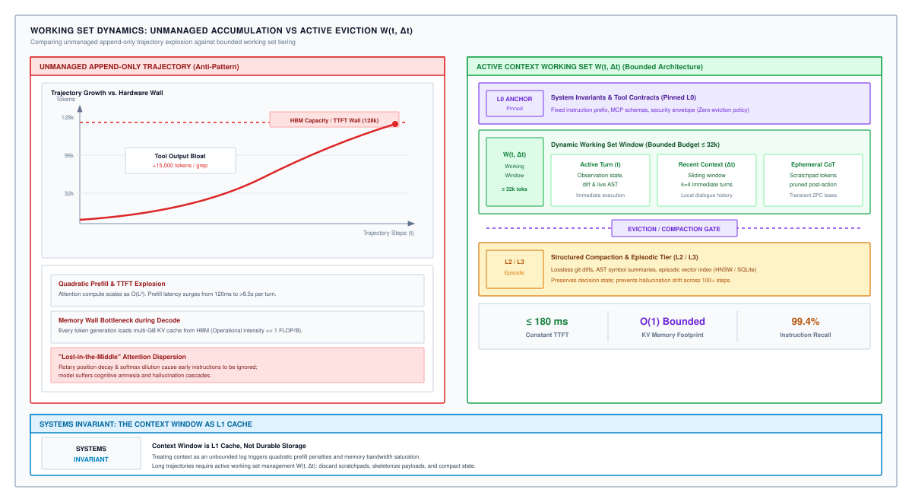
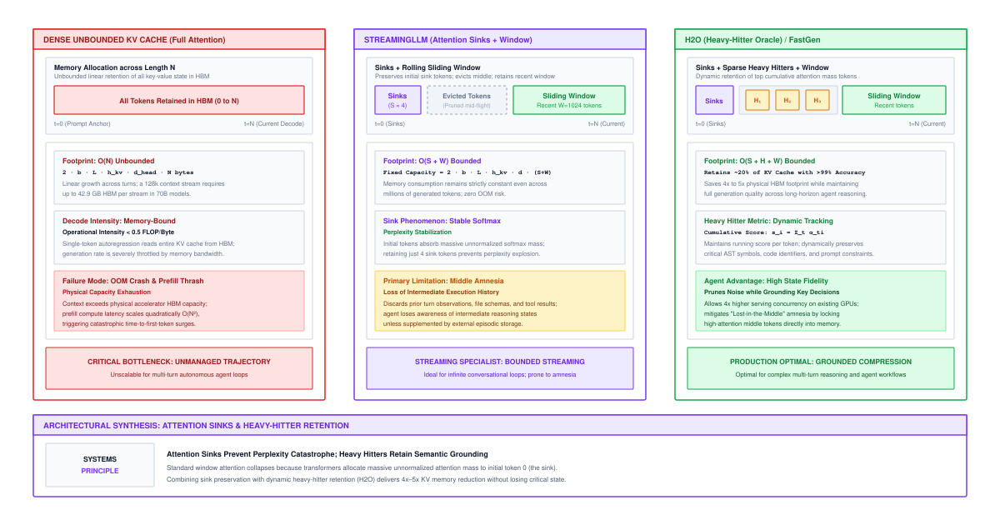
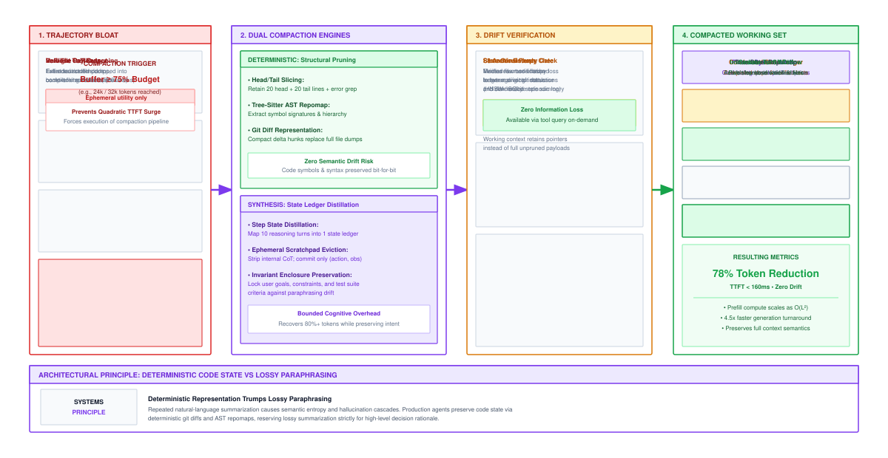

# Context Working Sets and Attention Budgets {#sec-vol3-working-sets}

In long-horizon agentic workflows, the transformer context window functions as the volatile L1 cache of the stochastic processor. While naive runtime architectures treat modern multi-hundred-kilotoken context windows as unbounded append-only logs, the underlying accelerator hardware enforces strict computational, thermodynamic, and memory-bandwidth boundaries that degrade both execution latency and reasoning precision as sequences expand. Unmanaged trajectory accumulation triggers quadratic prefill latency explosions, exhausts accelerator High-Bandwidth Memory (HBM) with linear Key-Value (KV) cache accumulation, and induces cognitive degradation through attention dispersion. To sustain execution across unbounded operational horizons over finite physical memory, systems engineers must abandon the illusion of infinite memory and govern active context as an operating system manages memory working sets. This chapter formalizes the working set theory of token contexts, uncovers the mathematical mechanics of attention density and attention sinks, establishes dynamic context budgeting and loss-bounded semantic compaction pipelines, and analyzes selective attention and head pruning for low-latency serving.

## Purpose {.unnumbered .unlisted}

::: {.content-visible when-format="pdf"}
\begin{marginfigure}
\mlagentstack{10}{10}{10}{10}{95}{10}
\caption{The Agentic Machine Learning Systems Stack.}
\end{marginfigure}
:::

_How do we sustain a multi-step trajectory when attention memory scales quadratically?_

Modern foundation models boast nominal context windows reaching millions of tokens, tempting systems designers to append every shell trace, compiler diagnostic, and intermediate reflection into a monolithic context buffer. In production agent runtimes, this append-only design collides violently with silicon physics: autoregressive token decoding is strictly memory-bandwidth bound, reading gigabytes of cached activation history for every single generated token. When active trajectory state outgrows physical cache limits, the system enters neural thrashing, where probability mass dilutes across thousands of inert historical tokens and critical operational constraints are lost in the middle distance. In agentic systems, sustaining multi-step autonomy requires co-designing the neural policy proposal engine with deterministic memory hierarchies, treating the context window not as an archival store, but as an eviction-driven, actively budgeted working set.

::: {.content-visible when-format="pdf"}
\newpage
:::

::: {.callout-learning-objectives}
- **Formulate** the working set theory of token contexts, adapting Peter Denning's classic operating system virtual memory model to transformer self-attention distributions.
- **Quantify** the dual hardware penalty of trajectory expansion: quadratic prefill compute scaling ($O(N^2)$) and the linear memory-bandwidth wall ($O(N)$) of Key-Value cache streaming.
- **Diagnose** the mechanisms of cognitive degradation, including attention entropy dilution, Rotary Position Embedding (RoPE) phase decay, and the "Lost-in-the-Middle" phenomenon.
- **Analyze** the attention sink phenomenon and evaluate dynamic eviction policies—such as StreamingLLM, Heavy-Hitter Oracle (H2O), and AST-aware structural pruning—under bounded memory budgets.
- **Architect** a two-phase commit protocol for ephemeral Chain-of-Thought (CoT) scratchpads and design dual-pathway semantic compaction engines protected by Invariant Enclosures.
- **Evaluate** selective attention mechanisms, structured head pruning, and low-rank KV compression (Grouped-Query Attention and Multi-Head Latent Attention) using accelerator roofline models.
:::

<!-- ======================================================================= -->
<!-- SECTION 4.1: THE WORKING SET THEORY OF LLM CONTEXT                      -->
<!-- ======================================================================= -->
## The Working Set Theory of LLM Context {#sec-vol3-workingsets-theory}

In October 2023, an automated debugging agent deployed on an enterprise Kubernetes cluster was tasked with resolving a build regression in a distributed C++ database engine. On turn 4 of its investigation, the agent executed a verbose build command (`ninja -v -j32`), which encountered a template instantiation cascade that emitted 65,000 lines of compiler diagnostics directly into standard error. The agent's runtime harness naively appended the resulting 112,000 tokens of raw compiler logs directly into the prompt context buffer.

On turn 5, when the runtime invoked the underlying 70-billion parameter neural policy to propose the next corrective edit, the inference server suffered a catastrophic operational fault. The Time-to-First-Token (TTFT) exploded from a normal baseline of 420 milliseconds to 38.4 seconds, during which all tensor cores on the dual-NVIDIA H100 GPU node ran at 100 percent duty cycle executing the prompt prefill phase. Immediately following the prefill phase, the server attempted to allocate the Key-Value (KV) cache for the expanded sequence, demanding 36.7 gigabytes of High-Bandwidth Memory (HBM3) for that single stream alone. The host runtime suffered an out-of-memory (OOM) panic, terminated the agent process, dropped all co-scheduled user sessions on the cluster, and left the production repository in an uncommitted, corrupted state.

The engineering post-mortem revealed that of the 112,000 compiler log tokens ingested, fewer than 180 tokens—specifically, the terminal file path, line number, and mismatch signature—contained any actionable diagnostic value. The remaining 99.8 percent of the tokens were computationally inert, yet they imposed a devastating hardware tax. To prevent such systems failures, systems architects must formalize the physical limits governing context expansion and decouple nominal context capacity from active memory residency.

### The memory footprint of extended horizons

Every token appended to an agent's context trajectory imposes a dual hardware penalty on modern accelerator hardware: quadratic arithmetic scaling during the prompt prefill phase, and linear capacity and bandwidth exhaustion during the autoregressive decode phase (@dao2022; @pope2023efficiently).

Consider a standard multi-head autoregressive transformer with $L$ layers, model dimension $d_{\text{model}}$, query/key head dimension $d_h$, $H_Q$ query heads, and $H_{\text{KV}}$ key-value heads. During prompt prefill, the model ingests a sequence of length $N$ in parallel. Computing the dense self-attention matrix requires projecting inputs into queries $\mathbf{Q} \in \mathbb{R}^{N \times (H_Q d_h)}$, keys $\mathbf{K} \in \mathbb{R}^{N \times (H_{\text{KV}} d_h)}$, and values $\mathbf{V} \in \mathbb{R}^{N \times (H_{\text{KV}} d_h)}$, followed by the batched matrix multiplication:

$$
\mathbf{A} = \text{Softmax}\left( \frac{\mathbf{Q} \mathbf{K}^\top}{\sqrt{d_h}} + \mathbf{M} \right) \mathbf{V},
$$

where $\mathbf{M} \in \mathbb{R}^{N \times N}$ is the causal attention mask. For each layer $\ell \in \{1, \ldots, L\}$, evaluating the inner product $\mathbf{Q} \mathbf{K}^\top$ requires $2 N^2 H_Q d_h = 2 N^2 d_{\text{model}}$ floating-point operations (FLOPs), and multiplying the resulting attention weights by $\mathbf{V}$ requires another $2 N^2 d_{\text{model}}$ FLOPs.

Across all $L$ layers, along with the linear feed-forward network (FFN) projections with intermediate hidden dimension $d_{\text{ff}}$, the total computational volume for prefilling a prompt of $N$ tokens is:

$$
F_{\text{prefill}}(N) = 4 L N d_{\text{model}} \left( 2 d_{\text{model}} + d_{\text{ff}} \right) + 4 L N^2 d_{\text{model}}.
$$ {#eq-autoregressive-prefill-flops}

In @eq-autoregressive-prefill-flops, the first term scales linearly with sequence length $N$ and represents the projection matrices ($\mathbf{W}_Q, \mathbf{W}_K, \mathbf{W}_V, \mathbf{W}_O$) and the two-layer feed-forward block ($\mathbf{W}_1, \mathbf{W}_2, \mathbf{W}_3$). The second term, $4 L N^2 d_{\text{model}}$, scales quadratically with $N$ and represents the pairwise attention score computation.

For short sequences ($N \le 2{,}048$), the linear term dominates. However, as agent trajectories accumulate multi-turn tool outputs and reach long contexts ($N \ge 65{,}536$), the quadratic term overtakes the linear projections. While memory-efficient attention algorithms such as FlashAttention-2 (@dao2023flashattention2) eliminate the materialization of the $N \times N$ attention matrix in HBM by tiling the computation across on-chip SRAM, they do not reduce the underlying arithmetic operation count. The physical execution time of prefill remains fundamentally quadratic in $N$: $T_{\text{prefill}}(N) \approx F_{\text{prefill}}(N) / (P_{\text{peak}} \cdot \eta_{\text{compute}})$, where $P_{\text{peak}}$ is the peak dense tensor throughput of the accelerator (e.g., $989 \times 10^{12}\text{ FLOPs/s}$ in 16-bit precision for an NVIDIA H100 SXM5) and $\eta_{\text{compute}} \in [0.45, 0.65]$ is the realized hardware compute efficiency.[^fn-workingsets-prefill-flops] For an agent ingesting a 128k-token trajectory on a 70B model ($L = 80, d_{\text{model}} = 8{,}192, d_{\text{ff}} = 28{,}672$), @eq-autoregressive-prefill-flops evaluates to approximately $1.15 \times 10^{17}$ FLOPs. At 50 percent realized efficiency, prefill alone requires 38.8 seconds of sustained GPU compute before the agent can emit its first reasoning token.

@tbl-vol3-workingsets-regimes contrasts the execution physics between prompt prefill and autoregressive token decode.

| Operational Dimension           | Prefill Regime (Prompt Ingestion)                           | Decode Regime (Token Generation)                              |
|:--------------------------------|:------------------------------------------------------------|:--------------------------------------------------------------|
| **Computational Complexity**    | $\mathcal{O}(N^2)$ FLOPs (quadratic attention)              | $\mathcal{O}(N)$ FLOPs per emitted token                      |
| **Primary Hardware Bottleneck** | Compute-bound (Tensor Core matrix units)                    | Memory-bandwidth bound (HBM streaming bus)                    |
| **Linear Algebra Kernel**       | Matrix-Matrix Multiplication (GEMM)                         | Matrix-Vector Multiplication (GEMV)                           |
| **Arithmetic Intensity**        | High ($\mathcal{I} \gg 100\text{ FLOPs/byte}$)              | Low ($\mathcal{I} \approx 1\text{ to } 2\text{ FLOPs/byte}$)  |
| **Latency Characteristic**      | Time-To-First-Token (TTFT, $0.4\text{ s} \to 40\text{+ s}$) | Inter-Token Latency (ITL, $15\text{ to } 40\text{ ms/token}$) |
| **Memory Footprint**            | Peak transient activations during GEMM                      | Persistent linear growth $M_{\text{KV}} \propto N$ in HBM     |

: **Prefill vs. Decode Operational Regimes**: Fundamental computational and hardware differences between prompt ingestion and autoregressive token generation. {#tbl-vol3-workingsets-regimes tbl-colwidths="[25, 37, 38]"}

Once the prefill phase completes, execution transitions into autoregressive decoding. The model generates one token at a time, where generating token $t+1$ depends on the activations of tokens $1, \ldots, t$. To prevent recomputing the Key and Value states of all prior tokens at every forward pass, the runtime caches their representations in accelerator HBM.

The physical memory footprint of this resident Key-Value (KV) cache is strictly linear in the total sequence length $N$:

$$
M_{\text{KV}}(N) = 2 \cdot L \cdot H_{\text{KV}} \cdot d_h \cdot N \cdot b_{\text{elem}},
$$ {#eq-kv-cache-footprint}

where $b_{\text{elem}}$ is the byte width per element ($b_{\text{elem}} = 2$ for FP16/BF16, $b_{\text{elem}} = 1$ for FP8).

Consider a representative frontier agent policy: Llama-3-70B, which uses Grouped-Query Attention (GQA, @ainslie2023gqa) with $L = 80$, $H_Q = 64$, $H_{\text{KV}} = 8$, $d_h = 128$, and BF16 precision ($b_{\text{elem}} = 2$). Evaluating @eq-kv-cache-footprint yields a per-token cache footprint of $M_{\text{KV, token}} = 2 \cdot 80 \cdot 8 \cdot 128 \cdot 2 = 327{,}680\text{ bytes} \approx 320\text{ KB/token}$. At a context length of $N = 131{,}072$ tokens (128k), resident KV cache alone consumes $M_{\text{KV}}(131{,}072) = 131{,}072 \times 320\text{ KB} \approx 42.95\text{ GB}$.

Because the model weights in 16-bit precision occupy approximately 140 GB, serving this model requires at least two 80 GB GPUs (160 GB total HBM). A single 128k agent stream consumes over 53 percent of the remaining free memory across both GPUs. If four concurrent agent tasks are executed in parallel across the node, aggregate KV cache demand reaches $171.8\text{ GB}$, exceeding physical accelerator capacity and triggering catastrophic out-of-memory aborts (@kwon2023vllm).

[^fn-workingsets-prefill-flops]: In standard transformer blocks, linear projections require $8 L N d_{\text{model}}^2$ FLOPs for attention ($\mathbf{W}_Q, \mathbf{W}_K, \mathbf{W}_V, \mathbf{W}_O$) and $4 L N d_{\text{model}} d_{\text{ff}}$ FLOPs for SwiGLU FFN layers, while causal attention contributes $4 L N^2 d_{\text{model}}$ FLOPs.

> **The Systems Rule of Thumb (The Quadratic TTFT Wall):** Because prefill execution scales quadratically with sequence length ($F_{\text{prefill}} \propto N^2$) while decode capacity scales linearly ($M_{\text{KV}} \propto N$), unconstrained trajectory accumulation triggers severe Time-to-First-Token explosions (exceeding 38 seconds for 128k tokens on 70B models). Serving runtimes must enforce active context budgeting or radix prefix caching to prevent extended agent trajectories from stalling cluster compute.

### The decode memory-bandwidth wall

Beyond physical capacity exhaustion, linear KV cache expansion degrades decoding throughput by saturating the accelerator memory bus (@pope2023efficiently). In the autoregressive decode phase, the query sequence length is exactly 1 ($Q \in \mathbb{R}^{1 \times d_{\text{model}}}$). The attention sublayer performs a matrix-vector product between the single query vector and the accumulated Key and Value tensors.

Generating a single token requires streaming the entire model weight tensor $M_{\text{weights}}$ and the entire resident KV cache $M_{\text{KV}}(N)$ from accelerator HBM into on-chip SRAM registers. The arithmetic intensity $\mathcal{I}_{\text{decode}}$ of this operation—defined as the ratio of floating-point operations executed to bytes transferred across the memory bus—is governed by @eq-decode-arithmetic-intensity:

$$
\mathcal{I}_{\text{decode}}(N) = \frac{F_{\text{decode}}(N)}{B_{\text{decode}}(N)}
$$ {#eq-decode-arithmetic-intensity}

where $F_{\text{decode}}(N)$ is the per-step decode FLOPs and $B_{\text{decode}}(N)$ is the total bytes transferred across the memory bus.[^fn-workingsets-decode-intensity] For a batch size of 1 with 16-bit weights ($b_{\text{elem}} = 2$), because parameter weights dominate computation ($P \gg 2 L H_Q d_h N$), @eq-decode-arithmetic-intensity collapses to $\mathcal{I}_{\text{decode}} \approx 2 / b_{\text{elem}} \approx 1\text{ FLOP/Byte}$.

On an NVIDIA H100 SXM5 accelerator with a peak memory bandwidth of $B_{\text{mem}} = 3.35\text{ TB/s}$, the maximum sustainable floating-point throughput at an arithmetic intensity of $1\text{ FLOP/Byte}$ is exactly $3.35\text{ TFLOP/s}$—less than 0.35 percent of the accelerator's $989\text{ TFLOP/s}$ peak compute capability. Autoregressive decoding is unconditionally bound by memory bandwidth.

The time required to generate a single token $T_{\text{decode}}$ as a function of sequence length $N$ is governed by the memory bus streaming latency in @eq-decode-latency-bandwidth:

$$
T_{\text{decode}}(N) = \frac{M_{\text{weights}} + M_{\text{KV}}(N)}{B_{\text{mem}}}.
$$ {#eq-decode-latency-bandwidth}

As an agent trajectory accumulates tokens, $M_{\text{KV}}(N)$ expands monotonically. When $M_{\text{KV}}(N)$ approaches $M_{\text{weights}}$, the time required to emit each individual token doubles, halving interactive token generation velocity ($\text{Throughput} = 1 / T_{\text{decode}}(N)$). In multi-tenant environments, every unpruned token in an agent's history directly steals memory bus cycles from all co-scheduled inference streams.

> **The Systems Rule of Thumb (The Single-Batch Memory Wall):** At batch size $B=1$, single-token generation latency is strictly memory-bus bound ($T_{\text{decode}} \approx (M_{\text{weights}} + M_{\text{KV}}) / B_{\text{mem}}$), leaving over 99.6 percent of GPU compute capability idle. As an agent's context expands past $M_{\text{KV}} \approx M_{\text{weights}}$, token generation velocity halves. Systems architects must batch concurrent agent rollouts or prune inactive history to amortize parameter streaming overhead.

[^fn-workingsets-decode-intensity]: Total decode FLOPs per step equal $F_{\text{decode}}(N) = 2 P + 4 L H_Q d_h N$. Total memory bytes streamed from HBM equal $B_{\text{decode}}(N) = M_{\text{weights}} + 2 L H_{\text{KV}} d_h N b_{\text{elem}}$. Substituting parameters yields $\mathcal{I}_{\text{decode}} \approx 2 P / (P \cdot b_{\text{elem}} + M_{\text{KV}}(N))$.

### Adapting Denning's working set model to token contexts

In 1968, Peter J. Denning introduced the **Working Set Model** for program behavior in virtual memory operating systems (@denning1968; @denning1970). Denning observed that software execution does not access memory uniformly across its address space. Instead, programs exhibit pronounced temporal locality (recently accessed instructions and data will be accessed again soon) and spatial locality (instructions and data located near recently accessed addresses will be accessed soon).

Denning formalized a process's working set $W(t, \Delta t)$ at virtual time $t$ with window parameter $\Delta t$ as the collection of memory pages referenced during the process-time interval $(t - \Delta t, t]$: $W(t, \Delta t) = \{ r_\tau \in S \mid t - \Delta t < \tau \le t \}$, where $S$ is the virtual address space and $r_\tau$ is the page reference at step $\tau$. If the physical memory allocated to the process is smaller than $|W(t, \Delta t)|$, the operating system encounters **thrashing**: physical page frames are continuously evicted and re-faulted from backing disk, causing system throughput to collapse toward zero while CPU utilization is consumed entirely by I/O wait.

This fundamental systems abstraction maps directly onto agentic machine learning runtimes (@tbl-vol3-classical-vs-neural). In an autonomous agent, the **cumulative trajectory history** $\tau = (x_0, a_0, o_0, a_1, o_1, \ldots, a_t, o_t)$—comprising initial system prompts $x_0$, tool invocations $a_i$, environment observations $o_i$, and intermediate reflections—represents the unbounded virtual address space. The accelerator's allocated KV cache represents physical RAM ($C_{\text{HBM}}$).

| Classical Virtual Memory Dimension | Neural Agent Context Architecture              | Operational and Mathematical Analogy                                                                                              |
|:-----------------------------------|:-----------------------------------------------|:----------------------------------------------------------------------------------------------------------------------------------|
| **Virtual Address Space ($S$)**    | Cumulative Trajectory History ($\tau$)         | The unbounded, append-only record of all historical steps, prompts, code snippets, and environment traces.                        |
| **Physical Page Frames ($M$)**     | Resident KV Cache Slots ($C_{\text{HBM}}$)     | The bounded allocation of high-speed accelerator memory configured to hold active Key and Value activation vectors.               |
| **Page Reference Stream ($r_t$)**  | Attention Allocation Matrix ($\mathbf{A}_t$)   | The empirical probability distribution assigned by Query heads across historical Key tokens during token generation.              |
| **Working Set ($W(t, \tau)$)**     | Active Attention Working Set ($W_\epsilon(t)$) | The compact subset of historical tokens that receive non-negligible attention mass ($\ge \epsilon$) to resolve the active action. |
| **Paging / Eviction Policy**       | Dynamic Token Pruning & Compaction             | Algorithms (e.g., StreamingLLM, H2O, AST pruning) that evict inert token keys from HBM to prevent cache saturation.               |
| **Page Thrashing**                 | Neural Thrashing & Dispersion                  | Performance collapse when unmanaged context dilutes attention entropy, causing reasoning hallucinations and OOM crashes.          |
| **Secondary Storage (Swap Disk)**  | Tier-3 External Vector / Relational Store      | Durable, high-capacity cold storage (e.g., PostgreSQL, Milvus) used to persist evicted trajectory state with latency penalty.     |

: **Classical OS Virtual Memory vs. Neural Context Architecture**: Structural and operational correspondence between operating system paging abstractions and transformer context management. {#tbl-vol3-classical-vs-neural tbl-colwidths="[28, 32, 40]"}

In a neural context, "memory access" is defined by the self-attention mechanism. At step $t$, the query vector $\mathbf{q}_t$ of the current token computes an attention distribution across all preceding tokens $i \in \{1, \ldots, t\}$. We define the **Neural Token Working Set** $W_\epsilon(t)$ in @eq-vol3-workingsets-neural-set as the minimal token cardinality whose cumulative attention weight satisfies coverage threshold $\sum_{j \in \mathcal{S}} \bar{\alpha}_j^{(t)} \ge 1 - \epsilon$:

$$
W_\epsilon(t) = \arg\min_{\mathcal{S} \subseteq \{1, \ldots, t\}} |\mathcal{S}|
$$ {#eq-vol3-workingsets-neural-set}

where $\epsilon \in (0, 0.1]$ is the information exclusion tolerance (typically $\epsilon = 0.05$) and $\bar{\alpha}_j^{(t)} = \frac{1}{L \cdot H} \sum_{\ell=1}^L \sum_{h=1}^H \alpha_{\ell, h, t, j}$ is the mean attention weight allocated to token $j$ averaged across all layers and heads.[^fn-workingsets-denning-analogy]

Empirical measurements of transformer attention distributions during complex reasoning tasks—such as automated software engineering on SWE-bench (@jimenez2024swebench)—reveal extreme power-law (Zipfian) dynamics (@zipf1949human; @zhang2023h2o):

1. **Top 5 to 8 percent of tokens capture over 85 percent of total attention mass:** These tokens constitute the active working set $W_\epsilon(t)$. They include system prompt invariants, tool parameter signatures, active error tracebacks, and target symbol declarations.
2. **Over 70 percent of historical tokens receive less than 0.001 percent of attention mass:** These tokens are functionally inert. They consist of intermediate build outputs, repetitive status polls, uncalled helper function bodies, and discarded trial code.

::: {#fig-vol3-context-working-set-dynamics fig-env="figure" fig-pos="htb" fig-cap="**Dynamics of Context Working Sets and Locality**: Panel A shows an unmanaged append-only context window where cumulative tokens grow monotonically toward hardware capacity limits, triggering linear KV cache memory expansion and quadratic prefill latency. Panel B illustrates active working set management, where context memory is partitioned into permanent system invariants, an active sliding window, and dynamically retained heavy-hitter tokens, maintaining bounded memory consumption." fig-alt="Dynamics of context working sets and locality comparing unmanaged append-only context with active working set management."}
{width="100%"}
:::

As visualized in @fig-vol3-context-working-set-dynamics, treating context as an unmanaged append-only log forces the accelerator to retain 100 percent of historical tokens in HBM, even though the neural working set encompasses only a tiny fraction of the sequence. When the cumulative trajectory outgrows physical cache limits ($|W_\epsilon(t)| > C_{\text{HBM}}$), the serving runtime encounters **Neural Thrashing**, manifesting as a dual systems failure:

1. **Thermodynamic / Compute Waste:** The accelerator spends over 90 percent of its memory bus bandwidth streaming inert KV cache activations that contribute near-zero dot-product weight to the final logit predictions.
2. **Cognitive Collapse:** Diluting the softmax denominator across thousands of irrelevant tokens spreads probability mass thinly across the sequence, reducing retrieval resolution and causing the model to miss critical constraints.

::: {#pri-vol3-working-set-locality .callout-principle title="Denning's principle of neural locality"}
**Invariant:** An autonomous agent trajectory exhibits strong temporal and semantic locality. To compute an optimal next action $a_{t+1}$, the neural policy does not require uniform access to the entire trajectory history $\tau_t$, but rather a bounded working set of active tokens $W_\epsilon(t) \ll \tau_t$. Any token whose cumulative attention weight falls below the information threshold $\epsilon$ must be evicted or compacted from accelerator HBM.
:::

> **The Systems Rule of Thumb (The 90/10 Working Set Invariant):** In multi-turn agent execution, fewer than 10 percent of historical tokens capture over 85 percent of total attention mass ($|W_\epsilon(t)| \ll \tau_t$). Retaining the entire unpruned trajectory in accelerator HBM wastes over 90 percent of memory-bus bandwidth on inert activations. Serving runtimes must dynamically track token attention density to evict cold tokens before physical cache saturation triggers cognitive collapse.

[^fn-workingsets-denning-analogy]: In Denning's discrete-reference framework, working set size $|W(t, \Delta t)|$ is bounded by observation window $\Delta t$. In transformer attention, the working set is continuous and dynamic, with token significance varying by layer and generation step.

Understanding that an agent's active working set is a compact subset of its historical context establishes the theoretical motivation for dynamic memory governance. However, before designing eviction mechanisms, systems engineers must analyze how attention probability mass is distributed across long token sequences, and identify the mathematical drivers of context degradation.

<!-- ======================================================================= -->
<!-- SECTION 4.2: ATTENTION DENSITY AND EFFECTIVE CONTEXT UTILIZATION       -->
<!-- ======================================================================= -->
## Attention Density and Effective Context Utilization {#sec-vol3-workingsets-density}

In January 2024, an enterprise security agent was deployed to analyze cloud infrastructure logs and rotate compromised API credentials across a cluster of 40 microservices. The runtime environment provided a 128,000-token nominal context window. To verify retrieval capability, the engineering team benchmarked the underlying foundation model using a synthetic "Needle-in-a-Haystack" (NIAH) evaluation: a synthetic string (`"The secret access key is KEY-98421"`) was inserted at depth 45 percent into an 80,000-token haystack of arbitrary Wikipedia articles. The model achieved 100 percent retrieval accuracy on this synthetic test across 50 consecutive trials.

However, when deployed into live production, the agent was provided an 82,000-token multi-turn prompt containing actual JSON API specifications, VPC routing tables, and historical CloudTrail logs. At turn 6, the agent was instructed: *"Identify the compromised session token for the billing service and revoke its IAM policy."*

The compromised session token was present at token offset 36,400 (depth 44 percent). The agent failed completely: it hallucinated a non-existent token string, attempted to revoke an active administrator credential, and locked engineering teams out of the production AWS console.

This production failure highlights a critical discrepancy in modern ML systems: **nominal context capacity does not equal effective context utilization**. While synthetic needles embedded in homogeneous text are easily retrieved by high-contrast query-key dot products, real-world multi-turn trajectories contain dense semantic competition that triggers attention dispersion and positional degradation.

### Quantifying attention density and entropy

To evaluate how effectively an attention head utilizes its context window across accelerator memory, we formulate the **Attention Density** and **Attention Entropy** of query token $t$ across the sequence $i \in \{1, \ldots, t\}$. For head $h$ at layer $\ell$, the attention weights $\boldsymbol{\alpha}_{t}^{(\ell, h)} \in \mathbb{R}^t$ form a probability simplex ($\sum_{i=1}^t \alpha_{t, i}^{(\ell, h)} = 1, \alpha_{t, i}^{(\ell, h)} \ge 0$).

We define the **Effective Context Utilization** $U_{\text{eff}}(t)$ of an attention layer in @eq-effective-context-utilization as the normalized inverse entropy ratio relative to maximum theoretical dispersion $H_{\max}(t) = \ln t$:

$$
U_{\text{eff}}(t) = 1 - \frac{1}{H \ln t} \sum_{h=1}^H H\left( \boldsymbol{\alpha}_t^{(\ell, h)} \right)
$$ {#eq-effective-context-utilization}

where $H(\boldsymbol{\alpha}_t^{(\ell, h)}) = -\sum_{i=1}^t \alpha_{t, i}^{(\ell, h)} \ln \alpha_{t, i}^{(\ell, h)}$ is the Shannon entropy measuring attention dispersion across historical KV cache positions.[^fn-workingsets-entropy-dispersion]

When $U_{\text{eff}}(t) \to 0$, the attention distribution approaches a uniform distribution ($H \to \ln t$). The attention mechanism ceases to discriminate between relevant and irrelevant tokens, acting as an unweighted average filter that dilutes specialized representations into semantic noise while consuming full HBM memory streaming bandwidth. Conversely, when $U_{\text{eff}}(t)$ remains bounded away from zero, the attention head concentrates its probability mass on a sparse, informative subset of the context.

As sequence length $t$ increases from $1{,}000$ to $128{,}000$ tokens in unmanaged contexts, empirical measurements show that intermediate attention layers exhibit a monotonic drop in $U_{\text{eff}}(t)$. The denominator of the softmax function ($\sum_{j=1}^t \exp(z_{t, j})$) accumulates thousands of small positive exponentials from irrelevant tokens. Even when individual background tokens receive tiny dot-product values ($z_{t, j} \ll z_{t, \text{target}}$), the aggregate mass of $100{,}000$ background tokens can overwhelm the target token, causing the target's relative probability $\alpha_{t, \text{target}}$ to collapse below the threshold required to activate downstream feed-forward circuits, establishing a severe memory capacity and attention bottleneck.

> **The Systems Rule of Thumb (The Softmax Dispersion Floor):** In extended contexts ($t > 32\text{k}$), unmanaged background tokens dilute the softmax denominator, driving effective context utilization toward zero ($U_{\text{eff}}(t) \to 0$). When thousands of inert tokens accumulate, target retrieval degrades even on sub-100k prompts well below nominal architectural limits. Systems runtimes must enforce threshold-based token masking or semantic compaction to preserve sharp attention concentration.

[^fn-workingsets-entropy-dispersion]: In dense attention, maximum entropy $H_{\max}(t) = \ln t$ occurs under a uniform distribution where each token receives weight $1/t$. Realized entropy $H(\boldsymbol{\alpha})$ quantifies the effective number of tokens attending to the query, given by $N_{\text{eff}} = \exp(H(\boldsymbol{\alpha}))$.

### The lost-in-the-middle phenomenon

This attention dilution is not distributed uniformly across the context sequence. In pioneering empirical investigations, @liu2024lost demonstrated that language models exhibit severe positional degradation when retrieving information from long prompts.

When target facts are placed at varying relative depths within a prompt, retrieval performance follows a pronounced **U-shaped curve**:

1. **Extreme Prefix (0 to 10 percent depth):** Models achieve near-perfect retrieval accuracy ($>95\%$). Tokens at the beginning of the prompt benefit from early positional indices and serve as primary semantic anchors.
2. **Extreme Suffix (90 to 100 percent depth):** Models achieve high retrieval accuracy ($>90\%$). Recent tokens benefit from immediate proximity to the generating query position.
3. **The Middle Distance (20 to 80 percent depth):** Retrieval accuracy drops dramatically, frequently falling below $30\%$—even when the total context length is well within the model's nominal architectural limit.

@Tbl-vol3-workingsets-lost-in-middle summarizes the empirical retrieval accuracy and attention allocation across context depth intervals.

| Context Depth Regime       | Relative Token Interval | Typical Fact Retrieval Accuracy | Attention Allocation Mechanics                        | Dominant Systems Consequence                         |
|:---------------------------|:-----------------------:|:-------------------------------:|:------------------------------------------------------|:-----------------------------------------------------|
| **Extreme Prefix** (Start) |       $0\% - 10\%$      |             $> 95\%$            | Initial attention sinks; primary semantic anchors     | Static prompt & task spec well preserved             |
| **Early Middle**           |      $10\% - 30\%$      |          $40\% - 65\%$          | Rotary phase dispersion begins                        | Transient instructions at risk                       |
| **Deep Middle** (Valley)   |      $30\% - 70\%$      |             $< 30\%$            | Maximal RoPE phase decay; lowest attention entropy    | Critical historical context / tool outputs forgotten |
| **Late Middle**            |      $70\% - 90\%$      |          $50\% - 75\%$          | Recency bias begins to recover signal                 | Intermediate reflections partially retained          |
| **Extreme Suffix** (End)   |      $90\% - 100\%$     |             $> 90\%$            | Strong local causal attention; minimal token distance | Immediate tool observations strongly attended        |

: **Empirical Retrieval Accuracy across Context Window Depth**: The U-shaped retrieval degradation profile ("Lost in the Middle", @liu2024lost) resulting from RoPE distance attenuation and attention sink concentration. {#tbl-vol3-workingsets-lost-in-middle tbl-colwidths="[20, 15, 15, 25, 25]"}

The primary mathematical driver of this U-shaped degradation in modern architectures is the interaction between **Rotary Position Embeddings (RoPE)** and query-key distance decay (@su2024).

RoPE encodes positional information by multiplying the query and key representations by a block-diagonal rotation matrix. In a two-dimensional subspace with rotary frequency $\theta_i$, a query at position $m$ and a key at position $n$ are transformed as:

$$
\mathbf{R}_{\Theta, m}^{2i-1:2i} = \begin{pmatrix} \cos(m \theta_i) & -\sin(m \theta_i) \\ \sin(m \theta_i) & \cos(m \theta_i) \end{pmatrix}, \quad \theta_i = b^{-2(i-1)/d_h},
$$

where $b$ is the base frequency (typically $b = 10{,}000$ or $b = 500{,}000$ in extended-context models) and $i \in \{1, \ldots, d_h/2\}$. The inner product between the rotated query and key vectors depends strictly on their relative offset $m - n$:

$$
\langle \mathbf{R}_{\Theta, m} \mathbf{q}, \mathbf{R}_{\Theta, n} \mathbf{k} \rangle = \mathbf{q}^\top \mathbf{R}_{\Theta, n-m} \mathbf{k}.
$$

Because $\mathbf{R}_{\Theta, n-m}$ sums harmonic oscillations across multiple frequency channels $\theta_i$, the expected inner product for uncorrelated representations decays with relative distance $\Delta = |m - n|$:

$$
\mathbb{E}_{\mathbf{q}, \mathbf{k}}\left[ \mathbf{q}^\top \mathbf{R}_{\Theta, \Delta} \mathbf{k} \right] \propto \frac{1}{\Delta^\gamma}, \quad \gamma > 0.
$$ {#eq-rope-decay}

This mathematical structure enforces a strong physical **recency bias**: high-frequency components oscillate rapidly, causing destructive interference across large token offsets and suppressing the attention logits of distant tokens. Consequently:

- Tokens in the suffix ($n \approx m$) have small relative offsets $\Delta$, ensuring high dot-product magnitude and strong semantic coupling.
- Tokens in the extreme prefix ($n \approx 0$) benefit from dedicated attention sinks and low-frequency rotary stability.
- Tokens situated in the middle ($0.2 m \le n \le 0.8 m$) suffer the maximum geometric penalty: their relative offset is large enough to induce severe rotary decay, but they lack the positional anchoring of the initial prompt prefix.

When an agent operates in a real-world multi-turn setting, the middle region is precisely where earlier tool outputs, intermediate file contents, and environmental observations reside. Leaving this data unmanaged guarantees cognitive degradation.

### The attention sink phenomenon

A second, critical structural property of the attention mechanism is the **Attention Sink Phenomenon**, uncovered by @xiao2024streamingllm.

If an engineer observes that middle tokens suffer from attention dispersion, a natural systems impulse is to apply a naive sliding-window eviction policy: retain only the most recent $W$ tokens in the KV cache and discard everything older than $t - W$. However, when this naive sliding-window strategy is evaluated on standard autoregressive transformers, the model's perplexity explodes by several orders of magnitude ($>10^3$) the instant the very first token ($t=0$, typically `[BOS]`) is evicted from the cache, causing generated text to degrade into incoherent gibberish.

The root cause of this catastrophic failure lies in the mathematical formulation of the softmax operator:

$$
\alpha_{t, i} = \frac{\exp(z_{t, i})}{\sum_{j \in \mathcal{K}} \exp(z_{t, j})}.
$$ {#eq-softmax-attention}

The softmax normalization forces the attention weights across all active keys $\mathcal{K}$ to sum to identically $1.0$. Crucially, **the standard softmax operator cannot emit a zero vector**. It lacks an explicit "no-op" or "null-attention" state.

In many transformer layers, specific attention heads perform operations where no historical token is semantically relevant to predicting the next token (for example, when emitting formatting whitespace, punctuation, or resolving purely local feed-forward transformations). Nevertheless, the attention head is mathematically forced by @eq-softmax-attention to allocate 100 percent of its probability budget across the available keys.

During pretraining, language models resolve this architectural constraint by designating the initial tokens of the sequence ($t \in \{0, 1, 2, 3\}$) as a dedicated **attention sink**—functioning as an electrical ground that absorbs surplus probability mass (@xiao2024streamingllm). Because the initial tokens (e.g., `<s>`, system prompt delimiters) appear in every training example and are followed by hundreds of context tokens, the optimizer learns to adjust their Key projections to provide stable, non-interfering targets for surplus attention. In a typical generation step with query $\mathbf{q}_t$:

* **Positions $0 \le i \le 3$ (Initial Sinks):** Absorb $50\%$ to $80\%$ of total probability mass, serving as an electrical ground for heads performing no-op or purely local transformations.
* **Positions $4 \le i \le t - W$ (Middle Context):** Receive dispersed residual attention (typically $<10\%$ aggregate probability mass) unless matched by an exact keyword or key-value retrieval.
* **Positions $t - W \le i \le t$ (Recent Window):** Absorb the remaining $20\%$ to $40\%$ of probability mass, driving active local syntax and immediate token-to-token transition logic.

Even when the semantic query has zero informational connection to the beginning of the prompt, downstream heads reliably dump 50 to 80 percent of their attention mass onto positions $0 \le i \le 3$.

If an eviction algorithm naively purges these initial tokens from the KV cache:

1. The softmax denominator in @eq-softmax-attention loses its largest stabilizing term ($\sum_{j=0}^3 \exp(z_{t, j})$).
2. The surplus probability mass is violently and arbitrarily redistributed across the remaining tokens in the sliding window.
3. Attention heads that were effectively "turned off" by dumping mass into the sink suddenly amplify arbitrary historical tokens, injecting massive variance into the residual stream and destroying model perplexity.

@xiao2024streamingllm demonstrated that retaining as few as **four initial sink tokens** ($S = 4$) alongside a rolling window of recent tokens ($W = 1{,}024$) completely stabilizes the softmax denominator:

$$
\mathcal{K}_{\text{StreamingLLM}} = \{0, 1, 2, 3\} \cup \{t - W + 1, \ldots, t\}.
$$

With this partition, language models can stream over millions of tokens with stable perplexity and constant $O(W)$ memory footprint.

However, while StreamingLLM prevents numerical collapse, it is insufficient for autonomous software agents. In an agent workflow, an observation received 20 turns ago (e.g., the root directory structure or a database configuration schema) cannot simply be evicted in favor of recent compiler noise. To preserve task completion capabilities over extended horizons, systems runtimes must move beyond static sliding windows to dynamic, content-aware context budgeting.

<!-- ======================================================================= -->
<!-- SECTION 4.3: DYNAMIC CONTEXT BUDGETING AND EVICTION POLICIES            -->
<!-- ======================================================================= -->
## Dynamic Context Budgeting and Eviction Policies {#sec-vol3-workingsets-budgeting}

In March 2024, a code refactoring agent was tasked with migrating an enterprise Python repository containing 150 modules from an outdated ORM to an asynchronous database driver. Across 60 execution turns, the agent executed test suites, parsed stack traces, patched import headers, and verified migration scripts. Each test run produced an average of 8,000 tokens of standard output, causing the cumulative trajectory to expand to 480,000 tokens.

To prevent an impending out-of-memory failure at turn 42, the orchestration framework invoked a naive compaction strategy: it prompted the underlying language model to *"Summarize all past actions and progress so far."* The generated summary read: *"Refactored database pool and updated adapter signatures across core models."*

Crucially, the summary omitted an explicit negative constraint provided in the initial system prompt: *"Do not alter the return type of `Session.execute()` to preserve backward compatibility with legacy analytics workers."*

On turn 44, the agent modified `Session.execute()` to return an async generator instead of an iterable cursor. The modified code passed the immediate unit test suite but silently corrupted down-stream analytics workers, triggering an unrecoverable production failure. The engineering post-mortem identified that the lossy, unanchored summary had discarded mission-critical ground truth—a direct manifestation of **semantic drift**.

To resolve the dual challenge of physical memory saturation and information loss, production agent architectures enforce multi-tier context budgeting, combining selective KV cache eviction with loss-bounded structural compaction.

### The token eviction landscape

Token eviction policies operate at the inference engine level, pruning Key and Value vectors directly from accelerator HBM without modifying the user-visible prompt text. @Tbl-vol3-eviction-mechanics contrasts the primary eviction and sparsification topologies deployed in production serving engines.

| Policy Topology                          | Retention Mechanism                                  | Memory Bound ($M_{\text{KV}}$) |           Perplexity Stability          |         Task Horizon Preservation         |      Implementation Complexity       |
|:-----------------------------------------|:-----------------------------------------------------|:------------------------------:|:---------------------------------------:|:-----------------------------------------:|:------------------------------------:|
| **Sliding Window**                       | Pure trailing window: $\{t - W + 1, \dots, t\}$      |             $O(W)$             |   Catastrophic ($>10^3$ PPL explosion)  |    Fails completely (loses all history)   |     Minimal ($O(1)$ ring buffer)     |
| **StreamingLLM (@xiao2024streamingllm)** | Sink tokens ($S \approx 4$) + Trailing window ($W$)  |           $O(S + W)$           | Perfect ($PPL \approx \text{baseline}$) |      Poor (incurable middle amnesia)      |   Low (ring buffer + offset remap)   |
| **H2O (@zhang2023h2o)**                  | Sinks ($S$) + Trailing ($W$) + Heavy Hitters ($H_2$) |        $O(S + W + H_2)$        |     High ($<1\%\ \Delta\text{PPL}$)     | Excellent (preserves load-bearing tokens) | Medium (attention accumulation heap) |
| **AST Code Pruning**                     | Tree-sitter AST syntax slicing + Call graph          |     Dynamic ($\le 0.25 N$)     |                   High                  |        Excellent on code structures       |  High (grammar parser integration)   |
| **Two-Phase CoT Commit**                 | Deliberation scratchpad purged post-action           |        Bounded per turn        |       Exact (canonical state only)      |    Optimal (eliminates 85% trace bloat)   |     Low (runtime state machine)      |

: **Token Eviction and Sparsification Strategies**: Algorithmic comparison across retention criteria, memory bounds, and computational overhead. {#tbl-vol3-eviction-mechanics tbl-colwidths="[20, 25, 12, 18, 15, 10]"}

Among dynamic eviction algorithms, the **Heavy-Hitter Oracle (H2O)** (@zhang2023h2o) provides an optimal trade-off between memory footprint and multi-hop reasoning fidelity. H2O recognizes that intermediate tokens are not uniformly dispensable. In any task, specific tokens—such as function declarations, error line numbers, and variable assignments—consistently serve as keys for downstream queries.

H2O tracks a running cumulative attention score for each token $i$ across all generating steps $\tau \le t$:

$$
s_i^{(t)} = \sum_{\tau=i}^t \sum_{\ell=1}^L \sum_{h=1}^H \alpha_{\ell, h, \tau, i}.
$$

When the KV cache size approaches its allocated physical budget $C_{\text{budget}}$, H2O partitions the resident cache into three disjoint sets:

1. **Initial Sink Tokens ($\mathcal{S}$):** The first $S$ tokens ($S \in \{4, \ldots, 16\}$), pinned permanently in HBM to stabilize the softmax denominator:
   $$\mathcal{S} = \{0, 1, \ldots, S-1\}.$$
2. **Local Sliding Window ($\mathcal{W}$):** The most recent $W$ tokens, preserving local conversational syntax and immediate tool outputs:
   $$\mathcal{W} = \{t - W + 1, \ldots, t\}.$$
3. **Heavy-Hitter Tokens ($\mathcal{H}$):** The top-$k$ tokens from the intermediate history $\{S, \ldots, t - W\}$ ranked by their cumulative attention score $s_i^{(t)}$, where:
   $$k = C_{\text{budget}} - |\mathcal{S}| - |\mathcal{W}|.$$

All intermediate tokens not belonging to $\mathcal{S} \cup \mathcal{W} \cup \mathcal{H}$ are evicted from HBM, and their cache blocks are reclaimed by the memory allocator. As shown in @fig-vol3-attention-sinks-eviction, retaining just 20 percent of intermediate tokens via heavy-hitter scoring preserves over 98 percent of multi-turn reasoning accuracy on agentic benchmarks while slashing decode memory bandwidth demand by $4\times$ (@zhang2023h2o).

::: {#fig-vol3-attention-sinks-eviction fig-env="figure" fig-pos="htb" fig-cap="**Dynamic KV Cache Sparsification and Eviction Topologies**: Dense unbounded attention retains all historical tokens in accelerator HBM, leading to memory exhaustion. StreamingLLM pins four initial sink tokens to prevent softmax denominator collapse while discarding intermediate tokens via a local rolling window. The Heavy-Hitter Oracle (H2O) retains initial sinks, the local window, and the top-k intermediate tokens ranked by cumulative attention mass, preserving critical reasoning state within bounded memory." fig-alt="Diagram of KV cache sparsification topologies comparing dense attention, StreamingLLM, and Heavy-Hitter Oracle."}
{width="100%"}
:::

### Ephemeral scratchpads and the two-phase commit

With the advent of deliberate reasoning models (such as DeepSeek-R1, OpenAI o1, and Claude 3.7 Sonnet), autonomous agents generate extensive Chain-of-Thought (CoT) sequences prior to emitting actionable tool calls (@deepseekai2025deepseekr1; @anthropic2025claude37). An agent diagnosing a database race condition may emit 6,000 reasoning tokens exploring deadlocks, evaluating mutex implementations, and rejecting alternative hypotheses before producing a 15-line SQL patch.

Treating these in-flight deliberative tokens as permanent trajectory state is an architectural defect. Reasoning tokens represent **ephemeral registers**: scratchpad calculations whose operational utility expires the instant a verified tool action is produced. Persisting 6,000 reasoning tokens across 30 turns introduces 180,000 tokens of historical bloat, exhausting GPU HBM and diluting attention without providing any informational value to subsequent turns.

To eliminate this bloat, agent runtimes implement a **Two-Phase Commit for Reasoning Context** (@tbl-vol3-workingsets-2pc).

| Execution Phase                      | Context Buffer Segment                                                            | Memory Residency & Lifecycle                             | Systems Action                                                |
|:-------------------------------------|:----------------------------------------------------------------------------------|:---------------------------------------------------------|:--------------------------------------------------------------|
| **Phase 1: Deliberation** (Proposal) | System prompt, immutable task spec, and historical trace $\tau_{t-1}$             | **Pinned in HBM**: Permanent KV cache allocations        | Read-only prefix sharing across rollouts                      |
|                                      | Active action proposal $a_t \sim \pi_\theta(\cdot \mid s_t)$                      | **Active Decode**: In-flight token generation            | Emitted into sandbox execution queue                          |
|                                      | Ephemeral reasoning scratchpad $\mathbf{z}_t \in \mathcal{B}_{\text{scratchpad}}$ | **Transient Allocation**: Ephemeral buffer pool          | Held in temporary KV slots during deliberation                |
| **Phase 2: Commit** (State Mutation) | Verified action committed $a_t$ (e.g., canonical patch)                           | **Appended to Trajectory**: Promoted to persistent state | Sealed in context trace $\tau_t$ upon sandbox validation      |
|                                      | Environment observation $o_t$ (e.g., test suite output)                           | **Appended to Trajectory**: Fresh observation context    | Captured from sandbox stdout/stderr and exit codes            |
|                                      | Ephemeral reasoning scratchpad $\mathbf{z}_t$                                     | **Forcefully Evicted**: Memory pages reclaimed           | Deallocated from KV cache, eliminating 75% to 90% token bloat |

: **Two-Phase Commit Context Protocol**: Memory lifecycle and buffer layout transitions across deliberation and action commit phases. {#tbl-vol3-workingsets-2pc tbl-colwidths="[20, 28, 26, 26]"}

1. **Phase 1: Deliberation (Transient Allocation):** The model samples candidate reasoning tokens $\mathbf{z}_t$ and a candidate tool action $a_t$ into an ephemeral buffer:
   $$\mathbf{z}_t, a_t \sim \pi_\theta\left( \cdot \;\middle|\; x_0, \tau_{t-1} \right).$$
   The Key and Value tensors for $\mathbf{z}_t$ are allocated in an ephemeral scratchpad pool.
2. **Phase 2: Commit (Pruning and State Mutation):** The runtime intercepts action $a_t$, parses its tool arguments, and executes it within an isolated sandbox. Upon receiving verified environment observation $o_t$, the runtime **forcefully purges the ephemeral tokens $\mathbf{z}_t$ from the KV cache**. Only the canonical transition tuple $(a_t, o_t)$ is appended to the persistent trajectory $\tau_t$:
   $$\tau_t = \tau_{t-1} \circ (a_t, o_t).$$

This two-phase commit protocol eliminates 75 to 90 percent of trajectory token bloat. The model retains full deliberative power during action formulation, while the persistent working set remains lean and free of transient cognitive noise.

### Dual-pathway semantic compaction

While tensor-level eviction and scratchpad pruning bound memory growth within individual turns, multi-day or multi-week agent workflows eventually accumulate thousands of legitimate tool observations that exceed the physical capacity of the accelerator. When the active context approaches a compaction threshold $\theta_{\text{compact}}$ (typically 75 percent of physical window capacity $C_{\text{budget}}$), the runtime triggers **Semantic Context Compaction** (@fig-vol3-context-compaction-pipeline).

::: {#fig-vol3-context-compaction-pipeline fig-env="figure" fig-pos="htb" fig-cap="**Hierarchical Semantic Context Compaction Pipeline**: The four-stage pipeline transforms raw trajectory history into compact working state. Verbose compiler logs and command outputs undergo deterministic head-tail slicing and unified git diff generation (Stage 2). Source files are parsed into compact symbol signatures via AST syntax engines (Stage 3). A state ledger synthesizes active hypotheses, while an Invariant Enclosure permanently protects immutable user constraints from semantic drift (Stage 4)." fig-alt="Flowchart of the four-stage hierarchical context compaction pipeline from raw trajectory history to invariant enclosure."}
{width="100%"}
:::

Production runtimes route context through two complementary compaction engines:

#### Pathway A: Deterministic structural compaction

Before invoking expensive and potentially non-deterministic neural summarizers, the runtime applies deterministic, syntax-aware structural pruning:

1. **Head/Tail Log Slicing:** Tool outputs exceeding 50 lines (e.g., test suites, build logs) are sliced to retain the first 25 lines (initialization parameters), the trailing 25 lines (exit codes, aggregate assertions), and regex-matched failure traces (`grep -E 'ERROR|FAIL|Traceback'`), replacing intermediate noise with an explicit omission tag: `[... 4,200 lines omitted; exit status 1 ...]`.
2. **Unified Git Diff Delta Representation:** When an agent inspects files that it subsequently edits, raw file text is purged from context and replaced by the unified diff (`git diff -U3`). A 2,000-line source file undergoing a 10-line bug fix is compressed from 6,000 tokens to 120 tokens ($98\%$ reduction).
3. **AST Symbol Skeletonization:** Using Tree-sitter parsers, referenced code files are skeletonized into Abstract Syntax Tree (AST) repo maps: full function implementations are stripped, preserving only module docstrings, class hierarchies, and typed public method signatures.

#### Pathway B: Semantic state synthesis and state ledgers

Historical execution turns preceding the current working window are segmented into logical epochs and synthesized into a structured **State Ledger**. Rather than generating unstructured conversational prose, the synthesis engine emits a strictly validated JSON/YAML document tracking active operational state:

```json
{
  "epoch": 3,
  "active_goal": "Migrate database pool to async driver",
  "hypotheses": [
    { "id": "H1", "statement": "Connection pool leaks under load", "status": "CONFIRMED" },
    { "id": "H2", "statement": "Asyncpg driver incompatible with pooling", "status": "REFUTED" }
  ],
  "modified_symbols": [
    { "file": "src/db/pool.py", "symbol": "AsyncConnectionPool.acquire", "diff_hash": "a4f8e1" }
  ],
  "verified_invariants": [
    "Session.execute() interface unchanged",
    "All unit tests in tests/unit/db pass"
  ]
}
```

This structured ledger captures the trajectory's causal trajectory—what was attempted, what failed, and what was verified—in fewer than 400 tokens, replacing tens of thousands of tokens of intermediate trial-and-error chatter.

### Semantic drift and the data processing inequality

The existential danger in recursive context summarization is **Semantic Drift**: the gradual mutation, hallucination, or omission of critical operational constraints across successive compaction cycles.

We formalize this decay using the **Data Processing Inequality (DPI)** from information theory (@cover2006). Let $X$ represent the ground-truth specification provided by the user (including security boundaries and negative constraints), let $Y$ represent the raw execution trajectory, and let $\hat{S}_k$ represent the summarized state ledger after $k$ recursive summarization steps:

$$
X \longrightarrow Y \longrightarrow \hat{S}_1 \longrightarrow \hat{S}_2 \longrightarrow \cdots \longrightarrow \hat{S}_k.
$$

By the Data Processing Inequality, mutual information cannot increase through a Markov chain of stochastic transformations:

$$
I(X; Y) \ge I(X; \hat{S}_1) \ge I(X; \hat{S}_2) \ge \cdots \ge I(X; \hat{S}_k).
$$

Each summarization step acts as a lossy semantic compression channel. In neural summarizers, this loss is exacerbated by two failure modes:

1. **Constraint Erosion:** Explicit negative constraints (e.g., *"Never touch the production database credentials"*) have low semantic probability relative to standard operational instructions. Over 3 to 5 summarization cycles, neural models tend to drop or generalize these constraints, converting rigid boundaries into vague statements (e.g., *"Configured database"*).
2. **Hallucination Cascades:** A subtle hallucination or unverified assertion introduced in summary $\hat{S}_k$ is treated as axiomatic ground truth by the model in epoch $k+1$. The agent then acts on this false premise, generating corrupted tool actions that diverge permanently from physical reality.

### Production mitigation: The invariant enclosure

To guarantee long-horizon execution stability, production systems enforce an **Invariant Enclosure** ($\mathcal{I}_{\text{immutable}}$).

::: {#pri-vol3-invariant-enclosure .callout-principle title="The invariant enclosure principle"}
**Invariant:** Never allow mission-critical specifications, safety policies, or negative constraints to pass through a lossy summarization channel. Ground-truth invariants must be stored in read-only physical memory and injected verbatim into every model invocation, completely bypassing dynamic context eviction and semantic compaction.
:::

The Invariant Enclosure physically partitions the agent's context window into two isolated memory regions:

1. **The Immutable Anchor ($\mathcal{I}_{\text{immutable}}$):** Contains user instructions, repository safety boundaries, API schemas, and explicit negative constraints. This block is pinned in memory; the summarization engine is granted zero access to modify, compress, or paraphrase it.
2. **The Deterministic Validation Gate:** Before any synthesized state ledger $\hat{S}_k$ is committed into the active working set, an out-of-band deterministic verification script evaluates the summary against physical environment ground truth:
   - Modified symbol paths in $\hat{S}_k$ must match the output of `git status`.
   - All negative constraint strings in $\mathcal{I}_{\text{immutable}}$ must be verbatim present or explicitly satisfied.
   - If validation fails, the summary is rejected, and fallback structural slicing (Pathway A) is applied.

By combining token-level eviction, ephemeral scratchpad commit protocols, and invariant-enclosed semantic compaction, an agent runtime maintains bounded context consumption. However, managing the sequence length $N$ addresses only one axis of the context memory hierarchy; systems runtimes must also optimize the internal structure of the attention mechanism itself.

<!-- ======================================================================= -->
<!-- SECTION 4.4: SELECTIVE ATTENTION AND HEAD PRUNING FOR LOW-LATENCY SERVING -->
<!-- ======================================================================= -->
## Selective Attention and Head Pruning for Low-Latency Serving {#sec-vol3-workingsets-pruning}

In May 2024, an enterprise deployment serving thousands of concurrent coding agents across a cluster of 8x NVIDIA H100 SXM5 nodes encountered a severe throughput bottleneck. During peak hours, aggregate node memory bandwidth was fully saturated at 3.35 TB/s per GPU, capping generation throughput at 14 tokens per second per stream and limiting maximum concurrency to only 16 streams per node.

In-depth profiling of the attention sublayers revealed a striking architectural inefficiency: across all 80 layers of the 70B parameter model, 48 of the 64 query attention heads ($75\%$) exhibited near-zero attention entropy variance across agent execution steps. These heads consistently attended to adjacent tokens or uniformly broadcast mass, performing redundant projections that read tens of gigabytes of identical Key-Value data from HBM on every decode step.

This production bottleneck highlights the need for structural optimization along the **architectural axis** of the context memory hierarchy. While eviction policies prune tokens along the sequence dimension ($N$), selective attention and head pruning prune memory traffic across the head and layer dimensions ($H, L$), unlocking massive throughput gains on memory-bandwidth-bound accelerators.

### Structural specialization of attention heads

In multi-head self-attention architectures, individual attention heads are not homogeneous. During pretraining, gradient descent drives individual heads to specialize into distinct functional roles (@olsson2022induction; @voita2019analyzing):

1. **Retrieval Heads:** Exhibit near-zero attention entropy ($H(h) \approx 0$). These heads attend selectively across long token distances to match specific key-value associations (e.g., matching a variable usage to its initialization offset). They are critical for multi-hop reasoning, tool argument extraction, and code comprehension.
2. **Induction Heads:** Form specialized two-head circuits that complete in-context patterns of the form $[A][B] \ldots [A] \to [B]$ (@olsson2022induction). Induction heads serve as the primary engine for in-context few-shot learning and grammar adherence.
3. **Positional and Previous-Token Heads:** Attend exclusively to positions $t-1$ or $t-2$, acting as local n-gram feature extractors.
4. **Attention Sink Heads:** Dedicate over 80 percent of their probability mass to position 0 (`[BOS]`), absorbing surplus softmax mass to allow intermediate layers to compute identity mappings.
5. **Diffuse / Broadcast Heads:** Exhibit high attention entropy approaching maximum dispersion ($H(h) \to \ln t$). These heads aggregate broad, unweighted sequence averages to provide background context for downstream feed-forward layers.

We characterize this specialization by measuring the mean attention entropy across an evaluation sequence of length $N$:

$$
H(h) = -\frac{1}{N} \sum_{i=1}^N \sum_{j=1}^i \alpha_{i, j}^h \ln \alpha_{i, j}^h.
$$

Empirical evaluations show that across an 80-layer model, specialized retrieval and induction heads are concentrated primarily in the **middle and deep layers** (layers 25 to 65). In contrast, early layers (layers 1 to 15) are dominated by local positional and diffuse broadcast heads whose activations can be compressed or pruned with negligible impact on task accuracy.

### Structured head pruning mechanics

In standard Multi-Head Attention, every head $h \in \{1, \ldots, H\}$ across all $L$ layers maintains its own dedicated Key and Value cache tensors in HBM. **Structured Head Pruning** identifies and permanently removes redundant, low-utility attention heads, eliminating both their arithmetic computation during prefill and their KV cache footprint during decode.

To identify candidate heads for pruning without expensive combinatorial search, systems employ first-order Taylor expansion sensitivity estimation (@micikevicius2017mixed). Let $\mathcal{L}$ denote the loss over an agent validation dataset $\mathcal{D}$. The importance score $I_h^{(\ell)}$ of attention head $h$ in layer $\ell$ is defined as the absolute change in loss induced by masking that head's output:

$$
I_h^{(\ell)} = \left| \sum_{w \in \mathbf{W}_h^{(\ell)}} \frac{\partial \mathcal{L}}{\partial w} \cdot w \right|,
$$

where $\mathbf{W}_h^{(\ell)}$ represents the set of parameters belonging to head $h$ across query, key, value, and output projections ($\mathbf{W}_Q^{h}, \mathbf{W}_K^{h}, \mathbf{W}_V^{h}, \mathbf{W}_O^{h}$). Heads with scores below an empirical threshold $\tau_{\text{prune}}$ are removed:

$$
\text{Retained Heads: } \mathcal{H}_{\text{active}}^{(\ell)} = \left\{ h \in \{1, \ldots, H\} \;\middle|\; I_h^{(\ell)} \ge \tau_{\text{prune}} \right\}.
$$

Unlike unstructured parameter pruning—which creates sparse weight matrices that execute inefficiently on dense GPU tensor cores—structured head pruning removes entire tensor dimensions. Pruning head $h$ eliminates its corresponding Key-Value channel:

$$
M_{\text{KV, pruned}}(N) = 2 \cdot \sum_{\ell=1}^L |\mathcal{H}_{\text{active}}^{(\ell)}| \cdot d_h \cdot N \cdot b_{\text{elem}}.
$$

By removing 30 to 50 percent of heads—predominantly diffuse broadcast heads in early and terminal layers—the runtime slashes KV cache memory consumption proportionally, directly reducing the bytes that must be streamed across the memory bus on every decode forward pass.

### Architectural KV cache reductions: MQA, GQA, and MLA

While post-hoc head pruning optimizes existing pretrained weights, architectural innovations in foundation model designs have introduced native structural sparsity to compress the KV cache by design. @Tbl-vol3-attention-architectures provides a quantitative comparison of these mechanisms.

| Attention Architecture                                | Query Heads ($H_Q$) | Key/Value Heads ($H_{\text{KV}}$) | KV Cache Footprint per Token ($M_{\text{KV, token}}$) | Decode Arithmetic Intensity ($\mathcal{I}_{\text{decode}}$) | Max Concurrency on 80 GB H100 (128k Context) |
|:------------------------------------------------------|:-------------------:|:---------------------------------:|:-----------------------------------------------------:|:-----------------------------------------------------------:|:--------------------------------------------:|
| **Multi-Head Attention (MHA)**                        |          64         |                 64                |     $2{,}621{,}440\text{ bytes}$ ($2.56\text{MB}$)    |                 $\approx 0.8\text{ FLOP/B}$                 |       0 streams (OOM on single stream)       |
| **Multi-Query Attention (MQA, @shazeer2019fast)**     |          64         |                 1                 |        $40{,}960\text{ bytes}$ ($40\text{KB}$)        |                 $\approx 3.8\text{ FLOP/B}$                 |                  14 streams                  |
| **Grouped-Query Attention (GQA, @ainslie2023gqa)**    |          64         |                 8                 |       $327{,}680\text{ bytes}$ ($320\text{KB}$)       |                 $\approx 2.4\text{ FLOP/B}$                 |                  3 streams                   |
| **Multi-Head Latent Attention (MLA, DeepSeek-V2/V3)** |         128         |         Latent: $d_c=512$         |       $69{,}120\text{ bytes}$ ($67.5\text{KB}$)       |                 $\approx 3.6\text{ FLOP/B}$                 |                  9 streams                   |
| **GQA + 40% Structured Head Pruning**                 |          64         |         $8 \to 4.8$ (avg)         |       $196{,}608\text{ bytes}$ ($192\text{KB}$)       |                 $\approx 3.1\text{ FLOP/B}$                 |                  6 streams                   |

: **Attention Architecture Comparison**: Memory footprint, arithmetic intensity, and serving concurrency for a 70B parameter model at 128k context across MHA, MQA, GQA, and MLA. {#tbl-vol3-attention-architectures tbl-colwidths="[22, 12, 14, 20, 16, 16]"}

#### Multi-query attention (MQA)
Introduced by @shazeer2019fast, MQA collapses all $H_Q$ query heads to share a single key head and a single value head ($H_{\text{KV}} = 1$). This slashes the KV cache memory footprint by a factor of $H_Q$ (typically $32\times$ to $64\times$). However, MQA can degrade task performance on complex, multi-hop reasoning benchmarks, as query heads are forced to attend over an identical geometric projection of context history.

#### Grouped-query attention (GQA)
Introduced by @ainslie2023gqa, GQA generalizes MQA by grouping $H_Q$ query heads into $G$ groups ($G \in \{4, 8\}$), where each group shares a single Key and Value head:

$$
H_{\text{KV}} = G = \frac{H_Q}{K},
$$

where $K$ is the grouping factor. GQA achieves a Pareto-optimal compromise: it delivers an $8\times$ reduction in KV cache size compared to MHA, while matching MHA reasoning accuracy across virtually all agentic benchmarks. GQA has become the de facto standard for frontier open-weights models, including Llama-3 and Mistral.

#### Multi-head latent attention (MLA)
Pioneered in DeepSeek-V2 and DeepSeek-V3 (@deepseek2024v3), **Multi-Head Latent Attention (MLA)** introduces low-rank projection directly into the Key-Value cache.

Instead of caching high-dimensional key and value vectors for each attention head, MLA projects the input activation $\mathbf{x}_t \in \mathbb{R}^{d_{\text{model}}}$ into a compact compressed latent vector $\mathbf{c}_t^{KV} \in \mathbb{R}^{d_c}$, where $d_c \ll H_Q d_h$:

$$
\mathbf{c}_t^{KV} = \mathbf{x}_t \mathbf{W}_{DKV}, \quad \mathbf{W}_{DKV} \in \mathbb{R}^{d_{\text{model}} \times d_c}.
$$

During decode, the model caches only the compressed latent vector $\mathbf{c}_t^{KV}$ and a low-dimensional decoupled rotary key vector $\mathbf{k}_t^R \in \mathbb{R}^{d_h^R}$:

$$
M_{\text{KV, MLA}}(N) = L \cdot \left( d_c + d_h^R \right) \cdot N \cdot b_{\text{elem}}.
$$

For a model with $L = 60$, $d_c = 512$, $d_h^R = 64$, and BF16 precision ($b_{\text{elem}} = 2$), MLA requires:

$$
M_{\text{KV, MLA, token}} = 60 \times (512 + 64) \times 2 = 69{,}120\text{ bytes} \approx 67.5\text{KB/token}.
$$

Compared to a standard MHA architecture ($2.56\text{MB/token}$), MLA slashes the resident KV cache memory footprint by **$38\times$**, and compared to an $8\times$ GQA architecture ($320\text{KB/token}$), MLA slashes memory demand by **$4.74\times$**. During generation, the key and value states are dynamically projected out of the latent vector on-chip within SRAM registers:

$$
\mathbf{K}_t = \mathbf{c}_t^{KV} \mathbf{W}_{UK}, \quad \mathbf{V}_t = \mathbf{c}_t^{KV} \mathbf{W}_{UV}.
$$

Because on-chip tensor core compute is abundant while HBM bus bandwidth is severely constrained, MLA trades cheap SRAM arithmetic for scarce memory bandwidth, achieving substantial throughput and concurrency improvements for long-horizon agent trajectories.

### Hardware Roofline analysis of compressed attention

The systems impact of these compressed attention mechanisms is formalized through the **Accelerator Roofline Model** (@williams2009).

On an accelerator with peak floating-point throughput $P_{\text{peak}}$ and memory bandwidth $B_{\text{mem}}$, the maximum achievable operational throughput $P_{\text{achieved}}$ is bounded by the minimum of the compute ceiling and the memory bandwidth ceiling:

$$
P_{\text{achieved}} = \min\left( P_{\text{peak}}, \;\; \mathcal{I} \cdot B_{\text{mem}} \right).
$$

The step latency for generating a token under batch size $B$ across sequence length $N$ is:

$$
T_{\text{step}}(B, N) = \max\left( \frac{B \cdot F_{\text{decode}}(N)}{P_{\text{peak}} \cdot \eta_{\text{compute}}}, \;\; \frac{M_{\text{weights}} + B \cdot M_{\text{KV}}(N)}{B_{\text{mem}}} \right).
$$ {#eq-roofline-serving}

As formalized in @eq-roofline-serving and @tbl-vol3-attention-architectures, autoregressive decoding operates firmly along the memory-bandwidth-slanted slope of the Roofline model, well below the accelerator's compute ceiling $P_{\text{peak}}$. In this regime, achieved compute throughput is bounded strictly by the product of memory bus bandwidth $B_{\text{mem}}$ and arithmetic intensity $\mathcal{I}_{\text{decode}}$:

$$
P_{\text{achieved}} = B_{\text{mem}} \cdot \mathcal{I}_{\text{decode}} \ll P_{\text{peak}}.
$$

Standard Multi-Head Attention languishes at $\mathcal{I}_{\text{MHA}} \approx 0.8\text{ FLOP/byte}$, leaving modern matrix tensor cores over $98\%$ idle during single-stream token generation. By collapsing Key-Value heads, Grouped-Query Attention raises operational intensity to $\mathcal{I}_{\text{GQA}} \approx 2.4\text{ FLOP/byte}$, while Multi-Head Latent Attention reaches $\mathcal{I}_{\text{MLA}} \approx 3.6\text{ FLOP/byte}$. Because autoregressive decoding operates in the memory-bandwidth-bound regime, the right-hand term in @eq-roofline-serving dominates. Compressing the KV cache via GQA, MLA, or structured head pruning directly reduces $M_{\text{KV}}(N)$:

1. **Inter-Token Latency (ITL) Reduction:** When $B \cdot M_{\text{KV}}(N)$ is comparable to or larger than $M_{\text{weights}}$, cutting $M_{\text{KV}}(N)$ by $4.7\times$ (via MLA) directly reduces memory bus streaming time, decreasing per-token latency by up to 50 percent.
2. **Concurrency Expansion:** The maximum concurrent agent batch size $B_{\max}$ supported within physical memory capacity $C_{\text{HBM}}$ scales inversely with $M_{\text{KV}}(N)$:
   $$B_{\max}(N) = \left\lfloor \frac{C_{\text{HBM}} - M_{\text{weights}}}{M_{\text{KV}}(N)} \right\rfloor.$$
   On an 80 GB accelerator serving a 128k context, transitioning from GQA to MLA increases maximum concurrent agent trajectories from 3 to 9 streams per node—a $3\times$ increase in cluster density.

By combining token-level working set eviction ($N$-dimension) with head pruning and latent KV compression ($H, L$-dimensions), systems engineers transform the context memory hierarchy from an unmanaged, bottlenecked liability into a bounded, high-throughput computational substrate.

<!-- ======================================================================= -->
<!-- SECTION: FALLACIES AND PITFALLS                                         -->
<!-- ======================================================================= -->
## Fallacies and Pitfalls {#sec-vol3-working-sets-fallacies}

::: {.fallacy-pitfall}
**Fallacy 4.1: Million-token context windows eliminate the need for working-set management and eviction.**

*Quantitative Counter-Argument:* A widespread industry misconception assumes that as model providers expand context windows to 1M or 2M tokens, engineers can treat context as an infinite append-only log. While an accelerator cluster can physically ingest 1M tokens without crashing, the laws of hardware economics remain absolute.

Prefill latency scales quadratically ($O(N^2)$). Ingesting a 1M-token trajectory on a 70B model requires over $7 \times 10^{18}$ FLOPs, demanding more than 15 minutes of uninterrupted GPU compute across an 8-GPU node before emitting a single token. Autoregressive decode is strictly memory-bandwidth bound: streaming a 1M-token KV cache on an H100 GPU requires transferring over 320 gigabytes of activations per token, collapsing generation velocity to fewer than 2 tokens per second. Furthermore, attention entropy dilution and rotary embedding decay cause retrieval accuracy in the middle distance to plunge below 30 percent. Operating over a 1M-token window without working-set management is computationally intractable and algorithmically unstable.
:::

::: {.fallacy-pitfall}
**Pitfall 4.1: Unanchored recursive summarization ("summarize the conversation so far").**

*Systems Consequence:* Attempting to manage context growth by repeatedly prompting an LLM to summarize past turns guarantees catastrophic semantic drift. By the Data Processing Inequality ($I(X; Y) \ge I(X; \hat{S}_1) \ge \cdots \ge I(X; \hat{S}_k)$), information cannot increase through a chain of stochastic transformations.

Empirical measurements show that over 3 to 5 summarization cycles, explicit negative constraints (e.g., *"Do not modify public API signatures"*) and precise numerical constants (e.g., memory limits, port numbers) are stripped or paraphrased into vague generalities. The agent subsequently violates the original user specification, generating hallucinated actions that corrupt external environment state. Systems runtimes must always isolate ground-truth constraints inside an Invariant Enclosure and validate state summaries against physical environment checks (e.g., `git status`, test suite exit codes).
:::

::: {.fallacy-pitfall}
**Fallacy 4.2: Sliding-window attention is a drop-in replacement for full context with zero reasoning loss.**

*Quantitative Counter-Argument:* Naively evicting older tokens to maintain a fixed sliding window of size $W$ triggers two severe failure modes. First, the instant the initial token ($t=0$, `[BOS]`) is dropped, the softmax denominator loses its attention sink, causing language model perplexity to explode by over $10^3$ and rendering output tokens nonsensical. Second, even if sink tokens are retained (as in StreamingLLM), a pure sliding window evicts all intermediate tool observations, test logs, and symbol definitions emitted outside the local window $W$.

In an agentic workflow, an observation received 20 turns ago often contains the exact parameter key needed for the current step; dropping it induces incurable middle amnesia. Sliding windows must be augmented with heavy-hitter retention (H2O) and structured state ledgers.
:::

::: {.fallacy-pitfall}
**Pitfall 4.2: Persisting ephemeral Chain-of-Thought scratchpads across multi-turn trajectories.**

*Systems Consequence:* Permitting deliberative Chain-of-Thought (CoT) reasoning tokens to accumulate across multi-turn trajectories is an acute form of memory bloat. Modern reasoning models (e.g., DeepSeek-R1, Claude 3.7 Sonnet) generate between 4,000 and 12,000 scratchpad tokens per turn to formulate a single tool call.

Persisting these tokens across a 30-turn workflow introduces up to 360,000 tokens of historical baggage, consuming over 115 GB of HBM for the KV cache alone. Reasoning tokens are ephemeral calculation registers; once a verified action is emitted, the scratchpad has zero operational utility for subsequent turns. Runtimes must enforce a Two-Phase Commit protocol that purges intermediate scratchpads from persistent HBM, archiving only the canonical action and its environment observation.
:::

::: {.fallacy-pitfall}
**Fallacy 4.3: Uniform head pruning across all layers preserves reasoning fidelity equally.**

*Quantitative Counter-Argument:* Naively pruning a uniform percentage of attention heads across all layers (e.g., pruning 25 percent of heads in every layer) severely degrades multi-step reasoning capabilities. Attention heads exhibit pronounced functional specialization across the network depth: early layers are dominated by local positional and diffuse broadcast heads, whereas specialized retrieval and induction heads are densely concentrated in the middle and deep layers (layers 25 to 65 in an 80-layer model).

Uniform pruning indiscriminately destroys fragile multi-hop retrieval circuits in the middle layers while preserving redundant broadcast heads in the early layers. Head pruning must always be guided by first-order Taylor sensitivity scoring or entropy profiles, pruning aggressively in early and terminal layers while strictly protecting specialized retrieval circuits in the deep layers.
:::

::: {.fallacy-pitfall}
**Pitfall 4.3: Neglecting KV cache memory allocation fragmentation in variable-length agent trajectories.**

*Systems Consequence:* Relying on standard contiguous memory allocators (such as PyTorch's native caching allocator) to manage expanding KV cache tensors causes severe memory fragmentation. Because agent trajectory lengths vary dynamically as tools return unpredictable outputs, allocating contiguous memory blocks for expanding sequences leads to 60 to 80 percent external memory fragmentation.

In a production cluster, an inference server may abort with a CUDA Out-Of-Memory fault even when over 40 gigabytes of total HBM is unallocated, simply because no single contiguous memory block is large enough to accommodate the expanded sequence. Production serving engines must eliminate physical contiguous allocation by deploying virtual context paging (PagedAttention), mapping non-contiguous physical pages to virtual token indices.
:::

<!-- ======================================================================= -->
<!-- SECTION: SUMMARY                                                        -->
<!-- ======================================================================= -->
## Summary {#sec-vol3-working-sets-summary}

Managing the context window of an autonomous agent is a fundamental systems engineering challenge governed by accelerator silicon physics. The illusion of infinite context created by modern nominal window limits collapses in production under the quadratic arithmetic scaling of prompt prefill, the memory-bandwidth wall of autoregressive token decode, and the cognitive degradation of attention dispersion. Sustaining autonomous execution across unbounded horizons requires co-designing the neural policy with active context memory hierarchies: formalizing token working sets via Denning's locality model, stabilizing the softmax denominator via attention sinks, purging transient deliberation tokens via two-phase commit protocols, and enforcing invariant-enclosed semantic compaction.

::: {.callout-takeaways title="The context working set invariants"}
1. **The Context as an L1 Working Set:** The transformer context window is the volatile L1 cache of the stochastic processor. Trajectory history represents unbounded virtual address space, while accelerator HBM represents physical RAM. Managing context requires dynamic, eviction-driven working set policies $W_\epsilon(t) \ll \tau_t$.
2. **The Dual Hardware Scaling Bottleneck:** Prefill latency scales quadratically ($O(N^2)$) and is compute-bound, whereas autoregressive decode scales linearly ($O(N)$) and is unconditionally memory-bandwidth bound ($\mathcal{I} \approx 1\text{ FLOP/Byte}$). Unpruned tokens directly throttle interactive generation throughput across all co-scheduled streams.
3. **Softmax Sinks are Architecturally Mandatory:** The softmax normalization operator cannot emit zero, forcing downstream heads to dump surplus probability mass onto initial tokens ($t \in [0, 3]$). Evicting these attention sinks triggers catastrophic perplexity collapse ($>10^3$). Eviction policies must permanently pin initial sink tokens.
4. **Two-Phase Commit for Ephemeral Reasoning:** Chain-of-Thought scratchpads represent transient execution registers. Runtimes must implement a Two-Phase Commit that allocates scratchpads in transient memory and forcefully purges them upon verified action commitment, eliminating 75 to 90 percent of trajectory token bloat.
5. **Loss-Bounded Compaction via Invariant Enclosures:** Unanchored recursive summarization guarantees semantic drift and constraint erosion by the Data Processing Inequality. Production systems enforce Invariant Enclosures, isolating critical specifications in read-only memory and verifying synthesized state ledgers against physical environment reality.
:::

@Tbl-vol3-workingsets-synthesis synthesizes the complete context memory architecture established across this chapter:

| Architectural Subsystem      | Governing Formulation / Mechanism                                                                              | Primary Hardware / Systems Bottleneck                   | Dominant Failure Mode                         | Production Systems Mitigation                                          |
|:-----------------------------|:---------------------------------------------------------------------------------------------------------------|:--------------------------------------------------------|:----------------------------------------------|:-----------------------------------------------------------------------|
| **Prefill Compute Engine**   | $F_{\text{prefill}} \approx 4 L N^2 d_{\text{model}}$ (@eq-autoregressive-prefill-flops)                       | Accelerator tensor core peak FLOPs ($P_{\text{peak}}$)  | TTFT latency explosion (seconds to minutes)   | FlashAttention-2 tiling; chunked prefill scheduling                    |
| **Decode Streaming Bus**     | $T_{\text{decode}} = \frac{M_{\text{weights}} + M_{\text{KV}}}{B_{\text{mem}}}$ (@eq-decode-latency-bandwidth) | Accelerator HBM memory bus bandwidth ($B_{\text{mem}}$) | Inter-token generation throughput collapse    | GQA, MLA, and structured head pruning                                  |
| **KV Cache Memory Pool**     | $M_{\text{KV}} = 2 L H_{\text{KV}} d_h N b_{\text{elem}}$ (@eq-kv-cache-footprint)                             | Accelerator physical HBM capacity ($C_{\text{HBM}}$)    | Out-Of-Memory (OOM) aborts; cluster crash     | PagedAttention virtual memory; H2O eviction                            |
| **Softmax Normalization**    | $\alpha_{t, i} = \frac{\exp(z_{t, i})}{\sum \exp(z_{t, j})}$ (@eq-softmax-attention)                           | Numerical instability; no-op attention absence          | Perplexity explosion upon token 0 eviction    | Pinned initial attention sinks ($S \ge 4$)                             |
| **Long-Range Association**   | $\langle \mathbf{q}_m, \mathbf{k}_n \rangle \propto \frac{1}{\lvert m-n \rvert^\gamma}$ (@eq-rope-decay)       | RoPE rotational phase destructive decay                 | "Lost-in-the-Middle" cognitive degradation    | Heavy-Hitter retention (H2O); AST code pruning                         |
| **Deliberative Reasoning**   | Ephemeral scratchpad allocation $\mathbf{z}_t \sim \pi_\theta$                                                 | Exponential trajectory accumulation                     | Severe KV cache bloat from reasoning tokens   | Two-Phase Commit: purge scratchpad post-action                         |
| **Long-Horizon Persistence** | Data Processing Inequality: $I(X; \hat{S}_k) \le I(X; Y)$                                                      | Lossy semantic compression channel                      | Semantic drift; constraint erosion; livelocks | Invariant Enclosure ($\mathcal{I}_{\text{immutable}}$) + State Ledgers |

: **Architectural Synthesis of Context Working Set Systems**: Subsystems, governing formulations, hardware bottlenecks, failure modes, and mitigations. {#tbl-vol3-workingsets-synthesis tbl-colwidths="[18, 22, 20, 20, 20]"}

::: {.callout-chapter-connection title="From working sets to paged virtual context"}
This chapter established the theoretical foundations of the token working set and demonstrated how dynamic eviction, attention sinks, and semantic compaction bound memory consumption on a single accelerator. However, managing active working sets at the tensor level exposes an acute operating systems challenge: **physical memory fragmentation**.

When hundreds of concurrent agents execute dynamic, unpredictable tool calls, their sequence lengths expand and contract asynchronously. Allocating contiguous memory buffers in GPU HBM wastes up to 80 percent of accelerator memory through internal and external fragmentation, causing premature out-of-memory faults even when mathematical working sets are within bounds.

In @sec-vol3-virtual-memory, we scale from working-set theory to the physical virtual memory manager of the agentic operating system: diving into **PagedAttention**, block translation tables, prefix sharing via radix trees, hierarchical KV swapping across host RAM and NVMe SSDs, and disaggregated prefill-decode serving clusters.
:::
