# KV Cache Management {#sec-vol3-kv-cache}

::: {layout-narrow}
::: {.column-margin}

\chapterminitoc

:::

::: {.content-visible when-format="pdf"}
\noindent
{fig-alt="Blueprint cover illustration for the KV Cache Management chapter."}
:::

::: {.content-visible unless-format="pdf"}
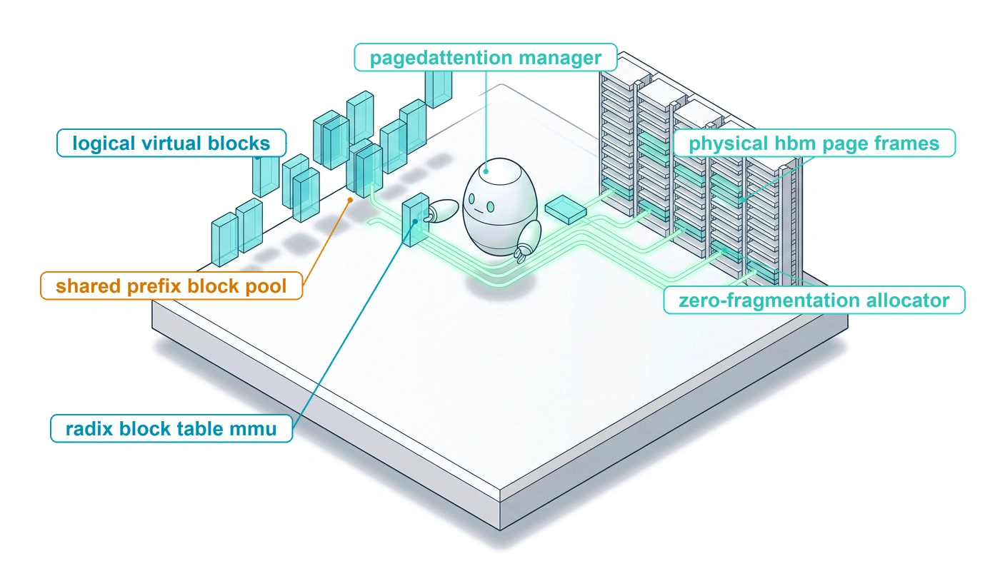{fig-alt="Blueprint cover illustration for the KV Cache Management chapter."}
:::

:::

## Purpose {.unnumbered .unlisted}

\begin{marginfigure}
\mlagentstack{0}{0}{0}{0}{100}{0}
\end{marginfigure}

_Why does an agent that is waiting on a tool still occupy the accelerator?_

Every token an agent keeps in context leaves attention state in accelerator memory, and across the trajectories a serving node holds, that state outgrows the model's own weights. A chat request holds this state for a few seconds and releases it. An agent holds it across dozens of turns, forks it when it explores alternatives, and leaves it sitting idle while a test suite runs or a person approves an action. A serving system that treats each trajectory as one opaque, worst-case reservation runs out of memory with most of it unused, recomputes the same shared instructions on every turn, and starves active trajectories to keep paused ones warm. The fixes are known. Hold attention state in pages that branches can share, reuse the prefix across turns, and decide for each pause whether to keep, move, or drop the state. They pay off only when the harness cooperates, because the harness decides how long contexts grow, whether the prefix stays stable, and how long each tool is expected to run. In H·S·A terms, a long horizon turns into state the serving system must physically hold, so the cost of that state is set jointly by the engine that stores it and the harness that shapes it.

::: {.content-visible when-format="pdf"}

\newpage

:::

::: {.callout-learning-objectives}

- Calculate a trajectory's KV footprint from model geometry, context length, and precision.
- Explain why unknown trajectory length, forks, and tool pauses strand memory under worst-case reservation.
- Explain how paged blocks and copy-on-write let branches share one prefix without copying it.
- Diagnose which harness decisions raise or break the prefix-cache hit rate across turns.
- Select retention, offload, or recomputation for a paused trajectory from its expected tool wait.
- Estimate how many concurrent trajectories a serving pool sustains given context length, prefix sharing, and tool-wait time.

:::

## From Context Tokens to KV State {#sec-vol3-kvcache-geometry}

Return to the coding agent whose context layout was priced in \ref{nbk-04-quantitative-impact-of-prefix-layout}, now at its twentieth turn. Its context holds the system message and tool definitions, the task state and working files, and the latest tool results, including the stack trace the last test run produced, about thirty-two thousand tokens in all. The agent has just asked the harness to run the integration suite, which takes three-quarters of a minute. For those forty-five seconds the model emits nothing, yet the attention state computed for all thirty-two thousand tokens stays on the accelerator, waiting for the test log. @Sec-vol3-context-engineering decided which tokens this call should see. This chapter follows those tokens into the serving system, where they become the dominant consumer of accelerator memory, and asks what that state costs to keep, share, and release.

::: {.column-margin}
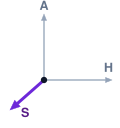{width="100%" fig-alt="H·S·A locator with the State axis highlighted."}

*This chapter covers the part of State that the serving system holds, attention state that can be paged, shared, moved, and rebuilt.*
:::

@Sec-vol3-foundation-model defined the key-value (KV) cache in one sentence. For every token in the context, each layer keeps the key and value vectors that later tokens attend to, so decoding does not recompute them. Its size follows from model geometry alone. A model with $L$ layers, $H_{\text{kv}}$ key-value heads of dimension $d_{\text{head}}$, and $b$ bytes per stored element keeps

$$m_{\text{token}} = 2 \cdot L \cdot H_{\text{kv}} \cdot d_{\text{head}} \cdot b$$ {#eq-mem-token}

bytes for every token, where the factor of two counts the key and the value. Scaling @eq-mem-token by context length, a trajectory of $S$ tokens holds $M_{\text{KV}} = S \cdot m_{\text{token}}$ bytes, growing linearly with every turn it keeps.

```{python}
#| echo: false
#| label: kv-geometry-calc
# ┌─────────────────────────────────────────────────────────────────────────────
# │ KV FOOTPRINT AND NODE CONCURRENCY FOR A 70B GROUPED-QUERY MODEL
# ├─────────────────────────────────────────────────────────────────────────────
# │ Context: @sec-vol3-kvcache-geometry prose and notebook
# │          nbk-05-sizing-the-attention-state-for; @fig-vol3-context-window-anatomy
# │          labels; reused by StaticReservation, PagedWaste, ForkSharing,
# │          ToolWaitBreakEven, AgentCapacity.
# │
# │ Goal: Derive bytes per token from model geometry and the number of
# │       trajectories one eight-accelerator node can hold at three context lengths.
# │ Show: 327,680 bytes/token; 2.7 / 10.7 / 42.9 GB per trajectory;
# │       526.0 GB KV pool; 195 / 48 / 12 concurrent trajectories.
# │ How: calc_kv_cache_size on registry geometry (Llama3_70B); node HBM from the
# │      DGX_H100 registry entry minus FP16 weights and a scenario runtime reserve.
# └─────────────────────────────────────────────────────────────────────────────
from mlsysim import *
from mlsysim.fmt import check, fmt_int, fmt_memory

class KvGeometry:
    # ┌── 1. LOAD (Constants) ──────────────────────
    _model = Models.Language.Llama3_70B
    n_layers = _model.layers
    n_kv_heads = _model.kv_heads
    d_head = _model.hidden_dim // _model.heads
    bytes_per_elem = 2  # 16-bit keys and values
    _node = Systems.Nodes.DGX_H100
    n_acc = _node.accelerators_per_node
    acc_capacity = _node.accelerator.memory.capacity
    runtime_reserve = 20 * GB  # scenario: activations and runtime buffers
    ctx_short, ctx_agent, ctx_long = 8_192, 32_768, 131_072

    # ┌── 2. EXECUTE (The Compute) ─────────────────
    bytes_per_token = calc_kv_cache_size(n_layers, n_kv_heads, d_head, 1, 1, bytes_per_elem)
    kv_short = calc_kv_cache_size(n_layers, n_kv_heads, d_head, ctx_short, 1, bytes_per_elem)
    kv_agent = calc_kv_cache_size(n_layers, n_kv_heads, d_head, ctx_agent, 1, bytes_per_elem)
    kv_long = calc_kv_cache_size(n_layers, n_kv_heads, d_head, ctx_long, 1, bytes_per_elem)
    node_hbm = n_acc * acc_capacity
    weights = _model.size_in_bytes(BYTES_FP16)
    kv_pool = node_hbm - weights - runtime_reserve
    conc_short = int((kv_pool / kv_short).to("").magnitude)
    conc_agent = int((kv_pool / kv_agent).to("").magnitude)
    conc_long = int((kv_pool / kv_long).to("").magnitude)

    # ┌── 3. GUARD (Invariants) ────────────────────
    check(int(bytes_per_token.to(byte).magnitude) == 327_680, "KV bytes/token must equal 2 * 80 * 8 * 128 * 2")
    check(conc_short == 195 and conc_agent == 48 and conc_long == 12, f"Expected 195/48/12 trajectories, got {conc_short}/{conc_agent}/{conc_long}")
    check(conc_short // conc_long == 16, "Prose claims a sixteen-fold collapse from 8k to 128k")

    # ┌── 4. OUTPUT (Formatting) ───────────────────
    n_layers_str = fmt_int(n_layers)
    ctx_short_str = fmt_int(ctx_short)
    ctx_agent_str = fmt_int(ctx_agent)
    ctx_long_str = fmt_int(ctx_long)
    n_kv_heads_str = fmt_int(n_kv_heads)
    d_head_str = fmt_int(d_head)
    bytes_per_token_str = fmt_int(bytes_per_token.to(byte).magnitude)
    mb_per_token_str = fmt_memory(bytes_per_token, unit=MB, precision=2)
    kv_short_str = fmt_memory(kv_short, unit=GB, precision=1)
    kv_agent_str = fmt_memory(kv_agent, unit=GB, precision=1)
    kv_long_str = fmt_memory(kv_long, unit=GB, precision=1)
    n_acc_str = fmt_int(n_acc)
    node_hbm_str = fmt_memory(node_hbm, unit=GB, precision=1)
    weights_str = fmt_memory(weights, unit=GB, precision=1)
    reserve_str = fmt_memory(runtime_reserve, unit=GB, precision=0)
    kv_pool_str = fmt_memory(kv_pool, unit=GB, precision=1)
    conc_short_str = fmt_int(conc_short)
    conc_agent_str = fmt_int(conc_agent)
    conc_long_str = fmt_int(conc_long)
```

The formula becomes a budget once a model is fixed. Take a 70-billion-parameter model with grouped-query attention, where several query heads share each key-value head [@ainslie2023gqa]: `{python} KvGeometry.n_layers_str` layers, `{python} KvGeometry.n_kv_heads_str` key-value heads of dimension `{python} KvGeometry.d_head_str`, and 16-bit storage. @Sec-vol3-foundation-model-cost priced single calls to this model with 8-bit weights on one accelerator, the smallest deployment that holds it. A service that runs many agent trajectories at once instead spreads 16-bit weights across an eight-accelerator node, so that most of the node's memory is free for attention state, and that node is the deployment this chapter sizes. @Fig-vol3-context-window-anatomy traces one agent context through that geometry, and the worked estimate below turns it into a concurrency ceiling.

::: {#fig-vol3-context-window-anatomy fig-env="figure" fig-pos="htb" fig-cap="**From Agent Context to KV State**: A 32,768-token agent context (system prompt, tool definitions, workspace, turn history, and the latest observation) becomes key and value tensors for every layer. The per-token footprint of the 70B grouped-query model sets how many such trajectories fit in one node's KV pool." fig-alt="Top panel shows an agent context split into system prompt, tool schemas, workspace, multi-turn history, and latest observation. Arrows lead to a bottom panel listing model dimensions, the per-token and per-trajectory KV footprint, and concurrency at 8,192 and 32,768 tokens on an eight-accelerator node."}
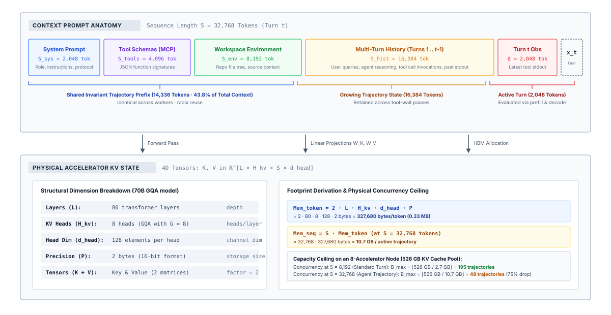
:::

::: {#nbk-05-sizing-the-attention-state-for .callout-notebook title="Sizing the attention state of an agent trajectory"}

**Problem**: A serving node has `{python} KvGeometry.n_acc_str` accelerators holding `{python} KvGeometry.node_hbm_str` of memory in total and serves the 70B grouped-query model just described. How many trajectories can it hold at once when each trajectory's context is `{python} KvGeometry.ctx_short_str`, `{python} KvGeometry.ctx_agent_str`, or `{python} KvGeometry.ctx_long_str` tokens?

**Math**:

Per token, $m_{\text{token}} =$ 2 $\times$ `{python} KvGeometry.n_layers_str` $\times$ `{python} KvGeometry.n_kv_heads_str` $\times$ `{python} KvGeometry.d_head_str` $\times$ 2 bytes $=$ `{python} KvGeometry.bytes_per_token_str` bytes, about `{python} KvGeometry.mb_per_token_str`.

Per trajectory, the footprint is `{python} KvGeometry.kv_short_str`, `{python} KvGeometry.kv_agent_str`, and `{python} KvGeometry.kv_long_str` at those three lengths.

The 16-bit weights take `{python} KvGeometry.weights_str`, and the runtime reserves `{python} KvGeometry.reserve_str` for activations and buffers, which leaves a KV pool of `{python} KvGeometry.node_hbm_str` $-$ `{python} KvGeometry.weights_str` $-$ `{python} KvGeometry.reserve_str` $=$ `{python} KvGeometry.kv_pool_str`.

Dividing the pool by each footprint gives `{python} KvGeometry.conc_short_str`, `{python} KvGeometry.conc_agent_str`, and `{python} KvGeometry.conc_long_str` concurrent trajectories.

**Systems insight**: The same node that holds `{python} KvGeometry.conc_short_str` short conversations holds only `{python} KvGeometry.conc_long_str` repository-scale trajectories. Context length, not arithmetic, sets how many agents a node can serve, so every token the harness keeps in context is a claim on a shared, fixed pool.

:::

This quantitative reality establishes a rigid capacity boundary on the inference serving system. Consider an enterprise inference node provisioned with 8 discrete accelerators, each possessing 80 GB of high-bandwidth memory, providing an aggregate pool of $\text{HBM}_{\text{total}} = 640 \text{ GiB}$. The 70-billion parameter model, loaded in 16-bit precision, consumes roughly $\text{Mem}_{\text{weights}} \approx 140 \text{ GiB}$ of memory across the cluster. Reserving an additional $\text{Mem}_{\text{runtime}} \approx 20 \text{ GiB}$ for communication buffers, NCCL scratch spaces, and activation workspaces during the prefill forward pass leaves approximately $\text{Mem}_{\text{kv\_available}} = 480 \text{ GiB}$ dedicated to the dynamic attention cache. The maximum theoretical concurrency ceiling $B_{\max}$ of active agent trajectories running concurrently at context length $S$ is strictly governed by the floor quotient:

$$B_{\max} = \left\lfloor \frac{\text{HBM}_{\text{total}} - \text{Mem}_{\text{weights}} - \text{Mem}_{\text{runtime}}}{\text{Mem}_{\text{seq}}} \right\rfloor = \left\lfloor \frac{480 \text{ GiB}}{S \cdot 320 \text{ KiB}} \right\rfloor$$

When agent sequences are short ($S = 8,192$), the cluster comfortably hosts $B_{\max} = \lfloor 480 / 2.5 \rfloor = 192$ concurrent trajectories. But as soon as those agents ingest complex codebases and run multi-step execution traces that drive context to $S = 131,072$, the cluster's concurrency collapses to $B_{\max} = \lfloor 480 / 40 \rfloor = 12$ active trajectories. A thirteenth concurrent request cannot be scheduled; it triggers immediate queueing or causes the serving engine to fault with an accelerator out-of-memory termination. A runtime that holds each working set near its effective size (principle \ref{pri-vol3-attention-working-set}) stays much closer to the short-context regime. The 131,072-token case is what the serving engine must survive when context management fails or is absent.

Tool waits make the bottleneck worse. @Sec-vol3-intro-memory-stranding priced this pressure, the tool-wait memory tax, for one paused session on the same node. While a tool runs, the trajectory's attention state sits idle in accelerator memory, and the serving system must choose between holding tens of gigabytes that other trajectories need and moving or discarding them at the price of a reload or a full prefill when the observation returns. The model cannot make that choice. Memory is a resource bound, and the invariant closure principle (\ref{pri-invariant-closure}) places resource bounds in the runtime below the model, so the serving system owns the decision. It returns in @sec-vol3-kvcache-swapping once paging is in place.

The physical scale of this dilemma is visualized in @fig-vol3-kv-cache-memory-wall. As plotted in the left panel of @fig-vol3-kv-cache-memory-wall, frontier language model context windows expanded over 4,000-fold between 2018 and 2026, growing from GPT-1's 512 tokens to Gemini 1.5 and 2.0's 2,097,152 tokens. While this expansion enables agents to ingest entire codebases and retain extensive tool interactions, it crashes directly into the physical memory ceilings of hardware accelerators shown in the right panel. At a 16-bit footprint of $320\text{ KiB}$ per token, a single 70B model trajectory ($B=1$) at 128,000 tokens pins 40 GB of High-Bandwidth Memory (half an NVIDIA H100 accelerator). At 1,000,000 tokens, that single trajectory commands 320 GB of KV cache—exceeding the 80 GB capacity of an entire H100 GPU by 4.0× and exceeding even next-generation 192 GB B200 accelerators by 1.7×. When four concurrent agents run at this horizon ($B=4$), aggregate KV memory demands surge past 1.28 TB, overwhelming entire multi-GPU clusters. This **KV cache memory wall** transforms memory allocation from a background implementation detail into the primary governor of agent scalability, necessitating virtual memory abstractions, dynamic block paging, and hierarchical offloading.

::: {#fig-vol3-kv-cache-memory-wall fig-env="figure" fig-pos="htb" fig-cap="**The KV Cache Memory Wall**: Context window expansion across frontier language models (2018–2026) and the resulting physical memory wall versus accelerator hardware ceilings. The left panel shows the 4,000-fold expansion in context window capacity from GPT-1 (512 tokens) to Gemini 1.5 and 2.0 (2,097,152 tokens). The right panel shows key-value cache memory scaling for 70B grouped-query and 8B dense architectures across context horizons, contrasted against hardware memory limits (V100 32 GB, A100/H100 80 GB, H200 141 GB, B200 192 GB, and an eight-accelerator H100 node with a 480 GB dynamic pool). At one million tokens, a single 70B trajectory requires 320 GB of KV state, surpassing single-device capacities and necessitating PagedAttention and hierarchical offloading." fig-alt="Two-panel visualization of the KV cache memory wall. The left panel plots maximum context window length on a logarithmic scale from 2018 to 2026, showing an upward frontier envelope from GPT-1 at 512 tokens through GPT-3, GPT-4, Claude 2, Claude 3, up to Gemini 1.5 and 2.0 at 2,097,152 tokens. The right panel plots KV cache memory in gigabytes on a log-log scale against context length from 1,000 to two million tokens for 70B and 8B models, intersected by horizontal dashed lines representing physical memory limits of V100, H100, H200, B200, and an 8-GPU H100 cluster. A shaded red zone highlights the physical memory wall above 80 GB, with callouts indicating 40 GB at 128,000 tokens and 320 GB at one million tokens for a single 70B sequence."}

```{python}
#| echo: false
# ┌─────────────────────────────────────────────────────────────────────────────
# │ THE KV CACHE MEMORY WALL (FIGURE)
# ├─────────────────────────────────────────────────────────────────────────────
# │ Context: @fig-vol3-kv-cache-memory-wall—context scaling vs. HBM limits
# │
# │ Goal: Contrast 4,000x context expansion against accelerator memory ceilings.
# │ Show: 320 GB KV footprint at 1M tokens (70B, B=1) exceeding H100/B200 HBM;
# │       1.28 TB demand at B=4 overwhelming 8-GPU node dynamic pool (480 GB).
# │ How: Matplotlib dual-panel plot: historical envelope and log-log scaling.
# └─────────────────────────────────────────────────────────────────────────────
import sys
from pathlib import Path

for p in [Path(".").resolve(), Path("../..").resolve(), Path("../../..").resolve()]:
    if (p / "binder").exists():
        sys.path.insert(0, str(p))
        break

import matplotlib.pyplot as plt
import matplotlib.patches as patches
import numpy as np
from binder.tools.figures import style as book_style

book_style.set_book_style()

fig, (ax1, ax2) = plt.subplots(1, 2, figsize=(13.6, 6.2))

# Subplot 1: Context Window Expansion (2018–2026)
envelope = [
    (2018.5, 512, "GPT-1 (512)", "early", "left", "bottom", (6, 4)),
    (2019.2, 1024, "GPT-2 (1k)", "early", "right", "bottom", (-6, 6)),
    (2020.5, 2048, "GPT-3 (2k)", "dense", "right", "bottom", (-6, 6)),
    (2022.9, 4096, "ChatGPT (4k)", "dense", "right", "top", (-6, -10)),
    (2023.2, 8192, "GPT-4 (8k)", "frontier", "right", "bottom", (-6, 6)),
    (2023.4, 32768, "GPT-4-32k", "frontier", "right", "bottom", (-6, 6)),
    (2023.6, 100000, "Claude 2 (100k)", "frontier", "right", "bottom", (-8, 4)),
    (2024.2, 200000, "Claude 3 (200k)", "frontier", "right", "bottom", (-8, 6)),
    (2024.3, 1048576, "Gemini 1.5 Pro (1M)", "long", "right", "bottom", (-8, 6)),
    (2024.7, 2097152, "Gemini 1.5 Pro (2M)", "long", "right", "bottom", (-8, 6)),
]

other_models = [
    (2023.9, 128000, "GPT-4 Turbo (128k)", "frontier", "right", "bottom", (-55, -12)),
    (2024.5, 131072, "Llama 3.1 (128k)", "frontier", "left", "top", (8, -6)),
    (2025.2, 2097152, "Gemini 2.0 Flash (2M)", "long", "left", "bottom", (8, 4)),
]

colors = {
    "early": "#64748B",
    "dense": "#0284C7",
    "frontier": "#0D9488",
    "long": "#7C3AED",
}

env_years = [m[0] for m in envelope]
env_tokens = [m[1] for m in envelope]
ax1.plot(env_years, env_tokens, color="#818CF8", linestyle="-", linewidth=2.0, alpha=0.85, zorder=2, label="Frontier context envelope")

for yr, tok, label, cat, ha, va, (dx, dy) in envelope:
    c = colors[cat]
    ax1.scatter(yr, tok, color=c, s=80, zorder=5, edgecolors="#0F172A", linewidth=0.8)
    ax1.annotate(
        label,
        (yr, tok),
        xytext=(dx, dy),
        textcoords="offset points",
        ha=ha,
        va=va,
        fontsize=7.8,
        fontweight="bold" if cat in ["long", "frontier"] else "normal",
        color="#0F172A",
        bbox=dict(boxstyle="round,pad=0.2", fc="#FFFFFF", ec="#CBD5E1", alpha=0.92, lw=0.6),
        zorder=6,
    )

for yr, tok, label, cat, ha, va, (dx, dy) in other_models:
    c = colors[cat]
    ax1.scatter(yr, tok, color=c, s=70, marker="s", zorder=5, edgecolors="#0F172A", linewidth=0.8)
    ax1.annotate(
        label,
        (yr, tok),
        xytext=(dx, dy),
        textcoords="offset points",
        ha=ha,
        va=va,
        fontsize=7.6,
        fontweight="bold" if cat in ["long", "frontier"] else "normal",
        color="#0F172A",
        bbox=dict(boxstyle="round,pad=0.2", fc="#FFFFFF", ec="#CBD5E1", alpha=0.92, lw=0.6),
        zorder=6,
    )

ax1.axvspan(2018.0, 2021.5, color="#F1F5F9", alpha=0.5, zorder=1)
ax1.text(2019.5, 300, "Static window era\n(≤2k tokens)", fontsize=8.0, color="#64748B", ha="center", style="italic")

ax1.axvspan(2021.5, 2023.8, color="#E0F2FE", alpha=0.35, zorder=1)
ax1.text(2022.65, 300, "Early agentic era\n(4k–32k tokens)", fontsize=8.0, color="#0369A1", ha="center", style="italic")

ax1.axvspan(2023.8, 2026.0, color="#EDE9FE", alpha=0.4, zorder=1)
ax1.text(2024.9, 300, "Repository scale\n(100k–2M tokens)", fontsize=8.0, color="#6D28D9", ha="center", style="italic")

ax1.set_yscale("log")
ax1.set_xlim(2018.0, 2026.0)
ax1.set_ylim(200, 6_000_000)
ax1.set_yticks([512, 2048, 8192, 32768, 131072, 524288, 2097152])
ax1.set_yticklabels(["512", "2k", "8k", "32k", "128k", "512k", "2M"], fontsize=8.5)
ax1.set_xlabel("Release year", fontsize=9.5, fontweight="bold")
ax1.set_ylabel("Maximum context window length (tokens, log scale)", fontsize=9.5, fontweight="bold")

ax1.grid(True, which="both", linestyle="--", linewidth=0.5, color="#CBD5E1", alpha=0.7, zorder=1)
ax1.spines["top"].set_visible(False)
ax1.spines["right"].set_visible(False)
ax1.legend(loc="upper left", fontsize=7.8, framealpha=0.92, edgecolor="#CBD5E1")

ax1.text(
    2018.3,
    1_400_000,
    "4,000-fold context growth:\n512 → 2,097,152 tokens",
    fontsize=8.2,
    fontweight="bold",
    color="#6D28D9",
    bbox=dict(boxstyle="round,pad=0.35", fc="#F5F3FF", ec="#DDD6FE", lw=0.9),
)

# Subplot 2: The KV Cache Memory Wall vs Hardware HBM Ceilings
ctx_range = np.logspace(3, np.log10(2097152), 200)

m_tok_70b = 320.0 / (1024.0 * 1024.0)
m_tok_8b = 64.0 / (1024.0 * 1024.0)

kv_70b_b1 = ctx_range * m_tok_70b
kv_70b_b4 = ctx_range * m_tok_70b * 4.0
kv_8b_b1 = ctx_range * m_tok_8b

ax2.plot(ctx_range, kv_70b_b1, color="#CB202D", linewidth=2.2, label="70B GQA model (batch=1)", zorder=4)
ax2.plot(ctx_range, kv_70b_b4, color="#A51C30", linewidth=1.8, linestyle=":", label="70B GQA model (batch=4)", zorder=4)
ax2.plot(ctx_range, kv_8b_b1, color="#006395", linewidth=2.0, linestyle="-.", label="8B dense model (batch=1)", zorder=4)

hw_ceilings = [
    (32, "NVIDIA V100 (32 GB)", "#64748B", ":", 1200, 1.10),
    (80, "NVIDIA A100 / H100 (80 GB HBM)", "#D97706", "--", 1200, 1.10),
    (141, "NVIDIA H200 (141 GB HBM3e)", "#B45309", "-.", 1200, 1.10),
    (192, "NVIDIA B200 (192 GB HBM3e)", "#059669", "--", 1200, 1.10),
    (480, "8× H100 node available KV pool (480 GB dynamic)", "#7C3AED", "-", 1200, 1.10),
]

for limit, label, col, ls, x_pos, y_mult in hw_ceilings:
    ax2.axhline(limit, color=col, linestyle=ls, linewidth=1.2, alpha=0.85, zorder=2)
    ax2.text(
        x_pos,
        limit * y_mult,
        label,
        color=col,
        fontsize=7.2,
        fontweight="bold",
        bbox=dict(boxstyle="square,pad=0.15", fc="#FFFFFF", ec="none", alpha=0.85),
    )

ax2.axhspan(80, 2500, color="#FEE2E2", alpha=0.25, zorder=1)
ax2.text(
    6500,
    1400,
    "PHYSICAL HBM MEMORY WALL\nSingle-GPU capacity exceeded",
    color="#991B1B",
    fontsize=8.0,
    fontweight="bold",
    ha="center",
    bbox=dict(boxstyle="round,pad=0.3", fc="#FEF2F2", ec="#FECACA", lw=0.8),
)

ax2.scatter([1048576], [320.0], color="#CB202D", s=90, zorder=6, edgecolors="#0F172A")
ax2.annotate(
    "1M tokens (70B, batch=1):\n320.0 GB KV cache\n(4.0× entire H100 HBM)",
    (1048576, 320.0),
    xytext=(-175, 45),
    textcoords="offset points",
    arrowprops=dict(arrowstyle="->", color="#CB202D", lw=1.2),
    fontsize=7.5,
    fontweight="bold",
    color="#991B1B",
    bbox=dict(boxstyle="round,pad=0.3", fc="#FFFFFF", ec="#CB202D", lw=0.9, alpha=1.0),
    zorder=7,
)

ax2.scatter([131072], [40.0], color="#CB202D", s=70, zorder=6, edgecolors="#0F172A")
ax2.annotate(
    "128k tokens (70B):\n40.0 GB KV cache\n(50% of H100 HBM)",
    (131072, 40.0),
    xytext=(25, -35),
    textcoords="offset points",
    arrowprops=dict(arrowstyle="->", color="#CB202D", lw=1.2),
    fontsize=7.2,
    fontweight="bold",
    color="#334155",
    bbox=dict(boxstyle="round,pad=0.25", fc="#FFFFFF", ec="#CBD5E1", lw=0.8),
    zorder=7,
)

ax2.set_xscale("log")
ax2.set_yscale("log")
ax2.set_xlim(1000, 2200000)
ax2.set_ylim(0.05, 2500)
ax2.set_xticks([1000, 4000, 16000, 64000, 256000, 1048576, 2097152])
ax2.set_xticklabels(["1k", "4k", "16k", "64k", "256k", "1M", "2M"], fontsize=8.5)
ax2.set_yticks([0.1, 1, 10, 80, 192, 480, 1000])
ax2.set_yticklabels(["0.1 GB", "1 GB", "10 GB", "80 GB", "192 GB", "480 GB", "1 TB"], fontsize=8.5)
ax2.set_xlabel("Context length (tokens, log scale)", fontsize=9.5, fontweight="bold")
ax2.set_ylabel("KV cache memory footprint (gigabytes, log scale)", fontsize=9.5, fontweight="bold")

ax2.grid(True, which="both", linestyle="--", linewidth=0.5, color="#CBD5E1", alpha=0.7, zorder=1)
ax2.spines["top"].set_visible(False)
ax2.spines["right"].set_visible(False)
ax2.legend(loc="lower right", fontsize=8.0, framealpha=0.92, edgecolor="#CBD5E1")

plt.tight_layout()
plt.show()
plt.close()
```
:::

If every agent trajectory possessed an invariant, statically predictable sequence length, sizing and partitioning this memory would reduce to a trivial static allocation problem. A runtime could partition its 480 GB of available high-bandwidth memory (HBM) into twelve fixed 40 GB contiguous buffers, assigning one buffer to each execution slot. In production environments, however, agent trajectories are radically non-deterministic: one trajectory may succeed and terminate in 1,200 tokens, another may encounter a compiler syntax error and iterate for 45,000 tokens, and a third may spin into a recursive loop consuming the entire 131,072-token window. When an engine pre-allocates contiguous physical memory buffers based on worst-case context lengths, the overwhelming majority of allocated accelerator memory sits completely unwritten and idle, while incoming requests are rejected due to perceived capacity exhaustion. How, then, does this dynamic variation in trajectory length induce catastrophic physical memory fragmentation in contiguous allocators, and what architectural mechanisms must a serving system introduce to eliminate the resulting waste?

## Memory Fragmentation {#sec-vol3-kvcache-fragmentation}

::: {.column-margin}
{width="100%" fig-alt="Memory waste percentage ladder comparing static contiguous allocation at 87.5 percent, dynamic buddy allocation at 34.4 percent, and paged key-value allocation at 0.12 percent, highlighting a 700-fold reduction."}

*Paged attention collapses memory waste from 87.5 percent down to 0.12 percent, eliminating external fragmentation.*
:::
Contiguous memory allocators in accelerator runtimes force an untenable operational trade-off between catastrophic memory exhaustion and pervasive capacity starvation. When an inference engine allocates memory for the key-value (KV) cache, it must accommodate sequences whose ultimate lengths are inherently unpredictable. A model generating an autoregressive sequence cannot declare its termination point in advance; completion depends entirely on the sampled output tokens, the emergence of an end-of-sequence token, or an external termination criterion imposed by the agent harness. Yet conventional GPU tensor libraries require dense, contiguous memory allocations to execute matrix-vector multiplications efficiently. This mismatch between dynamic, unpredictable logical growth and rigid, contiguous physical allocation constitutes the central memory management dilemma of modern machine learning serving systems.

**Variable sequence lengths transform naive contiguous KV cache allocation into an engine of severe memory waste, stranding between 60 percent and 80 percent of accelerator HBM in unreferenced reservations and unallocatable physical holes.** In multi-turn agent workloads where sequence lifetimes are punctuated by external environment calls and wildly variable generation budgets, fixed-reservation and contiguous-chunk allocators rapidly collapse effective serving throughput. Runtimes reject incoming requests due to perceived capacity exhaustion while the physical memory bus reports dozens of gigabytes of nominally unwritten space. Understanding the structural origins of this waste requires examining how memory is provisioned, partitioned, and stranded across dynamic inference lifecycles.

### Static over-provisioning limits

The earliest and most straightforward strategy for managing KV cache memory is static worst-case reservation. Under this regime, the serving engine allocates a single, contiguous physical buffer for each admitted sequence, sized to accommodate the maximum possible sequence length $S_{\max}$ supported by the model architecture or the deployment configuration. If an accelerator hosts a model configured for a context window of $S_{\max} = 32{,}768$ tokens, the engine reserves memory for exactly $32{,}768$ key and value vectors immediately upon request arrival, long before the first decode step executes.

::: {.column-margin}
**The Allocation Paradox**
In contiguous memory architectures, an allocator must either over-provision for the worst-case sequence length up front—stranding memory in unused reservations—or dynamically resize buffers at runtime, incurring devastating memory copies and synchronization stalls on the accelerator bus.
:::

Static reservation eliminates dynamic memory management during generation. Because each request possesses an immutable, pre-allocated memory extent, the runtime avoids GPU memory allocation calls, stream synchronizations, and pointer adjustments as decoding proceeds. The physical address of the key and value slots for token position $t$ is computed directly via uniform stride arithmetic. From an operational perspective, static reservation guarantees that an admitted request will never experience an out-of-memory (OOM) fault midway through generation.

The systems penalty for this operational simplicity is catastrophic under-utilization. In real-world workloads, sequence lengths are non-uniform and follow heavily skewed distributions. Let the random variable $S \in [1, S_{\max}]$ denote the total sequence length of an admitted request, comprising both prompt tokens $S_{\text{prompt}}$ and generated output tokens $S_{\text{gen}}$, governed by an empirical probability mass function $P(S = s)$. The physical memory allocated to a request is fixed at $M(S_{\max}) = S_{\max} \cdot m_{\text{token}}$ bytes, where $m_{\text{token}}$ represents the combined byte footprint of key and value states per token across all layers. The expected useful memory consumed by a completed sequence is:

$$\mathbb{E}[M_{\text{useful}}] = m_{\text{token}} \sum_{s=1}^{S_{\max}} s \cdot P(S = s)$$

The expected memory allocation efficiency $\eta_{\text{static}}$ under static reservation is given by the ratio of expected useful memory to worst-case reserved memory:

$$\eta_{\text{static}} = \frac{\mathbb{E}[M_{\text{useful}}]}{M(S_{\max})} = \frac{1}{S_{\max}} \mathbb{E}[S]$$

When an agent runtime serves a mixture of tasks—such as code completion, conversational turn-taking, and tool calling—the median sequence length $\text{Med}(S)$ is typically a small fraction of $S_{\max}$. For an application configured with $S_{\max} = 32{,}768$ tokens where the average completed trajectory consumes $\mathbb{E}[S] = 2{,}048$ tokens, the expected allocation efficiency is less than $6.25\%$. The remaining $93.75\%$ of the allocated physical memory sits completely unwritten, held in escrow for tokens that are never sampled. Because accelerator memory is strictly bounded, this artificial inflation of per-request footprint restricts concurrency to a handful of concurrent streams, throttling aggregate request throughput.

An alternative engineering approach attempts dynamic contiguous reallocation, mirroring the behavior of variable-capacity array structures such as C++'s `std::vector`. The runtime begins by allocating a small contiguous buffer matching the prompt length $S_{\text{prompt}}$. As the autoregressive loop emits tokens that exceed current capacity, the engine allocates a larger contiguous extent, copies the accumulated KV cache entries from the old buffer to the new buffer, and frees the original allocation.

The dynamic resizing timeline and memory overhead are illustrated in @fig-vol3-contiguous-realloc across three discrete execution stages. In Step 1, as soon as the initial buffer of capacity $N$ is exhausted, the host runtime invokes `cudaMalloc` to allocate an expanded $2N$-slot buffer, introducing control-plane synchronization latency that stalls kernel dispatch. In Step 2, the runtime issues a device-to-device memory copy across the internal HBM bus to transfer historical key-value projections into the new extent; during this transfer window, both the $N$-slot and $2N$-slot buffers must reside concurrently in device memory, inducing a transient $3.0\times$ surge over initial baseline usage. Finally, in Step 3, calling `cudaFree` releases the obsolete $N$-slot buffer, stranding an isolated external fragmentation hole that cannot be coalesced without full-memory compaction.

::: {#fig-vol3-contiguous-realloc fig-env="figure" fig-pos="htb" fig-cap="**Contiguous Dynamic Reallocation Overhead**: The std::vector dynamic resizing pathology on accelerators. Step 1 allocates an expanded contiguous buffer incurring control plane latency; Step 2 copies historical KV entries across the HBM bus; Step 3 frees the obsolete buffer, stranding uncoalesced external fragmentation holes and inducing a 3.0× transient memory surge." fig-alt="Three-step diagram showing dynamic contiguous memory reallocation: Step 1 allocating a 2N buffer, Step 2 copying historical tokens across the HBM bus with 3x transient memory footprint, and Step 3 freeing the initial N buffer leaving a stranded external hole."}
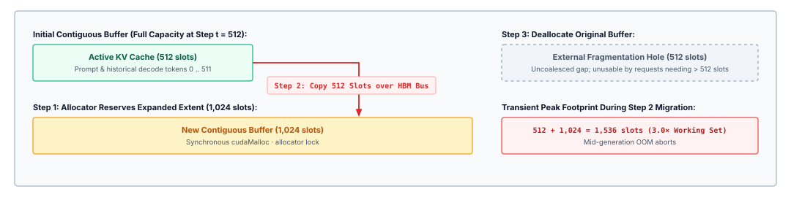
:::

This dynamic resizing paradigm introduces severe systems pathologies when executed on massively parallel accelerators. First, invoking memory management routines such as `cudaMalloc` and `cudaFree` incurs substantial control-plane latency. These routines are heavyweight operations that serialize device streams, trigger host-device synchronizations, and disrupt asynchronous kernel dispatch pipelines. Second, copying high-dimensional tensor state across High Bandwidth Memory (HBM) consumes memory bus bandwidth that would otherwise service the memory-bandwidth-bound matrix-vector multiplications of the decode phase. Third, during the reallocation window, the serving engine must simultaneously retain both the old memory buffer and the new memory buffer, creating a transient memory consumption spike that frequently precipitates the very out-of-memory crashes the strategy sought to avoid.

### Contiguous memory wastage

The failure of both static reservation and dynamic contiguous allocation stems from classical operating systems memory pathologies operating under extreme accelerator constraints. Memory waste in the KV cache divides cleanly into two architectural categories: internal fragmentation and external fragmentation (@tbl-vol3-kv-fragmentation-taxonomies).

| Fragmentation Dimension    | Primary Architectural Root Cause                                        | Manifestation in Contiguous KV Runtimes                                                                    | Mitigation Failure in Naive Allocators                                                             |
|:---------------------------|:------------------------------------------------------------------------|:-----------------------------------------------------------------------------------------------------------|:---------------------------------------------------------------------------------------------------|
| **Internal Fragmentation** | Coarse-grained over-allocation and worst-case reservation buffers.      | Reserved memory slots between the current generation step $t$ and maximum sequence capacity $S_{\max}$.    | Reducing reservation size increases mid-generation out-of-memory abort rates.                      |
| **External Fragmentation** | Memory checkerboarding induced by variable-lifetime contiguous extents. | Slices of free physical memory distributed between active buffers that cannot fit new contiguous requests. | Memory compaction requires synchronous, full-cache GPU tensor copies that stall active generation. |
| **Transient Duplication**  | Contiguous reallocation and geometric growth policies.                  | Overlapping physical memory consumption during dynamic buffer copying and resizing.                        | Amortized doubling reduces copy frequency but increases instantaneous peak reservation.            |
: **KV Cache Memory Fragmentation Taxonomies**: Root causes, allocator manifestations, and failure modes of naive mitigations in contiguous runtimes. {#tbl-vol3-kv-fragmentation-taxonomies}

Internal fragmentation occurs when a storage allocator grants memory to an entity in fixed increments that exceed the entity's immediate operational demand. In contiguous KV cache architectures, internal fragmentation manifests in two distinct forms: *reservation waste* and *geometric slack*.

Reservation waste represents the gap between the currently written sequence length $t$ and the reserved boundary $S_{\text{alloc}}$. Even if an allocator sizes buffers dynamically using a predictive heuristic rather than $S_{\max}$, any allocation where $S_{\text{alloc}} > t$ leaves $S_{\text{alloc}} - t$ slots unusable by any other concurrent request. Because standard tensor kernels require physical address contiguity, the unwritten slots trailing an active sequence cannot be assigned to an independent sequence.

Geometric slack arises when runtimes attempt to mitigate reallocation frequency by expanding buffers geometrically—for example, doubling buffer capacity whenever a boundary is reached. A request that finishes at $1{,}025$ tokens inside a $2{,}048$-token buffer leaves $1{,}023$ tokens of internal slack. Across a batch of dozens of concurrent requests, geometric slack consistently strands between $25\%$ and $33\%$ of allocated pool capacity.

External fragmentation emerges over time as requests with differing arrival times and completion lengths allocate and release contiguous memory blocks. Consider an accelerator memory space initialized as a unified, contiguous pool.

The spatial manifestation of this fragmentation pathology is mapped in @fig-vol3-kv-fragmentation. Initially, the runtime satisfies contiguous allocations of varying dimensions: Request $A$ claims $4\text{ GiB}$, Request $B$ claims $1\text{ GiB}$, and Request $C$ claims $6\text{ GiB}$. Notice that inside active buffers, internal reservation waste is already rampant—Request $A$ utilizes only $1.8\text{ GiB}$ of its reserved $4\text{ GiB}$ space, while Request $C$ utilizes only $2.4\text{ GiB}$ of its $6\text{ GiB}$ allocation. When Request $B$ departs, its $1\text{ GiB}$ block returns to the free list. However, when incoming Request $D$ arrives requiring a contiguous $2\text{ GiB}$ extent, it cannot occupy the $1\text{ GiB}$ hole vacated by $B$. Even though the aggregate free pool contains $5\text{ GiB}$ of available memory ($1\text{ GiB}$ in the intermediate hole plus $4\text{ GiB}$ at the unallocated tail), Request $D$ suffers an immediate allocation stall because no single contiguous segment is large enough to satisfy its reservation request.

::: {#fig-vol3-kv-fragmentation fig-env="figure" fig-pos="htb" fig-cap="**Contiguous Memory Fragmentation and Allocation Failure**: Allocation breakdown under contiguous tensor layouts, illustrating internal reservation waste inside active sequence buffers alongside external fragmentation holes that cause admission failures for incoming requests despite sufficient aggregate free memory." fig-alt="Memory diagram showing contiguous address space with Request A, Request B, and Request C, where Request B departs leaving a 1 GB hole that cannot accommodate incoming 2 GB Request D despite 5 GB total free pool memory."}
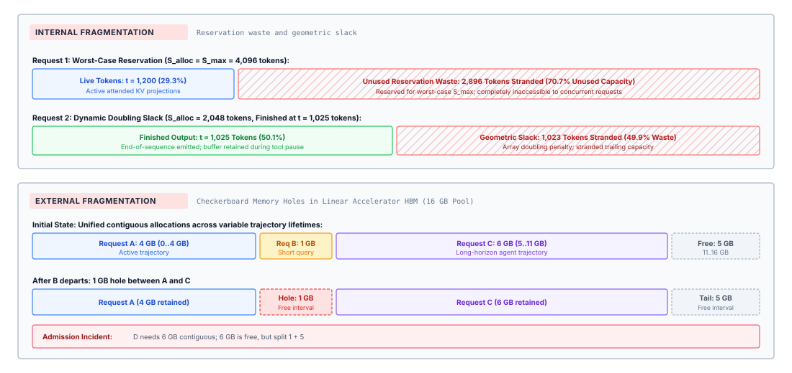
:::

As hundreds of requests cycle through the serving engine, the physical address space fragments into an alternating checkerboard of allocated extents and non-contiguous free intervals. Eventually, the system encounters a pathological state: the aggregate quantity of free physical memory across all holes may total $20$ GB, yet an incoming request requiring a contiguous $4$ GB buffer is rejected because the largest single contiguous block measures only $1.5$ GB.

In traditional central processing unit (CPU) operating systems, external fragmentation in user space is hidden by the hardware Memory Management Unit (MMU). The operating system maps non-contiguous $4$ KB physical page frames into a contiguous virtual address space, allowing processes to view memory contiguously without requiring physical contiguity. Accelerator architectures historically lacked comparable hardware-managed demand paging mechanisms for tensor execution. CUDA kernels executing scaled dot-product attention compute pointer offsets assuming regular strides across contiguous memory dimensions:

$$\text{Offset}(l, h, t, d) = l \cdot \text{stride}_L + h \cdot \text{stride}_H + t \cdot \text{stride}_T + d \cdot \text{stride}_D$$

If the token dimension $t$ is broken across non-contiguous physical memory extents, this stride arithmetic collapses, producing incorrect pointer references unless the underlying attention kernel is explicitly rewritten to navigate an address translation table.

Solving external fragmentation in a contiguous regime requires memory compaction: halting the inference pipeline, relocating active KV tensors across physical HBM to coalesce adjacent free holes into a single contiguous extent, and updating all internal tensor pointers. Compaction on high-performance accelerators is prohibitively expensive. Moving tens of gigabytes of KV data over the memory bus incurs milliseconds of latency, violating real-time service-level objectives (SLOs) and stalling parallel compute warps. Consequently, naive serving engines avoid compaction entirely, allowing external fragmentation to grow unchecked until the engine is forced to throttle admission.

### Trajectory memory churn

While static conversational requests exhibit moderate variability in sequence length, agentic workloads amplify memory fragmentation to an extreme degree. Autonomous agents do not execute uninterrupted linear generation; they operate within iterative reasoning, execution, and verification loops. An agent trajectory is characterized by rapid allocation churn, unpredictable completion horizons, and prolonged intervals of computational suspension (@tbl-vol3-trajectory-turn-memory-growth).

| Trajectory Turn | Operation         | Turn Tokens (Prompt / Gen) | Cumulative Context | Environmental Wait & State                   |
|:----------------|:------------------|:---------------------------|:-------------------|:---------------------------------------------|
| **Turn 1**      | Plan Generation   | 400 / 150                  | 550 tokens         | Compiler invoked; process idle for 4.2 s     |
| **Turn 2**      | Error Diagnosis   | +1,200 (stderr) / 80       | 1,830 tokens       | Test runner invoked; process idle for 12.0 s |
| **Turn 3**      | Patch Refactoring | +3,500 (codebase) / 850    | 6,180 tokens       | Active multi-file edit verification          |
: **Multi-Turn Context Growth and Memory Allocation Timeline**: Token additions, cumulative working sets, and environmental pauses across an interactive trajectory. {#tbl-vol3-trajectory-turn-memory-growth}

Consider the memory footprint of an agent engaged in automated software repair. In the first turn, the agent generates a simple patch command based on a $1{,}000$-token prompt, generating $120$ tokens. It then invokes an external compiler tool inside a sandboxed container. During the four seconds required for the compiler to execute and return output, the agent process produces zero tokens.

In a contiguous memory system, the serving runtime faces an acute dilemma regarding this suspended trajectory. If the engine retains the agent's contiguous KV cache in HBM throughout the tool execution window, it pins physical memory that cannot be utilized by other active requests. Worse, if the engine allocated a generous contiguous buffer anticipating future turns, that entire reservation remains stranded and locked. If the engine instead deallocates the contiguous buffer to free space for other requests, it must discard the accumulated state entirely, forcing a costly, full-context prefill recomputation phase when the compiler returns its error logs.

Agent workloads inherently exhibit multimodal completion length distributions. Simple queries terminate almost immediately when a tool confirms a precondition ($S < 500$). Complex queries encounter recursive failures, generating stack traces, re-prompting the model, and accumulating context until the sequence approaches the physical window boundary ($S > 30{,}000$).

When short-lived trajectories and long-lived trajectories execute concurrently within the same physical memory pool, the rate of allocation churn escalates. Short-lived requests rapidly allocate and release small memory extents, perforating the memory space with localized holes. Meanwhile, long-lived, high-capacity agent requests lock large contiguous blocks for minutes at a time. The resulting memory topology represents the worst-case operating environment for a contiguous allocator: an unpredictable sequence of allocation sizes, interleaved with non-deterministic deallocation timings, occurring within an address space that permits neither physical discontiguity nor low-cost compaction.

### Quantifying usable capacity: The KV allocation efficiency metric

To rigorously diagnose and compare allocator performance in serving runtimes, we must formalize the relationship between physical memory allocation and effective token capacity. Let $M_{\text{pool}}$ represent the total physical memory capacity allocated to the KV cache subsystem on an accelerator, measured in bytes. This pool is typically derived by subtracting the static model parameter weights $M_{\text{weights}}$ and the transient activation memory $M_{\text{act}}$ required for prefill matrix multiplications from the total physical device memory $M_{\text{device}}$:

$$M_{\text{pool}} = M_{\text{device}} - M_{\text{weights}} - M_{\text{act}}$$

At any discrete time step $t$ during the operation of the serving engine, let $\mathcal{R}(t)$ denote the set of all active requests currently admitted to the system. For each request $i \in \mathcal{R}(t)$, let $s_i(t)$ represent the number of valid tokens that have been processed or generated thus far. The aggregate *useful memory* $M_{\text{useful}}(t)$ holding live, attended key-value representations is defined as:

$$M_{\text{useful}}(t) = m_{\text{token}} \sum_{i \in \mathcal{R}(t)} s_i(t)$$

Conversely, let $A_i(t)$ represent the physical memory extent, measured in token slots, actually reserved by the allocator for request $i$ at time $t$. The total *allocated memory* $M_{\text{allocated}}(t)$ committed to active requests is:

$$M_{\text{allocated}}(t) = m_{\text{token}} \sum_{i \in \mathcal{R}(t)} A_i(t)$$

The remaining memory in the pool constitutes unallocated physical capacity, denoted as $M_{\text{free}}(t) = M_{\text{pool}} - M_{\text{allocated}}(t)$. In a contiguous allocator, this free capacity is partitioned across a set of $K$ discrete, non-contiguous free memory holes:

$$M_{\text{free}}(t) = \sum_{k=1}^{K} H_k(t)$$

where $H_k(t)$ is the size in bytes of the $k$-th contiguous free segment.

We evaluate the system's memory health using three normalized, dimension-free metrics. First, the *Allocation Efficiency* $\eta_{\text{alloc}}(t)$ measures the proportion of currently committed memory that stores genuine token state rather than internal reservation slack:

$$\eta_{\text{alloc}}(t) = \frac{M_{\text{useful}}(t)}{M_{\text{allocated}}(t)} = \frac{\sum_{i \in \mathcal{R}(t)} s_i(t)}{\sum_{i \in \mathcal{R}(t)} A_i(t)}$$

Second, the *External Fragmentation Ratio* $\Phi_{\text{ext}}(t)$ quantifies the extent to which unallocated physical memory is stranded in fragments too small to satisfy an incoming request requiring a contiguous buffer of size $R_{\text{req}}$ bytes:

$$\Phi_{\text{ext}}(t) = 1 - \frac{\sum_{k: H_k(t) \ge R_{\text{req}}} H_k(t)}{M_{\text{free}}(t)}$$

When all free memory resides in a single, unified contiguous extent, $\Phi_{\text{ext}}(t) = 0$. When free memory is fractured such that no individual hole can accommodate $R_{\text{req}}$, $\Phi_{\text{ext}}(t) = 1$, signifying complete external fragmentation; the allocator must refuse new work despite $M_{\text{free}}(t) > 0$.

Finally, the *Effective KV Cache Occupancy* $\eta_{\text{effective}}(t)$ defines the absolute fraction of the total physical KV memory pool performing productive work:

$$\eta_{\text{effective}}(t) = \frac{M_{\text{useful}}(t)}{M_{\text{pool}}}$$

::: {#nbk-05-quantifying-contiguous-kv-cache-fragmentation .callout-notebook title="Quantifying contiguous KV cache fragmentation on an NVIDIA H100"}
**Setting:** Consider an NVIDIA H100 SXM5 accelerator equipped with $M_{\text{device}} = 80 \text{ GiB}$ ($85{,}899{,}345{,}920 \text{ bytes}$) of High Bandwidth Memory (HBM3), delivering $3.35 \text{ TB/s}$ of memory bandwidth. The system serves a Llama-3-70B model using 16-bit half-precision weights (BF16, $P = 2 \text{ bytes}$). The model features $L = 80$ transformer layers, a hidden dimension of $d_{\text{model}} = 8{,}192$, and uses Grouped-Query Attention (GQA) with $H_{\text{kv}} = 8$ key-value heads, each with head dimension $d_{\text{head}} = 128$. The maximum supported context length is $S_{\max} = 16{,}384$ tokens.

**Parameter and KV Footprint:**
The model parameters occupy:
$$M_{\text{weights}} \approx 70 \times 10^9 \times 2 \text{ bytes} \approx 140 \times 10^9 \text{ bytes} \approx 130.38 \text{ GiB}$$
Because the weights exceed a single GPU, the model is tensor-parallelized across two H100 GPUs ($TP=2$). On each GPU:
$$M_{\text{weights, per-GPU}} = \frac{130.38 \text{ GiB}}{2} = 65.19 \text{ GiB}$$
Reserving $4.81 \text{ GiB}$ for activation working memory ($M_{\text{act}}$) and CUDA runtime overhead leaves:
$$M_{\text{pool}} = 80.00 - 65.19 - 4.81 = 10.00 \text{ GiB} \quad (10{,}737{,}418{,}240 \text{ bytes})$$

The key-value state footprint per token across the local shards on one GPU ($H_{\text{kv, local}} = 8 / 2 = 4$ heads) is:
$$m_{\text{token}} = 2 \times L \times H_{\text{kv, local}} \times d_{\text{head}} \times P = 2 \times 80 \times 4 \times 128 \times 2 = 163{,}840 \text{ bytes/token} \approx 160 \text{ KiB/token}$$

**Scenario A: Static Worst-Case Reservation:**
The runtime configures contiguous buffers sized for $S_{\max} = 16{,}384$ tokens.
The memory required for a single request reservation is:
$$A_{\text{static}} = 16{,}384 \times 160 \text{ KiB} = 2{,}684{,}354{,}560 \text{ bytes} = 2.50 \text{ GiB}$$
The maximum concurrent batch size the GPU can admit is:
$$B_{\max} = \left\lfloor \frac{M_{\text{pool}}}{A_{\text{static}}} \right\rfloor = \left\lfloor \frac{10.00 \text{ GiB}}{2.50 \text{ GiB}} \right\rfloor = 4 \text{ requests}$$

Suppose the active agent workload exhibits an empirical sequence-length distribution with a mean length of $\mathbb{E}[S] = 2{,}048$ tokens. When four requests are running at their average lengths:
$$M_{\text{useful}} = 4 \times (2{,}048 \times 160 \text{ KiB}) = 1.25 \text{ GiB}$$
$$M_{\text{allocated}} = 4 \times 2.50 \text{ GiB} = 10.00 \text{ GiB}$$
$$\eta_{\text{alloc}} = \frac{1.25 \text{ GiB}}{10.00 \text{ GiB}} = 12.5\%$$
$$\eta_{\text{effective}} = \frac{1.25 \text{ GiB}}{10.00 \text{ GiB}} = 12.5\%$$
A staggering $8.75 \text{ GiB}$ ($87.5\%$) of the available KV cache capacity is completely idle, trapped in internal reservation fragmentation. Concurrency is capped at four, collapsing serving throughput.

**Scenario B: Dynamic Contiguous Allocation with External Fragmentation:**
To combat static waste, the runtime switches to dynamic contiguous power-of-two buddy allocation. Ten requests are admitted with varying sequence lengths drawn from the empirical distribution, occupying a total of $M_{\text{useful}} = 4.20 \text{ GiB}$ with allocated buffers totaling $M_{\text{allocated}} = 6.40 \text{ GiB}$ ($\eta_{\text{alloc}} = 65.6\%$).

The remaining free pool memory is $M_{\text{free}} = 10.00 - 6.40 = 3.60 \text{ GiB}$. However, due to past request arrivals and completions, this $3.60 \text{ GiB}$ is partitioned across five isolated non-contiguous memory segments:
$$\{H_k\} = \{512 \text{ MiB}, \ 256 \text{ MiB}, \ 1024 \text{ MiB}, \ 768 \text{ MiB}, \ 1024 \text{ MiB}\}$$

An eleventh request arrives, bearing a prompt of $4{,}096$ tokens and requiring an initial reservation of $1{,}536 \text{ MiB}$ ($1.50 \text{ GiB}$).

Although the system possesses $3.60 \text{ GiB}$ of free physical memory, the largest single contiguous extent is $\max(H_k) = 1{,}024 \text{ MiB} < 1{,}536 \text{ MiB}$.
The external fragmentation ratio for this request is:
$$\Phi_{\text{ext}} = 1 - \frac{0}{3.60 \text{ GiB}} = 100\%$$
The request is rejected or blocked in an admission queue. Despite having more than double the required memory physically free in HBM, the allocator cannot satisfy the contiguous reservation.
:::

Empirical evaluations of production inference services corroborate these analytical limits. In their seminal characterization of large language model (LLM) serving systems, @kwon2023vllm demonstrated that across production workloads serving conversational and code-generation models, conventional serving runtimes achieved effective memory occupancies $\eta_{\text{effective}}$ between only $20\%$ and $40\%$. The remaining $60\%$ to $80\%$ of accelerator memory was lost entirely to internal reservation slack and external fragmentation holes.

::: {#chk-05-memory-fragmentation .callout-checkpoint title="Evaluating memory fragmentation in attention caches"}
Before analyzing paged virtual memory abstractions for KV caches, verify your understanding of physical memory allocation limits:

- [ ] **Internal fragmentation**: Why does reserving worst-case sequence capacity $S_{\max}$ upfront leave up to 80 percent of accelerator HBM unutilized?
- [ ] **External fragmentation**: How does dynamic contiguous allocation cause memory allocation failures even when total free HBM exceeds the requested tensor size?
- [ ] **Allocation efficiency**: Under what conditions does the KV allocation efficiency metric $\eta_{\text{alloc}}$ collapse during multi-turn agent deliberation?
- [ ] **Physical-to-logical coupling**: What architectural bottleneck makes contiguous KV tensors incapable of supporting branching execution without deep tensor copies?
:::

## Paged KV Allocation {#sec-vol3-kvcache-pagedattention}

Every dynamic memory allocator facing unpredictable request lifetimes confronts the classic virtual memory dilemma identified in early time-sharing operating systems: forcing dynamically growing data structures to occupy contiguous physical addresses inevitably forces an unacceptable trade-off between preemptive over-reservation and external memory fragmentation. When an inference runtime hosts dozens of concurrent generation requests, allocating contiguous memory chunks for each sequence's key-value (KV) projections turns the accelerator's High Bandwidth Memory (HBM) into a fractured grid of unusable gaps. Because autoregressive decode emits one token at a time until an unpredictable terminal token arrives, the runtime cannot forecast whether a trajectory will terminate after twelve tokens or expand to eight thousand. A contiguous allocator attempting to grow a sequence in place must either reserve the worst-case context window upfront—leaving up to 80 percent of accelerator memory idle—or periodically reallocate and physically copy gigabytes of tensor state across internal buses to coalesce contiguous spans.

**Paged KV allocation** solves this physical dilemma by importing the foundational operating system abstraction of virtual paging directly into the accelerator memory hierarchy [@kwon2023vllm]. By decoupling the logical token sequence from its physical storage layout, the serving engine partitions the KV cache into uniform, fixed-size physical memory blocks scattered across non-contiguous HBM frames. A per-sequence block table translates logical sequence positions to physical block addresses dynamically on every generation step, eliminating external fragmentation entirely while bounding internal waste to the unused tail slots of the final block. Crucially, this level of indirection transforms branching trajectories—such as tree-of-thought exploration, parallel candidate generation, and tool-assisted deliberation—from expensive deep tensor copies into constant-time, reference-counted pointer manipulation through Copy-on-Write.

::: {#dfn-paged-kv-cache .callout-definition title="Paged attention KV-cache block table"}

***Paged attention KV-cache block table***\index{Paged attention!block table definition}\index{KV cache!block table definition} is a hardware-abstracted page mapping structure $T: l \mapsto p$ that translates logical token sequence indices $l = \lfloor t/B \rfloor$ into non-contiguous physical tensor frames $p \in [0, N_{\text{pool}}-1]$ resident in accelerator High-Bandwidth Memory (HBM).

1.  **Significance**: Decouples the dynamic, non-deterministic token expansion of agent trajectories from rigid physical memory allocations, eliminating external fragmentation and enabling zero-copy tree branching via Copy-on-Write (CoW).
2.  **Distinction**: Unlike contiguous tensor allocation (which pre-reserves worst-case context lengths $S_{\max}$ and strands up to 80 percent of accelerator memory in unwritten reservations), a paged block table allocates fixed-size physical blocks ($B$ tokens) on demand and bounds memory waste strictly to final-block internal fragmentation $\mathbb{E}[\Delta_{\text{tail}}] = (B-1)/2$.
3.  **Common pitfall**: Selecting a block size $B$ that is too small ($B < 8$), which inflates block table indirection metadata and causes warp divergence during GEMV memory coalescing, or too large ($B > 64$), which amplifies internal fragmentation and degrades sharing granularity across branching rollouts.

:::

::: {.column-margin}
**Virtual Memory Analogy:**
In classical operating systems, page tables map contiguous virtual addresses to non-contiguous physical DRAM frames. In PagedAttention, block tables map continuous token sequence positions $t \in [0, S-1]$ to non-contiguous physical tensor buffers allocated from an on-device HBM block pool.
:::

### The PagedAttention virtual memory model

The core abstraction of PagedAttention is the physical separation between the logical sequence of generated tokens and the physical storage of their corresponding key and value projections. In a conventional inference engine, a request's KV cache is represented as a monolithic, contiguous tensor of shape $[2, L, H_{\text{kv}}, S_{\max}, d_{\text{head}}]$, where $L$ denotes the number of transformer layers, $H_{\text{kv}}$ the number of key-value heads, $S_{\max}$ the maximum sequence length, and $d_{\text{head}}$ the hidden dimension per head. Under PagedAttention, the physical memory pool is instead pre-allocated at runtime initialization as an array of uniform, non-contiguous physical blocks.

Each physical block holds the key and value vectors for a fixed number of tokens $B$, termed the block size. Formally, a physical block $p$ reserves storage for exactly $B$ tokens across all layers and heads:

$$M_{\text{block}} = 2 \cdot L \cdot H_{\text{kv}} \cdot B \cdot d_{\text{head}} \cdot b_{\text{elem}}$$

where $b_{\text{elem}}$ is the byte precision of each tensor element (typically 2 bytes for FP16 or BF16, and 1 byte for FP8). @Sec-vol3-appendix-inference-kv-cache derives the underlying $m_{\text{token}} = 2 L H_{\text{kv}} d_{\text{head}} b$ tensor geometry and compares attention cache footprints across multi-head and grouped-query architectures. When an incoming request begins execution with prompt length $S_{\text{prompt}}$, the serving runtime does not allocate space for the theoretical ceiling $S_{\max}$. Instead, it queries a centralized physical block manager and allocates only the minimum number of blocks necessary to store the initial prompt:

$$N_{\text{blocks}} = \left\lceil \frac{S_{\text{prompt}}}{B} \right\rceil$$

Logical token positions within the sequence are mapped to physical memory addresses through an indirection structure known as the *block table*. For any logical token index $t \in [0, S-1]$, its location is uniquely decomposed into a logical block number $l$ and an intra-block token offset $o$:

$$l = \left\lfloor \frac{t}{B} \right\rfloor, \qquad o = t \pmod B$$

The runtime maintains a per-sequence block table $T: l \mapsto p$, which maps the logical block index $l$ to a physical block identifier $p$ in accelerator memory. During the decode phase, when the model generates token $x_t$ at step $t$, the serving runtime computes $l$ and $o$. If $o \neq 0$, the token's key and value projections are written directly into the already allocated physical block $T[l]$ at offset $o$. If $o = 0$, the previous physical block is completely full; the runtime intercepts the allocation fault, pops a free physical block identifier $p_{\text{new}}$ from its free-list ring buffer, appends $p_{\text{new}}$ to the block table such that $T[l] = p_{\text{new}}$, and writes the projections into offset 0.

The mechanics of this virtual address translation and copy-on-write (CoW) branching are detailed in @fig-vol3-pagedattention-mapping. The logical token stream is partitioned into uniform blocks of $B=4$ tokens each. The runtime maintains independent block tables for Sequence A and Sequence B that map logical block indices to scattered, non-contiguous physical blocks in the accelerator's HBM pool. When Sequence B forks from Sequence A to explore an alternative agentic tool invocation, both sequences initially point to the identical physical allocations—Logical Block 0 maps to Physical Block 7, and Logical Block 1 maps to Physical Block 3—with their reference counts incremented to $\text{ref\_count} = 2$. When Sequence B subsequently generates a diverged token in Logical Block 2, the memory manager intercepts the write and allocates a fresh physical block (Physical Block 12) exclusively for Sequence B, leaving Sequence A's Logical Block 2 mapped to Physical Block 1. This zero-copy sharing allows tree-of-thought exploration and multi-turn prompting to branch instantly without duplicating historical attention state.

::: {#fig-vol3-pagedattention-mapping fig-env="figure" fig-pos="htb" fig-cap="**PagedAttention Virtual Block Table Translation and Copy-on-Write Branching**: Mapping logical sequence blocks to non-contiguous physical HBM frames through per-sequence page tables, demonstrating zero-copy prefix sharing and copy-on-write block allocation during agent trajectory branching." fig-alt="Architecture diagram depicting logical sequence blocks partitioned into 4-token chunks, per-sequence block tables translating logical to physical block identifiers, and a physical HBM block pool illustrating shared prefix blocks with reference count 2 and branched private blocks."}
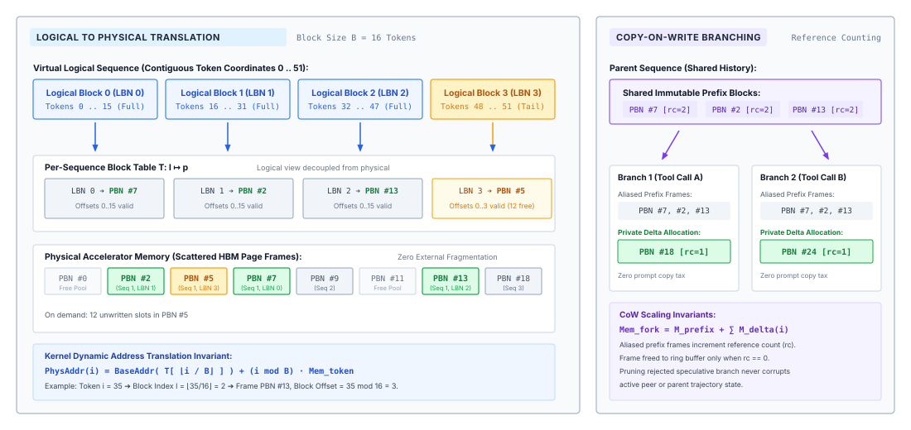
:::

Executing scaled dot-product attention over non-contiguous physical blocks requires specialized GPU decode kernels. In standard attention kernels such as FlashAttention, thread warps compute inner products by striding linearly through contiguous memory addresses. In PagedAttention, the decode kernel accepts the sequence's block table as an auxiliary input parameter. During the key-value gathering phase, thread warps load the physical block pointers from the block table into on-chip shared memory or registers. The warps iterate over the logical blocks $0 \le l \le \lfloor (S-1)/B \rfloor$, fetch the corresponding physical blocks from non-contiguous HBM locations, and compute the attention weights against the current query vector $q_t$. @Tbl-vol3-pagedattention-hierarchy formalizes the mapping from logical sequence dimensions to physical memory and control hardware structures.

| Component              | Logical Dimension                       | Physical Representation                                                                 | Hardware Location             |
|:-----------------------|:----------------------------------------|:----------------------------------------------------------------------------------------|:------------------------------|
| **Token Sequence**     | Indices $t \in [0, S-1]$                | Stream of discrete BPE integer tokens                                                   | Host DRAM / Agent Context     |
| **KV Storage**         | Logical block $l = \lfloor t/B \rfloor$ | Physical block ID $p \in [0, N_{\text{pool}}-1]$                                        | Accelerator HBM Block Pool    |
| **Address Map**        | Array index $l$                         | Block Table array $T[l] = p$                                                            | Host Control Plane & GPU SRAM |
| **Intra-Block Offset** | Offset $o = t \pmod B$                  | Byte offset $o \cdot 2 \cdot H_{\text{kv}} \cdot d_{\text{head}} \cdot b_{\text{elem}}$ | Coalesced GPU Cache Line      |
| **Free Memory**        | Unallocated capacity                    | Free-list stack / FIFO of block IDs                                                     | Host Runtime Memory Manager   |

: **PagedAttention Virtual Memory Abstraction Hierarchy**: Mapping of logical sequence dimensions to physical accelerator memory and control structures. {#tbl-vol3-pagedattention-hierarchy}

By structuring memory access through block tables, the physical memory allocator never needs to find contiguous physical space larger than $M_{\text{block}}$. Because all blocks in the global pool are identical in size, any free physical block can satisfy an allocation request for any active sequence, completely eliminating external memory fragmentation.

### Quantitative trade-offs in block sizing

While paged allocation eliminates external fragmentation, it introduces two competing systems overheads: internal fragmentation within the final block of each sequence, and hardware memory access inefficiency caused by pointer indirection. Selecting the physical block size $B$ represents a classic systems optimization problem balancing memory utilization against memory bus throughput.

Internal fragmentation occurs because sequence lengths are not integer multiples of the block size $B$. For a sequence of length $S$, the number of allocated physical blocks is $\lceil S / B \rceil$, but the final physical block contains unused token slots:

$$\Delta_{\text{tail}} = (B - (S \pmod B)) \pmod B$$

Assuming that sequence completion lengths modulo $B$ are uniformly distributed across $\{0, 1, \dots, B-1\}$, the expected number of wasted token slots per active sequence is exactly:

$$\mathbb{E}[\Delta_{\text{tail}}] = \frac{B - 1}{2}

```{python}
#| echo: false
#| label: kv-paged-waste-calc
# ┌─────────────────────────────────────────────────────────────────────────────
# │ PAGED ALLOCATION WASTE VS. BLOCK SIZE
# ├─────────────────────────────────────────────────────────────────────────────
# │ Context: @sec-vol3-kvcache-pagedattention prose.
# │
# │ Goal: Show that paged waste is a fraction of a percent and that paging
# │       multiplies the trajectories one pool admits.
# │ Show: 0.4 percent waste at 16-token blocks, 1.5 percent at 64; 780 vs. 48.
# │ How: calc_expected_paged_kv_tokens over the StaticReservation length model
# │      (capped exponential, a modeling assumption); pool from KvGeometry.
# └─────────────────────────────────────────────────────────────────────────────
from mlsysim.fmt import check, fmt_int, fmt_percent

class PagedWaste:
    # ┌── 1. LOAD (Constants) ──────────────────────
    block_small, block_large = 16, 64
    _mean = StaticReservation.mean_tokens
    _s_max = StaticReservation.s_max
    _bpt = KvGeometry.bytes_per_token
    _pool = KvGeometry.kv_pool

    # ┌── 2. EXECUTE (The Compute) ─────────────────
    alloc_small, frag_small = calc_expected_paged_kv_tokens(_mean, _s_max, block_small)
    alloc_large, frag_large = calc_expected_paged_kv_tokens(_mean, _s_max, block_large)
    conc_paged = int((_pool / (alloc_small * _bpt)).to("").magnitude)
    conc_ratio = conc_paged / StaticReservation.reservations

    # ┌── 3. GUARD (Invariants) ────────────────────
    check(frag_small < 0.005, f"Expected under 0.5 percent waste at B=16, got {frag_small}")
    check(0.01 < frag_large < 0.02, f"Expected 1 to 2 percent waste at B=64, got {frag_large}")
    check(conc_paged == 780, f"Expected 780 paged trajectories, got {conc_paged}")
    check(15 < conc_ratio < 17, f"Prose claims about sixteen times as many, got {conc_ratio}")

    # ┌── 4. OUTPUT (Formatting) ───────────────────
    block_small_str = fmt_int(block_small)
    block_large_str = fmt_int(block_large)
    frag_small_pct_str = fmt_percent(frag_small, precision=1, style="prose")
    frag_large_pct_str = fmt_percent(frag_large, precision=1, style="prose")
    conc_paged_str = fmt_int(conc_paged)
```

For the same illustrative length distribution, {python} PagedWaste.block_small_str-token blocks waste {python} PagedWaste.frag_small_pct_str of allocated memory and {python} PagedWaste.block_large_str-token blocks waste {python} PagedWaste.frag_large_pct_str. The node that admitted {python} StaticReservation.reservations_str worst-case reservations now holds {python} PagedWaste.conc_paged_str trajectories of average length, about sixteen times as many.

However, decreasing $B$ degrades the hardware efficiency of the accelerator's memory subsystem. Modern accelerator architectures, such as NVIDIA Hopper or Blackwell GPUs, organize High Bandwidth Memory access around wide memory buses with minimum transaction granularities of 32 or 64 bytes, caching lines in 128-byte sectors. Within the decode attention kernel (GEMV), threads within a warp cooperate to stream key and value vectors from HBM into vector registers using 128-bit memory instructions (`LDG.E.128`). If $B$ is set too small, physical blocks fail to align with hardware transaction boundaries. Furthermore, smaller block sizes inflate the size of the block table by a factor of $1/B$. For a context length of 32,768 tokens, $B = 4$ requires 8,192 block table entries per sequence, consuming excessive GPU register file space and on-chip shared memory merely to track address pointers, while causing frequent warp divergence at block boundaries.

```python
# Empirical verification of tail fragmentation versus block size B
def calculate_cache_utilization(batch_size, avg_seq_len, b_size, m_token):
    total_tokens = batch_size * avg_seq_len
    allocated_blocks = sum((s + b_size - 1) // b_size for s in seq_lens)
    allocated_bytes = allocated_blocks * b_size * m_token
    used_bytes = total_tokens * m_token
    return used_bytes / allocated_bytes  # Effective memory efficiency eta
```

Empirical profiling demonstrates that $B = 16$ and $B = 32$ occupy the optimal sweet spot for current GPU microarchitectures. At $B = 16$, the contiguous tensor payload within each block ($16 \times d_{\text{head}} \times b_{\text{elem}}$ bytes per head) is sufficiently large to saturate 128-byte memory bus transactions, achieving over $95\%$ of theoretical HBM read bandwidth during decode attention kernels. Simultaneously, the tail waste remains bounded to an average of $7.5$ tokens per stream, translating to negligible capacity loss across large production batches.

::: {#nbk-05-sizing-physical-blocks-for-a .callout-notebook title="Sizing physical blocks for a 70B parameter model"}
Consider serving an open-weights 70B parameter model using Grouped-Query Attention (GQA). The architecture features $L = 80$ layers, $H_Q = 64$ query heads, $H_{\text{kv}} = 8$ key-value heads, head dimension $d_{\text{head}} = 128$, and runs in BF16 precision ($b_{\text{elem}} = 2$ bytes). The serving engine distributes the model across an 8-GPU node using tensor parallelism degree $TP = 8$.

First, calculate the memory footprint per token on a single GPU. With $TP = 8$, the $H_{\text{kv}} = 8$ key-value heads are partitioned evenly across the 8 GPUs, resulting in $H_{\text{kv, GPU}} = 1$ key-value head per layer per GPU:

$$m_{\text{token, GPU}} = 2 \cdot L \cdot H_{\text{kv, GPU}} \cdot d_{\text{head}} \cdot b_{\text{elem}} = 2 \cdot 80 \cdot 1 \cdot 128 \cdot 2\text{ bytes} = 40,960\text{ bytes} = 40\text{ KiB}$$

Across the full node ($TP=8$), the collective memory footprint is $8 \times 40\text{ KiB} = 320\text{ KiB}$ per token.

Now evaluate physical block parameters on a single GPU for block sizes $B = 16$ and $B = 64$:

1. **Physical Block Footprint ($B = 16$):**
   $$M_{\text{block, GPU}} = 16 \cdot 40\text{ KiB} = 640\text{ KiB}$$

2. **Physical Block Footprint ($B = 64$):**
   $$M_{\text{block, GPU}} = 64 \cdot 40\text{ KiB} = 2,560\text{ KiB} = 2.5\text{ MiB}$$

Assume each GPU provides 80 GB of physical HBM3 memory. Model weights occupy $140\text{ GB} / 8 = 17.5\text{ GiB}$ per GPU. Reserving 2.5 GB for activation buffers leaves exactly $60\text{ GiB}$ ($62,914,560\text{ KiB}$) dedicated to the paged KV cache pool.

- **Pool Capacity at $B = 16$:**
  $$N_{\text{blocks}} = \frac{62,914,560\text{ KiB}}{640\text{ KiB}} = 98,304\text{ blocks}$$
  $$\text{Token Capacity} = 98,304 \cdot 16 = 1,572,864\text{ tokens per GPU}$$

- **Tail Fragmentation under a Batch of $N_{\text{seq}} = 256$ Concurrent Sequences:**
  - For $B = 16$: Expected waste is $(16 - 1)/2 = 7.5\text{ tokens}$ per sequence.
    $$\text{Node Waste} = 256 \cdot 7.5 \cdot 40\text{ KiB} = 76,800\text{ KiB} = 75\text{ MiB}$$
    $$\text{Fragmentation Ratio} = \frac{75\text{ MiB}}{61,440\text{ MiB}} \approx 0.12\%$$

  - For $B = 64$: Expected waste is $(64 - 1)/2 = 31.5\text{ tokens}$ per sequence.
    $$\text{Node Waste} = 256 \cdot 31.5 \cdot 40\text{ KiB} = 322,560\text{ KiB} = 315\text{ MiB}$$
    $$\text{Fragmentation Ratio} = \frac{315\text{ MiB}}{61,440\text{ MiB}} \approx 0.51\%$$

Even with large batches, paged allocation restricts internal memory waste to less than $1\%$ of the total cache capacity, compared to the $60\%–80\%$ capacity loss typical of contiguous static reservations.
:::

### Zero-copy deliberation via copy-on-write branching

In agentic architectures, execution rarely proceeds along a single linear trajectory. Deliberation buys evidence by generating alternatives (principle \ref{pri-vol3-test-time-scaling}), so tree-of-thought search, speculative candidate sampling, self-consistency evaluation, and tool-call retries all fork several branches from one shared prefix (@sec-vol3-test-time-compute). A planning agent might ingest an eight-thousand-token context containing system prompts, environment specifications, and tool documentation, and subsequently spawn four speculative child trajectories to explore distinct execution strategies.

Under a contiguous memory allocation model, branching is an expensive, high-latency operation. Because each child sequence must append newly generated tokens to its own contiguous memory span, the serving engine must physically duplicate the parent's entire KV cache tensor. For the 70B parameter model analyzed above, deep-copying an $8,192$-token prefix across four child branches requires physically duplicating:

$$\text{Data Duplicated} = 4 \cdot (8,192\text{ tokens} \cdot 320\text{ KiB/token}) = 4 \cdot 2.56\text{ GiB} = 10.24\text{ GiB}$$

Writing $10.24\text{ GiB}$ across the accelerator memory bus stalls the inference pipeline, squanders scarce HBM capacity, and drastically reduces the number of concurrent deliberative agents the system can support.

Paged KV allocation eliminates this overhead by enabling zero-copy branching through reference counting and Copy-on-Write (CoW). Every physical block $p$ in the global pool maintains an associated integer reference counter, $\text{ref\_count}[p]$, tracked by the host runtime's memory manager. When a parent sequence forks into one or more child sequences, the serving runtime performs three constant-time operations:

1. **Table Duplication:** It instantiates a new logical block table for each child sequence and copies the physical block identifiers from the parent's block table into the child's table:
   $$T_{\text{child}}[l] \leftarrow T_{\text{parent}}[l] \quad \forall l \in \left[0, \left\lfloor \frac{S_{\text{prefix}}-1}{B} \right\rfloor \right]$$

2. **Reference Count Increment:** For each physical block mapped in the child table, the runtime increments its reference counter:
   $$\text{ref\_count}[T_{\text{child}}[l]] \leftarrow \text{ref\_count}[T_{\text{child}}[l]] + 1$$

3. **Metadata Registration:** The child sequence is registered with the scheduler as an active, independent request with starting sequence length $S_{\text{child}} = S_{\text{prefix}}$.

Crucially, zero tensor data is copied across the accelerator memory bus during this fork operation. The parent and all child branches point to the exact same physical HBM blocks for their shared prefix.

```python
# Host-side reference-counted block reclamation
def release_sequence_blocks(block_table, ref_counts, free_list):
    for phys_block in block_table:
        ref_counts[phys_block] -= 1
        if ref_counts[phys_block] == 0:
            free_list.append(phys_block)  # Constant-time O(1) return to pool
    block_table.clear()
```

The physical divergence of memory occurs lazily during token generation via Copy-on-Write. When child branch $A$ generates its first independent token, it writes into its final block $l_{\text{tail}} = \lfloor S_{\text{prefix}} / B \rfloor$. If the block being written has a reference count strictly greater than one ($\text{ref\_count}[T_A[l_{\text{tail}}]] > 1$), writing directly into it would corrupt the attention context of the parent and sibling branches. The memory manager intercepts this write, allocates a pristine physical block $p_{\text{new}}$ from the free list, copies the $B$ tokens from the shared block into $p_{\text{new}}$, decrements the reference count of the original block, and updates $T_A[l_{\text{tail}}] \leftarrow p_{\text{new}}$. Subsequent generation steps within branch $A$ proceed into $p_{\text{new}}$ with $\text{ref\_count} = 1$ without triggering further copies.

When an agentic planning branch is pruned—for example, if a compiler verification tool returns an unrecoverable syntax error on a candidate code snippet—the runtime destroys the sequence. The memory manager traverses the pruned sequence's block table, decrementing the reference count of each mapped physical block. Any block whose reference count drops to zero is immediately returned to the free-list ring buffer. If sibling branches are still actively exploring alternative hypotheses from that prefix, the shared prefix blocks remain valid in HBM, their reference counts simply reflecting the reduced sharing degree.

By mapping logical token sequences to non-contiguous, reference-counted physical blocks, PagedAttention provides the foundational virtualization layer required to serve dynamic, branching agent workloads. Yet this mechanism operates entirely within the boundaries of an active, running request or an explicit parent-child fork. What happens when an entirely new user request arrives at the serving cluster containing a long, identical system prompt, or when two unrelated agent instances happen to share an identical tool definition preface? To avoid recomputing identical key-value projections across independent requests that share no explicit lineage, the serving system must extend beyond intra-request page tables to global prefix indexing.

## Prefix Caching Across Turns {#sec-vol3-kvcache-radix-tree}

When an inference runtime receives a request whose token sequence shares an initial prefix with previously executed workloads, recomputing the key and value states for those initial tokens imposes pure computational and memory waste. In autonomous agent architectures, this waste is not a marginal inefficiency but an operational bottleneck. Every invocation of a code-editing or task-planning agent prepends thousands of tokens of static scaffolding—system instructions, operational boundaries, few-shot demonstration trajectories, and detailed OpenAPI tool schemas—before introducing the user's brief, dynamic query. If the serving cluster treats each incoming request as an isolated transactional unit, the accelerator's matrix multiplication engines must repeatedly project identical token sequences into key-value tensors across tens of thousands of requests per hour. For a large language model, prefilling a 4,096-token system preface consumes hundreds of teraflops and monopolizes memory bus bandwidth, inflating Time to First Token (TTFT) and collapsing request throughput.

**Prefix caching** virtualizes KV cache allocation across independent serving requests by organizing retained physical memory blocks into a globally indexed prefix search structure. By indexing physical KV blocks against token sequence prefixes, an inference engine transforms redundant prompt prefill operations from compute-bound matrix multiplications into constant-time cache lookups, reclaiming accelerator capacity for active autoregressive generation.

The structural hierarchy of the Radix prefix tree and its interaction with the memory reclamation queue are illustrated in @fig-vol3-radix-tree-cache. Each tree node binds a contiguous token sequence (`prefix_tokens`) directly to an ordered list of physical PagedAttention block IDs (`block_ids`). Nodes are partitioned into two operational states based on active sharing: Node 1 (system prompt instructions) and Node 2 (Python coding scratchpad) maintain active execution streams ($\text{ref\_count} \ge 1$) and are pinned in HBM. Conversely, completed execution branches such as Node 3 (Bash shell) and Node 4 (Git status) have dropped to $\text{ref\_count} = 0$, rendering them dormant. The host scheduler links these dormant leaves into a doubly linked Least Recently Used (LRU) eviction queue ordered by access timestamps. Under memory pressure, the physical allocator safely reclaims memory from the LRU head (Node 4, returning Block 31 to the free list), preventing premature eviction of shared parent prefixes and cascading eviction eligibility to Node 3 only when its child pointers are pruned.

::: {#fig-vol3-radix-tree-cache fig-env="figure" fig-pos="htb" fig-cap="**Radix Tree Prefix Cache Architecture and Leaf-First LRU Eviction**: Structural hierarchy of prefix nodes mapping token chunks to physical block IDs. Pinned nodes with active references (ref_count ≥ 1) remain protected, while dormant leaf nodes (ref_count = 0) are linked into an LRU eviction queue that guarantees child-first block reclamation under memory pressure." fig-alt="Radix tree diagram showing root, pinned system prompt node, pinned code branch node, and dormant bash/git nodes linked to a doubly-linked LRU eviction queue reclaiming physical block IDs."}
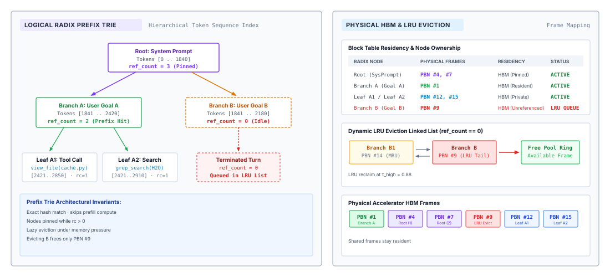
:::

### Prefix trie redundancy

In single-turn conversational serving, temporal locality is primarily confined to the autoregressive decode loop of an isolated sequence. Multi-turn agent architectures break this assumption. An autonomous software engineering agent running an iterative edit-compile-test loop generates a sequence of discrete inference requests that share massive token overlaps: the base repository instructions, the formatted file tree, the active tool signatures, and the accumulated conversation history up to the current turn. Furthermore, concurrent worker agents instantiated from the same system prompt share identical initial context blocks despite operating on distinct tasks. If physical memory blocks allocated via PagedAttention are deallocated immediately upon request termination, the serving system discards key and value tensors that are almost guaranteed to be requested again within milliseconds.

::: {.column-margin}
**Radix Tree Compaction**
A standard trie stores a single token per edge, creating deep, pointer-heavy tree structures. A Radix tree compresses linear non-branching sequences into single edges, minimizing host memory traversal overhead and matching BPE token arrays directly to contiguous arrays of physical block IDs [@zheng2024sglang].
:::

Retaining these physical blocks requires an indexing mechanism that can recognize common token sequences across requests without explicit parent-child lineage. A naive hash map keyed on the complete prompt string fails because it only identifies exact, full-prompt matches; any modification to the final query token invalidates the entire cache entry. The serving engine requires a prefix search index capable of identifying the longest common sub-sequence starting from token index zero.

A natural data structure for prefix indexing is the trie, where each path from the root represents a sequence of tokens. In a standard token-level trie, every edge represents a single token identifier, and every node represents a unique prefix. However, storing a dedicated node for every token in a 32,768-token context window introduces unsustainable host CPU memory overhead and pathological pointer chasing during lookups. Because agent workloads consist of long, immutable stretches of continuous text (such as tool definitions) punctuated by infrequent branch points (such as variable tool outputs), the prefix index is dominated by non-branching linear chains.

To minimize tree depth and CPU traversal latency, modern inference runtimes such as SGLang [@zheng2024sglang] implement the prefix index as a Radix tree (or compact transition trie). In a Radix tree, edges with no intermediate branch points are compressed into a single edge holding a contiguous array of token identifiers. Each node in the Radix tree binds this token slice directly to an ordered array of physical KV cache block identifiers maintained in the accelerator's PagedAttention memory pool.

| Node Field      | Type / Representation | Architectural Function                                                          |
|:----------------|:----------------------|:--------------------------------------------------------------------------------|
| `prefix_tokens` | `int32[]`             | Compressed contiguous slice of BPE token identifiers along the edge.            |
| `block_ids`     | `int32[]`             | Ordered physical PagedAttention block pointers backing the token slice.         |
| `children`      | `Map<int32, Node*>`   | Pointers to downstream branches, keyed by the next branch token.                |
| `parent`        | `Node*`               | Pointer to upstream prefix node (null for root).                                |
| `ref_count`     | `uint32`              | Number of active decoding requests currently reading or appending to this node. |
| `last_access`   | `uint64`              | Monotonic clock timestamp of the most recent cache hit or traversal.            |

: **Radix Tree Prefix Cache Node Layout**: Data structure layout for a Radix tree prefix cache node. {#tbl-radix-node-schema}

As formalized in @tbl-radix-node-schema, the Radix tree serves as an authoritative index over the physical block pool. When a request completes its generation cycle, the serving runtime does not return its physical blocks to the global free list. Instead, it transitions the reference count of the corresponding leaf node to zero, marking the physical blocks as dormant. The blocks remain mapped in accelerator HBM, ready to be immediately re-attached if a subsequent request traverses the same prefix path.

::: {#dfn-radix-prefix-cache .callout-definition title="Radix prefix cache"}
A hierarchical tree structure that indexes physical key-value cache blocks against token sequences, compressing non-branching token paths to enable constant-time prefix lookups, cross-request cache reuse, and leaf-first LRU memory reclamation.
:::

### Longest prefix matching

::: {.column-margin}
{width="100%" fig-alt="Radix tree prefix matching diagram showing a 100-token shared system prefix partitioned into 6 full 16-token blocks with a 4-token unaligned tail truncated to prevent race conditions."}

*Only fully packed blocks are shared across requests; partial block tails are truncated to prevent race conditions.*
:::
When an incoming request arrives with a tokenized prompt $\mathbf{t} = [t_0, t_1, \dots, t_{S-1}]$, the serving runtime searches the Radix tree to determine the maximum prefix length $S_{\text{match}}$ that can be resolved from cache. The host scheduler begins at the root node and iteratively matches slices of $\mathbf{t}$ against edge labels. If an edge matches a substring of the prompt, the engine consumes those tokens, records the associated physical `block_ids`, and inspects the child map using the subsequent token $t_{i}$ as the lookup key. This traversal terminates when a token mismatch occurs or when the prompt is exhausted, yielding the longest matched path.

While longest prefix matching is computationally straightforward on the host CPU, translating $S_{\text{match}}$ into usable physical blocks exposes a hardware-induced quantization dilemma: the block boundary alignment problem. PagedAttention groups key and value states into physical blocks of uniform size $B$ (typically $B = 16$ or $B = 32$ tokens) to minimize external fragmentation and optimize memory bus alignment during tensor operations. A block can only be shared safely across independent requests if its internal token slots are completely populated and mathematically sealed.

Consider a scenario where an incoming request matches $S_{\text{match}} = 100$ tokens of a cached system prompt, and the serving engine operates with a block size of $B = 16$. The 100 matched tokens span:

$$\lfloor 100 / 16 \rfloor = 6 \text{ full blocks (tokens } 0 \dots 95 \text{)}$$

with a partial tail of:

$$100 \pmod{16} = 4 \text{ tokens (tokens } 96 \dots 99 \text{)}$$

These 4 tail tokens occupy the first four slots of a physical block whose remaining 12 slots are empty. If the serving runtime naively assigns this partial block to the new request, an immediate race condition arises. If the new request begins generating or appending novel query tokens, it will write subsequent key and value projections into slots $4 \dots 15$. If another concurrent or future request matches the same 100-token prefix but diverges at token 100, both requests will attempt to write conflicting key and value tensors into the same physical block slots, corrupting attention state.

The runtime must resolve this partial-block dilemma through one of two architectural policies:

1. *Copy-on-Write (CoW) Tail Allocation:* The runtime allocates a fresh physical block from the free list, copies the key and value projections of the 4 tail tokens from the cached block into the new block over the PCIe or high-speed memory bus, and maps the new block to the request's private page table.
2. *Block-Aligned Truncation:* The runtime rounds down the usable cache hit to the nearest full block boundary:
   $$S_{\text{usable}} = \left\lfloor \frac{S_{\text{match}}}{B} \right\rfloor \times B$$
   The remaining $S_{\text{match}} \pmod B$ tokens are treated as a cache miss. The runtime incorporates these tail tokens into the novel suffix prefill, computing their key and value projections alongside the request's unique query tokens.

In production runtimes, block-aligned truncation consistently outperforms Copy-on-Write allocation. On modern accelerator architectures (such as NVIDIA H100 or AMD MI300X), the host overhead of dispatching a memory-copy kernel to duplicate a handful of tokens—coupled with memory bus synchronization barriers—exceeds the time required to evaluate those same tokens inside a high-throughput fused GEMM prefill kernel. Consequently, production Radix allocators enforce a strict block boundary invariant: only fully packed blocks of size $B$ are inherited across requests, while sub-block tails are recomputed during the initial prefill phase.

::: {#nbk-05-ttft-and-compute-savings-from .callout-notebook title="TTFT and compute savings from radix prefix reuse"}
Consider an autonomous coding agent operating on an 8-GPU tensor-parallel node hosting a 70-billion parameter dense model ($N = 70 \times 10^9$). The model utilizes Grouped-Query Attention (GQA) with $L = 80$ layers, $H_Q = 64$ query heads, $H_{\text{kv}} = 8$ key-value heads, and a head dimension of $d_{\text{head}} = 128$, represented in 16-bit brain floating-point format ($b_{\text{elem}} = 2$ bytes).

The agent's standard system instruction, formatting rules, and tool definition schema comprise an invariant prefix of $S_{\text{prefix}} = 4{,}096$ tokens.

**1. Physical KV Memory Footprint:**
Applying the physical GQA tensor footprint established in @sec-vol3-foundation-model-tokenization ($m_{\text{token}} = 320\text{ KiB/token}$):
$$M_{\text{KV}} = S_{\text{prefix}} \cdot m_{\text{token}} = 4{,}096 \times 320\text{ KiB} = 1{,}310{,}720\text{ KiB} = 1.25\text{ GiB}$$
Distributed across the 8 GPUs via tensor parallelism, this footprint requires only $160\text{ MiB}$ of HBM per accelerator.

**2. Prefill Compute Savings:**
Applying the foundation engine Roofline model from @sec-vol3-foundation-model-cost, evaluating prompt context requires $2N$ FLOPs per token for linear projections plus the quadratic self-attention component ($4 \cdot L \cdot d_{\text{model}} \cdot S_{\text{prefix}}^2$):
$$\text{FLOPs}_{\text{linear}} = 2 \cdot (70 \times 10^9) \cdot 4{,}096 \approx 5.734 \times 10^{14}\text{ FLOPs} = 573.4\text{ TFLOPs}$$
$$\text{FLOPs}_{\text{attn}} = 4 \cdot 80 \cdot 8{,}192 \cdot (4{,}096)^2 \approx 4.40 \times 10^{13}\text{ FLOPs} = 44.0\text{ TFLOPs}$$
$$\text{FLOPs}_{\text{total}} = \text{FLOPs}_{\text{linear}} + \text{FLOPs}_{\text{attn}} = 573.4 + 44.0 = 617.4\text{ TFLOPs}$$

**3. Latency Impact:**
The 8-GPU H100 node provides an aggregate theoretical dense BF16 peak of $8 \times 989 = 7{,}912 \text{ TFLOPS}$. At a realistic Model Flops Utilization (MFU) of $45\%$ for tensor-parallel prefill at batch size 1, the sustained cluster compute throughput is:
$$\text{Throughput}_{\text{sustained}} = 0.45 \times 7{,}912 \text{ TFLOPS} \approx 3{,}560 \text{ TFLOPS}$$
Without prefix caching, computing the KV state for the system prompt delays Time to First Token (TTFT) by:
$$T_{\text{prefill}} = \frac{617.4 \text{ TFLOPs}}{3{,}560 \text{ TFLOPS}} \approx 0.1734 \text{ seconds} \approx 173.4 \text{ ms}$$
With a Radix tree prefix hit, the entire 4,096-token prefill is bypassed. The host CPU resolves the block table in less than $50 \ \mu\text{s}$. If the incoming query introduces 32 novel tokens, the accelerator executes prefill only for those 32 tokens attending across the cached 4,096 tokens, completing in under $6 \text{ ms}$. Prefix caching eliminates $167.4 \text{ ms}$ of latency—a $28\times$ reduction in TTFT—while saving over $600 \text{ TFLOPs}$ of accelerator work.
:::

When serving fleets of autonomous agents across multi-node accelerator clusters, this prefix locality must be coordinated globally. Rather than maintaining isolated, uncoordinated Radix trees on each worker node, the cluster routing fabric fingerprints incoming prompts and dispatches requests to nodes holding matching prefix blocks.

The three-stage distributed routing pipeline is detailed in @fig-vol3-cluster-prefix-routing. In Stage 1, an incoming agent prompt ($S = 40{,}000$ tokens) is segmented into 16-token chunks and transformed into a rolling Merkle hash chain $h_k = \text{Hash}(h_{k-1} \parallel c_k)$, creating a cryptographic prefix fingerprint. In Stage 2, a centralized cluster prefix directory evaluates candidate worker nodes against a joint affinity-load objective $w^* = \arg\max [\mu \cdot (\text{Match}/S) - (1-\mu) \cdot (L_j / L_{\max})^\gamma]$, balancing prompt hit ratio against worker execution queue depth. In Stage 3, the prompt is dispatched to the winning node (Worker 1), which already retains 32,000 cached prefix tokens (an $80\%$ prefix hit). Worker 1 skips the initial 2,000 chunk allocations and executes prefill computation exclusively on the remaining 8,000 novel suffix tokens, drastically curtailing TTFT while preserving cluster load balance.

::: {#fig-vol3-cluster-prefix-routing fig-env="figure" fig-pos="htb" fig-cap="**Cluster-Scale Prefix Trie Routing and Cache-Aware Dispatch**: Distributed prefix caching across multi-node accelerator clusters. Prompts are fingerprinted into rolling Merkle hash chunks, evaluated against a centralized prefix directory using a joint affinity-load objective, and dispatched to worker nodes that prefill only novel suffix tokens." fig-alt="Pipeline diagram illustrating prompt token chunking and Merkle hashing in Stage 1, global prefix directory joint optimization balancing affinity against load in Stage 2, and targeted worker dispatch executing prefill only on tail tokens in Stage 3."}
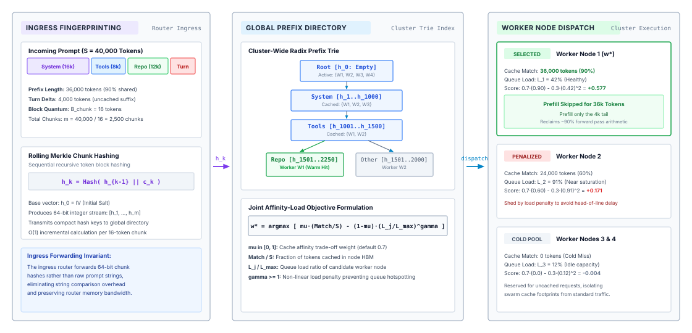
:::

### Dynamic radix eviction

Accelerator High Bandwidth Memory (HBM) is strictly bounded. An inference engine cannot retain dormant prefix blocks indefinitely without starving active requests of memory required for decode-phase allocations. When aggregate memory utilization approaches capacity, the runtime must reclaim physical blocks backing cached prefixes.

Managing eviction in a Radix tree is structurally distinct from managing eviction in a flat key-value cache. In a flat cache, any key-value pair can be purged independently. In a Radix tree, nodes exhibit strict structural dependencies: an internal node cannot be evicted while any of its child nodes remain in memory. Because key and value representations in attention layers depend on the cumulative sequence from the root, evicting an internal node destroys the physical prefix context required by all downstream descendants.

To enforce this dependency invariant, the runtime implements a leaf-first eviction policy governed by reference counts and access timestamps:

1. *State Classification:* Every node in the Radix tree occupies one of two operational states based on its `ref_count`. A node with $\text{ref\_count} \ge 1$ is *pinned*; it is actively referenced by one or more running inference requests and cannot be evicted under any circumstance. A node with $\text{ref\_count} = 0$ is *dormant*; it represents a completed request retained solely for potential reuse and is a valid candidate for eviction.
2. *Eviction Candidate Tracking:* The host scheduler maintains an eviction priority queue containing all dormant leaf nodes. The queue is ordered by a Least Recently Used (LRU) policy using the node's `last_access` timestamp.
3. *Iterative Pruning:* When the physical block allocator crosses a low-watermark threshold $\tau_{\text{low}}$ of free memory, it triggers an eviction cycle. The allocator pops the least recently used leaf node from the eviction queue, releases its assigned physical `block_ids` back to the global free block pool, and removes the leaf from its parent's `children` map.
4. *Cascading Eligibility:* If the parent node's child map becomes empty as a result of the pruning operation, and the parent's own `ref_count` is zero, the parent transitions into a leaf node. The scheduler inserts the parent into the eviction priority queue, making it eligible for reclamation in subsequent iterations.

```python
def evict_radix_blocks(free_blocks: List[int], target_free: int) -> None:
    while len(free_blocks) < target_free and lru_leaf_queue:
        leaf = lru_leaf_queue.pop_oldest()
        if leaf.ref_count > 0:
            continue
        for block_id in leaf.block_ids:
            free_blocks.append(block_id)
        parent = leaf.parent
        del parent.children[leaf.prefix_tokens[0]]
        if len(parent.children) == 0 and parent.ref_count == 0:
            lru_leaf_queue.insert(parent)
```

This leaf-first traversal guarantees that the root and high-level branch nodes—which represent the most broadly shared prefix scaffolding, such as system prompts—remain resident the longest. Dynamic leaf branches representing ephemeral, one-off conversational turns are pruned first, preserving the foundational layers of the prefix hierarchy where cache hit probability is highest.

### What breaks the hit rate

Attention state for a token depends on every token before it, so the cache can reuse state only up to the first token that differs (principle \ref{pri-vol3-prefix-coherence}). Prefix caching is all or nothing from left to right. The engine cannot enforce a cache-friendly layout; it can only reward one, and the harness controls every input that decides the outcome. @Sec-vol3-context-engineering-staging already named the changes that break the prefix: a per-call field at the head, a tool list that changes mid-trajectory, nondeterministic serialization, and every compaction. Seen from the cache, they share one signature. Each moves the first differing token toward the head of the context, and the engine prefills every block after it again. The first three are avoidable by layout. Compaction is not, which is why the harness compacts rarely and in large batches (@sec-vol3-context-engineering-compaction) and accepts one expensive turn per batch.

The measure of all this is the prefix hit rate, the fraction of prompt tokens served from cache rather than prefilled:

$$H_{\text{prefix}} = \frac{\sum_{i} S_{\text{match}}^{(i)}}{\sum_{i} S_{\text{prompt}}^{(i)}}$$ {#eq-hprefix}

where request $i$ has prompt length $S_{\text{prompt}}^{(i)}$ and matched prefix $S_{\text{match}}^{(i)}$. A harness should log it per trajectory as it logs tokens and cost. A drop in hit rate after a harness change is usually the first sign that the change moved a volatile token toward the front of the context.

### Provider prompt caching

Most agent builders call a model through a hosted API rather than running the engine, and they meet the same mechanism as a billing feature. The provider caches the KV state of a prompt prefix and bills cached input tokens at a fraction of the normal input rate. Some interfaces reuse any sufficiently long matching prefix automatically. Others ask the caller to mark cache breakpoints, the positions up to which the prefix should be stored, and may charge extra for the tokens written into the cache. Cached entries expire after an idle time-to-live, typically minutes, because the provider runs the same leaf-first eviction as the radix cache, on a shared fleet.

Three harness consequences follow. The breakpoints belong at the boundaries of the stable zones in the layout of @sec-vol3-context-engineering-staging, after the tool definitions and after the long-lived history, so that each zone is cached once and reused. The time-to-live couples caching to tool waits. A tool that runs longer than the time-to-live returns to a cold cache, and the next turn pays full input price for the whole context, which is the provider-side version of the retain-or-evict decision in @sec-vol3-kvcache-swapping. Finally, the hit rate becomes directly visible in the bill, as the ratio of cached to uncached input tokens the API reports, which makes it the cheapest metric of cache health a harness can track.

Prefix caching removes the prefill of everything the trajectory has already sent. It cannot remove the prefill of what is new, and in an agent the new tokens arrive in large pieces, one tool observation at a time.

## Chunked Prefill Scheduling {#sec-vol3-kvcache-chunked-prefill}

An inference engine serving autoregressive language models confronts two fundamentally incompatible computational profiles running on the exact same accelerator silicon. The prefill phase ingests prompts containing hundreds or thousands of tokens simultaneously, executing dense matrix-matrix multiplications (GEMMs) that achieve high compute efficiency on tensor cores. The decode phase, by contrast, generates exactly one token per sequence per iteration, executing memory-bound matrix-vector multiplications (GEMVs) that are strictly limited by high-bandwidth memory (HBM) transfer speed rather than peak arithmetic throughput. When a long agent prompt—such as a complex tool definition, an 8,192-token system prompt, or a multi-turn conversation trace—arrives at an engine currently serving twenty active decoding streams, a naive run-to-completion scheduler produces catastrophic head-of-line blocking. The accelerator must commit all tensor units to the massive matrix operations of the new prompt, freezing the memory-bound decode loops for hundreds of milliseconds and causing inter-token latency (ITL) tail spikes that violate service level agreements.

Chunked prefill resolves this physical collision by slicing monolithic prompts into uniform token blocks and co-scheduling them alongside active decode requests within the same execution batch. Rather than treating prefill and decoding as mutually exclusive operating modes, chunked scheduling exploits their complementary hardware demands: the compute-dense prefill chunk raises the arithmetic intensity of the batch toward the accelerator's Roofline ridge point, while active decode tokens amortize the memory bandwidth required to stream the model's weight matrices from HBM into SRAM.

### The prefill-decode interference dilemma

Prefill and decode conflict because they saturate different resources. Decode is bound by memory bandwidth (principle \ref{pri-vol3-memory-bandwidth-decoding}) while prefill is bound by compute, as @sec-vol3-foundation-model-cost derived. Under the Roofline model, the operational intensity $\mathcal{I}$ of a workload measures the ratio of floating-point operations executed to memory bytes transferred across the accelerator memory bus:

$$\mathcal{I} = \frac{\text{Floating Point Operations (FLOPs)}}{\text{Memory Traffic (Bytes)}}$$

Consider an accelerator equipped with dense tensor core throughput $T_{\text{peak}}$ of $1{,}000\text{ TFLOPS}$ ($10^{15}\text{ FLOPs/s}$) for 16-bit floating-point operations and an HBM bandwidth $B_{\text{mem}}$ of $3.35\text{ TB/s}$ ($3.35 \times 10^{12}\text{ Bytes/s}$). The hardware ridge point $\mathcal{I}^*$ marks the minimum arithmetic intensity required to achieve peak computational throughput:

$$\mathcal{I}^* = \frac{T_{\text{peak}}}{B_{\text{mem}}} = \frac{1{,}000 \times 10^{12}\text{ FLOPs/s}}{3.35 \times 10^{12}\text{ Bytes/s}} \approx 298.5\text{ FLOPs/Byte}$$

Any computation with operational intensity $\mathcal{I} < \mathcal{I}^*$ is bound by memory bandwidth, leaving tensor cores idling while waiting for operands to arrive from HBM. Any computation with $\mathcal{I} \ge \mathcal{I}^*$ is compute-bound, fully saturating tensor cores.

::: {.column-margin}
**Roofline Ridge Point**
The operational intensity $\mathcal{I}^* = T_{\text{peak}} / B_{\text{mem}}$ defines the exact boundary where an accelerator transitions from being memory-bandwidth-bound to compute-bound. For modern accelerators, this threshold routinely exceeds 200–300 FLOPs/Byte.
:::

During the decode phase of an active sequence, generating a single token requires evaluating the full transformer model for one token position ($S=1$). For a model with parameter count $P$, evaluating a single token requires reading the entire parameter set of $2P$ bytes (at 16 bits per parameter) from HBM into on-chip SRAM, while performing approximately $2P$ FLOPs of matrix multiplication. For a batch of $B_{\text{decode}}$ concurrent decode sequences, the aggregate compute is $2 \cdot P \cdot B_{\text{decode}}$ FLOPs, while the weight traffic remains fixed at $2P$ bytes (neglecting the KV cache traffic for the moment). The operational intensity of decoding is therefore:

$$\mathcal{I}_{\text{decode}} \approx \frac{2 \cdot P \cdot B_{\text{decode}}}{2 \cdot P} = B_{\text{decode}}\text{ FLOPs/Byte}$$

Even with a substantial batch size of $B_{\text{decode}} = 64$, the operational intensity reaches only $64\text{ FLOPs/Byte}$, which is less than a quarter of the hardware ridge point $\mathcal{I}^* \approx 298.5$. The accelerator remains severely memory-bound, spending more than $75\%$ of its operational cycles waiting for weight matrices to stream across the memory bus.

Conversely, the prefill phase processes a prompt of length $S_{\text{prompt}}$ all at once. The same $2P$ bytes of weights are streamed once, but they are reused across all $S_{\text{prompt}}$ tokens, yielding an operational intensity of:

$$\mathcal{I}_{\text{prefill}} \approx \frac{2 \cdot P \cdot S_{\text{prompt}}}{2 \cdot P} = S_{\text{prompt}}\text{ FLOPs/Byte}$$

When an agent runtime submits a prompt of $S_{\text{prompt}} = 4{,}096$ tokens, $\mathcal{I}_{\text{prefill}} \approx 4{,}096\text{ FLOPs/Byte}$, far exceeding the ridge point $\mathcal{I}^*$. Prefill saturates the accelerator's matrix multiplication units and runs at peak compute utilization.

The systems dilemma arises when an inference engine processes these two phases sequentially. Under run-to-completion scheduling, an arriving prefill request preempts or queues ahead of the decode loop. Processing an 8,192-token prompt for a 70-billion-parameter model can monopolize the accelerator for 800 to 1,500 milliseconds. During this time, every active decode sequence in the engine is stalled. The tokens being streamed to downstream users or agent supervision loops halt entirely, introducing extreme variance into the Inter-Token Latency (ITL) distribution. While human users perceive this as stuttering output, autonomous agent control loops experience it as a transient failure of the inference subsystem, potentially triggering RPC client timeouts or degrading feedback responsiveness.

### Chunked prefill mechanics

To eliminate head-of-line blocking without sacrificing the high arithmetic intensity of prompt processing, the inference scheduler must break the monolithic prefill into manageable pieces. Chunked prefill decomposes an incoming prompt of $S_{\text{prompt}}$ tokens into a sequence of smaller, uniform chunks of size $C_{\text{chunk}}$ (typically 256, 512, or 1,024 tokens).

Suppose a prompt spans $S_{\text{prompt}}$ tokens, indexed from $0$ to $S_{\text{prompt}} - 1$. Under chunk size $C_{\text{chunk}}$, the scheduler partitions the prompt into $K = \lceil S_{\text{prompt}} / C_{\text{chunk}} \rceil$ contiguous slices. The $k$-th chunk (where $1 \le k \le K$) covers the token range:

$$I_k = \left[ (k - 1) C_{\text{chunk}}, \, \min(k \cdot C_{\text{chunk}}, S_{\text{prompt}}) - 1 \right]$$

The serving engine evaluates chunk $I_k$ in a single forward pass iteration, alongside other active requests. The physical challenge lies in computing multi-head attention across chunk boundaries while preserving the mathematical equivalence to a monolithic forward pass.

The internal execution flow of chunked attention is detailed in @fig-vol3-chunked-attention for a 2,048-token prompt sliced into uniform chunks of $C_{\text{chunk}} = 512$ tokens. When evaluating iteration $k=3$ (covering tokens 1024 to 1535), the accelerator generates queries $\mathbf{Q}_3$, keys $\mathbf{K}_3$, and values $\mathbf{V}_3$ exclusively for the 512 active tokens. To compute attention without re-running linear projections for the entire prompt, the attention kernel loads the historical key-value projections $\mathbf{K}_{1:2}$ and $\mathbf{V}_{1:2}$ directly from previously populated PagedAttention blocks in HBM, concatenating them into an extended sequence $\mathbf{K}_{\le 3} \in \mathbb{R}^{1536 \times D_{\text{kv}}}$. Thread blocks stream these blocks through on-chip SRAM to evaluate causal attention—applying full bidirectional visibility over chunks 1 and 2 and lower-triangular causal masking across chunk 3—before appending $\mathbf{K}_3$ and $\mathbf{V}_3$ to newly allocated paged blocks in global memory.

::: {#fig-vol3-chunked-attention fig-env="figure" fig-pos="htb" fig-cap="**Chunked Prefill Attention Slicing**: Slicing the active prompt into token chunks. In iteration $k$, queries $\mathbf{Q}_k$ for the active slice attend across historical $\mathbf{K}, \mathbf{V}$ projections retrieved directly from paged accelerator memory alongside newly projected activations, guaranteeing mathematical equivalence to a monolithic forward pass with zero recompute overhead." fig-alt="Attention kernel schematic showing 512-token query slice attending to both 1024 cached historical key-value tokens from HBM and 512 active key-value tokens, producing an attention output and appending new key-value blocks."}
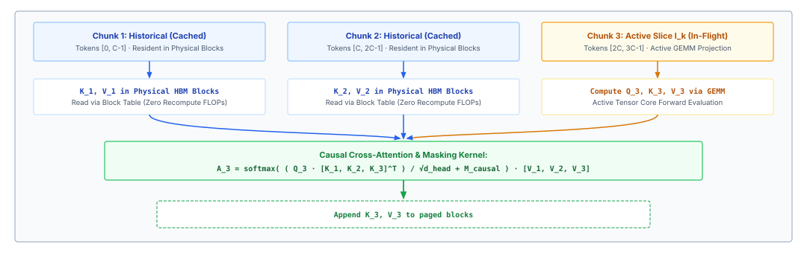
:::

In iteration $k$, the model generates query, key, and value projections for only the tokens inside the current chunk $I_k$:

$$\mathbf{Q}_k = \mathbf{X}_k \mathbf{W}_Q, \quad \mathbf{K}_k = \mathbf{X}_k \mathbf{W}_K, \quad \mathbf{V}_k = \mathbf{X}_k \mathbf{W}_V$$

where $\mathbf{X}_k \in \mathbb{R}^{|I_k| \times D}$ represents the activations of chunk $k$. Because autoregressive language models employ causal masking, the tokens in chunk $k$ must attend to all previous tokens in chunks $1$ through $k-1$, as well as to preceding tokens within chunk $k$ itself. The keys and values for chunks $1$ through $k-1$ were already calculated in preceding iterations and stored in non-contiguous physical pages within the paged KV cache.

The attention computation for chunk $k$ therefore constructs its key and value matrices by concatenating the historical cached projections with the newly computed projections:

$$\mathbf{K}_{\le k} = \left[ \mathbf{K}_{\text{cached}, 1:k-1} \,\|\, \mathbf{K}_k \right] \in \mathbb{R}^{\left(\sum_{j=1}^k |I_j|\right) \times D_{\text{kv}}}$$

$$\mathbf{V}_{\le k} = \left[ \mathbf{V}_{\text{cached}, 1:k-1} \,\|\, \mathbf{V}_k \right] \in \mathbb{R}^{\left(\sum_{j=1}^k |I_j|\right) \times D_{\text{kv}}}$$

The attention output for the active chunk is evaluated as:

$$\mathbf{O}_k = \text{Softmax}\left( \frac{\mathbf{Q}_k \mathbf{K}_{\le k}^\top}{\sqrt{d_{\text{head}}}} + \mathbf{M}_k \right) \mathbf{V}_{\le k}$$

The attention mask $\mathbf{M}_k$ enforces causality. For the historical tokens ($j < (k-1) C_{\text{chunk}}$), the mask allows full bidirectional attention, since all historical tokens precede every token in chunk $k$. For the active tokens within chunk $k$, the mask applies standard causal masking, preventing token $t \in I_k$ from attending to tokens $t' > t$.

In modern GPU kernel architectures (such as FlashDecoding and FlashAttention-3), this operation avoids materializing the intermediate attention matrix in global accelerator memory. The kernel streams the historical KV blocks from HBM directly into SRAM tiles, maintaining running online softmax statistics—the running row maximum $m_i$ and normalizer $l_i$—across blocks:

$$m_{\text{new}} = \max(m_{\text{prev}}, m_{\text{block}}), \quad l_{\text{new}} = l_{\text{prev}} e^{m_{\text{prev}} - m_{\text{new}}} + l_{\text{block}} e^{m_{\text{block}} - m_{\text{new}}}$$

The partial attention accumulator is rescaled on the fly via $\mathbf{O}_{\text{new}} = \mathbf{O}_{\text{prev}} e^{m_{\text{prev}} - m_{\text{new}}} + \mathbf{O}_{\text{block}} e^{m_{\text{block}} - m_{\text{new}}}$, completely eliminating memory-bandwidth traffic for intermediate attention logits.

Once $\mathbf{O}_k$ is computed, the engine writes $\mathbf{K}_k$ and $\mathbf{V}_k$ into newly allocated paged blocks in the global KV cache. Crucially, intermediate hidden activations for chunk $k$ are discarded at the end of the iteration, exactly as in a standard forward pass. The model does not emit an output token until chunk $K$ (the final chunk of the prompt) completes execution, at which point the logit distribution for position $S_{\text{prompt}} - 1$ is sampled to produce the first generated token.

Chunking trades a small amount of redundant computation for bounded iteration latency. The attention mechanism computes queries of length $C_{\text{chunk}}$ against keys that grow longer with each chunk ($C_{\text{chunk}}, 2C_{\text{chunk}}, \dots, K C_{\text{chunk}}$). However, because key and value projections for historical tokens are retrieved from memory rather than recomputed from weights, the overall number of parameter matrix multiplications remains unchanged.

### Token-budget scheduling

::: {.column-margin}
{width="100%" fig-alt="A strip of eight equal ordered cells spanned by a single bracket."}

*Chunking a 4k prefill into eight slices bounds P99 inter-token latency near 50 ms.*
:::
Chunked prefill enables an inference engine to construct hybrid batches containing both prefill chunks and single-token decode requests. In systems such as Sarathi-Serve and modern implementations of vLLM, this scheduling is governed by a strict token budget, denoted by $C_{\text{budget}}$.

In every scheduling cycle, the engine examines the queue of pending prefill chunks and the set of running decode sequences. The scheduler selects a combination of prefill chunks and decode tokens such that the total number of processed tokens in the iteration does not exceed $C_{\text{budget}}$:

$$\sum_{i \in \mathcal{P}_{\text{admitted}}} M_{\text{chunk}, i} + \sum_{j \in \mathcal{D}_{\text{admitted}}} 1 \le C_{\text{budget}}$$

where $\mathcal{P}_{\text{admitted}}$ is the set of admitted prefill chunks, $M_{\text{chunk}, i} \le C_{\text{chunk}}$ is the token count of prefill chunk $i$, and $\mathcal{D}_{\text{admitted}}$ is the set of admitted decode sequences. @Tbl-vol3-scheduling-policies compares the operational trade-offs across these scheduling regimes.

| Scheduling Policy         | Iteration Composition                                     | Hardware Bound                                          | Decode Latency Impact                             | TTFT Impact                               |
|:--------------------------|:----------------------------------------------------------|:--------------------------------------------------------|:--------------------------------------------------|:------------------------------------------|
| **Monolithic Prefill**    | $S_{\text{prompt}}$ tokens exclusively                    | Compute-bound ($\mathcal{I} \gg \mathcal{I}^*$)         | High ITL spikes ($500\text{--}1{,}500\text{ ms}$) | Minimal TTFT (single pass)                |
| **Unbatched Decode**      | $B_{\text{decode}}$ tokens exclusively                    | Memory-bound ($\mathcal{I} \ll \mathcal{I}^*$)          | Low ITL, but compute units sit idle               | N/A (no prefills admitted)                |
| **Chunked Co-Scheduling** | $C_{\text{chunk}}$ prefill $+$ $B_{\text{decode}}$ tokens | Roofline-balanced ($\mathcal{I} \approx \mathcal{I}^*$) | Predictable ITL ($30\text{--}60\text{ ms}$ tail)  | Marginal TTFT increase ($5\text{--}15\%$) |

: **Inference Scheduling Policies**: Operational comparison of monolithic prefill, unbatched decode, and chunked co-scheduling trade-offs. {#tbl-vol3-scheduling-policies}

The token-budget abstraction balances two critical Service Level Agreements (SLAs): Time to First Token (TTFT) and Inter-Token Latency (ITL).

Time to First Token represents the delay between the client submitting a request and receiving the first generated token:

$$\text{TTFT} = t_{\text{queue}} + \sum_{k=1}^K t_{\text{iter}}(k)$$

Under monolithic prefill, $K=1$, so the prompt executes in a single, highly optimized iteration. Under chunked prefill, $K > 1$. The prompt must wait across $K$ scheduling iterations before emitting a token. Furthermore, each iteration incurs overhead from kernel launches, block table lookups, and attention over previously stored KV pages. As a result, chunked prefill increases isolated TTFT by 5 to 15 percent.

Inter-Token Latency represents the time elapsed between emitting consecutive tokens $t$ and $t+1$ for an active sequence:

$$\text{ITL} = t_{\text{emit}}(t+1) - t_{\text{emit}}(t)$$

In monolithic serving, if a 4,096-token prefill is admitted while ten decode sequences are active, ITL for those ten sequences spikes from a baseline of $35\text{ ms}$ to over $800\text{ ms}$. This represents a $22\times$ latency degradation at the tail (P99). Under chunked prefill with $C_{\text{chunk}} = 512$, the prefill work is spread across eight balanced iterations. Each iteration runs in roughly $50\text{ ms}$. In every iteration, all active decode sequences advance by one token alongside the 512 prefill tokens. The P99 ITL remains tightly bounded near $50\text{ ms}$, entirely eliminating the latency spike.

The timing dynamics and scheduling contrast between monolithic execution and chunked co-scheduling are illustrated in @fig-vol3-chunked-timeline, where panel (a) shows the head-of-line decode stall and panel (b) the token-budget bounded iterations that remove it. In the monolithic timeline, admitting a single 4,096-token prefill monopolizes tensor cores for an unbroken 800 ms block, starving ten running decode streams and precipitating a severe P99 inter-token latency spike. Under chunked co-scheduling, the scheduler breaks the prefill into eight 512-token chunks and pairs each chunk with active decode tokens within a bounded token budget ($C_{\text{budget}}$). Each hybrid iteration completes in approximately 50 ms, allowing all running decode streams to advance by one token in every cycle while smoothing accelerator utilization and eliminating head-of-line stalls.

::: {#fig-vol3-chunked-timeline fig-env="figure" fig-pos="htb" fig-cap="**Scheduling Timeline: Monolithic Prefill vs. Chunked Co-Scheduling**: Eliminating head-of-line blocking and ITL tail spikes. Monolithic scheduling stalls running decode streams for 800 ms during prompt ingestion, causing a 22× tail-latency spike. Chunked co-scheduling paces prompt ingestion across eight 50 ms balanced iterations alongside active decodes, maintaining steady pacing throughout." fig-alt="Execution timelines comparing monolithic prefill stalling 10 decode sequences for 800 ms against chunked co-scheduling interleaving 512-token prompt slices with decode tokens across eight balanced 50 ms iterations."}
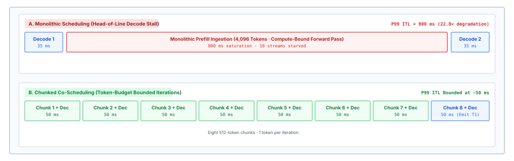
:::

::: {#nbk-05-quantitative-interference-and-chunk-budgeting .callout-notebook title="Quantitative interference and chunk budgeting"}
An inference engine runs on an accelerator delivering $T_{\text{peak}} = 800\text{ TFLOPS}$ ($8 \times 10^{14}\text{ FLOPs/s}$) dense 16-bit matrix compute and $B_{\text{mem}} = 3.0\text{ TB/s}$ ($3 \times 10^{12}\text{ Bytes/s}$) HBM bandwidth. The served model has $P = 70\text{ billion}$ parameters stored in 16-bit precision, occupying $2P = 140\text{ GB}$ of memory. The engine is actively servicing $B_{\text{decode}} = 32$ decode streams. An agent submits a new prompt with $S_{\text{prompt}} = 4{,}096$ tokens.

**Question 1: What is the execution latency and ITL spike under monolithic run-to-completion scheduling?**

A decode iteration with 32 sequences requires streaming the full $140\text{ GB}$ of model weights to execute $2 \cdot P \cdot B_{\text{decode}} = 2 \times (70 \times 10^9) \times 32 = 4.48 \times 10^{12}\text{ FLOPs} = 4.48\text{ TFLOPs}$.
The memory read time is:
$$t_{\text{mem, decode}} = \frac{140 \times 10^9\text{ Bytes}}{3.0 \times 10^{12}\text{ Bytes/s}} \approx 46.7\text{ ms}$$
The compute time on tensor cores running at an achieved 50 percent model FLOPs utilization (MFU, effective throughput $400\text{ TFLOPS}$) is:
$$t_{\text{comp, decode}} = \frac{4.48 \times 10^{12}\text{ FLOPs}}{400 \times 10^{12}\text{ FLOPs/s}} \approx 11.2\text{ ms}$$
Because $t_{\text{mem}} > t_{\text{comp}}$, the decode iteration is memory-bound and takes $\max(46.7, 11.2) = 46.7\text{ ms}$. Baseline ITL is $46.7\text{ ms}$.

When the $4{,}096$-token monolithic prefill executes, its computational load is:
$$\text{FLOPs}_{\text{prefill}} = 2 \cdot P \cdot S_{\text{prompt}} = 2 \times (70 \times 10^9) \times 4{,}096 = 5.7344 \times 10^{14}\text{ FLOPs} = 573.44\text{ TFLOPs}$$
Assuming $60\%$ achieved MFU for dense GEMM ($480\text{ TFLOPS}$ effective):
$$t_{\text{comp, prefill}} = \frac{573.44 \times 10^{12}\text{ FLOPs}}{480 \times 10^{12}\text{ FLOPs/s}} \approx 1{,}194.7\text{ ms} \approx 1.195\text{ seconds}$$
The 32 active decode streams stall for $1.195\text{ seconds}$. The ITL spikes from $46.7\text{ ms}$ to $1{,}195\text{ ms}$, a $25.6\times$ latency degradation.

**Question 2: What is the iteration latency when chunking the prefill with $C_{\text{chunk}} = 512$?**

The prompt is partitioned into $K = 4{,}096 / 512 = 8$ chunks. In each iteration, the scheduler co-schedules one 512-token prefill chunk with the 32 decode tokens, yielding $512 + 32 = 544$ tokens total.

The weight streaming time remains fixed at $t_{\text{mem}} = 46.7\text{ ms}$ (since all 544 tokens share the same model parameters).
The compute required for the 544 tokens is:
$$\text{FLOPs}_{\text{iter}} = 2 \times (70 \times 10^9) \times 544 = 7.616 \times 10^{13}\text{ FLOPs} = 76.16\text{ TFLOPs}$$
At $480\text{ TFLOPS}$ effective throughput:
$$t_{\text{comp, iter}} = \frac{76.16 \times 10^{12}\text{ FLOPs}}{480 \times 10^{12}\text{ FLOPs/s}} \approx 158.7\text{ ms}$$
Because compute time now dominates memory streaming ($158.7\text{ ms} > 46.7\text{ ms}$), the batch execution takes approximately $158.7\text{ ms}$.

Instead of a catastrophic 1,195 ms freeze followed by fast decode, all 32 active decode streams advance by one token every $158.7\text{ ms}$ for 8 consecutive cycles. The maximum ITL is cut from $1{,}195\text{ ms}$ down to $158.7\text{ ms}$, preserving predictable streaming performance while keeping accelerator compute cores saturated.
:::

Chunked prefill demonstrates that memory-bound and compute-bound workloads can be paired to optimize total accelerator resource utilization. By sizing the token chunk $C_{\text{chunk}}$ such that $t_{\text{comp}} \approx t_{\text{mem}}$, the scheduler reaches the balance point where the memory bus and the tensor cores complete their work at the same time, maximizing overall tokens generated per second across the cluster.

::: {#chk-05-paged-attention .callout-checkpoint title="Evaluating paged allocation and chunked prefill"}
Before analyzing memory offloading, retention, and swapping policies, verify your understanding of paged attention mechanics:

- [ ] **Virtual block mapping**: How does the PagedAttention block table translate non-contiguous physical pages into a contiguous logical sequence during self-attention?
- [ ] **Copy-on-write branching**: Why does reference-counted block sharing enable branching deliberation search with $O(1)$ memory allocation overhead?
- [ ] **Prefix caching**: How does Radix tree indexing eliminate redundant prompt prefill computation across multi-turn agent interactions?
- [ ] **Chunked prefill co-scheduling**: How does interleaving prompt prefill chunks with active decode batches prevent inter-token latency (ITL) spikes?
:::

## Retain, Evict, Recompute, or Offload {#sec-vol3-kvcache-swapping}

With paging in place, the pause deferred in @sec-vol3-kvcache-geometry can now be resolved. When an autoregressive decode loop emits a tool invocation token sequence—demanding a compilation run, a multi-second test suite execution inside an isolated container, or an interactive approval from a human operator—the model's forward inference stops instantaneously. While the agent waits for external execution results, the physical key-value cache blocks allocated to that trajectory remain pinned in high-bandwidth device memory (HBM). If the serving engine retains these physical blocks indefinitely across multi-second or multi-minute execution pauses, idle trajectories monopolize accelerator capacity, inducing artificial memory pressure that throttles active decodes and forces incoming requests into admission queues. Conversely, if the runtime prematurely evicts these blocks to liberate HBM, returning trajectories must undergo redundant prefill computation over tens of thousands of historical context tokens, wasting thousands of teraflops of compute and inflating the time-to-first-token upon resumption.

When an agentic trajectory pauses for tool execution or human deliberation, the serving system must arbitrate among four physical memory policies: resident retention, complete eviction with subsequent recomputation, host DRAM offloading via asynchronous PCIe streaming, and secondary storage tiering. The optimal decision boundary is defined by an analytical break-even wait time that balances the opportunity cost of reserved accelerator memory capacity against the transfer bandwidth of the interconnect and the computational latency of re-running the prefill phase.

### Memory reclamation policies

In conversational serving, request execution is continuous: an initial prefill phase processes the prompt, followed immediately by an unbroken autoregressive decode phase that emits tokens until reaching a stop delimiter or sequence limit. Agentic workloads shatter this assumption. An agent trajectory is a punctuated sequence of short token generations separated by heavy-tailed external execution intervals. A code-editing agent may generate a fifty-token shell command in two hundred milliseconds, then idle for forty-five seconds while a build system compiles dependencies and runs unit tests. A research agent may emit a search query and pause while a browser worker downloads, parses, and scrapes several web documents.

In a multi-tenant serving cluster where accelerator HBM is the gating bottleneck determining maximum concurrent batch size $B$, pinning $M_{\text{KV}}$ gigabytes of inactive attention state for an idle duration $T_{\text{wait}}$ imposes the tool-wait memory tax that @sec-vol3-intro-memory-stranding priced for one session, written here as a memory-time product:

$$\mathcal{C}_{\text{hold}} = M_{\text{KV}} \cdot T_{\text{wait}}$$

This product of gigabytes and seconds represents capacity withheld from the active scheduling pool. If an inference instance reserves $6\text{ GB}$ of physical KV cache for an agent stalled on a sixty-second test suite, it consumes $360\text{ GB}\cdot\text{s}$ of HBM residency without performing a single floating-point operation. Under sustained arrival rates, accumulated memory-time taxes saturate physical block allocators, forcing the runtime scheduler to preempt active decode streams or reject incoming agent steps.

::: {.column-margin}
The tool-wait memory tax $\mathcal{C}_{\text{hold}} = M_{\text{KV}} \cdot T_{\text{wait}}$ exposes the fundamental asymmetry of agent serving: memory capacity is consumed continuously across physical time, whereas accelerator compute units are utilized only during active forward passes.
:::

To navigate this constraint, the inference supervisor can deploy four distinct memory management policies, contrasted across hardware tiers in @tbl-vol3-reclamation-policies:

1. **Resident Retention:** The serving runtime keeps all physical KV blocks resident in accelerator HBM throughout the tool execution window. This policy optimizes purely for resumption latency: when the external environment returns its execution output, the engine appends the new observation tokens to the existing block table and resumes prefill with zero restoration delay ($T_{\text{resume}} = 0$). However, its opportunity cost scales linearly with $T_{\text{wait}}$, rendering it disastrous under memory pressure or long wait times.
2. **Eviction and Recomputation:** The serving runtime deallocates the trajectory's physical KV blocks immediately upon dispatching the tool call, returning the pages to the allocator's free pool. When the tool returns with an observation, the runtime reconstructs the full prompt history—concatenating the prior system prompt, historical dialogue, tool call tokens, and the newly received observation—and re-executes the prefill forward pass from scratch. This policy incurs zero HBM holding tax ($\mathcal{C}_{\text{hold}} = 0$), but converts the physical memory dilemma into a quadratic computational tax, consuming precious tensor cores and inflating the resume latency by the full duration of a long prefill pass ($T_{\text{resume}} = T_{\text{prefill}}$).
3. **Host DRAM Offloading (PCIe Swapping):** The serving engine initiates an asynchronous Direct Memory Access (DMA) transfer over the peripheral interconnect (such as PCIe Gen5 or NVLink-C2C), streaming the trajectory's physical KV blocks out of HBM into page-locked (pinned) host system memory. Once transfer completes, the GPU physical blocks are reclaimed. When the tool signals completion, the runtime allocates fresh GPU physical blocks and streams the saved attention state back into HBM. This policy decouples accelerator memory consumption from idle wait times while bypassing the heavy FLOP expenditure of recomputation, bounded instead by the transfer bandwidth $B_{\text{xfer}}$ of the host bus.
4. **Tiered Secondary Storage (NVMe and Remote Memory):** For operations involving human-in-the-loop approvals, asynchronous safety reviews, or scheduled batch jobs where $T_{\text{wait}}$ spans minutes, hours, or days, host system DRAM is also too scarce to serve as an indefinite parking lot. The runtime migrates serialized KV blocks from host DRAM to local solid-state drives (NVMe over PCIe) or disaggregated network memory pools (such as remote storage clusters via RDMA). Resumption latency increases to hundreds of milliseconds or seconds, but the active memory footprints in both accelerator HBM and host DRAM drop to zero.

| Policy                   | Physical Storage Tier | Effective Bandwidth ($B_{\text{xfer}}$) | Resume Latency ($T_{\text{resume}}$) | Accelerator Compute Tax | Failure Regime                   |
|:-------------------------|:----------------------|:----------------------------------------|:-------------------------------------|:------------------------|:---------------------------------|
| **Resident Retention**   | Accelerator HBM       | $\sim 3.0\text{--}4.8\text{ TB/s}$      | $0\text{ ms}$                        | $0\text{ FLOPs}$        | HBM exhaustion; batch starvation |
| **Eviction & Recompute** | Discarded (None)      | N/A                                     | $T_{\text{prefill}}(S)$              | $2 P S\text{ FLOPs}$    | Compute saturation; high TTFT    |
| **Host DRAM Offload**    | Host System Memory    | $32\text{--}64\text{ GB/s}$ (PCIe)      | $M_{\text{KV}} / B_{\text{pcie}}$    | $0\text{ FLOPs}$        | Interconnect bus contention      |
| **Tiered Storage**       | Local NVMe / RDMA     | $7\text{--}14\text{ GB/s}$ (NVMe)       | $M_{\text{KV}} / B_{\text{nvme}}$    | $0\text{ FLOPs}$        | I/O queue stalls; disk wear      |

: **KV Cache Reclamation Policies**: Architectural comparison of the four KV cache reclamation policies across storage tiers, latency overheads, and failure modes. {#tbl-vol3-reclamation-policies}

### Analytical mechanics: The break-even decision frontier

::: {.column-margin}
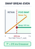{width="100%" fig-alt="Break-even curve showing PCIe host swapping beating full prompt recomputation whenever external tool execution pauses exceed 215 milliseconds."}

*For tool pauses exceeding 215 ms, PCIe offload frees HBM while beating prefill recompute by 53.6×.*
:::
Selecting statically among these four policies creates severe operational pathological behavior. An engine that always retains KV state will crash under out-of-memory (OOM) faults when an agent encounters a long build step. Conversely, an engine that always recomputes will waste over half its operational energy re-evaluating static system prompts and file buffers. The serving runtime must evaluate an analytical decision boundary driven by sequence length $S$, expected wait time $T_{\text{wait}}$, accelerator compute throughput, and interconnect transfer bandwidth.

Consider an autoregressive transformer model with $P$ parameters, $L$ layers, $H_{\text{kv}}$ key-value heads, and head dimension $d_{\text{head}}$, operating with element byte size $b_{\text{elem}}$ (where $b_{\text{elem}} = 2$ for 16-bit half precision and $b_{\text{elem}} = 1$ for 8-bit quantization). The memory footprint consumed by each token's key-value projection is:

$$m_{\text{token}} = 2 \cdot L \cdot H_{\text{kv}} \cdot d_{\text{head}} \cdot b_{\text{elem}}$$

For a trajectory paused at sequence length $S$, the total memory footprint of its physical attention state is $M_{\text{KV}} = S \cdot m_{\text{token}}$.

Now evaluate the time required to reconstruct this state via recomputation versus streaming it over an interconnect. When evicting and recomputing, the accelerator must evaluate a prefill forward pass over $S$ tokens. In modern decoder-only architectures, the computational cost of the prefill phase is dominated by matrix multiplications across linear projections and feed-forward networks, requiring approximately $2 P$ floating-point operations per token, plus the quadratic attention cost $4 L S^2 d_{\text{model}}$. For typical context lengths up to thirty-two thousand tokens, the linear parameter term dominates. Given an accelerator cluster executing prefill with an effective sustained compute throughput $R_{\text{prefill}}$ (in FLOPs per second, accounting for model FLOPs utilization or MFU), the recomputation latency is:

$$T_{\text{recomp}}(S) \approx \frac{2 P \cdot S}{R_{\text{prefill}}}$$

In contrast, offloading the physical KV state across a host interconnect (such as PCIe Gen5 x16) with effective sustained unidirectional transfer bandwidth $B_{\text{pcie}}$ requires a reload time of:

$$T_{\text{reload}}(S) = \frac{M_{\text{KV}}}{B_{\text{pcie}}} = \frac{S \cdot m_{\text{token}}}{B_{\text{pcie}}}$$

Because attention state can always be rebuilt from its tokens (principle \ref{pri-vol3-prefix-coherence}), eviction is a cost decision, and comparing $T_{\text{recomp}}(S)$ with $T_{\text{reload}}(S)$ settles it. Both quantities scale linearly with sequence length $S$. Consequently, the ratio of reload latency to recomputation latency is independent of sequence length:

$$\frac{T_{\text{reload}}}{T_{\text{recomp}}} = \frac{S \cdot m_{\text{token}} / B_{\text{pcie}}}{2 P \cdot S / R_{\text{prefill}}} = \frac{m_{\text{token}} \cdot R_{\text{prefill}}}{2 P \cdot B_{\text{pcie}}}$$

If this ratio is less than one, streaming the attention state across the peripheral bus is strictly faster than recomputing it on the tensor cores.

The quantitative dynamics of this trade-off are delineated in @fig-vol3-swapping-tradeoff. The left panel plots execution latency as a function of external tool pause duration for a 70B model at $S = 16{,}384$ tokens ($5.0\text{ GiB}$ of KV state). While full prompt recomputation incurs an immutable $5.735\text{ s}$ penalty on tensor cores, bidirectional PCIe Gen5 x16 transfers stream the state in and out in $T_{\text{round-trip}} = 215\text{ ms}$. This establishes the break-even crossover at $T^* = 215\text{ ms}$. The right panel maps the resulting two-dimensional decision regimes across sequence length and wait duration: tool pauses shorter than $215\text{ ms}$ belong to the resident HBM retention regime to avoid DMA pipeline bubbles, pauses between $215\text{ ms}$ and tens of seconds fall into the PCIe host DRAM swapping regime (achieving up to a $53.6\times$ latency advantage over recomputation), and extended multi-minute pauses transition into secondary storage offloading.

The magnitude of this advantage depends decisively on the physical interconnect architecture:

- **PCIe Gen5 x16 Interconnect:** Standard discrete accelerator nodes provide $B_{\text{pcie}} \approx 64\text{ GB/s}$ theoretical ($52\text{--}54\text{ GB/s}$ sustained effective DMA throughput after protocol framing).
- **Coherent Chip-to-Chip Interconnects (NVLink-C2C):** Modern tightly coupled heterogeneous platforms (such as NVIDIA GH200 Grace Hopper and GB200 Grace Blackwell) replace peripheral PCIe slots with coherent chip-to-chip links delivering $B_{\text{c2c}} \approx 900\text{ GB/s}$—over $16\times$ higher sustained bandwidth. Under NVLink-C2C, streaming physical KV blocks between CPU DRAM and GPU HBM completes in milliseconds, collapsing the minimum viable offloading threshold $T_{\text{wait}}^*$ from hundreds of milliseconds down to the sub-20-millisecond realm.

::: {.column-margin}
The crossover between swapping and recomputing depends on the balance between arithmetic density and interconnect bandwidth. When $\frac{m_{\text{token}}}{2P} < \frac{B_{\text{pcie}}}{R_{\text{prefill}}}$, transferring attention projections over PCIe is faster than generating them via matrix multiplication. On NVLink-C2C, this threshold drops by 16×.
:::

::: {#fig-vol3-swapping-tradeoff fig-env="figure" fig-pos="htb" fig-cap="**Break-Even Latency Frontier and Operational Decision Regimes for KV Swapping**: Quantitative latency comparison of resident retention, PCIe Gen5 DMA offloading, and tensor-core recomputation across tool pause durations (left), and the resulting two-dimensional decision regimes across sequence length and wait duration (right)." fig-alt="Two-panel chart showing break-even latency curves where PCIe swapping outperforms prompt recomputation beyond a 215 ms crossover threshold on the left, and a 2D map delineating resident retention, host DRAM swapping, and secondary storage offloading regimes on the right."}
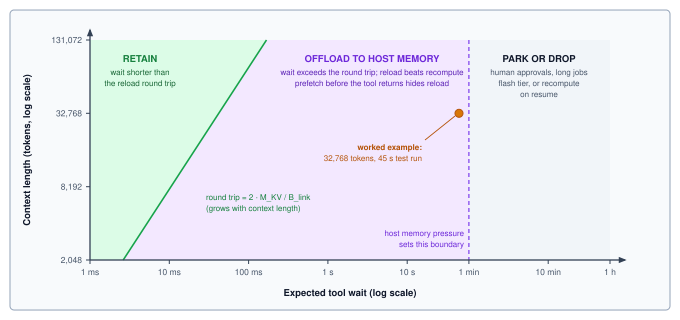
:::

To incorporate the idle duration $T_{\text{wait}}$, the runtime must compare the cost of holding memory against the cost of swapping. Let $\mu_{\text{HBM}}$ represent the shadow price (opportunity cost per byte-second) of GPU memory under capacity pressure, and let $\mu_{\text{DRAM}}$ represent the shadow price of host memory ($\mu_{\text{DRAM}} \ll \mu_{\text{HBM}}$). Offloading a trajectory requires an egress transfer time $T_{\text{egress}} = M_{\text{KV}} / B_{\text{pcie}}$ and an ingress reload time $T_{\text{ingress}} = M_{\text{KV}} / B_{\text{pcie}}$. The physical state can only be freed during the interval $(T_{\text{wait}} - T_{\text{ingress}})$. Therefore, offloading is physically feasible only if the wait time strictly exceeds the round-trip transfer latency:

$$T_{\text{wait}} > \frac{2 \cdot M_{\text{KV}}}{B_{\text{pcie}}}$$

If $T_{\text{wait}} \le \frac{2 M_{\text{KV}}}{B_{\text{pcie}}}$, the engine cannot complete the round-trip transfer before the tool returns; attempting to offload in this window introduces an artificial pipeline stall where the model is idle purely waiting for its own state to reload. For wait times exceeding this minimum physical threshold, resident retention incurs holding cost $\mu_{\text{HBM}} \cdot M_{\text{KV}} \cdot T_{\text{wait}}$, while swapping incurs transfer overhead plus host residency cost $\mu_{\text{DRAM}} \cdot M_{\text{KV}} \cdot T_{\text{wait}}$. Equating these costs reveals the break-even wait time $T_{\text{wait}}^*$:

$$T_{\text{wait}}^* \approx \frac{2 \cdot M_{\text{KV}}}{B_{\text{pcie}}} \cdot \left( \frac{\mu_{\text{HBM}}}{\mu_{\text{HBM}} - \mu_{\text{DRAM}}} \right) + \Delta T_{\text{stall}}$$

where $\Delta T_{\text{stall}}$ represents the latency penalty the scheduler is willing to tolerate on the resumed step. When memory capacity is constrained ($\mu_{\text{HBM}} \gg \mu_{\text{DRAM}}$), $T_{\text{wait}}^*$ approaches the round-trip transfer time.

::: {#psp-05-the-tyranny-of-the-idle-agent .callout-perspective title="The tyranny of the idle agent and the KV residency tax"}
In traditional request-response inference serving, GPU memory residency is brief and deterministic: requests stream in, decode tokens sequentially, and release their allocations immediately upon emitting a terminal delimiter. Agentic loops break this operational model entirely by introducing prolonged, asynchronous I/O pauses. When an agent invokes a mutating tool—such as launching a test container, executing a multi-file compilation, or waiting for human confirmation—forward token generation halts for seconds or minutes.

During these pauses, retaining gigabytes of Key-Value state in High-Bandwidth Memory imposes an exorbitant idle residency tax. An $80\text{ GB}$ H100 GPU hosting sixteen concurrent paused agents can find its entire memory capacity locked by dormant trajectories that emit zero tokens, starving active decodes and triggering head-of-line blocking. Yet simply evicting these blocks forces an equally punitive recomputation tax: re-evaluating thousands of prefix tokens on resumption wastes precious tensor core cycles and spikes Time to First Token.

**Systems insight**: High-Bandwidth Memory is an ephemeral execution stage, not an archival storage medium. Dependable agent runtimes conquer the residency tax by decoupling execution from retention. Accelerator memory holds the attention state of trajectories that are generating, and the runtime pages a trajectory's state to host DRAM or NVMe by asynchronous DMA once its expected wait exceeds the break-even time.
:::

```{python}
#| echo: false
#| label: kv-tool-wait-break-even-calc
# ┌─────────────────────────────────────────────────────────────────────────────
# │ TOOL-WAIT BREAK-EVEN: RELOAD VS. RECOMPUTE
# ├─────────────────────────────────────────────────────────────────────────────
# │ Context: notebook nbk-05-sizing-the-break-even-frontier-for;
# │          @fig-vol3-swapping-tradeoff worked-example marker; the resident-state
# │          pitfall in @sec-vol3-kv-cache-fallacies; AgentCapacity (tool wait).
# │
# │ Goal: Compare reloading a 32,768-token trajectory's state over the host
# │       links with recomputing it, and price holding it through a 45 s wait.
# │ Show: 10.7 GB; 21 ms reload, 42 ms round trip; 1.3 s recompute; ~62x;
# │       ~15x at a quarter of link bandwidth; 483 GB-s held.
# │ How: Per-accelerator host-link bandwidth and peak FLOP/s from the H100 registry
# │      entry, eight links in parallel (TP=8 shards the KV state); 45 percent
# │      sustained prefill utilization and the 45 s wait are scenario inputs.
# └─────────────────────────────────────────────────────────────────────────────
from mlsysim.fmt import check, fmt, fmt_int, fmt_memory, fmt_time, fmt_bandwidth, fmt_percent, MarkdownStr

class ToolWaitBreakEven:
    # ┌── 1. LOAD (Constants) ──────────────────────
    ctx_tokens = KvGeometry.ctx_agent
    tool_wait = 45 * second  # scenario: integration test run
    mfu = Literature.Training.MfuHigh * 0.9  # scenario: sustained prefill utilization (45 percent)
    _node = Systems.Nodes.DGX_H100
    _acc = _node.accelerator
    n_acc = _node.accelerators_per_node
    link_per_acc = _acc.interconnect.bandwidth
    peak_per_acc = _acc.compute.peak_flops
    n_params = Models.Language.Llama3_70B.parameters.to("count").magnitude
    m_kv = KvGeometry.kv_agent

    # ┌── 2. EXECUTE (The Compute) ─────────────────
    link = n_acc * link_per_acc
    prefill_rate = n_acc * peak_per_acc * mfu
    t_reload = (m_kv / link).to(ms)
    t_round = 2 * t_reload
    recompute_flops = 2 * n_params * ctx_tokens * flop
    t_recompute = (recompute_flops / prefill_rate).to(second)
    ratio = (t_recompute / t_reload).to("").magnitude
    ratio_quarter = ratio / 4
    held = (m_kv * tool_wait).to(GB * second)
    wait_fraction = (t_round / tool_wait).to("").magnitude

    # ┌── 3. GUARD (Invariants) ────────────────────
    check(20 < t_reload.magnitude < 22, f"Expected ~21 ms reload, got {t_reload}")
    check(1.2 < t_recompute.magnitude < 1.4, f"Expected ~1.3 s recompute, got {t_recompute}")
    check(55 < ratio < 70, f"Expected ~62x reload advantage, got {ratio}")
    check(ratio_quarter > 10, "Prose claims reload still wins by over 10x at quarter bandwidth")
    check(wait_fraction < 0.001, "Prose claims the round trip is under 0.1 percent of the wait")

    # ┌── 4. OUTPUT (Formatting) ───────────────────
    tool_wait_str = fmt_time(tool_wait, second, precision=0)
    ctx_tokens_str = fmt_int(ctx_tokens)
    n_params_b_str = fmt(n_params / 1e9, precision=1)
    mfu_pct_str = fmt_percent(mfu, precision=0, style="prose")
    link_per_acc_str = fmt_bandwidth(link_per_acc, unit=GB / second, precision=0)
    link_str = fmt_bandwidth(link, unit=GB / second, precision=0)
    prefill_rate_str = fmt_int(prefill_rate.to(TFLOPs / second).magnitude)
    m_kv_str = fmt_memory(m_kv, unit=GB, precision=1)
    t_reload_str = MarkdownStr(f"{fmt_int(t_reload.magnitude)} ms")
    t_round_str = MarkdownStr(f"{fmt_int(t_round.magnitude)} ms")
    recompute_pflop_str = fmt(recompute_flops.to(flop).magnitude / 1e15, precision=2)
    t_recompute_str = fmt_time(t_recompute, second, precision=1)
    ratio_mult_str = MarkdownStr(f"{fmt_int(ratio)}×")
    ratio_quarter_mult_str = MarkdownStr(f"{fmt_int(ratio_quarter)}×")
    held_str = fmt_int(held.magnitude)
```

::: {#nbk-05-sizing-the-break-even-frontier-for .callout-notebook title="Pricing a forty-five-second tool wait"}

**Problem**: The coding agent pauses at `{python} ToolWaitBreakEven.ctx_tokens_str` tokens for a `{python} ToolWaitBreakEven.tool_wait_str` test run on the eight-accelerator node from @sec-vol3-kvcache-geometry. Should the engine keep its attention state, offload it to host memory, or drop it and recompute?

**Variables**:

* State to hold: $M_{\text{KV}} =$ `{python} ToolWaitBreakEven.m_kv_str` (from the sizing estimate).
* Host links: each accelerator holds one-eighth of the state and has its own `{python} ToolWaitBreakEven.link_per_acc_str` link, so the node moves state at up to $B_{\text{link}} =$ `{python} ToolWaitBreakEven.link_str`.
* Prefill: `{python} ToolWaitBreakEven.mfu_pct_str` of the node's peak rate, $R_{\text{prefill}} \approx$ `{python} ToolWaitBreakEven.prefill_rate_str` TFLOP/s (an assumed sustained utilization).

**Math**:

Reload: `{python} ToolWaitBreakEven.m_kv_str` / `{python} ToolWaitBreakEven.link_str` $\approx$ `{python} ToolWaitBreakEven.t_reload_str`, so the round trip out and back is `{python} ToolWaitBreakEven.t_round_str`.

Recompute: $2 N S =$ 2 $\times$ `{python} ToolWaitBreakEven.n_params_b_str` billion $\times$ `{python} ToolWaitBreakEven.ctx_tokens_str` $\approx$ `{python} ToolWaitBreakEven.recompute_pflop_str` $\times 10^{15}$ operations, which take `{python} ToolWaitBreakEven.t_recompute_str` at the sustained rate.

Holding the state resident for the whole wait withholds `{python} ToolWaitBreakEven.m_kv_str` $\times$ `{python} ToolWaitBreakEven.tool_wait_str` $\approx$ `{python} ToolWaitBreakEven.held_str` GB·s of accelerator memory.

**Result**: Reloading is about `{python} ToolWaitBreakEven.ratio_mult_str` faster than recomputing, and the `{python} ToolWaitBreakEven.t_round_str` round trip is well under a tenth of a percent of the wait. Even if the links sustain only a quarter of their rated bandwidth, reload still wins by about `{python} ToolWaitBreakEven.ratio_quarter_mult_str`.

**Systems insight**: For any tool that runs longer than a few tens of milliseconds, offloading frees the accelerator memory for nearly the entire wait at almost no resume cost. Retention is right only for tools faster than the round trip, and recomputation is right only when host memory, not accelerator memory, is the scarce tier.

:::

### Asynchronous paged swapping

Implementing physical block swapping in an inference runtime requires deep integration with the paged memory manager. The virtual memory abstraction established in PagedAttention maps invariant logical sequence blocks to non-contiguous physical page allocations. To support multi-tier swapping, the page table must be extended into a dual-residency structure.

The physical architecture and asynchronous prefetching mechanics of this tiered hierarchy are illustrated in @fig-vol3-hierarchical-paging. The serving system stratifies physical memory into three tiers: Tier 1 (accelerator HBM, providing 3.0 TB/s bandwidth for active token generation), Tier 2 (pinned host DRAM, connected via 54 GB/s PCIe Gen5 DMA for second-scale tool pauses), and Tier 3 (enterprise NVMe storage arrays, providing terabytes of persistence for extended human interactions). The memory manager tracks frames across these tiers using an extended block table equipped with residency tags (`TIER_HBM`, `TIER_HOST`, `TIER_NVME`). As detailed in the bottom execution timeline, resumption stalls are masked via pipelined prefetching: while the accelerator tensor cores prefill the first chunk of an incoming tool observation, the independent DMA copy engine concurrently streams historical blocks from host DRAM back into HBM, completely hiding reload latency behind active arithmetic execution.

::: {#fig-vol3-hierarchical-paging fig-env="figure" fig-pos="htb" fig-cap="**Hierarchical KV Swapping Topology Across Physical Memory Tiers**: Multi-tier virtual memory architecture spanning accelerator HBM, pinned host DRAM, and local NVMe storage. The extended block table tracks cross-tier residency, enabling asynchronous DMA copy engines to overlap historical block reloads behind active observation prefill computation." fig-alt="System schematic detailing three storage tiers (accelerator HBM, host DRAM, NVMe SSD), an extended block table with tier residency tags, and an execution timeline illustrating asynchronous DMA prefetch overlapped with active observation chunk prefill."}
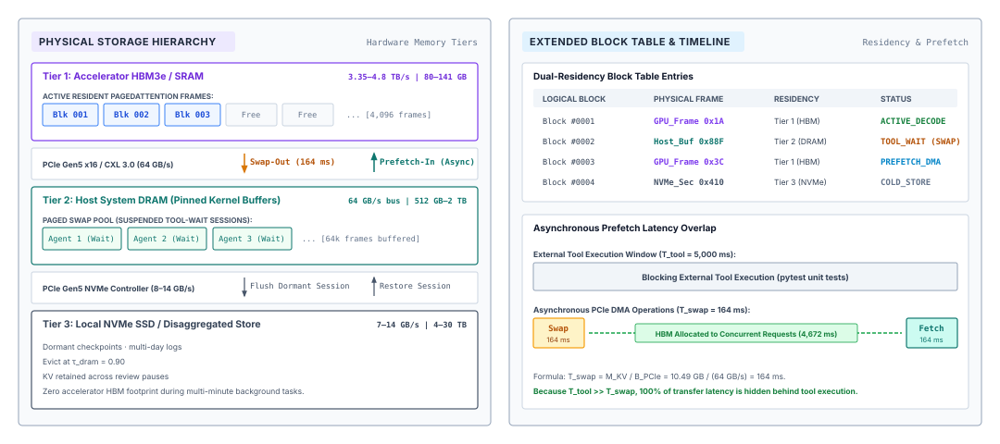
:::

When an agent trajectory transitions from active generation to an external tool wait, the serving supervisor initiates block migration:

1. **Eviction Scheduling and Pinning:** The scheduler selects candidate trajectories whose predicted wait times satisfy $T_{\text{wait}} > T_{\text{wait}}^*$. The engine allocates a contiguous set of physical block frames within a pre-allocated, page-locked (pinned) host DRAM buffer pool. Pinning host memory via POSIX `mlock` or CUDA host registration (`cudaHostAlloc`) is mandatory; standard operating system pageable memory would induce host OS page faults during direct memory access, collapsing PCIe transfer bandwidth.
2. **Asynchronous DMA Dispatch:** The runtime issues non-blocking copy calls (`cudaMemcpyAsync`) targeting a dedicated bidirectional CUDA copy stream. Because modern accelerator architectures provide independent copy engines that run concurrently with the primary tensor computation engines, this transfer proceeds in the background without stealing cycles from active decode batches running on adjacent streams.
3. **Block Table Remapping:** Once the DMA transfer completes, an asynchronous host callback updates the trajectory's block table entries, switching their location tag from `TIER_GPU` to `TIER_HOST` and recording the host frame indices. The vacated GPU physical frame numbers are pushed immediately to the allocator's free-block FIFO queue, making them available for immediate reservation by concurrent requests.

```python
# Empirical Block Table Migration Interface
def swap_out_trajectory(seq_id: int, block_table: BlockTable,
                        gpu_alloc: PageAllocator, host_alloc: PageAllocator,
                        copy_stream: Stream) -> None:
    gpu_frames = block_table.get_physical_frames(seq_id, Tier.GPU)
    host_frames = host_alloc.allocate_blocks(count=len(gpu_frames))

    # Asynchronously stream blocks over PCIe copy stream
    copy_stream.issue_dma(src=gpu_frames, dst=host_frames,
                          bytes_per_block=BLOCK_BYTE_SIZE)

    # Remap logical pointers and release device HBM frames
    copy_stream.record_callback(
        lambda: (block_table.remap(seq_id, Tier.HOST, host_frames),
                 gpu_alloc.free_blocks(gpu_frames))
    )
```

The primary engineering challenge on the return path is hiding reload latency. If the engine waits until the tool returns its final payload before issuing the swap-in request, the model experiences a pipeline bubble equal to $M_{\text{KV}} / B_{\text{pcie}}$. Modern agent runtimes employ two systems techniques to eliminate this stall:

*Early Speculative Prefetching:* Tool execution is rarely a black box of completely unknown duration. Profiling continuous integration runs, web API round-trips, or terminal executions yields predictable lower-bound latencies. If a tool call has an empirical median runtime of three seconds with a minimum of two seconds, a timer scheduled at $t = 1.8\text{ seconds}$ can initiate the asynchronous reload of the trajectory's KV blocks back into GPU HBM before the external process signals completion. If the tool finishes at three seconds, its historical attention state is already resident in accelerator memory, reducing perceived resumption latency to zero.

*Pipelined Chunked Reload and Observation Prefill:* When a tool execution concludes, it returns an observation string (such as the standard output of a bash command) of length $S_{\text{obs}}$. The engine must prefill these $S_{\text{obs}}$ tokens to continue the trajectory. Under chunked prefill scheduling, the engine breaks the incoming observation into discrete chunks (e.g., five hundred twelve tokens). While chunk 0 executes its forward projection GEMM on the tensor cores, the copy engine concurrently streams the historical KV blocks for chunks 1 through $N$ across the PCIe bus. By interleaving DMA transfers with matrix computations, the transfer latency is completely overlapped behind the observation's own mandatory prefill phase.

### Tiered secondary storage

While host system DRAM provides an efficient staging ground for tool executions spanning several seconds, it fails to solve the scaling limits of human-in-the-loop agent interactions. In modern deployment environments, an autonomous agent frequently pauses to request destructive action confirmation, pull request reviews, or clarifying feedback from a human user. Human response times follow log-normal distributions spanning minutes to hours. Maintaining gigabytes of attention state in host DRAM across thousands of suspended agent sessions exhausts system memory, starving host operating system buffers and limiting cluster density.

To scale across wide idle windows, the runtime tiering protocol extends downward to non-volatile secondary storage (local NVMe SSD arrays) and disaggregated remote memory nodes (Tier 3 in @fig-vol3-hierarchical-paging).

When an agent enters an interactive human-wait state, the host supervisor migrates its attention blocks from pinned host DRAM to an asynchronous disk engine using Direct I/O (`O_DIRECT` or Linux `io_uring`) or GPUDirect Storage (GDS). By bypassing OS page caches, the engine streams serialized tensor blocks directly between NVMe storage controllers and memory buffers at near-line rate ($7\text{--}14\text{ GB/s}$ per drive).

For a $5\text{ GB}$ attention state, reading the serialized cache from an enterprise NVMe array requires approximately four hundred to seven hundred milliseconds. In the context of a human supervisor who required three minutes to read a terminal diff and approve a deployment, a five-hundred-millisecond cold-start reload is completely imperceptible. Secondary storage tiering thus achieves an order of magnitude reduction in serving costs: active trajectories occupy scarce HBM; short tool pauses reside in host DRAM; and dormant, human-gated trajectories are persisted safely to inexpensive flash media, preserving zero-loss prefix reuse without consuming cluster volatile memory.

---

The ability to dynamically retain, evict, recompute, or offload attention state ensures that an inference engine does not collapse under the erratic idle rhythms of external tool calls. Yet, knowing *how* to swap an individual trajectory does not answer the macro-architectural question faced by an infrastructure operator: how much aggregate physical memory must be provisioned across a cluster to sustain a target arrival rate of concurrent, branching agents without descending into thrashing? Addressing this requires modeling the capacity bounds of the attention cache under collective multi-turn workloads.

## Capacity for Agent Workloads {#sec-vol3-kvcache-capacity-planning}

Provisioning high-bandwidth memory for an autonomous agent deployment based on standard conversational traffic models leads directly to catastrophic operational failure: out-of-memory thrashing, emergency page evictions, and multi-second tail-latency spikes. In conventional conversational serving, incoming requests exhibit short prompts, generate modest response lengths of a few hundred tokens, and terminate permanently upon completion. Infrastructure engineers sizing clusters for such chat workloads can safely assume stationary sequence distributions, reserving a modest, fixed allowance of physical key-value memory per active stream. Autonomous agent trajectories violate every statistical assumption underlying that conversational model. An agent executing a multi-turn software engineering, verification, or research workflow accumulates context monotonically across tens or hundreds of reasoning steps, repeatedly ingesting massive tool outputs, compiler diagnostics, and file snapshots until the prompt length routinely exceeds tens of thousands of tokens ($M \gg 10^4$). Furthermore, agent trajectories exhibit prolonged, highly irregular idle intervals as the host supervisor executes sandboxed compilers or waits on network RPCs, interspersed with speculative branches that fork multiple search paths from a single ancestral state.

**Serving capacity in an agentic infrastructure cannot be dimensioned as a scalar multiple of active request concurrency; it must be engineered as a dynamic physical envelope determined by cumulative multi-turn token accumulation, prefix reuse topology, and tail-latency percentiles under high memory pressure.** When aggregate token demand across concurrent trajectories exceeds physical High-Bandwidth Memory ($C_{\text{HBM}}$), the underlying paged memory manager has no choice but to stall active decodes, migrate page blocks across the PCIe bus to host memory, or discard noncontiguous blocks entirely. The resulting latency penalty falls not on the model's average throughput, but on the tail percentiles of time-to-first-token (TTFT) and inter-token latency (ITL). Sizing an inference cluster for agentic workloads therefore requires translating the structural geometry of the neural architecture and the stochastic behavior of multi-turn trajectories into rigorous capacity boundaries.

### Workload dynamics: The multi-turn agent divergence {#sec-vol3-kv-workload-dynamics}

The physical memory footprint of an inference engine is driven by the divergence between conversational requests and agentic execution graphs. In a standard dialog system, the distribution of sequence lengths is unimodal and tightly bounded, allowing a service operator to provision a predictable ratio of active compute batch slots to high-bandwidth memory blocks. Each request frees its blocks when it emits its end-of-sequence token, the request boundary of @sec-vol3-intro-passive-boundary-ceiling, so memory reclamation is frequent, deterministic, and tightly coupled to token emission.

::: {.column-margin}
Grouped-Query Attention (GQA) reduces physical cache pressure by assigning multiple query heads to share a single key-value head pair ($H_{\text{kv}} \ll H_q$). For a model with an $8:1$ query-to-KV head ratio, the physical footprint per token shrinks by an order of magnitude, enabling proportional expansions in concurrency for identical physical HBM pools.
:::

Agentic workloads shatter this operational regularity across three physical dimensions: context accumulation rate, execution temporality, and graph topology. First, the accumulation of context within an agent session is monotonic and punctuated by large step-function injections. Rather than exchanging brief natural language sentences, the host runtime passes the language model extensive environmental feedback at each turn. A single invocation of a workspace search tool or test-suite runner can inject twenty thousand tokens of raw terminal output directly into the prompt buffer. Across a ten-turn trajectory, the prompt context $M$ does not merely grow linearly; it compounds as the agent preserves its conversational history, tool execution manifests, and intermediate scratchpad observations. Sizing memory based on the initial turn guarantees starvation or thrashing in subsequent turns.

Second, the temporal lifecycle of an agent request is fundamentally asynchronous and bimodal. Unlike a human user who reads and responds over dozens of seconds, an agent runtime interleaves bursts of high-intensity autoregressive decoding with prolonged pauses where the model is entirely idle. While the host environment compiles code, launches sandboxed containers, or awaits slow external API responses, the trajectory's accumulated key-value state remains anchored in accelerator memory. If the serving runtime retains these physical pages in HBM to ensure near-zero resumption latency on the subsequent turn, those allocated blocks sit completely unproductive, starving active decodes in competing streams. Conversely, if the runtime prematurely evicts or offloads these pages, the subsequent prefill phase must pay the latency tax of host-to-device PCIe transfers ($B_{\text{xfer}}$) or full quadratic token recomputation ($2P$).

Third, agentic execution graphs are frequently nonlinear. Autonomous problem solving routinely relies on speculative execution, beam search, or tree-of-thought exploration, wherein an agent forks two or more sub-agents from an identical checkpoint to evaluate alternative tool invocations in parallel. In a paged memory architecture equipped with copy-on-write semantics, these child trajectories share their ancestral prefix blocks without duplicating physical state. However, the moment these branching streams diverge and emit conflicting candidate tokens, their page tables split. The aggregate physical allocation transitions from a compact, shared trunk to a fanning tree of independent leaf allocations, dramatically increasing the aggregate block consumption rate per unit of wall-clock time. Sizing an infrastructure cluster without explicit accounting for prefix sharing ratios and branch divergence factors leads to severe capacity underestimations.

### Analytical capacity formulations {#sec-vol3-kv-capacity-formulations}

Dimensioning the physical accelerator memory of an inference node begins with the structural parameters of the foundation model and the allocation budget of the serving runtime. The total available High-Bandwidth Memory on an accelerator node, denoted $C_{\text{HBM}}$, must accommodate four mutually exclusive physical memory consumers: the static model parameter weights ($M_{\text{weights}}$), the dynamic scratchpad buffers required for intermediate layer activations during prefill and decode matrix operations ($M_{\text{activations}}$), the runtime system headroom reserved for CUDA context overhead and allocator alignment ($M_{\text{runtime}}$), and the physical paged memory pool allocated for key-value tensors ($M_{\text{KV}}$). The global capacity constraint is expressed in @eq-hbm-partition:

$$C_{\text{HBM}} = M_{\text{weights}} + M_{\text{activations}} + M_{\text{runtime}} + M_{\text{KV}}$$ {#eq-hbm-partition}

The memory footprint of the model weights is invariant to workload concurrency. For a model with $N_{\text{params}}$ parameters stored at a numerical precision of $b_{\text{weight}}$ bytes per parameter, distributed across a tensor-parallel degree $TP$ and pipeline-parallel degree $PP$, the static weight footprint per accelerator device is given by @eq-weight-footprint:

$$M_{\text{weights}} = \frac{N_{\text{params}} \cdot b_{\text{weight}}}{TP \cdot PP}$$ {#eq-weight-footprint}

The activation memory $M_{\text{activations}}$ scales with the maximum chunked prefill size $C_{\text{chunk}}$, the hidden dimension, and the number of attention heads, but remains bounded by static scheduling thresholds. The remaining capacity represents the physical budget dedicated entirely to paged attention blocks (@eq-mkv-pool):

$$M_{\text{KV}} = C_{\text{HBM}} - \left( M_{\text{weights}} + M_{\text{activations}} + M_{\text{runtime}} \right)$$ {#eq-mkv-pool}

The size of the physical KV cache state consumed by a single token, denoted $m_{\text{token}}$, is dictated entirely by the underlying transformer architecture: the number of transformer layers $L$, the number of key-value attention heads $H_{\text{kv}}$, the dimension of each head $d_{\text{head}}$, and the numerical precision of the stored states in bytes $b_{\text{elem}}$ (typically two bytes for 16-bit floating point, or one byte for FP8 representations). Because every attention block retains both a key projection vector and a value projection vector across all layers, the physical cost per token across the entire model is defined in @eq-mem-token:

$$m_{\text{token}} = 2 \cdot L \cdot H_{\text{kv}} \cdot d_{\text{head}} \cdot b_{\text{elem}}$$

When parallelized across $TP$ devices, the per-device token footprint is $m_{\text{token}} / TP$. For a target concurrency of $B$ simultaneous active trajectories, where each trajectory exhibits an average prompt context length $M_{\text{avg}}$ and an average emitted response length $K_{\text{avg}}$, the aggregate physical KV memory demanded under zero prefix sharing is given by @eq-kv-demand:

$$M_{\text{KV}}^{\text{demand}} = B \cdot (M_{\text{avg}} + K_{\text{avg}}) \cdot m_{\text{token}}$$ {#eq-kv-demand}

In production agent deployments, exact prefix sharing alters this formulation. If an agent cluster executes tasks anchored against common base system instructions, repository maps, or tool definitions, an average fraction of prompt tokens $S_{\text{shared}}$ is deduplicated across concurrent trajectories in a Radix tree. Furthermore, within branching trajectories, child streams reference common parent block tables. Introducing the effective prefix sharing efficiency factor $\sigma \in [0, 1)$, where $\sigma = 0$ represents completely distinct sequences and $\sigma \to 1$ represents perfect structural deduplication, the effective memory requirement becomes (@eq-kv-demand-shared):

$$M_{\text{KV}}^{\text{demand}} = \left( S_{\text{shared}} + B \cdot \left( (1 - \sigma) M_{\text{avg}} + K_{\text{avg}} \right) \right) \cdot m_{\text{token}} + \text{Pool}_{\text{headroom}}$$ {#eq-kv-demand-shared}

where $\text{Pool}_{\text{headroom}}$ represents a mandatory margin of free physical blocks maintained by the allocator to prevent allocation failure during burst decode steps.

```{python}
#| echo: false
#| label: kv-agent-capacity-calc
# ┌─────────────────────────────────────────────────────────────────────────────
# │ AGENT CAPACITY WITH PREFIX SHARING AND TOOL-WAIT RESIDENCE
# ├─────────────────────────────────────────────────────────────────────────────
# │ Context: @sec-vol3-kv-capacity-formulations prose; the capacity pitfall in
# │          @sec-vol3-kv-cache-fallacies.
# │
# │ Goal: Show how prefix sharing and releasing state during tool waits each
# │       multiply the trajectories one node sustains.
# │ Show: 41 vs. 138 resident trajectories (3.4x); 0.82 vs. 8.2 turns/s (tenfold).
# │ How: @eq-kv-demand-shared with KvGeometry pool and bytes/token; Little's law
# │      with scenario generation time and the ToolWaitBreakEven tool wait.
# └─────────────────────────────────────────────────────────────────────────────
from mlsysim.fmt import check, fmt, fmt_int, fmt_memory, fmt_multiple, fmt_percent, fmt_time

class AgentCapacity:
    # ┌── 1. LOAD (Constants) ──────────────────────
    headroom = 0.10  # scenario: allocator headroom
    ctx_tokens = 32_768  # scenario: average accumulated context
    out_tokens = 2_048  # scenario: average output per trajectory
    shared_tokens = 24_576  # scenario: common prompt, tools, repo map
    t_generate = 5 * second  # scenario: decode time per turn
    t_wait = ToolWaitBreakEven.tool_wait
    _bpt = KvGeometry.bytes_per_token

    # ┌── 2. EXECUTE (The Compute) ─────────────────
    unique_tokens = ctx_tokens - shared_tokens
    usable = (1 - headroom) * KvGeometry.kv_pool
    per_unshared = (ctx_tokens + out_tokens) * _bpt
    b_unshared = int((usable / per_unshared).to("").magnitude)
    shared_bytes = shared_tokens * _bpt
    per_shared = (unique_tokens + out_tokens) * _bpt
    b_shared = int(((usable - shared_bytes) / per_shared).to("").magnitude)
    share_ratio = b_shared / b_unshared
    rate_retained = b_unshared / (t_generate + t_wait)
    rate_released = b_unshared / t_generate
    inflation = (rate_released / rate_retained).to("").magnitude

    # ┌── 3. GUARD (Invariants) ────────────────────
    check(b_unshared == 41 and b_shared == 138, f"Expected 41/138, got {b_unshared}/{b_shared}")
    check(3.2 < share_ratio < 3.5, f"Expected ~3.4x from sharing, got {share_ratio}")
    check(abs(inflation - 10) < 1e-9, f"Prose claims tenfold, got {inflation}")

    # ┌── 4. OUTPUT (Formatting) ───────────────────
    headroom_pct_str = fmt_percent(headroom, precision=0, style="prose")
    ctx_tokens_str = fmt_int(ctx_tokens)
    out_tokens_str = fmt_int(out_tokens)
    shared_tokens_str = fmt_int(shared_tokens)
    unique_tokens_str = fmt_int(unique_tokens)
    usable_str = fmt_memory(usable, unit=GB, precision=1)
    shared_gb_str = fmt_memory(shared_bytes, unit=GB, precision=1)
    b_unshared_str = fmt_int(b_unshared)
    b_shared_str = fmt_int(b_shared)
    share_ratio_mult_str = fmt_multiple(share_ratio, precision=1)
    t_generate_str = fmt_time(t_generate, second, precision=0)
    rate_retained_str = fmt(rate_retained.to(1 / second).magnitude, precision=2)
    rate_released_str = fmt(rate_released.to(1 / second).magnitude, precision=1)
```

Apply @eq-kv-demand-shared to the node from @sec-vol3-kvcache-geometry with {python} AgentCapacity.headroom_pct_str headroom, which leaves {python} AgentCapacity.usable_str usable. If each trajectory carries {python} AgentCapacity.ctx_tokens_str tokens of context and produces {python} AgentCapacity.out_tokens_str, with nothing shared, the node holds {python} AgentCapacity.b_unshared_str trajectories. If {python} AgentCapacity.shared_tokens_str of those context tokens are a common system prompt, tool set, and repository map held once ({python} AgentCapacity.shared_gb_str), each trajectory's private state shrinks to {python} AgentCapacity.unique_tokens_str context tokens plus its output, and the same node holds {python} AgentCapacity.b_shared_str, {python} AgentCapacity.share_ratio_mult_str as many.

::: {#nbk-05-sizing-hbm-for-multi-turn-agent .callout-notebook title="Sizing HBM for multi-turn agent swarms on an 8-GPU node"}
Consider an enterprise agent cluster deployed to run continuous code-refactoring agents using a 70-billion parameter model ($N_{\text{params}} = 70 \times 10^9$) equipped with Grouped-Query Attention. The architectural parameters are $L = 80$ layers, $H_q = 64$ query heads, $H_{\text{kv}} = 8$ key-value heads, and $d_{\text{head}} = 128$. All model weights and KV states are hosted in 16-bit bfloat16 precision ($b_{\text{weight}} = b_{\text{elem}} = 2\text{ bytes}$). The serving node consists of an 8-GPU NVIDIA H100 SXM5 server with 80 GB of HBM3 per GPU ($C_{\text{HBM}} = 80\text{ GB} = 80 \times 10^9\text{ bytes}$, yielding $640\text{ GB}$ aggregate node memory). Tensor parallelism is configured across all eight GPUs ($TP = 8, PP = 1$).

**Step 1: Compute Static Memory Allocation per GPU**
The model weights consume:
$$M_{\text{weights}} = \frac{70 \times 10^9 \times 2}{8} = 17.5 \times 10^9\text{ bytes} = 17.5\text{ GB}$$
The runtime environment, CUDA context, and intermediate activation buffers reserve a static allocation of $M_{\text{activations}} + M_{\text{runtime}} = 4.5\text{ GB}$ per GPU. The aggregate non-KV reservation is $17.5 + 4.5 = 22.0\text{ GB}$ per device ($176\text{ GB}$ across the node).

**Step 2: Determine Usable Paged KV Cache Memory Pool**
The physical memory remaining for the paged KV block pool per GPU is:
$$M_{\text{KV}}^{\text{device}} = 80.0\text{ GB} - 22.0\text{ GB} = 58.0\text{ GB}$$
Across the 8-GPU node, the aggregate KV cache memory pool is $M_{\text{KV}} = 8 \times 58.0 = 464.0\text{ GB}$.

**Step 3: Calculate Memory Footprint per Token**
Across all layers, the combined key and value projections for a single token consume:
$$m_{\text{token}} = 2 \cdot 80 \cdot 8 \cdot 128 \cdot 2 = 327,680\text{ bytes} \approx 320\text{ KiB}$$
Each individual GPU in the $TP=8$ tensor-parallel group stores exactly:
$$m_{\text{token}}^{\text{device}} = \frac{327,680}{8} = 40,960\text{ bytes} = 40\text{ KiB/token}$$
The total token capacity of the 8-GPU node is:
$$N_{\text{capacity}} = \frac{464.0 \times 10^9\text{ bytes}}{327,680\text{ bytes/token}} \approx 1,416,015\text{ tokens}$$

**Step 4: Dimensioning Concurrency Under Unshared Agent Workloads**
Suppose the agents operate across repository contexts with an average accumulated context of $M_{\text{avg}} = 32,768$ tokens ($32\text{k}$) and an average decode response of $K_{\text{avg}} = 2,048$ tokens, with zero prefix sharing ($\sigma = 0$). Sizing with a safety headroom of $\text{Pool}_{\text{headroom}} = 10\%$ yields a usable token capacity of $0.90 \times 1,416,015 = 1,274,413\text{ tokens}$.
The maximum sustainable concurrent agent trajectory count is:
$$B = \left\lfloor \frac{1,274,413}{32,768 + 2,048} \right\rfloor = \left\lfloor \frac{1,274,413}{34,816} \right\rfloor = 36\text{ concurrent trajectories}$$

**Step 5: Dimensioning Concurrency Under Structured Prefix Sharing**
Now consider the identical agent workload operating with a standardized base system prompt and shared repository AST index consisting of $S_{\text{shared}} = 24,576$ tokens common to all agents, leaving only $8,192$ unique turn tokens per agent ($M_{\text{unique}} = 8,192, K_{\text{avg}} = 2,048$).
The static shared prefix consumes:
$$M_{\text{shared}} = 24,576 \times 327,680\text{ bytes} \approx 8.05\text{ GB}$$
The remaining usable token pool ($464.0 \times 0.90 - 8.05 = 409.55\text{ GB}$) is dedicated to unique per-agent state:
$$B_{\text{shared}} = \left\lfloor \frac{409.55 \times 10^9}{(8,192 + 2,048) \times 327,680} \right\rfloor = \left\lfloor \frac{409.55 \times 10^9}{3.355 \times 10^9} \right\rfloor = 122\text{ concurrent trajectories}$$
By structurally isolating and sharing invariant workspace context in the paged Radix tree, the identical physical hardware sustains a $3.38\times$ expansion in concurrent agent density without altering model weights or precision.
:::

To understand how hardware advancements alter these capacity ceilings, consider the comparative operational envelopes across modern accelerator generations. @Tbl-vol3-kv-capacity-envelope contrasts an 8-GPU NVIDIA H100 node with an 8-GPU NVIDIA B200 node hosting a 70-billion parameter model. The transition from HBM3 to high-density HBM3e expands per-device memory from 80 GB to 192 GB, fundamentally transforming the ratio of static weight storage to dynamic KV cache capacity.

| Node Architecture | Total Node HBM ($C_{\text{HBM}}$) | Model Weights & Overhead | Net KV Pool ($M_{\text{KV}}$) | Context Length ($M + K$) | Concurrency: Cold ($B_{\text{cold}}$) | Concurrency: 60% Shared ($B_{\text{shared}}$) | Max Memory Bandwidth |
|:------------------|:----------------------------------|:-------------------------|:------------------------------|:-------------------------|:--------------------------------------|:----------------------------------------------|:---------------------|
| **8× H100 SXM5**  | 640 GB                            | 176 GB                   | 464 GB                        | 8,192 (8k)               | 155                                   | 298                                           | 26.8 TB/s            |
| **8× H100 SXM5**  | 640 GB                            | 176 GB                   | 464 GB                        | 32,768 (32k)             | 38                                    | 84                                            | 26.8 TB/s            |
| **8× H100 SXM5**  | 640 GB                            | 176 GB                   | 464 GB                        | 65,536 (64k)             | 19                                    | 44                                            | 26.8 TB/s            |
| **8× H100 SXM5**  | 640 GB                            | 176 GB                   | 464 GB                        | 131,072 (128k)           | 9                                     | 22                                            | 26.8 TB/s            |
| **8× B200 SXM**   | 1,536 GB                          | 200 GB                   | 1,336 GB                      | 8,192 (8k)               | 448                                   | 861                                           | 64.0 TB/s            |
| **8× B200 SXM**   | 1,536 GB                          | 200 GB                   | 1,336 GB                      | 32,768 (32k)             | 112                                   | 244                                           | 64.0 TB/s            |
| **8× B200 SXM**   | 1,536 GB                          | 200 GB                   | 1,336 GB                      | 65,536 (64k)             | 56                                    | 127                                           | 64.0 TB/s            |
| **8× B200 SXM**   | 1,536 GB                          | 200 GB                   | 1,336 GB                      | 131,072 (128k)           | 28                                    | 65                                            | 64.0 TB/s            |

: **KV Cache Capacity Envelope Comparison**: Capacity envelope comparison for a 70B GQA model ($m_{\text{token}} = 320\text{ KiB}$) across 8-GPU H100 and B200 nodes under varying context lengths and sharing assumptions, maintaining a 10% memory headroom. {#tbl-vol3-kv-capacity-envelope}

The data in @tbl-vol3-kv-capacity-envelope exposes the physical limits imposed by context scaling. On an H100 node, an operator attempting to support deep agentic trajectories of 128k tokens can host fewer than ten independent streams simultaneously. If the workload spikes to twelve concurrent requests, the system transitions from memory-governed compute to physical page exhaustion. The node must either drop into synchronous swapping across PCIe or refuse incoming turns entirely. Conversely, on a B200 node, the nearly three-fold expansion in available KV cache memory pool ($M_{\text{KV}}$) shifts the bottleneck back toward memory bus bandwidth saturation during concurrent decode passes.

### Serving telemetry dynamics {#sec-vol3-kv-telemetry-metrics}

Provisioning an inference cluster cannot rely purely on static offline equations; it requires real-time observability of memory telemetry to detect the onset of phase transitions between stable serving and thrashing. A paged attention runtime must expose low-overhead instrumentation detailing memory distribution, cache reuse, and allocator contention. The primary metric governing node health is the physical KV cache utilization, denoted $U_{\text{KV}} \in [0, 1]$ (@eq-ukv):

$$U_{\text{KV}} = \frac{N_{\text{allocated\_blocks}}}{N_{\text{total\_blocks}}}$$ {#eq-ukv}

where $N_{\text{total\_blocks}} = \lfloor M_{\text{KV}} / \text{BlockSize} \rfloor$. While a conventional stateless compute cluster targets server utilization rates exceeding 90 percent to maximize hardware efficiency, an inference engine hosting agent trajectories encounters severe non-linear instability when $U_{\text{KV}}$ approaches unity. Because autoregressive generation allocates new physical blocks dynamically as each stream emits tokens, operating at high $U_{\text{KV}}$ leaves insufficient headroom to absorb simultaneous decodes. When all physical blocks are exhausted, the runtime cannot pause decode steps indefinitely without violating service-level objectives.

::: {.column-margin}
The prefix cache hit rate $H_{\text{prefix}}$ directly governs effective prefill compute requirements. When $H_{\text{prefix}} \to 1$, incoming turns bypass the quadratic attention calculation entirely, converting what would have been a compute-bound prefill phase into a zero-compute memory lookup.
:::

When $U_{\text{KV}}$ crosses a critical threshold—typically $\tau_{\text{high}} \approx 0.85$ to $0.90$—the paged memory allocator enters an emergency reclamation regime. To capture the efficiency of memory reuse before this threshold is reached, operators track the prefix cache hit rate, $H_{\text{prefix}}$ (@eq-hprefix):

$$H_{\text{prefix}} = \frac{\sum_{i=1}^{R} S_{\text{match}}^{(i)}}{\sum_{i=1}^{R} S_{\text{prompt}}^{(i)}}$$

This collapse triggers a catastrophic feedback loop: lost prefix hits force full prefill recomputation on every turn, driving up GPU compute utilization and inflating Time to First Token (TTFT).

The non-linear relationship between memory utilization and serving performance is characterized by the preemption wall in @fig-vol3-latency-wall. Across the stable operating regime ($U_{\text{KV}} < 0.70$), median performance remains flat: $p50$ inter-token latency hovers near $30\text{ ms}$ and $p50$ TTFT near $120\text{ ms}$, because memory lookups execute directly against resident HBM without allocator contention. However, once occupancy crosses into the warning band and breaches the admission ceiling at $\tau_{\text{high}} = 0.88$, tail latency diverges violently. While median latency appears unaffected, the $p99$ tail latency shoots up exponentially from $45\text{ ms}$ past $3{,}000\text{ ms}$ due to synchronous PCIe swap pauses, emergency leaf evictions in the Radix trie, and mid-generation thread preemptions. Schedulers tracking only $p50$ metrics remain blind to this degradation until active agent loops begin timing out.

::: {#fig-vol3-latency-wall fig-env="figure" fig-pos="htb" fig-cap="**The Preemption and Eviction Wall: Latency vs. KV Cache Occupancy**: Latency degradation across KV cache utilization regimes. While p50 ITL and p50 TTFT remain flat across normal operational bands ($U_{\\text{KV}} < 0.85$), crossing the admission barrier ($\\tau_{\\text{high}} = 0.88$) precipitates synchronous swap stalls and preemption cascades, exploding p99 tail latency past the preemption wall." fig-alt="Semi-logarithmic plot showing flat median TTFT and ITL curves up to 88 percent utilization, contrasted against an exponential surge in P99 tail latency that breaches 3000 ms once memory occupancy crosses the admission barrier."}
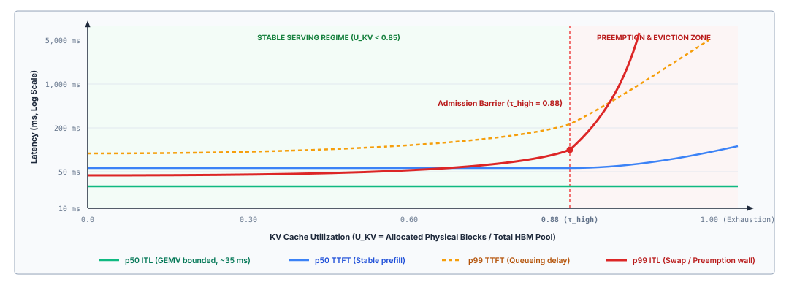
:::

As illustrated in the performance profile, the inter-token latency for an active stream is governed by the time required to stream model weights and KV blocks from HBM during matrix-vector multiplication (GEMV); as long as physical blocks are resident in accelerator memory, $p50$ ITL is invariant to the global block allocation count.

Tail metrics diverge violently as utilization enters the preemption zone. When a burst of simultaneous token emissions attempts to allocate blocks from an exhausted pool ($U_{\text{KV}} \to 1.0$), the engine must execute synchronous mitigation. Under an offloading policy, the runtime selects victim trajectories, suspends their execution, and transfers their physical page blocks across the PCIe bus to host DRAM. While this prevents out-of-memory crashes, the host-to-device transfer latency injects stalls into both the active stream and the suspended stream. If the engine instead employs a recomputation policy, evicted blocks are discarded; when the suspended trajectory resumes, the engine must re-execute the prefill phase across the entire accumulated sequence length, transforming a twenty-millisecond decode step into a multi-second prefill stall. Consequently, while $p50$ ITL remains bounded at thirty milliseconds, the $p99$ ITL spikes past several seconds, directly breaching the responsiveness guarantees required by interactive agent supervisory loops.

To prevent this latency collapse, resilient agent serving architectures implement multi-level admission control coupled to memory telemetry. The serving system monitors both instantaneous utilization $U_{\text{KV}}$ and the rate of context growth across all active streams. Rather than allowing the physical block pool to hit absolute saturation, the scheduler enforces an admission ceiling at $\tau_{\text{high}}$. When utilization exceeds this barrier, new agent turns are placed in an external scheduling queue, and speculative branching within active trajectories is temporarily gated. By trading off the queuing latency of new requests against the catastrophic tail-latency degradation of in-flight executions, the infrastructure preserves physical memory integrity, ensuring that active agent trajectories complete without descending into the memory-swapping abyss.

---

The ability to accurately provision physical memory and govern dynamic cache allocations ensures that an individual serving node can sustain high-density agent trajectories without succumbing to memory exhaustion. Yet, even when an infrastructure operator sizes hardware with mathematical precision and enforces rigorous admission boundaries, production deployments frequently suffer from systemic degradation rooted not in physical hardware constraints, but in flawed operational assumptions. Engineers routinely fall prey to architectural fallacies regarding how attention memory behaves under production scale—assuming that linear context extensions imply linear memory growth, that prefix deduplication is universally beneficial regardless of cache replacement policy, or that virtualization eliminates the necessity of end-to-end capacity planning. Unmasking these foundational misconceptions is essential to bridging the gap between theoretical memory virtualization and dependable production systems.

## Fallacies and Pitfalls {#sec-vol3-kv-cache-fallacies}

Designing virtualized attention memory systems requires reconciling the deterministic mechanics of high-bandwidth memory allocators with the stochastic, non-monotonic execution patterns of autonomous agent runtimes. Because the physical KV cache abstracts away the raw tensors of the autoregressive attention operator into noncontiguous block tables and shared Radix trees, system architects frequently project traditional database or virtual memory abstractions onto structures that obey entirely different physical and mathematical constraints.

When these conceptual projections break down under production load, the resulting failures do not manifest as clean compile-time exceptions or localized runtime panics. Instead, they produce catastrophic system thrashing, silent epistemic corruption, and severe multi-tenant tail latency collapse. This section examines four pervasive fallacies and pitfalls that emerge when bridging low-level attention caching with high-level agent execution.

::: {.fallacy-pitfall}
**Fallacy:** *The KV cache is the agent's second layer of semantic memory.*

A widespread architectural misconception treats the inference engine's physical KV cache as an intermediate semantic storage tier, positioned hierarchically between the transient logical context window and durable external databases. Under this view, because the cache retains the computed mathematical representations of previously processed tokens across multiple conversational turns, engineers assume it functions as a queryable, mutable, or verifiable episodic memory of task facts. Systems designed around this assumption attempt to inspect cached attention states for factual assertions, perform in-place cache surgery to update outdated world states, or rely on cache residency to guarantee semantic continuity across distributed agent tasks.

This premise confuses the mathematical acceleration of an invariant operator with the retention of semantic state. The key and value vectors stored in high-bandwidth accelerator memory are intermediate linear projections generated during the forward pass of each transformer layer. For an agent trajectory at token position $i$, given layer input $\mathbf{x}_i^{(l)} \in \mathbb{R}^{d_{\text{model}}}$, the cached entries are $\mathbf{k}_i^{(l)} = \mathbf{x}_i^{(l)} \mathbf{W}_K^{(l)}$ and $\mathbf{v}_i^{(l)} = \mathbf{x}_i^{(l)} \mathbf{W}_V^{(l)}$. When Rotary Position Embeddings (RoPE) are applied, each key vector $\mathbf{k}_i^{(l)}$ is rotated in two-dimensional coordinate slices by an orthogonal transformation matrix $\mathbf{R}_{\Theta, i}^d$, binding the activation inextricably to its absolute sequence index $i$.

These cached tensors possess zero independent semantic addressability. A stored key vector $\mathbf{k}_i^{(l)}$ cannot be queried to evaluate whether a variable assignment remains valid, nor can a value vector $\mathbf{v}_i^{(l)}$ be isolated to update an expired API credential or mutate an environmental fact. The representation has operational meaning exclusively when combined in aggregate within the scaled dot-product attention calculation:

$$\mathbf{a}_t^{(l)} = \text{Softmax}\left(\frac{\mathbf{q}_t^{(l)} (\mathbf{K}_{1:t}^{(l)})^T}{\sqrt{d_{\text{head}}}}\right) \mathbf{V}_{1:t}^{(l)}$$

Because attention is a collective operator across the entire historical prefix $1 \dots t$, plucking an isolated block of KV activations from one context and splicing it into another destroys positional phase relationships and breaks cross-token contextual dependencies.

Furthermore, the KV cache provides zero epistemic validation. It faithfully materializes and preserves the intermediate activations of whatever token string was submitted to the model, according equal physical status to verified tool outputs, stale environmental observations, model hallucinations, and hostile prompt injections. Treating the KV cache as semantic memory mistakes a derived quantity for a store. Attention state is a function of the exact token prefix (principle \ref{pri-vol3-prefix-coherence}), so it holds nothing the tokens do not, including their errors.

Durable semantic state belongs strictly within the host supervisor's deterministic storage architecture—external relational databases, write-ahead logs, and schema-validated artifact trees. The inference engine's KV cache is an unprivileged physical scratchpad whose sole architectural purpose is eliminating redundant generalized matrix-vector multiplications during autoregressive decoding.
:::

::: {.fallacy-pitfall}
**Pitfall:** *Keeping paused state resident regardless of wait time.*

When an autonomous agent trajectory pauses its autoregressive generation to invoke an external tool, dispatch a subagent, or await human authorization, the host supervisor must decide the physical disposition of that sequence's KV cache. A pervasive pitfall in agent serving deployments is holding these physical KV blocks pinned in accelerator High-Bandwidth Memory (HBM) indefinitely, under the assumption that preserving residency avoids the latency penalty of recomputing the prompt when the external call returns.

The failure mode of this policy is stranded capacity. Consider our canonical 70-billion parameter GQA foundation model ($m_{\text{token}} \approx 320\text{ KiB/token}$, as formulated in @sec-vol3-foundation-model-tokenization). An agent engaged in a complex repository refactoring trajectory with an active context length of $S = 32{,}768$ tokens immobilizes:

$$M_{\text{KV}} = S \cdot m_{\text{token}} = 32{,}768 \times 320\text{ KiB} = 10{,}485{,}760\text{ KiB} = 10\text{ GiB}$$

If this agent dispatches an asynchronous integration test suite inside an isolated sandbox container requiring $T_{\text{wait}} = 45\text{ seconds}$ to complete, holding that allocation resident strands 10 GB of scarce accelerator capacity for three-quarters of a minute, the tool-wait memory tax of @sec-vol3-intro-memory-stranding at a smaller context. On an accelerator provisioned with 80 GB of HBM, this single dormant trajectory monopolizes 12.5 percent of total physical memory without performing a single floating-point operation.

Under multi-tenant workloads, this stranded capacity starves active requests of allocation blocks. The PagedAttention memory manager experiences artificial memory pressure, forcing the serving scheduler to defer incoming prefill requests, reduce active decode batch sizes, and trigger involuntary preemptive swapping of other running requests.

The economic and operational trade-off is deeply asymmetric. At the node's sustained prefill throughput from the break-even notebook in @sec-vol3-kvcache-swapping ($R_{\text{prefill}} = 4.0 \times 10^{14}\text{ FLOPs/s}$), fully recomputing the $32\text{k}$-token prefix upon trajectory resumption requires approximately:

$$T_{\text{recomp}} \approx \frac{2 \cdot (70 \times 10^9) \cdot 32{,}768}{4.0 \times 10^{14}\text{ FLOPs/s}} \approx 11.5\text{ s}$$

Offloading those blocks across a PCIe Gen5 $\times 16$ bus at an effective bandwidth of $B_{\text{pcie}} \approx 50\text{ GB/s}$ instead consumes:

$$T_{\text{reload}} = \frac{10\text{ GiB}}{50\text{ GB/s}} \approx 215\text{ ms}$$

each way, so the same $53\times$ advantage over recomputation holds here as at $16\text{k}$ tokens, because the ratio does not depend on sequence length. Immobilizing 10 GB of accelerator HBM for 45 seconds to avoid a 430-millisecond round trip represents a severe misallocation of hardware resources. Systems must implement lease-based retention policies. Once the expected tool wait exceeds the break-even time $T_{\text{wait}}^*$ derived in @sec-vol3-kvcache-swapping, which approaches the round-trip transfer time under memory pressure, the runtime must unpin the blocks and migrate them to host DRAM.
:::

::: {.fallacy-pitfall}
**Fallacy:** *Prefix cache reuse guarantees that context is current.*

In systems employing Radix-tree prefix caching, engineers frequently assume that because an incoming prompt matches an established prefix key with 100 percent token-for-token fidelity, the corresponding attention activations represent a valid, fresh evaluation of the task state. This fallacy assumes that syntactic equivalence in the token domain guarantees semantic currency in the operational domain.

A prefix cache indexes sequences by exact token identification vectors $\mathbf{t}_{1:k} = (t_1, t_2, \dots, t_k)$. It possesses zero visibility into the out-of-band environments from which those tokens were originally sampled. Consider an agentic workflow where the system prompt incorporates workspace metadata, environment variables, or schema definitions:

```yaml
System: You are an automated refactoring agent.
Workspace status: branch=main; clean; HEAD=a1c4f9.
Active file: src/runtime/allocator.c (hash: e4b2...8f).
```

If an external continuous integration daemon, a secondary worker agent, or the user modifies `src/runtime/allocator.c` on disk, the physical reality of the workspace diverges instantly from the text representation. If the host runtime stages the next prompt without invalidating the text that described the old file, or erroneously re-submits a prior turn's prompt structure, the serving engine detects a complete prefix match in its Radix tree.

The engine instantly links the physical block table of the incoming request to the historical KV nodes, completely bypassing prefill computation. The attention heads evaluate the newly generated query tokens against cached intermediate activations that encode obsolete file contents. The model generates responses with high confidence and low latency, yet its reasoning is structurally disconnected from the current ground truth.

This failure mode also emerges across tokenization boundaries. If prompt construction routines concatenate strings dynamically without enforcing canonical token boundary alignments, identical character strings can tokenize into divergent integer token sequences depending on trailing whitespace or punctuation. Conversely, distinct prompts can yield identical token sub-sequences that collide in naive hash tables.

The defense is the invalidation of @sec-vol3-context-engineering-context-rot, applied where the staleness lives. Only the file is authoritative, and every view derived from it, the staged text and the attention state computed from that text, goes stale when the file is written (principle \ref{pri-vol3-source-authority}). The runtime tombstones or refreshes the stale observation before the next invocation. That edit changes tokens at the observation's position, so the cache still serves the stable prefix before it. Binding a workspace digest into the head of the prefix would also break the stale match, but it would place the most volatile token first, against the ascending-volatility layout of @sec-vol3-context-engineering-staging, and every file write would invalidate the whole cached branch.
:::

::: {.fallacy-pitfall}
**Pitfall:** *Planning capacity from isolated average requests.*

Infrastructure engineers sizing accelerator clusters for agentic serving routinely calculate hardware requirements using classical queuing theory parameterized by average sequence lengths and independent Poisson arrivals. They compute mean prompt length $\bar{S}_{\text{prompt}}$, mean generation length $\bar{S}_{\text{gen}}$, multiply the sum by the average per-token memory footprint $\bar{m}_{\text{token}}$, and divide available accelerator HBM by this static average to determine multi-tenant concurrency limits.

This sizing methodology fails catastrophically when applied to agent workloads. Agentic interactions violate every standard assumption of memoryless, identically distributed arrival processes. They exhibit two structural phenomena that cause physical KV cache occupancy to deviate violently from Gaussian distributions:

1. **Correlated Trajectory Branching:** Under search policies such as tree-of-thought exploration, speculative execution, or multi-agent debate, a single root request dynamically spawns $B$ parallel branches. Although PagedAttention shares the common root prefix blocks across all $B$ trajectories through reference counting, the private leaf allocations for each branch grow concurrently:
   $$M_{\text{branching}} = M_{\text{root}} + \sum_{b=1}^{B} S_{\text{gen}, b} \cdot m_{\text{token}}$$
   A single task can suddenly increase its memory consumption by an order of magnitude within dozens of decode steps, creating massive, correlated step-function spikes in memory demand that blow past average-case headroom.

2. **Tool-Wait Concurrency Inflation:** By Little's Law, the mean number of concurrent requests active in a stable system is $N = \lambda W$, where $\lambda$ is arrival rate and $W$ is total residence time. In conventional stateless inference, $W$ is strictly the generation duration ($S_{\text{gen}} / \text{decode\_throughput} \approx 2\text{--}8\text{ seconds}$). In an agent system where execution loops include compiler invocations, linting passes, API polling, and database transactions, residence time expands to include external wait states:
   $$W_{\text{agent}} = T_{\text{generation}} + T_{\text{tool\_wait}}$$
   Where $T_{\text{tool\_wait}}$ routinely ranges from 15 to 120 seconds. If the serving runtime holds KV caches resident across these pauses, the effective concurrency $N$ expands by a factor of $5\times$ to $20\times$ for the exact same input request arrival rate $\lambda$.

When dynamic memory occupancy approaches the physical boundary of accelerator HBM (the saturation threshold $\mu \to 1$), the variance of this heavy-tailed distribution triggers non-linear queuing delays. The serving engine exhausts its pool of free physical blocks. Incoming prefill requests cannot obtain initial block tables and stall at the admission boundary. Concurrently, active autoregressive decode loops stall mid-generation because the allocator cannot map physical blocks for newly generated tokens.

This collapse into memory saturation is illustrated in the time-series profile of @fig-vol3-thrashing-curve. Under standard independent request streams, memory occupancy hovers stably below the safe $80\%$ operating ceiling. In contrast, an agentic workload undergoing correlated branching (such as tree-of-thought exploration) and tool-wait concurrency inflation exhibits rapid, step-function occupancy growth. Memory demand breaches the $80\%$ operating ceiling at $t \approx 55\text{ s}$ and collides with the $100\%$ physical thrashing boundary at $t \approx 72\text{ s}$. At this point, the serving engine is forced into cascading emergency preemptions, evicting active decodes and pruning dormant prefix blocks. This collapses the prefix cache hit rate and triggers an endless wave of full prompt recomputations that permanently saturates accelerator tensor cores.

::: {#fig-vol3-thrashing-curve fig-env="figure" fig-pos="htb" fig-cap="**Memory Saturation and Cache Thrashing Boundary**: Dynamic memory occupancy over time comparing stationary conversational traffic with agentic workloads subjected to correlated branching and tool-wait concurrency inflation. Breaching the 100 percent physical boundary triggers cascading preemptions and catastrophic thrashing." fig-alt="Time-series chart showing memory occupancy over 100 seconds. A stable baseline stays below 75 percent, while an agentic workload with tool waits breaches the 80 percent safe ceiling and hits the 100 percent boundary, inducing cascading preemptions."}
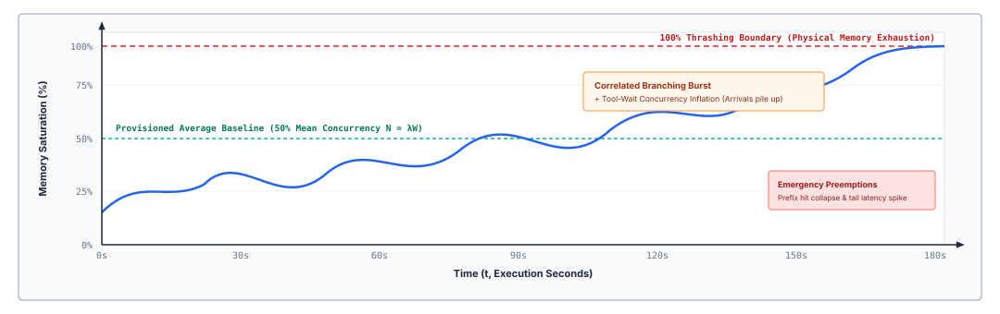
:::

To resolve this memory starvation, the runtime must execute emergency preemption, forcibly evicting or swapping active sequences. Evicting shared prefix nodes destroys the cache hit rate for subsequent turns, while suspending active decodes forces expensive full recomputations later. The system enters a state of persistent thrashing: accelerator compute utilization collapses because tensor cores spend their cycles recomputing evicted intermediate states rather than processing new tokens.

While average latency metrics may appear acceptable during off-peak periods, the 99th and 99.9th percentile Time-to-First-Token (TTFT) and Inter-Token Latency (ITL) explode by multiple orders of magnitude. Robust capacity provisioning must model agent workloads using bimodal, heavy-tailed distributions, dimensioning memory pools against peak branching concurrency and enforcing strict admission shedding well before physical HBM reaches saturation.
:::

---

The fallacies and pitfalls detailed above underscore a fundamental systems truth: the physical KV cache is neither an autonomous knowledge base nor an elastic resource that can be managed through naive heuristics. Addressing these failure modes requires moving beyond isolated optimizations and synthesizing the complete memory hierarchy into a unified architectural framework. To establish how memory virtualization, prefix deduplication, chunked scheduling, and dynamic eviction coalesce into a dependable execution substrate, we turn next to the chapter summary.

## Summary {#sec-vol3-kv-cache-summary}

A serving system allocates and reuses the physical attention state of active trajectories by decoupling the logical sequence of tokens from the physical layout of High-Bandwidth Memory (HBM), virtualizing tensor allocation through noncontiguous paged blocks, and scheduling execution across the asymmetric arithmetic demands of prefill and decode phases. Managing the key-value (KV) cache is fundamentally an accelerator resource allocation problem, architecturally separate from both the runtime's logical context selection and the durable persistence layers of the host application. The physical KV cache is an intermediate, derivative activation tensor produced by projecting context tokens through static projection weights ($W_K, W_V$). It exists for a single operational purpose: to trade accelerator HBM capacity for arithmetic throughput during the autoregressive decode loop, replacing an $\mathcal{O}(S^2)$ attention recomputation at each step with an $\mathcal{O}(S)$ memory-bound matrix-vector product.

Under the physical geometry of modern transformer architectures, each token's attention state consumes a fixed quantity of accelerator memory, $m_{\text{token}} = 2 \cdot L \cdot H_{\text{kv}} \cdot d_{\text{head}} \cdot b_{\text{elem}}$ bytes, where $L$ denotes the number of transformer layers, $H_{\text{kv}}$ is the number of key-value heads under grouped-query or multi-query attention, $d_{\text{head}}$ is the projection dimension per head, and $b_{\text{elem}}$ represents the numerical precision format in bytes. Because agentic workloads introduce dynamic, non-monotonic sequence expansion through recursive tool invocations, multi-turn conversational loops, and speculative trajectory rollouts, statically provisioning memory for worst-case sequence lengths ($S_{\max}$) squanders up to 80 percent of accelerator memory to internal and external fragmentation. Virtualizing this space via paged allocation maps logical token offsets to arbitrary physical page frames through per-request block tables, restricting internal fragmentation to the final block tail while eliminating external fragmentation entirely. Extending this block virtualization to prefix caching via Radix trees enables physical page sharing across branching trajectories and common prompt scaffolds, allowing the serving system to bypass redundant prefill compute without duplicating underlying tensor allocations.

Balancing these paged structures under heavy multi-tenant concurrency introduces a complementary scheduling challenge. Because context prefill operates as a compute-bound matrix-matrix multiplication (GEMM) while token decoding operates as a memory-bandwidth-bound matrix-vector multiplication (GEMV), unconstrained prefills introduce severe head-of-line blocking that degrades decode latency. Chunked prefill scheduling amortizes this interference by slicing arrival sequences into bounded compute chunks, co-locating them alongside batched decode steps to stabilize inter-token latencies. When memory saturation forces eviction, the system must evaluate whether to maintain residency, write pages to host DRAM via PCIe, recompute states on demand, or evict outright. Because KV states are entirely derivative of their prompt tokens, eviction incurs an arithmetic recomputation cost rather than durable state loss, establishing a predictable trade-off between accelerator bus bandwidth, memory capacity, and processing latency.

::: {.callout-takeaways title="Virtualize the activation, liberate the accelerator"}
1. **KV footprint follows model geometry, sequence lengths, and live concurrency.** The physical storage cost per token $m_{\text{token}} = 2 L H_{\text{kv}} d_{\text{head}} b_{\text{elem}}$ is strictly determined by model architecture and precision. In agentic serving runtimes, high token counts and multi-turn trajectories rapidly transform execution from compute-bound matrix multiplication (GEMM) during prefill to memory-bandwidth-bound matrix-vector operations (GEMV) during autoregressive decode, making accelerator HBM capacity the primary ceiling on overall system concurrency.
2. **Paged allocation and exact-prefix sharing eliminate artificial fragmentation and redundant compute.** Mapping variable-length logical token sequences to noncontiguous physical memory blocks eliminates external fragmentation and bounds internal fragmentation to the final tail block. Organizing reusable physical blocks into prefix trees (such as Radix trees) enables copy-on-write sharing across branching trajectories and shared system prompts, drastically reducing time-to-first-token ($TTFT$) without altering model outputs.
3. **Scheduling and eviction policies are workload-driven latency decisions.** Prefill and decode phases compete directly for accelerator memory bus bandwidth and compute units. Slicing prompt evaluations into chunked prefill budgets balances prefill throughput against decode tail latencies ($ITL$). When memory pressure peaks, choosing whether to retain, offload across PCIe, or evict and recompute cached blocks depends on arrival distributions, memory transfer costs, and the empirical probability of trajectory resumption.
4. **Evicting KV state affects recomputation cost, not durable task knowledge.** The KV cache is a volatile, transient accelerator optimization, not an authoritative persistence layer. Evicting or swapping physical page tables under memory pressure introduces a latency penalty if an agent trajectory resumes, but causes zero loss of system correctness; any evicted attention state can be regenerated bit-for-bit from the underlying input token sequence.
:::

Paging, prefix sharing, and offload all rest on one property of attention state (principle \ref{pri-vol3-prefix-coherence}). It is a function of the exact token prefix, so it can be shared only across identical prefixes and rebuilt from the tokens at any time. That property is why eviction costs recomputation and never task knowledge, and why the reload-to-recompute ratio does not depend on sequence length, which let the chapter reduce the pause decision to one break-even time. It is also why the host runtime can reason in steps, tool calls, and trajectories while the serving engine treats their attention state as bytes to page, share, or drop on cost.

::: {.callout-chapter-connection title="From serving state to durable information"}
Physical attention state is volatile and local by definition: it is bound to the lifespan of an active inference serving request, tied to a specific GPU or TPU cluster, and destroyed whenever a process terminates or a session context is evicted. Yet real-world autonomous agents must maintain persistent identity across days, survive system crashes, coordinate state transitions across distributed subagents, and reason over multi-gigabyte codebases that far exceed the physical capacity of any accelerator memory subsystem.

Resolving this tension requires decoupling transient accelerator acceleration from authoritative, long-term storage. While this chapter resolved the physical allocation and reuse of volatile KV activations inside the inference engine, @sec-vol3-long-term-memory (*Persistent Storage*) investigates the durable information tier: persistent vector stores, relational databases, inverted search indexes, and dynamic retrieval pipelines. The KV cache holds derived attention state that the engine may drop at any time. Durable storage holds the source records themselves, and its task is to record, organize, and surface them for agents across unbounded operational horizons.
:::
