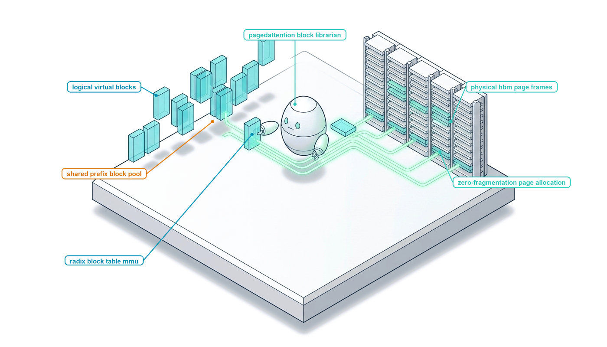

# The KV-Cache Hierarchy {#sec-vol3-virtual-memory}

::: {layout-narrow}
::: {.column-margin}

\chapterminitoc

:::

::: {.content-visible when-format="pdf"}
\noindent
{fig-alt="Blueprint for The KV-Cache Hierarchy."}
:::

::: {.content-visible unless-format="pdf"}
{fig-alt="Blueprint for The KV-Cache Hierarchy."}
:::

:::

## Purpose {.unnumbered .unlisted}

\begin{marginfigure}
\mlagentstack{10}{10}{10}{10}{95}{10}
\end{marginfigure}

_*How do we decouple the dynamic, branching state of an agent's reasoning from the rigid physical memory of hardware accelerators?*_

Beneath the logical abstraction of the context window lies the physical reality of the Key-Value (KV) cache: tensors of historical attention keys and values that must be kept immediately accessible in accelerator memory to sustain autoregressive generation. In passive, single-turn LLM serving, KV cache grows linearly and terminates upon request completion. In agentic systems, however, execution patterns are wildly dynamic, highly non-linear, and long-lived. Agents branch during deliberation, execute tree searches, share extensive system prompt prefixes across concurrent subtasks, and suspend execution for minutes or hours while awaiting external tool responses. Naive contiguous GPU memory allocation leads to severe internal and external memory fragmentation, stranding up to 80% of scarce High-Bandwidth Memory (HBM) and causing out-of-memory crashes. Furthermore, holding gigabytes of HBM allocated while an agent waits on a slow external network call paralyzes the serving cluster. The inference engine must act as a virtual memory manager for neural computation: implementing PagedAttention to eliminate memory fragmentation, constructing Radix-tree prefix caches to reuse prompt activations across trajectory branches, chunking prefills to eliminate inter-token latency spikes, and orchestrating multi-tier hierarchical paging across GPU HBM, host DRAM, and local NVMe storage.

::: {.callout-learning-objectives}

- Quantify the dynamic memory footprint of the Key-Value cache ($2 \times 2 \times n_{\text{layers}} \times n_{\text{heads}} \times d_{\text{head}} \times S \times b$ bytes), calculating how cache scaling bounds serving concurrency on modern accelerators.
- Analyze the mechanisms of internal and external memory fragmentation in naive contiguous tensor allocation under unpredictable sequence lengths and agent branching.
- Architect PagedAttention virtual memory systems, mapping logical token sequences to non-contiguous physical memory blocks via page tables and block managers.
- Implement Radix-tree prefix caching algorithms to share prompt and trajectory KV states across concurrent agent sessions, deriving cache hit rates and prefill savings.
- Formulate chunked prefill scheduling algorithms that co-schedule compute-bound prompt chunks alongside memory-bound decode iterations, bounding tail Inter-Token Latency (ITL).
- Design multi-tier hierarchical KV paging state machines, calculating analytical breakeven thresholds ($T_{\text{breakeven}}$) for offloading idle session caches across PCIe buses to host CPU DRAM and NVMe SSDs during tool wait states.

:::

<!-- SECTION_START: 5.1 (#sec-vol3-kvcache-geometry) -->
## Physical Memory Footprints {#sec-vol3-kvcache-geometry}

<!-- OUTLINE_SPEC:

- **Heading & Anchor:** `## Physical Memory Footprints {#sec-vol3-kvcache-geometry}`
- **The Single Key Point:** The KV cache stores historical key and value activation tensors to avoid recomputing attention; its physical memory footprint scales linearly with sequence length, model layers, and batch concurrency, easily exceeding weight memory.
- **Concrete Systems Hook:**
  - A 70B parameter model requires 140 GB for weights; serving 32 concurrent agent sessions at 32k context length requires an additional 262 GB of accelerator memory purely for KV caches.
- **Points to explain (paragraph-by-paragraph):**
  - *Why KV Cache Exists:* In autoregressive generation, computing token $t$ requires attending to all prior keys and values $K_{1:t-1}, V_{1:t-1}$. Caching these activations prevents re-evaluating preceding transformer layers.
  - *Mathematical Footprint Equation:* For a model with $L$ layers, hidden dimension $H$, and context length $T$ at FP16/BF16 ($2\text{ bytes/param}$):
    $$\text{Memory}_{\text{KV}} = 2 \times 2 \times L \times H \times T = 4 L H T \text{ bytes/token}$$
    With Grouped-Query Attention (GQA), key/value heads are reduced by ratio $G = H_Q / H_{KV}$, dividing footprint by $G$.
  - *The Memory Wall:* In agent workloads with long multi-turn trajectories, KV cache memory quickly dwarfs model parameter memory, making GPU HBM capacity the primary serving bottleneck.
- **Visuals & Tables:**
  - Diagram: Tensor geometry of the KV cache across layers, heads, and sequence tokens.
- **Seminal Literature:**
  - Reiner Pope et al. (2023, *Efficiently Scaling Transformer Inference on TPU v4*).
  - Joshua Ainslie et al. (2023, *GQA: Training Generalized Multi-Query Transformer Models*).
- **Causal Bridge to 5.2:** When multiple concurrent agent sessions generate variable-length trajectories, how does memory allocation break down?
-->

During the autoregressive generation loop of a decoder-only Transformer, computing the output distribution for token $t$ requires evaluating scaled dot-product attention over all preceding tokens $1, \dots, t-1$. In an un-cached execution model, generating token $t$ requires passing the entire prefix sequence of length $t$ through all $L$ Transformer layers. For an agent executing a trajectory of $T$ tokens, this naive re-evaluation incurs $O(T^2)$ layer evaluations, imposing an impractical quadratic compute penalty on generation latency. Because the Key ($K$) and Value ($V$) projection vectors of past tokens are deterministic functions of invariant earlier layer activations, an inference engine can eliminate redundant matrix multiplications by retaining past key and value vectors in accelerator High-Bandwidth Memory (HBM). This persistent activation buffer is the *Key-Value (KV) cache*. State caching transforms per-token generation from an $O(t)$ matrix-matrix multiplication into an $O(1)$ matrix-vector operation per layer, trading physical memory capacity for operational efficiency.

### Mathematical Formulation and Tensor Geometry

The physical memory footprint of the KV cache is governed by the structural dimensions of the Transformer architecture, the numeric precision of the activations, and the batch concurrency of the serving engine. Consider a model with $L$ layers, query attention head count $n_{\text{heads}}$, per-head dimension $d_{\text{head}}$, and active sequence length $T$. In standard Multi-Head Attention (MHA), each query head possesses a dedicated key head and value head ($n_{\text{KV}} = n_{\text{heads}}$), defining a hidden dimension $H = n_{\text{heads}} \times d_{\text{head}}$. Storing both Key and Value vectors across $L$ layers using an element representation of $b$ bytes (for example, $b = 2$ for 16-bit IEEE 754 half-precision FP16 or Brain Floating Point BF16, or $b = 1$ for 8-bit FP8) yields a per-token cache footprint of:

$$S_{\text{token}} = 2 \times L \times n_{\text{KV}} \times d_{\text{head}} \times b \quad \text{bytes/token}$$

For an active context window of length $T$, the memory footprint for a single execution sequence is:

$$M_{\text{KV}}(T) = S_{\text{token}} \times T = 2 \times L \times n_{\text{KV}} \times d_{\text{head}} \times T \times b \quad \text{bytes}$$

To alleviate this footprint, modern architectures employ Multi-Query Attention (MQA) or Grouped-Query Attention (GQA) [@ainslie2023gqa]. As illustrated in @fig-kvcache-tensor-geometry, GQA partitions query heads into $n_{\text{KV}}$ groups, where $G = n_{\text{heads}} / n_{\text{KV}}$. The Key and Value projections are shared across all $G$ query heads within a group, reducing the physical KV cache footprint by an exact factor of $G$.

::: {#fig-kvcache-tensor-geometry}
```
Multi-Head Attention (MHA: G = 1)
Key Cache:   [Batch, Layers, n_heads, Tokens, d_head]
Value Cache: [Batch, Layers, n_heads, Tokens, d_head]
             └───────────────────────┬───────────────────────┘
                     Footprint: 2 × L × n_heads × d_head × T × b

Grouped-Query Attention (GQA: G = n_heads / n_KV)
Key Cache:   [Batch, Layers, n_KV,    Tokens, d_head]  <── Reduced by factor G
Value Cache: [Batch, Layers, n_KV,    Tokens, d_head]  <── Reduced by factor G
             └───────────────────────┬───────────────────────┘
                      Footprint: 2 × L × n_KV × d_head × T × b
```
Tensor layout of Key and Value activation caches in accelerator memory. Grouped-Query Attention collapses the key and value head dimensions from $n_{\text{heads}}$ to $n_{\text{KV}}$, dividing the aggregate memory footprint by $G = n_{\text{heads}} / n_{\text{KV}}$.
:::

The physical implications of this scaling become acute under agentic workloads. Consider a 70-billion-parameter dense model (such as LLaMA-3-70B) operating at 16-bit precision ($b = 2$). The static model weights consume approximately $140\text{ GB}$ of accelerator memory ($70 \times 10^9 \times 2\text{ bytes}$). For an architecture configured with $L = 64$ layers, $n_{\text{heads}} = 64$, $n_{\text{KV}} = 8$ (a GQA reduction of $G = 8$), and $d_{\text{head}} = 128$:

$$S_{\text{token}} = 2 \times 64 \times 8 \times 128 \times 2 = 262,144\text{ bytes/token} = 256\text{ KiB/token}$$

Serving a concurrency of $B = 32$ parallel agent sessions, each maintaining an extended trajectory of $T = 32,768$ tokens, demands:

$$M_{\text{KV, total}} = 32 \times 32,768 \times 262,144\text{ bytes} = 274,877,906,944\text{ bytes} = 256\text{ GiB} \quad (\approx 262\text{ GB})$$

In this operational regime, the dynamic memory required to sustain the KV caches ($256\text{ GiB}$) dwarfs the static memory allocated to the model parameters ($140\text{ GB}$), establishing accelerator HBM capacity as the strict ceiling on serving concurrency.

### The Arithmetic Intensity Collapse

The memory footprint of the KV cache governs not only capacity limits, but also the computational throughput of the serving engine [@pope2023efficiently]. Deep learning inference exhibits two distinct execution phases with radically divergent operational profiles:

1. **The Prefill Phase:** The model processes the initial prompt context of length $T_{\text{prompt}}$ in parallel. The operation is dominated by compute-bound matrix-matrix multiplications (GEMM). Floating-point units operate near theoretical peak throughput because every activation loaded from memory is reused across $O(T_{\text{prompt}})$ parallel token positions.
2. **The Decode Phase:** The model generates tokens autoregressively, one step at a time ($T_{\text{new}} = 1$). To evaluate attention for a single newly generated query token $q_t$, the accelerator must stream the *entire* historical KV cache ($K_{1:t-1}$ and $V_{1:t-1}$) across the memory bus from off-chip HBM into on-chip SRAM registers to execute matrix-vector multiplications (GEMV).

During decoding, computing attention across all heads at a given layer performs $4 \times n_{\text{heads}} \times d_{\text{head}} \times T$ floating-point operations while transferring $2 \times n_{\text{KV}} \times d_{\text{head}} \times T \times b$ bytes of cache state over the memory bus. The arithmetic operational intensity ($I_{\text{decode}}$) is:

$$I_{\text{decode}} = \frac{4 \times n_{\text{heads}} \times d_{\text{head}} \times T}{2 \times n_{\text{KV}} \times d_{\text{head}} \times T \times b} = \frac{2 G}{b} \quad \text{FLOPs/byte}$$

For $b = 2$ and $G = 8$, the decode operational intensity is bounded at $8\text{ FLOPs/byte}$. Modern accelerator hardware operates with an extreme disparity between compute capability and memory bandwidth. For example, an NVIDIA H100 SXM5 GPU delivers $989 \times 10^{12}\text{ FLOP/s}$ of dense FP16 tensor core throughput against $3.35 \times 10^{12}\text{ bytes/s}$ of HBM3 bandwidth, locating the roofline ridge point at:

$$I_{\text{ridge}} = \frac{989 \times 10^{12}\text{ FLOP/s}}{3.35 \times 10^{12}\text{ bytes/s}} \approx 295\text{ FLOPs/byte}$$

Because $I_{\text{decode}} \ll I_{\text{ridge}}$, autoregressive decoding is profoundly memory-bandwidth-bound. The execution time of each decode step is determined entirely by the time required to stream gigabytes of KV cache tensors through the memory interface.

### Non-Linear Agent Trajectories and HBM Exhaustion

In passive, single-turn language model serving, requests exhibit predictable, linear lifetimes: a short prompt is ingested, a response is streamed to completion, and the associated KV cache is immediately deallocated. In contrast, autonomous agent architectures impose severe, non-linear stress on accelerator memory systems:

- **Prefix Bloat:** Autonomous agents require extensive system prompts, tool schemas, operational policies, and few-shot exemplars, frequently consuming 8,000 to 24,000 tokens of immutable state before execution begins.
- **Deep Trajectory Accumulation:** As agents iterate through multi-step reasoning loops—executing shell commands, inspecting file diffs, and ingesting error traces—the context window expands continuously toward hardware boundaries ($32\text{k}$, $64\text{k}$, or $128\text{k}$ tokens).
- **Tool Wait States:** Agents frequently block on external dependencies, such as web searches, sandboxed unit test execution, or human-in-the-loop approvals. Holding hundreds of megabytes of HBM allocated per session during minutes of network latency strands physical accelerator capacity.
- **Tree-Structured Branching:** Deliberation strategies, such as tree search or self-consistency sampling, fork multiple candidate paths from a shared reasoning prefix. Replicating independent KV caches for each branch results in rapid, combinatorial memory exhaustion.

When multiple concurrent agent sessions expand dynamically, the inference engine cannot predict the eventual lifetime or termination length of any individual request. Allocating physical memory to accommodate these stochastic, variable-length trajectories exposes fundamental flaws in conventional GPU memory allocators. In @sec-vol3-fragmentation, we examine the mechanics of internal and external memory fragmentation that emerge when contiguous tensor allocation meets dynamic agent execution.

<!-- SECTION_END: 5.1 -->

<!-- SECTION_START: 5.2 (#sec-vol3-kvcache-fragmentation) -->
## Memory Allocation Fragmentation {#sec-vol3-kvcache-fragmentation}

<!-- OUTLINE_SPEC:

- **Heading & Anchor:** `## Memory Allocation Fragmentation {#sec-vol3-kvcache-fragmentation}`
- **The Single Key Point:** Pre-allocating contiguous memory buffers for maximum context lengths causes catastrophic internal and external memory fragmentation, wasting up to 80% of accelerator HBM.
- **Concrete Systems Hook:**
  - An inference cluster with 80 GB GPUs refuses new agent requests due to Out-Of-Memory (OOM) errors, even though actual GPU memory utilization is measured at only 22%.
- **Points to explain (paragraph-by-paragraph):**
  - *The Traditional Contiguous Allocation Model:* Early serving systems allocated contiguous physical memory arrays sized for the theoretical maximum context length (e.g. 32k tokens) to prevent costly reallocation during generation.
  - *Internal Fragmentation:* Most agent requests terminate long before reaching $K_{\max}$; pre-allocated memory slots sit completely empty, reserved but unusable by other requests.
  - *External Fragmentation:* Requests arrive and depart dynamically with variable lengths; over time, free memory is fragmented into non-contiguous slices too small to satisfy new contiguous allocations.
- **Visuals & Tables:**
  - Memory map diagram showing severe internal and external fragmentation under contiguous allocation.
- **Seminal Literature:**
  - Woosuk Kwon et al. (2023, *PagedAttention*).
- **Causal Bridge to 5.3:** How did computer operating systems solve this exact memory allocation problem 50 years ago, and how does that apply to GPU memory?
-->

In an inference cluster executing multi-step agent workloads on 80 GB accelerators, the orchestrator frequently halts request admission due to Out-Of-Memory (OOM) faults while hardware telemetry reports that valid Key-Value activations consume only 22% of physical High-Bandwidth Memory (HBM). The remaining 78% of memory capacity sits stranded. The serving engine cannot admit incoming agent trajectories, yet the memory bus and tensor cores remain starved. This pathological condition does not stem from software defects or parameter overhead; it is the direct consequence of managing dynamic, variable-length agent trajectories using static, contiguous physical memory allocation [@kwon2023vllm].

### The Contiguous Allocation Bottleneck

Standard attention kernels—including early fused implementations and basic framework runtimes—require Key and Value tensors to reside in physically contiguous virtual memory buffers. During autoregressive decoding, an inference engine appends new activation vectors token by token. Under conventional memory management, expanding an allocated tensor dynamically requires either invoking accelerator memory allocation APIs (such as `cudaMalloc`) or reallocating a larger contiguous segment and copying the existing activations. Executing memory reallocation and tensor migration at every decode step incurs prohibitive kernel launch latency, serializes asynchronous execution streams, and saturates the accelerator memory bus.

To avoid runtime reallocation overhead, early serving architectures adopted a static pre-allocation policy: upon request admission, the memory manager allocates physical memory buffers sized for the theoretical upper bound of the context window, $T_{\max}$ (for example, 32,768 tokens). The engine allocates two contiguous arrays per layer of dimensions $[n_{\text{KV}}, T_{\max}, d_{\text{head}}]$ at precision $b$. For a 70-billion-parameter model with $S_{\text{token}} = 256\text{ KiB/token}$ across $L = 64$ layers, admitting a single agent request immediately reserves:

$$M_{\text{reserved}} = T_{\max} \times S_{\text{token}} = 32,768 \times 256\text{ KiB} = 8\text{ GiB}$$

of physical HBM, regardless of whether the agent will execute three tokens or thirty thousand tokens.

### Internal Fragmentation

Static buffer reservation relies on the assumption of predictable sequence lengths. Autonomous agent execution, however, is fundamentally stochastic. An agent evaluating a simple classification gate or verifying a schema syntax check may terminate in $T_{\text{actual}} = 350$ tokens. Conversely, an agent performing multi-turn repository refactoring or exploratory tree search may accumulate $T_{\text{actual}} = 28,000$ tokens.

When an agent request terminates at $T_{\text{actual}} \ll T_{\max}$, the reserved but unwritten memory constitutes *internal fragmentation*:

$$M_{\text{internal}} = (T_{\max} - T_{\text{actual}}) \times S_{\text{token}}$$

For an agent session that completes in 2,048 tokens within a 32,768-token ceiling, internal fragmentation strands:

$$M_{\text{internal}} = (32,768 - 2,048) \times 256\text{ KiB} = 7.5\text{ GiB}$$

This physical address space is strictly locked to the request handle throughout its execution. The serving engine cannot assign these allocated but untouched memory addresses to concurrent sequences. Because agent trajectory lengths exhibit high variance, pre-allocating for worst-case bounds collapses the effective serving concurrency of an 80 GB device to a small handful of streams.

### External Fragmentation

To reduce internal slack, intermediate serving systems introduced dynamic buffer chunking, allocating memory incrementally in fixed blocks (such as 1,024 or 2,048 tokens) as sequences expand. While chunking bounds internal fragmentation within each request buffer, it exposes the system to severe *external fragmentation*.

Agent workloads exhibit asynchronous, heterogeneous execution lifecycles. A fast validation agent may execute and deallocate memory within seconds, whereas a complex reasoning agent may persist for minutes, periodically suspending execution while waiting on slow external APIs or sandbox environments. As blocks of varying sizes are dynamically allocated and released across physical HBM, available memory shatters into non-contiguous address segments.

```
Linear Physical HBM Space (e.g., 40 GiB KV Cache Pool)
┌──────────────────────┬──────────┬──────────┬──────────┬──────────────┐
│ Request A (Active)   │ Request B│ Free     │ Request C│ Free         │
│ Used: 2 GiB          │ (Active) │ Segment  │ (Active) │ Segment      │
│ Internal Waste: 6 GiB│ 4 GiB    │ 3 GiB    │ 6 GiB    │ 5 GiB        │
└──────────────────────┴──────────┴──────────┴──────────┴──────────────┘
 ├────────────────────┤            ├────────┤            ├────────────┤
    Internal Waste                  External Fragment    External Fragment
    (Reserved for A)                (Isolated)           (Isolated)
```
::: {#fig-kvcache-fragmentation}
```
Physical Memory Address Space ──────────────────────────────────────────►
┌───────────────────────────────────────────────────────────────────────┐
│ Request 1: Active Tokens [2 GiB] │ Internal Slack (Unused) [6 GiB]    │
├──────────────────────────────────┴────────────────────────────────────┤
│ External Free Block 1 [3 GiB]                                         │
├───────────────────────────────────────────────────────────────────────┤
│ Request 2: Active Tokens [4 GiB] │ Internal Slack (Unused) [4 GiB]    │
├──────────────────────────────────┴────────────────────────────────────┤
│ External Free Block 2 [5 GiB]                                         │
└───────────────────────────────────────────────────────────────────────┘
  Total Free Space = 8 GiB (External) + 10 GiB (Internal) = 18 GiB
  Maximum Contiguous Request Allocatable = 5 GiB
```
Memory map of accelerator High-Bandwidth Memory under contiguous allocation. Internal fragmentation isolates reserved memory within active request allocations, while external fragmentation isolates free memory between terminated requests. Even when aggregate free memory totals 18 GiB, an incoming request requiring an 8 GiB contiguous block is rejected with an Out-Of-Memory error.
:::

Over time, the memory allocator encounters states where aggregate free memory across the accelerator exceeds the footprint of an incoming sequence, yet the request fails:

$$\max_{k} \left( \text{size}(B_k^{\text{free}}) \right) < M_{\text{req}} \le \sum_{k} \text{size}(B_k^{\text{free}})$$

where $B_k^{\text{free}}$ denotes the $k$-th contiguous free memory block in HBM. As illustrated in @fig-kvcache-fragmentation, if an incoming agent requires an 8 GiB contiguous buffer ($M_{\text{req}} = 8\text{ GiB}$), the allocator must abort, despite having 18 GiB of physically unutilized capacity across the device. Compacting physical GPU memory to consolidate these isolated segments would require transferring tens of gigabytes across the memory bus, stalling active inference pipelines across all execution streams.

### Cumulative Capacity Collapse

Empirical measurements by Kwon et al. established that contiguous allocation schemes waste between 60% and 80% of total KV cache memory in production inference systems [@kwon2023vllm]. This stranded capacity is divided across three operational boundaries:

1. **Reserved Future Slots:** Memory reserved for tokens between the current decode step $t$ and $T_{\max}$ that remains idle during autoregression.
2. **Terminal Internal Slack:** Memory allocated to a completed sequence that is never touched because $T_{\text{actual}} \ll T_{\max}$.
3. **External Fragments:** Free memory segments stranded between active allocations whose individual sizes cannot satisfy incoming contiguous allocation requests.

Under agentic interaction patterns, contiguous allocation failure accelerates. When an agent forks its execution state—such as branching into four parallel candidate paths during deliberative search—contiguous allocators cannot share memory across branches. Instead, the engine must duplicate the entire historical prefix into four independent, contiguous buffers. A 16,000-token system prefix duplicated across four branches consumes:

$$M_{\text{fork}} = 4 \times 16,000 \times 256\text{ KiB} = 16\text{ GiB}$$

physically storing four identical copies of identical tensor activations.

The challenge of mapping dynamic, non-linear workloads into rigid, contiguous physical address spaces is a classical systems bottleneck. Operating systems resolved this exact failure mode half a century ago by decoupling logical address spaces from physical memory through paged virtual memory. In @sec-vol3-paged-attention, we examine how adapting this operating systems primitive to accelerator memory architectures enables PagedAttention, eliminating both internal and external fragmentation.

<!-- SECTION_END: 5.2 -->

<!-- SECTION_START: 5.3 (#sec-vol3-kvcache-pagedattention) -->
## Paged Memory Virtualization {#sec-vol3-kvcache-pagedattention}

<!-- OUTLINE_SPEC:

- **Heading & Anchor:** `## Paged Memory Virtualization {#sec-vol3-kvcache-pagedattention}`
- **The Single Key Point:** PagedAttention divides the KV cache into fixed-size physical memory blocks and maps logical sequence tokens through page tables, eliminating fragmentation and enabling near-zero-waste memory sharing.
- **Concrete Systems Hook:**
  - Implementing PagedAttention in an agent serving cluster increases concurrent agent serving capacity from 6 sessions to 24 sessions on identical GPU hardware.
- **Points to explain (paragraph-by-paragraph):**
  - *The Paged Virtual Memory Analogy:* Translating Peter Denning’s OS virtual memory page tables to transformer KV tensors: logical tokens are mapped to non-contiguous physical blocks (e.g. 16 tokens per block).
  - *Block Tables:* The serving runtime maintains a Block Table mapping logical sequence indices to physical GPU memory addresses. Blocks are allocated on-demand as new tokens are generated.
  - *Near-Zero Memory Waste:* Internal fragmentation is restricted entirely to the final block of a sequence (at most 15 tokens); external fragmentation is completely eliminated because any free block can satisfy any request.
  - *Copy-on-Write for Branching Search:* When an agent forks $N$ candidate reasoning branches (Ch 3), all branches share the identical physical prompt blocks. A new block is allocated only when a branch writes a distinct token.
- **Visuals & Tables:**
  - Figure: `@fig-pagedattention-architecture` [insert link here: books/vol3/05_virtual_memory/images/svg/paged_attention_virtual_memory.svg] (Logical token sequence $\to$ Page table mapping $\to$ Non-contiguous physical memory blocks).
- **Seminal Literature:**
  - Woosuk Kwon, Zhuohan Li, Siyuan Zhuang, et al. (2023, *Efficient Memory Management for Large Language Model Serving with PagedAttention*).
- **Causal Bridge to 5.4:** Beyond linear sequences, how do we efficiently share memory across multi-turn trajectories that form complex execution trees?
-->

The architectural failure of contiguous Key-Value (KV) allocation stems from a false assumption inherited from traditional batch workloads: that logical sequence order must match physical memory placement. In operating system architecture, the development of virtual memory resolved identical bottlenecks in host multiprocessing by decoupling a process's linear address space from physical Dynamic Random-Access Memory (DRAM) through page tables [@denning1970]. PagedAttention, introduced by Kwon et al. [@kwon2023vllm], translates this classic memory virtualization primitive to transformer inference engines. Rather than reserving monolithic, contiguous physical memory buffers sized to worst-case sequence limits ($T_{\max}$), PagedAttention partitions the logical KV cache into fixed-size arrays of tokens and maps them to non-contiguous physical memory pages in accelerator High-Bandwidth Memory (HBM).

This structural decoupling fundamentally alters the concurrency scaling of agent serving infrastructure. Consider an accelerator node with an 80 GiB HBM capacity serving a 13-billion-parameter model in 16-bit precision. After accounting for model weights (26 GiB) and runtime activation workspaces (4 GiB), 50 GiB remains dedicated to the dynamic KV cache pool. Under contiguous allocation with a conservative context ceiling of $L_{\max} = 32,768$ tokens, reserving memory for worst-case bounds requires 8 GiB per session ($S_{\text{token}} = 256\text{ KiB}$). The memory allocator can safely admit only $\lfloor 50 / 8 \rfloor = 6$ concurrent agent sessions before risking fatal Out-Of-Memory (OOM) aborts. By contrast, an engine implementing dynamic paged memory virtualization allocates physical blocks strictly on demand as autoregressive generation progresses. For agent workloads exhibiting mean trajectory lengths of 8,192 tokens (a 2 GiB physical footprint), the effective serving ceiling expands from 6 to 24 concurrent active streams on identical physical hardware—a fourfold increase in serving density without quantization or weight modification.

### Block Tables and Virtual Memory Translation

The core abstraction of PagedAttention is the physical memory page, termed a *KV block*. A KV block contains the key and value tensor activations for a fixed number of tokens, $B$, across all transformer layers and attention heads. For a model with $n_{\text{layers}}$ layers, $n_{\text{heads}}$ key-value heads, and head dimension $d_{\text{head}}$ represented in $b$-byte floating-point precision, the physical footprint of a single block, $S_{\text{block}}$, is:

$$S_{\text{block}} = 2 \times n_{\text{layers}} \times n_{\text{heads}} \times d_{\text{head}} \times B \times b = B \cdot S_{\text{token}}$$

When $B = 16$ and $S_{\text{token}} = 256\text{ KiB}$, each physical page occupies an aligned $4\text{ MiB}$ allocation unit in accelerator HBM.

The serving runtime operates as a memory management unit (MMU) for accelerator tensors, maintaining a global free-block list and a per-request *Block Table*. The block table records the ordered mapping between a sequence's logical block indices $\ell = \lfloor t / B \rfloor$ (where $t$ is the token position within the context) and physical frame numbers $p \in \{0, 1, \dots, N_{\text{total}} - 1\}$ allocated from the HBM pool.

::: {#fig-pagedattention-architecture}


PagedAttention virtual memory architecture. The logical Key-Value cache of an agent trajectory is partitioned into uniform blocks of size $B = 16$. A per-sequence Block Table maintains the mapping from logical indices to non-contiguous physical pages distributed across accelerator HBM. The PagedAttention kernel gathers key and value vectors directly from non-contiguous pages into accelerator SRAM during generation, eliminating the requirement for physical memory contiguity.
:::

During autoregressive decoding at step $t$, the attention kernel must compute the scaled dot-product between the current query vector $\mathbf{q}_t$ and all historical key vectors $\mathbf{k}_0, \dots, \mathbf{k}_{t-1}$. In standard dense attention implementations (such as FlashAttention), keys and values must reside in contiguous memory addresses to enable vectorized loads into accelerator Static RAM (SRAM). The PagedAttention kernel resolves non-contiguous physical layouts by integrating block table indirection directly into the GPU execution pipeline. The thread block assigned to a sequence loads the corresponding block table entries into on-chip shared memory. The kernel traverses physical block addresses sequentially, staging $B$ tokens of key-value vectors directly into SRAM via asynchronous memory copies, evaluating dot-products against $\mathbf{q}_t$, and maintaining the online softmax normalizer across block boundaries before loading subsequent pages.

### Elimination of Fragmentation

Paged memory virtualization eliminates external memory fragmentation entirely:

$$M_{\text{external}} = 0$$

Because every allocation request is satisfied by uniform, fixed-size blocks ($S_{\text{block}}$), any available page in HBM can service any token generation step for any sequence. The memory allocator never encounters situations where total unallocated memory is sufficient but unusable due to address space discontinuity.

Internal fragmentation is bounded to the unpopulated slots of a sequence's terminal block. Because physical blocks are provisioned incrementally as tokens are produced ($t \pmod B = 0$), stranded capacity occurs only when a sequence completes execution before completely filling its final page. For a block size $B$, the internal memory waste per sequence, $M_{\text{internal}}$, is strictly bounded:

$$M_{\text{internal}} = (B - 1 - (t \pmod B)) \cdot S_{\text{token}} < B \cdot S_{\text{token}}$$

For $B = 16$, the maximum capacity stranded by a completed agent trajectory cannot exceed 15 tokens ($3.75\text{ MiB}$), regardless of whether the agent operated across a 512-token brief verification or a 64,000-token multi-turn debugging loop. As context length $L$ scales, the fractional internal memory waste converges toward zero:

$$\lim_{L \to \infty} \frac{M_{\text{internal}}}{M_{\text{total}}} \le \lim_{L \to \infty} \frac{(B-1) \cdot S_{\text{token}}}{L \cdot S_{\text{token}}} = 0$$

Empirically, with $B = 16$ and an average sequence length of 2,048 tokens, mean internal fragmentation drops below $0.4\%$, converting nearly all available accelerator HBM into productive inference capacity.

### Copy-on-Write for Branching Search

Deliberative agent architectures rely heavily on non-linear execution patterns: beam search, Monte Carlo Tree Search (MCTS), self-consistency sampling, and parallel tool validation branch out candidate reasoning trajectories from shared checkpoints. Under contiguous allocation, launching $N$ speculative branches from a prefix of length $L_{\text{prefix}}$ mandates replicating the prefix tensor $N$ times, consuming $N \times L_{\text{prefix}} \times S_{\text{token}}$ bytes and stalling the pipeline with memory-to-memory duplication over the device bus.

Paged memory virtualization eliminates this redundancy through physical block sharing governed by *Copy-on-Write (CoW)* semantics, directly analogizing the POSIX `fork()` primitive. Each physical block descriptor in the runtime maintains an atomic reference counter (`ref_count`). When an agent branches $N$ candidate trajectories from a common prefix of length $L = k \cdot B$, the runtime instantiates $N$ distinct block tables and maps their initial $k$ logical entries to the identical physical page indices $p_0, \dots, p_{k-1}$, incrementing their reference counts:

$$\text{ref\_count}(p_\ell) \leftarrow \text{ref\_count}(p_\ell) + (N - 1), \quad \forall \ell \in \{0, \dots, k-1\}$$

```
Logical Block Table: Branch A
┌──────────────┬──────────────┬──────────────┬──────────────┐
│ Block 0 -> 4 │ Block 1 -> 7 │ Block 2 -> 9 │ Block 3 -> 12│
└──────────────┴──────────────┴──────────────┴──────────────┘
                                              ▲
Logical Block Table: Branch B                 │ (CoW Fork: ref_count = 1)
┌──────────────┬──────────────┬──────────────┼──────────────┐
│ Block 0 -> 4 │ Block 1 -> 7 │ Block 2 -> 9 │ Block 3 -> 18│
└──────────────┴──────────────┴──────────────┴──────────────┘
  │              │              │
  ▼              ▼              ▼
Physical Pages in Accelerator HBM (Shared Prefix: ref_count = 2)
┌──────────────┐┌──────────────┐┌──────────────┐
│ Page 4       ││ Page 7       ││ Page 9       │
└──────────────┘└──────────────┘└──────────────┘
```

During subsequent autoregressive generation:

1. **Shared Read:** As long as parallel branches evaluate attention over historical prefix tokens, the attention kernels read from identical physical HBM addresses without contention.
2. **Branch Allocation:** When branch $i$ generates a token that initiates a new block, the allocator supplies a free physical page from the unallocated pool with $\text{ref\_count} = 1$, writing exclusively to that private page.
3. **Copy-on-Write Mutation:** If a branch must append tokens to a partially filled, shared terminal block ($\text{ref\_count} > 1$), the runtime allocates a fresh physical block, copies the valid token activations from the shared page to the new page, decrements the source block's reference counter, updates branch $i$'s block table pointer, and resumes generation.
4. **Pruning and Reclaim:** When search branches are pruned or terminated, their block tables are destroyed. The runtime decrements the reference count of each mapped physical page; any page whose count reaches zero is returned immediately to the free-block pool.

Under CoW virtualization, the aggregate memory footprint of an $N$-branch search over an $L$-token prefix reduces from $N \cdot L \cdot S_{\text{token}}$ to:

$$M_{\text{branch}} = L \cdot S_{\text{token}} + \sum_{i=1}^{N} \Delta L_i \cdot S_{\text{token}}$$

where $\Delta L_i$ denotes the tokens generated independently along branch $i$. For an agent executing four candidate reasoning paths ($\Delta L_i = 512$ tokens each) from a shared 16,384-token system prompt and tool definition context, physical memory consumption collapses from $18.4\text{ GiB}$ to $4.6\text{ GiB}$—a $75\%$ reduction in memory overhead achieved alongside the elimination of inter-device copy stalls.

While PagedAttention resolves internal fragmentation and enables efficient branch-point virtualization within active execution sessions, multi-turn agent architectures operate across extended temporal horizons. In complex agentic workflows, long system prompts, retrieved environment states, and tool schemas persist across disjoint invocations and disparate agent roles. Managing, locating, and reusing these prefix activations across completely separate requests requires an engine-level prefix indexing structure. In @sec-vol3-kvcache-radix, we examine how the Radix-tree prefix cache organizes physical KV blocks into dynamic, prefix-sharing search trees to automate cross-request memory reuse.

<!-- SECTION_END: 5.3 -->

<!-- SECTION_START: 5.4 (#sec-vol3-kvcache-radix-tree) -->
## Radix Tree Prefix Sharing {#sec-vol3-kvcache-radix-tree}

<!-- OUTLINE_SPEC:

- **Heading & Anchor:** `## Radix Tree Prefix Sharing {#sec-vol3-kvcache-radix-tree}`
- **The Single Key Point:** Managing KV blocks as a Radix Tree enables dynamic, automatic prefix caching and reuse across arbitrary multi-turn conversations and branching agent trajectories.
- **Concrete Systems Hook:**
  - In a multi-agent coding system where 5 agents share a 15,000-token codebase context, Radix Tree caching reduces prefill compute by 80% and cuts time-to-first-token from 3.2s to 120ms.
- **Points to explain (paragraph-by-paragraph):**
  - *The Prefix Sharing Problem:* Multi-turn agents, multi-agent systems, and tree-of-thought search share massive common prompt prefixes. Recomputing KV activations on every turn is wastefully redundant.
  - *Radix Tree Indexing:* Representing cached KV blocks as nodes in a Radix Tree (compact trie) keyed by token IDs. Incoming requests traverse the tree to find the longest matching cached prefix.
  - *Dynamic Eviction and LRU:* When memory is full, the runtime evicts leaf nodes of the Radix Tree using Least Recently Used (LRU) policies, preserving common root nodes (system prompts, tool definitions).
- **Visuals & Tables:**
  - Figure: `@fig-radix-attention-tree` [insert link here: books/vol3/05_virtual_memory/images/svg/radix_prefix_tree_architecture.svg] (Radix tree showing shared system prompt root, branching agent turn nodes, and leaf evictions).
- **Seminal Literature:**
  - Lianmin Zheng et al. (2024, *SGLang: Efficient Execution of Structured Language Model Programs*).
- **Causal Bridge to 5.5:** How does the runtime schedule long prefill requests alongside ongoing decode iterations without causing massive latency spikes?
-->

While Copy-on-Write virtualization manages physical page sharing across divergent execution paths within an active generation request, production agentic architectures introduce high temporal redundancy across completely separate requests. Complex agent workflows repeatedly submit prompts sharing identical structural headers: persistent system prompts, JSON tool definitions, environment descriptions, and retrieved codebase context. In a multi-agent software engineering system where five specialized agents collaborate on a single codebase, each agent request incorporates an identical 15,000-token repository context. In a naive serving runtime, evaluating these five requests requires processing $5 \times 15{,}000 = 75{,}000$ prefill tokens from scratch. For a 70-billion-parameter model served across an eight-accelerator cluster, this redundant prefill computation wastes accelerator floating-point operations and forces a Time-To-First-Token (TTFT) of approximately 3.2 seconds on every agent invocation. Retaining and sharing the Key-Value activations of that 15,000-token prefix across independent requests slashes aggregate prefill computation by 80%, collapsing TTFT from 3.2 seconds to 120 milliseconds—the physical latency floor dictated by scheduling the short, agent-specific suffix.

### Radix Tree Indexing and Traversal

Automating cross-request prefix reuse requires an engine-level indexing structure capable of mapping arbitrary token sequences to physical PagedAttention blocks without requiring manual session management or developer-specified cache handles. Standard hash tables keyed by full prompt strings fail because they cannot detect shared sub-prefixes among divergent prompt suffixes. Standard token-level tries solve sub-prefix identification but incur prohibitive memory pointer overhead, maintaining separate node allocations for long, linear sequences of non-branching tokens.

To resolve this trade-off, modern inference engines organize cached KV blocks as a *Radix Tree*—a space-optimized compact trie where non-branching internal paths are compressed into single edges labeled by contiguous token vectors, as formalized by Zheng et al. (2024) in the SGLang runtime.

```
[ Root Node: Physical Pages 0-937 ]
  Tokens: System Prompt + Tool Definitions (0..14,999)
  ref_count = 5 (Shared Active Working Set)
       │
       ├─────────────────────────────────────────┐
       ▼                                         ▼
[ Branch Node A: Pages 938-952 ]          [ Branch Node B: Pages 953-971 ]
  Tokens: Planner Agent History (15,000..15,239)   Tokens: Reviewer Agent History (15,000..15,299)
  ref_count = 1 (Active)                    ref_count = 0 (Dormant Cached State)
       │                                         │
       ▼                                         ▼
[ Leaf Node A1: Page 972 ]                [ Leaf Node B1: Page 973 ]
  Tokens: Active Deliberation (15,240..)    Tokens: Cached Generation (15,300..)
  ref_count = 1 (Active Generation)         ref_count = 0 (LRU Eviction Candidate)
```

In the Radix Tree cache hierarchy:

1. **Nodes and Edges:** Each edge encodes a vector of token IDs $[t_i, \dots, t_{i+k}]$. Each node maintains pointers to an ordered sequence of physical PagedAttention block addresses residing in accelerator High-Bandwidth Memory (HBM).
2. **Prefix Lookup:** When an incoming agent request arrives with token sequence $\mathbf{s} = [t_0, t_1, \dots, t_{M-1}]$, the cache manager traverses the tree from the root, performing string matching over outgoing edge vectors. Traversal halts when an edge character mismatches the prompt sequence or the prompt is exhausted, yielding the longest matching prefix of length $L_{\text{match}} \le M$.
3. **Execution Binding:** The runtime binds the matched physical blocks directly to the new request's logical block table. The engine dispatches only the unmatched suffix $[t_{L_{\text{match}}}, \dots, t_{M-1}]$ to the prefill compute kernel, caching newly generated intermediate KV blocks as new nodes appended along the traversal frontier.

{#fig-radix-attention-tree}

### State Lifecycle and Pinning Semantics

Physical memory blocks managed by the Radix Tree alternate between active operational states and dormant cached states. To prevent race conditions and illegal memory reclamation during concurrent inference, each tree node implements reference counting coupled with explicit pinning semantics:

- **Active State (`ref_count > 0`):** While a request actively reads historical activations during prefill or appends tokens during autoregressive generation, it holds an atomic reference on every node along its traversal path. These nodes are pinned in physical memory; the eviction manager cannot reallocate their underlying physical pages.
- **Dormant State (`ref_count == 0`):** When a request completes, terminates, or enters an idle wait state awaiting external tool input over the network, the runtime decrements the reference counts of all nodes on its path. Crucially, the physical pages are *not* freed back to the unallocated block pool. Instead, the nodes persist in the Radix Tree index as dormant cache entries, available for zero-latency re-binding by subsequent requests matching that prefix.

### Dynamic Memory Pressure and Leaf Eviction

Accelerator HBM is finite. When active requests require fresh physical pages for newly generated tokens and the unallocated page pool falls below a configured watermark, the engine must reclaim physical blocks from dormant tree nodes.

Reclamation follows a Least Recently Used (LRU) policy strictly constrained to the *leaf nodes* of the Radix Tree. Reclaiming an internal node while its child branches remain resident would orphan downstream nodes, violating path reachability from the root. The runtime tracks a timestamp (`last_accessed_time`) on every node. When memory pressure triggers eviction:

1. The memory manager inspects all leaf nodes where $\text{ref\_count} == 0$.
2. The leaf node with the oldest access timestamp is selected.
3. Its associated physical PagedAttention blocks are returned to the free allocator pool.
4. The leaf node is pruned from the tree. If its parent node is left with a single child, the parent and child edges are coalesced into a single compressed edge via path compaction.

This structural constraint introduces a critical systems property: deep, transient conversational leaves and exploratory search branches are aggressively discarded, while heavily traversed root nodes (such as base system prompts and common tool definitions) remain continuously refreshed, pinning them near-permanently in accelerator memory.

### Latency Decomposition of Prefix Reuse

The systems speedup unlocked by Radix Tree caching is modeled by decomposing the request Time-To-First-Token. Let prefill compute latency for an un-cached sequence of length $L$ be modeled as $T_{\text{prefill}}(L) = \alpha L + \beta$, where $\alpha$ represents the marginal computational cost per token under compute-bound matrix multiplication and $\beta$ represents kernel launch and pipeline dispatch overhead. For an incoming sequence matching an $L_{\text{match}}$-token cached prefix, total TTFT becomes:

$$T_{\text{TTFT}} = T_{\text{lookup}} + T_{\text{prefill}}(L - L_{\text{match}}) = T_{\text{lookup}} + \alpha (L - L_{\text{match}}) + \beta$$

The tree traversal latency $T_{\text{lookup}}$ executes on host CPU memory over in-memory trie structures, requiring between $10$ and $50\,\mu\text{s}$—orders of magnitude below the tens or hundreds of milliseconds spent in accelerator prefill kernels. When an agent appends a concise 50-token tool observation to a 10,000-token cached dialogue history, $L - L_{\text{match}} = 50$. Compute latency collapses from $\alpha(10{,}050) + \beta$ to $\alpha(50) + \beta$, converting multi-second scheduling delays into near-instantaneous interactive turnarounds.

While Radix Tree caching eliminates redundant computation for repeated prefixes, production clusters must concurrently process full cache misses (requiring massive, multi-thousand-token prefills) alongside active, single-token autoregressive decodes. If an engine executes an un-cached 16,000-token prefill as a monolithic compute kernel, it monopolizes accelerator systolic arrays for hundreds of milliseconds, inducing severe latency spikes and stalling active token generation across the system. In @sec-vol3-kvcache-chunked-prefill, we examine how chunked prefill schedules these disparate compute phases to preserve inter-token latency guarantees.

<!-- SECTION_END: 5.4 -->

<!-- SECTION_START: 5.5 (#sec-vol3-kvcache-chunked-prefill) -->
## Chunked Prefill Scheduling {#sec-vol3-kvcache-chunked-prefill}

<!-- OUTLINE_SPEC:

- **Heading & Anchor:** `## Chunked Prefill Scheduling {#sec-vol3-kvcache-chunked-prefill}`
- **The Single Key Point:** Large prefill requests monopolize GPU compute, causing severe queue stalls and jitter for ongoing decode streams; chunking prefills into discrete batches balances arithmetic intensity and stabilizes latency.
- **Concrete Systems Hook:**
  - A user interacting with an agent experiences an abrupt 4-second freeze in streaming token generation because another agent just submitted a 30,000-token repository file for prefill.
- **Points to explain (paragraph-by-paragraph):**
  - *The Serving Asymmetry Hazard:* Prefill is compute-bound (dense GEMM); decode is memory-bandwidth bound (GEMV). Running a massive 32k prefill blocks the GPU for seconds, starving all active decode streams.
  - *Chunked Prefill Mechanics:* Splitting large prompt prefills into discrete chunks (e.g. 512 or 1,024 tokens) and co-scheduling them alongside decode tokens in the same forward pass iteration.
  - *Stabilizing Inter-Token Latency:* Chunking eliminates tail latency spikes ($P_{99}$ jitter), providing predictable streaming responsiveness for interactive agents while maintaining high GPU saturation.
- **Visuals & Tables:**
  - Timeline diagram showing unchunked prefill stall vs. smooth chunked prefill co-scheduling.
- **Seminal Literature:**
  - Amey Agrawal et al. (2024, *Taming Throughput-Latency Tradeoff in LLM Inference with Sarathi-Serve*).
- **Causal Bridge to 5.6:** When accelerator memory is completely exhausted, how does the runtime preserve active trajectory state without crashing?
-->

The fundamental challenge of scheduling Large Language Model (LLM) inference on modern accelerators arises from a hardware-level computational asymmetry: the prompt prefill phase and the token decoding phase occupy opposite regimes of the roofline model. Prefill processes an entire input sequence concurrently through dense matrix-matrix multiplications (General Matrix Multiply, or GEMM). The operational arithmetic intensity of prefill scales with sequence length $S$:

$$I_{\text{prefill}} \approx \frac{2 \cdot P \cdot S}{2 \cdot P + 2 \cdot L \cdot d_{\text{model}} \cdot S} \approx \mathcal{O}(S) \quad \left[\frac{\text{FLOPs}}{\text{byte}}\right]$$

where $P$ is the model parameter count and $L$ is the number of transformer layers. For prompt lengths exceeding several hundred tokens, $I_{\text{prefill}}$ surpasses the accelerator operational ridge point (approximately $295\text{ FLOP/byte}$ on an NVIDIA H100 SXM5), fully saturating the systolic tensor cores and operating strictly in the compute-bound regime.

Conversely, autoregressive decode generates tokens sequentially, one token per request ($S = 1$). Each step requires streaming all model parameters $P$ from High-Bandwidth Memory (HBM) into on-chip registers and SRAM to execute vector-matrix multiplications (General Matrix-Vector, or GEMV) for a single newly generated token. The arithmetic intensity collapses to $I_{\text{decode}} \approx 1\text{ FLOP/byte}$, placing decode deep within the memory-bandwidth-bound regime.

Consider an inference engine servicing twenty active interactive agent streams, each generating tokens at an inter-token latency (ITL) of $25\text{ ms}$. If an autonomous coding agent concurrently submits an un-cached 32,768-token repository context file for prompt ingestion, a conventional scheduler dispatches this monolithic prefill as a single, uninterrupted compute kernel. On an H100 accelerator, evaluating 32k tokens through an 8-billion parameter model requires approximately $3{,}500$ to $4{,}000\text{ ms}$ of continuous tensor core computation. Because accelerator compute queues are non-preemptive at the kernel level, this monolithic prefill monopolizes the execution pipelines. All twenty active decode streams are stalled, causing an abrupt 4-second freeze in token emission. For interactive agents and real-time deliberation loops, this tail-latency spike violates response-time Service Level Agreements (SLAs) and degrades execution stability.

### Chunked Prefill Mechanics

Chunked prefill resolves this scheduling asymmetry by discretizing long prompt evaluations into bounded computational increments. Rather than executing an un-cached prompt of length $M$ as a monolithic kernel, the execution engine partitions the prompt tokens into a sequence of $K = \lceil M / C \rceil$ discrete chunks of maximum size $C$ tokens (typically $C \in \{512, 1024\}$).

At each discrete scheduling step, the runtime engine forms a heterogeneous batch by co-scheduling a chunk of prefill tokens alongside active decode requests. As formalized by Agrawal et al. (2024) in *Sarathi-Serve*, the scheduler enforces an aggregate token budget $T_{\text{budget}}$ for each iteration:

$$T_{\text{budget}} = C + N_{\text{decode}}$$

where $N_{\text{decode}}$ represents the number of active autoregressive streams ready for token generation, and $C \le T_{\text{budget}} - N_{\text{decode}}$ is the number of prompt tokens admitted from in-flight prefill queues.

{#fig-chunked-prefill-timeline}

Inside the attention kernel, the unified batch is organized into a ragged tensor structure. During the forward pass:

1. The $N_{\text{decode}}$ decode requests each submit their single latest token, reading historical Key-Value (KV) cache pages from physical HBM via their PagedAttention block tables and appending the new KV pair.
2. The prefill chunk submits $C$ contiguous tokens. The kernel computes causal self-attention across these $C$ tokens, performs cross-attention against any previously computed KV cache blocks from prior chunks of the same prompt, and writes the newly computed KV activations directly into newly allocated physical memory pages.

### Latency Stabilization and Memory-Compute Synergy

Chunked prefill accomplishes two primary systems objectives: it bounds tail latency and amortizes memory bandwidth through weight reuse.

First, chunking establishes a deterministic upper bound on engine iteration duration. In a standard continuous-batching system, step execution time $T_{\text{step}}$ varies from $15\text{ ms}$ (a pure decode iteration) to thousands of milliseconds (a monolithic prefill iteration). With chunked prefill, step latency is strictly governed by the token budget $T_{\text{budget}}$:

$$T_{\text{step}} \approx \max\left(\frac{2 \cdot P \cdot T_{\text{budget}}}{\text{Peak FLOPS}}, \frac{2 \cdot P + \text{Bytes}_{\text{KV}}(N_{\text{decode}}, C)}{\text{BW}_{\text{HBM}}}\right) + T_{\text{launch}}$$

Because $T_{\text{budget}}$ is clamped by the scheduler (for instance, $T_{\text{budget}} = 1{,}024$ tokens), $T_{\text{step}}$ remains tightly bounded within a narrow window (e.g., $35\text{--}50\text{ ms}$). As a result, the distribution of Inter-Token Latency ($T_{\text{ITL}}$) transitions from a heavy-tailed, bimodal distribution with catastrophic $P_{99}$ spikes into a predictable, narrow distribution centered at $T_{\text{step}}$. Ongoing agent decodes experience uniform, jitter-free token emission.

Second, co-scheduling prefill chunks and decode tokens within the same matrix multiplication kernel converts memory-bound decode cycles into compute-bound throughput. In pure decode serving, the memory bus must stream the entire model parameter weight matrix $P$ (e.g., 16 GB for an 8-billion parameter 16-bit model) from HBM to on-chip registers for a tiny batch of tokens, underutilizing accelerator tensor cores. By co-scheduling a prefill chunk of size $C$, the exact same weight tensors loaded into on-chip SRAM are reused across both the memory-bound decode vectors and the compute-dense prefill chunk matrices. The overall arithmetic intensity of the combined step is elevated past the accelerator ridge point, driving systolic array utilization toward saturation without increasing weight memory traffic.

### Systems Trade-Offs and Chunk Sizing

Chunking introduces a measurable systems trade-off between decode responsiveness and prompt prefill throughput. While chunked prefill minimizes decode jitter and improves total system token goodput, it incurs a modest latency penalty on the prefill request itself. A monolithic prefill achieves maximum parallelization across the entire sequence length $M$, fully amortizing kernel launch overheads and maximizing attention matrix tile sizes. Under chunked prefill, an $M$-token prompt requires $K$ separate forward passes distributed across $K$ consecutive scheduling iterations:

$$T_{\text{TTFT}} = \sum_{k=1}^K T_{\text{step}, k} + T_{\text{schedule}}$$

Furthermore, chunking increases the volume of intermediate KV cache reads: chunk $k$ must load the stored KV tensors of chunks $1$ through $k-1$ from HBM to compute causal attention, whereas a monolithic prefill computes intra-prompt attention entirely within on-chip SRAM cache tiles using fused FlashAttention kernels.

Engine architects balance these physical constraints by tuning the token budget $T_{\text{budget}}$:

- **Small Chunk Sizes ($C < 256$):** Insufficient token volume to saturate tensor cores; kernel launch overhead and intermediate KV read traffic dominate, degrading overall accelerator throughput.
- **Large Chunk Sizes ($C > 2{,}048$):** Sustained kernel execution times exceed interactive SLA thresholds, introducing noticeable decode jitter and inflating $P_{99}$ ITL.
- **Balanced Operating Regime ($512 \le C \le 1{,}024$):** Sufficient arithmetic intensity to fully saturate accelerator compute while keeping step duration $T_{\text{step}} \le 50\text{ ms}$, ensuring responsive real-time generation across concurrent agent threads.

Chunked prefill stabilizes compute resource contention and enforces predictable execution latencies across heterogeneous workloads. However, compute scheduling operates under the assumption that physical memory is available to store the intermediate KV activations generated by each chunk. When a surge of concurrent multi-turn agents exhaust the physical High-Bandwidth Memory of the accelerator cluster, chunking alone cannot prevent memory allocation failures. If the physical page pool drops to zero, the engine must either drop active agent connections or reclaim memory. In @sec-vol3-kvcache-hierarchical-paging, we examine how hierarchical paging coordinates KV cache eviction and migration across GPU HBM, host DRAM, and local NVMe storage to sustain deep agent deliberative trajectories without out-of-memory faults.

<!-- SECTION_END: 5.5 -->

<!-- SECTION_START: 5.6 (#sec-vol3-kvcache-swapping) -->
## Hierarchical Host Swapping {#sec-vol3-kvcache-swapping}

<!-- OUTLINE_SPEC:

- **Heading & Anchor:** `## Hierarchical Host Swapping {#sec-vol3-kvcache-swapping}`
- **The Single Key Point:** When GPU HBM capacity is exceeded, runtimes must spill dormant KV blocks across a hierarchical memory tier (GPU HBM $\to$ Host CPU DRAM $\to$ Local NVMe SSD) over high-speed PCIe/NVLink buses.
- **Concrete Systems Hook:**
  - An agent enters a 30-second tool execution wait. Instead of aborting the session or stalling other jobs, the runtime pages its 4 GB KV cache across PCIe 5.0 into host RAM, freeing GPU HBM for active compute.
- **Points to explain (paragraph-by-paragraph):**
  - *The Memory Hierarchy Tiers:*
    1. *Accelerator HBM:* High bandwidth ($2\text{ to }8\text{ TB/s}$), small capacity ($80\text{ to }192\text{ GB}$).
    2. *Host CPU DRAM:* Medium bandwidth ($100\text{ to }400\text{ GB/s}$), massive capacity ($512\text{ GB to }2\text{ TB}$).
    3. *Local NVMe SSD:* Lower bandwidth ($7\text{ to }14\text{ GB/s}$), vast capacity ($4\text{ to }30\text{ TB}$).
  - *PCIe Transfer Overheads:* Transferring a 4 GB KV cache across a PCIe 5.0 x16 bus ($64\text{ GB/s}$) takes $\approx 62\text{ ms}$. This latency is completely hidden when overlapped with multi-second tool executions.
  - *Swap In / Swap Out State Machine:* Coordinating page migrations between host and device memory pools without stalling active forward passes.
- **Visuals & Tables:**
  - Table: Latency, bandwidth, and capacity characteristics across HBM, Host DRAM, and NVMe SSD tiers.
- **Seminal Literature:**
  - Woosuk Kwon et al. (2023, *PagedAttention*).
- **Causal Bridge to 5.7:** Under sustained memory pressure, how does the runtime decide which blocks to evict or prune?
-->

In an interactive agentic system, an execution thread rarely generates tokens in an unbroken, continuous stream. Instead, execution exhibits a bursty, bimodal profile: rapid autoregressive decoding iterations are punctuated by prolonged idle intervals where the model awaits external tool executions, environment state transitions, code interpreter evaluations, or human-in-the-loop approvals. Under standard continuous-batching runtimes, an agent that suspends execution while awaiting a 30-second network response retains exclusive ownership of its Key-Value (KV) cache tensors in accelerator High-Bandwidth Memory (HBM). For an 8-billion parameter model operating with a 32,768-token context window, this dormant allocation consumes several gigabytes of high-speed memory. Holding inactive tensors in physical HBM strands accelerator memory capacity, starves active concurrent decode streams, and precipitates premature out-of-memory (OOM) faults. To prevent idle agents from blocking system throughput, the serving engine must decouple sequence lifecycle from physical device residency by implementing hierarchical host swapping.

### The Memory Hierarchy Tiers

Rather than treating accelerator memory as a static, isolated store, the runtime organizes memory into a multi-tiered hierarchy spanning device, host, and secondary storage (@tbl-kvcache-hierarchy).

| Storage Tier                 | Typical Capacity | Read/Write Bandwidth | Access Latency | Volatility / Scope         |
|:-----------------------------|:-----------------|:---------------------|:---------------|:---------------------------|
| Accelerator HBM (HBM3/HBM3e) | 80–192 GB        | 2,000–8,000 GB/s     | 10–20 ns       | Volatile (Device local)    |
| Host System DRAM (DDR5)      | 512–2,048 GB     | 100–400 GB/s         | 80–120 ns      | Volatile (Host NUMA node)  |
| Solid-State NVMe (PCIe 5.0)  | 4,000–30,000 GB  | 7–14 GB/s            | 10–100 μs      | Non-volatile (Local drive) |
: Physical latency, bandwidth, and capacity characteristics across inference memory hierarchy tiers. {#tbl-kvcache-hierarchy}

1. **Accelerator HBM:** High-Bandwidth Memory provides exceptional internal bandwidth ($2.0\text{ to }8.0\text{ TB/s}$) to satisfy the memory-bound operational intensity of autoregressive decode steps. However, physical capacity is strictly bounded (typically $80\text{ to }192\text{ GB}$ per accelerator package), making it the primary bottleneck for serving concurrency.
2. **Host CPU DRAM:** Connected across the peripheral bus, host DDR5 memory offers an order of magnitude more capacity ($512\text{ GB to }2\text{ TB}$ per node) at approximately $5\%\text{ to }10\%$ of HBM bandwidth ($100\text{ to }400\text{ GB/s}$) and sub-microsecond access latencies.
3. **Local NVMe SSD:** Non-Volatile Memory Express storage expands node capacity into tens of terabytes ($4\text{ to }30\text{ TB}$) over PCIe lanes, operating at read/write bandwidths of $7\text{ to }14\text{ GB/s}$ with random access latencies between $10\text{ and }100\text{ }\mu\text{s}$.

### Interconnect Economics and Latency Hiding

The systems viability of hierarchical swapping is governed by the ratio of interconnect transfer latency to agent idle duration. Consider an agent whose active context requires $4\text{ GB}$ of physical KV cache storage. Across a standard PCIe 5.0 $\times 16$ interconnect running at a theoretical unidirectional bandwidth of $64\text{ GB/s}$ ($\approx 56\text{ GB/s}$ effective payload throughput after packet encoding and protocol overheads), the total physical transfer time $T_{\text{swap}}$ is:

$$T_{\text{swap}} = \frac{\text{Bytes}_{\text{KV}}}{\text{BW}_{\text{bus}}} = \frac{4\text{ GB}}{64\text{ GB/s}} \approx 62.5\text{ ms}$$

If the agent enters a tool execution wait spanning several seconds ($T_{\text{wait}} = 30\text{ s}$ to execute a test suite in an isolated sandbox or await a complex database query), the migration cost represents roughly $0.2\%$ of the total idle epoch.

Because $T_{\text{swap}} \ll T_{\text{wait}}$, the runtime hides the transfer latency entirely from the execution critical path. By issuing the swap-out command concurrently with the dispatch of the tool request, the $4\text{ GB}$ of HBM is reclaimed within $63\text{ ms}$. These reclaimed physical pages are immediately returned to the device free pool to service active decode threads or admit pending prefill chunks. Prior to the completion of the tool execution, the engine issues an asynchronous swap-in command to restore the tensors back to accelerator memory, ensuring zero scheduling stalls upon resumption.

### Block-Level Paging Architecture and State Machine

Building upon the virtual memory principles established in PagedAttention (Kwon et al., 2023), hierarchical swapping operates at the granularity of fixed-size physical memory blocks rather than monolithic, contiguous sequence allocations. The runtime maintains two physical memory allocators: a device block allocator managing physical GPU pages and a host block allocator managing pinned (page-locked) host DRAM pages.

```
                  +-----------------------------------+
                  |              RUNNING              |
                  |     (All KV blocks in HBM)        |
                  +-----------------+-----------------+
                                    |
                        Yield on    | Resumed from
                        Tool Call   | Candidate Queue
                                    v
                  +-----------------+-----------------+
                  |          SWAPPING_OUT             |
                  |  (Async D2H copy on DMA stream)   |
                  +-----------------+-----------------+
                                    |
                         DMA Copy   |
                         Completed  |
                                    v
                  +-----------------+-----------------+
                  |              SWAPPED              |
                  |    (Blocks residing in DRAM;      |
                  |     HBM physical pages freed)     |
                  +-----------------+-----------------+
                                    |
                        Tool Return |
                        Triggered   |
                                    v
                  +-----------------+-----------------+
                  |           SWAPPING_IN             |
                  |  (Async H2D copy on DMA stream)   |
                  +-----------------+-----------------+
                                    |
                         DMA Copy   |
                         Completed  |
                                    v
                  +-----------------+-----------------+
                  |              WAITING              |
                  |    (All KV blocks in HBM;         |
                  |     enqueued for next step)       |
                  +-----------------------------------+
```

To coordinate page migrations without racing against active forward passes, the memory manager drives each sequence through a five-state coordination machine:

1. **`RUNNING`:** The sequence actively participates in iterative decode cycles. All valid KV cache blocks reside in device HBM, indexed by the engine's virtual block table.
2. **`SWAPPING_OUT`:** The agent yields control upon issuing an external tool invocation. The scheduler allocates an equivalent set of host memory blocks from pinned memory and enqueues asynchronous direct memory access (DMA) transfers (`cudaMemcpyAsync`) on a dedicated background memory stream. Active forward-pass execution on other sequences continues on the primary compute stream without interruption.
3. **`SWAPPED`:** The transfer completes, validated by hardware synchronization events. The sequence retains its logical block table mappings, but its physical pointers now reference host DRAM. The device block allocator reclaims the original HBM pages, marking them available for immediate allocation.
4. **`SWAPPING_IN`:** The external tool signals completion, or an execution dependency resolves. The scheduler verifies that sufficient free HBM pages exist, reserves device blocks, and triggers an asynchronous host-to-device DMA transfer.
5. **`WAITING`:** Memory restoration completes. The sequence re-enters the active scheduling queue with its block table pointing to newly assigned physical HBM blocks, ready for admission into the next continuous batch iteration.

Because PagedAttention decouples physical memory addresses from logical token indices, the blocks restored during swap-in do not need to occupy their original physical locations. Physical page relocatability eliminates external memory fragmentation, guaranteeing that swapped sequences can be restored whenever an equivalent count of free HBM pages exists anywhere in the device pool.

### Secondary Storage and NVMe Tiering

When multi-agent workloads experience prolonged host-memory saturation—such as thousands of concurrent long-running workflows spanning multi-turn dialogues—host DRAM capacity is exhausted. Runtimes extend the swap hierarchy to local NVMe solid-state arrays via asynchronous, direct I/O interfaces such as Linux `io_uring`.

Operating at $7\text{ to }14\text{ GB/s}$, migrating a $4\text{ GB}$ KV cache from host DRAM to NVMe storage requires:

$$T_{\text{swap-nvme}} = \frac{4\text{ GB}}{10\text{ GB/s}} \approx 400\text{ ms}$$

While a 400-millisecond latency cannot be masked during sub-second conversational turns, it remains negligible across asynchronous workflows where agents hibernate for minutes or hours awaiting external batch jobs or human input. Host DRAM thus acts as a clean write-combining and read-ahead buffer between device HBM and non-volatile block storage.

### Transition to Cache Eviction

Hierarchical swapping expands effective memory capacity by orders of magnitude, transforming memory exhaustion from an unrecoverable hard failure into an amortized latency penalty. However, swapping relies on a strict physical condition: the agent's idle duration $T_{\text{wait}}$ must exceed the round-trip interconnect transfer time ($T_{\text{wait}} \ge T_{\text{swap-out}} + T_{\text{swap-in}}$).

Under sustained multi-agent workloads characterized by continuous chain-of-thought deliberation, dense parallel branching, and high request concurrency, idle windows vanish. Under these operating conditions, interconnect bandwidth becomes saturated, and host DRAM reaches capacity. When memory demands outstrip the physical throughput of the peripheral bus, the runtime can no longer afford to preserve every historical activation tensor. In @sec-vol3-kvcache-eviction, we analyze how memory managers evict, compress, and prune attention blocks to enforce deterministic execution bounds under unyielding memory pressure.

<!-- SECTION_END: 5.6 -->

<!-- SECTION_START: 5.7 (#sec-vol3-kvcache-eviction) -->
## Trajectory Eviction Policies {#sec-vol3-kvcache-eviction}

<!-- OUTLINE_SPEC:

- **Heading & Anchor:** `## Trajectory Eviction Policies {#sec-vol3-kvcache-eviction}`
- **The Single Key Point:** When all memory tiers saturate, the runtime must evict whole sessions using Least Recently Used (LRU) policies or apply intra-sequence attention pruning to shed low-importance KV blocks.
- **Concrete Systems Hook:**
  - Under peak cluster load, an agent's context is pruned by discarding 40% of historical attention blocks with the lowest accumulated attention scores, reducing memory footprint with zero loss in task success.
- **Points to explain (paragraph-by-paragraph):**
  - *Inter-Sequence Eviction (LRU):* Evicting complete sessions that are blocked on human review or long-running asynchronous batch tools; recomputing or reloading them upon resumption.
  - *Intra-Sequence KV Pruning:* Analyzing attention weight distributions: a small percentage of tokens (system prompt tokens, punctuation, recent tokens) absorb over 90% of attention weight; middle filler tokens can be pruned.
  - *The Trade-off:* Pruning saves physical memory but introduces irreversible approximation errors; systems must verify that task invariants are not broken.
- **Visuals & Tables:**
  - Cumulative attention weight curve showing concentration on top-k tokens vs. flat tail tokens.
- **Causal Bridge to 5.8:** How do platform architects dimension and plan GPU memory capacity for real-world agent fleets?
-->

When the aggregate working set of concurrent agent trajectories exceeds the combined capacity of accelerator High-Bandwidth Memory (HBM), host pinned DRAM, and local NVMe storage—or when interconnect bandwidth saturates under continuous multi-agent execution—the memory subsystem cannot preserve the complete Key-Value (KV) cache through lossless migration. At this boundary, the virtual memory manager must transition from page relocation to page eviction. Memory reclamation operates along two distinct operational dimensions: coarse-grained *inter-sequence eviction*, which unloads entire trajectory states based on external scheduling dependencies, and fine-grained *intra-sequence pruning*, which discards non-critical KV blocks from within active sequences.

### Inter-Sequence Eviction: LRU and State Recomputation

Inter-sequence eviction targets complete trajectory allocations. In agentic runtimes, execution profiles diverge sharply between active inference loops and long-tail waiting states. Trajectories blocked on asynchronous external dependencies—such as human-in-the-loop authorization gates, physical robotic actuation, or batch database queries—exhibit idle durations measured in minutes, hours, or days. Holding physical pages across any memory tier for these idle sequences introduces unacceptable opportunity costs for active workloads.

The runtime orchestrator applies a Least Recently Used (LRU) eviction policy to inactive block tables. When physical host or NVMe pools reach high-water marks (typically 90% utilization), the allocator reclaims all pages mapped to the longest-dormant sequences. The system persists only the logical token trajectory (the input tokens, tool outputs, and generated text) to durable object storage, releasing the multi-gigabyte KV activation tensors entirely.

When the external event resolves, the scheduler faces a physical trade-off between network reload latency and prefill recomputation latency. For a sequence of length $S$ with $L$ layers and $n_{\text{KV}}$ key-value heads, the memory footprint is:

$$M_{\text{KV}} = 2 \cdot L \cdot n_{\text{KV}} \cdot d_{\text{head}} \cdot S \cdot b_{\text{elem}}$$

where $b_{\text{elem}}$ is the byte width per tensor element (e.g., 2 bytes for FP16/BF16, 1 byte for FP8). If reloading $M_{\text{KV}}$ across the cluster network incurs higher latency than executing a chunked prefill pass across available compute cores, the engine discards the saved tensors permanently and recomputes the KV cache from the raw token transcript upon resumption:

$$T_{\text{recompute}} = \frac{S \cdot \text{FLOPs}_{\text{token}}}{\text{FLOPS}_{\text{effective}}} \quad \text{versus} \quad T_{\text{reload}} = \frac{M_{\text{KV}}}{B_{\text{network}}}$$

### Intra-Sequence KV Pruning and Attention Sparsity

While inter-sequence eviction reclaims memory from dormant agents, active trajectories undergoing continuous multi-turn tool execution frequently saturate their allocated context limits. In these long-running trajectories, retaining every historical token activation is neither necessary nor computationally optimal. Under peak cluster load, an agent's memory footprint can be reduced by 40% with zero loss in task completion rates by discarding low-importance KV blocks.

This selective reclamation relies on the physical sparsity of transformer attention distributions. In multi-layer autoregressive models, attention weights $\alpha_{i,j}$ do not distribute uniformly across the causal history $j \le i$. Empirical measurement of attention matrices across long agent traces reveals three distinct functional token classes:

1. **Attention Sinks:** The initial sequence tokens (the system prompt preamble and first formatting delimiters) absorb an invariant, disproportionately large fraction of softmax attention mass (often 30% to 50% across deep layers) irrespective of their semantic relevance. Discarding these initial blocks causes catastrophic model divergence.
2. **Local Sliding Window:** The most recent $W$ tokens (typically $W \in [1024, 2048]$) maintain the immediate causal context, grammatical syntax, and local tool invocation arguments.
3. **Historical Middle Tokens:** The intermediate reasoning tokens, multi-turn tool call inputs, and structured JSON returns that occupy the middle of the context window. Across this region, attention weight profiles follow a heavy-tailed power law; a small subset of critical tokens absorbs the vast majority of attention mass, while up to 70% of historical tokens receive near-zero cumulative attention across subsequent decode steps.

```
  Cumulative Attention Weight
  1.0 +-------------------------------------------------------+
      |                                                       |
      |       Attention Sinks                                 |
  0.8 |      (Initial Tokens)        Prunable Tail            |
      |         [======]          (Discarded Blocks)          |
  0.6 |                          /-------------------\        |
      |                         /                             |
  0.4 |                        /           Active Local       |
      |                       /               Window          |
  0.2 |                      /               [======]         |
      |                     /                                 |
  0.0 +--------------------/----------------------------------+
      0                   k_0              S - W              S
                            Logical Token Index
```
: Attention weight concentration across an agent trajectory context window. Initial sink tokens and recent window tokens retain critical attention mass, while intermediate tail blocks exhibit negligible cumulative score and are candidates for block-level eviction. {#fig-attention-sparsity}

As illustrated in @fig-attention-sparsity, cumulative attention mass concentrates heavily in the initial $k_0$ sink tokens and the active local window $[S - W, S]$.

### Block-Level Pruning Mechanics and System Invariants

To prevent physical memory fragmentation, intra-sequence pruning must align with the physical page boundaries of the underlying PagedAttention engine. Evicting isolated scalar tokens within a block yields zero physical memory savings because the underlying allocator manages memory in fixed-size blocks (e.g., 16 or 32 tokens). Therefore, the runtime tracks cumulative attention scores aggregated across all tokens in each physical block $B_k$:

$$I(B_k) = \sum_{t \in B_k} \sum_{h=1}^{H} \alpha_{i, t}^{(h)}$$

Blocks whose importance metric $I(B_k)$ falls below an adaptive threshold are unmapped from the virtual block table and their physical pages returned to the device free pool.

Unlike lossless memory tiering, intra-sequence pruning introduces an irreversible approximation error into the self-attention calculation. If the runtime indiscriminately evicts blocks containing critical structural artifacts—such as strict JSON tool schemas, variable identifiers, or boundary constraints—the model experiences hallucination or generates invalid syntax, breaking system invariants. Systems enforce invariant protection by pinning structural token blocks (such as tool definitions and active task goals) in the virtual block table, exempting them from eviction regardless of their instantaneous attention weights.

While eviction and pruning prevent hard out-of-memory crashes under unexpected load spikes, deploying agentic services at scale requires predictable throughput and deterministic latency guarantees. This raises a fundamental capacity engineering challenge: how do platform architects dimension, provision, and partition GPU physical memory pools to support dynamic, multi-agent workloads without relying on aggressive, lossy cache degradation?

<!-- SECTION_END: 5.7 -->

<!-- SECTION_START: 5.8 (#sec-vol3-kvcache-capacity-planning) -->
## Cluster Memory Provisioning {#sec-vol3-kvcache-capacity-planning}

<!-- OUTLINE_SPEC:

- **Heading & Anchor:** `## Cluster Memory Provisioning {#sec-vol3-kvcache-capacity-planning}`
- **The Single Key Point:** Dimensioning accelerator memory requires quantitative capacity planning balancing model weight overhead, concurrent trajectory concurrency, average context lengths, and prefix sharing ratios.
- **Concrete Systems Hook:**
  - Designing a private cluster to serve 100 concurrent coding agents with an average context length of 24,000 tokens using 70B parameter models.
- **Points to explain (paragraph-by-paragraph):**
  - *The Capacity Equation:* Total GPU Memory required:
    $$\text{Total Memory} = \text{Model Weights} + N_{\text{concurrent}} \times (1 - R_{\text{sharing}}) \times \text{Footprint}_{\text{KV}}(T_{\text{avg}}) + \text{Activation Buffer}$$
    where $R_{\text{sharing}}$ is the prefix sharing ratio achieved via Radix caching.
  - *Worked Sizing Example:* Calculating the exact number of 80 GB GPUs required to support the 100-agent workload under different prefix sharing assumptions ($R=0$ vs. $R=0.6$).
  - *Culminating Assessment:* Dimensioning an accelerator cluster for an enterprise agent platform.
- **Visuals & Tables:**
  - Table: Sizing matrix comparing GPU counts across concurrency targets and context lengths.
- **Causal Bridge to Scaffolds:** Direct handoff to Fallacies and Pitfalls.

#### Fallacies and Pitfalls
`## Fallacies and Pitfalls {#sec-vol3-kvcache-fallacies}`
- **Fallacy 1:** *Accelerator high-bandwidth memory (HBM) is only needed for model weights.*
  - Refutation: For long-context multi-turn agents, the dynamic KV cache footprint routinely exceeds model parameter memory by $2\text{ to }3\times$.
- **Pitfall 1:** *Failing to chunk prefill requests on shared serving clusters.*
  - Refutation: Unchunked 32k prefills monopolize Tensor Cores for seconds, causing massive inter-token latency spikes and streaming jitters for active users.
- **Fallacy 2:** *Discarding an idle session's KV cache is always cheaper than paging it to CPU DRAM.*
  - Refutation: Recomputing a 32k prefill burns massive GPU FLOPs and takes seconds; streaming the KV cache across PCIe takes 60ms and consumes negligible compute.
- **Pitfall 2:** *Assuming identical model weights produce identical KV cache memory layouts.*
  - Refutation: Memory layout depends on dynamic token generation lengths, page table fragmentation, and Radix tree branch sharing.

#### Summary & Chapter Connection
`## Summary {#sec-vol3-kvcache-summary}`
- **Authoritative Synthesis:** Synthesizing physical accelerator inference memory management.
- `::: {.callout-takeaways title="Core Systems Principles of the KV-Cache Hierarchy"}`
  1. *The KV cache is the primary physical memory bottleneck in long-context agent loops.*
  2. *Contiguous allocation is broken: PagedAttention eliminates internal and external fragmentation.*
  3. *Radix trees turn prompt sharing into dynamic, pageable memory caches across turns and branches.*
  4. *Chunked prefill is mandatory on shared clusters to prevent decode bubble stalls and latency jitter.*
  5. *Hierarchical memory swapping across PCIe decouples trajectory lifecycles from scarce GPU HBM.*
- `::: {.callout-chapter-connection title="From Volatile Accelerator State to Persistent External Memory"}`
  - Handoff forward: The KV cache and L1 working memory are volatile inference representations that disappear when a session terminates or a host restarts. Furthermore, an agent cannot hold all project history, historical knowledge, and multi-day records in accelerator DRAM. In Chapter 06 (*Persistent External Memory*), we study how the Stochastic Computer builds durable L3 storage using hybrid lexical-dense retrieval, knowledge graphs, and write-invalidation protocols.

---
-->

In production agent architectures, dimensioning accelerator High-Bandwidth Memory (HBM) shifts capacity planning from a static model weight calculation to a dynamic queue-and-state resource allocation problem. In passive, single-turn LLM serving, per-request memory allocation terminates upon stream completion, and context lengths rarely exceed a few thousand tokens. In contrast, autonomous agent runtimes maintain multi-turn context trajectories that persist across long-running tool execution loops, execute recursive branching, and accumulate substantial volumes of structured intermediate state. Under these execution profiles, the dynamic Key-Value (KV) cache memory footprint routinely matches or dwarfs the static parameter footprint of the model itself.

### The Capacity Equation

To provision an inference cluster without inducing catastrophic out-of-memory (OOM) faults or uncontrolled page swapping, systems engineers must evaluate memory requirements across three primary physical components: static parameter weights, dynamic KV caches across active trajectories, and transient activation workspaces. The aggregate accelerator memory required across the serving cluster is:

$$\text{Total Memory} = \text{Model Weights} + N_{\text{concurrent}} \times (1 - R_{\text{sharing}}) \times \text{Footprint}_{\text{KV}}(T_{\text{avg}}) + \text{Activation Buffer}$$

where $N_{\text{concurrent}}$ is the peak number of simultaneously active agent trajectories, $T_{\text{avg}}$ is the mean trajectory context length in tokens, and $\text{Activation Buffer}$ accounts for the transient scratchpads required for intermediate activations during prefill passes, CUDA graph runtimes, and collective communication buffers across Tensor Parallel (TP) ranks.

The scalar $R_{\text{sharing}} \in [0, 1)$ denotes the prefix sharing ratio achieved through tree-based prefix caching (such as RadixAttention). When $R_{\text{sharing}} = 0$, every agent trajectory allocates an isolated, private chain of physical memory pages from the root of its context. When $R_{\text{sharing}} > 0$, identical token sequences—such as shared system prompts, tool schema declarations, and multi-shot demonstrations—resolve to identical physical pages in the global block allocator, eliminating redundant allocations.

The physical memory footprint of a single sequence's KV cache is defined by the underlying model architecture and floating-point precision:

$$\text{Footprint}_{\text{KV}}(T) = 2 \cdot L \cdot n_{\text{KV}} \cdot d_{\text{head}} \cdot T \cdot b_{\text{elem}}$$

where $L$ is the number of transformer layers, $n_{\text{KV}}$ is the count of key-value heads per layer, $d_{\text{head}}$ is the head dimension, and $b_{\text{elem}}$ is the byte width per element (2 bytes for FP16/BF16, 1 byte for FP8).

### Sizing an Enterprise Agent Fleet

Consider the concrete systems challenge of dimensioning a dedicated inference cluster to host an enterprise coding platform. The platform must sustain $N_{\text{concurrent}} = 100$ concurrent software engineering agents executing against a 70-billion-parameter (70B) autoregressive model. The model utilizes Grouped-Query Attention (GQA) configured with $L = 80$ layers, $n_{\text{KV}} = 8$ key-value heads, and $d_{\text{head}} = 128$. Stored in 16-bit precision ($b_{\text{elem}} = 2$ bytes), each cached token consumes:

$$2 \cdot 80 \cdot 8 \cdot 128 \cdot 2\text{ bytes} = 327,680\text{ bytes/token} = 320\text{ KiB/token}$$

In iterative software development trajectories involving file edits, syntax checks, and compiler error loops, the average context depth reaches $T_{\text{avg}} = 24,000$ tokens. At this context depth, the uncompressed KV cache for a single agent trajectory consumes:

$$\text{Footprint}_{\text{KV}}(24,000) = 24,000 \cdot 327,680\text{ bytes} \approx 7.864\text{ GB}$$

The model weights in 16-bit precision require approximately $140\text{ GB}$ of static memory. Serving a 70B model requires distributing parameters across an 8-way Tensor Parallel group ($\text{TP}=8$) to satisfy per-device memory limits and maintain high memory-bandwidth utilization during autoregressive decoding. Using standard 80 GB NVIDIA H100 SXM accelerators, an 8-GPU node provides $8 \times 80\text{ GB} = 640\text{ GB}$ of aggregate HBM. Subtracting $140\text{ GB}$ for model weights and reserving an activation buffer of $5\text{ GB}$ per GPU ($40\text{ GB}$ total per node) leaves $460\text{ GB}$ of usable HBM for dynamic KV allocations per node.

Under an unshared regime ($R_{\text{sharing}} = 0$), the KV cache across 100 concurrent agents requires $100 \times 7.864\text{ GB} = 786.4\text{ GB}$. The total cluster memory demand is:

$$\text{Total Memory} = 140\text{ GB} + 786.4\text{ GB} + 40\text{ GB} = 966.4\text{ GB}$$

Because usable memory per 8-GPU node is capped at $460\text{ GB}$, the cluster cannot service this workload on a single node. Deploying two 8-GPU nodes ($\text{TP}=8$ per node across two replicas) yields $2 \times 460\text{ GB} = 920\text{ GB}$ of allocatable KV capacity, which falls short of peak demand ($966.4\text{ GB} > 920\text{ GB}$). Serving 100 concurrent unshared trajectories requires distributing the load across two 8-GPU nodes while capping concurrency at 58 agents per node ($58 \times 7.864\text{ GB} = 456.1\text{ GB} \le 460\text{ GB}$), requiring a minimum of two fully provisioned 8-GPU nodes (16 GPUs total, providing 1,280 GB HBM).

Now consider the physical savings unlocked by Radix prefix caching. In a structured software engineering loop, agents share an extensive, common prefix comprising the system instructions, sandbox API specifications, repository tree schemas, and few-shot tool examples. If this shared prefix spans 14,400 tokens, the prefix sharing ratio is $R_{\text{sharing}} = 14,400 / 24,000 = 0.60$. The physical KV cache requirement across 100 agents collapses to:

$$\text{Total KV Memory} = 100 \times (1 - 0.60) \times 7.864\text{ GB} + (1 \times 0.60 \times 7.864\text{ GB}) \approx 314.56\text{ GB} + 4.72\text{ GB} = 319.28\text{ GB}$$

With $R_{\text{sharing}} = 0.60$, the aggregate memory requirement ($\text{Weights} + \text{KV} + \text{Activation}$) is $140\text{ GB} + 319.28\text{ GB} + 40\text{ GB} = 499.28\text{ GB}$. This entire workload fits comfortably within the $640\text{ GB}$ physical envelope of a single 8-GPU node, leaving over $140\text{ GB}$ of allocatable HBM headroom to absorb transient prefill spikes. Prefix sharing reduces the physical GPU footprint from 16 accelerators to 8 accelerators—a 50% hardware reduction.

### Capacity Dimensioning Trade-offs

| Concurrent Agents ($N_{\text{concurrent}}$) | Average Context ($T_{\text{avg}}$) | Dynamic KV ($R_{\text{sharing}}=0$) | Dynamic KV ($R_{\text{sharing}}=0.6$) | 80 GB GPUs ($R_{\text{sharing}}=0$) | 80 GB GPUs ($R_{\text{sharing}}=0.6$) | Hardware Reduction |
|:-------------------------------------------:|:----------------------------------:|:-----------------------------------:|:-------------------------------------:|:-----------------------------------:|:-------------------------------------:|:------------------:|
|                      25                     |            8,000 tokens            |               65.5 GB               |                27.8 GB                |              8 (1 node)             |               8 (1 node)              |        0.0%        |
|                      50                     |           16,000 tokens            |               262.1 GB              |                108.0 GB               |              8 (1 node)             |               8 (1 node)              |        0.0%        |
|                     100                     |           24,000 tokens            |               786.4 GB              |                319.3 GB               |             16 (2 nodes)            |               8 (1 node)              |       50.0%        |
|                     100                     |           32,000 tokens            |              1,048.6 GB             |                425.7 GB               |             24 (3 nodes)            |               8 (1 node)              |       66.7%        |
|                     200                     |           32,000 tokens            |              2,097.2 GB             |                845.1 GB               |             40 (5 nodes)            |              16 (2 nodes)             |       60.0%        |
: Accelerator memory sizing matrix for a 70B parameter model (FP16 weights, GQA, 80 GB H100 nodes) across concurrency levels and context lengths, demonstrating the hardware reduction achieved via prefix sharing. {#tbl-cluster-sizing-matrix}

As detailed in @tbl-cluster-sizing-matrix, the economic and operational value of prefix caching scales directly with context depth and concurrency. At low context lengths ($T_{\text{avg}} \le 16,000$) and modest concurrency, cluster provisioning is model-parallel bound: the requirement to partition 140 GB of model weights across an 8-way Tensor Parallel group dictates an 8-GPU minimum floor, rendering prefix savings redundant. However, as trajectories push past 24,000 tokens and concurrency scales past 100 agents, memory demand transitions abruptly into the KV-cache-bound regime, where prefix sharing yields up to a 66.7% reduction in required physical accelerators.

These sizing mechanics expose a core systems trade-off between capital expenditure and latency stability. Sizing cluster HBM strictly for the worst-case unshared boundary ($R_{\text{sharing}} = 0$) guarantees deterministic scheduling: the runtime never experiences memory pressure, page evictions, or preemption pauses. However, this defensive posture strands hundreds of gigabytes of HBM when workloads exhibit high structural overlap, driving down accelerator utilization. Conversely, over-committing memory by assuming an overly optimistic sharing ratio ($R_{\text{sharing}} \ge 0.7$) introduces severe operational fragility. If a cohort of agents executes diverse, non-overlapping code branches or processes disparate files, the effective prefix sharing ratio collapses toward zero. When dynamic KV cache allocation exceeds physical capacity, the runtime must either swap blocks across PCIe to host DRAM or preempt running decodes to recompute discarded history, inducing massive tail latency spikes.

Capacity planning must therefore treat memory hierarchy management not merely as an algorithmic optimization, but as an architectural invariant that couples accelerator HBM, host memory bandwidth, and scheduling policies. Violating these physical memory invariants inevitably degrades cluster reliability, exposing the practical traps and engineering anti-patterns detailed next.

<!-- SECTION_END: 5.8 -->

<!-- FALLACIES_START (#sec-vol3-ch5-fallacies) -->
## Fallacies and Pitfalls {#sec-vol3-ch5-fallacies}

<!-- FALLACIES_SPEC:

- **Fallacy 1:** *Accelerator high-bandwidth memory (HBM) is only needed for model weights.*
  - Refutation: For long-context multi-turn agents, the dynamic KV cache footprint routinely exceeds model parameter memory by $2\text{ to }3\times$.
- **Pitfall 1:** *Failing to chunk prefill requests on shared serving clusters.*
  - Refutation: Unchunked 32k prefills monopolize Tensor Cores for seconds, causing massive inter-token latency spikes and streaming jitters for active users.
- **Fallacy 2:** *Discarding an idle session's KV cache is always cheaper than paging it to CPU DRAM.*
  - Refutation: Recomputing a 32k prefill burns massive GPU FLOPs and takes seconds; streaming the KV cache across PCIe takes 60ms and consumes negligible compute.
- **Pitfall 2:** *Assuming identical model weights produce identical KV cache memory layouts.*
  - Refutation: Memory layout depends on dynamic token generation lengths, page table fragmentation, and Radix tree branch sharing.
-->

::: {.fallacy-pitfall}

**Fallacy**: *Accelerator high-bandwidth memory (HBM) is only needed for model weights.*

In early LLM deployments with short context windows, model parameters occupied the overwhelming majority of device memory, leading architects to treat the key-value (KV) cache as an ephemeral scratchpad. In agentic workflows characterized by recursive tool invocations, multi-turn dialogue histories, and expansive system prompts, this assumption catastrophically collapses. Consider an 8-billion parameter model quantized to 8-bit precision, occupying roughly 8 gigabytes of accelerator memory. Each generated token requires caching key and value vectors across all layers, attention heads, and hidden dimensions, consuming $2 \times n_{\text{layers}} \times n_{\text{kv\_heads}} \times d_{\text{head}} \times p$ bytes per token. Across an active context of 128,000 tokens per sequence with concurrent multi-tenant execution or tree-of-thought exploration, the KV cache footprint escalates to tens or hundreds of gigabytes, exceeding the static parameter footprint by a factor of two to three. When memory allocators assume parameters dominate, the system suffers unrecoverable out-of-memory faults or severe thrashing as the serving engine frantically preempts sequences. Hardware high-bandwidth memory (HBM) must be budgeted primarily as dynamic working capacity rather than static parameter storage. Systems engineering for autonomous agents requires treating the accelerator memory pool as a tiered cache hierarchy, where capacity exhaustion at the HBM level imposes harsh tail-latency penalties on all co-scheduled inference streams.

:::

::: {.fallacy-pitfall}

**Pitfall**: *Failing to chunk prefill requests on shared serving clusters.*

Large language model inference exhibits a fundamental duality: the prompt prefill phase is compute-bound, saturating systolic arrays and matrix multiplication units at high arithmetic intensity, whereas the autoregressive decode phase is memory-bandwidth-bound, executing single-token vector-matrix operations at low arithmetic intensity. When an agent submits an unchunked 32,000-token prompt—such as a large codebase dump or extensive environment telemetry—the accelerator execution pipeline dedicates its Tensor Cores entirely to computing the self-attention matrix and feed-forward projections of the prompt for several consecutive seconds. In a multi-tenant serving cluster where decode requests share these physical execution units, this creates severe head-of-line blocking. Autoregressive streams experience severe inter-token latency spikes, transforming a smooth generation stream into an erratic, jitter-laden sequence characterized by multi-second stalls. Because human and programmatic clients expect deterministic streaming latency, unmanaged prefills destroy service-level objectives for tail latency. Systems engineers must implement chunked prefill, partitioning long prompt evaluations into uniform sub-sequences—typically 512 to 2,048 tokens—interleaved with batch decode steps. Chunking slightly degrades aggregate raw prefill throughput to preserve deterministic scheduling invariants and bound the worst-case queuing delay for interactive agent loops.

:::

::: {.fallacy-pitfall}

**Fallacy**: *Discarding an idle session's KV cache is always cheaper than paging it to CPU DRAM.*

When an interactive agent pauses to await external tool execution, human feedback, or network responses, the memory allocator faces a choice between evicting the KV cache of the session or preserving it across hierarchical memory tiers. Naive implementations evict the cache entirely, reasoning that recomputation avoids the complexity of memory swapping. This logic ignores the severe thermodynamic and latency asymmetry between data movement and matrix recomputation. Recomputing a 32,000-token prompt on modern frontier models requires executing dozens of teraflops on power-hungry tensor cores, occupying the accelerator for hundreds of milliseconds to several seconds while generating massive thermal dissipation. Conversely, transferring the corresponding several gigabytes of KV tensors across a modern PCI Express Gen5 x16 interconnect (operating at roughly 64 gigabytes per second bidirectional bandwidth) completes in under sixty milliseconds with negligible compute overhead. Discarding the cache replaces an I/O-bound transfer with an expensive compute-bound re-evaluation that inflates time-to-first-token (TTFT) metrics, degrades cluster energy efficiency, and consumes precious scheduling slots. Hierarchical cache paging—migrating inactive pages to host CPU DRAM and retrieving them prior to resumption—preserves execution continuity and provides orders-of-magnitude reductions in energy and response latency.

:::

::: {.fallacy-pitfall}

**Pitfall**: *Assuming identical model weights produce identical KV cache memory layouts.*

Model weights reside in contiguous, pre-allocated physical memory buffers structured by static tensor shapes and tensor parallel sharding strategies. In stark contrast, the KV cache is an inherently dynamic, fragmented memory structure whose physical layout is governed by runtime request non-determinism, system-level page allocation policies, and prefix sharing mechanics. Systems utilizing paged attention abstractions allocate cache memory in discrete, fixed-size blocks (for example, sixteen or thirty-two tokens) managed through non-contiguous page tables similar to virtual memory operating systems. The specific physical addresses assigned to the context of an agent depend on the arrival order of requests, asynchronous token generation rates, and dynamic memory reclamation. Furthermore, tree-of-thought exploration, branching agent workflows, and system prompt caching utilize radix trees to share common prefix blocks across divergent execution branches. Consequently, two inference workers executing identical model parameters across identical sequence lengths will construct radically different physical block table mappings and memory fragmentation profiles. Treating the KV cache as a static, reproducible tensor layout violates virtual-to-physical memory encapsulation, preventing efficient cache migration, zero-copy inter-process sharing, and optimized checkpoint serialization. Robust engine design requires explicit abstraction layers that decouple logical token sequences from non-contiguous physical page allocations.

:::

<!-- FALLACIES_END -->

<!-- SUMMARY_START (#sec-vol3-ch5-summary) -->
## Summary {#sec-vol3-ch5-summary}

<!-- SUMMARY_SPEC:

- **Authoritative Synthesis:** Synthesizing physical accelerator inference memory management.
- `::: {.callout-takeaways title="Core Systems Principles of the KV-Cache Hierarchy"}`
  1. *The KV cache is the primary physical memory bottleneck in long-context agent loops.*
  2. *Contiguous allocation is broken: PagedAttention eliminates internal and external fragmentation.*
  3. *Radix trees turn prompt sharing into dynamic, pageable memory caches across turns and branches.*
  4. *Chunked prefill is mandatory on shared clusters to prevent decode bubble stalls and latency jitter.*
  5. *Hierarchical memory swapping across PCIe decouples trajectory lifecycles from scarce GPU HBM.*
- `::: {.callout-chapter-connection title="From Volatile Accelerator State to Persistent External Memory"}`
  - Handoff forward: The KV cache and L1 working memory are volatile inference representations that disappear when a session terminates or a host restarts. Furthermore, an agent cannot hold all project history, historical knowledge, and multi-day records in accelerator DRAM. In Chapter 06 (*Persistent External Memory*), we study how the Stochastic Computer builds durable L3 storage using hybrid lexical-dense retrieval, knowledge graphs, and write-invalidation protocols.
-->

Executing agentic machine learning workloads transforms language model inference from static text completion into a dynamic systems scheduling challenge. While model weights represent static read-only memory footprints, the key-value (KV) cache expands unpredictably with sequence length, batch concurrency, and exploratory reasoning branches. Consequently, high-bandwidth accelerator memory capacity and memory bandwidth become the primary physical bottlenecks governing system throughput and time-to-first-token. Classical contiguous allocation schemes break down under these workloads, introducing severe internal and external fragmentation that limits batch concurrency. Virtual memory abstractions, epitomized by PagedAttention, eliminate this fragmentation by partitioning the KV cache into fixed-size physical blocks linked via dynamic page tables. Building upon this paging layer, prefix trees and radix-based caching convert repetitive prompt preambles, tool definitions, and multi-turn conversational histories into shared, reusable memory pages. To prevent large prefill bursts from stalling time-sensitive decode iterations, chunked prefill co-schedules prefill and decode tokens within uniform compute budgets. Finally, multi-tiered memory swapping across PCIe bus topologies allows systems to treat accelerator memory as a managed cache, reconciling non-linear agent trajectories with rigid physical storage.

::: {.callout-takeaways title="Core Systems Principles of the KV-Cache Hierarchy"}
1. *The KV cache is the primary physical memory bottleneck in long-context agent loops.* Unlike model parameters that remain static throughout execution, key-value activations grow linearly with token length and context depth, driving accelerator high-bandwidth memory into capacity exhaustion and bound-to-bandwidth decode latency.
2. *Contiguous allocation is broken: PagedAttention eliminates internal and external fragmentation.* Virtualizing key-value tensor management into fixed-size physical memory pages indexed by page tables eliminates over-allocation waste and enables non-contiguous physical storage.
3. *Radix trees turn prompt sharing into dynamic, pageable memory caches across turns and branches.* Structuring token sequences into prefix trees allows inference engines to detect common prompt prefixes, tool definitions, and speculative tree branches, facilitating zero-copy memory sharing across concurrent agent requests.
4. *Chunked prefill is mandatory on shared clusters to prevent decode bubble stalls and latency jitter.* Splitting monolithic prompt prefill operations into bounded compute chunks interweaves compute-bound prompt processing with memory-bound token generation, guaranteeing bounded service-level objectives for interactive decode streams.
5. *Hierarchical memory swapping across PCIe decouples trajectory lifecycles from scarce GPU HBM.* Implementing eviction and prefetching policies across host main memory and accelerator device memory allows idle or paused agent execution contexts to persist without consuming scarce high-bandwidth memory.
:::

::: {.callout-chapter-connection title="From Volatile Accelerator State to Persistent External Memory"}
The key-value cache and its paging abstractions constitute the volatile, high-speed L1 working memory of the Stochastic Computer, preserving intermediate activation state exclusively for active inference requests. This accelerator memory hierarchy is inherently ephemeral; its allocations vanish when an execution thread terminates, a process is evicted, or a hardware host restarts. Moreover, high-bandwidth accelerator memory cannot economically scale to retain multi-day operational logs, massive code repositories, or persistent environmental artifacts required by autonomous agents. To overcome the physical capacity and volatility constraints of accelerator DRAM, agentic systems must interface with durable external storage architectures. In Chapter 06 (*Persistent External Memory*), we transition from volatile activation caching to durable L3 storage systems, examining how the Stochastic Computer orchestrates hybrid lexical-dense retrieval indexes, structured knowledge graphs, and rigorous write-invalidation protocols across persistent state stores.
:::

<!-- SUMMARY_END -->
