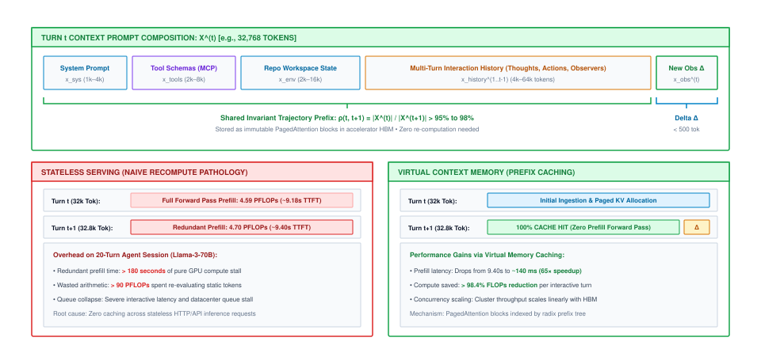
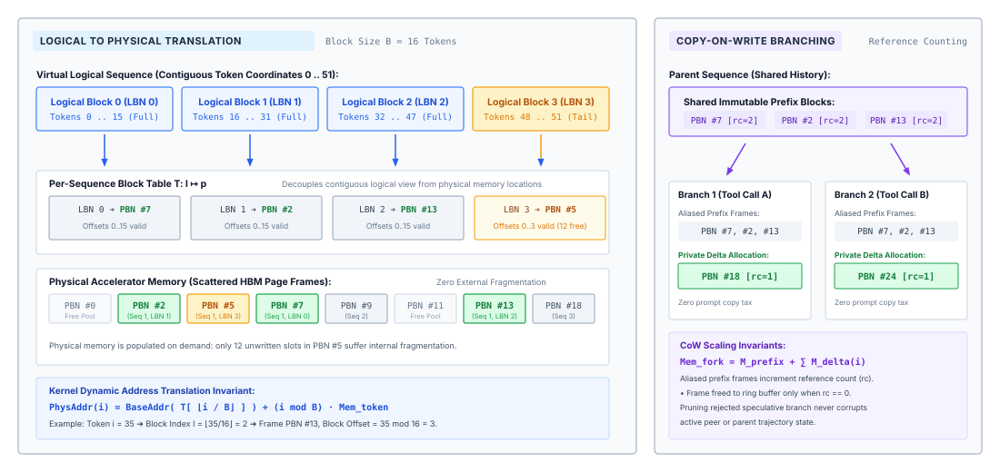
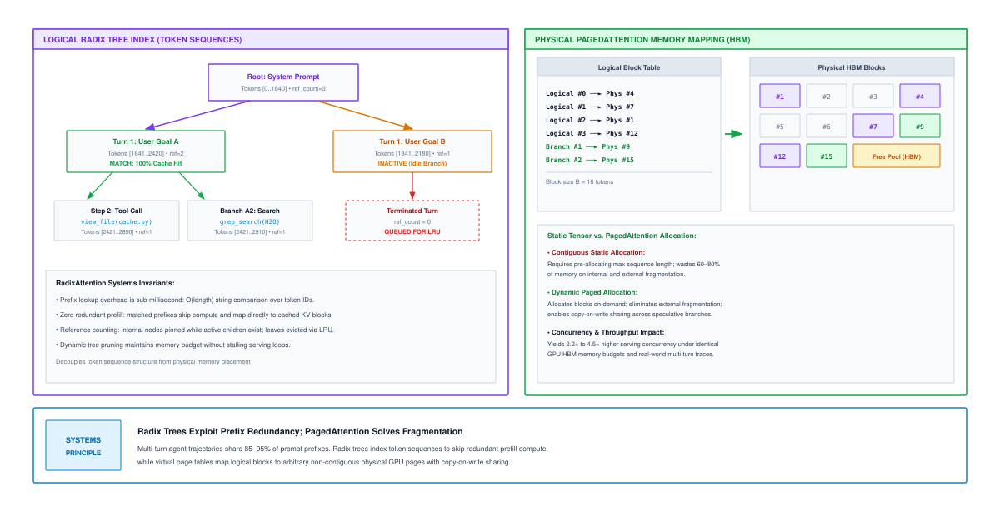
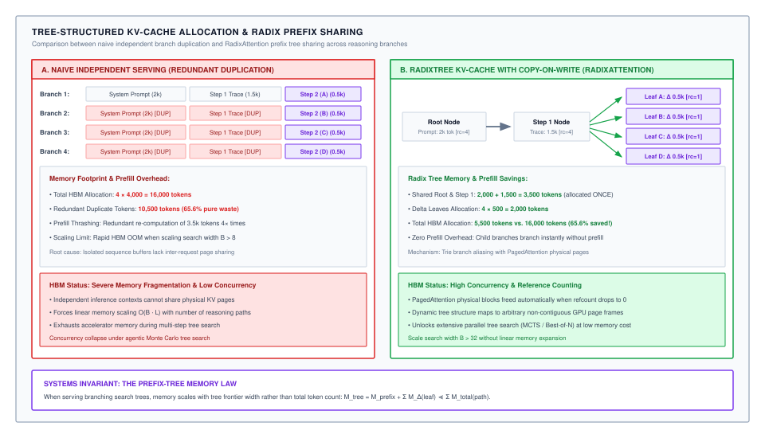
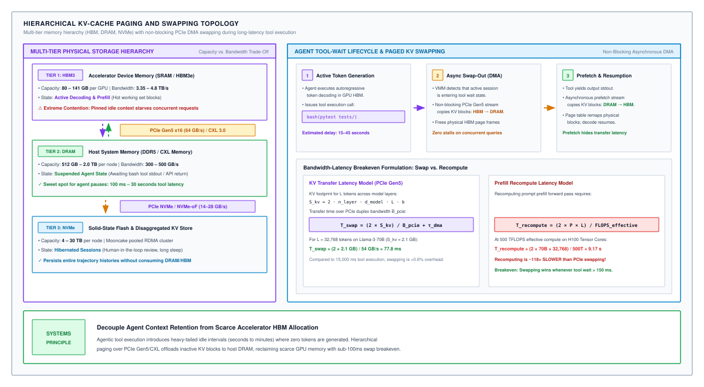
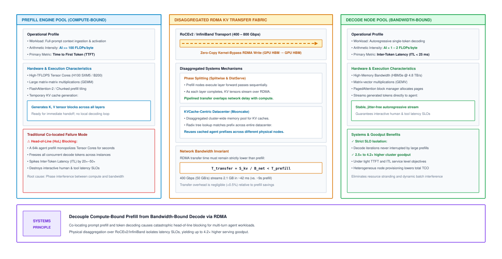

# Virtual Memory & PagedAttention {#sec-vol3-virtual-memory}

In an autonomous machine learning system, the transformer's attention mechanism functions as the primary cognitive bus, but its Key-Value (KV) cache acts as a voracious consumer of physical accelerator memory. When software frameworks treat long-horizon agent trajectories as unbounded append-only logs, the underlying accelerator hardware encounters severe thermodynamic, bandwidth, and capacity walls that collapse cluster concurrency. Static memory allocation schemes strand up to 80 percent of High-Bandwidth Memory (HBM) in unusable fragments, while stateless inference protocols burn tens of PFLOPs re-evaluating invariant prompt prefixes across iterative tool invocations. Sustaining long-horizon autonomous agency across finite silicon requires virtualizing the context memory hierarchy. By decoupling logical token sequences from physical memory addresses through block-level paging, dynamic prefix indexing, prefill-decode disaggregation, and hardware-aware activation compression, the serving runtime transforms volatile GPU memory into an elastic, high-throughput execution substrate.

## Purpose {.unnumbered .unlisted}

::: {.content-visible when-format="pdf"}
\begin{marginfigure}
\mlagentstack{10}{10}{10}{10}{95}{10}
\caption{The Agentic Machine Learning Systems Stack.}
\end{marginfigure}
:::

_Why does an agent swarm with shared instructions waste 80 percent of accelerator memory?_

This chapter establishes the systems architecture required to transform volatile accelerator memory into a virtualized, demand-paged context substrate for autonomous agents. While context working sets govern what tokens must reside in attention from an algorithmic perspective, virtual context memory governs the physical silicon mechanics of allocating, addressing, paging, sharing, and disaggregating Key-Value (KV) activation tensors across accelerator High-Bandwidth Memory (HBM), host DRAM, and remote network tiers. We analyze the physical tensor geometry of attention architectures, formulate the virtual-to-physical address translation mechanics of PagedAttention, evaluate dynamic prefix indexing and eviction via Radix trees, architect prefill-decode disaggregated clusters over remote direct memory access (RDMA) networks, and design hardware-aware KV cache compression pipelines. In agentic systems, the runtime must co-design the neural policy proposal engine with deterministic execution boundaries.

::: {.content-visible when-format="pdf"}
\newpage
:::

::: {.callout-learning-objectives}
- **Derive** the physical memory footprint and arithmetic intensity of Key-Value caches across Multi-Head, Multi-Query, Grouped-Query, and Multi-Head Latent Attention geometries, quantifying the exact sources of internal and external memory fragmentation.
- **Formulate** the virtual-to-physical address translation mechanics of PagedAttention, proving how fixed-size physical memory blocks eliminate external fragmentation and mathematically bound internal tail waste.
- **Architect** Copy-on-Write (CoW) page sharing and dynamic Radix tree prefix indexing for multi-turn agent trajectories and branching test-time search, calculating the resulting expansion in speculative branch capacity.
- **Evaluate** the scheduling conflicts between compute-bound prefill passes and memory-bandwidth-bound autoregressive decode iterations, analyzing how chunked prefill and hierarchical memory swapping stabilize inter-token latency.
- **Design** prefill-decode disaggregated serving topologies over high-bandwidth RDMA networks, sizing cluster node ratios and pipelining remote KV block transfers to eliminate interference.
- **Quantify** the trade-offs of hardware-aware KV cache compression, comparing FP8 numerical representations (E4M3 versus E5M2), outlier-channel isolation, and low-rank singular value decomposition (SVD) on Tensor Core throughput.
:::

## The Physical Geometry of Attention Memory {#sec-vol3-virtualmem-geometry}

An enterprise inference cluster hosting a fleet of 128 autonomous software engineering agents on an 8-GPU NVIDIA H100 node crashes with an Out-of-Memory (OOM) fault during a synchronized test-suite run. Hardware telemetry collected at the instant of failure reveals a striking physical anomaly: while the CUDA driver reports $100\%$ allocated capacity across all $640\text{ GB}$ of High-Bandwidth Memory (HBM3), the aggregate token occupancy across active agent contexts accounts for only $218.8\text{ GB}$—an effective memory utilization of just $34.2\%$. More than $420\text{ GB}$ of expensive silicon memory sits completely idle, trapped inside pre-allocated contiguous tensor buffers reserved for theoretical worst-case sequence lengths that the agents never reached.

In classical computer architecture, memory allocation pathologies arise when physical hardware constraints are hidden beneath inflexible software abstractions [@hennessy2011computer]. In transformer-based serving runtimes, this pathology is rooted in the physical geometry of the **Key-Value (KV) cache**\index{Key-Value (KV) cache}. Autoregressive generation requires that every newly decoded token attend to the representations of all preceding tokens in the sequence. To avoid recomputing Key and Value activation vectors across dozens of transformer layers at every decode step, serving engines materialize these intermediate activations in accelerator memory. Understanding why contiguous allocation collapses requires first formalizing the mathematical footprint of these tensors across modern attention topologies.

### Mathematical derivation of footprint per token

Consider a transformer model characterized by the following structural hyperparameters:

- $n_{\text{layers}}$: total number of transformer layers ($L$).
- $d_{\text{model}}$: hidden state dimensionality.
- $n_{\text{heads}}$: number of Query attention heads ($H_Q$).
- $d_{\text{head}} = d_{\text{model}} / n_{\text{heads}}$: dimensionality of each individual attention head ($d_h$).
- $n_{\text{kv\_heads}}$: number of Key and Value attention heads ($H_{\text{KV}}$).
- $b$: storage precision in bytes per element (e.g., $b = 2$ for FP16/BF16, $b = 1$ for FP8, $b = 0.5$ for INT4).

During autoregressive generation, at each layer $l \in [1, n_{\text{layers}}]$, the model projects the hidden activation $\mathbf{x}_t \in \mathbb{R}^{d_{\text{model}}}$ of token $t$ into key and value representations:

$$\mathbf{k}_t^{(l)} = \mathbf{x}_t \mathbf{W}_K^{(l)}, \quad \mathbf{v}_t^{(l)} = \mathbf{x}_t \mathbf{W}_V^{(l)}$$

where $\mathbf{W}_K^{(l)}, \mathbf{W}_V^{(l)} \in \mathbb{R}^{d_{\text{model}} \times (n_{\text{kv\_heads}} \cdot d_{\text{head}})}$.

For standard **Multi-Head Attention (MHA)**\index{Multi-Head Attention} [@vaswani2017], where the number of KV heads equals the number of Query heads ($n_{\text{kv\_heads}} = n_{\text{heads}}$), each token requires storing one Key vector and one Value vector of dimension $d_{\text{model}}$ per layer. The physical memory footprint consumed by a single token, denoted $S_{\text{token}}$, is derived as:

$$S_{\text{token, MHA}} = 2 \times b \times n_{\text{layers}} \times d_{\text{model}} \quad \left[\frac{\text{bytes}}{\text{token}}\right]$$

where the coefficient $2$ accounts for the dual Key and Value tensors. For an agent trajectory spanning an active context length of $S$ tokens, the cumulative KV cache memory footprint is:

$$M_{\text{KV, MHA}}(S) = S \cdot S_{\text{token, MHA}} = 2 \cdot b \cdot n_{\text{layers}} \cdot d_{\text{model}} \cdot S \quad [\text{bytes}]$$

To appreciate the scale of this footprint, consider a 70-billion parameter MHA foundation model with $n_{\text{layers}} = 80$, $d_{\text{model}} = 8192$, operating in 16-bit precision ($b = 2$ bytes). Storing the KV activations of a single token requires:

$$S_{\text{token}} = 2 \times 2 \times 80 \times 8192 = 2\text{,}621\text{,}440\text{ bytes} \approx 2.62\text{ MB/token}$$

A single autonomous coding agent operating across a 64,000-token context window ($S = 64\text{,}000$) consumes:

$$M_{\text{KV}} = 64\text{,}000 \times 2.621\text{ MB} \approx 167.77\text{ GB}$$

This volatile KV cache footprint exceeds the physical memory capacity of two entire $80\text{ GB}$ NVIDIA H100 GPUs before a single parameter weight or intermediate activation buffer is allocated.

### Attention geometries: MHA, MQA, GQA, and MLA

To mitigate this exponential memory consumption, foundation model architectures alter the structural ratio between Query heads and Key-Value heads:

1. **Multi-Query Attention (MQA)**\index{Multi-Query Attention} [@shazeer2019fast]: Collapses all Key and Value heads into a single head shared across all $n_{\text{heads}}$ Query heads ($n_{\text{kv\_heads}} = 1$). The per-token footprint collapses by a factor of $n_{\text{heads}}$:
   $$S_{\text{token, MQA}} = 2 \times b \times n_{\text{layers}} \times d_{\text{head}} = \frac{1}{n_{\text{heads}}} S_{\text{token, MHA}}$$
2. **Grouped-Query Attention (GQA)**\index{Grouped-Query Attention} [@ainslie2023gqa]: Partitions Query heads into $G$ disjoint groups, assigning one Key head and one Value head to each group ($n_{\text{kv\_heads}} = G$). The memory footprint scales proportionally to the compression ratio $G / n_{\text{heads}}$:
   $$S_{\text{token, GQA}} = 2 \times b \times n_{\text{layers}} \times (G \cdot d_{\text{head}}) = \frac{G}{n_{\text{heads}}} S_{\text{token, MHA}}$$
3. **Multi-Head Latent Attention (MLA)**\index{Multi-Head Latent Attention} [@deepseek2024v3]: Compresses Key and Value states into a low-dimensional shared latent space. Rather than caching full attention heads, the runtime projects the hidden state $\mathbf{x}_t$ into a compressed latent vector $\mathbf{c}_t^{\text{KV}} \in \mathbb{R}^{d_c}$ (where $d_c \ll n_{\text{heads}} \times d_{\text{head}}$), paired with a decoupled rotary key vector $\mathbf{k}_t^R \in \mathbb{R}^{d_R}$ used for Rotary Position Embeddings (RoPE). During decoding, the full Key and Value heads are reconstructed on the fly inside GPU SRAM using projection matrices $\mathbf{W}_{UK} \in \mathbb{R}^{d_c \times (n_{\text{heads}} \cdot d_{\text{head}})}$ and $\mathbf{W}_{UV} \in \mathbb{R}^{d_c \times (n_{\text{heads}} \cdot d_{\text{head}})}$. The cached footprint per token is:
   $$S_{\text{token, MLA}} = b \times n_{\text{layers}} \times (d_c + d_R)$$

| Model Architecture                   | Parameter Count | Layers ($n_{\text{layers}}$) | Hidden Dim ($d_{\text{model}}$) | Attention Type | Query / KV Heads ($n_{\text{heads}} / n_{\text{kv\_heads}}$) |   Precision ($b$)   |        Footprint Per Token ($S_{\text{token}}$)       | KV Cache at 32k Context | KV Cache at 128k Context |
|:-------------------------------------|:---------------:|:----------------------------:|:-------------------------------:|:--------------:|:------------------------------------------------------------:|:-------------------:|:-----------------------------------------------------:|:-----------------------:|:------------------------:|
| **LLaMA-2 70B** [@touvron2023llama2] |       70B       |              80              |               8192              |      MHA       |                           64 / 64                            | BF16 ($2\text{ B}$) | $2\text{,}621\text{,}440\text{ B}$ ($2.62\text{ MB}$) |    $83.89\text{ GB}$    |    $335.54\text{ GB}$    |
| **Llama-3 70B** [@dubey2024llama]    |       70B       |              80              |               8192              |  GQA ($8:1$)   |                            64 / 8                            | BF16 ($2\text{ B}$) |      $327\text{,}680\text{ B}$ ($320\text{ KB}$)      |    $10.49\text{ GB}$    |    $41.94\text{ GB}$     |
| **Qwen-2.5 72B**                     |       72B       |              80              |               8192              |  GQA ($8:1$)   |                            64 / 8                            | BF16 ($2\text{ B}$) |      $327\text{,}680\text{ B}$ ($320\text{ KB}$)      |    $10.49\text{ GB}$    |    $41.94\text{ GB}$     |
| **Command R+**                       |       104B      |              64              |              12288              |  GQA ($8:1$)   |                            96 / 8                            | BF16 ($2\text{ B}$) |      $262\text{,}144\text{ B}$ ($256\text{ KB}$)      |     $8.39\text{ GB}$    |    $33.55\text{ GB}$     |
| **DeepSeek-V3** [@deepseek2024v3]    |    671B (MoE)   |              61              |               7168              |      MLA       |                     Latent ($512 + 64$)                      |  FP8 ($1\text{ B}$) |      $35\text{,}136\text{ B}$ ($34.3\text{ KB}$)      |     $1.12\text{ GB}$    |     $4.50\text{ GB}$     |

: **Key-Value Cache Memory Footprint per Token**: Physical memory requirements across representative foundation model attention architectures. {#tbl-vol3-vm-model-footprint tbl-colwidths="[16,9,7,9,9,11,7,11,10,11]"}

As documented in @tbl-vol3-vm-model-footprint, architectural innovations such as GQA and MLA dramatically compress the theoretical memory required per token. However, the physical mechanics of allocating these tensors on accelerator hardware introduce severe inefficiencies.

### The fragmentation pathology of contiguous allocation

In conventional deep learning frameworks, tensors are required to reside in physically contiguous virtual memory addresses to allow standard Basic Linear Algebra Subprograms (BLAS) routines to operate with fixed stride multipliers. When serving an autoregressive sequence, an inference engine allocating contiguous memory faces a fundamental scheduling dilemma: *the total length of an agent trajectory is non-deterministic and cannot be predicted a priori*.

To accommodate an active request, early serving systems allocated a static, contiguous 5-dimensional tensor sized to the theoretical maximum context window $S_{\text{max}}$:

$$\mathcal{T}_{\text{KV}} \in \mathbb{R}^{B_{\text{batch}} \times n_{\text{layers}} \times 2 \times S_{\text{max}} \times n_{\text{kv\_heads}} \times d_{\text{head}}}$$

This static allocation strategy induces catastrophic **internal fragmentation**\index{Internal fragmentation}. If request $i$ executes a task that terminates after generating $S_i$ tokens, where $S_i \ll S_{\text{max}}$, the allocated memory segment corresponding to indices $[S_i, S_{\text{max}}-1]$ remains strictly reserved in HBM. Because this memory cannot be assigned to any other concurrent request, it sits completely idle.

To circumvent static over-allocation, systems implement dynamic memory allocators (such as the PyTorch caching allocator or buddy allocation algorithms) that grow the KV tensor incrementally as tokens are generated. When an agent sequence exceeds its current buffer capacity, the allocator requests a larger contiguous slice (typically doubling capacity: $S \to 2S$), copies all existing activations from the old buffer to the new buffer, and frees the original allocation. This dynamic strategy trades internal waste for three distinct hardware penalties:

1. **Memory Copy Overhead:** Dynamically reallocating and copying high-dimensional tensors over GPU global memory buses consumes valuable HBM bandwidth, stalling active Tensor Core computation.
2. **Memory Compaction Pauses:** As requests arrive, grow, and terminate asynchronously, free memory becomes partitioned into small, isolated physical slices. This phenomenon represents classic **external fragmentation**\index{External fragmentation}.
3. **Premature Out-of-Memory Aborts:** If an incoming agent trajectory requires a contiguous allocation of $16\text{ GB}$ to process a repository context, the allocation request will fail with an OOM error if the largest contiguous free memory block is only $8\text{ GB}$—even if the cluster possesses over $100\text{ GB}$ of aggregate unallocated HBM scattered across memory holes.

The total memory fragmentation ratio $\Phi_{\text{frag}}$ within an accelerator serving pool is formalized as:

$$\Phi_{\text{frag}} = 1 - \frac{\sum_{i=1}^{N} S_i \cdot S_{\text{token}}}{M_{\text{allocated}}}$$

where $N$ is the number of active sequences, $S_i$ is the actual token length of sequence $i$, and $M_{\text{allocated}}$ is the total physical memory reserved by the allocator. Empirical profiling across unpaged production inference clusters demonstrates that $\Phi_{\text{frag}}$ consistently hovers between **$60\%$ and $80\%$** [@kwon2023vllm]. This stranded capacity directly throttles batching concurrency, increasing cluster operating costs by a factor of three to five.

### Trajectory prompt anatomy and monotonic prefix expansion

The memory fragmentation crisis is intensely exacerbated by the operational mechanics of autonomous agent control loops. Unlike conversational chatbots that exchange brief, self-contained text messages, an autonomous software agent executes a stateful perception-action trajectory over dozens or hundreds of discrete environment steps:

$$s_0 \xrightarrow{\pi_\theta} a_0 \xrightarrow{\mathcal{E}} o_1 \longrightarrow s_1 \xrightarrow{\pi_\theta} a_1 \xrightarrow{\mathcal{E}} o_2 \longrightarrow \dots \longrightarrow s_t$$

At step $t$, the full prompt sequence submitted to the foundation model, denoted $X^{(t)}$, is structured as an append-only token sequence:

$$X^{(t)} = \left[ \mathbf{x}_{\text{sys}}, \, \mathbf{x}_{\text{tools}}, \, \mathbf{x}_{\text{env}}, \, \mathbf{x}_{\text{history}}^{(1:t-1)}, \, \mathbf{x}_{\text{action}}^{(t-1)}, \, \mathbf{x}_{\text{obs}}^{(t)} \right]$$

| Segment                                                                               | Semantic Role                                               |       Token Length ($S$)       |       Mutation Cadence      |   Cache Invalidation Risk   |
|:--------------------------------------------------------------------------------------|:------------------------------------------------------------|:------------------------------:|:---------------------------:|:---------------------------:|
| **System Prompt** ($\mathbf{x}_{\text{sys}}$)                                         | Core identity, behavioral constraints, safety guardrails    |      $500 - 2\text{,}000$      | Invariant across all agents |  Zero (static across fleet) |
| **Tool Schemas** ($\mathbf{x}_{\text{tools}}$)                                        | OpenAPI/JSON specifications for shell, file, and API tools  | $2\text{,}000 - 8\text{,}000$  |   Invariant per agent type  |  Zero (static per session)  |
| **Environment Context** ($\mathbf{x}_{\text{env}}$)                                   | Repository AST maps, system paths, issue descriptions       | $4\text{,}000 - 32\text{,}000$ |   Invariant per workspace   | Low (updates on major sync) |
| **Trajectory History** ($\mathbf{x}_{\text{history}}^{(1:t-1)}$)                      | Prior thought traces, actions executed, tool responses      | $2\text{,}000 - 64\text{,}000$ |  Strictly monotonic append  |   Zero (immutable history)  |
| **Active Turn** ($\mathbf{x}_{\text{action}}^{(t-1)}, \mathbf{x}_{\text{obs}}^{(t)}$) | The immediate tool invocation and returned execution output |     $200 - 16\text{,}000$      |       Dynamic per step      |  High (divergent execution) |

: **Structural Anatomy of Autonomous Agent Prompts**: Typical token lengths, mutation cadences, and cache invalidation characteristics. {#tbl-vol3-vm-prompt-anatomy tbl-colwidths="[22,33,15,15,15]"}

As formalized in @tbl-vol3-vm-prompt-anatomy, the token sequence $X^{(t)}$ exhibits an overwhelming degree of **prefix sharing** with $X^{(t+1)}$. The physical relationship between these segments across consecutive execution steps is illustrated in @fig-vol3-vm-prompt-anatomy.

::: {#fig-vol3-vm-prompt-anatomy fig-env="figure" fig-pos="htb" fig-cap="**Anatomy and Monotonic Expansion of Agent Prompts Across Consecutive Interaction Turns**: The prompt exhibits extreme prefix locality. Invariant system instructions, tool schemas, and environment context form an immutable root prefix. Each turn appends action decisions and environment observations, preserving the historical prefix while incrementally growing the physical context window." fig-alt="Stacked bar diagram illustrating prompt composition across Turn 1, Turn 2, and Turn 3. The bottom bars represent the invariant system prompt, tool schemas, and workspace context, followed by monotonic additions of action and observation tokens."}

:::

In his classical formulation of memory locality, Peter Denning established that software programs exhibit temporal and spatial access concentrations [@denning1970]. In agentic machine learning systems, context memory access patterns manifest as an extreme physical property: **Trajectory Prefix Locality**\index{Trajectory Prefix Locality}.

::: {#pri-trajectory-prefix-locality .callout-principle title="Trajectory prefix locality invariant"}
For any autonomous agent executing an append-only perception-action trajectory of horizon $T$, the prefix sharing ratio $\rho(t, t+1)$ between consecutive execution turns $t$ and $t+1$:

$$\rho(t, t+1) = \frac{|X^{(t)} \cap X^{(t+1)}|}{|X^{(t+1)}|} = \frac{|X^{(t)}|}{|X^{(t)}| + |\Delta \mathbf{x}^{(t+1)}|}$$

approaches unity as the trajectory horizon $t$ expands:

$$\lim_{t \to \infty} \rho(t, t+1) = 1.0$$
:::

### The computational disaster of stateless serving

When an autonomous agent interacts with a conventional stateless serving endpoint, the serving runtime treats every turn $t$ as an independent, isolated transaction. Because the endpoint does not preserve state between calls, the inference engine must execute a complete **prompt prefill**\index{Prompt prefill} forward pass over the entire token sequence $X^{(t)}$ before emitting the first generated token.

For a transformer model containing $P$ active parameters, computing the prefill pass over an input sequence of length $S = |X^{(t)}|$ requires an arithmetic operation count scaling as:

$$\text{FLOPs}_{\text{prefill}}(S) \approx 2 P S + 4 n_{\text{layers}} d_{\text{model}} S^2$$

where the quadratic term $4 n_{\text{layers}} d_{\text{model}} S^2$ accounts for the full self-attention matrix multiplications ($\mathbf{Q}\mathbf{K}^T$ and $\mathbf{A}\mathbf{V}$).

If an agent executes a trajectory of $T$ turns, where turn 1 begins with a root prompt of length $S_1 = L_{\text{root}}$ (system instructions, tool schemas, environment map), and each subsequent turn appends an average observation delta of $\Delta S$ tokens, the cumulative tokens ingested by a stateless serving engine across the trajectory is:

$$S_{\text{stateless}}(T) = \sum_{t=1}^{T} \left( L_{\text{root}} + (t-1)\Delta S \right) = T \cdot L_{\text{root}} + \frac{T(T-1)}{2} \Delta S = \mathcal{O}(T \cdot L_{\text{root}} + T^2 \Delta S)$$

The cumulative arithmetic work expended by the cluster scales **quadratically** with the trajectory horizon $T$. For a 20-turn agent session ($T = 20$) with $L_{\text{root}} = 16\text{,}000$ and $\Delta S = 800$, stateless serving forces the accelerator to process:

$$S_{\text{stateless}} = 20 \times 16\text{,}000 + \frac{20 \times 19}{2} \times 800 = 320\text{,}000 + 152\text{,}000 = 472\text{,}000\text{ tokens}$$

In contrast, the actual information content produced across the trajectory represents only the terminal context length:

$$S_{\text{terminal}} = 16\text{,}000 + (19 \times 800) = 31\text{,}200\text{ tokens}$$

Stateless serving forces the accelerator cluster to recompute **$440\text{,}800$ redundant tokens**—a staggering **$93.4\%$ waste of compute capacity**.

::: {.callout-note title="Napkin math: TTFT latency collapse and redundant prefill arithmetic"}

**Problem:** An autonomous software engineering agent runs a $T = 20$-turn debugging trajectory on an 8-GPU NVIDIA H100 node serving Llama-3 70B in BF16 ($P = 70 \times 10^9$ parameters). The cluster sustains an effective prefill compute throughput of $R_{\text{prefill}} = 500\text{ TFLOPS}$ ($5 \times 10^{14}\text{ FLOPs/s}$). The agent prompt contains an initial root sequence of $L_{\text{root}} = 16\text{,}000$ tokens, expanding by $\Delta S = 800$ tokens per turn. Calculate: (1) the cumulative prefill compute time and turn-20 Time-to-First-Token (TTFT) under stateless serving, (2) the corresponding metrics under stateful prefix caching, and (3) the net speedup delivered by virtual context retention.

**Variables:**

- Parameters: $P = 70 \times 10^9$.
- Compute Throughput: $R_{\text{prefill}} = 5 \times 10^{14}\text{ FLOPs/s}$.
- Trajectory Horizon: $T = 20$ turns.
- Root Prompt Length: $L_{\text{root}} = 16\text{,}000$ tokens.
- Incremental Expansion: $\Delta S = 800$ tokens/turn.
- Arithmetic Intensity per Token: $\approx 2P = 1.4 \times 10^{11}\text{ FLOPs/token}$.
- Processing Time per Token: $\tau_{\text{token}} = \frac{1.4 \times 10^{11}}{5 \times 10^{14}} = 2.8 \times 10^{-4}\text{ s/token} = 0.28\text{ ms/token}$.

**Evaluation:**

1. *Stateless Execution (Zero Context Retention):*
Total tokens prefilled:
$$S_{\text{total}} = \sum_{t=1}^{20} [16\text{,}000 + 800(t-1)] = 472\text{,}000\text{ tokens}$$
Cumulative prefill execution time:
$$T_{\text{prefill, stateless}} = 472\text{,}000 \times 2.8 \times 10^{-4}\text{ s} = \mathbf{132.16\text{ seconds}}$$
At turn 20, the prompt length is $S_{20} = 16\text{,}000 + (19 \times 800) = 31\text{,}200$ tokens. The agent waits:
$$\text{TTFT}_{\text{turn-20, stateless}} = 31\text{,}200 \times 2.8 \times 10^{-4}\text{ s} = \mathbf{8.74\text{ seconds}}$$

2. *Stateful Virtual Memory Execution (Prefix Caching):*
Turn 1 executes a cold prefill over the root prompt:
$$T_1 = 16\text{,}000 \times 2.8 \times 10^{-4}\text{ s} = 4.48\text{ seconds}$$
For each subsequent turn $t \in [2, 20]$, the serving engine identifies the preceding sequence in the virtual memory cache ($100\%$ prefix hit), executing prefill *only* on the new delta $\Delta S = 800$ tokens:
$$T_{2\dots 20} = 19 \times (800 \times 2.8 \times 10^{-4}\text{ s}) = 19 \times 0.224\text{ s} = 4.26\text{ seconds}$$
Cumulative prefill execution time:
$$T_{\text{prefill, cached}} = 4.48\text{ s} + 4.26\text{ s} = \mathbf{8.74\text{ seconds}}$$
Per-turn TTFT for all subsequent turns $t \ge 2$:
$$\text{TTFT}_{\text{turn-}t\text{, cached}} = 800 \times 2.8 \times 10^{-4}\text{ s} = \mathbf{224\text{ milliseconds}}$$

3. *Comparative Performance Speedup:*
- Trajectory prefill compute reduction: $\frac{132.16\text{ s}}{8.74\text{ s}} = \mathbf{15.1\times\text{ faster}}$.
- Interactive TTFT reduction at turn 20: $\frac{8.74\text{ s}}{0.224\text{ s}} = \mathbf{39.0\times\text{ faster}}$.
- Cluster energy and FLOP savings: $61.71\text{ PFLOPs}$ eliminated.

**Systems Insight:** In an agentic perception-action loop, the human user or scheduling orchestrator experiences prefill latency as an interactive dead stall. Recomputing identical token sequences across turns destroys conversational responsiveness and starves GPU Tensor Cores. Retaining historical KV activations in virtualized accelerator memory converts quadratic prefill complexity ($\mathcal{O}(T \cdot L_{\text{root}} + T^2 \Delta S)$) into an optimal linear streaming pipeline ($\mathcal{O}(L_{\text{root}} + T \Delta S)$).

:::

The arithmetic necessity of retaining the Key-Value cache reveals an inescapable hardware trade-off: an inference engine cannot eliminate redundant prefill without physically storing multi-gigabyte activation tensors across long temporal horizons. Solving this challenge without succumbing to the contiguous allocation fragmentation crisis requires virtualizing the memory addressing architecture.

## PagedAttention: Virtual Memory for KV Caches {#sec-vol3-virtualmem-pagedattention}

An autonomous agent attempting to solve an issue in an open-source repository appends a 2,048-token stack trace into an active context of 64,000 tokens. The serving runtime throws a runtime exception: `CUDA out of memory: tried to allocate 10.49 GB`. The on-call systems engineer inspects the GPU status via `nvidia-smi` and discovers that $22.4\text{ GB}$ of unallocated HBM remains completely free. The allocator failed because physical memory was partitioned into dozens of non-contiguous segments; the largest contiguous free memory slice spanned only $6.2\text{ GB}$. The runtime was forced to terminate the agent's task because it could not allocate a single physically contiguous buffer for the expanding KV cache.

This failure precisely mirrors the memory allocation crisis that crippled multi-programmed mainframe computers in the late 1950s. If an operating system required every software process to occupy physically contiguous magnetic core memory, variable-length programs rapidly fragmented physical storage, precipitating catastrophic allocation failures. In 1962, Kilburn and colleagues resolved this fundamental limitation on the Ferranti Atlas computer by inventing **virtual memory paging** [@kilburn1962onelevel]. By partitioning contiguous virtual address spaces into uniform physical blocks ("pages") mapped through dynamic page tables, the Atlas decoupled logical software abstractions from physical silicon layouts.

In 2023, Kwon and colleagues adapted this foundational operating systems principle to machine learning accelerators, introducing **PagedAttention**\index{PagedAttention} [@kwon2023vllm].

::: {#dfn-paged-attention .callout-definition title="PagedAttention"}
***PagedAttention*** is an attention algorithm and memory management architecture that stores Key and Value activation vectors in non-contiguous, fixed-size physical memory blocks, translating logical token positions to physical memory addresses via dynamic page tables during kernel execution.

1. **Significance:** Eliminates external memory fragmentation entirely and bounds internal fragmentation to the final block of a sequence, raising effective accelerator memory utilization from under $40\%$ to over $96\%$.
2. **Distinction:** Classical operating system paging translates 1D scalar byte addresses via hardware Translation Lookaside Buffers (TLBs) inside the CPU Memory Management Unit (MMU). PagedAttention translates multi-dimensional tensor coordinates via software-managed page tables loaded directly into GPU Shared Memory (SRAM) and registers during kernel execution.
3. **Common Pitfall:** Assuming small block sizes are unconditionally optimal; excessively small blocks ($B < 8$) degrade memory coalescing across GPU global memory buses, while large blocks ($B \ge 64$) re-introduce internal tail fragmentation.
:::

### Virtual-to-physical block mapping

Under PagedAttention, an agent's logical sequence of tokens $\mathbf{X} = (x_0, x_1, \dots, x_{S-1})$ is partitioned into a sequence of logical blocks of uniform capacity $B_{\text{block}}$ tokens (typically $B_{\text{block}} \in \{16, 32\}$):

$$\text{Logical Block } j = \left( x_{j \cdot B_{\text{block}}}, \, x_{j \cdot B_{\text{block}} + 1}, \, \dots, \, x_{(j+1) \cdot B_{\text{block}} - 1} \right)$$

The serving engine maintains a centralized, host-managed **Block Table** (or Page Table) that maps each logical block index $j$ of a given request to a physical block index $P$ resident in accelerator HBM:

$$\mathcal{M}: (\text{Request\_ID}, \, j) \longrightarrow P \in \{0, 1, \dots, N_{\text{physical\_blocks}} - 1\}$$

Each physical block in accelerator HBM allocates fixed, contiguous storage for exactly $B_{\text{block}}$ tokens across all layers and heads:

$$\mathcal{T}_{\text{block}} \in \mathbb{R}^{2 \times n_{\text{layers}} \times B_{\text{block}} \times n_{\text{kv\_heads}} \times d_{\text{head}}}$$

When the attention kernel executes on the GPU, it computes the physical memory address for any arbitrary token at logical sequence position $i$ using integer arithmetic:

$$\text{Logical Block Index: } j = \left\lfloor \frac{i}{B_{\text{block}}} \right\rfloor$$

$$\text{Intra-Block Offset: } o = i \pmod{B_{\text{block}}}$$

$$\text{Physical Address: } \mathcal{A}(i) = \text{Base}(\mathcal{M}(\text{Request\_ID}, j)) + o \cdot S_{\text{token\_layer}}$$

where $S_{\text{token\_layer}} = 2 \cdot b \cdot n_{\text{kv\_heads}} \cdot d_{\text{head}}$ is the physical byte footprint of one token at a single transformer layer.

During the autoregressive decode phase, the model emits one token at a time. The serving runtime appends the newly computed Key and Value vectors into the current physical block at offset $o = i \bmod B_{\text{block}}$. Only when the current block becomes completely saturated ($o = B_{\text{block}} - 1$) does the allocator allocate a fresh physical block from the global free-block pool, appending its physical identifier to the request's block table.

### Paged attention kernel execution

Traditional high-performance attention kernels (such as FlashAttention [@dao2022]) achieve arithmetic saturation by assuming that the Key and Value matrices are laid out contiguously in HBM, allowing memory controllers to burst consecutive cache lines directly into on-chip SRAM via direct memory strides.

PagedAttention preserves this SRAM tiling efficiency while reading from physically scattered memory blocks. As illustrated in @fig-vol3-vm-pagedattention, the attention kernel receives the request's block table as an auxiliary input tensor passed into the GPU execution grid.

::: {#fig-vol3-vm-pagedattention fig-env="figure" fig-pos="htb" fig-cap="**Virtual-to-Physical Address Translation and Memory Layout in PagedAttention**: Logical sequence tokens are partitioned into uniform blocks of size $B_{\text{block}} = 4$. Logical blocks are dynamically mapped through a block table to non-contiguous physical memory blocks scattered across accelerator HBM. The GPU attention kernel traverses the block table to gather non-contiguous Keys and Values directly into on-chip SRAM during online softmax reduction." fig-alt="Architecture diagram showing logical blocks mapped through a block table into non-contiguous physical blocks in GPU HBM, with a detailed inset of SRAM tile loading."}

:::

Mathematically, during the autoregressive decode step for query vector $\mathbf{q}_i$, the attention weights $\alpha_{i, k}$ and output vector $\mathbf{o}_i$ are evaluated over historical tokens $k \in [0, i]$ as:

$$\alpha_{i, k} = \frac{\exp\left( \frac{1}{\sqrt{d_h}} \mathbf{q}_i^T \mathbf{k}_k \right)}{\sum_{m=0}^{i} \exp\left( \frac{1}{\sqrt{d_h}} \mathbf{q}_i^T \mathbf{k}_m \right)}, \quad \mathbf{o}_i = \sum_{k=0}^{i} \alpha_{i, k} \mathbf{v}_k$$

In the PagedAttention CUDA/Triton kernel, the vectors $\mathbf{k}_k$ and $\mathbf{v}_k$ are retrieved via indirect block addressing:

$$\mathbf{k}_k = \mathcal{K}\left[ \mathcal{M}\left(\left\lfloor \frac{k}{B_{\text{block}}} \right\rfloor\right), \, k \pmod{B_{\text{block}}} \right]$$

$$\mathbf{v}_k = \mathcal{V}\left[ \mathcal{M}\left(\left\lfloor \frac{k}{B_{\text{block}}} \right\rfloor\right), \, k \pmod{B_{\text{block}}} \right]$$

The kernel assigns GPU thread warps to iterate over logical blocks. For each logical block $j$, the warp reads the physical block index $P = \mathcal{M}(j)$ from the block table resident in constant memory or L1 cache, issues coalesced global memory load instructions to fetch the $B_{\text{block}}$ Key vectors into SRAM, computes partial dot products $\mathbf{q}_i^T \mathbf{k}_k$, updates the online softmax normalizer using the FlashAttention rescaling trick [@dao2022], loads the corresponding Value vectors from physical block $P$, and accumulates the partial output tensor $\mathbf{o}_i$. Because block translation is fused directly into the SRAM inner loop, PagedAttention incurs less than **$1.5\%$ kernel runtime overhead** compared to an idealized contiguous attention kernel [@kwon2023vllm].

### Elimination of external fragmentation and bounding internal waste

The shift to uniform block paging fundamentally alters the thermodynamics of accelerator memory:

1. **Elimination of External Fragmentation:** Because all physical blocks share an identical fixed capacity $B_{\text{block}}$, any free block anywhere in HBM can satisfy any allocation request from any agent. Physical memory allocation is reduced to managing a simple $O(1)$ free-list stack or bitmask. Contiguous memory compaction pauses, memory-hole tracking, and allocation failures due to external fragmentation are mathematically eliminated:
   $$\Phi_{\text{ext}} = 0$$
2. **Bounding Internal Fragmentation:** Internal fragmentation is restricted strictly to the final, partially filled block of an active sequence. If an agent generates a sequence of length $S$, the number of fully saturated physical blocks is $\lfloor S / B_{\text{block}} \rfloor$, and the number of active tokens occupying the final block is:
   $$S_{\text{tail}} = S \pmod{B_{\text{block}}}$$
   If $S_{\text{tail}} > 0$, the final block reserves capacity for $B_{\text{block}}$ tokens but stores only $S_{\text{tail}}$, leaving $B_{\text{block}} - S_{\text{tail}}$ unused slots. Assuming that sequence lengths modulo $B_{\text{block}}$ are uniformly distributed over $[0, B_{\text{block}}-1]$, the expected internal waste per sequence is:
   $$\mathbb{E}[\text{Waste}_{\text{internal}}] = \frac{B_{\text{block}} - 1}{2} \times S_{\text{token}}$$

For Llama-3 70B ($S_{\text{token}} = 320\text{ KB}$) operating with block size $B_{\text{block}} = 16$, the expected internal waste per active agent sequence is:

$$\mathbb{E}[\text{Waste}] = \frac{16 - 1}{2} \times 320\text{ KB} = 7.5 \times 320\text{ KB} = 2.40\text{ MB}$$

In a 32,000-token context ($M_{\text{KV}} \approx 10.49\text{ GB}$), this internal waste represents **less than $0.023\%$** of the allocated memory.

| Block Size ($B_{\text{block}}$) | Block Footprint (Llama-3 70B BF16) | Expected Tail Waste Per Trajectory |          Global Memory Bus Coalescing          |   Host Page Table Overhead   | Optimal Deployment Regime       |
|:-------------------------------:|:----------------------------------:|:----------------------------------:|:----------------------------------------------:|:----------------------------:|:--------------------------------|
|           **$B = 8$**           |          $2.56\text{ MB}$          |          $1.12\text{ MB}$          | Suboptimal (unaligned $128\text{B}$ transfers) | High (frequent block faults) | Memory-starved edge systems     |
|           **$B = 16$**          |          $5.12\text{ MB}$          |          $2.40\text{ MB}$          |   Optimal ($256\text{B}$ cache-line aligned)   |             Low              | General agent serving (default) |
|           **$B = 32$**          |         $10.24\text{ MB}$          |          $4.96\text{ MB}$          |   Optimal ($512\text{B}$ burst transactions)   |           Very Low           | High-throughput batch serving   |
|           **$B = 64$**          |         $20.48\text{ MB}$          |         $10.08\text{ MB}$          |                    Optimal                     |          Negligible          | Large-batch prefill engines     |

: **PagedAttention Block Size Trade-Offs**: Quantitative comparison across memory efficiency, bus coalescing, and runtime table overhead. {#tbl-vol3-vm-block-size-tradeoffs tbl-colwidths="[12,18,18,22,15,15]"}

As documented in @tbl-vol3-vm-block-size-tradeoffs, selecting $B_{\text{block}} = 16$ or $B_{\text{block}} = 32$ achieves an optimal balance between bus transaction alignment (matching the $128\text{B}$ and $256\text{B}$ memory transaction sectors of modern GPU memory controllers) and negligible tail waste.

### Copy-on-write (CoW) for speculative trajectories

Beyond eliminating memory fragmentation, the decisive architectural capability unlocked by virtual memory paging is **zero-copy context branching** via **Copy-on-Write (CoW)**\index{Copy-on-Write (CoW)}.

In deliberative agent architectures (@sec-vol3-deliberation), an agent does not execute in a purely linear chain. Instead, it regularly evaluates multiple speculative hypotheses in parallel via algorithms such as Tree-of-Thoughts (ToT) [@yao2023tree], Monte Carlo Tree Search (MCTS), or parallel beam rollouts. For example, a software debugging agent inspecting a complex failure might fork four parallel branches from an identical 48,000-token workspace context: Branch $A$ explores an in-place patch, Branch $B$ attempts a configuration rollback, Branch $C$ inserts diagnostic print assertions, and Branch $D$ executes an integration test suite.

Under an unpaged, contiguous serving regime, evaluating four speculative branches from a 48,000-token context requires physically replicating the KV cache four times. For Llama-3 70B, this replication consumes:

$$M_{\text{naive}} = 4 \times (48\text{,}000 \times 320\text{ KB}) = 4 \times 15.36\text{ GB} = 61.44\text{ GB}$$

Duplicating these tensors burns tens of gigabytes of HBM write bandwidth and rapidly exhausts accelerator capacity, capping search breadth.

With PagedAttention, context branching executes with **zero memory replication**:

1. **Physical Block Aliasing:** When Branches $A, B, C, D$ fork from the parent context, the runtime instantiates four distinct logical block tables. However, every entry in the child block tables points directly to the **identical physical block numbers** allocated to the parent. No activation data is copied. The serving engine increments an internal **reference counter** ($\text{ref\_count}$) associated with each physical block descriptor:
   $$\text{ref\_count}(P) \leftarrow \text{ref\_count}(P) + 1$$
2. **Copy-on-Write Mutation:** The shared parent blocks are marked strictly read-only. When child Branch $A$ generates a new token, it attempts to write to its current physical block. If the current block is a shared parent block whose reference counter satisfies $\text{ref\_count}(P) > 1$, the allocator intercepts the write:
   - It allocates a single, fresh physical block $P_{\text{new}}$ from the free pool.
   - It copies only the $B_{\text{block}}$ tokens of the saturated block ($B_{\text{block}} \times S_{\text{token\_layer}} = 5.12\text{ MB}$).
   - It decrements the reference counter of the original parent block ($\text{ref\_count}(P) \leftarrow \text{ref\_count}(P) - 1$).
   - It updates Branch $A$'s block table to point to $P_{\text{new}}$, setting $\text{ref\_count}(P_{\text{new}}) = 1$.
   - Subsequent tokens generated by Branch $A$ append directly into $P_{\text{new}}$ without further copying.

::: {#pri-virtual-context-invariant .callout-principle title="The virtual context invariant"}
In any virtual context memory architecture deploying block-level paging, the physical memory consumed by $K$ divergent agent trajectories sharing an identical parent prefix of length $L_{\text{prefix}}$ and generating divergent rollouts of length $L_{\text{branch}}$ is strictly bounded by:

$$M_{\text{physical}} = M_{\text{KV}}(L_{\text{prefix}}) + K \cdot M_{\text{KV}}(L_{\text{branch}}) + \mathcal{O}(K \cdot B_{\text{block}} \cdot S_{\text{token}})$$

as opposed to $K \cdot M_{\text{KV}}(L_{\text{prefix}} + L_{\text{branch}})$ in contiguous, unpaged architectures.
:::

::: {.callout-note title="Napkin math: Speculative branching capacity on an 8-GPU node"}

**Problem:** An 8-GPU NVIDIA H100 node ($640\text{ GB}$ total HBM3) hosts Llama-3 70B in BF16 ($S_{\text{token}} = 320\text{ KB}$). The model weights consume $140\text{ GB}$, while CUDA runtime buffers and activation scratchpads reserve $64\text{ GB}$, leaving $C_{\text{KV}} = 436\text{ GB}$ dedicated entirely to the KV cache. An agent forks speculative rollouts from a massive repository context of $L_{\text{prefix}} = 40\text{,}000$ tokens, where each speculative branch generates an exploration trace of $L_{\text{branch}} = 1\text{,}024$ tokens. Calculate the maximum number of concurrent speculative branches ($K$) that can be evaluated simultaneously under naive contiguous replication versus PagedAttention Copy-on-Write.

**Variables:**

- Dedicated KV Cache Capacity: $C_{\text{KV}} = 436\text{ GB}$.
- Shared Parent Context: $L_{\text{prefix}} = 40\text{,}000$ tokens.
- Speculative Branch Length: $L_{\text{branch}} = 1\text{,}024$ tokens.
- Token Footprint: $S_{\text{token}} = 327\text{,}680\text{ bytes} \approx 0.32\text{ MB}$.
- Parent Context Footprint: $M_{\text{prefix}} = 40\text{,}000 \times 327\text{,}680\text{ B} \approx 13.11\text{ GB}$.
- Branch Context Footprint: $M_{\text{branch}} = 1\text{,}024 \times 327\text{,}680\text{ B} \approx 0.336\text{ GB}$.

**Math:**

1. *Under Naive Contiguous Replication:*
Each branch must allocate private memory for the entire cumulative sequence ($L_{\text{prefix}} + L_{\text{branch}} = 41\text{,}024$ tokens):
$$M_{\text{per\_branch, naive}} = M_{\text{prefix}} + M_{\text{branch}} = 13.11\text{ GB} + 0.336\text{ GB} = 13.446\text{ GB}$$
Maximum concurrent speculative branches:
$$K_{\text{naive}} = \left\lfloor \frac{C_{\text{KV}}}{M_{\text{per\_branch, naive}}} \right\rfloor = \left\lfloor \frac{436\text{ GB}}{13.446\text{ GB}} \right\rfloor = \mathbf{32\text{ concurrent branches}}$$

2. *Under PagedAttention with Copy-on-Write (CoW):*
The shared parent context of $40\text{,}000$ tokens is instantiated **exactly once** in physical HBM, consuming $M_{\text{prefix}} = 13.11\text{ GB}$. The remaining memory is allocated purely to the private divergent tokens of each branch:
$$C_{\text{available\_branches}} = C_{\text{KV}} - M_{\text{prefix}} = 436\text{ GB} - 13.11\text{ GB} = 422.89\text{ GB}$$
Maximum concurrent speculative branches (assuming block size $B_{\text{block}} = 16$):
$$K_{\text{CoW}} = \left\lfloor \frac{422.89\text{ GB}}{M_{\text{branch}} + B_{\text{block}} \cdot S_{\text{token}}} \right\rfloor = \left\lfloor \frac{422.89\text{ GB}}{0.336\text{ GB} + 0.005\text{ GB}} \right\rfloor = \left\lfloor \frac{422.89}{0.341} \right\rfloor = \mathbf{1\text{,}240\text{ concurrent branches}}$$

**Result:** PagedAttention CoW expands the node's speculative search capacity from **$32$ to $1\text{,}240$ concurrent branches**—a **$38.75\times$ capacity expansion** on identical physical silicon.

**Systems Insight:** In naive serving, $97.5\%$ of physical accelerator memory is consumed by duplicate copies of the parent prompt. Virtual memory block aliasing shifts the scaling bottleneck of deliberation algorithms from prompt length to branch length ($\mathcal{O}(L_{\text{prefix}} + K \cdot L_{\text{branch}})$ rather than $\mathcal{O}(K \cdot L_{\text{prefix}})$). This expansion makes deep test-time deliberation (such as wide MCTS and massive parallel self-consistency) computationally and economically viable.

:::

PagedAttention resolves the physical memory addressing problem: it allows arbitrary non-contiguous physical blocks to back a logical sequence and enables zero-copy sharing across known, explicitly forked branches. However, PagedAttention assumes the serving system already knows which requests share memory. In an autonomous multi-agent swarm where dozens of heterogeneous agents submit requests asynchronously, the runtime requires a dynamic indexing data structure to discover, match, and reuse shared prefixes automatically.

## Memory Defragmentation, Page Tables, and Block Allocation {#sec-vol3-virtualmem-defrag}

An asynchronous multi-agent orchestrator managing 32 automated pull-request evaluation workers encounters severe latency jitter: while the cluster's median Time-to-First-Token (TTFT) is $210\text{ ms}$, the 99th-percentile tail latency explodes to $16.4\text{ seconds}$. Profiling the host CPU serving process reveals that the runtime is suffering from severe **prefix cache thrashing**. Because worker agents submit prompts with minor cosmetic variations in their system instructions and tool definitions, an unindexed page allocator fails to recognize common token substrings. The host engine repeatedly evicts warm physical blocks to satisfy incoming allocations, only to immediately re-prefill those exact same tokens hundreds of milliseconds later.

Eliminating this jitter requires combining block-level physical paging with a high-level algorithmic data structure that automatically discovers, indexes, and manages reusable prefixes across arbitrary agent requests.

### Dynamic prefix indexing via radix trees {#sec-vol3-vm-radix-tree}

In 2024, Zheng and colleagues introduced **RadixAttention** within the SGLang runtime [@zheng2024sglang]. Rather than relying on manual cache keys or static dictionary matching, RadixAttention maintains a dynamic, compressed Trie (**Radix Tree**\index{Radix Tree}) over token sequences in host memory, mapping logical prefix sequences directly onto physical PagedAttention blocks resident in accelerator HBM.

A Radix tree is a space-optimized Trie where every internal node with only one child is merged with its child. In the context of virtual memory serving:

- **Edges** are labeled with contiguous sequences of token IDs: $\mathbf{t} = (t_0, t_1, \dots, t_{k-1})$.
- **Nodes** maintain pointers to the physical PagedAttention block IDs in GPU memory that store the materialized Key-Value activations for those exact tokens.
- **Reference Counters** ($\text{ref\_count}$) track the number of active, in-flight agent requests currently executing over or attending to that node's physical blocks.
- **LRU Timestamps** track the exact millisecond when the node was last referenced by an inference pass.

The structural coordination between the logical Radix tree and physical PagedAttention blocks in accelerator HBM is illustrated in @fig-vol3-vm-radix-tree.

::: {#fig-vol3-vm-radix-tree fig-env="figure" fig-pos="htb" fig-cap="**Radix Tree Architecture for Dynamic Prefix Caching and Paged Memory Translation**: The host runtime maintains a compressed prefix trie where edges represent token sequences and nodes link directly to physical PagedAttention blocks in accelerator HBM. Active generation threads pin nodes (reference count greater than zero). Completed requests decrement reference counters to zero, moving unpinned leaf nodes into the LRU eviction queue to be reclaimed only under memory pressure." fig-alt="Two-panel architectural schematic. The left panel shows a Radix tree with root, intermediate, and leaf nodes labeled with token ranges and reference counts. The right panel shows the corresponding physical block table and non-contiguous memory allocations in GPU HBM."}

:::

### Tree operations: Lookup, chunk prefill, and edge splitting

When an agent submits a prompt sequence $\mathbf{X} = (x_0, x_1, \dots, x_{N-1})$ to the serving runtime, the scheduler executes four discrete tree operations:

1. **Prefix Matching (Lookup):** The scheduler traverses the Radix tree from the root node, matching tokens in $\mathbf{X}$ against edge labels. Traversal terminates at the first token mismatch or when all prompt tokens are exhausted. Let the longest matched prefix have length $M \le N$.
   - If $M > 0$, the scheduler immediately maps the physical blocks associated with the matched path ($0 \dots M-1$) into the new request's PagedAttention block table.
   - The prefill computation for these $M$ tokens is **completely bypassed**. The reference counters of all traversed nodes are incremented: $\text{ref\_count} \leftarrow \text{ref\_count} + 1$.
2. **Edge Splitting:** If the matched prefix terminates in the middle of an existing edge representing token sequence $\mathbf{e}$, the scheduler dynamically splits the edge into two segments at split index $k$:
   - A new parent node is inserted, holding the common prefix tokens $\mathbf{e}[0:k]$ and pointing to the corresponding physical blocks.
   - The original child node is updated to hold the suffix tokens $\mathbf{e}[k:]$, pointing to the remaining physical blocks.
   - A new sibling leaf node is created to hold the divergent suffix tokens of the incoming request.
3. **Suffix Chunked Prefill:** The model executes the prompt prefill forward pass *only* for the remaining unmatched suffix tokens $\mathbf{X}[M:N-1]$. The engine allocates fresh physical blocks from the free pool, writes the newly computed KV activations, and links these physical blocks to the new leaf node.
4. **Autoregressive Decode Append:** As the agent model emits generated tokens $x_N, x_{N+1}, \dots$, they are appended to the active leaf node's token string, and their activations are written into the leaf's physical blocks.

When this architecture is deployed to support multi-branch deliberation algorithms (such as Tree-of-Thoughts or MCTS), the Radix tree perfectly mirrors the topological structure of the search tree, as illustrated in @fig-vol3-vm-tree-radix.

::: {#fig-vol3-vm-tree-radix fig-env="figure" fig-pos="htb" fig-cap="**Speculative Search Tree Materialization via Radix Prefix Caching**: When an agent executes Tree-of-Thoughts or MCTS deliberation, the Radix tree aliases parent reasoning paths across all speculative branches. The root prompt ($24\text{k}$ tokens) and common intermediate thoughts are computed once. Divergent exploration paths allocate memory only for their private delta tokens, maximizing search breadth within finite HBM." fig-alt="Search tree topology showing Root Node branching into Thought 1 and Thought 2, which further branch into action rollouts, mapped onto shared physical block descriptors."}

:::

### Reference counting and leaf-only LRU eviction

Because accelerator High-Bandwidth Memory is strictly bounded, the Radix tree cannot retain all historical agent trajectories indefinitely. Memory reclamation is governed by a **Reference-Counted LRU Eviction Policy**:

- **Pinned Nodes ($\text{ref\_count} > 0$):** A node that is currently mapped by an active, in-flight generation thread is **pinned**. Pinned nodes are strictly protected from eviction, as GPU warps are actively reading or writing their physical memory blocks.
- **Cached Nodes ($\text{ref\_count} = 0$):** When an agent turn finishes or enters an external tool-execution wait state, the request terminates its active compute pass. The scheduler decrements the reference counters along the trajectory path. Nodes whose reference count reaches zero remain resident in accelerator HBM but enter the **LRU eviction pool**.
- **Eviction Under Memory Pressure:** When a new request requires fresh physical blocks and the free pool is exhausted, the allocator triggers eviction. To maintain tree topological consistency, **only leaf nodes with $\text{ref\_count} = 0$ can be evicted**:
  $$\text{Target Leaf} = \arg\min_{v \in \text{Leaves}, \, \text{ref\_count}(v) = 0} \text{last\_accessed}(v)$$
  Evicting a leaf frees its physical blocks back to the free pool and removes the leaf from its parent's child map. If the parent node now has only one remaining child, the parent and child edges are automatically merged.

If an agent returns for its next execution turn before memory pressure forces eviction, the system achieves a **$100\%$ cache hit** on its historical prefix, resuming execution with zero prefill latency.

### Content-addressed hash chains

While Radix trees provide sub-millisecond prefix lookups on a single host machine, coordinating prefix caching across distributed multi-node clusters introduces serialization and synchronization bottlenecks. In distributed clusters, runtimes supplement tree indexing with **Content-Addressed Hash Chains**\index{Content-Addressed Hash Chains}.

A token sequence partitioned into uniform blocks of size $B_{\text{block}}$ is mapped to a cryptographic or high-speed non-cryptographic rolling hash chain (e.g., xxHash64 or SHA-256):

$$h_0 = \mathcal{H}\left( \text{Model\_ID} \,\|\, \mathbf{t}_{0 : B_{\text{block}}-1} \right)$$

$$h_k = \mathcal{H}\left( h_{k-1} \,\|\, \mathbf{t}_{k \cdot B_{\text{block}} : (k+1) \cdot B_{\text{block}} - 1} \right) \quad \text{for } k \ge 1$$

Because the hash of block $k$ depends strictly on $h_{k-1}$ and its own token payload, the hash chain guarantees:

1. **Deterministic Content Addressing:** Any worker node in a distributed fleet can independently compute the exact hash key for any prefix block without consulting a centralized lock manager.
2. **Distributed Cache Routing:** A cluster load balancer can hash the prompt's initial block keys and route the request to the specific GPU worker node that already hosts those physical blocks in HBM, maximizing cache hit rates across distributed multi-agent swarms.

### Chunked prefill and pipeline interference

Even with virtual block paging and prefix caching, an autonomous agent frequently receives massive external observation payloads—such as a 16,000-token git diff or a 32,000-token JSON database dump. Prefilling these unmatched suffix tokens creates severe scheduling interference with active autoregressive decode streams [@agrawal2024sarathi].

This interference stems from the fundamental physical conflict between two distinct compute regimes:

- **Prompt Prefill:** Computes attention across thousands of tokens simultaneously. It exhibits high arithmetic intensity ($\mathcal{I} \gg 100\text{ FLOPs/byte}$), fully saturating GPU Tensor Cores.
- **Token Decoding:** Emits one token at a time. It exhibits low arithmetic intensity ($\mathcal{I} \approx 1\text{ FLOP/byte}$), completely bounded by HBM read bandwidth.

If an inference engine schedules a 16,000-token prefill pass on a GPU that is concurrently serving 30 active decode streams, the prefill pass monopolizes the Tensor Cores for several seconds. During this window, all active decode streams are completely blocked, causing **Time-Per-Output-Token (TPOT)**\index{Time-Per-Output-Token} to spike from $25\text{ ms}$ to over $3\text{,}000\text{ ms}$—violating latency Service Level Agreements (SLAs).

To resolve this interference, modern runtimes implement **Chunked Prefill**\index{Chunked Prefill} (pioneered in Sarathi-Serve [@agrawal2024sarathi]). Rather than computing an entire unmatched prompt in a single monolithic forward pass, the runtime partitions the prefill sequence into fixed-size chunks of size $C$ tokens (e.g., $C = 512$ tokens).

At each execution iteration, the scheduler co-schedules **one prefill chunk** of size $C$ alongside a batch of $B_{\text{batch}}$ decode tokens:

$$N_{\text{iteration\_tokens}} = C + B_{\text{batch}}$$

The compute-bound prefill chunk raises the arithmetic intensity of the batch, saturating the Tensor Cores, while the memory-bound decode tokens piggyback on the weight-streaming bandwidth. Long prefills are amortized across multiple iterations, stabilizing inter-token decode latency to within $5\%$ of baseline.

### Hierarchical KV swapping across the memory hierarchy

When an autonomous agent invokes an external tool—such as executing a remote build, running end-to-end browser tests, or awaiting human authorization—it enters a **Tool-Wait State**. This external latency spans seconds, minutes, or even hours.

Holding multi-gigabyte KV caches in precious accelerator HBM while an agent sits idle in a blocking I/O wait represents an unacceptable systems inefficiency known as the **Tool-Wait Memory Tax**\index{Tool-Wait Memory Tax}. To reclaim this silicon capacity without destroying agent context, virtual memory architectures implement **Hierarchical KV Swapping**\index{Hierarchical KV Swapping} across three physical tiers:

1. **Tier 1: Accelerator HBM:** Ultra-high bandwidth ($1.5 - 3.35\text{ TB/s}$), strictly limited capacity ($80 - 192\text{ GB}$). Holds active decode and prefill working sets.
2. **Tier 2: Host System DRAM:** Moderate bandwidth ($64\text{ GB/s}$ bidirectional over PCIe Gen5 x16), large capacity ($512\text{ GB} - 2\text{ TB}$). Acts as the secondary paging tier for suspended agents.
3. **Tier 3: Local NVMe SSD:** High storage capacity ($4 - 30\text{ TB}$), bounded bandwidth ($7 - 14\text{ GB/s}$ over PCIe Gen5 NVMe). Acts as the tertiary swap tier for long-horizon background sessions.

The data path and transfer protocols governing this multi-tiered context hierarchy are illustrated in @fig-vol3-vm-hierarchical-paging.

::: {#fig-vol3-vm-hierarchical-paging fig-env="figure" fig-pos="htb" fig-cap="**Hierarchical KV Swapping Topology Across Memory Tiers**: When an agent transitions into a Tool-Wait state, the scheduler offloads its PagedAttention blocks from Tier 1 (Accelerator HBM) to Tier 2 (Host System DRAM) via asynchronous PCIe Gen5 DMA. Long-horizon dormant sessions are paged out to Tier 3 (NVMe SSD). Prior to tool completion, predictive prefetching streams pages back into HBM, completely hiding swap latency." fig-alt="Block diagram illustrating three tiers: Tier 1 GPU HBM, Tier 2 Host DRAM connected via PCIe Gen5, and Tier 3 NVMe SSD connected via PCIe NVMe, with bidirectional swap and prefetch data paths."}

:::

When an agent emits a tool call, the scheduler marks its Radix tree nodes as `SUSPENDED`. An asynchronous background Direct Memory Access (DMA) engine transfers the corresponding physical PagedAttention blocks over PCIe Gen5 into pinned host DRAM buffers:

$$T_{\text{swap\_out}} = \frac{M_{\text{KV}}(S)}{B_{\text{PCIe}}} = \frac{S \cdot S_{\text{token}}}{64\text{ GB/s}}$$

For an agent context of 32,000 tokens on Llama-3 70B ($10.49\text{ GB}$), swapping memory to host DRAM requires:

$$T_{\text{swap}} = \frac{10.49\text{ GB}}{64\text{ GB/s}} \approx 164\text{ milliseconds}$$

Because the external tool invocation (e.g., executing a bash compilation or running an API query) requires several seconds, the $164\text{ ms}$ swap overhead is **completely hidden** behind tool I/O latency. The freed HBM blocks are returned to the free pool to serve active generation threads.

When the tool execution nears completion (or when the orchestrator receives an asynchronous tool return interrupt, detailed in @sec-vol3-interrupts), the scheduler initiates **asynchronous prefetching**, streaming the PagedAttention blocks from host DRAM back into newly allocated HBM blocks before the next autoregressive decode step begins.

::: {#ws-vm-openai-redis-2023 .callout-war-story title="The shared cache boundary: The ChatGPT multi-tenant leak incident"}

**Context:** In March 2023, OpenAI experienced a high-profile multi-tenant security incident in ChatGPT [@openai2023chatgptoutage]. ChatGPT utilized a shared Redis caching layer in front of its persistent data tier to cache user profile and session metadata, accessed via an asynchronous Python client (`redis-py`) running within an `asyncio` event loop.

**Mechanism:** The asynchronous Redis client maintained a shared pool of persistent TCP connections. Under asynchronous execution, requests and responses operate as paired FIFO queue transactions: a worker task pushes a query onto the connection and awaits the response packet. When an incoming client request was abruptly canceled (e.g., due to a client network disconnect or gateway timeout) between the dispatch of the query and the arrival of the response, the connection was returned to the shared pool without being purged. The unread response data remained queued in the kernel TCP buffer. When an unrelated request belonging to a completely different user subsequently borrowed that connection, it dequeued the orphaned response packet belonging to the previous user.

**Impact:** For a nine-hour operational window, active users were exposed to conversation titles, the initial message of newly created chats, and payment-related metadata (billing names, email addresses, and the last four digits of credit cards) belonging to other accounts.

**Systems Lesson:** The Redis key-lookup logic was mathematically correct; the vulnerability stemmed from assuming that the underlying transport channel delivering a cache payload was inherently bound to the security context of the requester.

A neural Radix prefix cache introduces an identical systems vulnerability: **physical KV blocks are indexed purely by token sequence identity**, completely agnostic to tenant identity or authorization boundaries. If a multi-tenant serving cluster caches a proprietary prompt containing private API keys, proprietary code, or confidential system instructions, an adversarial tenant who guesses or crafts that identical prompt prefix could observe or reconstruct those cached activations. Production agent serving runtimes must partition shared prefix trees by cryptographic tenant leases, enforcing strict capability tokens on block table mappings to prevent cross-tenant information leakage.

:::

Dynamic prefix trees, chunked prefill, and hierarchical memory swapping optimize the management of physical memory on a single machine. However, as agent context windows expand beyond 100,000 tokens and swarms scale across hundreds of accelerators, co-locating compute-bound prefill and memory-bound decode on the same silicon creates an unresolvable hardware bottleneck. Breaking this bottleneck requires physical disaggregation.

## Prefill-Decode Disaggregation and Remote KV Paging {#sec-vol3-virtualmem-disaggregation}

A high-scale agent infrastructure serving an enterprise code-generation fleet deploys 64 homogeneous nodes, each equipped with 8 NVIDIA H100 GPUs. The platform encounters an insoluble operational dilemma: if the nodes are configured with large batch sizes to maximize decode throughput and amortize parameter streaming costs, incoming 32,000-token tool observations cause massive Time-to-First-Token (TTFT) stalls, halting generation across all active streams for up to 8 seconds. Conversely, if the scheduler reserves GPU compute headroom to process incoming prefills instantaneously, the cluster's sustained decode throughput collapses by $65\%$, stranding millions of dollars of GPU capital equipment.

This operational dilemma is not an artifact of poor scheduling heuristics. It is the direct consequence of a fundamental physical law: **prompt prefill and autoregressive decode are governed by diametrically opposed computer architecture rooflines** [@patel2024; @zhong2024distserve].

### The physical Roofline asymmetry

The operational characteristics of transformer inference diverge radically across its two execution phases:

1. **The Prefill Phase (Compute-Bound):** The prefill pass ingests the input prompt $\mathbf{X}$ of length $S_{\text{prompt}}$, computing the full self-attention matrix and Feed-Forward Network (FFN) projections across all tokens in parallel. The arithmetic intensity $\mathcal{I}_{\text{prefill}}$ (ratio of floating-point operations to memory access bytes) is derived as:
   $$\mathcal{I}_{\text{prefill}} = \frac{\text{FLOPs}}{\text{Memory Access Bytes}} \approx \frac{2 P S_{\text{prompt}} + 4 n_{\text{layers}} d_{\text{model}} S_{\text{prompt}}^2}{2 P \cdot b + 2 n_{\text{layers}} d_{\text{model}} S_{\text{prompt}} \cdot b} \approx \frac{S_{\text{prompt}}}{b} \quad \left[\frac{\text{FLOPs}}{\text{byte}}\right]$$
   For a prompt of length $S_{\text{prompt}} = 4\text{,}096$ tokens in 16-bit precision ($b = 2$), the arithmetic intensity is $\mathcal{I}_{\text{prefill}} \approx 2\text{,}048\text{ FLOPs/byte}$. This value sits far to the right of the hardware ridge point on an NVIDIA H100 GPU ($\approx 150\text{ FLOPs/byte}$). The prefill phase is **strictly compute-bound**, saturating Tensor Core matrix multiply units at peak floating-point throughput.

2. **The Decode Phase (Memory-Bandwidth-Bound):** In the autoregressive decode phase, the model generates exactly one token per sequence ($S = 1$). To generate this single token, the GPU must stream every single model parameter weight from HBM into on-chip registers, while reading the accumulated historical KV cache. The arithmetic intensity $\mathcal{I}_{\text{decode}}$ for batch size $B_{\text{batch}}$ is:
   $$\mathcal{I}_{\text{decode}} = \frac{2 P \cdot B_{\text{batch}}}{2 P \cdot b + 2 n_{\text{layers}} d_{\text{model}} S_{\text{history}} \cdot b \cdot B_{\text{batch}}} \approx \frac{B_{\text{batch}}}{b} \quad \left[\frac{\text{FLOPs}}{\text{byte}}\right]$$ {#eq-vol3-vm-decode-intensity}
   For batch size $B_{\text{batch}} = 1$, $\mathcal{I}_{\text{decode}} \approx 0.5\text{ FLOPs/byte}$. On an H100 GPU capable of $989\text{ TFLOPS}$ of BF16 compute and $3.35\text{ TB/s}$ of HBM3 bandwidth, decoding a single stream achieves less than **$0.2\%$ of peak Tensor Core utilization**. The decode phase is **strictly memory-bandwidth-bound**.

When prefill and decode phases are co-located on identical silicon, they interfere pathologically. Compute-bound prefill passes induce severe pipeline bubbles, while memory-bound decode batches starve Tensor Cores.

### Disaggregated serving architectures (SplitWise, DistServe, mooncake)

To resolve this physical contradiction, modern distributed inference systems physically separate the compute cluster into specialized node pools: **Prefill Nodes ($P$-instances)** and **Decode Nodes ($D$-instances)** [@patel2024; @zhong2024distserve; @qin2024mooncake].

The architectural contract governing **Prefill-Decode (PD) Disaggregation**\index{Prefill-Decode Disaggregation} is illustrated in @fig-vol3-vm-pd-disaggregation.

::: {#fig-vol3-vm-pd-disaggregation fig-env="figure" fig-pos="htb" fig-cap="**Prefill-Decode (PD) Disaggregation Architecture**: The serving fleet is partitioned into specialized Prefill Pools ($P$-instances) and Decode Pools ($D$-instances). $P$-instances execute compute-bound prompt prefills at maximum batching efficiency. Once the initial token is generated, the newly materialized PagedAttention KV blocks are transferred over a high-bandwidth RDMA/RoCE network directly into the remote $D$-instance's HBM, where memory-bandwidth-bound decoding proceeds uninterrupted." fig-alt="System architecture diagram showing Client requests routed to Prefill Instances optimized for compute, transferring KV cache blocks across an RDMA InfiniBand/RoCE network to Decode Instances optimized for memory bandwidth."}

:::

The lifecycle of an agent request under PD disaggregation executes in three phases:

1. **High-Throughput Prefill Execution:** An incoming agent prompt is routed to a specialized $P$-instance. The $P$-instance is provisioned with high compute-to-memory ratios, tensor-parallel topologies optimized for GEMM throughput, and small KV cache buffers. It executes the prefill forward pass at maximum throughput, computes the initial output token logit, and materializes the Key and Value activation tensors in its local HBM.
2. **Remote KV Block Transfer:** The $P$-instance transfers the materialized KV cache blocks across a high-speed data center network directly into the target $D$-instance's HBM.
3. **Continuous Decode Streaming:** The $D$-instance, optimized for massive batching concurrency and maximum HBM capacity, links the received physical blocks into its local PagedAttention block table. It executes autoregressive decode iterations at stable, low-jitter Time-Per-Output-Token (TPOT) latencies until generation completes.

### Remote direct memory access (RDMA) and network transfer mechanics

The fundamental viability of PD disaggregation hinges on network bandwidth. If the time required to transfer the KV cache from a $P$-instance to a $D$-instance exceeds the time saved by compute specialization, disaggregation collapses.

The network transfer latency for a KV cache spanning $S_{\text{prompt}}$ tokens is modeled as:

$$T_{\text{network}} = \alpha_{\text{net}} + \frac{S_{\text{prompt}} \cdot S_{\text{token}}}{B_{\text{network}}}$$

where $\alpha_{\text{net}}$ is the network connection handshake latency and $B_{\text{network}}$ is the effective sustained network bandwidth.

Consider transferring a 32,000-token prompt KV cache for Llama-3 70B ($S_{\text{token}} = 320\text{ KB}$, total footprint $M_{\text{KV}} \approx 10.49\text{ GB}$) across different network fabrics:

- **Standard $25\text{ Gbps}$ Data Center Ethernet ($3.125\text{ GB/s}$):**
  $$T_{\text{network}} = \frac{10.49\text{ GB}}{3.125\text{ GB/s}} \approx \mathbf{3.36\text{ seconds}}$$
  A $3.36$-second network transfer completely obliterates the prefill latency savings, rendering disaggregation catastrophic.
- **$400\text{ Gbps}$ InfiniBand / RoCE v2 ($50\text{ GB/s}$):**
  $$T_{\text{network}} = \frac{10.49\text{ GB}}{50\text{ GB/s}} \approx \mathbf{210\text{ milliseconds}}$$
- **$800\text{ Gbps}$ InfiniBand / RoCE v2 ($100\text{ GB/s}$):**
  $$T_{\text{network}} = \frac{10.49\text{ GB}}{100\text{ GB/s}} \approx \mathbf{105\text{ milliseconds}}$$

To completely eliminate this $105\text{ ms}$ network pause, modern disaggregated runtimes (such as Mooncake [@qin2024mooncake]) implement **Pipelined Layer-by-Layer Streaming via RDMA Write**:

- Rather than waiting for all $n_{\text{layers}}$ to complete before initiating network transfer, the $P$-instance initiates an asynchronous **Remote Direct Memory Access (RDMA) Write**\index{RDMA Write} transfer for layer $l$'s physical PagedAttention blocks immediately after layer $l$ completes its forward pass.
- Because layer $l$'s network transfer executes concurrently with layer $l+1$'s forward pass computation on the $P$-instance, **the entire network transfer is completely overlapped with prefill computation**:
  $$T_{\text{effective\_transfer}} = \max\left(0, \, T_{\text{network}} - T_{\text{prefill}}\right) \approx 0$$

### Cluster sizing and disaggregated capacity planning

In an autonomous agent serving fleet, the optimal ratio of Prefill nodes to Decode nodes ($N_P : N_D$) is governed by the workload's **Prompt-to-Generation Ratio** $\gamma$:

$$\gamma = \frac{\bar{S}_{\text{prompt}}}{\bar{S}_{\text{generation}}}$$

In conventional conversational chatbots, users submit short queries and receive long responses ($\gamma \approx 0.1 - 0.5$). In autonomous agent workloads, this ratio inverts violently: agents ingest massive system instructions, repository maps, tool schemas, and environment logs to generate concise tool calls or code patches ($\gamma \approx 10 - 50$).

Let $T_{\text{prefill\_token}}$ denote the average time required to process one prefill token on a $P$-node, and let $T_{\text{decode\_token}}$ denote the average time required to decode one token across an active batch on a $D$-node. To achieve balanced cluster throughput without queue buildup, the capacity ratio between node pools must satisfy:

$$\frac{N_P}{N_D} = \frac{\bar{S}_{\text{prompt}} \cdot T_{\text{prefill\_token}}}{\bar{S}_{\text{generation}} \cdot T_{\text{decode\_token}}} = \gamma \cdot \frac{T_{\text{prefill\_token}}}{T_{\text{decode\_token}}}$$

In an agentic cluster where $\gamma = 25$, prefill nodes represent over $60\%$ of total cluster compute capacity. Decoupling the pools allows infrastructure operators to autoscale $P$-pools and $D$-pools independently in response to real-time agent workflow dynamics, maximizing overall hardware capital efficiency.

Even with disaggregated serving over $800\text{ Gbps}$ RDMA networks, the absolute size of the Key-Value cache remains the fundamental ceiling on concurrency. Storing multi-gigabyte activation tensors in 16-bit precision exhausts accelerator memory when context windows scale to 128,000 or 1,000,000 tokens. Unlocking the next order of magnitude in agent concurrency requires compressing the activations themselves.

## Hardware-Aware KV Cache Compression: Quantization and SVD {#sec-vol3-virtualmem-compression}

A frontier autonomous agent platform serving 1,000 concurrent developer agents hits an insurmountable memory capacity barrier when sequences reach 64,000 tokens. Adding additional GPU nodes is cost-prohibitive, requiring millions of dollars in capital expenditure. To double agent concurrency on existing hardware, the platform's infrastructure team enables naive INT4 uniform quantization across all Key and Value caches. Within hours, customer error reports surge: the agents' pass rate on HumanEval code-generation benchmarks plummets from $84.2\%$ to $32.8\%$. Detailed activation logs reveal that the model has begun emitting corrupted JSON schemas, generating invalid variable names, and getting trapped in infinite repetition loops. The cause: numerical underflow and severe clipping error in attention outlier channels.

This failure underscores a foundational systems reality: **activation tensors are not passive data buffers—they are dynamic numerical manifolds**. Compressing Key-Value activation history without destroying agent reasoning requires hardware-aware numerical methods that respect the physical behavior of GPU Tensor Cores and attention activation distributions.

### Precision regimes: FP16, FP8 (E4M3 vs E5M2), and INT4

Modern inference accelerators (such as NVIDIA Hopper and Blackwell architectures) introduce hardware Tensor Core support for 8-bit floating-point (**FP8**) representations, doubling compute throughput and halving memory bus transfers relative to 16-bit floating-point (FP16/BF16).

The IEEE FP8 specification defines two distinct numerical encodings:

1. **FP8 E4M3:** Consists of 1 sign bit, 4 exponent bits, and 3 mantissa bits. It provides higher numerical precision ($\approx 3$ decimal digits) but a constrained dynamic range ($[-448, 448]$).
2. **FP8 E5M2:** Consists of 1 sign bit, 5 exponent bits, and 2 mantissa bits. It matches the dynamic range of FP16 ($[-57344, 57344]$) but possesses lower precision ($\approx 1.5$ decimal digits).

In Key-Value cache compression, these two formats map to fundamentally distinct mathematical roles:

- **Value Activation Vectors ($\mathbf{V}$):** Value vectors represent the convex combinations accumulated during attention output projection: $\mathbf{o} = \sum \alpha_i \mathbf{v}_i$. The softmax attention weights $\alpha_i \in [0, 1]$ act as a convex normalizer, preventing extreme activation growth. Consequently, **Value vectors prefer FP8 E4M3**, where higher mantissa precision preserves semantic fidelity during weighted accumulation.
- **Key Activation Vectors ($\mathbf{K}$):** Key vectors are multiplied directly by query vectors in the dot product $\mathbf{q}^T \mathbf{k}$. Furthermore, modern foundation models apply **Rotary Position Embeddings (RoPE)**\index{Rotary Position Embeddings (RoPE)} [@su2024] to Key vectors before caching. As sequence length $S$ expands to 128,000 tokens, RoPE rotation introduces high dynamic variance across head dimensions. Consequently, **Key vectors prefer FP8 E5M2**, where the 5-bit exponent prevents catastrophic exponent overflow and underflow across long context horizons.

To compress tensors down to 4-bit precision (**INT4**), runtimes implement uniform affine quantization:

$$\hat{x} = \text{clip}\left( \left\lfloor \frac{x}{s} \right\rceil + z, \, -2^{b-1}, \, 2^{b-1} - 1 \right)$$

where $s$ is a floating-point scale factor and $z$ is an integer zero-point:

$$s = \frac{\max(\mathbf{x}) - \min(\mathbf{x})}{2^b - 1}, \quad z = \left\lfloor -\frac{\min(\mathbf{x})}{s} \right\rceil$$

### Outlier channels and attention sinks

The catastrophic collapse observed in naive INT4 quantization stems from the phenomenon of **Activation Outliers**\index{Activation Outliers} [@xiao2023smoothquant]. In deep transformer architectures, specific hidden feature channels systematically exhibit activation magnitudes that are $20\times$ to $100\times$ larger than typical dimensions:

$$\max_{t} |x_{t, c_{\text{outlier}}}| \gg 100 \times \mathbb{E}_{c \neq c_{\text{outlier}}} [|x_{t, c}|]$$

When uniform quantization is applied across an entire tensor, these massive outlier values force the scaling factor $s$ to expand dramatically. As a result, the remaining $99\%$ of normal-magnitude activation dimensions are quantized into zero or one bit of precision, completely destroying subtle semantic distinctions in attention weights.

Furthermore, transformers exhibit **Attention Sinks**\index{Attention Sinks}: the initial 2 to 4 tokens of a sequence (the system prompt prefix) accumulate disproportionately massive attention weights across all subsequent layers, serving as an energy dump for softmax normalization.

To preserve agent reasoning fidelity under aggressive compression, serving runtimes implement **Mixed-Precision Outlier Isolation**:

1. **Per-Channel Quantization:** Quantization scales are computed independently per head channel rather than globally across the tensor: $\mathbf{s} \in \mathbb{R}^{d_{\text{head}}}$.
2. **Outlier Channel Retention:** The runtime profiles the top $1\%$ most sensitive channels during calibration. These outlier channels are preserved in full 16-bit precision (BF16), while the remaining $99\%$ of channels are quantized to INT4 or FP8.
3. **Sink Token Protection:** The initial 4 attention sink blocks are permanently pinned in full 16-bit precision within the PagedAttention block table.

### Low-rank / SVD compression of KV caches

An alternative to scalar quantization is exploiting the intrinsic low-rank dimensionality of attention activations via **Singular Value Decomposition (SVD)**\index{Singular Value Decomposition}.

Let $\mathbf{K}^{(l)} \in \mathbb{R}^{S \times d_{\text{model}}}$ denote the uncompressed Key matrix accumulated across an agent trajectory at layer $l$. Because token representations inhabit a low-dimensional semantic subspace, the matrix $\mathbf{K}^{(l)}$ exhibits rapid singular value decay. Computing a truncated SVD of rank $r \ll d_{\text{model}}$ yields:

$$\mathbf{K}^{(l)} \approx \mathbf{U}_r^{(l)} \mathbf{\Sigma}_r^{(l)} \left(\mathbf{V}_r^{(l)}\right)^T$$

Rather than caching the full $S \times d_{\text{model}}$ elements in HBM, the runtime stores the compressed latent representations:

$$\mathbf{C}_K^{(l)} = \mathbf{K}^{(l)} \mathbf{V}_r^{(l)} \in \mathbb{R}^{S \times r}$$

During the decode step, the query vector $\mathbf{q}_i$ is projected into the low-rank subspace before computing attention scores:

$$\mathbf{q}_i^T \left(\mathbf{k}_k^{(l)}\right) \approx \left(\mathbf{q}_i \mathbf{V}_r^{(l)}\right) \left(\mathbf{c}_{K, k}^{(l)}\right)^T$$

This mathematical formulation connects directly to the architectural philosophy of **Multi-Head Latent Attention (MLA)** [@deepseek2024v3]: by compressing Key and Value states into low-rank latent manifolds, the physical memory footprint of long contexts collapses by a factor of $4\times$ to $8\times$ with provably bounded reconstruction error.

### Hardware co-design: Tensor Core throughput and memory bandwidth

The ultimate objective of KV cache compression is not merely saving memory capacity—it is accelerating execution latency.

Recall from @eq-vol3-vm-decode-intensity that the autoregressive decode phase is strictly memory-bandwidth bound. Every decoded token requires streaming the active KV cache from accelerator HBM into on-chip SRAM. The decode execution time per token, $T_{\text{decode}}$, is governed by the memory bus transfer time:

$$T_{\text{decode}} \approx \frac{M_{\text{weights}} + M_{\text{KV}}(S)}{B_{\text{HBM}}}$$

Compressing the KV cache from 16-bit (FP16, $b = 2$) to 8-bit (FP8, $b = 1$) cuts the memory transfer bytes $M_{\text{KV}}(S)$ by exactly **$50\%$**. Compressing to 4-bit (INT4, $b = 0.5$) cuts transfer bytes by **$75\%$**.

On an NVIDIA H100 GPU serving a 64,000-token context on Llama-3 70B, halving the KV cache byte footprint doubles the effective token generation throughput of the memory bus. Modern high-performance kernels (such as FlashInfer and vLLM) fuse the dequantization step directly into the GPU SRAM registers: low-precision bytes are loaded from HBM, dequantized on the fly into FP16 registers, and passed immediately to the Tensor Cores without incurring any additional global memory read/write traffic.

Virtual context memory, block-level paging, dynamic prefix indexing, disaggregated streaming, and hardware-aware compression form the complete physical substrate for autonomous agent execution. However, deploying these complex distributed mechanisms in production environments introduces subtle systems traps that routinely compromise real-world clusters.

## Fallacies and Pitfalls {#sec-vol3-virtualmem-fallacies}

These common misconceptions about virtual context memory, prefix caching, and physical paging frequently lead to degraded agent performance or catastrophic cluster failure in production serving systems.

::: {.fallacy-pitfall}

**Fallacy:** *Prefix caching makes prompt template design and token serialization irrelevant.*

Because modern serving systems deploy Radix tree prefix caching, developers often assume that prompts can be formatted with arbitrary whitespace, non-deterministic JSON field ordering, or dynamic variable placement without performance penalties.

Radix trees match sequence identity at the level of **exact integer token IDs**, not semantic strings. Subword tokenizers (such as Byte-Pair Encoding / BPE [@sennrich2016backtranslation]) are notoriously sensitive to whitespace shifts, punctuation prefixes, and string boundaries. For example, formatting a JSON tool argument with `{"name": "test"}` versus `{"name":  "test"}` (an extra space) alters the resulting BPE token stream entirely.

Because prefix traversal terminates at the very first token mismatch, a single whitespace discrepancy at token position 20 drops the effective prefix cache hit rate from $98\%$ to **$0\%$**, forcing the accelerator to re-prefill the entire 30,000-token prompt from scratch. Production agent runtimes must enforce canonical prompt compilation and deterministic serialization at the ABI boundary.

:::

---

::: {.fallacy-pitfall}

**Pitfall:** *Placing dynamic timestamps, session UUIDs, or random nonces at the beginning of agent system prompts.*

Orchestrator frameworks frequently insert operational metadata—such as `Current Time: 2026-09-11T14:45:00Z` or `Session ID: fa67f29a-9b2d-4dec`—at the very top of the system prompt to provide the agent with temporal grounding or tracing identifiers.

Prefix matching in Radix trees and hash chains proceeds strictly **from left to right** starting from the root node. By placing a millisecond timestamp or random UUID at the beginning of the prompt string, every single incoming agent request presents a completely unique initial 20-token sequence.

The Radix tree lookup fails immediately at the root node. The cluster operates at a **$0\%$ cache hit rate across all turns and agents**, wasting gigabytes of accelerator memory and burning hundreds of GPU-hours recomputing invariant system instructions and tool definitions. Dynamic session metadata, timestamps, and episodic identifiers must always be appended at the **absolute tail** of the prompt sequence.

:::

---

::: {.fallacy-pitfall}

**Fallacy:** *Adopting PagedAttention completely eliminates memory capacity limits during test-time search.*

Because PagedAttention enables zero-overhead Copy-on-Write (CoW) page sharing across branching trajectories, platform designers frequently assume that agents can evaluate Monte Carlo Tree Search (MCTS) or Tree-of-Thoughts (ToT) rollouts to arbitrary depth and breadth without exhausting accelerator memory.

While PagedAttention shares parent prefix blocks with zero memory replication, the **divergent leaves** of the search tree expand exponentially:

$$N_{\text{leaves}} = K^D$$

where $K$ is the branching factor and $D$ is the search depth. If each leaf generates an exploration rollout of $L_{\text{branch}}$ tokens, the private physical memory consumed by the search tree scales as:

$$M_{\text{leaves}} = K^D \cdot L_{\text{branch}} \cdot S_{\text{token}}$$

For a modest MCTS configuration with $K = 4$ and depth $D = 4$, the tree evaluates $N_{\text{leaves}} = 256$ concurrent rollouts. If $L_{\text{branch}} = 1\text{,}024$ tokens on Llama-3 70B ($S_{\text{token}} = 320\text{ KB}$), the private leaf memory consumes:

$$M_{\text{leaves}} = 256 \times 1\text{,}024 \times 320\text{ KB} \approx 83.89\text{ GB}$$

Without strict token budgets, tree-depth pruning, and verifier-guided admission control, speculative search algorithms will rapidly exhaust HBM and trigger cluster-wide memory thrashing.

:::

---

::: {.fallacy-pitfall}

**Pitfall:** *Silent cache poisoning across tool-environment mutations (The Semantic Invalidation Dilemma).*

In an autonomous software engineering agent, a worker executes a bash tool command that modifies source code on disk (e.g., editing `utils.py`). If the agent's prior prompt included a cached snapshot of `utils.py`, the Radix tree retains the KV blocks representing that historical state.

If a performance optimization system attempts to rewrite or compress context by replacing the old file content with the new file content in-place at the same token offset, it invalidates the causal attention representations of all subsequent tokens.

More dangerously, if multiple independent agents share a prefix cache without cryptographic content leasing, an agent can hit a cached prefix that was generated under an altered or deleted environment state, leading to hallucinated actions, corrupted code generation, and silent data corruption. Prefix caches must be strictly leased with cryptographic environment content hashes.

:::

---

::: {.fallacy-pitfall}

**Fallacy:** *FP8 KV cache quantization degrades model reasoning capability uniformly across all attention heads.*

When evaluating post-training quantization down to 8-bit precision (FP8 E4M3 or E5M2), practitioners often measure average validation perplexity over a standard text corpus. Observing an aggregate perplexity degradation of less than $0.1$ points, they conclude that FP8 quantization is universally safe across the entire model.

Attention heads in large language models exhibit extreme functional heterogeneity. In a 70-billion parameter model, less than $5\%$ of attention heads function as specialized **induction heads**, **retrieval heads**, or **syntactic constraint trackers**, while the remaining $95\%$ of heads exhibit diffuse, broad attention patterns.

Uniform quantization across all heads disproportionately damages the precision of retrieval heads whose activation matrices exhibit extreme dynamic ranges. While general language perplexity remains stable, agent-specific capabilities—such as precise 64-token git commit hash recall, strict JSON delimiter closure, and needle-in-a-haystack variable lookup—degrade catastrophically. Production quantization requires per-head sensitivity profiling and mixed-precision protection.

:::

---

::: {.fallacy-pitfall}

**Pitfall:** *Neglecting network transfer time in prefill-decode disaggregation over standard data center Ethernet.*

Systems architects designing disaggregated serving clusters frequently adopt prefill-decode separation based on theoretical roofline arguments, assuming that any high-throughput server pool can offload KV caches to a remote decode pool.

If the cluster is interconnected via standard $25\text{ Gbps}$ or $100\text{ Gbps}$ TCP/IP data center Ethernet without hardware RDMA support, the serialization and network latency of transferring multi-gigabyte KV activation tensors completely overwhelms the prefill compute savings.

Transferring a 64,000-token KV cache on Llama-3 70B ($20.97\text{ GB}$) over a congested $100\text{ Gbps}$ Ethernet network ($10\text{ GB/s}$ effective payload) requires more than **$2.1\text{ seconds}$** of pure network transfer time. This network stall introduces massive tail latency jitter into the serving pipeline. Prefill-decode disaggregation is viable only when backed by low-latency, high-bandwidth interconnects ($\ge 400\text{ Gbps}$ InfiniBand or RoCE v2) featuring kernel-bypass RDMA pipelining.

:::

## Summary {#sec-vol3-virtualmem-summary}

Virtual context memory provides the physical execution substrate that makes long-horizon autonomous machine learning systems viable on finite accelerator silicon. Treating agent trajectories as contiguous physical tensors strands up to 80 percent of accelerator High-Bandwidth Memory in unusable fragments, while stateless serving runtimes burn tens of PFLOPs re-evaluating invariant prompt prefixes. PagedAttention resolves the allocation crisis by partitioning Key-Value activation tensors into fixed-size physical blocks mapped through dynamic page tables directly inside GPU SRAM attention kernels, completely eliminating external fragmentation and bounding internal waste to less than 1 percent. Layered above physical paging, dynamic Radix prefix trees and hash chains automate prefix reuse across multi-turn trajectories, parallel swarms, and speculative search trees, transforming quadratic prefill complexity into an optimal linear streaming pipeline. At cluster scale, prefill-decode disaggregation physically separates compute-bound prompt ingestion from memory-bound autoregressive decoding, bridging specialized node pools via pipelined RDMA transfers. Finally, hardware-aware KV cache compression—combining FP8 numerical encodings, outlier channel isolation, and low-rank SVD projections—doubles concurrent agent density while accelerating memory-bandwidth-bound decode throughput.

::: {.callout-takeaways title="The virtual context memory contract"}

1. **Decouple Logical Sequence State from Physical Silicon:** Never allocate Key-Value activation tensors as contiguous physical memory buffers. Fixed-size block paging (PagedAttention) eliminates external fragmentation ($\Phi_{\text{ext}} = 0$) and mathematically bounds internal tail waste to $\frac{B_{\text{block}}-1}{2} S_{\text{token}}$, unlocking near-$100\%$ accelerator memory utilization.
2. **Exploit Trajectory Prefix Locality:** Agent perception-action trajectories exhibit monotonic prefix expansion ($\rho(t, t+1) \to 1.0$). Stateless serving forces quadratic prefill recomputation ($\mathcal{O}(T \cdot L_{\text{root}} + T^2 \Delta S)$), stalling interactive execution loops. Retaining KV activations in virtualized memory converts execution into an incremental streaming model ($\mathcal{O}(L_{\text{root}} + T \Delta S)$).
3. **Automate Sharing with Dynamic Prefix Trees:** Deploy host-managed Radix trees to index active and cached sequences. RadixAttention matches prefixes in sub-millisecond time, executes chunked prefills only for divergent suffixes, and aliases parent blocks across speculative search branches via Copy-on-Write, expanding search breadth by over $30\times$.
4. **Disaggregate Prefill and Decode by Roofline Specialization:** Prefill is compute-bound ($\mathcal{I} \approx S / b$); decode is memory-bandwidth-bound ($\mathcal{I} \approx B_{\text{batch}} / b$). Co-locating them induces severe pipeline bubbling and Tensor Core starvation. Physically separate clusters into $P$-pools and $D$-pools, streaming PagedAttention blocks over high-bandwidth RDMA networks.
5. **Protect Activation Outliers During Compression:** Activation manifolds contain systematic outlier channels that are $20\times$ to $100\times$ larger than typical dimensions. Uniform low-bit quantization causes catastrophic reasoning degradation. Implement mixed-precision isolation: protect outlier channels in 16-bit precision, map Values to FP8 E4M3 for precision, and map Keys to FP8 E5M2 for dynamic range under RoPE rotation.

:::

::: {.callout-chapter-connection title="From volatile accelerator paging to durable cognitive stores"}
Virtual context memory optimizes volatile accelerator memory during active execution. However, when an agent finishes an interaction epoch, undergoes state suspension during an extended human approval loop, or crashes due to hardware failure, volatile KV caches resident in accelerator HBM cannot serve as persistent records. In @sec-vol3-episodic-memory (*Episodic and External Memory Systems*), we investigate how volatile activation state is consolidated into permanent, structured knowledge representations—bridging the gap from ephemeral GPU paging to unbounded, durable cognitive memory.
:::
