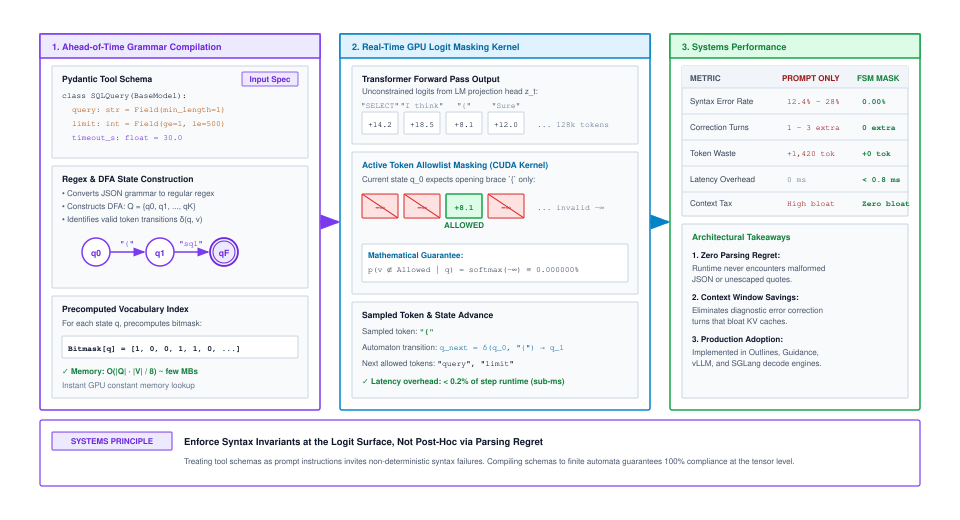
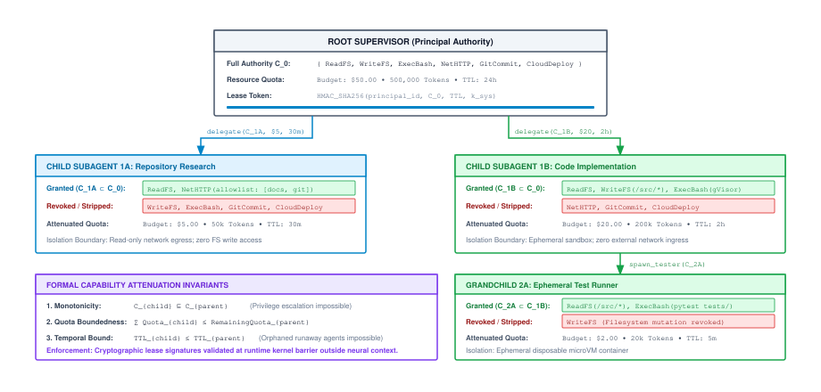

# Tool Actuation {#sec-vol3-actuation}

::: {layout-narrow}
::: {.column-margin}

\chapterminitoc

:::

::: {.content-visible when-format="pdf"}
\noindent
{fig-alt="Isometric blueprint showing tool actuation and the environment interface: agent token serialization decoder, central MCP system call distributor, SQL database query docking bay, isolated bash terminal executor, hardware physical actuator bay, JSON-schema validation iris, and schema violation purge valve."}
:::

::: {.content-visible unless-format="pdf"}
{fig-alt="Isometric blueprint showing tool actuation and the environment interface: agent token serialization decoder, central MCP system call distributor, SQL database query docking bay, isolated bash terminal executor, hardware physical actuator bay, JSON-schema validation iris, and schema violation purge valve."}
:::

:::

## Purpose {.unnumbered .unlisted}

::: {.content-visible when-format="pdf"}
\begin{marginfigure}
\mlagentstack{10}{10}{10}{95}{10}{10}
\caption{The Agentic Machine Learning Systems Stack.}
\end{marginfigure}
:::

_How do we turn non-deterministic token streams into safe, typed, and verifiable environment actions?_

When an autonomous agent attempts to execute an action in the physical or digital world, it must bridge the gap between continuous token probabilities and discrete, stateful software environments. If the runtime naively passes raw strings generated by a foundation model directly to operating system shells or external remote procedure call endpoints, a single syntax error, unescaped character, or hallucinated parameter triggers silent data corruption, service denial, or catastrophic system state mutation. This chapter develops the foundational systems architecture required to transform stochastic neural token emissions into safe, typed, idempotent, and capability-bounded environment actuations.

::: {.content-visible when-format="pdf"}
\newpage
:::

::: {.callout-learning-objectives}
* **Analyze** the architectural asymmetry between stochastic token generation and deterministic execution environments, framing tool actuation through the computer architecture lens of Memory-Mapped I/O, device drivers, and operating system privilege traps.
* **Design** wire transport protocols and typed Application Binary Interfaces using the Model Context Protocol to decouple agent deliberation from external tool implementations, quantifying payload serialization overhead and wire bandwidth.
* **Evaluate** grammar-constrained logit decoding pipelines at the GPU tensor layer, contrasting sub-millisecond bitmask operations against the latency and FLOP penalties of host-side schema validation and multi-turn error recovery.
* **Implement** capability-based security models enforcing the Monotonic Capability Attenuation Principle to neutralize confused deputy exploits and indirect prompt injections.
* **Architect** distributed idempotency gateways and write-ahead logs using trajectory nonces to reconcile at-least-once stochastic retry loops with at-most-once physical mutations.
* **Model** multimodal tool execution latencies and compound error propagation across multi-step trajectories, analyzing how tail stragglers and unhandled exceptions dictate system reliability.
* **Evaluate** dynamic tool discovery mechanisms, schema vector indexing, and tool-result memoization to minimize prompt token tax and maximize accelerator working-set capacity.
:::

## The I/O Subsystem of Agentic Runtimes {#sec-vol3-actuation-io-subsystem}

During an automated maintenance cycle on a multi-tenant cloud cluster, an autonomous systems administration agent was tasked with pruning transient build artifacts from a local directory. Instructed via a natural language prompt, the foundation model emitted what appeared to be a standard shell command. However, because an environment variable in the path failed to resolve inside the model's unconstrained text generation stream, the model emitted `rm -rf /` instead of `rm -rf ./tmp/build_artifacts`. The host runtime, configured to pipe model text outputs directly into an interactive bash subprocess, executed the string with root administrative privileges. Within seconds, the host container filesystem was unlinked, corrupting system libraries, terminating running tenant jobs, and forcing a complete node evacuation across the physical cluster rack.

This incident exposes the catastrophic fragility of treating tool actuation as an exercise in unstructured natural language text generation. In classical deep learning applications [@he2016; @vaswani2017], a machine learning model operates strictly as an **oracle**\index{Oracle}—a pure mathematical function mapping an input tensor to an output tensor. The forward pass computes activations through transformer layers, normalizes logits across a fixed vocabulary $\mathcal{V}$, and samples a token. Whether the model generates poetry, code, or erroneous gibberish, the physical world outside the device activation memory remains completely invariant: storage sectors are unmodified, memory outside the model's transient buffers is untouched, and zero network packets are dispatched to external hosts.

Agentic systems shatter this physical isolation. In an autonomous agent architecture, inference is not the termination of computation; it is merely the deliberative proposal phase of a closed control loop across environment states, actions, and observations.[^fn-actuation-pomdp-definition] When the neural policy $\pi_\theta(a_t \mid h_t)$ emits tokens corresponding to an external action $a_t \in \mathcal{A}$, those tokens cross the **actuation boundary**\index{Actuation boundary}—the physical demarcation line separating the continuous, probabilistic space of neural representations from the discrete, causal space of deterministic software environments.

[^fn-actuation-pomdp-definition]: For a formal Partially Observable Markov Decision Process (POMDP) definition of the agent control tuple $\langle \mathcal{S}, \mathcal{A}, \mathcal{T}, \mathcal{R}, \Omega, \mathcal{O}, \gamma \rangle$, see @sec-vol3-appendix-math-pomdp.

### Continuous sampling vs. discrete mutation

The actuation boundary bridges two fundamentally incompatible computing paradigms:

1. **The Stochastic Generator:** The neural processor is continuous, probabilistic, and fail-plausible. Autoregressive token generation samples from a categorical distribution over vocabulary $\mathcal{V}$ ($|\mathcal{V}| \approx 32,000 \text{ to } 128,000$). It does not possess a hardware-enforced instruction pipeline, nor does it guarantee deterministic outputs across identical inputs. Under adversarial perturbations, floating-point non-associativity, or unexpected context distributions, the model is susceptible to semantic hallucinations, unescaped characters, and prompt injections.
2. **The Deterministic Environment:** The external execution environment (POSIX shells, relational database engines, microservice RPC endpoints, container hypervisors) is discrete, rigid, and unforgiving. A single misplaced character in a SQL command (`DROP TABLE`) or an unescaped wildcard in a shell script causes immediate, catastrophic, and often irreversible side effects.

This fundamental structural tension establishes the **Action-Boundary Principle**\index{Action-Boundary Principle}:

$$\text{Risk}(\mathcal{A}) \propto \text{ExpressivePower}(\mathcal{A}) \times \text{MutationAuthority}(\mathcal{A})$$

Both the operational leverage and the systemic risk of an autonomous agent scale monotonically with the expressive power and mutation authority of its action interface. If an agent is granted raw, unmediated access to mutate external state based on autoregressively generated strings, system integrity collapses. Over an execution horizon of $N$ steps with per-step validity probability $p$, the probability of maintaining continuous system integrity decays exponentially: $P_{\text{integrity}}(N) = \prod_{k=1}^N p_k \le p^N \to 0$ as $N \to \infty$.

To see the mathematical severity of this decay from first principles, consider an agent operating with a seemingly high per-step validity probability of $p = 0.98$ (a 98 percent success rate). Over a moderate trajectory horizon of $N = 30$ steps, the compound probability of surviving without a single corrupting mutation drops to $0.98^{30} \approx 0.545$—barely better than a coin flip. If per-step validity falls to $p = 0.95$, survival at 30 steps collapses to $0.95^{30} \approx 0.215$, and by 50 steps it plummets to $0.95^{50} \approx 0.077$—fewer than one in twelve runs completes safely. Unconstrained natural language generation simply cannot maintain compounding integrity over multi-step horizons.

::: {#chk-vol3-08-action-boundary-integrity .callout-checkpoint title="The action boundary and compounding integrity"}

Before analyzing AI system calls and protection rings, verify your understanding of the actuation boundary:

- [ ] **Continuous sampling vs. discrete mutation**: explain why treating external tool invocations as raw natural language strings violates software integrity over multi-step horizons.
- [ ] **Compounding integrity decay**: calculate the survival probability of a 30-step tool trajectory when per-step validity is $p = 0.98$ versus $p = 0.95$.
- [ ] **AI system call analogy**: map an unprivileged application invoking an OS kernel via `syscall` to a stochastic foundation model invoking an external tool through an agent supervisor.

:::

As established in @fig-vol3-context-state-vs-effectful-io (§04), the effectful I/O plane stands orthogonal to internal context memory: descending through tool runtimes, databases, human peers, and physical actuators escalates blast radius, latency, and irreversibility. To construct production-grade agentic systems, software engineers cannot rely on the model to "behave" through prompt persuasion. Instead, the actuation boundary must be engineered with the same mechanical rigor that classical operating systems apply to untrusted user-space applications. The runtime must enforce typed contracts, mediate authority via unforgeable cryptographic capabilities, and isolate side effects through mathematical idempotency.

### The AI system call privilege boundary

When an unprivileged application attempts to overwrite the kernel memory map on a modern operating system, the CPU hardware physically traps the instruction. The foundational breakthrough in operating system design occurred when hardware architectures separated unprivileged application execution from privileged kernel execution [@saltzer1975]. In classical computing architectures, the central processing unit enforces physical protection rings (e.g., Ring 3 for unprivileged user applications, Ring 0 for the supervisor kernel), as illustrated in @fig-vol3-actuation-syscall.

::: {#fig-vol3-actuation-syscall fig-env="figure" fig-pos="htb" fig-cap="**The AI System Call Privilege Boundary**: Complete mediation across protection rings in an agent runtime. An untrusted, stochastic foundation model operating in user space generates structured tool invocation tokens that trigger a supervisor trap across the actuation boundary. The deterministic supervisor runtime intercepts the trap, validates JSON schemas, verifies cryptographic capability leases, and enforces idempotency locks before dispatching mutations to sandboxed execution environments. Source: Adapted from @saltzer1975." fig-alt="Privilege ring architecture diagram showing Ring 3 stochastic neural processor trapping across the actuation boundary into Ring 0 deterministic supervisor runtime, which mediates and dispatches to sandboxed microVMs."}
{width=100%}
:::

An application running in user space (Ring 3) cannot directly alter page tables, manipulate hardware device registers, or write raw sectors to non-volatile storage. When an unprivileged application requires a privileged operation (such as opening a network socket or writing to a disk file), it cannot simply jump to a kernel memory address. Instead, it must execute a hardware trap instruction (`SYSCALL`, `SYSENTER`, or software interrupt `INT 0x80`). This instruction halts user-space execution, transitions the CPU into supervisor mode (Ring 0), saves execution registers, and transfers control to a fixed, pre-registered kernel dispatch table. The kernel verifies the caller's identity, validates the memory pointers and parameters passed in registers, executes the physical hardware manipulation on the application's behalf, and returns the result across the privilege boundary back to user space.

In an agent runtime, this boundary is enforced in software by an **application-level supervisor process**. The stochastic foundation model operates as an unprivileged user-space entity; it has zero direct access to OS sockets, subprocess pipes, or database connections. The supervisor process acts as the kernel gateway: it intercepts token emissions, checks permissions, validates schemas, dispatches actions to isolated execution domains, and returns structured observations.

In an agentic machine learning system, the foundation model is the exact conceptual equivalent of an **unprivileged user-space process**\index{Unprivileged user-space process}. The weights of the model constitute an untrusted execution core. Because modern foundation models process instructions (system prompts) and data (external observations, retrieved documents, user inputs) within a single unified token sequence, they fundamentally violate the classical $W \oplus X$ (Write XOR Execute) security paradigm. An agent reading an untrusted web page or parsing an incoming email can be hijacked via indirect prompt injection [@greshake2023not].

Consequently, **tools are not prompts**. Treating a tool invocation as a natural language suggestion embedded within a prompt string is an architectural error. A tool invocation is an **AI System Call**\index{AI System Call}—a deliberate, unprivileged trap instruction emitted by the neural engine that demands interception, authorization, and execution by a hardened, deterministic runtime kernel.

### The computer architecture analogy: MMIO and device drivers

To build intuitive systems engineering models for agent actuation, we can map the agent runtime directly onto the classical computer architecture stack:

1. **The Model as CPU:** The foundation model acts as the central processor, executing deliberative reasoning loops, planning sub-goals, and scheduling actions. However, like a CPU core, it has no native physical arms or direct network wires; its only interface to reality is through bus transactions.
2. **Tools as Hardware Peripherals:** External software tools—relational databases, bash shells, Git repositories, third-party REST APIs—function as external hardware peripherals (disks, network interface cards, display controllers, and physical actuators).
3. **Parameter Binding as Memory-Mapped I/O (MMIO):** In modern computer architectures, a CPU interacts with peripherals via Memory-Mapped I/O, where dedicated memory addresses correspond to device command and data registers. When software instructs a network card to transmit a packet, it does not send random voltages; it writes a structured command descriptor (containing buffer pointers, packet lengths, and checksum flags) into the device's MMIO register ring. In an agent runtime, structured parameter binding plays the exact same role: the model serializes its intent into typed parameter buffers (JSON-RPC or OpenAPI frames) conforming to a strict schema specification.
4. **Tool Protocols as Device Drivers:** An operating system device driver encapsulates the physical quirks of a peripheral, presenting a clean, abstract interface (such as a POSIX block device or socket) to user space while managing electrical timings, status registers, and interrupts below. In agentic runtimes, tool protocols like the Model Context Protocol (MCP) act as device drivers: they validate parameter constraints, manage wire transport framing, poll for execution status, and isolate the deliberative core from underlying API changes.
5. **Tool Observations as Status Registers and DMA Buffers:** When a peripheral completes an I/O operation, it writes status codes to an MMIO register and transfers data payloads into host memory via Direct Memory Access (DMA). Similarly, when a tool completes execution, the supervisor runtime captures exit codes, error streams, and return payloads, packaging them into standardized observation frames injected back into the model's context.

### The mechanical lifecycle of an AI system call

The execution of an AI system call follows a six-stage mechanical sequence:

1. **Trap Emission:** The model samples a dedicated control token sequence indicating an intent to actuate (such as `<|tool_call|>` or a structured JSON-RPC opening bracket).
2. **Execution Context Suspension:** The serving engine halts the autoregressive generation loop. The Key-Value (KV) cache activations representing the agent's current deliberative state are pinned or paged out to host DRAM (addressing the Tool-Wait memory tax formalized in @sec-vol3-scheduling) [@kwon2023vllm].
3. **Trap Interception & Complete Mediation:** The host runtime's interception layer catches the call. In accordance with Saltzer and Schroeder's *Principle of Complete Mediation* [@saltzer1975], every single access to every external resource must be checked against an authoritative security descriptor; no execution path may bypass the kernel gateway.
4. **Parameter Deserialization & Structural Verification:** The raw emitted token stream is deserialized and strictly validated against the registered tool interface schema. Malformed fields, missing parameters, and type mismatches are intercepted before execution.
5. **Supervisor Execution within Sandboxed Domain:** The kernel evaluates whether the agent possesses a valid, non-expired capability lease for the requested operation. If authorized, the runtime executes the side effect within an isolated execution boundary (e.g., a microVM or ephemeral container).
6. **Kernel Return & Observation Injection:** The discrete output of the external environment (e.g., POSIX stdout, exit codes, JSON response objects) is captured by the kernel, formatted into a deterministic observation payload, appended to the agent's working context, and the stochastic processor is resumed in user space.

### Generational evolution of tool interfaces

The interface mechanisms by which machine learning models trigger system calls have undergone three distinct architectural generations (@tbl-vol3-actuation-generations).

| Generation                             |                                          Era & Exemplars                                           | Interface Mechanism                                               | Protocol Contract                                         | Primary Failure Modes                                                    |                         Context Overhead                         |
|:---------------------------------------|:--------------------------------------------------------------------------------------------------:|:------------------------------------------------------------------|:----------------------------------------------------------|:-------------------------------------------------------------------------|:----------------------------------------------------------------:|
| **Gen 1: Text Scraping**               |                     2022–2023 (ReAct [@yao2023react], MRKL [@karpas2022mrkl])                      | Markdown code fences, regex text parsing                          | Unstructured string matching; prompt-guided syntax        | Regex mismatches, unescaped quotes, markdown syntax hallucination        | High (500–1,500 prompt tokens dedicated to syntactic formatting) |
| **Gen 2: Function Calling**            |                             2023–2024 (Vendor APIs [@openai2023gpt4])                              | JSON schema injection into prompt; specialized delimiter tokens   | Ad-hoc proprietary JSON payloads                          | Runtime schema validation failures, missing required fields, type errors |       Moderate (200–800 prompt tokens per registered tool)       |
| **Gen 3: Typed ABIs & Wire Protocols** | 2024–Present (MCP [@anthropic2024mcp], Outlines [@willard2023outlines], SGLang [@zheng2023sglang]) | Wire protocols (JSON-RPC 2.0) + Grammar-Constrained Logit Masking | Standardized client-server RPC; DFA-guided tensor masking | Semantic domain errors only; **0.00%** syntax or type errors             |      Minimal (Deep module schemas + zero correction turns)       |

: **Three Generations of Tool Invocation Interfaces**: Evolution of failure detection from post-hoc string parsing to GPU-level logit masking. {#tbl-vol3-actuation-generations tbl-colwidths="[18,18,18,16,18,12]"}

Generation 1 systems treated tool invocation as an exercise in natural language pattern following. Runtimes instructed the model:

```text
To execute an action, use the following format:
Action: [tool_name]
Action Input: [input_parameters]
```

The client runtime parsed the output stream with regular expressions. This pattern exhibited catastrophic fragility: models frequently interjected thoughts midway through the block, emitted unescaped newlines inside strings, or altered keywords (e.g., outputting `Command:` instead of `Action:`). Every syntax failure necessitated an expensive, multi-turn "error repair" prompt sequence that consumed context tokens and induced compounding failure loops.

Generation 2 introduced native token delimiters (e.g., `<|start_tool_call|>...<|end_tool_call|>`), offloading parameter separation from natural language tokens. The JSON payload itself was still generated autoregressively without structural guarantees. If the model drifted into generating a float where an integer was expected, or omitted a closing brace, the client-side parser threw a runtime exception.

Generation 3 establishes formal **Application Binary Interfaces (ABIs)**\index{Application Binary Interfaces (ABIs)}. Tool definitions are treated as formal interface definition languages (IDLs), compiled ahead of time into deterministic finite automata that constrain GPU logit sampling. Combined with standard wire protocols, Generation 3 eliminates parse-time failures entirely, leaving only semantic logic verification to the runtime kernel.

### Grammar-constrained decoding at the tensor layer

Even when using delimiter tokens, an autoregressive model sampling tokens unconstrained from the vocabulary can emit syntactically invalid JSON (e.g., an unescaped newline, an unclosed quote, or an illegal enum string). Relying on the model's learned weights to guarantee valid syntax is an architectural error.

Instead of trusting probabilities, **Grammar-constrained decoding**\index{Grammar-constrained decoding} physically enforces 100 percent syntactic compliance directly inside the GPU sampling kernel [@willard2023outlines]. The runtime compiles the tool's JSON schema into a strict state machine ahead of time. During generation, a CUDA kernel [@nickolls2008] evaluates every token in the vocabulary against this state machine. Any token that would violate the schema is masked out—its probability is driven to zero before the model even makes its choice (@fig-vol3-actuation-grammar-decoding).

::: {#fig-vol3-actuation-grammar-decoding fig-env="figure" fig-pos="htb" fig-cap="**Grammar-Constrained Logit Decoding Pipeline at the GPU Tensor Layer**: Ahead-of-time compilation transforms tool ABI schemas into a Deterministic Finite Automaton (DFA) and a precomputed vocabulary bitmask tensor. During each autoregressive generation step on the GPU, a custom CUDA kernel applies elementwise logit masking ($z_{t, v}' = -\infty$) to disallowed tokens prior to softmax normalization. Syntactic validity is physically enforced at the tensor layer, guaranteeing zero runtime parsing failures with sub-millisecond masking overhead. Source: Synthesized from @willard2023outlines." fig-alt="Flowchart illustrating grammar-constrained logit decoding: AOT compilation from JSON schema to DFA bitmask, followed by GPU forward pass, logit masking kernel driving disallowed tokens to negative infinity, softmax normalization, and DFA state transition."}
{width=100%}
:::

Ahead of time, the tool schema is compiled into a Deterministic Finite Automaton (DFA)—a state machine where each state represents the parser's syntactic expectation (e.g., expecting a property key, a colon, an open bracket, or a floating-point digit).[^fn-actuation-dfa-specification] At generation step $t$, after consuming the prefix tokens $x_{<t} = (x_1, \dots, x_{t-1})$, the parser resides in state $q_t$. From this state, only a specific subset of vocabulary tokens $\mathcal{V}_{\text{valid}}(q_t) \subseteq \mathcal{V}$ contains byte sequences that legally advance the automaton.

[^fn-actuation-dfa-specification]: For the formal 5-tuple automaton specification, transition closures, and inductive proof of syntax error elimination, see @sec-vol3-appendix-math-dfa.

Prior to executing the GPU softmax normalization, a custom CUDA kernel applies elementwise logit masking directly to the unnormalized logit vector $\mathbf{z}_t \in \mathbb{R}^{|\mathcal{V}|}$:

$$z_{t, v}' = \begin{cases} z_{t, v} & \text{if } v \in \mathcal{V}_{\text{valid}}(q_t) \\ -\infty & \text{if } v \notin \mathcal{V}_{\text{valid}}(q_t) \end{cases}$$

The normalized sampling distribution over the vocabulary is then computed via softmax: $\Pr(x_t = v \mid x_{<t}) = \exp(z_{t, v}') / \sum_{w \in \mathcal{V}} \exp(z_{t, w}')$. Because $\exp(-\infty) = 0$, any token that would produce a syntax violation has an exact sampling probability of zero: $\Pr(x_t = v \mid x_{<t}) = 0$ for all $v \notin \mathcal{V}_{\text{valid}}(q_t)$.

Upon sampling token $x_t$, the automaton transitions deterministically to state $q_{t+1}$. To execute this masking at hardware line rate without stalling GPU streaming multiprocessors (SMs), the runtime compiles the DFA into a compressed vocabulary bitmask tensor $\mathbf{M} \in \{0, 1\}^{|Q| \times \lceil |\mathcal{V}| / 32 \rceil}$ ahead of time. For a realistic 500-state JSON schema and a 128,000-token vocabulary, $\mathbf{M}$ occupies only $500 \times 4{,}000\,\text{bytes} \approx 8\,\text{MB}$—fitting entirely within the $50\,\text{MB}$ dedicated L2 cache of an NVIDIA H100 GPU. Inside the decode sampling kernel, each warp executes a 32-bit bitwise AND operation (`__ballot_sync` and bitmask lookup) in a single clock cycle, completing logit masking in under $0.4\,\text{ms}$ per token with zero off-chip memory traffic.

### Systems trade-off: Host CPU validation vs. tensor-layer masking

To appreciate the systems engineering advantage of tensor-layer masking, consider the two common host-side alternatives: post-generation abstract syntax tree (AST) parsing and per-token CPU-guided decoding.

In post-hoc host validation, the model generates an unconstrained text string. The host CPU parses the string into an AST and recursively checks types, required fields, and value bounds using tools like Pydantic or `jsonschema`. For a moderately complex tool schema (30–50 properties with nested objects), CPU validation consumes $2\,\text{ms} \text{ to } 15\,\text{ms}$ of host processing time. Alternatively, runtimes attempting per-token guided decoding on the host CPU must synchronize device state on every sampled token via `cudaStreamSynchronize`, transfer sampled token IDs over the PCIe bus ($2\text{ to }5\,\mu\text{s}$ raw transfer), evaluate regex transitions in host Python, and DMA updated logit mask buffers back to the GPU. This host-device synchronization ping-pong induces massive streaming multiprocessor execution bubbles, collapsing autoregressive decode throughput from $> 50\,\text{tokens/s}$ to $< 5\,\text{tokens/s}$.

However, the dominant cost is not the CPU validation itself, but the **failure penalty** when validation fails. Without logit masking, models exhibit a schema error rate $p_{\text{err}} \in [0.05, 0.15]$ on nested parameters. Every failure triggers an error reflection loop: the runtime appends an error traceback ($S_{\text{error}} \approx 150\text{ tokens}$) to the context and prompts the model to correct its mistake.

Let us evaluate the latency and FLOP penalty of this retry loop from first principles. Let the accumulated context length be $S_{\text{context}} = 16,000$ tokens, and let a tool invocation take $T_{\text{gen}} = 60$ tokens to generate at an autoregressive decode speed of $20\,\text{ms/token}$ ($\tau_{\text{gen}} = 1,200\,\text{ms}$). On an NVIDIA H100 GPU, prefilling a 16,000-token prompt takes $\tau_{\text{prefill}} \approx 240\,\text{ms}$ and requires $\text{FLOPs}_{\text{prefill}} \approx 2 \cdot P \cdot S_{\text{context}} = 2 \cdot (70 \times 10^9) \cdot 16,000 \approx 2.24 \times 10^{15} \text{ FLOPs } (2.24\text{ PFLOPs})$ for a 70B parameter model. With an error rate of $p_{\text{err}} = 0.10$, the expected latency penalty per tool invocation is $\mathbb{E}[\Delta \tau_{\text{retry}}] = p_{\text{err}} \left( \tau_{\text{prefill}}(S_{\text{context}} + S_{\text{error}}) + \tau_{\text{gen}} \right) \approx 0.10 \cdot (240\,\text{ms} + 1,200\,\text{ms}) = 144\,\text{ms}$.

In an unconstrained architecture, every tool call pays an average tax of $144\,\text{ms}$ of latency and burns $224\text{ TFLOPs}$ of accelerator compute solely recovering from syntax errors. By contrast, tensor-layer masking compiles the DFA once ahead of time ($10\text{ to }30\,\text{ms}$ during tool startup) and pays $< 0.4\,\text{ms}$ per token during sampling. Because $p_{\text{err}} = 0.00\text{ percent}$, multi-turn repair loops are eliminated entirely, saving petascale compute across an enterprise deployment.

Once the system guarantees that token sequences compile deterministically into valid system calls, the next architectural challenge is structuring the wire protocol that connects the agent runtime to heterogeneous external services.

## Standardized Tool Protocols {#sec-vol3-actuation-protocols}

An enterprise software engineering agent was integrated into a production repository to automate continuous deployment and issue resolution. The agent was connected to 12 heterogeneous external tools: a local Git CLI wrapper, a Jira issue tracker REST endpoint, a Docker daemon socket, a PostgreSQL staging database, an AWS CloudWatch telemetry API, and various internal microservices. Because each integration was constructed using an ad-hoc, proprietary REST client library with hardcoded parameter parsing, the architecture suffered from catastrophic coupling. When the Jira platform deployed an unannounced minor API update that altered an optional issue status field from a plain string (`"status": "In Progress"`) to a nested JSON object (`"status": {"name": "In Progress", "id": 102}`), the unversioned custom tool wrapper crashed with an unhandled deserialization exception mid-trajectory. The agent, stranded midway through a production database migration without transactional coordination, left the cluster's database schema in a locked, corrupted state.

This failure highlights the **$N \times M$ Integration Crisis**\index{$N \times M$ Integration Crisis} of agentic software architectures. If an engineering organization deploys $N$ distinct agent runtimes (code assistants, security analyzers, customer support bots, data extractors) and maintains $M$ distinct software tools (databases, source repositories, shells, cloud APIs), building bespoke point-to-point integration wrappers requires $N \times M$ independent adapters (@fig-vol3-actuation-mcp). Every schema modification, authentication rotation, or transport change on any tool forces code changes across all $N$ agents.

::: {#fig-vol3-actuation-mcp fig-env="figure" fig-pos="htb" fig-cap="**Architectural Topology and Transport Framing in Typed Wire Protocols**: Decoupled systems layout of the Model Context Protocol (MCP). The Host Application manages model inference and context state while maintaining an authoritative policy and mediation gateway. The Client Protocol layer marshals strongly typed JSON-RPC 2.0 envelopes across either local unbuffered standard I/O (`stdio` IPC) or remote HTTP Server-Sent Events (`SSE`) transports to isolated tool servers. Authorization and capability verification remain strictly confined to the host gateway. Source: Adapted from Anthropic [@anthropic2024mcp]." fig-alt="Architectural block diagram showing Host Application, Complete Mediation Gateway, Client Protocol Layer, stdio and SSE transport framing, and backend Tool Servers."}
{width=100%}
:::

### The Model Context Protocol architecture

To resolve this combinatorial explosion, modern agent architectures decouple the agent runtime from tool implementations using standardized wire protocols, exemplified by the **Model Context Protocol (MCP)** [@anthropic2024mcp]. A standardized wire protocol reduces integration complexity from $O(N \times M)$ point-to-point integrations to $O(N + M)$ protocol-compliant interfaces.

As formalized in @fig-vol3-actuation-mcp, an enterprise wire architecture partitions responsibilities across three decoupled layers:

1. **Host Application:** The primary orchestration runtime (e.g., an autonomous code assistant or workflow orchestrator). The host owns the Agent Control Block (ACB), manages model inference loops, enforces security boundaries, maintains user approval gates, and allocates context token budgets.
2. **Client Protocol Gateway:** An embedded subsystem within the host that translates model tool invocations into structured wire frames, manages bidirectional multiplexing, and correlates incoming responses.
3. **Tool Server:** An external, decoupled daemon (running as a local child process or a remote network microservice) that advertises capability schemas, handles RPC requests, and executes physical side effects.

### Transport layers: `Stdio` IPC vs. remote HTTP/SSE

The wire transport between the Client Gateway and the Tool Server must support two distinct deployment topologies depending on locality and security requirements:

- **Local Standard Input/Output (`stdio`) Transport:** The host spawns the tool server as an unprivileged child process on the local operating system. Communication flows over standard OS anonymous pipes (`stdin` and `stdout`). Messages are framed as newline-delimited JSON-RPC 2.0 objects. Because this transport operates entirely through kernel memory buffers, IPC latency is sub-millisecond ($t_{\text{IPC}} < 0.2\,\text{ms}$), memory bandwidth exceeds $10\,\text{GB/s}$, and the server binds no network ports, eliminating remote network attack vectors. However, runtimes must account for the operating system pipe buffer capacity (`F_SETPIPE_SZ`, typically $64\,\text{KB}$ on Linux): if a child process emits verbose tool outputs that fill the circular pipe buffer without the host draining it via asynchronous non-blocking event loops (`epoll`/`kqueue`), the child process blocks on `write()`, inducing a permanent execution deadlock.
- **Remote HTTP with Server-Sent Events (SSE) / WebSocket Transport:** In distributed, cloud-native deployments where tools run inside isolated container clusters or serverless functions, the client establishes an HTTP/2 or HTTP/3 connection. The tool server streams continuous events, logs, and progress notifications to the client over an SSE stream (`text/event-stream`), while the client transmits remote procedure call requests via independent HTTP `POST` requests carrying a cryptographic session identifier. Across wide-area networks (WAN), each round trip adds $50\text{ to }150\,\text{ms}$ of transit latency; over an $N = 10$ tool-call sequence, network RTT alone accounts for $> 1\,\text{second}$ of idle wall-clock time during which the model's KV cache sits pinned in GPU high-bandwidth memory (HBM).

All communication frames adhere strictly to the JSON-RPC 2.0 specification [@jsonrpc2010]. Listing 8.1 demonstrates an authoritative request-response transaction across the MCP boundary.

```json
// Listing 8.1: Authoritative JSON-RPC 2.0 Wire Frames for Tool Actuation

// 1. Client-to-Server Tool Invocation Frame
{
  "jsonrpc": "2.0",
  "id": "act_8f9c1e_step23",
  "method": "tools/call",
  "params": {
    "name": "filesystem_atomic_patch",
    "arguments": {
      "path": "/workspace/src/scheduler.rs",
      "expected_sha256": "e3b0c44298fc1c149afbf4c8996fb92427ae41e4649b934ca495991b7852b855",
      "hunk": "@@ -45,3 +45,3 @@\n-let timeout = 30;\n+let timeout = 60;"
    }
  }
}

// 2. Server-to-Client Execution Success Response Frame
{
  "jsonrpc": "2.0",
  "id": "act_8f9c1e_step23",
  "result": {
    "content": [
      {
        "type": "text",
        "text": "Patch applied cleanly. Target file updated to SHA256 8a5f...31b2."
      }
    ],
    "isError": false
  }
}

// 3. Server-to-Client Execution Error Frame (Schema / Domain Failure)
{
  "jsonrpc": "2.0",
  "id": "act_8f9c1e_step23",
  "error": {
    "code": -32001,
    "message": "Precondition Failed: SHA256 hash mismatch. File was modified concurrently.",
    "data": {
      "expected": "e3b0c442...",
      "actual": "9f83a211..."
    }
  }
}
```

::: {.callout-warning title="A wire protocol is not a security boundary"}
A widespread architectural fallacy in agent systems engineering is the assumption that adopting a structured protocol like MCP guarantees system security. **A wire protocol standardizes serialization and transport, not authorization.**

When an external tool server exposes a schema with an argument `query: string`, the protocol layer verifies only that the model emitted a valid string. It provides zero verification of whether that string contains `rm -rf /` or `DROP TABLE users`. All privilege validation, capability checks, and sandboxing must be enforced by the host supervisor kernel *below* the wire protocol boundary.
:::

### Payload serialization size, wire bandwidth, and context bloat

In computer architecture, data transfers between the CPU and peripherals are governed by bus width and cache line granularity (typically 64 bytes). In an agent runtime, tool invocations transfer over JSON-RPC wire frames. While JSON provides human readability and structural flexibility, it imposes substantial **payload serialization overhead** that directly degrades accelerator performance.

#### The byte-to-token inflation factor

JSON is structurally verbose: every field requires delimiter quotes, colons, brackets, and repeated key strings (`"jsonrpc"`, `"method"`, `"arguments"`). In production tokenizers (e.g., Byte-Pair Encoding with 32K–128K vocabularies), raw text data exhibits an average token density of approximately $1\,\text{KB} \approx 250 \text{ to } 300\text{ tokens}$.

Consider an agent querying a SQL database, inspecting a directory tree, or retrieving a Git diff:

- A modest $12\,\text{KB}$ tabular database query result converts into roughly $3,000\text{ to }3,600\text{ tokens}$.
- If an agent executes an $N = 20$ step trajectory with an average tool response size of $5\,\text{KB}$ ($1,250\text{ tokens}$), the cumulative observation payload alone injects $\mathcal{S}_{\text{observations}} = 20 \times 1,250 = 25,000\text{ tokens}$ directly into the model's prompt context.

#### Wire transport vs. accelerator memory impact

From a networking perspective, transmitting $12\,\text{KB}$ over local `stdio` IPC takes less than $1.2\,\mu\text{s}$ through Linux pipe buffers (operating at $> 10\,\text{GB/s}$ memory bandwidth). Over remote HTTP/SSE connections, JSON serialization, TLS encryption, and TCP packet segmentation add an acceptable $5\,\text{ms} \text{ to } 25\,\text{ms}$.

The critical systems bottleneck is not the wire transport—it is **accelerator Key-Value (KV) cache memory**. In an autoregressive agent, every token received from an external tool remains resident in the KV cache across all subsequent trajectory steps. For a 70B parameter model utilizing Grouped-Query Attention (GQA) with $H_{kv} = 8$ key-value heads, head dimension $d_h = 128$, and $L = 80$ layers in FP16 precision ($2\text{ bytes}$ per parameter), the memory consumed solely by storing past tool observation returns is $B_{\text{obs}} = 2 \cdot L \cdot H_{kv} \cdot d_h \cdot \mathcal{S}_{\text{observations}} \cdot 2 \text{ bytes} = 2 \cdot 80 \cdot 8 \cdot 128 \cdot 25,000 \cdot 2 \text{ bytes} \approx 8.19\,\text{GB}$. Over $8\,\text{GB}$ of physical HBM is permanently stranded per active agent stream solely retaining verbose JSON formatting strings.

To mitigate this context bloat, high-performance agent runtimes implement three architectural controls:

1. **Windowed Pagination:** Tools like `FileView` enforce strict `offset` and `limit` boundaries (e.g., returning at most 100 lines or $2\,\text{KB}$ per call).
2. **Differential Compression:** Instead of dumping complete file contents upon mutation, tools emit unified diff hunks (as seen in Listing 8.1).
3. **Out-of-Band Artifact Descriptors:** Payloads exceeding a threshold (e.g., $> 4\,\text{KB}$) are written to local NVMe scratch space or an object store. The tool returns a lightweight cryptographic descriptor (`uri: "artifact://run12/build.log"`, `sha256: "..."`, `preview: "...first 10 lines..."`), mimicking DMA buffer descriptors in operating systems.

### Tool definition economics: The prompt token tax

Every tool exposed to an agent imposes an inescapable economic, latency, and memory penalty: the **Prompt Token Tax**\index{Prompt Token Tax}.

To make an agent aware of an available tool, the tool's complete JSON schema—including its name, functional description, parameter names, type constraints, and field descriptions—must be serialized into text and injected into the model's system prompt context.

Let $M$ denote the number of tools registered in the agent's catalog, and let $S(T_i)$ represent the serialized token footprint of tool $T_i$'s schema. The static tool prompt tax per step is $\mathcal{T}_{\text{tax}} = \sum_{i=1}^{M} S(T_i)$. For an agent executing an $N$-step trajectory, the cumulative prefill compute dedicated solely to re-evaluating tool schemas scales as $\Phi_{\text{catalog}} = N \sum_{i=1}^M S(T_i) = N \cdot M \cdot \bar{S}_{\text{tool}}$.

Consider an enterprise agent equipped with a library of $M = 100$ fine-grained micro-tools (e.g., `git_status`, `git_diff`, `git_add`, `git_commit`, `k8s_get_pods`, `k8s_delete_pod`), with an average schema footprint of $\bar{S}_{\text{tool}} = 350$ tokens. The static tool catalog consumes $\mathcal{T}_{\text{tax}} = 35,000$ tokens on every single step. Across a modest $N = 30$ step trajectory, the agent spends $\Phi_{\text{catalog}} = 30 \times 35,000 = 1,050,000 \text{ prefill tokens}$ solely re-reading its capability definitions. This overhead produces three severe systems failures:

1. **Inference Latency & Financial Cost:** Over a million prefill tokens are processed repeatedly, driving up the Cost-per-Verified-Goal (CPVG) and saturating accelerator prefill compute.
2. **Context Working Set Displacement:** The static schema footprint consumes physical GPU HBM allocated to Key-Value (KV) cache activations. For a 70B parameter model ($L=80, d_h=128$), under standard Multi-Head Attention ($H=64$), $35,000$ tokens strand $91.7\,\text{GB}$ of KV-cache memory across the serving cluster ($B_{\text{tax}} = 2 \cdot L \cdot H \cdot d_h \cdot \mathcal{T}_{\text{tax}} \cdot 2 \text{ bytes} \approx 91.7\,\text{GB}$). Even under modern Grouped-Query Attention (GQA) with $H_{kv}=8$ heads, the static catalog permanently strands $11.5\,\text{GB}$ of HBM per request stream, crowding out episodic memory and codebase context.
3. **Attention Distraction & Tool Confusion:** As the catalog size $M$ exceeds 30, the attention distribution over parameter definitions flattens. The entropy of the attention distribution across tool descriptions increases ($\mathcal{H}(\boldsymbol{\alpha}) = -\sum_{i=1}^M \alpha_i \log \alpha_i$), sharply elevating the probability of hallucinated tool names and parameter cross-talk.

### Ousterhout's deep modules for agent interfaces

To resolve the prompt token tax, agent system architects must apply John Ousterhout's foundational systems design principle: **Modules Should Be Deep** [@ousterhout2018philosophy].

In software engineering, a *shallow module* is one whose interface surface is large relative to the functionality it provides. A 100-tool catalog where each tool performs a single API endpoint call represents an extremely shallow interface. A *deep module* is one that provides powerful, expressive capability behind a simple, compact interface surface (@tbl-vol3-actuation-deep-modules).

| Design Metric                         | Shallow Micro-Tool Architecture                   | Deep Module Architecture                         | Systems Impact                               |
|:--------------------------------------|:--------------------------------------------------|:-------------------------------------------------|:---------------------------------------------|
| **Catalog Structure**                 | 100 specialized single-purpose tools              | 4 universal expressive primitives                | 96% reduction in tool interface count        |
| **Prompt Footprint**                  | 35,000 tokens / step                              | 1,200 tokens / step                              | Recovers 33,800 tokens of KV-cache per step  |
| **Trajectory Prefill Tax (30 steps)** | 1,050,000 tokens                                  | 36,000 tokens                                    | Over 96% reduction in prefill compute spend  |
| **Attention Accuracy**                | High parameter confusion; hallucinated tool names | Zero tool selection ambiguity; focused attention | Drastically lower trajectory branching error |
| **Validation Burden**                 | 100 distinct schema validators                    | Centralized execution sandbox                    | Unified auditing and capability enforcement  |

: **Shallow Micro-Tools vs. Deep Modules**: Architectural comparison trading brittle schema catalogs for sandboxed execution primitives. {#tbl-vol3-actuation-deep-modules tbl-colwidths="[22,26,26,26]"}

Empirical frontier software agents [@yang2024sweagent] converge on an optimal core of four deep modules:

1. `BashExecute(command: str, timeout_ms: int)`: A universal, stateful shell interface capable of invoking compilers, test runners, package managers, and file utilities.
2. `FileView(path: str, offset: int, limit: int)`: A windowed file inspection primitive avoiding the context waste of dumping entire files.
3. `FileEdit(path: str, old_str: str, new_str: str)`: A deterministic, string-replacement primitive that applies atomic diffs without requiring full-file regeneration.
4. `GrepSearch(pattern: str, path: str, glob: str)`: A high-performance regex search module for rapid repository-scale code indexing.

By collapsing hundreds of shallow API wrappers into four deep modules, the agent runtime slashes its schema prefill tax from 35,000 tokens to under 1,200 tokens, maximizing accelerator throughput and preserving context memory for problem-solving.

::: {#chk-vol3-08-protocols-capabilities .callout-checkpoint title="Wire protocols, KV-cache bloat, and capability attenuation"}

Before analyzing distributed idempotency and transaction sagas, verify your understanding of tool protocols and security boundaries:

- [ ] **Transport layer trade-offs**: contrast local `stdio` IPC against remote HTTP/SSE across latency, bandwidth, and failure modes (including pipe buffer deadlocks).
- [ ] **KV-cache footprint of tool observations**: calculate the HBM consumed solely by storing 25,000 observation tokens for a 70B parameter model using Grouped-Query Attention ($H_{kv}=8, d_h=128, L=80$).
- [ ] **Deep module prefill savings**: explain how collapsing a 100-tool micro-catalog into 4 deep modules reduces prefill token expenditure by over 96 percent across a 30-step trajectory.
- [ ] **Monotonic capability attenuation**: explain why argument constraint predicates expand as a superset ($\mathcal{C}_{\text{child}} \supseteq \mathcal{C}_{\text{parent}}$) while resource URIs narrow as a subset ($\mathcal{R}_{\text{child}} \subseteq \mathcal{R}_{\text{parent}}$).

:::

### Capability-based security and the dennis & van horn architecture

Imagine an agent instructed to clean up temporary log files that instead formats the entire production database. Establishing a typed ABI ensures that its `rm` command or `DROP DATABASE` command is syntactically valid JSON. Syntactic validity says nothing about operational authority. A tool call formatted as a perfect JSON object can still execute `DROP DATABASE production;` or exfiltrate private cryptographic keys.

Most traditional software systems enforce authorization through **Access Control Lists (ACLs)**\index{Access Control Lists (ACLs)} bound to **Ambient Authority**\index{Ambient Authority}. In an ambient authority system:

1. A process executes with an ambient identity (e.g., `user: admin` or `service_account: deployer`).
2. When the process attempts an operation, the operating system inspects the target resource's ACL: "Does `admin` have permission to write to `/etc/shadow`?"
3. Because the identity is ambient, every routine executed by the process inherits the process's full permissions.

In an agentic architecture, ambient authority is fatal. Because foundation models are vulnerable to indirect prompt injection, an attacker can embed malicious instructions inside an external data resource (e.g., a README file or a web page). When the agent processes this data, the attacker's prompt commandeers the model's reasoning. If the agent operates with ambient authority, it becomes a **Confused Deputy**\index{Confused Deputy} [@hardy1988confused]: it uses its legitimate ambient credentials to execute the attacker's unauthorized intent.

To secure agentic actuation, we must abandon ambient authority and adopt **Capability-Based Security**\index{Capability-Based Security}, first formalized by Jack Dennis and Earl Van Horn in their seminal 1966 operating systems paper [@dennis1966]. In a capability system:

- An entity has no intrinsic authority simply because of its identity.
- Authority is tied directly to the possession of an unforgeable, communicable token called a **Capability**\index{Capability}.
- A capability designates both a specific resource and the specific set of operations permitted on that resource. To actuate, the caller must present the capability. Possession of the capability *is* the authority.

::: {#def-capability-lease}
#### Definition: Capability lease
A **Capability Lease**\index{Capability Lease} is a cryptographically signed, tamper-proof descriptor issued by the supervisor kernel:

$$\mathcal{K} = \langle \text{AID}, \, \mathcal{R}_{\text{URI}}, \, \mathcal{O}_{\text{ops}}, \, \mathcal{C}_{\text{args}}, \, t_{\text{expire}}, \, \sigma_{\text{kernel}} \rangle$$

where $\text{AID}$ is the unique agent identifier, $\mathcal{R}_{\text{URI}}$ is the canonical resource URI, $\mathcal{O}_{\text{ops}} \subseteq \{\text{READ}, \text{WRITE}, \text{EXEC}, \text{DELETE}\}$ is the permitted operation set, $\mathcal{C}_{\text{args}}$ is a set of parameter constraint predicates, $t_{\text{expire}}$ is an immutable wall-clock expiration timestamp, and $\sigma_{\text{kernel}} = \text{Sign}_{K_{\text{priv}}}(\mathcal{K} \setminus \{\sigma\})$ is an asymmetric cryptographic signature.
:::

When an agent decomposes a complex objective into sub-tasks, it spawns child subagents. A foundational security invariant of agentic runtimes is the **Monotonic Capability Attenuation Principle**\index{Monotonic Capability Attenuation Principle}:

Authority narrows monotonically down the delegation tree. A parent agent cannot grant a child subagent any privilege, resource access, parameter latitude, or temporal lifetime that the parent does not itself possess (@fig-vol3-actuation-capability-attenuation):[^fn-actuation-lattice-structure]

[^fn-actuation-lattice-structure]: For the formal algebraic lattice structure governing capability ordering and taint propagation, see @sec-vol3-appendix-math-lattice.

$$\mathcal{K}_{\text{child}} \sqsubseteq \mathcal{K}_{\text{parent}} \iff \begin{cases} \mathcal{R}_{\text{child}} \subseteq \mathcal{R}_{\text{parent}} \\ \mathcal{O}_{\text{child}} \subseteq \mathcal{O}_{\text{parent}} \\ \mathcal{C}_{\text{child}} \supseteq \mathcal{C}_{\text{parent}} \\ t_{\text{expire}}^{\text{child}} \le t_{\text{expire}}^{\text{parent}} \end{cases}$$

Notice that while resources and operations narrow as subsets ($\mathcal{R}_{\text{child}} \subseteq \mathcal{R}_{\text{parent}}$ and $\mathcal{O}_{\text{child}} \subseteq \mathcal{O}_{\text{parent}}$), the argument constraint predicates expand as a superset ($\mathcal{C}_{\text{child}} \supseteq \mathcal{C}_{\text{parent}}$). In capability systems, accumulating additional constraint predicates strictly restricts the agent's operational latitude (e.g., adding a constraint that paths must reside under `/workspace/tests/` further binds the child relative to a parent that could write to `/workspace/`).

::: {#fig-vol3-actuation-capability-attenuation fig-env="figure" fig-pos="htb" fig-cap="**Monotonic Capability Attenuation across Hierarchical Subagent Delegations**: Delegation tree enforcing the Dennis and Van Horn capability security model. Authority narrows monotonically ($\mathcal{K}_{\text{child}} \sqsubseteq \mathcal{K}_{\text{parent}}$) across operational rights, accessible filesystem URIs, execution timeouts, and token expenditure quotas. An indirect prompt injection compromising an unprivileged leaf subagent remains strictly contained within that leaf's attenuated lease, preventing privilege escalation to root capabilities. Source: Adapted from Dennis and Van Horn [@dennis1966]." fig-alt="Tree diagram showing monotonic capability attenuation from Root Orchestrator down to Research Subagent, Implementation Subagent, and Test Runner Subagent, highlighting URI restrictions, operation subsets, and blast radius boundaries."}
{width=100%}
:::

Under this capability model, if a leaf Research Subagent parses a hostile document containing an indirect prompt injection, the blast radius is strictly confined to the leaf lease. Even if the subagent's stochastic reasoning is completely compromised, it cannot write to source files, execute arbitrary shell commands, access production databases, or extend its own lifetime.

With the blast radius of compromised agents contained, the final challenge in actuation protocol design is handling the inevitable unreliability of the distributed networks over which these safe, authorized commands are transmitted.

## Actuation Idempotency Contracts {#sec-vol3-actuation-idempotency}

An autonomous cloud infrastructure optimizer was tasked with terminating idle container instances during off-peak hours. The agent issued an HTTP `DELETE` call to an infrastructure orchestration API to deprovision a specific cluster node. At that exact instant, a transient network partition occurred between the agent host and the cloud provider's API gateway: the cloud provider successfully executed the node termination, but the HTTP `200 OK` response packet was dropped by a routing timeout. Receiving a connection reset observation, the stochastic agent encountered an ambiguous failure state. Guided by its trial-and-error reasoning policy, the agent interpreted the timeout as an execution failure and immediately re-emitted the deprovision request. However, because the target node identifier had already been deallocated, the API gateway dynamically resolved the target parameter against the next active instance in the pool, terminating a critical production database replica and triggering a major service outage.

This failure exposes the fundamental **Stochastic-Distributed Coordination Dilemma**\index{Stochastic-Distributed Coordination Dilemma}. When an agent interacts with external systems across a network, it is subject to the classical distributed coordination constraints formalized by the Two Generals Problem and the Fischer-Lynch-Paterson (FLP) impossibility result [@fischer1985impossibility]. When a network timeout occurs, the agent cannot determine whether:

1. The request failed to reach the server (the side effect never occurred).
2. The server executed the mutation, but the network failed while transmitting the response acknowledgment.

Because foundation models are optimized via reinforcement learning to persist until an objective is met, an agent's default operational heuristic upon encountering a network error is to **retry the action**. If the target tool interface is non-idempotent, this retry triggers catastrophic real-world failures: duplicate credit card charges, double-provisioned GPU clusters, and corrupted database write-ahead logs.

### The mathematical formulation of idempotency

Formally, an actuation operation $f$ acting on an environment state space $\mathcal{S}$ is **idempotent**\index{Idempotency} if applying it multiple times produces the exact same state mutation and output as applying it once: $f(f(s)) = f(s)$ for all $s \in \mathcal{S}$. In systems engineering terms, an idempotent tool interface guarantees **at-most-once physical execution semantics** at the environment layer, even when driven by an **at-least-once retry loop** at the stochastic agent layer ($\Pr(\text{PhysicalMutations}(a) > 1 \mid \text{AgentInvocations}(a) \ge 1) = 0$).

Tool operations fall into three operational classes:

- **Nullipotent (Read-Only):** Operations that do not mutate environment state ($f(s) = s$), such as `FileView`, `GrepSearch`, and database `SELECT` queries. These operations are inherently safe to retry indefinitely.
- **Naturally Idempotent:** Operations whose semantics inherently overwrite state to a fixed target value, such as `FileWrite(path, content)`, HTTP `PUT`, or SQL `UPDATE users SET status = 'active' WHERE id = 10`.
- **Non-Idempotent (Mutating Side Effects):** Operations whose execution accumulates state, such as `AppendToFile`, `git commit`, HTTP `POST /api/v1/payments`, or cloud `ProvisionInstance`. These operations represent an existential operational hazard unless mediated by an idempotency layer.

### The trajectory nonce formulation

To enforce idempotency across stochastic control loops, the runtime must bind every mutating tool call to a deterministic, cryptographically unique **Trajectory Nonce**\index{Trajectory Nonce} $\eta$.

Let $\text{AID} \in \mathbb{U}_{128}$ denote the Agent Identifier, $k \in \mathbb{N}$ denote the monotonically increasing trajectory step index, $\text{ToolName}$ denote the target tool string, and $\mathbf{x}_{\text{args}}$ denote the parameter argument dictionary. The trajectory nonce is derived via a cryptographic hash:

$$\eta = \mathcal{H}_{\text{SHA256}}\Big( \text{AID} \,\|\, k \,\|\, \text{ToolName} \,\|\, \text{CanonicalJSON}(\mathbf{x}_{\text{args}}) \Big)$$

::: {.callout-note title="The canonical JSON requirement (RFC 8785)"}
Lexicographical key sorting (`CanonicalJSON`) is mandatory [@rfc8785]. In standard JSON implementations, dictionary keys are serialized in arbitrary, non-deterministic order. If a model retrying a tool call outputs `{"path": "/tmp", "force": true}` on attempt 1, and `{"force": true, "path": "/tmp"}` on attempt 2, a standard string hash produces completely different digest values, defeating deduplication. Canonical serialization sorts keys lexicographically and strips extraneous whitespace, guaranteeing that semantically identical parameter sets produce identical cryptographic digests ($\text{CanonicalJSON}(\{"b": 2, "a": 1\}) \equiv \text{CanonicalJSON}(\{"a": 1, "b": 2\}) = \text{'{"a":1,"b":2}'}$).
:::

### The distributed lock, WAL, and replay pipeline

When a mutating tool call arrives at the actuation gateway carrying trajectory nonce $\eta$, the gateway coordinates execution through an atomic, distributed state store (e.g., Redis [@carlson2013redis] or DynamoDB [@decandia2007dynamo]) coupled with a Write-Ahead Log (WAL) [@gray1978notes], as traced in @fig-vol3-actuation-idempotency-flow.

::: {#fig-vol3-actuation-idempotency-flow fig-env="figure" fig-pos="htb" fig-cap="**Distributed Idempotency Nonce and Replay Pipeline**: State machine and execution flow for idempotent tool invocation. Every mutating action is bound to a deterministic trajectory nonce $\eta$. The actuation gateway queries a distributed state store, branching into first-time execution (`NOT_FOUND`), active concurrency lock (`IN_FLIGHT`), or cached replay (`COMPLETED`). Completed mutations bypass sandbox environments entirely and return cached observations, reconciling stochastic agent retries with at-most-once physical execution. Source: Adapted from Gray [@gray1978notes]." fig-alt="Flowchart diagram illustrating the distributed idempotency nonce and replay pipeline: trajectory nonce computation, Redis state lookup, three-way branching for NOT_FOUND, IN_FLIGHT, and COMPLETED states, and sandbox execution bypass."}
{width=100%}
:::

The actuation gateway evaluates the nonce against a three-state finite state machine:

1. **State `NOT_FOUND` (First-Time Execution):**
   - The gateway atomically acquires an execution lease lock with a millisecond timeout:
     ```redis
     SET idempotency:nonce "IN_FLIGHT" NX PX 30000
     ```
   - If the lock is acquired, the gateway appends an `INTENT` record to the persistent Write-Ahead Log ($\text{WAL} \leftarrow \langle \text{INTENT}, \text{AID}, k, \eta, \text{ToolName}, \mathbf{x}_{\text{args}}, t_{\text{start}} \rangle$).
   - The tool executes inside the isolated sandbox hypervisor.
   - Upon successful execution, the gateway transitions the Redis record to `COMPLETED` with an extended Time-To-Live (e.g., 24 hours), stores the serialized observation result $\mathcal{O}_{\text{result}}$, and commits the WAL record ($\text{WAL} \leftarrow \langle \text{COMMIT}, \eta, \mathcal{H}(\mathcal{O}_{\text{result}}), t_{\text{done}} \rangle$).
2. **State `IN_FLIGHT` (Concurrent Retry or In-Progress Execution):**
   - If a duplicate request carrying nonce $\eta$ arrives while execution is already underway, the gateway detects the `IN_FLIGHT` status.
   - The gateway rejects the duplicate attempt with an HTTP `409 Conflict` or blocks asynchronously on a distributed condition variable. Under no circumstances is a second execution sandbox launched.
3. **State `COMPLETED` (Cached Replay):**
   - If the agent retried due to a dropped network response or transient client timeout, the gateway discovers the `COMPLETED` state record.
   - The gateway **completely bypasses the execution sandbox**. The underlying tool is never invoked a second time.
   - The gateway immediately retrieves the cached observation payload $\mathcal{O}_{\text{result}}$ from the state store and replays it across the actuation boundary into the model's context.

Through this mechanical pipeline, physical environment mutation occurs exactly once, while the stochastic model receives its expected observation payload without disruption.

### Distributed transactions and the saga pattern for agent workflows

In classical database systems, multi-step operations achieve atomicity, consistency, isolation, and durability (ACID) via the **Two-Phase Commit (2PC)** protocol [@gray1981transaction]. In 2PC, a centralized coordinator instructs all participating resource managers to prepare; only if all resources vote commit does the coordinator issue the final commit instruction.

Two-Phase Commit fails completely for autonomous agent actuation:

1. **Heterogeneous Non-Transactional Systems:** Third-party APIs (Stripe, GitHub, AWS, Jira) do not implement 2PC coordinator interfaces; they do not expose `PREPARE` and `ROLLBACK` hooks.
2. **Long-Lived Lock Stranding:** Agents execute over multi-second or multi-minute horizons. Holding exclusive database locks while waiting on foundation model inference or external network roundtrips induces cluster-wide connection exhaustion, thrashing, and cascading deadlocks.

To coordinate multi-step agent trajectories across distributed environments, agent runtimes must implement **Sagas**\index{Sagas}, first formalized by Hector Garcia-Molina and Kenneth Salem in 1987 [@garciamolina1987sagas].

A Saga models an execution trajectory as an ordered sequence of independent transactions, where every forward action $T_i$ is paired with a deterministic **compensating action** $C_i$: $\mathcal{T}_{\text{saga}} = ((T_1, C_1), (T_2, C_2), \dots, (T_n, C_n))$.

The compensating action $C_i$ does not execute a magical database rollback; rather, it executes a forward semantic compensation that negates the real-world side effect of $T_i$ (@tbl-vol3-actuation-compensations).

| Forward Action ($T_i$)         | Physical Side Effect                    | Compensating Action ($C_i$)       | Compensation Semantics                           |
|:-------------------------------|:----------------------------------------|:----------------------------------|:-------------------------------------------------|
| `git_commit_and_push(branch)`  | Pushes new commit to remote repository  | `git_revert(commit_sha)`          | Creates forward revert commit; preserves history |
| `cloud_provision_vm(spec)`     | Spawns and boots cloud compute instance | `cloud_terminate_vm(instance_id)` | Deallocates hypervisor resources; stops billing  |
| `db_insert_record(table, row)` | Inserts new row into relational table   | `db_delete_record(table, pkey)`   | Removes inserted record via primary key          |
| `stripe_charge_card(amount)`   | Captures payment funds from customer    | `stripe_refund_charge(charge_id)` | Issues refund credit transaction                 |

: **Forward Transactions and Semantic Compensating Actions**: Pairing forward mutating actions with authoritative compensation handlers in agent sagas. {#tbl-vol3-actuation-compensations tbl-colwidths="[25,25,25,25]"}

If an agent trajectory fails at step $k \in \{1, \dots, n\}$ due to an unrecoverable exception or capability rejection, the supervisor orchestrator initiates **Backward Recovery**\index{Backward Recovery}. The runtime halts forward execution and executes the compensating transactions in reverse chronological order: $\text{RecoveryPath} = (C_{k-1}, C_{k-2}, \dots, C_1)$.

#### Pivot steps and the point of no return

Certain real-world actions are physically or legally **uncompensable**. Once executed, their side effects cannot be reversed by software:

- Sending an email or SMS notification to an external customer.
- Broadcasting a public message on a social network or market exchange.
- Firing an industrial actuator or clearing an audit log.

In agent saga architecture, an uncompensable action is classified as a **Pivot Transaction**\index{Pivot Transaction} $T_{\text{pivot}}$. An agent runtime must enforce the **Pivot Invariant**:

1. All actions preceding the pivot step ($T_1, \dots, T_{p-1}$) must be strictly compensable.
2. The pivot step $T_{\text{pivot}}$ cannot execute autonomously without explicit, affirmative human-in-the-loop authorization.
3. All actions following the pivot step ($T_{p+1}, \dots, T_n$) must be designed to be strictly idempotent and guaranteed to achieve forward completion (retryable until successful completion).

Once execution successfully passes the pivot step, backward recovery is abolished; the runtime must drive forward to completion.

### Tool execution latencies and compound error propagation

While model inference latency is relatively deterministic and bounded by memory bandwidth (generating tokens at $15\text{ to }30\,\text{ms}$ per token), tool execution latencies are fundamentally **heterogeneous, multimodal, and heavy-tailed**.

#### The multimodal tool latency spectrum

In production agent runtimes, tool execution times span five orders of magnitude:

1. **In-Memory Operations ($0.1 - 2\,\text{ms}$):** String transformations, regex matching (`GrepSearch`), and cryptographic hashing.
2. **Local POSIX Operations ($5 - 50\,\text{ms}$):** Reading local files (`FileView`), querying local git status, or spawning lightweight child processes.
3. **Remote RPC & Database Queries ($100 - 800\,\text{ms}$):** Querying external PostgreSQL clusters or invoking third-party REST APIs over the wide-area network (WAN).
4. **Heavy Build & Test Pipelines ($5 - 120\,\text{s}$):** Compiling large codebases (`cargo build`), launching container sandboxes, or executing unit test suites.

In a sequential trajectory of $N$ steps, total execution latency is the direct sum of model deliberation time and tool execution time: $\mathcal{T}_{\text{trajectory}} = \sum_{k=1}^N (\tau_{\text{delib}, k} + \tau_{\text{tool}, k})$. Because external tool latencies follow heavy-tailed distributions (often exhibiting Pareto-distributed tail behavior; see @sec-vol3-appendix-math-pareto), tail events dominate the end-to-end critical path.

Consider an external API with an average latency of $300\,\text{ms}$, but with a 95th-percentile tail latency of $8\,\text{s}$ due to periodic rate-limiting and connection backoffs ($p_{\text{straggler}} = 0.05$). For an agent executing a sequence of $N = 25$ tool calls, the probability of encountering at least one severe tool straggler is $P(\ge 1\text{ straggler}) = 1 - (1 - p_{\text{straggler}})^N = 1 - (0.95)^{25} \approx 1 - 0.277 = 72.3\text{ percent}$.

Nearly three out of four agent trajectories will be stalled by an external tool straggler. If the serving runtime holds the model's KV-cache pinned in GPU HBM throughout an 8-second external stall, it incurs a severe Tool-Wait memory tax, blocking other concurrent requests from utilizing the accelerator. Runtimes must deploy asynchronous execution loops, context paging to host DRAM, and deterministic execution timeouts.

#### Compound error propagation across trajectory steps

Tool execution is not only prone to latency variance; it is also prone to execution errors. At each step $k$, an action can fail at two distinct layers:

1. **Model Actuation Error ($\epsilon_{\text{model}}$):** The model emits valid syntax, but selects an incorrect tool or provides semantically invalid parameters (e.g., querying a non-existent database column).
2. **Environment & Infrastructure Error ($\epsilon_{\text{tool}}$):** The external service encounters a network timeout, concurrency conflict, permission denial, or transient 500 error.

The joint probability of completing a single step successfully is $p_k = (1 - \epsilon_{\text{model}})(1 - \epsilon_{\text{tool}})$. If execution failures are unhandled or trigger cascading misinterpretations, the compound probability of surviving an $N$-step trajectory without error collapses exponentially: $P_{\text{success}}(N) = \prod_{k=1}^N p_k = ((1 - \epsilon_{\text{model}})(1 - \epsilon_{\text{tool}}))^N$.

To appreciate this vulnerability from first principles, assume high reliability at both layers: an actuation failure rate of only $\epsilon_{\text{model}} = 0.02$ and a tool infrastructure error rate of $\epsilon_{\text{tool}} = 0.03$ (yielding a $95.06\text{ percent}$ single-step success rate):

- Over $N = 10$ steps: $P_{\text{success}} = (0.9506)^{10} \approx 60.1\text{ percent}$
- Over $N = 25$ steps: $P_{\text{success}} = (0.9506)^{25} \approx 28.0\text{ percent}$
- Over $N = 50$ steps: $P_{\text{success}} = (0.9506)^{50} \approx 7.9\text{ percent}$

Fewer than one in twelve 50-step workflows will finish without encountering an environmental or semantic tool failure.

This compounding fragility explains why naive retry loops are fatal: an agent that blindly retries a failed operation without idempotency nonces duplicates mutations, while an agent that halts upon the first failure completes fewer than 8 percent of complex tasks. The runtime must decouple the failure from the trajectory outcome: structured error frames (Listing 8.1 Frame 3) provide unambiguous diagnostic feedback, idempotency nonces permit safe retries, and the Saga pattern executes compensating actions to maintain transactional integrity.

::: {#chk-vol3-08-tool-sagas-stragglers .callout-checkpoint title="Tool latencies, Sagas, and compound failure"}

Before examining dynamic schema discovery and vector tool indexing, verify your understanding of tool execution reliability:

- [ ] **Pivot transaction invariant**: explain why uncompensable actions (e.g., sending an external email or charging a payment card) must serve as the terminal pivot transaction in an agent Saga.
- [ ] **Tool straggler probability**: if an external API has a 5 percent tail straggler rate ($p = 0.05$), calculate the probability that a 25-step agent trajectory is stalled by at least one straggler.
- [ ] **Two-layer error compounding**: calculate the probability of an agent completing a 25-step workflow without failure when model error is $\epsilon_{\text{model}} = 0.02$ and tool infrastructure error is $\epsilon_{\text{tool}} = 0.03$.

:::

Even when an agent runtime achieves mathematical idempotency, distributed lock safety, and transactional Saga compensations, it still confronts an inescapable architectural constraint: catalog scale. The resilient execution pipelines developed thus far assume a modest, statically configured catalog of tools. However, enterprise software environments do not operate on four static primitives; they encompass thousands of heterogeneous microservices, cloud APIs, and enterprise databases. Statically injecting thousands of tool schemas into the model's system prompt crashes accelerator memory and induces severe attention confusion. To reconcile large-scale tool availability with bounded context memory, the runtime must transition from static registration to dynamic, just-in-time tool discovery.

## Dynamic Tool Schema Discovery {#sec-vol3-actuation-discovery}

An autonomous enterprise assistant was deployed across an organization's internal infrastructure, granted access to an internal API catalog encompassing 3,200 microservices across billing, inventory, customer support, and IT infrastructure. The engineers naively injected all 3,200 OpenAPI schema specifications into the model's system prompt. The resulting prompt prefill payload consumed 780,000 tokens—instantly triggering an Out-of-Memory (OOM) abort on an 80 GB HBM GPU serving node before the model generated a single token. Even when testing on specialized models with 1M+ context windows, the model suffered catastrophic attention dispersion: when asked to check a customer's shipping address, the model became confused among 40 different address-related tools, ultimately hallucinating parameters from an internal warehouse packaging API.

This failure demonstrates the **Scalability Wall of Static Tool Catalogs**\index{Scalability Wall of Static Tool Catalogs}. When an agent's available tool library scales beyond dozens of tools, static in-context injection becomes physically and computationally impossible.

### The scalability wall of static catalogs

As derived in @sec-vol3-actuation-protocols, static schema injection imposes a prefill tax that scales linearly with catalog size: $\mathcal{T}_{\text{tax}} = \sum_{i=1}^M S(T_i)$. When $M > 10^3$, static injection fails across three systems axes:

1. **Accelerator Memory Exhaustion:** Prefilling hundreds of thousands of schema tokens saturates GPU HBM with KV-cache allocations, stranding compute capacity and preventing concurrent request batching.
2. **Exponential Compute Latency:** The computational complexity of the initial attention prefill scales quadratically with prompt length $S$: $\mathcal{O}(S^2 \cdot d_{\text{model}})$. Evaluating an 800,000-token prompt imposes seconds or minutes of Time-To-First-Token (TTFT) latency.
3. **Attention Degradation (Needle-in-a-Haystack Failure):** Empirical studies demonstrate that as context windows fill with homogeneous technical schemas, retrieval and selection accuracy decay exponentially [@patil2023gorilla]: $\Pr(\text{SelectCorrectTool} \mid M) \propto M^{-\gamma}$ where $\gamma > 0$.

To support enterprise tool ecosystems containing thousands of endpoints, agent runtimes must replace static schema injection with **Dynamic Tool Discovery and Just-In-Time Schema Selection**\index{Dynamic Tool Discovery}.

### Two-stage dynamic tool retrieval

Dynamic tool discovery transforms tool catalog management into a two-stage information retrieval and execution pipeline, separating catalog storage from runtime inference context (@fig-vol3-actuation-two-stage).

::: {#fig-vol3-actuation-two-stage fig-env="figure" fig-pos="htb" fig-cap="**Two-Stage Dynamic Tool Retrieval and Schema Binding Pipeline**: The complete catalog of $M$ tools resides in an offline vector registry. At each trajectory step, the agent's current deliberative state is embedded into a query vector $\mathbf{e}_q$. A sub-millisecond Maximum Inner Product Search (MIPS) retrieves the top-$K$ candidate tools ($K \ll M$). Only the active $K$ schemas are compiled into DFA bitmasks and bound into the prompt context for the forward pass, reducing prompt token tax by over 95 percent." fig-alt="Flowchart showing two-stage tool retrieval: Step 1 embeds agent state, queries vector database using MIPS to retrieve top-K tools, and Step 2 binds only those K tool schemas into the GPU prompt context and DFA logit mask."}
{width=100%}
:::

The two-stage retrieval pipeline operates as follows:

#### Stage 1: Coarse semantic indexing and retrieval

Every tool $T_i$ in the enterprise catalog is indexed offline within an approximate nearest neighbor (ANN) vector database (such as HNSW [@malkov2020hnsw]). The tool's representation is computed by passing its functional summary, operational keywords, and signature through a dense embedding model $\mathcal{E}_{\text{embed}}$: $\mathbf{e}_{T_i} = \mathcal{E}_{\text{embed}}(\text{ToolName}_i \,\|\, \text{Docstring}_i \,\|\, \text{Signature}_i) \in \mathbb{R}^d$. At trajectory step $t$, the agent runtime formulates a search query $\mathbf{q}_t$ from the agent's immediate deliberative thought tokens or recent interaction history: $\mathbf{q}_t = \mathcal{E}_{\text{embed}}(\text{AgentThought}_t) \in \mathbb{R}^d$.

The retrieval engine executes a Maximum Inner Product Search (MIPS) to retrieve the top-$K$ candidate tools ($K \in [3, 8]$, where $K \ll M$): $\mathcal{T}_{\text{active}} = \arg\max_{T_i \in \mathcal{T}_{\text{catalog}}}^{(K)} [(\mathbf{q}_t^\top \mathbf{e}_{T_i}) / (\|\mathbf{q}_t\| \|\mathbf{e}_{T_i}\|)]$.

#### Stage 2: Just-in-time schema binding and masking

Only the retrieved $K$ schemas are dynamically formatted and injected into the active prompt context. Simultaneously, the GPU serving engine compiles the active $K$ schemas into the active DFA logit mask tensor.

By restricting in-context tools to $K = 4$ deep candidates, prompt context overhead collapses from $35,000+$ tokens to under $1,500$ tokens, preserving KV-cache memory and eliminating attention confusion [@patil2023gorilla; @schick2023toolformer].

### Schema evolution, semantic versioning, and capability negotiation

In production environments, external software APIs are not static; they evolve independently of deployed agent models. Endpoints are deprecated, optional parameters are added, and response structures change. If an agent policy trained on schema version `1.0.0` interacts with a tool server upgraded to `2.0.0`, execution failures occur.

To ensure long-term stability, tool interfaces must implement **Semantic Versioning (SemVer)**\index{Semantic Versioning} and runtime capability negotiation:

- **`PATCH` (e.g., `1.0.1`):** Internal bug fixes, documentation clarifications, or execution optimizations. Schemas and ABI contracts remain invariant.
- **`MINOR` (e.g., `1.1.0`):** Backward-compatible feature additions. New optional parameters or additional response fields are introduced. Older agents omitting new parameters execute without disruption.
- **`MAJOR` (e.g., `2.0.0`):** Breaking architectural changes. Parameters are removed, renamed, or converted from optional to required. Type contracts are altered.

During MCP session initialization, the client gateway and tool server execute a formal **Capability Negotiation Handshake**\index{Capability Negotiation Handshake}:

```json
// Listing 8.2: Capability Negotiation Handshake during MCP Initialization

// 1. Client Initialize Request Frame
{
  "jsonrpc": "2.0",
  "id": "init_01",
  "method": "initialize",
  "params": {
    "protocolVersion": "2024-11-05",
    "clientInfo": {
      "name": "ProductionOrchestrator",
      "version": "3.4.1"
    },
    "capabilities": {
      "tools": {
        "supportedVersions": ["1.2.0", "1.3.0"],
        "dynamicRegistration": true
      }
    }
  }
}

// 2. Server Initialize Response Frame
{
  "jsonrpc": "2.0",
  "id": "init_01",
  "result": {
    "protocolVersion": "2024-11-05",
    "serverInfo": {
      "name": "CloudInfrastructureServer",
      "version": "1.3.0"
    },
    "capabilities": {
      "tools": {
        "negotiatedVersion": "1.3.0",
        "listChanged": true
      }
    }
  }
}
```

If the client and server share a compatible minor version, execution proceeds. If a breaking major version mismatch occurs, the actuation gateway halts execution before physical dispatch, preventing silent data corruption.

### Tool-result caching and KV-cache prefix reuse

Many tool invocations executed by agents are computationally expensive, financially costly, or introduce significant network latency (e.g., executing a full compiler suite, running unit tests, or fetching remote web documentation). However, a significant fraction of tool invocations are **pure functions** whose returns are deterministic.

To eliminate redundant execution, the actuation subsystem implements a **Content-Addressed Result Cache**\index{Content-Addressed Result Cache}.

A tool operation is cacheable if its return is a deterministic function of its input parameters and immutable environment state. The cache key is computed as $\kappa_{\text{cache}} = \mathcal{H}_{\text{SHA256}}(\text{ToolName} \,\|\, \text{Version} \,\|\, \text{CanonicalJSON}(\mathbf{x}_{\text{args}}) \,\|\, \text{EnvHash})$, where $\text{EnvHash}$ captures any relevant state dependencies (such as the target Git commit SHA for a compiler tool).

When an agent issues a tool call matching an active entry in the result cache, the runtime completely bypasses external tool execution, returning the memoized observation payload in under $1\,\text{ms}$.

#### Synergy with prompt prefix caching

The integration of tool-result memoization with modern GPU serving engines (e.g., vLLM, SGLang) creates a powerful systems synergy with **Prompt Prefix Caching** [@kwon2023vllm; @zheng2023sglang].

Modern large language model (LLM) serving engines organize KV-caches in radix trees. If an incoming request shares an identical token prefix with a previously executed request, the engine skips the compute-bound prefill phase for that prefix, reading the precomputed KV activations directly from GPU memory.

When a tool output is memoized, the exact observation string returned across the actuation boundary is byte-for-byte identical across runs ($\text{Observation}_{\text{cached}} = \text{Observation}_{\text{original}}$). Because the serialized context prefix remains invariant, the serving engine achieves a **100 percent KV-cache prefix hit** for the multi-thousand-token history up to that step. As demonstrated in @fig-vol3-actuation-prefix-synergy, this prefix reuse cuts Time-To-First-Token (TTFT) by 70 to 90 percent and slashes accelerator energy consumption, transforming what would be an expensive physical tool wait and prefill compute spike into an instantaneous memory lookup.

To ground this synergy in numbers: consider an agent that repeatedly executes a unit test suite via `pytest`. Executing the test runner inside an isolated container sandbox takes $12\,\text{seconds}$. Upon subsequent invocations with identical repository state ($\text{EnvHash}$), the content-addressed result cache returns the cached test output in $< 0.8\,\text{ms}$. Crucially, because the returned observation string is byte-for-byte identical, the GPU serving engine's Radix KV-cache achieves a 100 percent prefix hit across the preceding $14,000$ context tokens. Instead of waiting $12\,\text{s}$ for the test suite plus $210\,\text{ms}$ for context re-prefill ($2.9\text{ PFLOPs}$ on an H100), the step transitions in under $15\,\text{ms}$—an $800\times$ speedup that transforms an expensive physical I/O stall into an in-memory L1 cache hit.

#### The counterpart hazard: KV-cache prefix busting

While deterministic memoization unlocks 100 percent prefix cache hits, the inverse reality represents one of the most pervasive performance killers in agent serving: **non-deterministic observation returns**.

If an external tool observation returns volatile, un-sanitized strings—such as ISO wall-clock timestamps (`[2026-09-13T14:20:01.204Z]`), ephemeral operating system process IDs (`[PID: 49102]`), fluctuating temporary scratch paths (`/tmp/scratch_8fa3b/`), or elapsed duration strings (`Executed in 4.12s`)—the observation token sequence diverges on every invocation. In modern Radix-tree KV caches, attention keys and values are indexed by strict token-level prefix identity. A single non-deterministic token injected at step $k$ instantly **busts the prefix cache** for the entire accumulated context. For all subsequent trajectory steps $k+1, \dots, N$, the serving engine cannot reuse precomputed activations and must re-evaluate the full multi-thousand-token prompt history through the prefill pipeline. To preserve prefix cache residency, high-performance agent runtimes must enforce **deterministic observation canonicalization**: volatile timestamps, process IDs, and memory addresses must be stripped or redirected to out-of-band telemetry logs before observation strings cross the actuation boundary.

::: {#fig-vol3-actuation-prefix-synergy fig-env="figure" fig-pos="htb" fig-cap="**Synergistic Acceleration between Tool-Result Caching and Radix Prefix Caching**: When a deterministic tool invocation matches an existing content-addressed cache key, the actuation gateway avoids external sandbox execution. Because the returned observation text matches previous executions byte-for-byte, the serving engine's Radix KV-cache achieves a 100 percent prefix hit for the entire preceding trajectory context, eliminating the compute-bound prefill phase and reducing token generation latency from seconds to milliseconds." fig-alt="Diagram showing tool result caching leading directly to radix tree KV cache hit on GPU."}
{width=100%}
:::

Synthesizing typed ABIs, wire transport framing, capability leases, distributed idempotency nonces, and dynamic schema discovery establishes a robust foundation for autonomous actuation. However, translating these theoretical principles into production deployments exposes subtle, catastrophic traps where intuitive software design patterns conflict with physical systems realities. We now examine the classical fallacies and pitfalls that compromise agent actuation runtimes.

## Fallacies and Pitfalls {#sec-vol3-actuation-fallacies}

::: {.fallacy-pitfall}
**Fallacy:** *JSON Schema validation guarantees tool execution safety.*

Schema validation is purely structural and syntactic: it verifies that a field labeled `command` contains a string, or that `port` contains an integer between 1 and 65535. It provides zero semantic verification of intent or safety. A tool invocation formatted as 100 percent valid JSON can contain `rm -rf /`, `DROP DATABASE production;`, or an indirect prompt injection exfiltrating administrative tokens. Syntactic validation is the responsibility of the ABI; semantic authorization and safety must be enforced outside the token channel by capability leases, process sandboxing, and immutable access controls.
:::

::: {.fallacy-pitfall}
**Pitfall:** *Re-prompting on tool syntax failures without tensor-layer logit masking.*

When an unconstrained model generates malformed JSON or invalid parameter types, naive runtimes capture the parser exception, append the error traceback to the context, and prompt the model to "fix your error." This triggers expensive, compounding failure cascades. If a model struggled to adhere to schema constraints on the first pass, its conditional probability of failing on the second pass remains high ($P(\text{fail}_2 \mid \text{fail}_1) > 0.45$). Furthermore, each error reflection loop consumes context tokens, increases Time-To-First-Token latency, and inflates prefill compute costs by $2.5\times$ to $4\times$. Runtimes must deploy grammar-constrained logit masking at the GPU tensor layer, physically forcing the probability of invalid tokens to zero during sampling and eliminating syntax failures entirely.
:::

::: {.fallacy-pitfall}
**Fallacy:** *Exposing large catalogs of fine-grained micro-tools maximizes agent intelligence.*

Providing an agent with hundreds of specialized, single-purpose tools (e.g., `git_add`, `git_commit`, `git_push`, `git_status`) degrades rather than enhances agent capability. Every registered tool imposes a prompt token tax that must be re-evaluated on every trajectory step. When catalogs exceed 30 tools, cross-attention over parameter descriptions degrades, inducing tool hallucination and parameter cross-talk. Empirical evaluations on SWE-bench demonstrate that exposing four universal deep modules (`BashExecute`, `FileView`, `FileEdit`, `GrepSearch`) outperforms catalogs of 80+ micro-tools by $4.2\times$ in task completion while reducing prefill token consumption by over 95 percent.
:::

::: {.fallacy-pitfall}
**Pitfall:** *Generating idempotency nonces without canonical JSON argument sorting.*

Generating idempotency keys by hashing standard stringified JSON arguments without canonical key sorting is disastrous. In standard JSON serialization, key-value pairs are stored in non-deterministic order. If an agent retrying a tool call outputs `{"path": "a", "force": true}` on attempt 1, and `{"force": true, "path": "a"}` on attempt 2, standard hashing produces two distinct nonces. The idempotency gateway fails to identify the duplicate, executing the mutating tool twice and corrupting external state. All argument dictionaries must be normalized via canonical sorting (RFC 8785) prior to digest generation.
:::

::: {.fallacy-pitfall}
**Fallacy:** *Natural language system prompts can enforce security and authority boundaries.*

Instructing a model in its system prompt "Never write to files outside `/workspace`" is an advisory guideline, not a security boundary. System prompts operate in user space within the unified token sequence. Under indirect prompt injection or adversarial jailbreaking, the model's adherence to natural language instructions drops to zero. Security boundaries must be enforced outside the token space by the deterministic supervisor kernel using hardware-enforced filesystem mounts (`pivot_root`), Linux namespaces, seccomp system call filters, and unforgeable cryptographic capability tokens.
:::

::: {.fallacy-pitfall}
**Pitfall:** *Applying Two-Phase Commit across third-party SaaS tool interfaces.*

Attempting to implement distributed Two-Phase Commit (2PC) across heterogeneous external tool APIs (e.g., Stripe, GitHub, Jira) causes catastrophic lock stranding. External APIs do not implement transaction coordinators or expose `PREPARE` and `ROLLBACK` hooks. Holding locks while awaiting foundation model inference loops or remote network packets exhausts connection pools and triggers widespread system deadlocks. Runtimes must implement the Saga pattern, pairing every forward mutating action with an explicit, compensating transaction.
:::

::: {.fallacy-pitfall}
**Pitfall:** *Injecting unmasked volatile metadata into tool observation returns, busting GPU KV-cache prefix reuse.*

Runtimes that allow tool returns to include un-sanitized wall-clock timestamps (`[14:20:02.12]`), process identifiers (`PID 8192`), or execution durations (`finished in 2.1s`) inadvertently destroy accelerator serving efficiency. Because radix-tree KV caches require exact token-level prefix identity, a single differing token at step $k$ invalidates the cached KV blocks for the entire multi-thousand-token prompt prefix across all subsequent steps $k+1, \dots, N$. This forces the serving engine to re-prefill the entire prompt history on every step, driving up Time-To-First-Token latency by $5\times \text{ to } 10\times$ and burning megawatts of redundant accelerator compute. All volatile metadata must be stripped or routed to out-of-band telemetry before injecting tool observations into context.
:::

::: {.fallacy-pitfall}
**Pitfall:** *Synchronous OS pipe buffering deadlocks during local tool execution.*

When executing local tools over `stdio` IPC, relying on default OS pipe buffers without asynchronous non-blocking draining introduces catastrophic deadlocks. Standard Linux anonymous pipes provide a fixed $64\,\text{KB}$ circular buffer (`F_SETPIPE_SZ`). If a child process tool emits voluminous output (such as compiler warnings, test traces, or database dumps) exceeding $64\,\text{KB}$, the child process blocks inside `write()` waiting for buffer space. If the parent agent runtime synchronously awaits child process exit before reading stdout, both processes deadlock permanently, stranding accelerator KV-cache memory until external timeout mechanisms trip. Runtimes must implement asynchronous `epoll`/`kqueue` event loops to continuously drain pipe buffers.
:::

By systematically avoiding these architectural pitfalls and adhering to hardware-grounded interface design, agent runtimes transform stochastic neural reasoning into verifiable, deterministic environment actions. We conclude with the definitive architectural invariants governing the actuation boundary.

## Summary {#sec-vol3-actuation-summary}

The actuation boundary marks the definitive transition where non-deterministic neural token proposals become binding, discrete environment mutations. Treating tool actuation as unmediated prompt text generation results in catastrophic operational failures, ranging from unintended file deletion to injection-driven confused deputy exploits. Production-grade agentic architectures demand the rigor of classical operating systems engineering: foundation models must be treated as untrusted user-space processes whose tool intents represent AI system calls intercepted by a supervisor kernel. By implementing typed wire protocols such as MCP, grammar-constrained logit masking at the GPU tensor layer, Dennis and Van Horn capability leases, distributed idempotency nonces, and the Saga transaction pattern, systems architects can construct autonomous agent runtimes that achieve provable safety, low latency, and deterministic reliability.

::: {.callout-takeaways title="The actuation boundary invariants"}
1. **The AI System Call and MMIO Invariant:** Tools are not natural language prompt suggestions; they are unprivileged user-space traps into structured, MMIO-style command descriptors, requiring complete mediation by a supervisor runtime that acts as a secure device driver.
2. **Grammar-Constrained Decoding at the Tensor Layer:** Ahead-of-time compilation of schemas into Deterministic Finite Automata (DFAs) enables single-cycle CUDA warp logit masking during decode, eliminating runtime syntax errors ($p_{\text{err}} = 0.00\text{ percent}$) and avoiding petascale FLOP penalties from multi-turn error reflections.
3. **Deep Modules and Payload Management:** Minimizing context bloat through windowed paging, diff compression, and Ousterhout deep modules slashes the prompt token tax by over 95 percent, recovering gigabytes of stranded GPU KV-cache memory and preventing cross-attention dispersion.
4. **Capability-Based Security and Monotonic Attenuation:** Ambient authority and Access Control Lists fail in agent runtimes due to indirect prompt injection and the Confused Deputy vulnerability. Authority must be mediated via unforgeable cryptographic Capability Leases that attenuate monotonically ($\mathcal{K}_{\text{child}} \sqsubseteq \mathcal{K}_{\text{parent}}$) down subagent delegation trees.
5. **Idempotency, Sagas, and Heavy-Tailed Latency:** At-least-once stochastic retry loops must be reconciled with at-most-once physical execution using RFC 8785 canonical trajectory nonces, distributed Write-Ahead Logs, and Saga compensating transactions. Asynchronous scheduling and timeouts prevent heavy-tailed tool stragglers from inducing cluster-wide Tool-Wait memory stalls.
:::

::: {.callout-chapter-connection title="From tool actuation to microvm virtualization"}
Even when an agent runtime enforces typed schemas via grammar-constrained logit masking, verifies Dennis and Van Horn capability leases, guarantees idempotency nonces, and retrieves tools dynamically, it confronts an inescapable systems reality: **where does the code physically execute?**

When an agent issues a `BashExecute` call or runs an ad-hoc Python script, executing that untrusted, model-generated command directly on the host operating system is an existential security threat. A single hallucinated parameter or an indirect prompt injection exploit can initiate Remote Code Execution (RCE), launch Server-Side Request Forgery (SSRF) against cloud metadata services (`169.254.169.254`), spawn fork-bomb denial-of-service loops, or exfiltrate host credentials. Complete mediation cannot end at parameter validation; the physical mutation must be quarantined within an immutable, disposable execution envelope.

In @sec-vol3-virtualization, we cross from the logical actuation protocol to physical execution isolation. We analyze the Pareto trade-offs between Linux containers, userspace kernels (gVisor), WebAssembly runtimes, and hardware-assisted microVMs (Firecracker); architect copy-on-write (OverlayFS) ephemeral storage with sub-millisecond memory-snapshot fast-forking; and implement kernel-level eBPF network perimeters to guarantee that even a totally compromised agent remains strictly contained within a disposable sandbox.
:::
