# Tool Execution {#sec-vol3-actuation}

::: {layout-narrow}
::: {.column-margin}

\chapterminitoc

:::

::: {.content-visible when-format="pdf"}
\noindent
{fig-alt="Blueprint for Tool Execution."}
:::

::: {.content-visible unless-format="pdf"}
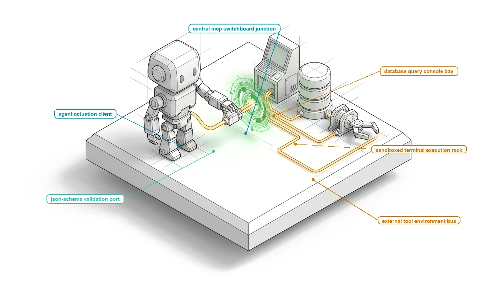{fig-alt="Blueprint for Tool Execution."}
:::

:::

## Purpose {.unnumbered .unlisted}

\begin{marginfigure}
\mlagentstack{0}{0}{0}{100}{0}{0}
\end{marginfigure}

_How does a speculative candidate string become a controlled, observable effect within an external execution environment?_

A foundation model possesses no native peripheral interfaces: it cannot read a file descriptor, dispatch a network packet, or spawn an operating system process. The model emits only a sequence of discrete tokens into an output buffer. Transforming that candidate text string into a physical side effect in an external environment requires an actuation boundary managed by the host runtime. When an agent emits a tool call, the runtime must parse the unstructured generation, validate its arguments against strict schemas, evaluate caller authorization, and dispatch the request across external protocols like the Model Context Protocol. If this boundary is poorly engineered, minor formatting defects cause unhandled parser exceptions, long-running shell commands lock inference worker threads while leaking expensive GPU memory, and unmediated command strings expose the host to catastrophic arbitrary code execution. Furthermore, network timeouts and partial service failures introduce state ambiguity, where the runtime cannot determine whether an external operation completed before failing. Systems engineers must construct resilient tool execution pipelines: streaming and validating tool invocations, enforcing idempotency nonces to guarantee safe retries, and capturing structured diagnostic envelopes. Managing the actuation boundary requires co-designing parameter serialization schemas, asynchronous execution harnesses, and observation sanitizers to safely bridge probabilistic predictions with deterministic external effects.

::: {.content-visible when-format="pdf"}

\newpage

:::

::: {.callout-learning-objectives}

- Specify the complete tool actuation contract, including JSON Schema parameter typing, capability metadata, idempotency flags, and timeout specifications.
- Analyze standardized tool integration protocols (Model Context Protocol / MCP), evaluating the trade-offs between local UNIX domain sockets, stdio pipes, and remote SSE/RPC transports.
- Architect an asynchronous, non-blocking tool dispatch engine that issues execution handles, frees accelerator compute during I/O waits, and wakes suspended agent sessions via event notifications.
- Implement an observation normalization pipeline that strips ANSI escape codes, extracts structured stack traces, preserves deterministic integer exit codes, and truncates high-volume logs with explicit truncation markers.
- Evaluate tool catalog granularity by schema footprint, selection error, permission scope, and accepted-task results under matched workloads.
- Formulate error taxonomy and retry policies for transient network drops, rate-limit throttles, and tool parameter schema violations.

:::

## Tool Subsystem Architecture {#sec-vol3-actuation-unix-analogy}

The preceding chapters analyzed the internal mechanics of agentic computation: autoregressive decoding across discrete token vocabularies, structured deliberation over reasoning trees, the physical allocation and eviction of key-value cache pages across high-bandwidth GPU memory, and the retrieval of external state from indexed vector stores. Crucially, every operation examined thus far has remained strictly introspective. Tensor contractions, layer normalizations, and attention projections alter the charge states of accelerator memory, yet they produce no physical side effects in the external computing environment beyond electrical power consumption and heat dissipation. When a foundation model operates purely as a conversational assistant, its final emitted token sequence serves merely as an informational display rendered for a human reader. The engineering paradigm shifts decisively, however, the moment an agentic system transitions from interactive dialogue to autonomous delegation. In an agentic architecture, the model is no longer an end-point text generator; it is an unprivileged reasoning engine entrusted with orchestrating real-world environments. The user does not request an essay describing how a software defect might be repaired, how a database index might be optimized, or how an HTTP payload might be structured; the user tasks the runtime with verifying the source patch, executing the database migration, and dispatching the network request. This operational transition marks the actuation boundary—the critical systems interface where candidate token sequences produced by a stochastic engine must be transformed into reliable, deterministic, and externally observable operations across physical hardware, operating systems, and distributed services.

::: {.column-margin}
Jerome H. Saltzer and Michael D. Schroeder formulated the *principle of complete mediation* in their seminal 1975 paper, *The Protection of Information in Computer Systems*: every access to every object must be checked for authority. In an agentic architecture, this dictates that the host supervisor never allows an unprivileged foundation model to execute side effects directly; candidate outputs are held in memory escrow and validated against typed contracts before dispatch.
:::

To engineer this actuation boundary rigorously, systems architects must confront the physical reality of the foundation model. Stripped of anthropomorphic terminology, an autoregressive model is a stateless tensor function mapping a sequence of discrete input tokens to a conditional probability distribution over a vocabulary. It possesses no native program counter, no interrupt lines, no memory management unit, and no ambient operating system authority ($A=0$). The model cannot execute a hardware trap, invoke an x86 `syscall` instruction, or bind a raw network socket; physically, it cannot reach outside the memory allocations housing its weights, activations, and key-value caches. Any perception that an artificial intelligence model directly "executes code" or "interacts with an API" is an operational illusion maintained entirely by the external host runtime. This systems challenge mirrors one of the foundational design triumphs in modern computing: Dennis Ritchie and Ken Thompson's realization in the UNIX time-sharing system (1974) that heterogeneous physical hardware could be unified under a single, polymorphic operating system abstraction. By declaring that "everything is a file," UNIX decoupled user-space applications from the idiosyncratic register maps and hardware timing constraints of disk platters, serial terminals, and magnetic tapes. Applications interact exclusively with abstract integer handles—file descriptors—which expose a uniform operational contract (`open`, `read`, `write`, `close`, `ioctl`). The operating system kernel maintains a private file descriptor table per process, validates caller permissions, and routes uniform requests to specialized hardware device drivers.

In an agentic architecture, we observe a modern design precedent: "everything is an RPC tool dispatch." Heterogeneous external resources—compilers, database engines, web search endpoints, local filesystems, and remote microservices—are abstracted into a uniform catalog of typed tool descriptors managed by the agent runtime. However, we must not mistake this design precedent for a literal hardware equivalence. An operating system process executes native machine instructions with direct memory access and traps to ring 0 with hardware-enforced CPU privilege rings. An autoregressive language model, by contrast, merely emits a candidate sequence of tokens into a host-managed memory buffer. It is the host runtime that operates as the supervisory kernel and device driver, interpreting candidate token strings, validating their structural integrity, translating them into concrete remote procedure calls, and returning structured observations back across the memory boundary.

The absolute necessity of this supervisory runtime becomes evident when examining the failure modes of unmediated execution. A naive implementation might treat the model's text generation as a direct command stream, passing raw generated strings directly into an `eval()` interpreter or a POSIX shell. Such an unmediated architecture immediately collides with the open-loop failure wall. First, free-form text generation is inherently vulnerable to lexical perturbations: misplaced quotation marks, unescaped shell metacharacters, malformed argument lists, and hallucinated command-line flags inevitably corrupt the string, causing downstream interpreters to abort with unhandled syntax faults. Second, and far more insidiously, unmediated execution suffers from an irreconcilable epistemic gap. A neural foundation model possesses no direct perception of the external universe; its internal parameters represent frozen historical associations. If an agent attempts to manipulate an external environment in an open loop—emitting a sequence of speculative operations without pausing to observe intermediate physical feedback—its internal state estimates rapidly diverge from the physical reality of the host system. A missing file, a transient 503 HTTP gateway timeout, or a subtle compiler type error renders every subsequent planned operation invalid. Unobserved execution errors compound exponentially across multi-step execution graphs, rapidly driving the trajectory into degenerative hallucination or catastrophic corruption of external state.

To arrest this exponential error compounding, the agent runtime must enforce closed-loop execution grounded in empirical verification. Decades ago, Edsger Dijkstra observed that program testing can be used to show the presence of bugs, but never to show their absence. In agentic engineering, this principle takes on an inverted operational significance: while a foundation model's internal deliberation can never mathematically guarantee the correctness of a proposed modification, external deterministic execution provides the only authoritative mechanism to verify whether an operation actually succeeded or failed. The model hypothesizes; the physical computing environment decides. Implementing this empirical feedback loop requires complete mediation—a foundational security principle established by Jerome Saltzer and Michael Schroeder (1975), dictating that every access to every resource must be validated along an unbypassable path. In the agentic tool subsystem, complete mediation is realized through a deterministic four-stage tool execution lifecycle:

First, during *proposal validation against schema*, the host runtime intercepts the candidate token stream emitted by the model, parses the serialized payload across the memory boundary, and rigorously validates the proposed arguments against a pre-registered interface schema. Syntactic malformations, missing required fields, and out-of-bounds types are rejected at the memory boundary before any network socket is opened or external process spawned. Second, during *permission and capability gating*, the runtime acts as an authoritative reference monitor under the principle of Zero Ambient Authority ($A=0$). Even if a model proposes a syntactically flawless command, the runtime verifies whether the active agent session holds explicit capability grants for the targeted operation, enforcing read-only constraints, path sandboxing policies, and rate limits. Third, during *dispatched execution*, the validated and authorized operation is delegated to an isolated external driver or RPC endpoint. The runtime manages network timeouts, monitors execution latencies, and tracks process handles without stalling the primary supervisory loop. Fourth, during *observation normalization and context staging*, the runtime captures the raw, heterogeneous telemetry produced by the external environment—standard output streams, exit codes, diagnostic traces, or structured JSON responses. It sanitizes control characters, enforces backpressure and strict token truncation boundaries to prevent accelerator context exhaustion, and wraps the result in an authoritative observation envelope that is staged back into the model's working memory context.

The complete mediation architecture governing tool actuation is systematized across protection rings in @fig-vol3-ai-system-call-boundary. In Ring 3 (User Space), the unprivileged foundation model operates under Zero Ambient Authority ($A=0$), generating candidate tool tokens that are held in an escrow register rather than executing directly against host operating system interfaces. When a complete tool invocation sequence is emitted, the register asserts an AI system call software trap (`SYS_TOOL_CALL`), yielding control across the privilege boundary into Ring 0 (Supervisor Space). The host supervisor routes the candidate payload through four sequential verification gates: (1) a Grammar DFA Filter that enforces schema-constrained logit masking ($P(\text{syntax\_err}) = 0$); (2) a Strict ABI Deserializer that hydrates typed structs while validating memory bounds; (3) a Capability and Lease Checker that validates cryptographic HMAC tokens and path allowlists to defeat directory traversal exploits; and (4) an Idempotency and Replay Engine that inspects the trajectory nonce $k_{\text{idem}}$ against write-ahead storage. Only after passing all four gates does the supervisor dispatch authorized calls into isolated execution domains (such as Firecracker microVMs, gVisor containers, or enterprise API gateways). Once physical actuation concludes, the resulting observation stream and exit code return upward via a `SYSRET` transition, resuming the unprivileged model with an authoritative observation envelope staged in working memory. In parallel, @tbl-vol3-tool-descriptors systematizes this structural duality, comparing the classic UNIX file descriptor architecture with the agentic tool descriptor table.

::: {#fig-vol3-ai-system-call-boundary fig-env="figure" fig-pos="htb" fig-cap="**The AI System Call Privilege Boundary**: Architectural topology of mediated tool execution across protection rings. The unprivileged stochastic processor operates under Zero Ambient Authority ($A=0$) in user space (Ring 3), emitting candidate tool calls held in memory escrow before yielding control via a `SYS_TOOL_CALL` trap. The privileged host supervisor enforces complete mediation in kernel space (Ring 0), validating payloads across a four-stage pipeline—Grammar DFA Filter, Strict ABI Deserializer, Capability Lease Checker, and Idempotency Replay Engine—before dispatching authorized operations to isolated execution domains and returning sanitized observations via `SYSRET`." fig-alt="Systems architecture diagram illustrating Ring 3 User Space with an unprivileged foundation model core and escrow register, transitioning across a SYS_TOOL_CALL trap and SYSRET resume boundary to Ring 0 Supervisor Space with four sequential verification stages, which dispatch across an isolation barrier to sandboxed execution domains."}
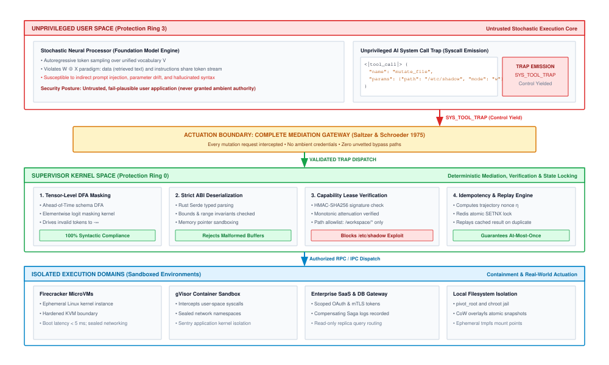
:::

| Architectural Dimension  | UNIX File Descriptor Table (Ritchie & Thompson 1974)                             | Agent Tool Descriptor Table (Host Supervisor)                                                            |
|:-------------------------|:---------------------------------------------------------------------------------|:---------------------------------------------------------------------------------------------------------|
| **Namespace Handle**     | Monotonic integer index (`int fd`) indexing a private per-process kernel table.  | Structured tool identifier string or enum bound within the active context catalog.                       |
| **Polymorphic Contract** | Uniform byte-stream operations (`open`, `read`, `write`, `close`, `ioctl`).      | Typed parameter schema validating structured arguments and returning observation envelopes.              |
| **Authority Model**      | POSIX permissions (`rwxrwxrwx`), process UID/GID, and OS capability sets.        | Explicit capability tokens, declarative access control policies, and Zero Ambient Authority ($A=0$).     |
| **Invocation Channel**   | Hardware interrupt or software trap (`int 0x80`, `syscall`) switching to Ring 0. | Autoregressive token generation parsed across the supervisor memory boundary into a local or remote RPC. |
| **Execution State**      | Kernel-managed byte offset pointers, vnodes, and operating system buffer caches. | Stateless or lease-tracked execution handles, idempotency keys, and output buffer windows.               |
| **Telemetry & Status**   | Signed integer byte counts or negative errno codes (`ENOENT`, `EACCES`).         | Typed observation envelope encapsulating exit codes, stdout/stderr streams, or error frames.             |

: **UNIX File Descriptors versus Agent Tool Descriptors**: Conceptual comparison of the UNIX File Descriptor Table and the Agent Tool Descriptor Table. {#tbl-vol3-tool-descriptors}

This architectural separation shifts the core engineering challenge to the syntactic boundary between model and runtime. If the supervisor's primary operational invariant is to validate candidate tokens against strict operational contracts during Stage 1, how should those contracts be specified so that an autoregressive model parameterizes them with maximal fidelity? How do parameter naming conventions, explicit type bounds, structural docstrings, and enum constraints influence logit distributions during decoding, and what are the quantitative trade-offs between schema expressiveness and context token consumption? Answering these questions requires examining the formal construction of tool interface schemas.

## Tool Interface Schemas {#sec-vol3-actuation-schemas}

When an autoregressive transformer decodes a tool invocation, every generated token is an unprivileged prediction conditioned entirely on the prefix tokens residing in its context window. If the host runtime presents an ambiguous, untyped, or underspecified interface definition, the model's attention mechanism allocates probability mass over an unconstrained output distribution, generating invalid parameter names, hallucinated data types, and malformed payload structures that crash downstream execution handlers. In production agentic runtimes, syntax and schema errors account for a significant fraction of initial tool dispatch failures, turning deterministic systems integration into a stochastic lottery.

A **tool interface schema** is both a structural grammar for host-side deserialization and an epistemic prior for autoregressive decoding; rigorously typed contracts containing explicit property bounds, semantic descriptions, and enumerated constraints minimize parameter hallucination while imposing measurable context prefill and memory overheads.

To build dependable agentic architectures, systems engineers must treat interface schemas not as decorative documentation, but as machine-enforced operating system contracts. A tool schema defines the exact syntactic boundary between unprivileged token generation and privileged host execution, establishing the invariants that the runtime must verify before permitting any real-world state mutation.

### Anatomy of the tool declaration

A tool interface schema bridges the semantic understanding of a language model and the rigid mechanical requirements of host-side remote procedure calls (RPCs). Modern agent runtimes standardize this boundary using dialect variants of JSON Schema (specifically drafts 2020-12 and draft-07) and OpenAPI 3.1 specifications. While human software engineers treat schemas primarily as post-hoc validation rules, an autoregressive language model processes the serialized schema directly within its input prompt as an in-context specification of legal behavior.

Formally, a tool schema $S$ registered in the runtime tool descriptor table is defined as an ordered five-tuple:
$$S = \langle N, D, P, R, \chi \rangle$$
where $N \in \Sigma^*$ is the unique tool identifier (e.g., `fs_read_bytes`), $D \in \Sigma^*$ is the high-level operational docstring, $P = \{p_1, p_2, \dots, p_k\}$ is the finite set of formal parameters, $R \subseteq \{p_1, \dots, p_k\}$ denotes the set of required parameters, and $\chi \in \{\text{open}, \text{closed}\}$ designates the structural boundary policy governing undeclared fields.

::: {.column-margin}
**Closed World Assumption ($\chi = \text{closed}$)**
Setting `additionalProperties: false` in JSON Schema enforces a closed-world assumption. Without this invariant, autoregressive models frequently hallucinate non-existent convenience flags (e.g., `verbose=True`, `force=True`) borrowed from general pretraining corpora.
:::

Each parameter descriptor $p_i \in P$ is defined by the sub-tuple $p_i = \langle n_i, \tau_i, d_i, \mathcal{D}_i, v_{\text{default}} \rangle$, where $n_i$ represents the property key, $\tau_i \in \{\text{string}, \text{integer}, \text{number}, \text{boolean}, \text{array}, \text{object}\}$ defines the primitive or composite data type, $d_i$ provides the semantic parameter docstring, $\mathcal{D}_i \subseteq \operatorname{dom}(\tau_i)$ specifies the bounded domain of valid values, and $v_{\text{default}}$ specifies the fallback value when an optional parameter is omitted by the generator.

The structural boundary policy $\chi$ determines whether the runtime permits extraneous fields. Under an open policy ($\chi = \text{open}$), the model may emit arbitrary auxiliary key-value pairs without triggering validation errors; under a closed policy ($\chi = \text{closed}$, declared via `additionalProperties: false` in JSON Schema), any key outside $P$ causes immediate validation rejection. In robust systems design, the closed policy is an essential invariant: it prevents models from generating uninspected arguments that might silently alter execution semantics or bypass audit logs.

::: {#lst-vol3-tool-schema lst-cap="**Strict Tool Parameter Contract**: Host-side parameter bounds, typing, and closed-world extra-field prohibition."}
```python
class FileReadParameters(BaseModel):
    model_config = ConfigDict(extra="forbid")
    path: str = Field(..., description="Absolute canonical filesystem path.")
    offset_bytes: int = Field(0, ge=0, description="Starting byte offset.")
    max_bytes: int = Field(65536, ge=1, le=1048576, description="Chunk size in bytes.")
    encoding: Literal["utf-8", "ascii"] = Field("utf-8", description="Character encoding.")
```
:::

As demonstrated in @lst-vol3-tool-schema, the host definition uses high-level type annotations to enforce runtime boundaries. When serialized to OpenAPI 3.1 for injection into the model's system prompt, the class definition compiles into a canonical JSON Schema object. Every programmatic constraint in Python maps directly to an explicit JSON Schema verification keyword, as detailed in @tbl-vol3-schema-contract.

| Parameter Field | Host Python Type                     | JSON Schema Representation                              | Operational Runtime Invariant                                             |
|:----------------|:-------------------------------------|:--------------------------------------------------------|:--------------------------------------------------------------------------|
| `path`          | `str`                                | `{"type": "string"}`                                    | Path must be non-empty; resolved against sandbox root.                    |
| `offset_bytes`  | `int = Field(0, ge=0)`               | `{"type": "integer", "minimum": 0, "default": 0}`       | Reject negative seek offsets before host filesystem syscall.              |
| `max_bytes`     | `int = Field(..., ge=1, le=1048576)` | `{"type": "integer", "minimum": 1, "maximum": 1048576}` | Enforce strict upper bound ($1\text{ MiB}$) to prevent memory exhaustion. |
| `encoding`      | `Literal["utf-8", "ascii"]`          | `{"type": "string", "enum": ["utf-8", "ascii"]}`        | Collapse string search space to two discrete token sequences.             |
| `model_config`  | `extra="forbid"`                     | `{"additionalProperties": false}`                       | Enforce $\chi = \text{closed}$; reject hallucinated parameters.           |

: **Programmatic Type Declarations and JSON Schema Mappings**: Mapping of programmatic type declarations to JSON Schema keywords and host runtime invariants. {#tbl-vol3-schema-contract}

### The schema quality effect

::: {.column-margin}
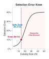{width="100%" fig-alt="Knee curve plotting tool selection error percentage against total declared tools, showing a steep error inflection above 30 functions."}

*Past a threshold catalog size, semantic interference triggers a sharp inflection in misrouted tool calls.*
:::
During the prefill and autoregressive decode phases, a foundation model does not compile schemas into a physical dispatch table; rather, its attention heads attend across the schema tokens to steer output probabilities. In their seminal work on API synthesis, @patil2023gorilla demonstrated that foundation models suffer severe performance degradation when interfaces rely on terse or ambiguous naming conventions. This phenomenon—the *Schema Quality Effect*—governs the empirical relationship between the semantic precision of a schema specification and the rate of downstream invocation failures.

::: {.column-margin}
**The Gorilla Benchmark**
@patil2023gorilla introduced the Gorilla model, showing that pairing strict JSON signatures with rich documentation reduced API argument hallucination by over $50\%$ compared to standard zero-shot prompting across thousands of cloud endpoints.
:::

When a parameter description is reduced to a bare type declaration (such as `"path": {"type": "string"}`), the model's attention mechanism receives no guidance regarding formatting constraints, path relativities, or edge conditions. In information-theoretic terms, the conditioning prefix fails to concentrate the conditional probability distribution $P(y_t \mid y_{<t}, x)$ on valid operational parameters. The attention heads in intermediate layers cannot resolve whether the string should represent a relative path (`./data/log.txt`), a POSIX URI (`file:///var/log.txt`), or an absolute path (`/Users/VJ/log.txt`). As entropy across the vocabulary distribution increases, the generator frequently samples tokens based on pretraining associations rather than host environment requirements.

Conversely, semantic conditioning provides targeted constraints that alter the decode trajectory:

1. *Explicit Units and Dimensionality:* Declaring `"timeout_seconds": {"type": "integer", "description": "Connection timeout in seconds; must not exceed 60"}` prevents the catastrophic unit ambiguity where a model passes milliseconds ($5000$) to an interface expecting seconds, avoiding thread-pool starvation.
2. *Bounded Enumerations:* Defining an explicit enum set ($\mathcal{D} = \{ \text{json}, \text{csv}, \text{parquet} \}$) replaces an infinite string domain with a closed set of attractor tokens. During decoding, attention heads direct probability mass exclusively to the candidate tokens corresponding to the enum values, driving the probability of invalid options to near zero.
3. *Contradiction Resolution via Docstrings:* When parameter interactions contain subtle operational conflicts—such as mutually exclusive options where parameter $A$ cannot be set if parameter $B$ is present—documenting this invariant explicitly in the high-level docstring $D$ enables cross-attention layers to correlate the presence of token $A$ in the generated prefix with the suppression of token $B$.

The difference between vague and tight operational contracts is not stylistic; it is the boundary between runtime failure and deterministic dispatch. @Tbl-vol3-schema-failures contrasts typical failure modes resulting from underspecified schemas against the corrective mechanisms introduced by rigorous typing.

| Target Parameter    | Underspecified Schema | Observed Model Failure Trace                                           | Rigorous Schema Specification                                       | Enforced Invariant                                                 |
|:--------------------|:----------------------|:-----------------------------------------------------------------------|:--------------------------------------------------------------------|:-------------------------------------------------------------------|
| File chunk size     | `"size": "integer"`   | `{"size": -1}` (Attempting to express "read all")                      | `"size_bytes": {"type": "integer", "minimum": 1, "maximum": 65536}` | Rejects non-positive values; prevents host buffer overflow.        |
| Process termination | `"signal": "string"`  | `{"signal": "SIGKILL"}` (Host POSIX C binding expects integer)         | `"signal_num": {"type": "integer", "enum": [1, 2, 9, 15]}`          | Restricts tokens to valid POSIX integer signal numbers.            |
| HTTP request body   | `"data": "object"`    | `{"data": "<xml>payload</xml>"}` (String passed where object expected) | `"data": {"type": "object", "additionalProperties": true}`          | Host JSON parser guarantees associative mapping prior to dispatch. |
| Git commit target   | `"target": "string"`  | `{"target": "HEAD~"}` (Ambiguous refspec causes shell failure)         | `"commit_hash": {"type": "string", "pattern": "^[0-9a-f]{40}$"}`    | Regex pattern prevents shell injection and malformed refspecs.     |

: **Tool Schema Failure Modes and Mitigations**: Empirical parameter failure modes under vague schemas versus enforced invariants under rigorous schemas. {#tbl-vol3-schema-failures}

### Host-side strict validation

Under the Zero Ambient Authority ($A=0$) principle, the host supervisor never assumes that candidate tokens emitted by a model conform to the declared schema. Instead, the runtime intercepts the raw generated token stream, buffers it in memory escrow, and passes the deserialized payload through a host-side strict validation pipeline before permitting any dispatch to local or remote endpoints.

The validation pipeline executes in three sequential stages:

First, the runtime passes the buffered character sequence through a streaming lexical parser to confirm valid JSON syntax. If the generation terminated prematurely due to context exhaustion ($T_{\max}$ reached) or network socket closure, the parser catches the unterminated string or bracket imbalance, rejecting the payload before semantic analysis begins.

Second, the parsed abstract syntax tree (AST) is evaluated against the compiled JSON Schema using an engine such as Pydantic V2 or `jsonschema`. The validator asserts three structural invariants:
$$\forall r \in R, \quad r \in \operatorname{keys}(Y)$$
$$\forall k \in \operatorname{keys}(Y), \quad k \in P \quad (\text{if } \chi = \text{closed})$$
$$\forall k \in \operatorname{keys}(Y), \quad Y[k] \in \mathcal{D}_k \land \operatorname{type}(Y[k]) = \tau_k$$
where $Y$ is the candidate dictionary emitted by the model.

Third, if the payload violates any schema invariant, the host supervisor intercepts the failure and suppresses execution. In early agent architectures, runtimes frequently responded to validation errors by throwing unhandled exceptions or emitting generic error strings such as `Invalid parameters`. Such feedback leaves the language model blind to the mechanical cause of failure. The model knows only that its call failed, forcing it to guess which key, type, or boundary condition was violated.

```json
{
  "status": "validation_error",
  "tool_name": "fs_read_bytes",
  "error_count": 1,
  "errors": [
    {
      "loc": ["max_bytes"],
      "input_value": 2097152,
      "error_type": "less_than_equal",
      "message": "Input should be less than or equal to 1048576",
      "expected_domain": "integer in range [1, 1048576]"
    }
  ]
}
```

Modern runtimes construct a structured diagnostic error envelope, as illustrated in the trace above. This envelope transforms an unhandled exception into an authoritative observation returned through the standard feedback loop. When the diagnostic payload is injected back into the conversational prefix, the model's self-attention mechanism correlates the failing field (`loc: ["max_bytes"]`) and the out-of-bounds scalar (`input_value: 2097152`) with the explicit upper bound (`maximum: 1048576`). In the subsequent autoregressive pass, the model conditions on this empirical error trace to emit a corrected parameterization without human intervention.

### Context budget trade-offs: Static staging versus just-in-time schema injection

While rich interface schemas drastically suppress parameter hallucination, they introduce a severe systems bottleneck: context token consumption. In an enterprise agent runtime managing complex infrastructure, the tool catalog can easily exceed dozens or hundreds of distinct operations, encompassing file manipulation, process execution, database querying, and cloud API management. Staging these schemas directly into the system prompt imposes significant memory and compute penalties on the inference engine.

Consider a runtime managing a catalog of $M = 50$ distinct tools. If each tool schema—complete with operational docstrings, nested properties, enum constraints, and typing bounds—requires an average of $S = 300$ tokens, the static schema prelude consumes:
$$T_{\text{catalog}} = M \times S = 50 \times 300 = 15,000\text{ tokens}$$
These $15,000$ tokens must be prefilled before the model can process the user's initial query, and they must remain resident in accelerator memory across every turn of the agentic interaction.

::: {#exmp-07-memory-footprint-and-prefill-latency .callout-example title="Memory footprint and prefill latency of static tool catalogs"}
Consider an enterprise agent runtime orchestrating tasks using a static catalog of $M = 50$ tools ($15,000$ tokens total) served by an open-weights model with $P = 70.6 \times 10^9$ parameters (such as Llama-3-70B) deployed on an 8-GPU NVIDIA H100 SXM5 node.

The model utilizes Grouped-Query Attention (GQA) with $L = 80$ transformer layers, $H_q = 64$ query heads, $H_{kv} = 8$ key-value heads, and a head dimension of $D_h = 128$. Compute operations and KV cache activations use 16-bit precision ($b = 2\text{ bytes per element}$).

**1. KV Cache Footprint per Session:**
The key and value memory consumed per token across all layers is calculated as:
$$\text{Memory}_{\text{token}} = 2 \times b \times L \times H_{kv} \times D_h = 2 \times 2 \times 80 \times 8 \times 128 = 327,680\text{ bytes} \approx 320\text{ KiB}$$
For a static catalog of $T_{\text{catalog}} = 15,000\text{ tokens}$, the KV cache allocation per active agent session is:
$$\text{KV}_{\text{session}} = 15,000 \times 327,680\text{ bytes} = 4,915,200,000\text{ bytes} \approx 4.915\text{ GB}$$
If the 8-GPU node hosts $K = 16$ concurrent agent sessions, the static tool schemas alone consume:
$$\text{KV}_{\text{total}} = 16 \times 4.915\text{ GB} = 78.64\text{ GB}$$
On an 8-GPU H100 node with $8 \times 80\text{ GB} = 640\text{ GB}$ total HBM3, the FP16 model weights consume $70.6 \times 10^9 \times 2 \approx 141.2\text{ GB}$. Of the remaining memory available for activations and dynamic context, nearly $80\text{ GB}$ is permanently committed to holding dormant tool definitions that may never be invoked during a specific turn.

**2. Prefill Compute Latency on Cache Miss:**
If a session incurs a cold start or invalidates its prefix cache, the inference engine must execute a prefill forward pass over the $15,000$ schema tokens. The theoretical floating-point operations required for prefill are:
$$\text{FLOPs}_{\text{prefill}} \approx 2 \times P \times T_{\text{catalog}} = 2 \times (70.6 \times 10^9) \times 15,000 \approx 2.118 \times 10^{15}\text{ FLOPs} = 2.118\text{ PFLOPs}$$
An 8-GPU H100 SXM5 system delivers a dense FP16/BF16 tensor peak of $8 \times 989.5\text{ TFLOPs} = 7.916\text{ PFLOPs/s}$. Assuming an empirical model FLOPs utilization (MFU) of $\mu = 40\%$ for the compute-bound prefill phase:
$$\text{Throughput}_{\text{effective}} = 7.916\text{ PFLOPs/s} \times 0.40 \approx 3.166\text{ PFLOPs/s}$$
The latency incurred solely to process the tool schema prelude before emitting the first generated token is:
$$t_{\text{prefill}} = \frac{2.118\text{ PFLOPs}}{3.166\text{ PFLOPs/s}} \approx 0.669\text{ seconds} = 669\text{ ms}$$
A prefill tax of $669\text{ ms}$ on every cache miss introduces severe latency jitter in multi-turn interactions.
:::

To escape the scalability limits of static schema staging, high-performance runtimes implement *Just-in-Time (JIT) Schema Injection*. Rather than staging the entire catalog $\mathcal{M} = \{T_1, T_2, \dots, T_M\}$ ($M > 3{,}000$) into every interaction prompt, the host runtime treats the tool catalog as an indexed database.

::: {#fig-vol3-two-stage-tool-retrieval fig-env="figure" fig-pos="htb" fig-cap="**Two-Stage Tool Retrieval and Just-in-Time Schema Binding**: Architecture of Just-in-Time (JIT) tool schema injection. An offline catalog of $M > 3{,}000$ tools is indexed in dense embedding space ($e_i = \text{Embed}(T_i)$). At turn $t$, coarse MIPS retrieval prunes the catalog to active subset $\mathcal{K}_t \ll \mathcal{M}$ ($K \approx 4$), followed by runtime DFA grammar compilation and token logit masking ($z_t' = z_t + M_t$). This reduces the schema prompt tax by over $98\%$ while preserving accelerator KV cache budgets and guaranteeing syntactic compliance." fig-alt="Systems datapath schematic illustrating two-stage tool retrieval: an offline tool catalog of 3,200 tools indexed in an HNSW vector index, Stage 1 coarse MIPS filtering querying by trajectory state to produce an active subset of 4 tools, and Stage 2 JIT context injection compiling a DFA bitmask tensor applied to model logits during autoregressive decoding."}
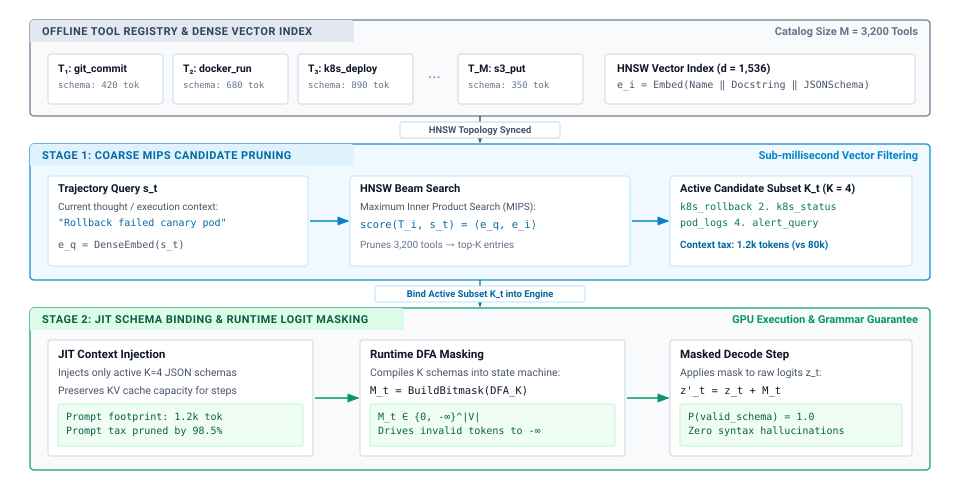
:::

The multi-stage retrieval and schema binding datapath is detailed in @fig-vol3-two-stage-tool-retrieval, decomposing catalog management into three discrete architectural layers:

1. *Offline Catalog & Dense Vector Index:* At initialization, the runtime registers all $M = 3{,}200$ tool descriptors into an auxiliary HNSW graph. Each entry $T_i$ is mapped to a 1,536-dimensional embedding $e_i = \text{Embed}(\text{Name} \mathbin{\Vert} \text{Docstring} \mathbin{\Vert} \text{JSONSchema})$, decoupling tool metadata storage from GPU high-bandwidth memory.
2. *Stage 1 (Coarse MIPS Candidate Pruning):* At turn $t$, the host supervisor extracts the agent's current trajectory state $s_t$ ("Rollback failed canary pod") and computes dense query embedding $e_q = \text{DenseEmbed}(s_t)$. An HNSW beam search computes inner products $\text{score}(T_i, s_t) = \langle e_q, e_i \rangle$, pruning the 3,200-tool catalog down to an active candidate subset $\mathcal{K}_t$ of size $K \ll M$ ($K=4$, such as `k8s_rollback`, `k8s_status`, `pod_logs`, and `alert_query`). This drops the prompt footprint from 80,000 tokens down to 1,200 tokens—a $98.5\%$ prompt tax reduction achieved in under $1.2\text{ ms}$.
3. *Stage 2 (JIT Schema Binding & Runtime DFA Masking):* The runtime dynamically compiles the $K=4$ schemas into a deterministic finite automaton (DFA) that generates a token-level bitmask tensor $M_t \in \{0, -\infty\}^{|V|}$ on the GPU. By applying $z_t' = z_t + M_t$ during autoregressive generation, invalid token transitions are driven to $-\infty$, guaranteeing $100\%$ syntactic schema compliance while preventing out-of-catalog tool hallucinations.

::: {.column-margin}
**Prefix Caching Trade-off**
Dynamic schema injection creates tension with inference engine Radix tree caching. If the injected tool set changes on every turn, the prompt prefix diverges, invalidating the KV cache. Runtimes resolve this by pinning a minimal "core" toolset in the immutable prefix and appending dynamic tools in a secondary slot.
:::

JIT schema injection introduces an architectural trade-off between context efficiency and retrieval recall. If the host retriever fails to surface a necessary tool schema (a false negative), the model cannot invoke the required capability, resulting in an unrecoverable task failure. Furthermore, dynamically mutating the tool set on every conversational turn alters the token sequence of the prompt prefix, invalidating the inference engine's Radix tree cache and forcing a recomputation of the KV cache frames. Advanced serving systems mitigate this by partitioning the prompt layout: a small, immutable set of core primitives (such as bash dispatch and file reading) is pinned in the primary prefix to maximize cache hits, while specialized tools are dynamically injected into a secondary, transient context block.

While strict schema engineering guarantees that an individual runtime can parse, validate, and constrain candidate tool calls, it presupposes that all tool definitions are statically compiled into or locally managed by the host application. Modern enterprise environments, however, are fundamentally decentralized: developer environments, cloud infrastructure, local databases, and web services each expose proprietary interfaces with distinct execution lifecycles. How can heterogeneous external services expose their tools, schemas, and dynamic resources to agent runtimes using an open, standardized protocol without requiring bespoke integration shims for every endpoint? Answering this question shifts our focus from isolated schema definition to interoperable tool discovery.

## Interoperable Tool Discovery {#sec-vol3-actuation-mcp}

Coupling tool implementations directly into the agent runtime process produces an architectural dead end. When tool routines share the host runtime's virtual address space and interpreter thread pool, every external library—from native database drivers and system administration utilities to third-party REST clients—competes for the same memory space, shared libraries, and execution locks. A single memory leak, unhandled segmentation fault, or blocking system call within a third-party tool library abruptly terminates or freezes the entire host agent orchestration loop. Conversely, constructing bespoke inter-process communication wrappers and proprietary REST shims for every enterprise service reproduces the classic $O(N \times M)$ integration crisis, wherein $N$ distinct agent runtimes must implement, test, and maintain unique translation adapters for $M$ heterogeneous execution backends.

An **open tool protocol** decomposes this $N \times M$ integration dilemma into an $O(N + M)$ client-server architecture, standardizing how external services advertise capabilities, serve structured resources, and accept invocation dispatches over uniform transport channels. Yet this protocol boundary establishes only discoverability, not authority: while the server declares what operations exist and defines their syntactic interfaces, the host runtime retains sovereign responsibility for parameter verification, permission enforcement, process containment, and state consistency.

::: {#fig-vol3-mcp-architecture fig-env="figure" fig-pos="htb" fig-cap="**Model Context Protocol Architecture**: Architectural topology of the Model Context Protocol (MCP). The unprivileged foundation model operates in the host client domain, mediated by an MCP Client protocol manager and security supervisor. Communication flows across a duplex transport layer via JSON-RPC 2.0 frames over local POSIX pipes (`stdio`) or HTTP/SSE streams, dispatching to autonomous MCP Servers that encapsulate schema engines and sandboxed execution drivers." fig-alt="Layered systems architecture diagram depicting three vertical columns: the Host Agent Runtime with foundation model and security supervisor on the left, Duplex Transport Layer handling JSON-RPC 2.0 requests and responses via stdio and SSE in the middle, and MCP Server Runtime with schema validator and sandboxed backend drivers on the right."}
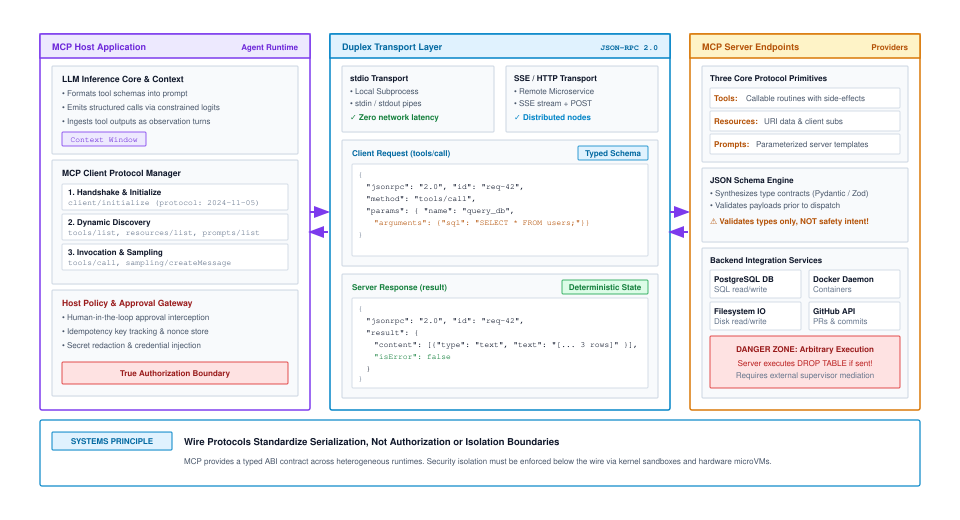
:::

### Client-server decomposition

The architectural separation of tool execution is structured across three distinct systems domains in @fig-vol3-mcp-architecture:

1. *Host Agent Runtime (Client Domain):* The unprivileged foundation model generates candidate tokens into context memory under Zero Ambient Authority ($A=0$). The MCP Client protocol manager captures candidate calls, negotiates protocol capabilities via `client/initialize`, dynamically queries registered capabilities (`tools/list`, `resources/list`), and marshals structured calls into JSON-RPC 2.0 payloads. Crucially, the host security supervisor interposes complete mediation: it enforces path allowlists, redacts secrets, injects authorized credentials, and evaluates human-in-the-loop approval gates before any payload touches the wire.
2. *Duplex Transport Layer (Wire Domain):* Communication between client and server is decoupled across bidirectional byte-stream transports—either local POSIX unidirectional pipes (`stdio`) connecting to isolated child subprocesses, or Server-Sent Events (`SSE`) combined with HTTP POST endpoints for remote microservices. Payloads adhere to RFC-compliant JSON-RPC 2.0 frames, pairing outbound client requests (`tools/call` with unique ID `req_42`) to inbound server results or error envelopes.
3. *MCP Server (Execution Domain):* The server runs as an independent OS process, exposing three protocol primitives (`Tools` with side effects, `Resources` for URI data attachments, and `Prompts` for context templates). An internal schema engine synthesizes Pydantic/Zod validators to verify incoming types before dispatching calls to sandboxed backend drivers (such as PostgreSQL connection pools, Docker daemon workers, or scoped chroot filesystems). Crucially, the server boundary isolates untrusted execution: even if a tool crashes or leaks memory, the host agent runtime remains completely unperturbed.

::: {.column-margin}
The Model Context Protocol adopts JSON-RPC 2.0 as its message framing standard. A valid request must contain a `"jsonrpc": "2.0"` version string, a unique numeric or string `"id"` for request-response multiplexing, a `"method"` string identifying the operation, and a structured `"params"` dictionary.
:::

To ensure interoperability across programming languages and operating environments, the communication channel relies on JSON-RPC 2.0 framing. Because JSON-RPC separates transport mechanics from message semantics, the client and server can negotiate capabilities and exchange payloads across any byte-stream abstraction without altering the underlying application logic. Messages fall into three discrete categories: requests, which require an explicit, correlated response; responses, which return either a structured result payload or a standardized error object paired to the originating request identifier; and notifications, which omit the identifier entirely to deliver one-way, non-blocking telemetry such as execution progress, logging events, or cache invalidation signals.

The Model Context Protocol organizes tool capabilities into four foundational primitives:

1. **`tools/list` (Dynamic Capability Negotiation):** The server returns an array of callable primitives accompanied by declarative JSON Schema contracts. Each entry specifies a canonical name, a natural language description tuned to maximize model selection accuracy, and a strict formal schema defining acceptable parameter names, types, and validation constraints. This runtime discovery decouples tool evolution from model deployment; an administrator can deploy new analytical routines or alter underlying service implementations without retraining the model or redeploying the host agent.
2. **`tools/call` (Imperative State Mutation and Dispatch):** The client transmits an imperative execution request specifying the targeted tool name and an argument map matching the advertised schema. The server executes the operation and returns a structured response envelope containing a `content` array—consisting of plain text blocks, binary data blobs, or embedded error frames—alongside an authoritative `isError` boolean flag that distinguishes operational domain failures from protocol crashes.
3. **`resources/read` (Declarative Passive Context Ingestion):** Unlike tools, which represent active, state-mutating execution endpoints, resources expose read-only data assets addressed via standard Uniform Resource Identifiers (URIs, such as `file:///var/log/syslog` or `postgres://analytics/schema`). Resources allow the host runtime to hydrate model context windows with passive reference material—such as source files, system metrics, or database schemas—without executing arbitrary foreign binaries or granting the server ambient execution privileges.
4. **`prompts/get` (Server-Managed Context Templates):** Domain-specific servers expose parameterized prompt templates that guide the model on how to compose sequences of tool calls to solve domain tasks. This mechanism moves domain-specific few-shot exemplars and operational instructions out of hardcoded client prompts and into the specialized subsystems that maintain the corresponding tools.

As summarized in @tbl-mcp-primitives, these four primitives partition the actuation surface across distinct operational semantics and risk profiles.

| MCP Primitive    | Operational Semantic | Primary Payload Schema            | State Mutation Risk    | Typical Latency Profile    |
|:-----------------|:---------------------|:----------------------------------|:-----------------------|:---------------------------|
| `tools/list`     | Introspection        | `tools: Tool[]`                   | None ($A=0$)           | $1\text{--}10\text{ ms}$   |
| `tools/call`     | Imperative Actuation | `name: string, arguments: object` | High (System Mutating) | $5\text{--}5000\text{ ms}$ |
| `resources/read` | Passive Hydration    | `uri: string`                     | None (Read-Only)       | $1\text{--}50\text{ ms}$   |
| `prompts/get`    | Context Templating   | `name: string, arguments: object` | None (Read-Only)       | $< 5\text{ ms}$            |

: **Model Context Protocol Primitives**: Systems contracts and operational profiles for core Model Context Protocol primitives. {#tbl-mcp-primitives}

By standardizing these primitives, the runtime establishes a clear operational lifecycle. When a session initializes, the host client establishes communication over the negotiated transport, issues an `initialize` handshake to exchange protocol version numbers and implementation capabilities, and queries `tools/list` to populate its dynamic tool catalog. When the model selects a tool, the runtime validates the proposal against the cached schema and routes a `tools/call` request across the wire, ensuring that neither the model nor the server can bypass the client's supervisory oversight.

### Transport topologies

::: {.column-margin}
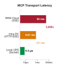{width="100%" fig-alt="Horizontal log-scale ladder comparing tool IPC transport latency: Local UDS at 6.3 microseconds, Intra-DC HTTP at 0.61 milliseconds, and WAN Cloud SSE at 35 milliseconds."}

*Remote HTTP transports impose a 97× to 5,600× latency tax over local Unix domain sockets for inter-tool IPC.*
:::
The physical channel connecting the host agent client to an execution server dictates the system's operational latency, failure isolation, and deployment topology. The protocol abstraction decouples message serialization from the underlying transport, enabling runtimes to navigate three distinct operational regimes: local standard input/output pipes, local UNIX domain sockets, and remote streaming over HTTP with Server-Sent Events (SSE). @Tbl-vol3-mcp-transports contrasts the architectural profiles of these transport topologies.

| Transport Topology             | Underlying IPC Primitives                              |        Typical Round-Trip Latency        | Process Lifecycle Coupling                           | Security & Isolation Boundary                  | Primary Failure Mode                                    |
|:-------------------------------|:-------------------------------------------------------|:----------------------------------------:|:-----------------------------------------------------|:-----------------------------------------------|:--------------------------------------------------------|
| **Standard I/O (`stdio`)**     | POSIX anonymous pipes (`pipe(2)`) via `stdin`/`stdout` |     $< 0.5\text{ ms}$ (memory copy)      | Direct child process (`fork`/`exec`); dies with host | In-process namespace / container sandbox       | Pipe buffer saturation deadlock (`F_SETPIPE_SZ`)        |
| **UNIX Domain Socket (`UDS`)** | Filesystem socket inode (`AF_UNIX`, `SOCK_STREAM`)     |   $< 0.1\text{ ms}$ (zero-copy kernel)   | Decoupled background daemon; multiplexed clients     | POSIX filesystem permissions (`chmod`/`chown`) | Stale socket lockfiles (`/tmp/mcp.sock`); daemon crash  |
| **Remote HTTP with SSE**       | TCP/IP, TLS, HTTP POST + `text/event-stream` SSE       | $15\text{--}150\text{ ms}$ (network RTT) | Fully distributed; cloud clusters / remote enclaves  | Network mTLS, bearer tokens, firewall CIDRs    | Packet loss, connection drops, proxy buffering timeouts |

: **Model Context Protocol Transport Topologies**: Architectural comparison of IPC transport mechanisms across latency, lifecycle, and isolation boundaries. {#tbl-vol3-mcp-transports}

Local standard input/output (`stdio`) pipes represent the lowest-latency transport mechanism for co-located tools. In this topology, the host runtime spawns the tool server as a direct child process using the standard POSIX `fork(2)` and `execve(2)` system call sequence. The host connects its own file descriptors to the child's standard input and standard output streams via unidirectional kernel pipes instantiated with `pipe(2)`. JSON-RPC messages cross the process boundary via newline-delimited JSON strings. Because communication traverses only kernel memory buffers via memory copies without touching network interface controllers or protocol stacks, round-trip request latency remains sub-millisecond ($< 0.5\text{ ms}$).

However, `stdio` transports impose severe physical constraints on stream management. Linux kernel pipes maintain a default buffer capacity of $64\text{ KB}$ (configured via `F_SETPIPE_SZ`). If a tool server emits a voluminous observation payload—such as a large build log or a detailed test execution trace—that exceeds the unread capacity of the pipe buffer while the host runtime is engaged in a compute-bound operation, the tool server process is forced into an un-interruptible sleep state (`TASK_UNINTERRUPTIBLE`) on the `write(2)` syscall. If the host simultaneously waits for the tool process to exit before draining its output buffer, the system deadlocks. Host runtimes utilizing `stdio` must therefore implement non-blocking asynchronous reader loops that continuously drain kernel pipe buffers into intermediate host memory ring buffers.

UNIX Domain Sockets (UDS) preserve the microsecond-scale data transfer rates of local kernel memory copies while liberating the server from the strict parent-child process lifecycle. Operating over filesystem-bound socket inodes (`AF_UNIX`, `SOCK_STREAM`), a UDS server executes as an independent, persistent background daemon. Multiple concurrent agent runtime sessions can multiplex tool invocations over a single persistent socket, avoiding the process invocation overhead of repeatedly spawning runtimes and re-initializing shared dependencies. Furthermore, standard POSIX filesystem permissions (`chmod` and `chown`) on the socket inode establish a concrete, host-level access control boundary that prevents unauthorized local users from dispatching actions to privileged tool daemons.

For distributed enterprise environments, the protocol supports remote networked transports via HTTP and Server-Sent Events (SSE). Under this asymmetric architecture, the host client dispatches JSON-RPC requests via standard HTTP `POST` requests, while the remote server streams JSON-RPC responses, execution progress notifications, and dynamic capability updates across a long-lived HTTP connection using the `text/event-stream` MIME type. This topology completely decouples the physical hardware: tool servers can run inside specialized cloud clusters, isolated network enclaves, or multi-tenant database environments located thousands of miles from the host runtime.

This physical decoupling introduces a substantial systems tax. Network round-trip times (RTT), TCP handshakes, TLS session negotiation, packet fragmentation across Maximum Transmission Units (MTUs), and reverse-proxy buffering introduce tens to hundreds of milliseconds of latency overhead per tool invocation. In an iterative agentic loop requiring dozens of sequential tool dispatches to resolve a complex task, this latency overhead rapidly outstrips the token generation latency of the underlying inference engine.

::: {#exmp-07-latency-and-cpu-overhead-across .callout-example title="Latency and CPU overhead across MCP transports"}
Consider an agent runtime executing a code-analysis task. The model issues a candidate tool call to search a repository, resulting in a structured JSON-RPC observation payload of exactly $64\text{ KB}$ ($65{,}536\text{ bytes}$). We evaluate the physical transfer latency and host CPU overhead across two distinct transport topologies: a local UNIX Domain Socket versus an intra-data center HTTP/SSE transport secured via TLS 1.3.

**System Parameters:**

- Host CPU: Modern server core operating at $3.0\text{ GHz}$; memory copy bandwidth $B_{\text{mem}} = 40\text{ GB/s} = 40 \times 10^9\text{ B/s}$.
- OS Context Switch Overhead: $t_{\text{ctx}} = 1.5\text{ }\mu\text{s}$ ($4{,}500\text{ CPU cycles}$).
- Local UDS Mechanics: Two context switches (client write $\to$ server read, server write $\to$ client read) plus two kernel memory copies (user space to kernel buffer, kernel buffer to user space).
- Network Mechanics: Intra-data center round-trip time $t_{\text{RTT}} = 0.5\text{ ms} = 500\text{ }\mu\text{s}$; Network bandwidth $B_{\text{net}} = 10\text{ Gbps} = 1.25\text{ GB/s}$.
- MTU Payload Limit: $1{,}448\text{ bytes}$ per TCP segment (standard $1{,}500\text{-byte}$ MTU minus $52\text{ bytes}$ of TCP/IP and timestamp headers).
- TLS Cryptographic Throughput: Hardware-accelerated AES-128-GCM processing at $4\text{ GB/s} = 4 \times 10^9\text{ B/s}$.

**1. Local UNIX Domain Socket Calculation:**
The latency comprises the context switch delays and the physical memory copies across the kernel boundary:
$$t_{\text{copy}} = 2 \times \left( \frac{65{,}536\text{ B}}{40 \times 10^9\text{ B/s}} \right) = 2 \times 1.64\text{ }\mu\text{s} = 3.28\text{ }\mu\text{s}$$
$$t_{\text{total, UDS}} = (2 \times t_{\text{ctx}}) + t_{\text{copy}} = (2 \times 1.5\text{ }\mu\text{s}) + 3.28\text{ }\mu\text{s} = 6.28\text{ }\mu\text{s} \approx 0.0063\text{ ms}$$
Total host CPU cycles consumed:
$$\text{Cycles}_{\text{UDS}} \approx (2 \times 4{,}500) + (3.28\text{ }\mu\text{s} \times 3.0\text{ GHz}) \approx 9{,}000 + 9{,}840 \approx 18{,}840\text{ cycles}$$

**2. Intra-Datacenter Remote HTTP/SSE over TLS Calculation:**
The $64\text{ KB}$ payload requires packetization across multiple TCP segments:
$$N_{\text{packets}} = \left\lceil \frac{65{,}536\text{ B}}{1{,}448\text{ B/packet}} \right\rceil = 46\text{ packets}$$
The wire serialization and transmission time over the $10\text{ Gbps}$ interface is:
$$t_{\text{wire}} = \frac{65{,}536\text{ B}}{1.25 \times 10^9\text{ B/s}} = 52.43\text{ }\mu\text{s}$$
The cryptographic encryption and decryption overhead across both endpoints is:
$$t_{\text{crypto}} = 2 \times \left( \frac{65{,}536\text{ B}}{4 \times 10^9\text{ B/s}} \right) = 32.77\text{ }\mu\text{s}$$
Accounting for the base network RTT, TCP/IP stack traversal, and kernel socket processing ($t_{\text{stack}} \approx 25\text{ }\mu\text{s}$):
$$t_{\text{total, SSE}} = t_{\text{RTT}} + t_{\text{wire}} + t_{\text{crypto}} + t_{\text{stack}} = 500\text{ }\mu\text{s} + 52.43\text{ }\mu\text{s} + 32.77\text{ }\mu\text{s} + 25\text{ }\mu\text{s} = 610.2\text{ }\mu\text{s} \approx 0.61\text{ ms}$$
Total host CPU cycles consumed across networking stack, packet handling, and TLS:
$$\text{Cycles}_{\text{SSE}} \approx (52.43\text{ }\mu\text{s} + 32.77\text{ }\mu\text{s} + 25\text{ }\mu\text{s}) \times 3.0\text{ GHz} \approx 330{,}600\text{ cycles}$$

**Systems Takeaway:** Even within an optimized, low-latency data center environment ($0.5\text{ ms}$ RTT), transitioning from a local UNIX Domain Socket to a remote HTTP/SSE transport imposes a **$97\times$ latency penalty** ($0.61\text{ ms}$ vs. $0.0063\text{ ms}$) and an **$18\times$ CPU cycle penalty** on the host. If the remote service resides across a wide-area network with a typical inter-region RTT of $35\text{ ms}$, the latency penalty expands to **$5{,}600\times$**. Distributed tool architectures must therefore reserve remote network transports for operations whose execution durations vastly exceed network transit times.
:::

### Protocol discovery versus sovereign host authorization

A critical failure mode in distributed agent design is the conflation of capability advertisement with capability authorization. Because the Model Context Protocol provides a clean, standardized abstraction for querying available tools via `tools/list`, naive implementations often pipe advertised schemas directly into the model's prompt prefix and forward candidate tool calls directly across the transport without inspection. This design violates the principle of least privilege and destroys the host runtime's security boundary.

An external tool server operates with Zero Ambient Authority ($A=0$). The server's advertised schema is strictly an unauthenticated declaration of what functionality the server *can* execute; it provides zero evidence that the current agent session *ought* to execute it. An unvetted third-party tool server, or a compromised internal microservice, can advertise destructive primitives such as arbitrary shell execution, unconstrained file deletion, or sensitive data exfiltration endpoints. If the host agent blindly adopts these tools, an attacker capable of manipulating the model's context through indirect prompt injection can hijack the system's operational capabilities.

To preserve system integrity, the host agent runtime must enforce a sovereign authorization pipeline between the model's candidate token generation and the transport dispatch layer:

1. **Dynamic Schema Filtering:** The host runtime evaluates incoming `tools/list` advertisements against an administrative policy matrix before exposing any tool to the inference engine. Discovered tools that request permissions exceeding the current session's security ceiling are excised from the catalog. The model's context window is never exposed to schemas the agent is unauthorized to invoke.
2. **Syntactic and Semantic Argument Validation:** When the model proposes a tool call, the runtime parses the candidate JSON structure and validates all parameters against strict typing, numeric range, string pattern, and path traversal constraints. If a tool expects a file path within a repository sandbox, parameter validation actively rejects inputs containing directory traversal sequences (`../../etc/passwd`) before the payload touches the wire.
3. **Capability Gating and Tiered Consent:** Operations are categorized into formal capability tiers reflecting their potential for state destruction:
   - **Tier 0 ($C_0$ — Read-Only / Idempotent):** Operations that observe environment state without modifying it (e.g., `resources/read`, directory listings). These proceed with autonomous runtime authorization.
   - **Tier 1 ($C_1$ — Reversible Mutation):** Operations that alter state but can be cleanly rolled back (e.g., creating an isolated git branch, writing temporary cache files). These require local runtime transaction logging.
   - **Tier 2 ($C_2$ — Irreversible Mutation):** Operations that permanently alter external systems (e.g., dropping database tables, provisioning cloud instances, dispatching financial transactions). These require cryptographic token authorization, hardware-bound signing keys, or interactive human-in-the-loop approval.
4. **Observation Sanitization and Injection Defense:** The authorization boundary operates symmetrically. When the tool server completes an operation and returns a payload over the transport channel, the runtime inspects the returned bytes before injecting them into the model's KV cache. External tool outputs represent untrusted data streams; if a search tool retrieves a web page or log file containing an adversarial prompt injection payload, uncritical ingestion into the working context can hijack future inference cycles. The runtime strips known injection framing, enforces hard byte bounds, and escapes raw tokens to prevent the observation stream from masquerading as system-level instructions.

This architectural division directly reflects the End-to-End Argument in System Design formulated by Saltzer, Reed, and Clark in 1984. The communication protocol (MCP) provides a uniform mechanism for moving bits and structuring RPC requests between endpoints. However, the critical functions of the system—correctness, security, permission enforcement, and task invariant verification—can only be completely and correctly implemented by the endpoint that understands the full application semantics: the sovereign host runtime. An external server cannot verify whether an action aligns with the user's broader task goal; the transport channel cannot verify whether an action violates least privilege. The host runtime retains exclusive responsibility for mediating every transition from candidate token to external effect.

When these tool invocations cross process or network boundaries and encounter partial failures, this mediation faces an even harder challenge. If a network connection abruptly severs or an intermediate proxy times out during a mutating `tools/call` dispatch, the runtime is plunged into operational uncertainty: Did the remote server complete the mutation before the connection dropped, or did the network fail before the server processed the request? Retransmitting the request blindly risks executing catastrophic duplicate side effects, while abandoning it risks desynchronizing the agent's internal state from physical reality. Resolving this dilemma requires transitioning from transport protocol framing to the mechanics of application-level execution idempotency.

## Idempotent Action Execution {#sec-vol3-actuation-idempotency}

::: {.column-margin}
{width="100%" fig-alt="Logarithmic timescale ladder comparing 20 ms GPU token generation against 1,200 ms subprocess build execution."}

*External tool execution outlasts neural token generation by up to five orders of magnitude, dominating end-to-end makespan.*
:::
When a host supervisor dispatches a mutating tool request across a process or network boundary, the dispatch timer begins counting down against an execution deadline $\tau_{\text{timeout}}$. At $t = \tau_{\text{timeout}}$, if the transport socket remains silent, the runtime is confronted with the fundamental distributed systems dilemma formulated by Flaviu Cristian: an unhandled timeout provides zero information regarding the physical state of the target system. The client runtime cannot distinguish between three mutually exclusive physical realities: the request packet was lost in outbound transit before reaching the tool server, the tool server crashed mid-execution after partially altering external state, or the tool server successfully executed the mutation and committed its side effects, but the response packet was severed on the return path by an intermediate switch or middlebox.

**An unhandled network timeout converts an agent's deterministic plan into an indeterminate physical state.** In an agentic architecture operating with unprivileged models, retrying an actuation blindly under the assumption that a timeout implies non-execution causes catastrophic duplicate side effects, such as duplicate payment captures, corrupted git histories, or repeated database insertions. Conversely, treating a timeout as a terminal failure breaks the deliberative loop and leaves the agent's internal belief state desynchronized from physical reality. Safe actuation requires transforming every mutating tool invocation into an algebraically idempotent operation through cryptographic execution keys, mutual-exclusion leases, or closed-loop state reconciliation probes, as illustrated in @fig-vol3-idempotency-flow.

::: {.column-margin}
**Algebraic Idempotence**
An operation $f: S \to S$ operating on system state $S$ is algebraically idempotent if and only if:
$$f(f(s)) = f(s) \quad \forall s \in S$$
In distributed systems, an RPC interface is idempotent if the side effects of $N > 1$ identical requests are identical to the side effects of a single request ($N = 1$).
:::

### The indeterminate state under network failure

Consider a concrete actuation failure trace. An autonomous coding agent attempts to apply a critical patch to a remote staging server by invoking an HTTP-based container management tool: `POST /containers/srv-prod-04/restart`. The host runtime assigns the invocation a timeout deadline $\tau_{\text{timeout}} = 2000\text{ ms}$. At $t = 2001\text{ ms}$, the TCP socket emits an `ETIMEDOUT` error. If the runtime naively retransmits the HTTP request, and the initial request had in fact succeeded in halting the container but timed out during service initialization, the secondary dispatch triggers a redundant container restart cycle. This second cycle invalidates existing process bindings, terminates healthy worker processes, and corrupts the host runtime's internal tracking model.

To formalize this breakdown, let an action dispatch be represented as a tuple $A = \langle \text{tool}, \theta, t_0 \rangle$, where $\theta$ denotes the bound parameter payload and $t_0$ is the dispatch timestamp. The action traverses a network channel $\mathcal{C}$ to execute against external environment state $S_{\text{env}}$. Upon the expiration of $\tau_{\text{timeout}}$, the runtime must evaluate the probability distribution over the three potential operational states:

$$\Sigma = \{\sigma_{\text{drop}}, \sigma_{\text{crash}}, \sigma_{\text{sever}}\}$$

Under $\sigma_{\text{drop}}$, the request was dropped by the network prior to arriving at the tool interface; the external environment remains unchanged ($S_{\text{env}}' = S_{\text{env}}$), and a retransmission is physically safe. Under $\sigma_{\text{crash}}$, the tool interface received $A$ and initiated execution, but the process crashed mid-mutation; the environment is left in an uncommitted, partially mutated intermediate state ($S_{\text{env}}' = S_{\text{env}} \oplus \delta_{\text{partial}}$). Under $\sigma_{\text{sever}}$, the tool interface fully completed the mutation ($S_{\text{env}}' = S_{\text{env}} \oplus \delta_{\text{complete}}$), but the response containing the observation frame $\mathcal{O}$ was dropped during return transit.

Standard, naive retry policies implement an open-loop retry strategy:

```python
# ANTI-PATTERN: Naive open-loop retry assuming sigma_drop
for attempt in range(max_retries):
    try:
        return client.dispatch(tool="charge_card", args={"amount": 5000})
    except TimeoutError:
        time.sleep(backoff(attempt))
```

This implementation commits the fallacy of assuming $\Pr(\sigma_{\text{drop}}) = 1.0$. If the failure was governed by $\sigma_{\text{sever}}$, every iteration through the loop re-executes the underlying side effect. In production agent architectures, where foundation models generate dozens of autonomous tool calls per task without direct human confirmation, open-loop retransmission transforms minor network hiccups into cascading state corruptions.

### Algebraic classification of tool side effects

To construct a safe actuation runtime, the supervisor must maintain an explicit taxonomy of tool side effects. Drawing from Roy Fielding’s formalization of network architectural styles and HTTP method semantics, tools provided to an agentic system fall into three distinct algebraic categories, as formalized in @tbl-vol3-tool-idempotency.

| Side-Effect Class               | Algebraic Definition | Concrete Tool Examples                                    | Native Re-dispatch Safety           | Required Supervisor Mitigation                                             |
|:--------------------------------|:---------------------|:----------------------------------------------------------|:------------------------------------|:---------------------------------------------------------------------------|
| **Nullipotent** (Read-Only)     | $f(s) = s$           | `read_file`, `grep`, `get_weather`, `sql_select`          | Guaranteed safe ($\forall N \ge 1$) | Unconditional retry with truncated exponential backoff.                    |
| **Naturally Idempotent**        | $f(f(s)) = f(s)$     | `write_file` (clobber), `mkdir -p`, `rm -f`, `set_config` | Safe under sequential re-dispatch   | Concurrency control; sequence numbering to prevent out-of-order execution. |
| **Non-Idempotent** (Cumulative) | $f(f(s)) \neq f(s)$  | `append_file`, `git_commit`, `send_email`, `exec_bash`    | Destructive under re-dispatch       | Mandatory idempotency keys, execution leases, or reconciliation probes.    |

: **Taxonomy of Tool Actuation Semantics and Fault Invariants**: Taxonomy of tool actuation semantics and fault invariants under network failure. {#tbl-vol3-tool-idempotency}

Nullipotent operations do not modify target system state. The observation returned by a nullipotent tool reflects the environment at observation time $t$, meaning retries modify only the agent's internal token context, not external reality. Naturally idempotent tools modify state, but repeated applications yield the exact same terminal state as a single invocation. For example, issuing `PUT /files/config.json` with an absolute payload clobbers the destination path identically whether executed once or ten times. The runtime can safely retransmit naturally idempotent calls, provided the runtime enforces strict sequential ordering to prevent a stale, delayed packet from clobbering a newer mutation.

::: {.column-margin}
**POSIX File System Semantics**
The difference between idempotent and non-idempotent actuation is visible in basic POSIX file operations. Opening a file with `O_TRUNC | O_WRONLY` (`write_file`) is idempotent: re-running it produces the exact same file contents. Opening a file with `O_APPEND` (`append_file`) is strictly non-idempotent: re-running it duplicates the appended buffer.
:::

Non-idempotent operations represent the primary hazard in agent engineering. These operations append records, capture monetary transactions, increment counters, or dispatch external communications. If the runtime cannot verify whether a non-idempotent tool executed before a timeout, it cannot simply invoke the tool again. It must either obtain a cryptographic guarantee from the serving endpoint that duplicate requests will be intercepted, or manually reconcile external state.

### Keyed deduplication mechanics

The standard systems mechanism for enforcing idempotency across lossy RPC boundaries is the injection of an *idempotency key* ($k_{\text{idem}}$). An idempotency key is a unique, client-synthesized token attached to the tool invocation payload or metadata header (@fig-vol3-idempotency-flow). The remote tool server tracks these keys within a fast, transactional storage layer to deduplicate incoming dispatches.

Rather than using completely random UUIDv4 identifiers, modern agent runtimes generate time-ordered UUIDv7 identifiers. A UUIDv7 combines a 48-bit millisecond Unix timestamp with monotonic randomness derived from a cryptographically secure pseudorandom number generator or a hash of the operation tuple:

$$k_{\text{idem}} = \text{UUIDv7}\Big(t_{\text{epoch}}, \mathcal{H}\big(\text{agent\_id} \,\|\, \text{turn\_idx} \,\|\, \text{call\_idx} \,\|\, \text{payload\_hash}\big)\Big)$$

Time-ordered keys ensure that the deduplication database on the tool server can index entries using clustered B-trees or LSM-trees without experiencing random write fragmentation.

::: {#fig-vol3-idempotency-flow fig-env="figure" fig-pos="htb" fig-cap="**Idempotency Nonce Execution Flow and Deduplication Gateway**: Architectural protocol for distributed tool actuation idempotency. The client supervisor synthesizes a deterministic 128-bit idempotency key ($k_{\text{idem}}$) binding session ID, trajectory turn, and canonical argument hash. The remote deduplication gateway inspects its transactional key-value store, branching into three execution paths: returning cached observation bytes on `COMPLETED` (Branch A), rejecting or awaiting concurrent retry on `IN_FLIGHT` (Branch B), or acquiring an atomic distributed lease via `SETNX` on `NOT_FOUND` (Branch C) to execute the mutation once in an isolated sandbox and append to write-ahead storage." fig-alt="Systems protocol flowchart detailing three sequential stages: Client Supervisor generating a deterministic SHA-256 idempotency key, Deduplication Gateway checking key state across COMPLETED, IN_FLIGHT, and NOT_FOUND branches, and Execution Sandbox recording write-ahead logs, running isolated mutations, and committing final state."}
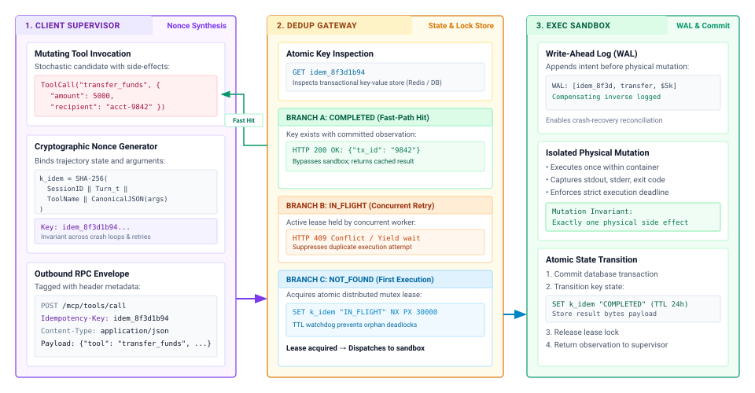
:::

The complete end-to-end execution flow is detailed in @fig-vol3-idempotency-flow, tracing the lifecycle of a mutating tool dispatch across three coordinated subsystems:

1. *Client Supervisor Nonce Synthesis:* When the model emits a mutating tool call (such as `transfer_funds`), the host supervisor computes a deterministic 128-bit idempotency key $k_{\text{idem}} = \text{SHA-256}(\text{SessionID} \mathbin{\Vert} \text{Turn}_t \mathbin{\Vert} \text{ToolName} \mathbin{\Vert} \text{CanonicalJSON}(\text{args}))$. Attaching this key as an HTTP `Idempotency-Key` header guarantees that the dispatch identity survives crash loops and retransmissions.
2. *Deduplication Gateway Inspection:* Upon receiving the wire payload, the gateway queries its transactional state store (`GET k_idem`), triggering one of three mutually exclusive execution branches:
   - *Branch A (`COMPLETED` — Fast-Path Cache Hit):* The mutation previously succeeded. The gateway returns the stored observation payload immediately (`HTTP 200 OK`), completely bypassing sandbox container execution and preventing duplicate physical operations.
   - *Branch B (`IN_FLIGHT` — Concurrent Retry):* An active execution lease is already held by a concurrent worker. The gateway responds with `HTTP 409 Conflict` or yields execution, suppressing redundant actuation while the primary job settles.
   - *Branch C (`NOT_FOUND` — First Execution):* The key is unobserved. The gateway acquires an atomic distributed lease lock via `SET k_idem "IN_FLIGHT" NX PX 30000` and forwards the request to the execution subsystem.
3. *Execution Sandbox & Atomic Commit:* The isolated container sandbox records transaction intent into an append-only write-ahead log (WAL), executes the physical mutation exactly once, and transitions the key state in storage to `COMPLETED` with the serialized output bytes before releasing the distributed lease lock.

```python
def dispatch_with_idempotency(client, tool_name: str, args: dict) -> dict:
    """Dispatches a mutating tool call using a deterministic idempotency key."""
    key = client.generate_key(tool_name, args)
    for attempt in range(client.max_retries):
        try:
            return client.transport.post(
                f"/tools/{tool_name}",
                json=args,
                headers={"Idempotency-Key": key},
                timeout=client.timeout_sec
            )
        except (TimeoutError, ConnectionError):
            time.sleep(client.backoff_factor * (2 ** attempt))
    raise ActuationTimeoutError(f"Tool {tool_name} failed settlement after retries.")
```

The execution lease duration $T_{\text{lease}}$ must be chosen deliberately. If $T_{\text{lease}} \le \tau_{\text{timeout}}$, a premature lease expiration allows a secondary worker to launch while the primary worker is still actively executing, causing split-brain execution. Therefore, the system must enforce the lease duration invariant:

$$T_{\text{lease}} > \tau_{\text{timeout}} + \delta_{\text{drift}} + \tau_{\text{proc\_max}}$$

where $\delta_{\text{drift}}$ accounts for the maximum allowable clock skew between nodes, and $\tau_{\text{proc\_max}}$ represents the upper bound on server-side processing latency before an execution is aborted.

::: {#exmp-07-quantifying-actuation-blast-radius-and .callout-example title="Quantifying actuation blast radius and lease bounds"}
**Scenario:** An agent runtime manages a cluster of 50 autonomous workers interacting with an external infrastructure provisioning API.

**Empirical Parameters:**

* Client invocation timeout: $\tau_{\text{timeout}} = 1200\text{ ms}$
* Microservice execution latency: $T_{\text{exec}} \sim \mathcal{N}(\mu = 450\text{ ms}, \sigma = 80\text{ ms})$
* Network round-trip latency: $\text{RTT}_{99} = 150\text{ ms}$
* Network packet drop probability: $p_{\text{drop}} = 0.02$ (independent on egress and ingress channels)
* Max clock skew between client and gateway: $\delta_{\text{drift}} = 25\text{ ms}$
* Daily mutating dispatches per worker: $N_{\text{daily}} = 4000$ operations

**Calculations:**

1. *Probability of an Indeterminate Timeout:*
A timeout occurs if the round-trip network time plus server execution time exceeds $\tau_{\text{timeout}}$, or if either the request or response packet is dropped.
$$\Pr(\text{drop}) = 1 - (1 - p_{\text{drop}})^2 = 1 - (0.98)^2 = 1 - 0.9604 = 0.0396 \quad (3.96\%)$$

The tail latency exceeding $\tau_{\text{timeout}}$ (assuming deterministic network latency of $\text{RTT} = 150\text{ ms}$):
$$\tau_{\text{avail}} = \tau_{\text{timeout}} - \text{RTT} = 1200 - 150 = 1050\text{ ms}$$
$$Z = \frac{1050 - 450}{80} = \frac{600}{80} = 7.5$$
Because $Z = 7.5$, tail latency timeout probability under normal operation is negligible ($< 10^{-12}$). Thus, the timeout rate is dominated by network packet loss:
$$\Pr(\text{timeout}) \approx \Pr(\text{drop}) \approx 0.0396$$

2. *Daily Duplicate Mutations Under Naive Retries:*
Total mutating dispatches across the cluster:
$$N_{\text{total}} = 50 \times 4000 = 200,000 \text{ ops/day}$$
Total timeout events encountered:
$$N_{\text{timeout}} = 200,000 \times 0.0396 = 7,920 \text{ timeouts/day}$$
The critical condition occurs when the timeout is caused specifically by an ingress response loss ($\sigma_{\text{sever}}$):
$$\Pr(\sigma_{\text{sever}}) = (1 - p_{\text{drop}}) \times p_{\text{drop}} = 0.98 \times 0.02 = 0.0196 \quad (1.96\%)$$
Expected daily duplicate side effects under an open-loop retry strategy:
$$N_{\text{duplicates}} = 200,000 \times 0.0196 = 3,920 \text{ catastrophic duplicate executions/day}$$

3. *Minimum Safe Lease Duration ($T_{\text{lease}}$):*
To guarantee that a server-side lock does not expire while an execution is running, we evaluate the maximum processing threshold at $6\sigma$:
$$\tau_{\text{proc\_max}} = \mu + 6\sigma = 450 + 6(80) = 930\text{ ms}$$
Enforcing our systems invariant:
$$T_{\text{lease}} > \tau_{\text{timeout}} + \delta_{\text{drift}} + \tau_{\text{proc\_max}} = 1200\text{ ms} + 25\text{ ms} + 930\text{ ms} = 2155\text{ ms}$$
The systems architect must configure the server-side deduplication table with a lease duration $T_{\text{lease}} \ge 2.2\text{ seconds}$.
:::

Beyond preventing duplicate mutations, content-addressed caching of deterministic tool observations unlocks a powerful cross-subsystem synergy: by returning byte-for-byte identical observation strings, the actuation gateway preserves prompt prefix alignment within the inference engine's Radix tree cache. This synergy between actuation caching and GPU memory frame reuse is illustrated in @fig-vol3-tool-result-prefix-cache-synergy.

::: {#fig-vol3-tool-result-prefix-cache-synergy fig-env="figure" fig-pos="htb" fig-cap="**Content-Addressed Tool Result Memoization and Prefix Cache Synergy**: End-to-end integration between the Actuation Gateway and the GPU Inference Serving Engine. The gateway intercepts expensive or deterministic tool calls (`compile`), computing a canonical SHA-256 hash ($k_{\text{tool}}$) to return byte-for-byte identical observation text in $0.8\text{ ms}$, bypassing a $14.5\text{ s}$ container build. Appending identical observation bytes allows the GPU Radix trie to match Node 3b directly, achieving a complete prefix cache hit, zero prefill FLOP recomputation, and sub-millisecond Time to First Token (TTFT)." fig-alt="Systems schematic showing Actuation Gateway content-addressed memoization on top feeding deterministic observation bytes into a GPU Radix-tree KV prefix cache below, which branches into a cache miss for non-deterministic output requiring full prefill GEMM and a cache hit for memoized byte-identical output reusing physical KV memory frames."}
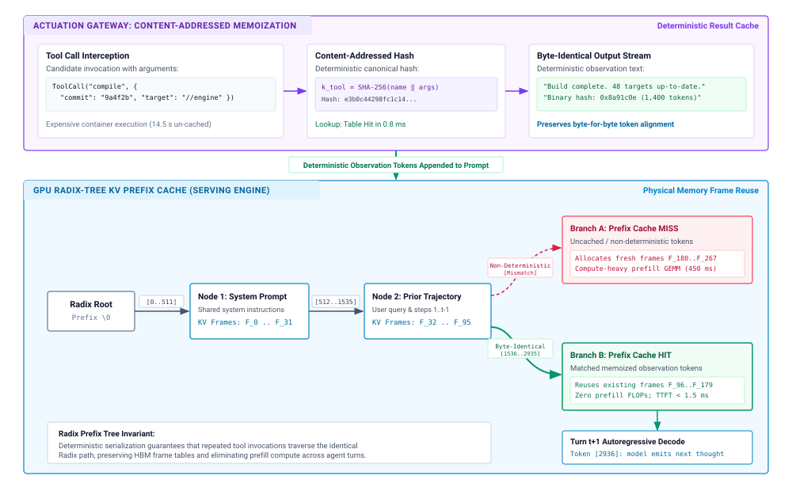
:::

As shown in the Radix trie hierarchy of @fig-vol3-tool-result-prefix-cache-synergy, an inference serving engine (such as vLLM or SGLang) organizes active KV cache blocks as a tree rooted at $\varnothing$. Common system instructions form a shared prefix (Node 1, spanning tokens $0\text{--}511$, backed by physical HBM frames $F_0\dots F_{31}$), followed by trajectory history (Node 2, tokens $512\text{--}1535$, frames $F_{32}\dots F_{95}$). When an agent dispatches an expensive tool (such as `ToolCall("compile", ...)`), an un-cached run takes $14.5\text{ s}$ in a container sandbox. With content-addressed memoization ($k_{\text{tool}} = \text{SHA-256}(\dots)$), the gateway retrieves stored observation bytes in $0.8\text{ ms}$. If the tool output is non-deterministic (Branch A, emitting randomized timestamps or process IDs), the resulting token sequence diverges from existing tree edges, triggering a prefix cache MISS. The engine must allocate new physical frames ($F_{180}\dots F_{267}$) and compute a compute-bound attention prefill GEMM ($450\text{ ms}$). Conversely, when the gateway guarantees byte-identical serialization (Branch B), the observation tokens ($1536\text{--}2935$) match Node 3b exactly. The engine reuses existing physical frames ($F_{96}\dots F_{179}$) via pointer swapping, eliminating prefill recomputation entirely and cutting Time to First Token (TTFT) for Turn $t+1$ to under $1.5\text{ ms}$.

### State reconciliation probes for uncooperative endpoints

In real-world computing environments, agent runtimes frequently interact with *uncooperative endpoints*—external services, POSIX shell environments, legacy command-line tools, and third-party REST APIs that do not support idempotency headers. When a shell tool executes `git commit -m "update"` or `curl -X POST https://api.legacy.org/orders` inside an isolated container sandbox, the runtime cannot pass an idempotency key to prevent double execution.

When an uncooperative tool dispatch encounters an ambiguous timeout $\tau_{\text{timeout}}$, the runtime shifts from transport-level key deduplication to closed-loop *state reconciliation probes*, whose formal decision logic is mapped in @fig-vol3-state-reconciliation-flow. Instead of issuing an immediate retransmission, the supervisor intercepts the ambiguous timeout, suppresses blind re-dispatch, and initiates an inquiry probe to inspect whether the target mutation completed.

::: {#fig-vol3-state-reconciliation-flow fig-env="figure" fig-pos="htb" fig-cap="**State Reconciliation Probe Architecture for Uncooperative Endpoints**: Closed-loop state reconciliation protocol under ambiguous RPC timeouts. If a mutating tool dispatch triggers a timeout ($\tau_{\text{timeout}}$), the supervisor suppresses automatic retransmission and issues a lightweight nullipotent inquiry probe ($\text{probe}_{\text{post}}$). The protocol branches into three mutually exclusive outcomes: synthesizing a success frame if the postcondition holds ($\sigma_{\text{sever}}$), safely re-dispatching if the environment remains in initial state $s_0$ ($\sigma_{\text{drop}}$), or raising a terminal fault if state has drifted or corrupted ($\sigma_{\text{crash}}$)." fig-alt="Flowchart diagram showing Step 1 dispatching a mutating tool call, a timeout decision branching to normal return on success or Step 2 read-only probe on timeout, followed by a probe state evaluation decision branching into synthetic observation frame, safe re-dispatch, or terminal fault."}
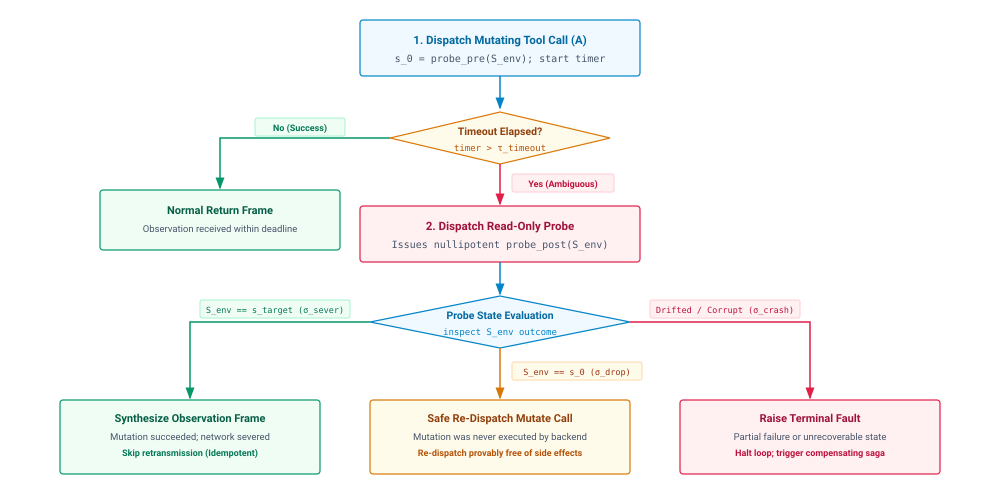
:::

As charted in @fig-vol3-state-reconciliation-flow, the state reconciliation state machine proceeds through four synchronized decision phases:

1. **Precondition Capture:** Before dispatching non-idempotent action $A$, the runtime queries the target environment for the current state parameter $s_0 = \text{probe}_{\text{pre}}(S_{\text{env}})$. For example, prior to appending a block of configuration text to a file, the supervisor records the file's current SHA-256 content hash and byte offset.
2. **Ambiguous Timeout Capture:** If the actuation tool triggers a network timeout, the runtime intercepts the fault, blocks the agent's deliberative planning loop, and enters the reconciliation state machine.
3. **Postcondition Inquiry:** The runtime issues a lightweight, strictly nullipotent probe $\text{probe}_{\text{post}}(S_{\text{env}})$ designed to verify whether the intended postcondition holds.
   * If the postcondition holds (for example, the target file hash matches the expected post-mutation state, or `git log -1` reveals the targeted commit hash), the runtime recognizes that scenario $\sigma_{\text{sever}}$ occurred. The mutation succeeded; re-execution is forbidden. The supervisor constructs a synthetic observation frame $\mathcal{O}_{\text{synthetic}}$ reporting successful execution and injects it back into the model's context stream.
   * If the environment remains in state $s_0$ (the byte offset and file hash are identical to the pre-execution snapshot), the runtime confirms scenario $\sigma_{\text{drop}}$. The mutation never executed. The supervisor can now re-dispatch the original action without risking duplicate side effects.
   * If the environment reflects an unknown intermediate state $s_{\text{corrupt}} \notin \{s_0, s_{\text{target}}\}$ (scenario $\sigma_{\text{crash}}$), the supervisor halts execution immediately. It isolates the environment and bubbles a structured system fault up to the agent's reasoning loop, preventing further autonomous actuation until consistency is restored.

By enforcing keyed deduplication on modern endpoints and structured reconciliation probes on legacy interfaces, the agent runtime insulates the underlying system from non-deterministic network failures.

Once these execution primitives guarantee that an actuation has settled into an authoritative, uncorrupted state, the runtime faces the subsequent systems problem: capturing the data emitted by the external process. When a command succeeds, it often returns not a clean, single-line confirmation, but thousands of lines of verbose build logs, memory dumps, or raw terminal streams. How the runtime captures, buffers, and truncates these massive observation streams without overflowing the model's physical context window is the subject of the next section.

## Observation Stream Truncation {#sec-vol3-actuation-streaming}

A single twenty-character tool invocation—such as dispatching `pytest tests/` or executing `find / -name "*.py"`—can spawn an external process that emits eighty megabytes of raw text across more than a million lines of execution logs. If the host agent runtime naively captures this emitted stream and appends it directly to the model's working context, the system encounters an immediate and catastrophic resource failure. The model's context capacity ($S_{\max}$), however large in modern architectures, represents a strictly budgeted, high-cost physical resource. Ingesting an unconstrained observation stream not only threatens an immediate context window overflow, but also consumes gigabytes of high-bandwidth memory (HBM) on the accelerator to store the Key-Value (KV) cache during the prefill phase, inflating time-to-first-token (TTFT) latencies by orders of magnitude and displacing concurrent request batches in the inference serving engine.

**The runtime must treat every external observation stream as an untrusted, unbounded data producer.** Between the raw operating system transport and the context staging buffer, the runtime interposes the multi-stage observation pipeline charted in @fig-vol3-stream-ingestion.

::: {#fig-vol3-stream-ingestion fig-env="figure" fig-pos="htb" fig-cap="**Observation Stream Ingestion and Sandwich Truncation Architecture**: End-to-end observation datapath decoupling unbounded child process emission from accelerator working memory. Raw stdout from an unprivileged child process flows across a POSIX `pipe(2)` kernel buffer (64 KB) with `O_NONBLOCK` backpressure into an asynchronous host reactor loop. The stream enters a bounded circular ring buffer ($C \le 1.0\text{ MB}$) in host memory escrow, where a sandwich filter splices head lines and tail diagnostic traces around an omission tombstone before formatting a bounded observation frame ($S_{\text{obs}} \le 2{,}048\text{ tokens}$) for context staging." fig-alt="Systems datapath diagram showing five stages: 1. Unbounded Child Process producer, 2. OS Kernel Pipe Buffer (64 KB) and Reactor Loop, 3. Circular Ring Buffer with Head and Tail windows in host memory escrow, 4. Sandwich Filter extracting context and diagnostics, and 5. Context Staged XML frame ready for the KV cache."}
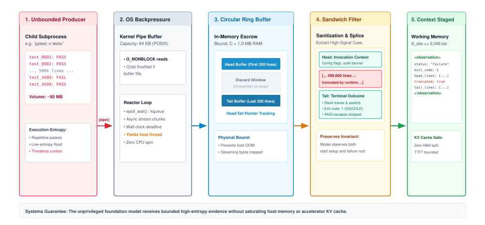
:::

As detailed in @fig-vol3-stream-ingestion, this datapath decouples external process emission from neural context staging through five coordinated stages:

1. *Unbounded Producer (Child Process):* An unprivileged child process (such as a test runner executing `pytest -v tests/`) generates up to $80\text{ MB}$ of raw stream data across 500,000 lines. Direct ingestion would overflow host RAM and exhaust accelerator KV cache allocations.
2. *OS Kernel Pipe & Reactor Loop:* Inter-process transfer is mediated by a POSIX `pipe(2)` with a fixed 64 KB kernel buffer. The host supervisor reads chunks using `O_NONBLOCK` via an asynchronous event loop (`epoll_wait(2)` or `kqueue`). When the pipe fills, the kernel deschedules the writing child, applying physical backpressure that bounds memory consumption.
3. *Circular Ring Buffer (Memory Escrow):* In host memory, incoming bytes are held in escrow bounded at $C \le 1.0\text{ MB}$. Dual stream pointers track the initial $N_{\text{head}} = 200$ lines in an immutable head buffer and the final $N_{\text{tail}} = 200$ lines in a rolling ring buffer, discarding high-volume intermediate stream noise in-place.
4. *Sandwich Filter:* The filter splices the invocation setup from the head and the terminal assertions and stack traces from the tail, replacing discarded lines with an explicit tombstone (`[... 499,600 lines omitted by runtime ...]`).
5. *Context Staged Working Memory:* The resulting text is serialized into a structured observation frame ($S_{\text{obs}} \le 2{,}048\text{ tokens}$) tagged with POSIX exit codes and execution duration metrics, guaranteeing deterministic KV cache allocation without HBM spills.

### The asymmetry of actuation

The interaction between an agent runtime and its external tools exhibits a fundamental entropy asymmetry. The outbound actuation command emitted by the model is compact and highly structured, rarely exceeding a few dozen tokens formatted as a JSON-RPC dispatch or a command-line invocation. In contrast, the inbound observation stream emitted by the host environment has unbounded cardinality. An unoptimized compiler emitting verbose template instantiation warnings, a package manager downloading deep dependency trees, or a recursive directory search can easily produce megabytes of text per second.

When an agent runtime blindly ingests an unbounded observation stream into the context array, the cost is paid directly in accelerator memory and compute. In modern Transformer runtimes, context consumption is not merely an abstract limit on sequence length; it dictates the physical allocation of physical memory blocks within the serving system's PagedAttention pool. Every admitted observation token must be projected into key and value tensors and stored in the accelerator's HBM for the duration of the agent's multi-turn trajectory.

::: {#exmp-07-physical-memory-and-compute-overhead .callout-example title="Physical memory and compute overhead of untruncated ingestion"}
Consider an autonomous agent executing a software verification task using an unprivileged runtime supervisor. The model issues a compact command: `pytest -v tests/unit/`. The command triggers a regression suite that runs $4,500$ unit tests, generating $24\text{ MB}$ of stdout across $520,000$ lines.

Assume standard Byte-Pair Encoding (BPE) yields approximately $4\text{ bytes}$ per token, converting the $24\text{ MB}$ stream into:
$$N_{\text{obs}} = \frac{24 \times 10^6\text{ bytes}}{4\text{ bytes/token}} = 6.0 \times 10^6\text{ tokens}$$

Now examine the serving engine hosting a 70-billion-parameter foundation model using Grouped-Query Attention (GQA) with the following architectural parameters:

- Transformer layers: $L = 80$
- Key-Value heads: $H_{\text{kv}} = 8$
- Head dimension: $D_{\text{head}} = 128$
- Precision: 16-bit floating point ($\text{bytes\_per\_element} = 2$)

The physical KV cache memory required per token is:
$$M_{\text{token}} = 2 \times L \times H_{\text{kv}} \times D_{\text{head}} \times \text{bytes\_per\_element}$$
$$M_{\text{token}} = 2 \times 80 \times 8 \times 128 \times 2 = 327,680\text{ bytes} \approx 320\text{ KB/token}$$

If the runtime ingests the entire untruncated stream ($N_{\text{obs}} = 6.0 \times 10^6\text{ tokens}$), the physical memory footprint required to store the observation's KV cache alone is:
$$M_{\text{total}} = 6.0 \times 10^6 \times 320\text{ KB} \approx 1.92\text{ TB of HBM}$$

This exceeds the total physical memory of an eight-GPU NVIDIA H100 node ($8 \times 80\text{ GB} = 640\text{ GB}$). Even if the model utilizes an extended logical context window ($S_{\max} = 128\text{K}\text{ tokens}$), the raw observation exceeds the window boundary by $46.8\times$. Ingesting up to the hard boundary of $128\text{K}\text{ tokens}$ would still monopolize:
$$M_{128\text{K}} = 131,072 \times 320\text{ KB} = 40.96\text{ GB of HBM}$$
Furthermore, processing $128\text{K}$ observation tokens during the prefill phase requires approximately $2 \times N_{\text{tokens}} \times P_{\text{model}} \approx 2 \times 1.31 \times 10^5 \times 7.0 \times 10^{10} \approx 1.83 \times 10^{16}\text{ FLOPs}$, locking an H100 GPU (operating at $989\text{ TFLOPs}$ dense FP16 throughput) in a prefill compute stall for over $18.5\text{ seconds}$ before generating a single output token.

By contrast, an active observation pipeline enforcing a strict byte ceiling of $B_{\text{ceiling}} = 32\text{ KB}$ ($\approx 8,000\text{ tokens}$) restricts KV cache allocation to $2.56\text{ GB}$ and keeps prefill latency under $1.2\text{ seconds}$, preserving accelerator memory and multi-tenant batch concurrency.
:::

The physical reality of accelerator serving engines means that an untruncated observation stream is an availability attack on the agent itself. A runaway subprocess can induce physical out-of-memory (`CUDA OOM`) crashes, preempt concurrent deliberation trajectories, or inflate inference latency beyond the runtime's liveness thresholds.

### Headless tailing mechanics

To prevent observation streams from exhausting context budgets, runtimes must implement automated stream truncation. The design of a truncation policy depends on the spatial distribution of diagnostic information within tool outputs. In software engineering, data analysis, and system administration, tool outputs are rarely uniformly informative. Compilers, build systems, test runners, and command-line search utilities exhibit an asymmetric diagnostic topology across their execution streams:

1. **Invocation Header (Stream Prefix):** The first $10$ to $50$ lines typically contain the environment configuration, compiler optimization flags, active working directory, discovered test targets, or dependency graphs. This prefix establishes the deterministic context of the execution.
2. **Intermediate Execution Trace (Stream Body):** The subsequent thousands—or millions—of lines consist of low-entropy progress indicators, such as continuous compile notifications, repetitive status bars, or passing test assertions (`test_0001 ... ok`). The informational density of this section is near zero.
3. **Diagnostic Conclusion (Stream Tail):** The final $50$ to $200$ lines contain the critical diagnostic signal that caused the process to exit: the compiler syntax error, the failed assertion message, the stack trace detailing register states and source lines, and the summary status line (`FAILED (failures=1, errors=0)`).

```bash
[Line 000001] $ cargo test --all
[Line 000002] Compiling kernel v0.1.0 (/workspace/core)
[Line 000003] Running 48219 tests across 14 modules
... [48,200 lines of passing tests: "test engine::... ok"] ...
[Line 48205] test memory::paging::test_allocator ... FAILED
[Line 48206]
[Line 48207] failures:
[Line 48208] ---- memory::paging::test_allocator stdout ----
[Line 48209] thread 'test_allocator' panicked at 'assertion failed: `(left == right)`', src/memory.rs:142:9
[Line 48210]   left: `0x00007fff`, right: `0x00000000`
[Line 48211] stack backtrace:
[Line 48212]    0: std::panicking::begin_panic
[Line 48213]    1: kernel::memory::paging::allocate_frame
[Line 48214]
[Line 48215] test result: FAILED. 48218 passed; 1 failed; 0 ignored
```

Applying naive head truncation—retaining the first $N$ bytes of the output and discarding the remainder—is disastrous. A head-truncated observation captures the initial build banner and the first dozen passing tests, but discards the compiler error or stack trace entirely. The model receives a truncated observation indicating that tests ran, observes a nonzero exit status code, but possesses zero tokens explaining *why* the process failed. This induces epistemic blindness, driving the model into degenerate hallucination loops where it attempts random code modifications without feedback.

The runtime must instead implement *headless tailing* via the "Sandwich" (Head-and-Tail) truncation pattern. The runtime reserves an observation budget of $B_{\text{max}}$ bytes, partitioning this allocation between the stream prefix and suffix:
$$B_{\text{max}} = B_{\text{head}} + B_{\text{tombstone}} + B_{\text{tail}}$$

The head buffer captures the first $B_{\text{head}}$ bytes of the output directly. For the tail, the runtime allocates a fixed-size circular ring buffer in memory holding at least $B_{\text{tail}}$ bytes. As the subprocess emits data, bytes are continuously written into the circular buffer, naturally overwriting the oldest intermediate trace lines once capacity is exceeded.

When the child process exits, the runtime extracts the contiguous prefix from the head buffer, appends a synthetic *tombstone record* detailing the exact physical volume of discarded data, and appends the final contents of the circular ring buffer:

```bash
[... 48,195 lines and 4,182,041 bytes truncated by runtime supervisor ...]
```

The tombstone marker preserves semantic integrity by explicitly notifying the model of missing information, specifying both the line count and byte volume omitted. This distinguishes intentional truncation from an abnormal process termination.

::: {.column-margin}
**Byte Budgets vs. Line Counts**
Truncation boundaries must always be enforced on *raw byte counts*, never line counts alone. A degenerate process emitting a single line of un-minified JSON or a base64 binary dump containing $50\text{ MB}$ defeats line-based filters (`tail -n 100`), inducing an immediate memory overflow.
:::

Truncation policies must strictly enforce physical byte budgets before attempting line or token segmentation. Splitting by lines or tokens without a pre-filter exposes the runtime to memory exhaustion from inputs lacking newline delimiters. The runtime consumes the stream as a bounded sequence of raw bytes, slices the window at valid UTF-8 code point boundaries to prevent decoding corruption, and only then performs line-oriented formatting and tokenization for context staging.

### Structured pagination contracts

While command-line tools rely on terminal streams that necessitate passive tailing, structured tools—such as database clients, search services, vector indices, and filesystem inspectors—must not emit raw, unconstrained output collections. A tool interface that permits an unconstrained query (such as `SELECT * FROM audit_logs` or `list_files(directory="/")`) violates the principle of least privilege and context bounding at the API contract layer.

For structured data providers, the agent runtime must enforce a *paginated query contract*. This contract establishes two mandatory architectural invariants:

1. **Fixed Page Ceilings ($K \le K_{\max}$):** The tool interface rejects unbounded queries and enforces a strict upper bound on the number of returned records per dispatch (typically $K_{\max} \le 50$). If the model requests a batch size exceeding $K_{\max}$, the runtime clamps the parameter to the ceiling.
2. **Opaque Continuation Tokens (`cursor`):** If a query matches an entity collection larger than the page ceiling, the tool returns the current page of results accompanied by an opaque continuation token (`next_cursor`). The cursor encapsulates the deterministic state necessary to resume traversal on a subsequent actuation.

The generation and lifecycle of continuation tokens introduce a concrete systems trade-off between host memory utilization and query consistency (@tbl-vol3-cursor-architecture-comparison). The runtime can implement pagination state through either server-side session leases or client-side stateless encrypted tokens.

| Architectural Dimension    | Stateful Server-Side Cursors                           | Stateless Signed Client Cursors                          |
|:---------------------------|:-------------------------------------------------------|:---------------------------------------------------------|
| **State Storage Location** | Host runtime memory / Database engine                  | Serialized into context payload                          |
| **Host Memory Impact**     | $O(S \times M)$ active connection leaks                | $O(1)$ zero host runtime memory overhead                 |
| **Consistency Guarantee**  | Transactional snapshot isolation                       | Read-committed or dirty traversal                        |
| **Abandonment Tolerance**  | Requires explicit TTL reaping daemons                  | Immune to agent trajectory abandonment                   |
| **Context Overhead**       | Minimal (short UUID string, $\approx 8\text{ tokens}$) | Moderate (base64 HMAC token, $\approx 45\text{ tokens}$) |
| **Replay Vulnerability**   | Controlled via server lease revocation                 | Requires embedded timestamp validation                   |
: **Stateful Server-Side versus Stateless Client-Signed Cursors**: Architectural trade-offs across server memory, client token overhead, and replay vulnerability. {#tbl-vol3-cursor-architecture-comparison}

In an agentic architecture, stateful server-side cursors present significant operational risks. If an agent initiates a deep database query, receives the first page, and decides based on those results to alter its plan and abandon the search, the server-side cursor remains allocated. Across thousands of autonomous execution loops, abandoned iterators exhaust database connection pools and host memory unless aggressive time-to-live (TTL) reaping daemons are deployed.

Consequently, robust tool subsystems favor *stateless signed cursors*. The tool runtime serializes the traversal parameters—such as the deterministic sorting key, the last observed primary key identifier ($ID_{\text{last}}$), an issuance timestamp ($\tau$), and a query signature—into a compact binary payload. This payload is encrypted and authenticated using an HMAC key private to the host supervisor:
$$\text{Cursor} = \text{Base64Encode}\Big(\text{Data} \parallel \text{HMAC}_{K_{\text{runtime}}}(\text{Data})\Big)$$
$$\text{where} \quad \text{Data} = \big(\text{QueryHash} \parallel ID_{\text{last}} \parallel \tau\big)$$

When the agent presents the continuation token in a subsequent dispatch (`query_logs(cursor="eyJhbGci...")`), the tool validates the cryptographic signature, verifies that $\tau$ has not expired, and resumes traversal strictly after $ID_{\text{last}}$. This guarantees that the host runtime maintains zero durable session state, insulating the system from memory leaks caused by abandoned exploration trajectories.

### Kernel buffering dynamics

The mechanisms described earlier govern how the runtime slices and segments data once it arrives in host memory. However, the runtime must also prevent runaway external processes from exhausting operating system resources *during* generation. If a misconfigured or malicious subprocess executes an infinite loop generating text at memory bus saturation speeds—such as `yes "memory exhaustion"`—the runtime cannot simply stream this data into an unbounded memory buffer while awaiting process exit. Doing so will exhaust the host operating system's RAM, triggering the Linux Out-Of-Memory (OOM) killer to terminate critical runtime services.

As illustrated in @fig-vol3-stream-ingestion, the transfer of observation data between the isolated child process and the host runtime supervisor is mediated by an inter-process communication (IPC) channel: the standard UNIX unidirectional data channel created via `pipe(2)`.

A standard anonymous pipe consists of a memory-backed FIFO managed inside the kernel. In Linux, the capacity of this ring buffer is bounded by default to $65,536\text{ bytes}$ ($64\text{ KB}$, equivalent to 16 memory pages of $4\text{ KB}$). The capacity can be inspected and tuned up to the system ceiling defined in `/proc/sys/fs/pipe-max-size` using the `fcntl(2)` system call with the `F_SETPIPE_SZ` command flag.

The finite capacity of the kernel pipe buffer provides the physical foundation for *operating system backpressure*. The runtime supervisor manages process execution using an asynchronous, event-driven event loop based on multiplexing primitives such as `epoll(7)` on Linux or `kqueue(2)` on BSD and macOS. The runtime configures the read descriptor of the child's stdout and stderr streams in non-blocking mode (`O_NONBLOCK`).

When the child process writes output faster than the runtime reads it, or when the runtime intentionally slows consumption, the kernel pipe buffer fills. Once the internal $64\text{ KB}$ buffer is saturated, the kernel's virtual filesystem (VFS) layer suspends the child process's subsequent `write(2)` system call. The operating system moves the child process from the execution queue to a wait queue (`TASK_INTERRUPTIBLE`), descheduling it from the physical CPU core. The child process cannot execute a single additional instruction until the runtime supervisor reads data out of the pipe, freeing capacity in the kernel buffer.

```c
// Runtime supervisor event-driven drain loop applying backpressure
struct epoll_event ev, events[MAX_EVENTS];
int epoll_fd = epoll_create1(EPOLL_CLOEXEC);
ev.events = EPOLLIN | EPOLLPRI;
ev.data.fd = pipe_read_fd;
epoll_ctl(epoll_fd, EPOLL_CTL_ADD, pipe_read_fd, &ev);

size_t total_bytes_read = 0;
while (process_is_running) {
    int nfds = epoll_wait(epoll_fd, events, MAX_EVENTS, TIMEOUT_MS);
    for (int i = 0; i < nfds; i++) {
        if (events[i].events & EPOLLIN) {
            ssize_t bytes = read(pipe_read_fd, staging_buf, CHUNK_SIZE);
            if (bytes > 0) {
                total_bytes_read += bytes;
                ring_buffer_write(&tail_ring_buf, staging_buf, bytes);

                // Hard ceiling enforcement: trigger proactive process termination
                if (total_bytes_read > HARD_ABORT_CEILING_BYTES) {
                    close(pipe_read_fd); // Trigger SIGPIPE on child's next write
                    kill(child_pid, SIGKILL);
                    process_is_running = false;
                    break;
                }
            }
        }
    }
}
```

The runtime enforces an absolute ceiling on total generated volume ($B_{\text{abort}}$). While the sliding-window ring buffer maintains a bounded observation size for context staging, the runtime cannot permit a runaway process to consume host CPU cycles indefinitely. The supervisor tracks the cumulative byte counter:
$$B_{\text{cumulative}} = \sum_{i} \text{read}(fd, \text{chunk}_i)$$

If $B_{\text{cumulative}}$ crosses $B_{\text{abort}}$ (for example, $100\text{ MB}$), the supervisor immediately triggers active termination. It closes the read end of the pipe via `close(2)`. On the child process's subsequent `write(2)` invocation, the kernel detects that no read descriptor references the pipe FIFO. The kernel halts the write, raises an `EPIPE` error, and automatically delivers a `SIGPIPE` signal to the child. Unless the child has explicitly installed a custom signal handler, the default action for `SIGPIPE` terminates the process instantly. To prevent uncooperative processes from lingering, the supervisor follows this termination sequence with an explicit `SIGKILL` delivery.

Through this combination of non-blocking kernel pipe drains, strict cumulative accounting, and `SIGPIPE` enforcement, the runtime provides complete structural protection for host system resources. Unbounded producer streams are converted into strictly bounded memory slices before neural ingestion, guaranteeing that neither host RAM nor accelerator HBM can be compromised by external execution.

Once the observation stream is mechanically bounded, throttled by backpressure, and reduced to a budgeted byte slice, the runtime faces a subtler data integrity challenge. The surviving byte stream is frequently contaminated with ANSI escape sequences, terminal cursor positioning commands, carriage-return progress rewrites, and mixed standard output and error interleavings. Transforming this raw terminal output into an authoritative, clean observation record requires deterministic terminal sanitization, which we examine next.

## Terminal Output Sanitization {#sec-vol3-actuation-observation-parsing}

A subprocess executing a build tool, package manager, or test runner emits megabytes of raw byte sequences directly into its standard streams. To a human developer observing an interactive terminal emulator, this stream appears as a concise and polished visual interface: animated spinners announce ongoing work, colored badges highlight compiler warnings, and cursor repositioning directives smoothly update an in-place progress bar. When an agent runtime channels these unmediated byte streams directly into a foundation model's context window, however, this interactive presentation layer becomes an operational liability. A single download bar or test spinner repeatedly emits carriage returns accompanied by multi-byte escape sequences, generating tens of thousands of redundant characters that overwrite the visual line on a physical raster screen. If ingested without normalization, these formatting artifacts consume massive slices of the token budget, fragment subword tokenization tables, distort attention weight distributions across the prompt, and risk triggering prompt injection when unescaped control delimiters mimic native tool boundaries.

::: {.column-margin}
**ECMA-48 and ANSI X3.64**
Standardized by the European Computer Manufacturers Association in 1976, ECMA-48 defines the control functions, escape sequences, and shift states used to position cursors, alter display colors, and manipulate character attributes on physical video display terminals.
:::

Between the POSIX stream reader and the context assembler, the host runtime must interpose a deterministic normalization pipeline. This pipeline strips presentation-layer escape artifacts, resolves in-place line overwrites, preserves authoritative kernel exit statuses, extracts structured diagnostic frames, and envelopes truncated streams with machine-readable metadata.

The architectural datapath for this sanitization pipeline is mapped in @fig-vol3-terminal-normalization, tracing the byte stream across three discrete processing phases:

::: {#fig-vol3-terminal-normalization fig-env="figure" fig-pos="htb" fig-cap="**Terminal Stream Normalization and Escape Resolution Pipeline**: Architecture of deterministic terminal stream normalization. Raw bytes from child processes are parsed through an ECMA-48 finite-state machine to strip display and color escape sequences (Phase 1), followed by a 1D virtual line buffer that resolves in-place carriage returns (`\r`) to collapse repetitive progress bars into a single terminal status (Phase 2). Sanitized streams are then enclosed in structured observation frames with exit codes and truncation metadata (Phase 3)." fig-alt="Systems datapath flowchart showing Stage 0 raw POSIX stream with ANSI escapes and carriage returns, Stage 1 ECMA-48 finite state machine stripping display escapes, Stage 2 1D virtual line buffer resolving cursor resets on carriage return to collapse progress bars, and Stage 3 structured observation framing."}
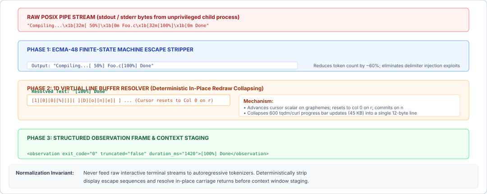
:::

As detailed in @fig-vol3-terminal-normalization, the sanitization pipeline executes three coordinated transformation phases:

1. *Stage 0 (Raw POSIX Stream):* Child processes emit mixed byte sequences containing printable text, ANSI escape codes (`\x1b[32m`), and carriage returns (`\r`). Without normalization, standard Byte-Pair Encoding (BPE) tokenizers shatter these control bytes into 18+ high-entropy tokens per visual status frame, diluting attention weights and inflating prefill compute.
2. *Phase 1 (ECMA-48 FSM Escape Stripper):* A finite-state machine transitions across `GROUND`, `ESCAPE`, and `CSI_ENTRY` states to intercept and discard Select Graphic Rendition (SGR) font colors, TrueColor definitions, cursor shifts, and terminal titles. This deterministic byte sanitization eliminates prompt delimiter injection attacks while pruning token footprint by approximately $60\%$.
3. *Phase 2 (1D Virtual Line Buffer):* To resolve in-place line overwrites generated by progress bars (`tqdm`, `curl`, `wget`), the runtime maintains a 1D character cell array with an active cursor scalar $c_x$. When a carriage return (`\r`) occurs without a line feed (`\n`), $c_x$ resets to column 0, causing subsequent characters to overwrite preceding cells in-place. Hundreds of intermediate progress updates (e.g., $45\text{ KB}$ of redundant frames) are thereby collapsed into a single, authoritative terminal string (`[100%] Build complete`).
4. *Phase 3 (Structured Observation Frame):* The sanitized string is enveloped in an authoritative observation record annotated with POSIX exit codes, execution duration, and truncation metadata before staging into working context memory.

To an autoregressive foundation model, in-band escape sequences are toxic noise. Byte-Pair Encoding (BPE) tokenizers are trained on human natural language and source code, not raw terminal stream captures. Because long ANSI escape sequences such as 24-bit TrueColor specifications (`\x1b[38;2;255;128;0m`) rarely appear as unified tokens in training corpora, the tokenizer shatters the eighteen-byte sequence into eight to twelve distinct subword tokens. A compiler emitting fifty colored lines can introduce over a thousand fragmented tokens into the sequence without conveying any semantic distinction beyond plain text. Worse, if an adversarial tool or untrusted file name contains unescaped OSC commands or custom delimiters that match the agent runtime's tool framing protocol, the unparsed terminal stream can hijack model control flow.

The runtime must process the raw byte stream through a deterministic finite-state machine (FSM) derived from the ECMA-48 specification. Naive string replacement via regular expressions fails because ANSI sequences are stateful and context-sensitive; an unanchored regex may split an escape sequence spanning across two successive read chunks, corrupting the stream. The FSM maintains explicit parsing states: `GROUND`, `ESCAPE`, `CSI_ENTRY`, `CSI_PARAM`, `CSI_INTERMEDIATE`, and `OSC_STRING`. Any byte sequence recognized as an SGR color directive, cursor translation, or OSC command is discarded prior to tokenization.

::: {.column-margin}
**The Teletype Carriage Return**
On mechanical Teletypes, a carriage return (`\r`, ASCII `0x0D`) physically returned the carriage to the left margin without feeding paper upward. Advancing paper required a separate line feed (`\n`, ASCII `0x0A`). Modern command-line utilities exploit this separation by emitting `\r` alone to redraw progress indicators on the same visual line.
:::

A second, more severe source of stream inflation arises from carriage return (`\r`) overwrites. Command-line utilities such as `tqdm`, `curl`, and package managers draw interactive progress bars by printing a line of text, emitting `\r` to reset the cursor to column zero, and immediately printing an updated percentage across the same line buffer. In an interactive TTY, the user observes a single line changing dynamically over time. In a raw POSIX pipe stream, however, every intermediate render is preserved sequentially. Over a thirty-second operation, a progress bar updating at ten Hertz writes three hundred iterations, yielding dozens of kilobytes of identical status text.

To resolve this visual redundancy into clean textual observations, the sanitization pipeline models a virtual one-dimensional line buffer. When the parser encounters printable characters, it writes them into the buffer at the current virtual cursor position, advancing the cursor scalar. When the parser encounters `\r` without an immediate `\n`, it resets the virtual cursor position to column zero without clearing the line buffer. Subsequent characters overwrite the contents of the buffer at their respective column offsets. Only when a true line feed (`\n`) or stream EOF occurs does the runtime commit the contents of the line buffer to the sanitized observation record. This collapses hundreds of transient visual frames into the single, final state of the line, eliminating up to 99 percent of raw byte volume while preserving the authoritative terminal state.

::: {#exmp-07-token-inflation-and-prefill-overhead .callout-example title="Token inflation and prefill overhead from unsanitized progress streams"}
Consider an agent tool executing a remote artifact download. Over a 30-second duration, the process emits an updating progress bar at 20 Hz, generating 600 total update cycles. Each update consists of an ANSI cursor positioning code (6 bytes), an SGR green color marker (5 bytes), a 60-character progress bar string (`[=========> ] 45% 450MB/1000MB`), an SGR reset code (4 bytes), and a carriage return `\r` (1 byte), totaling 76 bytes per frame.

**Raw Pipe Byte Volume:**
$$\text{Total Bytes} = 600 \times 76\text{ bytes} = 45,600\text{ bytes}$$

**Token Consumption Under Byte-Pair Encoding:**
Because the BPE vocabulary fragments the escape sequences and bracketed progress intervals into an average of 1 token per 3.2 bytes, each 76-byte frame decomposes into approximately 24 tokens:
$$\text{Total Tokens} = 600 \times 24 = 14,400\text{ tokens}$$

**Accelerator Serving and Latency Impact:**
Assume the agent runtime invokes a foundation model hosted on an 8-GPU tensor-parallel accelerator node with an aggregate prefill throughput of $32,000\text{ tokens/second}$. Staging these 14,400 non-semantic tokens into the context window imposes a direct prefill delay:
$$\Delta t_{\text{prefill}} = \frac{14,400\text{ tokens}}{32,000\text{ tokens/s}} = 0.450\text{ seconds } (450\text{ ms})$$

Furthermore, under 16-bit precision ($\text{FP16}$), each token requires KV cache allocation across $L = 32$ transformer layers, $N = 32$ attention heads, and head dimension $D = 128$:
$$\text{Cache Footprint} = 14,400 \times 32 \times 2 \times (32 \times 128) \times 2\text{ bytes} \approx 754.97\text{ MB}$$
Processing this single unmediated download bar consumes over $750\text{ MB}$ of high-bandwidth memory (HBM) and adds nearly half a second of latency to every subsequent autoregressive decode step across the trajectory.

**Sanitized Line Buffer Resolution:**
Passing the stream through an ECMA-48 stripper and 1D line buffer collapses the 600 frames into a single, fully resolved terminal string:
`[==============================] 100% 1000MB/1000MB Complete` (60 bytes, 15 tokens).

- **Data Compression:** $45,600\text{ bytes} \to 60\text{ bytes}$ ($760\times$ reduction).
- **Token Reduction:** $14,400\text{ tokens} \to 15\text{ tokens}$ ($960\times$ reduction, a $99.89\%$ savings).
- **Prefill Latency:** $\frac{15}{32,000} \approx 0.47\text{ ms}$ ($957\times$ speedup).
- **KV Cache Allocation:** $755\text{ MB} \to 0.78\text{ MB}$.
:::

### Process termination semantics

Stripping presentation artifacts addresses observation syntax, but the runtime must also ground the execution in physical operating system truth. When a tool process completes, the parent runtime calls the POSIX `waitpid()` system call to collect the child's termination status. The operating system kernel packs the process disposition into a 16-bit integer status word, accessible via standard POSIX macros.

::: {.column-margin}
**POSIX Process Disposition**
Defined in IEEE Std 1003.1-2017, `WIFEXITED` evaluates to true if the child process terminated normally via `exit()` or `_exit()`. `WEXITSTATUS` extracts the low-order 8 bits passed by the child. If killed by an unhandled signal, `WIFSIGNALED` evaluates to true, and `WTERMSIG` returns the numeric signal code.
:::

The kernel status word distinguishes normal process termination from abrupt signal termination. If `WIFEXITED(wstatus)` is nonzero, the child process executed its control flow to completion and invoked `exit()`, delivering an 8-bit unsigned integer (`0`–`255`) returned by `WEXITSTATUS(wstatus)`. By standard POSIX convention, an exit code of `0` denotes success, while any nonzero value (`1`–`255`) indicates an operational error. Conversely, if `WIFSIGNALED(wstatus)` is nonzero, the process was killed asynchronously by an unhandled kernel signal, such as `SIGSEGV` (segmentation fault, signal 11), `SIGFPE` (floating point exception, signal 8), or `SIGKILL` (out-of-memory killer or runtime preemption, signal 9). The structural bitfield layout of this status word is detailed in @tbl-vol3-posix-status.

| Bits    | Field                | Macro            | Semantic Description                                                        |
|:--------|:---------------------|:-----------------|:----------------------------------------------------------------------------|
| `15..8` | Exit Code (`0..255`) | `WEXITSTATUS(s)` | Status code passed to `exit(N)` (valid when `WIFEXITED(s)` is true)         |
| `7`     | Core Dump Flag (`C`) | `WCOREDUMP(s)`   | Set if process terminated and generated a core dump image                   |
| `6..0`  | Terminating Signal   | `WTERMSIG(s)`    | Signal number that terminated process (valid when `WIFSIGNALED(s)` is true) |

: **POSIX Process Termination Status Word Layout**: Structural bitfield layout of the 16-bit integer returned by `waitpid(2)`. {#tbl-vol3-posix-status}

While the kernel exit status provides an immutable hardware and OS-level receipt of how the execution terminated, the runtime engineer must guard against a foundational architectural fallacy: **an exit code of zero does not establish that the tool achieved its intended objective.**

The exit status reflects only what the binary's entrypoint returned to the kernel. A program that crashes, throws an unhandled exception, or suffers memory corruption will reliably return a nonzero exit code or trigger a signal. However, an exit code of `0` is epistemically narrow; it proves merely that the process completed its main control flow without an unhandled panic. In real-world software systems, tools routinely exit with code `0` under severe semantic failure:

1. *Silent Mock Passes and Empty Matches:* A test suite runner such as `pytest` or `jest`, if misconfigured or targeted at an invalid directory path, will discover zero test files, execute zero assertions, and exit cleanly with status `0`. The test suite "passed" from the perspective of the operating system, but completely failed to validate the codebase.
2. *Swallowed Subshell Errors:* A complex shell script that chains commands without `set -e` or `set -o pipefail` may encounter a catastrophic compiler error midway through execution; if the final command in the script is an innocuous cleanup operation or `echo` statement, the shell returns exit code `0`.
3. *Soft Application Errors:* Database clients, language server interfaces, and web scrapers frequently catch application-level errors internally, format an error payload as JSON into `stdout`, and exit with `0` because the query protocol itself executed without an OS-level fault.

The agent runtime must therefore treat the POSIX exit status as necessary but insufficient evidence of task completion. The integer status code must be explicitly captured and forwarded as an immutable metadata field in the tool observation payload, but downstream orchestrators must never equate `exit_code == 0` with empirical invariant satisfaction. The end-to-end correctness of a tool's execution can only be validated by independent verification checks, such as parsing structured compiler outputs or evaluating domain-specific assertions against the filesystem.

### Structured frame extraction

When a tool encounters an error, transmitting hundreds of lines of mixed standard output and standard error forces the foundation model to consume precious reasoning tokens searching for root causes. To maximize the model's diagnostic efficiency, the runtime normalizer must separate physical streams and extract structured diagnostic frames.

Standard POSIX tools maintain a strict separation between primary functional data, emitted on file descriptor 1 (`stdout`), and operational diagnostics, emitted on file descriptor 2 (`stderr`). Runtimes that indiscriminately multiplex these two streams into a single observation string discard vital semantic metadata. A compiler emits compiled object listings or assembly to `stdout` while routing syntax errors and include-path warnings to `stderr`. A script may output valid JSON data to `stdout` while a logging library writes informational initialization notices to `stderr`. By retaining stream partitioning, the runtime allows the agent's context assembler to present the functional result separately from environmental noise.

For common software development runtimes, the sanitization layer applies structured frame extraction to the `stderr` stream. Standard execution engines emit tracebacks and diagnostic messages adhering to deterministic, language-specific grammars:

- *Python Tracebacks:* Standard tracebacks follow a rigid multi-line structure beginning with `Traceback (most recent call last):`, followed by pairs of file path, line number, and function scopes, culminating in the unqualified exception class and error message (for example, `AssertionError: Expected 200 OK, got 404`).
- *Compiler Error Messages:* Compilers compliant with GCC and Clang emit diagnostics in the standard POSIX format `<filename>:<line>:<col>: error: <message>`, followed by the offending line of source code and a caret (`^`) pointing to the lexical offset.
- *Panic Stacks:* Compiled systems languages (such as Rust and Go) output panic banners declaring the failing invariant (`thread 'main' panicked at 'index out of bounds: the len is 4 but the index is 4'`) followed by mangled symbol frames.

The normalization layer parses these standard error streams into typed diagnostic records. Rather than forcing the model to autoregressively scan through two hundred lines of intermediate library frames, the runtime extracts the root exception class, the failure message, and the exact terminal frame located within the user's workspace repository.

::: {#lst-vol3-observation-sanitization lst-cap="**Normalized Observation Envelope**: Structured diagnostic frames with machine-readable truncation metadata."}
```json
{
  "exit_code": 1,
  "signal": null,
  "truncated": true,
  "stdout": "Running test suite: test_auth.py\n[32 passed, 1 failed]",
  "stderr_frame": {
    "exception": "AssertionError",
    "message": "assert authenticate('admin', 'wrong_pass') is False",
    "location": {"file": "services/auth.py", "line": 84}
  },
  "truncation_notice": "Output exceeded 2,000 tokens; preserved tail 50 lines. Full trace: /tmp/trace_78a.log"
}
```
:::

Finally, when the observation stream exceeds the physical or logical budget $B_{\max}$ established by the truncation policies of the runtime, the sanitization pipeline must frame the remaining text with explicit machine-readable metadata. As established in the systems literature on fault tolerance, unannounced failures induce worse cascades than explicit errors. If an observation stream is truncated by simply terminating the string at byte $B_{\max}$, the foundation model encounters an abrupt syntax cliff: an unclosed quote, an incomplete JSON object, or a severed traceback. The model frequently misinterprets this abrupt termination as a syntax bug in the underlying software, generating futile repair actions to fix code that is completely intact on the storage volume.

To prevent these epistemic failures, the normalization pipeline envelopes truncated observations with deterministic, standardized headers and footers. The header explicitly declares that truncation occurred, states the exact token and line bounds enforced, clarifies whether the preserved window represents the head or the tail of the stream, and directs the model to the unexpurgated log file saved on disk (as illustrated in @lst-vol3-observation-sanitization). Armed with this structured envelope, the model recognizes that missing context is an artifact of runtime resource governance rather than a target environment failure, allowing it to issue targeted pagination commands or inspect specific log slices deliberately.

Deterministic stream sanitization guarantees that observations entering the context window are bounded, free of terminal presentation noise, and explicitly grounded in operating system status. Yet this normalization pipeline assumes a synchronous execution model: the foundation model halts generation, the runtime dispatches a child process, the supervisor blocks until execution completes, and the sanitized output is appended to the prompt for the next turn. In production agent architectures, this synchronous assumption breaks down. A comprehensive unit test suite may execute for three minutes; a container build or static analysis pass may require twenty minutes; an external web scrape or data warehouse query may run for hours. If the agent runtime blocks its inference loop on long-running tasks, it pins valuable accelerator memory, locks KV caches, and leaves the model incapable of coordinating concurrent operations. How can an agent runtime decouple execution latency from inference scheduling without abandoning execution guarantees? We turn next to the mechanics of asynchronous tool dispatch.

## Asynchronous Tool Dispatch {#sec-vol3-actuation-async}

Executing an external tool introduces an unavoidable temporal fault line into the agent runtime: autoregressive token decode proceeds at $10\text{ to }40\text{ milliseconds}$ per token, whereas external software operations span anywhere from hundreds of milliseconds to tens of minutes. When a foundation model emits a tool call invoking a compiler pass, a comprehensive unit test suite, a distributed data warehouse query, or a container build, the execution duration diverges from neural generation latency by three to five orders of magnitude. If an agent runtime mediates this interaction through a synchronous, blocking system call, the host thread halts, the trajectory stalls, and the entire computational loop freezes until the child process terminates or hits a wall-clock timeout.

A tool invocation is not an instantaneous function evaluation; it is an external, decoupled process lifecycle that frequently outlives the model turn that triggered it. An agent runtime must treat long-running tool calls as asynchronous background jobs, returning an opaque job handle to the trajectory, releasing the host execution thread, and decoupling the model's deliberative loop from physical execution latency while leaving accelerator memory retention policies to the underlying inference engine.

### The timescale mismatch {#sec-vol3-actuation-async-mismatch}

The physical bottleneck governing synchronous tool dispatch is head-of-line blocking across disparate system timescales. During standard inference on modern accelerator hardware, an autoregressive decode step for a 70-billion parameter model executes an unbatched or batch-scheduled Generalized Matrix-Vector multiplication ($\text{GEMV}$) across high-bandwidth memory ($\text{HBM}$) in approximately $20\text{ ms}$, emitting tokens at a steady rate of $25\text{ to }50\text{ tokens/s}$. In contrast, the software artifacts commanded by an agent operate on operating system schedules, mechanical network latencies, and input/output ($\text{I/O}$) buses. A linter pass across a repository requires $1.2\text{ seconds}$; a test suite execution via `pytest` requires $180\text{ seconds}$; an automated compilation via `cargo build --release` requires $400\text{ seconds}$; and an external API workflow or continuous integration pipeline can run for hours.

When an agent architecture couples these two domains synchronously, the host supervisor invokes the tool via a blocking system call—such as POSIX `waitpid(2)` or a blocking socket read—suspending the supervisor thread while awaiting child process termination. This synchronous coupling triggers three cascading system failures:

1. *Host Worker Starvation:* In production runtime environments serving multiple concurrent agent workflows, worker threads or asynchronous event loops are finite operating system resources. Pinned host workers awaiting external $\text{I/O}$ cannot service other active agent trajectories, exhausting thread pools and degrading cluster throughput.
2. *Control Channel Severance:* A blocked host supervisor cannot process asynchronous out-of-band control signals. If a human operator submits a cancellation command, if a steering correction arrives over an interactive socket, or if a watchdog timer flags an anomalous loop, the supervisor remains unable to act until the underlying tool call returns control.
3. *Opportunity Cost of Deliberation:* A blocked trajectory cannot execute concurrent, orthogonal tasks. While a ten-minute container compilation executes, an agent could inspect static documentation, draft test configurations, or verify independent source files. Synchronous blocking serializes independent work paths, multiplying overall wall-clock task completion latency.

::: {.column-margin}
**Layering Separation:**
The agent runtime manages *execution concurrency* (host processes and job handles); the inference engine manages *accelerator memory* (KV cache blocks and prefix tables). Decoupling these systems prevents host blocking from corrupting inference scheduling.
:::

Crucially, systems engineers must avoid confusing host thread suspension with accelerator memory management. In early agent implementations, developers feared that yielding execution during a long tool call would evict the model's KV cache from the GPU, prompting them to hold open active HTTP connections to inference endpoints. As established in the memory hierarchy principles of @sec-vol3-virtual-memory, physical KV cache allocation inside modern inference engines (such as vLLM or SGLang) is governed strictly by the serving engine's eviction policy, memory frame tables, and radix prefix caching. Holding an idle connection at the application layer does not prevent GPU cache eviction under multi-tenant memory pressure; it merely ties up an inference worker slot. The agent execution runtime must govern its own process lifecycle cleanly, treating tool dispatch as an asynchronous handoff and allowing the inference server to manage token cache residency independently.

### Asynchronous dispatch {#sec-vol3-actuation-async-escrow}

To resolve the timescale mismatch without destabilizing the host supervisor, the runtime implements asynchronous tool dispatch governed by a *job handle escrow*. When the foundation model emits a candidate tool invocation intended for asynchronous execution—or when the runtime's authorization policy intercepts a command classified as non-instantaneous—the runtime splits the invocation into two distinct phases: execution handoff and observation resolution.

The structural bifurcation between blocking and decoupled execution is detailed in @fig-vol3-async-tool-dispatch, where panel (a) pins the supervisor thread for the duration of the call and panel (b) escrows the job and yields control immediately. Under synchronous blocking dispatch (@fig-vol3-async-tool-dispatch a), when the model trajectory at turn $t$ emits a long-running command (such as `cargo build --release`), the host supervisor invokes a blocking operating system call (`waitpid`). The host worker thread is suspended for the entire execution duration ($T_{\text{exec}} \sim 400\text{ s}$), exhausting the host thread pool (zero idle workers remaining) and severing the control channel so that out-of-band cancellation signals or watchdog interrupts are dropped. In contrast, under asynchronous job escrow dispatch (@fig-vol3-async-tool-dispatch b), the supervisor spawns the child process in a background sandbox, constructs an unforgeable escrow handle $H$, and returns an immediate execution receipt within turn $t$. This allows the host worker thread to yield back to the pool, preserves active control channels for interactive steering, and enables the model trajectory to either continue orthogonal deliberations or sleep until triggered by event-driven completion notifications.

::: {#fig-vol3-async-tool-dispatch fig-env="figure" fig-pos="htb" fig-cap="**Asynchronous Job Escrow Dispatch**: Architectural comparison between synchronous blocking dispatch and asynchronous job escrow dispatch. In synchronous dispatch (left), the host worker blocks on `waitpid` throughout child execution ($T_{\text{exec}} \sim 400\text{ s}$), starving the worker pool and severing interactive control channels. In asynchronous dispatch (right), the supervisor spawns the task in a background sandbox, records an escrow tuple $H$, and returns an immediate execution receipt, yielding the worker thread and permitting event-driven resumption." fig-alt="Systems schematic contrasting synchronous blocking dispatch where a host thread is suspended on waitpid for 400 seconds against asynchronous job escrow dispatch where an immediate receipt is returned to the model while execution proceeds in a background sandbox."}
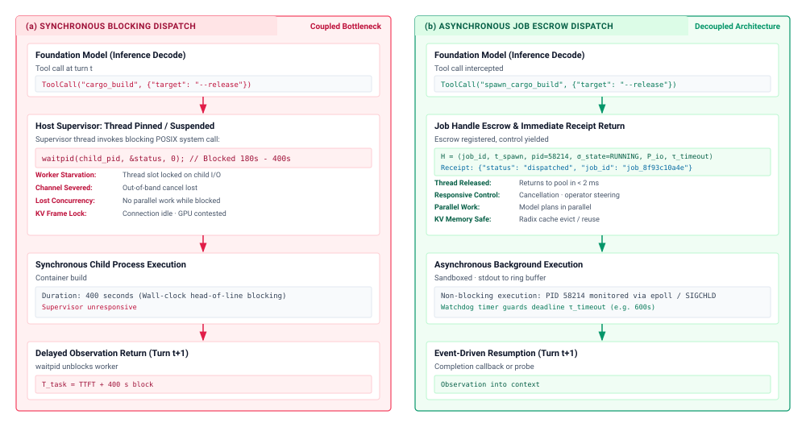
:::

Instead of awaiting process completion, the runtime supervisor initializes the execution context inside an isolated sandbox, spawns the child process or dispatches a remote worker task, and assigns it an unforgeable job handle. Formally, the runtime records this state in a managed escrow registry as a tuple:

$$H = \langle \text{job\_id}, t_{\text{spawn}}, \text{pid}, \sigma_{\text{state}}, \mathcal{P}_{\text{io}}, \tau_{\text{timeout}} \rangle$$

where $\text{job\_id} \in \{0, 1\}^{128}$ is a cryptographically unique identifier exposed to the model, $t_{\text{spawn}}$ denotes the creation timestamp, $\text{pid}$ represents the operating system process identifier (or container task identifier), $\sigma_{\text{state}}$ tracks the operational phase, $\mathcal{P}_{\text{io}}$ encapsulates the backing circular ring buffers or file descriptors capturing standard I/O streams, and $\tau_{\text{timeout}}$ establishes the absolute execution deadline.

The operational lifecycle $\sigma_{\text{state}}$ traverses a strictly governed finite state machine:

$$\sigma_{\text{state}} \in \{\texttt{SPAWNED}, \texttt{RUNNING}, \texttt{STREAMING}, \texttt{SUSPENDED}, \texttt{COMPLETED}, \texttt{FAILED}, \texttt{KILLED}, \texttt{TIMED\_OUT}\}$$

Upon registering $H$ in the escrow table, the runtime immediately synthesizes an execution receipt and returns it to the model within the current inference turn:

```json
{
  "status": "dispatched",
  "job_id": "job_8f93c10a4e",
  "pid": 58214,
  "execution_mode": "background",
  "log_stream": "/var/log/agent/jobs/job_8f93c10a4e.log"
}
```

This immediate receipt closes the model's generation turn cleanly. Armed with the receipt, the model recognizes that the requested mutation has been committed to the execution subsystem and is proceeding out of band.

::: {.column-margin}
**Capability Handles:**
The model never receives a raw operating system $\text{pid}$. Exposing only an opaque $\text{job\_id}$ preserves the Zero Ambient Authority ($A=0$) invariant, ensuring the model cannot signal arbitrary processes across the host kernel.
:::

The agent architecture now gains substantial operational flexibility. The model can elect to perform concurrent local tasks (e.g., configuring auxiliary scripts, parsing static codebases), or it can signal to the host supervisor that it has no further immediate deliberations and wishes to suspend execution. If the trajectory suspends, the host supervisor releases its active worker thread back to the runtime pool. The inference serving cluster is free to evict the trajectory's inactive KV cache blocks according to its global least-recently-used ($\text{LRU}$) or priority schedule, knowing that when the background job finishes, the trajectory can be resumed with its context history loaded via prefix matching.

### Event-driven resumption {#sec-vol3-actuation-async-resumption}

Once a task executes asynchronously in the background, the runtime requires an architectural mechanism to determine when execution has finished and how to resume the agent's deliberative loop. System designers frequently encounter four competing architectural paradigms for resumption, each imposing distinct trade-offs on latency, compute utilization, and token overhead, as compared in @tbl-vol3-resumption-mechanisms.

| Resumption Architecture        | State Detection Mechanism                 | Latency Slack ($\Delta t$)                               | Model Token Overhead                         | Host CPU Utilization                      | Systems Boundary & Scale                                   |
|:-------------------------------|:------------------------------------------|:---------------------------------------------------------|:---------------------------------------------|:------------------------------------------|:-----------------------------------------------------------|
| **Model-Driven Busy-Polling**  | Autoregressive tool call (`check_job`)    | $\sim \text{Polling Interval}$ ($1\text{--}30\text{ s}$) | Extreme ($O(N \cdot S_{\text{ctx}})$ tokens) | Negligible                                | Local client-side prototyping; toxic in production         |
| **Runtime Timer Polling**      | Host thread periodic `waitpid` / `sleep`  | $\frac{1}{2} \times \text{Sleep Interval}$               | Zero during sleep                            | Low to Moderate (Timer interrupts)        | Single-node agent runtime; simple background tasks         |
| **Kernel Event Loop**          | `epoll` / `kqueue` on `pidfd` or pipe EOF | Minimal ($< 1\text{ ms}$)                                | Zero during execution                        | Minimal (Interrupt-driven reactive sleep) | High-performance host container supervision                |
| **Asynchronous Webhook / Bus** | HTTP POST callback or AMQP/Kafka event    | Network transit ($\sim 5\text{--}50\text{ ms}$)          | Zero during execution                        | Minimal (Asynchronous message listener)   | Distributed multi-agent systems and cloud sandbox clusters |

: **Comparison of Asynchronous Tool Resumption Architectures**: Architectural comparison of asynchronous tool resumption mechanisms across busy-polling, timer polling, kernel event loops, and webhook buses. {#tbl-vol3-resumption-mechanisms}

The first paradigm, *model-driven busy-polling*, is an anti-pattern that emerges when developers expose a polling tool (such as `get_job_status(job_id)`) and prompt the foundation model to check repeatedly until the task completes. Under this pattern, every single status check triggers a complete autoregressive inference turn. The serving engine must process the entire accumulated trajectory history ($S_{\text{ctx}}$ tokens) during prefill, and the model must decode dozens of tokens to generate the polling tool call and acknowledge the pending state. In long-running tasks, this burns millions of tokens purely to query an unchanged boolean state.

::: {#exmp-07-token-cost-and-inference-overhead .callout-example title="Token cost and inference overhead of busy-polling vs. event-driven wakeup"}
**Problem:** An agent initiates an integration test suite that executes for $T = 300\text{ s}$ ($5\text{ minutes}$). The current conversation context length is $S_{\text{ctx}} = 32{,}768\text{ tokens}$. We compare two architectures:

1. *Model-Driven Busy-Polling:* The model queries `get_job_status` every $\Delta t = 5\text{ s}$. Each poll turn generates $40\text{ tokens}$ of tool invocation, the runtime returns $50\text{ tokens}$ of pending status ("Job running, elapsed: 45s"), and the model generates $30\text{ tokens}$ acknowledging the wait ($120\text{ tokens}$ added per turn).
2. *Event-Driven Kernel Resumption:* The model yields execution upon dispatch; the runtime catches `SIGCHLD` via a kernel event loop and triggers a single resumption turn containing the final exit code and sanitized output ($200\text{ tokens}$).

Assume an inference cost of $\$3.00$ per million prefill tokens and $\$15.00$ per million decode tokens. For the busy-polling scenario, assume an aggressive prefix cache hit rate of $95\%$ on the historical context, meaning $5\%$ of prior context must be recalculated along with new tokens on each turn. Compute the total turns, decode latency overhead (at $25\text{ ms/token}$), token consumption, and dollar cost for both approaches.

**Solution:**

*1. Model-Driven Busy-Polling:*

- Total polling turns: $N = \frac{T}{\Delta t} = \frac{300\text{ s}}{5\text{ s}} = 60\text{ turns}$.
- Decode tokens generated: $60\text{ turns} \times (40 + 30)\text{ tokens/turn} = 4{,}200\text{ decode tokens}$.
- Total decode latency overhead:
  $$\tau_{\text{decode}} = 4{,}200\text{ tokens} \times 0.025\text{ s/token} = 105.0\text{ seconds}$$
  The model spends nearly two minutes of wall-clock time purely generating repetitive polling syntax.

- Effective prefill tokens processed:
  At turn $k \in \{1, \dots, 60\}$, context length is $S_k = 32{,}768 + 120(k-1)$.
  With a $95\%$ prefix cache hit rate, the uncached prefill load per turn is $0.05 \times S_k + 50\text{ (tool response tokens)}$.
  Average context length $\bar{S} = 32{,}768 + 120 \times 29.5 = 36{,}308\text{ tokens}$.
  Average uncached prefill per turn: $(0.05 \times 36{,}308) + 50 = 1{,}815.4 + 50 \approx 1{,}865\text{ tokens}$.
  Total prefill tokens billed over 60 turns: $60 \times 1{,}865 = 111{,}900\text{ tokens}$.
  (Note: Without prefix caching, total prefill tokens would exceed $\sum_{k=1}^{60} S_k \approx 2.18\text{ million tokens}$).

- Financial Cost:
  $$\text{Cost}_{\text{polling}} = \left( \frac{111{,}900}{10^6} \times \$3.00 \right) + \left( \frac{4{,}200}{10^6} \times \$15.00 \right) = \$0.3357 + \$0.0630 = \$0.3987$$

*2. Event-Driven Kernel Resumption:*

- Total polling turns: $0\text{ turns}$.
- Total resumption turns: $1\text{ turn}$ upon task completion.
- Decode tokens generated: $0\text{ polling tokens}$.
- Decode latency overhead: $0.0\text{ seconds}$.
- Prefill tokens billed: One turn at $S_{\text{final}} \approx 32{,}768 + 200 = 32{,}968\text{ tokens}$.
  With prefix caching across the suspended gap: $(0.05 \times 32{,}768) + 200 \approx 1{,}838\text{ tokens}$.

- Financial Cost:
  $$\text{Cost}_{\text{event}} = \frac{1{,}838}{10^6} \times \$3.00 = \$0.0055$$

*Conclusion:* Event-driven resumption eliminates $105\text{ seconds}$ of wasted decode time, cuts token financial expenditure by a factor of $72.5\times$ (or $>700\times$ in serving architectures lacking prefix caching), and completely avoids polluting the context window with sixty turns of administrative chatter.
:::

To achieve robust efficiency, production runtimes implement *event-driven resumption*. On modern POSIX systems, the runtime supervisor does not sleep in a thread loop; it registers child process handles into an event demultiplexer such as Linux `epoll(7)` or BSD/macOS `kqueue(2)`. Under modern Linux kernels, the supervisor obtains a process file descriptor via `pidfd_open(2)` upon spawning the tool:

$$\text{pfd} = \text{pidfd\_open}(\text{pid}, 0)$$

This file descriptor is registered with `epoll` targeting `EPOLLIN`. The kernel notifies the runtime reactor the instant the child process changes state or exits, completely bypassing periodic clock interrupts and signal handler races. When the reactor detects process exit, it transitions $\sigma_{\text{state}}$ to $\texttt{COMPLETED}$ or $\texttt{FAILED}$, captures the terminal integer exit code, extracts the sanitized observation payload from the disk buffer $\mathcal{P}_{\text{io}}$, and places a synthetic resumption event into the agent supervisor's priority input queue. The supervisor then formats the structured tool observation, appends it to the trajectory history, and schedules the next inference turn with the model.

In distributed cloud sandbox environments—where tools execute inside remote microVMs (such as AWS Firecracker) or detached Kubernetes pods—the kernel event model generalizes to asynchronous webhooks or durable event streams. The remote executor runs an init daemon that tails output streams into object storage. Upon task termination, the daemon dispatches an authenticated HTTP POST webhook or publishes an AMQP message containing the job handle, exit status, and log URIs to the agent message bus, triggering trajectory resumption across network boundaries without holding open a synchronous HTTP transport connection.

### Background process governance {#sec-vol3-actuation-async-governance}

Decoupling tool execution from inference shifts substantial operational responsibility onto the runtime's process governance subsystem. A long-running background task cannot be abandoned to execute unchecked. The agent runtime must actively manage three operational invariants throughout the background lifecycle: non-saturating telemetry inspection, mediated bidirectional interactivity, and aggressive process group teardown.

#### Non-saturating telemetry inspection {.unnumbered}
While a task executes asynchronously, the model or human supervisor may require progress updates without waiting for terminal completion. Dumping an active, high-volume terminal stream directly into the context window violates the bounded observation invariants established in @sec-vol3-actuation-streaming. Instead, the runtime's background manager continuously tails process output descriptors into a private circular buffer on local disk.

The runtime exposes a read-only, non-blocking telemetry tool to the agent:

$$\text{inspect\_job}(\text{job\_id}, \text{tail\_lines}=50)$$

When invoked, `inspect_job` does not query the child process directly; it reads the final $N$ lines from the disk ring buffer, runs the slice through the ANSI sanitization pipeline (@sec-vol3-actuation-observation-parsing), envelopes the lines in a structured metadata header (recording elapsed CPU time, resident set size ($\text{RSS}$), and current thread count), and returns the bounded snapshot. The model inspects execution velocity safely, preserving its context budget while confirming that the task has not deadlocked.

#### Mediated bidirectional interactivity {.unnumbered}
Certain command-line utilities halt execution to solicit interactive input over standard input (`stdin`)—for example, a database migration prompting `Apply changes [y/N]?`, or an interactive script awaiting confirmation parameters. In a synchronous architecture, this causes permanent deadlock: the process blocks awaiting input, while the supervisor blocks awaiting process exit.

An asynchronous runtime resolves this impasse by monitoring child process state transitions via `/proc/[pid]/stat` or pseudo-terminal ($\text{pty}$) master descriptors. When a process enters an interruptible sleep state awaiting terminal input, the runtime flags $\sigma_{\text{state}} \leftarrow \texttt{SUSPENDED}$ and raises an input-requested event to the supervisor. The model responds by issuing a dedicated mediation tool call:

$$\text{send\_input}(\text{job\_id}, \text{data}=\text{"yes}\backslash\text{n"})$$

The runtime validates that $\text{job\_id}$ is in an active input-receptive state, verifies that `data` conforms to character whitelists (stripping raw control characters such as `\x03` or terminal escape sequences), writes the byte payload directly into the process's standard input pipe, and flushes the buffer.

#### Process group cancellation {.unnumbered}
The most critical responsibility of the background governance subsystem is preventing resource leaks caused by orphaned child processes. When an agent determines that an execution trajectory has failed, when a user issues an abort command, or when a job exceeds its hard wall-clock deadline ($\tau_{\text{timeout}}$), the runtime must guarantee complete, deterministic process termination.

A standard POSIX `kill(pid, SIGTERM)` system call is fundamentally insufficient in real-world tool execution. Command-line tools frequently execute through intermediary shell wrappers:

```bash
bash -c "make -j8 && pytest"
```

If the supervisor transmits `SIGTERM` exclusively to the parent shell process ($\text{pid}$), the shell may terminate immediately while its spawned child processes (`make`, sub-compilers, or `pytest` runners) are reparented to the system init process (`PID 1`). These orphaned processes continue executing indefinitely in the background, consuming 100 percent of available CPU cores, locking build directories, and exhausting file descriptors.

To enforce atomic process termination, the runtime must instantiate every background job in a distinct *process group* at creation time using `setpgid(0, 0)` within the child process before invoking `execve(2)`. When teardown is initiated, the supervisor transmits signals to the entire process group by targeting the negative process group identifier ($-\text{pgid}$).

::: {#lst-vol3-process-group-teardown lst-cap="**Robust Process Group Teardown**: Non-blocking polling with mandatory `SIGKILL` escalation to eliminate orphan process leaks."}
```python
def terminate_job_group(pgid: int, grace_period_sec: float = 3.0) -> None:
    """Escalate termination across process group to eliminate orphan leaks."""
    os.killpg(pgid, signal.SIGTERM)
    deadline = time.monotonic() + grace_period_sec
    while time.monotonic() < deadline:
        pid, status = os.waitpid(-pgid, os.WNOHANG)
        if pid == 0 or (pid == -1 and errno.errorcode.get(errno.errno) == "ECHILD"):
            return  # Process group clean exit confirmed
        time.sleep(0.05)
    os.killpg(pgid, signal.SIGKILL)
    os.waitpid(-pgid, 0)
```
:::

As implemented in @lst-vol3-process-group-teardown, the supervisor follows a strict two-stage escalation protocol:

1. *Graceful Termination (`SIGTERM`):* The runtime sends `SIGTERM` across the process group ($-\text{pgid}$), permitting running processes to flush buffered logs, release file locks, and execute language-level exit handlers.
2. *Non-Blocking Reap with Timeout:* The supervisor monitors the process group via non-blocking `waitpid(-pgid, WNOHANG)` across a bounded grace window (typically $3.0\text{ seconds}$).
3. *Unconditional Eviction (`SIGKILL`):* If any process within the group remains active upon grace period expiration, the supervisor escalates to `SIGKILL` across $-\text{pgid}$. Because `SIGKILL` cannot be caught, blocked, or ignored by user-space software, the operating system kernel instantly reclaims all memory frames, closes open file descriptors, and purges the process tree from the kernel runqueue.

By combining capability-secured job handles, interrupt-driven event loops, and strict process group lifecycle governance, the agent runtime establishes a robust, highly concurrent execution substrate. External commands can outlive individual inference turns without threatening host stability, wasting model token budgets, or leaving orphaned execution artifacts across the computing environment.

Yet, having engineered the mechanics of tool execution—from typed interfaces, discovery protocols, and idempotent leases to stream truncation, terminal sanitization, and asynchronous dispatch—systems architects face an overarching design dilemma: *how should functionality be partitioned across the tool catalog itself?* Should an agent be equipped with an unconstrained, general-purpose command shell capable of synthesizing arbitrary programs, or should its capability boundary be divided into dozens of highly specialized, fine-grained micro-tools? We turn next to the systems trade-offs of toolkit granularity partitioning.

## Toolkit Granularity Partitioning {#sec-vol3-actuation-toolkit-design}

Every tool schema injected into an agent's execution prompt represents a permanent structural tax on the inference engine's physical memory and an attentional tax across its autoregressive decoding loop. Systems architects confronting the actuation boundary face a fundamental design trade-off between catalog depth and catalog breadth: should the agent runtime expose a small set of expressive, open-ended execution primitives—such as an unconstrained POSIX shell or an interpreted script runner—or should its capability space be partitioned across dozens or hundreds of fine-grained micro-tools governed by rigid JSON schemas? An unconstrained shell grants maximum functional flexibility and collapses multi-step workflows into a single dispatch, but it widens the authority boundary to the entire operating system and demands comprehensive sandboxing. Conversely, a sprawling catalog of narrow micro-tools restricts each invocation to a tightly audited mutation, but it floods the model's context window with schema definitions, degrades categorical selection accuracy, and forces complex tasks into high-latency, multi-turn interaction cascades.

Tool granularity trades selection ambiguity and schema overhead against expressiveness, safety, and task fit; the optimal catalog size must be evaluated empirically against workload dynamics and model capability rather than derived from dogmatic architectural extremes.

### Catalog cardinality effects

When an agent runtime exposes a catalog of tools $T = \{t_1, t_2, \dots, t_N\}$, every tool's complete syntactic and semantic definition must be serialized into the model's system prompt prefix. For each tool $t_i$, the schema includes its identifier $n_i$, a prose description $d_i$ detailing its functional invariants, and a formal JSON Schema declaring typed parameters, enumerated values, and boundary constraints. The total static context footprint $S_{\text{schema}}$ is the sum of the tokenized representations across all tool definitions:

$$S_{\text{schema}} = \sum_{i=1}^{N} \big( |n_i| + |d_i| + |\text{Schema}(t_i)| \big)$$

This token overhead incurs an immediate physical cost at the hardware layer. In a serving architecture utilizing PagedAttention or contiguous Key-Value (KV) caching, every token in $S_{\text{schema}}$ must be processed during the initial prefill phase via dense General Matrix Multiply (GEMM) kernels. Crucially, the resulting key and value tensors must remain pinned in High-Bandwidth Memory (HBM) across every subsequent autoregressive decoding step (GEMV) for the entire lifespan of the agent trajectory.

::: {.column-margin}
As catalog cardinality $N$ grows, the static schema prefix $S_{\text{schema}}$ displaces working context, reducing the space available for iterative environment observations and long retrieved documents within a fixed physical context window.
:::

Beyond physical memory consumption, expanding the catalog cardinality $N$ introduces severe selection dispersion during model inference. When an agent decides to act, the model generates a structured invocation frame by sampling from its categorical distribution over tokens. The probability mass allocated to the target tool identifier must overcome the semantic interference of all other tools present in the prefix. If the catalog contains multiple tools with overlapping lexical descriptions or adjacent functional roles, the probability distribution over candidate tool names exhibits high Shannon entropy:

$$H(P_{\text{tool}}) = -\sum_{i=1}^{N} P(t_i \mid \mathcal{C}) \log_2 P(t_i \mid \mathcal{C})$$

High entropy in the tool-routing distribution manifests empirically as tool-selection error $\epsilon_{\text{select}}$, where the model hallucinates non-existent tool names, invents phantom arguments by blending signatures across distinct tools, or selects a sub-optimal endpoint that fails to satisfy the task. While larger, frontier-class dense models possess sufficient representational capacity to disambiguate larger catalogs than smaller quantized models, performance does not scale indefinitely. Above a workload-dependent saturation threshold, expanding the catalog degrades task completion rates: the model becomes overwhelmed by competing schema descriptions, while the latency of the prefill stage increases proportionally with $S_{\text{schema}}$.

::: {#exmp-07-quantifying-kv-cache-memory-and .callout-example title="Quantifying KV cache memory and throughput tax across tool catalogs"}
Consider an agent system deployed on an 8-GPU node running a 70-billion parameter foundation model using Grouped-Query Attention (GQA). The architecture specifies $L = 80$ transformer layers, a hidden dimension $d_{\text{model}} = 8192$, and $n_{\text{kv}} = 8$ key-value heads per layer, with a head dimension of $d_{\text{head}} = 128$. All activations are held in 16-bit precision ($\text{FP16}$, 2 bytes per element).

The memory allocated to store the KV cache for a single token across all layers is:
$$\text{Memory}_{\text{token}} = 2 \times (\text{bytes per element}) \times L \times n_{\text{kv}} \times d_{\text{head}}$$
$$\text{Memory}_{\text{token}} = 2 \times 2 \times 80 \times 8 \times 128 = 327{,}680\text{ bytes} \approx 320\text{ KB/token}$$

Now compare two alternative tool architectures serving a concurrency load of $B = 32$ active agent sessions:

1. **Coarse-Grained Catalog:** 4 expressive, deep primitives (file editor, bash runner, semantic search, terminal monitor). The serialized schema overhead is $S_{\text{schema}} = 450\text{ tokens}$.
2. **Fine-Grained Catalog:** 75 micro-tools (specialized wrappers for individual POSIX commands, string utilities, and git subcommands). The serialized schema overhead is $S_{\text{schema}} = 6{,}400\text{ tokens}$.

For the coarse-grained catalog, the baseline memory consumed across the batch solely to hold the tool definitions in HBM is:
$$\text{Memory}_{\text{coarse}} = 32 \times 450 \times 320\text{ KB} \approx 4.61\text{ GB}$$

For the fine-grained catalog, the baseline memory footprint expands to:
$$\text{Memory}_{\text{fine}} = 32 \times 6{,}400 \times 320\text{ KB} \approx 65.54\text{ GB}$$

In the fine-grained configuration, over $65\text{ GB}$ of high-speed accelerator memory is permanently consumed by tool definitions before a single user query, file context, or compiler trace is loaded. On an 80 GB accelerator, this structural memory tax reduces the memory budget available for dynamic batching, forcing the serving runtime to lower concurrency thresholds, increase memory paging to host RAM, or throttle context limits.
:::

### Orthogonal tool abstractions

To prevent catalog bloat without surrendering essential capabilities, systems designers apply classical modularity principles: high cohesion, loose coupling, and orthogonal interface boundaries. In *A Philosophy of Software Design* (2018), John Ousterhout defines a *deep interface* as one that provides powerful functionality through a simple, compact contract, whereas a *shallow interface* introduces substantial interface complexity while delivering relatively little underlying leverage.

Applied to agent actuation, a deep tool encapsulates multi-step operational complexity behind a concise schema, whereas a shallow tool exposes raw, intermediate operating system calls directly to the model. Consider file manipulation. A shallow design exposes distinct RPC endpoints for `open_file`, `seek_cursor`, `read_line`, `write_bytes`, and `close_file`. This approach turns the foundation model into an agonizingly slow, non-deterministic I/O multiplexer: modifying a single source code file requires dozens of autoregressive decode cycles, where any intermediate token error corrupts the target file. Conversely, a deep file editing tool accepts a target file path, an anchor string, and a replacement string block. The runtime host takes responsibility for opening the file, verifying file existence, locating the exact replacement boundary, performing an atomic write, and reporting a structured unified diff.

The systems implications of this interface partitioning are illustrated in @fig-vol3-deep-vs-shallow-interface, which contrasts the fine-grained shallow interface in panel (a) with the high-cohesion remote procedure call in panel (b). In the shallow multi-turn interface (@fig-vol3-deep-vs-shallow-interface a), the unprivileged model must orchestrate low-level operating system primitives across four distinct autoregressive turns ($t$ to $t+3$), tracking transient operating system file descriptors (`fd: 3`) across generation cycles. This architecture suffers from compounding failure decay: if each step possesses an independent success probability $1 - \epsilon_i$, the composite probability of completing the file mutation successfully plummets to $P(\text{success}) = \prod_{i=1}^M (1 - \epsilon_i)$. Any failure during intermediate turns leaves the target file descriptor unclosed or partially overwritten, producing corrupted on-disk state while churning $M \times \text{tokens}$ through the inference engine's physical KV cache.

In contrast, the deep high-cohesion interface (@fig-vol3-deep-vs-shallow-interface b) exposes an atomic RPC endpoint (`apply_patch`). The foundation model generates its operational intent in a single inference turn ($t$). The host runtime supervisor handles the four physical execution steps—verifying the path, locating the anchor string, executing the atomic replacement in memory, and synthesizing a unified diff—natively in compiled host code. This architecture eliminates multi-turn KV cache bloat, insulates the model from transient operating system state, and guarantees atomic execution: either the entire patch applies cleanly, or the transaction aborts with zero modification to persistent storage.

::: {#fig-vol3-deep-vs-shallow-interface fig-env="figure" fig-pos="htb" fig-cap="**Shallow Versus Deep Tool Interfaces**: Comparison of interface granularity for agent actuation based on Ousterhout's depth principle. In a shallow interface (left), the foundation model must orchestrate low-level operating system primitives across multiple autoregressive decode turns (`open`, `seek`, `write`, `close`), exposing intermediate kernel state, compounding failure probability $P(\text{success}) = \prod (1 - \epsilon_i)$, and churning KV cache. In a deep interface (right), the model issues a single high-cohesion atomic RPC (`apply_patch`), delegating verification and file I/O to native host code and guaranteeing all-or-nothing transactional safety." fig-alt="Systems diagram contrasting a shallow multi-turn interface with four successive decode turns compounding error probability against a deep single-turn interface executing an atomic patch operation in native host code."}
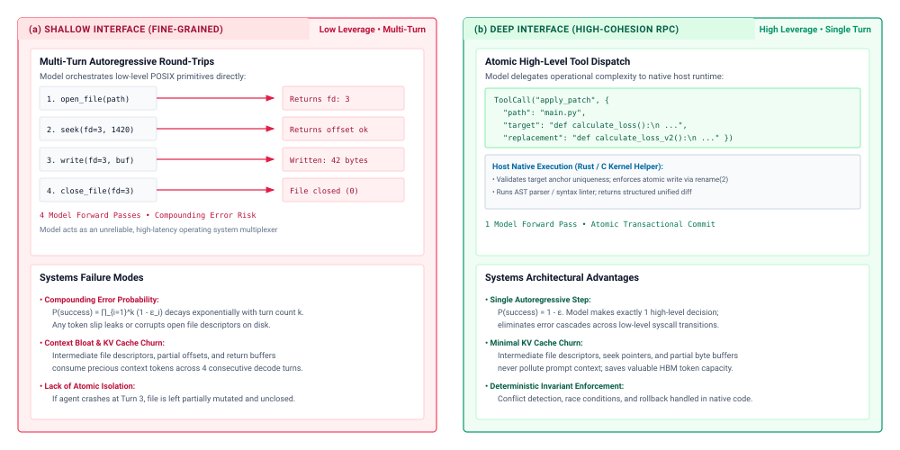
:::

Orthogonality requires that every tool in the catalog govern a distinct, non-overlapping operational domain. When an agent is provisioned with overlapping tools—such as simultaneously providing `bash`, `python_repl`, `read_file`, and `run_grep_search`—the tools compete for the exact same semantic intent. If a user asks to count the number of matching error patterns in a log directory, the model's internal representations activate across multiple valid execution paths:

1. Invoking `bash` with `grep -c "ERROR" /var/log/*.log`.
2. Invoking `python_repl` with an open-ended script iterating over `pathlib.Path`.
3. Invoking `read_file` iteratively across each log file followed by in-context counting.
4. Invoking `run_grep_search` with a structured regular expression payload.

This functional redundancy splits the attention distribution across multiple candidate heads, generating unforced routing errors and inconsistent trajectory patterns. Orthogonal system design eliminates this ambiguity by establishing strict operational boundaries: if an open-ended shell tool is provisioned, specific read and search micro-tools are omitted, or conversely, if fine-grained file and search tools are provided, raw shell execution is stripped entirely. Every tool must have an isolated, well-defined failure domain such that an execution error isolates fault diagnosis to a single predictable subsystem. The trade-offs between these approaches are summarized in @tbl-vol3-toolkit-granularity.

| Architectural Dimension                    | Coarse-Grained Tool Catalog                    | Fine-Grained Tool Catalog                            |
|:-------------------------------------------|:-----------------------------------------------|:-----------------------------------------------------|
| **Representative Primitives**              | `bash_exec`, `apply_patch`, `fetch_web_page`   | `git_status`, `git_diff`, `read_line`, `append_file` |
| **Schema Footprint ($S_{\text{schema}}$)** | Minimal ($< 600\text{ tokens}$)                | Massive ($3{,}000 - 10{,}000+\text{ tokens}$)        |
| **Static KV Cache Allocation**             | Negligible ($\sim 1\text{--}5\%$ of total HBM) | Severe ($\sim 20\text{--}40\%$ of total HBM)         |
| **Tool Selection Ambiguity**               | Minimal (Orthogonal primitives)                | High (Overlapping semantic basins)                   |
| **Ambient Authority ($A$)**                | Broad (Requires kernel-level sandbox)          | Constrained (Enforced by static schema)              |
| **Turn Latency to Completion**             | Low (Single-turn complex operations)           | High (Multi-turn iterative calls)                    |
| **Audit & Governance**                     | Opaque (Requires command inspection)           | Transparent (Explicit typed RPC payloads)            |

: **Coarse-Grained versus Fine-Grained Tool Catalogs**: Comparison matrix of coarse-grained and fine-grained tool catalogs across operational and systems metrics. {#tbl-vol3-toolkit-granularity}

### The expressiveness-safety spectrum

The selection of toolkit granularity anchors an agent along an expressiveness-safety spectrum. At the extreme end of expressiveness lie universal execution primitives. A POSIX shell tool exhibits near-infinite expressiveness: it can inspect processes, compile binaries, manipulate filesystems, orchestrate network requests, and dynamically pipe output through arbitrary data-transformation filters. However, this flexibility collapses the principle of least privilege. Because the shell acts as an open pipe to the underlying kernel, the runtime cannot predict the side effects of a command from the tool signature alone. The security boundary cannot be enforced at the schema validation layer; it must be pushed entirely into the execution sandbox using hypervisors, namespaces, and system call filtering.

At the opposite end of the spectrum lie constrained structured tools, such as an AST-aware symbol renamer (`ast_rename_variable`). Such a tool provides mathematical certainty regarding safety: it cannot drop database tables, spawn persistent network listeners, or leak environment variables. The runtime validates all parameters statically against a strict JSON schema before dispatching the request. However, this safety comes at the cost of brittle domain coverage. If the model encounters a language whose AST the host parser does not support, or if a refactoring task requires simultaneous modification of documentation comments, the structured tool fails completely, stalling the agent loop.

To bridge this divide without sacrificing architectural robustness, runtime engineers employ *defensive parameter design*. Tools must be engineered so that unintentional model errors or partial token sequences fail safely. Defensive parameter design relies on three core techniques:

1. **Safe-by-Default Semantics:** Parameters governing mutation magnitude must default to non-destructive actions. For example, a file-writing tool must require an explicit boolean parameter `overwrite: true` to truncate an existing file; in the absence of this parameter, the host runtime fails the execution or defaults to non-destructive appending.
2. **Dry-Run Simulation Flags:** Mutating tools should expose an explicit `dry_run: true` parameter. When asserted, the tool executes through the validation, authorization, and planning logic, returning the exact diff or state transition that *would* occur, without applying side effects to the underlying system. This allows the model to inspect its own proposed changes before committing them.
3. **Atomic Batching Invariants:** Tools that modify external state should accept arrays of homogeneous mutations to be committed within a single host-side transaction. If any single mutation fails validation, the entire batch rolls back, preventing the agent from stranding the host environment in an indeterminate, partially mutated state.

```python
# Empirical example: Defensive parameter schema validation in a deep editing tool
def execute_file_patch(target: str, find_str: str, replace_str: str, dry_run: bool = True) -> str:
    path = validate_sandboxed_path(target)
    content = path.read_text(encoding="utf-8")
    if content.count(find_str) != 1:
        raise ValueError(f"Target pattern found {content.count(find_str)} times; must match exactly once.")
    new_content = content.replace(find_str, replace_str, 1)
    diff = generate_unified_diff(content, new_content, str(path))
    if not dry_run:
        path.write_text(new_content, encoding="utf-8")
    return f"Status: {'SIMULATED' if dry_run else 'APPLIED'}\n{diff}"
```

The defensive implementation above demonstrates how host runtimes absorb operational hazards. Rather than requiring the agent to manually verify file offsets, the host tool enforces that the target anchor string `find_str` matches exactly once. If the model provides an ambiguous anchor that matches multiple locations, the tool halts immediately, preserving the original file and returning an informative error frame. Furthermore, defaulting to `dry_run = True` forces the model to actively confirm its intent before applying permanent state changes, insulating the physical environment from non-deterministic token emissions.

Having established the structural mechanics of tool subsystem design—spanning typed interfaces, discovery protocols, idempotent state leases, observation stream sanitization, asynchronous event loops, and catalog granularity partitioning—we have assembled the complete architectural substrate for bridging candidate tokens to external actuation. Yet translating these theoretical foundations into dependable production deployments exposes engineers to subtle failure modes where software assumptions clash with the reality of foundation model inference. We turn now to the common fallacies and pitfalls that emerge when engineering tool execution runtimes.

## Fallacies and Pitfalls {#sec-vol3-actuation-fallacies}

Architectural abstractions often mask physical operating constraints. In tool execution systems, runtime architects routinely fall prey to intuitive assumptions borrowed from conventional deterministic RPC pipelines or naive unconstrained prompting environments. When non-deterministic token decoders interact with stateful operating system environments and distributed networks, standard software engineering heuristics break down. Avoiding these failure modes requires recognizing the physical boundaries of context memory, the non-deterministic nature of autoregressive sampling, and the strict necessity of runtime-enforced invariants.

::: {.fallacy-pitfall}
**Fallacy:** *Providing more tools in context always increases agent capability.*

A common intuition in agent design is that expanding the model's tool catalog monotonically expands its problem-solving versatility. If an agent possesses individual tools for every conceivable file transformation, database query, and network operation, it should theoretically resolve a wider distribution of tasks.

In physical execution, every tool schema injected into the system prompt imposes a static token tax $S_{\text{schema}}$ on the context window. For a catalog of $N$ tools where each tool definition averages $d_i$ tokens of JSON Schema specifications, argument types, and docstrings, the static prefix footprint scales linearly as:

$$S_{\text{catalog}} = \sum_{i=1}^{N} d_i$$

In modern serving engines employing PagedAttention, these static schema tokens consume physical key-value (KV) cache memory blocks that must remain resident in high-bandwidth memory (HBM) across every turn of the autoregressive decode loop. A massive catalog directly reduces the memory headroom available for dynamic conversation history and working scratchpads, lowering serving batch throughput and driving up time-to-first-token (TTFT) during the prefill phase.

More critically, expanding the catalog induces severe statistical degradation in model routing. As the cardinality $N$ grows, semantic overlap between tool descriptions inevitably increases. The model's categorical probability distribution over candidate tool-selection tokens flattens, sharply inflating the tool selection error rate $\epsilon_{\text{select}}$. Under empirical evaluation, an agent presented with fifty fine-grained tools frequently hallucinates non-existent hybrid arguments, routes file modifications to specialized scripts with incompatible flags, or becomes paralyzed by distractor schemas. Rather than maximizing catalog size, dependable runtimes maximize tool leverage: they expose a compact set of orthogonal, coarse-grained primitives—such as a sandboxed POSIX shell or a general-purpose Python interpreter—or utilize dynamic discovery protocols to page specialized schemas into context only when authoritative intent requires them.
:::

::: {.fallacy-pitfall}
**Pitfall:** *Retrying failed non-idempotent tool calls without an idempotency key.*

When a tool invocation fails to return within a configured network deadline $\tau_{\text{timeout}}$, the runtime supervisor or the autonomous agent loop faces an ambiguous distributed systems outcome. A naive supervisor treats an unacknowledged HTTP request, a dropped socket connection, or a subagent crash as an operational failure and immediately replays the identical tool call.

In any distributed architecture, network partitions decouple transmission from execution. The absence of a return frame does not prove the absence of a side effect. If the tool invocation performs an un-isolated mutation—such as charging a payment gateway, provisioning cloud virtual machines, executing an external database transaction, or appending records to a shared ledger—the request may have completed successfully on the target host immediately before the network severed the return packet.

Replaying the raw request transforms a transient network partition into permanent state corruption:

$$S_{\text{env}}(t_1) \neq S_{\text{env}}(t_0) + \Delta_{\text{action}}$$

The external system executes the mutation twice, producing duplicate charges, orphaned infrastructure, or corrupted database invariants. Compounding this hazard, an unprivileged model operating in an agentic loop often observes the timeout error frame and spontaneously synthesizes an alternative retry plan with altered parameters, defeating simple server-side signature deduplication.

To mitigate this pitfall, the runtime supervisor must enforce end-to-end execution idempotency before dispatching mutating operations across the trust boundary. Every mutating tool call must be bound to a unique, cryptographically derived idempotency key $K_{\text{idem}}$ generated by the supervisor, tied to the specific logical step of the trajectory. Downstream services must register $K_{\text{idem}}$ inside an atomic commit log or transactional cache. If a timeout occurs, any subsequent dispatch bearing the identical key returns the original cached result without re-executing the underlying state transition. Operations that cannot be rendered idempotent through tokens must be protected by explicit transactional leases or two-phase state reconciliation.
:::

::: {.fallacy-pitfall}
**Fallacy:** *Inferring tool success from model generation or stdout text alone.*

Because foundation models are trained to produce human-readable narratives, engineers frequently rely on the model's self-reported summary or the presence of optimistic substrings within standard output (such as `"Success"`, `"Build complete"`, or `"200 OK"`) to decide whether a tool execution succeeded.

This approach violates the end-to-end argument for system design. Large language models operate under zero ambient authority ($A=0$) and possess no sensory access to physical reality outside the discrete token sequences delivered to their input layer. Models exhibit fail-plausible behavior: when presented with a silent failure, an unhandled exception, or an ambiguous stack trace, an autoregressive decoder routinely rationalizes the outcome, generating convincing explanations that an operation succeeded when the underlying operating system state remains entirely unaltered.

Furthermore, standard output streams from command-line utilities and third-party binaries are completely unstandardized. Numerous compilers, build systems, and CLI scripts write fatal error diagnostics to `stdout` instead of `stderr`, or emit informational status banners containing the string `"Success"` before terminating on an unhandled segmentation fault.

The runtime supervisor must never delegate invariant verification to linguistic parsing. Tool success must be grounded in authoritative, unforgeable physical primitives:

1. The exact operating system exit status code ($WEXITSTATUS = 0$).
2. Explicit filesystem and kernel state inspections (such as verifying updated inode timestamps, cryptographic file checksums, or nonzero byte lengths).
3. Deterministic external test suites executed in isolated environments.

Language models propose candidate actions; only deterministic software verification proves that the system's invariants hold.
:::

::: {.fallacy-pitfall}
**Pitfall:** *Dumping un-truncated tool outputs directly into the context window.*

When an agent executes an operating system command—such as invoking a compiler across a large monorepo, running an un-indexed database query, executing `git log`, or dumping network diagnostic packets—the process standard output buffer can emit tens of megabytes of raw text within milliseconds. A naive runtime captures this stream and pipes it directly into the observation frame of the next conversation turn.

Un-truncated text injection operates as an immediate denial-of-service attack against the agent's memory hierarchy. An unconstrained process emitting $10^6$ characters generates hundreds of thousands of tokens, instantly breaching the context window boundary $S_{\max}$.

In the accelerator memory subsystem, allocating physical KV cache pages for millions of uncompressed, low-information characters fragments GPU HBM. Under PagedAttention, this rapid allocation triggers emergency preemption of concurrent serving requests, forces expensive page swapping to host system RAM, or causes the serving engine to fail outright with an out-of-memory (OOM) abort.

Even if the model architecture supports an extended context window capable of ingesting the buffer, the quadratic computational complexity of dense attention prefill and the linear memory-bandwidth overhead of autoregressive decode steps ($O(N)$ per token generated) drastically inflate latency. The vast majority of the emitted tokens consist of repetitive build progress bars or redundant log lines. This deluge dilutes the model's attention weights, effectively burying the actionable diagnostic trace—the single line indicating a syntax error or missing symbol—beneath thousands of tokens of irrelevance.

Runtimes must enforce strict physical observation budgets ($B_{\max}$) directly at the kernel pipe level using non-blocking I/O and bounded ring buffers. The runtime supervisor must apply structural truncation policies before tokenization: preserving a fixed prefix head ($B_{\text{head}}$) to capture invocation parameters, discarding intermediate repetitive output via content-aware filtering, and retaining a bounded tail ($B_{\text{tail}}$) where terminal exit diagnostics, assertion errors, and stack traces reside. Output volumes exceeding the physical context threshold must be offloaded to content-addressed persistent storage, returning only a summary frame, a byte offset, and a retrievable handle to the model context.
:::

Mastering the physical boundaries of tool execution—protecting context memory from unbounded observation streams, enforcing cryptographic idempotency across network partitions, relying on authoritative kernel primitives rather than narrative model text, and curating compact, expressive tool catalogs—transforms unprivileged language model generation into dependable systems actuation. Having examined the concrete failure modes that threaten production execution environments, we now synthesize the core architectural principles that govern the tool subsystem before advancing to the sandboxed runtime environments that isolate these operations.

## Summary {#sec-vol3-actuation-summary}

A candidate token sequence generated by an autoregressive neural network transforms into a controlled external effect only when an authoritative runtime supervisor intercepts, validates, and dispatches the proposal across an explicit protection boundary. The unprivileged inference engine produces statistical predictions over a vocabulary; it possesses neither ambient authority ($A=0$) nor direct hardware access to system calls, network sockets, or persistent storage. Bridging this epistemic divide requires treating tools not as natural language suggestions or loose conversational extensions, but as strongly typed remote procedure call endpoints governed by rigid systems contracts. By mediating every phase of actuation—validating parameter schemas, negotiating capabilities through standardized discovery protocols, attaching unique idempotency leases to survive network partitions, and throttling unbounded observation streams before they saturate accelerator memory—the host runtime converts non-deterministic model generation into verifiable, fault-tolerant state transitions.

::: {.callout-takeaways title="Schemas are contracts, not conversational advice"}
1. **Tools are external execution endpoints whose interface contracts must be strictly typed.** A language model never directly modifies physical state; it outputs symbolic arguments against an exposed schema. Rigid parameter validation, explicit structural typing, and bounded enumerations minimize epistemic ambiguity, prune invalid action spaces, and ensure that malformed candidate proposals fail closed before crossing the execution boundary.
2. **The Model Context Protocol standardizes discovery and connectivity across heterogeneous services.** By decoupling tool definitions and data resources from monolithic host architectures, client-server discovery protocols establish a uniform wire standard for querying capabilities, managing out-of-process transports, and isolating external environments, all while leaving ultimate authorization and policy enforcement under the sovereign control of the host runtime.
3. **Idempotency keys and transactional leases are mandatory for all mutating actions.** Network timeouts, process crashes, and transient dropouts inevitably leave distributed executions in indeterminate states. The runtime supervisor must affix deterministic idempotency keys ($K_{\text{idem}}$) and enforce transactional state reconciliation to guarantee that automated retries cannot produce duplicate mutations, phantom state corruption, or catastrophic resource leakage.
4. **Unbounded observation streams require headless ring-buffering and pagination before context staging.** Executable tools emit arbitrary volumes of diagnostic data that can trivially saturate the finite physical limits of the model context and accelerator high-bandwidth memory. Runtimes must apply kernel-level backpressure, slice output streams into fixed-head and bounded-tail frames, and spill voluminous payloads into content-addressed auxiliary stores.
5. **Asynchronous dispatch decouples host-worker occupancy from serving-engine state retention.** Because external tools operate on wall-clock latencies orders of magnitude slower than token generation, runtimes must implement explicit wait-and-resumption contracts. Suspending long-running operations releases supervisory threads, while checkpointing or evicting key-value cache frames prevents idle external latencies from degrading inference engine throughput.
:::

Synthesized together, these principles embody the fundamental systems separation between *hypothesis generation* and *authoritative execution*. In accordance with the end-to-end argument, the correctness and integrity of an agentic system cannot rely on the model’s internal self-consistency or its probabilistic intent. Rather, invariant closure is achieved solely through the external mechanics of the supervisory runtime: deterministic schema parsers verify preconditions, cryptographic leases guarantee exactly-once operational semantics across unreliable links, and structured observation filters sanitize the raw physical consequences of each dispatched action. The tool subsystem thus functions as an operating system kernel for autonomous intelligence—converting raw, untrusted neural proposals into auditable, recoverable transactions.

::: {.callout-chapter-connection title="From tool interfaces to execution isolation"}
Connecting an agent to external tools gives it the power to act on the world, but it also exposes the host environment to catastrophic failure. When a model dispatches arbitrary shell commands, compiles unfamiliar source code, or executes dynamically generated scripts, syntactic schema validation alone cannot prevent malicious exploits, destructive side effects, or adversarial prompt injection attacks from compromising the underlying operating system. Establishing a typed RPC interface is only half of the protection equation; the code invoked by that interface must execute in an environment where fault domains are strictly contained. In @sec-vol3-virtualization (*Environmental Isolation*), we shift from the communication interface to the containment substrate, analyzing how hardware-isolated microVMs, WebAssembly runtimes, Linux namespaces, and capability-based security policies isolate untrusted execution without forfeiting the low-latency guarantees required by interactive agent loops.
:::
