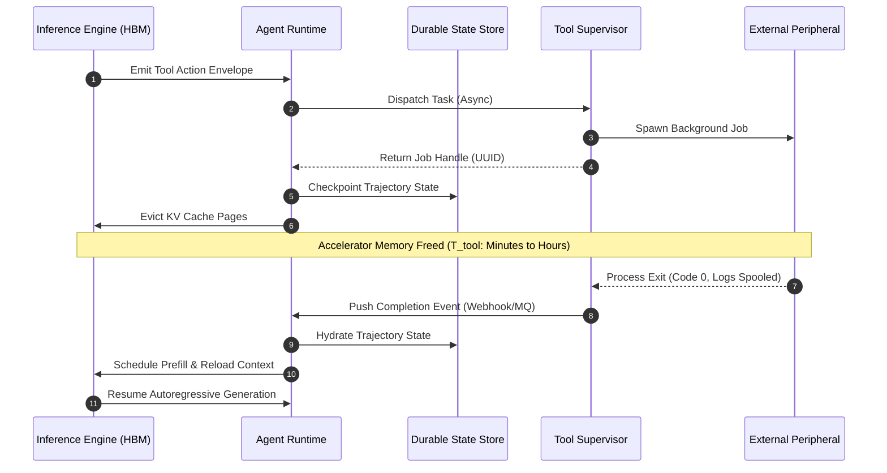

# Peripherals & Tool Actuation {#sec-vol3-actuation}

::: {layout-narrow}
::: {.column-margin}

\chapterminitoc

:::

::: {.content-visible when-format="pdf"}
\noindent
{fig-alt="Blueprint for Peripherals & Tool Actuation."}
:::

::: {.content-visible unless-format="pdf"}
{fig-alt="Blueprint for Peripherals & Tool Actuation."}
:::

:::

## Purpose {.unnumbered .unlisted}

\begin{marginfigure}
\mlagentstack{10}{10}{10}{95}{10}{10}
\end{marginfigure}

_*How does a neural processor actuate real-world tools across timescales that dwarf its own internal token step?*_

A processor without input/output peripherals is an isolated calculator, capable of contemplation but powerless to effect change. To accomplish operational work, the Stochastic Computer must connect its learned computational core to external software peripherals: compilers, code linters, databases, web browsers, terminal shells, and remote REST APIs. However, bridging a foundation model to external tools exposes an immense systems mismatch. Neural token generation operates in high-speed, synchronized millisecond steps, whereas external peripherals operate across wildly heterogeneous network and execution timescales spanning milliseconds to hours. Furthermore, tools do not accept fuzzy tokens—they require rigid, typed schemas, and their execution can return massive, noisy outputs (such as 50-megabyte build logs) that would instantly blow out context windows. Connecting an agent to peripherals requires designing a formal I/O subsystem: establishing standardized interface protocols (such as MCP), synthesizing typed action envelopes from token streams, executing tools asynchronously to avoid locking GPU threads during long-running tasks, and normalizing chaotic terminal outputs into compact, actionable observations through an explicit actuation lifecycle contract.

::: {.callout-learning-objectives}

- Specify the complete tool actuation contract, including JSON Schema parameter typing, capability metadata, idempotency flags, and timeout specifications.
- Analyze the standardized peripheral protocols (Model Context Protocol / MCP), evaluating the trade-offs between local UNIX domain sockets, stdio pipes, and remote SSE/RPC transports.
- Architect an asynchronous, non-blocking tool dispatch engine that issues execution handles, frees accelerator compute during I/O waits, and wakes suspended agent sessions via event notifications.
- Implement an observation normalization pipeline that strips ANSI escape codes, extracts structured stack traces, preserves deterministic integer exit codes, and truncates high-volume logs with explicit truncation markers.
- Evaluate the catalog capacity paradox: proving empirically why exposing 3 to 5 universal, expressive primitives (Bash, FileView, FileEdit, Grep) outperforms bloated catalogs of dozens of specialized micro-tools.
- Formulate error taxonomy and retry policies for transient network drops, rate-limit throttles, and tool parameter schema violations.

:::

<!-- SECTION_START: 7.1 (#sec-vol3-actuation-unix-analogy) -->
## Peripheral Subsystem Abstraction {#sec-vol3-actuation-unix-analogy}

<!-- OUTLINE_SPEC:

- **Heading & Anchor:** `## Peripheral Subsystem Abstraction {#sec-vol3-actuation-unix-analogy}`
- **The Single Key Point:** Just as UNIX abstracted diverse hardware into uniform byte streams (`read`/`write`), agent systems abstract heterogeneous software APIs into typed JSON action and observation schemas.
- **Concrete Systems Hook:**
  - An agent needs to interact with a filesystem, an SQL database, a bash terminal, and a GitHub REST API. Without a universal I/O layer, each tool requires custom prompt formatting and bespoke parser logic.
- **Points to explain (paragraph-by-paragraph):**
  - *The Classical I/O Abstraction (Ritchie & Thompson 1974):* In UNIX, "everything is a file": character devices, block storage, network sockets, and pipes share the identical `open()`, `read()`, `write()`, `close()` system call contract.
  - *The Agent I/O Abstraction:* Everything is an RPC function call: tool definition (JSON schema), invocation payload ($a_{\text{prop}}$), runtime authorization gate, and structured observation ($o_{t+1}$).
  - *Typed Schemas vs. Raw Text Streams:* Raw string interpolation creates injection vulnerabilities and parsing crashes; typed schemas enforce structural boundaries between instructions and arguments.
- **Visuals & Tables:**
  - Conceptual diagram: UNIX file descriptor table vs. Agent runtime tool descriptor table.
- **Seminal Literature:**
  - Dennis M. Ritchie & Ken Thompson (1974, *The UNIX Time-Sharing System*).
- **Causal Bridge to 7.2:** How do we formally define tool interfaces so that models can reliably select and parameterize them?
-->

### The File Descriptor Precedent

In classical operating systems, physical hardware peripherals exhibit extreme operational heterogeneity. A serial teletypewriter transfers asynchronous character streams across low-baud lines; a magnetic disk drive transfers fixed, sector-aligned binary blocks across a parallel bus; a network controller buffers variable-length packets under non-deterministic transit latencies. Exposing device-specific register layouts, interrupt lines, and direct memory access (DMA) channels directly to user applications produces brittle, non-portable software.

The foundational insight of the UNIX operating system [@ritchie1974] was the virtualization of heterogeneous hardware behind a single, uniform abstraction: *everything is a file*. Whether an application communicates with a local storage sector, a character terminal, an inter-process pipe, or a network socket, it executes an identical system-call lifecycle: `open()`, `read()`, `write()`, and `close()`. The operating system decouples the calling program from physical silicon through an indirection layer: the process-level file descriptor table indexes into the kernel open-file table, which delegates execution to the Virtual File System (VFS) and device driver switch tables. User-space software operates purely on sequential streams of unstructured bytes, leaving device timing, bus arbitration, and hardware register manipulation to the underlying kernel driver.

### The Agent Input/Output Gap

Modern autonomous agents face an architectural challenge identical in nature but elevated to software services. Consider an agent tasked with diagnosing a failing continuous integration build. To complete this objective, the neural processor must actuate a heterogeneous collection of software peripherals:

1. A local POSIX filesystem to inspect source code and configuration files.
2. A stateful interactive pseudo-terminal (`pty`) executing a shell to trigger compilers and test runners.
3. A relational database via a connection pool to verify migration states.
4. A remote version-control REST or GraphQL API to post review comments and query pull request metadata.

Without a standardized peripheral abstraction, the runtime environment degenerates into a tangle of ad hoc interfaces. If each tool requires bespoke text formatting within the prompt—such as injecting raw SQL strings between custom delimiters, wrapping shell commands in triple backticks, and formatting API requests as stringified HTTP envelopes—the model must internalize separate syntactic invariants for every target peripheral. Furthermore, the host harness must maintain brittle, tool-specific regular expressions to parse model outputs. A minor hallucination in delimiter formatting triggers an unrecoverable parse exception, terminating the trajectory before actuation begins.

### The Uniform RPC Abstraction

To establish a clean systems boundary, an agent runtime virtualizes external software peripherals through an architectural equivalent of the UNIX VFS: *everything is a typed remote procedure call (RPC)*. Rather than exposing native communication protocols directly to the token stream, the runtime interposes a structured actuation layer. Every external tool—whether an in-process routine, an external containerized shell, or a remote web service—is registered in a runtime *tool descriptor table*.

```{mermaid}
%%| label: fig-actuation-unix-comparison
%%| fig-cap: "Architectural equivalence between the UNIX Virtual File System and the Agent Tool Dispatch Subsystem."
flowchart TD
  subgraph UNIX ["UNIX I/O Subsystem"]
    direction LR
    UApp["User Application"] -->|"read / write"| UFDT["File Descriptor Table"]
    UFDT -->|"Index Lookup"| UVFS["Virtual File System (VFS)"]
    UVFS -->|"vnodeops"| UDriver["Device Driver Switch Table"]
    UDriver -->|"Bus / DMA"| UDev["Hardware Peripheral (Disk, TTY, Socket)"]
  end

  subgraph Agent ["Agent Tool Dispatch Subsystem"]
    direction LR
    AModel["Neural Processor"] -->|"Emit Action Envelope"| ATDT["Tool Descriptor Table"]
    ATDT -->|"Index Lookup"| ADispatch["Dispatch & Authorization Engine"]
    ADispatch -->|"Validate & Sandbox"| AWorker["Transport Worker / Wrapper"]
    AWorker -->|"RPC / stdio / Socket"| ATool["Software Peripheral (Shell, DB, REST API)"]
  end
```

As illustrated in @fig-actuation-unix-comparison, the tool descriptor table provides the same indirection for an agent runtime that the file descriptor table provides for a POSIX kernel. When the neural processor selects a peripheral, it emits a standardized action envelope containing a symbolic tool identifier and a structured argument payload. The runtime resolves the tool identifier against the descriptor table, which routes the request through four deterministic phases:

1. *Schema Validation:* Verifying that the generated arguments conform to the parameter contract registered for that peripheral.
2. *Authorization Mediation:* Evaluating security policies, permission boundaries, and human-in-the-loop gates prior to execution.
3. *Transport Dispatch:* Marshaling the validated arguments across the physical boundary (such as standard input pipes, UNIX domain sockets, or HTTPS requests) to the worker process.
4. *Observation Ingestion:* Capturing the execution result, stripping extraneous control sequences, standardizing exit status, and packaging the payload into a structured observation envelope.

| Architectural Dimension   | UNIX I/O Subsystem (@ritchie1974unix)                              | Agent Tool Dispatch Subsystem                                            |
|:--------------------------|:-------------------------------------------------------------------|:-------------------------------------------------------------------------|
| **Interface Primitive**   | Linear byte stream (`read`/`write`)                                | Structured JSON action and observation envelopes                         |
| **Indirection Mechanism** | File descriptor table $\rightarrow$ VFS $\rightarrow$ Driver table | Tool descriptor table $\rightarrow$ Dispatch engine $\rightarrow$ Worker |
| **Invocation Contract**   | Untyped binary or ASCII buffer via system call                     | Strongly typed, schema-validated RPC invocation                          |
| **Mediation & Safety**    | File mode bits, POSIX ACLs, kernel ring boundaries                 | Authorization policies, parameter validation, sandbox jail               |
| **Return Channel**        | Integer byte count or negative `errno`                             | Structured observation containing exit code, `stdout`, and `stderr`      |
| **Execution Topology**    | Synchronous blocking or non-blocking polling (`select`/`epoll`)    | Asynchronous non-blocking event loop with correlation tokens             |

: Structural correspondence between classical operating system I/O primitives and agentic tool dispatch mechanisms. {#tbl-actuation-descriptors}

### Structural Boundaries: Typed Schemas versus Raw Text Streams

Early agent frameworks treated tool actuation as an unstructured text-generation problem, relying on pattern-matching conventions such as emitting an `Action:` label followed by raw string payloads. This design violates the core systems principle of separating the control plane from the data plane. When tool arguments are interpolated directly into unconstrained text streams, two structural failure modes emerge:

1. *Delimiter Collision and Injection:* If a tool argument contains the delimiter string itself (such as backticks within a bash script or quotation marks within an SQL query), the runtime parser misidentifies the argument boundary. More critically, untrusted data ingested from previous tool observations can hijack the text stream, tricking the model into emitting unauthorized secondary tool invocations.
2. *Syntactic Entropy:* Autoregressive language models generate tokens sequentially without lookahead. Under unconstrained text decoding, the probability of completing a syntactically valid nested payload degrades rapidly with argument complexity. A single missing brace or unescaped newline invalidates the entire invocation payload, failing the operation before execution begins.

Modern agent architectures resolve this instability by enforcing strict structural boundaries using JSON Schema specifications. Rather than allowing free-form token generation, the runtime constrains decoding to valid schema instances using grammar-guided logit masking or dedicated function-calling control tokens. By compiling the parameter schema directly into the sampling loop, the system guarantees that any action payload delivered to the dispatch engine is structurally well-formed by construction.

### Architectural Continuity

While the RPC abstraction provides a uniform conceptual contract, realizing this interface requires formalizing the precise metadata that describes tool capabilities, parameter boundaries, and failure modes. If a neural processor is to select the correct peripheral from a catalog without human intervention, the interface definition must explicitly communicate not merely the syntactic signature, but also operational semantics such as idempotency, execution timeouts, and state mutation side effects. The precise structure of this actuation contract is the focus of @sec-vol3-actuation-contract.

<!-- SECTION_END: 7.1 -->

<!-- SECTION_START: 7.2 (#sec-vol3-actuation-schemas) -->
## Tool Interface Schemas {#sec-vol3-actuation-schemas}

<!-- OUTLINE_SPEC:

- **Heading & Anchor:** `## Tool Interface Schemas {#sec-vol3-actuation-schemas}`
- **The Single Key Point:** Clear parameter descriptions, typed constraints, and explicit error schemas in tool definitions directly dictate model tool-calling accuracy.
- **Concrete Systems Hook:**
  - A tool specifies a parameter as `"date": "string"`. The model generates `"yesterday"`, crashing a downstream parser expecting ISO-8601 (`"2026-09-15"`). Adding a typed regex pattern solves the issue.
- **Points to explain (paragraph-by-paragraph):**
  - *Anatomy of a Tool Schema:* Tool name, semantic description (the "system prompt" for the tool), typed parameter properties, required parameter lists, and enum constraints.
  - *The Schema Quality Effect:* Foundation models attend heavily to docstrings and parameter names; vague descriptions (`"arg1": "string"`) cause massive parameter hallucination; precise descriptions (`"timeout_ms": "integer between 100 and 5000"`) maximize call precision.
  - *Static vs. Dynamic Schema Registration:* Sizing the tool registry staged in context: exposing 500 tool schemas blows up prompt budgets; dynamically retrieving relevant schemas on-demand preserves context space.
- **Visuals & Tables:**
  - Code listing: Example Pydantic model and its compiled OpenAPI/JSON schema representation.
- **Seminal Literature:**
  - Shishir G. Patil et al. (2023, *Gorilla: Large Language Model Connected with Massive APIs*).
- **Causal Bridge to 7.3:** How do heterogeneous external applications expose tools to agents in an open, standardized ecosystem?
-->

Where operating systems define peripheral interfaces through fixed-width hardware registers and POSIX system call ABI conventions, the stochastic computer mediates the boundary between its neural processor and external software tools via an Interface Definition Language (IDL). In modern agent runtimes, this boundary is formalized using JSON Schema and OpenAPI specifications. The schema functions as an explicit execution contract: it translates the unstructured semantic space of the neural network into a typed, machine-verifiable remote procedure call.

The operational fragility of unconstrained text generation demonstrates the necessity of this contract. Consider a file-system search tool whose temporal filter parameter is declared simply as `{"date": {"type": "string"}}`. When queried by a user for recent file modifications, the neural processor, sampling from conversational priors, frequently emits colloquial strings such as `"yesterday"`, `"last Tuesday"`, or non-standard representations such as `"09/15/2026"`. Downstream POSIX time libraries and SQL query engines reject these values, triggering unmarshaling exceptions that abort execution. By augmenting the parameter schema with structural invariants—such as a regular expression pattern `{"pattern": "^\\d{4}-\\d{2}-\\d{2}$"}` or the standard JSON Schema attribute `{"format": "date"}`—the runtime constrains the token sampling envelope. The model is forced to allocate probability mass strictly over valid ISO-8601 sequences (`"2026-09-15"`), eliminating serialization failures prior to dispatch.

### Anatomy of a Tool Schema

A production tool descriptor registered in an agent runtime decomposes into five structural components:

1. **Symbolic Identifier (`name`):** A unique, deterministic key (such as `execute_database_query` or `fetch_file_diff`) that the dispatch engine matches against the tool descriptor table.
2. **Semantic Description (`description`):** A natural language specification detailing the operational semantics, intended usage, environmental side effects, and boundary conditions of the peripheral. This field functions as the specialized "system prompt" for the tool, directly steering attention heads during token generation.
3. **Parameter Properties (`properties`):** A typed mapping of named arguments defining scalar primitives (`string`, `integer`, `number`, `boolean`) or composite structures (`array`, `object`).
4. **Mandatory Argument Set (`required`):** An explicit array of parameter keys that the model must synthesize to construct a valid invocation frame.
5. **Validation Constraints:** Syntactic and semantic bounds, including allowable enumerations (`enum`), numerical intervals (`minimum`, `maximum`), and string validation patterns.

```python
#| label: lst-tool-schema-pydantic
#| lst-cap: "Tool interface contract defined as a typed Pydantic specification and its compiled JSON Schema representation."

from pydantic import BaseModel, Field
from typing import Literal

class DatabaseQueryArgs(BaseModel):
    query: str = Field(
        description="Read-only SQL query to execute against the analytics replica."
    )
    timeout_ms: int = Field(
        default=1000,
        ge=100,
        le=5000,
        description="Execution timeout in milliseconds. Must be between 100 and 5000."
    )
    isolation_level: Literal["READ_COMMITTED", "REPEATABLE_READ"] = Field(
        default="READ_COMMITTED",
        description="Transaction isolation level."
    )

# Compiled JSON Schema staged into the neural processor's context window:
# {
#   "name": "execute_database_query",
#   "description": "Executes an analytical SQL query against the read-replica database.",
#   "parameters": {
#     "type": "object",
#     "properties": {
#       "query": {
#         "type": "string",
#         "description": "Read-only SQL query to execute against the analytics replica."
#       },
#       "timeout_ms": {
#         "type": "integer",
#         "minimum": 100,
#         "maximum": 5000,
#         "default": 1000,
#         "description": "Execution timeout in milliseconds. Must be between 100 and 5000."
#       },
#       "isolation_level": {
#         "type": "string",
#         "enum": ["READ_COMMITTED", "REPEATABLE_READ"],
#         "default": "READ_COMMITTED",
#         "description": "Transaction isolation level."
#       }
#     },
#     "required": ["query"]
#   }
# }
```

As demonstrated in @lst-tool-schema-pydantic, the programmatic definition compiles directly into a structural JSON Schema envelope. When staged in the inference context, this schema serves two concurrent roles: it defines the logit mask applied during constrained decoding, and it configures the validation parser at the runtime boundary.

### The Schema Quality Effect and Parameter Grounding

The syntactic correctness of an invocation envelope does not guarantee its semantic validity. Foundation models attend heavily to parameter names and docstrings to ground their generation. As demonstrated by Patil et al. in *Gorilla* [@patil2023gorilla], model tool-calling accuracy is bounded directly by documentation quality and schema clarity.

When parameter specifications are vague or terse (such as declaring an argument as `"arg1": {"type": "string"}` without documentation), the model lacks grounding tokens to bridge user intent with peripheral interfaces. Under ungrounded conditions, the model hallucinates argument keys, passes nonsensical defaults, or confuses semantically distinct parameters. Conversely, detailed parameter descriptions specifying functional invariants—such as explicitly stating `"timeout_ms": "integer between 100 and 5000"`—provide explicit semantic anchors. These anchors concentrate the model's self-attention weights on valid input distributions, dramatically raising zero-shot invocation precision.

From a systems perspective, schema ambiguity directly degrades trajectory throughput. Every malformed tool call triggers a serialization fault, an error observation return, and a subsequent model retry. If a task requires $N$ sequential peripheral operations and each step has an independent invocation success probability $p$, the compounding probability of end-to-end trajectory success is bounded by:

$$
P_{\text{success}} \le p^N
$$

A marginal decrease in single-step accuracy from $p = 0.98$ to $p = 0.85$ drops the success rate of a five-step task from $90.4\%$ to $44.4\%$. The resulting retries inflate wall-clock execution time $T_{\text{task}}$ and collapse Trajectory Goodput ($G = \sum T_{\text{success}} / \sum T_{\text{all}}$), saturating compute infrastructure with non-productive repair loops.

### Static versus Dynamic Schema Registration

Exposing peripheral interfaces to the neural processor incurs physical memory and context-window costs. In simple agent architectures, tool registration is static: the full schema for every available tool is serialized directly into the model's prompt prefix. While manageable for small tool suites, this design breaks down as the peripheral catalog expands.

Consider an enterprise runtime with a registry of $M = 500$ tools, where each schema definition averages $350$ tokens. Static registration consumes $175{,}000$ tokens of prefix overhead before user input or historical observations are ingested. This footprint imposes severe hardware penalties on the key-value (KV) cache memory footprint:

$$
M_{\text{KV}} = 2 \times n_{\text{layers}} \times n_{\text{heads}} \times d_{\text{head}} \times L_{\text{ctx}} \times b
$$

where $L_{\text{ctx}}$ represents sequence length and $b$ denotes bytes per element. Allocating $175{,}000$ tokens exclusively to tool definitions saturates accelerator High Bandwidth Memory (HBM), severely constrains the maximum concurrent serving batch size, and increases prefill latency. Furthermore, large tool catalogs dilute attention. Ingesting hundreds of extraneous schemas introduces semantic distractors that degrade tool selection accuracy.

To mitigate context bloat, modern runtimes implement dynamic schema registration via a two-stage dispatch pipeline. The primary tool repository is maintained out-of-core in an external descriptor database. At runtime, the dispatcher executes a lightweight retrieval pass—using dense vector embeddings or lexical index matching over tool descriptions—to identify a candidate subset of $k$ peripherals (typically $k \in [3, 8]$) relevant to the immediate operational step. Only these $k$ schemas are marshaled into the active context window, bounding prefix token consumption to predictable limits ($L_{\text{tools}} \approx 1{,}000\text{--}2{,}500$ tokens) while preserving KV cache capacity for execution observations.

### Toward a Universal Peripheral Protocol

While JSON Schema establishes a robust syntactic interface, deploying peripherals across heterogeneous environments requires standardizing how tools are published, discovered, and invoked across process and network boundaries. In an ecosystem comprising local shell utilities, containerized sandbox environments, and remote microservices, hardcoded proprietary integrations do not scale. Resolving this systems fragmentation requires a universal, cross-process communication standard, an architecture realized by modern peripheral protocols such as the Model Context Protocol (MCP).

<!-- SECTION_END: 7.2 -->

<!-- SECTION_START: 7.3 (#sec-vol3-actuation-mcp) -->
## Model Context Protocol {#sec-vol3-actuation-mcp}

<!-- OUTLINE_SPEC:

- **Heading & Anchor:** `## Model Context Protocol {#sec-vol3-actuation-mcp}`
- **The Single Key Point:** The Model Context Protocol (MCP) standardizes peripheral connectivity across clients and servers, decoupling agent runtimes from custom tool integration code.
- **Concrete Systems Hook:**
  - An organization with 20 development tools builds custom plugins for Claude, ChatGPT, and LangChain, maintaining 60 bespoke connectors. Adopting MCP collapses this into 20 reusable servers.
- **Points to explain (paragraph-by-paragraph):**
  - *The Integration M $\times$ N Problem:* Without standard protocols, connecting $M$ agent frameworks to $N$ tools requires $M \times N$ custom integration wrappers.
  - *The Model Context Protocol (MCP) Architecture:* Client-server architecture over JSON-RPC 2.0 (stdio or SSE/HTTP). Core capabilities:
    1. *Resources:* Read-only data streams (files, database tables, logs).
    2. *Tools:* Stateful functions callable by the model to mutate environments.
    3. *Prompts:* Reusable parameterized prompt templates.
  - *Discovery and Negotiation:* How runtime clients discover available tools dynamically via `tools/list` and negotiate protocol capabilities during session handshake.
- **Visuals & Tables:**
  - Figure: `@fig-mcp-architecture` [insert link here: books/vol3/07_actuation/images/svg/mcp_protocol_architecture.svg] (Agent Host $\leftrightarrow$ MCP Client $\leftrightarrow$ Transport $\leftrightarrow$ MCP Server $\leftrightarrow$ External System).
- **Causal Bridge to 7.4:** What happens when an agent executes a tool over an unreliable network and encounters a timeout?
-->

### The Integration Scaling Bottleneck

In early operating systems, before the emergence of standardized peripheral abstractions such as POSIX file descriptors, the Virtual File System (VFS), and uniform device driver models, connecting applications to peripheral hardware required bespoke device-specific routines embedded directly within application binaries. A change to an underlying storage controller or display adapter necessitated recompiling or re-architecting the host software.

Agentic systems face an identical integration bottleneck. In an unstandardized ecosystem, connecting $M$ distinct neural agent frameworks to $N$ external tools requires implementing and maintaining $M \times N$ custom integration wrappers. Consider an enterprise software engineering environment comprising $N = 20$ development peripherals—ranging from code repositories, issue trackers, and continuous integration pipelines to terminal shells, container runtimes, and database replicas. If the organization deploys $M = 3$ distinct execution engines (for example, a proprietary enterprise copilot, an open-source trajectory orchestrator, and an autonomous batch evaluation harness), engineering teams must construct $3 \times 20 = 60$ bespoke connectors.

Each custom connector must independently implement parameter validation, transport serialization, error translation, authorization boundaries, and session lifecycles. When an underlying peripheral API changes, all $M$ runtime integrations break simultaneously. When a new agent framework is evaluated, it cannot actuate existing peripherals without authoring $N$ new adapters.

Standardizing peripheral connectivity collapses this combinatorial scaling problem from $\mathcal{O}(M \times N)$ to $\mathcal{O}(M + N)$. By introducing an open, cross-process peripheral protocol, an agent runtime implements a single protocol client, while each external tool implements a single protocol server. The Model Context Protocol (MCP) establishes this standardized systems boundary, decoupling the neural execution loop from peripheral implementation details.

### Architecture and Transport Primitives

The Model Context Protocol operates as an asymmetric, client-server protocol built upon JSON-RPC 2.0. The architectural topology bifurcates responsibilities between two primary components: the *MCP Client* and the *MCP Server*, as illustrated in @fig-mcp-architecture.

{#fig-mcp-architecture width="90%"}

The *Agent Host* represents the execution container running the neural processor and orchestration loop. The host instantiates an internal *MCP Client* for each peripheral subsystem it connects to. The *MCP Server* runs as an isolated, out-of-process daemon that wraps the target system (such as a local filesystem, a database engine, or a remote web service). By enforcing process isolation, MCP ensures that peripheral execution crashes, memory leaks, or unhandled exceptions do not compromise the stability of the host agent runtime.

Communication between client and server occurs across an abstracted transport layer supporting two standardized wire mechanisms:

1. **Standard Input/Output (`stdio`):** Designed for co-located, local execution. The host runtime spawns the MCP server as a child process and communicates directly over standard input and standard output pipes. This transport introduces near-zero network latency, bypasses port allocation conflicts, and guarantees deterministic lifecycle fate-sharing: when the host process terminates, the operating system tears down the pipe, signaling the child process to exit immediately.
2. **Server-Sent Events over HTTP (SSE/HTTP):** Designed for distributed or containerized network boundaries. The client establishes a persistent HTTP connection to receive an asynchronous stream of Server-Sent Events (SSE) from the server, while transmitting client-to-server RPC requests via independent HTTP POST calls. This transport accommodates remote microservices, shared corporate tool clusters, and multi-tenant cloud execution sandboxes.

Across these transports, an MCP server exposes three foundational capabilities to the model context:

- **Resources:** Passive, read-only data surfaces identified by application-specific URIs (such as `file:///workspace/src/main.rs` or `postgres://schema/users`). Resources provide contextual data without side effects. Clients can inspect resource metadata via `resources/list`, retrieve raw contents via `resources/read`, or subscribe to live updates via `resources/subscribe`, enabling the server to push real-time file modifications or operational logs into the agent's context.
- **Tools:** Stateful, executable functions intended to mutate environments or query dynamic state (such as `execute_terminal_command`, `git_commit`, or `query_database`). Every tool publishes a formal JSON Schema describing its invocation parameters, matching the structural validation invariants defined in @sec-vol3-actuation-envelope. The model generates invocations that the client dispatches via `tools/call`.
- **Prompts:** Server-managed prompt templates and operational workflows. Exposed via `prompts/list` and `prompts/get`, prompts allow tool authors to provide domain-optimized few-shot instructions, schema interpretations, and parameter guidance directly to the host model.

### Capability Negotiation and Dynamic Discovery

An MCP session executes across a deterministic lifecycle consisting of initialization, dynamic schema discovery, operation, and graceful teardown. Client and server do not make assumptions regarding supported feature sets; instead, they perform an explicit capability exchange during session startup.

```
Client                                                  Server
  |                                                       |
  | -------- initialize (protocolVersion, caps) --------> |
  | <------- result (protocolVersion, caps, serverInfo) - |
  |                                                       |
  | -------- notifications/initialized -----------------> |
  |                                                       |
  | -------- tools/list --------------------------------> |
  | <------- result (tools: [ {name, schema}, ... ]) ---- |
  |                                                       |
  | -------- tools/call (name, arguments) --------------> |
  | <------- result (content: [ {type, text} ]) --------- |
```

The handshake initiates when the client sends an `initialize` request specifying its supported protocol version and client capabilities (such as whether the host supports context sampling or client-side file roots). The server evaluates the request and returns its own capability manifest, signaling whether it supports dynamic tool re-indexing, resource subscriptions, or logging feeds. Once the client acknowledges the handshake with a `notifications/initialized` message, normal RPC traffic commences.

Following initialization, the client executes dynamic discovery by issuing a `tools/list` request. The server returns its catalog of active tools alongside their typed schemas. If the server's internal environment changes during execution—such as when a database schema migration adds new analytical tables or when a developer switches Git branches—the server dispatches an asynchronous `notifications/tools/list_changed` event. Upon receiving this notification, the MCP client invalidates its local registry cache and re-queries `tools/list`, refreshing the active schemas in the neural processor's context window without restarting the underlying process.

While protocol standardization eliminates interface fragmentation, it shifts the operational burden to physical network and execution boundaries. When an MCP client dispatches a `tools/call` over an unreliable network socket, execution is subject to latency spikes, dropped connections, and peripheral process deadlocks. If a remote tool hangs indefinitely, the host runtime risks locking accelerator resources while waiting for an RPC response that may never arrive. Resolving these physical execution failures requires moving beyond synchronous dispatch to formalize execution timeouts, asynchronous tool handling, and non-blocking I/O.

<!-- SECTION_END: 7.3 -->

<!-- SECTION_START: 7.4 (#sec-vol3-actuation-idempotency) -->
## Idempotent Action Execution {#sec-vol3-actuation-idempotency}

<!-- OUTLINE_SPEC:

- **Heading & Anchor:** `## Idempotent Action Execution {#sec-vol3-actuation-idempotency}`
- **The Single Key Point:** Retrying non-idempotent tool calls over unreliable networks causes catastrophic duplicate side effects; all mutating peripheral operations must enforce idempotency keys.
- **Concrete Systems Hook:**
  - An agent attempts to purchase a cloud server via an API tool. The HTTP POST times out at 30 seconds. The agent retries 3 times. The network had dropped only the HTTP response; the agent accidentally provisions 4 servers and runs up an enormous bill.
- **Points to explain (paragraph-by-paragraph):**
  - *The Fallacy of the Reliable Network:* Tool calls cross network interfaces (HTTP, gRPC, SSH). Timeouts can mean: (1) request was dropped before reaching server, (2) server crashed while processing, or (3) server processed successfully but response was dropped.
  - *Idempotent vs. Non-Idempotent Operations:* $GET$, $PUT$, $DELETE$ are naturally idempotent; $POST$ (creating resources, charging cards, sending emails) is non-idempotent.
  - *Idempotency Keys:* The runtime generates a unique UUID ($k_{\text{idem}}$) per action step; the target server caches the result of $k_{\text{idem}}$ in a transactional key-value store, ensuring duplicate requests return the cached response without re-executing mutations.
- **Visuals & Tables:**
  - Flowchart: Idempotent retry state machine under network drops.
- **Seminal Literature:**
  - Roy T. Fielding (2000, *Architectural Styles and the Design of Network-based Software Architectures* on REST & idempotency).
- **Causal Bridge to 7.5:** When tools execute long-running commands that output massive data, how does the runtime ingest them without blowing up context memory?
-->

When a neural processor emits an actuation envelope across a network boundary—whether through HTTP/REST, gRPC, or an SSH tunnel—it enters the domain of distributed systems failure. Unlike intra-process function invocations governed by deterministic CPU call stacks, external peripheral interactions traverse physical network fabrics subject to asymmetric packet drops, interface buffer exhaustion, and variable transit latency. If an actuation step fails to return within an expected deadline, the agent runtime cannot assume the operation simply did not happen. Treating peripheral communication as a reliable local procedure call is a classic distributed systems fallacy that, in an agentic loop, leads directly to state corruption and compounding operational errors.

### The Distributed Ambiguity of Peripheral Timeouts

Consider an agent runtime executing an infrastructure tool call: an HTTP request to provision a compute instance via `POST /v1/instances`, configured with a client-side socket timeout of $T_{\text{timeout}} = 30\text{ s}$. If the client socket times out after 30 seconds with an unhandled `ETIMEDOUT` or `ECONNRESET`, the host runtime enters an epistemological state of complete uncertainty. The client cannot determine which segment of the physical round trip failed:

1. **Pre-mutation transport drop:** The request packet was dropped by an intermediate network switch or firewall before reaching the peripheral daemon. The peripheral never observed the request, and no state mutation occurred.
2. **Peripheral crash during processing:** The peripheral received the payload, began allocating system resources or writing records to a database, but suffered an unhandled panic, memory exhaustion, or power failure prior to committing the transaction. The target environment remains in an indeterminate, partially mutated state.
3. **Post-mutation response drop:** The peripheral successfully allocated the instance, committed the record to durable storage, and transmitted an HTTP `201 Created` acknowledgment. However, the return path suffered packet loss, or the peripheral's egress TCP buffer stalled past the 30-second client deadline. The mutation succeeded entirely, but the client received zero acknowledgment.

If the agent orchestration engine naively treats a timeout as a transient transmission failure and retries the unacknowledged RPC $N = 3$ times, each retry issues an independent creation command. In the third failure mode, the peripheral processes four distinct provisioning requests, spawning four billable servers when the planner intended only one. The physical mutation repeats on every attempt because the peripheral cannot differentiate between a legitimate subsequent request and a retransmitted timeout recovery.

### Semantics of Mutating RPCs

To prevent duplicate execution during recovery loops, operations must be classified by their side-effect invariants. Formally, an operation $f$ acting on a system state $S$ is *idempotent* if repeated applications yield the identical terminal state as a single application:

$$f(f(S)) = f(S)$$

As established by Roy T. Fielding (2000) in the formalization of Representational State Transfer (REST), network interface semantics divide cleanly along these operational boundaries:

- **Safe operations:** Operations such as HTTP `GET` and `HEAD` do not alter target system state. They can be dispatched and retried arbitrarily without operational side effects.
- **Idempotent mutating operations:** Operations such as HTTP `PUT` and `DELETE` alter system state but guarantee side-effect stability across duplicate deliveries. Issuing `DELETE /v1/instances/inst-8402` multiple times transitions the targeted resource to a terminated state on the first arrival and leaves it in that terminated state on all subsequent arrivals, returning an idempotent status code (`204 No Content` or `404 Not Found`). Similarly, a `PUT` request completely overwrites a resource definition; resending the same representation produces the identical end state.
- **Non-idempotent mutating operations:** Operations such as HTTP `POST` append records, allocate physical resources, disburse financial transactions, or trigger external messaging. Submitting identical payloads repeatedly results in multiple distinct side effects.

Because foundation models generate tool invocations autoregressively from natural language context, their emitted token streams possess no intrinsic awareness of transport-level idempotency. A model generating an envelope for `charge_credit_card(user_id, amount)` or `send_slack_message(channel, text)` generates a non-idempotent action. Without explicit deduplication mechanisms implemented within the tool execution subsystem, any network-induced retry loop risks compounding real-world side effects.

### Idempotency Keys and the Deduplication Engine

The systems solution for safe retry semantics over unreliable networks is the enforcement of an *idempotency key* ($k_{\text{idem}}$) at the actuation envelope layer. An idempotency key is a globally unique identifier—typically a Version 4 UUID or a deterministic cryptographic hash derived from the agent's task identifier and trajectory step index—generated by the agent runtime prior to dispatching the request.

```
Agent Runtime                                          Peripheral / API Gateway
      |                                                           |
      | --- tools/call (POST /v1/instances, Idempotency-Key) ---> |
      |                                                           | -- Check key in store
      |                                                           | -- State: NOT_FOUND
      |                                                           | -- Acquire lease: PROCESSING
      |                                                           | -- Execute state mutation
      |                                                           | -- Write: COMPLETED + Response
      | <--- 201 Created (Instance inst-01) [DROPPED] ----------- X (Network failure)
      |                                                           |
  [T_timeout expires]                                             |
      |                                                           |
      | --- Retry: tools/call (Same payload, Same Key) ---------> |
      |                                                           | -- Check key in store
      |                                                           | -- State: COMPLETED
      |                                                           | -- Read cached response
      | <--- 201 Created (Cached: Instance inst-01) ------------- |
```

When dispatching a mutating tool call, the host client attaches $k_{\text{idem}}$ to the protocol header or envelope payload. The peripheral system, or an intermediate API gateway, routes the request through a transactional deduplication engine backed by high-speed, durable storage such as Redis or a relational key-value table. Execution follows a deterministic three-phase state machine (@fig-idempotent-retry):

1. **Atomic Lease Acquisition:** The peripheral checks its deduplication store for the incoming $k_{\text{idem}}$. If the key does not exist, the peripheral performs an atomic write setting the key status to `PROCESSING` with a configured time-to-live (TTL). If the key already exists with status `PROCESSING`, a concurrent worker or in-flight RPC is currently executing the request; the peripheral rejects or defers the incoming duplicate to prevent race conditions.
2. **Execution and Result Persistence:** The peripheral executes the requested mutation against its underlying state machine. Upon successful completion, the handler serializes the complete response envelope (HTTP status code, headers, and observation payload) directly into the deduplication store under $k_{\text{idem}}$, transitioning its status from `PROCESSING` to `COMPLETED`.
3. **Deterministic Replay:** If a duplicate request bearing the identical $k_{\text{idem}}$ arrives after the original execution completes—as occurs when an egress response is dropped by the network—the peripheral identifies the `COMPLETED` record. It bypasses the mutation logic entirely, extracts the serialized response from the cache, and transmits it directly to the agent runtime.

```{mermaid}
%%| id: fig-idempotent-retry
%%| fig-cap: "Idempotent retry state machine under asymmetric network drops. By maintaining a transactional deduplication store indexed by the idempotency key, the peripheral ensures that transport-layer timeouts and subsequent client retries return cached results rather than re-executing mutating side effects."
flowchart TD
    A["Agent: Synthesize k_idem and Dispatch RPC"] --> B{"Peripheral: Query k_idem in Store"}
    B -- "Key Not Found" --> C["Atomic Insert: (k_idem, PROCESSING)"]
    C --> D["Execute State Mutation"]
    D --> E["Update Store: (k_idem, COMPLETED, Response)"]
    E --> F["Transmit Response Payload"]
    B -- "Key Exists: COMPLETED" --> G["Retrieve Cached Response"]
    G --> F
    B -- "Key Exists: PROCESSING" --> H["Reject with 409 Conflict / Defer Execution"]
    F -. "Network Drops Return Packet" .-> I["Agent: Read Deadline Exceeded (T_timeout)"]
    I --> J["Agent: Re-dispatch with Identical k_idem"]
    J --> B
```

By coupling deterministic client-side key generation with atomic server-side deduplication, the actuation subsystem guarantees that network retries are mathematically safe. The physical mutation executes exactly once, while the neural processor reliably receives the expected observation envelope regardless of transport-layer packet loss.

Idempotency keys resolve the problem of guaranteeing execution safety when invoking tools over lossy network boundaries. However, once an external process executes successfully, it frequently emits voluminous runtime telemetry: compiler diagnostics, stack traces, database dumps, or raw execution logs spanning tens of thousands of lines. Ingesting these raw peripheral outputs directly into the model context risks saturating finite KV cache buffers and evicting critical trajectory history. In @sec-vol3-actuation-observation, we analyze the downstream side of the actuation interface: capturing, filtering, and normalizing chaotic terminal streams into compact, semantically dense observations.

<!-- SECTION_END: 7.4 -->

<!-- SECTION_START: 7.5 (#sec-vol3-actuation-streaming) -->
## Observation Stream Truncation {#sec-vol3-actuation-streaming}

<!-- OUTLINE_SPEC:

- **Heading & Anchor:** `## Observation Stream Truncation {#sec-vol3-actuation-streaming}`
- **The Single Key Point:** Real-world tools emit megabytes of streaming output; runtimes must apply headless tailing, structured pagination, and I/O backpressure to prevent context exhaustion and latency spikes.
- **Concrete Systems Hook:**
  - An agent runs `pytest`. A failing test triggers an infinite loop that dumps 200,000 lines of traceback (50 MB) to stdout. Ingesting this directly causes immediate context window overflow, GPU out-of-memory crash, and session death.
- **Points to explain (paragraph-by-paragraph):**
  - *The Output Volume Hazard:* Command-line tools (compilers, log scrapers, test runners) frequently emit outputs orders of magnitude larger than the model's remaining context budget.
  - *Headless Tailing (`tail -n 100`):* In failure diagnosis, the most critical signal is at the end of the trace (the actual assertion failure or panic message); the runtime must truncate the head and preserve the tail.
  - *Structured Pagination:* Tools returning large collections (search results, database queries) must return paginated windows with continuation cursors rather than raw arrays.
  - *I/O Backpressure:* Buffering fast stdout streams on disk and applying backpressure to prevent runaway subprocesses from exhausting host memory.
- **Visuals & Tables:**
  - Diagram: Stream ingestion pipeline showing ring buffers, tail extraction, and context staging.
- **Causal Bridge to 7.6:** Once tool output is bounded, how does the runtime parse and normalize unstructured outputs into reliable observations?
-->

When a neural processor actuates an external peripheral, the execution lifecycle transitions from the bounded, synchronous memory environment of the transformer inference engine to the unconstrained execution space of host operating system processes. While an action envelope dispatched by the agent consumes a strictly bounded token allocation, the spawned peripheral process can emit arbitrarily large volumes of raw text to its standard output (`stdout`) and standard error (`stderr`) streams. In a software engineering task, for example, an agent invoking `pytest` on a test suite containing an infinite print loop or an unhandled recursive traceback can emit $200{,}000$ lines of output within seconds, generating over $50\text{ MB}$ of unstructured terminal data.

Directly ingesting such raw byte streams into the model context creates an immediate systems failure. At an empirical serialization ratio of approximately $4\text{ bytes per token}$ for textual telemetry, a $50\text{ MB}$ log corresponds to approximately $12.5\times 10^6$ tokens. This volume dwarfs the physical capacity of contemporary context windows and causes an unrecoverable out-of-memory fault in the GPU key-value (KV) cache allocator. If an agent runtime attempts to serialize an unconstrained peripheral output into the context buffer, the host either crashes during sequence processing or silently truncates preceding trajectory history, evicting the task specification and prior intermediate reasoning. Protecting the transformer core requires treating the tool interface as an untrusted, high-bandwidth I/O channel that must be metered, buffered, and truncated before entering the context staging pipeline.

### I/O Backpressure and Subprocess Ingestion

At the operating system boundary, tool telemetry arrives through inter-process communication channels—typically POSIX pipes. A standard kernel pipe buffer provides limited capacity (typically $64\text{ KB}$ under modern Linux kernels). If the agent runtime reads from the pipe synchronously without rate limiting, or buffers the entire stream in heap memory, a runaway peripheral can exhaust host RAM. Conversely, if the runtime halts consumption while waiting on token inference, the kernel pipe buffer fills completely, blocking the peripheral's `write(2)` system call and deadlocking execution.

To decouple peripheral execution from agent inference, the runtime implements an asynchronous I/O ingestion loop backed by non-blocking file descriptors (`O_NONBLOCK`) managed through an event multiplexer (`epoll` or `kqueue`). The ingestion pipeline enforces two physical constraints:

1. **Streaming Byte Ceilings:** The runtime tracks cumulative bytes read from the peripheral descriptor. If the aggregate output exceeds an administrative quota $B_{\text{max}}$ (for example, $10\text{ MB}$), the runtime actively terminates the child process by dispatching `SIGTERM`, followed by `SIGKILL` after an escalation deadline, or closes the read end of the pipe to trigger `SIGPIPE` / `EPIPE` within the child.
2. **Disk-Backed Spooling:** When outputs exceed intermediate memory limits but must be retained for auditing or out-of-band retrieval, the ingestion worker spools raw streams directly to temporary storage on local NVMe disks rather than accumulating unbounded byte arrays in heap memory.

### Circular Ring Buffering and Headless Tailing

Even when total output is capped at the process level, the retained text often exceeds the token budget allocated for a single observation envelope ($T_{\text{obs}}$, typically $2{,}000$ to $8{,}000$ tokens). The runtime must therefore extract the most semantically informative sub-segment of the log.

In deterministic command-line diagnostics, the spatial distribution of diagnostic signal across the output stream is highly non-uniform. Compilers often emit primary syntax errors near the beginning of a build log, whereas runtime engines, interpreters, and test harnesses emit critical diagnostic data at the very end. In Python tracebacks, Go panics, and Java exception reports, the root cause—the failed assertion, the unhandled null reference, or the panic payload—resides in the final $50$ to $100$ lines of output, while the preceding hundreds of thousands of lines consist of repetitive loop logs or deep call frames.

Retaining the beginning of the stream ("head truncation") discards the fatal error, forcing the agent into hallucinated or blind recovery attempts. The ingestion engine therefore applies *headless tailing*: it drops the initial and middle segments of the stream while strictly preserving the terminal lines. The runtime implements this mechanism using an in-memory circular ring buffer of fixed capacity $L_{\text{tail}}$ lines or $B_{\text{tail}}$ bytes. As bytes arrive from the pipe, the buffer overwrites its oldest entries. When the process terminates, the buffer yields the final lines alongside a structured omission header indicating the volume of suppressed data:

```
[Observation truncated: 199,850 lines (49.8 MB) omitted by runtime]
...
File "test_runner.py", line 412, in test_transaction_retry
    assert response.status_code == 200
AssertionError: Expected 200 OK, received 500 Internal Server Error
```

Where both initial compiler flags and final failure states are necessary, the engine employs dual-ended windowing: preserving a static head window of $L_{\text{head}}$ lines, dropping the middle stream, and appending the dynamic tail window of $L_{\text{tail}}$ lines.

```{mermaid}
%%| id: fig-stream-ingestion-pipeline
%%| fig-cap: "Observation stream ingestion and truncation architecture. Unbounded subprocess streams are captured via non-blocking pipes, enforced against cumulative byte ceilings, buffered in fixed-size circular ring buffers, and staged into structured observation envelopes that guarantee strict upper bounds on token consumption."
flowchart LR
    subgraph Subprocess ["Subprocess Execution Space"]
        A["Tool Process: pytest / build"] -->|"stdout / stderr"| B["POSIX Pipe (64 KB Buffer)"]
    end

    subgraph Ingestion ["Runtime I/O Ingestion Subsystem"]
        B -->|"epoll / O_NONBLOCK"| C["Async Stream Reader"]
        C --> D{"Byte Counter <= B_max?"}
        D -- "Exceeded" --> E["Signal SIGKILL / Terminate"]
        D -- "Within Bound" --> F["Circular Ring Buffer (L_tail Lines)"]
        C -.->|"Full Log Spool"| G[("Ephemeral NVMe Spool")]
    end

    subgraph Staging ["Context Staging Subsystem"]
        F --> H["Headless Tail Extractor"]
        H --> I["Synthesize Omission Header"]
        I --> J["Structured Observation Envelope (T <= T_obs)"]
        J --> K["Tokenizer & KV Cache Allocation"]
    end
```

### Structured Pagination and Continuation Cursors

While unstructured command-line tools require streaming truncation, structured peripherals (such as database query engines, document search services, and filesystem traversals) present a distinct data hazard: multi-record collection overflow. A tool execution querying a database table or executing a file search may produce $50{,}000$ matching records. Returning this array in a single JSON envelope triggers the same context exhaustion failure as a runaway log.

To enforce deterministic context boundaries across structured peripherals, the interface contract must mandate *cursor-based pagination*. The tool interface prohibits unbounded collection returns, constraining every query envelope to an explicit batch size $S_{\text{page}}$ (for example, $50$ items). The response envelope encapsulates the subset of records alongside pagination metadata:

```json
{
  "items": [ ... ],
  "has_more": true,
  "next_cursor": "eyJvZmZzZXQiOjUwLCJzZWVkIjo0Mn0=",
  "total_count": 4820
}
```

The opaque `next_cursor` encodes the query state, offset, or keyset token. By offloading collection iteration to the agent's outer control loop, the runtime bounds the token footprint of each observation to $O(S_{\text{page}})$. The agent processor inspects the partial results and decides dynamically whether to emit a follow-up action with the continuation cursor or terminate search once its information requirement is met.

Bounding the volume of tool output through circular ring buffers, headless tailing, and cursor pagination protects the physical memory capacity of the transformer. However, bounding byte volume does not resolve the semantic complexity of the ingested data. Raw terminal streams remain polluted with ANSI terminal escape sequences, control characters, and non-deterministic text serialization. In @sec-vol3-actuation-normalization, we examine how the runtime parses, sanitizes, and normalizes chaotic raw observation streams into structured, typed state representations suitable for downstream neural computation.

<!-- SECTION_END: 7.5 -->

<!-- SECTION_START: 7.6 (#sec-vol3-actuation-observation-parsing) -->
## Terminal Output Sanitization {#sec-vol3-actuation-observation-parsing}

<!-- OUTLINE_SPEC:

- **Heading & Anchor:** `## Terminal Output Sanitization {#sec-vol3-actuation-observation-parsing}`
- **The Single Key Point:** Raw terminal outputs contain non-deterministic noise (timestamps, ANSI colors, progress bars); runtimes must normalize observations into clean, structured semantic records.
- **Concrete Systems Hook:**
  - An agent fails to recognize that a test passed because the terminal output included colored ANSI escape codes (`PASSED`) that confused its token-matching logic.
- **Points to explain (paragraph-by-paragraph):**
  - *Normalization Pipeline:*
    1. *Stripping Visual Artifacts:* Removing ANSI terminal codes, carriage return overwrites (`
`), and spinner characters.
    2. *Exit Code Preservation:* The primary truth of a UNIX command is its integer exit status ($0 = \text{success}, \ne 0 = \text{failure}$); never infer success purely from output text.
    3. *Traceback Distillation:* Extracting exception name, offending file path, and line number into a structured dictionary.
  - *Handling Truncated Observations:* Explicitly annotating when output was truncated (`"[WARNING: Output truncated. Showing last 50 lines. Full log at /tmp/run.log]"`), instructing the model that more data exists on disk.
- **Visuals & Tables:**
  - Before/after trace showing raw messy terminal output vs. distilled observation JSON.
- **Causal Bridge to 7.7:** How does the runtime coordinate execution when a tool takes minutes or hours to complete?
-->

Subprocess streams captured through pseudo-terminals (PTYs) or standard POSIX pipes are engineered for human visual consumption rather than discrete neural token processing. Terminal emulators interleave textual payloads with in-band control sequences, cursor positioning codes, and carriage return characters (`\r`) designed to update screen buffers, render colors, and animate progress bars on physical displays. When ingested directly into an agent context window, these visual artifacts introduce severe non-determinism into the tokenizer. In byte-pair encoding (BPE) vocabularies, a standard keyword such as `PASSED` resolves to a single high-frequency token identifier. However, if a test runner emits colored output via ANSI escape sequences—such as `\x1b[32mPASSED\x1b[0m`—the escape byte, bracket delimiters, and color parameters fracture the string into multiple subword tokens. This fragmentation alters the token sequence, shifting attention patterns and causing pattern-matching guards or learned conditional priors to fail to register the execution state.

### Visual Artifact Elimination and Character Normalization

To prevent token fragmentation and context pollution, the runtime execution harness must route raw terminal streams through a deterministic sanitization pipeline before context assembly. The first stage of this pipeline strips visual control primitives via a streaming VT100/ANSI terminal state machine. The parser scans the incoming byte buffer, detecting and removing Control Sequence Introducer (CSI) sequences (`ESC [` followed by parameter bytes and a terminating command character), Operating System Command (OSC) strings, and Select Graphic Rendition (SGR) color codes.

In addition to stripping escape codes, the sanitizer resolves carriage return overwrites (`\r`). Interactive CLI tools and package managers frequently emit dynamic progress indicators by writing a status string, returning the cursor to column zero via `\r` without a newline (`\n`), and overwriting the line. In an untreated stream, tens of thousands of intermediate progress frames accumulate linearly in the buffer:

```text
[===>                ] 20%\r
[=========>          ] 50%\r
[====================] 100%\n
```

If tokenized directly, this ephemeral visual feedback consumes thousands of context tokens while conveying zero persistent informational value. The sanitization layer emulates standard terminal write semantics by collapsing lines containing `\r` to their final overwritten state or completely discarding high-frequency polling telemetry, enforcing an $O(1)$ token footprint for long-running batch operations.

### Exit Status Invariants and Truth Channels

A fundamental architectural failure in naive agent systems is the reliance on textual pattern matching to infer process completion status. Parsing `stdout` or `stderr` for substrings such as `"error"`, `"exception"`, or `"success"` introduces fatal ambiguity into the actuation loop. Many build tools, compilers, and linters print the token `"error"` within benign diagnostic messages or informational summaries while terminating successfully with exit status zero. Conversely, a process terminated abruptly by the kernel—such as an out-of-memory kill dispatched via `SIGKILL` (exit code 137) or a segmentation fault via `SIGSEGV` (exit code 139)—often emits zero bytes to `stderr` before halting.

The runtime must establish the operating system process exit code as the singular, authoritative truth channel. The process manager captures the integer status directly from the kernel via `waitpid(2)` and evaluates the POSIX macros `WIFEXITED`, `WEXITSTATUS`, and `WIFSIGNALED`. The observation envelope separates execution metadata from stream payload, binding the integer exit code as an immutable, top-level schema field. Under this invariant, textual output is treated strictly as explanatory diagnostics rather than state confirmation; the agent's control logic evaluates terminal execution solely through the verified exit status.

### Traceback Distillation and Truncation Manifests

When a tool halts with a nonzero exit code, unhandled stack traces and call frames present another context efficiency hazard. Deep tracebacks in complex runtime environments can span hundreds of lines, detailing deep internal framework invocations that are irrelevant to the user-space defect under repair. Feeding unfiltered tracebacks into the context window dilutes the transformer's self-attention distribution across irrelevant stack frames and consumes scarce KV cache memory.

To maximize trajectory goodput, the normalization layer applies language-specific *traceback distillation*. The runtime executes lightweight regular expression or tree-sitter parsers against the sanitized text stream to isolate the core failure locus. It extracts the unhandled exception class, the error message payload, and the root-cause stack frame (identifying the absolute file path, line number, and offending expression). This extracted tuple is injected into the observation envelope as a structured record alongside the raw terminal tail, as illustrated in @fig-terminal-sanitization-trace. By promoting the fault coordinates to explicit JSON keys, the runtime eliminates the need for the model to spend multiple reasoning steps locating the failure point, enabling immediate, localized code inspection.

::: {#fig-terminal-sanitization-trace}
```text
\x1b[33m[1/3] Resolving dependencies...\x1b[0m\r\x1b[K\x1b[32m[2/3] Executing test suite...\x1b[0m\r\x1b[K\x1b[31m[3/3] Failed!\x1b[0m\nTraceback (most recent call last):\n  File "/srv/workspace/storage.py", line 112, in commit_block\n    raise DiskQuotaExceeded("Write failed: block allocation limit reached on device /dev/nvme0n1")\nstorage.errors.DiskQuotaExceeded: Write failed: block allocation limit reached on device /dev/nvme0n1\n
```

```json
{
  "exit_code": 1,
  "status": "failed",
  "sanitized_output": "Traceback (most recent call last):\n  File \"/srv/workspace/storage.py\", line 112, in commit_block\n    raise DiskQuotaExceeded(\"Write failed: block allocation limit reached on device /dev/nvme0n1\")\nstorage.errors.DiskQuotaExceeded: Write failed: block allocation limit reached on device /dev/nvme0n1",
  "distilled_error": {
    "exception_type": "storage.errors.DiskQuotaExceeded",
    "file": "/srv/workspace/storage.py",
    "line": 112,
    "function": "commit_block",
    "message": "Write failed: block allocation limit reached on device /dev/nvme0n1"
  },
  "truncation": {
    "truncated": false,
    "total_lines": 5,
    "retained_lines": 5,
    "spool_path": "/tmp/execution_spool/proc_7810.log"
  }
}
```
Raw pseudoterminal stream containing ANSI escape codes, terminal line clearing, and carriage returns (top) versus the distilled, typed observation envelope ingested into the transformer context window (bottom).
:::

When a process emits voluminous output that exceeds the circular ring buffer described in @sec-vol3-actuation-normalization, the ingestion engine truncates the stream to satisfy the observation budget $T_{\text{obs}}$. However, silent truncation creates severe cognitive hazards for the agent. If the model receives an incomplete log without an explicit boundary marker, it cannot distinguish between a compiler that halted prematurely and an ingestion system that dropped preceding lines. It may conclude that necessary dependencies were never invoked or that earlier test suites failed to run.

The sanitization pipeline resolves this ambiguity by injecting an authoritative truncation manifest into the observation envelope. The manifest computes the exact delta between total emitted bytes and retained bytes:

```text
[WARNING: Observation stream truncated. Preserved terminal 80 lines (3.8 KB); 14,210 lines (1.2 MB) omitted.]
[Full unedited process log spooled to: /tmp/execution_spool/proc_7810.log]
```

This header accomplishes two systems objectives. First, it informs the model that the preceding context was intentionally pruned by runtime policy, preventing false inferences regarding program behavior. Second, it exposes the absolute path to the local NVMe spool file. If the distilled tail contains insufficient diagnostic data, the agent can invoke targeted peripheral inspection tools—such as `grep`, `sed`, or offset-based byte readers—against the persistent on-disk log without reloading the multi-megabyte stream into active transformer memory.

Transforming noisy, unstructured terminal output into clean, typed observation envelopes guarantees that external peripheral state is ingested predictably and without subword token degradation. However, the normalization mechanisms detailed here assume that tool execution completes within an interactive, synchronous execution deadline. When an agent actuates tools that perform extensive work—such as multi-target binary compilation, model retraining, or long-running database migrations—execution latencies extend from seconds into hours. Blocking the neural control loop across these intervals wastes GPU host memory and starves inference resources. In @sec-vol3-actuation-async, we turn to asynchronous tool actuation, examining non-blocking sidecars, background job supervisors, and event-driven notification channels designed to manage long-running peripherals across decoupled timescales.

<!-- SECTION_END: 7.6 -->

<!-- SECTION_START: 7.7 (#sec-vol3-actuation-async) -->
## Asynchronous Tool Dispatch {#sec-vol3-actuation-async}

<!-- OUTLINE_SPEC:

- **Heading & Anchor:** `## Asynchronous Tool Dispatch {#sec-vol3-actuation-async}`
- **The Single Key Point:** External tools operate on human and network timescales; runtimes must execute tools asynchronously, suspending the trajectory and yielding compute resources while waiting.
- **Concrete Systems Hook:**
  - An agent submits a distributed Spark batch job that takes 15 minutes to run. If synchronous, the agent holds a GPU model-serving thread locked and idle for 15 minutes.
- **Points to explain (paragraph-by-paragraph):**
  - *The Timescale Chasm:* Neural token generation takes milliseconds ($10\text{ to }50\text{ ms}$); tool executions (compiling Linux kernels, querying big data warehouses) take minutes to hours.
  - *The Asynchronous Execution Pattern:* When a long-running tool is invoked, the runtime returns an immediate job handle, suspends the trajectory state to durable storage, and frees accelerator memory.
  - *Polling vs. Webhooks:* Implementing event-driven resumption via webhooks or non-blocking polling loops that wake the agent only when the peripheral signals completion.
- **Visuals & Tables:**
  - Sequence diagram showing asynchronous tool execution, trajectory suspension, and event-driven wakeup.
- **Causal Bridge to 7.8:** How do we design an overall tool library that maximizes agent capability while minimizing security blast radius?
-->

The fundamental systems challenge of peripheral actuation is an impedance mismatch across time. Modern accelerator hardware executes autoregressive transformer decoding at sub-second frequencies, advancing generation state in discrete steps of $10\text{ to }50\text{ milliseconds}$ per token. External software peripherals, by contrast, exhibit latency distributions spanning microsecond local system calls to minutes or hours for container image builds, distributed Apache Spark analytical queries, and model evaluation suites. If an agent runtime couples peripheral execution synchronously to the model inference loop, this latency differential collapses system throughput and starves shared compute infrastructure.

### The Cost of Synchronous Blocking

Consider an autonomous software engineering agent that dispatches an end-to-end integration test suite or a large distributed batch job that requires 15 minutes ($900\text{ seconds}$) to complete. Under a naive synchronous execution model, the host inference process initiates the peripheral invocation via a blocking remote procedure call (RPC) or subprocess handle and sleeps while waiting for the exit status.

Holding an active inference context across macroscopic intervals imposes a severe resource penalty on accelerator infrastructure. Throughout the wait period, the model instance pins its key-value (KV) cache within High Bandwidth Memory (HBM). For an agent context length of $L$ tokens on an autoregressive model with $n_{\text{layers}}$ layers, $n_{\text{kv}}$ key-value heads, and head dimension $d_{\text{head}}$, the memory footprint committed to the KV cache is:

$$S_{\text{KV}} = 2 \times n_{\text{layers}} \times n_{\text{kv}} \times d_{\text{head}} \times L \times b_{\text{elem}}$$

where $b_{\text{elem}}$ denotes the bytes per element (such as $2\text{ bytes}$ for FP16 or $1\text{ byte}$ for FP8). On a 70-billion parameter model operating at $L = 32\text{,}768$ tokens in FP8 precision, $S_{\text{KV}}$ commits several gigabytes of scarce HBM per active trajectory. In a synchronous regime, holding $S_{\text{KV}}$ stationary for $T_{\text{tool}} = 900\text{ seconds}$ consumes accelerator capacity without performing floating-point operations. The integrated allocation cost $\int S_{\text{KV}}(t)\,dt$ monopolizes memory channels that could otherwise batch concurrent inference requests, driving effective GPU utilization toward zero and degrading cluster-wide serving goodput.

### Split-Phase Dispatch and Trajectory Suspension

To eliminate idle memory pinning, the execution runtime decouples tool actuation into a split-phase transaction: *non-blocking dispatch* followed by *asynchronous reconciliation*.

When the transformer generates an action envelope targeting a long-running peripheral, the local tool supervisor accepts the invocation payload, registers the execution request with the peripheral subsystem, and immediately returns a synthetic receipt envelope to the runtime. This receipt contains an immutable job handle (such as a UUIDv4 token) and an operational status marker (`SUBMITTED`).

Rather than blocking on task completion, the runtime suspends the trajectory, as outlined in @fig-async-dispatch. It serializes the complete agent state—including the tokenized context history, scratchpad buffers, and pending job identifiers—to durable secondary storage (such as a local NVMe array or distributed key-value store) and deallocates the trajectory's page tables from the inference server's KV cache manager. Releasing these pages returns the HBM blocks to the global memory allocator, allowing the GPU cluster to serve independent workloads while the peripheral executes out of band.

::: {#fig-async-dispatch}

Split-phase asynchronous actuation lifecycle. The agent runtime frees GPU memory by checkpointing trajectory state to durable storage during long-running tool execution, resuming execution only when signaled by an external completion event.
:::

### Re-awakening Mechanics: Polling versus Event-Driven Callbacks

Re-awakening the suspended trajectory upon peripheral termination requires an explicit reconciliation channel. Systems architectures choose between two primary re-activation models:

1. **Active Polling Loops:** The agent or an automated runtime watcher periodically issues non-blocking status inquiries using the assigned job handle. While simple to deploy over standard stateless HTTP services, naive agent-driven polling introduces severe token and inference inefficiency. If the agent itself generates reasoning steps to poll every 30 seconds across a 15-minute build, it triggers 30 complete inference cycles ($T_{\text{prefill}} + T_{\text{decode}}$), consuming tens of thousands of tokens solely to ingest repeated `RUNNING` receipts. If polling is necessary due to peripheral constraints, it must be delegated entirely to an out-of-band runtime daemon that only notifies the model when the process state transitions to a terminal code.
2. **Event-Driven Resumption (Webhooks and Message Queues):** The tool supervisor or a container sidecar process monitors the underlying task using operating system primitives (such as Linux `pidfd_open(2)` or epoll-driven socket listeners). Upon task termination, the supervisor gathers output streams, writes raw logs to the local NVMe spool, constructs the distilled observation envelope, and posts an event payload to a durable message broker (such as AMQP, Apache Kafka, or a Redis stream).

The agent runtime's event consumer matches the event's job handle to the serialized trajectory identifier, loads the saved state from durable storage into memory, and enqueues the agent for context prefilling on an available inference worker. The total task turnaround latency becomes:

$$T_{\text{task}} = T_{\text{dispatch}} + T_{\text{tool}} + T_{\text{notify}} + T_{\text{restore}} + T_{\text{prefill}}$$

Although restoring the state introduces a small recomputation or loading latency ($T_{\text{restore}} + T_{\text{prefill}}$), this overhead is negligible compared to macroscopic tool execution intervals ($T_{\text{tool}}$). Most importantly, the accelerator resource occupancy footprint contracts from $S_{\text{KV}} \times T_{\text{task}}$ to $S_{\text{KV}} \times (T_{\text{dispatch}} + T_{\text{restore}} + T_{\text{prefill}})$, decoupling hardware costs from peripheral execution duration.

Asynchronous actuation allows neural agents to orchestrate heavy, distributed workloads without starving hardware resources. However, granting autonomous agents the authority to spawn detached background jobs, interact with distributed task queues, and persist long-running processes dramatically expands the system's operational surface area. In @sec-vol3-actuation-libraries, we examine the structural design of tool libraries: how to architect peripheral APIs that maximize agent utility while enforcing parameter sanitization, privilege separation, and strict security blast radii.

<!-- SECTION_END: 7.7 -->

<!-- SECTION_START: 7.8 (#sec-vol3-actuation-toolkit-design) -->
## Toolkit Granularity Partitioning {#sec-vol3-actuation-toolkit-design}

<!-- OUTLINE_SPEC:

- **Heading & Anchor:** `## Toolkit Granularity Partitioning {#sec-vol3-actuation-toolkit-design}`
- **The Single Key Point:** An agent toolkit must be designed following principles of high cohesion, loose coupling, and defensive parameter scoping to minimize model confusion and accidental damage.
- **Concrete Systems Hook:**
  - An agent toolkit provides both `edit_file` and `overwrite_file`. The model confuses the two, using `overwrite_file` to fix a one-line typo and accidentally erasing 1,000 lines of existing code.
- **Points to explain (paragraph-by-paragraph):**
  - *Orthogonal Tool Design:* Ensuring every tool has a single, unambiguous responsibility; eliminating redundant overlapping tools that compete for the same intent.
  - *Dry-Run Flags:* Equipping destructive tools with a `dry_run: true` parameter that projects the change without committing effects.
  - *Safe Defaults:* Defaulting to non-destructive behaviors (e.g. `append` instead of `overwrite`; `view_range` instead of `view_all`).
- **Visuals & Tables:**
  - Comparison table: Well-designed orthogonal toolkit vs. poorly designed overlapping toolkit.
- **Causal Bridge to Scaffolds:** Direct handoff to Fallacies and Pitfalls.

#### Fallacies and Pitfalls
`## Fallacies and Pitfalls {#sec-vol3-actuation-fallacies}`
- **Fallacy 1:** *Providing more tools in context always increases agent capability.*
  - Refutation: Context bloat and tool confusion; exposing 50 tools degrades tool selection accuracy; a tight, orthogonal set of 5–8 primitives outperforms sprawling registries.
- **Pitfall 1:** *Retrying failed non-idempotent tool calls without an idempotency key.*
  - Refutation: Network drops cause duplicate mutations in the real world (duplicate payments, duplicate database inserts).
- **Fallacy 2:** *Inferring tool success from model generation or stdout text alone.*
  - Refutation: Models hallucinate success even when commands fail; the runtime must check the physical operating system exit code ($0$).
- **Pitfall 2:** *Dumping un-truncated tool outputs directly into the context window.*
  - Refutation: Runaway stdout streams immediately trigger context overflow, GPU OOM crashes, and session death.

#### Summary & Chapter Connection
`## Summary {#sec-vol3-actuation-summary}`
- **Authoritative Synthesis:** Synthesizing peripheral I/O and tool actuation.
- `::: {.callout-takeaways title="Core Systems Principles of Tool Actuation"}`
  1. *Tools are the peripheral devices of the Stochastic Computer: typed schemas define their I/O bus.*
  2. *The Model Context Protocol (MCP) standardizes peripheral connectivity across clients and servers.*
  3. *Idempotency keys are mandatory for all non-idempotent mutating peripheral calls.*
  4. *Large tool outputs require headless tailing, pagination, and backpressure before context staging.*
  5. *Long-running tools must execute asynchronously to avoid tying up expensive accelerator memory.*
- `::: {.callout-chapter-connection title="From Peripheral Connectivity to Hardware Isolation"}`
  - Handoff forward: Connecting an agent to external tools gives it the power to act on the world. However, unchecked execution of shell commands, scripts, and code allows prompt injection attacks and hallucinated actions to compromise host infrastructure. In Chapter 08 (*Virtualization & Sandboxing*), we study how to contain untrusted execution inside hardware-isolated microVMs, WebAssembly sandboxes, and capability-based security boundaries.

---
-->

The peripheral interface presented to a foundation model defines its effective instruction set architecture. In classical operating systems, system call interfaces enforce strict encapsulation and distinct semantic boundaries across kernel primitives, separating non-destructive operations from physical mutations (such as decoupling `stat(2)` from `open(2)`, or `write(2)` from `ftruncate(2)`). When engineering an agentic tool registry, interface designers must adhere to the distributed systems principles of high cohesion, loose coupling, and defensive parameter scoping. Exposing an unstructured or semantically overlapping catalog of peripheral functions inflates the model's action space entropy, degrades tool selection precision, and creates severe failure modes in stateful environments.

### Orthogonal Tool Design and Decision Entropy

Orthogonal tool design requires that every peripheral primitive expose an unambiguous, mutually exclusive operational boundary. When multiple tools within a prompt catalog provide overlapping capabilities—for example, exposing distinct tools for `fetch_webpage`, `download_url`, and `query_http_endpoint`—the transformer must resolve fine-grained semantic distinctions through autoregressive token generation. This redundancy increases decision entropy during the tool dispatch phase.

If the logit distribution across multiple candidate tool identifiers is diffuse, minor variations in context formatting, prompt phrasing, or sampling temperature can cause the model to oscillate between competing interfaces. Redundant tool catalogs also incur a continuous token tax: every tool definition added to the system prompt consumes context budget and forces the attention mechanism to attend over expansive schema definitions. Partitioning the toolkit into a minimal, orthogonal basis set of capabilities minimizes routing errors, contracts the schema footprint in the KV cache, and ensures that a single operational intent maps deterministically to exactly one action envelope.

### Failure Modes of Semantic Ambiguity

The hazards of non-orthogonal tool interfaces become acute when mutating tools share operational scope but exhibit vastly different blast radii. Consider a file-manipulation toolkit that exposes both an `edit_file` tool (intended for localized substring replacement or unified diff patching) and an `overwrite_file` tool (intended for total file replacement). An agent attempting to remediate a single-line syntax defect must choose between these two primitives.

Under slight prompt ambiguity or distributional shift, the model may sample `overwrite_file` instead of `edit_file`. Because `overwrite_file` accepts a payload representing the full target buffer, a model that generates an abbreviated snippet—such as emitting only the corrected function under the assumption that the host environment will merge it—causes the tool supervisor to truncate the target inode and write only the isolated fragment. A single-token selection discrepancy in the action envelope transforms a surgical five-byte diff into the unrecoverable deletion of a thousand-line source module. Semantic proximity between tools with asymmetric blast radii represents a critical design flaw in tool library engineering.

### Defensive Parameter Scoping and Safe Defaults

To constrain the blast radius of stochastic execution, peripheral schemas must enforce safe default parameterization at the API boundary rather than relying on prompt-level compliance. A defensively designed peripheral treats every incoming invocation envelope as potentially corrupted or misparameterized by out-of-distribution sampling.

First, filesystem and database query primitives must default to strict, range-bounded slicing (such as `read_file(path, offset=0, limit=200)`) rather than unbounded buffer reads (`read_all(path)`). Unbounded defaults routinely trigger catastrophic context exhaustion when an agent accidentally stages multimegabyte log files or core dumps into the observation buffer.

Second, mutation primitives must default to non-destructive, additive behaviors:

1. **Append Defaults:** Write operations must append by default, requiring explicit confirmation or secondary flags (such as `allow_truncate: true`) before performing destructive state transitions.
2. **Explicit Targeting:** Mutating tools must reject ambiguous wildcards (`rm -rf *`), requiring canonical absolute paths resolved against an explicit sandbox root.
3. **Atomic Commit Preconditions:** Structural updates must require preconditions (such as matching an expected SHA-256 content hash or prior line count), ensuring that mutations abort immediately if the external state does not match the model's internal belief state.

### Dry-Run Flags and Projection Envelopes

Mutating peripherals should decouple state projection from physical commitment through mandatory dry-run capabilities. Equipping destructive tools with a `dry_run: true` parameter allows the agent runtime to execute parameter validation, permission checks, and environment inspection without applying side effects to the underlying operating system or remote datastore.

When invoked with `dry_run: true`, the tool supervisor computes the pending state transformation and returns a structured receipt envelope containing the projected state delta—such as a unified diff of modified file blocks, an SQL execution plan (`EXPLAIN`), or a simulated HTTP request payload—accompanied by a temporary verification token. The agent ingests this synthetic observation, evaluates the projected delta against its operational intent, and subsequently emits a second action envelope carrying `dry_run: false` and the verification token to finalize the transaction. This two-phase commit protocol converts irreversible actions into inspectable intermediate representations, preventing speculative reasoning errors from corrupting external state.

| Design Dimension           | Overlapping / Permissive Toolkit                                    | Orthogonal / Defensive Toolkit                                        | Systems Impact                                                          |
|:---------------------------|:--------------------------------------------------------------------|:----------------------------------------------------------------------|:------------------------------------------------------------------------|
| **Interface Partitioning** | Redundant primitives (`edit_file`, `overwrite_file`, `write_patch`) | Minimal basis set (`apply_diff`, `create_file`)                       | Eliminates mode confusion and contracts schema overhead in the KV cache |
| **Parameter Defaults**     | Unbounded reads (`read_file` returns entire EOF buffer)             | Windowed reads (`read_file` requires `offset` and `max_lines`)        | Prevents context window exhaustion and GPU out-of-memory crashes        |
| **Mutation Contract**      | Implicit overwrite; silent file truncation on write                 | Explicit overwrite flag (`allow_truncate: true`); atomic patch checks | Prevents catastrophic payload truncation and data loss                  |
| **Execution Safety**       | Immediate physical side effects upon invocation dispatch            | Two-phase commit via `dry_run: true` and verification tokens          | Decouples semantic planning from physical state mutation                |
: Comparison of toolkit architectures across granularity, parameter defense, and operational safety. {#tbl-toolkit-granularity-comparison}

Engineering an agent toolkit requires balancing operational expressiveness against the bounded reasoning reliability of the neural core. However, even within an orthogonal and defensively parameterized interface, runtime execution exposes subtle traps in distributed consensus, idempotency, output ingestion, and verification. In @sec-vol3-actuation-fallacies, we examine the fundamental systems fallacies and operational pitfalls that arise when coupling stochastic inference engines to real-world peripherals.

<!-- SECTION_END: 7.8 -->

<!-- FALLACIES_START (#sec-vol3-ch7-fallacies) -->
## Fallacies and Pitfalls {#sec-vol3-ch7-fallacies}

<!-- FALLACIES_SPEC:

- **Fallacy 1:** *Providing more tools in context always increases agent capability.*
  - Refutation: Context bloat and tool confusion; exposing 50 tools degrades tool selection accuracy; a tight, orthogonal set of 5–8 primitives outperforms sprawling registries.
- **Pitfall 1:** *Retrying failed non-idempotent tool calls without an idempotency key.*
  - Refutation: Network drops cause duplicate mutations in the real world (duplicate payments, duplicate database inserts).
- **Fallacy 2:** *Inferring tool success from model generation or stdout text alone.*
  - Refutation: Models hallucinate success even when commands fail; the runtime must check the physical operating system exit code ($0$).
- **Pitfall 2:** *Dumping un-truncated tool outputs directly into the context window.*
  - Refutation: Runaway stdout streams immediately trigger context overflow, GPU OOM crashes, and session death.
-->

::: {.fallacy-pitfall}

**Fallacy**: *Providing more tools in context always increases agent capability.*

In classical operating systems, expanding a system call table incurs negligible runtime dispatch overhead. In neural architectures, however, every tool definition injects extensive schema tokens directly into the active context of the attention mechanism. Exposing sprawling registries of thirty to fifty tools induces severe tool confusion and selection degradation. As the number of candidate schemas grows, the probability distribution over tool dispatch tokens flattens across overlapping semantic boundaries. Attention heads must distribute their finite representational capacity across hundreds of parameter descriptions, leading to context poisoning where subtle syntactic distinctions between similar tools are lost in soft attention noise. Furthermore, large tool manifests inflate prompt length, squandering scarce KV-cache memory bandwidth and increasing prefill latency quadratically or linearly depending on the attention kernel. Empirical evaluations consistently demonstrate that an agent equipped with a compact, orthogonal set of five to eight primitive tools (such as file read, file write, shell execution, and pattern search) routinely outperforms architectures presenting specialized APIs for every domain task. Orthogonal primitives compose through standard input/output streams, preserving the discriminative focus of the model, whereas bloated registries saturate the context with low-entropy schema definitions that actively degrade decision boundaries.

:::

::: {.fallacy-pitfall}

**Pitfall**: *Retrying failed non-idempotent tool calls without an idempotency key.*

Distributed tool actuation operates across unreliable network fabrics governed by the fundamental limits of the two Generals' problem. When a peripheral execution step drops a socket connection or encounters an HTTP timeout, the agent runtime cannot distinguish whether the network failed prior to actuation or after successful remote state modification. Blindly initiating a retry loop on non-idempotent mutations—such as debiting a ledger, firing an external webhook, or appending database records—inevitably produces catastrophic side effects. In the physical world, an unacknowledged transmission often indicates that the upstream service received, executed, and committed the operation, with only the return acknowledgment packet being dropped. Without unique, client-generated idempotency keys attached to the dispatch envelope, the subsequent retry instantiates a duplicate transaction, permanently corrupting system invariants. Downstream systems cannot reconcile multiple mutation requests originating from a single intended token step unless each call carries an immutable transaction identifier that enforces at-most-once or exactly-once execution semantics at the peripheral gateway. Robust agent architectures must decouple the stochastic decision to retry from the deterministic execution of the underlying side effect by caching mutation state against explicit session-scoped idempotency tokens.

:::

::: {.fallacy-pitfall}

**Fallacy**: *Inferring tool success from model generation or stdout text alone.*

Autoregressive sequence models possess no out-of-band sensory access to the execution environment; their next-token predictions represent epistemic approximations governed by token transition likelihoods rather than verified physical ground truth. When an agent executes an external process, relying on model self-reporting or raw standard output text to declare operation success introduces fatal failure modes. Many system utilities write diagnostic warnings or non-fatal errors to standard output while silently terminating with nonzero status codes; conversely, utilities may emit catastrophic failure strings to standard error without emitting tokens to standard output. Furthermore, language models exhibit pronounced sycophancy and confabulation under failure conditions, frequently generating affirmative completion text—such as declaring a compilation successful or a file written—even when the underlying environment returned an error or truncated early. An agent runtime must maintain an uncompromised control plane that inspects the operating system process exit code ($0$ for success, nonzero for failure) via physical POSIX process status interfaces. Inferring execution state from text streams breaks the invariant of deterministic state verification, turning unhandled faults into silent, cascading context corruptions that poison all downstream reasoning steps.

:::

::: {.fallacy-pitfall}

**Pitfall**: *Dumping un-truncated tool outputs directly into the context window.*

External peripherals operate across data volumes that exceed the memory capacity of transformer context architectures by multiple orders of magnitude. Allowing an unsanitized process output—such as a recursive directory traversal, a multi-megabyte log dump, or the raw output of a verbose compiler—to stream directly into the context window causes immediate system failure. At the hardware layer, sudden multi-thousand-token insertions exhaust allocated GPU high-bandwidth memory by exploding the size of the key-value cache, precipitating catastrophic out-of-memory errors and kernel crashes. Even when physical host memory survives, massive un-truncated payloads displace critical operational instructions, task constraints, and historical trajectory tokens from the effective attention span. This phenomenon dilutes the positional signals of the attention mechanism and causes extreme prefill latency spikes that violate operational service-level objectives. A robust tool actuation bus must implement strict streaming boundaries, truncating raw byte streams at a deterministic perimeter using head-and-tail sliding windows, byte limits, or disk-backed paging mechanisms. The agent should receive only compact structural summaries and file descriptors, preserving context memory bandwidth for reasoning rather than un-indexed peripheral data ingestion.

:::

<!-- FALLACIES_END -->

<!-- SUMMARY_START (#sec-vol3-ch7-summary) -->
## Summary {#sec-vol3-ch7-summary}

<!-- SUMMARY_SPEC:

- **Authoritative Synthesis:** Synthesizing peripheral I/O and tool actuation.
- `::: {.callout-takeaways title="Core Systems Principles of Tool Actuation"}`
  1. *Tools are the peripheral devices of the Stochastic Computer: typed schemas define their I/O bus.*
  2. *The Model Context Protocol (MCP) standardizes peripheral connectivity across clients and servers.*
  3. *Idempotency keys are mandatory for all non-idempotent mutating peripheral calls.*
  4. *Large tool outputs require headless tailing, pagination, and backpressure before context staging.*
  5. *Long-running tools must execute asynchronously to avoid tying up expensive accelerator memory.*
- `::: {.callout-chapter-connection title="From Peripheral Connectivity to Hardware Isolation"}`
  - Handoff forward: Connecting an agent to external tools gives it the power to act on the world. However, unchecked execution of shell commands, scripts, and code allows prompt injection attacks and hallucinated actions to compromise host infrastructure. In Chapter 08 (*Virtualization & Sandboxing*), we study how to contain untrusted execution inside hardware-isolated microVMs, WebAssembly sandboxes, and capability-based security boundaries.
-->

In classical computer architecture, the central processor coordinates disparate peripherals across a system bus through device drivers, interrupts, and structured interfaces. In an agentic system, the foundation model functions as a stochastic processor whose millisecond token cadence must actuate real-world tools that span milliseconds to hours and introduce permanent side effects. Reconciling this mismatch demands formalizing tools as typed peripheral devices bound by explicit input and output schemas. Standardized abstraction layers decouple the model from proprietary implementations, while flow-control primitives—including headless tailing, progressive pagination, and context staging—prevent high-volume peripheral streams from swamping finite context windows. Furthermore, because stochastic decoders exhibit inherent variance that may trigger spurious retries, mutating operations require robust idempotency semantics to guarantee exactly-once execution. When tools execute across prolonged durations, asynchronous notification fabrics and non-blocking dispatches release valuable accelerator memory, transforming the neural processor from an isolated sequence predictor into a distributed, event-driven computing engine capable of reliable environmental interaction.

::: {.callout-takeaways title="Core Systems Principles of Tool Actuation"}
1. *Tools are the peripheral devices of the Stochastic Computer: typed schemas define their I/O bus.* Explicit, machine-verifiable specifications such as JSON Schema act as the hardware abstraction layer, constraining the stochastic token stream into validated, typed instruction payloads before peripheral dispatch.
2. *The Model Context Protocol (MCP) standardizes peripheral connectivity across clients and servers.* By introducing a universal, client-host-server protocol for exposing prompts, resources, and execution primitives, MCP eliminates bespoke integration adapters and establishes vendor-neutral peripheral discovery.
3. *Idempotency keys are mandatory for all non-idempotent mutating peripheral calls.* Because stochastic token generation and transient transport failures induce non-deterministic retries, unique operation identifiers protect external systems against duplicate executions and state corruption.
4. *Large tool outputs require headless tailing, pagination, and backpressure before context staging.* Unbounded peripheral payloads saturate finite context windows and degrade attention mechanisms; systems must apply streaming filters, chunked retrieval, and summarize-on-demand techniques prior to context injection.
5. *Long-running tools must execute asynchronously to avoid tying up expensive accelerator memory.* Blocking the autoregressive inference loop during protracted peripheral operations consumes precious GPU key-value cache resources, necessitating decoupled task dispatch, event loops, and interrupt-driven status callbacks.
:::

::: {.callout-chapter-connection title="From Peripheral Connectivity to Hardware Isolation"}
Connecting an agent to external tools provides the agency necessary to perceive and alter real-world environments. However, granting a stochastic processor the capability to execute shell commands, compile source code, and run dynamic scripts exposes the host infrastructure to prompt injection attacks, arbitrary code execution, and destructive hallucinations. Managing this threat profile requires moving beyond soft application-level validations to strict architectural containment. In Chapter 08 (*Virtualization & Sandboxing*), we study how to contain untrusted execution inside hardware-isolated microVMs, WebAssembly sandboxes, and capability-based security boundaries that enforce least-privilege access while preserving low-latency peripheral actuation.
:::

<!-- SUMMARY_END -->
