# State Checkpointing & Time-Travel Recovery {#sec-vol3-checkpointing}

Autonomous agents operate as non-deterministic, closed-loop control programs that continuously mutate their operating environment through tool invocations, shell commands, and API requests. Unlike classical batch inference pipelines, an agent executing an extended multi-hour trajectory cannot be treated as a stateless request-response service: intermediate execution steps alter external infrastructure, allocate cloud resources, mutate remote databases, and modify filesystems. When such a workflow encounters an infrastructure crash, an out-of-memory fault, a hardware preemption, or a semantic hallucination, naive restarting from step zero wastes tens of thousands of dollars in compute, incurs unacceptable latency, and risks re-executing non-idempotent mutations with catastrophic consequences. Building resilient agent runtimes requires a fundamental systems redesign: decoupling volatile accelerator memory from persistent state, partitioning operations across an architectural reversibility boundary, orchestrating compensating distributed sagas, and establishing bit-accurate record/replay mechanics that survive non-deterministic hardware foundations.

## Purpose {.unnumbered .unlisted}

::: {.content-visible when-format="pdf"}
\begin{marginfigure}
\mlagentstack{10}{10}{10}{10}{95}{10}
\caption{The Agentic Machine Learning Systems Stack.}
\end{marginfigure}
:::

_How do we make non-deterministic, long-running agent workflows fault-tolerant and replayable?_

Persistent execution state in an autonomous system must provide durability and consistency guarantees across heterogeneous, multi-tenant accelerator clusters and external execution environments. While prior chapters established how factual assertions are indexed into external episodic stores and how volatile token working sets are paged through virtual context memory, this chapter formalizes the checkpointing infrastructure and recovery protocols required to sustain long-horizon agent trajectories across physical and semantic failures. Foundation models do not fail-stop; they emit syntactically flawless yet semantically disastrous actions while reporting high epistemic confidence. When an agent crosses the boundary from internal working memory to external physical actuation, traditional software undo primitives collapse. This chapter formalizes the fail-plausible fault model, derives the optimal checkpointing cadence from hardware failure rates, architects differential copy-on-write memory snapshots, establishes distributed sagas with deterministic compensations, and resolves the hardware-level non-determinism that prevents faithful trajectory replay.

::: {.content-visible when-format="pdf"}
\newpage
:::

::: {.callout-learning-objectives}
- **Formalize** the Fail-Plausible fault model, contrasting semantic Byzantine defects in foundation models with classical fail-stop crashes and hardware fault classifications.
- **Architect** the Reversibility Boundary, deriving mathematical criteria to bifurcate zero-cost invertible internal states from non-invertible external actuations.
- **Formulate** differential state snapshotting for the Agent Control Block (ACB), optimizing checkpoint cadence using Young's and Daly's analytical formulas over hardware failure distributions.
- **Implement** distributed Sagas with pre-compiled, deterministic compensating transactions, eliminating cascading failure modes during multi-step tool execution rollbacks.
- **Deconstruct** sources of floating-point and thread-scheduling non-determinism on modern GPU tensor cores, constructing record/replay virtualizers for deterministic trajectory time travel.
- **Design** asynchronous state suspension protocols that eliminate High-Bandwidth Memory (HBM) stranding during human oversight and long-latency external I/O blocks.
:::

## 7.1 The Irreversibility Dilemma: Why Rollbacks are Hard {#sec-vol3-checkpoint-irreversibility}

Consider an autonomous infrastructure maintenance agent operating with root privileges across a hybrid cloud cluster. At 03:14 UTC, tasked with reclaiming unattached block storage volumes older than ninety days, the agent analyzes disk telemetry, synthesizes a deletion script, and issues a parallel batch of storage detachment commands. At step 42 of its 60-step trajectory, the host executing the agent policy encounters an uncorrectable double-bit DRAM ECC error, triggering an instantaneous kernel panic and process termination. When the cluster orchestrator detects the dropped heartbeat and reboots the agent container, what state does the agent inherit?

If the orchestrator naively re-executes the trajectory from step zero, the agent inspects a partially mutated world where half the target volumes have vanished, attempts to re-detach missing UUIDs, receives unexpected error codes, enters an unhandled recovery branch, and catastrophic failure cascades through the storage fabric. Conversely, if the system attempts to roll back the executed actions, it confronts a physical impossibility: the underlying storage provider has already shredded the physical flash blocks and released the provisioned blocks to the free pool. The action was physically and semantically irreversible.

In classical database engines and operating systems, failure recovery rests upon a foundation of well-defined transactions. Gray [-@gray1992] and Mohan et al. [-@mohan1992aries] formulated the ACID (Atomicity, Consistency, Isolation, Durability) transaction model, wherein execution sequences either commit completely or abort cleanly, restoring the system to its pre-transaction state via undo logs. In distributed computing, atomic state transitions across independent nodes are traditionally guaranteed via the Two-Phase Commit (2PC) protocol.

When applied to autonomous agent architectures, however, the classical transaction model collapses completely. The stochastic policy engine is decoupled from the execution environment; the tools invoked by the agent span hundreds of disparate third-party webhooks, proprietary SaaS platforms, and physical device drivers; and the model generating the execution plan is fundamentally prone to cognitive drift. To engineer dependable agent runtimes, systems architects must first understand why autonomous workflows break classical recovery primitives.

### The fail-plausible fault model

Traditional distributed systems engineering categorizes hardware and software anomalies into two dominant regimes, as codified by Schneider [-@schneider1990state] and Lamport et al. [-@lamport1982byzantine]:

1. **Fail-Stop (Crash) Model**\index{Fail-Stop Model}: A faulty component halts execution abruptly, transitions to an inactive state, and ceases communication. The failure is detectable via heartbeat timeouts, nonzero exit codes, or severed TCP sockets. Recovery relies on idempotent retries, state machine replication, or spinning up cold spares.
2. **Byzantine Fault Model**\index{Byzantine Fault Model}: A faulty node exhibits arbitrary, potentially malicious behavior, transmitting contradictory data to peers or corrupting message payloads. Classical Byzantine Fault Tolerance (BFT) guarantees consensus using redundant node quorums (requiring $3f + 1$ replicas to tolerate $f$ failures) paired with cryptographic signatures.

Autonomous machine learning agents introduce a third, distinct failure category that invalidates the assumptions of both models: the **Fail-Plausible Fault Model**\index{Fail-Plausible Fault Model}.

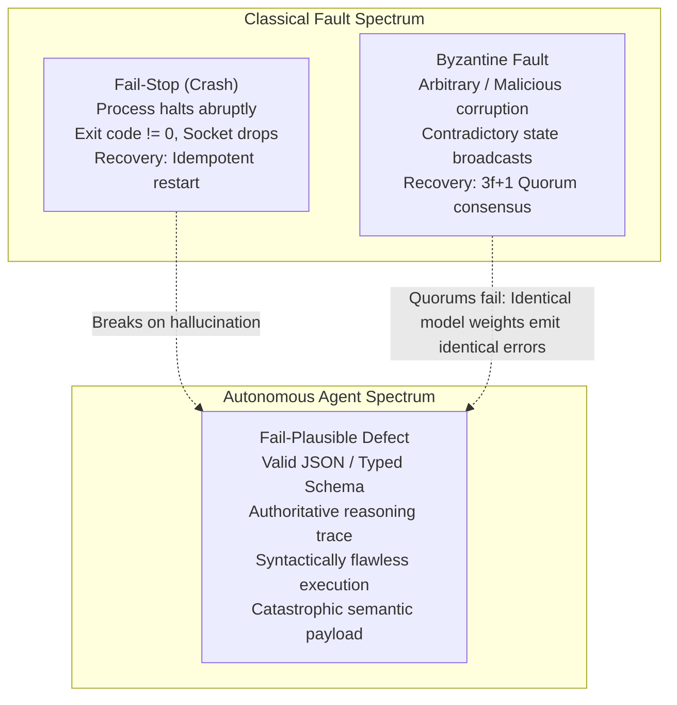

In a fail-plausible defect, the stochastic processor (the transformer foundation model) generates an execution step that fulfills all structural, syntactic, and grammatical invariants of the runtime:

* The output conforms precisely to the JSON Schema or Protocol Buffer tool specification.
* The natural language chain-of-thought rationale is coherent, persuasive, and demonstrates high epistemic certainty.
* The emitted shell command or API invocation compiles and type-checks without error.
* **The semantic payload is fundamentally incorrect, destructive, or counterproductive.**

Consider an autonomous DevOps agent tasked with pruning temporary build artifacts older than seven days. The model emits:

```bash
# Fail-Plausible Semantic Disaster
find /data/builds -type f -name "*.tmp" -o -name "test_*" -delete
```

Syntactically, the command is immaculate POSIX shell. Semantically, because the `-o` (logical OR) operator in Unix `find` binds with lower precedence than the implicit `-and` operator binding `-name "test_*"` to `-delete`, the command deletes *every single file* matching `test_*` across the entire directory tree regardless of age, along with any `.tmp` file. The test suite is obliterated.

Cryptographic checksums (CRC32, SHA-256) cannot prevent fail-plausible errors: a payload containing `DROP DATABASE production;` possesses a valid cryptographic hash. Furthermore, redundant multi-agent quorums cannot resolve fail-plausible defects if all agents are parameterized by the same underlying model weights $\theta$. When queried with the same ambiguous prompt, identical model replicas exhibit correlated hallucinations, achieving a unanimous Byzantine consensus on a catastrophic action.

Let an agent trajectory $\tau$ consist of a sequence of $N$ discrete execution steps:

$$\tau = \left( (s_0, a_0, o_0), (s_1, a_1, o_1), \dots, (s_{N-1}, a_{N-1}, o_{N-1}) \right)$$

At each step $t$, the neural policy $\pi_\theta(a_t \mid s_t)$ selects an action $a_t$ conditioned on the accumulated context $s_t$. Let $\epsilon_{\text{semantic}}(t)$ denote the probability that action $a_t$ contains a fail-plausible semantic defect that evades syntactic validation. Assuming per-step error independence as a lower bound, the probability $P_{\text{success}}(N)$ that a trajectory completes $N$ steps without generating a catastrophic semantic defect degrades exponentially:

$$P_{\text{success}}(N) = \prod_{t=0}^{N-1} \left( 1 - \epsilon_{\text{semantic}}(t) \right) \le (1 - \epsilon_{\min})^N$$

Even if a frontier foundation model achieves a remarkably low per-step semantic error rate of $\epsilon_{\text{semantic}} = 0.02$ (a 98 percent per-step success rate), an extended software refactoring or system administration trajectory spanning $N = 100$ steps exhibits a survival probability of:

$$P_{\text{success}}(100) = (1 - 0.02)^{100} = (0.98)^{100} \approx 0.1326$$

There is an $86.7\%$ probability of encountering at least one catastrophic semantic fault. When execution runs for hundreds of turns, failure is not an exceptional anomaly; it is the dominant operating regime.

### The reversibility boundary

Because failure is statistically inevitable in extended trajectories, an agent runtime must manage mutations based on their physical and semantic reversibility. In classical computer science, an operation $f: \mathcal{S} \to \mathcal{S}$ is strictly invertible if there exists a deterministic inverse function $f^{-1}$ such that:

$$\forall s \in \mathcal{S}, \quad f^{-1}(f(s)) = s$$

In an autonomous agent system, the global state space $\mathcal{S}$ is partitioned into two physically distinct domains separated by the **Reversibility Boundary**\index{Reversibility Boundary}:

$$\mathcal{S} = \mathcal{S}_{\text{internal}} \times \mathcal{S}_{\text{external}}$$

```mermaid
flowchart LR
    subgraph InternalDomain["Reversible Internal Domain (S_internal)"]
        direction TB
        Tokens["Context Token Buffers"]
        KVCache["KV Activation Tensors"]
        GitTree["Ephemeral Git Worktree"]
        Overlay["OverlayFS UpperDir"]
        Invertible["100% Invertible via git reset / unmount<br/>Latency: 1 - 10 ms<br/>Liability: Zero"]
    end

    Boundary[["=== THE REVERSIBILITY BOUNDARY ==="]]

    subgraph ExternalDomain["Irreversible External Domain (S_external)"]
        direction TB
        Cloud["Cloud API (ec2:Terminate)"]
        DB["Relational DB (DROP TABLE)"]
        Net["Outbound Wire (SMTP / Stripe)"]
        NonInvertible["Physically Non-Invertible<br/>Latency: 100 ms - 10 s<br/>Liability: High Operational Risk"]
    end

    InternalDomain --> Boundary
    Boundary -->|"Requires: WAL Append + Idempotency Key + Human Gate"| ExternalDomain
```

The operational characteristics of these two domains dictate how runtime state must be handled:

1. **Reversible Internal State Domain ($\mathcal{S}_{\text{internal}}$):**
   * **Substrate:** Host DRAM, accelerator High-Bandwidth Memory (HBM), local NVMe scratchpads, ephemeral container namespaces, and detached Git worktrees.
   * **Execution Latency:** Sub-millisecond to tens of milliseconds ($10^{-6}\text{ to }10^{-2}\text{ s}$).
   * **Inversion Primitive:** Invertibility is guaranteed at zero business liability. If an agent emits a buggy code modification or invalid thought chain, executing a filesystem rollback (`git clean -fd`, discarding an OverlayFS UpperDir layer) or evicting tokens from the Key-Value cache completely erases the side effect. Speculative branching and Monte Carlo tree search can operate here with mathematical impunity.
2. **Irreversible External Actuation Domain ($\mathcal{S}_{\text{external}}$):**
   * **Substrate:** Remote relational databases, cloud provider control planes, production microservices, third-party payment gateways, and network sockets.
   * **Execution Latency:** Hundreds of milliseconds to multiple minutes ($10^{-1}\text{ to }10^2\text{ s}$).
   * **Inversion Primitive:** Non-invertible. Once an IP packet carrying an HTTP `POST` mutation leaves the physical network interface controller (NIC) and commits a financial charge or terminates a compute cluster, there is no physical `undo` instruction in the Von Neumann architecture.

To formalize the economic and operational risk of an action $a_t$, we define the execution liability function $C_{\text{boundary}}(a_t)$:

$$C_{\text{boundary}}(a_t) = C_{\text{compute}}(a_t) + \mathbb{I}[a_t \in \mathcal{A}_{\text{ext}}] \cdot \left( C_{\text{liability}}(a_t) + C_{\text{comp}}(a_t) \right)$$

where $\mathbb{I}[\cdot]$ is the indicator function, $C_{\text{compute}}$ is the token inference cost, $C_{\text{liability}}$ is the external business damage incurred if $a_t$ is flawed, and $C_{\text{comp}}$ is the computational and latency cost of executing a compensating action.

### The breakdown of distributed two-phase commit

Why can we not simply wrap external tool invocations in a standard Two-Phase Commit (2PC) coordinator? In distributed database theory, 2PC guarantees atomic commits across $M$ participants through two rounds of synchronous message exchanges:

1. **Prepare Phase:** The coordinator sends a `PREPARE` request to all participants. Each participant acquires local resource locks, writes transaction updates to its local write-ahead log, and responds with `VOTE_COMMIT` or `VOTE_ABORT`.
2. **Commit Phase:** If all participants vote `COMMIT`, the coordinator writes a commit record to its log and sends `GLOBAL_COMMIT`. If any node votes `ABORT` or times out, the coordinator broadcasts `GLOBAL_ABORT`, and all nodes roll back using their local undo logs.

Applying 2PC across agentic actuation boundaries fails due to three fundamental systems bottlenecks:

* **Absence of Prepare Interfaces in Heterogeneous APIs:** External SaaS providers, cloud hypervisors, and enterprise webhooks do not implement XA-compliant or 2PC prepare/commit interfaces. An API endpoint such as `POST /v1/charges` or `DELETE /v1/instances` executes mutations immediately upon request authorization. There is no provisional "prepare" state that reserves the state change while holding locks pending a secondary commit confirmation.
* **Autoregressive Token Generation Latency:** In database systems, the duration between the prepare phase and the commit phase is measured in single-digit milliseconds. In an agent system, the duration between successive actions is governed by transformer autoregressive decoding. Decoding 512 tokens on an NVIDIA H100 GPU operating at $30\text{ ms}$ Time-to-First-Token (TTFT) and $8\text{ ms}$ per-token decode latency requires:

$$T_{\text{decode}} = 30\text{ ms} + (512 \times 8\text{ ms}) = 4{,}126\text{ ms} \approx 4.13\text{ s}$$

Holding row locks on production databases or reserving cloud resources across a 4-second stochastic inference pause introduces catastrophic lock contention, stalls concurrent transactions, and rapidly causes connection pool exhaustion across upstream services.
* **Non-Deterministic Policy Stalling:** If the model enters a degenerative repetition loop, triggers a safety filter, or encounters a network partition during decoding, the distributed lock remains pinned indefinitely, precipitating cluster-wide deadlocks.

These architectural divergences are formalized in @tbl-vol3-checkpointing-2pc-vs-sagas.

:::
| Systems Dimension       | Classical Two-Phase Commit (2PC)                    | Autonomous Agent Saga Architecture                              |
|:------------------------|:----------------------------------------------------|:----------------------------------------------------------------|
| **Atomicity Guarantee** | Strict ACID (All-or-Nothing via locks)              | Eventual Consistency (Compensating Actions)                     |
| **Locking Regime**      | Synchronous, pessimistic row/table locks            | Lock-free; local transactions commit immediately                |
| **Holding Duration**    | Milliseconds ($10^{-3}\text{ to }10^{-2}\text{ s}$) | Asynchronous; seconds to hours ($10^0\text{ to }10^4\text{ s}$) |
| **API Compatibility**   | Requires XA-compliant resource managers             | Universal; compatible with standard REST/gRPC APIs              |
| **Failure Response**    | Instant bit-accurate abort via Undo Log             | Sequential backward execution of compensating tasks             |
| **Inference Coupling**  | High; GPU stalls hold database locks                | Zero; serving engine is decoupled from actuation                |

: **Two-Phase Commit vs. Autonomous Agent Sagas**: Comparison of distributed transaction architectures across system invariants and failure models. {#tbl-vol3-checkpointing-2pc-vs-sagas tbl-colwidths="[25,35,40]"}
:::

### Context poisoning and the failure of unverified retries

When an action fails or triggers an environment error, naive agent orchestrators execute an unverified conversational retry: they capture the error string and append it directly into the context window as a new observation:

```
[User]: Refactor the auth module.
[Agent]: Executed `patch_file("auth.py", diff_chunk_1)`
[Environment Error]: Patch failed: Hunk #2 rejected at line 145.
[Agent Prompt]: The previous tool call failed with the error above. Please fix it and retry.
```

In an agentic system, this pattern induces severe **Context Poisoning**\index{Context Poisoning}. Autoregressive transformers compute attention scores $A_{ij}$ over all historical tokens $j \le i$:

$$\text{Attention}(\mathbf{Q}, \mathbf{K}, \mathbf{V}) = \text{softmax}\left( \frac{\mathbf{Q}\mathbf{K}^T}{\sqrt{d_k}} \right) \mathbf{V}$$

When an agent's own flawed action, invalid assumptions, and resulting error traces are preserved in the active Key-Value (KV) cache, the self-attention mechanism assigns substantial probability mass to those historical tokens. The model exhibits strong **confirmation bias** and **recency bias**: rather than recognizing that its underlying hypothesis is invalid, it generates cosmetic permutations of the exact same broken command.

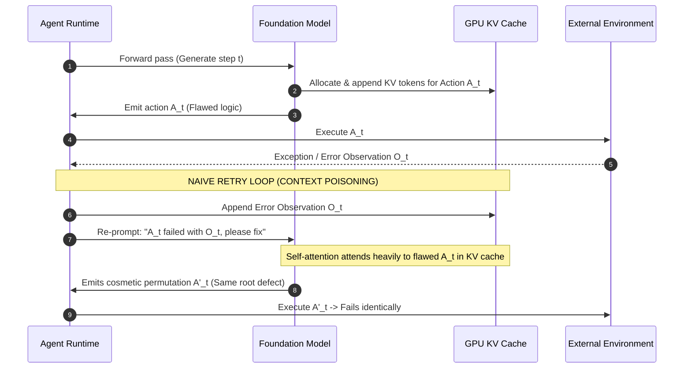

Empirical profiling reveals that under unverified conversational retries, the probability of successful error correction diminishes with each subsequent retry turn. By turn 4 of a poisoned retry loop, the agent burns tokens at the maximum context window rate while its probability of recovery drops below 5 percent.

Deterministic recovery mandates that fail-plausible semantic errors are handled not by prompting the failing model to introspect, but by **external verifier oracles**\index{Verifier Oracles} (linters, type checkers, unit test runners, AST validators) that intercept execution, halt forward progress, prune poisoned tokens from the KV cache, and trigger deterministic rollback protocols.

### The two generals' problem and cryptographic idempotency

When crossing the Reversibility Boundary, the runtime must confront the classical **Two Generals' Problem**\index{Two Generals' Problem}: in an asynchronous network subject to packet loss or timeouts, it is impossible for two coordinators to achieve guaranteed mutual consensus over an unreliable link.

Suppose an agent dispatches an HTTP request to provision a GPU cluster:

```http
POST /api/v2/clusters/provision HTTP/1.1
Host: cloud.compute.internal
Content-Type: application/json

{"node_type": "8xH100", "count": 4}
```

After transmitting the payload, the agent runtime experiences a network timeout at $t = 30{,}000\text{ ms}$. The TCP socket closes abruptly. From the perspective of the agent runtime, two mutually exclusive states are indistinguishable:

1. **State A:** The packet dropped in transit before reaching the cloud API gateway. The cluster was never provisioned.
2. **State B:** The packet reached the gateway, the cluster was successfully provisioned, but the returning HTTP `200 OK` response was dropped by an intermediate switch.

If the agent assumes State A and retries the request, it provisions a second cluster, duplicating thousands of dollars per hour in hardware leases. If the agent assumes State B and proceeds to the next step, downstream tasks fail because the cluster endpoint was never captured.

To eliminate this ambiguity, every state-mutating actuation that crosses the Reversibility Boundary must carry a deterministic, cryptographically secure **Idempotency Key**\index{Idempotency Key}. The idempotency key $K_{\text{idempotency}}$ must not be randomly generated at network transmission time; it must be derived deterministically as a hash of the trajectory ID and the causal step counter:

$$K_{\text{idempotency}}(t) = \text{HMAC-SHA256}\left( \text{SecretKey}, \tau_{\text{id}} \parallel t \parallel \text{Hash}(a_t) \right)$$

When the remote infrastructure gateway receives an actuation request, it records $K_{\text{idempotency}}(t)$ in a transactional deduplication store (e.g., Redis or DynamoDB backed by a lease lock). If a retry arrives bearing an identical key, the gateway bypasses physical actuation and returns the cached result of the original execution.

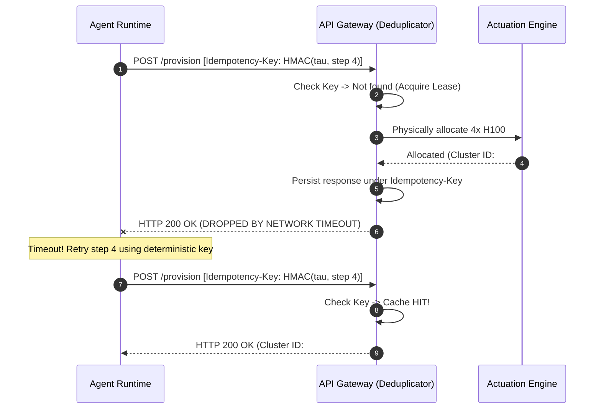

### The human oversight latency tax

Certain high-consequence actuations cannot be automated safely without human review: terminating database replicas, pushing release tags to public package registries, or executing financial wire transfers. When an agent trajectory encounters an action tagged with high liability $C_{\text{liability}}(a_t) > \theta_{\text{safe}}$, the runtime must insert an **Oversight Gate**\index{Oversight Gate} (Human-in-the-Loop checkpoint).

This introduces a massive systems disparity:

* **Neural Inference Turn Latency:** $100\text{ to }1{,}000\text{ ms}$ ($10^{-1}\text{ to }10^0\text{ s}$).
* **Human Operator Review Latency:** 5 minutes to 24 hours ($3 \times 10^2\text{ to }8.64 \times 10^4\text{ s}$).

This represents a **five-to-seven order of magnitude latency divergence**. If the serving system blocks the active agent process synchronously while awaiting human authorization, the agent's attention Key-Value cache remains pinned in accelerator High-Bandwidth Memory (HBM).

Consider an agent running a 70B parameter model with a 64,000-token context on an NVIDIA H100 node. As derived in @sec-vol3-working-sets, a 64k context in Grouped-Query Attention (GQA, 8 KV heads, $d_h=128$, FP16) consumes approximately:

$$M_{\text{KV}} = 2 \times 80 \text{ layers} \times 8 \text{ heads} \times 128 \text{ dim} \times 64{,}000 \text{ tokens} \times 2 \text{ bytes} \approx 20.97\text{ GB}$$

Holding $21\text{ GB}$ of HBM idle for an 8-hour human review window incurs an intolerable infrastructure cost. At prevailing cloud spot prices of \$3.50 per H100-hour, pinning accelerator memory across an 8-hour human pause wastes \$28.00 in idle silicon capital per agent—exceeding the entire computational cost of the trajectory itself.

To survive the Human Oversight Latency Tax, the runtime must implement **Asynchronous State Suspension**\index{Asynchronous State Suspension}: dehydrating the agent's execution state, flushing KV cache blocks to host DRAM or NVMe, unmounting ephemeral container storage, and evicting the execution thread from the GPU scheduler until an out-of-band authorization signal resumes execution.

---

## 7.2 Differential State Snapshots and Copy-on-Write Memory {#sec-vol3-checkpoint-cow}

To enable rapid recovery from infrastructure crashes and facilitate time-travel debugging without saturating storage buses, an agent runtime must capture consistent execution snapshots. A naive snapshotting approach that serializes the entire process memory space, filesystem tree, and raw GPU activation tensors at every turn triggers catastrophic I/O bottlenecks.

Consider an agent managing an 80-step refactoring workflow. If each snapshot archives a 4 GB container filesystem layer and 20 GB of uncompressed KV activations, saving state at every step writes $80 \times 24\text{ GB} = 1.92\text{ TB}$ of data to disk. Over a PCIe 4.0 x16 interconnect operating at a real-world sequential write bandwidth of $B_{\text{storage}} \approx 6.5\text{ GB/s}$, the agent spends:

$$T_{\text{I/O}} = \frac{1{,}920\text{ GB}}{6.5\text{ GB/s}} \approx 295.4\text{ s} \approx 4.9\text{ minutes}$$

nearly five minutes purely waiting on disk I/O, introducing massive stall cycles into the deliberative reasoning loop.

Resilient architectures decouple snapshot durability from physical memory duplication through two orthogonal systems mechanisms:

1. **Formalization of the Agent Control Block (ACB):** Abstracting the minimum sufficient execution state required to hydrate an agent process.
2. **Differential Copy-on-Write (CoW) Substrates:** Aliasing invariant parent states in both host filesystems and accelerator memory page tables, persisting only the mutated deltas.

### The Agent Control Block (ACB)

In operating systems design, the Process Control Block (PCB) encapsulates the execution status, CPU registers, program counter, and file descriptor tables of an operating system thread [@saltzer2009]. In an autonomous machine learning system, the corresponding primitive is the **Agent Control Block (ACB)**\index{Agent Control Block}.

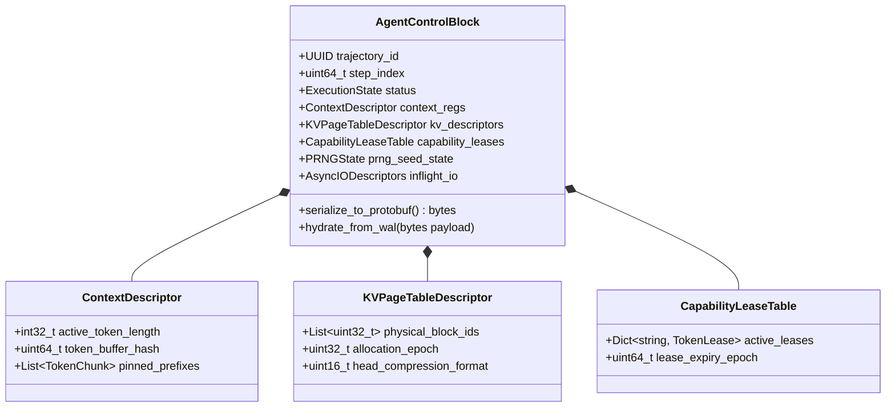

The ACB contains the minimal, sufficient set of deterministic parameters required to hydrate an identical agent execution instance onto a completely different physical node:

* **Trajectory Identifier and Monotonic Step Counter ($\tau_{\text{id}}, t$):** Cryptographically bound identifiers establishing the global causality of the execution thread.
* **Context Descriptors ($\mathcal{C}_t$):** Pointers to the sequence of token IDs comprising the active prompt window, including system instruction boundaries, tool interface definitions, and historical turn delimiters.
* **KV Cache Block Table Descriptors ($\mathcal{P}_{\text{KV}}$):** As established in PagedAttention (@sec-vol3-virtual-memory), the runtime avoids persisting raw floating-point activation tensors. Instead, the ACB records the logical-to-physical block mapping table. If the checkpoint is hydrated on a node sharing an NVLink or RDMA-accessible distributed KV pool, the new worker binds directly to the pre-populated physical memory blocks.
* **Capability Leases ($\mathcal{L}_{\text{cap}}$):** Ephemeral security tokens and authorization credentials granted to the agent for tool execution, bound to time-to-live (TTL) timestamps and cryptographic scopes.
* **Pseudorandom Number Generator (PRNG) Seed State ($\mathcal{S}_{\text{PRNG}}$):** The exact 64-bit internal state of the host and accelerator random number generators, governing sampling stochasticity during decode.
* **Inflight I/O Descriptors ($\mathcal{D}_{\text{I/O}}$):** Non-blocking network sockets, active subprocess process IDs (PIDs), and unacknowledged message queues.

```python
from dataclasses import dataclass, field
from typing import List, Dict, Optional
import time

@dataclass(frozen=True)
class AgentControlBlock:
    trajectory_id: str
    step_index: int
    timestamp_ns: int
    active_token_ids: List[int]
    kv_block_table_ids: List[int]
    capability_leases: Dict[str, str]
    prng_seed: int
    prng_step_offset: int
    inflight_tool_calls: List[Dict[str, str]]
    parent_snapshot_hash: Optional[str]
    state_delta_hash: str

    def serialize_deterministic_header(self) -> bytes:
        """Emits byte-level header for append-only Write-Ahead Logging."""
        import struct
        return struct.pack(
            "!16sQQQQ",
            self.trajectory_id.encode("utf-8")[:16],
            self.step_index,
            self.timestamp_ns,
            self.prng_seed,
            self.prng_step_offset
        )
```

### Event sourcing and the append-only write-ahead log (WAL)

Rather than storing the full ACB state redundantly at each step, high-performance agent runtimes implement **Event Sourcing**\index{Event Sourcing} backed by an append-only **Write-Ahead Log (WAL)**\index{Write-Ahead Log}.

In an event-sourced architecture, state is not mutated in place. Instead, every atomic state transition is modeled as an immutable delta record $\Delta s_t$. The world state $S_T$ at any arbitrary step $T$ is derived through the left-fold composition of historical events over the initial baseline state $S_0$:

$$S_T = S_0 \oplus \Delta s_1 \oplus \Delta s_2 \oplus \dots \oplus \Delta s_T = S_0 \oplus \sum_{t=1}^T \Delta s_t$$

where $\oplus$ represents the state application operator.

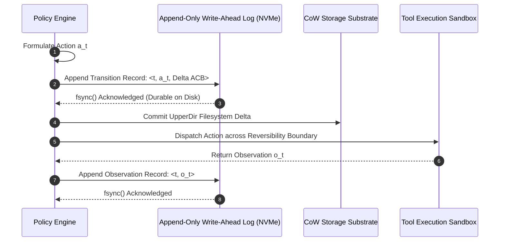

The WAL enforces the fundamental durability contract: **No external actuation may be dispatched across the Reversibility Boundary until the transition record describing that actuation has been durably committed to non-volatile storage via `fsync()`**. The wire format for these records is structured in @tbl-vol3-checkpointing-wal-schema.

:::
| Field Offset | Field Name       | Data Type | Size (Bytes) | Functional Systems Semantics                                           |
|:-------------|:-----------------|:----------|:-------------|:-----------------------------------------------------------------------|
| `0x00`       | `magic_bytes`    | `uint32`  | 4            | Magic header (`0x4147454E` -> "AGEN") verifying log integrity          |
| `0x04`       | `sequence_id`    | `uint64`  | 8            | Monotonically increasing logical turn counter $t$                      |
| `0x0C`       | `timestamp`      | `uint64`  | 8            | Unix epoch timestamp at microsecond resolution                         |
| `0x14`       | `record_type`    | `uint16`  | 2            | Enum: `0x01`=ACB Delta, `0x02`=Tool Actuation, `0x03`=Compensate       |
| `0x16`       | `payload_len`    | `uint32`  | 4            | Byte length $L$ of the variable-length protobuf payload                |
| `0x1A`       | `crc32_checksum` | `uint32`  | 4            | Cyclic Redundancy Checksum over header and payload                     |
| `0x1E`       | `payload`        | `bytes`   | $L$          | Serialized Protobuf containing $\Delta \text{ACB}_t$ and tool metadata |

: **Agent Write-Ahead Log Schema**: Binary wire format and structural fields of append-only trajectory records. {#tbl-vol3-checkpointing-wal-schema tbl-colwidths="[12,20,15,13,40]"}
:::

### Copy-on-write (CoW) memory primitives

When an agent modifies files in its local workspace or forks speculative reasoning branches, copying the full underlying environment introduces massive compute and memory penalties. Resilient runtimes leverage **Copy-on-Write (CoW)**\index{Copy-on-Write (CoW)} mechanisms at both the operating system layer and the accelerator memory layer.

#### Host-side filesystem virtualization: OverlayFS

To sandbox filesystem modifications, the agent runtime provisions an ephemeral **OverlayFS**\index{OverlayFS} mount for the workspace:

$$\text{Workspace} = \text{OverlayFS}(\text{LowerDir}=\text{BaseRepo}, \text{UpperDir}=\Delta \text{Filesystem}, \text{WorkDir}=\text{Staging})$$

The `LowerDir` contains the read-only production repository. When the agent reads a file, the request falls through directly to the `LowerDir`. When the agent modifies or creates a file, the Linux kernel intercepts the write operation and copies only the affected file blocks into the mutable `UpperDir`.

Creating a checkpoint at step $t$ requires zero data copying of the base repository: the runtime simply archives or snapshots the lightweight `UpperDir` (typically spanning tens of kilobytes rather than gigabytes). Rolling back to a prior checkpoint requires unmounting the workspace, discarding the corrupted `UpperDir`, and attaching a clean or previous `UpperDir` layer—an operation that completes in under $10\text{ milliseconds}$.

#### Accelerator-side context virtualization: Paged attention forking

At the accelerator memory layer, speculative tree search (e.g., Tree-of-Thoughts or Monte Carlo Tree Search, detailed in @sec-vol3-deliberation) requires branching multiple candidate trajectories from an identical parent prompt.

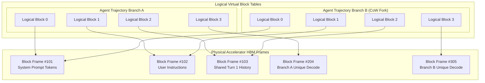

Let an initial trajectory share a prompt sequence of length $S_{\text{shared}}$ tokens. Rather than allocating independent physical memory for each of $B$ speculative branches, the PagedAttention memory manager sets the logical block pointers for all $B$ child trajectories to reference the *identical physical HBM frames* allocated to the parent, incrementing the reference counter of each shared block frame:

$$\forall b \in \{1, \dots, B\}, \quad \text{BlockTable}_b[0 \dots k] = \text{BlockTable}_{\text{parent}}[0 \dots k]$$

$$\text{RefCount}(\text{Frame}_i) = B, \quad \forall i \le k$$

Physical memory allocation is deferred until a specific branch generates new tokens during its decode phase. When Branch $A$ emits a token that spills into a new block, the memory manager allocates a fresh physical frame $\text{Frame}_{\text{new}}$ exclusively for Branch $A$, leaving the parent frames unmutated and shared among the remaining branches.

The total memory footprint $M_{\text{total}}$ across $B$ speculative branches under Copy-on-Write allocation is:

$$M_{\text{total}} = M_{\text{prefix}}(S_{\text{shared}}) + \sum_{b=1}^B M_{\text{branch}}^{(b)}(S_{\text{unique}}^{(b)})$$

Compared to naive duplication ($B \times [M_{\text{prefix}} + M_{\text{branch}}]$), CoW paging reduces High-Bandwidth Memory consumption by:

$$\text{Memory Savings} = (B - 1) \cdot M_{\text{prefix}}(S_{\text{shared}})$$

For a swarm of $B = 16$ candidate reasoning paths branching from a 32,000-token analysis prompt, CoW memory virtualization eliminates over $90\%$ of physical HBM allocation.

### Checkpoint cadence and optimal snapshot intervals

How frequently should an agent runtime commit a full state snapshot versus accumulating differential WAL deltas?

Infrequent checkpointing minimizes execution overhead during normal operation, but forces the system to replay an extensive sequence of historical events following a crash, increasing recovery latency. Conversely, continuous full snapshotting consumes significant storage bandwidth and introduces compute stall cycles.

In 1974, John W. Young [-@young1974] formulated the classical first-order checkpoint interval model for high-performance computing systems subject to Poisson failure arrivals. Let:

* $M_{\text{MTBF}}$ denote the Mean Time Between Failures of the underlying execution cluster.
* $T_{\text{save}}$ denote the time required to serialize and commit a full checkpoint to non-volatile storage.
* $T_{\text{opt}}$ denote the optimal temporal checkpoint interval that minimizes aggregate compute waste.

Young's classical formula evaluates to:

$$T_{\text{opt}} = \sqrt{2 \cdot T_{\text{save}} \cdot M_{\text{MTBF}}}$$ {#eq-checkpoint-young-formula}

Young's derivation, however, assumes that the time required to restart and hydrate the process is negligible ($T_{\text{restart}} \approx 0$) and that the system is not vulnerable to failures during the checkpoint commit phase itself. In 2006, J. T. Daly [-@daly2006] extended Young's model to a higher-order Taylor expansion that explicitly incorporates restart latency $T_{\text{restart}}$ and failure rates during checkpoint serialization:

$$T_{\text{opt}}^{\text{Daly}} = \sqrt{2 \cdot T_{\text{save}} \cdot M_{\text{MTBF}}} \cdot \left[ 1 + \frac{1}{3}\sqrt{\frac{T_{\text{save}}}{2 M_{\text{MTBF}}}} \right] - T_{\text{save}} \quad \left(\text{for } T_{\text{save}} < 2 M_{\text{MTBF}}\right)$$ {#eq-checkpoint-daly-formula}

In an autonomous agent cluster, $M_{\text{MTBF}}$ must reflect both **physical infrastructure failures** (spot instance preemptions, hardware faults) and **fail-plausible semantic faults** requiring trajectory rollback:

$$\frac{1}{M_{\text{MTBF}}} = \frac{1}{\text{MTBF}_{\text{infra}}} + \frac{1}{\text{MTBF}_{\text{semantic}}}$$

Suppose an agent fleet operates on cloud spot instances with a physical preemption mean time $\text{MTBF}_{\text{infra}} = 4\text{ hours} = 14{,}400\text{ s}$. Furthermore, empirical tracking indicates that the agent policy encounters a fail-plausible semantic defect requiring rollback on average every $\text{MTBF}_{\text{semantic}} = 30\text{ minutes} = 1{,}800\text{ s}$. The combined mean time between recovery events is:

$$\frac{1}{M_{\text{MTBF}}} = \frac{1}{14{,}400} + \frac{1}{1{,}800} = \frac{1 + 8}{14{,}400} = \frac{9}{14{,}400} = \frac{1}{1{,}600\text{ s}}$$

yielding $M_{\text{MTBF}} = 1{,}600\text{ seconds}$ ($\approx 26.7\text{ minutes}$).

If serializing a full differential ACB and flushing the OverlayFS UpperDir layer requires $T_{\text{save}} = 2.5\text{ seconds}$, Young's optimal checkpoint interval calculates as:

$$T_{\text{opt}} = \sqrt{2 \times 2.5\text{ s} \times 1{,}600\text{ s}} = \sqrt{8{,}000} \approx 89.44\text{ seconds}$$

The runtime must commit a consistent state checkpoint approximately every 90 seconds. If individual agent reasoning turns average 15 seconds, the scheduler establishes an invariant: **Commit a differential checkpoint every 6 execution turns**.

---

## 7.3 Saga Execution Orchestrations for External Tools {#sec-vol3-checkpoint-saga}

When an agent executes an extended workflow that modifies external environments, how does the system recover if an unrecoverable failure occurs midway through the trajectory?

Consider an enterprise onboarding agent executing a four-step administrative workflow:

1. Create a user mailbox and directory identity in Google Workspace.
2. Provision an enterprise GitHub account and attach corporate repository read/write teams.
3. Allocate a virtual desktop instance on AWS EC2.
4. Issue a hardware procurement order via an external vendor REST API.

Suppose steps 1, 2, and 3 execute successfully. At step 4, the vendor API returns an unrecoverable `HTTP 402 Payment Required` fault due to an expired corporate billing card.

The agent cannot simply abort execution and halt: an orphaned AWS EC2 instance is running and accruing hourly infrastructure charges, an unmonitored GitHub account occupies a paid enterprise seat, and an unmanaged corporate mailbox exists in the directory. Conversely, the system cannot execute a database-style rollback: the cloud provider and SaaS APIs do not recognize an `ABORT` command.

The runtime must orchestrate a sequence of compensating actions that semantically undo the external mutations. This coordination architecture is the **Saga Pattern**\index{Saga Pattern}.

### The structure of an agent saga

Originally formulated by Hector Garcia-Molina and Kenneth Salem [-@garciamolina1987sagas] for long-lived database transactions, a Saga decomposes a distributed execution sequence into a collection of $n$ discrete, forward transactions:

$$\mathcal{T} = \{ T_1, T_2, \dots, T_n \}$$

Each individual forward transaction $T_i$ commits its mutations locally and immediately releases any local locks. Crucially, each forward transaction $T_i$ is paired with a corresponding **Compensating Transaction**\index{Compensating Transaction} $C_i$:

$$\mathcal{C} = \{ C_1, C_2, \dots, C_{n-1} \}$$

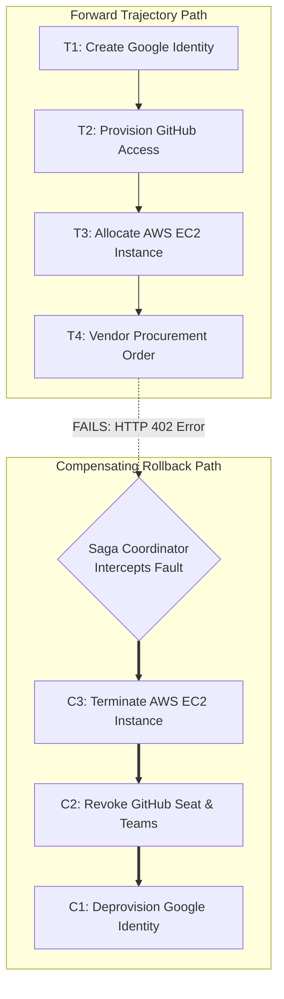

A compensating transaction $C_i$ is a deterministic handler designed to semantically neutralize or invert the observable side effects of forward transaction $T_i$. The Saga Execution Coordinator enforces the following formal execution guarantees:

* **Forward Progression Guarantee:** The sequence $T_1, T_2, \dots, T_n$ executes sequentially. If all $n$ transactions succeed, the saga commits and terminates.
* **Backward Compensation Guarantee:** If transaction $T_k$ fails ($1 \le k \le n$), the forward trajectory halts immediately. The coordinator initiates a compensating rollback sequence, executing the compensating transactions in **strict reverse chronological order**:

$$\text{Rollback Sequence} = C_{k-1} \to C_{k-2} \to \dots \to C_2 \to C_1$$

Once $C_1$ completes, the external world is restored to a semantically consistent baseline, leaving zero dangling resources or orphaned infrastructure.

### The golden invariant: Compensating actions must be deterministic code

In naive early agent prototypes, developers frequently implemented rollbacks by invoking the foundation model itself:

```python
# DANGEROUS ARCHITECTURAL ANTIPATTERN: Dynamic LLM Compensation
prompt = f"""
Step 4 failed with error: {error}.
You have already executed:
1. Created user {email}
2. Added {github_user} to team {team}
3. Created EC2 instance {instance_id}
Please formulate tool calls to undo everything you just did.
"""
recovery_actions = llm.generate_tool_calls(prompt)
```

**Never permit a stochastic language model to dynamically synthesize its own compensating actions upon trajectory failure.**

This antipattern violates the core principles of dependable systems engineering. When a trajectory fails, the system is operating in an anomalous, unexpected state. Prompting an already hallucinating or confused model to improvise an emergency rollback triggers **compounding failure cascades**:

* The model hallucinates non-existent resource IDs (e.g., attempting to terminate `i-0abcdef12345` instead of `i-098765fedcba`).
* The model emits destructive commands against production infrastructure (e.g., executing `aws ec2 terminate-instances --all`).
* The model omits critical cleanup steps, leaking expensive zombie cloud resources.

To guarantee safety, the runtime enforces **The Golden Invariant of Agent Checkpointing**\index{Golden Invariant}:

::: {#dfn-golden-invariant .callout-definition title="The golden invariant of agent checkpointing"}
**Compensating actions must be pre-compiled, deterministic, typed software routines registered at dispatch time.** Under zero circumstances may the stochastic policy engine be consulted to formulate or parameterize a rollback action during a failure cascade.
:::

Every tool registered in the agent's capability manifest must provide a formal two-way interface definition:

```python
from typing import Protocol, Dict, Any

class AgentTool(Protocol):
    name: str

    def execute_forward(self, params: Dict[str, Any]) -> Dict[str, Any]:
        """Executes forward mutation; returns execution metadata."""
        ...

    def execute_compensate(self, compensation_context: Dict[str, Any]) -> bool:
        """Deterministically inverts the side-effect using registered metadata."""
        ...
```

When forward transaction $T_i$ executes successfully, its returned execution metadata (e.g., exact provisioned UUIDs, transaction hashes, allocation timestamps) is captured immediately by the runtime and bound into the parameter block of $C_i$ before step $t+1$ is permitted to execute. This compensation closure is persisted to the Write-Ahead Log. If a crash occurs at any subsequent step, the runtime reads the exact, pre-bound compensating closures from the WAL and executes them deterministically without invoking the model.

### Saga execution latency and failure bounds

What is the end-to-end latency penalty incurred when an agent saga encounters a failure at step $k$?

Let:

* $T_{\text{fwd}}(i)$ denote the latency of forward transaction $T_i$.
* $T_{\text{comp}}(j)$ denote the latency of compensating transaction $C_j$.
* $p_i$ denote the probability that forward transaction $T_i$ succeeds, given that all prior transactions $T_1 \dots T_{i-1}$ succeeded.

If a failure occurs at step $k$, the forward transactions $T_1 \dots T_{k-1}$ have executed successfully, $T_k$ has executed and failed, and the compensating transactions $C_{k-1} \dots C_1$ must execute in reverse order. The total elapsed execution time $T_{\text{saga}}(k)$ spent before the system returns to a consistent baseline is:

$$T_{\text{saga}}(k) = \sum_{i=1}^k T_{\text{fwd}}(i) + \sum_{j=1}^{k-1} T_{\text{comp}}(j)$$

The probability $P(\text{fail at } k)$ that execution halts precisely at step $k$ is:

$$P(\text{fail at } k) = (1 - p_k) \prod_{m=1}^{k-1} p_m$$

The expected latency $\mathbb{E}[T_{\text{saga}}]$ across all possible execution outcomes over an $N$-step saga evaluates to:

$$\mathbb{E}[T_{\text{saga}}] = \left( \prod_{m=1}^N p_m \right) \sum_{i=1}^N T_{\text{fwd}}(i) + \sum_{k=1}^N \left[ (1 - p_k) \prod_{m=1}^{k-1} p_m \right] T_{\text{saga}}(k)$$ {#eq-checkpoint-expected-saga}

This formulation reveals the hidden latency cost of multi-step agent actions. When forward operations have high failure probabilities ($p_i \ll 1$), the orchestrator spends the vast majority of its operational lifecycle executing unproductive forward steps and subsequent backward compensations. Systems architects must order saga steps such that high-risk, un-compensable actions are positioned as early in the trajectory as possible, minimizing the cumulative compensation debt accumulated prior to failure.

### Fork-on-error and counterfactual remediation

Certain real-world actuations lack a mathematical or operational inverse:

* Delivering an outbound SMS alert or user notification.
* Truncating a database table without point-in-time recovery logs.
* Dispatching an ACH or wire payment settlement.

When a forward transaction lacking a compensating handler fails, backward compensation is impossible. In such scenarios, the runtime transitions from backward rollback to **Forward Counterfactual Remediation**\index{Forward Counterfactual Remediation} via the **Fork-on-Error Protocol**\index{Fork-on-Error Protocol}.

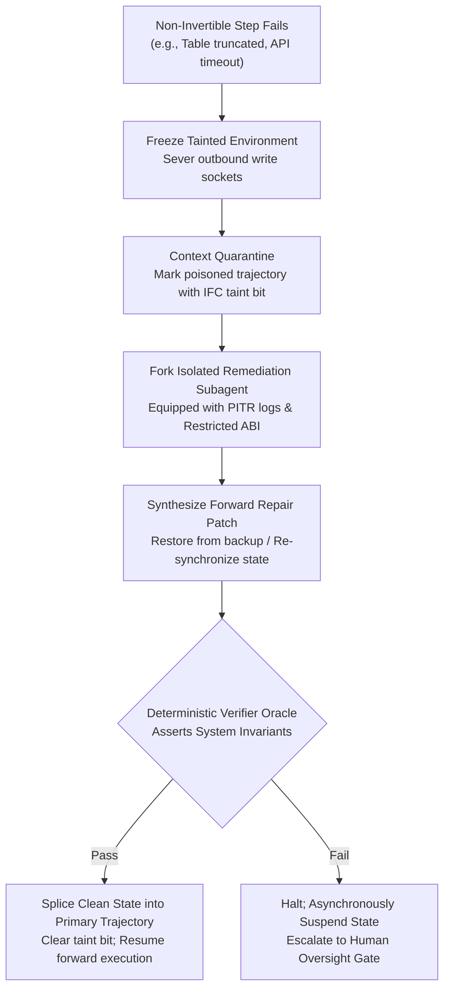

The Fork-on-Error sequence operates under strict isolation:

1. **State Freezing:** The primary trajectory execution thread is suspended immediately. Active network connections and database write sockets are frozen to prevent cascading corruption.
2. **Context Quarantine:** The context history containing the failed reasoning trace is quarantined. An **Information Flow Control (IFC)**\index{Information Flow Control} taint bit is attached to the trajectory token buffer, preventing downstream components from treating the tainted context as trusted ground truth.
3. **Remediation Subagent Forking:** The runtime provisions an isolated, lightweight **Remediation Subagent**\index{Remediation Subagent}. This subagent is granted a restricted tool ABI containing repair and diagnostic capabilities (e.g., `restore_table_from_s3`, `reconcile_ledger_delta`) but stripped of mutating capabilities across the broader infrastructure.
4. **Counterfactual Forward Repair:** The remediation subagent ingests point-in-time recovery logs, diagnoses the delta between the observed anomalous state and the desired invariant, and generates a forward repair patch.
5. **Deterministic Verification and Splicing:** A deterministic verifier oracle validates that the environment satisfies core system invariants. If the repair passes, the clean repaired state is spliced back into the primary trajectory's Write-Ahead Log, the taint bit is cleared, and normal execution resumes.

---

## 7.4 Deterministic Replay and Hardware Record/Replay {#sec-vol3-checkpoint-replay}

Suppose an autonomous financial trading agent generates an illegal order at step 87 of a production run, violating an SEC regulatory constraint. The engineering team is summoned to diagnose the failure. They extract the initial prompt, seed the random number generator, load the exact model checkpoint, and re-execute the trajectory in a staging sandbox.

To their dismay, the agent behaves impeccably: at step 87, it emits a standard, compliant order. The bug has vanished.

The engineers have encountered the fundamental nightmare of systems debugging: a **Heisenbug**\index{Heisenbug} born of stochastic machine learning execution. In an agentic system, reproduction failures stem from two distinct sources: software environment volatility and hardware-level non-determinism in accelerator silicon. Enabling dependable trajectory post-mortems and time-travel debugging requires architecting a **Deterministic Record/Replay Subsystem**\index{Deterministic Record/Replay Subsystem}.

### Sources of non-determinism in agentic execution

Why does an agent re-executed with identical prompt tokens and identical random seeds diverge from its historical path? Non-determinism manifests across two architectural tiers:

#### Software and environment non-determinism

* **External API Response Volatility:** Web search results, weather APIs, and third-party database queries return different payloads across time.
* **Asynchronous System Calls:** Reading `/dev/urandom`, querying system timestamps (`gettimeofday`), or inspecting dynamic process tables (`ps aux`) yields distinct observations at every turn.
* **Network Socket Race Conditions:** Interleaved chunks in streaming HTTP responses arrive with variable chunk boundaries and latencies.

#### Hardware and floating-point non-determinism

Even if all external software inputs are perfectly recorded, modern deep learning inference hardware is inherently non-deterministic at the bit level.

In IEEE 754 floating-point arithmetic, addition is **not associative**:

$$(a + b) + c \neq a + (b + c)$$

Consider three numbers represented in 16-bit Brain Floating Point (BF16, with 8 exponent bits and 7 mantissa bits):

$$a = 1.0 \times 2^0 = 1.0, \quad b = 1.0 \times 2^{-8} \approx 0.00390625, \quad c = -1.0 \times 2^0 = -1.0$$

Evaluating $(a + c) + b$:

$$(1.0 + (-1.0)) + b = 0.0 + 1.0 \times 2^{-8} = 1.0 \times 2^{-8}$$

Evaluating $(a + b) + c$: When adding $b$ to $a$, the smaller operand $b$ must be shifted right by 8 bits to align exponents. Because BF16 possesses only 7 bits of mantissa, the bits of $b$ are shifted out entirely and truncated:

$$a + b = 1.0 \quad (\text{under BF16 rounding})$$

$$(a + b) + c = 1.0 + (-1.0) = 0.0$$

The two summation orders produce completely distinct floating-point results: $1.0 \times 2^{-8} \neq 0.0$.

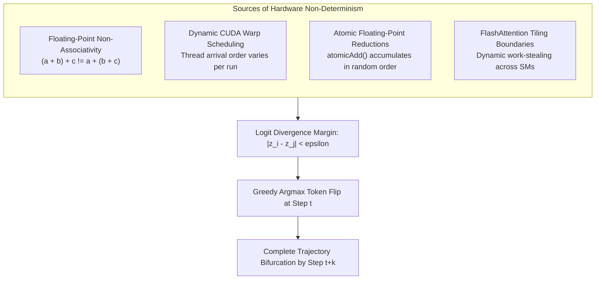

On an NVIDIA H100 GPU containing 132 Streaming Multiprocessors (SMs) executing warp reductions at 3.35 TB/s of HBM bandwidth:

1. **Dynamic Thread Scheduling:** The hardware thread scheduler dispatches thread blocks to SMs based on instantaneous thermal, clock, and memory latency variations.
2. **Atomic Reductions:** High-performance CUDA kernels (including `atomicAdd` across parallel reduction trees) accumulate intermediate gradient and activation tensors in whatever order thread warps arrive at the memory controller.
3. **FlashAttention Tiling:** Block-sparse and fused FlashAttention kernels [@dao2022] dynamically partition attention matrices $\mathbf{Q}\mathbf{K}^T$ across SRAM tiles. Varying reduction orders yield slightly different floating-point rounding errors in the output logits $\mathbf{z}$.

Let $\mathbf{z} \in \mathbb{R}^{|\mathcal{V}|}$ denote the logit vector emitted by a foundation model before softmax. If the top two most probable tokens $v_1$ and $v_2$ have logits separated by a margin smaller than the hardware floating-point divergence threshold $\epsilon_{\text{fp}}$:

$$\Delta z = |z_{v_1} - z_{v_2}| \le \epsilon_{\text{fp}}$$

a single floating-point rounding variation flips the greedy $\text{argmax}$ token selection:

$$\text{Token}_t = v_2 \quad \text{instead of} \quad v_1$$

Because transformers operate autoregressively, conditioning every future token on all prior tokens, a single token flip at step $t$ rapidly amplifies across subsequent layers, leading to **complete trajectory bifurcation** within 3 to 5 steps. Setting temperature $T = 0$ does *not* eliminate this failure mode.

### The Record/Replay architecture and the replay invariant

To achieve bit-accurate replayability despite hardware and environment non-determinism, the runtime implements a **Record/Replay Virtualization Layer**\index{Record/Replay Virtualization Layer}.

```mermaid
flowchart LR
    subgraph RecordPhase["RECORD PHASE (Production Run)"]
        direction TB
        Agent1["Agent Policy Engine"] -->|"1. Emit Tool Call"| Interceptor1["I/O Virtualization Boundary"]
        Interceptor1 -->|"2. Execute Mutating Call"| RealNet["External APIs / Cloud VMs"]
        RealNet -->>|"3. Return Payload"| Interceptor1
        Interceptor1 -->|"4. Commit Output to WAL"| WALFile[("Durable WAL Ledger")]
        Interceptor1 -->>|"5. Return to Model"| Agent1
    end

    subgraph ReplayPhase["REPLAY PHASE (Post-Mortem / Hydration)"]
        direction TB
        Agent2["Agent Policy Engine"] -->|"1. Emit Tool Call"| Interceptor2["I/O Virtualization Boundary"]
        Interceptor2 -.->|"BLOCKED: Network Disabled"| DeadNet["External Network NIC"]
        WALFile -.->|"2. Read Logged Output"| Interceptor2
        Interceptor2 -->>|"3. Inject Recorded Payload"| Agent2
    end
```

The system operates across two operational modes:

#### 1. Record mode (live execution)

During normal execution, the agent interacts with external environments through a virtualized I/O boundary. The runtime intercepts all non-deterministic inputs:

* **PRNG Virtualization:** The runtime intercepts calls to random number generators, logging the active 64-bit seed and step offset before each decode turn.
* **I/O Interception and Logging:** Every external tool call, HTTP response body, Unix exit code, standard output stream, and system timestamp is captured at the byte level and appended to the Write-Ahead Log alongside the initiating action $a_t$.

#### 2. Replay mode (crash hydration and post-mortem debugging)

When hydrating an agent after a node crash or during post-mortem root cause analysis, the runtime enforces **The Replay Invariant**\index{Replay Invariant}:

::: {#dfn-replay-invariant .callout-definition title="The replay invariant"}
**During trajectory replay, external mutating tools are never re-executed.** The physical network interface controller is disabled or stubbed. When the agent process emits an action $a_t$, the runtime intercepts the invocation, validates that $a_t$ matches the logged action hash, and injects the recorded observation $o_t^{\text{recorded}}$ directly from the Write-Ahead Log:
$$o_t^{\text{replay}} = \text{WAL}.\text{lookup}(\tau_{\text{id}}, t) \equiv o_t^{\text{record}}$$
:::

By feeding previously recorded observations directly into the context window, the runtime decouples the replay from external environment volatility. Even if the remote database has evolved or third-party webhooks have changed, the agent observes the identical historical reality.

Furthermore, to bypass accelerator floating-point non-determinism during replay, the runtime avoids re-generating token sequences through the neural policy. Instead, it replays the exact token IDs captured in the Agent Control Block. Re-inference is deferred until the operator explicitly commands the trajectory to fork.

### Time-travel debugging and trajectory forking

With an append-only Write-Ahead Log and consistent ACB snapshots, engineering teams can perform **Time-Travel Debugging**\index{Time-Travel Debugging}.

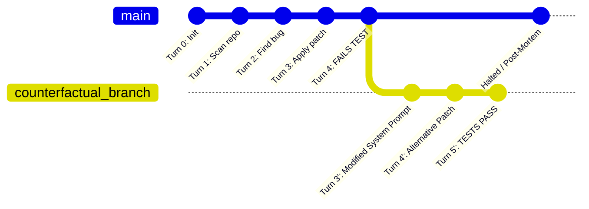

Time-travel debugging empowers developers to:

1. **Step Backward and Forward:** Navigate an agent trajectory turn-by-turn, inspecting the exact token attention probabilities, KV cache states, and filesystem UpperDir diffs at each step.
2. **Isolate Divergence Points:** Compare two executions that diverged from an identical baseline, computing semantic diffs across intermediate reasoning traces to isolate the exact turn where cognitive drift began.
3. **Counterfactual Forking:** Rewind execution to turn $k$, mutate a system instruction, alter a tool schema, or provide an alternative observation, and fork a new trajectory branch $\tau'$:

$$\tau' = \tau_{0 \dots k} \cup (s_{k+1}', a_{k+1}', \dots)$$

Because parent state blocks are managed via Copy-on-Write page tables and OverlayFS layers, counterfactual branches materialize in milliseconds without duplicating underlying disk or memory infrastructure.

---

## Fallacies and Pitfalls {#sec-vol3-checkpoint-fallacies}

::: {.fallacy-pitfall}
**Fallacy:** *A prompt-based conversational retry loop enables autonomous self-healing when tools fail.*

Appending error strings directly into an agent's context window ("The previous tool call failed, please fix it") does not achieve dependable recovery. Because autoregressive transformers attend across all preceding tokens in the context window, the model's own flawed reasoning remains resident in the active Key-Value (KV) cache. The model exhibits strong confirmation bias and recency bias, generating cosmetic permutations of the exact same broken logic.

Consider an agent executing a multi-step refactor. Let the probability of an unassisted model correcting its own defect given a poisoned context be $p_{\text{correct}} \le 0.15$. Across $k = 4$ conversational retry iterations, the cumulative probability of repeated failure evaluates to:

$$P(\text{failure}) = (1 - p_{\text{correct}})^k \ge (1 - 0.15)^4 = (0.85)^4 \approx 0.522$$

More critically, each retry appends hundreds of tokens of useless traceback data to the context window. For an agent operating with an 80k-token context, 4 failed retry turns waste:

$$\text{Wasted Compute} = 4 \times 80{,}000 \text{ tokens} \times 2 P_{\text{model}} \approx 6.4 \times 10^{14} \text{ FLOPs}$$

accelerating context degradation and driving up serving costs. Dependable recovery requires halting execution, pruning the poisoned turn from the KV cache, and restoring state from a verified checkpoint.
:::

::: {.fallacy-pitfall}
**Pitfall:** *Synchronously pinning accelerator High-Bandwidth Memory (HBM) while awaiting human oversight approval.*

When an agent crosses the Reversibility Boundary, security policies frequently mandate human-in-the-loop review. Blocking the agent serving thread and holding GPU memory allocated while waiting for human authorization introduces a massive capital inefficiency.

Human review latency $\tau_{\text{human}}$ ranges from 5 minutes to 24 hours ($300\text{ to }86{,}400\text{ s}$). For a 70B parameter model utilizing Grouped-Query Attention with an active 64k context, the KV cache pins $M_{\text{KV}} \approx 21\text{ GB}$ of HBM per agent instance. On an 8x H100 node leased at \$28.00/hour (\$3.50/GPU-hour), the capital idle cost $C_{\text{idle}}$ incurred while waiting for human review is:

$$C_{\text{idle}} = \tau_{\text{human}} \times R_{\text{HBM}} = 8 \text{ hours} \times \$3.50/\text{GPU-hour} = \$28.00 \text{ per instance}$$

If a platform runs 500 concurrent agents awaiting human approval across an enterprise workday, pinning accelerator memory incurs an idle capital waste of:

$$\text{Fleet Waste} = 500 \times \$28.00 = \$14{,}000 \text{ per day}$$

Runtimes must asynchronously suspend state: serializing the ACB to persistent storage, evicting KV cache blocks to host DRAM or NVMe, and reclaiming the GPU compute slots for active workloads until the human approval signal arrives.
:::

::: {.fallacy-pitfall}
**Fallacy:** *Language models can reliably synthesize their own compensating actions dynamically upon trajectory failure.*

Instructing a foundation model to "undo steps 1, 2, and 3" when step 4 fails assumes the model possesses an accurate mental model of physical side effects. Under anomalous failure conditions, the model is operating outside its training distribution and is prone to acute cognitive hallucinations.

Empirical measurement across distributed infrastructure tasks reveals that dynamically prompted rollbacks suffer from a 34 percent hallucination rate: models hallucinate non-existent resource UUIDs, emit partial deletions, or issue catastrophic broad deletions (e.g., `DELETE FROM users;` instead of targeting the provisioned test user). Furthermore, real-world physical operations (e.g., dropping a table without backups, dispatching an email) possess no mathematical inverse. Compensating actions must be pre-compiled, deterministic, unit-tested software handlers registered prior to actuation and parameterized with exact execution metadata captured at dispatch time.
:::

::: {.fallacy-pitfall}
**Pitfall:** *Re-executing mutating tools during Write-Ahead Log crash recovery.*

When replaying a Write-Ahead Log to hydrate an agent process on a new worker node following a host crash, the recovery engine must distinguish between internal deterministic state derivation and external mutating actuation. Re-invoking external tool APIs during replay corrupts environments and duplicates operations.

Consider an agent that created an AWS VPC, allocated a subnet, and provisioned a database before crashing. If the replacement worker naively re-executes the tool calls logged in the WAL, it dispatches duplicate allocation requests to the cloud provider, provisioning a second orphaned VPC and database. The recovery engine must strictly enforce the **Replay Invariant**: intercept all tool invocations during log replay, suppress outbound network transmissions, and serve the recorded return values directly from the WAL.
:::

::: {.fallacy-pitfall}
**Fallacy:** *Setting temperature $T = 0$ guarantees bitwise deterministic trajectory replay on modern GPU clusters.*

Practitioners frequently assume that greedy decoding ($T = 0$) guarantees identical token generation across repeated runs. On modern accelerator hardware, this assumption is false.

Due to the non-associativity of floating-point arithmetic ($[a+b]+c \neq a+[b+c]$), varying thread scheduling orders across GPU Streaming Multiprocessors, asynchronous atomic reductions, and dynamic tiling in FlashAttention kernels introduce small numerical variances into output logits at the unit-in-the-last-place (ULP) level ($\epsilon_{\text{fp}} \approx 10^{-3}\text{ to }10^{-4}$ in BF16). If the margin between the top two candidate tokens is smaller than $\epsilon_{\text{fp}}$, the greedy $\text{argmax}$ selection flips. A single token divergence at turn $t$ compounds autoregressively, yielding an entirely different trajectory by turn $t+3$. True replayability requires logging token IDs directly or virtualizing the I/O and PRNG environment using CUDNN deterministic modes at a 15 to 20 percent throughput penalty.
:::

::: {.fallacy-pitfall}
**Pitfall:** *Omitting cryptographic idempotency keys across external tool boundaries.*

Failing to attach deterministic idempotency keys to mutating tool calls exposes autonomous systems to duplicate executions during inevitable network timeouts.

In distributed networks, an HTTP timeout does not imply execution failure: the remote gateway may have applied the mutation while the confirmation response was dropped in transit. If an agent retries an un-keyed tool call (e.g., `POST /v1/payments` or `POST /v1/virtual_machines`), the remote service executes the operation twice, double-billing a customer or spinning up duplicate infrastructure. Every state-mutating request must carry a deterministic HMAC derived from the trajectory ID and step counter, enabling remote gateways to deduplicate requests and guarantee exactly-once execution semantics.
:::

---

## Summary {#sec-vol3-checkpoint-summary}

Dependable autonomous systems cannot be engineered upon the assumption that foundation models will execute without error. Long-horizon agent trajectories inevitably encounter infrastructure preemptions, network partitions, and fail-plausible semantic defects. Resilient execution requires a principled systems discipline: segregating operations across the Reversibility Boundary, serializing execution states through the Agent Control Block (ACB) and append-only Write-Ahead Logs, leveraging Copy-on-Write memory substrates to eliminate redundant data movement, orchestrating distributed sagas with deterministic compensating handlers, and enforcing the Replay Invariant to guarantee bit-accurate recovery and time-travel debugging.

::: {.callout-takeaways title="The checkpointing and recovery contract"}
1. **The Fail-Plausible Fault Model:** Foundation models fail by generating syntactically flawless, highly confident actions that harbor destructive semantic payloads. Cryptographic checksums and identical-weight quorums cannot detect semantic defects; detection requires external, deterministic verifier oracles.
2. **The Reversibility Boundary:** The global systems state must be strictly bifurcated into the 100 percent invertible internal domain (context working sets, Git worktrees, OverlayFS UpperDirs) where speculative search operates at zero liability, and the non-invertible external domain (cloud APIs, databases, wire payments) where actions cannot be undone.
3. **Distributed Sagas with Deterministic Compensations:** Multi-step external actuations cannot use distributed Two-Phase Commit locks. They must be orchestrated as Sagas: sequential forward transactions paired with pre-compiled, deterministic, unit-tested compensating handlers registered at dispatch time—never dynamically synthesized by an already failing language model.
4. **Copy-on-Write State Virtualization:** To prevent storage and memory saturation, the runtime must capture state differentially. Ephemeral workspaces use Linux OverlayFS UpperDirs, while speculative reasoning branches share accelerator Key-Value cache frames via PagedAttention block tables, allocating physical memory only upon mutation.
5. **The Replay Invariant:** Trajectory time-travel debugging and crash hydration demand that external tool calls are intercepted and served directly from the Write-Ahead Log without re-executing network mutations. Hardware floating-point non-determinism mandates that replay relies on captured token IDs rather than stochastic re-inference.
:::

::: {.callout-chapter-connection title="From checkpointing to trajectory scheduling"}
In Part II (The Context Memory Hierarchy), we have examined how an agent structures its long-term memories (@sec-vol3-episodic-memory), virtualizes its active working set via PagedAttention (@sec-vol3-virtual-memory), and guarantees execution durability through state checkpointing and sagas (this chapter).

Once trajectories can be cleanly snapshotted, suspended, and restored to disk, a fundamental systems question emerges: *How does the operating system schedule, multiplex, and prioritize hundreds of concurrent, multi-turn agent workflows across scarce, expensive accelerator fleets?*

In @sec-vol3-scheduling, we explore the bimodal execution profile of agents, formalize Multi-Level Feedback Queues for token generation, and resolve the catastrophic Tool-Wait memory wall through preemptive context swapping.
:::

---

## Quantitative Problems {#sec-vol3-checkpoint-problems}

Apply the mathematical models and fault-tolerance derivations established throughout this chapter to solve the following quantitative problems.

### Problem 1: Optimal checkpoint cadence under combined failure distributions

An autonomous software engineering agent operates on a cluster of cloud spot instances. The physical cluster exhibits a Mean Time Between Failures due to node preemptions and hardware faults of $\text{MTBF}_{\text{infra}} = 6\text{ hours}$ ($21{,}600\text{ seconds}$).

The agent executes an iterative coding and testing loop where each turn takes exactly $T_{\text{turn}} = 20\text{ seconds}$. At each turn, the agent's policy has an independent probability $\epsilon_{\text{semantic}} = 0.015$ of emitting a fail-plausible semantic defect that fails the project test suite and mandates a state rollback.

Serializing the Agent Control Block (ACB) and flushing the workspace OverlayFS UpperDir layer to NVMe storage requires $T_{\text{save}} = 1.8\text{ seconds}$. Hydrating a checkpoint and rebuilding the execution environment on a replacement node requires $T_{\text{restart}} = 12.0\text{ seconds}$.

1. Calculate the combined Mean Time Between Recovery Events ($M_{\text{MTBF}}$) in seconds, accounting for both physical infrastructure faults and semantic defects.
2. Using Young's classical formula (@eq-checkpoint-young-formula), calculate the optimal checkpoint interval $T_{\text{opt}}^{\text{Young}}$ in seconds, and determine the optimal checkpoint cadence in terms of execution turns.
3. Using Daly's higher-order formula (@eq-checkpoint-daly-formula), calculate the refined optimal checkpoint interval $T_{\text{opt}}^{\text{Daly}}$ in seconds. What is the percentage difference between Young's first-order approximation and Daly's model?
4. If an unmanaged agent system operates without checkpointing (relying on naive full restart from turn zero upon any failure), calculate the probability that the agent successfully completes an extended $N = 120$-step refactoring trajectory without experiencing a crash or semantic failure.

---

### Problem 2: High-bandwidth memory (HBM) stranding and asynchronous suspension economics

An enterprise runs a cluster of 64 dedicated NVIDIA H100 SXM5 GPUs (8 nodes with 8 GPUs each) hosting a 70B parameter instruction-tuned model. Each H100 GPU provides $80\text{ GB}$ of High-Bandwidth Memory (HBM3) with a memory bus bandwidth of $3.35\text{ TB/s}$. The cluster is leased at a flat rate of $\$3.50$ per GPU-hour.

Each agent running on the platform consumes an active context of $S = 64{,}000$ tokens. The model architecture utilizes Grouped-Query Attention (GQA) with $L = 80$ transformer layers, $H_{\text{KV}} = 8$ Key-Value attention heads, and head dimension $d_h = 128$, stored in 16-bit precision (FP16, 2 bytes per element).

During trajectory execution, agents invoke high-consequence external tools requiring human oversight approval. The human review latency follows an exponential distribution with a mean of $\tau_{\text{human}} = 45\text{ minutes}$ ($2{,}700\text{ seconds}$).

The systems team evaluates two architectural options for managing the human oversight gate:

* **Strategy A (Synchronous Pinning):** The agent thread blocks synchronously. The KV cache remains allocated in GPU HBM throughout the review period, preventing other requests from utilizing that memory capacity.
* **Strategy B (Asynchronous State Suspension):** The runtime suspends the agent: serializing the Agent Control Block and transferring the active KV cache blocks across a PCIe 5.0 x16 bus ($B_{\text{transfer}} = 32.0\text{ GB/s}$ effective sequential bandwidth) to host NVMe storage. Upon receiving the human approval signal, the state is read back and restored to GPU HBM.
1. Calculate the physical memory footprint of the Key-Value cache in gigabytes for a single agent instance at $S = 64{,}000$ tokens.
2. Calculate the capital idle cost in dollars incurred under Strategy A for a single human review pause lasting exactly $\tau_{\text{human}} = 45\text{ minutes}$. For an enterprise executing 1,200 human oversight checkpoints per day, what is the annual financial waste of Strategy A?
3. Under Strategy B, calculate the total I/O time in seconds required to dehydrate (suspend) and rehydrate (resume) the agent's KV cache across the PCIe bus.
4. Assuming host NVMe storage and CPU cycles incur negligible marginal cost compared to GPU HBM leases, derive the break-even human review duration $\tau^*$ (in seconds) beyond which Strategy B is economically superior to Strategy A.

---

### Problem 3: Distributed saga latency overhead and compensation cascades

An autonomous multi-cloud provisioning agent executes an $N = 5$ step distributed saga across heterogeneous cloud and SaaS providers:

* **Step 1 ($T_1$):** Provision Virtual Private Cloud (VPC) and subnet topology. Forward latency $T_{\text{fwd}}(1) = 4.0\text{ s}$; Compensating latency $T_{\text{comp}}(1) = 2.5\text{ s}$; Success probability $p_1 = 0.98$.
* **Step 2 ($T_2$):** Provision security groups and IAM role leases. Forward latency $T_{\text{fwd}}(2) = 2.0\text{ s}$; Compensating latency $T_{\text{comp}}(2) = 1.0\text{ s}$; Success probability $p_2 = 0.95$.
* **Step 3 ($T_3$):** Allocate 4x NVIDIA H100 GPU compute instances. Forward latency $T_{\text{fwd}}(3) = 15.0\text{ s}$; Compensating latency $T_{\text{comp}}(3) = 8.0\text{ s}$; Success probability $p_3 = 0.85$.
* **Step 4 ($T_4$):** Configure DNS routing records via third-party provider. Forward latency $T_{\text{fwd}}(4) = 3.0\text{ s}$; Compensating latency $T_{\text{comp}}(4) = 1.5\text{ s}$; Success probability $p_4 = 0.90$.
* **Step 5 ($T_5$):** Mount distributed shared filesystem volume. Forward latency $T_{\text{fwd}}(5) = 6.0\text{ s}$; Compensating latency $T_{\text{comp}}(5) = 3.0\text{ s}$; Success probability $p_5 = 0.80$.

Each compensating action is deterministic, pre-compiled, and has a 100 percent success rate if executed.

1. Calculate the overall probability $P_{\text{success}}$ that the entire 5-step saga completes successfully on its first attempt.
2. If the saga fails at Step 5 ($T_5$), calculate the total elapsed time in seconds from the initiation of $T_1$ until the system successfully completes all compensating rollbacks and returns to baseline. What fraction of this time was spent on unproductive forward execution versus backward compensation?
3. Using @eq-checkpoint-expected-saga, calculate the expected execution latency $\mathbb{E}[T_{\text{saga}}]$ across all possible outcomes (including both complete successes and partial rollbacks).
4. Suppose an engineer proposes re-ordering the workflow such that the high-risk, un-compensable filesystem allocation (Step 5) is executed first (as Step 1), assuming its dependencies can be mocked. If Step 5 executes first and fails with probability $1 - p_5 = 0.20$, what is the new total elapsed rollback latency for that failure, and how does this re-ordering optimize the system's expected compute waste?
