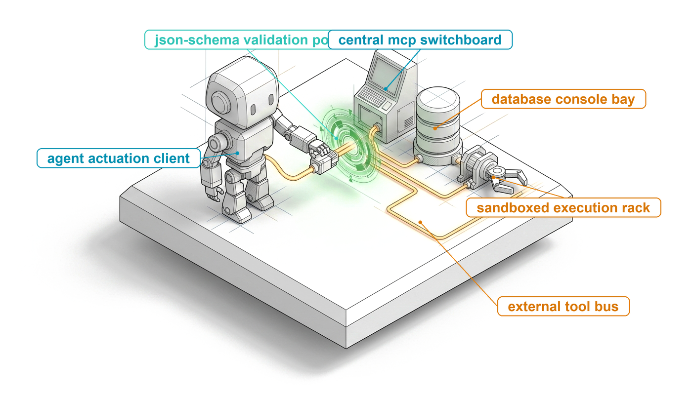
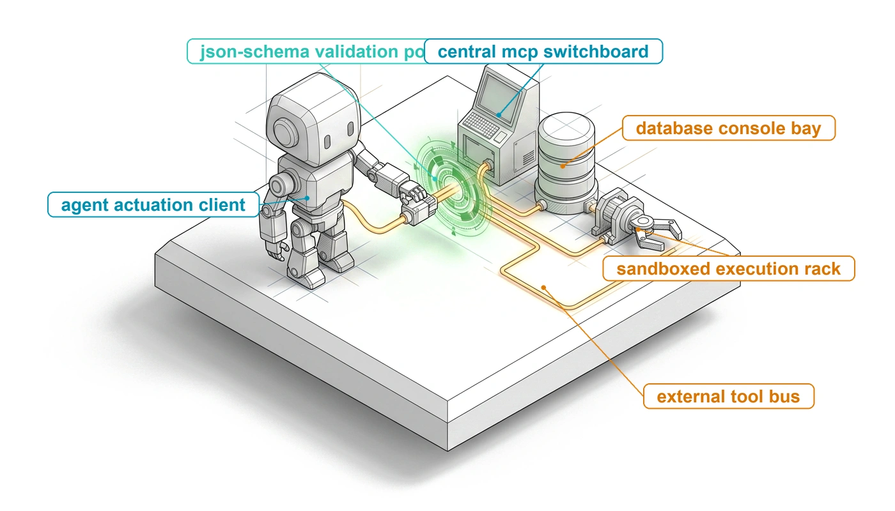
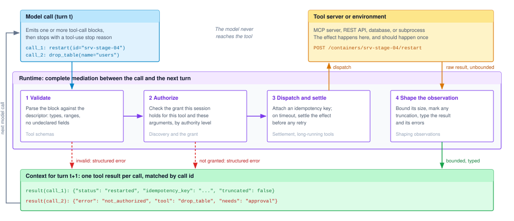
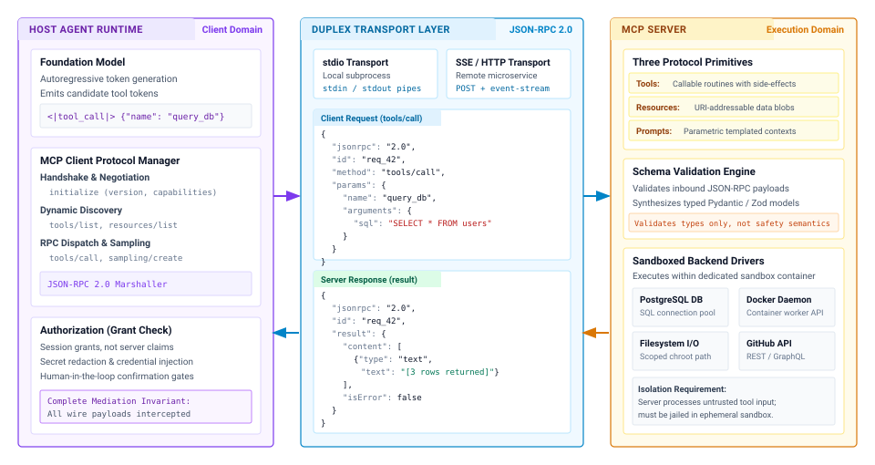
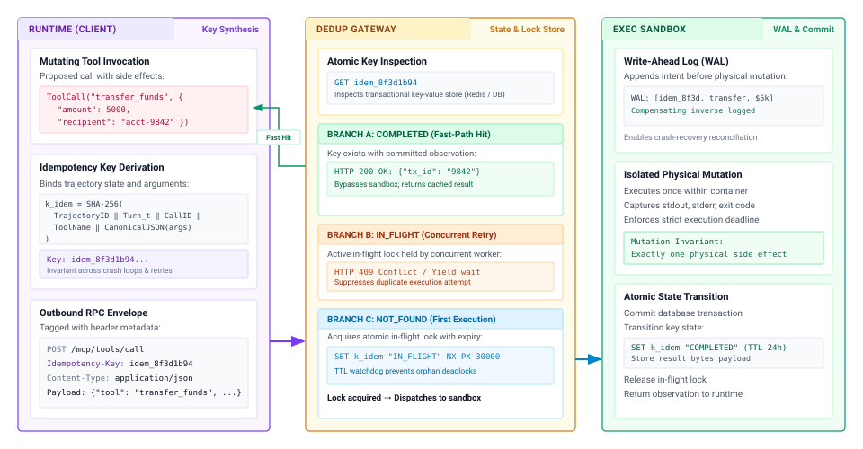
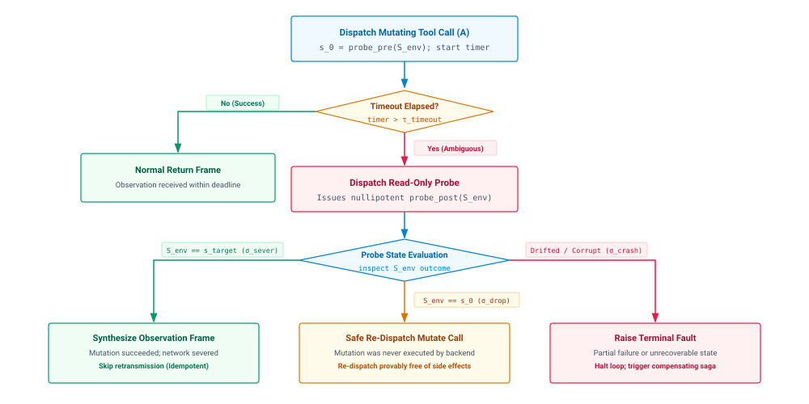
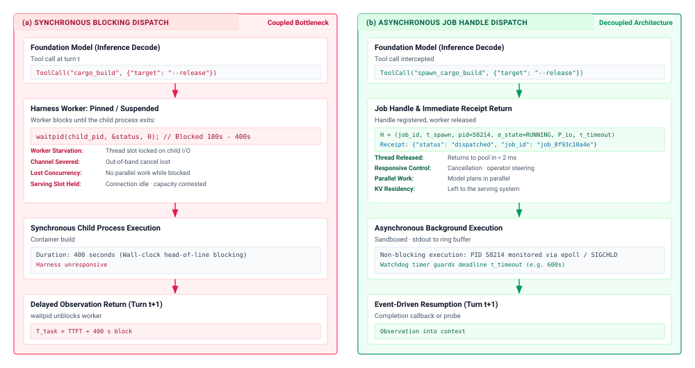
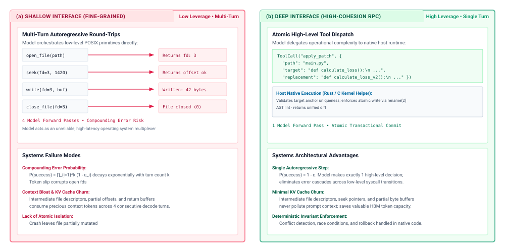

# Tool Calling {#sec-vol3-tool-calling}

::: {layout-narrow}
::: {.column-margin}

\chapterminitoc

:::

::: {.content-visible when-format="pdf"}
\noindent
{fig-alt="Blueprint for Tool Calling."}
:::

::: {.content-visible unless-format="pdf"}
{fig-alt="Blueprint for Tool Calling."}
:::

:::

## Purpose {.unnumbered .unlisted}

\begin{marginfigure}
\mlagentstack{0}{0}{0}{100}{0}{0}
\end{marginfigure}

_Why does a tool call that parses cleanly still need a runtime between it and the world?_

A model's tool call is a few dozen tokens that name a function and its arguments, and nothing in those tokens decides whether the function should run, whether it already ran, or what the model should see when it finishes. An agent that restarts a server, charges a card, or runs a test suite through such a call fails in ways a single model call cannot. A timeout leaves the effect unknown and a blind retry repeats it, a tool server advertises operations the session was never meant to hold, and one verbose command floods the next turn with megabytes of output that crowd out the task. The model sees none of this directly, only the text handed back to it, so the protection has to live in the runtime that sits between the call and the next turn. Tool calling is where the authority exposure of H·S·A first becomes real, and the closure it demands rises with authority, from reads that can still leak data, through mutations whose retries must settle, to irreversible actions that wait for approval.

::: {.content-visible when-format="pdf"}

\newpage

:::

::: {.callout-learning-objectives}

- Trace a tool call from the model's output through validation, authorization, dispatch, and observation into the next turn.
- Design a tool descriptor whose types, descriptions, side-effect class, and error messages let a model call it correctly and correct itself.
- Explain why tool discovery establishes that a tool exists but never that a session may call it, and apply per-call grants against poisoned descriptions.
- Apply idempotency keys and reconciliation probes to settle a timed-out mutating call before any retry.
- Calculate the token and dollar cost of an unshaped observation, and design truncation, pagination, and structured errors that bound it.
- Select between blocking calls and job handles for long-running tools by comparing polling and event-driven resumption.
- Evaluate a tool catalog's size, depth, and call format against selection error, schema tokens, and the authority each tool carries.

:::

## The Tool-Call Loop {#sec-vol3-tool-calling-unix-analogy}

An agent asked to restart a container on a staging server emits a short tool call. The runtime checks the call against the tool's schema, confirms that this session may restart that container, and sends `POST /containers/srv-stage-04/restart`. Two seconds later the socket times out. The container may never have received the request, may have crashed partway through restarting, or may have restarted cleanly and lost only its reply. A retry is harmless in the first case and restarts healthy workers in the third, and nothing in the timeout says which case occurred.

::: {.column-margin}
{width="100%" fig-alt="H·S·A locator with only the Authority axis lit in purple; Horizon and State axes gray."}

*The Authority axis, closed at the tool boundary by mediating every proposed call.*
:::

Part II closed the state exposure. It decided what each model call reads (@sec-vol3-context-engineering), what holding that context costs in the serving system (@sec-vol3-kv-cache), and what persists across sessions (@sec-vol3-long-term-memory). None of that changes anything outside the model. A tool call is the first point in a trajectory where a proposal can become an effect, and the model holds zero ambient authority (@sec-vol3-intro-operational-incident), so every step between the proposal and the effect belongs to the runtime. In the terms of @sec-vol3-intro-hsa, this boundary is where the runtime closes the authority exposure, because every grant a task holds, from read access to irreversible action, is checked here before anything runs. This chapter follows one call from the moment it leaves the model to the moment its result enters the next turn. It starts with the shape of that exchange, then the contract that makes a call checkable, the decision that lets it run, the settlement that makes it happen once, and the shaping that makes its result usable, before turning to tools that outlast a turn and to the design of the catalog as a whole.

### One turn of the loop

The model-side half of the exchange is already fixed. @Sec-vol3-foundation-model-contract defined the call surface. A model call can end with one or more structured tool-call blocks, each carrying an identifier, a tool name, and arguments, and with a stop reason that says the model is waiting on tools rather than finished. What happens next is the runtime's half. @Lst-vol3-tool-call-turn shows the three messages that make up one turn of the loop, written in a provider-neutral form.

::: {#lst-vol3-tool-call-turn lst-cap="**One Turn of the Tool-Call Loop**: The model's call and the runtime's result, matched by call identifier, become part of the history the next model call reads."}
```json
[
  {"role": "user",
   "content": "Stage-04 is serving a stale config. Restart it."},
  {"role": "assistant", "stop_reason": "tool_use",
   "content": [
     {"type": "text", "text": "Restarting the staging container."},
     {"type": "tool_call", "id": "call_1", "name": "restart_container",
      "arguments": {"container_id": "srv-stage-04"}}]},
  {"role": "tool",
   "content": [
     {"type": "tool_result", "call_id": "call_1",
      "content": {"status": "restarted", "uptime_s": 3}}]}
]
```
:::

Two properties of this exchange shape everything that follows. The result is matched to its call by identifier, not by position, so the runtime can return results in any order and can return an error for one call without failing the turn. The call and its result also stay in the history. Every later model call in the trajectory reads them again, so an observation is paid for once when it enters context and again, at the prefix-cached rate, on every turn that follows (@sec-vol3-foundation-model-cost).

When the serving interface returns tool calls as structured blocks, the runtime reads fields. When a model emits calls inside free text, the runtime must find and parse them, typically by stopping generation at a delimiter, and malformed calls become a routine failure rather than an exception. Grammar-constrained decoding (@sec-vol3-foundation-model-grammar-constrained) removes parse failures in either case. It does not remove a wrong value, a path outside the workspace, or a call the session may not make, which is why the runtime's checks sit after decoding rather than inside it.

### Parallel and forced calls

A single turn can contain several calls. A model that needs three files and a search result can request all four at once, and the runtime can run independent reads concurrently and return one result per call identifier. Parallel calls move two decisions onto the runtime. It must not assume the model ordered the calls, so calls that touch the same resource, such as two writes to one file, are serialized or rejected rather than raced. It also reports failure per call, so one timed-out read does not discard three good results.

The runtime can also constrain whether the model calls a tool at all. Serving interfaces expose a tool-choice setting that lets the model decide, requires some call, requires one named tool, or forbids calls. A runtime uses a forced call to run a fixed step of a workflow, the deterministic path of @sec-vol3-intro-workflow-vs-loop, and forbids calls when it needs a final answer, for example after a budget is spent. Forcing shapes what the model emits. It authorizes nothing, and a forced call passes through the same checks as any other.

### Complete mediation

Between the call leaving the model and its result entering the next turn, the runtime performs four steps, shown in @fig-vol3-tool-call-loop. It validates the call against the tool's descriptor, authorizes it against the grants the session holds, dispatches it and settles the outcome, and shapes the raw result into a bounded, typed observation. A call that fails either of the first two checks never reaches the tool. It returns to the model as a structured error, which is itself an observation the model can act on. These four steps refine the authorization, dispatch, and evidence phases of the lifecycle in @sec-vol3-intro-execution-lifecycle for the case where a proposal names a real tool on a real endpoint.

::: {#fig-vol3-tool-call-loop fig-env="figure" fig-pos="htb" fig-cap="**The Tool-Call Loop**: The model's tool calls pass through four runtime steps before any result reaches the next turn. Validation and authorization can reject a call, returning a structured error instead of dispatching it. Dispatch reaches the tool server or environment, and the raw result, which may be arbitrarily large, is shaped into a bounded, typed observation matched to its call identifier." fig-alt="Flow diagram. A model call box at top left emits two tool calls. An arrow leads into a runtime band with four boxes in a row labeled validate, authorize, dispatch and settle, and shape the observation. An arrow from dispatch and settle rises to a tool server or environment box at top right, and an arrow from that box descends into shape the observation. Dashed red arrows from validate and authorize descend to a context box at the bottom labeled structured error, and a green arrow from shape the observation descends to the same context box, which shows one result per call. A gray arrow on the left returns from the context box to the model call, labeled next model call."}

:::

The property these steps must have is *complete mediation*, the requirement Saltzer and Schroeder stated in 1975 that every access to every object be checked for authority [@saltzer1975]. For an agent, the objects are tools and the accesses are calls, and the requirement has a second half that classical access control rarely needed. The result coming back is untrusted input to the next model call, so it passes through the runtime too.

::: {#dfn-complete-mediation .callout-definition title="Complete mediation"}

***Complete mediation***\index{Complete mediation!definition}\index{Tool calling!complete mediation} is the invariant that every tool call a model proposes passes through the runtime's validation and authorization checks, on every call, before any effect reaches the environment, and that every result passes back through the runtime before it enters the model's context.

1.  **Significance**: It is what makes the model's lack of authority hold in practice. A single path around the checks, such as a tool that shells out to arbitrary commands or a server that calls other servers on the model's behalf, hands the model whatever authority that path carries.
2.  **Distinction**: Schema validation asks whether a call is well formed. Complete mediation also asks whether this session may make this call now, and it applies to the returning observation as well as to the outgoing call.
3.  **Common pitfall**: Treating an instruction in the system prompt, such as "never delete production data," as a check. An instruction lowers the probability of a bad proposal. Only a check in the runtime, below the model, prevents the effect.

:::

The rest of the chapter builds the four steps in order. @Sec-vol3-tool-calling-schemas and @sec-vol3-tool-calling-mcp develop validation and authorization, @sec-vol3-tool-calling-idempotency and @sec-vol3-tool-calling-async develop dispatch for short and long calls, and @sec-vol3-tool-calling-streaming develops the observation. The first step needs something to validate against, a contract for each tool that both the model and the runtime can read.

## Tool Schemas as Contracts {#sec-vol3-tool-calling-schemas}

A file-reading tool declares one parameter, `"path": {"type": "string"}`. The model fills it with `./data/log.txt`, a relative path, when the tool resolves paths against the workspace root and expects an absolute one inside it. Nothing in the schema said so. The call validates, runs, reads nothing useful, and costs a turn. A tool schema has two readers. The model reads it as the only documentation it will ever see for the tool, and the runtime reads it as the contract it enforces before dispatch. A schema that serves only one of them fails the other.

### The tool descriptor

The runtime keeps one *tool descriptor* per tool. The model sees part of it, the name, the description, and the parameter schema, serialized into context at every call. The runtime also reads fields the model never needs, the tool's side-effect class, the grant it requires, and its timeout. Keeping all of these in one host-owned record is what the typed action contract (principle \ref{pri-vol3-strict-action-abi}) asks for, because the side-effect class and required grant must not depend on what a remote server claims about its own tool.

::: {#lst-vol3-tool-schema lst-cap="**Strict Tool Parameter Contract**: Host-side parameter bounds, typing, and closed-world extra-field prohibition."}
```python
class FileReadParameters(BaseModel):
    model_config = ConfigDict(extra="forbid")
    path: str = Field(..., description="Absolute canonical filesystem path.")
    offset_bytes: int = Field(0, ge=0, description="Starting byte offset.")
    max_bytes: int = Field(65536, ge=1, le=1048576, description="Chunk size in bytes.")
    encoding: Literal["utf-8", "ascii"] = Field("utf-8", description="Character encoding.")
```
:::

@Lst-vol3-tool-schema declares the parameters of a file-reading tool on the host. When serialized for the model, each constraint becomes a JSON Schema keyword that the validator also enforces, as @tbl-vol3-schema-contract shows. One setting deserves attention. By default JSON Schema accepts fields the schema does not declare, and models trained on large code corpora readily invent plausible flags such as `verbose` or `force`. Declaring the schema closed (`additionalProperties: false`) turns an invented flag into a rejected call instead of an argument the tool silently ignores or, worse, honors.

| Parameter Field | Host Python Type                     | JSON Schema Representation                              | Runtime Invariant                                            |
|:----------------|:-------------------------------------|:--------------------------------------------------------|:-------------------------------------------------------------|
| `path`          | `str`                                | `{"type": "string"}`                                    | Path must be non-empty; resolved against the workspace root. |
| `offset_bytes`  | `int = Field(0, ge=0)`               | `{"type": "integer", "minimum": 0, "default": 0}`       | Reject negative offsets before the read is issued.           |
| `max_bytes`     | `int = Field(..., ge=1, le=1048576)` | `{"type": "integer", "minimum": 1, "maximum": 1048576}` | Enforce an upper bound ($1\text{ MiB}$) on one read.         |
| `encoding`      | `Literal["utf-8", "ascii"]`          | `{"type": "string", "enum": ["utf-8", "ascii"]}`        | Restrict the value to two legal strings.                     |
| `model_config`  | `extra="forbid"`                     | `{"additionalProperties": false}`                       | Close the schema; reject undeclared parameters.              |

: **Programmatic Type Declarations and JSON Schema Mappings**: Each host-side declaration becomes a JSON Schema keyword the model reads and the validator enforces. {#tbl-vol3-schema-contract}

The descriptor's side-effect class answers a question the parameter schema cannot, what happens if the call runs twice. @Tbl-vol3-tool-idempotency sorts tools into three classes by that question. A separate fact decides the tool's authority level. A tool whose effect stays inside a sandbox the runtime can discard sits at $A_1$ whatever its class, an external effect that can be retried safely or undone sits at $A_2$, and an external effect that cannot be undone sits at $A_3$. The class tells the runtime how to retry, and the authority level tells it whether the call may run without approval.

| Side-Effect Class           | Definition          | Example Tools                                            | Safe to Re-dispatch After a Timeout? | Runtime Obligation                                                     |
|:----------------------------|:--------------------|:---------------------------------------------------------|:-------------------------------------|:-----------------------------------------------------------------------|
| **Read-only** (nullipotent) | $f(s) = s$          | `read_file`, `grep`, `sql_select`                        | Yes                                  | Retry with backoff; the grant still bounds what may be read.           |
| **Idempotent**              | $f(f(s)) = f(s)$    | `write_file` (overwrite), `mkdir -p`, `set_config`       | Yes, if ordered                      | Sequence writes so a delayed duplicate cannot overwrite a newer write. |
| **Non-idempotent**          | $f(f(s)) \neq f(s)$ | `append_file`, `send_email`, `charge_card`, `git_commit` | No                                   | Idempotency key or reconciliation probe before any retry.              |

: **Tool Side-Effect Classes**: The side-effect class recorded in each tool descriptor decides whether a timed-out call may be sent again and what the runtime must do first. {#tbl-vol3-tool-idempotency}

### Descriptions are the model's interface

The model has no access to a tool's implementation, its tests, or its authors. It sees a name, a description, and a parameter schema, and every argument it emits is decoded conditioned on that text. The quality of that text therefore shows up directly in the rate of wrong calls. @patil2023gorilla found that conditioning a model on retrieved API documentation sharply reduced hallucinated API calls relative to relying on what the model had absorbed in pretraining, and @sec-vol3-tool-calling-toolkit-design returns to interface design as a determinant of end-to-end success.

A few rules follow from treating the description as the interface. Units belong in names (`timeout_seconds`, not `timeout`), because a bare integer leaves the unit to whatever convention pretraining made most likely. Closed sets belong in enumerations, which replace an open string with a handful of legal values. Constraints between parameters, such as two options that cannot be set together, belong in the description in plain words, since no single parameter's type can express them. An example of a valid value often resolves more ambiguity than a paragraph of prose. @Tbl-vol3-schema-failures shows the pattern for four parameters.

| Target Parameter    | Underspecified Schema | Plausible Model Output                                                | Tighter Schema                                                      | Invariant Enforced                                                  |
|:--------------------|:----------------------|:----------------------------------------------------------------------|:--------------------------------------------------------------------|:--------------------------------------------------------------------|
| File chunk size     | `"size": "integer"`   | `{"size": -1}` (an attempt to express "read all")                     | `"size_bytes": {"type": "integer", "minimum": 1, "maximum": 65536}` | Rejects non-positive values and oversized reads.                    |
| Process termination | `"signal": "string"`  | `{"signal": "SIGKILL"}` (the tool expects an integer)                 | `"signal_num": {"type": "integer", "enum": [1, 2, 9, 15]}`          | Restricts the value to the signals the tool supports.               |
| HTTP request body   | `"data": "object"`    | `{"data": "<xml>payload</xml>"}` (a string where an object is needed) | `"data": {"type": "object", "additionalProperties": true}`          | Guarantees a JSON object reaches the handler.                       |
| Git commit target   | `"target": "string"`  | `{"target": "HEAD~"}` (an ambiguous revision)                         | `"commit_hash": {"type": "string", "pattern": "^[0-9a-f]{40}$"}`    | Accepts only a full commit hash, which also blocks shell injection. |

: **Tool Schema Failure Modes and Mitigations**: Illustrative model outputs under underspecified schemas, and the tighter schema that turns each into either a correct call or a rejected one. {#tbl-vol3-schema-failures}

### Validation errors the model can act on

The runtime never assumes a call matches its schema. It parses the call, rejecting a truncated or malformed payload, which happens when generation stops at a token limit mid-argument. It then checks the parsed arguments $Y$ against the schema's parameters $P$, required set $R$, types $\tau_k$, and domains $\mathcal{D}_k$:
$$\forall r \in R, \quad r \in \operatorname{keys}(Y)$$
$$\forall k \in \operatorname{keys}(Y), \quad k \in P \quad (\text{closed schema})$$
$$\forall k \in \operatorname{keys}(Y), \quad Y[k] \in \mathcal{D}_k \land \operatorname{type}(Y[k]) = \tau_k$$

A call that violates any of these never dispatches. What the runtime returns instead decides whether the next turn fixes the call or repeats it. A generic string such as `Invalid parameters` tells the model only that something failed. A structured error names the field, the value that failed, and the domain it should have come from:

```json
{
  "status": "validation_error",
  "tool_name": "fs_read_bytes",
  "errors": [
    {
      "loc": ["max_bytes"],
      "input_value": 2097152,
      "error_type": "less_than_equal",
      "message": "Input should be less than or equal to 1048576",
      "expected_domain": "integer in range [1, 1048576]"
    }
  ]
}
```

The next model call is conditioned on this error, and the most likely continuation is the same call with `max_bytes` inside the stated range. The same design applies to errors from the tool itself. A tool that fails should return a typed error with a cause and, where possible, a remedy, not a stack trace or an empty result. Every rejection still costs a model turn, so the rejection rate per tool is a measurable signal of schema quality, and a tool whose calls are rejected often needs a better description, not a stricter validator. @Sec-vol3-evaluation develops how to measure such rates across a task suite.

A call that validates is well formed. It is not yet permitted, and the descriptor it was checked against may not have been written by anyone the runtime trusts. Tools increasingly arrive from servers the agent discovers at run time, and that is where authorization has to begin.

## Tool Discovery and the Model Context Protocol {#sec-vol3-tool-calling-mcp}

An agent connects to a vendor's tool server that advertises forty tools, among them `delete_repository`. The description of one harmless-looking tool, `search_issues`, ends with a sentence telling the model to read a credentials file and pass its contents in a `context` argument. Neither problem is a defect in the model, and neither is caught by validating arguments against the advertised schema. Both come from treating what a server says about its tools as a statement of what the agent may do with them.

Servers exist because the alternative scales badly. Wiring every tool into every agent runtime by hand means $N$ runtimes each maintaining adapters for $M$ services, $N \times M$ integrations in all, and it runs third-party code inside the runtime's own process, where one crash or blocking call stalls every trajectory the runtime serves. An open tool protocol replaces the adapters with $N + M$ implementations of one interface and moves each tool into its own process. The Model Context Protocol (MCP) is one such protocol and serves as this chapter's example [@anthropic2024mcp]. The protocol settles how tools are described and called. It settles nothing about who may call them, and under the typed action contract (principle \ref{pri-vol3-strict-action-abi}) that decision stays with the runtime.

### Client and server

@Fig-vol3-mcp-architecture shows the three parts. The agent runtime hosts an MCP client, which negotiates with each server, lists its tools, and sends calls. The transport carries JSON-RPC messages, either over the standard input and output of a local subprocess or over HTTP to a remote service. The server wraps some backend, such as a database, a repository host, or a filesystem, and validates the calls it receives against its own schemas.

::: {#fig-vol3-mcp-architecture fig-env="figure" fig-pos="htb" fig-cap="**Model Context Protocol Architecture**: The agent runtime hosts the MCP client and keeps authorization on its own side of the transport. JSON-RPC 2.0 requests and results cross a local (stdio) or remote (HTTP) transport to a server that wraps a backend. The server's own validation checks types, not whether the session should make the call." fig-alt="Three-column architecture diagram. The left column, host agent runtime, contains the foundation model, an MCP client protocol manager with handshake, discovery, and dispatch, and an authorization box for grant checks. The middle column, duplex transport layer, shows stdio and HTTP transports and example JSON-RPC request and response messages for tools/call. The right column, MCP server, lists three protocol primitives (tools, resources, prompts), a schema validation engine noted as validating types only, and sandboxed backend drivers."}

:::

::: {.column-margin}
MCP frames every message as JSON-RPC 2.0. A request carries a `"jsonrpc": "2.0"` version string, an `"id"` that pairs it with its response, a `"method"` naming the operation, and a `"params"` object. A notification omits the `"id"` and expects no response.
:::

A session begins with an `initialize` exchange in which client and server agree on a protocol version and capabilities. The client then calls `tools/list` to build its catalog, and a server can later send a notification that its tool list has changed, which matters for the poisoning attacks discussed later in this section. @Tbl-mcp-primitives lists the server-side primitives. Only `tools/call` can change the world, and how much it can change depends on the tool, not on the protocol.

| MCP Primitive    | Purpose                 | Primary Payload                   | Effect on the World                               |
|:-----------------|:------------------------|:----------------------------------|:--------------------------------------------------|
| `tools/list`     | Discovery               | `tools: Tool[]`                   | None; returns descriptors for the client to vet   |
| `tools/call`     | Invocation              | `name: string, arguments: object` | Set by the tool's side-effect class and authority |
| `resources/read` | Read addressable data   | `uri: string`                     | None, though what it returns can leak or instruct |
| `prompts/get`    | Fetch a prompt template | `name: string, arguments: object` | None, though its text enters context              |

: **Model Context Protocol Primitives**: Server-side primitives and what each can do to the world. Discovery and templates change nothing, but everything a server returns enters the model's context. {#tbl-mcp-primitives}

The choice of transport matters less than it first appears. A local subprocess over standard input and output adds almost nothing per call, and its failure mode is a server process that dies or stops reading, which the runtime handles like any child process (@sec-vol3-tool-calling-async-governance). A remote server adds a network round trip and a connection that can drop, which matters for tools that finish in milliseconds and disappears into the noise for tools that run for seconds. Neither transport changes who authorizes a call.

### Discovery is not authorization

A server's advertisement is an unauthenticated statement that a tool exists. It carries no evidence that this session ought to call it, and a compromised or careless server can advertise shell execution, unrestricted deletion, or an endpoint that sends data anywhere. A runtime that copies advertised tools straight into the model's context and forwards whatever calls come back has handed the server's authority to whoever can influence the model's context, which includes the author of any web page or file the agent reads.

The runtime prevents this with a decision it makes on every call, the grant.

::: {#dfn-grant .callout-definition title="Grant"}

***Grant***\index{Grant!definition}\index{Tool calling!grant} is the runtime's per-call decision of whether this tool may run now, with these arguments, under the permissions this session explicitly holds, made from the host's own descriptor rather than from anything the tool's server advertises.

1.  **Significance**: It is the authorization half of complete mediation, and it scales the required closure with the call's authority level, from a scoped read to an irreversible action that waits for approval.
2.  **Distinction**: Discovery establishes that a tool exists; validation establishes that a call is well formed; the grant establishes that this session may make this call.
3.  **Common pitfall**: Granting at the level of a whole server ("the agent may use the repository server") instead of per tool and per argument, which makes the most dangerous tool on the server as available as the safest.

:::

The runtime applies the grant at two moments. Before the model sees anything, it filters the advertised catalog against the session's policy, so a tool the session may never call is never described to the model. At each call, it checks the arguments against the descriptor's constraints, for example that a path resolves inside the workspace and does not escape it through `../`, and then checks the call against the authority level the tool requires, using the levels of @sec-vol3-intro-hsa:

- **$A_0$ (read access)** runs without per-call approval, but only against resources the session's grants name, because a read that returns credentials or private records into context can leak them through a later call.
- **$A_1$ (sandboxed mutation)** changes state confined to a sandbox the runtime can discard, such as a scratch branch in a disposable workspace. The runtime records the mutation so it can reset the sandbox.
- **$A_2$ (retry-safe or compensable external action)** changes an external system in a way that can be retried safely or undone, such as provisioning an instance that can later be released. Every timeout must be settled before any retry (@sec-vol3-tool-calling-idempotency).
- **$A_3$ (irreversible external action)** cannot be undone, such as dropping a table or sending a payment. It is held for explicit approval before dispatch, which the harness manages (@sec-vol3-controlplane-hitl).

Credentials follow the same rule. The runtime attaches them to an authorized call on the way out and never places them in the model's context, where any later call could copy them into an argument. How the credentials themselves are scoped, narrowed, and brokered belongs to containment, in @sec-vol3-sandboxes.

### Tool-description poisoning

The second problem in the opening example is subtler. A tool's description is text the model reads alongside its instructions, and the model has no reliable way to tell a description that documents a tool from one that issues orders. A server can exploit this in three ways. It can embed instructions in a description, as `search_issues` did. It can register a tool whose name shadows a trusted tool from another server. It can change a description after a person has reviewed and approved the server, using the list-changed notification to swap a benign description for a malicious one. All three are forms of indirect prompt injection, in which instructions arrive through content the agent processes rather than from its user [@greshake2023not].

The runtime's defenses split along the line that invariant closure draws. Some lower the probability that a poisoned description steers the model. The runtime can namespace tool names by server so no server can shadow another's tools, pin each approved descriptor by hash and require re-approval when it changes, and show reviewers the full description text rather than a summary. None of these guarantees that the model ignores a malicious sentence. The guarantee comes from the grant. A poisoned description can steer the model toward a proposal, but the proposal still passes argument checks and the authority check before anything runs, so a description cannot widen what the session may do. It can still misuse what the session already may do, for instance by coaxing a permitted read of a secret into a permitted outbound request, and closing that path requires tracking where data came from and where it may flow, which @sec-vol3-sandboxes develops.

Observations returning from tools raise the same issue in the other direction. A search result or a fetched page is untrusted text entering the next model call. Bounding it and labeling its provenance (@sec-vol3-context-engineering-staging) makes it less likely to be read as instruction, but no transformation of text makes the model immune to it.

This division of labor is the end-to-end argument applied at the tool boundary [@saltzer1984endtoend]. The protocol moves requests and results between endpoints reliably. Whether an action fits the user's task, whether it respects least privilege, and whether its result can be trusted are questions only the endpoint with the full application context can answer, and that endpoint is the runtime, not the server and not the transport.

::: {#chk-07-complete-mediation .callout-checkpoint title="Evaluating tool schemas and complete mediation"}
Before moving on to settlement, check your understanding of contracts and authorization:

- [ ] **Two readers**: Which descriptor fields does the model read, which does only the runtime read, and why must the side-effect class live on the host?
- [ ] **Validation versus grant**: Why can a call pass schema validation and still be refused, and what does the model receive when it is?
- [ ] **Authority levels**: Why does read access ($A_0$) still require a grant, and what additional condition does $A_3$ impose?
- [ ] **Poisoning**: Which defenses against a poisoned tool description lower the probability of harm, and which one bounds what the harm can be?
:::

A validated, granted call can finally be sent. The network it crosses, however, can fail in a way that leaves the runtime unsure whether the call happened, and a runtime that guesses wrong repeats effects the task wanted only once.

## Settlement Before Retry {#sec-vol3-tool-calling-idempotency}

Return to the container restart that opened this chapter, now traced in detail. The runtime sends `POST /containers/srv-stage-04/restart` with a timeout of two seconds, and at the deadline the socket reports a timeout. Had the runtime simply resent the request, and had the first request in fact restarted the container before its reply was lost, the second request would restart it again, dropping the connections of workers that had just come back up. The agent's picture of the environment would then disagree with the environment itself.

The difficulty is structural, not a matter of a flaky network. When a dispatch times out, three outcomes are possible, and the runtime cannot tell them apart from the timeout alone:
$$\Sigma = \{\sigma_{\text{drop}}, \sigma_{\text{crash}}, \sigma_{\text{sever}}\}$$
Under $\sigma_{\text{drop}}$, the request never arrived, the environment is unchanged ($S_{\text{env}}' = S_{\text{env}}$), and resending is safe. Under $\sigma_{\text{crash}}$, the tool began the mutation and failed partway, leaving a partial state ($S_{\text{env}}' = S_{\text{env}} \oplus \delta_{\text{partial}}$). Under $\sigma_{\text{sever}}$, the mutation completed ($S_{\text{env}}' = S_{\text{env}} \oplus \delta_{\text{complete}}$) and only the reply was lost. Settlement before retry (principle \ref{pri-vol3-exactly-once-settlement}) is the rule that the runtime resolves which of these occurred, or makes the question irrelevant, before it sends the call again.

::: {#dfn-idempotent-action .callout-definition title="Idempotent action"}

***Idempotent action***\index{Idempotent action!definition} is a tool call whose repeated execution leaves the environment in the same state as a single execution, $f(f(s)) = f(s)$, so that resending it after an ambiguous timeout cannot duplicate its effect.

1.  **Significance**: It is the property that makes retry safe, and the runtime can either choose tools that have it or impose it with a key the endpoint deduplicates.
2.  **Distinction**: Idempotence concerns repetition, not reversal. An idempotent call can still be irreversible, and a reversible call can still duplicate its effect when repeated.
3.  **Common pitfall**: Assuming a call is idempotent because it usually succeeds on the first try, then retrying it blindly the first time a reply is lost.

:::

The naive retry loop treats every timeout as $\sigma_{\text{drop}}$:

```python
# ANTI-PATTERN: open-loop retry that assumes the request was lost
for attempt in range(max_retries):
    try:
        return client.dispatch(tool="charge_card", args={"amount": 5000})
    except TimeoutError:
        time.sleep(backoff(attempt))
```

For a read-only tool this is harmless, and for an idempotent tool it is safe as long as writes stay ordered (@tbl-vol3-tool-idempotency). For a non-idempotent tool under $\sigma_{\text{sever}}$, every iteration repeats the charge. In an agent loop the hazard compounds, because the model also sees the timeout and may propose its own retry with slightly different arguments, which defeats any deduplication that compares request bodies. The runtime has two ways to settle a non-idempotent call, a key the endpoint deduplicates and a probe that inspects the environment.

### Idempotency keys

An *idempotency key* is an identifier the runtime attaches to a mutating call so the endpoint can recognize a repeat of it. The endpoint stores each key with its outcome. A call whose key it has already completed returns the stored result instead of executing again, and a call whose key is still in progress is refused or made to wait. @Fig-vol3-idempotency-flow traces the three cases.

The key must identify the logical call, not the attempt, so the runtime derives it deterministically from the trajectory rather than generating it at random or stamping it with the time:
$$k_{\text{idem}} = \mathcal{H}\big(\text{trajectory\_id} \,\|\, \text{turn} \,\|\, \text{call\_id} \,\|\, \text{tool} \,\|\, \text{canonical\_args}\big)$$
Determinism is what lets the key survive a crash of the runtime itself. A runtime that recovers a trajectory and re-issues a call it had already sent regenerates the same key, and the endpoint recognizes the repeat. Recording the intent to call before sending it, so recovery knows the call may have happened, is the job of the durable trajectory log (@sec-vol3-persistence-wal).

::: {#fig-vol3-idempotency-flow fig-env="figure" fig-pos="htb" fig-cap="**Idempotency Key Execution Flow**: The runtime derives a deterministic key from the session, turn, tool, and canonical arguments (adding the call identifier when one turn can contain identical calls) and sends it with the call. The endpoint's deduplication gateway returns the stored result for a completed key (Branch A), refuses or delays a key still in flight (Branch B), and for an unseen key takes a lease, executes the mutation once, and records the result under the key (Branch C)." fig-alt="Three-column flow diagram. The left column, runtime (client), shows a mutating tool invocation, an idempotency key derivation using SHA-256 over session ID, turn, tool name, and canonical arguments, and an outbound request carrying an Idempotency-Key header. The middle column, dedup gateway, shows an atomic key lookup and three branches: completed, returning the cached result; in flight, returning a conflict; and not found, acquiring a lease. The right column, execution sandbox, shows a write-ahead log entry, a single mutation, and an atomic state transition that marks the key completed and stores the result."}

:::

With the key in place, the retry loop becomes safe:

```python
def dispatch_with_idempotency(client, call) -> dict:
    """Send a mutating call under a deterministic idempotency key."""
    key = derive_key(call.trajectory_id, call.turn, call.id, call.tool, call.args)
    for attempt in range(client.max_retries):
        try:
            return client.transport.post(
                f"/tools/{call.tool}",
                json=call.args,
                headers={"Idempotency-Key": key},
                timeout=client.timeout_sec,
            )
        except (TimeoutError, ConnectionError):
            time.sleep(client.backoff_factor * (2 ** attempt))
    raise SettlementError(f"{call.tool} unsettled after {client.max_retries} attempts")
```

The endpoint's in-flight lease needs one more constraint. If the lease expires while the first execution is still running, a retry can start a second execution in parallel. The lease duration $T_{\text{lease}}$ must therefore exceed the client's timeout, the worst-case execution time $\tau_{\text{proc\_max}}$, and the clock skew $\delta_{\text{drift}}$ between the two machines:
$$T_{\text{lease}} > \tau_{\text{timeout}} + \delta_{\text{drift}} + \tau_{\text{proc\_max}}$$

```{python}
#| label: calc-vol3-tool-calling-settlement
#| echo: false
# ┌─────────────────────────────────────────────────────────────────────────────
# │ DUPLICATE EFFECTS UNDER BLIND RETRY, AND THE MINIMUM SAFE LEASE (LEGO)
# ├─────────────────────────────────────────────────────────────────────────────
# │ Context: The settlement worked example in @sec-vol3-tool-calling-idempotency.
# │
# │ Goal: Show how many duplicate side effects an open-loop retry policy
# │       produces at fleet volume, and size the endpoint's in-flight lease.
# │ Show: Daily timeouts, daily duplicates, and the minimum lease duration.
# │ How:  Independent loss on request and reply; duplicates arise only when
# │       the reply alone is lost; lease bound from the displayed inequality.
# └─────────────────────────────────────────────────────────────────────────────
from mlsysim import *

class SettlementBudget:
    # ┌── 1. LOAD (Constants & Parameters) ─────────────────────────────────
    workers = 50  # scenario assumption: agent workers sharing one provisioning API
    dispatches_per_worker_day = 4_000  # scenario assumption: mutating calls per worker per day
    p_loss = 0.02  # scenario assumption: independent loss probability on request and on reply
    timeout_ms = 1_200  # scenario assumption: client dispatch timeout
    exec_mean_ms = 450  # scenario assumption: mean server-side execution time
    exec_sd_ms = 80  # scenario assumption: standard deviation of execution time
    exec_sigmas = 6  # upper bound on execution time, in standard deviations
    clock_skew_ms = 25  # scenario assumption: maximum clock skew between runtime and endpoint

    # ┌── 2. EXECUTE (Compute) ─────────────────────────────────────────────
    dispatches_day = workers * dispatches_per_worker_day
    p_timeout = 1 - (1 - p_loss) ** 2
    p_reply_lost = (1 - p_loss) * p_loss
    timeouts_day = dispatches_day * p_timeout
    duplicates_day = dispatches_day * p_reply_lost
    exec_max_ms = exec_mean_ms + exec_sigmas * exec_sd_ms
    lease_min_ms = timeout_ms + clock_skew_ms + exec_max_ms

    # ┌── 3. GUARD (Invariants) ───────────────────────────────────────────
    check(duplicates_day < timeouts_day, "Only the lost-reply share of timeouts duplicates an effect")
    check(lease_min_ms > timeout_ms, "A lease must outlast the timeout it protects")

    # ┌── 4. OUTPUT (Formatting) ──────────────────────────────────────────
    workers_str = fmt_int(workers)
    dispatches_per_worker_day_str = fmt_int(dispatches_per_worker_day)
    p_loss_str = fmt_percent(p_loss, style="prose")
    timeout_ms_str = fmt_latency(Q_(timeout_ms, 'ms'), unit='ms', precision=0, commas=True)
    exec_mean_ms_str = fmt_latency(Q_(exec_mean_ms, 'ms'), unit='ms', precision=0, commas=True)
    exec_sd_ms_str = fmt_latency(Q_(exec_sd_ms, 'ms'), unit='ms', precision=0, commas=True)
    exec_sigmas_str = fmt_int(exec_sigmas)
    clock_skew_ms_str = fmt_latency(Q_(clock_skew_ms, 'ms'), unit='ms', precision=0, commas=True)
    dispatches_day_str = fmt_int(dispatches_day)
    p_timeout_str = fmt_percent(p_timeout, precision=2, style="prose")
    p_reply_lost_str = fmt_percent(p_reply_lost, precision=2, style="prose")
    timeouts_day_str = fmt_int(timeouts_day)
    duplicates_day_str = fmt_int(duplicates_day)
    exec_max_ms_str = fmt_latency(Q_(exec_max_ms, 'ms'), unit='ms', precision=0, commas=True)
    lease_min_ms_str = fmt_latency(Q_(lease_min_ms, 'ms'), unit='ms', precision=0, commas=True)
```

::: {#nbk-07-settlement-budget .callout-notebook title="Duplicate effects under blind retry, and the lease that prevents them"}
**Problem**: A fleet of `{python} SettlementBudget.workers_str` agent workers each sends `{python} SettlementBudget.dispatches_per_worker_day_str` mutating calls a day to an infrastructure provisioning API. Requests and replies are each lost independently with probability `{python} SettlementBudget.p_loss_str`, and the client timeout is `{python} SettlementBudget.timeout_ms_str`. Server execution takes `{python} SettlementBudget.exec_mean_ms_str` on average with a standard deviation of `{python} SettlementBudget.exec_sd_ms_str`, so execution time alone almost never causes a timeout, and clocks may differ by `{python} SettlementBudget.clock_skew_ms_str`. How many duplicate effects does a blind retry policy produce each day, and how long must the endpoint's in-flight lease be?

**Timeouts.** A call times out when either message is lost, with probability $1 - (1 - p)^2 =$ `{python} SettlementBudget.p_timeout_str`. Across `{python} SettlementBudget.dispatches_day_str` calls a day, that is `{python} SettlementBudget.timeouts_day_str` timeouts.

**Duplicates.** Only a lost reply, $\sigma_{\text{sever}}$, means the effect already happened. Its probability is $(1 - p)\,p =$ `{python} SettlementBudget.p_reply_lost_str`, so a policy that resends every timed-out call duplicates `{python} SettlementBudget.duplicates_day_str` effects a day. Each is a double charge, a second instance, or a repeated restart.

**Lease.** Bounding execution at `{python} SettlementBudget.exec_sigmas_str` standard deviations gives $\tau_{\text{proc\_max}} =$ `{python} SettlementBudget.exec_max_ms_str`, so the lease must exceed `{python} SettlementBudget.lease_min_ms_str`.

**Takeaway**: Duplicates scale with call volume, not with how rare a lost reply seems on any one call. A loss rate of `{python} SettlementBudget.p_loss_str` is invisible in testing and produces thousands of duplicate effects a day in production, and keys turn each of them into a cache hit.
:::

A key hit has a second benefit at the model's end of the loop. The endpoint returns the stored result byte for byte, so the observation that enters context after a retry is identical to the one the first attempt would have produced, and the serving system's prefix cache keeps matching the trajectory's history (@sec-vol3-kvcache-radix-tree).

### Reconciliation probes

Many endpoints accept no key. A shell command such as `git commit`, a legacy REST API, or a script run inside the workspace will simply execute again if called again. For these, the runtime settles a timeout by looking at the environment instead of asking the endpoint to remember. @Fig-vol3-state-reconciliation-flow charts the protocol.

::: {#fig-vol3-state-reconciliation-flow fig-env="figure" fig-pos="htb" fig-cap="**State Reconciliation for Endpoints Without Keys**: Before a mutating call, the runtime records a precondition. If the call times out, it sends a read-only probe instead of retrying. A probe showing the intended postcondition means the effect happened and the reply was lost; a probe showing the recorded precondition means the call never ran and may be resent; any other state means partial failure, and the runtime halts autonomous action on that resource." fig-alt="Flowchart. A dispatch box records a pre-probe state and starts a timer. A timeout decision branches to a normal return on no, and on yes to a read-only probe. A probe-evaluation decision branches three ways: environment matches target, leading to a synthesized success observation; environment matches the initial state, leading to a safe re-dispatch; environment drifted or corrupted, leading to a terminal fault that halts the loop and triggers compensation."}

:::

Before dispatching a non-idempotent call, the runtime records a precondition $s_0 = \text{probe}_{\text{pre}}(S_{\text{env}})$, for example the current commit hash of the branch or the content hash and length of the file about to be appended. If the call times out, the runtime blocks the model's next turn and sends a read-only probe $\text{probe}_{\text{post}}(S_{\text{env}})$ designed to test the intended postcondition. Three outcomes follow:

- If the postcondition holds, for instance `git log -1` shows the intended commit, the outcome was $\sigma_{\text{sever}}$. The runtime must not resend. It constructs an observation reporting success, marked as reconstructed by probe, and returns it to the model.
- If the environment still matches $s_0$, the outcome was $\sigma_{\text{drop}}$, and the runtime may resend the original call.
- If the environment matches neither, the outcome was $\sigma_{\text{crash}}$. The runtime stops autonomous action on that resource and reports a structured fault, because repairing a partial effect is a recovery decision rather than a retry.

Keys on endpoints that support them and probes on those that do not together make every mutating call settle to a known outcome before it is sent again. They do not decide what to do after a partial failure, and they do not stop a failing endpoint from absorbing retry after retry. Compensation for partial effects and circuit breakers on failing tools belong to failure recovery (@sec-vol3-sagas-containment). With the effect settled, the remaining step is the result itself, which is often far larger and messier than the model can use.

## Shaping Observations {#sec-vol3-tool-calling-streaming}

A model asks for `pytest -v tests/` and gets back twenty-four megabytes of output, half a million lines of passing tests with the one failure that matters near the end. The command was twenty characters. Whatever the runtime passes back becomes part of the context of the next model call and of every call after it, so the runtime, not the tool, decides what the model sees. An observation is paid for in three currencies. It takes a share of a fixed context window that the task also needs (@sec-vol3-context-engineering), it adds input tokens to every later call, and it can bury the one line that explains the failure among thousands that do not.

```{python}
#| label: calc-vol3-tool-calling-observation-budget
#| echo: false
# ┌─────────────────────────────────────────────────────────────────────────────
# │ THE TOKEN AND DOLLAR COST OF AN UNSHAPED OBSERVATION (LEGO)
# ├─────────────────────────────────────────────────────────────────────────────
# │ Context: The observation-budget worked example in
# │          @sec-vol3-tool-calling-streaming.
# │
# │ Goal: Compare a raw test log with a shaped observation in tokens, share of
# │       the context window, and input cost carried over the rest of the
# │       trajectory.
# │ Show: Raw tokens, raw size in windows, shaped share of the window, and
# │       carried cost with and without prefix caching.
# │ How:  Bytes per token converts the log to tokens; every later model call
# │       re-reads the observation, billed at the cached rate when the prefix
# │       is stable.
# └─────────────────────────────────────────────────────────────────────────────
from mlsysim import *

class ObservationBudget:
    # ┌── 1. LOAD (Constants & Parameters) ─────────────────────────────────
    raw_bytes = 24e6  # scenario assumption: stdout of a verbose regression run
    bytes_per_token = 4  # scenario assumption: typical tokenizer density on log text
    window_tokens = 128_000  # scenario assumption: model context window
    shaped_tokens = 4_000  # runtime observation budget for one tool result
    remaining_turns = 30  # scenario assumption: later model calls that re-read the observation
    input_price_per_mtok = 3.00  # scenario assumption: $ per million uncached input tokens
    cached_fraction_price = 0.10  # scenario assumption: cached input billed at this fraction

    # ┌── 2. EXECUTE (Compute) ─────────────────────────────────────────────
    raw_tokens = raw_bytes / bytes_per_token
    raw_windows = raw_tokens / window_tokens
    shaped_share = shaped_tokens / window_tokens
    carried_tokens = shaped_tokens * remaining_turns
    carried_cost_uncached = carried_tokens / 1e6 * input_price_per_mtok
    carried_cost_cached = carried_cost_uncached * cached_fraction_price
    window_fill_cost = window_tokens * remaining_turns / 1e6 * input_price_per_mtok * cached_fraction_price

    # ┌── 3. GUARD (Invariants) ───────────────────────────────────────────
    check(raw_windows > 1, "The raw log must exceed the context window for the example to hold")
    check(shaped_share < 0.1, "The shaped observation should stay a small share of the window")

    # ┌── 4. OUTPUT (Formatting) ──────────────────────────────────────────
    raw_mb_str = fmt_int(raw_bytes / 1e6)
    bytes_per_token_str = fmt_int(bytes_per_token)
    window_tokens_str = fmt_int(window_tokens)
    shaped_tokens_str = fmt_int(shaped_tokens)
    remaining_turns_str = fmt_int(remaining_turns)
    input_price_str = fmt_usd(input_price_per_mtok)
    cached_fraction_str = fmt_percent(cached_fraction_price, style="prose")
    raw_tokens_str = fmt_count(raw_tokens, scale="M", precision=0)
    raw_windows_mult_str = fmt_multiple(raw_windows)
    shaped_share_str = fmt_percent(shaped_share, precision=1, style="prose")
    carried_tokens_str = fmt_int(carried_tokens)
    carried_cost_uncached_str = fmt_usd(carried_cost_uncached, precision=2)
    carried_cost_cached_str = fmt_usd(carried_cost_cached, precision=3)
    window_fill_cost_str = fmt_usd(window_fill_cost, precision=2)
```

::: {#nbk-07-observation-budget .callout-notebook title="The cost of carrying one observation through a trajectory"}
**Problem**: A test run emits `{python} ObservationBudget.raw_mb_str` MB of output. At about `{python} ObservationBudget.bytes_per_token_str` bytes per token, the model has a `{python} ObservationBudget.window_tokens_str`-token context window, and the trajectory will make `{python} ObservationBudget.remaining_turns_str` more model calls after this one. Uncached input costs `{python} ObservationBudget.input_price_str` per million tokens, and cached input costs `{python} ObservationBudget.cached_fraction_str` of that. What does passing the output back cost, raw and shaped to a `{python} ObservationBudget.shaped_tokens_str`-token budget?

**Raw.** The log is about `{python} ObservationBudget.raw_tokens_str` tokens, `{python} ObservationBudget.raw_windows_mult_str` the whole window. It cannot be passed back at all. A runtime that simply fills the window with its first part leaves no room for the task and carries a full window through every later call, about `{python} ObservationBudget.window_fill_cost_str` of cached input over the remaining calls, while the failing test at the end of the log never reaches the model.

**Shaped.** A `{python} ObservationBudget.shaped_tokens_str`-token observation takes `{python} ObservationBudget.shaped_share_str` of the window. Carried through the remaining calls it adds `{python} ObservationBudget.carried_tokens_str` input tokens, `{python} ObservationBudget.carried_cost_uncached_str` if the prefix were never cached and `{python} ObservationBudget.carried_cost_cached_str` when it is.

**Takeaway**: The cost of an observation is its size times the number of later calls that read it. Shaping at the moment of capture is the only point where that product is cheap to reduce, because once an observation is in the history, removing it breaks the cached prefix of every call that follows (@sec-vol3-context-engineering-compaction).
:::

The runtime therefore treats every tool's output as an untrusted, unbounded producer and applies three kinds of shaping, depending on whether the tool emits a stream, a collection, or a structured result.

### Head-and-tail truncation

Streams from compilers, test runners, and build tools are not uniformly informative. The first few dozen lines record what ran and how, the configuration, the targets, and the flags. The body is long runs of progress messages and passing checks. The last lines hold what the model needs most, the failed assertion, the stack trace, and the summary line:

```bash
$ cargo test --all
   Compiling kernel v0.1.0 (/workspace/core)
     Running 48219 tests across 14 modules
... [48,200 lines of passing tests: "test engine::... ok"] ...
test memory::paging::test_allocator ... FAILED
failures:
---- memory::paging::test_allocator stdout ----
thread 'test_allocator' panicked at 'assertion failed: `(left == right)`', src/memory.rs:142:9
  left: `0x00007fff`, right: `0x00000000`
test result: FAILED. 48218 passed; 1 failed; 0 ignored
```

Keeping only the first $N$ bytes, the default of many naive runtimes, keeps the banner and discards the failure. The model then sees a nonzero exit status with no explanation, and the likeliest next action is an edit chosen without evidence. The runtime instead keeps both ends. It splits the observation budget between a head and a tail,
$$B_{\text{max}} = B_{\text{head}} + B_{\text{marker}} + B_{\text{tail}}$$
keeps the first $B_{\text{head}}$ bytes as they arrive, and keeps the most recent $B_{\text{tail}}$ bytes in a ring buffer that overwrites older content. When the tool exits, it joins the two with an explicit marker that states how much was dropped:

```bash
[... 48,195 lines and 4,182,041 bytes omitted by the runtime; full output at artifact://run-7f3a/stdout ...]
```

The marker does two jobs. It tells the model that content is missing rather than absent, so the model does not mistake a cut-off line for a bug in the code it is editing. It also says where the full output lives, so the model can request a targeted slice, such as the lines around one test name, instead of the whole stream again.

::: {.column-margin}
**Bytes before lines.** Truncation limits must be enforced on raw byte counts before any line or token splitting. A tool that prints one 50 MB line of minified JSON defeats a line-based limit entirely.
:::

The runtime counts bytes, not lines, and cuts only at valid UTF-8 boundaries so that the kept text decodes cleanly before it is tokenized.

### Pagination cursors

Collections call for a different contract. A tool that can return `SELECT * FROM audit_logs` or every file under `/` should never return everything at once. The descriptor caps the page size and the tool returns, with each page, an opaque cursor that resumes the traversal on the next call. The model decides whether it needs the next page, which it often does not, and each page arrives within budget.

Where the cursor's state lives is a real design choice, summarized in @tbl-vol3-cursor-architecture-comparison. A server-side cursor holds an open query and gives a consistent snapshot, but agents abandon searches constantly, changing plans after the first page, and every abandoned cursor holds a connection until a reaper collects it. A stateless cursor encodes the position in the token itself, typically the query's hash, the last key returned, and an issue time, signed so the model cannot forge or edit it:
$$\text{Cursor} = \text{Base64}\Big(\text{Data} \parallel \text{HMAC}_{K}(\text{Data})\Big), \quad \text{Data} = \big(\text{QueryHash} \parallel ID_{\text{last}} \parallel \tau\big)$$
The runtime stores nothing between pages, so abandonment costs nothing, at the price of a few dozen more tokens per cursor and weaker consistency across pages.

| Dimension                | Stateful Server-Side Cursors                | Stateless Signed Cursors                           |
|:-------------------------|:--------------------------------------------|:---------------------------------------------------|
| **State location**       | Tool server or database session             | Encoded in the cursor returned to the model        |
| **Server memory**        | Grows with open cursors                     | None between pages                                 |
| **Consistency**          | Snapshot of the original query              | Read-committed; later pages may reflect newer data |
| **Abandoned traversals** | Hold resources until a reaper collects them | Cost nothing                                       |
| **Context overhead**     | A short identifier                          | A longer signed token                              |
| **Tampering and replay** | Controlled by revoking the server lease     | Prevented by the signature and an expiry time      |

: **Stateful Server-Side versus Stateless Signed Cursors**: Trade-offs between the two places a pagination cursor's state can live, for callers that abandon traversals often. {#tbl-vol3-cursor-architecture-comparison}

### Structured results and errors {#sec-vol3-tool-calling-observation-parsing}

A tool's output also has to say, unambiguously, what happened. The exit status is the first fact the runtime records, and it is necessary but not sufficient. A nonzero status or a terminating signal reliably means something went wrong. A zero status means only that the process reached the end of its main routine. A test runner pointed at an empty directory runs no tests and exits with zero, a shell script without `set -e` can fail midway and exit with the status of a final `echo`, and many clients catch an application error, print it as JSON, and exit cleanly. This is the fail-plausible fault model of @sec-vol3-intro-fail-plausible applied to tools rather than to the model. The runtime reports the exit status and any signal as fields of the observation and never treats them alone as evidence that the task succeeded, because the invariant closure principle (\ref{pri-invariant-closure}) accepts completion only on evidence checked at the task's end-to-end boundary.

Beyond the status, three transformations make the result easier to use. The runtime keeps standard output and standard error separate, because tools put results on one and diagnostics on the other, and merging them makes the model sort them out again. It extracts the diagnostic frame from well-known formats, such as a Python traceback's exception and innermost workspace frame, or a compiler's `file:line:col: error:` line, so the model sees the root cause without reading every library frame. It also removes terminal control sequences and collapses progress bars. A progress bar that redraws one line with carriage returns writes every intermediate state into a pipe, often tens of kilobytes that end as one line of final text, and color codes fragment into tokens that carry no information. Stripping them is hygiene that saves tokens. It is not a defense against injected instructions, which arrive as ordinary text.

::: {#lst-vol3-observation-sanitization lst-cap="**Normalized Observation Envelope**: Exit status, separated streams, an extracted diagnostic frame, and explicit truncation metadata with a pointer to the full output."}
```json
{
  "exit_code": 1,
  "signal": null,
  "truncated": true,
  "stdout": "Running test suite: test_auth.py\n[32 passed, 1 failed]",
  "stderr_frame": {
    "exception": "AssertionError",
    "message": "assert authenticate('admin', 'wrong_pass') is False",
    "location": {"file": "services/auth.py", "line": 84}
  },
  "truncation_notice": "stderr exceeded 2,000 tokens; kept last 50 lines. Full output: artifact://run-78a/stderr"
}
```
:::

@Lst-vol3-observation-sanitization shows the resulting envelope. Every field is one the model can act on without guessing. A result truncated by simply cutting the string at the budget, by contrast, can end mid-quote or mid-traceback, and the model tends to read that abrupt end as a defect in the software and try to fix code that is intact.

::: {#chk-07-idempotency-recovery .callout-checkpoint title="Evaluating settlement and observation shaping"}
Before moving on to long-running tools, check your understanding of settlement and shaping:

- [ ] **Timeout ambiguity**: Why does a timeout on a mutating call carry no information about whether the effect happened?
- [ ] **Keys and probes**: Why must an idempotency key be derived from the trajectory rather than generated per attempt, and when does the runtime fall back to a probe?
- [ ] **Observation cost**: Why is the cost of an observation proportional to the number of later model calls, and why is capture time the cheap place to reduce it?
- [ ] **Truncation markers**: What two jobs does an explicit truncation marker do that silent truncation cannot?
:::

Everything so far has assumed a tool that returns within a turn. Builds, test suites, and data jobs routinely take minutes, and holding the loop open while they run creates problems of its own.

## Long-Running Tools {#sec-vol3-tool-calling-async}

A coding agent asks for a release build that takes about seven minutes. A runtime that waits on the call the way it waits on a file read holds a worker for the whole build, cannot deliver a cancellation or an operator's correction until the build returns, and leaves the model with nothing to do in the meantime even when independent work is available. A long-running tool is not a slow function call. It is a separate process whose lifetime is longer than the turn that started it, and the runtime has to manage it as one.

### The timescale mismatch {#sec-vol3-tool-calling-async-mismatch}

A model turn takes seconds. The tools an agent drives run on their own clocks, a linter in about a second, a test suite in minutes, a release build or a data warehouse query in many minutes, and a deployment pipeline for hours. When the runtime couples the two synchronously, three things break. Workers in a runtime serving many trajectories are a finite pool, and a worker pinned to a waiting call serves no one else. A blocked worker cannot act on a cancellation, a steering message, or a watchdog, so control is lost exactly when a long call may be going wrong. The trajectory also serializes work that could overlap, such as reading documentation while the build runs.

::: {.column-margin}
**Two layers, two decisions.** The runtime decides what happens to a waiting process and its trajectory. The serving system decides what happens to the trajectory's attention state in accelerator memory during the wait. Holding an idle connection open to the model does not keep that state resident; it only occupies a serving slot.
:::

A tool wait also leaves the trajectory's attention state idle in the serving system, where holding it has a memory cost and dropping it has a recomputation cost. That trade-off belongs to the serving system, which @sec-vol3-kvcache-swapping works out. The runtime's obligation is to release its own resources cleanly and let the serving system make that call.

### Job handles {#sec-vol3-tool-calling-async-escrow}

The runtime splits a long call into a handoff and a later resolution. When the model starts a long-running tool, or when the descriptor marks a tool as long-running, the runtime starts the process in the workspace, records it, and returns at once with a *job handle*, an opaque identifier the model can use to ask about the job, send it input, or cancel it. @Fig-vol3-async-tool-dispatch contrasts the two designs.

::: {#fig-vol3-async-tool-dispatch fig-env="figure" fig-pos="htb" fig-cap="**Blocking Dispatch versus Job Handles**: (a) A blocking dispatch pins a harness worker for the whole build, loses out-of-band cancellation, and delivers the observation only when the process exits. (b) A job-handle dispatch registers the process, returns a receipt within the same turn, releases the worker, and resumes the trajectory when the process completes." fig-alt="Two-panel diagram. Panel a, synchronous blocking dispatch, shows a tool call for a cargo build, a harness worker blocked on waitpid for 180 to 400 seconds with worker starvation, severed cancellation, and lost concurrency noted, a 400-second child process execution, and a delayed observation at the next turn. Panel b, asynchronous job handle dispatch, shows the same call, a job handle tuple and an immediate receipt with the worker released, a sandboxed background execution with a watchdog deadline, and event-driven resumption that places the observation into context."}

:::

The runtime keeps each handle's record in a job table:
$$H = \langle \text{job\_id}, t_{\text{spawn}}, \text{pid}, \sigma_{\text{state}}, \mathcal{P}_{\text{io}}, \tau_{\text{timeout}} \rangle$$
Here $\text{job\_id}$ is the identifier the model sees, $t_{\text{spawn}}$ the start time, $\text{pid}$ the process or remote task identifier, $\sigma_{\text{state}}$ the job's state, $\mathcal{P}_{\text{io}}$ the buffers capturing its output, and $\tau_{\text{timeout}}$ its deadline. The state moves through a small set of values:
$$\sigma_{\text{state}} \in \{\texttt{SPAWNED}, \texttt{RUNNING}, \texttt{WAITING\_INPUT}, \texttt{COMPLETED}, \texttt{FAILED}, \texttt{KILLED}, \texttt{TIMED\_OUT}\}$$

The model receives a receipt, which closes the turn:

```json
{
  "status": "dispatched",
  "job_id": "job_8f93c10a4e",
  "execution_mode": "background",
  "deadline_s": 900
}
```

::: {.column-margin}
**Opaque handles.** The receipt carries no process identifier. The model names jobs only by $\text{job\_id}$, which the runtime maps to a process, so the model cannot signal an arbitrary process on the host.
:::

With the receipt in hand, the model can do independent work in later turns or end its turn and wait. A waiting trajectory holds no runtime worker, and the serving system is free to manage its attention state under its own policy until the job finishes.

### Event-driven resumption {#sec-vol3-tool-calling-async-resumption}

Something must notice that the job finished and resume the trajectory. @Tbl-vol3-resumption-mechanisms compares the options, and the first is the one that appears when nobody designs this step.

| Resumption Design              | How Completion Is Detected                          | Model Tokens While Waiting | Where It Fits                              |
|:-------------------------------|:----------------------------------------------------|:---------------------------|:-------------------------------------------|
| **Model-driven polling**       | The model calls a status tool repeatedly            | A full model call per poll | Prototypes only                            |
| **Runtime timer polling**      | The runtime checks the process on a timer           | None                       | A single-node runtime with few jobs        |
| **Runtime event notification** | The runtime is notified on process exit or pipe end | None                       | Local processes supervised by the runtime  |
| **Completion callback or bus** | The executor posts a message when the job ends      | None                       | Remote sandboxes and distributed executors |

: **Tool Resumption Designs**: Four ways to detect that a long-running tool has finished. Only model-driven polling spends model calls while the tool runs. {#tbl-vol3-resumption-mechanisms}

Model-driven polling gives the model a `get_job_status` tool and lets it check until the job is done. Each check is a full model call that re-reads the trajectory's context, emits a status call, and acknowledges a pending result, and the checks accumulate in the history for the rest of the trajectory.

```{python}
#| label: calc-vol3-tool-calling-polling
#| echo: false
# ┌─────────────────────────────────────────────────────────────────────────────
# │ MODEL-DRIVEN POLLING VERSUS EVENT-DRIVEN RESUMPTION (LEGO)
# ├─────────────────────────────────────────────────────────────────────────────
# │ Context: The polling worked example in
# │          @sec-vol3-tool-calling-async-resumption.
# │
# │ Goal: Price the model calls that polling spends waiting on one job, against
# │       a single resumption call when the runtime is notified of completion.
# │ Show: Poll count, decode tokens and time, billed input tokens, cost of each
# │       design, and their ratio.
# │ How:  Each poll re-reads the context at the cached rate plus the new status
# │       tokens; context grows by one poll exchange per poll.
# └─────────────────────────────────────────────────────────────────────────────
from mlsysim import *

class PollingBudget:
    # ┌── 1. LOAD (Constants & Parameters) ─────────────────────────────────
    job_s = 300  # scenario assumption: integration suite duration
    poll_interval_s = 5  # scenario assumption: model-driven status check interval
    context_tokens = 32_768  # scenario assumption: trajectory context at dispatch
    poll_call_tokens = 40  # scenario assumption: decode tokens to emit one status call
    poll_ack_tokens = 30  # scenario assumption: decode tokens acknowledging a pending status
    poll_result_tokens = 50  # scenario assumption: status observation returned per poll
    final_result_tokens = 200  # scenario assumption: shaped completion observation
    cache_hit = 0.95  # scenario assumption: prefix-cache hit rate on prior context
    input_price_per_mtok = 3.00  # scenario assumption: $ per million uncached input tokens
    output_price_per_mtok = 15.00  # scenario assumption: $ per million output tokens
    decode_s_per_token = 0.025  # scenario assumption: decode time per output token

    # ┌── 2. EXECUTE (Compute) ─────────────────────────────────────────────
    polls = job_s // poll_interval_s
    tokens_added_per_poll = poll_call_tokens + poll_ack_tokens + poll_result_tokens
    decode_tokens = polls * (poll_call_tokens + poll_ack_tokens)
    decode_s = decode_tokens * decode_s_per_token
    mean_context = context_tokens + tokens_added_per_poll * (polls - 1) / 2
    uncached_per_poll = (1 - cache_hit) * mean_context + poll_result_tokens
    prefill_tokens = polls * uncached_per_poll
    cost_polling = prefill_tokens / 1e6 * input_price_per_mtok + decode_tokens / 1e6 * output_price_per_mtok
    event_prefill_tokens = (1 - cache_hit) * context_tokens + final_result_tokens
    cost_event = event_prefill_tokens / 1e6 * input_price_per_mtok
    cost_ratio = cost_polling / cost_event

    # ┌── 3. GUARD (Invariants) ───────────────────────────────────────────
    check(polls == 60, "Five-second polls over five minutes give sixty turns")
    check(cost_ratio > 10, "Event-driven resumption should be far cheaper than polling")

    # ┌── 4. OUTPUT (Formatting) ──────────────────────────────────────────
    job_s_str = fmt_time(Q_(job_s, 's'), unit='s', precision=0)
    poll_interval_s_str = fmt_time(Q_(poll_interval_s, 's'), unit='s', precision=0)
    context_tokens_str = fmt_int(context_tokens)
    poll_call_tokens_str = fmt_int(poll_call_tokens)
    poll_ack_tokens_str = fmt_int(poll_ack_tokens)
    poll_result_tokens_str = fmt_int(poll_result_tokens)
    final_result_tokens_str = fmt_int(final_result_tokens)
    cache_hit_str = fmt_percent(cache_hit, style="prose")
    input_price_str = fmt_usd(input_price_per_mtok)
    output_price_str = fmt_usd(output_price_per_mtok)
    decode_ms_per_token_str = fmt_latency(Q_(decode_s_per_token * 1000, 'ms'), unit='ms', precision=0, commas=True)
    polls_str = fmt_int(polls)
    decode_tokens_str = fmt_int(decode_tokens)
    decode_s_str = fmt_time(Q_(decode_s, 's'), unit='s', precision=0)
    uncached_per_poll_str = fmt_int(uncached_per_poll)
    prefill_tokens_str = fmt_int(prefill_tokens)
    cost_polling_str = fmt_usd(cost_polling, precision=2)
    event_prefill_tokens_str = fmt_int(event_prefill_tokens)
    cost_event_str = fmt_usd(cost_event, precision=4)
    cost_ratio_mult_str = fmt_multiple(cost_ratio)
```

::: {#nbk-07-token-cost-and-inference-overhead .callout-notebook title="Polling versus event-driven resumption"}
**Problem**: An agent starts an integration suite that runs for `{python} PollingBudget.job_s_str` with `{python} PollingBudget.context_tokens_str` tokens of context. Under polling, the model checks every `{python} PollingBudget.poll_interval_s_str`, emitting a `{python} PollingBudget.poll_call_tokens_str`-token status call and a `{python} PollingBudget.poll_ack_tokens_str`-token acknowledgment around a `{python} PollingBudget.poll_result_tokens_str`-token status result. Prior context hits the prefix cache `{python} PollingBudget.cache_hit_str` of the time. Input costs `{python} PollingBudget.input_price_str` and output `{python} PollingBudget.output_price_str` per million tokens, and decoding takes `{python} PollingBudget.decode_ms_per_token_str` per token. How do polling and a single event-driven resumption compare?

**Polling.** The job spans `{python} PollingBudget.polls_str` polls. They decode `{python} PollingBudget.decode_tokens_str` tokens, about `{python} PollingBudget.decode_s_str` of generation spent on status checks. Each poll re-reads the growing context, billing about `{python} PollingBudget.uncached_per_poll_str` uncached input tokens, or `{python} PollingBudget.prefill_tokens_str` in all. The total is `{python} PollingBudget.cost_polling_str`.

**Event-driven.** The runtime is notified when the job exits and makes one model call with a `{python} PollingBudget.final_result_tokens_str`-token result, billing `{python} PollingBudget.event_prefill_tokens_str` uncached input tokens and costing `{python} PollingBudget.cost_event_str`.

**Takeaway**: Polling costs `{python} PollingBudget.cost_ratio_mult_str` as much for one `{python} PollingBudget.job_s_str` job, and the gap grows with job length and context size. It also leaves `{python} PollingBudget.polls_str` status exchanges in the history for every later call to re-read, a cost the per-job figure omits.
:::

The fix is to make completion an event the runtime receives rather than a question the model asks. For a local process, the runtime's event loop is notified when the child exits or closes its output, collects the exit status, shapes the captured output, and places a resumption event in the trajectory's queue. For a job in a remote sandbox, the executor posts an authenticated completion message carrying the handle, the status, and a pointer to the output. Either way the model is called once, with the result, and the observation enters the history exactly as a short call's would.

### Harness obligations for processes {#sec-vol3-tool-calling-async-governance}

Running processes on the model's behalf gives the runtime a small set of chores that cause outages when skipped. None is novel systems engineering, and each maps to a failure agents produce often.

**Drain the output.** A child process writes into a pipe with a small, fixed kernel buffer. If the runtime waits for the process to exit before reading, a verbose process fills the buffer, blocks on its next write, and never exits, and the runtime waits forever. The runtime reads output continuously into the head and tail buffers of @sec-vol3-tool-calling-streaming, whatever it will later keep.

**Cap the bytes.** Draining must not become unbounded memory. The runtime counts total bytes read, and when a process exceeds a hard ceiling far above the observation budget, as a runaway loop printing forever will, it terminates the process and reports the ceiling in the observation.

**Kill the process group.** Tools usually run through wrappers such as `bash -c "make -j8 && pytest"`. Terminating only the wrapper leaves its children running, holding locks and cores after the job is reported dead. The runtime starts every job in its own process group and signals the whole group, first with a request to exit and then, after a grace period, with a signal that cannot be ignored, as @lst-vol3-process-group-teardown shows.

**Record the exit.** The runtime records how the job ended, an exit status or a terminating signal, its duration, and whether it was cancelled or timed out, as fields of the observation and of the trajectory record, so neither the model nor a later reviewer has to infer them from text.

::: {#lst-vol3-process-group-teardown lst-cap="**Process Group Teardown**: Signal the whole group, wait a bounded grace period, then escalate so no child outlives its job."}
```python
def terminate_job_group(pgid: int, grace_period_sec: float = 3.0) -> None:
    """Terminate every process in a job's group, escalating if needed."""
    os.killpg(pgid, signal.SIGTERM)
    deadline = time.monotonic() + grace_period_sec
    while time.monotonic() < deadline:
        try:
            pid, _ = os.waitpid(-pgid, os.WNOHANG)
        except ChildProcessError:
            return  # every process in the group has exited
        time.sleep(0.05)
    os.killpg(pgid, signal.SIGKILL)
```
:::

Two further tools complete the job interface. An `inspect_job` call returns a bounded, shaped slice of the job's recent output, so the model or an operator can check progress without waiting for completion. A `send_input` call covers the process that stops to ask a question, such as a migration prompting `Apply changes [y/N]?`. The runtime marks the job as waiting for input, the model answers through the call, and the runtime validates the answer against the descriptor, stripping control characters, before writing it to the process. An interactive prompt that asks to confirm an irreversible step is an $A_3$ decision like any other and goes to approval, not to the model.

With the loop, its contracts, its settlement, its observations, and its long-running jobs in place, one decision remains that shapes all of them, which tools the agent should have at all.

## Designing the Tool Catalog {#sec-vol3-tool-calling-toolkit-design}

A team gives its agent a wrapper for every command its engineers use, seventy-five tools in all, each with a careful schema. Task success drops. The model calls `read_line` in a loop where one `read_file` would do, picks `run_grep_search` when a structured search tool would have been exact, and invents arguments that belong to a neighboring tool. Every one of those schemas also rides along in every model call. The catalog is itself a design object, and its size, the depth of each tool, and the form in which the model calls them trade selection accuracy, token cost, and authority against each other.

### Catalog size, schema tokens, and selection error

Every tool the model may call is described in its context. For a catalog of $N$ tools with names $n_i$, descriptions $d_i$, and parameter schemas, the static cost is
$$S_{\text{schema}} = \sum_{i=1}^{N} \big( |n_i| + |d_i| + |\text{Schema}(t_i)| \big)$$
tokens on every model call. Placed at the front of a stable prefix, these tokens are cheap in dollars after the first call, because the prefix cache absorbs them (@sec-vol3-context-engineering-staging). They are never cheap in window, and they compete for the model's attention with the task itself.

Selection is the larger cost. As $N$ grows, more tools overlap in purpose and wording, and the chance that the model picks the wrong one or blends two tools' arguments grows with it. Research on API-scale tool use confirms that selection, not argument formatting, becomes the bottleneck. Work with catalogs of thousands of real APIs, such as ToolLLM's collection of more than sixteen thousand, pairs the model with a retriever that proposes a few candidate APIs per step rather than presenting the whole catalog [@qin2024toolllm], and Gorilla's accuracy likewise depended on retrieving the right documentation [@patil2023gorilla]. Where the transition from comfortable to crowded falls depends on the model and on how much the tools overlap, so it has to be measured on held-out tasks rather than assumed, using the methods of @sec-vol3-evaluation.

When a catalog must be large, the runtime can index descriptors and load only the few that match the current step, a pattern often called tool search or deferred loading. It moves the risk rather than removing it. A tool the retriever fails to surface cannot be called, which turns a selection error into a recall error. Changing the tool set every turn also changes the prompt prefix, so the serving system recomputes everything after the first changed token (principle \ref{pri-vol3-prefix-coherence}). The workable layout pins a small core of general tools in the stable prefix and appends retrieved tools after it.

### Deep versus shallow tools

The depth of each tool matters as much as the count. Ousterhout calls an interface *deep* when it provides a lot of functionality behind a simple contract and *shallow* when its contract is nearly as complex as what it does [@ousterhout2018philosophy]. Applied to agents, a shallow file interface exposes `open_file`, `seek`, `write_bytes`, and `close_file`, and a single edit becomes several model calls, each of which can fail. A deep interface exposes one `apply_patch` call that takes a path, an anchor string, and a replacement, and the tool implementation locates the anchor, writes atomically, and returns a diff. @Fig-vol3-deep-vs-shallow-interface contrasts the two.

::: {#fig-vol3-deep-vs-shallow-interface fig-env="figure" fig-pos="htb" fig-cap="**Shallow Versus Deep Tool Interfaces**: (a) A shallow interface makes the model sequence low-level file operations across several model calls, so failure probability compounds and intermediate state fills the context. (b) A deep interface takes one high-level call, and the tool implementation performs the steps atomically and returns a diff." fig-alt="Two-panel comparison. Panel a, shallow interface, shows four sequential calls (open_file, seek, write, close_file) each returning a small result, labeled four model forward passes with compounding error risk, and a list of failure modes: compounding error probability, context bloat across turns, and lack of atomic isolation. Panel b, deep interface, shows a single apply_patch call with path, target, and replacement, a runtime-side execution box that validates anchor uniqueness and writes atomically, and a list of advantages: a single step, minimal context growth, and deterministic invariant enforcement."}

:::

The shallow design reproduces, inside one file edit, the compounding decay of @sec-vol3-intro-temporal-stretching. If each of $M$ steps succeeds with probability $1 - \epsilon_i$, the edit succeeds with probability $\prod_{i=1}^{M} (1 - \epsilon_i)$, and a failure between steps leaves the file half-written. The deep design asks the model for one decision it is good at, what the change should be, and gives the mechanics to code that is good at them. The strongest evidence that interface design matters at the task level comes from software engineering agents. SWE-agent showed that giving a model an interface built for it, with commands that edit files with immediate lint feedback and search results kept short, substantially raised the fraction of real repository issues it resolved compared with the same model using a raw shell [@yang2024sweagent; @jimenez2024swebench].

Depth works best when the tools are also orthogonal. A catalog that offers `bash`, `python_repl`, `read_file`, and `run_grep_search` gives the model four plausible ways to count errors in a log directory, and it will not choose consistently among them. Orthogonality means each intent has one obvious tool, each tool has its own failure domain, and a general tool that subsumes specific ones replaces them rather than joining them. @Tbl-vol3-toolkit-granularity summarizes the trade.

| Dimension                               | Coarse-Grained Catalog                             | Fine-Grained Catalog                                 |
|:----------------------------------------|:---------------------------------------------------|:-----------------------------------------------------|
| **Representative tools**                | `bash_exec`, `apply_patch`, `fetch_web_page`       | `git_status`, `git_diff`, `read_line`, `append_file` |
| **Schema tokens ($S_{\text{schema}}$)** | Small                                              | Large, and on every call                             |
| **Selection ambiguity**                 | Low when tools are orthogonal                      | High where tools overlap                             |
| **Authority per tool**                  | Broad; a shell reaches whatever its sandbox allows | Narrow; each call's effect is visible in its schema  |
| **Model calls per task**                | Few                                                | Many                                                 |
| **Audit and grant granularity**         | Coarse; the runtime must inspect commands          | Fine; each typed call can be granted separately      |

: **Coarse-Grained versus Fine-Grained Tool Catalogs**: A catalog of few deep tools saves tokens and model calls but concentrates authority in each tool; a catalog of many narrow tools makes each call auditable but costs tokens and selection accuracy. {#tbl-vol3-toolkit-granularity}

### Code as action

The coarsest tool of all is a code interpreter. Instead of emitting one JSON call per step, the model writes a short program that calls tools as functions, loops over files, filters results, and combines them, and the runtime executes the program. One model call can then do what would otherwise take dozens, and intermediate results never pass through the model's context unless the program prints them. For tasks with loops and data manipulation, this form is often both cheaper and more reliable than a sequence of JSON calls.

The cost is paid in authority and mediation. A JSON call is a single, typed, checkable request. A program is arbitrary code whose effects cannot be read off its text, so the runtime can no longer validate and grant each effect before it happens by looking at the call. Two practices recover what is lost. The program runs inside an envelope whose reach is bounded below the model, the containment that @sec-vol3-sandboxes builds (principle \ref{pri-vol3-zero-trust-sandboxing}). The tools the program calls are exposed inside that envelope as stubs that route back through the runtime, so each tool call the program makes still passes validation, the grant, and settlement. Code as action changes how the model expresses calls. It must not change whether each call is mediated.

### Defensive parameter design

Whatever the catalog's shape, individual tools can be built so that the model's likely mistakes fail safely. Three practices recur. Parameters that control how destructive a call is default to the safe choice, so overwriting an existing file requires an explicit `overwrite: true`. Mutating tools accept `dry_run: true` and return the change they would make without making it, which lets the model inspect a diff before committing it. Tools that apply several related changes apply all of them or none, so a failure midway cannot strand the environment in a partial state.

```python
def execute_file_patch(target: str, find_str: str, replace_str: str,
                       dry_run: bool = True) -> str:
    path = validate_workspace_path(target)
    content = path.read_text(encoding="utf-8")
    matches = content.count(find_str)
    if matches != 1:
        raise ToolError(f"anchor matched {matches} times; it must match exactly once")
    new_content = content.replace(find_str, replace_str, 1)
    diff = unified_diff(content, new_content, str(path))
    if not dry_run:
        atomic_write(path, new_content)
    return f"Status: {'SIMULATED' if dry_run else 'APPLIED'}\n{diff}"
```

The anchor check turns an ambiguous edit into an error the model can fix by quoting more context, and the default dry run makes the first call a preview. Neither replaces the grant. They make the calls the grant allows more likely to do what the model intended.

## Fallacies and Pitfalls {#sec-vol3-tool-calling-fallacies}

Tool calling inherits intuitions from ordinary RPC and from prompt engineering, and both mislead once a stochastic model drives the calls. The errors below recur because each looks reasonable from one side of the loop.

::: {.fallacy-pitfall}
**Fallacy:** *Providing more tools in context always increases agent capability.*

Each tool adds its schema tokens to every model call and adds one more candidate the model must rule out at every selection. Past a point that depends on the model and on how much the tools overlap, added tools lower task success, because the model picks near-miss tools, blends arguments across tools, or loops on a narrow tool where a general one would finish in a call. Work with catalogs of thousands of APIs relies on retrieving a few candidates per step rather than presenting the catalog [@qin2024toolllm]. A compact set of deep, orthogonal tools, with retrieval for the long tail, outperforms a comprehensive list, and the catalog size should be chosen by measuring task success on held-out tasks as tools are added.
:::

::: {.fallacy-pitfall}
**Fallacy:** *A call that validates against its schema is safe to dispatch.*

A schema establishes that `target_path` is a string. It cannot establish that the string does not resolve outside the workspace, that the branch it names is not protected, or that the session may delete anything at all. Grammar-constrained decoding makes the same point one layer earlier (@sec-vol3-foundation-model-grammar-constrained), since it guarantees a well-formed call and nothing more. Validation and the grant answer different questions, and a runtime that treats the first as the second has handed authorization to whatever wrote the model's context, including the description of a tool from an untrusted server.
:::

::: {.fallacy-pitfall}
**Pitfall:** *Retrying failed non-idempotent tool calls without an idempotency key.*

A timeout does not show that an effect failed to happen. If the reply was lost after a charge, a provisioning request, or an append, resending the call repeats the effect, and at fleet volume even a small loss rate produces thousands of duplicates a day (notebook \ref{nbk-07-settlement-budget}). The model compounds the hazard by proposing its own retry after seeing the timeout, often with slightly different arguments. The runtime should settle every mutating timeout first (principle \ref{pri-vol3-exactly-once-settlement}), sending a key derived from the trajectory's logical call where the endpoint supports one and probing the environment where it does not.
:::

::: {.fallacy-pitfall}
**Fallacy:** *A tool succeeded if the model says so or its output says "Success."*

The model's summary of a tool's outcome is self-report, the weakest closure evidence level (@sec-vol3-intro-closure-evidence), and under the fail-plausible fault model the model will describe a silent failure as a success. Output text is no better. Tools print "Build complete" before crashing, write errors to standard output, and exit with zero after doing nothing. Evidence of success has to come from checks the runtime runs itself, the recorded exit status as a necessary condition, and beyond it inspection of the environment and independent tests of the task's completion criteria.
:::

::: {.fallacy-pitfall}
**Pitfall:** *Passing untruncated tool output straight into the next turn.*

A single command can print more tokens than the whole context window holds, and even output that fits takes window space from the task and is re-read on every later call (notebook \ref{nbk-07-observation-budget}). Truncating by keeping the first bytes is nearly as bad, because the diagnostic that explains a failure is usually at the end. The runtime should drain output continuously, cap total bytes, keep a head and a tail with an explicit marker that says what was dropped and where the full output lives, and return failures as structured frames the model can act on.
:::

## Summary {#sec-vol3-tool-calling-summary}

A tool call is where an agent's proposal first becomes an effect, and the model contributes only the proposal. Everything that makes the effect acceptable happens in the runtime between the call leaving the model and its result entering the next turn. The runtime validates the call against a descriptor the host owns, grants it against permissions the session explicitly holds rather than anything a server advertises, settles its outcome before any retry, and shapes its result into a bounded, typed observation. Long-running tools extend the same loop across turns with job handles and event-driven resumption, and the design of the catalog decides how often the model can make a correct call at all.

::: {.callout-takeaways title="The runtime owns everything between the call and the next turn"}
* **Validation and authorization answer different questions**: A schema establishes that a call is well formed; only the grant, decided from the host's descriptor and the session's permissions, establishes that it may run. Grammar-constrained decoding and protocol schemas strengthen the first and do nothing for the second.
* **Discovery conveys existence, never permission**: A tool server's advertisement, including its descriptions, is untrusted text. Pinning and namespacing lower the chance a poisoned description steers the model; the per-call grant bounds what any steered proposal can do.
* **Every mutating timeout must settle before retry**: A timeout cannot distinguish a lost request from a lost reply. Keys derived from the trajectory's logical call turn repeats into cache hits, and probes settle endpoints that accept no key, so duplicates scale to zero instead of with call volume.
* **An observation costs its size times the calls that read it**: Output enters every later model call, so shaping at capture, with head-and-tail truncation, explicit markers, paginated collections, and structured errors, is the cheap and only reliable point to bound it.
* **The catalog is a design object, not a list**: Few deep, orthogonal tools usually beat many shallow ones on selection error and model calls per task, while code as action trades per-call mediation for expressiveness and must be run inside a sandbox with its tool calls still mediated.
:::

This chapter built the first two Part III principles into the tool-call loop. The typed action contract (principle \ref{pri-vol3-strict-action-abi}) became a host-owned descriptor, a closed schema with structured errors, and a per-call grant that no server advertisement can widen. Settlement before retry (principle \ref{pri-vol3-exactly-once-settlement}) became deterministic idempotency keys, an in-flight lease sized to outlast the timeout, and reconciliation probes for endpoints without keys. Both apply the invariant closure principle (\ref{pri-invariant-closure}) at the tool boundary, where model-side measures such as clear descriptions lower the probability of a bad call and only the runtime's checks prevent its effect, and where an exit status of zero shows that a process ended, not that the task succeeded.

::: {.callout-chapter-connection title="From authorized calls to contained code"}
What does a granted call reach once its code starts running? The grant decided that `run_tests` may run in this workspace. It did not decide what the test suite's own code, a shell command, or a model-written program can touch once it executes, and it cannot stop a poisoned observation from turning a permitted read into a permitted but harmful send. @Sec-vol3-sandboxes bounds that reach below the model. It starts from the threat model for prompt injection, then builds capabilities and brokered credentials, an isolation envelope sized to the code and the task's authority, a resettable workspace, and egress control, priced in the start-up latency and memory each costs.
:::
