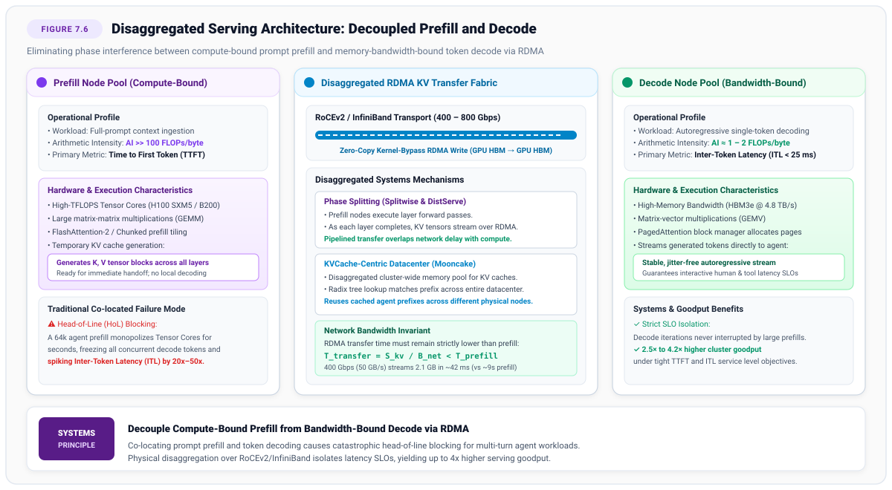
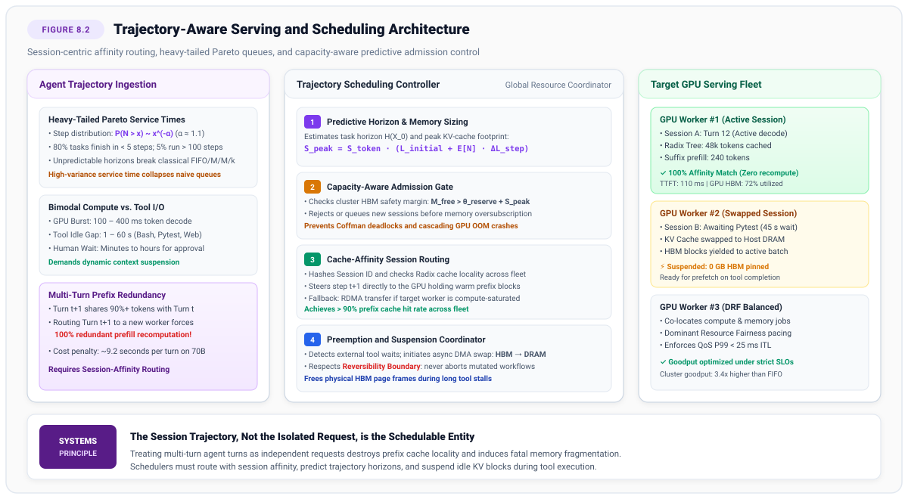
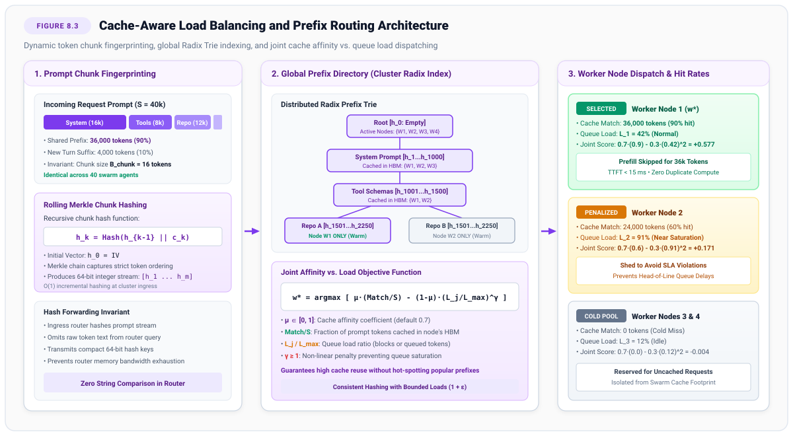
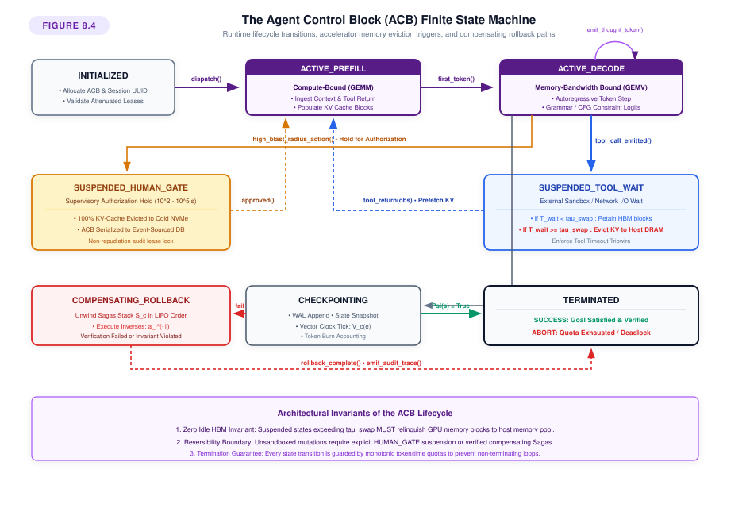
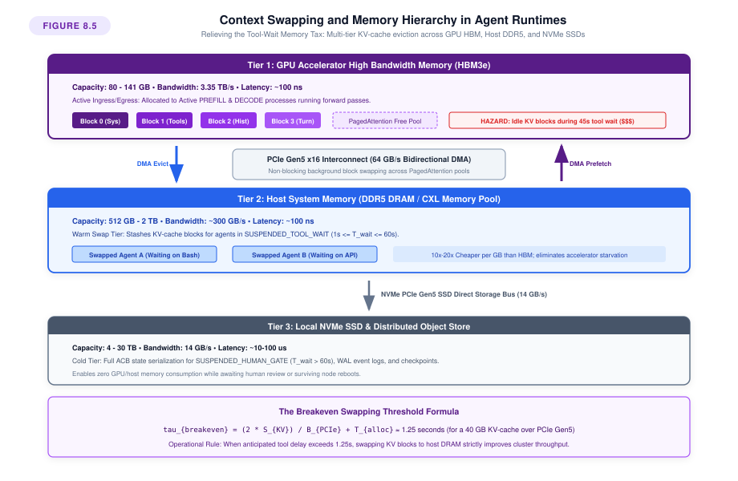
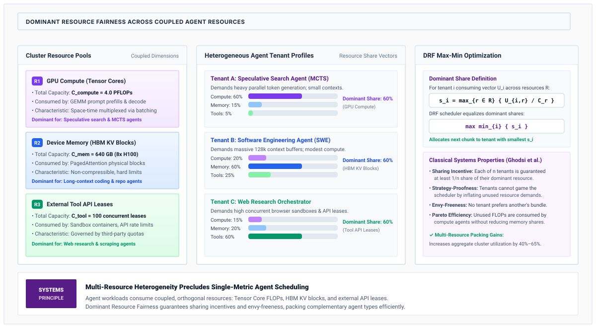
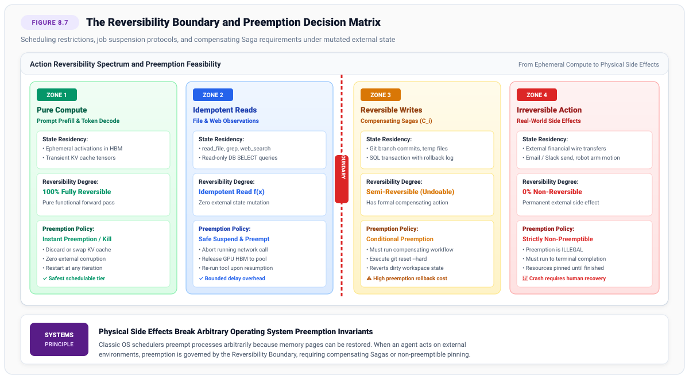

# Context Scheduling & Disaggregated Serving {#sec-vol3-scheduling}

In classical machine learning inference serving, queries arrive independently, consume a brief burst of compute to ingest a prompt, decode an output sequence one token at a time, and terminate—relinquishing their memory allocations within hundreds of milliseconds. Agentic workloads completely dismantle this operational model: execution trajectories unfold over heavy-tailed Pareto horizons; prompt contexts expand into hundreds of thousands of tokens across iterative reasoning loops; inference forward passes alternate with blocking external tool executions and human approval gates spanning seconds, minutes, or hours; and heterogeneous concurrent processes contend simultaneously for scarce accelerator High-Bandwidth Memory (HBM), Tensor Core compute units, host DRAM, and PCIe or RDMA network bandwidth. Without disciplined context scheduling and architectural disaggregation, multi-agent systems suffer from catastrophic phase interference—where expansive, compute-bound prompt prefills freeze interactive token decoding—and tool-wait memory stranding, where idle contexts lock up accelerator memory and collapse cluster goodput to near zero. This chapter formalizes the systems principles and architectural mechanisms required to schedule, multiplex, and disaggregate context memory and accelerator compute across autonomous agent fleets.

## Purpose {.unnumbered .unlisted}

::: {.content-visible when-format="pdf"}
\begin{marginfigure}
\mlagentstack{10}{10}{10}{10}{95}{10}
\caption{The Agentic Machine Learning Systems Stack.}
\end{marginfigure}
:::

_Why does an agent waiting on an external tool invocation collapse GPU cluster throughput, and how can we schedule compute and memory across heterogeneous agent swarms without inducing phase interference?_

When an autonomous agent enters a prolonged wait state for an external sandbox compilation, database migration, or human authorization gate, its execution trajectory blocks. If the serving runtime naively pins the active Key-Value (KV) context within physical accelerator High-Bandwidth Memory during these extreme bimodal latency stalls, scarce hardware memory is stranded, paralyzing concurrent execution across the cluster. Simultaneously, when newly arrived agents submit expansive multi-turn prompts, their compute-bound prefill passes monopolize accelerator streaming multiprocessors, causing severe tail-latency spikes for ongoing memory-bandwidth-bound decode streams. In agentic systems, the runtime must co-design the neural policy execution engine with deterministic operating system scheduling primitives: continuous batching with chunked prefill, physical disaggregation of prefill and decode over high-speed interconnects, priority scheduling under heavy-tailed Pareto workloads, cache-aware prefix routing, and multi-tier memory allocation under hardware constraints.

::: {.content-visible when-format="pdf"}
\newpage
:::

::: {.callout-learning-objectives}
- Formulate the arithmetic intensity and Roofline divergence between the compute-bound prefill phase and the memory-bandwidth-bound decode phase.
- Design chunked prefill and piggybacking schedulers that eliminate phase interference and bound tail Inter-Token Latency (ITL) jitter.
- Architect physically disaggregated serving clusters that decouple prefill workers from decode workers over RDMA fabrics, establishing the KV streaming network invariant.
- Analyze the queueing collapse of First-In-First-Out disciplines under heavy-tailed Pareto agent workloads and implement non-clairvoyant Least Attained Service (LAS) and Multi-Level Feedback Queues (MLFQ).
- Implement cache-aware prefix routers using global Radix trie indexes and consistent hashing to minimize redundant prefill computation across multi-agent swarms.
- Calculate analytical breakeven thresholds for preemptive KV cache swapping across HBM, host DDR5 DRAM, and NVMe fabrics during blocking tool invocations.
:::

## Continuous Batching and Chunked Prefill {#sec-vol3-scheduling-continuous-batching}

Consider an interactive software engineering environment where an accelerator cluster serves 32 concurrent developer agents. Each agent maintains an active conversational session, generating code edits and receiving real-time syntax suggestions at an average Inter-Token Latency (ITL) of $25\text{ ms}$. Suddenly, an automated background triage agent arrives with an expansive request: it submits a $64\text{k}$-token repository diff to bisect a compiler regression. In a conventional serving engine running monolithic continuous iteration batching, the scheduler injects this entire $64\text{k}$-token prompt into the immediate next execution batch. The Tensor Cores on an NVIDIA H100 GPU are monopolized for $420\text{ ms}$ executing the prompt prefill General Matrix Multiply (GEMM) kernels. For nearly half a second, the 32 interactive agents cannot execute a single decode iteration; their Inter-Token Latency spikes by $16.8\times$ from $25\text{ ms}$ to $445\text{ ms}$. Interactive code completions stutter, token streaming buffers drain, and human-facing Service-Level Agreements (SLAs) are comprehensively breached.

This production failure exposes the foundational tension in autoregressive sequence serving: the structural divergence between prompt prefill and token decode. Resolving this tension requires understanding how iteration-level scheduling operates and why co-locating unconstrained prefill with active decode induces severe phase interference.

### From static to continuous iteration batching

In early deep learning serving systems, requests were grouped using **static request-level batching**\index{Static request-level batching}. A batch of $B$ requests was assembled, padded to the maximum sequence length in the batch, and executed synchronously across all forward passes until every sequence generated an end-of-sequence (`<eos>`) delimiter. Static batching suffers from two devastating sources of hardware waste:

1. **Internal Padding Waste:** Sequences within a batch have diverse prompt and generation lengths. Shorter sequences must be padded with dummy tokens to match the longest sequence, wasting compute on masked operations.
2. **Early Finish Stranding:** When sequence $i$ finishes generating at token step 10 while sequence $j$ continues generating until step 500, sequence $i$'s allocated memory and compute slot remain completely idle for the remaining 490 iterations.

To eliminate these inefficiencies, Orca [@yu2022orca] and vLLM [@kwon2023vllm] introduced **continuous iteration batching**\index{Continuous iteration batching} (also termed dynamic iteration-level scheduling). Instead of locking execution to the request lifecycle, the serving engine operates at the granularity of a single transformer forward pass iteration.

At iteration boundary $t \to t+1$, the scheduler inspects the pool of active and pending sequences:

- Completed sequences that emitted an `<eos>` token or breached token budgets are retired immediately, and their physical memory blocks are reclaimed.
- Newly arrived requests are admitted into vacant batch slots without waiting for existing sequences to finish.
- Active sequences execute exactly one autoregressive decoding step.

While continuous batching dramatically improves accelerator throughput for short, homogeneous conversational queries, it encounters a physical breakdown when applied to agentic workloads characterized by expansive contexts and heterogeneous sequence lengths. This breakdown stems from the fundamental divergence in operational intensity dictated by the Roofline model.

### The arithmetic intensity divergence and phase contention

The hardware efficiency of any workload on a modern accelerator is governed by the Williams-Waterman-Patterson Roofline model [@williams2009]. Let $P_{\text{peak}}$ denote the peak floating-point throughput of the processor (in $\text{FLOP/s}$), and let $B_{\text{mem}}$ denote the memory bandwidth between High-Bandwidth Memory (HBM) and the compute cores (in $\text{bytes/s}$). The **arithmetic intensity**\index{Arithmetic intensity} (or operational intensity) $\mathcal{I}$ of an algorithm is defined as the ratio of total floating-point operations executed to total bytes transferred from memory:
$$\mathcal{I} = \frac{\text{Floating-Point Operations (FLOPs)}}{\text{Memory Data Transferred (Bytes)}} \quad \left[ \frac{\text{FLOP}}{\text{Byte}} \right]$$

The hardware platform's **machine balance** or **ridge point** $\mathcal{I}_{\text{knee}}$ defines the critical threshold separating memory-bandwidth-bound operations from compute-bound operations:
$$\mathcal{I}_{\text{knee}} = \frac{P_{\text{peak}}}{B_{\text{mem}}} \quad \left[ \frac{\text{FLOP}}{\text{Byte}} \right]$$

Consider an NVIDIA H100 SXM5 accelerator operating on 16-bit half-precision floating-point numbers (FP16/BF16):

- Dense peak Tensor Core throughput: $P_{\text{peak}} = 989 \times 10^{12}\text{ FLOP/s} = 989\text{ TFLOPS}$.
- HBM3 memory bandwidth: $B_{\text{mem}} = 3.35 \times 10^{12}\text{ B/s} = 3.35\text{ TB/s}$.
- The machine ridge point is:
$$\mathcal{I}_{\text{knee}} = \frac{989 \times 10^{12}\text{ FLOP/s}}{3.35 \times 10^{12}\text{ B/s}} \approx 295.2\text{ FLOP/Byte}$$

Any kernel whose operational intensity $\mathcal{I} < 295.2\text{ FLOP/Byte}$ is strictly bounded by HBM bandwidth; its execution time is dominated by reading data across the memory bus, leaving the vast majority of Tensor Cores powered down or stalled. Conversely, any kernel with $\mathcal{I} \ge 295.2\text{ FLOP/Byte}$ is compute-bound, fully utilizing the Tensor Cores.

Now examine the two distinct operational phases of a decoder-only transformer model with $N_{\text{params}}$ parameters, $L$ transformer layers, hidden dimension $d_{\text{model}}$, $H$ query attention heads, $H_{\text{KV}}$ key-value heads, and per-head dimension $d_h = d_{\text{model}} / H$.

#### The prefill phase (compute-bound)
In the prefill phase, the model ingests an entire prompt sequence of length $S$ tokens in a single forward pass. Because all $S$ tokens are known simultaneously, the matrix-vector products across linear projections ($W_Q, W_K, W_V, W_O$ and the multi-layer perceptron feed-forward blocks $W_{\text{gate}}, W_{\text{up}}, W_{\text{down}}$) are batched across all $S$ positions into General Matrix Multiplies (GEMMs).

The floating-point operations required to project the weights scale as:
$$\text{FLOPs}_{\text{weights}} \approx 2 N_{\text{params}} S$$
Evaluating multi-head self-attention across the sequence requires computing the attention scores $Q K^T$ and multiplying by values $A V$, contributing:
$$\text{FLOPs}_{\text{attn}} \approx 4 L H d_h S^2 = 4 L d_{\text{model}} S^2$$
Total floating-point operations for prefill are therefore:
$$\text{FLOPs}_{\text{prefill}} \approx 2 N_{\text{params}} S + 4 L d_{\text{model}} S^2$$

To execute these operations in half precision ($2\text{ bytes}$ per parameter), the model weights must be read from HBM once:
$$\text{Bytes}_{\text{weights}} = 2 N_{\text{params}} \quad \text{Bytes}$$
For moderate sequence lengths where attention compute is smaller than weight projections ($S \ll N_{\text{params}} / 2 L d_{\text{model}}$), the operational intensity of prefill is:
$$\mathcal{I}_{\text{prefill}} \approx \frac{2 N_{\text{params}} S}{2 N_{\text{params}}} = S \quad \left[ \frac{\text{FLOP}}{\text{Byte}} \right]$$

When an agent prompt contains $S \ge 512$ tokens, its operational intensity $\mathcal{I}_{\text{prefill}} \ge 512\text{ FLOP/Byte} > \mathcal{I}_{\text{knee}} = 295.2\text{ FLOP/Byte}$. The prefill phase operates squarely in the **compute-bound regime**. The hardware bottleneck is Tensor Core floating-point throughput, and the kernel maximizes accelerator arithmetic utilization.

#### The decode phase (memory-bandwidth bound)
In the autoregressive decode phase, the model generates exactly one new token at position $S + t$ for each active sequence in the batch. Let $B_{\text{dec}}$ denote the number of concurrent decoding sequences. For each sequence, the model must evaluate all $N_{\text{params}}$ weights against a single activation vector of length $1$.

The operations degenerate from GEMM (matrix-matrix multiplication) to GEMV (matrix-vector multiplication). The compute required is:
$$\text{FLOPs}_{\text{decode}} \approx 2 N_{\text{params}} B_{\text{dec}}$$
Crucially, all $N_{\text{params}}$ weights must still be streamed from HBM into the register files and on-chip SRAM for every single token step:
$$\text{Bytes}_{\text{weights}} = 2 N_{\text{params}} \quad \text{Bytes}$$
In addition, the forward pass must stream the historical Key-Value (KV) cache for all $B_{\text{dec}}$ sequences across all $L$ layers to compute cross-attention over historical tokens:
$$\text{Bytes}_{\text{KV}} = 2 \times 2 \times L \times H_{\text{KV}} \times d_h \times \sum_{i=1}^{B_{\text{dec}}} S_i \quad \text{Bytes}$$
The operational intensity of the decode phase is therefore:
$$\mathcal{I}_{\text{decode}} = \frac{2 N_{\text{params}} B_{\text{dec}}}{2 N_{\text{params}} + \text{Bytes}_{\text{KV}}} \le B_{\text{dec}} \quad \left[ \frac{\text{FLOP}}{\text{Byte}} \right]$$

For typical serving batch sizes ($B_{\text{dec}} \in [1, 64]$), the operational intensity $\mathcal{I}_{\text{decode}} \le 64\text{ FLOP/Byte}$, which is far below the machine knee of $295.2\text{ FLOP/Byte}$. Autoregressive decoding is severely **memory-bandwidth bound**. Over $80\text{--}90\%$ of peak Tensor Core capacity sits completely idle, waiting for the memory controllers to stream parameter weights across the HBM bus.

#### Phase contention
When a monolithic continuous batching engine attempts to schedule an incoming prefill request alongside active decode sequences in the same iteration, a destructive phenomenon known as **phase contention**\index{Phase contention} (or phase interference) occurs (@tbl-vol3-scheduling-monolithic-batching):

| Timeline Window             | Decode Stream Status                   | Prefill Engine State                    | Hardware Resource Allocation           | Inter-Token Latency Impact                |
|:----------------------------|:---------------------------------------|:----------------------------------------|:---------------------------------------|:------------------------------------------|
| $0\text{--}50\text{ ms}$    | Emits Token 1                          | Idle (no prompt arriving)               | Memory-bandwidth bound (GEMV on HBM)   | Nominal ITL ($25\text{ ms}$)              |
| $50\text{--}100\text{ ms}$  | Emits Token 2                          | Idle (no prompt arriving)               | Memory-bandwidth bound (GEMV on HBM)   | Nominal ITL ($25\text{ ms}$)              |
| $100\text{--}250\text{ ms}$ | **Stalled / Blocked** (waiting on SMs) | **Monolithic 64k Prefill** forward pass | Compute-dense GEMM claims all SMs      | **Spike (+150--200 ms jitter violation)** |
| $250\text{--}275\text{ ms}$ | Emits Token 3 (resumes after prefill)  | Completed (transitioned to decode)      | Returns to memory-bandwidth bound GEMV | Recovers nominal ITL                      |

: **Monolithic Co-Located Batching Timeline and Phase Contention**: Execution breakdown illustrating the destruction of decode stream SLOs when a compute-dense 64k prefill monopolizes GPU streaming multiprocessors, stalling active decodes. {#tbl-vol3-scheduling-monolithic-batching tbl-colwidths="[18,22,22,22,16]"}

The compute-dense GEMM kernel of the prefill request claims all available Streaming Multiprocessors (SMs) and thread blocks. The lightweight GEMV kernels of the decoding sequences are serialized or starved of memory issue slots. Because modern GPU hardware schedulers cannot preempt an active cooperative thread array (CTA) mid-kernel, the decoding sequences must pause until the entire prefill GEMM executes to completion. The result is an explosive spike in tail Inter-Token Latency.

### Chunked prefill and iteration piggybacking

To resolve phase contention without abandoning iteration-level scheduling, Sarathi [@agrawal2024sarathi] introduced **chunked prefill**\index{Chunked prefill} and **iteration piggybacking**\index{Iteration piggybacking}.

Instead of executing a long prompt of length $S$ as a single, monolithic, atomic GEMM, the scheduler slices the prompt into a sequence of smaller, uniform token chunks of size $C$ (e.g., $C = 512$ or $C = 1024$ tokens). The total number of chunk iterations required to ingest the prompt is:
$$K = \left\lceil \frac{S}{C} \right\rceil$$

In each serving iteration $t$, the scheduler constructs a **hybrid batch** comprising:

1. All $B_{\text{dec}}$ ready decode sequences (each contributing $1$ token).
2. A single prefill chunk of size $C_{\text{eff}} \le C$ selected from the head of the prefill queue.

The total token budget per iteration is constrained by a strict ceiling $T_{\text{budget}}$:
$$N_{\text{iter}}(t) = B_{\text{dec}}(t) + C_{\text{eff}}(t) \le T_{\text{budget}}$$

By fixing $T_{\text{budget}}$ such that the total execution time of the hybrid batch matches the target Service-Level Objective for Inter-Token Latency ($\Delta t_{\text{iter}} \le SLO_{\text{ITL}}$), the runtime guarantees bounded latency jitter for active decode streams while steadily advancing prefill computation (@tbl-vol3-scheduling-chunked-piggybacking).

| Serving Iteration | Time Window                | Prefill Chunk Progress                       | Decode Batch Status                       | Iteration Compute Profile                                      | ITL SLA Compliance             |
|:------------------|:---------------------------|:---------------------------------------------|:------------------------------------------|:---------------------------------------------------------------|:-------------------------------|
| **Iteration 1**   | $0\text{--}25\text{ ms}$   | Chunk 1 ($25\%$ ingested, KV cached)         | Token 1 emitted across all decode streams | Balanced GEMM + GEMV ($N_{\text{iter}} \le T_{\text{budget}}$) | $\le 25\text{ ms}$ (Compliant) |
| **Iteration 2**   | $25\text{--}50\text{ ms}$  | Chunk 2 ($50\%$ ingested, cross-attend KV)   | Token 2 emitted across all decode streams | Balanced GEMM + GEMV ($N_{\text{iter}} \le T_{\text{budget}}$) | $\le 25\text{ ms}$ (Compliant) |
| **Iteration 3**   | $50\text{--}75\text{ ms}$  | Chunk 3 ($75\%$ ingested, cross-attend KV)   | Token 3 emitted across all decode streams | Balanced GEMM + GEMV ($N_{\text{iter}} \le T_{\text{budget}}$) | $\le 25\text{ ms}$ (Compliant) |
| **Iteration 4**   | $75\text{--}100\text{ ms}$ | Chunk 4 ($100\%$ complete, ready for decode) | Token 4 emitted across all decode streams | Balanced GEMM + GEMV ($N_{\text{iter}} \le T_{\text{budget}}$) | $\le 25\text{ ms}$ (Compliant) |

: **Chunked Prefill Piggybacking Timeline**: Iteration-level scheduling demonstrating smooth prefill ingestion interleaved with token generation, maintaining strict ITL upper bounds across consecutive forward passes. {#tbl-vol3-scheduling-chunked-piggybacking tbl-colwidths="[15,15,25,20,15,10]"}

#### Attention computation across chunk boundaries
Executing prefill in chunks requires careful handling of causal self-attention across chunk boundaries. When evaluating chunk $k$ spanning token indices $[(k-1)C, \, kC - 1]$:

1. **Intra-Chunk Attention:** Tokens within chunk $k$ attend to preceding tokens within chunk $k$ via standard causal masking.
2. **Cross-Chunk Attention:** Tokens within chunk $k$ attend to all historical tokens from chunks $1$ through $k-1$. Because the Key and Value states for chunks $1 \dots k-1$ were already materialized and stored in the paged KV cache during prior iterations, chunk $k$'s queries compute FlashAttention [@dao2022] against the concatenation of the cached KV blocks and the newly generated KV activations.
3. **KV Cache Commitment:** As chunk $k$ completes its forward pass, its Key and Value activations are appended to the request's PagedAttention block table in HBM.

Only when the final chunk $K$ finishes does the request transition from the prefill state to the active decode state, ready to generate its very first output token ($a_0$).

#### Mathematical derivation of the optimal chunk budget

What is the optimal token budget $T_{\text{budget}}^*$ that maximizes accelerator throughput without violating an operator's SLA? Let $\tau_{\text{target}}$ denote the target inter-token latency bound (e.g., $\tau_{\text{target}} = 25\text{ ms}$).

The execution duration of an iteration processing $B_{\text{dec}}$ decode tokens and $C$ prefill tokens can be modeled via the two-term Roofline formulation:
$$\Delta t_{\text{iter}}(B_{\text{dec}}, C) = \max \left( \frac{2 N_{\text{params}} + \text{Bytes}_{\text{KV}}(B_{\text{dec}})}{B_{\text{mem}}}, \; \frac{2 N_{\text{params}} (B_{\text{dec}} + C) + 4 L d_{\text{model}} C S_{\text{avg}}}{P_{\text{peak}}} \right) + \delta_{\text{launch}}$$ {#eq-chunk-iter-time}
where $\delta_{\text{launch}}$ represents kernel launch overhead and synchronization latency (typically $0.1\text{--}0.3\text{ ms}$).

Notice the duality in @eq-chunk-iter-time:

- The first term represents the memory bandwidth boundary: reading model weights requires a baseline time $t_{\text{weights}} = 2 N_{\text{params}} / B_{\text{mem}}$ regardless of whether $C=0$ or $C>0$. For a 70B parameter model on an H100 ($B_{\text{mem}} = 3.35\text{ TB/s}$), this floor is:
$$t_{\text{weights}} = \frac{2 \times 70 \times 10^9\text{ B}}{3.35 \times 10^{12}\text{ B/s}} \approx 41.8\text{ ms}$$
- During this $41.8\text{ ms}$ memory-read interval, the Tensor Cores are largely idle. We can "piggyback" prefill tokens $C$ into the computation essentially for free until the floating-point execution time equals the memory fetch time!

The critical chunk threshold $C^*$ at which the kernel transitions from memory-bound to compute-bound is given by equating the two terms:
$$\frac{2 N_{\text{params}}}{B_{\text{mem}}} = \frac{2 N_{\text{params}} (B_{\text{dec}} + C^*) + 4 L d_{\text{model}} C^* S_{\text{avg}}}{P_{\text{peak}}}$$

Solving for $C^*$:
$$C^* = \frac{\frac{2 N_{\text{params}}}{B_{\text{mem}}} P_{\text{peak}} - 2 N_{\text{params}} B_{\text{dec}}}{2 N_{\text{params}} + 4 L d_{\text{model}} S_{\text{avg}}} = \frac{2 N_{\text{params}} \left( \mathcal{I}_{\text{knee}} - B_{\text{dec}} \right)}{2 N_{\text{params}} + 4 L d_{\text{model}} S_{\text{avg}}}$$

For realistic batch sizes $B_{\text{dec}} \ll \mathcal{I}_{\text{knee}}$, this derivation yields a remarkable architectural insight: **an accelerator can process hundreds of prefill tokens concurrently with ongoing decode passes without increasing iteration duration by even a single microsecond**. The prefill compute is entirely absorbed by the spare arithmetic capacity stranded by the memory-bandwidth-bound decode stream.

@Tbl-scheduling-batching-comparison summarizes the trade-offs across batching architectures.

| Dimension                     | Static Batching                      | Monolithic Continuous Batching    | Chunked Prefill Piggybacking              |
|:------------------------------|:-------------------------------------|:----------------------------------|:------------------------------------------|
| **Scheduling Granularity**    | Request lifecycle                    | Token iteration                   | Token iteration + token chunk             |
| **Padding Overhead**          | High ($\mathcal{O}(\max S_i - S_i)$) | Zero                              | Zero                                      |
| **Decode ITL Predictability** | High variance                        | Catastrophic spikes ($>15\times$) | Strictly bounded ($\le SLO_{\text{ITL}}$) |
| **TTFT on Long Prompts**      | Minimal (single pass)                | Minimal (monolithic pass)         | Slightly increased ($+10\text{--}15\%$)   |
| **Tensor Core Utilization**   | Low ($<15\%$)                        | Bimodal ($10\%\text{ or }90\%$)   | High and sustained ($>65\%$)              |
| **KV Cache Allocation**       | Static maximum                       | Dynamic (PagedAttention)          | Progressive per chunk                     |

: **Comparison of Inference Serving Batching Strategies**: Performance profiles, latency predictability, and accelerator resource utilization across static, monolithic continuous, and chunked prefill batching architectures. {#tbl-scheduling-batching-comparison tbl-colwidths="[20,25,25,30]"}

### Python implementation: Chunked prefill scheduler

The following production-grade implementation demonstrates the core logic of a chunked prefill scheduler, constructing balanced hybrid iterations under strict token budget constraints:

```python
from __future__ import annotations
import uuid
from dataclasses import dataclass, field
from enum import Enum
from typing import Dict, List, Optional, Tuple

class RequestPhase(Enum):
    WAITING_PREFILL = "WAITING_PREFILL"
    CHUNKED_PREFILL = "CHUNKED_PREFILL"
    DECODING = "DECODING"
    COMPLETED = "COMPLETED"

@dataclass
class SequenceDescriptor:
    request_id: str = field(default_factory=lambda: str(uuid.uuid4())[:8])
    prompt_tokens: List[int] = field(default_factory=list)
    generated_tokens: List[int] = field(default_factory=list)
    phase: RequestPhase = RequestPhase.WAITING_PREFILL
    prefilled_tokens: int = 0
    max_output_tokens: int = 64
    arrival_time: float = 0.0

    @property
    def total_prompt_length(self) -> int:
        return len(self.prompt_tokens)

    @property
    def remaining_prefill_tokens(self) -> int:
        return self.total_prompt_length - self.prefilled_tokens

    @property
    def is_prefill_complete(self) -> bool:
        return self.prefilled_tokens >= self.total_prompt_length

@dataclass
class HybridIterationBatch:
    iteration_id: int
    decode_requests: List[SequenceDescriptor] = field(default_factory=list)
    prefill_chunks: List[Tuple[SequenceDescriptor, int]] = field(default_factory=list)
    total_tokens: int = 0

class ChunkedPrefillScheduler:
    def __init__(self, max_token_budget: int = 1024, max_decode_batch_size: int = 32):
        self.max_token_budget = max_token_budget
        self.max_decode_batch_size = max_decode_batch_size
        self.waiting_queue: List[SequenceDescriptor] = []
        self.active_decode_pool: List[SequenceDescriptor] = []
        self.iteration_counter: int = 0

    def add_request(self, seq: SequenceDescriptor) -> None:
        self.waiting_queue.append(seq)

    def schedule_next_iteration(self) -> HybridIterationBatch:
        self.iteration_counter += 1
        batch = HybridIterationBatch(iteration_id=self.iteration_counter)

        # 1. Admit all active decode requests (highest priority for ITL stability)
        for seq in self.active_decode_pool:
            if len(batch.decode_requests) < self.max_decode_batch_size:
                batch.decode_requests.append(seq)
                batch.total_tokens += 1

        tokens_remaining_budget = self.max_token_budget - batch.total_tokens

        # 2. Allocate remaining token budget to prefill chunks
        idx = 0
        while idx < len(self.waiting_queue) and tokens_remaining_budget > 0:
            seq = self.waiting_queue[idx]
            needed = seq.remaining_prefill_tokens
            chunk_size = min(needed, tokens_remaining_budget)

            if chunk_size > 0:
                batch.prefill_chunks.append((seq, chunk_size))
                batch.total_tokens += chunk_size
                tokens_remaining_budget -= chunk_size
                seq.phase = RequestPhase.CHUNKED_PREFILL
                seq.prefilled_tokens += chunk_size

            # If request finished prefill, promote it to decode pool for next step
            if seq.is_prefill_complete:
                seq.phase = RequestPhase.DECODING
                self.active_decode_pool.append(seq)
                self.waiting_queue.pop(idx)
            else:
                idx += 1

        return batch

    def step_simulation(self, batch: HybridIterationBatch) -> None:
        """Simulate forward pass execution and state transitions."""
        # Process decode completions
        retired: List[SequenceDescriptor] = []
        for seq in batch.decode_requests:
            mock_token = 42  # Synthetic generated token ID
            seq.generated_tokens.append(mock_token)
            if len(seq.generated_tokens) >= seq.max_output_tokens or mock_token == 0:
                seq.phase = RequestPhase.COMPLETED
                retired.append(seq)

        for seq in retired:
            self.active_decode_pool.remove(seq)
```

While chunked prefill successfully bounds Inter-Token Latency jitter within a single GPU or tensor-parallel group, co-locating prefill and decode phases on the exact same physical silicon remains fundamentally suboptimal. Slicing prefills forces the prefill phase to share the memory bandwidth and register files of the decode phase, and prevents independent scaling of prefill and decode hardware resources. To achieve true hardware specialization and optimal operational efficiency, the runtime must physically disaggregate prefill from decode.

## Disaggregated Serving: Separating Prefill and Decode {#sec-vol3-scheduling-disaggregated}

Even with chunked prefill, a homogeneous accelerator cluster exhibits deep operational inefficiencies when serving multi-agent workflows. Consider a 64-GPU cluster deployed to serve an enterprise agentic coding platform. During the morning hours, hundreds of agents ingest large codebases, documentation indices, and compiler traces—a workload dominated by massive prefill requests demanding tens of petaflops of raw FP16/BF16 compute. In the afternoon, those same agents enter autonomous debugging loops, performing multi-step tool calls, emitting thought tokens, and evaluating small intermediate results—a decode-dominated workload demanding terabytes per second of aggregate memory bandwidth while leaving $85\%$ of the Tensor Cores unutilized.

In a homogeneous cluster where every GPU executes both prefill and decode, systems architects are forced into an impossible trade-off:

- Over-provisioning compute (e.g., procuring NVIDIA H100/B200 SXM clusters with top-tier Tensor Cores) incurs extreme financial expenditure, only for those Tensor Cores to sit idle during decode-heavy hours.
- Over-provisioning memory capacity (e.g., adding nodes simply to acquire more aggregate HBM for KV caches) fragments compute utilization and drives up total cost of ownership (TCO).
- Tensor parallelism degrees are locked: prefill latency demands high tensor parallelism ($TP = 8$) to slash Time-To-First-Token (TTFT), while decode throughput favors low tensor parallelism ($TP = 1$ or $TP = 2$) to minimize cross-GPU all-reduce collective communication overheads on memory-bound GEMVs.

This fundamental mismatch led to the invention of **Disaggregated Serving**\index{Disaggregated Serving} (pioneered by DistServe [@zhong2024distserve] and Splitwise [@patel2024]).

### Physical prefill-decode disaggregation architecture

Disaggregated serving physically partitions the accelerator fleet into two distinct, specialized hardware pools connected by a high-speed interconnect fabric (@fig-vol3-scheduling-disaggregation):

1. **Prefill Workers ($P$-Nodes):** Optimized for compute density ($P_{\text{peak}}$). Because prefill is compute-bound, $P$-nodes can be provisioned using high-TFLOPS accelerators (e.g., PCIe-based H100s or specialized dense GEMM processors). $P$-nodes run with high Tensor Parallelism ($TP_P = 8$) to minimize TTFT for large prompts. They do not maintain long-lived KV caches; once a prefill forward pass completes, the resulting KV activations are immediately evicted across the network.
2. **Decode Workers ($D$-Nodes):** Optimized for memory capacity and bandwidth ($B_{\text{mem}}$). Because decoding is memory-bandwidth bound, $D$-nodes prioritize maximum HBM capacity and bandwidth (e.g., NVIDIA H200 with $141\text{ GB}$ HBM3e at $4.8\text{ TB/s}$, or AMD Instinct MI300X with $192\text{ GB}$ at $5.3\text{ TB/s}$). $D$-nodes run with lower Tensor Parallelism ($TP_D = 1$ or $2$) and high Pipeline Parallelism, maximizing batch concurrency and amortizing parameter loading costs across dozens of streams.

::: {#fig-vol3-scheduling-disaggregation fig-env="figure" fig-pos="htb" fig-cap="**Physical Prefill-Decode Disaggregation Architecture**: Decoupling compute-bound prefill workers from memory-bandwidth-bound decode workers via a zero-copy RDMA network fabric. Key-Value cache activations are streamed from P-nodes to D-nodes over RoCEv2/InfiniBand, eliminating phase interference and enabling independent horizontal scaling. Source: Author design." fig-alt="Architecture diagram showing Disaggregated Serving: Incoming agent requests hit a Distributed Orchestrator. The prompt is dispatched to a P-Node running high Tensor Parallelism. Generated KV blocks stream over an RDMA fabric into a D-Node running low Tensor Parallelism, which generates output tokens until a tool invocation occurs."}

:::

The lifecycle of an agent execution turn in a disaggregated serving system proceeds through five stages:

1. **Admission and Routing:** An incoming agent request carrying prompt $\mathbf{x} = (x_1, \dots, x_S)$ arrives at the global cluster orchestrator. The orchestrator dispatches the request to an available $P$-node pool.
2. **Prompt Evaluation:** The $P$-node evaluates the full prompt across its Tensor Cores, computing the hidden states and generating the Key and Value activation tensors for all $L$ layers.
3. **KV Cache Network Transfer:** The $P$-node transfers the newly generated KV blocks across the interconnect fabric to the designated $D$-node hosting the agent's decode session.
4. **Autoregressive Decoding:** The $D$-node loads the received KV cache into its local PagedAttention memory pool, computes the first token logits, and generates output tokens sequentially.
5. **Tool Suspension / Re-Routing:** If the agent emits a tool call, the $D$-node releases its decode slot. When the tool observation returns with an expanded prompt, the updated sequence is routed back to a $P$-node, repeating the cycle.

### The KV transfer network invariant and bottleneck analysis

The primary engineering challenge in disaggregated serving is the **KV transfer tax**\index{KV transfer tax}: moving gigabytes of intermediate activation memory across network switches without destroying the latency gains achieved by compute specialization.

To quantify this challenge, we derive the exact physical footprint of the KV cache for a context sequence of length $S$. In a transformer with $L$ layers, $H_{\text{KV}}$ key-value heads, per-head dimension $d_h$, and numerical precision of $b_{\text{bytes}}$ bytes per element, each token generates two activation vectors (Key and Value) at each layer:
$$S_{\text{KV}}(S) = 2 \times L \times H_{\text{KV}} \times d_h \times S \times b_{\text{bytes}} \quad \text{Bytes}$$

Let $\sigma_{\text{KV}}$ denote the **KV cache memory density per token** (in bytes per token):
$$\sigma_{\text{KV}} = \frac{S_{\text{KV}}(S)}{S} = 2 L H_{\text{KV}} d_h b_{\text{bytes}} \quad \left[ \frac{\text{Bytes}}{\text{Token}} \right]$$

Consider the popular Llama-3-70B architecture [@dubey2024llama]:

- Layers: $L = 80$
- Hidden dimension: $d_{\text{model}} = 8192$
- Query attention heads: $H_Q = 64$
- Key-Value heads (Grouped-Query Attention, GQA): $H_{\text{KV}} = 8$
- Head dimension: $d_h = d_{\text{model}} / H_Q = 8192 / 64 = 128$
- Precision: 16-bit half-precision ($b_{\text{bytes}} = 2\text{ bytes}$)

Evaluating $\sigma_{\text{KV}}$ for Llama-3-70B:
$$\sigma_{\text{KV}} = 2 \times 80 \times 8 \times 128 \times 2 = 327{,}680\text{ Bytes/Token} \approx 320\text{ KB/Token}$$

For an agent operating with a long context of $S = 64\text{k} = 65{,}536$ tokens:
$$S_{\text{KV}}(64\text{k}) = 65{,}536 \times 327{,}680\text{ Bytes} \approx 21.47 \times 10^9\text{ Bytes} \approx 21.47\text{ GB}$$

Transferring $21.47\text{ GB}$ of raw memory across a network interface introduces physical communication delay. The total transfer latency $t_{\text{transfer}}$ across an effective network bandwidth $B_{\text{net}}$ is:
$$t_{\text{transfer}} = \frac{S_{\text{KV}}}{B_{\text{net}}} + t_{\text{setup}}$$
where $t_{\text{setup}}$ represents RDMA queue pair connection and memory registration overhead ($\approx 0.5\text{--}2\text{ ms}$).

Let us evaluate $t_{\text{transfer}}$ across four generations of enterprise network fabrics:

1. **Standard 100 Gbps Ethernet:** Effective bandwidth $B_{\text{net}} \approx 12.5\text{ GB/s}$:
   $$t_{\text{transfer}} = \frac{21.47\text{ GB}}{12.5\text{ GB/s}} \approx 1.718\text{ seconds}$$
   A $1.7\text{-second}$ transfer latency is catastrophic: it completely erases the speedup of running prefill on dedicated hardware and breaches interactive TTFT targets.
2. **400 Gbps RoCEv2 / InfiniBand (NDR):** Effective bandwidth $B_{\text{net}} \approx 50\text{ GB/s}$:
   $$t_{\text{transfer}} = \frac{21.47\text{ GB}}{50\text{ GB/s}} \approx 429.4\text{ ms}$$
3. **800 Gbps InfiniBand (XDR / 2x NDR):** Effective bandwidth $B_{\text{net}} \approx 100\text{ GB/s}$:
   $$t_{\text{transfer}} = \frac{21.47\text{ GB}}{100\text{ GB/s}} \approx 214.7\text{ ms}$$
4. **Scale-Up NVLink Network Fabric:** Effective bandwidth $B_{\text{net}} \approx 450\text{ GB/s}$:
   $$t_{\text{transfer}} = \frac{21.47\text{ GB}}{450\text{ GB/s}} \approx 47.7\text{ ms}$$

### The KV streaming invariant

To prevent $t_{\text{transfer}}$ from penalizing Time-To-First-Token, modern disaggregated runtimes implement **asynchronous layer-pipelined KV streaming**\index{Asynchronous KV streaming}.

Rather than waiting for the entire forward pass across all $L$ layers to conclude before opening network sockets, the $P$-node initiates an asynchronous Remote Direct Memory Access (RDMA) write into the $D$-node's pre-allocated HBM buffer as soon as layer $l$'s Key and Value tensors are produced.

Let $\tau_{\text{compute}}(l)$ denote the computation duration of layer $l$, and let $\tau_{\text{transfer}}(l)$ denote the network transmission duration of layer $l$'s KV cache:
$$\tau_{\text{compute}}(l) \approx \frac{2 N_{\text{params, layer}} S + 4 H d_h S^2}{P_{\text{eff}}}$$
$$\tau_{\text{transfer}}(l) = \frac{2 H_{\text{KV}} d_h S \cdot b_{\text{bytes}}}{B_{\text{RDMA}}}$$

::: {.callout-note title="Lemma 8.1: The KV streaming invariant"}
If the network transmission time of layer $l$'s KV cache is strictly less than or equal to the computation time of layer $l+1$'s forward pass (@eq-kv-streaming-invariant):
$$\tau_{\text{transfer}}(l) \le \tau_{\text{compute}}(l+1) \quad \forall l \in \{1, \dots, L-1\}$$ {#eq-kv-streaming-invariant}
then all intermediate network transfer latency is completely hidden (overlapped) behind forward-pass compute. The effective transfer penalty observed by the end-user collapses to the transfer time of the final layer $L$:
$$\Delta t_{\text{visible}} = \tau_{\text{transfer}}(L) = \frac{S_{\text{KV}}}{L \cdot B_{\text{RDMA}}}$$
:::

For Llama-3-70B with $S = 64\text{k}$ over a 400 Gbps RDMA interconnect ($B_{\text{RDMA}} = 50\text{ GB/s}$):
$$\Delta t_{\text{visible}} = \frac{21.47\text{ GB}}{80 \times 50\text{ GB/s}} \approx 5.37\text{ ms}$$

By enforcing the KV streaming invariant, the disaggregated runtime transfers over $21\text{ GB}$ of activation context while adding only $5.4\text{ ms}$ of visible overhead to the end-to-end Time-To-First-Token.

With compute and memory physically specialized, how should a cluster control plane schedule incoming requests across these pools when workloads exhibit extreme priority differences and heavy-tailed execution horizons? This is the domain of priority scheduling.

## Priority Scheduling and Service-Level Objectives for Agent Swarms {#sec-vol3-scheduling-priority}

In an enterprise multi-agent deployment, request streams are fundamentally heterogeneous. Consider a system supporting two concurrent classes of agents:

1. **Interactive Developer Agents:** Human engineers issuing natural language instructions to an IDE agent for real-time code completion, syntax explanation, and inline refactoring. These sessions require immediate responsiveness: Time-To-First-Token must not exceed $500\text{ ms}$, and Inter-Token Latency must remain below $30\text{ ms}$ ($>33\text{ tokens/sec}$, matching human reading speed).
2. **Autonomous Background Triage Swarms:** Hundreds of worker agents autonomously crawling repositories, running static analysis linters, bisecting regression tests, and attempting test compilations. These tasks are long-running, asynchronous, and batch-oriented; their completion deadlines span minutes to hours.

If both workloads feed into a single, unweighted First-In-First-Out (FIFO) serving queue, the system experiences immediate operational collapse. An autonomous agent embarking on a 400-step test bisection loop occupies a decode slot on an accelerator node for 30 minutes. Interactive developer queries queue up behind it, suffering multi-minute queueing delays for requests that require only 200 milliseconds of actual compute.

To guarantee Quality of Service (QoS) across heterogeneous agent fleets, the runtime must formalize Service-Level Objectives and deploy priority-aware queueing disciplines calibrated against the mathematical realities of heavy-tailed workloads.

### Service-level objectives in agent serving

In traditional web microservices, performance is summarized by a single scalar metric: total end-to-end request response latency. In agentic LLM serving, single-scalar latency is structurally inadequate because inference is an incremental, autoregressive process. The serving runtime must enforce two decoupled **Service-Level Objectives (SLOs)**\index{Service-Level Objectives (SLOs)}:

1. **Time-To-First-Token ($SLO_{\text{TTFT}}$):** The elapsed wall-clock time from when the agent submits a prompt $\mathbf{x}$ to when the serving system emits the initial generated token $y_1$:
   $$TTFT = t_{\text{first\_token}} - t_{\text{arrival}} \le SLO_{\text{TTFT}}$$
   TTFT is governed by queue waiting time, prompt prefill latency, and (in disaggregated systems) KV transfer time.
2. **Inter-Token Latency ($SLO_{\text{ITL}}$):** The time elapsed between the emission of consecutive generated tokens:
   $$ITL_k = t_{k} - t_{k-1} \le SLO_{\text{ITL}} \quad \forall k \in \{2, \dots, N_{\text{out}}\}$$
   ITL is governed by the iteration forward-pass duration of the decode engine.

To capture whether an agent's execution was actually useful, systems engineers define **Goodput**\index{Goodput}:
$$\mathcal{G} = \frac{1}{T_{\text{total}}} \sum_{i=1}^{N_{\text{req}}} \mathbf{1}\left( TTFT_i \le SLO_{\text{TTFT}} \;\land\; \max_k ITL_{i,k} \le SLO_{\text{ITL}} \right) \quad \left[ \frac{\text{requests}}{\text{second}} \right]$$

A request that generates 500 tokens at high speed but suffered a 30-second initial queue delay, or a request whose streaming tokens stuttered beyond human reading thresholds, represents **wasted compute**: the accelerator burned kilowatt-hours of electrical energy and gigabytes of memory bandwidth, yet the output violated its SLA and failed the user experience.

### The queueing dynamics of heavy-tailed agent workloads

Why do classical scheduling disciplines fail so completely when applied to multi-agent swarms? The answer lies in the probability distribution of agent execution horizons.

In human conversational search, prompt and generation lengths cluster around moderate values with bounded variance (often modeled as log-normal or Poisson arrivals with bounded service times). In contrast, autonomous agent trajectories exhibit **heavy-tailed Pareto distributions**\index{Heavy-tailed Pareto distributions}. An agent tasked with finding a bug may terminate in 2 steps (a missing semicolon) or expand into 300 steps across multiple subagents (bisecting commits, compiling binaries, executing integration tests).

Let $X$ denote the service time (measured in total generated tokens or forward-pass execution steps) of an agent trajectory. The Pareto distribution is defined by:
$$P(X > x) = \left( \frac{x_m}{x} \right)^\alpha \quad \text{for } x \ge x_m$$
where $x_m > 0$ is the minimum execution horizon (e.g., $x_m = 2$ steps), and $\alpha > 0$ is the Pareto shape parameter (tail index).

The moments of the Pareto distribution reveal a profound mathematical boundary:
$$\mathbb{E}[X] = \begin{cases} \frac{\alpha x_m}{\alpha - 1} & \text{if } \alpha > 1 \\ \infty & \text{if } \alpha \le 1 \end{cases}$$
$$\mathbb{E}[X^2] = \begin{cases} \frac{\alpha x_m^2}{\alpha - 2} & \text{if } \alpha > 2 \\ \infty & \text{if } \alpha \le 2 \end{cases}$$

Empirical measurements across production agent fleets (such as SWE-bench execution traces and autonomous web-browsing agents) reveal tail indices in the range:
$$\alpha \in [1.1, \, 1.4]$$

Notice the critical consequence: because $\alpha < 2$, **the second moment $\mathbb{E}[X^2]$ diverges to infinity**. The workload exhibits **infinite theoretical variance**.

#### The mathematical collapse of FIFO queueing
Consider an inference serving node modeled as an $M/G/1$ queue with Poisson arrival rate $\lambda$, arbitrary service time distribution $X$, and server utilization $\rho = \lambda \mathbb{E}[X] < 1$.

By the classical Pollaczek-Khinchine formula [@kleinrock1975queueing], the expected waiting time in the queue under a First-In-First-Out (FIFO) discipline is:
$$\mathbb{E}[W_{\text{FIFO}}] = \frac{\lambda \mathbb{E}[X^2]}{2(1 - \rho)}$$ {#eq-pollaczek-khinchine}

Substitute the Pareto second moment into @eq-pollaczek-khinchine when $\alpha \le 2$:
$$\lim_{\mathbb{E}[X^2] \to \infty} \mathbb{E}[W_{\text{FIFO}}] = \infty$$

This result is not a mere theoretical curiosity; it is the mathematical explanation for real-world cluster freezes. Under FIFO, whenever a long-running 300-step agent enters the server, it blocks the head of the queue. Because variance is unbounded, the probability of encountering an extraordinarily long task is non-negligible. The long task monopolizes the accelerator, causing the waiting queue to back up indefinitely and driving average waiting times toward infinity, even when the server's nominal utilization is well below capacity ($\rho = 0.6$). FIFO is structurally incapable of serving heavy-tailed agent workloads.

### Least attained service (LAS) scheduling

In classical operating systems, when task durations are known in advance, **shortest remaining processing time** (SRPT) is provably optimal for minimizing mean response time. In autonomous agent serving, however, remaining processing time is fundamentally unknown. An agent is a stochastic, closed-loop process; whether it will resolve its task on the next turn or require 50 more turns depends on the unpredictable return values of external tools. We cannot implement clairvoyant SRPT.

We must turn to **non-clairvoyant scheduling**\index{Non-clairvoyant scheduling}. Fortunately, heavy-tailed distributions possess a structural property that makes non-clairvoyant optimization possible: the **Decreasing Hazard Rate (DHR)**\index{Decreasing Hazard Rate}.

The hazard rate $h(x)$ represents the conditional probability density that a task will finish in the next infinitesimal interval, given that it has already executed for duration $x$:
$$h(x) = \frac{f(x)}{1 - F(x)}$$

For a Pareto distribution:
$$f(x) = \frac{\alpha x_m^\alpha}{x^{\alpha + 1}}, \quad 1 - F(x) = \left( \frac{x_m}{x} \right)^\alpha$$
$$h(x) = \frac{\frac{\alpha x_m^\alpha}{x^{\alpha + 1}}}{\frac{x_m^\alpha}{x^\alpha}} = \frac{\alpha}{x}$$

Because $\alpha > 0$, the hazard rate $h(x) = \alpha / x$ is a **strictly decreasing function of attained service $x$**:
$$\frac{d}{dx} h(x) = -\frac{\alpha}{x^2} < 0 \quad \forall x > 0$$ {#eq-decreasing-hazard}

The physical implication of @eq-decreasing-hazard is profound: **the longer an agent has been running, the less likely it is to complete in the next step**. An agent that has consumed only 2 steps has a high probability of terminating quickly. An agent that has already consumed 150 steps has entered an extended reasoning or debugging cycle and is statistically likely to run for dozens more steps.

To minimize mean response time under decreasing hazard rates, the mathematically optimal non-clairvoyant discipline is **Least Attained Service (LAS)**\index{Least Attained Service} (also known as Feedback or Foreground-Background scheduling).

Under LAS:

1. The scheduler always allocates compute to the active task(s) that have accumulated the least total service (fewest executed tokens or forward passes) so far.
2. Newly arrived tasks, having attained zero service ($x = 0$), immediately preempt older tasks that have accumulated significant service.
3. If multiple tasks share the exact same minimum attained service, they share compute equally via Generalized Processor Sharing.

LAS exploits the Pareto property: it prioritizes the vast majority of tasks that terminate quickly, clearing them from the system with near-zero waiting time, while gracefully degrading the latency of the few massive outlier tasks that would otherwise starve the cluster.

### Multi-level feedback queues (MLFQ) for continuous token runtimes

Implementing pure LAS requires continuous fine-grained preemption at every forward pass. In production serving clusters, frequent context eviction incurs bus transfer overheads. Schedulers approximate LAS using a discrete **Multi-Level Feedback Queue (MLFQ)**\index{Multi-Level Feedback Queue} (@fig-vol3-scheduling-architecture).

::: {#fig-vol3-scheduling-architecture fig-env="figure" fig-pos="htb" fig-cap="**Trajectory Scheduling Architecture and Multi-Level Feedback Queues**: Incoming agent trajectories enter the highest-priority queue ($Q_0$). As agents accumulate service tokens without terminating, they are progressively demoted to lower-priority queues ($Q_1, Q_2$), protecting interactive developer requests from heavy-tailed background starvation. Source: Author design." fig-alt="Diagram showing an MLFQ scheduling architecture: Level 0 (Highest priority, short jobs, immediate admission), Level 1 (Medium jobs), Level 2 (Long-running batch agents). Preemption triggers and starvation-prevention priority boost arrows connect the queues."}

:::

The MLFQ architecture partitions pending and active agent contexts across $K$ priority queues:
$$\mathcal{Q} = \{Q_0, Q_1, \dots, Q_{K-1}\}$$
governed by an increasing vector of service quantum thresholds:
$$0 = T_0 < T_1 < T_2 < \dots < T_K = \infty$$

The dispatch and promotion policies operate under strict invariants:

1. **Admit High:** Every newly arriving agent trajectory is placed in the highest-priority queue $Q_0$.
2. **Prioritize Low Service:** The scheduler always fills available accelerator batch slots from queue $Q_i$ before examining queue $Q_{i+1}$.
3. **Demote on Attainment:** When an agent running in queue $Q_i$ accumulates total service tokens $s \ge T_{i+1}$ without terminating or blocking on external I/O, it is preempted from the batch, demoted to queue $Q_{i+1}$, and yields its slot to waiting higher-priority agents.
4. **Starvation Prevention via Priority Boosting:** If an agent in the lowest-priority queue $Q_{K-1}$ sits idle for longer than a starvation threshold $t_{\text{starve}}$, the scheduler temporarily boosts its priority to $Q_0$, guaranteeing eventual forward progress.

While MLFQ governs the temporal prioritization of compute across heavy-tailed workloads, how should an orchestrator distribute requests spatially across a distributed cluster when multiple agents share identical prompt prefixes? This requires cache-aware load balancing.

## Cache-Aware Load Balancing and Prefix Routing {#sec-vol3-scheduling-prefix-routing}

In multi-agent systems, agents rarely operate in isolated lexical vacuums. Consider an autonomous software engineering swarm where 40 developer agents collaborate on a single repository:

- Every agent is injected with an identical $16\text{k}$-token **System Prompt** containing role descriptions, organizational safety guidelines, and persona constraints.
- Every agent receives an identical $8\text{k}$-token **Tool Schema Definition** defining the JSON schemas for the compiler, git CLI, file tree inspector, and debugger.
- Every agent working on a specific microservice shares an identical $12\text{k}$-token **Repository Architecture Summary**.

Out of each agent's $40\text{k}$-token prompt, $36\text{k}$ tokens ($90\%$) are completely identical across all 40 agents!

If an uncoordinated cluster router (such as a standard Round-Robin, Random, or Least-Connections proxy) distributes these 40 incoming requests across 8 independent GPU serving nodes, every single node independently evaluates and stores the exact same $36\text{k}$-token prefix. The cluster wastes:
$$\text{Redundant Tokens} = 8 \times 36{,}000 = 288{,}000 \text{ prefill tokens}$$
Translating this into hardware waste on an 8-node H100 cluster running Llama-3-70B:

- Compute waste: $2 \times 70\times 10^9 \times 288{,}000 \approx 4.03 \times 10^{16}\text{ FLOPs}$ of completely redundant Tensor Core computation.
- Memory waste: $8 \text{ nodes} \times (36{,}000 \times 320\text{ KB/token}) \approx 92.16\text{ GB}$ of scarce HBM consumed storing identical, duplicated KV blocks.

To prevent this catastrophic waste, modern agent serving runtimes must deploy **Cache-Aware Load Balancing**\index{Cache-Aware Load Balancing} and **Prefix Routing**\index{Prefix Routing}.

### Prefix caching and radix tree context indexing

In @sec-vol3-virtual-memory, we established that modern inference engines manage context memory using virtual memory paging (PagedAttention [@kwon2023vllm]) and prefix caching structures such as **Radix Trees**\index{Radix Tree} (SGLang [@zheng2023sglang]).

In a prefix-cached engine, tokens are grouped into fixed-size physical memory blocks (typically 16 or 32 tokens per block). The serving node maintains a Radix Tree (or Trie) in host DRAM, where each path from the root node to an internal node represents a unique token prefix, and the node holds pointers to the physical HBM blocks containing the computed Key and Value tensors for that prefix (@tbl-vol3-scheduling-radix-prefix-tree):

| Tree Level / Depth     | Logical Context Component      | Token Length                      | Cumulative Token Offset     | Physical HBM Allocation | Swarm Sharing Scope                        |
|:-----------------------|:-------------------------------|:----------------------------------|:----------------------------|:------------------------|:-------------------------------------------|
| **Level 0 (Root)**     | Empty Root Sentinel            | $0\text{ tokens}$                 | $0$                         | None (null pointer)     | Global cluster root                        |
| **Level 1**            | Base System Prompt             | $16{,}384\text{ tokens}$          | $0\text{--}16{,}383$        | Blocks `#101`--`#110`   | Shared by all 40 swarm agents ($100\%$)    |
| **Level 2**            | Tool Schema Definitions        | $8{,}192\text{ tokens}$           | $16{,}384\text{--}24{,}575$ | Blocks `#201`--`#205`   | Shared by all 40 swarm agents ($100\%$)    |
| **Level 3 (Branch A)** | Repository Subsystem A Context | $12{,}288\text{ tokens}$          | $24{,}576\text{--}36{,}863$ | Blocks `#301`--`#308`   | Shared by Sub-team A (20 developer agents) |
| **Level 3 (Branch B)** | Repository Subsystem B Context | $12{,}288\text{ tokens}$          | $24{,}576\text{--}36{,}863$ | Blocks `#401`--`#407`   | Shared by Sub-team B (20 developer agents) |
| **Level 4 (Leaves)**   | User Instruction & Local Turns | Variable ($1\text{k--}4\text{k}$) | $36{,}864+$                 | Unshared dynamic blocks | Private to individual agent instance       |

: **Radix Prefix Tree Hierarchy for Multi-Agent Swarm Workloads**: Logical prefix tree structure indexing shared token sequences to physical PagedAttention HBM blocks across collaborative agent trajectories. {#tbl-vol3-scheduling-radix-prefix-tree tbl-colwidths="[15,20,15,15,18,17]"}

When a request arrives at a node whose Radix Tree already contains the prompt prefix:

1. The node skips prefill computation for the matching prefix blocks.
2. The prefill engine evaluates only the newly appended tokens (the suffix).
3. Time-To-First-Token for the shared prefix drops from hundreds of milliseconds to zero!

However, single-node Radix caching is powerless if the global load balancer routes requests to nodes that do not hold the prefix in memory. Cache-aware load balancing lifts prefix awareness from the single-GPU memory manager up into the distributed cluster control plane.

### The cache-aware routing architecture

In a cache-aware cluster, the global routing layer maintains a **Global Prefix Directory**\index{Global Prefix Directory}. This directory tracks which worker nodes hold which prefix blocks in their local memory pools (@fig-vol3-scheduling-prefix-routing).

::: {#fig-vol3-scheduling-prefix-routing fig-env="figure" fig-pos="htb" fig-cap="**Cache-Aware Prefix Routing Architecture**: The global router evaluates incoming agent requests against a distributed prefix index. Requests sharing common system prompts and tool schemas are steered to nodes with existing warm KV cache blocks, maximizing cache hit rates while balancing compute load. Source: Author design." fig-alt="Flowchart showing Cache-Aware Prefix Routing: An incoming request prompt is fingerprinted. The router queries its Global Radix Directory to find nodes with matching prefixes. It computes a joint affinity-load score and dispatches the request to the optimal worker node."}

:::

#### Prefix fingerprinting and chunk hashing
To avoid transmitting full multi-thousand-token prompts to the router for string comparison, prompts are fingerprinted using cryptographic or rolling chunk hashes. The token sequence $\mathbf{x} = (x_1, \dots, x_S)$ is partitioned into chunks of $B_{\text{chunk}} = 16$ tokens:
$$c_k = (x_{(k-1)B_{\text{chunk}} + 1}, \dots, x_{k B_{\text{chunk}}})$$
Each chunk's prefix hash is computed recursively using a rolling Merkle hash:
$$h_0 = \text{IV}, \quad h_k = \text{Hash}(h_{k-1} \parallel c_k)$$

A request's prefix is thus uniquely represented as a sequence of 64-bit integers $[h_1, h_2, \dots, h_m]$. The router maintains a hash-indexed Trie mapping prefix hashes $h_k$ to the set of worker nodes $\mathcal{W}(h_k) \subseteq \{1, \dots, M\}$ that currently hold that prefix in HBM.

#### The joint routing objective function
Routing purely on prefix cache hits can create devastating load imbalances: if 90 percent of requests share a popular developer system prompt, routing all requests to the node holding that prompt will overwhelm that node's queue while peer nodes sit idle.

The cache-aware router must optimize a joint objective balancing **cache affinity** against **worker queue load**.

Let $\mathcal{W} = \{w_1, \dots, w_M\}$ denote the set of active serving nodes. For an incoming request $r$ with sequence length $S$, let $\text{MatchTokens}(r, w_j)$ denote the number of prefix tokens of $r$ currently cached in node $w_j$'s HBM. Let $L_j$ denote the current load of node $w_j$ (measured as the fraction of allocated memory blocks or queued tokens relative to capacity $L_{\text{max}}$).

The router selects worker node $w^*$ according to:
$$w^* = \arg\max_{w_j \in \mathcal{W}} \left\{ \mu \cdot \frac{\text{MatchTokens}(r, w_j)}{S} - (1 - \mu) \cdot \left(\frac{L_j}{L_{\text{max}}}\right)^\gamma \right\}$$
where:

- $\mu \in [0, 1]$ is the **cache affinity coefficient**. When $\mu = 1$, routing is purely cache-greedy; when $\mu = 0$, routing is pure load-balancing.
- $\gamma \ge 1$ is the **load penalty exponent**, which creates steep non-linear resistance as a node approaches memory saturation ($L_j \to L_{\text{max}}$), preventing queue hot-spotting.

### Consistent hashing with bounded loads for token prefixes

To implement cache-aware routing statelessly at line rate, distributed systems adapt **Consistent Hashing with Bounded Loads** [@mirrokni2018consistent].

In classical consistent hashing, worker nodes are mapped to points on a unit circle $\mathbb{S}^1$. A request's primary prefix hash $h_{\text{prefix}}$ is mapped to the circle, and the request is assigned to the first node encountered moving clockwise. Under non-uniform agent workloads, however, a single popular agent workflow will direct an unbounded cascade of requests to a single node.

To enforce load bounds, let $\bar{L} = \frac{1}{M} \sum_{j=1}^M L_j$ denote the average cluster load, and define an allowed load ceiling:
$$L_{\text{cap}} = (1 + \epsilon) \bar{L}$$
where $\epsilon > 0$ is a tolerance parameter (typically $\epsilon \in [0.15, 0.30]$).

When routing request $r$ with prefix hash $h_{\text{prefix}}$:

1. Locate the primary worker node $w_{\text{primary}}$ clockwise from $h_{\text{prefix}}$ on the hash ring.
2. If $L(w_{\text{primary}}) \le L_{\text{cap}}$, dispatch the request to $w_{\text{primary}}$. The request hits a warm prefix cache.
3. If $L(w_{\text{primary}}) > L_{\text{cap}}$, node $w_{\text{primary}}$ is overloaded. The router advances clockwise along the ring to find the first non-overloaded node $w_{\text{alt}}$ satisfying $L(w_{\text{alt}}) \le L_{\text{cap}}$.

@mirrokni2018consistent proved that this algorithm simultaneously guarantees:

- No node exceeds $(1 + \epsilon)$ times the average load.
- The probability of assigning a request to its optimal primary cache node is at least $1 / (1 + \epsilon)$.

### Python implementation: Cache-aware prefix router

The following Python implementation demonstrates a cache-aware router combining Radix-tree prefix tracking with bounded load balancing:

```python
from __future__ import annotations
import hashlib
from dataclasses import dataclass, field
from typing import Dict, List, Optional, Set, Tuple

@dataclass
class WorkerNodeStatus:
    node_id: str
    capacity_blocks: int
    used_blocks: int = 0
    cached_prefix_hashes: Set[str] = field(default_factory=set)

    @property
    def load_factor(self) -> float:
        return self.used_blocks / max(1, self.capacity_blocks)

class CacheAwarePrefixRouter:
    def __init__(self, nodes: List[WorkerNodeStatus], affinity_weight: float = 0.7, load_exponent: float = 2.0):
        self.nodes: Dict[str, WorkerNodeStatus] = {n.node_id: n for n in nodes}
        self.affinity_weight = affinity_weight
        self.load_exponent = load_exponent

    @staticmethod
    def compute_prefix_hashes(tokens: List[int], chunk_size: int = 16) -> List[str]:
        """Generate hierarchical Merkle prefix hashes for token chunks."""
        hashes: List[str] = []
        current_digest = hashlib.sha256(b"ROOT").digest()
        for i in range(0, len(tokens), chunk_size):
            chunk = tokens[i : i + chunk_size]
            chunk_bytes = b"".join(t.to_bytes(4, "little") for t in chunk)
            hasher = hashlib.sha256(current_digest)
            hasher.update(chunk_bytes)
            current_digest = hasher.digest()
            hashes.append(current_digest.hex()[:16])
        return hashes

    def route_request(self, prompt_tokens: List[int]) -> Tuple[str, int]:
        """
        Select the optimal worker node by evaluating joint prefix match and load penalty.
        Returns: (selected_node_id, matched_prefix_tokens)
        """
        prefix_hashes = self.compute_prefix_hashes(prompt_tokens)
        best_node_id: Optional[str] = None
        best_score = -float("inf")
        best_match_tokens = 0

        for node_id, node in self.nodes.items():
            # Calculate matched prefix tokens
            matched_chunks = 0
            for h in prefix_hashes:
                if h in node.cached_prefix_hashes:
                    matched_chunks += 1
                else:
                    break  # Prefixes must be contiguous from the root

            matched_tokens = matched_chunks * 16
            affinity_score = matched_tokens / max(1, len(prompt_tokens))
            load_penalty = node.load_factor ** self.load_exponent

            # Composite objective score
            score = (self.affinity_weight * affinity_score) - ((1.0 - self.affinity_weight) * load_penalty)

            if score > best_score:
                best_score = score
                best_node_id = node_id
                best_match_tokens = matched_tokens

        if best_node_id is None:
            raise RuntimeError("No available serving nodes in cluster.")

        return best_node_id, best_match_tokens

    def register_cache_commitment(self, node_id: str, prompt_tokens: List[int], allocated_blocks: int) -> None:
        """Update router index when a worker node commits new prefix blocks."""
        node = self.nodes[node_id]
        node.used_blocks += allocated_blocks
        prefix_hashes = self.compute_prefix_hashes(prompt_tokens)
        for h in prefix_hashes:
            node.cached_prefix_hashes.add(h)
```

Having examined how compute and cache affinity are routed across workers, we now address the ultimate systems constraint: what happens when physical accelerator memory is exhausted during extended tool-wait states?

## Resource Allocation Under Memory Constraints {#sec-vol3-scheduling-allocation}

In classical single-turn serving, memory management is straightforward: allocate memory blocks as tokens are generated, and deallocate all blocks when the request emits an `<eos>` token. Agent workloads shatter this simplicity by introducing the **Tool-Wait HBM Stranding Crisis**\index{Tool-Wait HBM Stranding Crisis}.

Consider an autonomous software engineering agent executing a multi-turn trajectory. At step 14, the agent generates a shell tool invocation:
```bash
pytest tests/integration/test_distributed_consensus.py --timeout=300
```
This integration test suite compiles test binaries, provisions ephemeral local services, and runs stress tests, taking $45\text{ seconds}$ to execute.

While this bash command executes in a sandboxed container, what happens to the agent's KV cache on the GPU accelerator? The agent has accumulated an active context of $48\text{k}$ tokens. On a 70B parameter model with Grouped-Query Attention, that $48\text{k}$-token context consumes:
$$S_{\text{KV}} = 48{,}000 \times 327{,}680\text{ bytes} \approx 15.73\text{ GB of HBM}$$

If the serving runtime naively holds this context resident in physical GPU memory during the 45-second tool wait, that $15.73\text{ GB}$ of high-bandwidth memory sits completely dormant. Multiply this by 20 concurrent agents running similar workflows, and over $314\text{ GB}$ of HBM—representing four entire NVIDIA H100 GPUs—is locked up in total idleness. Active decoding agents cannot allocate memory blocks; queue lengths explode; and cluster compute utilization collapses from $85\%$ to below $5\%$.

To eliminate this memory tax, the agent runtime must operate as an operating system: formalizing the agent's identity via an authoritative execution descriptor and implementing asynchronous, multi-tier memory swapping.

### The Agent Control Block (ACB)

In UNIX operating systems, an executing program is governed by the **Process Control Block (PCB)**\index{Process Control Block}, which encapsulates registers, virtual memory page tables, open file descriptors, and credentials [@ritchie1974]. In an agent runtime, an autonomous trajectory is governed by the **Agent Control Block (ACB)**\index{Agent Control Block}.

::: {#dfn-acb .callout-definition title="Definition 8.1: Agent Control Block (ACB)"}
An **Agent Control Block** is a strongly typed, persistent kernel data structure that uniquely encapsulates the complete operational identity, execution authority, memory handles, and lifecycle state of an autonomous agent trajectory:
$$\text{ACB} = \langle \text{AID}, \, \mathcal{P}_{\text{id}}, \, \mathcal{G}, \, \mathcal{K}_{\text{leases}}, \, \mathcal{Q}_{\text{budget}}, \, \mathcal{M}_{\text{handles}}, \, \mathcal{S}_{\text{fsm}}, \, \mathcal{L}_{\text{lineage}}, \, \mathcal{V}_{\text{clock}} \rangle$$ {#eq-dfn-acb}
where:

- $\text{AID} \in \mathbb{U}_{128}$: Globally unique 128-bit time-ordered identifier (UUIDv7).
- $\mathcal{P}_{\text{id}}$: Authenticated tenant or user principal identity.
- $\mathcal{G}$: Immutable task goal specification and formal safety invariants.
- $\mathcal{K}_{\text{leases}}$: Cryptographically signed capability leases governing external tool access.
- $\mathcal{Q}_{\text{budget}}$: Multi-dimensional resource quota bounding tokens, dollars, and execution depth.
- $\mathcal{M}_{\text{handles}}$: Memory pointers referencing active PagedAttention block tables in HBM, swap buffers in host DRAM, and cold checkpoint URIs in non-volatile storage.
- $\mathcal{S}_{\text{fsm}} \in \Sigma_{\text{lifecycle}}$: Discrete lifecycle operational state.
- $\mathcal{L}_{\text{lineage}}$: Ancestry tuple $\langle \text{ParentID}, \{\text{ChildIDs}\}, \text{Depth} \rangle$.
- $\mathcal{V}_{\text{clock}}$: Lamport vector clock guaranteeing causal ordering across asynchronous tool returns.
:::

@Tbl-vol3-pcb-vs-acb details the structural duality between classical POSIX processes and agent trajectories.

| Architectural Dimension | Classical POSIX PCB                          | Agent Control Block (ACB)                                        |
|:------------------------|:---------------------------------------------|:-----------------------------------------------------------------|
| **Primary Identifier**  | Process ID (`pid_t`, 32-bit int)             | Agent ID (`AID`, 128-bit UUIDv7)                                 |
| **Execution State**     | Hardware registers (`RIP`, `RSP`)            | KV cache block tables, context working set                       |
| **Memory Isolation**    | MMU page tables (CR3 register, 4 KB pages)   | PagedAttention block tables, Radix trie handles                  |
| **System Interface**    | POSIX system call table (`sys_enter`)        | Tool Execution Interface / Typed ABI                             |
| **Authority Model**     | POSIX permissions (`rwx`, capabilities)      | Attenuating capability leases, schema filters                    |
| **Resource Accounting** | CPU ticks, Resident Set Size (RSS)           | Token burn velocity ($v_{\text{burn}}$), GPU HBM bytes, API cost |
| **Context Switch Cost** | Microseconds ($1\text{ to }10\,\mu\text{s}$) | Milliseconds to seconds ($50\text{ to }1{,}000\,\text{ms}$)      |
| **Failure Recovery**    | Core dump, signal handler (`SIGSEGV`)        | Sagas compensating transactions, reflection rollbacks            |

: **Architectural Duality between POSIX PCB and Agent Control Block**: Structural comparison of execution primitives, memory isolation handles, authority structures, and scheduling granularities between classical operating system processes and autonomous agents. {#tbl-vol3-pcb-vs-acb tbl-colwidths="[20,35,45]"}

### The ACB lifecycle finite state machine

An agent does not run as an unbroken stream of computation. It transitions through a formal **Finite State Machine (FSM)**\index{Finite State Machine} managed by the runtime kernel (@fig-vol3-scheduling-acb-lifecycle).

::: {#fig-vol3-scheduling-acb-lifecycle fig-env="figure" fig-pos="htb" fig-cap="**The ACB Lifecycle Finite State Machine**: Deterministic state transitions governing an agent trajectory across active prefill and decode compute phases, bimodal tool-wait suspensions, asynchronous memory swapping, and compensating rollback paths. Source: Author design." fig-alt="Finite State Machine diagram showing ACB states: Initialized, Active Prefill, Active Decode, Suspended Tool Wait, Memory Swapping, Suspended Human Gate, Rollback Compensating, Terminated Success, Terminated Failed."}

:::

The kernel enforces nine discrete lifecycle states:

1. **`INITIALIZED`:** The ACB is allocated in host DRAM. Quotas are escrowed, tool capability leases are verified, and the session is queued in the admission pipeline.
2. **`ACTIVE_PREFILL`:** The agent is allocated to a $P$-node accelerator. The foundation model ingests prompt tokens, saturating Tensor Cores to establish TTFT.
3. **`ACTIVE_DECODE`:** The agent executes autoregressive decoding on a $D$-node, generating thought tokens and formatting tool invocation schemas.
4. **`SUSPENDED_TOOL_WAIT`:** The agent emits a tool invocation. The runtime traps the call, verifies argument schemas, and dispatches the execution to an isolated container sandbox. The agent relinquishes its active decode slot.
5. **`SUSPENDED_HUMAN_GATE`:** The agent attempts a sensitive external actuation (e.g., executing a database write or financial transaction). Execution state is snapshotted, and the agent enters an asynchronous wait for human approval.
6. **`MEMORY_SWAPPING`:** If cluster memory pressure exceeds critical thresholds, or if a tool execution is anticipated to block beyond a mathematically derived breakeven duration, the memory manager swaps physical KV blocks from accelerator HBM to host DDR5 DRAM or local NVMe storage.
7. **`ROLLBACK_COMPENSATING`:** A tool execution fails, or a verifier oracle detects an invariant violation. The runtime executes compensating transactions ($A^{-1}$) to restore external state.
8. **`TERMINATED_SUCCESS`:** Task completion predicate evaluates to true; final deliverables are returned; unused budget escrows are refunded.
9. **`TERMINATED_FAILED`:** Quotas exhausted, safety invariant breached, or unrecoverable exception encountered; execution telemetry is frozen for post-mortem analysis.

### Derivation of the breakeven suspension duration

When an agent enters the `SUSPENDED_TOOL_WAIT` state, the memory manager faces a fundamental systems decision:

- **Strategy A (Pinning):** Hold the KV cache resident in accelerator HBM throughout the tool wait.
- **Strategy B (Preemptive Swapping):** Evict the KV cache across the PCIe/CXL bus into host DDR5 DRAM, and swap it back into HBM when the tool completes.
- **Strategy C (Discard and Recompute):** Evict the KV cache entirely without swapping to DRAM, and recompute the prefill from scratch when the tool returns.

Under what conditions is swapping strictly superior to pinning and recomputation? We formalize this through the **Breakeven Suspension Duration ($T_{\text{breakeven}}$)**\index{Breakeven Suspension Duration}.

Let $S_{\text{KV}}$ denote the size of the agent's KV cache (in bytes), and let $B_{\text{PCIe}}$ denote the effective unidirectional Direct Memory Access (DMA) bandwidth over the host-to-device interconnect (e.g., PCIe Gen5 x16: theoretical $64\text{ GB/s}$, effective DMA $\approx 55\text{ GB/s}$).

The round-trip context migration duration $T_{\text{swap\_overhead}}$ comprises swap-out to host DRAM, swap-in back to HBM, and DMA queue setup latencies $\delta_{\text{setup}}$:
$$T_{\text{swap\_overhead}} = t_{\text{swap-out}} + t_{\text{swap-in}} = \frac{S_{\text{KV}}}{B_{\text{PCIe}}} + \frac{S_{\text{KV}}}{B_{\text{PCIe}}} + 2\delta_{\text{setup}} = \frac{2 S_{\text{KV}}}{B_{\text{PCIe}}} + 2\delta_{\text{setup}}$$

During the tool wait of duration $T_{\text{wait}}$, holding memory pinned in HBM strands capital and memory capacity. Let $C_{\text{HBM}}$ denote the opportunity cost per gigabyte-second of holding accelerator HBM (measured in tokens of concurrent decode throughput foregone by other agents):
$$\text{Cost}_{\text{pin}} = S_{\text{KV}} \times T_{\text{wait}} \times C_{\text{HBM}}$$

If the context is swapped out, the memory is reclaimed by peer agents for duration $(T_{\text{wait}} - T_{\text{swap\_overhead}})$. Swapping yields net positive cluster throughput if and only if the wait duration exceeds the migration penalty plus safety scheduling slack $\Delta t_{\text{slack}}$:
$$T_{\text{wait}} \ge T_{\text{breakeven}} = \frac{2 S_{\text{KV}}}{B_{\text{PCIe}}} + 2\delta_{\text{setup}} + \Delta t_{\text{slack}}$$ {#eq-breakeven-formula}

Now compare swapping against Strategy C (recomputation). Recomputing the prefill from scratch requires time:
$$T_{\text{recompute}} \approx \frac{2 N_{\text{params}} S + 4 L d_{\text{model}} S^2}{P_{\text{eff}}}$$

Swapping to host DRAM is strictly faster than recomputing whenever:
$$T_{\text{swap\_overhead}} < T_{\text{recompute}} \iff \frac{2 \sigma_{\text{KV}} S}{B_{\text{PCIe}}} < \frac{2 N_{\text{params}} S}{P_{\text{eff}}} \implies \frac{\sigma_{\text{KV}}}{B_{\text{PCIe}}} < \frac{N_{\text{params}}}{P_{\text{eff}}}$$

Let us evaluate this for Llama-3-70B on an NVIDIA H100 GPU over PCIe Gen5:

- Context length: $S = 48\text{k} = 49{,}152$ tokens
- KV cache size: $S_{\text{KV}} = 49{,}152 \times 327{,}680\text{ bytes} \approx 16.1\text{ GB}$
- Effective PCIe Gen5 DMA bandwidth: $B_{\text{PCIe}} = 55\text{ GB/s}$
- Setup latency: $\delta_{\text{setup}} \approx 3\text{ ms}$
- Recomputation throughput ($P_{\text{eff}} \approx 400\text{ TFLOPS}$ sustained):
  $$T_{\text{recompute}} \approx \frac{2 \times 70 \times 10^9 \times 49{,}152}{400 \times 10^{12}\text{ FLOP/s}} \approx 17.2\text{ seconds}$$

Evaluating the swap overhead:
$$T_{\text{swap\_overhead}} = \frac{2 \times 16.1\text{ GB}}{55\text{ GB/s}} + 0.006\text{ s} \approx 0.585\text{ s} + 0.006\text{ s} \approx 591\text{ ms}$$

With scheduling slack $\Delta t_{\text{slack}} = 100\text{ ms}$, the analytical breakeven duration is:
$$T_{\text{breakeven}} = 591\text{ ms} + 100\text{ ms} = 691\text{ ms} \approx 0.7\text{ seconds}$$

This derivation reveals a critical operational threshold: **whenever an external tool call is anticipated to block for longer than $0.7\text{ seconds}$, the runtime must immediately evict the KV cache to host DRAM** (@fig-vol3-scheduling-swapping). Because software compilations, web requests, and database queries routinely take $2\text{ to }60\text{ seconds}$ ($T_{\text{wait}} \gg 0.7\text{ s}$), preemptive swapping frees $16.1\text{ GB}$ of HBM for 95 percent of the agent's lifetime, boosting cluster concurrency by up to $8\times$. Furthermore, swapping back in takes only $295\text{ ms}$—which is $58\times$ faster than recomputing the prefill from scratch ($17.2\text{ seconds}$).

::: {#fig-vol3-scheduling-swapping fig-env="figure" fig-pos="htb" fig-cap="**Preemptive KV Cache Memory Swapping Across Hardware Tiers**: When an agent enters a blocking tool wait exceeding $T_{\text{breakeven}}$, the memory manager asynchronously DMA-swaps its PagedAttention blocks across PCIe Gen5 to Host DDR5 DRAM, reclaiming HBM for active decode streams and restoring it prior to tool return. Source: Author design." fig-alt="Diagram showing three memory tiers: Accelerator HBM, Host DDR5 DRAM, and Local NVMe Storage. PagedAttention block tables are shown migrating asynchronously across PCIe Gen5 over the course of tool execution."}

:::

### Dominant resource fairness for multi-agent fleets

When hundreds of diverse agent swarms share a physical cluster, they contend for multiple heterogeneous resources simultaneously:

- Speculative verification agents consume high **Tensor Core Compute** but minimal memory.
- Long-context software development agents consume massive **GPU HBM** and **Host DRAM** for KV caches.
- Autonomous web-scraping agents consume minimal GPU compute but monopolize **External Container Sandboxes** and network sockets.

Static resource partitioning or single-scalar fair sharing (such as token-based fair share) leads to resource starvation and cluster inefficiency. The agent runtime must implement **Dominant Resource Fairness (DRF)** [@ghodsi2011].

::: {#dfn-drf .callout-definition title="Definition 8.2: Dominant resource fairness (DRF)"}
Let $\mathcal{R} = \{1, \dots, m\}$ denote the set of $m$ shared physical resources with total cluster capacities $\mathbf{R} = [R_1, \dots, R_m]^T$. Let $\mathcal{A} = \{1, \dots, n\}$ denote $n$ active agent tenants. Tenant $i$ requires a resource demand vector $\mathbf{c}_i = [c_{i,1}, \dots, c_{i,m}]^T$ to execute one unit trajectory.

Tenant $i$'s share of resource $r$ is:
$$s_{i,r} = \frac{c_{i,r}}{R_r}$$
Tenant $i$'s **dominant resource** is the resource for which it claims the largest share of total cluster capacity:
$$r_i^* = \arg\max_{r \in \mathcal{R}} \{ s_{i,r} \}$$
Tenant $i$'s **dominant share** is:
$$s_i^* = \max_{r \in \mathcal{R}} \{ s_{i,r} \}$$

Dominant Resource Fairness allocates resources such that all tenants' dominant shares are equalized across the cluster:
$$s_1^* = s_2^* = \dots = s_n^*$$
subject to cluster capacity constraints $\sum_i N_i \mathbf{c}_i \le \mathbf{R}$.
:::

DRF guarantees four essential systems properties: **Sharing Incentive** (no tenant is worse off than under uniform partitioning $1/n$), **Strategy-Proofness** (no tenant can game the system by misrepresenting its demands), **Envy-Freeness** (no tenant prefers another's allocation), and **Pareto Efficiency** (it is impossible to allocate more resources to an agent without reducing another's allocation).

@Tbl-drf-allocation-matrix illustrates a numerical allocation across two competing agent classes on a cluster consisting of 8 H100 GPUs ($640\text{ GB}$ HBM, $8000\text{ TFLOPS}$) and $1024\text{ GB}$ host DRAM, and @fig-vol3-scheduling-drf-allocation illustrates the multi-dimensional geometric balancing across coupled resources:

| Agent Tenant Class          | Per-Agent Demand Vector $\mathbf{c}_i$                      | Dominant Resource | Dominant Share per Instance  | DRF Allocated Concurrency           |
|:----------------------------|:------------------------------------------------------------|:------------------|:-----------------------------|:------------------------------------|
| **Class A: Coding Agents**  | $[15\text{ GB HBM}, \, 40\text{ TF}, \, 32\text{ GB DRAM}]$ | Host DRAM         | $\frac{32}{1024} = 3.125\%$  | **20 instances** ($s_A^* = 62.5\%$) |
| **Class B: Reasoning Bots** | $[4\text{ GB HBM}, \, 250\text{ TF}, \, 8\text{ GB DRAM}]$  | Compute (TFLOPS)  | $\frac{250}{8000} = 3.125\%$ | **20 instances** ($s_B^* = 62.5\%$) |

: **Dominant Resource Fairness Multi-Resource Allocation**: Balancing high-memory coding agents against high-compute reasoning agents across heterogeneous hardware tiers. Dominant shares are equalized, maximizing aggregate cluster throughput. {#tbl-drf-allocation-matrix tbl-colwidths="[18,32,18,16,16]"}

::: {#fig-vol3-scheduling-drf-allocation fig-env="figure" fig-pos="htb" fig-cap="**Dominant Resource Fairness Across Coupled Agent Resources**: Max-min fair allocation across GPU Compute (TFLOPS), Accelerator Memory (KV Blocks), and External Tool API Leases. Equalizing dominant shares prevents single-tenant monopolization and maximizes aggregate cluster throughput. Source: Author design." fig-alt="Diagram showing Dominant Resource Fairness across coupled agent resources: Cluster Resource Pools on the left, Tenant Demand Profiles in the center, and DRF Equalization Engine on the right."}

:::

### Preemption, reversibility boundaries, and coffman deadlock prevention

When memory is completely saturated and an interactive high-priority agent arrives, the scheduler must preempt an active agent. However, autonomous agents cannot be arbitrarily suspended like stateless processes. If an agent is in the middle of executing a non-invertible external tool—such as committing an API call, acquiring a distributed lock, or migrating a database table—abruptly killing or preempting its process state introduces external environment corruption.

The scheduler evaluates an operation's external side effects across a strict four-zone **Reversibility Spectrum**\index{Reversibility Spectrum} (@fig-vol3-scheduling-reversibility):

1. **Zone 1 (Pure Internal State):** Model generating internal thought tokens. Safe for instant preemption; KV cache can be swapped or discarded with zero side effects.
2. **Zone 2 (Idempotent / Read-Only Tool):** Agent executing file reads or GET requests. Safe for preemption; tool process can be aborted via `SIGKILL` and retried idempotently upon resumption.
3. **Zone 3 (Compensable Mutation):** Agent creating files, provisioning cloud instances, or writing staging records. If preempted, the kernel must execute pre-compiled compensating transactions ($A^{-1}$) defined in the ACB to clean up external state.
4. **Zone 4 (Non-Invertible Actuation):** Agent executing database drops, sending user emails, or committing financial transfers. **Real-time pinned invariant:** The scheduler forbids preemption during Zone 4 actuations. The agent's memory is pinned until the irreversible transaction completes.

::: {#fig-vol3-scheduling-reversibility fig-env="figure" fig-pos="htb" fig-cap="**The Reversibility Spectrum and Preemption Matrix**: The four operational zones governing agent preemption based on external side effects. Pure internal generation is instantly preemptible, while irreversible actuations pin execution until completion. Source: Author design." fig-alt="Matrix diagram showing four zones of reversibility: Zone 1 (Internal Inference), Zone 2 (Read-Only Tool), Zone 3 (Compensable Side-Effects), Zone 4 (Non-Invertible Action), mapping each to preemption policies and rollback protocols."}

:::

#### Coffman deadlock prevention in shared KV pools
When agents dynamically spawn child subagents, allowing child agents to recursively allocate memory from a shared pool without global coordination introduces the threat of **Coffman deadlocks**\index{Coffman deadlocks} [@coffman1971]:

- **Mutual Exclusion:** Physical HBM blocks are held exclusively by individual PagedAttention tables.
- **Hold and Wait:** A parent agent holds its $32\text{k}$-token context in HBM while waiting for a child subagent to complete.
- **No Preemption:** High-priority subagent allocations cannot be arbitrarily stolen if pinned in Zone 4.
- **Circular Wait:** Parent $A$ holds memory waiting for Child $B$; Child $B$ needs memory currently locked by Parent $C$; Parent $C$ waits on a tool result from $A$.

To guarantee forward progress, the runtime kernel enforces **Banker's Algorithm** [@dijkstra1965] on context memory allocation:
$$\text{Free Blocks} \ge \sum_{i \in \text{Active}} \text{MaxRemainingTokens}(i) + \Delta_{\text{safety}}$$ {#eq-bankers-condition}
If admitting a child subagent would violate the safe-state condition in @eq-bankers-condition, admission is gated, and the requesting parent trajectory is forced to swap its context to host DRAM before spawning its child.

## Fallacies and Pitfalls {#sec-vol3-scheduling-fallacies}

In the computer systems tradition established by John Hennessy and David Patterson [@hennessy2011computer], architectural progress requires identifying and dismantling common misconceptions that seduce engineers into suboptimal or fragile designs. In autonomous machine learning systems, the rapid transition from static single-turn inference to stateful, multi-turn execution has given rise to widespread industry intuitions that collapse when confronted with physical hardware bounds. These fallacies and pitfalls capture the architectural antipatterns that lead to memory exhaustion, financial insolvency, and catastrophic reliability failures in production agent infrastructure.

::: {.fallacy-pitfall}

**Fallacy:** *First-In-First-Out (FIFO) with continuous batching provides sufficient fairness and throughput for autonomous agent swarms.*

Engineers frequently assume that because continuous iteration batching (vLLM, TensorRT-LLM) revolutionized stateless conversational serving, it can be applied directly to multi-agent platforms by simply enqueuing incoming agent turns into a FIFO queue.

This intuition ignores the heavy-tailed queueing dynamics of autonomous execution. Conversational queries exhibit bounded lengths with low variance. Autonomous agent trajectories, by contrast, follow heavy-tailed Pareto distributions with shape parameter $\alpha \in [1.1, 1.4]$.

As derived in @sec-vol3-scheduling-priority, when $\alpha \le 2$, the theoretical variance of task service times diverges to infinity ($\mathbb{E}[X^2] \to \infty$). Under the Pollaczek-Khinchine formula (@eq-pollaczek-khinchine), the expected queue waiting time under FIFO is:
$$\mathbb{E}[W_{\text{FIFO}}] = \frac{\lambda \mathbb{E}[X^2]}{2(1 - \rho)} \longrightarrow \infty$$

In a production cluster, admitting a single 400-step refactoring task freezes accelerator slots for tens of minutes. Hundreds of short, interactive, 2-step verification requests queue up behind it, suffering catastrophic Head-of-Line blocking. Schedulers must abandon FIFO in favor of non-clairvoyant Least Attained Service (LAS) or Multi-Level Feedback Queues (MLFQ).

:::

::: {.fallacy-pitfall}

**Pitfall:** *Holding accelerator High-Bandwidth Memory allocated during blocking external tool executions.*

In naive synchronous agent orchestration frameworks, an agent generates a tool invocation, dispatches the call to an external environment (e.g., executing a bash script, querying a remote database, or awaiting human approval), and blocks synchronously while holding its allocated PagedAttention blocks resident in GPU HBM.

This practice incurs a catastrophic **Tool-Wait memory tax**:

1. **The Latency Asymmetry:** Autoregressive token generation operates on millisecond timescales ($20\text{--}40\text{ ms}$ per step). External software tools operate on second-to-minute timescales ($2\text{--}60\text{ s}$ for compilers and integration tests; minutes to hours for human approval gates).
2. **HBM Stranding:** An agent with a $48\text{k}$-token context on a 70B model locks up $15.7\text{ GB}$ of HBM. If the tool blocks for $45\text{ seconds}$, that $15.7\text{ GB}$ sits completely dormant for $98\%$ of the agent's wall-clock lifetime.
3. **Breakeven Violation:** As proven in @eq-breakeven-formula, the analytical breakeven duration for DMA-swapping a $48\text{k}$ context over PCIe Gen5 is $T_{\text{breakeven}} \approx 0.7\text{ seconds}$. Because $T_{\text{wait}} = 45\text{ s} \gg 0.7\text{ s}$, holding HBM resident rather than swapping to host DRAM wastes over $700\text{ GB-seconds}$ of accelerator memory per turn, collapsing serving concurrency and driving cluster compute utilization below $10\%$.

:::

::: {.fallacy-pitfall}

**Fallacy:** *Chunked prefill eliminates all phase interference, rendering physical disaggregation unnecessary.*

After implementing chunked prefill (Sarathi), engineers observe that Inter-Token Latency jitter drops significantly, and conclude that physical prefill-decode disaggregation adds needless network complexity.

While chunked prefill successfully bounds iteration execution times on a single GPU, it cannot resolve the deeper architectural mismatches of monolithic serving:

1. **Intra-Core Memory Bus Contention:** Slicing a prefill into chunks still executes compute-dense GEMMs alongside memory-bound GEMVs on the same Streaming Multiprocessors. The prefill kernels flood the L2 cache and shared memory controllers, reducing effective memory bandwidth for concurrent decode streams by $25\text{--}40\%$.
2. **Parallelism Coupling:** A monolithic node is locked to a single Tensor Parallelism degree ($TP$). Prefill demands high parallelism ($TP = 8$) to minimize TTFT on long prompts, while decode favors low parallelism ($TP = 1$ or $2$) to avoid cross-GPU all-reduce latency overheads on small batches.
3. **Capital Misallocation:** A homogeneous cluster provisions identical expensive SXM accelerators for both tasks. As proven by DistServe [@zhong2024distserve] and Splitwise [@patel2024], physical disaggregation allows operators to pair high-TFLOPS PCIe nodes for prefill with high-bandwidth H200/MI300X nodes for decode, increasing goodput per dollar by $3\text{--}4\times$.

:::

::: {.fallacy-pitfall}

**Pitfall:** *Unbounded subagent spawning leading to cyclic Coffman memory deadlocks.*

When coordinating complex workflows, parent agents frequently spawn autonomous subagents to parallelize work. If the runtime permits child agents to recursively spawn grandchild agents without quota attenuation, the process tree expands exponentially.

If two sibling subagents contend for shared physical memory blocks or external sandbox execution slots, the cluster enters an unrecoverable **Coffman deadlock** [@coffman1971]:

1. Parent agent $A$ holds $30\text{ GB}$ of HBM while blocking synchronously on Child $B$.
2. Child $B$ spawns Child $C$ and requests $20\text{ GB}$ of memory.
3. The memory allocator is saturated by concurrent Parent $D$, which is waiting on Child $E$.
4. None of the child agents can allocate enough memory to complete their forward passes, and none of the parent agents can terminate or release memory until their children finish.

The entire cluster livelocks. Runtimes must enforce strict monotonic delegation limits ($D_{\text{depth}} \le 3$), global memory headroom reserves via Banker's Algorithm (@eq-bankers-condition), and mandatory context swapping before subagent delegation.

:::

::: {.fallacy-pitfall}

**Fallacy:** *Prefix caching hit rate is solely a function of local GPU cache capacity.*

Engineering teams diagnosing low prefix cache hit rates in multi-agent clusters often assume the bottleneck is insufficient GPU HBM, petitioning to upgrade hardware from 80 GB to 141 GB GPUs to retain more prefix blocks.

In distributed agent swarms, prefix hit rate is predominantly governed by **routing topology**, not local memory capacity:

- When requests are distributed using uncoordinated load balancing (Round-Robin or Least-Connections), shared prefixes are scattered uniformly across all nodes. Each node stores duplicate copies of identical system prompts and tool schemas, fragmenting cluster memory.
- As demonstrated in @sec-vol3-scheduling-prefix-routing, a cluster of 8 nodes serving 40 agents with an identical $36\text{k}$-token prefix wastes $92\text{ GB}$ of HBM storing redundant state, while each node achieves an effective cache hit rate below $25\%$.
- Implementing cache-aware prefix routing with consistent hashing concentrates identical prefixes on designated affinity nodes, boosting cluster cache hit rates to over $85\%$ on existing hardware without purchasing an additional gigabyte of accelerator memory.

:::

::: {.fallacy-pitfall}

**Pitfall:** *Causal inversion from unsynchronized asynchronous tool callbacks.*

When an agent dispatches multiple asynchronous tool requests concurrently (e.g., querying five code documentation endpoints in parallel), variable network latency causes responses to arrive out of chronological dispatch order.

If the serving runtime appends observation tokens to the active context window strictly in order of network packet arrival, the agent's context suffers from **causal inversion**:

- The neural policy observes an observation returning *before* the action that triggered it, or processes dependent observations in reverse logical order.
- The model generates invalid deductions, deduces contradictory facts, and hallucinates erroneous tool invocations.
- Trajectory debugging becomes impossible because recorded timestamps do not reflect logical causality.

The runtime must encapsulate each turn within the Agent Control Block using Lamport vector clocks ($\mathcal{V}_{\text{clock}}$, @eq-dfn-acb) to reorder asynchronous observation callbacks deterministically prior to context ingestion.

:::

::: {#ws-scheduling-cluster-freeze .callout-war-story title="War story: The 1.2 terabyte cluster memory freeze"}
In late 2024, an enterprise software company deployed an autonomous coding fleet of 60 agents to automatically generate unit tests across a legacy microservices repository. The runtime utilized a state-of-the-art inference engine with continuous batching, but lacked an Agent Control Block descriptor and bimodal suspension mechanics.

At 02:00 UTC, an upstream network partition severed connectivity to the company's internal artifact registry. Simultaneously, all 60 agents executed a `bash(npm test)` tool invocation. Because the network was down, the npm CLI commands hung indefinitely awaiting TCP socket timeouts (configured to 15 minutes).

Because the serving runtime possessed no bimodal swapping, all 60 agents remained resident in GPU memory. Each agent held an active $48\text{k}$-token context window, pinning $15.7\text{ GB}$ of HBM per instance—locking up over $940\text{ GB}$ of HBM across 12 NVIDIA H100 GPUs.

When high-priority interactive developer queries arrived at the cluster, the allocator found zero free PagedAttention blocks. The scheduler had no mechanism to preempt the blocked agents because their process state was tied directly to the running forward passes. The entire cluster entered a catastrophic Coffman livelock: memory allocation threads spun at $100\%$ CPU, health check heartbeats timed out across Kubernetes pods, and the automated cluster orchestrator declared the entire GPU fleet unhealthy, triggering an automated rolling reboot storm that wiped all in-flight trajectory states.

**The Lesson:** Never permit a stochastic agent process to hold physical accelerator frames across an un-sandboxed external boundary. The absence of bimodal context swapping transforms a minor external network glitch into a total cluster infrastructure collapse.
:::

## Summary {#sec-vol3-scheduling-summary}

Context scheduling and disaggregated serving transform machine learning infrastructure from stateless request-response engines into distributed operating systems optimized for stateful, asynchronous, multi-agent processes. By parameterizing the fundamental divergence between compute-bound prefill and memory-bandwidth-bound decode on the Roofline model, systems architects can eliminate phase interference through chunked prefill and physical cluster disaggregation. Abstracting trajectory identity into the Agent Control Block enables non-clairvoyant priority scheduling via Multi-Level Feedback Queues, overcoming the mathematical collapse of FIFO under heavy-tailed Pareto workloads. Finally, cache-aware prefix routing and analytical breakeven context swapping bridge the temporal chasm between microsecond token generation and minute-long tool waits, ensuring that scarce accelerator High-Bandwidth Memory is continuously utilized by active compute streams.

::: {.callout-takeaways title="The agent scheduling invariant"}
1. **The Roofline Dichotomy Governs Serving Phases:** Prompt prefill is compute-bound ($\mathcal{I} \gg \mathcal{I}_{\text{knee}}$), saturating Tensor Cores; token decode is memory-bandwidth bound ($\mathcal{I} \ll \mathcal{I}_{\text{knee}}$), starving on HBM loads. Co-locating unconstrained prefill with decode induces catastrophic phase interference.
2. **Chunked Prefill Piggybacks for Free:** Slicing prompts into uniform chunks ($C \approx 512\text{ tokens}$) absorbs prefill compute into the stranded arithmetic capacity of memory-bound decode iterations, bounding Inter-Token Latency jitter to strict SLA limits.
3. **Disaggregation Specializes Hardware and Hides Latency:** Physically separating $P$-nodes from $D$-nodes over an RDMA fabric unlocks independent horizontal scaling and custom parallelism degrees ($TP_P \ne TP_D$). Enforcing the KV streaming invariant hides network transfer latency behind forward-pass compute.
4. **Heavy Tails Demand Non-Clairvoyant Priority:** Agent execution horizons follow Pareto distributions with divergent second moments ($\mathbb{E}[X^2] \to \infty$), causing FIFO queues to collapse. Schedulers must implement Least Attained Service (LAS) via Multi-Level Feedback Queues.
5. **Tool-Wait Latency Mandates Context Swapping:** Tool executions block for seconds to minutes, far exceeding the analytical breakeven duration ($T_{\text{wait}} \gg T_{\text{breakeven}} \approx 0.7\text{ s}$). Contexts must be asynchronously DMA-swapped to host DRAM to eliminate the Tool-Wait memory tax.
:::

::: {.callout-chapter-connection title="From context scheduling to actuation protocols"}
This chapter completes Part II: The Context Memory Hierarchy by establishing how accelerator compute and context memory are multiplexed, scheduled, and disaggregated across autonomous agent fleets. However, context scheduling merely governs internal cluster resources; an autonomous agent exists to alter the world outside the GPU. In @sec-vol3-actuation, we cross the physical machine boundary into Part III: The Actuation Boundary & Isolation. We examine how unstructured neural token streams are translated into strongly typed, idempotent system calls—formalizing the Model Context Protocol (MCP), schema enforcement, capability-based access control, and side-effect deduplication.
:::
