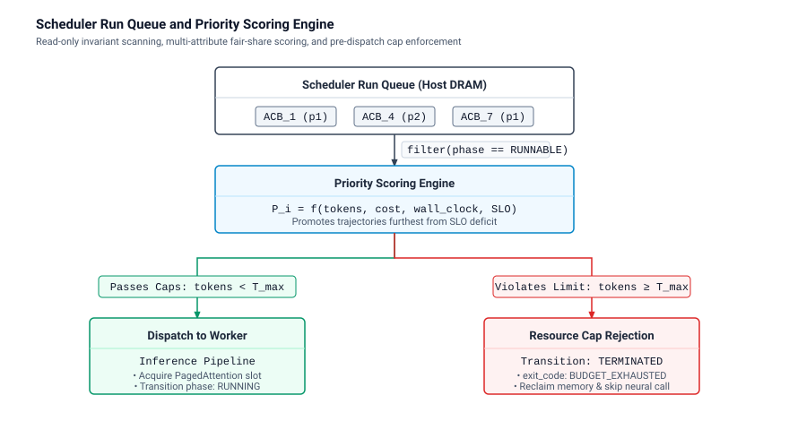
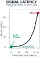
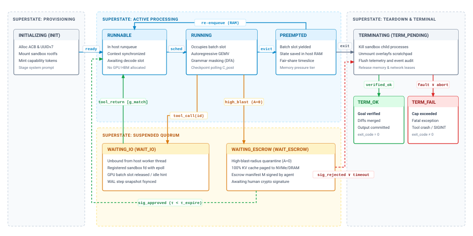
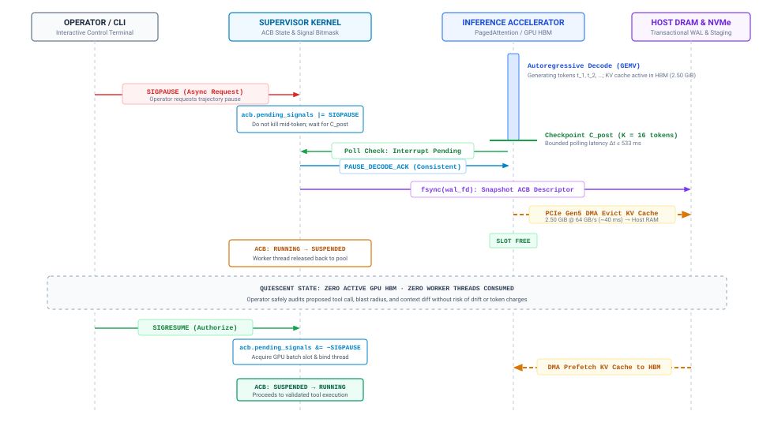
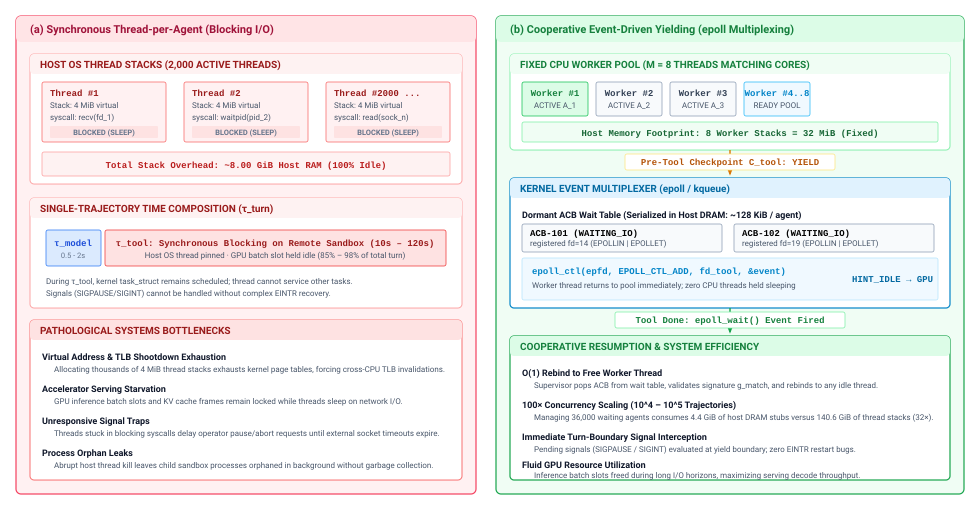
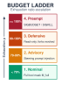
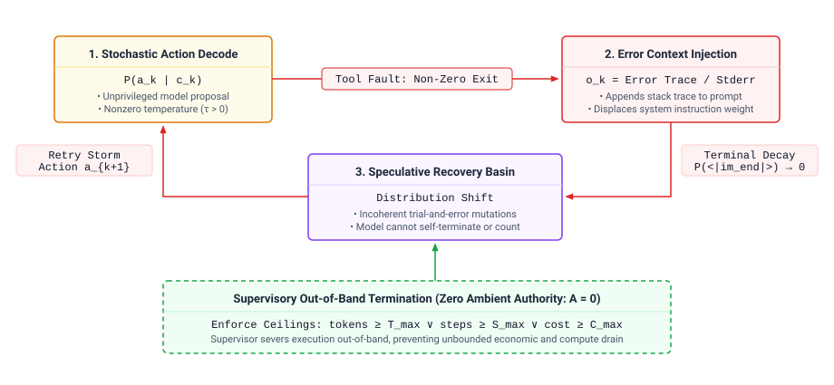
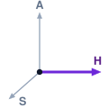

# Supervisory Control Planes {#sec-vol3-checkpointing}

::: {layout-narrow}
::: {.column-margin}

\chapterminitoc

:::

::: {.content-visible when-format="pdf"}
\noindent
{fig-alt="Blueprint for Supervisory Control Planes."}
:::

::: {.content-visible unless-format="pdf"}
{fig-alt="Blueprint for Supervisory Control Planes."}
:::

:::

## Purpose {.unnumbered .unlisted}

\begin{marginfigure}
\mlagentstack{0}{0}{100}{0}{0}{0}
\end{marginfigure}

_What supervisory control plane is required to govern, schedule, and interrupt processes whose future execution paths cannot be predicted?_

In traditional operating systems, the process scheduler manages workloads whose control flow follows deterministic branch instructions and well-defined system call conventions. In contrast, an agentic trajectory represents an open-ended, non-deterministic execution graph whose duration, tool invocations, and resource demands cannot be known in advance. A task estimated to complete in three tool calls may encounter unexpected compiler errors and spin for sixty turns, consuming gigabytes of accelerator memory while starving other tenants of GPU compute. If the runtime treats an agent as an unmediated script, a hung external process or an infinite reasoning loop locks expensive physical hardware indefinitely. Systems engineers must therefore build a supervisory runtime around the Agent Control Block, a first-class record that tracks execution state, resource leases, and parent-child delegate relationships. The runtime must enforce cooperative yielding between model invocations, handle external control signals like process interruption and pause, and orchestrate priority queues across diverse agent workloads. Constructing that runtime means co-designing execution state machines, preemption mechanics, and fair-share allocation policies, and it is the first step in closing the horizon exposure of H·S·A, where every added turn is another chance for a trajectory to hang, loop, or overspend unless the runtime can pause, escrow, and stop it without the model's cooperation.

::: {.content-visible when-format="pdf"}

\newpage

:::

::: {.callout-learning-objectives}

- Formulate the Agent Control Block (ACB) data structure, defining fields for trajectory descriptors, context budgets, capability tokens, memory residency pointers, and rollback ledgers.
- Architect the full agent process lifecycle state machine (Initialized, Runnable, Running, Suspended-IO, Suspended-Approval, Preempted, Completed, Failed, Aborted).
- Implement an asynchronous signal-dispatch framework that maps POSIX-style signals (SIGINT, SIGPAUSE, SIGKILL, SIGBUDGET, SIGESCALATE) to runtime state transitions and ACB suspension.
- Design human-in-the-loop authorization escrows, calculating the memory swapping mechanisms required to eliminate HBM stranding during high-latency human deliberations.
- Implement single-node fair-share trajectory scheduling using weighted deficit round-robin queues to arbitrate accelerator and sandbox slots across concurrent agents.
- Apply the invariant closure principle to resource governance, constructing a progressive budget ladder that bounds a trajectory's steps, tokens, wall-clock time, and cost independently of the model's self-reported status.

:::

## The Supervisory Runtime {#sec-vol3-controlplane-need}

Parts I through III built a model that proposes actions, a memory hierarchy that holds its context, and a sandbox that confines what its tools can touch, yet none of them decides what happens next. The model holds zero ambient authority (@sec-vol3-intro-operational-incident), and invariant closure (principle \ref{pri-invariant-closure}) places every bound the system must keep in the runtime rather than in the model. This chapter asks what that runtime has to hold, and what it has to do, to govern a trajectory that runs for hours.

Consider one trajectory on a shared node, forty turns into a task it was expected to finish in five. Within the same minute, four events arrive. An operator wants to pause it for inspection, an interactive task from another tenant is waiting for its inference slot, its next proposal would drop a production table, and it has spent most of its budget without passing a test. The prototype `while` loop that wraps a model call (@sec-vol3-intro-formal-systems-definition) can act on none of these events, because it keeps the trajectory's phase, holdings, spending, and permissions nowhere except in the prompt and the interpreter's stack. If the interpreter process dies, the trajectory dies with it, the KV cache it paid to build is lost, and any child processes it started in a sandbox keep running with no one to collect them.

::: {.column-margin}
"A system should be designed to handle the unexpected. This principle requires that when an unexpected condition arises, the system should contain the damage, report the problem, and provide a way to recover."
— Jerome H. Saltzer and M. Frans Kaashoek, *Principles of Computer System Design* (2009)
:::

Operating systems met the same problem with runaway user programs. As Saltzer and Kaashoek describe in *Principles of Computer System Design*, when unconstrained programs execute directly against physical hardware, any programming defect, unhandled exception, or runaway loop compromises the integrity of the entire machine. Classical operating systems resolved this failure mode by making the kernel a privileged, deterministic control plane that multiplexes shared hardware, arbitrates memory access, preempts stalled threads, and isolates unprivileged user workloads within protected address spaces. As Butler W. Lampson observed in his reflections on systems design, dependable architectures separate mechanism from policy and isolate untrusted programs behind supervisory interfaces. An agent runtime needs the same separation. The foundation model corresponds not to the kernel but to an unprivileged, untrusted user program, and the agent runtime must be the deterministic kernel that supervises it.

::: {#fig-vol3-controlplane-arch fig-env="figure" fig-pos="htb" fig-cap="**Supervisory Control Plane versus Ad-Hoc Scripting**: Architectural comparison between an unmanaged monolithic scripting loop and an operating system supervisory control plane. In panel (a), task logic, raw system command execution, and conversational history are collapsed into an unconstrained application loop that succumbs to model stalls, ambient privilege leaks, and volatile memory loss upon crashes. In panel (b), the supervisory control plane partitions execution into three strictly mediated domains: an unprivileged model core holding zero ambient authority, a supervisory runtime kernel maintaining transactional state and process lifecycles, and an isolated sandbox execution ring governed by capability RPCs." fig-alt="Two-panel architectural schematic comparing an unmanaged while-loop scripting anti-pattern vulnerable to stalls and privilege leaks against a layered Agent OS supervisory control plane with an unprivileged model core, supervisory runtime kernel, and sandboxed execution ring."}

:::

@Fig-vol3-controlplane-arch contrasts the two designs. In panel (a), the scripting loop executes in host user space with ambient authority and conflates conversational memory, subprocess execution, and socket handling in one process, so a socket reset, a transient out-of-memory fault, or an operator's `SIGINT` terminates the interpreter and loses the whole trajectory. Panel (b) separates three protection rings. The model is an unprivileged core, stripped of host file descriptors and network sockets and restricted to proposing candidate actions $\mathbf{a}_k$ across an explicit inter-process communication (IPC) channel. The supervisory runtime intercepts every candidate, meters multi-dimensional resource consumption, traps asynchronous signals at clean turn boundaries, and requests a durable record of each proposal before any side effect; @sec-vol3-interrupts builds the log that lets those records survive a crash. Downstream side effects cross capability-based RPC boundaries into an isolated sandbox ring of ephemeral microVMs, copy-on-write filesystems, and egress firewall rules.

Every mechanism in this chapter, from signals to escrow to budgets, reads or writes one per-trajectory record that the runtime owns and the model never touches. To govern a trajectory across hours of execution, interleaved tool invocations, and unpredictable preemption events, the runtime cannot treat execution state as an unstructured sequence of prompt strings or an implicit call stack. Classical operating systems track executing programs through a hardware-independent abstraction, the Process Control Block, and a runtime that must schedule, interrupt, inspect, and resume a trajectory needs an equivalent one. What data structure does the runtime use to represent, manage, and inspect the state of a trajectory?

## The Agent Control Block {#sec-vol3-controlplane-acb}

::: {.column-margin}
{width="100%" fig-alt="Logarithmic scale bar chart comparing per-trajectory memory footprint: 256 bytes for the Agent Control Block descriptor, 128 kilobytes for the host context buffer, and 8.59 gigabytes for the physical GPU KV cache, illustrating a 35-million-fold decoupling."}

*Decoupling 256-byte control descriptors from 8.59-gigabyte tensor state enables lightweight process scheduling across distributed worker nodes.*
:::
Operating systems do not schedule or isolate programs by parsing their source text, inspecting raw machine instructions, or guessing where an executing thread might jump next. A classical kernel encapsulates execution state within a dedicated kernel data structure—the Process Control Block (PCB)—which records virtual memory base registers, file descriptor arrays, thread contexts, CPU register snapshots, and accounting counters [@silberschatz2018]. In an agentic machine learning system, the basic unit of execution is not a compiled ELF binary executing on a synchronous CPU, but an unprivileged, non-deterministic trajectory process navigating an open-ended problem space through alternating phases of foundation model generation and tool execution.

When naive agent runtimes attempt to manage trajectories as ad-hoc Python coroutines or raw strings passed across recursive loops, they suffer immediate operational collapse. An in-flight trajectory paused for human approval loses its active execution state if the host process restarts; a runaway agent consuming tens of thousands of tokens per minute cannot be preempted without tearing downstream sandbox sockets; and a single-node scheduler attempting to arbitrate GPU inference slots across hundreds of concurrent users is forced to parse multi-megabyte prompt histories to determine how long an agent has been running or what permissions it retains.

**The trajectory process requires a formal kernel abstraction: the Agent Control Block (ACB).** Analogous to the operating system PCB, the ACB is the canonical, host-managed descriptor that reifies an agent's existence within the supervisory control plane. It decouples the supervisory metadata required to govern, schedule, and account for a task from the internal token sequences and tensor allocations of the underlying model. The ACB makes the whole trajectory, not the model call, the unit the runtime schedules, budgets, and protects (principle \ref{pri-vol3-trajectory-encapsulation}). By maintaining an explicit ACB, the supervisory runtime can suspend an execution, revoke tool privileges, reassign KV-cache allocation leases, enforce financial ceilings, or migrate a trajectory across physical compute nodes without inspecting prompt text or altering model weights.

::: {#dfn-agent-control-block .callout-definition title="Agent Control Block"}

***Agent Control Block***\index{Agent Control Block!definition}\index{Checkpointing!Agent Control Block definition} is the canonical host-managed kernel descriptor that reifies an agent trajectory within the supervisory control plane, encapsulating identity, lifecycle phase, generation parameters, memory subsystem handles, resource ledgers, and capability leases.

1.  **Significance**: Decouples supervisory orchestration, scheduling, and accounting from transient accelerator allocations and model weights, allowing the host runtime to suspend, migrate, or preempt trajectories without parsing prompt strings.
2.  **Distinction**: Unlike classical operating system Process Control Blocks (which track hardware registers, virtual memory page tables, and file descriptors for synchronous binaries), the ACB governs non-deterministic inference rollouts, KV-cache prefix handles, tool leases, and external sandbox lifecycles under zero ambient authority.
3.  **Common pitfall**: Managing long-running trajectories through raw in-memory coroutine variables or unstructured database records, making state recovery impossible when distributed host nodes fail or worker processes restart.

:::

### Anatomy of the Agent Control Block {#sec-vol3-acb-anatomy}

The Agent Control Block resides in host memory under the exclusive ownership of the supervisory control plane. Neither the foundation model nor the unprivileged tool execution sandbox can read or mutate the ACB directly; all modifications occur through supervisory system calls or control-plane signal traps. Structurally, the ACB aggregates six orthogonal domains of execution metadata: process identification, lifecycle state, generation parameters, memory subsystem pointers, resource accounting ledgers, and security capabilities.

::: {.column-margin}
**Zero ambient authority in process descriptors:**
The ACB enforces the principle of least privilege by explicitly listing capability handles rather than granting broad ambient permissions. A tool call proposed by a model is verified against the ACB's capability set before the runtime issues the external RPC.
:::

Process identification establishes the lineage and administrative tenancy of the execution. Every trajectory is assigned a globally unique Trajectory Identifier formatted as a time-ordered UUIDv7, which encodes millisecond-precision Unix timestamps within its most significant 48 bits. This temporal ordering guarantees that database indexes over ACB collections remain monotonic, preventing B-tree fragmentation during high-throughput logging. The identity domain also binds the trajectory to its parent agent (enabling hierarchical delegation trees where subagents inherit attenuated privileges), the overarching user session, and the administrative tenant identity for billing isolation.

The execution lifecycle state tracks the coarse-grained scheduling phase of the trajectory. At any instant, an ACB resides in one of a bounded set of discrete states—such as `INITIALIZING`, `RUNNABLE`, `RUNNING`, `WAITING_IO`, `WAITING_ESCROW`, or `TERMINATED`. Schedulers inspect this single enumerated field to assemble dispatch queues, entirely ignoring inactive or suspended trajectories during scheduling ticks.

Generation configuration preserves the deterministic hyperparameter envelope governing the model's stochastic sampling. Because foundation models exhibit non-stationary behavior across architecture checkpoints, the ACB anchors generation to an immutable model snapshot identifier (e.g., a cryptographic digest of model weights or a pinned inference endpoint version), sampling temperature $T$, nucleus sampling threshold $p$, top-$k$ cutoffs, maximum token budgets $T_{\max}$, and grammar constraint handles. If an agent must be resumed after pre-emption, these parameters guarantee that the inference runtime reconstructs the exact decoding environment under which previous steps were evaluated.

The ACB schema formalizes these fields into a compact, memory-aligned descriptor, presented in @tbl-vol3-acb-schema.

| Domain                | Field Name          | Representation         | Invariant & Systems Semantics                                               |
|:----------------------|:--------------------|:-----------------------|:----------------------------------------------------------------------------|
| **Process Identity**  | `trajectory_id`     | `UUIDv7` (128-bit)     | Globally unique, monotonically time-ordered identifier.                     |
|                       | `parent_id`         | `UUIDv7` (Nullable)    | Identifies supervisory parent; null for root user trajectories.             |
|                       | `session_id`        | `UUIDv4` (128-bit)     | Binds execution to an external interactive client session.                  |
|                       | `tenant_id`         | `uint32_t`             | Identifies organizational boundary for billing and isolation.               |
| **Lifecycle State**   | `phase`             | `uint8_t` (`enum`)     | Operational state (`INITIALIZING`, `RUNNABLE`, `RUNNING`, etc.).            |
|                       | `exit_code`         | `uint16_t`             | Zero indicates goal satisfaction; nonzero encodes failure faults.           |
| **Generation Config** | `model_digest`      | `SHA-256` (256-bit)    | Pinned model checkpoint hash or immutable endpoint tag.                     |
|                       | `temperature`       | `float32_t`            | Sampling dispersion parameter $T \in [0.0, 2.0]$.                           |
|                       | `top_p`             | `float32_t`            | Nucleus sampling probability mass cutoff $p \in (0.0, 1.0]$.                |
|                       | `grammar_ptr`       | `uintptr_t` (Nullable) | Reference to compiled context-free grammar or JSON schema automaton.        |
| **Memory Pointers**   | `context_buf_ref`   | `uint64_t` Handle      | Opaque handle to host-resident logical token array (Chapter 4).             |
|                       | `kv_lease_id`       | `UUIDv4` (128-bit)     | Active physical memory lease in PagedAttention engine (Chapter 5).          |
|                       | `wal_stream_offset` | `uint64_t`             | Byte offset in write-ahead log for crash recovery (Chapter 10).             |
|                       | `storage_idx_ref`   | `uint64_t` Handle      | Handle to external vector or document retrieval context (Chapter 6).        |
| **Resource Ledger**   | `tokens_prompt`     | `uint64_t`             | Cumulative input tokens submitted to inference prefill GEMM.                |
|                       | `tokens_decode`     | `uint64_t`             | Cumulative output tokens emitted by autoregressive GEMV decode.             |
|                       | `step_count`        | `uint32_t`             | Total supervisor-mediated tool-interaction iterations completed.            |
|                       | `wall_clock_us`     | `uint64_t`             | Cumulative elapsed execution time in microseconds.                          |
|                       | `accrued_cost_uc`   | `uint64_t`             | Accumulated financial expenditure denominated in micro-dollars (\$10^{-6}). |
| **Capability Set**    | `tool_mask`         | `uint64_t` Bitmask     | Coarse bitmask of authorized tool categories.                               |
|                       | `cap_token_ref`     | `uintptr_t`            | Pointer to array of cryptographically signed capability tokens.             |
|                       | `sandbox_id`        | `uint32_t`             | Handle to isolated container, gVisor sandbox, or microVM (Chapter 8).       |

: **Formal Agent Control Block (ACB) Data Schema Specification**: Complete descriptor definition across process identity, lifecycle state, generation parameters, memory subsystem pointers, resource accounting, and capability tokens. {#tbl-vol3-acb-schema}

### Memory indirection pointers {#sec-vol3-acb-pointers}

A fundamental principle of Saltzer and Kaashoek's systems design is modularity: internal representations should not be replicated when a reference suffice. An ACB does not store the multi-megabyte conversation history or the multi-gigabyte neural network activations within its own record. Doing so would turn context switching and scheduling inspections into massive memory-copy operations, degrading control-plane throughput.

Instead, the ACB maintains indirection through explicit memory handles, summarized in @tbl-vol3-acb-pointers. The `context_buf_ref` field stores an opaque handle to the logical context window buffer managed by the host runtime's virtual memory subsystem. This buffer holds the sequence of serialized turn boundaries, token identifiers, role delimiters, and tool output envelopes. When a trajectory must be evaluated by the inference engine, the supervisor dereferences this handle to feed the prefill pipeline.

| Pointer Reference   | Target Subsystem / Memory Tier | Physical Storage Location       | Indirection & Attenuation Invariant                                                             |
|:--------------------|:-------------------------------|:--------------------------------|:------------------------------------------------------------------------------------------------|
| `context_buf_ref`   | Logical Token Buffer           | Host System RAM                 | Monotonically growing sequence of token IDs and role boundaries; shared across prefill batches. |
| `kv_lease_id`       | Physical PagedAttention Tables | GPU High-Bandwidth Memory (HBM) | Bound to inference engine memory lease; migratable to host DRAM or evictable under contention.  |
| `wal_stream_offset` | Append-Only Write-Ahead Log    | Local NVMe Flash Storage        | Monotonically advancing byte offset enforcing durable state recovery before turn dispatch.      |
| `cap_token_ref`     | Attenuated Capability Tokens   | Supervisor Secure Memory        | Cryptographically signed Ed25519 tokens enforcing zero ambient authority across sandboxes.      |

: **Agent Control Block Memory Indirection Architecture**: Memory tiers, physical hardware boundaries, and supervisory isolation invariants for ACB descriptor pointer fields. {#tbl-vol3-acb-pointers}

Similarly, the `kv_lease_id` binds the trajectory to an active allocation lease inside the inference serving engine's physical key-value memory pool (such as vLLM or SGLang PagedAttention tables). When a trajectory transitions from `RUNNING` to `WAITING_IO` while awaiting external network input, the supervisory scheduler uses this lease identifier to communicate with the inference engine's memory coordinator. The coordinator can choose to maintain the KV cache blocks in GPU VRAM if high-speed resumption is prioritized, page them out to host DRAM via asynchronous PCIe DMA transfers, or evict them while recording the cache checkpoint index for subsequent prefix-caching restoration.

The capability attenuation set implements Saltzer's principle of protection under zero ambient authority. Rather than executing tools with the ambient privileges of the host daemon, the ACB holds an explicit, signed capability list. Each capability token encapsulates a permitted action, a resource target (e.g., a POSIX filesystem subtree or a specific external API path), an expiration timestamp, and constraint predicates.

When the agent proposes a tool call—for example, invoking `fs_write` on `/etc/hosts`—the supervisor intercepts the request, reads the `cap_token_ref` from the calling trajectory's ACB, and verifies that the capability array contains an unexpired token granting write access to that path. If the token is absent, malformed, or attenuated to read-only access, the supervisor traps the violation at the boundary, records a permission fault in the ACB's event stream, and rejects the tool invocation without touching the underlying operating system.

```{python}
#| label: lego-09-control-plane-descriptor-footprint-vs
#| echo: false
# ┌─────────────────────────────────────────────────────────────────────────────
# │ CONTROL PLANE DESCRIPTOR FOOTPRINT VS TENSOR STATE OVERHEAD (LEGO)
# ├─────────────────────────────────────────────────────────────────────────────
# │ Context: @nbk-09-control-plane-descriptor-footprint-vs
# │ Goal: Contrast supervisory Agent Control Block footprint with KV cache state.
# │ Show: 10,000 ACB descriptors require 2.44 MB RAM vs 85.9 TB VRAM for KV caches.
# │ How: Sum ACB struct schema fields vs 2 * H * N_kv * D * L * 2 bytes.
# └─────────────────────────────────────────────────────────────────────────────
from mlsysim import *
from mlsysim.core.units import *
from mlsysim.fmt import check, fmt_int, fmt_memory, fmt_memory_capacity
from mlsysim.physics.agents import calc_kv_cache_bytes_per_token

class ControlPlaneDescriptorFootprint:
    """Control plane descriptor footprint vs tensor state overhead."""

    # ┌── 1. LOAD (Constants & Parameters) ─────────────────────────────────
    n_trajectories = 10_000
    l_context = 32_768
    h_layers = 64
    d_head = 128
    n_kv_heads = 8
    bytes_per_elem = 2 * byte
    bytes_per_token_id = 4 * byte

    acb_identity_bytes = 52 * byte
    acb_state_bytes = 3 * byte
    acb_gen_bytes = 48 * byte
    acb_handles_bytes = 40 * byte
    acb_ledger_bytes = 36 * byte
    acb_caps_bytes = 20 * byte
    acb_sync_pad_bytes = 57 * byte
    acb_total_bytes = 256 * byte

    l3_cache_bytes = 32 * MB

    # ┌── 2. EXECUTE (Compute) ─────────────────────────────────────────────
    m_token = calc_kv_cache_bytes_per_token(n_layers=h_layers, n_kv_heads=n_kv_heads, head_dim=d_head, bytes_per_elem=bytes_per_elem)
    m_kv_bytes = (l_context * m_token).to(byte)
    m_kv_total_bytes = n_trajectories * m_kv_bytes
    m_tokens_bytes = (l_context * bytes_per_token_id.magnitude) * byte
    m_control_bytes = (n_trajectories * acb_total_bytes.magnitude) * byte
    reduction_factor = (m_kv_bytes.to(byte) / acb_total_bytes.to(byte)).magnitude

    # ┌── 3. GUARD (Invariants) ───────────────────────────────────────────
    check(m_kv_bytes.to(byte).magnitude == 8_589_934_592, "m_kv_bytes")
    check(m_tokens_bytes.to(byte).magnitude == 131_072, "m_tokens_bytes")
    check(m_control_bytes.to(byte).magnitude == 2_560_000, "m_control_bytes")
    check(
        acb_identity_bytes + acb_state_bytes + acb_gen_bytes + acb_handles_bytes + acb_ledger_bytes + acb_caps_bytes + acb_sync_pad_bytes
        == acb_total_bytes,
        "acb_sum",
    )

    # ┌── 4. OUTPUT (Formatting) ──────────────────────────────────────────
    n_trajectories_str = fmt_int(n_trajectories)
    l_context_str = fmt_int(l_context)
    h_layers_str = fmt_int(h_layers)
    d_head_str = fmt_int(d_head)
    n_kv_heads_str = fmt_int(n_kv_heads)
    bytes_per_elem_int = int(bytes_per_elem.to(byte).magnitude)
    bytes_per_elem_str = fmt_int(bytes_per_elem_int)

    m_kv_gb_str = fmt_memory(m_kv_bytes, unit=GB, precision=2)
    m_kv_total_tb_str = fmt_memory(m_kv_total_bytes, unit=TB, precision=1)

    m_tokens_kb_str = fmt_memory_capacity(m_tokens_bytes.to(KiB), unit=KiB, precision=0)
    acb_total_bytes_int = int(acb_total_bytes.to(byte).magnitude)
    acb_total_bytes_str = fmt_int(acb_total_bytes_int)
    l3_cache_mb_str = fmt_memory_capacity(l3_cache_bytes, unit=MB, precision=0)
```

::: {#nbk-09-control-plane-descriptor-footprint-vs .callout-notebook title="Control plane descriptor footprint vs. tensor state overhead"}
Consider an enterprise agent cluster hosting $N =$ `{python} ControlPlaneDescriptorFootprint.n_trajectories_str` concurrent trajectories on a single supervisory management node. Each trajectory operates over an average context length of $L =$ `{python} ControlPlaneDescriptorFootprint.l_context_str` tokens using a foundation model with $H =$ `{python} ControlPlaneDescriptorFootprint.h_layers_str` layers, an attention head dimension $D =$ `{python} ControlPlaneDescriptorFootprint.d_head_str`, and $N_{\text{kv}} =$ `{python} ControlPlaneDescriptorFootprint.n_kv_heads_str` key-value heads under Grouped-Query Attention (GQA), running with 16-bit half-precision floats (`{python} ControlPlaneDescriptorFootprint.bytes_per_elem_str` bytes per element).

**1. Physical KV-Cache Allocation per Trajectory:**
The memory consumed by the key-value cache for a single trajectory is given by:
$$M_{\text{KV}} = 2 \times H \times N_{\text{kv}} \times D \times L \times \text{sizeof(fp16)}$$
$$M_{\text{KV}} = 2 \times 64 \times 8 \times 128 \times 32{,}768 \times 2 \text{ bytes}$$
$$M_{\text{KV}} = 131{,}072 \times 32{,}768 \times 2 = 8{,}589{,}934{,}592 \text{ bytes} \approx 8.59 \text{ GB}$$
If the supervisory control plane stored KV tensor allocations inline or tightly coupled descriptor state with memory physical frames, managing `{python} ControlPlaneDescriptorFootprint.n_trajectories_str` trajectories would require an astronomical `{python} ControlPlaneDescriptorFootprint.m_kv_total_tb_str` of VRAM.

**2. Host Context Buffer Allocation per Trajectory:**
Storing the token identifiers directly as 32-bit integers in host DRAM:
$$M_{\text{tokens}} = L \times 4 \text{ bytes} = 32{,}768 \times 4 = 131{,}072 \text{ bytes} = 128 \text{ KB}$$

**3. Supervisory Agent Control Block (ACB) Footprint:**
Summing the byte widths of the fields enumerated in @tbl-vol3-acb-schema:

- Process Identity: $16 + 16 + 16 + 4 = 52$ bytes
- Lifecycle State & Exit Code: $1 + 2 = 3$ bytes
- Generation Configuration: $32 + 4 + 4 + 8 = 48$ bytes
- Memory & Storage Handles: $8 + 16 + 8 + 8 = 40$ bytes
- Resource Ledger: $8 + 8 + 4 + 8 + 8 = 36$ bytes
- Capability Set & Security: $8 + 8 + 4 = 20$ bytes
- Synchronization mutex, alignment padding to 64-byte cache line: $57$ bytes
$$\text{SizeOf}(\text{ACB}) = 256 \text{ bytes}$$

**4. Systems Takeaway:**
For $N =$ `{python} ControlPlaneDescriptorFootprint.n_trajectories_str` trajectories, the total memory required to retain all supervisory descriptors in the kernel control plane is:
$$M_{\text{control}} = 10{,}000 \times 256 \text{ bytes} = 2.56 \times 10^6 \text{ bytes} \approx 2.44 \text{ MB}$$
The entire control plane state for ten thousand concurrent agents fits comfortably inside the `{python} ControlPlaneDescriptorFootprint.l3_cache_mb_str` L3 cache of a single modern server CPU. By isolating the `{python} ControlPlaneDescriptorFootprint.acb_total_bytes_str`-byte ACB descriptor from the `{python} ControlPlaneDescriptorFootprint.m_tokens_kb_str` token buffers and `{python} ControlPlaneDescriptorFootprint.m_kv_gb_str` KV-cache leases, the supervisor can inspect, sort, prioritize, and arbitrate `{python} ControlPlaneDescriptorFootprint.n_trajectories_str` active agents with near-zero memory bus pressure, achieving a $3.5 \times 10^7\times$ reduction in scheduling metadata footprint relative to raw model state.
:::

### The unit of process governance {#sec-vol3-acb-scheduling-migration}

Because the ACB provides an opaque, bounded summary of an agent's operational parameters, the supervisory runtime uses it as the foundational currency for all control-plane algorithms: single-node dispatching, multi-dimensional rate limiting, and cross-node migration.

Schedulers operating at the supervisor level must make rapid dispatch decisions under tight latency budgets. When thousands of user tasks compete for access to a limited pool of GPU inference workers or isolated execution sandboxes, the scheduler cannot afford to scan conversation histories or run lexical parsers across prompt buffers to decide which agent to run next. Instead, the scheduler performs an *opaque evaluation* directly over the ACB:

1. **Read-Only Invariant Scans:** The dispatch thread iterates over an array of ACB pointers residing in host memory. By inspecting `phase`, the scheduler immediately filters out trajectories blocked on network I/O (`WAITING_IO`) or human sign-off (`WAITING_ESCROW`).
2. **Fair-Share Priority Calculation:** For all `RUNNABLE` candidates, the scheduler computes scheduling priority as a function of the resource ledger. It evaluates cumulative execution metrics:
   $$P_i = f(\mathtt{tokens\_prompt}, \mathtt{tokens\_decode}, \mathtt{wall\_clock\_us}, \mathtt{accrued\_cost\_uc})$$
   Agents that have consumed less than their fair-share allocation of decoding compute or whose elapsed wall-clock time is furthest from their service-level objective (SLO) deadlines are promoted to the head of the dispatch queue.

3. **Pre-Dispatch Boundary Check:** Before assigning a trajectory to an inference worker, the supervisor compares the ledger against hard administrative caps, a token ceiling $T_{\max}$ and a horizon ceiling $H_{\max}$ on the number of turns:
   $$\mathtt{tokens\_prompt} + \mathtt{tokens\_decode} \ge T_{\max} \quad \lor \quad \mathtt{step\_count} \ge H_{\max}$$
   If an invariant is breached, the supervisor denies dispatch, transitions the ACB to `TERMINATED`, and stamps the `exit_code` with an error indicating an exhausted budget, completely circumventing redundant neural network computation.

::: {#fig-vol3-scheduler-dispatch fig-env="figure" fig-pos="htb" fig-cap="**Scheduler Run Queue and Priority Scoring Engine**: Three-level supervisory dispatch datapath arbitrating candidate Agent Control Blocks in host DRAM. Level 1 filters the active ACB array to extract runnable trajectories while bypassing blocked I/O and escrow states. Level 2 ranks runnable candidates through a multi-attribute fair-share priority scoring engine $P_i$. Level 3 evaluates hard token and step ceilings, admitting compliant tasks to inference batch slots while preemptively terminating exhausted trajectories." fig-alt="Systems datapath diagram showing an ACB runqueue array in host DRAM, filtered for RUNNABLE phase, scored by a priority engine evaluating tokens and SLO deficits, and branched into inference worker dispatch or preemptive TERMINATED rejection."}

:::

As schematized in @fig-vol3-scheduler-dispatch, this dispatch pipeline enforces complete supervisory arbitration across three discrete processing levels. In Level 1, the scheduler scans ACB descriptors residing in host DRAM, using fast bitmask checks to isolate `RUNNABLE` trajectories while passing over trajectories currently parked in `WAITING_IO` or `WAITING_ESCROW`. In Level 2, candidate descriptors enter the Priority Scoring Engine, which computes scalar priority values $P_i$ to dynamically rank tasks according to SLO deficit and accumulated token consumption. Finally, in Level 3, the supervisor subjects each candidate to a pre-dispatch gate: if the trajectory satisfies $\mathtt{tokens} < T_{\max}$ and $\mathtt{steps} < H_{\max}$, it is admitted to the inference pipeline, where the runtime binds a worker thread, allocates a PagedAttention block slot in GPU HBM, and advances the phase to `RUNNING`. Conversely, if any hard ceiling is violated, the supervisor immediately branches to preemptive rejection, stamping the ACB with `TERMINATED` (`BUDGET_EXHAUSTED`) and reclaiming all volatile resources without issuing an expensive model invocation.

Beyond local scheduling, the ACB serves as the serialization anchor for process migration. In distributed or elastic agent clusters, physical host machines must occasionally be drained for maintenance, or compute-heavy trajectories must be rebalanced across nodes. Migrating an executing trajectory does not require freezing and shipping an entire virtual machine or capturing opaque operating system core dumps.

Instead, process migration reduces to an atomic snapshot of the ACB and its referenced buffers. The supervisor suspends the trajectory at a clean turn boundary, freezes mutations to the context buffer, and unbinds the local `kv_lease_id`. The 256-byte ACB descriptor, along with the tokenized context buffer, is transmitted over the network to the target node. The destination supervisor instantiates a new local ACB, rebinds the memory pointers to local buffer pools, negotiates a fresh KV-cache allocation lease with its local inference engine, and transitions the state from `RUNNABLE` to `RUNNING`.

Treating the Agent Control Block as an explicit, first-class kernel object transforms agent management from brittle scripting into rigorous systems engineering. However, an administrative descriptor is only as reliable as the rules that govern its mutation. If any component of the host runtime could alter an ACB's phase arbitrarily—transitioning an agent from `WAITING_ESCROW` directly to `RUNNING` without human authorization, or moving an agent from `TERMINATED` back to `RUNNABLE` after resources have been reclaimed—the supervisory plane would rapidly accumulate zombie processes, corrupted memory allocations, and leaked credentials.

::: {#chk-09-agent-control-block .callout-checkpoint title="Evaluating the Agent Control Block architecture"}
Before examining trajectory state machines and lifecycle transitions, verify your understanding of ACB abstractions:

- [ ] **State encapsulation**: How does separating the fixed-size ACB descriptor from dynamic context and KV cache buffers enable zero-copy process migration?
- [ ] **Lease management**: Why must the `kv_lease_id` be released when an agent yields compute allocations during long-running tool I/O?
- [ ] **Monotonic turn counters**: How do strictly increasing generation counters prevent replay attacks and observation-crossing race conditions?
- [ ] **Memory indirection**: Why does the ACB store memory pointers rather than embedding large prompt buffers directly inside the control structure?
:::

## Trajectory Lifecycle States {#sec-vol3-controlplane-statemachine}

::: {.column-margin}
{width="100%" fig-alt="Knee curve plotting operator signal interception latency against decode polling frequency K, dropping steeply from 68.2 seconds without sub-checkpoints to 533 milliseconds at K=16 tokens."}

*Polling interrupts every 16 tokens compresses supervisor signal response latency from 68 seconds down to 533 milliseconds.*
:::
When an agent runtime treats process lifecycle as an unverified enumeration or an ad-hoc integer flag, the system quickly exhibits catastrophic concurrency anomalies. In unmediated frameworks, a slow tool execution often returns its payload after the supervisor has already canceled the parent task due to a deadline timeout. If the runtime naively accepts this late response, the agent re-enters execution within a partially dismantled environment, corrupting its context window or driving tools against recycled container namespaces. Worse, an unprivileged model might emit an unauthorized tool call while ostensibly paused for operator review, executing high-consequence mutations because the host control plane failed to strictly isolate human escrow from the execution queue.

**A trajectory process is not an unconstrained procedural loop; it is a discrete dynamical system governed by an explicit finite state machine with strict transition guards.** To guarantee fault isolation, prevent zombie resource leaks, and eliminate reentrancy hazards, every mutation of the Agent Control Block (ACB) must satisfy mathematical transition invariants enforced by the supervisory kernel. By formalizing these states and their transition relations, the runtime guarantees that untrusted model completions cannot hijack process progression, and that physical compute resources—from inference batch slots to sandbox mounts—are allocated, suspended, and reclaimed through provably safe operational paths.

### The formal trajectory state space

Building dependable supervisory software requires modeling the agent lifecycle not as an arbitrary graph of callbacks, but as a hierarchical statechart in the tradition of David Harel [@harel1987]. Harel demonstrated that complex reactive systems collapse into unmanageable combinatorial explosions unless states are grouped into orthogonal superstates with well-defined entry, exit, and transition invariants. In an agent supervisory plane, every trajectory process exists within an operational state space $\mathcal{S}$ composed of nine discrete operational phases, clustered into four architectural superstates: *Provisioning*, *Active Processing*, *Suspended Quorum*, and *Teardown & Terminal*, as formalized in @fig-vol3-acb-lifecycle.

::: {#dfn-supervisory-state-machine .callout-definition title="Supervisory state machine"}
A formal finite state machine implemented within the host control plane that governs the lifecycle, execution privileges, and resource transitions of an agent process, ensuring that stochastic model outputs cannot bypass operational invariants or violate state transitions.
:::

::: {#fig-vol3-acb-lifecycle fig-env="figure" fig-pos="htb" fig-cap="**Agent Control Block Lifecycle State Machine**: Formal finite state machine governing an Agent Control Block across its operational lifetime. The state space is partitioned into four orthogonal superstates: *Provisioning* (`INITIALIZING`), *Active Processing* (`RUNNABLE`, `RUNNING`, `PREEMPTED`), *Suspended Quorum* (`WAITING_IO`, `WAITING_ESCROW`), and *Teardown & Terminal* (`TERMINATING`, `TERMINATED_SUCCESS`, `TERMINATED_FAILURE`). Solid blue and amber directed edges represent deterministic forward dispatch and suspension transitions; green edges represent verified returns; dashed lines trace asynchronous evictions, approvals, and fault cancellations." fig-alt="Hierarchical finite state machine diagram detailing the transitions among nine ACB operational phases across four superstates, showing entry guards, yield paths, preemption corridors, and terminal states."}

:::

The complete lifecycle is formally defined by the state set:

$$\mathcal{S} = \{\text{INIT}, \text{RUNNABLE}, \text{RUNNING}, \text{WAIT\_IO}, \text{WAIT\_ESCROW}, \text{PREEMPTED}, \text{TERM\_PENDING}, \text{TERM\_OK}, \text{TERM\_FAIL}\}$$

Each state models a distinct physical and logical operating mode of the trajectory, establishing clear boundaries around what operations the agent and the host runtime are permitted to perform, as detailed in @tbl-vol3-lifecycle-states:

| Lifecycle State                    | Superstate   | Supervisory Invariants & Physical Resource Holdings                                                                                                          |
|:-----------------------------------|:-------------|:-------------------------------------------------------------------------------------------------------------------------------------------------------------|
| `INITIALIZING` (`INIT`)            | Provisioning | Ephemeral sandbox provisioned; capability tokens generated; system prompt staged. Agent is not yet eligible for model inference dispatch.                    |
| `RUNNABLE`                         | Active       | Context window synchronized; agent is enqueued in the local scheduling runqueue, awaiting an available inference batch slot or supervisor CPU thread.        |
| `RUNNING`                          | Active       | Agent actively occupies a decode slot in the inference runtime (executing matrix-vector attention operations) or an execution thread in the host supervisor. |
| `WAITING_IO` (`WAIT_IO`)           | Suspended    | Yielded inference resources; blocked on asynchronous RPC tool execution inside an isolated execution sandbox under zero ambient authority.                   |
| `WAITING_ESCROW` (`WAIT_ESCROW`)   | Suspended    | Blocked on an out-of-band cryptographic signature or authorization decision from an authorized human operator; all compute scheduling suspended.             |
| `PREEMPTED`                        | Active       | Evicted from an active inference slot due to host queue contention, fair-share time-slicing, or memory pressure; execution state preserved in host RAM.      |
| `TERMINATING` (`TERM_PENDING`)     | Teardown     | Process has exited execution; supervisor is actively killing child container processes, unmounting overlay filesystems, and persisting event logs.           |
| `TERMINATED_SUCCESS` (`TERM_OK`)   | Terminal     | Immutable terminal state. Task objective verified by deterministic acceptance criteria; final execution artifacts committed; resources fully released.       |
| `TERMINATED_FAILURE` (`TERM_FAIL`) | Terminal     | Immutable terminal state. Task aborted due to unrecoverable exception, budget exhaustion ($k \ge H_{\max}$ or $T \ge T_{\max}$), or operator cancellation.   |
: **Trajectory Process Lifecycle States**: Operational superstates, supervisory invariants, and physical resource holdings across the nine ACB execution phases. {#tbl-vol3-lifecycle-states}

The transitions between these states form the operational backbone of the supervisory control plane. An agent begins in `INITIALIZING`, where the host supervisor mounts a sterile root filesystem, issues unique cryptographic capability tokens, and populates the Agent Control Block with initial environment variables and the staged system prompt. Crucially, an agent in `INITIALIZING` holds no inference engine slots. Only when sandbox provisioning completes and the preflight health check verifies container isolation does the supervisor advance the ACB to `RUNNABLE`, placing the trajectory descriptor into the host scheduler's dispatch queue.

Once marked `RUNNABLE`, the agent contends for execution resources. When the scheduler assigns the agent to an available worker thread and allocates an inference batch slot, the ACB transitions to `RUNNING`. In this state, the agent consumes both CPU cycles (for prompt assembly, token parsing, and schema validation) and accelerator memory bandwidth (during the autoregressive decode loop of the underlying foundation model).

Guided by the state transitions in @fig-vol3-acb-lifecycle, the supervisory kernel enforces deterministic operational invariant closures. Under high GPU memory contention or when fair-share time slices expire, an agent in `RUNNING` is evicted to `PREEMPTED`, offloading its KV cache frames to host RAM before re-enqueueing into `RUNNABLE` via the top loopback corridor. The split between `WAITING_IO` and `WAITING_ESCROW` in the Suspended Quorum superstate represents a fundamental architectural boundary. When an agent invokes a sandboxed tool, it transitions into `WAITING_IO`, surrendering its host thread and registering a non-blocking socket descriptor with `epoll` until returning via `tool_return` guarded by $g_{\text{match}}$. Conversely, when the agent proposes an action flagged as irreversible or high-consequence by host policy (such as dropping database tables or transferring funds), the supervisor moves the process to `WAITING_ESCROW`. Here, the trajectory is quarantined: all compute is frozen, the KV cache is evicted to NVMe, and execution is admitted back into `RUNNABLE` only when an out-of-band cryptographic signature satisfies $\tau < \tau_{\text{expire}}$. If rejected or timed out, the agent transitions along the teardown perimeter into `TERMINATING`, where container namespaces are unmounted and WAL records are committed before diverging into terminal success (`TERMINATED_SUCCESS`) or fatal abort (`TERMINATED_FAILURE`).

### Transition invariants

To prevent state corruption, transitions in the supervisory finite state machine cannot occur via simple assignment. Instead, they are governed by a transition relation $\delta: \mathcal{S} \times \mathcal{E} \times \mathcal{G} \to \mathcal{S}$, where an event $e \in \mathcal{E}$ triggers a transition from state $s \in \mathcal{S}$ to $s' \in \mathcal{S}$ if and only if the associated guard predicate $g \in \mathcal{G}$ evaluates to true:

$$s' = \delta(s, e, g) \quad \text{where} \quad g(\text{ACB}, e) = \mathbf{true}$$

If an event occurs while the guard evaluates to false, or if no explicit transition is defined for the pair $(s, e)$, the supervisory runtime rejects the transition, raises a `StateTransitionFault`, and transitions the agent directly into `TERMINATING` with an immutable failure record. This defensive posture ensures that invalid operations fail fast rather than allowing undefined states to propagate across the control plane.

Four central transition invariants protect the integrity of the host runtime:

**Invariant 1: The Tool Return Invariant.** A trajectory residing in `WAITING_IO` shall transition to `RUNNABLE` if and only if the returning event carries a valid observation envelope whose cryptographic signature matches the outstanding tool call identifier registered in the ACB.

$$\delta(\text{WAIT\_IO}, e_{\text{tool\_return}}, g_{\text{match}}) = \text{RUNNABLE} \iff g_{\text{match}} \equiv (e.\text{call\_id} == \text{ACB.pending\_io\_id}) \land \text{Verify}(e.\text{payload})$$

This guard prevents a notorious class of distributed race conditions known as *observation crossing*. Suppose an agent with an aggressive execution timeout issues a long-running compile command. If the supervisor times out the operation, marks the tool invocation as aborted, and returns an synthetic error to the agent, a late-arriving completion message from the compile sandbox must be discarded. Without the $g_{\text{match}}$ predicate, a late packet arriving while the agent is generating its next step could be improperly injected into the context window, causing prompt desynchronization and invalid BPE token alignment.

::: {#not-09-observation-crossing-resolution .callout-note title="Observation crossing resolution protocol"}
When an asynchronous execution worker responds after its assigned timeout deadline, the supervisor resolves the race condition through the following sequence:

1. **Call Issuance ($t_0$):** Trajectory in state `RUNNING` dispatches tool request with identifier $e.\text{call\_id} = \text{0x4A}$. State transitions to `WAITING_IO`, recording $\text{pending\_io\_id} = \text{0x4A}$.
2. **Timeout Expiration ($t_1$):** Host deadline ticker expires ($t_{\text{timeout}} = 10.0\text{ s}$). Supervisor invalidates the pending I/O descriptor ($\text{pending\_io\_id} \leftarrow \bot$), synthesizes an execution timeout error envelope into the context buffer, and enqueues the ACB into `RUNNABLE`.
3. **Late Packet Arrival ($t_2$):** The sandbox execution worker completes execution and emits a late response envelope carrying $\text{call\_id} = \text{0x4A}$.
4. **Guard Evaluation & Rejection ($t_3$):** The supervisor's network ingress gate evaluates guard predicate $g_{\text{match}}(\text{0x4A}, \bot)$. Because $\text{0x4A} \neq \bot$, the predicate evaluates to $\mathbf{false}$. The packet is dropped, a security audit event is logged, and prompt context integrity is preserved.
:::

**Invariant 2: The Escrow Quarantine Invariant.** An agent in `WAITING_ESCROW` shall never transition directly to `RUNNING` or invoke external system interfaces. It may transition exclusively to `RUNNABLE` upon receipt of an authorized cryptographic token, or to `TERMINATING` upon timeout or operator rejection.

$$\delta(\text{WAIT\_ESCROW}, e, g) = \begin{cases}
\text{RUNNABLE} & \text{if } e = e_{\text{approve}} \land g_{\text{auth}}(\text{operator\_key}, e) \\
\text{TERMINATING} & \text{if } e \in \{e_{\text{reject}}, e_{\text{timeout}}\} \\
\emptyset & \text{otherwise}
\end{cases}$$

This invariant enforces the principle of complete mediation (Saltzer and Kaashoek 2009). When a model proposes a dangerous operation, merely pausing execution in userland Python logic is insufficient. The supervisory kernel must strip the agent of its execution tokens, deschedule it from the inference runqueue, and block the transition back to `RUNNABLE` until an external administrative principal cryptographically signs the proposed action. If an operator rejects the request or the authorization window expires, the trajectory transitions immediately to `TERMINATING`, preventing stalled agents from idling indefinitely in memory.

**Invariant 3: The Orderly Teardown Invariant.** Transitions from an active or suspended state to a terminal state must pass through `TERMINATING`. Direct transitions from `RUNNING`, `WAITING_IO`, or `WAITING_ESCROW` to `TERMINATED_SUCCESS` or `TERMINATED_FAILURE` are strictly forbidden.

The `TERMINATING` phase is the supervisor's cleanup barrier. During this phase, the runtime executes non-bypassable teardown handlers: sending `SIGKILL` to containerized subprocesses, unmounting overlay filesystems, revoking temporary cloud credentials, releasing model context slots, and flushing the Write-Ahead Log (WAL) to durable storage. Bypassing `TERMINATING` produces orphaned zombie containers and credential leaks that rapidly exhaust host kernel resources.

**Invariant 4: The Irreversibility of Terminal States.** The terminal states `TERMINATED_SUCCESS` and `TERMINATED_FAILURE` are immutable absorbing states. For all events $e \in \mathcal{E}$ and guards $g \in \mathcal{G}$:

$$\delta(\text{TERMINATED\_SUCCESS}, e, g) = \emptyset \quad \text{and} \quad \delta(\text{TERMINATED\_FAILURE}, e, g) = \emptyset$$

Once an agent enters a terminal state, its Agent Control Block transitions into a read-only historical record. No subsequent event—whether a delayed network packet, an administrative override, or a retry attempt—can re-activate an ACB. If the supervisory control plane decides to retry a failed trajectory, it must instantiate an entirely new Agent Control Block with a fresh identifier, a new capability domain, and an isolated sandbox root. This immutability guarantees that diagnostic post-mortems and cryptographic audit trails reflect an unpolluted, monotonic record of execution.

```{python}
#| label: lego-09-supervisory-state-transition-latency-vs
#| echo: false
# ┌─────────────────────────────────────────────────────────────────────────────
# │ SUPERVISORY STATE TRANSITION LATENCY VS INFERENCE OVERHEAD (LEGO)
# ├─────────────────────────────────────────────────────────────────────────────
# │ Context: @nbk-09-supervisory-state-transition-latency-vs
# │ Goal: Measure latency overhead of atomic state machine transitions vs decode.
# │ Show: 250 transitions cost 45.5 us total, representing 0.000051% of execution.
# │ How: Sum spinlock, guard, CAS, and WAL latencies (182 ns/trans) vs model/tool time.
# └─────────────────────────────────────────────────────────────────────────────
from mlsysim import *
from mlsysim.core.units import *
from mlsysim.fmt import check, fmt_int, fmt_time

class SupervisoryStateTransitionLatency:
    """Supervisory state transition latency vs inference overhead."""

    # ┌── 1. LOAD (Constants & Parameters) ─────────────────────────────────
    n_steps = 50
    transitions_per_step = 5
    n_trans = n_steps * transitions_per_step

    t_lock = 15 * nanosecond
    t_guard = 35 * nanosecond
    t_cas = 12 * nanosecond
    t_wal = 120 * nanosecond

    l_step = 128
    t_token = 12 * millisecond
    t_tool = 250 * millisecond
    t_fsync = 25 * microsecond

    # ┌── 2. EXECUTE (Compute) ─────────────────────────────────────────────
    t_transition = t_lock + t_guard + t_cas + t_wal
    t_supervisor = n_trans * t_transition
    t_decode = l_step * t_token
    t_step_physical = t_decode + t_tool
    t_physical = n_steps * t_step_physical
    overhead = (t_supervisor / t_physical).to_base_units().magnitude

    t_transition_fsync = t_transition + t_fsync
    t_supervisor_fsync = n_trans * t_transition_fsync
    overhead_fsync = (t_supervisor_fsync / t_physical).to_base_units().magnitude

    # ┌── 3. GUARD (Invariants) ───────────────────────────────────────────
    check(n_trans == 250, "n_trans")
    check(t_transition.to(nanosecond).magnitude == 182, "t_transition")
    check(round(t_supervisor.to(microsecond).magnitude, 1) == 45.5, "t_supervisor")
    check(round(t_decode.to(second).magnitude, 3) == 1.536, "t_decode")
    check(round(t_physical.to(second).magnitude, 1) == 89.3, "t_physical")

    # ┌── 4. OUTPUT (Formatting) ──────────────────────────────────────────
    n_steps_str = fmt_int(n_steps)
    transitions_per_step_str = fmt_int(transitions_per_step)
    n_trans_str = fmt_int(n_trans)

    t_lock_ns_str = fmt_time(t_lock, unit=nanosecond, precision=0)
    t_guard_ns_str = fmt_time(t_guard, unit=nanosecond, precision=0)
    t_cas_ns_str = fmt_time(t_cas, unit=nanosecond, precision=0)
    t_wal_ns_str = fmt_time(t_wal, unit=nanosecond, precision=0)

    l_step_str = fmt_int(l_step)
    t_token_ms_str = fmt_time(t_token, unit=millisecond, precision=0)
    t_tool_ms_str = fmt_time(t_tool, unit=millisecond, precision=0)
    t_fsync_us_str = fmt_time(t_fsync, unit=microsecond, precision=0)
    t_supervisor_fsync_ms_str = fmt_time(t_supervisor_fsync, unit=millisecond, precision=1)
```

::: {#nbk-09-supervisory-state-transition-latency-vs .callout-notebook title="Supervisory state transition latency vs. inference overhead"}
A common concern in supervisory systems design is whether rigorous state machine validation introduces unacceptable runtime overhead. Let us calculate the computational cost of an atomic state transition in a high-throughput agent supervisor and compare it to the underlying inference and execution latency.

Consider an agent running a trajectory of $H =$ `{python} SupervisoryStateTransitionLatency.n_steps_str` turns. Each turn requires `{python} SupervisoryStateTransitionLatency.transitions_per_step_str` discrete state machine transitions:

1. $\text{RUNNABLE} \to \text{RUNNING}$ (scheduler dequeue and slot allocation)
2. $\text{RUNNING} \to \text{WAITING\_IO}$ (tool invocation and sandbox dispatch)
3. $\text{WAITING\_IO} \to \text{RUNNABLE}$ (observation verification and context ingest)
4. $\text{RUNNABLE} \to \text{RUNNING}$ (inference dispatch for model generation)
5. $\text{RUNNING} \to \text{RUNNABLE}$ (step boundary commit)

This yields $N_{\text{trans}} = 50 \times 5 = 250$ state transitions across the trajectory lifecycle.

In a well-engineered supervisory kernel written in C++ or Rust, a state transition requires:

- Acquiring an atomic spinlock on the ACB: $t_{\text{lock}} \approx$ `{python} SupervisoryStateTransitionLatency.t_lock_ns_str`
- Evaluating guard predicates (bitmask comparison and pointer verification): $t_{\text{guard}} \approx$ `{python} SupervisoryStateTransitionLatency.t_guard_ns_str`
- Executing an atomic compare-and-swap (`std::atomic::compare_exchange_strong`): $t_{\text{cas}} \approx$ `{python} SupervisoryStateTransitionLatency.t_cas_ns_str`
- Emitting an immutable lifecycle event to an in-memory ring-buffer Write-Ahead Log: $t_{\text{wal}} \approx$ `{python} SupervisoryStateTransitionLatency.t_wal_ns_str`

The total computational overhead per transition is:

$$t_{\text{transition}} = t_{\text{lock}} + t_{\text{guard}} + t_{\text{cas}} + t_{\text{wal}} = 15 + 35 + 12 + 120 = 182\,\text{ns} \approx 0.182\,\mu\text{s}$$

Across all `{python} SupervisoryStateTransitionLatency.n_trans_str` transitions, the cumulative supervisory validation latency is:

$$T_{\text{supervisor}} = 250 \times 0.182\,\mu\text{s} = 45.5\,\mu\text{s}$$

Now contrast this with the physical execution latency of the foundation model and sandbox environment. For each step:

- The autoregressive decode phase generates an average of $L_{\text{step}} =$ `{python} SupervisoryStateTransitionLatency.l_step_str` tokens.
- Running on an 8-way NVIDIA H100 GPU cluster (80 GB SXM5, 3.35 TB/s memory bandwidth per GPU).
  The memory-bound decode phase runs at approximately $t_{\text{token}} =$ `{python} SupervisoryStateTransitionLatency.t_token_ms_str` per token:

$$t_{\text{decode}} = 128 \times 12\,\text{ms} = 1.536\,\text{s per step}$$

- The sandboxed tool execution (e.g., executing a lint command or running unit tests in a container) requires an average of $t_{\text{tool}} =$ `{python} SupervisoryStateTransitionLatency.t_tool_ms_str`.

The total physical execution time for the `{python} SupervisoryStateTransitionLatency.n_steps_str`-step trajectory is:

$$T_{\text{physical}} = 50 \times (1.536\,\text{s} + 0.250\,\text{s}) = 50 \times 1.786\,\text{s} = 89.3\,\text{s}$$

We compute the percentage overhead introduced by the supervisory state machine:

$$\text{Overhead} = \frac{T_{\text{supervisor}}}{T_{\text{physical}}} = \frac{45.5 \times 10^{-6}\,\text{s}}{89.3\,\text{s}} \approx 5.09 \times 10^{-7} = 0.000051\%$$

Even if the supervisor flushes each transition event to an NVMe-backed write-ahead log using group commit ($t_{\text{fsync}} \approx$ `{python} SupervisoryStateTransitionLatency.t_fsync_us_str` amortized), the total supervisory time is only `{python} SupervisoryStateTransitionLatency.t_supervisor_fsync_ms_str`, representing less than $0.007\%$ of total execution time. The computational cost of formal lifecycle verification is entirely negligible compared to model inference and tool I/O.
:::

### State transition implementation

Implementing a crash-resilient supervisory state machine requires eliminating all possibilities of partial state updates. If a power failure, unhandled host exception, or kernel panic occurs during a transition from `RUNNING` to `WAITING_IO`, the Agent Control Block must never be left in an ambiguous intermediate condition where its tool RPC is dispatched but its scheduler phase remains marked as active.

To guarantee atomicity, the supervisory kernel encapsulates all state transitions inside a single, verified mutation method. The implementation evaluates the guard predicate while holding the ACB's internal state lock, applies the update using memory barriers, and appends the transition event to an append-only event log before releasing the lock:

```python
def transition_acb(acb: AgentControlBlock, new_state: State, event: Event) -> None:
    with acb.lock:
        guard_fn = TRANSITION_GUARDS.get((acb.current_state, new_state))
        if guard_fn is None or not guard_fn(acb, event):
            raise StateTransitionFault(
                f"Illegal transition: {acb.current_state} -> {new_state} on {event.type}"
            )
        old_state = acb.current_state
        acb.current_state = new_state
        acb.last_transition_epoch_ns = time.time_ns()
        acb.event_log.append(LifecycleRecord(old_state, new_state, event.event_id))
```

When an invalid transition is detected, the supervisor's failure handler must isolate the faulty process immediately. Consider the concrete failure trace below, captured from a real-world multi-agent debugging scenario where a rogue tool runner attempted to inject a response after the trajectory was terminated:

```bash
[2026-09-19T10:14:02.104Z] INFO  supervisor: Trajectory 0x8F9C entered WAITING_IO (pending_tool=0x31)
[2026-09-19T10:14:12.105Z] WARN  supervisor: Timeout reached (10.0s). Signal SIGKILL dispatched to tool 0x31
[2026-09-19T10:14:12.106Z] INFO  supervisor: Trajectory 0x8F9C transitioned WAITING_IO -> TERMINATING (reason=TIMEOUT)
[2026-09-19T10:14:12.210Z] INFO  supervisor: Trajectory 0x8F9C transitioned TERMINATING -> TERMINATED_FAILURE
[2026-09-19T10:14:12.215Z] ERROR supervisor: Late packet arrived: ToolResult(call_id=0x31, status=OK)
[2026-09-19T10:14:12.216Z] CRIT  supervisor: StateTransitionFault: Illegal transition TERMINATED_FAILURE -> RUNNABLE
[2026-09-19T10:14:12.216Z] ALERT supervisor: Security event logged. Late packet dropped; ACB 0x8F9C quarantined.
```

In this incident, the sandbox worker suffered a kernel lockup that delayed its response by 110 milliseconds beyond the supervisor's 10-second deadline. Because the supervisor had already transitioned the ACB from `WAITING_IO` through `TERMINATING` to `TERMINATED_FAILURE`, the incoming `ToolResult` was evaluated against Invariant 4. The transition guard detected that the target state was an absorbing terminal state, rejected the transition, and dropped the packet.

Had the control plane lacked a formal finite state machine, this late packet would have reactivated the agent process, potentially dispatching further actions against a broken execution context. The strict mathematical boundaries of the trajectory lifecycle ensure that no matter how non-deterministic or delayed the underlying computational substrate may be, the host control plane remains completely deterministic and secure.

---

## Signal Trapping Mechanisms {#sec-vol3-controlplane-signals}

The formal state machine establishes the valid operational boundaries of a trajectory, but it assumes that state transitions are driven by predictable internal events: prefill completions, decode ends, tool dispatches, and observation arrivals. In production environments, however, the supervisory control plane must continuously intercept unpredictable, external asynchronous events. A human operator may issue an emergency cancellation (`SIGINT`), a system resource manager may demand an immediate execution pause (`SIGPAUSE`) to defragment GPU memory, or an automated policy monitor may detect a runaway loop and demand instant process termination (`SIGKILL`). How does the runtime control plane deliver these asynchronous external events to an active, suspended, or preempted agent without violating atomic turn boundaries or leaving orphaned child sandboxes?

Delivering an asynchronous control signal to a running process is among the classic problems of operating system design. When an execution thread spans not merely a local CPU register set and virtual address space, but an unprivileged neural inference service, a fleet of networked tool sandboxes, and a stateful context log, the physics of asynchronous interruption become fundamentally distributed. If a human operator triggers an emergency halt, or an automated policy monitor detects a runaway spending loop, the supervisory control plane cannot simply sever an arbitrary network socket or kill a worker process mid-stride. Abruptly terminating an agent during an autoregressive token decode tears the generation stream, yielding corrupted or syntactically invalid tool invocations that crash downstream parsers. Conversely, cutting off execution while an external sandbox is mutating a remote filesystem leaves orphaned locks, partially written files, and uncollected child processes.

The central architectural challenge of agent signal trapping is reconciling the unpredictable, asynchronous arrival of external control events with the strict atomicity requirements of the agent's turn-based execution loop. Because a trajectory cannot be relied on to yield or stop on its own, the runtime must hold that control outside the model (principle \ref{pri-vol3-preemptive-interrupts}). A classical kernel turns hardware interrupts into synchronous traps delivered only at well-defined instruction boundaries, and an agent supervisory runtime must likewise decouple the *arrival* of a signal from its *execution*. By buffering asynchronous events in the Agent Control Block (ACB) and evaluating them exclusively at deterministic turn boundaries, the supervisor maintains invariant integrity across host memory, accelerator state, and sandboxed environments.

### Asynchronous signal handling

In standard POSIX environments, as formulated by W. Richard Stevens and Stephen A. Rago (2013), signals represent software interrupts that force a process to deviate from its normal control flow. The kernel pushes a signal frame onto the process stack and executes a registered handler at an arbitrary user-space instruction boundary. While this mechanism is well-suited for preempting a monolithic CPU thread, it breaks down when applied to an agentic system composed of multiple loosely coupled, stateful tiers.

::: {.column-margin}
W. Richard Stevens and Stephen A. Rago. *Advanced Programming in the UNIX Environment*. 3rd ed. Addison-Wesley, 2013. See chapter 10 for classical signal delivery mechanics, signal masks, and reentrancy invariants.
:::

Consider an agent executing a dual-phase interaction: an autoregressive inference phase hosted on an accelerator cluster, followed by a tool execution phase inside an isolated container sandbox. An LLM generation pass does not execute as a sequence of independent, idempotent operations; it progresses through a matrix-matrix prefill phase (GEMM) followed by a memory-bandwidth-bound autoregressive decode loop (GEMV). During decode, each generated token depends on the accumulated Key-Value (KV) cache of all preceding tokens. If the supervisory runtime were to tear down the request midway through emitting an action payload, the runtime would capture an incomplete, malformed JSON string (such as `{"action": "drop_table", "target": "cust`). If the supervisor records this partial sequence into the trajectory log, subsequent recovery passes or reflection agents will encounter corrupted syntax that violates the grammar constraints of the operational policy.

The hazard is even more severe across the tool boundary. When the agent dispatches a remote procedure call (RPC) to an isolated sandbox to perform a multi-step compilation or database update, terminating the host supervisory thread does not automatically terminate the child processes spawned within the container namespaces. The container runtime continues executing the compilation or migration in the background, consuming CPU cycles and mutating disk state. If the supervisor subsequently launches a replacement trajectory, the new process will collide with the uncollected locks and dirty state left behind by the orphaned predecessor.

To eliminate these hazards, the supervisory runtime enforces the *Turn-Boundary Atomicity Invariant*. The execution of a single agent step is treated as an indivisible state transition:

$$\mathcal{T}_k = \langle \mathcal{S}_k, \mathbf{c}_k, \mathbf{a}_k, \mathbf{o}_k \rangle \longrightarrow \mathcal{S}_{k+1}$$

where $\mathcal{S}_k$ represents the trajectory state, $\mathbf{c}_k$ the assembled context prompt, $\mathbf{a}_k$ the emitted action proposal, and $\mathbf{o}_k$ the observed tool outcome. Asynchronous signals received while a step is in flight are not immediately dispatched to the executing threads. Instead, the runtime sets the corresponding bit in the ACB's pending signal bitmask, allowing the active phase to either run to completion or reach a certified, clean unwinding state before the signal handler is invoked.

### The agent supervisory signal vocabulary

The supervisory control plane defines a standardized vocabulary of signals, mapping external administrative intents directly to formal state transitions within the Agent Control Block. Unlike POSIX, which defines dozens of legacy signals, an agent control plane requires a compact, semantically unambiguous set of control primitives designed around lifecycle governance, resource limits, and human-in-the-loop coordination, as specified in @tbl-vol3-signal-vocabulary.

| Signal      | Delivery Semantics        | Default Target State | Architectural Action & Resource Impact                                                                                                                  |
|:------------|:--------------------------|:---------------------|:--------------------------------------------------------------------------------------------------------------------------------------------------------|
| `SIGINT`    | Synchronous at Checkpoint | `TERMINATING`        | Gracefully drains in-flight read operations, aborts pending mutations, flushes the trajectory log, and reclaims runtime allocations.                    |
| `SIGPAUSE`  | Synchronous at Checkpoint | `SUSPENDED`          | Freezes trajectory progression, persists the full ACB to disk, evicts or relocates accelerator KV cache allocations, and enters interactive inspection. |
| `SIGRESUME` | Asynchronous Event        | `RUNNABLE`           | Re-stages serialized context into the inference runtime, revalidates sandbox environment leases, and enqueues the ACB for execution.                    |
| `SIGKILL`   | Asynchronous Immediate    | `FAILED` / `ABORTED` | Non-maskable abort. Forcibly tears down container microVMs via cgroups, drops accelerator compute queues, and purges all active memory locks.           |
| `SIGBUDGET` | Synchronous at Checkpoint | `INTERRUPTED`        | Dispatched when token, step, or financial spend crosses pre-allocated thresholds; invokes fallback pruning or escalation escrows.                       |
: **Agent Supervisory Signal Vocabulary**: Formal definitions, delivery semantics, target states, and resource management invariants for supervisory control signals. {#tbl-vol3-signal-vocabulary}

The behavior of these signals separates administrative steering from catastrophic failure:

- **`SIGINT` (Graceful Interruption):** Issued by human operators or orchestration managers to cancel a task without corrupting state. Upon reaching the next turn boundary, the supervisor suppresses further tool dispatches, records a clean cancellation record in the trajectory ledger, captures any final diagnostic outputs, and transitions the ACB to `TERMINATING`. All ephemeral container resources are unmounted and returned to the resource pool.
- **`SIGPAUSE` (Execution Suspension):** Temporarily halts an agent to enable human inspection, debugging, or resource defragmentation. When `SIGPAUSE` is trapped at a turn boundary, the supervisor snapshots the complete ACB—including conversation history, token counters, and tool state—to persistent storage. Crucially, the supervisor signals the inference serving layer (such as vLLM or SGLang) to release or offload the agent's allocated physical pages in the PagedAttention memory pool, freeing scarce high-bandwidth memory (HBM) on the accelerator while the process sits idle.
- **`SIGRESUME` (Process Resumption):** Clears the pause state. The scheduler reads the serialized ACB from persistent storage, re-allocates an execution slot in the active scheduling queue, re-stages the system prompts into the inference engine, and transitions the ACB back to `RUNNABLE`. If the trajectory's original KV cache was evicted during the pause, the serving engine transparently reconstructs it via prompt prefill during the next generation pass.
- **`SIGKILL` (Non-Maskable Abort):** The sole asynchronous, non-maskable primitive. Reserved for critical security violations (such as an agent attempting to breach its network jail or executing unauthorized sandbox escapes) or catastrophic supervisor deadlocks. The supervisor does not wait for turn boundaries or clean model completions. It immediately transmits hardware termination primitives (`SIGKILL` / `cgroups.kill`) to all child container namespaces and microVMs, severs WebSocket and RPC connections to the model server, marks the ACB as `ABORTED`, and writes a tamper-evident audit record.
- **`SIGBUDGET` (Resource Limit Exceeded):** Dispatched by the accounting subsystem when cumulative consumption metrics—such as prompt token volume, generated decode tokens, wall-clock duration, or tool-related monetary costs—cross soft or hard administrative thresholds. Soft budget breaches can trigger automated context-compaction handlers, whereas hard budget limits force a deterministic transition to `TERMINATING`.

::: {.column-margin}
`SIGKILL` is the only signal that violates turn-boundary atomicity. Because it forcibly unmounts sandboxes and terminates network connections, any tool execution interrupted by `SIGKILL` must be treated as completely unrecoverable, requiring external reconciliation or sandbox recreation.
:::

### Safe inspection checkpoints

To ensure signals are evaluated deterministically without injecting latency spikes into the execution loop, the supervisory control plane defines four discrete *Safe Inspection Checkpoints* within every turn cycle, summarized in @tbl-vol3-safe-checkpoints. These checkpoints represent quiescent states where all in-flight I/O has settled, memory allocations are coherent, and no uncommitted mutations are pending in sandbox storage.

| Checkpoint Symbol | Cycle Boundary    | Quiescent State & Invariant Guarantee                                                      | Supervisory Trap Mechanics                                                                  |
|:------------------|:------------------|:-------------------------------------------------------------------------------------------|:--------------------------------------------------------------------------------------------|
| $C_{\text{obs}}$  | Post-Observation  | Sandbox execution completed; observation envelope verified against pending I/O descriptor. | Traps pause/kill signals before context append; discards invalid observation payloads.      |
| $C_{\text{pre}}$  | Pre-Inference     | Context assembled and serialized; no pending tensor operations on inference engine.        | Intercepts signals prior to dispatching expensive prefill batch; evicts KV lease if paused. |
| $C_{\text{post}}$ | Post-Decode       | Autoregressive decode complete; grammar validated; proposed action unparsed.               | Captures cancellation or pause before mutating host state or validating tool parameters.    |
| $C_{\text{tool}}$ | Pre-Tool Dispatch | Tool arguments validated; security capability checked; no RPC dispatched.                  | Final safety gate; prevents uncommitted side effects in sandboxes or external systems.      |

: **Safe Inspection Checkpoints**: Turn-cycle boundaries, quiescence guarantees, and supervisory trap actions ensuring atomic signal delivery. {#tbl-vol3-safe-checkpoints}

The four canonical checkpoints function as synchronization barriers:

1. **Post-Observation Checkpoint ($C_{\text{obs}}$):** Located immediately after the supervisor reads and validates an incoming tool observation from the sandbox, but before the observation is appended to the trajectory log. At this point, sandbox processes have returned to idle.
2. **Pre-Inference Checkpoint ($C_{\text{pre}}$):** Positioned after context assembly and prompt serialization, but immediately prior to transmitting the inference request (GEMM/prefill) to the model serving engine. Trapping a signal here avoids dispatching an expensive matrix-multiplication batch that would immediately be discarded.
3. **Post-Decode Checkpoint ($C_{\text{post}}$):** Located immediately following the completion of the autoregressive decode loop and grammar validation, before any proposed action payload is parsed into an executable tool command.
4. **Pre-Tool Dispatch Checkpoint ($C_{\text{tool}}$):** The final safety barrier. Positioned after tool argument validation and security policy evaluation, immediately before the supervisor transmits the RPC invocation across the isolation boundary into the sandbox microVM.

When execution reaches any checkpoint $C \in \{C_{\text{obs}}, C_{\text{pre}}, C_{\text{post}}, C_{\text{tool}}\}$, the control plane evaluates the ACB's pending signal bitmask against an active signal mask using a deterministic priority hierarchy:

$$\text{Priority: } \text{SIGKILL} \succ \text{SIGINT} \succ \text{SIGPAUSE} \succ \text{SIGBUDGET}$$

If a signal is pending, the supervisor aborts progression to the subsequent phase, invokes the corresponding handler, and records the checkpoint identifier in the trajectory telemetry.

```python
def evaluate_signal_checkpoint(acb: AgentControlBlock, checkpoint: Checkpoint) -> bool:
    """Evaluate pending signals at a certified turn-boundary checkpoint."""
    if not acb.pending_signals:
        return True

    # Non-maskable SIGKILL is processed immediately regardless of mask
    if Signal.SIGKILL in acb.pending_signals:
        acb.runtime_state = State.FAILED
        acb.sandbox.force_terminate()
        return False

    # Filter pending signals through the current execution mask
    active = acb.pending_signals - acb.blocked_signals
    if not active:
        return True

    # Deterministic priority resolution: SIGINT > SIGPAUSE > SIGBUDGET
    chosen_signal = sorted(active, key=lambda sig: sig.priority)[0]
    acb.pending_signals.remove(chosen_signal)
    return acb.dispatch_signal_handler(chosen_signal, checkpoint)
```

::: {#fig-vol3-signal-handling fig-env="figure" fig-pos="htb" fig-cap="**Asynchronous Signal Interception and State Resumption**: End-to-end protocol sequence governing asynchronous signal trapping, turn-boundary synchronization, and state resumption. An operator `SIGPAUSE` is buffered in the ACB signal bitmask during active autoregressive decode. At the bounded sub-checkpoint $C_{\text{post}}$ ($K=16$ tokens, latency $\le 533\text{ ms}$), the supervisor intercepts execution, persists the ACB to durable storage, evicts 2.50 GB of KV cache over PCIe Gen5 to host DRAM, and places the agent into a quiescent suspended state. Upon receiving `SIGRESUME`, the supervisor re-stages memory and resumes tool dispatch without context tearing." fig-alt="Protocol ladder diagram depicting the interaction between Operator CLI, Supervisor Kernel, Inference Accelerator, and Host DRAM during asynchronous SIGPAUSE arrival, bounded token sub-checkpoint evaluation, PCIe DMA eviction, and SIGRESUME restoration."}

:::

The protocol sequence in @fig-vol3-signal-handling details the temporal coordination required between the host control plane, the inference accelerator, and durable storage. When an administrative operator dispatches `SIGPAUSE` while the foundation model is actively executing matrix-vector attention operations, the supervisor does not issue an abrupt process kill, which would induce memory tearing and corrupt the accelerator batch slot. Instead, the kernel traps the signal and records it within `acb.pending_signals`, allowing decode to advance until reaching the nearest sub-checkpoint $C_{\text{post}}$. By enforcing a bounded polling interval of $K = 16$ tokens, the supervisor guarantees an interception latency under $533\text{ ms}$ while preserving token alignment. At $C_{\text{post}}$, the supervisor halts generation, commits an atomic snapshot of the ACB to persistent NVMe via `fsync`, and commands a PCIe Gen5 DMA eviction that migrates $2.50\text{ GiB}$ of KV cache blocks to host DRAM in approximately $40\text{ ms}$. The trajectory enters a fully quiescent suspended state where zero GPU high-bandwidth memory and zero host worker threads are consumed. When the operator subsequently issues `SIGRESUME`, the supervisor clears the signal mask, negotiates a fresh inference batch lease, initiates a DMA prefetch of the cached context, and advances the ACB to `RUNNING` to proceed cleanly to tool dispatch.

```{python}
#| label: lego-09-quantitative-latency-and-memory-bounds
#| echo: false
# ┌─────────────────────────────────────────────────────────────────────────────
# │ TURN-BOUNDARY SIGNAL DELIVERY BOUNDS (LEGO)
# ├─────────────────────────────────────────────────────────────────────────────
# │ Context: @nbk-09-quantitative-latency-and-memory-bounds
# │ Goal: Bound operator pause latency and evaluate GPU KV cache eviction.
# │ Show: Pause bounded to 533.3 ms (K=16 tokens) vs 68.23 s uncheckpointed; offloads 2.50 GB in 41.9 ms.
# │ How: Model decode token period 1/R_decode and PCIe Gen5 offload bandwidth.
# └─────────────────────────────────────────────────────────────────────────────
from mlsysim import *
from mlsysim.core.units import *
from mlsysim.fmt import check, fmt_int, fmt_time, fmt_percent, fmt_memory, fmt_memory_capacity

class TurnBoundarySignalBounds:
    """Turn-boundary signal delivery bounds."""

    # ┌── 1. LOAD (Constants & Parameters) ─────────────────────────────────
    l_layers = 80
    d_model = 8_192
    n_kv = 8
    d_head = 128
    t_max = 2_048
    n_ctx = 16_384
    r_decode_val = 30
    b_pcie_val = 64
    k_tokens = 16

    # ┌── 2. EXECUTE (Compute) ─────────────────────────────────────────────
    r_decode = r_decode_val * (1 / second)
    tau_token_ms = (1000.0 / r_decode_val) * millisecond
    b_pcie = b_pcie_val * (GB / second)

    delta_t_worst = ((t_max - 1) / r_decode_val) * second
    delta_t_bounded = (k_tokens * (1000.0 / r_decode_val)) * millisecond

    m_token = calc_kv_cache_bytes_per_token(n_layers=l_layers, n_kv_heads=n_kv, head_dim=d_head, bytes_per_elem=1 * byte)
    m_kv_bytes = (n_ctx * m_token).to(byte)
    m_kv_gib = m_kv_bytes.to(GiB)
    m_kv_gb = m_kv_bytes.to(GB)

    n_suspended_agents = 16
    total_kv_gib = n_suspended_agents * m_kv_gib
    h100_capacity_gib = 80 * GiB
    pct_h100 = (total_kv_gib / h100_capacity_gib).to_base_units().magnitude

    t_offload = m_kv_bytes.to(byte) / b_pcie.to(byte / second)

    # ┌── 3. GUARD (Invariants) ───────────────────────────────────────────
    check(m_kv_bytes.to(byte).magnitude == 2_684_354_560, "m_kv_bytes")
    check(round(m_kv_gib.magnitude, 2) == 2.50, "m_kv_gib")
    check(round(total_kv_gib.magnitude, 1) == 40.0, "total_kv_gib")
    check(pct_h100 == 0.50, "pct_h100")
    check(round(delta_t_worst.to(second).magnitude, 2) == 68.23, "delta_t_worst")
    check(round(delta_t_bounded.to(millisecond).magnitude, 1) == 533.3, "delta_t_bounded")
    check(round(t_offload.to(millisecond).magnitude, 1) == 41.9, "t_offload")

    # ┌── 4. OUTPUT (Formatting) ──────────────────────────────────────────
    l_layers_str = fmt_int(l_layers)
    d_model_str = fmt_int(d_model)
    n_kv_str = fmt_int(n_kv)
    d_head_str = fmt_int(d_head)
    t_max_str = fmt_int(t_max)
    n_ctx_str = fmt_int(n_ctx)
    r_decode_str = fmt_int(r_decode_val)
    tau_token_ms_str = fmt_time(tau_token_ms, unit=millisecond, precision=2)
    b_pcie_str = fmt_int(b_pcie_val)

    delta_t_worst_str = fmt_time(delta_t_worst, unit=second, precision=2)
    k_tokens_str = fmt_int(k_tokens)

    m_kv_gib_str = fmt_memory_capacity(m_kv_gib, unit=GiB, precision=2)
    m_kv_gb_str = fmt_memory(m_kv_gb, unit=GB, precision=3)

    n_suspended_agents_str = fmt_int(n_suspended_agents)
    pct_h100_str = fmt_percent(pct_h100, precision=0, style="prose")
    h100_vram_gb_str = fmt_memory_capacity(80 * GB, unit=GB, precision=0)

    t_offload_ms_str = fmt_time(t_offload, unit=millisecond, precision=1)
    t_offload_ceil_ms_str = fmt_time(42 * millisecond, unit=millisecond, precision=0)
```

::: {#nbk-09-quantitative-latency-and-memory-bounds .callout-notebook title="Turn-boundary signal delivery bounds"}
A supervisory control plane coordinates an agent running against an open-weights 70-billion parameter dense model (Llama-3-70B) served across two NVIDIA H100 GPUs (80 GB HBM3 each, 3.35 TB/s bandwidth per GPU). The model executes with 16-bit floating-point weights ($2 \text{ bytes/param}$) and an 8-bit quantized KV cache ($1 \text{ byte/element}$).

The model architecture specifies:

- Number of layers: $L =$ `{python} TurnBoundarySignalBounds.l_layers_str`
- Model hidden dimension: $d_{\text{model}} =$ `{python} TurnBoundarySignalBounds.d_model_str`
- Number of key-value heads: $n_{\text{KV}} =$ `{python} TurnBoundarySignalBounds.n_kv_str` (Grouped-Query Attention, GQA)
- Dimension per head: $d_{\text{head}} =$ `{python} TurnBoundarySignalBounds.d_head_str`
- Maximum generation limit: $T_{\text{max}} =$ `{python} TurnBoundarySignalBounds.t_max_str` \text{ tokens}
- Context length at pause point: $N =$ `{python} TurnBoundarySignalBounds.n_ctx_str` \text{ tokens}
- Measured autoregressive decode speed: $R_{\text{decode}} =$ `{python} TurnBoundarySignalBounds.r_decode_str` \text{ tokens/sec} (`{python} TurnBoundarySignalBounds.tau_token_ms_str`/token)
- Host-to-device PCIe Gen5 bandwidth: $B_{\text{PCIe}} =$ `{python} TurnBoundarySignalBounds.b_pcie_str` \text{ GB/s} (bidirectional)

A user issues an asynchronous `SIGPAUSE` command to pause the agent and inspect its proposed action before it touches external state. Calculate:

1. The worst-case latency penalty incurred by waiting for the turn boundary at $C_{\text{post}}$ rather than killing the inference request mid-stream.
2. The GPU high-bandwidth memory footprint liberated if the supervisor evicts the suspended agent's KV cache to host DDR5 memory, and the latency required to transfer that cache over the PCIe bus.

**Solution:**

*1. Worst-Case Turn-Boundary Interception Latency:*
If `SIGPAUSE` arrives precisely on token 1 of an autoregressive decode phase bounded by $T_{\text{max}} =$ `{python} TurnBoundarySignalBounds.t_max_str` \text{ tokens}, waiting for the post-decode checkpoint $C_{\text{post}}$ without an intermediate decode break-point forces the supervisor to wait until generation terminates (either via an `EOS` token or by exhausting $T_{\text{max}}$).

$$\Delta t_{\text{worst}} = \frac{T_{\text{max}} - 1}{R_{\text{decode}}} = \frac{2{,}047 \text{ tokens}}{30 \text{ tokens/sec}} \approx 68.23 \text{ seconds}$$

A `{python} TurnBoundarySignalBounds.delta_t_worst_str` delay before responding to an operator pause is unacceptable in production environments. Consequently, robust production supervisors establish a *bounded decode sub-checkpoint* by configuring the model runtime with an early-stop interrupt check every $K$ tokens (typically $K = 16$ or $32$ tokens). If the supervisor sets an interrupt polling frequency of $K =$ `{python} TurnBoundarySignalBounds.k_tokens_str` tokens:

$$\Delta t_{\text{bounded}} = K \times \tau_{\text{token}} = 16 \times 33.33 \text{ ms} \approx 533.3 \text{ ms}$$

By checking the ACB signal mask every 16 tokens, the worst-case latency to enter a clean pause state drops from `{python} TurnBoundarySignalBounds.delta_t_worst_str` to approximately half a second, while guaranteeing that token emission halts on a valid token boundary without tearing the internal state of the inference serving engine.

*2. Memory Footprint and Eviction Latency:*
The KV cache memory consumption for a sequence of length $N =$ `{python} TurnBoundarySignalBounds.n_ctx_str` tokens is governed by the layer count, head count, head dimension, and byte precision for both Key and Value matrices:

$$M_{\text{KV}} = 2 \times L \times n_{\text{KV}} \times d_{\text{head}} \times N \times \text{bytes per element}$$
$$M_{\text{KV}} = 2 \times 80 \times 8 \times 128 \times 16{,}384 \times 1 \text{ byte} = 2{,}684{,}354{,}560 \text{ bytes} \approx 2.50 \text{ GiB}$$

If `{python} TurnBoundarySignalBounds.n_suspended_agents_str` concurrent suspended agents remain idle on the GPU cluster, their aggregated KV caches consume:

$$16 \times 2.50 \text{ GiB} = 40.0 \text{ GiB}$$

This allocation represents `{python} TurnBoundarySignalBounds.pct_h100_str` of an entire `{python} TurnBoundarySignalBounds.h100_vram_gb_str` H100 GPU's physical memory capacity, starving active trajectories of PagedAttention blocks.

To offload this memory, the supervisor instructs the serving runtime to DMA-transfer the `{python} TurnBoundarySignalBounds.m_kv_gib_str` (`{python} TurnBoundarySignalBounds.m_kv_gb_str`) buffer across the PCIe Gen5 bus to host system RAM:

$$t_{\text{offload}} = \frac{M_{\text{KV}}}{B_{\text{PCIe}}} = \frac{2.684 \text{ GB}}{64 \text{ GB/s}} \approx 0.0419 \text{ seconds} \approx 41.9 \text{ ms}$$

Transferring the cache consumes less than `{python} TurnBoundarySignalBounds.t_offload_ceil_ms_str`. Thus, the supervisor can fully evacuate the GPU memory allocation during `SIGPAUSE`, hold the trajectory suspended in host memory indefinitely at near-zero operating cost, and restore it via `SIGRESUME` in an equivalent `{python} TurnBoundarySignalBounds.t_offload_ms_str` window upon wake-up.
:::

::: {#chk-09-supervisory-state-machine .callout-checkpoint title="Evaluating supervisory state transitions and signals"}
Before examining cooperative process yielding and multi-dimensional scheduling, verify your understanding of supervisory lifecycle invariants:

- [ ] **Tool return invariant**: Why must late completion packets arriving after timeout expiration be dropped rather than injected into active context?
- [ ] **Escrow quarantine**: Under what guard condition may a trajectory in `WAITING_ESCROW` transition to `RUNNABLE`?
- [ ] **Signal trapping**: Why must asynchronous operator signals like `SIGPAUSE` and `SIGCANCEL` be deferred to turn boundaries rather than interrupting mid-token decode?
- [ ] **Terminal cleanup**: What supervisory actions ensure that container sandboxes and virtual filesystems are purged when an ACB reaches `TERMINATED_FAILURE`?
:::

## Cooperative Process Yielding {#sec-vol3-controlplane-yielding}

The execution profile of an autonomous agent is split across two fundamentally mismatched physical regimes. During the inference phase, the agent executes computationally dense matrix multiplications across accelerator memory, generating tokens at rates governed by the saturation of high-bandwidth memory (HBM) buses. During the subsequent tool execution phase, however, the agent transitions into an I/O-bound wait state, dispatching remote procedure calls to containerized sandboxes, invoking compiler toolchains, executing integration test suites, or querying distributed web APIs. These external operations routinely consume seconds or minutes of wall-clock time. If the host supervisory control plane allocates a dedicated operating system thread to each active trajectory and permits that thread to block synchronously on tool completion, the host quickly succumbs to thread starvation, memory bloat, and kernel scheduling thrashing. Simultaneously, holding active serving allocations on accelerator clusters while an agent waits for external I/O ties up scarce GPU memory, starving concurrent trajectories of inference capacity.

**Yielding at tool boundaries and bounding model generation keep a trajectory responsive to cancellation and budgets; serving-state retention remains a separate memory-management decision.** A dependable agent runtime does not permit unprivileged foundation models to hold hardware resources hostage, nor does it rely on synchronous blocking abstractions inherited from interactive single-user shells. Instead, the supervisor implements cooperative process yielding at well-defined execution barriers, combines cooperative yielding with preemptive hardware ceilings during token generation, and decouples the lifecycle of the host operating system thread from the allocation of physical accelerator memory.

### The tool-wait latency tax

The trajectory duration identity of @sec-vol3-intro-duration-accounting already splits each turn into model, tool, wait, and runtime time, and @sec-vol3-intro-memory-stranding priced what a blocking tool call costs in stranded accelerator memory. Written per turn, with runtime overhead folded into the wait term, the split is

$$\tau_{\text{turn}} = \tau_{\text{model}} + \tau_{\text{tool}} + \tau_{\text{wait}}$$

where $\tau_{\text{model}} = \tau_{\text{prefill}} + \tau_{\text{decode}}$. For software engineering tasks, database migrations, and web research, $\tau_{\text{model}} \ll \tau_{\text{tool}}$. Model time typically spans $500\text{ ms}$ to $2\text{ s}$, while tool time frequently spans $10\text{ s}$ to $120\text{ s}$ when running comprehensive test suites or waiting for remote API rate limiters, so the tool phase routinely accounts for $85\%$ to $98\%$ of the turn. The accelerator side of that skew belongs to memory management. The host side, a worker thread that sits blocked through the whole tool phase, belongs to the runtime.

::: {.column-margin}
Robert Love. *Linux Kernel Development*. 3rd ed. Addison-Wesley, 2013. In chapter 4, Love examines the mechanics of cooperative versus preemptive scheduling, runqueues, and I/O wait states.
:::

::: {#fig-vol3-cooperative-yielding fig-env="figure" fig-pos="htb" fig-cap="**Synchronous Blocking versus Cooperative Yielding**: Architectural comparison between synchronous thread-per-agent execution and cooperative event-driven yielding. Panel (a) illustrates the synchronous blocking model, where 2,000 POSIX threads lock over 8 GB of dormant stack memory and pin GPU batch slots while waiting on high-latency tool execution ($\tau_{\text{tool}} \gg \tau_{\text{model}}$). Panel (b) illustrates the supervisory `epoll` datapath, where a fixed pool of worker threads is immediately relinquished at checkpoint $C_{\text{tool}}$, registering non-blocking file descriptors with the kernel event multiplexer and scaling concurrency to $10^4\text{--}10^5$ trajectories with negligible memory overhead." fig-alt="Systems architecture diagram comparing synchronous thread-per-agent blocking, which locks 8 GB of stack memory for 2,000 threads, against cooperative event-driven yielding using an epoll multiplexer and a fixed pool of 8 worker threads managing compact ACB descriptors."}

:::

The structural defects of synchronous execution versus cooperative multiplexing are contrasted in @fig-vol3-cooperative-yielding. In the synchronous blocking anti-pattern (@fig-vol3-cooperative-yielding(a)), each trajectory requires a dedicated POSIX thread that executes a blocking `recv()` or `waitpid()` system call throughout the high-latency tool execution phase $\tau_{\text{tool}}$, which routinely accounts for $85\%$ to $98\%$ of the turn duration. Scaling to $2{,}000$ concurrent trajectories locks over $8\text{ GiB}$ of host DRAM into dormant virtual memory stacks, exhausts kernel `task_struct` tables, and induces severe translation lookaside buffer (TLB) shootdown storms. Furthermore, because the thread is asleep within kernel space, accelerator inference batch slots remain stranded, and incoming control signals (`SIGINT`, `SIGPAUSE`) cannot be evaluated without fragile `EINTR` retry mechanisms.

In contrast, the supervisory event-driven architecture (@fig-vol3-cooperative-yielding(b)) employs a fixed pool of worker threads ($M=8$, matching physical CPU cores) coupled with a kernel event multiplexer (`epoll` on Linux or `kqueue` on BSD). At the pre-tool dispatch checkpoint $C_{\text{tool}}$, the executing worker flushes a step record to the WAL, registers the non-blocking container socket $fd_{\text{tool}}$ with `epoll_ctl(epfd, EPOLL_CTL_ADD, ...)`, and immediately yields its thread back to the shared pool. The dormant trajectory is parked as a compact $128\text{ KiB}$ serialized descriptor within the ACB wait table, while an advisory `HINT_IDLE` allows the serving engine to reclaim accelerator memory. When the sandboxed tool completes, the kernel multiplexer fires an edge-triggered event through `epoll_wait()`, allowing the supervisor to rebind the ready trajectory to any available CPU worker in $O(1)$ time, effortlessly scaling node capacity to $10^4\text{--}10^5$ concurrent processes.

Beyond host memory consumption, synchronous blocking introduces a critical responsiveness hazard. An operating system thread blocked in a synchronous system call (such as `recv()` or `waitpid()`) cannot evaluate incoming supervisory signals (`SIGINT`, `SIGPAUSE`, `SIGBUDGET`) without complex, error-prone signal-interruption logic (`EINTR`). If an administrative operator issues an emergency cancellation while hundreds of threads are blocked on hanging network sockets, those threads remain unresponsive until socket timeouts expire. Worse, if the host thread is abruptly killed via OS-level termination, the child processes running inside the container sandbox are orphaned, leaving lingering background processes that leak memory and lock files.

### Cooperative yielding mechanics at tool boundaries

To resolve the tool-wait inefficiency, the supervisory control plane adopts cooperative process yielding at turn boundaries, drawing on the foundational principles of cooperative multitasking formalized by Robert Love (2013). In a cooperative architecture, an executing task voluntarily surrenders its claim on shared execution resources whenever it reaches a point where computational progress is blocked on external dependencies.

In an agent runtime, the execution cycle contains a natural, structurally enforced yield boundary: the Pre-Tool Dispatch Checkpoint ($C_{\text{tool}}$). At the moment the foundation model completes its autoregressive decode pass and the supervisor validates the emitted action proposal $\mathbf{a}_k$, the trajectory requires zero CPU processing and zero GPU inference cycles until the external sandbox produces the observation outcome $\mathbf{o}_k$. The supervisor exploits this natural barrier by executing a three-phase cooperative yield protocol:

1. **State Serialization and Intent Record:** Before relinquishing compute resources, the supervisor records the state transition from `RUNNING` to `WAITING_IO` in the trajectory's Agent Control Block (ACB) and requests a durable record containing the current step index $k$, the assembled prompt $\mathbf{c}_k$, and the parsed action payload $\mathbf{a}_k$. That record is what would let a recovering supervisor reconstruct the in-flight operation without re-querying the foundation model if the host crashed while the tool ran; @sec-vol3-interrupts builds the log that makes it survive such a crash.
2. **Asynchronous Dispatch and Event Registration:** The supervisor transmits the tool invocation across the isolation boundary into the sandbox over a non-blocking communication channel (such as a UNIX domain socket or a gRPC streaming connection). It associates the sandbox process with a unique file descriptor ($fd$) and registers that descriptor with the host kernel's event multiplexer.
3. **Thread Relinquishment and Runqueue Eviction:** The supervisor unbinds the ACB from the executing worker thread and returns the thread to the shared worker pool. The ACB is removed from the active scheduling runqueue and parked in an indexed wait table keyed by the registered file descriptor. The worker thread is immediately free to schedule another runnable trajectory.

::: {.column-margin}
The supervisor frees the host worker thread immediately upon entering `WAITING_IO`. Whether the inference cluster retains the trajectory's KV cache in GPU HBM, offloads it to host RAM, or evicts it entirely is an independent memory-management decision governed by accelerator memory pressure.
:::

A vital architectural distinction must be maintained between yielding the host execution thread and managing accelerator serving state. When an agent enters `WAITING_IO`, the host supervisor surrenders its CPU worker thread without delay. However, whether the underlying inference serving engine (such as vLLM or SGLang) evicts the agent's Key-Value (KV) cache from GPU high-bandwidth memory is an orthogonal memory-management decision. As established in @sec-vol3-virtual-memory, modern inference engines decouple logical sequence descriptors from physical memory frames using PagedAttention and Radix-tree prefix caches. When the supervisor yields an agent at $C_{\text{tool}}$, it transmits an advisory cache hint (`HINT_IDLE`) to the inference server. If accelerator memory utilization is low, the serving engine retains the physical KV blocks in HBM, enabling instantaneous zero-prefill decode when the tool observation arrives. If accelerator memory pressure crosses an eviction threshold, the engine migrates the blocks to host DRAM or discards them, relying on prompt prefill to reconstruct context upon resumption. The host scheduling plane never conflates thread yielding with cache eviction, as compared across architectures in @tbl-vol3-concurrency-models.

| Systems Dimension             | Synchronous Thread-per-Agent                                                 | Cooperative Event-Driven Yielding                                       |
|:------------------------------|:-----------------------------------------------------------------------------|:------------------------------------------------------------------------|
| **Worker Concurrency**        | Bounded by OS thread limits ($10^2\text{--}10^3$ threads)                    | Bounded only by host memory descriptors ($10^4\text{--}10^5$ ACBs)      |
| **Idle Memory Footprint**     | $2\text{--}8\text{ MiB}$ per idle trajectory (thread stack + kernel structs) | $64\text{--}128\text{ KiB}$ per idle trajectory (serialized ACB in RAM) |
| **Signal Interception**       | Blocked in kernel syscalls; requires `EINTR` retry handling                  | Immediate; signal bits evaluated at checkpoint before thread release    |
| **Accelerator Serving Slots** | Pinned or leaked during tool execution; poor GPU utilization                 | Released immediately; GPU resources service active decode queues        |
| **Failure Blast Radius**      | Worker crash destroys thread stack and leaves sandbox orphaned               | ACB outlives the worker; crash recovery needs a durable log             |
: **Synchronous versus Cooperative Execution Architecture**: Quantitative comparison of concurrency limits, memory footprint, signal responsiveness, and fault recovery across agent execution models. {#tbl-vol3-concurrency-models}

### Preemptive ceilings on stochastic model generation

Cooperative multitasking operates successfully only when all participating entities honor the cooperative contract by yielding within bounded time intervals. While external container sandboxes can be governed by execution timeouts, the unprivileged foundation model represents a profound exception to cooperative scheduling: neural language models cannot be trusted to yield cooperatively during token decode.

An autoregressive language model is a probabilistic token predictor, not a cooperative operating system process. It possesses no native awareness of execution budgets, time horizons, or scheduling fairness. When an agent enters the autoregressive decode loop, the model samples tokens one by one, appending each emitted token to its context window:

$$\mathbf{y}_t \sim \text{Softmax}\left(\frac{\mathbf{z}_t}{\tau}\right), \quad \text{where } \mathbf{z}_t = \text{Model}(\mathbf{x}_{1:N}, \mathbf{y}_{1:t-1})$$

Under normal operating conditions, the model terminates decode cooperatively by sampling a designated end-of-sequence token (`EOS`) or an action boundary marker (such as a closing XML tag or JSON delimiter). However, foundation models frequently succumb to pathology. In the presence of out-of-distribution prompts, adversarial prompt injections, or internal representation collapse, the model may enter an infinite repetition loop, generating identical syntactic sequences indefinitely. Alternatively, when prompted with complex reasoning chains, the model may emit thousands of deliberation tokens ("chain-of-thought" generation) without ever reaching a tool invocation.

If the supervisory runtime relied on the model to yield cooperatively, a single trajectory caught in an unconstrained generation loop would monopolize an accelerator decode slot indefinitely. Because autoregressive decode is memory-bandwidth bound (GEMV), holding a batch slot consumes high-bandwidth memory for KV cache frames and degrades the serving engine's aggregate decode throughput. Furthermore, runaway token generation rapidly exhausts financial and token budgets ($T \ge T_{\max}$), incurring significant cloud billing costs before the supervisor can intervene.

To defend against unconstrained generation, the supervisory runtime imposes two strict, hardware-enforced preemptive ceilings on every inference dispatch:

1. **Maximum Decode Token Ceiling ($K_{\max}$):** The supervisor configures the inference request with an immutable upper bound on output token length, $K_{\max}$. When the serving runtime's decode loop advances to token offset $k = K_{\max}$, the accelerator kernel terminates execution immediately, regardless of whether an `EOS` token or grammar delimiter was emitted. If generation terminated on length rather than on an explicit stop token, the supervisor marks the output as truncated, increments a truncation penalty counter, and routes the ACB to a mitigation handler instead of parsing the payload, because the quarantining invariant (principle \ref{pri-02-quarantining-invariant}) bars a truncated completion from verification and dispatch.
2. **Wall-Clock Decode Watchdog Timer ($\tau_{\text{decode}}^{\max}$):** To guard against inference server hangs, GPU driver deadlocks, or extreme network partitioning between the supervisor and the inference cluster, the supervisor arms an asynchronous watchdog timer upon dispatching the prefill request. If the serving runtime fails to complete generation within $\tau_{\text{decode}}^{\max}$, the watchdog timer fires, triggering an out-of-band cancellation RPC (`CANCEL`) to the inference cluster to purge the batch slot and transitioning the ACB to `TERMINATING` or `INTERRUPTED`.

```python
async def execute_bounded_decode(acb: AgentControlBlock, client: LLMClient) -> GenerationResult:
    """Execute model decode bounded by hard token and wall-clock preemptive ceilings."""
    try:
        async with asyncio.timeout(acb.budgets.max_decode_timeout_sec):
            return await client.generate_stream(
                prompt=acb.staged_prompt,
                max_tokens=acb.budgets.max_tokens_per_turn,
                stop_sequences=acb.runtime_config.stop_markers,
                stream_hook=lambda tok: evaluate_signal_mask(acb)
            )
    except asyncio.TimeoutError:
        await client.abort_generation(acb.trajectory_id)
        acb.record_fault(FaultType.TIMEOUT_PREEMPTION)
        raise DecodeTimeoutException("Autoregressive decode exceeded wall-clock ceiling.")
```

The combination of bounded output lengths ($K_{\max}$) and asynchronous watchdog timers ensures that unprivileged models operate within strict preemptive bounds, preventing stochastic failure modes from violating supervisory scheduling invariants.

### Event-driven wakeup mechanics

When an external tool completes its computation within a sandbox, the supervisory runtime must transition the suspended trajectory from `WAITING_IO` back to `RUNNABLE` and restore its execution context without polling or CPU busy-waiting.

To achieve scalable event handling, the supervisor integrates its scheduling plane with kernel-level I/O event multiplexers: `epoll` on Linux, `kqueue` on macOS and FreeBSD, or asynchronous I/O frameworks such as Linux `io_uring`. When an agent yields at $C_{\text{tool}}$, the non-blocking file descriptor associated with the sandbox IPC channel is registered with the kernel multiplexer using edge-triggered monitoring (`EPOLLET` or `EV_CLEAR`), initiating the four-stage pipeline summarized in @tbl-vol3-event-wakeup-pipeline.

| Stage                          | Subsystem Component                   | Operational Mechanism & Transition Invariants                                                                       |
|:-------------------------------|:--------------------------------------|:--------------------------------------------------------------------------------------------------------------------|
| **1. Event Notification**      | Kernel Multiplexer (`epoll`/`kqueue`) | Edge-triggered wake-up fires as sandbox process writes JSON-RPC completion to socket descriptor.                    |
| **2. Observation Extraction**  | Supervisor Event Loop                 | Reads observation buffer $\mathbf{o}_k$, binds payload to ACB at Checkpoint $C_{\text{obs}}$, and records duration. |
| **3. Liveness & Signal Check** | ACB Signal Validator                  | Evaluates pending signal bitmask; routes to `TERMINATING` if canceled during wait, else advances to `RUNNABLE`.     |
| **4. Runqueue Re-Entry**       | Scheduler Priority Queue              | Inserts ACB descriptor into active priority queue; readies context for subsequent prefill batch.                    |
: **Event-Driven Reactivation Pipeline**: The four-stage event-driven reactivation pipeline transitioning a trajectory from `WAITING_IO` to `RUNNABLE` without thread polling or compute starvation. {#tbl-vol3-event-wakeup-pipeline}

The event-driven reactivation sequence proceeds through four deterministic steps:

1. **Kernel Event Notification:** When the sandbox process finishes writing its JSON-RPC response to the pipe or socket, the kernel marks the file descriptor as readable and wakes the supervisor's event loop thread from its blocking multiplexer call (`epoll_wait()`).
2. **Payload Extraction and Observation Binding:** The supervisor reads the complete observation buffer $\mathbf{o}_k$ from the channel. If the sandbox process crashed or exceeded its sandbox execution limit, the supervisor synthesizes a structured execution failure observation. The observation is bound to the ACB at Checkpoint $C_{\text{obs}}$.
3. **Pending Signal and State Validation:** Before marking the agent as runnable, the supervisor evaluates the ACB's pending signal bitmask. If an administrative `SIGINT` or `SIGKILL` arrived while the agent was parked in `WAITING_IO`, the observation is recorded in the audit log, but the ACB bypasses re-execution and transitions directly to `TERMINATING`. If no signals are pending, the ACB transitions from `WAITING_IO` to `RUNNABLE`.
4. **Runqueue Dispatch:** The supervisor enqueues the ACB descriptor onto the priority runqueue. The trajectory is now ready to contend for a worker thread and an inference slot to begin step $k+1$.

```{python}
#| label: lego-09-quantifying-worker-scalability-and-memory
#| echo: false
# ┌─────────────────────────────────────────────────────────────────────────────
# │ QUANTIFYING WORKER SCALABILITY AND MEMORY UNDER COOPERATIVE YIELDING (LEGO)
# ├─────────────────────────────────────────────────────────────────────────────
# │ Context: @nbk-09-quantifying-worker-scalability-and-memory
# │ Goal: Contrast thread-per-agent with cooperative event-driven supervisory scaling.
# │ Show: Cooperative yielding reduces resident stack memory from 1.00 GB to 235 MB (4.36x reduction).
# │ How: Model blocked trajectories N * (tau_tool / tau_turn) vs thread RSS and ACB size.
# └─────────────────────────────────────────────────────────────────────────────
from mlsysim import *
from mlsysim.core.units import *
from mlsysim.fmt import check, fmt_int, fmt_time, fmt_percent, fmt_memory_capacity

class WorkerScalabilityCooperativeYielding:
    """Worker scalability and memory efficiency under cooperative yielding."""

    # ┌── 1. LOAD (Constants & Parameters) ─────────────────────────────────
    c_cores = 64
    mem_host = 256 * GiB
    b_host_val = 300
    tau_model = 1.20 * second
    tau_tool = 18.80 * second
    n_trajectories = 4_000
    s_thread_virt = 4 * MiB
    rss_stack = 256 * KiB
    s_acb = 64 * KiB
    t_switch = 2.5 * microsecond
    switches_per_sec_per_thread = 50

    # ┌── 2. EXECUTE (Compute) ─────────────────────────────────────────────
    tau_turn = tau_model + tau_tool
    virt_mem = (n_trajectories * s_thread_virt.magnitude) * MiB
    virt_mem_gib = virt_mem.to(GiB)
    physical_rss_mib = 1_024 * MiB
    physical_rss_gib = 1.0 * GiB

    f_wait = (tau_tool / tau_turn).to_base_units().magnitude
    f_active = (tau_model / tau_turn).to_base_units().magnitude
    n_blocked = int(round(n_trajectories * f_wait))
    n_active = int(round(n_trajectories * f_active))

    r_switch = n_active * switches_per_sec_per_thread
    cpu_overhead = r_switch * t_switch.to(second).magnitude

    w_pool = c_cores
    m_parked_kib = n_blocked * s_acb.magnitude * KiB
    m_parked_mib = m_parked_kib.to(MiB)
    reduction_ratio = (physical_rss_mib.to(MiB) / m_parked_mib.to(MiB)).magnitude

    # ┌── 3. GUARD (Invariants) ───────────────────────────────────────────
    check(tau_turn.to(second).magnitude == 20.0, "tau_turn")
    check(virt_mem.to(MiB).magnitude == 16_000, "virt_mem")
    check(virt_mem_gib.magnitude == 15.625, "virt_mem_gib")
    check(physical_rss_mib.magnitude == 1_024, "physical_rss_mib")
    check(physical_rss_gib.magnitude == 1.0, "physical_rss_gib")
    check(round(f_wait, 2) == 0.94, "f_wait")
    check(n_blocked == 3_760, "n_blocked")
    check(n_active == 240, "n_active")
    check(r_switch == 12_000, "r_switch")
    check(round(cpu_overhead, 3) == 0.030, "cpu_overhead")
    check(m_parked_kib.magnitude == 240_640, "m_parked_kib")
    check(round(m_parked_mib.magnitude, 1) == 235.0, "m_parked_mib")
    check(round(reduction_ratio, 2) == 4.36, "reduction_ratio")

    # ┌── 4. OUTPUT (Formatting) ──────────────────────────────────────────
    c_cores_str = fmt_int(c_cores)
    mem_host_str = fmt_memory_capacity(mem_host, unit=GiB, precision=0)
    b_host_str = fmt_int(b_host_val)

    tau_model_str = fmt_time(tau_model, unit=second, precision=2)
    tau_tool_str = fmt_time(tau_tool, unit=second, precision=2)
    tau_turn_str = fmt_time(tau_turn, unit=second, precision=0)
    n_trajectories_str = fmt_int(n_trajectories)

    s_thread_virt_str = fmt_memory_capacity(s_thread_virt, unit=MiB, precision=0)
    rss_stack_str = fmt_memory_capacity(rss_stack, unit=KiB, precision=0)
    s_acb_str = fmt_memory_capacity(s_acb, unit=KiB, precision=0)
    t_switch_us_str = fmt_time(t_switch, unit=microsecond, precision=1)

    virt_mem_gib_str = fmt_memory_capacity(virt_mem_gib, unit=GiB, precision=2)
    n_blocked_str = fmt_int(n_blocked)
    n_active_str = fmt_int(n_active)

    switches_per_sec_str = fmt_int(switches_per_sec_per_thread)
    cpu_overhead_pct_str = fmt_percent(cpu_overhead, precision=0, style="prose")
    w_pool_str = fmt_int(w_pool)
```

::: {#nbk-09-quantifying-worker-scalability-and-memory .callout-notebook title="Quantifying worker scalability and memory efficiency under cooperative yielding"}
A production AI engineering platform operates an agent supervisory cluster deployed on host nodes equipped with `{python} WorkerScalabilityCooperativeYielding.c_cores_str` AMD EPYC CPU cores and `{python} WorkerScalabilityCooperativeYielding.mem_host_str` of DDR5 system memory ($B_{\text{host}} =$ `{python} WorkerScalabilityCooperativeYielding.b_host_str`\text{ GB/s}). The node serves concurrent software engineering agents interacting with containerized execution sandboxes.

Empirical profiling of the agent workload yields the following operational parameters:

- Model inference duration per turn: $\tau_{\text{model}} =$ `{python} WorkerScalabilityCooperativeYielding.tau_model_str` (prefill + decode of 60 tokens at 50 tokens/sec)
- Sandbox tool execution duration per turn: $\tau_{\text{tool}} =$ `{python} WorkerScalabilityCooperativeYielding.tau_tool_str` (compilation, containerized test runner, git diff generation)
- Total turn wall-clock duration: $\tau_{\text{turn}} =$ `{python} WorkerScalabilityCooperativeYielding.tau_turn_str`
- Target concurrent active trajectories: $N =$ `{python} WorkerScalabilityCooperativeYielding.n_trajectories_str`
- Linux default thread stack allocation: $S_{\text{thread}} =$ `{python} WorkerScalabilityCooperativeYielding.s_thread_virt_str` (virtual address space, with an average resident set size $\text{RSS} =$ `{python} WorkerScalabilityCooperativeYielding.rss_stack_str` for active stacks)
- Size of serialized ACB descriptor in host RAM: $S_{\text{ACB}} =$ `{python} WorkerScalabilityCooperativeYielding.s_acb_str`
- Thread context-switch overhead: $t_{\text{switch}} =$ `{python} WorkerScalabilityCooperativeYielding.t_switch_us_str`

Evaluate the systems viability of managing these `{python} WorkerScalabilityCooperativeYielding.n_trajectories_str` trajectories using (a) a traditional Synchronous Thread-per-Agent architecture versus (b) a Cooperative Event-Driven Supervisory Control Plane.

**Solution:**

*1. Synchronous Thread-per-Agent Scalability:*
Under the synchronous architecture, each of the $N =$ `{python} WorkerScalabilityCooperativeYielding.n_trajectories_str` concurrent trajectories requires a dedicated OS worker thread pinned to its execution loop.

The memory footprint consumed exclusively by thread stack allocations is:
$$\text{Virtual Memory} = N \times S_{\text{thread}} = 4{,}000 \times 4\text{ MiB} = 16{,}000\text{ MiB} \approx 15.63\text{ GiB}$$
$$\text{Physical RSS} = N \times \text{RSS}_{\text{stack}} = 4{,}000 \times 256\text{ KiB} = 1{,}024\text{ MiB} = 1.00\text{ GiB}$$

At any given instant, the fraction of threads actively executing compute versus blocked in tool wait is governed by the duty cycle:
$$f_{\text{wait}} = \frac{\tau_{\text{tool}}}{\tau_{\text{turn}}} = \frac{18.80\text{ s}}{20.00\text{ s}} = 0.94 \quad (94\%)$$
$$N_{\text{blocked}} = 4{,}000 \times 0.94 = 3{,}760 \text{ threads}$$
$$N_{\text{active}} = 4{,}000 \times 0.06 = 240 \text{ threads}$$

The host kernel must maintain `{python} WorkerScalabilityCooperativeYielding.n_blocked_str` sleeping threads blocked on socket read descriptors. When tools complete in bursts, the kernel scheduler experiences massive thundering-herd wakeups. Scheduling `{python} WorkerScalabilityCooperativeYielding.n_active_str` active threads across `{python} WorkerScalabilityCooperativeYielding.c_cores_str` physical cores introduces severe runqueue contention. If each thread experiences `{python} WorkerScalabilityCooperativeYielding.switches_per_sec_str` context switches per second:
$$R_{\text{switch}} = 240 \times 50 = 12{,}000 \text{ context switches/sec}$$
$$\text{CPU Overhead} = R_{\text{switch}} \times t_{\text{switch}} = 12{,}000 \times 2.5 \times 10^{-6}\text{ s} = 0.030\text{ s/sec} \approx 3.0\% \text{ of core compute}$$
While `{python} WorkerScalabilityCooperativeYielding.cpu_overhead_pct_str` CPU overhead appears manageable on paper, cache line evictions and TLB invalidations across thousands of thread working sets degrade L3 cache hit rates, increasing prefill prompt preparation latency. Furthermore, the maximum concurrency is strictly limited by the OS thread ceiling (`/proc/sys/kernel/threads-max`).

*2. Cooperative Event-Driven Supervisory Control Plane:*
Under cooperative yielding, the supervisor decouples logical trajectories from physical execution threads. A fixed worker pool of $W =$ `{python} WorkerScalabilityCooperativeYielding.w_pool_str` threads is created, matching the host's `{python} WorkerScalabilityCooperativeYielding.c_cores_str` physical cores exactly ($W = C_{\text{cores}}$).

When an agent enters tool execution, it yields its worker thread and registers an event descriptor with `epoll`. The physical memory allocated to hold the `{python} WorkerScalabilityCooperativeYielding.n_blocked_str` parked trajectories is:
$$M_{\text{parked}} = N_{\text{blocked}} \times S_{\text{ACB}} = 3{,}760 \times 64\text{ KiB} = 240{,}640\text{ KiB} \approx 235.0\text{ MiB}$$

Comparing physical memory overhead:
$$\frac{M_{\text{thread}}}{M_{\text{parked}}} = \frac{1{,}024\text{ MiB}}{235\text{ MiB}} \approx 4.36\times \text{ reduction in resident memory}$$
More significantly, virtual address space reservation drops from `{python} WorkerScalabilityCooperativeYielding.virt_mem_gib_str` to $0\text{ GiB}$ for sleeping tasks. Because worker threads never sleep on tool I/O, the `{python} WorkerScalabilityCooperativeYielding.w_pool_str` worker threads run with near-zero kernel context switching, pinning thread execution to local CPU core caches. The event multiplexer wakes an idle worker only when an observation is ready, achieving sub-microsecond re-enqueue latencies ($< 5\,\mu\text{s}$) while supporting up to $50{,}000$ concurrent parked trajectories before encountering host memory bottlenecks.
:::

Cooperative yielding and event-driven multiplexing ensure that host worker threads and accelerator batch slots are consumed only when a trajectory is actively performing computation. By establishing clean yield points at tool dispatch barriers and bounding model decode loops with preemptive ceilings, the supervisor preserves system responsiveness and enforces strict budget accounting. However, external tools represent only one class of operations encountered by an autonomous agent. When an agent proposes an action that carries irreversible, high-consequence real-world effects—such as dropping a production database, modifying access control policies, or executing financial transactions—the action cannot be dispatched to an automated sandbox at all. How does the supervisory runtime safely pause execution, sequester dangerous proposals, and escrow approval to a human operator without stalling the scheduling plane?

## Human Escrow Protocols {#sec-vol3-controlplane-hitl}

::: {.column-margin}
{width="100%" fig-alt="Paired bar comparison showing 140.6 GB of memory consumed by 36,000 synchronous thread stacks versus 4.4 GB consumed by asynchronous Agent Control Block stubs during human approval pauses."}

*Asynchronous escrow stubs reduce dormant memory footprint by $32\times$ during multi-hour human-in-the-loop pauses.*
:::
When an unprivileged foundation model generates an action proposal carrying irreversible side effects, such as pruning database tables, revoking security credentials, or dispatching external wire transfers, automated sandbox containment reaches its structural limit. The execution supervisor cannot rely on speculative sandboxing, because no sandbox snapshot can roll back the external state such an action changes. Under the pivot boundary and compensating Sagas (principle \ref{pri-vol3-reversibility-sagas}), an irreversible action is the one step the runtime can only complete forward, so it must be stopped before dispatch rather than undone after it. A task that holds this authority sits at $A_3$ in the terms of @sec-vol3-intro-hsa, and the closure it requires is escrow with explicit approval before the irreversible step. Pausing an agent to await human intervention, however, introduces an impedance mismatch spanning six orders of magnitude: model decode iterations and local system calls complete within milliseconds ($10^{-3}$ to $10^{-1}\text{ s}$), whereas human inspection, deliberation, and authorization require minutes to hours ($10^2$ to $10^4\text{ s}$).

Holding operating system worker threads and memory allocations hostage across human deliberation intervals causes thread exhaustion, locks resident memory, and stalls host control planes. Conversely, permitting autonomous execution without definitive authorization violates the principle of complete mediation.

The supervisor resolves this dilemma by treating human authorization not as an interactive console prompt, but as a decoupled, asynchronous, cryptographic escrow protocol. High-consequence mutations must be quarantined within tamper-evident escrow manifests, while the proposing trajectory yields all active compute resources and enters an auditable suspension state protected by fail-safe expiration leases.

### The asynchronous human gateway

Integrating human judgment into an operating system control plane requires modeling the human operator as an untrusted, high-latency, out-of-band Remote Procedure Call (RPC) endpoint. Interactive agent architectures that execute a synchronous read on standard input (`stdin`) inside the worker thread violate basic modularity. A thread blocked on human input holds its kernel stack, local CPU scheduling slice, open network file descriptors, and physical memory bindings. If an enterprise agent farm running $5{,}000$ concurrent trajectories encounters twenty high-consequence operations simultaneously, synchronous thread blocking under a standard worker pool of $64$ threads halts more than 30 percent of the cluster's processing capacity for unbounded durations.

::: {.column-margin}
**Principle of Complete Mediation**
First formalized by @saltzer1975, complete mediation requires that every access to every object must be checked for authority. In agent runtimes, no execution path may permit a model to bypass the supervisory authorization gate via indirect shell invocations, sub-process forks, or obfuscated scripting payloads.
:::

To prevent resource starvation, the supervisor enforces complete mediation at the action dispatch boundary. When the policy engine identifies that a candidate action proposal $\mathbf{a}_k$ targets a protected resource or exceeds configured safety thresholds, the supervisor halts execution before dispatching the operation to any host driver or sandbox subsystem. The runtime extracts the trajectory from the active scheduler queue, transitions the Agent Control Block (ACB) from `RUNNING` to `WAITING_ESCROW`, and suspends execution according to the transition guards in @tbl-vol3-escrow-transitions.

| Current State    | Event / Guard Condition                                                                         | Next State       | Action / Transition Side Effect                                                                                   |
|:-----------------|:------------------------------------------------------------------------------------------------|:-----------------|:------------------------------------------------------------------------------------------------------------------|
| `RUNNING`        | Action proposal exceeds blast radius threshold ($\mathbf{a}_k \in \mathcal{A}_{\text{escrow}}$) | `WAITING_ESCROW` | Halt dispatch, unbind OS worker thread, checkpoint KV cache to host DRAM, persist ACB to NVMe storage.            |
| `WAITING_ESCROW` | Wall clock $\tau_{\text{current}} > \tau_{\text{expire}}$ (Lease expiration)                    | `READY`          | Invalidate manifest $\mathcal{M}$, synthesize `REFUSED` observation $\mathbf{o}_k^{\text{synth}}$, reenqueue ACB. |
| `WAITING_ESCROW` | Valid cryptographic signature set satisfies policy $\mathcal{P}_{\text{quorum}}$                | `READY`          | Validate digests, restore ACB from NVMe, bind OS worker thread, dispatch $\mathbf{a}_k$ to sandbox driver.        |
: **Human Escrow State Transitions and Side Effects**: Operational state transitions, guard conditions, and resource side effects governing human approval escrows. {#tbl-vol3-escrow-transitions}

Suspension initiates a multi-tier resource reclamation sequence. The supervisor first unbinds the trajectory from its host OS worker thread, returning the thread immediately to the scheduling pool. Next, the runtime handles accelerator memory: if the serving tier utilizes paged attention allocations, the associated key-value cache blocks are marked as discardable or checkpointed to host DRAM via asynchronous DMA transfer, freeing high-bandwidth GPU memory for active generation requests.

The supervisor serializes the trajectory execution frontier—comprising the context window $\mathbf{c}_k$, the pending action proposal $\mathbf{a}_k$, and the trajectory state descriptor $\mathcal{S}_k$—and persists it to durable storage. The trajectory remains parked in `WAITING_ESCROW` without consuming active compute cycles until an external cryptographic event either ratifies or invalidates the pending operation.

### Cryptographic escrow manifests

An escrow request cannot consist of unformatted natural language text or raw command strings. Human approvers cannot reliably audit arbitrary shell scripts without formal boundaries delineating the target mutation scope. Furthermore, unauthenticated authorization channels expose the system to replay attacks, approval hijacking, and state desynchronization, wherein an approver validates an action that is subsequently dispatched against an execution context different from the one evaluated during review.

The supervisor addresses this by compiling the candidate action into a canonical, tamper-evident document termed an *escrow manifest*. The complete mediation sequence and verification datapath are schematized in @fig-vol3-human-escrow, where panel (a) gives the cryptographic manifest schema and panel (b) the atomic verification and commit protocol. As illustrated in the figure, the protocol decouples asynchronous human oversight into three coordinated phases:

1. **Complete Mediation and Compute Suspension:** When the policy engine identifies that candidate action $\mathbf{a}_k \in \mathcal{A}_{\text{escrow}}$ targets a protected resource (such as executing a destructive database drop or initiating an external financial transfer), the supervisor intercepts the dispatch boundary. It immediately unbinds the host OS worker thread, checkpoints the model's KV cache to host memory or NVMe, and parks the Agent Control Block in `WAITING_ESCROW`. The trajectory yields all active compute cycles and holds zero execution threads while awaiting authorization.
2. **Canonical Manifest Construction:** The supervisor packages the proposed mutation into a self-contained, tamper-evident manifest $\mathcal{M}$. By computing a cryptographic digest $H(\mathbf{c}_k \parallel \mathcal{S}_k)$ over the exact tokenized context buffer $\mathbf{c}_k$ and trajectory state descriptor $\mathcal{S}_k$, the runtime causally seals the proposal to its historical execution path.
3. **Dual-Predicate Evaluation and Atomic Dispatch:** When the human gateway returns an approval payload, the supervisor evaluates a compound guard condition: it verifies both cryptographic signature quorum ($\text{Verify}(\sigma_{\text{human}}, \mathcal{P}_{\text{quorum}})$) and temporal lease validity ($\tau_{\text{current}} \le \tau_{\text{expire}}$). If both checks pass, the supervisor commits the transition, re-enqueues the ACB to `READY`, rebinds a worker thread, and dispatches $\mathbf{a}_k$ to the sandbox driver. If the lease expires or signatures are rejected, the manifest is permanently invalidated, and the runtime injects a synthetic `REFUSED` observation $\mathbf{o}_k^{\text{synth}}$ back into the agent's context, allowing the model to adapt without crashing.

::: {#fig-vol3-human-escrow fig-env="figure" fig-pos="htb" fig-cap="**Cryptographic Human Escrow Protocol and Manifest Verification**: Complete mediation sequence and two-phase atomic commit datapath for high-consequence agent actions. When an action proposal $\mathbf{a}_k$ targets protected resources, the supervisor halts execution, compiles a tamper-evident escrow manifest $\mathcal{M}$ bound to the causal context hash $H(\mathbf{c}_k \parallel \mathcal{S}_k)$, and suspends the Agent Control Block (ACB) into `WAITING_ESCROW`. Execution resumes only when the dual verification predicate confirms that signature quorum $\mathcal{P}_{\text{quorum}}$ is satisfied prior to lease expiration $\tau_{\text{current}} \le \tau_{\text{expire}}$, dispatching to the sandbox driver or executing an atomic rollback with a synthesized `REFUSED` observation upon rejection or lease expiry." fig-alt="Systems datapath diagram showing the cryptographic human escrow protocol: the Agent Control Block yielding compute, the structure of the canonical EscrowManifest tuple, the dual verification predicate, and the atomic commit or abort branch."}

:::

Formally, an escrow manifest $\mathcal{M}$ is defined as a tuple:

$$\mathcal{M} = \langle \text{id}, \tau_{\text{issued}}, \tau_{\text{expire}}, \mathcal{A}_{\text{target}}, \mathbf{a}_k, \mathcal{R}_{\text{blast}}, H(\mathbf{c}_k \parallel \mathcal{S}_k), \sigma_{\text{agent}} \rangle$$

The manifest uniquely identifies the operation and enforces immutable temporal boundaries, as detailed in @tbl-vol3-escrow-manifest:

| Manifest Field                               | Type Schema        | Systems Function and Verification Invariant                                                                 |
|:---------------------------------------------|:-------------------|:------------------------------------------------------------------------------------------------------------|
| `id`                                         | `UUIDv4`           | Globally unique identifier indexing the escrow record across supervisor state tables.                       |
| $\tau_{\text{issued}}, \tau_{\text{expire}}$ | `(Int64, Int64)`   | Epoch timestamps defining the exact cryptographic validity envelope for the approval lease.                 |
| $\mathcal{A}_{\text{target}}$                | `URI / ARN`        | The canonical target resource identifier (e.g., `postgres://prod-db/orders`).                               |
| $\mathbf{a}_k$                               | `JSON-Canonical`   | Deterministic, whitespace-normalized representation of the proposed tool invocation payload.                |
| $\mathcal{R}_{\text{blast}}$                 | `Bitmask / Struct` | Quantitative blast radius metrics: mutation scope, data-loss reversibility, and privilege class.            |
| $H(\mathbf{c}_k \parallel \mathcal{S}_k)$    | `SHA256 Digest`    | Cryptographic hash over the trajectory context $\mathbf{c}_k$ and state machine descriptor $\mathcal{S}_k$. |
| $\sigma_{\text{agent}}$                      | `Ed25519 Sig`      | Signature generated by the host supervisor proving the manifest originated from an untampered ACB.          |
: **Cryptographic Escrow Manifest Schema Specification**: Formal fields, representation types, and verification invariants governing human approval escrow contracts. {#tbl-vol3-escrow-manifest}

The context hash $H(\mathbf{c}_k \parallel \mathcal{S}_k)$ binds the proposed action strictly to its causal history. If an attacker modifies the trajectory history, or if the model's internal state diverges before authorization arrives, the computed digest mismatches, and the supervisor aborts the request.

The blast radius descriptor $\mathcal{R}_{\text{blast}}$ maps the raw action parameters to an explicit impact category. Rather than requiring the reviewer to infer the implications of an unparsed command, static policy analyzers within the supervisor populate $\mathcal{R}_{\text{blast}}$ with quantified consequences: the target environment, the estimated rows affected, whether the operation can be undone, and the financial or data-loss tier.

Verification requires establishing that the human response binds directly to the manifest digest $H(\mathcal{M})$. When an authorization payload arrives from an external control interface, the supervisor verifies the payload against the verification predicate:

```python
def verify_escrow_payload(manifest: EscrowManifest, auth_token: AuthToken) -> bool:
    if time.time() > manifest.tau_expire:
        return False
    manifest_digest = hashlib.sha256(manifest.canonical_bytes()).digest()
    if not crypto_verify(auth_token.public_key, manifest_digest, auth_token.signature):
        return False
    return auth_token.role_arn in manifest.permitted_signers
```

If the signature fails, if the authorization payload references an unknown public key, or if the manifest digest does not match the bitwise representation evaluated by the approver, the supervisor rejects the authorization, discards the token, and emits a high-priority security audit event.

### Expiration lease protocols

The third pillar of the escrow control plane is the enforcement of fail-safe defaults. Following the formulation of Saltzer and Schroeder, the default security decision of a supervisory system in the absence of explicit, positive authorization must always be denial (`DENY`).

Autonomous agents operating across enterprise environments will inevitably encounter scenarios where human approvers are unavailable, network partitions isolate the supervisor from notification systems, or notifications are silently lost. If an escrow state does not define an explicit termination contract, trajectories remain parked indefinitely, creating ghost states in the supervisor database, dangling sandbox leases, and stale network connections.

To prevent execution hangs, every escrow manifest is bounded by a hard expiration lease $\tau_{\text{escrow}} = \tau_{\text{expire}} - \tau_{\text{issued}}$. The escrow manager tracks active leases using an in-memory priority queue ordered by $\tau_{\text{expire}}$, monitored by a lightweight timer thread.

When the system clock exceeds $\tau_{\text{expire}}$ for a pending manifest $\mathcal{M}_j$, the escrow manager terminates the authorization window through a deterministic revocation sequence. The manager first marks $\mathcal{M}_j$ as `EXPIRED` in the durable escrow ledger, ensuring that any delayed arrival of human authorization tokens referencing $\mathcal{M}_j$ is unconditionally rejected. The associated ACB transitions from `WAITING_ESCROW` to `READY`. Rather than dispatching the unapproved action $\mathbf{a}_k$, the supervisor synthesizes an authorization failure observation $\mathbf{o}_k^{\text{synth}}$ conforming to the host status envelope:

```json
{
  "status": "REFUSED",
  "error_code": "E_ESCROW_TIMEOUT",
  "message": "Action authorization expired without human approval."
}
```

The runtime appends this synthetic observation to the trajectory context window:

$$\mathbf{c}_{k+1} = \mathbf{c}_k \parallel \mathbf{a}_k \parallel \mathbf{o}_k^{\text{synth}}$$

Finally, the supervisor reenqueues the ACB onto the active scheduler queue. Providing the unprivileged model with an explicit causal signal during the subsequent autoregressive decode iteration allows the model to adapt—generating an alternative, lower-privilege plan, logging the blockage, or cleanly terminating its task hierarchy without corrupting external state.

```{python}
#| label: lego-09-memory-seconds-and-sizing-of-escrow
#| echo: false
# ┌─────────────────────────────────────────────────────────────────────────────
# │ MEMORY-SECONDS AND SIZING OF ESCROW SUSPENSION POOLS (LEGO)
# ├─────────────────────────────────────────────────────────────────────────────
# │ Context: @nbk-09-memory-seconds-and-sizing-of-escrow
# │ Goal: Dimension memory reclamation of asynchronous escrow suspension pools.
# │ Show: 36,000 parked trajectories consume 140.625 MB RAM (67,584x reduction vs 9.06 TB).
# │ How: Little's Law N_escrow = Lambda * tau_human; compare M_pin (264 MB) vs M_stub (4 KB).
# └─────────────────────────────────────────────────────────────────────────────
from mlsysim import *
from mlsysim.core.units import *
from mlsysim.fmt import check, fmt_int, fmt_time, fmt_memory_capacity

class EscrowSuspensionPoolSizing:
    """Memory-seconds and sizing of escrow suspension pools."""

    # ┌── 1. LOAD (Constants & Parameters) ─────────────────────────────────
    tau_turn = 2.5 * second
    turns_per_escrow = 20
    n_concurrent = 10_000
    tau_human = 180 * second

    m_stack = 8 * MiB
    m_context = 256 * MiB
    m_stub = 4 * KiB

    # ┌── 2. EXECUTE (Compute) ─────────────────────────────────────────────
    lambda_escrow_val = 1.0 / (turns_per_escrow * tau_turn.to(second).magnitude)
    aggregate_lambda = n_concurrent * lambda_escrow_val
    n_escrow = int(round(aggregate_lambda * tau_human.to(second).magnitude))

    m_pin_a = m_stack + m_context
    m_resident_a_mib = n_escrow * m_pin_a.magnitude * MiB
    m_resident_a_gib = m_resident_a_mib.to(GiB)
    m_resident_a_tib = m_resident_a_mib.to(TiB)

    m_resident_b_kib = n_escrow * m_stub.magnitude * KiB
    m_resident_b_mib = m_resident_b_kib.to(MiB)

    reclamation_factor = (m_resident_a_mib.to(KiB) / m_resident_b_kib.to(KiB)).magnitude

    # ┌── 3. GUARD (Invariants) ───────────────────────────────────────────
    check(lambda_escrow_val == 0.02, "lambda_escrow")
    check(aggregate_lambda == 200, "aggregate_lambda")
    check(n_escrow == 36_000, "n_escrow")
    check(m_pin_a.magnitude == 264, "m_pin_a")
    check(m_resident_a_mib.magnitude == 9_504_000, "m_resident_a_mib")
    check(round(m_resident_a_gib.magnitude, 2) == 9281.25, "m_resident_a_gib")
    check(round(m_resident_a_tib.magnitude, 2) == 9.06, "m_resident_a_tib")
    check(m_resident_b_kib.magnitude == 144_000, "m_resident_b_kib")
    check(round(m_resident_b_mib.magnitude, 3) == 140.625, "m_resident_b_mib")
    check(round(reclamation_factor) == 67_584, "reclamation_factor")

    # ┌── 4. OUTPUT (Formatting) ──────────────────────────────────────────
    tau_turn_str = fmt_time(tau_turn, unit=second, precision=1)
    turns_per_escrow_str = fmt_int(turns_per_escrow)
    n_concurrent_str = fmt_int(n_concurrent)
    tau_human_str = fmt_time(tau_human, unit=second, precision=0)

    m_stack_str = fmt_memory_capacity(m_stack, unit=MiB, precision=0)
    m_context_str = fmt_memory_capacity(m_context, unit=MiB, precision=0)
    m_stub_str = fmt_memory_capacity(m_stub, unit=KiB, precision=0)
    m_resident_b_ceil_mib_str = fmt_memory_capacity(141 * MiB, unit=MiB, precision=0)
```

::: {#nbk-09-memory-seconds-and-sizing-of-escrow .callout-notebook title="Memory-seconds and sizing of escrow suspension pools"}
Consider an enterprise agent cluster hosting $N =$ `{python} EscrowSuspensionPoolSizing.n_concurrent_str` active customer support trajectories. Across operational traces, trajectories encounter a high-consequence mutation requiring human escrow once every `{python} EscrowSuspensionPoolSizing.turns_per_escrow_str` turns. Trajectories execute at an average turn generation time of $\tau_{\text{turn}} =$ `{python} EscrowSuspensionPoolSizing.tau_turn_str`.

Human operator review exhibits a median latency of $\bar{\tau}_{\text{human}} =$ `{python} EscrowSuspensionPoolSizing.tau_human_str` (3 minutes), with an expiration lease set to $\tau_{\text{escrow}} = 600\text{ s}$ (10 minutes). We evaluate the physical memory footprint under two architectural choices:

1. **Design A (Synchronous Thread Blocking):** The host worker thread sleeps on a condition variable awaiting approval. The thread stack ($M_{\text{stack}} =$ `{python} EscrowSuspensionPoolSizing.m_stack_str`) and the resident execution context memory ($M_{\text{context}} =$ `{python} EscrowSuspensionPoolSizing.m_context_str`) remain pinned in host RAM throughout review.
2. **Design B (Asynchronous Escrow Suspension):** The supervisor unbinds the worker thread, serializes the execution frontier to an NVMe-backed key-value store, and retains only a lightweight Agent Control Block stub ($M_{\text{stub}} =$ `{python} EscrowSuspensionPoolSizing.m_stub_str`) in host RAM during the wait window.

**1. Calculate the Expected Number of Trajectories in Escrow ($N_{\text{escrow}}$):**
The rate of escrow entry per trajectory is $\lambda_{\text{escrow}} = \frac{1}{20 \times \tau_{\text{turn}}} = \frac{1}{50}\text{ s}^{-1} = 0.02\text{ s}^{-1}$.
For $N =$ `{python} EscrowSuspensionPoolSizing.n_concurrent_str` concurrent trajectories, the aggregate arrival rate into escrow is:
$$\Lambda = 10{,}000 \times 0.02\text{ s}^{-1} = 200\text{ requests/second}$$
By Little's Law, the average number of trajectories concurrently parked in human escrow under steady-state review latency ($\bar{\tau}_{\text{human}} =$ `{python} EscrowSuspensionPoolSizing.tau_human_str`) is:
$$N_{\text{escrow}} = \Lambda \times \bar{\tau}_{\text{human}} = 200\text{ s}^{-1} \times 180\text{ s} = 36{,}000\text{ trajectories}$$

**2. Compare Resident Host Memory Consumption ($M_{\text{resident}}$):**
For Design A:
$$M_{\text{resident}}^{\text{A}} = N_{\text{escrow}} \times (M_{\text{stack}} + M_{\text{context}}) = 36{,}000 \times (8\text{ MiB} + 256\text{ MiB}) = 9{,}504{,}000\text{ MiB} \approx 9.06\text{ TiB}$$

For Design B:
$$M_{\text{resident}}^{\text{B}} = N_{\text{escrow}} \times M_{\text{stub}} = 36{,}000 \times 4\text{ KiB} = 144{,}000\text{ KiB} \approx 140.625\text{ MiB}$$

**3. Memory Reduction Factor:**
$$\text{Reclamation Factor} = \frac{M_{\text{resident}}^{\text{A}}}{M_{\text{resident}}^{\text{B}}} = \frac{9{,}504{,}000\text{ MiB}}{140.625\text{ MiB}} \approx 67{,}584\times$$

Under Design A, pinning host memory requires an enterprise cluster of dozens of high-memory nodes solely to maintain blocked threads awaiting human input. Under Design B, the entire paused cohort resides in under `{python} EscrowSuspensionPoolSizing.m_resident_b_ceil_mib_str` of RAM, permitting the host node to dedicate memory and worker threads entirely to active inference and sandbox execution.
:::

### Multi-party quorum protocols

Certain administrative mutations carry blast radii capable of causing unrecoverable organizational harm. Actions such as re-keying root identity providers, initiating cross-border wire transfers exceeding statutory thresholds, or executing production database drops cannot safely be entrusted to the unilateral discretion of a single human reviewer.

Single-operator escrow gates remain vulnerable to social engineering, account compromise, and operator fatigue. In response, supervisory runtimes implement Multi-Party Authorization (MPA) gates, enforcing an $m$-of-$n$ cryptographic threshold quorum before unblocking high-consequence operations.

In an $m$-of-$n$ authorization protocol, the manifest specifies a policy rule $\mathcal{P}_{\text{quorum}} = \langle m, \mathcal{U}_{\text{signers}}, \mathcal{C}_{\text{roles}} \rangle$, where $m$ designates the minimum number of independent signatures required, $\mathcal{U}_{\text{signers}}$ defines the set of authorized public keys, and $\mathcal{C}_{\text{roles}}$ designates organizational separation-of-duty constraints.

The supervisor tracks incoming authorizations within an escrow accumulator associated with the parked ACB:

$$\Sigma_{\text{accum}} = \{ \langle u_i, \sigma_i, \tau_i \rangle \mid u_i \in \mathcal{U}_{\text{signers}}, \text{Verify}(u_i, H(\mathcal{M}), \sigma_i) = \text{True} \}$$

To prevent collusion and account-sharing vulnerabilities, the accumulator enforces rigorous separation-of-duty invariants (@tbl-vol3-quorum-checkpoint-invariants):

| Invariant              | Formal Constraint                                                       | Systems Verification Rule                                                                                                                                                                                   |
|:-----------------------|:------------------------------------------------------------------------|:------------------------------------------------------------------------------------------------------------------------------------------------------------------------------------------------------------|
| **Signer Uniqueness**  | $\forall j \neq k,\; u_j \neq u_k$                                      | Every recorded signature must originate from a distinct cryptographic identity. A single operator cannot satisfy an $m=2$ quorum by signing twice with different credential sub-keys.                       |
| **Role Orthogonality** | $\bigcup_{i=1}^m \text{Role}(u_i) \supseteq \mathcal{C}_{\text{roles}}$ | Signatures must span disparate organizational domains. For example, deploying infrastructure mutations to production requires independent signatures from `role:secops` and `role:site-reliability`.        |
| **Temporal Validity**  | $\forall i,\; \tau_{\text{issued}} \le \tau_i \le \tau_{\text{expire}}$ | All $m$ signatures must register within the active lease window. If required signatures arrive post-expiration, the entire manifest is invalidated; partial approvals do not persist across lease renewals. |
: **Quorum Checkpoint Invariants and Formal Constraints**: Formal expressions and verification rules governing atomic multi-signature commit manifests. {#tbl-vol3-quorum-checkpoint-invariants}

The mathematical contract for quorum validation is formalized as:

$$\text{Authorized}(\mathcal{M}) \iff \left( |\Sigma_{\text{accum}}| \ge m \right) \land \left( \bigcup_{i=1}^m \text{Role}(u_i) \supseteq \mathcal{C}_{\text{roles}} \right) \land (\tau_{\text{current}} \le \tau_{\text{expire}})$$

Only when this composite predicate evaluates to `True` does the supervisor transition the ACB to `READY` with an affirmative authorization token. The runtime then loads the serialized state from NVMe storage, schedules an active worker thread, and presents the ratified action to the sandbox driver for physical execution.

Through asynchronous suspension, canonical manifest contracts, fail-safe timeouts, and multi-party quorum gates, the supervisor embeds complete mediation into the trajectory lifecycle. Compute resources are insulated from human latency, while physical environments remain shielded from unratified, high-consequence model mutations.

The ability to suspend, park, and wake trajectories on demand solves the protection boundary between unprivileged models and irreversible external effects. However, moving trajectories between `RUNNING`, `WAITING_TOOL`, `WAITING_ESCROW`, and `READY` creates a complex multi-resource scheduling challenge on the host machine. A single server possesses finite physical CPU cores, a bounded host memory footprint, a constrained set of local container sandboxes, and limited inference queue slots. When dozens of asynchronous agent trajectories contend for these heterogeneous resources simultaneously, how does the supervisory runtime schedule execution fairly across tasks without inducing resource starvation or thrashing the system?

## Single-Node Runtime Scheduling {#sec-vol3-controlplane-scheduling}

::: {.column-margin}
{width="100%" fig-alt="Four-tier threshold ladder illustrating progressive resource exhaustion: nominal operation below 70%, advisory warnings between 70% and 90%, defensive shedding between 90% and 100%, and immediate preemption at 100%."}

*Tiered exhaustion thresholds trigger progressive mitigation before trajectory runaway exhausts global cluster token quotas.*
:::
Deploying an agent runtime on a host machine without an explicit concurrency arbiter rapidly precipitates a severe multi-resource thrashing crisis. When dozens of asynchronous trajectory loops run concurrently via unconstrained thread pools or naive asynchronous event loops, each trajectory independently triggers model inference, parses structured actions, and forks external processes within local container sandboxes. Under unconstrained concurrency, the host machine experiences simultaneous physical memory exhaustion as multiple container environments allocate memory concurrently, CPU thread starvation as local compiler builds saturate all host cores, and cascading HTTP `429 Too Many Requests` failures as outbound requests breach upstream inference rate limits.

::: {.column-margin}
**Two-Phase Concurrency Hazards**
Agent trajectories alternate between two distinct execution profiles: an outbound I/O-bound inference phase (consuming network sockets and upstream token quotas) and a local compute-bound tool phase (consuming host RAM, CPU threads, and container namespaces). Pinning a container sandbox while waiting for model inference introduces catastrophic head-of-line blocking.
:::

**A single-node supervisory runtime cannot treat trajectory execution as a homogeneous thread pool; it must function as a multi-resource operating system scheduler.** The supervisor must arbitrate four inherently coupled physical and virtual resource dimensions: host CPU cores, physical host memory, sandbox container pools, and upstream inference rate limits. Without rigorous fair-share scheduling across these dimensions, compute-heavy batch tasks will starve interactive developer queries of both physical sandbox allocations and upstream inference tokens, while uncoordinated tool execution risks triggering the host operating system's Out-Of-Memory (OOM) killer.

### Multi-dimensional resource contention vectors

Traditional operating system schedulers arbitrate access to two primary hardware abstractions: CPU time slices and virtual memory pages. In contrast, an agent runtime scheduler must arbitrate across a heterogeneous vector of physical host resources and external rate-limited APIs. The execution of a single trajectory turn spans an outbound network call to an unprivileged neural inference engine, followed by the execution of non-deterministic shell commands, compilers, or database engines inside an isolated sandbox environment.

Arbitrating these disparate environments requires the runtime to isolate and quantify four orthogonal contention vectors, summarized in @tbl-vol3-contention-vectors:

1. *Physical Memory Footprint ($M_{\text{host}}$):* While an idle Agent Control Block (ACB) occupies less than $50\text{ KiB}$ of structured host memory, an active sandbox container running a compiler toolchain, Python runtime, or browser automation environment requires between $512\text{ MiB}$ and $4\text{ GiB}$ of resident physical memory. If the scheduler admits more concurrent tool invocations than physical memory can back, the host kernel invokes the OOM killer, terminating random sandbox processes or the runtime supervisor itself.
2. *Host Compute Threads ($C_{\text{host}}$):* Agent tools frequently compile large codebases, run test suites, or parse extensive ASTs. Because tools are executed as child processes, unconstrained execution leads to CPU starvation, causing latency spikes in the supervisor's core event loop.
3. *Upstream Token and Request Quotas ($\text{TPM}$ and $\text{RPM}$):* Foundation model inference providers enforce strict throughput caps via token bucket algorithms, measured in Tokens Per Minute ($\text{TPM}$) and Requests Per Minute ($\text{RPM}$). When concurrent trajectories burst beyond these thresholds, the provider rejects requests with HTTP status `429`. Naive exponential backoffs then induce fleet-wide convoy effects, where dozens of trajectories stall in synchronized sleep intervals.
4. *Host Disk and Virtual Filesystem I/O ($B_{\text{IO}}$):* Rapid workspace cloning, git checkouts, and large log serialization saturate host storage controllers. Disk write queue exhaustion halts database updates and state snapshotting across all trajectories.

| Contention Vector       | Physical / Virtual Subsystem | Bottleneck Metric                         | System Failure Mode Under Saturation                  | Supervisory Enforcement Mechanism                   |
|:------------------------|:-----------------------------|:------------------------------------------|:------------------------------------------------------|:----------------------------------------------------|
| **Sandbox Memory**      | Physical Host RAM            | Resident Set Size ($\text{RSS}$)          | Linux OOM killer invocation; host kernel thrashing    | Hard capacity semaphore on active container pool    |
| **Tool Execution**      | Host CPU Schedulers          | CPU Thread Utilization ($\%$)             | Supervisor event loop starvation; watchdog timeouts   | Cgroup CPU quotas and bounded worker thread pools   |
| **Inference Bandwidth** | Model Gateway Quota          | Tokens Per Minute ($\text{TPM}$)          | HTTP 429 cascades; exponential backoff convoy stalls  | Local token bucket rate-shaping admission gate      |
| **Disk Bandwidth**      | Host Storage (NVMe/SSD)      | I/O Operations Per Second ($\text{IOPS}$) | SQLite/WAL snapshot stalls; filesystem locking delays | Direct I/O rate limiting and ephemeral tmpfs mounts |

: **Multi-Dimensional Resource Contention Vectors**: Physical and virtual bottlenecks, failure modes, and supervisory arbitration strategies across host runtime subsystems. {#tbl-vol3-contention-vectors}

The coupling of local sandboxes and external inference creates a severe *Head-of-Line (HoL) blocking dilemma*. If the scheduler allocates a physical sandbox container to a trajectory before that trajectory dispatches its model inference call, the container sits idle throughout the network round-trip, prompt prefill, and autoregressive token generation. At a decode speed of $50\text{ tokens/second}$, an 800-token generation pins that sandbox for $16\text{ seconds}$ without executing a single CPU instruction.

To eliminate this coupling, the supervisory runtime enforces a strict *two-phase decoupled allocation policy*: an ACB in the `RUNNING_MODEL` state holds zero physical sandbox resources. Sandbox environments are acquired exclusively upon transitioning to `RUNNING_TOOL` and are immediately released, recycled, or returned to a dormant warm pool when the tool finishes execution.

### Deficit round-robin dispatch

A naive scheduling policy, such as First-In, First-Out (FIFO) or unweighted Round-Robin, fails immediately when applied to heterogeneous agent workloads. In an agentic environment, turn execution costs vary across multiple orders of magnitude. A lightweight trajectory may emit a 50-token query to run `git status`, finishing within $300\text{ ms}$ and consuming minimal resources. Concurrently, a repository-wide code refactoring trajectory may emit a 4,096-token chain of thought and trigger a 3-minute integration test suite that consumes four CPU cores and $2\text{ GiB}$ of RAM. Under FIFO scheduling, lightweight interactive queries stall behind long-running batch jobs.

To provide fair resource allocation without running expensive optimization solvers on every turn, the supervisory runtime adapts M. Shreedhar and George Varghese's *Deficit Round-Robin* (DRR) algorithm (1996). Originally designed for network switches handling variable-length packets, DRR achieves fair sharing with $O(1)$ amortized scheduling complexity per dispatched unit.

::: {.column-margin}
**Deficit Hoarding Prevention**
Why must an ACB's deficit counter $D_i$ be reset to zero if its ready queue becomes empty? If an idle trajectory retained its accumulated deficit while parked in `WAITING_ESCROW`, waking up would grant it a massive burst allowance, allowing it to monopolize the inference gateway and starve all other active trajectories.
:::

In our runtime adaptation, each active trajectory $i$ is assigned a weight $w_i \ge 1$ based on its priority class, and maintains a *deficit counter* $D_i$, initialized to zero. The scheduler maintains an active queue of ready ACBs. In each scheduling round, the supervisor iterates through the active queue and adds a predefined quantum $Q_i$ to each trajectory's deficit:

$$Q_i = w_i \times Q_{\text{base}}$$ {#eq-vol3-drr-quantum}

where $Q_{\text{base}}$ represents the baseline resource credit allocation per round.

Before an ACB can dispatch its next turn $\tau_{i,k}$, the scheduler evaluates the multi-dimensional cost $C(\tau_{i,k})$ of the requested operation. Because turns consume both upstream inference tokens and downstream tool execution time, the cost function unifies these dimensions into a scalar cost metric (@eq-vol3-turn-cost):

$$C(\tau_{i,k}) = \alpha \cdot \hat{T}_{\text{tokens}}(\tau_{i,k}) + \beta \cdot \hat{t}_{\text{tool}}(\tau_{i,k})$$ {#eq-vol3-turn-cost}

where $\hat{T}_{\text{tokens}}$ is the estimated token footprint (prefill context length plus maximum generation tokens $T_{\max}$), $\hat{t}_{\text{tool}}$ is the historical exponential moving average of tool execution time for that action type, and $\alpha, \beta$ are system scaling coefficients normalizing token quotas against wall-clock sandbox execution seconds.

::: {#fig-vol3-node-scheduler fig-env="figure" fig-pos="htb" fig-cap="**Weighted Deficit Round-Robin (WDRR) Node Scheduling Architecture**: Multi-resource arbitration pipeline multiplexing heterogeneous agent workloads across shared host resources. Active trajectories across Interactive ($w=4$), Standard ($w=2$), and Batch ($w=1$) priority queues are arbitrated by a central WDRR engine. In each round, the arbiter replenishes deficits via $D_i \leftarrow D_i + (w_i \times Q_{\text{base}})$, admits turns satisfying $D_i \ge C(\tau_{i,k})$, and decrements the counter upon dispatch while resetting empty queues ($D_i \leftarrow 0$) to prevent burst hoarding. Dispatched turns are mediated downstream through a global token rate-limiter and a warm sandbox counting semaphore ($S \le S_{\max}$) before binding to worker threads." fig-alt="Systems architecture diagram of a Weighted Deficit Round-Robin node scheduler showing priority ready queues on the left, WDRR deficit accumulator and cost evaluator in the center, and downstream token bucket and warm sandbox semaphore admission gates on the right."}

:::

The architectural topology of the WDRR node scheduler is detailed in @fig-vol3-node-scheduler. The arbitration datapath coordinates three distinct functional stages:

1. **Priority Ready Queues:** Active trajectories are partitioned into priority tiers according to their operational latency bounds—Interactive ($w=4$), Standard ($w=2$), and Batch Background ($w=1$). Each trajectory's Agent Control Block maintains a local deficit accumulator $D_i$.
2. **WDRR Arbiter Engine:** At each scheduling round, the arbiter replenishes each backlogged trajectory's deficit by its weighted quantum $w_i \times Q_{\text{base}}$. When inspecting the head-of-line turn $\tau_{i,k}$, the arbiter evaluates the scalar turn cost $C(\tau_{i,k})$ against $D_i$. If $D_i \ge C(\tau_{i,k})$, the turn is admitted, and the cost is deducted ($D_i \leftarrow D_i - C(\tau_{i,k})$). If the deficit is insufficient, the ACB is bypassed, retaining its deficit for the subsequent round. Crucially, if an ACB's ready queue drains or transitions to a parked state (`WAITING_ESCROW` or `WAITING_IO`), its deficit is immediately zeroed ($D_i \leftarrow 0$) to enforce the anti-hoarding invariant.
3. **Downstream Admission Gates:** Turns admitted by the WDRR arbiter are not immediately launched into unconstrained execution. Instead, they must clear two physical admission gates: a global token bucket that throttles provider-level burst rates, and a counting semaphore ($S \le S_{\max}$) that bounds the number of concurrent warm sandbox containers. Only when both resource tokens are acquired is the turn bound to a host worker thread.

The dispatch logic operates as an invariant-preserving state machine:

1. If the trajectory's deficit counter satisfies $D_i \ge C(\tau_{i,k})$, the scheduler verifies that the global token bucket has sufficient capacity and a sandbox slot is available. If satisfied, the turn is dispatched immediately, and the deficit counter is decremented:
   $$D_i \leftarrow D_i - C(\tau_{i,k})$$

2. If $D_i < C(\tau_{i,k})$, the trajectory cannot execute in the current round. It retains its accumulated deficit $D_i$, and the scheduler advances to the next ACB in the active ring.
3. If an ACB finishes its turn and has no pending operations (transitioning to `WAITING_ESCROW` or `WAITING_TOOL`), its deficit counter is immediately reset to zero ($D_i \leftarrow 0$) to eliminate deficit hoarding.

```python
def dispatch_round(active_acbs: list[ACB], q_base: int, bucket: TokenBucket) -> None:
    for acb in list(active_acbs):
        acb.deficit += acb.weight * q_base
        cost = compute_turn_cost(acb.next_turn)
        if acb.deficit >= cost and bucket.has_capacity(cost.tokens):
            acb.deficit -= cost
            bucket.consume(cost.tokens)
            spawn_turn_execution(acb)
        elif acb.is_empty_or_parked():
            acb.deficit = 0
            active_acbs.remove(acb)
```

The algorithm guarantees that over any extended operational window containing $K$ rounds, the ratio of resource consumption between any two continuously backlogged trajectories $i$ and $j$ strictly bounds to their relative weights (@eq-vol3-wdrr-convergence):

$$\lim_{K \to \infty} \frac{\sum_{k=1}^K C(\tau_{i,k})}{\sum_{k=1}^K C(\tau_{j,k})} = \frac{w_i}{w_j}$$ {#eq-vol3-wdrr-convergence}

By enforcing this mathematical bound, high-volume batch indexing runs cannot monopolize the node. A single interactive session ($w_{\text{interactive}} = 4$) running alongside eight background tasks ($w_{\text{batch}} = 1$) is guaranteed at least $33.3\%$ of the total host throughput, keeping interactive UI response times low.

### Sandbox priority classes

While the WDRR scheduler regulates turn dispatch order, the physical limits of the host machine require explicit concurrency controls on the sandbox execution subsystem. Forking an isolated Linux container involves creating cgroups, mounting overlay filesystems, setting up loopback network namespaces, and configuring seccomp filters. Performing this setup on every tool invocation introduces hundreds of milliseconds of cold-start latency and triggers host filesystem contention.

To eliminate cold-start overhead while bounding memory consumption, the supervisory runtime manages a *Warm Sandbox Pool* governed by a strict counting semaphore (@eq-vol3-sandbox-limit):

$$\text{ActiveSandboxes} \le S_{\max} = \left\lfloor \frac{M_{\text{host}} - M_{\text{supervisor}} - M_{\text{buffer}}}{M_{\text{sandbox\_limit}}} \right\rfloor$$ {#eq-vol3-sandbox-limit}

where $M_{\text{sandbox\_limit}}$ is the hard cgroup memory ceiling applied to each container (e.g., $2\text{ GiB}$), $M_{\text{supervisor}}$ is the memory reserved for the runtime process and local embeddings, and $M_{\text{buffer}}$ is a reserve protecting the host OS kernel from memory pressure.

The pool maintains sandboxes across four lifecycle states, detailed in @tbl-vol3-sandbox-pool-states:

| Pool State  | Container Configuration & Filesystem Layer            | Resource Allocation Invariant                                   | Transition Trigger & Target State                           |
|:------------|:------------------------------------------------------|:----------------------------------------------------------------|:------------------------------------------------------------|
| `DORMANT`   | Clean sterile rootfs; pre-forked execution runtime.   | Unbound to any ACB; zero network egress allowed.                | Semaphore acquire on tool dispatch $\to$ `ASSIGNED`.        |
| `ASSIGNED`  | Bound to active ACB; workspace overlay mounted.       | Enforces strict cgroup CPU/memory caps and seccomp filters.     | Command completion and stdout/stderr capture $\to$ `DIRTY`. |
| `DIRTY`     | Execution complete; workspace contains mutated diffs. | Held until supervisor extracts output envelope and files.       | Container release and recycling handoff $\to$ `SCRUBBING`.  |
| `SCRUBBING` | OverlayFS unmounted; upper/work directories flushed.  | Background asynchronous thread; zero impact on active runqueue. | Post-scrub sanity validation passed $\to$ `DORMANT`.        |

: **Warm Sandbox Pool Lifecycle States**: Operational phases, storage layer configuration, isolation invariants, and recycling transitions across warm sandbox slots. {#tbl-vol3-sandbox-pool-states}

When all $S_{\max}$ sandboxes are in the `ASSIGNED` state, incoming tool execution requests block in an admission queue ordered by trajectory priority class:

1. *Class 1: Interactive Sessions ($w = 8$):* Trajectories driven directly by a waiting human operator. These tasks receive highest priority access to sandbox slots and inference capacity.
2. *Class 2: Automated Task Remediation ($w = 2$):* Continuous-integration agents repairing compilation failures, broken test suites, or git merge conflicts.
3. *Class 3: Background Batch Indexing ($w = 1$):* Offline code search indexing, synthetic data generation, and benchmark evaluation sweeps.

```{python}
#| label: lego-09-wdrr-quantum-allocation-and-inference
#| echo: false
# ┌─────────────────────────────────────────────────────────────────────────────
# │ WDRR QUANTUM ALLOCATION AND INFERENCE RATE SATURATION (LEGO)
# ├─────────────────────────────────────────────────────────────────────────────
# │ Context: @nbk-09-wdrr-quantum-allocation-and-inference
# │ Goal: Dimension Deficit Round-Robin turn dispatch and rate saturation bounds.
# │ Show: Interactive sessions receive 66.7% share (80,000 TPM) vs 33.3% batch (40,000 TPM); dispatches in Round 1.
# │ How: Allocate quanta Q_i = w_i * Q_base and verify deficit vs turn cost.
# └─────────────────────────────────────────────────────────────────────────────
from mlsysim import *
from mlsysim.core.units import *
from mlsysim.fmt import check, fmt_int, fmt_percent, fmt_memory_capacity

class WdrrQuantumAllocation:
    """WDRR quantum allocation and inference rate saturation."""

    # ┌── 1. LOAD (Constants & Parameters) ─────────────────────────────────
    cpu_threads = 32
    ram_host = 64 * GiB
    r_tpm = 120_000
    m_sandbox_limit = 2 * GiB
    m_supervisor_buffer = 16 * GiB

    n_int = 4
    w_int = 4
    n_batch = 8
    w_batch = 1
    q_base = 500

    c_int = 1_000
    c_batch = 2_500

    # ┌── 2. EXECUTE (Compute) ─────────────────────────────────────────────
    r_tps = int(r_tpm / 60)
    s_max = int((ram_host.magnitude - m_supervisor_buffer.magnitude) / m_sandbox_limit.magnitude)

    w_total = n_int * w_int + n_batch * w_batch
    share_int = w_int / w_total
    share_batch = w_batch / w_total

    tpm_int = int(r_tpm * share_int)
    tpm_batch = int(r_tpm * share_batch)

    total_share_int = (n_int * w_int) / w_total
    total_share_batch = (n_batch * w_batch) / w_total
    total_tpm_int = int(r_tpm * total_share_int)
    total_tpm_batch = int(r_tpm * total_share_batch)

    q_int = w_int * q_base
    q_batch = w_batch * q_base

    # ┌── 3. GUARD (Invariants) ───────────────────────────────────────────
    check(r_tps == 2_000, "r_tps")
    check(s_max == 24, "s_max")
    check(w_total == 24, "w_total")
    check(tpm_int == 20_000, "tpm_int")
    check(tpm_batch == 5_000, "tpm_batch")
    check(total_tpm_int == 80_000, "total_tpm_int")
    check(total_tpm_batch == 40_000, "total_tpm_batch")
    check(q_int == 2_000, "q_int")
    check(q_batch == 500, "q_batch")

    # ┌── 4. OUTPUT (Formatting) ──────────────────────────────────────────
    cpu_threads_str = fmt_int(cpu_threads)
    ram_host_str = fmt_memory_capacity(ram_host, unit=GiB, precision=0)
    r_tpm_str = fmt_int(r_tpm)
    r_tps_str = fmt_int(r_tps)
    m_sandbox_limit_str = fmt_memory_capacity(m_sandbox_limit, unit=GiB, precision=0)
    m_supervisor_buffer_str = fmt_memory_capacity(m_supervisor_buffer, unit=GiB, precision=0)
    s_max_str = fmt_int(s_max)

    n_int_str = fmt_int(n_int)
    w_int_str = fmt_int(w_int)
    n_batch_str = fmt_int(n_batch)
    w_batch_str = fmt_int(w_batch)
    q_base_str = fmt_int(q_base)

    total_share_int_pct_str = fmt_percent(total_share_int, precision=1, style="prose")
    total_share_batch_pct_str = fmt_percent(total_share_batch, precision=1, style="prose")
    total_tpm_int_str = fmt_int(total_tpm_int)
    total_tpm_batch_str = fmt_int(total_tpm_batch)

    c_int_str = fmt_int(c_int)
    c_batch_str = fmt_int(c_batch)
```

::: {#nbk-09-wdrr-quantum-allocation-and-inference .callout-notebook title="WDRR quantum allocation and inference rate saturation"}
Consider a single-node agent host server equipped with `{python} WdrrQuantumAllocation.cpu_threads_str` CPU threads and `{python} WdrrQuantumAllocation.ram_host_str` of physical RAM, arbitrating access to an upstream model endpoint capped at an aggregate rate limit of $R_{\text{TPM}} =$ `{python} WdrrQuantumAllocation.r_tpm_str` \text{ tokens/minute} (`{python} WdrrQuantumAllocation.r_tps_str` \text{ tokens/second}). The runtime allocates $M_{\text{sandbox\_limit}} =$ `{python} WdrrQuantumAllocation.m_sandbox_limit_str` per container sandbox, with $M_{\text{supervisor}} + M_{\text{buffer}} =$ `{python} WdrrQuantumAllocation.m_supervisor_buffer_str`, establishing a maximum concurrency of:

$$S_{\max} = \frac{64 - 16}{2} = 24\text{ concurrent sandboxes}$$

The node currently hosts $N_{\text{int}} =$ `{python} WdrrQuantumAllocation.n_int_str` active interactive developer trajectories ($w_{\text{int}} =$ `{python} WdrrQuantumAllocation.w_int_str`) and $N_{\text{batch}} =$ `{python} WdrrQuantumAllocation.n_batch_str` background repository analysis trajectories ($w_{\text{batch}} =$ `{python} WdrrQuantumAllocation.w_batch_str`). The scheduler operates with a base quantum of $Q_{\text{base}} =$ `{python} WdrrQuantumAllocation.q_base_str` \text{ cost units}, where 1 cost unit corresponds to 1 token generated.

**Problem:**

1. Calculate the steady-state guaranteed share of inference throughput ($\text{TPM}$) for each individual interactive trajectory versus each batch trajectory.
2. During a burst phase, all `{python} WdrrQuantumAllocation.n_batch_str` batch trajectories attempt to dispatch simultaneously, each requesting a turn requiring $\hat{T} =$ `{python} WdrrQuantumAllocation.c_batch_str` \text{ tokens}. If an interactive session submits a turn requiring $\hat{T} =$ `{python} WdrrQuantumAllocation.c_int_str` \text{ tokens}, determine the number of scheduling rounds the interactive turn must wait before dispatch, and verify whether the upstream inference gateway rate limit is preserved.

**Solution:**

*Step 1: Steady-State Fair Share Allocation.*
Compute the aggregate system weight $W_{\text{total}}$:
$$W_{\text{total}} = (N_{\text{int}} \times w_{\text{int}}) + (N_{\text{batch}} \times w_{\text{batch}}) = (4 \times 4) + (8 \times 1) = 16 + 8 = 24\text{ weight units}$$

The guaranteed throughput fraction allocated to each interactive trajectory is:
$$\text{Share}_{\text{int}} = \frac{w_{\text{int}}}{W_{\text{total}}} = \frac{4}{24} = \frac{1}{6} \approx 16.67\% \implies 20{,}000\text{ TPM}\quad (333.3\text{ tokens/second})$$

The guaranteed throughput fraction allocated to each batch trajectory is:
$$\text{Share}_{\text{batch}} = \frac{w_{\text{batch}}}{W_{\text{total}}} = \frac{1}{24} \approx 4.17\% \implies 5{,}000\text{ TPM}\quad (83.3\text{ tokens/second})$$

Collectively, the `{python} WdrrQuantumAllocation.n_int_str` interactive sessions receive `{python} WdrrQuantumAllocation.total_share_int_pct_str` (`{python} WdrrQuantumAllocation.total_tpm_int_str` \text{ TPM}) of the total system capacity, while the `{python} WdrrQuantumAllocation.n_batch_str` batch jobs share the remaining `{python} WdrrQuantumAllocation.total_share_batch_pct_str` (`{python} WdrrQuantumAllocation.total_tpm_batch_str` \text{ TPM}).

*Step 2: Burst Arbitration and Round Latency.*
In each round, the scheduler increments deficits according to @eq-vol3-drr-quantum:
$$Q_{\text{int}} = 4 \times 500 = 2{,}000\text{ cost units}$$
$$Q_{\text{batch}} = 1 \times 500 = 500\text{ cost units}$$

The interactive turn cost is $C_{\text{int}} =$ `{python} WdrrQuantumAllocation.c_int_str` \text{ units}. The batch turn cost is $C_{\text{batch}} =$ `{python} WdrrQuantumAllocation.c_batch_str` \text{ units}.

- **Round 1:** The interactive trajectory's deficit becomes $D_{\text{int}} = 0 + 2{,}000 = 2{,}000$. Because $D_{\text{int}} \ge C_{\text{int}}$ ($2{,}000 \ge 1{,}000$), the interactive turn **dispatches immediately in Round 1**. Its deficit is updated to $D_{\text{int}} \leftarrow 2{,}000 - 1{,}000 = 1{,}000$.
- For each batch trajectory, the deficit becomes $D_{\text{batch}} = 0 + 500 = 500$. Because $D_{\text{batch}} < 2{,}500$, **none of the batch jobs can dispatch in Round 1**. They retain their 500 units.
- **Rounds 2 through 4:** Batch deficits increment by 500 units each round, reaching 1,000 in Round 2, 1,500 in Round 3, 2,000 in Round 4, and finally 2,500 in Round 5.
- **Round 5:** In Round 5, $D_{\text{batch}} = 2{,}500 \ge C_{\text{batch}}$, allowing the batch jobs to begin dispatching.

The interactive turn experiences **zero queueing rounds of delay**, running concurrently with the local token bucket shaping that caps total consumption at `{python} WdrrQuantumAllocation.r_tps_str` \text{ tokens/second}. Even under a complete burst backlog from batch workloads, the interactive query is admitted immediately without saturating the upstream model endpoint or exceeding the `{python} WdrrQuantumAllocation.s_max_str`-container sandbox limit.
:::

To prevent *priority inversion*—a condition where an interactive trajectory stalls because all $S_{\max}$ sandboxes are occupied by low-priority batch tasks running multi-minute compilation commands—the runtime implements a *preemptive sandbox lease mechanism*. When a high-priority interactive trajectory enters `WAITING_TOOL` and the sandbox pool is fully saturated:

1. The supervisor sends a `SIGPAUSE` signal to the cgroups of active Class 3 batch sandboxes.
2. The operating system kernel freezes all processes inside the targeted cgroups, preventing them from consuming CPU cycles.
3. If physical host RAM is near exhaustion ($M_{\text{used}} > 0.9 \cdot M_{\text{host}}$), the supervisor swaps out the dirty memory pages of the paused container to zRAM or local NVMe swap.
4. The high-priority trajectory acquires the freed capacity, executes its tool turn, and releases the slot.
5. The paused batch container is resumed (`SIGCONT`), restoring its execution without corrupting its internal process state.

By combining Deficit Round-Robin turn dispatch, token bucket rate-shaping, and preemption-aware sandbox pooling, the single-node runtime achieves robust performance isolation. Trajectories operate as mutually distrusting tenants sharing a constrained physical node, protected against starvation, runaway concurrency, and cascading external rate limits.

While fair-share arbitration guarantees that concurrent trajectories do not starve one another or saturate host resources within a given scheduling window, scheduling alone cannot prevent a single trajectory from consuming unbounded resources over its entire lifetime. A trajectory that behaves impeccably during each individual quantum—yielding promptly at tool boundaries and respecting concurrency limits—may nonetheless cycle indefinitely across hundreds of turns, silently exhausting thousands of dollars in inference tokens or occupying host sandboxes for days. To protect the host and the user against open-loop divergence, the control plane must layer deterministic, multi-dimensional resource accounting on top of the scheduler. How does the supervisory runtime establish hard ceilings across steps, tokens, wall-clock time, and financial cost without prematurely aborting productive, high-complexity problem-solving?

## Deterministic Resource Accounting {#sec-vol3-controlplane-accounting}

An autonomous agent tasked with diagnosing a silent data corruption bug in an enterprise storage cluster issues an initial diagnostic query against a containerized PostgreSQL instance. The query times out after ninety seconds. Confronted with the network failure, the unprivileged foundation model does not recognize that the database engine has deadlocked; instead, the autoregressive engine hypothesizes that the query syntax was malformed. It generates an alternative query, then another, and then initiates an automated port scan across the virtualized subnet. When each subsequent tool execution fails or yields uninformative error logs, the model enters a tight exploratory cycle: it rewires network interfaces, modifies configuration files, and re-executes full database dumps. Each turn processes thirty thousand context tokens and produces six hundred output tokens; each tool invocation spawns a disposable container that lingers until supervisory garbage collection. To the single-node fair-share scheduler, this trajectory behaves impeccably: it yields cooperatively at every tool boundary, consumes its allocated CPU quantum without violating thread limits, and respects inference token-bucket dispatch rates. Yet, after six hours, eight hundred execution turns, and forty-seven dollars in API token expenses, the trajectory has achieved zero task convergence while consuming hundreds of gigabytes of host memory and starving peer workloads.

**The fundamental systems vulnerability of unprivileged, autoregressive execution engines is their complete inability to reason about cumulative physical and financial exhaustion.** A foundation model operates strictly as a conditional probability distribution over its immediate context window $\mathbf{c}_k$; it possesses no hardware timers, no memory of elapsed wall-clock latency outside its text buffer, and no visibility into the billing ledger of the host operating system. Left to its own devices, an unprivileged stochastic process will loop indefinitely whenever its internal reasoning fails to overcome an environmental obstacle or when it falls into a self-reinforcing token attractor. The supervisory control plane cannot rely on model self-restraint or prompt-based instructions to halt runaway execution. Instead, the runtime must enforce deterministic, multi-dimensional resource accounting as an external, out-of-band kernel invariant. By continuously projecting execution consumption across steps, tokens, wall-clock duration, financial expenditure, and sandbox reservations against rigid ceilings, the supervisor dynamically regulates process privilege—steering drifting trajectories through progressive warning thresholds, restricting dangerous mutations via capability masks, and executing hard preemptive terminations before runaway execution imperils host stability.

::: {.column-margin}
**Zero ambient authority in accounting**
Resource limits cannot be delegated to model prompts. Just as an unprivileged user process cannot be trusted to decrement its own CPU billing counter in an operating system kernel, an agent cannot be granted ambient authority to self-report or govern its own budget consumption.
:::

### The halting problem in autoregressive agent runtimes

In classical computability theory, Turing proved that no general algorithm can determine whether an arbitrary program will eventually halt or loop forever. In autonomous agent runtimes, this undecidability manifests as an immediate operational hazard: the supervisor cannot inspect the latent weights or intermediate reasoning traces of a foundation model to determine whether an unresolved task requires one additional turn or an infinite sequence of exploratory retries.

Instructions such as "stop when the task is complete" or "stay within a five-dollar budget" cannot close this gap, for the reasons @tbl-vol3-advisory-vs-enforced sets out, and they fail more often the longer a trajectory runs. Under stochastic distribution shift or sustained tool execution errors, the probability of emitting a terminal stop token $P(y_{\text{term}} \mid \mathbf{c}_k)$ frequently decays toward zero. When an external tool returns an unexpected stack trace or an environmental failure, the error tokens injected into context $\mathbf{c}_k$ shift the model's conditional distribution away from task completion and toward error recovery. The model becomes trapped in a localized epistemic basin, generating speculative tool invocations that produce further error outputs, reinforcing the non-halting attractor.

::: {#fig-vol3-epistemic-attractor-cycle fig-env="figure" fig-pos="htb" fig-cap="**The Divergent Epistemic Attractor Cycle and Supervisory Budget Breaker**: Closed-loop positive feedback dynamics driving non-halting failures in autoregressive agent runtimes. Environmental faults inject error tokens into context buffer $\mathbf{c}_k$ (Node 1), contaminating conversational state and diluting attention over early system prompts (Node 2). This causes conditional stop-token probability $P(\text{EOS} \mid \mathbf{c}_k)$ to decay toward zero while speculative retry probability approaches one (Node 3), driving the agent into runaway hallucinated tool invocations (Node 4). Because the model cannot observe its own failure, loop termination requires an out-of-band supervisory budget breaker tracking multi-dimensional resource ceiling $\mathbf{B}$ to forcibly sever the loop upon boundary violation." fig-alt="Systems diagram illustrating the 4-node divergent epistemic attractor cycle where context contamination collapses stop token probability into runaway retries, alongside an out-of-band supervisory budget breaker monitoring bounding polytope B to forcibly sever the execution loop."}

:::

This self-reinforcing pathology—termed the *divergent epistemic attractor cycle*—is illustrated in @fig-vol3-epistemic-attractor-cycle. The cycle operates as an unmanaged positive feedback loop across four distinct stages:

1. **Environmental Fault Injection (Node 1):** An external tool invocation encounters an unhandled fault—such as a missing file descriptor, a database syntax error, or an API schema mismatch—injecting raw stack traces and error tokens into the observation stream.
2. **Context Contamination and Attention Dilution (Node 2):** As error tokens accumulate in the context buffer $\mathbf{c}_k$, they displace early task instructions. Because autoregressive attention weights over distant system prompts decay with sequence length, soft constraints such as "halt on error" or "budget limit \$5" are functionally masked.
3. **Degenerate Probability Shift (Node 3):** Conditioned on an observation buffer dominated by error patterns, the foundation model's output distribution experiences a catastrophic mode collapse: the probability of generating a terminal stop token $P(\text{EOS} \mid \mathbf{c}_k)$ approaches zero, while the probability of generating speculative recovery attempts $P(\text{retry} \mid \mathbf{c}_k)$ approaches unity. The agent enters a cognitive basin where it believes the task can only be satisfied by further action.
4. **Runaway Speculative Execution (Node 4):** The model synthesizes ungrounded, speculative tool invocations—such as inventing non-existent command flags or repeatedly retrying idempotent operations. When dispatched, these actions inevitably trigger new environmental faults, looping back to Node 1 and compounding token and financial expenditure indefinitely.

::: {.column-margin}
{width="100%" fig-alt="H·S·A locator triad with the Horizon axis highlighted."}

*The horizon exposure, closed by a budget the runtime keeps outside the model.*
:::

This cycle is the horizon exposure of @sec-vol3-intro-hsa in its plainest form, since each added turn is one more chance to spend without converging. Because the model cannot observe or escape this attractor basin from within its own inference context, invariant closure cannot be maintained by the workload itself. A looping trajectory stays live, well formed, and inside every per-call limit while advancing nothing, so the bound on the whole trajectory must also sit outside the model (principle \ref{pri-vol3-preemptive-interrupts}). As shown on the right of @fig-vol3-epistemic-attractor-cycle, the supervisory control plane provides an out-of-band budget breaker. Operating outside the model's context window, the supervisor measures physical consumption directly through operating system primitives and network accounting hooks and tracks it against a formal bounding polytope $\mathbf{B}$. When any consumption dimension breaches its configured ceiling ($\mathbf{u}_k[d] \ge \mathbf{B}[d]$), the supervisor severs the execution loop deterministically, issues an out-of-band termination signal, reclaims all sandbox resources, and transitions the ACB to `TERMINATED`.

### Multi-dimensional cost accounting

To govern stochastic execution without introducing single-variable blind spots, the supervisory runtime models resource limits as a multi-dimensional bounding polytope. Bounding a trajectory along a single axis—such as step count—is fundamentally inadequate. A trajectory restricted to fifty steps can exhaust hundreds of dollars if each turn prefill consumes a two-hundred-thousand-token context window; conversely, a trajectory bounded strictly by wall-clock time may be killed prematurely during a transient network slowdown while executing a computationally inexpensive read-only query.

The supervisor formally defines the resource ceiling vector $\mathbf{B}$ within the Agent Control Block (ACB) at trajectory initialization:

$$\mathbf{B} = \langle H_{\max}, N_{\text{tokens}}, T_{\text{wall}}, C_{\text{cost}}, M_{\text{sandboxes}} \rangle$$

where $H_{\max} \in \mathbb{N}^+$ is the horizon ceiling, the maximum number of turns, $N_{\text{tokens}} \in \mathbb{N}^+$ represents the aggregate token throughput, $T_{\text{wall}} \in \mathbb{R}^+$ sets the maximum cumulative elapsed wall-clock duration in seconds, $C_{\text{cost}} \in \mathbb{R}^+$ enforces the hard financial spending ceiling in dollars ($C_{\text{cost}} \in \mathbb{R}^+$), and $M_{\text{sandboxes}} \in \mathbb{N}^+$ bounds the peak concurrent isolated execution environments assigned to the process.

At the conclusion of each turn $k$, the supervisor updates the cumulative resource consumption vector $\mathbf{u}_k$:

$$\mathbf{u}_k = \langle k, N_{\text{tokens}}^{(k)}, T_{\text{wall}}^{(k)}, C_{\text{cost}}^{(k)}, M_{\text{sandboxes}}^{(k)} \rangle$$

Physical time accounting aggregates latency across three distinct operational regimes:

$$T_{\text{wall}}^{(k)} = \sum_{i=1}^k \left( \tau_{\text{model}}^{(i)} + \tau_{\text{tool}}^{(i)} + \tau_{\text{wait}}^{(i)} \right)$$

where $\tau_{\text{model}}^{(i)}$ represents the inference latency of the foundation model serving system, $\tau_{\text{tool}}^{(i)}$ reflects the execution duration inside the sandboxed tool environment, and $\tau_{\text{wait}}^{(i)}$ captures runtime scheduling delay, IPC transfer overhead, and queueing wait states.

::: {.column-margin}
**Inference Pricing Asymmetry**
Decode pricing dominates prefill per token because autoregressive decoding is bounded by GPU High Bandwidth Memory (HBM) bandwidth rather than compute. Each decode token requires reading the entire parameter matrix from memory to registers.
:::

Calculating the financial cost dimension $C_{\text{cost}}^{(k)}$ requires accounting for the pricing asymmetry of modern inference runtimes. In serving infrastructures utilizing PagedAttention and Radix-tree prefix caching (such as vLLM or SGLang), processing an input token that hits the KV cache requires zero matrix multiplications and negligible memory traffic beyond tree traversal. Conversely, cold prompt prefill requires compute-bound General Matrix Multiply (GEMM) operations across the entire uncached context, while autoregressive decode requires memory-bandwidth-bound General Matrix-Vector Multiply (GEMV) operations, reading multi-billion parameter matrices from High Bandwidth Memory (HBM) for every generated token.

The control plane therefore decomposes token consumption into three disjoint categories, pricing each dynamically alongside external tool charges:

$$C_{\text{cost}}^{(k)} = C_{\text{cost}}^{(k-1)} + \left( p_{\text{prefill}} \cdot n_{\text{prefill}}^{(k)} + p_{\text{cache}} \cdot n_{\text{cache}}^{(k)} + p_{\text{decode}} \cdot n_{\text{decode}}^{(k)} \right) + \sum_{j=1}^{J_k} c_{\text{tool}}(t_{k,j})$$

Here, $n_{\text{prefill}}^{(k)}$, $n_{\text{cache}}^{(k)}$, and $n_{\text{decode}}^{(k)}$ represent the uncached prompt tokens, cached prefix tokens, and generated completion tokens processed in turn $k$, with corresponding unit prices $p_{\text{prefill}}$, $p_{\text{cache}}$, and $p_{\text{decode}}$ (typically denominated in dollars per million tokens). The term $c_{\text{tool}}(t_{k,j})$ captures direct third-party invocation tariffs for external API calls, paid search engines, or specialized cloud functions executed during the turn's tool phase.

```{python}
#| label: lego-09-multi-dimensional-accounting-and-prefix-cache
#| echo: false
# ┌─────────────────────────────────────────────────────────────────────────────
# │ MULTI-DIMENSIONAL ACCOUNTING AND PREFIX CACHE PRICING DYNAMICS (LEGO)
# ├─────────────────────────────────────────────────────────────────────────────
# │ Context: @nbk-09-multi-dimensional-accounting-and-prefix-cache
# │ Goal: Track multi-dimensional consumption vector against hard resource ceilings.
# │ Show: 50 turns cost $1.284 and 460.55 s wall time; step counter is binding constraint at 62.5%.
# │ How: Sum decode, cold prefill, cached prefill, tool tariffs vs budget vector B.
# └─────────────────────────────────────────────────────────────────────────────
from mlsysim import *
from mlsysim.core.units import *
from mlsysim.fmt import check, fmt_int, fmt_time, fmt_percent, fmt_usd

class MultiDimensionalAccounting:
    """Multi-dimensional accounting and prefix cache pricing dynamics."""

    # ┌── 1. LOAD (Constants & Parameters) ─────────────────────────────────
    h_max = 80
    n_tokens_max = 1_500_000
    t_wall_max = 900 * second
    c_cost_max = 3.00
    m_sandboxes_max = 2

    k_turns = 50
    p_prefill_per_m = 3.00
    p_cache_per_m = 0.30
    p_decode_per_m = 15.00

    n_decode_per_turn = 350
    n_prompt_init = 6_000
    n_prompt_step = 400

    r_decode = 80
    r_prefill_cold = 4_000
    r_prefill_cache = 40_000
    tau_tool = 142.50 * second
    tau_wait = 24.20 * second

    n_tool_compiler = 12
    c_tool_compiler = 0.00
    n_tool_api = 8
    c_tool_api_unit = 0.015

    # ┌── 2. EXECUTE (Compute) ─────────────────────────────────────────────
    n_decode_total = k_turns * n_decode_per_turn
    n_prompt_total = k_turns * n_prompt_init + n_prompt_step * ((k_turns - 1) * k_turns // 2)
    n_tokens_total = n_prompt_total + n_decode_total

    n_cache = (k_turns - 1) * n_prompt_init + 250_000
    cache_hit_rate = n_cache / n_prompt_total
    n_prefill = n_prompt_total - n_cache

    p_prefill = p_prefill_per_m / 1_000_000
    p_cache = p_cache_per_m / 1_000_000
    p_decode = p_decode_per_m / 1_000_000

    c_decode = n_decode_total * p_decode
    c_cache = n_cache * p_cache
    c_prefill = n_prefill * p_prefill
    c_tokens = c_decode + c_cache + c_prefill

    c_prefill_nocache = n_prompt_total * p_prefill
    c_tokens_nocache = c_decode + c_prefill_nocache

    c_tool = n_tool_api * c_tool_api_unit
    c_cost_50 = c_tokens + c_tool

    tau_decode = (n_decode_total / r_decode) * second
    tau_prefill_cold = (n_prefill / r_prefill_cold) * second
    tau_prefill_cache = (n_cache / r_prefill_cache) * second
    tau_model = tau_decode + tau_prefill_cold + tau_prefill_cache
    t_wall_50 = tau_model + tau_tool + tau_wait

    ratio_steps = k_turns / h_max
    ratio_tokens = n_tokens_total / n_tokens_max
    ratio_time = (t_wall_50 / t_wall_max).to_base_units().magnitude
    ratio_cost = c_cost_50 / c_cost_max
    ratio_sandboxes = 1 / m_sandboxes_max

    rho_50 = max(ratio_steps, ratio_tokens, ratio_time, ratio_cost, ratio_sandboxes)

    # ┌── 3. GUARD (Invariants) ───────────────────────────────────────────
    check(n_decode_total == 17_500, "n_decode_total")
    check(n_prompt_total == 790_000, "n_prompt_total")
    check(n_tokens_total == 807_500, "n_tokens_total")
    check(n_cache == 544_000, "n_cache")
    check(round(cache_hit_rate, 4) == 0.6886, "cache_hit_rate")
    check(n_prefill == 246_000, "n_prefill")
    check(round(c_decode, 4) == 0.2625, "c_decode")
    check(round(c_cache, 4) == 0.1632, "c_cache")
    check(round(c_prefill, 4) == 0.7380, "c_prefill")
    check(round(c_tokens, 4) == 1.1637, "c_tokens")
    check(round(c_prefill_nocache, 4) == 2.3700, "c_prefill_nocache")
    check(round(c_tokens_nocache, 4) == 2.6325, "c_tokens_nocache")
    check(round(c_tool, 4) == 0.1200, "c_tool")
    check(round(c_cost_50, 4) == 1.2837, "c_cost_50")
    check(round(tau_decode.to(second).magnitude, 2) == 218.75, "tau_decode")
    check(round(tau_prefill_cold.to(second).magnitude, 1) == 61.5, "tau_prefill_cold")
    check(round(tau_prefill_cache.to(second).magnitude, 1) == 13.6, "tau_prefill_cache")
    check(round(tau_model.to(second).magnitude, 2) == 293.85, "tau_model")
    check(round(t_wall_50.to(second).magnitude, 2) == 460.55, "t_wall_50")
    check(round(rho_50, 3) == 0.625, "rho_50")

    # ┌── 4. OUTPUT (Formatting) ──────────────────────────────────────────
    k_turns_str = fmt_int(k_turns)
    n_decode_per_turn_str = fmt_int(n_decode_per_turn)
    n_prompt_init_str = fmt_int(n_prompt_init)
    n_prompt_step_str = fmt_int(n_prompt_step)

    n_tool_compiler_str = fmt_int(n_tool_compiler)
    c_tool_compiler_str = fmt_usd(c_tool_compiler, precision=0)
    n_tool_api_str = fmt_int(n_tool_api)
    c_tool_api_unit_str = fmt_usd(c_tool_api_unit, precision=3)

    rho_50_pct_str = fmt_percent(rho_50, precision=1, style="prose")
```

::: {#nbk-09-multi-dimensional-accounting-and-prefix-cache .callout-notebook title="Multi-dimensional accounting and prefix cache pricing dynamics"}
**Scenario:** An autonomous agent executes an iterative software debugging trajectory over $k =$ `{python} MultiDimensionalAccounting.k_turns_str` turns against a frontier model runtime. The supervisor initializes the trajectory with the following hard ceilings:
$$\mathbf{B} = \langle H_{\max}=80, N_{\text{tokens}}=1.5 \times 10^6, T_{\text{wall}}=900\text{ s}, C_{\text{cost}}=\$3.00, M_{\text{sandboxes}}=2 \rangle$$

**Inference Pricing and Workload Parameters:**

- Cold prompt prefill unit price: $p_{\text{prefill}} = \$3.00 / 10^6\text{ tokens} = 3.00 \times 10^{-6}\text{ \$/token}$
- Cached prompt prefix unit price: $p_{\text{cache}} = \$0.30 / 10^6\text{ tokens} = 0.30 \times 10^{-6}\text{ \$/token}$ (a 90 percent caching discount)
- Autoregressive decode unit price: $p_{\text{decode}} = \$15.00 / 10^6\text{ tokens} = 15.00 \times 10^{-6}\text{ \$/token}$
- Generation volume: Constant $n_{\text{decode}}^{(k)} =$ `{python} MultiDimensionalAccounting.n_decode_per_turn_str` \text{ tokens} per turn. Total decode tokens across `{python} MultiDimensionalAccounting.k_turns_str` turns:
  $$N_{\text{decode}} = 50 \times 350 = 17,500\text{ tokens}$$

- Context growth: Initial turn context starts at $n_{\text{prompt}}^{(1)} =$ `{python} MultiDimensionalAccounting.n_prompt_init_str` \text{ tokens} (system prompt, repository map, tool definitions). Each turn appends `{python} MultiDimensionalAccounting.n_prompt_step_str` \text{ tokens} of tool observation and action history. Total input prompt tokens processed:
  $$N_{\text{prompt}} = \sum_{k=1}^{50} [6000 + 400(k-1)] = 50 \times 6000 + 400 \times \frac{49 \times 50}{2} = 300,000 + 490,000 = 790,000\text{ tokens}$$

- Cache hit performance: The serving engine's Radix tree maintains the invariant 6,000 token system prefix across all turns $k \ge 2$, plus an additional 250,000 tokens of stable conversational history:
  $$N_{\text{cache}} = (49 \times 6,000) + 250,000 = 544,000\text{ tokens} \quad (\approx 68.86\%\text{ cache hit rate})$$
  $$N_{\text{prefill}} = N_{\text{prompt}} - N_{\text{cache}} = 790,000 - 544,000 = 246,000\text{ tokens}$$

**Financial Cost Calculation:**
$$\begin{aligned}
C_{\text{decode}} &= 17,500 \times (15.00 \times 10^{-6}) = \$0.2625 \\
C_{\text{cache}}  &= 544,000 \times (0.30 \times 10^{-6}) = \$0.1632 \\
C_{\text{prefill}} &= 246,000 \times (3.00 \times 10^{-6}) = \$0.7380 \\
C_{\text{tokens}} &= \$0.2625 + \$0.1632 + \$0.7380 = \$1.1637
\end{aligned}$$
*(Note: Without Radix prefix caching, prompt prefill would have cost $790,000 \times 3.00 \times 10^{-6} = \$2.3700$, raising total token expenditure to $\$2.6325$.)*

**External Tool and Time Accounting:**

- Tool tariffs: `{python} MultiDimensionalAccounting.n_tool_compiler_str` local compiler executions in the host sandbox (`{python} MultiDimensionalAccounting.c_tool_compiler_str`) and `{python} MultiDimensionalAccounting.n_tool_api_str` external API searches at `{python} MultiDimensionalAccounting.c_tool_api_unit_str` each:
  $$C_{\text{tool}} = 8 \times \$0.015 = \$0.1200 \implies C_{\text{cost}}^{(50)} = \$1.1637 + \$0.1200 = \$1.2837$$

- Time measurement: Decode speed $R_{\text{decode}} = 80\text{ tokens/s} \implies \tau_{\text{decode}} = 17,500 / 80 = 218.75\text{ s}$. Prefill throughput averages $4,000\text{ tokens/s}$ cold ($61.5\text{ s}$) and $40,000\text{ tokens/s}$ on cache hits ($13.6\text{ s}$), yielding $\tau_{\text{model}} = 293.85\text{ s}$. Tool latency $\tau_{\text{tool}} = 142.50\text{ s}$ and queueing wait $\tau_{\text{wait}} = 24.20\text{ s}$.
  $$T_{\text{wall}}^{(50)} = 293.85 + 142.50 + 24.20 = 460.55\text{ s}$$

**Consumption Vector vs. Hard Ceiling:**
$$\mathbf{u}_{50} = \langle 50\text{ steps}, 807,500\text{ tokens}, 460.55\text{ s}, \$1.284, 1\text{ sandbox} \rangle$$
$$\rho_{50} = \max \left( \frac{50}{80}, \frac{807500}{1500000}, \frac{460.55}{900}, \frac{1.284}{3.00}, \frac{1}{2} \right) = \max(0.625, 0.538, 0.512, 0.428, 0.500) = 0.625$$

At $\rho_{50} =$ `{python} MultiDimensionalAccounting.rho_50_pct_str` resource exhaustion, the step counter represents the binding constraint (`{python} MultiDimensionalAccounting.rho_50_pct_str`). The trajectory remains within Phase 1 (Nominal Execution), operating without tool degradation or supervisory steering.
:::

### Progressive budget thresholds

A naive implementation of resource accounting enforces hard limits through binary cutoff: the moment any consumption metric reaches 100 percent of its budget ceiling ($u_i^{(k)} \ge B_i$), the supervisor issues an immediate `SIGKILL`. While this approach guarantees host protection, it induces severe operational inefficiency. An agent process that has spent forty minutes modifying code, executing integration tests, and diagnosing edge cases is abruptly terminated before emitting its final patch. All intermediate reasoning is discarded, uncommitted filesystem writes in the sandbox are left in an indeterminate state, and the user receives an unrecoverable failure.

Robust supervisory control planes implement progressive budget thresholds, converting a hard cliff into a staged defensive escalation. The supervisor normalizes resource consumption across all five dimensions to compute the scalar exhaustion ratio $\rho_k$:

$$\rho_k = \max_{i \in \{\text{steps}, \text{tokens}, \text{wall}, \text{cost}, \text{sandboxes}\}} \left( \frac{u_i^{(k)}}{B_i} \right) \in [0, \infty)$$

Execution privileges are modulated dynamically based on the value of $\rho_k$, transitioning through four operational phases illustrated in @tbl-vol3-budget-triggers.

| Exhaustion Ratio ($\rho_k$) | Operational Phase      | ACB Lifecycle State  | Active Capability Mask ($\mathcal{M}$)                                        | Supervisory Action & Context Injection                                     | Invariant Enforced                                                               |
|:----------------------------|:-----------------------|:---------------------|:------------------------------------------------------------------------------|:---------------------------------------------------------------------------|:---------------------------------------------------------------------------------|
| $\rho_k < 0.70$             | **Phase 1: Nominal**   | `RUNNING`            | $\mathcal{M}_{\text{full}}$ (All tools enabled)                               | Standard execution; no supervisory injection.                              | Baseline isolation and fair-share scheduling.                                    |
| $0.70 \le \rho_k < 0.90$    | **Phase 2: Advisory**  | `RUNNING`            | $\mathcal{M}_{\text{full}}$ (All tools enabled)                               | Inject out-of-band high-priority steering observation into $\mathbf{c}_k$. | Early warning; steering stochastic decode toward convergence.                    |
| $0.90 \le \rho_k < 1.00$    | **Phase 3: Defensive** | `DEGRADED`           | $\mathcal{M}_{\text{readonly}}$ (Read/Summarize only; subagent forks revoked) | Revoke mutating tools; inject terminal synthesis directive.                | Least privilege: authority narrowed to $A_0$; prevent uncommitted mutation.      |
| $\rho_k \ge 1.00$           | **Phase 4: Terminal**  | `TERMINATED_FAILURE` | $\emptyset$ (All capabilities revoked)                                        | Dispatch `SIGBUDGET` / `SIGKILL`; seal sandbox; flush WAL.                 | Hard resource non-exceedance: $\mathbf{u}_k \le \mathbf{B} + \mathbf{\epsilon}$. |

: **Progressive Budget Escalation Ladder**: Operational phases, capability masks, supervisory interventions, and invariant guarantees across normalized resource exhaustion thresholds. {#tbl-vol3-budget-triggers}

In **Phase 1: Nominal Execution** ($\rho_k < 0.70$), the trajectory operates under full capability grants. The supervisor tracks consumption metrics asynchronously, recording token counts from serving engine stream headers and wall-clock timestamps from operating system monotime clocks without interfering with execution.

When consumption enters **Phase 2: Advisory Steering** ($0.70 \le \rho_k < 0.90$), the supervisor intervenes without revoking capabilities. At the start of turn $k$, the control plane prepends an out-of-band supervisory observation into the model's context window:

> **Supervisor Notification**: 70 percent of allocated resource budget exhausted.
> Binding dimension: financial cost ($2.10 / $3.00 consumed).
> Do not initiate new exploratory investigations. Consolidate current findings,
> finalize pending modifications, and emit the terminal solution.

This intervention alters the conditional distribution of subsequent autoregressive tokens, steering the model toward completion while preserving its ability to execute necessary compilation or verification tools.

If consumption escalates to **Phase 3: Defensive Quarantine** ($0.90 \le \rho_k < 1.00$), soft steering has demonstrably failed to halt exploration. The supervisor transitions the trajectory's lifecycle state in the Agent Control Block from `RUNNING` to `DEGRADED`. Applying the principle of least privilege, the control plane narrows the trajectory's authority to read access ($A_0$) by modifying the active capability mask $\mathcal{M}$. All mutating, destructive, and resource-heavy tools, including `file_write`, `bash_exec`, `git_push`, and database schema alterations, are revoked from the tool dispatch table. Furthermore, the supervisor disables the ability to spawn or fork child subagents, preventing the parent process from evading budget limits by delegating work to unconstrained child trajectories.

The tool schema presented to the model during prefill is stripped down to read-only inspection and packaging primitives (`read_file`, `emit_diff`, `generate_summary`). Simultaneously, the supervisor injects a mandatory synthesis directive:

> **Supervisor Alert**: 90 percent of budget exhausted. Trajectory degraded to READ-ONLY.
> Mutating actions and process forks are disabled. You must emit your final patch
> and terminal explanation immediately. Any attempt to call mutating tools will fail.

Under Defensive Quarantine, the model is physically prevented from damaging host state or initiating long-running computations; its remaining 10 percent budget buffer is reserved strictly for generating explanatory output and synthesizing work completed prior to degradation.

Finally, upon reaching **Phase 4: Hard Preemptive Termination** ($\rho_k \ge 1.00$), the supervisor halts execution deterministically. The control plane cancels pending inference generation, dispatches `SIGKILL` to all associated containerized sandbox processes, and transitions the ACB to `TERMINATED_FAILURE` tagged with the precise failure descriptor `ERR_BUDGET_EXHAUSTED(dimension_i)`. The runtime flushes the Write-Ahead Log (WAL) to durable storage, retains sandbox filesystem snapshots for diagnostic analysis, and returns partial artifacts to the calling user alongside a transparent accounting audit trail.

::: {#not-09-bounding-polytope .callout-note title="Multi-dimensional resource bounding polytope"}
Let the agent consumption vector at turn $k$ be $\mathbf{u}_k = (u_{k,1}, u_{k,2}, \dots, u_{k,D}) \in \mathbb{R}^D_{\ge 0}$, measuring cumulative resource usage across $D$ dimensions (e.g., prompt tokens, decode tokens, tool executions, and financial expenditure). The supervisory operating space is bounded by the convex polytope:

$$\mathcal{P}_{\text{admissible}} = \left\{ \mathbf{u} \in \mathbb{R}^D_{\ge 0} \;\middle|\; \forall i \in \{1,\dots,D\}, \; u_i \le B_i \right\}$$

where $\mathbf{B} = (B_1, B_2, \dots, B_D)$ defines the hard ceiling vector. The supervisory control plane defines concentric escalation sub-polytopes:
$$\mathcal{P}_{\text{nominal}} = \left\{ \mathbf{u} \;\middle|\; \rho(\mathbf{u}) < 0.70 \right\}, \quad \mathcal{P}_{\text{advisory}} = \left\{ \mathbf{u} \;\middle|\; 0.70 \le \rho(\mathbf{u}) < 0.90 \right\}$$
$$\mathcal{P}_{\text{defensive}} = \left\{ \mathbf{u} \;\middle|\; 0.90 \le \rho(\mathbf{u}) < 1.00 \right\}, \quad \mathcal{P}_{\text{terminal}} = \left\{ \mathbf{u} \;\middle|\; \rho(\mathbf{u}) \ge 1.00 \right\}$$

where the normalized exhaustion metric is defined by the Chebyshev norm:
$$\rho(\mathbf{u}) = \|\mathbf{u} \oslash \mathbf{B}\|_\infty = \max_{1 \le i \le D} \left( \frac{u_i}{B_i} \right)$$

When the trajectory path $\mathbf{u}_k$ crosses the boundary into $\mathcal{P}_{\text{terminal}}$, the supervisor triggers immediate preemptive termination, preventing unbounded drift outside $\mathcal{P}_{\text{admissible}}$.
:::

By enforcing progressive escalation through rigid supervisory mediation, the control plane ensures that unprivileged stochastic models remain strictly accountable to the physical and financial constraints of their host environment. The supervisor guarantees loop termination, prevents catastrophic billing overruns, and preserves intermediate work whenever feasible.

The architecture established across this chapter—the Agent Control Block, deterministic state machines, asynchronous signal trapping, cooperative thread yielding, human approval escrows, fair-share runtime scheduling, and multi-dimensional resource accounting—provides the foundational control plane required to govern stochastic foundation models as dependable operating system processes. Yet, in translating these theoretical principles into deployed production systems, software architects frequently fall prey to seductive design shortcuts, mistaking prompt-based guardrails for architectural isolation or treating foundation model self-reports as authoritative execution state. To build production-grade agentic platforms that withstand real-world operational stressors, we must systematically expose and dismantle these prevailing systems fallacies.

## Fallacies and Pitfalls {#sec-vol3-checkpointing-fallacies}

Building a supervisory control plane requires reconciling the non-deterministic, open-ended generation of foundation models with the deterministic reliability guarantees expected of production operating systems. When systems architects transition from single-turn prototype scripts to multi-tenant, long-horizon agent platforms, subtle assumptions regarding execution lifecycles, thread concurrency, resource metering, and human intervention precipitate severe operational failures. The following fallacies and pitfalls illuminate the architectural friction points where naive implementations collapse under real-world operational stressors.

::: {.fallacy-pitfall}
**Fallacy:** *Running the agent loop as async/await coroutines turns it into a runtime.*

Moving the prototype loop onto an event loop fixes one defect of the synchronous design, because a coroutine awaiting a tool no longer pins an operating system thread. It fixes nothing else. The trajectory's phase, pending tool call, spending, and grants still live in coroutine locals and closures, where no scheduler can read them without resuming the coroutine and no guard can check a transition before it happens. A late tool reply resumes whichever coroutine awaited it, which is the observation-crossing race that the tool return invariant exists to reject. Canceling the task raises an exception inside the model call wherever decode happens to be, tearing the action payload that turn-boundary delivery protects.

The coroutine also dies with its process. Nothing in it records what the trajectory intended before it acted, so a restart either repeats side effects or abandons them, and child processes in the sandbox outlive the coroutine that spawned them. Asynchronous I/O is how a runtime waits efficiently. The Agent Control Block, the guarded state machine, and the signal checkpoints are what make it a runtime.
:::

::: {.fallacy-pitfall}
**Pitfall:** *Permitting tools to block orchestrator worker threads synchronously.*

When an agent invokes an external tool—such as running a build command inside a container, executing a complex SQL query, or crawling remote documentation—the execution latency $\tau_{\text{tool}}$ frequently spans tens of seconds to several minutes. If the supervisory runtime executes this tool via a blocking system call directly on the orchestrator worker thread, the runtime rapidly experiences catastrophic thread exhaustion.

In a runtime configured with a fixed pool of $N_{\text{workers}}$ host threads, if all workers dispatch synchronous tool invocations simultaneously, the entire supervisory tier stalls. The control plane becomes incapable of servicing incoming health check probes, processing interactive user cancellation signals, or scheduling ready-to-run trajectories, triggering cascading timeouts across upstream load balancers and orchestrator restarts.

Beyond worker thread starvation, synchronous blocking introduces severe memory and serving-tier inefficiencies if the serving policy couples the active trajectory with retained GPU state. If the model serving engine maintains an open inference session or holds the trajectory's KV cache pinned in high-bandwidth memory (HBM) under the assumption that the next autoregressive decode step is imminent, that memory remains stranded throughout $\tau_{\text{tool}}$. Holding GPU memory allocated during idle tool execution prevents the serving system from utilizing those physical page frames for active decode streams on other trajectories, collapsing the aggregate token throughput of the accelerator cluster.

The architectural mitigation requires asynchronous, event-driven tool mediation. The orchestrator must dispatch tool invocations over non-blocking message queues, immediately transition the Agent Control Block to the `BLOCKED_ON_TOOL` state, and yield the worker thread back to the runtime pool. Concurrently, the supervisor must coordinate with the serving layer's memory manager: unless prefix-caching policies allow unpinned retention in secondary memory, the trajectory's active KV cache frames must be released or marked evictable during prolonged tool delays, ensuring that scarce accelerator capacity is never stranded on external I/O.
:::

::: {.fallacy-pitfall}
**Fallacy:** *System prompt instructions ("Stay within your budget and do not spend more than \$5") can reliably enforce resource governance.*

Enforcing physical, financial, or operational constraints through natural language directives in the system prompt violates invariant closure (principle \ref{pri-invariant-closure}), because it makes a bound depend on the model's compliance. A model that holds zero ambient authority cannot serve as its own governance authority.

Foundation models possess no intrinsic awareness of provider billing rate cards, hardware tokenization boundaries, or real-time infrastructure resource consumption. The mapping from raw input text to Byte-Pair Encoding (BPE) tokens is an external preprocessing artifact; the model does not count its own input or output tokens as an arithmetic register during generation. Asking an autoregressive model to calculate whether its accumulated consumption has reached a financial threshold requires it to track multi-turn token counts, apply differential pricing tiers ($p_{\text{prefill}}$, $p_{\text{cache}}$, and $p_{\text{decode}}$), and maintain exact running floating-point sums—an arithmetic task that large language models routinely miscalculate, hallucinate, or abandon.

Furthermore, prompt-based constraints are inherently vulnerable to attention dilution, instruction drift over long horizons, and adversarial override. When an agent enters an unexpected error-recovery loop—such as repeatedly modifying source code to pass a failing unit test—the model's internal optimization objective prioritizes solving the immediate epistemic failure over honoring distant system-level constraints. Under context pressure, the model will consume unbounded tokens generating speculative repairs, ignoring natural language budget warnings entirely.

Robust resource governance must be enforced deterministically outside the model's context window. The supervisory control plane must mediate every inference request at the transport layer, extract exact token metrics from the inference engine's usage metadata, update the resource consumption vector $\mathbf{u}_k$ within the Agent Control Block, and compare it against the immutable budget vector $\mathbf{B}$. When consumption reaches predefined hard ceilings, the supervisor deterministically terminates or suspends the trajectory via external signals (`SIGBUDGET`), neutralizing runaway financial expenditure regardless of the model's internal belief state.
:::

::: {.fallacy-pitfall}
**Pitfall:** *Allowing human approval escrows to wait indefinitely without timeout expirations.*

When an autonomous agent prepares to execute a high-consequence mutation—such as dropping a production database table, modifying remote DNS records, or sending an external email—sound architectural practice mandates routing the action into a human approval escrow. However, implementing these escrows without strict, bounded expiration timeouts ($\tau_{\text{expire}} < \infty$) transforms a critical safety mechanism into a chronic resource leak and operational vulnerability.

From an infrastructure perspective, an unbounded escrow pins valuable host resources indefinitely. While awaiting human evaluation, the trajectory typically holds active container sandboxes, virtual network interfaces, isolated volumes, and ephemeral database transaction locks. When human operators abandon pending approvals—due to notification fatigue, shift changes, or misdirected alerts—these uncollected escrows accumulate silently. Over days or weeks, thousands of orphaned containers and pinned memory pages degrade host operating system performance, exhaust filesystem inodes, and consume cloud infrastructure quotas.

From a consistency perspective, unbounded escrows suffer from severe epistemic rot. The operational environment within which an action was planned at timestamp $t_{\text{request}}$ inevitably drifts by the time an operator approves it at timestamp $t_{\text{approve}}$. Upstream git branches advance, remote API endpoints change versions, and underlying database rows are modified by concurrent processes. If an approval escrow executes a mutation planned seventy-two hours earlier without re-validating the world state, it executes an action predicated on completely invalidated preconditions, frequently causing the exact catastrophic data corruption the human-in-the-loop gate was designed to avert.

The architectural mitigation requires treating approval escrows as time-limited cryptographic leases. Every escrow must be initialized with an explicit deadline $\tau_{\text{expire}}$ and a fail-safe default policy (typically `REJECT_AND_SUSPEND`). Upon lease expiration, the supervisor automatically transitions the trajectory to a suspended state, tears down or snapshots ephemeral sandbox environments to cold storage, and releases all locks. Furthermore, if a human approval arrives within the valid lease window, the supervisor must execute a deterministic precondition check to verify that the target environment has not drifted before committing the deferred mutation.
:::

By dismantling these common engineering fallacies and identifying their underlying architectural mitigations, systems engineers can transition from fragile scripting patterns to dependable, resilient agent operating planes. The design choices articulated across this chapter form a cohesive control plane capable of isolating, governing, and recovering stochastic neural workflows under strict physical and financial invariants. We now turn to a synthesis of these supervisory control plane mechanics and examine how they interface with the broader architectural lifecycle of agentic machine learning systems.

## Summary {#sec-vol3-checkpointing-summary}
[]{#sec-vol3-controlplane-summary}

Governing a trajectory whose length cannot be bounded or predicted in advance requires a supervisory control plane that separates process lifecycle governance from model inference. The runtime cannot rely on the model to police its own resource ceilings, yield its compute slots, or safely suspend its execution state, so it keeps all of that in one host-owned record, the Agent Control Block (ACB), and advances the record only through a guarded finite state machine. With that record in place, the supervisor keeps long-horizon workloads governable under asynchronous operator interrupts, contention from other tenants, and budget exhaustion.

This architectural separation resolves the fundamental tension between stochastic reasoning and deterministic systems operation. Rather than permitting uncontrolled autoregressive generation loops to run open-loop until completion or failure, the supervisory runtime interposes between every turn boundary. It traps asynchronous administrative signals, enforces strict lease deadlines on human approval escrows, cooperatively yields compute resources during high-latency tool operations, and meters multi-dimensional resource vectors $\mathbf{u}_k$ against immutable hard limits. Through these supervisory mechanisms, the host operating plane transforms fragile, unconstrained model outputs into governable, preemption-safe, and verifiable system processes.

::: {.callout-takeaways title="The supervisor rules the state machine"}
1. **The Agent Control Block (ACB) is the fundamental unit of process management.** Paralleling an operating system Process Control Block, the agent runtime tracks trajectory identity, logical context state $\mathbf{c}_k$, memory handles, serving runtime cache pointers, tool authorization leases, and accumulated resource consumption $\mathbf{u}_k$ within a unified, serializable control block. Isolating process state from the underlying inference engine ensures that agent execution can be scheduled, preempted, migrated, or inspected without coupling process identity to volatile model activations.
2. **The trajectory lifecycle must be governed by an explicit, invariant-checked state machine.** Autonomous agents cannot be permitted to execute as ad-hoc iterative scripts. Every trajectory advances through an explicit finite state machine—traversing initializing, scheduled, active inference, tool execution, waiting, suspended, and terminal states—wherein transitions are enforced by strict runtime guards. Rejecting illegal state transitions prevents corrupted execution, zombie workers, and unsynchronized concurrent side effects.
3. **Asynchronous signals (`SIGINT`, `SIGPAUSE`, `SIGKILL`) provide non-destructive operator steering.** External intervention must operate independently of model cooperation. By trapping asynchronous signals at deterministic turn and tool invocation boundaries, the supervisory control plane enables safe operator pause, interactive inspection, dynamic steering, or immediate revocation without corrupting mutable storage or leaving orphaned child sandboxes.
4. **Cooperative yielding during tool waits decouples compute allocation from tool execution latency.** Tool invocations and external RPCs introduce high-variance, IO-bound latencies $\tau_{\text{tool}}$ that dwarf autoregressive token decode latencies. By cooperatively yielding worker threads, checkpointing in-flight context, and releasing GPU inference batch slots during IO and human approval pauses ($\tau_{\text{wait}}$), the supervisor optimizes global system throughput and prevents resource starvation across concurrent trajectories.
5. **High-consequence mutations must be locked in cryptographic human-in-the-loop approval escrows.** Because the model holds zero ambient authority, an autonomous agent cannot unilaterally commit irreversible ($A_3$) or high-blast-radius external actions. Quarantining proposed mutations within cryptographic approval escrows protected by finite lease timeouts $\tau_{\text{expire}}$ ensures that side effects occur only following explicit human authorization, while automated expiration policies prevent execution deadlocks.
6. **Deterministic resource accounting enforces multi-dimensional physical bounds.** Because autoregressive language models lack intrinsic mechanisms to bound their own algorithmic trajectories, the supervisor must impose external, hard resource ceilings across token volumes, wall-clock time, tool calls, and financial budgets. Progressive warning thresholds allow agents to adaptively summarize context and emit structured intermediate checkpoints before hard budget ceilings terminate execution.
:::

The runtime in this chapter never asks the model to stop, yield, or count. Signals take effect at turn boundaries, decode ceilings bound a single turn, and the budget polytope bounds the whole trajectory. Together these turn out-of-band preemption and progress watchdogs (principle \ref{pri-vol3-preemptive-interrupts}) into mechanisms a scheduler can run. Every one of those mechanisms reads or writes a single object, so trajectory-level encapsulation (principle \ref{pri-vol3-trajectory-encapsulation}) takes the concrete form of a small host-side descriptor that no prompt ever touches. The result closes the horizon exposure for a trajectory that runs on one live host.

::: {.callout-chapter-connection title="From process control to state durability and event logs"}
The control plane built here requests a durable record before every side effect, but nothing in this chapter makes that record survive. Held only in host memory, the Agent Control Block is fragile in the face of machine crashes, power faults, and kernel panics. If a node fails while an agent process is suspended in an approval escrow or executing a multi-step filesystem modification, all in-memory Agent Control Blocks, tool descriptors, and pending lease tokens evaporate, leaving remote environments in partially mutated, inconsistent states. Surviving node panics and enabling retrospective auditability requires moving beyond transient process governance to durable state logging. @Sec-vol3-interrupts (*Trajectory Persistence*) examines the mechanics of state durability, defining which trajectory events and mutated artifacts must be flushed to non-volatile storage before side effects commit, and how crash recovery protocols employ Write-Ahead Logging (WAL) to reconstruct consistent execution state from an immutable, append-only event ledger.
:::
