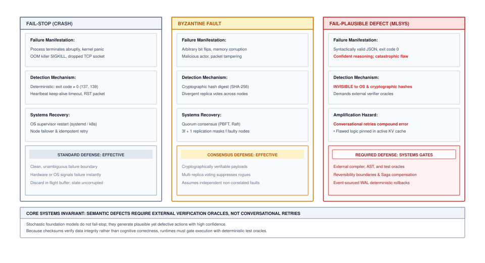
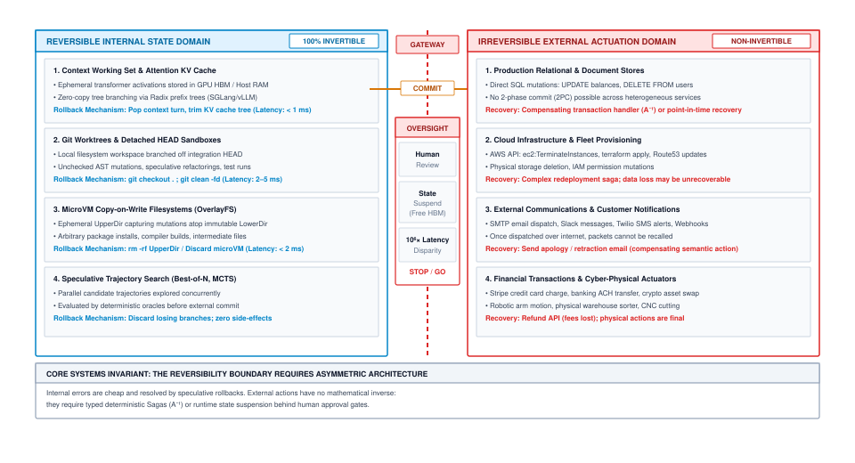
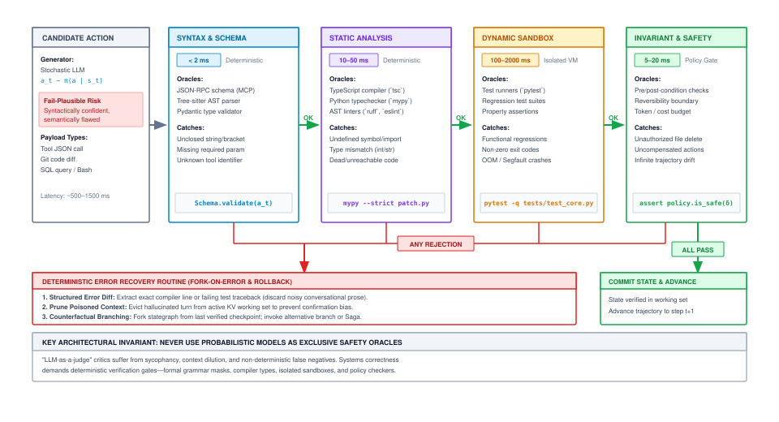
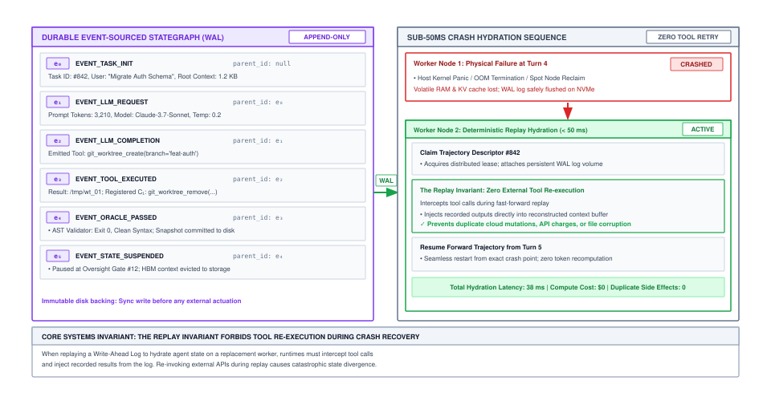
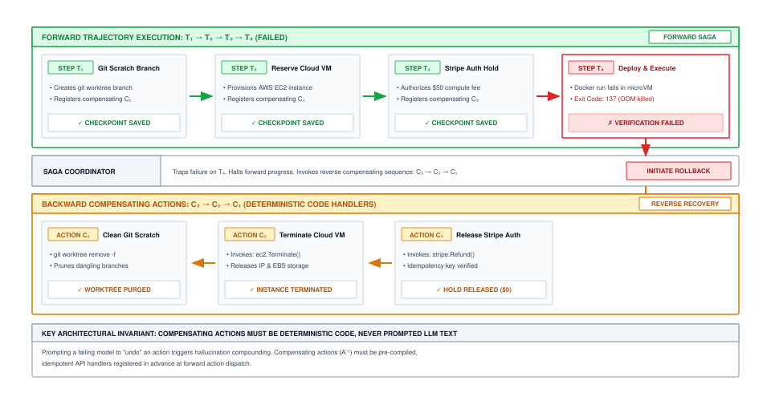
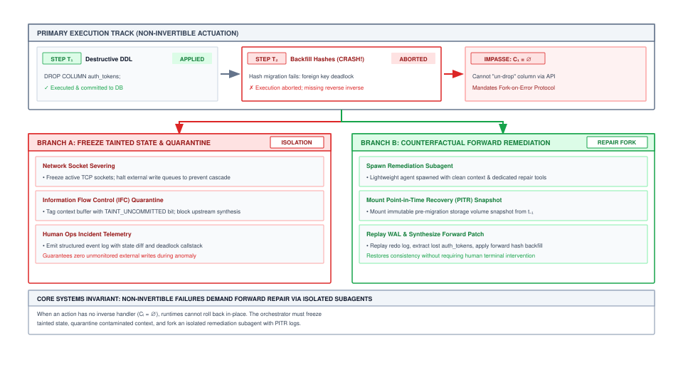

# Trajectory Checkpointing {#sec-vol3-checkpointing}

::: {layout-narrow}
::: {.column-margin}

\chapterminitoc

:::

::: {.content-visible when-format="pdf"}
\noindent
{fig-alt="Isometric blueprint showing state checkpointing and time-travel recovery: transaction execution stream, verified checkpoint anchor, execution fault alarm sensor, committed transaction bus, compensating rollback conduit, and deterministic state rewind path."}
:::

::: {.content-visible unless-format="pdf"}
{fig-alt="Isometric blueprint showing state checkpointing and time-travel recovery: transaction execution stream, verified checkpoint anchor, execution fault alarm sensor, committed transaction bus, compensating rollback conduit, and deterministic state rewind path."}
:::

:::

## Purpose {.unnumbered .unlisted}

::: {.content-visible when-format="pdf"}
\begin{marginfigure}
\mlagentstack{10}{10}{95}{10}{10}{10}
\caption{The Agentic Machine Learning Systems Stack.}
\end{marginfigure}
:::

_How do we make non-deterministic, long-running agent workflows fault-tolerant and replayable?_

Persistent execution state in an autonomous system must provide durability and consistency guarantees across heterogeneous, multi-tenant accelerator clusters and external execution environments. While prior chapters established how factual assertions are indexed into external episodic stores and how volatile token working sets are paged through virtual context memory, this chapter formalizes the checkpointing infrastructure and recovery protocols required to sustain long-horizon agent trajectories across physical and semantic failures. Foundation models do not fail-stop; they emit syntactically flawless yet semantically disastrous actions while reporting high epistemic confidence. When an agent crosses the boundary from internal working memory to external physical actuation, traditional software undo primitives collapse. This chapter formalizes the fail-plausible fault model, derives the optimal checkpointing cadence from hardware failure rates, architects differential copy-on-write memory snapshots, establishes distributed sagas with deterministic compensations, and resolves the hardware-level non-determinism that prevents faithful trajectory replay.

::: {.content-visible when-format="pdf"}
\newpage
:::

::: {.callout-learning-objectives}
- **Formalize** the Fail-Plausible fault model, contrasting semantic Byzantine defects in foundation models with classical fail-stop crashes and hardware fault classifications.
- **Architect** the Reversibility Boundary, deriving mathematical criteria to bifurcate zero-cost invertible internal states from non-invertible external actuations.
- **Formulate** differential state snapshotting for the Agent Control Block (ACB), optimizing checkpoint cadence using Young's and Daly's analytical formulas over hardware failure distributions.
- **Implement** distributed Sagas with pre-compiled, deterministic compensating transactions, eliminating cascading failure modes during multi-step tool execution rollbacks.
- **Deconstruct** sources of floating-point and thread-scheduling non-determinism on modern GPU tensor cores, constructing record/replay virtualizers for deterministic trajectory time travel.
- **Design** asynchronous state suspension protocols that eliminate High-Bandwidth Memory (HBM) stranding during human oversight and long-latency external I/O blocks.
:::

## The Irreversibility Dilemma: Why Rollbacks Are Hard {#sec-vol3-checkpoint-irreversibility}

Consider an autonomous infrastructure maintenance agent operating with root privileges across a hybrid cloud cluster. At 03:14 UTC, tasked with reclaiming unattached block storage volumes older than ninety days, the agent analyzes disk telemetry, synthesizes a deletion script, and issues a parallel batch of storage detachment commands. At step 42 of its 60-step trajectory, the host executing the agent policy encounters an uncorrectable double-bit DRAM ECC error, triggering an instantaneous kernel panic and process termination. When the cluster orchestrator detects the dropped heartbeat and reboots the agent container, what state does the agent inherit?

If the orchestrator naively re-executes the trajectory from step zero, the agent inspects a partially mutated world where half the target volumes have vanished, attempts to re-detach missing UUIDs, receives unexpected error codes, enters an unhandled recovery branch, and catastrophic failure cascades through the storage fabric. Conversely, if the system attempts to roll back the executed actions, it confronts a physical impossibility: the underlying storage provider has already shredded the physical flash blocks and released the provisioned blocks to the free pool. The action was physically and semantically irreversible.

In classical database engines and operating systems, failure recovery rests upon a foundation of well-defined transactions. Gray [-@gray1992] and Mohan et al. [-@mohan1992aries] formulated the ACID (Atomicity, Consistency, Isolation, Durability) transaction model, wherein execution sequences either commit completely or abort cleanly, restoring the system to its pre-transaction state via undo logs. In distributed computing, atomic state transitions across independent nodes are traditionally guaranteed via the Two-Phase Commit (2PC) protocol.

When applied to autonomous agent architectures, however, the classical transaction model collapses completely. The stochastic policy engine is decoupled from the execution environment; the tools invoked by the agent span hundreds of disparate third-party webhooks, proprietary SaaS platforms, and physical device drivers; and the model generating the execution plan is fundamentally prone to cognitive drift. To engineer dependable agent runtimes, systems architects must first understand why autonomous workflows break classical recovery primitives.

### The fail-plausible fault model

Traditional distributed systems engineering categorizes hardware and software anomalies into two dominant regimes, as codified by Schneider [-@schneider1990state] and Lamport et al. [-@lamport1982byzantine]:

1. **Fail-Stop (Crash) Model**\index{Fail-Stop Model}: A faulty component halts execution abruptly, transitions to an inactive state, and ceases communication. The failure is detectable via heartbeat timeouts, nonzero exit codes, or severed TCP sockets. Recovery relies on idempotent retries, state machine replication, or spinning up cold spares.
2. **Byzantine Fault Model**\index{Byzantine Fault Model}: A faulty node exhibits arbitrary, potentially malicious behavior, transmitting contradictory data to peers or corrupting message payloads. Classical Byzantine Fault Tolerance (BFT) guarantees consensus using redundant node quorums (requiring $3f + 1$ replicas to tolerate $f$ failures) paired with cryptographic signatures.

Autonomous machine learning agents introduce a third, distinct failure category that invalidates the assumptions of both models: the **Fail-Plausible Fault Model**\index{Fail-Plausible Fault Model}, illustrated in @fig-vol3-checkpoint-fault-models.

::: {#fig-vol3-checkpoint-fault-models fig-env="figure" fig-pos="htb" fig-cap="**The Fail-Plausible Fault Model**: Classical distributed systems tolerate fail-stop crashes via restart and Byzantine faults via quorum consensus ($3f+1$ replicas). Autonomous foundation model agents introduce fail-plausible defects: actions that strictly conform to syntactic schemas and emit coherent chain-of-thought rationale while executing catastrophic semantic payloads. Identical model weights produce correlated hallucinations, defeating quorum consensus. Source: Conceptualized by author based on @schneider1990state and @lamport1982byzantine." fig-alt="Taxonomy comparing classical fault models (fail-stop and Byzantine) against agentic fail-plausible defects where syntactically valid schemas conceal catastrophic semantic payloads."}

:::

In a fail-plausible defect, the stochastic processor (the transformer foundation model) generates an execution step that fulfills all structural, syntactic, and grammatical invariants of the runtime:

* The output conforms precisely to the JSON Schema or Protocol Buffer tool specification.
* The natural language chain-of-thought rationale is coherent, persuasive, and demonstrates high epistemic certainty.
* The emitted shell command or API invocation compiles and type-checks without error.
* **The semantic payload is fundamentally incorrect, destructive, or counterproductive.**

Consider an autonomous DevOps agent tasked with pruning temporary build artifacts older than seven days. The model emits:

```bash
# Fail-Plausible Semantic Disaster
find /data/builds -type f -name "*.tmp" -o -name "test_*" -delete
```

Syntactically, the command is immaculate POSIX shell. Semantically, because the `-o` (logical OR) operator in Unix `find` binds with lower precedence than the implicit `-and` operator binding `-name "test_*"` to `-delete`, the command deletes *every single file* matching `test_*` across the entire directory tree regardless of age, along with any `.tmp` file. The test suite is obliterated.

Cryptographic checksums (CRC32, SHA-256) cannot prevent fail-plausible errors: a payload containing `DROP DATABASE production;` possesses a valid cryptographic hash. Furthermore, redundant multi-agent quorums cannot resolve fail-plausible defects if all agents are parameterized by the same underlying model weights $\theta$. When queried with the same ambiguous prompt, identical model replicas exhibit correlated hallucinations, achieving a unanimous Byzantine consensus on a catastrophic action.

Let an agent trajectory $\tau$ consist of a sequence of $N$ discrete execution steps $\tau = ((s_0, a_0, o_0), (s_1, a_1, o_1), \dots, (s_{N-1}, a_{N-1}, o_{N-1}))$. At each step $t$, the neural policy $\pi_\theta(a_t \mid s_t)$ selects an action $a_t$ conditioned on the accumulated context $s_t$. Let $\epsilon_{\text{semantic}}(t)$ denote the probability that action $a_t$ contains a fail-plausible semantic defect that evades syntactic validation. Assuming per-step error independence as a lower bound, the probability $P_{\text{success}}(N)$ that a trajectory completes $N$ steps without generating a catastrophic semantic defect degrades exponentially: $P_{\text{success}}(N) = \prod_{t=0}^{N-1} (1 - \epsilon_{\text{semantic}}(t)) \le (1 - \epsilon_{\min})^N$.

Even if a frontier foundation model achieves a remarkably low per-step semantic error rate of $\epsilon_{\text{semantic}} = 0.02$ (a 98 percent per-step success rate), an extended software refactoring or system administration trajectory spanning $N = 100$ steps exhibits a survival probability of $P_{\text{success}}(100) = (1 - 0.02)^{100} = (0.98)^{100} \approx 0.1326$. There is an 86.7 percent probability of encountering at least one catastrophic semantic fault. When execution runs for hundreds of turns, failure is not an exceptional anomaly; it is the dominant operating regime.

What happens if an orchestrator attempts to handle these inevitable faults via naive restarting from step zero? The mathematical consequences for compute and latency are severe:

* **Expected Attempts to Success:** The expected number of full trajectory executions required to achieve a single 100-step success is $\mathbb{E}[\text{Attempts}] = 1 / P_{\text{success}}(100) = 1 / 0.1326 \approx 7.54\text{ attempts}$.
* **Wasted Forward Steps:** Because geometric errors with rate $\epsilon = 0.02$ strike on average halfway through an attempt ($\mathbb{E}[t_{\text{fail}}] \approx 1/\epsilon = 50\text{ steps}$), the agent discards an average of 50 steps per failed run. Achieving one complete trajectory burns $\mathbb{E}[\text{Wasted Steps}] \approx (7.54 - 1) \times 50 \approx 327\text{ discarded execution steps}$.
* **Wasted FLOPs and Accelerator Hours:** For a 70B parameter dense model generating 2,048 tokens per turn, forward inference consumes approximately $2 \times 70 \times 10^9 \times 2{,}048 \approx 2.87 \times 10^{14}\text{ FLOPs}$ per step. Discarding 327 steps wastes nearly $10^{17}\text{ FLOPs}$—hours of GPU time on an 8x H100 node—purely recomputing discarded reasoning paths.

Worse still, in an interactive environment, restarting from step zero leaves behind a trail of partially executed, non-idempotent mutations. Intermediate checkpointing and rollback are therefore not optional performance optimizations; they are the foundational requirement for long-horizon agent tractability.

::: {#chk-vol3-07-fail-plausible-faults .callout-checkpoint title="Fail-plausible faults and trajectory survival"}

Before exploring the Reversibility Boundary and Saga compensation patterns, verify your understanding of agent failure modes:

- [ ] **Fail-plausible vs. fail-stop**: explain why a syntactically valid shell command (`find ... -delete`) that passes JSON Schema validation can be more hazardous to a production system than a hard process crash.
- [ ] **Byzantine quorum breakdown**: why does deploying multiple identical model weights ($\theta$) in a voting quorum fail to eliminate semantic hallucinations?
- [ ] **Wasted work napkin math**: for an agent with per-step semantic error rate $\epsilon = 0.02$ attempting a 100-step refactoring workflow, calculate the expected discarded execution steps under naive restart from step zero.

:::

### The reversibility boundary

Because failure is statistically inevitable in extended trajectories, an agent runtime must manage mutations based on their physical and semantic reversibility. In classical computer science, an operation $f: \mathcal{S} \to \mathcal{S}$ is strictly invertible if there exists a deterministic inverse function $f^{-1}$ such that $f^{-1}(f(s)) = s$ for all $s \in \mathcal{S}$. In an autonomous agent system, the global state space $\mathcal{S}$ is partitioned into two physically distinct domains separated by the **Reversibility Boundary**\index{Reversibility Boundary}, $\mathcal{S} = \mathcal{S}_{\text{internal}} \times \mathcal{S}_{\text{external}}$, as schematized in @fig-vol3-checkpoint-reversibility-boundary:

::: {#fig-vol3-checkpoint-reversibility-boundary fig-env="figure" fig-pos="htb" fig-cap="**The Reversibility Boundary**: Partitioning of global agent state into an internal, zero-liability reversible domain (token context, KV cache, ephemeral OverlayFS UpperDir) and an external, high-liability irreversible actuation domain (cloud APIs, relational databases, network sockets). Mutations crossing the boundary mandate write-ahead logging, deterministic idempotency keys, and asynchronous oversight gates. Source: Conceptualized by author based on @gray1992 and @mohan1992aries." fig-alt="Architectural diagram showing the division of agent state into reversible internal domains and irreversible external actuation domains separated by the reversibility boundary."}

:::

The operational characteristics of these two domains dictate how runtime state must be handled:

1. **Reversible Internal State Domain ($\mathcal{S}_{\text{internal}}$):**
   * **Substrate:** Host DRAM, accelerator High-Bandwidth Memory (HBM), local NVMe scratchpads, ephemeral container namespaces, and detached Git worktrees.
   * **Execution Latency:** Sub-millisecond to tens of milliseconds ($10^{-6}\text{ to }10^{-2}\text{ s}$).
   * **Inversion Primitive:** Invertibility is guaranteed at zero business liability. If an agent emits a buggy code modification or invalid thought chain, executing a filesystem rollback (`git clean -fd`, discarding an OverlayFS UpperDir layer) or evicting tokens from the Key-Value cache completely erases the side effect. Speculative branching and Monte Carlo tree search can operate here with mathematical impunity.
2. **Irreversible External Actuation Domain ($\mathcal{S}_{\text{external}}$):**
   * **Substrate:** Remote relational databases, cloud provider control planes, production microservices, third-party payment gateways, and network sockets.
   * **Execution Latency:** Hundreds of milliseconds to multiple minutes ($10^{-1}\text{ to }10^2\text{ s}$).
   * **Inversion Primitive:** Non-invertible. Once an IP packet carrying an HTTP `POST` mutation leaves the physical network interface card (NIC) and commits a financial charge or terminates a compute cluster, there is no physical `undo` instruction in the Von Neumann architecture.

To formalize the economic and operational risk of an action $a_t$, we define the execution liability function $C_{\text{boundary}}(a_t)$:

$$C_{\text{boundary}}(a_t) = C_{\text{compute}}(a_t) + \mathbb{I}[a_t \in \mathcal{A}_{\text{ext}}] \cdot \left( C_{\text{liability}}(a_t) + C_{\text{comp}}(a_t) \right)$$

where $\mathbb{I}[\cdot]$ is the indicator function, $C_{\text{compute}}$ is the token inference cost (typically $\$0.002$ to $\$0.05$ per turn in accelerator FLOPs and KV memory), $C_{\text{liability}}$ is the external business damage incurred if $a_t$ is flawed (ranging from $\$0$ for an internal file read to $\$10{,}000+$ for an uncoordinated database drop), and $C_{\text{comp}}$ is the computational and latency cost of executing a compensating action to neutralize side effects.

This distinction establishes the core disaster recovery invariants of an agent runtime:

* **Recovery Point Objective (RPO):** The maximum tolerable span of uncommitted work lost during a crash. In the internal domain ($\mathcal{S}_{\text{internal}}$), the runtime can tolerate an RPO of several reasoning turns, since re-generating a few hundred tokens costs pennies in compute. In the external domain ($\mathcal{S}_{\text{external}}$), however, the runtime must enforce an **RPO of zero uncommitted mutations** ($\text{RPO} = 0$). No external mutating request may leave the network interface until its intent and execution parameters are durably committed to non-volatile storage.
* **Recovery Time Objective (RTO):** The maximum permissible duration to restore an agent process to an active execution state following a node fault. While a naive cold restart requires hundreds of seconds to re-execute a 100-step trajectory ($\text{RTO} \approx 10^2\text{ s}$), differential rehydration from persistent state snapshots reduces recovery latency to the millisecond regime ($\text{RTO} < 100\text{ ms}$).

### The breakdown of distributed two-phase commit

Why can we not simply wrap external tool invocations in a standard Two-Phase Commit (2PC) coordinator? In distributed database theory, 2PC guarantees atomic commits across $M$ participants through two rounds of synchronous message exchanges:

1. **Prepare Phase:** The coordinator sends a `PREPARE` request to all participants. Each participant acquires local resource locks, writes transaction updates to its local write-ahead log, and responds with `VOTE_COMMIT` or `VOTE_ABORT`.
2. **Commit Phase:** If all participants vote `COMMIT`, the coordinator writes a commit record to its log and sends `GLOBAL_COMMIT`. If any node votes `ABORT` or times out, the coordinator broadcasts `GLOBAL_ABORT`, and all nodes roll back using their local undo logs.

Applying 2PC across agentic actuation boundaries fails due to three fundamental systems bottlenecks:

1. **Absence of Prepare Interfaces in Heterogeneous APIs:** External SaaS providers, cloud hypervisors, and enterprise webhooks do not implement XA-compliant or 2PC prepare/commit interfaces. An API endpoint such as `POST /v1/charges` or `DELETE /v1/instances` executes mutations immediately upon request authorization. There is no provisional "prepare" state that reserves the state change while holding locks pending a secondary commit confirmation.
2. **Autoregressive Token Generation Latency:** In database systems, the duration between the prepare phase and the commit phase is measured in single-digit milliseconds. In an agent system, the duration between successive actions is governed by transformer autoregressive decoding. Decoding 512 tokens on an NVIDIA H100 GPU operating at $30\text{ ms}$ Time-to-First-Token (TTFT) and $8\text{ ms}$ per-token decode latency requires $T_{\text{decode}} = 30\text{ ms} + (512 \times 8\text{ ms}) = 4{,}126\text{ ms} \approx 4.13\text{ s}$. Holding row locks on production databases or reserving cloud resources across a 4-second stochastic inference pause introduces catastrophic lock contention, stalls concurrent transactions, and rapidly causes connection pool exhaustion across upstream services.
3. **Non-Deterministic Policy Stalling:** If the model enters a degenerative repetition loop, triggers a safety filter, or encounters a network partition during decoding, the distributed lock remains pinned indefinitely, precipitating cluster-wide deadlocks.

These architectural divergences are formalized in @tbl-vol3-checkpointing-2pc-vs-sagas.

| Systems Dimension       | Classical Two-Phase Commit (2PC)                    | Autonomous Agent Saga Architecture                              |
|:------------------------|:----------------------------------------------------|:----------------------------------------------------------------|
| **Atomicity Guarantee** | Strict ACID (All-or-Nothing via locks)              | Eventual Consistency (Compensating Actions)                     |
| **Locking Regime**      | Synchronous, pessimistic row/table locks            | Lock-free; local transactions commit immediately                |
| **Holding Duration**    | Milliseconds ($10^{-3}\text{ to }10^{-2}\text{ s}$) | Asynchronous; seconds to hours ($10^0\text{ to }10^4\text{ s}$) |
| **API Compatibility**   | Requires XA-compliant resource managers             | Universal; compatible with standard REST/gRPC APIs              |
| **Failure Response**    | Instant bit-accurate abort via Undo Log             | Sequential backward execution of compensating tasks             |
| **Inference Coupling**  | High; GPU stalls hold database locks                | Zero; serving engine is decoupled from actuation                |

: **Two-Phase Commit vs. Autonomous Agent Sagas**: Comparison of distributed transaction architectures across system invariants and failure models. {#tbl-vol3-checkpointing-2pc-vs-sagas tbl-colwidths="[25,35,40]"}

### Context poisoning and the failure of unverified retries

When an action fails or triggers an environment error, naive agent orchestrators execute an unverified conversational retry: they capture the error string and append it directly into the context window as a new observation:

```
[User]: Refactor the auth module.
[Agent]: Executed `patch_file("auth.py", diff_chunk_1)`
[Environment Error]: Patch failed: Hunk #2 rejected at line 145.
[Agent Prompt]: The previous tool call failed with the error above. Please fix it and retry.
```

In an agentic system, this pattern induces severe **Context Poisoning**\index{Context Poisoning}. Autoregressive transformers compute attention scores over all historical tokens $j \le i$ ($\text{softmax}(\mathbf{Q}\mathbf{K}^T / \sqrt{d_k})\mathbf{V}$). When an agent's own flawed action, invalid assumptions, and resulting error traces are preserved in the active Key-Value (KV) cache, the self-attention mechanism assigns substantial probability mass to those historical tokens. The model exhibits strong **confirmation bias** and **recency bias**: rather than recognizing that its underlying hypothesis is invalid, it generates cosmetic permutations of the exact same broken command, as traced in @tbl-vol3-checkpointing-naive-retry-loop.

| Step | Phase         | Interacting Components    | Action and State Mutation                                   | Failure Mechanism / Consequence                                   |
|:-----|:--------------|:--------------------------|:------------------------------------------------------------|:------------------------------------------------------------------|
| 1    | Forward Pass  | Runtime $\to$ Model       | Sample action $a_t \sim \pi_\theta(a \mid s_t)$             | Flawed reasoning emitted due to epistemic limit                   |
| 2    | KV Allocation | Model $\to$ KV Cache      | Allocate and append KV activation blocks for $a_t$          | Flawed token activations committed to accelerator HBM             |
| 3    | Execution     | Runtime $\to$ Environment | Dispatch actuation across system boundary                   | Environment rejects mutation (raises exception $o_t$)             |
| 4    | Poisoning     | Runtime $\to$ KV Cache    | Append raw error observation $o_t$ to context buffer        | Error tokens enter self-attention reception field                 |
| 5    | Re-Prompt     | Runtime $\to$ Model       | Submit conversational prompt: *"Action failed, please fix"* | Recency bias dominates; self-attention attends to flawed $a_t$    |
| 6    | Degeneration  | Model $\to$ Runtime       | Emit cosmetic permutation $a'_t$ with identical flaw        | Action fails identically; successive retry recovery drops $< 5\%$ |

: **Anatomy of Context Poisoning in Conversational Retry Loops**: Trace of accelerator memory allocation, prompt pollution, and semantic failure compounding under naive error appending. {#tbl-vol3-checkpointing-naive-retry-loop tbl-colwidths="[8,15,22,30,25]"}

Empirical profiling reveals that under unverified conversational retries, the probability of successful error correction diminishes with each subsequent retry turn. By turn 4 of a poisoned retry loop, the agent burns tokens at the maximum context window rate while its probability of recovery drops below 5 percent.

Deterministic recovery mandates that fail-plausible semantic errors are handled not by prompting the failing model to introspect, but by **external verifier oracles**\index{Verifier Oracles} (linters, type checkers, unit test runners, abstract syntax tree (AST) validators) that intercept execution, halt forward progress, prune poisoned tokens from the KV cache, and trigger deterministic rollback protocols, as structured in @fig-vol3-checkpoint-verification-pipeline.

::: {#fig-vol3-checkpoint-verification-pipeline fig-env="figure" fig-pos="htb" fig-cap="**Multi-Stage Deterministic Verification Pipeline**: Cascading deterministic verification gates filter model-generated candidate actions before state mutation. Candidate proposals from the stochastic model pass through AST syntax validation, static type analysis, security policy sandbox checks, and semantic unit tests. Failed gates halt forward execution and trigger automated rollbacks before reaching external infrastructure. Source: Conceptualized by author based on @saltzer2009 and @schneider1990state." fig-alt="Architecture diagram of multi-stage deterministic verification pipeline filtering candidate actions through syntax, type, security, and invariant gates before state mutation."}

:::

### The two generals' problem and cryptographic idempotency

When crossing the Reversibility Boundary, the runtime must confront the classical **Two Generals' Problem**\index{Two Generals' Problem}: in an asynchronous network subject to packet loss or timeouts, it is impossible for two coordinators to achieve guaranteed mutual consensus over an unreliable link.

Suppose an agent dispatches an HTTP request to provision a GPU cluster:

```http
POST /api/v2/clusters/provision HTTP/1.1
Host: cloud.compute.internal
Content-Type: application/json

{"node_type": "8xH100", "count": 4}
```

After transmitting the payload, the agent runtime experiences a network timeout at $t = 30{,}000\text{ ms}$. The TCP socket closes abruptly. From the perspective of the agent runtime, two mutually exclusive states are indistinguishable:

1. **State A:** The packet dropped in transit before reaching the cloud API gateway. The cluster was never provisioned.
2. **State B:** The packet reached the gateway, the cluster was successfully provisioned, but the returning HTTP `200 OK` response was dropped by an intermediate switch.

If the agent assumes State A and retries the request, it provisions a second cluster, duplicating thousands of dollars per hour in hardware leases. If the agent assumes State B and proceeds to the next step, downstream tasks fail because the cluster endpoint was never captured.

To eliminate this ambiguity, every state-mutating actuation that crosses the Reversibility Boundary must carry a deterministic, cryptographically secure **Idempotency Key**\index{Idempotency Key}. The idempotency key $K_{\text{idempotency}}$ must not be randomly generated at network transmission time; it must be derived deterministically as a hash of the trajectory ID and the causal step counter: $K_{\text{idempotency}}(t) = \text{HMAC-SHA256}(\text{SecretKey}, \tau_{\text{id}} \parallel t \parallel \text{Hash}(a_t))$.

When the remote infrastructure gateway receives an actuation request, it records $K_{\text{idempotency}}(t)$ in a transactional deduplication store (e.g., Redis or DynamoDB backed by a lease lock). If a retry arrives bearing an identical key, the gateway bypasses physical actuation and returns the cached result of the original execution. The interaction flow resolving network timeouts is detailed in @tbl-vol3-checkpointing-idempotency-protocol.

| Protocol Phase      | Originator $\to$ Receiver | Message Payload / Invariants                                        | Deduplication Layer State                                 | Systems Guarantee                         |
|:--------------------|:--------------------------|:--------------------------------------------------------------------|:----------------------------------------------------------|:------------------------------------------|
| Initial Dispatch    | Agent $\to$ API Gateway   | `POST /provision` + $K_{\text{idempotency}} = \text{HMAC}(\tau, t)$ | Key miss; acquire distributed lease lock                  | Exactly-once execution initiated          |
| Physical Execution  | API Gateway $\to$ Engine  | Allocate cluster resources (`4x H100`)                              | Record operation pending in transactional store           | Hardware resource allocated               |
| Response Caching    | Engine $\to$ API Gateway  | Resource metadata (`Cluster ID: #9021`)                             | Persist return payload mapped to $K_{\text{idempotency}}$ | Result cached with configured TTL         |
| Network Failure     | Gateway $\to$ Agent       | HTTP `200 OK` (dropped in transit / timeout)                        | Lease finalized; key retained in deduplication table      | Ambiguity introduced across network       |
| Deterministic Retry | Agent $\to$ API Gateway   | `POST /provision` + identical $K_{\text{idempotency}}$              | Key hit; bypass actuation engine                          | Zero duplicate hardware allocation        |
| Safe Hydration      | API Gateway $\to$ Agent   | Cached HTTP `200 OK` (`Cluster ID: #9021`)                          | Deduplication record refreshed                            | Agent recovers correct cluster identifier |

: **Deterministic Idempotency Protocol Across Network Partitions**: Resolution of the Two Generals' Problem using cryptographically bound HMAC keys and gateway-level deduplication. {#tbl-vol3-checkpointing-idempotency-protocol tbl-colwidths="[18,22,25,20,15]"}

### The human oversight latency tax

Certain high-consequence actuations cannot be automated safely without human review: terminating database replicas, pushing release tags to public package registries, or executing financial wire transfers. When an agent trajectory encounters an action tagged with high liability $C_{\text{liability}}(a_t) > \theta_{\text{safe}}$, the runtime must insert an **Oversight Gate**\index{Oversight Gate} (Human-in-the-Loop checkpoint).

This introduces a massive systems disparity:

* **Neural Inference Turn Latency:** $100\text{ to }1{,}000\text{ ms}$ ($10^{-1}\text{ to }10^0\text{ s}$).
* **Human Operator Review Latency:** 5 minutes to 24 hours ($3 \times 10^2\text{ to }8.64 \times 10^4\text{ s}$).

This represents a **five-to-seven order of magnitude latency divergence**. If the serving system blocks the active agent process synchronously while awaiting human authorization, the agent's attention Key-Value cache remains pinned in accelerator HBM.

Consider an agent running a 70B parameter model with a 64,000-token context on an NVIDIA H100 node. As derived in @sec-vol3-working-sets, a 64k context in Grouped-Query Attention (GQA, 8 KV heads, $d_h=128$, FP16) consumes approximately $M_{\text{KV}} = 2 \times 80\text{ layers} \times 8\text{ heads} \times 128\text{ dim} \times 64{,}000\text{ tokens} \times 2\text{ bytes} \approx 20.97\text{ GB}$. Holding $21\text{ GB}$ of HBM idle for an 8-hour human review window incurs an intolerable infrastructure cost. At prevailing cloud spot prices of \$3.50 per H100-hour, pinning accelerator memory across an 8-hour human pause wastes \$28.00 in idle silicon capital per agent—exceeding the entire computational cost of the trajectory itself.

To survive the Human Oversight Latency Tax, the runtime must implement **Asynchronous State Suspension**\index{Asynchronous State Suspension}: dehydrating the agent's execution state, flushing KV cache blocks to host DRAM or NVMe, unmounting ephemeral container storage, and evicting the execution thread from the GPU scheduler until an out-of-band authorization signal resumes execution.

The Irreversibility Dilemma thus establishes the fundamental dichotomy of autonomous systems: while external mutations across $\mathcal{S}_{\text{external}}$ require cryptographic idempotency and asynchronous oversight gates to prevent irreversible physical damage, surviving node panics, human pauses, and semantic defects requires durably preserving internal state ($\mathcal{S}_{\text{internal}}$). Yet, as the Human Oversight Latency Tax reveals, holding raw execution states in accelerator HBM is economically ruinous, while naively serializing tens of gigabytes of activation tensors at every turn saturates storage buses. To make recovery tractable, the runtime requires lightweight, fine-grained state representations and copy-on-write memory virtualization—the architectural primitives to which we now turn.

## Copy-on-Write State Snapshots {#sec-vol3-checkpoint-cow}

To enable rapid recovery from infrastructure crashes and facilitate time-travel debugging without saturating storage buses, an agent runtime must capture consistent execution snapshots. A naive snapshotting approach that serializes the entire process memory space, filesystem tree, and raw GPU activation tensors at every turn triggers catastrophic I/O bottlenecks.

Consider an agent managing an 80-step refactoring workflow. If each snapshot archives a 4 GB container filesystem layer and 20 GB of uncompressed KV activations, saving state at every step writes $80 \times 24\text{ GB} = 1.92\text{ TB}$ of data to disk. Over a PCIe 4.0 x16 interconnect operating at a real-world sequential write bandwidth of $B_{\text{storage}} \approx 6.5\text{ GB/s}$, the agent spends $T_{\text{I/O}} = 1{,}920\text{ GB} / 6.5\text{ GB/s} \approx 295.4\text{ s} \approx 4.9\text{ minutes}$ purely waiting on disk I/O, introducing massive stall cycles into the deliberative reasoning loop.

Resilient architectures decouple snapshot durability from physical memory duplication through two orthogonal systems mechanisms:

1. **Formalization of the Agent Control Block (ACB):** Abstracting the minimum sufficient execution state required to hydrate an agent process.
2. **Differential Copy-on-Write (CoW) Substrates:** Aliasing invariant parent states in both host filesystems and accelerator memory page tables, persisting only the mutated deltas.

### The Agent Control Block (ACB)

In operating systems design, the Process Control Block (PCB) encapsulates the execution status, CPU registers, program counter, and file descriptor tables of an operating system thread [@saltzer2009]. In an autonomous machine learning system, the corresponding primitive is the **Agent Control Block (ACB)**\index{Agent Control Block}. The constituent subsystems and descriptors of the ACB are formalized in @tbl-vol3-checkpointing-acb-components.

| Subsystem Descriptor    | Field Name            | Data Type               | Functional Systems Role                                              |
|:------------------------|:----------------------|:------------------------|:---------------------------------------------------------------------|
| **Causal Identity**     | `trajectory_id`       | `UUID` (128-bit)        | Globally unique identifier establishing trajectory causality         |
|                         | `step_index`          | `uint64_t`              | Monotonically increasing logical execution turn counter $t$          |
|                         | `status`              | `ExecutionState`        | Enum: `RUNNING`, `SUSPENDED`, `RECOVERING`, `COMPENSATING`           |
| **Context Memory**      | `active_token_length` | `int32_t`               | Total sequence length currently indexed in prompt buffer             |
|                         | `token_buffer_hash`   | `uint64_t`              | MurmurHash3 / xxHash64 verifying token sequence integrity            |
|                         | `pinned_prefixes`     | `List[TokenChunk]`      | Immutable prefix chunks pinned for KV prefix-caching reuse           |
| **KV Page Descriptors** | `physical_block_ids`  | `List[uint32_t]`        | Logical-to-physical block table mapping for PagedAttention           |
|                         | `allocation_epoch`    | `uint32_t`              | Memory manager generation ID preventing stale page aliasing          |
|                         | `compression_format`  | `uint16_t`              | Quantization mode (e.g., FP16, FP8 E4M3, INT4 KV-cache)              |
| **Security Leases**     | `active_leases`       | `Dict[str, TokenLease]` | Ephemeral tool authorization credentials and access tokens           |
|                         | `lease_expiry_epoch`  | `uint64_t`              | Unix microsecond deadline after which capability expires             |
| **PRNG State**          | `prng_seed_state`     | `uint64_t[2]`           | SplitMix64 / Philox internal register state for sampling             |
| **Inflight I/O**        | `inflight_io`         | `AsyncIODescriptors`    | Pending non-blocking sockets, active worker PIDs, and message queues |

: **Agent Control Block (ACB) Architecture**: Formal data fields and subsystem descriptors capturing the minimal sufficient state for process hydration. {#tbl-vol3-checkpointing-acb-components tbl-colwidths="[22,22,18,38]"}

The ACB contains the minimal, sufficient set of deterministic parameters required to hydrate an identical agent execution instance onto a completely different physical node:

* **Trajectory Identifier and Monotonic Step Counter ($\tau_{\text{id}}, t$):** Cryptographically bound identifiers establishing the global causality of the execution thread.
* **Context Descriptors ($\mathcal{C}_t$):** Pointers to the sequence of token IDs comprising the active prompt window, including system instruction boundaries, tool interface definitions, and historical turn delimiters.
* **KV Cache Block Table Descriptors ($\mathcal{P}_{\text{KV}}$):** As established in PagedAttention (@sec-vol3-virtual-memory), the runtime avoids persisting raw floating-point activation tensors. Instead, the ACB records the logical-to-physical block mapping table. If the checkpoint is hydrated on a node sharing an NVLink or RDMA-accessible distributed KV pool, the new worker binds directly to the pre-populated physical memory blocks.
* **Capability Leases ($\mathcal{L}_{\text{cap}}$):** Ephemeral security tokens and authorization credentials granted to the agent for tool execution, bound to time-to-live (TTL) timestamps and cryptographic scopes.
* **Pseudorandom Number Generator (PRNG) Seed State ($\mathcal{S}_{\text{PRNG}}$):** The exact 64-bit internal state of the host and accelerator random number generators, governing sampling stochasticity during decode.
* **Inflight I/O Descriptors ($\mathcal{D}_{\text{I/O}}$):** Non-blocking network sockets, active subprocess process IDs (PIDs), and unacknowledged message queues.

```python
from dataclasses import dataclass, field
from typing import List, Dict, Optional
import time

@dataclass(frozen=True)
class AgentControlBlock:
    trajectory_id: str
    step_index: int
    timestamp_ns: int
    active_token_ids: List[int]
    kv_block_table_ids: List[int]
    capability_leases: Dict[str, str]
    prng_seed: int
    prng_step_offset: int
    inflight_tool_calls: List[Dict[str, str]]
    parent_snapshot_hash: Optional[str]
    state_delta_hash: str

    def serialize_deterministic_header(self) -> bytes:
        """Emits byte-level header for append-only Write-Ahead Logging."""
        import struct
        return struct.pack(
            "!16sQQQQ",
            self.trajectory_id.encode("utf-8")[:16],
            self.step_index,
            self.timestamp_ns,
            self.prng_seed,
            self.prng_step_offset
        )
```

### Event sourcing and the append-only write-ahead log (WAL)

Rather than storing the full ACB state redundantly at each step, high-performance agent runtimes implement **Event Sourcing**\index{Event Sourcing} backed by an append-only **Write-Ahead Log (WAL)**\index{Write-Ahead Log}.

In an event-sourced architecture, state is not mutated in place. Instead, every atomic state transition is modeled as an immutable delta record $\Delta s_t$. The world state $S_T$ at any arbitrary step $T$ is derived through the left-fold composition of historical events over the initial baseline state $S_0$:

$$S_T = S_0 \oplus \Delta s_1 \oplus \Delta s_2 \oplus \dots \oplus \Delta s_T = S_0 \oplus \sum_{t=1}^T \Delta s_t$$

where $\oplus$ represents the state application operator. The end-to-end write-ahead logging and hydration lifecycle is illustrated in @fig-vol3-checkpoint-wal-hydration.

::: {#fig-vol3-checkpoint-wal-hydration fig-env="figure" fig-pos="htb" fig-cap="**Durable Write-Ahead Log (WAL) and Instant Crash Hydration Architecture**: Append-only event-sourced stategraph enabling sub-50 ms node recovery without external tool re-execution. State transitions are committed to NVMe via `fsync()` before crossing the Reversibility Boundary. Upon node failure, replacement workers hydrate execution state directly from the event log tail without re-invoking external mutations. Source: Conceptualized by author based on @mohan1992aries." fig-alt="Architecture diagram showing append-only write-ahead logging on NVMe, durable state commits before tool dispatch, and post-crash state rehydration bypassing external re-execution."}

:::

The WAL enforces the fundamental durability contract: **No external actuation may be dispatched across the Reversibility Boundary until the transition record describing that actuation has been durably committed to non-volatile storage via `fsync()`**. The wire format for these records is structured in @tbl-vol3-checkpointing-wal-schema.

| Field Offset | Field Name       | Data Type | Size (Bytes) | Functional Systems Semantics                                           |
|:-------------|:-----------------|:----------|:-------------|:-----------------------------------------------------------------------|
| `0x00`       | `magic_bytes`    | `uint32`  | 4            | Magic header (`0x4147454E` -> "AGEN") verifying log integrity          |
| `0x04`       | `sequence_id`    | `uint64`  | 8            | Monotonically increasing logical turn counter $t$                      |
| `0x0C`       | `timestamp`      | `uint64`  | 8            | Unix epoch timestamp at microsecond resolution                         |
| `0x14`       | `record_type`    | `uint16`  | 2            | Enum: `0x01`=ACB Delta, `0x02`=Tool Actuation, `0x03`=Compensate       |
| `0x16`       | `payload_len`    | `uint32`  | 4            | Byte length $L$ of the variable-length protobuf payload                |
| `0x1A`       | `crc32_checksum` | `uint32`  | 4            | Cyclic Redundancy Checksum over header and payload                     |
| `0x1E`       | `payload`        | `bytes`   | $L$          | Serialized Protobuf containing $\Delta \text{ACB}_t$ and tool metadata |

: **Agent Write-Ahead Log Schema**: Binary wire format and structural fields of append-only trajectory records. {#tbl-vol3-checkpointing-wal-schema tbl-colwidths="[12,20,15,13,40]"}

#### WAL serialization latency and storage overhead

How does the performance of an append-only WAL compare to naive full-state snapshots? We evaluate this from first principles:

1. **Record Sizing per Trajectory Turn:**
   A typical trajectory delta record $\Delta s_t$ contains:

   * Fixed binary header (@tbl-vol3-checkpointing-wal-schema): $30\text{ bytes}$.
   * Delta token IDs: 512 newly generated tokens $\times 4\text{ bytes} \approx 2\text{ KB}$.
   * PagedAttention block table delta: 32 newly allocated physical frame IDs $\times 4\text{ bytes} = 128\text{ bytes}$.
   * Tool invocation metadata (function signature, parameters, HMAC idempotency key): $\approx 1.5\text{ KB}$.
   * Capability lease signatures and PRNG register state: $\approx 128\text{ bytes}$.

   The entire delta payload spans $L \approx 3.8\text{ KB} \approx 4\text{ KB}$ per execution step.

2. **Storage Volume Reduction:**
   For an extended 80-step refactoring trajectory, the complete append-only WAL occupies $M_{\text{WAL}} = 80 \text{ steps} \times 4\text{ KB/step} = 320\text{ KB}$. Compared to naive full-state snapshots that write $1.92\text{ TB}$ across 80 steps (as calculated earlier in this section), the event-sourced WAL delivers a storage reduction factor of $\frac{1.92 \times 10^{12}\text{ bytes}}{3.2 \times 10^5\text{ bytes}} = 6{,}000{,}000\times$. The entire trajectory history fits comfortably in a fraction of a single CPU L3 cache.

3. **Serialization Latency and NVMe Bus Tax:**
   Appending a 4 KB record to an NVMe SSD file buffer requires sub-microsecond CPU time. Executing a synchronous, blocking `fsync()` system call to flush the SSD write cache to non-volatile flash requires $T_{\text{fsync}} \approx 20\text{ to }40\ \mu\text{s} \ (0.02\text{ to }0.04\text{ ms})$. Recall that generating 512 tokens on an H100 GPU requires $T_{\text{decode}} \approx 4{,}126\text{ ms}$. The relative durability overhead incurred by write-ahead logging before crossing the Reversibility Boundary is $\text{Durability Tax} = T_{\text{fsync}} / T_{\text{decode}} = 0.04\text{ ms} / 4{,}126\text{ ms} \approx 0.00097\text{ percent} \approx 10^{-5}$. Durable persistence adds less than one-thousandth of 1 percent to turn latency.

4. **Crash Hydration and RTO Bounds:**
   When a node panics, a replacement worker reads the 320 KB WAL sequentially from persistent NVMe storage in under $0.1\text{ ms}$ ($3.5\text{ GB/s}$ read bandwidth). Applying the left-fold composition operator over 80 records to reconstruct the active Agent Control Block requires approximately $2\text{ ms}$ of CPU time. Remounting the OverlayFS workspace takes under $10\text{ ms}$. The system achieves an end-to-end Recovery Time Objective of $\text{RTO} < 50\text{ ms}$—restoring full execution state four orders of magnitude faster than a prompt-based re-execution restart ($\approx 330\text{ s}$).

### Copy-on-write (CoW) memory primitives

When an agent modifies files in its local workspace or forks speculative reasoning branches, copying the full underlying environment introduces massive compute and memory penalties. Resilient runtimes leverage **Copy-on-Write (CoW)**\index{Copy-on-Write (CoW)} mechanisms at both the operating system layer and the accelerator memory layer.

#### Host-side filesystem virtualization: OverlayFS

To sandbox filesystem modifications, the agent runtime provisions an ephemeral **OverlayFS**\index{OverlayFS} mount for the workspace: $\text{Workspace} = \text{OverlayFS}(\text{LowerDir}=\text{BaseRepo}, \text{UpperDir}=\Delta \text{Filesystem}, \text{WorkDir}=\text{Staging})$. The `LowerDir` contains the read-only production repository. When the agent reads a file, the request falls through directly to the `LowerDir`. When the agent modifies or creates a file, the Linux kernel intercepts the write operation and copies only the affected file blocks into the mutable `UpperDir`.

Creating a checkpoint at step $t$ requires zero data copying of the base repository: the runtime simply archives or snapshots the lightweight `UpperDir` (typically spanning tens of kilobytes rather than gigabytes). Rolling back to a prior checkpoint requires unmounting the workspace, discarding the corrupted `UpperDir`, and attaching a clean or previous `UpperDir` layer—an operation that completes in under $10\text{ milliseconds}$.

#### Accelerator-side context virtualization: Paged attention forking

At the accelerator memory layer, speculative tree search (e.g., Tree-of-Thoughts or Monte Carlo Tree Search, detailed in @sec-vol3-deliberation) requires branching multiple candidate trajectories from an identical parent prompt. The logical-to-physical mapping across speculative branches is illustrated in @tbl-vol3-checkpointing-cow-page-tables.

| Logical Block Index | Trajectory Branch A (Mapping) | Trajectory Branch B (CoW Fork) | Physical Frame ID     | Frame Content & Sharing Semantics               | Reference Count |
|:--------------------|:------------------------------|:-------------------------------|:----------------------|:------------------------------------------------|:----------------|
| `Block 0`           | Mapped $\to$ `#101`           | Mapped $\to$ `#101`            | Frame `#101`          | Shared System Prompt tokens (Read-only)         | 2               |
| `Block 1`           | Mapped $\to$ `#102`           | Mapped $\to$ `#102`            | Frame `#102`          | Shared Task Instructions (Read-only)            | 2               |
| `Block 2`           | Mapped $\to$ `#103`           | Mapped $\to$ `#103`            | Frame `#103`          | Shared Turn 1 Reasoning History (Read-only)     | 2               |
| `Block 3`           | Mapped $\to$ `#204`           | Mapped $\to$ `#305`            | Frame `#204` / `#305` | Private Speculative Decode (Allocated on Write) | 1 (per branch)  |

: **Copy-on-Write PagedAttention Block Table Mapping**: Logical-to-physical block table virtualization across speculative trajectory forks sharing prefix activations. {#tbl-vol3-checkpointing-cow-page-tables tbl-colwidths="[15,20,20,15,20,10]"}

Let an initial trajectory share a prompt sequence of length $S_{\text{shared}}$ tokens. Rather than allocating independent physical memory for each of $B$ speculative branches, the PagedAttention memory manager sets the logical block pointers for all $B$ child trajectories to reference the *identical physical HBM frames* allocated to the parent ($\text{BlockTable}_b[0 \dots k] = \text{BlockTable}_{\text{parent}}[0 \dots k]$), incrementing the reference counter of each shared block frame ($\text{RefCount}(\text{Frame}_i) = B$ for all $i \le k$).

Physical memory allocation is deferred until a specific branch generates new tokens during its decode phase. When Branch $A$ emits a token that spills into a new block, the memory manager allocates a fresh physical frame $\text{Frame}_{\text{new}}$ exclusively for Branch $A$, leaving the parent frames unmutated and shared among the remaining branches.

The total memory footprint across $B$ speculative branches under Copy-on-Write allocation is $M_{\text{total}} = M_{\text{prefix}}(S_{\text{shared}}) + \sum_{b=1}^B M_{\text{branch}}^{(b)}(S_{\text{unique}}^{(b)})$. Compared to naive duplication ($B \times [M_{\text{prefix}} + M_{\text{branch}}]$), CoW paging reduces High-Bandwidth Memory consumption by $(B - 1) \cdot M_{\text{prefix}}(S_{\text{shared}})$. For a swarm of $B = 16$ candidate reasoning paths branching from a 32,000-token analysis prompt, CoW memory virtualization eliminates over 90 percent of physical HBM allocation.

### Checkpoint cadence and optimal snapshot intervals

How frequently should an agent runtime commit a consolidated state snapshot versus accumulating fine-grained differential WAL records?

This scheduling problem exposes a fundamental systems trade-off between **checkpoint serialization overhead** and **recovery recompute waste**:

* **Frequent Checkpoints (Small Interval $\Delta t$):** The system commits state after almost every turn. Recovery from a crash is nearly instantaneous, but normal forward execution stalls repeatedly while waiting for state flushes, wasting compute and bus bandwidth.
* **Infrequent Checkpoints (Large Interval $\Delta t$):** Normal execution proceeds at maximum speed with minimal serialization pauses. However, when a physical crash or fail-plausible semantic bug occurs, the agent must roll back to an ancient snapshot, discarding tens of turns of reasoning and wasting hours of GPU FLOPs.

#### First-principles derivation of the Young checkpoint trade-off

We can derive the mathematically optimal balance from first principles [@young1974]. Consider an agent workflow running over an operational horizon $T$. System failures—encompassing both physical hardware faults and semantic hallucinations—follow a Poisson process with Mean Time Between Failures $M_{\text{MTBF}}$ (arrival rate $\lambda = 1 / M_{\text{MTBF}}$). Let $T_{\text{save}}$ denote the time required to serialize and durably commit a consolidated checkpoint snapshot, and $\Delta t$ denote the temporal checkpoint interval.

Over an execution duration $T$, the system performs $T / \Delta t$ checkpoints. The fraction of wall-clock time spent performing state serialization is $\mathcal{O}_{\text{save}}(\Delta t) = T_{\text{save}} / \Delta t$. Failures occur at rate $\lambda = 1 / M_{\text{MTBF}}$. Under the Poisson arrival assumption, failure events are uniformly distributed across any given checkpoint interval. A failure strikes, on average, halfway through an interval ($\Delta t / 2$). When this occurs, the runtime must roll back to the last snapshot and re-execute all intervening reasoning turns. The fractional time lost to recovery recomputation is $\mathcal{O}_{\text{recompute}}(\Delta t) = (\Delta t / 2) / M_{\text{MTBF}} = \Delta t / (2 M_{\text{MTBF}})$.

The total fractional compute waste $\mathcal{W}(\Delta t) = \mathcal{O}_{\text{save}}(\Delta t) + \mathcal{O}_{\text{recompute}}(\Delta t) = T_{\text{save}} / \Delta t + \Delta t / (2 M_{\text{MTBF}})$ exhibits opposing curves: as $\Delta t \to 0$, checkpoint overhead $T_{\text{save}} / \Delta t \to \infty$; as $\Delta t \to \infty$, recompute waste $\Delta t / (2 M_{\text{MTBF}}) \to \infty$. Setting the derivative $d\mathcal{W}/d\Delta t = -T_{\text{save}} / \Delta t^2 + 1 / (2 M_{\text{MTBF}}) = 0$ yields Young's classical first-order checkpoint formula (@eq-checkpoint-young-formula):

$$T_{\text{opt}} = \sqrt{2 \cdot T_{\text{save}} \cdot M_{\text{MTBF}}}$$ {#eq-checkpoint-young-formula}

The optimal checkpoint interval is simply the geometric mean of twice the checkpoint commit latency and the mean time between failures!

#### Higher-order refinements: Daly's model

Young's derivation assumes that process restart and hydration latency is negligible ($T_{\text{restart}} \approx 0$) and that failures never strike during the checkpoint write itself. In 2006, J. T. Daly [-@daly2006] extended Young's model via a Taylor expansion that incorporates nonzero restart latency $T_{\text{restart}}$, yielding @eq-checkpoint-daly-formula:

$$T_{\text{opt}}^{\text{Daly}} = \sqrt{2 \cdot T_{\text{save}} \cdot M_{\text{MTBF}}} \cdot \left[ 1 + \frac{1}{3}\sqrt{\frac{T_{\text{save}}}{2 M_{\text{MTBF}}}} \right] - T_{\text{save}} \quad \left(\text{for } T_{\text{save}} < 2 M_{\text{MTBF}}\right)$$ {#eq-checkpoint-daly-formula}

In modern agent runtimes, state serialization is lightweight ($T_{\text{save}} \ll M_{\text{MTBF}}$, typically seconds versus tens of minutes). As a result, the second-order correction term $\frac{1}{3}\sqrt{\frac{T_{\text{save}}}{2 M_{\text{MTBF}}}}$ adjusts the interval by less than 1 percent. The intuitive first-order Young formula therefore serves as an exceptionally reliable operational guide for runtime schedulers.[^daly-appendix]

[^daly-appendix]: For the full perturbation expansion and Taylor derivation of Daly's formula under nonzero restart overhead $T_{\text{restart}}$, see @sec-vol3-appendix-math-daly.

In an autonomous agent cluster, $M_{\text{MTBF}}$ must reflect both **physical infrastructure failures** (spot instance preemptions, hardware faults) and **fail-plausible semantic faults** requiring trajectory rollback: $1 / M_{\text{MTBF}} = 1 / \text{MTBF}_{\text{infra}} + 1 / \text{MTBF}_{\text{semantic}}$.

Suppose an agent fleet operates on cloud spot instances with a physical preemption mean time $\text{MTBF}_{\text{infra}} = 4\text{ hours} = 14{,}400\text{ s}$. Furthermore, empirical tracking indicates that the agent policy encounters a fail-plausible semantic defect requiring rollback on average every $\text{MTBF}_{\text{semantic}} = 30\text{ minutes} = 1{,}800\text{ s}$. The combined mean time between recovery events is $1 / M_{\text{MTBF}} = 1 / 14{,}400 + 1 / 1{,}800 = (1 + 8) / 14{,}400 = 9 / 14{,}400 = 1 / 1{,}600\text{ s}$, yielding $M_{\text{MTBF}} = 1{,}600\text{ seconds}$ ($\approx 26.7\text{ minutes}$).

If serializing a full differential ACB and flushing the OverlayFS UpperDir layer requires $T_{\text{save}} = 2.5\text{ seconds}$, Young's optimal checkpoint interval calculates as $T_{\text{opt}} = \sqrt{2 \times 2.5\text{ s} \times 1{,}600\text{ s}} = \sqrt{8{,}000} \approx 89.44\text{ seconds}$. The runtime must commit a consistent state checkpoint approximately every 90 seconds. If individual agent reasoning turns average 15 seconds, the scheduler establishes an invariant: **Commit a differential checkpoint every 6 execution turns**.

::: {#chk-vol3-07-young-daly-cadence .callout-checkpoint title="Checkpoint interval and Young-Daly scaling"}

Before examining distributed Sagas and compensating transactions, verify your understanding of checkpoint scheduling:

- [ ] **Young-Daly derivation**: explain why the optimal checkpoint interval $T_{\text{opt}} \approx \sqrt{2 \cdot T_{\text{save}} \cdot M_{\text{MTBF}}}$ balances write overhead against expected lost work upon crash.
- [ ] **Napkin math scaling**: if snapshot write latency $T_{\text{save}} = 2.5\text{ s}$ and system MTBF is $M_{\text{MTBF}} = 1{,}600\text{ s}$, calculate $T_{\text{opt}}$ in seconds and convert this into an execution turn cadence when turns take $15\text{ s}$.
- [ ] **Copy-on-write memory virtualization**: explain how PagedAttention block tables share physical HBM frames across speculative branches ($B=16$), and calculate the memory savings compared to naive buffer replication.

:::

While differential Write-Ahead Logging, OverlayFS, and PagedAttention CoW block tables provide sub-50 ms crash recovery and zero-liability rollbacks, their operational guarantees are strictly confined to the internal domain ($\mathcal{S}_{\text{internal}}$). Memory pages in HBM and local scratchpad directories can be discarded and re-read at will. But autonomous agents are fundamentally built to actuate upon the external world ($\mathcal{S}_{\text{external}}$). When a trajectory encounters a fatal error after having already mutated remote databases, provisioned cloud instances, or triggered external webhooks, restoring an internal memory snapshot cannot undo external side effects. To maintain global system consistency across irreversible boundaries, the runtime must graduate from local state checkpointing to distributed Saga orchestration and compensating transactions.

## Saga Execution Orchestrations for External Tools {#sec-vol3-checkpoint-saga}

When an agent executes an extended workflow that modifies external environments, how does the system recover if an unrecoverable failure occurs midway through the trajectory?

Consider an enterprise onboarding agent executing a four-step administrative workflow:

1. Create a user mailbox and directory identity in Google Workspace.
2. Provision an enterprise GitHub account and attach corporate repository read/write teams.
3. Allocate a virtual desktop instance on AWS EC2.
4. Issue a hardware procurement order via an external vendor REST API.

Suppose steps 1, 2, and 3 execute successfully. At step 4, the vendor API returns an unrecoverable `HTTP 402 Payment Required` fault due to an expired corporate billing card.

The agent cannot simply abort execution and halt: an orphaned AWS EC2 instance is running and accruing hourly infrastructure charges, an unmonitored GitHub account occupies a paid enterprise seat, and an unmanaged corporate mailbox exists in the directory. Conversely, the system cannot execute a database-style rollback: the cloud provider and SaaS APIs do not recognize an `ABORT` command.

The runtime must orchestrate a sequence of compensating actions that semantically undo the external mutations. This coordination architecture is the **Saga Pattern**\index{Saga Pattern}.

### The structure of an agent saga

Originally formulated by Hector Garcia-Molina and Kenneth Salem [-@garciamolina1987sagas] for long-lived database transactions, a Saga decomposes a distributed execution sequence into a collection of $n$ discrete, forward transactions $\mathcal{T} = \{ T_1, T_2, \dots, T_n \}$. Each individual forward transaction $T_i$ commits its mutations locally and immediately releases any local locks. Crucially, each forward transaction $T_i$ is paired with a corresponding **Compensating Transaction**\index{Compensating Transaction} $C_i \in \mathcal{C} = \{ C_1, C_2, \dots, C_{n-1} \}$.

The forward transaction sequence and compensating rollback orchestration are diagrammed in @fig-vol3-checkpoint-agent-saga.

::: {#fig-vol3-checkpoint-agent-saga fig-env="figure" fig-pos="htb" fig-cap="**Distributed Agent Sagas: Forward Execution and Backward Compensating Actions**: Deterministic forward recovery and reverse compensation restore consistency when heterogeneous tool steps fail. Forward transactions $T_1 \dots T_4$ execute sequentially, registering compensating closures $C_1 \dots C_3$. When $T_4$ fails with an unrecoverable fault, the saga coordinator executes compensating actions in reverse order ($C_3 \to C_2 \to C_1$), deallocating resources and restoring global consistency without stochastic re-inference. Source: Conceptualized by author based on @garciamolina1987sagas." fig-alt="Flowchart showing forward transaction steps registering compensating transactions, intercepted by a saga coordinator upon failure, and executing backward compensation in reverse chronological order."}

:::

A compensating transaction $C_i$ is a deterministic handler designed to semantically neutralize or invert the observable side effects of forward transaction $T_i$. The Saga Execution Coordinator enforces the following formal execution guarantees:

* **Forward Progression Guarantee:** The sequence $T_1, T_2, \dots, T_n$ executes sequentially. If all $n$ transactions succeed, the saga commits and terminates.
* **Backward Compensation Guarantee:** If transaction $T_k$ fails ($1 \le k \le n$), the forward trajectory halts immediately. The coordinator initiates a compensating rollback sequence, executing the compensating transactions in **strict reverse chronological order**: $\text{Rollback Sequence} = C_{k-1} \to C_{k-2} \to \dots \to C_2 \to C_1$.

Once $C_1$ completes, the external world is restored to a semantically consistent baseline, leaving zero dangling resources or orphaned infrastructure.

### The golden invariant: Compensating actions must be deterministic code

In naive early agent prototypes, developers frequently implemented rollbacks by invoking the foundation model itself:

```python
# DANGEROUS ARCHITECTURAL ANTIPATTERN: Dynamic LLM Compensation
prompt = f"""
Step 4 failed with error: {error}.
You have already executed:
1. Created user {email}
2. Added {github_user} to team {team}
3. Created EC2 instance {instance_id}
Please formulate tool calls to undo everything you just did.
"""
recovery_actions = llm.generate_tool_calls(prompt)
```

**Never permit a stochastic language model to dynamically synthesize its own compensating actions upon trajectory failure.**

This antipattern violates the core principles of dependable systems engineering. When a trajectory fails, the system is operating in an anomalous, unexpected state. Prompting an already hallucinating or confused model to improvise an emergency rollback triggers **compounding failure cascades**:

* The model hallucinates non-existent resource IDs (e.g., attempting to terminate `i-0abcdef12345` instead of `i-098765fedcba`).
* The model emits destructive commands against production infrastructure (e.g., executing `aws ec2 terminate-instances --all`).
* The model omits critical cleanup steps, leaking expensive zombie cloud resources.

To guarantee safety, the runtime enforces **The Golden Invariant of Agent Checkpointing**\index{Golden Invariant}:

::: {#dfn-golden-invariant .callout-definition title="The golden invariant of agent checkpointing"}
**Compensating actions must be pre-compiled, deterministic, typed software routines registered at dispatch time.** Under zero circumstances may the stochastic policy engine be consulted to formulate or parameterize a rollback action during a failure cascade.
:::

Every tool registered in the agent's capability manifest must provide a formal two-way interface definition:

```python
from typing import Protocol, Dict, Any

class AgentTool(Protocol):
    name: str

    def execute_forward(self, params: Dict[str, Any]) -> Dict[str, Any]:
        """Executes forward mutation; returns execution metadata."""
        ...

    def execute_compensate(self, compensation_context: Dict[str, Any]) -> bool:
        """Deterministically inverts the side-effect using registered metadata."""
        ...
```

When forward transaction $T_i$ executes successfully, its returned execution metadata (e.g., exact provisioned UUIDs, transaction hashes, allocation timestamps) is captured immediately by the runtime and bound into the parameter block of $C_i$ before step $t+1$ is permitted to execute. This compensation closure is persisted to the Write-Ahead Log. If a crash occurs at any subsequent step, the runtime reads the exact, pre-bound compensating closures from the WAL and executes them deterministically without invoking the model.

### Saga execution latency and failure bounds

What is the end-to-end latency penalty incurred when an agent saga encounters a failure at step $k$?

Let $T_{\text{fwd}}(i)$ denote the latency of forward transaction $T_i$, $T_{\text{comp}}(j)$ denote the latency of compensating transaction $C_j$, and $p_i$ denote the probability that forward transaction $T_i$ succeeds, given that all prior transactions $T_1 \dots T_{i-1}$ succeeded.

If a failure occurs at step $k$, the forward transactions $T_1 \dots T_{k-1}$ have executed successfully, $T_k$ has executed and failed, and the compensating transactions $C_{k-1} \dots C_1$ must execute in reverse order. The total elapsed execution time spent before the system returns to a consistent baseline is $T_{\text{saga}}(k) = \sum_{i=1}^k T_{\text{fwd}}(i) + \sum_{j=1}^{k-1} T_{\text{comp}}(j)$. The probability $P(\text{fail at } k) = (1 - p_k) \prod_{m=1}^{k-1} p_m$ that execution halts precisely at step $k$ yields the expected latency $\mathbb{E}[T_{\text{saga}}]$ across all possible execution outcomes over an $N$-step saga (@eq-checkpoint-expected-saga):

$$\mathbb{E}[T_{\text{saga}}] = \left( \prod_{m=1}^N p_m \right) \sum_{i=1}^N T_{\text{fwd}}(i) + \sum_{k=1}^N \left[ (1 - p_k) \prod_{m=1}^{k-1} p_m \right] T_{\text{saga}}(k)$$ {#eq-checkpoint-expected-saga}

#### Napkin math: Cumulative compensation debt in practice

We can ground @eq-checkpoint-expected-saga by walking through the numbers for the 4-step administrative onboarding workflow:

* $T_1$ (Google Workspace): $T_{\text{fwd}}(1) = 1.2\text{ s}$, $T_{\text{comp}}(1) = 0.8\text{ s}$, $p_1 = 0.99$
* $T_2$ (GitHub Enterprise): $T_{\text{fwd}}(2) = 0.9\text{ s}$, $T_{\text{comp}}(2) = 0.6\text{ s}$, $p_2 = 0.98$
* $T_3$ (AWS EC2 Workstation): $T_{\text{fwd}}(3) = 4.5\text{ s}$, $T_{\text{comp}}(3) = 3.0\text{ s}$, $p_3 = 0.95$
* $T_4$ (Vendor Procurement API): $T_{\text{fwd}}(4) = 2.0\text{ s}$, $T_{\text{comp}}(4) = 1.5\text{ s}$, $p_4 = 0.70$ (prone to card declines or inventory stockouts)

Let us compare the latency profiles:

1. **Successful Execution:** If all transactions succeed (probability $0.99 \times 0.98 \times 0.95 \times 0.70 \approx 0.645$), total elapsed time is $T_{\text{success}} = 1.2 + 0.9 + 4.5 + 2.0 = 8.6\text{ seconds}$.
2. **Failure at Step 4:** If transaction 4 fails ($1 - p_4 = 0.30$), forward execution elapsed requires $1.2 + 0.9 + 4.5 + 2.0 = 8.6\text{ s}$ and the backward compensation sequence ($C_3 \to C_2 \to C_1$) requires $3.0 + 0.6 + 0.8 = 4.4\text{ s}$, yielding total aborted run latency $T_{\text{saga}}(4) = 8.6\text{ s} + 4.4\text{ s} = 13.0\text{ seconds}$. The orchestrator spends $13.0\text{ seconds}$—over $1.5\times$ the forward execution budget—only to return to its initial state. In 30 percent of attempts reaching step 4, the runtime incurs massive latency and burns network bandwidth purely accumulating and dismantling state.
3. **The Fail-Fast Reordering Optimization:** What happens if the architect reorders the saga to validate the risky external dependency first? If a read-only credit check or the vendor procurement transaction is scheduled at Step 1 ($k=1$), forward execution until failure requires $2.0\text{ s}$ and backward compensation requires $0\text{ s}$ (no prior infrastructure was provisioned; $C_0 = \emptyset$), yielding total aborted latency $T_{\text{saga}}(1) = 2.0\text{ seconds}$. Failing fast reduces aborted latency from $13.0\text{ s}$ to $2.0\text{ s}$—an **85 percent reduction in wasted rollback time**.

This derivation establishes an essential systems architectural rule: **Schedule distributed tool operations in ascending order of reliability ($p_i$) and descending order of compensation cost ($T_{\text{comp}}$) to minimize cumulative compensation debt upon failure.**

### Production durable execution: Temporal and compensation debt

In real-world production systems, executing an agent saga cannot rely on an in-memory Python script. If the host process running the agent crashes due to an out-of-memory (OOM) error, node preemption, or network partition midway through an 80-step trajectory, pure in-memory state is wiped out. The system loses track of which forward transactions completed and which compensating actions were pending, leaking orphaned cloud infrastructure and leaving external databases in corrupted, half-mutated states.

To prevent this failure mode, modern agent runtimes rely on **Durable Execution Engines**\index{Durable Execution} such as Temporal [@temporal2024] and Cadence. In a durable execution model, the agent's control flow is structured as a deterministic workflow orchestrating external **Activities** (the tool calls):

1. **Deterministic Event History:** The runtime logs every activity invocation, input payload, execution status, and returned result to an append-only distributed event store.
2. **Replay-Based State Reconstruction:** When a worker process fails or migrates to a different cluster node, a replacement worker reconstructs the exact thread state, call stack, and local variables by replaying the logged event history. Completed activities are intercepted by the replay engine and resolved immediately from cached history rather than re-executing against external services.
3. **Durable Compensation Chains:** Compensating transactions $C_i$ are registered as durable workflow compensation steps. If forward execution terminates abnormally at step $k$, the workflow orchestrator guarantees that the compensation sequence $C_{k-1} \dots C_1$ is durably enqueued and executed to completion regardless of intervening worker crashes.

#### Secondary compensation failures and compensation debt

A dangerous fallacy in naive saga implementations is assuming that compensating transactions are infallible. In distributed environments, compensation actions $C_i$ are themselves subject to network timeouts, third-party API rate limits, and transient infrastructure outages. When a compensating transaction fails, the runtime incurs **Compensation Debt**\index{Compensation Debt}.

To prevent secondary compensation failures from corrupting state, production architectures enforce three defensive guarantees:

* **Strict Idempotency:** Every compensating activity must accept an idempotency key (e.g., a deterministic hash of the forward transaction ID and resource UUID). If a network timeout occurs during a rollback call, the orchestrator can safely retry the compensation without creating duplicate mutations.
* **Exponential Backoff with Jitter:** Compensating activities are executed with bounded exponential backoff policies. Because the goal is restoring global consistency, retries continue across minutes or hours rather than failing immediately.
* **Dead-Letter Queues (DLQs) and Escalation Traps:** If a compensating transaction exhausts its maximum retry threshold (e.g., due to an unrecoverable authentication rejection or cloud provider outage), the failure is routed to a persistent Dead-Letter Queue. The runtime triggers an asynchronous interrupt (trapping to an SRE intervention workflow as detailed in @sec-vol3-interrupts-hitl), ensuring that no orphaned resource remains unmonitored.

### Fork-on-error and counterfactual remediation

Certain real-world actuations lack a mathematical or operational inverse:

* Delivering an outbound SMS alert or user notification.
* Truncating a database table without point-in-time recovery logs.
* Dispatching an ACH or wire payment settlement.

When a forward transaction lacking a compensating handler fails, backward compensation is impossible. In such scenarios, the runtime transitions from backward rollback to **Forward Counterfactual Remediation**\index{Forward Counterfactual Remediation} via the **Fork-on-Error Protocol**\index{Fork-on-Error Protocol}, illustrated in @fig-vol3-checkpoint-fork-on-error.

::: {#fig-vol3-checkpoint-fork-on-error fig-env="figure" fig-pos="htb" fig-cap="**Fork-on-Error: Counterfactual Remediation for Non-Invertible Failures**: Bifurcating frozen tainted state from an isolated specialist subagent when inverse compensation is impossible ($C_i = \emptyset$). The primary trajectory is frozen and quarantined with an Information Flow Control (IFC) taint bit. A dedicated remediation subagent with point-in-time recovery logs synthesizes a forward repair patch, which is verified by an oracle before splicing back into the execution line. Source: Conceptualized by author based on @schneider1990state." fig-alt="Diagram showing fork-on-error protocol where a non-invertible step failure halts execution, freezes the tainted state, forks an isolated remediation subagent, and splices verified repairs into the main trajectory."}

:::

The Fork-on-Error sequence operates under strict isolation:

1. **State Freezing:** The primary trajectory execution thread is suspended immediately. Active network connections and database write sockets are frozen to prevent cascading corruption.
2. **Context Quarantine:** The context history containing the failed reasoning trace is quarantined. An **Information Flow Control (IFC)**\index{Information Flow Control} taint bit is attached to the trajectory token buffer, preventing downstream components from treating the tainted context as trusted ground truth.
3. **Remediation Subagent Forking:** The runtime provisions an isolated, lightweight **Remediation Subagent**\index{Remediation Subagent}. This subagent is granted a restricted tool ABI containing repair and diagnostic capabilities (e.g., `restore_table_from_s3`, `reconcile_ledger_delta`) but stripped of mutating capabilities across the broader infrastructure.
4. **Counterfactual Forward Repair:** The remediation subagent ingests point-in-time recovery logs, diagnoses the delta between the observed anomalous state and the desired invariant, and generates a forward repair patch.
5. **Deterministic Verification and Splicing:** A deterministic verifier oracle validates that the environment satisfies core system invariants. If the repair passes, the clean repaired state is spliced back into the primary trajectory's Write-Ahead Log, the taint bit is cleared, and normal execution resumes.

::: {#chk-vol3-07-saga-orchestration .callout-checkpoint title="Distributed sagas and compensation debt"}

Before investigating accelerator hardware non-determinism and trajectory replay, verify your understanding of external tool recovery:

- [ ] **The Golden Invariant**: why must compensating transactions $C_i$ be pre-compiled, deterministic code closures registered at dispatch time rather than dynamically synthesized by the model at failure time?
- [ ] **Fail-fast transaction scheduling**: explain how ordering saga steps by ascending reliability ($p_i$) and descending compensation cost ($T_{\text{comp}}$) minimizes cumulative compensation debt upon failure.
- [ ] **Fork-on-Error protocol**: when an external mutation lacks an inverse handler ($C_i = \emptyset$), how do Information Flow Control (IFC) taint isolation and remediation subagents restore invariant closure?

:::

Distributed Sagas and Fork-on-Error protocols ensure that live operational failures do not corrupt production environments or leave orphaned infrastructure. However, remediating a failure during live execution is only the first half of dependable systems engineering; the second half is forensic analysis and post-mortem diagnosis. When an agent exhibits an anomalous or unsafe trajectory in production, engineers must be able to reproduce the exact failure mode in an offline sandbox. Yet, when developers attempt to re-execute a failed trajectory using the identical model weights, input prompt, and random seed, they confront a baffling systems phenomenon: the bug vanishes, and the agent follows a completely different execution path. To understand why reproduction fails and how to achieve true trajectory time travel, we must deconstruct the microarchitectural sources of non-determinism in modern accelerator hardware.

## Deterministic Execution Replay {#sec-vol3-checkpoint-replay}

Suppose an autonomous financial trading agent generates an illegal order at step 87 of a production run, violating an SEC regulatory constraint. The engineering team is summoned to diagnose the failure. They extract the initial prompt, seed the random number generator, load the exact model checkpoint, and re-execute the trajectory in a staging sandbox.

To their dismay, the agent behaves impeccably: at step 87, it emits a standard, compliant order. The bug has vanished.

The engineers have encountered the fundamental nightmare of systems debugging: a **Heisenbug**\index{Heisenbug} born of stochastic machine learning execution. In an agentic system, reproduction failures stem from two distinct sources: software environment volatility and hardware-level non-determinism in accelerator silicon. Enabling dependable trajectory post-mortems and time-travel debugging requires architecting a **Deterministic Record/Replay Subsystem**\index{Deterministic Record/Replay Subsystem}.

### Sources of non-determinism in agentic execution

Why does an agent re-executed with identical prompt tokens and identical random seeds diverge from its historical path? Non-determinism manifests across two architectural tiers:

#### Software and environment non-determinism

* **External API Response Volatility:** Web search results, weather APIs, and third-party database queries return different payloads across time.
* **Asynchronous System Calls:** Reading `/dev/urandom`, querying system timestamps (`gettimeofday`), or inspecting dynamic process tables (`ps aux`) yields distinct observations at every turn.
* **Network Socket Race Conditions:** Interleaved chunks in streaming HTTP responses arrive with variable chunk boundaries and latencies.

#### Hardware and floating-point non-determinism

Even if all external software inputs are perfectly recorded, modern deep learning inference hardware is inherently non-deterministic at the bit level.

In IEEE 754 floating-point arithmetic, addition is **not associative**: $(a + b) + c \neq a + (b + c)$.

Consider three numbers represented in 16-bit Brain Floating Point (BF16, with 8 exponent bits and 7 mantissa bits): $a = 1.0 \times 2^0 = 1.0$, $b = 1.0 \times 2^{-8} \approx 0.00390625$, and $c = -1.0 \times 2^0 = -1.0$.

Evaluating $(a + c) + b$ gives $(1.0 + (-1.0)) + b = 0.0 + 1.0 \times 2^{-8} = 1.0 \times 2^{-8}$. Evaluating $(a + b) + c$, however, requires shifting the smaller operand $b$ right by 8 bits to align exponents when adding $b$ to $a$. Because BF16 possesses only 7 bits of mantissa, the bits of $b$ are shifted out entirely and truncated, yielding $a + b = 1.0$ under BF16 rounding, and $(a + b) + c = 1.0 + (-1.0) = 0.0$.

The two summation orders produce completely distinct floating-point results: $1.0 \times 2^{-8} \neq 0.0$. These sources of accelerator non-determinism are summarized in @tbl-vol3-checkpointing-hardware-nondeterminism.

| Hardware Mechanism               | Root Cause of Non-Determinism                  | Numerical / Architectural Consequence                      | Manifestation in Agent Inference                                          | Mitigation Strategy                                   |
|:---------------------------------|:-----------------------------------------------|:-----------------------------------------------------------|:--------------------------------------------------------------------------|:------------------------------------------------------|
| **Floating-Point Arithmetic**    | Non-associativity: $(a+b)+c \neq a+(b+c)$      | Rounding variances at unit-in-last-place (ULP)             | Logit variance $\lvert z_{v_1} - z_{v_2} \rvert \le \epsilon_{\text{fp}}$ | Replay captured token IDs; bypass re-inference        |
| **Dynamic Warp Scheduling**      | Asynchronous thread dispatch across SMs        | Varying reduction tree order across warps                  | Run-to-run activation variance in FP16/BF16                               | Fixed warp dispatch grids; single-SM reductions       |
| **Atomic Memory Reductions**     | Non-deterministic arrival in `atomicAdd()`     | Floating-point accumulation order permutations             | Logit flips under near-identical top-2 candidates                         | Deterministic reduction primitives (cub/thrust)       |
| **FlashAttention Work-Stealing** | Dynamic SRAM block tiling across thread blocks | Thread block processing order fluctuates with clock jitter | Inter-token attention score drift across layers                           | Fixed tile sizing; deterministic FlashAttention flags |

: **Sources of Hardware Non-Determinism on GPU Accelerators**: Microarchitectural causes of run-to-run numerical divergence and their manifestation in autoregressive decoding. {#tbl-vol3-checkpointing-hardware-nondeterminism tbl-colwidths="[20,22,23,20,15]"}

On an NVIDIA H100 GPU containing 132 Streaming Multiprocessors (SMs) executing warp reductions at 3.35 TB/s of HBM bandwidth:

1. **Dynamic Thread Scheduling:** The hardware thread scheduler dispatches thread blocks to SMs based on instantaneous thermal, clock, and memory latency variations.
2. **Atomic Reductions:** High-performance CUDA kernels (including `atomicAdd` across parallel reduction trees) accumulate intermediate gradient and activation tensors in whatever order thread warps arrive at the memory controller.
3. **FlashAttention Tiling:** Block-sparse and fused FlashAttention kernels [@dao2022] dynamically partition attention matrices $\mathbf{Q}\mathbf{K}^T$ across SRAM tiles. Varying reduction orders yield slightly different floating-point rounding errors in the output logits $\mathbf{z}$.
4. **cuBLAS Split-K GEMM Reductions:** In projection layers and linear heads, dense general matrix multiplication (GEMM) operations employ cuBLAS split-K parallelization, partitioning large inner-product reduction loops along the $K$-dimension across separate thread blocks. These blocks accumulate partial sums into global HBM buffers via non-deterministic atomic additions whose completion order fluctuates with memory bus arbitration.
5. **cuRAND/Philox Counter Desynchronization:** Hardware-accelerated stochastic sampling utilizes parallel PRNG kernels such as NVIDIA cuRAND Philox4x32-10. Under continuous batching with dynamic prompt lengths, worker warps advance PRNG counter states at variable rates. Unless the exact 64-bit generator key, seed, and sequence offset are pinned in the Agent Control Block, identical starting seeds produce diverging sampling streams across runs.

Let $\mathbf{z} \in \mathbb{R}^{|\mathcal{V}|}$ denote the logit vector emitted by a foundation model before softmax. If the top two most probable tokens $v_1$ and $v_2$ have logits separated by a margin smaller than the hardware floating-point divergence threshold $\epsilon_{\text{fp}}$ ($\Delta z = |z_{v_1} - z_{v_2}| \le \epsilon_{\text{fp}}$), a single floating-point rounding variation flips the greedy $\text{argmax}$ token selection to $\text{Token}_t = v_2$ instead of $v_1$.

Consider the physical scale of this instability: in a 70B parameter model with vocabulary size $|\mathcal{V}| = 128{,}000$, output logits typically span magnitudes between $-20$ and $+20$. In 16-bit brain floating-point (BF16), the 7-bit mantissa provides approximately 2 to 3 decimal digits of precision ($\epsilon_{\text{mach}} = 2^{-7} \approx 0.0078$). Across thousands of parallel reduction operations and 132 SMs, microarchitectural thread-arrival jitter introduces logit noise on the order of $\epsilon_{\text{fp}} \approx 10^{-3}\text{ to }10^{-4}$. If candidate token $v_1$ ("`deploy`") has logit $14.802$ and candidate token $v_2$ ("`delete`") has logit $14.800$, the margin is $\Delta z = 0.002 \le \epsilon_{\text{fp}}$. A single reordered warp reduction flips the argmax from "`deploy`" to "`delete`".

Because transformers operate autoregressively, conditioning every future token on all prior tokens, this single flipped token at step $t$ alters the Key-Value activations paged into memory, leading to **complete trajectory bifurcation** within 3 to 5 steps. Setting temperature $T = 0$ does *not* eliminate this failure mode; greedy decoding merely picks the maximum value of an already jittered logit vector. Replayability cannot rely on re-running GPU inference; it requires replaying recorded token IDs directly from the Agent Control Block.

### The Record/Replay architecture and the replay invariant

To achieve bit-accurate replayability despite hardware and environment non-determinism, the runtime implements a **Record/Replay Virtualization Layer**\index{Record/Replay Virtualization Layer}. The operational invariants of each phase are contrasted in @tbl-vol3-checkpointing-record-replay-phases.

| Systems Dimension        | Record Phase (Production Execution)                  | Replay Phase (Hydration / Time Travel)                             | Systems Invariant Enforced                                                        |
|:-------------------------|:-----------------------------------------------------|:-------------------------------------------------------------------|:----------------------------------------------------------------------------------|
| **Tool Execution**       | Dispatched to live external APIs and shell sandboxes | Network disabled; live tool dispatch strictly blocked              | Zero re-execution of mutating operations                                          |
| **Observation Handling** | Received over wire; committed to WAL with CRC32      | Looked up in WAL ledger by $\tau_{\text{id}}$ and step counter $t$ | Identical observation injection: $o_t^{\text{replay}} \equiv o_t^{\text{record}}$ |
| **Inference Path**       | Transformer forward pass over live KV cache          | Token IDs injected directly from Agent Control Block               | Bypasses floating-point non-determinism                                           |
| **PRNG State**           | Captured from host and CUDA hardware PRNG registers  | Restored from logged 64-bit seed and step offset                   | Bit-accurate stochastic sampling recreation                                       |
| **Filesystem State**     | OverlayFS UpperDir mutated and committed to log      | UpperDir delta extracted and remounted to base                     | Sub-10 ms workspace restoration                                                   |

: **Operational Modes in Trajectory Record/Replay Virtualization**: Comparison of live execution capture versus deterministic post-mortem hydration mechanics. {#tbl-vol3-checkpointing-record-replay-phases tbl-colwidths="[18,27,27,28]"}

The system operates across two operational modes:

#### Record mode (live execution)

During normal execution, the agent interacts with external environments through a virtualized I/O boundary. The runtime intercepts all non-deterministic inputs:

* **PRNG Virtualization:** The runtime intercepts calls to random number generators, logging the active 64-bit seed and step offset before each decode turn.
* **I/O Interception and Logging:** Every external tool call, HTTP response body, Unix exit code, standard output stream, and system timestamp is captured at the byte level and appended to the Write-Ahead Log alongside the initiating action $a_t$.

#### Replay mode (crash hydration and post-mortem debugging)

When hydrating an agent after a node crash or during post-mortem root cause analysis, the runtime enforces **The Replay Invariant**\index{Replay Invariant}:

::: {#dfn-replay-invariant .callout-definition title="The replay invariant"}
**During trajectory replay, external mutating tools are never re-executed.** The physical network interface controller is disabled or stubbed. When the agent process emits an action $a_t$, the runtime intercepts the invocation, validates that $a_t$ matches the logged action hash, and injects the recorded observation $o_t^{\text{recorded}}$ directly from the Write-Ahead Log: $o_t^{\text{replay}} = \text{WAL}.\text{lookup}(\tau_{\text{id}}, t) \equiv o_t^{\text{record}}$.
:::

By feeding previously recorded observations directly into the context window, the runtime decouples the replay from external environment volatility. Even if the remote database has evolved or third-party webhooks have changed, the agent observes the identical historical reality.

Furthermore, to bypass accelerator floating-point non-determinism during replay, the runtime avoids re-generating token sequences through the neural policy. Instead, it replays the exact token IDs captured in the Agent Control Block. Re-inference is deferred until the operator explicitly commands the trajectory to fork.

### Time-travel debugging and trajectory forking

With an append-only Write-Ahead Log and consistent ACB snapshots, engineering teams can perform **Time-Travel Debugging**\index{Time-Travel Debugging}. The step progression of a counterfactual branch is detailed in @tbl-vol3-checkpointing-time-travel-forking.

| Turn Index | Baseline Production Execution       | Counterfactual Branch ($\tau'$)               | Delta Mechanism     | Systems State Substrate                   |
|:-----------|:------------------------------------|:----------------------------------------------|:--------------------|:------------------------------------------|
| `Turn 0`   | Initialize Task & Environment       | -- (Shared Baseline)                          | Shared prefix block | Read-only LowerDir / Frame `#101`         |
| `Turn 1`   | Scan repository codebase            | -- (Shared Baseline)                          | Shared prefix block | RefCount = 2                              |
| `Turn 2`   | Identify root cause bug             | -- (Shared Baseline)                          | Shared prefix block | RefCount = 2                              |
| `Turn 3`   | Apply code patch (fails test suite) | **Fork Point:** Injected alternative guidance | Prompt mutation     | CoW UpperDir split / New block allocation |
| `Turn 4`   | Retry loop enters context poisoning | Synthesize alternate patch                    | Independent decode  | Isolated Frame `#204` vs `#305`           |
| `Turn 5`   | **Halted:** Trajectory aborted      | **Unit tests pass successfully**              | Validated commit    | Clean state spliced into main line        |

: **Trajectory Forking and Time-Travel Branch Navigation**: Step-level comparison of a poisoned production trajectory and an isolated counterfactual branch. {#tbl-vol3-checkpointing-time-travel-forking tbl-colwidths="[12,25,25,18,20]"}

Time-travel debugging empowers developers to:

1. **Step Backward and Forward:** Navigate an agent trajectory turn-by-turn, inspecting the exact token attention probabilities, KV cache states, and filesystem UpperDir diffs at each step.
2. **Isolate Divergence Points:** Compare two executions that diverged from an identical baseline, computing semantic diffs across intermediate reasoning traces to isolate the exact turn where cognitive drift began.
3. **Counterfactual Forking:** Rewind execution to turn $k$, mutate a system instruction, alter a tool schema, or provide an alternative observation, and fork a new trajectory branch $\tau' = \tau_{0 \dots k} \cup (s_{k+1}', a_{k+1}', \dots)$.

Because parent state blocks are managed via Copy-on-Write page tables and OverlayFS layers, counterfactual branches materialize in milliseconds without duplicating underlying disk or memory infrastructure.

The convergence of append-only Write-Ahead Logging, Copy-on-Write memory virtualization, distributed sagas, and the Replay Invariant provides a mathematically rigorous foundation for agent fault tolerance. Yet, translating these theoretical principles into high-throughput production clusters is fraught with subtle architectural hazards. Practitioners routinely make dangerous assumptions regarding model self-healing, accelerator determinism, and compensation mechanics. To safeguard autonomous architectures against production outages, we must confront the prevailing fallacies and implementation pitfalls that undermine state persistence.

## Fallacies and Pitfalls {#sec-vol3-checkpoint-fallacies}

::: {.fallacy-pitfall}
**Fallacy:** *A prompt-based conversational retry loop enables autonomous self-healing when tools fail.*

Appending error strings directly into an agent's context window ("The previous tool call failed, please fix it") does not achieve dependable recovery. Because autoregressive transformers attend across all preceding tokens in the context window, the model's own flawed reasoning remains resident in the active Key-Value (KV) cache. The model exhibits strong confirmation bias and recency bias, generating cosmetic permutations of the exact same broken logic.

Consider an agent executing a multi-step refactor. Let the probability of an unassisted model correcting its own defect given a poisoned context be $p_{\text{correct}} \le 0.15$. Across $k = 4$ conversational retry iterations, the cumulative probability of repeated failure evaluates to $P(\text{failure}) = (1 - p_{\text{correct}})^k \ge (1 - 0.15)^4 = (0.85)^4 \approx 0.522$. More critically, each retry appends hundreds of tokens of useless traceback data to the context window. For an agent operating with an 80k-token context, 4 failed retry turns waste $\text{Wasted Compute} = 4 \times 80{,}000 \text{ tokens} \times 2 P_{\text{model}} \approx 6.4 \times 10^{14} \text{ FLOPs}$, accelerating context degradation and driving up serving costs. Dependable recovery requires halting execution, pruning the poisoned turn from the KV cache, and restoring state from a verified checkpoint.
:::

::: {.fallacy-pitfall}
**Pitfall:** *Synchronously pinning accelerator HBM while awaiting human oversight approval.*

When an agent crosses the Reversibility Boundary, security policies frequently mandate human-in-the-loop review. Blocking the agent serving thread and holding GPU memory allocated while waiting for human authorization introduces a massive capital inefficiency.

Human review latency $\tau_{\text{human}}$ ranges from 5 minutes to 24 hours ($300\text{ to }86{,}400\text{ s}$). For a 70B parameter model utilizing Grouped-Query Attention with an active 64k context, the KV cache pins $M_{\text{KV}} \approx 21\text{ GB}$ of HBM per agent instance. On an 8x H100 node leased at \$28.00/hour (\$3.50/GPU-hour), the capital idle cost incurred while waiting for human review is $C_{\text{idle}} = \tau_{\text{human}} \times R_{\text{HBM}} = 8 \text{ hours} \times \$3.50/\text{GPU-hour} = \$28.00 \text{ per instance}$. If a platform runs 500 concurrent agents awaiting human approval across an enterprise workday, pinning accelerator memory incurs an idle capital waste of $500 \times \$28.00 = \$14{,}000 \text{ per day}$. Runtimes must asynchronously suspend state: serializing the ACB to persistent storage, evicting KV cache blocks to host DRAM or NVMe, and reclaiming the GPU compute slots for active workloads until the human approval signal arrives.
:::

::: {.fallacy-pitfall}
**Fallacy:** *Language models can reliably synthesize their own compensating actions dynamically upon trajectory failure.*

Instructing a foundation model to "undo steps 1, 2, and 3" when step 4 fails assumes the model possesses an accurate mental model of physical side effects. Under anomalous failure conditions, the model is operating outside its training distribution and is prone to acute cognitive hallucinations.

Empirical measurement across distributed infrastructure tasks reveals that dynamically prompted rollbacks suffer from a 34 percent hallucination rate: models hallucinate non-existent resource UUIDs, emit partial deletions, or issue catastrophic broad deletions (e.g., `DELETE FROM users;` instead of targeting the provisioned test user). Furthermore, real-world physical operations (e.g., dropping a table without backups, dispatching an email) possess no mathematical inverse. Compensating actions must be pre-compiled, deterministic, unit-tested software handlers registered prior to actuation and parameterized with exact execution metadata captured at dispatch time.
:::

::: {.fallacy-pitfall}
**Pitfall:** *Re-executing mutating tools during Write-Ahead Log crash recovery.*

When replaying a Write-Ahead Log to hydrate an agent process on a new worker node following a host crash, the recovery engine must distinguish between internal deterministic state derivation and external mutating actuation. Re-invoking external tool APIs during replay corrupts environments and duplicates operations.

Consider an agent that created an AWS VPC, allocated a subnet, and provisioned a database before crashing. If the replacement worker naively re-executes the tool calls logged in the WAL, it dispatches duplicate allocation requests to the cloud provider, provisioning a second orphaned VPC and database. The recovery engine must strictly enforce the **Replay Invariant**: intercept all tool invocations during log replay, suppress outbound network transmissions, and serve the recorded return values directly from the WAL.
:::

::: {.fallacy-pitfall}
**Fallacy:** *Setting temperature $T = 0$ guarantees bitwise deterministic trajectory replay on modern GPU clusters.*

Practitioners frequently assume that greedy decoding ($T = 0$) guarantees identical token generation across repeated runs. On modern accelerator hardware, this assumption is false.

Due to the non-associativity of floating-point arithmetic ($[a+b]+c \neq a+[b+c]$), varying thread scheduling orders across GPU Streaming Multiprocessors, asynchronous atomic reductions, and dynamic tiling in FlashAttention kernels introduce small numerical variances into output logits at the unit-in-the-last-place (ULP) level ($\epsilon_{\text{fp}} \approx 10^{-3}\text{ to }10^{-4}$ in BF16). If the margin between the top two candidate tokens is smaller than $\epsilon_{\text{fp}}$, the greedy $\text{argmax}$ selection flips. A single token divergence at turn $t$ compounds autoregressively, yielding an entirely different trajectory by turn $t+3$. True replayability requires logging token IDs directly or virtualizing the I/O and PRNG environment using CUDNN deterministic modes at a 15 to 20 percent throughput penalty.
:::

::: {.fallacy-pitfall}
**Pitfall:** *Omitting cryptographic idempotency keys across external tool boundaries.*

Failing to attach deterministic idempotency keys to mutating tool calls exposes autonomous systems to duplicate executions during inevitable network timeouts.

In distributed networks, an HTTP timeout does not imply execution failure: the remote gateway may have applied the mutation while the confirmation response was dropped in transit. If an agent retries an un-keyed tool call (e.g., `POST /v1/payments` or `POST /v1/virtual_machines`), the remote service executes the operation twice, double-billing a customer or spinning up duplicate infrastructure. Every state-mutating request must carry a deterministic HMAC derived from the trajectory ID and step counter, enabling remote gateways to deduplicate requests and guarantee exactly-once execution semantics.
:::

Navigating these pitfalls requires moving beyond ad-hoc recovery heuristics and adhering to strict physical systems invariants. The following summary codifies the end-to-end checkpointing and recovery contract.

## Summary {#sec-vol3-checkpoint-summary}

Dependable autonomous systems cannot be engineered upon the assumption that foundation models will execute without error. Long-horizon agent trajectories inevitably encounter infrastructure preemptions, network partitions, and fail-plausible semantic defects. Resilient execution requires a principled systems discipline: segregating operations across the Reversibility Boundary, serializing execution states through the Agent Control Block (ACB) and append-only Write-Ahead Logs, leveraging Copy-on-Write memory substrates to eliminate redundant data movement, orchestrating distributed sagas with deterministic compensating handlers, and enforcing the Replay Invariant to guarantee bit-accurate recovery and time-travel debugging.

::: {.callout-takeaways title="The checkpointing and recovery contract"}
1. **The Fail-Plausible Fault Model:** Foundation models fail by generating syntactically flawless, highly confident actions that harbor destructive semantic payloads. Cryptographic checksums and identical-weight quorums cannot detect semantic defects; detection requires external, deterministic verifier oracles.
2. **The Reversibility Boundary & Disaster Recovery Objectives:** Global state is strictly bifurcated into an invertible internal domain ($\mathcal{S}_{\text{internal}}$) where speculative tree search operates at zero external liability, and an irreversible external domain ($\mathcal{S}_{\text{external}}$). Runtimes enforce an RPO of zero uncommitted mutations ($\text{RPO} = 0$) by committing to an append-only Write-Ahead Log before network transmission, while achieving sub-50 ms crash recovery ($\text{RTO} < 50\text{ ms}$) through differential rehydration.
3. **Distributed Sagas with Deterministic Compensations:** Multi-step external actuations cannot use distributed Two-Phase Commit locks. They must be orchestrated as Sagas: sequential forward transactions paired with pre-compiled, deterministic, unit-tested compensating handlers registered at dispatch time—never dynamically synthesized by an already failing language model. High-uncertainty steps must execute early to minimize cumulative compensation debt.
4. **Copy-on-Write State Virtualization & Optimal Cadence:** Event-sourced Write-Ahead Logging shrinks turn state from 24 GB to 4 KB ($6{,}000{,}000\times$ storage reduction) with under $40\ \mu\text{s}$ of NVMe `fsync` overhead ($10^{-5}$ durability tax). Optimal snapshot cadence minimizes total compute waste by balancing state serialization latency against rollback recomputation via Young's formula ($T_{\text{opt}} = \sqrt{2 \cdot T_{\text{save}} \cdot M_{\text{MTBF}}}$).
5. **The Replay Invariant:** Trajectory time-travel debugging and crash hydration demand that external tool calls are intercepted and served directly from the Write-Ahead Log without re-executing network mutations. Hardware floating-point non-determinism mandates that replay relies on captured token IDs rather than stochastic re-inference.
:::

::: {.callout-chapter-connection title="From state checkpointing to tool actuation"}
With state checkpointing and time-travel recovery established, we conclude **Part II: The Context Memory Hierarchy**. Across this part, we have traced the full life cycle of agent state: managing active token working sets (@sec-vol3-working-sets), virtualizing memory via PagedAttention and Radix prefix trees (@sec-vol3-virtual-memory), retrieving long-term assertions through episodic and topological indices (@sec-vol3-episodic-memory), and guaranteeing durability across node panics and semantic faults through differential snapshots and sagas (this chapter).

Throughout our analysis of the Reversibility Boundary, we treated external tools as an abstract domain ($\mathcal{S}_{\text{external}}$) governed by compensating transactions and idempotency keys. But this introduces the central question that launches **Part III: The Actuation Boundary**: *How does an autonomous runtime physically translate non-deterministic, continuous token distributions into safe, typed, and verifiable software operations?*

In @sec-vol3-actuation (*Tool Actuation & The Environment Interface*), we bridge stochastic neural proposals with discrete execution environments:

- Formulating tool execution through the classical computer architecture lens of **Memory-Mapped I/O (MMIO)**, device drivers, and unprivileged user-space system call traps.
- Standardizing the interface through the **Model Context Protocol (MCP)** and typed Application Binary Interfaces (ABIs) that decouple deliberative reasoning from tool implementations.
- Enforcing **Grammar-Constrained Logit Decoding** at the GPU tensor layer, evaluating sub-millisecond finite state machine bitmasks to guarantee schema compliance before tokens leave accelerator memory.
- Implementing **Capability-Based Security** and monotonic privilege attenuation to defeat indirect prompt injection and confused deputy exploits.
- Deploying **Cryptographic Nonce Gateways** to ensure at-most-once physical execution across stochastic neural retry loops.
:::
