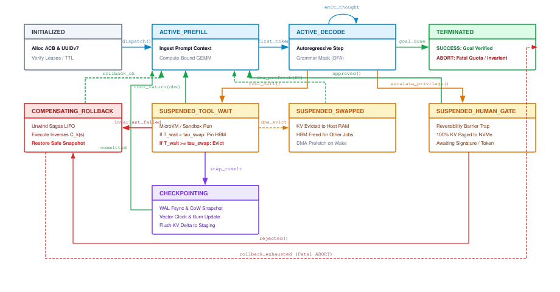
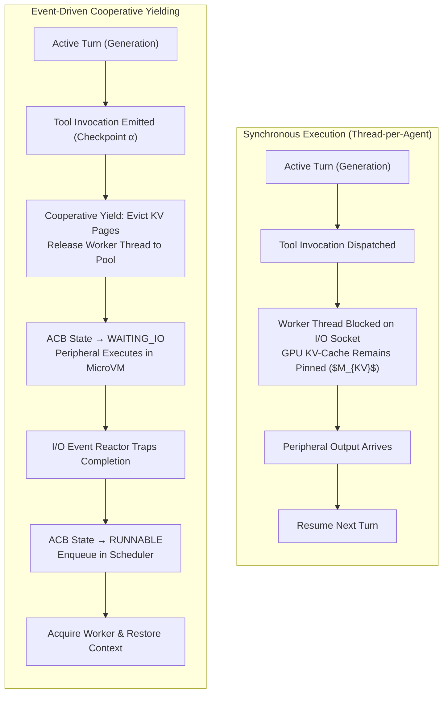
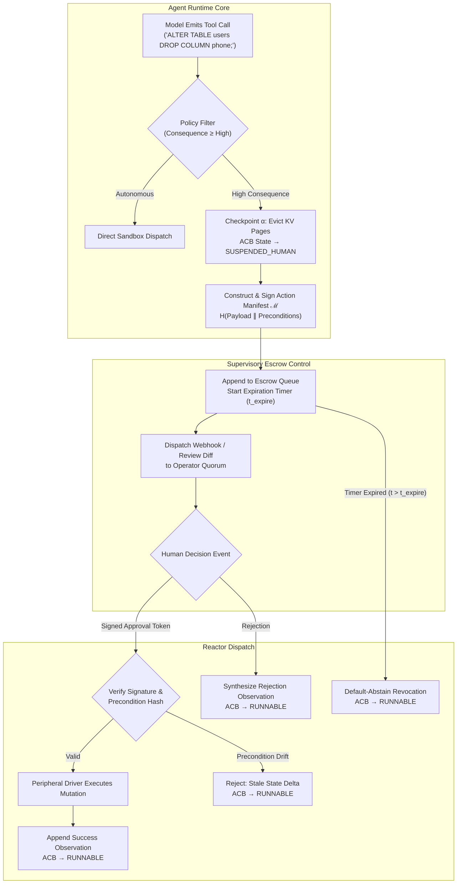
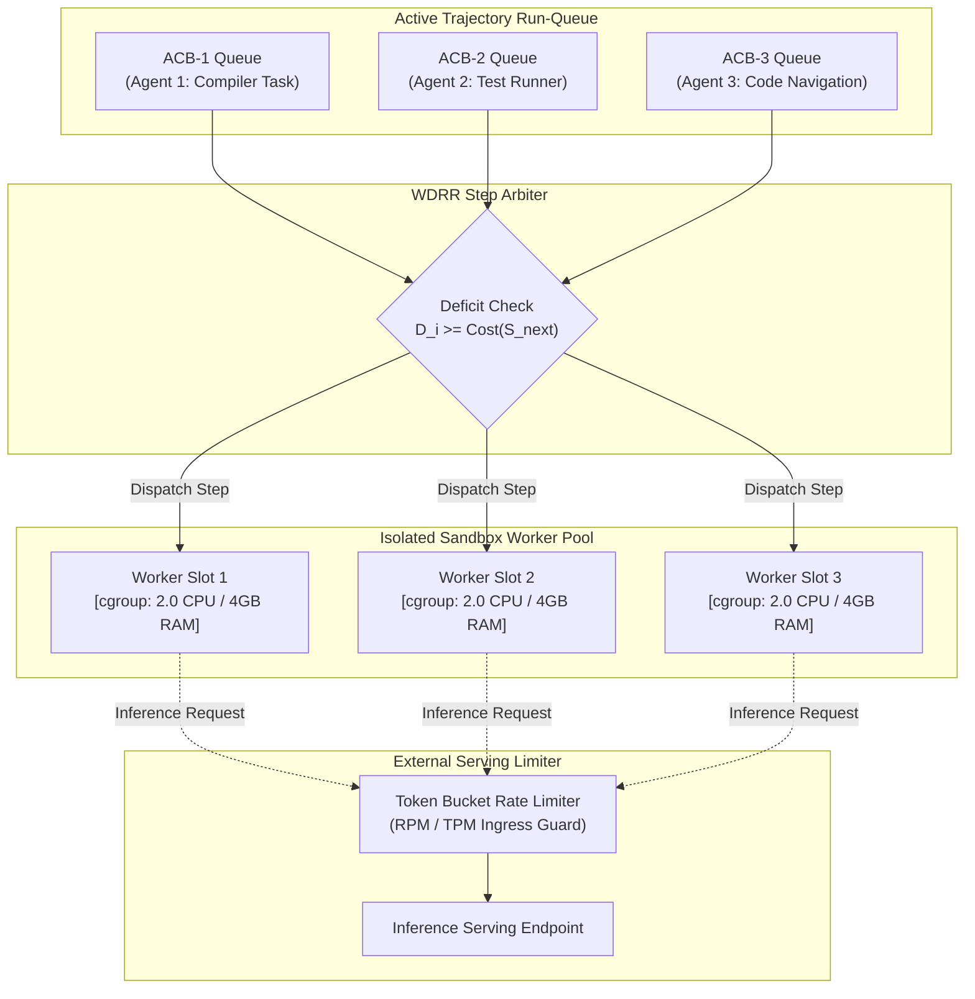

# The Agent Operating System Control Plane {#sec-vol3-controlplane}

::: {layout-narrow}
::: {.column-margin}

\chapterminitoc

:::

::: {.content-visible when-format="pdf"}
\noindent
{fig-alt="Blueprint for The Agent Operating System Control Plane."}
:::

::: {.content-visible unless-format="pdf"}
{fig-alt="Blueprint for The Agent Operating System Control Plane."}
:::

:::

## Purpose {.unnumbered .unlisted}

\begin{marginfigure}
\mlagentstack{10}{10}{95}{10}{10}{10}
\end{marginfigure}

_*What supervisory abstractions are required to govern, schedule, and interrupt processes whose future execution paths cannot be predicted?*_

With a stochastic processor, multi-tier memory, and sandboxed I/O peripherals in place, the Stochastic Computer requires an operating system: a centralized, supervisory control plane that coordinates execution, arbitrates resources, manages concurrency, and enforces safety invariants across time. In classical computing, the operating system kernel maintains a Process Control Block (PCB) to track registers, memory descriptors, and open file handles, scheduling deterministic threads across hardware cores. In an agentic system, execution is neither deterministic nor transient: an agent process is an extended, stateful trajectory that unfolds over hours, consuming token budgets, branching during problem solving, pausing for external approvals, and invoking nested child agents. Without a formal supervisory control plane, agent execution degenerates into chaotic, unmonitored scripts that hang on deadlocks, leak accelerator memory, and spin out of control during reasoning loops. The agent operating system introduces the architectural abstractions necessary to manage non-deterministic software: formalizing the Agent Control Block (ACB) as the canonical unit of process state, operating an asynchronous event reactor for POSIX-like signal dispatching, coordinating human-in-the-loop governance, implementing fair-share trajectory scheduling, and enforcing the invariant closure principle.

::: {.callout-learning-objectives}

- Formulate the Agent Control Block (ACB) data structure, defining fields for trajectory descriptors, context budgets, capability tokens, memory residency pointers, and rollback ledgers.
- Architect the full agent process lifecycle state machine (Initialized, Runnable, Running, Suspended-IO, Suspended-Approval, Preempted, Completed, Failed, Aborted).
- Implement an asynchronous signal-dispatch framework that maps POSIX-style signals (SIGINT, SIGPAUSE, SIGKILL, SIGBUDGET, SIGESCALATE) to runtime state transitions and ACB suspension.
- Design human-in-the-loop authorization escrows, calculating the memory swapping mechanisms required to eliminate HBM stranding during high-latency human deliberations.
- Implement single-node fair-share trajectory scheduling using weighted deficit round-robin queues to arbitrate accelerator and sandbox slots across concurrent agents.
- Enforce the Invariant Closure Principle, constructing supervisory watchdogs that verify environmental invariants independently of model self-reported status.

:::

<!-- SECTION_START: 9.1 (#sec-vol3-controlplane-need) -->
## The Supervisory Runtime {#sec-vol3-controlplane-need}

<!-- OUTLINE_SPEC:

- **Heading & Anchor:** `## The Supervisory Runtime {#sec-vol3-controlplane-need}`
- **The Single Key Point:** Ad-hoc while-loops and scripting frameworks fail when tasks span hours, hosts crash, or humans need to pause execution; agents require an operating system runtime that separates task logic from process governance.
- **Concrete Systems Hook:**
  - A production coding agent running inside a simple Python script hangs indefinitely on turn 14 because a git subprocess blocked on an interactive credential prompt. The script provides no timeout, no signal handling, and no way to inspect execution state.
- **Points to explain (paragraph-by-paragraph):**
  - *The Scripting Anti-Pattern:* Writing agents as while-loops that directly invoke APIs and execute tools leads to unmaintainable systems where timeouts, signal trapping, crash recovery, and security checks are scattered across business logic.
  - *The Classical OS Role (Saltzer & Kaashoek 2009):* Operating systems enforce isolation, virtualize resources, arbitrate shared devices, and manage process lifecycles.
  - *The Agent OS Control Plane:* The runtime sits above the host OS, acting as the supervisory kernel that schedules agent threads, dispatches tool operations, traps asynchronous events, and enforces execution budgets.
- **Visuals & Tables:**
  - Architecture diagram: Ad-hoc agent while-loop vs. Agent OS supervisory control plane.
- **Seminal Literature:**
  - Jerome H. Saltzer & M. Frans Kaashoek (2009, *Principles of Computer System Design*).
- **Causal Bridge to 9.2:** How does the operating system represent and track the execution state of an autonomous agent process?
-->

Consider an autonomous software engineering agent deployed via an unmanaged application script: a client-side procedural loop that prompts a remote model, parses a tool invocation from the generated text, executes a shell subprocess locally, and appends the command output back into the message history. On step 14 of an automated refactoring trajectory, the model emits a command to synchronize repository state: `git push origin feature-branch`. The remote server challenges the client for interactive credentials. Because the subprocess was spawned through a standard blocking pipe without an allocated pseudo-terminal (PTY) or an operational deadline, the child process blocks on `read(2)` from standard input. The parent Python process immediately halts.

From the perspective of the host operating system, the agent process appears as an ordinary idle user-space thread consuming zero CPU cycles. From the perspective of the agent infrastructure, however, the failure is total and unrecoverable. Accelerator allocations for the model's key-value (KV) cache remain pinned or stranded on upstream inference servers. Downstream pipeline stages starve while awaiting completion tokens. Token and wall-clock execution budgets silently expire without triggering cleanup routines. Most critically, because the execution thread is blocked in an unmanaged system call, operators possess no supervisory channel to inspect the internal state of the agent, pause its trajectory, or inject an asynchronous cancellation signal without forcibly killing the parent process (`SIGKILL`) and destroying fourteen turns of accumulated reasoning state.

### The Scripting Anti-Pattern

This operational failure exemplifies the *scripting anti-pattern*: expressing an autonomous agent as an unconstrained procedural while-loop that directly invokes foundational model APIs and executes peripheral tools within the same execution context. In this paradigm, the total task latency is the direct sum of individual component latencies across all $K$ execution turns:

$$T_{\text{task}} = \sum_{k=1}^{K} \left( T_{\text{model}}^{(k)} + T_{\text{tool}}^{(k)} + T_{\text{runtime}}^{(k)} \right)$$

Because execution is synchronous and unmediated, any unbounded latency or blocking operation in $T_{\text{tool}}^{(k)}$ propagates directly to $T_{\text{task}}$, stalling the entire system. More fundamentally, the scripting anti-pattern scatters critical systems responsibilities—timeout enforcement, signal trapping, credential isolation, crash recovery, and budget telemetry—across application business logic. If an unhandled network partition occurs during turn $k$, or if the host machine experiences an out-of-memory (OOM) kernel preemption, all transient state held in the interpreter's heap memory is lost. The task cannot be resumed from the point of interruption; it must be restarted from step zero at full monetary and computational cost.

### Principles of Supervisory Isolation

The architectural remedy to unmanaged procedural execution is one of the central lessons of classical systems design. As Jerome H. Saltzer and M. Frans Kaashoek establish in *Principles of Computer System Design* (2009), the primary role of an operating system kernel is to enforce fault isolation, virtualize scarce physical resources, arbitrate contention among competing tasks, and provide clean abstractions for inter-process communication.

A classical operating system does not permit user-space applications to directly drive physical disk heads, program memory management unit (MMU) page tables, or seize hardware timers without mediation. Instead, the kernel interposes between application threads and physical peripherals. It virtualizes hardware behind standard system call interfaces, tracks execution state in a protected operating system structure (the Process Control Block), preempts runaway threads via hardware clock interrupts, and limits blast radiuses through hardware-enforced protection domains.

### The Control Plane Architecture

Autonomous agent systems require an identical architectural separation: decoupling the agent's task reasoning logic from the supervisory control plane that hosts and governs it. The Agent Operating System (Agent OS) does not replace the host POSIX kernel; rather, it functions as a specialized, supervisory runtime sitting directly above the host operating system (@fig-controlplane-architecture). In this architecture, the large language model is treated as a stochastic coprocessor, while external filesystems, databases, web browsers, and code interpreters are treated as virtualized I/O devices.

::: {#fig-controlplane-architecture}
```{mermaid}
flowchart TB
    subgraph AdHoc["(a) Ad-Hoc Scripting Loop"]
        direction TB
        Loop["Procedural While-Loop<br>(Tightly Coupled Execution)"]
        ModelAPI["Remote Model API"]
        HostEnv["Unmanaged Subprocess / Shell"]
        VolatileMem["Volatile Heap State"]

        Loop -->|"Blocking Call"| ModelAPI
        Loop -->|"Direct Exec"| HostEnv
        Loop -->|"Ephemeral Write"| VolatileMem
    end

    subgraph Supervisory["(b) Agent OS Control Plane"]
        direction TB
        AgentProc["Agent Process<br>(Policy & Reasoning)"]
        ControlPlane["Supervisory Runtime Kernel<br>(Scheduler, Dispatcher, Watchdog)"]
        StochProc["Stochastic Processor<br>(Inference Server)"]
        Sandbox["Virtualized Sandbox<br>(Isolated I/O & Timers)"]
        DurableStore["Durable State Store<br>(Checkpoints & Ledgers)"]

        AgentProc <-->|"Syscall Interface"| ControlPlane
        ControlPlane <-->|"Scheduled Queue"| StochProc
        ControlPlane <-->|"Guarded Execution"| Sandbox
        ControlPlane <-->|"State Sync"| DurableStore
    end
```
Architectural comparison between an ad-hoc scripting loop and a supervisory Agent OS control plane. In the ad-hoc model, execution, resource arbitration, and I/O are tightly coupled in user code, causing the entire process to stall or fail when a tool hangs. In the Agent OS model, the supervisory runtime interposes between the agent process and external resources, virtualizing I/O, trapping signals, and enforcing fault isolation.
:::

Under an Agent OS control plane, an agent is not an executable script, but an unprivileged process scheduled and supervised by the runtime kernel. When the agent process decides to invoke a tool, it cannot execute the command directly. Instead, it emits a structured system call request to the supervisory runtime. The control plane validates the operation against capability security policies, dispatches the execution into an isolated sandbox container equipped with non-blocking I/O deadlines, and meters token consumption against strict financial bounds.

If an external tool hangs on an interactive prompt, the control plane's watchdog timer fires, aborts the child subprocess, and delivers a synthetic timeout exception to the agent process without halting the runtime. If human intervention or administrative authorization is required, the control plane suspends the agent process, offloads its state to durable storage, and reclaims accelerator resources until an external approval event arrives.

To govern execution across extended time horizons, arbitrate shared accelerator resources, and preempt runaway workloads, the supervisory runtime cannot rely on transient programming language variables. It requires a formal, persistent, and inspectable data structure that captures the complete operational state of an autonomous agent at any point in its trajectory. Just as the classical operating system relies on the Process Control Block to virtualize the physical CPU, the Agent OS requires a specialized descriptor to virtualize the stochastic processor: the Agent Control Block.

<!-- SECTION_END: 9.1 -->

<!-- SECTION_START: 9.2 (#sec-vol3-controlplane-acb) -->
## The Agent Control Block {#sec-vol3-controlplane-acb}

<!-- OUTLINE_SPEC:

- **Heading & Anchor:** `## The Agent Control Block {#sec-vol3-controlplane-acb}`
- **The Single Key Point:** The fundamental unit of execution in an agent OS is the trajectory process, formally tracked via an Agent Control Block (ACB) analogous to a classical OS Process Control Block (PCB).
- **Concrete Systems Hook:**
  - When an infrastructure node restarts, the OS kernel uses Process Control Blocks to restore running programs; an agent runtime must use an Agent Control Block to resume an agent's trajectory without re-executing completed actions.
- **Points to explain (paragraph-by-paragraph):**
  - *Anatomy of the Agent Control Block (ACB):*
    1. *Process Identity:* Unique Agent ID, Parent Agent ID, User Session ID.
    2. *Execution State:* Current state (`RUNNING`, `SUSPENDED`, `BLOCKED`, `TERMINATED`).
    3. *Model Configuration:* Pinned model snapshot version, sampling temperature, stop tokens.
    4. *Memory References:* Pointers to active L1 context buffer, L2 KV-cache block IDs, and L3 persistent store indices.
    5. *Resource Accounting:* Cumulative input tokens, output tokens, tool invocation counts, elapsed wall-clock time, financial spend.
    6. *Capability Descriptor:* Whitelisted tool handles, scoped filesystem mounts, and security tokens.
  - *ACB as the Unit of Management:* All scheduling, suspension, live migration, and auditing operate directly on the ACB.
- **Visuals & Tables:**
  - Table: Data schema of the Agent Control Block (ACB) fields and type specifications.
- **Causal Bridge to 9.3:** What formal lifecycle state machine governs the transitions of an ACB from creation to termination?
-->

In classical operating systems, process virtualization depends upon a single foundational invariant: any executing thread of control can be suspended, evicted from physical CPU registers, serialized to memory or disk, and subsequently restored without corrupting its architectural state. The operating system kernel enforces this invariant through the Process Control Block (PCB), which encapsulates program counters, stack pointers, general-purpose register contents, virtual memory descriptors, and open file descriptors. When a hardware interrupt fires or an infrastructure node restarts, the kernel references the PCB to reconstruct execution context deterministically.

In an agent operating system, the fundamental unit of execution is not a synchronous POSIX thread, but a long-running, multi-turn *trajectory process*. If an agent runtime crashes, migrates across cluster nodes, or pauses for asynchronous external events, it cannot rely on transient in-memory call stacks or unstructured string logs. Reconstructing an agent process by replaying its prompt history from step zero is computationally prohibitive and semantically hazardous: re-executing external tool side effects, such as API mutations or database writes, violates idempotency guarantees. To make trajectory execution deterministic, inspectable, and fault-tolerant, the supervisory control plane encapsulates the entirety of the agent's mutable runtime state within a formal data structure: the **Agent Control Block (ACB)**.

### Anatomy of the Agent Control Block

The ACB functions as the canonical descriptor of an active or suspended agent trajectory. It decouples the agent's identity and state from the underlying worker host, enabling the supervisory kernel to serialize, migrate, and arbitrate agent workloads across distributed physical infrastructure. Mechanically, the ACB organizes runtime state into six functional subsystems:

1. **Process Identity:** Hierarchical identifiers that establish lineage and ownership. Every agent is assigned an immutable 128-bit UUID (`AgentID`), an optional `ParentAgentID` designating the invoking supervisory or parent agent in multi-agent topologies, and a `UserSessionID` linking execution to a cryptographic tenant identity. This hierarchy mirrors POSIX process identifiers (`pid` and `ppid`), enabling tree-based process management, signal broadcast cascades, and hierarchical resource reclamation.
2. **Execution State:** The coarse-grained lifecycle phase of the trajectory (`RUNNING`, `SUSPENDED`, `BLOCKED`, `TERMINATED`), augmented by fine-grained wait descriptors. When an agent transitions out of `RUNNING`, this descriptor records whether it is blocked on model inference generation, waiting for an external sandboxed tool return, or suspended awaiting human administrative approval.
3. **Model Configuration:** The deterministic parameters of the stochastic processor. Because inference outputs vary across model checkpoints, temperatures, and decoding strategies, the ACB pins the immutable model artifact digest (such as a weights checkpoint hash), sampling temperature, top-$p$ bounds, system instruction pointers, and stop sequence sets. Pinned configurations prevent model drift between trajectory turns.
4. **Memory Hierarchy References:** Address pointers spanning the multi-tier memory architecture. Rather than copying token sequences directly into the process descriptor, the ACB maintains memory references: the pointer to the active L1 context buffer (in-memory token window), an array of physical L2 key-value (KV) cache block IDs assigned by the inference engine's PagedAttention allocator, and uniform resource identifiers (URIs) or vector index offsets pointing to L3 durable state stores.
5. **Resource Accounting Ledger:** Fine-grained telemetry tracking physical and financial consumption. The ledger records cumulative prompt tokens ($N_{\text{in}}$), completion tokens ($N_{\text{out}}$), tool execution counts ($C_{\text{tool}}$), cumulative execution wall-clock time ($T_{\text{wall}}$), and monetary expenditure ($B_{\text{consumed}}$). The supervisory control plane checks these counters against hard execution quotas before dispatching each subsequent turn.
6. **Capability Descriptor:** The security envelope governing the agent's interactions with physical and virtual peripherals. Following the principle of least privilege, the capability descriptor contains cryptographically signed capability tokens, explicit whitelists of permitted tool functions, scoped access control lists (ACLs) for virtualized filesystem mounts, and network access boundaries. The runtime inspects these capabilities prior to dispatching any tool invocation.

::: {#tbl-acb-schema}
| Subsystem            | Field Identifier  | Type Specification        | Sizing / Representation       | Systems Function                                                         |                                             |
|:---------------------|:------------------|:--------------------------|:------------------------------|:-------------------------------------------------------------------------|---------------------------------------------|
| **Process Identity** | `agent_id`        | `UUIDv7`                  | 16 bytes (time-ordered)       | Globally unique trajectory identifier.                                   |                                             |
|                      | `parent_id`       | `UUIDv7 \                 | NULL`                         | 16 bytes                                                                 | Lineage pointer for subagent process trees. |
|                      | `session_id`      | `UUIDv7`                  | 16 bytes                      | Tenant security boundary and audit scope.                                |                                             |
| **Execution State**  | `state`           | `Enum (uint8)`            | 1 byte                        | Lifecycle phase (`RUNNING`, `BLOCKED`, etc.).                            |                                             |
|                      | `wait_descriptor` | `Struct`                  | 64 bytes                      | Event handle, signal mask, and wait timeout.                             |                                             |
| **Model Config**     | `model_digest`    | `SHA-256 Hash`            | 32 bytes                      | Immutable inference weights checkpoint reference.                        |                                             |
|                      | `hyperparameters` | `Struct`                  | 16 bytes                      | Sampling temperature, top-$p$, stop sequences.                           |                                             |
| **Memory Refs**      | `l1_context_ptr`  | `uint64`                  | 8 bytes                       | Host memory ring-buffer descriptor.                                      |                                             |
|                      | `l2_kv_blocks`    | `Array<uint32>`           | Variable ($4 \times B$ bytes) | PagedAttention physical KV-cache page table.                             |                                             |
|                      | `l3_storage_uri`  | `String`                  | Variable (max 256 bytes)      | Locator for durable checkpoint and vector indices.                       |                                             |
| **Resource Ledger**  | `token_usage`     | `Struct (uint64, uint64)` | 16 bytes                      | Cumulative input ($N_{\text{in}}$) and output ($N_{\text{out}}$) tokens. |                                             |
|                      | `wall_clock_ms`   | `uint64`                  | 8 bytes                       | Monotonic execution time accumulated.                                    |                                             |
|                      | `budget_consumed` | `Decimal64`               | 8 bytes                       | Real-time financial spend tracked against quota.                         |                                             |
| **Capabilities**     | `tool_whitelist`  | `Bitmask64`               | 8 bytes                       | Hardware and tool capability access mask.                                |                                             |
|                      | `sandbox_mounts`  | `Array<MountRef>`         | Variable (descriptors)        | Scoped virtual filesystem and network namespaces.                        |                                             |

Data schema and memory layout of the Agent Control Block (ACB).
:::

### The ACB as the Unit of Management

Because the ACB fully externalizes execution state from the execution worker, it serves as the atomic unit of operating system management. Scheduling, preemption, live migration, and auditing all operate directly on the ACB descriptor (@tbl-acb-schema).

When the scheduler deallocates an idle or blocked agent to free memory, it serializes the ACB and the active L1 context buffer to persistent storage, while releasing the allocated L2 KV-cache blocks back to the inference server's memory pool. This swap operation reduces the agent's memory footprint from gigabytes of high-bandwidth GPU accelerator memory to a compact binary record on disk. When external events wake the agent, the scheduler reads the ACB, reallocates GPU blocks using the recorded model digest and context references, and resumes execution. Furthermore, by appending cryptographic signatures to state transitions within the ACB, the operating system maintains an unalterable, linear audit ledger of every tool invoked, token generated, and permission exercised across the entire trajectory lifecycle.

While the Agent Control Block provides the static schema required to encapsulate trajectory state, an operating system requires dynamic rules to govern how that state evolves over time. When an agent emits a tool call, encounters an inference timeout, or awaits an asynchronous human authorization, its control block cannot remain static. This operational requirement necessitates a formal lifecycle state machine that defines valid state transitions, coordinates resource reallocation during intermediate phases, and enforces strict invariant closure from process creation to termination.

<!-- SECTION_END: 9.2 -->

<!-- SECTION_START: 9.3 (#sec-vol3-controlplane-statemachine) -->
## Trajectory Lifecycle States {#sec-vol3-controlplane-statemachine}

<!-- OUTLINE_SPEC:

- **Heading & Anchor:** `## Trajectory Lifecycle States {#sec-vol3-controlplane-statemachine}`
- **The Single Key Point:** Agent processes transition through a formal lifecycle state machine (`CREATING`, `RUNNING`, `WAITING_TOOL`, `SUSPENDED_HUMAN`, `HALTED`, `TERMINATED`); invalid state transitions must be rejected by invariant checks.
- **Concrete Systems Hook:**
  - An agent stuck in a blocking network call receives a user cancellation. The runtime must transition the process from `WAITING_TOOL` to `TERMINATING`, canceling the in-flight HTTP socket and releasing allocated GPU memory.
- **Points to explain (paragraph-by-paragraph):**
  - *The Lifecycle States:*
    - `CREATING`: Allocating sandbox, initializing ACB, staging system prompt.
    - `RUNNING`: Actively computing on accelerator or orchestrator.
    - `WAITING_TOOL`: Suspended waiting for external peripheral I/O.
    - `SUSPENDED_HUMAN`: Yielded awaiting human clarification or approval escrow.
    - `TERMINATED_SUCCESS`: Task completed with acceptable verification evidence.
    - `TERMINATED_FAILURE`: Budget exhausted, policy violation, or unrecoverable error.
  - *State Transition Invariants:* Enforcing that a process cannot transition directly from `SUSPENDED_HUMAN` to `COMMITTING_EFFECT` without passing through `RUNNING` authorization.
- **Visuals & Tables:**
  - Figure: `@fig-agent-lifecycle-state-machine` [insert link here: books/vol3/10_interrupts/images/svg/acb_lifecycle_state_machine.svg] (Formal UML state transition diagram with trigger events and guard conditions).
- **Causal Bridge to 9.4:** How does the runtime control plane deliver asynchronous external events and user interrupts to a running or suspended agent?
-->

In a conventional operating system, the kernel schedules execution threads across hardware execution units using a low-level state transition model (`READY`, `RUNNING`, `WAITING`, `TERMINATED`). Thread transitions are triggered deterministically by timer interrupts, hardware traps, and kernel system calls. In the Stochastic Computer, an agent trajectory is an asynchronous, high-latency process that alternates among stochastic accelerator decoding, external peripheral I/O, isolated sandbox execution, and asynchronous human intervention. Because an individual trajectory may remain active over minutes, hours, or days, the supervisory control plane cannot treat process execution as a continuous, blocking thread. Instead, the runtime governs execution through a formal, event-driven lifecycle state machine enforced at every boundary of the Agent Control Block (ACB) described in @tbl-acb-schema.

### The Trajectory State Machine

The agent lifecycle comprises six primary states, each defined by its physical resource bindings, memory residency, and scheduling invariants:

1. `CREATING`: The supervisory control plane instantiates the ACB, binds a globally unique trajectory identifier (`UUIDv7`), constructs isolated peripheral sandboxes (configuring Linux namespaces, cgroups, and virtual filesystem mounts), validates model checkpoint digests, and stages the initial L1 context window (containing system directives and task specifications) in host DRAM. In this initialization state, no accelerator compute is scheduled, and no tool dispatch is permitted.
2. `RUNNING`: The trajectory actively consumes compute cycles on either the stochastic processor (accelerator forward passes during prompt prefill or autoregressive token generation) or the supervisory host (parsing generated structured outputs, validating capability tokens, or checking resource ledgers). In this state, physical accelerator memory—specifically the L2 key-value (KV) cache pages managed by PagedAttention—is pinned to the process.
3. `WAITING_TOOL`: Execution on the stochastic processor yields while awaiting external I/O returns from peripherals, such as database queries, API fetches, or containerized bash execution. Because peripheral I/O introduces variable network and compute latency, the control plane updates the ACB wait descriptor with an event subscription handle and transitions the process out of the accelerator dispatch queue.
4. `SUSPENDED_HUMAN`: The process yields execution upon reaching an explicit governance escrow boundary, such as a privileged tool invocation requiring administrative sign-off, or a clarification prompt dispatched to an operator. Because human response latency ($T_{\text{wait}}$) typically ranges from seconds to days, retaining volatile accelerator resources is economically prohibitive; the control plane unbinds all accelerator memory and serializes the trajectory state.
5. `HALTED`: The scheduler temporarily pauses execution due to non-terminal operational conditions, such as transient global accelerator preemption, temporary API rate limiting, or quota throttling. The process retains its identity and lineage but is excluded from the active dispatch pool until cleared by the scheduler.
6. `TERMINATED`: The trajectory enters an immutable terminal sink state, partitioned into `TERMINATED_SUCCESS` and `TERMINATED_FAILURE`. Transition to `TERMINATED_SUCCESS` requires verified satisfaction of task termination conditions and cryptographic attestation of deliverables. Transition to `TERMINATED_FAILURE` occurs deterministically when hard resource quotas are exhausted ($B_{\text{consumed}} \ge B_{\text{max}}$), unrecoverable runtime exceptions occur, capability invariants are violated, or an operator issues an uncatchable cancellation signal.

{#fig-agent-lifecycle-state-machine}

### State Transition Invariants and Memory Reallocation

The integrity of the supervisory runtime depends upon enforcing invariant closure during state transitions, preventing orphan resources and unauthorized side effects (@fig-agent-lifecycle-state-machine).

State transitions dictate the physical allocation of multi-tier memory. When an agent transitions from `RUNNING` to `WAITING_TOOL`, retaining its physical L2 KV-cache blocks on high-bandwidth accelerator memory (HBM) creates substantial opportunity cost. For a model with context length $L$, layer count $n_{\text{layers}}$, head dimension $d_{\text{head}}$, and $b_{\text{bytes}}$ precision, the physical KV-cache footprint evaluates to:

$$M_{\text{KV}} = 2 \times L \times n_{\text{layers}} \times d_{\text{head}} \times b_{\text{bytes}}$$

If an I/O peripheral exhibits high latency ($T_{\text{tool}} \gg 1\,\text{second}$), holding $M_{\text{KV}}$ gigabytes of HBM idle reduces overall system goodput. For short-latency operations, however, evicting the cache introduces a high reactivation latency ($T_{\text{resume}} = T_{\text{fetch}} + T_{\text{prefill}}$). The control plane resolves this trade-off using a dual-phase waiting policy: if the ACB wait descriptor specifies a sub-second timeout, the L2 KV blocks remain pinned; if the operation exceeds the threshold or transitions to `SUSPENDED_HUMAN`, the L2 blocks are released to the inference server page allocator, and the ACB descriptor is serialized to persistent L3 storage.

Strict state transition invariants govern capability authorization. A process cannot transition directly from `SUSPENDED_HUMAN` to an execution state that commits external mutations (`COMMITTING_EFFECT`). When an operator approves a pending action, the runtime does not execute the tool payload directly from the escrow queue. Instead, the process must transition from `SUSPENDED_HUMAN` back to `RUNNING`. In `RUNNING`, the supervisory kernel re-validates the cryptographic signature of the approval against the capability descriptor in the ACB, verifies that the target tool parameters have not been tampered with in storage, checks that the monetary ledger remains within limits, and only then issues the physical dispatch to the peripheral sandbox.

### Asynchronous Cancellation and Peripheral Teardown

A robust lifecycle state machine must handle asynchronous interrupts during blocking operations. Consider an agent process in `WAITING_TOOL` awaiting a response from an external network endpoint that hangs indefinitely. If an operator or supervisory watchdog issues a cancellation command, a naive runtime might terminate the host thread while leaving the remote HTTP socket open and the sandboxed container running.

Under the ACB lifecycle model, the arrival of a cancellation interrupt triggers an immediate guard evaluation. The control plane transitions the process state from `WAITING_TOOL` to an intermediate `TERMINATING` phase before committing to `TERMINATED_FAILURE`. This transition executes an atomic teardown sequence: the runtime closes active network sockets, dispatches a termination signal (`SIGKILL`) to the container sandbox, reclaims allocated temporary filesystem mounts, and returns any held PagedAttention memory pages to the global pool. Finally, the ACB records the cancellation reason, finalizes the resource accounting ledger ($N_{\text{in}}$, $N_{\text{out}}$, $T_{\text{wall}}$, $B_{\text{consumed}}$), and commits the control block to `TERMINATED_FAILURE`. By enforcing that all terminal paths pass through explicit cleanup invariants, the control plane guarantees that no zombie processes or leaked accelerator allocations persist.

To orchestrate these transitions reliably in an asynchronous environment, the operating system cannot rely solely on polled return values. The supervisory control plane requires a deterministic signaling mechanism capable of delivering asynchronous notifications, timeouts, and operator interrupts across both running and suspended trajectories.

<!-- SECTION_END: 9.3 -->

<!-- SECTION_START: 9.4 (#sec-vol3-controlplane-signals) -->
## Signal Trapping Mechanisms {#sec-vol3-controlplane-signals}

<!-- OUTLINE_SPEC:

- **Heading & Anchor:** `## Signal Trapping Mechanisms {#sec-vol3-controlplane-signals}`
- **The Single Key Point:** Agents must handle asynchronous runtime signals (`SIGINT` for graceful cancellation, `SIGPAUSE` for operator intervention, `SIGKILL` for runaway termination) without corrupting durable state.
- **Concrete Systems Hook:**
  - A human operator watches an agent begin editing the wrong git branch. Pressing Ctrl+C sends `SIGPAUSE`, freezing the agent's execution loop at the current turn boundary, allowing the human to redirect its goal before files are overwritten.
- **Points to explain (paragraph-by-paragraph):**
  - *Classical POSIX Signals vs. Agent Signals:* Classical OS signals interrupt machine instruction pipelines. Agent OS signals interrupt the trajectory loop at safe, atomic transaction boundaries.
  - *The Core Agent Signal Set:*
    - `SIGPAUSE`: Freeze model calls, pause tool dispatch, persist ACB, wait for operator inspection.
    - `SIGINT`: Request graceful self-cancellation: allow in-flight read tools to complete, revert uncommitted draft edits, write exit status.
    - `SIGKILL`: Immediate hardware termination: terminate sandbox microVMs, revoke capability tokens, zero GPU allocations.
  - *Safe Preemption Checkpoints:* The runtime injects signal traps between phase transitions (after model generation, before tool execution) to prevent leaving files in half-written corrupt states.
- **Visuals & Tables:**
  - Sequence diagram showing `SIGPAUSE` delivery, trajectory freezing, and human instruction modification.
- **Causal Bridge to 9.5:** When an agent waits for external I/O, how does the runtime yield compute resources to other waiting agent processes?
-->

In classical POSIX operating systems, signals interrupt execution threads asynchronously, forcing the CPU pipeline to vector immediately to kernel-registered signal handlers across arbitrary instruction boundaries. This asynchronous model relies on memory isolation and atomic CPU instructions to preserve process state without corrupting user-space data structures. In an agent operating system, however, process execution is transactional and distributed across heterogeneous boundaries: autoregressive token generation over remote streaming sockets, structured JSON parsing, sandbox microVM invocations, and filesystem writes. Delivering an uncoordinated asynchronous interrupt into this pipeline—such as terminating a thread while the model streams tokens or while an agent writes an intermediate diff—induces severe state corruption. Abrupt thread termination leaves invalid syntax in partially generated payloads, open HTTP sockets, orphaned database transactions, and lingering filesystem lock files (such as `.git/index.lock`).

To prevent state corruption, an agent control plane decouples asynchronous signal delivery from synchronous signal processing. The supervisory control plane exposes an asynchronous signaling interface, but signal trapping and handling are restricted to explicit, deterministic *safe preemption checkpoints* embedded within the trajectory loop. When an external entity (an operator, a parent supervisor, or a resource watchdog) issues an interrupt to an Agent Control Block (ACB), the kernel registers the signal in the pending signal bitmask of the process descriptor. The agent process continues executing until it reaches the next architectural transaction boundary, at which point the runtime traps the pending signal and executes the corresponding lifecycle handler.

### Asynchronous Signals and Transactional Integrity

The necessity of transactional signal trapping is illustrated by interactive operator oversight. Consider an operator monitoring an agent tasked with refactoring a multi-repository codebase. While inspecting the streaming telemetry, the operator observes the agent checkout the `main` branch rather than an isolated feature worktree, followed by emitting a tool invocation that targets shared configuration files. In an unmanaged CLI script, pressing `Ctrl+C` delivers a standard host-level `SIGINT` to the interpreter, terminating the process mid-execution. This leaves modified working-tree files uncommitted, locks unreleased, and any background container processes running detached.

Within an agent operating system, issuing an interrupt dispatches a structured `SIGPAUSE` signal to the control plane. The agent loop continues through its immediate model generation, parses the resulting tool call, and encounters a safe preemption checkpoint before dispatching the payload to the execution environment. Trapping the signal at this boundary freezes the trajectory: the runtime persists the full process state to durable L3 storage, unbinds volatile accelerator memory, updates the ACB status to `SUSPENDED_HUMAN`, and renders an escrow interface. The human operator can inspect the proposed tool call, alter the branch parameters or operational goals, and resume execution without corrupting underlying file systems (@fig-signal-pause-sequence).

```{mermaid}
%%| label: fig-signal-pause-sequence
%%| fig-cap: "Asynchronous `SIGPAUSE` delivery, checkpoint interception, accelerator memory deallocation, and operator escrow resolution."
sequenceDiagram
    autonumber
    actor Operator
    participant Kernel as Control Plane Kernel
    participant ACB as Agent Control Block
    participant Model as Accelerator Server
    participant Sandbox as Peripheral Sandbox

    Operator->>Kernel: Dispatch SIGPAUSE (Ctrl+C)
    Kernel->>ACB: Assert SIGPAUSE in Pending Signal Mask
    Model-->>Kernel: Stream tokens (Tool Invocation)
    Kernel->>Kernel: Parse & validate tool schema
    Note over Kernel: Safe Checkpoint Encountered
    Kernel->>ACB: Transition state: RUNNING -> SUSPENDED_HUMAN
    Kernel->>Model: Evict pinned L2 KV-cache pages
    Kernel->>ACB: Commit trajectory & context to L3 storage
    Kernel-->>Operator: Escrow prompt (Inspect & modify parameters)
    Operator->>Kernel: Submit redirection & clear signal
    Kernel->>ACB: Verify capability tokens & set RUNNING
    Kernel->>Sandbox: Dispatch modified tool execution
    Sandbox-->>Kernel: Return execution observation
```

### The Canonical Agent Signal Set

To govern non-deterministic, long-running agent workloads, the control plane establishes a canonical set of three foundational signals:

1. `SIGPAUSE` (Freeze Trajectory): `SIGPAUSE` suspends forward trajectory execution without discarding process state or aborting in-flight side effects. Upon trapping `SIGPAUSE` at a checkpoint boundary, the runtime halts further model sampling, pauses pending peripheral requests, writes the current ACB and context memory to durable storage, and transitions the lifecycle state to `SUSPENDED_HUMAN` (or `HALTED`). Crucially, `SIGPAUSE` relinquishes physical GPU memory pages: the L2 KV-cache blocks ($M_{\text{KV}}$) are unpinned and reclaimed by the inference server page allocator, eliminating the economic penalty of idle accelerator reservations while human operators inspect or modify trajectory parameters.
2. `SIGINT` (Graceful Cancellation): `SIGINT` requests cooperative process termination. Unlike an immediate abort, `SIGINT` permits the agent runtime to execute atomic rollback procedures. Trapped at a checkpoint boundary, the runtime allows non-mutating in-flight read operations to resolve, issues compensation transactions for partially applied mutations, closes network sockets, cleans up staging directories, and persists an immutable post-mortem diagnostic record to the ACB. The process then transitions deterministically to `TERMINATED_FAILURE` with a cancellation status code, preventing leaked credentials or lingering child processes.
3. `SIGKILL` (Forced Hardware Preemption): `SIGKILL` is non-maskable and uncatchable. When a trajectory violates hard security policies, exceeds its maximum dollar or token budget ($B_{\text{consumed}} \ge B_{\text{max}}$), or enters an unresponsive compute spin lock where safe checkpoints are never reached, cooperative shutdown is insufficient. The control plane immediately intercepts the process from outside the runtime environment. The supervisory kernel forcibly revokes all cryptographic capability tokens, tears down sandboxed microVMs or container namespaces via host kernel primitives, closes remote network channels, and zeroes active GPU memory allocations, marking the ACB as `TERMINATED_FAILURE` with an eviction reason code.

### Safe Preemption Checkpoints

The execution of a single agent turn exhibits a non-uniform latency profile decomposed into distinct physical stages:

$$T_{\text{turn}} = T_{\text{context}} + T_{\text{model}} + T_{\text{parse}} + T_{\text{tool}} + T_{\text{commit}}$$

Where $T_{\text{context}}$ is the prompt assembly and tokenization latency, $T_{\text{model}}$ is autoregressive generation latency, $T_{\text{parse}}$ is schema validation latency, $T_{\text{tool}}$ is peripheral sandbox execution latency, and $T_{\text{commit}}$ is state persistence latency.

To maintain system invariants without sacrificing responsiveness, the runtime places signal traps at two primary checkpoints within $T_{\text{turn}}$:

- **Checkpoint $\alpha$ (Post-Generation, Pre-Dispatch):** Located immediately following $T_{\text{parse}}$ and prior to $T_{\text{tool}}$. This checkpoint is the critical gate governing external side effects. If a `SIGPAUSE` or `SIGINT` arrives during $T_{\text{model}}$, the runtime allows token generation to conclude (or aborts the HTTP streaming connection if the inference server supports generation cancellation), completes schema validation, and traps the signal before any peripheral dispatch packet leaves the supervisory boundary. This prevents uninspected, erroneous, or canceled actions from mutating durable storage or dispatching external network calls.
- **Checkpoint $\beta$ (Post-Execution, Pre-Commit):** Located immediately following $T_{\text{tool}}$ and prior to $T_{\text{commit}}$. If an external interrupt arrives while a tool executes inside a sandboxed microVM, the runtime allows read-only operations to finish, receives the execution exit code, and traps the signal before appending the observation into the permanent L3 context history and updating the token accounting ledger.

When an agent process halts at a preemption checkpoint or yields execution while waiting for external I/O, holding dedicated compute resources idle degrades overall system efficiency. To maintain high cluster utilization across concurrent, long-running trajectories whose future execution paths cannot be known in advance, the control plane must arbitrate execution rights dynamically. This operational requirement raises a fundamental scheduling question: when an agent waits for external I/O, how does the runtime yield compute resources to other waiting agent processes?

<!-- SECTION_END: 9.4 -->

<!-- SECTION_START: 9.5 (#sec-vol3-controlplane-yielding) -->
## Cooperative Process Yielding {#sec-vol3-controlplane-yielding}

<!-- OUTLINE_SPEC:

- **Heading & Anchor:** `## Cooperative Process Yielding {#sec-vol3-controlplane-yielding}`
- **The Single Key Point:** Runtimes must implement cooperative yielding at tool boundaries and preemptive timeouts to eliminate the Tool-Wait memory tax and prevent rogue processes from locking worker threads.
- **Concrete Systems Hook:**
  - A single agent executing a 10-minute web scraping script blocks an entire worker pool because the orchestrator used synchronous thread-per-agent allocation.
- **Points to explain (paragraph-by-paragraph):**
  - *Cooperative Yielding:* When an agent emits a tool invocation ($a_{\text{perm}}$), it cooperatively yields its execution thread to the runtime scheduler, releasing worker threads and GPU memory while waiting on I/O.
  - *Preemptive Enforcement:* Models cannot be trusted to yield voluntarily during generation; the runtime enforces strict per-invocation token caps ($K_{\max}$) and hard wall-clock timeouts ($T_{\max}$) to preemptively halt runaway generation.
  - *Event-Driven Resumption:* The scheduler re-enqueues the agent's ACB onto the runnable task queue only when the tool peripheral returns an observation event.
- **Visuals & Tables:**
  - Flowchart: Event-driven thread yielding vs. Synchronous thread blocking.
- **Causal Bridge to 9.6:** When an agent attempts an action that requires human authorization, how does the runtime enforce supervisory approval?
-->

In naive agent orchestrators, concurrency is structured around synchronous, thread-per-agent scheduling. Under this execution model, an operating system worker thread is allocated to an Agent Control Block (ACB) for the entirety of its multi-step trajectory. When an agent issues a tool invocation that initiates external I/O—such as querying a remote data warehouse, waiting for an external API rate limit to reset, or executing an unmetered web scraping script that spans ten minutes—the underlying worker thread blocks synchronously on the network socket. This design couples expensive host execution resources and accelerator reservations directly to peripheral latency ($T_{\text{tool}}$). If an execution pool contains $N_{\text{workers}} = 64$ threads, exactly 64 concurrent long-running scraping operations will exhaust the entire thread pool. Once exhausted, the scheduler stalls, unable to dispatch lightweight, compute-ready agent trajectories elsewhere across the cluster.

Beyond thread pool starvation, synchronous blocking imposes a severe physical resource penalty: the *Tool-Wait memory tax*. During active autoregressive generation ($T_{\text{model}}$), an agent allocates dedicated Key-Value (KV) cache memory in high-bandwidth GPU memory (HBM). For an attention layer operating over sequence length $L$, the physical footprint of the KV cache across layers and heads is:

$$M_{\text{KV}} = 2 \cdot L \cdot n_{\text{layers}} \cdot d_{\text{head}} \cdot b_{\text{bytes}}$$

where $n_{\text{layers}}$ is the number of transformer layers, $d_{\text{head}}$ is the key-value projection dimension, and $b_{\text{bytes}}$ is the precision byte width (e.g., 2 bytes for 16-bit floating-point tensors). For a 70-billion parameter model operating at a context window of $L = 32{,}768$ tokens with 80 layers and 8 key-value heads ($d_{\text{head}} = 128$), $M_{\text{KV}}$ exceeds $1.07\text{ GB}$ per concurrent agent instance. If the runtime holds worker threads synchronously across $T_{\text{tool}}$, the underlying inference engine cannot distinguish an idle agent waiting on a socket from an active process streaming tokens. Pinned allocations remain stranded in physical GPU memory while the external peripheral runs. Holding hardware memory hostage over intervals where $T_{\text{tool}} \gg T_{\text{model}}$ collapses aggregate trajectory throughput and inflates cluster operational cost.



To eliminate the Tool-Wait memory tax, the agent control plane enforces *cooperative yielding* at tool dispatch boundaries (@fig-event-vs-sync-yielding). When the model finishes decoding a tool call payload, the process reaches Checkpoint $\alpha$ (post-generation, pre-dispatch). Rather than allowing the worker thread to enter a blocking sleep, the runtime intercepts the parsed tool descriptor, persists the pending step to the ACB, and unpins the agent's L2 KV-cache blocks. The memory manager notifies the inference server that these physical cache pages may be reclaimed by the global page allocator. Simultaneously, the worker thread is returned to the runtime scheduler pool, and the ACB transitions its lifecycle state from `RUNNING` to `WAITING_IO`. The tool request is dispatched as an asynchronous job to an isolated peripheral sandbox or an event-driven HTTP loop. The physical compute infrastructure is thereby liberated to service other active agent turns.

Cooperative yielding depends on the model producing a well-formed tool invocation to relinquish control back to the operating system. However, stochastic processors cannot be assumed to yield cooperatively. Pathological sampling dynamics, prompt injections, and infinite token-generation loops can trap the autoregressive decoding loop in an unbounded emission state where neither a stop token nor an actionable tool delimiter is generated.

To guarantee that non-deterministic programs cannot starve the execution cluster, the control plane pairs cooperative yielding with *preemptive enforcement*. The runtime imposes two deterministic bounds on every invocation: a maximum generation token budget $K_{\max}$ and a hard wall-clock preemption timer $T_{\max}$. As the inference server streams token packets across the supervisory boundary, the runtime monitors cumulative token counts and elapsed time. If decoding reaches $K_{\max}$ without a valid closing delimiter, or if token generation time exceeds $T_{\max}$, the control plane sends a preemptive cancellation signal to the inference engine. Generation halts immediately, the turn is flagged with an execution timeout status code, the partial output is committed to the ACB, and the scheduler forcibly yields the compute context.

Once a process yields and enters `WAITING_IO`, resumption is managed through an asynchronous event reactor. The tool peripheral runs inside its sandbox environment. Upon task completion, the sandbox writes its standard output, standard error, and integer exit code to an execution descriptor and dispatches a completion event to the reactor. The event reactor traps this arrival, correlates the payload with the target process ID, appends the tool observation directly into the agent's context history, and updates the ACB state to `RUNNABLE`.

The scheduler re-inserts the runnable ACB into the priority task queue. When an execution worker becomes available, the dispatcher allocates host memory, re-evaluates the prompt prefix against available cache pages in the inference cluster (reusing existing prefix blocks if present or issuing an incremental prefill if pages were evicted), and initiates the next inference turn. Compute threads are thus bound strictly to active mathematical evaluation ($T_{\text{model}}$), insulating system capacity from arbitrary network and sandbox delays.

Cooperative yielding and event-driven resumption handle routine peripheral I/O where operations can execute safely inside autonomous sandboxes. However, many real-world agent actions incur irreversible physical side effects, such as spending capital, mutating production databases, or altering external access controls. When an agent attempts an action that requires human authorization, how does the runtime enforce supervisory approval?

<!-- SECTION_END: 9.5 -->

<!-- SECTION_START: 9.6 (#sec-vol3-controlplane-hitl) -->
## Human Escrow Protocols {#sec-vol3-controlplane-hitl}

<!-- OUTLINE_SPEC:

- **Heading & Anchor:** `## Human Escrow Protocols {#sec-vol3-controlplane-hitl}`
- **The Single Key Point:** High-consequence actions (e.g. database schema drops, financial transfers, code deployment) must be held in cryptographic approval escrows that block execution until explicit multi-party human authorization is received.
- **Concrete Systems Hook:**
  - An agent debugging a production database attempts to run `ALTER TABLE users DROP COLUMN phone;`. The runtime intercepts the mutation, locks the action in an escrow queue, and pings the database administrator with a diff and an expiration timer.
- **Points to explain (paragraph-by-paragraph):**
  - *The Human-as-a-Peripheral Pattern:* Treating human operators as asynchronous external services: the agent emits an approval request, transitions to `SUSPENDED_HUMAN`, and yields.
  - *Cryptographic Escrows:* Generating a signed, tamper-evident action manifest containing the exact proposed payload, target host, and projected diff.
  - *Timeouts and Default-Abstain:* If the human does not respond before the escrow deadline expires, the runtime defaults to fail-safe rejection, returning an authorization failure observation to the agent.
- **Visuals & Tables:**
  - Architecture diagram: Cryptographic escrow gate between model proposal and production environment.
- **Causal Bridge to 9.7:** How does the operating system schedule dozens of concurrent agent processes on a single host node fairly?
-->

In an operating system executing stochastic trajectories, operations divide along an irreversible boundary: reversible sandbox actions and irreversible external mutations. Within an isolated execution container, exploratory operations—reading files, profiling code, executing unit tests, or compiling binaries—incur bounded risk; if an agent takes an erroneous branch, the runtime discards the container or rolls back the file system snapshot. Conversely, physical side effects in shared external environments—dispatching financial transactions, revoking infrastructure access, deploying code to production, or modifying persistent schemas—cannot be rolled back by container teardown. When an autonomous agent debugging a production database issues an administrative mutation such as `ALTER TABLE users DROP COLUMN phone;`, the supervisory control plane cannot allow direct dispatch to the peripheral database driver. Instead, the runtime intercepts the operation before network serialization and routes the pending payload into a *human escrow protocol*.

### The Human-as-a-Peripheral Pattern

From an operating system design perspective, human-in-the-loop (HITL) supervision is not an interactive blocking prompt; it is an asynchronous peripheral interaction governed by the same cooperative yielding semantics applied to high-latency I/O (@fig-human-escrow-gate). Human operator response latencies ($T_{\text{wait}} \in [10^1, 10^5]\text{ s}$) exceed token generation latency ($T_{\text{model}} \approx 10^{-1}\text{ s}$) by several orders of magnitude. Retaining worker threads or pinning GPU memory pages across human review intervals would quickly exhaust cluster memory and induce system-wide starvation.



The control plane therefore models human approval as an out-of-band peripheral transaction. When a parsed tool descriptor matches an administrative mutation rule, the runtime traps the instruction at Checkpoint $\alpha$, commits the current trajectory state to the Agent Control Block (ACB), and transitions the process lifecycle state to `SUSPENDED_HUMAN`. The memory subsystem flushes or evicts the process's active KV cache allocations to host storage, and the execution thread returns to the global scheduler pool. Compute hardware is completely disengaged while the pending mutation sits in escrow.

### Cryptographic Action Manifests

Passing an approval request across a human review boundary introduces the risk of time-of-check to time-of-use (TOCTOU) discrepancies and prompt injection vulnerabilities. If the runtime presents a natural language summary to an operator while transmitting raw, unverified parameters to the execution socket, an adversarial prompt could induce a benign explanation for a destructive payload.

To guarantee that the executed command matches the verified authorization, the runtime constructs an immutable, cryptographically signed *action manifest* $\mathcal{M}$. The manifest contains:

1. **Transaction Identifiers:** Globally unique process ID, trajectory step index, and escrow ticket UUID.
2. **Target Specification:** The precise target socket, host, and database or cluster context (e.g., `db-primary.prod.internal:5432/customers`).
3. **Exact Payload:** The verbatim serialized bytes or query string emitted by the model.
4. **Projected State Diff:** The structural delta produced by dry-run execution or static analysis (e.g., the exact columns, records, or access control lists affected).
5. **Precondition Vector:** State hashes representing target system conditions prior to execution (e.g., database schema migration version $H_{\text{schema}}$ or git commit SHA).
6. **Expiration Deadline:** A deterministic timestamp $t_{\text{expire}}$ beyond which the manifest is void.

The runtime computes a digest of the payload and preconditions:

$$H_{\mathcal{M}} = \text{SHA-256}(\text{Target} \parallel \text{Payload} \parallel H_{\text{schema}} \parallel t_{\text{expire}})$$

This manifest is signed with the control plane's private key and routed to the escrow queue. The human operator reviews the exact diff and payload bound to $H_{\mathcal{M}}$. Upon granting authorization, the approval client generates a cryptographic signature over $H_{\mathcal{M}}$ using the reviewer's hardware security key or identity provider certificate.

When the signed authorization token returns to the control plane, the peripheral driver verifies two invariants before sending a single byte across the production network. First, the signature must match an authorized reviewer identity enrolled for the target blast radius. Second, the runtime re-evaluates the target environment's precondition hash. If concurrent activity has mutated the schema version ($H_{\text{schema}}' \neq H_{\text{schema}}$) during the review delay, the transaction aborts with a state-drift exception, preventing stale human approvals from executing against altered target environments.

### Default-Abstain Semantics and Timeout Invariants

Because human operators are unpredictable external dependencies, an agent operating system cannot allow open escrows to hold pending transactions or distributed lock allocations indefinitely. Every escrow contract enforces deterministic expiration boundaries:

$$t_{\text{expire}} = t_{\text{dispatch}} + T_{\text{escrow\_timeout}}$$

The control plane implements strict *default-abstain* semantics. If the expiration deadline $t_{\text{expire}}$ elapses before a valid signature is recorded by the event reactor, the escrow supervisor automatically revokes the manifest ticket. Rather than stalling or guessing intent, the runtime synthesizes a standard error observation:

```json
{
  "status": "failed",
  "error_code": "ERR_ESCROW_TIMEOUT",
  "details": "Action manifest M-84920 expired after 3600 seconds without authorization."
}
```

The event reactor appends this failure payload to the agent's observation trace, updates the ACB state from `SUSPENDED_HUMAN` to `RUNNABLE`, and re-inserts the process into the scheduler queue. When the agent process next acquires compute resources, the model reads the authorization failure directly in its context window. The agent can then reason over the rejection, attempt an alternative low-privilege diagnostic strategy, log the failure to an external issue tracker, or yield cleanly with an escalation report.

By combining cooperative KV-cache yielding, cryptographic action manifests, and fail-safe default-abstain timeouts, the control plane ensures that high-consequence operations remain strictly bounded by human intent without stalling host execution resources. However, once dozens of agent processes—some returning from I/O, others resuming from escrow, and others streaming reasoning tokens—populate the `RUNNABLE` queue, the control plane faces an arbitration challenge: how does the operating system schedule competing non-deterministic trajectories across finite hardware cores and accelerator context windows fairly?

<!-- SECTION_END: 9.6 -->

<!-- SECTION_START: 9.7 (#sec-vol3-controlplane-scheduling) -->
## Single-Node Runtime Scheduling {#sec-vol3-controlplane-scheduling}

<!-- OUTLINE_SPEC:

- **Heading & Anchor:** `## Single-Node Runtime Scheduling {#sec-vol3-controlplane-scheduling}`
- **The Single Key Point:** Single-node agent runtimes must arbitrate CPU, host memory, sandbox pools, and serving queue capacity across concurrent agent trajectories using fair-share scheduling algorithms.
- **Concrete Systems Hook:**
  - Five development agents run concurrently on a server: Agent 1 spawns 20 parallel compiler jobs, starving Agents 2–5 of CPU cycles and memory.
- **Points to explain (paragraph-by-paragraph):**
  - *Resource Contention Points:* CPU cores for sandbox execution, host RAM for file buffers and microVMs, local disk I/O, and rate limits to external LLM serving endpoints.
  - *Fair-Share Queue Scheduling:* Round-robin and weighted deficit round-robin scheduling of active agent steps; preventing a single aggressive agent from monopolizing the local runtime.
  - *Cgroup and Namespace Resource Envelopes:* Pinning each agent's sandbox to fixed CPU quotas and memory ceilings via Linux cgroups.
- **Visuals & Tables:**
  - Multi-tenant scheduling diagram showing queued ACB queues arbitrated into worker slots.
- **Causal Bridge to 9.8:** How does the control plane enforce global resource accounting and cost caps across the trajectory lifecycle?
-->

### Physical Resource Contention in Agent Runtimes

An agent operating system running on a single host machine does not schedule homogeneous threads across symmetric CPU cores; it coordinates heterogeneous, multi-phase execution graphs across four physical bottlenecks:

1. **Sandbox Host CPU:** Compilers, interpreters, test runners, and linters executing inside peripheral environments.
2. **Host Physical Memory (RAM):** Memory footprints comprising copy-on-write root filesystems, microVM guest allocations, intermediate tool output buffers, and process state caches.
3. **Local NVMe Bandwidth:** Workspace checkouts, build artifacts, temporary log files, and persistent trajectory checkpoint writes to local storage.
4. **Model Serving Concurrency:** Upstream inference server request queues and rate-limited token generation bandwidth.

When multiple agent processes populate the local `RUNNABLE` queue, unmanaged concurrency induces severe resource exhaustion. Consider an unconstrained multi-agent workstation running five concurrent software engineering trajectories on a 16-core host with 32 GB of physical RAM. Agent 1 attempts to resolve a dependency graph by spawning twenty parallel compilation jobs (`make -j20`). Without supervisory controls, Agent 1 allocates 28 GB of resident memory and forces CPU run-queue lengths above 40, driving context-switch overhead to 35% of total CPU cycles. Agents 2 through 5—executing lightweight unit tests and source-code navigation—are starved of CPU time slices. Their tool invocations experience a tenfold latency inflation ($T_{\text{tool}}$ increases from 120 ms to 1.3 s), while the Linux out-of-memory (`OOMKiller`) daemon terminates the microVM runtimes of Agents 3 and 4 indiscriminately. Unconstrained scheduling collapses multi-agent goodput.

### Cgroup Envelopes and MicroVM Sandbox Isolation

To prevent trajectory cross-contamination and resource monopolization, the control plane encapsulates each agent's execution peripheral within strict Linux control group (cgroups v2) and kernel namespace boundaries, as detailed in @tbl-controlplane-cgroups. Rather than permitting arbitrary host fork operations, the runtime assigns each active Agent Control Block (ACB) an isolated sandbox envelope.

| Subsystem Controller | Configuration Parameter                     | Physical Mechanism and Enforcement Invariant                                                                                                                                        |
|:---------------------|:--------------------------------------------|:------------------------------------------------------------------------------------------------------------------------------------------------------------------------------------|
| `cpu`                | `cpu.max = 200000 100000`                   | Limits execution to 2.0 cores per 100 ms CFS period ($T_{\text{period}} = 100\text{ ms}$, $T_{\text{quota}} = 200\text{ ms}$). Throttles run-queue access when budget is exhausted. |
| `memory`             | `memory.high = 3.5G`<br>`memory.max = 4.0G` | Triggers asynchronous background page reclamation at 3.5 GB. Strictly terminates processes inside the cgroup if physical allocation reaches the 4.0 GB hard ceiling.                |
| `io`                 | `io.max = 8:0 rbps=50M wbps=50M`            | Caps read and write throughput against the target block device to 50 MB/s, preventing workspace builds from starving host NVMe pipelines.                                           |
| `pids`               | `pids.max = 64`                             | Restricts the maximum number of concurrent tasks inside the cgroup, preventing fork bombs and runaway process recursion.                                                            |
: Linux cgroups v2 resource envelope parameters for agent sandbox isolation. {#tbl-controlplane-cgroups}

To minimize the latency of cold-starting execution sandboxes ($T_{\text{boot}}$), the control plane maintains a pre-forked warm pool of microVMs (such as Firecracker or gVisor sandboxes). Each microVM runs with a static memory-mapped backing file and guest kernel, maintaining a negligible boot penalty ($T_{\text{boot}} < 10\text{ ms}$) while providing hardware-assisted virtualization isolation (`KVM`). When an agent yields execution during a network wait or human escrow, the runtime pauses the guest vCPU threads without unmapping host pages, preserving the sandbox state across trajectory steps without leaking unmanaged CPU cycles to idle processes.

### Deficit Round-Robin Step Arbitration

While cgroups bound the continuous execution of individual tool commands, they do not resolve concurrency conflicts across the higher-level agent trajectory cycle: model inference, response parsing, and tool execution. If the control plane scheduled agents using coarse, trajectory-level First-In, First-Out (FIFO) semantics, a single agent undertaking a 100-step refactoring task would lock a worker execution slot for hours, causing head-of-line blocking for shorter diagnostic tasks.

The control plane therefore schedules work at the granularity of individual *trajectory steps*. The scheduler maintains an active run-queue of ACBs and arbitrates dispatching across a fixed worker pool using Weighted Deficit Round-Robin (WDRR). Every agent process $i$ is assigned a service quantum $Q_i$ representing its allocated resource share per round (expressed in normalized execution cost units, such as core-milliseconds or millicents of compute) and maintains a deficit counter $D_i$.

```
Algorithm: Deficit Round-Robin Trajectory Step Scheduling
--------------------------------------------------------------------------------
Given: Active run-queue of Agent Control Blocks {ACB_1, ACB_2, ..., ACB_n}
       Worker thread execution pool with S slots
       Per-agent quantum Q_i and deficit counter D_i (initialized to 0)

While true:
    For each ACB_i in run-queue:
        If ACB_i has pending executable step S_next:
            D_i = D_i + Q_i
            StepCost = EstimateStepCost(S_next)

            While D_i >= StepCost and WorkerSlotAvailable():
                D_i = D_i - StepCost
                Worker = AcquireWorkerSlot()
                DispatchStepToSandbox(Worker, ACB_i, S_next)
                Wait for completion or asynchronous yield
                If ACB_i has no remaining runnable steps:
                    D_i = 0   // Prevent deficit hoarding while idle
                    Break
        Else:
            D_i = 0           // Reset deficit if process is blocked on I/O or escrow
```

In each round, the scheduler increments $D_i$ by $Q_i$. If the estimated or base cost of the next pending trajectory step satisfies $C_{\text{step}} \le D_i$, the scheduler dispatches the step to an idle worker slot in the sandbox pool and decrements $D_i \leftarrow D_i - C_{\text{step}}$. If an agent consumes less than its allocated quantum during an I/O wait, its accumulated deficit allows it to burst in subsequent rounds; however, if an agent transitions to a blocked state (`SUSPENDED_HUMAN` or `WAITING_IO`), its deficit counter resets to zero ($D_i \leftarrow 0$) to prevent deficit hoarding upon reactivation.


: Architecture of single-node runtime scheduling: per-agent ACB queues arbitrated via Deficit Round-Robin across cgroup-constrained sandbox slots and throttled inference ingress. {#fig-controlplane-scheduling}

As illustrated in @fig-controlplane-scheduling, the scheduler decouples execution phases. Fast tool interactions execute within their cgroup envelopes without starving peer agents, while outbound model requests are mediated by a downstream token bucket rate limiter to prevent HTTP 429 throttling against shared inference clusters.

### From Node Slicing to Trajectory-Wide Accounting

While cgroup envelopes and deficit round-robin step scheduling stabilize physical hardware allocations on a single host, they constrain only instantaneous resource rates. A runaway agent operating inside a 2-core cgroup quota can execute millions of valid instructions across hours, making thousands of sequential inference calls that exhaust project financial budgets or third-party API rate quotas. Local operating system scheduling guarantees fair hardware time-sharing, but it cannot evaluate whether an agent's cumulative consumption aligns with global task utility. Slicing local CPU and memory envelopes must therefore be paired with an overarching accounting architecture that tracks financial cost caps, token quotas, and trajectory-level lifecycle invariants across the entire multi-agent deployment.

<!-- SECTION_END: 9.7 -->

<!-- SECTION_START: 9.8 (#sec-vol3-controlplane-accounting) -->
## Deterministic Resource Accounting {#sec-vol3-controlplane-accounting}

<!-- OUTLINE_SPEC:

- **Heading & Anchor:** `## Deterministic Resource Accounting {#sec-vol3-controlplane-accounting}`
- **The Single Key Point:** The runtime control plane must maintain deterministic resource accounting, enforcing hard ceilings on step counts, token consumption, and financial spend to prevent runaway billing and infinite loops.
- **Concrete Systems Hook:**
  - An agent enters an infinite loop trying to parse an invalid XML file. Without process accounting, it consumes \$250 in API tokens over 4 hours before anyone notices.
- **Points to explain (paragraph-by-paragraph):**
  - *The Multi-Dimensional Budget Contract:* Defining ceilings across:
    1. *Step Count ($K_{\max}$):* Maximum total turns (e.g. 25 steps).
    2. *Token Budget ($B_{\text{tokens}}$):* Maximum cumulative input + output tokens (e.g. 100,000 tokens).
    3. *Financial Expenditure (\$):* Hard currency cap (e.g. \$2.00).
    4. *Wall-Clock Timeout ($T_{\max}$):* Maximum elapsed duration (e.g. 15 minutes).
  - *Hard Halting vs. Soft Warnings:* Triggering progressive warnings at 75% budget, forcing graceful completion attempts at 90%, and issuing hard preemptive termination at 100%.
- **Visuals & Tables:**
  - Table: Budget threshold triggers and runtime enforcement actions.
- **Causal Bridge to Scaffolds:** Direct handoff to Fallacies and Pitfalls.

#### Fallacies and Pitfalls
`## Fallacies and Pitfalls {#sec-vol3-controlplane-fallacies}`
- **Fallacy 1:** *An agent loop written as a simple Python while-loop is sufficient for production deployments.*
  - Refutation: While-loops lack asynchronous signal handling, fail to persist process state upon crashes, and leave runaway processes unkillable.
- **Pitfall 1:** *Allowing long-running tools to block orchestrator worker threads synchronously.*
  - Refutation: Synchronous blocking locks CPU threads and starves the runtime; cooperative yielding is mandatory during external I/O.
- **Fallacy 2:** *System prompt instructions can safely govern financial spending limits.*
  - Refutation: Models cannot calculate their own token bills reliably; financial spend must be tracked and bounded deterministically by the runtime control plane.
- **Pitfall 2:** *Allowing human-in-the-loop approval gates to wait indefinitely without timeouts.*
  - Refutation: Abandoned approval requests leave sandboxes allocated, memory pinned, and tasks permanently hung; approval escrows must enforce expiration timers.

#### Summary & Chapter Connection
`## Summary {#sec-vol3-controlplane-summary}`
- **Authoritative Synthesis:** Synthesizing the Agent OS Control Plane.
- `::: {.callout-takeaways title="Core Systems Principles of the Agent OS Control Plane"}`
  1. *The Agent Control Block (ACB) is the fundamental unit of process management.*
  2. *The trajectory lifecycle must be governed by an explicit, invariant-checked state machine.*
  3. *Asynchronous signals (`SIGINT`, `SIGPAUSE`, `SIGKILL`) provide non-destructive operator steering.*
  4. *Cooperative yielding during tool waits decouples compute allocation from peripheral latency.*
  5. *High-consequence mutations must be locked in cryptographic human-in-the-loop approval escrows.*
- `::: {.callout-chapter-connection title="From Process Control to State Durability and Event Logs"}`
  - Handoff forward: Managing active process lifecycles and trapping signals in memory is insufficient if the underlying server crashes or reboots. If state resides only in volatile RAM, an agent that has executed for two hours loses all work upon a power loss. In Chapter 10 (*State, Persistence, and Trajectory Storage*), we study how the Agent OS guarantees trajectory durability through append-only event sourcing, Write-Ahead Logging (WAL), and deterministic execution replay.

---
-->

In classical operating systems, process resource limits are defined by kernel accounting primitives such as POSIX `RLIMIT_CPU` and `RLIMIT_AS`. In an agent operating system, however, process resource consumption is multi-dimensional, non-deterministic, and externally monetized. Because large language models lack internal termination guarantees, an agent executing an unconstrained loop can generate structurally valid tool calls that never violate physical CPU, memory, or cgroup thresholds while exhausting critical operational budgets.

Consider an agent tasked with extracting bibliographic metadata from a corrupted, 5-megabyte XML document. The model emits a tool call to parse the file, receives a schema validation error, modifies its parsing parameters, and retries. Because the underlying XML parser terminates with a nonzero exit code on syntax errors rather than crashing the sandbox, the agent remains in an infinite repair cycle. Across 40 trajectory turns, the agent re-reads the full input context on every step ($128\text{k}$ input tokens per invocation) and emits dense speculative transformations ($2\text{k}$ output tokens per invocation). To host-level isolation primitives (`cgroups v2`), the sandbox appears benign: CPU utilization remains below 10%, memory consumption stabilizes at 150 megabytes, and no fork bombs or network floods occur. Yet over 3.8 hours of wall-clock time, the process issues 40 sequential inference requests, consuming 5.2 million tokens and generating $\$245.76$ in unmonitored API billing before human operators notice the stalled pipeline. Local operating system isolation is fundamentally blind to trajectory-level expenditure. The control plane must therefore elevate resource accounting into an explicit, multi-dimensional supervisory subsystem that tracks and bounds execution deterministically.

### The Multi-Dimensional Budget Contract

To protect upstream serving infrastructure and operational budgets, every agent process must be bound to a formal budget contract upon initialization. This contract is embedded within the Agent Control Block (ACB) as a four-dimensional resource vector:

$$\mathbf{B} = \langle K_{\max}, B_{\text{tokens}}, B_{\text{financial}}, T_{\max} \rangle$$

The control plane monitors these four orthogonal dimensions synchronously at every step boundary:

1. **Trajectory Step Count ($K_{\max}$):** The maximum number of discrete perception-action-evaluation cycles permitted for the process (for example, $K_{\max} = 25$). Step bounds mitigate shallow algorithmic spinning, preventing the agent from oscillating between identical recovery actions.
2. **Token Consumption ($B_{\text{tokens}}$):** The cumulative volume of context tokens processed and generated across all model invocations:
   $$N_{\text{tokens}} = \sum_{k=1}^{K} \left( n_{k,\text{in}} + n_{k,\text{out}} \right)$$
   Tracking token volume bounds the expansion of KV caches on inference accelerators and prevents unmanaged context growth caused by unpruned tool observation streams.
3. **Financial Expenditure ($B_{\text{financial}}$):** A deterministic, hard currency ceiling (for example, $\$2.00$) calculated from published model pricing tariffs and peripheral service fees:
   $$C_{\text{financial}} = \sum_{k=1}^{K} \left( n_{k,\text{in}} \cdot p_{\text{in}} + n_{k,\text{out}} \cdot p_{\text{out}} \right) + \sum_{j=1}^{M} C_{\text{tool},j}$$
   Here, $p_{\text{in}}$ and $p_{\text{out}}$ represent the unit costs per token for prompt ingestion and generation respectively, while $C_{\text{tool},j}$ accounts for external billable peripherals, such as commercial search index queries or hosted compilation clusters.
4. **Wall-Clock Latency ($T_{\max}$):** The absolute real-time deadline (for example, $T_{\max} = 900\text{ s}$) bounding total elapsed duration:
   $$T_{\text{elapsed}} = T_{\text{infer}} + T_{\text{tool}} + T_{\text{wait}} + T_{\text{runtime}}$$
   This ceiling prevents zombie processes from indefinitely occupying scheduler run-queue entries, file locks, or sandboxed network ports when upstream APIs hang or human approval requests are abandoned.

### Progressive Budget Enforcement

Terminating an agent abruptly the moment any resource dimension reaches 100% exhaustion produces severe operational side effects: it discards intermediate reasoning, leaves external file systems in partially modified states, and prevents the agent from communicating failure reasons to the caller. To balance budget safety with task utility, the control plane implements progressive threshold enforcement based on the maximum fractional utilization across all budget dimensions, defined as $U = \max_{d} (R_d / B_d)$, where $R_d$ is the consumed resource and $B_d$ is the allocated ceiling.

| Utilization ($U$)   | Control Plane Phase       | Enforcement Action                                                                                                                                                                                                                                                                                |
|:--------------------|:--------------------------|:--------------------------------------------------------------------------------------------------------------------------------------------------------------------------------------------------------------------------------------------------------------------------------------------------|
| $U < 0.75$          | **Normal Dispatch**       | Unrestricted tool execution and full context allocation.                                                                                                                                                                                                                                          |
| $0.75 \le U < 0.90$ | **Advisory Escalation**   | The runtime injects an out-of-band `BUDGET_ADVISORY` system frame into the model observation context, specifying remaining step, token, and dollar balances. The agent is directed to abandon speculative branches and converge on a solution.                                                    |
| $0.90 \le U < 1.00$ | **Forced Synthesis**      | The control plane masks all mutating and exploratory tools from the active tool schema, exposing only terminal primitives (`emit_final_answer`, `abort_transaction`, `save_checkpoint`). Tool dispatching for general peripherals is rejected with `EBUDGET`.                                     |
| $U \ge 1.00$        | **Preemptive Preemption** | The runtime issues an immediate asynchronous `SIGKILL` equivalent via the event reactor. Guest microVM sandboxes are reclaimed, pending network requests are canceled, and the ACB is transitioned to `TERMINATED_BUDGET_EXCEEDED` with a diagnostic tombstone record written to durable storage. |
: Budget threshold triggers and runtime enforcement actions. {#tbl-controlplane-budget-enforcement}

As detailed in @tbl-controlplane-budget-enforcement, progressive degradation transforms deterministic accounting from a crude kill switch into an active scheduling discipline. By signaling impending exhaustion through structured system observations at $75\%$ utilization, the runtime provides the model with sufficient context capacity to summarize partial findings. If the model fails to converge and consumption crosses the $90\%$ threshold, the control plane strips away exploratory tool definitions, structurally compelling the model to format its output or finalize checkpoints before the physical limit at $100\%$ forces immediate preemption.

Enforcing deterministic resource accounting ensures that stochastic execution paths cannot compromise host infrastructure stability or corporate billing envelopes. However, building a supervisory control plane requires avoiding classical traps where architectural responsibilities between the model, the application harness, and the runtime kernel become conflated.

<!-- SECTION_END: 9.8 -->

<!-- FALLACIES_START (#sec-vol3-ch9-fallacies) -->
## Fallacies and Pitfalls {#sec-vol3-ch9-fallacies}

<!-- FALLACIES_SPEC:

- **Fallacy 1:** *An agent loop written as a simple Python while-loop is sufficient for production deployments.*
  - Refutation: While-loops lack asynchronous signal handling, fail to persist process state upon crashes, and leave runaway processes unkillable.
- **Pitfall 1:** *Allowing long-running tools to block orchestrator worker threads synchronously.*
  - Refutation: Synchronous blocking locks CPU threads and starves the runtime; cooperative yielding is mandatory during external I/O.
- **Fallacy 2:** *System prompt instructions can safely govern financial spending limits.*
  - Refutation: Models cannot calculate their own token bills reliably; financial spend must be tracked and bounded deterministically by the runtime control plane.
- **Pitfall 2:** *Allowing human-in-the-loop approval gates to wait indefinitely without timeouts.*
  - Refutation: Abandoned approval requests leave sandboxes allocated, memory pinned, and tasks permanently hung; approval escrows must enforce expiration timers.
-->

::: {.fallacy-pitfall}

**Fallacy**: *An agent loop written as a simple Python while-loop is sufficient for production deployments.*

A naive iterative loop (`while not finished: step()`) presumes that process state resides ephemerally in stack frames and local program counters, ignoring the foundational requirements of supervisory operating system kernels: preemption, durable scheduling, and fault isolation. In a production stochastic computer, execution trajectories are nondeterministic, unbounded, and subject to hard external failures such as worker host reboots, network partitions, and unrecoverable API rate limits. A monolithic while-loop executing in an unmanaged interpreter thread provides no mechanism for asynchronous signal delivery (such as `SIGTERM` or cooperative preemption interruptions), rendering runaway or infinite invocation cycles unkillable without terminating the parent host process. Furthermore, when host crashes or runtime exceptions occur mid-iteration, all volatile working memory—including partially constructed multi-turn scratchpads and uncommitted tool transactions—is irretrievably lost, violating atomicity. Production agent operating systems require an explicit separation between the control plane scheduler and execution workers. Process state must be modeled as a durable state machine backed by write-ahead event logs or transactional journals, enabling the control plane to checkpoint intermediate rollouts, enforce hard wall-clock and step quotas, and migrate active executions across hardware boundaries when worker nodes fail.

:::

::: {.fallacy-pitfall}

**Pitfall**: *Allowing long-running tools to block orchestrator worker threads synchronously.*

When an orchestrator thread issues a synchronous, blocking remote procedure call to an external tool—such as a sandboxed code execution environment, a database query engine, or a third-party REST endpoint—the underlying operating system thread is descheduled and pinned in an unrunnable sleep state until I/O completion. In high-concurrency supervisory runtimes, tool execution latencies span several orders of magnitude, ranging from milliseconds for memory cache retrievals to tens of minutes for continuous integration pipelines or code compilation jobs. Permitting worker threads to block synchronously during external operations rapidly induces thread-pool exhaustion. As available POSIX threads are consumed by dormant I/O wait queues, incoming dispatch requests suffer severe tail latency degradation, starving CPU-bound orchestrator logic such as prompt assembly, schema validation, and guardrail evaluation. Moreover, synchronous blocking prevents the supervisory engine from intercepting execution to enforce cancellation tokens or resource budgets during inflight calls. Robust agent operating systems mandate non-blocking, asynchronous I/O architectures. Tool invocations must be dispatched as decoupled background tasks or stateful promises, cooperatively yielding worker threads back to the event loop or scheduler pool while the control plane awaits external events through epoll-driven notification interfaces.

:::

::: {.fallacy-pitfall}

**Fallacy**: *System prompt instructions can safely govern financial spending limits.*

Relying on natural language instructions within a system prompt (such as "Do not spend more than ten dollars on downstream API calls") conflates policy definition with enforcement, delegating architectural resource metering to an approximate, nondeterministic inference engine. Autoregressive language models lack access to an internal floating-point arithmetic hardware accumulator, real-time pricing telemetry, or exact tokenizers for downstream service calls. Consequently, models cannot reliably track cumulative consumption or compute dynamically scaled API billing rates. Even more critically, placing budgetary controls inside the prompt context exposes the quota enforcement mechanism to prompt injection attacks, context window truncation, and stochastic drift. In multi-agent collaborative workflows, adversarial or degenerate inputs can easily induce reasoning loops that poison context memory, hallucinate compliance with spending policies, and bypass self-imposed constraints entirely. Deterministic systems invariants must never depend on the semantic adherence of the governed process. Budget enforcement is strictly a control plane responsibility. The supervisory runtime must operate an out-of-band accounting ledger that meters exact ingress and egress token counts, applies deterministic price vectors, tracks external tool billing metrics, and atomically revokes execution capabilities or terminates leases the instant hard resource ceilings are breached.

:::

::: {.fallacy-pitfall}

**Pitfall**: *Allowing human-in-the-loop approval gates to wait indefinitely without timeouts.*

Introducing human-in-the-loop (HITL) checkpoints to authorize high-privilege actions creates an asynchronous dependency on human latency, which is inherently unbounded and orders of magnitude slower than machine execution. If the control plane suspends an agent process pending external authorization without enforcing an explicit lease expiration or timeout mechanism, the system suffers severe resource leaks and state rot. Suspended tasks inevitably hold open exclusive locks: dedicated execution sandbox containers remain provisioned, local disk scratch spaces stay occupied, database transaction handles persist, and network connections remain pinned in volatile memory. If an operator abandons the notification or responds hours later, the accumulated environmental state—such as cached credential tokens, target filesystem baselines, and temporal assumptions encoded in the agent scratchpad—may have invalidated. This state divergence creates subtle race conditions and invariant violations upon resumption. The orchestrator must treat human approval gates as time-bounded escrow transactions. The control plane must enforce strict deadlines, actively serialize and checkpoint suspended process state to cold storage, release ephemeral sandbox allocations, and define deterministic fallback policies—such as automated transaction aborts, resource reclamation, and rollbacks—when authorization timers expire.

:::

<!-- FALLACIES_END -->

<!-- SUMMARY_START (#sec-vol3-ch9-summary) -->
## Summary {#sec-vol3-ch9-summary}

<!-- SUMMARY_SPEC:

- **Authoritative Synthesis:** Synthesizing the Agent OS Control Plane.
- `::: {.callout-takeaways title="Core Systems Principles of the Agent OS Control Plane"}`
  1. *The Agent Control Block (ACB) is the fundamental unit of process management.*
  2. *The trajectory lifecycle must be governed by an explicit, invariant-checked state machine.*
  3. *Asynchronous signals (`SIGINT`, `SIGPAUSE`, `SIGKILL`) provide non-destructive operator steering.*
  4. *Cooperative yielding during tool waits decouples compute allocation from peripheral latency.*
  5. *High-consequence mutations must be locked in cryptographic human-in-the-loop approval escrows.*
- `::: {.callout-chapter-connection title="From Process Control to State Durability and Event Logs"}`
  - Handoff forward: Managing active process lifecycles and trapping signals in memory is insufficient if the underlying server crashes or reboots. If state resides only in volatile RAM, an agent that has executed for two hours loses all work upon a power loss. In Chapter 10 (*State, Persistence, and Trajectory Storage*), we study how the Agent OS guarantees trajectory durability through append-only event sourcing, Write-Ahead Logging (WAL), and deterministic execution replay.
-->

The Agent Operating System control plane establishes the fundamental supervisory abstractions required to govern, schedule, and bound processes whose execution paths are inherently stochastic. Classical operating systems isolate hardware faults and allocate scarce physical resources among deterministic user programs; analogously, the Agent OS control plane introduces a rigorous process boundary around generative language models whose multi-step trajectory evolution cannot be statically verified. By abstracting an agent task into a preemptible, inspectable process entity encapsulated by the Agent Control Block, the kernel decouples cognitive token generation from resource accounting, peripheral tool interactions, and safety enforcement. Explicit state-machine transitions and asynchronous signal trapping replace ad hoc execution loops with formal lifecycle management, permitting non-destructive human intervention, priority-based scheduling, and deterministic suspension. Furthermore, by elevating external mutation verification to cryptographic approval escrows, the control plane guarantees that unverified model outputs cannot execute high-consequence operations without explicit authorization. In aggregate, these systems primitives transform fragile agent scripts into resilient, multi-tenant operating system workloads capable of safe, bounded execution.

::: {.callout-takeaways title="Core Systems Principles of the Agent OS Control Plane"}
1. *The Agent Control Block (ACB) is the fundamental unit of process management.* Analogous to the process control block in traditional operating systems, the ACB encapsulates execution state, token and financial budgets, memory bindings, permissions, and provenance metadata required for scheduling, checkpointing, and migration.
2. *The trajectory lifecycle must be governed by an explicit, invariant-checked state machine.* Bounding non-deterministic behavior requires formal transitions between defined lifecycle states—such as `RUNNING`, `BLOCKED`, `SUSPENDED`, and `TERMINATED`—preventing illegal transitions and dangling tool invocations.
3. *Asynchronous signals (`SIGINT`, `SIGPAUSE`, `SIGKILL`) provide non-destructive operator steering.* Decoupling signal interception from token generation loops enables supervisors to pause execution, inject guidance or corrections at clean step boundaries, or force termination without corrupting kernel state.
4. *Cooperative yielding during tool waits decouples compute allocation from peripheral latency.* Relinquishing execution contexts and event-loop cycles while awaiting long-latency external input/output operations maximizes hardware throughput and prevents GPU or CPU thread starvation.
5. *High-consequence mutations must be locked in cryptographic human-in-the-loop approval escrows.* Rather than executing destructive or irreversible side effects directly, agent processes must emit cryptographically signed capability intents that suspend execution until an authorized external principal resolves the escrow.
:::

::: {.callout-chapter-connection title="From Process Control to State Durability and Event Logs"}
Managing active process lifecycles and trapping signals in volatile memory is insufficient when underlying host servers experience hardware faults, power failures, or node reboots. If execution state resides exclusively in volatile host memory, an agent process that has spent hours performing multi-step reasoning and orchestrating distributed tools will forfeit all forward progress upon an unexpected crash. In Chapter 10 (*State, Persistence, and Trajectory Storage*), we study how the Agent OS guarantees trajectory durability and system fault tolerance through append-only event sourcing, Write-Ahead Logging (WAL), and deterministic execution replay.
:::

<!-- SUMMARY_END -->
