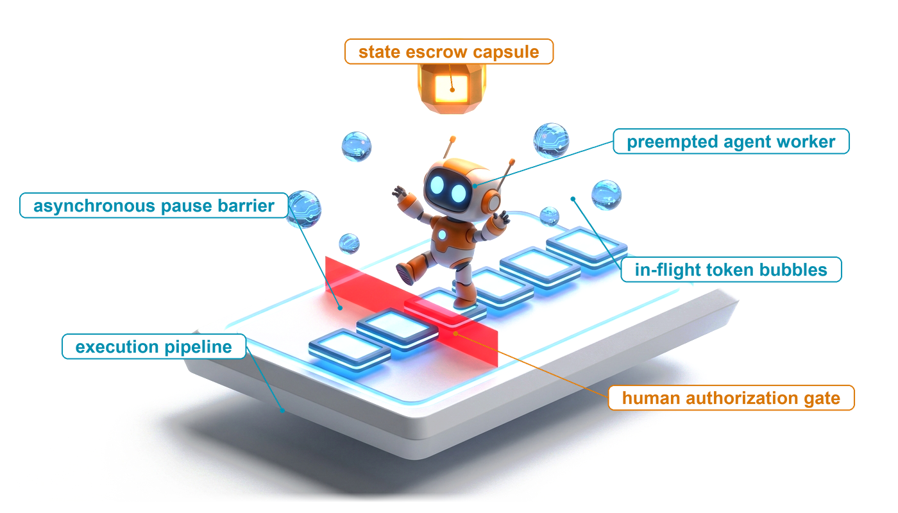
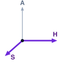
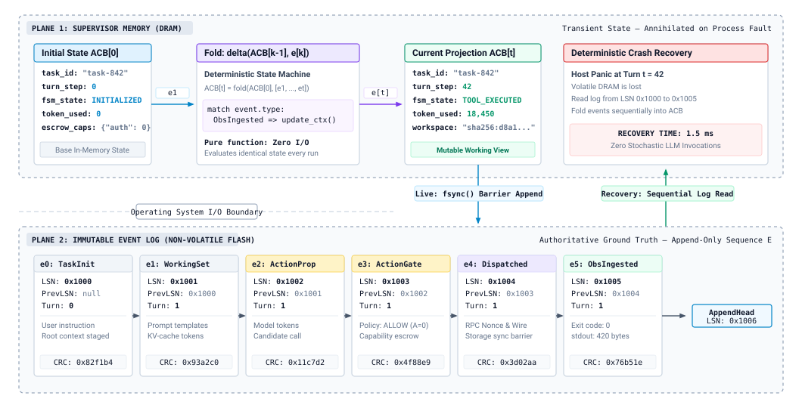
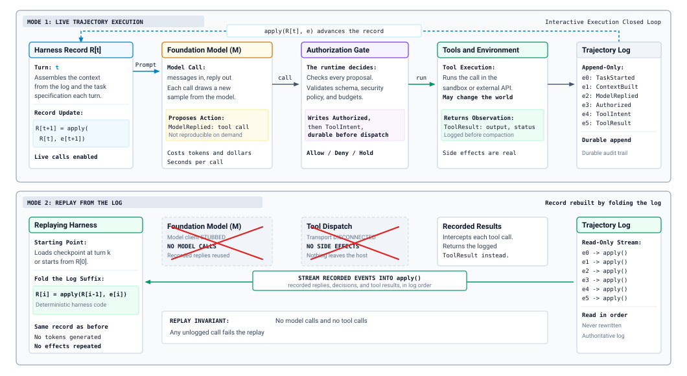

# Durable Execution {#sec-vol3-durable-execution}

::: {layout-narrow}
::: {.column-margin}

\chapterminitoc

:::

::: {.content-visible when-format="pdf"}
\noindent
{fig-alt="Blueprint for Durable Execution."}
:::

::: {.content-visible unless-format="pdf"}
{fig-alt="Blueprint for Durable Execution."}
:::

:::

## Purpose {.unnumbered .unlisted}

\begin{marginfigure}
\mlagentstack{0}{0}{100}{0}{0}{0}
\end{marginfigure}

_Why must an agent write down what it is about to do before it does it?_

A long-running agent outlives the machine it starts on. Hosts crash, workers are preempted, deployments restart processes, and a trajectory paused for a human approval may wait days for an answer. When that happens at turn forty, restarting from the original prompt does not bring the task back, because each model call draws a new sample and the rerun follows a different path, and because some of the first forty turns already changed the world by sending a message, merging a branch, or provisioning a server that a rerun would change again. The work that survives is exactly the work the runtime wrote down, in the right order, before the crash. Durable execution is the discipline of keeping that record so a trajectory can resume, be replayed for debugging, or move to another machine without repeating an effect it already caused, and the same record later becomes the evidence that evaluation and training read. Through the H·S·A lens, a long horizon turns state into a durability problem and spent authority into a debt that recovery must not pay twice.

::: {.content-visible when-format="pdf"}

\newpage

:::

::: {.callout-learning-objectives}

- Design a trajectory log whose events (messages, tool-call IDs and results, model and sampling metadata, compaction events, approvals) suffice to rebuild the trajectory record.
- Apply the intent-before-effect ordering to classify every logged action after a crash as not sent, settled, or in doubt.
- Select a checkpoint cadence in turns from the checkpoint cost and the failure rate, and state what a checkpoint must capture that the log cannot.
- Explain how a resumed trajectory rebuilds its context, what re-prefill costs, and how resume handles pending approvals, late tool results, and drift in model, prompt, or tool schema.
- Construct a replay mode that stubs the model and the tools, and use it for time-travel debugging, counterfactual branches, and harness regression tests.
- Diagnose why a rerun diverges from its recording, separating model-side sources from harness-side and environment-side sources.
- Design a retention policy that keeps the causal record of a trajectory while compacting bulky tool output.

:::

## The Trajectory Log {#sec-vol3-persistence-event-sourcing}

::: {.column-margin}
{width="100%" fig-alt="H·S·A locator with the Horizon and State axes highlighted in purple and Authority in gray."}

*Horizon stretches state past one host's life, so this chapter makes the record durable.*
:::

A trajectory is on turn forty of a cloud migration. The harness has just sent the request that provisions a database replica, and the host loses power before the response arrives. When another host picks up the trajectory, three questions decide whether recovery helps or harms. What had the runtime proposed, authorized, and observed by turn thirty-nine? Could the provisioning request have left the machine? If it did, did it take effect? The trajectory record of @sec-vol3-controlplane-acb answers none of them, because it lived in the memory of the host that failed. Over a long horizon, the state a trajectory carries becomes a durability problem (@sec-vol3-intro-hsa), since trajectories routinely outlive the machines they start on (@sec-vol3-intro-temporal-stretching).

The obvious recovery, feeding the original prompt back to the model, does not work. Each model call draws a sample, and even at temperature zero a serving system does not promise the same tokens twice (@sec-vol3-foundation-model-autoregressive), so a rerun may choose a different tool at turn three and a different set of files at turn four. Worse, the rerun cannot know which of the first forty turns already changed the world. A second provisioning request creates a second replica. Recovery therefore needs a record that the runtime wrote before the crash and that says, turn by turn, what happened.

### The log as the source of truth

The runtime keeps that record as an append-only **trajectory log**\index{Trajectory log!definition}, an ordered sequence of typed events that it never edits in place:

$$\mathcal{E} = [e_1, e_2, \dots, e_t]$$

Each event records one fact about the trajectory, such as a context being assembled, the model replying, the runtime authorizing a tool call, or a result coming back. The live trajectory record of @sec-vol3-agent-harness (status, budgets, pending approvals, the current plan) is no longer stored independently. It is a projection that the harness computes by folding the log, starting from an initial record $R_0$ and applying one deterministic update function per event:

$$R_t = \text{fold}(R_0, \mathcal{E}) = \text{apply}(\dots\text{apply}(\text{apply}(R_0, e_1), e_2)\dots, e_t)$$

::: {#fig-vol3-event-sourcing fig-env="figure" fig-pos="htb" fig-cap="**The Trajectory Record as a Projection of the Log**: The durable trajectory log (bottom) is an append-only sequence of typed events, each with a log sequence number (LSN) and a back-pointer. The trajectory record in runtime memory (top) is recomputed by folding those events through deterministic harness code. When the host is lost at turn 42, recovery reads the log in order and rebuilds the same record without calling the model or any tool." fig-alt="Two panels. Top panel, runtime memory lost on a crash: an initial record R zero, a fold box applying events, the current record R t at turn 42, and a recovery box stating no model or tool calls. Bottom panel, the durable append-only trajectory log with six events: TaskStarted, ContextBuilt, ModelReplied, Authorized, ToolIntent, and ToolResult, each with LSN, previous LSN, turn, and checksum."}

:::

@Fig-vol3-event-sourcing shows the two halves. The update function is ordinary harness code with no I/O, so folding the same log always yields the same record. Recovery after a crash reads the log and folds it again. It calls no model and no tool, because every model reply and tool result it needs is already an event (principle \ref{pri-vol3-intent-before-effect}). This design pattern, **event sourcing**\index{Event sourcing!trajectory log}, is old in data systems [@kleppmann2017designing]. It fits agents unusually well, because the one component whose output cannot be recomputed, the model, is exactly the component whose output the log keeps.

The same split separates the log from the context window. The context is what the next model call reads. It is assembled from the log, and it is lossy on purpose. Compaction (@sec-vol3-context-engineering-compaction) summarizes old turns, and truncation (@sec-vol3-tool-calling-streaming) cuts long tool output. The log keeps what the context drops. Treating the context as the record of the trajectory is the most common way to lose it, because the evidence a post-mortem needs is precisely what compaction removed.

### What the log records

A log is useful for recovery only if each event carries what a later reader will need. @Tbl-vol3-durable-log-schema lists the event kinds that a single-agent trajectory needs and why each exists.

| **Event**                               | **Written when**                               | **Key fields**                                                                                                                              | **What recovery or replay uses it for**                                              |
|:----------------------------------------|:-----------------------------------------------|:--------------------------------------------------------------------------------------------------------------------------------------------|:-------------------------------------------------------------------------------------|
| `TaskStarted`                           | Once, before the first turn                    | Task specification, model identifier and version, sampling parameters, prompt-template version, tool-schema versions, workspace snapshot ID | Pins the versions a resume or replay must match, and defines the starting workspace  |
| `ContextBuilt`                          | Before each model call                         | Ordered message references, retrieved items, a hash of the assembled context                                                                | Lets resume re-derive the identical context and detect when re-assembly would differ |
| `ModelReplied`                          | After each model call returns                  | Verbatim reply, tool calls with their tool-call IDs, stop reason, token counts, model version actually served                               | The only copy of a sample that cannot be regenerated                                 |
| `Authorized`                            | After policy and budget checks                 | Tool-call ID, decision (allow, deny, hold for approval), policy version, budget remaining                                                   | Rebuilds budgets and shows why an action was allowed                                 |
| `ApprovalRequested`, `ApprovalResolved` | When a call is held, and when a person answers | Tool-call ID, approver, decision, expiry                                                                                                    | Lets a paused trajectory survive the wait and resume with the same decision          |
| `ToolIntent`                            | After authorization, before dispatch, durably  | Tool-call ID, tool name, arguments, idempotency key                                                                                         | Marks that an effect may have happened, so recovery settles it instead of guessing   |
| `ToolResult`                            | When the tool returns                          | Tool-call ID, status, output (or its hash and a pointer to the full body), duration                                                         | Replaces the tool during replay and closes the intent                                |
| `Compacted`                             | When the context is summarized                 | Turns covered, the summary text as produced                                                                                                 | Lets resume reuse the recorded summary instead of generating a different one         |
| `Checkpoint`                            | After a checkpoint is durable                  | Log position covered, record snapshot ID, workspace snapshot ID                                                                             | Bounds how much of the log a restart must read                                       |

: **Trajectory Log Schema**: Event kinds a single-agent trajectory records, when each is written, the fields that matter, and what recovery or replay reads from it. Tool-call IDs link a model's proposal, its authorization, its intent, and its result across four events. {#tbl-vol3-durable-log-schema tbl-colwidths="[16,20,34,30]"}

Three design choices in the schema carry most of its value. The tool-call ID threads one action through proposal, authorization, intent, and result, so recovery can ask of any action which of those four events exist. The version fields turn "the model" and "the prompt" from moving targets into recorded facts, which resume and replay both depend on. The `Compacted` event records the summary as produced, because a second summarization of the same turns is another sample and would give the resumed trajectory a different memory of its own past.

With the log in place, under invariant closure (principle \ref{pri-invariant-closure}) the runtime no longer relies on anything the model says about its own history. What happened is what the log says happened. That claim holds only if every event reaches durable storage before the world can act on it, and for one event kind the order in which the runtime writes and acts decides whether recovery is safe at all.

## Intent Before Effect {#sec-vol3-persistence-wal}

Return to the provisioning request at turn forty. The harness has authorized it and must now do two things, write a record that the request is going out and send the request. If it sends first and the host dies before the record is durable, the replica exists but the log never mentions it. The recovered harness sees an authorized call with no sign of dispatch, concludes that nothing happened, and sends it again.

::: {.column-margin}
**Phantom effect**\index{Phantom effect}\
An external effect that a tool call produced but that no durable log record describes, because the host failed between dispatch and the write that would have recorded it.
:::

The rule that prevents this is **write-ahead ordering**\index{Write-ahead ordering!definition}, the runtime form of intent before effect (principle \ref{pri-vol3-intent-before-effect}). No external effect may leave the host until the `ToolIntent` event that authorizes it is durable. For every call that can change the world, the events must occur in this order, where $a$ is the dispatch itself:

$$e_{\text{Authorized}} \prec e_{\text{ToolIntent}}^{\text{durable}} \prec a \prec e_{\text{ToolResult}}$$

The critical link is the second. "Durable" means the storage layer has acknowledged that the bytes survive a power loss, which requires an explicit flush. A buffered write that the operating system has accepted but not yet persisted does not count, and runtimes that confuse the two produce phantom effects under exactly the crashes the log exists for.

::: {.column-margin}
**The classical write-ahead log.** Databases have used this rule for decades to recover their own pages after a crash, and the ARIES algorithm [@mohan1992aries] can undo an uncommitted change by restoring the page. An agent's effects land in systems it does not own, so the log can record an effect but never undo it. @Sec-vol3-appendix-inference-distributed summarizes the classical protocol.
:::

### Three states after a crash

The ordering fixes which combinations of records can survive a crash, so recovery finds every world-changing action in one of three states (@tbl-vol3-durable-recovery-states).

| **Records in the log**            | **State**    | **What recovery does**                                                                                          |
|:----------------------------------|:-------------|:----------------------------------------------------------------------------------------------------------------|
| No durable `ToolIntent`           | Not sent     | The call never left the host. The turn may run again, from the recorded model reply if it exists.               |
| `ToolIntent` and `ToolResult`     | Settled      | The outcome is known. Replay and resume use the recorded result and never re-dispatch.                          |
| `ToolIntent` without `ToolResult` | **In doubt** | The request may never have arrived, or it may have committed with only the reply lost. Settle before any retry. |

: **Recovery States of a Logged Action**: Write-ahead ordering guarantees that every world-changing action is found in exactly one of three states after a crash. Only the third requires work before the trajectory continues. {#tbl-vol3-durable-recovery-states tbl-colwidths="[30,16,54]"}

Write-ahead ordering cannot resolve the third state, the **in-doubt action**\index{In-doubt action}. What it guarantees is that the state is visible, and settlement before retry (principle \ref{pri-vol3-exactly-once-settlement}) resolves it with the mechanisms of @sec-vol3-tool-calling-idempotency. The recovery path re-sends the call under the idempotency key recorded in the intent, which the tool deduplicates. When the tool accepts no key, the runtime first runs a reconciliation probe (does the replica exist?) and re-sends only if the environment is still in its pre-dispatch state. When neither works, the action stays in doubt and the trajectory escalates to a person rather than guessing. The runtime never re-sends on the assumption that the first attempt failed.

The ordering applies to effects, not to every call. A model call changes nothing outside the runtime, so the harness logs `ModelReplied` after the call returns, and a crash mid-call loses only the tokens that call spent. A read-only tool can safely run again, although its answer may differ the second time, which is why its `ToolResult` is logged too. Replay must see the answer the model saw, not a fresh one.

### What durability costs

The durable write sits on the critical path of every world-changing call, so its cost matters. On local storage an explicit flush takes on the order of a millisecond or less. A turn spends seconds in the model call (@sec-vol3-foundation-model-cost) and often seconds more in the tool, so the flush adds well under 1 percent to a turn. Two situations change this arithmetic. Network-attached storage can make each flush tens of times slower, and many trajectories on one host each flushing on their own contend for the same device. The standard remedy is group commit [@dewitt1984], in which one flush covers the intents of every trajectory that arrived in the same short window. Each trajectory still waits for its own intent to be durable, so the ordering holds, while the device sees one flush instead of dozens.

::: {#chk-10-wal-invariants .callout-checkpoint title="Write-ahead ordering"}
Before moving on, check that you can answer the following.

- [ ] **Ordering**: Why must `ToolIntent` be durable before dispatch, and why is logging `ModelReplied` after the model call safe?
- [ ] **Recovery states**: Given a log, can you classify each world-changing action as not sent, settled, or in doubt?
- [ ] **Settlement**: What does recovery do with an in-doubt call whose tool accepts no idempotency key?
- [ ] **Cost**: Why does group commit preserve each trajectory's ordering while reducing the number of flushes?
:::

The log now captures every decision and every effect in a safe order. Two problems remain. A trajectory that runs for hundreds of turns makes recovery read hundreds of turns of log, and, more fundamentally, some state that recovery needs is not in the log at all.

## Checkpoints {#sec-vol3-persistence-checkpointing}

A coding agent is on turn three hundred. Its log says that at turn 212 an edit tool rewrote `parser.py` and at turn 250 a shell tool deleted a build directory. Folding the log rebuilds the trajectory record, but it does not rebuild `parser.py`. The log holds the tool calls and their results; the files those calls produced live in the sandbox workspace (@sec-vol3-sandboxes-cow), and if the host held the workspace, the workspace died with it. Replaying the log cannot recreate the files either, because replay never runs tools.

### What a checkpoint captures

A **checkpoint**\index{Checkpoint!definition} is a durable snapshot of everything the log alone cannot rebuild cheaply, bound to the log position it corresponds to. It has three parts:

1. **A record snapshot**: The serialized trajectory record $R_k$ at turn $k$, so a restart need not fold the whole log from $R_0$.
2. **A workspace snapshot**: The sandbox filesystem at turn $k$, taken as a copy-on-write snapshot so it costs only the changed files (@sec-vol3-sandboxes-cow).
3. **A `Checkpoint` event**: Appended to the log only after both snapshots are durable, naming the log position they cover.

The order of the third step matters. A checkpoint that the log announces before its snapshots are durable can point recovery at a snapshot that does not exist.

The two snapshots must also describe the same moment. Suppose the harness snapshots the record at turn 42, then a tool in turn 43 deletes `compiler.cc`, and only then does the workspace snapshot run. After a crash, recovery restores a record that expects `compiler.cc` next to a workspace that no longer has it, and the resumed agent fails on a file its own history says exists. The rule that prevents this torn checkpoint is simple. The harness takes checkpoints only at a turn boundary, when no tool is running and no model call is in flight, and it pauses dispatch until both snapshots are taken. Copy-on-write makes the pause short, since taking a snapshot copies no data.

### What a crash costs, and how often to checkpoint

With checkpoints, recovery restores the latest checkpoint and folds only the log suffix after it. For the trajectory record, that suffix is cheap to fold. For the workspace it is not free. Effects confined to the sandbox, such as file edits whose diffs are in the log, can be re-applied from the recorded results. Effects the log cannot reproduce force a choice. Either the harness rolls the trajectory back to the checkpoint, tells the model which external effects in the discarded turns already happened, and lets it redo the local work, or it escalates. Either way, a crash can cost up to the turns since the last checkpoint, measured in the units that matter to an agent (tokens re-spent, dollars, and wall-clock time).

That cost sets the cadence. Let $\delta$ be the time a checkpoint pauses the trajectory and $M$ the mean time between failures of the host or worker. Checkpointing every $T$ seconds spends $\delta / T$ of the run on checkpoints and loses on average $T/2$ of work per failure, and the classical first-order optimum [@young1974] balances the two:

$$T^{\ast} \approx \sqrt{2\,\delta\,M}$$ {#eq-vol3-young-formula}

Daly refines @eq-vol3-young-formula when $\delta$ is not small relative to $M$ [@daly2006]. Dividing $T^{\ast}$ by the mean turn time converts it into a cadence in turns. The formula's lesson for agents is qualitative. A copy-on-write checkpoint costs little next to a turn that spends seconds in a model call, and workers that are preempted often have a short $M$, so the optimum is usually every few turns rather than every few hundred.

Four moments call for a checkpoint regardless of the formula, because each is a point the trajectory will want to return to or must not lose:

- **Before an irreversible action**, so the work before the pivot is safe whatever happens after it (@sec-vol3-failure-recovery covers the pivot).
- **When the trajectory pauses for an approval**, since a wait of hours makes a failure during the wait likely.
- **Before compaction**, so the pre-compaction context stays reachable.
- **When the harness moves the trajectory to another worker** (@sec-vol3-persistence-migration).

A checkpoint and the log suffix after it are all that a new worker needs to continue a trajectory. What remains is the protocol for continuing, which does more than restore data.

## Resuming a Trajectory {#sec-vol3-persistence-migration}

The trajectory from the start of the chapter now resumes on a new worker. The previous host may have crashed, been preempted, or been drained for a deployment, or the trajectory may simply have been paused for two days waiting for a person to approve a production change (@sec-vol3-controlplane-hitl). In every case the worker that continues it starts with nothing but the log, the latest checkpoint, and the rule that it must not repeat an effect. **Resume**\index{Resume!definition} is the protocol that turns those into a running trajectory:

1. **Claim ownership.** Acquire the trajectory's lease with a fencing token, so that no other worker can act for it (below).
2. **Restore.** Load the latest checkpoint's record and workspace snapshots, then fold the log suffix into the record.
3. **Settle.** Resolve every in-doubt intent, as @sec-vol3-persistence-wal describes, before anything new is dispatched.
4. **Rebuild the context** from the log and prefill it.
5. **Continue** the loop at the next turn boundary, in the state the record says the trajectory was in.

Steps 2 and 3 reuse the machinery of the previous two sections. Steps 1 and 4, and the situations that complicate them, are specific to resume.

### Rebuilding the context

The model keeps nothing between calls, so the resumed worker must hand it a context. It re-derives that context from the log with the same assembly rules the trajectory was using (@sec-vol3-context-engineering-staging): the recorded messages, the recorded tool results as they were delivered, and the recorded `Compacted` summaries in place of the turns they replaced. The `ContextBuilt` hash lets the harness confirm that the re-assembled context matches the last one the model saw before the crash. A mismatch means the assembly rules or their inputs changed, which is drift (below), not recovery.

The rebuilt context must then be prefilled again. The key-value state that the old serving session held was derived from the token prefix and did not survive (principle \ref{pri-vol3-prefix-coherence}), and the new call may land on a server whose prefix cache has never seen this trajectory (@sec-vol3-kvcache-radix-tree). Resume therefore pays one cold prefill of the full context. For a long context that is seconds of latency and cents of input-token cost (@sec-vol3-foundation-model-cost; @sec-vol3-appendix-inference-kv-cache), small next to redoing turns, which costs minutes of model calls and dollars and puts every in-doubt effect at risk. Two practices keep it small. Routing the resumed trajectory to a server that still holds its prefix turns the cold prefill into a cache hit, and re-assembling the context byte for byte as before keeps the prefix identical, so any surviving cache entry is usable.

### Pauses, approvals, and late results

A pause for approval is a resume that the harness planned. When a call is held (@sec-vol3-controlplane-hitl), the harness writes `ApprovalRequested`, takes a checkpoint, and releases the worker and its model-serving state entirely, because holding either for hours wastes both. When the answer arrives, the runtime writes `ApprovalResolved` and resumes the trajectory through the same five steps. The approval gate's own rules, such as expiry and re-checking the action's preconditions before dispatch, run after the resume, against the world as it is now rather than as it was when the request was made.

Long-running tools create the opposite case. A job started through an asynchronous tool (@sec-vol3-tool-calling-async-resumption) may finish after the worker that started it has died. Its result must therefore go to a durable inbox keyed by tool-call ID, not to the worker's memory. On resume, the harness matches each waiting result against the intents in the log and writes the matching `ToolResult`. A result whose tool-call ID has no intent in the log, or that arrives for a trajectory that has since been canceled, is rejected by the record's state guards (@sec-vol3-controlplane-statemachine) rather than delivered to the model.

### Moving a trajectory

Moving a trajectory between workers, because a node is being drained or preempted, is a resume with a warning. The departing worker lets the current turn finish or cancels it at a turn boundary, takes a checkpoint, and releases its lease; the arriving worker resumes. Only the record, the log suffix, and the workspace's changed files move, typically far smaller than the base image the sandbox started from, which the new worker already has.

The danger in any move is two workers acting for one trajectory. A worker cut off by a network partition may not know that its lease expired and that another worker has resumed. The runtime prevents this with a **fencing token**\index{Fencing token}, a generation number that the lease service increments each time ownership changes [@gray1989leases; @kleppmann2017designing]. Every tool dispatch carries the current token, and the tool gateway rejects a dispatch whose token is older than the latest it has seen. The stale worker's next call fails, and it stops. The fencing check sits below the model and below the harness logic, so it holds even if the stale worker's harness is still running normally.

### Resume under drift

Between the crash and the resume, or during a long approval pause, the system around the trajectory may change. The served model may have a new version behind the same name, the prompt template may have been edited, and a tool's schema may have gained or renamed a field. Because `TaskStarted` and each `ModelReplied` record the versions in use, the harness can detect drift instead of discovering it through odd behavior, and it has three choices:

- **Pin** the recorded versions and resume on them, which is possible only while those versions are still available.
- **Cross over** to the new versions at the next turn boundary, writing a drift event that records the old and new versions. Recorded turns keep their recorded outputs, the context is re-assembled under the new template, and the prefix cache misses from the first changed token onward.
- **Refuse** and escalate, the right answer when a changed tool schema would reinterpret arguments already recorded in an in-doubt intent.

A trajectory that crosses over is, from turn $k$ onward, a different system. Its behavior before and after the crossing should not be pooled when it is evaluated (@sec-vol3-evaluation), and the drift event is what lets an evaluator split it.

Resume uses the log to continue a trajectory. The same machinery can also rebuild a trajectory's past without continuing it, which is how engineers find out what went wrong.

## Replay {#sec-vol3-persistence-replay}

Overnight, an agent deleted a release branch at turn 23 of a cleanup task. The next morning an engineer needs to know what the model saw when it chose that action: which listing it had been shown, what the instructions said after compaction, and whether the authorization check ran against the right policy. Rerunning the task answers none of these questions, because the rerun samples a new trajectory and, pointed at the real repository, might delete something else.

**Replay**\index{Replay!definition} answers them. It runs the harness against the log with both sources of new information disconnected. The model client is stubbed and returns the recorded `ModelReplied` events in order, and the tool transport is disconnected and returns the recorded `ToolResult` events. The harness code runs for real, assembling contexts, checking policy, and updating the record, so what the engineer inspects is what the harness actually did. @Fig-vol3-replay-mode contrasts the two modes, and @tbl-vol3-replay-comparison places replay next to the rerun it replaces.

::: {#fig-vol3-replay-mode fig-env="figure" fig-pos="htb" fig-cap="**Live Execution versus Replay**: In live execution (top), the harness assembles a context, the model replies with a tool call, the authorization gate writes the decision and a durable intent, the tool runs, and every step is appended to the trajectory log. In replay (bottom), the model client is stubbed and the tool transport is disconnected. The harness folds the recorded events, receives recorded results in place of tool calls, and rebuilds the same record without generating a token or causing an effect. Any call the log does not account for fails the replay." fig-alt="Two panels. Top: live execution with harness record, foundation model, authorization gate, tools and environment, and trajectory log connected in a loop. Bottom: replay mode with the model and tool dispatch boxes crossed out, a recorded-results box, and the trajectory log streaming recorded events into the replaying harness."}

:::

| **Dimension** | **Live execution**       | **Rerun from the prompt**         | **Replay from the log**             |
|:--------------|:-------------------------|:----------------------------------|:------------------------------------|
| **Model**     | Called                   | Called again, new samples         | Stubbed, recorded replies           |
| **Tools**     | Dispatched               | Dispatched again, effects repeat  | Disconnected, recorded results      |
| **Outcome**   | The trajectory           | A different trajectory            | The same trajectory, step by step   |
| **Cost**      | Tokens, dollars, effects | Tokens, dollars, repeated effects | Harness compute only                |
| **Use**       | Doing the task           | Exploring alternatives            | Recovery, debugging, audit, testing |

: **Replay versus Rerun**: Replay rebuilds a trajectory from its log without calling the model or the tools. A rerun from the original prompt is a new trajectory that spends tokens again and repeats effects. {#tbl-vol3-replay-comparison tbl-colwidths="[18,24,29,29]"}

Replay is strict. If the harness, while replaying, tries to call the model or a tool that the log does not account for, the replay fails. An unlogged call means either that the harness code has changed since the recording or that some input reached the live trajectory without passing through the log, and both are findings. The idea comes from deterministic replay of whole machines, where reproducing an execution requires logging every nondeterministic input [@king2005debugging]. For an agent, the nondeterministic inputs are few and well defined, namely model replies, tool results, and whatever the harness itself reads from the environment (@sec-vol3-persistence-non-determinism).

### Time travel and counterfactual branches

Because replay can stop at any turn, the log becomes a timeline an engineer can move along.

::: {#dfn-time-travel-replay .callout-definition title="Time-travel replay"}

***Time-travel replay***\index{Time-travel replay!definition} is the reconstruction of a trajectory's exact state at any past turn $t$ by loading the nearest checkpoint at or before $t$ and replaying the log suffix up to $t$, with the model and tools stubbed.

1.  **Significance**: Lets an engineer inspect the context the model actually received, the budget state, and each authorization decision at the turn where a trajectory went wrong, at the cost of harness compute only.
2.  **Distinction**: Unlike a rerun from the prompt, it reproduces the recorded trajectory rather than sampling a new one, and unlike reading the raw log, it shows the harness's derived state (the assembled context and the record) at that turn.
3.  **Common pitfall**: Letting a replay reach a live tool, which repeats a past effect in the present world.

:::

For the deleted branch, the engineer replays to turn 23 and reads the context the model received. Suppose the branch listing it had been shown was truncated before the line that marked the release branch as protected. The defect is then in observation truncation, not in the model. That kind of attribution, separating model failures from harness failures across many incidents, is the subject of @sec-vol3-evaluation-postmortems. Replay supplies its evidence.

A **counterfactual branch** goes one step further. The engineer forks the trajectory at turn 22, changes one thing (the truncation rule, the prompt template, the tool schema, or the model), and lets it continue live from that point. Everything before the fork is replayed, so the early turns cost nothing and stay identical. Everything after it is a new trajectory, and it must run in a sandbox with external tools stubbed or pointed at test systems, because it is live and its effects are real. Comparing one branch against one recording shows only that the fix can change the outcome. Showing that it does so reliably requires running many branches and measuring them, which @sec-vol3-evaluation takes up.

### Regression tests for the harness

Replay also tests the harness itself. Every change to the harness, such as a stricter tool-argument parser, a new compaction rule, or a revised policy check, risks breaking behavior that production trajectories depend on. Testing such a change against a live model is slow, costly, and flaky, because a test can fail merely because the model sampled a different phrasing.

Replaying archived trajectories through the changed harness removes all three problems. The recorded model replies are fixed test inputs, so the test measures the harness and nothing else. Suppose a team tightens the parser that extracts file edits from tool calls. Replaying a few hundred production logs through the new parser finds a trajectory where, at turn 14, the old parser accepted a patch wrapped in a markdown code fence and the new one rejects it, and the replay stops at that turn with both parses in hand. The test cost harness compute only, ran in seconds, and pointed to the exact turn and payload.

The scope of this test is narrow by design. It shows that the new harness handles recorded model outputs as the old one did, or where it differs. It cannot show that the new harness makes the agent more successful, because the model's future replies will respond to the new harness. That question needs fresh trajectories and the statistics of @sec-vol3-evaluation. The same logs, once verified, also become the raw material for training (@sec-vol3-trajectory-curation).

Replay works because it never asks the model for anything. The moment an engineer does ask, by rerunning a prompt or continuing a counterfactual branch, the trajectory can diverge from its recording, and it is worth knowing why.

## Why Replays Diverge {#sec-vol3-persistence-non-determinism}

An engineer investigating a failure at turn 42 reruns the trajectory with the same model at temperature zero against a copy of the repository at the same commit. The rerun diverges at turn 6, chooses a different tool, and never reaches the failure. Nothing is broken. A rerun has several independent ways to differ from its recording, and knowing them tells the engineer which to control, which to record, and which to accept.

### Four sources of divergence

@Tbl-vol3-nondeterminism-mitigation groups the sources by where they enter the trajectory.

| **Source**          | **How it enters**                                                                                             | **What the runtime does**                                                                           |
|:--------------------|:--------------------------------------------------------------------------------------------------------------|:----------------------------------------------------------------------------------------------------|
| **The model call**  | Sampling at nonzero temperature; batch composition and reduction order on the serving side at any temperature | Record every reply; never expect a rerun to reproduce one                                           |
| **Model drift**     | A new model version or serving configuration behind the same model name                                       | Record the served version on every reply; compare versions before comparing behavior                |
| **Harness inputs**  | Timestamps, random IDs, unordered directory listings, and retrieval results placed into the context           | Read each through the harness, record it as an event, and sort anything with no inherent order      |
| **The environment** | External services, repositories, and data that changed since the recording                                    | Record every tool result; replay from the log, and pin or snapshot environments for counterfactuals |

: **Sources of Replay Divergence**: The four places where a rerun can depart from its recording, and what the runtime records or controls for each. Only the first cannot be removed; it can only be recorded. {#tbl-vol3-nondeterminism-mitigation tbl-colwidths="[18,44,38]"}

The model call is the source that surprises engineers most. Sampling at nonzero temperature obviously varies. Less obviously, serving systems vary even at temperature zero, because floating-point addition is not associative [@goldberg1991] and the order in which a serving engine sums partial results depends on how many other requests share the batch. When two candidate tokens are nearly tied, that difference can flip the choice, and one changed token changes everything after it in the trajectory. Making serving bit-exact is possible in principle but slows it down and holds only on identical hardware and software, so a runtime that wants reproducibility records the model's outputs instead of trying to regenerate them.

Model drift is the same problem at a larger scale. A rerun weeks later may reach a different model version under the same name, and a divergence then says nothing about the harness. The version recorded in every `ModelReplied` event is what lets the engineer tell the two apart.

Harness inputs are the source the runtime fully controls, and the most often neglected. A harness that writes the current time into the system prompt, generates a fresh random ID for each tool call, or lists a directory in whatever order the filesystem returns has built a context that can never be reproduced, even with the model stubbed. The fix is to route every such value through the harness, record it as an event on the live run, and read it back from the log on replay. Listings and search results get a stable sort order before they enter the context.

The environment is what replay already handles by returning recorded tool results. It matters again for counterfactual branches, which run live. A branch that forks at turn 22 against today's repository is testing two changes at once, the engineer's fix and a month of other commits, unless the workspace is restored from the checkpoint and external tools are pointed at a pinned snapshot.

### Measuring a divergence

When an engineer reruns the model on purpose, the useful measurement is where the rerun first departs from the recording. The first turn at which the chosen tool call differs locates the divergence. Comparing the two contexts at that turn shows whether the inputs already differed (a harness or environment source) or were identical (a model source). If the serving interface returns token log-probabilities, a small margin between the top two candidates at the first differing token confirms a near-tie in the model rather than a change in its inputs.

::: {#chk-10-time-travel-debugging .callout-checkpoint title="Replay and divergence"}
Before moving on, check that you can answer the following.

- [ ] **Replay versus rerun**: Why does replay cost only harness compute, while a rerun from the prompt spends tokens and risks repeating effects?
- [ ] **Strictness**: What does it mean when a replay attempts a model or tool call that the log does not account for?
- [ ] **Divergence**: Which of the four sources of divergence can the runtime eliminate, and which can it only record?
- [ ] **Counterfactuals**: Why must a counterfactual branch restore the workspace from a checkpoint before it continues live?
:::

Everything in this chapter so far assumes the log is complete and available. Over weeks of operation across many agents, keeping it that way is itself a cost.

## Log Retention {#sec-vol3-persistence-compaction}

[]{#sec-vol3-persistence-engine-design}

A team runs a few thousand coding agents a day. Each turn's model reply and tool call amount to a few kilobytes, but test runners and compilers return megabytes of output, most of which the model never saw because the harness truncated it before it reached the context (@sec-vol3-tool-calling-streaming). Within weeks the raw tool output makes up nearly all of the log's volume and almost none of its value. Retention decides what to keep, for how long, and where, without breaking the three things the log is for: resume, replay, and audit.

### The causal record and the bulk

The retention policy splits every event into two parts. The **causal record** is everything a replay or an audit needs to reconstruct what the model saw and what the runtime decided: event headers and tool-call IDs, every model reply, every authorization and approval, every intent, the status of every result, and the result content exactly as it was delivered into the context. The **bulk** is the rest of the raw tool output, the lines that truncation dropped before the model saw them.

The causal record is never compacted, because replay depends on it. The bulk can be moved out of the log into cheaper content-addressed storage, with the log keeping a hash of the full output and a pointer to it. @Tbl-vol3-payload-compaction-schema shows one tool result before and after.

| **Field**             | **In the live log**                     | **After compaction**                                             |
|:----------------------|:----------------------------------------|:-----------------------------------------------------------------|
| **Header**            | Turn, tool-call ID, tool name           | Unchanged                                                        |
| **Status**            | Exit code, duration                     | Unchanged                                                        |
| **Delivered content** | The truncated output the model received | Unchanged, because replay must show the model's actual input     |
| **Full output**       | Every line the tool produced            | A pointer to the full output in bulk storage                     |
| **Integrity**         | None needed                             | A hash of the full output, so any retrieved copy can be verified |

: **Compacting a Tool Result**: Compaction moves only the part of a tool result that the model never received. The delivered content and everything recovery or replay reads stay in the log. {#tbl-vol3-payload-compaction-schema tbl-colwidths="[20,36,44]"}

The rule that makes this safe is to compact only below the truncation line. A policy that summarized or trimmed the delivered content would leave replay showing an engineer an input the model never received, which is worse than no log at all.

### Retention by use

Different readers need the log at different times, and each can live on storage priced for its access pattern (@tbl-vol3-storage-tiers).

| **Stage**   | **Who reads it**                                              | **What it must support**                                             | **Typical storage**                                  |
|:------------|:--------------------------------------------------------------|:---------------------------------------------------------------------|:-----------------------------------------------------|
| **Live**    | The worker running the trajectory, and any worker resuming it | Fast durable appends, full content, reads from the latest checkpoint | Local append-only log, replicated                    |
| **Recent**  | Engineers debugging and replaying; evaluation pipelines       | Queries by trajectory, tool, outcome, and version; full replay       | Shared queryable store, bulk moved to object storage |
| **Archive** | Auditors; curation pipelines building training data           | Large scans over the causal record; occasional replay                | Compressed columnar files in object storage          |

: **Log Retention by Use**: A trajectory log moves through three stages as its readers change. The causal record survives all three; the bulk may be dropped at any stage the policy allows. {#tbl-vol3-storage-tiers tbl-colwidths="[13,33,30,24]"}

Two mechanical rules keep the stages consistent. Moving events between stages must be idempotent, keyed by trajectory ID and log position, so a copy retried after a crash does not duplicate them. Erasure requests must be satisfiable without rewriting immutable archives, which is usually achieved by encrypting each trajectory under its own key and destroying the key when the trajectory must be forgotten. The archive stage is where the log changes roles. It stops being a recovery mechanism and becomes the evidence base that evaluation reads (@sec-vol3-evaluation) and that curation turns into training data (@sec-vol3-flywheel-provenance), which is why the causal record must survive even when the bulk does not.

A durable log, checkpoints, resume, replay, and retention together make the trajectory's history reliable. The mistakes teams make when building them are consistent enough to name.

## Fallacies and Pitfalls {#sec-vol3-durable-execution-fallacies}

Durable execution fails most often when engineers carry over an assumption that holds for ordinary services or for a single model call but not for a long trajectory that changes the world.

::: {.fallacy-pitfall}
**Fallacy:** *Saving the final context window is enough to audit or recover a trajectory.*

The context window is a lossy projection of the trajectory. Compaction summarized its early turns, truncation cut its tool output, and it holds no record of which actions the runtime authorized, which intents were durable, or which results arrived. If a tool returned a credential at turn 7 and a summary removed it by turn 12, the final context contains no trace of the leak. Recovery and audit need the log of @tbl-vol3-durable-log-schema, from which the context can be rebuilt but which the context cannot rebuild.
:::

::: {.fallacy-pitfall}
**Pitfall:** *Dispatching a world-changing call before its intent is durable, to save latency.*

The saving is small, since a local flush adds well under 1 percent to a turn. The cost is a phantom effect whenever the host fails in the window between dispatch and flush. The recovered harness finds no intent, concludes the call never happened, and repeats a payment, a message, or a provisioning request. Write-ahead ordering (@sec-vol3-persistence-wal) closes the window, and group commit recovers most of the latency.
:::

::: {.fallacy-pitfall}
**Fallacy:** *Rerunning the model at temperature zero reproduces a trajectory.*

Serving at temperature zero is still not bit-exact, because batch composition changes the order of floating-point sums and near-ties between tokens flip. Model versions change behind a stable name, harness inputs such as timestamps enter the context, and the environment moves. A rerun is a new trajectory. Reproduction comes from replaying recorded model replies and tool results (@sec-vol3-persistence-replay), and divergence analysis (@sec-vol3-persistence-non-determinism) explains the rest.
:::

::: {.fallacy-pitfall}
**Pitfall:** *Regenerating summaries and contexts on resume instead of re-using the recorded ones.*

A resumed harness that re-summarizes old turns, or re-assembles the context under a prompt template edited since the crash, gives the model a different memory of its own past than the one it acted on. The trajectory then continues from a state that never existed, its prefix cache misses, and its later turns cannot be compared with its earlier ones. Resume uses the recorded `Compacted` events and the recorded template version, and treats any change as explicit drift (@sec-vol3-persistence-migration).
:::

::: {.fallacy-pitfall}
**Pitfall:** *Treating an in-doubt call as failed because it timed out.*

A timeout says the reply did not arrive, not that the request did nothing. Re-sending an in-doubt call without an idempotency key or a reconciliation probe is the same duplicate effect that write-ahead ordering was built to prevent, now introduced by the recovery path itself. In-doubt intents are settled before the trajectory continues, and escalated when they cannot be settled.
:::

::: {.fallacy-pitfall}
**Pitfall:** *Keeping every byte of raw tool output in the live log forever.*

Test runners and compilers can produce megabytes per turn, most of which the model never received. Keeping it all in the live log slows appends, checkpoints, and moves between workers, and inflates storage costs without improving replay. Moving the bulk below the truncation line to content-addressed storage, while keeping the delivered content and a hash in the log (@sec-vol3-persistence-compaction), preserves everything replay and audit need.
:::

## Summary {#sec-vol3-durable-execution-summary}
[]{#sec-vol3-persistence-summary}

The chapter asked what a runtime must record so that a trajectory can survive a crash, a pause, or a move without repeating an effect it already caused. The answer is an append-only trajectory log from which the trajectory record is computed, written so that every world-changing call is preceded by a durable intent. With that ordering, recovery finds each action not sent, settled, or in doubt, and settles the third kind before continuing. Checkpoints capture what the log cannot rebuild, chiefly the workspace, at consistent turn boundaries. Resume combines the two, rebuilds the context from recorded events, pays one cold prefill, and handles approvals, late results, and version drift explicitly. Replay runs the harness against the log with the model and tools stubbed, which turns the log into a debugger, a source of counterfactual branches, and a regression suite for the harness, and it explains why reruns diverge.

::: {.callout-takeaways title="If it is not in the log, recovery cannot trust it"}
1. **The log is the trajectory; the record is a view**: The trajectory record is recomputed by folding an append-only log of model replies, decisions, intents, and results. Recovery reads the log and never calls the model, because the model's samples cannot be regenerated.
2. **Write the intent before the effect**: A world-changing call may leave the host only after its intent is durable. Recovery then finds every action not sent, settled, or in doubt, and an in-doubt action is settled with an idempotency key or a probe, never re-sent on assumption.
3. **Checkpoints exist for what the log cannot rebuild**: The log does not contain the files that tools wrote. A checkpoint snapshots the record and the workspace together at a turn boundary, and its cadence trades pause time against the turns a failure costs.
4. **Resume is recovery plus rebuilding the context**: A resumed trajectory reuses recorded summaries and versions, pays one cold prefill of its context, and treats a changed model, prompt, or tool schema as explicit drift rather than silently continuing under it.
5. **Replay, not rerun, reproduces a trajectory**: Stubbing the model and tools makes the log a time-travel debugger and a harness regression suite at the cost of harness compute. A rerun diverges through sampling, serving, model drift, harness inputs, and the environment.
:::

Recovery in this chapter never calls the model. The trajectory record is recomputed from the log, write-ahead ordering places every effect after its durable intent, and checkpoints bound what a restart must redo. That is intent before effect (principle \ref{pri-vol3-intent-before-effect}) with its costs attached, one durable write per world-changing call and a checkpoint cadence set by the failure rate. It also marks where the mechanical half of invariant closure (principle \ref{pri-invariant-closure}) ends for durability. The runtime can guarantee that no effect goes unrecorded and that no settled effect is repeated, but it cannot decide from the log alone whether an in-doubt effect took place, and it cannot decide whether a recorded effect was the right one.

::: {.callout-chapter-connection title="From a durable history to recovering from its mistakes"}
The log says what happened. When what happened was wrong, and some of it cannot be undone, how does the trajectory recover? @Sec-vol3-failure-recovery takes up that question. It uses this chapter's log to know which effects committed, compensates the ones that can be answered by another action, repairs forward through the model where the effect can stand, stops at the one action that cannot be reversed, and detects when a trajectory has stopped making progress at all.
:::
