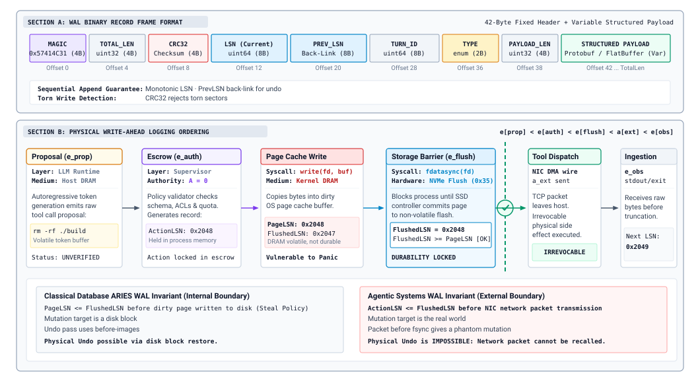
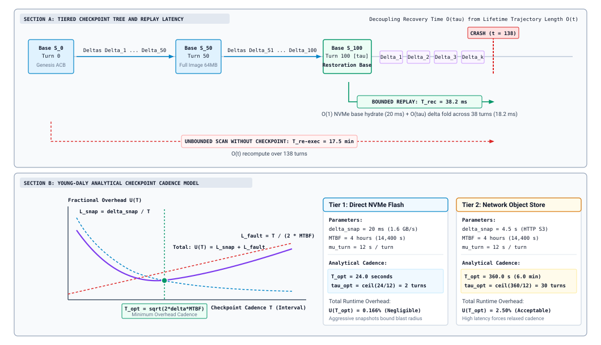
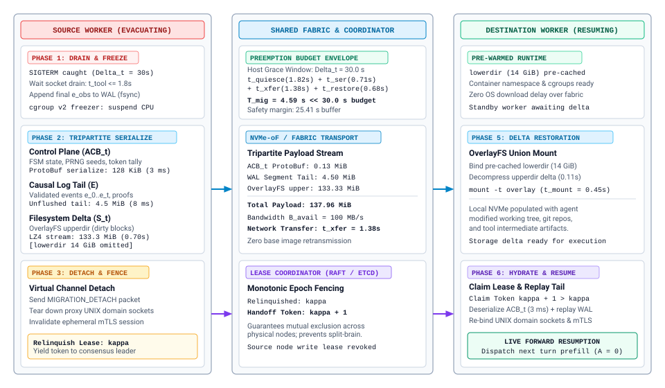
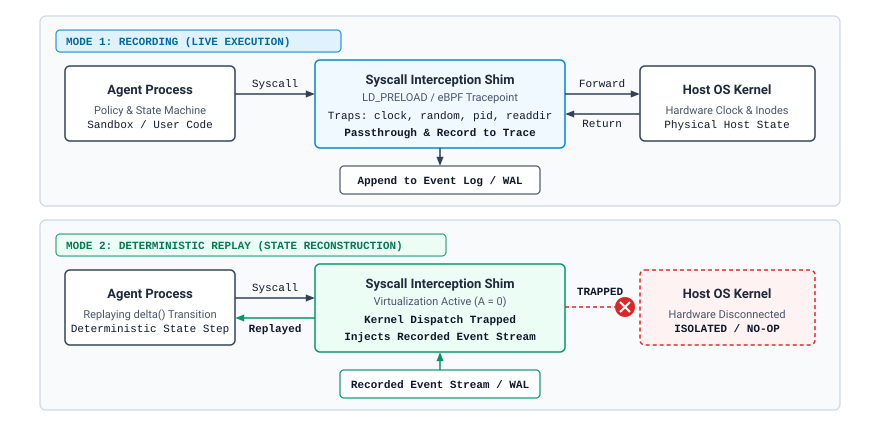
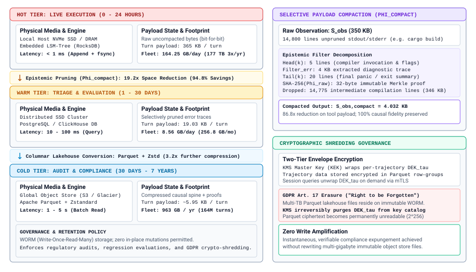

# Durable Execution {#sec-vol3-durable-execution}

::: {layout-narrow}
::: {.column-margin}

\chapterminitoc

:::

::: {.content-visible when-format="pdf"}
\noindent
{fig-alt="Blueprint for Durable Execution."}
:::

::: {.content-visible unless-format="pdf"}
{fig-alt="Blueprint for Durable Execution."}
:::

:::

## Purpose {.unnumbered .unlisted}

\begin{marginfigure}
\mlagentstack{0}{0}{100}{0}{0}{0}
\end{marginfigure}

_Why must an agent write down what it is about to do before it does it?_

A long-running agent outlives the machine it starts on. Hosts crash, workers are preempted, deployments restart processes, and a trajectory paused for a human approval may wait days for an answer. When that happens at turn forty, restarting from the original prompt does not bring the task back, because each model call draws a new sample and the rerun follows a different path, and because some of the first forty turns already changed the world by sending a message, merging a branch, or provisioning a server that a rerun would change again. The work that survives is exactly the work the runtime wrote down, in the right order, before the crash. Durable execution is the discipline of keeping that record so a trajectory can resume, be replayed for debugging, or move to another machine without repeating an effect it already caused, and the same record later becomes the evidence that evaluation and training read. Through the H·S·A lens, a long horizon turns state into a durability problem and spent authority into a debt that recovery must not pay twice.

::: {.content-visible when-format="pdf"}

\newpage

:::

::: {.callout-learning-objectives}

- Design a trajectory log whose events (messages, tool-call IDs and results, model and sampling metadata, compaction events, approvals) suffice to rebuild the trajectory record.
- Apply the intent-before-effect ordering to classify every logged action after a crash as not sent, settled, or in doubt.
- Select a checkpoint cadence in turns from the checkpoint cost and the failure rate, and state what a checkpoint must capture that the log cannot.
- Explain how a resumed trajectory rebuilds its context, what re-prefill costs, and how resume handles pending approvals, late tool results, and drift in model, prompt, or tool schema.
- Construct a replay mode that stubs the model and the tools, and use it for time-travel debugging, counterfactual branches, and harness regression tests.
- Diagnose why a rerun diverges from its recording, separating model-side sources from harness-side and environment-side sources.
- Design a retention policy that keeps the causal record of a trajectory while offloading bulky tool output.

:::

## The Trajectory Log {#sec-vol3-persistence-event-sourcing}

::: {.column-margin}
{width="100%" fig-alt="H·S·A locator with the Horizon and State axes highlighted in purple and Authority in gray."}

*Horizon stretches state past one host's life, so this chapter makes the record durable.*
:::

A trajectory is on turn forty of a cloud migration. The harness has just sent the request that provisions a database replica, and the host loses power before the response arrives. When another host picks up the trajectory, three questions decide whether recovery helps or harms. What had the runtime proposed, authorized, and observed by turn thirty-nine? Could the provisioning request have left the machine? If it did, did it take effect? The trajectory record of @sec-vol3-controlplane-acb answers none of them, because it lived in the memory of the host that failed. Over a long horizon, the state a trajectory carries becomes a durability problem (@sec-vol3-intro-hsa), since trajectories routinely outlive the machines they start on (@sec-vol3-intro-temporal-stretching).

The obvious recovery, feeding the original prompt back to the model, does not work. Each model call draws a sample, and even at temperature zero a serving system does not promise the same tokens twice (@sec-vol3-foundation-model-autoregressive), so a rerun may choose a different tool at turn three and a different set of files at turn four. Worse, the rerun cannot know which of the first forty turns already changed the world. A second provisioning request creates a second replica. Recovery therefore needs a record that the runtime wrote before the crash and that says, turn by turn, what happened.

### The log as the source of truth

The runtime keeps that record as an append-only **trajectory log**\index{Trajectory log!definition}, an ordered sequence of typed events that it never edits in place:

$$\mathcal{E} = [e_1, e_2, \dots, e_t]$$

Each event records one fact about the trajectory, such as a context being assembled, the model replying, the runtime authorizing a tool call, or a result coming back. The live trajectory record of @sec-vol3-agent-harness (status, budgets, pending approvals, the current plan) is no longer stored independently. It is a projection that the harness computes by folding the log, starting from an initial record $R_0$ and applying one deterministic update function per event:

$$R_t = \text{fold}(R_0, \mathcal{E}) = \text{apply}(\dots\text{apply}(\text{apply}(R_0, e_1), e_2)\dots, e_t)$$

::: {#fig-vol3-event-sourcing fig-env="figure" fig-pos="htb" fig-cap="**The Trajectory Record as a Projection of the Log**: The durable trajectory log (bottom) is an append-only sequence of typed events, each with a log sequence number (LSN) and a back-pointer. The trajectory record in runtime memory (top) is recomputed by folding those events through deterministic harness code. When the host is lost at turn 42, recovery reads the log in order and rebuilds the same record without calling the model or any tool." fig-alt="Two panels. Top panel, runtime memory lost on a crash: an initial record R zero, a fold box applying events, the current record R t at turn 42, and a recovery box stating no model or tool calls. Bottom panel, the durable append-only trajectory log with six events: TaskStarted, ContextBuilt, ModelReplied, Authorized, ToolIntent, and ToolResult, each with LSN, previous LSN, turn, and checksum."}

:::

@Fig-vol3-event-sourcing shows the two halves. The update function is ordinary harness code with no I/O, so folding the same log always yields the same record. Recovery after a crash reads the log and folds it again. It calls no model and no tool, because every model reply and tool result it needs is already an event (principle \ref{pri-vol3-intent-before-effect}). This design pattern, **event sourcing**\index{Event sourcing!trajectory log}, is old in data systems [@kleppmann2017designing]. It fits agents unusually well, because the one component whose output cannot be recomputed, the model, is exactly the component whose output the log keeps.

The same split separates the log from the context window. The context is what the next model call reads. It is assembled from the log, and it is lossy on purpose. Compaction (@sec-vol3-context-engineering-compaction) summarizes old turns, and truncation (@sec-vol3-tool-calling-streaming) cuts long tool output. The log keeps what the context drops. Treating the context as the record of the trajectory is the most common way to lose it, because the evidence a post-mortem needs is precisely what compaction removed.

### What the log records

A log is useful for recovery only if each event carries what a later reader will need. @Tbl-vol3-durable-log-schema lists the event kinds that a single-agent trajectory needs and why each exists.

| **Event**                               | **Written when**                               | **Key fields**                                                                                                                              | **What recovery or replay uses it for**                                              |
|:----------------------------------------|:-----------------------------------------------|:--------------------------------------------------------------------------------------------------------------------------------------------|:-------------------------------------------------------------------------------------|
| `TaskStarted`                           | Once, before the first turn                    | Task specification, model identifier and version, sampling parameters, prompt-template version, tool-schema versions, workspace snapshot ID | Pins the versions a resume or replay must match, and defines the starting workspace  |
| `ContextBuilt`                          | Before each model call                         | Ordered message references, retrieved items, a hash of the assembled context                                                                | Lets resume re-derive the identical context and detect when re-assembly would differ |
| `ModelReplied`                          | After each model call returns                  | Verbatim reply, tool calls with their tool-call IDs, stop reason, token counts, model version actually served                               | The only copy of a sample that cannot be regenerated                                 |
| `Authorized`                            | After policy and budget checks                 | Tool-call ID, decision (allow, deny, hold for approval), policy version, budget remaining                                                   | Rebuilds budgets and shows why an action was allowed                                 |
| `ApprovalRequested`, `ApprovalResolved` | When a call is held, and when a person answers | Tool-call ID, approver, decision, expiry                                                                                                    | Lets a paused trajectory survive the wait and resume with the same decision          |
| `ToolIntent`                            | After authorization, before dispatch, durably  | Tool-call ID, tool name, arguments, idempotency key                                                                                         | Marks that an effect may have happened, so recovery settles it instead of guessing   |
| `ToolResult`                            | When the tool returns                          | Tool-call ID, status, output (or its hash and a pointer to the full body), duration                                                         | Replaces the tool during replay and closes the intent                                |
| `Compacted`                             | When the context is summarized                 | Turns covered, the summary text as produced                                                                                                 | Lets resume reuse the recorded summary instead of generating a different one         |
| `Checkpoint`                            | After a checkpoint is durable                  | Log position covered, record snapshot ID, workspace snapshot ID                                                                             | Bounds how much of the log a restart must read                                       |

: **Trajectory Log Schema**: Event kinds a single-agent trajectory records, when each is written, the fields that matter, and what recovery or replay reads from it. Tool-call IDs link a model's proposal, its authorization, its intent, and its result across four events. {#tbl-vol3-durable-log-schema tbl-colwidths="[16,20,34,30]"}

Three design choices in the schema carry most of its value. The tool-call ID threads one action through proposal, authorization, intent, and result, so recovery can ask of any action which of those four events exist. The version fields turn "the model" and "the prompt" from moving targets into recorded facts, which resume and replay both depend on. The `Compacted` event records the summary as produced, because a second summarization of the same turns is another sample and would give the resumed trajectory a different memory of its own past.

With the log in place, under invariant closure (principle \ref{pri-invariant-closure}) the runtime no longer relies on anything the model says about its own history. What happened is what the log says happened. That claim holds only if every event reaches durable storage before the world can act on it, and for one event kind the order in which the runtime writes and acts decides whether recovery is safe at all.

## Intent Before Effect {#sec-vol3-persistence-wal}

Return to the provisioning request at turn forty. The harness has authorized it and must now do two things: write a record that the request is going out, and send the request over the network. If it dispatches first and the host loses power before the record is durably flushed to non-volatile storage, the external resource is allocated in the physical cloud, but the log never mentions it. Upon rebooting or migrating, the recovered harness inspects the log, finds an authorized call with no sign of dispatch, concludes that the step never executed, and issues the provisioning request a second time.

::: {.column-margin}
**Phantom effect**\index{Phantom effect}\
An external state mutation that an agent's tool execution produced in the world, but that no durable log record describes, because the host failed after network dispatch but before the disk barrier persisted the intent.
:::

The foundational invariant preventing this failure mode is **write-ahead logging (WAL) discipline**\index{Write-ahead logging!agent invariants}, the systems realization of the intent-before-effect principle (\ref{pri-vol3-intent-before-effect}). No external mutation may leave the host boundary until the `ToolIntent` event authorizing and specifying the action is durably committed to non-volatile media. Formally, for every world-changing tool execution, the runtime enforces the strict causal sequence:

$$e_{\text{prop}} \prec e_{\text{auth}} \prec e_{\text{flush}} \prec a_{\text{ext}} \prec e_{\text{obs}}$$ {#eq-vol3-wal-ordering}

where $e_{\text{prop}}$ represents the candidate tool call parsed from the model's generation, $e_{\text{auth}}$ records the supervisor's policy and capability approval, $e_{\text{flush}}$ marks the completion of the physical storage barrier acknowledging durable settlement on disk, $a_{\text{ext}}$ is the transmission of the network RPC to the external tool or sandbox, and $e_{\text{obs}}$ records the returned observation.

The physical sequence of barriers and causal transitions is diagrammed in @fig-vol3-wal-sequence.

::: {#fig-vol3-wal-sequence fig-env="figure" fig-pos="htb" fig-cap="**Agent Write-Ahead Logging Execution Sequence**: The runtime intercepts the model's candidate action proposal $e_{\text{prop}}$, evaluates authorization policies to emit $e_{\text{auth}}$, and enforces a strict durable storage barrier $e_{\text{flush}}$ before releasing the external action $a_{\text{ext}}$ to the sandboxed environment. Tool observation $e_{\text{obs}}$ settles the turn." fig-alt="Sequence diagram showing execution flow from model proposing tool call through supervisor policy evaluation, writev and fdatasync to disk, network tool dispatch, and observation reception."}

:::

The critical constraint in @eq-vol3-wal-ordering is the storage barrier $e_{\text{flush}} \prec a_{\text{ext}}$. In operating systems programming, calling `write()` merely copies serialized bytes from user space into the kernel's volatile page cache. If power fails while bytes reside in volatile DRAM, dirty pages are permanently lost. Durability strictly requires an explicit hardware barrier via `fdatasync()` or direct I/O, as contrasted in @tbl-vol3-io-semantics.

| Interface                  | Cache Semantics          | Kernel Return Condition | NVMe State on Return      | Safe for $e_{\text{flush}} \prec a_{\text{ext}}$? | Typical Latency ($\mu\text{s}$) |
|:---------------------------|:-------------------------|:------------------------|:--------------------------|:--------------------------------------------------|:--------------------------------|
| `write()`                  | Standard Page Cache      | Copied to kernel DRAM   | Volatile / Unwritten      | ❌ **Unsafe** (Data loss on crash)                 | $1 - 2$                         |
| `write()` + `O_SYNC`       | Synchronous Page Cache   | Written to drive cache  | Controller DRAM / Unknown | ⚠️ **Conditional** (Depends on FUA)               | $150 - 500$                     |
| `write()` + `fdatasync()`  | Explicit Flush           | Acknowledged by drive   | Committed to Flash Cells  | ✅ **Safe** (Minimal metadata overhead)            | $80 - 150$                      |
| `write()` + `fsync()`      | Explicit Full Sync       | Acknowledged by drive   | Committed to Flash Cells  | ✅ **Safe** (Updates full inode attributes)        | $100 - 250$                     |
| Group Commit (`fdatasync`) | Batched Vectorized Flush | Acknowledged for batch  | Committed to Flash Cells  | ✅ **Safe** (Amortized per event)                  | $\frac{85}{k} + \frac{W}{2}$    |

: **POSIX I/O Persistence Interfaces and Durability Guarantees**: Comparison of POSIX file synchronization primitives, kernel return semantics, physical non-volatile storage state, and measured latencies on modern NVMe drives. {#tbl-vol3-io-semantics tbl-colwidths="[22,20,20,18,10,10]"}

### Three states after a crash

The ordering in @eq-vol3-wal-ordering restricts the combinations of records that can survive a crash, guaranteeing that recovery discovers every world-changing action in one of three deterministic states (@tbl-vol3-durable-recovery-states).

| **Records in the log**            | **State**    | **What recovery does**                                                                                          |
|:----------------------------------|:-------------|:----------------------------------------------------------------------------------------------------------------|
| No durable `ToolIntent`           | Not sent     | The call never left the host. The turn may run again, from the recorded model reply if it exists.               |
| `ToolIntent` and `ToolResult`     | Settled      | The outcome is known. Replay and resume use the recorded result and never re-dispatch.                          |
| `ToolIntent` without `ToolResult` | **In doubt** | The request may never have arrived, or it may have committed with only the reply lost. Settle before any retry. |

: **Recovery States of a Logged Action**: Write-ahead ordering guarantees that every world-changing action is found in exactly one of three states after a crash. Only the third requires active reconciliation. {#tbl-vol3-durable-recovery-states tbl-colwidths="[30,16,54]"}

Write-ahead ordering cannot magically resolve the third state, the **in-doubt action**\index{In-doubt action}. What it guarantees is that the in-doubt state is explicitly visible. Settlement before retry (principle \ref{pri-vol3-exactly-once-settlement}) resolves it using the mechanisms of @sec-vol3-tool-calling-idempotency:

1. **Idempotency keys**: The recovery manager re-issues the tool request using the identical idempotency nonce stored in the `ToolIntent` event record. If the tool server processed the earlier request, it returns the cached outcome without repeating the side effect.
2. **Reconciliation probes**: When interacting with external APIs lacking native idempotency, the recovery manager runs a side-effect read probe (e.g., querying whether the database replica exists) to determine whether the mutation occurred.
3. **Supervisory escalation**: If the environment remains indeterminate, the supervisor halts execution and escalates to human review (@sec-vol3-controlplane-hitl) rather than gambling on a blind retry.

### What durability costs: Group commit amortization

Enforcing a synchronous `fdatasync()` barrier on the critical path of every tool execution introduces non-volatile media latency. While a single NVMe flush takes between $80$ and $150\ \mu\text{s}$ on local flash, network-attached block volumes (such as AWS EBS or Google Persistent Disk) incur $2$ to $15\ \text{ms}$ per barrier. In multi-agent environments hosting tens or hundreds of concurrent agent trajectories on a shared node, serializing flushes causes severe queueing contention.

The standard systems mechanism resolving this bottleneck is **group commit**\index{Group commit!trajectory logging} [@dewitt1984], detailed in @tbl-vol3-group-commit-pipeline. Instead of independently executing `fdatasync()`, concurrent agent worker threads enqueue authorized event records into a lock-free multi-producer ring buffer and park on completion futexes.

| Pipeline Stage          | Operating Mechanism                                                                                                                                          | Latency Profile                   | Data Structures & I/O Primitives                   |
|:------------------------|:-------------------------------------------------------------------------------------------------------------------------------------------------------------|:----------------------------------|:---------------------------------------------------|
| **1. Ingestion**        | Concurrent agent threads serialize action proposals ($e_{\text{prop}}, e_{\text{auth}}$) and push to in-memory staging; threads park on completion promises. | Near-zero ($\le 5\ \mu\text{s}$)  | Lock-free multi-producer ring buffer (MPMC)        |
| **2. Aggregation**      | Dedicated flush coordinator drains pending queue when batch size reaches $B_{\max}$ (e.g., 64 records) or timeout $W$ (e.g., 2 ms) expires.                  | $0.1 - 2.0\ \text{ms}$            | Vectorized scatter-gather memory array             |
| **3. Vectorized Write** | Aggregated event records written to storage device via a single scatter-gather system call.                                                                  | $0.2 - 0.8\ \text{ms}$            | POSIX `writev()` / Linux `io_uring` submit         |
| **4. Storage Barrier**  | Host kernel forces disk controller to commit dirty blocks from controller cache to non-volatile flash media.                                                 | $2.0 - 15.0\ \text{ms}$           | `fdatasync()` / NVMe flush command                 |
| **5. Barrier Release**  | Coordinator notifies all parking completion promises; waiting agent threads unpark in parallel to dispatch tools.                                            | Near-zero ($\le 10\ \mu\text{s}$) | Atomic futex broadcast / condition variable unpark |

: **Group Commit Pipeline Architecture**: Amortization of non-volatile storage barriers across concurrent agent worker threads via lock-free staging and vectorized synchronization. {#tbl-vol3-group-commit-pipeline tbl-colwidths="[20,40,16,24]"}

We model the effective per-turn storage synchronization latency $t_{\text{eff}}$ under a Poisson arrival process of authorization events with aggregate arrival rate $\lambda$. If the group commit coordinator employs an aggregation window $W$ and maximum batch capacity $K_{\max}$, the expected number of events amortized per barrier is given by @eq-vol3-group-commit-k:

$$\bar{k} = \min\left(K_{\max},\, \max\left(1,\, \lambda W\right)\right)$$ {#eq-vol3-group-commit-k}

The effective latency experienced by an individual agent thread comprises the expected queueing delay in the buffer plus the physical barrier duration amortized across $\bar{k}$ events, formalized in @eq-vol3-group-commit-latency:

$$t_{\text{eff}} = \frac{W}{2} + \frac{t_{\text{writev}}(\bar{k}) + t_{\text{sync}}}{\bar{k}}$$ {#eq-vol3-group-commit-latency}

As trajectory concurrency scales ($\lambda \to \infty$), window $W$ can be shrunk toward zero, dividing the physical sync penalty $t_{\text{sync}}$ across $K_{\max}$ trajectories and reducing per-turn barrier overhead to negligible levels without violating the causal write-ahead invariant of any individual agent.

::: {#chk-10-wal-invariants .callout-checkpoint title="Write-ahead ordering"}
Before moving on, check that you can answer the following:

- [ ] **Ordering**: Why must `ToolIntent` be durable before dispatch, and why is logging `ModelReplied` after the model call safe?
- [ ] **Recovery states**: Given a log, can you classify each world-changing action as not sent, settled, or in doubt?
- [ ] **Settlement**: What does recovery do with an in-doubt call whose tool accepts no idempotency key?
- [ ] **Cost**: Why does group commit preserve each trajectory's causal ordering while reducing the frequency of storage barriers?
:::

## Checkpoints {#sec-vol3-persistence-checkpointing}

A coding agent is on turn three hundred. Its log records that at turn 212 an edit tool rewrote `parser.py` and at turn 250 a shell tool deleted a build directory. Folding the log rebuilds the trajectory record, but it does not rebuild `parser.py`. The log holds the tool calls and their results; the files those calls produced live in the sandbox workspace (@sec-vol3-sandboxes-cow), and if the host holding the workspace suffered a hardware crash, the workspace died with it. Replaying the log cannot recreate the modified files either, because replay intentionally stubs tool execution.

### What a checkpoint captures: Full vs. incremental delta encoding

A **checkpoint**\index{Checkpoint!definition} is a durable snapshot of everything the log alone cannot rebuild cheaply, bound to the exact log position it corresponds to. It comprises three components:

1. **A record snapshot**: The serialized trajectory record $R_k$ at turn $k$, so a restart need not fold the whole log from $R_0$.
2. **A workspace snapshot**: The sandbox filesystem at turn $k$, captured via copy-on-write snapshotting (@sec-vol3-sandboxes-cow).
3. **A `Checkpoint` event**: Appended to the log only after both snapshots are durable on non-volatile media.

The architectural trade-off lies in whether the supervisor takes a *full state snapshot* or an *incremental delta snapshot*. In long-horizon tasks, the context buffer expands monotonically as code diffs and execution traces accumulate. If context reaches $128\text{ KiB}$ of structured tokens and metadata, committing a full snapshot every five turns over a 500-turn trajectory forces the storage engine to write:

$$\text{Total Bytes Written} = \sum_{k=1}^{100} k \cdot \Delta_{\text{turn}} \approx 50 \cdot 100 \cdot 128\text{ KiB} \approx 640\text{ MiB}$$

::: {.column-margin}
**Write Amplification Factor ($\text{WAF}_{\text{snap}}$):**
$$\text{WAF}_{\text{snap}} = \frac{\text{Bytes Written to Disk}}{\text{Unique State Changes}}$$
For full snapshots over monotonic trajectories, $\text{WAF}_{\text{snap}} \propto t$, whereas for incremental delta encoding, $\text{WAF}_{\text{snap}} \approx 1$.
:::

Incremental delta encoding mitigates this write amplification by serializing only the differential mutations that occurred since the preceding checkpoint, formalized in @eq-vol3-delta-encoding:

$$\Delta_t = \mathbf{S}_t \ominus \mathbf{S}_{t - \tau}$$ {#eq-vol3-delta-encoding}

where $\tau$ is the checkpoint stride. Rather than re-serializing the full prompt buffer, the runtime records only newly appended message tokens, updated budget registers, and modified filesystem inodes (@tbl-vol3-snapshot-models).

| Architectural Dimension    | Full State Snapshot                                                             | Incremental Delta Snapshot                                                   | Copy-on-Write (CoW) Memory Fork                                   |
|:---------------------------|:--------------------------------------------------------------------------------|:-----------------------------------------------------------------------------|:------------------------------------------------------------------|
| **Serialization Overhead** | High; scales linearly with context size $\mathcal{O}(\Vert \mathbf{S}_t \Vert)$ | Low; strictly bounded by window mutation $\mathcal{O}(\Vert \Delta_t \Vert)$ | Near-zero pause; page table duplication $\mathcal{O}(\text{RSS})$ |
| **Storage Amplification**  | Severe quadratic growth over extended trajectories                              | Minimal; stores unique state transitions                                     | Moderate; proportional to dirty memory page volume                |
| **Crash Recovery Time**    | Minimal $\mathcal{O}(1)$; single read and instantaneous memory unpack           | Moderate $\mathcal{O}(\tau)$; requires applying delta chain from base        | Minimal $\mathcal{O}(1)$; re-maps backing store or page files     |
| **Log Compaction Impact**  | Trivial; all historical snapshots before $t$ can be pruned                      | Complex; requires periodic base consolidation to prune logs                  | Moderate; requires background page coalescing and cleanup         |
| **Isolation Barrier**      | High; complete decoupling from live process memory space                        | Moderate; dependent on continuous replay engine verification                 | Process-bound; tied to local host kernel memory semantics         |

: **State Checkpoint Architecture Trade-Offs**: Operational comparison across full state snapshots, incremental delta encoding, and copy-on-write memory forks. {#tbl-vol3-snapshot-models tbl-colwidths="[20,28,28,24]"}

The trade-off between checkpoint overhead and re-execution recovery time is shown in @fig-vol3-checkpoint-cadence.

::: {#fig-vol3-checkpoint-cadence fig-env="figure" fig-pos="htb" fig-cap="**Periodic Checkpoint Cadence and Replay Recovery**: State snapshots taken at cadence $\tau$ bound recovery recomputation. When a crash occurs at turn $t_{\text{crash}}$, the recovery manager restores snapshot $\mathbf{S}_k$ and replays only the suffix events $\langle e_{k+1}, \dots \rangle$ from the write-ahead log without re-invoking the model." fig-alt="Timeline diagram showing checkpoint snapshots S1, S2, crash event, and delta replay window."}

:::

### What a crash costs, and how often to checkpoint

With checkpoints, recovery restores the latest checkpoint and folds only the log suffix after it. Effects confined to the sandbox, such as file edits whose diffs are in the log, can be re-applied from the recorded results. Effects the log cannot reproduce force a choice: either roll back to the checkpoint and redo the local turns, or escalate.

That cost sets the cadence. Let $\delta$ be the time a checkpoint pauses the trajectory and $M$ the mean time between failures of the host or worker. Checkpointing every $T$ seconds spends $\delta / T$ of the run on checkpoints and loses on average $T/2$ of work per failure, balanced by the classical first-order Young optimum [@young1974]:

$$T^{\ast} \approx \sqrt{2\,\delta\,M}$$ {#eq-vol3-young-formula}

Accounting for second-order restart overhead $\delta_{\text{rec}}$, Daly's higher-order formulation [@daly2006] refines @eq-vol3-young-formula with @eq-vol3-daly-formula:

$$T_{\text{opt}}^{\text{Daly}} = \sqrt{2 \cdot \delta \cdot \left(M + \delta_{\text{rec}}\right)} + \delta \cdot \left(\frac{1}{3}\sqrt{\frac{2\delta}{M}} - 1\right)$$ {#eq-vol3-daly-formula}

```{python}
#| label: calc-vol3-durable-checkpoint-cadence
#| echo: false
# ┌─────────────────────────────────────────────────────────────────────────────
# │ CHECKPOINT CADENCE IN TURNS AND DOLLARS (LEGO)
# ├─────────────────────────────────────────────────────────────────────────────
# │ Context: @sec-vol3-persistence-checkpointing, the worked estimate after
# │          @eq-vol3-young-formula.
# │
# │ Goal: Convert the first-order optimal checkpoint interval into turns for a
# │       trajectory on preemptible workers, and show that checkpointing every
# │       turn and every hundred turns both cost several times the optimum.
# │ Show: Optimal interval in seconds and turns; overhead (checkpoint pauses
# │       plus expected lost work) at three cadences; expected redo per crash
# │       in turns, minutes, and dollars; the one-time resume prefill.
# │ How:  Overhead U(T) = delta/T + T/(2M). A crash loses T/2 of work on
# │       average. Redone turns re-send a warm prefix at the cached price.
# │       All inputs are illustrative scenario assumptions (no real price list,
# │       model, or cloud is named); prices match the harness budget example.
# └─────────────────────────────────────────────────────────────────────────────
import math
from mlsysim.fmt import fmt, fmt_int, fmt_usd, fmt_percent, check

class CheckpointCadence:
    # ┌── 1. LOAD (Constants & Parameters) ─────────────────────────────────
    turn_s = 12.0  # scenario: mean turn time (model call plus tool run), seconds
    mtbf_h = 4.0  # scenario: mean time between worker failures (preemptible pool), hours
    delta_s = 0.5  # scenario: checkpoint pause (record flush plus copy-on-write snapshot), seconds
    ctx = 40_000  # scenario: context re-sent per turn at the time of the crash, tokens
    k_out = 350  # scenario: output tokens per reply
    p_in = 3.00  # scenario: dollars per million uncached input tokens
    p_cache = 0.30  # scenario: dollars per million cached input tokens
    p_out = 15.00  # scenario: dollars per million output tokens
    every_turn = 1  # alternative cadence: checkpoint every turn
    rare_turns = 100  # alternative cadence: checkpoint every hundred turns

    # ┌── 2. EXECUTE (Compute) ─────────────────────────────────────────────
    mtbf_s = mtbf_h * 3600
    t_opt = math.sqrt(2 * delta_s * mtbf_s)
    turns_opt = t_opt / turn_s

    def _overhead(t, delta_s=delta_s, mtbf_s=mtbf_s):
        return delta_s / t + t / (2 * mtbf_s)

    u_opt = _overhead(t_opt)
    u_every = _overhead(every_turn * turn_s)
    u_rare = _overhead(rare_turns * turn_s)

    resume_usd = ctx * p_in / 1e6  # one cold prefill of the rebuilt context
    turn_redo_usd = (ctx * p_cache + k_out * p_out) / 1e6  # one redone turn, prefix warm
    redo_opt_turns = turns_opt / 2
    redo_rare_turns = rare_turns / 2
    redo_opt_usd = redo_opt_turns * turn_redo_usd
    redo_rare_usd = redo_rare_turns * turn_redo_usd
    redo_opt_min = redo_opt_turns * turn_s / 60
    redo_rare_min = redo_rare_turns * turn_s / 60

    # ┌── 3. GUARD (Invariants) ───────────────────────────────────────────
    check(abs(turns_opt - round(turns_opt)) < 1e-9, "Scenario chosen so the optimum is a whole number of turns")
    check(u_every > 4 * u_opt and u_rare > 4 * u_opt, "Both extreme cadences should cost several times the optimum")
    check(u_opt < 0.01, "At the optimum, checkpoints plus lost work should cost under one percent of the run")
    check(redo_rare_usd > 5 * redo_opt_usd, "Rare checkpoints should multiply the redo bill")

    # ┌── 4. OUTPUT (Formatting) ──────────────────────────────────────────
    turn_str = fmt_int(turn_s)
    mtbf_h_str = fmt_int(mtbf_h)
    delta_str = fmt(delta_s, precision=1)
    mtbf_total_str = fmt_int(mtbf_s, commas=True)
    t_opt_str = fmt_int(t_opt)
    turns_opt_str = fmt_int(turns_opt)
    u_opt_str = fmt_percent(u_opt, precision=2, style="prose")
    u_every_str = fmt_percent(u_every, precision=1, style="prose")
    u_rare_str = fmt_percent(u_rare, precision=1, style="prose")
    rare_turns_str = fmt_int(rare_turns)
    ctx_str = fmt_int(ctx, commas=True)
    k_out_str = fmt_int(k_out)
    resume_usd_str = fmt_usd(resume_usd, precision=2)
    redo_opt_turns_str = fmt_int(redo_opt_turns)
    redo_rare_turns_str = fmt_int(redo_rare_turns)
    redo_opt_usd_str = fmt_usd(redo_opt_usd, precision=2)
    redo_rare_usd_str = fmt_usd(redo_rare_usd, precision=2)
    redo_opt_min_str = fmt_int(redo_opt_min)
    redo_rare_min_str = fmt_int(redo_rare_min)
```

::: {#nbk-10-checkpoint-cadence .callout-notebook title="Choosing a checkpoint cadence in turns"}

**Problem**: A coding agent runs on a pool of preemptible workers whose mean time between failures is `{python} CheckpointCadence.mtbf_h_str` hours. A turn takes `{python} CheckpointCadence.turn_str` s on average, and a checkpoint (flushing the record and taking a copy-on-write workspace snapshot at a turn boundary) pauses the trajectory for `{python} CheckpointCadence.delta_str` s. At the time of a crash the context holds `{python} CheckpointCadence.ctx_str` tokens and each reply has `{python} CheckpointCadence.k_out_str` output tokens, priced as in the budget example of @sec-vol3-controlplane-accounting. The inputs are illustrative. How often should the harness checkpoint, and what does a crash cost at that cadence and at a much rarer one?

**Cadence**: With $\delta$ = `{python} CheckpointCadence.delta_str` s and $M$ = `{python} CheckpointCadence.mtbf_total_str` s, @eq-vol3-young-formula gives $T^{\ast} = \sqrt{2\,\delta\,M}$ = `{python} CheckpointCadence.t_opt_str` s, which is `{python} CheckpointCadence.turns_opt_str` turns.

**Overhead**: The share of the run spent on pauses and lost work is $\delta/T + T/(2M)$. At the optimum it is `{python} CheckpointCadence.u_opt_str`. Checkpointing every turn raises it to `{python} CheckpointCadence.u_every_str`, almost all of it pauses, and checkpointing every `{python} CheckpointCadence.rare_turns_str` turns also costs `{python} CheckpointCadence.u_rare_str`, almost all of it lost work.

**Crash cost**: Any resume pays one cold prefill of the rebuilt context, about `{python} CheckpointCadence.resume_usd_str`. On top of that, a crash loses half an interval on average. At the optimum that is `{python} CheckpointCadence.redo_opt_turns_str` turns, about `{python} CheckpointCadence.redo_opt_min_str` minute and `{python} CheckpointCadence.redo_opt_usd_str` of tokens with the prefix warm. Checkpointing every `{python} CheckpointCadence.rare_turns_str` turns instead, a crash loses `{python} CheckpointCadence.redo_rare_turns_str` turns, about `{python} CheckpointCadence.redo_rare_min_str` minutes and `{python} CheckpointCadence.redo_rare_usd_str`, and every redone turn is a fresh sample that can wander from the path the log recorded.

**Systems insight**: The overhead curve is flat near its minimum and steep at both ends, so the cadence need only be right within a factor of two or so. What moves it is the ratio of checkpoint cost to failure rate. A slower snapshot store raises $\delta$ and pushes the optimum out, and a more volatile worker pool shortens $M$ and pulls it in. The dollar bill of a crash is small; the larger cost of redone turns is that they are new samples, which is why the log keeps every reply the model already produced.

:::

Four moments call for a checkpoint regardless of the formula, because each is a point the trajectory will want to return to or must not lose:

- **Before an irreversible action**, so the work before the pivot is safe whatever happens after it (@sec-vol3-failure-recovery covers the pivot).
- **When the trajectory pauses for an approval**, since a wait of hours makes a failure during the wait likely.
- **Before compaction**, so the pre-compaction context stays reachable.
- **When the harness moves the trajectory to another worker** (@sec-vol3-persistence-migration).

## Resuming a Trajectory {#sec-vol3-persistence-migration}

The trajectory from the start of the chapter now resumes on a new worker. The previous host may have crashed, been preempted, or been drained for a deployment, or the trajectory may simply have been paused for two days waiting for a person to approve a production change (@sec-vol3-controlplane-hitl). In every case the worker that continues it starts with nothing but the log, the latest checkpoint, and the rule that it must not repeat an effect. **Resume**\index{Resume!definition} is the protocol that turns those into a running trajectory:

1. **Claim ownership.** Acquire the trajectory's lease with a fencing token, so that no other worker can act for it (below).
2. **Restore.** Load the latest checkpoint's record and workspace snapshots, then fold the log suffix into the record.
3. **Settle.** Resolve every in-doubt intent, as @sec-vol3-persistence-wal describes, before anything new is dispatched.
4. **Rebuild the context** from the log and prefill it.
5. **Continue** the loop at the next turn boundary, in the state the record says the trajectory was in.

Steps 2 and 3 reuse the machinery of the previous two sections. Steps 1 and 4, and the situations that complicate them, are specific to resume.

### Rebuilding the context

The model keeps nothing between calls, so the resumed worker must hand it a context. It re-derives that context from the log with the same assembly rules the trajectory was using (@sec-vol3-context-engineering-staging): the recorded messages, the recorded tool results as they were delivered, and the recorded `Compacted` summaries in place of the turns they replaced. The `ContextBuilt` hash lets the harness confirm that the re-assembled context matches the last one the model saw before the crash. A mismatch means the assembly rules or their inputs changed, which is drift (below), not recovery.

The rebuilt context must then be prefilled again. The key-value state that the old serving session held was derived from the token prefix and did not survive (principle \ref{pri-vol3-prefix-coherence}), and the new call may land on a server whose prefix cache has never seen this trajectory (@sec-vol3-kvcache-radix-tree). Resume therefore pays one cold prefill of the full context. For a long context that is seconds of latency and cents of input-token cost (@sec-vol3-foundation-model-cost; @sec-vol3-appendix-inference-kv-cache), small next to redoing turns, which costs minutes of model calls and dollars and puts every in-doubt effect at risk. Two practices keep it small. Routing the resumed trajectory to a server that still holds its prefix turns the cold prefill into a cache hit, and re-assembling the context byte for byte as before keeps the prefix identical, so any surviving cache entry is usable.

### Pauses, approvals, and late results

A pause for approval is a resume that the harness planned. When a call is held (@sec-vol3-controlplane-hitl), the harness writes `ApprovalRequested`, takes a checkpoint, and releases the worker and its model-serving state entirely, because holding either for hours wastes both. When the answer arrives, the runtime writes `ApprovalResolved` and resumes the trajectory through the same five steps. The approval gate's own rules, such as expiry and re-checking the action's preconditions before dispatch, run after the resume, against the world as it is now rather than as it was when the request was made.

Long-running tools create the opposite case. A job started through an asynchronous tool (@sec-vol3-tool-calling-async-resumption) may finish after the worker that started it has died. Its result must therefore go to a durable inbox keyed by tool-call ID, not to the worker's memory. On resume, the harness matches each waiting result against the intents in the log and writes the matching `ToolResult`. A result whose tool-call ID has no intent in the log, or that arrives for a trajectory that has since been canceled, is rejected by the record's state guards (@sec-vol3-controlplane-statemachine) rather than delivered to the model.

### Moving a trajectory
### Moving a trajectory and fencing tokens

Moving a trajectory between workers—due to node draining, thermal throttling, or spot preemption—is a scheduled resume. The departing worker allows the current turn to complete, takes a checkpoint, and releases its lease; the arriving worker restores the checkpoint and continues.

The sequential phases of live trajectory handoff are illustrated in @fig-vol3-trajectory-migration.

::: {#fig-vol3-trajectory-migration fig-env="figure" fig-pos="htb" fig-cap="**Live Trajectory Migration Architecture**: End-to-end sequence across departing node, distributed coordinator, and arriving node. Clean turn-boundary quiescence ensures no in-flight tool actions during state handoff. Fencing tokens prevent split-brain dual execution." fig-alt="Distributed architecture diagram showing migration sequence between two worker hosts and a centralized coordinator."}

:::

The critical failure hazard during migration is the **split-brain execution dilemma**\index{Split-brain!trajectory migration}: a worker experiencing a transient network partition or kernel freeze may not realize its lease has expired, continuing to execute steps and issue tool mutations simultaneously with the newly arrived worker. The runtime prevents this through a **monotonically increasing fencing token** $\gamma$\index{Fencing token!distributed lease}:

1. When the distributed lease service grants ownership of trajectory $\tau$ to arriving worker $B$, it increments the epoch counter: $\gamma_B = \gamma_A + 1$.
2. Every tool invocation payload dispatched by a worker must carry its assigned fencing token: $a = \langle \text{tool}, \text{args}, \gamma \rangle$.
3. The tool execution gateway and external resource proxies enforce a monotonic gate: any dispatch arriving with $\gamma < \gamma_{\text{current}}$ is unconditionally dropped with an authorization fault.

If stale worker $A$ wakes up from a temporary pause and attempts to issue an external tool call, the gateway rejects it because $\gamma_A < \gamma_B$, preventing phantom mutations and double execution.

### Resume under drift

Between the crash and the resume, or during a long approval pause, the system around the trajectory may change. The served model may have a new version behind the same name, the prompt template may have been edited, and a tool's schema may have gained or renamed a field. Because `TaskStarted` and each `ModelReplied` record the versions in use, the harness can detect drift instead of discovering it through odd behavior, and it has three choices:

- **Pin** the recorded versions and resume on them, which is possible only while those versions are still available.
- **Cross over** to the new versions at the next turn boundary, writing a drift event that records the old and new versions. Recorded turns keep their recorded outputs, the context is re-assembled under the new template, and the prefix cache misses from the first changed token onward.
- **Refuse** and escalate, the right answer when a changed tool schema would reinterpret arguments already recorded in an in-doubt intent.

A trajectory that crosses over is, from turn $k$ onward, a different system. Its behavior before and after the crossing should not be pooled when it is evaluated (@sec-vol3-evaluation), and the drift event is what lets an evaluator split it.

Resume uses the log to continue a trajectory. The same machinery can also rebuild a trajectory's past without continuing it, which is how engineers find out what went wrong.

## Replay {#sec-vol3-persistence-replay}

Overnight, an agent deleted a release branch at turn 23 of a cleanup task. The next morning an engineer needs to know what the model saw when it chose that action: which listing it had been shown, what the instructions said after compaction, and whether the authorization check ran against the right policy. Rerunning the task answers none of these questions, because the rerun samples a new trajectory and, pointed at the real repository, might delete something else.

**Replay**\index{Replay!definition} answers them. It runs the harness against the log with both sources of new information disconnected. The model client is stubbed and returns the recorded `ModelReplied` events in order, and the tool transport is disconnected and returns the recorded `ToolResult` events. The harness code runs for real, assembling contexts, checking policy, and updating the record, so what the engineer inspects is what the harness actually did. @Fig-vol3-replay-mode contrasts the two modes, and @tbl-vol3-replay-comparison places replay next to the rerun it replaces.

::: {#fig-vol3-replay-mode fig-env="figure" fig-pos="htb" fig-cap="**Live Execution versus Replay**: In live execution (top), the harness assembles a context, the model replies with a tool call, the authorization gate writes the decision and a durable intent, the tool runs, and every step is appended to the trajectory log. In replay (bottom), the model client is stubbed and the tool transport is disconnected. The harness folds the recorded events, receives recorded results in place of tool calls, and rebuilds the same record without generating a token or causing an effect. Any call the log does not account for fails the replay." fig-alt="Two panels. Top: live execution with harness record, foundation model, authorization gate, tools and environment, and trajectory log connected in a loop. Bottom: replay mode with the model and tool dispatch boxes crossed out, a recorded-results box, and the trajectory log streaming recorded events into the replaying harness."}

:::

| **Dimension** | **Live execution**       | **Rerun from the prompt**         | **Replay from the log**             |
|:--------------|:-------------------------|:----------------------------------|:------------------------------------|
| **Model**     | Called                   | Called again, new samples         | Stubbed, recorded replies           |
| **Tools**     | Dispatched               | Dispatched again, effects repeat  | Disconnected, recorded results      |
| **Outcome**   | The trajectory           | A different trajectory            | The same trajectory, step by step   |
| **Cost**      | Tokens, dollars, effects | Tokens, dollars, repeated effects | Harness compute only                |
| **Use**       | Doing the task           | Exploring alternatives            | Recovery, debugging, audit, testing |

: **Replay versus Rerun**: Replay rebuilds a trajectory from its log without calling the model or the tools. A rerun from the original prompt is a new trajectory that spends tokens again and repeats effects. {#tbl-vol3-replay-comparison tbl-colwidths="[18,24,29,29]"}

Replay is strict. If the harness, while replaying, tries to call the model or a tool that the log does not account for, the replay fails. An unlogged call means either that the harness code has changed since the recording or that some input reached the live trajectory without passing through the log, and both are findings. The idea comes from deterministic replay of whole machines, where reproducing an execution requires logging every nondeterministic input [@king2005debugging]. For an agent, the nondeterministic inputs are few and well defined, namely model replies, tool results, and whatever the harness itself reads from the environment (@sec-vol3-persistence-non-determinism).

### Time travel and counterfactual branches

Because replay can stop at any turn, the log becomes a timeline an engineer can move along.

::: {#dfn-time-travel-replay .callout-definition title="Time-travel replay"}

***Time-travel replay***\index{Time-travel replay!definition} is the reconstruction of a trajectory's exact state at any past turn $t$ by loading the nearest checkpoint at or before $t$ and replaying the log suffix up to $t$, with the model and tools stubbed.

1.  **Significance**: Lets an engineer inspect the context the model actually received, the budget state, and each authorization decision at the turn where a trajectory went wrong, at the cost of harness compute only.
2.  **Distinction**: Unlike a rerun from the prompt, it reproduces the recorded trajectory rather than sampling a new one, and unlike reading the raw log, it shows the harness's derived state (the assembled context and the record) at that turn.
3.  **Common pitfall**: Letting a replay reach a live tool, which repeats a past effect in the present world.

:::

For the deleted branch, the engineer replays to turn 23 and reads the context the model received. Suppose the branch listing it had been shown was truncated before the line that marked the release branch as protected. The defect is then in observation truncation, not in the model. That kind of attribution, separating model failures from harness failures across many incidents, is the subject of @sec-vol3-evaluation-postmortems. Replay supplies its evidence.

A **counterfactual branch** goes one step further. The engineer forks the trajectory at turn 22, changes one thing (the truncation rule, the prompt template, the tool schema, or the model), and lets it continue live from that point. Everything before the fork is replayed, so the early turns cost nothing and stay identical. Everything after it is a new trajectory, and it must run in a sandbox with external tools stubbed or pointed at test systems, because it is live and its effects are real. Comparing one branch against one recording shows only that the fix can change the outcome. Showing that it does so reliably requires running many branches and measuring them, which @sec-vol3-evaluation takes up.

### Regression tests for the harness

Replay also tests the harness itself. Every change to the harness, such as a stricter tool-argument parser, a new compaction rule, or a revised policy check, risks breaking behavior that production trajectories depend on. Testing such a change against a live model is slow, costly, and flaky, because a test can fail merely because the model sampled a different phrasing.

Replaying archived trajectories through the changed harness removes all three problems. The recorded model replies are fixed test inputs, so the test measures the harness and nothing else. Suppose a team tightens the parser that extracts file edits from tool calls. Replaying a few hundred production logs through the new parser finds a trajectory where, at turn 14, the old parser accepted a patch wrapped in a markdown code fence and the new one rejects it, and the replay stops at that turn with both parses in hand. The test cost harness compute only, ran in seconds, and pointed to the exact turn and payload.

The scope of this test is narrow by design. It shows that the new harness handles recorded model outputs as the old one did, or where it differs. It cannot show that the new harness makes the agent more successful, because the model's future replies will respond to the new harness. That question needs fresh trajectories and the statistics of @sec-vol3-evaluation. The same logs, once verified, also become the raw material for training (@sec-vol3-trajectory-curation).

Replay works because it never asks the model for anything. The moment an engineer does ask, by rerunning a prompt or continuing a counterfactual branch, the trajectory can diverge from its recording, and it is worth knowing why.

## Why Replays Diverge {#sec-vol3-persistence-non-determinism}

An engineer investigating an agent failure at turn 42 reruns the trajectory with the identical model at temperature zero against a copy of the repository at the same Git commit. The rerun diverges at turn 6, selects an entirely different tool call, and never reaches the failure. Nothing is broken. An autonomous agent rerun has multiple independent vectors of divergence.

### Four sources of divergence

@Tbl-vol3-nondeterminism-mitigation categorizes the four architectural strata where non-determinism enters an agent trajectory.

| **Source**          | **How it enters**                                                                                        | **What the runtime does**                                                                           |
|:--------------------|:---------------------------------------------------------------------------------------------------------|:----------------------------------------------------------------------------------------------------|
| **The model call**  | Sampling at nonzero temperature; floating-point non-associativity in parallel reduction kernels at $T=0$ | Record every reply; never expect a rerun to reproduce one                                           |
| **Model drift**     | A new model version or serving configuration behind the same model name                                  | Record the served version on every reply; compare versions before comparing behavior                |
| **Harness inputs**  | Timestamps, random IDs, unordered directory listings, and retrieval results placed into the context      | Read each through the harness, record it as an event, and sort anything with no inherent order      |
| **The environment** | External services, repositories, and data that changed since the recording                               | Record every tool result; replay from the log, and pin or snapshot environments for counterfactuals |

: **Sources of Replay Divergence**: The four places where a rerun can depart from its recording, and what the runtime records or controls for each. Only the first cannot be eliminated; it must be virtualized and logged. {#tbl-vol3-nondeterminism-mitigation tbl-colwidths="[18,44,38]"}

The model call surprises engineers most, because foundation model serving is not deterministic even at temperature zero ($T=0$). In GPU architectures, high-throughput general matrix multiply (GEMM) operations and FlashAttention kernels execute parallel reductions across thousands of streaming multiprocessor cores. Because floating-point addition is non-associative:

$$(a + b) + c \ne a + (b + c)$$

variations in thread-block warp scheduling lead to micro-variations at the seventh decimal place of token logit distributions. When two candidate tokens hover near an argmax boundary, an imperceptible scheduling shift flips the emitted token. Because autoregressive decoding feeds emitted tokens directly back into the context, a single token divergence at turn $t$ compounds exponentially across future turns.

### Deterministic replay via syscall interposition

To achieve bit-exact replay for diagnostic debugging, the runtime employs **environment interposition**\index{Deterministic replay!syscall interposition}, inserting a syscall and I/O shim between the harness and the underlying host (@fig-vol3-syscall-shim-replay).

::: {#fig-vol3-syscall-shim-replay fig-env="figure" fig-pos="htb" fig-cap="**Deterministic Replay via Environment Interposition**: A syscall shim intercepts non-deterministic host interactions (clocks, random seeds, tool calls) and serves recorded events from the trajectory log, guaranteeing bit-exact re-execution of supervisory logic." fig-alt="Architectural diagram showing syscall interception layer between agent runtime and host operating system."}

:::

When the harness executes in replay mode:

1. **Model virtualization**: Calls to the model API are intercepted and satisfied directly by returning the recorded `ModelReplied` token payload from the log.
2. **Environment interposition**: System calls requesting the current wall-clock time (`gettimeofday`), process IDs, or cryptographic entropy (`/dev/urandom`) return the recorded timestamps and seeds captured in the `ContextBuilt` event.
3. **Tool mock injection**: Tool dispatches are intercepted; rather than running shell commands or sending network requests, the shim injects the recorded `ToolResult` data.

This architecture decouples the supervisory code from physical non-determinism, enabling reproducible regression tests and fine-grained root-cause attribution.

### Measuring a divergence

When an engineer deliberately reruns the model to test resilience, the critical diagnostic metric is the **divergence point**: the earliest turn $t_{\text{div}}$ where the chosen tool action departs from the recorded baseline. Comparing context hashes at $t_{\text{div}}$ immediately isolates the root cause: identical context hashes confirm model-side stochasticity or floating-point non-determinism, whereas differing hashes indicate environmental drift or unsorted directory inputs.

::: {#chk-10-time-travel-debugging .callout-checkpoint title="Replay and divergence"}
Before moving on, check that you can answer the following:

- [ ] **Replay versus rerun**: Why does replay cost only harness compute, while a rerun from the prompt spends tokens and risks repeating effects?
- [ ] **Floating-point drift**: Why does floating-point non-associativity in GPU kernels cause temperature-zero decoding divergence?
- [ ] **Strictness**: What does it mean when a replay attempts a model or tool call that the log does not account for?
- [ ] **Counterfactuals**: Why must a counterfactual branch restore the workspace from a checkpoint before continuing live?
:::

## Log Retention {#sec-vol3-persistence-compaction}

## Trajectory Storage Engines {#sec-vol3-persistence-engine-design}

Operating an enterprise fleet generating tens of thousands of long-horizon trajectories daily exposes a fundamental storage dilemma: the system must sustain sub-millisecond synchronous write barriers for the active WAL on the critical execution path, while supporting relational indexing for active monitoring and dense columnar batch processing for downstream RL fine-tuning. A single storage technology cannot satisfy these conflicting constraints (@tbl-vol3-storage-engine-comparison).

| Storage Architecture     | Primary Data Structure | Append Latency (p99)          | Random Scan Throughput             | Typical Write Amplification | Optimal Agent Lifecycle Role                                             |
|:-------------------------|:-----------------------|:------------------------------|:-----------------------------------|:----------------------------|:-------------------------------------------------------------------------|
| **LSM Tree (Embedded)**  | MemTable + SSTables    | $0.2 - 0.8\ \text{ms}$        | High (for sequential LSN ranges)   | $2 - 5\times$               | **Hot Tier**: Active WAL, local turn barriers, instant crash restart     |
| **B+ Tree (Relational)** | Paged Disk Blocks      | $5 - 25\ \text{ms}$           | High (multi-attribute index scans) | $10 - 30\times$             | **Warm Tier**: Cluster-wide fleet coordination, HITL approval queues     |
| **Columnar Lakehouse**   | Parquet / Zstd Blocks  | Batch import ($>1\ \text{s}$) | Ultra-High (vectorized SIMD scans) | $\approx 1.0\times$         | **Cold Tier**: Trajectory curation, safety audits, SFT and RLVR training |

: **Trajectory Storage Engine Paradigms**: Comparison of physical storage architectures, access patterns, write amplification factors, and lifecycle placement for agent systems. {#tbl-vol3-storage-engine-comparison tbl-colwidths="[20,18,16,22,12,12]"}

::: {#fig-vol3-storage-pyramid fig-env="figure" fig-pos="htb" fig-cap="**Multi-Tier Trajectory Storage Pyramid**: Organization of event persistence across NVMe SSDs for active live trajectories, distributed key-value stores for recent analytical queries, and cold object storage for long-term audit and training data." fig-alt="Storage pyramid diagram showing tiered latencies and cost from local NVMe down to cold object storage."}

:::

### The multi-tier storage pipeline

Production architectures resolve this tension by organizing storage into a three-tier lifecycle pyramid (@fig-vol3-storage-pyramid and @tbl-vol3-hybrid-storage-tiers):

1. **Hot Tier (Local NVMe / Embedded RocksDB)**: Executes locally on the worker node. When the harness logs a `ToolIntent` or `ToolResult`, it appends directly to an embedded LSM-tree with `fdatasync()`. Because writes are strictly sequential and local, durable settlement completes in under $0.5\ \text{ms}$, satisfying @eq-vol3-wal-ordering without remote network hops.
2. **Warm Tier (Clustered Relational Database / PostgreSQL)**: An asynchronous background streaming sidecar daemon tails the local RocksDB log and replicates committed event batches to a centralized relational database. This tier provides indexed multi-agent queries, administrative cancellation, and live dashboard monitoring without blocking the execution path.
3. **Cold Tier (Columnar Object Storage / Apache Parquet)**: An offline batch pipeline consolidates completed trajectories older than 7 days into compressed Apache Parquet files on object storage (S3/GCS), partitioned by tenant, date, and model version. Analytical engines (DuckDB, Trino) and training pipelines stream these columnar chunks directly into GPU memory for policy training (@sec-vol3-trajectory-curation).

| Storage Media | Storage Technology                                             | Query / Access Pattern                                            | Operational Function                                                       | Performance & Cost Envelopes                                              |
|:--------------|:---------------------------------------------------------------|:------------------------------------------------------------------|:---------------------------------------------------------------------------|:--------------------------------------------------------------------------|
| **Hot Tier**  | Local NVMe SSD; Embedded RocksDB with write-ahead logging      | Sequential append, point lookup via monotonic LSN                 | Real-time WAL, action authorization barrier, instant crash recovery        | Latency $\le 0.5\ \text{ms}$, WAF $\approx 1.0$                           |
| **Warm Tier** | Clustered PostgreSQL with JSONB indexes and partitioned tables | Indexed range scans, multi-agent status queries, relational joins | Active trajectory monitoring, human-in-the-loop review, fleet coordination | Latency $5 - 50\ \text{ms}$, 99.99% availability                          |
| **Cold Tier** | Distributed Cloud Object Storage (S3 / GCS Parquet with Zstd)  | Vectorized batch scans (DuckDB, Trino, PyTorch loaders)           | Compliance retention, safety auditing, offline SFT and RLVR                | Scans $\ge 10\ \text{GB/s}$, cost $\le \$0.02/\text{GB}\cdot\text{month}$ |

: **Production Multi-Tier Trajectory Storage Engine**: Characteristics across the three data lifecycle planes. {#tbl-vol3-hybrid-storage-tiers tbl-colwidths="[14,24,24,24,14]"}

### Idempotent ingestion and data deduplication

To preserve causal consistency across the network boundary between worker nodes and the Warm Tier, the relational schema enforces **idempotent upsert semantics** via unique composite keys:

```sql
INSERT INTO trajectory_events (
    trajectory_id, sequence_number, event_type,
    payload, cryptographic_hash, created_at
) VALUES ($1, $2, $3, $4, $5, $6)
ON CONFLICT (trajectory_id, sequence_number) DO NOTHING;
```

This ensures that if a streaming sidecar restarts following a node failure and retransmits an event batch, duplicate events are silently dropped without corrupting the historical sequence.

## Fallacies and Pitfalls {#sec-vol3-durable-execution-fallacies}

Durable execution fails most often when engineers carry over an assumption that holds for ordinary services or for a single model call but not for a long trajectory that changes the world.

::: {.fallacy-pitfall}
**Fallacy:** *Saving the final context window is enough to audit or recover a trajectory.*

The context window is a lossy projection of the trajectory. Compaction summarized its early turns, truncation cut its tool output, and it holds no record of which actions the runtime authorized, which intents were durable, or which results arrived. If a tool returned a credential at turn 7 and a summary removed it by turn 12, the final context contains no trace of the leak. Recovery and audit need the log of @tbl-vol3-durable-log-schema, from which the context can be rebuilt but which the context cannot rebuild.
:::

::: {.fallacy-pitfall}
**Pitfall:** *Dispatching a world-changing call before its intent is durable, to save latency.*

The saving is small, since a local flush adds well under 1 percent to a turn. The cost is a phantom effect whenever the host fails in the window between dispatch and flush. The recovered harness finds no intent, concludes the call never happened, and repeats a payment, a message, or a provisioning request. Write-ahead ordering (@sec-vol3-persistence-wal) closes the window, and group commit recovers most of the latency.
:::

::: {.fallacy-pitfall}
**Fallacy:** *Rerunning the model at temperature zero reproduces a trajectory.*

Serving at temperature zero is still not bit-exact, because batch composition changes the order of floating-point sums and near-ties between tokens flip. Model versions change behind a stable name, harness inputs such as timestamps enter the context, and the environment moves. A rerun is a new trajectory. Reproduction comes from replaying recorded model replies and tool results (@sec-vol3-persistence-replay), and divergence analysis (@sec-vol3-persistence-non-determinism) explains the rest.
:::

::: {.fallacy-pitfall}
**Pitfall:** *Regenerating summaries and contexts on resume instead of re-using the recorded ones.*

A resumed harness that re-summarizes old turns, or re-assembles the context under a prompt template edited since the crash, gives the model a different memory of its own past than the one it acted on. The trajectory then continues from a state that never existed, its prefix cache misses, and its later turns cannot be compared with its earlier ones. Resume uses the recorded `Compacted` events and the recorded template version, and treats any change as explicit drift (@sec-vol3-persistence-migration).
:::

::: {.fallacy-pitfall}
**Pitfall:** *Treating an in-doubt call as failed because it timed out.*

A timeout says the reply did not arrive, not that the request did nothing. Re-sending an in-doubt call without an idempotency key or a reconciliation probe is the same duplicate effect that write-ahead ordering was built to prevent, now introduced by the recovery path itself. In-doubt intents are settled before the trajectory continues, and escalated when they cannot be settled.
:::

::: {.fallacy-pitfall}
**Pitfall:** *Keeping every byte of raw tool output in the live log forever.*

Test runners and compilers can produce megabytes per turn, most of which the model never received. Keeping it all in the live log slows appends, checkpoints, and moves between workers, and inflates storage costs without improving replay. Offloading the bulk below the truncation line to content-addressed storage, while keeping the delivered content and a hash in the log (@sec-vol3-persistence-compaction), preserves everything replay and audit need.
:::

## Summary {#sec-vol3-durable-execution-summary}
[]{#sec-vol3-persistence-summary}

The chapter asked what a runtime must record so that a trajectory can survive a crash, a pause, or a move without repeating an effect it already caused. The answer is an append-only trajectory log from which the trajectory record is computed, written so that every world-changing call is preceded by a durable intent. With that ordering, recovery finds each action not sent, settled, or in doubt, and settles the third kind before continuing. Checkpoints capture what the log cannot rebuild, chiefly the workspace, at consistent turn boundaries. Resume combines the two, rebuilds the context from recorded events, pays one cold prefill, and handles approvals, late results, and version drift explicitly. Replay runs the harness against the log with the model and tools stubbed, which turns the log into a debugger, a source of counterfactual branches, and a regression suite for the harness, and it explains why reruns diverge.

::: {.callout-takeaways title="If it is not in the log, recovery cannot trust it"}
- **The log is the trajectory; the record is a view**: The trajectory record is recomputed by folding an append-only log of model replies, decisions, intents, and results. Recovery reads the log and never calls the model, because the model's samples cannot be regenerated.
- **Write the intent before the effect**: A world-changing call may leave the host only after its intent is durable. Recovery then finds every action not sent, settled, or in doubt, and an in-doubt action is settled with an idempotency key or a probe, never re-sent on assumption.
- **Checkpoints exist for what the log cannot rebuild**: The log does not contain the files that tools wrote. A checkpoint snapshots the record and the workspace together at a turn boundary, and its cadence trades pause time against the turns a failure costs.
- **Resume is recovery plus rebuilding the context**: A resumed trajectory reuses recorded summaries and versions, pays one cold prefill of its context, and treats a changed model, prompt, or tool schema as explicit drift rather than silently continuing under it.
- **Replay, not rerun, reproduces a trajectory**: Stubbing the model and tools makes the log a time-travel debugger and a harness regression suite at the cost of harness compute. A rerun diverges through sampling, serving, model drift, harness inputs, and the environment.
:::

Recovery in this chapter never calls the model. The trajectory record is recomputed from the log, write-ahead ordering places every effect after its durable intent, and checkpoints bound what a restart must redo. That is intent before effect (principle \ref{pri-vol3-intent-before-effect}) with its costs attached, one durable write per world-changing call and a checkpoint cadence set by the failure rate. It also marks where the mechanical half of invariant closure (principle \ref{pri-invariant-closure}) ends for durability. The runtime can guarantee that no effect goes unrecorded and that no settled effect is repeated, but it cannot decide from the log alone whether an in-doubt effect took place, and it cannot decide whether a recorded effect was the right one.

::: {.callout-chapter-connection title="From a durable history to recovering from its mistakes"}
The log says what happened. When what happened was wrong, and some of it cannot be undone, how does the trajectory recover? @Sec-vol3-failure-recovery takes up that question. It uses this chapter's log to know which effects committed, compensates the ones that can be answered by another action, repairs forward through the model where the effect can stand, stops at the one action that cannot be reversed, and detects when a trajectory has stopped making progress at all.
:::
