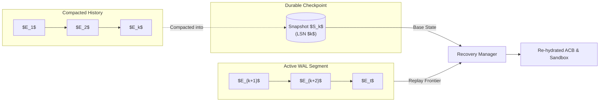
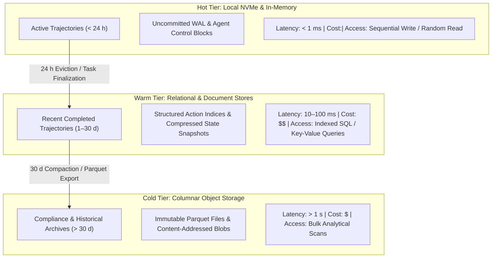

# State, Persistence, and Trajectory Storage {#sec-vol3-persistence}

::: {layout-narrow}
::: {.column-margin}

\chapterminitoc

:::

::: {.content-visible when-format="pdf"}
\noindent
{fig-alt="Blueprint for State, Persistence, and Trajectory Storage."}
:::

::: {.content-visible unless-format="pdf"}
{fig-alt="Blueprint for State, Persistence, and Trajectory Storage."}
:::

:::

## Purpose {.unnumbered .unlisted}

\begin{marginfigure}
\mlagentstack{10}{10}{95}{10}{10}{10}
\end{marginfigure}

_*How do we guarantee that an autonomous trajectory can survive crashes and migrations without replaying non-repeatable actions?*_

A long-running agent trajectory is inherently vulnerable to the fragility of physical infrastructure. Power outages, node evictions, out-of-memory crashes, and network partitions will inevitably terminate host processes during an execution that may have been running for hours and consumed substantial financial cost. If execution state is maintained solely in volatile RAM, any crash destroys all progress, forcing the agent to restart from scratch. Yet naively restarting a multi-turn agent is catastrophic: re-executing steps that produced real-world side effects (such as creating customer records, booking reservations, or modifying production git repositories) causes data corruption and duplicate operations. An agent operating system must guarantee durability, auditability, and recoverability. It must be able to reconstruct the exact state of an in-flight trajectory at any point in time, verify what actions were committed versus pending, and migrate active executions seamlessly across physical cluster nodes. Guaranteed durability and auditability demand an append-only, transaction-oriented storage engine: architecting Write-Ahead Logging (WAL) for trajectory event sourcing, implementing differential copy-on-write state snapshotting, optimizing checkpointing intervals against hardware failure distributions, and constructing time-travel replay mechanisms.

::: {.callout-learning-objectives}

- Design an append-only Write-Ahead Log (WAL) and event sourcing engine that records every model proposal, tool invocation, observation payload, and runtime state transition as an immutable event stream.
- Formulate differential copy-on-write state checkpointing for the Agent Control Block (ACB) and sandbox filesystem, separating persistent diffs from immutable base images.
- Calculate optimal checkpointing cadence using Young's and Daly's analytical formulas, balancing snapshot storage overhead against recomputation latency across cluster failure distributions.
- Implement trajectory serialization formats (Parquet, SQLite WAL, Protocol Buffers), evaluating write saturation, query indexability, and compliance auditability.
- Architect deterministic trajectory time-travel and replay protocols, isolating sources of floating-point and environmental non-determinism during post-mortem debugging.
- Design cold-storage compaction and tiering policies, pruning transient observation payloads while preserving causal decision graphs for long-term retention.

:::

<!-- SECTION_START: 10.1 (#sec-vol3-persistence-event-sourcing) -->
## Append-Only Event Sourcing {#sec-vol3-persistence-event-sourcing}

<!-- OUTLINE_SPEC:

- **Heading & Anchor:** `## Append-Only Event Sourcing {#sec-vol3-persistence-event-sourcing}`
- **The Single Key Point:** Trajectory state must not be stored as mutable database rows; it must be modeled as an append-only, immutable sequence of events where current state is a pure projection over historical events.
- **Concrete Systems Hook:**
  - An engineer debugs a failed production agent by inspecting a database record that was overwritten with the final error message. All intermediate steps, tool calls, and variable values were permanently lost.
- **Points to explain (paragraph-by-paragraph):**
  - *The Flaw of Mutable State Records:* Overwriting state (`UPDATE agent SET status = ...`) destroys the temporal audit trail, making failure post-mortems, regression testing, and rollback impossible.
  - *Event Sourcing Principles:* Every state transition is recorded as an immutable, discrete event: `TaskDelegated`, `ContextAssembled`, `ActionProposed`, `ActionAuthorized`, `ToolDispatched`, `ObservationReceived`.
  - *State as a Historical Projection:* The active Agent Control Block (ACB) at turn $t$ is computed by folding the event stream from the beginning:
    $$\text{ACB}_t = \text{fold}(\text{init}, E_1, E_2, \dots, E_t)$$
  - *Auditability & Compliance:* Immutable ledgers provide a complete, legally defensible provenance trail of every decision and mutation committed by the agent.
- **Visuals & Tables:**
  - Diagram: Append-only event stream projected into current runtime state.
- **Seminal Literature:**
  - Mendel Rosenblum & John K. Ousterhout (1992, *The Design and Implementation of a Log-Structured File System*).
- **Causal Bridge to 10.2:** How do we guarantee that events are safely recorded on disk before external actions are dispatched to the world?
-->

When an agent orchestration engine relies on relational `UPDATE` statements or mutable document stores to persist trajectory status, it treats the execution of an autonomous agent as an ephemeral database transaction rather than an evolving, distributed physical process. Consider an agent executing a multi-hour data transformation pipeline across heterogeneous microservices. If an execution worker crashes due to an out-of-memory error or host eviction at turn 47, and the supervisor updates the record with `status = 'FAILED'`, the causal chain of intermediate execution is permanently erased. The database preserves only the terminal failure string. The intermediate tool parameters, cached authentication headers, external environment outputs, and token allocations that triggered the failure vanish from the storage tier. Post-mortem root-cause analysis becomes impossible because mutable storage collapses the temporal axis of computation into a single overwrite.

### The Failure Mode of Mutable State Records

The fundamental flaw of in-place mutation is the destruction of history. In conventional CRUD (Create, Read, Update, Delete) architectures, mutating an entity overwrites past states to reflect current reality. For deterministic database backends with localized transactions, this pattern minimizes storage overhead. However, autonomous agents operate in an open-world loop where state changes are driven by stochastic model sampling, variable latency network requests, and external tool side effects.

Mutating trajectory records in place introduces three architectural vulnerabilities:

1. **Destruction of Causal Provenance:** When an agent updates its working memory, intermediate tool proposals, authorization tokens, and model outputs are overwritten. Engineers cannot reconstruct why a model decided to execute a destructive operation three steps prior to an unhandled exception.
2. **Distributed Race Conditions:** If multiple distributed subagents or supervisor monitors update a shared mutable trajectory row concurrently, conflicting writes require distributed locking mechanisms (such as pessimistic row locks or distributed transaction managers). These mechanisms introduce lock contention, tail latencies, and deadlock hazards across distributed clusters.
3. **Impossibility of Exact Time-Travel and Rollback:** If an execution diverges or violates a safety invariant, a mutable database cannot roll back the agent's internal control block to turn $t-k$ without relying on external, coarse-grained database backups that lack agent-level semantic awareness.

### Event Sourcing Principles for Trajectory Storage

To preserve complete temporal auditability and guarantee crash resilience, agent storage architectures decouple the recording of state transitions from the in-memory representation of active state. This architectural paradigm is *event sourcing*, derived from the foundational principles of log-structured systems (Rosenblum and Ousterhout 1992). In a log-structured architecture, writes are treated as an immutable, sequential stream appended to the tail of a storage medium. Modifying state does not overwrite prior records; it appends a new discrete event indicating what occurred.

In an agent operating system, an execution trajectory is modeled not as a mutable row, but as an append-only, ordered log of domain events. Each event represents an immutable operational fact within the runtime:

- `TaskDelegated`: Captures the root instruction, execution constraints, parent trajectory identifier, and maximum token budget.
- `ContextAssembled`: Records the exact token payload, retrieved memory references, and key-value cache offsets bound to the current model context window.
- `ActionProposed`: Persists the raw, unparsed inference output from the model, including proposed tool calls, parameter dictionaries, and chain-of-thought generation tokens.
- `ActionAuthorized`: Documents the deterministic policy check, authorization level, or human approval that permitted the proposed action to proceed.
- `ToolDispatched`: Logs the physical invocation of an environment capability, capturing the target interface, input arguments, and a globally unique idempotency key.
- `ObservationReceived`: Stores the raw payload returned by the physical tool or remote service, including standard output, exit codes, and response latency.

Each event record contains an immutable monotonically increasing sequence number $k$, a physical microsecond timestamp, an execution trace identifier, and a strictly typed schema payload.

### State as a Historical Projection

Under event sourcing, the active Agent Control Block (ACB) at turn $t$ is not a primary artifact stored on disk. Instead, the ACB is a pure, deterministic projection derived by folding the event stream from the system's initial state:

$$\text{ACB}_t = \text{fold}(\text{ACB}_{\text{init}}, [E_1, E_2, \dots, E_t])$$

The projection operator is a deterministic reducer function:

$$\text{apply}(\text{ACB}_{k-1}, E_k) \to \text{ACB}_k$$

When the reducer processes an `ObservationReceived` event containing an external API error code, it updates the error counter within the in-memory ACB without altering any historical event records on disk.

```
                          Append-Only Event Log (On Disk)
       +-------------------------------------------------------------------+
       |  E_1: TaskDelegated      --> E_2: ContextAssembled               |
       |  E_3: ActionProposed     --> E_4: ActionAuthorized               |
       |  E_5: ToolDispatched     --> E_6: ObservationReceived            |
       +-------------------------------------------------------------------+
                                         |
                                         |  Deterministic Fold
                                         v
                         Active Projection (In-Memory RAM)
       +-------------------------------------------------------------------+
       |                     Agent Control Block (ACB_t)                   |
       |  - Sequence: 6                  - Accumulated Cost: $0.042        |
       |  - Status: READY_FOR_INFERENCE  - Active Context Tokens: 4,096   |
       |  - Pending Tool Calls: None     - Open Capabilities: [Read, Exec] |
       +-------------------------------------------------------------------+
```

Reconstructing runtime state from an event log requires $O(N)$ sequential operations across $N$ events. Because sequential log reads operate at raw storage bandwidth (gigabytes per second on non-volatile flash storage), replaying hundreds of events requires only tens of milliseconds. Time-travel debugging becomes trivial: to inspect the agent's exact internal state at turn $k$, the runtime instantiates $\text{ACB}_{\text{init}}$ and folds only the prefix $[E_1, \dots, E_k]$, discarding subsequent events.

### Auditability, Lineage, and Legal Provenance

In production deployments where agents possess credentials to execute financial transactions, modify cloud infrastructure, or query protected health records, immutable event streams establish an auditable chain of custody. Because log records cannot be modified in place, cryptographic hashes can be chained across events—where each event header contains the hash of its predecessor—forming a tamper-evident ledger.

If an agent issues an unauthorized command, the event stream provides complete lineage: auditors can trace from the physical network socket call (`ToolDispatched`) backward to the policy decision (`ActionAuthorized`), the raw model output (`ActionProposed`), and the specific external context injected into the prompt (`ContextAssembled`).

However, maintaining state purely as a stream of events introduces an operational constraint. An in-memory event stream is vulnerable to physical node power failure until its raw bytes are synchronized to non-volatile media. Furthermore, dispatching a tool to the external world alters physical infrastructure irreversibly; a sent email or an executed HTTP `POST` cannot be rolled back. Before an agent can issue an external action, the runtime must guarantee that the corresponding event records have been physically persisted to durable storage. This requirement leads directly to the mechanics of the Write-Ahead Log.

<!-- SECTION_END: 10.1 -->

<!-- SECTION_START: 10.2 (#sec-vol3-persistence-wal) -->
## Write-Ahead Logging Discipline {#sec-vol3-persistence-wal}

<!-- OUTLINE_SPEC:

- **Heading & Anchor:** `## Write-Ahead Logging Discipline {#sec-vol3-persistence-wal}`
- **The Single Key Point:** Runtimes must strictly enforce Write-Ahead Logging (WAL): never dispatch a mutating peripheral action before the corresponding event record is durably flushed to non-volatile storage.
- **Concrete Systems Hook:**
  - An agent sends a wire transfer via a banking API tool, and the host machine loses power 5 milliseconds later. Upon reboot, the database has no record of the transfer because the log was buffered in memory, leading to duplicate execution upon restart.
- **Points to explain (paragraph-by-paragraph):**
  - *The Classical WAL Invariant (Gray & Reuter 1992):* In database systems, an uncommitted update must never be written to database tables until the log record describing the update is flushed to disk via `fsync()`.
  - *The Agent WAL Invariant:* An agent runtime must never issue an external mutating tool call ($a_{\text{perm}}$) until the `ActionAuthorized` event is safely written and synced to non-volatile persistent storage.
  - *The Danger of In-Memory Buffers:* Operating systems buffer disk writes in RAM; an un-flushed buffer leaves the agent vulnerable to "phantom mutations"—real-world effects that exist without an audit trail.
- **Visuals & Tables:**
  - Flowchart: The Write-Ahead Logging sequence before tool dispatch.
- **Seminal Literature:**
  - Jim Gray & Andreas Reuter (1992, *Transaction Processing: Concepts and Techniques*).
- **Causal Bridge to 10.3:** Replaying thousands of events from turn 0 on every restart is slow; how do we accelerate recovery through state checkpoints?
-->

### The Classical Invariant and the Network Boundary

In traditional database management systems, Write-Ahead Logging (WAL) guarantees transaction atomicity and durability across unannounced power failures and operating system crashes (Gray and Reuter 1992). The classical database WAL protocol enforces a strict ordering constraint between memory and persistent storage:

1. **The Write-Ahead Invariant:** Any log record describing an update to a database entity must be flushed to non-volatile storage before the corresponding dirty database page is written to persistent storage.
2. **The Commit Invariant:** A transaction is not formally committed until all log records associated with its operations have been forced to durable media via synchronous I/O.

In a relational database, the primary risk of violating WAL is storage engine corruption: if a modified page is written to disk and the system crashes before the log record is flushed, the engine cannot determine whether the on-disk state represents committed or uncommitted data, destroying recoverability. However, because both the log and the data tables reside entirely within the storage engine's boundary, an aborted or uncommitted operation can be undone by rolling back changes using inverse operations recorded in an undo log.

```
       Volatile Runtime Boundary             Non-Volatile Storage & Network
    +------------------------------+       +--------------------------------+
    |   Agent Control Block (RAM)  |       |  NVMe Flash / Distributed Log  |
    |  - Proposed Action: Transfer |       |                                |
    |  - Idempotency Key: ID-8491  |       |  [Record N-1]                  |
    +--------------+---------------+       |  [Record N: ToolDispatched]    |
                   |                       +---------------+----------------+
        Step 1:    | append(event)                         ^
        write()    v                                       |
    +--------------+---------------+                       |  Step 2:
    |        OS Page Cache         |-----------------------+  fdatasync()
    |       (Dirty DRAM Page)      |   (I/O Barrier: Blocks execution)
    +------------------------------+
                   |
                   | Step 3: sendto()
                   | (Only unblocked after physical disk commit)
                   v
    +------------------------------+
    |   Network Interface (NIC)    |======> External API Endpoint
    |    (Mutating RPC Packet)     |        (Irreversible Side Effect)
    +------------------------------+
```
: The Write-Ahead Logging synchronization barrier prior to external tool dispatch. {#fig-wal-sequence}

Autonomous agent architectures break this internal recovery assumption. An agent interacts with external environments across a network socket: invoking third-party software-as-a-service APIs, issuing financial transactions, executing shell commands on remote servers, or transmitting outbound notifications. Once a TCP segment containing a mutating RPC leaves the local Network Interface Card (NIC), the operation crosses an administrative and physical boundary. The side effect cannot be rolled back by an internal database rollback operator.

This asymmetry demands the formulation of the *Agent Write-Ahead Logging Invariant*:

> **The Agent WAL Invariant:** An agent runtime must never dispatch an external, mutating peripheral action across a communication interface until the log record describing the intent, input parameters, and idempotency token has been durably synchronized to non-volatile storage.

### The Vulnerability of In-Memory Buffers

Operating systems decouple user-space write calls from physical disk transactions to maximize I/O throughput. When an agent runtime issues a standard POSIX `write()` call to record a `ToolDispatched` event, the kernel does not write the payload directly to the storage controller. Instead, it copies the byte stream into the kernel page cache—a region of volatile dynamic RAM—marks the memory page as dirty, and immediately returns control to the runtime. The dirty page is asynchronously flushed to physical media later by kernel background flusher threads (`flusher` or `kswapd`), often with delays ranging from 500 milliseconds to 30 seconds depending on kernel dirty ratio thresholds.

Relying on standard buffered I/O creates a fatal vulnerability known as a *phantom mutation*. Consider an execution trace where an agent orchestrates automated billing. The runtime plans a wire transfer via an external banking API:

1. The runtime serializes a `ToolDispatched` event containing a transfer of $50,000 to an external vendor, including a generated idempotency key `tx_981a`.
2. The runtime invokes `write()` to append the serialized event to the trajectory log file descriptor. The bytes reside exclusively in the OS page cache.
3. Without waiting for a storage flush, the runtime immediately writes the HTTP `POST` payload to a network socket connected to the banking gateway.
4. The network packet traverses the NIC and arrives at the gateway; the banking service processes the request and executes the transfer.
5. Exactly 5 milliseconds later, a power distribution unit fails or the host machine experiences an out-of-memory kernel panic.

When the host node reboots, the recovery manager reads the trajectory log from disk. Because the dirty pages in the page cache were vaporized before being synchronized to flash storage, the on-disk event stream terminates at `ActionAuthorized`. The log contains no record that the HTTP request was ever transmitted, nor does it retain the generated idempotency key `tx_981a`.

The recovery manager concludes that the authorized tool call was never executed. Upon resuming the trajectory, the agent re-evaluates the current state, generates a new idempotency key `tx_981b`, and dispatches a second HTTP `POST` request. The external gateway processes the second request as a distinct transaction, resulting in a duplicate $50,000 transfer. The external physical mutation survived the crash, but the local audit trail did not.

### The Physical Synchronization Barrier

To eliminate phantom mutations, the agent operating system must insert an explicit hardware synchronization barrier between the storage append operation and the network transmission, as illustrated in @fig-wal-sequence.

The runtime must execute an explicit `fdatasync()` or `fsync()` system call on the log file descriptor immediately after writing the event payload:

```c
// Strict WAL enforcement sequence before peripheral dispatch
int dispatch_mutating_tool(int log_fd, int sock_fd,
                           const uint8_t *event_buf, size_t event_len,
                           const uint8_t *net_buf, size_t net_len) {
    // 1. Write the log entry into OS page cache
    if (write(log_fd, event_buf, event_len) != (ssize_t)event_len) {
        return -1; // Log append failed
    }

    // 2. Hardware barrier: flush dirty pages to non-volatile medium
    if (fdatasync(log_fd) != 0) {
        return -2; // Durability barrier violated; do not send packet
    }

    // 3. Issue mutating command across network boundary
    if (send(sock_fd, net_buf, net_len, 0) != (ssize_t)net_len) {
        return -3; // Network failure; action is safely logged for recovery
    }

    return 0; // Dispatch successful
}
```

The call to `fdatasync()` blocks the executing thread, instructing the storage controller to commit all modified file data blocks from volatile controller DRAM cache into non-volatile NAND flash cells. Only when the storage device signals completion via an interrupt does execution resume and permit transmission over the network socket.

The physical latency overhead of this barrier is modest relative to external network latencies:

$$T_{\text{dispatch}} = T_{\text{serialize}} + T_{\text{fdatasync}} + T_{\text{NIC}} + T_{\text{RTT}} + T_{\text{remote}}$$

On enterprise Non-Volatile Memory Express (NVMe) solid-state storage, an append-only sequential `fdatasync()` latency ($T_{\text{fdatasync}}$) is typically between $30\ \mu\text{s}$ and $150\ \mu\text{s}$. In contrast, wide-area network round-trip time ($T_{\text{RTT}}$) and external API processing ($T_{\text{remote}}$) consistently measure between $50\ \text{ms}$ and $1{,}500\ \text{ms}$. Enforcing durable Write-Ahead Logging introduces less than a $0.2\%$ latency penalty on the overall tool invocation pipeline while establishing a mathematically bounded guarantee against untracked mutations.

### Scaling Recovery Across Large Trajectories

Strict Write-Ahead Logging provides complete recoverability: if a system crashes at any turn $t$, the recovery supervisor re-reads the event log from offset zero and folds each discrete record sequentially to rebuild the exact Agent Control Block.

However, as agent trajectories expand to handle multi-hour tasks comprising thousands of discrete reasoning steps and large tool payloads, replaying the event stream from the initial state introduces substantial latency. Processing $10^4$ historical records on startup delays node recovery and prolongs cluster failovers. To bound restart times without compromising the durability guarantees established by the WAL, the storage engine must periodically compact historical state into non-volatile checkpoints.

<!-- SECTION_END: 10.2 -->

<!-- SECTION_START: 10.3 (#sec-vol3-persistence-checkpointing) -->
## Periodic State Checkpointing {#sec-vol3-persistence-checkpointing}

<!-- OUTLINE_SPEC:

- **Heading & Anchor:** `## Periodic State Checkpointing {#sec-vol3-persistence-checkpointing}`
- **The Single Key Point:** To bound recovery time, runtimes must periodically generate durable checkpoints, balancing the storage cost of full snapshots against the reconstruction cost of incremental deltas.
- **Concrete Systems Hook:**
  - Re-hydrating an agent with 400 turns from raw event logs takes 45 seconds of log parsing. Loading a state snapshot generated at turn 390 restores the agent in 80 milliseconds.
- **Points to explain (paragraph-by-paragraph):**
  - *The Checkpoint Trade-off:*
    - *Full Snapshots:* Serializing the entire ACB, working memory, and sandbox filesystem state to storage. High storage write cost, instant recovery time.
    - *Incremental Deltas:* Recording only the state differences since the last snapshot. Lightweight storage write, slightly longer recovery time.
  - *The Snapshot vs. Replay Cost Trade-off:*
    $$\text{Cost}_{\text{snap}} \text{ vs. } \sum_{i=k}^t \text{Cost}_{\text{replay}}(E_i)$$
    Compacting logs when accumulated replay cost exceeds snapshot write cost.
  - *Coordinating Filesystem Snapshots:* Synchronizing database checkpoints with underlying sandbox Copy-on-Write (CoW) disk snapshots to ensure consistency.
- **Visuals & Tables:**
  - Diagram: Periodic full snapshot checkpoints combined with incremental event log segments.
- **Causal Bridge to 10.4:** Once a snapshot and event logs are safely stored, how does the runtime deterministically replay execution?
-->

While an append-only Write-Ahead Log provides an immutable record of every execution step with minimal write overhead ($O(1)$ amortized append latency during normal operation), relying solely on raw event logs imposes an unbounded recovery penalty ($O(N)$ where $N$ is the trajectory length). To restore an agent whose host process terminates unexpectedly at turn 400, a recovery engine must sequentially read every historical event from offset zero, parse the serialized JSON or Protocol Buffer payloads, re-validate schemas, and fold each record into the in-memory state. In an agent trajectory comprising hundreds of reasoning iterations, model completions, and large tool outputs, sequential log parsing can consume 45 seconds of sustained CPU processing and high memory allocation bandwidth. When an orchestrator must evict and reschedule dozens of active agent containers during a node drain or hardware fault, a 45-second re-hydration delay violates modern Recovery Time Objectives (RTO). In contrast, deserializing a pre-materialized state snapshot captured at turn 390 and applying only the remaining 10 log records restores the agent to an executable state in approximately 80 milliseconds.

### The Checkpoint Hierarchy: Full Snapshots versus Incremental Deltas

Bounding recovery time requires the runtime to interleave append-only logging with periodic *checkpoints*—durable, materialized representations of the agent system state at a specific Log Sequence Number (LSN). An agent checkpoint encompasses three distinct layers: the Agent Control Block (ACB) holding the program counter, goal stack, and token consumption counters; the active working memory containing key-value scratchpads and context-window buffers; and the sandboxed execution environment. Storage engines balance two competing strategies to capture this state:

*Full Snapshots* serialize the complete, uncompressed runtime state into a standalone binary image. Generating a full snapshot imposes substantial write bandwidth and can incur a serialization pause if the runtime must pause execution to prevent state mutations while copying memory pages. However, recovery from a full snapshot is instantaneous and independent of prior history: the recovery manager loads the snapshot directly into memory via a sequential read or `mmap()` call, taking time proportional only to the snapshot size $S_{\text{snap}}$ and read throughput $B_{\text{read}}$.

*Incremental Deltas* record only the differences between the current state and the previous checkpoint. By persisting only dirtied memory pages, modified ACB fields, and newly appended working memory keys, incremental checkpointing minimizes background write amplification and reduces steady-state I/O overhead. The trade-off shifts to recovery complexity: reconstructing an agent from incremental deltas requires traversing a dependency chain of $M$ sequential deltas back to the base snapshot, increasing re-hydration latency and introducing cascading failure risks if any intermediate delta becomes corrupted.



### The Snapshot versus Replay Trade-off

As illustrated in @fig-checkpoint-wal-hierarchy, the optimal checkpoint interval represents a direct optimization between normal runtime write overhead and post-crash recovery latency. Let $S_{\text{snap}}$ denote the byte size of a full state snapshot, $B_{\text{write}}$ denote the sustained sequential storage write bandwidth, and $T_{\text{pause}}$ denote the runtime execution stall required to quiesce memory during snapshot capture. The total overhead cost of emitting a checkpoint at turn $k$ is:

$$T_{\text{snap}} = T_{\text{pause}} + \frac{S_{\text{snap}}}{B_{\text{write}}}$$

Conversely, recovering an agent at current turn $t$ from a prior checkpoint at turn $k$ ($k \le t$) requires reading the base snapshot and sequentially evaluating the intervening event records $E_{k+1}, \dots, E_t$:

$$T_{\text{recovery}}(t) = \frac{S_{\text{snap}}}{B_{\text{read}}} + \sum_{i=k+1}^{t} T_{\text{replay}}(E_i)$$

where $T_{\text{replay}}(E_i)$ represents the CPU and deserialization time required to fold event $E_i$ into the materialized state. As the delta $(t - k)$ grows, the cumulative replay time $\sum_{i=k+1}^t T_{\text{replay}}(E_i)$ dominates the recovery phase.

A checkpointing supervisor triggers log compaction when the projected replay latency exceeds a defined Recovery Time Objective, or when the cumulative cost of replay exceeds the cost of writing a new snapshot:

$$\sum_{i=k+1}^{t} T_{\text{replay}}(E_i) \ge T_{\text{snap}}$$

Upon emitting the new snapshot $S_t$ to non-volatile storage with an enforced `fdatasync()` barrier, the storage engine updates the checkpoint manifest and safely truncates the historical WAL records prior to LSN $t$. The physical media space occupied by $E_1 \dots E_t$ is reclaimed, preventing unbounded storage exhaustion across multi-day trajectories.

### Coordinating Memory and Sandbox Filesystem State

Agent runtimes differ fundamentally from traditional database engines because agent tasks routinely mutate an external, local operating system sandbox. An agent writing software or running benchmarks generates intermediate compiler artifacts, modifies configuration files, and executes shell scripts within an isolated container or microVM. If an agent operating system captures an in-memory ACB snapshot at LSN $t=100$ while the sandbox filesystem remains asynchronously buffered or captured at an out-of-sync boundary (for example, LSN $t=95$), state divergence occurs upon recovery. The restored memory registers will reference file paths, file descriptors, and directory modifications that do not exist on the underlying disk image.

Guaranteeing point-in-time consistency across memory and storage media requires an atomic two-phase coordination protocol using Copy-on-Write (CoW) primitives:

1. **Runtime Quiescence:** The agent supervisor issues an execution barrier, temporarily freezing worker threads and halting process execution within the sandbox container via OS control groups (`cgroup.freeze`) or a filesystem freeze interface (`FIFREEZE` ioctl).
2. **CoW Filesystem Snapshot:** The storage layer generates a point-in-time Copy-on-Write block snapshot of the sandbox root volume using an underlying storage driver (such as btrfs subvolumes, ZFS snapshots, or devicemapper thin-provisioned targets). Because CoW snapshots manipulate only metadata pointers to existing allocation trees, the filesystem snapshot completes in under 5 milliseconds.
3. **In-Memory State Serialization:** The runtime dumps the ACB, context memory buffers, and current LSN to a persistent storage buffer.
4. **Barrier Release:** The supervisor thaws the sandbox cgroup and resumes normal execution while a background I/O thread streams the serialized memory snapshot and records the CoW disk generation ID.

If a crash occurs during background streaming, the previous checkpoint remains valid and untouched. On restart, the recovery manager matches the snapshot LSN directly with the immutable CoW filesystem snapshot generation ID, ensuring that both memory registers and filesystem blocks align precisely at the same logical instant.

Once a coherent state snapshot and its subsequent WAL segments are durably committed to physical storage, the system has bounded its recovery overhead. However, restoring the execution state to memory is only the initial step of trajectory recovery. To bring an agent back to an active, executing state without triggering catastrophic duplicate operations, the runtime must deterministically replay the post-checkpoint event log. This requires isolating side-effecting external tools from read-only computational tasks, a challenge addressed through deterministic time-travel replay.

<!-- SECTION_END: 10.3 -->

<!-- SECTION_START: 10.4 (#sec-vol3-persistence-replay) -->
## Deterministic Execution Replay {#sec-vol3-persistence-replay}

<!-- OUTLINE_SPEC:

- **Heading & Anchor:** `## Deterministic Execution Replay {#sec-vol3-persistence-replay}`
- **The Single Key Point:** Deterministic execution replay reconstructs historical agent state exactly by feeding recorded observations back into the runtime without re-executing external tool mutations.
- **Concrete Systems Hook:**
  - A production bug occurs on Turn 18. An engineer downloads the trajectory event log to a local laptop, launches the debugger, and replays Turns 1–17 step-by-step to inspect exact variable states leading to the crash.
- **Points to explain (paragraph-by-paragraph):**
  - *Replay Mechanics:* The runtime initializes an empty ACB, loads the initial goal, and steps through the event log. When a tool dispatch is encountered, the runtime bypasses actual external execution and injects the recorded observation ($o_t$).
  - *Non-Destructive Debugging:* Replay allows engineers to time-travel through execution histories, inspect prompt contexts, and test alternative model prompts without mutating external databases.
  - *Verification Testing:* Replaying historical successful trajectories against new runtime versions ensures zero backward regressions in execution logic.
- **Visuals & Tables:**
  - Flowchart: Live execution (dispatches to tools) vs. Replay execution (injects recorded events).
- **Causal Bridge to 10.5:** What happens when non-deterministic factors—such as random sampling seeds or clock drift—threaten replay fidelity?
-->

Deterministic execution replay is the process of reconstructing an in-flight Agent Control Block (ACB) by sequentially reapplying logged execution events without re-invoking external environment mutations. In conventional operating systems, deterministic record-and-replay requires intercepting hardware interrupts, thread scheduling preemption, and memory-mapped I/O—a coordination task with significant runtime overhead. An agent runtime, by contrast, executes a discrete, message-driven event loop: the agent alternates between token generation, tool dispatch, and observation assimilation. Because the interface between the model reasoning core and the external environment is mediated by structured schemas across explicit remote procedure call (RPC) or system call boundaries, deterministic replay simplifies to an I/O event-interception problem.

Consider a production agent that encounters an unhandled JSON schema deserialization fault at Turn 18. In an architecture without execution replay, reproducing the failure requires attempting to recreate the transient state of external databases, third-party API endpoints, and network conditions that existed when the trajectory ran—an environment that is rarely recoverable. With a write-ahead trajectory log, an engineer downloads the immutable event stream to an isolated workstation, initializes a clean runtime instance, and executes Turns 1 through 17 deterministically. The runtime steps through each historical turn in milliseconds, reconstructing the exact context window, working memory registers, and intermediate token allocations leading to the crash at Turn 18, all while completely disconnected from production infrastructure.

### Replay Mechanics and I/O Interception

The core mechanism of deterministic replay is an I/O interception barrier positioned between the agent task scheduler and the tool execution subsystem. @fig-live-vs-replay-execution contrasts this execution path with normal operation.

```mermaid
%%| label: fig-live-vs-replay-execution
%%| fig-cap: "Structural comparison of live execution versus deterministic replay. In live mode, tool calls mutate external environments and block on real-world I/O. In replay mode, the dispatcher interceptor bypasses external systems, validating call parameters against the event log and injecting pre-recorded observations directly into the Agent Control Block."
flowchart TD
    subgraph LiveMode["Live Execution Mode"]
        direction TB
        A1["Agent Core<br/>(ACB State at Turn $t$)"] -->|Tool Call $(a_t)$| D1["Tool Dispatcher"]
        D1 -->|Physical RPC / Shell| E1["External Environment<br/>(DB, MicroVM, Web API)"]
        E1 -->|Side Effects| M1[("Mutated State")]
        E1 -->|Observation $(o_t)$| D1
        D1 -->|Append Record| L1[("WAL / Event Log")]
        D1 -->|Return $o_t$| A1
    end

    subgraph ReplayMode["Replay Execution Mode"]
        direction TB
        A2["Agent Core<br/>(Re-hydrated ACB)"] -->|Tool Call $(a_t)$| I2["Dispatcher Interceptor"]
        I2 -.->|Bypass I/O| X2["External Environment<br/>(Inert / Disconnected)"]
        L2[("Trajectory Event Log<br/>(LSN $t$)")] -->|Read Recorded $o_t$| I2
        I2 -->|Inject Cached $o_t$| A2
    end
```

During live execution, the runtime passes tool arguments through the dispatcher to physical network sockets, database connections, or sandbox containers. The resulting environment response is tagged with a monotonically increasing Log Sequence Number (LSN) and committed to the trajectory write-ahead log before being folded into the active context. During replay, the execution harness replaces the active tool dispatcher with a log-backed interceptor:

1. **State Initialization:** The runtime allocates an uninitialized ACB, sets execution registers to the base configuration, and loads the initial user prompt and task definitions recorded at LSN 0.
2. **Log-Driven Stepping:** The agent runtime processes the recorded sequence. When reaching a tool dispatch boundary for turn $t$, the execution engine intercepts the emitted tool name and parameter payload.
3. **Payload Verification:** The interceptor validates that the reconstructed tool invocation structurally and semantically matches the historical tool call logged at LSN $t$. If an argument mismatch occurs, the replay aborts, signaling state divergence.
4. **Mock Observation Injection:** Rather than transmitting packets across the network or invoking sandbox system calls, the interceptor immediately injects the historical observation payload ($o_t$) from the log directly into the agent context buffer.
5. **Advancement:** The runtime folds the injected observation into the ACB and advances the execution clock to turn $t+1$.

Because external tool execution is bypassed entirely, the latency of each replayed turn collapses to the local deserialization and memory-copy cost:

$$T_{\text{replay\_turn}} = T_{\text{read}} + T_{\text{deserialize}} + T_{\text{inject}}$$

Physical network and execution delays drop to zero ($T_{\text{tool}} = 0$). An execution trajectory that required forty-five minutes of wall-clock time during live operation—dominated by waiting on third-party HTTP endpoints, database writes, and sandbox compiler toolchains—replays locally in several hundred milliseconds.

### Non-Destructive Debugging and Time-Travel

Decoupling state transitions from external side effects transforms debugging into a non-destructive, repeatable workflow. Because external tools remain inert, an engineer can step an in-flight trajectory backward and forward across logical time, setting breakpoints at arbitrary LSN coordinates. At each step, the engineer can inspect prompt assemblies, evaluate intermediate reasoning steps, profile context window usage, or evaluate token-budget depletion.

Furthermore, replay mechanics enable counterfactual execution branching. An engineer investigating a suboptimal trajectory can step the agent to Turn 10, patch the system prompt or tool interface definition, and branch execution into a live sandbox starting at Turn 11. The agent tests the patched strategy from an identical, validated state baseline without needing to re-execute the initial ten turns of tool calls. This preserves the historical audit trail while avoiding redundant API expenditures and duplicate real-world operations.

### Verification Testing and Regression Suites

Beyond individual debugging, deterministic replay provides the foundation for continuous integration and regression testing in agent runtime development. As orchestration kernels, context compaction algorithms, and prompt templates evolve, runtime updates risk introducing silent behavioral regressions into how tool arguments are serialized, how output schemas are validated, or how errors are handled.

By maintaining a versioned corpus of historical trajectories, engineering teams execute automated offline regression suites against candidate runtime releases. The test harness replays recorded production trajectories against the new runtime binary, validating that the modified system generates compliant tool calls and matches historical state boundaries at each LSN. Because every observation is sourced directly from non-volatile log storage, thousands of multi-turn traces can be validated across parallel CPU cores without consuming external model tokens or triggering live environment side effects.

Replay determinism holds, however, only as long as state transitions remain bit-for-bit reproducible across executions. In distributed agent systems, subtle sources of runtime entropy—such as stochastic model sampling temperatures, non-associative floating-point operations across heterogeneous GPU architectures, and unsynchronized wall-clock reads—threaten replay fidelity. When internal entropy causes an agent to diverge from its historical path, the replay interceptor can no longer match logged tool calls to runtime events, as addressed in @sec-vol3-persistence-determinism.

<!-- SECTION_END: 10.4 -->

<!-- SECTION_START: 10.5 (#sec-vol3-persistence-non-determinism) -->
## Replay Divergence Diagnostics {#sec-vol3-persistence-non-determinism}

<!-- OUTLINE_SPEC:

- **Heading & Anchor:** `## Replay Divergence Diagnostics {#sec-vol3-persistence-non-determinism}`
- **The Single Key Point:** True bit-exact replay is disrupted by non-deterministic models and system clocks; runtimes must record and mock random seeds, timestamps, and model responses during replay.
- **Concrete Systems Hook:**
  - An engineer attempts to reproduce an agent failure by re-running the prompt with temperature $T=0.7$. The model generates a completely different action on Turn 1, making it impossible to reproduce the Turn 18 bug.
- **Points to explain (paragraph-by-paragraph):**
  - *Sources of Trajectory Non-Determinism:*
    1. *Stochastic Sampling:* Model temperature $>0$.
    2. *Hardware Floating-Point Kernel Non-Associativity:* Parallel reduction order variations across GPUs.
    3. *System Clocks & Timestamps:* Dynamic timestamps embedded in prompts or logs.
    4. *Network Latencies & Dynamic Tool Responses:* Live APIs returning evolving data.
  - *The Virtualization of Time and Seeds:* In strict replay mode, the runtime intercepts all calls to system clocks (`time.now()`) and pseudo-random generators, returning the exact timestamps and seeds recorded in the event log.
  - *Observation Mocking:* The runtime does not invoke the LLM or tools during replay; it replays the exact recorded token sequence and tool output.
- **Visuals & Tables:**
  - Table: Sources of non-determinism and corresponding virtualization/mocking defenses.
- **Causal Bridge to 10.6:** How do we leverage serialized state and event logs to migrate a running agent process across physical cluster nodes?
-->

### Sources of Trajectory Non-Determinism

Deterministic replay guarantees execution fidelity only under the strict invariant that the state transition between any two Log Sequence Numbers (LSNs) is an immutable, pure function of the prior Agent Control Block (ACB) state and the logged input. In physical deployments, however, execution environments are permeated by stochasticity and hardware-level entropy. Consider a diagnostic scenario in which an engineer attempts to reproduce an unhandled exception that occurred at Turn 18 of a production run. If the diagnostic harness naively re-executes the trajectory from Turn 0 by re-submitting the recorded prompt to the model endpoint with sampling temperature $T = 0.7$, the stochastic decoding algorithm selects an alternative high-probability token at Turn 1. The execution immediately branches into an unrecorded state space, emitting a tool call with modified arguments. The replay interceptor fails to match the call against LSN 1, and the replay aborts. The physical defect that caused the failure at Turn 18 remains completely inaccessible.

Reproducing a multi-turn trajectory requires isolating and eliminating four physical sources of runtime entropy across the software and hardware execution stack:

1. **Stochastic Sampling and PRNG Drift:** When inference executes with temperature $T > 0$, top-$p$ (nucleus) truncation, or top-$k$ filtering, token selection samples from a categorical logit distribution using a pseudo-random number generator (PRNG). Unless the PRNG algorithm, internal state vector, and seed are recorded and restored at each turn, subsequent runs yield divergent token streams.
2. **Hardware Floating-Point Non-Associativity:** Even under greedy decoding ($T = 0$), bit-exact determinism across identical model weights is not guaranteed across distinct hardware targets or software runtime updates. Floating-point addition is physically non-associative: $(a + b) + c \neq a + (b + c)$. In high-throughput GPU kernels—such as parallel reductions in FlashAttention or fused GEMM operations in Tensor Cores—warp scheduling order and thread-block dispatch sequences vary dynamically based on clock frequencies, thermal throttling, and hardware concurrency. A variation in parallel reduction order can introduce a roundoff disparity on the order of $10^{-7}$ in the unnormalized logit vector. If two candidate tokens have near-identical logits at the distribution margin, this microscopic numerical difference flips the greedy $\text{argmax}$ selection, triggering an immediate cascade of divergent context tokens.
3. **Host System Clocks and Temporal Ingestion:** Autonomous agents frequently consume time primitives to plan tasks, evaluate cache expirations, and compute deadlines. Runtimes commonly inject physical wall-clock timestamps (`clock_gettime(CLOCK_REALTIME)`) directly into system prompt headers or context windows. If the runtime queries the physical operating system clock during replay, the assembled prompt diverges at byte 0, altering the prompt hash, invalidating key-value cache prefixes, and breaking downstream token alignment.
4. **Dynamic External Environment and Tool State:** External tool targets—relational databases, third-party web APIs, microVM sandboxes, and shared file systems—are mutable external state machines. A tool invocation that returned HTTP 200 with a specific JSON payload during live execution may return HTTP 404, HTTP 429, or mutated records when queried during an offline replay hours or days later.

### Virtualization of Time, Seeds, and System Primitives

To enforce bit-exact reproducibility across the runtime harness without modifying underlying model weights, the agent operating system must construct a deterministic execution boundary. The runtime virtualizes all system-level interfaces that expose entropy to the agent context.

Physical clocks are replaced by a virtual logical clock synchronized to the trajectory write-ahead log. When prompt assembly routines or tool executors request the current time, the runtime traps the system call and returns the exact monotonic timestamp recorded in the log header at LSN $t$. Physical execution time is completely decoupled from logical trajectory time; an operation replayed weeks after live execution observes the exact temporal state present during the initial execution.

Similarly, the runtime governs random seed lifecycles. At trajectory initialization (LSN 0), the runtime generates and persists an initial master seed $S_0$. All runtime-level stochastic mechanisms—such as context-pruning tiebreakers, embedding sub-samplers, and client-side backoff algorithms—derive their state deterministically from $S_0$ using a splittable PRNG. During replay, the PRNG state is re-hydrated to the exact step boundary, ensuring that any runtime-level random operation executes identically.

### Observation Mocking and Token Replay Strategies

Eliminating environmental and inference divergence requires separating the replay architecture into two operational regimes depending on the diagnostic objective: *token-replay verification* and *model-in-the-loop replay*.

In *token-replay verification*, the runtime bypasses model inference entirely. Rather than invoking the neural network forward pass, the replay engine treats the model as an inert log-playback device. The engine reads the exact token sequence, logit metadata, and tool invocation payloads committed at LSN $t$ directly from non-volatile storage and injects them into the ACB. Physical inference latency collapses to memory deserialization cost:

$$T_{\text{turn}} = T_{\text{read}} + T_{\text{deserialize}} + T_{\text{inject}}$$

Because physical model inference and external I/O delays drop to zero ($T_{\text{infer}} = 0$, $T_{\text{tool}} = 0$), regression test harnesses validate thousands of trajectory state transitions per second across local CPU cores. This allows engineering teams to validate serialization schemas, context compaction algorithms, and state machine invariants without consuming GPU compute or token capital.

In *model-in-the-loop replay*, the diagnostic objective is to evaluate whether a modified prompt, patched system instruction, or upgraded model checkpoint maintains behavioral compatibility with historical executions. In this regime, the live model is invoked, but all tool executions remain strictly virtualized. The runtime intercepts each emitted tool call $a_t'$ and performs an exact structural verification against the logged call $a_t$ at LSN $t$. If the generated parameters match the recorded schema, the interceptor injects the recorded historical observation $o_t$ into the context buffer.

If the model emits an altered parameter or calls a different tool, the interceptor detects a *replay divergence fault*. The runtime halts execution, serializes the conflicting ACB state, and outputs a divergence diagnostic identifying:

1. The divergence turn index $t$ and LSN.
2. The structural diff between recorded and generated tool parameters.
3. The exact token-level divergence offset in the model's generation stream.

::: {#tbl-divergence-sources}
| Entropy Source         | Physical Mechanism                                              | Runtime Failure Mode                                     | Architectural Defense                                                    |
|:-----------------------|:----------------------------------------------------------------|:---------------------------------------------------------|:-------------------------------------------------------------------------|
| **Decoding Sampling**  | Pseudo-random sampling over logits ($T > 0$)                    | Divergent tool selections across runs                    | Log initial seed $S_0$; mock generation tokens via direct WAL playback   |
| **Hardware Reduction** | Non-associative floating-point addition in parallel GPU kernels | Argmax flip on marginal logits under $T=0$               | Pin GPU architecture and CUDA kernel versions; capture raw token outputs |
| **System Clocks**      | OS `clock_gettime` reads during prompt generation               | Inconsistent timestamp strings in prompt context         | Trap clock calls; inject recorded WAL timestamp at LSN $t$               |
| **External Tools**     | Mutable network endpoints, file systems, and databases          | State drift, transient network errors, missing resources | Disconnect live I/O; inject recorded observation payload $o_t$           |

: Classification of trajectory non-determinism sources and their systems virtualization defenses.
:::

As summarized in @tbl-divergence-sources, virtualization defenses isolate the execution kernel from host and environmental entropy.

### From Replay Diagnostics to Live Migration

The mechanisms that guarantee deterministic replay—write-ahead event logging, state vector serialization, logical time virtualization, and observation mocking—provide operational capabilities that extend far beyond offline debugging and regression testing. If an agent runtime can faithfully re-hydrate, validate, and advance an execution trajectory from an arbitrary LSN using immutable log records, the trajectory is no longer bound to the physical machine on which it was initiated.

When hardware degradation, memory exhaustion, or cluster node rebalancing threatens an active execution, the orchestrator can leverage these exact persistence primitives to serialize the running agent and reconstruct its execution environment on an alternative node. The architectural challenge shifts from diagnosing past execution divergence to executing live, zero-loss trajectory migration across physical cluster boundaries.

<!-- SECTION_END: 10.5 -->

<!-- SECTION_START: 10.6 (#sec-vol3-persistence-migration) -->
## Live Trajectory Migration {#sec-vol3-persistence-migration}

<!-- OUTLINE_SPEC:

- **Heading & Anchor:** `## Live Trajectory Migration {#sec-vol3-persistence-migration}`
- **The Single Key Point:** Decoupling process state into serialized ACBs, event ledgers, and disk snapshots allows an ongoing agent trajectory to be migrated transparently across physical worker nodes and data centers.
- **Concrete Systems Hook:**
  - A spot GPU instance running a 2-hour agent receives a 2-minute preemption warning from AWS. The runtime serializes the agent's state, moves it across the network to an on-demand instance, and resumes execution seamlessly.
- **Points to explain (paragraph-by-paragraph):**
  - *The Preemption Imperative:* Spot and preemptible cloud instances offer $70\%$ cost discounts but require immediate evacuation upon host reclamation.
  - *The Three Migration Components:*
    1. *ACB State Serialization:* Serializing process variables, budgets, and tokens into a compact JSON/Protocol Buffer.
    2. *Filesystem Sync:* Syncing the Copy-on-Write overlay layer to shared network storage (EFS/NFS) or target host.
    3. *External Lease Re-binding:* Re-attaching network tokens and sandbox process handles on the destination worker.
  - *Zero-Loss Resumption:* The destination host restores the ACB from the latest checkpoint, verifies the event log, and continues the trajectory loop without restarting the task.
- **Visuals & Tables:**
  - Sequence diagram: Source host checkpoint $	o$ Network migration $	o$ Destination host re-hydration and resumption.
- **Causal Bridge to 10.7:** As event logs grow into millions of historical records, how does the runtime prune storage without destroying auditability?
-->

### The Preemption Imperative and Transient Compute

When an autonomous trajectory executes across hours of iterative code compilation, data analysis, and multi-turn API orchestration, the probability of host-level infrastructure interruption approaches unity. In distributed cloud environments, transient compute models—such as Amazon EC2 Spot Instances or Google Cloud Spot VMs—offer 60% to 80% cost reductions relative to on-demand instances. However, these economics introduce a strict operational constraint: the cloud hypervisor retains the authority to reclaim the physical host upon issuing an eviction warning, typically delivered via a local link-local metadata service (such as `169.254.169.254`) with a termination notice of 30 to 120 seconds ($T_{\text{warning}} \le 120\text{ s}$).

If an agent runtime couples execution state to operating system process memory, host-local threads, and ephemeral disk storage, node reclamation abruptly destroys the trajectory. Restarting the task from the initial step squanders cumulative inference expenditures and introduces the side-effect corruption identified in Write-Ahead Logging architectures: re-executing non-idempotent tool operations (such as credit card captures, provisioning remote infrastructure, or dispatching external webhooks) corrupts external system state.

Live trajectory migration provides the systems mechanism to evacuate an in-flight execution transparently. By decoupling the agent from its underlying physical host into three distinct, portable layers—the Agent Context Buffer (ACB), the ephemeral workspace filesystem, and external resource leases—the runtime transforms a volatile, machine-bound execution into a relocatable, durable process.

### The Tripartite Migration Substrate

Executing live migration across physical cluster boundaries requires decomposing the active execution into three orthogonal components:

1. **ACB State Serialization:** The runtime captures the in-memory execution vector, which comprises the prompt token sequence, tool declaration schemas, structured scratchpad variables, token expenditure counters, and the current logical sequence number (LSN). Transferring the raw GPU key-value (KV) cache across the network is generally bandwidth-prohibitive within the preemption window; for a context length $L$ with $n_{\text{layers}}$ layers and attention head dimension $d_{\text{head}}$, the raw cache size scales as:
   $$D_{\text{KV}} = 2 \times L \times n_{\text{layers}} \times d_{\text{head}} \times b_{\text{elem}}$$
   For deep context windows ($L \ge 128\text{k}$ tokens), $D_{\text{KV}}$ can easily exceed 20 GB. Rather than synchronizing raw GPU device memory, the runtime serializes the logical prompt token stream and structured execution metadata into a compact, endian-agnostic binary format such as Protocol Buffers or FlatBuffers. Upon deserialization on the target worker, the inference engine leverages prompt prefix caching or fast prefill kernels to re-hydrate the KV cache asynchronously.
2. **Filesystem Overlay and Workspace Delta:** Autonomous agents frequently operate inside isolated execution sandboxes, compiling source code, writing intermediate data files, and updating local environment variables. The migration system mounts a Copy-on-Write (CoW) overlay filesystem (such as OverlayFS) where the base container image remains static across all cluster nodes. Only the dynamic mutations written to the upper directory layer ($D_{\text{fs\_delta}}$) must be migrated. During evacuation, the runtime issues a filesystem sync (`fsync`), serializes the upper-layer directory tree into an archive delta, and streams it to the destination node or to high-throughput shared network storage (such as NFS, EFS, or Ceph).
3. **External Lease and Credential Re-binding:** In-flight trajectories hold active network sessions, including OAuth token leases, database connection pool sockets, and external sandbox remote procedure call (RPC) handles. The source worker suspends network socket pollers, marks inflight client requests as migrating, and serializes the credential descriptors into the migration envelope. Upon arrival at the target host, the runtime instantiates fresh transport sockets, updates routing tables, and re-binds sandbox process identifiers without invalidating the external identity of the agent.

### Migration Mechanics and Latency Budgets

A successful live migration must satisfy a strict physical latency budget: the total evacuation latency $T_{\text{migration}}$ cannot exceed the hypervisor warning window $T_{\text{warning}}$:

$$T_{\text{migration}} = T_{\text{drain}} + T_{\text{serialize}} + T_{\text{transfer}} + T_{\text{hydrate}} + T_{\text{bind}} < T_{\text{warning}}$$

In this decomposition, $T_{\text{drain}}$ represents the time required to complete or abort the active atomic tool execution; $T_{\text{serialize}}$ is the serialization time of the ACB and filesystem manifest; $T_{\text{transfer}} = \frac{D_{\text{state}} + D_{\text{fs\_delta}}}{B_{\text{net}}}$ is the wire transmission latency across network fabric bandwidth $B_{\text{net}}$; $T_{\text{hydrate}}$ is the deserialization and context reconstruction cost on the target node; and $T_{\text{bind}}$ is the lease re-acquisition latency.

```mermaid
sequenceDiagram
    autonumber
    participant M as Hypervisor / Metadata
    participant S as Source Worker
    participant O as Orchestrator / Storage
    participant D as Destination Worker

    M->>S: Preemption Notice (T_warning = 120s)
    Note over S: Trap signal; Enter DRAIN_PENDING
    S->>S: Complete in-flight tool or abort socket
    S->>S: Serialize ACB (Tokens, Budgets, LSN t)
    S->>S: Flush CoW filesystem overlay delta
    S->>O: Push Migration Manifest & State Delta
    S->>M: Acknowledge Evacuation / Terminate
    O->>D: Dispatch Resume Command (Manifest URI)
    D->>O: Fetch Manifest & Filesystem Delta
    D->>D: Unpack OverlayFS & Mount Sandbox
    D->>D: Re-bind OAuth Leases & Network Handles
    D->>D: Verify Checkpoint at LSN t
    Note over D: Resume Trajectory Loop at LSN t+1
    D->>O: Heartbeat (State = RUNNING)
```

As illustrated in @fig-trajectory-migration-sequence, the migration sequence guarantees zero-loss resumption through deterministic state handoff:

1. **Trap and Drain:** The source worker intercepts the eviction interrupt and transitions the local state machine to `DRAIN_PENDING`. If an external tool invocation is actively executing, the runtime allows it to complete if the estimated remaining execution time falls within $T_{\text{warning}} - T_{\text{transfer}} - T_{\text{hydrate}}$; otherwise, the client-side socket is aborted, leaving completion verification to the idempotent recovery logic of the Write-Ahead Log.
2. **State Snapshot and Push:** The source flushes its local CoW filesystem buffers, writes an explicit `CHECKPOINT_MIGRATE` record with monotonic sequence index $t$ to the shared WAL, and streams the compact state envelope to the orchestrator.
3. **Target Re-hydration and Verification:** The destination worker allocates local memory, unpacks the filesystem delta into an identical container sandbox namespace, verifies cryptographic checksums across the state manifest, re-establishes API client leases, and loads the ACB into host memory.
4. **Execution Resumption:** The destination worker advances execution directly to LSN $t+1$. Tool invocations prior to LSN $t$ are never re-executed, completely preventing side-effect duplication while maintaining continuous trajectory execution across physical host boundaries.

### Storage Compaction in Long-Running Trajectories

As autonomous trajectories execute across successive migrations, machine failures, and days of wall-clock time, their append-only event logs expand monotonically. A single multi-agent system executing thousands of iterative refinement loops generates gigabytes of fine-grained token payloads, tool observations, and intermediate filesystem snapshots. If the persistence engine retains every physical state record indefinitely, the financial cost of storage, the network overhead of migration manifests, and the recovery scan latency during node hydration degrade cluster throughput. This introduces an operational dilemma: how can the runtime aggressively prune and compact physical log storage to maintain bounded recovery time without destroying the point-in-time auditability and deterministic replay guarantees that underpin live migration?

<!-- SECTION_END: 10.6 -->

<!-- SECTION_START: 10.7 (#sec-vol3-persistence-compaction) -->
## Log Compaction Policies {#sec-vol3-persistence-compaction}

<!-- OUTLINE_SPEC:

- **Heading & Anchor:** `## Log Compaction Policies {#sec-vol3-persistence-compaction}`
- **The Single Key Point:** Trajectory storage must enforce compaction policies, pruning high-volume raw observation bytes while preserving structural action metadata across hot, warm, and cold storage tiers.
- **Concrete Systems Hook:**
  - An enterprise agent platform generates 500 GB of raw terminal logs and stdout dumps per day, driving cloud storage bills into thousands of dollars per month.
- **Points to explain (paragraph-by-paragraph):**
  - *The Storage Lifecycle:*
    - *Hot Tier (Local NVMe / Redis):* Active trajectories, in-memory ACBs, immediate event streams ($<24\text{ hours}$).
    - *Warm Tier (PostgreSQL / SQLite):* Completed recent trajectories, queryable metadata, compressed snapshots ($1\text{ to }30\text{ days}$).
    - *Cold Tier (S3 / Glacier):* Long-term compliance archives, immutable Parquet event logs ($>30\text{ days}$).
  - *Log Compaction Algorithms:* Once a trajectory is completed and verified, high-volume intermediate artifacts (e.g. 50 MB compiler dumps) are pruned or replaced with summary hashes, retaining only the causal action-observation chain.
- **Visuals & Tables:**
  - Storage tiering pyramid showing latency, cost, and retention policies across Hot, Warm, and Cold tiers.
- **Causal Bridge to 10.8:** What database engines should engineers select to implement this storage architecture in production?
-->

An autonomous agent platform operating continuously at scale generates an unbounded stream of trajectory data. In an enterprise deployment running several hundred concurrent coding, data-analysis, or operational agents, each agent executing iterative tool loops emits command executions, environment diffs, language model reasoning traces, and terminal outputs. Raw standard output streams, diagnostic compiler logs, and intermediate browser Document Object Model (DOM) snapshots generate upwards of 500 GB of uncompressed state data per day ($>15\text{ TB}$ per month). Retaining these execution streams in perpetuity in high-performance transactional storage degrades query indices, inflates recovery scan latencies, and drives cloud infrastructure expenditures to thousands of dollars per month.

To maintain bounded operating costs and sub-millisecond recovery guarantees, the trajectory storage engine must enforce automated log compaction policies. Unlike generic log compaction algorithms in Log-Structured Merge (LSM) trees that discard overwritten keys based purely on physical timestamps, trajectory compaction must be semantically aware: it must prune high-volume observation bytes while strictly preserving the causal action-observation graph necessary for lineage verification, deterministic auditability, and migration recovery.

### The Storage Lifecycle

A production agent operating system organizes trajectory persistence across three distinct physical tiers, balancing access latency, query flexibility, and storage cost per gigabyte-month (@fig-storage-tiering-pyramid).



1. **Hot Tier (Local NVMe / Redis):** Dedicated to in-flight executions ($< 24\text{ hours}$). The hot tier persists active Agent Control Blocks (ACBs), volatile Write-Ahead Log segments, and working directory overlays. Storage engines in this tier emphasize sustained append-only I/O throughput ($> 50\,000\text{ IOPS}$) and sub-millisecond read latency to support instant failover, local checkpoint validation, and low-latency hypervisor preemption handling.
2. **Warm Tier (PostgreSQL / SQLite):** Dedicated to recently completed trajectories ($1\text{ to }30\text{ days}$). Once an agent execution concludes or transitions to a dormant scheduled state, its serialized state records migrate to an indexed relational or document database. The warm tier stores indexed metadata, tool invocation signatures, user-visible conversational turns, and compressed snapshot deltas. This tier powers operational dashboards, automated evaluations, debugging sessions, and real-time security auditing, providing random-access query latencies between $10\text{ and }100\text{ ms}$.
3. **Cold Tier (Object Storage / Cloud Archival):** Dedicated to long-term compliance archives ($> 30\text{ days}$). Older trajectories are evacuated from relational indices, converted into columnar formats (such as Apache Parquet or Zstandard-compressed FlatBuffers), and written to durable object storage (such as Amazon S3, Google Cloud Storage, or deep cold archives). Cold-tier data serves regulatory audits, offline reinforcement learning from human feedback (RLHF), and global trajectory mining via distributed compute frameworks, operating with query retrieval latencies spanning seconds to hours.

| Storage Tier | Physical Substrate            | Retention Window             | Target Read Latency        | Approximate Cost Metric                  | Primary Function                              |
|:-------------|:------------------------------|:-----------------------------|:---------------------------|:-----------------------------------------|:----------------------------------------------|
| **Hot**      | NVMe SSD / DRAM / Redis       | $< 24\text{ hours}$          | $< 1\text{ ms}$            | High ($\approx \$8.00\text{ / GB-mo}$)   | In-flight WAL, crash recovery, migration      |
| **Warm**     | Managed PostgreSQL / SSD      | $1\text{ to }30\text{ days}$ | $10\text{--}100\text{ ms}$ | Medium ($\approx \$0.25\text{ / GB-mo}$) | Interactive debugging, lineage tracing, audit |
| **Cold**     | Object Storage (S3 / Parquet) | $> 30\text{ days}$           | $1\text{--}5\text{ s}$     | Low ($\approx \$0.02\text{ / GB-mo}$)    | Offline training, historical compliance       |

: Physical storage tier specifications and access characteristics for trajectory persistence engines. {#tbl-storage-tiering-spec}

### Compaction Mechanics and Semantic Pruning

When a trajectory terminates, its log transitions from an active execution record to an immutable historical artifact. At this boundary, retention of verbatim observation bytes yields diminishing operational returns. If an agent executes a compiler command that emits 50 MB of repetitive build diagnostics, storing those raw bytes across warm and cold tiers is wasteful; the decision-making kernel of the agent required only the exit code ($0$ or nonzero) and the targeted error lines that informed its subsequent code modification.

Semantic compaction decouples the causal chain from raw payload volume using three algorithmic operations:

```
Algorithm: Trajectory Log Compaction
Input:     Uncompacted Trajectory Event Log E = [e_1, e_2, ..., e_n], Byte Threshold B_max
Output:    Compacted Trajectory Log E_compact, External Blob Manifest M

1: Initialize E_compact = [], M = []
2: for each event e_t in E do
3:     if e_t.type == TOOL_OBSERVATION and byte_length(e_t.payload) > B_max then
4:         h = Compute_SHA256(e_t.payload)
5:         summary = Extract_Head_Tail(e_t.payload, head_bytes=1024, tail_bytes=4096)
6:         M.append({ hash: h, raw_payload: e_t.payload, ttl: 7_DAYS })
7:         e_t_compact = Clone(e_t)
8:         e_t_compact.payload = summary
9:         e_t_compact.blob_ref = h
10:        E_compact.append(e_t_compact)
11:    else if e_t.type == FS_SNAPSHOT_DELTA then
12:        E_compact.append(Coalesce_Overlay_Deltas(e_t))
13:    else
14:        E_compact.append(e_t)
15: return E_compact, M
```

1. **Payload Summarization and Hash Replacement:** When an observation payload exceeds a predefined threshold (such as $B_{\text{max}} = 64\text{ KB}$), the compaction worker computes its cryptographic digest $H = \text{SHA-256}(\text{payload})$ and extracts an envelope containing the first kilobyte (head), the trailing four kilobytes (tail), and line-count metrics. The raw payload is offloaded to ephemeral, content-addressed blob storage with an aggressive seven-day lifecycle policy. The trajectory log entry in the warm tier retains only the digest, the head-tail summary, and the external storage uniform resource identifier (URI).
2. **Filesystem Delta Coalescing:** Intermediate checkpoints often capture redundant Copy-on-Write filesystem mutations generated during transient execution phases (e.g., temporary build objects, pip caches, or unlinked temporary files). The compaction engine inspects the sequence of intermediate filesystem diffs, evaluates net mutations against the initial state, and replaces intermediate snapshots with a single terminal diff.
3. **Causal Integrity Preservation:** Compaction never deletes or modifies action metadata, tool parameters, prompt sequences, token usage tallies, or state machine transition vectors. Every compacted event retains its Log Sequence Number (LSN) and dependency pointers, ensuring that topological replay of the decision graph remains mathematically valid.

By replacing multi-megabyte tool outputs with structural summaries and content hashes, semantic log compaction routinely reduces the byte footprint of completed trajectories by 85% to 95%. This enables rapid analytical scans and cost-effective multi-year retention without sacrificing the causal fidelity required for automated evaluations.

Establishing this multi-tiered architecture raises a fundamental engineering question: which underlying database engines satisfy the divergent requirements of append-only hot-tier logging, queryable warm-tier indexing, and analytical cold-tier archiving?

<!-- SECTION_END: 10.7 -->

<!-- SECTION_START: 10.8 (#sec-vol3-persistence-engine-design) -->
## Trajectory Storage Engines {#sec-vol3-persistence-engine-design}

<!-- OUTLINE_SPEC:

- **Heading & Anchor:** `## Trajectory Storage Engines {#sec-vol3-persistence-engine-design}`
- **The Single Key Point:** Selecting the underlying storage engine requires evaluating write throughput, query flexibility, and ACID durability; embedded LSM-trees (RocksDB) and relational engines (SQLite/PostgreSQL) represent the leading architectural choices.
- **Concrete Systems Hook:**
  - Benchmarking RocksDB vs. SQLite vs. DynamoDB on an agent platform processing 10,000 concurrent tool events per second.
- **Points to explain (paragraph-by-paragraph):**
  - *Storage Engine Comparison:*
    - *LSM-Trees (RocksDB):* Ultra-high write bandwidth for append-only event streams; fast sequential scans; limited relational querying.
    - *Relational SQL (SQLite / PostgreSQL):* ACID compliance, structured SQL querying over metadata, mature transaction logs; slightly lower write saturation ceiling.
    - *Cloud Object Stores (S3 / GCS):* Cheap long-term persistence for full snapshots; high write latency ($50\text{ to }100\text{ ms}$), unsuited for hot WAL logging.
  - *Synthesis Architecture:* A hybrid engine pairing an embedded WAL (RocksDB or SQLite) for synchronous per-turn logging with asynchronous S3 batch snapshot offloading.
- **Visuals & Tables:**
  - Benchmark comparison table: Storage engines evaluated across write latency, read IOPS, concurrency, and durability guarantees.
- **Causal Bridge to Scaffolds:** Direct handoff to Fallacies and Pitfalls.

#### Fallacies and Pitfalls
`## Fallacies and Pitfalls {#sec-vol3-persistence-fallacies}`
- **Fallacy 1:** *Storing the final prompt and final output is sufficient for trajectory auditability.*
  - Refutation: Final prompts omit the temporal sequence of intermediate tool failures, environmental mutations, and operator interventions; full event sourcing is required for true reproducibility.
- **Pitfall 1:** *Dispatching external mutating tool actions before flushing the event log to disk.*
  - Refutation: Violating Write-Ahead Logging leaves the system vulnerable to phantom mutations: an action executes in the real world, the host crashes, and the system reboots with zero record of the event.
- **Fallacy 2:** *Re-running an agent with the same prompt and model version guarantees identical execution replay.*
  - Refutation: Floating-point kernel variance, stochastic sampling, and dynamic live tool APIs cause immediate trajectory divergence; deterministic replay requires replaying recorded observations.
- **Pitfall 2:** *Retaining uncompressed raw terminal outputs indefinitely across all historical trajectories.*
  - Refutation: Massive storage bloat; runtimes must implement automated compaction and storage tiering to shed transient debug dumps after verification.

#### Summary & Chapter Connection
`## Summary {#sec-vol3-persistence-summary}`
- **Authoritative Synthesis:** Synthesizing trajectory state persistence and event sourcing.
- `::: {.callout-takeaways title="Core Systems Principles of Trajectory State & Persistence"}`
  1. *Model trajectory state as an immutable, append-only event ledger; state is a historical projection.*
  2. *Write-Ahead Logging (WAL) is non-negotiable: flush event logs before dispatching external mutations.*
  3. *Periodic snapshot checkpoints bound recovery time without requiring complete event log replay.*
  4. *Deterministic replay requires virtualizing time, seeds, and mocking external observations.*
  5. *Live process migration decouples long-horizon trajectories from transient physical hardware.*
- `::: {.callout-chapter-connection title="From Durable Event Logs to Fault-Tolerant Sagas"}`
  - Handoff forward: Durable event logs ensure that an agent's history is never lost during a crash. However, recording that an action occurred does not solve the problem of what to do when an external action *fails midway* through a complex multi-step mutation. In distributed systems, two-phase commit ($2	ext{PC}$) is impossible when interacting with real-world APIs. In Chapter 11 (*Fault Tolerance, Compensation, and Sagas*), we study how the Agent OS coordinates failure recovery through Hector Garcia-Molina's Saga pattern, forward self-healing, and semantic watchdog containment.

---
-->

The choice of trajectory storage engine is dictated by a mechanical tension between write throughput, commit latency, and query topology. In an agent platform processing $10\,000\text{ concurrent tool events / s}$, the runtime generates an intensive stream of heterogeneous mutations: small, structured state-machine transitions ($500\text{ bytes to }4\text{ KB}$) that must be committed synchronously before dispatching external actions, punctuated by multi-megabyte unstructured payloads (compiler diagnostics, DOM trees, visual frame buffers, and filesystem diffs). If an engine requires a full network round-trip or distributed consensus for every individual tool observation, synchronous commit latency ($T_{\text{commit}}$) directly inflates agent turn latency:

$$T_{\text{turn}} = T_{\text{model}} + T_{\text{tool}} + T_{\text{commit}}$$

Adding even $20\text{ ms}$ of remote storage overhead per turn degrades aggregate trajectory goodput across long-horizon executions. Conversely, an engine optimized solely for raw append-only throughput cannot service the multidimensional queries required for real-time lineage tracing, security auditing, and cross-trajectory failure clustering. Evaluating candidate storage engines requires measuring how their underlying storage layouts align with these access patterns.

### Storage Engine Trade-Offs

#### Embedded Log-Structured Merge-Trees (RocksDB)

Log-Structured Merge-trees (LSM-trees), exemplified by RocksDB, represent the optimal substrate for hot-tier write-ahead logging. Writes append sequentially to an in-memory buffer (`MemTable`) and an append-only log on local NVMe flash before returning an acknowledgment to the host process. Because sequential disk appends avoid in-place update overhead and random block allocation, RocksDB achieves p99 write latencies below $0.2\text{ ms}$ and sustains throughput exceeding $100\,000\text{ events / s}$ per physical node. Sequential reads along the Log Sequence Number (LSN) dimension execute with minimal disk-head traversal, making crash recovery and linear replay exceptionally fast.

The primary operational constraint of LSM-trees is write amplification:

$$\text{WAF} = \frac{\text{Bytes Written to Storage}}{\text{Bytes Ingested}}$$

As background compaction threads merge Sorted String Tables (SSTables) across cascading levels, the write amplification factor ($\text{WAF}$) frequently reaches $10\times\text{ to }30\times$, accelerating NVMe flash wear. Furthermore, RocksDB provides strictly point-lookup and range-scan key-value interfaces. Filtering across execution metadata—such as finding all trajectories where a specific tool call failed with exit code $137$—requires scanning entire keyspaces or maintaining manual secondary indices in application memory.

#### Relational Engines (SQLite and PostgreSQL)

Relational database engines resolve the indexing bottleneck by pairing ACID transactions with structured B-tree and inverted index primitives:

- **Embedded Relational (SQLite):** In single-tenant agent sandboxes or edge runtimes, SQLite operating in Write-Ahead Logging mode (`PRAGMA journal_mode = WAL`) eliminates network serialization entirely. It services synchronous commits in $0.5\text{ to }1.5\text{ ms}$ while exposing complete SQL querying over local execution history. The operational ceiling is concurrency: SQLite enforces a single-writer lock per database file. Partitioning state into one database file per active trajectory eliminates contention during execution, but cross-trajectory fleet analytics require federated query tooling across thousands of disconnected files.
- **Client-Server Relational (PostgreSQL):** PostgreSQL provides centralized multi-version concurrency control (MVCC) and rich indexing, including Generalized Inverted Indices (GIN) over `JSONB` tool payloads. However, its client-server topology incurs network transport, connection pool arbitration, and distributed WAL flush synchronization, driving p99 commit latencies to $3\text{ to }8\text{ ms}$ over local cluster interconnects. Under a sustained load of $10\,000\text{ events / s}$, write lock contention on shared trajectory tables and WAL group-commit queues demands aggressive sharding.

#### Cloud Object Stores (S3 and Google Cloud Storage)

Cloud object stores provide virtually unlimited horizontal capacity and high durability ($99.999999999\%$ annual durability) at minimal financial cost ($\approx \$0.02\text{ / GB-month}$). However, their physical access path makes them unusable for hot-tier synchronous event logging. An HTTP `PUT` request to Amazon S3 or Google Cloud Storage traverses TLS negotiation, load-balancer routing, and distributed multi-zone consensus, establishing a physical latency floor of $50\text{ to }100\text{ ms}$. Synchronizing every tool observation directly to object storage degrades agent performance by multiple orders of magnitude. Consequently, object stores serve exclusively as asynchronous sinks for coalesced terminal logs, periodic snapshot checkpoints, and compacted binary payloads.

| Storage Engine              | Physical Architecture    | Synchronous Write Latency (p99) | Max Ingestion (Single Node/Instance)        | Query Access Pattern                        | Primary Trajectory Role                  |
|:----------------------------|:-------------------------|:--------------------------------|:--------------------------------------------|:--------------------------------------------|:-----------------------------------------|
| **RocksDB**                 | Embedded LSM-tree (NVMe) | $0.1\text{--}0.3\text{ ms}$     | $> 100\,000\text{ writes / s}$              | Key-value point lookups, LSN range scans    | Hot-tier synchronous WAL, crash recovery |
| **SQLite (WAL)**            | Embedded B-tree (NVMe)   | $0.5\text{--}1.5\text{ ms}$     | $10\,000\text{--}25\,000\text{ writes / s}$ | Full SQL, single-writer per database        | Sandboxed per-agent execution logs       |
| **PostgreSQL**              | Client-Server RDBMS      | $3.0\text{--}8.0\text{ ms}$     | $5\,000\text{--}15\,000\text{ writes / s}$  | Relational queries, GIN `JSONB` indexing    | Warm-tier metadata indexing, fleet audit |
| **DynamoDB**                | Managed Cloud NoSQL      | $8.0\text{--}20.0\text{ ms}$    | Auto-partitioned scaling                    | Key-value lookups, global secondary indices | Scalable warm-tier coordination          |
| **Cloud Object Store (S3)** | Distributed Object Store | $50.0\text{--}120.0\text{ ms}$  | $3\,500\text{ PUTs / prefix-s}$             | Content-addressed blob retrieval            | Cold-tier archival, snapshot storage     |

: Comparative systems evaluation of candidate trajectory storage engines across latency, throughput, and query characteristics. {#tbl-storage-engine-benchmark}

### The Decoupled Hybrid Storage Architecture

Because no single database engine simultaneously minimizes synchronous write latency, maximizes ad-hoc query expressiveness, and optimizes long-term byte economics, production agent systems implement a decoupled hybrid storage pipeline.

```
+-----------------------------------------------------------------------------------+
| Host Worker (Execution Node)                                                      |
|                                                                                   |
|  +-------------------+       Sync Append (<0.3 ms)      +----------------------+  |
|  | Agent Runtime     | -------------------------------> | Embedded WAL         |  |
|  | (Execution Loop)  |                                  | (RocksDB / NVMe)     |  |
|  +-------------------+                                  +----------------------+  |
|           |                                                        |              |
|           | Large Blobs                                            | Tail Log     |
|           | (>64 KB)                                               v              |
|           |                                             +----------------------+  |
|           |                                             | Log Forwarder Worker |  |
|           |                                             +----------------------+  |
+-----------|--------------------------------------------------------|--------------+
            |                                                        |
            | Asynchronous Multipart PUT                             | Async Batch Insert
            v                                                        v
+------------------------------------+             +--------------------------------+
| Cloud Object Storage (S3 / GCS)    |             | Central RDBMS (PostgreSQL)     |
| - Filesystem diffs & checkpoints   |             | - Trajectory metadata & state  |
| - Terminal raw logs & artifacts    |             | - Indexed tool call signatures |
+------------------------------------+             +--------------------------------+
```

This architecture partitions the trajectory lifecycle across three distinct subsystems:

1. **Synchronous In-Node Write-Ahead Logging:** The agent runtime commits every turn boundary, action proposal, and tool observation to a node-local RocksDB or SQLite instance on NVMe storage. Synchronous write latency remains bounded to $T_{\text{commit}} < 0.5\text{ ms}$. If the host process terminates abruptly, recovery relies entirely on this local log.
2. **Asynchronous Stream Ingestion:** A local daemon tails the embedded write-ahead log, batches completed events into structured envelopes, and streams them asynchronously over persistent gRPC channels to a centralized PostgreSQL cluster. This decouples user-facing execution from relational index updates while guaranteeing that fleet-wide dashboards and debugging tools reflect trajectory state within hundreds of milliseconds.
3. **Out-of-Band Blob Offloading:** Payloads exceeding the compaction threshold ($B_{\text{max}} = 64\text{ KB}$) bypass the local write-ahead log and relational database entirely. The runtime writes these blobs directly to local scratch storage, computes their content hashes, and dispatches asynchronous background uploads to cloud object storage.

Decoupling the synchronous durability path from asynchronous indexing and archival guarantees sub-millisecond turn latency during active execution while preserving global auditability. However, even with an optimal storage engine, persisting non-deterministic agent trajectories introduces subtle edge cases in consistency management, replay verification, and resource sizing.

<!-- SECTION_END: 10.8 -->

<!-- FALLACIES_START (#sec-vol3-ch10-fallacies) -->
## Fallacies and Pitfalls {#sec-vol3-ch10-fallacies}

<!-- FALLACIES_SPEC:

- **Fallacy 1:** *Storing the final prompt and final output is sufficient for trajectory auditability.*
  - Refutation: Final prompts omit the temporal sequence of intermediate tool failures, environmental mutations, and operator interventions; full event sourcing is required for true reproducibility.
- **Pitfall 1:** *Dispatching external mutating tool actions before flushing the event log to disk.*
  - Refutation: Violating Write-Ahead Logging leaves the system vulnerable to phantom mutations: an action executes in the real world, the host crashes, and the system reboots with zero record of the event.
- **Fallacy 2:** *Re-running an agent with the same prompt and model version guarantees identical execution replay.*
  - Refutation: Floating-point kernel variance, stochastic sampling, and dynamic live tool APIs cause immediate trajectory divergence; deterministic replay requires replaying recorded observations.
- **Pitfall 2:** *Retaining uncompressed raw terminal outputs indefinitely across all historical trajectories.*
  - Refutation: Massive storage bloat; runtimes must implement automated compaction and storage tiering to shed transient debug dumps after verification.
-->

::: {.fallacy-pitfall}

**Fallacy**: *Storing the final prompt and final output is sufficient for trajectory auditability.*

Treating an agentic execution as a stateless mapping from initial prompt to final response conflates the observable outcome with the underlying causal state machine. In production environments, an agent trajectory is an iterative, stateful transaction that continuously interleaves token generation with non-deterministic environment queries, transient network timeouts, speculative tool invocations, and dynamic human-in-the-loop steering. Collapsing this temporal execution graph into a point-in-time snapshot erases the intermediate causal chain. If a catastrophic invariant violation or safety boundary breach occurs—such as inadvertent privilege escalation, silent database corruption, or model context poisoning via adversarial third-party payloads—post-mortem forensic analysis becomes impossible without the discrete timeline of raw token emissions and external tool returns. Furthermore, intermediate tool execution failures often cause corrective retry loops that drastically alter the remaining token budget and prompt context. Without complete event sourcing that captures each discrete state transition, sensory observation, and intermediate failure mode in strict append-only sequence, systems engineers cannot distinguish whether a flawed completion emerged from semantic model hallucination, transient network jitter, corrupted retrieval contexts, or unauthorized external intervention. True auditability requires an immutable ledger of every environmental interaction.

:::

::: {.fallacy-pitfall}

**Pitfall**: *Dispatching external mutating tool actions before flushing the event log to disk.*

Dispatching a remote procedure call, database write, or financial transaction prior to achieving synchronous persistence of the corresponding intent violates the foundational write-ahead logging (WAL) invariant of distributed transaction processing. When an execution engine issues a mutating side effect over the network before persisting the intention record to non-volatile block storage with an explicit `fsync` barrier, the host remains exposed to phantom mutations across abrupt node panics, power failures, or kernel crashes. If the runtime terminates during the round-trip latency window after the remote resource modifies its internal state but before the local event log commits the operation, the agent restarts from an obsolete, uncommitted state. During crash recovery, the naive replay mechanism observes no record of the dispatch and deterministically re-issues the mutating operation, inducing duplicate execution, double-spend anomalies, or catastrophic payload corruption across downstream external systems. To preserve consistency across arbitrary hardware and network faults, agentic architectures must enforce two-phase intent logging: every external mutation must be durable on disk as an unconfirmed dispatch event before transmission, and subsequently updated upon receiving the remote acknowledgment, ensuring strict at-most-once or idempotent at-least-once transactional semantics.

:::

::: {.fallacy-pitfall}

**Fallacy**: *Re-running an agent with the same prompt and model version guarantees identical execution replay.*

Assuming that static model weights and identical prompt inputs yield bit-exact determinism overlooks the fundamental physical mechanics of modern accelerated inference and distributed environments. Even when configuring the generation temperature to absolute zero, floating-point arithmetic across parallel graphics processing units violates associativity: dynamically scheduled reductions in tensor core systolic arrays accumulate small rounding discrepancies depending on thread warps and hardware concurrency states. Furthermore, mixture-of-experts token routing introduces non-determinism when handling speculative batching, and proprietary model endpoints periodically apply unversioned infrastructure patches or micro-architectural optimizations. More critically, live external tool APIs represent an inherently mutable external environment; querying live search indices, file systems, or external microservices during a replay step returns updated timestamps, modified records, or distinct error codes. Re-executing the model against these drifted observations immediately derails the trajectory, as slight token deviations exponentially branch the downstream chain-of-thought generation. Establishing a deterministic debug replay requires decoupling generation from execution: rather than re-querying the model or remote endpoints, the runtime must mock the environment by feeding previously captured token transcripts and cached sensory tool observations directly into the agent state machine.

:::

::: {.fallacy-pitfall}

**Pitfall**: *Retaining uncompressed raw terminal outputs indefinitely across all historical trajectories.*

Retaining raw standard output, stack traces, and verbose build logs across millions of autonomous trajectory steps induces severe storage footprint bloat, I/O bandwidth degradation, and operational cost inflation. Autonomous software engineering and shell agents frequently invoke compilation passes, dependency resolutions, and automated test runners that stream megabytes of ephemeral terminal noise per invocation step. Ingestion and archival pipelines that pipe these payloads into primary hot-tier relational databases or search indices consume excessive disk input/output operations per second (IOPS) and degrade index lookups across normal state recovery queries. Furthermore, unbounded persistence of unstructured raw terminal text wastes high-performance NVMe storage on ephemeral terminal escape sequences, repetitive progress bars, and transient debug dumps that carry zero post-execution semantic utility. Robust trajectory storage architectures must adopt automated log compaction, structured semantic extraction, and hierarchical lifecycle tiering. Under this architectural pattern, the runtime extracts discrete outcome metrics, exit codes, and canonical error signatures immediately upon tool completion, applies aggressive block-level compression (such as Zstandard) to intermediate diagnostic artifacts, and shifts bulk execution payloads to colder object storage tiers after a predefined verification epoch.

:::

<!-- FALLACIES_END -->

<!-- SUMMARY_START (#sec-vol3-ch10-summary) -->
## Summary {#sec-vol3-ch10-summary}

<!-- SUMMARY_SPEC:

- **Authoritative Synthesis:** Synthesizing trajectory state persistence and event sourcing.
- `::: {.callout-takeaways title="Core Systems Principles of Trajectory State & Persistence"}`
  1. *Model trajectory state as an immutable, append-only event ledger; state is a historical projection.*
  2. *Write-Ahead Logging (WAL) is non-negotiable: flush event logs before dispatching external mutations.*
  3. *Periodic snapshot checkpoints bound recovery time without requiring complete event log replay.*
  4. *Deterministic replay requires virtualizing time, seeds, and mocking external observations.*
  5. *Live process migration decouples long-horizon trajectories from transient physical hardware.*
- `::: {.callout-chapter-connection title="From Durable Event Logs to Fault-Tolerant Sagas"}`
  - Handoff forward: Durable event logs ensure that an agent's history is never lost during a crash. However, recording that an action occurred does not solve the problem of what to do when an external action *fails midway* through a complex multi-step mutation. In distributed systems, two-phase commit ($2	ext{PC}$) is impossible when interacting with real-world APIs. In Chapter 11 (*Fault Tolerance, Compensation, and Sagas*), we study how the Agent OS coordinates failure recovery through Hector Garcia-Molina's Saga pattern, forward self-healing, and semantic watchdog containment.
-->

Autonomous agent trajectories demand a departure from conventional mutable application state: because stochastic reasoning loops interact with non-idempotent physical and digital environments, an agent runtime must treat execution history as an immutable, append-only log of events rather than a sequence of destructive state overwrites. Adopting the principles of event sourcing elevates the trajectory event stream to the single source of truth, rendering working memory an ephemeral materialized view constructed by folding historical events over an initial state. To guarantee crash recovery without inadvertently replaying non-repeatable external side effects, the Agent Operating System must enforce strict Write-Ahead Logging (WAL) protocols that flush intent and environmental observations to durable storage prior to dispatching mutations across network boundaries. Furthermore, scaling long-horizon agents across compute fabrics requires decoupling logical execution from ephemeral physical hardware. By combining periodic snapshot checkpoints with virtualization of non-deterministic sources—specifically pseudo-random number generator seeds, wall-clock time, and external environment responses—the system bounds replay latency and enables zero-loss process migration across heterogeneous nodes. Persistence is therefore not merely a passive backup mechanism; it is the fundamental architectural abstraction that guarantees safety, determinism, and survivability in stochastic computer architectures.

::: {.callout-takeaways title="Core Systems Principles of Trajectory State & Persistence"}
1. *Model trajectory state as an immutable, append-only event ledger; state is a historical projection.*
   Every state representation in active memory is an ephemeral reduction computed over past action-observation pairs. Retaining an append-only event ledger preserves full execution provenance, enables point-in-time auditing, and eliminates the risk of silent state corruption caused by destructive in-place mutations.
2. *Write-Ahead Logging (WAL) is non-negotiable: flush event logs before dispatching external mutations.*
   To prevent unrecorded, non-repeatable side effects from altering external environments, the runtime must synchronously serialize and flush action intents to durable storage prior to dispatching network requests. If a crash occurs mid-flight, the recovery manager uses this log to arbitrate ambiguity by reconciling persisted intents against environment states.
3. *Periodic snapshot checkpoints bound recovery time without requiring complete event log replay.*
   Reconstructing trajectory state strictly from the initial execution state incurs unbounded recovery latency as event logs grow. Checkpoints serialize materialized working memory to stable storage at bounded intervals, enabling crash recovery to restore the nearest snapshot and replay only the trailing log segment.
4. *Deterministic replay requires virtualizing time, seeds, and mocking external observations.*
   Replaying stochastic models across execution boundaries produces divergent trajectories unless all non-deterministic runtime factors are isolated. The agent runtime must capture and inject synthetic time stamps, fixed random seeds, and cached environment responses rather than executing live external interactions.
5. *Live process migration decouples long-horizon trajectories from transient physical hardware.*
   Decoupling logical trajectory state from underlying host machines allows the system to evict and rehydrate agents across compute clusters during hardware faults or resource preemption. Encapsulating event streams, checkpoints, and execution context within portable state abstractions guarantees trajectory longevity.
:::

::: {.callout-chapter-connection title="From Durable Event Logs to Fault-Tolerant Sagas"}
Durable event logs ensure that the execution history of an agent is never lost during an unexpected crash. However, simply recording that an action occurred does not solve the problem of what to do when an external action *fails midway* through a complex multi-step mutation. In distributed systems, traditional two-phase commit ($2\text{PC}$) protocols are impossible to enforce when coordinating across independent, third-party web services and real-world APIs. In Chapter 11 (*Fault Tolerance, Compensation, and Sagas*), we study how the Agent OS coordinates failure recovery across non-transactional boundaries through Hector Garcia-Molina's Saga pattern, forward self-healing mechanisms, and semantic watchdog containment.
:::

<!-- SUMMARY_END -->
