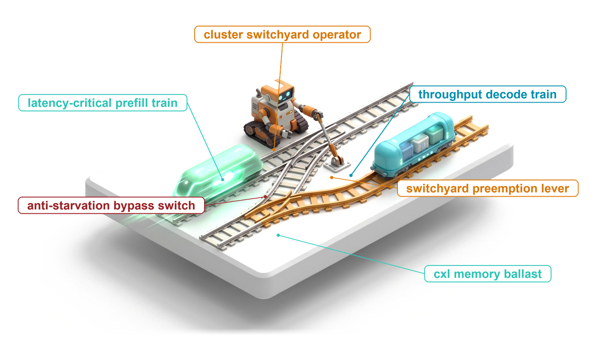
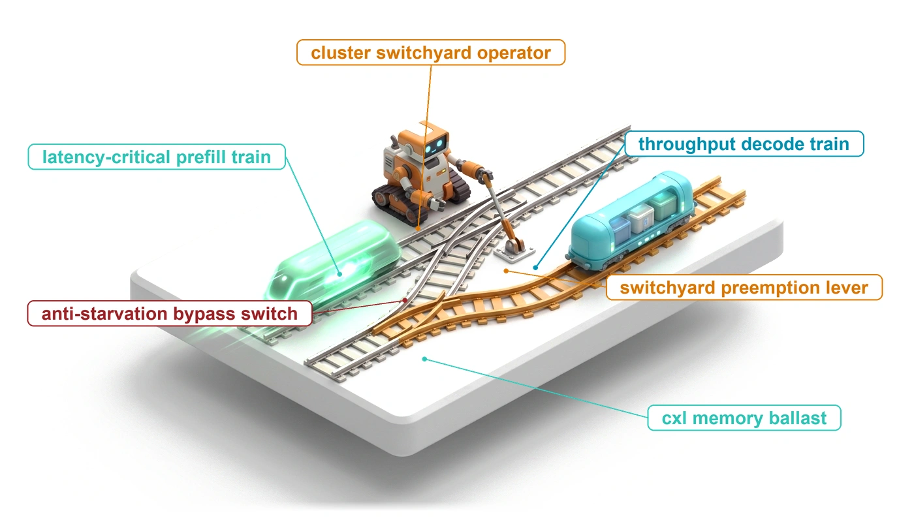
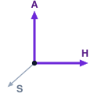
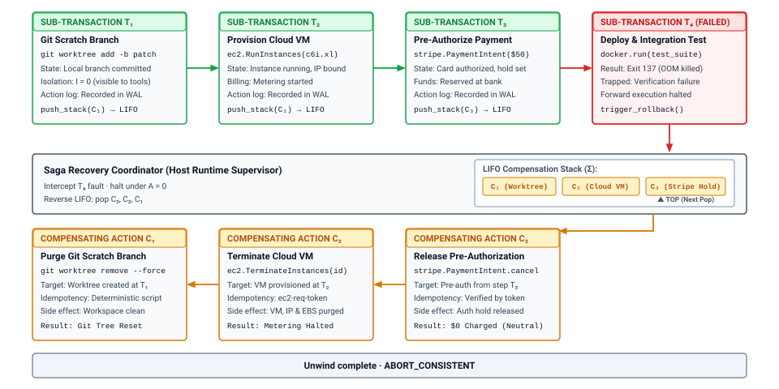
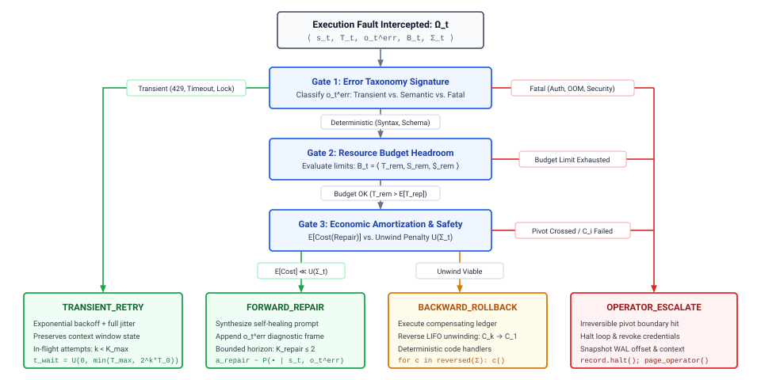
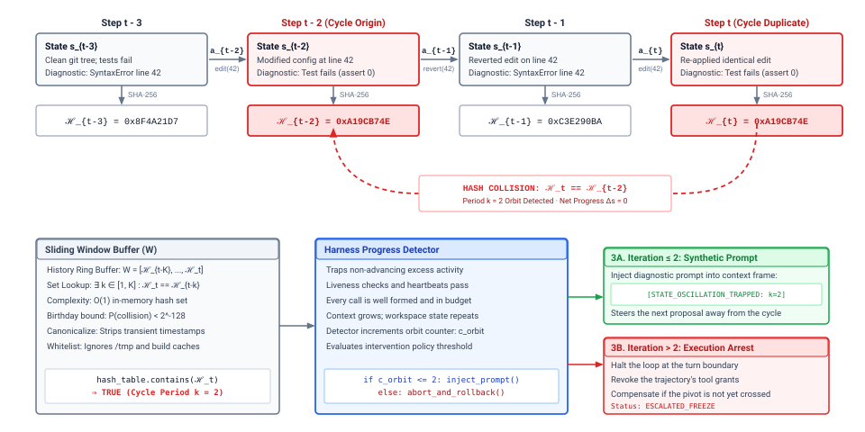

# Failure Recovery {#sec-vol3-failure-recovery}

::: {layout-narrow}
::: {.column-margin}

\chapterminitoc

:::

::: {.content-visible when-format="pdf"}
\noindent
{fig-alt="Blueprint for Failure Recovery."}
:::

::: {.content-visible unless-format="pdf"}
{fig-alt="Blueprint for Failure Recovery."}
:::

:::

## Purpose {.unnumbered .unlisted}

\begin{marginfigure}
\mlagentstack{0}{0}{100}{0}{0}{0}
\end{marginfigure}

_Why can an agent that records every step it takes still leave the world half changed?_

A ten-step agent task that fails at step seven has already created branches, provisioned machines, and perhaps placed a hold on a card, and none of the systems holding those effects will undo them because the agent's plan went wrong. A durable log says exactly which steps landed, but knowing what happened repairs nothing, and the obvious responses make matters worse. Resending the same request reproduces the same mistake, letting the model improvise a cleanup invites a second mistake with real consequences, and undoing everything throws away an hour of work to fix one malformed argument. Recovery is a policy the runtime runs, not a hope placed in the model. For each failure it decides whether to retry, to feed the error back so the model can repair its proposal, to answer each committed effect with a compensating action, or to stop and hand the trajectory to a person, and it schedules the one action that cannot be undone after everything that can. It must also notice the failure that raises no error at all, a trajectory that keeps acting while getting nowhere. Through the H·S·A lens, a long horizon is what turns authority into a recovery problem, because every step spends some authority before anyone knows whether the task will succeed.

::: {.content-visible when-format="pdf"}

\newpage

:::

::: {.callout-learning-objectives}

- Explain why a trajectory that fails partway cannot be rolled back as a transaction and what a saga does instead
- Design a compensation stack that registers each compensator before dispatch and unwinds idempotently after a crash
- Select among retry, feedback, resampling, and model fallback for a failure class from the error observation the model receives
- Calculate the break-even repair success rate at which forward repair beats compensating and rerunning a trajectory
- Classify tool actions into reversibility tiers and order a plan so its one irreversible action follows all compensable work
- Construct progress detectors from repeated actions, workspace state, and verifier signals, and state what each one misses
- Apply circuit breakers, quarantine, and fault injection to contain a failing tool or trajectory and to test every recovery path

:::

## Why Transactions Do Not Apply {#sec-vol3-sagas-acid-boundary}

::: {.column-margin}
{width="100%" fig-alt="H·S·A locator triad with the Horizon and Authority axes highlighted."}

*Over a long horizon, authority becomes a recovery problem for the runtime.*
:::

A deployment agent is ten steps into a release. It has created a branch, provisioned a staging database, run a schema migration against it, reserved a public address, and registered a DNS name. At step seven the proxy rejects the routing table the model generated, because one port number arrived as a string. The trajectory log of @sec-vol3-durable-execution records all of this exactly. It shows which tool calls were sent, which were settled, and which effects exist in the world. It does not say what to do next, and six external systems now hold effects that belong to a task that has not succeeded. None of them shares the runtime's log, and none will roll back because the agent's plan failed.

A database would handle the same failure with a transaction. Either every write commits or the engine aborts and undoes them all, using undo logs and locks so that no one else ever sees the intermediate state [@gray1981transaction]. Across several databases, two-phase commit extends the guarantee by asking every participant to prepare, holding its locks, and then committing everywhere at once. Neither mechanism reaches an agent's tools. A code forge, a cloud control plane, and a payment service expose no prepare phase, and each commits a request the moment it arrives, where other people and programs can see and act on it. Holding locks across an agent's steps would not help even if the services offered them. A model call takes seconds, a test suite takes minutes, and an approval can take hours, so locks held for the life of a trajectory would block every other user of those resources. @Sec-vol3-appendix-inference-distributed collects the classical background, including why two-phase commit and long-held locks fail across agent tools.

The long horizon adds a second problem that no database faces. Errors compound over the turns of a trajectory (@sec-vol3-intro-temporal-stretching), so a model that misreads a timeout at step three can issue wrong changes at step four that further damage external state, and every step spends authority before anyone knows whether the task will succeed (@sec-vol3-intro-hsa). The runtime therefore needs a recovery contract that holds without atomicity, and the pivot boundary and compensating sagas (principle \ref{pri-vol3-reversibility-sagas}) supply it. The contract has three parts. The runtime compensates what can be compensated, repairs forward through the model when repair costs less than unwinding, and schedules the one action that cannot be undone after every action that can. A fourth duty sits beside the three, because a trajectory can also fail without raising any error, by acting indefinitely without progress. Under invariant closure (principle \ref{pri-invariant-closure}), all four are the runtime's job. The model can propose a repair, but the guarantees come from checks below it.

The chapter builds that contract in order. Sagas make every compensable effect answerable. Forward recovery decides when the model should try again instead. The pivot boundary handles effects that no one can answer. Progress detection catches the trajectory that never fails loudly, circuit breakers and quarantine keep one failure from spreading, and fault injection tests that every path works. The first step is to decide what the runtime owes the environment when it abandons a task halfway, which is the saga.

## Trajectory Sagas {#sec-vol3-sagas-architecture}

Return to the failed release. When step seven fails and the task cannot continue, the runtime cannot erase the staging database, but it can delete it. It cannot unregister a DNS lookup that already happened, but it can remove the record. Each committed step has a counter-action that restores what matters about the environment even though it leaves a trace. Hector Garcia-Molina and Kenneth Salem gave this structure a name for long-lived database processes [@garciamolina1987sagas]. A saga is a sequence of short steps, each of which commits on its own, paired with a sequence of compensating steps that undo their business effect in reverse order.

::: {#dfn-trajectory-saga .callout-definition title="Trajectory saga"}

***Trajectory saga***\index{Trajectory saga!definition}\index{Saga!trajectory} is the structure a runtime imposes on a trajectory's external effects, in which each tool call commits immediately and has a compensating action registered before it is dispatched, so that a failure partway through can be answered by running the registered compensators in reverse order.

1.  **Significance**: It gives a trajectory a defined failure outcome without distributed locks or a prepare phase, which external tools do not offer.
2.  **Distinction**: Unlike a transaction, a saga provides no isolation. Other users can observe and act on each step's effect before the saga finishes or unwinds.
3.  **Common pitfall**: Asking the model to invent the compensation after the failure, instead of registering a tested compensator with the tool before the step runs.

:::

@Fig-vol3-saga-flow traces one saga through a failure. Each forward step $T_i$ commits its external effect at once, creating a scratch branch at $T_1$, provisioning a cloud instance at $T_2$, and placing a card authorization at $T_3$. As each step commits, the harness pushes its compensator $C_i$ onto a last-in, first-out stack kept in the trajectory record (@sec-vol3-controlplane-acb). When $T_4$ fails, the harness stops dispatching forward steps, stops asking the model for new proposals, and pops the stack. It releases the card hold with $C_3$, deletes the instance with $C_2$, and removes the branch with $C_1$. The compensators are tested code registered with each tool, not text sampled from the model, so the unwind produces the same result on every run.

::: {#fig-vol3-saga-flow fig-env="figure" fig-pos="htb" fig-cap="**Trajectory Saga Execution Flow**: Forward steps commit their external effects immediately and push a compensating action onto a last-in, first-out stack. When the fourth step fails, the harness stops forward dispatch and runs the compensators in reverse order ($C_3$, then $C_2$, then $C_1$), leaving the environment in a consistent state with an audit trail of what happened." fig-alt="Diagram with three rows. The top row shows forward steps T1 to T3 in green, creating a git scratch branch, provisioning a cloud instance, and authorizing a payment, each recording its action in the log and pushing a compensator, followed by a red failed step T4 whose test run was killed. The middle row shows the saga coordinator in the agent harness holding a stack of compensators with C3 on top. The bottom row shows compensators C3, C2, and C1 in orange running right to left, releasing the payment hold, deleting the instance, and removing the branch, ending in a consistent aborted state."}

:::

### Compensation is not rollback

A database rollback restores the exact bytes that existed before a transaction began, and afterward the transaction might as well never have happened. A compensator cannot do that. By the time it runs, time has passed, meters have counted, logs have recorded the step, and other people or agents may have read the intermediate state. What a compensator restores is the part of the environment the task cares about. Let $S_0$ be the environment before $T_1$ and $S'_0$ the environment after $T_1$ and then $C_1$ have run. In general $S'_0 \ne S_0$, since billing records, audit logs, and resource identifiers have all moved on. The runtime requires only that the two states agree on the invariants $\Phi$ that the task specification cares about:

$$S'_0 \equiv_{\Phi} S_0 \iff \forall \phi \in \Phi, \quad \phi(S'_0) = \phi(S_0)$$

::: {#dfn-semantic-compensation .callout-definition title="Semantic compensation"}

***Semantic compensation***\index{Semantic compensation!definition} is a forward action that returns the environment to a state equivalent to the one before a step with respect to the invariants the task cares about, while leaving a record that the step and its reversal both happened.

1.  **Significance**: It makes recovery possible across tools that offer no undo, such as cloud provisioning, message queues, and payment services.
2.  **Distinction**: A rollback restores exact prior state from an undo log. Compensation restores equivalence under stated invariants and leaves an audit trail, like an offsetting entry in an accounting ledger.
3.  **Common pitfall**: Writing a compensator that is not idempotent, so a retry after a lost acknowledgment deletes or credits twice.

:::

Three shapes of compensator cover most agent tools. An inverse edit strips exactly the line a step appended to a configuration file. A release deletes the instance, address, or pod a step provisioned, using the identifier the step returned. An offsetting entry credits back the quota or funds a step reserved, so the ledger shows two entries and a restored balance. Because sagas give up isolation, the intermediate state is visible until its compensator runs, and every compensator must be safe to run more than once. When the runtime cannot tell whether $C_i$ finished, it runs $C_i$ again with the same idempotency key, the mechanism @sec-vol3-tool-calling-idempotency introduced for forward calls.

### The compensation stack

Compensators come from the tool's author, not from the model. A tool that has effects outside the sandbox registers a compensating action alongside its schema, parameterized by the outputs the forward call returns, such as the new instance's identifier. The model never writes compensators during a failure, and the reason is practical. A model proposing a cleanup under a context full of errors is proposing new effects in exactly the conditions where its proposals are least reliable, and a sampled `rm -rf` or a delete aimed at the wrong resource compounds the damage the cleanup was meant to repair.

The ordering of writes is what makes the stack survive a crash. When a compensable step succeeds, the harness binds its compensator to the step's outputs and appends it to the trajectory log before it asks the model for the next step. Because the log is written before any later effect (principle \ref{pri-vol3-intent-before-effect}), a restarted runtime can rebuild the stack from the log alone. A compensator is itself an effect, so it travels the same path as any tool call, with a grant, a logged intent, and settlement. The harness reserves the grant each compensator will need when the forward step commits, so a credential that expires or is revoked later does not strand the compensation. @Tbl-vol3-saga-state-transitions gives each step's states. Every step that commits must end either completed with the trajectory or compensated, and a compensator that fails for good sends the trajectory to escalation.

| **State**      | **Condition**                                                       | **Next States**              | **Runtime Action**                                          |
|:---------------|:--------------------------------------------------------------------|:-----------------------------|:------------------------------------------------------------|
| `PENDING`      | Model proposed the step; nothing has been dispatched.               | `EXECUTING`, `ABORTED`       | Validate arguments against the schema; check the grant.     |
| `EXECUTING`    | Intent logged; call dispatched with idempotency key $\kappa_i$.     | `COMMITTED`, `FAILED`        | Wait for the result; settle a timeout before any retry.     |
| `COMMITTED`    | Effect confirmed; compensator $C_i$ bound and logged.               | `COMPENSATING`               | Push $C_i$ onto the stack; ask the model for the next step. |
| `FAILED`       | Step failed, timed out unsettled, or violated a postcondition.      | `COMPENSATING`, `HALTED`     | Stop forward dispatch; apply the recovery policy.           |
| `COMPENSATING` | Compensator $C_i$ dispatched with its own key $\kappa_i^c$.         | `COMPENSATED`, `PANIC`       | Run the compensator; verify the invariant it restores.      |
| `COMPENSATED`  | Effect answered; invariants restored.                               | `COMPENSATING`, `TERMINATED` | Pop $C_i$; continue with $C_{i-1}$.                         |
| `PANIC`        | Compensator failed permanently; automated recovery cannot continue. | `ESCALATED`                  | Revoke grants; hand the trajectory to an operator.          |

: **Saga Step States**: Every committed step ends either completed with its trajectory or compensated through the reverse path; a compensator that cannot finish sends the trajectory to escalation. {#tbl-vol3-saga-state-transitions}

The unwind loop is short, and its structure matters more than its length. It peeks at the top compensator, runs it with its key, logs the result, and only then pops it, so that a crash between running and popping repeats the compensator rather than skipping it.

```python
def unwind_saga(record: TrajectoryRecord) -> None:
    saga = record.saga                  # compensation stack lives in the record
    saga.set_state(SagaState.COMPENSATING)
    while not saga.stack.is_empty():
        comp = saga.stack.peek()
        try:
            comp.execute(idempotency_key=comp.key)   # safe to repeat
            record.log.append(Event.COMPENSATED, comp.id)
            saga.stack.pop()
        except RetriableError:
            saga.backoff_and_retry(comp)
        except FatalCompensationError as err:
            record.log.append(Event.PANIC, comp.id, err)
            saga.set_state(SagaState.PANIC)
            raise EscalateToOperator(comp.id, err)
    saga.set_state(SagaState.TERMINATED_CLEAN)
```

If the host dies halfway through an unwind, recovery follows the same path as any other restart (@sec-vol3-persistence-migration). The runtime rebuilds the record from the log, finds the compensators that were started but not logged as finished, and runs them again with the same keys. Partial compensation therefore never strands a resource.

::: {#chk-11-sagas-compensation .callout-checkpoint title="Trajectory sagas and compensation"}

Sagas replace atomicity with answerability. Check that the pieces fit together before moving on.

- [ ] **Why not transactions**: Why can a runtime not hold locks or a prepare phase across the steps of an agent trajectory?
- [ ] **Compensation vs. rollback**: What does a compensator restore, and what does it leave behind?
- [ ] **Ordering**: Why must each compensator be logged before the model is asked for the next step?
- [ ] **Who writes compensators**: Why does the tool's author, not the model, supply them?

:::

Compensation guarantees a clean outcome, but it is expensive. In the release example, unwinding throws away a provisioned database, a completed migration, and the tokens and minutes spent producing them, all to correct one string that should have been an integer. The next question is when the runtime should try to fix the failed step instead.

## Forward Recovery Through the Model {#sec-vol3-sagas-forward-vs-backward}

Consider the failure at step seven again. The proxy's error says precisely what is wrong, a string where an integer belongs. Unwinding would tear down six steps of work, and rerunning the task from the beginning would reach the same step with the same model and quite possibly the same mistake. The error message is information the model did not have when it wrote the routing table, and a second call that includes it has a real chance of producing a valid one. This is forward recovery. Classical dependability theory names the two options, which @tbl-vol3-recovery-comparison contrasts. Backward recovery returns a system to an earlier correct state, and forward recovery transforms the current erroneous state into a correct one [@avizienis2004basic]. Databases favor backward recovery because they control their own storage. An agent's runtime controls little of the world it changes, so forward recovery is often the cheaper path, and the model is what makes it possible.

| **Dimension**    | **Backward Recovery (Compensation)**             | **Forward Recovery (Repair)**                   |
|:-----------------|:-------------------------------------------------|:------------------------------------------------|
| **Mechanism**    | Run registered compensators in reverse order     | Ask the model for a corrected step              |
| **Determinism**  | High; compensators are tested code               | Low; the repair is a sampled proposal           |
| **Cost**         | Unwind plus a full rerun of the lost work        | One or more model calls plus the corrected step |
| **Failure mode** | A compensator that fails leaves residue          | A repair loop that never converges              |
| **Best fit**     | Revoked access, violated invariants, hard limits | Schema errors, syntax errors, missing arguments |

: **Backward vs. Forward Recovery**: Compensation is deterministic and expensive, while repair through the model is cheap and uncertain; the recovery policy chooses between them for each failure. {#tbl-vol3-recovery-comparison}

### What the model sees after a failure

Forward recovery works only if the error reaches the model in a form it can act on. @Sec-vol3-tool-calling-observation-parsing established the structured observation, with separated streams and an extracted diagnostic frame. A failure observation needs four more facts. It needs the error's class, so the model can tell a malformed argument it can fix from a revoked credential it cannot. It needs to say whether the call had any effect, since a model that assumes a failed call did nothing may repeat an effect that did happen. It needs the attempt number and the remaining allowance, so the model does not plan a fifth try when the harness will allow one more. Where the tool can give one, it needs a remediation hint, such as the expected type of the field that failed validation. What the observation should leave out matters as much. A full stack trace repeated on every attempt spends tokens on library frames and, as the next subsection shows, gradually displaces the task itself from the context.

### Four ways forward

A failed step can be retried in four ways, and they differ in what changes between attempts.

A *transient retry* changes nothing. The runtime resends the same call after a delay, without consulting the model, because the failure was in the environment (a timeout, a rate limit, a lock held by someone else) rather than in the proposal. The delay uses exponential backoff with random jitter so that many trajectories failing together do not retry together, and a timed-out call that may have had an effect is settled first, never simply resent (principle \ref{pri-vol3-exactly-once-settlement}).

*Retry with feedback* changes the context. The runtime appends the failure observation and asks the same model for a new proposal. This is the pattern behind self-refinement and reflection loops [@madaan2023selfrefine; @shinn2023reflexion], and it works best when the feedback comes from an external check such as a validator, a compiler, or a test, because then the new observation carries information the first proposal lacked. When the only feedback is the model's own assessment of its output, the next call has no information the first one lacked, and nothing makes its proposal more likely to differ in the right direction.

*Resampling* changes the draw. Instead of conditioning on the failure, the runtime asks for a fresh proposal from a context that does not contain the failed attempt, often at a higher sampling temperature or as several candidates of which a checker selects one, the selection methods of @sec-vol3-test-time-compute-candidate-diversity. Resampling helps when the failure was an unlucky sample rather than a missing fact, and it avoids anchoring the model on its own mistake.

*Model fallback* changes the model. When a class of failure persists across feedback and resampling, the runtime routes the step to a different model, usually a more capable and more expensive one, for this step only. Fallback is also the right response when the primary model's endpoint is failing, a case the circuit breakers of @sec-vol3-sagas-containment detect.

All four are bounded by the same rule. Each repair is a proposal, and like any proposal it lowers the probability of a bad outcome without guaranteeing a good one. The corrected step passes through the same validation, grant, and settlement as the original, and the guarantee that the environment ends up consistent still comes from the checks and compensators below the model.

### Rolling back a poisoned context

Retry with feedback has a failure mode that grows with each attempt. Every failed proposal and its error stay in the context, and the model treats what is in its context as established. After three attempts at the same fix, the context holds three wrong premises and three stack traces, the task's instructions sit farther back, and the next proposal is more likely to be a variant of the failed ones than something new. This is the context poisoning of @sec-vol3-intro-context-poisoning, produced by the recovery loop itself.

The remedy is to roll the context back as well as the step. Because every turn is in the trajectory log, the harness can rebuild the context as it stood before the first failed attempt, the same operation @sec-vol3-persistence-replay uses to branch a trajectory from any turn. In place of the failed attempts it inserts one short note that says what was tried and why it failed, so the model does not repeat the attempt but is no longer conditioned on its full text. The workspace must roll back to the same point, or the rebuilt context will describe files that no longer match the disk, the stale-context failure of @sec-vol3-context-engineering-context-rot. The harness therefore restores the workspace from the checkpoint taken at that turn (@sec-vol3-persistence-checkpointing) whenever the failed attempts changed files. A context rollback costs one cold prefill of the rebuilt context, which is usually far less than the tokens the poisoned attempts would have consumed.

### The recovery policy

Retry, repair, compensate, and escalate are the runtime's options, and the harness needs a rule for choosing among them. It evaluates a recovery policy $\mathcal{D}$ at the moment a step fails, over the state

$$\Omega_t = \left( s_t, T_t, o_t^{\text{err}}, \mathbf{B}_t, \Sigma_t \right),$$

where $s_t$ is the observable environment, $T_t$ the failed step, $o_t^{\text{err}}$ its failure observation, $\mathbf{B}_t$ the remaining budget in turns, tokens, and dollars (@sec-vol3-controlplane-accounting), and $\Sigma_t$ the stack of committed compensable steps. As @fig-vol3-recovery-decision-tree shows, the policy applies three gates in order.

::: {#fig-vol3-recovery-decision-tree fig-env="figure" fig-pos="htb" fig-cap="**Recovery Policy Decision Tree**: A failed step passes three gates. The error class routes transient faults to retry and fatal faults to escalation. The budget gate denies repair when too little allowance remains. The cost gate compares the expected cost of repair with the cost of unwinding and rerunning, and sends pivot crossings and failed compensators to escalation." fig-alt="Flowchart. An intercepted fault enters gate 1, error classification, which sends transient errors such as rate limits and timeouts left to transient retry with backoff and jitter, and fatal errors such as revoked authentication right to operator escalation. Deterministic errors such as syntax and schema failures continue to gate 2, budget headroom, which sends exhausted budgets to escalation. Gate 3 compares the expected cost of repair with the unwind penalty and routes to forward repair when repair is cheaper, to backward rollback when unwinding is viable, and to escalation when the pivot has been crossed or a compensator failed."}

:::

The first gate classifies the error. Transient faults such as timeouts and rate limits go to transient retry. Semantic faults such as schema rejections, compilation errors, and missing arguments are candidates for repair, because their observations carry the information a better proposal needs. Fatal faults such as revoked credentials, exhausted quotas, or a sandbox policy violation cannot be repaired by any proposal, and they go straight to compensation or escalation.

The second gate checks the budget. A repair costs at least one model call, and a repair attempted with almost no allowance left can end the trajectory midway through the repair, the worst place to stop. If the remaining tokens, turns, or dollars cannot cover the expected repair plus a reserve for compensation, the harness denies repair.

The third gate compares costs. Let $c_r$ be the cost of one repair attempt, $p$ the probability it succeeds, $U$ the cost of running the compensators, and $R$ the cost of redoing the lost work. Backward recovery costs $U + R$. Forward recovery costs $c_r$ and, if the repair fails, the harness falls back to backward recovery anyway:

$$\mathbb{E}[\text{forward}] = c_r + (1 - p)(U + R) \qquad \text{vs.} \qquad \text{backward} = U + R$$

Forward recovery is the better bet whenever $p > p^* = c_r / (U + R)$. The break-even rate is small whenever a repair is cheap compared with the work it saves, which is the common case late in a trajectory.

```{python}
#| label: calc-vol3-failure-recovery-repair-vs-unwind
#| echo: false
# ┌─────────────────────────────────────────────────────────────────────────────
# │ FORWARD REPAIR VS. COMPENSATE-AND-RERUN (LEGO)
# ├─────────────────────────────────────────────────────────────────────────────
# │ Context: The worked estimate in @sec-vol3-sagas-forward-vs-backward
# │          (recovery policy, cost gate).
# │
# │ Goal: Show that the break-even repair success rate is small when a failure
# │       arrives late in a trajectory, in seconds and in dollars.
# │ Show: Unwind and rerun time, rerun token cost, repair time and cost, the
# │       break-even success rate on both axes, and the expected cost of
# │       repair at an assumed success rate.
# │ How:  Backward = sum of compensator latencies + sum of forward latencies,
# │       and the rerun's token bill. Forward = one repair call plus the
# │       corrected step. Break-even p* = repair cost / backward cost.
# │       All inputs are illustrative scenario values, including token prices
# │       and the assumed repair success rate; no value is a measurement.
# └─────────────────────────────────────────────────────────────────────────────
from mlsysim import *

class RepairVsUnwind:
    # ┌── 1. LOAD (Constants & Parameters) ─────────────────────────────────
    fwd_s = [4.2, 18.5, 1.1, 9.8, 12.4]  # scenario: T1-T5 latencies, seconds
    comp_s = [3.5, 16.0, 0.8, 6.2, 14.1]  # scenario: C1-C5 latencies, seconds
    fwd_in = 38_500  # scenario: input tokens billed across T1-T5
    fwd_out = 3_100  # scenario: output tokens across T1-T5
    price_in = 3.00  # scenario: $ per million input tokens
    price_out = 15.00  # scenario: $ per million output tokens
    rep_in = 2_390  # scenario: repair call input (instructions, failed call, error frame)
    rep_out = 180  # scenario: repair call output tokens
    ttft_s = 0.09  # scenario: time to first token, seconds
    tps = 50  # scenario: output tokens per second
    tool_s = 0.4  # scenario: re-running the corrected T6 validation, seconds
    p_assume = 0.5  # scenario: assumed single-attempt repair success

    # ┌── 2. EXECUTE (Compute) ─────────────────────────────────────────────
    unwind_s = sum(comp_s)
    rerun_s = sum(fwd_s)
    back_s = unwind_s + rerun_s
    rerun_usd = (fwd_in * price_in + fwd_out * price_out) / 1e6
    back_usd = rerun_usd  # compensators spend no model tokens
    rep_s = ttft_s + rep_out / tps + tool_s
    rep_usd = (rep_in * price_in + rep_out * price_out) / 1e6
    pstar_s = rep_s / back_s
    pstar_usd = rep_usd / back_usd
    exp_s = rep_s + (1 - p_assume) * back_s
    exp_usd = rep_usd + (1 - p_assume) * back_usd

    # ┌── 3. GUARD (Invariants) ───────────────────────────────────────────
    check(pstar_s < 0.1 and pstar_usd < 0.1, "Break-even repair probability should be small")
    check(exp_s < back_s and exp_usd < back_usd, "Forward repair should win at the assumed success rate")

    # ┌── 4. OUTPUT (Formatting) ──────────────────────────────────────────
    unwind_s_str = fmt_qty(unwind_s * second, second, precision=1)
    rerun_s_str = fmt_qty(rerun_s * second, second, precision=0)
    back_s_str = fmt_qty(back_s * second, second, precision=1)
    fwd_in_str = fmt_int(fwd_in)
    fwd_out_str = fmt_int(fwd_out)
    price_in_str = fmt_usd(price_in, precision=0)
    price_out_str = fmt_usd(price_out, precision=0)
    back_usd_str = fmt_usd(back_usd, precision=3)
    rep_in_str = fmt_int(rep_in)
    rep_out_str = fmt_int(rep_out)
    tps_str = fmt_int(tps)
    rep_s_str = fmt_qty(rep_s * second, second, precision=1)
    rep_usd_str = fmt_usd(rep_usd, precision=3)
    pstar_s_str = fmt_percent(round(pstar_s, 2), precision=0, style="prose")
    pstar_usd_str = fmt_percent(round(pstar_usd, 2), precision=0, style="prose")
    p_assume_str = fmt_percent(p_assume, precision=0, style="prose")
    exp_s_str = fmt_qty(exp_s * second, second, precision=1)
    exp_usd_str = fmt_usd(exp_usd, precision=3)
```

::: {#nbk-11-repair-vs-unwind .callout-notebook title="Forward repair vs. compensate and rerun"}

**Problem**: A six-step migration fails at its last step because the generated routing table carries a port number as a string. How reliable must a single repair attempt be before repairing is cheaper than compensating the first five steps and running them again?

**Variables**:

* Forward steps $T_1$ to $T_5$ took `{python} RepairVsUnwind.rerun_s_str` and billed `{python} RepairVsUnwind.fwd_in_str` input and `{python} RepairVsUnwind.fwd_out_str` output tokens, at illustrative prices of `{python} RepairVsUnwind.price_in_str` and `{python} RepairVsUnwind.price_out_str` per million.
* Their compensators take `{python} RepairVsUnwind.unwind_s_str` in total and spend no model tokens.
* One repair call reads `{python} RepairVsUnwind.rep_in_str` new tokens (recovery instructions, the failed call, and the error frame) and writes `{python} RepairVsUnwind.rep_out_str`, at `{python} RepairVsUnwind.tps_str` output tokens per second, and the corrected step validates in under a second.

**Math**:

* Backward: $U + R$ = `{python} RepairVsUnwind.unwind_s_str` + `{python} RepairVsUnwind.rerun_s_str` = `{python} RepairVsUnwind.back_s_str`, and `{python} RepairVsUnwind.back_usd_str` of tokens for the rerun.
* One repair attempt: $c_r$ = `{python} RepairVsUnwind.rep_s_str` and `{python} RepairVsUnwind.rep_usd_str`.
* Break-even: $p^* = c_r / (U + R)$ = `{python} RepairVsUnwind.pstar_s_str` on time and `{python} RepairVsUnwind.pstar_usd_str` on dollars.

**Result**: Repair is the better bet if one attempt succeeds more than about `{python} RepairVsUnwind.pstar_usd_str` of the time. Even at an assumed success rate of `{python} RepairVsUnwind.p_assume_str`, the expected cost of trying repair first is `{python} RepairVsUnwind.exp_s_str` and `{python} RepairVsUnwind.exp_usd_str`, against `{python} RepairVsUnwind.back_s_str` and `{python} RepairVsUnwind.back_usd_str` for unwinding at once.

**Systems insight**: The later a failure arrives, the more work a compensation discards and the lower the bar for trying repair first. The reliability of repair for a given failure class is an empirical quantity, measured over repeated trials as @sec-vol3-evaluation-rigor describes, and the policy should use that measurement rather than an assumed rate.

:::

### Bounding self-repair

A cheap repair invites a loop. The model patches a symptom, receives a second error, patches that, and drifts away from the task while each attempt passes every per-call check. The illustrative trace below shows the pattern in a test-repair task, where the third patch reverts the first.

```bash
# Illustrative repair loop (constructed example)
Attempt 1: ImportError: cannot import name 'AsyncSession' from 'sqlalchemy.orm'
Patch 1:   from sqlalchemy.ext.asyncio import AsyncSession
Attempt 2: AttributeError: 'AsyncSession' object has no attribute 'sync_engine'
Patch 2:   engine = session.sync_engine if hasattr(session, 'sync_engine') else None
Attempt 3: TypeError: NoneType object cannot be interpreted as an integer
Patch 3:   from sqlalchemy.orm import AsyncSession        # reverts patch 1
Attempt 4: ImportError: cannot import name 'AsyncSession' from 'sqlalchemy.orm'
# harness: error signature at attempt 4 matches attempt 1; repair halted
```

Two counters bound the loop. The first is a repair count $k_i$ per failed step, capped at a small constant $K_{\text{repair}}$ that the harness sets per failure class and that evaluation curves, not intuition, should tune. When $k_i$ exceeds the cap, the harness stops asking the model and moves to compensation or escalation. The second is a history of normalized error signatures. The harness hashes each failure's type, source location, and message template,

$$\sigma(o^{\text{err}}) = \text{hash}\left(\text{normalize}\left(\text{type}, \text{source}, \text{signature}\right)\right),$$

and if a signature repeats within the same repair sequence the model has produced a cycle, as in the trace above. The harness stops repairing at once, even with attempts left, and it rolls the context back before any further attempt so that the failed patches do not condition the next proposal. If repair converges within the cap, the trajectory keeps its committed work. If it does not, the harness falls back to the compensators, whose behavior does not depend on the model.

::: {#chk-11-forward-recovery .callout-checkpoint title="Choosing a recovery path"}

The recovery policy turns a failure into a decision. Check that the decision is grounded.

- [ ] **Error observations**: What four facts must a failure observation carry beyond the diagnostic itself?
- [ ] **Feedback vs. resampling**: When does appending the error help, and when does a fresh draw without it help more?
- [ ] **Break-even**: How does $p^* = c_r/(U+R)$ change as a failure moves later in a trajectory?
- [ ] **Poisoned context**: Why must a context rollback be paired with a workspace rollback?

:::

Every path in the policy so far ends, in the worst case, with the compensators, and that assumes every committed step has one. Some effects have none. An email that reached customers or a package published to a public registry cannot be answered by any later action, and a runtime that treats them like other steps can strand a trajectory with no way back and no way forward.

## The Pivot Boundary {#sec-vol3-sagas-pivot}

An agent preparing a release sends the announcement email to customers at step three and runs the final database migration at step five. The migration fails. The runtime can compensate steps four and five, but the email has been read, and a second email saying "please disregard" is a new effect, not an undo. The trajectory now needs to finish the migration, because the customers were told it happened, yet the failure that stopped it may need a person to resolve. The plan was flawed before any step ran, because it put an irreversible action ahead of fallible work.

### Reversibility tiers

The runtime cannot schedule actions around irreversibility unless it knows which actions are irreversible, and the tool descriptor is where that knowledge lives. @Sec-vol3-tool-calling-schemas assigns each tool a side-effect class, which governs retries, and an authority level, which governs approval. Recovery adds one more question per tool, whether its effect can be undone, and the answer places it in one of the three tiers of @tbl-vol3-action-invertibility, which align with the authority levels of @sec-vol3-intro-hsa. Declaring the tier extends the typed action contract (principle \ref{pri-vol3-strict-action-abi}) from what a tool accepts to what it can undo.

An *invertible* action has an exact inverse, $(T_i^{-1} \circ T_i)(S) = S$, because its effect stays inside a workspace the runtime controls. Writing a file in the sandbox, creating a local branch, or staging a patch are invertible, since discarding the workspace layer or restoring its snapshot (@sec-vol3-sandboxes-cow) returns the exact prior state. These are $A_1$ actions.

A *compensable* action changes a shared external system, so no exact inverse exists, but a registered compensator restores the invariants the task cares about. Provisioning an instance, reserving quota, and authorizing a card are compensable. These are $A_2$ actions, and the saga covers them.

An *irreversible* action, which the saga literature calls the pivot\index{Pivot action!definition}, has no compensator at all ($C_i = \emptyset$). Delivering an email, publishing a package, settling a wire transfer, and switching production traffic to a new version are pivots. These are $A_3$ actions. After a pivot the world has moved, and the runtime can only continue forward.

| **Tier**         | **Undo Contract**                                      | **Example Tools**                                      | **Residue**                     | **Recovery Strategy**                             |
|:-----------------|:-------------------------------------------------------|:-------------------------------------------------------|:--------------------------------|:--------------------------------------------------|
| **Invertible**   | $T_i^{-1} \circ T_i = I$                               | Sandbox file write, local branch, staged patch         | None                            | Restore the workspace snapshot                    |
| **Compensable**  | $\phi(C_i(T_i(S))) = \phi(S)$, $\forall \phi \in \Phi$ | Provision instance, reserve quota, authorize card      | Audit trail, brief billing      | Run the registered compensator                    |
| **Irreversible** | $C_i = \emptyset$                                      | Send email, publish package, switch production traffic | Permanent effect seen by others | Finish forward with idempotent retry, or escalate |

: **Action Reversibility Tiers**: Each tool declares whether its effect can be undone exactly, answered by a compensator, or not undone at all; the tier fixes how the runtime recovers after that tool has run. {#tbl-vol3-action-invertibility}

### Scheduling the pivot

Once actions carry tiers, the ordering rule follows. A trajectory may contain at most one pivot, and every compensable or invertible step must come before it:

$$\mathcal{T} = \underbrace{\left(T_1, \dots, T_{k-1}\right)}_{\text{preparation: compensable}} \;\xrightarrow{\;T_k = T_{\text{pivot}}\;}\; \underbrace{\left(T_{k+1}, \dots, T_n\right)}_{\text{finalization: idempotent}}$$

The rule splits recovery into two regimes. Before the pivot, any failure can be answered by unwinding, so the trajectory can always return to its starting invariants. At the pivot, the harness checks that every precondition still holds, runs whatever deterministic checks the task specifies (tests in a sandbox, a dry run, a diff review), and, where policy requires, holds the action at the approval gate of @sec-vol3-controlplane-hitl. It logs the pivot's intent durably before dispatch, and once the pivot succeeds it retires the compensation stack, because compensating preparation steps after the pivot would leave the world inconsistent with what the pivot announced. After the pivot, every step must be idempotent and retriable, such as updating a status page, closing a ticket, or cleaning up scratch resources, so that the only recovery the runtime needs is to retry until the step completes or to escalate.

A model does not produce plans in this order by default. It samples actions in whatever sequence its context makes likely, and "send the announcement, then migrate" is a plausible sequence. The ordering is therefore something the harness enforces on the plan, not something it requests from the model. The harness can refuse a second pivot, hold a pivot until the preparation steps it depends on have committed, or restructure a plan so that the irreversible part comes last.

::: {#exmp-11-the-dual-commit-trap-and-pivot .callout-example title="Two pivots in one release"}

**Scenario**: A release agent plans five steps: provision new serving instances (compensable), warm and validate them (invertible), switch public traffic to them (irreversible), update the service catalog database (compensable), and send a signed notice to an external compliance registry (irreversible). The catalog update fails on a schema conflict after traffic has already switched.

**Diagnosis**: The plan has two pivots with a fallible step between them. Unwinding cannot reach past the traffic switch, because users have already been served by the new instances. Stopping leaves the compliance notice unsent, so the release is live but unreported. The trajectory can move neither backward nor forward on its own.

**Systems lesson**: The harness should reorder the plan before running it. It runs the catalog update in a provisional form that can be compensated, prepares the compliance notice as a staged message in the trajectory's outbox, and makes one pivot of the traffic switch and the release of the staged notice. A failure in any earlier step is then answered by compensation, and nothing irreversible has happened.

:::

### Terminal escalation

Some failures leave no automated path. A compensator can fail permanently, for example when the API it calls has changed or the resource it would release is locked by someone else, and a step after the pivot can fail in a way no retry will fix, such as a downstream service in a long outage. In both cases the trajectory holds committed effects the runtime cannot resolve, and asking the model to improvise a way out would add effects in the conditions least likely to produce good ones. The runtime escalates.

Escalation is a fixed procedure. The harness pauses the trajectory (@sec-vol3-controlplane-statemachine), so that no model call or dispatch happens while its record, workspace, and log stay available to the operator. It revokes the trajectory's grants and brokered credentials (@sec-vol3-sandboxes-credential-brokering) so that no pending callback can issue further effects while a person investigates. It classifies the residue by where the failure sits relative to the pivot, either as a failed compensation before the pivot, with a list of resources that remain uncompensated, or as a stalled finalization after it, with the committed pivot and the steps still owed. Finally, it pages an operator with an incident record that points to the exact log position, so the person starts from the same facts the runtime had.

```python
def escalate(record: TrajectoryRecord, err: ToolError) -> None:
    record.set_state(State.PAUSED)               # no model call, no dispatch
    record.grants.revoke_all()                   # no pending effect may land
    residue = (Residue.POST_PIVOT_STALLED if record.log.pivot_committed()
               else Residue.COMPENSATION_FAILED)
    incident = Incident(
        trajectory_id=record.id,
        residue=residue,
        log_offset=record.log.offset(),
        failed_tool=err.tool,
        error=err.observation,
        open_effects=record.uncompensated_effects(),
    )
    record.pager.page(incident)
```

The design follows the end-to-end argument [@saltzer1984endtoend]. When the runtime's own recovery contract has failed, correctness cannot be delegated to a component whose outputs are samples. The pivot boundary means the runtime never tries to compensate past a point of no return, but it also means that after a pivot, and whenever repair is the chosen path, the trajectory must move forward. That raises a question none of the mechanisms so far can answer, which is whether a trajectory that keeps acting is actually getting anywhere.

## Progress Detection {#sec-vol3-sagas-watchdogs}

An agent is fixing a failing configuration test. It edits line 42, the test fails differently, it reverts line 42, the original failure returns, and it applies the same edit again. Every model call returns promptly, every tool call is well formed and within its limits, and every liveness check the platform runs passes. By any process-level measure the trajectory is healthy. By the task's measure it has been circling for twenty turns. The budget of @sec-vol3-controlplane-accounting will end the loop eventually, but only when it reaches the ceiling, after the loop has spent most of the allowance on work that changed nothing.

This is the fail-plausible fault model of @sec-vol3-intro-fail-plausible seen from the harness. Classical liveness monitoring looks for the absence of activity, such as a missed heartbeat or a process that stopped responding. A looping agent fails through too much activity that goes nowhere, and each turn looks new to the model because its context keeps growing with fresh reasoning and fresh errors even while the workspace returns to the same states. Progress\index{Progress detection} therefore has to be judged from the environment rather than from the model's reports or from signs of life (principle \ref{pri-vol3-preemptive-interrupts}).

```{python}
#| label: calc-vol3-failure-recovery-loop-cost
#| echo: false
# ┌─────────────────────────────────────────────────────────────────────────────
# │ THE COST OF AN UNDETECTED LOOP (LEGO)
# ├─────────────────────────────────────────────────────────────────────────────
# │ Context: The worked estimate in @sec-vol3-sagas-watchdogs.
# │
# │ Goal: Price a two-state loop that runs to the turn ceiling against one
# │       that a progress detector stops early, in tokens, time, and dollars.
# │ Show: Input tokens processed, dollars, and wall-clock for both cases, and
# │       the cost ratio.
# │ How:  Each turn re-sends a context that grows by the turn's output plus
# │       its error observation, so input tokens are an arithmetic series.
# │       All inputs are illustrative scenario values, including prices; no
# │       prefix caching is assumed.
# └─────────────────────────────────────────────────────────────────────────────
from mlsysim import *
from mlsysim.fmt import fmt_qty_int

class LoopCost:
    # ┌── 1. LOAD (Constants & Parameters) ─────────────────────────────────
    base_ctx = 1_000  # scenario: context at the first looping turn, tokens
    out_turn = 300  # scenario: output tokens per turn (reasoning plus tool call)
    err_turn = 800  # scenario: error observation appended per turn, tokens
    turn_s = 10.0  # scenario: wall-clock per turn (model call plus tool run), seconds
    cap = 50  # scenario: turn ceiling from the budget
    detect = 4  # scenario: turn at which a period-2 state cycle is detected
    price_in = 3.00  # scenario: $ per million input tokens
    price_out = 15.00  # scenario: $ per million output tokens

    # ┌── 2. EXECUTE (Compute) ─────────────────────────────────────────────
    grow = out_turn + err_turn

    def _in(n, base, grow):
        return n * base + grow * n * (n - 1) // 2

    in_cap = _in(cap, base_ctx, grow)
    in_det = _in(detect, base_ctx, grow)
    usd_cap = (in_cap * price_in + cap * out_turn * price_out) / 1e6
    usd_det = (in_det * price_in + detect * out_turn * price_out) / 1e6
    min_cap = cap * turn_s / 60
    s_det = detect * turn_s
    ratio = usd_cap / usd_det

    # ┌── 3. GUARD (Invariants) ───────────────────────────────────────────
    check(ratio > 10, "Detection should cut the loop's cost by more than an order of magnitude")
    check(in_cap > 10 * cap * out_turn, "Re-sent input should dominate the loop's tokens")

    # ┌── 4. OUTPUT (Formatting) ──────────────────────────────────────────
    base_ctx_str = fmt_int(base_ctx)
    grow_str = fmt_int(grow)
    out_turn_str = fmt_int(out_turn)
    err_turn_str = fmt_int(err_turn)
    turn_s_str = fmt_qty_int(turn_s * second, second)
    cap_str = fmt_int(cap)
    detect_str = fmt_int(detect)
    in_cap_str = fmt_int(in_cap)
    in_det_str = fmt_int(in_det)
    usd_cap_str = fmt_usd(usd_cap, precision=2)
    usd_det_str = fmt_usd(usd_det, precision=2)
    min_cap_str = fmt_int(min_cap)
    s_det_str = fmt_int(s_det)
    ratio_mult_str = fmt_multiple(round(ratio), precision=0)
```

::: {#nbk-11-loop-cost .callout-notebook title="What an undetected loop costs"}

**Problem**: A trajectory falls into a two-state loop. How much does it spend if only the turn ceiling stops it, compared with a detector that recognizes the repeated state within a few turns?

**Variables**:

* The first looping turn sends $s_0$ = `{python} LoopCost.base_ctx_str` tokens. Each turn emits `{python} LoopCost.out_turn_str` output tokens and appends an `{python} LoopCost.err_turn_str`-token error, so the re-sent context grows by $\Delta$ = `{python} LoopCost.grow_str` tokens every turn.
* A turn takes `{python} LoopCost.turn_s_str` of model call and tool run.
* The budget's turn ceiling is `{python} LoopCost.cap_str`, and a state-hash detector sees the repeat at turn `{python} LoopCost.detect_str`.
* Prices are the illustrative ones used earlier in the chapter, with no prefix caching.

**Math**:

* Input tokens over $n$ turns: $n \cdot s_0 + \Delta \cdot n(n-1)/2$.
* To the ceiling: `{python} LoopCost.in_cap_str` input tokens, `{python} LoopCost.usd_cap_str`, and about `{python} LoopCost.min_cap_str` minutes.
* With detection: `{python} LoopCost.in_det_str` input tokens, `{python} LoopCost.usd_det_str`, and `{python} LoopCost.s_det_str` s.

**Result**: Stopping the loop at the first repeated state is about `{python} LoopCost.ratio_mult_str` cheaper than letting the ceiling stop it.

**Systems insight**: The cost of a loop grows with the square of its length, because every turn re-sends a context that the loop keeps enlarging. Prefix caching (@sec-vol3-foundation-model-cost) lowers the price per re-sent token but not the turns or the minutes. A ceiling bounds the worst case, and only a progress signal keeps the typical loop short.

:::

### Signals of progress

No single signal proves progress, so the harness combines several, each cheap and each blind to something, as @tbl-vol3-watchdog-invariants summarizes.

*Repeated actions* are the cheapest signal. The harness hashes each tool call's name and canonicalized arguments before dispatch, and a call identical to one that already failed, with nothing in between that could change its outcome, is a known-bad request. It can be refused before it runs. The signal misses paraphrase, since a model that reorders arguments or rewords a query produces a new hash for the same mistake.

*Repeated workspace states* catch loops that change the actions but not the result. After each step the harness hashes a canonical form of the workspace, with timestamps stripped and scratch directories excluded, and checks the hash against a sliding window of recent states:

$$\exists k \in [1, K] \quad \text{such that} \quad \mathcal{H}_t = \mathcal{H}_{t-k}$$

A match of period $k$ means the last $k$ effectful steps produced no net change. @Fig-vol3-semantic-watchdog shows a period-2 cycle, an edit, its revert, and the same edit again, caught when the state hash at step $t$ matches the one at step $t-2$. The signal misses loops that do change the workspace, such as a model that appends a new debugging print on every turn.

::: {#fig-vol3-semantic-watchdog fig-env="figure" fig-pos="htb" fig-cap="**Detecting a State Cycle**: The harness hashes a canonical form of the workspace after each step and keeps a sliding window of recent hashes. When the hash after step $t$ matches the hash after step $t-2$, the last two steps produced no net change, a period-2 cycle. The first detections inject a steering observation into the next call; a cycle that persists halts the loop, revokes grants, and compensates if the pivot has not been crossed." fig-alt="Top row: four steps from t minus 3 to t, showing a clean tree, an edit at line 42, a revert, and the same edit re-applied, each with its state hash; the hashes at t minus 2 and t match, and a dashed red link labels the collision as a period-2 cycle with zero net progress. Bottom row: a sliding window of hashes with constant-time lookup feeds a harness progress detector, which notes that liveness checks pass and calls stay within budget while workspace state repeats. The detector branches to a green box that injects a steering observation for the first two detections and a red box that halts the loop, revokes tool grants, and compensates if the pivot is not yet crossed."}

:::

*Test and environment deltas* measure movement toward the goal. When the task has checkable intermediate signals, such as the number of passing tests, compiler errors, or lint findings, the harness tracks them over an epoch of $E$ effectful steps and flags stagnation when none of them has improved. The epoch must allow for exploration, since a correct fix sometimes breaks a test before it fixes two, and the signal is only as good as the task's checks. A task with no intermediate check offers nothing to track.

*Verifier and judge estimates* fill that gap for open-ended tasks. A process verifier or a large language model (LLM) judge (@sec-vol3-test-time-compute-verification) can score whether the latest steps moved the trajectory closer to its goal. These scores cover tasks the other signals cannot, but they are proposals about progress, not measurements of it. A judge can be persuaded by confident reasoning, and a trajectory can drift toward what the judge rewards rather than toward the goal, the Goodhart effect @sec-vol3-test-time-compute-verification describes. The harness therefore uses them only to trigger intervention, never to certify that a trajectory succeeded, which remains the job of the task's closure evidence (@sec-vol3-intro-closure-evidence).

| **Signal**              | **Catches**                                         | **Misses**                                           | **Cost per Step**                   |
|:------------------------|:----------------------------------------------------|:-----------------------------------------------------|:------------------------------------|
| **Repeated action**     | Re-issuing a call that already failed               | Paraphrased or reordered calls                       | One hash of the call                |
| **Repeated state**      | Edit-and-revert cycles of any period up to $K$      | Loops that keep changing the workspace               | One hash of the canonical workspace |
| **Test or error delta** | Many steps with no improvement in checkable signals | Tasks with no intermediate check; slow true progress | One run of the task's checks        |
| **Verifier or judge**   | Stagnation on open-ended tasks                      | Confident but wrong reasoning; reward drift          | One model or verifier call          |

: **Progress Signals**: Each signal is cheap and blind to some loop, so the harness combines them and treats a verifier's or judge's estimate as a reason to intervene, never as evidence of success. {#tbl-vol3-watchdog-invariants}

The state check itself is a few lines. It scans the recent window for the current hash and returns the cycle's period.

```python
def cycle_period(history: list[str], current: str, max_period: int) -> int | None:
    # Most recent first; period 1 is a no-op step, period 2 an edit-and-revert
    for period, past in enumerate(reversed(history[-max_period:]), start=1):
        if past == current:
            return period
    return None
```

### Intervening

Detecting a loop is half the job, and the harness also needs a defined response, because silently dropping a tool call leaves the trajectory in an undefined state. @Tbl-vol3-watchdog-escalation-protocol gives three tiers of increasing cost.

| **Tier**         | **Trigger**                                            | **Action**                                                                            | **Cost**                                  | **If It Fails** |
|:-----------------|:-------------------------------------------------------|:--------------------------------------------------------------------------------------|:------------------------------------------|:----------------|
| **1. Steer**     | First detection of a repeated action or state          | Refuse the repeated call and return a typed observation naming the cycle              | A few tokens in the next call             | Go to tier 2    |
| **2. Backtrack** | Cycle persists after steering                          | Roll context and workspace back to before the cycle; add a note; mask the failed call | One cold prefill; turns since cycle onset | Go to tier 3    |
| **3. Halt**      | Cycle persists after backtracking, or budget exhausted | Stop the loop, revoke grants; compensate before the pivot, escalate after it          | The trajectory                            | Operator review |

: **Progress Intervention Tiers**: The harness escalates from a steering observation to a backtrack to a halt, spending more of the trajectory's work at each tier only when the cheaper response has failed. {#tbl-vol3-watchdog-escalation-protocol}

The first tier is a steering observation. The harness refuses the repeated call and returns a typed observation instead, for example `LOOP_DETECTED: state after this step matches the state two steps ago; the call was not executed`. The observation changes what the next call is conditioned on, which makes a different proposal more likely. It guarantees nothing, and the harness treats it as the cheapest attempt rather than a fix.

The second tier is the context rollback of @sec-vol3-sagas-forward-vs-backward, applied to the whole cycle. The harness rebuilds the context from the log as it stood before the cycle began, restores the workspace from the matching checkpoint, inserts a short note on what was tried, and adds the failed call's hash to a per-trajectory block list so that the same call is refused if it is proposed again.

The third tier ends the loop. The harness stops dispatching and revokes the trajectory's grants. What happens to the effects depends on where the trajectory stands relative to its pivot. Before the pivot, the harness runs the compensation stack and returns the environment to its starting invariants. After it, the stack has been retired, so the harness takes the terminal escalation path of @sec-vol3-sagas-pivot and hands the committed state to an operator.

Progress detection keeps one trajectory from circling. It cannot see a different pattern, in which many trajectories fail together because a tool they share is failing, and each one's retries make the tool's failure worse.

## Tool Circuit Breakers {#sec-vol3-sagas-containment}

A search service that forty trajectories depend on starts returning timeouts. A conventional client would retry a fixed number of times and give up. An agent does something different. The model reads the timeout as a problem to solve, and it proposes a new call, perhaps with the query reworded, a longer timeout, or a sibling endpoint that hits the same backend. Prompts that tell agents to "try another approach if a tool fails" encourage exactly this. Multiplied across forty trajectories, the model's persistence turns a slow service into an overloaded one, and because each retry is phrased differently, deduplication that compares request bodies does not catch them. The agent is a retry amplifier, and the model cannot be relied on to stop, because nothing in its context tells it how the service is doing.

The runtime stops dispatching instead, using the circuit breaker\index{Circuit breaker!tool dispatch} pattern [@nygard2007releaseit]. The tool gateway keeps, for each external dependency, a sliding window of recent call outcomes, and counts only transport-level failures such as timeouts, server errors, and rate-limit rejections. A domain answer such as "record not found" counts as a success, because the service worked. @Tbl-vol3-circuit-breaker-states gives the three states.

| **State**     | **Dispatch Policy**                          | **Transition**                                                   | **What the Model Sees**                          |
|:--------------|:---------------------------------------------|:-----------------------------------------------------------------|:-------------------------------------------------|
| **Closed**    | Every call goes to the dependency            | Failure fraction over the window exceeds the threshold → Open    | Real results and real errors                     |
| **Open**      | No call is dispatched                        | Cooldown elapses → Half-open                                     | Immediate `ERR_CIRCUIT_OPEN` with time remaining |
| **Half-open** | One probe call is dispatched; others refused | Probe succeeds → Closed; probe fails → Open with longer cooldown | Real result for the probe, refusal for the rest  |

: **Tool Circuit Breaker States**: The gateway stops dispatching to a failing dependency, returns a typed refusal the model can plan around, and tests recovery with a single probe before reopening. {#tbl-vol3-circuit-breaker-states}

What makes a breaker work for agents is the observation it returns. An open breaker answers every call to the failing dependency at once with a typed observation, such as `ERR_CIRCUIT_OPEN: search_index unavailable; retry after 60 s`. The observation tells the model three things it could not otherwise know, that the failure is in the service and not in its query, that rewording will not help, and when the service might be available again. A well-shaped observation makes it likely the model will plan around the outage, switch to another tool, or finish what it can. The breaker, not the model, enforces the refusal, and because the breaker is keyed on the dependency rather than on the request body, a reworded call is refused as surely as the original.

Two companions complete the gateway. Retries that the runtime does make, the transient retries of @sec-vol3-sagas-forward-vs-backward, wait for a random delay drawn uniformly from zero up to an exponentially growing ceiling, so that trajectories that failed together do not retry together. Each class of tool also gets its own concurrency limit, so that calls blocked on a slow external API cannot consume the workers that local file reads and test runs need. Both are standard practice for distributed clients. What is specific to agents is that the retry decision must be taken away from the model and made visible to it as an observation.

The breaker's scope is deliberately narrow. It stops dispatch to one failing tool. Fleet-wide limits on spending rates belong to @sec-vol3-agent-economics, and automatic rollback of a bad release belongs to @sec-vol3-evaluation. A breaker protects shared dependencies from many trajectories. It does not help when the problem is a single trajectory that has become unsafe to run.

## Quarantine After Failure {#sec-vol3-sagas-quarantine}

A coding agent reads a pull request whose description contains a planted instruction, and its next proposal is a command that sends repository secrets to an outside host. The egress policy of @sec-vol3-sandboxes-network blocks the connection. The runtime now knows something worse than that one call failed. The trajectory's context contains instructions from an attacker, and every proposal it makes from now on may be serving them. The same holds, without an attacker, for a trajectory whose mutations have run out of control.

Every recovery mechanism so far assumes that the model is a benign planner that made a mistake. Compensation, repair, and backtracking all ask the model to keep working. Once a trajectory is suspected of being compromised, that assumption fails, and the runtime's response changes along every dimension of @tbl-vol3-quarantine-vs-saga. Asking it to clean up invites the attacker to choose the cleanup, and letting it finish its turn gives it one more chance to act. Containment beneath the model (principle \ref{pri-vol3-zero-trust-sandboxing}) is what makes quarantine possible, because the grants, credentials, and network paths the trajectory uses all sit in the runtime, where they can be withdrawn without the model's cooperation.

| **Dimension**          | **Saga Compensation**                          | **Quarantine**                                                       |
|:-----------------------|:-----------------------------------------------|:---------------------------------------------------------------------|
| **Trigger**            | A tool failure or validation rejection         | Policy violation, suspected injection, a runaway trajectory          |
| **Trust in the model** | Benign; the plan failed                        | Untrusted; the context may be steered                                |
| **Trajectory state**   | Keeps running while compensators execute       | Halted immediately; no further model calls                           |
| **Effects**            | Registered compensators answer committed steps | Pending calls discarded; outputs marked tainted until verified       |
| **Other consumers**    | Receive ordinary errors or wait for completion | Blocked from reading the trajectory's outputs until they are cleared |

: **Saga Compensation vs. Quarantine**: Compensation assumes a benign planner whose plan failed; quarantine assumes the planner may be compromised, so it withdraws the trajectory's authority first and cleans up without the model. {#tbl-vol3-quarantine-vs-saga}

Quarantine is a fixed sequence the harness runs without calling the model. It halts the loop at once, using the kill action of @sec-vol3-controlplane-signals rather than waiting for a turn boundary. It revokes the trajectory's grants and its brokered credentials, so that even a call already in flight fails its authorization check at the service. It cuts the sandbox's network path. It then marks what the trajectory produced. Every artifact the trajectory wrote since the earliest step at which untrusted content entered its context, the taint epoch, is labeled tainted using the provenance labels of @sec-vol3-sandboxes-taint, and consumers such as other agents, merge queues, and downstream jobs are blocked from reading tainted artifacts until a check outside the model or a person clears them. A model's statement that its output is clean clears nothing.

Remediation then uses the tools this chapter has already built. Compensable effects inside the taint epoch run their compensators under the recovery grants reserved for them, now without consulting the model, and tainted commits are reverted or their branches detached. Rows the trajectory wrote are hidden behind a tombstone that keeps them for audit. The quarantined workspace and log are kept intact, because they are the evidence an operator and the evaluation of @sec-vol3-evaluation need to explain what happened.

Sagas, repair, the pivot boundary, progress detection, circuit breakers, and quarantine are each simple on paper. Together they form the part of the runtime that runs least often and is therefore least tested, and a recovery path that has never run is not known to work.

## Recovery Under Fault Injection {#sec-vol3-sagas-case-study}

A compensator written for an API that changed six months ago fails the first time it is needed, which is during an incident. Recovery code has this property in general. It runs only when something else has gone wrong, so ordinary testing rarely exercises it, and its bugs surface at the worst moment. Jim Gray observed that the faults that survive testing in production systems are mostly the transient, timing-dependent ones rather than the deterministic ones testing removes [@gray1986computers]. Agents add a third kind, in which the same inputs sometimes produce a malformed proposal because the model samples. Fault injection finds such faults before an incident does. It deliberately causes failures in a controlled environment and checks that the system recovers, and practiced continuously against production systems it is called chaos engineering [@basiri2016].

For an agent runtime, the useful unit is the recovery path. Each mechanism in this chapter handles a particular fault at a particular point, and a fault injection suite needs at least one test that forces each path. @Tbl-vol3-fault-injection-matrix lists the faults, where to inject them, and what the test must check afterward.

| **Injected Fault**                        | **Where**                                 | **Path Exercised**                | **What to Check After Recovery**                                 |
|:------------------------------------------|:------------------------------------------|:----------------------------------|:-----------------------------------------------------------------|
| Timeout after the effect lands            | Tool gateway, after the service commits   | Settlement before retry           | Exactly one effect; no duplicate from a retry                    |
| Validation error in the model's arguments | Tool response                             | Forward repair                    | Repair within $K_{\text{repair}}$ or fallback to compensation    |
| Host crash during an unwind               | Between running and logging a compensator | Resumed unwind                    | Every compensator ran; none ran with a new key                   |
| Compensator fails permanently             | Compensating tool                         | Terminal escalation               | Grants revoked; residue listed; operator paged                   |
| Failure after the pivot                   | First finalization step                   | Idempotent retry, then escalation | No compensation attempted past the pivot                         |
| Edit-and-revert loop                      | Scripted model responses in replay        | Progress detection                | Detected within the window; intervention tier followed           |
| Dependency outage                         | External tool endpoint                    | Circuit breaker                   | Dispatch stops; model receives `ERR_CIRCUIT_OPEN`; probe reopens |
| Planted instruction in a tool result      | Retrieved document or tool output         | Quarantine                        | Loop halted; credentials revoked; outputs tainted and blocked    |

: **Fault Injection Matrix**: Each recovery path in the chapter is forced by at least one injected fault, and each test checks the environment's invariants afterward rather than the trajectory's own report of success. {#tbl-vol3-fault-injection-matrix}

Two properties make such tests trustworthy. The first is that the check at the end examines the environment, not the transcript. A recovered trajectory passes only if the environment satisfies the task's invariants, no resource is orphaned, and no effect was duplicated, the same semantic equivalence that defined compensation. The second is that model-dependent paths are tested with the model's randomness controlled. The replay mode of @sec-vol3-persistence-replay makes this possible by substituting scripted model responses, so a test can force the exact malformed proposal or loop it needs and run the same way every time. Paths that depend on live sampling, such as how often forward repair succeeds, cannot be tested once. They are measured as rates over many trials.

Those measurements are where this chapter ends and the next begins. A fault injection suite shows that each path works. Whether the whole agent, model and harness together, recovers often enough to release, how many trials establish that, and how to tell a model failure from a harness failure when it does not, are questions of evaluation.

## Fallacies and Pitfalls {#sec-vol3-failure-recovery-fallacies}

Recovery attracts two opposite mistakes. Engineers from distributed systems expect database guarantees to carry over, and engineers from machine learning expect the model to repair its own failures. Each of the following items fails in production for one of those two reasons.

::: {.fallacy-pitfall}
**Fallacy:** *A multi-tool agent task can be made atomic with two-phase commit.*

Two-phase commit needs every participant to offer a prepare phase and to hold locks until the coordinator decides. The services an agent calls, including code forges, cloud control planes, payment processors, and messaging systems, offer neither, and each commits a request the moment it arrives. Even a service that offered locks could not hold them for the seconds of a model call, the minutes of a test run, and the hours of an approval without blocking everyone else. The workable contract is the saga. Each step commits, each compensable step registers a compensator before it runs, and a failure is answered by unwinding in reverse order (@sec-vol3-sagas-architecture).
:::

::: {.fallacy-pitfall}
**Pitfall:** *Designing recovery on the assumption that every effect can be undone.*

A runtime that treats all tools as compensable eventually runs one that is not, such as an email to customers, a package published to a public registry, or a production traffic switch. If that action sits in the middle of a plan and a later step fails, compensating the earlier steps leaves the world inconsistent with what the irreversible action announced. Tools must declare whether their effects are invertible, compensable, or irreversible, and the harness must allow at most one irreversible action per trajectory, after all compensable work and behind deterministic checks (@sec-vol3-sagas-pivot).
:::

::: {.fallacy-pitfall}
**Fallacy:** *Appending the error and asking again is always the right first response to a failed step.*

Appending the error helps when the error carries information the model lacked, such as a validator's message or a failing test. When it does not, or when several attempts have already failed, each appended error adds another wrong premise to the context and displaces the task's instructions, so the next proposal becomes more likely to repeat the mistake. The policy should choose among transient retry, feedback, resampling from a clean context, and model fallback by failure class, cap repair attempts, and roll the context back when repeated attempts have poisoned it (@sec-vol3-sagas-forward-vs-backward).
:::

::: {.fallacy-pitfall}
**Fallacy:** *A trajectory that responds promptly and stays within its limits is making progress.*

Liveness checks, heartbeats, and per-call limits establish that the loop is running, not that it is advancing. An agent that edits a file, reverts it, and edits it again passes all of them while its workspace cycles between two states, and a budget stops it only at the ceiling, after most of the allowance is gone. The harness must judge progress from the environment, using repeated actions, repeated workspace states, and changes in the task's own checks, and intervene when those stop moving (@sec-vol3-sagas-watchdogs).
:::

::: {.fallacy-pitfall}
**Pitfall:** *Letting the model decide when to stop retrying a failing tool.*

A model that sees a timeout treats it as a problem to solve and proposes another call, often reworded so that request deduplication cannot catch it. Across many trajectories this turns a degraded service into an overloaded one. The retry decision belongs to the tool gateway. A circuit breaker per dependency stops dispatch when failures cross a threshold and answers with a typed refusal the model can plan around, while the runtime's own retries use randomized backoff (@sec-vol3-sagas-containment).
:::

## Summary {#sec-vol3-sagas-summary}

The chapter asked what a runtime must do when a trajectory's action fails or turns out wrong partway through a task whose earlier effects are already in the world. Transactions cannot help, because agent tools commit immediately and cannot hold locks across model calls, tests, and approvals. The runtime instead treats the trajectory as a saga, registering a tested compensator for each compensable step before it runs and unwinding them in reverse order when the task must be abandoned. Because unwinding discards work, the runtime first considers forward recovery through the model, choosing among transient retry, retry with feedback, resampling, and model fallback, bounding the attempts, and rolling back a context that failed attempts have poisoned. The choice is a cost comparison whose break-even repair rate is low whenever a failure arrives late. Irreversible actions have no compensator, so the runtime allows one per trajectory, schedules it after all compensable work, and escalates to a person when neither compensation nor retry can finish. Progress detection catches the trajectory that never raises an error, circuit breakers stop many trajectories from overwhelming a failing tool, quarantine withdraws authority from a trajectory that may be compromised, and fault injection tests that each of these paths works before an incident depends on it.

::: {.callout-takeaways title="Recovery is a policy the runtime runs"}

* **Answer effects, since they cannot be erased**: Agent tools commit immediately, so a failed task leaves real effects behind. A saga registers a tested compensator before each compensable step and unwinds in reverse order, restoring the task's invariants while leaving an audit trail.
* **Repair forward when the error is informative**: Forward repair beats compensate-and-rerun whenever its success rate exceeds $c_r/(U+R)$, which is small late in a trajectory. Choose retry, feedback, resampling, or model fallback by failure class, and cap the attempts.
* **Roll back the context along with the step**: Failed attempts left in the context become premises for the next proposal. Rebuild the context from the log, keep a one-line note of what failed, and restore the workspace to the same turn.
* **One irreversible action, scheduled last**: Tools declare whether they are invertible, compensable, or irreversible. At most one irreversible action runs per trajectory, after all compensable work and behind deterministic checks, and after it the only options are idempotent retry and escalation.
* **Judge progress from the environment**: A looping trajectory passes every liveness and per-call check. Repeated actions, repeated workspace states, and stalled test results reveal it within a few turns, and a loop's cost grows with the square of its length.

:::

The pivot boundary and compensating sagas (principle \ref{pri-vol3-reversibility-sagas}) became, in this chapter, an ordering rule the harness enforces on a plan. Compensable steps come first, each with its compensator logged before dispatch, and at most one pivot follows behind deterministic checks, after which recovery is idempotent retry or escalation. Progress detection extends out-of-band preemption and progress watchdogs (principle \ref{pri-vol3-preemptive-interrupts}) from budgets to progress itself, stopping a trajectory that satisfies every limit while its workspace repeats. Throughout, the chapter held to invariant closure (principle \ref{pri-invariant-closure}). Model-side repair lowers the probability that a failure ends badly, and the guarantee that the environment ends up consistent comes from compensators, gates, and checks that do not depend on the model.

::: {.callout-chapter-connection title="From recovering a trajectory to measuring the agent"}
With recovery in place the runtime for one agent is complete, so how do we know it works well enough to release, and when it fails, whether the model or the harness is to blame? @Sec-vol3-evaluation turns the fault-injection question into a measurement. It defines what counts as an accepted task, runs agents in hermetic environments over repeated trials, separates an agent's best-case potential from its reliability across runs, and traces each failure to the model, the harness, or the environment before anything is changed or trained.
:::
