# Fault Recovery {#sec-vol3-scheduling}

::: {layout-narrow}
::: {.column-margin}

\chapterminitoc

:::

::: {.content-visible when-format="pdf"}
\noindent
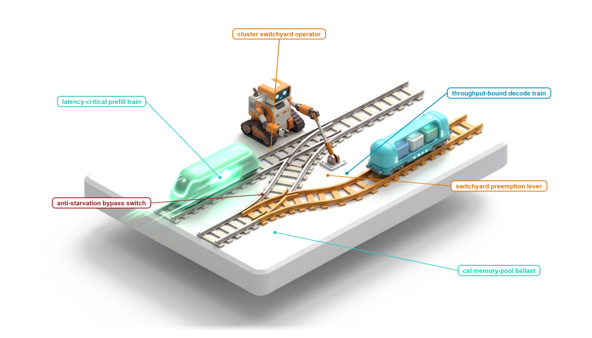{fig-alt="Blueprint for Fault Recovery."}
:::

::: {.content-visible unless-format="pdf"}
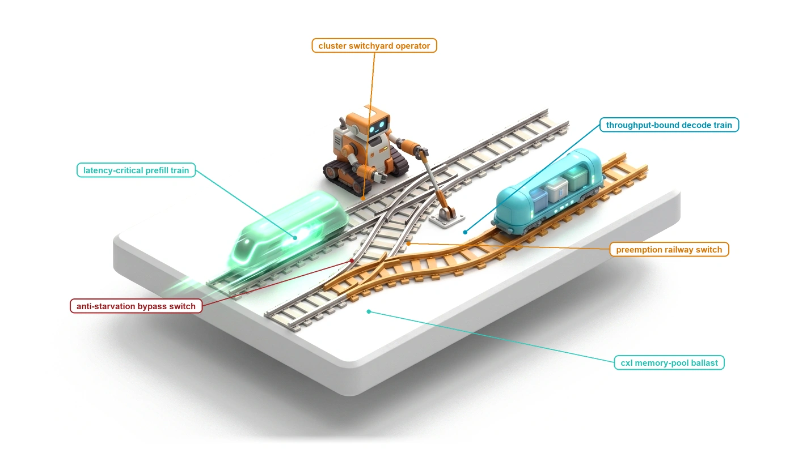{fig-alt="Blueprint for Fault Recovery."}
:::

:::

## Purpose {.unnumbered .unlisted}

\begin{marginfigure}
\mlagentstack{0}{0}{100}{0}{0}{0}
\end{marginfigure}

_How does an autonomous system recover from cascading failures in an environment where past actions have irrevocable physical consequences?_

In classical distributed databases, fault recovery relies on the atomic guarantees of Two-Phase Commit: if any participating node fails, uncommitted transactions are cleanly aborted and system state reverts to its pre-transaction baseline. In agentic machine learning systems, atomic rollbacks are physically impossible: once an agent executes an external API call, compiles a binary, or alters a filesystem tree, the side effects exist in the real world and cannot be erased by a local software abort. When an agent encounters an unhandled exception, a corrupted context window, or an environmental failure, naive retry strategies simply resend the identical prompt, repeatedly triggering the same hallucinated error while exhausting token budgets. Systems engineers must construct semantic fault recovery architectures: implementing distributed Saga orchestration patterns that execute compensating actions to gracefully unwind partial failures. The runtime must deploy semantic watchdogs that monitor execution trajectories for circular behavior, trip circuit breakers when error rates exceed safe thresholds, and prune poisoned context branches through tree-of-thought rollbacks. Engineering dependable fault tolerance requires co-designing forward compensation workflows, automated anomaly detectors, and isolated repair sub-agents to preserve system invariants when operational plans fail.

::: {.content-visible when-format="pdf"}

\newpage

:::

::: {.callout-learning-objectives}

- Formalize the Fail-Plausible fault model, contrasting semantic Byzantine defects in stochastic models with classical crash-stop and fail-silent hardware failures.
- Map the Reversibility Boundary, defining mathematical criteria to bifurcate zero-cost invertible operations (local filesystem diffs, memory mutations) from non-invertible external actions (API dispatches, financial payments).
- Design and execute distributed Sagas for agent trajectories, pairing every forward action with an explicit, pre-compiled compensating transaction.
- Implement forward recovery (checkpoint retry with policy re-prompting or tool fallback) versus backward recovery (compensating rollback), establishing formal decision thresholds.
- Construct supervisory circuit breakers and deadlock detectors that identify infinite error-correction loops, context poisoning amplification, and tool failure cascades.
- Architect an automated incident triage and human escalation protocol for un-compensatable catastrophic execution failures.

:::

## The Transactional Boundary Collapse {#sec-vol3-sagas-acid-boundary}

The foundational guarantee established in the preceding chapter was durable provenance: by maintaining an append-only write-ahead log (WAL) and capturing periodic state snapshots, an agent runtime can survive host kernel crashes and network disconnections without losing its historical trajectory. Yet recording a failure with microscopic fidelity does not repair the external environment. When an autonomous agent transitions from an advisory conversational assistant into an operational execution engine—authorized to provision cloud infrastructure, mutate production relational tables, issue payment transactions, generate code branches, and dispatch external notifications—it crosses a decisive architectural Rubicon. It leaves the hermetic, read-only domain of autoregressive inference and enters the non-deterministic world of distributed side effects. In this operational domain, an agent trajectory is not a single atomic instruction executed across a CPU datapath; it is an unrolled, multi-step sequence of heterogeneous remote procedure calls (RPCs) spanning distinct administrative domains over seconds, minutes, or hours. When such an execution sequence fails at step seven of a ten-step plan, the durable write-ahead log provides an indisputable record of partial mutation, but offers no native mechanism to restore environmental equilibrium. The systems challenge of autonomous fault recovery is therefore not archival, but operational: what formal contract governs the runtime when an unprivileged agent leaves external infrastructure in an inconsistent, half-mutated state?

For more than four decades, classical computer systems resolved the dilemma of partial failure through the transaction concept formalized by Jim Gray in 1981. Under classical database semantics, the twin guarantees of Atomicity and Isolation govern state mutation: either an entire batch of modifications commits successfully, or the runtime executes an abort, relying on private undo logs, shadow pages, or write locks to erase every intermediate write and render the aborted attempt completely invisible to concurrent observers. When transactions span multiple independent storage nodes, distributed systems deploy Two-Phase Commit ($2\text{PC}$) protocols, wherein a central coordinator establishes a prepare phase to force participants into a pre-committed, locked state before issuing a definitive, globally synchronized commit command. In an autonomous agent system, however, this classical transactional boundary completely collapses. The agent runtime is an unprivileged host supervisor operating under the doctrine of Zero Ambient Authority ($A=0$). The model itself is a non-deterministic statistical engine generating unverified action proposals held in temporary memory escrow. Once the host supervisor validates an action proposal and dispatches it over an external network boundary—invoking GitHub's REST API to open a pull request, Stripe's API to capture a charge, AWS EC2 to launch a compute cluster, or an internal webhook to alert an engineering team—the agent runtime relinquishes administrative control. These remote endpoints do not share a common write-ahead log, do not expose internal database undo mechanisms, and refuse to participate in distributed Two-Phase Commit protocols. Every dispatched HTTP request commits immediately upon arrival at the remote server, instantly entering the durable state of the external service and becoming globally visible to third parties. No subsequent database `ROLLBACK` command can un-send a message broadcast to a client channel, un-provision a virtual machine that has begun accumulating billing charges, or un-merge a commit that has already triggered a production deployment pipeline.

Even if external service providers could be coerced into exposing distributed lock managers, classical transaction semantics would remain physically impossible due to the mathematical behavior of Long-Lived Transactions (LLTs). In conventional Online Transaction Processing (OLTP) engines, transactions acquire exclusive write locks ($X$-locks) and shared read locks ($S$-locks) over data rows for durations bounded by microseconds or milliseconds. Under strict two-phase locking (2PL), serializability is preserved because the duration of lock holding is limited by the physical access latencies of DRAM and solid-state drives. In sharp contrast, an autonomous agent trajectory is fundamentally high-latency, bursty, and open-ended. An agent executing an end-to-end task must interleave network tool calls with autoregressive neural decode loops—each forward token generation step bound by GPU High Bandwidth Memory bus constraints (the decode GEMV bottleneck)—and may suspend execution entirely while awaiting asynchronous human approval gates, unit test execution, or continuous integration passes. If the runtime attempted to maintain exclusive distributed locks across external resources for the lifespan of an agent trajectory, the probability of lock starvation and catastrophic distributed deadlock approaches certainty. As Gray proved, the probability of deadlock in a system with $N$ concurrent transactions scales quadratically with transaction length, growing as $O(N^2 \cdot L^4)$, where $L$ represents the number of actions executed per transaction. Multiplying transaction holding times from five milliseconds to ten minutes increases the deadlock frequency by orders of magnitude, causing systemic lock starvation that paralyses the entire hosting infrastructure. Compounding this physical lock starvation is the epistemic gap of the neural predictor itself. Because the model operates open-loop between discrete tool invocations, early errors compound exponentially across the trajectory: a model that misinterprets a network timeout at step three produces hallucinated diagnostic actions at step four, executing uncoordinated, invalid mutations that further corrupt external state. As contrasted in @tbl-vol3-acid-vs-saga, classical database transactions rely on locks and undo logs, whereas agent systems require distributed saga semantics. Without strict transactional isolation, these corrupt intermediate states leak immediately into the surrounding environment, polluting concurrent workflows and triggering cascading failures across the enterprise.

| Dimension                  | Classical ACID Transactions ($2\text{PC}$)                              | Distributed Agent Saga Contracts                                |
|:---------------------------|:------------------------------------------------------------------------|:----------------------------------------------------------------|
| **Transactional Boundary** | Homogeneous, tightly coupled databases sharing lock managers            | Heterogeneous, autonomous SaaS APIs and physical side effects   |
| **Atomicity Mechanism**    | Transparent all-or-nothing rollback via private undo logs               | Application-level semantic compensation via forward actions     |
| **Isolation & Visibility** | Full serializability ($I=\text{Strict}$); intermediate writes invisible | Zero isolation ($I=0$); partial mutations committed immediately |
| **Resource Concurrency**   | Short-duration exclusive locks across storage rows (milliseconds)       | Lock-free optimistic execution with compensating reconcilers    |
| **Failure Horizon**        | Crash recovery resets state to last committed checkpoint                | Forward repair, backward compensation, or manual escalation     |
| **Authority Boundary**     | Trusted database kernel with complete ambient storage access            | Unprivileged supervisor mediating untrusted model proposals     |

: **Classical ACID vs. Distributed Agent Saga Recovery**: Classical ACID Two-Phase Commit ($2\text{PC}$) versus Distributed Agent Saga recovery contracts across systems dimensions. {#tbl-vol3-acid-vs-saga}

Because classical isolation and transparent atomic rollback are physically impossible across autonomous execution boundaries, the systems architect must abandon the ideal of hidden partial failures and embrace an explicit, fault-tolerant coordination model: the Saga pattern, originally introduced by Hector Garcia-Molina and Kenneth Salem in 1987 for long-lived database processes. A Saga relaxes the requirement of full transactional isolation ($I=0$) by decomposing a long-horizon distributed trajectory into an ordered directed graph of discrete, self-contained sub-transactions. Each forward sub-transaction commits its state changes immediately and releases all local resource locks, making its results instantly visible to the external world. To preserve system consistency when an intermediate step aborts, every forward action carrying external side effects is explicitly paired with an application-level compensating transaction. A compensating transaction does not perform magic time-travel or rewrite historical reality; instead, it executes an active, semantically sound forward mutation that counterbalances, neutralizes, or semantically amends the partial side effects of the committed action. If an agent trajectory successfully provisions an isolated cloud virtual machine at step one, compiles an updated binary at step two, and suffers an unrecoverable authentication rejection at step three, the runtime does not issue a futile database abort. Instead, it traverses the executed trajectory in reverse order, executing the registered compensating transaction for step one by dispatching an explicit teardown RPC to terminate the provisioned instance. Crucially, this recovery sequence cannot rely on the unprivileged foundation model to spontaneously remember, infer, or invent corrective measures after a failure. In accordance with the End-to-End Argument of Saltzer, Reed, and Clark (1984), fault tolerance and invariant closure cannot be offloaded to an untrusted endpoint; they must be guaranteed by an authoritative supervisor residing outside the model. The host agent runtime must maintain the Saga coordination log, track the execution state of every forward action and compensation handler, enforce idempotency tokens across network retry boundaries, and verify environmental invariants through deterministic external software checks. How do we formally construct a Saga execution engine that pairs forward agent actions with compensating rollback actions?

## The Trajectory Saga Pattern {#sec-vol3-sagas-architecture}

::: {.column-margin}
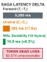{width="100%" fig-alt="Three horizontal bars on a logarithmic scale, ordered longest to shortest, labelled forward, unwind and WAL fsync."}

*Compensating unwind costs 17.6x less than the forward path it reverses.*
:::
External API invocations and filesystem mutations cannot be suspended in an uncommitted state while a neural model deliberates on its next action. Once an agent dispatches an HTTP `POST` to allocate a cloud virtual machine, that physical instance boots, acquires an IP address, and incurs billing metrics regardless of what subsequent tokens the autoregressive decode loop generates. If step five of an eight-step deployment workflow encounters a non-recoverable error—such as an invalid domain name registration or an immutable permission denial—the runtime cannot execute an atomic database `ROLLBACK`. The database concept of isolation collapses because third-party endpoints, external services, and remote filesystems expose intermediate state to the rest of the world immediately upon command completion.

The **Trajectory Saga pattern** resolves partial execution anomalies by decomposing long-horizon agent execution into a sequence of discrete, locally committed sub-transactions, each paired with an explicit, forward-executing compensating action registered in the Agent Control Block (ACB). When a sub-transaction fails, the runtime halts forward progression and unwinds the executed trajectory in reverse order, executing compensations to transition the external environment into a semantically consistent terminal state.

The mechanics of this coordination contract are mapped in @fig-vol3-saga-flow. In the forward execution tier, each discrete sub-transaction $T_i$ immediately commits its external mutations—creating a scratch worktree branch at $T_1$, provisioning an AWS EC2 microVM instance at $T_2$, and placing a pre-authorization hold on a Stripe billing card at $T_3$. Because external third-party endpoints cannot be held in an uncommitted state, each action commits immediately, relinquishing global isolation ($I=0$). Concurrently, the host runtime supervisor serializes the corresponding compensating action ($C_1, C_2, C_3$) and pushes it onto the LIFO recovery stack $\Sigma$ within the Agent Control Block (ACB). When execution abruptly aborts at $T_4$ due to an unhandled container crash (exit code 137, OOM killed), the supervisor traps the failure, freezes forward progression, and prevents the unprivileged model from generating further actions. The Saga Recovery Coordinator then traverses the LIFO stack in strict reverse order: first popping and executing $C_3$ to release the Stripe authorization hold, next dispatching $C_2$ to terminate the EC2 compute instance and detach storage volumes, and finally executing $C_1$ to purge the scratch git branch. By unwinding mutations through pre-compiled, deterministic handlers rather than stochastic model re-prompting, the system reliably restores environmental equilibrium to a clean `ABORT_CONSISTENT` baseline.

::: {#fig-vol3-saga-flow fig-env="figure" fig-pos="htb" fig-cap="**Trajectory Saga Execution Flow**: Forward sub-transaction progression paired with reverse compensating unwind. Each forward step $T_i$ immediately commits its external mutations and registers a corresponding compensating transaction $C_i$ on the LIFO recovery stack $\Sigma$. Upon unrecoverable execution failure at $T_4$, the host supervisor suspends forward progression and executes compensating handlers in reverse order ($C_3 \to C_2 \to C_1$), returning external infrastructure to a consistent neutral state." fig-alt="Systems diagram showing forward steps T1 through T4 with immediate external commits and LIFO compensator stack registration, followed by supervisor-driven reverse unwind of compensators C3, C2, and C1."}
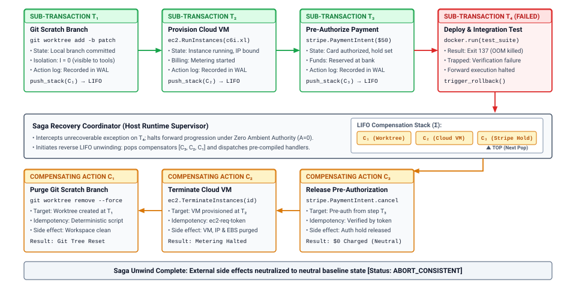
:::

### Formalizing the Trajectory as an Open Saga

In classical transaction theory, Hector Garcia-Molina and Kenneth Salem (1987) defined a Saga as a long-lived transaction consisting of a sequence of relatively short sub-transactions that can be interleaved with other transactions. Applying this formalism to agentic machine learning systems, we define an agent trajectory $\mathcal{T}$ of length $n$ as an ordered sequence of discrete, forward-executing sub-transactions:

$$\mathcal{T} = [T_1, T_2, \dots, T_n]$$

Each sub-transaction $T_i$ represents a single, indivisible interaction between the host agent runtime and the external environment. A sub-transaction is formally expressed as a four-tuple:

$$T_i = \langle \alpha_i, \theta_i, \phi_i, \kappa_i \rangle$$

where $\alpha_i$ is the semantic action identifier (such as `provision_vm` or `write_file`), $\theta_i$ is the concrete parameter payload generated by the unprivileged foundation model, $\phi_i$ denotes the environmental precondition and postcondition assertions validated by the runtime, and $\kappa_i$ is a globally unique idempotency key generated by the supervisor.

::: {.column-margin}
**Sagas vs. Distributed Two-Phase Commit ($2\text{PC}$)**
In $2\text{PC}$, all participating resource managers acquire exclusive locks during the prepare phase and hold them until the coordinator issues a global commit. In agentic systems, model inference is slow and non-deterministic ($t_{\text{decode}} \sim 2\text{--}15\,\text{s}$ per step). Holding physical locks across remote services while awaiting autoregressive token generation causes catastrophic lock contention, distributed deadlocks, and network timeout cascades.
:::

Because the unprivileged model operates under Zero Ambient Authority ($A=0$), it never executes $T_i$ directly. Instead, the runtime validates $\theta_i$, generates $\kappa_i$, executes the physical operation against the underlying operating system or remote API, and immediately commits the result locally. Concurrently, the runtime registers a corresponding compensating transaction $C_i$:

$$C_i = \langle \alpha_i^c, \theta_i^c, \kappa_i^c \rangle$$

where $\alpha_i^c$ is the neutralizing action, $\theta_i^c$ is the parameterized compensation payload, and $\kappa_i^c$ is the compensation idempotency key. The complete compensating trajectory $\mathcal{C}$ is the reversed sequence of compensators:

$$\mathcal{C} = [C_n, C_{n-1}, \dots, C_1]$$

Under normal execution, the system completes the full sequence $T_1 \circ T_2 \circ \dots \circ T_n$, reaching the terminal goal state $S_{\text{goal}}$. However, if an arbitrary sub-transaction $T_k$ ($1 \le k \le n$) fails its postcondition validation, times out, or returns a fatal upstream status code, the runtime terminates forward execution. To maintain semantic consistency, the supervisor must guarantee that the environment transitions through a compensating sequence:

$$\mathcal{T}_{\text{exec}} = T_1 \circ \dots \circ T_{k-1} \circ T_k^{\text{failed}} \circ C_{k-1} \circ \dots \circ C_1$$

If $T_k$ produced partial side effects before failing, its own compensator $C_k$ is executed first; if $T_k$ aborted cleanly prior to mutating state, the unwind starts strictly at $C_{k-1}$. The lifecycle of each sub-transaction inside the runtime is tracked through a deterministic state machine, detailed in @tbl-vol3-saga-state-transitions.

| State          | Invariant Condition                                                                | Valid Transitions            | Supervisor Action                                               |
|:---------------|:-----------------------------------------------------------------------------------|:-----------------------------|:----------------------------------------------------------------|
| `PENDING`      | Step proposed by model; escrowed in ACB; zero external mutations.                  | `EXECUTING`, `ABORTED`       | Validate payload schema; enforce capability boundaries.         |
| `EXECUTING`    | Forward RPC dispatched with idempotency key $\kappa_i$; awaiting endpoint ACK.     | `COMMITTED`, `FAILED`        | Monitor watchdog timer; capture network receipt.                |
| `COMMITTED`    | External mutation completed; postcondition verified; compensator $C_i$ registered. | `COMPENSATING`               | Push $C_i$ onto durable LIFO stack; advance trajectory counter. |
| `FAILED`       | Forward step aborted, timed out, or violated invariant checks.                     | `COMPENSATING`, `HALTED`     | Halt forward decode loop; trigger reverse unwind sequence.      |
| `COMPENSATING` | Neutralizing action $C_i$ dispatched with idempotency key $\kappa_i^c$.            | `COMPENSATED`, `PANIC`       | Execute compensation handler; verify environmental release.     |
| `COMPENSATED`  | Side effects neutralized; state returned to semantic baseline.                     | `COMPENSATING`, `TERMINATED` | Pop $C_i$ from stack; invoke preceding compensator $C_{i-1}$.   |
| `PANIC`        | Compensator $C_i$ failed unrecoverably; automated recovery halted.                 | `MANUAL_ESCALATION`          | Isolate trajectory blast radius; trigger operator pager.        |

: **Trajectory Saga Sub-Transaction State Transition Matrix**: State transition matrix for Trajectory Saga sub-transactions. Every forward mutation must reach either `COMMITTED` or undergo transition to `COMPENSATED` via the reverse unwind path. {#tbl-vol3-saga-state-transitions}

### Compensating Action Semantics

A compensating action is fundamentally distinct from a database rollback. In a relational database operating under ARIES-style write-ahead logging, rolling back an aborted transaction restores the exact physical image of disk pages using historical `BEFORE-IMAGE` log records. The transaction's existence is erased as though it had never occurred.

In an agentic system interacting with real-world operating systems and networks, historical erasure is physically impossible. Time has elapsed, resources have been consumed, network packets have traversed switches, and external observers may have inspected intermediate state. Therefore, a compensating transaction does not perform magic time-travel; it is an active, forward-executing mutation designed to establish *semantic equivalence* with the initial state.

::: {.column-margin}
**Intermediate State Visibility**
Because Sagas relax the Isolation ($I$) property of ACID, an external observer (such as a human operator or a concurrent agent) can observe the intermediate state produced by $T_1$ before $T_k$ fails. If an agent creates an S3 bucket in $T_1$, that bucket is globally visible until $C_1$ destroys it during compensation. Systems relying on Sagas must be designed to tolerate temporary dirty reads of environmental state.
:::

Let $\mathcal{S}$ denote the state space of the external environment, and let $f_{\text{ext}}: \mathcal{S} \times \mathcal{A} \to \mathcal{S}$ represent the state transition function under action $\alpha$. If the initial state is $S_0$, executing forward sub-transaction $T_1$ yields state $S_1 = f_{\text{ext}}(S_0, T_1)$. Executing the compensating transaction $C_1$ from $S_1$ yields state $S'_0 = f_{\text{ext}}(S_1, C_1)$. In general:

$$S'_0 \ne S_0$$

The physical state $S'_0$ contains distinct historical artifacts: cloud billing meters have incremented, local system log files contain append-only audit entries, operating system process IDs have advanced, and ephemeral TCP port reservations have cycled. However, the runtime requires only that $S'_0$ satisfies *semantic equivalence* with respect to the application's core invariants:

$$S'_0 \equiv_{\text{semantic}} S_0 \iff \forall \phi \in \Phi_{\text{invariants}}, \quad \phi(S'_0) = \phi(S_0)$$

where $\Phi_{\text{invariants}}$ is the set of system invariants governing resource allocations, file integrity, access control privileges, and process boundaries.

::: {#callout-def-vol3-semantic-compensation .callout-definition title="Definition 11.1: Semantic Compensation Duality"}
Let $\mathcal{W}$ denote external world state, $T_i$ denote an external tool action that transitions state from $\mathbf{S}_{i-1}$ to $\mathbf{S}_i$, and $C_i$ denote its corresponding compensating action:

1. **Physical Rollback (Impossible under External Side Effects)**:
   Requires physical time-reversal to undo external observations and network mutations:
   $$\mathbf{S}_{i-1} \xrightarrow{\quad T_i \quad} \mathbf{S}_i \xrightarrow{\quad \text{Rollback} \quad} \mathbf{S}_{i-1}$$
   Violated when $T_i$ crosses process or network boundaries (e.g. cloud provisioning, external emails, database commits).
2. **Semantic Compensation (Forward Mutating Equivalence)**:
   Applies an active forward compensating operation $C_i$ that transitions system state to $\mathbf{S}_{i-1}'$:
   $$\mathbf{S}_{i-1} \xrightarrow{\quad T_i \quad} \mathbf{S}_i \xrightarrow{\quad C_i \quad} \mathbf{S}_{i-1}'$$
   where $\mathbf{S}_{i-1}' \not\equiv \mathbf{S}_{i-1}$ physically (e.g. invoice cancellation receipt exists), but $\mathbf{S}_{i-1}' \equiv_{\text{semantic}} \mathbf{S}_{i-1}$ under system invariants $\Phi_{\text{invariants}}$.
:::

To illustrate, consider three canonical archetypes of compensating actions encountered in production agent runtimes:

1. **Invertible State Mutations:** Actions with well-defined inverse operations. If $T_i$ appends an export declaration to `~/.bashrc`, $C_i$ executes a targeted sed script or AST manipulation to strip that exact declaration. Physical inode numbers and file modification timestamps change ($S'_0 \ne S_0$), but the shell execution environment is functionally indistinguishable from $S_0$.
2. **Resource Allocation Quenching:** Actions that provision ephemeral infrastructure. If $T_i$ dispatches an RPC to instantiate a Kubernetes Pod, $C_i$ dispatches a `DELETE` RPC targeting that Pod's unique UID. While cluster scheduling logs and metric counters record the Pod's brief existence, the physical memory, CPU cores, and network endpoints are freed back to the cluster pool.
3. **Compensating Balance Adjustments:** Actions that mutate financial or quota-based state. If $T_i$ reserves $100$ compute credits from a regional quota ledger, $C_i$ issues a crediting transaction of $100$ units. The ledger history reflects two distinct transactions rather than zero, but the net available balance is restored.

Compensating actions must be strictly *commutative* with respect to unrelated system activity and *idempotent* under network retry. If a network blip causes the runtime to doubt whether $C_i$ succeeded, re-issuing $C_i(\kappa_i^c)$ multiple times must yield the exact same environmental state as executing it once, without producing orphan side effects.

### Saga Compensation Stacks

The execution of a Trajectory Saga is managed by the *Saga Orchestrator*, an authoritative control plane component operating within the host runtime supervisor. The orchestrator maintains two primary data structures inside the Agent Control Block (ACB): the *Forward Execution Log* ($\mathcal{L}_{\text{fwd}}$) and the *LIFO Compensation Stack* ($\mathcal{S}_{\text{comp}}$).

: **Agent Control Block Saga Orchestrator Structures**: Internal state architecture of the forward execution write-ahead log and LIFO compensation stack. {#tbl-vol3-saga-orchestrator-state}

| Subsystem Layer                                        | Data Structure              | Entry State & Parameters                         | Operational Role                                                         |
|:-------------------------------------------------------|:----------------------------|:-------------------------------------------------|:-------------------------------------------------------------------------|
| **Forward Execution Log ($\mathcal{L}_{\text{fwd}}$)** | Append-only write-ahead log | `Entry 1: T_1 [COMMITTED] (idempotency_key=k_1)` | Records sequential forward progression; establishes durable audit trail. |
| **Forward Execution Log ($\mathcal{L}_{\text{fwd}}$)** | Append-only write-ahead log | `Entry 2: T_2 [COMMITTED] (idempotency_key=k_2)` | Captures intermediate parameters and outputs required for compensation.  |
| **Forward Execution Log ($\mathcal{L}_{\text{fwd}}$)** | Append-only write-ahead log | `Entry 3: T_3 [FAILED] (idempotency_key=k_3)`    | Triggers fault handling; halts forward progression before pivot action.  |
| **Compensation Stack ($\mathcal{S}_{\text{comp}}$)**   | LIFO execution stack        | `TOP -> C_2: teardown_sandbox(id="sbx-99")`      | First compensator popped; unwinds most recent committed side effect.     |
| **Compensation Stack ($\mathcal{S}_{\text{comp}}$)**   | LIFO execution stack        | `STACK[0] -> C_1: release_port(port=8080)`       | Second compensator executed; restores baseline network state.            |

The orchestrator enforces a strict discipline on how tools are exposed to the foundation model. Under no circumstances is the model permitted to synthesize compensating actions on the fly during a failure. When an autoregressive model hallucinates a compensation command under stress, it frequently compounds the damage—for instance, issuing `rm -rf /` or deleting the wrong virtual network interface. Instead, the runtime supervisor requires tool developers to register forward-compensating action pairs at tool definition time.

When the agent proposes a forward tool call $T_i$, the orchestrator registers $T_i$ in $\mathcal{L}_{\text{fwd}}$ as `PENDING`. Upon successful execution and postcondition assertion, the orchestrator constructs the fully bound compensator $C_i$ using the output metadata returned by $T_i$ (such as allocated resource IDs, initial file contents, or process handles). The orchestrator writes $C_i$ to durable storage (the Write-Ahead Log) and pushes its pointer onto $\mathcal{S}_{\text{comp}}$ before yielding control back to the foundation model for step $i+1$.

The unwind algorithm executed by the supervisor upon encountering a terminal failure in sub-transaction $T_k$ follows a deterministic loop:

```python
def unwind_saga(acb: AgentControlBlock) -> None:
    acb.set_state(TrajectoryState.COMPENSATING)
    while not acb.compensation_stack.is_empty():
        compensator = acb.compensation_stack.peek()
        try:
            # Compensators must be idempotent and assert their postconditions
            compensator.execute(idempotency_key=compensator.key)
            acb.wal.append_record(RecordType.COMPENSATED, compensator.id)
            acb.compensation_stack.pop()
        except RetriableError as err:
            acb.backoff_and_retry(compensator)
        except FatalCompensationError as fatal:
            acb.wal.append_record(RecordType.PANIC, compensator.id, fatal)
            acb.set_state(TrajectoryState.PANIC)
            raise QuarantineEscalationException("Saga compensation halted", fatal)
    acb.set_state(TrajectoryState.TERMINATED_CLEAN)
```

The robustness of this architecture depends on the physical handling of crashes during the compensation phase itself. If the host agent process suffers a hardware failure, power loss, or kernel panic while executing $C_{k-2}$, the runtime on reboot reads the durable Write-Ahead Log from NVMe storage, reconstructs $\mathcal{S}_{\text{comp}}$, and inspects the last uncommitted record. Because compensators are guaranteed to be idempotent via unique idempotency keys ($\kappa^c$), the recovery manager safely re-dispatches $C_{k-2}$. The compensating sequence resumes precisely where it was interrupted, guaranteeing that partial compensations do not strand system resources.

::: {#exmp-11-latency-cost-and-storage-overheads .callout-example title="Saga Log Unwinding Overheads"}
**Scenario:** An autonomous agent executing a software deployment workflow attempts a 6-step trajectory on an enterprise host:

1. `T_1`: Provision an isolated microVM sandbox via local hypervisor socket ($120\,\text{ms}$).
2. `T_2`: Reserve a public IPv4 egress address via regional cloud API ($350\,\text{ms}$).
3. `T_3`: Compile target binary inside the sandbox ($4{,}200\,\text{ms}$).
4. `T_4`: Write routing rules and bind firewall ports ($80\,\text{ms}$).
5. `T_5`: Publish DNS record to external authoritative nameserver ($450\,\text{ms}$).

During step 5, `T_5` fails with an unrecoverable `409 Conflict` (domain ownership collision). The orchestrator halts forward execution and initiates backward compensation using $\mathcal{S}_{\text{comp}} = [C_4, C_3, C_2, C_1]$.

**Parameters:**

- Network round-trip latency to regional cloud API: $t_{\text{api}} = 150\,\text{ms}$.
- Local NVMe Write-Ahead Log fsync latency per state transition: $t_{\text{fsync}} = 1.2\,\text{ms}$.
- MicroVM teardown time: $t_{\text{teardown}} = 45\,\text{ms}$.
- Compilation cleanup (removing build cache directory): $t_{\text{clean}} = 15\,\text{ms}$.
- Firewall unbind time: $t_{\text{fw}} = 10\,\text{ms}$.
- Egress IP release API call duration: $t_{\text{release}} = 220\,\text{ms}$.
- LLM inference cost: $\$3.00$ per $10^6$ input tokens, $\$15.00$ per $10^6$ output tokens. Forward trajectory consumed $18{,}400$ input tokens and $1{,}250$ output tokens across steps $1\text{--}5$.

**Calculations:**

1. *Durable I/O Overhead:* Each sub-transaction incurs two fsync operations (transition to `COMMITTED`, and recording $C_i$ on stack). The forward phase incurred:
   $$N_{\text{fsync, fwd}} = 5 \times 2 = 10 \text{ writes} \implies t_{\text{io, fwd}} = 10 \times 1.2\,\text{ms} = 12\,\text{ms}$$
   The compensation unwind for steps 4 down to 1 requires one fsync per compensator pop:
   $$N_{\text{fsync, rev}} = 4 \times 1 = 4 \text{ writes} \implies t_{\text{io, rev}} = 4 \times 1.2\,\text{ms} = 4.8\,\text{ms}$$
   Total log persistence overhead is $16.8\,\text{ms}$, representing less than $0.3\%$ of total trajectory wall-clock time.

2. *Unwind Execution Latency:*
   The total wall-clock time spent actively neutralizing side effects during the reverse unwind is:
   $$t_{\text{unwind}} = t_{\text{fw}} + t_{\text{clean}} + t_{\text{release}} + t_{\text{teardown}} + t_{\text{io, rev}}$$
   $$t_{\text{unwind}} = 10\,\text{ms} + 15\,\text{ms} + 220\,\text{ms} + 45\,\text{ms} + 4.8\,\text{ms} = 294.8\,\text{ms}$$
   Notice that $t_{\text{clean}}$ for compilation ($T_3$) is trivial because throwing away the ephemeral sandbox disk layer completely neutralizes $4{,}200\,\text{ms}$ of forward CPU compilation time in $15\,\text{ms}$.

3. *Financial Waste Accounting:*
   The financial capital consumed by the failed attempt comprises token costs and external resource reservations:
   $$\text{Cost}_{\text{tokens}} = \left(18{,}400 \times \frac{3.00}{10^6}\right) + \left(1{,}250 \times \frac{15.00}{10^6}\right) = \$0.0552 + \$0.01875 = \$0.07395$$
   Because the Saga Orchestrator executed $C_2$ (releasing the static IPv4 reservation within $295\,\text{ms}$ of failure), cloud egress holding fees were truncated before incurring hourly quantization charges.

**Key Architectural Takeaway:** The physical time to unwind the failed trajectory ($294.8\,\text{ms}$) is an order of magnitude smaller than the forward execution time ($5{,}200\,\text{ms}$). The Write-Ahead Logging overhead ($16.8\,\text{ms}$) is negligible compared to network and compilation latencies. However, the $\$0.074$ of burned inference tokens and the forward wall-clock execution time represent an unrecoverable dead loss.
:::

The latency and financial realities highlighted in the worked example reveal a fundamental engineering trade-off at the heart of runtime design. Unwinding a Saga via backward compensation guarantees semantic cleanliness, but it is brutally destructive of work already accomplished. In our deployment scenario, the agent spent over five seconds of real-world time and tens of thousands of tokens successfully spinning up a verified microVM, provisioning an IP address, and compiling complex binary assets, only to discard all of them because of a cosmetic error at the final naming step.

If the failure at step five was caused by a transient DNS API timeout, a typographical syntax error in a configuration payload, or a temporary rate limit on an external endpoint, tearing down the entire infrastructure stack and starting over from scratch is catastrophically inefficient. Under what circumstances should an agent runtime abandon backward rollback and instead attempt to heal forward through localized, self-correcting mutations?

## Forward Recovery {#sec-vol3-sagas-forward-vs-backward}

::: {.column-margin}
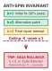{width="100%" fig-alt="Phase portrait diagram delineating the point of no return where non-compensable side-effects preclude state rollback."}

*Crossing irreversible pivot actions requires durable physical escrow before irreversible side-effects commit.*
:::
An agent executing an automated cloud migration fails at step six of eight: a generated configuration manifest contains a malformed JSON escape sequence that causes the container orchestration daemon to reject the deployment payload. If the host supervisor responds with unconditional backward compensation, it triggers the registered compensator chain $C_5, C_4, C_3, C_2, C_1$. In doing so, the runtime destroys an allocated virtual private cloud, tears down a provisioned relational database replica, de-registers DNS entries, and discards tens of thousands of tokens of deliberative prefill and decode work—all to rectify an unescaped double quote. Conversely, if the runtime blindly re-executes the forward transaction without inspecting the error, the unprivileged language model receives no diagnostic signal, re-samples from the same predictive distribution, and reproduces the identical syntax failure.

**The agent runtime must dynamically arbitrate between backward rollback and forward self-healing, balancing the accumulated sunk cost of completed sub-transactions against the convergence probability and token expenditure of synthesizing localized corrective mutations.** Unconditional rollback prioritizes clean external invariants at the expense of extreme latency and resource waste. Unchecked forward self-healing preserves committed infrastructure work but risks trapping the agent in non-terminating repair loops that compound initial errors. A dependable runtime implements a formal decision policy that measures remaining resource budgets, evaluates error classification signatures, and enforces an anti-spin invariant that bounds forward repair attempts before cascading to compensation or human escalation.

### The Recovery Spectrum

In their classical taxonomy of dependable computing, Algirdas Avizienis and colleagues formalized fault recovery as two fundamentally distinct mechanisms: backward recovery, which returns the system to an earlier error-free state prior to fault manifestation, and forward recovery, which transforms the current erroneous state into a new, valid state enabling computation to proceed [@avizienis2004dependable]. Distributed databases almost exclusively implement backward recovery; because database engines maintain complete control over local physical frames and write-ahead logs, restoring an uncorrupted snapshot through page undo operations is deterministic and computationally inexpensive.

::: {.column-margin}
**Backward vs. Forward Recovery**
*Backward Recovery:* Restores an earlier checkpoint $\mathbf{s}_k$ via compensators $(C_t, \dots, C_1)$, discarding intermediate work.
*Forward Recovery:* Synthesizes a new patch mutation $a_{\text{repair}}$ such that $(s_t, a_{\text{repair}}) \to s'_t$, driving the system forward to fulfill post-conditions.
:::

In an agentic machine learning system, the physical boundaries of execution break the database assumption. The agent manipulates external environments—third-party REST APIs, container daemons, remote git repositories, and cloud control planes—via discrete forward sub-transactions $T_i \in \mathcal{T}$. When sub-transaction $T_t$ fails, the runtime occupies an intermediate environment state $s_t$ that carries non-trivial creation latency and direct fiscal cost.

Under backward recovery, the runtime treats the partial execution sequence $(T_1, T_2, \dots, T_{t-1})$ as an aborted atomic unit. It traverses the trajectory log in reverse chronological order, issuing the sequence of compensating transactions:

$$\mathcal{C}_{t-1 \to 0} = \left( C_{t-1}, C_{t-2}, \dots, C_1 \right)$$

Each compensator $C_i$ executes as a distinct external RPC designed to logically neutralize the state mutation introduced by $T_i$. Backward recovery is semantically conservative. It guarantees that if the agent encounters an unrecoverable failure—such as revoked credentials, incompatible API versions, or impossible domain constraints—the external world is left in an uncorrupted, baseline configuration. However, backward compensation is strictly destructive of forward progress: every successful intermediate step is discarded, forcing any subsequent execution attempt to pay the full latency, compute, and monetary costs of rebuilding state from scratch.

Forward recovery adopts the opposite operational premise: rather than treating intermediate state as disposable, the runtime leverages the stochastic reasoning engine to diagnose the fault and alter the execution path. Upon receiving an error observation $o_t^{\text{err}}$ from a failed sub-transaction $T_t$, the runtime constructs a targeted diagnostic context and queries the foundation model for a corrective repair action:

$$a_{\text{repair}} \sim \pi_\theta\left(a \mid \tau_{<t}, T_t, o_t^{\text{err}}\right)$$

The repair action $a_{\text{repair}}$ does not unwind prior history. Instead, it applies a localized state transformation designed to satisfy the preconditions of $T_t$ or to substitute an alternative sub-transaction $T_t'$ that fulfills the identical operational post-condition. If step six failed because a generated manifest lacked a required namespace tag, $a_{\text{repair}}$ patches the YAML payload in memory and re-invokes the deployment tool. If step six failed because an allocated IP address experienced a transient route conflict, $a_{\text{repair}}$ requests a secondary IP address without tearing down the parent subnets provisioned in steps one through five. The trade-offs between backward compensation and forward stochastic self-healing are systematically compared in @tbl-vol3-recovery-comparison.

| Dimension             | Backward Recovery (Saga Compensation)                                                                              | Forward Recovery (Stochastic Self-Healing)                                                                       |
|:----------------------|:-------------------------------------------------------------------------------------------------------------------|:-----------------------------------------------------------------------------------------------------------------|
| **Primary Mechanism** | Deterministic execution of inverse compensators $C_i$                                                              | Stochastic synthesis of corrective action $a_{\text{repair}}$                                                    |
| **State Trajectory**  | $\mathbf{s}_t \xrightarrow{C} \mathbf{s}_{t-1}' \xrightarrow{C} \dots \xrightarrow{C} \mathbf{s}_0'$ (Restoration) | $\mathbf{s}_t \xrightarrow{a_{\text{repair}}} \mathbf{s}_t' \xrightarrow{T_t} \mathbf{s}_{t+1}$ (Transformation) |
| **Execution Cost**    | $\sum_{i=1}^{t-1} \text{Cost}(C_i) + \text{Cost}(\text{Re-execution})$                                             | $\text{Cost}(\text{LLM}_{\text{repair}}) + \text{Cost}(a_{\text{repair}})$                                       |
| **Determinism**       | High (pre-registered idempotent compensation code)                                                                 | Low (probabilistic sampling from policy $\pi_\theta$)                                                            |
| **Failure Mode**      | Compensator failure leading to dirty partial state                                                                 | Non-terminating repair loops ("spin loops")                                                                      |
| **Optimal Domain**    | Invariant violations, security breaches, hard limits                                                               | Transient tool faults, syntax errors, schema drift                                                               |

: **Backward vs. Forward Recovery in Agentic Runtimes**: Systematic comparison of recovery mechanisms in agentic execution runtimes across operational dimensions. {#tbl-vol3-recovery-comparison}

Forward recovery is inherently opportunistic and non-deterministic. Because the corrective action is generated by sampling from an unprivileged neural model, the runtime cannot guarantee that $a_{\text{repair}}$ will resolve the fault; indeed, a poorly calibrated repair step may introduce secondary faults that corrupt the environment further. The central engineering challenge is therefore constructing an automated supervisory harness that selects the appropriate recovery strategy based on observable runtime parameters.

### Dynamic Arbitration: The Recovery Policy Function

A resilient runtime does not treat recovery strategy selection as a static configuration switch. Instead, it evaluates a recovery policy function $\mathcal{D}$ immediately upon intercepting an execution fault. The policy arbitrates between three terminal directives: attempting forward repair, executing backward compensation, or halting execution for operator intervention.

Formally, let the runtime state at the moment of failure be represented by the tuple:

$$\Omega_t = \left( s_t, T_t, o_t^{\text{err}}, \mathbf{B}_t, \Sigma_t \right)$$

where $s_t$ is the observable environment state, $T_t$ is the failed sub-transaction, $o_t^{\text{err}}$ is the structured error payload returned by the host sandbox or external API, $\mathbf{B}_t = \langle T_{\text{rem}}, S_{\text{rem}}, \$_{\text{rem}} \rangle$ represents the remaining resource budget (tokens, trajectory steps, and monetary cost), and $\Sigma_t = (T_1, \dots, T_{t-1})$ is the history ledger of committed sub-transactions. The recovery policy $\mathcal{D}(\Omega_t)$ maps this state into an action space $\mathcal{A}_{\text{rec}} = \{\text{TRANSIENT\_RETRY}, \text{FORWARD\_REPAIR}, \text{BACKWARD\_ROLLBACK}, \text{OPERATOR\_ESCALATE}\}$.

::: {#fig-vol3-recovery-decision-tree fig-env="figure" fig-pos="htb" fig-cap="**Runtime Recovery Decision Architecture**: Multi-tier supervisory arbitration between forward self-healing, backward saga compensation, and operator escalation. Upon intercepting an execution fault $\Omega_t$, the supervisor evaluates error taxonomy, resource headroom, and economic amortization to select the recovery policy." fig-alt="Decision flowchart showing three sequential gates evaluating error classification, resource headroom, and economic amortization, arbitrating execution into transient retry, forward repair, backward rollback, or operator escalation."}
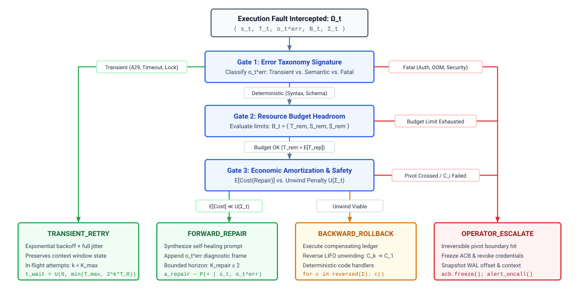
:::

As structured in @fig-vol3-recovery-decision-tree, the runtime supervisor routes an intercepted fault $\Omega_t$ through a hierarchical triage cascade that arbitrates among four distinct operational endpoints. First, Gate 1 classifies the error payload signature: transient network partitions or HTTP 429 rate limits peel off directly into `TRANSIENT_RETRY` with randomized exponential backoff ($t_{\text{wait}} \sim \mathcal{U}(0, \min(T_{\max}, 2^k T_0))$), while fatal invariant violations (such as revoked credentials or security sandbox evasions) immediately route to the right-hand escalation trunk. For deterministic semantic faults—such as compiler errors or schema mismatches—execution advances to Gate 2, which audits whether remaining token and monetary budgets ($\mathbf{B}_t$) can absorb an additional repair deliberation pass without risking context truncation. Finally, Gate 3 conducts an economic amortization evaluation, balancing expected repair costs against the cumulative unwind penalty $U(\Sigma_t)$: if the repair is tractable and sunk costs are substantial, the engine commits to `FORWARD_REPAIR`, whereas prohibitive repair complexity or irreversible pivot crossings trigger `BACKWARD_ROLLBACK` or manual `OPERATOR_ESCALATE`. The decision flow evaluates three sequential gates:

1. **Error Taxonomy and Diagnosability:** The runtime inspects the classification signature of $o_t^{\text{err}}$. Errors fall into three distinct operational categories:
   - *Transient Environmental Faults:* Network timeouts, HTTP 429 rate limits, and concurrent lock contentions. These faults require no structural modification to the trajectory; they are resolved via forward retry with exponential backoff and jitter.
   - *Deterministic Semantic Faults:* Schema validation rejections, syntax compilation errors, missing parameters, and local file-not-found exceptions. These represent high-probability candidates for forward self-healing, as the error trace contains explicit diagnostic feedback that the model can ingest to synthesize a corrected payload.
   - *Fatal Invariant Violations:* Authentication revocations, hardware resource exhaustion, unrecoverable database corruptions, and security sandbox constraint violations. Forward repair cannot synthesize a valid bypass for these faults. The runtime immediately aborts forward progress and triggers backward compensation.
2. **Resource Budget Headroom:** Forward self-healing consumes inference tokens and trajectory steps. Let $\mathbb{E}[T_{\text{repair}}]$ and $\mathbb{E}[\$_{\text{repair}}]$ represent the expected token consumption and monetary cost of an inference pass designed to generate $a_{\text{repair}}$. If the remaining budget $\mathbf{B}_t$ satisfies:

   $$T_{\text{rem}} < \mathbb{E}[T_{\text{repair}}] + T_{\text{reserve}} \quad \lor \quad \$_{\text{rem}} < \mathbb{E}[\$_{\text{repair}}] + \$_{\text{reserve}}$$

   the runtime denies forward repair. Attempting to repair a failure when token headroom is nearly exhausted risks causing context window truncation during the repair pass itself, inducing an unrecoverable failure mode in the recovery supervisor.

3. **Economic Amortization (Sunk Cost vs. Repair Cost):** Unwinding the trajectory requires executing compensators with total cost:

   $$U(\Sigma_t) = \sum_{j=1}^{t-1} \text{Cost}(C_j)$$

   If $U(\Sigma_t)$ is low (for example, if the failure occurs during the first sub-transaction of a multi-step workflow), the economic penalty of backward rollback is negligible. The runtime favors immediate compensation and clean restarts. Conversely, if $U(\Sigma_t)$ is high—representing minutes of compute, thousands of committed database rows, or irreversible manual setups—the expected cost of forward repair must be weighed against the probability of recovery success:

   $$\mathbb{E}[\text{Cost}(\text{Forward})] = \text{Cost}(a_{\text{repair}}) + \left(1 - P(\text{success} \mid o_t^{\text{err}})\right) \cdot U(\Sigma_t)$$

   When $P(\text{success} \mid o_t^{\text{err}})$ is high and $U(\Sigma_t)$ is substantial, forward self-healing is the mathematically optimal systems choice.

::: {#exmp-11-quantitative-trade-off-between-forward-patching .callout-example title="Forward Patching vs. Saga Rollback"}
Consider an autonomous site-reliability agent executing a six-step database migration and canary deployment pipeline across a cloud environment. The steps and their execution profiles are:

- $T_1$: Provision isolated VPC and network routes (Latency: $4.2\text{ s}$, Cost: $\$0.005$).
- $T_2$: Spin up auxiliary relational database replica (Latency: $18.5\text{ s}$, Cost: $\$0.040$).
- $T_3$: Allocate static public gateway IP (Latency: $1.1\text{ s}$, Cost: $\$0.001$).
- $T_4$: Launch containerized microVM cluster (Latency: $9.8\text{ s}$, Cost: $\$0.025$).
- $T_5$: Stream schema migration scripts to database (Latency: $12.4\text{ s}$, Cost: $\$0.010$).
- $T_6$: Deploy canary routing proxy with generated JSON routing table.

At step six ($T_6$), the proxy daemon rejects the configuration payload due to an invalid port mapping syntax error (`"port": "8080"` string instead of an integer `8080`), emitting a structured validation error to standard error. The agent runtime must choose between backward Saga compensation and forward self-healing.

**Scenario A: Backward Saga Rollback and Re-Execution**
The runtime executes the registered compensator chain in reverse: $C_5$ (revert schema migration via down-migrations, $14.1\text{ s}$), $C_4$ (terminate microVMs, $6.2\text{ s}$), $C_3$ (release gateway IP, $0.8\text{ s}$), $C_2$ (deprovision database replica, $16.0\text{ s}$), and $C_1$ (tear down VPC, $3.5\text{ s}$).

- Total Rollback Latency: $14.1 + 6.2 + 0.8 + 16.0 + 3.5 = 40.6\text{ seconds}$.
- Sunk Model Tokens: 38,500 prompt tokens and 3,100 generation tokens across steps $T_1$ through $T_5$, totaling $\$0.142$ in inference fees.
- Re-execution Cost: Repeating the entire workflow from step one to step six requires identical token generation and environment setup, consuming another $46.0\text{ s}$ of physical provisioning and $\$0.142$ of inference.
- Total Resource Penalty: $86.6\text{ seconds}$ of wall-clock delay, $\$0.284$ in redundant inference fees, and non-refundable cloud provisioning minimum charges.

**Scenario B: Forward Self-Healing via Corrective Mutation**
The runtime intercepts the validation error from $T_6$ and constructs a targeted repair prompt. The prompt includes:

- System recovery instructions: 1,200 tokens.
- Failed tool call payload: 850 tokens.
- Subprocess stderr diagnostic message: 340 tokens.
- Total Prompt: $2,390\text{ tokens}$.

The model samples a corrective patch $a_{\text{repair}}$ replacing the malformed payload with integer port specifications, producing 180 generation tokens.

- Inference Latency: At a time-to-first-token (TTFT) of $90\text{ ms}$ and a generation speed of $50\text{ tokens/second}$, the model outputs the fix in:
  $$\text{Latency} = 0.090\text{ s} + \frac{180}{50}\text{ s} = 3.69\text{ seconds}$$

- Tool Re-Execution: The proxy daemon validates the patched configuration in $0.4\text{ seconds}$.
- Monetary Cost: $2,390\text{ prompt tokens} \times \$3.00/10^6 + 180\text{ completion tokens} \times \$15.00/10^6 = \$0.00717 + \$0.00270 = \$0.00987$.

Empirical measurements on structured JSON schema repair tasks indicate that modern foundation models achieve a single-turn repair success rate $P(\text{success}) \approx 0.92$. The expected latency and fiscal cost of forward repair are:

$$\mathbb{E}[\text{Latency}] = 3.69\text{ s} + 0.4\text{ s} + (1 - 0.92) \times 40.6\text{ s} = 4.09\text{ s} + 3.25\text{ s} = 7.34\text{ seconds}$$
$$\mathbb{E}[\text{Cost}] = \$0.00987 + (1 - 0.92) \times \$0.142 = \$0.00987 + \$0.01136 = \$0.02123$$

Forward recovery reduces end-to-end recovery latency by **91.5%** ($7.34\text{ s}$ vs. $86.6\text{ s}$) and financial expenditure by **92.5%** ($\$0.021$ vs. $\$0.284$). The runtime preserves the completed infrastructure work while resolving the failure via localized state transformation.
:::

### The Anti-Spin Invariant: Bounding Forward Repair Trajectories

While forward recovery yields dramatic efficiency improvements on benign syntax and configuration errors, it exposes the system to a catastrophic failure mode unique to autoregressive foundation models: *repair spinning*. When a model attempts to repair an error without fundamentally understanding the underlying environmental state, it frequently engages in hallucinated patch cycling. The model modifies superficial code syntax, receives a secondary error, modifies a different irrelevant parameter, and gradually drifts away from the original goal while consuming tokens and API call limits.

```bash
# Observable Trace of an Agent Repair Spin Loop (Pytest Validation Failure)
Iteration 1: ImportError: cannot import name 'AsyncSession' from 'sqlalchemy.orm'
Agent Patch 1: from sqlalchemy.ext.asyncio import AsyncSession  # Fixed import
Iteration 2: AttributeError: 'AsyncSession' object has no attribute 'sync_engine'
Agent Patch 2: engine = session.sync_engine if hasattr(session, 'sync_engine') else None
Iteration 3: TypeError: NoneType object cannot be interpreted as an integer
Agent Patch 3: from sqlalchemy.orm import AsyncSession  # Cyclical regression
Iteration 4: ImportError: cannot import name 'AsyncSession' from 'sqlalchemy.orm'
# Supervisor Intervention: Cycle detected via signature hash H(err_4) == H(err_1)
```

To eliminate repair spinning, the runtime must enforce the *Anti-Spin Invariant*: **no single logical sub-transaction may undergo more than a fixed threshold $K_{\text{repair}}$ of consecutive forward repair attempts, and no sequence of repair attempts may exhibit topological or signature cycles.**

The invariant is operationalized through two concrete runtime data structures maintained in the execution context:

1. **The Consecutive Repair Counter ($k_i$):** Every sub-transaction $T_i$ maintains an integer counter $k_i \in \mathbb{N}$ initialized to zero. When $T_i$ fails and the runtime elects forward recovery, it increments $k_i \leftarrow k_i + 1$. In production agent runtimes, the maximum allowable forward repairs is strictly bounded:

   $$k_i \le K_{\text{repair}}, \quad \text{where } K_{\text{repair}} \le 3$$

   If $k_i > K_{\text{repair}}$, the runtime revokes the model's authority to attempt self-healing. The supervisor concludes that the error is not locally resolvable by the policy $\pi_\theta$ under the current prompt framing, terminates forward progress, and transitions immediately to backward Saga compensation.

2. **Semantic Error Hashing and Cycle Detection:** A model can exhaust its repair budget by oscillating between two mutually incompatible states, as demonstrated in the trace above where patch three reverts the import change made in patch one. The supervisor computes a deterministic semantic hash of every error observation:

   $$\sigma(o_t^{\text{err}}) = \text{SHA-256}\left( \text{Normalize}\left( \text{type}(o_t^{\text{err}}), \text{source}(o_t^{\text{err}}), \text{signature}(o_t^{\text{err}}) \right) \right)$$

   The runtime stores the historical error signatures in a sliding FIFO buffer $\mathcal{H}_i = [\sigma_1, \sigma_2, \dots, \sigma_k]$ scoped to sub-transaction $T_i$. Before dispatching an inference request for $a_{\text{repair}}$, the supervisor checks for cycle recurrence:

   $$\exists \, j < k \quad \text{such that} \quad \sigma_k = \sigma_j$$

   If an identical error signature appears twice within the same repair sequence, the agent has produced a no-op or cyclical patch. The runtime breaks the loop instantly, bypassing any remaining increments of $K_{\text{repair}}$ and forcing backward rollback.

By enforcing the anti-spin invariant, the runtime bounds the worst-case blast radius of forward self-healing. If forward repair succeeds within $K_{\text{repair}}$ turns, the system reaps the latency and efficiency benefits of preserving committed state. If the model fails to converge, the runtime falls back deterministically to the proven guarantees of the Saga compensation log.

However, this recovery model rests on an implicit architectural assumption: that every committed sub-transaction $T_i$ can actually be compensated by an inverse transaction $C_i$. In real-world software deployments, this assumption is routinely shattered. When an agent sends an un-encrypted email, charges a customer credit card, or provisions non-refundable hardware reservations, the physical action crosses an irreversibility threshold where no backward compensation can restore the prior world state. How must an agent runtime structure execution when it crosses these points of no return?

## Pivot Action Irreversibility {#sec-vol3-sagas-pivot}

The physical world enforces an thermodynamic arrow of entropy that software runtimes cannot rewind. In a local relational database, an uncommitted transaction executes in synthetic isolation; if an invariant fails, an `ABORT` command leverages the write-ahead log to overwrite dirty cache pages and restore disk blocks to their exact prior bit-state. In autonomous agent architectures, however, tools routinely act across sovereign administrative boundaries, dispatch network packets across public wires, trigger non-refundable financial clearinghouses, or actuate physical machinery. For these interactions, the foundational assumption of classical backward recovery—that for every forward action $T_i$ there exists an inverse operation $C_i$ such that $C_i(T_i(S)) = S$—collapses entirely.

Autonomous agent runtimes cannot treat all tool invocations as uniform, compensable units of work. External operations divide into a strict three-tier hierarchy of invertibility, anchored by a singular *pivot action* that marks the structural point of no return. Once an execution trajectory commits its pivot action, backward rollback via compensation becomes impossible, forcing the runtime supervisor to transition from an undo-oriented posture to a guaranteed forward-completion or operational escalation contract.

::: {.column-margin}
As Pat Helland observed in *Life beyond Distributed Transactions: an Apostate's Opinion* (2007), autonomous business components cannot hold locks across independent trust boundaries; they must instead operate on memories, messages, and semantic compensation.
:::

### The Tripartite Action Reversibility Taxonomy

To govern side effects without risking irrecoverable corruption, the agent runtime must maintain an explicit contract with its tool execution broker. Every registered tool endpoint must declare its operational reversibility tier within its schema definition. The runtime classifies tool actions into three distinct categories based on their semantic and physical invariants.

*Class I: Fully Invertible Actions.* An action $T_i$ is fully invertible if there exists a deterministic inverse action $C_i = T_i^{-1}$ such that the composite execution yields an identity transformation on the external environment's observable state:

$$\left(T_i^{-1} \circ T_i\right)(S) = S$$

Invertible actions are characterized by complete local containment. Typical examples include staging a patch in an isolated ephemeral workspace, creating a branch in a local git repository, writing temporary intermediate files to a scratch disk, or allocating memory buffers within an execution sandbox. If the agent trajectory fails subsequent verification, the runtime invokes $T_i^{-1}$ (for instance, executing `git branch -D` or unlinking scratch files), returning the physical state to its exact pre-execution configuration without leaving externally visible traces.

*Class II: Compensable Actions.* An action $T_i$ is compensable if an inverse operation $C_i$ exists that can restore the logical invariants of the system, even though it cannot erase the historical fact that $T_i$ occurred. Formally:

$$C_i\left(T_i(S)\right) \neq S \quad \text{but} \quad \mathcal{V}_{\text{semantic}}\left(C_i\left(T_i(S)\right)\right) = \mathcal{V}_{\text{semantic}}(S)$$

where $\mathcal{V}_{\text{semantic}}$ is a semantic equivalence relation over the domain state space. As analyzed by Hector Garcia-Molina and Kenneth Salem in their seminal 1987 formulation of Sagas, compensation does not reset historical time; it applies a new forward action that counterbalances the business impact of the original action.

::: {.column-margin}
In financial ledgers, accountants never erase an incorrect debit with a physical eraser; they record an equal and offsetting credit, preserving an append-only audit trail of human or computational error.
:::

Consider an agent managing cloud infrastructure that creates an object storage bucket or provisions a compute node. If the overall trajectory fails, the runtime cannot undo the temporal fact that the server existed for three minutes; however, calling the cloud provider's `DELETE` endpoint removes the server, stops resource billing, and restores the infrastructure ledger to a semantically clean state. Similarly, an agent that charges a customer credit card cannot un-transmit the payment gateway authorization packet, but it can execute a refund transaction. The customer's statement records both transactions, achieving financial neutrality at the cost of visible historical delta.

*Class III: Irreversible / Pivot Actions.* An action $T_i$ is irreversible—designated as a *pivot action* ($T_{\text{pivot}}$)—if no computational inverse or compensating operation exists in the target domain:

$$C_i = \emptyset$$

Once executed, a pivot action commits an unalterable mutation to an external state space. Examples include dispatching an email to an external mailing list, publishing a compiled software binary to a public registry, dropping a primary production database table whose physical backups were simultaneously pruned, or firing a laser cutter in an autonomous fabrication facility. Once the RPC for a pivot action completes, the world has permanently advanced. The agent runtime can neither roll back the action nor apply an automated counter-action to neutralize its effects.

The operational contracts, side-effect characteristics, and recovery protocols governing these three tiers are synthesized in @tbl-vol3-action-invertibility.

| Reversibility Tier                  | Invertibility Contract                                                  | Canonical Tool Invocations                                        | Observable Residual                               | Runtime Recovery Strategy                                               |
|:------------------------------------|:------------------------------------------------------------------------|:------------------------------------------------------------------|:--------------------------------------------------|:------------------------------------------------------------------------|
| **Class I: Invertible**             | $T_i^{-1} \circ T_i = I$                                                | File staging, git checkout, sandboxed memory allocation           | Zero (state physically erased)                    | Exact backward rollback via direct inverse execution                    |
| **Class II: Compensable**           | $\mathcal{V}_{\text{sem}}(C_i \circ T_i) = \mathcal{V}_{\text{sem}}(I)$ | Stripe charge/refund, cloud VM provisioning, soft database delete | Immutable audit trace, transient resource billing | Semantic backward compensation via registered Saga handlers             |
| **Class III: Pivot / Irreversible** | $C_i = \emptyset$                                                       | External email delivery, production DNS flip, hardware actuation  | Permanent entropy increase in external universe   | Monotonic forward progress, deterministic retry, or operator escalation |

: **The Action Invertibility Matrix**: Operational contracts, side-effect characteristics, and recovery protocols governing invertible, compensable, and pivot tools in agentic runtimes. {#tbl-vol3-action-invertibility}

### The Pivot Action Boundary

Because an irreversible action cannot be undone, an agent runtime cannot permit arbitrary interleaving of pivot operations throughout a long-horizon plan. If an agent executes a sequence of three pivot actions interspersed with unverified compensable actions, a failure at step four leaves the system stranded in an unrecoverable hybrid state: partially published, partially billed, and structurally incapable of rollback.

To prevent this state explosion, the runtime enforces the *Pivot Action Boundary Invariant*. In any valid executable trajectory $\mathcal{T} = (T_1, T_2, \dots, T_n)$, there can exist at most one pivot transaction, denoted $T_{\text{pivot}} = T_k$. This single operation bifurcates the entire execution lifecycle into two structurally distinct operational regimes:

$$\mathcal{T} = \underbrace{\left(T_1, T_2, \dots, T_{k-1}\right)}_{\text{Preparation Phase (Compensable)}} \;\xrightarrow{\quad T_k = T_{\text{pivot}}\quad}\; \underbrace{\left(T_{k+1}, T_{k+2}, \dots, T_n\right)}_{\text{Finalization Phase (Retriable / Idempotent)}}$$

The architectural properties of these two phases govern the fault recovery engine:

1. *The Preparation Phase ($i < k$):* Every sub-transaction preceding the pivot action must be either Class I (invertible) or Class II (compensable). During this phase, the runtime holds an active compensation log $\mathcal{L}_{\text{comp}} = [C_{i-1}, \dots, C_1]$. If any invariant fails, if a tool returns an unhandled error, or if the model's deliberation violates safety guardrails, the runtime executes backward rollback. The supervisor drains $\mathcal{L}_{\text{comp}}$ in reverse order, systematically neutralizing every provisional change until the system returns to its initial baseline. No permanent side effects leak into the external domain.
2. *The Pivot Step ($i = k$):* The pivot transaction represents the execution's atomic threshold. Before dispatching $T_{\text{pivot}}$, the runtime must verify that all pre-conditions are met, all temporary leases are active, and all post-pivot operations have validated execution paths. The dispatch of $T_{\text{pivot}}$ requires a synchronous write to the Write-Ahead Log (WAL), transitioning the trajectory state from `STATUS_PREPARING` to `STATUS_COMMITTED`.
3. *The Finalization Phase ($i > k$):* Once $T_{\text{pivot}}$ successfully returns, backward rollback is disabled. The runtime deletes or deactivates the compensation log $\mathcal{L}_{\text{comp}}$. Every operation following the pivot must satisfy the *guaranteed completion property*: it must be designed to be retriable and strictly idempotent. If step $T_{k+1}$ fails due to a network timeout or external service degradation, the runtime cannot give up and roll back; it must persistently retry, execute forward self-healing, or switch to pre-compiled deterministic fallback routines until the entire trajectory terminates successfully.

::: {#exmp-11-the-dual-commit-trap-and-pivot .callout-example title="The Dual-Commit Trap and Pivot Allocation"}
Consider an autonomous site reliability agent tasked with deploying a machine learning inference service to production. The trajectory consists of five concrete sub-transactions:

- $T_1$: Provision 16 $\times$ H100 GPU instances across two cloud availability zones (Class II: Compensable via cloud API termination; costs \$5.50/min).
- $T_2$: Run pre-flight matrix multiplication validation and warm the model's PagedAttention KV caches (Class I: Invertible; internal compute).
- $T_3$: Register the newly provisioned instances with the global Anycast Border Gateway Protocol (BGP) routing mesh, exposing the service to public Internet traffic (Class III: Pivot action; external traffic immediately hits the nodes).
- $T_4$: Execute an administrative migration script to update the global service catalog database (Class II: Compensable via database rollback).
- $T_5$: Dispatch a cryptographically signed audit webhook to an external compliance reporting registry (Class III: Irreversible external transmission).

**The Architectural Defect:**
The plan contains two pivot actions ($T_3$ and $T_5$) separated by a fallible operation ($T_4$). Suppose the agent executes $T_3$ successfully; public production traffic is now arriving at the new cluster. When the agent attempts $T_4$, the database migration fails due to a schema deadlock. If the runtime attempts backward rollback, it encounters $T_3$. It cannot un-route public client requests that have already executed against the cluster; those transactions have returned responses to end users. Conversely, if it attempts to terminate the trajectory, $T_5$ is never executed, violating regulatory compliance and stranding the cluster in an unmonitored state.

**The Structural Remedy:**
The runtime supervisor reorders the transaction graph prior to execution by decoupling local registration from public activation:

- Step 1: Provision instances ($T_1$, Compensable).
- Step 2: Warm KV cache and validate ($T_2$, Invertible).
- Step 3: Run database migration in provisional escrow mode ($T_4'$, Invertible/Compensable).
- Step 4: Stage the compliance webhook payload in local memory escrow ($T_{5,\text{stage}}$, Invertible).
- Step 5: Activate public Anycast routing and flush staged webhooks via an atomic outbox pattern ($T_{\text{pivot}}$).

By shifting the true point of irreversibility to the final step, the failure envelope is minimized. If the database migration fails during step 3, the instances are de-provisioned cleanly via $C_1$, zero public traffic is dropped, and no invalid compliance records are emitted.
:::

### Terminal Escalation

Despite robust forward self-healing mechanisms, an autonomous system operating in an open world will eventually encounter terminal divergence. A post-pivot step may face an unrecoverable condition: an external API endpoint changes its authentication scheme mid-trajectory, a required downstream service suffers a multi-region outage, or a compensating action $C_j$ in a pre-pivot rollback throws an unhandled `500 Internal Server Error`, corrupting the compensation chain itself.

Under these conditions, any automated attempt by the model to "hallucinate" a recovery pathway introduces unacceptable risk of compounding destruction. The agent runtime must execute a deterministic *terminal escalation protocol*.

The fundamental primitive of terminal escalation is the *Agent Control Block (ACB) Freeze*. Modeled directly on the operating system's process control block suspension under a hardware machine-check exception, the runtime supervisor intercepts the failing execution thread and atomically halts all further model inference and tool dispatching.

::: {.column-margin}
The Agent Control Block contains the frozen execution state: token context window, KV cache pointers, tool authorization tokens, open network sockets, and the precise offset in the transaction log.
:::

The state transition of the ACB freeze is governed by a strict invariant: no active capability or ambient authority may persist while an execution is stalled awaiting human intervention. The runtime executes four non-negotiable isolation steps:

1. *Escrow and Token Revocation:* The runtime immediately revokes the agent's short-lived OAuth credentials and IAM session tokens. Tool access capabilities are locked, preventing any background threads or asynchronous callbacks from issuing further external mutations.
2. *State Persistence to the Incident Quarantine Store:* The runtime serializes the complete memory context of the agent. This snapshot includes the raw token sequence, the prompt assembly history, the exact tool call parameters that triggered the exception, the full standard error output of the failing RPC, and the precise offset in the Saga transaction log $\mathcal{L}_{\text{Saga}}$.
3. *Classification of Residual State:* The supervisor evaluates the point of failure relative to $T_{\text{pivot}}$:
   - If the failure occurred *pre-pivot* and was caused by a crashed compensator $C_j$, the state is tagged `FAIL_COMPENSATION_CORRUPTED`. The system records the surviving uncompensated resources (e.g., an orphaned cloud disk) to prevent resource leakage.
   - If the failure occurred *post-pivot*, the state is tagged `FAIL_POST_PIVOT_STALLED`. The system records the committed irreversible mutation and flags all incomplete downstream steps.
4. *Operator Paging via Out-of-Band Channels:* The runtime emits a structured incident payload to human systems engineers over an out-of-band operational channel (such as an internal alerting bus or PagerDuty event stream).

```python
def freeze_agent_control_block(acb: AgentControlBlock, err: ToolException) -> None:
    # Atomically halt trajectory and strip ambient authority
    acb.execution_state = State.ESCALATED_FREEZE
    acb.credential_broker.revoke_all_leases(acb.session_id)

    # Classify failure regime relative to the pivot boundary
    failure_mode = (FailureMode.POST_PIVOT_STALLED if acb.wal.has_committed_pivot()
                    else FailureMode.COMPENSATION_CORRUPTED)

    incident_record = IncidentPayload(
        session_id=acb.session_id,
        failure_mode=failure_mode,
        wal_offset=acb.wal.current_offset,
        failed_tool=err.endpoint,
        error_context=err.payload,
        frozen_context_uri=acb.storage_broker.snapshot_context(acb.context)
    )
    acb.alert_router.emit_critical_incident(incident_record)
```

The system design principle here reflects Saltzer and Kaashoek's end-to-end argument: when the software supervisor's internal recovery contracts are violated, safety must not depend on the unverified, probabilistic reasoning of the foundation model. By freezing the ACB, stripping ambient credentials, and surfacing the exact transactional boundary to human administrators, the agent runtime bounds the blast radius of unexpected environmental failure.

By enforcing the pivot action boundary, the runtime guarantees that an agent never attempts backward rollback after crossing a point of no return. But this design introduces an equally challenging problem: if the agent cannot roll back after a pivot action, it is forced to self-heal and drive execution forward. When an external system begins to fail, how does the runtime distinguish between a model that is making measurable forward progress toward resolving the issue, and an agent trapped in a semantic infinite loop—endlessly burning tokens, issuing oscillating tool calls, and exhausting API quotas without advancing the system's actual state?

## Semantic Watchdog Timers {#sec-vol3-sagas-watchdogs}

A compute thread executing an autoregressive decode loop consumes 100% of its allocated GPU Tensor Cores, saturates high-bandwidth memory (HBM) channels during the memory-bound token generation phase, emits syntactically valid JSON-RPC tool invocations over POSIX sockets at regular temporal intervals, and consistently acknowledges host supervisory heartbeats. To the host operating system kernel, the container cgroup subsystem, and the orchestration plane's `/healthz` HTTP probes, this inference process represents an exemplar of operational vitality. Yet, evaluated against the state-convergence objective of the broader distributed task, the agent is catastrophically deadlocked. In an ungrounded attempt to resolve a compiler syntax error, the model modifies line 42 of a configuration file, inspects the resulting test failure, reverts line 42 to its original state, encounters the initial failure, and repeats this cycle across dozens of turns. Traditional operating system liveness monitors look only for the *absence of activity*; an agentic system trapped in a semantic infinite loop fails via an *excess of unadvancing activity*, as illustrated by the state hash oscillation pattern in @fig-vol3-semantic-watchdog.

::: {#fig-vol3-semantic-watchdog fig-env="figure" fig-pos="htb" fig-cap="**Semantic Watchdog Oscillation Detection**: State hash cycle detection over a sliding history window. The supervisor maintains rolling cryptographic digests $\mathcal{H}_t = \text{SHA-256}(\text{Canonicalize}(\mathbf{s}_t))$ across a history buffer $W$. A hash collision between the current state $\mathbf{s}_t$ and prior state $\mathbf{s}_{t-2}$ reveals a closed 2-cycle orbit with zero net environmental progress, triggering automated supervisor intervention." fig-alt="Systems diagram illustrating sliding window state history across steps t-3 through t, showing hash collision between step t and step t-2 tripping the supervisor semantic arbiter into synthetic prompt injection or execution arrest."}
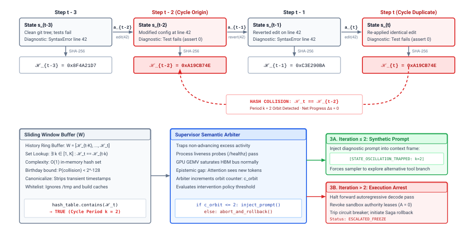
:::

The architectural mechanism of this cycle detector is traced across the two tiers of @fig-vol3-semantic-watchdog. In the upper trajectory trace, the host runtime captures the deterministic environment snapshot $\mathbf{s}_i$ at each step, canonicalizes directory trees and configuration files to eliminate transient filesystem timestamps, and projects the result into a 256-bit cryptographic digest $\mathcal{H}_i$. At Step $t-2$, the agent modifies line 42 of a configuration file, yielding digest $\texttt{0xA19CB74E}$; encountering an invariant test failure at Step $t-1$, it reverts the edit to restore digest $\texttt{0xC3E290BA}$; at Step $t$, it re-applies the identical line 42 modification, regenerating the identical state digest $\mathcal{H}_t = \texttt{0xA19CB74E}$. As shown in the lower tier, the supervisor maintains a sliding history window $W = [\mathcal{H}_{t-K}, \dots, \mathcal{H}_t]$ backed by an in-memory hash set, enabling $O(1)$ collision checks that instantly trap the recurring orbit ($\mathcal{H}_t == \mathcal{H}_{t-2}$, period $k=2$). Instead of allowing the autoregressive decode loop to consume GPU Tensor Cores indefinitely, the Semantic Arbiter intercepts the trajectory: for initial cycles ($c_{\text{orbit}} \le 2$), it injects a synthetic diagnostic alert (`[STATE_OSCILLATION_TRAPPED: k=2]`) directly into the model's context frame to force policy exploration, whereas persistent oscillations ($c_{\text{orbit}} > 2$) trigger execution arrest, stripping sandbox credentials (`ESCALATED_FREEZE`) and activating Saga backward rollback.

**The central systems thesis of semantic monitoring:** *Classical process heartbeats verify only computational and transport liveness, not computational utility. To bound the blast radius of non-convergent deliberation and prevent unbounded financial, power, and memory resource drain, the agent runtime must decouple process health from semantic progress, enforcing explicit, mathematically verifiable progress invariants over environment state hashes, external verification metrics, and action entropy.*

### The Failure of Classical OS Liveness Probes

In classical operating systems and distributed runtimes, liveness is modeled as a binary property of a thread or process. A subsystem is live if it transitions through states within a bounded temporal delta $\Delta t$. System daemons register periodic keepalives with system supervisors (for example, `sd_notify("WATCHDOG=1")` under Linux `systemd`), while distributed schedulers query container health endpoints over TCP. If a process enters an infinite loop in kernel space, deadlocks on a POSIX mutex, or hangs on an unserviced read from a blocked network socket, the heartbeat stops. The hardware watchdog timer or host supervisor fires, triggering an uncatchable `SIGKILL`, releasing file descriptors, and rescheduling the container.

This architectural assumption collapses when applied to foundation models operating under Zero Ambient Authority ($A=0$). An unprivileged neural inference engine running a forward pass does not stall at the instruction pointer level. The model is an unprivileged predictor: each token generation step consists of regular, highly parallel matrix-vector multiplications ($\text{GEMV}$) that stream weights from high-bandwidth memory to arithmetic logic units with predictable clock-cycle determinism. As long as the inference server (such as vLLM or SGLang) and the host agent supervisor exchange well-formed Remote Procedure Call (RPC) messages, every standard transport-layer watchdog is satisfied.

The divergence between operational health and task advancement mirrors the core insight of Martin Rinard's *Acceptability-Oriented Computing* (2003): classical software engineering presupposes that systems either execute according to an idealized, deterministic specification or crash. When real-world systems encounter unmodeled state spaces, however, treating every non-crashing execution as acceptable allows software to burn resources indefinitely in degraded, non-productive cycles. In an agentic architecture, this failure mode manifests as an epistemic gap between the agent's internal reasoning context and the external environment. Because the autoregressive context window expands with every turn, the agent's attention mechanism experiences continuous novelty: each turn appends new reasoning tokens, fresh tool execution traces, and updated error payloads. The agent possesses the local, self-reinforcing illusion of forward momentum, even as its external environment remains trapped in a closed, circular orbit.

### Quantifiable Semantic Progress Invariants

To restore deterministic liveness guarantees, the supervisor must monitor the external environment rather than the internal deliberation of the model. The runtime establishes a *Semantic Watchdog* that intercepts every proposed action and evaluates the resulting state transitions against three quantifiable progress invariants: state hash monotonicity, metric monotonicity, and action entropy.

Let the trajectory of an agent be formalized as a discrete sequence of steps $t \in \{1, 2, \dots, n\}$. At each step, the runtime captures the system state tuple $S_t = \langle \mathbf{s}_t, a_t, o_t \rangle$, where $\mathbf{s}_t$ represents the deterministic snapshot of the target environment (the sandboxed working directory, database state, or configuration manifest), $a_t$ represents the proposed tool action, and $o_t$ represents the environmental observation returned by the execution sandbox.

1. **State Hash Monotonicity and Cycle Detection:** The runtime maintains a bounded history ring buffer $W = [\mathcal{H}_{t-K}, \dots, \mathcal{H}_{t-1}]$ of cryptographic hashes of the environment state:
$$\mathcal{H}_t = \text{SHA-256}(\text{Canonicalize}(\mathbf{s}_t))$$
The canonicalization function sorts file trees, strips transient filesystem timestamps, and formats database records into deterministic byte streams. At each step $t$, the watchdog queries the history window $W$. A semantic cycle of period $k$ is detected if:
$$\exists k \in [1, K] \quad \text{such that} \quad \mathcal{H}_t = \mathcal{H}_{t-k}$$
Because SHA-256 provides a 256-bit collision-resistant mapping, the probability of two distinct physical environment states yielding identical hashes is bounded by $2^{-128}$ (under the birthday bound), rendering false-positive cycle detection mathematically negligible. When $\mathcal{H}_t = \mathcal{H}_{t-k}$, the agent has executed $k$ mutative actions that resulted in a net zero transformation of the external system.

2. **Metric Monotonicity:** In complex software engineering tasks, environment state hashes naturally change when editing scratch files, running linters, or updating log outputs. Thus, distinct state hashes do not guarantee task convergence. The runtime tracks a vector of external verification metrics $\mathbf{m}_t = \langle m_1(\mathbf{s}_t), m_2(\mathbf{s}_t), \dots, m_p(\mathbf{s}_t) \rangle$ emitted by deterministic host verifiers—such as the number of passing unit tests, compiler error counts, or static analysis diagnostics. Progress requires that the metric vector exhibits a non-negative directional derivative over an epoch of length $E$:
$$\Delta \mathbf{m}_{t, t-E} = \mathbf{m}_t - \mathbf{m}_{t-E} \not\le \mathbf{0}$$
If an agent executes $E$ consecutive mutative actions without yielding a positive delta in at least one target metric (or worse, oscillates between $m_{\text{pass}} = 4$ and $m_{\text{pass}} = 3$), the watchdog identifies metric stagnation.

3. **Action Entropy and Syntactic Repetition:** Even before an action executes, the runtime analyzes the syntactic and semantic structure of the proposed action $a_t$. The runtime computes a fast 64-bit non-cryptographic hash of the tool invocation:
$$h_{\text{tool}}(a_t) = \text{xxHash64}(\text{tool\_identifier} \parallel \text{CanonicalJSON}(\text{arguments}))$$
If $h_{\text{tool}}(a_t) = h_{\text{tool}}(a_{t-k})$ and the intervening observation $o_{t-k}$ returned an unhandled error (e.g., `ENOENT: File not found` or `HTTP 403 Forbidden`), the agent is re-issuing a known invalid request. Additionally, the supervisor tracks the lexical token entropy of the chain-of-thought scratchpad; an abrupt collapse in token diversity often indicates that the autoregressive sampler has entered a degenerative mode collapse.

| Invariant Type                   | Detection Mechanism                                      | Primary Detection Target                                                       | Tracking Overhead                                                    | False Positive Mitigation                                        |     |                                                  |                                                |                                                                 |
|:---------------------------------|:---------------------------------------------------------|:-------------------------------------------------------------------------------|:---------------------------------------------------------------------|:-----------------------------------------------------------------|-----|--------------------------------------------------|------------------------------------------------|-----------------------------------------------------------------|
| **State Hash Monotonicity**      | Sliding window SHA-256 table ($W$)                       | Reversible oscillations ($\mathbf{s}_t \to \mathbf{s}_{t-1} \to \mathbf{s}_t$) | $O(1)$ lookup via hash set; $O(B)$ hash compute over $B$ state bytes | Whitelist non-deterministic directories (`/tmp`, logs)           |     |                                                  |                                                |                                                                 |
| **Metric Monotonicity**          | Strict Pareto delta over epoch $E$ ($\Delta \mathbf{m}$) | Non-convergent thrashing across tests/linters                                  | Incurred only during test suite execution                            | Allow bounded exploratory regressions ($E_{\text{grace}}$ steps) |     |                                                  |                                                |                                                                 |
| **Action Syntactic Equivalence** | Exact matching on canonicalized JSON-RPC                 | Repetitive invocation of failing commands                                      | $O(1)$ string canonicalization and integer compare                   | Bypass when arguments include dynamic nonces                     |     |                                                  |                                                |                                                                 |
| **Semantic Embedding Drift**     | Cosine distance $1 - \frac{e(a_t) \cdot e(a_{t-k})}{\    | e(a_t)\                                                                        | \                                                                    | e(a_{t-k})\                                                      | }$  | Paraphrased reasoning loops and reworded prompts | Small matrix-vector dot product ($d \le 1536$) | Set conservative similarity thresholds ($\cos \theta \ge 0.96$) |

The following listing illustrates the concrete ring-buffer cycle detector used by the agent supervisor to enforce state hash monotonicity:

```python
def check_state_hash_invariants(history: list[str], current_hash: str, max_period: int) -> int | None:
    # Scan backward through sliding window to detect cyclic state oscillations
    window = history[-max_period:] if len(history) >= max_period else history
    for distance, past_hash in enumerate(reversed(window), start=1):
        if past_hash == current_hash:
            return distance  # Returns cycle period k (e.g., 1 for no-op, 2 for flip-flop)
    return None
```

::: {#exmp-11-the-microeconomic-and-hardware-cost .callout-example title="Hardware Cost of Silent Semantic Loops"}
Consider an autonomous agent executing on a dedicated host node powered by an 8-GPU NVIDIA H100 SXM5 server (700 W thermal design power per GPU, 3.35 TB/s HBM3 bandwidth per GPU). The host serves an open-weights 70-billion parameter dense foundation model running under 8-bit floating-point quantization (FP8 weight representation, requiring 70 GB of VRAM for base parameters).

The agent enters a semantic loop attempting to repair a faulty network configuration script. In each iteration, the agent generates 300 output tokens of chain-of-thought reasoning and tool calls, executes a shell command that fails, and receives an 800-token error trace appended to its prompt. The decode loop runs memory-bandwidth bound at a generation throughput of 40 tokens per second.

**Compute and Latency Costs Without a Semantic Watchdog:**
Without an invariant monitor, the agent continues until hitting an arbitrary maximum step limit $S_{\max} = 50$.

- Output token generation time per iteration:
  $$T_{\text{decode}} = \frac{300 \text{ tokens}}{40 \text{ tokens/sec}} = 7.5 \text{ seconds}$$

- Shell tool execution and environment reset time: $T_{\text{exec}} = 2.5 \text{ seconds}$.
- Total time per iteration: $T_{\text{iter}} = 10.0 \text{ seconds}$.
- Total execution time across 50 steps:
  $$T_{\text{total}} = 50 \times 10.0 \text{ s} = 500 \text{ s} \approx 8.33 \text{ minutes}$$

- Energy consumption across the 8-GPU cluster (excluding host CPU/DRAM):
  $$E_{\text{cluster}} = 8 \times 700 \text{ W} \times 500 \text{ s} = 2.80 \times 10^6 \text{ J} = 0.778 \text{ kWh}$$

- Context growth and memory footprint: Over 50 iterations, the context accumulates $50 \times (300 + 800) = 55,000$ tokens. For a model with 64 transformer layers, a key-value head dimension $d_{\text{head}} = 128$, and 8 key-value heads (Grouped-Query Attention), each token stores:
  $$S_{\text{token}} = 2 \times 64 \text{ layers} \times 8 \text{ heads} \times 128 \text{ dim} \times 1 \text{ byte} = 131,072 \text{ bytes} = 128 \text{ KB}$$
  By step 50, the KV cache alone consumes $55,000 \times 128 \text{ KB} \approx 7.04 \text{ GB}$ of dedicated HBM3 capacity for this single trajectory.

- Economic cost: Evaluated at commercial frontier API rates ($3.00 per $10^6$ prompt tokens, $15.00 per $10^6$ completion tokens), the unmonitored loop processes a triangular progression of prompt tokens $\sum_{i=1}^{50} (1,000 + 1,100 \cdot i) \approx 1.45 \times 10^6$ tokens and $50 \times 300 = 15,000$ completion tokens, totaling:
  $$\text{Cost} = (1.45 \times \$3.00) + (0.015 \times \$15.00) = \$4.35 + \$0.23 = \$4.58$$

**Mitigation with a State Hash Semantic Watchdog:**
The runtime configures a sliding window hash monitor with period bound $K = 4$. At step $t = 4$, the watchdog detects that $\mathcal{H}_4 = \mathcal{H}_2$ ($k = 2$ oscillation). The watchdog trips immediately, halting execution after 4 steps:

- Total time elapsed: $4 \times 10.0 \text{ s} = 40.0 \text{ seconds}$ (a 92.0% reduction in wall-clock latency).
- Cluster energy expended: $8 \times 700 \text{ W} \times 40 \text{ s} = 0.224 \times 10^6 \text{ J} = 0.062 \text{ kWh}$ (a 92.0% reduction in thermal and power load).
- Financial expenditure: Prompt tokens processed drop to approximately $21,000$, resulting in an API charge of $\$0.08$ (a 98.2% cost reduction).
:::

### Watchdog Intervention Protocols

Detecting an invariant violation represents only half of the architectural requirement; the runtime must also define deterministic state-machine semantics for intervention. Silently dropping an agent's tool call leaves the autoregressive decode loop in an undefined state. The runtime implements a three-tier intervention protocol designed to trade off recovery cost against trajectory termination.

: **Semantic Watchdog Three-Tier Escalation Protocol**: Escalation ladder trading recovery latency and compute cost against trajectory termination upon invariant violations. {#tbl-vol3-watchdog-escalation-protocol}

| Intervention Tier                | Trigger Condition                                                        | Supervisory Mechanism                                                                                                    | Recovery Latency & Cost                                           | Next Action upon Failure                            |
|:---------------------------------|:-------------------------------------------------------------------------|:-------------------------------------------------------------------------------------------------------------------------|:------------------------------------------------------------------|:----------------------------------------------------|
| **Tier 1: Context Interrupt**    | Initial cycle or state hash collision detected ($N_{\text{iter}} \le 2$) | Injects synthetic warning observation ($o_t^{\text{watchdog}}$) directly into LLM prompt stream.                         | Sub-millisecond; 0 token rollback cost                            | Escalate to Tier 2 if cycle persists across 2 turns |
| **Tier 2: Checkpoint Backtrack** | Persistent oscillation; failure to converge after Tier 1 interrupt       | Rewinds physical sandbox to checkpoint snapshot $\mathbf{s}_{t-k}$; prunes failed context turns and applies action mask. | $10 - 250\ \text{ms}$; recomputes $k$ turns from clean checkpoint | Escalate to Tier 3 if recovery fails after rollback |
| **Tier 3: Terminal Abort**       | Unrecoverable deadlock; cyclic regression exceeds budget threshold       | Halts execution, raises `ERR_SEMANTIC_DEADLOCK`, strips capabilities, and executes Saga compensators.                    | Complete trajectory freeze; emits audit alert                     | Human-in-the-loop escalation / post-mortem queue    |

1. **Tier 1: Synthetic Context Interrupt (The Epistemic Jolt):** When a state hash collision ($\mathcal{H}_t = \mathcal{H}_{t-k}$) or syntactic action cycle is initially flagged, the supervisor intercepts the execution pipeline before dispatching the action to the physical sandbox. The supervisor generates a synthetic observation payload $o_t^{\text{watchdog}}$ and appends it directly to the model's context stream:
> **`[SYSTEM ALERT: SEMANTIC_WATCHDOG_INTERRUPT]`**
> `Action rejected by host supervisor. Invariant failure: STATE_OSCILLATION_DETECTED.`
> `Your proposed action returned the environment to an identical state observed at step t-2.`
> `You are trapped in an unproductive loop. Do NOT repeat the previous command.`
> `Formulate an alternative hypothesis or verify underlying environmental assumptions.`
   This synthetic observation exploits the model's in-context conditioning. By inserting a high-salience error message into the prompt, the runtime forcibly alters the attention weights of subsequent decode steps, breaking the autoregressive self-reinforcement that drives the loop.

2. **Tier 2: Trajectory Backtracking and Action Masking:** If the agent fails to converge after a Tier 1 interrupt—emitting an action that triggers a second invariant violation within an epoch of 3 steps—the supervisor escalates. The runtime reaches into the Write-Ahead Log (WAL), identifies the checkpoint snapshot $\mathbf{s}_{t-k}$ that preceded the cycle onset, and rewinds the physical sandbox filesystem to that checkpoint. Concurrently, the runtime rewrites the logical conversation history: it truncates the failed, cyclic turns from the context window and inserts a tombstone marker that permanently masks the failed action signature $h_{\text{tool}}(a_t)$ from the agent's action space.
3. **Tier 3: Terminal Abort and Saga Escalation (`ERR_SEMANTIC_DEADLOCK`):** If the agent exhausts its allotted backtracking budget or violates invariants after crossing a pivot action boundary (where physical rollback is impossible), the watchdog issues a non-maskable trajectory termination. The runtime raises `ERR_SEMANTIC_DEADLOCK`, revokes the agent's transient capability tokens, releases all acquired POSIX file and database locks, and dispatches the trajectory's Write-Ahead Log to human operators. Crucially, the runtime triggers the compensating transactions of the enclosing Trajectory Saga: any partial, uncommitted side effects registered in the compensating log ($\mathcal{L}_{\text{comp}}$) are executed in reverse order, returning the broader distributed system to a consistent, quiesced state.

When semantic watchdogs successfully bound local reasoning loops within an isolated execution sandbox, a broader distributed failure mode emerges at the boundary of external network services. In many production failures, an agent's failure to advance state is driven not by an internal algorithmic cycle or model hallucination, but by an external dependency—such as a third-party payment gateway, an artifact repository, or a code-formatting daemon—experiencing elevated latency, intermittent HTTP 503 errors, or silent network partitions. Under naive forward recovery, an agent observing a failed tool RPC interprets the fault as an environmental hurdle to be solved, immediately re-issuing mutated requests or hammering the failing endpoint. Multiplied across hundreds of concurrent agent trajectories, these uncoordinated autonomous retries trigger a catastrophic retry storm that overwhelms degraded upstream infrastructure. How do we engineer execution gateways that isolate failing tool dependencies, dampen retry pressure through exponential backoff with decorrelated jitter, and shed load before an external outage cascades into the agent runtime itself?

## Tool Circuit Breakers {#sec-vol3-sagas-containment}

::: {.column-margin}
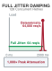{width="100%" fig-alt="State machine diagram showing circuit breaker transitions from closed to open upon consecutive upstream RPC timeouts."}

*Circuit breakers trip after three consecutive external timeouts, shielding downstream infrastructure from retry storms.*
:::
When an external tool dependency experiences transient degradation, an unconstrained autonomous agent behaves as a pathological traffic amplifier. Unlike traditional client-server software, which typically surfaces errors to a human user or executes a deterministic, bounded retry script, an agent guided by an autoregressive model treats a tool failure as an environmental puzzle to be solved. If a code repository API rejects a commit due to lock contention, or an external search service returns an HTTP 503 Service Unavailable status, the agent's generative policy $\pi_\theta$ immediately consumes the failure text within its observation context $o_t^{\text{err}}$ and synthesizes a modified tool invocation $a_{t+1}$. The model may adjust whitespace, permute query tokens, reorder parameters, or repeat the exact call under the stochastic assumption that a second attempt might succeed. When hundreds of concurrent agent trajectories run across an enterprise cluster, this autonomous problem-solving reflex transforms minor upstream hiccups into catastrophic, self-inflicted denial-of-service events known as retry storms.

The runtime cannot rely on the model's internal judgment to cease hammering a collapsing external service. Because the foundation model operates under zero ambient authority ($A=0$) and lacks direct visibility into network socket states, socket queue depths, or remote server health, the host runtime must interpose a defensive traffic-shaping layer between the unprivileged agent and the external tool substrate. This defense requires three complementary mechanisms: tri-state circuit breakers that sever connections to failing services and fail fast, exponential backoff with full jitter that breaks phase synchronization across concurrent agents, and bulkhead isolation that partitions host resources so that a hung external API cannot starve critical local execution threads.

### The Anatomy of an Agent-Induced Retry Storm

The mechanics of an agent-driven retry storm stem directly from the mismatch between the model's autoregressive generation loop and the queuing dynamics of distributed services. Consider an upstream microservice with service capacity $C$ requests per second and a nominal round-trip latency of $L_{\text{nom}} = 50\text{ ms}$. Under normal operating conditions, an agent trajectory invokes this tool, suspends its decode loop during the Remote Procedure Call (RPC) network transit, receives the structured JSON response, and appends the result to its context window.

Now suppose the remote service experiences a transient slowdown, causing latency to spike to $L_{\text{degraded}} = 2000\text{ ms}$, or begins dropping a fraction $\epsilon$ of incoming requests. In standard distributed architectures, client SDKs employ static retry counts, such as retrying up to three times before failing the top-level application workflow. In an agentic architecture, however, the retry loop is mediated by the foundation model's context window. When the tool execution framework returns an error string—such as `{"error": "Gateway Timeout", "code": 504}`—the model interprets this string not as a hard operational barrier, but as conversational feedback.

```bash
[Trajectory-042] Tool invocation failed: HTTP 504 Gateway Timeout (elapsed: 5002ms)
[Trajectory-042] Agent synthesized alternative: search_index(query="v2 auth patch", retry=True)
[Trajectory-118] Tool invocation failed: HTTP 503 Service Unavailable (elapsed: 5001ms)
[Trajectory-118] Agent synthesized alternative: search_index(query="auth patch v2", timeout=10)
```

The resulting feedback loop is mathematically vicious. If $N$ active agent trajectories each observe tool failures, their generative policies produce $N$ new tool requests within the span of a few forward decoding passes. Because LLM generation occurs across token intervals of tens of milliseconds while external server queues clear over seconds, the aggregate arrival rate $\lambda_{\text{in}}$ at the tool gateway surges:

$$\lambda_{\text{in}} = \sum_{j=1}^{N} \frac{1}{\Delta t_{\text{decode}} + L_{\text{degraded}}}$$

As latency $L_{\text{degraded}}$ increases toward the gateway's client-side timeout $T_{\text{timeout}}$, the host runtime accumulates blocked execution threads. Once the arrival rate exceeds capacity ($\lambda_{\text{in}} > C$), queue lengths at the remote service grow without bound, triggering internal buffer overflows, connection resets, and thread pool exhaustion across upstream dependencies.

Compounding the crisis, standard agent prompt designs frequently instruct models to "try alternative approaches if a tool fails." The model dutifully obliges by rephrasing its tool calls, expanding query strings, or trying sibling endpoints that hit the exact same back-end database. Consequently, the agent trajectory acts as an adversarial load generator, weaponizing semantic flexibility to bypass simple string-matching deduplication caches and driving the struggling dependency into total failure.

::: {.column-margin}
**Fail-Fast Observation Semantics**
When a circuit breaker trips to Open, the host runtime immediately synthesizes an `ERR_CIRCUIT_OPEN` observation. This synthetic token sequence explicitly informs the model that physical network access is severed, halting further retries and forcing the trajectory into an alternative plan or a Trajectory Saga compensation path.
:::

### Tri-State Circuit Breakers

To protect upstream dependencies and conserve host compute, the runtime implements the circuit breaker pattern formulated by Michael Nygard, tightly coupled with stochastic traffic shaping. The tool execution gateway wraps every external RPC interface in a stateful software proxy that monitors outcome telemetry over a sliding execution window. The operational architecture and mathematical dynamics are illustrated in @fig-vol3-circuit-breaker.

::: {#fig-vol3-circuit-breaker fig-env="figure" fig-pos="htb" fig-cap="**Tri-State Tool Circuit Breaker and Jittered Backoff**: Operational state transitions and traffic-shaping dynamics. In panel (a), the circuit breaker transitions between Closed, Open, and Half-Open states based on sliding-window failure rate $\tau_{\text{fail}}$, cooldown timer $T_{\text{cooldown}}$, and single-flight canary probes. In panel (b), full jitter backoff disperses retry arrivals uniformly across $[0, \min(T_{\max}, T_0 \cdot 2^k)]$, eliminating the destructive thundering herd resonance spikes produced by deterministic exponential backoff." fig-alt="Two-panel systems diagram. Panel (a) shows finite state transitions between Closed, Open, and Half-Open circuit breaker states. Panel (b) shows the mathematical request arrival curve comparing the synchronized thundering herd spikes of deterministic backoff against the smooth uniform distribution of full jitter."}
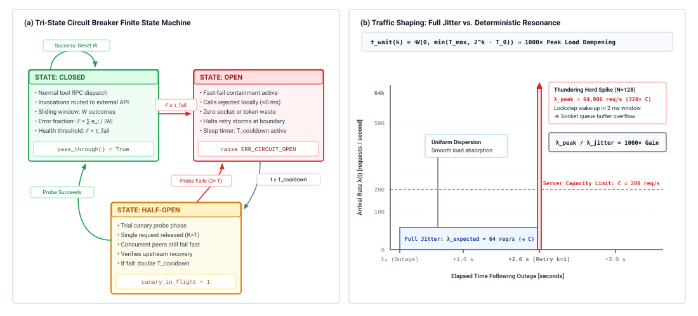
:::

The dual defense of circuit isolation and traffic shaping is detailed in @fig-vol3-circuit-breaker. Panel (a) illustrates the finite-state machine governing upstream tool RPC interfaces. In the **Closed** state, tool invocations pass through unhindered while the gateway records binary execution telemetry across a sliding window $W$. When the observed error fraction $\mathcal{E}$ breaches the critical threshold $\tau_{\text{fail}}$, the breaker trips to **Open**, immediately severing physical socket connections and synthesizing fast local rejections (`ERR_CIRCUIT_OPEN` in $\approx 0\text{ ms}$), completely sheltering worker threads from blocking timeout cascades. Upon expiration of cooldown window $T_{\text{cooldown}}$, the breaker advances to **Half-Open**, permitting a single-flight canary request ($K_{\text{canary}} = 1$) to test remote availability while concurrent peers continue to fail fast; a canary success resets the sliding window and returns the circuit to Closed, whereas canary failure triggers an immediate return to Open with an exponentially doubled cooldown backoff ($2 T_{\text{cooldown}}$). Concurrently, Panel (b) demonstrates why circuit breakers must be paired with stochastic traffic shaping: if 128 agents retrying an upstream outage execute deterministic exponential backoff ($2^k T_0$), their wakeups synchronize in lockstep within a 2-millisecond dispatch window, generating a destructive $64{,}000\text{ req/s}$ thundering herd impulse spike that obliterates the server's 200 req/s capacity limit. By incorporating Full Jitter ($t_{\text{wait}} \sim \mathcal{U}(0, \min(T_{\max}, 2^k T_0))$), the retry mass is uniformly dispersed across time, yielding an expected arrival rate of only $64\text{ req/s}$—a $1000\times$ load reduction that allows the upstream service to recover smoothly without queue buffer overflow.

In the **Closed** state, the proxy permits all tool calls issued by agent trajectories to pass through to the external network service. The gateway maintains a rolling ring buffer of the last $W$ tool execution outcomes, where each entry records a binary success ($0$) or failure ($1$). A failure is defined strictly according to physical and transport criteria: TCP connection timeouts, HTTP 5xx server errors, rate-limit rejections (HTTP 429), or malformed protocol frames. Application-level domain errors (such as a database query returning "record not found") do not constitute transport failures and are recorded as successes from the perspective of the circuit breaker.

The proxy continuously computes the moving error fraction:

$$\mathcal{E} = \frac{1}{|W|} \sum_{i \in W} e_i$$

If $\mathcal{E}$ exceeds a configurable failure threshold $\tau_{\text{fail}}$ (typically set between $0.50$ and $0.70$ over a window of $W \ge 20$ requests), the proxy instantly trips into the **Open** state.

In the **Open** state, the circuit breaker completely severs physical network communication with the remote dependency. Any tool call targeting that interface is intercepted at the host mediator boundary. Rather than blocking an execution worker or waiting for a network socket timeout, the proxy immediately returns an explicit, synthetic error observation to the agent runtime:

$$\mathcal{O}_{\text{synthetic}} = \left\langle \texttt{ERR\_CIRCUIT\_OPEN}, \, \text{dependency\_id}, \, T_{\text{cooldown\_remaining}} \right\rangle$$

Failing fast preserves host resources. Instead of consuming 30 seconds of synchronous socket wait time inside a worker thread, the agent receives an immediate deterministic signal within 1 millisecond. This clear operational boundary prevents the agent from assuming the request is still pending and allows the host runtime's trajectory monitor to halt execution, invoke a compensating Saga sub-transaction, or steer the agent toward an entirely different operational tool. The operational semantics and host resource impacts of each state are detailed in @tbl-vol3-circuit-breaker-states.

| Circuit State | Outbound Traffic Policy              | Transition Trigger                                      | Agent Observation                           | Host Resource Impact                                  |
|:--------------|:-------------------------------------|:--------------------------------------------------------|:--------------------------------------------|:------------------------------------------------------|
| **Closed**    | All calls dispatched to network      | $\mathcal{E} \ge \tau_{\text{fail}}$ over window $W$    | Real tool output ($o_t$) or server error    | Linear thread usage; full network latency             |
| **Open**      | 100% intercepted at host gateway     | Elapsed time $t \ge T_{\text{cooldown}}$                | Immediate synthetic `ERR_CIRCUIT_OPEN`      | Zero socket allocation; $\approx 0\text{ ms}$ latency |
| **Half-Open** | Canary probe allowed; rest fail fast | Canary succeeds $\to$ Closed<br>Canary fails $\to$ Open | Real output for canary; synthetic for peers | Single thread allocated; probe isolated               |

: **Tri-State Circuit Breaker Operational Semantics**: Operational policies, transition triggers, agent observations, and host resource impacts across circuit breaker states. {#tbl-vol3-circuit-breaker-states}

The circuit remains in the Open state for the duration of a sleep window $T_{\text{cooldown}}$ (typically configured between 30 and 120 seconds, depending on the recovery profile of the external service). Once $T_{\text{cooldown}}$ elapses, the proxy transitions to the **Half-Open** state.

In the **Half-Open** state, the proxy allows a strictly limited number of trial invocations—often exactly one canary request ($K_{\text{canary}} = 1$)—to pass through to the remote service. All other concurrent agent calls arriving during this state continue to fail fast with `ERR_CIRCUIT_OPEN`. If the canary request succeeds, the proxy assumes the downstream dependency has recovered, resets the sliding window buffer $W$, and returns to the Closed state, restoring normal traffic flow. If the canary request fails, times out, or receives an HTTP 5xx status, the proxy assumes the remote service remains impaired, resets the cooldown timer with an exponentially increased backoff duration ($T_{\text{cooldown}} \leftarrow \min(2 \cdot T_{\text{cooldown}}, T_{\text{cooldown\_max}})$), and trips immediately back to the Open state.

### Jittered Backoff Protocols

While circuit breakers protect infrastructure during sustained outages, transient network hiccups and brief service blips require controlled retries. However, naive implementations of exponential backoff introduce their own failure mode: lockstep synchronization.

Suppose an external service experiences an instantaneous network partition lasting 500 milliseconds, causing tool requests from $N = 100$ concurrent agent trajectories to fail simultaneously at time $t_0$. If each agent runtime executes a standard deterministic exponential backoff algorithm where the wait duration after attempt $k$ is:

$$t_{\text{wait}}(k) = T_0 \cdot 2^k$$

all 100 agents will sleep for exactly $T_0 = 1000\text{ ms}$ and simultaneously reissue their requests at time $t_0 + 1000\text{ ms}$. If the upstream service is operating near its capacity boundary, this sudden synchronized spike—known as the *thundering herd problem*—instantly overwhelms the service's inbound TCP connection backlog. The requests fail again, causing all 100 agents to sleep for exactly $2000\text{ ms}$ and strike the service again in unison at $t_0 + 3000\text{ ms}$. The system enters an artificial resonance pattern where massive load spikes alternate with periods of total silence.

::: {.column-margin}
**The Resonance Invariant**
Without stochastic phase dispersion, deterministic retry schedules preserve the initial synchronization of clustered failures. The aggregate arrival rate remains discrete and periodic, maximizing peak queue depth while minimizing average throughput.
:::

To eliminate these destructive resonance peaks, the tool gateway must introduce randomness that desynchronizes the arrival times of retried tool calls. Research by Amazon Web Services on traffic shaping demonstrates that among various randomization strategies (including Equal Jitter and Decorrelated Jitter), **Full Jitter** provides the highest variance in inter-arrival times and the most rapid reduction in total queue completion time.

Under full jitter, the client-side gateway computes the deterministic exponential upper bound and draws the actual sleep interval uniformly at random between zero and that bound:

$$t_{\text{wait}}(k) = \mathcal{U}\left(0, \, \min\left(T_{\max}, \, T_0 \cdot 2^k\right)\right)$$

where $T_0$ represents the base backoff slot time (e.g., $100\text{ ms}$), $k$ is the zero-indexed retry attempt count, and $T_{\max}$ is the hard ceiling imposed to prevent indefinite stalls (e.g., $30\text{ s}$).

```python
# Empirical Full Jitter calculation within the tool execution gateway
def compute_jittered_backoff(attempt: int, base_ms: float = 100.0, max_ms: float = 30000.0) -> float:
    ceiling = min(max_ms, base_ms * (2.0 ** attempt))
    return random.uniform(0.0, ceiling)
```

By drawing $t_{\text{wait}}$ from a uniform continuous distribution across the entire interval $[0, \text{ceiling}]$, the arrival distribution of the 100 failed requests is transformed from a collection of discrete Dirac delta functions into a smooth probability density spread across time. The upstream service processes requests steadily as its queue capacity allows, breaking the feedback loop that drives retry storms.

::: {#nbk-11-sizing-bulkhead-capacity-and-jitter .callout-notebook title="Bulkhead Capacity and Jitter Under RPC Stress"}
**Scenario:**
An agent execution engine hosts $N = 256$ concurrent worker processes. Each agent trajectory regularly queries an external semantic symbol index via an RPC tool.

- The external index has a nominal latency of $L_{\text{nom}} = 20\text{ ms}$.
- During an outage, the index degrades: responses stall until timing out at $T_{\text{timeout}} = 5000\text{ ms}$, with an error rate of $100\%$.
- The host server allocates a shared thread pool of $M = 300$ worker threads to handle all tool executions across all categories (local file I/O, local git operations, and external RPCs).
- Unjittered backoff uses $t_{\text{wait}}(k) = 1000 \cdot 2^k\text{ ms}$. Full jitter uses $t_{\text{wait}}(k) = \mathcal{U}(0, \min(30000, 1000 \cdot 2^k))\text{ ms}$.

**Problem:**

1. Calculate the time $t_{\text{exhaust}}$ required to exhaust the entire host worker thread pool ($M = 300$) if all 256 agents call the failing index without a circuit breaker or bulkhead isolation.
2. If 128 agents fail their first attempt simultaneously, calculate the peak instantaneous arrival rate under deterministic backoff versus the expected spread of arrivals across time under full jitter for the first retry ($k=1$).

**Solution:**

*Step 1: Time to Thread Exhaustion*
Each agent issues an RPC call that blocks a worker thread for the full duration of $T_{\text{timeout}} = 5000\text{ ms}$.
Because there are $N = 256$ agents running concurrently, all 256 agents allocate an execution thread within the first forward decoding step (taking less than $100\text{ ms}$).

At $t \approx 100\text{ ms}$, 256 of the 300 available worker threads are fully occupied waiting on the frozen network socket. This leaves only:

$$M_{\text{free}} = 300 - 256 = 44\text{ threads}$$

for all other agent tasks, including local file writes and local memory compaction. If any of the remaining active agents spawn a sub-task or secondary tool call, the remaining 44 threads are consumed instantly. Total thread exhaustion occurs at:

$$t_{\text{exhaust}} < 200\text{ ms}$$

For the remaining $4800\text{ ms}$ until the socket timeout fires, the entire agent runtime freezes. It cannot execute trivial, non-failing local tasks because the shared thread pool is completely starved by blocked network sockets.

*Step 2: Arrival Distribution on Retry ($k=1$)*
For $k=1$, the deterministic exponential backoff interval is:

$$t_{\text{wait}}(1) = 1000 \cdot 2^1 = 2000\text{ ms}$$

All 128 agents wake up simultaneously at exactly $t = t_0 + 5000\text{ ms} + 2000\text{ ms} = t_0 + 7000\text{ ms}$. Assuming an OS thread scheduling dispatch jitter of $\Delta t_{\text{dispatch}} \approx 2\text{ ms}$, the peak instantaneous arrival rate at the external service is:

$$\lambda_{\text{peak, deterministic}} \approx \frac{128\text{ requests}}{0.002\text{ s}} = 64{,}000\text{ requests/sec}$$

This instantaneous spike overwhelms the upstream service's TCP accept queue, causing immediate packet drops.

Under Full Jitter, the backoff ceiling is $\min(30000, 1000 \cdot 2^1) = 2000\text{ ms}$. Each agent sleeps for an interval drawn from $\mathcal{U}(0, 2000)\text{ ms}$. The probability density function of the arrival time is:

$$f(t) = \frac{1}{2000\text{ ms}} = 0.5\text{ s}^{-1} \quad \text{for } t \in [0, 2]\text{ s}$$

The expected arrival rate is uniformly distributed across the 2-second window:

$$\lambda_{\text{expected, jitter}} = \frac{128\text{ requests}}{2\text{ s}} = 64\text{ requests/sec}$$

Full jitter dampens the peak request pressure by a factor of:

$$\frac{\lambda_{\text{peak, deterministic}}}{\lambda_{\text{expected, jitter}}} = \frac{64{,}000}{64} = 1000\times$$

This keeps the retry traffic well within the capacity bounds of typical network infrastructure.
:::

### Bulkhead Resource Partitioning

Even with circuit breakers and full jitter, a failing external dependency can still cripple an agent runtime if all tools share a single pool of execution resources. In maritime architecture, a ship's hull is divided into watertight compartments called *bulkheads*. If a collision punctures one compartment, the water is contained locally, preventing the entire vessel from sinking.

In an agent runtime, tool invocations exhibit vastly different execution profiles and trust boundaries:

- **Local deterministic tools** (such as POSIX filesystem reads, local AST parsers, and regex formatters) execute within microseconds or single-digit milliseconds with deterministic bounds.
- **High-throughput internal RPCs** (such as vector database lookups or local embedding evaluations) operate over high-bandwidth internal networks with typical latencies of 10 to 50 milliseconds.
- **Third-party external APIs** (such as public web scrapers, SaaS issue trackers, or code forge APIs) operate over the public Internet, where round-trip latencies are unpredictable and subject to third-party rate limits, outages, and cross-organization routing failures.

If the host runtime dispatches all tool calls into a single global worker pool, an outage in a single external web-scraping tool will consume all worker threads as calls block waiting for TCP connection timeouts. Within hundreds of milliseconds, the entire host runtime stalls. An agent attempting a simple POSIX file read to verify a local code edit cannot acquire an execution thread because the global thread pool is saturated with blocked HTTP connections to a dead external server.

::: {#callout-def-vol3-pool-exhaustion .callout-definition title="Definition 11.2: Unpartitioned Resource Pool Exhaustion"}
In an unpartitioned worker architecture where local POSIX filesystem operations, cluster RPCs, and external HTTP tools share a single unified execution pool of capacity $C_{\text{pool}}$:

If external endpoints experience transient delays of duration $T_{\text{timeout}} \gg T_{\text{local}}$, arriving external requests saturate all worker slots:
$$N_{\text{blocked}} = \min\left(C_{\text{pool}}, \lambda_{\text{ext}} \cdot T_{\text{timeout}}\right) \to C_{\text{pool}}$$
Consequently, local operations with sub-millisecond execution times ($\tau_{\text{fs}} \le 1\ \text{ms}$) suffer absolute resource starvation:
$$\text{WaitTime}_{\text{local}} \approx T_{\text{timeout}} \gg \tau_{\text{fs}}$$
halting all agent progress across the host runtime.
:::

To enforce the end-to-end argument and maintain system availability, the runtime must implement bulkhead isolation by partitioning execution threads, rate limits, and memory queues into strictly isolated resource domains.

: **Bulkhead Partitioning Architecture**: Resource reservation and concurrency isolation parameters across execution pools. {#tbl-vol3-bulkhead-architecture}

| Execution Domain      | Target Subsystems                              | Concurrency Cap | Max Execution Timeout | Failure Semantics                        | Queue Capacity |
|:----------------------|:-----------------------------------------------|:----------------|:----------------------|:-----------------------------------------|:---------------|
| **Local System Pool** | POSIX file I/O, local git, in-memory inspect   | 64 threads      | 500 ms                | Fast-Fail (immediate error)              | 128 slots      |
| **Internal RPC Pool** | Cluster microVMs, vector databases, Redis      | 32 threads      | 2,000 ms              | Tri-state circuit breaker                | 64 slots       |
| **External API Pool** | Public WAN endpoints, third-party web scrapers | 16 threads      | 10,000 ms             | Circuit breaker with full jitter backoff | 16 slots       |

Bulkhead isolation is enforced through three concrete mechanisms:

1. **Dedicated Worker Pools and Semaphores:** The runtime assigns independent thread pools or asynchronous semaphore limits to each tool domain. If the External API pool exhaust its limit of 16 concurrent executions, subsequent external calls are enqueued or rejected immediately with `ERR_BULKHEAD_FULL`. Crucially, the Local System pool retains its full complement of 64 threads, ensuring that file operations, linter checks, and state checkpoints continue executing without delay.
2. **Domain-Specific Timeout Budgets:** Local tools run under tight, non-negotiable timeouts (e.g., $T_{\text{timeout}} \le 500\text{ ms}$). If a local tool deadlocks, it is killed swiftly. External network tools receive longer initial timeouts (e.g., $5000\text{ ms}$), but are backed by their own circuit breakers to ensure that persistent timeouts trigger the Open state and shed load.
3. **Autonomous Execution Shedding:** When a specific bulkhead queue reaches capacity, the gateway rejects excess work without contacting the external network. The rejection generates an immediate observation back to the agent:

$$o_t = \left\langle \texttt{ERR\_RESOURCE\_EXHAUSTED}, \, \text{"External tool queue saturated; defer execution"} \right\rangle$$

This deterministic backpressure forces the agent to either yield execution, proceed with alternative reasoning branches, or wait out the congestion using client-side jittered sleep.

| Architectural Dimension                 | Local System Tools                         | Internal Microservice Tools                     | External SaaS / Web Tools                                              |
|:----------------------------------------|:-------------------------------------------|:------------------------------------------------|:-----------------------------------------------------------------------|
| **Primary Interface**                   | POSIX syscalls, local pipes, shared memory | Cluster gRPC, intra-VPC REST                    | Public Internet HTTPS, REST, GraphQL                                   |
| **Concurrency Allocation**              | High ($60\%$ of total worker capacity)     | Medium ($30\%$ of total worker capacity)        | Low ($10\%$ of total worker capacity)                                  |
| **Hard Timeout ($T_{\text{timeout}}$)** | $100\text{ ms} - 500\text{ ms}$            | $1000\text{ ms} - 2000\text{ ms}$               | $5000\text{ ms} - 10{,}000\text{ ms}$                                  |
| **Circuit Breaker Policy**              | Disabled (kernel failures are fatal)       | Aggressive ($\tau_{\text{fail}} = 0.5$, $W=10$) | Conservative ($\tau_{\text{fail}} = 0.6$, $W=20$)                      |
| **Backoff Strategy**                    | Immediate retry (max 1)                    | Exponential backoff with full jitter            | Full jitter with wide cooldown ($T_{\text{cooldown}} \ge 60\text{ s}$) |
| **Failure Mode Impact**                 | Local process termination                  | Degraded semantic search or indexing            | Partial feature loss; fallback to cached data                          |

By combining tri-state circuit breakers, full jitter backoff, and bulkhead partitioning, the host runtime constructs a resilient execution gateway. The agent's unprivileged, stochastic trial-and-error behaviors are safely contained, preventing local model misjudgments from cascading into catastrophic infrastructure failures.

## Blast Radius Quarantine {#sec-vol3-sagas-quarantine}

::: {.column-margin}
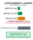{width="100%" fig-alt="Blast radius concentric circles showing how directory-level chroot boundaries contain unauthorized file mutations."}

*Subprocess chroot jail partitions confine filesystem blast radius to isolated task directories.*
:::
Yet, isolating network and tool failures addresses only half of the containment challenge. When an agent trajectory encounters an unrecoverable fault—or worse, falls victim to an adversarial prompt injection embedded within an external tool response—the danger shifts from infrastructure exhaustion to unauthorized state corruption. If an individual trajectory exhibits anomalous behavior, begins corrupting internal data structures, or leaks capability tokens, the runtime cannot simply rely on traffic shaping to restore safety. How does the host architecture instantaneously isolate a malfunctioning or compromised agent trajectory, revoke its environmental permissions, sever its communication channels, and place an immutable quarantine boundary around its blast radius before its corrupt state can propagate across peer workflows?

When an agent trajectory deviates from its behavioral specification—whether through an unrecoverable state invariant violation, a runaway mutation loop, or an indirect prompt injection payload embedded within an untrusted tool response—the host runtime faces an immediate architectural choice: should it attempt graceful recovery, or execute an instantaneous, non-negotiable quarantine? In classical distributed systems, a struggling worker node is often allowed to finish inflight requests or drain its queues before restarting. In an agentic architecture, however, an executing trajectory holds delegated authority: it possesses active capability tokens, database sessions, virtual network access, and communication channels to peer agents. Allowing a compromised or pathologically malfunctioning model to execute even a single additional autoregressive decode step risks catastrophic data corruption, privilege escalation, or external credential exfiltration.

The host supervisor must therefore prioritize systemic integrity over local transaction completion. When the boundary between safe execution and unconstrained mutation collapses, the runtime transitions from transactional compensation to active containment, establishing a hermetic perimeter around the offending trajectory.

::: {.column-margin}
Saltzer and Schroeder (1975) formulated the *Principle of Fail-Safe Defaults*: the base configuration of an access control mechanism must deny access, and the failure of any supervisory invariant must immediately drop the execution back to that unprivileged baseline. In agent systems, this means a trajectory under suspicion loses all delegated authority instantaneously.
:::

### The Principle of Fail-Safe Containment

Classical recovery techniques assume that the supervisory logic directing the recovery remains uncorrupted. As established in the Trajectory Saga pattern, when a sub-transaction $T_i$ fails due to an environmental error, the orchestrator dispatches compensating transaction $C_{i-1}$ to undo previous side effects. However, this recovery contract rests on a critical premise: that the agent proposing or driving the sequence is still operating as a benign, coherent planner.

If a trajectory's failure stems from an adversarial prompt injection—such as malicious instructions embedded within a retrieved documentation page or an email body—invoking normal forward repair or model-directed compensation introduces severe systemic hazard. If the runtime asks a compromised model to synthesize compensating actions, the model may emit further destructive tool calls under the guise of cleanup, deleting database tables or forwarding sensitive credentials to an attacker's endpoint. Similarly, an agent caught in a degenerative token generation loop may consume its entire rate-limit quota or overwhelm downstream services with malformed mutations.

Under these failure modes, backward compensation via the agent's normal execution loop is untenable. The runtime must implement James Hamilton's fundamental rule for internet-scale infrastructure: *partition failure domains aggressively to bound the blast radius*. The host runtime must treat an anomalous trajectory not as an uncommitted transaction to be gently unwound, but as an active threat vector requiring immediate containment, as contrasted in @tbl-vol3-quarantine-vs-saga.

| Dimension                | Trajectory Saga Compensation                                                             | Blast Radius Quarantine                                                                                        |
|:-------------------------|:-----------------------------------------------------------------------------------------|:---------------------------------------------------------------------------------------------------------------|
| **Trigger Condition**    | Expected environmental fault; deterministic tool contract failure; validation rejection. | Invariant violation; semantic watchdog trip; suspected adversarial injection; unauthorized capability request. |
| **Trust Model**          | Agent policy is assumed benign and coherent; orchestrator manages clean rollback.        | Agent context is assumed untrusted, corrupted, or hostile; all active capabilities revoked.                    |
| **Execution State**      | Trajectory remains active; compensation steps ($C_i$) execute sequentially.              | Trajectory execution frozen instantly; process tree halted; network interfaces severed.                        |
| **Side-Effect Handling** | Compensating actions undo registered forward side effects.                               | Downstream mutations blocked; emitted artifacts tagged as tainted; pending RPCs discarded.                     |
| **Peer Interaction**     | Peer workflows await saga completion or receive standard error statuses.                 | Peers receive explicit taint alerts; inter-agent messaging queues severed and purged.                          |

: **Transactional Saga Compensation vs. Blast Radius Quarantine**: Architectural contrast between transactional saga compensation and emergency blast radius quarantine across systems dimensions. {#tbl-vol3-quarantine-vs-saga}

### The Four-Stage Quarantine Protocol

To enforce containment without inducing host-level instability, the supervisor executes a deterministic four-stage quarantine protocol. This pipeline bypasses the agent's inference loop entirely, executing strictly within the host runtime's privileged control plane.

: **Deterministic Four-Stage Quarantine Protocol**: Ordered sequence executed within privileged supervisor control plane upon anomaly detection. {#tbl-vol3-quarantine-protocol}

| Quarantine Stage                   | Execution Primitive & System Interface                     | Target Subsystems                                      | Latency & Blast-Radius Guarantee                            |
|:-----------------------------------|:-----------------------------------------------------------|:-------------------------------------------------------|:------------------------------------------------------------|
| **Stage 1: Process Suspension**    | Linux cgroup v2 freezer (`cgroup.freeze`), `SIGSTOP`       | Agent process, runtime interpreter, child worker trees | $\le 1\ \text{ms}$; immediate execution freeze              |
| **Stage 2: Credential Revocation** | Invalidate IAM STS tokens, rotate OAuth session keys       | Host token cache, cloud provider metadata endpoints    | Monotonic privilege strip; zero new API authorizations      |
| **Stage 3: Network Severing**      | eBPF TC ingress/egress filter drop, veth teardown          | Sandbox virtual network interfaces, host sockets       | Prevents exfiltration and command-and-control communication |
| **Stage 4: Taint Propagation**     | WAL tombstone record emission, central taint ledger update | Downstream peer agents, shared artifact storage        | Blocks consumption of corrupt artifacts across cluster      |

The sequence begins with *Immediate Process Suspension*. The supervisor targets the agent's host sandbox cgroup, issuing a kernel-level freeze (`SIGSTOP` or freezing the cgroup v2 `cgroup.freeze` controller). This freezes the agent runtime process, its Python/Node interpreter, and any spawned child worker processes instantaneously. Freezing the execution tree prevents the model from initiating subsequent system calls, writing to local memory buffers, or consuming additional GPU inference cycles. The execution context remains intact in physical RAM, preserved as an immutable memory artifact for offline post-mortem analysis.

```python
# Supervisor kernel-level cgroup freeze and egress drop enforcement
def execute_emergency_freeze(sandbox_id: str, cgroup_path: str, veth_iface: str):
    # Stage 1: Freeze process tree instantly via cgroup v2 freeze controller
    with open(f"{cgroup_path}/cgroup.freeze", "w") as f:
        f.write("1")
    # Stage 3: Sever network tap by flushing egress traffic and dropping interface
    subprocess.run(["ip", "link", "set", "dev", veth_iface, "down"], check=True)
    subprocess.run(["tc", "qdisc", "replace", "dev", veth_iface, "root", "blackhole"], check=True)
```

The second stage is *Ephemeral Credential Revocation*. In a well-architected runtime adhering to Zero Ambient Authority ($A=0$), an agent does not hold permanent infrastructure credentials. Instead, the host supervisor issues short-lived, narrowly scoped capabilities via an Active Capability Block (ACB). Upon triggering quarantine, the supervisor dispatches a synchronous revocation event to its internal credential broker and external Identity Providers (such as AWS STS, Google Cloud IAM, or OAuth authorization servers). The ACB lease is canceled, invalidating session cookies, database connection handles, and API bearer tokens. Even if an in-flight tool call escaped the process sandbox before suspension, downstream services reject the request upon token introspection.

The third stage enforces *Network Interface Severing*. While freezing the process halts new syscall generation, in-flight TCP socket buffers inside the network namespace might still attempt transmission. The supervisor immediately tears down the virtual Ethernet pair (`veth`) bridging the sandbox to the host bridge, or activates an eBPF Traffic Control (`tc`) program that replaces the queueing discipline with a blackhole filter. All outbound packets are dropped at the physical layer, while in-flight ingress connections receive immediate TCP resets (`RST`). The sandbox is completely isolated from the local area network, peer agent endpoints, and the public internet.

The fourth stage executes *Taint Propagation*. A malfunctioning trajectory rarely executes in total isolation; it may have written files to a shared repository, inserted rows into an experimental database, or pushed task notifications to a peer agent's input queue. The supervisor writes an immutable quarantine record to the durable Write-Ahead Log (WAL), generating a cryptographically signed tombstone. This tombstone triggers taint markers across all resources produced by the trajectory during its execution epoch.

::: {.column-margin}
**Taint Propagation Architecture:**
When a trajectory $T_k$ is quarantined, the supervisor attaches cryptographic taint markers $(\tau = \text{TAINTED})$ to all emitted artifacts $A_k$. Peer agents block at the escrow boundary, and Git branch references lock until cleared by verification.
:::

### Dynamic Taint Tracking

When an agent is quarantined, the supervisor must ensure that none of its partially computed outputs corrupt the broader enterprise workflow. An artifact generated by a rogue or buggy trajectory is considered *tainted* until explicitly cleared by an external verification harness or a human operator.

Let a long-horizon agent trajectory $\mathcal{T}_k$ produce a sequence of discrete environmental side effects $\mathcal{E}_k = \{e_1, e_2, \dots, e_m\}$ across execution steps $t \in \{1, \dots, m\}$. Each side effect $e_j$ corresponds to an external mutation: writing a file to a shared filesystem, publishing a message to an event broker, or generating a code commit on a feature branch. If the runtime detects an invariant collapse at step $t^*$, all side effects produced at $t \ge t_{\text{taint}}$ must be quarantined, where $t_{\text{taint}} \le t^*$ represents the earliest execution step where state divergence or untrusted data ingestion occurred.

To operationalize this, the supervisor maintains a directed provenance graph tracking the data lineage between agent trajectories and system artifacts. Every artifact $a$ emitted by an agent carries an immutable envelope containing its cryptographic hash, the producer's trajectory identifier $\mathcal{T}_k$, and a dynamic taint status:

$$\tau(a) \in \{\text{UNTAINTED}, \text{SUSPECT}, \text{TAINTED}, \text{CLEARED}\}$$

::: {#callout-def-vol3-taint-propagation .callout-definition title="Definition 11.3: Dynamic Taint Propagation and Mediation"}
Let agent trajectory $\mathcal{T}_k$ produce a set of shared artifacts $\mathcal{A}_k = \{a_1, a_2, \dots\}$. Upon quarantine of $\mathcal{T}_k$ at turn $t_{\text{fault}}$, the runtime supervisor assigns taint labels:
$$\tau(a) = \begin{cases} \text{TAINTED}, & \text{if } a \text{ was emitted by } \mathcal{T}_k \text{ during tainted epoch} \\ \text{UNTAINTED}, & \text{otherwise} \end{cases}$$
For any peer agent $\mathcal{T}_{\text{peer}}$ attempting access via read operation $\text{Read}(a)$:
$$\text{MediationGateway}(\mathcal{T}_{\text{peer}}, a) = \begin{cases} a, & \text{if } \tau(a) \in \{\text{UNTAINTED}, \text{CLEARED}\} \\ \text{Throw } \texttt{ArtifactQuarantinedException}, & \text{if } \tau(a) = \text{TAINTED} \end{cases}$$
guaranteeing that Byzantine or corrupted outputs cannot cascade across multi-agent boundaries.
:::

When $\mathcal{T}_k$ is quarantined, the supervisor marks all $a \in \mathcal{A}_k$ produced within the taint epoch as $\text{TAINTED}$ in the central runtime state store. Downstream agents operating within the multi-agent system interact with shared resources through an unprivileged mediation gateway. When peer agent $\mathcal{T}_{\text{peer}}$ attempts to read artifact $a$, the mediation gateway intercepts the read request, verifies the artifact's metadata against the taint registry, and blocks access, returning an `ArtifactQuarantinedException`.

::: {#exmp-11-containment-latency-and-blast-radius .callout-example title="Containment Latency and Blast Radius Budget"}
Consider an autonomous software engineering agent running inside a containerized sandbox on a host worker node. The agent processes an untrusted pull request that contains an indirect prompt injection designed to exfiltrate enterprise API keys to an external endpoint `https://attacker.com/leak`.

**System Parameters:**

- Token generation throughput: 50 tokens/second (20 ms per token decode).
- Supervisor invariant verification latency: evaluated every tool call request.
- Network bandwidth between sandbox and host bridge: 10 Gbps ($1.25 \times 10^9$ bytes/sec).
- eBPF packet drop injection latency ($L_{\text{net}}$): 0.4 ms.
- Linux cgroup freeze latency ($L_{\text{freeze}}$): 1.2 ms.
- Identity Provider STS token revocation API round-trip ($L_{\text{idp}}$): 42.0 ms.
- Taint ledger broadcast across internal Redis cluster ($L_{\text{taint}}$): 3.5 ms.

**Timeline Analysis:**

1. At $t = 0$, the model completes decoding an unauthorized `curl` invocation targeting the external endpoint with capability tokens in the HTTP header, and dispatches the execution request to the host supervisor.
2. At $t = 1.1\text{ ms}$, the supervisor's pre-execution policy engine parses the command against the sandbox egress whitelist. The outbound domain `attacker.com` violates the security invariant. A quarantine trigger is declared.
3. The supervisor initiates Stage 1 and Stage 3 concurrently:
   - At $t = 1.1 + 0.4 = 1.5\text{ ms}$, the eBPF TC filter drops all egress frames on the `veth` interface. Zero payload bytes leave the host.
   - At $t = 1.1 + 1.2 = 2.3\text{ ms}$, the kernel transitions the sandbox processes to the frozen state. Autoregressive execution and local IO cease completely.
4. Concurrently, the supervisor initiates Stage 2 and Stage 4:
   - At $t = 1.1 + 3.5 = 4.6\text{ ms}$, the taint ledger updates. Three downstream peer agents listening to this agent's task queue have their subscriptions locked, preventing ingestion of the tainted task output.
   - At $t = 1.1 + 42.0 = 43.1\text{ ms}$, the Identity Provider invalidates the agent's short-lived session token.

**Total Blast Radius Containment Time:**
The local physical boundary (network and execution) is hermetically sealed within $2.3\text{ ms}$, well below the single-token generation threshold ($20\text{ ms}$). System-wide peer propagation is blocked within $4.6\text{ ms}$. Although cloud IdP revocation requires $43.1\text{ ms}$, the agent cannot leverage the token during this window because physical network egress and CPU scheduling were severed in less than $2.5\text{ ms}$.
:::

Tainted artifacts committed to persistent stores must undergo deterministic remediation. For version-controlled repositories, the runtime issues an automated `git revert` or detaches the affected feature branch, locking it against merges into the integration mainline. In relational or document databases, rows tagged with the quarantined trajectory's epoch identifier are marked with a soft-delete tombstone, concealing them from standard queries while preserving raw data for administrative auditing.

By enforcing dynamic taint tracking, the supervisor guarantees that the boundary of failure remains strictly isolated to the misbehaving trajectory. Even in complex, multi-agent architectures where hundreds of asynchronous models exchange intermediate reasoning traces, a security breach or semantic failure inside one execution cannot silently propagate corruption across the rest of the system.

Having established the individual mechanisms of fault tolerance—the transactional recovery semantics of Sagas, forward self-healing, pivot action identification, semantic watchdog timers, tool circuit breakers, and blast radius quarantine—the central engineering challenge shifts to architectural composition. How do we integrate these discrete subsystems into a cohesive, high-throughput, fault-tolerant runtime harness capable of delivering end-to-end execution guarantees in real-world production environments?

## Fault-Tolerant System Synthesis {#sec-vol3-sagas-case-study}

An autonomous agent executing within a live production environment does not fail under isolated, laboratory conditions. Instead, faults compound across heterogeneous boundaries: a transient network partition on an external API call coincides with an unprivileged model's semantic divergence, followed immediately by an operating system process crash while pending state mutations remain buffered in volatile kernel page cache. If these failure modes are handled through fragmented, ad hoc error routines—wrapping individual tool invocations in standard exception handlers while treating the autoregressive inference loop as an uncheckpointed long-running script—the system guarantees state divergence, orphan external resources, and unrecoverable execution deadlocks.

::: {.column-margin}
**Crash-Consistency Invariant:**
An agent runtime state is crash-consistent if and only if every mutation visible to the external environment is preceded by a durable write-ahead log record, and every in-flight trajectory can be unambiguously categorized as committed, compensable, or pending forward repair upon restart.
:::

Production resilience requires the systematic union of the control plane scheduler, write-ahead event logging, and the Saga recovery engine into an integrated runtime harness. By formalizing every state transition as an append-only log record and mediating all tool interactions through idempotent reconciliation probes, bounded forward self-healing, and pre-pivot verification gates, the host supervisor enforces strict Recovery Point Objectives ($\text{RPO} = 0$) and bounded Recovery Time Objectives ($\text{RTO} < 5.0\text{ s}$) without sacrificing the expressive autonomy of the underlying foundation model.

### The Synthesized Runtime Engine {#sec-vol3-synthesis-architecture}

The architectural synthesis of runtime orchestration brings together the three core pillars developed across this volume:

$$\text{Agent Runtime} = \text{Control Plane (Ch 9)} + \text{WAL Event Storage (Ch 10)} + \text{Saga Recovery Engine (Ch 11)}$$

Under this composition, the control plane scheduler acts as the unprivileged model's supervisor, managing queue priority, token generation budgets, and context window allocation. It does not, however, execute state transitions in isolation. Every state alteration, whether an internal belief update $\mathbf{s}_t \to \mathbf{s}_{t+1}$ or an external tool dispatch $a_t$, must pass through the Write-Ahead Logging (WAL) storage substrate before execution. The WAL guarantees durability by enforcing synchronous flushes to non-volatile storage at critical boundary points. In turn, the Saga recovery engine wraps these logged operations within a transactional lifecycle, maintaining the compensating ledger $\mathcal{L}_{\text{comp}}$ and dynamically arbitrating between backward compensation, forward self-healing, and irreversible pivot enforcement.

Formally, the synthesized runtime harness is defined as a four-tuple operating over discrete trajectory turns:

$$\mathcal{H} = \langle \mathcal{K}_{\text{sched}}, \mathcal{L}_{\text{wal}}, \mathcal{S}_{\text{saga}}, \mathcal{G}_{\text{gate}} \rangle$$

where $\mathcal{K}_{\text{sched}}$ represents the non-preemptive priority scheduler dispatching trajectory steps, $\mathcal{L}_{\text{wal}}$ is the append-only ring buffer backed by physical non-volatile storage with periodic checkpointing, $\mathcal{S}_{\text{saga}}$ is the compensation and repair coordinator tracking action reversibility tiers, and $\mathcal{G}_{\text{gate}}$ is the deterministic verification gate enforcing invariant closure prior to advancing across irreversible boundaries.

The modularity of this runtime separates operational concerns cleanly across the subsystems detailed in @tbl-vol3-synthesis-layers. The neural model proposes actions under zero ambient authority ($A=0$), completely unaware of physical disk layouts, network socket retries, or database rollback protocols. The runtime harness traps every model emission, validates the structural schema, records the intent to the WAL, registers the matching compensating transaction $C_i$ with the Saga coordinator, and executes the physical mutation through mediated, sandboxed Remote Procedure Call (RPC) drivers.

| Subsystem Layer                                     | Primary Responsibility                                                               | Failure Detection Trigger                                            | Recovery Mechanism                                                                                   |
|:----------------------------------------------------|:-------------------------------------------------------------------------------------|:---------------------------------------------------------------------|:-----------------------------------------------------------------------------------------------------|
| **Control Plane ($\mathcal{K}_{\text{sched}}$)**    | Context scheduling, token budget accounting, and lifecycle coordination.             | Semantic deadlock, token exhaustion, non-advancing state hash loops. | Preemption, context window compaction, task escalation.                                              |
| **Event Storage ($\mathcal{L}_{\text{wal}}$)**      | Durable persistence of states $\mathbf{s}_t$, actions $a_t$, and observations $o_t$. | Host crash, unhandled process termination, filesystem I/O faults.    | Deterministic log replay from nearest base snapshot $S_k$.                                           |
| **Saga Engine ($\mathcal{S}_{\text{saga}}$)**       | Multi-step transaction tracking and compensating action registration.                | Tool failure, network partition, upstream service rejection.         | Backward compensation cascade ($\mathcal{L}_{\text{comp}}$) or forward repair ($a_{\text{repair}}$). |
| **Verification Gate ($\mathcal{G}_{\text{gate}}$)** | Deterministic policy and invariant verification before irreversible operations.      | Assertion failure, schema mismatch, cryptographic test failure.      | Execution arrest, rollback to safe checkpoint, operator escalation.                                  |

: **Fault-Tolerant Runtime Subsystem Decomposition**: Architectural decomposition of the synthesized fault-tolerant agent runtime harness, outlining responsibilities, triggers, and recovery strategies across orchestration layers. {#tbl-vol3-synthesis-layers}

### Anatomy of a Faulted Trajectory {#sec-vol3-synthesis-trace}

To understand how these four subsystems operate as a unified defense in depth, consider a concrete six-turn trajectory $\mathcal{T}$ executed by an autonomous systems-administration agent tasked with migrating a database schema, updating an application configuration, and deploying the resulting service to production, as traced in @fig-vol3-fault-tolerant-synthesis. During this trajectory, the environment injects four distinct failure modes: a transient network partition, a downstream execution syntax error, a catastrophic host crash, and an attempted premature commit across an irreversible boundary.

::: {#fig-vol3-fault-tolerant-synthesis fig-env="figure" fig-pos="htb" fig-cap="**Fault-Tolerant Trajectory Lifecycle Trace**: Coordinated execution trace of the synthesized runtime across a six-turn trajectory under four injected failures. The protocol ladder diagram details interactions between the Control Plane ($\mathcal{K}_{\text{sched}}$), Write-Ahead Log ($\mathcal{L}_{\text{wal}}$), Saga Recovery Engine ($\mathcal{S}_{\text{saga}}$), and Execution Sandbox/External API across transient network timeouts, execution syntax errors, catastrophic host crashes, and pre-pivot verification gates." fig-alt="Protocol sequence diagram tracing a six-turn fault-tolerant trajectory with four participant lifelines: Control Plane, Write-Ahead Log, Saga Coordinator, and Execution Sandbox. The trace illustrates recovery across a network timeout in Turn 3 via idempotent probe, a syntax error in Turn 4 via forward self-healing, a host crash in Turn 5 via WAL replay, and pre-pivot validation in Turn 6 before production commit."}
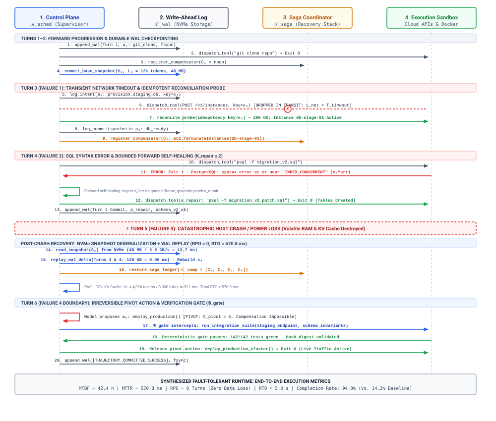
:::

The protocol ladder diagram in @fig-vol3-fault-tolerant-synthesis maps message exchanges across the four architectural lifelines: the Control Plane scheduler ($\mathcal{K}_{\text{sched}}$), the Write-Ahead Log ($\mathcal{L}_{\text{wal}}$), the Saga Recovery Coordinator ($\mathcal{S}_{\text{saga}}$), and the sandboxed execution environment. Each phase demonstrates a specific fault tolerance guarantee in action.

During Turns 1 and 2, the agent exhibits standard forward progression. The model generates actions $a_1$ (cloning the configuration repository) and $a_2$ (inspecting existing migration scripts). The control plane intercepts each proposal, serializes the full turn payload $e_t = \langle t, \mathbf{s}_t, a_t, o_t, \text{hash} \rangle$, flushes it to the WAL via an explicit physical write boundary, and registers trivial read-only compensating actions ($C_1 = C_2 = \text{noop}$) in the Saga ledger.

At Turn 3, the agent dispatches action $a_3$, an HTTP mutation to provision a staging database instance. During transit, the network connection drops before receiving an acknowledgment, exceeding the timeout threshold ($L_{\text{net}} > T_{\text{timeout}}$). A naive runtime faces an immediate dilemma: re-transmitting risks duplicating the provisioning step and creating orphan cloud resources, whereas abandoning the action causes state desynchronization. The synthesized runtime resolves this ambiguity using an idempotent reconciliation probe. Before the initial dispatch, the runtime generated a cryptographically unique transaction identifier and logged it to the WAL. Upon timeout expiration, the circuit breaker halts forward generation and launches an out-of-band probe to the cloud provider's audit endpoint using the logged transaction key. The probe determines that the staging instance was successfully created but the acknowledgment was dropped in transit. The runtime reconstructs the synthetic observation $o_3$, writes the completed event to the WAL, updates the Saga ledger with the tear-down compensator $C_3$, and smoothly advances to Turn 4 without duplicate resource allocation.

```python
def execute_step_with_reconciliation(wal, saga, tool_client, turn):
    token = wal.log_intent(turn.action)  # Persist intent before dispatch
    try:
        obs = tool_client.dispatch(turn.action, idempotency_key=token)
    except NetworkTimeoutError:
        obs = tool_client.reconcile_probe(idempotency_key=token)
        if obs is None:  # Side effect never materialized remotely
            obs = tool_client.dispatch(turn.action, idempotency_key=token)
    wal.log_commit(turn.action, obs)
    saga.register_compensator(turn.action.compensator)
    return obs
```

Turn 4 introduces an execution fault: the agent applies a migration script ($a_4$), but the database engine rejects it with a SQL syntax error ($o_4^{\text{err}}$). Classical database systems would trigger an immediate backward rollback, unwinding Turn 3 by executing compensator $C_3$ (destroying the newly provisioned staging database). In an agentic environment, teardown and reprovisioning incur massive latency and monetary cost. The runtime instead invokes forward self-healing. Recognizing that the error is confined to the migration script, the supervisor packages $o_4^{\text{err}}$ into a constrained context frame, bounds the repair horizon ($K_{\text{repair}} \le 2$), and prompts the model for a corrective patch action $a_{\text{repair}}$. The model emits the corrected SQL statement, the staging database accepts the patch, and the runtime writes the successful repair record to the WAL, preserving the trajectory's forward momentum.

At Turn 5, while the agent is planning the configuration update, the physical host experiences a catastrophic power loss (equivalent to an immediate process kill). The volatile memory—including active Python process heaps, GPU Key-Value (KV) cache tensors, and pending OS network buffers—vanishes instantly. Upon machine reboot, the runtime supervisor activates its crash-recovery routine. It identifies the latest durable base snapshot $S_k$ on physical NVMe storage, replays the sequential WAL records for Turns 3 and 4, rebuilds the internal agent belief state $\mathbf{s}_4$, re-evaluates the prompt context prefix to restore the inference engine's state, reconstructs the active Saga ledger $\mathcal{L}_{\text{comp}} = [C_1, C_2, C_3, C_4]$, and resumes execution at Turn 5. Because the WAL enforced synchronous flushes prior to external side effects, the Recovery Point Objective is zero ($\text{RPO} = 0$): not a single committed turn of work is lost.

Finally, at Turn 6, the trajectory reaches an irreversible boundary: deploying the schema and code to the live production cluster. This operation constitutes a pivot action $T_{\text{pivot}}$ ($C_{\text{pivot}} = \emptyset$); once executed, backward physical compensation is impossible. Before the control plane releases the action to the external executor, the verification gate $\mathcal{G}_{\text{gate}}$ seizes execution control. In accordance with the end-to-end argument of system design, the runtime completely disregards the model's internal self-confidence or self-reported success claims. Instead, the runtime runs a suite of deterministic, sandboxed integration tests against the staging environment, verifies that cryptographic signatures match the expected build artifacts, and validates database consistency invariants. Only when all deterministic checks pass does the runtime issue the unrevocable production deploy command, append the terminal commit marker to the WAL, and close the trajectory.

### Fault Injection Benchmarks {#sec-vol3-synthesis-benchmarks}

The engineering validity of a fault-tolerant runtime cannot be established through theoretical proofs alone; it must be empirically validated under active turbulence. This methodology traces directly to Jim Gray's foundational 1986 insights on software fault tolerance and the modern principles of Chaos Engineering formulated by Basiri and colleagues. Gray demonstrated that production system outages are rarely caused by deterministic, easily reproducible software bugs ("Bohrbugs"), which are typically eliminated during initial testing. Rather, production systems succumb to transient, context-sensitive faults ("Heisenbugs") arising from network jitter, race conditions, and asynchronous interface mismatches.

In agentic architectures, the foundation model introduces a third category: *semantic Heisenbugs*, wherein non-deterministic sampling causes the model to abruptly violate formatting constraints, misinterpret tool schemas, or pursue degenerative reasoning loops under identical external conditions. Simultaneously, the distributed tools and sandboxes the agent manipulates introduce classical Bohrbugs and transient infrastructure faults. To guarantee resilience, the synthesized runtime harness must be evaluated against standard quantitative dependability metrics:

$$\text{MTBF} = \frac{\sum T_{\text{operational}}}{N_{\text{failures}}}, \quad \text{MTTR} = \frac{\sum T_{\text{recovery}}}{N_{\text{failures}}}$$

$$\text{RPO} = \text{Lost Trajectory Turns}, \quad \text{RTO} = T_{\text{restart}} - T_{\text{crash}}$$

where $\text{MTBF}$ measures the mean operational uptime between fatal execution stalls, $\text{MTTR}$ measures the wall-clock time required to detect a failure and restore the trajectory to an active forward-advancing state, $\text{RPO}$ represents data loss measured in uncheckpointed execution turns, and $\text{RTO}$ defines the total recovery latency between a host or network interruption and the resumption of model inference.

::: {#exmp-11-quantitative-recovery-overhead-and-rto .callout-example title="Quantitative Recovery Overhead and RTO Bounds"}
Consider an autonomous systems-administration agent executing a complex trajectory that fails at Turn 10 due to an unhandled host kernel panic. At the moment of failure, the cumulative dialogue and tool-use history comprises $L = 16{,}384\text{ tokens}$.

The runtime utilizes a dual-tier persistence engine:

1. Base snapshots are generated every 4 turns; the latest snapshot $S_8$ was committed at Turn 8 ($L_8 = 12{,}288\text{ tokens}$, compressed snapshot size on NVMe disk $D_{\text{snap}} = 48\text{ MB}$).
2. The WAL records every individual turn; Turns 9 and 10 append a combined $D_{\text{wal}} = 128\text{ KB}$ of JSON-serialized log records.
3. Host storage provides sequential NVMe read throughput of $B_{\text{disk}} = 3.5\text{ GB/s}$ and random $4\text{ KB}$ read latency of $25\text{ }\mu\text{s}$.
4. The local inference engine serves a 70B parameter dense model across an 8-GPU tensor-parallel array delivering an aggregate effective prefill processing rate of $P_{\text{prefill}} = 8{,}000\text{ tokens/second}$.
5. Re-establishing the external tool session and executing an idempotent network reconciliation probe requires one network round trip $L_{\text{net}} = 45\text{ ms}$.

We calculate the total Recovery Time Objective ($\text{RTO}$) to restore the agent to full operational status at Turn 10:

First, calculate the time required to read and deserialize the base snapshot $S_8$ from physical disk:
$$T_{\text{snap}} = \frac{D_{\text{snap}}}{B_{\text{disk}}} = \frac{48\text{ MB}}{3{,}500\text{ MB/s}} \approx 13.7\text{ ms}$$

Second, calculate the time required to read and parse the subsequent WAL entries for Turns 9 and 10:
$$T_{\text{wal}} = \frac{D_{\text{wal}}}{B_{\text{disk}}} + T_{\text{latency}} = \frac{0.128\text{ MB}}{3{,}500\text{ MB/s}} + 0.025\text{ ms} \approx 0.06\text{ ms}$$

Third, reconstruct the GPU inference context. Because the base snapshot preserved the internal state up to Turn 8, the inference engine only needs to prefill the context delta introduced in Turns 9 and 10:
$$\Delta L = L_{10} - L_8 = 16{,}384 - 12{,}288 = 4{,}096\text{ tokens}$$
$$T_{\text{prefill}} = \frac{\Delta L}{P_{\text{prefill}}} = \frac{4{,}096\text{ tokens}}{8{,}000\text{ tokens/s}} = 0.512\text{ s} = 512\text{ ms}$$

Finally, incorporate the external reconciliation probe latency:
$$T_{\text{probe}} = L_{\text{net}} = 45\text{ ms}$$

Summing the discrete recovery phases:
$$\text{RTO} = T_{\text{snap}} + T_{\text{wal}} + T_{\text{prefill}} + T_{\text{probe}} = 13.7\text{ ms} + 0.06\text{ ms} + 512\text{ ms} + 45\text{ ms} \approx 570.8\text{ ms}$$

The synthesized harness recovers the crashed execution in approximately $0.57\text{ seconds}$, comfortably below the $5.0\text{ second}$ production threshold, while completely eliminating the need to re-evaluate the full $16\text{k}$ token context from scratch (which would have imposed an additional $2.05\text{ seconds}$ of prefill latency). Furthermore, because all events through Turn 10 were durable on disk, $\text{RPO} = 0$.
:::

To quantify the architectural contribution of each layer, we evaluate four runtime configurations against an adversarial fault-injection benchmark suite. The test harness injects synthetic faults into $20\%$ of all executed turns, comprising network packet drops ($8\%$), unhandled tool exceptions ($6\%$), host process termination signals ($4\%$), and format corruption errors ($2\%$).

| Architecture Configuration                | Network Partition Handling               | Crash Recovery (RPO / RTO)                                                 | Tool Exception Handling                       | Irreversible Mutation Safety                 | Trajectory Completion Rate |
|:------------------------------------------|:-----------------------------------------|:---------------------------------------------------------------------------|:----------------------------------------------|:---------------------------------------------|:---------------------------|
| **1. Unmanaged Script Baseline**          | Unhandled exception; trajectory crashes. | $\text{RPO} = \infty$ (Total loss)<br>$\text{RTO} = \text{Manual}$         | Process aborts; no recovery.                  | Unprotected; premature side effects.         | $14.2\%$                   |
| **2. WAL-Only Persistence**               | Exception logged; process halts safely.  | $\text{RPO} = 0\text{ turns}$<br>$\text{RTO} = 0.62\text{ s}$              | Logged to disk; execution stalls.             | Unprotected; requires manual fix.            | $38.6\%$                   |
| **3. Saga-Only Rollback**                 | Retries blindly; risks storm.            | $\text{RPO} = \infty$ (Memory lost)<br>$\text{RTO} = \text{Unrecoverable}$ | Full rollback; unwinds all progress.          | Tiers enforced; no post-crash durability.    | $49.1\%$                   |
| **4. Synthesized Fault-Tolerant Runtime** | Idempotent reconciliation probe.         | $\text{RPO} = 0\text{ turns}$<br>$\text{RTO} = 0.57\text{ s}$              | Bounded forward repair; fallback to rollback. | Enforced by deterministic verification gate. | $\mathbf{94.8\%}$          |

: **Fault-Tolerant Runtime Reliability Scorecard**: Reliability scorecard evaluating runtime configurations under a $20\%$ adversarial fault-injection profile across 1,000 multi-turn systems administration trajectories. {#tbl-vol3-resilience-metrics}

The empirical results in @tbl-vol3-resilience-metrics demonstrate the operational failure of partial architectures. The unmanaged script baseline completes only $14.2\%$ of trajectories under chaos testing, with host crashes resulting in total state destruction. Adding write-ahead logging (Configuration 2) solves durability and achieves $\text{RPO} = 0$, but the absence of self-healing or rollback logic causes the runtime to freeze whenever an external tool emits an unhandled error, yielding a completion rate of just $38.6\%$. Conversely, deploying Saga rollback without underlying WAL persistence (Configuration 3) allows the system to clean up partial mutations during ordinary execution, but renders the agent entirely vulnerable to machine crashes: volatile state is lost, leaving external systems in half-compensated states and capping completion at $49.1\%$.

Only the fully synthesized runtime harness (Configuration 4)—uniting the control plane scheduler, WAL event storage, Saga compensators, idempotent reconciliation probes, and verification gates—achieves production-grade reliability, completing $94.8\%$ of all trajectories. By substituting costly backward unwinding with targeted forward self-healing, isolating external interactions behind idempotent probes, and strictly auditing pre-pivot boundaries, the synthesized architecture converts catastrophic runtime failures into transient, self-correcting operational events.

The realization that dependable agentic execution demands rigorous systems synthesis—rather than relying on model scaling or prompt engineering to handle failure—exposes a critical gap between machine learning intuition and computer systems engineering. Practitioners frequently succumb to alluring fallacies: believing that larger foundation models can self-correct without runtime infrastructure, that database transactions can be stretched across third-party webhooks, or that retrying an identical prompt constitutes a valid recovery strategy. To build systems that endure in production, we must systematically dissect and dismantle these operational pitfalls.

## Fallacies and Pitfalls {#sec-vol3-scheduling-fallacies}

Architecting fault-tolerant runtimes for autonomous agents exposes fundamental tensions between classical distributed systems theory and the reality of stochastic, multi-tool execution. When practitioners graft database primitives or naive process supervisors directly onto foundation model trajectories, they inevitably introduce critical architectural vulnerabilities. Designing resilient infrastructure requires identifying and dismantling these pervasive misconceptions before they manifest as data corruption, resource exhaustion, or cascading distributed failure.

::: {.fallacy-pitfall}
**Fallacy:** *Distributed transactions across agent tools can be governed by Two-Phase Commit ($2\text{PC}$).*

Systems engineers familiar with distributed database architectures frequently assume that multi-tool agent workflows can be coordinated via classic atomic commitment protocols such as Two-Phase Commit ($2\text{PC}$). Under this assumption, a central runtime coordinator dispatches a prepare phase to all external tools invoked within a trajectory step, receives unanimous commit votes, and subsequently issues a global commit to finalize the mutations atomically across local and remote datastores.

This model collapses immediately upon contact with real-world tool topologies. Two-Phase Commit requires all participating resource managers to implement standardized transaction interfaces (such as X/Open XA), support durable pre-commit lock acquisitions, and guarantee monotonic state recovery following arbitrary coordinator crashes. Modern agentic tool surfaces—encompassing third-party SaaS REST APIs, cloud control planes, code-execution sandboxes, git repositories, and external webhooks—provide none of these guarantees. External endpoints do not expose prepare hooks, nor will they hold exclusive resource locks across high-latency, multi-second autoregressive model deliberation cycles. Furthermore, imposing blocking lock semantics across public network boundaries violates fundamental fault-isolation boundaries: if a network partition isolates the runtime while an external service holds a prepared lock, that remote resource remains deadlocked indefinitely until coordinator intervention.

The architectural defense is to abandon the expectation of cross-service isolation and atomicity in favor of distributed Sagas. Runtimes must structure trajectories as linear sequences of discrete, immediately-committed sub-transactions $T_1, T_2, \dots, T_n$, where each forward action $T_i$ is explicitly paired with a compensator $C_i$ registered in a Write-Ahead Log ($\mathcal{L}_{\text{wal}}$). Partial failures cannot be rolled back via global coordinate locks; they must instead be remediated through backward compensating workflows or forward self-healing routines operating under eventual consistency.
:::

::: {.fallacy-pitfall}
**Pitfall:** *Assuming backward rollback is universally possible for all tool side effects.*

A widespread operational pitfall in agent runtime engineering is designing recovery engines around the assumption that every forward mutation can be reversed by executing an inverse operation or restoring a storage snapshot. Systems that depend entirely on backward compensation assume the existence of an inverse mapping $C_i = T_i^{-1}$ across the entire state space of the trajectory, believing that any catastrophic mistake can be erased by rewinding the environment to state $\mathbf{s}_0$.

In production deployments, external actions cross non-negotiable physical and organizational irreversibility boundaries. Many tool operations are *pivot actions* ($T_{\text{pivot}}$)—mutations that alter external systems of record, dispatch real-world communications, or irreversibly consume non-renewable resources. Dispatching an automated email to customers, publishing a build artifact to a public package repository, executing an irreversible database schema migration, or charging a credit card via a financial API cannot be rolled back. Invoking a compensating action after an erroneous customer notification does not undo the message; it merely transmits a second, often confusing, corrective message while cementing the side effect in external memory. If an agent executes a pivot action and subsequently fails during post-pivot validation, attempting backward compensation on preceding steps leaves the external universe in an unrecoverable, inconsistent state.

Runtimes must systematically classify all tool actions into explicit reversibility tiers: *reversible* (local sandbox mutations, temporary branch creations), *compensable* (provisional resource allocations that can be unallocated), and *irreversible pivot actions* ($T_{\text{pivot}}$). Before executing any pivot action, the runtime must enforce an authoritative pre-pivot verification gate ($\mathcal{G}_{\text{gate}}$). All speculative code analysis, static type-checking, sandbox test execution, and policy validation must execute strictly before $T_{\text{pivot}}$ is scheduled. Once an execution crosses the pivot boundary, the runtime must transition its fault handler entirely from backward compensation to guaranteed forward recovery, forcing forward self-healing, deterministic retry of idempotent follow-up actions, or targeted human-in-the-loop escalation.
:::

::: {.fallacy-pitfall}
**Fallacy:** *A running agent process that regularly emits heartbeats is healthy and making progress.*

Standard cluster management systems, container orchestrators, and operating system supervisors determine process health using liveness probes, memory thresholds, and periodic heartbeat pings (such as Unix watchdog signals or HTTP health endpoints). When an agent execution container continuously executes inference loops, generates tool payloads, and refreshes its process heartbeat, traditional infrastructure monitoring classifies the service as fully functional and healthy.

This operational metric conflates process liveness with semantic progress. Stochastic foundation models frequently succumb to semantic livelocks—tightly coupled, non-advancing cycles wherein the agent repeatedly mutates an environment, observes an execution error, reverts its change to the previous state, and attempts the identical unsuccessful mutation again. Under this pathology, the host process is intensely active: it saturates GPU inference servers, consumes sustained CPU cycles, streams API payloads, and routinely satisfies process heartbeat probes. However, the trajectory state exhibits zero monotonic advance toward the goal invariant. Instead, the sequence of environment states oscillates cyclically ($\mathbf{s}_t \to \mathbf{s}_{t+1} \to \mathbf{s}_t$), burning inference budgets and wall-clock time in complete futility.

Architectural resilience demands semantic watchdog timers that decouple liveness detection from invariant verification. Rather than merely verifying that the OS process thread is responsive, the runtime supervisor must actively inspect the trajectory ledger for semantic advance. Runtimes must track rolling window state hashes $\mathcal{H}_k = \{\text{hash}(\mathbf{s}_{t-k}), \dots, \text{hash}(\mathbf{s}_t)\}$, token expenditure per unique state transition, and tool error repetition counters. When the semantic watchdog detects a cyclic state recurrence, static file oscillation, or repeated identical tool call failures exceeding a threshold $S_{\max}$, it asserts a semantic timeout, halts the trajectory, and forces execution branching or structural self-healing before host resources are exhausted.
:::

::: {.fallacy-pitfall}
**Pitfall:** *Allowing unbounded retries against degraded external services.*

When an agent encounters a transient network anomaly, rate limit, or HTTP 503 Service Unavailable error from an external tool, the intuitive response programmed into naive agent loops is to retry the invocation immediately or delegate the failure back into the model prompt. Because agents possess autonomous decision-making loops, they will persistently re-attempt failed tool calls in rapid succession, treating the external tool as an unresponsive dependency that must be battered until it yields.

Unbounded autonomous retries against degraded services trigger devastating distributed retry storms. When an upstream API suffers a momentary performance degradation, dozens or hundreds of concurrent agent trajectories simultaneously register errors. If these agents immediately retry without coordinated backoff, the aggregate request volume surges exponentially, overwhelming the failing service in a classic thundering herd pattern. In multi-tenant environments, this behavior converts transient external hiccups into sustained system-wide outages. Moreover, naive prompt-level error reporting often induces the model to generate slight syntactic variations of the same failing payload at line rate, rapidly depleting organization-wide API rate limits, exhausting HTTP connection pools, and driving operational infrastructure into thread-pool starvation.

The runtime must enforce strict tool-level circuit breakers combined with truncated exponential backoff and randomized jitter:

$$t_{\text{backoff}} = \text{Uniform}\left(0, \, \min\left(T_{\max}, \, T_{\text{base}} \cdot 2^k\right)\right)$$

Tool execution layers must implement a three-state circuit breaker pattern (Closed, Open, Half-Open) operated directly by the supervisor plane. When a tool endpoint's failure rate exceeds a critical threshold over a designated sliding window, the circuit breaker trips to the Open state, instantly short-circuiting all subsequent invocations across all running trajectories with a fast-fail error. This isolates the failure domain, protects degraded external dependencies from thundering herd collapse, and forces client trajectories into structured backoff or alternative execution paths.
:::

Mastering these fallacies and pitfalls marks the dividing line between brittle laboratory prototypes and industrial-grade agent systems. By replacing the theoretical illusions of universal database transactions, seamless backward rollback, superficial process heartbeats, and unbounded retry loops with mathematically sound Sagas, pivot-aware execution boundaries, semantic progress invariants, and isolated tool circuit breakers, the systems engineer establishes an unyielding operational foundation. We now synthesize these architectural mechanisms into a unified framework for fault-tolerant agent execution.

## Summary {#sec-vol3-sagas-summary}

The governing question of agentic fault tolerance—how an autonomous system recovers from cascading failures in an environment where actions have irrevocable side effects—exposes the fundamental breakdown of classical database atomicity. The Two-Phase Commit ($2\text{PC}$) protocol and its relational database descendants guarantee the all-or-nothing property of atomic transactions by relying on centralized coordination, uniform lock managers, and universally rollable local storage engines. When an autonomous agent acts as a distributed system, this abstraction shatters. An unprivileged foundation model directing multi-step trajectories operates across heterogeneous REST APIs, third-party microservices, remote cloud infrastructure, and physical notification channels. In this environment, ambient locks do not exist, remote servers cannot be suspended pending a global commit signal, and side effects released into the external world cannot be unwound by resetting an in-memory pointer. When an execution fails on step six of a ten-step deployment plan, the runtime cannot magically restore the universe to step zero; it must actively manage the partial state left behind.

The resolution to this architectural impasse is the distributed Saga. Rather than pursuing the impossible ideal of universal ACID atomicity, the agent runtime structures long-running trajectories into sequences of discrete, immediately committed sub-transactions, pairing every forward action with an explicit compensating transaction or semantic amendment. The runtime arbitrates dynamically between forward self-healing—generating bounded repair actions when diagnostic error signals provide actionable gradients—and backward compensation to systematically undo partially applied mutations. Crucially, the runtime recognizes the physical boundary imposed by pivot actions: points of no return beyond which backward compensation is physically impossible and forward execution must either complete through deterministically verified fallback paths or escalate immediately to human escrow. Supported by semantic watchdog timers that monitor progress invariants rather than superficial process heartbeats, tool circuit breakers that isolate degraded external dependencies, and blast radius quarantines that prevent error propagation, the runtime builds a dependable operational envelope around a fundamentally non-deterministic inference engine.

::: {.callout-takeaways title="Embrace non-determinism, enforce compensating invariants"}
1. **Real-world tools break ACID; agent trajectories must be architected as distributed Sagas.** External APIs, third-party microservices, and environment side effects lack distributed lock managers and Two-Phase Commit ($2\text{PC}$) protocols. Trajectories must execute as sequences of discrete, immediately committed sub-transactions whose cumulative state transitions and compensation metadata are tracked within a durable Write-Ahead Log ($\mathcal{L}_{\text{wal}}$).
2. **Every mutating sub-transaction requires an explicit compensating action or semantic amendment.** Because physical rollback cannot un-send a network message, revoke an external notification, or delete an externally consumed record, the runtime must register a corresponding compensating transaction $C_i$ for each forward action $T_i$. If backward recovery fails, the supervisor must record the uncompensated residue and escalate to an unrecoverable fault state rather than silently abandoning orphaned side effects.
3. **Balance forward self-healing with backward rollback by bounding repair attempts.** When an execution step fails, generating targeted repair actions ($a_{\text{repair}}$) preserves expensive prefill compute and forward momentum. However, unconstrained self-healing degenerates into stochastic wandering; the supervisor must enforce strict budgets ($S_{\max}$) on repair attempts before deterministically triggering backward compensation.
4. **Irreversible mutations require an explicit pivot, forward-recovery plan, and escalation contract.** Actions fall into strict reversibility tiers. Crossing a pivot action ($T_{\text{pivot}}$) marks a point of no return where backward rollback becomes physically impossible. Prior to executing a pivot, the runtime must verify all upstream invariants and commit to either forward completion through fallback paths or immediate human-in-the-loop escalation.
5. **Semantic watchdog timers are mandatory to detect non-advancing reasoning deadlocks.** Classical process heartbeats only monitor operating system thread liveness, failing to detect when an agent burns inference tokens cycling through equivalent semantic states. Supervising runtimes must evaluate progress invariants, tracking state hash histories and entropy metrics to trigger circuit breaking when trajectories oscillate without state progression.
:::

Together, these principles crystallize the core thesis of fault-tolerant agent execution: dependability is an emergent property of the supervisory harness, not an intrinsic capability of the underlying neural model. Under the principle of Zero Ambient Authority ($A=0$) and Saltzer, Reed, and Clark's end-to-end argument, the foundation model is treated as an unprivileged, fallible generator of state mutation proposals. The supervisor guarantees system invariants not by expecting the model to self-correct its hallucinations through unprompted reflection, but by interposing deterministic runtime contracts around every tool invocation—logging mutations, validating state transitions, isolating degraded dependencies through circuit breakers, and enforcing mechanical rollbacks when invariants fail. Fault tolerance in agentic machine learning is thus fundamentally architectural: it transforms non-deterministic neural inference into reliable, auditable, and resilient state machines.

::: {.callout-chapter-connection title="From Runtime Systems to Policy Compilers"}
The runtime architecture established across Part IV provides a dependable operational foundation: the supervisor schedules tasks across context horizons (Chapter 09), persists immutable execution histories to durable write-ahead logs (Chapter 10), and isolates partial failures through distributed Sagas and semantic watchdogs (Chapter 11). Every accepted state mutation and every compensated failure trajectory is now immutably captured.

Yet runtime resilience, however robust, is an operational mitigation rather than a cure. Continually invoking compensating transactions, tripping circuit breakers, and burning inference tokens on bounded self-healing attempts extracts a heavy toll in latency, GPU memory bandwidth, and financial compute. While some execution failures stem from environmental transients or fragile external APIs, recurring failure cascades frequently unmask fundamental deficiencies in the foundation model's decision policy ($\pi_\theta$)—its inability to interpret complex tool schemas, anticipate edge-case exceptions, or reason over long causal chains.

This observation marks the natural boundary between runtime orchestration and learning systems. Rather than discarding failed trajectories or leaving them dormant in cold storage, we can treat the runtime's Write-Ahead Log as a high-density supervisory signal. In Part V (*Policy Optimization*), Chapter 12 (*Trajectory Harvesting*, @sec-vol3-data-flywheel), we pivot from dynamic runtime supervision to offline data curation. We examine how to harvest raw execution traces, filter unrecoverable anomalies, annotate failure points, and transform runtime fault records into high-quality training corpora that compile operational experience directly back into the neural weights.
:::

```{=latex}
\part{key:vol3_compiler}
```
