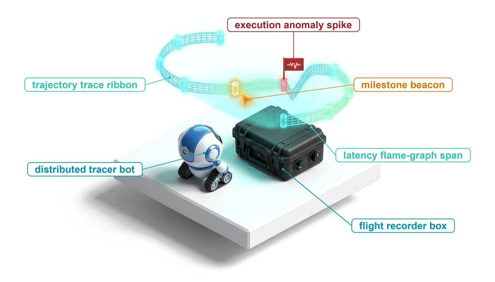
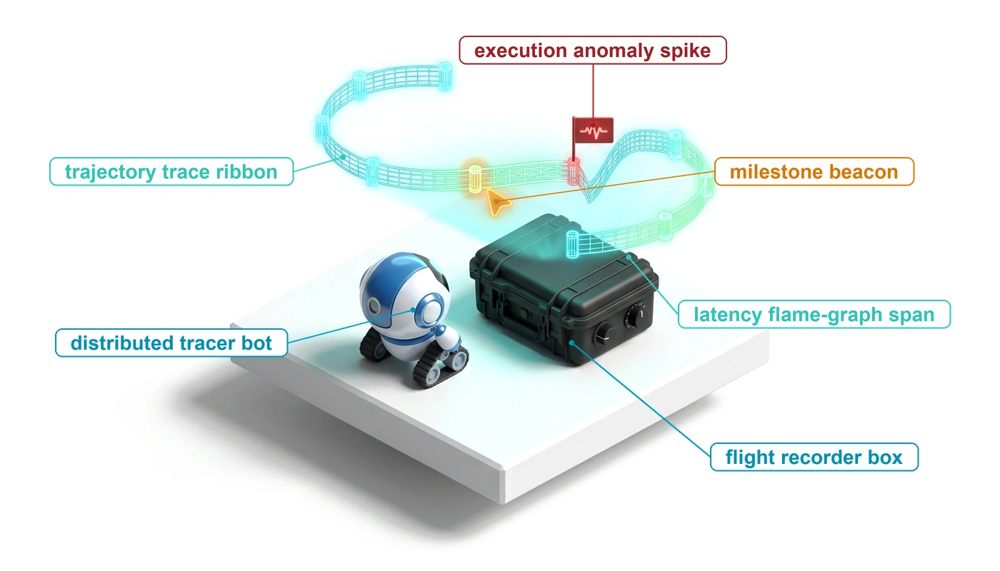
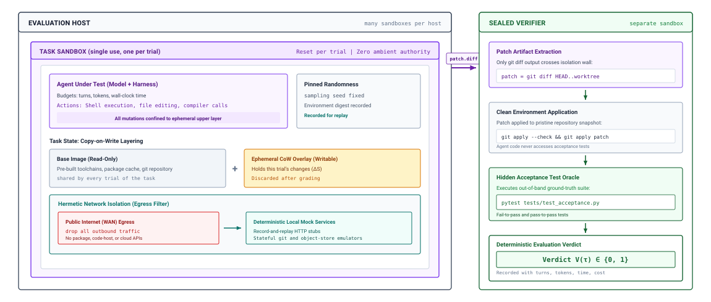
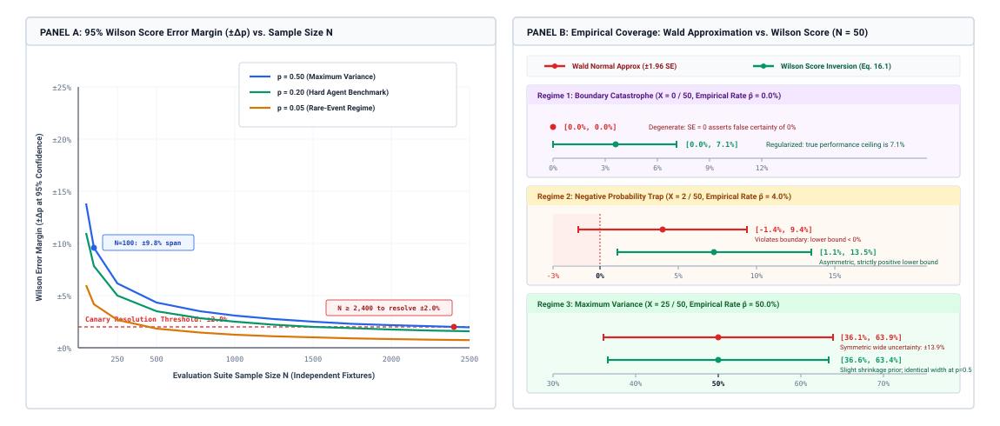
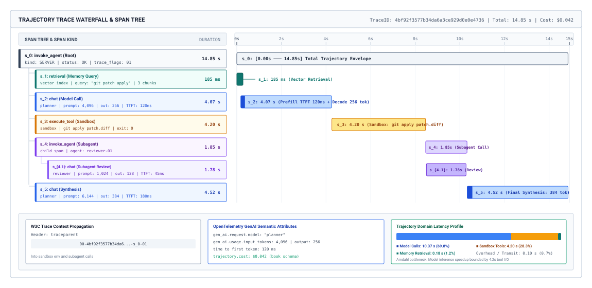
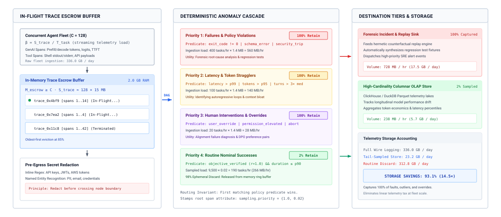

# Agent Evaluation {#sec-vol3-evaluation}

::: {layout-narrow}
::: {.column-margin}

\chapterminitoc

:::

::: {.content-visible when-format="pdf"}
\noindent
{fig-alt="Blueprint-style chapter cover for agent evaluation."}
:::

::: {.content-visible unless-format="pdf"}
{fig-alt="Blueprint-style chapter cover for agent evaluation."}
:::

:::

## Purpose {.unnumbered .unlisted}

\begin{marginfigure}
\mlagentstack{0}{0}{100}{0}{0}{0}
\end{marginfigure}

_How do we know an agent works well enough to release, and when it fails, which part failed?_

A runtime that enforces budgets, survives crashes, and recovers from bad actions still cannot say whether the task got done. An agent can report success after deleting the test that would have caught its bug, return a clean status while a backfill stops halfway, or pass a benchmark once and fail the same task on the next run. Every one of those runs looks healthy to a dashboard that counts exit codes and response times. Evaluation replaces activity signals with evidence of completion. That evidence is a verified change in the environment, measured over enough independent tasks and repeated runs to separate a real improvement from sampling noise, and tied to a trace that says whether the model, the harness, or the environment caused each failure. The same machinery decides whether a new model, prompt, tool, or harness version may ship, and it certifies which trajectories succeeded, which is what later makes it safe to learn from them. In H·S·A terms, evaluation is how the runtime checks its own closure, judging state by the change it verifies, horizon by the turns and dollars spent against the budget, and authority by an audit of every action the agent took.

::: {.content-visible when-format="pdf"}

\newpage

:::

::: {.callout-learning-objectives}

- Define an evaluation contract that accepts a task only on a verified change in environment state within its budget
- Design a hermetic task environment with sealed tests, contamination controls, and simulated users for conversational tasks
- Compare outcome verifiers, step-level metrics, and calibrated LLM judges as graders of a trajectory
- Calculate confidence intervals, required sample sizes, and pass$^k$ reliability from repeated trials at matched budgets
- Instrument a trajectory as a span graph and select a sampling and redaction policy that retains every failure
- Diagnose a failed trajectory as a model, harness, or environment fault using replay and counterfactual ablation
- Evaluate a candidate release against a composite gate through offline, shadow, and canary stages

:::

## What Counts as Success {#sec-vol3-evaluation-contract}

::: {.column-margin}
{width="100%" fig-alt="H·S·A locator with all three axes, Horizon, State, and Authority, highlighted in purple."}

*Evaluation checks all three exposures: the state a trajectory changed, the horizon it spent, and the authority it used.*
:::

Consider a reconciliation agent that settles customer balances for a billing team. Its dashboards show every tool call returning a success status and every call finishing in well under a second. A later audit finds that it issued the same credits many times over. The ledger query had timed out, the tool wrapper caught the timeout and returned an empty list instead of an error, and the model, reading an empty list of prior credits, proposed the credit again on each turn until a payment call went through. Every component did what its own monitor measured. The task failed anyway, and nothing the team watched could have said so.

The failure is the fail-plausible behavior of @sec-vol3-intro-fail-plausible, seen from the operator's side. Part IV has built a runtime that runs a trajectory under budgets and approvals (@sec-vol3-agent-harness), writes every event to a durable log (@sec-vol3-durable-execution), and recovers from failed actions (@sec-vol3-failure-recovery). None of that machinery says whether the task succeeded. Before a runtime can be trusted, and before any trajectory it produces can become training data, it needs a measurement of success that an agent cannot satisfy by sounding finished.

### The evaluation contract

The completion criteria $\mathcal{K}_{\text{comp}}$ of the five-part task contract (@sec-vol3-intro-five-part-contract) already say what finished means for a single task. The evaluation contract makes those criteria operational. It grades a trajectory in four ordered layers (@tbl-vol3-eval-contract-hierarchy), and a failure at a lower layer ends the evaluation before the higher layers run. Layers 1, 2, and 4 check the mechanical bounds the runtime enforces below the model. Layer 3, the state delta, supplies the end-to-end evidence that the task was done, which is the half of invariant closure (principle \ref{pri-invariant-closure}) that sits above the model.

| Layer                                        | What it checks                                                                                  | Measurement                                                             | Silent failure it catches                                                            |
|:---------------------------------------------|:------------------------------------------------------------------------------------------------|:------------------------------------------------------------------------|:-------------------------------------------------------------------------------------|
| **Layer 1: Schema validity**                 | Every proposed tool call parses against its declared schema                                     | Schema validators, parsers, type checkers                               | Truncated arguments, invented parameter names, strings where numbers belong          |
| **Layer 2: Execution invariants**            | Tools ran cleanly and reported their failures as failures                                       | Exit codes, typed error observations, stderr capture                    | Exceptions converted to empty results, retries that repeated a non-idempotent effect |
| **Layer 3: State delta verification**        | The environment changed as the goal requires ($\Delta S = S_{\text{post}} - S_{\text{pre}}$)    | Hidden test suites, database assertions, diffs against a clean baseline | Plausible patches that fail tests, partial writes, untouched targets                 |
| **Layer 4: Budget and authority compliance** | The trajectory stayed inside its turn, token, time, and cost ceilings and its granted authority | Turn counters, token meters, wall-clock timers, sandbox policy logs     | Loops that exhaust the budget, attempts to reach beyond the granted tools or paths   |

: **Evaluation Contract Layers**: The four ordered layers that grade a trajectory, from schema validity of each proposed call to compliance with the task's budget and authority. A failure at a lower layer ends evaluation before higher layers run. {#tbl-vol3-eval-contract-hierarchy}

Layer 3 carries the weight. What an agent delivers is rarely its transcript. It is a change in files, rows, tickets, or configuration, and the grader measures that change directly:

$$\Delta S = S_{\text{post}} - S_{\text{pre}}$$

where $S_{\text{pre}}$ and $S_{\text{post}}$ are the persistent environment state before and after the trajectory. Jimenez et al. [-@jimenez2024swebench] built this rule into repository-repair evaluation. The grader ignores the agent's explanation, applies the agent's diff to a clean checkout, and runs tests that the original bug made fail (fail-to-pass) together with tests that passed before the change (pass-to-pass). A patch that fixes the bug and breaks something else scores zero, however well it is described.

Layer 4 turns the budgets of @sec-vol3-controlplane-accounting into acceptance criteria. Using the duration accounting of @sec-vol3-intro-duration-accounting over the trajectory's $H$ turns, a trajectory is within budget only if

$$T_{\text{task}} = \sum_{t=1}^H \left( T_{\text{model}, t} + T_{\text{tool}, t} + T_{\text{wait}, t} + T_{\text{runtime}, t} \right) \le T_{\max}, \qquad C_{\text{task}} \le C_{\max}, \qquad H \le H_{\max}$$

where $C_{\text{task}}$ is the trajectory's token or dollar cost. A correct result that cost fifty dollars against a two-dollar ceiling is a failed task, not a slow success. The authority half of Layer 4 checks that every effect went through a granted tool within the sandbox the task was given.

Together the four layers observe the three exposures of @sec-vol3-intro-hsa. The state delta checks what the trajectory did to state, the budgets bound its horizon, and the authority check confirms it never acted beyond its grant. That combination defines the unit this chapter counts.

::: {#dfn-vol3-accepted-task .callout-definition title="Accepted task"}

***Accepted task***\index{Accepted task!definition} is a trajectory whose final environment state passes the task's completion criteria at the closure evidence level the task requires, with the trajectory inside every budget ceiling the contract states.

1.  **Significance**: The accepted task is the unit that success rates, reliability, and cost per accepted task all count. A run that passes its verifier but exceeds its budget is not accepted.
2.  **Distinction**: *Verified success* means only that the final state passed the verifier. Acceptance adds the budget and the evidence level, so a pass on visible tests does not accept a task whose contract requires sealed tests.
3.  **Common pitfall**: Counting a run as accepted because the agent reported success, the transport returned a success status, or a judge scored the transcript well. None of these observes the environment.

:::

::: {#exmp-vol3-evaluation-four-layer-contract .callout-example title="Grading a schema migration through the four layers"}

**Scenario**: A database agent is asked to add a composite index to a large audit table, backfill a new non-null status column, and stay within a two-minute budget. It finishes and reports that the migration succeeded with no downtime. A model-based judge reading the transcript rates the run highly.

**Diagnosis**: Layer 1 passes, since every tool call parses. Layer 2 fails. The index build exited cleanly, but its captured warnings show that a lock timeout forced a blocking build that held the table for tens of seconds while client queries queued. Layer 3 fails as well. A hidden assertion counting rows whose new column is still null returns millions instead of zero, because the backfill hit a statement timeout partway through and was never wrapped in a transaction. Layer 4 fails on time, since the blocked build pushed the trajectory past its two-minute ceiling. The judge saw only the agent's report.

**Systems lesson**: Exit codes and a fluent report certified a trajectory that locked production, left a partial write, and missed its budget. Only checks that read the environment, run in order, caught all three.

:::

A contract says what to measure. It does not make the measurement repeatable. A state delta is meaningful only if $S_{\text{pre}}$ is identical on every trial and $S_{\text{post}}$ reflects this trajectory alone, which is the job of the task environment.

## Task Environments {#sec-vol3-evaluation-gyms}

An evaluation harness that runs a hundred agents against live services fails in ways that have nothing to do with the agents. One agent's repeated calls to a code-hosting API trip a rate limit, and the next twenty tasks fail on errors no agent caused. Another agent, given a shared container, deletes a directory the next task needed. A third drops a table on a shared test database. The measured success rate now reports execution order and network weather. An agent evaluation needs a task environment, often called a gym, that isolates each trial, resets to an identical starting state, and answers every external call the same way every time.

::: {.column-margin}
**Hermeticity** means the environment is sealed. External calls are intercepted, the filesystem starts from a known digest, and concurrent trials cannot leak files, processes, or locks to one another.
:::

### Why static benchmarks miss agent failures

A single-call benchmark gives the model a prompt and scores one answer. The model cannot run code, read an error, or try again, so the benchmark measures what one call can produce. An agent runs the closed loop of @sec-vol3-intro-formal-systems-definition. Its actions change a real filesystem, browser, or service, and each observation shapes the next action. Its success depends on how it handles partial observations, failing tools, and long chains of dependent steps, none of which a single call exercises.

The environment must therefore be real enough to act in. If the agent installs a package or rebuilds an extension, the environment has to execute real binaries. An environment that fakes those steps with canned text teaches the evaluation to reward agents that game the fake.

### Isolation, reset, and deterministic services

A hermetic environment solves three problems at once: leakage between trials, nondeterminism from the outside world, and the cost of resetting between trials. @Fig-vol3-eval-gym-architecture shows the arrangement.

::: {#fig-vol3-eval-gym-architecture fig-env="figure" fig-pos="htb" fig-cap="**Hermetic Task Environment**: Each trial runs in a single-use sandbox with fixed budgets, pinned randomness, a copy-on-write layer over a shared read-only base image, and an egress filter that redirects outbound calls to deterministic local services. Only the candidate patch crosses into a separate sealed verifier, which applies it to a clean snapshot and runs hidden tests to produce a binary verdict." fig-alt="Architecture diagram. On the left, an evaluation host contains a single-use task sandbox holding the agent under test with turn, token, and time budgets, a pinned-randomness box, a read-only base image plus an ephemeral copy-on-write overlay that is discarded after grading, and a network isolation box that drops outbound traffic and redirects it to record-and-replay stubs and stateful emulators. A patch arrow crosses to a sealed verifier on the right, which extracts the patch, applies it to a pristine snapshot, runs hidden fail-to-pass and pass-to-pass tests, and records a verdict of zero or one with turns, tokens, time, and cost."}

:::

*Isolation.* Each trial runs in its own single-use sandbox. The host is long-lived, but the sandbox is created for one trial and destroyed after grading, so a stray background process or edited configuration file never reaches the next trial. The sandbox mechanisms themselves, and their isolation strength, are those of @sec-vol3-sandboxes.

*Reset.* Copying a multi-gigabyte environment image for every trial would make the harness spend most of its time on storage. The environment instead mounts a read-only base image holding toolchains, caches, and the repository, and gives each trial a copy-on-write layer for its changes (@sec-vol3-sandboxes-cow). Reset discards that layer, so its cost scales with what the trial changed rather than with the size of the image. Pool sizing and the reset contract are covered in @sec-vol3-sandboxes-pooling-reset. For evaluation, the requirement is stricter than for production. The reset must return to the same digest every time, or trial outcomes depend on what ran before.

*Deterministic services.* Agents call package indexes, issue trackers, cloud APIs, and chat webhooks. Live endpoints add rate limits, drift when an external maintainer pushes a commit mid-run, and real side effects such as provisioned machines. The environment drops outbound traffic (@sec-vol3-sandboxes-network) and serves calls from local stand-ins in one of two modes. A record-and-replay stub returns a response captured when the task was built, matched by method, route, and payload. A stateful emulator, such as a local git server or object store, keeps in-memory state for one trial so the agent can open a pull request or upload an artifact and the grader can later check that it did.

The sandbox also pins what it can of the agent's randomness, such as sampling seeds and tool random number generators, and records the environment digest. That does not make the model deterministic (@sec-vol3-evaluation-resampling explains why), but it removes every source of variation the harness controls.

### Sealed tests and contamination

An agent with a shell can inspect its own environment. If the harness mounts the grading tests or a reference solution anywhere the agent can read, a capable model will find them with a file search, apply the reference patch, and score perfectly without solving anything. If the tests run inside the agent's sandbox after it finishes, an agent with write access can edit the test runner, replace an assertion, or make the grading script exit with success. Both are the adversarial Goodhart failure of @sec-vol3-test-time-compute-verification, now aimed at the evaluation itself.

The defense is the sealed verifier, the top closure evidence level short of formal proof (@sec-vol3-intro-closure-evidence), built into the harness. The agent's sandbox contains the project, its dependencies, and the task statement, and nothing else. When the agent signals completion or exhausts its budget, the runtime stops the sandbox and extracts the state delta, for a repository task the diff. A second sandbox that the agent never reaches holds the hidden fail-to-pass and pass-to-pass tests. It applies the delta to a clean snapshot, runs the tests, and returns a verdict $V(\tau) \in \{0, 1\}$. Because the verdict is computed where the agent had no read or write access, it measures the task rather than the agent's access to the grader.

Sealing handles leakage during the run. Benchmark contamination\index{Benchmark contamination} is leakage before it. A public benchmark's tasks, and often their fixes, appear in public repositories and discussions that later enter pretraining corpora, so a high score can reflect recall of a known fix. Benchmarks also saturate, and once most candidates solve most tasks, the remaining tasks measure the benchmark's quirks. The practical defenses follow from the mechanism. Evaluate on tasks created after the model's training data was collected, hold a private set that is never published, rotate tasks as scores saturate, and treat a sharp gap between public and private scores as evidence of contamination rather than skill. Keeping evaluation tasks out of training sets is a separate discipline, split hygiene, which @sec-vol3-trajectory-curation owns.

### Simulated users

Many agent tasks are conversations. An agent that rebooks a flight or resolves a billing dispute must ask for information only the user holds, act on it, and follow policy while doing so. A fixed prompt cannot evaluate that, because the right next user turn depends on what the agent asked.

The environment supplies a simulated user, a second model given a hidden persona, a goal, and the facts the user knows, and instructed to reveal them only when asked. The agent converses with it through the same interface a person would use, and the grader checks the final database state against the goal, exactly as for any other task. Two cautions follow. The simulator is itself a stochastic component, so it adds to the run-to-run variance that @sec-vol3-evaluation-rigor must measure, and its model version and sampling settings belong in the task's recorded configuration. The simulator can also fail, by revealing everything in its first turn or drifting from its script, so a sample of simulated conversations must be read by a person to estimate how often the grader is scoring the simulator rather than the agent.

### Benchmark families

Agent benchmarks group into a few families by what the environment contains and how the grader observes success (@tbl-vol3-gym-comparison). Specific benchmarks change quickly. The families and their grading mechanisms change slowly, and they are what an engineer should recognize.

| Family                                                         | Environment                                          | External services                            | Reset                                     | Grader                                                           |
|:---------------------------------------------------------------|:-----------------------------------------------------|:---------------------------------------------|:------------------------------------------|:-----------------------------------------------------------------|
| **Repository repair** (e.g., SWE-bench [@jimenez2024swebench]) | Repository at a base commit with its dependencies    | Blocked; dependencies installed in the image | Per-task image with a copy-on-write layer | Hidden fail-to-pass and pass-to-pass tests in a separate sandbox |
| **General assistant** (e.g., GAIA [@mialon2023gaia])           | Files, documents, and command-line tools             | Mostly blocked; local tools and file stubs   | Fresh container per task                  | Normalized exact match on a short answer                         |
| **Web environments** (e.g., WebArena [@zhou2024webarena])      | Self-hosted web applications populated with data     | Fully offline copies of the applications     | Database and service snapshots restored   | Assertions on application databases and page state               |
| **Desktop environments** (e.g., OSWorld [@xie2024osworld])     | A full desktop operating system and its applications | Controlled per task                          | Virtual machine snapshot restored         | Scripts that inspect files and application state                 |

: **Agent Benchmark Families**: Four families of agent benchmarks by environment, handling of external services, reset mechanism, and grader. The named benchmarks are examples of each family, not endorsements. {#tbl-vol3-gym-comparison}

The web family shows why state assertions matter. A task such as canceling the latest order and posting an explanation on the seller's forum cannot be graded by matching a string. The grader queries the store's database to confirm the order moved to canceled, queries the forum's database for a new post by the right author linked to the right seller, and checks that no unrelated order changed. The last check is as important as the first two, because an agent that cancels every order also satisfies them.

A hermetic environment with a sealed verifier yields a trustworthy verdict for each trial. It does not yet say how to grade what the verdict cannot see, such as how the agent reached its result, or what to do when no mechanical verifier exists.

## Grading Trajectories {#sec-vol3-evaluation-grading}

Two trajectories for the same refund task leave the order refunded exactly once. One took four tool calls. The other issued the refund twice, noticed, and reversed the duplicate, and the customer's statement will show both entries. An outcome check on final state scores them identically. Grading decides which properties of a trajectory count and which instrument measures each one, and the choice determines what an improvement in the score means.

### Outcome verifiers

The primary grader is a mechanical outcome verifier of the kind @sec-vol3-test-time-compute-verification classifies: tests, schema and database assertions, file checks, and exact-match answers. In evaluation its errors matter in one direction more than the other. A false rejection lowers the score of a good agent. A false acceptance counts a failure as a success. The verification asymmetry (principle \ref{pri-vol3-verification-asymmetry}) applies to evaluation as it did to search. A measured gain no larger than the verifier's false acceptance rate cannot be told apart from a candidate that has learned to satisfy the verifier more often without doing the task. That rate can be estimated only by reading a random sample of accepted trajectories by hand, and the estimate belongs in every evaluation report alongside the score.

### Process grading and step-level metrics

An outcome verifier says whether the task ended well. Process grading scores the steps. Uesato et al. [-@uesato2022solving] found that outcome and process feedback reached similar final-answer accuracy on math word problems, but that process feedback substantially reduced the rate of flawed reasoning behind correct answers, and Lightman et al. [-@lightman2023let] found that process-supervised reward models selected correct solutions more reliably than outcome-supervised ones. For agents, the process includes actions as well as reasoning, and several step-level metrics come directly from the trace (@sec-vol3-evaluation-tracing):

- *Tool-call validity*, the fraction of proposed calls that pass their schemas (Layer 1 counted per call rather than per task).
- *Call correctness*, whether the tool and arguments match a reference call where one exists. Patil et al. [-@patil2023gorilla] check generated API calls by matching their structure against reference calls, which separates a wrong argument from a wrong tool.
- *Recovery rate*, the fraction of error observations after which the agent's next action addresses the error rather than repeating the call, which measures the forward recovery of @sec-vol3-sagas-forward-vs-backward.
- *Efficiency*, turns, tokens, and redundant calls per accepted task, compared only at matched budgets (@sec-vol3-evaluation-matched-budgets).
- *Partial credit*, the fraction of a task's subgoals whose state checks pass, which distinguishes an agent that finished four of five steps from one that did nothing.

Step-level metrics diagnose. They should rarely gate. A candidate that raises tool-call validity while lowering accepted tasks has improved a proxy, and the gate in @sec-vol3-evaluation-releases counts accepted tasks.

### LLM judges

Some criteria have no mechanical verifier: whether a support reply followed the tone policy, whether a report answers the question asked, whether a code change is idiomatic. For these, evaluation uses a large language model (LLM) judge\index{LLM judge}, a second model prompted with a rubric to score a trajectory or compare two. @Sec-vol3-test-time-compute-candidate-diversity used a judge to pick among candidates during a task. Evaluation asks more of it, because its scores become the evidence a release decision rests on.

Zheng et al. [-@zheng2023judging] document three systematic distortions in such judges: a preference for outputs from their own model family, a preference for longer and more elaborate answers over concise correct ones, and a preference for whichever answer appears first in a pairwise comparison. A judge also reads only tokens. It cannot run a test or query a database, so it adds no closure evidence level of its own (@sec-vol3-intro-closure-evidence), and text the agent wrote can steer it. Using a judge responsibly follows from those limits:

1. *Scope it.* The judge grades only criteria no verifier can check, and its score never overrides a failing verifier.
2. *Ground it.* The judge receives evidence, such as the state delta, test output, and tool results, rather than the agent's own summary, and its rubric names discrete criteria rather than an overall impression.
3. *Debias it.* Pairwise comparisons run in both orders, and a judge from a different model family than the candidate is preferred.
4. *Calibrate it.* The judge's labels are compared with expert labels on a held-out sample, reporting chance-corrected agreement such as Cohen's $\kappa$, and with verifier verdicts on tasks where both exist. A judge that disagrees with the verifier on verifiable tasks should not be trusted on unverifiable ones.

A calibrated judge lowers the probability that a bad trajectory is scored as good. It never guarantees it. The guarantee, where one exists, comes from a verifier the agent could not reach. When the agent can reach the grader and learns to exploit it, the problem becomes reward hacking, which @sec-vol3-rlvr treats in the setting where it is most dangerous.

Each graded trial now yields a trustworthy verdict and a set of diagnostic scores. A single trial, however well graded, is one draw from a stochastic system, and the next question is how many draws a claim requires.

## Statistical Evidence {#sec-vol3-evaluation-rigor}

On a 150-task repair suite, release candidate A solves 82 tasks (54.7 percent) and candidate B solves 88 (58.7 percent). In deterministic software, a four-point gain on a fixed test suite is progress. Run the suite again and B may solve fewer tasks than A. Nothing changed but the draws. Evaluating a stochastic agent is an estimation problem. It needs the right unit of replication, honest intervals around a measured rate, and metrics that distinguish what an agent can do from what it reliably does.

### Why repeated runs disagree {#sec-vol3-evaluation-resampling}

Setting the sampling temperature to zero does not make an agent repeatable. The serving system itself is not bit-exact (@sec-vol3-foundation-model-autoregressive), one changed token early in a fifty-turn trajectory changes every later turn, and @sec-vol3-persistence-non-determinism catalogs the other ways a rerun departs from its recording. An evaluation adds sources of its own, such as concurrent tool calls that return in different orders and a simulated user that samples its replies.

An evaluation therefore has two sources of variance:

1. *Task-sampling variance* ($\sigma^2_{\text{task}}$) comes from choosing $N$ tasks out of the population of real tasks $\mathcal{D}_{\text{task}}$.
2. *Run variance* ($\sigma^2_{\text{run}}$) comes from repeated runs of the same agent on the same task.

For $N$ tasks each run $R$ times, the variance of the estimated success rate $\hat{p}$ decomposes as

$$\text{Var}(\hat{p}) = \frac{\sigma^2_{\text{task}}}{N} + \frac{\sigma^2_{\text{run}}}{N \cdot R}$$ {#eq-variance-decomposition}

@Eq-variance-decomposition shows that repeated runs reduce only the second term. Ten runs on each of 100 tasks measure those 100 tasks precisely and leave the task-sampling term untouched, while one run on each of 1,000 tasks shrinks both. The independent task is the unit of replication. Repeated runs earn their cost for a different purpose, measuring reliability on each task, which @sec-vol3-evaluation-pass-k develops.

::: {.column-margin}
Averaging 100 runs over five tasks gives a precise answer about five tasks and almost no information about the sixth.
:::

### Confidence intervals and sample size {#sec-vol3-evaluation-wilson}

The textbook interval for a proportion, the Wald interval $\hat{p} \pm z\sqrt{\hat{p}(1-\hat{p})/N}$, fails exactly where agent benchmarks live. When an early prototype solves none of 50 tasks, it reports an interval of zero width at zero, and at low pass rates it extends below zero. The Wilson score interval does not have these defects:

$$\tilde{p} = \frac{X + \frac{z^2}{2}}{N + z^2}, \quad \text{CI}_{\text{Wilson}} = \tilde{p} \pm \frac{z}{N + z^2}\sqrt{\frac{X(N-X)}{N} + \frac{z^2}{4}}$$ {#eq-wilson-interval}

where $X$ tasks succeed out of $N$ and $z = 1.96$ for 95 percent confidence. The center $\tilde{p}$ behaves as if roughly two successes and two failures had been added, which keeps the interval inside $[0, 1]$. Zero successes in 50 tasks gives $[0.000, 0.071]$, so the true rate could still be 7 percent.

::: {#fig-vol3-sample-size-confidence-intervals fig-env="figure" fig-pos="htb" fig-cap="**Sample Size and Interval Width**: Panel A plots the 95 percent Wilson half-width against the number of independent tasks at three pass rates; resolving two percentage points at a 50 percent pass rate takes about 2,400 tasks. Panel B compares Wald and Wilson intervals at 50 tasks: at zero successes Wald collapses to a point, at two successes it extends below zero, and at 25 successes the two nearly agree." fig-alt="Two-panel chart. Panel A shows three falling curves of Wilson error margin versus sample size up to 2,500 tasks for pass rates of 0.50, 0.20, and 0.05, with a dashed line at plus or minus 2 percent, a marker at N equals 100 showing plus or minus 9.8 percent, and a marker showing that N of at least 2,400 is needed to resolve plus or minus 2 percent. Panel B shows paired interval bars at N equals 50: for zero successes Wald gives 0 to 0 percent and Wilson 0 to 7.1 percent; for two successes Wald gives minus 1.4 to 9.4 percent and Wilson 1.1 to 13.5 percent; for 25 successes Wald gives 36.1 to 63.9 percent and Wilson 36.6 to 63.4 percent."}

:::

Panel A of @fig-vol3-sample-size-confidence-intervals makes the cost visible. Interval width shrinks as $1/\sqrt{N}$, so halving it takes four times as many tasks. At a 50 percent pass rate, 100 tasks leave about $\pm 9.8$ points, too wide to see a single-digit regression, and resolving $\pm 2$ points takes about 2,400 tasks. Panel B shows the Wald failures at 50 tasks and their disappearance near 50 percent, where the two intervals nearly coincide.

::: {#nbk-vol3-evaluation-wilson-superiority .callout-notebook title="Does a four-point gain justify a release?"}

**Problem**: On $N = 150$ independent repair tasks, candidate A solves $X_A = 82$ and candidate B solves $X_B = 88$. Does the data support B over A at 95 percent confidence, and if not, how many tasks would?

**Math**: With $z^2 = 3.8416$ and $N + z^2 = 153.84$, @eq-wilson-interval gives

$$\tilde{p}_A = \frac{82 + 1.92}{153.84} = 0.5455, \quad \text{margin}_A = \frac{1.96}{153.84}\sqrt{\frac{82 \cdot 68}{150} + 0.96} = 0.0787 \implies [46.7\%, 62.4\%]$$

$$\tilde{p}_B = \frac{88 + 1.92}{153.84} = 0.5845, \quad \text{margin}_B = \frac{1.96}{153.84}\sqrt{\frac{88 \cdot 62}{150} + 0.96} = 0.0778 \implies [50.7\%, 66.2\%]$$

The intervals overlap almost entirely. To detect a difference of $\Delta p = 0.04$ near $\bar{p} = 0.567$ with a two-sided test at $\alpha = 0.05$ and 80 percent power ($z_{0.975} = 1.96$, $z_{0.80} = 0.84$), each candidate needs

$$N \approx \frac{2\,(z_{0.975} + z_{0.80})^2\,\bar{p}(1-\bar{p})}{(\Delta p)^2} = \frac{2 \cdot 2.80^2 \cdot 0.567 \cdot 0.433}{0.04^2} \approx 2{,}400 \text{ tasks}$$

**Systems insight**: A four-point lead on 150 tasks is noise. Confirming it takes about sixteen times as many tasks, which is why suite size, not the last digit of the score, decides what an evaluation can claim.

:::

Two practices reduce the required size. Running both candidates on the same tasks and analyzing only the tasks where they disagree, McNemar's test, removes the task-difficulty variance that an unpaired comparison carries. Reporting the interval with every score, including in informal comparisons, stops teams from shipping noise before the formal gate ever runs.

### Potential versus reliability {#sec-vol3-evaluation-pass-k}

Repeated runs of the same task answer a different question from more tasks. They say how consistently the agent solves a task it can solve. Two metrics summarize $n$ runs per task, of which $c$ succeed, and they answer opposite questions.

The first is pass@$k$, the probability that at least one of $k$ runs succeeds. @Sec-vol3-test-time-compute-pass-at-k gives its unbiased estimator from $n \ge k$ runs, the first row of @tbl-vol3-statistical-metrics below, and uses it as the ceiling on what selection among $k$ candidates can deliver. As a reported metric, pass@$k$ measures potential. It is achievable only if something picks the successful run, and in production that something is a verifier the runtime can run before committing. With a sealed test suite in the loop, pass@$k$ is a fair target. Without one, users receive pass@1.

The second is pass$^k$, the probability that all $k$ runs succeed:

$$\text{pass}^k = \mathbb{E}_{\text{tasks}} \left[ \frac{\binom{c}{k}}{\binom{n}{k}} \right]$$ {#eq-pass-pow-k}

Pass$^k$, estimated by @eq-pass-pow-k, measures reliability, which is what matters when the same kind of task arrives every day and each failure reaches a customer. It falls quickly. An agent that solves every task with independent probability 0.85 has pass$^5$ of $0.85^5 = 0.44$. On real suites success is uneven across tasks, and pass$^k$ punishes the uneven ones hardest. From 10 runs, a task solved 9 times has pass$^5 = \binom{9}{5}/\binom{10}{5} = 0.5$, while a task solved 5 times has pass$^5 = 1/252$, about 0.004. Reporting pass@1 and pass$^k$ together separates an agent that is reliably good on most tasks from one that is occasionally good on all of them.

| Metric       | Estimator from $n$ runs with $c$ successes                                     | What it measures                             | When it is the right target                                       |
|:-------------|:-------------------------------------------------------------------------------|:---------------------------------------------|:------------------------------------------------------------------|
| **pass@$k$** | $\mathbb{E}\left[ 1 - \binom{n-c}{k} / \binom{n}{k} \right]$                   | Potential: at least one of $k$ runs succeeds | A verifier in the loop selects among candidates before committing |
| **pass@1**   | $\mathbb{E}\left[ c/n \right]$                                                 | Expected success of a single run             | Default release metric for one attempt per task                   |
| **pass$^k$** | $\mathbb{E}\left[ \binom{c}{k} / \binom{n}{k} \right]$                         | Reliability: all $k$ runs succeed            | Recurring, unsupervised, or customer-facing tasks                 |
| **pass@$B$** | $\mathbb{E}\left[ \mathbb{I}(\text{accepted} \land \text{cost} \le B) \right]$ | Success within a cost or token budget $B$    | Comparing candidates that spend different amounts per task        |

: **Success Metrics from Repeated Runs**: Estimators, meanings, and appropriate uses of four summaries of repeated trials. The pass@$k$ metric measures potential under selection, pass$^k$ measures reliability, and pass@$B$ ties success to spend. {#tbl-vol3-statistical-metrics}

### Comparing at matched budgets {#sec-vol3-evaluation-matched-budgets}

A candidate that is allowed more turns, more samples, or a larger model will often score higher, and the gain says nothing about the change being tested. Every comparison therefore fixes the budget: the same turn ceiling, token ceiling, and wall-clock limit, and the same number of samples per task. The last row of @tbl-vol3-statistical-metrics makes the budget part of success:

$$\text{pass}@B = \mathbb{E}_{\text{tasks}} \left[ \mathbb{I}\left( \text{accepted} \;\land\; \text{Cost} \le B \right) \right]$$ {#eq-pass-at-budget}

Alongside the pass@$B$ of @eq-pass-at-budget, an evaluation report should state the cost per accepted task for each candidate, total spend divided by accepted tasks, because a candidate that gains two points while tripling spend has changed the operating point rather than improved the agent. How that cost is minimized across a fleet belongs to @sec-vol3-agent-economics.

Intervals, reliability metrics, and matched budgets tell us whether a candidate improved. They cannot say why a task failed, whether a regression came from retrieval, a tool, a truncated observation, or the model. For that we need to see inside individual trajectories.

::: {#chk-vol3-evaluation-statistics .callout-checkpoint title="Statistical evidence"}

Check that you can defend a measured difference before reading how traces explain one.

- [ ] **Unit of replication**: Why do more tasks shrink uncertainty about production success while more runs per task do not?
- [ ] **Interval choice**: What does the Wald interval report for 0 successes in 50 tasks, and what does the Wilson interval report?
- [ ] **Sample size estimate**: Roughly how many tasks per candidate are needed to confirm a two-point difference near a 50 percent pass rate?
- [ ] **Potential vs. reliability**: When is pass@$k$ the right release target, and when must a team report pass$^k$ instead?

:::

## Tracing a Trajectory {#sec-vol3-evaluation-tracing}

::: {.column-margin}
**Evaluation in production.** Offline suites grade a sample of tasks chosen in advance. The trace grades every production trajectory after the fact and explains the ones that fail.
:::

A coding agent in production exceeds its thirty-second deadline during a routine refactoring. The client sees a deadline error. The logs hold eight model calls from the serving system, three retrieval queries from the vector index, two subprocess runs from the sandbox, and a subagent's message, each in its own log stream with its own clock and its own request identifier. Nothing connects them, so no one can say whether the time went to a slow model call, a slow test run, or a wait on the subagent.

End-to-end diagnosis requires one causal record per trajectory. Distributed tracing, as described by Sigelman et al. [-@sigelman2010dapper], provides that record for requests that cross services. An agent trajectory crosses more kinds of boundary than a microservice request: model calls, sandboxed processes, retrieval, approvals, and other agents. The trace\index{Trace!trajectory} makes each of them a node in one graph.

### The trace as a span graph

A trace is a tree of spans, $\mathcal{G} = (\mathcal{V}, \mathcal{E})$. Each span records one unit of work:

$$s_i = \langle \text{trace\_id}, \text{span\_id}, \text{parent\_id}, t_{\text{start}}, t_{\text{end}}, \mathcal{A}, \mathcal{X} \rangle$$

where $\text{trace\_id}$ identifies the trajectory, $\text{parent\_id}$ links the span to the span that caused it, $\mathcal{A}$ holds typed attributes such as token counts and exit codes, and $\mathcal{X}$ holds timed events within the span, such as the first streamed token. Edges run from a parent to the work it caused, so the tree records causality as well as timing. @Tbl-vol3-trace-hierarchy and @fig-vol3-opentelemetry-trace-waterfall show one short trajectory.

| Span             | Kind             | Interval and duration                       | Key attributes                                                | Role in the trajectory           |
|:-----------------|:-----------------|:--------------------------------------------|:--------------------------------------------------------------|:---------------------------------|
| **$s_0$** (root) | Agent invocation | $[0.00, 14.85]\text{ s}$ ($14.85\text{ s}$) | Trajectory cost \$0.042, status OK                            | Whole trajectory                 |
| **$s_1$**        | Retrieval        | $[0.00, 0.18]\text{ s}$ ($185\text{ ms}$)   | Query `"git patch apply"`, 3 chunks returned                  | Context for the first model call |
| **$s_2$**        | Model call       | $[0.18, 4.25]\text{ s}$ ($4.07\text{ s}$)   | Planner model, 4,096 input and 256 output tokens, TTFT 120 ms | Plan and first tool call         |
| **$s_3$**        | Tool call        | $[4.26, 8.46]\text{ s}$ ($4.20\text{ s}$)   | `git apply patch.diff`, exit code 0, sandboxed                | Apply the patch                  |
| **$s_4$**        | Subagent call    | $[8.47, 10.32]\text{ s}$ ($1.85\text{ s}$)  | Reviewer agent, child span                                    | Delegated review                 |
| **$s_{4.1}$**    | Model call       | $[8.50, 10.28]\text{ s}$ ($1.78\text{ s}$)  | Reviewer model, 1,024 input and 128 output tokens, TTFT 45 ms | Review inside the subagent       |
| **$s_5$**        | Model call       | $[10.33, 14.85]\text{ s}$ ($4.52\text{ s}$) | Planner model, 6,144 input and 384 output tokens, TTFT 180 ms | Final synthesis                  |

: **Span Tree of One Trajectory**: The spans of a short patch-and-review trajectory, with their intervals, durations, and key attributes. The subagent call is a child span whose own model call nests beneath it. {#tbl-vol3-trace-hierarchy}

::: {#fig-vol3-opentelemetry-trace-waterfall fig-env="figure" fig-pos="htb" fig-cap="**Trajectory Trace Waterfall**: The span tree of @tbl-vol3-trace-hierarchy drawn against time, with the root agent span enclosing retrieval, two planner model calls, a sandboxed tool call, and a subagent call whose review model call nests inside it. Lower panels show trace context propagated into the sandbox, model-call attributes, and the share of time spent in model calls versus tools." fig-alt="Trace waterfall. A root span of 14.85 seconds encloses a 185-millisecond retrieval span, a 4.07-second model call with 120 milliseconds to first token, a 4.20-second sandboxed tool call running git apply, a 1.85-second subagent call containing a 1.78-second review model call, and a 4.52-second synthesis model call. Bottom panels show the traceparent header injected into the sandbox environment, example gen_ai attributes for the model call, and a bar splitting time into model calls at 10.37 seconds or 69.8 percent, sandbox tools at 4.20 seconds or 28.3 percent, retrieval, and overhead."}

:::

Read as a whole, the waterfall answers the deadline question the logs could not. Model calls take 10.37 of the 14.85 seconds, about 70 percent, and the sandboxed tool call takes 4.20 seconds, about 28 percent. By the duration accounting of @sec-vol3-intro-duration-accounting, even infinitely fast model calls would cut the trajectory by at most a factor of about 3.3, because the tool time would remain. The subagent call appears as one child span of the root, with its own model call beneath it. How traces extend across teams of agents is the concern of @sec-vol3-multi-agent.

The same reading applies to any trace. Spans that run one after another add, spans that run in parallel contribute only their longest member, and the sum along the longest chain is the critical path, so only spans on that chain can move the deadline. The trace supplies the measured durations, and @sec-vol3-agent-economics-criticalpath decides which span on the path to shorten and what shortening it is worth.

### A span schema for agents

A trace is useful across teams only if every component names the same fact the same way. If one component records prompt length as `input_tokens` and another as `prompt_size`, no query can total token use across a trajectory. @Tbl-vol3-opentelemetry-span-taxonomy gives the span kinds an agent runtime emits. Attribute names in the `gen_ai.*` namespace follow the OpenTelemetry semantic conventions for generative AI, which are still evolving. The remaining names are this book's schema for facts those conventions do not yet cover.

| Span kind                          | Parent                          | Key attributes                                                                                                                           | Failure signatures                                                  |
|:-----------------------------------|:--------------------------------|:-----------------------------------------------------------------------------------------------------------------------------------------|:--------------------------------------------------------------------|
| **Model call** (`chat`)            | The turn or root span           | `gen_ai.request.model`, `gen_ai.usage.input_tokens`, `gen_ai.usage.output_tokens`, `gen_ai.response.finish_reasons`, time to first token | Output stopped at the length limit, repeated outputs, growing input |
| **Tool call** (`execute_tool`)     | The model call that proposed it | `gen_ai.tool.name`, `gen_ai.tool.call.id`, `tool.exit_code`, `tool.output_bytes`, `tool.truncated`                                       | Schema rejections, timeouts, silent truncation                      |
| **Retrieval**                      | The turn that needed context    | `retrieval.top_k`, `retrieval.hits`, `retrieval.scores`                                                                                  | Zero hits, low-score context admitted                               |
| **Subagent call** (`invoke_agent`) | The dispatching turn            | `gen_ai.agent.name`, link to the child trace                                                                                             | Stalls, delegation cycles                                           |
| **Runtime event**                  | The root span                   | `approval.decision`, `budget.remaining`, `trajectory.state`                                                                              | Long approval waits, budget ceilings reached                        |

: **Span Schema for Agent Trajectories**: Span kinds, their causal parents, key attributes, and the failure signatures each makes visible. `gen_ai.*` names follow the OpenTelemetry generative AI conventions; the others are this book's schema. {#tbl-vol3-opentelemetry-span-taxonomy}

Two attributes deserve emphasis because later sections depend on them. `gen_ai.response.finish_reasons` records why a model call stopped, which distinguishes a completed proposal from one cut off at the output limit (@sec-vol3-foundation-model-contract). `tool.truncated` records whether the runtime shortened a tool's output before the model saw it. A trace without it cannot distinguish a model that misread an observation from a harness that corrupted one, which is the most common attribution error @sec-vol3-evaluation-postmortems addresses.

### Carrying context into the sandbox

Web services propagate trace context in request headers that middleware injects. Much of an agent's work crosses boundaries with no headers: a subprocess in a sandbox, a shell command, a file written for a later step. The runtime must carry the context itself, in the W3C Trace Context format, whose `traceparent` value encodes the trace identifier, the parent span identifier, and flags. For a sandboxed command, the runtime opens a tool-call span, places the serialized context in the process environment, and records the outcome on the span, as in the following sketch.

```python
def run_traced_tool(cmd, tracer, parent_ctx):
    with tracer.start_span("execute_tool", context=parent_ctx) as span:
        env = {"TRACEPARENT": serialize_traceparent(span)}
        span.set_attribute("gen_ai.tool.name", cmd[0])
        proc = sandbox.run(cmd, env=env, timeout_s=15)
        span.set_attribute("tool.exit_code", proc.returncode)
        span.set_attribute("tool.output_bytes", len(proc.stdout))
        span.set_attribute("tool.truncated", proc.truncated)
        if proc.returncode != 0:
            span.record_error(proc.stderr[:512])
        return proc
```

Instrumented programs inside the sandbox read `TRACEPARENT` and attach their own spans as children, so a slow test run or a failing build appears in the same tree as the model call that requested it. Any component that drops the context splits the trajectory into disconnected traces, and the attribution methods later in this chapter lose the causal link they need.

### Retaining the traces that matter {#sec-vol3-evaluation-budgets}

A microservice trace records a few kilobytes of metadata. An agent trace, if it keeps the context sent to each model call, every output, and every tool's output, holds the whole growing conversation at each turn, and a long trajectory's trace reaches megabytes. Keeping every trace from a large fleet costs more in storage and ingestion than it returns in insight, and it multiplies the places sensitive data lives.

The classical answer is head-based sampling, which decides at the start of a request whether to record it, keeping a fixed fraction $\theta$. For an agent fleet, that decision is made before anything interesting has happened. Consider 100,000 tasks a day with a 1 percent failure rate and $\theta = 0.10$. The fleet records about $100{,}000 \times 0.01 \times 0.10 = 100$ of its 1,000 daily failures and spends 90 percent of its trace budget on routine successes. A rare failure class that occurs in 0.05 percent of runs, 50 times a day, leaves about five traces, too few to see its pattern.

::: {.column-margin}
**Head vs. tail sampling.** Head-based sampling decides whether to keep a trace when the trajectory starts. Tail-based sampling holds the spans until the trajectory ends and decides on its outcome.
:::

Tail-based sampling\index{Tail-based sampling} reverses the order, as @fig-vol3-tail-sampling-pipeline traces end to end. Spans stream into an in-memory trace buffer grouped by trajectory, and when the trajectory ends, the runtime classifies it and decides what to keep (@tbl-vol3-tail-sampling-policies). Every failure, straggler, and human intervention is kept, and routine successes are sampled at a low rate to keep a baseline for drift.

| Trajectory class               | Classification predicate                                                                       | Retention   | What it is used for                                     |
|:-------------------------------|:-----------------------------------------------------------------------------------------------|:------------|:--------------------------------------------------------|
| **Failures and violations**    | Failed verifier, nonzero tool exit, schema rejection, budget ceiling reached, policy violation | **100%**    | Attribution, regression tasks, verifying fixes          |
| **Latency and token outliers** | Duration above $p99$, input tokens above $p95$, turns above three times the median             | **100%**    | Finding loops, context growth, slow tools               |
| **Human interventions**        | Approval denied, operator override, manual abort                                               | **100%**    | Understanding what the agent asked people to do and why |
| **Routine successes**          | Verified success, duration at or below $p90$, no tool faults                                   | **1 to 5%** | Drift baselines, latency and cost percentiles           |

: **Tail-Sampling Policy**: Trajectory classes, the predicates that assign a finished trajectory to each, retention rates, and the engineering use of each class. The first matching class wins. {#tbl-vol3-tail-sampling-policies}

::: {#fig-vol3-tail-sampling-pipeline fig-env="figure" fig-pos="htb" fig-cap="**Tail-Based Sampling Pipeline**: Spans from a fleet of concurrent trajectories collect in an in-memory trace buffer and pass through secret redaction before leaving the node. When a trajectory ends, a priority cascade retains every failure, outlier, and intervention and samples 2 percent of routine successes, cutting stored traces from 336 GB to 23.2 GB per day for a fleet running 10,000 trajectories per hour." fig-alt="Three-column pipeline. The left column shows 128 concurrent trajectories streaming model and tool spans into a 2 GB in-memory trace buffer with oldest-first eviction at 85 percent, followed by secret redaction before spans leave the node. The middle column shows four priority classes: failures at 100 percent retention and 560 MB per hour, latency and token outliers at 100 percent and 140 MB per hour, human interventions at 100 percent and already counted in the first two classes, and routine successes at 2 percent and 266 MB per hour. The right column shows a forensic sink receiving 700 MB per hour, a columnar trace store receiving 266 MB per hour, and an accounting panel showing 336 GB per day of full logging reduced to 23.2 GB per day, a 93.1 percent saving."}

:::

::: {#nbk-16-telemetry-ingestion-inverted-economics .callout-notebook title="What tail sampling saves"}

**Problem**: A fleet runs 10,000 trajectories per hour. Traces average 1.4 MB (35 turns at about 40 KB each). Outcomes are 95 percent routine successes, 4 percent failures, and 1 percent latency outliers. How much trace storage do full logging, 5 percent head sampling, and tail sampling each need per day, and how many failures does each keep?

**Math**: Full logging stores $10{,}000 \times 24 \times 1.4\text{ MB} = 336\text{ GB/day}$ and keeps all 400 failures per hour. Head sampling at 5 percent stores $16.8\text{ GB/day}$ but keeps only $400 \times 0.05 = 20$ failures per hour. Tail sampling keeps every failure ($400 \times 1.4 = 560\text{ MB/h}$), every outlier ($100 \times 1.4 = 140\text{ MB/h}$), and 2 percent of successes ($9{,}500 \times 0.02 \times 1.4 = 266\text{ MB/h}$):

$$V_{\text{tail}} = (560 + 140 + 266)\text{ MB/h} \times 24\text{ h} \approx 23.2\text{ GB/day}, \qquad 1 - \frac{23.2}{336} \approx 93\%$$

**Systems insight**: Tail sampling stores about 1.4 times what head sampling stores and keeps twenty times as many failures. The decision to keep a trace should be made on the outcome, which is the only moment its value is known.

:::

The buffer has a cost. It must hold every in-flight trajectory until it ends, so its size is about $C \cdot \overline{S}_{\text{trace}}$ for $C$ concurrent trajectories of average trace size $\overline{S}_{\text{trace}}$. A node running 128 trajectories with 15 MB traces needs about 2 GB. Under memory pressure the buffer must drop routine spans first and never evict a trajectory already marked as failed, since those are the traces the whole mechanism exists to keep.

### Redacting before the trace leaves the sandbox

Traces carry what the agent read, and agents read credentials, customer records, and private code in the course of authorized work. Read access is itself an authority exposure (@sec-vol3-intro-hsa), and a trace store is one more channel through which read data can leave. Anyone with access to production traces would otherwise inherit every secret the fleet ever printed.

Redaction therefore runs inside the sandbox boundary, before spans are serialized, not in a downstream collector. Three passes cover the common cases. Pattern and entropy filters replace recognizable credentials, such as cloud keys and bearer tokens, and long high-entropy strings with tagged placeholders. Identifiers that attribution needs to join across traces, such as customer or account numbers, are replaced by a keyed hash (HMAC) under a rotating key, so all failures involving one customer still cluster together without revealing who the customer is. A small local classifier masks free-text personal data such as names and addresses. The same pipeline applies to the durable log's retention policy (@sec-vol3-persistence-compaction), since the log and the trace hold much of the same content.

Tail sampling and in-sandbox redaction together keep every failing trajectory, with its causal structure intact and its secrets removed. A retained failure is evidence. The remaining step is to turn that evidence into a diagnosis.

::: {#chk-16-trajectory-instrumentation .callout-checkpoint title="Tracing a trajectory"}

Check that you can instrument and read a trajectory before using traces to assign blame.

- [ ] **Span graph**: What does the parent link of a tool-call span point to, and why does that link matter more than the timestamps?
- [ ] **Context propagation**: What breaks if a sandboxed subprocess starts without the trace context?
- [ ] **Critical path**: Given span durations with one parallel stage, which spans set the trajectory's latency?
- [ ] **Sampling decision**: Why does head-based sampling at 10 percent keep only about 10 percent of failures, and what does tail sampling change?

:::

## Attributing Failures {#sec-vol3-evaluation-postmortems}

At turn five, a refactoring agent searches a codebase for a class name. The search returns 180 KB of matches, and the tool wrapper cuts its output at 8 KB, mid-line, with no marker. At turn six, the model reads a function whose closing lines are missing, proposes that the file is corrupt, and rewrites it from scratch, discarding hundreds of lines. The obvious label is that the model hallucinated. The accurate one is that the harness handed the model a corrupted observation, and the model's proposal was a plausible continuation of what it saw. The fix belongs in the tool wrapper (@sec-vol3-tool-calling-streaming), and a prompt change would have hidden the defect instead of removing it.

Attribution is the discipline of telling those cases apart. Without it, every failure becomes a model failure, and teams respond with prompt edits that shift behavior on the failing task and regress others. With it, each failure is assigned to the component that caused it, confirmed by experiment, and turned into a permanent regression task.

### Replaying the failure {#sec-vol3-postmortem-replay}

Attribution starts by reconstructing what the model saw at each turn. The durable log already records every message, tool call, result, model version, and sampling setting (@sec-vol3-persistence-event-sourcing), and the replay machinery of @sec-vol3-persistence-replay can re-drive a trajectory from it. Evaluation uses that machinery in two modes, each answering a different question.

1. *Strict replay* (@sec-vol3-persistence-replay) re-drives the harness from the recorded model outputs and tool results, without calling the model or any tool. It checks the runtime's own logic, such as budget accounting, schema validation, and state transitions. If the harness mishandled a recorded event, strict replay reproduces the fault at no model cost.
2. *Model replay* rebuilds the context the model saw at the failing turn, calls the model again, and serves every tool call from the recorded results instead of executing it, a one-turn counterfactual branch with nothing changed. It asks whether the model, given exactly that context, tends to make the same proposal.

::: {.column-margin}
Replaying against live services is not replay. External state has moved on, and mutating calls would repeat their effects.
:::

Replay reproduces recorded observations exactly, and it reproduces model output only in distribution (principle \ref{pri-vol3-release-evidence}), because the model call itself is not repeatable (@sec-vol3-evaluation-resampling). A single replay that proposes a different action proves nothing. The failing turn must be replayed many times and the rate of the bad proposal measured, which makes attribution a small statistical experiment rather than a rerun.

### Model, harness, or environment {#sec-vol3-postmortem-attribution}

A model's proposal is a sample conditioned on its context, $a_t \sim P(\cdot \mid c_t)$, where $c_t$ holds the instructions, the task, and every earlier action and observation. If an observation in $c_t$ was truncated, reordered, stripped of its error code, or inconsistent with its tool's schema, a bad $a_t$ is a response to corrupted input, and the defect lies upstream of the model. Attribution sorts each failure into one of the classes in @tbl-vol3-fault-attribution.

| Class                       | Typical mechanism                                                         | Trace signature                                                                  | How to confirm                                                                 |
|:----------------------------|:--------------------------------------------------------------------------|:---------------------------------------------------------------------------------|:-------------------------------------------------------------------------------|
| **Context** (harness)       | Compaction dropped a constraint; conflicting instructions                 | Input tokens near the budget; constraint absent from the failing context         | Diff the context at the failing turn against the task; replay with it restored |
| **Tool contract** (harness) | Silent truncation, unparsed errors, schema drift in the wrapper           | `tool.truncated` set or output at the buffer cap; error text in a success result | Inspect the raw observation; replay with a corrected observation               |
| **Runtime** (harness)       | Process killed for memory, missing binary, network namespace timeout      | Exit codes 137 or 127; span duration equal to the timeout                        | Re-run the command in a clean sandbox                                          |
| **Environment**             | External API changed its response; rate limit; concurrent external change | Error status from an external span; latency spike before the failure             | Replay with the recorded response frozen                                       |
| **Model**                   | Wrong inference from a complete, correct context; repeated action         | Valid, well-formed action; clean observations; high repetition                   | Replay many times; failure persists after every harness and environment fix    |

: **Failure Attribution Classes**: Five classes of trajectory failure grouped as harness, environment, or model faults, with their typical mechanisms, trace signatures, and confirming experiments. {#tbl-vol3-fault-attribution}

The order of the table is the order of investigation. Harness and environment classes are checked first because they are cheaper to fix and because a model fix, whether a prompt change now or retraining in Part V, cannot repair a corrupted observation. A failure is attributed to the model only after the context and observations it received are shown to be complete and correct.

### Counterfactual ablation {#sec-vol3-postmortem-ablation}

A hypothesis about the cause becomes a finding only when an intervention on that cause changes the outcome. Counterfactual ablation starts from the recorded state immediately before the bad decision, changes exactly one factor $\Delta X$, and samples the model's next action many times:

$$a_t^{\text{cf}} \sim P\left(\cdot \mid c_t \oplus \Delta X\right)$$

If the change removes the failure across repeated samples, and the unchanged context still reproduces it, the factor is confirmed as the cause. Typical interventions replace a raw string result with a typed one, replace silent truncation with an explicit pagination marker, restore a constraint that compaction dropped, or add a verification step before a mutating action. Because each condition is a set of repeated trials, the Wilson intervals of @sec-vol3-evaluation-wilson apply directly.

::: {#exmp-16-counterfactual-ablation-of-a-silent .callout-example title="Ablating a silent truncation"}

**Scenario**: A maintenance agent lists a directory of 420 files. The tool wrapper caps output at 16 KB and cuts the listing mid-path at file 118, with no marker. At the next turn the agent proposes that the directory is corrupt and overwrites a model definition file. Two hypotheses compete: the model cannot handle nested listings, or the truncated path read as corruption because nothing said the output was partial.

**Diagnosis**: The engineer replays from the recorded state before the bad turn with 20 samples per condition. With the recorded observation, the destructive write recurs in 19 of 20 samples. Adding a prompt warning that tools may truncate output avoids the write in 8 of 20 but leaves the agent stalled in the other 12, with no path to the missing files. Changing the wrapper to return a typed partial result, with the bytes returned, the total size, and the offset of the next page, lets the agent request the next page and finish in 20 of 20 samples. The Wilson interval for 20 of 20 is $[0.84, 1.00]$, and for 8 of 20 it is $[0.22, 0.61]$, so the difference is not noise even at this sample size.

**Systems lesson**: The root cause is the tool contract. The wrapper broke the typed action contract (principle \ref{pri-vol3-strict-action-abi}) by passing an unmarked, truncated observation into context. The prompt change lowered one symptom and created another. The contract fix removed the cause.

:::

### From incident to regression task

A diagnosis is finished when the failure can no longer recur unnoticed. The captured state, the confirmed cause, and the fix become a regression task in the evaluation suite of @sec-vol3-evaluation-gyms, with a fixture that recreates the conditions and a state check that fails on the old behavior.

```python
def test_regression_large_directory_pagination(env):
    fixture = env.load_fixture("large_directory_420_files")
    trajectory = env.run_agent("Audit dependencies in /services/auth", fixture)
    assert trajectory.accepted                      # verified state delta
    assert not trajectory.called("write_file")      # no destructive rewrite
    assert trajectory.called("list_directory", with_arg="offset")
```

Every retained failure that ends in a confirmed cause adds a task to the suite, so the suite grows toward the failures production produces. Those tasks, and the attribution labels attached to them, are the same material a later part of the book curates for training.

::: {#chk-16-fleet-sre-metrics .callout-checkpoint title="Attributing failures"}

Check that you can assign a failure to its cause before gating a release on the evidence.

- [ ] **Replay modes**: Which question does strict replay answer, and which does model replay answer?
- [ ] **Reproduction in distribution**: Why must a failing turn be replayed many times rather than once?
- [ ] **Attribution order**: Why are context, tool, runtime, and environment causes ruled out before a failure is attributed to the model?
- [ ] **Ablation**: What would it take to show that a prompt warning, rather than a tool fix, resolves an incident?

:::

## Release Gates {#sec-vol3-evaluation-releases}

A team updates its operations agent with a new model endpoint and a revised injection filter. The candidate passes the offline suite with a small gain. In production, certain phrasings from real users send it into repeated tool retries, a cloud rate limit produces error paths the suite never exercised, and long sessions run out of context without finishing. Every response returns a success status, and the agent posts polite progress updates while migrations stall. The offline suite was correct about the tasks it contained. Production contained other tasks.

A release gate treats every change to the model, prompt, tools, or harness as a hypothesis that the new version is no worse than the old, and exposes it to production only as fast as the evidence for that hypothesis accumulates (principle \ref{pri-vol3-release-evidence}). The gate has three stages (@fig-vol3-canary-deployment-pipeline), each granting more authority than the last.

### Offline, shadow, and canary stages

::: {#fig-vol3-canary-deployment-pipeline fig-env="figure" fig-pos="htb" fig-cap="**Staged Release Gates**: A candidate passes an offline non-inferiority test on the hermetic suite, then a shadow run on mirrored production requests with writes intercepted, then a canary on a small share of live traffic governed by a sequential test and hard tripwires. Any trip routes all traffic back to the baseline within seconds." fig-alt="Four-column pipeline. Stage 1, hermetic gym: a candidate made of model, prompt, tools, and harness runs a benchmark suite of at least 2,500 tasks with sealed tests, and gate 1 checks non-inferiority under Wilson bounds. Stage 2, shadow run: live requests are mirrored to the baseline, which runs with full authority, and to the candidate, which runs sandboxed with mocked writes, and gate 2 compares their tool calls and arguments. Stage 3, canary: a throttle sends 1 to 5 percent of live traffic to the candidate, gate 3 is a Wald sequential test with promote and roll-back boundaries, and hard tripwires on cost spikes, context exhaustion, and repeated tool calls trigger rollback. Stage 4, production promotion. A bottom bar shows automatic rollback in under 10 seconds that routes all traffic to the baseline."}

:::

*Offline.* The candidate runs the hermetic suite, and the gate tests non-inferiority against the production baseline:

$$H_0: p_{\text{cand}} < p_{\text{base}} - \delta_{\text{tol}} \quad \text{versus} \quad H_1: p_{\text{cand}} \ge p_{\text{base}} - \delta_{\text{tol}}$$

where $\delta_{\text{tol}}$ is the largest regression the team will accept, zero for safety-critical tasks and a point or so when trading a little success for a large saving in cost or latency. A candidate that cannot reject $H_0$ at $\alpha = 0.05$ never sees production traffic.

*Shadow.* Passing the suite shows only that the candidate handles the tasks someone thought to write. The shadow run\index{Shadow run} mirrors live requests to both versions. The baseline serves the user with the task's full authority. The candidate runs the same request confined to a discardable sandbox at $A_1$ (@tbl-vol3-dark-traffic-routing), treated as untrusted and contained beneath the model (principle \ref{pri-vol3-zero-trust-sandboxing}). Reads go to replicas or copy-on-write snapshots. Mutating tool calls are intercepted by the runtime and either answered with a synthetic success or executed in a container that is discarded when the trajectory ends. Because nothing the candidate does reaches production state, the shadow stage cannot grade the final state delta. It compares behavior instead: tool-selection distributions, argument differences, token use, turn counts, and error rates from sandboxed calls. A candidate that suddenly calls a broad query tool where the baseline used a narrow one, or doubles its tokens per task, stops here.

| Dimension            | Baseline ($\pi_{\text{base}}$)        | Shadow candidate ($\pi_{\text{cand}}$)             | Boundary that keeps production safe               |
|:---------------------|:--------------------------------------|:---------------------------------------------------|:--------------------------------------------------|
| **Traffic**          | Every live request                    | Asynchronous copy of each request                  | Mirror never blocks the user's request            |
| **Authority**        | Full task authority                   | Sandboxed mutation only ($A_1$)                    | Runtime intercepts every mutating tool call       |
| **Reads**            | Production data                       | Replicas or copy-on-write snapshots                | Separate connections; no locks on production data |
| **Writes**           | Applied to production                 | Stubbed or applied in a discardable container      | Container destroyed when the trajectory ends      |
| **Response**         | Returned to the user                  | Discarded or sent to the evaluation analyzer       | No user ever sees the candidate's output          |
| **What is measured** | Latency, availability, accepted tasks | Tool-choice and argument divergence, tokens, turns | Divergence computed per request pair              |

: **Shadow Run Authority Split**: How a shadow run divides traffic, authority, reads, writes, and responses between the baseline and the candidate so that the candidate sees production inputs without affecting production state. {#tbl-vol3-dark-traffic-routing}

*Canary.* A candidate that clears the shadow stage receives a small share $\rho$ of live traffic, typically 1 to 5 percent, with full authority. The canary balances two quantities: the harm a regression can do while it runs, and the time needed to collect enough accepted-or-failed outcomes to decide. A fixed observation window handles that balance badly, sampling too few complex trajectories when traffic is light and exposing users long after the evidence is clear when traffic is heavy. A sequential test decides as soon as the evidence allows.

::: {.column-margin}
**Blast radius.** For an agent, the blast radius of a bad release is the set of effects it made on real systems before rollback, not the count of failed requests.
:::

### Sequential canary tests

Wald's sequential probability ratio test [@wald1945sequential] updates a log-likelihood ratio after each finished canary trajectory, with outcome $x_i = 1$ for an accepted task and $x_i = 0$ otherwise. Let $p_0$ be the acceptable success rate and $p_1 = p_0 - \Delta$ the degraded rate the gate must catch. With $d_n$ accepted tasks among the first $n$,

$$\Lambda_n = \sum_{i=1}^n \ln \frac{P(x_i \mid p_0)}{P(x_i \mid p_1)} = d_n \ln \frac{p_0}{p_1} + (n - d_n) \ln \frac{1 - p_0}{1 - p_1}$$

Each success raises $\Lambda_n$ and each failure lowers it. With $\alpha$ the probability of promoting a degraded candidate and $\beta$ the probability of rolling back a good one, the test promotes when $\Lambda_n \ge A = \ln\frac{1-\beta}{\alpha}$, rolls back when $\Lambda_n \le B = \ln\frac{\beta}{1-\alpha}$, and otherwise keeps sampling at the current traffic share.

Alongside the statistical test, hard tripwires roll back immediately without waiting for evidence to accumulate: a rolling median cost per trajectory more than 1.5 times the baseline, more than 1 percent of trajectories ending on context exhaustion, or a worker repeating an identical tool call without any change in state, the progress signal of @sec-vol3-sagas-watchdogs. Rollback is an automatic routing change. The candidate and baseline run side by side, so the proxy shifts its weights and all subsequent requests go to the baseline within seconds. If the canary already changed external state, recovery also runs the compensation machinery of @sec-vol3-failure-recovery, and the time to recover includes that reconciliation, not only the routing change.

::: {#nbk-16-sizing-canary-traffic-and-circuit .callout-notebook title="How long a canary takes, and what it costs"}

**Problem**: A repair agent receives $\lambda = 60$ tasks per hour, and the baseline accepts $p_0 = 0.90$ of them. A candidate has a hidden regression to $p_1 = 0.75$. The canary gets $\rho = 5\%$ of traffic, with $\alpha = 0.01$ and $\beta = 0.05$. How many canary trajectories and how many hours does the sequential test need to roll back, and how many extra failed tasks does the regression cause before it does?

**Math**: The boundaries are $A = \ln(0.95/0.01) = 4.554$ and $B = \ln(0.05/0.99) = -2.986$. Under the degraded rate, the expected change in $\Lambda$ per trajectory is

$$\mathbb{E}_{p_1}[z] = 0.75 \ln\frac{0.90}{0.75} + 0.25 \ln\frac{0.10}{0.25} = 0.1367 - 0.2291 = -0.0923$$

The test hits $B$ with probability $1 - \alpha$ and $A$ with probability $\alpha$, so Wald's approximation gives

$$\mathbb{E}_{p_1}[N] \approx \frac{(1-\alpha)B + \alpha A}{\mathbb{E}_{p_1}[z]} = \frac{0.99(-2.986) + 0.01(4.554)}{-0.0923} \approx 31.5 \text{ trajectories}$$

At $\rho\lambda = 3$ canary tasks per hour, rollback comes after about $31.5 / 3 \approx 10.5$ hours. The extra failures are $31.5 \times (0.90 - 0.75) \approx 4.7$ tasks. With the candidate on all traffic, the same test would decide in about $31.5/60 \approx 0.5$ hours, at the same cost of about 4.7 extra failures.

**Result**: About 32 canary trajectories, about 10.5 hours, and about five extra failed tasks.

**Systems insight**: The harm done by a regression the test measures is set by the test's sample size, not by the traffic share. The traffic share sets how long the decision takes. A small canary earns its delay by limiting harms the test does not measure, such as irreversible actions and failure modes absent from the success metric, which is why hard tripwires run alongside it.

:::

### Production signals

Accepted-task counts drive the gate, but a production runtime also watches signals that move before success does (@tbl-vol3-sre-metrics). Exit-code availability, request latency, and error counts remain necessary, but an agent can keep all of them healthy while spending 120,000 tokens across forty ungrounded tool calls and then abandoning the task.

| Dimension      | Service metric                | Agent metric                         | What it catches                                                       |
|:---------------|:------------------------------|:-------------------------------------|:----------------------------------------------------------------------|
| **Efficacy**   | Share of successful responses | Verified completion rate $q$         | Runs that return success but fail the verifier                        |
| **Cost**       | Request latency percentiles   | Cost and time per accepted task      | Token growth from loops and repeated context                          |
| **Human load** | Error budget                  | Intervention rate $I_{\text{rate}}$  | Operators steering, pausing, or aborting runs                         |
| **Behavior**   | Contract violations           | Tool-selection drift $D_{\text{JS}}$ | A shift toward different or more expensive tools at unchanged success |
| **Recovery**   | Restart time                  | Time to route back and compensate    | Effects that need compensation after a rollback                       |

: **Production Signals for Agents**: Service-level metrics and the agent metrics that complement them, with the failure each agent metric reveals that the service metric misses. {#tbl-vol3-sre-metrics}

The verified completion rate is the per-trajectory acceptance test counted over production traffic:

$$q = \frac{1}{N} \sum_{i=1}^N \mathbf{1}\left(\text{Verify}(s_T^{(i)}) = 1 \;\land\; \text{Cost}(\tau_i) \le C_{\max} \;\land\; T_i \le T_{\max}\right)$$

It is the operational form of the accepted task, and it is the quantity trajectory goodput\index{Trajectory goodput} counts (@sec-vol3-intro-macro-vs-micro-efficiency). Only accepted tasks deliver value, so every resource spent on the rest is charged to them, an accounting @sec-vol3-agent-economics turns into cost per accepted task.

The intervention rate, $I_{\text{rate}} = (N_{\text{pause}} + N_{\text{steer}} + N_{\text{abort}}) / N$, counts how often people had to step in through the approval path of @sec-vol3-controlplane-hitl. It often rises before $q$ falls, because operators absorb the failures that the completion rate would otherwise show.

Tool-selection drift compares the distribution of tool calls under the candidate with the baseline's, using the Jensen-Shannon divergence

$$D_{\text{JS}}(P_{\text{base}} \parallel P_{\text{cand}}) = \tfrac{1}{2} D_{\text{KL}}(P_{\text{base}} \parallel M) + \tfrac{1}{2} D_{\text{KL}}(P_{\text{cand}} \parallel M), \qquad M = \tfrac{1}{2}(P_{\text{base}} + P_{\text{cand}})$$

which is symmetric and bounded by $\ln 2$ in natural-log units, so a single threshold works across releases. Drift can change downstream load or cost without changing success at all, which is why it is gated separately.

### The composite release gate {#sec-vol3-evaluation-synthesis-math}

The stages and signals combine into one decision. Let $M_{\text{base}}$ be the production version and $M_{\text{cand}}$ the candidate. The gate promotes the candidate to the next stage only if five criteria all hold:

$$\mathcal{R}(M_{\text{cand}}, M_{\text{base}}) = \mathbf{1}\left( \mathcal{C}_{\text{accuracy}} \wedge \mathcal{C}_{\text{throughput}} \wedge \mathcal{C}_{\text{latency}} \wedge \mathcal{C}_{\text{safety}} \wedge \mathcal{C}_{\text{drift}} \right)$$

- *Accuracy.* The candidate's lower Wilson bound, $w^{-}$ from @eq-wilson-interval, is at least the baseline's lower bound minus the tolerance: $w^{-}(\hat{p}_{\text{cand}}, N_{\text{cand}}) \ge w^{-}(\hat{p}_{\text{base}}, N_{\text{base}}) - \delta_{\text{tol}}$.
- *Throughput.* Verified throughput, accepted tasks per second of trajectory time, $\Theta = \sum_i \mathbf{1}(\text{accepted}_i) / \sum_i T_i$, stays within a fraction $\epsilon_\Theta$ of the baseline: $\Theta(M_{\text{cand}}) \ge (1 - \epsilon_\Theta)\,\Theta(M_{\text{base}})$. It is a rate, distinct from the resource share that trajectory goodput measures.
- *Latency.* The $p99$ trajectory duration stays below the ceiling $T_{\max}$.
- *Safety.* No trajectory produced an unauthorized or unmediated effect: $\sum_i V_{\text{safety}}(\tau_i) = 0$. A single violation fails the gate, because safety invariants are enforced below the model and are not statistical.
- *Drift.* $D_{\text{JS}}(P_{\text{base}} \parallel P_{\text{cand}}) \le \kappa_{\max}$.

::: {#nbk-16-automated-canary-verification-and-release .callout-notebook title="Applying the composite gate"}

**Problem**: A migration agent's baseline accepted 820 of 1,000 suite tasks in $24{,}500\text{ s}$ of trajectory time. A candidate with a revised prompt and tool schema accepted 344 of 400 in $11{,}200\text{ s}$. The gate uses $z = 1.96$, $\delta_{\text{tol}} = 0.01$, $\epsilon_\Theta = 0.10$, $T_{\max} = 60\text{ s}$, and $\kappa_{\max} = 0.08$. The candidate's $p99$ duration is $48.2\text{ s}$, it has no safety violations, and its measured drift is $D_{\text{JS}} = 0.031$. Does it pass, and what has it shown?

**Math**: Lower Wilson bounds from @eq-wilson-interval are $w^{-}(0.820, 1000) = 0.795$ and $w^{-}(0.860, 400) = 0.823$. The accuracy criterion requires $0.823 \ge 0.795 - 0.010 = 0.785$, which holds. Verified throughput is $820 / 24{,}500 = 0.0335$ tasks per second for the baseline and $344 / 11{,}200 = 0.0307$ for the candidate, an 8.2 percent drop against a threshold of $0.9 \times 0.0335 = 0.0301$, so throughput holds. Latency ($48.2 \le 60$), safety (0 violations), and drift ($0.031 \le 0.08$) hold.

**Result**: $\mathcal{R} = 1$. The candidate advances to the next canary stage.

**Systems insight**: The gate shows the candidate is no worse within one point. It does not show the candidate is better. A lower bound above the baseline's lower bound is not a superiority test, and by the sample-size calculation of notebook \ref{nbk-vol3-evaluation-wilson-superiority}, confirming a four-point gain near an 84 percent pass rate would take about 1,320 tasks per candidate, more than three times the 400 run here.

:::

The gate is short enough to state as code, which is how it runs in an evaluation pipeline:

```python
def release_gate(base, cand, z=1.96, delta_tol=0.01, eps_theta=0.10,
                 p99_max_s=60.0, js_max=0.08):
    def wilson_lower(k, n):
        p, d = k / n, 1 + z**2 / n
        center = p + z**2 / (2 * n)
        spread = z * math.sqrt(p * (1 - p) / n + z**2 / (4 * n**2))
        return (center - spread) / d

    accuracy = wilson_lower(cand.k, cand.n) >= wilson_lower(base.k, base.n) - delta_tol
    throughput = cand.k / cand.time_s >= (1 - eps_theta) * base.k / base.time_s
    latency = cand.p99_s <= p99_max_s
    safety = cand.safety_violations == 0
    drift = cand.js_divergence <= js_max
    return accuracy and throughput and latency and safety and drift
```

The gate is where every mechanism in this chapter meets. The contract defines what it counts, the hermetic suite and graders produce the counts, the statistics bound what the counts can claim, the traces explain the failures behind them, and the staged rollout limits what a wrong decision can cost. The remaining risk is in how teams read these instruments, which is where the common errors lie.

## Fallacies and Pitfalls {#sec-vol3-evaluation-fallacies}

Evaluation errors persist because each instrument produces a clean number whether or not the number means what the team assumes. The following errors recur when practices from deterministic services are carried into agent systems.

::: {.fallacy-pitfall}
**Fallacy:** *An agent that returns a success status and a fluent summary has completed its task.*

A success status says the transport and the harness ran without an exception. It says nothing about the environment. A model that hits a permission error or a failed patch often produces a confident report that the work is done, and a harness that checks the report or the status code accepts a failure. Invariant closure (principle \ref{pri-invariant-closure}) rules out this acceptance test, since correctness can rest only on evidence gathered outside the model's influence. The contract of @sec-vol3-evaluation-contract accepts a task only on a verified state delta, such as passing hidden tests or a database assertion, and ignores the report entirely.
:::

::: {.fallacy-pitfall}
**Pitfall:** *Declaring an improvement from a small suite without an interval.*

A team changes a tool description, reruns a 50-task suite, and sees solved tasks rise from 28 to 31, from 56 to 62 percent. The 95 percent Wilson interval for 30 of 50 is $[0.46, 0.72]$, 26 points wide, so the six-point change is well inside the noise, and the change could as easily be a regression. The remedy is the discipline of @sec-vol3-evaluation-rigor: count independent tasks as the unit of replication (@eq-variance-decomposition), report an interval with every score, compare candidates on the same tasks with a paired test, and size the suite so the interval is narrower than the smallest effect worth acting on.
:::

::: {.fallacy-pitfall}
**Fallacy:** *A high pass@$k$ shows the agent is ready for unattended use.*

Pass@$k$ counts a task as solved if any of $k$ runs succeeded, which assumes something will pick the successful run. With a sealed verifier in the loop that assumption can hold. Without one, the user receives a single run, and a recurring task must succeed every time. An agent with a per-run success rate of 0.85 has pass$^5$ of about 0.44, so a workflow that runs the task five times fails more often than not. Report pass@1 and pass$^k$ for any task that will run without supervision (@sec-vol3-evaluation-pass-k).
:::

::: {.fallacy-pitfall}
**Pitfall:** *Treating an LLM judge's score as ground truth.*

A judge's critique reads as authoritative, so teams score releases with it. Judges prefer their own model family, longer answers, and the first of two options [@zheng2023judging], they can be steered by text the agent wrote, and they cannot run a test or read a database. A judge used as the primary grader rewards agents for sounding finished. Keep functional correctness with mechanical verifiers, confine the judge to criteria no verifier can check, give it evidence rather than the agent's summary, and calibrate it against expert labels and against verifier verdicts before trusting its scores (@sec-vol3-evaluation-grading).
:::

::: {.fallacy-pitfall}
**Pitfall:** *Keeping every full trace to be safe.*

Recording the full context and every output of every trajectory seems like the cautious choice for a system whose failures are hard to reproduce. Because context grows with each turn, a fleet's full traces reach hundreds of gigabytes a day, and they collect every credential and customer record the agents read into a store with broad read access. Head sampling fixes the volume and throws away most failures. Tail sampling with in-sandbox redaction keeps every failing trajectory, samples routine successes for baselines, and removes secrets before any span leaves the sandbox (@sec-vol3-evaluation-budgets).
:::

## Summary {#sec-vol3-evaluation-summary}

Evaluation turns the question of whether an agent works into measurements the agent cannot influence. A trajectory counts only when a verifier outside its reach confirms the change it made to the environment within the budget its contract states, and that accepted task is the unit every later measurement counts. Hermetic environments with sealed verifiers make each verdict reproducible, and graders extend it to process and to criteria no test can check, with judges calibrated rather than trusted. Because each run is a stochastic draw, claims rest on independent tasks, Wilson intervals, pass$^k$ for reliability, and comparisons at matched budgets. In production, traces record each trajectory as one causal graph, tail sampling keeps every failure, replay and ablation assign each failure to the model, the harness, or the environment, and staged gates expose a change only as fast as the evidence for it accumulates.

::: {.callout-takeaways title="Measure the environment, count independent tasks, attribute before fixing"}

* **Success is a verified state change within budget**: Exit codes, fluent reports, and judge scores do not observe the environment. An accepted task requires a verifier the agent could not reach to confirm the state delta, with turns, tokens, and cost inside the contract's ceilings.
* **The environment must be sealed and reset**: Grading tests and reference solutions the agent can read or write become targets. Hidden tests in a separate sandbox, copy-on-write reset to one digest, deterministic stand-ins for external services, and fresh or private tasks keep the score about the task.
* **Tasks are the unit of replication**: Repeated runs cannot shrink task-sampling variance. On 150 tasks, a four-point gain sits inside overlapping Wilson intervals, and confirming it takes roughly 2,400 tasks per candidate at matched budgets.
* **Potential is not reliability**: The pass@$k$ metric assumes a verifier picks the successful run. Recurring, unsupervised work needs pass$^k$, and a 0.85 per-run success rate falls to about 0.44 across five runs.
* **Attribute a failure before fixing it**: Traces, replay in distribution, and single-factor ablation separate a corrupted observation from a model error. Harness and environment causes are ruled out first, and each confirmed cause becomes a regression task.
* **Release as fast as the evidence allows**: Offline non-inferiority, a sandboxed shadow run, and a sequential canary with hard tripwires gate each change. The test's sample size fixes the harm from a measured regression, while the canary's size limits the harms the test does not measure.

:::

This chapter put causal and statistical release evidence (principle \ref{pri-vol3-release-evidence}) into operation. The composite gate's accuracy term counts verified state changes over independent tasks with a stated interval, the trace ties each failure to the calls that caused it, and replay was shown to reproduce recorded observations exactly but model output only in distribution, which is why attribution replays a failing turn many times. The worked gate also showed where that evidence stops, since a sample large enough to show a candidate is no worse can be far too small to show it is better. The verified completion rate gave trajectory goodput (@sec-vol3-intro-macro-vs-micro-efficiency) its per-trajectory acceptance test, so the accepted task that later parts train on and price is now something a runtime can count.

::: {.callout-chapter-connection title="From evaluation to learning from trajectories"}

Evaluation now tells us where an agent fails and certifies which trajectories succeeded. When failures persist after context, tool, and runtime fixes, can those verified trajectories teach the model to do better? They can, but only if the same discipline governs what enters training: triage first, admit only what a verifier supports, and keep evaluation tasks out of the training set. @Sec-vol3-trajectory-curation opens Part V by turning logged, verified trajectories into training data, and the gates of this chapter are what make learning from them safe.

:::

```{=latex}
\part{key:vol3_learning}
```
