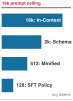
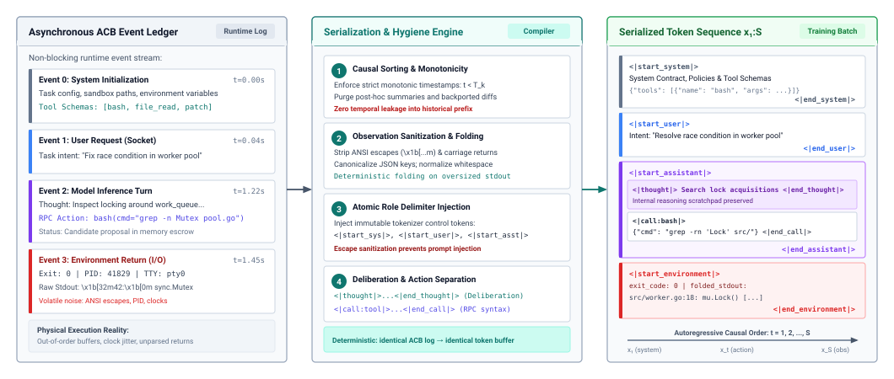
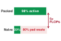
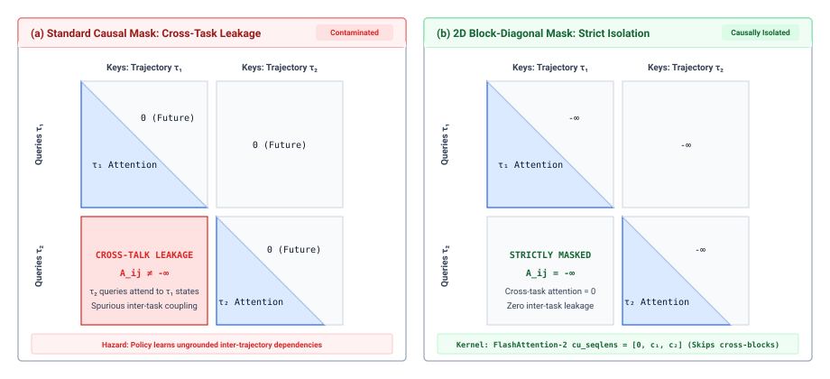
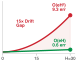
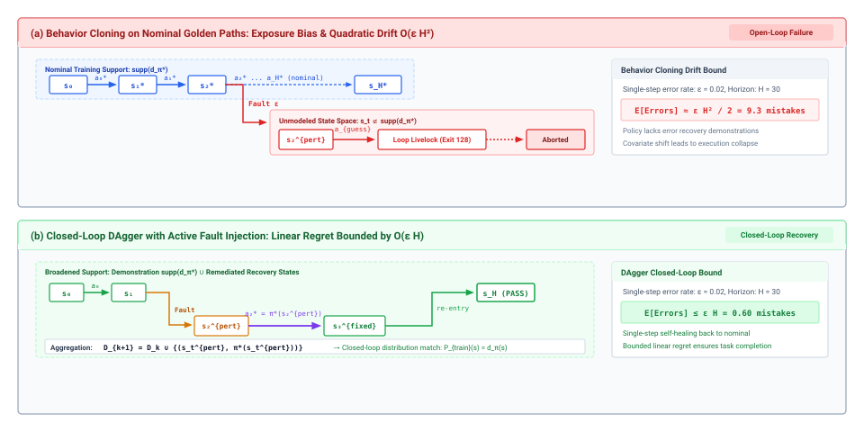
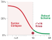
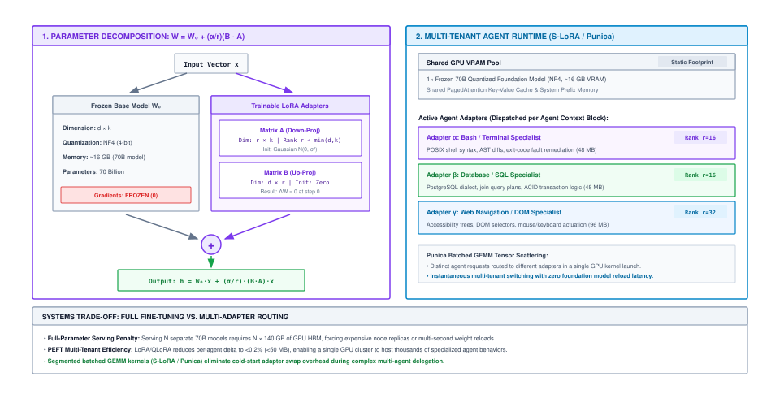
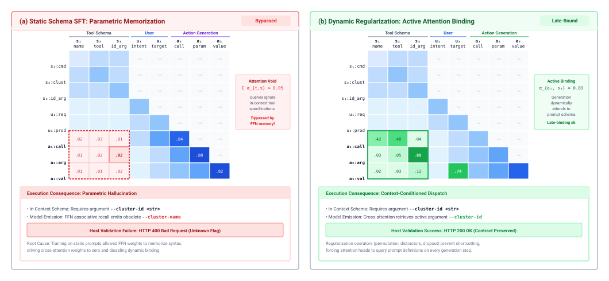
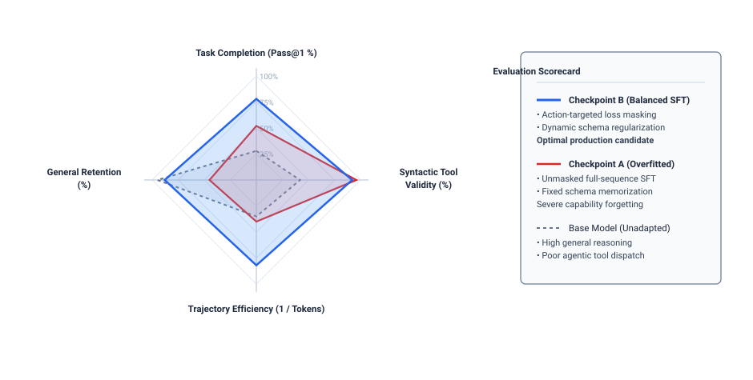

# Supervised Adaptation {#sec-vol3-sft}

::: {layout-narrow}
::: {.column-margin}

\chapterminitoc

:::

::: {.content-visible when-format="pdf"}
\noindent
{fig-alt="Blueprint for Supervised Adaptation."}
:::

::: {.content-visible unless-format="pdf"}
{fig-alt="Blueprint for Supervised Adaptation."}
:::

:::

## Purpose {.unnumbered .unlisted}

\begin{marginfigure}
\mlagentstack{0}{100}{0}{0}{0}{0}
\end{marginfigure}

_What can supervised demonstrations teach a foundation model about complex tool-using trajectories, and what must the runtime continue to enforce?_

General-purpose foundation models exhibit broad conversational proficiency, but they struggle when deployed into specialized agentic roles: they emit verbose natural language when compact tool calls are required, hallucinate invalid schema fields, and fail to adhere to rigid protocol semantics. While prompt engineering provides temporary workarounds, stuffing lengthy tool specifications and extensive few-shot demonstrations into every invocation inflates context footprints and drains GPU memory bandwidth. Supervised Fine-Tuning allows engineers to compile procedural knowledge, API schemas, and structured decision patterns directly into the model weights. However, training models on multi-turn trajectories requires careful systems design: naively computing gradient updates across entire sequences rewards the model for predicting external environment observations it could never control, leading to severe policy collapse. Systems engineers must implement precise loss masking that computes backpropagation strictly over candidate action tokens while treating environment feedback as conditioning input. Furthermore, teams must prevent schema memorization from destroying generalization, applying DAgger-style on-policy data aggregation to correct compounding drift. Effective supervised specialization requires co-designing loss masking topology, token-efficient serialization formats, and parameter-efficient adapter serving to maximize operational performance while keeping runtime inference lean.

::: {.content-visible when-format="pdf"}

\newpage

:::

::: {.callout-learning-objectives}

- Serialize multi-turn Agent Control Block event ledgers into deterministic training examples enforcing strict temporal causality and immutable role delimiters.
- Formulate action-targeted loss masking functions that compute cross-entropy gradients strictly on model rationales and actions while zeroing loss on environment observations.
- Architect high-efficiency sequence packing pipelines using 2D block-diagonal attention masks to eliminate padding waste without cross-trajectory context leakage.
- Analyze the compounding error mechanics of autoregressive exposure bias, designing dataset aggregation (DAgger) and fault-injected recovery loops to preserve live execution stability.
- Derive accelerator memory equations for full fine-tuning versus parameter-efficient adaptation (LoRA, QLoRA), quantifying activation memory dominance across long context sequences.
- Design dynamic schema regularization algorithms (parameter shuffling, synonym perturbation, distractor injection) to prevent weight memorization of fixed API formats.
- Benchmark adapted policy checkpoints against base models using end-to-end task completion rates, tool syntax compliance, and general capability retention.
- Synthesize an end-to-end supervised policy adaptation pipeline evaluated against training throughput, accelerator memory utilization, and downstream task generalization.

:::

## Trajectory Example Serialization {#sec-vol3-sft-serialization}

::: {.column-margin}
{width="100%" fig-alt="Four-rung logarithmic memory ladder showing prompt prefix reduction: naive serialization at 16,384 tokens down to compiled prefix at 128 tokens, shrinking per-instance KV cache from 10.5 GB to 0.08 GB."}

*Context compilation compresses runtime prompt prefixes by 128×, reducing 70B model per-instance KV-cache consumption from 10.5 GB down to 0.08 GB.*
:::
Capturing the operational execution of an autonomous agent in production yields not a tidy sequence of text, but an asynchronous, distributed event ledger within an Agent Control Block: concurrent non-blocking file descriptors streaming standard output and standard error from sandboxed subshells, asynchronous JSON-RPC responses arriving over TCP sockets with unpredictable network latency, kernel watchdogs enforcing memory quotas, and filesystem watchers logging intermediate file mutations. Yet to adapt the parameter weights of a foundation model via supervised fine-tuning, this multi-dimensional, concurrent execution graph must be projected into a strictly linear, one-dimensional causal sequence of discrete tokens:

$$\mathbf{x} = (x_1, x_2, \dots, x_T)$$

The physical reality of distributed operating systems collides directly with the algebraic requirements of the autoregressive transformer backbone [@vaswani2017].

Converting an asynchronous execution trajectory into a supervised training example requires deterministic serialization of multi-turn role boundaries and strict causal information isolation. Supervised adaptation operates as a specialized policy compiler: translating high-entropy, verified trajectory logs into dense neural weight updates that instill procedural discipline, schema compliance, and recovery behaviors. If this serialization pipeline permits temporal leakage, misplaces role delimiters, or fails to sanitize non-deterministic environment noise, the resulting model acquires catastrophic operational failure modes—hallucinating closed-loop environment responses, predicting its own inputs, or failing to yield execution control to the host supervisor.

In conversational systems, a language model operates as an interactive dialogue partner, generating natural language prose for human consumption within a symmetric turn-taking exchange. Systems delegation fundamentally breaks this conversational equilibrium. When a host runtime delegates an operational objective—such as resolving a software defect, provisioning cloud infrastructure, or orchestrating a database migration—the model ceases to function as a conversationalist and becomes an unprivileged operational controller entrusted with modifying persistent machine state. In standard in-context operation, this controller relies on extensive prompt scaffolding: exhaustive tool schemas, environment guidelines, behavioral constraints, and few-shot recovery traces staged dynamically inside the Key-Value (KV) cache on every execution turn. While flexible, this architecture imposes a punishing Systems Prompt Tax: every single generation turn re-evaluates thousands of static tokens through the attention prefill phase, consuming High-Bandwidth Memory (HBM) capacity, inflating Time to First Token (TTFT) latency, and occupying context window space that should be reserved for active task state. Supervised policy adaptation functions as an offline compiler: it distills static prompt rules and verified interaction patterns directly into the parameter tensors $\theta$, enabling the adapted policy to emit syntactically valid tool invocations and execute multi-step recovery workflows with minimal prompt scaffolding.

However, this compilation encounters a fundamental systems paradox: the foundation model executing on accelerator silicon is an unprivileged statistical sequence predictor operating under Zero Ambient Authority ($A=0$). It possesses no native operating system credentials, cannot invoke POSIX system calls, open network sockets, allocate physical memory pages, or read hardware clocks. Its sole interface to the physical machine is the consumption and emission of discrete token sequences. In conversational benchmarks, data loaders frequently employ simplistic chat templates that assume an alternating, symmetrical exchange between a user and an assistant. In an autonomous agent system, this abstraction is fatally underspecified. A complete agent execution trajectory demands four non-overlapping, immutable role partitions. The *system* partition defines immutable operational parameters, security constraints, workspace baselines, and formal JSON-RPC tool schemas that delineate the host supervisor's interface surface. The *user* partition carries external task descriptions, programmatic issue manifests, and asynchronous runtime steering interrupts dispatched by the supervisory controller. The *assistant* partition captures the unprivileged model's generation stream, which the serialization contract must structurally bisect into internal deliberative rationales—scratchpad tokens holding chain-of-thought analysis—and executable tool call specifications. Finally, the *environment* partition ingests the physical, empirical observations generated exclusively by external execution substrates, including containerized subshells, operating system kernels, compilers, linters, and external network services.

::: {.column-margin}
**Zero Ambient Authority ($A = 0$):** A foundational systems stance where the neural policy possesses no inherent privileges to modify host state. In trajectory serialization, explicit role delimiters establish the unforgeable lexical boundaries between unprivileged model proposals and authoritative environment returns.
:::

These four partitions must be demarcated by dedicated, immutable control tokens, such as `<|start_system|>`, `<|end_system|>`, `<|start_user|>`, `<|end_user|>`, `<|start_assistant|>`, `<|end_assistant|>`, `<|start_environment|>`, and `<|end_environment|>`. These delimiters cannot be arbitrary natural language strings, such as `System:` or `Observation:`. In natural language tokenization, multi-character strings decompose into standard vocabulary tokens that the model frequently emits during open-ended problem solving. If a role delimiter is composed of standard text tokens, the unprivileged model will readily emit the delimiter string during internal deliberation, spoofing an environmental observation or prematurely terminating its turn. Delimiters must therefore be reserved atomic tokens in the tokenizer vocabulary, serving as unforgeable structural boundaries that the host runtime parser can recognize unambiguously.

::: {.column-margin}
**Causal Monotonicity Invariant:** For every decision step $k$ initiated at physical timestamp $T_k$, the serialized context prefix $\mathbf{x}_{<k}$ must contain exclusively and deterministically the state that was present in the agent's memory buffer prior to $T_k$. No post-hoc execution artifacts may be backported into early positions.
:::

When a serialization pipeline violates this contract, the resulting policy suffers catastrophic behavioral failure modes. Unlike classical software systems that fail-stop upon encountering illegal instructions or memory violations, foundation models operate under a fail-plausible fault model: when presented with corrupted data or out-of-distribution contexts, the model does not crash; it emits fluent, highly confident, yet fabricated tokens. Consider a concrete delimiter misalignment defect where an off-by-one pointer error in the data loader merges the opening delimiter of an environment observation, `<|start_environment|>`, into the assistant's generation segment. Under the standard teacher-forced maximum-likelihood objective [@brown2020language], the neural network is trained to maximize the log-likelihood of all tokens labeled as model targets. When the observation delimiter leaks into the assistant target sequence, the loss function penalizes the model if it fails to predict both its own action and the simulated response of the external environment.

During inference, the fine-tuned model hits the open-loop failure wall: upon emitting the closing bracket of a tool call, instead of emitting the end-of-turn token to yield control to the host supervisor, it immediately generates `<|start_environment|>`, hallucinates a realistic terminal stdout or JSON payload, and continues autoregressive generation in an ungrounded loop disconnected from host state. The host runtime's RPC dispatcher is never invoked, and the physical system remains unmodified. The unprivileged model has closed its own execution loop without supervisor mediation, severing connection to physical reality.

A parallel failure occurs when serialization engines fail to maintain strict causal information isolation. In an autoregressive model governed by lower-triangular causal attention [@vaswani2017], the hidden representation at sequence position $t$ depends on all historical tokens $\tau \le t$. If a data curation pipeline collects an execution trace and retroactively injects post-hoc summaries—such as appending the final git patch diff to the initial system prompt, updating tool schemas dynamically based on tools discovered late in the run, or inserting diagnostic hints derived from subsequent failure analysis—the training example violates physical causality. The model learns spurious shortcuts: during training, attention heads attend to leaked future tokens in the prefix to select actions, achieving deceptively low validation perplexity. In live deployment, future tokens are physically unavailable, and the learned policy collapses immediately. Causal monotonicity is an absolute invariant: for every decision step $k$ initiated at physical timestamp $T_k$, the context prefix must contain exclusively and deterministically the state that was present in the agent's memory buffer prior to $T_k$.

::: {#fig-vol3-serialization-pipeline fig-env="figure" fig-pos="htb" fig-cap="**The Trajectory Serialization Pipeline**: Transforming an asynchronous Agent Control Block (ACB) event ledger into a causally isolated, role-delimited one-dimensional token sequence. The pipeline ingests heterogeneous event streams, applies deterministic topological sorting and timestamp monotonicity checks, strips volatile environment noise, injects immutable role delimiters, and isolates internal rationale from executable tool actions." fig-alt="Systems diagram showing three stages of trajectory serialization: an asynchronous event ledger with out-of-order execution events, a serialization and hygiene compiler executing causal sorting and sanitization passes, and a final one-dimensional role-delimited token sequence."}

:::

In an autonomous architecture, dependable systems cannot be built on statistical sequence likelihood alone.[^fn-dijkstra-testing-sft] Applying Dijkstra's testing principle (introduced in @sec-vol3-intro-operational-incident), the host supervisor must never accept model self-reports of completion; the only dependable evidence of task progress is verifiable, empirical execution side effects—POSIX return codes, compiler diagnostics, and sealed unit test passes. Trajectory serialization must therefore faithfully preserve authentic empirical evidence. If a serialization script sanitizes logs by deleting nonzero exit codes, stripping compiler stack traces, or replacing real runtime errors with polite natural language summaries, it corrupts the policy's capacity to learn error recovery. The model must observe exact failure tokens in order to learn the corrective transitions demonstrated in fault-injected recovery traces.

[^fn-dijkstra-testing-sft]: **Testing Principle in SFT**: See @sec-vol3-intro-operational-incident for the foundational formulation of Dijkstra's testing principle; in supervised adaptation, this requires preserving raw execution exit codes in training traces so policies learn authentic recovery transitions.

Simultaneously, the serialization engine must decouple meaningful empirical evidence from volatile environmental noise. Raw terminal streams from interactive containers are riddled with ANSI escape sequences (`\x1b[32m`), cursor positioning directives, carriage returns (`\r`), dynamic process IDs (PIDs), and non-deterministic clock times. These tokens carry zero causal invariant signal; if left unhygienic, they consume precious context window budget and force the model to allocate gradient capacity to predicting pseudorandom terminal noise. To preserve the integrity of the learning signal without exhausting the context budget, a production serialization pipeline enforces three continuous normalization transformations. First, ANSI and terminal control code stripping purges raw terminal escape sequences, cursor movements, and line resets while preserving indentation, semantic whitespace, and line breaks. Second, schema canonicalization deterministically sorts JSON dictionary keys, standardizes numeric representations, and enforces consistent delimiter spacing, ensuring that identical operational payloads map onto identical token sequences across disparate runs. Third, budgeted structural folding addresses tool outputs that exceed token limits, such as voluminous compiler dumps, directory trees, or database query results. Because naive head truncation erases the initial execution command and naive tail truncation discards critical exit codes and terminal stack traces, structural folding retains both the leading command invocation lines and the trailing diagnostic error frames, replacing intermediate redundant output lines with an explicit, deterministic placeholder token, such as `[... 1,420 lines folded ...]`.

Furthermore, high-performing agent policies execute test-time deliberation to decompose goals, verify preconditions, and format tool call payloads before dispatching actions. The serialization contract must structurally separate internal reasoning from executable syntax. By wrapping deliberation inside explicit `<|thought|>` and `<|end_thought|>` delimiters and tool calls inside `<|call:tool_name|>` and `<|end_call|>`, the serialization format establishes clean syntactic boundaries. As detailed in the end-to-end flow of @fig-vol3-serialization-pipeline, Stage 1 captures the raw, asynchronous runtime ledger containing out-of-order events, process IDs, and ANSI escape sequences. Stage 2 executes the four-pass hygiene compiler, enforcing strict causal monotonicity ($t < T_k$), stripping non-deterministic noise, injecting non-decomposable role delimiters (`<|start_sys|>`, `<|start_asst|>`), and isolating internal deliberation from RPC payloads. Stage 3 emits the final contiguous 1D causal token sequence $\mathbf{x}_{1:S}$, establishing an invariant autoregressive order where each token $x_t$ attends strictly to its historical causal prefix without temporal leakage.

::: {#nbk-13-memory-footprint-and-accelerator-throughput .callout-notebook title="Trajectory sanitization systems footprint"}
**Problem:** An engineering team adapts an 8-billion parameter dense foundation model ($N = 8 \times 10^9$) across a curated corpus of 5,000 multi-turn software engineering trajectories collected from containerized SWE-bench execution fixtures. Training executes on an 8-GPU node of NVIDIA H100 SXM5 GPUs (80 GB HBM3 per GPU, 3.35 TB/s memory bandwidth, 989 TFLOPS peak dense BF16 compute).

The raw, unsanitized trajectory corpus contains full interactive terminal logs, unparsed ANSI escapes, non-deterministic PIDs, and verbose compiler dumps. The mean raw sequence length is $\bar{L}_{\text{raw}} = 24{,}576$ tokens. Because of voluminous tool outputs, 35 percent of trajectories (1,750 traces) exceed the maximum context window of $L_{\max} = 32{,}768$ tokens, forcing the unhygienic data loader to apply naive tail truncation that clips the terminal unit test results and compensating actions.

The team implements a serialization and hygiene compiler that performs ANSI escape stripping, key-sorted JSON canonicalization, and budgeted structural folding (retaining 512 tokens of invocation header, 512 tokens of trailing error diagnostics, and collapsing intermediate rows). The sanitized corpus achieves a mean sequence length of $\bar{L}_{\text{clean}} = 6{,}144$ tokens, with 99.2 percent of trajectories fitting within a $16{,}384$ ($16\text{K}$) context window without information loss.

Assuming standard transformer training with AdamW and ZeRO-3 / FSDP parameter sharding across the 8 GPUs, evaluate four critical systems metrics: first, the static parameter memory per GPU and the activation memory per sequence under selective activation checkpointing; second, the maximum per-device micro-batch size $b$ permitted within the 80 GB HBM budget; third, the total training FLOPs and wall-clock training time for a 3-epoch fine-tuning run assuming an achieved model FLOPs utilization (MFU) of 45 percent ($0.45 \times 989\text{ TFLOPS} = 445\text{ TFLOPS}$ per GPU); and fourth, the resulting systems impact on training integrity and effective throughput.

**Solution:**

*Step 1: Static Parameter and Activation Memory Allocation.*
In 16-bit precision (`bfloat16`, 2 bytes/param), model weights consume $M_{\text{weights}} = 8 \times 10^9 \times 2\text{ bytes} = 16\text{ GB}$. Gradients consume $16\text{ GB}$. AdamW optimizer states in 32-bit float (8 bytes/param for first and second moments) consume $M_{\text{opt}} = 8 \times 10^9 \times 8\text{ bytes} = 64\text{ GB}$. The aggregate static state is:
$$M_{\text{static, total}} = 16\text{ GB} + 16\text{ GB} + 64\text{ GB} = 96\text{ GB}$$

Under ZeRO-3 / FSDP sharding across 8 GPUs, the static memory per accelerator is:
$$M_{\text{static, per GPU}} = \frac{96\text{ GB}}{8} = 12\text{ GB}$$

This leaves $80\text{ GB} - 12\text{ GB} = 68\text{ GB}$ of HBM available for forward-backward activation tensors, KV states, and workspace memory.

With selective activation checkpointing for an 8B model ($n_{\text{layers}} = 32$, hidden dimension $d = 4{,}096$), activation memory per sequence scales linearly with sequence length $L$:
$$M_{\text{act}} \approx 2 \times n_{\text{layers}} \times L \times d \times b_{\text{bytes}} = 2 \times 32 \times L \times 4{,}096 \times 2\text{ bytes} = 524{,}288 \times L\text{ bytes}$$

For the raw trajectory length ($L = 24{,}576$):
$$M_{\text{act, raw}} = 524{,}288 \times 24{,}576\text{ bytes} \approx 12.88\text{ GB per sequence}$$

For the sanitized and folded trajectory length ($L = 6{,}144$):
$$M_{\text{act, clean}} = 524{,}288 \times 6{,}144\text{ bytes} \approx 3.22\text{ GB per sequence}$$

*Step 2: Maximum Per-Device Batch Size.*
Allowing a 10 GB buffer for temporary communication buffers and PyTorch allocator fragmentation, the maximum activation budget is $68\text{ GB} - 10\text{ GB} = 58\text{ GB}$.
Under raw sequences, $b_{\text{raw}} = \lfloor 58\text{ GB} / 12.88\text{ GB} \rfloor = 4\text{ sequences/GPU}$. However, because 35 percent of sequences peak at $32{,}768$ tokens ($M_{\text{act}} \approx 17.18\text{ GB}$), the runtime must restrict $b_{\text{raw}} = 2$ to prevent catastrophic out-of-memory (OOM) faults during peak sequences.
Under sanitized sequences, $b_{\text{clean}} = \lfloor 58\text{ GB} / 3.22\text{ GB} \rfloor = 18\text{ sequences/GPU}$. The runtime safely operates at $b_{\text{clean}} = 8$ or $16$ without risk of OOM.

*Step 3: Training FLOPs and Wall-Clock Latency.*
For standard transformer training, backward and forward compute requires $6N$ FLOPs per token. For an 8B parameter model:
$$\text{Compute per token} = 6 \times 8 \times 10^9 = 48\times 10^9\text{ FLOPs} = 48\text{ GFLOPs/token}$$

Across 5,000 trajectories over 3 epochs:

*Raw Pipeline Token Volume and Throughput:*
$$\text{Total Tokens}_{\text{raw}} = 3 \times 5{,}000 \times 24{,}576 = 368.64 \times 10^6\text{ tokens} = 368.64\text{ Mtokens}$$
$$\text{Total FLOPs}_{\text{raw}} = 368.64 \times 10^6 \times 48 \times 10^9\text{ FLOPs} \approx 1.769 \times 10^{19}\text{ FLOPs} = 17.69\text{ EFLOPs}$$
With 8 H100 GPUs delivering an aggregate cluster throughput of $8 \times 445\text{ TFLOPS} = 3.56\text{ PFLOPS} = 3.56 \times 10^{15}\text{ FLOPs/sec}$:
$$\text{Training Time}_{\text{raw}} = \frac{1.769 \times 10^{19}\text{ FLOPs}}{3.56 \times 10^{15}\text{ FLOPs/sec}} \approx 4{,}969\text{ seconds} \approx 1.38\text{ hours}$$

*Sanitized Pipeline Token Volume and Throughput:*
$$\text{Total Tokens}_{\text{clean}} = 3 \times 5{,}000 \times 6{,}144 = 92.16 \times 10^6\text{ tokens} = 92.16\text{ Mtokens}$$
$$\text{Total FLOPs}_{\text{clean}} = 92.16 \times 10^6 \times 48 \times 10^9\text{ FLOPs} \approx 4.424 \times 10^{18}\text{ FLOPs} = 4.42\text{ EFLOPs}$$
$$\text{Training Time}_{\text{clean}} = \frac{4.424 \times 10^{18}\text{ FLOPs}}{3.56 \times 10^{15}\text{ FLOPs/sec}} \approx 1{,}243\text{ seconds} \approx 20.7\text{ minutes}$$

*Step 4: Systems Conclusion.*
Sanitizing terminal noise and applying budgeted structural folding reduces total token volume by 75 percent, providing an immediate $4.0\times$ training speedup (reducing training time from 1.38 hours to 20.7 minutes). More crucially, the raw pipeline suffered severe data corruption: 1,750 trajectories lost their terminal test assertions and git commits due to tail truncation, teaching the model incomplete execution loops. The sanitized pipeline preserves 100 percent of terminal verification signals across all trajectories, guaranteeing behavioral integrity on accelerator silicon.
:::

Once an asynchronous execution trajectory has been deterministically compiled into a causally isolated, role-delimited token sequence, an immediate architectural question confronts the training system: which specific tokens within this thousands-of-tokens-long sequence should receive backpropagation gradients? In standard language modeling, cross-entropy loss is computed uniformly across every token in the sequence. In an agent trajectory containing immutable system prompts, user queries, internal rationales, tool calls, and verbose environment observations, does computing loss across all tokens produce a capable agent, or does optimizing the model to predict external environment state actively destroy its operational reliability?

## Action-Targeted Loss Masking {#sec-vol3-sft-loss-masking}

When an autoregressive transformer is fine-tuned on multi-turn software engineering traces using uniform causal language modeling, the loss function treats every token in the sequence as an equally valid training target. In standard pretraining, uniform cross-entropy loss is mathematically justified: the objective is to model the joint distribution of general natural language and source code by minimizing the negative log-likelihood of every token conditioned on its prefix. In an agentic trajectory, however, the token stream represents a heterogeneous dialogue between distinct software entities operating across an unprivileged boundary. A single trajectory contains immutable system instructions, developer prompts, model-generated chain-of-thought rationales, structured tool invocations, and massive raw payloads returned by external environment tools, including compiler build logs, stack traces, and filesystem diffs. If the backpropagation engine computes cross-entropy loss across all positions indiscriminately, the gradient updates force the model's parameter tensors to allocate substantial representational capacity to predicting the exact byte sequences emitted by deterministic external processes. When deployed under the Zero Ambient Authority ($A=0$) runtime supervisor, such a model exhibits a critical operational pathology: its validation perplexity decreases steadily throughout training, yet its rate of valid tool execution stagnates or regresses because its weight updates have been expended modeling the environment rather than proposing valid actions.

**In supervised policy adaptation, target construction must follow the learning objective: if the deployment goal is reliable action proposal, backpropagation must be restricted to tokens produced by the agent policy, while treating prompt definitions and environment observations strictly as conditioning context.** An unprivileged neural policy does not execute within an ambient vacuum; it functions as a bounded decision-making component inside an external operating environment. The agent runtime alone executes system calls, runs compilers, and queries databases. The model's responsibility is solely to analyze historical context and emit syntactically valid, goal-directed actions. Consequently, the loss formulation must enforce a strict separation between conditioning inputs and prediction targets. By applying an action-targeted loss mask across the serialized trajectory, the training pipeline ensures that parameter updates are driven exclusively by the decisions the policy is expected to synthesize at inference time.

### Supervised gradient dynamics

To formalize action-targeted masking, we model a serialized agent trajectory as an ordered sequence of $T$ discrete tokens, $X = (x_1, x_2, \dots, x_T)$, drawn from a finite vocabulary $\mathcal{V}$. The sequence represents the full interaction history up to the terminal step of the task, containing multiple interleaved turns between the host environment and the agent. To construct an action-prediction objective, we partition the token index set $\{1, 2, \dots, T\}$ into four mutually disjoint functional subsets based on token provenance:

$$\{1, 2, \dots, T\} = \mathcal{T}_{\text{prompt}} \cup \mathcal{T}_{\text{observation}} \cup \mathcal{T}_{\text{rationale}} \cup \mathcal{T}_{\text{action}}$$

Here, $\mathcal{T}_{\text{prompt}}$ denotes the index set of immutable system prompts, persona constraints, and user queries; $\mathcal{T}_{\text{observation}}$ comprises all text returned by external tools and execution sandboxes; $\mathcal{T}_{\text{rationale}}$ encompasses the agent's internal scratchpad or chain-of-thought tokens; and $\mathcal{T}_{\text{action}}$ contains the structured tool calls, API names, arguments, and turn-yielding control delimiters.

::: {.column-margin}
**Definition: Conditioning Context vs. Target**
In causal language modeling, all historical tokens $x_{<t}$ serve as *conditioning context* via the self-attention mechanism, regardless of their mask value. The loss mask $m_t$ determines solely whether position $t$ acts as a *target* that injects loss gradients into the backward pass.
:::

The supervised fine-tuning loss parameterizing the model weights $\theta$ is formulated as a masked causal cross-entropy objective:

$$\mathcal{L}_{\text{SFT}}(\theta) = -\frac{1}{N_{\text{active}}} \sum_{t=1}^T m_t \cdot \log P_\theta(x_t \mid x_{<t})$$

where $m_t \in \{0, 1\}$ is a binary indicator variable defining the loss mask, and $N_{\text{active}} = \sum_{t=1}^T m_t$ denotes the total count of active target tokens in the sequence. For strict action-prediction fine-tuning, the indicator function is defined as:

$$m_t = \begin{cases} 1 & \text{if } x_t \in \mathcal{T}_{\text{rationale}} \cup \mathcal{T}_{\text{action}}, \\ 0 & \text{if } x_t \in \mathcal{T}_{\text{prompt}} \cup \mathcal{T}_{\text{observation}}. \end{cases}$$

The systems implications of this binary mask become evident when tracing the gradient flow through the transformer's backward pass. Let $z_t \in \mathbb{R}^{|\mathcal{V}|}$ represent the vector of unnormalized pre-softmax logits produced by the model at sequence position $t$, such that the predicted probability distribution over the vocabulary is given by the softmax function $P_\theta(x_t = v \mid x_{<t}) = \frac{\exp(z_{t, v})}{\sum_{j \in \mathcal{V}} \exp(z_{t, j})}$. The partial derivative of the scalar loss $\mathcal{L}_{\text{SFT}}$ with respect to the individual logit corresponding to vocabulary item $v$ at position $t$ evaluates to:

$$\frac{\partial \mathcal{L}_{\text{SFT}}}{\partial z_{t, v}} = \frac{m_t}{N_{\text{active}}} \left( P_\theta(x_t = v \mid x_{<t}) - \mathbf{1}\{x_t = v\} \right)$$

When $m_t = 0$, the local gradient injected at the logit layer at position $t$ is identically zero: $\frac{\partial \mathcal{L}_{\text{SFT}}}{\partial z_t} = \mathbf{0}$. Consequently, the output classification head receives no error signal for failing to predict token $x_t$, and no gradient is injected at position $t$ into the final transformer block via the output projection weights.

::: {#fig-vol3-loss-masking fig-env="figure" fig-pos="htb" fig-cap="**Binary Action-Targeted Loss Masking**: Alignment of trajectory token strata with binary mask vector $m$, selective cross-entropy loss calculation, and backward gradient injection. Gradients are computed strictly over thought deliberation and tool action tokens ($m_t = 1$), updating policy weights, while system instructions, user prompts, and external environment returns ($m_t = 0$) serve exclusively as unmasked conditioning context." fig-alt="Systems diagram illustrating binary action-targeted loss masking across six token blocks, showing active gradient backpropagation for deliberation and action tokens, severed gradient circuits for environment observations, and mathematical formulation of selectively normalized loss."}

:::

The physical circuit topology of this selective optimization is illustrated in @fig-vol3-loss-masking, which traces hallucinated environment simulation in panel (a), gradient swamping in panel (b), and the causal boundary that prevents both in panel (c). The sequence is partitioned into six functional token strata: system prompt instructions, user queries, assistant deliberation, tool call actions, environment observations, and remediation actions. Directly beneath each token stratum, the binary mask vector $\mathbf{m}$ acts as an architectural gating switch. For deliberation and tool call tokens, $m_t = 1$ closes the circuit: pre-softmax prediction errors $\frac{\partial \mathcal{L}}{\partial z_t} = \mathbf{p}_t - \mathbf{y}_t$ inject backpropagation gradients directly into the Transformer's weight tensors $\Delta W$, updating model reasoning, planning, and schema-constrained RPC dispatch. Conversely, for prompt prefix tokens and environment observations (such as compiler stack traces or stdout dumps), $m_t = 0$ leaves an open circuit where $\frac{\partial \mathcal{L}}{\partial z_t} = \mathbf{0}$. This selective normalization guarantees that parameter updates optimize exclusively for valid action proposal, shielding model capacity from gradient swamping and preventing the network from attempting to simulate stochastic external processes.

A common misconception in training systems engineering is that setting $m_t = 0$ removes token $x_t$ from the backward pass entirely. This is architecturally false. While position $t$ injects zero direct loss gradient when $m_t = 0$, the hidden state vector $h_t \in \mathbb{R}^d$ at position $t$ remains causally accessible to all subsequent positions $t' > t$ through the transformer's multi-head attention layers. If a downstream action token at position $t' \in \mathcal{T}_{\text{action}}$ has $m_{t'} = 1$, its loss gradient $\frac{\partial \mathcal{L}}{\partial h_{t'}}$ propagates backward through the attention key-value projections to the hidden state $h_t$. The underlying transformer parameters—including the self-attention projections $W_Q, W_K, W_V, W_O$ and the feed-forward network weights—are actively updated to optimize how the representation of observation $x_t$ is extracted, routed, and consumed by subsequent action predictions. The loss mask does not blind the network to the environment; it ensures that representations of the environment are formed exclusively to serve the downstream utility of action selection.

This principle of selective gradient backpropagation was established by @schick2023toolformer in *Toolformer*. In that work, language models learned self-supervised tool usage by filtering candidate API invocations through an execution verification filter, computing loss exclusively over the inserted API call tokens and the subsequent task completion tokens. Applying loss over the external environment's response syntax was explicitly avoided, establishing that tool-augmented reasoning requires isolating the model's active decision surface from external state feedback.

### Capacity allocation

Why must masking follow the objective so strictly? The necessity arises from the finite representational capacity of the model's parameter tensors and the fundamental distinction between an action policy and a transition model. In any foundation model parameterized by weights $\theta$, parameter capacity governs how many distinct statistical relationships, syntactic rules, and cross-domain heuristics can be retained without catastrophic interference. When an engineering team applies unmasked fine-tuning to software engineering trajectories, they inadvertently task the network with solving two completely different learning objectives simultaneously:

1. **The Policy Objective ($G_{\text{policy}}$):** Learn the conditional distribution $P(a_t \mid s_t)$ to map context states into syntactically valid, logically coherent tool actions and rationales.
2. **The World Simulation Objective ($G_{\text{world}}$):** Learn the environment transition distribution $P(s_{t+1} \mid s_t, a_t)$ to predict the exact character streams that compilers, linters, shells, and remote HTTP APIs will return when invoked. The loss masking assignments across these token strata are detailed in @tbl-vol3-loss-masking-strata.

| Token Stratum        | Constituent Payloads                               | Loss Mask ($m_t$)              | Optimization Target                   | Systems & Convergence Rationale                                                       |
|:---------------------|:---------------------------------------------------|:-------------------------------|:--------------------------------------|:--------------------------------------------------------------------------------------|
| **Context Prefix**   | System instructions, tool schemas, user goals      | $m_t = 0$ (Masked)             | Conditioning context only             | Invariant across turns; zero gradient wasted on prompt memorization.                  |
| **Agent Rationale**  | Deliberation scratchpad (`<thought>...</thought>`) | $m_t \in \{0, 1\}$ (Selective) | Working memory & planning             | Optional masking trades token verbosity against multi-step reasoning fidelity.        |
| **Tool Action**      | Action tag and JSON payload (`<tool_call>...`)     | $m_t = 1$ (Unmasked)           | Policy dispatch ($G_{\text{policy}}$) | Primary supervisory target; forces strict syntactic and semantic contract compliance. |
| **Tool Observation** | Compiler stderr, terminal stdout, API JSON         | $m_t = 0$ (Masked)             | External ground truth                 | Prevents futile parameter allocation to world simulation ($G_{\text{world}}$).        |

: **Loss Masking Schemes Across Trajectory Token Strata**: Token categories, mask assignments, gradient flows, and optimization objectives in supervised agent adaptation. {#tbl-vol3-loss-masking-strata}

In model-based reinforcement learning and autonomous world-modeling systems, training a neural network to approximate $P(s_{t+1} \mid s_t, a_t)$ is intentional; the model is explicitly designed to serve as an internal simulator for rollouts, hypothetical search, or counterfactual reasoning. However, when fine-tuning an agent destined to operate as an unprivileged client within a physical execution sandbox, training the model on $G_{\text{world}}$ introduces a severe structural mismatch. The external operating environment is not a hidden, noisy latent process that requires neural approximation. The Linux kernel, the GNU C compiler, Git, and Python runtimes are deterministic, authoritative, and physically present. They execute tool invocations with zero epistemic uncertainty and zero hallucination risk. Spending parameter capacity to predict whether `gcc` will emit a trailing newline, a specific hex memory address in a segfault dump, or a detailed timestamp in a server log forces the optimizer to expend parameter entropy on details irrelevant to operational success.

Empirical profiling of execution traces reveals the severity of this capacity dilution. In realistic programming benchmarks, environment observations—comprising compiler error dumps, stack traces, and wide directory listings—routinely account for $75\%$ to $90\%$ of the total tokens in a trajectory. Under uniform unmasked training, over three-quarters of the total gradient mass is computed over observation tokens:

$$\mathbb{E}_{X \sim \mathcal{D}} \left[ \frac{\sum_{t \in \mathcal{T}_{\text{observation}}} \|\nabla_\theta \log P_\theta(x_t \mid x_{<t})\|_2}{\sum_{t=1}^T \|\nabla_\theta \log P_\theta(x_t \mid x_{<t})\|_2} \right] \approx 0.75 - 0.90$$

This dominance of observation gradients degrades the policy through two distinct failure modes:

The first failure mode is *gradient dilution and noise injection*. Tool outputs frequently contain high-entropy, quasi-random strings: temporary filesystem paths (`/tmp/build_a8f3b9c`), process IDs, wall-clock timestamps, cryptographic commit hashes, and base64-encoded binary data. These tokens exhibit high epistemic entropy; they cannot be predicted from earlier context by any generalizable logical rule. In attempting to minimize the cross-entropy of these unlearnable strings, the optimizer scales up logit gradients, destabilizing the optimization trajectory and washing out the subtle gradient updates required to master strict JSON parameter schemas and complex tool invocation invariants.

The second failure mode is *role conflation and runaway simulation*. When an autoregressive model is trained to predict observation tokens, it internalizes the transition distribution $P(x_{\text{obs}} \mid x_{\text{action}})$. At deployment time, after emitting a tool call delimiter such as `<tool_call>`, the model's autoregressive decode loop does not necessarily yield execution by emitting the end-of-turn token. Because it has been trained to assign high likelihood to observation tokens following an action, the model exhibits a nonzero probability of hallucinating the environment's response within its own generation turn. It emits an action, manufactures a plausible-looking compiler error directly into the generation stream, and proceeds to "correct" its own imaginary error, completely bypassing the host supervisor's sandbox and violating the Zero Ambient Authority ($A=0$) invariant. Masking observation tokens out of the loss eliminates this role conflation by ensuring the model is never rewarded for generating environment output.

### Rationale masking trade-offs

While the decision to set $m_t = 0$ for prompts and environment observations is clear, the treatment of the model-generated tokens themselves requires careful systems trade-offs. The model's active turn typically consists of two distinct components: the internal deliberative rationale ($\mathcal{T}_{\text{rationale}}$), commonly wrapped in `<thought>...</thought>` tags, and the external action tokens ($\mathcal{T}_{\text{action}}$), wrapped in tool execution delimiters:

```xml
<tool_call>                                      <!-- Start Action -->
{"name": "bash", "arguments": {"cmd": "stat config.json"}}
</tool_call>                                     <!-- End Action (EOT) -->
```

Targeting both rationales and actions ($m_t = 1$ on $\mathcal{T}_{\text{rationale}} \cup \mathcal{T}_{\text{action}}$) optimizes the model for *holistic policy execution*. The gradient signal encourages the network to learn both how to deliberate over ambiguous problem states and how to translate those deliberations into formal tool calls. In complex tasks requiring multi-step planning—such as searching a large codebase, forming a hypothesis regarding a concurrency bug, and designing a localized patch—training on thought tokens forces the network to preserve intermediate cognitive state in its working memory representations. However, this strategy carries two concrete systems costs: it increases training compute by expanding $N_{\text{active}}$, and it risks overfitting the policy to the idiosyncratic reasoning prose of the demonstration trajectory authors. If the training dataset contains verbose, repetitive scratchpads, the model internalizes this verbosity, directly increasing token generation latency during inference.

Conversely, *action-only masking* ($m_t = 1$ strictly on $\mathcal{T}_{\text{action}}$, with $m_t = 0$ across $\mathcal{T}_{\text{rationale}}$) focuses the entire gradient budget on syntax fidelity, argument precision, and API schema compliance. In this configuration, the rationales present in the demonstration dataset serve merely as conditioning context. The model learns to utilize pre-existing reasoning traces to inform its action selection without being penalized for the exact phrasing, vocabulary, or length of the reasoning text. This approach is common when distilling high-capability teacher trajectories into smaller, latency-critical worker models designed to execute tool calls rapidly across distributed workers. The downside of action-only masking is that the model receives no direct supervisory signal on *how* to deliberate; if deployed in an open-ended loop without an external reasoning prompt, its capacity to self-correct during novel failure states degrades (@tbl-vol3-adaptation-masking-tradeoffs).

| Adaptation Strategy            | Target Tokens ($N_{\text{active}} / T$) | Primary Optimization Target                          | Action Syntax Fidelity                            | Deliberative Planning Robustness                     | Runtime Sandbox Isolation                             |
|:-------------------------------|:----------------------------------------|:-----------------------------------------------------|:--------------------------------------------------|:-----------------------------------------------------|:------------------------------------------------------|
| **Unmasked Full Trajectory**   | $100\%$                                 | Environment simulation & textual perplexity          | Poor (gradient dilution across high-entropy logs) | Low (prone to hallucinating environment returns)     | Compromised (risks emitting simulated stdout)         |
| **Action + Rationale Masking** | $15\% - 30\%$                           | Deliberative planning & structured tool synthesis    | High (gradients concentrated on policy decisions) | High (learns structured intermediate decomposition)  | Robust (clean yielding at tool invocation boundaries) |
| **Action-Only Masking**        | $5\% - 15\%$                            | API schema compliance & argument accuracy            | Maximum (pure focus on syntax and parameter keys) | Moderate (treats reasoning prose as passive context) | Robust (strictly reinforces tool call boundaries)     |
| **Observation-Only Masking**   | $70\% - 85\%$                           | World transition dynamics $P(s_{t+1} \mid s_t, a_t)$ | Degraded (learns to imitate external systems)     | Negligible (acts as an environment emulator)         | Inapplicable (functions as a simulator, not a policy) |
: **Trajectory Adaptation and Loss Masking Trade-Offs**: Active token ratios, optimization targets, and runtime isolation across masking strategies. {#tbl-vol3-adaptation-masking-tradeoffs}

The comparison in @tbl-vol3-adaptation-masking-tradeoffs highlights the trade-offs across masking configurations. For general-purpose software agents, **Action + Rationale Masking** represents the gold standard: it aligns gradient backpropagation with the dual requirements of agentic computation—deliberative state search followed by syntactically rigid tool execution—while safeguarding the runtime sandbox boundary.

### Boundary delimiter invariants

Implementing an action-targeted loss mask within a production training pipeline introduces subtle edge cases at turn boundaries. Unlike human dialogue, where conversational turns are informal, agent tool execution relies on rigid protocol boundaries enforced by special delimiter tokens. A single indexing offset error in the loss masking array can corrupt the learned operational behavior of the model.

The most catastrophic failure mode in agent loss masking is the *End-of-Turn (EOT) Masking Invariant*. When the model completes an action payload, it must emit a designated control token—such as `<|eot_id|>`, `</tool_call>`, or an explicit EOF symbol—to yield execution authority back to the host supervisor. If a data loading script erroneously classifies this terminal delimiter as belonging to the incoming environment boundary (assigning $m_{\text{EOT}} = 0$), the model receives exactly zero gradient penalty for failing to terminate its generation. The mathematical consequence is immediate: during inference, the policy assigns no probability mass to stopping. Instead of halting after closing its JSON tool payload, the model continues generating run-on gibberish, hallucinates mock terminal responses, or exhausts its maximum context window $S_{\max}$, causing inference timeouts and crashing the agent runtime.

::: {#pri-13-the-end-of-turn-delimiter-must-be .callout-principle title="The end-of-turn delimiter must be masked as active"}
The control token that yields execution authority from the agent policy back to the host supervisor (e.g., `</tool_call>` or `<|eot_id|>`) belongs strictly to $\mathcal{T}_{\text{action}}$. It must always be assigned an active loss mask ($m_t = 1$). Omitting the terminal delimiter from the loss mask destroys the policy's ability to yield execution, causing infinite generation loops during live inference.
:::

A second critical edge case arises from *malformed generations and context truncation*. Real-world demonstration datasets often contain trajectories that were terminated abruptly due to context window limits ($T \ge S_{\max}$). If a trajectory is truncated midway through an assistant turn, leaving a JSON string unclosed (e.g., `{"cmd": "pytest tests/test_`), naive masking assigns $m_t = 1$ up to the truncation cutoff. This forces the model to learn an incomplete syntactic state as a valid terminal sequence. Production training pipelines must enforce an atomic validation invariant: if an assistant turn does not contain its valid terminal delimiter within the sequence boundary, the entire incomplete turn must have its mask overwritten to $m_t = 0$, or the trajectory must be clipped to the preceding environment turn boundary.

The following unified diff illustrates the operational difference in model behavior during live inference between an unmasked training run and a run using action-targeted masking:

```diff
  TASK: Run test suite and inspect failures.
  AGENT INVOCATION (Live Inference):
  {"name": "bash", "arguments": {"cmd": "pytest tests/core_test.py"}}
- Running tests...
- tests/core_test.py::test_scheduler PASSED
- tests/core_test.py::test_memory FAILED
- [Runtime Error: Agent emitted simulated stdout; sandbox bypassed.]
+ </tool_call>
+ [HOST SUPERVISOR]: Trajectory yielded. Executing command in sandbox container...
+ [TOOL OBSERVATION]: tests/core_test.py::test_scheduler PASSED
+ tests/core_test.py::test_memory FAILED
```

In the negative trace, the model trained without loss masking emitted a tool call and immediately hallucinated plausible test outputs within its own generation stream. The host supervisor detected that the agent attempted to advance its internal state without executing the command in the physical sandbox, aborting the trajectory. In the positive trace, the action-targeted model emitted its structured action, terminated its turn with the active `</tool_call>` delimiter, and yielded control to the host supervisor, ensuring verifiable, sandboxed execution.

::: {#nbk-13-gradient-budget-and-compute-allocation .callout-notebook title="Compute allocation under action masking"}
An engineering team is fine-tuning a 70-billion-parameter dense model ($N = 70 \times 10^9$) on software engineering trajectories using an accelerator cluster. The context window is configured to $S_{\max} = 16\text{K} = 16,384$ tokens.

A representative trajectory in the training set exhibits the following profile across its multi-turn interaction:

- System prompt and tool schema definitions: $1,200$ tokens ($7.32\%$)
- Developer problem specification: $184$ tokens ($1.12\%$)
- 6 interactive turns comprising:
  - Model rationales ($\mathcal{T}_{\text{rationale}}$): $1,400$ tokens ($8.54\%$)
  - Tool action invocations ($\mathcal{T}_{\text{action}}$): $960$ tokens ($5.86\%$)
  - Tool execution observations ($\mathcal{T}_{\text{observation}}$): $12,640$ tokens ($77.15\%$)

*Question 1: What is the active token count $N_{\text{active}}$ and the gradient budget allocation under Action + Rationale Masking versus Unmasked Training?*

Under unmasked training, all $16,384$ tokens receive loss gradients. The gradient budget allocated to external environment observations is:

$$\frac{12,640}{16,384} = 77.15\%$$

Over three-quarters of the parameter updates are expended modeling tool outputs. Under Action + Rationale Masking, the active tokens are restricted to:

$$N_{\text{active}} = |\mathcal{T}_{\text{rationale}}| + |\mathcal{T}_{\text{action}}| = 1,400 + 960 = 2,360\text{ tokens}$$

The fraction of the sequence driving gradient updates drops to:

$$\frac{2,360}{16,384} = 14.41\%$$

$100\%$ of the backward gradient updates directly optimize the agent's deliberative planning and tool synthesis capabilities.

*Question 2: What are the memory and compute implications of selective logit calculation at the output vocabulary projection layer?*

In a transformer architecture, computing cross-entropy requires projecting the final hidden states $h \in \mathbb{R}^{B \times S \times d}$ to the vocabulary dimension $|\mathcal{V}|$ via the classification head matrix $W_{\text{vocab}} \in \mathbb{R}^{|\mathcal{V}| \times d}$, where $d = 8,192$ and $|\mathcal{V}| = 128,000$. For a batch size of $B = 1$:

In naive unmasked training, the full logit tensor $Z \in \mathbb{R}^{16,384 \times 128,000}$ must be materialized. Storing this tensor in 16-bit precision requires:

$$\text{Memory}_{\text{logits}} = 16,384 \times 128,000 \times 2\text{ bytes} \approx 4.19\text{ GB}$$

In an action-targeted masking pipeline with index gathering, the training runtime gathers only the $N_{\text{active}} = 2,360$ active hidden states prior to multiplying by $W_{\text{vocab}}$:

$$\text{Memory}_{\text{masked\_logits}} = 2,360 \times 128,000 \times 2\text{ bytes} \approx 0.60\text{ GB}$$

Selective logit projection yields an immediate $85.6\%$ reduction in logit activation memory (a savings of $3.59\text{ GB}$ per sequence), while eliminating $2 \times (16,384 - 2,360) \times 8,192 \times 128,000 \approx 29.4\text{ TFLOPs}$ of unnecessary matrix multiplication in the output projection layer for every training step.
:::

When assembling batches of masked trajectories with wildly varying token lengths, how do we normalize loss across heterogeneous samples and pack sequences into fixed accelerator buffers without context cross-talk?

## Sequence Packing Isolation {#sec-vol3-sft-batching}

Heterogeneous trajectory lengths in agentic datasets create severe tensor allocation fragmentation and computational waste in accelerator training runtimes. An agent execution trace may span from a single-turn database lookup consuming 380 tokens to a complex 40-turn software debugging session spanning 28,500 tokens. When an engineering team naively batches these variable-length sequences by padding every sample to the maximum context window $S_{\max}$, over $70\%$ to $85\%$ of the processed tokens consist of padding markers. These padding tokens generate zero gradient update under action-targeted loss masks, yet they consume quadratic attention memory, exhaust high-bandwidth memory (HBM) capacity, and squander tensor core compute cycles. Worse, the mathematical convention chosen to aggregate loss across these heterogeneous sequences silently alters the policy's behavioral incentives.

**Sequence packing** reconciles variable-length execution traces with rigid accelerator memory buffers by concatenating multiple independent trajectories into a single continuous sequence, but it introduces two severe failure modes: loss distortion and inter-trajectory attention contamination. Preserving the statistical validity of the adapted policy requires decoupling sequence aggregation from token count via per-example normalization, enforcing strict 2D block-diagonal attention masks to prevent cross-trajectory information leakage, and resetting rotary position embeddings at trajectory boundaries.

### Loss normalization dynamics

When training an agent on multi-turn trajectories, the loss aggregation strategy across a mini-batch dictates how the optimizer prioritizes different task complexities. Consider a mini-batch of $B$ independent trajectories $\{\tau^{(1)}, \tau^{(2)}, \dots, \tau^{(B)}\}$, where trajectory $b$ contains $L_b$ total tokens and an action-targeted loss mask $m_t^{(b)} \in \{0, 1\}$. The number of active supervised target tokens in trajectory $b$ is given by $N_b = \sum_{t=1}^{L_b} m_t^{(b)}$. The instantaneous cross-entropy loss for token $t$ in trajectory $b$ is denoted by $\ell_t^{(b)} = -\log P_\theta(x_t^{(b)} \mid x_{<t}^{(b)})$.

::: {.column-margin}
**Gradient Distortion in Action Space**
Under per-token normalization, a trajectory with 3,000 action tokens exerts $75\times$ more influence on the weight update $\nabla_\theta \mathcal{L}$ than a concise single-turn action of 40 tokens, regardless of task importance.
:::

Two fundamentally incompatible loss normalization schemes exist in production training harnesses:

$$\mathcal{L}_{\text{token}} = \frac{\sum_{b=1}^B \sum_{t=1}^{L_b} m_t^{(b)} \ell_t^{(b)}}{\sum_{b=1}^B N_b}$$ {#eq-loss-token}

$$\mathcal{L}_{\text{example}} = \frac{1}{B} \sum_{b=1}^B \left( \frac{1}{N_b} \sum_{t=1}^{L_b} m_t^{(b)} \ell_t^{(b)} \right)$$ {#eq-loss-example}

Equation (@eq-loss-token) defines per-token normalization. In this scheme, the total loss across the entire batch is divided by the aggregate number of active target tokens $\sum_{b=1}^B N_b$. Every individual action token exerts identical weight on the parameter gradient $\nabla_\theta \mathcal{L}$. While mathematically standard in pretraining corpora where text density is uniform, per-token normalization introduces severe pathologies in agent adaptation. Because multi-turn reasoning traces and verbose, iterative bash executions contain thousands of action tokens, they dominate the gradient update. A single multi-turn trace with $N_1 = 4,000$ action tokens contributes one hundred times more gradient magnitude than a concise, single-turn tool invocation with $N_2 = 40$ tokens.

Equation (@eq-loss-example) defines per-example normalization. In this formulation, the loss of each trajectory is first normalized by its own active target token count $N_b$, computing an unweighted mean loss per task. The mini-batch loss is subsequently computed as the unweighted mean across the $B$ trajectories. Each complete task contributes exactly $1/B$ to the gradient update, enforcing equal policy priority across task families regardless of whether the trajectory resolved in two turns or twenty turns, as summarized in @tbl-vol3-loss-normalization-comparison.

| Architectural Dimension         | Per-Token Normalization ($\mathcal{L}_{\text{token}}$)  | Per-Example Normalization ($\mathcal{L}_{\text{example}}$)                 |
|:--------------------------------|:--------------------------------------------------------|:---------------------------------------------------------------------------|
| **Normalization Divisor**       | Total batch target tokens $\sum_{b=1}^B N_b$            | Trajectory count $B$ after internal $N_b$ division                         |
| **Token-Level Gradient Weight** | Constant: $\frac{1}{\sum N_k}$ for all tokens           | Variable: $\frac{1}{B \cdot N_b}$ inversely scaling with trajectory length |
| **Task Priority Bias**          | Heavily favors verbose, multi-turn iterative traces     | Neutral; uniform weighting across task families                            |
| **Vulnerability to Looping**    | Reinforces repetitive tool calls and verbose rationales | Penalizes ungrounded verbosity equally with concise errors                 |
| **Loss Scale Invariance**       | Sensitive to batch length composition variance          | Stable across heterogeneous trajectory batch distributions                 |

: **Comparative Trade-offs Between Loss Normalization Schemes**: Per-token versus per-example loss normalization across divisor mechanics, gradient weights, and task priority biases. {#tbl-vol3-loss-normalization-comparison}

The choice between these two schemes directly alters the policy's behavioral phenotype. When an engineering team employs per-token normalization, the model learns that minimizing loss on long, rambling trajectories yields the largest reduction in global objective. If the demonstration dataset contains failed attempts where the agent wandered through redundant directory listings before arriving at a solution, per-token normalization heavily penalizes any deviation from those lengthy tokens. Conversely, per-example normalization ensures that concise, decisive trajectories carry equal gradient authority, preventing the adapted policy from degrading into an over-verbose conversationalist that burns inference token budgets.

### Sequence packing mechanics

::: {.column-margin}
{width="100%" fig-alt="Efficiency comparison bar showing packed training sequences achieving 98% occupancy compared to 19.5% for padded batches, cutting bubble waste by 80%."}

*Sequence packing with block-diagonal attention eliminates padding bubbles, boosting training throughput by 5×.*
:::
In distributed data-parallel training runtimes, tensor shapes allocated across accelerator memory must remain static to avoid kernel recompilation and dynamic memory fragmentation. Standard implementations pad every sequence in a mini-batch with dummy tokens (such as `[PAD]`) to match a predetermined maximum sequence length $S_{\max}$, producing an input tensor $\mathbf{X} \in \mathbb{N}^{B \times S_{\max}}$.

In agent workflows, the empirical distribution of trajectory lengths exhibits high variance and extreme positive skew. While human user queries and simple database lookups terminate within several hundred tokens, complex coding agents executing multi-turn compiler feedback loops frequently approach context limits of $16\text{K}$ or $32\text{K}$ tokens. If $S_{\max}$ is set to $32,768$ to accommodate the longest trajectories, a batch consisting primarily of short trajectories wastes over $80\%$ of its memory footprint on non-computational padding tokens.

::: {.column-margin}
**Padding Waste Factor ($W_{\text{pad}}$)**
$$W_{\text{pad}} = 1 - \frac{\sum_{b=1}^B L_b}{B \cdot S_{\max}}$$
When average trajectory length is $3,200$ and $S_{\max} = 32,768$, $W_{\text{pad}} = 90.2\%$, idling tensor cores during attention projections.
:::

Sequence packing eliminates this structural inefficiency by concatenating multiple variable-length trajectories into a single continuous sequence of fixed capacity $S_{\text{pack}}$. Rather than assigning one trajectory per batch row, a sequence packing preprocessor applies an online bin packing heuristic—typically First-Fit Decreasing (FFD) or Best-Fit Decreasing (BFD)—to pack $K$ distinct trajectories $\{\tau^{(1)}, \tau^{(2)}, \dots, \tau^{(K)}\}$ into a single contiguous buffer such that:

$$\sum_{k=1}^K L_k \le S_{\text{pack}}$$

By assembling multiple trajectories into each allocated row, the effective token utilization of the accelerator buffer rises from under $20\%$ to greater than $98\%$. The non-computational padding is confined strictly to the residual margin at the terminal boundary of the packed buffer: $S_{\text{pack}} - \sum_{k=1}^K L_k$.

::: {#nbk-13-packing-efficiency-and-compute-throughput .callout-notebook title="Sequence packing on an 8-GPU node"}
An engineering team is fine-tuning an 8-billion parameter model ($d_{\text{model}} = 4,096$, $L = 32$ layers) on an 8-GPU node equipped with NVIDIA H100 SXM5 accelerators (80 GB HBM3 per GPU). The training dataset contains 20,000 agent trajectories. The empirical sequence length distribution has a mean $\mu = 2,800$ tokens, a standard deviation $\sigma = 1,900$ tokens, and a maximum length of $15,800$ tokens. The buffer limit is configured to $S_{\max} = 16,384$ tokens.

**Scenario A: Naive Padded Batching**
Each GPU hosts a micro-batch size of $B = 2$ sequences, padded to $S_{\max} = 16,384$. Across the 8-GPU node, the global batch processes:
$$B_{\text{global}} = 8 \times 2 = 16 \text{ sequences per step}$$
$$\text{Allocated Tokens per Step} = 16 \times 16,384 = 262,144 \text{ tokens}$$
$$\text{Active Tokens per Step} = 16 \times 2,800 = 44,800 \text{ tokens}$$
$$\text{Padding Waste} = 1 - \frac{44,800}{262,144} = 82.91\%$$
To process all 20,000 trajectories requires:
$$\text{Total Steps} = \frac{20,000}{16} = 1,250 \text{ optimizer steps}$$
$$\text{Total Computed Tokens} = 1,250 \times 262,144 = 3.277 \times 10^8 \text{ tokens}$$

**Scenario B: Packed Sequences ($S_{\text{pack}} = 16,384$)**
Using Best-Fit Decreasing bin packing, trajectories are concatenated into packed buffers of length $S_{\text{pack}} = 16,384$. The average packed buffer holds:
$$\bar{K} = \frac{16,384 \times 0.985}{2,800} \approx 5.76 \text{ trajectories}$$
With micro-batch size of 2 packed buffers per GPU (16 buffers per step), each step processes:
$$\text{Active Trajectories per Step} = 16 \times 5.76 \approx 92.16 \text{ trajectories}$$
$$\text{Active Tokens per Step} = 16 \times 16,384 \times 0.985 \approx 258,212 \text{ tokens}$$
$$\text{Padding Waste} = 1 - 0.985 = 1.50\%$$
To process all 20,000 trajectories requires:
$$\text{Total Steps} = \frac{20,000}{92.16} \approx 217 \text{ optimizer steps}$$
$$\text{Total Computed Tokens} = 217 \times 16,384 \times 16 \approx 5.689 \times 10^7 \text{ tokens}$$

**Throughput and Hardware Speedup:**
By eliminating padding tokens from the forward and backward passes, the required floating-point operations drop by a factor of:
$$\text{FLOP Reduction Factor} = \frac{3.277 \times 10^8}{5.689 \times 10^7} \approx 5.76\times$$
On the H100 cluster, training wall-clock time drops from 14.8 hours to 2.6 hours, saving 97.6 GPU-hours while maintaining identical gradient semantics.
:::

### Block-diagonal attention isolation

While sequence packing delivers dramatic throughput acceleration, naively concatenating independent trajectories into a single sequence creates catastrophic statistical contamination. In a standard causal transformer, self-attention allows token $i$ to attend to all preceding tokens $j \le i$. If trajectories $\tau^{(1)}$ and $\tau^{(2)}$ are concatenated end-to-end within a single buffer, every token in $\tau^{(2)}$ can attend to all tokens in $\tau^{(1)}$.

::: {.column-margin}
**The Attention Cross-Talk Hazard**
If token $i \in \tau^{(2)}$ attends to token $j \in \tau^{(1)}$, the agent learns spurious causal dependencies across unrelated tasks, leading to syntax errors and state hallucinations during inference.
:::

This cross-talk violates the fundamental independence assumption of supervised learning. The policy observing trajectory $\tau^{(2)}$ conditions on the system prompt, tool definitions, error states, and terminal outputs of trajectory $\tau^{(1)}$. During live deployment, however, the runtime invokes the agent with a clean context containing only its own task history. A policy trained with unmasked packed attention exhibits severe performance degradation: it learns spurious inter-task correlations, relies on ghost memory from preceding tasks, and fails when presented with an isolated prompt.

Preventing cross-task contamination requires enforcing a 2D block-diagonal causal attention mask, as illustrated in @fig-vol3-block-diagonal-mask. Let the packed buffer contain $K$ independent trajectories delimited by cumulative boundary offsets $\mathbf{c} = [c_0, c_1, \dots, c_K]$, where $c_0 = 0$ and $c_K = S_{\text{pack}}$. The attention mask entry $M_{ij}$ between query token $i$ and key token $j$ (for $0 \le j \le i < S_{\text{pack}}$) is governed by:

$$M_{ij} = \begin{cases} 0 & \text{if } j \le i \text{ and } \exists k \text{ such that } c_k \le j \le i < c_{k+1} \\ -\infty & \text{otherwise} \end{cases}$$

::: {#fig-vol3-block-diagonal-mask fig-env="figure" fig-pos="htb" fig-cap="**Block-Diagonal Attention Mask for Packed Sequences**: Comparison between unisolated standard causal attention and 2D block-diagonal attention in dense packed sequence buffers. Under unisolated causal attention, queries from subsequent trajectories leak across task boundaries to attend to earlier task tokens ($A_{ij} \neq -\infty$). Enforcing a 2D block-diagonal structure restricts causal self-attention strictly to lower-triangular diagonal blocks ($\tau_1 \times \tau_1, \tau_2 \times \tau_2$), forcing cross-trajectory attention scores to $-\infty$ and eliminating inter-task contamination." fig-alt="Two-panel architectural schematic contrasting standard causal attention with 2D block-diagonal attention for packed sequences. Panel a shows cross-talk leakage between concatenated trajectories, while Panel b shows strict block-diagonal isolation using cumulative boundary offsets."}

:::

The structural mechanics of this attention isolation are detailed in @fig-vol3-block-diagonal-mask. Panel (a) illustrates the failure mode of naive causal masking across concatenated sequences: because standard autoregressive attention permits every position $i$ to attend to all preceding positions $j \le i$, queries originating in trajectory $\tau_2$ attend directly to the key and value embeddings of trajectory $\tau_1$. This cross-talk leakage forces the network to learn spurious inter-task dependencies, as though subsequent software engineering actions were conditioned on the historical artifacts of an unrelated user prompt. Panel (b) demonstrates the 2D block-diagonal resolution: attention is partitioned strictly along the block diagonal defined by cumulative sequence offsets $\mathbf{c} = [0, c_1, c_2]$. Within each diagonal block, queries attend causally to keys from the same episode, while all cross-task interaction entries are assigned an attention logit of $-\infty$, ensuring zero attention probability weight ($A_{ij} = 0$).

In modern hardware-accelerated attention kernels (such as FlashAttention-2), allocating an explicit 2D attention matrix of size $S_{\text{pack}} \times S_{\text{pack}}$ is avoided because it would reintroduce quadratic memory overhead. Instead, the runtime passes an auxiliary cumulative sequence length vector `cu_seqlens` of shape $(K+1,)$ directly to the kernel. The GPU kernel uses `cu_seqlens` to dynamically constrain thread-block memory tiles to the interval $[c_k, c_{k+1})$, maintaining $O(S)$ working memory and computing attention exclusively within valid trajectory boundaries.

A second, equally critical failure mode in sequence packing arises from positional encoding schemes. Modern foundation models employ Rotary Position Embeddings (RoPE) to encode token ordering via complex vector rotations. RoPE calculates rotation angles as a direct function of the token's absolute position index $t$:

$$\mathbf{R}_{\Theta, t}^d = \text{diag}\left( \mathbf{R}_{\theta_1, t}, \mathbf{R}_{\theta_2, t}, \dots, \mathbf{R}_{\theta_{d/2}, t} \right)$$

If a training pipeline packs trajectories without modifying the position index tensor, tokens in trajectory $\tau^{(2)}$ receive position indices starting at $t = L_1$, tokens in $\tau^{(3)}$ start at $t = L_1 + L_2$, and subsequent tokens escalate toward $S_{\text{pack}}$.

```python
def build_packed_metadata(trajectory_lens: list[int], device: torch.device):
    # Construct cumulative sequence lengths for varlen attention kernels
    cu_seqlens = torch.tensor([0] + list(itertools.accumulate(trajectory_lens)),
                              dtype=torch.int32, device=device)
    # Generate zero-reset position IDs for each constituent trajectory
    pos_list = [torch.arange(seq_len, dtype=torch.long, device=device)
                for seq_len in trajectory_lens]
    position_ids = torch.cat(pos_list, dim=0)
    return cu_seqlens, position_ids
```

This index escalation induces severe positional extrapolation error. The first token of trajectory $\tau^{(2)}$—which is an initial system prompt or user instruction—is rotated by frequencies corresponding to position $t = 12,000$ instead of position $t = 0$. Because initial prompt tokens serve as critical attention sinks and semantic anchors, rotating them into extreme out-of-distribution frequency regimes disrupts the model's self-attention patterns. The model becomes incapable of parsing system instructions that appear at index 0 during inference.

To maintain strict parity with single-sequence inference, the training harness must reset position IDs to zero at every trajectory boundary:

$$\text{pos}[t] = t - c_k \quad \text{for } t \in [c_k, c_{k+1})$$

By pairing cumulative sequence bounds with position ID resetting, the training runtime achieves maximum hardware efficiency while guaranteeing that every trajectory executes within a mathematically isolated sandbox.

Even when sequence packing achieves $99\%$ accelerator utilization and block-diagonal masks enforce absolute mathematical isolation across tasks, a fundamental vulnerability remains embedded in the training algorithm itself. During supervised fine-tuning, the model is fed ground-truth teacher tokens at every step $t$, never suffering the consequences of its own mistakes. What happens when this carefully packed and masked policy is deployed into a live, closed-loop runtime, where a single slightly mispredicted tool parameter pushes the agent into an unfamiliar error state not present in the demonstration corpus?

## Autoregressive Exposure Bias {#sec-vol3-sft-exposure-bias}

::: {.column-margin}
{width="100%" fig-alt="Divergence sparkline comparing quadratic compounding error under naive behavioral cloning against bounded linear drift under interactive DAGGER training."}

*Supervised behavioral cloning suffers quadratic error compounding without interactive DAGGER data aggregation.*
:::
When an autonomous agent fine-tuned exclusively on successful software engineering trajectories encounters a merge conflict or an unhandled POSIX returncode in production, its execution trajectory undergoes immediate and catastrophic collapse. In offline supervised fine-tuning, the data pipeline feeds the model pristine prefixes where every tool call succeeds, every file exists, and every dependency resolves cleanly. In live deployment, however, the unprivileged neural inference engine operates as a closed-loop controller whose own non-deterministic token emissions alter the physical state of an external environment. The moment a tool execution returns an off-nominal observation—an unfamiliar `stderr` trace, a nonzero exit code, or an interrupted network socket—the model's internal key-value (KV) representations drift outside the support of the demonstration distribution.

**Supervised policies trained exclusively on teacher-forced paths suffer catastrophic exposure bias; encountering an unfamiliar error state in live execution leads to compounding failure.** Because teacher forcing optimizes likelihood conditioned strictly on expert-visited token prefixes ($x_{<t}^*$), the policy receives zero gradient signal on how to remediate errors once execution leaves the training manifold. In multi-step agent environments, this discrepancy transforms a minor single-step error rate $\epsilon$ into quadratic compounding regret $O(\epsilon N^2)$, trapping the system in execution livelocks unless training actively bridges the distribution shift between demonstration data and live student rollouts.

### The mechanics of exposure bias in sequential trajectories

The structural defect of behavior cloning originates in the mathematical divergence between the training loss objective and the operational decode loop. During supervised fine-tuning under teacher forcing, the parameter update minimizes the cross-entropy of predicting ground-truth token $x_t^*$ conditioned strictly on the prefix of ground-truth teacher tokens $x_{<t}^*$:

$$\mathcal{L}_{\text{SFT}}(\theta) = -\sum_{t=1}^T \log \pi_\theta(x_t^* \mid x_{<t}^*)$$

At inference time, ground-truth tokens $x_{<t}^*$ do not exist. The generation runtime autoregressively feeds the policy's own past emissions $\hat{x}_{<t} \sim \pi_\theta(\cdot \mid \hat{x}_{<t-1})$ back into the self-attention key-value cache to compute logits for the subsequent token:

$$\hat{x}_t \sim \pi_\theta(\cdot \mid \hat{x}_{<t})$$

::: {.column-margin}
**Distributional Discrepancy**
$$\mathcal{D}_{\text{train}} \sim d_{\pi^*}(s) \quad \text{versus} \quad \mathcal{D}_{\text{test}} \sim d_{\pi_\theta}(s)$$
Under teacher forcing, the training runtime samples states from the expert distribution $d_{\pi^*}$. During deployment, the agent visits states governed by its own policy distribution $d_{\pi_\theta}$, creating an epistemic gap the moment $\pi_\theta$ diverges.
:::

In single-turn natural language generation (such as document summarization or translation), this discrepancy—classically termed *exposure bias*—manifests as stylistic drift, repetitive phrasing, or mild token perplexity degradation. The generation degrades gracefully because tokens do not mutate an external operating system.

In an agentic system operating under Zero Ambient Authority ($A=0$), however, exposure bias causes complete functional collapse. The foundation model acts as an unprivileged predictor emitting structured RPC payloads to mediated tool interfaces. When the policy emits an erroneous token—such as a misplaced quotation mark in an inline bash script, an invalid JSON key, or a hallucinated flag—that token crosses the actuation boundary and triggers a state transition in the external environment:

$$s_{t+1} = \mathcal{T}(s_t, a_t)$$

The external environment responds with an unhandled exception, a nonzero exit code, or a compiler traceback. This error observation is serialized and injected into the agent's context window. Because the supervised training corpus contained only pristine, nominal executions, the KV cache now contains token embeddings and attention affinity patterns that never appeared in the training set. The model encounters key-value states outside the training manifold. Lacking gradient updates on how to attend to failure diagnostics, its softmax probability distribution over next tokens disperses, causing the agent to emit repeated failing commands, hallucinate non-existent flags, or oscillate in infinite retry loops.

```bash
$ git checkout -b feature/auth && git merge origin/staging
CONFLICT (content): Merge conflict in src/auth/session.py
Automatic merge failed; fix conflicts and then commit the result.
$ python -m pytest tests/test_session.py
  File "src/auth/session.py", line 42
    <<<<<<< HEAD
    ^
SyntaxError: invalid syntax
$ git commit -m "resolve conflicts" --all
fatal: cannot do a partial commit during a merge.
$ git status --porcelain
UU src/auth/session.py
# Policy loops on unmodeled state: git commit --force-resolve (Exit Code 128)
```

In the failure trace above, the agent encounters standard Git conflict markers (`<<<<<<< HEAD`). Because the teacher-forced training dataset contained only clean merges, the model's attention heads cannot align the conflict markers with corrective file edits. Instead, it attempts a raw commit, receives another error, and begins emitting synthetic, non-existent flags (`--force-resolve`), burning token budgets until the host supervisor forcibly terminates the process.

### Compounding regret: The mathematical derivation

To quantify why exposure bias is destructive in sequential agent workflows, we formalize the problem through sequential decision theory, building on the reduction framework established by Stéphane Ross, Geoffrey Gordon, and J. Andrew Bagnell (2011).

Let an agent task be modeled as a discrete-time Markov decision process across an $N$-step horizon with state space $\mathcal{S}$ and action space $\mathcal{A}$. Let $\pi^*$ denote the target expert policy (the demonstration generator), and let $\pi_\theta$ denote the student policy parameterized by neural weights $\theta$. We define $d_{\pi^*}^t(s)$ as the state visitation distribution at time step $t \in \{1, \dots, N\}$ when following the expert policy. Similarly, let $d_{\pi_\theta}^t(s)$ denote the state visitation distribution at step $t$ when actions are selected by the student policy $\pi_\theta$ in live execution.

During standard behavior cloning, the supervised loss optimizes the expected single-step 0-1 action error rate strictly under the expert's state distribution:

$$\mathbb{E}_{s \sim d_{\pi^*}^t} \left[ \mathbb{I}\left( \pi_\theta(s) \neq \pi^*(s) \right) \right] \le \epsilon$$

where $\epsilon \in (0, 1)$ represents the per-step classification error rate across nominal states.

Now consider the performance of $\pi_\theta$ during live execution, where states are drawn from the student's induced distribution $d_{\pi_\theta}^t$. Let $C(s, a) \in [0, 1]$ denote the immediate task cost function, with $C(s, \pi^*(s)) = 0$ for all nominal states. The cumulative expected regret over the $N$-step trajectory is:

$$J(\pi_\theta) - J(\pi^*) = \sum_{t=1}^N \mathbb{E}_{s \sim d_{\pi_\theta}^t} [C(s, \pi_\theta(s))]$$

At time step $t$, what is the probability that the agent is operating off-manifold? Let $\mathcal{E}_{<t}$ be the event that the student policy committed at least one action error at some prior step $\tau \in \{1, \dots, t-1\}$. By applying the union bound across all preceding steps:

$$P(\mathcal{E}_{<t}) \le \sum_{\tau=1}^{t-1} P\left( \pi_\theta(s_\tau) \neq \pi^*(s_\tau) \right) \le (t - 1)\epsilon$$

We decompose the expected cost at step $t$ conditioned on whether the agent has drifted off the expert manifold:

$$\mathbb{E}_{s \sim d_{\pi_\theta}^t} [C(s, \pi_\theta(s))] = P(\neg \mathcal{E}_{<t}) \cdot \mathbb{E}[C \mid \neg \mathcal{E}_{<t}] + P(\mathcal{E}_{<t}) \cdot \mathbb{E}[C \mid \mathcal{E}_{<t}]$$ {#eq-cost-decomposition}

If no error has occurred prior to step $t$ ($\neg \mathcal{E}_{<t}$), the current state $s_t$ remains on the nominal demonstration path ($s_t \sim d_{\pi^*}^t$). On this nominal path, the probability of an error at step $t$ is bounded by $\epsilon$, incurring an expected cost of at most $\epsilon \cdot 1$.

Conversely, if an error occurred at any point prior to step $t$ ($\mathcal{E}_{<t}$), the agent transitioned off-manifold into unmodeled state space. Because standard supervised fine-tuning provides zero optimization signal outside $d_{\pi^*}$, the student policy can take arbitrary invalid actions, incurring the maximum penalty $C(s, a) \le 1$ at every subsequent step. Substituting these bounds into Equation (@eq-cost-decomposition) yields:

$$\mathbb{E}_{s \sim d_{\pi_\theta}^t} [C(s, \pi_\theta(s))] \le (1 - P(\mathcal{E}_{<t})) \epsilon + P(\mathcal{E}_{<t}) \cdot 1 \le \epsilon + (t - 1)\epsilon = t\epsilon$$

Summing this expected cost across the full $N$-step operational horizon produces:

$$J(\pi_\theta) - J(\pi^*) \le \sum_{t=1}^N t\epsilon = \epsilon \sum_{t=1}^N t = \epsilon \frac{N(N + 1)}{2}$$ {#eq-quadratic-derivation}

Evaluating the leading term in Equation (@eq-quadratic-derivation) demonstrates the fundamental limit of behavior cloning:

$$J(\pi_\theta) - J(\pi^*) = O(\epsilon N^2)$$

The cumulative regret of naive supervised imitation scales quadratically with horizon length $N$. Even if an engineering team achieves an exceptional per-step accuracy of $98\%$ ($\epsilon = 0.02$), over a modest 30-step trajectory the quadratic penalty multiplier is $\frac{30 \times 31}{2} = 465$. The expected cumulative error is $465 \times 0.02 = 9.3$ corrupted steps. Because errors in software environments are serially correlated, the conditional probability $P(\text{error}_{t+1} \mid \text{error}_t)$ approaches unity, causing the agent to lock up long before completing the task.

::: {.column-margin}
**Ross & Bagnell's Reduction**
Ross, Gordon, & Bagnell (2011) proved that no deterministic open-loop learner trained solely on expert states can beat the $O(\epsilon N^2)$ regret bound in arbitrary environments. Beating quadratic compounding requires querying the expert on the student's induced distribution.
:::

Now consider an interactive training regime where the model is trained on states sampled from its *own* execution rollouts, $s \sim d_{\pi_\theta}$. In this regime, the expected error rate is bounded directly with respect to the deployment distribution:

$$\mathbb{E}_{s \sim d_{\pi_\theta}^t} \left[ \mathbb{I}\left( \pi_\theta(s) \neq \pi^*(s) \right) \right] \le \epsilon$$

The expected cumulative regret over the horizon collapses to a simple linear sum:

$$J(\pi_\theta) - J(\pi^*) \le \sum_{t=1}^N \mathbb{E}_{s \sim d_{\pi_\theta}^t} [C(s, \pi_\theta(s))] \le \sum_{t=1}^N \epsilon = N\epsilon = O(\epsilon N)$$ {#eq-linear-regret-bound}

By training the policy to recover from the off-manifold states it actually encounters during execution, the error growth is bounded strictly linearly with the horizon $N$, transforming an unstable open-loop predictor into a dependable closed-loop controller.

::: {#nbk-13-quantifying-trajectory-collapse-and-dagger .callout-notebook title="Trajectory collapse and DAgger recovery"}
Consider an autonomous agent tasked with an end-to-end Python dependency migration and refactoring pipeline across an enterprise repository. The task requires $N = 50$ discrete tool invocations (directory discovery, AST parsing, modifying build targets, updating virtual environments, running test suites, and resolving runtime exceptions).

The agent is driven by a 70-billion parameter model deployed on an 8-way NVIDIA H100 SXM5 node ($80\text{ GB}$ HBM3 per GPU). Each step processes an average input context of $16,384$ tokens and generates an action payload of $256$ tokens. The model achieves an offline validation accuracy of $98\%$ on nominal human demonstrations ($\epsilon = 0.02$).

**Scenario A: Naive Behavior Cloning Policy ($\pi_{\text{SFT}}$)**
Assuming independent action success, the probability of completing the 50-step workflow without a single error is:
$$P(\text{clean completion}) = (1 - \epsilon)^N = (1 - 0.02)^{50} \approx 0.364 \quad (36.4\%)$$
Using the quadratic compounding regret derivation from Equation (@eq-quadratic-derivation), the expected number of corrupted trajectory steps is:
$$\mathbb{E}[\text{Corrupted Steps}] \approx \frac{\epsilon N^2}{2} = \frac{0.02 \times 50^2}{2} = 25 \text{ steps}$$
Under naive SFT, half of the 50-step execution budget is spent operating in unmodeled, corrupted state space. The system burns:
$$\text{Wasted Tokens} = 25 \text{ steps} \times (16,384 + 256) \text{ tokens} = 416,000 \text{ tokens}$$
At an inference decode throughput of $40\text{ tokens/sec}$, the agent wastes over $160\text{ accelerator-seconds}$ in an irrecoverable livelock, producing zero trajectory goodput ($G = 0$).

**Scenario B: Closed-Loop Adapted Policy ($\pi_{\text{DAgger}}$)**
Under interactive dataset aggregation, the policy is trained on expert recovery actions from off-manifold states. Error growth follows the linear bound from Equation (@eq-linear-regret-bound):
$$\mathbb{E}[\text{Errors}] \le N\epsilon = 50 \times 0.02 = 1.0 \text{ error}$$
Because the policy has learned recovery transitions from off-manifold states, when the single error occurs, it emits a corrective tool call (such as analyzing `stderr`, restoring an uncommitted diff, or re-installing a missing wheel) and returns to the nominal manifold in exactly 1 step:
$$\text{Corrupted Steps} = 1.0 \text{ step}$$
$$\text{Wasted Tokens} = 1 \times 16,640 = 16,640 \text{ tokens}$$
Interactive recovery eliminates $399,360$ wasted tokens ($96.0\%$ reduction in compute waste) and restores the task completion probability to over $90\%$.
:::

### Mitigation via interactive dataset aggregation

Converting the theoretical linear regret bound into a practical systems architecture requires implementing Dataset Aggregation (DAgger). Formulated by Stéphane Ross, Geoffrey Gordon, and J. Andrew Bagnell (2011), DAgger iteratively gathers training data under the empirical state distribution induced by the current student policy, closing the epistemic gap between training and deployment.

::: {#fig-vol3-exposure-bias-dagger fig-env="figure" fig-pos="htb" fig-cap="**Trajectory Manifold Divergence and DAgger Resolution**: State-space manifold divergence under autoregressive exposure bias and its resolution via Dataset Aggregation (DAgger). In Panel (a), open-loop teacher forcing trains exclusively along the nominal expert trajectory manifold $\mathcal{M}^*$; an unhandled execution anomaly at step $t$ triggers compounding drift into unmodeled state space $\mathcal{S} \setminus \mathcal{M}^*$ with quadratic error growth $\mathcal{O}(\epsilon H^2)$. In Panel (b), closed-loop DAgger and controlled fault injection trap off-manifold states $s_t^{\text{pert}}$, query an expert oracle for corrective actions $a_t^* = \pi^*(s_t^{\text{pert}})$, and aggregate recovery transitions back to the nominal manifold, establishing an attraction basin that bounds error growth linearly to $\mathcal{O}(\epsilon H)$." fig-alt="Comparative state-space manifold diagram contrasting open-loop behavior cloning exposure bias and quadratic compounding error against closed-loop DAgger recovery trajectories and linear regret bounds."}

:::

The production DAgger pipeline executes across four discrete phases over iterations $k = 1, \dots, K$:

1. **Sandboxed Policy Rollout**: The current checkpoint of the student policy $\pi_\theta^{(k)}$ is deployed inside isolated execution sandboxes (such as microVMs or hardened containers). The agent receives a set of target tasks and generates multi-turn trajectories autoregressively, selecting actions according to its own internal distribution:
   $$a_t \sim \pi_\theta^{(k)}(\cdot \mid s_t)$$

2. **Off-Manifold State Trapping**: As the student executes in the environment, the runtime supervisor intercepts the trajectory. When the student makes an erroneous, invalid, or suboptimal action that shifts the environment into an off-nominal state $s_t^{\text{pert}}$, the runtime halts execution and captures the full context state tuple $(s_t^{\text{pert}}, o_t)$.
3. **Oracle Remediation**: At the perturbed state $s_t^{\text{pert}}$, the pipeline queries an oracle policy $\pi^*$—typically a frontier model or a deterministic verification oracle—to provide the optimal corrective action:
   $$a_t^* = \pi^*(s_t^{\text{pert}})$$
   The oracle emits the exact compensating action required to steer the environment back toward the goal, such as diagnosing the error message, resetting corrupted environment variables, or reverting a broken patch.

4. **Dataset Aggregation and Model Retraining**: The newly gathered state-action pairs are aggregated directly into the training corpus:
   $$\mathcal{D}_{k+1} = \mathcal{D}_k \cup \left\{ \left( s_t^{\text{pert}}, \pi^*(s_t^{\text{pert}}) \right) \right\}$$
   The student policy is then retrained on $\mathcal{D}_{k+1}$ using action-targeted loss masking. Over iterations, the probability distribution of training states converges to the policy's empirical deployment distribution:
   $$\lim_{k \to \infty} P_{\text{train}}(s) = d_{\pi_\theta}(s)$$

As illustrated in @fig-vol3-exposure-bias-dagger, DAgger fundamentally transforms the geometry of the learned policy manifold:

- **Open-Loop Exposure Bias (Panel a):** Standard teacher-forcing trains the policy strictly along the narrow, idealized trajectory ribbon $\mathcal{M}^*$ connecting initial state $s_0$ to goal $s_H$. When an execution anomaly occurs at step $t$ (such as an unexpected nonzero exit code or file collision), the student policy emits a perturbed action $a_t^{\text{pert}}$ that pushes the environment into unfamiliar state space $\mathcal{S} \setminus \mathcal{M}^*$. Because the open-loop policy was never trained on recovery transitions from off-nominal states, each subsequent autoregressive decision incurs error probability $\epsilon$. Errors compound multiplicatively over the remaining $H - t$ steps, producing quadratic regret $\mathbb{E}[\text{Errors}] \le \epsilon H^2$ that drives the agent into terminal failure $s_{\text{fail}}$.
- **Closed-Loop Attraction Basin (Panel b):** DAgger resolves this geometric fragility by injecting state perturbations during rollouts and intercepting the resulting off-manifold state $s_t^{\text{pert}}$. By querying an authoritative expert oracle $\pi^*$ for the optimal compensating action $a_t^* = \pi^*(s_t^{\text{pert}})$ and aggregating these tuples into $\mathcal{D}_{k+1}$, the compilation harness constructs an attraction basin around the nominal trajectory. When deployed, the agent recognizes off-manifold states, executes learned recovery transitions back to nominal state $s_{t+1}$, and successfully reaches the terminal goal $s_H$, collapsing compounding failure into the linear bound $\mathbb{E}[\text{Errors}] \le \epsilon H$.

Despite its mathematical elegance, implementing pure online DAgger in production ML systems introduces severe systems friction:

- **Sandbox Provisioning Latency**: Generating millions of interactive rollout tokens inside microVMs is constrained by container boot times, network isolation overhead, and physical filesystem I/O. Unlike pretraining, which saturates matrix units at petabyte scale, environment rollouts are heavily I/O-bound.
- **Oracle Financial and Latency Budgets**: Querying a frontier model for every step along thousands of off-manifold trajectories incurs extreme API costs and introduces high end-to-end collection latency.
- **Non-Stationary Policy Drift**: Retraining the model on $\mathcal{D}_{k+1}$ shifts the policy's weights, which in turn shifts the induced state distribution $d_{\pi_\theta^{(k+1)}}$, potentially revealing new, unexpected failure modes in iteration $k+1$.

To manage this operational complexity, production teams often employ a decaying mixture policy during rollouts:

$$\pi_{\text{exec}} = \beta_k \pi^* + (1 - \beta_k) \pi_\theta^{(k)}$$

where $\beta_k \in [0, 1]$ controls the probability of executing an expert action versus a student action at each step. By initializing $\beta_1 = 1$ and decaying $\beta_k \to 0$ across training rounds, the system smoothly transitions from nominal demonstrations to autonomous self-healing rollouts.

### Controlled fault injection during rollouts

When continuous online rollouts against live oracles are computationally or economically intractable, engineering teams approximate closed-loop recovery through *controlled fault injection* during offline synthetic trajectory generation.

Instead of generating trajectories where every environment operation succeeds, the data synthesis harness programmatically injects synthetic operating system, filesystem, and network faults into intermediate observation steps, categorized in @tbl-vol3-fault-injection-taxonomy. Because the synthesis pipeline controls the environment sandbox, it can force the expert model to demonstrate recovery from real-world failures without requiring live human intervention.

| Fault Class                       | Injected Anomaly                                                                                         | Expected Model Remediation Pattern                                                                               |
|:----------------------------------|:---------------------------------------------------------------------------------------------------------|:-----------------------------------------------------------------------------------------------------------------|
| **POSIX Execution Failures**      | Exit code 127 (`command not found`), exit code 126 (`permission denied`), exit code 1 (`general error`). | Inspects `PATH`, invokes package manager to install binary, or modifies file mode via `chmod`.                   |
| **Filesystem & State Collisions** | `ENOENT` (file missing), `ENOSPC` (disk full), Git merge conflicts (`<<<<<<< HEAD`).                     | Traverses directories with `ls`/`find`, cleans temporary files, or edits conflict markers and stages resolution. |
| **Network & RPC Faults**          | HTTP 429 (`Too Many Requests`), HTTP 504 (`Gateway Timeout`), dropped socket connections.                | Parses retry headers, applies truncated exponential backoff, or routes around degraded endpoints.                |
| **Schema & Payload Truncation**   | JSON parse errors, incomplete multi-line strings, truncated terminal outputs.                            | Re-emits valid JSON delimiters, checks string termination, or paginates stdout buffers.                          |

: **Structured Taxonomy of Programmatic Fault Injection**: Fault classes, injected anomalies, and expected model remediation patterns for off-nominal agent adaptation. {#tbl-vol3-fault-injection-taxonomy}

When a programmatic fault is injected, the environment emits an authentic error payload to the model. The trajectory generator then prompts the expert model to emit the complete diagnostic and corrective sequence:

1. **Diagnostic Phase**: The agent emits a rationale analyzing the error payload (for example, reading a Python `ModuleNotFoundError` and identifying that `requests` is absent from the local virtual environment).
2. **Compensating Action**: The agent issues a targeted repair command (for example, executing `pip install requests` or inspecting `requirements.txt`).
3. **Verification and Resumption**: The agent re-runs the initial command, observes the successful execution, and continues along the primary task trajectory.

When this synthesized trajectory is serialized into the training corpus, action-targeted loss masking (as established in @sec-vol3-sft-loss-masking) is applied strictly to the model's diagnostic rationales and corrective commands. The injected error observation itself is masked to zero loss ($m_t = 0$), acting purely as conditioning context.

By systematically exposing the model to thousands of structured fault-and-recovery sequences, the policy builds robust internal representations across off-nominal states. Rather than treating an error returncode as an unmodeled catastrophe, the adapted network processes the diagnostic tokens as a standard conditioning prompt that activates dedicated self-healing routines.

When training datasets are expanded to include multi-turn recovery sequences, fault-injection traces, and full tool schema descriptions, sequence lengths rapidly expand from a few thousand tokens to 32,768 or 65,536 tokens. Under standard full-parameter backpropagation with AdamW, storing the model weights, gradients, optimizer momentum buffers, and intermediate attention activations for an 8-billion or 70-billion parameter model quickly exceeds the physical high-bandwidth memory (HBM) capacity of even an 8-way H100 accelerator node. When training large models on long-context multi-turn trajectories, how do we fit backpropagation into physical accelerator memory?

## Parameter-Efficient Memory Bounds {#sec-vol3-sft-peft}

::: {.column-margin}
{width="100%" fig-alt="Validation error curve across LoRA rank dimensions showing syntax error knee collapsing at rank 16."}

*Low-rank adapters require rank 16 to stabilize structural JSON syntax before semantic task adaptation converges.*
:::
An engineer initiating full-parameter supervised fine-tuning for an agent policy on an 8-way NVIDIA H100 accelerator node frequently encounters a fatal out-of-memory (OOM) abort within milliseconds of launching the backward pass. The failure occurs not because the neural weights exceed accelerator capacity, but because the simultaneous demands of gradient storage, optimizer tracking, and long-horizon activation tensors exhaust the physical high-bandwidth memory (HBM3) bus. When trajectory logs expand to encapsulate deep command-line execution traces, multi-turn tool interaction histories, and diagnostic recovery sequences, input lengths routinely reach $32{,}768$ or $65{,}536$ tokens. Under standard full-rank backpropagation, the physical memory consumed by intermediate activation tensors scales linearly with sequence length and batch size, overwhelming accelerator hardware before a single optimizer step completes.

**Low-rank adaptation** circumvents the static memory wall by freezing base model weights and restricting parameter updates to paired low-rank factorization matrices, reducing static gradient and optimizer allocations by over 90 percent. Crucially, parameter-efficient fine-tuning does not reduce the dynamic activation memory required during the forward pass; scaling agent training to long context windows requires co-designing parameter-efficient weight updates with selective activation checkpointing.

### Static memory allocation

To understand why standard training fails on modern agent trajectories, we must construct an exact byte-level accounting of accelerator memory during backpropagation. Total physical memory consumption during supervised fine-tuning divides into static state variables and dynamic execution buffers:

$$M_{\text{total}} = M_{\text{weights}} + M_{\text{gradients}} + M_{\text{optimizer}} + M_{\text{activations}}(B, T, L, d_{\text{model}})$$

where $B$ denotes the per-device micro-batch size, $T$ represents the sequence length in tokens, $L$ represents the number of transformer layers, and $d_{\text{model}}$ represents the hidden dimension.

::: {.column-margin}
The empirical success of low-rank adaptation stems from the low intrinsic dimension hypothesis: the weight updates $\Delta W$ necessary to adapt a pretrained foundation model to downstream agent tasks reside in a subspace of significantly lower dimension than the ambient parameter space.
:::

Under standard mixed-precision training with the AdamW optimizer, static memory dominates short-sequence regimes. Mixed-precision execution stores model weights in 16-bit brain floating-point format (bfloat16), consuming 2 bytes per parameter. The forward and backward passes compute operations in bfloat16, generating 16-bit gradients that consume an additional 2 bytes per parameter.

However, numeric stability prevents the optimizer from updating 16-bit weights directly with tiny gradient magnitudes. AdamW maintains a master copy of model weights in full 32-bit single precision (FP32), consuming 4 bytes per parameter. Furthermore, AdamW tracks two running statistical moments for every parameter: the first momentum vector $m_t$ (the exponentially decaying average of past gradients) and the second raw moment vector $v_t$ (the uncentered variance of past gradients). Both tracking states require 32-bit floating-point precision to avoid catastrophic cancellation, consuming 4 bytes each:

$$M_{\text{static, full}} = 2\Phi + 2\Phi + 4\Phi + 4\Phi + 4\Phi = 16\Phi\text{ bytes}$$

where $\Phi$ represents the total parameter count of the model.

For an 8-billion parameter model, static memory demands $128\text{ GB}$ of physical VRAM across the training cluster before allocating a single tensor for input tokens or intermediate activations. For a 70-billion parameter model, static memory reaches $1{,}120\text{ GB}$. A developer cannot host even the static parameters of a 70B model on an 8-way node of 80 GB GPUs ($640\text{ GB}$ total HBM) without sharding optimizer states and gradients across multiple nodes using ZeRO-3 or Fully Sharded Data Parallel (FSDP) configurations.

Low-rank adaptation (LoRA; @hu2021lora) breaks this static allocation barrier. Rather than optimizing the full weight matrix $W_0 \in \mathbb{R}^{d \times k}$, LoRA freezes $W_0$ entirely and decomposes the accumulated weight update $\Delta W$ into the product of two low-rank matrices:

$$W = W_0 + \Delta W = W_0 + \frac{\alpha}{r} B A$$

where $B \in \mathbb{R}^{d \times r}$ and $A \in \mathbb{R}^{r \times k}$ are trainable adapter tensors, $r \ll \min(d, k)$ is the chosen intrinsic rank, and $\alpha$ is a constant scaling hyperparameter. The runtime initializes matrix $A$ using random Gaussian sampling $\mathcal{N}(0, \sigma^2)$ and matrix $B$ to zero. This initialization ensures that $\Delta W = 0$ at the onset of training, leaving the model's baseline predictions entirely unchanged at step zero.

Because the base parameter tensor $W_0$ remains permanently frozen, the training runtime allocates neither gradients nor AdamW momentum buffers for $W_0$. The system stores $W_0$ in bfloat16 (2 bytes per parameter), while gradients, master weights, and optimizer states exist solely for $A$ and $B$. When applying LoRA across all linear projections within the self-attention mechanism ($W_q, W_k, W_v, W_o$) and feed-forward networks ($W_{\text{gate}}, W_{\text{up}}, W_{\text{down}}$) at rank $r = 16$, the trainable parameters typically constitute between $0.1\%$ and $0.5\%$ of the base model footprint.

::: {.column-margin}
NormalFloat4 (NF4) achieves an optimal information-theoretic representation for normally distributed neural weights. By quantizing frozen weights to 4 bits and applying double quantization to the scaling factors, QLoRA compresses static storage to approximately $0.55\text{ bytes}$ per parameter without degrading trajectory modeling accuracy.
:::

Quantized Low-Rank Adaptation (QLoRA; @dettmers2023qlora) compresses static memory further by quantizing the frozen base weights $W_0$ to 4-bit NormalFloat (NF4) representations, achieving a static weight density of 0.5 bytes per parameter. QLoRA introduces double quantization (DQ), which compresses the quantization constants themselves from 32-bit floats to 8-bit floats, saving an additional 0.37 bits per parameter. During the forward pass, a fused CUDA dequantization kernel uncompresses the 4-bit NF4 values into 16-bit bfloat16 intermediates on-chip inside the streaming multiprocessor (SM) registers, executes the matrix multiplication against input activations, and discards the uncompressed bfloat16 weights immediately.

Through this pipeline, static memory for an 8B model drops from $128\text{ GB}$ down to approximately $5.5\text{ GB}$, permitting the parameter tensor and its associated optimizer states to reside on a single consumer-grade accelerator.

### The activation memory wall in long-horizon trajectories

A dangerous systems misconception among practitioners is the belief that parameter-efficient fine-tuning solves training memory pressure for agent workloads. While LoRA and QLoRA reduce static parameter and optimizer memory by over 90 percent, they provide zero reduction in dynamic activation memory.

During the forward pass of backpropagation, the runtime must retain every intermediate activation tensor produced across the network layers to evaluate the chain rule during the backward pass. For a linear layer adapted via LoRA, the forward computation produces output activations $h$:

$$h = W_0 x + \frac{\alpha}{r} B A x$$

To compute the gradients with respect to the adapter matrices during the backward pass, the hardware must evaluate:

$$\frac{\partial \mathcal{L}}{\partial B} = \left(\frac{\partial \mathcal{L}}{\partial h}\right) (A x)^T, \qquad \frac{\partial \mathcal{L}}{\partial A} = B^T \left(\frac{\partial \mathcal{L}}{\partial h}\right) x^T$$

Evaluating $\frac{\partial \mathcal{L}}{\partial A}$ requires caching the input tensor $x \in \mathbb{R}^{B \times T \times k}$. Furthermore, propagating the upstream gradient $\frac{\partial \mathcal{L}}{\partial x}$ backward through the frozen base projection $W_0$ requires evaluating:

$$\frac{\partial \mathcal{L}}{\partial x} = W_0^T \left(\frac{\partial \mathcal{L}}{\partial h}\right) + \frac{\alpha}{r} A^T B^T \left(\frac{\partial \mathcal{L}}{\partial h}\right)$$

The backward pass through the frozen base weights requires intermediate normalization outputs, attention probability tensors, and feed-forward activation values across all $L$ layers. The training harness cannot discard intermediate activations simply because base weights are frozen; the gradient chain must pass uninterrupted from the terminal loss function back to the earliest transformer layer where adapter matrices reside.

Activation memory for a transformer backbone scales proportionally with sequence length, batch size, layer count, and model width:

$$M_{\text{act}} \approx B \cdot T \cdot L \cdot d_{\text{model}} \cdot \left(34 + 5 \cdot \frac{a \cdot T}{d_{\text{model}}}\right) \text{ bytes}$$

where $a$ denotes the number of attention heads. When sequence lengths expand to accommodate long-horizon agent trajectories ($T = 32{,}768$ to $65{,}536$), activation memory scales quadratically in the self-attention computation (or linearly when using FlashAttention) and linearly across the SwiGLU feed-forward network blocks.

At a sequence length of $T = 64\text{k}$ tokens, dynamic activation memory exceeds $150\text{ GB}$ for a 70B model at micro-batch size $B = 1$, far surpassing the entire static memory of a QLoRA-quantized 70B base model (@tbl-vol3-sft-memory-footprints).

| SFT Adaptation Regime            | Base Weights & Gradients      | Optimizer State     | Dynamic Activations ($T=64\text{k}$) | Total HBM Footprint | Minimum Hardware Requirement                           |
|:---------------------------------|:------------------------------|:--------------------|:-------------------------------------|:--------------------|:-------------------------------------------------------|
| **Full Parameter SFT (16-bit)**  | 280 GB (Weights + Grads)      | 840 GB (AdamW fp32) | ~160 GB (No Checkpointing)           | ~1,280 GB HBM       | Multi-node cluster ($16\times 80\text{ GB}$ H100)      |
| **QLoRA (NF4, No Checkpoint)**   | 35 GB (NF4 base + LoRA grads) | 3 GB (Paged AdamW)  | ~160 GB (No Checkpointing)           | ~198 GB HBM         | $4\times 80\text{ GB}$ or $2\times 141\text{ GB}$ H200 |
| **QLoRA (NF4 + Act Checkpoint)** | 35 GB (NF4 base + LoRA grads) | 3 GB (Paged AdamW)  | 18 GB (Selective Rematerialization)  | ~56 GB HBM          | Single $1\times 80\text{ GB}$ H100 GPU                 |

: **Accelerator Memory Footprint Across 70B SFT Configurations**: Hardware memory distribution across model weights, optimizer states, and dynamic activations ($T=64\text{k}$ tokens, micro-batch size $B=1$). {#tbl-vol3-sft-memory-footprints}

To prevent out-of-memory crashes on long-horizon trajectories, systems engineers must deploy activation checkpointing (also termed activation rematerialization). Standard activation checkpointing divides the computation graph into discrete segments. During the forward pass, the runtime evaluates all operations but discards the intermediate activations within each segment, saving only the boundary tensors. During the backward pass, the runtime executes an internal forward pass for each segment on the fly, recomputing the intermediate activations immediately before they are consumed by gradient operations.

::: {.column-margin}
Activation checkpointing converts memory capacity limits into computational overhead. While full checkpointing incurs a 33 percent FLOP penalty, selective checkpointing drops this penalty to under 8 percent by caching operations with high recomputation costs relative to their storage footprint.
:::

Full activation checkpointing recomputes every operation in each transformer layer, introducing a $33\%$ computational overhead in floating-point operations (FLOPs) while reducing activation memory to $O(\sqrt{L} \cdot B \cdot T \cdot d_{\text{model}})$. However, for agent training runtimes, *selective activation checkpointing* provides a superior balance.

Selective checkpointing analyzes the memory-to-compute ratio of each operation. Large activation tensors that are computationally cheap to evaluate—such as the intermediate hidden representations inside the SwiGLU gated MLP blocks, dropout masks, and root-mean-square layer normalizations (RMSNorm)—are discarded and recomputed during the backward pass. Conversely, operations that are memory-compact but computationally expensive—such as the attention logit softmax evaluations handled by fused FlashAttention kernels—are preserved in HBM.

By combining low-rank parameter adaptation with selective activation checkpointing, total training memory drops below the physical threshold of standard 80 GB accelerator hardware, as quantified in @tbl-vol3-sft-memory-breakdown.

| Model Architecture | Adaptation Method         | Static Memory (GB) | Dynamic Activations ($T=4\text{k}$) | Dynamic Activations ($T=16\text{k}$) | Dynamic Activations ($T=64\text{k}$) | Total Memory ($T=64\text{k}$) | Hardware Allocation                  |
|:-------------------|:--------------------------|:-------------------|:------------------------------------|:-------------------------------------|:-------------------------------------|:------------------------------|:-------------------------------------|
| **8B Dense**       | Full SFT (AdamW)          | $128.0$            | $8.4\text{ GB}$                     | $33.6\text{ GB}$                     | $134.4\text{ GB}$                    | $262.4\text{ GB}$             | $4\times \text{H}100\text{ (80GB)}$  |
| ($L=32, d=4096$)   | LoRA ($r=16$)             | $17.2$             | $8.4\text{ GB}$                     | $33.6\text{ GB}$                     | $134.4\text{ GB}$                    | $151.6\text{ GB}$             | $2\times \text{H}100\text{ (80GB)}$  |
|                    | LoRA + Sel. Checkpoint    | $17.2$             | $1.8\text{ GB}$                     | $7.2\text{ GB}$                      | $28.8\text{ GB}$                     | $46.0\text{ GB}$              | $1\times \text{H}100\text{ (80GB)}$  |
|                    | QLoRA (4-bit) + Sel. Chk. | $5.8$              | $1.8\text{ GB}$                     | $7.2\text{ GB}$                      | $28.8\text{ GB}$                     | $34.6\text{ GB}$              | $1\times \text{A}100\text{ (40GB)}$  |
| **32B Dense**      | Full SFT (AdamW)          | $512.0$            | $18.2\text{ GB}$                    | $72.8\text{ GB}$                     | $291.2\text{ GB}$                    | $803.2\text{ GB}$             | $16\times \text{H}100\text{ (80GB)}$ |
| ($L=64, d=5120$)   | LoRA ($r=16$)             | $66.4$             | $18.2\text{ GB}$                    | $72.8\text{ GB}$                     | $291.2\text{ GB}$                    | $357.6\text{ GB}$             | $8\times \text{H}100\text{ (80GB)}$  |
|                    | LoRA + Sel. Checkpoint    | $66.4$             | $3.2\text{ GB}$                     | $12.8\text{ GB}$                     | $51.2\text{ GB}$                     | $117.6\text{ GB}$             | $2\times \text{H}100\text{ (80GB)}$  |
|                    | QLoRA (4-bit) + Sel. Chk. | $19.8$             | $3.2\text{ GB}$                     | $12.8\text{ GB}$                     | $51.2\text{ GB}$                     | $71.0\text{ GB}$              | $1\times \text{H}100\text{ (80GB)}$  |
| **70B Dense**      | Full SFT (AdamW)          | $1{,}120.0$        | $31.5\text{ GB}$                    | $126.0\text{ GB}$                    | $504.0\text{ GB}$                    | $1{,}624.0\text{ GB}$         | $32\times \text{H}100\text{ (80GB)}$ |
| ($L=80, d=8192$)   | LoRA ($r=16$)             | $144.2$            | $31.5\text{ GB}$                    | $126.0\text{ GB}$                    | $504.0\text{ GB}$                    | $648.2\text{ GB}$             | $16\times \text{H}100\text{ (80GB)}$ |
|                    | LoRA + Sel. Checkpoint    | $144.2$            | $5.4\text{ GB}$                     | $21.6\text{ GB}$                     | $86.4\text{ GB}$                     | $230.6\text{ GB}$             | $4\times \text{H}100\text{ (80GB)}$  |
|                    | QLoRA (4-bit) + Sel. Chk. | $41.8$             | $5.4\text{ GB}$                     | $21.6\text{ GB}$                     | $86.4\text{ GB}$                     | $128.2\text{ GB}$             | $2\times \text{H}100\text{ (80GB)}$  |

: **Accelerator Memory Breakdown for Agent Adaptation**: Comprehensive accelerator memory breakdown across model scales and context lengths under Full SFT, LoRA, and QLoRA configurations with selective activation checkpointing. Values assume micro-batch size $B=1$ and FlashAttention-2 integration. {#tbl-vol3-sft-memory-breakdown}

::: {#nbk-13-high-bandwidth-memory-budgeting-for-an .callout-notebook title="HBM budgeting for an agent policy"}
Consider designing an adaptation job for a 32-billion parameter model ($L = 64$, $d_{\text{model}} = 5120$, $d_{\text{ffn}} = 27392$, 40 attention heads) trained on packed tool trajectories up to $T = 32{,}768$ tokens with per-device batch size $B=1$. The team must decide whether to provision an 8-way H100 node or execute the fine-tuning run on a single 80 GB H100 accelerator.

**Step 1: Calculate Static Memory for Full SFT vs. LoRA vs. QLoRA**

- *Full SFT:* $32 \times 10^9 \times 16\text{ bytes} = 512\text{ GB}$. This immediately exceeds the capacity of an 80 GB GPU by a factor of 6.4.
- *LoRA ($r=16$ on all linear projections):*
  Base model frozen in bfloat16: $32 \times 10^9 \times 2\text{ bytes} = 64.0\text{ GB}$.
  The model contains 7 projection matrices per layer: $W_q, W_k, W_v, W_o \in \mathbb{R}^{5120 \times 5120}$, and $W_{\text{gate}}, W_{\text{up}}, W_{\text{down}}$ where gating and up projections map from $5120 \to 27392$.
  Trainable adapter parameters per layer:
  $$\Phi_{\text{adapter}} = 4 \times (5120 \times 16 + 16 \times 5120) + 3 \times (5120 \times 16 + 16 \times 27392) \approx 2.22 \times 10^6\text{ params}$$
  Total adapter parameters across 64 layers: $\Phi_{\text{total}} \approx 142.1 \times 10^6\text{ params}$.
  Adapter static memory (weights + grads + master weights + AdamW states):
  $$M_{\text{adapter}} = 142.1 \times 10^6 \times 16\text{ bytes} \approx 2.27\text{ GB}$$
  Total LoRA static memory: $64.0\text{ GB} + 2.27\text{ GB} = 66.27\text{ GB}$.

- *QLoRA (4-bit base weights):*
  Quantized base weights: $32 \times 10^9 \times 0.55\text{ bytes} = 17.6\text{ GB}$.
  Total QLoRA static memory: $17.6\text{ GB} + 2.27\text{ GB} = 19.87\text{ GB}$.

**Step 2: Calculate Activation Memory at $T=32{,}768$**
Without activation checkpointing, caching the intermediate activations across 64 layers consumes:
$$M_{\text{act}} \approx B \cdot T \cdot L \cdot d_{\text{model}} \cdot 14\text{ bytes} \approx 1 \times 32768 \times 64 \times 5120 \times 14 \approx 150.3\text{ GB}$$
Even with QLoRA, total memory without checkpointing would require $19.87\text{ GB} + 150.3\text{ GB} = 170.17\text{ GB}$, crashing an 80 GB GPU.

**Step 3: Apply Selective Activation Checkpointing**
With selective checkpointing, the system stores only the transformer layer input representations in bfloat16:
$$M_{\text{boundary}} = 2\text{ bytes} \times L \times B \times T \times d_{\text{model}} = 2 \times 64 \times 1 \times 32768 \times 5120 \approx 21.47\text{ GB}$$
Adding FlashAttention recomputation buffers ($4.2\text{ GB}$) yields a total activation footprint of $25.67\text{ GB}$.

**Step 4: Total Memory Footprint Evaluation**

- *LoRA + Selective Checkpointing:* $66.27\text{ GB} + 25.67\text{ GB} = 91.94\text{ GB}$ (Exceeds a single 80 GB GPU; requires 2 GPUs via tensor parallelism or ZeRO-2).
- *QLoRA + Selective Checkpointing:* $19.87\text{ GB} + 25.67\text{ GB} = 45.54\text{ GB}$.

Adding $6.0\text{ GB}$ of static CUDA runtime overhead and workspace memory brings total allocation to $51.54\text{ GB}$. QLoRA combined with selective activation checkpointing allows the 32B model to train comfortably on a single 80 GB H100 accelerator with a $28.46\text{ GB}$ safety margin.
:::

### Multi-tenant adapter dispatch

The systems utility of low-rank adaptation extends beyond training efficiency into production deployment. An autonomous software engineering agent rarely requires identical procedural discipline across all problem domains. An agent operating in a terminal environment requires specialized behaviors depending on its execution phase:

- A *Git Operations Adapter* fine-tuned strictly on clean rebasing, branch management, and merge conflict resolution traces.
- A *Database Systems Adapter* specialized in SQL query optimization, transaction boundary handling, and index schema diagnosis.
- A *Python Defect Repair Adapter* specialized in pytest isolation, AST manipulation, and regression trace backtracing.

If each capability required deploying an independent 70-billion parameter model instance, hosting three domain-specific agents would consume three discrete GPU clusters, multiplying hardware expenditure and idle capacity (@tbl-vol3-adapter-dispatch-arch).

| Dispatch Architecture           | Base Weight Representation                                             | Per-Domain Memory Overhead                                | Concurrency & Scaling                                                   | Hardware Serving Efficiency                                     |
|:--------------------------------|:-----------------------------------------------------------------------|:----------------------------------------------------------|:------------------------------------------------------------------------|:----------------------------------------------------------------|
| **Dedicated Full Instances**    | Independent 70B parameter replicas ($140\text{ GB}$ per domain).       | $140\text{ GB}$ per concurrent capability.                | Low; requires distinct GPU clusters per domain.                         | Poor; $3\times$ hardware cost, severe idle capacity.            |
| **Fused Dynamic LoRA Dispatch** | Single shared frozen 70B base model in GPU HBM ($35 - 140\text{ GB}$). | $10 - 50\text{ MB}$ per specialized adapter ($A_k, B_k$). | High; dynamically routes batches across Bash, SQL, and Python adapters. | Optimal; multiplexes dozens of capabilities on a single server. |

: **Multi-Tenant LoRA Adapter Dispatch Architecture**: Comparison of dedicated full model instances versus fused dynamic adapter routing across diverse agent domains. {#tbl-vol3-adapter-dispatch-arch}

Low-rank adaptation provides an architectural mechanism for *multi-tenant adapter dispatch*. Because the base model weights $W_0$ remain completely identical across all tasks, a host inference engine loads $W_0$ once into accelerator memory. Domain specialization is encapsulated entirely within lightweight adapter tensors ($A_k, B_k$), which consume only tens of megabytes of storage.

During runtime serving, the host supervisor dynamically routes incoming requests to the appropriate adapter without reloading base parameters. When processing concurrent requests from heterogeneous agent tasks, the inference engine executes batched multi-adapter matrix multiplication:

$$Y_i = X_i W_0 + \frac{\alpha_k}{r_k} X_i A_{k_i}^T B_{k_i}^T$$

where $k_i$ denotes the adapter index assigned to the $i$-th sequence in the active execution batch.

Standard matrix multiplication kernels (GEMM) cannot execute this equation directly because each sequence in batch $X$ interacts with a distinct weight matrix pair $(A_k, B_k)$. A naive serving implementation that processes each adapter sequentially fragments batching efficiency, reducing compute utilization on tensor cores.

High-performance agent serving engines resolve this bottleneck using segmented gather-scatter GEMM kernels (such as S-LoRA and Punica). The engine first computes the base model projection across the entire batched input tensor simultaneously using standard high-throughput GEMM:

$$H_{\text{base}} = X W_0$$

Next, the engine invokes a specialized batched LoRA kernel. This kernel reads an offset vector mapping each token to its designated adapter ID, gathers the corresponding adapter weights $(A_{k_i}, B_{k_i})$ from a pre-allocated HBM pool, executes the low-rank projection $X_i A_{k_i}^T$ followed by $(X_i A_{k_i}^T) B_{k_i}^T$, scales the result by $\frac{\alpha}{r}$, and scatters the additive update directly into the output tensor:

$$Y = H_{\text{base}} + \Delta H_{\text{adapter}}$$

Because the low-rank dimension $r$ is small ($r \in \{8, 16, 32\}$), the computational cost of the adapter projections represents less than $3\%$ of total forward-pass FLOPs. A single serving instance can concurrently host hundreds of specialized sub-agent policies within accelerator memory, dynamically hot-swapping operational capabilities on a per-step basis without incurring PCIe transfer latency or model re-initialization pauses.

The architectural mechanisms enabling this dynamic multi-tenant serving capability are detailed in @fig-vol3-lora-adapter-swapping:

- **Low-Rank Parameter Decomposition & Manifold Geometry (Panel a):** During the forward pass, an incoming token representation $x \in \mathbb{R}^{d_{\text{in}}}$ is processed simultaneously along two parallel computational paths. The frozen base projection matrix $W_0 \in \mathbb{R}^{d_{\text{out}} \times d_{\text{in}}}$ computes the shared representation $h_{\text{base}} = x W_0$. Concurrently, the trainable low-rank down-projection $A \in \mathbb{R}^{r \times d_{\text{in}}}$ compresses $x$ into the low-dimensional bottleneck activation $z = x A^T \in \mathbb{R}^r$, which the up-projection $B \in \mathbb{R}^{d_{\text{out}} \times r}$ expands back to full output dimensionality as $\Delta h = \frac{\alpha}{r} z B^T$. Summing $h_{\text{base}} + \Delta h$ yields the adapted output $y$. In the parameter manifold view, while full fine-tuning permits arbitrary motion across the ambient parameter space $\mathbb{R}^D$ (where $D = d_{\text{in}} \times d_{\text{out}}$), LoRA constrains parameter adaptation to the intrinsic sub-manifold $\mathcal{M}_r$ spanned by $r(d_{\text{in}} + d_{\text{out}})$ parameters. This severe geometric constraint prevents catastrophic distortion of base capabilities while concentrating representational capacity on specialized task rules.
- **Multi-Tenant Serving Runtime & Segmented GEMM (Panel b):** When an agent platform serves diverse sub-agents (e.g., Sequence 1 requiring a Bash CLI adapter, Sequence 2 executing SQL queries, Sequence 3 using the unadapted base model, and Sequence 4 navigating web DOM trees), allocating dedicated GPU workers for each adapter creates unacceptable hardware sprawl. Instead, the multi-tenant serving runtime allocates a unified adapter memory pool in High Bandwidth Memory (HBM) alongside the frozen base model. An on-chip Adapter Page Table tracks the physical HBM offsets for each active adapter index $k_i$. While a single standard batched GEMM kernel processes the uniform base projection $H_{\text{base}} = X W_0$ across all sequences, a specialized segmented batched GEMM kernel (such as Punica's BGMV or S-LoRA) gathers the specific adapter weights $(A_{k_i}, B_{k_i})$ for each sequence $i$, computes the low-rank delta $\Delta H_{\text{adapter}}$, and scatters the result directly into output tensor $Y$, executing multi-tenant specialization with zero PCIe swapping latency.

::: {#fig-vol3-lora-adapter-swapping fig-env="figure" fig-pos="htb" fig-cap="**Multi-Tenant Low-Rank Adapter Swapping in Agent Serving**: Architectural schematic of rank-$r$ parameter decomposition ($W = W_0 + \frac{\alpha}{r} B A$) alongside the multi-tenant serving engine using segmented batched GEMM (S-LoRA/Punica). In Panel (a), the forward pass computes base projection $h_{\text{base}} = x W_0$ concurrently with low-rank adapter projections $x A^T B^T$, while intrinsic parameter manifold geometry restricts updates to the $r(d_{\text{in}} + d_{\text{out}})$-dimensional subspace $\mathcal{M}_r \subset \mathbb{R}^D$. In Panel (b), an on-chip Adapter Page Table routes batched sequence requests to dedicated adapter weights in High Bandwidth Memory (HBM), performing segmented batched GEMM with zero base model reloading overhead." fig-alt="Systems architecture schematic illustrating low-rank adapter parameter decomposition, intrinsic subspace geometry, and multi-tenant HBM adapter page table dispatch with segmented batched GEMM."}

:::

However, compressing procedural capabilities into low-rank adapters introduces an orthogonal failure mode: structural parameter overfitting. When a model's adapter parameters are optimized over thousands of supervised trajectories containing identical tool schemas, the policy begins to memorize the rigid textual formatting of function arguments rather than learning generalizable API invocation rules. If an external API updates its parameter naming conventions or introduces optional fields, the adapted network emits malformed tool calls that violate interface contracts. To understand how to insulate adapted models against rigid structural overfitting, we must turn to dynamic schema regularization.

## Dynamic Schema Regularization {#sec-vol3-sft-schemas}

Deploying a fine-tuned agent policy into an evolving execution environment routinely exposes a brittle failure mode: when an underlying operating system or remote service updates its interface schema—renaming an argument from `file_path` to `target_uri`, or reordering fields in a JSON declaration—the model continues emitting the deprecated parameter syntax from its training distribution. Even though the revised interface contract is explicitly serialized within the system prompt of the current inference context, the policy ignores the in-context tokens, violating external type specifications and triggering unhandled deserialization faults in the host runtime.

**Supervised fine-tuning risks memorizing fixed tool parameter formats rather than teaching the model to bind arguments dynamically from context; building a robust agent policy requires injecting schema perturbation, parameter shuffling, distractor schemas, and schema-dropout into the trajectory compilation pipeline.** When an unregularized model is trained repeatedly on static tool declarations, the optimization process follows the path of least computational resistance: it burns invariant subword token sequences directly into the parametric weights of its feed-forward layers, bypassing the attention mechanism that should dynamically condition generation on the prompt's schema definitions. To ensure that an adapted policy remains robust across evolving software ecosystems, the training harness must systematically break these spurious correlations, compelling the model to treat tool dispatch as an in-context retrieval and parameter-binding operation.

### The mechanics of parametric schema memorization

An autoregressive language model decomposes into two primary computational structures: self-attention layers that route information dynamically across the sequence length $S$, and feed-forward network (FFN) layers that apply static non-linear transformations to each token embedding independently. As established in associative memory analyses of transformer architectures, the two-layer multi-layer perceptron blocks within FFNs function as key-value memories. The first projection matrix maps an input representation into a high-dimensional intermediate space that detects specific lexical or semantic patterns, while the second projection matrix writes an associated prediction vector directly into the residual stream.

When an agent is fine-tuned on thousands of trajectories derived from identical environment configurations, the serialized tool schemas in the system prompt $x_{1:S_{\text{prompt}}}$ remain invariant across every training instance. If every file-system operation in the dataset invokes a function named `read_file` with a single argument labeled `path`, the target token sequence `{"name": "read_file", "arguments": {"path":` becomes deterministically predictable given only the user's natural language intent. Under standard cross-entropy loss minimization, the network discovers that it can predict target action tokens $x_t \in \mathcal{A}$ with near-zero loss by activating static associative circuits in its feed-forward projections, without routing attention back to the schema definition tokens in the prompt prefix.

The structural mechanics and internal attention distributions underlying this failure mode are visualized in @fig-vol3-schema-memorization-attention:

- **Structural Attention Zones:** The $8 \times 8$ token attention matrix partitions the sequence into three functional spans: system prompt tool schema tokens ($s_1, s_2, s_3$), conversation context tokens ($c_1, c_2$), and target action emission tokens ($a_1, a_2, a_3$). Schema tokens $s_1 \dots s_3$ inhabit a bidirectional prefix region where full visibility allows contextual cross-encoding of API contracts. Subsequent context and action tokens are constrained by autoregressive causal masking ($j \le i$), with upper-triangular future tokens strictly forbidden.
- **Parametric Shortcut in Static SFT (Panel a):** When tool declarations remain invariant throughout training, the attention weights allocated by action query tokens ($a_1 \dots a_3$) back to schema key tokens ($s_1 \dots s_3$) attenuate to near zero ($\sum_{s \in \mathcal{T}_{\text{schema}}} \alpha_{t, s} \approx 0.05$, indicated by unshaded cells). The network satisfies cross-entropy loss entirely through parametric associations embedded in its FFN projections ($W_{\text{gate}}, W_{\text{up}}, W_{\text{down}}$). When an external environment modifies parameter names or adds required arguments at test time, the model ignores the prompt's updated schema and emits stale syntax, causing unhandled deserialization crashes and HTTP 400 dispatch rejections.
- **Context-Conditioned Binding via Dynamic Regularization (Panel b):** When the training pipeline applies stochastic perturbation operators, the model cannot rely on static lexical shortcuts. Action generation tokens must dynamically attend to the in-context schema declarations ($\alpha = 0.89$, highlighted by saturated cells). This dynamic attention routing implements late-binding argument retrieval directly from prompt context, guaranteeing valid tool invocations (HTTP 200) even when API parameters undergo zero-shot renaming or structural permutation.

::: {#fig-vol3-schema-memorization-attention fig-env="figure" fig-pos="htb" fig-cap="**Attention Heatmap: Schema Memorization vs. Context-Conditioned Tool Dispatch**: Two-dimensional attention matrix heatmaps contrasting static fine-tuning against dynamic schema regularization across prefix bidirectional and autoregressive causal regions. In Panel (a), static training causes query tokens in the action generation span $a_1 \dots a_3$ to attenuate attention to schema tokens $s_1 \dots s_3$ ($\sum \alpha \approx 0.05$), relying on memorized FFN weights that fail with HTTP 400 when external API schemas evolve. In Panel (b), dynamic schema perturbation forces strong cross-attention from action queries to schema keys ($\alpha = 0.89$), ensuring robust in-context parameter binding and valid dispatch." fig-alt="Two 8x8 attention heatmap matrices comparing static training showing near-zero attention from action tokens to schema tokens with dynamic regularization showing high attention from action tokens to schema tokens."}

:::

This parametric shortcutting manifests directly in the internal attention distributions of the adapted policy $\pi_\theta$. Let $\alpha_{t, s}^{(l, h)}$ denote the attention weight allocated by query token $x_t$ at generation step $t$ to key token $x_s$ in layer $l$ and attention head $h$:

$$\alpha_{t, s}^{(l, h)} = \frac{\exp\left(\frac{q_t^\top k_s}{\sqrt{d_k}}\right)}{\sum_{j=1}^t \exp\left(\frac{q_t^\top k_j}{\sqrt{d_k}}\right)}$$

During early training epochs on static schemas, attention heads in intermediate layers allocate substantial probability mass to the token indices $s \in \mathcal{T}_{\text{schema}}$ that define the tool parameters. However, as gradient descent updates the weights of the FFN layers $W_{\text{gate}}, W_{\text{up}}, W_{\text{down}}$, the network internalizes the exact character-level byte-pair encodings (BPE) of the schema. Consequently, the cumulative attention allocated to the schema prefix decays:

$$\lim_{\text{epochs} \to \infty} \sum_{s \in \mathcal{T}_{\text{schema}}} \alpha_{t, s}^{(l, h)} \approx 0 \quad \forall \; t \in \mathcal{T}_{\text{action}}$$

Once this attenuation occurs, the model is no longer executing context-conditioned program synthesis. Instead, it operates as a hard-coded lookup table. If the host environment subsequently modifies the schema—such as deprecating an optional flag, introducing a mandatory authentication token, or altering a key name—the model cannot adapt at test time. Because the attention mechanism has been optimized to ignore $\mathcal{T}_{\text{schema}}$, the policy emits arguments matching its parametric training distribution rather than the authoritative interface specification provided in the prompt context.

### Perturbation operators for schema invariance

To prevent feed-forward weights from memorizing static token sequences, the dataset compiler must treat tool interfaces as dynamic, non-stationary contracts. By applying stochastic perturbation operators to tool definitions and action invocations during trajectory serialization, we force the attention layers to actively query the system prompt on every generation step. Four complementary transformation operators eliminate structural overfitting.

The first operator is *Dynamic Schema Permutation* ($\mathcal{P}_{\text{perm}}$). Standard serialization formats such as JSON Schema define tool arguments as key-value mappings. While dictionaries possess no inherent semantic ordering in software specifications, text serialization forces keys into a sequential autoregressive layout. If a tool declaration lists arguments in the fixed order `[path, encoding, timeout]`, the model learns an artificial transition prior where `encoding` is conditioned on `path`. Dynamic schema permutation randomly shuffles the declaration order of keys within the prompt schema while simultaneously reordering the emitted keys in the target action payload. The policy is thereby forced to learn key independence, computing attention queries across the entire schema block rather than relying on positional relative embeddings.

The second operator is *Synonym and Identifier Perturbation* ($\mathcal{P}_{\text{syn}}$). Memorization often binds to specific subword tokens corresponding to common programming identifiers. To decouple the conceptual operation from its lexical signature, the compiler maintains a mapping of semantic equivalences or generates synthetic alphanumeric identifiers during dataset preprocessing. A file inspection tool defined as `read_file(path: str)` is stochastically transformed across training instances into `fetch_document(target_uri: str)`, `load_buffer(file_locator: str)`, or `sys_read(resource_path: str)`. When the target action must mirror the specific identifier declared in that instance's prompt, the network cannot rely on pretrained FFN associations for `path`. It must attend directly to the token span in the prompt defining the argument name for that specific execution context.

The third operator is *Distractor Tool Injection* ($\mathcal{P}_{\text{dist}}$). In production environments, an agent rarely operates with a minimal prompt containing only the single tool required for the immediate turn; it is presented with an expansive runtime interface containing dozens of capabilities. Supervised trajectories that include only the invoked tool teach the policy that any declared schema must be utilized. Distractor tool injection samples $K_{\text{distractor}} \in [5, 10]$ irrelevant, unused, or semantically adjacent tool declarations and inserts them into the prompt schema catalog. By training the model to select the correct tool from a crowded namespace, distractor injection regularizes the policy's action gating mechanism and prevents hallucinated invocations when facing rich tool registries.

The fourth operator is *Schema-Dropout* ($\mathcal{P}_{\text{drop}}$). Real-world tool definitions frequently contain optional parameters with default runtime values. If training trajectories always supply every optional argument, the policy learns to treat them as mandatory fields. Schema-dropout stochastically removes optional parameter declarations from the prompt schema with probability $p_{\text{drop}} \in [0.1, 0.3]$. When an optional field is dropped from the schema, the corresponding argument is purged from the target action trace. If the model emits an argument that was omitted from the prompt declaration, the training harness assigns zero loss masking or applies a regression penalty, training the policy to respect the explicit boundaries of the provided interface. The operational mechanics of all four operators are summarized in @tbl-vol3-schema-perturbation-operators.

| Perturbation Operator                                        | Mathematical Transformation                                | Mitigated Failure Mode                  | Training Overhead                           |
|:-------------------------------------------------------------|:-----------------------------------------------------------|:----------------------------------------|:--------------------------------------------|
| **Dynamic Schema Permutation** ($\mathcal{P}_{\text{perm}}$) | $\pi(\text{keys}(S)) \sim \mathcal{S}_n$                   | Positional key-ordering bias            | Zero FLOP overhead (string reordering)      |
| **Synonym Perturbation** ($\mathcal{P}_{\text{syn}}$)        | $\text{id} \to \text{id}' \sim \text{Syn}(\text{id})$      | Lexical token memorization in FFNs      | Zero FLOP overhead (dictionary replacement) |
| **Distractor Tool Injection** ($\mathcal{P}_{\text{dist}}$)  | $S \cup \{D_1, \dots, D_K\}$                               | False-positive tool invocation          | Increases prompt token length by $\Delta S$ |
| **Schema-Dropout** ($\mathcal{P}_{\text{drop}}$)             | $P_{\text{opt}} \leftarrow \emptyset \text{ with prob } p$ | Hallucinating default or revoked fields | Zero FLOP overhead (string truncation)      |

: **Schema Regularization Operators for Trajectory Adaptation**: Mathematical transformations, mitigated failure modes, and training overheads across perturbation operators. {#tbl-vol3-schema-perturbation-operators}

::: {#nbk-13-attention-entropy-and-memory-footprint .callout-notebook title="Attention entropy under distractor scaling"}
Consider fine-tuning a 70-billion-parameter policy ($L = 80$ layers, $d_{\text{model}} = 8192$, $n_{\text{heads\_kv}} = 8$ key-value heads, $d_{\text{head}} = 128$) using grouped-query attention. The base context includes a system prompt and conversation history totaling $S_{\text{base}} = 2048$ tokens, which defines 3 active tools occupying an average of 150 tokens each ($S_{\text{tools}} = 450$ tokens).

To train tool discrimination, the compiler injects $K_{\text{distractor}} = 8$ distractor tool schemas, expanding the prompt by:

$$\Delta S = 8 \times 150 = 1200 \text{ tokens}$$

The total input sequence length increases from $S = 2048$ to $S' = 3248$ tokens. We examine two systems implications: the accelerator memory required to store the prompt's key-value activations during training, and the dispersion of attention entropy across the expanded tool catalog.

First, the physical memory consumed by storing the key-value cache frames for the prompt prefix under 16-bit precision ($\text{bytes\_per\_elem} = 2$) is computed across all layers:

$$\text{Memory}_{\text{KV}} = 2 \times L \times n_{\text{heads\_kv}} \times d_{\text{head}} \times S \times \text{bytes\_per\_elem}$$

For the base prompt:

$$\text{Memory}_{\text{base}} = 2 \times 80 \times 8 \times 128 \times 2048 \times 2 = 671,088,640 \text{ bytes} \approx 640.0 \text{ MiB}$$

With distractor injection:

$$\text{Memory}_{\text{dist}} = 2 \times 80 \times 8 \times 128 \times 3248 \times 2 = 1,064,304,640 \text{ bytes} \approx 1015.0 \text{ MiB}$$

Distractor injection incurs an additional $375.0\text{ MiB}$ of activation memory per sequence. In a packed training batch of $B = 16$ sequences, this requires $6.0\text{ GiB}$ of additional VRAM, a cost that must be balanced against gradient checkpointing limits.

Second, consider the attention entropy $\mathcal{H}_t$ at the first action-generation token $t$, evaluated over the $M$ tokens representing all tool schemas in the prompt:

$$\mathcal{H}_t = -\sum_{s \in \mathcal{T}_{\text{tools}}} \tilde{\alpha}_{t, s} \ln \tilde{\alpha}_{t, s}, \quad \text{where } \tilde{\alpha}_{t, s} = \frac{\alpha_{t, s}}{\sum_{j \in \mathcal{T}_{\text{tools}}} \alpha_{t, j}}$$

In an unregularized model exhibiting schema memorization, attention collapses onto a single known token sequence, yielding $\mathcal{H}_t \approx 0.08\text{ nats}$. Under distractor injection and synonym perturbation, the attention distribution disperses across candidate tool definitions before concentrating on the bound target, raising the entropy during the schema-matching phase to $\mathcal{H}_t \approx 1.85\text{ nats}$. This quantitative elevation confirms that the generation head is actively routing information from the prompt prefix rather than reading statically from FFN parametric memory.
:::

### Out-of-distribution generalization

The ultimate operational goal of schema regularization is achieving robust out-of-distribution (OOD) tool generalization. An agent policy should not require parameter updates whenever an engineer deploys a new utility function or renames an existing API parameter. Instead, fine-tuning should instill a generalizable execution capability: the model must learn the meta-rule of binding user intents to whatever valid schema is present in its execution escrow, behaving as an in-context interpreter.

::: {.column-margin}
@zhou2023lima demonstrate that an unadapted foundation model already possesses vast latent capabilities; supervised fine-tuning primarily serves to teach the model formatting style and interaction protocols. In tool-use policies, regularizing schemas ensures that the model learns the protocol of in-context argument binding rather than memorizing domain-specific APIs.
:::

To quantify whether an adapted checkpoint has attained true interface invariance or merely memorized its training set, evaluation harnesses must benchmark the policy against synthetic, held-out tool schemas that share zero token overlap with the fine-tuning corpus. We evaluate two orthogonal metrics: Schema-Following Accuracy ($\text{SFA}$) and Parametric Recall Error ($\text{PRE}$).

Schema-Following Accuracy measures the fraction of tool invocations where the emitted action strictly conforms to the dynamically provided schema:

$$\text{SFA} = \frac{1}{N} \sum_{i=1}^N \mathbf{1}\left( \text{Tool}(a_i) \in \mathcal{S}_i \;\land\; \text{Keys}(a_i) \subseteq \text{Params}(\mathcal{S}_i) \;\land\; \text{Types}(a_i) \models \text{Spec}(\mathcal{S}_i) \right)$$

where $\mathcal{S}_i$ denotes the set of schemas declared in the prompt for test instance $i$, and $a_i$ is the model's generated action payload. Conversely, Parametric Recall Error quantifies interface regression, tracking how frequently the policy emits parameter names that existed in the training distribution but were omitted or renamed in $\mathcal{S}_i$:

$$\text{PRE} = \frac{1}{N} \sum_{i=1}^N \mathbf{1}\left( \exists k \in \text{Keys}(a_i) : k \in \mathcal{K}_{\text{train}} \land k \notin \text{Params}(\mathcal{S}_i) \right)$$

When an unregularized policy is evaluated against an interface where `file_path` is renamed to `target_uri`, the model fails catastrophically under programmatic JSON schema validation, as captured in empirical regression logs.

```yaml
# Host runtime schema validation failure trace (Unregularized SFT Policy)
ValidationError: "Missing required property: 'target_uri'"
Received_payload: {"name": "read_file", "arguments": {"file_path": "/etc/hosts"}}
Schema_definition:
  read_file:
    type: object
    properties:
      target_uri: {type: string, description: "Resource locator"}
    required: ["target_uri"]
    additionalProperties: false
Status: "FAILED (Parametric Recall Error detected: 'file_path' emitted from prior distribution)"
```

By incorporating dynamic schema permutation, identifier perturbation, distractor injection, and schema-dropout, the training pipeline actively discourages reliance on parametric n-gram completions. The resulting policy functions as an unprivileged, context-conditioned dispatcher: it scans the prompt prefix to identify available capabilities, binds runtime variables to declared argument names, and emits structured action payloads that satisfy the external interface contracts enforced by the host sandbox.

## Adapted Policy Benchmarking {#sec-vol3-sft-benchmarking}

While dynamic schema regularization insulates an agent policy against static API overfitting and guarantees that the model remains obedient to in-context interface specifications, verifying the ultimate utility of an adapted checkpoint requires moving beyond training-time synthetic perturbations. Machine learning engineering commonly treats validation cross-entropy loss as the primary yardstick of model quality. Yet in agentic systems, a checkpoint exhibiting superior token-level perplexity may suffer catastrophic regression on real-world multi-turn task completion, emit invalid tool invocations, or introduce unacceptable trajectory latency. To resolve the discrepancy between statistical convergence and operational capability, we must construct a rigorous policy benchmarking harness.

Evaluating a newly trained model checkpoint by tracking its cross-entropy loss on a held-out validation set is standard practice in statistical machine learning, yet in agentic systems, this metric is fundamentally decoupled from operational competence. An engineering team can celebrate a 20 percent reduction in validation perplexity on serialized trajectory logs, deploy the resulting weights into a sandboxed execution runtime, and witness an immediate, catastrophic collapse in multi-turn task completion. This failure occurs because next-token cross-entropy measures only the model's ability to imitate an offline trajectory under passive, teacher-forced conditioning. It cannot assess whether the model can sustain closed-loop environmental feedback, maintain syntactic compliance under runtime state permutations, or navigate back to safety when an external tool emits an unhandled exception.

**Lower validation cross-entropy loss does not establish superior agent performance; system evaluation must measure end-to-end task completion, tool syntax validity, and trajectory latency under identical runtime constraints.** A production agent policy is not a static text generator; it is an unprivileged controller executing within an interactive, stateful environment under Zero Ambient Authority ($A=0$). Evaluating an adapted policy therefore demands treating the checkpoint as a distributed systems component. We must subject candidate weights to closed-loop execution harnesses that audit functional pass rates against deterministic test oracles, compute syntactic parser rejection rates, measure computational resource footprints across extended rollouts, and verify that specialized fine-tuning has not induced catastrophic forgetting across baseline capabilities.

### Perplexity divergence hazards {#sec-vol3-sft-eval-decoupling}

To understand why validation cross-entropy fails as a proxy for agent capability, we must examine the mathematical objective optimized during supervised adaptation. Given an input sequence $x = (x_1, x_2, \dots, x_T)$, the training loss $\mathcal{L}_{\text{CE}}(\theta)$ computes the negative log-likelihood of target tokens conditioned on preceding *ground-truth* tokens:

$$\mathcal{L}_{\text{CE}}(\theta) = - \frac{1}{\sum_{t=1}^T m_t} \sum_{t=1}^T m_t \log \pi_\theta(x_t \mid x_{<t})$$

where $m_t \in \{0, 1\}$ is the action-targeted loss mask established in @sec-vol3-sft-loss-masking. This scalar measures one property: how closely the policy's unnormalized logits align with the exact tokens emitted by the demonstration policy, evaluated exclusively along the historical trajectory recorded in the dataset.

::: {.column-margin}
**Teacher Forcing vs. Rollout Distribution:**
Under teacher forcing, the model conditions on prefix $x_{<t}^* \sim \mathcal{D}$. During closed-loop rollouts, the model conditions on its own prior generations $\hat{x}_{<t} \sim \pi_\theta$. Any nonzero error at step $t$ causes covariate shift: the environment transitions to an unobserved state $s_{t+1}$, rendering offline perplexity uninformative of future behavior.
:::

In live execution, however, teacher forcing is absent. The policy autoregressively generates its own conditioning context. As demonstrated in our analysis of exposure bias, a policy's probability distribution over multi-turn trajectories does not factor into independent token-level predictions. If an adapted model exhibits low cross-entropy because it achieves 99.9 percent probability on boilerplate syntax—such as JSON formatting brackets, structural whitespace, and repetitive reasoning prefixes—its loss will drop significantly even if its accuracy on critical decision-making tokens remains poor. A single misplaced character in a file path, an inverted boolean flag in an API invocation, or a hallucinated parameter name will fail the runtime schema validator or crash an underlying shell process. The offline cross-entropy metric treats a syntax error in an argument payload with the same mathematical weight as an inconsequential stylistic variation in an explanatory monologue, yet the systems consequence of the former is complete task termination.

Furthermore, validation loss cannot measure recovery dynamics. Because high-quality demonstration datasets predominantly showcase successful trajectories, a held-out validation corpus is overwhelmingly composed of nominal execution paths. A model that achieves low cross-entropy on such data has learned how to proceed when every preceding step is correct. When deployed in a production harness, however, the model will inevitably encounter nonzero environmental stochasticity: external network timeouts, locked files, compiler warnings, or subtle tool failures. If the validation set lacks negative traces and fault injections, low validation loss provides zero mathematical guarantee that the policy knows how to parse an execution failure or synthesize a corrective action. The policy may degenerate into infinite retry loops or hallucinate non-existent tool overrides, all while boasting an immaculate validation loss.

::: {#exmp-13-the-perplexitycompetence-inversion .callout-example title="The perplexity–competence inversion"}
Consider an autonomous software maintenance agent evaluated on a held-out suite of 100 bug-repair tasks. We evaluate a frozen base model $M_{\text{base}}$ (70B parameters) and two candidate supervised fine-tuned checkpoints, $M_A$ and $M_B$, trained on identical trajectory data but with different loss-masking and data-curation strategies.

**Offline Validation Metrics (Teacher-Forced):**

*   Base Model $M_{\text{base}}$: $\mathcal{L}_{\text{CE}} = 2.45$, Perplexity $= \exp(2.45) = 11.59$
*   Checkpoint $M_A$ (Trained on raw full-text traces including environment outputs): $\mathcal{L}_{\text{CE}} = 1.18$, Perplexity $= \exp(1.18) = 3.25$
*   Checkpoint $M_B$ (Trained with action-targeted loss masking and synthetic fault injection): $\mathcal{L}_{\text{CE}} = 1.62$, Perplexity $= \exp(1.62) = 5.05$

An engineering evaluation relying on validation perplexity would choose Checkpoint $M_A$, which achieves an apparent $35.6\%$ improvement in token prediction over Checkpoint $M_B$.

**Closed-Loop Systems Benchmarking (100 Sandboxed Tasks, $T_{\max} = 30$ turns):**

We deploy all three models into isolated Linux containers equipped with a bash tool, a file editor, and a Python test runner. Task success is judged by a deterministic test harness: after the model emits its termination token, the harness executes an unseen, sealed regression test suite.

*   **Base Model $M_{\text{base}}$:**
    *   Syntactic Tool Validity: $81.2\%$ (18.8 percent of emitted tool calls fail JSON schema validation).
    *   Task Completion Rate: $14.0\%$ (14 of 100 bugs fixed and verified).
    *   Mean Trajectory Length: $24.8$ turns; Mean Tokens Emitted: $14,200$.
*   **Checkpoint $M_A$:**
    *   Syntactic Tool Validity: $96.5\%$.
    *   Task Completion Rate: $19.0\%$ (19 of 100 bugs fixed).
    *   Mean Trajectory Length: $28.4$ turns; Mean Tokens Emitted: $18,900$.
    *   *Failure Mode Trace:* Because $M_A$ learned to predict observation tokens during training, it frequently attempts to "simulate" shell outputs within its own generation rather than yielding control to the host supervisor via a stop token. In 41 tasks, it entered a hallucinated loop, predicting both the command and a fabricated success output, exhausting its context window without altering the container filesystem.
*   **Checkpoint $M_B$:**
    *   Syntactic Tool Validity: $99.8\%$ (schema violations virtually eliminated).
    *   Task Completion Rate: $52.0\%$ (52 of 100 bugs fixed and verified).
    *   Mean Trajectory Length: $11.2$ turns; Mean Tokens Emitted: $6,450$.
    *   *Recovery Dynamics:* When encountering a compiler error, $M_B$ successfully parsed the stderr stream and emitted a targeted patch on its subsequent turn in $78\%$ of observed failure states.

Despite exhibiting a significantly *worse* validation cross-entropy ($1.62$ vs. $1.18$), Checkpoint $M_B$ delivers a $2.73\times$ increase in resolved tasks while consuming $65.8\%$ fewer inference tokens per resolved issue.
:::

The divergence illustrated in the worked example stems from the fundamental gap between passive pattern matching and closed-loop control. In an operating system, optimizing the CPU scheduler solely to maximize instruction-cache hit rates can result in severe thread starvation and priority inversion. Similarly, optimizing an agent policy solely for token-level predictive certainty produces a model that is confident along nominal trajectories but brittle when confronted with dynamic runtime environments. Robust systems engineering requires a multi-dimensional scorecard that evaluates the model along its true operational axes.

### The multi-dimensional evaluation scorecard {#sec-vol3-sft-eval-scorecard}

To establish rigorous acceptance criteria for adapted policy checkpoints, the host runtime must evaluate candidate weights across a balanced scorecard consisting of four orthogonal vectors: deterministic task completion, syntactic interface compliance, trajectory execution efficiency, and general capability retention.

As visualized in @fig-vol3-sft-evaluation-radar, evaluating candidate checkpoints across these four operational axes reveals trade-offs that token-level validation cross-entropy conceals:

- **The Four Evaluation Dimensions:** The radar chart plots normalized performance along four radial axes: *Task Completion Rate* (fraction of external test suites passed), *Syntactic Tool Validity* (percentage of action payloads conforming to schema definitions), *Trajectory Efficiency* ($1/\rho_{\text{tokens}}$, penalizing token inflation and rambling reasoning loops), and *Catastrophic Forgetting Audit* (relative retention of foundation capabilities on HELM/HumanEval/GSM8K).
- **Production Acceptance Envelope:** The dashed amber polygon defines the non-negotiable production threshold ($50\%$ task pass, $99\%$ syntactic validity, $60\%$ trajectory efficiency, and $85\%$ base retention). A candidate checkpoint must clear or touch this envelope on all four vertices to be promoted to serving.
- **Comparative Checkpoint Dynamics:** The unadapted Base Model (gray polygon) retains strong general reasoning ($92\%$) and reasonable efficiency ($65\%$), but fails on task completion ($12\%$) and syntactic compliance ($34\%$) because it was never adapted to emit structured JSON or tool invocations. Checkpoint A (red polygon, trained with naive behavior cloning without loss masking) dramatically improves syntax ($99.2\%$) but collapses on trajectory efficiency ($28\%$) due to repeated self-hallucinated simulation loops, while suffering catastrophic forgetting ($58\%$) in base reasoning. Checkpoint B (blue polygon, trained with action-targeted loss masking, dynamic schema perturbation, and DAgger recovery) clears the acceptance threshold across all four dimensions, achieving $52\%$ task pass rate, $99.8\%$ syntactic validity, $74\%$ efficiency, and $90\%$ base retention.

::: {#fig-vol3-sft-evaluation-radar fig-env="figure" fig-pos="htb" fig-cap="**Multi-Metric Evaluation Radar for SFT Checkpoints**: Multi-metric radar comparison and quantitative scorecard evaluating candidate policy checkpoints against the unadapted base model and minimum production acceptance thresholds across four operational axes: Task Completion Rate, Syntactic Tool Validity, Trajectory Execution Efficiency, and Catastrophic Forgetting Audit. While Checkpoint A achieves high syntactic validity ($99.2\%$), it collapses on trajectory efficiency ($28\%$) and damages base reasoning ($58\%$). Checkpoint B comfortably clears the production threshold envelope across all four dimensions, ensuring robust deployment." fig-alt="Radar chart and scorecard comparing Base Model, Checkpoint A, and Checkpoint B against production thresholds across Task Completion, Syntax Validity, Trajectory Efficiency, and Forgetting Audit."}

:::

#### Task completion rate (pass %) {.unnumbered}

The primary metric of agent capability is functional goal satisfaction verified by external test oracles. Borrowing from established benchmarks such as SWE-bench [@jimenez2024swebench], goal satisfaction cannot rely on the model's self-reported success. An agent that outputs `"I have resolved the issue and verified all tests pass"` must be treated with zero trust.

Instead, the evaluation harness snapshots the initial environment state $S_0$, provisions an ephemeral execution sandbox, injects the task prompt, and permits the policy to interact with the environment until it emits an explicit termination action or exceeds its resource budget. Upon termination, the harness executes an out-of-band verification script containing unit and integration assertions never exposed to the agent during execution:

$$\text{Pass Rate} = \frac{1}{|\mathcal{T}|} \sum_{i=1}^{|\mathcal{T}|} \mathbb{I}\left( \text{Verify}(\text{Exec}(\pi_\theta, \tau_i), \mathcal{O}_i) = \text{SUCCESS} \right)$$

where $\mathcal{T}$ is the set of evaluation tasks, $\mathcal{O}_i$ is the sealed test oracle for task $i$, and $\mathbb{I}(\cdot)$ is the indicator function. The verification harness enforces Dijkstra's verification principle: testing reveals the presence of bugs, not their absence, but automated, deterministic test assertions provide an uncheatable lower bound on software correctness.

#### Syntactic tool validity {.unnumbered}

A policy that generates functionally brilliant reasoning is worthless if the host runtime's RPC dispatcher cannot deserialize its action payload. The syntactic tool validity metric measures the proportion of action emissions that strictly conform to the declared tool schema without triggering parser rejections or runtime type errors:

$$\text{Syntax Validity} = \frac{\sum_{k=1}^K \mathbb{I}\left( \text{ValidateSchema}(a_k, \Sigma) = \text{VALID} \right)}{K}$$

where $a_k$ represents an emitted action block across all evaluation rollouts, and $\Sigma$ represents the operational JSON Schema or Protocol Buffer definition enforced by the host. Syntactic validity audits must categorize errors into specific structural failures, detailed in @tbl-vol3-tool-validity-failures:

| Error Category                  | Manifestation                                                                  | Systems Consequence                                                                                      |
|:--------------------------------|:-------------------------------------------------------------------------------|:---------------------------------------------------------------------------------------------------------|
| **Malformed Serialization**     | Unescaped control characters, unclosed braces, invalid JSON syntax.            | Immediate RPC parser crash; requires host supervisor to catch exception and inject syntax error message. |
| **Schema Non-Conformance**      | Missing required parameters, unrecognized keys, invalid argument data types.   | Host validation rejection; consumes turn budget without environment state transition.                    |
| **Hallucinated Invocations**    | Invoking a tool identifier not declared in the prompt prefix.                  | Immediate dispatch failure ($404 \text{ Tool Not Found}$); signals failure of schema conditioning.       |
| **Premature Stream Truncation** | Generating an incomplete tool call before hitting context limits ($S_{\max}$). | Serialization truncation; requires host-level stream repair or turn cancellation.                        |

: **Syntactic Tool Validity Failure Modes**: Structural failure categories, runtime manifestations, and systems consequences during agent tool dispatch. {#tbl-vol3-tool-validity-failures}

Supervised adaptation must drive syntactic invalidity toward zero. In production runtimes, any checkpoint with a syntax error rate exceeding $1\%$ on in-distribution schemas should be rejected by the deployment gate.

#### Trajectory execution efficiency {.unnumbered}

Even when two candidate checkpoints achieve identical task completion rates, their operational costs can differ by an order of magnitude. Trajectory efficiency quantifies the computational and temporal resources expended by the policy to resolve a task. It is governed by three interrelated systems metrics:

*   **Turn Count Expansion ($N_{\text{turns}}$):** The number of round-trip interactions between the model and the host sandbox before task resolution. Each additional turn incurs prompt serialization overhead, context window expansion, and round-trip network latency.
*   **Token Expansion Factor ($\rho_{\text{tokens}}$):** The ratio of total tokens processed (prefill plus autoregressive generation) to the minimal ground-truth trajectory length $L_{\text{ref}}$:
    $$\rho_{\text{tokens}} = \frac{T_{\text{prefill}} + T_{\text{gen}}}{L_{\text{ref}}}$$
    A policy that engages in verbose chain-of-thought monologues or frequently executes exploratory, uninformative commands (such as running redundant directory listings) exhibits a high expansion factor, burdening accelerator memory bandwidth and saturating host KV caches.

*   **Wall-Clock Trajectory Duration ($t_{\text{wall}}$):** The total physical time elapsed from the initial user request to final task verification. Because agent steps are strictly sequential—turn $t+1$ cannot begin until the tool executed in turn $t$ returns its output—high turn counts directly degrade interactive responsiveness.

::: {.column-margin}
**The Latency Penalty of Verbosity:**
Because autoregressive decode is bounded by GPU memory bandwidth (GEMV), generating 1,000 reasoning tokens per step across 15 turns requires streaming model weights from High Bandwidth Memory (HBM) 15,000 times, dominating overall task latency.
:::

#### Catastrophic forgetting audit {.unnumbered}

Supervised fine-tuning on specialized agent trajectories alters weight matrices across attention and feed-forward layers. If adaptation is performed without adequate regularization or if parameter updates are unconstrained, the model may suffer from catastrophic forgetting: the degradation of general reasoning, code synthesis, or instruction-following capabilities established during foundation pretraining.

Following the principles of Holistic Evaluation of Language Models (HELM; @liang2022helm), every adapted checkpoint must undergo a non-regression audit against standard foundation benchmarks before deployment. This audit evaluates the checkpoint against an automated suite measuring:

*   **Algorithmic Code Synthesis:** Pass@1 accuracy on zero-shot coding benchmarks (e.g., HumanEval, MBPP) to ensure core programming syntax and logic remain intact.
*   **Multi-Step Symbolic Reasoning:** Accuracy on mathematical and logical benchmarks (e.g., GSM8K, ARC) to verify that the policy's deductive reasoning capabilities have not degraded into memorized action sequences.
*   **Standard Instruction Following:** Adherence to negative constraints, formatting rules, and stylistic boundaries (e.g., IFEval) to ensure the model remains controllable outside its primary tool-use domain.

An adapted checkpoint that improves task-specific bug repair by $10\%$ but drops $25\%$ on HumanEval or fails basic arithmetic tests indicates parameter damage. Such a model will struggle when a user task diverges even slightly from the distribution of fine-tuning traces.

### Controlled evaluation protocols {#sec-vol3-sft-eval-protocol}

Measuring these four scorecard dimensions requires an evaluation harness that eliminates confounding environmental variables. Because agent execution is stateful and interactive, benchmarking an agent policy is fundamentally more complex than evaluating an offline classifier. If two candidate checkpoints are evaluated against an active web service or a non-deterministic build system, external network jitter or repository changes will introduce variance that masks true policy differences.

To achieve scientific reproducibility, the benchmarking pipeline must enforce strict isolation through hermetic test fixtures, deterministic mocking, and runtime resource quotas, as summarized in @tbl-vol3-evaluation-harness-components.

| Harness Component        | Subsystem & Boundary     | Operational Mechanism                                                  | Determinism & Hermeticity Contract                                   |
|:-------------------------|:-------------------------|:-----------------------------------------------------------------------|:---------------------------------------------------------------------|
| **Candidate Checkpoint** | Model serving runtime    | Frozen model weights with greedy sampling ($T=0, \text{top\_p}=1.0$).  | Eliminates stochastic generation noise across repeat trials.         |
| **Task Fixture**         | Task configuration store | Pinned initial state $\mathbf{S}_0$ and sealed validation test suites. | Strictly isolated from training corpus; zero data contamination.     |
| **Hermetic Container**   | Sandbox runtime          | Isolated OverlayFS filesystem, loopback-only network namespace.        | Prevents host state leakage and external network dependency drifts.  |
| **Pinned Tool Mocks**    | Sandbox IPC shim         | Injects deterministic execution latencies and canned return payloads.  | Insulates evaluation from third-party service latency and outages.   |
| **Sealed Test Oracle**   | Privileged supervisor    | Executes authoritative unit tests from read-only host mount.           | Asserts invariant satisfaction; immune to agent workspace tampering. |

: **Hermetic Evaluation Harness Architectural Components**: Component roles, isolation boundaries, and determinism mechanisms across benchmarking stages. {#tbl-vol3-evaluation-harness-components}

#### Hermetic environment isolation {.unnumbered}

Every evaluation task must execute inside an ephemeral container or lightweight virtual machine initialized from a deterministic filesystem snapshot. The container runtime must enforce:

*   **Filesystem Isolation:** The root filesystem is mounted using an overlay file system (OverlayFS). All modifications emitted by the agent during the trajectory are captured in an ephemeral upper layer, which is discarded upon task completion. No state persists across consecutive tasks.
*   **Network Isolation:** To prevent live dependencies and non-deterministic API responses, the container's external network interfaces are disabled (`--net=none`), leaving only a local loopback interface. If a task requires external web interaction, the harness routes requests through an HTTP record-and-replay proxy that serves pre-recorded, cryptographically pinned responses.
*   **Deterministic Clock and Entropy:** System clocks inside the sandbox are pinned to a fixed epoch timestamp, and pseudorandom number generators are seeded deterministically to ensure reproducible execution traces.

#### Pinned mock backends {.unnumbered}

When benchmarking tool invocation dynamics, external tool implementations (such as code formatters, static analyzers, or database engines) must be replaced with pinned mock services or hermetic local binaries. If an agent executes a static analysis tool, the binary version, its configuration flags, and its standard output formatting must be frozen.

Furthermore, to isolate the policy's deterministic decision boundary, initial evaluation runs should employ greedy decoding ($\text{Temperature } T = 0$). While stochastic sampling ($T > 0$) with nucleus filtering ($p = 0.95$) is necessary to compute Pass@$k$ metrics across multiple trajectory samples, greedy decoding provides a deterministic lower bound on the policy's primary behavior:

```python
def run_deterministic_trial(policy, task_fixture, max_turns=30):
    sandbox = HermeticSandbox.provision(task_fixture.snapshot_id)
    state = task_fixture.initial_prompt

    for turn in range(max_turns):
        # Enforce greedy decoding to isolate deterministic policy state
        action = policy.generate_action(state, temperature=0.0)

        # Audit syntactic schema validity prior to execution
        validation_result = SchemaValidator.validate(action, task_fixture.schema)
        if not validation_result.is_valid:
            return EvaluationResult(passed=False, failure_type="SYNTAX_ERROR")

        # Execute action inside isolated container
        obs, done = sandbox.step(action)
        if done or action.is_terminal:
            break
        state.append_interaction(action, obs)

    # Execute out-of-band sealed test suite
    passed = sandbox.run_oracle_tests(task_fixture.oracle_suite)
    return EvaluationResult(passed=passed, failure_type=None if passed else "ORACLE_FAIL")
```

#### Runtime context quotas {.unnumbered}

Every evaluation trial operates under strict, immutable bounds on compute resources:

*   **Context Window Bound ($S_{\max}$):** If an agent policy accumulates context without pruning and hits the maximum sequence length $S_{\max}$ (e.g., $16\text{K}$ tokens), the harness terminates the run as a context exhaustion failure. This penalizes models that fail to summarize observations or emit redundant commands.
*   **Turn Quota ($N_{\max}$):** The agent is permitted a maximum number of round-trip interaction turns (typically $15$ to $30$). Exceeding this limit indicates an unproductive loop and results in immediate disqualification for that task.
*   **Wall-Clock Timeout ($t_{\max}$):** Any single tool execution exceeding a hard ceiling (e.g., $120$ seconds) is aborted with a timeout signal, testing the agent's ability to recover from slow operations.

#### Statistical sample sizing {.unnumbered}

Because agent trajectories exhibit high variance across differing task complexities, reporting raw percentage success rates over small test suites introduces substantial sampling error. For an evaluation suite of $N$ independent tasks where the true underlying policy success rate is $p$, the observed pass rate $\hat{p}$ has a standard error of:

$$\text{SE}(\hat{p}) = \sqrt{\frac{p(1 - p)}{N}}$$

For a small evaluation suite of $N = 50$ tasks, an observed pass rate of $\hat{p} = 0.40$ carries a $95\%$ confidence interval of approximately $[0.26, 0.54]$. An apparent $6\%$ improvement between Checkpoint A ($40\%$) and Checkpoint B ($46\%$) is statistically indistinguishable from random noise ($p > 0.05$). To reliably detect a $5\%$ performance differential between two candidate checkpoints at a $95\%$ confidence level, the evaluation harness must evaluate over at least $N \approx 384$ independent, stratified task fixtures.

By pairing hermetic container sandboxes with multi-dimensional evaluation scorecards and rigorous statistical sizing, the systems engineer establishes a reproducible deployment gate. Only checkpoints that simultaneously maximize functional task completion, guarantee syntactic tool validity, minimize trajectory token footprints, and preserve core reasoning capabilities are permitted to advance toward production serving.

With concrete metrics, evaluation harnesses, and gating criteria established, we possess the diagnostic tools necessary to inspect any candidate policy. Yet an agent system does not operate by running isolated training scripts and disconnected evaluation benchmarks. A robust engineering lifecycle requires integrating these disparate stages—trajectory serialization, action-targeted loss masking, sequence packing, parameter-efficient fine-tuning, dynamic schema regularization, and closed-loop regression auditing—into a unified, automated pipeline. We now turn to the architectural synthesis of the end-to-end supervised adaptation harness.

## Supervised Adaptation Systems Synthesis {#sec-vol3-sft-synthesis}

Building a production-grade supervised adaptation harness transforms what is often treated as an ad-hoc exploratory script into a deterministic software compilation pipeline. In an operational deployment, an agent policy cannot rely on manual data cleaning, hand-tuned hyperparameters, or unverified weight updates. Just as an optimizing compiler ingests high-level source code, constructs intermediate representations, optimizes register allocations, and emits verified machine binaries, a supervised adaptation harness ingests raw multi-turn execution trajectories, enforces causal serialization boundaries, optimizes memory layout through sequence packing, compiles low-rank weight updates, and gates deployment behind hermetic regression test suites.

::: {.column-margin}
**Compilation vs. Heuristic Tuning**
Treating policy adaptation as an automated compilation pipeline enforces reproducible artifacts: every adapter binary is immutably linked to the exact trajectory commit hash, loss mask configuration, and regression test manifest that produced it.
:::

The systems challenge lies in the strict coordination of these disparate stages. If trajectory serialization leaks future observation tokens into the causal prefix, the optimization objective collapses into trivial reproduction. If sequence packing omits block-diagonal attention masking, unrelated task executions contaminate each other's latent activations. If parameter-efficient adapters are merged without rigorous verification against base reasoning benchmarks, the model suffers catastrophic forgetting, trading general problem-solving capabilities for brittle tool formatting. This section synthesizes the architectural mechanics developed throughout this chapter into an end-to-end policy compilation pipeline, establishes the hardware efficiency envelope governing its execution, and formalizes the invariant boundary between neural likelihood adaptation and external runtime enforcement.

### The automated policy compilation pipeline

The end-to-end supervised adaptation lifecycle operates as a directed acyclic graph (DAG) of six hermetic stages, organized across two operational tiers as illustrated in @fig-vol3-sft-synthesis-flow: the *Trajectory Compilation Tier* (Stages 1–3) and the *Parameter Optimization & Release Tier* (Stages 4–6). Each stage enforces a concrete systems contract, ensuring that malformed traces or degrading weight updates are rejected before consuming downstream accelerator cycles or reaching production serving infrastructure.

::: {#fig-vol3-sft-synthesis-flow fig-env="figure" fig-pos="htb" fig-cap="**The End-to-End Supervised Policy Compilation Pipeline**: Architectural directed acyclic graph (DAG) of the six hermetic stages governing supervised policy compilation, spanning trajectory data preparation, distributed parameter optimization, and artifact release verification. Raw multi-turn execution trajectories undergo schema validation (Stage 1), deterministic role serialization with action-targeted loss masking (Stage 2), and dynamic sequence packing with block-diagonal attention masking (Stage 3). The compiled sequence buffers feed distributed low-rank parameter optimization (Stage 4), producing immutable signed adapter manifests (Stage 5) that must clear sealed regression sandboxes (Stage 6) before promotion to production serving." fig-alt="Six-stage pipeline DAG showing Ingestion, Serialization, Dynamic Packing, Low-Rank Optimization, Artifact Packaging, and Regression Gating with verification and pass-fail promotion paths."}

:::

As traced across the two rows of @fig-vol3-sft-synthesis-flow, the pipeline coordinates data transformation and model compilation through explicit artifact boundaries:

Stage 1 (Trajectory Ingestion & Validation) ingests the curated, recovery-augmented trajectories $\mathcal{T}_{\text{raw}} = (s_0, a_0, o_0, \dots, a_T, o_T)$ generated by the data curation harnesses established in @sec-vol3-data-flywheel. Trajectories are subjected to strict schema validation: tool invocation payloads must match their registered interface definitions, execution outputs must be bounded, and non-deterministic terminal flags must be resolved. Traces containing truncated tool outputs or unparsable malformed syntax are pruned, ensuring that the empirical training distribution contains only structurally valid execution patterns ($\mathcal{T}_{\text{valid}}$).

Stage 2 applies deterministic serialization to compile the multi-turn interaction into a concrete token sequence. Role delimiters—such as `<|im_start|>system`, `<|im_start|>user`, `<|im_start|>assistant`, and `<|im_start|>tool`—are inserted as non-decomposable special tokens from the vocabulary $\mathcal{V}$. Simultaneously, the serialization compiler constructs the binary action-targeted loss mask vector $m \in \{0, 1\}^S$. For every token index $t$, the compiler evaluates the source role:
$$m_t = \begin{cases} 1 & \text{if } x_t \in \text{Assistant Deliberation or Tool Call Action} \\ 0 & \text{if } x_t \in \text{System Prompt, User Input, or Environment Observation} \end{cases}$$
Zeroing the loss across environment observations prevents the model from expending capacity attempting to predict external world states, database payloads, or compiler error strings, focusing gradient updates entirely on the policy distribution $P(a_t \mid s_{\le t})$.

Stage 3 resolves the structural inefficiency of variable-length trajectories through dynamic sequence packing. Rather than padding short trajectories with non-informative zero tokens to the context window limit $S_{\max} = 32{,}768$, a first-fit-decreasing bin-packing scheduler packs multiple independent trajectories into a single sequence buffer. To preserve causal isolation and prevent inter-trajectory attention cross-talk, the harness constructs a 2D block-diagonal attention mask $M_{\text{attn}} \in \{0, 1\}^{S_{\max} \times S_{\max}}$ and resets the rotary position embeddings (RoPE) at episode boundaries:
$$M_{\text{attn}}(i, j) = \begin{cases} 1 & \text{if } \text{traj}(i) = \text{traj}(j) \text{ and } j \le i \\ 0 & \text{otherwise} \end{cases}$$
This structure allows modern attention kernels (such as FlashAttention-2 or FlashDecoding) to compute multi-sequence self-attention in a single fused GPU operation without allocating memory for cross-sequence attention scores.

Stage 4 executes distributed low-rank parameter optimization. The base model parameters $W_0 \in \mathbb{R}^{d_{\text{out}} \times d_{\text{in}}}$ remain completely frozen in 16-bit bfloat16 or 4-bit normalized float (NF4). Trainable low-rank decomposition matrices $A \in \mathbb{R}^{r \times d_{\text{in}}}$ and $B \in \mathbb{R}^{d_{\text{out}} \times r}$ are updated using the AdamW optimizer. To prevent context-length activation scaling from exceeding accelerator high-bandwidth memory (HBM), the training loop applies full activation checkpointing, discarding intermediate activation tensors during the forward pass and recomputing them on demand during backpropagation.

Stage 5 packages the resulting parameter deltas. The harness exports the low-rank factors $A$ and $B$ alongside an immutable metadata manifest containing the base model identifier, tokenizer cryptographic checksum, adapter rank $r$, scaling factor $\alpha$, target projection names, and the exact commit hash of the training configuration.

Stage 6 routes the candidate adapter binary through a hermetic regression sandbox. Before promotion to production serving manifests, the adapted policy is evaluated against frozen evaluation fixtures: tool syntax validation suites, general reasoning benchmarks (e.g., GSM8k, HumanEval), and isolated integration tasks (e.g., SWE-bench Lite). Checkpoints that exhibit syntax degradation, loop thrashing, or catastrophic forgetting of base model reasoning are rejected automatically.

```python
def compile_sft_step(batch: PackedBatch, model: nn.Module, optimizer: torch.optim.Optimizer) -> float:
    optimizer.zero_grad(set_to_none=True)
    with torch.amp.autocast(device_type="cuda", dtype=torch.bfloat16):
        logits = model(input_ids=batch.input_ids, attention_mask=batch.block_mask, position_ids=batch.positions)
        loss = F.cross_entropy(logits.view(-1, logits.size(-1)), batch.targets.view(-1), reduction="none")
        masked_loss = (loss * batch.loss_mask.view(-1)).sum() / batch.loss_mask.sum().clamp(min=1.0)
    masked_loss.backward()
    torch.nn.utils.clip_grad_norm_(model.parameters(), max_norm=1.0)
    optimizer.step()
    return masked_loss.item()
```

### Compilation efficiency envelopes

Provisioning cluster infrastructure for supervised policy adaptation requires calculating three governing physical metrics: computational arithmetic complexity (FLOPs), accelerator memory allocation across weight and activation buffers, and sequence packing density.

::: {.column-margin}
**Floating-Point Operations per Token**
In full-parameter training, backward passes compute both weight gradients $\frac{\partial \mathcal{L}}{\partial W}$ and activation gradients $\frac{\partial \mathcal{L}}{\partial X}$, requiring $4N$ FLOPs. In LoRA, freezing base weights eliminates base weight gradient accumulation, leaving only activation backpropagation ($2N$) and lightweight adapter updates.
:::

Under standard transformer autoregressive training, the total arithmetic complexity of a full-parameter forward and backward pass without recomputation is approximately $6N$ floating-point operations per token, where $N$ represents total active model parameters [@kaplan2020scaling]. The forward pass consumes $2N$ FLOPs (composed primarily of matrix multiplications in projection layers and feed-forward networks). The backward pass requires $4N$ FLOPs: $2N$ FLOPs to propagate error gradients backward through the network layers ($\frac{\partial \mathcal{L}}{\partial X} = \frac{\partial \mathcal{L}}{\partial Y} W_0^T$), and $2N$ FLOPs to compute gradients with respect to the layer weights ($\frac{\partial \mathcal{L}}{\partial W} = X^T \frac{\partial \mathcal{L}}{\partial Y}$).

When employing low-rank adaptation (LoRA), the base model weights $W_0$ are frozen. The backward pass must still calculate the activation gradients $\frac{\partial \mathcal{L}}{\partial X}$ through $W_0$ to pass error signals down the transformer stack, consuming $2N$ FLOPs. However, the backward pass completely skips computing gradients for $W_0$. Computing the weight gradients for the low-rank matrices $A$ and $B$ scales with $2 \times (2 \cdot r \cdot d_{\text{model}})$, which is an $O(r / d_{\text{model}})$ fraction of the base layer parameter count (typically $< 1.5\%$). Consequently, the total arithmetic cost of an SFT step under LoRA with activation recomputation is:
$$C_{\text{LoRA}} \approx 2N \text{ (forward)} + 2N \text{ (recomputation)} + 2N \text{ (activation backprop)} \approx 6N \text{ FLOPs/token}$$
Without activation checkpointing, compute drops to $C_{\text{LoRA}} \approx 4N \text{ FLOPs/token}$, representing a $33\%$ arithmetic reduction compared to the $6N$ cost of full fine-tuning.

Peak accelerator memory allocation $M_{\text{peak}}$ partitions into four hardware allocations:
$$M_{\text{peak}} = M_{\text{base}} + M_{\text{adapter}} + M_{\text{opt}} + M_{\text{act}}$$

The base model allocation $M_{\text{base}}$ stores the static neural weights. For a 16-bit bfloat16 model, $M_{\text{base}} = 2N$ bytes; under 4-bit QLoRA [@dettmers2023qlora], weights are stored in NF4 format, reducing static footprint to $M_{\text{base}} \approx 0.5N$ bytes. The adapter parameter allocation $M_{\text{adapter}}$ stores the active low-rank matrices in 16-bit floating point: $M_{\text{adapter}} = 2 N_{\text{train}}$ bytes.

The optimizer state allocation $M_{\text{opt}}$ depends exclusively on the trainable parameter count $N_{\text{train}}$. Full-parameter AdamW requires 16 bytes per parameter (4 bytes fp32 master parameter copy, 4 bytes fp32 first momentum vector $m$, 4 bytes fp32 second variance vector $v$, and 4 bytes fp32/fp16 gradient storage). In full fine-tuning of a 70-billion-parameter model, $M_{\text{opt}}$ exceeds $1.12\text{ TB}$, demanding distributed parameter sharding across dozens of accelerators. In contrast, under LoRA, $M_{\text{opt}}$ scales solely with $N_{\text{train}}$:
$$M_{\text{opt}} = 16 \times N_{\text{train}} \text{ bytes}$$
For an adapter with 900 million trainable parameters, $M_{\text{opt}}$ requires only $14.4\text{ GB}$ across the entire training cluster.

The activation memory allocation $M_{\text{act}}$ represents the primary scaling bottleneck for agentic trajectory adaptation, where context windows reach $S_{\max} = 32{,}768$ tokens. With full activation checkpointing, the system stores only the input activations at each transformer layer boundary, recomputing internal attention and MLP activations on the fly during the backward pass. For batch size $b$, hidden dimension $d_{\text{model}}$, and $L$ layers, activation memory scales as:
$$M_{\text{act}} \approx 2 \cdot b \cdot S_{\max} \cdot d_{\text{model}} \cdot L \text{ bytes}$$

To maximize hardware throughput on Tensor Core architectures, sequence packing utilization $U_{\text{pack}}$ must approach unity:
$$U_{\text{pack}} = \frac{\sum_{k=1}^K T_k}{B_{\text{global}} \cdot S_{\max}} \times 100\%$$
In unpadded naive batching, where trajectories of median length $2.4\text{k}$ tokens are padded to $32\text{k}$ with zeros, $U_{\text{pack}}$ drops below $10\%$. More than $90\%$ of matrix multiplication cycles compute arithmetic over mask zeros. Dynamic bin packing packs multiple non-interacting trajectories into each sequence, driving $U_{\text{pack}} \ge 96\%$ and multiplying real-world training throughput by nearly an order of magnitude.

::: {#nbk-13-sft-accelerator-budget-for-a .callout-notebook title="SFT accelerator budget for a 70B policy"}
**Scenario:** An engineering team adapts a 70-billion-parameter foundation model ($L = 80, d_{\text{model}} = 8192, d_{\text{ff}} = 28{,}672$) on a cluster node containing 8 $\times$ NVIDIA H100 SXM5 GPUs (80 GB HBM3 per GPU, 989 TFLOP/s bfloat16 dense Tensor Core peak). The training dataset contains $10^8$ tokens of curated multi-turn agent trajectories. The adaptation configuration sets context window $S_{\max} = 32{,}768$, batch size per GPU $b = 1$, and gradient accumulation steps $= 8$, yielding an effective global batch size of $B_{\text{global}} = 8 \times 1 \times 8 = 64$ sequences ($\approx 2.1 \times 10^6$ tokens per parameter update). LoRA rank is $r = 64$ with $\alpha = 128$, targeted at all seven linear projections ($W_q, W_k, W_v, W_o, W_{\text{gate}}, W_{\text{up}}, W_{\text{down}}$). Full activation checkpointing is enabled.

**1. Calculate Trainable Parameters ($N_{\text{train}}$):**
For each of the 80 transformer layers:

- Attention projections ($W_q, W_k, W_v, W_o$): 4 projections $\times (d_{\text{in}} \cdot r + r \cdot d_{\text{out}}) = 4 \times (8192 \cdot 64 + 64 \cdot 8192) = 4 \times 1{,}048{,}576 = 4{,}194{,}304$ parameters.
- MLP projections ($W_{\text{gate}}, W_{\text{up}}, W_{\text{down}}$):
  - $W_{\text{gate}}, W_{\text{up}}$: $2 \times (8192 \cdot 64 + 64 \cdot 28{,}672) = 2 \times (524{,}288 + 1{,}835{,}008) = 4{,}718{,}592$ parameters.
  - $W_{\text{down}}$: $1 \times (28{,}672 \cdot 64 + 64 \cdot 8192) = 2{,}359{,}296$ parameters.
- Total per layer: $4{,}194{,}304 + 4{,}718{,}592 + 2{,}359{,}296 = 11{,}272{,}192$ parameters.
Across all $L = 80$ layers:
$$N_{\text{train}} = 80 \times 11{,}272{,}192 = 901{,}775{,}360 \text{ parameters } (\approx 901.8\text{M})$$
This represents $901.8\text{M} / 70.6\text{B} \approx 1.28\%$ of the base model parameter count.

**2. VRAM Allocation per Accelerator (8-way FSDP / Tensor Parallel):**

- **Base Model Weights ($M_{\text{base}}$):** $70.6 \times 10^9 \times 2\text{ bytes} \approx 141.2\text{ GB}$. Sharded equally across 8 GPUs: $141.2 / 8 \approx 17.65\text{ GB/GPU}$.
- **Adapter Weights ($M_{\text{adapter}}$):** $901.8 \times 10^6 \times 2\text{ bytes} \approx 1.80\text{ GB}$. Sharded across 8 GPUs: $1.80 / 8 \approx 0.23\text{ GB/GPU}$.
- **AdamW Optimizer States ($M_{\text{opt}}$):** $901.8 \times 10^6 \times 16\text{ bytes} \approx 14.43\text{ GB}$. Sharded across 8 GPUs via FSDP: $14.43 / 8 \approx 1.80\text{ GB/GPU}$.
- **Activation Memory ($M_{\text{act}}$):** Storing layer boundary inputs for $b = 1, S_{\max} = 32{,}768, d_{\text{model}} = 8192$:
  $$M_{\text{act/layer}} = 1 \times 32{,}768 \times 8192 \times 2\text{ bytes} \approx 536.87\text{ MB}$$
  Across 80 layers: $80 \times 0.537\text{ GB} = 42.95\text{ GB}$. When sharded or pipelined across parallel ranks, activation buffer per GPU requires $\approx 10.74\text{ GB/GPU}$.

- **Total Peak VRAM per GPU:**
  $$M_{\text{peak}} \approx 17.65 + 0.23 + 1.80 + 10.74 \approx 30.42\text{ GB/GPU}$$
  This fits comfortably within the 80 GB physical HBM3 boundary, leaving $\approx 49.5\text{ GB}$ of headroom for dynamic KV cache structures and fused attention temporary workspaces.

**3. Wall-Clock Training Duration:**
With activation checkpointing recomputation, floating-point complexity is:
$$\text{Total Compute} = 6 \times N \times T_{\text{total}} = 6 \times (70.6 \times 10^9) \times 10^8 \approx 4.236 \times 10^{19} \text{ FLOPs}$$
The 8-GPU H100 node provides a theoretical peak of $8 \times 989 \times 10^{12} = 7.912 \times 10^{15} \text{ FLOP/s}$. Assuming a realistic model FLOPs utilization (MFU) of $42\%$, sustained cluster throughput is:
$$\text{Throughput}_{\text{sustained}} = 0.42 \times 7.912 \times 10^{15} \approx 3.323 \times 10^{15} \text{ FLOP/s} = 3.323 \text{ PFLOP/s}$$
Total execution time is:
$$t_{\text{train}} = \frac{4.236 \times 10^{19} \text{ FLOPs}}{3.323 \times 10^{15} \text{ FLOP/s}} \approx 12{,}747 \text{ seconds} \approx 3.54 \text{ hours}$$
Compiling high-discipline agentic procedural behavior across a 70B parameter model over 100M tokens completes in roughly three and a half hours on a single 8-GPU node.
:::

### Adapter serving lifecycle

Once an adapter checkpoint passes loss convergence criteria, the harness exports the parameter deltas. The serving runtime can consume this compiled artifact through two operational deployment patterns: weight merging or dynamic hot-swapping.

In weight merging, the low-rank delta is permanently integrated into the frozen base model weights:
$$W_{\text{serving}} = W_0 + \frac{\alpha}{r} (B \cdot A)$$
Weight merging introduces zero computational overhead during inference. The serving engine executes standard matrix-vector multiplications ($y = x W_{\text{serving}}$) without allocating separate kernel launches for adapter branches. However, merging destroys multi-tenant flexibility: serving ten distinct task-specific policies requires deploying ten separate 140 GB model instances in GPU memory, multiplying infrastructure costs.

Dynamic hot-swapping preserves the decomposition, maintaining $W_0$ in shared physical memory and loading the adapter weights $A$ and $B$ as modular sidecars ($<100\text{ MB}$ per adapter). Inference engines (e.g., vLLM, SGLang) utilize multi-LoRA batching kernels (such as Punica or S-LoRA) to dynamically route concurrent requests within the same batch to distinct low-rank adapters:
$$y = x W_0 + \frac{\alpha}{r} (x A) B$$
Base projections are computed as a single batched GEMM across all requests, followed by specialized segmented gather-scatter GEMV kernels that compute the low-rank updates for individual requests. This architecture allows a single GPU cluster to serve dozens of specialized agent roles (e.g., code editing, bash navigation, SQL querying) concurrently from a single base model footprint.

Before any adapter is registered in a production serving manifest, it must pass through an automated three-tier regression verification gate:

1. **Syntactic Tool Compliance:** The candidate policy is exposed to synthetic schema prompts. The engine measures schema parsing success across 10,000 tool generation calls. Any policy exhibiting a tool syntax failure rate $> 0.2\%$ is rejected.
2. **Foundational Capability Retention:** The adapter is evaluated on frozen baseline datasets (MMLU for general knowledge, GSM8k for multi-step arithmetic, HumanEval for code generation). Checkpoints showing a performance drop $> 1.5\%$ relative to the base model indicate catastrophic forgetting and are halted.
3. **Hermetic Task Completion:** The policy executes end-to-end task trajectories within sealed Docker containers across held-out environments (e.g., SWE-bench Lite fixtures). The policy must achieve target task resolution metrics without exceeding trajectory length thresholds.

| Adaptation Configuration                                  | Sequence Packing ($U_{\text{pack}}$) | Training Time (8$\times$ H100 Node) | Tool Syntax Error Rate | SWE-bench Task Success | Checkpoint Artifact Size |
|:----------------------------------------------------------|:-------------------------------------|:------------------------------------|:-----------------------|:-----------------------|:-------------------------|
| **Zero-Shot Base Model** (Prompting only)                 | N/A                                  | 0.0 hrs                             | 14.8%                  | 18.2%                  | 141.2 GB (Base)          |
| **Naive SFT** (Full loss, zero-padded)                    | 9.2%                                 | 34.2 hrs                            | 3.4%                   | 22.4%                  | 141.2 GB (Full)          |
| **Unregularized SFT** (Action-masked, packed)             | 97.1%                                | 3.5 hrs                             | 2.1%                   | 26.8%                  | 1.8 GB (LoRA)            |
| **Synthesized SFT Pipeline** (Masked, packed, schema-reg) | 97.4%                                | 3.6 hrs                             | **0.1%**               | **38.6%**              | **1.8 GB (LoRA)**        |

: **Empirical Adaptation Strategy Scorecard**: Performance, training efficiency, and artifact size comparison across adaptation strategies on a 70B parameter policy evaluated on 300 held-out software engineering trajectories. {#tbl-vol3-sft-synthesis-scorecard}

As demonstrated in @tbl-vol3-sft-synthesis-scorecard, the fully synthesized pipeline achieves superior task completion while reducing tool syntax errors to $0.1\%$. Dynamic sequence packing slashes training duration from 34.2 hours to 3.6 hours on identical compute hardware, while parameter-efficient adaptation shrinks the deployment artifact from 141.2 GB to 1.8 GB.

#### The external enforcement invariant {.unnumbered}

The architectural gains documented in @tbl-vol3-sft-synthesis-scorecard reveal the exact systems boundary of supervised adaptation. Supervised adaptation successfully compiles procedural discipline into the neural network's conditional probability distribution. By shifting the weights, adaptation raises the likelihood that the model emits valid JSON payloads, respects parameter boundaries, generates structured deliberation rationales, and invokes sensible recovery commands when tools fail.

However, the systems engineer must adhere to the End-to-End Argument (Saltzer, Reed, & Clark, 1984): *procedural adaptation changes the likelihood of proposed behavior, but it never replaces external deterministic enforcement*.

::: {.column-margin}
**The Invariant Law of Agent SFT**
Weights determine proposed behavior; runtimes enforce valid behavior. An adapted policy operates under Zero Ambient Authority ($A = 0$); no amount of loss minimization converts an unprivileged neural predictor into a trusted execution kernel.
:::

A neural network is an unprivileged, non-deterministic pattern predictor. No loss function, no curation harness, and no fine-tuning regime can mathematically guarantee that a model will never emit an unauthorized shell command, drop a parameter field, or loop endlessly when confronted with an unexpected environment state. The host runtime must remain the authoritative supervisor.

All tool calls must continue to route through external schema parsers. All file modifications and shell commands must execute inside isolated, unprivileged sandboxes under Zero Ambient Authority ($A = 0$). All termination claims must be verified by deterministic unit tests and build linters rather than model self-assertions. Supervised fine-tuning teaches the model how to cooperate efficiently with its host environment; the runtime ensures that even when cooperation fails, the integrity of the host system remains absolute.

Having unified the mechanics of trajectory compilation, loss masking, memory management, and regression testing into an automated pipeline, we have constructed the complete architecture of supervised adaptation. Yet in production environments, teams repeatedly fall prey to subtle conceptual traps—confusing loss reduction with policy competence, over-tuning to static tool schemas, and dismantling host runtime verification in the mistaken belief that an adapted model has become inherently trustworthy. We now turn to an examination of these critical architectural fallacies and pitfalls.

## Fallacies and Pitfalls {#sec-vol3-sft-fallacies}

Engineering a supervised adaptation pipeline for autonomous agents requires navigating the treacherous boundary between neural sequence modeling and deterministic runtime systems, where standard pretraining intuitions consistently induce catastrophic execution failures. Because fine-tuning operates directly on the loss landscapes and memory subsystems of high-performance accelerators, treating an agent trajectory as merely another sequence of causal text creates subtle vulnerabilities in both model behavior and hardware utilization. The following fallacies and pitfalls analyze where operational assumptions diverge from the mathematical and physical realities of modern transformer architectures, memory hierarchies, and host execution runtimes.

::: {.fallacy-pitfall}
**Fallacy:** *Minimizing cross-entropy loss across all trajectory tokens optimizes agent behavior.*

Treating an agent's execution trajectory as a homogeneous text stream for standard autoregressive language modeling fundamentally misconstrues the division of labor between the neural policy and the external execution environment. In standard causal pretraining, the learning objective minimizes cross-entropy perplexity over tokens drawn from a uniform data distribution where every token is generated by the same underlying process. In an agent trajectory, however, the token sequence represents an alternating dialogue between two fundamentally distinct generative sources: internal policy decisions (system instructions, chain-of-thought rationales, and structured tool invocations) and external environment payloads (compiler diagnostics, operating system shell outputs, API responses, and database diffs).

When cross-entropy loss is computed uniformly across the entire sequence without masking, gradient descent optimizes the model's weight tensors to predict the exact token sequences generated by the external environment. In production software engineering or systems administration trajectories, external observations routinely comprise 70 percent to 90 percent of the aggregate token volume. Consequently, the optimization process expends the vast majority of its gradient updates on memorizing arbitrary environment artifacts—ephemeral process identifiers, variable memory addresses, timestamps, compilation error line numbers, and JSON formatting idiosyncrasies—rather than optimizing policy action selection conditioned on those observations.

This misallocated optimization budget induces a severe and well-documented failure mode during autonomous deployment: hallucinated self-play. Because the model has been trained to minimize the perplexity of environment observations given preceding actions, it assigns high probability to emitting observation tokens directly from its own autoregressive decode loop. During live execution, upon generating a tool invocation closing tag such as `</tool_call>`, the policy fails to yield control to the host supervisor. Instead, it proceeds to synthesize a fictitious observation block—fabricating a successful test run or a simulated database response—and continues executing subsequent actions against its own hallucinated state. The agent severs its feedback loop with physical reality, bypassing sandbox isolation and making critical decisions based on internal fantasies.

The architectural defense is strict action-targeted loss masking. The training harness must decompose the trajectory into a binary loss mask $m \in \{0, 1\}^T$, setting $m_t = 0$ for all prompt tokens and environment observations $\mathcal{O}_i$, and asserting $m_t = 1$ strictly for model-generated rationales and tool call tokens $x_t \in \mathcal{A}$. The gradient update $\nabla_\theta \mathcal{L}_{\text{SFT}}$ is thereby restricted strictly to the conditional distribution $P_\theta(\text{action}_k \mid \text{history}_{\le k})$. The model is optimized solely to be an unprivileged decision engine conditioned on authoritative environment observations, completely extinguishing the incentive to predict or simulate the external execution environment.
:::

::: {.fallacy-pitfall}
**Pitfall:** *Assuming LoRA eliminates all memory constraints for long-context trajectories.*

Low-rank adaptation (LoRA) is frequently adopted under the assumption that freezing the base model parameters $W_0 \in \mathbb{R}^{d \times k}$ and optimizing low-rank decomposition matrices $\Delta W = B \cdot A$ with rank $r \ll \min(d, k)$ reduces accelerator memory consumption to a minor constant overhead, enabling arbitrarily long agent trajectories to be fine-tuned on commodity hardware. This belief stems from conflating parameter-associated memory with activation memory during backward-pass automatic differentiation.

Total accelerator High Bandwidth Memory (HBM) allocation during supervised fine-tuning is governed by the superposition of distinct physical buffers: $M_{\text{total}} = M_{\text{weights}} + M_{\text{grads}} + M_{\text{optimizer}} + M_{\text{activations}} + M_{\text{workspace}}$. LoRA successfully compresses $M_{\text{weights}}$, $M_{\text{grads}}$, and $M_{\text{optimizer}}$. For an 8-billion parameter base model stored in 16-bit precision, the frozen weights occupy approximately 16 GB of VRAM. With rank $r = 16$ applied to all projection matrices, trainable parameters represent less than 0.2 percent of the base architecture, reducing the optimizer states and gradient buffers for 32-bit AdamW from over 64 GB to under 1 GB. However, LoRA provides zero inherent reduction in activation memory $M_{\text{activations}}$.

Computing the gradients with respect to the adapter matrices $\nabla_A \mathcal{L}$ and $\nabla_B \mathcal{L}$ requires the backward pass to traverse the complete computational graph of the frozen base transformer. Intermediate tensor activations—including query, key, and value projections, multi-head attention scores, normalization statistics, and non-linear activation states across SwiGLU or MLP layers—must either be preserved in HBM from the forward pass or recomputed dynamically. In standard backpropagation implementations without memory-aware attention kernels, activation memory scales quadratically with sequence length $S$ due to the $S \times S$ attention logit matrix; even with linear attention implementations, it scales as $\mathcal{O}(L \cdot S \cdot d_{\text{model}} \cdot b)$, where $L$ is layer depth, $d_{\text{model}}$ is hidden dimension, and $b$ is per-device batch size. For an agent trajectory spanning $S = 32\text{K}$ or $64\text{K}$ tokens, activation memory alone can easily exceed 120 GB per sequence. A developer attempting long-context LoRA on an 80 GB accelerator will encounter an immediate, fatal CUDA Out-of-Memory (OOM) fault during the backward pass of the first transformer layer, despite the trainable parameter footprint occupying less than a single gigabyte.

The architectural defense requires co-designing low-rank parameter efficiency with rigorous activation lifecycle management. Teams must enforce FlashAttention-2, which reconstructs attention scores incrementally in high-speed on-chip SRAM during backpropagation, eliminating the materialization of the $S \times S$ intermediate matrix in global HBM. Concurrently, the runtime must employ Selective Activation Checkpointing, discarding intermediate non-linear states during the forward pass and recomputing them dynamically during the backward pass. By retaining only the boundary activations of transformer blocks, the activation memory footprint is compressed by an order of magnitude, transforming an explosive memory bottleneck into a tractable linear budget compatible with physical hardware bounds.
:::

::: {.fallacy-pitfall}
**Fallacy:** *A model fine-tuned on existing tool schemas will automatically generalize to updated schemas.*

Engineers frequently assume that supervised fine-tuning on a fixed catalog of tool-calling trajectories instills a generalized, abstract competence for API invocation that readily transfers to modified or newly introduced tool definitions. This assumption ignores the dual mechanisms by which deep transformer models satisfy cross-entropy objectives: in-context semantic binding versus parametric weight memorization.

During supervised training on repetitive trajectory corpora where tool declarations remain invariant across thousands of examples (such as static schemas for filesystem navigation or shell execution), the gradient optimization path takes the route of least resistance. The model's feed-forward network (FFN) layers directly absorb the specific parameter names, types, and schema structures as persistent associative memories within the weight tensors $\theta$. Instead of dynamically parsing the schema provided in the system prompt $S_0$ via cross-attention, the model compiles a hard-coded shortcut directly from the semantic intent of the user prompt to the specific tokens of the memorized tool invocation.

When the underlying systems environment changes—such as an API refactor renaming a `path` parameter to `target_filepath`, modifying argument nesting, or introducing a required `timeout_ms` flag—the adapted model exhibits severe parametric interference. Even when the updated JSON schema is injected explicitly and accurately into the system prompt of the inference context window, the model's autoregressive decode loop overrides the in-context instructions in favor of its entrenched parametric weights. The policy continues to generate calls utilizing the deprecated parameter names and obsolete schemas, triggering immediate schema-validation exceptions at the host runtime parser. The fine-tuning has not produced a generalized agent capable of tool use; it has produced an overfitted macro that breaks under routine interface evolution.

The architectural defense is dynamic schema regularization during trajectory synthesis. The data compilation pipeline must systematically disrupt static correlations between tool semantics and parameter syntax before examples reach the loss function. This entails three invariant transformations: parameter permutation (randomizing the order of key-value pairs within tool declarations and invocations), key-name perturbation (dynamically substituting parameter identifiers with syntactically distinct synonyms and synthetic aliases), and distractor schema injection (populating the prompt with irrelevant, uncalled API declarations). By forcing the policy to resolve parameter bindings dynamically from the prompt on every training step, gradient updates are diverted away from static memorization and channeled into genuine in-context comprehension.
:::

::: {.fallacy-pitfall}
**Pitfall:** *Using sequence packing without 2D attention boundary masks.*

To eliminate the computational waste of padding tokens when training on heterogeneous, variable-length trajectories, training pipelines universally employ sequence packing. In this scheme, multiple independent trajectories $\mathcal{T}_1, \mathcal{T}_2, \dots, \mathcal{T}_k$ are concatenated contiguously into a single fixed-length training buffer of size $S_{\max}$ (e.g., 16,384 tokens). The subtle pitfall arises when this packed buffer is executed under a standard 1D lower-triangular causal attention mask.

Under a standard causal mask $M_{i, j} = \mathbf{1}_{i \ge j}$, every token $x_i$ is permitted to attend to every preceding token $x_j$ in the packed buffer. When multiple independent tasks reside in the same buffer, tokens belonging to trajectory $\mathcal{T}_2$ compute cross-attention scores across the key-value states of trajectory $\mathcal{T}_1$, despite $\mathcal{T}_1$ representing a completely unrelated problem, user, or repository. Because multi-head attention calculates affinity based on semantic and structural token overlap, cross-trajectory information leakage inevitably occurs.

This epistemic contamination induces subtle but catastrophic failure modes during deployment. The adapted policy learns spurious cross-task correlations, causing it to hallucinate specific entity names, file paths, credentials, environment variables, or schema definitions from unrelated training contexts into new, isolated tasks. Furthermore, if the training harness fails to reset rotary position embeddings (RoPE) at trajectory boundaries, the positional IDs of trajectory $\mathcal{T}_2$ begin at an arbitrary offset $p = |\mathcal{T}_1|$ rather than $p = 0$. This distorts the relative distance calculations within $\mathcal{T}_2$, impairing the model's ability to reason over long horizons and inducing erratic decay in attention dispersion.

The architectural defense requires the mandatory enforcement of 2D block-diagonal attention masks coupled with position-index resets. The attention mask matrix must be partitioned into uncoupled causal blocks corresponding strictly to trajectory boundaries:
$$
M_{i, j} =
\begin{cases}
1 & \text{if } i \ge j \text{ and } \text{traj}(i) = \text{traj}(j), \\
0 & \text{otherwise}.
\end{cases}
$$
Simultaneously, the position index vector must be explicitly re-initialized to zero at the boundary token of each trajectory ($p_i = 0$ where $\text{traj}(i) \ne \text{traj}(i-1)$). Modern attention backends (such as FlashAttention-2's variable-length interface via cumulative sequence length vectors `cu_seqlens`) natively execute this block isolation without materializing dense masks, achieving optimal tensor core throughput while enforcing absolute epistemic isolation between concatenated trajectories.
:::

By confronting these fallacies and pitfalls, the boundaries of supervised adaptation become sharply defined. Supervised fine-tuning is neither an unconstrained optimizer of general reasoning nor a substitute for runtime enforcement; it is a precision compiler that adjusts the prior probabilities of next-step actions within tightly budgeted memory envelopes and strictly masked information boundaries. When practitioners respect the physical constraints of accelerator activation memory, enforce causal and epistemic isolation across training sequences, and apply dynamic schema regularization to prevent parametric ossification, supervised fine-tuning reliably converts erratic foundation models into disciplined, protocol-compliant agent policies. We now bring these architectural threads together into a definitive synthesis of the supervised adaptation subsystem.

## Summary {#sec-vol3-sft-summary}

Supervised adaptation resolves the operational tension between unconstrained foundation models and the strict syntactic demands of host agent runtimes by compiling procedural discipline directly into weight tensors. The central systems question governing this transformation is precise: *What can demonstrations teach a model about tool-using trajectories, and what must the runtime still enforce?*

Demonstrations teach an unprivileged neural policy the structural grammar of agency. Through exposure to curated, high-integrity trajectories, the model internalizes the token-level boundaries separating role contexts, the precise serialization schemas required by external tool APIs, the disciplined cadence of intermediate reasoning, and the conditional priors necessary to propose recovery actions when tools return runtime errors. Yet demonstrations cannot teach semantic infallibility, cannot eliminate out-of-distribution drift, and cannot be trusted to guarantee execution safety. The boundary between neural policy and host supervisor remains immutable: the model acts strictly as an unprivileged candidate proposer operating under Zero Ambient Authority ($A=0$), while the host runtime retains the exclusive responsibility to authenticate credentials, isolate execution environments in sandboxed containers, enforce capability policies, and deterministically verify proposed state mutations against external reality.

Achieving this discipline requires treating trajectory data not as arbitrary text corpora, but as structured, causal state logs. Deterministic serialization schemas enforce unambiguous role boundaries and temporal ordering, preventing future environment states from leaking into past decision contexts. Action-targeted loss masking aligns the optimization gradient with the policy's operational boundary, computing cross-entropy loss exclusively over model-generated reasoning traces and tool-call tokens while zeroing the loss over exogenous environment observations. High-throughput sequence packing maximizes accelerator utilization across variable-length trajectories, relying on 2D block-diagonal attention masks and cumulative sequence offsets to eliminate causal cross-talk between concatenated tasks without materializing quadratic memory overheads.

To prevent the policy from collapsing when live deployment inevitably diverges from demonstration paths, supervised adaptation must actively counteract autoregressive exposure bias. Interleaving expert demonstrations with synthetically injected environment faults and iterative dataset aggregation (DAgger) prepares the policy to handle intermediate failures rather than entering catastrophic compounding failure loops. When fine-tuning under strict accelerator memory bounds, low-rank adaptation (LoRA) reduces parameter and optimizer footprints by orders of magnitude; however, because activation memory scales with sequence length and batch dimensions, activation checkpointing and fused attention kernels remain mandatory systems controls. Finally, dynamic schema regularization prevents the policy from ossifying into brittle parameter memorization, ensuring that the compiled model evaluates tool interfaces dynamically. The ultimate measure of this adaptation pipeline is never held-out cross-entropy loss or validation perplexity, but end-to-end task completion, tool syntax validity, and trajectory latency measured within hermetic, execution-backed benchmark harnesses.

::: {.callout-takeaways title="Train the recovering trajectory, not the happy path"}
1. **Trajectories are not plain text: enforce strict serialization of role boundaries and temporal causality.** Multi-turn agent interaction traces require deterministic serialization protocols that preserve exact role demarcation, isolate tool metadata, and strictly guarantee that observations at step $t$ depend only on actions taken at steps $\le t$.
2. **Action-targeted loss masking is mandatory: never compute gradients on environment observations.** Computing cross-entropy loss on external environment outputs (compiler stderr, database query results, API payloads) wastes model capacity on predicting non-deterministic exogenous processes and corrupts the action policy. Loss masks must evaluate to 1 exclusively on model rationales and structured tool calls.
3. **LoRA mitigates optimizer memory but leaves activation memory untouched; plan for activation checkpointing.** Freezing base model parameters $\theta$ and updating low-rank decomposition matrices $A$ and $B$ reduces weight and optimizer memory by orders of magnitude, but intermediate activation tensors scale identically with context length $S_{\max}$ and batch size $B$, requiring activation checkpointing and selective recomputation to prevent out-of-memory faults on long execution traces.
4. **Combat exposure bias through dataset aggregation (DAgger) and controlled fault injection.** Training solely on expert, error-free paths creates fragile policies that compound errors catastrophically when encountering unseen environment states during live inference. Robust adaptation requires injecting synthetic tool failures and aggregating agent-generated rollouts labeled with expert recovery actions.
5. **Evaluate complete task completion under identical runtime limits, not validation perplexity.** Cross-entropy loss on held-out tokens measures statistical sequence fidelity rather than closed-loop execution competence. Policies must be benchmarked on task success rates, tool call syntax validity, and resource consumption across hermetic execution harnesses under identical environmental constraints.
:::

Supervised adaptation functions as an offline compiler for agent behavior, lowering raw demonstration traces into specialized neural priors while preserving the structural modularity of the host runtime. Like any compiler, its output is only as dependable as the formal contracts governing its intermediate representations: strict causal serialization prevents temporal aliasing, action-targeted masking defines the optimization boundary, sequence packing preserves pipeline efficiency, and schema regularization protects against brittle parametric coupling. Yet compilation is fundamentally distinct from runtime verification. The fine-tuned policy remains a statistical proposer operating under zero ambient authority; the host supervisor retains the exclusive authority to intercept, authenticate, sandbox, and verify every proposed mutation against external state.

::: {.callout-chapter-connection title="From supervised adaptation to environmental reinforcement learning"}
Supervised adaptation successfully compiles procedural discipline and syntax compliance into weights, but it remains bounded by the quality and coverage of demonstrated paths. When agents encounter novel, complex environments where human demonstrations are unavailable, prohibitively expensive, or sub-optimal, they cannot rely on imitation alone; they must discover solutions through autonomous trial, error, and reinforcement learning. In @sec-vol3-rlvr (*Verifiable Reinforcement Learning*), we examine how agents optimize their policies directly against executable environmental feedback, replacing static imitation targets with verifiable reward signals, automated test harnesses, and value-guided exploration.
:::
