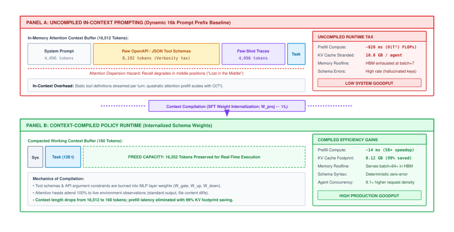
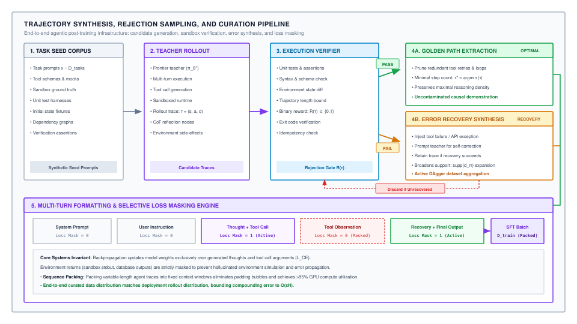
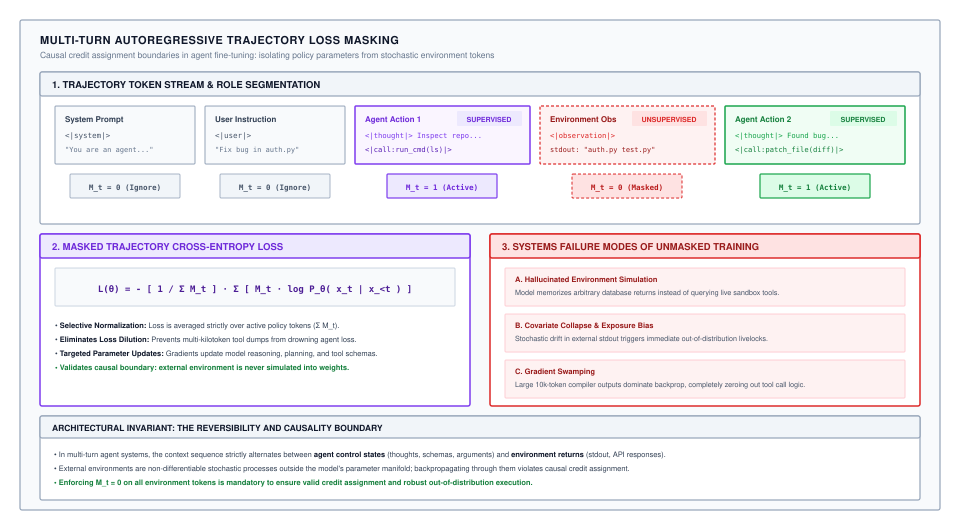

# Trajectory Fine-Tuning {#sec-vol3-sft}

::: {layout-narrow}
::: {.column-margin}

\chapterminitoc

:::

::: {.content-visible when-format="pdf"}
\noindent
{fig-alt="Isometric blueprint showing supervised trajectory fine-tuning (SFT): interleaved trajectory track, observation masking plates with zero loss, thought and action gradient illumination, gradient backpropagation rollers, policy parameter update inductors, and teacher-forcing loss pipeline."}
:::

::: {.content-visible unless-format="pdf"}
{fig-alt="Isometric blueprint showing supervised trajectory fine-tuning (SFT): interleaved trajectory track, observation masking plates with zero loss, thought and action gradient illumination, gradient backpropagation rollers, policy parameter update inductors, and teacher-forcing loss pipeline."}
:::

:::

## Purpose {.unnumbered .unlisted}

::: {.content-visible when-format="pdf"}
\begin{marginfigure}
\mlagentstack{10}{95}{10}{10}{10}{10}
\caption{The Agentic Machine Learning Systems Stack.}
\end{marginfigure}
:::

_How do we adapt general foundation models to adhere to rigid tool-use protocols, multi-turn state tracking, and long-horizon plans?_

Standard foundation models are trained to maximize likelihood over static textual corpora, treating every token as an independent generative target. When exposed to closed-loop execution environments, these unconstrained models collapse: they emit malformed schemas that fail grammar parsers, hallucinate external environment outputs instead of awaiting system responses, and enter fatal autoregressive livelocks upon encountering their first unexpected runtime exception. Transforming a foundation model into an autonomous agent requires treating multi-turn trajectory fine-tuning as a specialized systems compiler. The runtime must enforce the Environmental Causality Boundary through selective token loss masking, parameterize domain-specific capabilities into modular low-rank execution adapters, and structurally inject synthetic environment faults to bound compounding drift over long execution horizons.

::: {.content-visible when-format="pdf"}
\newpage
:::

::: {.callout-learning-objectives}
- Formalize multi-turn execution traces into structured autoregressive token sequences using specialized delimiter dialects and role boundaries.
- Architect a selective cross-entropy loss masking pipeline that enforces the Environmental Causality Boundary by eliminating gradients over external environment observations.
- Quantify the mathematical and systems divergence between sequence-length loss normalization and active-token normalization across variable-length tool returns.
- Formulate Parameter-Efficient Fine-Tuning (PEFT) via Low-Rank Adaptation (LoRA) and engineer dynamic adapter-swapping runtimes over PCIe interconnects.
- Derive the quadratic compounding error bounds of behavioral cloning under exposure bias and prove the linear recovery guarantees provided by DAgger-style fault injection.
- Design curriculum staging strategies and replay regularization mechanisms that preserve general base model capabilities during specialized agent compilation.
:::

## Formatting Trajectories for Autoregressive SFT {#sec-vol3-sft-formatting}

During a continuous deployment roll-out in an automated site reliability engineering platform, an agent fine-tuned using standard markdown backticks emitted a bash script containing an unescaped double quotation mark within a nested heredoc string. The runtime parser misidentified the inner delimiter as the closing boundary of the execution envelope, executed the truncated command string up to the syntax boundary, and silently orphaned dozens of cloud storage volumes without running the subsequent cleanup logic. The agent runtime hung indefinitely waiting for a process exit code that never arrived, consuming active server threads and exhausting the connection pool. This systems failure was not caused by a flawed planning policy or insufficient parameter capacity; it was the direct consequence of naive trajectory serialization that allowed ambiguous string delimiters to bridge the boundary between agent intent and execution syntax.

Adapting a foundational autoregressive language model into a deterministic agent policy requires formalizing the structural representation of the execution history. Unlike conversational chatbots where dialogues consist of homogeneous human-assistant message pairs, an agent interacts with a heterogeneous distributed environment. It generates internal deliberative thoughts, emits structured tool invocations, pauses execution to await external feedback, and absorbs asynchronous environment observations. Serializing this stateful, multi-component interaction into a linear sequence of discrete tokens demands formal operational abstractions and resilient formatting protocols.

### Autoregressive decision chains and trajectory formalism

An autonomous agent operating within an execution environment interacts across a discrete temporal horizon $H$. We formalize this sequential decision-making process as a trajectory $\tau$, defined by an alternating sequence of agent control actions and external environment observations:

$$\tau = \left( s_0, a_0, o_0, s_1, a_1, o_1, \dots, s_H, a_H, o_H \right)$$

where:

1. $s_0 \in \mathcal{S}$ represents the initial environment state and user task specification, typically encapsulated within a system prompt prefix and initial user query.
2. $a_t \in \mathcal{A}$ denotes the endogenous action emitted by the policy at step $t$. Crucially, an agent action decomposes into two distinct token spans: an internal deliberative reasoning trace $c_t$ (the scratchpad or thought tokens) and a concrete tool invocation $\alpha_t$ (the tool identifier and its typed argument payload):
   $$a_t = \left( c_t, \alpha_t \right)$$
3. $o_t \in \mathcal{O}$ represents the exogenous observation returned by the execution environment upon running $\alpha_t$, such as shell `stdout` and `stderr` streams, database query result sets, HTTP response payloads, or kernel exit codes.
4. $s_{t+1} \in \mathcal{S}$ represents the updated internal belief state of the agent, comprising the cumulative history of all prior interactions:
   $$s_{t+1} = \left( s_0, a_0, o_0, a_1, o_1, \dots, a_t, o_t \right)$$

In classical supervised learning, training examples are assumed to be independent and identically distributed (i.i.d.). In an agent trajectory, every emitted token $x_i \in a_t$ is conditioned causally on the entire prior sequence history $x_{<i}$. The language model parameterizes this policy autoregressively:

$$P_\theta(a_t \mid s_t) = \prod_{j=1}^{|a_t|} P_\theta\left( x_{t,j} \mid s_t, x_{t,<j} \right)$$

where $x_{t,j}$ is the $j$-th token of action $a_t$. Transforming this mathematical formulation into an operational training pipeline requires compiling runtime context into model weights.

### The systems mechanics of context compilation

In early development stages, autonomous systems rely entirely on **in-context learning (ICL)**\index{In-context learning}. Under this paradigm, the underlying foundation model remains completely frozen. To coax the model into invoking tools and tracking state, the runtime prepends an expansive context prefix to every query. This prefix contains exhaustive JSON Schema specifications for every registered tool, extensive behavioral guidelines, few-shot execution exemplars, and the historical log of all preceding turns.

While in-context prompting requires no training infrastructure, it imposes severe physical and economic penalties on production systems:

1. **Quadratic prefill saturation**: Standard multi-head self-attention scales quadratically with sequence length $T$ during prompt prefill. For a transformer layer with model dimension $d_{\text{model}}$ and sequence length $T_{\text{prompt}}$, the floating-point operations (FLOPs) required for the causal prefill forward pass scale as:
   $$\text{FLOPs}_{\text{prefill}} \approx 2 \cdot N_{\text{params}} \cdot T_{\text{prompt}} + 2 \cdot L \cdot d_{\text{model}} \cdot T_{\text{prompt}}^2$$
   where the quadratic term accounts for causal lower-triangular attention matrix multiplications ($QK^T$ and attention-value projection) across all $L$ layers. When an agent prepends $16{,}384$ tokens of OpenAPI documentation and exemplars to every execution step, prefill compute dominates the inference cycle, bottlenecking accelerator compute units and driving Time-to-First-Token (TTFT) beyond interactive latency service level agreement (SLA) thresholds.
2. **Key-value cache memory exhaustion**: High-bandwidth memory (HBM) allocated to the **key-value (KV) cache**\index{Key-value (KV) cache} scales linearly with sequence length, batch size, and layer count:
   $$M_{\text{KV}} = 2 \cdot L \cdot H_{\text{KV}} \cdot d_h \cdot T_{\text{seq}} \cdot b_{\text{bytes}}$$
   where $L$ is the number of transformer layers, $H_{\text{KV}}$ is the number of key-value heads, $d_h$ is the per-head dimension, and $b_{\text{bytes}}$ is the precision storage size (e.g., 2 bytes for 16-bit floating point). For a 70B parameter model ($L=80, H_{\text{KV}}=8, d_h=128$) serving a $32\text{K}$ context window, a single concurrent agent instance consumes over $10.5\text{ GB}$ of HBM exclusively for KV cache storage. Across a multi-tenant serving cluster, KV cache bloat throttles maximum serving concurrency, inducing memory-bound GPU starvation.
3. **Attention dispersion and contextual degradation**: As sequence length expands, transformer attention mechanisms experience fidelity loss. Information located in the middle of massive prompt prefixes suffers severe recall degradation relative to information at the boundaries [@liu2024lost]. When critical schema invariants or parameter typing rules are buried within thousands of tokens of few-shot history, attention weights disperse, inducing schema hallucinations, missing arguments, and type violations.

To eliminate these runtime penalties, modern architectures apply **context compilation**\index{Context compilation}. Context compilation is the mathematical transformation of dynamic runtime prompt context (tool definitions, syntax constraints, and operational heuristics) into static neural network weights via supervised gradient descent (@fig-vol3-sft-context-compilation).

::: {#fig-vol3-sft-context-compilation fig-env="figure" fig-pos="htb" fig-cap="**Context compilation versus in-context prompting runtimes**: (Top) In-context prompting prepends expansive tool definitions, schema specifications, and few-shot traces to every invocation, incurring quadratic prefill latency $\mathcal{O}(T^2)$ and exhausting accelerator KV-cache capacity (~10.5 GB per agent instance). (Bottom) Context compilation transforms dynamic prompt context into static neural network weights via supervised fine-tuning, shrinking prompt prefixes by up to 85 percent, eliminating redundant prefill computation, and protecting critical tool-following circuits from attention dispersion. Source: Author illustration." fig-alt="Architectural flowchart comparing an uncompiled in-context prompting agent prepending 16k tokens of tool schemas with quadratic prefill latency against a context-compiled policy runtime with static weights and a 128-token task prompt."}

{width="100%"}

:::

By fine-tuning the model on curated execution traces, the model internalizes the schema grammars and invocation rules directly into its feedforward weight projections ($W_{\text{gate}}, W_{\text{up}}, W_{\text{down}}$). The runtime prompt prefix collapses from $16\text{K}$ tokens to a compact $128$-token task objective. This yields an $80\text{--}85\%$ reduction in prefill latency, frees gigabytes of accelerator memory per instance, and eliminates attention dispersion.

To evaluate whether context compilation is economically justified, we compare the one-time training compute against recurring inference savings using first-principles training FLOPs napkin math. Under the standard transformer scaling rule of thumb, the forward pass requires $2 N_{\text{params}}$ floating-point operations per token, and the backward pass requires $4 N_{\text{params}}$ FLOPs per token (accounting for activation and weight gradient projections), totaling $\approx 6 N_{\text{params}}$ FLOPs per training token.

Suppose an engineering team fine-tunes a 70B parameter model ($N_{\text{params}} = 70 \times 10^9$) on a curated dataset of $100{,}000$ multi-turn agent trajectories averaging $4{,}096$ tokens ($D_{\text{train}} \approx 4.1 \times 10^8$ total tokens):

$$\text{FLOPs}_{\text{train}} \approx 6 \cdot N_{\text{params}} \cdot D_{\text{train}} \approx 6 \cdot (70 \times 10^9) \cdot (4.1 \times 10^8) \approx 1.72 \times 10^{20} \text{ FLOPs} \approx 172 \text{ PFLOPs}$$

On an 8-GPU H100 SXM node ($8 \times 989\text{ TFLOP/s}$ dense 16-bit tensor peak $\approx 7.91\text{ PFLOP/s}$), operating at a realistic model FLOPs utilization (MFU) of $40\%$ yields an effective cluster throughput of $3.16\text{ PFLOP/s}$. The entire trajectory fine-tuning run completes in:

$$t_{\text{train}} \approx \frac{1.72 \times 10^{20} \text{ FLOPs}}{3.16 \times 10^{15} \text{ FLOPs/s}} \approx 54{,}400 \text{ s} \approx 15.1 \text{ hours}$$

At standard cloud rental pricing ($\approx \$24/\text{hour}$ for an 8-H100 node), compiling the agent policy requires less than $\$365$ of accelerator compute. In contrast, serving uncompiled $16\text{K}$-token prompt prefixes across an active agent fleet handling $100{,}000$ daily multi-turn queries wastes millions of dollars annually in quadratic prefill FLOPs and idle accelerator memory.

The end-to-end data pipeline that synthesizes, verifies, and stages these trajectories for fine-tuning is illustrated in @fig-vol3-sft-pipeline.

::: {#fig-vol3-sft-pipeline fig-env="figure" fig-pos="htb" fig-cap="**Trajectory synthesis, rejection sampling, and curation pipeline**: The post-training data curation pipeline operates across five coordinated stages. Task prompts $x \sim \mathcal{D}_{\text{tasks}}$ seed multi-turn stochastic rollouts by a high-capacity frontier teacher policy $\pi^*_\theta$ within isolated execution sandboxes. Deterministic execution verifiers evaluate unit test suites, compiler return codes, and environment state diffs to filter completions. Passing traces are partitioned into minimal-step golden paths and fault-injection error-recovery traces, which are then processed by a selective loss-masking engine before batch compilation into policy weights. Source: Adapted from Zelikman et al. [@zelikman2022star] and Ouyang et al. [@ouyang2022instructgpt]." fig-alt="System flow diagram detailing the five stages of agent trajectory synthesis, execution verification, rejection sampling, and loss-masking."}
{width=100%}
:::

### Trajectory serialization and formatting dialects

The serialization format chosen to represent trajectory components in the token stream dictates both parser robustness and token efficiency. In production runtimes, three primary serialization dialects exist:

1. **Unstructured markdown and string delimiters**: In early frameworks, actions and observations were delimited by standard markdown syntax, such as `\`\`\`bash\`` or `\`\`\`json\`` code blocks. While easily readable by humans, this approach is fundamentally brittle. If the tool output contains markdown blocks, nested code snippets, or arbitrary backticks, the runtime lexer encounters delimiter collisions. The parser terminates the execution envelope prematurely, yielding syntax crashes or truncation errors.
2. **Structured XML envelopes**: Runtimes such as Anthropic tool use encapsulate roles within explicit tag boundaries:
   ```xml
   <thought>
   The directory does not contain 'requirements.txt'. I must inspect 'pyproject.toml'.
   </thought>
   <tool_call>
   <tool_name>read_file</tool_name>
   <parameters>
   <path>pyproject.toml</path>
   </parameters>
   </tool_call>
   <tool_response>
   [project]
   dependencies = ["torch>=2.4.0", "vllm>=0.6.0"]
   </tool_response>
   ```
   XML envelopes provide clear nesting semantics, enabling regex and streaming parsers to handle arbitrary string content inside parameter bodies via standard CDATA or escaping rules.
3. **Dedicated reserved control tokens**: The highest-performance systems dialect replaces natural language strings with reserved control tokens injected directly into the tokenizer vocabulary. Popularized by ChatML [@openai2023gpt4] and Hermes tool calling [@nous2023hermes], this dialect assigns unique vocabulary IDs to boundary indicators:
   ```text
   <|im_start|>system
   You are an autonomous engineering agent with shell and editor tools.<|im_end|>
   <|im_start|>user
   Fix the race condition in the cache invalidator.<|im_end|>
   <|im_start|>thought
   Examining the lock acquisition logic in src/cache.py...<|im_end|>
   <|im_start|>action
   <|tool_call_start|>{"name": "grep_search", "arguments":
     {"path": "src/cache.py", "query": "acquire_lock"}}<|tool_call_end|><|im_end|>
   <|im_start|>observation
   src/cache.py:42:    def acquire_lock(self, timeout=None):<|im_end|>
   ```

Using dedicated control tokens guarantees that role delimiters cannot be spoofed by user text or tool payloads, preventing prompt injection attacks from escaping the execution boundary.

@Tbl-vol3-sft-formatting-dialects compares the architectural trade-offs across these formatting standards.

| **Dialect Architecture**             | **Delimiter Mechanism**                 | **Token Overhead**   | **Parser Complexity**   | **Collision Vulnerability** | **Injection Immunity** |
|:-------------------------------------|:----------------------------------------|:---------------------|:------------------------|:----------------------------|:-----------------------|
| **Markdown Code Blocks**             | Standard code fences (triple backticks) | Low (+4 tokens)      | High (stateful regex)   | Extreme (nested code fails) | Nil (trivial escape)   |
| **Structured XML Envelopes**         | Textual tag pairs (`<call>`, `</call>`) | High (+12-24 tokens) | Moderate (DOM/SAX tree) | Low (with CDATA escaping)   | Moderate               |
| **Reserved Control Tokens (ChatML)** | Dedicated vocabulary IDs (token IDs)    | Minimal (+2 tokens)  | Negligible (exact ID)   | Zero (un-emittable by text) | High (kernel enforced) |

: **Architectural comparison of trajectory formatting dialects**: Systems properties of markdown strings, XML envelopes, and dedicated control token vocabularies. {#tbl-vol3-sft-formatting-dialects tbl-colwidths="[20,20,15,15,15,15]"}

### Tokenizer extensions and vocabulary initialization

When introducing dedicated control tokens into an existing foundation model tokenizer, systems engineers must ensure mathematical continuity across the embedding manifold. If a tokenizer with vocabulary size $|V| = 128{,}000$ is extended with $K = 8$ new agent tokens ($|V'| = |V| + K$), the input embedding matrix $W_e \in \mathbb{R}^{|V| \times d_{\text{model}}}$ and output unembedding head $W_u \in \mathbb{R}^{|V| \times d_{\text{model}}}$ must allocate $K$ additional rows:

$$W_e' = \begin{bmatrix} W_e \\ \Delta W_e \end{bmatrix}, \quad W_u' = \begin{bmatrix} W_u \\ \Delta W_u \end{bmatrix}$$

Initializing $\Delta W_e$ and $\Delta W_u$ with random Gaussian noise ($\mathcal{N}(0, \sigma^2)$) creates extreme optimization instability. In an $8{,}192$-dimensional hidden space ($d_{\text{model}} = 8{,}192$), unconstrained random embeddings produce unnormalized logit variances that deviate by dozens of units ($z_v = W_u h$). At step 1, the softmax probability for the true control token approaches zero ($P_\theta(x) \to 0$), driving cross-entropy loss to extreme values ($-\log P_\theta(x) \gg 10$). The resulting logit error gradient $\nabla_z \mathcal{L} = P_\theta(v) - y \approx -1.0$ generates massive parameter gradient norms that detonate through the residual stream, knocking pretrained attention heads and feedforward projections out of their calibrated basins.

To prevent gradient shock, production pipelines apply **Centroid Mean Initialization**:

$$\Delta W_{e, k} = \frac{1}{|S_{\text{semantic}}|} \sum_{v \in S_{\text{semantic}}} W_{e, v}, \quad \Delta W_{u, k} = \frac{1}{|S_{\text{semantic}}|} \sum_{v \in S_{\text{semantic}}} W_{u, v}$$

where $S_{\text{semantic}}$ is a curated subset of existing syntactic tokens (e.g., punctuation symbols, brackets, and structural delimiters). Initializing new tokens at the geometric center of existing syntactic representations ensures that initial forward activations remain bounded within the layer normalization operating envelope, keeping cross-entropy gradients smooth from the first optimizer step.

Furthermore, serialization pipelines must enforce minified, whitespace-compacted formatting for emitted tool arguments. Pretty-printed JSON payloads containing spaces and line breaks inflate token counts by $25\text{--}40\%$ relative to compact representations (`{"k":"v"}`). In long-horizon trajectories spanning dozens of turns, compact serialization saves thousands of context tokens, directly curbing quadratic prefill overhead and delaying context window exhaustion.

```python
# Production Tokenizer Delimiter & Serialization Collator
from dataclasses import dataclass
import json
from typing import Any, Dict, List
import torch

@dataclass
class TrajectoryTurn:
    role: str  # 'system', 'user', 'thought', 'action', 'observation'
    content: str
    tool_name: str = ""
    tool_args: Dict[str, Any] = None

class AgentTrajectoryCollator:
    def __init__(self, tokenizer, special_tokens: Dict[str, str]):
        self.tokenizer = tokenizer
        self.tokens = special_tokens
        # Mapping control tokens to dedicated vocab IDs
        self.start_id = {k: tokenizer.convert_tokens_to_ids(v)
                         for k, v in special_tokens.items()}

    def serialize_turn(self, turn: TrajectoryTurn) -> str:
        """Serializes an individual turn with compact syntax."""
        if turn.role == "action":
            # Compact JSON payload eliminates superfluous whitespace tokens
            payload = json.dumps(
                {"name": turn.tool_name, "arguments": turn.tool_args},
                separators=(",", ":")
            )
            return f"{self.tokens['action_start']}{payload}{self.tokens['action_end']}"
        elif turn.role == "thought":
            return f"{self.tokens['thought_start']}{turn.content}{self.tokens['thought_end']}"
        elif turn.role == "observation":
            return f"{self.tokens['obs_start']}{turn.content}{self.tokens['obs_end']}"
        elif turn.role == "user":
            return f"{self.tokens['user_start']}{turn.content}{self.tokens['user_end']}"
        return f"{self.tokens['sys_start']}{turn.content}{self.tokens['sys_end']}"
```

Once trajectories are serialized into unambiguous, compact token streams, the training framework must compute loss across these tokens. However, treating every token as an active optimization target violates environmental causality.

## Masked Cross-Entropy Loss: Training Only on Actions {#sec-vol3-sft-masked-loss}

A high-capacity 70B parameter foundation model was fine-tuned to execute database migrations across an enterprise infrastructure cluster. The engineering team collected $100{,}000$ complete multi-turn console trajectories and trained the model using standard next-token prediction across the entire token sequence. In staging, the model was tasked with querying the schema of a customer database containing over $50{,}000$ records. The agent emitted the shell command `psql -c "\d customers"`. Instead of terminating its generation, waiting for the operating system to execute the query, and absorbing the real console output, the model immediately generated:

```text
Table "public.customers"
Column   | Type    | Modifiers
---------+---------+-----------
id       | integer | not null
balance  | numeric |
Indexes: "customers_pkey" PRIMARY KEY, btree (id)

Agent Decision: Balance column exists. Issuing migration script...
```

The model did not invoke the PostgreSQL CLI; it synthesized the entire database output within its own autoregressive forward passes. The synthetic output omitted a critical foreign key constraint that existed in the physical database. The agent generated an erroneous migration script that dropped the constraint and corrupted live table dependencies.

This catastrophic failure mode—termed **hallucinated execution collapse**\index{Hallucinated execution collapse}—is the inevitable mathematical result of unmasked trajectory fine-tuning. When a model is trained to minimize perplexity over environment observation tokens, it attempts to internalize the state transition dynamics of the external world directly into its own neural weights.

### The environmental causality boundary

To understand why unmasked training fails, we examine the probabilistic factorization of a multi-turn trajectory. The joint probability distribution over a full trajectory $\tau$ factorizes into two distinct components: the endogenous agent policy and the exogenous environment transition function:

$$P(\tau) = P(s_0) \prod_{t=0}^H P_\theta(a_t \mid s_t) \cdot P_{\text{env}}(o_t \mid s_t, a_t)$$

In this decomposition:

1. $P_\theta(a_t \mid s_t)$ is the **agent policy**\index{Agent policy}, parameterized by neural network weights $\theta$. The agent controls this distribution: it selects which thoughts to deliberate and which tool invocations to issue based on the visible history $s_t$.
2. $P_{\text{env}}(o_t \mid s_t, a_t)$ is the **environment transition distribution**\index{Environment transition distribution}. This distribution is governed by external operating systems, network switches, third-party REST APIs, database engines, and physical hardware. The parameter weights $\theta$ have zero causal control over this transition.

The goal of Supervised Trajectory Fine-Tuning is to align the policy $P_\theta$ with optimal decision-making, not to turn the language model into an imperfect emulator of physical and software systems. The **environmental causality boundary**\index{Environmental causality boundary} establishes that backpropagation must optimize likelihood strictly over endogenous policy actions, setting the loss gradient with respect to external environment observations to zero (@fig-vol3-sft-loss-masking).

::: {#fig-vol3-sft-loss-masking fig-env="figure" fig-pos="htb" fig-cap="**Autoregressive trajectory loss masking and environmental causality boundary**: The token sequence alternates between agent control states (system prompt, user query, thoughts, tool calls) and external environment observations (standard output, exit codes, API payloads). The binary loss mask vector $M_t$ is set strictly to 1 for endogenous agent thoughts and tool call arguments, and 0 for exogenous environment observations and initial prompts. During backpropagation, only masked policy tokens contribute to cross-entropy loss, preventing hallucinated execution collapse and gradient swamping from verbose execution outputs. Source: Author illustration." fig-alt="Technical diagram illustrating token sequence role segmentation, binary loss mask vectors, and backpropagation gating for multi-turn agent trajectories."}
{width=100%}
:::

Violating this boundary by training on unmasked trajectories introduces three structural pathologies into the resulting system:

1. **Hallucinated execution collapse**: As demonstrated in the database failure hook, if the model is rewarded for predicting observation tokens $o_t$, it assigns high probability mass to emitting observations directly. At test time, the model fails to emit stop tokens, hallucinations replace tool actuation, and the agent operates in an ungrounded closed-loop fantasy.
2. **Gradient swamping from external noise**: Environment observations are dominated by high-entropy, stochastic text: execution timestamps, random GUIDs, process identifiers (PIDs), compiler memory addresses, and verbose HTML trees. These tokens possess high Kolmogorov complexity and cannot be compressed into generalizable reasoning rules. Forcing the optimizer to minimize perplexity over stochastic system noise wastes finite parameter capacity on memorizing transient environmental artifacts.
3. **Causal inversion**: Autoregressive prediction of observation tokens incentivizes the model to fit parameters to the past ($o_{<t}$) rather than optimizing the conditional probability of future actions ($a_t \mid s_t$), inverting the causal credit assignment required for reinforcement learning.

### Mathematical formulation of masked trajectory loss

To enforce the Environmental Causality Boundary, the training system constructs a binary action mask vector $M \in \{0, 1\}^T$ aligned with the sequence of length $T$. Each token $x_i$ is assigned a mask value based on its structural role:

$$M_i = \begin{cases} 1, & \text{if } x_i \in a_t \text{ (internal thought } c_t \text{ or action } \alpha_t\text{)} \\ 0, & \text{if } x_i \in \{x_{\text{prompt}}, o_t\} \text{ (prompt, user query, or environment observation)} \end{cases}$$

The trajectory-level Supervised Fine-Tuning objective is formulated as the masked cross-entropy loss over the active tokens:

$$\mathcal{L}_{\text{SFT}}(\theta) = - \frac{1}{\sum_{i=1}^T M_i} \sum_{i=1}^T M_i \log P_\theta(x_i \mid x_{<i})$$ {#eq-masked-loss-active}

During backpropagation, the loss gradient with respect to output logits $z_{i} \in \mathbb{R}^{|V|}$ evaluates to:

$$\frac{\partial \mathcal{L}_{\text{SFT}}}{\partial z_{i}} = \begin{cases} \frac{1}{\sum M_j} \left( P_\theta(\cdot \mid x_{<i}) - \mathbf{y}_i \right), & \text{if } M_i = 1 \\ \mathbf{0}, & \text{if } M_i = 0 \end{cases}$$

where $\mathbf{y}_i$ is the one-hot target vector. For any token where $M_i = 0$, the logit gradient is identically zero.

At the GPU execution level, this condition executes zero memory writes: fused cross-entropy kernels skip the vocabulary-wide softmax reduction for positions marked with `ignore_index = -100`. In the subsequent backward projection through the unembedding layer $W_u$, zero gradients bypass backward matrix multiplications, eliminating unnecessary memory bandwidth traffic.

A critical systems distinction separates forward execution from backward propagation:

* **Forward pass**: The model must compute hidden states and KV-cache representations for all tokens, including exogenous observations $o_t$. This is required because subsequent agent thoughts and actions causally attend to past observation tokens.
* **Backward pass**: Parameter gradients are gated strictly to zero for observation tokens. Observations serve as immutable conditioning context, influencing future action representations without receiving gradient updates that could memorize external environment noise.

### Loss weighting dynamics: Balancing thought vs. action tokens

In an agent control step $a_t = (c_t, \alpha_t)$, the emitted text decomposes into two distinct operational regimes:

1. **Deliberative reasoning tokens ($c_t$)**: Free-form natural language thoughts analyzing system state, comparing potential execution strategies, and diagnosing previous tool errors.
2. **Action syntax tokens ($\alpha_t$)**: Rigid tool invocation schemas, including the tool identifier, JSON delimiter syntax, parameter names, and typed arguments.

In multi-turn engineering tasks, these two regimes exhibit an acute **token volume imbalance**. A complex reasoning step may require $400$ tokens of deliberative scratchpad analysis preceding a compact $25$-token tool call (a $16:1$ token ratio).

If an SFT pipeline weights all active tokens equally ($w(x_i) = 1$ for all $x_i \in a_t$), over $94\%$ of the backpropagated gradient updates are spent fitting natural language vocabulary and conversational phrasing. Less than $6\%$ of parameter updates optimize tool invocation syntax, parameter typing, and schema compliance. In smaller models ($\le 14\text{B}$ parameters), this token disparity produces an insidious failure mode: the agent becomes an *eloquent planner that cannot execute*. The model deliberates brilliantly in its scratchpad, but then fails at the final step by emitting malformed JSON, omitting closing brackets, or hallucinating invalid parameter names.

To maintain gradient balance between deliberation and execution, production runtimes apply **differential token loss weighting**:

$$\mathcal{L}_{\text{weighted}}(\theta) = - \frac{\sum_{i=1}^T M_i \cdot w(x_i) \log P_\theta(x_i \mid x_{<i})}{\sum_{i=1}^T M_i \cdot w(x_i)}$$ {#eq-weighted-sft-loss}

where:

$$w(x_i) = \begin{cases} w_{\text{thought}}, & \text{if } x_i \in c_t \\ w_{\text{action}}, & \text{if } x_i \in \alpha_t \end{cases}$$

In @eq-weighted-sft-loss, setting the ratio $w_{\text{action}} / w_{\text{thought}} \in [1.5, 3.0]$ amplifies the gradient magnitude on action tokens, ensuring the optimizer treats schema violations and parameter errors with high priority. In specialized execution-only adapters where test-time deliberation is pruned for low-latency serving, setting $w_{\text{thought}} = 0$ trains the policy to map directly from observation history to tool invocation syntax.

::: {#chk-vol3-13-loss-masking-efficiency .callout-checkpoint title="Loss masking and causality boundaries"}

Before analyzing sequence packing and normalization dynamics, verify your understanding of trajectory loss masking:

- [ ] **Observation Masking Necessity**: Why does computing gradient updates over compiler stdout or API responses cause an agent to hallucinate outputs rather than waiting for external execution?
- [ ] **Forward vs. Backward Pass**: If observation tokens have their loss masked ($M_i = 0$), why must they still participate in the attention forward pass?
- [ ] **Weighting Imbalance**: In a trajectory where 400 thought tokens precede a 20-token tool call, why does unweighted loss cause the model to plan eloquently while failing on basic JSON argument formatting?

:::

### Normalization dynamics: Active-token vs. sequence-length normalization

When implementing masked trajectory fine-tuning in distributed training frameworks, the choice of normalization denominator in @eq-masked-loss-active exerts a profound impact on optimization dynamics.

In standard language modeling libraries, cross-entropy is naively normalized by the total sequence length $T$ (including masked tokens):

$$\mathcal{L}_{\text{naive}}(\theta) = - \frac{1}{T} \sum_{i=1}^T M_i \log P_\theta(x_i \mid x_{<i})$$ {#eq-naive-loss}

This naive normalization introduces a lethal systems pathology: **gradient swamping and attenuation**\index{Gradient swamping}.

Consider a training batch containing two distinct agent trajectories:

* **Trajectory A (compact interaction)**: The agent deliberates for 200 tokens and issues a 50-token shell command ($N_A = 250$ active tokens). The tool returns a short status string of 50 tokens ($O_A = 50$). Total length $T_A = 300$.
* **Trajectory B (verbose interaction)**: The agent deliberates for 200 tokens and issues a 50-token compiler command ($N_B = 250$ active tokens). The compiler crashes, spewing an $8{,}000$-token stack trace and memory dump ($O_B = 8{,}000$). Total length $T_B = 8{,}250$.

Under sequence-length normalization (@eq-naive-loss), the gradient magnitude contribution of Trajectory B is scaled by $\frac{1}{T_B} = \frac{1}{8250}$, whereas Trajectory A is scaled by $\frac{1}{T_A} = \frac{1}{300}$. The effective learning signal from Trajectory B is attenuated by a factor of:

$$\frac{T_B}{T_A} = \frac{8250}{300} = 27.5$$

Because the external environment was verbose, the optimizer virtually ignores the agent's actions in Trajectory B! The model fails to learn from complex tasks involving extensive compiler dumps, build logs, or web pages, biasing the policy toward trivial, short-output tools.

To maintain invariant gradient scaling across heterogeneous execution environments, modern training runtimes enforce **active-token normalization**\index{Active-token normalization} [@deepseek2024v3]:

$$\mathcal{L}_{\text{batch}}(\theta) = - \frac{\sum_{b=1}^B \sum_{i=1}^{T_b} M_{b,i} \log P_\theta(x_{b,i} \mid x_{b,<i})}{\sum_{b=1}^B \sum_{i=1}^{T_b} M_{b,i}}$$

In distributed data-parallel (DDP) architectures, computing this objective requires an `all_reduce` collective communication call across all $K$ GPU workers to synchronize the global count of active action tokens before performing the optimizer step:

$$N_{\text{global}} = \sum_{k=1}^K \sum_{b=1}^{B_{\text{local}}} \sum_{i=1}^{T} M_{k,b,i}$$

### High-performance CUDA and PyTorch implementation

In high-throughput distributed training stacks (such as PyTorch with Megatron-LM [@shoeybi2019megatron] or DeepSpeed [@rasley2020]), action masking is executed by remapping target labels prior to invoking hardware-optimized cross-entropy kernels. Standard cross-entropy loss functions expose an `ignore_index` argument (conventionally set to `-100`). Tokens assigned this target index are skipped directly within the fused CUDA kernel, executing zero memory writes and bypassing backward gradient passes.

```python
import torch
import torch.nn as nn
import torch.distributed as dist

class MaskedTrajectoryLoss(nn.Module):
    def __init__(self, ignore_index: int = -100):
        super().__init__()
        self.ignore_index = ignore_index
        # Reduction must be 'sum' to allow exact global active-token normalization
        self.loss_fn = nn.CrossEntropyLoss(
            ignore_index=ignore_index,
            reduction='sum'
        )

    def forward(
        self,
        logits: torch.Tensor,       # Shape: [B, T, V]
        targets: torch.Tensor,      # Shape: [B, T]
        action_mask: torch.Tensor   # Shape: [B, T], 1 for actions, 0 for obs/prompts
    ) -> torch.Tensor:
        # Step 1: Shift logits and targets for autoregressive next-token alignment
        shift_logits = logits[..., :-1, :].contiguous()
        shift_targets = targets[..., 1:].contiguous()
        shift_mask = action_mask[..., 1:].contiguous()

        # Step 2: Apply Environmental Causality Boundary via target index masking
        # Where shift_mask == 0, overwrite target with ignore_index (-100)
        masked_targets = torch.where(
            shift_mask == 1,
            shift_targets,
            torch.full_like(shift_targets, self.ignore_index)
        )

        # Step 3: Compute raw sum of cross-entropy loss across active tokens
        flat_logits = shift_logits.view(-1, shift_logits.size(-1))
        flat_targets = masked_targets.view(-1)
        loss_sum = self.loss_fn(flat_logits, flat_targets)

        # Step 4: Calculate local active action tokens
        local_active_tokens = shift_mask.sum().float()

        # Step 5: In distributed training, synchronize token counts across all ranks
        if dist.is_initialized():
            dist.all_reduce(loss_sum, op=dist.ReduceOp.SUM)
            dist.all_reduce(local_active_tokens, op=dist.ReduceOp.SUM)

        # Step 6: Normalize strictly by global active token count
        # Epsilon prevents zero-division in degenerate empty batches
        normalized_loss = loss_sum / torch.clamp(local_active_tokens, min=1.0)
        return normalized_loss
```

To eliminate memory fragmentation from padding tokens in variable-length multi-turn trajectories, production data loaders pack multiple trajectories into a single contiguous 1D sequence array using FlashAttention-2 varlen primitives [@dao2022]. Cumulative sequence length offset pointers (`cu_seqlens`) guide the attention kernel, allowing batches to achieve near-$100\%$ tensor core arithmetic occupancy without padding waste.

We can quantify the systems value of packed sequence training via first-principles **Sequence Packing Efficiency ($\eta_{\text{pack}}$)** napkin math. In standard batching, variable-length sequences are padded with dummy tokens to the maximum sequence length $T_{\max}$ (e.g., $16{,}384$ tokens). In an agent training corpus where trajectories vary from 2-step quick queries to 30-step debugging loops, the average trajectory length is often $\bar{T} = 3{,}200$ tokens. Under naive padding, the packing efficiency evaluates to:

$$\eta_{\text{naive}} = \frac{\bar{T}}{T_{\max}} = \frac{3{,}200}{16{,}384} \approx 19.5\%$$

Over $80\%$ of GPU memory bandwidth and tensor core FLOPs are completely wasted multiplying attention weights against pad-token zeros! By concatenating multiple variable-length trajectories into a continuous $16\text{K}$-token sequence buffer with `cu_seqlens` boundary indices:

$$\eta_{\text{packed}} = \frac{\sum_{j=1}^m T_j}{T_{\text{buffer}}} \ge 98\%$$

Packed sequence training achieves a $5\times$ increase in effective training throughput (tokens processed per second) on the exact same accelerator cluster, slashing training time from days to hours.

::: {#chk-vol3-13-sequence-packing-waste .callout-checkpoint title="Sequence packing and normalization invariants"}

Before exploring parameter-efficient fine-tuning, test your understanding of batching and loss normalization:

- [ ] **Active-Token Normalization**: Why does normalizing batch loss by total sequence length rather than active action tokens cause the optimizer to ignore learning signals from verbose tool outputs?
- [ ] **FlashAttention Varlen**: In a dataset where mean trajectory length is 3,200 tokens and maximum context is 16,384 tokens, what proportion of GPU compute is wasted under naive padding compared to packed sequence batching?
- [ ] **Cross-GPU Synchronization**: Why does active-token normalization require an `all_reduce` sum across all distributed data-parallel ranks before computing the optimizer step?

:::

While masked cross-entropy isolates the policy from environment noise, updating the full parameter weights of massive foundation models for specialized agent tools remains economically and computationally prohibitive.

## Dynamic LoRA Adapter Swapping {#sec-vol3-sft-peft-lora}

Consider an enterprise agent platform designed to operate across diverse technical workflows: managing Kubernetes clusters, refactoring legacy C++ repositories, navigating dynamic DOM trees in web browsers, and generating optimized SQL analytical queries. Each domain requires distinct tool schemas, reasoning styles, and error-recovery heuristics.

If the architecture relies on **full-parameter fine-tuning**\index{Full-parameter fine-tuning}, adapting a 70B parameter model requires managing a prohibitive accelerator memory footprint. Total GPU memory allocation during distributed training decomposes into four physical constituents:

$$\mathcal{M}_{\text{GPU}} = \mathcal{M}_{\text{weights}} + \mathcal{M}_{\text{gradients}} + \mathcal{M}_{\text{optimizer}} + \mathcal{M}_{\text{activations}}$$

For 16-bit precision (Brain Floating Point, BF16), static model weights require $2 \cdot N_{\text{params}} = 140\text{ GB}$, and backpropagation gradients require an additional $2 \cdot N_{\text{params}} = 140\text{ GB}$. In standard AdamW optimization, tracking 32-bit master weights and FP32 momentum and variance statistics demands $16\text{ bytes per parameter}$ ($1{,}120\text{ GB}$ for 70B). Across 80 transformer layers processing long agent trajectories ($S = 16{,}384$), uncheckpointed activation memory scales as $\mathcal{O}(B \cdot S \cdot H \cdot L)$, adding over $120\text{ GB}$ per device. Without **activation checkpointing** (recomputing intermediate activations during the backward pass to reduce footprint to $\mathcal{O}(B \cdot S \cdot H \cdot \sqrt{L})$) and distributed parameter sharding via ZeRO-3 or FSDP, full-parameter SFT requires tens of high-end GPUs simply to instantiate the training loop. Furthermore, attempting to merge distinct tool domains into a single monolithic checkpoint induces catastrophic schema interference, where the syntax rules of SQL query envelopes corrupt the formatting of Kubernetes YAML configurations.

Parameter-Efficient Fine-Tuning (PEFT) resolves this infrastructural bottleneck by decomposing domain-specific capabilities into lightweight, modular weight adapters.

### Mathematical foundations of low-rank adaptation (LoRA)

**low-rank adaptation (LoRA)**\index{Low-rank adaptation (LoRA)} [@hu2021lora] freezes the pretrained foundation model weights $W_0 \in \mathbb{R}^{d \times k}$ and parameterizes the accumulated task update matrix $\Delta W$ as the product of two low-rank matrices $B$ and $A$:

$$W = W_0 + \Delta W = W_0 + \frac{\alpha}{r} B A$$

where:

1. $W_0 \in \mathbb{R}^{d \times k}$ represents the frozen base model weight tensor.
2. $B \in \mathbb{R}^{d \times r}$ is the low-rank up-projection matrix, initialized to zero ($B = 0$).
3. $A \in \mathbb{R}^{r \times k}$ is the low-rank down-projection matrix, initialized via random Gaussian initialization ($A \sim \mathcal{N}(0, \sigma^2)$).
4. $r \ll \min(d, k)$ is the adaptation rank, typically configured between $8$ and $64$.
5. $\alpha \in \mathbb{R}^+$ is a constant scaling hyperparameter that stabilizes gradient updates when sweeping rank $r$.

The forward pass for an input activation vector $h \in \mathbb{R}^{B \times d}$ is evaluated as:

$$h_{\text{out}} = h W_0 + \frac{\alpha}{r} h A^T B^T$$

Because $B$ is initialized to zero, $\Delta W = 0$ at the onset of training, guaranteeing that the model's initial behavior is completely identical to the frozen base model.

During backward propagation, parameter gradients are computed exclusively for low-rank matrices $A$ and $B$, while base weights $W_0$ remain completely frozen.[^lora-gradient-derivation]

[^lora-gradient-derivation]: For the formal matrix calculus derivation of adapter parameter gradients $\frac{\partial \mathcal{L}}{\partial A}$ and $\frac{\partial \mathcal{L}}{\partial B}$, see @sec-vol3-appendix-math-lora.

Grounding this decomposition in physical systems constraints reveals three fundamental engineering advantages over full-parameter training:

1. **Parameter compression**: For a 70B parameter model ($d=8{,}192$) adapting the query, key, value, and output attention projections ($Q, K, V, O$) at rank $r=16$, each adapted projection requires $2 \cdot r \cdot d = 2 \times 16 \times 8{,}192 = 262{,}144$ parameters. Across 4 projections and 80 layers, the total adapter parameter count is:
   $$N_{\text{adapter}} = 4 \times 80 \times 262{,}144 \approx 83.9 \times 10^6 \text{ parameters } (\approx 84\text{M})$$
   This represents just $0.12\%$ of the base model's static capacity.
2. **Optimizer memory elimination**: In standard AdamW optimization, each trainable parameter requires 16 bytes of accelerator memory (4 bytes for FP32 first moment $m_t$, 4 bytes for second moment $v_t$, 4 bytes for FP32 master weights, and 2 bytes for gradients). For full-parameter fine-tuning of a 70B model, optimizer states alone consume:
   $$M_{\text{opt, full}} = 70 \times 10^9 \times 16\text{ bytes} \approx 1{,}120\text{ GB (1.12 TB)}$$
   Holding these optimizer states requires distributed parameter sharding (FSDP or DeepSpeed ZeRO-3) across a cluster of 16 to 32 80 GB GPUs. In contrast, storing optimizer states for a rank-16 LoRA adapter consumes:
   $$M_{\text{opt, LoRA}} = 83.9 \times 10^6 \times 16\text{ bytes} \approx 1.34\text{ GB}$$
   The entire optimizer state fits in the memory headroom of a single workstation GPU, eliminating cross-node optimizer communication.
3. **Training FLOPs and gradient communication collapse**: During the backward pass, LoRA skips computing parameter gradients for the frozen base weights ($\frac{\partial \mathcal{L}}{\partial W_0}$, saving $2 \cdot d \cdot k$ FLOPs per token). To propagate error gradients to preceding layers, the backward kernel still computes activation gradients through the frozen base weights ($\frac{\partial \mathcal{L}}{\partial h} = \frac{\partial \mathcal{L}}{\partial h_{\text{out}}} W_0^T$, requiring $2 \cdot d \cdot k$ FLOPs). As a result, LoRA cuts backward compute from $\approx 4 N_{\text{base}}$ to $\approx 2 N_{\text{base}}$ FLOPs per token, delivering an overall $33\%$ reduction in total training compute ($4N$ vs $6N$ FLOPs per token). Crucially, in distributed training, gradient synchronization volume collapses from $140\text{ GB}$ to $168\text{ MB}$. Over a PCIe Gen5 x16 bus ($48\text{ GB/s}$ sustained), full gradient sync stalls the step for $t_{\text{sync}} \approx 2 \cdot \frac{K-1}{K} \frac{M_{\text{grad}}}{B_{\text{link}}} \approx 5.10\text{ s}$, whereas LoRA synchronizes in just $6.1\text{ ms}$, unlocking near-linear data-parallel scaling on commodity PCIe clusters without high-cost NVLink switches.

### Quantized low-rank adaptation (qlora)

In **quantized LoRA (QLoRA)**\index{Quantized LoRA (QLoRA)} [@dettmers2023qlora], the base model weights are compressed from 16-bit floating point down to 4-bit NormalFloat (NF4) representations, with double dequantization applied to the quantization constants. The base weights are dequantized on-the-fly to 16-bit Brain Floating Point (BF16) during the forward matrix multiplication, while adapter matrices $A$ and $B$ remain in native 16-bit precision.

@Tbl-vol3-peft-memory-footprints quantifies the dramatic reduction in accelerator memory achieved by QLoRA across representative open-weight foundation models.

| **Model Architecture**            | **Base Weights (16-bit)** | **Base Weights (NF4 QLoRA)** | **Rank-16 Adapter ($Q, K, V, O$)** | **Footprint Ratio (Adapter / Base)** |
|:----------------------------------|:--------------------------|:-----------------------------|:-----------------------------------|:-------------------------------------|
| **8B Dense** (e.g., Llama-3-8B)   | 16.0 GB                   | 4.2 GB                       | ~18.8 MB                           | 0.11%                                |
| **70B Dense** (e.g., Llama-3-70B) | 140.0 GB                  | 35.0 GB                      | ~150.9 MB                          | 0.10%                                |

: **Parameter-efficient fine-tuning memory footprints**: Memory consumption of base foundation model weights versus specialized low-rank adapters across 16-bit and 4-bit NormalFloat precision formats. {#tbl-vol3-peft-memory-footprints tbl-colwidths="[28,18,22,18,14]"}

For a 70B model, QLoRA reduces the static weight footprint from $140\text{ GB}$ to $35\text{ GB}$, allowing a complete 70B base model to reside comfortably within a single 80 GB H100 GPU while preserving over $40\text{ GB}$ of VRAM for dynamic KV cache allocation and active tool adapters.

### Dynamic multi-tenant adapter swapping in accelerator memory

While parameter efficiency drastically reduces training compute, its primary systems advantage in production lies in **runtime multi-tenancy**\index{Runtime multi-tenancy}.

In an agentic architecture, a complex workflow alternates between different tool competencies. Step 1 requires shell navigation, Step 2 requires code editing, Step 3 requires database inspection, and Step 4 requires browser automation. Rather than routing these steps to four independent full-parameter serving clusters, modern serving engines (such as S-LoRA [@lin2023slora] and Punica [@chen2023punica]) deploy a unified, multi-tenant serving runtime (@fig-vol3-sft-lora-adapters).

::: {#fig-vol3-sft-lora-adapters fig-env="figure" fig-pos="htb" fig-cap="**Parameter-efficient fine-tuning and multi-tenant adapter swapping in accelerator memory**: (Left) LoRA parameter decomposition: base model weights $W_0 \in \mathbb{R}^{d \times k}$ are frozen in 4-bit NormalFloat (NF4) precision, while incremental adaptations $\Delta W$ are factorized into low-rank matrices $B \in \mathbb{R}^{d \times r}$ and $A \in \mathbb{R}^{r \times k}$. (Right) Multi-tenant serving architecture: a single 70B quantized base model and shared PagedAttention KV-cache pool reside permanently in GPU HBM (~35 GB). Specialized agent adapters ($\sim 150\text{ MB}$ each for Bash, SQL, and Browser) reside in host RAM and are streamed dynamically over PCIe Gen5 in sub-millisecond transfer times, enabling heterogeneous batched GEMM execution without base model reloading. Source: Adapted from Hu et al. [@hu2021lora] and Sheng et al. [@sheng2023flexgen]." fig-alt="Architectural diagram showing LoRA parameter decomposition on the left and dynamic multi-tenant adapter swapping across host RAM and GPU VRAM on the right."}
{width=100%}
:::

The runtime implements a three-tier memory hierarchy:

1. **Static base model in GPU HBM**: A single quantized copy of the 70B base foundation model is pinned permanently in GPU HBM ($35\text{ GB}$).
2. **Host RAM adapter cache**: Hundreds of domain-specific adapters ($\sim 150\text{ MB}$ each) reside in host CPU memory (DDR5), which offers massive capacity at low cost.
3. **Dynamic PCIe adapter streaming**: When an incoming agent execution step requires a specific tool adapter (e.g., $\text{Adapter}_{\text{SQL}}$), the serving runtime transfers the adapter tensors from host RAM to GPU HBM across the PCIe bus. Over a PCIe Gen5 x16 interconnect operating at an effective bandwidth of $B_{\text{PCIe}} = 48\text{ GB/s}$, the transfer latency $t_{\text{transfer}}$ for a $150\text{ MB}$ adapter is negligible:
   $$t_{\text{transfer}} = \frac{150 \times 10^6 \text{ bytes}}{48 \times 10^9 \text{ bytes/second}} \approx 3.125 \text{ ms}$$
   By prefetching adapters during the preceding token generation cycle, transfer overhead is completely hidden behind decode compute.

To execute inference across a heterogeneous batch containing requests with different active adapters, the runtime executes segmented batched general matrix multiply (GEMM)\index{Segmented batched GEMM} kernels. Given a batch of $B$ requests where request $i$ invokes adapter index $a(i) \in \{1, \dots, K\}$:

$$Y = X W_0 + \text{SegmentedGEMM}\left( X, A_{a(1:B)}, B_{a(1:B)}, \frac{\alpha}{r} \right)$$

The base forward pass $X W_0$ is evaluated as a single high-throughput batch matrix multiplication across all $B$ requests, maximizing GPU tensor core utilization. The adapter updates are computed by gathering requests sharing the same adapter ID and applying specialized low-rank scatter-add kernels.

### Schema overfitting and regularization in PEFT

Because low-rank adapters modify a constrained subspace of the model's parameters ($<0.2\%$), they are highly vulnerable to **schema overfitting**\index{Schema overfitting} [@tang2023toolalpaca]. If a rank-16 adapter is fine-tuned on a fixed set of $20$ enterprise API tools with rigid schema definitions, the adapter weights overfit to the exact string names and key orders of those arguments.

If an enterprise service later modifies an API argument from `user_id` to `customer_uuid`, or appends an optional `region` parameter, the adapter collapses. The model ignores the updated JSON schema in the context prompt and emits the memorized training keys, causing runtime validation exceptions.

To force the adapter to learn generalizable tool-following circuits rather than memorized string literals, training pipelines apply **schema regularization**:

1. **Argument aliasing**: During trajectory generation, argument names are dynamically substituted with semantic synonyms (e.g., alternating between `repo_path`, `repository_dir`, and `workspace_root`).
2. **Key permutation**: JSON schema properties and emitted invocation dictionaries are randomly shuffled to break positional dependence.
3. **Synthetic tool morphing**: Injecting completely synthetic, fictional APIs during fine-tuning (e.g., `quantum_state_teleport(qubit_vector, phase_angle)`). Because the model has zero prior knowledge of fictional tools, it is mathematically forced to attend to the in-context schema definitions, preserving generalizable tool-following circuits.

Even with robust parameter efficiency and generalization regularizers, supervised fine-tuning remains vulnerable to an inherent flaw in sequential decision making: exposure bias.

## Compounding Trajectory Drift {#sec-vol3-sft-exposure-bias}

A site reliability agent tasked with rolling out a Kubernetes canary update achieved a $98.2\%$ per-token accuracy on offline held-out test datasets. During a live test in a staging cluster, the agent issued a command to drain node `worker-node-04`. Due to a transient network blip, the cluster API returned an unexpected status: `Error from server (ServiceUnavailable): the server is currently unable to handle the request`.

The offline training dataset contained only flawless expert demonstrations where every `kubectl` command succeeded instantaneously. The agent had never observed a `503 ServiceUnavailable` observation token during training. Encountering this out-of-distribution state, the policy entered an immediate failure loop: it emitted the exact same drain command again. The server returned the exact same error. The agent generated the identical command a third, fourth, and fifth time, entering a degenerative semantic livelock until the context window was completely saturated and the deployment timed out.

This operational failure illustrates the central vulnerability of supervised imitation learning: **exposure bias**\index{Exposure bias} and **autoregressive covariate shift**\index{Autoregressive covariate shift}.

### Exposure bias in sequential decision making

In standard supervised fine-tuning, models are trained under the **teacher forcing**\index{Teacher forcing} paradigm. When computing the cross-entropy loss for token $x_t$, the conditioning prefix $x_{<t}$ is drawn exclusively from the ground-truth expert demonstration:

$$\mathcal{L}_{\text{TF}}(\theta) = - \sum_{t=1}^T \log P_\theta(x_t^* \mid x_{<t}^*)$$

During autonomous deployment, however, the agent operates in an open-loop autoregressive regime. The conditioning prefix consists of the agent's own previously generated actions and the environment's non-deterministic responses:

$$\hat{x}_t \sim P_\theta(\cdot \mid \hat{x}_{<t})$$

This discrepancy creates a fundamental distribution shift:

$$P_{\text{training}}(s_t) = d_{\text{expert}}(s_t) \quad \neq \quad P_{\text{deployment}}(s_t) = d_{\pi_\theta}(s_t)$$

As long as the policy matches the expert perfectly, the agent remains on the demonstration manifold. However, the moment the agent commits a minor mistake, selects a sub-optimal tool argument, or encounters an unexpected environment exception, the resulting state $s_{t+1}$ falls outside the support of the expert demonstration distribution ($s_{t+1} \notin \text{supp}(d_{\text{expert}})$). Because the model was never trained on recovery actions from error states, its probability of failure spikes, compounding deviations across the remainder of the trajectory.

### First-principles analysis of quadratic compounding error

The fatal vulnerability of behavioral cloning over extended horizons stems from how errors compound across autoregressive steps [@ross2011reduction].[^compounding-error-formal]

[^compounding-error-formal]: For the complete measure-theoretic proof bounding Total Variation distance $D_{\text{TV}}(d_{\pi_\theta}^t, d_{\pi^*}^t) \le t \epsilon$ under Markov decision processes, see @sec-vol3-appendix-math-compounding-error.

Consider an agent operating over a discrete horizon of $H$ sequential decision steps. Suppose the policy achieves an apparently outstanding per-step accuracy of $1 - \epsilon = 0.98$ (an error probability of $\epsilon = 0.02$).

If step decisions were statistically independent, the compound probability of completing the entire $H$-step trajectory without a single error would be:

$$P_{\text{success}} = (1 - \epsilon)^H$$

For a 30-step workflow ($H=30$):

$$P_{\text{success}} = (1 - 0.02)^{30} \approx 0.545 \quad (54.5\%)$$

A model with $98\%$ single-step accuracy fails almost half the time on a standard 30-step engineering task!

In physical agent runtimes, however, errors are not independent—they are causally absorbing. When the agent commits an error at step $k$, it enters an unobserved state $s_k \notin \text{supp}(d_{\text{expert}})$. Because the policy was fine-tuned exclusively on flawless golden paths, it has zero training signal for recovering from that state. In the absence of recovery mechanisms, the agent fails on all remaining $H - k$ steps of the execution loop.

Summing the expected error steps across the trajectory yields quadratic accumulation:

$$\mathbb{E}[\text{Errors}] \approx \sum_{t=1}^H t \cdot \epsilon \approx \epsilon \frac{H(H+1)}{2} = \mathcal{O}\left( \epsilon H^2 \right)$$

Evaluating this quadratic penalty for our 30-step task:

$$\mathbb{E}[\text{Errors}] \approx 0.02 \times \frac{30 \times 31}{2} = 9.3 \text{ error-steps}$$

Rather than experiencing $30 \times 0.02 = 0.6$ error steps as naive linear intuition suggests, the agent spends over $9$ steps—nearly a third of its operational lifespan—trapped in compounding, out-of-distribution failure loops.

The architectural contrast between naive golden-path imitation and closed-loop fault-tolerant training is illustrated in @fig-vol3-sft-covariate-shift.

::: {#fig-vol3-sft-covariate-shift fig-env="figure" fig-pos="htb" fig-cap="**Autoregressive covariate shift dynamics and closed-loop DAgger fault-injection architecture**: (Top) Pure behavioral cloning on golden paths suffers quadratic compounding error ($\mathcal{O}(\epsilon H^2)$) because single-step perturbations push the agent out of distribution ($s_t \notin \text{supp}(d_{\text{expert}})$), inducing semantic livelocks and repetitive execution failures. (Bottom) Closed-loop DAgger adaptation bounds cumulative regret linearly ($\mathcal{O}(\epsilon H)$) by intentionally injecting sandboxed environment faults during rollout generation, collecting teacher remediation demonstrations, and compiling diagnostic self-correction traces into policy parameters. Source: Adapted from Ross et al. [@ross2011reduction]." fig-alt="Comparative diagram illustrating the quadratic error compounding failure mode of golden-path imitation learning alongside the stabilizing closed-loop DAgger fault-injection and recovery pipeline."}

{width=100%}

:::

### Dataset aggregation (DAgger) for agentic runtimes

To reduce the error compounding bound from quadratic ($\mathcal{O}(\epsilon H^2)$) to linear ($\mathcal{O}(\epsilon H)$), the training distribution must match the policy's own rollout distribution:

$$P_{\text{training}}(s_t) \equiv d_{\pi_\theta}(s_t)$$

This equivalence is achieved via **dataset aggregation (DAgger)**\index{Dataset aggregation (DAgger)} [@ross2011reduction], adapted for agentic runtime environments.

The algorithmic execution proceeds across iterative generations $k \in \{1, \dots, K\}$:

1. **Rollout generation**: The current student policy $\pi_{\theta_k}$ rolls out trajectories in the execution sandbox, encountering both successful states and unexpected mistakes.
2. **Oracle interception**: At each visited state $s \sim d_{\pi_{\theta_k}}$, a teacher oracle (e.g., a high-capacity frontier model with deliberation search, or an automated symbolic solver) provides the optimal corrective action $a^* = \pi^*(s)$.
3. **Dataset merging**: The newly collected state-action pairs are aggregated into the cumulative training corpus:
   $$\mathcal{D}_{k+1} = \mathcal{D}_k \cup \left\{ \left( s, \pi^*(s) \right) \mid s \sim d_{\pi_{\theta_k}} \right\}$$
4. **Policy recompilation**: The student policy is updated via masked SFT on $\mathcal{D}_{k+1}$.

By training the policy on states drawn directly from its own operational mistakes, the policy learns to navigate back toward the expert manifold. Ross and Bagnell proved that under DAgger, the expected cumulative task loss is bounded **linearly**:

$$\mathcal{J}(\pi_{\text{DAgger}}) \le \epsilon H + \mathcal{O}(1) = \mathcal{O}(\epsilon H)$$

### Operationalizing DAgger via intentional synthetic fault injection

In large-scale agent engineering, deploying a live human teacher or a multi-million-parameter model to label online DAgger rollouts is computationally expensive. Instead, modern systems operationalize the DAgger principle offline through **intentional synthetic fault injection**\index{Intentional synthetic fault injection}.

During the synthetic data generation lifecycle (established in @sec-vol3-data-flywheel), the execution sandbox artificially corrupts environment responses during rollouts:

1. **Transient network faults**: Injecting HTTP status codes `429 Too Many Requests`, `502 Bad Gateway`, and `504 Gateway Timeout` into API tool responses.
2. **Filesystem and permission faults**: Dynamically executing `chmod 000` on target files to induce `Permission Denied` (`EACCES`), simulating missing dependencies (`ENOENT`), and filling sandbox disk partitions to simulate `No space left on device` (`ENOSPC`).
3. **Database and schema exceptions**: Injecting deadlocks, unexpected column name mutations, and transaction aborts into SQL query outputs.
4. **Syntax and compiler warnings**: Introducing deprecation warnings, missing header includes, and type mismatch exceptions into build tool returns.

When a synthetic fault is triggered, the rollout generator engages an offline deliberation pipeline (such as Monte Carlo Tree Search or high-compute chain-of-thought prompting) to explore alternative recovery branches:

* Backing off exponentially with random jitter upon encountering HTTP 429.
* Issuing `chmod +x` or navigating to alternative directory hierarchies upon shell permission failures.
* Querying database metadata (`information_schema.columns`) to discover updated column names upon SQL syntax errors.
* Reverting corrupted git commits and executing defensive regression tests.

The resulting bifurcated dataset is structured to contain:

* **Golden paths (70 percent)**: Minimal, efficient trajectory traces demonstrating direct task completion.
* **Fault-recovery paths (30 percent)**: Trajectories that encounter injected errors, perform diagnostic reasoning in thought tokens, and execute successful corrective tool invocations.

By compiling thousands of fault-recovery trajectories into policy weights, the agent learns that environment errors are not fatal exceptions, but standard informational control signals that guide trajectory navigation.

### Curriculum staging and progressive trajectory compilation

Attempting to fine-tune an unadapted base model on complex 50-step agent trajectories from the very first optimization step induces severe training instability. When exposed to long, noisy trajectories containing hundreds of lines of shell scripts, compiler dumps, and git diffs, the model faces conflicting optimization gradients: it must simultaneously learn basic control-token delimiters, JSON grammar compliance, multi-turn state tracking, and complex error-recovery heuristics. The resulting loss surfaces exhibit steep gradient cliffs and early catastrophic forgetting.

To ensure stable convergence and preserve general foundation capabilities, production agent engineering deploys a **three-stage curriculum**:

1. **Stage 1: Syntax and schema compliance (format warmup)**:
   * *Dataset Composition:* Short, 1-to-2 turn atomic tool calls ($T \le 1{,}024$ tokens) verifying grammar adherence across diverse APIs.
   * *Learning Focus:* Internalizing delimiter tokens (`<|tool_call_start|>`, `<|tool_call_end|>`), strict JSON formatting, and typed parameter serialization.
   * *Optimization Configuration:* Action tokens are weighted heavily over thoughts ($w_{\text{action}} / w_{\text{thought}} \approx 2.0$) with small batch sizes and low learning rates to establish rigid syntax boundaries without corrupting semantic representations.
2. **Stage 2: Multi-turn deliberation and state tracking (golden trajectories)**:
   * *Dataset Composition:* Intermediate 5-to-15 turn minimal-step trajectories ($T \le 8{,}192$ tokens) solving clean programming, database, and system administration tasks.
   * *Learning Focus:* Co-adapting deliberative thought tokens ($c_t$) with action execution ($\alpha_t$), updating the internal belief state ($s_{t+1}$), and synthesizing tool observation outputs into coherent next-step plans.
   * *Optimization Configuration:* Balanced loss weighting ($w_{\text{thought}} = w_{\text{action}} = 1.0$) with FlashAttention-2 sequence packing to maximize GPU tensor core utilization across variable trajectory lengths.
3. **Stage 3: Fault injection and horizon scaling (DAgger recovery)**:
   * *Dataset Composition:* Extended 20-to-50 turn workflows ($T \le 32{,}768$ tokens) comprising $70\%$ golden paths and $30\%$ synthetic fault-recovery paths.
   * *Learning Focus:* Recovering from execution failures, parsing compiler stderr streams, performing exponential backoffs, and breaking semantic livelocks.
   * *Optimization Configuration:* Full mixed-batch anchor replay ($15\text{--}20\%$ general reasoning data) and KL divergence regularization to bound drift and eliminate catastrophic forgetting.

### Capability preservation and catastrophic forgetting

A persistent hazard in trajectory fine-tuning is **catastrophic forgetting**\index{Catastrophic forgetting} [@mccloskey1989catastrophic]. When a base foundation model undergoes extensive fine-tuning on specialized agent trajectories (e.g., shell automation or SQL manipulation), the optimizer updates weight matrices to minimize loss on the domain-specific format.

In doing so, the model frequently suffers severe degradation across general reasoning, mathematical derivation, and conversational instruction-following benchmarks. Attention heads that previously managed broad contextual reasoning are repurposed for JSON schema syntax parsing.

To preserve base model capabilities during trajectory SFT, production training systems deploy two systems regularizers:

1. **Mixed-batch anchor replay**: The training dataloader interleaves specialized agent trajectories with a $15\text{--}20\%$ anchor buffer drawn from general pretraining and instruction-tuning datasets (e.g., SlimPajama, GSM8K math proofs, and HumanEval programming tasks). By computing loss gradients simultaneously over both general reasoning and specialized agent trajectories in every batch, optimizer updates are constrained to parameter subspaces that maintain general cognitive performance.
2. **KL divergence regularization**: During fine-tuning, an explicit Kullback-Leibler (KL) divergence penalty is applied between the active policy $\pi_\theta$ and the frozen base foundation model $\pi_0$:
   $$\mathcal{L}_{\text{reg}}(\theta) = \mathcal{L}_{\text{SFT}}(\theta) + \beta_{\text{KL}} \mathbb{D}_{\text{KL}}\left( \pi_\theta(x) \,\|\, \pi_0(x) \right)$$
   The hyperparameter $\beta_{\text{KL}}$ penalizes large logit drifts, ensuring that the compiled agent policy retains the rich parametric priors established during upstream pretraining.

Balancing training distributions through fault injection, curriculum staging, and anchor replay bounds compounding drift while preserving base model reasoning capabilities. However, operationalizing these trajectory compilation techniques across large-scale distributed training clusters exposes subtle systems and algorithmic traps that can silently degrade policy performance. Understanding these failure modes separates robust, production-grade agent runtimes from fragile demonstrations.

## Fallacies and Pitfalls {#sec-vol3-sft-fallacies}

Engineering a production-scale trajectory fine-tuning pipeline is filled with non-intuitive systems traps. The following six alternating fallacy and pitfall pairs examine failure modes documented across frontier agent laboratories.

::: {.fallacy-pitfall}
**Fallacy**: *Single-turn instruction tuning naturally generalizes to multi-step agent loops.*

It is widely assumed that a foundation model fine-tuned on instruction datasets (such as Alpaca [@taori2023alpaca] or standard conversational data) can execute multi-turn agentic workflows if prompted with a ReAct [@yao2023react] template. In practice, single-turn instruction-tuned models are conditioned to act as conversational oracles that produce definitive answers in a single generative burst. When deployed within a closed-loop execution environment, these models exhibit an evaluation failure rate exceeding $90\%$: they refuse to emit execution stop tokens, generate speculative assumptions about tool outputs rather than waiting for environment feedback, and emit unstructured prose instead of strict JSON payloads. Transforming a conversational assistant into an autonomous actuator requires trajectory-level fine-tuning with explicit role boundaries and loss masking.
:::

::: {.fallacy-pitfall}
**Pitfall**: *Computing loss across external environment observations.*

Failing to enforce the Environmental Causality Boundary ($M_i = 0$) over observation tokens causes the model to minimize perplexity over external environment transitions. Over training epochs, this triggers Hallucinated Execution Collapse: the agent begins generating both the action invocation and the environment's response within a single forward pass, bypassing the real environment entirely. Furthermore, verbose tool outputs (such as 10,000-token build logs) swamp the loss gradients, diluting the signal needed to optimize decision-making logic.
:::

::: {.fallacy-pitfall}
**Fallacy**: *Training exclusively on golden paths produces the highest-performing policies.*

Curating synthetic datasets that contain only minimal, error-free execution paths creates brittle policies that collapse upon encountering real-world noise. Under the mathematics of imitation learning, a policy trained without error states has zero probability mass assigned to recovery behaviors. When an environment inevitably throws a socket timeout or syntax exception, the agent enters an out-of-distribution state, causing autoregressive error compounding ($\mathcal{O}(\epsilon H^2)$) and semantic livelocks. Robust production agents require that at least 20 to 30 percent of the training trajectory corpus consists of environmental failures followed by successful diagnostic and self-healing actions.
:::

::: {.fallacy-pitfall}
**Pitfall**: *Sequence-length loss normalization instead of active-token normalization.*

Normalizing masked trajectory cross-entropy loss by the total sequence length $T$ rather than the active action token count $\sum M_i$ scales the parameter gradient inversely by environment verbosity. In a batch where Trajectory A has total length $T_A = 300$ and Trajectory B encounters an $8{,}000$-token compiler dump ($T_B = 8{,}250$), the gradient contribution of Trajectory B's actions is attenuated by a factor of $27.5$. The optimizer fails to update weights on complex tasks interacting with verbose tools. Training pipelines must normalize loss strictly by the global sum of active action tokens.
:::

::: {.fallacy-pitfall}
**Fallacy**: *Low-rank adapters with rank $r=4$ are sufficient for tool-following agent policies.*

While rank $r=4$ or $r=8$ is often sufficient for adapting conversational style or sentiment, it lacks sufficient parameter capacity for compiling rigid syntactic grammars, typed JSON Schema compliance, and multi-turn state tracking. Empirical evaluations demonstrate that low-rank adapters with $r \le 8$ exhibit a $35\text{--}45\%$ schema validation failure rate when exposed to complex nested APIs. Sizing adapter capacity for agent policies requires setting rank $r \ge 16$ (and often $r=32$ or $r=64$) and targeting all linear projection layers (including attention output and multilayer perceptron (MLP) feedforward projections) to ensure sufficient capacity for syntax compilation.
:::

::: {.fallacy-pitfall}
**Pitfall**: *Evaluation benchmark contamination through unwashed web scraping.*

Public agent benchmarks (such as SWE-bench [@jimenez2024swebench] and GAIA [@mialon2023gaia]) evaluate agents on real GitHub issues and web tasks. When scraping public code repositories or issue trackers to synthesize SFT trajectory datasets, evaluation tasks frequently leak into training splits. Contaminated models memorize specific bug fixes and patch hunks rather than learning generalizable debugging heuristics, showing artificially inflated benchmark scores that collapse when deployed on private enterprise codebases. Data pipelines must implement rigorous 13-gram decontamination, abstract syntax tree (AST) diff filtering, and repository commit blacklisting.
:::

@Tbl-vol3-sft-failure-modes synthesizes these core failure mechanisms, mapping each to its root cause, operational symptoms, and systems mitigations.

| **Failure Mode**                    | **Root Mechanism**                                                                      | **Operational Symptom**                                                                                | **Systems Engineering Mitigation**                                                                            |
|:------------------------------------|:----------------------------------------------------------------------------------------|:-------------------------------------------------------------------------------------------------------|:--------------------------------------------------------------------------------------------------------------|
| **Hallucinated Execution Collapse** | Loss computed on external observation tokens ($M_i = 1$ on $o_t$)                       | Model generates fake tool outputs and bypasses physical actuation; logic operates on ungrounded data.  | Enforce Environmental Causality Boundary: hard-mask targets ($M_i = 0$, `ignore_index=-100`) on observations. |
| **Golden Path Brittleness**         | Synthetic dataset filtered to include 100% flawless execution paths                     | Autoregressive covariate shift; model panics and enters infinite retry loops upon first runtime error. | Curate bifurcated datasets: 70% golden paths, 30% error-recovery traces with intentional fault injection.     |
| **Gradient Attenuation Swamping**   | Cross-entropy loss normalized by total sequence length $T$                              | Optimizer ignores critical actions preceding verbose tool dumps; policy fails on complex tools.        | Enforce Active-Token Normalization: divide loss sum strictly by global active token count $\sum M_i$.         |
| **Schema Overfitting**              | Low-rank adapter overfits to fixed JSON argument strings and ordering                   | Agent crashes when API introduces optional arguments or alters key names; fails in-context adaptation. | Apply Schema Regularization: argument aliasing, random field shuffling, and synthetic tool morphing.          |
| **Catastrophic Forgetting**         | Intensive fine-tuning on specialized agent syntax repurposes general reasoning circuits | General reasoning, code logic, and conversational coherence degrade significantly.                     | Interleave a 15–20% anchor replay buffer of general pretraining/math data; apply KL regularization.           |

: **Architectural pitfalls and mitigations in trajectory fine-tuning**: Structural summary of root failure mechanisms, operational symptoms, and systems mitigations across the policy compilation lifecycle. {#tbl-vol3-sft-failure-modes tbl-colwidths="[20,26,26,28]"}

## Summary {#sec-vol3-sft-summary}

Supervised trajectory fine-tuning compiles fluid prompt context, structured schema definitions, and operational heuristics into static model parameters, optimizing both the systems economics and operational reliability of autonomous agents.

::: {.callout-takeaways title="The trajectory fine-tuning invariants"}
* **Context compilation eliminates the prefill tax**: Trajectory fine-tuning compiles verbose runtime schemas and operational exemplars into model weights, shrinking prompt prefixes by over 80 percent, freeing gigabytes of accelerator memory per instance, and eliminating quadratic prefill latency.
* **The causality boundary prevents execution collapse**: Trajectory loss must be computed exclusively over endogenous agent actions ($M_i = 1$) while strictly masking exogenous environment observations ($M_i = 0$) to prevent hallucinated execution collapse and parameter gradient swamping.
* **Loss normalization must track active tokens**: Loss functions must normalize cross-entropy sums strictly by the count of active action tokens rather than total sequence length, preventing gradient attenuation on trajectories that interact with verbose tools.
* **Dynamic adapter streaming enables multi-tenancy**: Quantized LoRA (QLoRA) and dynamic adapter swapping runtimes allow a single frozen base model in GPU HBM to serve hundreds of specialized domain adapters streamed on-demand across PCIe interconnects.
* **Fault injection bounds compounding drift**: Pure behavioral cloning suffers quadratic compounding error ($\mathcal{O}(\epsilon H^2)$) due to exposure bias. Injecting synthetic environment faults during trajectory generation and compiling recovery demonstrations reduces error growth to linear bounds ($\mathcal{O}(\epsilon H)$).
:::

::: {.callout-chapter-connection title="From behavior cloning to verifiable RL"}
Supervised trajectory fine-tuning aligns foundation models with the syntax of tool calling and bounds error compounding via fault recovery, but it remains fundamentally limited by the demonstration distribution. A model trained strictly on SFT cannot discover novel problem-solving paths that surpass its human or synthetic teachers, nor can it assign negative credit to sub-optimal actions that eventually led to accidental success.

In @sec-vol3-rlvr, we transcend the imitation ceiling. We will explore how to expose agent policies to closed-loop reinforcement learning—generating massive stochastic rollouts, leveraging critic-free policy gradients (GRPO) to eliminate value-network memory footprints, and optimizing policies directly against deterministic execution oracles.
:::
