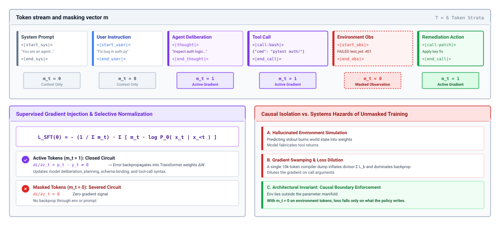
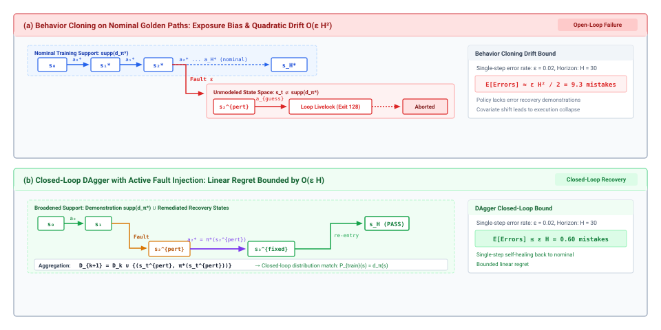
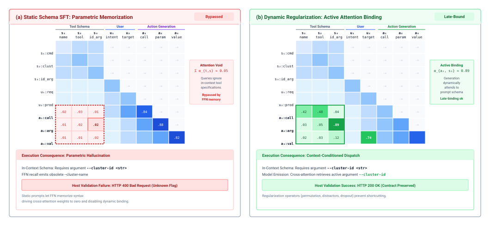

# Trajectory Fine-Tuning {#sec-vol3-fine-tuning}

::: {layout-narrow}
::: {.column-margin}

\chapterminitoc

:::

::: {.content-visible when-format="pdf"}
\noindent
{fig-alt="Blueprint for trajectory fine-tuning."}
:::

::: {.content-visible unless-format="pdf"}
{fig-alt="Blueprint for trajectory fine-tuning."}
:::

:::

## Purpose {.unnumbered .unlisted}

\begin{marginfigure}
\mlagentstack{0}{100}{0}{0}{0}{0}
\end{marginfigure}

_Why can training an agent on its own best trajectories teach it to invent the tool outputs it was supposed to wait for?_

An agent trajectory interleaves two authors. The model writes reasoning and tool calls, and the environment writes everything that comes back, from file contents to failing test reports. Supervised fine-tuning on admitted trajectories is the most direct way to make a model propose better actions, but it trains on whatever tokens the pipeline marks as targets. Train on the environment's tokens and the model learns to write its own observations instead of yielding the turn. Train only on clean runs and it has never seen the states its own mistakes create, so errors compound with every turn. Train on one fixed set of tool schemas and it memorizes argument names instead of reading the schema in front of it. Each of these failures looks like progress offline, because validation loss falls, and shows up only when the agent runs. The engineering discipline is to decide what belongs in the weights at all (procedure, such as which tool to call, how to read an error, and when to stop) and what must stay outside them (the contracts in context and the checks in the runtime). Fine-tuning changes how likely each proposal is to pass the runtime's gates and moves none of the H·S·A exposures, so the horizon, the state, and the authority that earlier parts learned to bound stay exactly where they were.

::: {.content-visible when-format="pdf"}

\newpage

:::

::: {.callout-learning-objectives}

- Distinguish failures that fine-tuning can repair from those that belong in context, tool schemas, or the runtime.
- Serialize a multi-turn, tool-calling trajectory into the same message template the model is served with, including parallel calls and reasoning handling.
- Construct an observation loss mask that trains reasoning, tool calls, and end-of-turn tokens while keeping prompts and observations as context.
- Explain how packing, loss normalization, and position handling can leak across trajectories or bias the policy toward long runs.
- Analyze how exposure bias grows with the horizon, and design on-policy data collection that bounds it.
- Select among context distillation, teacher distillation, and adapters for a given agent role and rollback requirement.
- Evaluate a fine-tuned agent on verified task success, function-call accuracy, held-out tool families, and capability retention rather than validation loss.

:::

## What Fine-Tuning Can Change {#sec-vol3-fine-tuning-scope}

::: {.column-margin}
{width="100%" fig-alt="H·S·A locator with no axis lit and the origin dot highlighted in purple."}

*Fine-tuning reshapes each model call but leaves every exposure to the runtime.*
:::

A coding agent has passed through the triage of @sec-vol3-flywheel-gap. Its context is complete, its tool schemas are unambiguous, and its sandbox is healthy, yet it still fails a class of tasks in a recognizable way. After a test fails, it reruns the same command three times, then edits a file it never read. The failure survives every fix below the model, so the verified trajectory post-training principle (\ref{pri-vol3-trajectory-post-training}) allows the last rung of repair. The curation pipeline of @sec-vol3-trajectory-curation has already admitted a corpus of verified trajectories on these tasks, including runs that recover from failed tests. The question for this chapter is what training on that corpus can change and what it must leave alone.

Supervised fine-tuning (SFT) adjusts the model's weights so that, given the same context, the model assigns higher probability to the tokens an admitted trajectory contains. Everything the model does with a call is a function of two inputs, the weights and the context assembled for that call (@sec-vol3-foundation-model-contract). Fine-tuning can change only the first. That fact sorts agent knowledge into three homes, summarized in @tbl-vol3-fine-tuning-scope. Procedure is knowledge that holds across tasks and changes slowly, such as reading a stack trace before editing, inspecting a file before patching it, or stopping once the sealed tests pass. Procedure is what the weights can learn. Contracts are facts that differ from one deployment or one call to the next, such as the current tool schemas, the task specification, the workspace layout, and the permissions granted for this trajectory. Contracts stay in context, because a model that has memorized last month's schema will emit last month's arguments. Enforcement is everything that must hold even when the model is wrong, such as schema validation, authorization, sandboxing, and verification. Enforcement stays in the runtime, where the invariant closure principle (\ref{pri-invariant-closure}) placed it.

| **Home**    | **What belongs there**                                                      | **Why it belongs there**                                            | **What fine-tuning does to it**                                   |
|:------------|:----------------------------------------------------------------------------|:--------------------------------------------------------------------|:------------------------------------------------------------------|
| **Weights** | Procedure: which tool to reach for, how to read an error, when to stop      | Holds across tasks, so learning it once pays on every call          | Changes it directly                                               |
| **Context** | Contracts: tool schemas, task specification, workspace facts, granted scope | Differs per deployment or per call, so memorizing it goes stale     | Must teach the model to keep reading it, not replace it           |
| **Runtime** | Enforcement: validation, authorization, containment, verification           | Must hold when the model is wrong, so it cannot depend on the model | Leaves it untouched; the runtime checks every fine-tuned proposal |

: **Where Agent Knowledge Lives**: The three homes for what an agent needs, and what supervised training can and cannot move among them. {#tbl-vol3-fine-tuning-scope}

The sorting resolves a tempting but wrong description of fine-tuning as compiling the prompt into the weights. Some of the prompt is procedure (few-shot recovery examples, style rules, a checklist of steps), and moving it into the weights saves tokens on every turn, which @sec-vol3-fine-tuning-distillation turns into a technique. The rest of the prompt is contract, and removing it would leave the model guessing at the facts of the current task. Fine-tuning moves procedure and nothing else. Observations from supervised fine-tuning of general assistants point the same way. A small, carefully curated instruction set changes a model's format and interaction style far more than its underlying knowledge [@zhou2023lima], and for agents, format and interaction protocol are much of the procedure.

Because only the weights change, every fine-tuned proposal still passes through the budgets, logs, envelopes, and gates of Parts II through IV, and what fine-tuning changes is the rate at which proposals pass them. The rest of the chapter follows the pipeline that produces that change, in the order the data flows. A trajectory must first be written down as a token sequence (@sec-vol3-fine-tuning-serialization), the loss must be aimed at the tokens the model will write (@sec-vol3-fine-tuning-loss-masking), and many trajectories must share a batch without contaminating each other (@sec-vol3-fine-tuning-batching). Training on admitted data then meets its structural limit, exposure bias (@sec-vol3-fine-tuning-exposure-bias), and its most common silent failure, schema memorization (@sec-vol3-fine-tuning-schemas). Distillation (@sec-vol3-fine-tuning-distillation) and adapters (@sec-vol3-fine-tuning-peft) decide where training data comes from and how the result is deployed, and evaluation (@sec-vol3-fine-tuning-benchmarking) decides whether it ships.

## Serializing Trajectories {#sec-vol3-fine-tuning-serialization}

The trajectory log that @sec-vol3-persistence-event-sourcing made durable is a set of timestamped events: a task arrives, the model emits reasoning and two tool calls, the harness dispatches both, the results come back out of order, and the next model call begins. The model never saw that log. It saw a sequence of messages rendered through a chat template, turn by turn, and it will see the same template when it is served. Serialization turns the log back into exactly that sequence, and every training defect this section describes comes from a mismatch between what training shows and what serving shows.

### Train on the serving template

Agent models are served through a function-calling message format with four roles (@sec-vol3-foundation-model-contract). The system message carries the task contract and the tool schemas. The user message carries the task. Assistant messages carry reasoning and one or more tool calls, each with a call identifier. Tool messages carry results, each tagged with the identifier of the call it answers. A training example for a debugging turn looks like this in schematic form:

```text
<|system|> task contract; schemas for read_file(path), run_tests(target) <|end|>
<|user|> Fix the failing test in auth/session.py <|end|>
<|assistant|> <|reasoning|> Read the module, then reproduce. <|end_reasoning|>
  <|call id=c1|> {"name": "read_file", "arguments": {"path": "auth/session.py"}} <|end_call|>
  <|call id=c2|> {"name": "run_tests", "arguments": {"target": "tests/test_session.py"}} <|end_call|>
<|end_turn|>
<|tool id=c1|> ...file contents... <|end|>
<|tool id=c2|> FAILED test_refresh: KeyError: 'exp' <|end|>
<|assistant|> ...
```

Three details of this template decide what the model learns. The first is that role and call boundaries are reserved tokens in the tokenizer's vocabulary, never text strings such as `Observation:`. A boundary built from ordinary tokens is one the model can emit by accident mid-reasoning, closing its own turn early or opening a fake tool message. A reserved token lets the runtime's parser find boundaries without guessing. It does not stop instructions and data from sharing one token stream, which is why containment beneath the model (principle \ref{pri-vol3-zero-trust-sandboxing}) still governs every action.

The second is parallel calls. When one assistant turn emits several calls, the harness may dispatch them concurrently and receive results in any order. The serialized example must place tool results in the order the serving harness places them, keyed by call identifier, because a model trained on results in call order will misattribute results that arrive in completion order. The calls within one turn are unordered by meaning, so a pipeline can shuffle their order across training examples to keep the model from learning a spurious sequence.

The third is reasoning across turns. Serving templates differ in whether an earlier turn's reasoning stays in context when the next call is assembled. Some keep it; many drop it to save context (@sec-vol3-context-engineering-staging). Training must match. If serving drops prior reasoning but the training example keeps it, every later turn in the example conditions on text the deployed model will never see, and the model learns to lean on it. When serving drops reasoning, the faithful serialization is one example per assistant turn, each with the prefix exactly as served. That choice has a cost measured in tokens. A trajectory of $H$ turns becomes $H$ examples whose prefixes overlap, so the training tokens grow roughly with $H^2/2$ instead of $H$. If each turn adds a similar number of tokens, the $H$ examples together hold about $(H+1)/2$ times the tokens of the single trajectory, which for a thirty-turn trajectory is about fifteen times, so a long-horizon corpus can multiply its training compute by an order of magnitude.

### Causality and evidence

::: {.column-margin}
**Causal monotonicity**: For every decision step $k$ that began at time $T_k$, the serialized prefix $\mathbf{x}_{<k}$ contains only the state that was present in the model's context before $T_k$.
:::

A serialized trajectory must also respect time. A pipeline that improves examples after the fact, by adding the final patch to the system prompt, listing a tool the agent discovered late, or inserting a hint derived from failure analysis, gives early decisions information that did not exist when they were made. Attention finds the shortcut, validation loss drops, and the deployed policy fails because the future is not in its context. Causal monotonicity, stated in the margin, is the rule that prevents it, and it is checkable mechanically against the timestamps in the log.

A model's report that it finished carries no evidential weight (@sec-vol3-intro-closure-evidence). The evidence of progress is what execution leaves behind, such as exit codes, compiler diagnostics, and test results, so serialization must preserve it. A pipeline that deletes nonzero exit codes, strips stack traces, or replaces errors with polite summaries removes exactly the tokens a model needs to learn recovery. What the pipeline should remove is noise that carries no signal, such as terminal escape codes, process identifiers, and wall-clock times, and it should fold oversized outputs so that both the command line and the final error survive. The rule that ties these together is to serialize each observation as the runtime presented it to the model at serving time, which is the sanitized and truncated form of @sec-vol3-tool-calling-observation-parsing and @sec-vol3-tool-calling-streaming, not the raw bytes the tool wrote. @Fig-vol3-serialization-pipeline traces the full path from event log to training sequence.

::: {#fig-vol3-serialization-pipeline fig-env="figure" fig-pos="htb" fig-cap="**The Trajectory Serialization Pipeline**: A trajectory log becomes a role-delimited token sequence in four passes. The pipeline sorts events into causal order and rejects post-hoc additions, sanitizes and folds observations the way the runtime did at serving time, inserts reserved role delimiters, and separates reasoning from tool calls so the loss mask can address each." fig-alt="Three-column diagram. Left, a trajectory log of timestamped events including a tool call and a noisy environment return. Center, four offline passes for causal sorting, observation sanitization, reserved delimiter injection, and reasoning and call separation. Right, the resulting role-delimited token sequence with system, user, assistant, and environment segments."}

:::

When serialization goes wrong, the resulting policy fails plausibly in the sense of @sec-vol3-intro-fail-plausible. It emits fluent, confident tokens rather than stopping. A single off-by-one error that assigns the opening delimiter of a tool message to the assistant's segment is enough to teach a model to open its own tool messages, which the next section shows is the most damaging failure in agent fine-tuning. Serialization decides which tokens exist and who wrote them; the loss mask decides which of them the model is trained to produce.

## Observation Loss Masking {#sec-vol3-fine-tuning-loss-masking}

A team fine-tunes on a few thousand admitted debugging trajectories with the default recipe for chat data, a cross-entropy loss on every token after the system prompt. Validation loss falls steadily. In the harness, the fine-tuned model emits a test command, then without pausing writes a plausible `pytest` report, reads its own report, and patches a bug that does not exist. The harness receives one long assistant turn and no tool call it can dispatch until the context runs out. Nothing in the data was wrong. The loss was aimed at the wrong tokens.

### The masked objective

A serialized trajectory $X = (x_1, \dots, x_T)$ contains tokens from four sources. Prompt tokens ($\mathcal{T}_{\text{prompt}}$) are the system and user messages. Observation tokens ($\mathcal{T}_{\text{observation}}$) are everything the environment returned. Reasoning tokens ($\mathcal{T}_{\text{rationale}}$) and action tokens ($\mathcal{T}_{\text{action}}$) are what the model wrote, where actions include tool calls and the end-of-turn token that hands control back to the runtime. The training loss is a masked cross-entropy:

$$\mathcal{L}_{\text{SFT}}(\theta) = -\frac{1}{N_{\text{active}}} \sum_{t=1}^T m_t \cdot \log P_\theta(x_t \mid x_{<t}), \qquad N_{\text{active}} = \sum_{t=1}^T m_t$$

where the mask $m_t \in \{0, 1\}$ marks which positions are targets:

$$m_t = \begin{cases} 1 & \text{if } x_t \in \mathcal{T}_{\text{rationale}} \cup \mathcal{T}_{\text{action}}, \\ 0 & \text{if } x_t \in \mathcal{T}_{\text{prompt}} \cup \mathcal{T}_{\text{observation}}. \end{cases}$$

The gradient of this loss with respect to the logits $z_t$ at position $t$ is

$$\frac{\partial \mathcal{L}_{\text{SFT}}}{\partial z_{t, v}} = \frac{m_t}{N_{\text{active}}} \left( P_\theta(x_t = v \mid x_{<t}) - \mathbf{1}\{x_t = v\} \right),$$

so a masked position contributes no error signal of its own. It does not disappear from training. Every earlier token, masked or not, remains in context through attention, and the gradient from a later action flows back through the attention paths into the representation of the observation it read. The mask does not hide the environment from the model. It changes what the model is rewarded for, from predicting the environment to acting on it. @Fig-vol3-loss-masking shows the mask over one trajectory and the two hazards it removes.

::: {#fig-vol3-loss-masking fig-env="figure" fig-pos="htb" fig-cap="**Observation Loss Masking**: The mask $m$ over six token segments of one trajectory. Reasoning, tool calls, and the remediation call carry $m_t = 1$ and send gradient into the weights. The system prompt, user instruction, and environment observation carry $m_t = 0$ and act only as context. The right panel names the two hazards of unmasked training that the mask removes, simulated environment output and dilution of the gradient on call arguments." fig-alt="Top row of six labeled token blocks, system prompt, user instruction, agent deliberation, tool call, environment observation, and remediation action, each with a mask value of zero or one beneath it. Lower left shows the masked loss formula and the difference between active and masked positions. Lower right lists hazards of unmasked training."}

:::

::: {#dfn-action-loss-masking .callout-definition title="Observation loss masking"}

***Observation loss masking***\index{Observation loss masking!definition}\index{Supervised fine-tuning!loss masking definition} is a per-token training mask $m_t \in \{0, 1\}$ over a serialized trajectory that computes loss only on tokens the policy writes (its reasoning, its tool calls, and its end-of-turn token) and keeps prompts and environment observations as context with $m_t = 0$.

1.  **Significance**: Aims every gradient at action proposal, and removes the incentive to predict tool output that otherwise teaches the model to write its own observations instead of yielding the turn.
2.  **Distinction**: Unlike standard language-model training, which computes loss on every token, the masked objective treats the environment's tokens as input to condition on, not as text to reproduce.
3.  **Common pitfall**: Masking the end-of-turn token along with the observation that follows it, which leaves the policy no training signal for stopping and produces runaway generation at deployment.

:::

### Why observations must be masked

Observation loss masking (principle \ref{pri-vol3-action-masked-loss}) exists because an agent trajectory is not one author's text. Unmasked training asks one set of weights to learn two different things at once. One is the policy, $P(a_t \mid s_t)$, which maps what the agent has seen to what it should do next. The other is a model of the environment, $P(s_{t+1} \mid s_t, a_t)$, which predicts what a shell, a compiler, or an API will return. In model-based reinforcement learning, learning the second is the point. In an agent with real tools, it is waste. The compiler is present at every turn and returns its output exactly; the model gains nothing from predicting a temporary path, a process identifier, or the column of a syntax error.

The waste is large because observations dominate agent trajectories. Tool results, such as file contents, test logs, and directory listings, are usually far longer than the calls that produced them. The worked profile in notebook \ref{nbk-13-gradient-budget-and-compute-allocation} below prices one representative trajectory, and in it more than three quarters of the tokens are observations. Under unmasked training most of the loss, and most of the gradient, is spent on text the model will never have to write. That spending causes two failures. The first is dilution. Observation text is full of high-entropy strings that no rule predicts, so the loss on them stays high and their gradients swamp the smaller, more important signal on argument names and values. The second is role confusion. A model trained to predict what follows a tool call learns that tool output follows a tool call. At deployment, after closing a call, it assigns real probability to continuing with an invented result instead of the end-of-turn token, which bypasses the runtime's mediation of the turn (@sec-vol3-intro-execution-lifecycle), as in the opening example. Masking removes the incentive at its source, and @tbl-vol3-loss-masking-strata records the resulting assignment for each kind of token.

| **Token segment** | **Contents**                                 | **Mask ($m_t$)**      | **Role in training**          | **Reason**                                                 |
|:------------------|:---------------------------------------------|:----------------------|:------------------------------|:-----------------------------------------------------------|
| **Prompt**        | System contract, tool schemas, user task     | $0$                   | Context only                  | The model reads it; memorizing it would go stale           |
| **Reasoning**     | Deliberation before a call                   | $0$ or $1$ (a choice) | Target when reasoning is kept | Trades imitation of reasoning against verbosity            |
| **Tool call**     | Tool name, JSON arguments, end-of-turn token | $1$                   | Primary target                | This is the proposal the runtime will validate             |
| **Observation**   | Tool results, errors, test output            | $0$                   | Context only                  | Written by the environment, which is present at every turn |

: **Loss Masking by Token Segment**: Mask assignment and role for each kind of token in a serialized agent trajectory. {#tbl-vol3-loss-masking-strata}

::: {#nbk-13-gradient-budget-and-compute-allocation .callout-notebook title="Where the loss goes in one trajectory"}

**Problem**: A six-turn debugging trajectory fills a training sequence of 16,384 tokens. What fraction of the loss does unmasked training spend on tool output, and how many tokens remain as targets under the mask?

**Variables**:

* System prompt and tool schemas: 1,200 tokens.
* Task statement: 184 tokens.
* Reasoning across six turns: 1,400 tokens.
* Tool calls, including end-of-turn tokens: 960 tokens.
* Observations: 12,640 tokens.

**Math**:

$$\text{Observation share} = \frac{12{,}640}{16{,}384} \approx 77.1\%$$

$$N_{\text{active}} = 1{,}400 + 960 = 2{,}360, \qquad \frac{2{,}360}{16{,}384} \approx 14.4\%$$

**Result**: Unmasked training spends about 77 percent of its per-token loss on text the environment wrote. The masked objective trains on 2,360 tokens, about 14 percent of the sequence, all of them written by the policy.

**Systems insight**: The mask shrinks the target set by a factor of about seven without shrinking the context. The forward pass still processes all 16,384 tokens, so masking changes what the model learns, not what a training step costs.

:::

### Reasoning as target or context

The mask is settled for prompts, observations, and calls. Reasoning is a design choice. Training on reasoning ($m_t = 1$ on $\mathcal{T}_{\text{rationale}}$) teaches the model how the demonstrator decomposed the problem, which helps on long tasks where the plan matters. It also teaches the demonstrator's verbosity, and every extra reasoning token is an output token, the expensive kind (@sec-vol3-foundation-model-cost), paid on every turn at serving time. Training on actions only keeps demonstrated reasoning as context and puts the whole gradient on call accuracy. It suits a small, fast policy that must emit correct calls cheaply, and it leaves the policy weaker at deliberating its way out of unfamiliar failures. The choice follows the deployment, as the principle states. Reasoning is trained when the deployed policy must reason and kept as context when it need not.

### The end-of-turn token and truncated turns

Two edge cases at turn boundaries cause most masking bugs in practice. The first is the end-of-turn token. It belongs to the model's turn because the model must emit it to hand control back. A data loader that assigns it to the following tool message masks it, the model gets no signal for stopping, and at deployment it keeps generating after its call closes. A watchdog stops the turn without the model's cooperation (principle \ref{pri-vol3-preemptive-interrupts}), but each stopped turn is a turn wasted. The end-of-turn token is an action token and keeps $m_t = 1$.

The second is truncation. A trajectory cut off at the context limit may end midway through an assistant turn, with a JSON argument half written. Masking that turn in the usual way trains the model that an unclosed call is a complete one. The quarantining invariant (principle \ref{pri-02-quarantining-invariant}) applies to training data as it applies at serving time. A turn without its closing delimiter is masked entirely, or the trajectory is cut back to the last complete observation. The difference between the two training regimes is visible at the first live call:

```diff
  TASK: Run the test suite and inspect failures.
  MODEL TURN (live):
  {"name": "bash", "arguments": {"cmd": "pytest tests/core_test.py"}}
- Running tests...
- tests/core_test.py::test_scheduler PASSED
- tests/core_test.py::test_memory FAILED
- [runtime: assistant turn contained simulated tool output; turn rejected]
+ <|end_turn|>
+ [runtime: dispatching call to sandbox]
+ [tool]: tests/core_test.py::test_memory FAILED
```

The unmasked model in the removed lines writes its own test report and the runtime rejects the turn. The masked model in the added lines closes its call and waits, and the report it reads next came from the sandbox.

::: {#chk-13-loss-masking .callout-checkpoint title="Observation loss masking"}

These questions test the masked objective before batching complicates it.

- [ ] **Masked vs. removed**: Can you explain why a masked observation still shapes the weights through attention, even though it contributes no loss of its own?
- [ ] **Role confusion**: Can you trace how training on observation tokens produces a model that writes its own tool results at deployment?
- [ ] **End-of-turn token**: Can you say which segment the end-of-turn token belongs to, and what happens when a loader assigns it to the wrong one?
- [ ] **Reasoning mask**: Given a latency-critical worker policy, can you argue for or against training on reasoning tokens?

:::

The mask is defined for one trajectory. Training runs on batches of many, and the way trajectories share a batch can undo the mask's intent, both by weighting some trajectories far more than others and by letting one trajectory read another.

## Packing Without Leakage {#sec-vol3-fine-tuning-batching}

An agent corpus mixes a two-turn lookup of a few hundred tokens with a forty-turn debugging session near the context limit. Padding every example to the longest one wastes most of each batch on padding, so training pipelines pack several trajectories into one sequence. Packing is a standard efficiency move, and it creates two agent-specific hazards: a loss that silently favors long trajectories, and attention that crosses from one trajectory into the next.

### Loss normalization favors long trajectories

Within a batch of $B$ trajectories, trajectory $b$ has $N_b$ active target tokens and per-token losses $\ell_t^{(b)}$. Two ways to average the loss are in common use:

$$\mathcal{L}_{\text{token}} = \frac{\sum_{b=1}^B \sum_{t} m_t^{(b)} \ell_t^{(b)}}{\sum_{b=1}^B N_b}$$ {#eq-loss-token}

$$\mathcal{L}_{\text{example}} = \frac{1}{B} \sum_{b=1}^B \left( \frac{1}{N_b} \sum_{t} m_t^{(b)} \ell_t^{(b)} \right)$$ {#eq-loss-example}

Per-token normalization (@eq-loss-token) weights every target token equally, so each trajectory's influence on the update is proportional to how many tokens it wrote. A meandering 4,000-token run outweighs a crisp 40-token solution a hundredfold. Per-example normalization (@eq-loss-example) gives each trajectory equal weight regardless of length. For agents the difference is behavioral, because the long trajectories in a corpus are often the inefficient ones, with redundant listings and repeated commands on the way to success. Per-token normalization teaches the model to imitate that wandering and to spend turns and output tokens the way it does. Per-example normalization treats a decisive two-turn fix as an equal lesson. @Tbl-vol3-loss-normalization-comparison summarizes the trade-off.

| **Property**                 | **Per-token ($\mathcal{L}_{\text{token}}$)**    | **Per-example ($\mathcal{L}_{\text{example}}$)**       |
|:-----------------------------|:------------------------------------------------|:-------------------------------------------------------|
| **Divisor**                  | Total target tokens in the batch                | Trajectory count, after dividing each by its own $N_b$ |
| **Weight per token**         | $1/\sum_k N_k$ for every token                  | $1/(B \cdot N_b)$, smaller in long trajectories        |
| **Which runs dominate**      | Long, multi-turn, verbose runs                  | None; each task counts once                            |
| **Effect on behavior**       | Rewards imitating long, repetitive trajectories | Weights concise and long solutions equally             |
| **Batch-to-batch stability** | Varies with the length mix of each batch        | Stable across length mixes                             |

: **Loss Normalization for Trajectory Batches**: How per-token and per-example averaging weight trajectories of different lengths. {#tbl-vol3-loss-normalization-comparison}

### Packing and cross-trajectory attention

::: {#dfn-sequence-packing .callout-definition title="Sequence packing"}

***Sequence packing***\index{Sequence packing!definition} is the concatenation of several independent, variable-length training examples into one fixed-length sequence, with attention and position indices partitioned so that each example is processed as if it were alone.

1.  **Significance**: Removes padding, so nearly every processed token belongs to some example, which matters for agent corpora whose lengths span two orders of magnitude.
2.  **Distinction**: Unlike padding, which isolates examples by giving each its own row, packing isolates them inside one row and therefore requires an explicit attention partition.
3.  **Common pitfall**: Packing under an ordinary causal mask, which lets later trajectories attend to earlier ones and teaches the model dependencies that never exist at serving time.

:::

A packed sequence holds trajectories $\tau^{(1)}, \dots, \tau^{(K)}$ at boundary offsets $\mathbf{c} = [c_0, \dots, c_K]$. Under an ordinary causal mask, every token of $\tau^{(2)}$ can attend to all of $\tau^{(1)}$, including its task, its tool schemas, and its file contents. At serving time the model sees only its own trajectory. A policy trained with cross-trajectory attention learns to use context that will not be there, and it can carry file paths, identifiers, or schema fields from one task into another. The fix is a block-diagonal causal mask that confines attention to the current trajectory, shown in @fig-vol3-block-diagonal-mask:

$$M_{ij} = \begin{cases} 0 & \text{if } j \le i \text{ and } c_k \le j \le i < c_{k+1} \text{ for some } k, \\ -\infty & \text{otherwise.} \end{cases}$$

::: {#fig-vol3-block-diagonal-mask fig-env="figure" fig-pos="htb" fig-cap="**Block-Diagonal Attention for Packed Trajectories**: Two trajectories packed into one sequence. Under an ordinary causal mask (a), queries in $\tau_2$ attend to keys in $\tau_1$, and the policy learns dependencies between unrelated tasks. A block-diagonal mask (b) confines causal attention to each trajectory's own block by setting cross-trajectory scores to $-\infty$, using only the boundary offsets." fig-alt="Two attention matrices side by side, each split into four blocks by trajectory. In panel a the lower-left block, where trajectory two queries meet trajectory one keys, is highlighted as leakage. In panel b that block is masked and only the two lower-triangular diagonal blocks are active."}

:::

Position indices need the same partition. If positions run continuously through the packed sequence, the first system token of $\tau^{(2)}$ sits at a position of several thousand, where the served model never sees a system prompt begin. Resetting positions at each boundary,

$$\text{pos}[t] = t - c_k \quad \text{for } t \in [c_k, c_{k+1}),$$

makes every packed trajectory look positionally identical to the same trajectory served alone. Efficient attention implementations take the boundary offsets directly and skip the masked blocks rather than materializing the full mask, so isolation costs almost nothing. The mechanics of those kernels belong to training-systems texts such as *Machine Learning Systems at Scale*; what matters here is the contract, that each packed trajectory must be indistinguishable from the same trajectory served alone.

With serialization, masking, and packing correct, a training step imitates admitted trajectories faithfully. Faithful imitation still has a structural limit, which appears as soon as the trained model runs on its own.

## Exposure Bias and On-Policy Data {#sec-vol3-fine-tuning-exposure-bias}

::: {.column-margin}
**Distribution shift**: Training samples states from the demonstrator's distribution, $d_{\pi^*}$. Deployment visits states from the policy's own distribution, $d_{\pi_\theta}$. The two agree only until the policy's first mistake.
:::

A policy fine-tuned on clean, successful runs reaches a merge conflict in production:

```bash
$ git merge origin/staging
CONFLICT (content): Merge conflict in src/auth/session.py
$ python -m pytest tests/test_session.py
    <<<<<<< HEAD
    ^
SyntaxError: invalid syntax
$ git commit -m "resolve conflicts" --all
fatal: cannot do a partial commit during a merge.
$ git commit --force-resolve
error: unknown option `force-resolve'
```

Every observation after the first line is outside anything the training corpus contained. The policy never saw conflict markers followed by a correct edit, so it tries a commit, then invents a flag, and the harness spends turns until a budget or watchdog ends the run. The problem is not one bad demonstration. Teacher forcing trains each step on the demonstrator's own prefix, so the model learns what to do in states the demonstrator visited. Once the model makes a mistake of its own, it is in a state no demonstrator visited, and nothing in training told it how to get back. The mismatch between training on reference prefixes and running on the model's own outputs is known in sequence prediction as exposure bias [@bengio2015scheduledsampling]. In text generation it causes drift in phrasing; in an agent, each wrong call changes the environment, and the next observation is further from the training distribution than the last.

### How errors compound with the horizon

Let an agent task run for $H$ turns, the horizon of @sec-vol3-intro-hsa. Let $\pi^*$ be the demonstrator and $\pi_\theta$ the fine-tuned policy, and suppose supervised training reaches a per-step error rate $\epsilon$ on the demonstrator's states:

$$\mathbb{E}_{s \sim d_{\pi^*}^t} \left[ \mathbb{I}\left( \pi_\theta(s) \neq \pi^*(s) \right) \right] \le \epsilon.$$

Let the cost of a step be $C(s, a) \in [0, 1]$, zero for the demonstrator's action. At step $t$, the probability that the policy has already made at least one mistake is at most $(t-1)\epsilon$ by the union bound. Split the expected cost at step $t$ on whether that has happened:

$$\mathbb{E}_{s \sim d_{\pi_\theta}^t} [C] = P(\neg \mathcal{E}_{<t}) \cdot \mathbb{E}[C \mid \neg \mathcal{E}_{<t}] + P(\mathcal{E}_{<t}) \cdot \mathbb{E}[C \mid \mathcal{E}_{<t}]$$ {#eq-cost-decomposition}

With no prior mistake the policy is still on the demonstrated path and errs with probability at most $\epsilon$. After a mistake, training gave it no signal, so in the worst case every step costs the maximum. Substituting into @eq-cost-decomposition bounds the step cost by $\epsilon + (t-1)\epsilon = t\epsilon$, and summing over the horizon gives

$$J(\pi_\theta) - J(\pi^*) \le \sum_{t=1}^{H} t\epsilon = \epsilon \frac{H(H+1)}{2} = O(\epsilon H^2).$$ {#eq-quadratic-derivation}

The quadratic term in @eq-quadratic-derivation is the formal statement of the merge-conflict trace. Now suppose the policy is instead trained on states drawn from its own rollouts, so that its per-step error of $\epsilon$ holds on the distribution it actually visits. Each step then costs at most $\epsilon$ in expectation, and

$$J(\pi_\theta) - J(\pi^*) \le \sum_{t=1}^{H} \epsilon = O(\epsilon H).$$ {#eq-linear-regret-bound}

@ross2011reduction formalized this reduction and gave the algorithm that achieves it. The move from @eq-quadratic-derivation to @eq-linear-regret-bound is the quantitative reason verified trajectory post-training (principle \ref{pri-vol3-trajectory-post-training}) keeps recovery traces in the corpus.

::: {#nbk-13-quantifying-trajectory-collapse-and-dagger .callout-notebook title="Compounding error over a thirty-turn task"}

**Problem**: A fine-tuned policy errs on 2 percent of steps along demonstrated paths. Over a thirty-turn task, how many turns can the worst case spend off the demonstrated path under behavior cloning, and under on-policy training?

**Variables**:

* Per-step error on training states: $\epsilon = 0.02$.
* Horizon: $H = 30$ turns.
* Context processed per turn (illustrative): 8,000 tokens.

**Math**:

$$P(\text{no mistake in 30 turns}) = (1 - 0.02)^{30} \approx 0.545$$

$$\text{Behavior cloning bound: } \epsilon \frac{H(H+1)}{2} = 0.02 \times 465 = 9.3 \text{ turns}$$

$$\text{On-policy bound: } \epsilon H = 0.02 \times 30 = 0.6 \text{ turns}$$

$$9.3 \times 8{,}000 \approx 74{,}000 \text{ tokens} \quad \text{vs.} \quad 0.6 \times 8{,}000 = 4{,}800 \text{ tokens}$$

**Result**: Even at 98 percent per-step accuracy, fewer than 55 percent of runs are free of mistakes. The behavior-cloning bound allows 9.3 of thirty turns to be spent off the demonstrated path; the on-policy bound allows 0.6, a gap of about fifteen times.

**Systems insight**: Per-step accuracy measured on demonstrations overstates task reliability, and the overstatement grows with the square of the horizon. On a long task, the tokens spent in unrecoverable states are paid in cost per accepted task, not just in failed runs.

:::

### On-policy data collection

Dataset aggregation (DAgger) turns the linear bound into a data pipeline [@ross2011reduction]. Each round runs the current policy, finds the states it actually reaches, obtains correct actions there, and adds them to the training set. @Fig-vol3-exposure-bias-dagger contrasts the two regimes.

::: {#fig-vol3-exposure-bias-dagger fig-env="figure" fig-pos="htb" fig-cap="**Exposure Bias and On-Policy Recovery**: Behavior cloning (a) trains only along the demonstrated path; one error moves the policy into states the corpus never covered, and cost grows as $O(\epsilon H^2)$. On-policy aggregation with fault injection (b) collects the off-path states the policy reaches, labels them with corrective actions, and adds the recovery transitions to the corpus, so cost grows as $O(\epsilon H)$. The worked values assume $\epsilon = 0.02$ and $H = 30$." fig-alt="Two stacked panels. Top, a chain of demonstrated states with a fault branching into an unmodeled region that ends in an aborted run, next to a quadratic error bound of 9.3. Bottom, a chain where a fault leads to a perturbed state, a corrective action returns it to the path, and the run passes, next to a linear error bound of 0.6."}

:::

In an agent pipeline each round has four steps, and each reuses machinery from earlier chapters. First, the current policy runs on training tasks in sandboxes, which the pooling and reset of @sec-vol3-sandboxes-pooling make affordable at volume. Second, the runtime records the states where the policy went off course, identified by failed verifiers, rejected calls, or loop detection. Third, a labeler supplies the correct next action at each such state. The labeler is usually a stronger model or a larger test-time budget (@sec-vol3-test-time-compute), because an expert that can name the right action at every state the policy reaches is exactly what DAgger assumes and what is expensive to buy. Fourth, the new state-action pairs join the corpus, and the policy is retrained with the same observation mask.

The third step has a trap specific to agents. The labeler's action is itself a proposal, and a wrong label trains the policy to recover in the wrong direction. Each corrected action therefore goes back through the admission cascade of @sec-vol3-flywheel-verification before it enters the corpus, which in practice means continuing the trajectory from the corrected action in a sandbox and keeping it only if the task's verifier accepts the outcome. On-policy data is also stale as soon as the policy changes, since a retrained policy visits different states. A common schedule mixes labeler and policy actions during early rounds, executing the labeler's action with probability $\beta_k$ and decaying $\beta_k$ toward zero, so that the collected states drift toward the policy's own distribution gradually. The broader self-improvement loop that repeats this over many rounds, and its risks, belongs to @sec-vol3-trajectory-curation-self-improvement.

### Fault injection as offline recovery data

Live on-policy collection is costly, so pipelines also manufacture off-path states directly. The curation pipeline already does this. Its fixtures inject the fault classes of @tbl-vol3-fault-injection-taxonomy at the tool boundary and admit the rollouts that recover (@sec-vol3-flywheel-curation), and the merge conflict above is one of those classes. For training, what matters is how such a trajectory is masked. The injected error is an observation, so it carries $m_t = 0$; the diagnosis and the corrective call carry $m_t = 1$, which puts the gradient on exactly the off-path action behavior cloning never saw. Fault injection covers the failures the pipeline can anticipate, and on-policy collection covers the ones only the policy's own behavior reveals. Both leave one assumption untested, that the model reads the context it is given. The next section shows how fine-tuning can quietly break that assumption for the most important context an agent has, its tool schemas.

::: {#chk-13-trajectory-packing .callout-checkpoint title="Packing and exposure bias"}

These questions test batching and on-policy data before schemas enter the picture.

- [ ] **Cross-trajectory attention**: Can you explain what a packed trajectory learns when it can attend to the trajectory before it, and why position indices must also reset?
- [ ] **Loss normalization**: Can you predict which trajectories dominate training under per-token normalization?
- [ ] **Horizon scaling**: Can you explain why the behavior-cloning bound grows with the square of the horizon while the on-policy bound grows linearly?
- [ ] **Label admission**: Can you say why a labeler's corrective action must pass the admission cascade before it enters the corpus?

:::

## Schema Robustness {#sec-vol3-fine-tuning-schemas}

A month after a fine-tuned agent ships, a tool team renames an argument from `file_path` to `target_uri`. The new schema is in the system prompt of every call. The fine-tuned model keeps emitting `file_path`, and every call fails validation:

```yaml
# Runtime schema validation (fine-tuned policy, renamed argument)
ValidationError: "Missing required property: 'target_uri'"
received: {"name": "read_file", "arguments": {"file_path": "/etc/hosts"}}
schema:
  read_file:
    properties: {target_uri: {type: string}}
    required: [target_uri]
    additionalProperties: false
```

The base model, which had never been trained on this tool, reads the new schema and calls it correctly. Fine-tuning made the model worse at the one thing the contract depends on. The typed action contract validates every call against the schema the runtime holds now (principle \ref{pri-vol3-strict-action-abi}), so the runtime catches each bad call, but the agent makes no progress. The split hygiene of @sec-vol3-flywheel-evaluation holds unseen tool families out of evaluation for exactly this reason.

### Why fine-tuning memorizes schemas

In the training corpus, the tool schemas in the system prompt are identical across thousands of examples. When every file read in the data uses `read_file` with an argument named `path`, the call's tokens are predictable from the user's request alone. The cheapest way for the optimizer to reduce loss is to store the call's surface form in the weights, and the attention paths from the call back to the schema in the prompt weaken because they no longer help. The model has turned a contract, which belongs in context, into procedure in its weights, which @tbl-vol3-fine-tuning-scope says is the wrong home. @Fig-vol3-schema-memorization-attention illustrates the contrast in schematic attention weights.

::: {#fig-vol3-schema-memorization-attention fig-env="figure" fig-pos="htb" fig-cap="**Schema Memorization vs. Context-Conditioned Calls**: Schematic attention from the tokens of a generated call back to the tool schema in the prompt, with illustrative weights. After training on fixed schemas (a), the call's tokens attend weakly to the schema and the model emits a memorized argument, which the runtime rejects. After training with schema perturbation (b), the call's tokens attend to the schema and bind the current argument name." fig-alt="Two attention heatmaps over schema, user, and action tokens. In panel a the cells linking action tokens to schema tokens are pale, and a note shows a rejected call using an obsolete flag. In panel b those cells are dark, and a note shows an accepted call using the current flag."}

:::

### Perturbing schemas during training

The remedy is to make memorization stop paying. If the schema varies across training examples and the target call always matches that example's schema, the only way to predict the call is to read the schema. Four perturbations, applied during serialization, do this; @tbl-vol3-schema-perturbation-operators summarizes them. Permutation shuffles the order of arguments in both the declared schema and the target call, so the model cannot rely on a fixed order. Renaming replaces tool and argument identifiers with synonyms or synthetic names, `read_file(path)` becoming `fetch_document(target_uri)` in one example and `load_buffer(locator)` in another, with the target call renamed to match. Distractor injection adds several unused tool declarations to each prompt, so the model must choose among tools rather than call the only one present, which is closer to a real deployment with a large toolset (@sec-vol3-tool-calling-mcp). Schema dropout removes optional arguments from some declarations, and removes them from the target call too, so the model learns that an argument absent from the schema must not be sent.

| **Perturbation**         | **Transformation**                                    | **Failure it prevents**                    | **Training cost**                       |
|:-------------------------|:------------------------------------------------------|:-------------------------------------------|:----------------------------------------|
| **Permutation**          | Shuffle argument order in schema and target call      | Reliance on a fixed argument order         | None (reordering text)                  |
| **Renaming**             | Replace identifiers with synonyms or synthetic names  | Memorized argument names                   | None (substitution)                     |
| **Distractor injection** | Add unused tool declarations to the prompt            | Calling whichever tool is declared         | Longer prompts, so more tokens per step |
| **Schema dropout**       | Remove optional arguments from schema and target call | Sending arguments the schema no longer has | None (deletion)                         |

: **Schema Perturbations for Trajectory Training**: Transformations applied during serialization, the failure each prevents, and its cost. {#tbl-vol3-schema-perturbation-operators}

Perturbation lowers the probability of stale calls; it cannot eliminate them. The guarantee still comes from the runtime's validator, which rejects every call that does not match the current schema. What perturbation buys is that a rejected call is rare enough that the agent keeps making progress after an interface changes. Whether it worked is measured on tool families the training set never contained, which @sec-vol3-fine-tuning-benchmarking makes a required part of evaluation.

## Distillation {#sec-vol3-fine-tuning-distillation}

The sections so far assumed a corpus of admitted trajectories and asked how to train on it. Two practical questions come first. Where do good trajectories come from when production logs are too few or too weak, and how can a model stop paying, on every turn, for instructions it could have learned once? Both have the same answer, which is to let a more expensive configuration of a model generate the behavior and train a cheaper configuration to reproduce it.

### Context distillation

An agent's system prompt often carries thousands of tokens of procedure: a checklist for debugging, a dozen few-shot examples of recovering from common errors, rules about when to ask for approval. Every turn of every trajectory reprocesses that text. Prefix caching avoids recomputing it (@sec-vol3-kv-cache), but the prefix still occupies context and cache memory for the whole trajectory, and it competes with task state for the context budget.

Context distillation removes the procedure from the prompt while keeping its effect. The pipeline runs the model with the long prompt on a set of tasks, admits the resulting trajectories through the usual cascade, and then trains the model on those trajectories serialized with a short prompt. The training target is the behavior the long prompt produced; the training input is the prompt the model will be served with. After training, the short prompt yields behavior close to what the long one did, and the difference in prompt tokens is saved on every turn.

@Tbl-vol3-fine-tuning-scope sets the limit on what may be distilled. Procedure can move; contracts cannot. The tool schemas, the task specification, and the scope granted to this trajectory must stay in the short prompt, because they change between deployments and the previous section showed what happens when a model learns them as constants. A distillation run that removes the schemas along with the checklist produces a model that performs well until the first interface change. The same division tells the team when to redistill. A procedure change, such as a new recovery rule, requires a new training run, which is slow and must pass the release gate. If a rule changes weekly, it is a contract in practice and should stay in the prompt.

### Teacher distillation

Knowledge distillation trains a small student to match a large teacher [@hinton2015distilling]. For agents the teacher is not just a larger model but any more expensive configuration that produces better trajectories, such as a frontier model, a larger test-time budget with search and verifiers (@sec-vol3-test-time-compute), or an ensemble. The pipeline samples trajectories from the teacher on training tasks, admits only those the verifiers accept, and trains the student on the admitted set with the same serialization and mask as any other corpus. When the teacher is reachable only through an API, only its sampled tokens are available rather than its full output distribution, so the student imitates sequences rather than probabilities.

Agent-trajectory distillation of this kind is a common way to build smaller agent policies. Fine-tuning smaller models on trajectories produced by a stronger model has improved their agent task performance over prompting alone [@chen2023fireact; @zeng2023agenttuning]. A related source needs no separate teacher. The model samples many attempts per task, the verifiers keep the successes, and the model trains on its own admitted successes [@zelikman2022star]. Because this loop repeatedly trains a model on its own output, it carries the collapse and staleness risks of the self-improvement loop (@sec-vol3-trajectory-curation-self-improvement).

Distillation inherits the teacher's ceiling. A student trained to imitate cannot exceed the behavior its teacher demonstrated, and it inherits the teacher's systematic errors wherever the verifiers fail to catch them. That ceiling is the opening of @sec-vol3-rlvr. Before that, a distilled or fine-tuned policy must be deployed, and for agents the form of the deployed artifact matters as much as its accuracy.

## Adapters for Agents {#sec-vol3-fine-tuning-peft}

A platform runs one agent that triages issues, another that edits code, and a third that writes database migrations. Each benefits from its own fine-tuning, and each must be rolled back independently when an update regresses. Full fine-tuning would produce three full copies of the model's weights, each a separate artifact to store, load, and serve. Parameter-efficient fine-tuning produces instead a small artifact per role on top of one shared base model, and that shape fits the way agent systems are operated.

Low-rank adaptation (LoRA) freezes the base weights $W_0$ and learns a low-rank update [@hu2021lora]:

$$W = W_0 + \frac{\alpha}{r} B A, \qquad B \in \mathbb{R}^{d \times r}, \; A \in \mathbb{R}^{r \times k}, \; r \ll \min(d, k).$$

Initializing $B$ to zero makes the adapted model identical to the base model at the start of training. For a square $d \times d$ projection, the adapter adds $2 r d$ parameters to the $d^2$ it modifies, a fraction of $2r/d$. At rank $r = 16$ and width $d = 4{,}096$, that is $32/4{,}096$, under 1 percent of each adapted matrix. The optimizer state shrinks by the same factor, since only the adapter is trained.

Three properties make adapters the default artifact for agent roles. First, isolation. Each role's adapter is trained, evaluated, and released on its own, so a regression in the migration agent does not force a retrain of the triage agent. Second, rollback. Reverting a role means reverting a small file, which fits the staged release and automatic rollback of @sec-vol3-evaluation-releases better than redeploying a full model. Third, shared serving. Serving systems can hold one copy of the base model and many adapters, applying the right adapter per request in the same batch [@lin2023slora; @chen2023punica], so adding a role adds little memory. The appendix derivation of the LoRA gradients is in @sec-vol3-appendix-math.

One budget check keeps expectations honest. Adapters shrink the trained parameters and their optimizer state, and quantizing the frozen base weights shrinks it further [@dettmers2023qlora]. Neither shrinks the activations the backward pass must hold, which grow with sequence length. Long agent trajectories, tens of thousands of tokens each, therefore remain memory-bound during training even with adapters, and the usual remedy of recomputing activations during the backward pass trades that memory for extra compute. The detailed accounting belongs to *Machine Learning Systems at Scale*; for planning, the rule is that trajectory length, not adapter size, sets the memory needed to train on agent data.

Adapters also narrow what training can disturb, but they do not prevent it. An adapter trained only on tool-calling trajectories can still degrade general instruction following, reasoning, or knowledge the base model had, which is the classic catastrophic forgetting of sequential training [@kirkpatrick2017]. The effective fix is in the data rather than the parameterization. Mixing general instruction data into the agent corpus preserves general ability while adding agent skill [@zeng2023agenttuning], and the mixing ratio is a tuning parameter set by evaluation. That evaluation is the last and deciding step of the pipeline.

## Evaluating a Fine-Tuned Agent {#sec-vol3-fine-tuning-benchmarking}

A fine-tuning run ends with a set of trained weights and a validation loss. Neither says whether the agent is better. The evaluation machinery of @sec-vol3-evaluation measures agents; this section decides what to measure for a fine-tuned one, and what each measurement protects against.

### Why validation loss misleads {#sec-vol3-fine-tuning-eval-decoupling}

Validation loss measures how well the model predicts demonstration tokens on the demonstrator's prefix. It averages over all target tokens, so near-certain predictions of JSON punctuation and boilerplate reasoning lower it as much as a correct file path does, though only the path decides whether the call works. It is also computed under teacher forcing on held-out demonstrations, which are mostly clean runs, so it says nothing about the off-path states of @sec-vol3-fine-tuning-exposure-bias where agents fail.

::: {#exmp-13-the-perplexitycompetence-inversion .callout-example title="Lower loss, worse agent"}

**Scenario**: Two candidate models are trained on the same admitted trajectories. Model A uses loss on all tokens after the system prompt. Model B uses observation loss masking and includes fault-injected recovery traces. On held-out demonstrations, A reaches the lower validation loss, because it also learned to predict observations, and observations are a large share of the tokens.

**Diagnosis**: Run in the sandboxed harness, A often continues past its tool calls and writes its own results, so many of its trajectories end in rejected turns or exhausted budgets. B yields after each call, reads real results, and recovers from failed tests. B resolves more tasks at lower cost per accepted task, despite its higher validation loss.

**Systems lesson**: A loss computed on tokens the policy does not write rewards the wrong skill. Candidate models are ranked by closed-loop verified success, never by validation loss.

:::

### The evaluation scorecard {#sec-vol3-fine-tuning-eval-scorecard}

A fine-tuned model is compared with the policy it would replace, which is often the same base model with a longer prompt, on five measurements. Each guards against a failure this chapter has named.

The primary measure is verified task success, the rate at which the agent completes held-out tasks as judged by sealed verifiers in the evaluation gyms of @sec-vol3-evaluation-gyms, under the same turn, token, and time budgets for every candidate. Because a fine-tuned policy can gain consistency without gaining peak capability, or the reverse, success is reported both as $\text{pass}@k$ and as $\text{pass}^k$ over repeated runs (@sec-vol3-evaluation-pass-k); a candidate that succeeds once in five tries but rarely five in five has not become reliable.

Verified success says whether the agent finished, not why it failed, so the second measure is function-call accuracy. Each emitted call is checked for the right tool, well-formed arguments, and values that satisfy the schema, the way function-calling benchmarks score API calls [@patil2023gorilla]. @Tbl-vol3-tool-validity-failures breaks failures into categories, because each category points to a different fix. Malformed serialization points back to training data, hallucinated tools point to schema memorization, and truncated calls point to masking of cut-off turns.

| **Failure category** | **What the runtime sees**                                   | **Likely training cause**                  |
|:---------------------|:------------------------------------------------------------|:-------------------------------------------|
| **Malformed call**   | Unclosed braces, invalid JSON, unescaped control characters | Serialization defects in the corpus        |
| **Schema violation** | Missing required argument, unknown key, wrong type          | Schema memorization, missing dropout       |
| **Unknown tool**     | Call to a tool not declared in this prompt                  | Fixed toolsets in training, no distractors |
| **Truncated call**   | Call cut off before its closing delimiter                   | Truncated turns left unmasked in training  |

: **Function-Call Failure Categories**: How call failures appear at the runtime and the training defect each usually indicates. {#tbl-vol3-tool-validity-failures}

The third measure targets schema memorization directly. The schema robustness of @sec-vol3-fine-tuning-schemas is measured on tools and schemas the training corpus never contained, including renamed arguments of familiar tools, as tool-use benchmarks do for unseen APIs [@qin2024toolllm]. Two rates summarize it. Schema-following accuracy is the fraction of calls that name a declared tool and whose keys and types match that tool's current schema:

$$\text{SFA} = \frac{1}{N} \sum_{i=1}^N \mathbf{1}\left( \text{Tool}(a_i) \in \mathcal{S}_i \;\land\; \text{Keys}(a_i) \subseteq \text{Params}(\mathcal{S}_i) \;\land\; \text{Types}(a_i) \models \text{Spec}(\mathcal{S}_i) \right)$$

Parametric recall error is the fraction of calls that use an argument name from the training set that the current schema does not contain:

$$\text{PRE} = \frac{1}{N} \sum_{i=1}^N \mathbf{1}\left( \exists k \in \text{Keys}(a_i) : k \in \mathcal{K}_{\text{train}} \land k \notin \text{Params}(\mathcal{S}_i) \right)$$

A rising PRE is the signature of memorization, and it can rise while in-distribution success improves.

The fourth measure is cost per accepted task. Fine-tuning changes how many turns and output tokens the agent spends, sometimes for the better and sometimes, when reasoning or long demonstrations were imitated, for the worse. Turns per accepted task and output tokens per accepted task, priced as in @sec-vol3-foundation-model-cost, belong on the scorecard, since a candidate that succeeds slightly more often at twice the tokens may not be an improvement.

The fifth is capability retention. The candidate is also scored on held-out general tasks the base model handled, such as instruction following, coding, and reasoning outside the agent's domain. A drop signals forgetting, and the remedy is the data mixing of @sec-vol3-fine-tuning-peft, followed by re-evaluation.

### The comparison protocol {#sec-vol3-fine-tuning-eval-protocol}

A scorecard is only meaningful if the comparison is controlled. The candidates run on the same task fixtures, with the same tool versions, the same sandbox configuration, the same budgets, and the same number of repeated runs, and the differences are reported with the confidence intervals of @sec-vol3-evaluation-rigor. The baseline always includes the cheaper alternative that triage considered, such as the base model with an improved prompt or schema, because the point of fine-tuning is to beat the fixes that do not change weights. Evaluation tasks must not overlap the training corpus at the level of repositories and task families, which the split hygiene of @sec-vol3-flywheel-evaluation enforces before training begins. A candidate that passes enters the staged release of @sec-vol3-evaluation-releases, which requires causal and statistical evidence before it replaces the running policy (principle \ref{pri-vol3-release-evidence}).

## What Training Leaves to the Runtime {#sec-vol3-fine-tuning-synthesis}

The pipeline is now complete, and each stage exists because of a specific way imitation can go wrong. Serialization writes each admitted trajectory in the template the model is served with, in causal order, with evidence preserved. The observation mask trains the model on what it writes and nothing else. Packing isolates trajectories in attention and position and weights them per example. On-policy data and fault injection extend the corpus to the states the policy actually reaches, with every new label admitted through the same cascade as the original data. Schema perturbation keeps the model reading contracts from context. Distillation supplies trajectories and removes procedure from the prompt, adapters package the result per role, and closed-loop evaluation decides whether it ships.

The result is a policy whose proposals pass the runtime's gates more often: more valid calls, fewer wasted turns, more recoveries after failed tests. It is not a policy the runtime can trust more. Model-side training lowers the probability of a bad proposal and cannot remove it, so the invariant closure principle (\ref{pri-invariant-closure}) holds exactly as before. Every call still passes the runtime's schema validator and authorization check, every command still runs inside the sandbox, and every claim of completion is still checked by sealed tests (@sec-vol3-intro-invariant-closure). A team that relaxes a runtime check because the fine-tuned model rarely trips it has converted a rare model error into an unchecked one.

## Fallacies and Pitfalls {#sec-vol3-fine-tuning-fallacies}

Fine-tuning errors are hard to see because the standard offline signals, falling loss and cleaner-looking samples, improve in exactly the cases where the agent gets worse. The following misconceptions recur in agent fine-tuning.

::: {.fallacy-pitfall}
**Fallacy:** *Training on every token of an admitted trajectory teaches the agent more.*

In an agent trajectory most tokens are observations the environment wrote. In the worked profile of notebook \ref{nbk-13-gradient-budget-and-compute-allocation}, observations were about 77 percent of the sequence. Training on them spends most of the loss on predicting tool output and teaches the model that tool output follows a tool call, so the deployed model writes its own results instead of yielding the turn. Observation loss masking (@sec-vol3-fine-tuning-loss-masking) trains the roughly one in seven tokens the policy actually writes and keeps the rest as context.
:::

::: {.fallacy-pitfall}
**Fallacy:** *Once the model is fine-tuned on our tools, the schemas can come out of the prompt and the validator can be relaxed.*

Fine-tuning moves procedure into the weights, not contracts (@tbl-vol3-fine-tuning-scope). A model that must recall schemas from its weights emits the arguments it was trained on, and the first interface change breaks it (@sec-vol3-fine-tuning-schemas). Relaxing the validator is worse, because it removes the check that turned those stale calls into harmless rejections. Training lowers the rate of bad proposals; the runtime's checks remain the only guarantee.
:::

::: {.fallacy-pitfall}
**Pitfall:** *Building the corpus only from trajectories that succeeded on the first try.*

A corpus of clean runs teaches the policy what to do while everything goes right and nothing about the states its own errors create. Per the bound of @eq-quadratic-derivation, the cost of that gap grows with the square of the horizon; at 98 percent per-step accuracy over thirty turns, the worst case allows 9.3 turns off the demonstrated path. Recovery traces from on-policy collection (@sec-vol3-fine-tuning-exposure-bias) and fault injection (@sec-vol3-flywheel-curation) are what bring the bound down to linear.
:::

::: {.fallacy-pitfall}
**Pitfall:** *Packing trajectories under an ordinary causal mask.*

Packing removes padding, but an ordinary causal mask lets each trajectory attend to the ones packed before it, and continuous position indices place later trajectories at positions where the served model never starts. The policy learns dependencies across unrelated tasks and can carry file paths or identifiers from one into another. A block-diagonal mask with per-trajectory position resets (@sec-vol3-fine-tuning-batching) makes each packed trajectory identical to the same trajectory served alone.
:::

::: {.fallacy-pitfall}
**Pitfall:** *Choosing the trained model with the lowest validation loss.*

Validation loss is computed under teacher forcing on mostly clean demonstrations, and it rewards predicting tokens the policy does not write. An unmasked model can reach lower loss than a masked one and still fail more tasks in the harness (@sec-vol3-fine-tuning-eval-decoupling). Candidates are compared on verified success, $\text{pass}^k$, function-call accuracy on held-out tool families, cost per accepted task, and capability retention, against the cheaper fixes triage considered.
:::

## Summary {#sec-vol3-fine-tuning-summary}

Trajectory fine-tuning trains a model on admitted agent trajectories so that it proposes better actions. Its scope is set by where agent knowledge lives. Procedure can move into the weights, contracts must stay in context, and enforcement stays in the runtime. Within that scope, the pipeline's job is to make imitation faithful. Trajectories are serialized in the serving template and in causal order, with the environment's evidence intact. The loss is aimed only at the tokens the policy writes, including the end-of-turn token. Packed trajectories are isolated in attention and position and weighted per example. Faithful imitation still fails off the demonstrated path, with a cost that grows with the square of the horizon, so on-policy collection and fault injection extend the corpus to the states the policy actually reaches, with every new label admitted through the same verifiers as the original data. Schema perturbation keeps the model reading its contracts. Context and teacher distillation supply behavior and remove procedure from the prompt, adapters make each role separately releasable and reversible, and evaluation ranks candidate models by closed-loop verified success rather than validation loss.

::: {.callout-takeaways title="Train the policy's tokens, on the policy's states"}

* **Fine-tuning moves procedure, not contracts**: Weights can learn which tool to use and how to recover; schemas, task facts, and granted scope must stay in context, and every check stays in the runtime.
* **Aim the loss at what the policy writes**: Observations are most of a trajectory's tokens; training on them teaches the model to write its own tool results. Mask them, and keep the end-of-turn token as a target.
* **Clean demonstrations fail quadratically**: Behavior cloning's worst-case cost grows as $O(\epsilon H^2)$; on-policy data with admitted labels and fault-injected recoveries brings it to $O(\epsilon H)$.
* **A memorized schema is a broken contract**: Fixed schemas in training teach argument names as constants; perturb schemas and measure success on tool families the corpus never contained.
* **Rank trained models by verified success, not loss**: Compare against the cheaper prompt or schema fix on verified success, $\text{pass}^k$, call accuracy, cost per accepted task, and retention, then release through the same gate as any other change.

:::

Observation loss masking (principle \ref{pri-vol3-action-masked-loss}) proved to be a mechanism with edge cases rather than a single rule. The mask removes an observation's loss but leaves the observation in context, it must keep the end-of-turn token active, and it includes or excludes reasoning according to what the deployed policy must do. Verified trajectory post-training (principle \ref{pri-vol3-trajectory-post-training}) gained its quantitative argument in the gap between the quadratic and linear bounds, which is why recovery traces belong in the corpus. Throughout, training left the invariant closure principle (\ref{pri-invariant-closure}) where it was, since weights change which actions the model proposes and never which actions the runtime permits.

::: {.callout-chapter-connection title="From imitation to optimization against verifiers"}

What can a policy learn that no demonstration shows? Imitation is bounded by its demonstrations. A fine-tuned policy reproduces its teacher's behavior at best, and on-policy data still needs a labeler that knows the right action. For many agent tasks the environment offers something weaker but cheaper than a labeler, a verifier that can check an outcome it could not have produced. @Sec-vol3-rlvr starts from the fine-tuned policy of this chapter and optimizes it directly against such verifiers, with the observation mask and adapters carried forward, and confronts the new failure that optimization brings, a policy that learns to satisfy the check instead of the task.

:::
