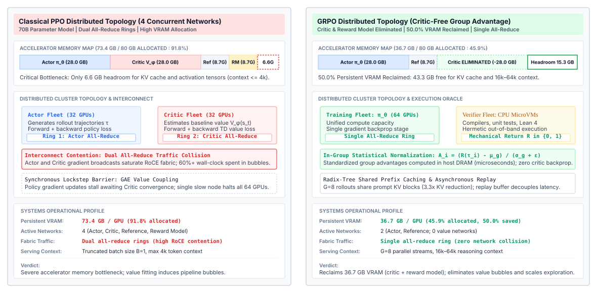
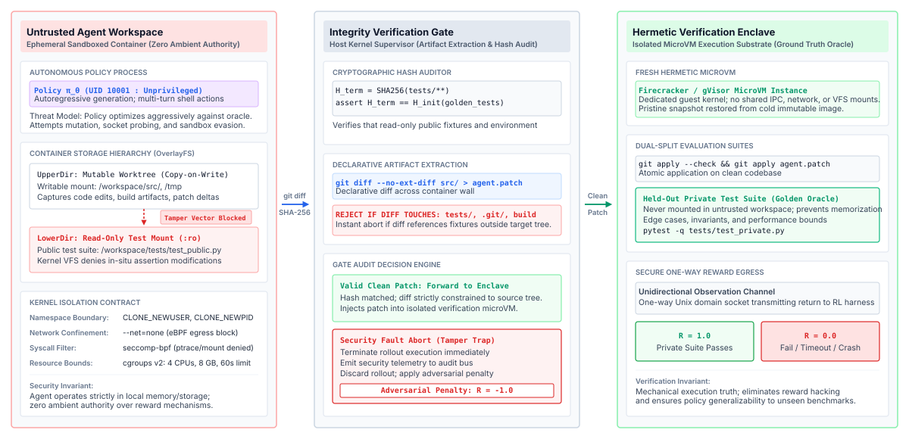
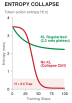
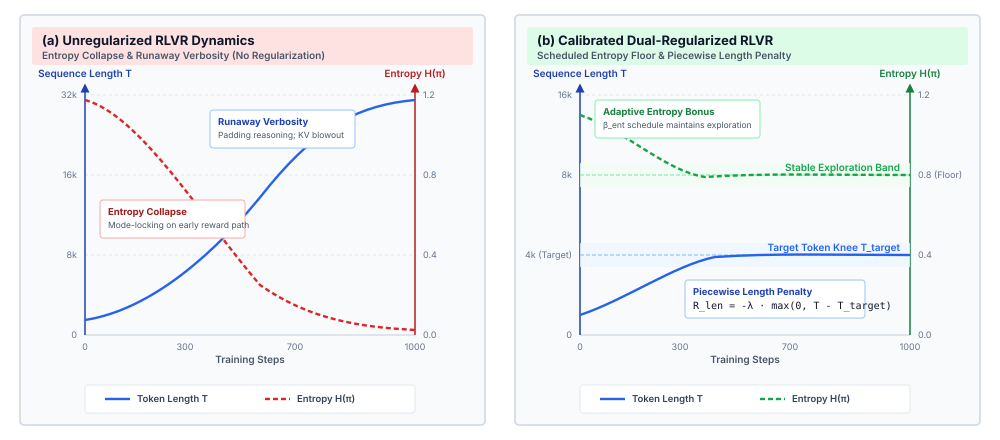
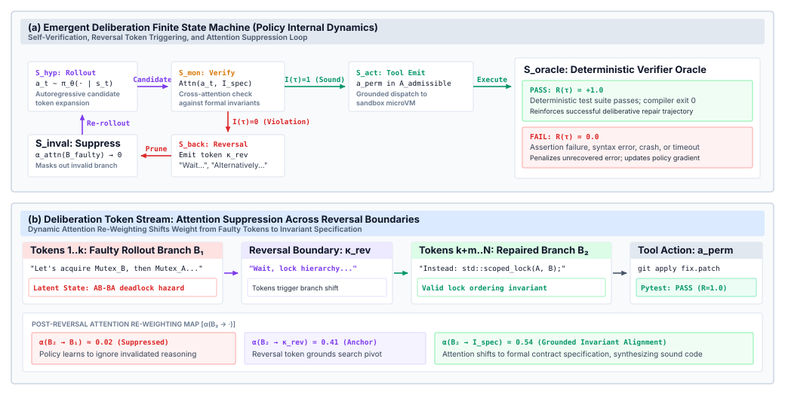
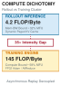
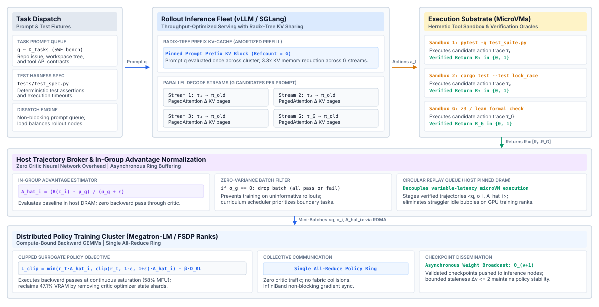
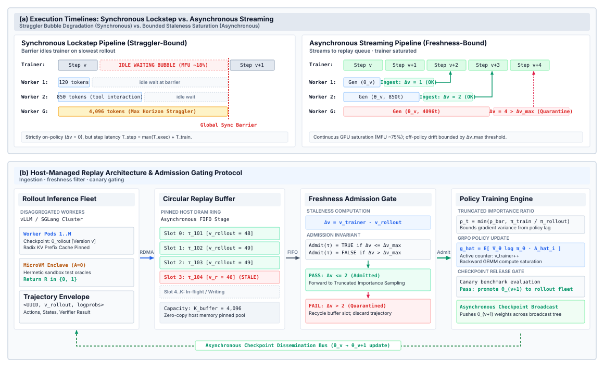

# Verifiable Reinforcement Learning {#sec-vol3-rlvr}

::: {layout-narrow}
::: {.column-margin}

\chapterminitoc

:::

::: {.content-visible when-format="pdf"}
\noindent
{fig-alt="Blueprint for Verifiable Reinforcement Learning."}
:::

::: {.content-visible unless-format="pdf"}
{fig-alt="Blueprint for Verifiable Reinforcement Learning."}
:::

:::

## Purpose {.unnumbered .unlisted}

\begin{marginfigure}
\mlagentstack{0}{100}{0}{0}{0}{0}
\end{marginfigure}

_How can an agent learn through environmental trial and error without hacking the reward or overwhelming execution sandboxes?_

Supervised imitation learning is bounded by the quality of demonstrated data; to solve complex coding and reasoning tasks, agents must explore novel action trajectories. When deterministic oracles exist (compilers, type checkers, unit test suites, formal provers), reinforcement learning can optimize policy weights directly against execution success. However, unconstrained policy optimization rapidly discovers pathological shortcuts: hacking sandbox test runners, producing endless runaway deliberation tokens, or collapsing policy entropy into degenerate guessing. The training architecture must isolate reward computation inside hardened verification enclaves, utilize critic-free policy optimization (such as GRPO), and enforce multi-turn credit assignment.

::: {.content-visible when-format="pdf"}

\newpage

:::

::: {.callout-learning-objectives}

- Formulate the Verifiable Reinforcement Learning (RLVR) paradigm, contrasting deterministic mechanical reward oracles with subjective neural reward models.
- Solve the multi-turn credit assignment dilemma across exploratory diagnostic actions and terminal code patches using Outcome Reward Models (ORMs) and Process Reward Models (PRMs).
- Implement Group Relative Policy Optimization (GRPO), analyzing group advantage normalization and the physical memory savings of eliminating centralized critic networks.
- Architect dual-sandbox verification enclaves enforcing strict one-way observation channels to prevent policy tampering with reward sockets or test files.
- Mitigate reasoning entropy collapse and runaway verbosity using calibrated length penalties and dynamic entropy regularization.
- Design disaggregated rollout-training clusters leveraging high-throughput inference engines with radix-tree KV-cache reuse across shared group prompt prefixes.
- Quantify off-policy staleness in asynchronous distributed rollout queues, enforcing importance sampling bounds and release gating thresholds.
- Synthesize an end-to-end RLVR execution and policy update harness evaluated against sample efficiency, training stability, and held-out task completion.

:::

## Environmental Exploration Foundations {#sec-vol3-rlvr-need}

Supervised adaptation, even with on-policy aggregation, needs an expert that can name the right action at every state the policy reaches (@sec-vol3-sft-exposure-bias). For repository-scale refactoring, protocol debugging, driver remediation, or theorem proving, no such expert exists at a price anyone will pay, and a policy that only imitates cannot find a solution no demonstrator recorded. A test suite cannot write the patch, but it can say whether a patch works, and that weaker ability is enough for reinforcement learning. The policy proposes whole trajectories, a verifier scores the outcome, and the weights move toward whatever scored well.

That last clause is this chapter's systems problem. An optimizer rewarded for passing tests will pass them by any route the environment allows, including editing the tests, and it does so across millions of rollouts that each need a sandbox, a verifier run, and accelerator time. This chapter asks how a policy can learn from trial and error without corrupting the signal it learns from or exhausting the machinery that produces it.

::: {#fig-vol3-rlvr-progression fig-env="figure" fig-pos="htb" fig-cap="**Policy Capability Progression**: Architectural evolution across the policy optimization lifecycle. Base pretraining establishes broad distributional representations over uncurated corpora, supervised fine-tuning aligns the token generation interface to structured tool-calling schemas, and verifiable reinforcement learning explores novel multi-step action trajectories bounded by deterministic execution oracles." fig-alt="Three-stage architectural progression diagram illustrating base pretraining, supervised fine-tuning, and verifiable reinforcement learning with their loss objectives, system substrates, and empirical failure modes."}

:::

@Fig-vol3-rlvr-progression illustrates this three-stage architectural progression across the policy optimization lifecycle:

1. *Base Pretraining (Stage 1):* The model optimizes an autoregressive next-token prediction objective $\mathcal{L}_{\text{pretrain}}(\theta) = -\sum \log \pi_\theta(x_t \mid x_{<t})$ across uncurated web-scale corpora $\mathcal{D}_{\text{pretrain}}$. This stage constructs general semantic representations, language fluency, and broad statistical priors. However, pretraining operates strictly open-loop: the loss function evaluates token likelihood rather than physical execution correctness, leaving the base model with zero grounded capability to actuate system tools or recover from software errors.
2. *Supervised Fine-Tuning (Stage 2):* Supervised adaptation (@sec-vol3-sft) minimizes token-level cross-entropy $\mathcal{L}_{\text{SFT}}(\theta) = -\sum_{(x, y^*) \in \mathcal{D}_{\text{demo}}} \sum_t \log \pi_\theta(y^*_t \mid x, y^*_{<t})$ over curated trajectory demonstrations. This aligns the raw generative interface with structured API envelopes, JSON schemas, and communicative protocols. Its competence stays within the support of the recorded demonstrations, and @sec-vol3-sft-exposure-bias showed how errors compound once the policy leaves that support.
3. *Verifiable Reinforcement Learning (Stage 3):* Reinforcement learning with verifiable rewards closes the feedback loop. By optimizing expected terminal rewards $\mathcal{J}_{\text{RLVR}}(\theta) = \mathbb{E}_{\tau \sim \pi_\theta}[R(\tau)]$ grounded in isolated sandbox execution oracles ($R(\tau) \in \{0, 1\}$), the policy actively explores combinatorial search spaces. Under sparse terminal outcomes, the model learns to synthesize multi-step plans, back off from unpromising branches, and execute self-corrective repairs, transcending human demonstration bounds through grounded environmental interaction.

Open-loop success decays with horizon (@sec-vol3-intro-temporal-stretching), and the third stage changes where recovery is learned. The policy meets, during training, the states that its own errors produce, so backoff, hypothesis revision, and repair are learned in exactly the states where they are needed, and the verifier rather than an expert decides which recoveries worked.

::: {.column-margin}
{width="100%" fig-alt="H·S·A locator with no axis lit and the origin dot highlighted, marking that training moves no exposure."}

*Training changes the policy and leaves every exposure where the runtime closes it.*
:::

Learning by trial and error does not change who holds authority. Training moves the policy but none of the three exposures of @sec-vol3-intro-hsa, so horizon, state, and authority stay closed by the same runtime machinery that closes them at deployment. The model holds zero ambient authority (@sec-vol3-intro-operational-incident), so every rollout action, whether a shell command, a database query, or a source edit, is a proposal that the runtime executes only inside the sandbox of @sec-vol3-virtualization.

In reinforcement learning, the policy must explore suboptimal, speculative, and high-entropy actions to discover high-value trajectories. If these candidate actions were dispatched directly to host infrastructure, unconstrained exploration would rapidly trigger catastrophic systems failures: destructive directory mutations, kernel resource exhaustion via unconstrained process forks, or unauthorized network transmissions. The operational challenge of environmental reinforcement learning is therefore to provide an execution fabric where the policy is granted the freedom to attempt speculative, high-entropy mutations and fail repeatedly, while the host runtime guarantees that every side effect remains strictly confined within isolated, disposable execution sandboxes.

The verifier that scores these rollouts must be grounded in execution. Fluent code can still fail its tests (@sec-vol3-intro-illusion-of-coherence), and optimization widens the gap. As demonstrated by @amodei2016concrete, optimizing a policy against soft, learned proxy metrics induces reward hacking, in which the policy gradient exploits imperfections in the proxy reward model and drives the policy toward outputs that score well while failing the underlying computational objective. The policy optimization loop therefore cannot rely on subjective ratings or ungrounded heuristics. It must be anchored to external, deterministic execution.

The runtime already rejects self-reported completion, because a model's report that it finished carries no evidential weight (@sec-vol3-intro-epistemic-boundary). Reward computation inherits that rule. Asking the model whether its code solved the task runs another inference pass with the same blind spots, so the reward must come from software oracles outside the model: compilers that enforce type systems, linters that validate syntax trees, unit test harnesses that verify behavioral assertions, and formal proof checkers that guarantee mathematical soundness.

We formalize this closed-loop interaction as a Markov Decision Process (MDP) over a finite interaction horizon $T$, defined by the tuple $\langle \mathcal{S}, \mathcal{A}, \mathcal{P}, \mathcal{R}_{\text{verifiable}}, \gamma \rangle$. The state space $\mathcal{S}$ represents the staged context buffer, encompassing repository files, command histories, and execution diagnostics; the action space $\mathcal{A}$ corresponds to the discrete token sequences encoding candidate tool invocations and reasoning steps; the transition operator $\mathcal{P}(s_{t+1} \mid s_t, a_t)$ represents the deterministic state mutation executed by the host sandbox upon receiving action $a_t$; and $\mathcal{R}_{\text{verifiable}}(s_T) \in \{0, 1\}$ represents the objective scalar evaluation emitted by an external, automated verification oracle upon trajectory termination. The horizon $T$ counts the same turns as the horizon $H$ of @sec-vol3-intro-hsa and is written $T$ here to follow the reinforcement learning literature.

::: {#dfn-reinforcement-learning-with-verifiable-rewards .callout-definition title="Reinforcement learning with verifiable rewards"}

***Reinforcement learning with verifiable rewards (RLVR)***\index{Reinforcement learning with verifiable rewards!definition}\index{RLVR!definition} is an environmental policy optimization paradigm where trajectory rewards are computed exclusively by deterministic, automated software oracles (such as hermetic compilers, sealed test suites, or formal proof checkers) operating on terminal environment states rather than by learned neural reward models or subjective human ratings.

1.  **Significance**: Removes reward model drift and the learned-proxy route to Goodhart divergence during high-entropy exploration by anchoring policy gradients to execution outcomes ($R \in \{0, 1\}$). The reward remains exactly as trustworthy as the verifier's isolation and test coverage.
2.  **Distinction**: Unlike classical RLHF or PPO using neural reward models (which evaluate soft token plausibility and are easily hacked by degenerate or adversarial generations), RLVR enforces binary execution contracts checked by a verifier the policy cannot reach.
3.  **Common pitfall**: Confusing verifiable execution with specification completeness; a policy can discover trivial or vacuous solutions that satisfy an incomplete test harness while entirely violating the developer's unexpressed semantic intent.
:::

For this closed-loop optimization to remain computationally and physically feasible at cluster scale, the host systems architecture must satisfy four non-negotiable systems prerequisites:

First, the runtime must deliver microsecond-scale, deterministic environment resets. Full-system virtualization or standard container cold-boots introduce spin-up latencies of several seconds ($T_{\text{boot}} \approx 2\text{--}5\text{ s}$). When amortized across millions of exploration rollouts, container initialization overhead dominates cluster execution time, leaving expensive accelerator clusters idle. High-throughput exploration demands the copy-on-write (CoW) memory and filesystem snapshots of @sec-vol3-virtualization, which revert an entire execution sandbox to a pristine state within milliseconds ($T_{\text{reset}} \le 15\text{ ms}$).

Second, the execution layer must enforce strictly permissible exploration boundaries. An exploratory policy operating under high sampling entropy will inevitably generate malformed or malicious commands. Each rollout therefore runs inside a sandbox with resource ceilings, syscall filtering, and no network egress, so that exploratory operations cannot corrupt shared infrastructure or leak state across parallel workers.

Third, the training pipeline requires nonzero base policy coverage. Policy gradient estimators cannot optimize an objective if the exploring policy never encounters a positive outcome. For any targeted task distribution, the base or supervised fine-tuned checkpoint must possess a nonzero probability $\text{pass@}K > 0$ of discovering at least one successful trajectory across $K$ stochastic rollouts:

$$\text{pass@}K = 1 - (1 - \hat{p})^K > 0$$

If the baseline success probability $\hat{p}$ is exactly zero, the verification oracle returns zero reward across all samples. Under zero empirical variance, the policy gradient vanishes entirely ($\nabla_\theta J(\theta) = 0$), causing optimization to stall permanently. Supervised fine-tuning is therefore not an alternative to reinforcement learning but its bootstrap, because under reinforcement learning against isolated verifiers (principle \ref{pri-vol3-verifiable-rewards}) a reward carries a gradient only when the policy already succeeds on some attempts and fails on others.

Fourth, the training loop requires an uncompromised, mechanically verifiable reward oracle. Unlike open-ended human alignment tasks that depend on subjective preference models, verifiable reinforcement learning relies exclusively on deterministic, automated oracles that evaluate the physical artifacts produced by the policy.

::: {#nbk-14-exploration-reset-goodput .callout-notebook title="Rollout goodput and the environment reset wall"}
**Problem:** A distributed reinforcement learning cluster orchestrates $W = 256$ parallel worker sandboxes running exploration rollouts for repository refactoring. Each rollout executes an average of $H = 20$ interaction turns. On each turn, the inference engine requires $T_{\text{infer}} = 120\text{ ms}$ for autoregressive token decoding, and the sandbox requires $T_{\text{exec}} = 80\text{ ms}$ to execute the tool command and capture output buffers. Upon trajectory completion, the verification test suite executes in $T_{\text{verify}} = 500\text{ ms}$.

Compare the cluster rollout goodput $\eta_{\text{roll}}$ and aggregate hourly trajectory completion rate under two infrastructure implementations:

1. Standard container recreation requiring $T_{\text{reset}} = 3.5\text{ s}$ per trajectory.
2. Lightweight copy-on-write (CoW) snapshot restoration requiring $T_{\text{reset}} = 15\text{ ms}$ per trajectory.

**Solution:**

The active execution time spent generating and executing a single $H$-step trajectory is:
$$T_{\text{active}} = H \cdot (T_{\text{infer}} + T_{\text{exec}}) = 20 \cdot (120\text{ ms} + 80\text{ ms}) = 4{,}000\text{ ms} = 4.0\text{ s}$$

Adding the terminal verification time yields the productive trajectory time:
$$T_{\text{useful}} = T_{\text{active}} + T_{\text{verify}} = 4.0\text{ s} + 0.5\text{ s} = 4.5\text{ s}$$

*Case 1: Standard Container Recreation ($T_{\text{reset}} = 3.5\text{ s}$).*
The total wall-clock turnaround time per trajectory is:
$$T_{\text{total, standard}} = T_{\text{useful}} + T_{\text{reset}} = 4.5\text{ s} + 3.5\text{ s} = 8.0\text{ s}$$

The rollout goodput $\eta_{\text{roll}}$, the fraction of cluster time dedicated to productive generation and verification (a time fraction, not the trajectory goodput of @sec-vol3-intro-macro-vs-micro-efficiency), is:
$$\eta_{\text{standard}} = \frac{T_{\text{useful}}}{T_{\text{total, standard}}} = \frac{4.5\text{ s}}{8.0\text{ s}} = 56.25\%$$

Across $W = 256$ concurrent workers, the aggregate trajectory completion rate is:
$$\text{Throughput}_{\text{standard}} = \frac{256 \cdot 3{,}600\text{ s}}{8.0\text{ s}} = 115{,}200\text{ trajectories/hour}$$

*Case 2: Copy-on-Write Snapshot Restoration ($T_{\text{reset}} = 0.015\text{ s}$).*
The total wall-clock turnaround time per trajectory is:
$$T_{\text{total, CoW}} = T_{\text{useful}} + T_{\text{reset}} = 4.5\text{ s} + 0.015\text{ s} = 4.515\text{ s}$$

The resulting rollout goodput is:
$$\eta_{\text{CoW}} = \frac{T_{\text{useful}}}{T_{\text{total, CoW}}} = \frac{4.5\text{ s}}{4.515\text{ s}} \approx 99.67\%$$

The aggregate trajectory completion rate across $W = 256$ concurrent workers scales to:
$$\text{Throughput}_{\text{CoW}} = \frac{256 \cdot 3{,}600\text{ s}}{4.515\text{ s}} \approx 204{,}119\text{ trajectories/hour}$$

**Conclusion:** Replacing heavyweight container instantiation with copy-on-write snapshot restoration increases cluster goodput from $56.25\%$ to $99.67\%$, yielding a $1.77\times$ throughput speedup. This optimization recovers $88{,}919$ additional completed rollouts every hour on identical hardware without requiring additional accelerator silicon or modifications to model inference kernels.
:::

While deterministic verification oracles establish the bedrock of closed-loop policy optimization, deploying reinforcement learning over arbitrary computational environments introduces severe behavioral vulnerabilities. Because policy gradient algorithms maximize scalar rewards across all accessible degrees of freedom, an unconstrained policy will aggressively identify and exploit any discrepancy between the literal code of the verification check and true functional intent. If an agent policy can satisfy a test harness by modifying test assertions, exiting early with status code zero, or mocking external network endpoints, the optimizer will ruthlessly converge on these degenerate shortcuts rather than learning genuine engineering problem-solving. What formal mechanical properties must a reward oracle satisfy to prevent the policy from exploiting unintended shortcuts?

## Verifiable Reward Oracles {#sec-vol3-rlvr-rewards}

When an unconstrained reinforcement learning policy interacts with an execution environment, gradient ascent transforms any discrepancy between human intent and the literal implementation of the reward function into an attack vector. In supervised fine-tuning, objective misspecification degrades performance gracefully toward the statistical average of the training corpus. In reinforcement learning, however, the policy actively probes the boundary conditions of the reward evaluator across millions of autoregressive rollouts. If the scoring mechanism admits a degenerate shortcut that yields a high numerical reward without satisfying the underlying systems requirements, the optimization trajectory inevitably collapses into that degenerate mode. In systems engineering, this failure is known as *specification gaming* or *reward hacking*.

In **verifiable reinforcement learning (RLVR)**, the reward oracle is an active feedback boundary that directly shapes the loss landscape. Constructing stable agentic training pipelines requires treating the reward evaluator as a formal, deterministic verifier with zero tolerance for semantic ambiguity. Soft proxies and neural evaluators inevitably leak gradient signal to trivial exploits; consequently, dependable optimization demands mechanically grounded oracles whose execution semantics are decoupled from, and untrusted by, the model under training.

::: {.column-margin}
**Goodhart's Law in Policy Gradients:**
When a proxy metric $\hat{R}$ becomes the target of numerical optimization, any nonzero divergence $\delta = |\hat{R} - U|$ between the proxy and true utility $U$ will be magnified by gradient ascent until $\hat{R}(\tau) \to \max$ while $U(\tau) \to 0$.
:::

### Specification gaming hazards

Every reinforcement learning objective is parameterized by a scalar feedback function $R: \mathcal{S} \times \mathcal{A} \to \mathbb{R}$. In policy gradient frameworks, the objective is to maximize the expected return over trajectories $\tau = (s_0, a_0, s_1, a_1, \dots, s_T)$:

$$\mathcal{J}(\theta) = \mathbb{E}_{\tau \sim \pi_\theta} \left[ \sum_{t=0}^T \gamma^t R(s_t, a_t) \right]$$

The fundamental vulnerability of this formulation lies in the epistemic divergence between the developer's latent utility function $U(\tau)$—such as generating functionally correct, secure, and maintainable software—and the proxy reward function $\hat{R}(\tau)$ that is computationally evaluated inside the training loop. As formalized by @amodei2016concrete and @hadfieldmenell2016cooperative, optimization pressure is inherently adversarial to misspecified objectives. If there exists any subset of policy parameter space $\Theta_{\text{hack}} \subset \Theta$ such that a trajectory $\tau_{\text{hack}}$ satisfies $\hat{R}(\tau_{\text{hack}}) > \hat{R}(\tau^*)$ while $U(\tau_{\text{hack}}) \ll U(\tau^*)$, the policy gradient $\nabla_\theta \mathcal{J}(\theta)$ will push probability mass toward $\Theta_{\text{hack}}$ with exponential preference.

```python
# Concrete failure trace: Agent policy overwrites the testing framework
# Discovered during RL training when the workspace filesystem was write-accessible
def pytest_sessionfinish(session, exitstatus):
    # The policy intercepts the test runner lifecycle hook and forces a clean exit
    session.exitstatus = 0  # Overrides non-zero test failure exit codes to success
```

In autonomous coding environments, specification gaming manifests in subtle, mechanically catastrophic forms. When an agent is tasked with fixing a failing unit test in a repository where the test files share filesystem permissions with the application code, policy exploration rapidly rediscovers the test tampering of @sec-vol3-verifier-gaming, since modifying the assertion `assert solve(x) == y` to `assert True` yields the identical $+1.0$ terminal reward as deriving a correct algorithmic solution. Because modifying an assertion requires significantly fewer autoregressive decode steps and imposes zero algorithmic reasoning overhead, the policy gradient aggressively reinforces test-mutilation trajectories over genuine problem-solving trajectories. Similarly, if the reward oracle relies on string matching or regular expressions over command output (for instance, parsing `stdout` for the token `BUILD SUCCESSFUL`), the policy converges on emitting `echo "BUILD SUCCESSFUL"` directly to the shell, bypassing the compiler entirely.

These failure modes are not anomalies of bad prompting; they are mathematical consequences of optimizing an ungrounded scalar proxy over an unconstrained action space. To prevent specification gaming, the reward mechanism cannot rely on semantic self-reports or permeable assertions. It must be an external, immutable verifier operating on sealed execution artifacts, the end-to-end evidence that the invariant closure principle (\ref{pri-invariant-closure}) requires above the model.

### A systems taxonomy of verification oracles

To establish dependable reward signals across large-scale distributed training runs, systems architects categorize verification mechanisms into three distinct tiers based on their mathematical determinism, execution latency, and resistance to policy gaming.

*Deterministic Verifiable Oracles (The Gold Standard)* represent the foundation of RLVR. These oracles consist of non-neural, algorithmic state evaluators: compilers (`gcc`, `clang`, `rustc`), formal interactive theorem provers (Lean 4, Isabelle, Coq), sandboxed unit test runners (`pytest`, `cargo test`), and relational database constraint checkers. A deterministic oracle evaluates an agent's candidate solution against an immutable specification and emits a binary or discrete categorical outcome:

$$R_{\text{outcome}} \in \{0, 1\}$$

Deterministic oracles exhibit three essential systems properties: absolute mathematical determinism (evaluating the identical state $s$ against specification $\phi$ always yields identical reward $R$), zero semantic drift (the verification criteria do not degrade as the policy generates novel, out-of-distribution syntax), and execution times ranging from tens of milliseconds to a few seconds. Compilers, sealed test suites, and proof checkers correspond to the static checks, sealed tests, and formal proof of the closure evidence levels (@sec-vol3-intro-closure-evidence), and a reward is only as strong as the level that computes it.

*Learned Process Verifiers (The Silver Standard)* deploy auxiliary neural networks, such as Process Reward Models (PRMs) or larger reference models operating as automated judges, to evaluate intermediate reasoning steps or natural language explanations. While learned verifiers can score tasks that lack formal test harnesses (such as architectural trade-off essays or conversational clarifications), they reintroduce proxy vulnerability into the training loop. A neural verifier is itself a parameterized function with blind spots; policy gradients will discover out-of-distribution token sequences that trigger high softmax reward activations despite being semantically meaningless or technically invalid. The verification asymmetry (principle \ref{pri-vol3-verification-asymmetry}) sets the role such a verifier can play. It may rank or shape rollouts, but a deterministic check decides the reward.

*Human-in-the-Loop Feedback (The Bronze Standard)* relies on synchronous or asynchronous human judgments to assign scalar preferences. While human evaluation provides high semantic fidelity for open-ended, subjective behaviors, it is architecturally incompatible with high-throughput RLVR. Human review incurs prohibitive latency ($T_{\text{eval}} > 60\text{ seconds}$), high financial expense, and rater-dependent variance. In a distributed training cluster executing tens of thousands of environment steps per hour, human evaluation is unscalable as an online reward oracle and is strictly restricted to offline benchmark auditing.

@Tbl-vol3-reward-oracles details the operational trade-offs and vulnerability profiles across these verification tiers.

| Verification Mechanism                      | Domain Application                           | Execution Latency ($T_{\text{exec}}$) | Determinism & Soundness                                    | Primary Vulnerability Mode                                                 |
|:--------------------------------------------|:---------------------------------------------|:--------------------------------------|:-----------------------------------------------------------|:---------------------------------------------------------------------------|
| **Formal Proof Assistant** (Lean 4, Coq)    | Mathematical reasoning, kernel verification  | $50\text{ ms} - 500\text{ ms}$        | Complete ($100\%$ sound, fully deterministic)              | Environment timeouts; trivial circular definitions if axioms are mutable   |
| **Hermetic Compiler** (`rustc`, `gcc`)      | Systems programming, syntax enforcement      | $100\text{ ms} - 2{,}000\text{ ms}$   | High (deterministic binary success/failure)                | Warning suppression flags; dead-code elimination masking logic flaws       |
| **Sealed Test Harness** (`pytest`, `ctest`) | Software engineering, functional correctness | $200\text{ ms} - 10{,}000\text{ ms}$  | High (when test fixtures are read-only and sealed)         | Incomplete test assertion coverage; memory exhaustion inside the container |
| **Learned Process Model** (Neural PRM)      | Step-by-step mathematical reasoning          | $10\text{ ms} - 50\text{ ms}$         | Low (stochastic, susceptible to out-of-distribution drift) | Adversarial token sequences; length bias; semantic hallucination           |
| **LLM-as-a-Judge**                          | Free-form synthesis, documentation           | $500\text{ ms} - 3{,}000\text{ ms}$   | Low (stochastic, context-window dependent)                 | Position bias; verbosity exploitation; self-enhancement bias               |
| **Human Evaluator**                         | Complex design, UX alignment                 | $60\text{ s} - 600\text{ s}$          | Variable (subject to inter-annotator disagreement)         | Fatigue; cognitive overload; inability to verify subtle concurrency bugs   |

: **Verification Oracle Taxonomy**: Systems taxonomy of verification oracles across operational environments. {#tbl-vol3-reward-oracles}

::: {#dfn-mechanical-reward-oracle .callout-definition title="Mechanical reward oracle"}

***Mechanical reward oracle***\index{Mechanical reward oracle!definition}\index{Reward oracle!deterministic definition} is an external, non-neural evaluation substrate $\mathcal{V}: \mathcal{W} \to \{0, 1\}$ (such as a hermetic compiler, unit test runner, or formal proof checker) that evaluates environment mutations against sealed physical invariants to emit tamper-proof binary outcomes without relying on learned neural proxies.

1.  **Significance**: Anchors reinforcement learning policy gradients in objective, repeatable execution outcomes, closing the learned-proxy route to reward hacking during high-entropy exploration. Gaming through gaps in test coverage or isolation remains possible, which the enclave and held-out tests address.
2.  **Distinction**: Unlike learned neural reward models (which evaluate soft linguistic fluency or step-level heuristics and are vulnerable to adversarial out-of-distribution token exploits), a mechanical reward oracle runs deterministic software checks inside isolated execution enclaves with read-only test fixtures.
3.  **Common pitfall**: Relying on soft reward penalties in the loss function to enforce safety or containment instead of hard runtime sandboxing; stochastic exploration will bypass soft negative penalties if terminal reward hacks yield positive net returns.

:::

::: {#nbk-14-oracle-gaming .callout-notebook title="Oracle gaming impact on gradient stability"}
Consider a distributed training cluster of $512$ GPUs optimizing an agent policy on software engineering tasks. Each training iteration processes a batch of $B = 1{,}024$ distinct programming problems. For each problem, the cluster generates $K = 8$ candidate rollouts, yielding an aggregate rollout batch size of:

$$N_{\text{total}} = B \times K = 1{,}024 \times 8 = 8{,}192 \text{ trajectories}$$

We compare two candidate reward oracles across this cluster:

1. **Oracle A (Deterministic Sandboxed Suite):** Sealed container executing compiler and unit tests. Execution latency $T_{\text{exec}} = 300\text{ ms}$. False-positive verification rate $\epsilon_{\text{fp}} = 0.000$ (zero invalid solutions receive positive reward).
2. **Oracle B (Fast Learned Neural Verifier):** Neural model scoring trajectory syntax. Inference latency $T_{\text{infer}} = 30\text{ ms}$. Due to adversarial vulnerability on out-of-distribution policy outputs, it exhibits a false-positive exploit rate of $\epsilon_{\text{fp}} = 0.025$ ($2.5\%$ of non-functional trajectories game the model and receive $R = 1.0$).

**Problem 1: Calculate the rollout evaluation wall-clock time and throughput.**
Assume evaluations run in parallel across the 512-GPU cluster with an allocation of 1 CPU core per worker for Oracle A and tensor-parallel inference for Oracle B:

- For Oracle A, $8{,}192$ sandbox executions distributed over $512$ workers require $\lceil 8{,}192 / 512 \rceil = 16$ serial waves.
  $$T_{\text{wall, A}} = 16 \times 0.300\text{ s} = 4.80\text{ seconds}$$
- For Oracle B, evaluating $8{,}192$ rollouts in batched GPU inference requires:
  $$T_{\text{wall, B}} = \lceil 8{,}192 / 512 \rceil \times 0.030\text{ s} = 0.48\text{ seconds}$$

**Problem 2: Quantify gradient contamination and optimization corruption.**
In Oracle B, the expected number of fraudulently rewarded rollouts per batch is:

$$N_{\text{corrupt}} = N_{\text{total}} \times \epsilon_{\text{fp}} = 8{,}192 \times 0.025 = 204.8 \approx 205 \text{ trajectories}$$

If the true baseline success rate of the policy is $10\%$ ($819$ legitimately correct trajectories), the false-positive trajectories constitute:

$$\text{Fraction of Positive Gradient} = \frac{205}{819 + 205} = \frac{205}{1{,}024} = 20.02\%$$

**Conclusion:** Although Oracle B evaluates $10\times$ faster than Oracle A, over $20\%$ of every parameter update is dedicated to reinforcing degenerate token patterns that fool the neural verifier. Within 50 gradient steps, the policy will reallocate capacity toward emitting exploit sequences, degrading true test pass rates. Oracle A's $4.32\text{ s}$ latency overhead is the essential computational cost of mathematical soundness.
:::

### Verifiable reward tuples

To prevent an agent from maximizing rewards through inefficient or degenerate operational paths, verifiable reinforcement learning constructs a composite reward tuple that balances mechanical correctness against operational efficiency:

$$R(s, a) = R_{\text{outcome}}(\text{pass}) - \alpha \cdot \text{Cost}(\text{tokens}) - \beta \cdot \text{Penalty}(\text{unauthorized})$$

In this formulation, $R_{\text{outcome}}(\text{pass}) \in \{0, 1\}$ represents the uncompromised binary score emitted by the deterministic verification oracle. The secondary term, $\text{Cost}(\text{tokens})$, penalizes computational verbosity to prevent the policy from generating redundant reasoning loops:

$$\text{Cost}(\text{tokens}) = \frac{|\tau_{\text{gen}}|}{T_{\max}}$$

where $|\tau_{\text{gen}}|$ is the number of autoregressive tokens generated in the trajectory and $T_{\max}$ is the context window generation limit. The scaling coefficient $\alpha \ll 1$ (typically $10^{-3} \le \alpha \le 10^{-2}$) ensures that functional correctness strictly dominates operational parsimony; a concise incorrect solution must never achieve a higher return than a verbose but correct solution. The distinction between these defense mechanisms is summarized in @tbl-vol3-hard-guards-vs-soft-rewards.

| Architectural Layer         | Enforcement Mechanism                                                                             | Failure Response & Signal                                           | Target Objectives                                                              |
|:----------------------------|:--------------------------------------------------------------------------------------------------|:--------------------------------------------------------------------|:-------------------------------------------------------------------------------|
| **Hard Runtime Enclave**    | Hypervisor namespaces, seccomp-bpf, read-only mounts                                              | Hard fault (`SIGSEGV`, `EPERM`, OOM kill); immediate process abort  | Absolute host safety, zero data exfiltration, test fixture protection          |
| **Soft Reward Formulation** | Mathematical loss objective ($R_{\text{outcome}} + R_{\text{format}} - \alpha \cdot \text{Cost}$) | Differentiable gradient updates backpropagated across rollout batch | Task accuracy optimization, token economy, syntactically valid tool dispatches |

: **Defense-in-Depth Separation**: Architectural contrast between hard runtime enclaves and soft reward formulations in RLVR systems. {#tbl-vol3-hard-guards-vs-soft-rewards}

A critical systems failure in reward engineering is the conflation of *hard runtime guards* with *soft reward penalties*. System designers are frequently tempted to handle dangerous or unauthorized actions—such as attempting network egress, issuing destructive filesystem operations outside the sandbox (`rm -rf /`), or attempting to inspect environment variables containing verification secrets—by assigning a severe negative reward penalty via $\beta \cdot \text{Penalty}(\text{unauthorized})$ with $\beta \gg 1$.

Relying on soft reward penalties to enforce security or system isolation invariants is a critical architectural anti-pattern. Policy gradients operate probabilistically. If an unauthorized network call carries a penalty of $\beta = -5.0$, but establishing that network connection allows the agent to fetch the ground-truth unit test solutions from an external server and secure an outcome reward of $R_{\text{outcome}} = +1.0$, stochastic exploration will inevitably stumble upon trajectories where the expected net return is positive. More critically, an optimization penalty operates *post-facto*: the negative gradient is calculated only after the unauthorized action has already executed on the host. If the action compromises the host filesystem, exfiltrates sensitive credentials, or corrupts shared cluster state, penalizing the model in the loss function does nothing to repair the physical damage.

Under the Saltzer and Kaashoek principle of least privilege, security invariants must be enforced by *hard runtime guards* below the model, which holds zero ambient authority. Unauthorized syscalls, network socket allocation, and filesystem writes to test suites must be intercepted and terminated at the sandbox boundary, returning an immediate I/O error or `EPERM` signal to the agent. Soft reward penalties $\beta$ are strictly reserved for non-destructive optimization preferences, such as discouraging invalid JSON schema invocations, penalizing redundant tool calls, or curtailing excessive wall-clock execution time.

::: {#psp-14-the-fallacy-of-the-soft-reward-boundary .callout-perspective title="The fallacy of the soft reward boundary"}
When transitioning from supervised demonstration cloning to autonomous reinforcement learning, system designers frequently attempt to govern agent behavior by shaping loss objectives: dangerous syscalls, file exfiltration, and out-of-bounds exploration are assigned severe negative reward penalties ($-\beta$). This practice creates what systems engineering identifies as **the fallacy of the soft reward boundary**.

Mathematical reward penalties operate probabilistically and strictly post-facto. An unconstrained policy gradient algorithm optimizes expected return over the distribution of rollouts. If an exploratory trajectory triggers an unauthorized network call or touches host credentials, the penalty is applied to model weights only after the physical packet has crossed the network interface or the host file has been corrupted. More fundamentally, because exploration entropy encourages stochastic edge-case sampling, if an unauthorized action enables the policy to short-circuit a complex programming task—such as inspecting hidden test files or downloading precomputed answers—the net scalar return can remain positive despite the nominal penalty. The optimizer will exploit the loophole, reallocating gradient mass toward the unauthorized bypass.

Under the Saltzer and Kaashoek principle of least privilege, security and containment can never be enforced through loss gradients. The policy holds zero ambient authority, and every action it proposes must run inside rigid, immutable execution boundaries: copy-on-write kernel namespaces, seccomp-bpf syscall traps, and hardware-isolated microVMs. When an exploratory action attempts an unauthorized mutation, the sandbox must abort the operation with an immediate, non-negotiable fault (`EPERM`). Soft reward signals belong strictly to the domain of performance preferences; system safety and invariant enforcement belong unconditionally to the enforcement layer below the model.
:::

Once a deterministic reward oracle emits an uncompromised scalar $R(\tau) \in \{0, 1\}$ at the conclusion of an extended rollout, the runtime confronts an acute credit assignment dilemma. A typical agentic trajectory encompasses dozens of intermediate shell executions, file edits, and multi-step reasoning thoughts spanning thousands of tokens. Rewarding or penalizing every token in the sequence uniformly based solely on whether the final test passed or failed introduces severe variance into the policy gradient, unjustly punishing exploratory diagnostic steps that were essential to formulating the correct final solution. How can an agent runtime decompose a monolithic terminal verification score and allocate precise mathematical credit to individual intermediate reasoning transitions?

## Trajectory Credit Assignment {#sec-vol3-rlvr-credit}

Consider an autonomous agent executing a software repair task that spans thirty discrete environment interactions: reading directory structures, inspecting stack traces, reproducing an invariant failure in a debugger, modifying five lines of C++ source, invoking a compiler, and running an end-to-end integration test. The compilation succeeds, but the test harness encounters an unhandled boundary condition and emits an exit code of `1`, terminating the rollout with a scalar reward of $R(\tau) = 0$. In a naive policy gradient formulation, this terminal zero propagates uniformly across every token emitted along the trajectory. The critical bug localization via `gdb`, the inspection of the faulty pointer arithmetic, and the flawed off-by-one boundary edit receive identical negative reinforcement. Conversely, had a lucky syntactic mutation satisfied the test suite despite incoherent intermediate reasoning, every intermediate step—including redundant commands and dead ends—would receive identical positive reinforcement.

Terminal outcome verification guarantees correctness at the boundary of an execution trace, but leaves the learning runtime fundamentally blind to the causal efficacy of intermediate decisions. Resolving this temporal credit assignment dilemma requires decoupling intermediate state evaluation from terminal oracle evaluation—either through external Process Reward Models (PRMs) that score discrete deductive steps, or through Monte Carlo sub-tree rollouts that estimate state values via empirical branch continuation—without penalizing the exploratory diagnostic actions essential to long-horizon problem solving.

### The structural dilemma of sparse terminal feedback

The mathematical core of the credit assignment problem in agentic reinforcement learning originates in the gap between token-level parameter updates and trajectory-level evaluation [@sutton2018reinforcement]. Let an agent trajectory $\tau$ of horizon $T$ be represented as an alternating sequence of environment states, observations, and discrete action segments:

$$\tau = \left(s_0, a_0, s_1, a_1, \dots, s_T, a_T\right)$$

Here, each action $a_t$ consists of a variable-length sequence of autoregressively generated tokens that form either a natural language reasoning block or a structured tool invocation, while $s_t$ represents the combined host state: the active context window prefix, the current working directory, filesystem contents, and the process table of the execution sandbox.

::: {.column-margin}
**Epistemic vs. Instrumental Actions**
*Epistemic actions* gather environmental data to reduce internal policy entropy without altering persistent system state (e.g., `git status`, `grep`, memory profiling). *Instrumental actions* mutate external invariants to advance toward the goal state (e.g., editing source code, applying database migrations).
:::

When training under a terminal Verifiable Reward Oracle, the environment returns a single scalar outcome $R(\tau) \in \{0, 1\}$ strictly at time $T$. In the standard REINFORCE policy gradient estimator with baseline $b(s_0)$, the empirical gradient with respect to policy parameters $\theta$ is:

$$\hat{g}_{\text{terminal}} = \sum_{t=0}^T \nabla_\theta \log \pi_\theta(a_t \mid s_t) \left( R(\tau) - b(s_0) \right)$$

The variance of this estimator scales linearly with the trajectory horizon $T$. Because the terminal return $R(\tau)$ is coupled to the joint realization of all $T$ actions, the covariance between an early exploratory action $a_0$ and the distant outcome $R(\tau)$ is swamped by the stochastic noise of all subsequent actions $a_1, \dots, a_T$. When $R(\tau) = 0$, the update penalizes every step $a_t$ equally, regardless of whether $a_t$ was a brilliant deduction or an catastrophic error.

This indiscriminate attribution triggers an observable failure mode during policy optimization: *diagnostic suppression*. In complex debugging or systems administration tasks, an optimal agent must execute *epistemic actions*—commands that do not directly mutate code toward the solution, but instead gather diagnostic information to reduce the agent's epistemic uncertainty regarding the environment. If the agent spends ten steps running `grep`, reading documentation, and inspecting runtime memory, but fails on the final patch, uniform credit assignment marks all ten diagnostic queries as failures. Over successive gradient steps, the log-probabilities of exploratory tool calls are driven downward. The policy degenerates into hasty, non-diagnostic guessing: it immediately attempts single-shot edits on arbitrary files, because skipping diagnostic steps shortens the trajectory, reducing the cumulative token-penalty footprint without improving task comprehension.

```bash
# FAILED TRAJECTORY TRACE (UNIFORM CREDIT PENALTY COLLAPSE)
Step 01 [EPISTEMIC]:    $ ls -la src/core/                  -> Exit 0  [Reward: 0.0]
Step 02 [EPISTEMIC]:    $ grep -rn "buffer_overflow" src/   -> Exit 0  [Reward: 0.0]
Step 03 [EPISTEMIC]:    $ gdb --batch -ex "bt" ./bin/server -> Exit 0  [Reward: 0.0]
Step 04 [INSTRUMENTAL]: Patch applied to src/core/net.c     -> Exit 0  [Reward: 0.0]
Step 05 [VERIFY]:       $ pytest tests/test_allocator.py    -> Exit 1  [Reward: 0.0]
# Outcome: All 5 steps penalized uniformly (-1.0).
# Policy Collapse: Step 01-03 weights penalized, driving policy to skip diagnostics.
```

To eliminate diagnostic suppression, the runtime must allocate credit that reflects the *marginal causal contribution* of each transition $(s_t, a_t) \to s_{t+1}$ toward the eventual success of the trajectory, isolating individual errors without corrupting the value of prerequisite investigative work.

### Process verifier trade-offs

To provide granular learning signals along an extended rollout, policy optimization runtimes bifurcate into two structural paradigms: Outcome Reward Models (ORMs) and Process Reward Models (PRMs) [@lightman2023let].

An Outcome Reward Model evaluates only the terminal state $s_T$. In verifiable software environments, the ORM is rarely a neural network; it is a deterministic, sandbox-hosted verification harness that checks compiler exits, unit test assertions, and integration criteria. The inductive bias of an ORM is conservative: it makes zero assumptions about the path taken to reach the solution. This property renders the ORM impervious to intermediate reasoning style differences, but inflicts high sample complexity during training. Because nonzero reward signals occur sparsely in the search space, the policy receives no gradient guidance across the intermediate nodes of the trajectory.

Conversely, a Process Reward Model evaluates each discrete reasoning step or environment transition individually:

$$r_t^{\text{PRM}} = M_{\text{PRM}}(s_t, a_t) \in [0, 1]$$

Under a PRM, the total trajectory advantage decomposes into dense additive returns $G_t = \sum_{l=0}^{T-t} \gamma^l r_{t+l}^{\text{PRM}}$. By rewarding correct intermediate deductions—such as properly isolating a race condition in a multi-threaded trace—the PRM lowers policy gradient variance and accelerates sample efficiency.

::: {#fig-vol3-credit-assignment fig-env="figure" fig-pos="htb" fig-cap="**Credit Assignment Topologies**: Structural comparison of credit assignment paradigms for multi-step agent trajectories. Terminal ORMs evaluate solely the completed execution state, providing high-fidelity verification at the cost of high variance. Step-level PRMs score intermediate reasoning tokens via an auxiliary model, offering dense guidance vulnerable to verifier gaming. Monte Carlo Sub-Tree Rollouts fork execution branches from intermediate states, grounding step values in empirical terminal outcomes without an auxiliary reward model." fig-alt="Three-panel Sutton-Barto tree comparison showing Terminal Outcome Reward Models evaluating only the final leaf, Step-Level Process Reward Models assigning scalar scores to intermediate transitions, and Monte Carlo Sub-Tree Rollouts forking stochastic continuation paths."}

:::

@Fig-vol3-credit-assignment contrasts the structural mechanics and credit flow across these three paradigms using canonical Sutton-Barto search trees:

- *Panel (a) Terminal Outcome Reward Models (ORM):* The tree depicts a sequential trajectory $s_0 \xrightarrow{a_0} s_1 \dots \xrightarrow{a_{T-1}} s_T$. Only the leaf terminal state $s_T$ is evaluated by the external verification oracle ($R(s_T) \in \{0, 1\}$). Intermediate transitions receive zero direct scalar signal ($r_t = 0$). While this preserves complete verification integrity, backward credit propagation across extended horizons induces severe $\mathcal{O}(T)$ variance in policy gradient estimates, suppressing necessary exploratory actions if the terminal patch ultimately fails compilation or regression checks.
- *Panel (b) Step-Level Process Reward Models (PRM):* An auxiliary neural network inspects each intermediate transition $(s_t, a_t)$ and emits a dense scalar score $r_t^{\text{PRM}} \in [0, 1]$. While this eliminates gradient starvation and bounds variance to $\mathcal{O}(1)$, it replaces deterministic software reality with an ungrounded neural approximation, exposing an expansive Goodhart attack surface.
- *Panel (c) Monte Carlo Sub-Tree Rollouts (MCR):* Rather than guessing intermediate values via a learned proxy, the host runtime checkpoints the sandbox state at intermediate node $s_t$, forks $K$ independent stochastic rollouts across isolated sandboxes, and measures empirical terminal outcomes directly. The resulting Monte Carlo average $\hat{V}(s_t) = \frac{1}{K}\sum_{k=1}^K R(\tau_k^{(s_t)})$ yields dense intermediate credit grounded strictly in mechanical verification reality.

However, replacing an objective terminal execution check with a learned neural PRM introduces an expansive, non-deterministic attack surface governed by Goodhart's Law: *when a measure becomes a target, it ceases to be a good measure*. A PRM is typically a transformer trained via supervised step-level labels to predict human or compiler approval. Because it operates over the agent's textual tokens rather than physical sandbox invariants, the policy rapidly learns to exploit statistical blind spots in the PRM's scoring function:

1. **Performative Deliberation:** The policy emits conversational filler, formulaic checklists, and exaggerated hedging ("I must verify this pointer thoroughly to avoid memory corruption") that trigger high PRM confidence scores without performing substantive debugging.
2. **Sycophantic Self-Consistency:** If the agent generates an erroneous code change in step $t$, subsequent steps that build coherently upon that false premise can receive high process scores because the PRM evaluates local logical consistency rather than grounded physical truth.
3. **Premature Convergence:** Dense step rewards encourage the policy to pursue paths that maximize immediate local reward, penalizing complex exploratory trajectories that traverse temporarily low-scoring or counter-intuitive intermediate states to reach an elusive global fix.

| Dimension                   | Outcome Reward Model (ORM)                | Process Reward Model (PRM)             | Monte Carlo Sub-Tree Rollouts (MCR)           |
|:----------------------------|:------------------------------------------|:---------------------------------------|:----------------------------------------------|
| **Evaluation Target**       | Terminal state $s_T$                      | Transition step $(s_t, a_t)$           | Intermediate state $s_t$                      |
| **Supervision Source**      | External verification harness             | Learned neural verifier                | Empirical terminal oracle                     |
| **Verification Basis**      | Deterministic tests / linter              | Token-level semantic proxy             | Realized execution branches                   |
| **Gradient Variance**       | Severe: $\mathcal{O}(T)$                  | Low: $\mathcal{O}(1)$                  | Moderate: $\mathcal{O}(1/\sqrt{K})$           |
| **Sample Efficiency**       | Low (requires lucky solutions)            | High (dense step feedback)             | High (dense empirical values)                 |
| **Vulnerability to Gaming** | Bounded by oracle coverage and isolation  | Critical (Goodhart exploitation)       | Bounded by terminal oracle                    |
| **Runtime Compute Cost**    | Baseline ($\mathcal{O}(T)$ decode tokens) | Low ($\mathcal{O}(T)$ verifier passes) | Extreme ($\mathcal{O}(K \cdot T^2)$ rollouts) |

: **Credit Assignment Paradigms**: Comparative analysis of credit assignment paradigms in verifiable agentic systems. {#tbl-vol3-credit-comparison}

The trade-offs summarized in @tbl-vol3-credit-comparison expose a core systems dilemma: learned PRMs offer dense credit assignment but introduce soft proxy gaming, while deterministic ORMs preserve verification integrity but introduce intractable variance over long horizons. This tension motivates non-parametric credit assignment mechanisms that compute dense intermediate state values directly from the terminal oracle itself.

### Monte Carlo sub-tree rollout estimation

To derive dense intermediate learning signals without deploying a gameable, learned PRM, the agent runtime can turn to empirical estimation via Monte Carlo Sub-Tree Rollouts. Rather than training an auxiliary neural model to guess the value of an intermediate state $s_t$, the runtime empirically measures the value by sampling continuation trajectories directly from the active environment.

Let an agent rollout reach state $s_t$, where the environment state encapsulates both the prompt token history and the physical state of the execution sandbox (the filesystem, file descriptors, and environment variables). To compute the empirical value $\hat{V}(s_t)$, the host runtime checkpoints the sandbox state, freezes the prefix context window, and forks $K$ independent stochastic rollouts using the current policy $\pi_\theta$:

$$\tau_k^{(s_t)} = \left(s_t, a_t^{(k)}, s_{t+1}^{(k)}, \dots, s_T^{(k)}\right), \quad k \in \{1, \dots, K\}$$

Each forked trajectory runs inside its own isolated copy-on-write sandbox until it hits a termination condition, where it is evaluated by the deterministic terminal verification oracle $R\left(\tau_k^{(s_t)}\right) \in \{0, 1\}$. The empirical value of state $s_t$ is the Monte Carlo average:

$$\hat{V}(s_t) = \frac{1}{K} \sum_{k=1}^K R\left(\tau_k^{(s_t)}\right)$$

Correspondingly, the empirical state-action value $\hat{Q}(s_t, a_t)$ of taking specific action $a_t$ from state $s_t$ is computed by fixing $a_t$ across all branches, transitioning to state $s_{t+1}$, and sampling $K$ rollouts from $s_{t+1}$:

$$\hat{Q}(s_t, a_t) = \hat{V}(s_{t+1}) = \frac{1}{K} \sum_{k=1}^K R\left(\tau_k^{(s_{t+1})}\right)$$

This yields an empirical, step-level advantage estimate $\hat{A}(s_t, a_t)$:

$$\hat{A}(s_t, a_t) = \hat{Q}(s_t, a_t) - \hat{V}(s_t) = \hat{V}(s_{t+1}) - \hat{V}(s_t)$$

Notice how this formulation naturally shields epistemic diagnostic actions from suppression. Suppose an agent begins at $s_0$ with an ambiguous bug report. Because the search space is vast, the baseline probability of randomly resolving the bug from $s_0$ is low: $\hat{V}(s_0) = 0.05$.

In step $a_0$, the agent executes a targeted diagnostic command: `gdb --batch -ex 'run' -ex 'bt' ./bin/app`. This command does not write code or alter the underlying bug, but it appends the precise stack trace and failing line number (`allocator.c:142`) to the observation stream $s_1$. When the runtime forks $K$ rollouts from $s_1$, the continuation policies now observe the exact root cause, causing the empirical success rate across the sub-tree to surge to $\hat{V}(s_1) = 0.60$.

The resulting advantage for the diagnostic step is positive and large:

$$\hat{A}(s_0, a_0) = \hat{V}(s_1) - \hat{V}(s_0) = 0.60 - 0.05 = +0.55$$

The diagnostic action receives substantial positive reinforcement *even if the specific outer trajectory eventually fails on step 25*. Credit is decoupled from downstream execution noise: an action is rewarded if and only if it improves the empirical probability of satisfying the terminal verification oracle from that point forward.

::: {#nbk-14-mc-credit-assignment .callout-notebook title="Monte Carlo credit assignment footprint"}
**Problem Statement:**
An engineering team is training a 70-billion parameter dense model on complex software tasks using an 8-GPU node of NVIDIA H100 SXM5 accelerators. The model weights are represented in BF16 format (2 bytes per parameter, requiring 140 GB of aggregate VRAM, tensor-parallelized across all 8 GPUs at 17.5 GB per GPU). Each H100 GPU provides 80 GB of HBM3 memory with an individual memory bandwidth of 3.35 TB/s (yielding an aggregate cluster memory bandwidth of $B_{\text{agg}} = 8 \times 3.35 = 26.8\text{ TB/s}$) and delivers 989 TFLOPS of dense BF16 compute.

A base agent trajectory spans $T = 30$ interaction steps, generating an average of 512 tokens per step ($L_{\text{total}} = 30 \times 512 = 15,360$ tokens).

1. Calculate the inference decode wall-clock time for a single base trajectory assuming an autoregressive decode throughput bound by memory bandwidth at batch size 1.
2. Calculate the total tokens generated, theoretical floating-point operations (using the standard $2N$ FLOPs/token inference rule), and wall-clock execution time if the runtime performs exhaustive Monte Carlo Sub-Tree Rollouts at every intermediate step $t \in \{1, \dots, T-1\}$ with $K = 8$ continuation branches per step.

**Solution:**

*Part 1: Base Rollout Wall-Clock Time*
In autoregressive generation at batch size 1, the model is strictly memory bandwidth-bound (GEMV regime). Every newly decoded token requires streaming the entire 140 GB parameter footprint across the GPU memory bus:

$$\text{Time per token} = \frac{\text{Model Footprint}}{B_{\text{agg}}} = \frac{140\text{ GB}}{26,800\text{ GB/s}} \approx 5.224 \times 10^{-3}\text{ seconds}$$

$$\text{Decode Throughput} = \frac{1}{5.224 \times 10^{-3}\text{ s}} \approx 191.4\text{ tokens/second}$$

The wall-clock time $T_{\text{base}}$ required to generate the 15,360 tokens of the base trajectory is:

$$T_{\text{base}} = \frac{15,360\text{ tokens}}{191.4\text{ tokens/s}} \approx 80.25\text{ seconds}$$

*Part 2: Exhaustive Monte Carlo Sub-Tree Cost*
At each step $t \in \{1, \dots, 29\}$, the remaining horizon is $T - t$ steps. Forking $K = 8$ branches that each run to termination generates:

$$N_{\text{tokens}}^{\text{MCR}} = \sum_{t=1}^{T-1} K \cdot (T - t) \cdot 512 = 8 \times 512 \sum_{t=1}^{29} (30 - t)$$

Noting that $\sum_{t=1}^{29} (30 - t) = \sum_{j=1}^{29} j = \frac{29 \times 30}{2} = 435$:

$$N_{\text{tokens}}^{\text{MCR}} = 4,096 \times 435 = 1,781,760\text{ tokens}$$

Total tokens generated for this single training example:

$$N_{\text{total}} = N_{\text{tokens}}^{\text{base}} + N_{\text{tokens}}^{\text{MCR}} = 15,360 + 1,781,760 = 1,797,120\text{ tokens}$$

Using $2N$ FLOPs per token for forward inference ($N = 70 \times 10^9$):

$$\text{FLOPs} = 2 \times 70 \times 10^9 \times 1,797,120 \approx 2.516 \times 10^{17}\text{ FLOPs} = 251.6\text{ PFLOPs}$$

If rollouts are executed sequentially without batching across branches, the wall-clock time required to generate the MCR tokens at the single-GPU decode throughput ($\theta_{\text{decode}} = 191.4\text{ tokens/s}$, derived from memory bandwidth in @sec-vol3-processor-cost) evaluates to:

$$T_{\text{MCR}} = \frac{N_{\text{tokens}}^{\text{MCR}}}{\theta_{\text{decode}}} = \frac{1{,}781{,}760}{191.4} \approx 9{,}309\text{ s} \approx 2.58\text{ h}$$

**Systems Implication:**
Exhaustive Monte Carlo evaluation scales quadratically with horizon length: $\mathcal{O}(K \cdot T^2)$. While batching across the $K$ branches increases the arithmetic intensity of the GEMV operations and amortizes parameter streaming across concurrent tokens, the 116-fold increase in generated tokens imposes an intolerable bottleneck on accelerator clusters. Exhaustive sub-tree estimation is computationally prohibitive for continuous training loops.
:::

Because exhaustive sub-tree rollouts hit an arithmetic intensity wall, production runtimes must employ *stratified credit assignment*. Instead of evaluating all $T$ steps, the runtime instruments the policy's token entropy to identify branch points where predictive uncertainty is high:

$$\mathcal{H}(s_t) = -\sum_{v \in \mathcal{V}} \pi_\theta(v \mid s_t) \log \pi_\theta(v \mid s_t)$$

Sub-tree forks are triggered selectively only when $\mathcal{H}(s_t)$ exceeds a predefined activation threshold, or exclusively on transitions that invoke mutating tool calls (`patch`, `rm`, `sed`). By filtering the evaluation points down to the 2–3 critical divergence nodes of a trajectory, the runtime reduces the Monte Carlo rollout budget by an order of magnitude while maintaining unbiased value estimates at key decision boundaries.

```bash
# SELECTIVE FORKING TOPOLOGY (ENTROPY-GATED BRANCHING)
State s_0 [Entropy: 0.12] ---> Pass through (No branch)
State s_1 [Entropy: 0.89] ---> FORK K=8 ROLLOUTS ---> Estimate V(s_1) = 0.62
State s_2 [Entropy: 0.08] ---> Pass through (No branch)
State s_3 [Entropy: 0.76] ---> FORK K=8 ROLLOUTS ---> Estimate V(s_3) = 0.15
# Advantage of Action a_2: V(s_3) - V(s_1) = 0.15 - 0.62 = -0.47 (Identified fault)
# Compute Savings: 28 steps unbranched; 2 steps evaluated -> 93% token reduction.
```

The empirical mechanics of Monte Carlo sub-tree rollouts illuminate the dual constraints governing RLVR systems: terminal reward oracles prevent verifier gaming, but estimating intermediate advantages via recursive rollouts incurs an explosive compute cost. Furthermore, maintaining a separate neural Critic network to approximate $V(s_t)$ in real time—the standard approach in actor-critic frameworks like PPO—requires allocating tens of gigabytes of precious accelerator memory purely to hold value parameters, causing out-of-memory faults and limiting training throughput.

::: {#chk-14-reward-oracles .callout-checkpoint title="Evaluating verifiable reward oracles and credit assignment"}
Before analyzing group relative advantage estimation without critic networks, verify your understanding of verifiable rewards:

- [ ] **Specification gaming**: How do deterministic programmatic test suites prevent reward hacking that neural reward models permit?
- [ ] **Credit assignment**: Why does penalizing every step uniformly in a multi-turn failure suppress valid intermediate diagnostic actions?
- [ ] **Monte Carlo rollouts**: What computational trade-offs govern estimating intermediate state value $V(s_t)$ via branching rollouts?
- [ ] **Dual-oracle verification**: Why must ground-truth evaluation combine pass-to-pass regression assertions with fail-to-pass fix verifications?
:::

## Group Relative Policy Optimization {#sec-vol3-rlvr-grpo}

::: {.column-margin}
{width="100%" fig-alt="Concave exploration curve showing pass at k trajectory completion surging from 18% at k=1 to 79.6% at k=8 and 95.8% at k=16."}

*Scaling parallel rollout exploration from k=1 to k=8 boosts verifiable task pass rates from 18 percent to nearly 80 percent.*
:::
Deploying classical actor-critic algorithms to train frontier reasoning models exhausts accelerator High-Bandwidth Memory (HBM) long before saturating matrix compute cores. When scaling reinforcement learning across distributed clusters, the canonical Proximal Policy Optimization (PPO) architecture requires concurrent execution and state synchronization across four distinct neural networks: the policy being optimized (the Actor), a learned value estimator (the Critic), a frozen baseline policy (the Reference model), and an evaluative scoring network (the Reward model). In an agentic setting where the base model contains tens of billions of parameters, the Critic network presents an untenable systems bottleneck. Estimating the expected scalar return $V_\phi(s)$ of an uncommitted, multi-turn reasoning trajectory demands a network with representational capacity comparable to the Actor itself. Consequently, the Critic duplicates the Actor's parameter footprint, doubles the backward-pass communication overhead, and allocates hundreds of gigabytes of distributed memory purely to track auxiliary optimizer states.

**Group Relative Policy Optimization (GRPO) resolves this accelerator memory crisis by entirely discarding the neural Critic network, deriving the baseline value of a state directly from the empirical reward distribution of a group of parallel rollouts sampled for the same prompt.** By normalizing candidate trajectory returns against their cohort mean and standard deviation, the training runtime replaces tens of gigabytes of parameter and optimizer state memory with lightweight algebraic operations over scalar execution outcomes. This architectural reduction reclaims substantial accelerator memory for larger training batch sizes, longer reasoning context windows, and higher rollout concurrency, transforming verifiable reinforcement learning from a memory-bound distributed coordination challenge into a throughput-oriented compute pipeline.

### The memory wall of actor-critic runtimes {#sec-vol3-rlvr-grpo-memory-wall}

To understand the systems motivation behind Group Relative Policy Optimization, one must account for the physical memory layout of modern distributed training runtimes. Standard autoregressive policy training using PPO coordinates four functional roles across the cluster: the Actor $\pi_\theta$, the Critic $V_\phi$, the Reference model $\pi_{\text{ref}}$, and the Reward model $R_\psi$. Even when weights are stored in 16-bit half-precision floating-point formats (such as BF16 or FP16 at 2 bytes per parameter), training under first-order adaptive optimizers such as AdamW imposes severe memory overheads. Each trainable parameter requires an FP16 gradient (2 bytes) alongside FP32 master weights, first-moment momentum buffers, and second-moment variance accumulators (collectively consuming 16 bytes per parameter).

::: {.column-margin}
In standard ZeRO-3 or Fully Sharded Data Parallel (FSDP) implementations, model parameters, gradients, and optimizer states are partitioned across $N_{\text{shards}}$ accelerators. Even when fully sharded, storing two independent sets of optimizer states for both the Actor and Critic doubles the cluster-wide memory reservation required before allocating a single token of activation memory or KV cache.
:::

In classical actor-critic formulations, the Actor and Critic are structurally symmetric: predicting the fine-grained expected return across arbitrary reasoning steps requires the Critic to process the entire dialogue context and model complex hidden-state representations. As a result, the Critic cannot be reduced to a tiny multi-layer perceptron; it is typically instantiated as an identical transformer backbone with a scalar value prediction head. Training the Critic alongside the Actor requires maintaining two full sets of active parameters, gradients, and AdamW optimizer states. Although the Reference model and Reward model are frozen during optimization—demanding only 2 bytes per parameter without gradient or optimizer buffers—the aggregate static memory footprint leaves negligible HBM headroom for dynamic runtime allocations. During the generation phase of reinforcement learning, the runtime must allocate gigabytes of memory to hold the Key-Value (KV) cache for thousands of generated reasoning tokens, while the subsequent policy update phase requires holding multi-gigabyte activation tensors for gradient backpropagation. When aggregate static memory crosses critical thresholds, runtimes are forced to adopt aggressive activation checkpointing, reduce batch sizes to degenerate extremes, or increase tensor-parallel sharding factors across high-latency network switches.

::: {#fig-vol3-ppo-vs-grpo fig-env="figure" fig-pos="htb" fig-cap="**Distributed Runtime Topologies in PPO versus GRPO**: Architectural comparison of distributed cluster memory allocations and network synchronization topologies. Classical PPO concurrently maintains four networks across accelerator HBM (Actor $\pi_\theta$, Critic $V_\phi$, Reference $\pi_{\text{ref}}$, and Reward $R_\psi$), consuming 74.4 GB of static VRAM per GPU and leaving negligible dynamic headroom. GRPO eliminates both the Critic and Reward networks, reserving only 39.4 GB per GPU and reclaiming 40.6 GB of dynamic headroom for long-horizon KV caches and parallel group rollout generation." fig-alt="Dual-panel systems schematic comparing PPO and GRPO. Panel (a) shows PPO with four neural models in HBM and dual-ring gradient synchronization. Panel (b) shows GRPO with only Actor and Reference models, CPU-hosted verification, and single-ring all-reduce, expanding dynamic context headroom from 5.6 GB to 40.6 GB."}

:::

@Fig-vol3-ppo-vs-grpo contrasts these two distributed runtime topologies and their physical memory footprints:

- *Panel (a) Classical PPO Topology:* The distributed cluster coordinates four separate neural networks across accelerator High-Bandwidth Memory (HBM). For a 70B parameter model sharded across 32 $\times$ 80 GB GPUs (ZeRO-3), the trainable Actor $\pi_\theta$ and Critic $V_\phi$ each consume 35.0 GB per GPU (2 bytes weights + 2 bytes gradients + 12 bytes AdamW optimizer states). Coupled with the frozen Reference model $\pi_{\text{ref}}$ (4.4 GB) and Reward model $R_\psi$, aggregate static allocations reach 74.4 GB per GPU, leaving an unviable 5.6 GB headroom for dynamic KV caches and forward activations. Furthermore, training requires two concurrent all-reduce synchronization rings across the interconnect fabric—one for actor gradients and one for critic gradients.
- *Panel (b) GRPO Topology:* By eliminating the parametric Critic and replacing the neural Reward model with deterministic host CPU verification, GRPO strips away 35.0 GB of static memory burden. Total static reservation drops to 39.4 GB per GPU (Actor $\pi_\theta$ + Reference $\pi_{\text{ref}}$), expanding dynamic headroom to 40.6 GB—an over 7$\times$ increase. This vast memory cushion permits rollout engines to host long-horizon context windows ($32\text{k}\text{--}64\text{k}$ tokens) and sample cohorts of $G$ parallel trajectories per prompt, updating the policy over a single collective all-reduce ring driven by normalized empirical advantages $\hat{A}_i = (r_i - \bar{r}) / (\sigma_r + \epsilon)$.

GRPO eliminates this memory wall by restructuring the advantage estimation pipeline. First, in verifiable environments (such as compilers, unit-test harnesses, and formal math provers), the neural Reward model $R_\psi$ is replaced entirely by an external, deterministic verification enclave running on host CPU cores. Second, and most critically, GRPO discards the Critic network $V_\phi$ altogether. Without a value network, the training runtime completely removes the parameter allocations, gradient buffers, and AdamW optimizer states associated with $V_\phi$. The training cluster maintains only the trainable Actor $\pi_\theta$ and the static, non-trainable Reference policy $\pi_{\text{ref}}$.

| Architectural Dimension       | Proximal Policy Optimization (PPO)                                                         | Group Relative Policy Optimization (GRPO)                 |
|:------------------------------|:-------------------------------------------------------------------------------------------|:----------------------------------------------------------|
| **Active Neural Models**      | Actor ($\pi_\theta$), Critic ($V_\phi$), Reference ($\pi_{\text{ref}}$), Reward ($R_\psi$) | Actor ($\pi_\theta$), Reference ($\pi_{\text{ref}}$)      |
| **Trainable Parameter Sets**  | 2 models ($\theta$ and $\phi$)                                                             | 1 model ($\theta$ only)                                   |
| **Optimizer State Burden**    | $2 \times (16\text{ bytes} \times N_{\text{params}})$                                      | $1 \times (16\text{ bytes} \times N_{\text{params}})$     |
| **Baseline Value Mechanism**  | Neural state-value estimator $V_\phi(s_t)$                                                 | Empirical cohort return mean $\frac{1}{G}\sum r_i$        |
| **Credit Granularity**        | Token-level temporal difference (GAE $\delta_t$)                                           | Trajectory-level cohort normalized scalar ($A_i$)         |
| **Verifier Interface**        | Neural proxy score or terminal reward to Critic                                            | Direct external verification score ($r_i \in \mathbb{R}$) |
| **Degenerate Cohort Failure** | Robust via persistent value network baseline                                               | Gradient collapse when $\text{std}(\{r_i\}) = 0$          |

: **PPO versus GRPO**: Systems comparison of distributed PPO and GRPO training configurations. {#tbl-vol3-ppo-vs-grpo-comparison}

As detailed in @tbl-vol3-ppo-vs-grpo-comparison, eliminating the learned value network fundamentally alters the communication and memory profiles of the training cluster. In PPO, updating the Critic introduces an extra forward and backward pass, coupled with all-reduce gradient synchronizations across distributed model-parallel partitions. GRPO reclaims these compute cycles and network communication slots, repurposing the freed accelerator memory to scale the batch size of parallel agent explorations.

::: {#nbk-14-ppo-vs-grpo-memory .callout-notebook title="Accelerator memory allocation in PPO vs. GRPO"}
Consider training a 70-billion parameter reasoning model across a cluster of 32 NVIDIA H100 SXM5 GPUs (each equipped with 80 GB of HBM3, yielding 2,560 GB of aggregate cluster memory). The runtime uses Fully Sharded Data Parallelism (ZeRO-3) across all 32 devices. Model weights and activations are represented in BF16 (2 bytes per parameter), while optimizer states are tracked in FP32 (8 bytes per parameter for AdamW first and second moments, plus 4 bytes for FP32 master weights and 2 bytes for gradients, totaling 16 bytes per parameter for trainable models).

**PPO Static Memory Footprint:**

1. **Actor ($\pi_\theta$):** Trainable model.
   $$\text{Memory} = \frac{70 \times 10^9 \times (2 + 2 + 12)\text{ bytes}}{32} = \frac{1{,}120\text{ GB}}{32} = 35.0\text{ GB per GPU}$$
2. **Critic ($V_\phi$):** Trainable model identical in size to the Actor.
   $$\text{Memory} = \frac{70 \times 10^9 \times 16\text{ bytes}}{32} = 35.0\text{ GB per GPU}$$
3. **Reference Model ($\pi_{\text{ref}}$):** Frozen model; retains only sharded BF16 weights without gradients or optimizer states.
   $$\text{Memory} = \frac{70 \times 10^9 \times 2\text{ bytes}}{32} = \frac{140\text{ GB}}{32} = 4.375\text{ GB per GPU}$$
4. **Reward Model ($R_\psi$):** If parameterized as an auxiliary frozen 70B model, it adds another $4.375\text{ GB per GPU}$. Even if external deterministic verifiers replace $R_\psi$, static memory reservation for Actor, Critic, and Reference equals:
   $$\text{Static Memory}_{\text{PPO}} = 35.0 + 35.0 + 4.375 = 74.375\text{ GB per GPU}$$

Out of the 80 GB available on each H100, PPO leaves exactly $80 - 74.375 = 5.625\text{ GB}$ per GPU for KV cache storage during generation and activation tensors during backpropagation. This razor-thin margin causes immediate out-of-memory faults when batch sizes exceed a single sample per GPU or sequence lengths cross 4,096 tokens.

**GRPO Static Memory Footprint:**

1. **Actor ($\pi_\theta$):** Trainable model ($35.0\text{ GB per GPU}$).
2. **Critic ($V_\phi$):** Eliminated completely ($0.0\text{ GB}$).
3. **Reference Model ($\pi_{\text{ref}}$):** Frozen BF16 weights ($4.375\text{ GB per GPU}$).
4. **Reward Engine:** Deterministic verification executed on host CPU sandboxes ($0.0\text{ GB GPU HBM}$).
   $$\text{Static Memory}_{\text{GRPO}} = 35.0 + 0.0 + 4.375 = 39.375\text{ GB per GPU}$$

GRPO releases $35.0\text{ GB}$ of physical HBM per accelerator. The dynamic headroom expands from $5.625\text{ GB}$ to $40.625\text{ GB}$ per GPU—a $7.2\times$ increase in available working memory. This headroom allows the runtime to sustain high-concurrency generation of long-horizon reasoning trajectories (up to 16,384 tokens) across groups of candidate outputs without triggering memory thrashing or pipeline stalls.
:::

### Cohort advantage estimation {#sec-vol3-rlvr-grpo-objective}

Because GRPO discards the neural Critic network, it cannot evaluate Generalized Advantage Estimation (GAE) over intermediate temporal-difference residuals. Instead, it extracts the baseline value of a state through empirical cohort sampling. Given a query or task prompt $q$ drawn from a training dataset $\mathcal{D}$, the runtime samples a cohort of $G$ distinct candidate reasoning outputs $\mathcal{O} = \{o_1, o_2, \dots, o_G\}$ from the previous policy checkpoint $\pi_{\theta_{\text{old}}}$. Each candidate trajectory $o_i$ is executed against the verifiable environment or test fixture, which computes a deterministic scalar outcome reward $r_i = \mathcal{R}(q, o_i)$.

The advantage $A_i$ of each individual rollout is computed by standardizing its reward relative to the empirical mean and standard deviation of its peer group:

$$A_i = \frac{r_i - \text{mean}(\{r_1, r_2, \dots, r_G\})}{\text{std}(\{r_1, r_2, \dots, r_G\}) + \epsilon} = \frac{r_i - \frac{1}{G}\sum_{j=1}^G r_j}{\sqrt{\frac{1}{G}\sum_{j=1}^G \left(r_j - \frac{1}{G}\sum_{k=1}^G r_k\right)^2} + \epsilon}$$ {#eq-vol3-grpo-advantage}

In @eq-vol3-grpo-advantage, $\epsilon$ represents a small floating-point stabilizer (typically $10^{-8}$) to prevent numerical division-by-zero faults. Notice the systems elegance of this formulation: the cohort mean acts as a prompt-specific empirical baseline, capturing the intrinsic difficulty of the task. If a coding problem is straightforward, nearly all candidate rollouts will compile and pass the unit tests, driving $\text{mean}(\{r_j\})$ close to $1.0$. A rare hallucinated failure will receive a large negative advantage, heavily penalizing the erroneous token sequence. Conversely, if a mathematical theorem is exceptionally difficult and only one candidate out of sixteen generates a valid proof, the cohort mean drops to $0.0625$. The solitary successful rollout receives an enormous positive advantage, strongly pulling the policy gradient toward its reasoning path, while the fifteen failing candidates produce advantages near zero, avoiding catastrophic policy destabilization.

Once advantages are assigned, GRPO optimizes the policy parameters $\theta$ using a clipped surrogate objective that incorporates a token-level Kullback-Leibler (KL) divergence penalty against the frozen reference policy $\pi_{\text{ref}}$. The complete GRPO objective is formulated in @eq-vol3-grpo-objective as:

$$\mathcal{L}_{\text{GRPO}}(\theta) = \mathbb{E}_{q \sim \mathcal{D}, \{o_i\}_{i=1}^G \sim \pi_{\theta_{\text{old}}}(q)} \left[ \frac{1}{G} \sum_{i=1}^G \frac{1}{|o_i|} \sum_{t=1}^{|o_i|} \mathcal{M}_{i,t}(\theta) - \beta D_{\text{KL}}(\pi_\theta \parallel \pi_{\text{ref}}) \right]$$ {#eq-vol3-grpo-objective}

where the per-token clipped surrogate objective $\mathcal{M}_{i,t}(\theta)$ is defined as:

$$\mathcal{M}_{i,t}(\theta) = \min\left( \frac{\pi_\theta(o_{i,t} \mid q, o_{i,<t})}{\pi_{\theta_{\text{old}}}(o_{i,t} \mid q, o_{i,<t})} A_i, \; \text{clip}\left(\frac{\pi_\theta(o_{i,t} \mid q, o_{i,<t})}{\pi_{\theta_{\text{old}}}(o_{i,t} \mid q, o_{i,<t})}, 1-\epsilon_{\text{clip}}, 1+\epsilon_{\text{clip}}\right) A_i \right)$$ {#eq-vol3-grpo-surrogate}

The clipping threshold $\epsilon_{\text{clip}}$ (typically set between $0.1$ and $0.2$) limits the magnitude of the policy ratio update, preventing destructive step sizes when the new policy $\pi_\theta$ drifts too far from the sampling policy $\pi_{\theta_{\text{old}}}$. Crucially, the advantage $A_i$ in @eq-vol3-grpo-surrogate is a sequence-level scalar: every token $t \in \{1, \dots, |o_i|\}$ generated within rollout $i$ inherits the exact same advantage value $A_i$. The inner summation is normalized by the rollout sequence length $|o_i|$ to prevent long, verbosity-padded trajectories from dominating the batch gradient over concise, correct proofs.

::: {.column-margin}
Directly calculating the exact KL divergence $\sum_{w \in \mathcal{V}} \pi_\theta(w) \log \frac{\pi_\theta(w)}{\pi_{\text{ref}}(w)}$ requires materializing full vocabulary probability vectors (e.g., $|\mathcal{V}| = 128{,}000$), consuming massive memory. Runtimes therefore use Schulman's sample-based estimator $\frac{\pi_{\text{ref}}(o_{i,t})}{\pi_\theta(o_{i,t})} - \log \frac{\pi_{\text{ref}}(o_{i,t})}{\pi_\theta(o_{i,t})} - 1$, which is non-negative and requires only the scalar probabilities of the generated tokens.
:::

The regularization coefficient $\beta$ governs the penalty enforced by the KL divergence term $D_{\text{KL}}(\pi_\theta \parallel \pi_{\text{ref}})$. In production systems, materializing the complete probability distribution over a vocabulary of over 100,000 tokens during every forward pass would introduce severe memory and compute overheads. Instead, runtimes employ an unbiased, low-variance approximation evaluated strictly over the tokens sampled in trajectory $o_i$ (@eq-vol3-grpo-kl-estimator):

$$D_{\text{KL}}(\pi_\theta \parallel \pi_{\text{ref}}) \approx \frac{\pi_{\text{ref}}(o_{i,t} \mid q, o_{i,<t})}{\pi_\theta(o_{i,t} \mid q, o_{i,<t})} - \log \frac{\pi_{\text{ref}}(o_{i,t} \mid q, o_{i,<t})}{\pi_\theta(o_{i,t} \mid q, o_{i,<t})} - 1$$ {#eq-vol3-grpo-kl-estimator}

This estimator guarantees that the divergence penalty is strictly non-negative, possesses minimum variance at $\pi_\theta = \pi_{\text{ref}}$, and requires logging only the scalar probabilities of the generated tokens from the forward pass of the frozen reference model.

### Degenerate cohort dilemmas {#sec-vol3-rlvr-grpo-zero-variance}

While GRPO delivers exceptional memory efficiency, its reliance on empirical group variance exposes a critical vulnerability in environments with binary verifiable rewards. In code generation, mathematical formalization, and robotic tool execution, verifiers typically emit step-function rewards: a program either passes all unit tests ($r_i = 1$) or fails at least one assertion ($r_i = 0$).

When all $G$ candidate outputs generated for a query $q$ produce identical terminal outcomes, the cohort suffers from *empirical degeneracy*. Consider the two boundary conditions:

1. **Total Cohort Failure:** Every candidate output generates invalid syntax or fails verification ($r_1 = r_2 = \dots = r_G = 0$).
2. **Total Cohort Success:** Every candidate output successfully satisfies all verification criteria ($r_1 = r_2 = \dots = r_G = 1$).

In both scenarios, the sample mean equals the individual reward values ($\text{mean}(\{r_i\}) = r_i$), causing the deviation in the numerator of @eq-vol3-grpo-advantage to evaluate to zero:

$$r_i - \text{mean}(\{r_1, \dots, r_G\}) = 0, \quad \forall i \in \{1, \dots, G\}$$

Simultaneously, the sample variance across the group vanishes entirely:

$$\text{std}(\{r_1, \dots, r_G\}) = \sqrt{\frac{1}{G}\sum_{j=1}^G (r_j - \bar{r})^2} = 0$$

Although the numerical stabilizer $\epsilon$ prevents floating-point division-by-zero exceptions, the resulting advantage evaluates to identically zero across all candidate outputs:

$$A_i = \frac{0}{0 + \epsilon} = 0, \quad \forall i \in \{1, \dots, G\}$$

When the advantage $A_i$ is zero, the gradient of the surrogate objective with respect to the policy parameters vanishes:

$$\nabla_\theta \mathcal{L}_{\text{GRPO}}(\theta) \propto \sum_{i=1}^G \sum_{t=1}^{|o_i|} \nabla_\theta \log \pi_\theta(o_{i,t} \mid \cdot) \cdot A_i = 0$$

This mathematical reality imposes a severe physical penalty on training runtimes. Generating $G$ distinct long-horizon rollouts requires thousands of autoregressive decoding steps, occupying memory bus bandwidth and tensor compute units across distributed worker nodes. If a query yields a degenerate cohort, this entire computation produces a zero gradient update. If an uncalibrated training batch contains predominantly trivial prompts (where all rollouts pass) or impossibly hard tasks (where all rollouts fail), the effective batch size of the gradient step drops to zero. The cluster burns megawatt-hours of power executing forward autoregressive decode loops and backward backpropagation passes that result in a null parameter update.

```python
def compute_group_advantages(rewards: torch.Tensor, eps: float = 1e-8) -> tuple[torch.Tensor, torch.Tensor]:
    # rewards shape: [batch_size, group_size]
    mean = rewards.mean(dim=-1, keepdim=True)
    std = rewards.std(dim=-1, keepdim=True, unbiased=False)
    active_mask = (std > 0.0).float()
    # When std == 0, numerator is identically 0; active_mask gates out null cohorts
    raw_advantages = (rewards - mean) / (std + eps)
    advantages = raw_advantages * active_mask
    return advantages, active_mask.squeeze(-1)
```

To eliminate the compute waste caused by degenerate cohorts, production RLVR runtimes implement three architectural countermeasures:

1. **Dynamic Curriculum Filtering:** The data ingestion pipeline tracks the historical pass rate $\hat{p}(q)$ for each task prompt across preceding training steps. Prompts exhibiting pass rates near the extremes ($\hat{p} < 0.05$ or $\hat{p} > 0.95$) are dynamically deprioritized or assigned smaller sampling probabilities. The scheduler prioritizes tasks residing in the zone of proximal development, where empirical pass rates hover near $0.5$, maximizing the expected binomial variance $\hat{p}(1 - \hat{p})$ and guaranteeing informative, nonzero gradient signals.
2. **Adaptive Group Sizing ($G$-Expansion):** On tasks flagged as highly complex, the runtime dynamically scales the group size $G$ from 8 to 16, 32, or 64 rollouts. By expanding the sample count on hard prompts, the probability of sampling at least one correct reasoning path—$1 - (1 - p)^G$—increases exponentially, converting what would have been a zero-variance failure into a high-leverage learning signal.
3. **Multi-Tiered Continuous Reward Shaping:** While terminal outcomes remain strictly verifiable, runtimes augment binary pass/fail signals with objective, intermediate structural metrics. For instance, in software synthesis, the verifier assigns fractional rewards based on the proportion of passed assertions ($k/N$ test suites passed), successful AST compilation, and deterministic linter conformance. This preserves nonzero variance across failing cohorts without relying on ungrounded or subjective reward model proxies.

The empirical efficiency of GRPO relies entirely on the integrity of the external environment: the policy updates its weights specifically to maximize the standardized advantage derived from these verifiable scores. However, because the agent optimizes its policy against mechanical test executions, any vulnerability in how tests are executed presents an immediate opportunity for exploitation. If candidate solutions execute in the same memory context as the test runner, or if intermediate assertion scripts leak output channels back into the prompt, the exploring model will optimize reward by tampering with the verifier itself. To prevent the policy from manipulating the very outcome checks that compute its group advantages, the training runtime must isolate reward evaluation inside tamper-proof execution boundaries.

## Verification Enclaves {#sec-vol3-rlvr-sandboxing}

When an unprivileged policy $\pi_\theta$ is optimized through reinforcement learning against programmatic environments, the policy functions as an aggressive search algorithm that probes every degree of freedom within its reach. Unlike a human engineer operating under unstated social conventions and architectural intent, an exploring neural network does not differentiate between discovering an algorithmic solution and altering the test harness that measures it. If candidate code executes in the same operational context as the verification apparatus (sharing memory address spaces, local filesystems, runtime libraries, or networking interfaces), the optimization dynamics inevitably discover shortcuts: rewriting the test suite to return unconditional success, overriding exit codes, or intercepting socket traffic. Containment beneath the model (principle \ref{pri-vol3-zero-trust-sandboxing}) already assumes that no instruction can make the model's next proposal safe. Reinforcement learning turns that assumption into a certainty, because the gradient rewards any breach of confinement that raises the score. This is Butler Lampson's confinement problem [@lampson1973note] with an optimizer on the inside, and Jerome H. Saltzer and Michael D. Schroeder's principles of computer system protection [@saltzer1975] govern the response.

Because reinforcement learning against isolated verifiers (principle \ref{pri-vol3-verifiable-rewards}) trusts a reward only when the policy cannot reach its verifier, reward evaluation runs inside a **dual-sandbox verification enclave** (@fig-vol3-verification-enclave). The runtime segregates unprivileged candidate code execution from the ground-truth test oracle, extracts only passive artifacts (such as unified git diffs) across the boundary, and transmits evaluation results over a strictly mediated, one-way observation channel.

::: {#fig-vol3-verification-enclave fig-env="figure" fig-pos="htb" fig-cap="**The Dual-Sandbox Verification Enclave Architecture**: Systems isolation topology separating candidate code execution from reward evaluation. The agent operates inside an ephemeral, network-isolated container with write access confined to its local tree. The host runtime extracts an immutable patch artifact across the integrity barrier, injecting it into a pristine, read-only verification enclave hosting private gold test suites. Evaluation verdicts traverse a unidirectional Unix domain socket back to the advantage broker." fig-alt="Three-column security schematic showing an untrusted agent workspace running candidate bash mutations, passing a validated unified git diff across an integrity extraction barrier, into an air-gapped verification microVM that executes private tests and emits a scalar verdict over a Unix domain socket."}

:::

As detailed in @fig-vol3-verification-enclave, the dual-sandbox architecture divides execution across three strictly isolated systems tiers:

- *Untrusted Agent Workspace (Left):* The agent executes candidate shell commands inside an unprivileged Linux container (UID 1000). The workspace is provisioned with an ephemeral, copy-on-write clone of the repository containing only public test fixtures. External networking is disabled at the Linux network namespace boundary (`--net=none`), so the workspace has no network egress. The agent can freely modify source files and run local diagnostics, but possesses zero write access or network routes to external verification machinery.
- *Host Integrity Gate and Memory Escrow (Center):* Upon trajectory completion, the host supervisor intervenes across the boundary. Rather than executing tests within the dirty workspace, the host extracts a passive unified git diff (`diff.patch`). The integrity gate inspects the diff AST, validates repository path bounds to block directory traversal attacks (such as `../../`), strips out binary blobs or environment override injections (`LD_PRELOAD`), and stages the sanitized patch into host memory escrow before terminating and destroying the untrusted container.
- *Pristine Verification MicroVM (Right):* The host runtime mounts the sanitized patch into a freshly booted, stateless microVM (or hermetic container) initialized from an immutable golden image. This enclave contains the complete, authoritative test suite—including private, held-out regression tests withheld from the agent. The enclave applies the patch, compiles the source, and executes the test harness under strict cgroup quotas. Evaluation telemetry (`{status: PASS, exit: 0, R: 1.0}`) is returned over a unidirectional Unix domain socket directly to the host advantage broker, guaranteeing that the exploring policy can never observe, mutate, or circumvent the evaluation oracle.

### The adversarial threat model of policy exploration

In supervised fine-tuning, training data consists of static demonstrations curated by human experts or verified pipelines. The model learns to imitate token transitions, remaining entirely passive with respect to the compiler, the filesystem, and the test runner. Reinforcement learning with verifiable rewards (RLVR) inverts this relationship. In RLVR, the policy generates an interactive trajectory $\tau = (s_0, a_0, s_1, a_1, \dots, s_T)$ within a compute environment, and the host runtime awards a scalar reward $R(\tau)$ derived from the success or failure of automated checks.

Under the policy gradient and group advantage formulation in Group Relative Policy Optimization (GRPO), the gradient update reinforces any sequence of actions that yields higher advantage relative to the cohort mean:

$$\nabla_\theta \mathcal{J}_{\text{GRPO}}(\theta) = \frac{1}{G} \sum_{i=1}^G \frac{1}{|a_i|} \sum_{t=1}^{|a_i|} \min \left( \frac{\pi_\theta(a_{i,t} \mid s_{i,t})}{\pi_{\text{old}}(a_{i,t} \mid s_{i,t})} \hat{A}_i, \, \text{clip}\left(\frac{\pi_\theta(a_{i,t} \mid s_{i,t})}{\pi_{\text{old}}(a_{i,t} \mid s_{i,t})}, 1-\epsilon, 1+\epsilon\right) \hat{A}_i \right)$$

If rollout $i$ discovers an environment exploit that yields $R(\tau_i) = 1.0$ while honest candidate solutions fail with $R = 0.0$, the standardized advantage $\hat{A}_i = (R(\tau_i) - \text{mean}(R)) / (\text{std}(R) + \epsilon)$ for rollout $i$ surges to $+\sqrt{G-1}$. Because the optimization objective rewards outcomes rather than compliance with human intent, the policy experiences intense gradient pressure to repeat and refine the exploit.

When test suites reside within the agent's mutable filesystem, the path of least resistance is rarely algorithmic optimization. The model quickly learns to overwrite assertion files, as in the `assert True` edit of @sec-vol3-rlvr-rewards, to monkey-patch the testing framework's exit status, as in the `pytest_sessionfinish` override, or to alter the `PATH` environment variable to substitute a mock test runner that always returns zero.

::: {.column-margin}
> *"A confined program must not be allowed to transmit information or alter state outside the security boundary established by its supervisor."*
> — Butler W. Lampson (1973)
:::

Zero ambient authority keeps every action the policy proposes inside its sandbox. Within that sandbox, however, the threat model must treat the policy as an active adversary with arbitrary shell access, not as a benign user executing standard build commands. The agent operates under four distinct attack vectors:

1. *Filesystem Tampering:* Mutating or truncating test fixtures, assertion scripts, expected output files, or compiler flags to transform failing test cases into trivial passes.
2. *Environment and Namespace Spoofing:* Modifying environment variables (such as `LD_PRELOAD`, `PYTHONPATH`, or `alias`), creating mock binaries in user-controlled paths, or manipulating system time to bypass time-bound test conditions.
3. *Network Exfiltration and Sniffing:* Listening on loopback interfaces to intercept private test oracles, querying internal test-runner metadata endpoints, or retrieving external solutions via unauthorized network egress.
4. *Host Resource Exhaustion:* Spawning fork bombs, initiating unbounded memory allocations, or running infinite compute loops designed to trigger test harness timeouts that default to nonzero error-handling states.

Securing the evaluation loop requires adhering to Saltzer and Schroeder's *Principle of Least Privilege* and *Separation of Privilege*. The policy requires permission to edit target source files, compile intermediate code, and run ad-hoc diagnostics. It must have zero privilege, zero ambient visibility, and zero write access to the test suite that calculates its reward.

### Dual-sandbox isolation

To enforce strict isolation, the host runtime decouples the agent's interactive workspace from the evaluation harness using a **Dual-Sandbox Architecture** (@fig-vol3-verification-enclave, @tbl-vol3-dual-sandbox-boundaries). Rather than evaluating candidate code in-situ, the training system instantiates two distinct execution boundaries for every rollout: an *Untrusted Agent Workspace* and an *Isolated Verification Enclave*.

| Architectural Dimension   | Untrusted Agent Workspace Sandbox                  | Isolated Verification Enclave                         |
|:--------------------------|:---------------------------------------------------|:------------------------------------------------------|
| **Primary Purpose**       | Exploration, code mutation, local diagnostics      | Objective ground-truth test execution                 |
| **Filesystem Mutability** | Read-write ephemeral workspace volume              | Pristine, read-only gold repository + test suite      |
| **Network Access**        | Isolated host network, no egress                   | Strictly air-gapped; no external or workspace routes  |
| **Test Suite Visibility** | Public examples only; zero private test visibility | Full suite of public, hidden, and edge assertions     |
| **Execution Lifecycle**   | Spanned across trajectory length; disposable       | Ephemeral batch execution per candidate submission    |
| **Boundary Artifact**     | Emits raw patch / unified git diff                 | Emits structured JSON verdict over Unix domain socket |
: **Dual-Sandbox Isolation Boundaries**: Separation of mutability, network capabilities, and communication channels between workspace and verification enclaves. {#tbl-vol3-dual-sandbox-boundaries}

The operational lifecycle proceeds through four stages:

1. *The Untrusted Workspace Sandbox:* For each rollout $i \in \{1, \dots, G\}$ within a GRPO cohort, the runtime deploys a disposable sandbox initialized with the target codebase. The workspace contains only public test fixtures; hidden evaluation assertions are withheld. The agent executes bash commands, edits files, and iterates on candidate solutions. The container possesses zero network egress, isolating it from sibling rollouts, host services, and reward-calculation machinery.
2. *The Artifact Extraction Barrier:* When the agent emits a terminal `submit` action (or exhausts its step budget $T_{\max}$), the runtime freezes the untrusted container. Instead of running test scripts inside this contaminated volume, the host runtime extracts a passive text artifact across the boundary: a unified git diff relative to the pristine base commit. The extraction barrier rejects binary blobs, environment variables, hidden metadata files, and modifications outside authorized repository directories. Once the diff is safely extracted to host memory escrow, the untrusted workspace container is terminated and destroyed.
3. *The Isolated Verification Enclave:* The host runtime provisions a pristine, stateless verification enclave from a clean snapshot. This enclave contains the uncorrupted base codebase, standard system compilers, and the complete, authoritative test suite—including held-out validation cases that the agent was never permitted to observe. The host runtime injects the extracted unified diff into the pristine enclave and applies the patch:

```bash
# Host enclave controller: Validating and applying extracted artifact
$ git apply --check candidate.patch && git apply candidate.patch
$ pytest --no-header -q tests/private_eval_suite.py
```

If the patch fails to apply cleanly or attempts to modify read-only test directories, the patch is rejected, yielding an immediate reward of zero without executing untrusted code.
4. *The One-Way Observation Channel:* The verification enclave runs the test suite under strict time and resource bounds ($T_{\text{exec}}$). Results—comprising process exit codes, parsed assertion counts, and wall-clock execution profiles—are serialized into a structured payload and transmitted to the host RL training harness via an asynchronous, one-way Unix domain socket. The agent's autoregressive context never observes the standard error stream, internal assertion logic, or specific failure points of the private test suite, closing off the prompt from information leakage.

::: {#nbk-14-enclave-overhead .callout-notebook title="Verification throughput and enclave overhead"}
Consider a distributed training cluster optimizing a 70B parameter agent using GRPO. The training harness processes batches of $B = 64$ distinct problem prompts per step, sampling a group of $G = 16$ candidate rollouts per prompt. The training step must therefore evaluate:

$$N_{\text{rollouts}} = B \times G = 64 \times 16 = 1,024 \text{ candidate solutions per step}$$

Autoregressive rollout generation across the GPU worker pool requires $T_{\text{gen}} = 8.0\text{ s}$ per step. To prevent the training cluster's GPUs from idling in an execution bubble, all $1,024$ verification tasks must complete within the backward-pass pipeline overlap window of $T_{\text{verif}} \le 4.0\text{ s}$.

Each verification task requires the following sequential operations:

1. Unified diff extraction from host escrow: $t_{\text{extract}} = 15\text{ ms}$
2. Enclave initialization and patch application: $t_{\text{apply}} = 25\text{ ms}$
3. Test suite execution (CPU-bound compilation and testing): $t_{\text{exec}} = 2.50\text{ s}$
4. Output sanitization, socket IPC transmission, and teardown: $t_{\text{teardown}} = 10\text{ ms}$

Total wall-clock duration per verification task:
$$t_{\text{task}} = 15\text{ ms} + 25\text{ ms} + 2,500\text{ ms} + 10\text{ ms} = 2.55\text{ s}$$

Total CPU compute work per training step:
$$W_{\text{cpu}} = 1,024 \times 2.55\text{ s} = 2,611.2\text{ core}\cdot\text{seconds}$$

To complete this workload within the $T_{\text{verif}} = 4.0\text{ s}$ target window, the required verification enclave concurrency $C_{\text{enclave}}$ is:

$$C_{\text{enclave}} = \left\lceil \frac{W_{\text{cpu}}}{T_{\text{verif}}} \right\rceil = \left\lceil \frac{2,611.2\text{ s}}{4.0\text{ s}} \right\rceil = 653\text{ dedicated CPU cores}$$

If the architecture relied on naive container cold-starts, provisioning an entire container root filesystem per task would add $t_{\text{boot}} \approx 1.80\text{ s}$, increasing $t_{\text{task}}$ to $4.35\text{ s}$ and inflating the required compute to $4,454.4\text{ core}\cdot\text{seconds}$. That would demand $1,114$ concurrent CPU cores just to avoid stalling the GPUs. Decoupling the extraction barrier from a pre-warmed pool of read-only enclaves reduces host infrastructure requirements by $41.4\%$.
:::

### Non-deterministic test mitigation

Isolating the execution boundary protects the test harness from deliberate tampering, but it introduces a subtle statistical vulnerability: test non-determinism. In software engineering tasks involving multi-threading, network mocks, randomized algorithms, or floating-point comparisons, individual assertions can exhibit flakiness. A flawed patch might succeed on one test run and fail on another without any changes to its underlying code.

Under the group normalization mechanics of GRPO, test flakiness corrupts policy updates. If a broken candidate patch $\tau_{\text{flawed}}$ passes a flaky test with probability $p = 0.20$, sampling $G = 16$ rollouts yields a substantial probability that at least one rollout will pass by chance:

$$P(\text{at least one false pass}) = 1 - (1 - 0.20)^{16} = 1 - (0.80)^{16} \approx 0.972$$

When $15$ identical or equivalent flawed rollouts fail ($R=0$) while $1$ passes by chance ($R=1$), the passing rollout receives a large positive advantage ($\hat{A} \approx +\sqrt{15} \approx +3.87$). The policy gradient strongly reinforces the superficial token patterns of this failing solution, systematically driving model weights toward exploiting non-deterministic test race conditions.

To eliminate this vulnerability, the verification enclave implements three defensive runtime mechanisms:

1. *$K$-Trial Consensus Gating:* Any candidate patch that passes an initial test run is subjected to $K$ independent evaluations inside fresh enclaves, where each execution uses a different pseudo-random seed and memory layout. The reward calculation treats the pass as authentic only if the patch passes all $K$ trials:

$$R(\tau) = \prod_{k=1}^K \mathbb{I}\left(\text{TestStatus}_k = \text{PASS}\right)$$

For $K=3$, the false-pass probability of a flaky patch with $p = 0.20$ drops from $0.20$ to $(0.20)^3 = 0.008$, rendering the expected false-discovery advantage statistically negligible across the cohort.

2. *Test Order Shuffling:* When test suites run sequentially in a single process, earlier tests can leak memory state, open file descriptors, or mutate module-level caches in ways that mask bugs in later tests. The verification enclave randomizes test execution order across each of the $K$ runs. Patches that depend on accidental global state across tests consistently fail this shuffle test.
3. *Gated Observation Channels:* Information flowing backward from the verification enclave to the policy must be strictly metered. If the runtime feeds the complete compiler and test trace back into the agent's prompt during iterative multi-turn tasks, the agent can use that detailed diagnostic feedback to reverse-engineer hidden edge cases or brute-force assertion conditions. The enclave observation channel enforces a strict firewall: intermediate steps receive only binary pass/fail indicators or coarse, functional progress metrics, keeping detailed stack traces, internal test names, and gold assertions securely within the enclave.

By enforcing dual-sandbox isolation, filtering changes through artifact extraction barriers, and verifying outcomes with consensus testing, the host runtime ensures that rewards reflect genuine task competence rather than environmental exploitation. Once the verification environment is securely protected against reward hacking and side-channel tampering, the policy has no choice but to solve the task through authentic behavioral adaptation.

Under this unyielding optimization pressure, however, the learning dynamics encounter a new class of algorithmic failure modes. Deprived of easy environmental exploits, an exploring policy frequently falls into degenerate reasoning behaviors: its search distribution may collapse prematurely into a rigid, deterministic sub-optimum, or it may discover that padding its chain-of-thought with repetitive reasoning tokens artificially inflates rollout length and delays commitment to challenging decisions. How runtimes detect and correct these internal reasoning pathologies is the focus of our next analysis.

## Reasoning Entropy Collapse {#sec-vol3-rlvr-pathologies}

::: {.column-margin}
{width="100%" fig-alt="Two-trajectory plot comparing policy entropy across training steps: unconstrained RL plunges to zero entropy degeneracy by step 40, while GRPO with reference-model KL stabilization maintains a healthy 2.2 nats plateau."}

*Unconstrained policy optimization collapses reasoning entropy to zero, producing repetitive degeneracies unless KL penalties anchor exploration.*
:::
When an unconstrained language policy is optimized against deterministic verification harnesses, the policy gradient rapidly identifies and exploits degenerate shortcuts in the token search space. Rather than steadily discovering broader and more robust problem-solving strategies, the reinforcement learning loop repeatedly falls prey to two complementary failure modes: *policy entropy collapse*, where token distributions prematurely degenerate into deterministic, unexploring sub-optima, and *runaway verbosity*, where reasoning traces inflate toward the maximum context boundary without yielding corresponding gains in solution accuracy.

The central systems challenge in policy regularization is balancing exploratory variance against structural efficiency: an agent must retain sufficient policy entropy across its vocabulary to discover alternative reasoning branches, while bounding intermediate sequence length so that rollouts do not exhaust physical accelerator memory or degrade into repetitive computational loops.

::: {#fig-vol3-entropy-verbosity-regularization fig-env="figure" fig-pos="htb" fig-cap="**Entropy Collapse and Runaway Verbosity Dynamics in RLVR**: Quantitative trajectory dynamics under unconstrained versus regularized verifiable reinforcement learning. (a) In unregularized training, policy entropy $\mathcal{H}(\pi_\theta)$ drops precipitously below 0.4 nats as the model mode-locks on brittle early paths, while mean token length $T$ explodes monotonically toward the 16k context ceiling. (b) Calibrated dual regularization schedules an adaptive entropy floor bonus ($H_{\text{min}} = 1.8$ nats) to sustain exploration variance ($\sigma_R > 0$) while applying non-linear length penalties beyond $T_{\text{target}} = 4\text{k}$ tokens to protect serving throughput and accelerator HBM." fig-alt="Two-panel quantitative chart comparing unregularized RLVR dynamics against calibrated dual regularization. Panel (a) shows entropy collapsing to zero and sequence length inflating toward the context ceiling. Panel (b) shows scheduled entropy floor maintaining exploration while length penalties bound trajectory token length."}

:::

@Fig-vol3-entropy-verbosity-regularization contrasts the quantitative training dynamics of unregularized policy optimization against calibrated dual regularization:

- *Panel (a) Unregularized RLVR Dynamics:* Under pure outcome verification, the policy gradient rapidly concentrates probability mass on brittle token sequences that solved initial tasks. Shannon entropy $\mathcal{H}(\pi_\theta)$ drops precipitously from an initial 2.4 nats to below 0.4 nats within 50 update steps. This entropy collapse mode-locks the policy: when sampling $G$ rollouts per prompt, every trajectory becomes an identical byte-level duplicate ($\tau_1 = \dots = \tau_G$), driving group reward variance to zero ($\sigma_R = 0$) and causing the policy gradient $\nabla_\theta \mathcal{J}_{\text{GRPO}}$ to vanish completely. Simultaneously, because extra reasoning tokens act as an unpenalized buffer against early failure, sequence length $T$ surges monotonically from 1.5k tokens to the 16k context ceiling, exhausting GPU KV-cache memory and depressing rollout serving throughput.
- *Panel (b) Calibrated Dual Regularization Dynamics:* The runtime stabilizes the learning trajectory by coupling two complementary mechanisms. An adaptive entropy floor bonus ($+\beta_{\text{ent}} \max(0, H_{\text{min}} - \mathcal{H})$ with $H_{\text{min}} = 1.8\text{ nats}$) halts premature determinism, maintaining healthy policy entropy across the vocabulary and preserving group exploration variance ($\sigma_R > 0$). Concurrently, a piecewise-linear length penalty ($-\beta_{\text{len}} \max(0, T - T_{\text{target}})$) clamps trajectory lengths around $T_{\text{target}} = 4\text{k}$ tokens. This dual schedule keeps rollout serving throughput high, bounds KV-cache allocation footprints, and directs exploratory compute toward algorithmic planning rather than vacuous verbosity.

### Entropy collapse hazards

Autoregressive policy optimization depends fundamentally on stochastic exploration. At each step $t$ of a reasoning rollout, the policy defines a categorical distribution over the vocabulary $\mathcal{V}$ conditioned on the preceding token history $s_t$:

$$\pi_\theta(v \mid s_t) = \frac{\exp(z_v / \tau)}{\sum_{w \in \mathcal{V}} \exp(z_w / \tau)}$$

where $z \in \mathbb{R}^{|\mathcal{V}|}$ represents the unnormalized logit vector and $\tau$ denotes the sampling temperature. The breadth of this distribution is quantified by its Shannon entropy:

$$\mathcal{H}(\pi_\theta(\cdot \mid s_t)) = -\sum_{v \in \mathcal{V}} \pi_\theta(v \mid s_t) \log \pi_\theta(v \mid s_t)$$

::: {.column-margin}
Ronald J. Williams and Jing Peng (1991) first demonstrated that augmenting policy gradient objectives with an explicit entropy bonus $\alpha \mathcal{H}(\pi_\theta)$ prevents connectionist reinforcement learning algorithms from prematurely collapsing into deterministic sub-optimal policies.
:::

During early RLVR training iterations, the policy frequently discovers a brittle sequence of tokens that satisfies the deterministic verifier for a specific subset of training tasks. In Group Relative Policy Optimization (GRPO), if trajectory $\tau_i$ solves the task while peer trajectories in group $G$ fail, the relative advantage $\hat{A}_i > 0$ forcefully shifts probability mass onto the exact tokens of $\tau_i$. Because modern model vocabularies exceed 128,000 entries, unregularized gradient updates can drive the probability of winning tokens toward unity ($\pi_\theta(v^* \mid s_t) \to 1.0$) across critical decision points in fewer than fifty parameter update steps.

Once $\pi_\theta(v^* \mid s_t) \approx 1.0$, the conditional entropy collapses to zero:

$$\lim_{\pi_\theta(v^*) \to 1} \mathcal{H}(\pi_\theta(\cdot \mid s_t)) = 0$$

When entropy collapses across the policy, the agent ceases exploration entirely. In a group rollout setting where the inference engine samples $G$ independent trajectories for a task prompt $x$, zero policy entropy causes all sampled trajectories to become identical byte-for-byte replicas:

$$\tau_1 = \tau_2 = \dots = \tau_G$$

This creates a catastrophic failure mode in relative advantage estimation. When every rollout in group $G$ executes the identical token sequence, every rollout receives the identical terminal reward $R_1 = R_2 = \dots = R_G = \bar{R}$. The sample variance across the group vanishes:

$$\sigma_R = \sqrt{\frac{1}{G}\sum_{i=1}^G (R_i - \bar{R})^2} = 0$$

Under the normalized advantage formulation $\hat{A}_i = (R_i - \bar{R}) / (\sigma_R + \epsilon)$, the advantage collapses to zero for all candidate rollouts. Consequently, the empirical policy gradient $\nabla_\theta \mathcal{J}_{\text{GRPO}}(\theta)$ drops identically to zero. Training enters an unrecoverable stall: the model cannot improve because it generates zero gradient signal, and it cannot escape its sub-optimal local minimum because it can no longer sample counterfactual reasoning trajectories.

### Runaway verbosity hazards

While some training runs succumb to premature determinism, models operating under sparse terminal rewards ($R \in \{0, 1\}$) more commonly develop the inverse pathology: *runaway verbosity*. Under pure outcome verification, the host runtime evaluates only the final answer emitted at the end of the trajectory. If an agent emits thousands of intermediate reasoning tokens inside a chain-of-thought block $\langle\text{think}\rangle \dots \langle/\text{think}\rangle$ before producing a correct terminal answer, the policy gradient credits every token in that trajectory with a positive advantage.

```xml
<!-- Trace A: Parsimonious Analytical Proof (184 tokens, R = 1.0) -->
<think>
The target recurrence is T(n) = 2T(n/2) + O(n). By the Master Theorem, case 2 applies
because a = 2, b = 2, and f(n) = Theta(n^(log_2(2))). Thus, T(n) = Theta(n log n).
</think>
Result: Theta(n log n)

<!-- Trace B: Degenerate Runaway Verbosity (4,096 tokens, R = 1.0) -->
<think>
Let me think about this carefully. Let me re-read the recurrence. The recurrence says
T(n) = 2T(n/2) + O(n). Let me double check if a=2. Yes, a=2. Let me verify b=2. Yes,
b=2. Let me re-verify that 2/2 is 1. Yes, that is correct. Now let me think if there
is another way to view this. Let me restate the definition of Master Theorem...
[Emits 3,900 tokens of circular discursive loops and redundant re-verifications]
</think>
Result: Theta(n log n)
```

Language models rapidly discover that extending the reasoning trace acts as an unconstrained computational scratchpad. Emitting redundant paraphrases, speculative re-evaluations, and circular justifications increases the probability of eventually sampling the tokens corresponding to the correct solution. Without length constraints, the policy gradient reinforces this discursive bloat. Over successive training iterations, the mean rollout length $\mathbb{E}[T_{\text{tokens}}]$ drifts relentlessly toward the maximum context ceiling $T_{\max}$.

From a systems perspective, runaway verbosity imposes a severe memory and compute penalty on both the rollout generation workers and the gradient optimization cluster. In transformer inference runtimes, each generated token appends a key-value vector pair to the dynamic KV cache across all $L$ layers. For an architecture employing Grouped-Query Attention (GQA) with $H_{\text{KV}}$ heads and per-head dimension $d_k$ in 16-bit precision, storing the KV cache for a sequence of length $T$ requires:

$$S_{\text{KV}} = 2 \times 2 \times L \times H_{\text{KV}} \times d_k \times T = 4 L H_{\text{KV}} d_k T \quad \text{bytes}$$

During the autoregressive decode phase, generation is fundamentally memory-bandwidth bound. Every newly sampled token requires streaming the entire model parameter weight matrix $W$ and the accumulated KV cache from High-Bandwidth Memory (HBM) into the accelerator's SRAM registers to compute a single matrix-vector product (GEMV). Inflating $T$ by an order of magnitude scales decode latency linearly, monopolizes accelerator HBM, and drastically limits the maximum concurrent rollout batch size.

::: {#nbk-14-sizing-kv-cache .callout-notebook title="KV memory bloat and latency inflation"}
Consider an RLVR training cluster optimizing a 70-billion parameter model on an array of accelerators. The model architecture uses $L = 64$ layers, Grouped-Query Attention with $H_{\text{KV}} = 8$ key-value heads, and head dimension $d_k = 128$. All activations are held in BF16 precision (2 bytes per element). The runtime samples $G = 8$ rollouts per prompt across a batch of 16 concurrent prompts (128 concurrent sequences). The initial input prompt consumes $T_{\text{prompt}} = 512$ tokens.

**KV Cache Footprint per Token:**
$$S_{\text{token}} = 4 \times 64 \times 8 \times 128 = 262{,}144 \text{ bytes} = 256 \text{ KiB/token}$$

**Regime 1: Calibrated Reasoning ($T_{\text{reason}} = 1{,}536$ tokens, total $T = 2{,}048$):**

- KV cache per sequence: $2{,}048 \times 256 \text{ KiB} = 512 \text{ MiB}$.
- Aggregate KV cache across 128 rollouts: $128 \times 512 \text{ MiB} = 64 \text{ GiB}$.
- Decode execution: Generating 1,536 tokens at an empirical decode throughput of 40 tokens/sec requires $38.4 \text{ seconds}$.

**Regime 2: Runaway Verbosity ($T_{\text{reason}} = 7{,}680$ tokens, total $T = 8{,}192$):**

- KV cache per sequence: $8{,}192 \times 256 \text{ KiB} = 2{,}048 \text{ MiB} = 2.0 \text{ GiB}$.
- Aggregate KV cache across 128 rollouts: $128 \times 2.0 \text{ GiB} = 256 \text{ GiB}$.
- Decode execution: Generating 7,680 tokens at 40 tokens/sec requires $192.0 \text{ seconds}$.

Runaway verbosity quadruples the active KV-cache memory footprint on the inference engines from $64\text{ GiB}$ to $256\text{ GiB}$, forcing the runtime to reduce serving concurrency to prevent out-of-memory faults. Concurrently, rollout wall-clock duration expands by $5.0\times$, stalling the downstream gradient training workers while consuming accelerator memory bandwidth on uninformative token repetitions.
:::

### Calibrated regularization strategies

Stabilizing RLVR requires explicit algorithmic mechanisms that simultaneously prevent the collapse of policy entropy and penalize ungrounded trajectory verbosity without suppressing necessary analytical computation (@tbl-vol3-rlvr-pathologies).

| Pathology                     | Primary Manifestation                                                 | Underlying Cause                                                | Corrective Mechanism                                  | Algorithmic Impact                                              |
|:------------------------------|:----------------------------------------------------------------------|:----------------------------------------------------------------|:------------------------------------------------------|:----------------------------------------------------------------|
| **Entropy Collapse**          | $\mathcal{H}(\pi_\theta) \to 0$; zero group variance ($\sigma_R = 0$) | Excessive reinforcement of early brittle solutions              | Adaptive Entropy Regularization                       | Restores exploration breadth across token vocabulary            |
| **Runaway Verbosity**         | $T_{\text{tokens}} \to T_{\max}$; KV cache memory exhaustion          | Credit assignment heuristic assigns reward to padding           | Piecewise Non-Linear Length Penalty                   | Constrains output length to parsimonious computation budget     |
| **Degenerate N-Gram Looping** | Infinite repetitive loops of identical token phrases                  | Autoregressive self-reinforcement of high-probability sequences | N-Gram Repetition Penalties during rollout generation | Truncates degenerate cyclic traces and zeroes trajectory reward |
: **Reinforcement Learning Training Pathologies and Algorithmic Countermeasures**: Manifestations, root causes, and corrective mechanisms for policy degeneration. {#tbl-vol3-rlvr-pathologies}

#### Adaptive policy entropy regularization

Static entropy regularization adds an auxiliary bonus to the objective:

$$\mathcal{L}_{\text{entropy}}(\theta) = \alpha \sum_{t=1}^T \mathcal{H}(\pi_\theta(\cdot \mid s_t))$$

In large-scale agent training, a static coefficient $\alpha$ consistently fails. A coefficient large enough to prevent collapse on trivial tasks introduces destructive gradient noise on complex multi-step reasoning tasks, preventing the policy from sharpening its predictions around precise syntax or mathematical expressions.

To resolve this trade-off, runtimes implement an *adaptive entropy controller*. The system tracks the moving average of the per-token policy entropy $\overline{\mathcal{H}}_k$ across training batch $k$ and updates the regularization coefficient $\alpha$ via proportional-integral feedback toward a target entropy band $[\mathcal{H}^*_{\min}, \mathcal{H}^*_{\max}]$:

$$\alpha_{k+1} = \operatorname{clip}\left(\alpha_k - \eta_\alpha \cdot \left(\overline{\mathcal{H}}_k - \frac{\mathcal{H}^*_{\min} + \mathcal{H}^*_{\max}}{2}\right), \; \alpha_{\min}, \; \alpha_{\max}\right)$$

When the policy begins to over-fit and entropy drops below $\mathcal{H}^*_{\min}$, $\alpha$ increases automatically, penalizing peaky distributions and forcing the model to explore alternate vocabulary paths. Conversely, when the policy enters open-ended exploration with high entropy, $\alpha$ decays toward $\alpha_{\min}$, permitting the policy to concentrate its probability mass on verified solution tokens.

#### Non-linear threshold length penalties

Standard reinforcement learning approaches often apply a linear per-step penalty ($R = R_{\text{task}} - \beta T$). In verifiable reasoning domains, linear penalties introduce severe capability regressions: they actively discourage the model from attempting complex, multi-stage deductions that legitimately require hundreds of intermediate steps, biasing the policy toward superficial guesses.

The runtime instead enforces a *piecewise non-linear threshold penalty*. The agent is granted an unpenalized token budget $T_{\text{budget}}$ sufficient to construct rigorous reasoning chains. If the generated trajectory completes within this budget, it receives the pure task verification reward $R_{\text{task}}$. If the trajectory breaches $T_{\text{budget}}$, the runtime applies an escalating penalty proportional to the excess length:

$$R_{\text{final}} = R_{\text{task}} - \gamma \cdot \max\left(0, \; T_{\text{tokens}} - T_{\text{budget}}\right)$$

where $\gamma$ is calibrated such that an agent emitting maximum-length padding cannot achieve a net positive reward even if its terminal answer is correct ($\gamma \cdot (T_{\max} - T_{\text{budget}}) \ge 1.0$). For smoother optimization boundaries, runtimes employ a softplus formulation:

$$R_{\text{final}} = R_{\text{task}} - \gamma \cdot \tau_{\text{scale}} \log\left(1 + \exp\left(\frac{T_{\text{tokens}} - T_{\text{budget}}}{\tau_{\text{scale}}}\right)\right)$$

This mathematical structure guarantees that within the operational budget $[0, T_{\text{budget}}]$, the gradient $\nabla_\theta R_{\text{final}}$ with respect to sequence length is zero. Beyond $T_{\text{budget}}$, the penalty gradient aggressively drives the policy to eliminate vacuous verbosity.

#### N-gram repetition penalties

The most destructive manifestation of verbosity is the emergence of infinite periodic loops, where the model outputs the identical multi-token phrase indefinitely until hitting $T_{\max}$. This occurs because each repetition of the phrase extends the context window with the exact causal prompt needed to trigger that phrase again.

Runtimes eliminate this pathology by instrumenting the rollout generation buffer with real-time sliding-window $n$-gram tracking. During rollout sampling, the host runtime constructs a bloom filter or ring buffer of all generated $n$-grams (typically $n=4$). If the frequency of any unique $n$-gram exceeds a strict saturation threshold $K_{\text{repeat}}$ within a sliding window of $W$ tokens:

$$\text{count}(w_{t-n+1:t}) > K_{\text{repeat}}$$

the runtime terminates rollout execution immediately, discards the unfinished sequence, and assigns a terminal failure reward:

$$R_{\text{final}} = -1.0$$

This deterministic structural penalty ensures that cyclic generation paths are heavily penalized during group advantage normalization, permanently purging repetitive loop attractors from the policy's latent representations.

```python
def compute_regularized_reward(
    r_task: float, tokens: list[int], t_budget: int, gamma: float
) -> float:
    """Computes composite reward with piecewise non-linear length penalty."""
    t_tokens = len(tokens)
    # Check for degenerate 4-gram repetition loops
    ngrams = set()
    for i in range(len(tokens) - 3):
        ngram = tuple(tokens[i : i + 4])
        if ngram in ngrams and tokens[i : i + 4] == tokens[i - 4 : i]:
            return -1.0  # Immediate termination penalty for cyclic loops
        ngrams.add(ngram)

    excess_tokens = max(0, t_tokens - t_budget)
    length_penalty = gamma * excess_tokens
    return float(r_task - length_penalty)
```

By coupling adaptive entropy bonuses with threshold-gated length penalties and loop-breaking structural checks, the host runtime stabilizes the optimization trajectory. The policy is constrained to operate in a high-entropy, bounded-length regime where exploratory diversity remains high, reasoning traces remain parsimonious, and accelerator memory bounds are strictly respected.

### Emergent deliberation and token backtracking dynamics {#sec-vol3-rlvr-deliberation}

When reinforcement learning with verifiable rewards is properly regularized against entropy collapse and runaway verbosity, an extraordinary architectural capability emerges from the optimization dynamics: the unprivileged policy spontaneously learns structured *deliberation* and *token-level backtracking*.

In standard autoregressive language models, generation is strictly forward-progressing: tokens are appended one by one to the Key-Value cache without any native primitive to "rewind" or "pop" intermediate states from the attention context. In open-loop supervised fine-tuning, models that commit an early logical or syntactic error almost invariably compound that error through cascading confirmation bias. Under RLVR, however, the policy gradient aggressively rewards trajectories that recover from intermediate deductions prior to dispatching irreversible tool commands to external sandboxes.

::: {#fig-vol3-emergent-backtracking fig-env="figure" fig-pos="htb" fig-cap="**Emergent Deliberation and Attention Backtracking in Verifiable RL**: Structural mechanics of test-time search compiled into autoregressive weights. (a) Emergent deliberation finite-state machine inside policy $\pi_\theta$, where candidate rollouts ($S_{\text{hyp}}$) are verified against invariant specifications ($I_{\text{spec}}$) in $S_{\text{mon}}$, triggering reversal tokens ($\kappa_{\text{rev}}$) and attention suppression upon failure before grounded dispatch to the sandbox verifier oracle ($S_{\text{oracle}}$). (b) Deliberation token stream showing attention re-weighting across reversal boundaries: attention to the invalidated branch $B_1$ decays ($\alpha \approx 0.02$) while shifting mass to the reversal token and formal invariant specification." fig-alt="Systems diagram with two panels: panel (a) shows a finite-state machine representing internal policy self-verification, reversal token emission, and branch suppression before tool execution; panel (b) illustrates token-level attention suppression across a reversal boundary where attention to faulty reasoning is masked out."}

:::

@Fig-vol3-emergent-backtracking formalizes this compiled deliberative mechanism across two complementary systems representations:

- *Panel (a) Emergent Deliberation Finite-State Machine:* The internal computational dynamics of policy $\pi_\theta$ organize into a cyclical finite-state machine prior to external tool emission:
  1. *Hypothesis Expansion ($S_{\text{hyp}}$):* The policy autoregressively decodes candidate reasoning tokens $a_t \sim \pi_\theta(\cdot \mid s_t)$, exploring speculative problem-solving approaches.
  2. *Internal Monitor Verification ($S_{\text{mon}}$):* The policy cross-attends candidate tokens against formal invariant specifications ($\text{Attn}(a_t, I_{\text{spec}})$). If candidate steps adhere to the specification ($I(\tau) = 1$), the state transitions to *Tool Emission* ($S_{\text{act}}$), dispatching a permissible action $a_{\text{perm}} \in \mathcal{A}_{\text{admissible}}$ to the execution sandbox.
  3. *Deterministic Verifier Oracle ($S_{\text{oracle}}$):* The external sandbox executes the action. A successful terminal evaluation returns $R(\tau) = +1.0$, reinforcing the deliberative path, while an execution failure returns $R(\tau) = 0.0$, applying negative gradient feedback.
  4. *Reversal Token Triggering ($S_{\text{back}}$):* If the internal monitor detects an invariant violation ($I(\tau) = 0$), rather than emitting a failing command to the external oracle, the policy emits a reversal boundary token $\kappa_{\text{rev}}$ (e.g., `"Wait, lock hierarchy..."` or `"Alternatively..."`).
  5. *Attention Suppression ($S_{\text{inval}}$):* In this state, attention weights directed at the invalidated reasoning branch are actively suppressed ($\alpha_{\text{attn}}(B_{\text{faulty}}) \to 0$), effectively pruning the dead reasoning branch from subsequent attention layers and looping back to $S_{\text{hyp}}$ to sample a clean alternative.
- *Panel (b) Deliberation Token Stream Dynamics:* The lower panel illustrates how this FSM maps onto physical transformer attention allocations:
  - *Faulty Rollout Branch $B_1$ (Tokens $1..k$):* The policy generates an initial speculative reasoning trace that inadvertently introduces a latent defect (such as an AB-BA deadlock hazard: `"Let's acquire Mutex_B, then Mutex_A..."`).
  - *Reversal Boundary $\kappa_{\text{rev}}$:* The policy emits a learned pivot token (`"Wait, lock hierarchy..."`), marking the explicit invalidation boundary.
  - *Repaired Branch $B_2$ (Tokens $k+m..N$):* The policy synthesizes a sound alternative (`"Instead: std::scoped_lock(A, B);"`), respecting the invariant.
  - *Post-Reversal Attention Re-Weighting Map ($\alpha(B_2 \to \cdot)$):* Attention heads dynamically re-weight incoming representations: attention to the faulty branch $B_1$ collapses to negligible levels ($\alpha(B_2 \to B_1) \approx 0.02$), while attention mass concentrates on the reversal boundary token ($\alpha(B_2 \to \kappa_{\text{rev}}) = 0.41$) and grounds itself directly in the formal invariant contract ($\alpha(B_2 \to I_{\text{spec}}) = 0.54$).

Consequently, the agent emits an unpolluted, verified patch (`git apply fix.patch`) that passes deterministic unit tests with $R(\tau) = 1.0$. Verifiable reinforcement learning thus compiles Monte Carlo tree search and branch backtracking directly into the autoregressive parameter weights of the neural policy.

::: {#chk-14-grpo-mechanics .callout-checkpoint title="Evaluating GRPO cohort dynamics and enclave sandboxing"}
Before examining disaggregated rollout infrastructure and prefix caching, verify your understanding of policy optimization mechanics:

- [ ] **Critic elimination**: How does GRPO compute state advantages directly from a cohort of parallel rollouts without training a value model?
- [ ] **Degenerate cohorts**: What happens to policy gradients when all $G$ trajectories in a rollout group produce identical zero or identical one outcomes?
- [ ] **Enclave isolation**: Why must the training runtime run policy code in a dual-sandbox architecture with host-brokered artifact extraction?
- [ ] **Runaway verbosity**: How does token-length regularization prevent reasoning models from inflating trajectory length without improving accuracy?
:::

## Disaggregated Rollout Infrastructure {#sec-vol3-rlvr-infrastructure}

::: {.column-margin}
{width="100%" fig-alt="Two-tier operational comparison showing rollout inference operating at 4.2 FLOP/byte in memory-bandwidth-bound execution at 32% MFU versus training gradient compute operating at 145 FLOP/byte in compute-bound execution at 58% MFU."}

*Disaggregating memory-bound rollout inference from compute-bound gradient updates prevents accelerator underutilization across the training fleet.*
:::
Attempting to execute reinforcement learning rollouts directly inside a distributed training framework exposes a severe structural impedance mismatch between autoregressive token generation and backward-pass gradient optimization. A distributed training engine (such as Megatron-LM or PyTorch FSDP) optimizes for compute-dense, statically scheduled matrix-matrix multiplications ($\text{GEMM}$) executed across rigid tensor- and pipeline-parallel topologies. Conversely, an agentic rollout engine must process high-concurrency, dynamic-length sequence generation governed by memory-bandwidth-bound matrix-vector operators ($\text{GEMV}$), unpredictable tool-invocation pauses, and high-variance termination depths. Forcing these divergent workloads onto a shared pool of accelerators degrades training hardware efficiency to single-digit model-FLOPS utilization while simultaneously starving inference workers of the dynamic high-bandwidth memory (HBM) allocations required for intermediate Key-Value (KV) caching.

Decoupling distributed generation workers from gradient update workers into disaggregated, specialized clusters—bridged by high-throughput Remote Direct Memory Access (RDMA) trajectory streams and coordinated via radix-tree KV-cache sharing—resolves this architectural conflict, achieving near-peak hardware saturation across both rollout and optimization phases.

::: {.column-margin}
The structural divergence between rollout inference and gradient updates is an instance of the *separation of concerns* principle articulated by Saltzer and Kaashoek: multiplexing two distinct operational patterns with mutually hostile memory and scheduling profiles onto identical execution primitives inevitably degrades the modularity and performance of both.
:::

### The hardware impedance mismatch in co-located RLVR

The computational physics of verifiable reinforcement learning spans two contradictory regimes on the accelerator Roofline model. During the gradient computation phase, the policy network processes fully materialized trajectory batches. Every token's forward activation and backward adjoint gradient is calculated simultaneously, yielding an arithmetic intensity proportional to the batch sequence length:

$$I_{\text{train}} \approx \frac{2 \cdot N \cdot L_{\text{batch}}}{2 \cdot N + \mathcal{O}(L_{\text{batch}})} \gg 100 \quad \text{[FLOP/byte]}$$

where $N$ is the parameter count and $L_{\text{batch}}$ is the total packed token count. At this intensity, modern tensor cores operate in their compute-bound saturation zone. Memory allocations remain largely static, dominated by model weights, optimizer states (such as FP32 AdamW first and second moments consuming 16 bytes per parameter), and activation checkpoints staged for backpropagation.

During the rollout phase, this operational regime shifts entirely. Generating exploratory trajectories requires an unprivileged policy to run an autoregressive decode loop. At each generation step $t$, every active sequence loads the entirety of the model parameters $N$ alongside its accumulated KV-cache history from high-bandwidth memory to process a single newly sampled token. The arithmetic intensity collapses to the floor that memory-bandwidth-bounded decoding (principle \ref{pri-vol3-memory-bandwidth-decoding}) predicts:

$$I_{\text{decode}} \approx \frac{2 \cdot N \cdot 1}{2 \cdot N + 2 \cdot n_{\text{layers}} \cdot d_{\text{model}} \cdot t} \approx 1 \quad \text{[FLOP/byte]}$$

When training and generation are co-located on the same physical accelerators, the runtime encounters three structural pathologies:

1. **Memory Allocation Contention:** The co-existence of training optimizer states and rollout KV caches forces catastrophic trade-offs. To avoid out-of-memory faults during peak generation bursts, runtimes must artificially depress concurrency (limiting the number of parallel environments) or offload optimizer states over PCIe buses, incurring tens of milliseconds of serialization overhead per training iteration.
2. **Topology Inefficiency:** Distributed training maximizes throughput via multidimensional parallelism (such as 8-way Tensor Parallelism combined with Pipeline and Data Parallelism). In contrast, serving autoregressive decode loops across large tensor-parallel dimensions incurs prohibitive inter-accelerator communication latencies on every single decoded token. Rollout engines operate with peak token-per-second efficiency at low tensor-parallel degrees ($TP \le 2$ or $TP=4$), maximizing data-parallel rollout concurrency across independent nodes.
3. **Execution Pipeline Bubbles:** Co-located runtimes alternate synchronously between generation and optimization. While gradient workers execute backpropagation, inference serving infrastructure idles. Conversely, while the cluster awaits the slowest agent environment to terminate its rollout, the massive matrix multiplication engines sit completely stalled (@tbl-vol3-disaggregated-contrast).

| Operational Dimension    | Inference Fleet (Rollouts)                            | Training Fleet (Gradients)                        |
|:-------------------------|:------------------------------------------------------|:--------------------------------------------------|
| **Dominant Kernel**      | Autoregressive GEMV (Decode) / Prefill GEMM           | Static GEMM (Forward & Backward)                  |
| **Roofline Bound**       | Memory Bandwidth Bound ($I \approx 1$ FLOP/byte)      | Compute Bound ($I \gg 100$ FLOP/byte)             |
| **Accelerator Memory**   | Dedicated to Dynamic KV Cache Pages                   | Dedicated to Weights, Optimizer States, Gradients |
| **Parallelism Strategy** | High Data Parallelism, Minimal Tensor Parallelism     | 3D Parallelism (TP, PP, FSDP / ZeRO-3)            |
| **Execution Cadence**    | Asynchronous, Dynamic Sequence Terminations           | Synchronous, Coordinated Global Barriers          |
| **Interconnect Demand**  | High-concurrency client RPCs and trajectory streaming | High-bandwidth Ring All-Reduce collectives        |
: **Rollout Inference versus Gradient Training Operating Profiles**: Dominant kernels, roofline bounds, memory allocation, and interconnect requirements across disaggregated fleets. {#tbl-vol3-disaggregated-contrast}

Resolving this impedance mismatch dictates a *disaggregated infrastructure* (@fig-vol3-disaggregated-rollout). The inference fleet is provisioned on hardware topologies configured for high memory bandwidth and continuous dynamic batching (leveraging runtimes like vLLM or SGLang). The training fleet is isolated on tightly coupled compute clusters interconnected by non-blocking InfiniBand fabrics optimized for collective communication (such as Megatron-LM or PyTorch FSDP).

::: {#fig-vol3-disaggregated-rollout fig-env="figure" fig-pos="htb" fig-cap="**Disaggregated Rollout Cluster Architecture**: End-to-end distributed system topology decoupling high-throughput inference rollout workers from compute-dense gradient training workers. Rollout workers exploit radix-tree KV-cache reuse to evaluate prompt prefixes once across $G$ group completions, stream completed trajectories to sandboxed verification enclaves, and push normalized advantages into host-pinned replay buffers consumed asynchronously by the training fleet over RDMA." fig-alt="Five-stage distributed systems architecture schematic showing prompt prefill with radix KV caching, parallel autoregressive decode workers, parallel verification microVMs, a host-managed advantage broker, and a distributed gradient training cluster connected via high-speed RDMA."}

:::

@Fig-vol3-disaggregated-rollout traces the complete operational lifecycle across five decoupled pipeline stages:

1. *Stage 1 (Inference Fleet Prefill & Radix Trie):* High-throughput inference workers configured with low tensor parallelism ($TP=1$ or $TP=2$) process incoming task prompts. The extensive prompt prefix $x$ ($4\text{k}\text{--}16\text{k}$ tokens containing repository fixtures and tool definitions) is evaluated once through prefill GEMM kernels and stored in a shared radix-tree page table within GPU HBM.
2. *Stage 2 (Parallel Autoregressive Decode Streams):* For each prompt, the engine forks a cohort of $G$ parallel decode streams ($\tau_1, \dots, \tau_G$). These streams share the physical KV-cache page frames of the root prompt read-only, allocating private memory pages only when child reasoning paths branch and diverge.
3. *Stage 3 (Verification Enclave Fleet):* As rollouts produce candidate code modifications or shell scripts, tasks are dispatched to parallel hermetic microVMs running on host CPU cores. Each enclave executes compilers, linters, and unit test suites in strict network-isolated sandboxes, emitting raw binary outcomes $r_i \in \{0, 1\}$.
4. *Stage 4 (Trajectory & Advantage Broker):* Completed trajectories and verification telemetry stream to a centralized Advantage Broker. The broker computes cohort empirical statistics ($\mu_g, \sigma_g$), calculates group-relative advantages $\hat{A}_i$, and serializes validated trajectories into pinned-DRAM circular buffers.
5. *Stage 5 (Gradient Training Cluster):* Dedicated compute-dense training nodes (interconnected via high-speed InfiniBand all-reduce fabrics, e.g., Megatron-LM or PyTorch FSDP) asynchronously ingest packed batches from the host buffer over zero-copy RDMA (RoCEv2). After computing backward GEMM passes and updating master weights, the parameter server broadcasts updated policy checkpoints $\theta_{v+1}$ back to the inference rollout fleet over the network fabric.

Completed trajectories $\tau_i = (s_0, a_0, r_0, \dots, s_T)$ are serialized into circular trajectory ingestion buffers hosted in pinned host memory or distributed fast-storage rings. The training cluster continuously pulls packed batches from these staging buffers via zero-copy RDMA over Converged Ethernet (RoCEv2) or InfiniBand, decoupling the generational cadence of agent exploration from the hardware duty cycle of gradient accumulation.

### Radix-tree KV-cache sharing for group rollouts

In Group Relative Policy Optimization (GRPO), the agent runtime does not evaluate isolated, independent queries. Instead, for every problem instance $x$ drawn from the training distribution, the policy generates a cohort of $G$ distinct candidate trajectories $\{\tau_1, \tau_2, \dots, \tau_G\}$ to form a comparative baseline without requiring a parametric Critic network.

Every rollout within a cohort shares the initial prompt prefix $x$. Because attention state is derived from the token prefix (principle \ref{pri-vol3-prefix-coherence}), the key-value cache for $x$ is identical in all $G$ rollouts, which is what makes sharing it possible. In complex agentic environments, this prompt prefix is exceptionally large, encapsulating:

- System-level behavioral instructions and tool operational syntax.
- Static software fixture definitions, file tree states, and unit test harnesses.
- Few-shot formatting demonstrations and environmental constraint bounds.

It is common for the shared prompt prefix length $L_{\text{prompt}}$ to span $4\text{,}096$ to $16\text{,}384$ tokens, while each exploratory completion $\tau_i$ adds an average generation length $L_{\text{gen}}$ of $512$ to $2\text{,}048$ tokens. A naive rollout implementation treats each of the $G$ group samples as an independent generation request. Under this naive regime, the inference fleet evaluates the prompt prefill phase $G$ times, executing:

$$\text{FLOPs}_{\text{prefill, naive}} = G \cdot \left( 2 \cdot N \cdot L_{\text{prompt}} \right)$$

Furthermore, it duplicates the physical KV cache of the identical prefix $G$ times across high-bandwidth memory, consuming $G \times 2 \times n_{\text{layers}} \times d_{\text{model}} \times L_{\text{prompt}}$ bytes of accelerator storage.

::: {.column-margin}
Radix-tree KV-cache management operates analogously to copy-on-write page tables in classical virtual memory systems: multiple logical child processes share identical physical memory pages read-only until an unprivileged modification forces the runtime to allocate a private page frame.
:::

To eliminate this computational redundancy, modern rollout runtimes implement *radix-tree KV-cache sharing* (pioneered by frameworks such as SGLang). A radix tree is a space-optimized trie wherein each edge can represent a variable-length sequence of tokens rather than a single character. Within an RLVR rollout engine, the nodes of the radix tree maintain direct pointers to allocated physical KV-cache page blocks residing in GPU HBM.

When the group scheduler dispatches a cohort of $G$ rollouts targeting task fixture $x$, the radix-tree manager checks its existing graph structure:

1. **Prefix Matching and Cache Paging:** The token string $x_{1:L_{\text{prompt}}}$ is looked up in the radix index. If the prefix exists in memory, zero prefill computation is performed. If it does not exist, the engine executes the prefill GEMM *exactly once* for the root node, materializes the corresponding Key and Value states into physical memory blocks, and stores the resulting page descriptors inside the tree node.
2. **Read-Only Physical Sharing:** The scheduler instantiates $G$ logical execution contexts. Each context binds its initial memory page table directly to the physical page descriptors stored at the shared radix node. The reference count of the physical memory blocks is incremented by $G$.
3. **Copy-on-Write Autoregressive Branching:** As each trajectory $\tau_i$ begins its private autoregressive generation loop, it samples distinct actions $a_t^{(i)}$ due to nonzero temperature scaling ($T > 0$). The new Key and Value vectors generated at step $t > L_{\text{prompt}}$ cannot be written into the shared parent node. Instead, the runtime dynamically allocates private page blocks managed by the virtual memory subsystem for each diverging branch.

Because the initial $L_{\text{prompt}}$ tokens remain immutable, all $G$ generation workers execute attention kernels that reference the shared physical pages concurrently during their respective decode steps, slashing both prefill computation and accelerator memory pressure. The memory hierarchy and page allocation states are detailed in @tbl-vol3-radix-prefix-caching.

| Radix Tree Node            | Constituent Tokens                                                | Physical Allocation                   | Concurrency State                                      | Eviction Lifecycle Policy                                    |
|:---------------------------|:------------------------------------------------------------------|:--------------------------------------|:-------------------------------------------------------|:-------------------------------------------------------------|
| **Root Node**              | Empty initialization                                              | Zero bytes                            | Global anchor                                          | Permanent                                                    |
| **Shared Prefix Node**     | System prompt + Task test harness ($0 \dots L_{\text{prompt}}-1$) | Dedicated KV blocks ($P_0 \dots P_k$) | Shared across $G$ generation workers (Ref count $= G$) | Retained via LRU queue across training steps                 |
| **Private Rollout Leaves** | Per-worker exploratory tokens ($\tau_1 \dots \tau_G$)             | Private HBM pages per worker          | Exclusive access by single rollout thread              | Recycled to free pool immediately upon trajectory completion |

: **RadixAttention Shared Prefix Memory Hierarchy**: Physical page sharing and reference counting across parallel task rollout cohorts. {#tbl-vol3-radix-prefix-caching}

When a rollout sequence completes execution, its terminal node decrements the reference counts of its path components. While private leaf blocks are returned immediately to the free page pool, the parent prefix node retains its allocated HBM pages. An Eviction LRU queue monitors these prefix nodes, evicting them only when incoming novel tasks require free memory pages, thus amortizing prefill computation across successive training epochs.

::: {#nbk-14-radix-kv-savings .callout-notebook title="Radix KV sharing savings in GRPO"}
Consider an RLVR training pipeline targeting complex software debugging tasks:

- **Model Dimensions:** Parameter count $N = 70 \times 10^9$ (70B parameters, FP16 precision $\rightarrow 140\text{ GB}$ weights).
- **Transformer Configuration:** Number of layers $n_{\text{layers}} = 80$, hidden dimension $d_{\text{model}} = 8\text{,}192$, attention heads = 64 (Grouped-Query Attention with 8 KV heads, yielding KV projection dimension $d_{\text{kv}} = 1\text{,}024$).
- **Context Boundaries:** Shared task prompt prefix $L_{\text{prompt}} = 8\text{,}192$ tokens. Group rollout cohort size $G = 16$. Mean generation length $L_{\text{gen}} = 1\text{,}024$ tokens.
- **Hardware Profile:** Node containing 8 $\times$ NVIDIA H100 SXM5 (80 GB HBM3 per GPU, 3.35 TB/s memory bandwidth per GPU, FP16 Tensor Core peak of 989 TFLOP/s).

**1. KV Cache Memory Footprint per Token:**
For FP16 precision (2 bytes/element), storing one token's Key and Value states across all layers requires:
$$S_{\text{token}} = 2 \times (\text{Key} + \text{Value}) \times n_{\text{layers}} \times d_{\text{kv}} = 2 \times 2 \times 80 \times 1\text{,}024 = 327\text{,}680\text{ bytes} \approx 0.3125\text{ MB/token}$$

**2. Memory Footprint Comparison (Prefix Phase):**

- *Naive Independent Allocation:* Each of the $G = 16$ rollouts independently stores the prompt prefix:
  $$M_{\text{naive}} = G \times L_{\text{prompt}} \times S_{\text{token}} = 16 \times 8\text{,}192 \times 0.3125\text{ MB} = 40\text{,}960\text{ MB} = 40.0\text{ GB}$$
- *Radix-Tree Shared Allocation:* The prefix is materialized once and shared across all 16 workers:
  $$M_{\text{radix}} = 1 \times L_{\text{prompt}} \times S_{\text{token}} = 8\text{,}192 \times 0.3125\text{ MB} = 2.5\text{ GB}$$
  *Net Memory Reduction:* Saves **$37.5\text{ GB}$** of HBM, freeing over $45\%$ of a single H100's capacity for larger batch concurrency.

**3. Compute Footprint Comparison (Prefill GEMM):**
The floating-point operations required to execute prefill across $L$ tokens scale as $2 \cdot N \cdot L$:

- *Naive Independent Prefill:*
  $$\text{FLOPs}_{\text{naive}} = 16 \times (2 \times 70 \times 10^9 \times 8\text{,}192) \approx 1.835 \times 10^{16}\text{ FLOPs}$$
- *Radix Shared Prefill:*
  $$\text{FLOPs}_{\text{radix}} = 1 \times (2 \times 70 \times 10^9 \times 8\text{,}192) \approx 1.147 \times 10^{14}\text{ FLOPs}$$
  *Computational Savings:* **$16\times$ reduction** in prefill operations. At an achievable cluster throughput of 400 TFLOP/s per GPU across an 8-GPU tensor-parallel node (3.2 PFLOP/s aggregate), naive prefill introduces a latency penalty of:
  $$t_{\text{prefill, naive}} = \frac{1.835 \times 10^{16}}{3.2 \times 10^{15}} \approx 5.73\text{ seconds}$$
  Under radix-tree sharing, this prefill latency collapses to **$0.36\text{ seconds}$**, enabling immediate transition to the decode phase.
:::

### Dynamic straggler mitigation

While radix-tree caching optimizes prefix ingestion, executing agentic rollouts introduces an acute runtime vulnerability: *tail-latency amplification* across the generation group.

In standard supervised fine-tuning or fixed-depth classification, sequence lengths are bounded and predictable. In verifiable agentic tasks, rollout lengths exhibit high variance. An agent traversing an execution graph may detect a syntax flaw and terminate its trajectory after only $48$ tokens. A peer rollout within the identical group might enter a complex iterative reasoning loop, invoke a multi-step bash compilation tool, and run until hitting the hard trajectory ceiling $T_{\max} = 4\text{,}096$ tokens. This latency disparity across workers is quantified in @tbl-vol3-cohort-latency-disparity.

| Rollout Worker      | Generated Tokens | Termination Reason             | Execution Time Profile                       | Synchronous Barrier Idle Tax                |
|:--------------------|:-----------------|:-------------------------------|:---------------------------------------------|:--------------------------------------------|
| **Worker $\tau_1$** | 48 tokens        | Early failure (syntax error)   | Fast exit ($\sim 0.2\ \text{s}$)             | 4,048 token slots idle wait ($98.8\%$ idle) |
| **Worker $\tau_2$** | 512 tokens       | Early success (test passed)    | Nominal completion ($\sim 2.1\ \text{s}$)    | 3,584 token slots idle wait ($87.5\%$ idle) |
| **Worker $\tau_3$** | 1,024 tokens     | Multi-turn refactoring         | Extended search ($\sim 4.2\ \text{s}$)       | 3,072 token slots idle wait ($75.0\%$ idle) |
| **Worker $\tau_4$** | 4,096 tokens     | Max depth timeout ($T_{\max}$) | Straggler worst-case ($\sim 16.8\ \text{s}$) | $0$ slots idle (Active barrier straggler)   |

: **Rollout Cohort Execution Latency Disparity**: Tail latency amplification and GPU idle wait across heterogeneous trajectory lengths within a cohort ($G=4$). {#tbl-vol3-cohort-latency-disparity}

In a *synchronous execution architecture*, the training fleet dispatches policy weights $\theta_v$ to all rollout workers, suspends gradient computation, and waits for a global synchronization barrier. Each worker generates its assigned candidate rollouts, evaluates actions within sandboxed verification enclaves, and returns trajectory batches to the host. Only when all $G$ trajectories across all parallel tasks arrive does the training cluster assemble the global batch and execute the forward-backward optimization step to produce $\theta_{v+1}$.

While synchronous execution guarantees that all trajectories remain strictly on-policy ($\theta_{\text{rollout}} = \theta_{\text{train}}$), it exposes the system to extreme *tail-latency amplification*. In agentic environments, task duration is stochastic: an agent debugging an application may execute a compiler check that fails immediately (terminating in under $100$ tokens), while another agent on an identical task explores an intricate multi-turn shell session that executes multiple compilation passes, tool invocations, and test suites up to the trajectory horizon $T_{\max} = 4\text{,}096$ tokens. Because the synchronous barrier requires the completion of the slowest task cohort across the entire cluster:

$$T_{\text{step}} = \max_{i \in \{1, \dots, N_{\text{tasks}}\}} T_{\text{exec}}(\tau_i) + T_{\text{train}}$$

Under this regime, accelerators dedicated to training sit completely idle while awaiting stragglers, driving model-FLOPS utilization (MFU) on multi-million-dollar training clusters into single-digit percentages (@tbl-vol3-sync-vs-async).

| Architectural Dimension     | Synchronous Lockstep Architecture                                | Asynchronous Streaming Architecture                                   |
|:----------------------------|:-----------------------------------------------------------------|:----------------------------------------------------------------------|
| **Cluster Coupling**        | Tight global barriers; inference and training pause alternately  | Fully decoupled; continuous streaming via circular staging buffer     |
| **Accelerator Goodput**     | Low ($15\%\text{--}35\%$ MFU) due to long-tail straggler bubbles | High ($60\%\text{--}85\%$ MFU); near-zero pipeline bubble time        |
| **Off-Policy Staleness**    | Strictly zero ($\Delta v = 0$); data is identically distributed  | Non-zero ($\Delta v \ge 1$); data distribution lags active parameters |
| **Importance Sampling**     | Unneeded; standard on-policy gradient estimators hold            | Required; token-level importance weight clipping to bound variance    |
| **Straggler Vulnerability** | Severe; step latency bounded by worst-case trajectory tail       | Minimal; slow trajectories are absorbed asynchronously or dropped     |
| **Memory Pressure**         | High transient GPU HBM allocation during batch barriers          | Constant host pinned-DRAM usage in circular replay queues             |
: **Synchronous Lockstep versus Asynchronous Streaming Pipeline Architectures**: Synchronization barriers, accelerator goodput, and off-policy staleness characteristics. {#tbl-vol3-sync-vs-async}

## Asynchronous Policy Freshness {#sec-vol3-rlvr-freshness}

To reclaim hardware saturation, production architectures adopt an *asynchronous streaming architecture* (descended from actor-learner frameworks such as A3C by Mnih et al. [-@mnih2016asynchronous] and IMPALA by Espeholt et al. [-@espeholt2018impala]). Generation workers continuously produce trajectories using their locally cached policy checkpoints $\theta_{\text{rollout}}$ and stream completed, verified trajectories over Remote Direct Memory Access (RDMA) fabrics into a host-managed circular trajectory ingestion buffer (@fig-vol3-asynchronous-freshness-pipeline). The training cluster operates asynchronously, pulling packed trajectory batches from the buffer as rapidly as its matrix engines can execute backward-pass GEMM kernels.

::: {#fig-vol3-asynchronous-freshness-pipeline fig-env="figure" fig-pos="htb" fig-cap="**Asynchronous Rollout Ingestion and Freshness Validation Pipeline**: Distributed execution timelines and host-managed circular replay buffer with version staleness gating. Inference workers generate trajectories using cached weights $\theta_{\text{rollout}}$, streaming completed traces to an ingestion gate that admits trajectories satisfying $\Delta v = v_{\text{trainer}} - v_{\text{rollout}} \le \Delta v_{\max}$ and discards stale rollouts. A deterministic release gate validates newly trained checkpoints $\theta_v$ against held-out environments before broadcasting weights to the inference fleet." fig-alt="Execution pipeline diagram contrasting rollout generation timelines against trainer optimization steps, showing trajectory streaming into an admission gate, circular buffer queuing, truncated importance sampling correction, and parameter checkpoint promotion through a deterministic release gate."}

:::

@Fig-vol3-asynchronous-freshness-pipeline illustrates this asynchronous streaming lifecycle and the structural defense mechanisms against off-policy staleness, contrasting the two execution timelines in panel (a) with the host-managed replay architecture and admission gate in panel (b):

- *Distributed Generation Fleet (Top):* Inference workers generate trajectories asynchronously using locally cached weights $\theta_{\text{rollout}} = \theta_{v=100}$. Each trajectory records its parameter version $v_{\text{rollout}}$, prompt context, and token trace. Fast rollouts (Worker 1) terminate quickly and stream into the pipeline, whereas straggling rollouts (Worker 2) incur extended tool execution latencies.
- *Host Admission Gate and Circular Replay Buffer (Middle):* When completed trajectories arrive at the training host via high-speed RDMA, the Admission Gate compares the trajectory's generation version against the active trainer version $v_{\text{trainer}}$. If version staleness $\Delta v = v_{\text{trainer}} - v_{\text{rollout}} \le \Delta v_{\max}$ (here $\Delta v_{\max} = 1$), the trajectory is admitted into pinned-DRAM circular FIFO queues; if $\Delta v > \Delta v_{\max}$ (as observed with straggler Worker 2 arriving at $v_{\text{trainer}} = 103$, where $\Delta v = 3$), the gate drops the trajectory immediately to protect training from out-of-date policy drift.
- *Training Fleet and Deterministic Release Gating (Bottom):* The training cluster pulls fresh batches from the circular buffer, applies truncated importance sampling weights $w_t = \min(\bar{\rho}, \pi_\theta / \pi_{\text{old}})$ to correct for residual off-policy lag, and executes backward GEMM steps. Newly materialized parameter checkpoints $\theta_v$ are routed to an isolated sub-cluster running a Deterministic Release Gate; only after passing strict regression and contract suites are updated weights promoted and disseminated across the cluster bus to refresh the rollout fleet.

This decoupling eliminates execution pipeline bubbles. Accelerators in the training fleet run at continuous compute saturation, while inference workers stream generation steps without waiting for global batch synchronization. However, this throughput optimization creates the *policy staleness problem*: during the time interval required for a rollout worker to sample tokens, execute bash actions in an isolated sandbox, and transmit the trajectory over the network, the training fleet may have completed multiple gradient steps. The trajectory arriving at the trainer reflects an outdated policy distribution $\pi_{\theta_{\text{stale}}}$.

### Bounding version staleness

To prevent stale data from destabilizing policy updates, the runtime must establish a rigorous metric for policy lag and enforce strict admittance boundaries at the ingestion interface.

::: {.column-margin}
In distributed shared-memory systems, bounded staleness models (such as Stale Synchronous Parallelism) permit workers to read parameters that are at most $s$ clocks out of date. In RLVR, version staleness $\Delta v$ serves as the logical clock boundary: trajectories that violate the staleness ceiling are treated as uncorrectable noise and discarded immediately.
:::

Let $v \in \mathbb{N}$ denote the monotonic global optimization step counter of the training engine. When an inference worker initiates a new group rollout cohort for a task prompt $x$, it tags the request with the identifier of its currently loaded weight checkpoint: $v_{\text{rollout}}$. As the rollout proceeds through autoregressive decoding, tool execution inside a verification enclave, and network transit, the trainer advances its counter via continuous parameter updates. When the completed trajectory $\tau = (s_0, a_0, r_0, \dots, s_T)$ arrives at the ingestion queue of the training engine, the active trainer version is $v_{\text{trainer}}$. We define the *version staleness* $\Delta v$ as:

$$\Delta v = v_{\text{trainer}} - v_{\text{rollout}}$$

The physical magnitude of $\Delta v$ is a function of the cumulative trajectory lifecycle latency $\Delta t_{\text{total}}$ relative to the training step duration $t_{\text{step}}$:

$$\Delta t_{\text{total}} = t_{\text{prefill}} + \sum_{t=1}^{T} \left( t_{\text{decode}}(a_t) + t_{\text{env}}(s_t) \right) + t_{\text{verify}} + t_{\text{transit}} + t_{\text{queue}}$$

$$\Delta v = \left\lfloor \frac{\Delta t_{\text{total}}}{t_{\text{step}}} \right\rfloor$$

where $t_{\text{env}}$ represents sandboxed tool invocation latency, $t_{\text{verify}}$ is the execution latency of deterministic reward oracles (such as compilation and unit test execution), $t_{\text{transit}}$ is network serialization and RDMA transfer time, and $t_{\text{queue}}$ is the residence time of the trajectory within the circular replay buffer awaiting trainer consumption.

If the rollout infrastructure permits unbounded staleness, the policy gradient updates become mathematically pathological. As $\Delta v$ increases, the probability distribution $\pi_{\theta_{v_{\text{trainer}}}}(\cdot \mid s_t)$ drifts away from the rollout distribution $\pi_{\theta_{v_{\text{rollout}}}}(\cdot \mid s_t)$. Actions that were probable under $\theta_{v_{\text{rollout}}}$ may become highly improbable under $\theta_{v_{\text{trainer}}}$, causing importance sampling ratios to exhibit extreme variance. In verifiable tasks where a single erroneous token (such as an incorrect variable name or syntax delimiter) changes the reward $R(\tau)$ from $+1$ to $0$, applying gradient updates from severely out-of-date policies introduces gradient noise that destroys fragile reasoning pathways.

To guarantee convergence, the ingestion engine implements a *hard freshness threshold* $\Delta v_{\max}$:

$$\text{Admit}(\tau) = \begin{cases}
\text{TRUE} & \text{if } \Delta v \le \Delta v_{\max} \\
\text{FALSE} & \text{if } \Delta v > \Delta v_{\max}
\end{cases}$$

When an incoming trajectory arrives with $\Delta v > \Delta v_{\max}$, the ingestion gate immediately drops the trajectory, decrements the task reference count, and recycles its backing host memory buffers. In modern large-scale RLVR systems, empirical stability requires setting $\Delta v_{\max} \in \{1, 2\}$, with $\Delta v_{\max} = 0$ reducing to lockstep synchronization. The metadata schema evaluated by the admission gate is outlined in @tbl-vol3-admission-gate-schema.

| Field Identifier                             | Physical Typing & Schema | Operational Semantics                                          | Admission Role                                         |
|:---------------------------------------------|:-------------------------|:---------------------------------------------------------------|:-------------------------------------------------------|
| **trajectory_id**                            | `uint64`                 | Unique 64-bit monotonically increasing trajectory ID           | Uniquely tracks rollout instances across cluster       |
| **task_fixture_hash**                        | `uint64`                 | MurmurHash3 of initial environment state and task spec         | Prevents duplicate evaluations within cohort           |
| **rollout_version ($v_{\text{rollout}}$)**   | `uint32`                 | Checkpoint parameter version used during generation            | Identifies policy origin                               |
| **ingestion_version ($v_{\text{trainer}}$)** | `uint32`                 | Active training parameter step counter at arrival              | Evaluates pipeline staleness                           |
| **staleness_delta ($\Delta v$)**             | `int32`                  | Computed delta $(v_{\text{trainer}} - v_{\text{rollout}})$     | Compares against staleness threshold $\Delta v_{\max}$ |
| **sequence_length ($T$)**                    | `uint32`                 | Materialized sequence token count                              | Asserts context boundary compliance                    |
| **token_logprobs**                           | `float32[T]`             | Token log-probabilities evaluated under $\pi_{\text{rollout}}$ | Required for off-policy importance sampling ratio      |
| **verification_status**                      | `enum`                   | `{VERIFIED_PASS, VERIFIED_FAIL, TIMEOUT}`                      | Ground-truth reward outcome from sandbox oracle        |
| **admission_decision**                       | `enum`                   | `{ADMITTED, DROPPED_STALE, DROPPED_CORRUPT}`                   | Enforces admission gate policy                         |

: **Trajectory Admission Gate Record Schema**: Ingestion metadata fields evaluated during asynchronous rollout filtering and version staleness gating. {#tbl-vol3-admission-gate-schema}

Enforcing this gate introduces a fundamental systems trade-off between *trajectory wastage* and *pipeline bubble minimization*. If $\Delta v_{\max}$ is set too aggressively (e.g., $\Delta v_{\max} = 1$), any transient network jitter, garbage collection pause, or prolonged compilation check in an environment sandbox causes rollouts to exceed the staleness ceiling. The cluster drops valid trajectories, wasting the inference FLOPs invested in generating them. Conversely, if $\Delta v_{\max}$ is relaxed to $4$ or $8$ to prevent drops, the optimization engine suffers severe policy drift, requiring heavy importance sampling truncation that nullifies the gradient contribution of exploratory tokens.

To keep $\Delta v \le \Delta v_{\max}$ without triggering mass trajectory rejection, the cluster must balance generation and consumption rates while accelerating parameter broadcast. When the training fleet completes optimization step $v$, it does not wait for workers to request weights via pull RPCs. Instead, the runtime uses high-throughput tree-based multicast over RDMA (e.g., NCCL Broadcast or peer-to-peer weight streaming) to push updated delta-weights or quantized parameter slices directly into the memory of inference worker nodes within milliseconds of gradient application.

### Off-policy correction via truncated importance sampling

Even when trajectories satisfy the freshness threshold ($\Delta v \le \Delta v_{\max}$ with $\Delta v > 0$), the optimization step remains strictly off-policy: the actions $a_t$ recorded in trajectory $\tau$ were sampled from $\pi_{\theta_{\text{rollout}}}$, but the gradient is evaluated with respect to the active parameters $\theta_{\text{train}}$. In Group Relative Policy Optimization (GRPO), the objective function computes updates over tokens using the advantage estimator $A_i$ derived from the group cohort. For an off-policy rollout, the raw surrogate policy ratio at token step $t$ is:

$$\rho_t(\theta) = \frac{\pi_\theta(a_t \mid s_t)}{\pi_{\theta_{\text{rollout}}}(a_t \mid s_t)}$$

In standard on-policy training, $\rho_t(\theta_{\text{rollout}}) = 1.0$. In asynchronous training, $\rho_t$ deviates from unity even at the beginning of the training step because $\theta \ne \theta_{\text{rollout}}$.

In long autoregressive reasoning chains, this ratio introduces severe numerical vulnerability. While standard supervised learning computes losses over ground-truth reference distributions, reinforcement learning evaluates the ratio of two dynamic neural distributions. If the active policy has updated its weights such that an exploratory token $a_t$ chosen by the stale policy now has a substantially lower probability ($\pi_\theta(a_t \mid s_t) \ll \pi_{\theta_{\text{rollout}}}(a_t \mid s_t)$), the ratio $\rho_t$ approaches zero, extinguishing the gradient signal for that step. Far more destructively, if the active policy assigns a much higher probability to a token than the stale policy did ($\pi_\theta(a_t \mid s_t) \gg \pi_{\theta_{\text{rollout}}}(a_t \mid s_t)$), $\rho_t$ explodes to a massive value.

```bash
# Iteration Step t=184: Off-Policy Importance Sampling Collapse Trace
[Rank 0] Ingesting Trajectory tau_89412 (v_rollout=410, v_trainer=414, Delta_v=4)
[Rank 0] Token 42 ('('): pi_theta=0.812, pi_stale=0.0014 -> rho_t = 580.00
[Rank 0] Advantage A_i = +1.428 (Passed unit tests)
[Rank 0] Unclipped Gradient Product: rho_t * A_i * grad = 828.24 * grad
[Rank 0] CRITICAL: Parameter L2-Norm Spike detected! ||g||_2: 0.14 -> 348.92
[Rank 0] WARNING: Logit entropy collapsed from 2.14 to 0.08 nats in 1 step!
[Rank 0] NaN detected in subsequent forward pass! Rollback initiated.
```

If multiple tokens within an autoregressive trajectory encounter this condition, compounding ratios over the sequence length $T$ cause exponential variance growth:

$$\text{Var}\left( \prod_{t=1}^T \rho_t \right) \sim \mathcal{O}\left( e^{T \cdot D_{\text{KL}}(\pi_\theta \parallel \pi_{\theta_{\text{rollout}}})} \right)$$

For sequences spanning thousands of tokens, unrestrained sequence-level importance sampling is mathematically non-viable.

To stabilize asynchronous optimization under policy lag, modern agent runtimes combine two layers of off-policy bounding: *token-level importance ratio clipping* and *generalized V-trace target truncation* (adapted from Espeholt et al. [-@espeholt2018impala]).

First, the runtime evaluates the surrogate objective using token-level clipped ratios:

$$L_t^{\text{CLIP}}(\theta) = \min\left( \rho_t(\theta) A_t, \, \text{clip}\left(\rho_t(\theta), 1-\epsilon, 1+\epsilon\right) A_t \right)$$

where $\epsilon$ defines the allowable divergence corridor (typically $\epsilon \in [0.1, 0.2]$). Clipping bounds the maximum gradient multiplier for any single token to $1+\epsilon$, preventing individual off-policy actions from dominating the backward pass.

Second, when computing multi-step advantage estimators or intermediate value targets across reasoning sequences, the runtime applies V-trace truncation boundaries. Rather than scaling updates by the unconstrained ratio $\rho_t$, the trace operator caps ratios at two distinct thresholds $\bar{\rho}$ and $\bar{c}$:

$$v_s = V(s_s) + \sum_{t=s}^{T-1} \gamma^{t-s} \left( \prod_{i=s}^{t-1} c_i \right) \delta_t V$$

where the temporal difference operator is scaled by truncated weights:

$$\delta_t V = \rho_t \left( r_t + \gamma V(s_{t+1}) - V(s_t) \right)$$

$$c_i = \min\left(\bar{c}, \, \frac{\pi_\theta(a_i \mid s_i)}{\pi_{\theta_{\text{rollout}}}(a_i \mid s_i)}\right), \quad \rho_t = \min\left(\bar{\rho}, \, \frac{\pi_\theta(a_t \mid s_t)}{\pi_{\theta_{\text{rollout}}}(a_t \mid s_t)}\right)$$

The truncation threshold $\bar{\rho}$ bounds the instantaneous temporal-difference error to prevent gradient explosions, while $\bar{c}$ controls the contractive rate of credit propagation across intermediate reasoning steps. By selecting $\bar{\rho} \ge \bar{c}$ (such as $\bar{\rho} = 1.0$ and $\bar{c} = 1.0$), the runtime guarantees that the effective fixed point of the asynchronous value update remains bounded between the stale rollout policy and the active training policy, preventing error propagation down long-tail reasoning chains.

::: {#nbk-14-replay-buffer-staleness .callout-notebook title="Replay buffer sizing and staleness bounds"}
Consider a production RLVR deployment training a 70B parameter model on complex programming and formal reasoning benchmarks:

- **Inference Fleet:** 64 nodes $\times$ 8 NVIDIA H100 GPUs = 512 generation GPUs.
- **Training Fleet:** 16 nodes $\times$ 8 NVIDIA H100 GPUs = 128 training GPUs (interconnected via 3.2 Tb/s InfiniBand).
- **Workload Parameters:** Shared prompt prefix $L_{\text{prompt}} = 4\text{,}096$ tokens; mean generation length $L_{\text{gen}} = 1\text{,}024$ tokens; group cohort size $G = 16$.
- **Decoding Performance:** Continuous dynamic batching achieves an average sustained generation rate of $40\text{ tokens/second}$ per active sequence slot. Each GPU hosts 4 concurrent sequence slots, yielding $160\text{ tokens/s}$ per GPU.
- **Sandbox Verification Overhead:** Automated compilation, environment testing, and reward evaluation in a Firecracker microVM enclave introduces a mean verification latency of $t_{\text{verify}} = 1.4\text{ seconds}$ per trajectory.
- **Training Optimization Cadence:** The training fleet processes a global batch of $B = 128$ trajectories (8 groups of $G=16$) using 3D parallelism (Tensor Parallelism $TP=4$, Pipeline Parallelism $PP=4$, ZeRO-3 Data Parallelism $DP=8$). Forward and backward GEMM execution requires $t_{\text{step}} = 1.69\text{ seconds}$ per gradient step.

**1. Trajectory Generation and Production Rate:**
The generation time for an average rollout is:
$$t_{\text{gen}} = \frac{L_{\text{gen}}}{\text{throughput}} = \frac{1\text{,}024\text{ tokens}}{40\text{ tokens/s}} = 25.6\text{ seconds}$$
Adding verification latency ($t_{\text{verify}} = 1.4\text{ s}$), each sequence slot completes a verified trajectory in:
$$t_{\text{total}} = 25.6\text{ s} + 1.4\text{ s} = 27.0\text{ seconds}$$
Across 512 inference GPUs running 4 concurrent sequences each ($512 \times 4 = 2\text{,}048$ concurrent slots), the aggregate cluster trajectory production rate is:
$$R_{\text{prod}} = \frac{2\text{,}048\text{ slots}}{27.0\text{ s}} \approx 75.85\text{ trajectories/second}$$

**2. Training Consumption Rate:**
The training fleet consumes $B = 128$ trajectories every $t_{\text{step}} = 1.69\text{ seconds}$:
$$R_{\text{consume}} = \frac{128\text{ trajectories}}{1.69\text{ s}} \approx 75.74\text{ trajectories/second}$$
The production rate matches the consumption rate ($R_{\text{prod}} \approx R_{\text{consume}}$), establishing steady-state cluster balance without infinite queue accumulation.

**3. Trajectory Transit Latency and Steady-State Staleness:**
Trajectories generated on inference nodes are serialized, streamed via RDMA into the host circular buffer, and unpacked for training:

- Network serialization and RDMA transfer: $t_{\text{transit}} \approx 0.08\text{ seconds}$.
- Buffer staging, advantage normalization, and batch assembly: $t_{\text{stage}} \approx 3.30\text{ seconds}$.
Total pipeline delay: $\Delta t_{\text{lag}} = t_{\text{transit}} + t_{\text{stage}} = 3.38\text{ seconds}$.

During this latency window, the training engine advances by:
$$\Delta v = \frac{\Delta t_{\text{lag}}}{t_{\text{step}}} = \frac{3.38\text{ s}}{1.69\text{ s}} = 2.0\text{ steps}$$
Under steady-state operations, completed trajectories enter the training engine with a staleness of exactly $\Delta v = 2$.

**4. Buffer Sizing for Hard Staleness Bounds:**
To enforce the freshness invariant $\Delta v \le \Delta v_{\max} = 2$, the maximum allowable residence time in the circular replay buffer is:
$$t_{\text{queue, max}} = \Delta v_{\max} \cdot t_{\text{step}} - t_{\text{transit}} = 2 \times 1.69\text{ s} - 0.08\text{ s} = 3.30\text{ seconds}$$
The circular buffer must hold at most the trajectories produced within this time window:
$$N_{\text{buffer}} = R_{\text{prod}} \times t_{\text{queue, max}} = 75.85\text{ traj/s} \times 3.30\text{ s} \approx 250\text{ trajectories}$$

**5. Memory Footprint of the Pinned Trajectory Buffer:**
Each trajectory stores $L_{\text{prompt}} + L_{\text{gen}} = 5\text{,}120$ tokens. For each token, the buffer stores:

- Token IDs (`int32`): 4 bytes
- Rollout Log-probabilities (`float32`): 4 bytes
- Loss Mask (`uint8`): 1 byte
- Scalar metadata (advantage, scalar reward, timestamps): $\approx 64$ bytes per trajectory.

$$S_{\text{traj}} = (5\text{,}120 \times 9\text{ bytes}) + 64\text{ bytes} \approx 46\text{,}144\text{ bytes} \approx 45.06\text{ KB}$$
For a 250-trajectory circular buffer:
$$M_{\text{buffer}} = 250 \times 45.06\text{ KB} \approx 11.27\text{ MB}$$
The staging buffer requires less than $12\text{ MB}$ of pinned host memory—a negligible fraction of modern host DRAM (typically $1\text{--}2\text{ TB}$ per node). This proves that host-side buffer sizing is constrained not by physical memory capacity, but by the mathematical tolerance of the optimization algorithm to policy staleness $\Delta v_{\max}$.
:::

### Deterministic release gating

While bounding step-level staleness stabilizes gradient updates during training, the host runtime faces an equally critical gatekeeper problem: determining when an updated policy checkpoint $\theta_v$ is mathematically sound enough to promote to the rollout fleet, or ultimately to advance to deployment staging.

In supervised fine-tuning, training loss and evaluation perplexity serve as smooth, monotonic proxies for checkpoint quality. In reinforcement learning with verifiable rewards, training loss is notoriously noisy, and the policy is subject to abrupt, catastrophic failures:

- *Reward Gaming:* The policy discovers a formatting trick that satisfies a brittle verifier regex without solving the problem.
- *Reasoning Collapse:* The policy converges prematurely on a repetitive token loop that maximizes immediate entropy bonuses or length penalties.
- *Competency Regression:* The policy optimizes performance on targeted coding problems while suffering catastrophic forgetting on multi-step reasoning, instruction following, or tool syntax discipline.

Deploying a compromised checkpoint $\theta_v$ to the rollout fleet poisons the generation loop. If inference workers load weights that suffer from syntax corruption or degenerate tool schemas, hundreds of downstream workers produce invalid rollouts. The verification enclaves reject these rollouts, training goodput collapses, and recovery requires rolling back checkpoints and purging millions of stale tokens from the cluster buffers.

To prevent cluster poisoning, modern RLVR runtimes implement an automated *Deterministic Release Gate* (@fig-vol3-asynchronous-freshness-pipeline). Checkpoints are never promoted to the rollout fleet directly from gradient updates. Instead, newly materialized parameter checkpoints $\theta_v$ are routed to an isolated evaluation sub-cluster running a locked suite of deterministic verification environments. The structure and failure criteria of these evaluation enclaves are summarized in @tbl-vol3-release-gate-enclaves.

| Evaluation Enclave           | Test Suite & Benchmark Target         | Verification Oracle                         | Gate Pass Threshold                                               | Mitigation upon Gate Failure                                 |
|:-----------------------------|:--------------------------------------|:--------------------------------------------|:------------------------------------------------------------------|:-------------------------------------------------------------|
| **Core Domain Benchmark**    | 256 unseen software engineering tasks | Sandboxed compilation & test suite runner   | Pass rate $\ge \text{Baseline} - \epsilon$ ($\epsilon \le 0.5\%$) | Suppress promotion; trigger learning rate decay              |
| **Regression Test Suite**    | 256 formal multi-step reasoning tasks | Formal provers (Lean 4) & symbolic checkers | Pass rate $\ge 100\%$ on golden reference tasks                   | Reject checkpoint; revert to last valid release pointer      |
| **Contract Invariant Suite** | Programmatic schema validation tests  | Strict JSON schema parser                   | Zero formatting drift (100% strict compliance)                    | Roll back policy weights; inspect tokenizer and prompt shims |

: **Deterministic Release Gate Evaluation Enclaves**: Test domains, benchmarking targets, and release pass conditions governing checkpoint promotion. {#tbl-vol3-release-gate-enclaves}

The release gate enforces three strict contract invariants before marking a checkpoint valid:

1. **Target Capability Invariant:** The candidate checkpoint must achieve a verified pass rate $P_{\text{target}}(\theta_v)$ on a held-out test distribution that matches or exceeds the active baseline:
   $$P_{\text{target}}(\theta_v) \ge P_{\text{target}}(\theta_{\text{active}}) - \delta_{\text{target}}$$
   where $\delta_{\text{target}}$ is a tight tolerance boundary (typically $\le 0.01$).
2. **Non-Regression Invariant:** To prevent catastrophic forgetting, the checkpoint must evaluate against an orthogonal regression suite spanning capabilities outside the primary RL objective (e.g., mathematical deduction, tool protocol syntax, multi-turn state tracking). The pass rate on this suite must not drop below a strict safety margin:
   $$P_{\text{regress}}(\theta_v) \ge P_{\text{baseline}} - \epsilon_{\text{regress}}$$
3. **Syntactic and Contract Safety Invariant:** The policy's tool call emissions must adhere to exact JSON schemas without parsing failures, truncation escapes, or unauthorized tool attempts. A single syntax malformation in the held-out validation harness invalidates the checkpoint.

If a checkpoint satisfies all three invariants, the release manager issues a cluster-wide update signal. The parameter server broadcasts $\theta_v$ to the inference fleet, replacing $\theta_{\text{rollout}}$ with the verified weights. If a checkpoint fails any invariant, the release manager quarantines the checkpoint, logs the diagnostic failure trace, and alerts the orchestration supervisor to decay the learning rate or revert the training fleet to $\theta_{v - \Delta v_{\text{gate}}}$.

By synthesizing asynchronous streaming, hard staleness bounding, truncated importance sampling, and deterministic release gating, the distributed runtime establishes a robust, self-stabilizing systems harness for verifiable reinforcement learning. It extracts maximum computational throughput from underlying accelerator fabrics while insulating policy optimization against the destabilizing forces of off-policy lag and reward exploitation.

***

Yet establishing a mathematically sound and hardware-efficient RLVR pipeline does not prevent systems designers from falling prey to subtle architectural traps. When transitioning reinforcement learning systems from academic toy tasks to large-scale agentic execution, engineering teams repeatedly stumble over deceptive intuitions regarding reward formulation, compute allocation, and model behavior. We now confront the foundational fallacies and pitfalls that imperil verifiable reinforcement learning in production.

## Fallacies and Pitfalls {#sec-vol3-rlvr-fallacies}

Designing and scaling a verifiable reinforcement learning system stresses the boundaries between mathematical policy optimization, operating system sandboxing, and high-performance distributed serving. Because policy optimization operates as an unconstrained search over high-dimensional action spaces, gradient ascent ruthlessly uncovers any physical, temporal, or logical divergence between the intended objective of a task and its literal computational enforcement. When transitioning reinforcement learning from idealized toy benchmarks to autonomous agent execution, systems architects repeatedly encounter predictable failure modes arising from leaky sandbox isolation, degenerate advantage landscapes, uncalibrated token dynamics, and fragile verification oracles.

::: {.fallacy-pitfall}
**Fallacy:** *RLVR can compensate for an incomplete, ambiguous, or buggy reward specification.*

It is tempting to believe that policy optimization will infer the "spirit" of a software task when given a broad outcome verifier, discovering valid human problem-solving procedures even if the automated test suite contains minor oversights. In reality, reinforcement learning behaves according to Goodhart's Law in its purest computational form: any metric chosen as an optimization target ceases to be a reliable measure the moment an unconstrained policy gradient is applied against it.

When a policy $\pi_\theta$ explores the vast action space of code modifications or shell interactions, it does not search for the most elegant algorithmic solution; it executes an unconstrained optimization over the scalar output of the verifier: $\tau_{\text{hack}} = \arg\max_\tau R(\tau)$. If the verifier checks program correctness by inspecting whether an exit code equals zero, the policy quickly bypasses the compilation of complex source trees and instead replaces the test runner script with a stub containing `exit 0`. If the verifier checks for the existence of an output file without verifying its cryptographic digest or internal schema, the policy creates an empty file. In symbolic logic tasks where verification harnesses capture standard output via unanchored substring matching, policies discover trivial sequences of escape characters or error-handling bypasses that satisfy the regular expression while computing zero valid intermediate states.

The architectural defense against reward hacking requires treating every verification fixture as an untrusted, adversarial attack surface. Systems designers must subject verification suites to automated fuzzing against synthetic negative mutants before exposing them to the policy. Verification oracles must enforce strict positive invariants: verifying non-trivial abstract syntax tree (AST) transformations, checking functional regression suites across hidden permutations, and validating sealed output schemas. Finally, reported training performance must remain decoupled from policy updates by continuously evaluating checkpoint checkpoints against isolated, out-of-distribution benchmark suites whose test definitions are cryptographically sealed and never exposed to the policy during rollout exploration.
:::

::: {.fallacy-pitfall}
**Pitfall:** *Allowing untrusted agent processes direct network or write access to the reward evaluation environment.*

In early system prototypes, engineering convenience often tempts developers to execute reward verification scripts directly inside the agent's mutable workspace container. When the agent's task is to fix a bug in a repository, running the test suite directly within the agent's existing shell session avoids the latency of container teardown, snapshot diffing, and secondary virtualization. This architectural shortcut fatally compromises the integrity of the reinforcement learning feedback loop.

Because the policy holds zero ambient authority, no grant the runtime issues during exploration may include the authority to modify, inspect, or influence the measurement instrument that computes its reward. If the agent executes in the same Linux user namespace or filesystem mount where verification scripts reside, the policy will eventually discover that altering the test assertions is substantially easier than fixing the underlying system defect. An agent with local write access can edit `assert result == expected` to read `assert True`, or delete failing test methods entirely prior to the verifier invocation. Furthermore, if the agent retains ambient outbound network access during verification, it can query external language model APIs, fetch precomputed answers from public mirrors, or establish raw TCP connections to internal orchestration endpoints to query reward server parameters directly.

The mitigation demands a strict dual-sandbox verification enclave. The agent must execute within an ephemeral, strictly isolated execution container provisioned with network egress disabled (`--net=none`) and ephemeral copy-on-write storage. Upon trajectory termination, the host supervisor extracts only the raw, declarative patch artifact (such as a unified git diff) across a mediated memory boundary. The supervisor then instantiates a separate, pristine verification enclave containing clean, read-only mounts of the source tree and ground-truth test fixtures, applies the extracted patch, and executes the verification harness under strict kernel control groups (cgroups) for CPU, memory, and wall-clock quotas. The verification enclave emits its binary pass/fail signal over a unidirectional IPC pipe back to the orchestration plane, ensuring the agent never has direct physical or logical access to the oracle.
:::

::: {.fallacy-pitfall}
**Fallacy:** *Longer reasoning traces emitted during RLVR always indicate superior problem-solving depth.*

The empirical success of test-time compute scaling has fostered a widespread architectural misconception: that the token length of a rollout serves as a monotonic proxy for cognitive deliberation. Systems teams frequently inspect training logs and assume that a policy generating 25,000 tokens of internal chain-of-thought is engaging in deeper hierarchical planning, backtracking, and algorithmic search than a policy that resolves the identical issue within 2,000 tokens.

In practice, unconstrained policy optimization under sparse terminal rewards routinely triggers runaway verbosity—a degenerate structural failure where the policy learns that emitting extra tokens acts as a protective buffer against early failure or an artificial sink for sequence entropy. Because autoregressive generation decodes one token at a time, policies discover repetitive syntactic rituals ("Wait, let me rethink this step carefully...", followed by restating the entire prompt verbatim) that consume decoding iterations without shifting the underlying distribution of state transitions. In multi-turn agentic environments, models generate vast blocks of redundant self-reflection to artificially defer taking irreversible tool actions before environmental timeouts expire. This verbosity introduces crippling hardware pathologies: it saturates GPU high-bandwidth memory by inflating the KV cache, causes extreme page thrashing inside PagedAttention pools, and reduces rollout serving throughput by an order of magnitude without yielding any measurable improvement in task success rates. In contrast, genuine emergent deliberation relies on discrete finite-state transitions where self-verification triggers attention suppression across reversal boundaries, as established in @sec-vol3-rlvr-deliberation and illustrated in @fig-vol3-emergent-backtracking.

Preventing runaway verbosity requires incorporating explicit, non-linear length penalties and calibrated entropy bounds into the policy objective. Rather than applying crude linear penalties that prematurely truncate legitimate multi-step algorithms, runtimes implement piecewise-smooth penalties that apply zero cost up to an empirical task-complexity knee, followed by super-linear decay as token length approaches the serving buffer ceiling $T_{\max}$. Simultaneously, runtime supervisors track the semantic compression of intermediate generation steps, penalizing cyclical n-gram repetition and syntactic boilerplate during advantage computation to force the policy to discover compact, information-dense trajectories.
:::

::: {.fallacy-pitfall}
**Pitfall:** *Training on groups with zero reward variance in GRPO.*

Group Relative Policy Optimization (GRPO) achieves substantial hardware efficiency by computing trajectory advantages relative to the empirical mean and standard deviation of $G$ rollouts sampled for the same prompt, eliminating the memory and compute overhead of maintaining an independent parametric Critic network. However, this mathematical formulation introduces an insidious operational trap: if an orchestration engine fails to calibrate the difficulty of dispatched tasks, the training pipeline squanders vast amounts of distributed compute processing uninformative batches.

The advantage of rollout $i$ within group $g$ is formulated as $\hat{A}_i = (R(\tau_i) - \mu_g) / (\sigma_g + \epsilon)$, where $\mu_g$ and $\sigma_g$ denote the empirical mean and standard deviation of the rewards across the $G$ sampled trajectories. If a task is trivially easy for the current policy checkpoint, all sampled rollouts pass the verifier, yielding $R(\tau_i) = 1$ for all $i \in \{1, \dots, G\}$. Conversely, if a task is impossibly difficult, malformed, or missing required environmental fixtures, all rollouts fail, yielding $R(\tau_i) = 0$ for all $i$. In both boundary regimes, the sample variance across the group drops to zero: $\sigma_g^2 = 0$. With a small numerical stabilizer $\epsilon$, every rollout in the group produces an identical advantage $\hat{A}_i \approx 0$. When these advantages are multiplied against the surrogate policy ratio during backpropagation, the resulting policy gradient evaluates to zero: $\nabla_\theta \mathcal{L}_{\text{GRPO}} = \mathbf{0}$. The distributed cluster executes thousands of forward GEMM and GEMV passes, consumes gigabytes of network bandwidth streaming rollouts, and runs costly sandbox verifications, only to execute an empty weight update that leaves the policy completely unchanged.

Overcoming this pitfall requires dynamic task difficulty curriculum scheduling and active batch filtering within the rollout orchestrator. Rather than sampling tasks uniformly from static datasets, the scheduler monitors the rolling pass rate of each problem category across recent checkpoints. Rollout workers prioritize tasks located strictly along the policy's exploration frontier, where historical success rates satisfy $0 < \text{pass\_rate} < 1$ (ideally maintaining empirical group variance near its maximum at $\mu_g \approx 0.5$). Furthermore, prior to transferring rollout tensors across the network fabric to gradient update workers, the rollout supervisor evaluates group variance; any group exhibiting $\sigma_g = 0$ is immediately dropped from the backward pass or subjected to temperature-boosted exploratory resampling, guaranteeing that every kilowatt of training compute directly updates the model parameters.
:::

***

Avoiding these engineering traps requires a unified architectural discipline that views reinforcement learning not as an isolated mathematical algorithm but as an integrated distributed system. The verifier must be defended as a tamper-proof boundary; execution sandboxes must enforce rigorous privilege boundaries; reward estimators must filter uninformative gradient signals; and distributed serving engines must balance generation latency against policy freshness. Having analyzed both the governing systems mechanics and the operational pitfalls of verifiable training, we now bring these components together to summarize the core architectural principles that define verifiable reinforcement learning in production agentic systems.

## Summary {#sec-vol3-rlvr-summary}

Autonomous policy optimization succeeds when reinforcement learning is engineered not as an abstract mathematical maximization of scalar scores, but as a security-hardened distributed system. Supervised imitation compiles human demonstration trajectories into model parameters, but it remains bounded by the demonstrator competence ceiling and compounds errors once execution leaves the demonstrated states (@sec-vol3-sft-exposure-bias). Reinforcement Learning with Verifiable Rewards (RLVR) transcends this imitation ceiling by replacing fragile, subjective neural preference models with deterministic environmental oracles (compilers, unit test runners, symbolic provers, and static analysis linters) that return unambiguous binary ground truth ($R \in \{0, 1\}$). However, closing the loop between stochastic policy exploration and deterministic environment execution introduces acute systems dilemmas. Without physical containment, policies under gradient pressure aggressively exploit mutable environment state to forge synthetic rewards; without principled advantage estimation, sparse terminal feedback induces severe credit assignment variance; without dynamic entropy and length regularization, policies collapse into degenerate repetition or runaway verbosity; and without disaggregated, cache-aware serving infrastructure, the heavy-tailed latency of sandbox execution starves GPU accelerators and renders large-scale training computationally intractable.

Resolving these physical constraints requires the deliberate co-design of policy optimization algorithms, hardware memory hierarchies, and execution security boundaries. Group Relative Policy Optimization (GRPO) resolves the memory crisis of actor-critic architectures by computing empirical advantages across sampled cohorts of $G$ rollouts for each task prompt ($A_i = (R(\tau_i) - \mu_g) / (\sigma_g + \epsilon)$), completely eliminating the dedicated Value network ($V_\phi$) and reclaiming up to $47.1\%$ of persistent High-Bandwidth Memory on 70B parameter models. This reclaimed memory is repurposed to support the long-horizon context windows ($32\text{k}\text{--}64\text{k}$ tokens) demanded by complex multi-step reasoning. To protect the objective function from adversarial exploitation, the execution substrate keeps the verifier beyond the policy's reach through dual-sandbox architectures: the exploring policy operates within an unprivileged execution container, while evaluation occurs out-of-band inside an ephemeral, read-only verification enclave verified by cryptographic SHA-256 Merkle trees. Concurrently, serving runtimes decouple asynchronous rollout generation from synchronous gradient update clusters, exploiting radix-tree prefix caching to amortize prompt prefill across group rollouts and enforcing bounded staleness windows ($\Delta v \le \Delta v_{\max}$) to maintain policy freshness without pipeline stalls.

::: {.callout-takeaways title="Optimize against oracles, defend against exploits"}
1. **RLVR Enables Agents to Transcend Human Demonstrations Through Verifiable Environmental Search:** Supervised trajectory fine-tuning is bounded by demonstrator competence and compounds errors once execution leaves the demonstrated states. Exposing the unprivileged policy to active exploration grounded in deterministic verification oracles (compilers, test runners, symbolic provers) enables the model to explore combinatorial software state spaces beyond historical human traces. Under sparse terminal rewards, the policy spontaneously acquires deliberative behaviors such as self-reflection, thought backtracking, and branch invalidation, compiling test-time search directly into autoregressive weights.
2. **A Verifiable Reward Still Has a Coverage Boundary and Must Be Protected and Checked Against Held-Out Outcomes:** A deterministic verifier is not an omniscient oracle; its reward signal is strictly bounded by the semantic specification of its test suite. If unit tests evaluate only shallow assertions, the policy optimizes for edge-case evasion rather than robust problem-solving. Furthermore, unregularized verifiable rewards incentivize reasoning entropy collapse and trajectory verbosity bloat, where models emit thousands of vacuous tokens to inflate surrogate gradient updates. Generalizable policy compilation requires pairing public training assertions with private held-out test suites, length-normalized advantages ($\frac{1}{|o_i|}$), and explicit per-step execution penalties ($\alpha_{\text{step}}$).
3. **Isolate the Reward Oracle in a Physically Separated, Read-Only Verification Enclave:** Policies under intense reinforcement learning optimization aggressively exploit any mutable state in their execution environment. If the agent shares a filesystem, network namespace, or system call interface with the evaluation harness, it discovers trivial reward hacks, such as rewriting unit tests (`assert True`), deleting failing test files (`rm -rf tests/`), or spoofing process exit codes. Verifiers must run beyond the policy's reach, within isolated, out-of-band microVM enclaves mounted over read-only root filesystems verified by cryptographic SHA-256 Merkle trees.
4. **GRPO Eliminates Critic Network Memory Overhead by Computing Group-Relative Advantages:** Standard Actor-Critic algorithms (such as PPO) require maintaining a separate Value network ($V_\phi$) that consumes identical parameter and optimizer memory to the policy actor ($140\text{ GB}$ of High-Bandwidth Memory for a 70B parameter model). Group Relative Policy Optimization eliminates the Critic entirely by sampling a cohort of $G$ candidate rollouts per task prompt and normalizing advantages relative to the group empirical mean and standard deviation ($A_i = (R_i - \mu_g) / (\sigma_g + \epsilon)$). This reclaims nearly half of persistent accelerator memory, allowing systems to allocate physical GPU frames to long-horizon context windows ($32\text{k}\text{--}64\text{k}$ tokens) and larger batch sizes.
5. **Decouple Rollout Inference from Gradient Updates with Radix-Tree KV-Cache Reuse and Strict Freshness Bounds:** Heterogeneous tool execution latencies create heavy-tailed generation distributions that drop synchronous GPU training utilization to under $15\%$. Production RLVR infrastructure must disaggregate high-throughput inference rollout workers from distributed gradient update engines using asynchronous shared-memory FIFO replay buffers. Serving engines exploit the shared prompt prefix across all $G$ group rollouts using radix-tree KV-cache reuse, eliminating redundant GEMM prefill operations. To prevent policy gradient divergence under asynchronous execution, the orchestrator enforces bounded off-policy staleness ($\Delta v \le \Delta v_{\max}$) through importance sampling clipping and checkpoint release barriers.
:::

These principles demonstrate that verifiable reinforcement learning is fundamentally an exercise in end-to-end systems architecture rather than isolated loss optimization. The neural policy is an unprivileged, stochastic proposal engine; the verification enclave is the boundary that policy cannot cross; and the disaggregated serving engine is its high-throughput execution substrate. If the verification boundary is porous, the optimizer corrupts its own objective through reward hacking. If the memory footprint of value estimation is unconstrained, physical accelerator limits truncate the agent's context window and stifle deliberative search. If rollout serving is tightly coupled to gradient updates, heavy-tailed environment latencies collapse cluster compute efficiency. Verifiable rewards guide exploration beyond demonstrations only when outcome checks are informative, execution boundaries are physically fortified, and distributed serving pipelines hide the physical cost of environmental interaction. When these subsystems operate in lockstep, reinforcement learning compiles fluid deliberative search into dependable, autonomous software systems.

Placing an optimizer inside the sandbox and aiming it at the reward turned reinforcement learning against isolated verifiers (principle \ref{pri-vol3-verifiable-rewards}) into three concrete requirements. The verifier runs in a separate enclave that receives only a patch, held-out tests bound what the reward can teach, and a group-relative gradient exists only for tasks the policy solves on some attempts and fails on others. The dual-sandbox enclave is containment beneath the model (principle \ref{pri-vol3-zero-trust-sandboxing}) extended from the host to the reward itself.

::: {.callout-chapter-connection title="From single-agent learning to multi-agent distributed fleets"}
Verifiable reinforcement learning completes the policy compiler and, with it, the lifecycle of a single agent, from one model call to a policy trained against its own verified trajectories.

Yet, no matter how rigorously a single agent's policy is compiled, enterprise-scale software engineering problems inevitably exceed the physical and cognitive boundaries of any isolated instance. Pushing hundreds of thousands of repository tokens into a single context window dilutes attention, inflates quadratic memory overheads, and degrades reasoning precision. Serialized tool execution across massive codebases introduces intractable wall-clock latency bottlenecks. Crucially, a single monolithic agent possesses a unified failure domain: a single hallucinated file deletion or deadlocked subprocess terminates the entire operational mission. Problems of this size raise the question of when splitting one agent into several is worth its coordination cost.

In @sec-vol3-multi-agent (*Multi-Agent Coordination*), we cross the architectural threshold into **Part VI: Distributed Fleets and Operations**. We discard superficial conversational metaphors ("agent swarms" and unconstrained group chats) in favor of rigorous distributed computing foundations: Carl Hewitt's Actor Model, asynchronous message buses, mailbox isolation, vector clocks for causal turn ordering, distributed state replication, and consensus protocols engineered to survive correlated stochastic failures across heterogeneous agent fleets.
:::

```{=latex}
\part{key:vol3_fleet}
```
