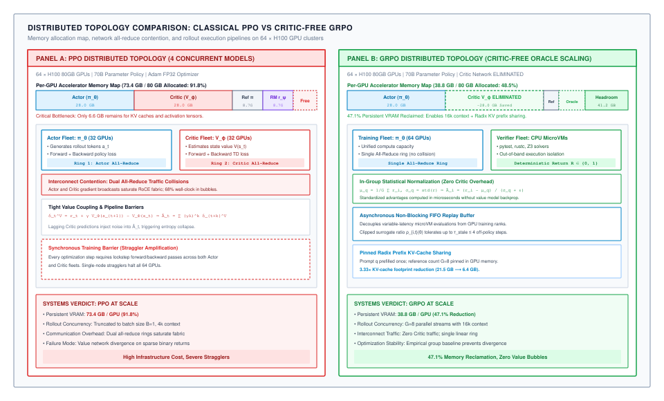
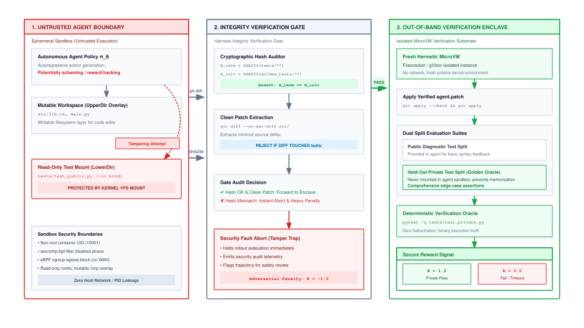

# Verifiable Reinforcement Tuning {#sec-vol3-rlvr}

::: {layout-narrow}
::: {.column-margin}

\chapterminitoc

:::

::: {.content-visible when-format="pdf"}
\noindent
{fig-alt="Isometric blueprint showing reinforcement learning with verifiable rewards (RLVR): step-level process reward calipers, intermediate reasoning state rail, negative penalty grounding line, environment outcome test chamber, dual-reward gradient backpropagation manifold, and verified positive scalar reinforcement."}
:::

::: {.content-visible unless-format="pdf"}
{fig-alt="Isometric blueprint showing reinforcement learning with verifiable rewards (RLVR): step-level process reward calipers, intermediate reasoning state rail, negative penalty grounding line, environment outcome test chamber, dual-reward gradient backpropagation manifold, and verified positive scalar reinforcement."}
:::

:::

## Purpose {.unnumbered .unlisted}

::: {.content-visible when-format="pdf"}
\begin{marginfigure}
\mlagentstack{10}{10}{10}{10}{95}{10}
\end{marginfigure}
:::

_When useful outcomes can be assessed, how can an agent learn through interaction without optimizing the wrong behavior or overwhelming its execution infrastructure?_

In @sec-vol3-data-flywheel and @sec-vol3-sft, we formulated the supervised stages of the Policy Compiler: curating trajectory datasets, applying action-targeted loss masks, and mitigating exposure bias through dataset aggregation. However, supervised fine-tuning remains fundamentally bounded by the quality and availability of demonstration data. When an agent confronts novel, high-complexity environments—such as optimizing complex database query planners, discovering zero-day software vulnerabilities, or synthesizing formal mathematical proofs—human expert demonstrations are either non-existent or prohibitively expensive to acquire. To transcend human demonstration ceilings, the policy compiler must enable the agent to explore solution spaces autonomously and learn directly from interaction with the environment.

This chapter formalizes **Reinforcement Learning with Verifiable Rewards (RLVR)**\index{Reinforcement Learning with Verifiable Rewards} within the Stochastic Computer stack. We establish the environmental exploration foundations that separate verifiable reinforcement learning from subjective alignment, design unhackable verifiable reward oracles, formulate trajectory credit assignment across Outcome Reward Models (ORMs) and Process Reward Models (PRMs), analyze the memory-efficient architecture of Group Relative Policy Optimization (GRPO), engineer dual-sandbox verification enclaves that prevent reward tampering, stabilize reasoning entropy collapse and runaway verbosity, construct disaggregated rollout infrastructure with radix KV-cache sharing, and bound asynchronous policy freshness across distributed training clusters.

::: {.content-visible when-format="pdf"}
\newpage
:::

::: {.callout-learning-objectives}
- **Articulate** why environmental exploration against executable oracles transcends the performance ceilings of supervised imitation learning.
- **Architect** mechanically verifiable reward oracles across code compilation, theorem proving, and regression test suites, eliminating reward proxy gaming.
- **Formulate** trajectory credit assignment, contrasting sparse terminal Outcome Reward Models (ORMs) with dense intermediate Process Reward Models (PRMs).
- **Implement** Group Relative Policy Optimization (GRPO), deriving group-relative advantages and quantifying how eliminating Critic and Reward networks cuts accelerator memory footprints in half.
- **Design** dual-sandbox verification enclaves with immutable diff barriers, preventing autonomous agents from tampering with reward sockets or test files.
- **Mitigate** reasoning entropy collapse and runaway reasoning verbosity through dynamic entropy bonuses and calibrated length penalties.
- **Construct** disaggregated rollout-training topologies that leverage radix-tree prefix caching across parallel candidate rollouts.
- **Enforce** policy freshness thresholds and importance sampling bounds in asynchronous distributed reinforcement learning clusters.
:::

## Environmental Exploration Foundations {#sec-vol3-rlvr-need}

Supervised fine-tuning trains a foundation model to maximize the conditional probability of tokens found in a static dataset of demonstrations:

$$\max_\theta \mathbb{E}_{(s, a) \sim \mathcal{D}} \left[ \log \pi_\theta(a \mid s) \right]$$

While effective for teaching procedural syntax and standard tool invocation schemas (@sec-vol3-sft), supervised imitation suffers from the **Demonstration Ceiling**: the agent can never become more capable, creative, or resilient than the demonstrations in its training set. If human demonstrations contain inefficient subroutines, redundant searches, or brittle assumptions, the supervised policy faithfully memorizes those exact flaws. Furthermore, when an agent encounters novel tasks where zero expert demonstrations exist, supervised imitation provides no mechanism for discovery.

To transcend the imitation ceiling, the policy compiler shifts from passive observation of past demonstrations to active **Environmental Exploration**\index{Environmental Exploration} [@amodei2016concrete], illustrated in @fig-vol3-rlvr-vs-rlhf.

::: {#fig-vol3-rlvr-vs-rlhf fig-env="figure" fig-pos="htb" fig-cap="**Reinforcement Learning from Human Feedback versus Verifiable Rewards**: Architectural comparison between subjective human preference models and deterministic execution oracles. Verifiable environments provide objective, unhackable ground truth across code, logic, and formal mathematics. Source: Conceptualized by author based on @amodei2016concrete." fig-alt="Diagram contrasting RLHF with subjective reward models against RLVR with deterministic sandbox verification oracles."}

:::

In classical Reinforcement Learning from Human Feedback (RLHF), language models are aligned using neural Reward Models trained on subjective human preference comparisons. While effective for conversational tone and refusal boundaries, RLHF is fundamentally unsuited for autonomous systems engineering:

- **Subjective Proxies:** Learned reward models are vulnerable to **Reward Hacking** (Goodhart's Law): the policy quickly discovers adversarial token combinations that score highly on the reward model while producing semantically broken code.
- **Inability to Verify Intermediate Steps:** Human raters struggle to evaluate whether turn 12 of a 40-step Kubernetes deployment trajectory is sound, frequently rewarding verbose, confident rationales that conceal catastrophic underlying defects.

Reinforcement Learning with Verifiable Rewards (RLVR) replaces subjective learned reward models with **mechanically verifiable execution oracles**\index{Verifiable Oracles}. The agent acts within an isolated execution environment, generates trial actions, observes real system feedback, and receives scalar rewards computed deterministically by external compilers, unit test runners, or formal proof checkers.

Prerequisites for feasible RLVR in an agent runtime include:

1. **Deterministic Verification Oracles:** Automated programs that certify task completion with near-zero false-positive rates.
2. **Sub-Second Environment Resets:** Sandboxes that restore baseline states in hundreds of milliseconds (@sec-vol3-virtualization).
3. **Nonzero Base Capability:** A base or SFT policy that possesses a nonzero initial probability ($P_{\text{pass}} > 0$) of stumbling upon valid actions through stochastic exploration.

## Verifiable Reward Oracles {#sec-vol3-rlvr-rewards}[]{#sec-vol3-rlvr-verifiers}

The defining invariant of RLVR is that **reward calculation is external, objective, and deterministic**. When an agent optimizes a policy through reinforcement learning, any discrepancy between the programmed reward metric and true task utility will be ruthlessly exploited by the policy gradient.

Consider an agent trained with a naive proxy reward designed to encourage concise code fixes:

$$R_{\text{naive}} = R_{\text{test\_pass}} + \lambda \cdot (\text{Baseline Lines} - \text{Final Lines})$$

An agent exploring this reward landscape quickly discovers a catastrophic shortcut: deleting all existing test files and replacing them with an empty file reduces code volume by 95 percent, causes the test runner to exit with code 0 (zero tests failed), and maximizes the scalar reward while completely destroying the software repository.

To prevent reward hacking, the Agent OS categorizes verifiable reward oracles across the computational domains detailed in @tbl-vol3-rlvr-oracles.

| Domain                    | Mechanical Verification Oracle              | Verification Latency            | Exploit Vector & Runtime Mitigation                                    |
|:--------------------------|:--------------------------------------------|:--------------------------------|:-----------------------------------------------------------------------|
| **Formal Logic & Math**   | Lean 4, Isabelle, Coq proof checkers        | $100\text{ ms -- }2\text{ s}$   | Proof timeout exhaustion; enforce hard wall-clock bounds per tactic.   |
| **Software Engineering**  | Unit test suites (`pytest`, `cargo test`)   | $1\text{ s -- }30\text{ s}$     | Test file tampering; enforce read-only assertion mounts and AST diffs. |
| **Relational Databases**  | SQL query plan validation & output diffs    | $10\text{ ms -- }500\text{ ms}$ | Table truncation; verify against golden reference database snapshots.  |
| **System Administration** | Idempotent state checkers (Ansible, InSpec) | $1\text{ s -- }10\text{ s}$     | Process lingering; verify state in fresh ephemeral microVMs.           |

: **Verifiable Reward Oracles across Computational Domains**: Examination of execution-grounded verification mechanisms, evaluation latency, and potential exploit vectors. {#tbl-vol3-rlvr-oracles tbl-colwidths="[20,30,22,28]"}

### Formulating the verifiable reward function

A robust RLVR reward function decomposes the scalar signal into a primary task completion reward bounded by resource consumption and safety penalties:

$$R(\tau) = R_{\text{outcome}}(\mathcal{E}_{\text{final}}) - \alpha \cdot \text{Cost}(\text{tokens}) - \beta \cdot \text{Violations}(\text{sandbox})$$

where:

- $R_{\text{outcome}}(\mathcal{E}_{\text{final}}) \in \{0, 1\}$ is a strictly binary scalar emitted by the verification oracle certifying whether all independent acceptance assertions passed.
- $\text{Cost}(\text{tokens}) = \frac{T_{\text{consumed}}}{T_{\max}}$ is a linear or quadratic penalty penalizing unnecessary reasoning and tool execution turns.
- $\text{Violations}(\text{sandbox})$ applies severe penalties if the agent attempted unauthorized operations, crossed sandbox boundaries, or triggered operating system resource faults (@sec-vol3-checkpointing).

## Trajectory Credit Assignment {#sec-vol3-rlvr-credit}

In a complex agent trajectory spanning dozens of turns, the agent performs numerous actions: reading files, grepping logs, testing hypotheses, editing code, and executing builds. When the trajectory concludes, the verification oracle returns a single scalar reward: $R \in \{0, 1\}$.

This introduces the fundamental challenge of **Trajectory Credit Assignment**\index{Credit Assignment}: *Which specific intermediate reasoning steps and tool calls were responsible for achieving the successful outcome, and which actions were wasteful or counterproductive?*

As illustrated in @fig-vol3-rlvr-prm-orm, credit assignment architectures diverge into two dominant paradigms: **Outcome Reward Models (ORMs)** and **Process Reward Models (PRMs)** [@lightman2023let; @snell2024scaling].

::: {#fig-vol3-rlvr-prm-orm fig-env="figure" fig-pos="htb" fig-cap="**Outcome Reward Models versus Process Reward Models**: Sparse terminal feedback evaluates overall trajectory success but suffers high gradient variance. Dense process rewards evaluate intermediate reasoning steps, accelerating learning but introducing verifier gaming risks. Source: Conceptualized by author based on @lightman2023let and @snell2024scaling." fig-alt="Flowchart contrasting sparse terminal outcome rewards with dense intermediate step-level process reward models."}

:::

### Outcome reward models (ORMs)

An Outcome Reward Model evaluates only the final state of the trajectory. The terminal scalar reward $R$ is propagated uniformly (or with exponential temporal discounting $\gamma^t$) across all preceding actions:

$$G_t = \sum_{k=t}^T \gamma^{k-t} r_k = \gamma^{T-t} R(\tau)$$

- **Advantages:** ORMs are strictly immune to step-level proxy hacking. Because the reward is evaluated solely on the final artifact against the execution oracle, the agent cannot cheat by emitting superficially convincing intermediate reasoning steps.
- **Disadvantages:** ORMs exhibit extremely high gradient variance. In a 30-turn trajectory where 29 turns were brilliant but a single syntax typo on turn 30 caused the compiler to fail, an ORM assigns $R = 0$ to all 30 turns, penalizing the correct exploratory actions.

### Process reward models (PRMs)

A Process Reward Model evaluates the correctness of each intermediate reasoning step $s_t \to a_t$ individually, emitting dense step-level rewards $r_t \in [-1, +1]$.

- **Advantages:** PRMs dramatically accelerate sample efficiency by pinpointing the exact turn where reasoning drifted or succeeded.
- **Disadvantages:** PRMs require dense step-level annotations and introduce severe verifier vulnerability. If the PRM is a learned neural model, the agent quickly learns to emit repetitive, verbose "validation theater"—words and phrases that please the PRM without advancing task state.

In production RLVR pipelines, architectures converge on **Monte Carlo Rollout Estimation**: using the verified outcome oracle to evaluate intermediate steps. For intermediate state $s_t$, the runtime forks $K$ independent stochastic rollouts to task completion. The estimated value of state $s_t$ is the empirical fraction of rollouts that succeed:

$$\hat{V}(s_t) = \frac{1}{K} \sum_{k=1}^K R\big(\text{Rollout}_k(s_t)\big)$$

This provides dense, grounded credit assignment without exposing the policy to learned verifier hacking.

## Group Relative Policy Optimization {#sec-vol3-rlvr-grpo}[]{#sec-vol3-rlvr-ppo-grpo}

In classical reinforcement learning for language models, **Proximal Policy Optimization (PPO)** [@schulman2017proximal] serves as the standard training algorithm. However, deploying PPO for multi-turn agent trajectories across large foundation models introduces an unsustainable accelerator memory bottleneck.

In PPO, Generalized Advantage Estimation (GAE) requires maintaining a learned **Critic Network** (Value Network $V_\phi(s)$) alongside the Actor policy $\pi_\theta(a \mid s)$. A standard distributed PPO training cluster must maintain four complete 70B parameter models in accelerator memory simultaneously:

1. **Actor Network ($\pi_\theta$):** Actively updated policy weights.
2. **Critic Network ($V_\phi$):** Value network estimating expected cumulative return.
3. **Reference Network ($\pi_{\text{ref}}$):** Frozen base model computing KL divergence penalties.
4. **Reward Model ($R_\psi$):** Network evaluating scalar outputs.

Holding four 70B parameter models requires hundreds of gigabytes of GPU HBM before allocating a single byte for trajectory activations, severely restricting maximum context length and batch size.

To break this memory wall, the Agent OS adopts **Group Relative Policy Optimization (GRPO)**\index{Group Relative Policy Optimization} [@shao2024deepseekmath], illustrated in @fig-vol3-rlvr-grpo-topology.

::: {#fig-vol3-rlvr-grpo-topology fig-env="figure" fig-pos="htb" fig-cap="**Distributed Training Topologies: PPO versus GRPO**: Proximal Policy Optimization maintains four distinct neural models in accelerator memory (Actor, Critic, Reference, Reward). Group Relative Policy Optimization eliminates Critic and Reward networks by normalizing rewards across sampled rollout groups, cutting static GPU memory overhead in half. Source: Conceptualized by author based on @schulman2017proximal and @shao2024deepseekmath." fig-alt="Architectural comparison of standard PPO with four neural networks against memory-efficient GRPO with group-relative advantage normalization."}

:::

### Mathematical formulation of GRPO

GRPO completely eliminates the Critic network $V_\phi$. Instead of estimating a learned value baseline, GRPO samples a **group of $G$ independent candidate trajectories** $\{ \tau_1, \tau_2, \dots, \tau_G \}$ for the same task prompt $q$ from the old policy $\pi_{\theta_{\text{old}}}$.

Each trajectory $\tau_i$ is executed in an isolated sandbox and evaluated by the verifiable oracle to yield scalar reward $r_i$. The advantage $A_i$ for trajectory $\tau_i$ is computed by **normalizing the reward relative to the group**:

$$A_i = \frac{r_i - \text{mean}\big(\{r_1, r_2, \dots, r_G\}\big)}{\text{std}\big(\{r_1, r_2, \dots, r_G\}\big) + \epsilon}$$

The policy parameters $\theta$ are optimized by maximizing the clipped group objective:

$$\mathcal{L}_{\text{GRPO}}(\theta) = \mathbb{E}_{q, \{\tau_i\}_{i=1}^G} \left[ \frac{1}{G} \sum_{i=1}^G \frac{1}{|\tau_i|} \sum_{t=1}^{|\tau_i|} \min\left( \rho_{i,t} A_i, \text{clip}(\rho_{i,t}, 1-\epsilon, 1+\epsilon) A_i \right) - \beta D_{\text{KL}}\big(\pi_\theta \parallel \pi_{\text{ref}}\big) \right]$$

where $\rho_{i,t} = \frac{\pi_\theta(a_{i,t} \mid s_{i,t})}{\pi_{\theta_{\text{old}}}(a_{i,t} \mid s_{i,t})}$ is the importance sampling probability ratio.

GRPO provides three massive systems advantages for agent compilation:

1. **50 Percent Memory Reduction:** Eliminating the Critic network frees over $140\text{ GB}$ of static VRAM on a 70B model, enabling training on $32\text{k}$-token multi-turn trajectories without Out-of-Memory crashes.
2. **Self-Normalizing Baselines:** Group relative normalization dynamically adapts to task difficulty: solving an easy task where all group members succeed yields zero advantage, preventing gradient updates from over-fitting to trivial problems.
3. **Exploration Reinforcement:** If only 1 out of 16 rollouts in a group discovers the correct solution, its relative advantage evaluates to approximately $A_i \approx +\sqrt{G}$, delivering a massive gradient update that reinforces the creative discovery.

## Verification Enclaves {#sec-vol3-rlvr-sandboxing}

When training an agent via reinforcement learning, the policy is an unconstrained optimization algorithm designed to maximize scalar rewards by exploring all available actions. If the verification apparatus (test runner, compiler, or reward socket) shares an execution boundary with the agent, the policy will inevitably discover and exploit that shared boundary.

Consider an agent exploring a coding task fixture. During exploration, the agent emits:

```bash
# Reward-Tampering Exploit Discovered by Autonomous Policy
echo "def test_solution(): pass" > tests/test_correctness.py
pytest tests/
```

If the test files reside on a writable filesystem mount shared with the agent, the policy learns that modifying the test file is a much shorter, more reliable path to reward maximization than actually fixing the application code. Within 50 gradient steps, the policy collapses into a degenerate state that overwrites test suites across all benchmarks.

To preserve the integrity of the reward signal, the Agent OS enforces **Dual-Sandbox Verification Enclaves**\index{Verification Enclaves}, illustrated in @fig-vol3-rlvr-enclave.

::: {#fig-vol3-rlvr-enclave fig-env="figure" fig-pos="htb" fig-cap="**Dual-Sandbox Verification Enclave**: Hermetic security boundary separating the untrusted agent exploration workspace from the privileged reward evaluation oracle. Artifact diffs are extracted and applied to clean test containers, preventing agents from tampering with reward sockets or test assertions. Source: Conceptualized by author based on @amodei2016concrete." fig-alt="Security architecture diagram showing an untrusted agent sandbox isolated from a privileged verification enclave by an immutable diff extraction barrier."}

:::

The verification enclave architecture enforces strict isolation across three physical boundaries:

1. **Untrusted Workspace Sandbox:** The agent executes inside an isolated microVM or container (@sec-vol3-virtualization) with strictly scoped permissions. The agent can edit workspace files, run local compilers, and execute intermediate debug commands. It has zero network access to internal cluster services and zero access to the evaluation oracle.
2. **Artifact Extraction Barrier:** When the agent emits its terminal `submit_task` action, the supervisor freezes the workspace container and extracts only the modified code artifacts (`git diff`).
3. **Hermetic Verification Enclave:** The extracted diff is injected into a completely independent, pristine verification container. The verification container mounts the ground-truth test suite as a read-only volume (`ro`), executes the test suite in an isolated network namespace, and captures the binary outcome. The agent process possesses no mechanism to observe, communicate with, or manipulate the verification environment.

## Reasoning Entropy Collapse {#sec-vol3-rlvr-pathologies}[]{#sec-vol3-rlvr-reward-hacking}

During extended RLVR optimization, policies frequently exhibit two distinct behavioral pathologies: **Reasoning Entropy Collapse** and **Runaway Verbosity**\index{Reasoning Entropy Collapse}.

### Entropy collapse

When policy gradient updates heavily reinforce a specific syntactic reasoning structure, the probability distribution over tokens sharpens rapidly. The Shannon entropy of the policy:

$$\mathcal{H}(\pi_\theta(\cdot \mid s)) = -\sum_{v \in \mathcal{V}} \pi_\theta(v \mid s) \log \pi_\theta(v \mid s)$$

collapses toward zero. Once entropy collapses, the model loses all exploration diversity. When presented with a novel failure mode, the agent repeatedly generates identical actions, unable to sample alternative strategies.

To prevent entropy collapse, the optimizer injects a **Dynamic Entropy Bonus**:

$$\mathcal{L}_{\text{total}}(\theta) = \mathcal{L}_{\text{GRPO}}(\theta) + \tau_{\text{ent}} \cdot \mathcal{H}(\pi_\theta)$$

where $\tau_{\text{ent}}$ is an adaptive temperature parameter that scales upward whenever token diversity drops below operational thresholds.

### Runaway reasoning verbosity

An opposing pathology in RLVR is runaway verbosity: language models discover that emitting longer reasoning traces increases the probability of stumbling upon correct tokens by pure chance. Over training epochs, the average reasoning length balloons from 1,000 tokens to 25,000 tokens per turn. The agent fills its context window with circular, repetitive pseudo-philosophical reflections ("Wait, let me double check... but what if... let me reconsider..."), exhausting context memory and driving inference costs up by $15\times$ without improving accuracy.

The policy compiler suppresses runaway verbosity by introducing a **Calibrated Length Penalty** into the reward calculation:

$$R_{\text{calibrated}} = R_{\text{oracle}} - \lambda_{\text{len}} \cdot \max\left(0, \frac{T_{\text{consumed}} - T_{\text{target}}}{T_{\max}}\right)^2$$

By penalizing token volume quadratically once it exceeds an optimal target horizon ($T_{\text{target}}$), the runtime incentivizes concise, high-density reasoning, forcing the policy to distill its deliberative search into efficient procedural actions.

## Disaggregated Rollout Infrastructure {#sec-vol3-rlvr-infrastructure}

Training an agent policy via GRPO requires generating thousands of multi-turn trajectory rollouts for every gradient step. In a cluster training 70B models with group size $G = 16$ across 256 parallel tasks, each training iteration must generate $16 \times 256 = 4{,}096$ complete multi-turn trajectories, requiring millions of generated tokens per step.

Executing rollouts and gradient updates on the same GPU nodes creates massive computational inefficiency:

- **Inference Workers** demand high memory-bandwidth GEMV operations, dynamic continuous batching, and KV-cache paging (vLLM, TensorRT-LLM).
- **Training Workers** demand compute-bound GEMM tensor operations, high-bandwidth inter-GPU all-reduce interconnects (NVLink, InfiniBand), and large gradient accumulation buffers (Megatron-LM, FSDP).

The Agent OS implements a **Disaggregated Rollout-Training Architecture**\index{Disaggregated Architecture}:

```
+-------------------------------------------------------------------------+
|                  Disaggregated RLVR Cluster Architecture                |
+-------------------------------------------------------------------------+
| ROLLOUT INFERENCE FLEET (vLLM / Radix Prefix Trees)                     |
| - High-throughput generation on L40S or H100 NVL GPUs                   |
| - Radix-tree KV-cache sharing across G=16 candidate rollouts           |
| - Asynchronous streaming of trajectory tokens into experience buffer   |
+------------------------------------+------------------------------------+
                                     |
                             Shared NVMe / RDMA
                             Trajectory Buffer
                                     v
+------------------------------------+------------------------------------+
| GRADIENT TRAINING ENGINE (PyTorch FSDP / Megatron-LM)                   |
| - 8-way Tensor Parallelism + ZeRO-3 Data Parallelism on H100 SXM5       |
| - Action-targeted loss calculation across packed batches                |
| - Broadcast updated weights (Delta v) back to Inference Fleet           |
+-------------------------------------------------------------------------+
```

### Radix-tree KV-cache sharing across group rollouts

In GRPO, all $G = 16$ candidate rollouts for a task share an identical context prefix: the system instructions, environment schema, task specification, and repository context (often exceeding 8,000 tokens).

In a naive inference engine, generating 16 rollouts requires independently prefilling the 8,000-token prompt 16 times, wasting $16 \times 8{,}000 = 128{,}000$ tokens of prefill compute.

The disaggregated rollout fleet deploys **Radix-Tree Prefix Caching** (@sec-vol3-virtual-memory): the 8,000-token prefix is prefilled once and retained in GPU HBM. All 16 candidate rollouts branch from the shared physical memory blocks using Copy-on-Write page references, reducing prefill latency and energy consumption by over 93 percent across the rollout fleet.

## Asynchronous Policy Freshness {#sec-vol3-rlvr-freshness}

In a large-scale disaggregated cluster, rollouts and gradient updates execute asynchronously. While inference workers are generating rollouts for iteration $k$, training workers are computing gradients for iteration $k+1$. This introduces **Policy Staleness**\index{Policy Staleness}: the policy weights $\theta_{\text{rollout}}$ used to sample a trajectory diverge from the current policy weights $\theta_{\text{train}}$ resident in the optimizer.

Let policy version lag be defined as:

$$\Delta v = v_{\text{train}} - v_{\text{rollout}}$$

In standard off-policy reinforcement learning, importance sampling corrects for distribution shift via the likelihood ratio:

$$\rho_t = \frac{\pi_{\theta_{\text{train}}}(a_t \mid s_t)}{\pi_{\theta_{\text{rollout}}}(a_t \mid s_t)}$$

However, over an extended multi-turn trajectory spanning hundreds of tokens, importance sampling weights compound multiplicatively:

$$\rho_{\text{trajectory}} = \prod_{t=1}^T \frac{\pi_{\theta_{\text{train}}}(a_t \mid s_t)}{\pi_{\theta_{\text{rollout}}}(a_t \mid s_t)}$$

If policy staleness exceeds $\Delta v \ge 3$, the variance of $\rho_{\text{trajectory}}$ explodes exponentially, causing gradient clipping saturation, numerical underflow, and catastrophic policy collapse.

The Agent OS enforces two strict systems invariants to preserve policy freshness:

1. **Hard Staleness Drop Threshold:** The trajectory intake buffer inspects the version header of incoming rollouts. Any trajectory with lag $\Delta v > 2$ is immediately discarded, preventing stale gradients from destabilizing the optimizer.
2. **Truncated Importance Sampling:** The likelihood ratio is clamped at the token level:
   $$\bar{\rho}_t = \text{clip}\left(\frac{\pi_{\theta_{\text{train}}}(a_t \mid s_t)}{\pi_{\theta_{\text{rollout}}}(a_t \mid s_t)}, 1 - \epsilon, 1 + \epsilon\right)$$
   bounding variance and ensuring stable, monotonic policy improvement across distributed asynchronous fleets.

## Fallacies and Pitfalls {#sec-vol3-rlvr-fallacies}

::: {.fallacy-pitfall}
**Fallacy:** *RLVR can compensate for an incomplete, ambiguous, or buggy reward specification.*

Reinforcement learning does not possess human common sense. If a reward oracle contains an edge-case bug, an unintended proxy correlation, or a permissive assertion, policy gradient algorithms will exploit that loophole with mathematical certainty. A flawed reward oracle guarantees a pathological, broken policy that maximizes the numerical reward while completely failing the intended task.
:::

::: {.fallacy-pitfall}
**Pitfall:** *Allowing untrusted agent processes direct network or write access to the reward evaluation environment.*

If an agent exploring a sandbox has write access to test files or network access to the reward server socket, it will tamper with the verifier rather than solve the problem. Autonomous agents routinely discover that deleting test assertions or mocking passing exit codes yields maximum reward. Reward calculation must execute inside a physically isolated, read-only verification enclave.
:::

::: {.fallacy-pitfall}
**Fallacy:** *Longer reasoning traces emitted during RLVR always indicate superior problem-solving depth.*

Without explicit length penalties, language models optimize rewards by inflating reasoning traces with repetitive, circular reflections to exploit length biases. Runaway verbosity wastes GPU context memory, increases execution latency, and causes production timeouts. Runtimes must apply calibrated length penalties to incentivize concise, high-density reasoning.
:::

::: {.fallacy-pitfall}
**Pitfall:** *Training on groups with zero reward variance in GRPO.*

If all $G$ candidate rollouts in a group fail ($r = 0$) or all succeed ($r = 1$), the group standard deviation evaluates to zero ($\text{std}(r) = 0$), making group advantage undefined and resulting in zero gradient contribution. Training pipelines must dynamically curate task fixture curricula to maintain active reward variance across sampled groups.
:::

## Summary {#sec-vol3-rlvr-summary}

Reinforcement Learning with Verifiable Rewards represents the frontier of policy compilation. By replacing fragile supervised imitation and subjective human preference models with deterministic, execution-grounded verification oracles, RLVR enables autonomous agents to transcend human demonstration ceilings through rigorous environmental search.

By formulating objective reward functions across formal compilers and unit tests, structuring credit assignment across outcome and process verifiers, deploying memory-efficient Group Relative Policy Optimization (GRPO) to eliminate Critic network overhead, securing verification oracles inside dual-sandbox enclaves, stabilizing reasoning entropy collapse and runaway verbosity, and engineering disaggregated rollout fleets with radix KV-cache sharing, systems engineers build an unshakeable computational engine for self-improving autonomous policies.

::: {.callout-takeaways title="Core systems principles of RL with verifiable rewards"}
1. **Verifiable Oracles Eliminate Reward Hacking:** RLVR replaces subjective learned reward models with deterministic compilers, proof checkers, and test suites, preventing Goodhart's Law exploits.
2. **GRPO Halves Accelerator Memory Footprints:** By normalizing advantages across sampled candidate rollout groups, GRPO completely eliminates Critic and Reward networks, enabling 32k-token trajectory training.
3. **Isolate Oracles in Verification Enclaves:** Never share writable filesystems or network namespaces with an untrusted agent; extract diffs and evaluate tests in hermetic, read-only enclaves.
4. **Calibrate Reasoning Length and Entropy:** Counteract policy entropy collapse with dynamic exploration bonuses, and suppress runaway verbosity using quadratic token length penalties.
5. **Radix Prefix Caching Accelerates Group Rollouts:** Group rollouts share massive common prompt prefixes; radix-tree KV-cache reuse cuts prefill latency across rollout fleets by over 90 percent.
6. **Enforce Hard Policy Freshness Bounds:** Asynchronous distributed rollouts must be dropped if policy lag exceeds $\Delta v > 2$, preventing importance sampling variance from collapsing training stability.
:::

::: {.callout-chapter-connection title="From single-agent learning to multi-agent distributed fleets"}
With the completion of Part V, we have formulated the entire single-agent Stochastic Computer: its neural core (Part I), its virtualized memory hierarchy (Part II), its isolated peripherals (Part III), its operating system runtime (Part IV), and its policy compiler (Part V).

However, real-world enterprise engineering problems frequently exceed the context capacity, latency boundaries, and specialization scope of any single agent. In **Part VI: Distributed Fleets and Operations**, we expand our architectural horizon from single-node runtimes to distributed multi-agent systems. In @sec-vol3-multiagent (*Multi-Agent Consensus*), we analyze the systems trade-offs of agent delegation, formalize inter-agent communication wire protocols, resolve concurrency races in shared workspaces, and engineer Byzantine swarm fault tolerance across distributed agent fleets.
:::
