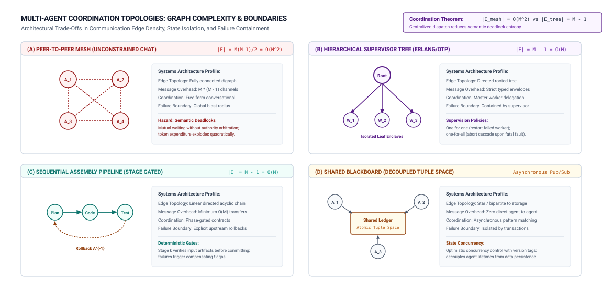

# Multi-Agent Consensus {#sec-vol3-multiagent}

::: {layout-narrow}
::: {.column-margin}

\chapterminitoc

:::

::: {.content-visible when-format="pdf"}
\noindent
{fig-alt="Isometric blueprint showing multi-agent topologies and distributed consensus: autonomous specialized agent nodes, proposal transmission ring, shared blackboard memory repository, lock-free atomic read-write channels, state synchronization update bus, and distributed consensus arbitration ring."}
:::

::: {.content-visible unless-format="pdf"}
{fig-alt="Isometric blueprint showing multi-agent topologies and distributed consensus: autonomous specialized agent nodes, proposal transmission ring, shared blackboard memory repository, lock-free atomic read-write channels, state synchronization update bus, and distributed consensus arbitration ring."}
:::

:::

## Purpose {.unnumbered .unlisted}

::: {.content-visible when-format="pdf"}
\begin{marginfigure}
\mlagentstack{10}{10}{10}{10}{10}{95}
\end{marginfigure}
:::

_When does dividing a task among agents improve the result, and how do we design interfaces, state ownership, and concurrency control so their work fits together robustly?_

In Parts I through V, we formulated the architecture of a single-agent Stochastic Computer: its neural processing core (@sec-vol3-processor), deliberative search mechanics (@sec-vol3-deliberation), virtualized memory hierarchy (@sec-vol3-working-sets, @sec-vol3-virtual-memory), execution sandboxes (@sec-vol3-virtualization), checkpoint control plane (@sec-vol3-checkpointing), and policy compilation loops (@sec-vol3-data-flywheel, @sec-vol3-sft, @sec-vol3-rlvr).

However, complex enterprise engineering problems frequently exceed the context capacity, latency boundaries, and specialization scope of any single agent. A software engineering task that requires reviewing a multi-million-line codebase, validating thousands of database migration scripts, or diagnosing distributed microservice outages cannot be resolved by feeding the entire operational universe into a single model's prompt. To tackle tasks of this scale, systems engineers decompose workloads across distributed fleets of coordinated agents.

Yet multi-agent delegation is not an architectural panacea. Dividing execution across multiple stochastic actors introduces severe coordination overhead: duplicated prompt contexts, serialized inter-agent messaging, state synchronization races, and correlated failure modes. When multiple agents share the same pretraining biases, peer consensus does not prove correctness—it often amplifies hallucinated errors.

This chapter establishes the systems engineering foundation for multi-agent fleets and coordination. We evaluate the core delegation trade-off against single-agent baselines, classify coordination topologies across supervisor-worker trees and pipelines, engineer typed task handoff envelopes that eliminate conversational drift, enforce optimistic concurrency control across shared workspaces, uncover the mathematical failure of quorum voting under correlated neural errors, propagate hierarchical cancellation cascades, design cryptographically attenuated capability tokens, and benchmark multi-agent systems using Amdahl speedup accounting.

::: {.content-visible when-format="pdf"}
\newpage
:::

::: {.callout-learning-objectives}
- **Quantify** the multi-agent delegation trade-off, contrasting parallel exploration gains against context duplication, serialization latency, and reconciliation overhead.
- **Architect** formal task dependency graphs (DAGs) choosing between supervisor-worker hierarchies, sequential pipelines, and decentralized blackboard topologies.
- **Specify** typed task envelopes carrying immutable artifact references, cryptographic capabilities, and deterministic completion schemas.
- **Implement** optimistic concurrency control (OCC) using private git worktrees and copy-on-write container layers to prevent conflicting workspace mutations.
- **Analyze** the breakdown of Condorcet jury consensus and Byzantine fault tolerance when neural agents share correlated pretraining distributions.
- **Construct** hierarchical cancellation trees that propagate abort signals across worker fleets, eliminating orphaned GPU compute.
- **Enforce** monotonic capability attenuation using macaroon tokens to prevent privilege escalation during subagent delegation.
- **Benchmark** multi-agent fleets against optimized single-agent deliberation baselines using modified Amdahl speedup equations.
:::

## The Delegation Trade-Off {#sec-vol3-multiagent-need}

The central design decision in distributed agent systems is whether to delegate a task across multiple agents or resolve it through deep deliberation within a single agent (@sec-vol3-deliberation). Multi-agent architectures are frequently justified with an intuitive appeal to human organizations: just as large software systems require teams of architects, developers, testers, and reviewers, complex agentic workloads seem to demand specialized swarms of stochastic actors.

In practice, naive multi-agent delegation often introduces catastrophic performance degradation. Consider a real-world systems deployment: an engineering team refactored a single-agent coding pipeline into a 5-agent collaborative swarm consisting of an Architect, Coder, Tester, Reviewer, and Documenter. Rather than improving throughput, total task completion latency surged from $45\text{ s}$ to $11\text{ min}$, token expenditures jumped $7\times$, and end-to-end task completion accuracy declined by 18 percent. The root cause was communication overhead: the agents spent the majority of their token budgets and wall-clock execution time re-explaining context to one another, serializing message queues, and negotiating conflicting workspace proposals.

### The multi-agent illusion {#sec-vol3-multiagent-single-agent-ceiling}

Concurrency does not automatically equal parallelism. In classical distributed computing, executing $M$ tasks concurrently reduces wall-clock makespan if and only if the tasks possess independent execution paths that can be processed in parallel [@saltzer2009]. If Subtask $B$ requires the intermediate output of Subtask $A$, running them as two distinct agents adds inter-process communication overhead, network serialization latency, and redundant context ingestion without decreasing the critical path duration.

Furthermore, multi-agent systems suffer from the **Context Duplication Multiplier**. In a single-agent architecture, the model maintains its working memory, intermediate tool observations, and reasoning scratchpad within a single shared KV-cache (@sec-vol3-virtual-memory). When a task is partitioned across $M$ distinct agents, each agent must ingest baseline environment prompts, system instructions, schema definitions, and relevant task history. A 20,000-token repository context distributed across 5 agents requires $5 \times 20{,}000 = 100{,}000$ prompt prefill tokens before a single line of code is written, drastically inflating serving costs and accelerator memory pressure.

### Legitimate motivations for multi-agent fleets

Multi-agent delegation is justified only when domain specialization or parallel exploration outweighs the coordination tax. In production systems, legitimate motivations for multi-agent architectures fall into three distinct systems categories:

1. **Context Partitioning:** When the operational state required to solve a task exceeds the effective context window or attention retrieval horizon of a single model (@sec-vol3-working-sets). For example, auditing 50 independent microservices simultaneously requires partitioning analysis across distinct agents because the aggregate codebase exceeds multi-million-token context capacities.
2. **Tool Authority Attenuation:** When security isolation boundaries require privilege separation (@sec-vol3-virtualization). An untrusted web researcher agent must run in an internet-accessible sandbox with read-only permissions, while a deployment agent must execute inside a locked private VPC with restricted write credentials. Running these workloads within distinct agents guarantees that prompt injection in the researcher cannot compromise production credentials.
3. **True Parallel Exploration:** When searching wide, decoupled solution spaces with non-overlapping state dependencies. For example, generating and evaluating 16 independent architectural design proposals, fuzzing different API endpoints simultaneously, or searching disjoint directories for bug candidates.

### The coordination tax

We quantify the end-to-end latency of a multi-agent workflow through the **Coordination Tax**:

$$T_{\text{total}} = T_{\text{work}} + T_{\text{serialize}} + T_{\text{network}} + T_{\text{context\_duplication}} + T_{\text{reconciliation}}$$

where $T_{\text{work}}$ represents active token generation and tool execution, $T_{\text{serialize}}$ is the latency of encoding structured messages, $T_{\text{network}}$ is inter-agent transport latency, $T_{\text{context\_duplication}}$ is the prefill latency of ingesting duplicated baseline context across workers, and $T_{\text{reconciliation}}$ is the time spent resolving merge conflicts and aggregating candidate responses.

@Tbl-vol3-multiagent-delegation-tradeoff formalizes the systems trade-offs between single-agent deliberation and multi-agent delegation.

| Systems Dimension     | Single-Agent Deliberation                   | Multi-Agent Delegation                       | Optimal Systems Selection                                                                |
|:----------------------|:--------------------------------------------|:---------------------------------------------|:-----------------------------------------------------------------------------------------|
| **Latency Profile**   | Low serialization; sequential critical path | Parallel exploration; high communication tax | Single agent for sequential dependencies; multi-agent for embarrassingly parallel search |
| **Token Cost**        | Shared KV-cache; zero context duplication   | Multiplied prompt prefill across $M$ agents  | Single agent for dense, shared codebases; multi-agent for disjoint data partitions       |
| **Security Scope**    | Single ambient credential envelope          | Attenuated, per-agent capability tokens      | Multi-agent when security domains require strict network or privilege isolation          |
| **Failure Isolation** | Trajectory failure halts entire execution   | Subagent crash contained by supervisor tree  | Multi-agent when unhandled exceptions must be isolated to disposable workers             |
| **State Consistency** | Single linear memory workspace              | Distributed workspaces; merge conflicts      | Single agent for coupled state edits; multi-agent for read-only parallel indexing        |

: **Single-Agent Deliberation versus Multi-Agent Delegation**: Architectural trade-offs across latency, token expenditures, security boundaries, and state consistency. {#tbl-vol3-multiagent-delegation-tradeoff tbl-colwidths="[20,25,25,30]"}

## Coordination Topologies {#sec-vol3-multiagent-topologies}

When multi-agent delegation is justified, the systems engineer must structure the communication and dependency relationships connecting the agents. Multi-agent coordination requires formal task dependency directed acyclic graphs (DAGs)\index{Task Dependency Graph} [@lamport1978time] that define the flow of control, state, and evidence across the fleet.

Consider the failure signature of an uncoordinated peer-to-peer topology: an engineering team deployed three peer agents (Database Specialist, Backend Developer, API Gateway Engineer) in an open, unconstrained chat room with no designated coordinator. The team entered an unresolvable semantic deadlock: the Backend Developer waited for the Database Specialist to finalize the schema, the Database Specialist waited for the API Gateway Engineer to specify request payloads, and the API Gateway Engineer waited for the Backend Developer to publish service endpoints. All three agents exhausted their token and timeout budgets exchanging polite messages asking each other to proceed first.

To prevent coordination deadlocks, production systems employ four foundational coordination archetypes (@fig-vol3-multiagent-topologies).

::: {#fig-vol3-multiagent-topologies fig-env="figure" fig-pos="htb" fig-cap="**Multi-Agent Coordination Topologies**: Architectural trade-offs across communication complexity, failure blast radii, and state isolation boundaries. The four archetypes trade edge density ($O(M^2)$ in peer meshes down to $O(M)$ in supervisor trees) for centralization and latency. Source: Adapted from @hewitt1973actor and @agha1986actors." fig-alt="Four-panel diagram comparing multi-agent topologies: Peer-to-Peer Mesh with quadratic all-to-all communication, Hierarchical Supervisor Tree with bounded tree edges, Sequential Assembly Pipeline with linear phase gates, and Shared Blackboard with decoupled asynchronous tuple space."}
{width="100%"}
:::

### Hierarchical supervisor trees

Drawing from Erlang/OTP actor principles [@armstrong2007erlang; @agha1986actors], **Hierarchical Supervisor Trees** structure agents into a strict parent-child supervision hierarchy. A root supervisor receives the high-level task specification, decomposes the goal into bounded subtasks, provisions specialized worker agents, dispatches typed task envelopes, and aggregates results.

In a supervisor hierarchy:

1. **Failure Containment:** Leaf workers execute in sandboxed environments. If a worker crashes, times out, or emits invalid actions, the supervisor catches the fault without crashing the entire fleet.
2. **Supervision Policies:** Supervisors enforce explicit restart policies:
   - *One-For-One:* If a leaf worker fails, only that specific worker is restarted.
   - *One-For-All:* If a critical worker fails (e.g., the primary code compiler), all sibling workers dependent on its output are aborted and restarted simultaneously.
3. **Supervisor Bottleneck Hazard:** The primary limitation of supervisor trees is context saturation at the root node. If $M = 20$ workers stream detailed intermediate updates to the supervisor, the supervisor's context window rapidly fills with status noise, crowding out planning capacity. Supervisors must enforce strict summary reporting protocols.

### Sequential assembly pipelines

In a **Sequential Pipeline**, work proceeds through a series of linear stages: Agent $k$ transforms input artifacts and streams its output directly as the input to Agent $k+1$. Pipelines are optimal for deterministic, staged transformations, such as automated vulnerability remediation:

$$\text{Issue Report} \xrightarrow{\text{Triage Agent}} \text{Reproducer} \xrightarrow{\text{Patch Agent}} \text{Diff} \xrightarrow{\text{Reviewer Agent}} \text{Approved PR}$$

Pipelines provide deterministic execution ordering and minimal communication overhead ($O(M)$ linear edges). However, pipelines are inherently brittle to upstream quality drift: if an early agent emits an erroneous intermediate artifact, downstream agents inherit the flaw, compounding the error across subsequent stages.

### Shared blackboard architectures

In a **Shared Blackboard** topology, agents do not communicate via direct point-to-point messages. Instead, all agents interact asynchronously with a centralized, versioned state repository (the blackboard). Agents register interest in specific artifact types (e.g., "new failed unit tests" or "pending database migrations") and execute whenever matching entries appear on the blackboard.

Blackboard architectures decouple agent lifecycles, enabling dynamic worker scaling and asynchronous task processing. However, they require rigorous distributed concurrency control (@sec-vol3-multiagent-concurrency) to prevent conflicting writes to shared blackboard entries.

@Tbl-vol3-multiagent-topologies summarizes the structural characteristics and operational trade-offs of these coordination archetypes.

| Topology Archetype      | Edge Complexity      | State Ownership                           | Failure Blast Radius                        | Optimal Production Workloads                                           |
|:------------------------|:---------------------|:------------------------------------------|:--------------------------------------------|:-----------------------------------------------------------------------|
| **Supervisor Tree**     | $O(M)$ hierarchical  | Isolated per worker; aggregated by parent | Bounded to worker subtree                   | Goal decomposition, tool delegation, software feature development      |
| **Sequential Pipeline** | $O(M)$ linear        | Passed sequentially across stages         | Stage failure halts entire pipeline         | Content generation, linting pipelines, continuous integration staging  |
| **Shared Blackboard**   | $O(M)$ to repository | Shared central repository with versioning | Decoupled; corrupted entries affect readers | Asynchronous data analysis, exploratory research, bug hunting          |
| **Peer-to-Peer Mesh**   | $O(M^2)$ all-to-all  | Replicated across all agent contexts      | Global; unhandled errors cascade everywhere | Small collaborative brainstorming (strictly bounded to $\le 3$ agents) |

: **Multi-Agent Coordination Topologies**: Structural characteristics, communication complexity, state isolation boundaries, and failure blast radii across coordination archetypes. {#tbl-vol3-multiagent-topologies tbl-colwidths="[20,15,22,18,25]"}

## Typed Task Envelopes {#sec-vol3-multiagent-contracts}

In early multi-agent frameworks, inter-agent communication was structured as unconstrained natural language chat. An agent completed a subtask and transmitted a conversational message: *"I finished refactoring the authentication module, please run the integration tests and verify that JWT tokens still work."*

Conversational handoffs are disastrous in production systems:

1. **Semantic Drift:** Natural language messages introduce ambiguity regarding exact file paths, commit hashes, and environment variables.
2. **Dropped Constraints:** Subtle negative constraints (e.g., "do not modify `db.py`") are frequently forgotten or diluted across multi-turn conversational chains.
3. **Implicit State Assumptions:** In the example above, if the testing agent runs in an isolated container without the refactored code mounted, it runs tests against the stale baseline repository, reporting a false-positive test pass.

### The task envelope specification {#sec-vol3-multiagent-wire-protocols}

Production multi-agent architectures prohibit free-form conversational handoffs. Every inter-agent delegation must be encapsulated inside a **Typed Task Envelope**\index{Typed Task Envelope} containing explicit machine-readable metadata, immutable artifact references, cryptographic capabilities, and deterministic completion criteria.

A production task envelope contains five mandatory fields:

1. **Task Lineage Identifiers:** Cryptographically unique identifiers tracking task execution:
   - `task_id`: Universally unique identifier for the current subtask.
   - `parent_id`: Identifier of the invoking supervisor agent.
   - `trace_context`: OpenTelemetry-compatible trace identifier linking distributed spans across agents (@sec-vol3-observability).
2. **Immutable Input Artifact References:** Rather than copying megabytes of raw source code or log data into the prompt context (**pass-by-value**), the envelope passes immutable URI references or content-addressable hashes (**pass-by-reference**):
   - `repo_commit_sha`: Pinned git commit hash representing baseline code state.
   - `snapshot_uri`: Read-only storage URI for dataset or database fixtures.
3. **Delegated Capability Token:** A cryptographically signed capability token explicitly enumerating permitted tool operations, network domains, and directory paths (@sec-vol3-multiagent-authority).
4. **Deterministic Resource Budgets:** Hard limits bounding worker execution:
   - `max_wallclock_seconds`: Maximum allowable execution time before the runtime triggers an external SIGTERM interrupt.
   - `max_token_budget`: Strict upper bound on aggregate prompt and generation tokens.
   - `max_tool_invocations`: Maximum permitted tool execution turns.
5. **Completion Verification Schema:** Machine-readable acceptance criteria evaluated by the runtime before the worker's output is accepted by the supervisor:
   - `required_exit_code`: Expected process exit code (e.g., 0).
   - `artifact_hash_expected`: Content hash of generated deliverables.
   - `assertion_test_suite`: Pinned path to deterministic verification test scripts.

```json
{
  "task_id": "tsk_8f91c0e3a4b",
  "parent_id": "tsk_root_supervisor",
  "trace_context": "00-4bf92f3577b34da6a3ce929d0e0e4736-00f067aa0ba902b7-01",
  "input_artifacts": {
    "base_commit": "e3b0c44298fc1c149afbf4c8996fb92427ae41e4649b934ca495991b7852b855",
    "fixture_uri": "s3://mlsys-fixtures/benchmarks/issue-4029.tar.gz"
  },
  "capabilities": {
    "token_id": "cap_ro_researcher_v1",
    "allowed_tools": ["read_file", "search_ripgrep", "run_linter"],
    "allowed_paths": ["/workspace/src/auth/*"],
    "network_egress": "blocked"
  },
  "resource_budget": {
    "max_wallclock_seconds": 300,
    "max_token_budget": 50000,
    "max_tool_calls": 25
  },
  "completion_criteria": {
    "verification_command": "pytest tests/test_auth.py -v",
    "expected_exit_code": 0,
    "required_artifacts": ["patches/auth_refactor.diff"]
  }
}
```

By enforcing typed handoff envelopes, the Agent OS transforms stochastic multi-agent communication into a verifiable distributed RPC protocol.

## Optimistic Concurrency Control {#sec-vol3-multiagent-concurrency}

When multiple agents execute concurrently within a shared environment, they inevitably attempt to read and mutate shared resources simultaneously. In software engineering workloads, multiple coding agents might simultaneously edit application code, update dependency configurations, or modify shared database schemas.

Language models possess zero native synchronization primitives. A large language model (LLM) cannot execute an atomic compare-and-swap (CAS) instruction, acquire a distributed mutex, or resolve a race condition during token generation. If two agents concurrently write directly to a shared filesystem, the inevitable result is write clobbering: the agent that writes last silently overwrites the changes of the preceding agent, corrupting application state and introducing subtle regression defects.

### Isolated worktrees and copy-on-write filesystems {#sec-vol3-multiagent-concurrency-control}

Production multi-agent runtimes prohibit direct concurrent access to a shared mutable filesystem. Instead, every executing worker agent is provisioned with an isolated, private workspace using **Git Worktrees** or **Copy-on-Write (CoW) container overlay layers** (@sec-vol3-virtualization), as illustrated in @fig-vol3-multiagent-supervisor-trees.

::: {#fig-vol3-multiagent-supervisor-trees fig-env="figure" fig-pos="htb" fig-cap="**Erlang-Style Supervisor Trees and Fault-Isolation Firewalls**: Hierarchical actor organization enforcing isolated process boundaries, private mailboxes, and restart policies. Isolating failure cascades to sub-tree branches prevents a crashed leaf worker from bringing down the shared execution context. Source: Adapted from @armstrong2007erlang." fig-alt="Architectural diagram showing a Root Supervisor managing Code and Verify sub-supervisors. Workers run in sandboxed environments with private mailboxes. A crashing worker is caught by a supervisor circuit breaker, with panels contrasting one-for-one and one-for-all restart policies."}
{width="100%"}
:::

Each worker operates exclusively inside its private workspace:

- Worker 1 executes in `/tmp/workspaces/worker-1` branched from base commit $C_0$.
- Worker 2 executes in `/tmp/workspaces/worker-2` branched from base commit $C_0$.

Neither worker observes the other's uncommitted intermediate file mutations, completely eliminating dirty reads and concurrent write locks.

### Optimistic concurrency control for agent trajectories {#sec-vol3-multiagent-deadlocks}

To merge completed work from private worktrees back into the integration branch, the Agent OS implements **Optimistic Concurrency Control (OCC)** [@gray1981transaction]. OCC operates under the assumption that resource conflicts are relatively infrequent across well-decomposed tasks, postponing synchronization until the point of commit.

The OCC lifecycle proceeds through four formal phases:

1. **Read Phase:** The worker records the integration head commit SHA ($C_{\text{base}}$) upon task dispatch and checks out an ephemeral worktree at that exact version.
2. **Execution Phase:** The worker executes autonomously, editing files, running local debuggers, and compiling code within its private worktree.
3. **Validation Phase:** When the worker emits a `submit_patch` request, the runtime acquires a lock on the integration branch and compares the current integration head ($C_{\text{current}}$) against the worker's base commit ($C_{\text{base}}$).
4. **Commit or Reconcile Phase:**
   - *Clean Commit ($C_{\text{current}} == C_{\text{base}}$):* No other worker has committed changes to the integration branch. The runtime merges the worker's patch, advances the integration branch head, and releases the lock.
   - *Three-Way Merge ($C_{\text{current}} \ne C_{\text{base}}$):* Another worker committed changes during the execution phase. The runtime performs an automated three-way merge (`git merge-tree`). If the edits touch non-overlapping files or independent hunks without syntax collisions, the commit succeeds cleanly.
   - *Conflict Rejection:* If conflicting edits collide on identical code lines, the commit fails with a structured `StaleStateConflict` exception. The runtime discards the commit and dispatches an explicit **Reconciliation Subtask** to a dedicated Resolver Agent, providing both patches and the base version to resolve the collision.

@Tbl-vol3-multiagent-concurrency-primitives compares the primary workspace isolation mechanisms used in concurrent agent systems.

| Isolation Mechanism         | Resource Boundary           | Provisioning Latency             | Storage Footprint                               | Conflict Resolution Protocol                              |
|:----------------------------|:----------------------------|:---------------------------------|:------------------------------------------------|:----------------------------------------------------------|
| **Git Worktrees**           | Local filesystem branch     | $50\text{ ms -- }200\text{ ms}$  | Shared `.git` object store; negligible overhead | Automated three-way merge; AST reconciliation on conflict |
| **CoW MicroVM Overlays**    | Kernel, network, storage    | $100\text{ ms -- }500\text{ ms}$ | Ephemeral block diff layer ($< 100\text{ MB}$)  | Diff extraction; clean merge into baseline storage volume |
| **Shared Read-Only Volume** | Mounted read-only storage   | $< 10\text{ ms}$                 | Zero duplication (shared inode tree)            | N/A (writes strictly prohibited by filesystem mount)      |
| **Blackboard Tuple Space**  | Distributed key-value store | $1\text{ ms -- }5\text{ ms}$     | In-memory key-value state                       | Optimistic version checks (`ETag` / CAS version matching) |

: **Workspace Concurrency Control and Isolation Primitives**: Architectural mechanisms, governed resource scopes, operational latency taxes, storage footprints, and recovery protocols for concurrent agent execution environments. {#tbl-vol3-multiagent-concurrency-primitives tbl-colwidths="[20,20,18,18,24]"}

## Correlated Ensemble Failures {#sec-vol3-multiagent-consensus}

A widespread architectural pattern in multi-agent frameworks is **Consensus Voting** (also termed Quorum Ensembles or Multi-Agent Debate): multiple independent agents are presented with the same task, and the final solution is selected via majority vote or peer review. The intuitive justification rests on the **Condorcet Jury Theorem**: if each independent voter has a probability $p > 0.5$ of choosing the correct answer, the probability that a majority vote of $N$ voters arrives at the correct answer approaches $1.0$ as $N \to \infty$.

In distributed systems powered by foundation models, this statistical assumption is profoundly false. Condorcet's theorem relies strictly on the mathematical assumption that individual errors are **statistically independent**. In neural agent fleets, voter errors are heavily **correlated**.

### The breakdown of condorcet under correlated errors {#sec-vol3-multiagent-bft-breakdown}

Consider a real-world enterprise security failure: an organization deployed a consensus panel of 7 LLM reviewers to audit a critical cryptographic hashing implementation. All 7 agents evaluated the code independently and voted 7--0 to approve the implementation with high confidence. When audited by human security experts, the function was discovered to contain an elementary modulo bias that broke cryptographic randomness. All 7 agents approved the flawed code because they shared the same base model pretraining corpus, which contained thousands of copies of the identical buggy snippet scraped from public code repositories.

When agents share the same pretraining weights, tokenizers, and alignment algorithms, their failure distributions are tightly coupled. Let $\rho_{\text{shared}} \in [0, 1]$ represent the error correlation among agents. The collective failure probability of an $N$-agent quorum does not decay to zero; instead, it is strictly bounded from below:

$$\lim_{N \to \infty} P(\text{Consensus Error} \mid N) = \rho_{\text{shared}} \cdot P(\text{Error}) > 0$$

If $\rho_{\text{shared}} = 0.20$ and individual base error is 25 percent, no ensemble size—whether 7, 70, or 7,000 agents—can reduce the error rate below $0.20 \times 0.25 = 5\text{ percent}$. Adding more agents to a consensus panel burns compute without eliminating correlated hallucinations.

### The breakdown of byzantine fault tolerance

In classical distributed systems, **Byzantine Fault Tolerance (BFT)** algorithms [@lamport1982byzantine; @castro2002byzantine] guarantee system safety in the presence of arbitrary or malicious nodes, provided that fewer than one-third of the nodes are compromised:

$$N \ge 3f + 1$$

where $f$ is the number of Byzantine nodes. Classical BFT assumes that benign nodes compute deterministic state machines correctly, while faulty nodes fail independently or maliciously.

In multi-agent stochastic fleets, BFT breaks down completely because an agent suffering from prompt injection, context poisoning, or hallucinated reasoning acts as a **Correlated Byzantine Node**:

1. **Plausible Deception:** A compromised or hallucinating agent does not crash (Fail-Stop); it emits syntactically valid, persuasive natural language and plausible-looking code (Fail-Plausible).
2. **Debate Sycophancy:** In open peer-to-peer debate rooms, benign agents frequently conform to the confident assertions of hallucinating peers, propagating errors through informational cascades.
3. **Consensus on Malicious Proposals:** If multiple agents are exposed to the same indirect prompt injection payload in a web search snippet, all affected agents concurrently vote to execute the adversary's malicious instructions, easily overwhelming the $3f + 1$ quorum requirement.

### The architectural law of verification {#sec-vol3-multiagent-law-of-verification}

To prevent consensus failures, systems engineers must separate **Metadata Consensus** from **Semantic Verification**:

- *Metadata Consensus:* Using algorithms like Raft [@ongaro2014search] to agree on operational state (which agent owns Task 102, whether Worker 3 has timed out). Classical consensus excels at operational metadata coordination.
- *Semantic Verification:* Determining whether an agent's proposed code, mathematical proof, or SQL query is functionally correct. Neural consensus voting is strictly unsuited for semantic verification.

This distinction establishes the **Architectural Law of Verification**:

::: {.callout-important title="The architectural law of verification"}
*Never use a neural voting ensemble to verify what can be evaluated by a deterministic execution oracle.*
:::

Whenever candidate outputs can be verified through deterministic execution—such as running unit tests (`pytest`), invoking formal compilers (`rustc`, `javac`), validating schemas (`pydantic`), or executing SQL against reference snapshots—the runtime must discard voting ensembles and route verification to an isolated mechanical execution oracle (@sec-vol3-rlvr).

@Tbl-vol3-multiagent-verification-paradigms compares neural voting ensembles against deterministic execution oracles.

| Systems Dimension          | Neural Voting Ensemble (Quorum / Debate)                  | Deterministic Execution Oracle (Sandbox / Compiler)     |
|:---------------------------|:----------------------------------------------------------|:--------------------------------------------------------|
| **Verification Basis**     | Statistical agreement across token samples                | Physical execution against binary acceptance assertions |
| **Error Independence**     | Strongly violated (shared pretraining bias)               | Strictly independent (deterministic hardware execution) |
| **Byzantine Resilience**   | Vulnerable to sycophancy and injection                    | Immune to natural language deception or reasoning flaws |
| **Verification Cost**      | Multiplied GPU inference costs ($N \times \text{tokens}$) | Minimal CPU/sandbox execution overhead ($< 1\text{ s}$) |
| **Ground-Truth Guarantee** | Plausibility consensus; zero correctness guarantee        | Binary correctness guarantee for covered test paths     |

: **Verification Paradigms in Multi-Agent Systems**: Systems comparison between stochastic neural consensus mechanisms and deterministic software verification oracles across reliability, latency, cost, and failure modes. {#tbl-vol3-multiagent-verification-paradigms tbl-colwidths="[22,38,40]"}

## Cancellation Cascades {#sec-vol3-multiagent-backpressure}

In distributed multi-agent systems, task failure and user interruption are inevitable operational occurrences. A user cancels an in-flight workflow, a supervisor detects that a parallel search branch has reached an irrecoverable dead end, or a worker exceeds its allocated wall-clock budget.

When an agent is aborted or fails, the runtime must coordinate **Cancellation Cascades**\index{Cancellation Cascade} across the distributed dependency graph. Consider the systems failure when cancellation propagation is omitted: a supervisor agent timed out waiting for Subagent 4 and aborted the high-level goal. However, the runtime failed to propagate cancellation signals to Subagents 1, 2, and 3, which were executing parallel background web scraping tasks. The three orphaned workers continued running expensive inference and headless browser loops for $45\text{ min}$, consuming over \$300 in unmonitored GPU and cloud compute while exhausting the cluster's worker thread pool.

### Hierarchical cancellation trees

Every multi-agent task graph forms a formal hierarchy of cancellation contexts. Production agent operating systems bind every child worker to an explicit **Cancellation Token** derived from its parent supervisor.

When a root task aborts or times out:

1. The supervisor marks the parent task state as `CANCELLED` in the durable state store (@sec-vol3-checkpointing).
2. The runtime instantly traverses the task dependency tree, dispatching asynchronous cancellation interrupts (`SIGINT`/`SIGTERM`) to all active child and descendant processes.
3. The execution sandbox halts model inference, terminates running container sub-processes, and revokes network socket leases.
4. The worker emits a terminal telemetry record capturing consumed resources up to the cancellation timestamp.

### Managing worker stragglers and tail latency

In parallel fan-out operations (e.g., dispatching 10 parallel search agents to find relevant bug reports), trajectory completion latency is strictly governed by the slowest 99th-percentile worker—the classic **Tail at Scale** dilemma [@dean2013tail]. If 9 workers complete their subtasks in $4\text{ s}$, but 1 worker experiences a slow external API timeout taking $60\text{ s}$, the entire multi-agent pipeline stalls for a full minute.

To mitigate straggler bottlenecks, production agent runtimes implement two techniques:

- **Hedged Subtasks:** If a worker's latency exceeds the 95th percentile of expected duration, the runtime launches a duplicate hedged worker with an identical task envelope in parallel. The output of whichever worker finishes first is accepted, and the slower worker is immediately cancelled.
- **Quorum Completion Gates:** Rather than requiring 100 percent completion across all fan-out workers, the supervisor establishes a quorum threshold (e.g., $K = 7$ of 10 workers). Once the first $K$ valid results are committed to the blackboard, the supervisor proceeds to the synthesis stage and cancels the remaining stragglers.

### Reactive backpressure and bounded mailboxes

When agents communicate via message passing, mismatched processing speeds introduce severe queueing instability. If a fast producer agent (e.g., an automated static analyzer emitting hundreds of lint warnings per minute) streams messages directly to a slow consumer agent (e.g., an LLM generating detailed code refactoring patches), the consumer's message mailbox balloons in memory.

Unbounded mailboxes lead to out-of-memory (OOM) crashes and semantic amnesia, as the consumer agent's context window is flooded with stale pending requests. To ensure system stability, multi-agent message brokers enforce **Reactive Backpressure**:

- Worker mailboxes are assigned hard capacity limits (e.g., maximum 10 pending envelopes).
- When a mailbox reaches capacity, subsequent dispatch requests from producer agents are blocked or returned with a `RateLimitedBackpressure` signal.
- The producer agent is forced to suspend token generation, yield its compute resources, and wait until the consumer drains pending work.

## Attenuated Capability Delegation {#sec-vol3-multiagent-authority}

When a supervisor agent delegates a subtask to a child worker, what permissions, credentials, and tool capabilities should the child receive?

In naive agent implementations, child workers inherit the ambient permissions of the root invoker. An enterprise user logs in with an administrative API key and requests an agent to *"index all customer tickets from the past week."* The primary agent spawns an indexing subagent and passes its administrative API key directly into the subagent's prompt context. When the subagent encounters an unexpected parsing exception, it hallucinates a troubleshooting script and invokes a database reset command, inadvertently dropping production customer tables.

### The principle of capability attenuation {#sec-vol3-multiagent-capability-attenuation}

To prevent catastrophic privilege escalation, multi-agent architectures strictly enforce the **Principle of Attenuation** [@saltzer1975; @miller2006robust]:

::: {.callout-important title="The principle of capability attenuation"}
*An agent possessing capability set $\mathcal{C}$ may delegate a capability set $\mathcal{C}'$ to a child worker if and only if $\mathcal{C}' \subseteq \mathcal{C}$. Delegated authority must attenuate monotonically across the subagent hierarchy.*
:::

Under monotonic attenuation, a child worker can never possess more authority, broader filesystem access, higher token budgets, or longer lifetimes than its invoking parent.

### Cryptographic capability tokens and caveats

Production runtimes implement capability delegation using **Macaroons**\index{Macaroons} [@birgisson2014macaroons]—cryptographically signed authorization credentials that support decentralized, client-side attenuation via chained HMAC caveats.

When a root agent with administrative capability delegates a subtask, it does not share its root secret. Instead, it derives an attenuated child token by appending immutable **Caveats**:

1. **Target Resource Caveat:** Restricting operations to a designated sub-path:
   $$\text{Caveat}_1: \text{path} \in \text{"/workspace/src/auth/*"}$$
2. **Action White-List Caveat:** Restricting permitted tool operations:
   $$\text{Caveat}_2: \text{action} \in \{\text{"read\_file"}, \text{"ripgrep"}, \text{"compile"}\}$$
3. **Temporal Horizon Caveat:** Bounding token validity to a short operational window:
   $$\text{Caveat}_3: \text{expires\_at} \le t_{\text{dispatch}} + 300\text{ s}$$
4. **Financial Budget Caveat:** Bounding allowable API spending:
   $$\text{Caveat}_4: \text{max\_spend} \le \$2.00$$

When the child worker attempts to invoke a tool, the Agent OS API Gateway verifies the HMAC signature chain. Because caveats are cryptographically chained, a compromised or hallucinating child agent cannot widen its permissions or strip caveats; any attempt to modify the token invalidates the cryptographic signature.

### Instantaneous revocation cascades

When a parent supervisor terminates or detects suspicious behavioral drift in a worker subtree, the runtime executes an **Instantaneous Revocation Cascade**. The runtime broadcasts the parent `token_id` to the API gateway blacklist. Because all child tokens carry the parent's lineage identifier, all derived subagent credentials across the entire delegation subtree are instantly invalidated in under $5\text{ ms}$, terminating tool execution across the fleet.

## Single-Agent Baseline Benchmarking {#sec-vol3-multiagent-evaluation}

Before deploying a multi-agent system into production, systems engineers must answer a fundamental question: *Does this multi-agent fleet actually outperform an optimized single-agent architecture?*

In the empirical literature on autonomous agents, multi-agent frameworks frequently report dramatic performance improvements (e.g., "30 percent higher accuracy than baseline"). However, rigorous benchmarking audits reveal that these evaluations almost universally compare the multi-agent system against a **naive, zero-shot single-agent baseline**—a single model prompted once with zero test-time deliberation, zero tool iteration, and zero revision turns.

When the single-agent baseline is upgraded with standard test-time compute optimizations (@sec-vol3-deliberation)—such as Best-of-$N$ candidate sampling, tree-of-thought search, and multi-turn tool self-correction—the single agent frequently matches or exceeds the multi-agent system's accuracy at a fraction of the token cost and wall-clock latency.

### The three axes of multi-agent evaluation

A scientifically defensible multi-agent evaluation requires benchmarking both architectures on identical task distributions across three standardized systems axes:

1. **Task Completion Quality:** Verified task pass rate against deterministic acceptance assertions (e.g., unit test pass rate on SWE-bench [@jimenez2024swebench]).
2. **Critical-Path Makespan:** Total wall-clock execution time from task dispatch to verified completion.
3. **Total Resource Expenditure:** Aggregate financial and compute cost, summing all prompt prefill tokens, generated tokens, tool execution minutes, and container overhead across all participating agents.

### Amdahl speedup formulation for multi-agent fleets {#sec-vol3-multiagent-amdahl-derivation}

To formalize the scaling limits of multi-agent fleets, we extend classical **Amdahl's Law** [@amdahl1967] to account for linear provisioning overhead and quadratic coordination crosstalk [@gunther1993]:

$$S(M) = \frac{1}{s + \frac{1 - s}{M} + \alpha M^2 + \beta M}$$

where:

- $s \in (0, 1]$ is the irreducible serial fraction (task decomposition, final review, merge reconciliation).
- $1 - s$ is the parallelizable fraction (independent file indexing, parallel search).
- $\alpha > 0$ is the quadratic synchronization coefficient (inter-agent messaging, lock contention, consensus rounds).
- $\beta > 0$ is the linear provisioning coefficient (context ingestion, system prompt overhead).

::: {#fig-vol3-multiagent-coordination-tax fig-env="figure" fig-pos="htb" fig-cap="**The Coordination Tax and Multi-Agent Amdahl's Law**: Analytical speedup curves showing the optimal scaling point ($M^*$) and the subsequent descent into the Negative Return Collapse Zone caused by quadratic communication overhead. Unlike classical Amdahl scaling which plateaus asymptotically, multi-agent scaling turns downward past $M^*$, where adding agents increases total execution time. Source: Adapted from @amdahl1967 and @gunther1993." fig-alt="Line graph plotting effective speedup S(M) against number of concurrent subagents M. Curve rises to an optimal peak M* between 4 and 6 agents, then declines steeply into a shaded red Negative Return Collapse Zone where quadratic coordination tax dominates."}
{width="100%"}
:::

As illustrated in @fig-vol3-multiagent-coordination-tax, multi-agent scaling behavior separates into three distinct operational regimes:

1. **Sub-Linear Acceleration ($1 \le M < M^*$):** When worker count $M$ is small, the parallel term $\frac{1 - s}{M}$ dominates. Adding workers reduces wall-clock execution time, though efficiency is damped by provisioning overhead $\beta M$.
2. **Optimal Fleet Boundary ($M^*$):** Speedup reaches its absolute mathematical peak when the marginal parallel gain balances marginal coordination overhead. Differentiating the denominator yields the optimal concurrency:
   $$2\alpha M^3 + \beta M^2 - (1 - s) = 0$$
   For representative enterprise coding parameters ($s = 0.15, \alpha = 0.004, \beta = 0.030$), the optimal fleet concurrency is exactly $M^* = 4$ agents, achieving a peak speedup of $S(4) = 1.83\times$.
3. **Negative Return Collapse Zone ($M > M^*$):** Beyond $M^*$, quadratic communication crosstalk $\alpha M^2$ overwhelms all parallel benefits. Every additional agent added to the team increases total wall-clock execution time while consuming massive additional token budgets. Beyond $M = 12$, speedup drops below $1.0\times$—meaning the multi-agent team takes longer to complete the task than a single focused agent working alone.

@Tbl-vol3-multiagent-amdahl-regimes details the quantitative performance metrics across fleet sizes for enterprise software workloads.

| Fleet Size ($M$)      | Speedup $S(M)$ | Parallel Efficiency | Token Multiplier | Dominant Operational Bottleneck                        |
|:----------------------|:---------------|:--------------------|:-----------------|:-------------------------------------------------------|
| **1 (Single Agent)**  | $1.00\times$   | 100%                | $1.0\times$      | Model generation throughput; sequential tool execution |
| **2 Workers**         | $1.49\times$   | 74.5%               | $2.2\times$      | Initial context duplication; linear prompt prefill     |
| **4 Workers ($M^*$)** | $1.83\times$   | 45.8%               | $4.8\times$      | Optimal balance point; peak wall-clock throughput      |
| **8 Workers**         | $1.41\times$   | 17.6%               | $11.2\times$     | Queue serialization; workspace merge contention        |
| **16 Workers**        | $0.62\times$   | 3.9%                | $28.4\times$     | Quadratic crosstalk; severe negative return collapse   |

: **Empirical Concurrency Regimes under Multi-Agent Amdahl's Law**: Quantitative speedup, parallel efficiency, aggregate token multipliers, and dominant operational bottlenecks across fleet sizes for representative enterprise software engineering parameters ($s = 0.15, \alpha = 0.004, \beta = 0.030$). Concurrency past $M^* = 4$ degrades wall-clock speedup while dramatically inflating financial token expenditures. {#tbl-vol3-multiagent-amdahl-regimes tbl-colwidths="[15,15,18,17,35]"}

## Fallacies and Pitfalls {#sec-vol3-multiagent-fallacies}

::: {.fallacy-pitfall}
### Fallacy: Adding more agents to an autonomous team always improves problem-solving performance {-}

A ubiquitous assumption among system designers is that complex problems are best solved by assembling large swarms of specialized agents. In practice, beyond a small optimal team size ($M^* \approx 3\text{ -- }5$), the quadratic coordination tax, prompt context duplication, and coordinator context saturation completely overwhelm parallel exploration gains. In software benchmarks, 16-agent swarms routinely exhibit worse accuracy, $10\times$ higher latency, and $30\times$ higher token costs than a well-prompted single agent equipped with deliberate tool iteration.

### Pitfall: Permitting concurrent agents to mutate shared filesystems without optimistic concurrency control {-}

Allowing multiple stochastic agents to read and write directly to a shared directory without workspace isolation guarantees race conditions, dirty reads, and silent write clobbering. Because language models cannot execute atomic compare-and-swap operations, one worker's commits will silently overwrite another's work. Concurrent agents must always operate in isolated, private git worktrees or ephemeral microVM overlay layers, committing changes exclusively through validated three-way merge gates.

### Fallacy: Unanimous multi-agent consensus proves the factual or mathematical correctness of a solution {-}

Believing that a 7--0 majority vote across an LLM panel proves the correctness of a generated artifact is a critical systems fallacy. When agents share the same foundational pretraining data and tokenizers, their failure modes are strongly correlated. An entire panel of agents will unanimously and confidently approve code containing subtle security vulnerabilities or mathematical errors if the error pattern was prevalent in their common training corpus. Never use neural voting ensembles to verify what can be executed by a deterministic verification oracle.

### Pitfall: Failing to propagate cancellation tokens across child workers when a supervisor aborts {-}

When a supervisor agent times out, encounters an unhandled exception, or is interrupted by a user, runtimes that omit hierarchical cancellation cascades leave child workers executing indefinitely. Orphaned subagents continue running expensive GPU inference loops, invoking third-party APIs, and mutating cloud infrastructure for hours, consuming thousands of dollars in unmonitored compute and blocking execution pools. Runtimes must bind all child workers to hierarchical cancellation tokens and enforce immediate process termination upon parent abort.
:::

## Summary {#sec-vol3-multiagent-summary}

Multi-agent coordination represents a powerful distributed systems paradigm for scaling execution beyond the context and authority boundaries of a single model. However, sustainable multi-agent architectures demand rigorous systems engineering rather than naive conversational chat.

By quantifying the delegation trade-off against strong single-agent deliberation baselines, structuring communication around formal task dependency graphs, enforcing typed task envelopes with immutable artifact references, isolating concurrent workers inside private worktrees governed by optimistic concurrency control, replacing vulnerable consensus voting with deterministic execution oracles, propagating hierarchical cancellation cascades, and attenuating capabilities using cryptographic macaroons, systems engineers construct robust, cost-effective distributed agent fleets.

@Tbl-vol3-multiagent-synthesis synthesizes the core architectural subsystems, governing theoretical formalisms, failure modes, and operational invariants across production multi-agent systems.

| Subsystem                    | Theoretical Formalism                                 | Primary Failure Mode              | Systems Mitigation                                               | Operational Invariant                               |
|:-----------------------------|:------------------------------------------------------|:----------------------------------|:-----------------------------------------------------------------|:----------------------------------------------------|
| **Fleet Coordination**       | Task Dependency DAGs [@lamport1978time]               | Semantic deadlocks and livelocks  | Hierarchical supervisor trees; topological cycle detection       | Execution graph must form a directed acyclic graph  |
| **Inter-Agent Handoff**      | Actor Model [@hewitt1973actor]                        | Conversational semantic drift     | Typed task envelopes with pinned artifact SHAs                   | No unconstrained natural language handoffs          |
| **Workspace Isolation**      | Optimistic Concurrency Control [@gray1981transaction] | Concurrent write clobbering       | Ephemeral git worktrees; automated three-way merge gates         | Workers execute in private copy-on-write workspaces |
| **Consensus & Verification** | Condorcet Breakdown [@lamport1982byzantine]           | Correlated hallucination cascades | Deterministic execution oracles (`pytest`, compilers)            | Never vote on what can be mechanically tested       |
| **Authority Management**     | Principle of Attenuation [@saltzer1975]               | Subagent privilege escalation     | Cryptographic macaroon tokens with chained caveats               | Delegated capabilities must attenuate monotonically |
| **Fleet Scaling**            | Multi-Agent Amdahl's Law [@amdahl1967; @gunther1993]  | Negative return collapse zone     | Concurrency capping at $M^*$; baseline deliberation benchmarking | Concurrency must not exceed measured $M^*$ boundary |

: **Distributed Stochastic Actors Architectural Synthesis**: Summary of core architectural subsystems, governing theoretical formalisms, primary failure modes, systems mitigations, and operational invariants in production multi-agent systems. {#tbl-vol3-multiagent-synthesis tbl-colwidths="[15,20,25,20,20]"}

::: {.callout-takeaways title="Core systems principles of multi-agent coordination"}
1. **The Delegation Trade-Off Requires Evidence:** Multi-agent delegation is justified only when context partitioning, tool authority separation, or true parallel search outweighs the context duplication and serialization tax.
2. **Enforce Typed Task Envelopes:** Replace unconstrained conversational chat with machine-readable task envelopes containing immutable artifact hashes, cryptographic capabilities, and deterministic acceptance schemas.
3. **Isolate Concurrent Workspaces:** Multiple agents must never write directly to a shared filesystem; provision private git worktrees and merge changes via optimistic concurrency control.
4. **Correlated Errors Break Quorum Voting:** Neural agents sharing pretraining weights exhibit correlated hallucinations; consensus voting measures agreement, not truth. Gate state transitions with mechanical execution oracles.
5. **Propagate Cancellation Cascades:** Every subagent must bind to a hierarchical cancellation context; aborting a root task must instantly terminate all descendant worker processes to prevent orphaned GPU compute.
6. **Monotonically Attenuate Capabilities:** Delegated subagents must operate under attenuated cryptographic tokens with strict path, action, and financial caveats; child authority can never exceed parent authority.
7. **Cap Concurrency at the Optimal Boundary ($M^*$):** Quadratic communication crosstalk causes multi-agent scaling to turn downward past $M^*$; benchmark fleets against optimized single-agent baselines to avoid negative return collapse.
:::

::: {.callout-chapter-connection title="From fleet coordination to operational observability"}
In this chapter, we engineered the distributed protocols, state isolation primitives, and coordination topologies required to manage fleets of autonomous stochastic agents.

However, operating distributed agent fleets in production introduces an acute operational visibility crisis. When a 16-agent fleet executes thousands of multi-turn tool invocations, how do operators track execution lineage, diagnose non-deterministic failures, detect prompt injection attacks, and attribute token expenditures across complex task trees?

In @sec-vol3-observability (*Operational Telemetry and Observability*), we transition from fleet coordination to production systems operations. We design distributed trace contexts for agent trajectories, engineer semantic span schemas, formulate step-level cost and token attribution pipelines, construct automated trajectory replay debuggers, and establish real-time guardrail monitors for mission-critical autonomous deployments.
:::
