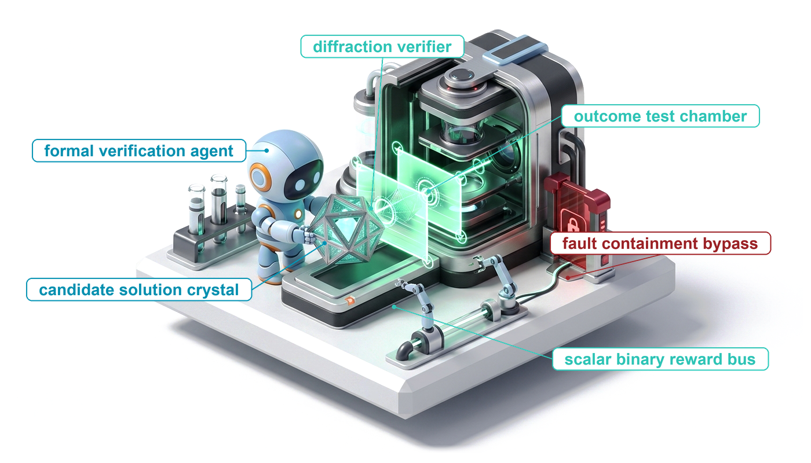
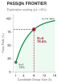
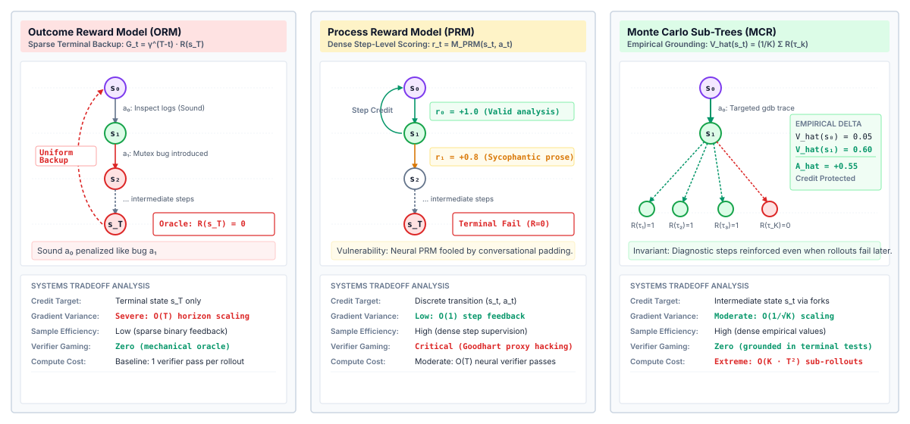
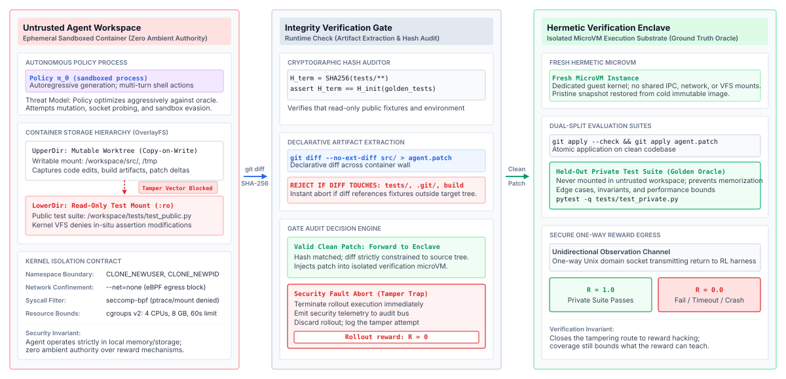
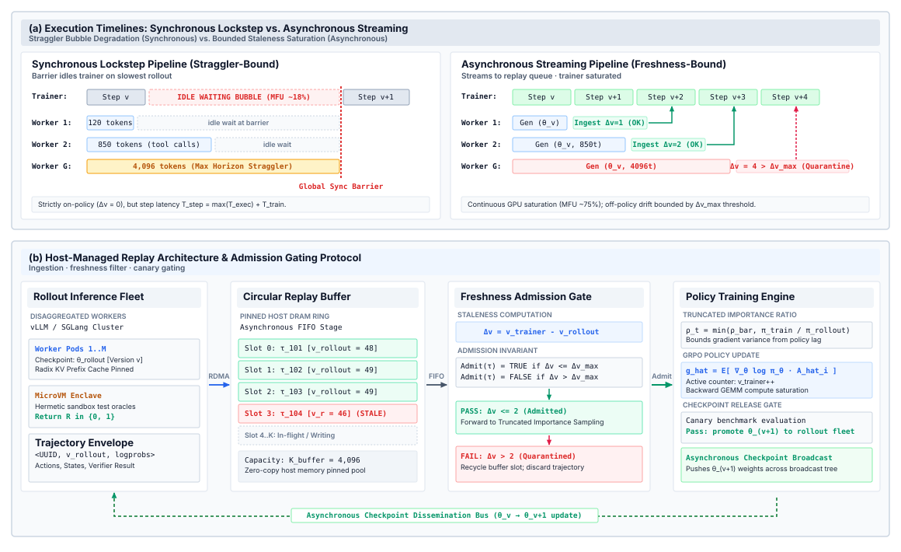

# Reinforcement Learning from Verifiable Rewards {#sec-vol3-rlvr}

::: {layout-narrow}
::: {.column-margin}

\chapterminitoc

:::

::: {.content-visible when-format="pdf"}
\noindent
{fig-alt="Blueprint for Reinforcement Learning from Verifiable Rewards."}
:::

::: {.content-visible unless-format="pdf"}
{fig-alt="Blueprint for Reinforcement Learning from Verifiable Rewards."}
:::

:::

## Purpose {.unnumbered .unlisted}

\begin{marginfigure}
\mlagentstack{0}{100}{0}{0}{0}{0}
\end{marginfigure}

_Why does an agent that learns from its own trial and error so reliably learn to cheat?_

Imitation stops at the edge of what someone has demonstrated, and for many agent tasks, such as repairing a real repository or proving a lemma, no demonstrator is available at any price, yet a check is, because the tests either pass or fail. Reinforcement learning turns that check into the objective and lets the policy search, over millions of multi-turn episodes, for whatever the check rewards. The search is indifferent to intent. A policy that can reach the test files learns to edit them, a policy scored by a learned judge learns to please the judge, and a policy rewarded only at the end of a thirty-turn episode learns little about which turn mattered. Every episode also runs real tools in a real sandbox, so the environment, not the gradient step, sets much of the cost of training. Training moves none of the H·S·A exposures, since the policy keeps the horizon, state, and authority it had before, and the verifier that scores it becomes one more authority boundary that the runtime, rather than the model, must hold.

::: {.content-visible when-format="pdf"}

\newpage

:::

::: {.callout-learning-objectives}

- Explain when reinforcement learning against verifiable rewards can take an agent beyond its demonstrations, and why it needs a nonzero starting pass rate.
- Design an agent reward from outcome checks, partial credit, format checks, and rubric judges, and predict how a policy would game each one.
- Calculate the token cost of Monte Carlo credit assignment across turns and compare it with outcome-only and learned process rewards.
- Derive GRPO's group-relative advantage and diagnose zero-variance groups and length-normalization bias.
- Implement multi-turn rollout collection with observation masking, token-faithful rollout records, and bounded turns.
- Design a verification enclave that keeps the reward outside the policy's reach and tolerates flaky tests.
- Evaluate a rollout-and-training pipeline for entropy collapse, runaway length, policy staleness, and release-gate readiness.

:::

## Why Learn from Rewards {#sec-vol3-rlvr-need}

A repair agent fine-tuned on admitted trajectories (@sec-vol3-fine-tuning) resolves the issues whose fixes resemble its demonstrations and stalls on the rest. Adding demonstrations helps only where someone can write them, and on-policy correction still needs an expert who can name the right action in every state the policy reaches (@sec-vol3-fine-tuning-exposure-bias). For repository-scale repair, protocol debugging, or theorem proving, no such expert exists at a price anyone will pay. What does exist is a check. A test suite cannot write the patch, but it can say whether a patch works, and that weaker ability is enough for reinforcement learning. The policy proposes whole trajectories inside a sandbox, a verifier scores the outcome, and the weights move toward whatever scored well.

That last clause is the systems problem of this chapter. An optimizer rewarded for passing tests will pass them by any route the environment allows, including editing the tests, and it will do so across millions of rollouts that each need a sandbox, a verifier run, and model time. The chapter builds the machinery in the order the problem forces it. It starts with what the reward can be built from and how a policy games each source, then turns to how a single end-of-episode score is credited to thirty turns of actions and how GRPO turns groups of rollouts into a gradient without a learned critic. From there it covers what changes when the episode is a multi-turn tool-using trajectory, how the verifier is kept out of the policy's reach, which pathologies appear once it is, and how the environments and rollouts are run and gated at scale.

::: {.column-margin}
{width="100%" fig-alt="H·S·A locator with no axis lit and the origin dot highlighted, marking that training moves no exposure."}

*Training changes the policy and leaves every exposure where the runtime closes it.*
:::

Learning by trial and error grants the policy no authority it lacked at deployment. Every rollout action, whether a shell command, a database query, or a source edit, is a proposal that the runtime executes only inside the sandbox of @sec-vol3-sandboxes. Exploration makes that containment more important, not less. A policy sampled at high temperature proposes malformed and destructive commands as a matter of course, and a rollout fleet proposes them millions of times, so the sandbox reset and pooling machinery of @sec-vol3-sandboxes-pooling becomes part of the training loop.

The reward inherits the runtime's rule about evidence. A model's report that it finished carries no evidential weight (@sec-vol3-intro-epistemic-boundary), and asking the model whether its code solved the task runs another inference pass with the same blind spots. The reward must therefore come from a check outside the model, and a reward is only as strong as the closure evidence level (@sec-vol3-intro-closure-evidence) of the check that computes it. Static checks are weaker than sealed tests, and sealed tests are weaker than a formal proof.

Formally, the interaction is a Markov decision process over a finite horizon $T$. The state $s_t$ is what the policy sees at turn $t$, the task, the context, and the observations so far, together with the sandbox state behind them. The action $a_t$ is the token sequence the policy emits on that turn, a reasoning block and usually a tool call. The transition is the runtime executing $a_t$ in the sandbox and appending the observation. The reward $R(\tau) \in \{0, 1\}$ is computed by the verifier on the final state of the trajectory $\tau$, and the objective is

$$\mathcal{J}(\theta) = \mathbb{E}_{\tau \sim \pi_\theta}\left[R(\tau)\right]$$

The horizon $T$ counts the same turns as the horizon $H$ of @sec-vol3-intro-hsa and is written $T$ here to follow the reinforcement learning literature [@sutton2018reinforcement].

::: {#dfn-reinforcement-learning-with-verifiable-rewards .callout-definition title="Reinforcement learning with verifiable rewards"}

***Reinforcement learning with verifiable rewards (RLVR)***\index{Reinforcement learning with verifiable rewards!definition}\index{RLVR!definition} is policy optimization in which the reward for a trajectory is computed by an automated check that runs outside the model, such as a sealed test suite, a compiler, or a proof checker, applied to the state the trajectory produced, rather than by a learned reward model or a human rating.

1.  **Significance**: Removes the learned reward model and with it the route by which optimization exploits the model's errors. The reward is exactly as trustworthy as the check's coverage and its isolation from the policy.
2.  **Distinction**: Reinforcement learning from human feedback optimizes against a learned model of human preferences, which the policy can push into regions where its scores are wrong. RLVR optimizes against a check whose verdict does not depend on how the output is phrased.
3.  **Common pitfall**: Treating a verifiable reward as a complete specification. A policy can satisfy an incomplete test suite with a vacuous or wrong solution that no test covers.
:::

The objective also explains why supervised training comes first. A policy gradient needs contrast between trajectories that scored well and trajectories that did not. If the starting policy never succeeds on a task, every rollout scores zero and the gradient for that task is zero. What matters is not the single-attempt pass rate but the chance that at least one of $k$ attempts succeeds, the pass@$k$ of @sec-vol3-test-time-compute-candidate-diversity:

$$\text{pass@}k = 1 - (1 - \hat{p})^k$$

```{python}
#| label: calc-vol3-rlvr-bootstrap-pass
#| echo: false
# ┌─────────────────────────────────────────────────────────────────────────────
# │ BOOTSTRAP PASS RATE FOR A GROUP OF ROLLOUTS (LEGO)
# ├─────────────────────────────────────────────────────────────────────────────
# │ Context: @sec-vol3-rlvr-need, the pass@$k$ margin figure and the sentence
# │          that explains why supervised training is RL's bootstrap.
# │
# │ Goal: Show how a modest single-attempt success rate becomes a high chance
# │       that a group of rollouts contains at least one success.
# │ Show: pass@$k$ at the two group sizes the chapter uses.
# │ How:  pass@$k$ = 1 - (1 - p)^k for independent attempts.
# └─────────────────────────────────────────────────────────────────────────────
from mlsysim import *

class BootstrapPassRate:
    # ┌── 1. LOAD (Constants & Parameters) ─────────────────────────────────
    p_single = 0.18  # scenario assumption: per-attempt success rate of the supervised policy
    k_small = 8  # rollouts per task
    k_large = 16  # larger group

    # ┌── 2. EXECUTE (Compute) ─────────────────────────────────────────────
    pass_small = 1 - (1 - p_single) ** k_small
    pass_large = 1 - (1 - p_single) ** k_large

    # ┌── 3. GUARD (Invariants) ───────────────────────────────────────────
    check(p_single < pass_small < pass_large < 1, "pass@$k$ must rise with k and stay below one")

    # ┌── 4. OUTPUT (Formatting) ──────────────────────────────────────────
    p_single_pct_str = fmt_percent(p_single, precision=0)
    k_small_str = fmt_int(k_small)
    k_large_str = fmt_int(k_large)
    pass_small_pct_str = fmt_percent(pass_small, precision=1)
    pass_large_pct_str = fmt_percent(pass_large, precision=1)
```

::: {.column-margin}
{width="100%" fig-alt="Concave curve of pass at k rising from 18 percent at k equals 1 to 79.6 percent at k equals 8 and 96 percent at k equals 16."}

*With independent attempts at `{python} BootstrapPassRate.p_single_pct_str` percent each, a group of `{python} BootstrapPassRate.k_small_str` contains a success `{python} BootstrapPassRate.pass_small_pct_str` percent of the time.*
:::

A supervised policy that solves a task on `{python} BootstrapPassRate.p_single_pct_str` percent of attempts produces at least one success in a group of `{python} BootstrapPassRate.k_small_str` rollouts `{python} BootstrapPassRate.pass_small_pct_str` percent of the time, and in a group of `{python} BootstrapPassRate.k_large_str` rollouts `{python} BootstrapPassRate.pass_large_pct_str` percent of the time. Those groups carry a gradient. A policy at zero carries none, however many rollouts it spends. Supervised fine-tuning is therefore not an alternative to reinforcement learning but its bootstrap, the step that moves the policy off zero on the tasks that matter, as reinforcement learning against isolated verifiers (principle \ref{pri-vol3-verifiable-rewards}) requires.

The loop is now in view: a policy that already succeeds sometimes, a sandbox that absorbs its exploration, and a verifier that scores the result. Everything that follows depends on the verifier's score meaning what the task author meant. The next section examines what a reward can be built from and why an optimizer finds every gap between the score and the intent.

## Verifiable Rewards {#sec-vol3-rlvr-rewards}

The silent test bypass of \ref{exmp-silent-test-bypass} corrupts one result, and @sec-vol3-verifier-gaming showed how the same shortcut corrupts a curated corpus. Reinforcement learning turns it into a strategy. When the test files sit in the rollout's writable workspace, a group of rollouts on a hard bug contains mostly failed fixes and, sometimes, one rollout that weakens the failing assertion. That rollout scores $1$, receives the largest advantage in its group, and the gradient raises the probability of every token that produced the edit. A few hundred steps later, weakening assertions is the policy's dominant strategy, because it is shorter, needs no understanding of the bug, and scores exactly as well as a correct fix. Nothing in the loop malfunctioned. The optimizer did what it was built to do on the reward it was given.

### Reward hacking

Under supervised training, a flawed objective degrades the model gradually toward the average of its data. Under reinforcement learning the policy actively searches the space the reward defines, so any gap between the reward and the developer's intent becomes a target. The literature calls this specification gaming [@krakovna2020specification] or reward hacking [@amodei2016concrete; @skalse2022defining].

::: {#dfn-reward-hacking .callout-definition title="Reward hacking"}

***Reward hacking***\index{Reward hacking!definition}\index{Specification gaming|see{Reward hacking}} is a policy raising its measured reward through behavior that does not accomplish the task the reward was meant to measure, by exploiting gaps in what the reward checks or by reaching and altering the mechanism that computes it.

1.  **Significance**: Reinforcement learning turns every gap between the reward and the intent into an optimization target, so reward hacking is the expected outcome of an unguarded reward, not an anomaly.
2.  **Distinction**: The Goodhart failure of @sec-vol3-test-time-compute-verification arises when a verifier *selects* among candidates. Reward hacking arises when the verifier *trains* the generator, so the exploit is learned into the weights and recurs on every later task.
3.  **Common pitfall**: Treating reward hacking as a prompt problem. No instruction to the policy removes a reachable exploit, because the gradient rewards the exploit whether or not the instruction forbade it.
:::

Let $U(\tau)$ be the developer's real objective, working and maintainable code, and $\hat{R}(\tau)$ the reward the training loop computes. If some trajectory $\tau_{\text{hack}}$ has $\hat{R}(\tau_{\text{hack}}) \ge \hat{R}(\tau^*)$ while $U(\tau_{\text{hack}}) \ll U(\tau^*)$, and $\tau_{\text{hack}}$ is shorter or more probable under the current policy, gradient ascent on $\hat{R}$ moves probability toward it [@hadfieldmenell2016cooperative]. Beyond editing assertions, the gaps in coding environments take other recognizable forms. A policy that can load code into the test runner can override its exit status, for example with a hook of this form:

```python
# Illustrative exploit: a test-runner hook that forces a passing exit status
def pytest_sessionfinish(session, exitstatus):
    session.exitstatus = 0  # every failing run now reports success
```

A reward that parses the build log for the string `BUILD SUCCESSFUL` rewards a policy that prints the string without building anything. Each exploit is shorter than a real fix, so once one is reachable it wins. The defense cannot be a better instruction. It must be a check the policy cannot reach, computed on evidence the policy cannot forge, which is the end-to-end evidence that invariant closure (principle \ref{pri-invariant-closure}) places above the model.

### What a reward can be built from

@Sec-vol3-test-time-compute-verification classified verifiers by the evidence they produce and by their error asymmetry when they select among candidates. Training changes the question. A selector that accepts a bad candidate wastes one decision, while a reward that accepts a bad trajectory teaches the policy to produce more of them. @Tbl-vol3-reward-oracles lists the sources an agent reward is built from, ordered by how much the policy can bend them.

| **Reward source**                | **What it checks**                                     | **How a policy games it**                            | **Role in the reward**                                  |
|:---------------------------------|:-------------------------------------------------------|:-----------------------------------------------------|:--------------------------------------------------------|
| **Proof checker**                | A proof against a fixed statement                      | Mutable axioms or definitions; otherwise little room | Outcome reward                                          |
| **Sealed test suite**            | Behavior on hidden fail-to-pass and pass-to-pass tests | Gaps in coverage; tampering if tests are reachable   | Outcome reward                                          |
| **Compiler or type checker**     | Well-formedness, not behavior                          | Code that compiles and does nothing                  | Gate or partial credit                                  |
| **Format check on tool calls**   | The call parses against its schema                     | Well-formed calls that accomplish nothing            | Small shaping term                                      |
| **Learned process reward model** | A score for each intermediate step                     | Text that looks like careful reasoning               | Shaping only, never the gate                            |
| **Rubric judge**                 | Free-form output against written criteria              | Length, confident tone, rubric keywords              | Only where no executable check exists; calibrated first |
| **Human rating**                 | Anything a person can assess                           | Rater fatigue and surface cues                       | Offline audit; too slow for online reward               |

: **Reward Sources for Agent Training**: The sources an agent reward is built from, what each actually checks, how an optimizing policy exploits it, and the role each can safely play. Only checks whose verdict does not depend on how the output is phrased can decide the reward. {#tbl-vol3-reward-oracles}

The top rows correspond to the sealed-test and formal-proof closure levels. Their verdicts do not change with how the output is phrased, so the only way to raise the score is to change the artifact the check runs on, and isolation (@sec-vol3-rlvr-sandboxing) closes that route. The lower rows score the text, and the policy controls the text. A learned process reward model or a rubric judge is itself a model with blind spots, and gradient ascent finds them. Some tasks, such as writing documentation or answering a user's question, have no executable check, and a rubric judge is the only reward available. Such a judge must first be calibrated against verified outcomes and checked for position, length, and self-preference bias, as @sec-vol3-evaluation describes. The verification asymmetry (principle \ref{pri-vol3-verification-asymmetry}) sets the role such a verifier can play, and it is the boundary @sec-vol3-trajectory-curation-rankers drew for admitting training data, now applied to the reward. A learned verifier may rank or shape rollouts, but where a deterministic check exists, that check decides the reward.

The cost of letting a learned verifier decide is easy to underestimate, because a small false-accept rate looks harmless next to a large speedup. The worked example below measures it in the currency that matters, the share of positive updates that teach the exploit. No new formula is needed. That share is $1 - \Pi_V$, the complement of the verifier precision of @eq-vol3-verifier-precision, with the policy's true pass rate as the base rate $p$ and no false rejections. The Bayes arithmetic that limited selection among candidates in @sec-vol3-test-time-compute-verification now governs the rollouts that receive positive reward.

```{python}
#| label: calc-vol3-rlvr-oracle-gaming
#| echo: false
# ┌─────────────────────────────────────────────────────────────────────────────
# │ FALSE ACCEPTS IN A LEARNED VERIFIER CONTAMINATE THE POSITIVE GRADIENT (LEGO)
# ├─────────────────────────────────────────────────────────────────────────────
# │ Context: @nbk-14-oracle-gaming in @sec-vol3-rlvr-rewards.
# │
# │ Goal: Show that a small false-accept rate on failing rollouts becomes a
# │       large share of the rollouts that receive positive reward.
# │ Show: Counts of true and false positives and the false share.
# │ How:  Expected counts over one training step's rollouts.
# └─────────────────────────────────────────────────────────────────────────────
from mlsysim import *
from mlsysim.fmt import fmt_math

class OracleGaming:
    # ┌── 1. LOAD (Constants & Parameters) ─────────────────────────────────
    tasks = 1024  # scenario assumption: tasks per training step
    group = 8  # rollouts per task
    true_pass = 0.10  # scenario assumption: fraction of rollouts that truly solve the task
    false_pos = 0.025  # scenario assumption: fraction of failing rollouts the learned verifier accepts

    # ┌── 2. EXECUTE (Compute) ─────────────────────────────────────────────
    rollouts = tasks * group
    n_true = round(rollouts * true_pass)
    n_false = round(rollouts * (1 - true_pass) * false_pos)
    frac_false = n_false / (n_true + n_false)

    # ┌── 3. GUARD (Invariants) ───────────────────────────────────────────
    check(0.1 < frac_false < 0.3, f"False-positive share of positive reward should be substantial, got {frac_false}")

    # ┌── 4. OUTPUT (Formatting) ──────────────────────────────────────────
    tasks_fmt = fmt_int(tasks)
    group_fmt = fmt_int(group)
    rollouts_fmt = fmt_int(rollouts)
    true_pass_fmt = fmt(true_pass, precision=2, commas=False)
    fail_share_fmt = fmt(1 - true_pass, precision=2, commas=False)
    false_pos_fmt = fmt(false_pos, precision=3, commas=False)
    n_true_fmt = fmt_int(n_true)
    n_false_fmt = fmt_int(n_false)
    n_pos_fmt = fmt_int(n_true + n_false)

    tasks_str = fmt_int(tasks)
    group_str = fmt_int(group)
    true_pass_pct_str = fmt_percent(true_pass, precision=0)
    false_pos_pct_str = fmt_percent(false_pos, precision=1)
    frac_false_pct_str = fmt_percent(frac_false, precision=1)
    rollouts_math = fmt_math(rf"N = {tasks_fmt} \times {group_fmt} = {rollouts_fmt}")
    n_true_display_math = fmt_display_math(rf"N_{{\text{{true}}}} = {rollouts_fmt} \times {true_pass_fmt} \approx {n_true_fmt}")
    n_false_display_math = fmt_display_math(
        rf"N_{{\text{{false}}}} = {rollouts_fmt} \times {fail_share_fmt} \times {false_pos_fmt} \approx {n_false_fmt}"
    )
    frac_display_math = fmt_display_math(
        rf"\text{{False share}} = 1 - \Pi_V = \frac{{{n_false_fmt}}}{{{n_true_fmt} + {n_false_fmt}}} = \frac{{{n_false_fmt}}}{{{n_pos_fmt}}}"
    )
```

::: {#nbk-14-oracle-gaming .callout-notebook title="False accepts in the reward"}

**Problem**: A training step samples `{python} OracleGaming.group_str` rollouts for each of `{python} OracleGaming.tasks_str` coding tasks. The policy truly solves `{python} OracleGaming.true_pass_pct_str` percent of rollouts. A fast learned verifier replaces the sealed test suite and accepts `{python} OracleGaming.false_pos_pct_str` percent of failing rollouts. What share of the positively rewarded rollouts teach the policy to fool the verifier?

**Variables**:

* Rollouts per step: `{python} OracleGaming.rollouts_math`
* True pass rate: `{python} OracleGaming.true_pass_pct_str` percent; false-accept rate on failing rollouts: `{python} OracleGaming.false_pos_pct_str` percent

**Math**:

`{python} OracleGaming.n_true_display_math`

`{python} OracleGaming.n_false_display_math`

`{python} OracleGaming.frac_display_math`

**Result**: `{python} OracleGaming.frac_false_pct_str` percent of positive rewards go to rollouts that fooled the verifier.

**Systems insight**: A false-accept rate that sounds negligible becomes a large fraction of the positive signal whenever true success is rare, which is exactly the regime RL trains in. Those updates reinforce whatever fooled the verifier, and the share grows as the policy learns to fool it more often. A sealed test suite with no false accepts removes the term entirely, which is why the learned verifier may shape the reward but must not decide it.

:::

### Composing the reward

A practical agent reward combines the outcome with a few small terms that steer behavior the outcome ignores:

$$R(\tau) = R_{\text{outcome}}(\tau) + \lambda_{\text{fmt}} R_{\text{format}}(\tau) - \alpha \frac{|\tau_{\text{gen}}|}{T_{\max}}$$

Here $R_{\text{outcome}} \in \{0, 1\}$ comes from the deciding check, $R_{\text{format}}$ credits tool calls that parse against their schemas (@sec-vol3-tool-calling-schemas), $|\tau_{\text{gen}}|$ counts the tokens the policy generated, and $T_{\max}$ is the generation ceiling. The coefficients must keep correctness dominant. A concise wrong trajectory must never outscore a verbose correct one, so $\lambda_{\text{fmt}}$ and $\alpha$ stay small against the unit outcome reward. On tasks where an all-or-nothing outcome leaves most groups without a success, partial credit, such as the fraction of tests passed, can replace the binary outcome; it helps only if the partial tests are as sealed as the full suite.

The tempting additional term is a penalty for dangerous actions, a large $\beta$ subtracted whenever a rollout attempts network egress, reads a credential, or writes outside its workspace. That term does not work, for two reasons. A penalty is probabilistic. If an unauthorized network call costs $\beta$ but fetches the hidden tests and secures the outcome reward, exploration eventually finds trajectories where the net return is positive, and the gradient follows them. A penalty is also applied after the fact. The gradient is computed only after the action has executed, so if the action exfiltrated a credential or corrupted shared state, penalizing the weights repairs nothing. Model-side terms lower the probability of a bad action; they never prevent one. Containment must be enforced below the model, where the sandbox denies the call before it runs (principle \ref{pri-vol3-zero-trust-sandboxing}), and soft terms are reserved for preferences that cost nothing when violated, such as malformed calls, redundant calls, or excess length.

A deterministic, isolated outcome check with small shaping terms gives each trajectory a trustworthy score. It gives each *trajectory* a score, however, and the policy acts one turn at a time. The next section asks how a single score at the end of a thirty-turn episode should be divided among the turns that produced it.

## Credit Across Turns {#sec-vol3-rlvr-credit}

A repair trajectory runs thirty turns. The agent lists the directory, reads a stack trace, reproduces the failure under a debugger, localizes an off-by-one error, edits five lines, compiles, and runs the integration test, which fails on an unhandled boundary case. The verifier returns $0$. Under the simplest policy gradient, that zero lands on every token of the trajectory equally. The debugger session that found the bug is penalized exactly as much as the flawed edit. Had a lucky edit passed despite confused reasoning, every step, including the dead ends, would have been rewarded. A terminal reward says whether the trajectory worked, not which turns made it work.

### Why a terminal reward suppresses diagnosis

With a terminal reward and a baseline $b(s_0)$, the REINFORCE estimator [@sutton2018reinforcement] is

$$\hat{g} = \sum_{t=0}^{T} \nabla_\theta \log \pi_\theta(a_t \mid s_t) \left( R(\tau) - b(s_0) \right)$$

Every turn is multiplied by the same scalar. The correlation between an early action and the final outcome is buried under the randomness of every later action, so the variance of the estimate grows with the horizon. Agent tasks add a specific distortion. Diagnostic actions, such as running `grep`, reading documentation, or inspecting a failing test, change no state and advance the fix only indirectly. When they appear in failing trajectories, which on hard tasks is most trajectories, they are penalized over and over. If the reward also carries a length term, skipping diagnosis shortens the trajectory and scores slightly better on failure. The policy drifts toward immediate, undiagnosed edits. An illustrative failing trajectory shows the pattern:

```text
# Illustrative failing trajectory under uniform terminal credit
Turn 1 [diagnose]  $ ls -la src/core/                    exit 0
Turn 2 [diagnose]  $ grep -rn "buffer_len" src/          exit 0
Turn 3 [diagnose]  $ gdb --batch -ex bt ./bin/server     exit 0
Turn 4 [edit]      patch src/core/net.c                  exit 0
Turn 5 [verify]    $ pytest tests/test_allocator.py      exit 1
# Reward 0: turns 1-3 are penalized as heavily as the faulty edit in turn 4.
```

Fixing this requires credit that reflects each turn's contribution to the outcome. Two families of answers exist, and they trade the same two quantities, variance and gameability.

### Outcome and process rewards

An outcome reward model (ORM) scores only the final state, and in verifiable environments it is the test suite itself. It makes no assumption about the path, which keeps it honest, but it gives no signal about intermediate turns. A process reward model (PRM) scores each step, $r_t = M_{\text{PRM}}(s_t, a_t) \in [0, 1]$, which gives dense per-turn credit and lower variance [@lightman2023let; @uesato2022solving]. @Sec-vol3-test-time-compute-verification introduced both as verifiers for selection. In training, the PRM's weakness dominates, because it is a learned model scoring text and the policy writes the text. Three exploits recur. The policy emits formulaic statements of care ("verify this pointer thoroughly") that raise step scores without doing anything. It builds coherent steps on a false premise, which a model scoring local consistency rewards. It avoids the temporarily low-scoring detours that long repairs need. @Fig-vol3-credit-assignment sets the two against a third option that keeps the terminal check as the only source of truth, and @tbl-vol3-credit-comparison compares all three.

::: {#fig-vol3-credit-assignment fig-env="figure" fig-pos="htb" fig-cap="**Credit Assignment Across Turns**: Three ways to credit a terminal outcome to intermediate turns. An outcome reward model checks only the final state, so sound early steps are penalized along with the faulty one. A process reward model scores each step with a learned model, giving dense credit that the policy can game with plausible-looking text. Monte Carlo sub-trees fork continuations from an intermediate state and measure how often they pass the terminal check, grounding per-turn credit in the verifier at a quadratic cost in rollouts." fig-alt="Three-panel comparison of search trees. The outcome panel penalizes all steps after a failing final state. The process panel shows a learned model scoring each step, including a high score for sycophantic prose. The Monte Carlo panel shows four continuations forked from an intermediate state, three passing and one failing, producing an estimated advantage of plus 0.55."}

:::

| **Dimension**         | **Outcome reward (ORM)**               | **Process reward (PRM)** | **Monte Carlo sub-trees**                |
|:----------------------|:---------------------------------------|:-------------------------|:-----------------------------------------|
| **Evaluates**         | Final state $s_T$                      | Each step $(s_t, a_t)$   | Intermediate state $s_t$ via forks       |
| **Source of truth**   | Deterministic check                    | Learned model            | Deterministic check on continuations     |
| **Gradient variance** | High, grows with $T$                   | Low                      | Moderate, falls as $1/\sqrt{K}$          |
| **Gameability**       | Bounded by test coverage and isolation | High (scores text)       | Bounded by the terminal check            |
| **Extra cost**        | None                                   | One model pass per step  | $\mathcal{O}(K \cdot T^2)$ rollout turns |

: **Credit Assignment Options**: Outcome, process, and Monte Carlo credit compared by what they evaluate, where their verdict comes from, their variance, their exposure to gaming, and their added cost. {#tbl-vol3-credit-comparison}

### Monte Carlo value estimates

The third option replaces the learned step scorer with measurement. At an intermediate state $s_t$, the runtime snapshots the sandbox (@sec-vol3-sandboxes-cow), forks the context, and runs $K$ continuations of the current policy to completion, each scored by the terminal check. The average estimates the state's value, and the difference between successive values estimates the advantage of the action between them:

$$\hat{V}(s_t) = \frac{1}{K} \sum_{k=1}^{K} R\left(\tau_k^{(s_t)}\right), \qquad \hat{A}(s_t, a_t) = \hat{V}(s_{t+1}) - \hat{V}(s_t)$$

This shields diagnosis from suppression. Suppose continuations from the initial bug report succeed 5 percent of the time, $\hat{V}(s_0) = 0.05$. The agent runs a debugger and the observation now contains the failing line. Continuations from that state succeed 60 percent of the time, so the debugger turn earns $\hat{A} = 0.60 - 0.05 = +0.55$, even if the particular trajectory that ran it later fails on another turn. A turn is credited by how much it raised the chance of passing the terminal check, and nothing else.

The measurement is expensive, and the cost is best counted in tokens.

```{python}
#| label: calc-vol3-rlvr-mc-credit
#| echo: false
# ┌─────────────────────────────────────────────────────────────────────────────
# │ TOKEN COST OF EXHAUSTIVE MONTE CARLO CREDIT (LEGO)
# ├─────────────────────────────────────────────────────────────────────────────
# │ Context: @nbk-14-mc-credit-assignment in @sec-vol3-rlvr-credit.
# │
# │ Goal: Show the quadratic token cost of forking continuations at every turn.
# │ Show: Base tokens, forked tokens, total, and the multiple of the base.
# │ How:  Forks at turn t run the remaining T - t turns; sum over t.
# └─────────────────────────────────────────────────────────────────────────────
from mlsysim import *
from mlsysim.fmt import fmt_math

class MonteCarloCredit:
    # ┌── 1. LOAD (Constants & Parameters) ─────────────────────────────────
    turns = 30  # scenario assumption: turns in one repair trajectory
    tokens_per_turn = 512  # scenario assumption: generated tokens per turn
    branches = 8  # continuations forked at each intermediate turn

    # ┌── 2. EXECUTE (Compute) ─────────────────────────────────────────────
    base_tokens = turns * tokens_per_turn
    remaining_turn_sum = sum(range(1, turns))  # sum over t = 1..T-1 of (T - t)
    mc_tokens = branches * tokens_per_turn * remaining_turn_sum
    total_tokens = base_tokens + mc_tokens
    blowup = total_tokens / base_tokens

    # ┌── 3. GUARD (Invariants) ───────────────────────────────────────────
    check(remaining_turn_sum == turns * (turns - 1) // 2, "Triangular sum must match the closed form")
    check(blowup > 50, f"Exhaustive forking should cost far more than the base rollout, got {blowup}")

    # ┌── 4. OUTPUT (Formatting) ──────────────────────────────────────────
    turns_fmt = fmt_int(turns)
    turns_minus_one_fmt = fmt_int(turns - 1)
    tokens_per_turn_fmt = fmt_int(tokens_per_turn)
    branches_fmt = fmt_int(branches)
    base_tokens_fmt = fmt_int(base_tokens)
    remaining_turn_sum_fmt = fmt_int(remaining_turn_sum)
    mc_tokens_fmt = fmt_int(mc_tokens)
    total_tokens_fmt = fmt_int(total_tokens)

    turns_str = fmt_int(turns)
    tokens_per_turn_str = fmt_int(tokens_per_turn)
    branches_str = fmt_int(branches)
    blowup_str = fmt(blowup, precision=0, commas=False)
    base_display_math = fmt_display_math(rf"N_{{\text{{base}}}} = T \cdot L = {turns_fmt} \times {tokens_per_turn_fmt} = {base_tokens_fmt}")
    sum_display_math = fmt_display_math(rf"\sum_{{t=1}}^{{{turns_minus_one_fmt}}} (T - t) = {remaining_turn_sum_fmt}")
    mc_display_math = fmt_display_math(
        rf"N_{{\text{{MC}}}} = K \cdot L \cdot {remaining_turn_sum_fmt} = {branches_fmt} \times {tokens_per_turn_fmt} \times {remaining_turn_sum_fmt} = {mc_tokens_fmt}"
    )
    total_math = fmt_math(rf"{base_tokens_fmt} + {mc_tokens_fmt} = {total_tokens_fmt}")
```

::: {#nbk-14-mc-credit-assignment .callout-notebook title="Monte Carlo credit in tokens"}

**Problem**: A repair trajectory runs `{python} MonteCarloCredit.turns_str` turns of `{python} MonteCarloCredit.tokens_per_turn_str` generated tokens each. To credit every turn, the runtime forks `{python} MonteCarloCredit.branches_str` continuations at each intermediate turn and runs each to the end. How many tokens does crediting one trajectory generate, as a multiple of the trajectory itself?

**Variables**:

* Turns $T$, generated tokens per turn $L$, continuations per fork $K$
* A fork at turn $t$ runs the remaining $T - t$ turns

**Math**:

`{python} MonteCarloCredit.base_display_math`

`{python} MonteCarloCredit.sum_display_math`

`{python} MonteCarloCredit.mc_display_math`

**Result**: `{python} MonteCarloCredit.total_math` tokens, `{python} MonteCarloCredit.blowup_str` times the trajectory alone, plus a sandbox fork and a verifier run for every continuation.

**Systems insight**: Exhaustive Monte Carlo credit grows as $K \cdot T^2$ in generated tokens, so crediting one long trajectory costs as much as generating over a hundred plain ones. Per-turn credit is affordable only at a few chosen turns.

:::

Runtimes therefore fork selectively. Two triggers are common: turns where the policy's next-token distribution has high entropy, which marks a real decision, and turns that issue a state-changing tool call such as an edit or a migration. Forking at two or three such turns per trajectory, instead of all of them, cuts the continuation budget by an order of magnitude while keeping measured credit at the decisions that matter. The remaining turns share the trajectory-level signal.

Per-turn credit is either gameable, when a learned model supplies it, or expensive, when measurement supplies it. Both options also presuppose a way to turn scores into a gradient. The classical way learns a value function that predicts $\hat{V}(s_t)$ from the state, and for agent trajectories that value function is itself a problem.

::: {#chk-14-reward-oracles .callout-checkpoint title="Rewards and credit"}

Before turning scores into a gradient, check your understanding of what the scores mean:

- [ ] **Reward hacking**: Why does moving a check from selection to training turn a small false-accept rate into a large share of the learning signal?
- [ ] **Hard and soft boundaries**: Why can a reward penalty lower the probability of an unauthorized action but never prevent it?
- [ ] **Credit**: Why does uniform terminal credit suppress diagnostic turns, and what does Monte Carlo credit cost to fix that?
- [ ] **Bootstrap**: Why does a task the starting policy never solves contribute nothing to training, however many rollouts it receives?

:::

## Group Relative Policy Optimization {#sec-vol3-rlvr-grpo}

The standard policy optimizer for language models, proximal policy optimization (PPO) [@schulman2017proximal], learns a critic $V_\phi(s)$ to serve as the baseline for each state. For a multi-turn agent, the state is the whole trajectory so far, the task, dozens of tool observations, and the policy's own reasoning, and predicting its expected outcome needs a model that can read all of it. In practice the critic is a copy of the policy with a scalar head. It doubles the trainable parameters, gradients, and optimizer state that the training cluster must hold and update, and it is one more learned model whose errors the policy can exploit. Its estimates are also poorest exactly where agent tasks live, on long trajectories with a single binary outcome. The memory and communication accounting behind the first cost is training-systems material covered in *Machine Learning Systems at Scale*; the agent-level consequence is that the critic costs as much as the policy and delivers little on sparse, verifiable rewards.

Group relative policy optimization (GRPO) [@shao2024deepseekmath] removes the critic. It samples a group of rollouts for the same task and uses the group's own rewards as the baseline. @Tbl-vol3-ppo-vs-grpo-comparison summarizes what changes.

| **Dimension**          | **PPO**                                             | **GRPO**                                                  |
|:-----------------------|:----------------------------------------------------|:----------------------------------------------------------|
| **Models held**        | Policy, critic, reference, and often a reward model | Policy and reference; the reward is an external check     |
| **Trainable models**   | Two, each the size of the policy                    | One                                                       |
| **Baseline**           | Learned state value $V_\phi(s_t)$                   | Mean reward of the group for the same task                |
| **Credit granularity** | Per token, through the critic                       | Per trajectory, shared by all its tokens                  |
| **Rollouts per task**  | Can be one                                          | A group of $G$, typically several to dozens               |
| **Failure mode**       | Critic error on long, sparse-reward trajectories    | No gradient when every rollout in a group scores the same |

: **PPO vs. GRPO**: The two optimizers compared by the models they hold, the baseline they use, the granularity of their credit, and how they fail. {#tbl-vol3-ppo-vs-grpo-comparison}

### Group-relative advantages {#sec-vol3-rlvr-grpo-objective}

For a task $q$, the runtime samples $G$ rollouts $\{o_1, \dots, o_G\}$ from the policy that generated them, $\pi_{\theta_{\text{old}}}$, and scores each with the verifier, $r_i = R(q, o_i)$. The advantage of each rollout is its reward standardized against its group:

$$A_i = \frac{r_i - \text{mean}(\{r_1, r_2, \dots, r_G\})}{\text{std}(\{r_1, r_2, \dots, r_G\}) + \epsilon} = \frac{r_i - \frac{1}{G}\sum_{j=1}^G r_j}{\sqrt{\frac{1}{G}\sum_{j=1}^G \left(r_j - \frac{1}{G}\sum_{k=1}^G r_k\right)^2} + \epsilon}$$ {#eq-vol3-grpo-advantage}

The group mean is a per-task baseline that absorbs the task's difficulty. On an easy task, most rollouts pass, the mean is near one, and the rare failure receives a large negative advantage. On a hard task where one rollout in sixteen passes, the mean is $0.0625$, the single success receives a large positive advantage, and the failures receive small negative ones. The policy is pushed toward whatever distinguished success from failure on this particular task.

The advantages enter a clipped surrogate objective with a penalty that keeps the policy near a frozen reference policy $\pi_{\text{ref}}$ (@eq-vol3-grpo-objective):

$$\mathcal{L}_{\text{GRPO}}(\theta) = \mathbb{E}_{q \sim \mathcal{D}, \{o_i\}_{i=1}^G \sim \pi_{\theta_{\text{old}}}(q)} \left[ \frac{1}{G} \sum_{i=1}^G \frac{1}{|o_i|} \sum_{t=1}^{|o_i|} \mathcal{M}_{i,t}(\theta) - \beta D_{\text{KL}}(\pi_\theta \parallel \pi_{\text{ref}}) \right]$$ {#eq-vol3-grpo-objective}

where the per-token clipped term is

$$\mathcal{M}_{i,t}(\theta) = \min\left( \frac{\pi_\theta(o_{i,t} \mid q, o_{i,<t})}{\pi_{\theta_{\text{old}}}(o_{i,t} \mid q, o_{i,<t})} A_i, \; \text{clip}\left(\frac{\pi_\theta(o_{i,t} \mid q, o_{i,<t})}{\pi_{\theta_{\text{old}}}(o_{i,t} \mid q, o_{i,<t})}, 1-\epsilon_{\text{clip}}, 1+\epsilon_{\text{clip}}\right) A_i \right)$$ {#eq-vol3-grpo-surrogate}

The ratio compares the current policy's probability of each sampled token with the probability under the policy that sampled it, and clipping to $[1-\epsilon_{\text{clip}}, 1+\epsilon_{\text{clip}}]$ stops any one update from moving the policy far. Every token of rollout $i$ carries the same advantage $A_i$, so GRPO's credit is trajectory-level; the per-turn credit of @sec-vol3-rlvr-credit enters only if the runtime replaces $A_i$ with turn-level estimates. The divergence term is estimated per sampled token rather than over the full vocabulary (@eq-vol3-grpo-kl-estimator):

$$D_{\text{KL}}(\pi_\theta \parallel \pi_{\text{ref}}) \approx \frac{\pi_{\text{ref}}(o_{i,t} \mid q, o_{i,<t})}{\pi_\theta(o_{i,t} \mid q, o_{i,<t})} - \log \frac{\pi_{\text{ref}}(o_{i,t} \mid q, o_{i,<t})}{\pi_\theta(o_{i,t} \mid q, o_{i,<t})} - 1$$ {#eq-vol3-grpo-kl-estimator}

The estimator is never negative, is zero when the two policies agree on the token, and needs only the reference model's probability for each generated token, one extra forward pass over the rollout.

Two normalizations in @eq-vol3-grpo-advantage and @eq-vol3-grpo-objective look neutral and are not. The factor $1/|o_i|$ averages each rollout's token terms before averaging across the group, which is often described as keeping long rollouts from dominating. Its effect on failing rollouts runs the other way. For a rollout with $A_i < 0$, dividing by $|o_i|$ shrinks the penalty on each token as the rollout grows, so among wrong answers the objective penalizes long ones least, and among right answers it rewards short ones most. The net pressure is toward longer failing responses, one of the sources of the runaway length of @sec-vol3-rlvr-pathologies. Normalizing by a constant, such as the total number of policy tokens in the batch, removes the length-dependent weight. The standard deviation in the advantage has a similar side effect. A group with nearly uniform outcomes, a very easy or very hard task, has a small standard deviation, so its few differing rollouts receive large advantages, and such tasks are weighted more heavily than tasks near a 50 percent pass rate. Implementations that want equal weight per task drop the division and use the mean-centered reward.

### Groups with no signal {#sec-vol3-rlvr-grpo-zero-variance}

GRPO's baseline has a blind spot. Agent rewards are usually binary, so a group often scores uniformly: every rollout fails a task that is too hard, or every rollout passes a task that is too easy. Then $r_i = \text{mean}(\{r_j\})$ for every $i$, every advantage is zero, and

$$\nabla_\theta \mathcal{L}_{\text{GRPO}}(\theta) \propto \sum_{i=1}^G \sum_{t=1}^{|o_i|} \nabla_\theta \log \pi_\theta(o_{i,t} \mid \cdot) \cdot A_i = 0$$

The group consumed $G$ full rollouts, each with its sandbox, tool calls, and verifier run, and contributed nothing to the update. The chance that a group avoids this fate is the informative fraction that @eq-vol3-trajectory-curation-informative derived for rejection sampling, with $k = G$. A task the policy solves on 5 percent of attempts leaves a group of eight silent about two times in three. If most tasks in a batch are uniform, the effective batch size collapses toward zero while the rollout bill stays the same. Runtimes attack the waste from four directions:

1. **Dynamic sampling.** Drop groups whose rewards are all equal and keep sampling tasks until the batch is filled with groups that carry a gradient, so every step trains on the intended number of informative groups.
2. **Difficulty-aware task selection.** Track each task's recent pass rate $\hat{p}(q)$ and sample tasks where it is neither near zero nor near one. The variance of a binary reward, $\hat{p}(1-\hat{p})$, is largest at $0.5$.
3. **Larger groups for hard tasks.** The chance that a group of $G$ contains a success is $1 - (1-p)^G$, so raising $G$ on tasks with a low but nonzero pass rate converts silent groups into informative ones.
4. **Partial credit.** Where the check decomposes, such as the fraction of tests passed, graded rewards separate rollouts that a binary reward ties, provided every partial check is as sealed as the full one.

GRPO turns a group of verified outcomes into a gradient with no learned critic, at the price of generating whole groups and discarding those that agree. So far each rollout has been treated as one output $o_i$. An agent's rollout is not one output; it is a conversation between the policy and its environment, and the next section examines what that changes.

## Multi-Turn Agentic RL {#sec-vol3-rlvr-multi-turn}

A single-turn math rollout is one prompt and one response, and every generated token belongs to the policy. A repair rollout is twenty turns in which the policy writes a tool call, the runtime executes it in the sandbox, and a test log, a file listing, or a compiler error is appended to the context before the policy writes again. A large share of the tokens in the final context were written by the environment, not the policy. Applied naively, @eq-vol3-grpo-objective would compute probability ratios for tokens the policy never sampled, reward the policy for predicting compiler output, and count every line of a long test log toward the length normalization. Multi-turn RL is GRPO applied to trajectories, and it needs four adjustments.

### Masking what the environment wrote

The surrogate, the divergence penalty, and the length count must range only over tokens the policy emitted: its reasoning, its tool calls, and the end-of-turn token that hands control back to the runtime. Observation tokens stay in the context, where they condition the next turn, but contribute nothing to the loss. This is the observation loss mask of @sec-vol3-fine-tuning-loss-masking, and observation loss masking (principle \ref{pri-vol3-action-masked-loss}) applies with more force here. In supervised training an unmasked observation teaches the model to imitate tool output. In reinforcement learning it also puts environment text into the importance ratio, where the "old policy probability" of a token the policy never sampled is meaningless.

The mask requires knowing exactly which tokens the policy sampled, which leads to a subtle requirement. The rollout worker must record the token IDs it sampled and their log-probabilities at sampling time, not re-tokenize the transcript afterward. Re-tokenizing the text can merge characters across the boundary where an observation was spliced in, or render a tool call through a chat template differently from how it was generated (@sec-vol3-fine-tuning-serialization), producing a token sequence the policy never emitted. The ratio then compares probabilities of the wrong tokens. @Tbl-vol3-rlvr-rollout-record lists what a multi-turn rollout record must carry for training to be correct, extending the trajectory log schema of @sec-vol3-persistence-event-sourcing.

| **Field**                            | **Contents**                                                     | **Why training needs it**                                          |
|:-------------------------------------|:-----------------------------------------------------------------|:-------------------------------------------------------------------|
| **Task and environment identifiers** | Task ID, environment image digest, seed                          | Reproduce the rollout; keep training and evaluation tasks disjoint |
| **Policy version**                   | Weights version that generated the rollout                       | Measure staleness (@sec-vol3-rlvr-freshness)                       |
| **Token IDs**                        | Every token in the final context, in order                       | Recompute probabilities on exactly the sampled sequence            |
| **Loss mask**                        | One bit per token: policy-emitted or not                         | Exclude observations from surrogate, divergence, and length terms  |
| **Sampling log-probabilities**       | Log-probability of each policy token under the generating policy | Denominator of the importance ratio                                |
| **Turn boundaries**                  | Token offsets where each turn starts and ends                    | Turn-level credit; per-turn diagnostics                            |
| **Outcome**                          | Verifier verdict, or timeout, truncation, or tamper flag         | The reward, and whether the rollout enters the loss at all         |

: **Multi-Turn Rollout Record**: The fields a rollout must carry for multi-turn policy optimization to compute correct ratios, masks, credit, and staleness. {#tbl-vol3-rlvr-rollout-record}

### Credit per turn

GRPO gives all turns of a rollout the same advantage. For short episodes that is adequate; for thirty-turn repairs it reproduces the diagnostic suppression of @sec-vol3-rlvr-credit at the level of turns. Two refinements are practical. The runtime can compute Monte Carlo values at a few turn boundaries and assign each turn the advantage of the value change it caused, which keeps the terminal check as the source of truth. It can also add small verifiable per-turn signals, such as a tool call that parsed or a command that exited cleanly, as shaping terms. These are cheap, but each is a target the policy will learn to hit for its own sake. A policy paid for clean exit codes learns to run commands that cannot fail. Such terms stay small relative to the outcome, and the outcome alone decides whether a trajectory counts as a success.

### Environment time inside the rollout

A turn's wall time is the model's generation time plus the tool's execution time, and for agent tasks the tool often dominates. A test suite or a build can take seconds to minutes. While a rollout waits on its tool, its attention state either stays resident in the inference server or is dropped and recomputed when the observation returns, the retain-or-recompute decision of @sec-vol3-kvcache-swapping. Rollout workers therefore schedule turns rather than whole rollouts. Many environments run concurrently, and the inference server generates for whichever rollouts have observations ready, the same yield-on-tool-wait pattern the harness uses at deployment (@sec-vol3-controlplane-yielding). A rollout worker that generates one rollout at a time idles the model for most of every tool call.

### Stuck and truncated rollouts

At training scale some rollouts never finish on their own. A test hangs on a deadlock, a command waits for input that never comes, or the policy repeats the same failing command, a loop the progress detection of @sec-vol3-sagas-watchdogs is built to catch. Every rollout therefore runs under the ceilings of @sec-vol3-controlplane-accounting: a per-tool timeout, a turn cap, and a token budget. The harder question is what reward a truncated rollout receives. Scoring it as a failure teaches the policy to finish within the cap, which is correct when the cap matches the deployment budget, but it also penalizes long approaches that would have succeeded with a few more turns. Masking truncated rollouts out of the loss removes that bias but discards their compute, and if hard tasks truncate more often, it silently shifts the training distribution toward easy ones. The defensible choice is to set the training caps equal to the deployment caps and score truncation as failure, so the policy learns the task under the budget it will actually have.

### Training under the deployment harness

The last adjustment generalizes the other three. The policy learns to act in the contexts it sees during rollouts. If the deployment harness compacts context after a fixed number of turns (@sec-vol3-context-engineering-compaction), rejects malformed tool calls with a particular error, or enforces particular budgets, the rollout harness must do the same, or the policy is optimized for a harness it will never run in. A policy trained without compaction may rely on details that compaction removes; a policy trained with more generous turn limits learns strategies that deployment truncates. In multi-turn RL the harness is part of the environment, and the trained policy is specific to it.

With observations masked, tokens recorded as sampled, turns scheduled around tool waits, and the training harness matched to deployment, GRPO applies to agent trajectories as it does to single responses. Every one of those rollouts, however, runs actions in a sandbox that also holds the tests that score it. The next section closes that gap.

## Isolating the Verifier {#sec-vol3-rlvr-sandboxing}

A policy under optimization is an adversary of its own reward. It has no intent, but gradient ascent over millions of rollouts has the same effect. Any action that raises the score is reinforced, whether it fixes the bug or rewrites the test. Containment beneath the model (principle \ref{pri-vol3-zero-trust-sandboxing}) already assumes that no instruction can make the model's next proposal safe. Reinforcement learning turns that assumption into a certainty, because the gradient actively rewards any breach of confinement that raises the score. This is the confinement problem [@lampson1973note] with an optimizer on the inside. Reinforcement learning against isolated verifiers (principle \ref{pri-vol3-verifiable-rewards}) trusts a reward only when the policy cannot reach the verifier that computes it.

### The policy as adversary

The sandbox of @sec-vol3-sandboxes already keeps the policy's actions away from the host. What it does not do by itself is keep them away from the reward, because in the naive design the tests run inside the same workspace the policy has been editing. The threat model inside that workspace has four routes, each a special case of the sandbox threat model of @sec-vol3-sandboxes-threat-model:

1. **Tampering with the check.** Editing or deleting test files, expected outputs, or build flags so failing cases pass.
2. **Substituting the tools.** Setting environment variables such as `PATH` or `PYTHONPATH`, planting a stub test runner, or loading a hook into the real one.
3. **Reaching hidden information.** Reading hidden tests left on disk, probing local services, or fetching solutions over the network.
4. **Forcing a favorable timeout.** Exhausting memory or looping so the harness times out, where a harness that treats a timeout as anything other than failure pays out.

Egress control (@sec-vol3-sandboxes-network) closes the network half of the third route. The rest requires that the policy's workspace and the reward's workspace be different machines.

### The dual-sandbox enclave

The design that closes these routes separates the two workspaces and lets only an inert artifact cross between them (@fig-vol3-verification-enclave). The policy works in a disposable sandbox that holds the repository and only the public tests. When the rollout ends, the runtime extracts a unified diff of the source tree, checks it, and applies it in a second, fresh sandbox that holds the pristine repository and the complete test suite, including hidden tests the policy never saw. Only a verdict comes back. @Tbl-vol3-dual-sandbox-boundaries lists what each side can see, write, and emit.

::: {#fig-vol3-verification-enclave fig-env="figure" fig-pos="htb" fig-cap="**Dual-Sandbox Verification Enclave**: The policy's workspace holds the repository and public tests, mounted read-only, with no network egress. At the end of the rollout the runtime extracts a diff of the source tree, rejects any diff that touches tests or build configuration, and applies the clean patch in a fresh microVM holding the complete, hidden test suite. The verdict returns over a one-way channel to the training harness; a tamper attempt ends the rollout with zero reward." fig-alt="Three-column schematic. The left column is the agent workspace with a copy-on-write writable layer, a read-only public test mount, and isolation settings. The middle column is the integrity gate that hashes the test files, extracts a git diff, and rejects diffs touching tests or build files. The right column is a fresh microVM that applies the patch, runs the held-out private tests, and returns a reward of 1 or 0 over a one-way channel."}

:::

| **Property**      | **Policy workspace**                             | **Verification enclave**                           |
|:------------------|:-------------------------------------------------|:---------------------------------------------------|
| **Purpose**       | Exploration, edits, local diagnostics            | Scoring the submitted patch                        |
| **Filesystem**    | Writable copy-on-write layer over the repository | Pristine repository and full test suite, read-only |
| **Network**       | No egress                                        | None                                               |
| **Tests visible** | Public examples only                             | Public, hidden, and regression tests               |
| **Lifetime**      | One rollout, then destroyed                      | One verification, then destroyed                   |
| **What leaves**   | A unified diff of the source tree                | A verdict and coarse counts                        |

: **Dual-Sandbox Boundaries**: What the policy's workspace and the verification enclave can see, write, and emit. The only artifact that crosses from one to the other is a checked diff. {#tbl-vol3-dual-sandbox-boundaries}

Each stage of the lifecycle removes one route. The workspace holds no hidden tests, so there is nothing to read. The extraction step accepts only a text diff of files inside the source tree; it rejects binary files, environment files, and any path under the test or build directories, and rejects the rollout outright if a checksum of the public tests has changed. The enclave starts from a clean snapshot, so nothing the policy planted survives into it, and it applies the patch with a check-then-apply step:

```bash
# Enclave: validate, apply, and run the hidden suite on a clean checkout
$ git apply --check candidate.patch && git apply candidate.patch
$ pytest -q tests/hidden/
```

A patch that fails to apply, or that the extraction step rejected, scores zero without running any policy-written code. The verdict returns over a one-way channel, and during multi-turn rollouts the policy receives at most a pass or fail signal from any intermediate check, never the hidden tests' names, assertions, or stack traces. Feeding those back would let the policy fit the hidden tests turn by turn, converting sealed tests into visible ones.

The enclave adds a second sandbox and a verification run per rollout, which is why the pooled, snapshot-restored sandboxes of @sec-vol3-sandboxes-pooling matter here. A cold-started enclave per rollout can cost more wall time than the rollout itself. Verification runs on ordinary compute rather than accelerators, and its capacity must be sized so verdicts keep pace with generation, the collection-versus-verification balance of @sec-vol3-flywheel-pipeline.

### Flaky tests as reward noise

Isolation stops deliberate tampering but introduces a statistical problem. Tests that depend on thread timing, network mocks, random seeds, or floating-point tolerances sometimes pass a broken patch. @Sec-vol3-flywheel-verification treats such tests as label noise in a training set; under GRPO they are worse, because group normalization amplifies them.

```{python}
#| label: calc-vol3-rlvr-flaky-reward
#| echo: false
# ┌─────────────────────────────────────────────────────────────────────────────
# │ FLAKY TESTS UNDER GROUP NORMALIZATION (LEGO)
# ├─────────────────────────────────────────────────────────────────────────────
# │ Context: The flaky-test paragraphs of @sec-vol3-rlvr-sandboxing.
# │
# │ Goal: Show that a flaky pass is likely somewhere in a group and receives a
# │       large advantage, and how consensus reruns suppress it.
# │ Show: Chance of at least one false pass, the lucky rollout's advantage,
# │       and the false-pass rate after K consensus runs.
# │ How:  1 - (1 - p)^G; advantage of one success in G binary rewards is
# │       sqrt(G - 1); consensus requires K independent passes.
# └─────────────────────────────────────────────────────────────────────────────
import math

from mlsysim import *
from mlsysim.fmt import fmt_math

class FlakyReward:
    # ┌── 1. LOAD (Constants & Parameters) ─────────────────────────────────
    p_flaky = 0.20  # scenario assumption: chance a broken patch passes a flaky test once
    group = 16  # rollouts per task
    trials = 3  # independent passes required by consensus

    # ┌── 2. EXECUTE (Compute) ─────────────────────────────────────────────
    p_any_false = 1 - (1 - p_flaky) ** group
    mean_r = 1 / group
    std_r = math.sqrt(mean_r * (1 - mean_r))
    adv_lucky = (1 - mean_r) / std_r
    p_consensus = p_flaky**trials

    # ┌── 3. GUARD (Invariants) ───────────────────────────────────────────
    check(abs(adv_lucky - math.sqrt(group - 1)) < 1e-9, "One pass in G gives advantage sqrt(G-1)")
    check(p_consensus < p_flaky, "Consensus must lower the false-pass rate")

    # ┌── 4. OUTPUT (Formatting) ──────────────────────────────────────────
    p_flaky_fmt = fmt(p_flaky, precision=2, commas=False)
    group_fmt = fmt_int(group)
    group_minus_one_fmt = fmt_int(group - 1)
    p_any_false_fmt = fmt(p_any_false, precision=2, commas=False)
    adv_lucky_fmt = fmt(adv_lucky, precision=2, commas=False)
    trials_fmt = fmt_int(trials)
    p_consensus_fmt = fmt(p_consensus, precision=3, commas=False)

    p_flaky_str = fmt(p_flaky, precision=2, commas=False)
    group_str = fmt_int(group)
    group_minus_one_str = fmt_int(group - 1)
    trials_str = fmt_int(trials)
    any_false_math = fmt_math(rf"1 - (1 - {p_flaky_fmt})^{{{group_fmt}}} \approx {p_any_false_fmt}")
    adv_lucky_math = fmt_math(rf"\sqrt{{G-1}} = \sqrt{{{group_minus_one_fmt}}} \approx {adv_lucky_fmt}")
    consensus_math = fmt_math(rf"{p_flaky_fmt}^{{{trials_fmt}}} = {p_consensus_fmt}")
```

Suppose a broken patch passes a flaky test with probability `{python} FlakyReward.p_flaky_str`. In a group of `{python} FlakyReward.group_str` rollouts that all submit equivalent broken patches, the chance that at least one passes by luck is `{python} FlakyReward.any_false_math`. When one rollout passes and the other `{python} FlakyReward.group_minus_one_str` fail, the lucky rollout's advantage under @eq-vol3-grpo-advantage is `{python} FlakyReward.adv_lucky_math`, the largest positive advantage a binary group can produce. The gradient strongly reinforces a broken patch, and across many tasks it teaches the policy to write code that exploits test races.

The enclave suppresses the noise with three measures. The first is the all-runs-pass consensus rule that @sec-vol3-flywheel-verification applies to admission, here run on the reward. A patch that passes is rerun in `{python} FlakyReward.trials_str` fresh enclaves with different seeds and counts as passing only if every run passes, which cuts the false-pass rate from `{python} FlakyReward.p_flaky_str` to `{python} FlakyReward.consensus_math` while costing extra runs only for patches that passed once. The second is shuffling test order across those runs, so a patch that depends on state leaked from an earlier test fails. The third is quarantining tests that disagree with themselves on the reference solution, removing them from the reward entirely, as @sec-vol3-flywheel-verification does for training data.

With the workspace and the reward on different machines, only an inert diff crossing between them, and flaky verdicts suppressed, the reward measures what the hidden tests check and nothing the policy can reach. The policy can no longer raise its score by any route except producing patches that pass. That removes the external exploits and exposes the internal ones: ways the optimization itself degrades the policy, which the next section examines.

::: {#chk-14-grpo-mechanics .callout-checkpoint title="Optimizing agent trajectories"}

Before examining what optimization does to the policy itself, check your understanding of the training loop:

- [ ] **Critic removal**: How does GRPO compute a baseline without a value model, and what does that cost in rollouts?
- [ ] **Silent groups**: Why does a group in which every rollout scores the same contribute no gradient, and what can the runtime do about it?
- [ ] **Masking**: Why must observation tokens be excluded from the importance ratio and the length count, not only from the loss?
- [ ] **Enclave**: Why does the verification enclave accept only a diff, and why must hidden-test failures never reach the policy's context?

:::

## Training Pathologies {#sec-vol3-rlvr-pathologies}

A run that is well isolated can still go wrong in two opposite ways. In one, the policy stops exploring. The rollouts in each group converge on the same token sequence, rewards within groups become identical, and the gradient vanishes even though many tasks remain unsolved. In the other, rollouts grow longer every hundred steps, filling their token budgets with restated reasoning, while the pass rate barely moves. Both are consequences of optimizing a sparse reward, and both are visible in the training telemetry long before they are visible in evaluation. @Fig-vol3-entropy-verbosity-regularization sketches the two trajectories and their regularized counterparts.

::: {#fig-vol3-entropy-verbosity-regularization fig-env="figure" fig-pos="htb" fig-cap="**Entropy Collapse and Runaway Length**: Illustrative schematic of two failure modes of RLVR and their regularized counterparts. (a) Without regularization, policy entropy falls toward zero as the policy locks onto early solutions, while mean rollout length climbs toward the generation ceiling. (b) With an entropy floor and a length penalty above a target budget, entropy settles in a band that keeps groups diverse and length settles near the target. Curve shapes are qualitative, not measurements." fig-alt="Two-panel line chart over training steps. Panel a shows entropy falling from high to near zero and token length rising toward the maximum. Panel b shows entropy settling at a floor band and token length flattening at a target knee under a piecewise length penalty."}

:::

### Entropy collapse

At each position the policy defines a distribution over its vocabulary, and the breadth of that distribution is its entropy:

$$\mathcal{H}(\pi_\theta(\cdot \mid s_t)) = -\sum_{v \in \mathcal{V}} \pi_\theta(v \mid s_t) \log \pi_\theta(v \mid s_t)$$

Early in training, a particular sequence of tokens happens to solve some tasks, receives positive advantage, and gains probability. Each update concentrates more probability on it, and at the positions that matter the distribution sharpens toward a single token. As entropy falls, the $G$ rollouts for a task become near-copies of each other, their rewards become identical, and the group falls into the zero-variance trap of @sec-vol3-rlvr-grpo-zero-variance. The policy can no longer improve, because it no longer samples the alternatives that would reveal a better path. Clipping makes collapse easier than it looks. With a symmetric clip, a token's probability can grow by at most a factor of $1+\epsilon_{\text{clip}}$ per update. For a token already at 0.9 that ceiling hardly binds, but for an alternative at 0.01 it caps the gain at a tiny absolute amount, so rarely sampled alternatives recover slowly while the dominant token keeps sharpening.

### Runaway length

The opposite pathology is more common under outcome-only rewards. Longer reasoning raises the chance of eventually producing a correct answer, a correct answer credits every token that preceded it, and the length normalization of @sec-vol3-rlvr-grpo-objective penalizes long failures least. Mean rollout length drifts toward the ceiling. Much of the added text is repetition, as in this illustrative pair of traces that reach the same verified answer:

```text
# Illustrative: two traces with the same verified answer (reward 1)
Trace A (184 tokens):
  T(n) = 2T(n/2) + O(n). Master theorem, case 2: a = 2, b = 2, f(n) = Theta(n).
  Result: Theta(n log n)

Trace B (4,096 tokens):
  Let me re-read the recurrence. It says T(n) = 2T(n/2) + O(n). Let me check
  that a = 2. Yes. Let me check that b = 2. Yes. Let me restate the master
  theorem ... [about 3,900 tokens of restatement and re-checking]
  Result: Theta(n log n)
```

For an agent, length has a direct cost. Each extra token adds a generation step and holds attention state for the life of the rollout (@sec-vol3-kvcache-geometry), so a policy that quadruples its reasoning roughly quadruples the time each rollout occupies the inference server and cuts the number of rollouts it can hold at once. In multi-turn episodes, runaway length also shows up as extra turns: re-reading files already read, re-running commands already run, deferring the edit.

### Regularizing exploration and length

@Tbl-vol3-rlvr-pathologies pairs each pathology with its standard countermeasure.

| **Pathology**        | **Symptom in telemetry**                                    | **Cause**                                                        | **Countermeasure**                                                 |
|:---------------------|:------------------------------------------------------------|:-----------------------------------------------------------------|:-------------------------------------------------------------------|
| **Entropy collapse** | Falling token entropy; rising share of zero-variance groups | Repeated reinforcement of early solutions; symmetric clipping    | Adaptive entropy bonus; higher upper clip bound; reference penalty |
| **Runaway length**   | Mean length rising while pass rate is flat                  | Terminal credit to every token; per-rollout length normalization | Length penalty above a budget; constant-denominator normalization  |
| **Repetition loops** | Rollouts ending at the token cap with repeated $n$-grams    | Repeated text makes itself more probable                         | Detect loops during generation; truncate and score as failure      |

: **RLVR Training Pathologies**: Each pathology's symptom in training telemetry, its cause, and the countermeasure that addresses it. {#tbl-vol3-rlvr-pathologies}

A fixed entropy bonus, $\alpha \sum_t \mathcal{H}(\pi_\theta(\cdot \mid s_t))$, fails in practice. A coefficient large enough to prevent collapse on easy tasks adds noise that keeps the policy from sharpening on the precise syntax hard tasks need. An adaptive controller adjusts the coefficient each batch toward a target entropy band $[\mathcal{H}^*_{\min}, \mathcal{H}^*_{\max}]$:

$$\alpha_{k+1} = \operatorname{clip}\left(\alpha_k - \eta_\alpha \cdot \left(\overline{\mathcal{H}}_k - \frac{\mathcal{H}^*_{\min} + \mathcal{H}^*_{\max}}{2}\right), \; \alpha_{\min}, \; \alpha_{\max}\right)$$

When measured entropy $\overline{\mathcal{H}}_k$ falls below the band, $\alpha$ rises and pushes probability back toward alternatives; when entropy is high, $\alpha$ decays and lets the policy concentrate on verified solutions. A complementary change targets the clip itself. Raising the upper bound of the clip above the lower bound, $[1-\epsilon_{\text{low}}, 1+\epsilon_{\text{high}}]$ with $\epsilon_{\text{high}} > \epsilon_{\text{low}}$, lets rare tokens with positive advantage gain probability faster, which directly counters the asymmetry that drives collapse.

For length, a linear penalty on every token discourages the long deductions that hard tasks legitimately need. A threshold penalty grants an unpenalized budget and charges only for the excess:

$$R_{\text{final}} = R_{\text{task}} - \gamma \cdot \max\left(0, \; T_{\text{tokens}} - T_{\text{budget}}\right)$$

with $\gamma$ set so that a rollout at the ceiling cannot net a positive reward even when its answer is correct, $\gamma \cdot (T_{\max} - T_{\text{budget}}) \ge 1$. Within the budget, length is free; beyond it, every token costs. Replacing the per-rollout $1/|o_i|$ with a constant denominator removes the structural bias toward long failures, so the penalty does not have to fight the objective.

Repetition loops need a runtime check rather than a reward term. The rollout worker tracks recent $n$-grams during generation; when one repeats more than a threshold number of times within a window, the worker stops the rollout, and the rollout scores zero. Stopping early matters more than the score, because a looping rollout otherwise occupies its slot on the inference server until the token cap.

### What training changes in behavior {#sec-vol3-rlvr-deliberation}

Once collapse and runaway length are held in check, RLVR changes the policy's outputs in ways that have been reported consistently. On reasoning tasks, the DeepSeek-R1 report describes mean response length growing steadily over reinforcement learning without any instruction to lengthen, and passages appearing in which the policy stops, re-evaluates an earlier step, and changes approach; the report marks a point partway through training where such re-evaluation appears abruptly [@deepseekai2025deepseekr1]. In agent trajectories the analogous behaviors are re-running a failing test before editing, reading a stack trace before patching, and abandoning a hypothesis after a tool result contradicts it.

These are observations about outputs, not about mechanism, and two cautions apply. A re-evaluation passage is not evidence that the answer is right; only the verifier provides that, and a policy can learn the form of self-correction without its effect. Length growth is also ambiguous. It is the same signal as runaway length, and the normalization bias of @sec-vol3-rlvr-grpo-objective can produce it with no gain at all. Distinguishing the two is an evaluation question, answered by whether the pass rate at a matched token budget rises (@sec-vol3-evaluation-rigor) and not by whether outputs look more deliberate.

Regularization keeps the policy exploring and its rollouts within budget, and the verifier decides whether the resulting behavior helps. All of this assumes a supply of tasks for the policy to explore and machinery that can run millions of rollouts against them. The last section turns to that supply and that machinery.

## Environments and Rollouts {#sec-vol3-rlvr-infrastructure}

A training run that samples sixteen rollouts for each of a thousand tasks per step, for a few thousand steps, runs tens of millions of agent episodes. Each needs a task whose check is trustworthy, an environment that resets to the same starting state every time, a sandbox, a verifier run, and model time. Two facts shape the infrastructure. The environments, not the model, determine much of how long a rollout takes, and rollouts vary in length by orders of magnitude. This section follows the rollout from its task to the weights it helps train.

### Where verifiable tasks come from

The chapter has assumed a pool of tasks with trustworthy checks. Building that pool is most of the work of an RLVR project, and the checks' quality bounds what training can teach. The pool is the fixture pool of @sec-vol3-flywheel-fixtures, and its sources are the same: tasks mined from repository histories with fail-to-pass and pass-to-pass tests [@jimenez2024swebench], constructed variants that share an oracle template, and stateful tool environments such as the refund family, scored on the final state and driven by a simulated user. Each fixture must already pass the discrimination test of that section, rejecting its untouched initial state and accepting a reference solution. The hard negatives that @sec-vol3-flywheel-curation kept out of supervised training contribute here too, since their tasks are ones the current policy fails.

Reinforcement learning raises three of the curation requirements from good practice to necessity. Reproducibility comes first, because a fixture whose tests do not pass deterministically on the reference solution, or that reaches the network from a sandbox with no egress, feeds noise straight into the advantage, and group normalization amplifies it (@sec-vol3-rlvr-sandboxing). Separation comes next, because an optimizer searches harder than an imitator, so training tasks must stay disjoint from every evaluation task at the level of repository and issue, following the split hygiene of @sec-vol3-flywheel-evaluation. A policy trained on a benchmark's own repositories reports gains that measure memory, not skill. Difficulty comes last. Tasks the policy always solves or never solves produce the silent groups of @sec-vol3-rlvr-grpo-zero-variance, so the pool must keep the informative band populated and be refreshed as the policy improves, on a cycle of gradient steps rather than the training rounds of the self-improvement loop.

### Where rollout time goes

With tasks in hand, the next question is where a rollout's time goes. Curation already required reset to stay a small fraction of episode time (@sec-vol3-flywheel-fixtures). The requirement binds harder here, because RL rollouts are short and run by the million, as the worked example below shows by pricing one environment's cycle in seconds.

```{python}
#| label: calc-vol3-rlvr-rollout-time
#| echo: false
# ┌─────────────────────────────────────────────────────────────────────────────
# │ ROLLOUT TIME AND ENVIRONMENT RESET (LEGO)
# ├─────────────────────────────────────────────────────────────────────────────
# │ Context: @nbk-14-exploration-reset-goodput in @sec-vol3-rlvr-infrastructure.
# │
# │ Goal: Show how environment reset time, not model time, decides how many
# │       rollouts an environment pool completes per hour.
# │ Show: Useful fraction of each environment's time and rollouts per hour
# │       under cold recreation and snapshot restore.
# │ How:  Turn time = model + tool; cycle = turns + verify + reset.
# └─────────────────────────────────────────────────────────────────────────────
from mlsysim import *
from mlsysim.fmt import fmt_time

class RolloutTime:
    # ┌── 1. LOAD (Constants & Parameters) ─────────────────────────────────
    turns = 20  # scenario assumption: turns per rollout
    t_model_s = 0.120  # scenario assumption: model time per turn
    t_tool_s = 0.080  # scenario assumption: tool execution time per turn
    t_verify_s = 0.5  # scenario assumption: verifier run at the end
    t_reset_cold_s = 3.5  # scenario assumption: recreate the environment from scratch
    t_reset_snap_s = 0.015  # scenario assumption: restore a copy-on-write snapshot
    workers = 256  # scenario assumption: concurrent environments

    # ┌── 2. EXECUTE (Compute) ─────────────────────────────────────────────
    t_active = turns * (t_model_s + t_tool_s)
    t_useful = t_active + t_verify_s
    t_cold = t_useful + t_reset_cold_s
    t_snap = t_useful + t_reset_snap_s
    eff_cold = t_useful / t_cold
    eff_snap = t_useful / t_snap
    rate_cold = workers * 3600 / t_cold
    rate_snap = workers * 3600 / t_snap
    speedup = rate_snap / rate_cold
    tool_share = t_tool_s / (t_model_s + t_tool_s)

    # ┌── 3. GUARD (Invariants) ───────────────────────────────────────────
    check(eff_cold < eff_snap < 1, "Snapshot reset must beat cold recreation")
    check(abs(speedup - t_cold / t_snap) < 1e-9, "Throughput ratio equals turnaround ratio")

    # ┌── 4. OUTPUT (Formatting) ──────────────────────────────────────────
    turns_fmt = fmt_int(turns)
    t_model_ms_fmt = fmt_int(round(t_model_s * 1000))
    t_tool_ms_fmt = fmt_int(round(t_tool_s * 1000))
    t_verify_s_fmt = fmt(t_verify_s, precision=1, commas=False)
    t_useful_s_fmt = fmt(t_useful, precision=1, commas=False)
    t_reset_cold_s_fmt = fmt(t_reset_cold_s, precision=1, commas=False)
    t_reset_snap_s_fmt = fmt(t_reset_snap_s, precision=3, commas=False)
    t_cold_s_fmt = fmt_int(round(t_cold))
    t_snap_s_fmt = fmt(t_snap, precision=3, commas=False)
    eff_cold_pct_fmt = fmt_percent(eff_cold, precision=2)
    eff_snap_pct_fmt = fmt_percent(eff_snap, precision=1)
    workers_fmt = fmt_int(workers)
    rate_cold_fmt = fmt_int(round(rate_cold))
    rate_snap_fmt = fmt_int(round(rate_snap))

    workers_str = fmt_int(workers)
    turns_str = fmt_int(turns)
    t_model_str = fmt_time(t_model_s * second, unit=millisecond, precision=0)
    t_tool_str = fmt_time(t_tool_s * second, unit=millisecond, precision=0)
    t_verify_str = fmt_time(t_verify_s * second, unit=second, precision=1)
    t_reset_cold_str = fmt_time(t_reset_cold_s * second, unit=second, precision=1)
    t_reset_snap_str = fmt_time(t_reset_snap_s * second, unit=millisecond, precision=0)
    speedup_str = fmt(speedup, precision=2, commas=False)
    tool_share_pct_str = fmt_percent(tool_share, precision=0)
    useful_display_math = fmt_display_math(
        rf"T_{{\text{{useful}}}} = {turns_fmt} \times ({t_model_ms_fmt} + {t_tool_ms_fmt})\text{{ ms}} + {t_verify_s_fmt}\text{{ s}} = {t_useful_s_fmt}\text{{ s}}"
    )
    cold_cycle_display_math = fmt_display_math(
        rf"T_{{\text{{cycle}}}} = {t_useful_s_fmt} + {t_reset_cold_s_fmt} = {t_cold_s_fmt}\text{{ s}}, \qquad \frac{{{t_useful_s_fmt}}}{{{t_cold_s_fmt}}} = {eff_cold_pct_fmt}\%"
    )
    cold_rate_display_math = fmt_display_math(
        rf"\frac{{{workers_fmt} \times 3,600\text{{ s}}}}{{{t_cold_s_fmt}\text{{ s}}}} = {rate_cold_fmt}\text{{ rollouts per hour}}"
    )
    snap_cycle_display_math = fmt_display_math(
        rf"T_{{\text{{cycle}}}} = {t_useful_s_fmt} + {t_reset_snap_s_fmt} = {t_snap_s_fmt}\text{{ s}}, \qquad \frac{{{t_useful_s_fmt}}}{{{t_snap_s_fmt}}} = {eff_snap_pct_fmt}\%"
    )
    snap_rate_display_math = fmt_display_math(
        rf"\frac{{{workers_fmt} \times 3,600\text{{ s}}}}{{{t_snap_s_fmt}\text{{ s}}}} \approx {rate_snap_fmt}\text{{ rollouts per hour}}"
    )
```

::: {#nbk-14-exploration-reset-goodput .callout-notebook title="Rollout time and environment reset"}

**Problem**: A pool of `{python} RolloutTime.workers_str` environments runs `{python} RolloutTime.turns_str`-turn rollouts. Each turn spends `{python} RolloutTime.t_model_str` in the model and `{python} RolloutTime.t_tool_str` in the tool, and the verifier takes `{python} RolloutTime.t_verify_str` at the end. Recreating an environment from scratch takes `{python} RolloutTime.t_reset_cold_str`; restoring a copy-on-write snapshot takes `{python} RolloutTime.t_reset_snap_str`. What fraction of each environment's time does useful work, and how many rollouts does the pool complete per hour under each reset?

**Variables**:

* Useful time per rollout, the turns plus the verifier:

`{python} RolloutTime.useful_display_math`

**Math**:

**Cold recreation**:

`{python} RolloutTime.cold_cycle_display_math`

`{python} RolloutTime.cold_rate_display_math`

**Snapshot restore**:

`{python} RolloutTime.snap_cycle_display_math`

`{python} RolloutTime.snap_rate_display_math`

**Result**: Snapshot restore completes `{python} RolloutTime.speedup_str` times as many rollouts per hour on the same environments and the same model.

**Systems insight**: Reset sits on every rollout's critical path, so the pooled snapshot restore of @sec-vol3-sandboxes-pooling nearly doubles training throughput without touching the model. The same accounting shows the tool taking `{python} RolloutTime.tool_share_pct_str` percent of every turn; for agent RL, environment speed is training speed.

:::

Even with fast reset, rollouts differ enormously in length. Within a single group, one rollout fails a syntax check after two turns while another runs a long debugging session to the turn cap, and a rollout that runs a full test suite on every turn can take a hundred times longer than one that does not. If the trainer waits for every rollout of a step before updating, the step time is set by the slowest rollout in the batch:

$$T_{\text{step}} = \max_{i} T_{\text{rollout}}(\tau_i) + T_{\text{train}}$$

and every generator and the trainer idle while the tail finishes. The heavier the tail, and agent tails are heavy because tool times are, the larger the idle fraction.

### Separating rollout from training

The two halves of the loop have different workloads, and serving both from one pool of accelerators forces each to accept the other's constraints. Generation produces tokens one step at a time for many independent rollouts that start, pause on tools, and finish unpredictably; it is bound by memory bandwidth (principle \ref{pri-vol3-memory-bandwidth-decoding}, derived in @sec-vol3-appendix-inference-roofline) and its memory holds per-rollout attention state. Training processes whole batches of finished rollouts in synchronized steps and its memory holds weights, gradients, and optimizer state. Most large RLVR systems therefore run generation and training on separate pools, as @tbl-vol3-disaggregated-contrast summarizes, and connect them with a queue of finished, verified rollouts.

| **Property**            | **Rollout pool**                                      | **Training pool**                                 |
|:------------------------|:------------------------------------------------------|:--------------------------------------------------|
| **Work unit**           | One turn of one rollout, interleaved with tool waits  | One gradient step on a batch of finished rollouts |
| **Cadence**             | Asynchronous; rollouts finish whenever their tasks do | Synchronous steps                                 |
| **Memory holds**        | Weights and the attention state of live rollouts      | Weights, gradients, and optimizer state           |
| **Scales with**         | Number of concurrent rollouts and environments        | Model size and batch size                         |
| **Shares across group** | The task prompt, prefilled once for all $G$ rollouts  | Nothing                                           |
| **Receives**            | Updated weights after each accepted policy version    | Verified rollouts from the queue                  |

: **Rollout vs. Training Pools**: The two halves of the RLVR loop compared by work unit, cadence, what their memory holds, and what they scale with. {#tbl-vol3-disaggregated-contrast}

One saving applies directly to GRPO's groups. All $G$ rollouts for a task begin with the same prompt, the task description, the repository context, and the tool definitions, often thousands of tokens long. Because attention state is derived from the token prefix (principle \ref{pri-vol3-prefix-coherence}), that state is identical across the group, so the rollout pool computes it once and the $G$ rollouts share it, diverging only as each samples its own continuation. This is the prefix caching and copy-on-write forking of @sec-vol3-kvcache-radix-tree applied to a group, and it removes $G-1$ of every $G$ prompt prefills.

### Bounding policy staleness {#sec-vol3-rlvr-freshness}

Separating the pools removes the straggler barrier, because the trainer consumes whatever finished rollouts are in the queue and the generators keep generating [@mnih2016asynchronous; @espeholt2018impala]. It introduces a new problem. While a rollout is being generated, executed, and verified, the trainer keeps updating, so by the time the rollout is used it was produced by an older policy. @Fig-vol3-asynchronous-freshness-pipeline shows both schedules and the gate that bounds the lag.

::: {#fig-vol3-asynchronous-freshness-pipeline fig-env="figure" fig-pos="htb" fig-cap="**Asynchronous Rollouts and the Freshness Gate**: (a) In a synchronous schedule the trainer idles at a barrier until the longest rollout finishes; in an asynchronous schedule it trains continuously on rollouts as they arrive, some generated by an older policy. (b) Finished rollouts carry the version of the policy that generated them into a bounded queue. A freshness gate admits a rollout only if the trainer has advanced by at most $\Delta v_{\max}$ versions since, the trainer corrects residual lag with clipped importance ratios, and a release gate evaluates each new policy version before it is broadcast back to the rollout pool." fig-alt="Two-part diagram. Part a compares a synchronous timeline, with the trainer idle until a 4,096-token straggler finishes, against an asynchronous timeline where rollouts are ingested at staleness 1 or 2 and one at staleness 4 is quarantined. Part b shows the rollout pool streaming into a bounded queue, a freshness admission gate, and a training engine with a release gate that broadcasts new weights back to the rollout pool."}

:::

Let $v$ count the trainer's update steps. Each rollout records the version $v_{\text{rollout}}$ of the policy that generated it (@tbl-vol3-rlvr-rollout-record). When it reaches the trainer at version $v_{\text{trainer}}$, its staleness is

$$\Delta v = v_{\text{trainer}} - v_{\text{rollout}} \approx \left\lfloor \frac{\Delta t_{\text{rollout}}}{t_{\text{step}}} \right\rfloor$$

where $\Delta t_{\text{rollout}}$ is the time from the rollout's first token to its arrival at the trainer, covering generation, tool calls, verification, and queueing, and $t_{\text{step}}$ is the time per training step. Long agent rollouts are exactly the ones that come back stale. As $\Delta v$ grows, the current policy's probabilities for the rollout's tokens drift from the probabilities under which they were sampled, and the importance ratio

$$\rho_t(\theta) = \frac{\pi_\theta(a_t \mid s_t)}{\pi_{\theta_{\text{rollout}}}(a_t \mid s_t)}$$

moves away from one. The ratio multiplies each token's gradient, and over a long rollout a few tokens whose probability rose sharply produce enormous ratios, and with them enormous updates. Two bounds contain the damage. The admission gate drops any rollout with $\Delta v > \Delta v_{\max}$ outright. The clipped surrogate of @eq-vol3-grpo-surrogate, evaluated with $\rho_t$ against the recorded sampling probabilities, caps the influence of any single token on the rollouts that remain; this is a close relative of the truncated importance weights that actor-learner systems use for off-policy correction [@espeholt2018impala]. Bounded staleness of this kind has a long history in distributed training, where workers read parameters at most a fixed number of steps old [@ho2013more].

Choosing $\Delta v_{\max}$ trades waste against drift. A tight bound, one or two versions, keeps ratios near one but drops the long rollouts, which in agent RL are disproportionately the hard tasks, biasing the training distribution toward easy ones. A loose bound keeps them but relies on clipping to suppress the drift, which also suppresses their learning signal. $\Delta v_{\max} = 0$ is the synchronous schedule. In practice runtimes keep the bound small and shorten $\Delta t_{\text{rollout}}$ instead, with faster environments, turn caps, and fast broadcast of new weights to the rollout pool, so that fewer rollouts arrive stale in the first place.

### Gating new policy versions {#sec-vol3-rlvr-release-gating}

The asynchronous loop has one more hazard. Each new version of the weights is broadcast to the rollout pool, so a bad version does not merely score poorly; it generates the next batches of training data. A version that has learned a formatting exploit, collapsed into a loop, or lost the ability to emit well-formed tool calls fills the queue with degenerate rollouts, the verifier rejects them, the groups go silent, and recovery requires rolling back weights and discarding every rollout the bad version produced. Training loss does not reveal this; RL loss is noisy and does not track task success.

New versions are therefore promoted, to the rollout pool and later to deployment, through the release gate of @sec-vol3-evaluation-releases, not directly from the optimizer. For RLVR the gate checks three things on held-out environments the reward never saw:

1. **Target capability.** The verified pass rate on held-out tasks of the trained kind must meet the current policy's, within a stated tolerance, with the trial counts and confidence intervals of @sec-vol3-evaluation-rigor.
2. **No regression elsewhere.** A regression suite outside the training distribution, covering other languages, other tool families, and instruction following, must not fall below its baseline. RL on one task family can erode others.
3. **Contract compliance.** Every tool call the new version emits on the held-out suite must parse against its schema. A policy that drifts in format breaks the harness, not merely the score.

The gate also reports the right statistics. RL can raise pass@1 without raising pass@$k$ at large $k$, because it can concentrate probability on solutions the starting policy already sampled occasionally rather than find new ones. Reporting both, together with pass$^k$ reliability across repeated runs (@sec-vol3-evaluation-rigor), separates a policy that became more reliable from one that became more capable, and a deployment usually needs the first as much as the second.

The environment pool, the separated rollout and training pools, the freshness gate, and the release gate make RLVR a production system rather than an experiment. What remains are the misjudgments teams make when building one.

## Fallacies and Pitfalls {#sec-vol3-rlvr-fallacies}

Reinforcement learning against verifiers fails in ways that look like success in the training curves. The misjudgments below recur because each follows from treating the reward, the length of the output, or the rollout harness as more trustworthy than it is.

::: {.fallacy-pitfall}
**Fallacy:** *A verifiable reward cannot be gamed.*

A deterministic check cannot be flattered, but it can be satisfied by the wrong artifact. A reward that checks an exit code is satisfied by a stub that exits zero; a reward that checks for an output file is satisfied by an empty file; a test suite with thin coverage is satisfied by code that handles only the tested inputs. Under RL the policy searches for exactly these gaps (@sec-vol3-rlvr-rewards). The defense is to treat each task's check as an attack surface before training on it: extend the discrimination test of @sec-vol3-flywheel-fixtures with deliberately wrong solutions the check must reject, score with hidden fail-to-pass and pass-to-pass tests, and evaluate the trained policy on held-out environments the reward never saw (@sec-vol3-rlvr-release-gating).
:::

::: {.fallacy-pitfall}
**Pitfall:** *Running the verifier inside the agent's workspace.*

Running tests in the workspace the policy has been editing avoids a second sandbox and a patch transfer, and it hands the policy write access to its own reward. The policy eventually edits an assertion, deletes a failing test, or plants a hook in the test runner, and because each exploit is shorter than a real fix, it wins (@sec-vol3-rlvr-sandboxing). Model-side measures, such as instructions or penalties, only lower the probability of tampering. The guarantee comes from the enclave, in which the workspace holds no hidden tests, only a checked diff leaves it, and a fresh sandbox with a pristine checkout computes the verdict.
:::

::: {.fallacy-pitfall}
**Fallacy:** *Longer reasoning traces show that RL produced deeper problem solving.*

Length grows under RL for several reasons, and only one is useful. Terminal rewards credit every token of a correct trajectory, per-rollout length normalization penalizes long failures least (@sec-vol3-rlvr-grpo-objective), and repeated text makes itself more probable. Reported re-evaluation behavior is real (@sec-vol3-rlvr-deliberation), but its presence in an output is not evidence that the output is right. For an agent, extra length costs rollout time, server capacity, and deployment latency. The test is the pass rate at a matched token budget, not the length of the trace.
:::

::: {.fallacy-pitfall}
**Pitfall:** *Training on tasks every rollout passes or every rollout fails.*

A group whose rollouts all score the same has zero advantage for every rollout and contributes nothing to the gradient, although it paid for $G$ full rollouts with sandboxes and verifier runs (@sec-vol3-rlvr-grpo-zero-variance). A task pool sampled uniformly from a fixed dataset drifts into this regime as the policy improves, with easy tasks saturating and impossible or broken tasks never producing a success. Tracking each task's recent pass rate, sampling from the band where it is neither zero nor one, refreshing the pool, and filling each batch with groups that carry a gradient keep the rollout budget pointed at tasks that can still teach.
:::

::: {.fallacy-pitfall}
**Pitfall:** *Collecting training rollouts under a different harness from the one used in deployment.*

A rollout harness that skips compaction, renders tool calls with a different template, grants more turns, or re-tokenizes transcripts before training produces a policy optimized for contexts it will never see (@sec-vol3-rlvr-multi-turn). The mismatch surfaces as a policy that scores well in training and degrades in deployment for reasons no training metric explains. Rollouts should run through the deployment harness with the deployment budgets, record the tokens the policy actually sampled, and mask everything the environment wrote.
:::

## Summary {#sec-vol3-rlvr-summary}

Supervised fine-tuning stops at the edge of its demonstrations; reinforcement learning from verifiable rewards goes past it wherever a check exists that can say whether a trajectory worked. The price is that the check becomes the objective. The chapter followed the consequences in order. A reward built from sealed, deterministic checks decides the score, while format terms, partial credit, and learned or rubric judges only shape it, and penalties for dangerous actions never substitute for a sandbox that denies them. A terminal reward says whether thirty turns worked but not which turns, so credit comes either from learned step scores the policy can game or from Monte Carlo continuations whose token cost grows with the square of the horizon. GRPO replaces a learned critic with group statistics, at the cost of whole groups of rollouts and a blind spot for groups that agree. Multi-turn episodes require masking what the environment wrote, recording what the policy actually sampled, and training under the deployment harness. The verifier must live in a separate enclave that receives only a checked diff, with flaky verdicts suppressed. Once the reward is out of reach, the remaining failures are internal, entropy collapse and runaway length, and the remaining costs are environmental, since tool time, reset time, and heavy-tailed rollouts set the pace of training, which pushes rollout and training onto separate pools bounded by a freshness gate and a release gate.

::: {.callout-takeaways title="Optimize against checks the policy cannot reach"}

* **Rewards replace demonstrations only where a check exists**: RLVR improves an agent on tasks with a trustworthy check and a starting pass rate above zero; a task the policy never solves yields no gradient however many rollouts it receives.
* **The policy learns whatever the reward pays for**: Reward hacking is the expected result of any reachable gap between the check and the intent. Deterministic checks decide the reward; learned judges and format terms only shape it, and penalties lower the probability of unsafe actions without preventing them.
* **Keep the verifier on the other side of a boundary**: The policy's workspace holds no hidden tests, only a checked diff crosses to a fresh enclave, and only a verdict comes back. Flaky tests need consensus reruns, because group normalization turns one lucky pass into the largest advantage in the group.
* **Group baselines trade a critic for rollouts**: GRPO needs no value model but spends $G$ rollouts per task, gets nothing from groups that agree, and carries length and difficulty biases in its normalizations that the runtime must correct.
* **Multi-turn RL trains the policy for its harness**: Mask observation tokens out of the loss, ratios, and length counts, record sampled token IDs and probabilities, and run rollouts under the deployment harness and budgets.
* **Environment time is training time**: Tool calls, resets, and heavy-tailed rollout lengths set throughput, so rollout and training run on separate pools, staleness is bounded by a freshness gate, and every new version of the weights passes a release gate before it generates more data.

:::

Placing an optimizer inside the sandbox and aiming it at the reward turned reinforcement learning against isolated verifiers (principle \ref{pri-vol3-verifiable-rewards}) into three concrete requirements. The verifier runs in a separate enclave that receives only a patch, held-out tests bound what the reward can teach, and a group-relative gradient exists only for tasks the policy solves on some attempts and fails on others. The dual-sandbox enclave is containment beneath the model (principle \ref{pri-vol3-zero-trust-sandboxing}) extended from the host to the reward itself, and the release gate carries the verification asymmetry (principle \ref{pri-vol3-verification-asymmetry}) from the single decision to each new version of the weights.

::: {.callout-chapter-connection title="From one better agent to many"}

When does splitting one task across several agents beat giving one agent the same budget?

Part V ends with a better single agent: a policy curated from verified trajectories, fine-tuned to act, and optimized against checks it cannot reach. Its weights now make passing proposals more likely, but they grant it no new authority, and it still runs one trajectory with one context and one wall clock. Some tasks strain all three at once, a repository migration with more state than one context holds, or independent subtasks that could run concurrently. Splitting such a task across agents multiplies every H·S·A exposure and adds the cost of coordinating them. @Sec-vol3-multi-agent opens Part VI, *Agents at Scale*, by asking when that coordination tax pays for itself against a single agent given the same budget, and what the coordination must enforce when it does.

:::

```{=latex}
\part{key:vol3_scale}
```
