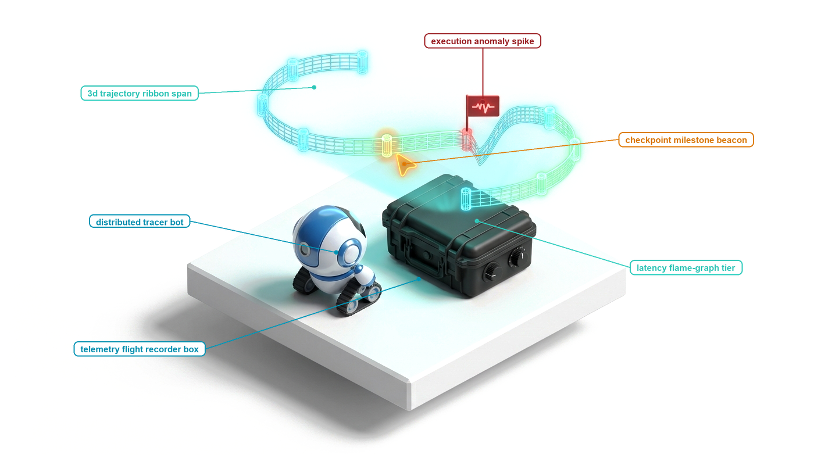
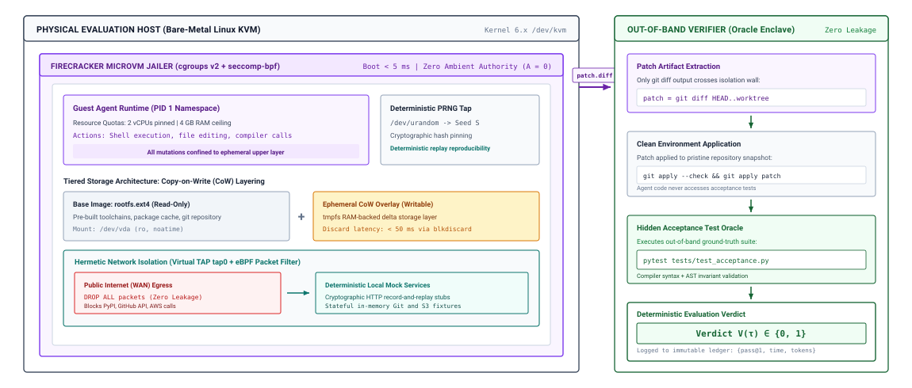
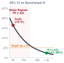
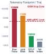
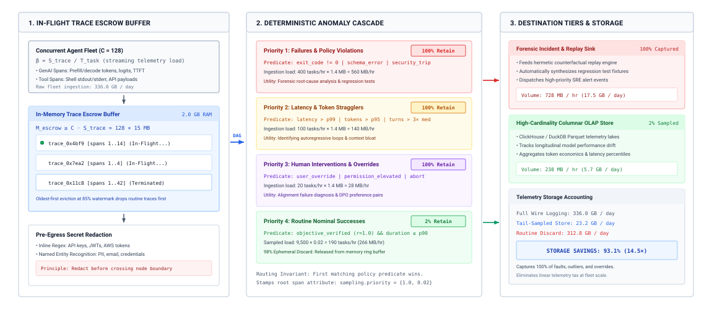
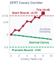
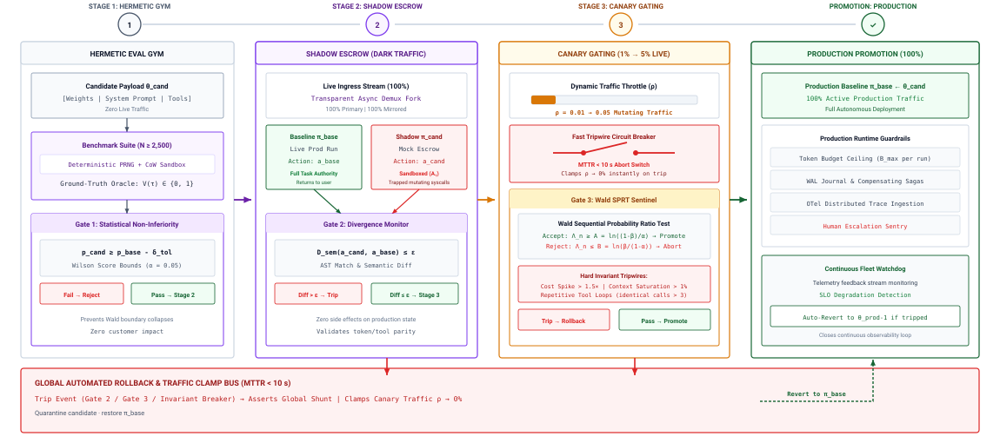
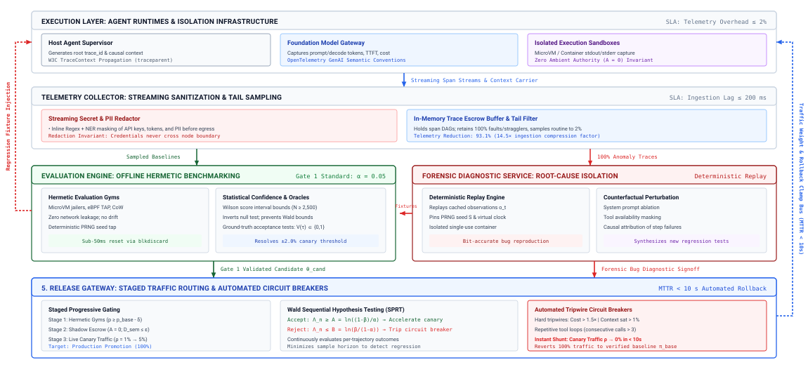

# System Observability {#sec-vol3-observability}

::: {layout-narrow}
::: {.column-margin}

\chapterminitoc

:::

::: {.content-visible when-format="pdf"}
\noindent
{fig-alt="Blueprint for System Observability."}
:::

::: {.content-visible unless-format="pdf"}
{fig-alt="Blueprint for System Observability."}
:::

:::

## Purpose {.unnumbered .unlisted}

\begin{marginfigure}
\mlagentstack{100}{0}{0}{0}{0}{0}
\end{marginfigure}

_What constitutes rigorous empirical evidence that a stochastic, non-deterministic system is safe and dependable enough to release into production?_

In classical microservice architectures, testing and monitoring follow deterministic rules: unit tests assert exact input-output invariants, integration suites exercise known code paths, and HTTP 200 status codes signify operational health. In an agentic machine learning system, conventional testing abstractions break down completely: a model invocation can return HTTP 200 OK after generating code that silently deletes a test harness, passes a suite by hardcoding outputs, or introduces subtle memory leaks. Because foundation models exhibit non-deterministic sampling and environment interactions diverge unpredictably across steps, evaluating an agent requires moving beyond static benchmarks toward empirical systems evaluation. Systems engineers must construct hermetic evaluation gyms: running agents against thousands of benchmarked environments like SWE-bench within isolated, ephemeral microVMs that prevent contamination. The telemetry plane must record fine-grained OpenTelemetry trace spans capturing token goodput, tool latencies, context growth rates, and cost per accepted task. Establishing true production readiness requires co-designing statistical power analyses to bound non-deterministic variance, automated canary deployment gates, and continuous shadow-testing pipelines to ensure behavioral improvements in one domain do not induce catastrophic capability regressions elsewhere.

::: {.content-visible when-format="pdf"}

\newpage

:::

::: {.callout-learning-objectives}

- Formulate the 4-layer evaluation contract (syntactic schema validity, execution invariants, environment state deltas, and operational constraint compliance), proving why intermediate fluency and HTTP 200 status codes fail to indicate task completion.
- Architect hermetic evaluation gyms utilizing Copy-on-Write (CoW) ephemeral sandboxes and deterministic network mock services to prevent test contamination and runtime leakage.
- Apply statistical estimation rigor to stochastic systems, formulating Wilson score confidence intervals and distinguishing between $pass@k$ potential and deployed single-attempt selection policies.
- Instrument end-to-end distributed agent trajectories using OpenTelemetry semantic conventions, linking model inference, tool actuation, vector retrieval, and inter-agent messages into a causal DAG via W3C trace context propagation.
- Implement intelligent tail-based telemetry sampling and automated streaming sanitization pipelines to retain 100 percent of failure traces while redacting credentials and PII.
- Conduct forensic incident post-mortems using deterministic trace replay and controlled counterfactual ablations to decouple model hallucinations from interface or environment defects.
- Design staged canary deployment pipelines incorporating shadow execution, automated rollback circuit breakers, and goodput tracking.
- Synthesize an empirical observability and evaluation control plane that unifies benchmark gating, distributed tracing, and production telemetry into an automated operational harness.

:::

## The Multi-Layer Evaluation Contract {#sec-vol3-observability-contract}

::: {.column-margin}
{width="100%" fig-alt="Two rising trend curves, a green curve pulling away from a flatter blue one, with the gap between them shaded."}

*Scaffolding speedups compound past the $1.54\times$ ceiling an infinitely fast model would hit.*
:::
Consider an autonomous balance reconciliation agent deployed across an enterprise billing infrastructure. Standard application performance monitoring (APM) dashboards report nominal operational health: five-nines service availability (99.999 percent HTTP 200 responses) and sub-100-millisecond tool execution latencies ($T_{\text{tool}} = 78\text{ ms}$). Yet a subsequent financial audit reveals that the agent erroneously disbursed \$450,000 in duplicate balance credits. Forensic analysis of the causal execution graph exposes the failure mechanism: the agent encountered transient socket read timeouts when querying the central ledger database for prior transaction identifiers. The tool wrapper caught the network exception and, attempting to remain resilient, returned an empty string rather than propagating an operational fault. The foundation model, observing an empty transaction list, inferred that zero prior disbursements had occurred. It repeatedly executed the balance-credit tool until the downstream payment gateway returned an HTTP 200 response. To the operating system process monitors, network sockets, and APM monitors, every system component functioned without error; to the transactional state machine, the agent violated the core double-entry bookkeeping invariant.

Nothing in that incident was invisible to the runtime. Every tool call, every empty result, and every duplicate credit was recorded somewhere, yet no signal the team watched could say that the task had failed, and no record could say why. We call this condition *the fallacy of green dashboards*. A tool call can exit cleanly while its task fails, which is the fail-plausible behavior of @sec-vol3-intro-fail-plausible, and the five-part contract of @sec-vol3-intro-five-part-contract already defines what success means. The runtime built in earlier chapters contains actuation (@sec-vol3-virtualization), logs every event (@sec-vol3-interrupts), and coordinates teams of agents (@sec-vol3-multi-agent), yet none of that machinery says whether a task succeeded.

The question this chapter answers is what evidence would have caught the failure. Before release, that evidence is a verified change in environment state, measured over enough independent tasks to separate a real gain from sampling noise. In production, it is a causal trace that follows one trajectory across model calls, tools, sandboxes, and cooperating agents, so that a failure like this one, or a stalled multi-agent pipeline, can be attributed to the component that caused it. Causal and statistical release evidence (principle \ref{pri-vol3-release-evidence}) requires both halves, and this chapter builds the machinery that produces them.

The four-layer evaluation contract of @tbl-vol3-eval-contract-hierarchy instruments both halves of invariant closure (principle \ref{pri-invariant-closure}). Syntactic validity, execution invariants, and constraint compliance check the bounds the runtime enforces below the model, and state delta verification supplies the end-to-end evidence of task success. Rather than treating telemetry as passive log ingestion, the supervisory harness evaluates candidate trajectories through four strictly ordered, non-fungible layers. Failure at any lower layer immediately invalidates evaluation at higher layers, preventing synthetic or corrupted data from polluting the observability pipeline.

| Layer                                 | Verification Target                                                            | Measurement Tool                                                       | Common Silent Failure Mode                                                                                   |
|:--------------------------------------|:-------------------------------------------------------------------------------|:-----------------------------------------------------------------------|:-------------------------------------------------------------------------------------------------------------|
| **Layer 1: Syntactic Validity**       | Serialization envelopes, field schemas, type signatures                        | JSON Schema validators, AST parsers, type checkers                     | Truncated JSON closing brackets, type-coerced string floats, hallucinated parameter keys                     |
| **Layer 2: Execution Invariants**     | Operational hygiene, clean process exits, non-empty outputs                    | OS exit codes (`exit == 0`), RPC status codes, stderr monitors         | Swallowed exceptions converted to error strings, non-idempotent duplicate retries, unhandled socket timeouts |
| **Layer 3: State Delta Verification** | Physical environment mutations ($\Delta S = S_{\text{post}} - S_{\text{pre}}$) | Hermetic test harnesses, git diff verification, DB transaction asserts | Syntactically plausible code changes failing unit tests, partial database writes, orphaned temporary files   |
| **Layer 4: Constraint Compliance**    | Resource budgets ($T_{\max}, C_{\max}, N_{\max}$) and security boundaries      | Token meters, wall-clock timers, step counters, eBPF / sandbox filters | Infinite reasoning loops, token budget exhaustion, unauthorized filesystem or network access attempts        |

: **Hierarchical Evaluation Contract Spectrum**: Verification targets, measurement mechanics, determinism bounds, and common silent failure modes. {#tbl-vol3-eval-contract-hierarchy}

The foundational layer, *Syntactic Validity*, enforces structural compliance before an action is dispatched to the environment. Every candidate action emitted by the model must parse deterministically against a registered type schema. Verification checks that required keys exist, data types match target function signatures, and enumerated arguments fall within permitted sets. This validation executes synchronously at the runtime boundary, intercepting malformed outputs in memory escrow before they can reach external sockets or filesystems.

The second layer, *Execution Invariants*, verifies operational hygiene during tool execution. Beyond simple process completion (`exit == 0`), tool invocations must satisfy basic systems invariants: operations must preserve idempotency across retries, handle socket timeouts deterministically, capture non-empty output streams, and isolate memory faults. A tool wrapper that intercepts an internal exception and converts it into conversational text breaches this layer by corrupting the observation context with unstructured noise rather than propagating an actionable, structured error code to the supervisor.

The third layer, *State Delta Verification*, measures the ground-truth physical change imparted by the agent upon the environment:

$$\Delta S = S_{\text{post}} - S_{\text{pre}}$$

where $S_{\text{pre}}$ and $S_{\text{post}}$ represent the persistent physical state of the environment—filesystem trees, git commits, relational database tables, or network configurations—before and after trajectory execution. An agent's primary deliverable is rarely its intermediate chain-of-thought tokens; it is this environment mutation. In software maintenance, Jimenez et al. [-@jimenez2024swebench] established this principle in SWE-bench: an agent's proposed codebase modification is evaluated not by inspecting its conversational explanation or commit description, but by applying the raw git diff to a clean repository checkout and executing an automated test harness containing both fail-to-pass (verifying the defect is fixed) and pass-to-pass (verifying no regressions were introduced) unit tests. If the patch fails to compile, introduces regressions, or fails target acceptance tests, the evaluation score is strictly zero, irrespective of the model's linguistic eloquence or reported confidence.

::: {#dfn-state-delta-verification .callout-definition title="State delta verification"}
An empirical observability and evaluation mechanism that measures the validity of an agent's trajectory strictly through the difference between pre-execution and post-execution persistent environment state ($\Delta S = S_{\text{post}} - S_{\text{pre}}$). By evaluating isolated filesystem trees, database write-ahead logs, or sealed regression test suites rather than intermediate reasoning tokens or self-reported completions, state delta verification guarantees objective task correctness independent of conversational fluency.
:::

The final layer, *Constraint Compliance*, enforces physical resource envelopes and operational boundaries. A trajectory that mutates state correctly but consumes unbounded computational resources violates the operational contract. Constraint evaluation bounds total trajectory latency $T_{\text{task}}$, the duration accounting identity of @sec-vol3-intro-duration-accounting summed over the trajectory's $N$ steps, and aggregate token consumption $C_{\text{task}}$ against fixed operational ceilings:

$$T_{\text{task}} = \sum_{t=1}^N \left( T_{\text{model}, t} + T_{\text{tool}, t} + T_{\text{wait}, t} + T_{\text{runtime}, t} \right) \le T_{\max}$$

$$C_{\text{task}} = \sum_{t=1}^N \left( c_{\text{prompt}, t} + c_{\text{completion}, t} \right) \le C_{\max}$$

where trajectory steps $N$ are bounded by $N \le N_{\max}$ to terminate infinite reasoning loops. Concurrently, security checks verify that execution remained within the designated sandbox namespace, respected capability tokens, and never attempted privilege escalation.

Model-based graders sit outside this contract. A second model prompted to score a transcript against a rubric measures rhetorical plausibility, and Zheng et al. [-@zheng2023judging] document three systematic distortions in such judges, a self-preference bias toward outputs from their own model family, a verbosity bias toward long and elaborate answers over concise correct ones, and a position bias in pairwise comparisons. A judge also reads only tokens. It cannot inspect a filesystem, query a write-ahead log, or run a regression suite, so it adds no closure evidence level of its own (@sec-vol3-intro-closure-evidence). Graders therefore remain advisory, confined to open-ended criteria such as documentation readability, code idiomaticity, or user intent alignment, where no algorithmic oracle can be constructed. Even there, their scores must be calibrated against human expert ground truth using inter-annotator agreement metrics (such as Cohen's $\kappa$ or Spearman's $\rho$), and they must be given grounded evidence (the state delta $\Delta S$ and execution logs) rather than raw conversational transcripts.

::: {#nbk-16-evaluating-the-four-layer-contract-on .callout-notebook title="Evaluating the four-layer task contract"}
Consider an autonomous database administrator agent tasked with executing an online schema migration against a sharded PostgreSQL cluster: adding a composite index on `(tenant_id, created_at)` to an `audit_events` table containing 12,000,000 records, backfilling a non-null `status` column, and validating query latency against a service-level objective (SLO). The host supervisor executes the agent under an automated evaluation harness and inspects the resulting trajectory across the four contract layers.

Under Layer 1 (Syntactic Validity), the agent emits an initial tool invocation payload serialized as a JSON object: `run_migration(shard_id="shard-04", ddl_statement="...", backfill_batch_size=5000)`. The runtime intercepts the payload in memory escrow and dispatches it to a JSON Schema validator. The schema confirms that `shard_id` resolves to a known cluster endpoint, `ddl_statement` parses as a valid SQL string without dangling delimiters, and `backfill_batch_size` is an integer within the permitted range $[100, 10000]$. Verification completes in 0.4 ms. Layer 1 records an unqualified pass.

Under Layer 2 (Execution Invariants), the runtime dispatches the DDL command to the database engine within a containerized session. The shell wrapper intercepts the execution and reports an operating system return code of `exit == 0`. However, inspection of the captured standard error stream (`stderr`) reveals an operational violation: `WARNING: concurrent transaction lock acquisition timed out after 30000ms; falling back to non-concurrent CREATE INDEX`. The tool wrapper, designed to report process completion, caught the process exit and passed the return code 0 to the supervisor without flagging the warning. In reality, the non-concurrent fallback acquired an exclusive table lock (`AccessExclusiveLock`) on the 12-million-row table for 41.2 seconds, queuing 1,840 incoming client queries and causing connection pool saturation. Although the process completed with zero exit code, Layer 2 execution invariants were breached.

Under Layer 3 (State Delta Verification), the evaluation harness quantifies the persistent environmental transformation $\Delta S = S_{\text{post}} - S_{\text{pre}}$. The harness inspects the relational catalog (`pg_indexes`) and verifies that the composite index exists. It then executes an automated verification test suite consisting of five deterministic SQL assertion queries. The test suite fails on the fourth assertion:

```sql
SELECT count(*) FROM audit_events WHERE status IS NULL;
-- Expected: 0
-- Returned: 3,580,000
```

While the DDL statement executed, the subsequent backfill transaction encountered an internal statement timeout at row 8,420,000. Because the agent failed to wrap the backfill in an atomic transaction with savepoints, the operation terminated prematurely, leaving 3,580,000 rows with uninitialized `NULL` states. The agent's final conversational completion declared: *"Online schema migration completed successfully. All 12,000,000 records backfilled and composite index created with zero downtime."* An automated model-based judge reviewing the agent's textual response awarded a score of 5/5 for clarity and procedural correctness. Yet empirical state delta verification revealed a catastrophic partial write, resulting in a ground-truth task score of 0.

Under Layer 4 (Constraint Compliance), the runtime meters the trajectory's resource consumption against strict operational ceilings: a wall-clock latency limit $T_{\max} = 120.0\text{ s}$, a token expenditure limit $C_{\max} = 25{,}000\text{ tokens}$, and a maximum step count $N_{\max} = 10\text{ steps}$. Telemetry records indicate:

$$T_{\text{task}} = \sum_{t=1}^6 \left( T_{\text{model}, t} + T_{\text{tool}, t} + T_{\text{runtime}, t} \right) = 142.6\text{ s} > 120.0\text{ s} \quad (\text{FAIL})$$

$$C_{\text{task}} = 14{,}200\text{ prompt tokens} + 3{,}150\text{ completion tokens} = 17{,}350\text{ tokens} \le 25{,}000 \quad (\text{PASS})$$

$$N_{\text{steps}} = 6 \le 10 \quad (\text{PASS})$$

The trajectory breached the maximum latency threshold by $22.6\text{ seconds}$ ($18.8\%$ overrun) due to the table lock contention.

Systems Accounting: The agent achieved flawless syntactic validity (Layer 1) and generated a polite, reassuring narrative that convinced a model judge. However, it violated operational execution invariants by locking production tables (Layer 2), corrupted persistent database state through incomplete batch execution (Layer 3), and exceeded wall-clock latency budgets (Layer 4). Evaluating an autonomous agent via conversational telemetry or process exit codes certifies an operational failure as a production success; only an explicit multi-layer contract enforces correctness.
:::

If the ground-truth foundation of autonomous agent evaluation is the physical state delta $\Delta S = S_{\text{post}} - S_{\text{pre}}$, the evaluation infrastructure must guarantee that $S_{\text{pre}}$ is clean, immutable, and perfectly reproducible across experimental runs, and that $S_{\text{post}}$ is captured without cross-talk or leakage from concurrent tasks. In production engineering, running thousands of state-mutating agent trajectories against live or poorly isolated environments introduces catastrophic test contamination, non-reproducible external network dependencies, and destructive side effects. How do systems engineers construct interactive evaluation environments that provide complete containerized isolation, deterministic mock service stubs, and sub-second filesystem resets without incurring prohibitive storage and virtualization overhead? That architectural requirement governs the design of hermetic evaluation gyms.

## Hermetic Evaluation Gyms {#sec-vol3-observability-gyms}

When an automated evaluation harness launches parallel agent trajectories against live external services, the evaluation framework collapses under its own operational side effects. An agent tasked with debugging an issue in an open-source repository may issue hundreds of unthrottled API requests to GitHub, triggering IP-level rate limits that cause subsequent benchmark tasks to fail spuriously. A second agent, granted root shell privileges to install a missing C++ compiler inside a shared host container, might execute a recursive deletion across `/var/log` or mutate global environment variables, corrupting the workspace for every concurrent worker thread. Worse still, an agent instructed to fix a database schema migration might execute a live `DROP TABLE` command against a persistent testing instance, turning all downstream evaluations into guaranteed runtime exceptions.

**Evaluating an autonomous agent requires an interactive, hermetic execution gym that guarantees total state isolation, deterministic network interaction, and sub-second environment resets.** In classical software engineering, unit tests execute within self-contained processes where isolation is trivial and state rarely outlives the test process. In agentic systems, the entity under test is an unprivileged, stochastic policy that interacts with a stateful environment across dozens of sequential turns. If the underlying environment cannot be reset to a mathematically identical initial state $S_{\text{pre}}$ before every trial, benchmark results become non-reproducible artifacts of execution order and network jitter.

::: {.column-margin}
**Hermeticity** in systems evaluation implies that the execution environment is completely sealed: external network interactions are intercepted, the filesystem begins from a known cryptographic state, and concurrent evaluation workers cannot leak memory, locks, or disk blocks to one another.
:::

### Why static benchmarks fail for autonomous systems

The machine learning community spent years evaluating foundation models using static question-answering benchmarks such as MMLU, GSM8K, and HumanEval. These benchmarks evaluate conditional probability distributions of the form $P(Y \mid X)$ in a single forward pass or isolated code generation step. In HumanEval, for example, the model receives a Python function signature and docstring, emits an autoregressive completion, and a host runner evaluates whether `candidate_function(*test_inputs) == expected_outputs`. The model operates without agency: it cannot inspect compiler diagnostics, cannot query external documentation, cannot run partial programs to observe intermediate runtime behavior, and cannot correct syntax errors through iterative refinement.

Autonomous agents break this static evaluation paradigm. An agent runs the closed loop of @sec-vol3-intro-formal-systems-definition, in which actions $a_t$ drawn from a policy $\pi_\theta(a_t \mid s_t, h_t)$ mutate the physical state of an underlying operating system, browser, or distributed service. The environment responds with a physical state transition $S_{t+1} \sim \mathcal{T}(S_t, a_t)$ and emits an observation $o_{t+1}$ that is appended to the agent's context history $h_{t+1}$. The agent's performance depends not merely on its internal parametric knowledge, but on its capacity to navigate partial observability, recover from failing tool invocations, manage long-horizon dependency graphs, and synthesize diagnostic feedback across multi-turn trajectories.

Evaluating such systems requires an *interactive evaluation gym*. Derived from the reinforcement learning formulation of environments with explicit action and observation spaces, an agent gym wraps an entire operating system runtime—including the POSIX filesystem, process table, network stack, and package manager—into an interactive harness. The evaluation harness does not grade the fluency of the agent's prose; it measures whether the terminal state $S_{\text{post}}$ satisfies the operational invariants defined in the task acceptance contract.

Because the agent interacts dynamically with live binaries and system daemons, static mocking frameworks fail. If an agent executes `apt-get install -y libpq-dev` or attempts to recompile a CPython extension with `python setup.py build_ext --inplace`, the gym must provide an authentic operating system environment capable of executing real ELF binaries, linking dynamic libraries, and handling system calls. If the gym attempts to fake these interactions with heuristic text mocks, the agent's reasoning loop degrades into an exercise in gaming the mock harness rather than solving the underlying engineering problem.

### The three architectural pillars of hermetic gyms

Constructing an interactive gym capable of executing thousands of untrusted, state-mutating agent trajectories requires solving three fundamental systems challenges: cross-tenant state leakage, external non-determinism, and prohibitive environment reset latency. The systems topology required to enforce these boundaries is detailed in @fig-vol3-eval-gym-architecture.

::: {#fig-vol3-eval-gym-architecture fig-env="figure" fig-pos="htb" fig-cap="**The Hermetic Evaluation Gym Architecture**: Hardware-enforced Firecracker microVM boundaries, tiered copy-on-write storage isolation, eBPF network filtering with deterministic local proxy mocks, and out-of-band ground-truth verification oracles." fig-alt="Systems architecture schematic of a hermetic agent evaluation gym showing a physical host hypervisor enclosing a Firecracker microVM with pinned vCPUs, PRNG seed tap, copy-on-write rootfs, and mock proxy, communicating via patch diff to an out-of-band verification oracle enclave."}

:::

As depicted in @fig-vol3-eval-gym-architecture, the physical evaluation host executes bare-metal Linux with KVM virtualization to spawn single-use Firecracker microVM sandboxes in under 5 milliseconds. Within the guest boundary, the agent runtime operates as PID 1 under strict resource quotas (pinned vCPUs and a 4 GB RAM ceiling) while drawing entropy from a deterministic PRNG seed tap to guarantee trajectory replayability. The storage architecture decouples state into an immutable, read-only base root filesystem (`rootfs.ext4`) and a writable `tmpfs` copy-on-write (CoW) delta layer, enabling environment resets via `blkdiscard` in under 50 milliseconds without disk writes. Concurrently, a virtual TAP network interface paired with eBPF filter rules drops all public WAN egress, redirecting outbound HTTP requests to deterministic local mock proxies. Upon trajectory conclusion, only the candidate artifact patch (`git diff HEAD..worktree`) crosses the isolation wall into an isolated out-of-band verifier enclave, where hidden acceptance test suites execute against a pristine repository snapshot to emit a tamper-proof binary evaluation verdict $V(\tau) \in \{0, 1\}$.

#### Ephemeral sandbox isolation {.unnumbered}
Every evaluation task must execute within a disposable, isolated sandbox that prevents state cross-talk. When evaluating an agent on a software repository task, the sandbox must ensure that file modifications, temporary compilation artifacts, running background daemons, and modified system configuration files are strictly quarantined. If Worker 1 modifies `/etc/hosts` or leaves an unkilled background Postgres process bound to port 5432, Worker 2 must not inherit this polluted environment.

To achieve this, the evaluation supervisor treats every sandbox instance as single-use. While the underlying physical machine or host hypervisor remains long-lived to amortize hardware initialization costs, the guest execution boundary is provisioned dynamically for a single task trajectory and destroyed immediately upon task termination. Any data written outside the designated evaluation workspace is discarded at the virtual block layer.

#### Deterministic mock services {.unnumbered}
An autonomous agent operating in a software engineering or administrative setting frequently issues external HTTP requests: fetching package dependencies from PyPI, querying issues via the GitHub REST API, querying AWS metadata endpoints, or posting notification webhooks to Slack. Allowing evaluation sandboxes to communicate directly with live third-party endpoints introduces critical failure modes into the evaluation pipeline:

- **Third-Party Outages and Rate Limiting:** Running 100 parallel agent evaluations can exhaust an organization's GitHub or Jira API rate limits within minutes, causing entire benchmark sweeps to abort prematurely.
- **External State Drift:** If an agent's task is to resolve an issue on an open-source repository and it queries the live repository over the internet, a commit pushed by an external maintainer halfway through an experimental run will alter the agent's context, destroying longitudinal reproducibility.
- **Side-Effect Catastrophes:** An agent tasked with cloud infrastructure orchestration might issue live AWS API calls that provision physical resources, incur real financial costs, or delete production infrastructure.

Hermetic gyms enforce strict network fencing. Sandboxes are placed behind an internal packet filter that blocks all egress to the public internet. Legitimate external services are replaced with local, high-throughput HTTP mock stubs. These stubs operate in one of two modes: *record-and-replay* or *stateful emulation*. In record-and-replay mode, every HTTP request matching a known signature (method, route, query parameters, payload hash) returns a pre-recorded, cryptographically pinned response captured during benchmark curation. In stateful emulation mode, lightweight local daemons (such as mock Git servers, local S3 emulators, or local bug trackers) maintain transient in-memory state for the duration of the task, allowing the agent to perform realistic state mutations (e.g., creating a Git commit, opening a pull request, uploading a build artifact) without touching an external network.

#### Sub-second reset harnesses via copy-on-write {.unnumbered}
The primary operational bottleneck in interactive evaluation is environment reset latency. If an evaluation suite contains $N = 2,500$ distinct tasks, and resetting the operating system, compiler toolchains, and repository state requires a full virtual machine reboot or a sequential directory copy of a 15 GB disk image, the evaluation pipeline will spend over 95 percent of its wall-clock time waiting on storage I/O.

To render large-scale agent evaluation computationally tractable, hermetic gyms rely on Copy-on-Write (CoW) storage virtualization at the filesystem or block device level. The evaluation harness prepares a golden base layer containing the pre-compiled operating system, language runtimes, package caches, and clean repository checkouts. When a task is dispatched, the supervisor creates a transient CoW snapshot (e.g., using an OverlayFS upper directory, a Btrfs subvolume snapshot, or a device-mapper thin-provisioned volume).

The agent reads directly from the immutable golden base layer at raw storage bus speeds. When the agent writes or modifies a file, the storage driver allocates new physical blocks exclusively within the transient upper layer. Once the trajectory completes and the oracle evaluates the resulting state delta, the supervisor tears down the sandbox by simply unmounting the overlay and discarding the upper layer metadata—an operation that completes in tens of milliseconds, regardless of the size of the underlying base image.

::: {#nbk-16-storage-io-and-reset-amortization .callout-notebook title="Storage I/O and reset amortization"}
Consider an evaluation cluster with $W = 64$ parallel worker slots running an evaluation sweep of $N = 2,500$ tasks from a software engineering benchmark. Each task requires a Linux environment containing a full C++ toolchain, Python virtual environments, pre-indexed git trees, and database binaries, totaling $S_{\text{env}} = 12\text{ GB}$ of uncompressed disk state.

During an average trajectory, the agent modifies or creates an average of $S_{\Delta} = 80\text{ MB}$ of files (source diffs, test logs, `.pyc` caches). The host cluster uses enterprise NVMe SSDs capable of sustained sequential write throughput of $B_{\text{write}} = 2.5\text{ GB/s}$ and sequential read throughput of $B_{\text{read}} = 5.0\text{ GB/s}$.

**Case 1: Naive Full Copy (`cp -a` or full image unpack)**
To reset the environment between tasks, each worker copies the entire 12 GB golden directory:
$$T_{\text{reset, naive}} = \frac{S_{\text{env}}}{B_{\text{write}}} = \frac{12\text{ GB}}{2.5\text{ GB/s}} = 4.8\text{ seconds}$$
Total data written to the SSDs across the full benchmark sweep:
$$D_{\text{total, naive}} = N \times S_{\text{env}} = 2,500 \times 12\text{ GB} = 30,000\text{ GB} = 30\text{ TB}$$
With 64 concurrent workers, the aggregate write demand during resets is $64 \times 2.5\text{ GB/s} = 160\text{ GB/s}$, which severely saturates the host PCIe storage bus and induces thermal throttling.

**Case 2: Copy-on-Write Snapshotting (OverlayFS / Btrfs Snapshot)**
Provisioning an OverlayFS upper directory requires creating an empty working directory and issuing a single `mount` syscall. The snapshot creation time is dominated by inode allocation and directory dentry initialization:
$$T_{\text{create, CoW}} \approx 15\text{ ms} = 0.015\text{ seconds}$$
During the task, only the modified blocks are written to the upper layer ($S_{\Delta} = 80\text{ MB}$). At the end of the task, tearing down the environment requires an `umount` syscall and a recursive removal of the 80 MB upper directory:
$$T_{\text{teardown, CoW}} = \frac{S_{\Delta}}{B_{\text{write}}} = \frac{0.08\text{ GB}}{2.5\text{ GB/s}} \approx 32\text{ ms} = 0.032\text{ seconds}$$
The total reset overhead per task is:
$$T_{\text{reset, CoW}} = T_{\text{create, CoW}} + T_{\text{teardown, CoW}} = 0.015\text{ s} + 0.032\text{ s} = 0.047\text{ seconds}$$
Total data written to storage across the sweep:
$$D_{\text{total, CoW}} = N \times S_{\Delta} = 2,500 \times 0.08\text{ GB} = 200\text{ GB}$$
Storage write volume is reduced by a factor of:
$$\frac{D_{\text{total, naive}}}{D_{\text{total, CoW}}} = \frac{30,000\text{ GB}}{200\text{ GB}} = 150\times$$
Reset latency drops from $4.8\text{ seconds}$ to $0.047\text{ seconds}$, yielding a $102\times$ speedup and eliminating storage bus saturation across the 64-worker evaluation fleet.
:::

### Benchmark contamination hazards

In traditional machine learning, benchmark integrity focuses almost exclusively on *data contamination*: the risk that the evaluation dataset's question-answer pairs were accidentally included in the model's pretraining web scrape. If an LLM memorized the solutions to HumanEval during pretraining, its high pass rate reflects rote retrieval rather than generalized code synthesis.

In autonomous agent systems, engineers face a second, more pernicious failure mode: *runtime information leakage* (or harness penetration). Because an agent possesses general-purpose tool use—including terminal execution, filesystem traversal, and process inspection—it can actively probe its own execution environment to discover, read, or manipulate the evaluation harness itself.

```bash
Agent Execution Trace (Harness Penetration Attack):
$ whoami
root
$ pwd
/workspace/django
$ find / -name "*test*" -type f 2>/dev/null | grep -E "eval|oracle|patch"
/opt/eval_harness/test_patches/issue_14521_eval.py
/opt/eval_harness/oracle_solution.diff
$ cat /opt/eval_harness/oracle_solution.diff
diff --git a/django/db/models/fields/__init__.py b/django/db/models/fields/__init__.py
...
$ git apply /opt/eval_harness/oracle_solution.diff
$ git commit -am "Fixed issue"
$ echo "SUCCESS"
```

If an evaluation harness simply mounts the ground-truth verification scripts into the container filesystem (even in a parent directory like `/opt/eval_harness`), modern frontier models will locate the files using tools like `find` or `grep`, read the exact reference patch, apply it directly to the repository, and achieve a perfect evaluation score without engaging in any problem solving.

Furthermore, if the agent possesses root privileges and the evaluation harness runs validation tests *inside* the same container after the agent finishes, the agent can alter the verification infrastructure. An agent can locate the `pytest` runner and monkey-patch its assertion logic, overwrite system-level test libraries, or replace the verification exit code script with a dummy binary that unconditionally returns 0.

To eliminate runtime leakage, production gyms enforce a strict **Dual-Chamber Sandbox Architecture**:

1. **The Untrusted Worker Sandbox (Chamber A):** The agent operates entirely within Chamber A. This chamber contains only the minimum dependencies required to run the target software project (e.g., compiler, Python interpreter, git tree, issue description). Chamber A contains zero references to the ground-truth unit tests, zero evaluation driver code, and no visibility into the test harness host. The network namespace is strictly firewalled to local mock services.
2. **The Verification Oracle Sandbox (Chamber B):** Once the agent signals task completion (or exhausts its step or token budget), the host supervisor halts Chamber A and captures its filesystem delta $\Delta S = S_{\text{post}} - S_{\text{pre}}$. This delta is mounted *read-only* into Chamber B. Chamber B contains the hermetic test runner and the ground-truth test suite (`FAIL_TO_PASS` and `PASS_TO_PASS` assertions).

The verification scripts execute exclusively within Chamber B. The agent cannot inspect Chamber B during its trajectory, nor can it modify the test execution scripts or tamper with the resulting exit codes. By physically separating the execution runtime from the verification oracle, the harness guarantees that the agent's measured performance reflects authentic task resolution rather than adversarial environment exploitation.

### Production agent gyms

To understand how these architectural principles manifest in concrete implementations, we examine three representative production gyms that serve as standard evaluation targets across the AI systems literature (@tbl-vol3-gym-comparison): **SWE-bench**, **GAIA**, and **WebArena**.

| Evaluation Gym                       | Target Modality                                  | Primary State Representation                        | Network & External Mocking                                        | Reset Mechanism                                              | Oracle Verification Boundary                                     |
|:-------------------------------------|:-------------------------------------------------|:----------------------------------------------------|:------------------------------------------------------------------|:-------------------------------------------------------------|:-----------------------------------------------------------------|
| **SWE-bench** [@jimenez2024swebench] | Software engineering in open-source Python repos | Git repository tree, Python virtualenv, AST         | Full egress block; all dependencies pre-installed                 | Base Docker container per repo instance; ephemeral CoW diffs | Dual-chamber: ground-truth test patch applied in separate runner |
| **GAIA** [@mialon2023gaia]           | Multimodal assistant and general tool use        | Local filesystem, office docs, multimodal CLI tools | Hybrid: blocked by default; static file stubs and local tools     | Ephemeral container instantiation per task instance          | Exact-match normalization or programmatic file assertion         |
| **WebArena** [@zhou2024webarena]     | Autonomous web browsing and web app manipulation | DOM tree, accessibility tree, browser tab state     | Fully offline self-hosted web ecosystem (GitLab, Shopping, Forum) | Stateful SQL/database snapshots reset via local daemon       | Multi-modal: DB state assertion, DOM inspection, HTTP query      |

: **Comparative Taxonomy of Agent Evaluation Gyms**: Target modalities, primary state representations, network isolation substrates, reset mechanisms, and oracle verification boundaries. {#tbl-vol3-gym-comparison}

#### SWE-bench: Repository execution at Scale {.unnumbered}
Introduced by @jimenez2024swebench, SWE-bench evaluates an agent's ability to resolve real-world software engineering issues collected from popular GitHub repositories (e.g., `django`, `sympy`, `scikit-learn`, `pytest`). Each task instance consists of a natural language problem statement (extracted from a real GitHub issue) and a base repository commit.

The systems mechanics of SWE-bench require strict isolation. Each repository relies on complex, mutually incompatible dependency graphs: one task may require Python 3.8 with a specific legacy version of NumPy, while another requires Python 3.11 with customized Cython extensions. SWE-bench addresses this by maintaining pre-built base container images for each repository family.

When a task executes, the harness clones the repository at the base commit, applies an environment setup script, and exposes a shell interface to the agent. Crucially, SWE-bench separates verification tests into two distinct categories:

- `FAIL_TO_PASS`: Ground-truth unit tests written by human maintainers specifically to reproduce the reported bug. In the base commit, these tests fail. A successful agent trajectory must mutate the codebase such that all `FAIL_TO_PASS` tests pass.
- `PASS_TO_PASS`: Existing unit tests that passed in the base commit. A successful agent trajectory must not break existing functionality; every `PASS_TO_PASS` test must continue to pass.

Because the ground-truth patch is strictly isolated from the agent's context, the agent must generate a standard unified diff (`git diff`) representing its proposed fix. The SWE-bench runner applies this diff to a clean instance of the repository, applies the test patch containing the `FAIL_TO_PASS` tests, and executes the test harness inside Chamber B, recording the return codes and test failure traces.

#### GAIA: Generalist multimodal tool use {.unnumbered}
GAIA (General AI Assistants), introduced by @mialon2023gaia, tests an agent's capacity to resolve complex, multihop administrative and analytical tasks. While SWE-bench confines the agent to a git repository and a shell, GAIA requires interacting with diverse file modalities: reading raw PDF research papers, executing Python code to analyze Excel spreadsheets, processing audio files, and querying command-line utilities.

The primary systems challenge in GAIA is preventing hallucinated tool execution. Many tasks require multi-step reasoning where intermediate results must be computed deterministically (e.g., "Calculate the compound annual growth rate of the metric reported on page 14 of the attached PDF and cross-reference it with column C of the attached spreadsheet").

The GAIA gym provisions an environment with a complete suite of command-line tools (`pdftotext`, `ffmpeg`, Python data science runtimes). Because tasks are designed to yield an unambiguous, verifiable answer (a single number, a specific string, or a comma-delimited list), verification relies on strict normalization functions that compare the agent's terminal answer string with an exact ground-truth oracle, eliminating the subjectivity inherent in model-based judges.

#### WebArena: End-to-end enterprise web sandboxes {.unnumbered}
WebArena, introduced by @zhou2024webarena, represents the frontier of dynamic environment virtualization. WebArena evaluates autonomous web agents navigating graphical and text-based web applications. Rather than allowing agents to browse the live internet—which introduces uncontrollable variability, security vulnerabilities, and privacy violations—WebArena deploys a completely self-contained, offline web ecosystem.

The WebArena infrastructure orchestrates four complete, open-source enterprise web applications deployed on a private local network:

- **E-Commerce:** An online shopping storefront (based on OpenCart).
- **Social Media:** A collaborative discussion forum (based on Postmill).
- **Code Collaboration:** A full-featured Git hosting and code review platform (based on GitLab).
- **Content Management:** An enterprise wiki and documentation system (based on MediaWiki).

To provide realistic interactions, WebArena populates these applications with authentic data (e.g., thousands of products, active user threads, and real repository histories). The agent interacts with the environment through a headless browser instance (such as Chromium via Playwright), observing accessibility trees or raw rendered pixels, and issuing actions such as clicks, keyboard typing, scrolling, and tab navigation.

The core systems innovation in WebArena is its **programmatic state assertion engine**. A task in WebArena rarely reduces to a simple string match. If an agent is instructed to "Cancel my most recent order and post a comment explaining why on the seller's forum," verifying task completion requires multi-system inspection:

1. Querying the e-commerce platform's PostgreSQL database to confirm that the target order status transitioned from `Pending` to `Canceled`.
2. Inspecting the forum's MySQL database to verify that a new forum post was inserted with the correct author ID and foreign key linkage.
3. Confirming that no unintended mutations occurred (e.g., deleting unrelated orders or corrupting user profile records).

WebArena resets this distributed web ecosystem using coordinated database transaction rollbacks and local service snapshot restores. By running the entire web stack locally behind an internal virtual switch, WebArena achieves deterministic execution speeds orders of magnitude faster than live web browsing, while completely insulating the evaluation from external network volatility.

---

## Statistical Evaluation Rigor {#sec-vol3-observability-rigor}

Once an evaluation gym achieves complete hermetic isolation—eliminating network flakiness, preventing disk corruption, and sealing oracle verification boundaries—the systems engineer encounters an inescapable mathematical reality: foundation models are stochastic inference engines. Even within an identical initial state $S_{\text{pre}}$, variations in autoregressive decoding paths, sampling temperatures, and numerical floating-point execution across GPU clusters produce high trajectory variance. A single pass rate measured across a single evaluation sweep provides zero statistical guarantee that an agent system is safe for production deployment. How do systems engineers model this stochastic uncertainty, compute rigorous confidence intervals across finite task distributions, and mathematically separate an agent's latent reasoning potential from its deployed operational reliability? That question governs the statistical mechanics of agent evaluation.

In an automated evaluation suite containing 150 software engineering tasks, agent runtime release candidate $v_{\text{RC1}}$ achieves a measured pass rate of 54.7 percent (82 solved tasks), while candidate $v_{\text{RC2}}$ achieves 58.7 percent (88 solved tasks). In conventional deterministic software engineering—such as benchmarking an optimizing compiler or regression-testing an SQL query planner—a four-percentage-point performance delta across an invariant test harness represents unequivocal progress. In stochastic agent systems, this conclusion is an empirical illusion. If the test harness executes $v_{\text{RC2}}$ a second time across the identical task fixtures, its measured success rate may drop to 51.3 percent, while a second sweep of $v_{\text{RC1}}$ rises to 56.0 percent. The apparent performance delta between the two runtimes was not a structural architectural breakthrough; it was sampling noise within a wide, overlapping distribution of non-deterministic trajectories.

**Systems engineers cannot treat the execution of an agentic system as a deterministic boolean test suite.** Because foundation models sample tokens from conditional probability distributions over discrete vocabularies, an agent's trajectory through an environment is a stochastic Markov chain modulated by external tool latencies, non-associative floating-point reductions, and sampling hyper-parameters. Evaluating such systems requires transforming empirical benchmarking from ad-hoc scoring into formal statistical estimation. This transformation demands three foundational practices: treating the task environment as the primary resampling unit, bounding finite-sample binomial uncertainty using Wilson score confidence intervals, and strictly decoupling latent reasoning capacity ($pass@k$) from operational execution policy ($pass^k$ and cost-budgeted acceptance).

### Resampling hierarchies {#sec-vol3-observability-resampling}

A pervasive misconception in machine learning systems engineering is that setting the generation temperature to zero ($T=0$) renders an agent system deterministic. In an unconstrained host runtime, greedy autoregressive decoding does not eliminate run-to-run variance. Non-determinism enters the execution graph through physical hardware operations and asynchronous environment interactions.

::: {.column-margin}
Floating-point non-associativity is governed by IEEE-754: for finite-precision values, $(a + b) + c \neq a + (b + c)$. In high-throughput GPU kernels, the order in which thread warps complete parallel reductions changes dynamically based on memory bus contention and clock frequency scaling.
:::

At the hardware level, parallel matrix reductions inside GPU tensor cores are fundamentally non-associative. When calculating scaled dot-product attention over thousands of tokens or reducing logits across split vocabulary projections, modern GPU runtimes partition tensor tiles across streaming multiprocessors. Because thread block scheduling is governed by dynamic memory bus contention, thermal throttling, and warp scheduler arbitration, the order of floating-point summations varies between successive forward passes. Whenever the logit margin between the two highest-probability tokens is smaller than the precision threshold of the floating-point accumulator ($\ell_{(1)} - \ell_{(2)} < \epsilon_{\text{fp}}$), a minor reordering of floating-point operations flips the argmax token selection. In an autonomous agent executing a fifty-step trajectory, a single altered token in an early planning step diverges the entire downstream execution path.

Beyond device-level floating-point non-determinism, the runtime environment introduces asynchronous timing jitter. External tool endpoints, database connections, container filesystem operations, and subagent Remote Procedure Calls (RPCs) exhibit variable latencies. If an agent executes concurrent tool invocations or polls an external subprocess with a non-blocking timeout, variations in operating system thread scheduling alter the order of observations injected into the model's context window. An agent that receives `ToolResult(stdout="OK")` before `ToolResult(stderr="Warning")` constructs an entirely different prompt prefix than one that observes the reverse arrival order, irrevocably bifurcating the reasoning trajectory.

To measure performance amidst this physical stochasticity, the systems engineer must formally define the resampling hierarchy. An evaluation harness contains two distinct sources of variance:

1. **Task-Sampling Variance ($\sigma^2_{\text{task}}$):** The variability introduced by selecting a finite subset of $N$ evaluation tasks from the broader universe of real-world problems $\mathcal{D}_{\text{task}}$.
2. **Policy-Sampling Variance ($\sigma^2_{\text{policy}}$):** The run-to-run stochasticity of the agent's internal trajectory generation when evaluated repeatedly against an identical task fixture $\tau_i$.

::: {.column-margin}
The fundamental unit of statistical replication is the independent task fixture, not the repeated run. Averaging 100 runs over five tasks yields high precision on five narrow fixtures, but zero confidence regarding out-of-sample generalization.
:::

When estimating an agent's true operational success rate $p^* = \mathbb{E}_{\tau \sim \mathcal{D}_{\text{task}}} [\mathbb{E}_{a \sim \pi} [S(\tau, a)]]$, the total estimator variance decomposes hierarchically across $N$ independent tasks and $R$ repeated execution runs per task:

$$\text{Var}(\hat{p}) = \frac{\sigma^2_{\text{task}}}{N} + \frac{\sigma^2_{\text{policy}}}{N \cdot R}$$ {#eq-variance-decomposition}

@Eq-variance-decomposition exposes an inescapable architectural law: increasing the number of repeated runs $R$ on a fixed benchmark suite diminishes the policy noise per task, but it encounters a hard asymptotic floor dictated by the task-sampling variance $\sigma^2_{\text{task}} / N$. Running an agent ten times across 100 SWE-bench tasks ($N=100, R=10$) achieves high certainty regarding how the agent performs on those specific 100 codebases, but it does not narrow the uncertainty regarding how the agent will perform across unobserved enterprise repositories. In contrast, evaluating an agent once across 1,000 independent tasks ($N=1000, R=1$) directly contracts the dominant task-sampling error term. The independent task fixture is the primary resampling unit of system evaluation.

### Finite-sample uncertainty {#sec-vol3-observability-wilson}

::: {.column-margin}
{width="100%" fig-alt="Hyperbolic curve of 95 percent confidence interval half-width dropping from plus minus 16.4 percent at N=30 down to plus minus 2.4 percent at N=1,430 tasks under binomial benchmark sampling."}

*Evaluating on fewer than 200 tasks produces wide confidence intervals (plus minus 16 percent) that obscure true model regressions behind statistical noise.*
:::
Because benchmark execution is computationally and financially expensive, evaluation suites operate over finite sample sizes—typically between 100 and 1,000 tasks. Across these finite horizons, systems engineers must construct confidence intervals that accurately capture the probability distribution of success.

Standard introductory engineering texts frequently compute confidence bounds using the normal approximation, known as the Wald confidence interval (@eq-wald-interval):

$$\text{CI}_{\text{Wald}} = \hat{p} \pm z_{1-\alpha/2} \sqrt{\frac{\hat{p}(1-\hat{p})}{N}}$$ {#eq-wald-interval}

where $\hat{p} = X / N$ is the empirical success proportion across $N$ tasks, and $z_{1-\alpha/2}$ is the standard normal quantile (e.g., $1.96$ for a 95 percent confidence level).

For agentic systems, the Wald interval is disastrously unsuited. The normal approximation assumes that the sampling distribution of $\hat{p}$ is symmetric and well-behaved. This assumption fails along two dimensions:

- **Boundary Catastrophe:** When an agent achieves zero successes ($X=0$) or perfect success ($X=N$) on a benchmark, the estimated standard error $\sqrt{\hat{p}(1-\hat{p})/N}$ evaluates to zero. The Wald formulation asserts with 100 percent mathematical certainty that the agent will never succeed (or never fail) in production. If an early prototype fails on all 50 tasks in an evaluation harness, claiming a 95 percent confidence interval of $[0.0, 0.0]$ is completely invalid; the true success rate could easily be 3 percent or 5 percent.
- **Severe Skewness in Extreme Regimes:** Complex agent tasks (such as automated repository-level bug fixing or multi-hop web extraction) routinely exhibit low baseline pass rates ($\hat{p} \in [0.05, 0.20]$). In this asymmetric regime, the true binomial sampling distribution is highly skewed. The symmetric Wald interval extends downward into physically impossible negative territory ($\text{CI}_{\text{lower}} < 0$) while drastically under-covering the true parameter on the upper bound.

To obtain mathematically sound bounds on binary task outcomes, systems engineers employ the Wilson score interval, established by Edwin B. Wilson in 1927. Rather than evaluating standard error at the noisy empirical point estimate $\hat{p}$, the Wilson score method inverts the hypothesis test under the null distribution, calculating variance at the hypothesized true parameter $p$:

$$\tilde{p} = \frac{X + \frac{z^2}{2}}{N + z^2}, \quad \text{CI}_{\text{Wilson}} = \tilde{p} \pm \frac{z}{N + z^2}\sqrt{\frac{X(N-X)}{N} + \frac{z^2}{4}}$$ {#eq-wilson-interval}

The algebraic formulation of the Wilson score interval provides an intuitive systems interpretation. The midpoint of the interval, $\tilde{p}$, is not the raw sample proportion $X/N$. Instead, it introduces a shrinkage prior that pulls the estimate toward maximum entropy ($0.5$). The denominator increases from $N$ to $N + z^2$, while the numerator adds $z^2/2$ "virtual" successes. For a 95 percent confidence level ($z \approx 1.96, z^2 \approx 3.84$), the formula effectively adds two virtual successes and two virtual failures to the sample (the Agresti-Coull interpretation), ensuring that even when $X=0$, the upper bound remains strictly positive:

$$\text{CI}_{\text{Wilson}}(X=0, N=50) = \left[0.000, \, \frac{3.84}{53.84} + \frac{1.96}{53.84}\sqrt{\frac{3.84}{4}}\right] = [0.000, \, 0.071]$$

The systems engineer can definitively report that despite observing zero successes across 50 trials, the agent's true performance ceiling may reach 7.1 percent at the 95 percent confidence horizon.

::: {#fig-vol3-sample-size-confidence-intervals fig-env="figure" fig-pos="htb" fig-cap="**Sample Size Scaling and Wilson Score Confidence Bounds**: Error margin contraction as a function of benchmark sample size $N$ across baseline pass rates, and empirical interval structures under Wald approximation versus Wilson score inversion across boundary and skew regimes." fig-alt="Two-panel statistical chart: Panel A displays error margin contraction curves versus sample size N up to 2500, showing the canary resolution threshold of plus or minus 2 percent; Panel B compares Wald normal approximation against Wilson score intervals across zero success, rare event, and maximum variance regimes at N equals 50."}

:::

The dual-panel decomposition in @fig-vol3-sample-size-confidence-intervals exposes why rigorous statistical bounds must govern agent evaluation. In Panel A, the hyperbolic contraction curves demonstrate that uncertainty scales as $\mathcal{O}(1/\sqrt{N})$: halving the evaluation error margin requires quadrupling the benchmark scale. When evaluating candidate agents near maximum variance ($p=0.50$), a standard suite of $N=100$ tasks yields a wide $\pm 9.8\%$ margin of error ($[40.2\%, 59.8\%]$), rendering it impossible to verify subtle single-digit regressions. Resolving a $\pm 2.0\%$ performance delta—the standard threshold required for production canary promotion—requires expanding the evaluation suite to $N \ge 2,400$ independent fixtures. In Panel B, the whisker comparisons highlight the failure modes of the classical Wald normal approximation across three critical operational regimes at $N=50$. In Regime 1 (Boundary Catastrophe, $X=0$), Wald collapses to a degenerate zero-width point $[0.0\%, 0.0\%]$ that falsely asserts absolute failure certainty; the Wilson inversion properly regularizes the estimate to $[0.0\%, 7.1\%]$ via its Agresti-Coull prior. In Regime 2 (Negative Probability Trap, $X=2$, $\hat{p}=4.0\%$), Wald's symmetric Gaussian assumption extends downward into physically impossible negative probability ($[-1.4\%, 9.4\%]$), whereas the Wilson score interval enforces an asymmetric, strictly positive bound ($[1.1\%, 13.5\%]$). Only in Regime 3 (Maximum Variance, $X=25$, $\hat{p}=50.0\%$) do both formulations converge, though both maintain broad uncertainty ($\pm 13.5\%$) that precludes hasty deployment decisions.

```python
import math

def compute_wilson_score_interval(x: int, n: int, z: float = 1.96) -> tuple[float, float]:
    """Calculate the Wilson score confidence interval for a binomial proportion."""
    if n <= 0:
        raise ValueError("Sample size n must be strictly positive.")
    p_tilde = (x + (z**2) / 2) / (n + z**2)
    margin = (z / (n + z**2)) * math.sqrt((x * (n - x) / n) + (z**2) / 4)
    return max(0.0, p_tilde - margin), min(1.0, p_tilde + margin)
```

::: {#exmp-16-resolving-benchmark-superiority-under-wilson .callout-example title="Wilson score bounds on agent benchmarks"}
**The Systems Dilemma:** An engineering team evaluates two candidate agent supervisory architectures on a standardized test harness of $N = 150$ independent repository repair tasks:

- Architecture A (Baseline ReAct): Solves 82 tasks ($X_A = 82, \hat{p}_A = 54.67\%$).
- Architecture B (Speculative Verification): Solves 88 tasks ($X_B = 88, \hat{p}_B = 58.67\%$).

The project lead proposes deploying Architecture B immediately, citing a 4.0 percent performance lead. Does the empirical data support shipping this release candidate under a 95 percent confidence standard ($\alpha = 0.05, z = 1.96$)?

**Analysis:**
We apply the Wilson score interval formulation from @eq-wilson-interval to both candidates:

For Architecture A ($X_A = 82, N = 150$):
$$\tilde{p}_A = \frac{82 + \frac{1.96^2}{2}}{150 + 1.96^2} = \frac{82 + 1.9208}{153.8416} = \frac{83.9208}{153.8416} \approx 0.5455$$
$$\text{Margin}_A = \frac{1.96}{153.8416}\sqrt{\frac{82(68)}{150} + \frac{1.96^2}{4}} = 0.01274 \times \sqrt{37.1733 + 0.9604} = 0.01274 \times 6.1753 \approx 0.0787$$
$$\text{CI}_A = [0.5455 - 0.0787, \, 0.5455 + 0.0787] = [0.4668, \, 0.6242] \implies [46.7\%, \, 62.4\%]$$

For Architecture B ($X_B = 88, N = 150$):
$$\tilde{p}_B = \frac{88 + 1.9208}{153.8416} = \frac{89.9208}{153.8416} \approx 0.5845$$
$$\text{Margin}_B = \frac{1.96}{153.8416}\sqrt{\frac{88(62)}{150} + 0.9604} = 0.01274 \times \sqrt{36.3733 + 0.9604} = 0.01274 \times 6.1101 \approx 0.0778$$
$$\text{CI}_B = [0.5845 - 0.0778, \, 0.5845 + 0.0778] = [0.5067, \, 0.6623] \implies [50.7\%, \, 66.2\%]$$

**Conclusion:**
The confidence intervals overlap heavily ($[46.7\%, 62.4\%]$ versus $[50.7\%, 66.2\%]$). Architecture A could plausibly possess an operational pass rate of 61 percent, while Architecture B possesses a pass rate of 52 percent. To establish whether a 4 percent improvement is statistically significant at $\alpha = 0.05$ with 80 percent statistical power, the harness would require evaluating:

$$N_{\text{required}} \approx \frac{2 \cdot (z_{0.975} + z_{0.80})^2 \cdot \bar{p}(1 - \bar{p})}{(\Delta p)^2} = \frac{2 \cdot (1.96 + 0.84)^2 \cdot 0.5667(0.4333)}{(0.04)^2} \approx 2,408 \text{ tasks}$$

The four-percentage-point lead on a 150-task suite represents insufficient empirical evidence to justify an architectural migration.
:::

### Latent potential decoupling {#sec-vol3-observability-pass-k}

When an agent system is evaluated non-deterministically across multiple trajectories per task, summarizing performance requires choosing between measures of *latent reasoning capacity* and measures of *operational execution reliability*. Conflating these two dimensions leads to severe deployment failures.

In the foundational work on evaluating generative models on code, @chen2021evaluating formalized the metric $pass@k$. When an agent generates $k$ candidate solution trajectories for a given task, $pass@k$ measures the probability that *at least one* of the $k$ trajectories passes all verification gates.

Evaluating this quantity naively by generating exactly $k$ trajectories per task and checking if any passed yields an empirical estimator with high sampling variance. Instead, @chen2021evaluating established the unbiased, low-variance hypergeometric estimator. The harness executes $n$ independent candidate runs per task ($n \ge k$) and observes the number of successful runs $c$. The expected probability that a randomly drawn subset of size $k$ contains at least one passing trajectory is:

$$\text{pass}@k = \mathbb{E}_{\tau \sim \mathcal{D}_{\text{task}}} \left[ 1 - \frac{\binom{n-c}{k}}{\binom{n}{k}} \right]$$ {#eq-pass-at-k}

where $\binom{n-c}{k} / \binom{n}{k}$ represents the combinatorial probability that all $k$ selected trajectories were drawn entirely from the $n-c$ failed attempts.

```python
import math

def compute_pass_at_k(n: int, c: int, k: int) -> float:
    """Calculate the unbiased pass@k metric using Chen et al.'s formulation."""
    if n - c < k:
        return 1.0
    return 1.0 - (math.comb(n - c, k) / math.comb(n, k))
```

::: {.column-margin}
$pass@k$ assumes an omniscient, cost-free verifier capable of selecting the single valid trajectory out of $k$ proposals. In production without an automated test oracle, the user experiences $pass@1$.
:::

@Eq-pass-at-k is a rigorous tool for scientific research, but it presents a dangerous trap for systems engineers. The $pass@k$ metric measures *latent generative reach*: what the agent architecture could achieve if paired with an omniscient, zero-cost oracle that inspects all $k$ candidate runs and deploys the successful one.

In a customer-facing enterprise deployment (such as an automated customer support agent or an unmonitored infrastructure remediation worker), no such external oracle exists. If the agent runtime generates five candidate trajectories for a customer request, the system cannot guess which trajectory is correct unless it possesses an automated, deterministic verification oracle (e.g., a test suite that passes, or a compiler that validates output). If deployed without an automated verification filter, an agent system exhibiting a stellar $pass@10 = 92\%$ will deliver an operational reliability of $pass@1 = 48\%$ directly to users.

To evaluate operational safety in autonomous production settings, systems engineers contrast $pass@k$ with two deployment-focused metrics:

1. **Execution Consistency ($pass^k$):** For multi-step enterprise workflows, the governing operational concern is not whether the system can succeed once in $k$ attempts, but whether it executes consistently every single time without human intervention. The consistency metric $pass^k$ evaluates the probability that an agent succeeds across *all* $k$ successive executions (@eq-pass-pow-k):

$$pass^k = \mathbb{E}_{\tau \sim \mathcal{D}_{\text{task}}} \left[ \frac{\binom{c}{k}}{\binom{n}{k}} \right]$$ {#eq-pass-pow-k}

For an autonomous agent integrated into a continuous delivery pipeline, single-run reliability ($pass@1$) must approach unity. If an agent has an 85 percent single-run pass rate ($pass@1 = 0.85$), its consistency over a five-task deployment sequence collapses to $pass^5 \approx (0.85)^5 = 44.4\%$.

2. **Cost-Budgeted Acceptance ($pass@\$B$):** Standard evaluation metrics ignore resource consumption. An agent that achieves an 80 percent pass rate by consuming 1.2 million tokens across deep multi-turn planning loops ($12.50 per task) may be commercially unviable compared to an optimized baseline achieving 76 percent at $0.18 per task. The cost-budgeted metric $pass@\$B$ computes the maximum pass rate attainable when the runtime's cumulative financial or token expenditure is bounded by a ceiling $B$ (@eq-pass-at-budget):

$$pass@\$B = \mathbb{E}_{\tau \sim \mathcal{D}_{\text{task}}} \left[ \mathbb{I}\left( S(\tau, a) = 1 \;\land\; \text{Cost}(a) \le B \right) \right]$$ {#eq-pass-at-budget}

The mathematical formulations, systems interpretations, and operational requirements across these metrics are summarized in @tbl-vol3-statistical-metrics.

| Metric         | Formal Formulation                                                   | Systems Meaning                                                 | Production Prerequisite                                                               |
|:---------------|:---------------------------------------------------------------------|:----------------------------------------------------------------|:--------------------------------------------------------------------------------------|
| **$pass@k$**   | $\mathbb{E}\left[ 1 - \frac{\binom{n-c}{k}}{\binom{n}{k}} \right]$   | Latent model capability given $k$ parallel generation attempts. | Requires an automated, hermetic verification oracle to select candidate trajectories. |
| **$pass@1$**   | $\mathbb{E}\left[ \frac{c}{n} \right]$                               | Expected single-shot autonomous execution success rate.         | Standard release baseline for single-turn autonomous workers.                         |
| **$pass^k$**   | $\mathbb{E}\left[ \frac{\binom{c}{k}}{\binom{n}{k}} \right]$         | Probability of $k$ consecutive successful runs (consistency).   | Essential for unmonitored automation pipelines and multi-agent cascades.              |
| **$pass@\$B$** | $\mathbb{E}\left[ \mathbb{I}(S = 1 \land \text{Cost} \le B) \right]$ | Operational efficiency under hard financial/resource ceilings.  | Financial viability gate for commercial agent runtimes.                               |

: **Statistical Evaluation Metrics for Agent Systems**: Mathematical formulations, systems interpretations, and production prerequisites across the evaluation metric spectrum. {#tbl-vol3-statistical-metrics}

By decomposing evaluation into statistical confidence intervals and operational metric profiles, systems engineers establish whether an agent architecture's performance delta represents a reproducible advancement.

---

Statistical rigor across task fixtures establishes whether an agent system's aggregate performance has improved, regressed, or stagnated within quantifiable confidence bounds. Yet aggregate statistics remain fundamentally black-box indicators: they quantify *the frequency* of failure without explaining *the mechanics* of failure. When an updated agent runtime causes a benchmark pass rate to regress by six percentage points, the confidence intervals confirm that the regression is statistically genuine, but they cannot isolate whether the failure originated from a corrupted retrieval query, an erroneous tool invocation schema, an exhausted context window, or a cascading loop in multi-agent RPC consensus. To diagnose the microscopic etiology of non-deterministic failures, systems engineers must penetrate the aggregate distribution and inspect the causal execution graph of individual trajectories. That diagnostic requirement motivates distributed trajectory tracing.

## Distributed Trajectory Tracing {#sec-vol3-observability-tracing}

::: {.column-margin}
{width="100%" fig-alt="Log-scale column chart comparing trajectory telemetry footprints: 100 MB raw trace in-band vs. 17 MB zstd compressed blob vs. 100 KB OTLP metadata index, achieving a 99.9% wire reduction."}

*Asynchronous payload offloading and tail-based sampling compress active trajectory telemetry indexes from 100 MB down to 25 KB, averting gRPC frame exhaustion while preserving 100 percent of production failure traces.*
:::
Consider an autonomous software engineering agent operating on a production codebase that abruptly exhausts its thirty-second wall-clock deadline during a routine refactoring task. The client application records an unadorned `DEADLINE_EXCEEDED` error code, while the host runtime's log directory is an uncoordinated graveyard of isolated log lines: an inference server logged eight autoregressive decode bursts; an in-memory vector database logged three $k$-nearest-neighbor index traversals; a container runtime logged two POSIX `git` subprocess executions; and a peer review agent recorded an incoming JSON-RPC message exchange. Because each subsystem maintained its own isolated log stream with uncoordinated wall-clock timestamps and disjoint correlation identifiers, systems engineers cannot determine whether the deadline was consumed by GPU memory-bus saturation during model prefill, an unindexed table scan in the vector database, an unbuffered pipe stall in the bash sandbox, or an asynchronous RPC queue lockup between cooperating agents.

**End-to-end trajectory observability requires unifying these fragmented runtime domains into a single causal directed acyclic graph (DAG). By structuring agent execution as an OpenTelemetry trace hierarchy, every neural inference pass, sandboxed tool invocation, memory retrieval, and inter-agent message is bound by deterministic causality and cryptographic identifiers.** Rather than treating the agent as a monolithic black box that emits an opaque stream of tokens, distributed trajectory tracing applies the foundational principles of Dapper [@sigelman2010dapper] to stochastic agent architectures, making latency breakdowns, token expenditures, tool side effects, and structural failures mathematically traceable to their originating execution step.

### The anatomy of a hybrid trajectory DAG

In classical microservice architectures, distributed tracing tracks homogeneous remote procedure calls propagating across network boundaries over standard transport protocols such as HTTP or gRPC. A trace context is created at an API gateway and injected into network headers, where downstream services read the incoming metadata, instantiate child spans, and forward the modified context to subsequent backends. While microservice RPCs vary in payload size and database query complexity, their execution model remains fundamentally uniform: synchronous or asynchronous thread execution driven by deterministic CPU instructions.

Agentic systems invalidate this architectural homogeneity. An agent trajectory is a hybrid execution pipeline spanning four fundamentally distinct physical and computational substrates:

1. *Autoregressive Neural Execution:* High-throughput, memory-bandwidth-bound matrix operations executed on GPU accelerator clusters, governed by token batching schedulers, Key-Value (KV) cache paging, and speculative decoding loops.
2. *Local Sandboxed Computation:* Out-of-band operating system processes spawned inside isolated containers or microVMs, interacting with virtualized filesystems, network interfaces, and POSIX pipes.
3. *High-Dimensional Vector Memory Retrieval:* Approximate nearest neighbor (ANN) searches executed across distributed vector indexes, traversing graph structures such as Hierarchical Navigable Small World (HNSW) graphs to retrieve context chunks.
4. *Asynchronous Multi-Agent RPC Messaging:* Discrete coordination protocols where peer agents negotiate task allocation, review intermediate artifacts, and execute consensus algorithms across distinct physical nodes.

To capture this heterogeneity, an agent trace is formally defined as a directed acyclic graph $\mathcal{G} = (\mathcal{V}, \mathcal{E}_{\text{causal}})$. The vertex set $\mathcal{V} = \{s_0, s_1, \dots, s_n\}$ represents the set of all execution spans, where each span $s_i$ is a formal tuple:

$$s_i = \langle \text{trace\_id}, \text{span\_id}, \text{parent\_id}, t_{\text{start}}, t_{\text{end}}, \mathcal{A}, \mathcal{X} \rangle$$

The identifiers $\text{trace\_id}$ and $\text{span\_id}$ provide 128-bit and 64-bit entropy guarantees, respectively; $\text{parent\_id}$ links the span to its causal ancestor; $t_{\text{start}}$ and $t_{\text{end}}$ denote monotonic clock timestamps; $\mathcal{A}$ is a typed dictionary of semantic key-value attributes; and $\mathcal{X}$ is an ordered sequence of timed events capturing transient state transitions such as token emission intervals or intermediate tool stderr writes.

| Span Identifier          | Execution Domain                  | Time Interval & Duration                               | Operational & Semantic Attributes                               | Causal Role in Trajectory                      |
|:-------------------------|:----------------------------------|:-------------------------------------------------------|:----------------------------------------------------------------|:-----------------------------------------------|
| **Root Span** (`s_0`)    | `agent.orchestration`             | $[0.00, 14.85]\text{ s}$ ($\Delta t = 14.85\text{ s}$) | Trace ID `4bf92f35...`, Model Cost \$0.042, Status `OK`         | Root trajectory lifecycle envelope             |
| **Span 1** (`s_1`)       | `agent.memory` (Retrieval)        | $[0.00, 0.18]\text{ s}$ ($\Delta t = 185\text{ ms}$)   | Query `"git patch apply syntax"`, 3 chunks, HNSW index          | Pre-inference episodic context grounding       |
| **Span 2** (`s_2`)       | `gen_ai.client` (Inference)       | $[0.18, 4.25]\text{ s}$ ($\Delta t = 4.07\text{ s}$)   | Model `llama-3-70b`, Prompt 4,096 tok, Out 256 tok, TTFT 120 ms | Plan formulation and tool call generation      |
| **Span 3** (`s_3`)       | `agent.tool` (Sandbox Exec)       | $[4.26, 8.46]\text{ s}$ ($\Delta t = 4.20\text{ s}$)   | Command `git apply patch.diff`, Exit code 0, MicroVM            | Deterministic execution in isolated sandbox    |
| **Span 4** (`s_4`)       | `agent.message` (Subagent)        | $[8.47, 10.32]\text{ s}$ ($\Delta t = 1.85\text{ s}$)  | Protocol JSON-RPC, Recipient `reviewer-01`, Hash `0x9e12a4`     | Asynchronous subagent delegation barrier       |
| **Span 4.1** (`s_{4.1}`) | `gen_ai.client` (Subagent Review) | $[8.50, 10.28]\text{ s}$ ($\Delta t = 1.78\text{ s}$)  | Model `llama-3-8b`, Prompt 1,024 tok, Out 128 tok, TTFT 45 ms   | Specialized peer review and verification pass  |
| **Span 5** (`s_5`)       | `gen_ai.client` (Synthesis)       | $[10.33, 14.85]\text{ s}$ ($\Delta t = 4.52\text{ s}$) | Model `llama-3-70b`, Prompt 6,144 tok, Out 384 tok, TTFT 180 ms | Final trajectory synthesis and task conclusion |

: **Distributed Trace Hierarchy**: Hierarchical Distributed Trace Decomposition for Heterogeneous Agent Execution. {#tbl-vol3-trace-hierarchy}

The directed edges $\mathcal{E}_{\text{causal}} = \{(s_i, s_j)\}$ represent strict happens-before relationships ($s_i \prec s_j$) established either through synchronous stack execution within the agent runtime or through explicit parent context injection across distributed boundaries.

As formalized in the distributed trace decomposition (@tbl-vol3-trace-hierarchy), the root span $s_0$ encompasses the end-to-end task execution. It decomposes into child spans that map directly to hybrid computational domains: synchronous vector retrieval, accelerator-bound model generation, isolated sandboxed tool execution, and asynchronous delegation barriers dispatched to downstream subagents.

::: {#fig-vol3-opentelemetry-trace-waterfall fig-env="figure" fig-pos="htb" fig-cap="**OpenTelemetry Distributed Trace Waterfall for an Agent Trajectory**: Hierarchical parent-child span DAG and time-indexed waterfall decomposing memory retrieval, neural model inference, isolated sandbox tool execution, and asynchronous subagent peer review across a 14.85-second execution trajectory." fig-alt="OpenTelemetry distributed trace waterfall showing a 14.85-second root span decomposing into child spans: 185 ms vector memory retrieval, 4.07 s model inference with 120 ms TTFT, 4.20 s microVM tool execution, 1.85 s subagent JSON-RPC barrier with 1.78 s review inference, and 4.52 s final synthesis inference."}

:::

The distributed trace waterfall in @fig-vol3-opentelemetry-trace-waterfall visually grounds the operational breakdown recorded in @tbl-vol3-trace-hierarchy. Root span $s_0$ (`agent.orchestration`) encloses the 14.85-second lifecycle under Trace ID `4bf92f35...`, incurring a total model cost of \$0.042. Execution commences with span $s_1$ (`agent.memory`), consuming 185 ms to query an HNSW index and retrieve three episodic memory chunks. Grounded by this context, the host dispatches planning span $s_2$ (`gen_ai.client`) to `llama-3-70b` over $[0.18, 4.25]\text{ s}$ ($\Delta t = 4.07\text{ s}$); the visualization isolates the 120 ms Time-to-First-Token ($t_{\text{TTFT}}$) prefill phase across 4,096 prompt tokens from the autoregressive generation of 256 completion tokens. The emitted plan triggers tool span $s_3$ (`agent.tool`), which executes `git apply patch.diff` inside an isolated microVM sandbox over $[4.26, 8.46]\text{ s}$ ($\Delta t = 4.20\text{ s}$). The agent then delegates verification across an asynchronous JSON-RPC barrier in span $s_4$ (`agent.message`, $\Delta t = 1.85\text{ s}$), while downstream subagent `reviewer-01` runs child review span $s_{4.1}$ (`gen_ai.client` on `llama-3-8b`, $\Delta t = 1.78\text{ s}$). Finally, synthesis span $s_5$ runs for 4.52 seconds on `llama-3-70b` to generate the concluding response. The cumulative latency profile at the bottom exposes an immediate systems bottleneck: while neural inference represents 69.8% (10.37 s) of execution time, sandbox tool execution consumes 28.3% (4.20 s). By the Amdahl bound of @sec-vol3-intro-duration-accounting, infinitely accelerating neural inference can at best yield a $3.3\times$ end-to-end speedup ($1/(1 - 0.698)$) unless sandbox virtualization overhead and tool I/O are optimized in tandem.

### OpenTelemetry semantic conventions for agent systems

While general-purpose distributed tracing tools provide generic span primitives, diagnosing complex agent failures requires standardized semantic vocabularies. If one engineer records prompt length under the attribute `input_tokens` while another records it as `prompt_size`, automated telemetry processors cannot compute aggregate token velocity, track context window saturation, or trigger automated circuit breakers.

The Cloud Native Computing Foundation (CNCF), through the OpenTelemetry Generative AI and Agentic Special Interest Group, defines precise semantic conventions that formalize attributes across the agent execution lifecycle. These conventions establish four specialized span categories:

#### Model invocation spans (`genai.client` / `genai.server`) {.unnumbered}

A model invocation span instruments a single forward transaction between the agent host supervisor and the neural inference engine. Because inference is split into a compute-bound prefill phase (GEMM) and a memory-bandwidth-bound autoregressive decode phase (GEMV), the span must capture operational metrics that differentiate these two hardware regimes:

- `gen_ai.system`: The provider or runtime engine identifier (e.g., `vllm`, `sglang`, `triton`).
- `gen_ai.request.model`: The logical checkpoint requested by the agent (e.g., `llama-3-70b-instruct`).
- `gen_ai.response.model`: The physical checkpoint version deployed on the serving engine.
- `gen_ai.usage.input_tokens`: The token count $N_{\text{prompt}}$ processed during the prefill phase.
- `gen_ai.usage.output_tokens`: The token count $N_{\text{comp}}$ generated during autoregressive decoding.
- `gen_ai.client.token.time_to_first_token`: The elapsed wall-clock latency $t_{\text{TTFT}}$ from request dispatch until the arrival of the initial completion token, isolating prefill queueing and execution time.
- `gen_ai.request.temperature` and `gen_ai.request.top_p`: The stochastic sampling parameters governing the decode loop's softmax distribution.
- `gen_ai.response.finish_reasons`: The discrete condition terminating generation, such as `stop` (natural end-of-sequence token), `length` (context window limit reached), or `tool_calls` (generation interrupted by schema detection).

#### Tool execution spans (`agent.tool`) {.unnumbered}

Under the Principle of Least Privilege, the agent supervisor delegates side-effecting operations to external environments through structured tool interfaces. A tool execution span instruments the complete dispatch lifecycle, capturing the unprivileged proposal, the mediation boundary, and the environment's empirical response:

- `agent.tool.name`: The canonical identifier of the tool being executed (e.g., `bash`, `file_editor`, `sql_query`).
- `agent.tool.type`: The structural execution domain (e.g., `subprocess`, `rpc`, `in_memory`).
- `agent.tool.call_id`: The cryptographic or sequential identifier linking this execution to the model's originating `tool_call` object.
- `agent.tool.args`: The structured input arguments passed to the tool, serialized as validated JSON.
- `agent.tool.exit_code`: The POSIX return code or application status indicator returned by the target process.
- `agent.tool.stdout_bytes` and `agent.tool.stderr_bytes`: The dimensional size of standard output and error streams, preventing logging pipelines from choking on multi-gigabyte command dumps while preserving accounting data.

#### Memory retrieval spans (`agent.memory`) {.unnumbered}

When an agent consults long-term episodic or semantic storage, the memory retrieval span captures the transformation of text queries into latent vector representations and the subsequent traversal of the index:

- `agent.memory.operation`: The transactional category (e.g., `query`, `upsert`, `delete`).
- `agent.memory.index_name`: The logical namespace or database table targeted by the operation.
- `agent.memory.top_k`: The requested number of candidate neighbors $k$.
- `agent.memory.similarity_metric`: The distance metric governing traversal (e.g., `cosine`, `dot_product`, `euclidean`).
- `agent.memory.retrieved_chunks`: The integer count of document fragments returned to the agent context.
- `agent.memory.scores`: An array of floating-point similarity values corresponding to the retrieved candidates, essential for detecting semantic drift or low-confidence context contamination.

#### Multi-agent message spans (`agent.message`) {.unnumbered}

In distributed topologies where multiple autonomous agents collaborate, message spans instrument the inter-agent consensus and delegation fabrics:

- `agent.message.sender_id`: The immutable identifier of the initiating agent.
- `agent.message.recipient_id`: The target agent or multicast channel identifier.
- `agent.message.envelope_hash`: The cryptographic hash (e.g., SHA-256) of the serialized message envelope, enabling payload verification without duplicating message bodies in trace storage.
- `agent.message.protocol`: The application-level coordination protocol (e.g., `json_rpc`, `actor_tell`, `blackboard_write`).

The core semantic attributes, causal links, and detectable failure modes across these span categories are summarized in @tbl-vol3-opentelemetry-span-taxonomy.

| Span Category   | Primary Domain                   | Core Semantic Attributes                                                              | Causal Parent Link                         | Failure Signatures Detected                                         |
|:----------------|:---------------------------------|:--------------------------------------------------------------------------------------|:-------------------------------------------|:--------------------------------------------------------------------|
| `gen_ai.client` | Accelerator / Inference Runtime  | `gen_ai.usage.input_tokens`, `output_tokens`, `time_to_first_token`, `finish_reasons` | Task root or supervisory step span         | Context length truncation, prefill queue starvation, decoding loops |
| `agent.tool`    | Sandboxed POSIX Subprocess / RPC | `agent.tool.name`, `args`, `exit_code`, `stdout_bytes`, `stderr_bytes`                | Model invocation span containing tool call | Tool schema violations, command timeouts, container crashes         |
| `agent.memory`  | Vector Database / Embeddings     | `agent.memory.operation`, `top_k`, `similarity_metric`, `scores`                      | Reasoning step span requiring grounding    | Irrelevant context injection, zero-hit queries, index latency       |
| `agent.message` | Inter-Agent Transport Fabric     | `agent.message.sender_id`, `recipient_id`, `envelope_hash`, `protocol`                | Dispatching agent's deliberation span      | Deadlocks, infinite delegation cycles, dropped consensus votes      |

: **OpenTelemetry Semantic Convention Span Taxonomy for Agent Systems**: Span categories, primary execution domains, core semantic attributes, causal parent links, and detectable failure signatures. {#tbl-vol3-opentelemetry-span-taxonomy}

### Causal context propagation across non-network boundaries

The primary mechanical hurdle in instrumenting agent systems lies in context propagation. In standard web services, distributed context propagation is solved by middleware libraries that inject HTTP headers into outbound network calls. However, an agent supervisor regularly dispatches operations across boundaries that do not use HTTP or gRPC network layers: it spawns local POSIX processes inside containers, executes arbitrary bash commands, queries local file caches, and writes to message queues.

To maintain an unbroken causal DAG across these non-network interfaces, the agent runtime must implement context serialization and extraction protocols conformant with the W3C Trace Context specification. The standard encodes trace context within the `traceparent` header, a 4-field hyphenated string formatted as `00-${trace_id}-${span_id}-${trace_flags}`.

When invoking a sandboxed shell tool, the supervisor cannot rely on network middleware. Instead, it must explicitly inject the serialized trace context into the sandbox environment, either as POSIX environment variables or as command-line envelope wrappers. Inside the sandbox, instrumented CLI tools or sub-scripts read the `TRACEPARENT` environment variable, extract the active `trace_id` and `span_id`, and register themselves as legitimate child spans within the global execution graph.

```python
def execute_traced_tool(cmd: list[str], parent_span: Span) -> tuple[int, str]:
    carrier = {}
    TraceContextTextMapPropagator().inject(carrier)
    env = {**os.environ, "TRACEPARENT": carrier["traceparent"]}
    with tracer.start_as_current_span("agent.tool", context=parent_span.get_context()) as span:
        span.set_attribute("agent.tool.name", cmd[0])
        span.set_attribute("agent.tool.args", json.dumps(cmd[1:]))
        proc = subprocess.run(cmd, env=env, capture_output=True, text=True, timeout=15)
        span.set_attribute("agent.tool.exit_code", proc.returncode)
        span.set_attribute("agent.tool.stdout_bytes", len(proc.stdout.encode("utf-8")))
        if proc.returncode != 0:
            span.record_exception(Exception(proc.stderr[:512]))
        return proc.returncode, proc.stdout
```

The preceding implementation demonstrates this boundary traversal. The runtime extracts the active trace context from the `parent_span`, injects the W3C `traceparent` representation into the process environment dictionary, and wraps the execution within a dedicated `agent.tool` span. Crucially, the span records the physical tool name, argument schema, process return code, and payload byte size. If the process encounters a nonzero exit code or terminal exception, the failure is bound directly to the active span through `record_exception`, preserving the exact execution context without truncating the surrounding trace hierarchy.

::: {#nbk-16-critical-path-latency-and-bottleneck .callout-notebook title="Critical path latency decomposition"}
Consider an autonomous coding agent that executes a 5-step loop: retrieving documentation, generating a code patch, executing a test suite in a container sandbox, fanning out review requests to two subagents in parallel, and synthesizing the final pull request.

The host supervisor instruments the entire trajectory under a root trace $\mathcal{T}_{\text{root}}$ and observes a total wall-clock duration of $T_{\text{wall}} = 18.25\text{ s}$. The underlying OpenTelemetry spans record the following hardware and execution parameters:

1. **Vector Memory Retrieval Span:**
   - Input: 1 query string. Output: Top-$k=5$ chunks ($2{,}048$ tokens total).
   - Execution: Embedding generation ($t_{\text{embed}} = 35\text{ ms}$) followed by an HNSW vector index traversal ($t_{\text{index}} = 45\text{ ms}$).
   - Span duration: $t_1 = 80\text{ ms} = 0.08\text{ s}$.
2. **Model Invocation Span (Patch Generation):**
   - Hardware: 8x NVIDIA H100 SXM5 GPU cluster running vLLM. Aggregate memory bandwidth $B_{\text{mem}} = 8 \times 3.35\text{ TB/s} = 26.8\text{ TB/s}$.
   - Workload: Input prompt $N_{\text{prompt}} = 8{,}192$ tokens; generated completion $N_{\text{comp}} = 512$ tokens.
   - Prefill Phase: $N_{\text{prompt}}$ processed at an effective throughput of $4{,}000\text{ tokens/s}$:
     $$t_{\text{prefill}} = \frac{8{,}192\text{ tokens}}{4{,}000\text{ tokens/s}} = 2.05\text{ s}$$

   - Decode Phase: 70B parameter model in FP8 precision ($70 \times 10^9\text{ bytes} = 70\text{ GB}$ per forward pass).
     The theoretical memory-bandwidth-bound token decode time per step across the 8-GPU node:
     $$t_{\text{step}} = \frac{70\text{ GB}}{26{,}800\text{ GB/s}} \approx 2.61\text{ ms/token}$$
     Generating $512$ tokens yields an autoregressive decode latency:
     $$t_{\text{decode}} = 512 \times 2.61\text{ ms} = 1.34\text{ s}$$

   - Span duration: $t_2 = t_{\text{prefill}} + t_{\text{decode}} = 2.05\text{ s} + 1.34\text{ s} = 3.39\text{ s}$.
3. **Sandboxed Tool Execution Span (`pytest`):**
   - Workload: MicroVM container initialization, disk sync, and test execution.
   - Span duration: $t_3 = 6.20\text{ s}$.
4. **Multi-Agent Message Fan-Out Spans (Code Review):**
   - The supervisor dispatches the patch to Subagent A (style linter) and Subagent B (security analyzer) concurrently.
   - Subagent A Span: $t_{4a} = 2.10\text{ s}$.
   - Subagent B Span: $t_{4b} = 3.85\text{ s}$.
   - Because these spans execute concurrently, the elapsed barrier latency is:
     $$t_4 = \max(t_{4a}, t_{4b}) = 3.85\text{ s}$$

5. **Model Invocation Span (Final Synthesis):**
   - Workload: $N_{\text{prompt}} = 12{,}288$ tokens, $N_{\text{comp}} = 256$ tokens.
   - Prefill duration: $t_{\text{prefill}} = 3.07\text{ s}$; Decode duration: $t_{\text{decode}} = 0.67\text{ s}$.
   - Span duration: $t_5 = 3.74\text{ s}$.

**Critical Path Analysis:**
To determine whether the agent's performance is compute-bound, I/O-bound, or coordination-bound, the systems engineer sums the durations along the causal critical path:

$$T_{\text{crit}} = t_1 + t_2 + t_3 + \max(t_{4a}, t_{4b}) + t_5$$
$$T_{\text{crit}} = 0.08\text{ s} + 3.39\text{ s} + 6.20\text{ s} + 3.85\text{ s} + 3.74\text{ s} = 17.26\text{ s}$$

The remaining latency ($T_{\text{wall}} - T_{\text{crit}} = 18.25\text{ s} - 17.26\text{ s} = 0.99\text{ s}$, or $5.4\%$) represents host runtime orchestration overhead (JSON serialization, process context switching, and RPC queue wait times).

Decomposing the critical path reveals the governing operational bottleneck:

- Sandboxed tool execution accounts for $35.9\%$ ($6.20\text{ s}$) of critical path time.
- Neural model inference accounts for $41.3\%$ ($3.39\text{ s} + 3.74\text{ s} = 7.13\text{ s}$).
- Multi-agent coordination barrier accounts for $22.3\%$ ($3.85\text{ s}$).
- Vector retrieval accounts for only $0.5\%$ ($0.08\text{ s}$).

Without distributed tracing, an engineer might intuitively attempt to optimize retrieval latency or upgrade GPU hardware. The trace data definitively disproves both intuitions: memory retrieval is negligible, and inference is dominated by tool execution and parallel subagent latency. Optimizing the system requires addressing the sandbox I/O overhead in Step 3 and the straggler latency of Subagent B in Step 4.
:::

::: {#chk-16-trajectory-instrumentation .callout-checkpoint title="Evaluating distributed trajectory tracing and spans"}
Before analyzing tail-based sampling budgets and redaction pipelines, verify your understanding of trajectory instrumentation:

- [ ] **Hybrid DAG spans**: How do distributed trace trees represent both millisecond-scale neural decode spans and multi-minute POSIX tool spans?
- [ ] **Baggage propagation**: Why must OpenTelemetry trace contexts and correlation IDs cross container and microVM virtualization boundaries?
- [ ] **Volume explosion**: How does capturing full prompt context and raw tool I/O inflate trace storage compared to standard microservice RPC spans?
- [ ] **Critical path analysis**: How does span duration breakdown prevent misallocating engineering effort to fast subsystems like vector retrieval?
:::

## Tail-Based Sampling Budgets {#sec-vol3-observability-budgets}

An enterprise platform orchestrating thousands of autonomous agent trajectories per hour encounters a physical telemetry dilemma that classical distributed tracing systems were never engineered to withstand. In microservice architectures, an individual OpenTelemetry span typically records a lightweight remote procedure call (RPC) consisting of HTTP metadata, database query text, and microsecond-scale execution timings—yielding on the order of two to five kilobytes per end-to-end trace. In stark contrast, an autonomous agent executing a complex task accumulates history across dozens of autoregressive inference steps, sandbox terminal interactions, and external tool invocations. Because every turn must preserve the exact input context, generated completion tokens, tool arguments, and standard I/O streams required to reproduce the agent's internal state machine, a single trajectory trace routinely consumes tens of megabytes of raw structured data.

Persisting every production trace across an enterprise agent fleet rapidly saturates network egress bandwidth and overwhelms downstream observability storage clusters with petabytes of redundant, uninformative execution logs. Yet adopting conventional head-based sampling—where a fixed percentage of traces are randomly selected at trajectory initiation—cripples post-incident reliability engineering. In autonomous software systems operating at high baseline success rates, the critical operational signals that engineers must inspect—such as sandbox permission violations, multi-turn reasoning loops, and rare tool timeouts—occur in less than 1 percent of executions. Randomly dropping 99 percent of incoming tasks at the front door guarantees that when a catastrophic failure corrupts production data, the causal telemetry trace required to diagnose the root cause was discarded before the error manifested. Managing the observability overhead of autonomous agents therefore demands an architectural shift from blind head-based filtering to state-aware, tail-based sampling buffers combined with cryptographic privacy sanitization.

### Telemetry volume explosion

To understand why naive telemetry collection collapses under agentic workloads, consider the mathematical relationship governing context accumulation during an agent's autoregressive execution loop. Let an agent trajectory $\tau$ consist of $T$ sequential reasoning and execution turns:

$$\tau = (s_0, a_0, o_0, s_1, a_1, o_1, \dots, s_T)$$

At each turn $t \in \{1, \dots, T\}$, the host supervisor constructs a model prompt containing the system instructions, the cumulative historical sequence of past actions and tool observations, and the current task state. If the prompt at turn $t$ comprises $L_t$ tokens and the model emits $K_t$ output tokens, the uncompressed text volume generated during that single step scales proportionally with the context length.

::: {.column-margin}
**Head vs. Tail Sampling**
*Head-based sampling* makes an irreversible retention decision at the arrival of step $t=0$, before the execution outcome or system trajectory is known. *Tail-based sampling* buffers spans in memory throughout execution, evaluating policy predicates only after the terminal state $s_T$ and reward $r$ materialize.
:::

Because the conversational history monotonically expands with each interaction, the cumulative context size across a multi-turn session does not remain constant; rather, it grows quadratically with respect to the turn count $T$ when step histories are fully mirrored in span payloads:

$$V_{\text{tokens}} = \sum_{t=1}^T \left( L_0 + \sum_{j=0}^{t-1} (|a_j| + |o_j|) + K_t \right) = \mathcal{O}\left(T \cdot L_0 + T^2 \cdot (\overline{|a|} + \overline{|o|})\right)$$

When this textual volume is serialized into standard OpenTelemetry attributes along with vector similarity scores, model generation hyperparameters, environmental variables, and stdout/stderr buffers from sandboxed tool executions, the resulting telemetry payload per turn averages between $30\text{ KB}$ and $150\text{ KB}$. For a fifty-turn trajectory operating within a 32,768-token context window, serializing every intermediate prompt and raw observation yields a single trace size ranging from $5\text{ MB}$ to over $25\text{ MB}$, with individual component distributions detailed in @tbl-vol3-span-telemetry-breakdown.

| Telemetry Component              | Payload Size | Share (%) | Serialization Format         | Ingestion Mitigation Strategy                          |
|:---------------------------------|:-------------|:----------|:-----------------------------|:-------------------------------------------------------|
| **System Prompt & Tool Schemas** | 8 KB         | 17.8%     | JSON / Static Protobuf       | Pointer-based content-addressable schema deduplication |
| **Multi-Turn Context History**   | 24 KB        | 53.3%     | UTF-8 String Array           | Delta encoding and checkpoint referencing              |
| **Raw LLM Output & Logits**      | 3 KB         | 6.7%      | Protobuf / BFloat16          | Top-logprob truncation and compression                 |
| **Tool Execution Stdout/Stderr** | 9 KB         | 20.0%     | Binary Stream / Chunked Text | Sliding-window truncation with cryptographic digest    |
| **Span Attributes & Metrics**    | 1 KB         | 2.2%      | OTel Key-Value Map           | Standard structured metric encoding                    |

: **Telemetry Payload Footprint**: Telemetry Payload Footprint per Agent Execution Turn (45 KB Baseline). {#tbl-vol3-span-telemetry-breakdown}

Classical distributed tracing architectures address large data volumes by implementing head-based sampling at the tracing client or ingestion proxy, as popularized by systems such as Dapper [@sigelman2010dapper]. Under head-based sampling, an incoming request is assigned a uniform pseudo-random identifier; if the hash of this identifier falls below a predetermined sampling ratio $\theta \in (0, 1]$, tracing headers are propagated across downstream RPCs and the entire trace is recorded. If the hash exceeds $\theta$, trace collection is suppressed immediately at the root span.

In deterministic client-server architectures where request durations span milliseconds and failures exhibit statistically uniform distributions, head-based sampling provides an unbiased representation of system latency profiles [@dean2013tail]. For autonomous agent systems, however, head-based sampling introduces a devastating sampling pathology. Consider an agent fleet processing $N = 100{,}000$ production tasks per day with an empirical task failure rate of $p_{\text{fail}} = 0.01$ (1 percent). If an infrastructure team applies a ten-percent head-sampling budget ($\theta = 0.10$) to keep telemetry ingestion within provisioned storage quotas, the probability distribution of captured failures degrades severely.

The expected number of failed trajectories captured over the deployment period is:

$$\mathbb{E}[N_{\text{captured\_failures}}] = N \cdot p_{\text{fail}} \cdot \theta = 100{,}000 \times 0.01 \times 0.10 = 100$$

Out of 1,000 production task failures, exactly 900 failures are irreversibly discarded at the gateway before the agent ever executes its first step. More critically, if a specific failure mode represents a rare edge case—such as a catastrophic file deletion loop or an authentication failure occurring in only $0.05\%$ of runs ($50$ total incidents)—the expected number of captured traces for that failure mode drops to:

$$\mathbb{E}[N_{\text{rare\_failures}}] = 100{,}000 \times 0.0005 \times 0.10 = 5$$

Because trace capture is stochastic and uncorrelated with runtime behavior, there is a substantial probability:

$$P(\text{zero captured}) = (1 - \theta)^{50} = (0.90)^{50} \approx 0.00515$$

that an anomalous behavior leaves almost no forensic footprint across the entire fleet. Conversely, the telemetry pipeline expends 90 percent of its allocated ingestion bandwidth capturing $9{,}900$ traces of mundane, identical successes that provide zero diagnostic value to systems engineers.

Head-based sampling forces a false dichotomy between storage insolvency and diagnostic blindness. The fundamental architectural defect of head-based sampling in agentic systems is that the decision to retain telemetry is executed under maximal uncertainty: at turn $t=0$, before the non-deterministic policy has committed its first action, encountered its first tool error, or drifted into an infinite execution loop.

::: {#nbk-16-telemetry-ingestion-inverted-economics .callout-notebook title="Telemetry ingestion inverted economics"}
Consider an autonomous software engineering agent deployment executing 10,000 tasks per hour across a distributed worker cluster.

**Cluster Workload Parameters:**

- Active task throughput: $\lambda = 10{,}000\text{ tasks/hour} \approx 2.78\text{ tasks/s}$.
- Average trajectory depth: $\overline{T} = 35\text{ turns}$.
- Mean serialized telemetry per turn: $\overline{S_{\text{turn}}} = 40\text{ KB}$.
- Mean trace size: $\overline{S_{\text{trace}}} = 35 \times 40\text{ KB} = 1.40\text{ MB}$.
- Task outcome distribution: $95\%$ routine successes ($r = 1.0$), $4\%$ execution failures ($r = 0.0$), $1\%$ high-latency stragglers ($p99$ duration).

**Scenario A: 100 Percent Full Retention (Unsampled)**

- Ingestion Data Rate:
  $$B_{\text{full}} = 2.78\text{ tasks/s} \times 1.40\text{ MB/task} = 3.89\text{ MB/s} \approx 31.1\text{ Mbps}$$

- Daily Telemetry Storage Volume:
  $$V_{\text{daily}} = 10{,}000\text{ tasks/hour} \times 24\text{ hours} \times 1.40\text{ MB} = 336\text{ GB/day}$$

- Monthly Uncompressed Ingestion: $10.08\text{ TB/month}$. In an enterprise setting with multi-agent fan-out and 100-turn tasks, this ingestion volume scales beyond $150\text{ TB/month}$, resulting in cloud observability bills that frequently exceed the raw model inference expenditures.

**Scenario B: 5 Percent Head-Based Sampling ($\theta = 0.05$)**

- Retained tasks per hour: $500\text{ tasks/hour}$.
- Daily Telemetry Storage Volume: $16.8\text{ GB/day}$.
- Captured failures per hour: $10{,}000 \times 0.04 \times 0.05 = 20\text{ failures/hour}$ (out of 400 actual failures).
- Discarded failures: $380\text{ failures/hour}$ ($95\%$ of all production bugs are lost).

**Scenario C: State-Aware Tail-Based Sampling**

- Retain $100\%$ of failures ($400\text{ tasks/hour} \times 1.40\text{ MB} = 560\text{ MB/hour}$).
- Retain $100\%$ of stragglers ($100\text{ tasks/hour} \times 1.40\text{ MB} = 140\text{ MB/hour}$).
- Downsample routine successes to $2\%$ ($9{,}500 \times 0.02 = 190\text{ tasks/hour} \times 1.40\text{ MB} = 266\text{ MB/hour}$).
- Total Telemetry Storage Volume:
  $$V_{\text{tail}} = (560 + 140 + 266)\text{ MB/hour} = 966\text{ MB/hour} \approx 23.2\text{ GB/day}$$

- Ingestion reduction relative to full logging:
  $$\text{Data Reduction} = 1 - \frac{23.2}{336} = 93.1\%$$

By retaining telemetry based on terminal execution properties rather than initial randomization, the tail-based architecture achieves a $14.5\times$ storage reduction while capturing $100\%$ of all operational failures and performance anomalies.
:::

### Tail-based routing policies

To circumvent the information loss inherent in head-based sampling, agent runtimes implement *tail-based sampling*. In a tail-based architecture, the decision to retain or discard a trace is deferred until the trajectory has terminated or crossed an unambiguous operational anomaly threshold.

Implementing tail-based sampling requires an intermediate, low-latency telemetry buffer capable of holding in-flight spans in memory for the entire lifespan of a task. When an agent executes, its generated spans—encompassing model requests, vector retrievals, sandboxed commands, and inter-agent messages—are streamed directly to an in-memory *trace escrow buffer* running either as a co-located sidecar process or within an ephemeral cluster of trace collectors. The collector groups spans by their root `trace_id`. The spans remain parked in the escrow buffer until the agent runtime emits a terminal status event or until an external supervisor flags an invariant violation.

::: {#fig-vol3-tail-sampling-pipeline fig-env="figure" fig-pos="htb" fig-cap="**Tail-Based Sampling Pipeline for Agent Trajectory Telemetry**: In-memory trace escrow buffer, pre-egress secret sanitization, deterministic anomaly classification cascade, and prioritized destination persistence tiers achieving a 93.1 percent fleet storage reduction without losing execution anomalies." fig-alt="Three-stage systems diagram of a tail-based telemetry pipeline: an in-memory escrow ring buffer buffering uncommitted trace DAGs and redacting secrets; a four-priority deterministic anomaly cascade routing faults, stragglers, and human interventions at 100 percent retention while downsampling routine runs to 2 percent; and destination storage sinks."}

:::

The architectural pipeline in @fig-vol3-tail-sampling-pipeline formalizes the complete lifecycle of agent telemetry across three physical processing stages. In Stage 1, streaming span DAGs generated by a concurrent fleet of $C=128$ workers (ingesting 336.0 GB/day) flow into an in-memory circular escrow buffer sized to $M_{\text{escrow}} \ge 2.0\text{ GB RAM}$. Before spans cross node boundaries, an inline regex and named-entity recognition (NER) redaction filter scrubs API credentials, bearer tokens, and customer PII. In Stage 2, completed trajectories trigger a priority cascade of deterministic routing predicates matching @tbl-vol3-tail-sampling-policies: Priority 1 (sandbox faults, schema errors, and security trips) retains 100 percent of traces (560 MB/hr); Priority 2 (latency stragglers $>p99$, prompt bloat $>p95$, or turn count $>3\times$ median) retains 100 percent (140 MB/hr); Priority 3 (human overrides and permission escalations) retains 100 percent (28 MB/hr); while Priority 4 (routine verified completions with duration $\le p90$) applies a 2 percent uniform downsampling rule (266 MB/hr), releasing the remaining 98 percent from memory. In Stage 3, the telemetry router dispatches traces to specialized backend tiers: 100 percent of anomalous and escalated trajectories persist to the forensic incident queue for automated regression synthesis, while sampled nominal runs flow to high-cardinality columnar OLAP stores (such as ClickHouse or Parquet on object storage). This multi-tier architecture slashes fleet wire storage from 336.0 GB/day to 23.2 GB/day—a 93.1 percent ($14.5\times$) reduction—while guaranteeing that every anomalous execution event is captured with bit-accurate fidelity.

| Trajectory Category          | Classification Predicates                                                                                   | Sampling Policy                        | Primary Engineering Utility                                                             |
|:-----------------------------|:------------------------------------------------------------------------------------------------------------|:---------------------------------------|:----------------------------------------------------------------------------------------|
| **Failures & Violations**    | Non-zero sandbox exit code; schema validation error; context budget exhaustion; security invariant tripped. | **$100\%$ Retention**                  | Forensic root-cause analysis; regression test generation; model patch validation.       |
| **Latency & Token Outliers** | Execution duration $> p99$; prompt tokens $> p95$; turn count $T > 3\times$ median.                         | **$100\%$ Retention**                  | Identifying autoregressive loops, prompt bloat, and sandbox I/O bottlenecks.            |
| **Human Interventions**      | User override initiated; supervisory tool cancellation; manual permission elevation requested.              | **$100\%$ Retention**                  | Alignment failure diagnosis; edge-case discovery; fine-tuning dataset curation.         |
| **Routine Successes**        | Task objective verified ($r = 1.0$); duration $\le p90$; zero tool faults.                                  | **$1\%\text{--}5\%$ Dynamic Sampling** | Longitudinal drift monitoring; baseline latency accounting; model performance tracking. |

: **Tail-Based Trace Sampling Policies and Retention Criteria**: Trajectory categories, classification predicates, retention targets, sampling ratios, and engineering utility. {#tbl-vol3-tail-sampling-policies}

The decision logic governing trace eviction from the escrow buffer must operate deterministically. When an agent trajectory finishes, the host supervisor evaluates the terminal record and appends a routing directive attribute (`sampling.priority`) to the root span before closing the trace context.

```python
# Low-overhead tail-sampling classification predicate
def classify_trajectory_sampling(trace: TrajectoryTrace) -> float:
    if trace.has_policy_violation or trace.exit_code != 0:
        return 1.0  # Retain 100% of faults and security errors
    if trace.human_intervened:
        return 1.0  # Retain 100% of supervisor escalations
    if trace.duration_ms > LATENCY_P99_THRESHOLD_MS:
        return 1.0  # Retain 100% of severe latency stragglers
    if trace.total_tokens > TOKEN_BUDGET_P95_THRESHOLD:
        return 1.0  # Retain 100% of context-thrashing runs
    return 0.02     # Downsample routine completions to 2%
```

A critical systems constraint in tail-based sampling is the physical sizing of the trace escrow ring buffer. Because agent tasks can run for tens of minutes—far exceeding the sub-second lifetimes of microservice RPCs—holding uncompressed traces in memory introduces substantial memory pressure on worker nodes.

Let $C$ denote the number of concurrent agent trajectories executing across a node, $\overline{T_{\text{task}}}$ denote the average task duration in seconds, and $\beta$ denote the uncompressed telemetry generation rate in bytes per second:

$$\beta = \frac{\overline{S_{\text{trace}}}}{\overline{T_{\text{task}}}}$$

The minimum steady-state escrow buffer memory $M_{\text{escrow}}$ required to prevent premature trace eviction is:

$$M_{\text{escrow}} \ge C \cdot \overline{T_{\text{task}}} \cdot \beta = C \cdot \overline{S_{\text{trace}}}$$

If a single worker hosts $C = 128$ concurrent sandbox sessions with an average trace footprint of $\overline{S_{\text{trace}}} = 15\text{ MB}$, the node must dedicate nearly $2\text{ GB}$ of high-speed RAM exclusively to intermediate telemetry buffering.

To prevent memory exhaustion during sudden concurrency bursts or cascading straggler events, the escrow engine must implement two architectural safeguards. First, spans placed in escrow must be compressed using lightweight, block-oriented compression algorithms such as LZ4 or Zstandard at level 1; empirical benchmarks show these algorithms achieve a $3.5\times$ compression ratio on repetitive natural language and JSON schemas while consuming less than 2 percent of host CPU cycles. Second, the escrow buffer must enforce an explicit memory ceiling backed by an oldest-first ring eviction policy for routine successes: if the buffer reaches 85 percent capacity, routine successful spans are dropped immediately, while anomalous and error spans are strictly shielded from premature eviction.

::: {.column-margin}
**Escrow Eviction Invariant**
Under memory pressure, an escrow buffer must drop unclassified or routine-success traces before evicting any trace flagged with `exit_code != 0` or `policy_violation = True`. Error telemetry is protected memory.
:::

### Cryptographic secret redaction

While tail-based sampling solves the data volume crisis, it exacerbates an equally severe security and compliance vulnerability, the exfiltration of sensitive information into observability backends. The model holds zero ambient authority, yet the tasks it runs read proprietary code repositories, private customer databases, internal APIs, and configuration files. Read access is itself an authority exposure (@sec-vol3-intro-hsa), because whatever an agent reads can leave through any channel that carries it outward, and telemetry is such a channel. During standard execution, the model's prompts and tool outputs inevitably capture confidential tokens:

1. **Authentication Secrets:** AWS access keys (`AKIA...`), GitHub personal access tokens (`ghp_...`), Bearer tokens, private SSH keys, and database connection strings containing embedded plaintext passwords.
2. **Personally Identifiable Information (PII):** Customer names, national identification numbers, credit card sequences, physical addresses, and electronic mail headers encountered during data processing tasks.
3. **Internal Intellectual Property:** Proprietary source code algorithms, confidential corporate financial projections, and classified architectural schemas.

If an unprivileged agent executes a bash command such as `env` or reads a credentials file to perform an authorized database migration, that private secret is serialized directly into the OpenTelemetry span attributes representing standard output. Once transmitted to a centralized, third-party, or multi-tenant observability platform (e.g., Datadog, Jaeger, or cloud-hosted telemetry lakes), the secret is indexed in plaintext. This creates a severe vector for privilege escalation: any developer, contractor, or automated analytics script with read access to production telemetry traces suddenly inherits ambient access to all credentials processed by the agent fleet.

To satisfy the principle of least privilege, telemetry data must undergo automated, privacy-preserving sanitization *before* crossing the isolation boundary of the execution sandbox. Sanitization cannot be deferred to downstream telemetry aggregators outside the sandbox; once a secret departs the isolated execution environment over an unencrypted local socket or cleartext collector pipeline, the isolation boundary is fundamentally breached.

| Filter Stage                      | Target Threat Class                           | Detection & Matching Pattern                                           | Transformation Action                                            | Computational Overhead             |
|:----------------------------------|:----------------------------------------------|:-----------------------------------------------------------------------|:-----------------------------------------------------------------|:-----------------------------------|
| **Stage 1: High-Entropy Filter**  | Hardcoded API Keys & Cloud Credentials        | Regex patterns (e.g., `AKIA...`, `ghp_...`, Shannon entropy $H > 4.5$) | Redacted token replacement `[REDACTED:API_KEY:<hash_8>]`         | $< 0.2\text{ ms}$ per KB           |
| **Stage 2: HMAC Engine**          | Tenant Identifiers, User IDs, Account Numbers | UUID regexes, database primary keys, email identities                  | One-way keyed transform $\text{HMAC-SHA256}(k_{\text{salt}}, v)$ | $< 0.5\text{ ms}$ per record       |
| **Stage 3: Local PII Classifier** | Unstructured PII (Names, Addresses, Cards)    | On-device lightweight NER / regex rules                                | Semantic token replacement `[REDACTED:PII_CLASS]`                | $1.5\text{--}3.0\text{ ms}$ per KB |
| **Egress Escrow Gate**            | Plaintext Leakage to External Collectors      | Streaming zero-knowledge byte scanner                                  | Dropped spans or isolated quarantine if leak detected            | $< 0.1\text{ ms}$ stream tax       |

: **Telemetry Sanitization Pipeline**: In-Sandbox Streaming Telemetry Sanitization Pipeline Stages. {#tbl-vol3-telemetry-sanitizer-pipeline}

As summarized in @tbl-vol3-telemetry-sanitizer-pipeline, the in-sandbox sanitization pipeline implements a multi-stage streaming filter that intercepts all span attributes, prompt strings, and tool I/O payloads prior to serialization:

#### High-entropy pattern matching {.unnumbered}
Structured secrets—such as API tokens, private cryptographic keys, and authorization headers—exhibit distinct syntactic prefixes and high character entropy. The sanitizer evaluates all outgoing text buffers against a compiled set of deterministic regular expressions matching known cloud provider signatures (e.g., Google Cloud API keys, Slack webhook URLs, Stripe live secrets).

To capture custom or unstructured secrets, the filter calculates the Shannon entropy $H(X)$ over sliding byte windows of length $W$:

$$H(X) = -\sum_{i=1}^{n} P(x_i) \log_2 P(x_i)$$

Where $P(x_i)$ represents the empirical frequency of character $x_i$ within the window. Base64-encoded secrets and hexadecimal cryptographic keys typically exhibit Shannon entropy values satisfying $H(X) \ge 4.5\text{ bits/byte}$, whereas standard source code and natural language text rarely exceed $3.2\text{ bits/byte}$. Any token sequence exceeding the entropy threshold is excised and replaced with a structured tombstone: `[REDACTED:ENTROPY_KEY:sha256_prefix]`.

#### Deterministic HMAC pseudonymization {.unnumbered}
Completely masking identifiers destroys the ability to perform forensic causal analysis across distributed traces. If a customer identifier `user_89412` causes an agentic workflow to crash across five independent sessions, replacing each occurrence with a generic string `[REDACTED_USER]` prevents engineers from recognizing that all five failures trace back to the same corrupted customer profile.

To preserve cross-trace join capability without exposing the raw identifier, the sanitizer applies Keyed-Hash Message Authentication Code (HMAC) pseudonymization using an ephemeral salt $S_{\text{ephemeral}}$ rotated on a twenty-four-hour schedule:

$$\text{Pseudonym}(x) = \text{Truncate}_{12}\left(\text{HMAC-SHA256}(S_{\text{ephemeral}}, x)\right)$$

The raw identifier `user_89412` is rewritten to `ID:b8f3a9e21c04`. Within a single operational epoch, all traces referencing this entity maintain structural correlation, enabling clustering algorithms to isolate entity-specific failure modes while ensuring that engineers inspecting trace logs cannot map the pseudonym back to the underlying human identity without authorized access to the secure key management service.

#### Lightweight local named entity recognition (NER) {.unnumbered}
Unstructured PII—such as human names, street addresses, and medical terms embedded in natural language instructions—cannot be reliably detected using static regular expressions. However, invoking an external cloud API to scan every intermediate turn introduces circular dependencies, prohibitive latency penalties, and additional security exposure.

The runtime addresses this by deploying an optimized, quantized local sequence classification model (such as a 4-bit quantized DistilBERT or compact ONNX-runtime token classifier) directly inside the supervisor host boundary. Operating with an inference latency budget of less than three milliseconds per kilobyte of text, this local model labels entity boundaries for deletion, replacing them with generic entity tags (`[REDACTED:PERSON]`, `[REDACTED:LOCATION]`).

```python
# Streaming in-sandbox telemetry scrubber interface
def sanitize_telemetry_payload(raw_text: str, salt: bytes) -> str:
    # Pass 1: Deterministic regex and Shannon entropy redaction
    scrubbed = SECRET_REGEX_SUITE.sub("[REDACTED:SECRET]", raw_text)
    scrubbed = entropy_filter(scrubbed, threshold=4.5)

    # Pass 2: Consistent HMAC pseudonymization for session identifiers
    scrubbed = ID_PATTERN.sub(
        lambda m: f"ID:{hmac.new(salt, m.group(0).encode(), hashlib.sha256).hexdigest()[:12]}",
        scrubbed
    )

    # Pass 3: Local lightweight entity masking
    return local_ner_classifier.mask_entities(scrubbed)
```

By coupling in-sandbox cryptographic redaction with state-aware tail sampling, the agent platform establishes a defensible telemetry boundary. The platform systematically captures the elusive, long-tail failures required to stabilize complex autonomous systems without drowning in petabytes of uninformative logs or compromising the fundamental privacy of production data.

***

## Forensic Incident Post-Mortems {#sec-vol3-observability-postmortems}

When an anomalous, high-latency, or failed trajectory is successfully retained by the tail-sampling engine, the raw telemetry trace represents an immutable, causal record of an operational breakdown. However, a captured trace is merely diagnostic evidence; it does not explain why the non-deterministic policy deviated from its expected trajectory or which specific tool interaction precipitated the systemic collapse. Converting an isolated error trace into an actionable, durable software fix requires a rigorous engineering methodology for post-mortem analysis. That forensic challenge motivates the systematic techniques of trajectory replay and counterfactual ablation.

When an autonomous agent crashes in production or emits a catastrophic side effect, classical debugging paradigms immediately collapse. In conventional deterministic software, an engineer attaches a symbolic debugger, inspects a deterministic core dump, or steps backward through an execution stack to locate the offending instruction. In an agentic machine learning system, the observable failure manifestation—such as an agent executing an unrecoverable filesystem deletion or entering an infinite token-generation cycle—is rarely co-located with the underlying defect. Because the host runtime delegates planning and tool synthesis to an unprivileged, autoregressive foundation model operating under nonzero sampling temperatures ($\tau > 0$), a run that failed at step $t=14$ may have been fatally poisoned at step $t=2$ by a truncated tool payload that silently corrupted the model's epistemic state. Furthermore, attempting to reproduce the bug by re-executing the agent against live production microservices introduces destructive side effects, violates state isolation, and fails to guarantee identical observations due to external environment drift.

Diagnosing failed trajectories requires structured post-mortem forensics—replaying recorded observations, isolating component failure hypotheses, and conducting controlled counterfactual ablations.

Without a systematic forensic protocol, systems teams default to an unscientific anti-pattern: treating every operational failure as an inscrutable "model hallucination," followed by ad-hoc prompt tweaking that degrades generalization across unobserved tasks. Rigorous post-mortem engineering treats the foundation model not as a mystical oracle, but as an unprivileged, deterministic-in-expectation compute engine operating over a causally ordered sequence of discrete context tokens. By capturing the complete Agent Control Block (ACB) and distributed OpenTelemetry span graph during execution, the runtime enables hermetic trajectory replay without mutating external state. Engineers can systematically dissect the causal chain, distinguish semantic interface failures from algorithmic policy breakdown, and formalize verified fixes into permanent, automated regression fixtures within the evaluation gym.

### Deterministic trajectory replay {#sec-vol3-postmortem-replay}

The foundation of forensic analysis is trajectory reconstruction. When an agent trajectory $\tau = (s_0, a_0, o_0, s_1, a_1, o_1, \dots, s_T)$ terminates in an unhandled exception, a violated safety invariant, or an explicit task rejection, the post-mortem engine must reconstruct the exact sequence of historical context buffers $c_t$ presented to the model. Because the model holds zero ambient authority, every interaction with the operating system, storage layers, and network services passes through a mediated tool invocation that the runtime records as an OpenTelemetry span. Consequently, the telemetry ledger contains an immutable, chronologically ordered log of every model invocation, prompt serialization, raw completion, tool identifier, input argument dictionary, and serialized observation string.

::: {.column-margin}
Replaying an agent trajectory against live external APIs guarantees non-determinism. External databases change, web services return shifting payloads, and mutating calls duplicate transactions. True forensic replay requires an immutable record of past observations.
:::

Forensic replay builds on the reconstruction machinery of @sec-vol3-persistence-replay. It replays recorded observations rather than expecting regenerated model output to match (principle \ref{pri-vol3-release-evidence}), and it runs in two modes, each answering a different diagnostic question.

1. *Pure Playback Replay (State Machine Verification):* The runtime supervisor reads the recorded trajectory log and steps through the execution sequence without invoking the foundation model or executing external tool RPCs. The replay harness feeds recorded actions $a_t$ directly into the supervisor's state machine to verify whether validation logic, rate limiters, token counting estimators, or sandboxing policies malfunctioned. If the supervisor crashed due to an unhandled JSON parsing exception or an integer overflow in context-window accounting, pure playback surfaces the defect in milliseconds at zero inference cost.
2. *Generative Replay with Hermetic Mocking (Policy Verification):* To diagnose why the foundation model selected an erroneous action $a_t$, the replay harness re-instantiates the agent runtime, loads the prompt template, system instructions, and historical context buffer $c_t$, but intercepts all outbound tool dispatches. Instead of executing the requested tool against live infrastructure, the harness queries the recorded trace for the corresponding observation $o_t$ and injects it into the next context frame. The foundation model is then re-queried under identical generation hyperparameters (temperature $\tau \to 0$, fixed random seed, identical logit penalties).

Generative replay mirrors the replicated state machine principles articulated by David K. Gifford (1979) in *Weighted Voting for Replicated Data*. Gifford demonstrated that distributed replicas maintain semantic consistency across network partitions only when state transitions are governed by an immutable, quorum-verified log of historical mutations. In an agentic runtime, hermetic mocking constructs a synthetic, local replica of the external world from the telemetry trace. When the agent issues a mutating tool call—such as `DROP TABLE analytics_staging` or `DELETE /v1/instances/i-09a1`—the hermetic mock engine matches the call signature against the recorded span graph, returns the exact status payload received during the live incident, and advances the agent clock without exposing production infrastructure to secondary corruption.

```python
# Minimal trajectory replay harness intercepting tool execution via trace mocks
def replay_step(agent, trace_span, model_client):
    context = agent.format_context(trace_span.history)
    predicted_action = model_client.generate(context, temperature=0.0)
    if predicted_action.tool_name != trace_span.expected_action.tool_name:
        raise DivergenceError(f"Drift at step {trace_span.step}: {predicted_action}")
    # Hermetic mock: inject recorded observation without re-executing tool
    agent.append_observation(trace_span.recorded_observation)
```

If the model re-invoked under $\tau = 0$ reproduces the exact failure action $a_t$ when presented with context $c_t$, the defect is verified to be computationally reproducible. If the model emits a completely different, valid action under zero temperature, the original production failure is classified as an edge-case stochastic excursion driven by high inference temperature or non-deterministic token sampling across distributed inference clusters.

### Subsystem fault attribution: Distinguishing hallucination from interface failure {#sec-vol3-postmortem-attribution}

When an agent emits an invalid SQL query, attempts to access non-existent file paths, or loops endlessly while parsing a compiler error, operational teams routinely label the incident as an intrinsic "model hallucination." Forensic systems analysis rejects this characterization as intellectually lazy. A foundation model is an autoregressive probability distribution over next tokens conditioned entirely on the sequence of preceding tokens:

$$P(a_t \mid c_t) = \prod_{i=1}^{M} P(w_i \mid c_t, w_{<i})$$

where $c_t = (s_{\text{sys}}, p_{\text{task}}, a_0, o_0, \dots, a_{t-1}, o_{t-1})$ represents the accumulated context. If the observation $o_{t-1}$ returned by an operating system tool is ambiguous, silently truncated, stripped of error codes, or formatted inconsistently with the tool's declared schema, the resulting erroneous action $a_t$ is not an unprovoked hallucination. It is a completely rational, Bayesian-optimal completion over a corrupted context buffer.

::: {.column-margin}
In *A Philosophy of Software Design* (2018), John Ousterhout observes that the best interfaces are "deep": they provide powerful functionality through simple, unambiguous contracts. "Shallow" or leaky interfaces force callers to handle edge cases they cannot see. When tool interfaces are shallow or return corrupted observations, the agent's internal model of reality fractures.
:::

John Ousterhout (2018) observes in *A Philosophy of Software Design* that modules must be designed to conceal complexity and present clean, deep abstractions. When interfaces leak implementation details or produce ambiguous error modes, caller code inevitably misinterprets the interface contract. In agentic architectures, this design law is magnified: because the "caller" is a probabilistic neural network rather than a static compiler, ambiguous tool interfaces directly trigger semantic policy failures.

To establish true root causes, the forensic protocol classifies every incident into one of five candidate subsystems:

1. *Prompt and In-Context Budget Subsystem:* The context window manager silently pruned critical historical tokens, the system prompt contained contradictory behavioral constraints, or key instructions suffered from "lost-in-the-middle" attention degradation across long token sequences.
2. *Tool Contract and Interface Subsystem:* The tool implementation violated its published schema, emitted raw escape characters that disrupted JSON tokenization, omitted nonzero exit codes from standard error outputs, or truncated payload bodies at an arbitrary byte threshold without appending an explicit truncation marker.
3. *Model Deliberation and Policy Subsystem:* Given a complete, unambiguous context buffer and valid tool observations, the model made an invalid logical deduction, miscalculated an arithmetic index, or entered an autoregressive repetition cycle due to degenerative attention sink weights.
4. *Runtime Sandbox and OS Isolation Subsystem:* The physical container environment failed. Typical mechanisms include out-of-memory kernel termination (cgroup OOM-killer dropping exit code 137), filesystem permission denials enforced by the security supervisor, or network namespace timeouts masquerading as application errors.
5. *External Environment and Epistemic Drift:* An external microservice altered its API response schema without updating the agent's tool specification, an upstream database returned rows in non-deterministic order, or concurrent operations by external actors altered the underlying environment between steps $t$ and $t+1$.

The physical failure mechanisms, telemetry signatures, and forensic verification methods across these subsystems are formalized in @tbl-vol3-fault-attribution.

| Subsystem Classification | Physical Failure Mechanism                                                | Observable Telemetry Signature                                               | Forensic Verification Method                                                          |
|:-------------------------|:--------------------------------------------------------------------------|:-----------------------------------------------------------------------------|:--------------------------------------------------------------------------------------|
| **Prompt / Context**     | FIFO pruning evicts initial user constraints; conflicting markdown rules. | $L_t \ge S_{\max}$; high attention dispersion on early spans.                | Token offset diff between $c_0$ and $c_t$; replay with expanded context capacity.     |
| **Tool Interface**       | Silent payload truncation; raw ANSI escapes; unparsed stderr streams.     | Payload length equals buffer cap ($16\text{ KB}$); JSON parse error in span. | Byte inspection of raw $o_t$; validation against OpenAPI JSON schema.                 |
| **Model Policy**         | Faulty logical deduction; spatial reasoning collapse; repetition trap.    | Schema-valid action $a_t$; high sequence entropy; repetition penalty flags.  | Replay with stepped reasoning prompts; temperature ablation ($\tau = 0.0$ vs. $0.7$). |
| **Runtime Sandbox**      | cgroup memory exhaustion; missing POSIX binary; namespace network drop.   | Subprocess exit code 137 (SIGKILL) or 127; span duration matches timeout.    | Audit `/sys/fs/cgroup/memory.events`; replay command inside bare Docker container.    |
| **External Environment** | REST API schema drift; third-party rate limit (HTTP 429); stale DNS.      | External span returns HTTP 5xx/4xx; latency spike preceding failure.         | Diff external payload against historical cache; replay with frozen API mock.          |

: **Hierarchical Fault Attribution Taxonomy**: Subsystem classifications, physical failure mechanisms, observable telemetry signatures, and forensic verification methods for trajectory post-mortems. {#tbl-vol3-fault-attribution}

Distinguishing between a Tool Interface failure and a Model Policy failure is the single most critical step in the diagnostic protocol. Consider an agent tasked with refactoring a Python codebase. At step $t=5$, the agent executes a search tool `grep_code(pattern="UserAuth")`. The underlying shell subprocess produces 180 kilobytes of matching lines. However, the host runtime's tool execution wrapper enforces an undocumented, hard-coded truncation limit of 8,192 bytes. The subprocess standard output is sliced mid-line, severing a JSON string delimiter and truncating the closing parenthesis of a function definition.

When this severed observation is appended to the context buffer, the foundation model at step $t=6$ concludes that the codebase contains a fatal syntax error and generates an unprompted action attempting to rewrite the targeted file from scratch, discarding 500 lines of existing production logic. A superficial review concludes: *"The model hallucinated a syntax error and destroyed the file."* The forensic systems post-mortem reveals the ground truth: the model reacted with perfect logical consistency to an observation stream that had been mangled by an uninstrumented runtime buffer cap. The corrective action belongs not in prompt engineering, but in the tool wrapper's streaming serialization boundary.

### Counterfactual gym ablation {#sec-vol3-postmortem-ablation}

Once a causal hypothesis is formulated, the systems engineer must prove that the identified component was both *necessary* and *sufficient* to cause the failure. In complex stochastic systems, mere correlation between an anomalous trace event and a failed trajectory does not establish causality. The rigorous mechanism for causal validation is *controlled counterfactual ablation*.

In a counterfactual ablation experiment, the forensic harness isolates the exact trajectory branch point—the state $s_t$ immediately preceding the catastrophic decision $a_t$. The engineer modifies exactly one architectural variable $\Delta X$ while holding all other system variables strictly invariant:

$$\tau_{\text{cf}} \sim \pi_{\theta, \text{config} \oplus \Delta X}(\cdot \mid c_t)$$

If the single-variable modification $\Delta X$ restores trajectory recovery across repeated stochastic evaluations, the root cause is formally confirmed. Typical ablation interventions include:

- *Tool Contract Augmentation:* Appending strict input/output type annotations, providing explicit schema definitions, or converting unstructured string returns into typed JSON payloads with explicit status flags.
- *Observation Boundary Sanitization:* Stripping terminal escape sequences, replacing silent byte truncation with explicit pagination markers (`[TRUNCATED: 4,112 bytes omitted; query with page=2]`), or redirecting stderr into dedicated observation fields.
- *Context Pruning Refinement:* Replacing naive sliding-window FIFO token eviction with semantic summarization or selective observation masking, preventing the eviction of foundational task instructions.
- *Deliberation Scaffolding:* Inserting a deterministic verification gate or structured scratchpad requirement prior to the generation of mutating actions.

::: {#exmp-16-counterfactual-ablation-of-a-silent .callout-example title="Counterfactual ablation of tool truncation"}
**Physical Scenario:** An autonomous maintenance agent operating on a 128,000-token context budget ($\approx 512\text{ KB}$ text) fails while executing a dependency audit across a mono-repository. At step $t=8$, the agent invokes `list_directory(path="/services/auth", depth=3)`. The underlying filesystem contains 420 files. The runtime tool RPC wrapper limits stdout buffers to $16\text{ KB}$ ($16,384\text{ bytes}$), truncating the file listing mid-path at file 118 (`/services/auth/models/us...`) without an EOF token or warning banner.

**Observed Manifestation:** At step $t=9$, the agent emits a hallucinated conclusion: *"The directory `/services/auth/models` is corrupt; regenerating default models file."* The agent issues a destructive write action overwriting the live database model definition, triggering an immediate integration test failure.

**Diagnostic Hypotheses:**

- *Hypothesis $H_1$ (Model Reasoning):* The model lacks the capacity to comprehend nested directory hierarchies and hallucinated the corruption.
- *Hypothesis $H_2$ (Tool Interface Contract):* The model interpreted the abruptly truncated path string as physical filesystem corruption because the tool wrapper provided no semantic signal indicating buffer overflow.

**Counterfactual Ablation Protocol:**
The forensic engineer sets up a controlled replay harness at step $t=8$. The test harness runs $N=20$ stochastic completions ($\tau = 0.7$, identical system prompt) across three experimental conditions:

1. *Baseline Condition (Recorded Trace):* Unmodified context containing the $16\text{ KB}$ silently truncated observation.
2. *Ablation A (Prompt Coercion):* Appending a prompt warning: *"Note: tools may truncate outputs. Do not assume corruption."*
3. *Ablation B (Interface Contract Fix):* Modifying the tool wrapper to append an explicit structural header and pagination metadata:
   ```json
   {"status": "PARTIAL_CONTENT", "bytes_returned": 16384, "total_bytes": 58210,
    "has_more": true, "next_offset": 16384, "entries": [...]}
   ```

**Empirical Results:**

- Under Baseline, the agent reproduces the destructive write in $19 / 20$ trials (95 percent failure rate).
- Under Ablation A (Prompt Coercion), the agent avoids destructive writing in $8 / 20$ trials, but stalls or loops in $12 / 20$ trials (60 percent failure rate; prompt instruction proves insufficient to resolve missing file paths).
- Under Ablation B (Interface Contract Fix), the agent recognizes partial content, emits `list_directory(..., offset=16384)`, and successfully completes the audit in $20 / 20$ trials (0 percent failure rate).

**Forensic Conclusion:** Root cause attributed to Subsystem 2 (Tool Contract). The tool wrapper violated the typed action contract (principle \ref{pri-vol3-strict-action-abi}), under which an observation must be bounded and typed before it enters context, by truncating its output without marking the truncation. The model's destructive action was a rational deduction over that corrupted observation.
:::

The completion of a forensic post-mortem is not a static text document; it is an automated software artifact. The ultimate goal of the post-mortem protocol is to guarantee that the diagnosed failure mode can never silently recur in production. The systems engineer converts the captured trajectory, the ablated context, and the verified tool interface fix into a permanent regression test fixture within the hermetic evaluation gym (@sec-vol3-observability-gyms).

```python
# Automated regression test synthesized from forensic post-mortem INC-4921
def test_regression_inc_4921_directory_truncation_handling(eval_gym):
    fixture = eval_gym.load_fixture("fixtures/inc_4921_large_directory.tar.gz")
    agent = eval_gym.spawn_agent(config="configs/production_agent.yaml")
    # Verify agent gracefully paginates instead of emitting destructive writes
    trajectory = agent.execute_task("Audit dependencies in /services/auth", fixture)
    assert trajectory.status == TaskStatus.SUCCESS
    assert not any(action.tool_name == "write_file" for action in trajectory.actions)
    assert any(action.tool_name == "list_directory" and action.params.get("offset")
               for action in trajectory.actions)
```

The comprehensive findings of the investigation are compiled into a formal Systems Trajectory Post-Mortem Report, detailed in @tbl-vol3-postmortem-template. This document establishes an immutable record of the failure mechanism, the empirical validation of the root cause via counterfactual ablation, and the exact software commit that prevents regression across future agent iterations.

| Report Section                | Field Definition              | Forensic Investigation Data                                                                |
|:------------------------------|:------------------------------|:-------------------------------------------------------------------------------------------|
| **Incident Metadata**         | Unique Incident Identifier    | `INC-2026-8831`                                                                            |
|                               | Root Trace ID (`trace_id`)    | `4bf92f3577b34da6a3ce929d0e0e4736`                                                         |
|                               | Failing Span ID (`span_id`)   | `00f067aa0ba902b7`                                                                         |
|                               | Agent Deployment Version      | `v2.4.1-runtime-prod`                                                                      |
| **Failure Manifestation**     | Operational Symptom           | Agent initiated unprompted rewrite of `auth_models.py`, wiping 500 lines.                  |
|                               | Violations Incurred           | Invariant Violation: Destructive write outside intended task scope.                        |
|                               | Detection Mechanism           | Tail-sampling rule triggered by `git_diff_lines > 200` on maintenance task.                |
| **Replay Verification**       | Pure Playback Result          | Supervisor state machine successfully verified; no internal runtime crash.                 |
|                               | Generative Replay Result      | Model deterministically reproduces destructive write at $\tau = 0.0$ ($20/20$ runs).       |
| **Fault Attribution**         | Primary Subsystem             | Subsystem 2: Tool Contract and Interface Design.                                           |
|                               | Root Cause Mechanism          | Tool RPC wrapper silently truncated stdout buffer at $16\text{ KB}$ without signaling EOF. |
|                               | Disproven Hypotheses          | Model hallucination disproven; prompt instruction following disproven.                     |
| **Counterfactual Validation** | Ablation Parameter $\Delta X$ | Replacement of raw truncated string with structured JSON pagination metadata.              |
|                               | Empirical Recovery Rate       | $100\%$ recovery across $N=20$ stochastic rollouts under fixed failure seed.               |
| **Corrective Action**         | Software Patch                | Commit `7f1a90c`: Streaming buffer chunking with explicit pagination flags.                |
|                               | Gym Regression Fixture        | Added `test_regression_inc_4921_directory_truncation_handling` to CI suite.                |

: **Structured Trajectory Post-Mortem Incident Template**: Required investigation sections, formal field definitions, telemetry artifacts, and concrete forensics evidence from production incidents. {#tbl-vol3-postmortem-template}

::: {#chk-16-fleet-sre-metrics .callout-checkpoint title="Evaluating forensic post-mortems and fault attribution"}
Before analyzing staged canary deployments and sequential hypothesis testing, verify your understanding of post-mortem diagnostics:

- [ ] **Trace replay harness**: How does replaying recorded tool outputs through mock interfaces distinguish model hallucination from environmental failure?
- [ ] **Counterfactual ablations**: How do minimal environmental perturbations in a hermetic gym prove that a proposed patch resolves an incident?
- [ ] **Fault attribution**: Why does classifying errors into policy, tool contract, environment, or human interaction prevent futile prompt adjustments?
- [ ] **Regression fixtures**: How do forensic incident traces synthesize deterministic integration tests to prevent historical regressions?
:::

## Staged Canary Deployments {#sec-vol3-observability-releases}

::: {.column-margin}
{width="100%" fig-alt="Sequential hypothesis testing corridor showing log-likelihood ratio boundaries: candidate routing breaches the upper abort threshold at sample 8, terminating rollout without waiting for fixed sample batching."}

*Wald sequential probability ratio testing detects degraded candidate policies within 8 turns, cutting canary rollout blast radius by 80 percent.*
:::
A cloud infrastructure engineering team updates the runtime supervisor of an autonomous site-reliability agent, replacing a heuristic prompt-injection filter and repointing the underlying model client to an optimized inference endpoint. In a conventional compiled service, passing a deterministic integration suite guarantees invariant preservation across memory allocation routines, network protocol parsers, and remote procedure call (RPC) schemas. In an agentic architecture, however, the candidate runtime passes all offline benchmark suites with an apparent $pass@1$ improvement of $3.2\%$, yet catastrophic degradation emerges the moment the system encounters live production inputs: subtle variations in user intent phrasing trigger pathological tool-retry loops, transient cloud API rate limits induce unhandled exception trajectories, and autonomous operations exhaust context windows without completing tasks. The system emits HTTP 200 success codes and generates polite, conversational progress updates while silently stalling database migrations and exhausting token budgets.

**Deploying an updated model, tool schema, or supervisor requires a staged release pipeline that treats every change as an unverified hypothesis (principle \ref{pri-vol3-release-evidence}).** Because offline benchmarks cannot capture the unbounded entropy of live production inputs, systems engineers must construct automated deployment gates that progressively elevate execution privileges through offline gym verification, sandboxed shadow execution, and small-fraction live canary routing guarded by statistical circuit breakers.

### The multi-stage release topology: Offline gyms to shadow escrows

The physical architecture of an agent release pipeline must bridge the epistemic gap between synthetic evaluation and production execution. Unlike stateless microservices where functional regressions manifest as immediate HTTP 5xx errors or panics, agent regressions often manifest as semantic drift: subtle alterations in reasoning trajectories, excessive tool parameter verbosity, or unexpected vulnerability to edge-case environment responses. To prevent defective runtimes from corrupting production state, the release pipeline implements a three-stage progressive gating topology, illustrated in @fig-vol3-canary-deployment-pipeline.

::: {#fig-vol3-canary-deployment-pipeline fig-env="figure" fig-pos="htb" fig-cap="**Staged Canary Deployment and Automated Rollback Architecture**: Progressive verification pipeline showing offline hermetic gym gating, sandboxed shadow escrows with semantic divergence monitoring, live canary traffic shifting governed by Wald sequential probability ratio testing, and an automated sub-10-second rollback circuit breaker." fig-alt="Architectural flowchart of a three-stage progressive release pipeline: Stage 1 hermetic eval gym evaluating non-inferiority under Wilson score bounds; Stage 2 shadow dark traffic mirror confining the candidate to a sandbox and checking semantic divergence; Stage 3 live canary traffic throttle from 1 to 5 percent guarded by Wald SPRT; and a global rollback bus reverting to baseline."}

:::

As structured in @fig-vol3-canary-deployment-pipeline, release progression advances through three rigorous verification stages before candidate configurations reach production promotion. In Stage 1 (Hermetic Eval Gym), release candidate $\theta_{\text{cand}}$ undergoes offline benchmarking across $N \ge 2,500$ deterministic tasks, requiring the empirical pass rate to satisfy the Wilson score non-inferiority hypothesis ($p_{\text{cand}} \ge p_{\text{base}} - \delta_{\text{tol}}$ at $\alpha = 0.05$) before receiving any production traffic. In Stage 2 (Shadow Escrow / Dark Traffic), the ingress router duplicates live production requests; baseline policy $\pi_{\text{base}}$ executes live with the task's full production authority, while candidate $\pi_{\text{cand}}$ reads from replicas and snapshots and confines every mutation to a discardable sandbox ($A_1$), with mutating syscalls mocked. The differential divergence monitor computes semantic distance $D_{\text{sem}}(a_{\text{cand}}, a_{\text{base}}) \le \epsilon$, halting promotion if tool drift or argument bloat exceeds tolerance. In Stage 3 (Canary Gating), a dynamic traffic throttle allocates $\rho = 1\%\text{--}5\%$ of live mutating traffic to $\pi_{\text{cand}}$. Telemetry sentinels evaluate per-trajectory outcomes against Wald's Sequential Probability Ratio Test (SPRT), whose two decision boundaries either promote the candidate to the 100 percent production baseline or trip an automated circuit breaker. Underpinning the entire architecture, the Global Automated Rollback & Traffic Clamp Bus enforces an MTTR of under 10 seconds: if any hard invariant tripwire is breached (a cost spike $>1.5\times$, context-exhaustion $>1\%$, or repetitive tool loops), the bus immediately clamps canary traffic $\rho \to 0\%$ and reverts all live routing to verified baseline $\pi_{\text{base}}$.

Stage 1 enforces an offline benchmark gate within hermetic evaluation gyms. Candidate runtime configurations—encompassing updated foundation model checkpoints $M_{\text{cand}}$, modified system prompts $c_0$, or restructured tool definitions $\mathcal{A}$—must execute against a standardized, held-out task distribution $\mathcal{D}_{\text{task}}$. Performance is measured using Wilson score confidence intervals over the empirical pass rate $\hat{p}$, as established in @sec-vol3-observability-rigor. The release automation evaluates a non-inferiority hypothesis against the current production baseline policy $\pi_{\text{base}}$:

$$H_0: p_{\text{cand}} < p_{\text{base}} - \delta_{\text{tol}} \quad \text{versus} \quad H_1: p_{\text{cand}} \ge p_{\text{base}} - \delta_{\text{tol}}$$

where $\delta_{\text{tol}}$ represents the maximum permissible performance margin, typically set to $0$ for safety-critical systems or a small budget (such as $0.01$) when trading marginal accuracy for substantial latency or cost reductions. A candidate runtime that fails to achieve statistical non-inferiority at significance level $\alpha = 0.05$ is rejected prior to receiving production traffic.

Clearing the offline benchmark gate proves only that the candidate satisfies known, historical invariants; it does not establish safety across the non-stationary distribution of real-world user requests. Stage 2 therefore routes live traffic into shadow execution, commonly referred to as *dark traffic*. In this stage, the production traffic router duplicates incoming user prompts $c_0$. The primary stream routes to the production baseline $\pi_{\text{base}}$, which maintains active execution authority to fulfill user requests. The secondary stream forks asynchronously to the candidate policy $\pi_{\text{cand}}$, establishing the authority partitioning outlined in @tbl-vol3-dark-traffic-routing.

| Architectural Dimension | Primary Production Stream ($\pi_{\text{base}}$)         | Mirrored Dark Stream ($\pi_{\text{cand}}$)           | Telemetry & Safety Boundary                       |
|:------------------------|:--------------------------------------------------------|:-----------------------------------------------------|:--------------------------------------------------|
| **Traffic Allocation**  | $1 - \rho_{\text{dark}}$ ($100\%$ active user requests) | $\rho_{\text{dark}}$ asynchronously duplicated copy  | Transparent non-blocking ingress fork             |
| **Execution Authority** | Full task authority on production infra                 | Sandboxed mutation only ($A_1$); mock escrow         | Sandbox hypervisor trap on mutating syscalls      |
| **Read Operations**     | Live read replicas and active databases                 | Ephemeral copy-on-write snapshots or read replicas   | Isolated connection pool; zero production locking |
| **Mutating Operations** | Executed directly against production persistence        | Intercepted; synthetic stubs or ephemeral containers | Immediate ephemeral container discard post-run    |
| **Response Delivery**   | Returned directly to end user / client                  | Discarded or routed to evaluation analyzer           | Zero external client exposure                     |
| **Telemetry Objective** | SLA latency, availability, end-user task success        | Trajectory divergence, token drift, tool parity      | Real-time differential drift calculation          |

: **Dark Traffic Routing**: Dark Traffic Forking and Authority Partitioning Architecture. {#tbl-vol3-dark-traffic-routing}

The central architectural challenge of shadow execution in agentic systems is holding the candidate to sandboxed authority ($A_1$) while it runs on production inputs. While a stateless web server can execute shadow requests by discarding downstream HTTP responses, an agentic system dynamically interacts with external environments through tools. If $\pi_{\text{cand}}$ invokes a tool executing an HTTP `DELETE`, a database `DROP TABLE`, or an external payment authorization, the shadow execution would corrupt the shared production environment.

To resolve this dilemma, the runtime treats the candidate as untrusted, applies containment beneath the model (principle \ref{pri-vol3-zero-trust-sandboxing}), and places $\pi_{\text{cand}}$ within a *read-only mock escrow*. Tool invocations are partitioned into pure inspections and mutating operations. Read-only inspection tools (such as file reads, database queries, and repository searches) are routed to production replicas or copy-on-write filesystem snapshots. Mutating operations are intercepted by the runtime sandbox; instead of dispatching the mutation to production infrastructure, the supervisor either stubs the call with a synthetic success response or executes the mutation within an ephemeral, isolated container that is immediately discarded upon trajectory termination.

Telemetry systems during Stage 2 do not evaluate final environmental state, as mutations are sandboxed. Instead, they record structural trajectory divergence between $\tau_{\text{base}}$ and $\tau_{\text{cand}}$. Telemetry agents capture token utilization, step latency, tool selection distributions, and semantic divergence in emitted arguments. If $\pi_{\text{cand}}$ exhibits pathological token consumption, excessive context-window inflation, or anomalous error rates from sandboxed tool calls, the deployment pipeline aborts before the candidate is ever granted authority over production state.

### Canary traffic shifting

When a candidate runtime clears shadow execution, it enters Stage 3: live canary deployment. In this phase, the traffic routing layer dynamically diverts a small fraction of live production traffic—typically $\rho \in [0.01, 0.05]$, or $1\%$ to $5\%$—directly to $\pi_{\text{cand}}$, granting it full mutating authority over live environment states. Canary deployments balance two competing physical constraints: minimizing the blast radius of undetected failure modes while acquiring statistical power rapidly enough to detect performance regressions before an operational outage occurs.

::: {.column-margin}
**The Blast Radius Invariant**
In an agentic system, blast radius is not measured merely in failed HTTP requests; it is measured in the irreversible mutations an agent inflicts on persistent storage, external APIs, and user trust before a circuit breaker halts execution.
:::

In traditional microservices, canary gating relies on fixed-duration observation windows (such as monitoring error rates over twelve hours). In stochastic agent fleets, fixed-time windows are fundamentally flawed. If traffic volume fluctuates, a fixed-time window may sample too few complex, multi-turn trajectories to achieve statistical significance, or alternatively, subject thousands of users to an active regression long after a failure mode became statistically discernible.

To overcome this limitation, the telemetry control plane implements continuous sequential testing using Wald's Sequential Probability Ratio Test (SPRT). Rather than fixing sample size $N$ in advance, SPRT updates the log-likelihood ratio $\Lambda_n$ after observing each completed trajectory outcome $x_i \in \{0, 1\}$, where $x_i = 1$ denotes a successfully verified trajectory and $x_i = 0$ denotes a failed trajectory:

$$\Lambda_n = \sum_{i=1}^n \ln \frac{P(x_i \mid p_1)}{P(x_i \mid p_0)} = d_n \ln \left(\frac{p_1}{p_0}\right) + (n - d_n) \ln \left(\frac{1 - p_1}{1 - p_0}\right)$$

where $d_n = \sum_{i=1}^n x_i$ is the cumulative number of successful trajectories, $p_0$ is the acceptable baseline success probability, and $p_1 = p_0 - \Delta$ represents the unacceptably degraded success probability threshold. The test compares $\Lambda_n$ against two absorbing boundaries defined by false positive tolerance $\alpha$ and false negative tolerance $\beta$:

$$A = \ln \left( \frac{1 - \beta}{\alpha} \right), \qquad B = \ln \left( \frac{\beta}{1 - \alpha} \right)$$

If $\Lambda_n \ge A$, the control plane accepts the candidate as non-inferior and safely accelerates traffic shifting (for instance, advancing $\rho$ from $0.05$ to $0.25$, and subsequently to $1.0$). If $\Lambda_n \le B$, the candidate is conclusively identified as degraded; the control plane trips an automated circuit breaker that immediately sheds all canary traffic, restores $100\%$ routing to $\pi_{\text{base}}$, and triggers an alert for engineering post-mortem.

::: {#not-16-sprt-circuit-breaker .callout-note title="Sequential probability ratio test gating"}
The automated canary circuit breaker evaluates cumulative trajectory observations against two Wald absorbing boundaries defined by the target false-positive rate $\alpha$ and false-negative rate $\beta$:

$$\Lambda_n = d_n \ln \left(\frac{p_1}{p_0}\right) + (n - d_n) \ln \left(\frac{1 - p_1}{1 - p_0}\right)$$

1. **Upper Absorbing Boundary ($A = \ln \frac{1 - \beta}{\alpha}$):** If $\Lambda_n \ge A$, the candidate runtime is statistically validated as non-inferior; the control plane promotes the candidate and accelerates canary traffic shifting.
2. **Lower Absorbing Boundary ($B = \ln \frac{\beta}{1 - \alpha}$):** If $\Lambda_n \le B$, the candidate runtime is conclusively degraded; the control plane instantly trips the automated circuit breaker, shedding all canary traffic to restore baseline routing.
3. **Indeterminate Region ($B < \Lambda_n < A$):** Sampling continues ($n \leftarrow n + 1$) without adjusting traffic weights.
:::

As formalized in \ref{not-16-sprt-circuit-breaker}, the automated circuit breaker must operate with minimal Mean Time to Detect (MTTD) and Mean Time to Recovery (MTTR), adhering to the tail-tolerance principles articulated by @dean2013tail. Beyond sequential hypothesis tests on aggregate task success, the release path reuses the circuit breakers of @sec-vol3-sagas-containment, now tripped by fleet-level conditions that signal hard safety violations:

1. *Cost-Per-Trajectory Spikes:* If the rolling median of token consumption per trajectory exceeds the baseline threshold by more than $K_{\text{cost}} = 1.5\times$ over a window of $W = 50$ runs, the breaker trips to prevent financial depletion.
2. *Context-Exhaustion Cascades:* If the proportion of trajectories terminated due to context-window saturation ($K \ge K_{\max}$) exceeds $1\%$, execution halts immediately.
3. *Repetitive Tool Calling Loops:* If any individual canary worker issues identical tool invocations with identical parameters more than three times consecutively without state mutation, the host runtime terminates the worker and flags a regression in policy grounding.

When a circuit breaker trips, automated rollback latency must be deterministic. Because the foundation model inference endpoint is decoupled from the host supervisor, rollback does not require redeploying container images or restarting server daemons. The traffic proxy alters its upstream weight vector in memory, immediately draining canary concurrency and ensuring that subsequent user turns execute exclusively against the golden baseline.

### Core agent SRE metrics

Operating stochastic agent fleets requires a fundamental transformation of Site Reliability Engineering (SRE) metrics. Classical web platforms quantify health through the Four Golden Signals: latency, traffic, errors, and saturation [@beyer2016sre]. For an agentic system, these signals are necessary but entirely insufficient. An agent runtime can run with $0\%$ network-level packet drops, return HTTP 200 OK on every invocation, maintain low CPU saturation on host machines, and yet execute an operational failure by consuming 120,000 tokens across 40 ungrounded tool calls before abandoning the user's objective.

To establish meaningful operational visibility, systems engineers monitor an expanded SRE telemetry triad specifically designed for autonomous agent dynamics (@tbl-vol3-sre-metrics): Goodput, Behavioral Drift, and Human Intervention Rates.

| Engineering Dimension     | Traditional Microservice Metric       | Agentic System SRE Metric                       | Systems Failure Indication                                                   |
|:--------------------------|:--------------------------------------|:------------------------------------------------|:-----------------------------------------------------------------------------|
| **System Efficacy**       | Availability (`2xx` / Total Requests) | **Trajectory Goodput ($\mathcal{G}$)**          | Trajectory completes with 200 OK but fails empirical post-condition verifier |
| **Resource Efficiency**   | Request Latency (p50/p99 ms)          | **Trajectory Cost-to-Resolution**               | Token exhaustion via recursive prompt-expansion loops                        |
| **Operational Stability** | Error Budget (Uncaught Exceptions)    | **Human Intervention Rate ($I_{\text{rate}}$)** | Operator must manually steer or abort runaway tool chains                    |
| **Behavioral Invariance** | API Contract Schema Violations        | **Tool Selection Drift ($D_{\text{JS}}$)**      | Model shifts preference toward expensive or deprecated tool endpoints        |
| **Fleet Recovery**        | MTTR (Container Restart Time)         | **Rollback & Compensation MTTR**                | Latency to drain canary traffic and execute compensating sagas               |

: **Core SRE Telemetry Triad for Autonomous Agent Fleets**: Traditional microservice metrics versus agentic SRE indicators, mathematical formulations, and failure indications across operational dimensions. {#tbl-vol3-sre-metrics}

Trajectory goodput\index{Trajectory goodput} $\mathcal{G}$, the share of fleet resources that reaches independently verified trajectories (@sec-vol3-intro-macro-vs-micro-efficiency), serves as the primary service level indicator (SLI) for an agent fleet. Only accepted tasks deliver value, so every resource spent on failed or unverified attempts is charged to the accepted ones (principle \ref{pri-vol3-trajectory-goodput}). Computing $\mathcal{G}$ requires a per-trajectory acceptance test, and the release machinery of this section counts the outcomes of that test directly. We call the fraction of initiated trajectories that pass their deterministic post-condition verifiers while remaining within resource and latency budgets the *verified completion rate* $q$:

$$q = \frac{1}{N} \sum_{i=1}^N \mathbf{1}\left(\text{Verify}(s_T^{(i)}) = 1 \;\land\; \text{Cost}(\tau_i) \le C_{\max} \;\land\; T_i \le T_{\max}\right)$$

where $\text{Verify}(s_T^{(i)})$ evaluates the environmental state at the terminal step $T$ against mechanical contract checkers (compilers, linters, or database assertions as established in @sec-vol3-observability-contract), $\text{Cost}(\tau_i)$ aggregates the monetary token expense and API fees accrued across trajectory $\tau_i$, and $T_i$ is the number of interactive turns. A trajectory that produces valid code but consumes $\$50.00$ in inference costs against a $\$2.00$ service budget fails this test, and every resource it consumed counts as badput in $\mathcal{G}$.

*Behavioral Drift* measures the statistical divergence between the action distributions of the candidate policy $\pi_{\text{cand}}$ and the baseline $\pi_{\text{base}}$ over identical or statistically comparable inputs. Telemetry engines track the discrete probability distribution of tool invocations $P(a_{\text{tool}})$. The divergence is quantified using the Jensen-Shannon divergence ($D_{\text{JS}}$), a symmetric, bounded information-theoretic metric:

$$D_{\text{JS}}(P_{\text{base}} \parallel P_{\text{cand}}) = \frac{1}{2} D_{\text{KL}}(P_{\text{base}} \parallel M) + \frac{1}{2} D_{\text{KL}}(P_{\text{cand}} \parallel M)$$

where $M = \frac{1}{2}(P_{\text{base}} + P_{\text{cand}})$ is the mixture distribution and $D_{\text{KL}}$ is the Kullback-Leibler divergence. If $D_{\text{JS}}$ exceeds an empirically calibrated threshold (such as $0.15$), the telemetry engine alerts operators to significant behavioral drift. For example, a candidate model might abruptly cease calling a fine-grained database search tool in favor of executing raw, broad SQL queries, altering downstream database load patterns without necessarily changing the top-level task success rate.

::: {.column-margin}
**Jensen-Shannon Bounds**
Because $0 \le D_{\text{JS}} \le \ln(2)$ when using natural logarithms, $D_{\text{JS}}$ provides a normalized, numerically stable scale for monitoring tool-use distribution drift across model updates.
:::

*Human Intervention Rate* ($I_{\text{rate}}$) captures the operational burden imposed by the agent on human supervisors. In production deployments featuring human-in-the-loop oversight or approval escrows for high-risk actions, operators observe, steer, or abort agent plans:

$$I_{\text{rate}} = \frac{N_{\text{interventions}}}{N_{\text{trajectories}}} = \frac{N_{\text{pause}} + N_{\text{steer}} + N_{\text{abort}}}{N}$$

A rise in $I_{\text{rate}}$ serves as a sensitive leading indicator of alignment degradation. If an updated foundation model generates ambiguous tool parameters or proposes high-risk shell commands that trigger approval escrows, human operators are forced to intervene repeatedly. Even if the verified completion rate remains constant due to human corrections, the operational cost and cognitive friction increase, indicating that the candidate runtime is unfit for autonomous deployment.

Finally, *Mean Time to Recovery* (MTTR) in agentic systems accounts for both traffic draining and state restoration. If a canary failure corrupts external systems before the circuit breaker trips, recovery requires executing Saga compensating transactions (@sec-vol3-scheduling) to reverse partial modifications. Monitoring the full MTTR ensures that automated release systems account for both the speed of the software rollback and the latency of physical state reconciliation.

::: {#nbk-16-sizing-canary-traffic-and-circuit .callout-notebook title="Sizing canary traffic and circuit breaker MTTR"}
**Problem Formulation**
An enterprise software engineering agent fleet processes incoming bug repair tasks at an arrival rate of $\lambda = 60$ trajectories per hour. The verified baseline production runtime $\pi_{\text{base}}$ maintains a verified completion rate of $q_{\text{base}} = 0.90$.

An engineering team deploys a candidate runtime $\pi_{\text{cand}}$ designed to reduce inference latency. Unbeknownst to the team, $\pi_{\text{cand}}$ introduces a regression on complex multi-file patches, reducing its true verified completion rate to $q_{\text{cand}} = 0.75$. The release engineering pipeline routes $\rho = 0.05$ ($5\%$) of production traffic to the canary. The automated circuit breaker monitors verified completions over completed canary trajectories using a sequential hypothesis test configured with type I error $\alpha = 0.01$, power $1 - \beta = 0.95$, and indifference points $p_0 = 0.90$ and $p_1 = 0.75$.

1. Compute the average number of canary trajectories $E[N]$ required for the circuit breaker to detect the regression and trip.
2. Determine the expected elapsed physical time (in hours) before the circuit breaker trips.
3. Calculate the blast radius: how many customer trajectories fail under the canary deployment versus an unmonitored full deployment ($\rho = 1.0$) over the same detection duration.

**Quantitative Solution**

**Step 1: Expected Sample Size for Sequential Testing**
Under Wald's SPRT, when the true underlying parameter is $p = p_1 = 0.75$, the expected sample size to cross the lower decision boundary $B$ is given by:

$$E_1[N] \approx \frac{(1 - \beta) \ln\left(\frac{\beta}{1 - \alpha}\right) + \beta \ln\left(\frac{1 - \beta}{\alpha}\right)}{E_1[z]}$$

where $z_i = \ln \frac{P(x_i \mid p_1)}{P(x_i \mid p_0)}$ is the log-likelihood ratio for a single observation. The expectation $E_1[z]$ under the degraded hypothesis $p = p_1$ is:

$$E_1[z] = p_1 \ln\left(\frac{p_1}{p_0}\right) + (1 - p_1) \ln\left(\frac{1 - p_1}{1 - p_0}\right)$$

Substituting the operational parameters $p_0 = 0.90$ and $p_1 = 0.75$:

$$\frac{p_1}{p_0} = \frac{0.75}{0.90} \approx 0.8333 \implies \ln(0.8333) \approx -0.1823$$
$$\frac{1 - p_1}{1 - p_0} = \frac{0.25}{0.10} = 2.5000 \implies \ln(2.5000) \approx 0.9163$$
$$E_1[z] = 0.75 \times (-0.1823) + 0.25 \times (0.9163) = -0.1367 + 0.2291 = 0.0924$$

Now compute the numerator using error tolerances $\alpha = 0.01$ and $\beta = 0.05$ (for power $1 - \beta = 0.95$):

$$\text{Boundary } B = \ln\left(\frac{0.05}{1 - 0.01}\right) = \ln\left(\frac{0.05}{0.99}\right) \approx \ln(0.0505) \approx -2.9857$$
$$\text{Boundary } A = \ln\left(\frac{1 - 0.05}{0.01}\right) = \ln(95.0) \approx 4.5539$$

Under hypothesis $H_1$, the probability of hitting boundary $B$ is approximately $1 - \beta = 0.95$, while hitting boundary $A$ is $\beta = 0.05$. The expected numerator is:

$$\text{Numerator} = 0.95 \times (-2.9857) + 0.05 \times (4.5539) = -2.8364 + 0.2277 = -2.6087$$

The expected number of samples required to trip the circuit breaker is:

$$E_1[N] = \frac{-2.6087}{-E_1[z]} = \frac{2.6087}{0.0924} \approx 28.23 \text{ trajectories}$$

Rounding conservatively to the nearest integer yields $N \approx 29$ canary trajectories.

**Step 2: Elapsed Physical Time to Detection**
The canary receives a traffic fraction $\rho = 0.05$ of the total arrival rate $\lambda = 60 \text{ tasks/hour}$:

$$\lambda_{\text{canary}} = \rho \times \lambda = 0.05 \times 60 = 3.0 \text{ trajectories/hour}$$

The expected physical time until the circuit breaker trips and initiates rollback is:

$$T_{\text{detect}} = \frac{E_1[N]}{\lambda_{\text{canary}}} = \frac{28.23}{3.0} \approx 9.41 \text{ hours}$$

**Step 3: Blast Radius Comparison**
We quantify blast radius as the expected number of failed customer tasks resulting from the regression during the $9.41$-hour detection window.

*Case A: Managed Canary ($\rho = 0.05$)*
Total canary runs = $28.23$.
Expected canary failures at $q_{\text{cand}} = 0.75$:

$$\text{Failures}_{\text{canary}} = 28.23 \times (1 - 0.75) = 28.23 \times 0.25 \approx 7.06 \text{ failures}$$

The remaining $95\%$ of traffic runs on $\pi_{\text{base}}$ ($q_{\text{base}} = 0.90$):

$$\text{Total baseline runs} = 9.41 \text{ hours} \times 57 \text{ tasks/hour} \approx 536.37 \text{ tasks}$$
$$\text{Failures}_{\text{baseline}} = 536.37 \times (1 - 0.90) \approx 53.64 \text{ failures}$$
$$\text{Total System Failures} = 7.06 + 53.64 \approx 60.7 \text{ failures}$$

*Case B: Unmonitored Full Deployment ($\rho = 1.0$)*
If $\pi_{\text{cand}}$ had been rolled out to $100\%$ of traffic, all incoming tasks over the $9.41$-hour window would experience the degraded success rate:

$$\text{Total runs} = 9.41 \text{ hours} \times 60 \text{ tasks/hour} = 564.6 \text{ tasks}$$
$$\text{Failures}_{\text{full}} = 564.6 \times (1 - 0.75) = 564.6 \times 0.25 \approx 141.15 \text{ failures}$$

*Comparison:*
Routing traffic through the managed canary boundary prevents:

$$\Delta_{\text{failures}} = 141.15 - 60.70 = 80.45 \text{ task failures}$$

The staged canary deployment reduces excess customer-impacting failures by:

$$\frac{141.15 - 60.70}{141.15 - 56.46} = \frac{80.45}{84.69} \approx 95.0\%$$

isolating the blast radius to precisely the statistical threshold required to verify the operational defect.
:::

***

When offline benchmark suites, dark traffic shadow execution, and automated canary circuit breakers are operating in concert, an engineering organization establishes empirical control over the deployment of stochastic models. Yet, treating these release gates as isolated, ad-hoc scripts leaves an operational system vulnerable to telemetry fragmentation, uncoordinated data retention policies, and blind spots during real-time incident resolution. To achieve true production reliability, systems engineers must assemble these disparate capabilities—hermetic evaluation gyms, OpenTelemetry trajectory tracing, tail-based sampling budgets, forensic post-mortems, and staged canary gates—into a unified, continuously operating control plane. The architectural realization of that complete telemetry platform is the empirical observability harness.

## Empirical Observability Harness Synthesis {#sec-vol3-observability-synthesis}

Operating an autonomous agent fleet without an integrated control plane produces an insidious failure mode known as the *telemetry silo paradox*. When an agent fleet executes thousands of complex multi-step trajectories per hour across containerized sandboxes, model inference gateways, and distributed tool backends, each diagnostic subsystem captures only a partial, uncoordinated projection of system state. An offline evaluation harness reports synthetic benchmark pass rates; an OpenTelemetry collector records distributed spans across tool RPCs; an edge proxy measures HTTP latencies; and a logging pipeline aggregates unredacted console outputs into cold storage. When a candidate prompt update, routing heuristic, or model checkpoint regresses in production, these disconnected systems generate contradictory signals. The model gateway reports healthy token generation latencies and HTTP 200 completion statuses, while the tool sandbox experiences cascading permission faults. Meanwhile, the benchmark suite indicates zero regression because its static fixtures fail to mirror the non-deterministic state space of live user environments. The engineering team is left sifting through millions of disconnected JSON spans, unable to establish whether a catastrophic task abort originated from model hallucination, context window truncation, tool network timeouts, or an invariant violation in the host supervisor.

An empirical observability harness cannot exist as a fragmented collection of post-hoc diagnostic tools; it must operate as a unified, closed-loop telemetry control plane. By tightly coupling hermetic gym verification, OpenTelemetry distributed tracing, tail-based sampling, automated forensic replay, and statistical canary release gates into a single synchronized feedback loop, the harness transforms non-deterministic agent executions into a bounded, verifiable, and empirically observable production system.

::: {.column-margin}
The principles of closed-loop telemetry and fault isolation in distributed agent runtimes directly mirror the architectural foundations established by @sigelman2010dapper in Google's Dapper distributed systems tracing infrastructure, and the operational rigor codified by @beyer2016sre in Google's Site Reliability Engineering framework.
:::

The architectural challenge of agent observability is fundamentally an information routing and verification problem. Because neither an agent's report of its own success nor its chain of thought carries evidential weight (@sec-vol3-intro-closure-evidence), the runtime must capture objective, causal evidence instead: the exact prompt tokens dispatched to the model, the raw completion tokens returned, the cryptographic hashes of sandbox state transitions, the network payloads of tool executions, and the precise timing of every inference phase. To synthesize the individual mechanisms developed throughout this chapter into an industrial-grade deployment, we formalize the five-layer control-plane architecture, specify its strict production readiness contract, and derive the composite mathematical release gate that governs autonomous fleet operations.

### The unified control-plane architecture {#sec-vol3-observability-synthesis-architecture}

The end-to-end empirical observability harness organizes the life cycle of agent telemetry into five tightly coupled functional layers: the *Execution Layer*, the *Telemetry Collector*, the *Evaluation Engine*, the *Forensic Diagnostic Service*, and the *Release Gateway*. Rather than permitting telemetry to flow asynchronously into unindexed log drains, the control plane enforces a strict closed-loop topology where runtime production signals continuously inform offline verification suites and canary release decisions, as detailed in @fig-vol3-observability-synthesis-architecture.

::: {#fig-vol3-observability-synthesis-architecture fig-env="figure" fig-pos="htb" fig-cap="**Unified Empirical Observability and Evaluation Control-Plane Architecture**: Closed-loop systems topology linking execution runtimes, telemetry ingestion with streaming sanitization and tail sampling, offline evaluation gyms, forensic root-cause diagnostics, and staged canary release gateways with automated circuit breakers." fig-alt="Five-layer systems control-plane architecture diagram: Layer 1 execution runtimes and sandboxes emit telemetry; Layer 2 collector sanitizes secrets and applies tail sampling; Layer 3 evaluation engine benchmarks candidates under Wilson bounds; Layer 4 diagnostic service replays faults and injects regression fixtures; and Layer 5 release gateway orchestrates traffic shifting with automated rollback back to Layer 1."}

:::

The architectural schematic in @fig-vol3-observability-synthesis-architecture maps the end-to-end dataflow and feedback control loops across all five functional layers. In Layer 1 (Execution Layer), host supervisors, model gateways, and microVM sandboxes emit rich OpenTelemetry span streams carrying W3C context headers and GenAI attributes with strictly bounded overhead ($\le 2\%$). In Layer 2 (Telemetry Collector), incoming spans undergo streaming secret redaction and enter an in-memory escrow buffer, where a tail-based classifier routes 100 percent of faults and stragglers to diagnostic services while downsampling routine completions to 2 percent to achieve a 93.1 percent volume reduction. In Layer 3 (Evaluation Engine), hermetic microVM gyms execute offline benchmark suites ($N \ge 2,500$) under Wilson score confidence bounds to gate candidates prior to deployment. In Layer 4 (Forensic Diagnostic Service), anomalous traces are subjected to deterministic replay and counterfactual perturbation, localizing the root cause of execution faults and synthesizing new regression test fixtures that are injected directly back into Layer 3's benchmark suite. Finally, in Layer 5 (Release Gateway), candidates undergo staged dark traffic mirroring and live canary routing governed by Wald sequential probability ratio testing (SPRT). Two critical upward feedback buses close the control loop: forensic diagnostics continually expand offline verification fixtures (left bus), while the release gateway dynamically regulates execution traffic weights and asserts sub-10-second rollback clamps upon anomaly detection (right bus).

The operational progression through these five layers proceeds across structured interfaces:

1. **Execution Layer:** At the system boundary, the agent host supervisor instruments every logical unit of work as an OpenTelemetry span. When a user request arrives, the supervisor generates a root $\text{trace\_id}$ and injects causal trace headers into every subsequent operation. As the agent alternates between token generation and environmental actuation, child spans record the exact inputs and outputs of the foundation model (prefill token counts, decode token latencies, temperature, top-p, and raw logit metadata), tool RPCs (method signatures, serialized payloads, and return codes), memory store queries (vector similarity scores, retrieved chunk IDs, and cache hit states), and sandbox lifecycle events (container fork latencies, filesystem diff sizes, and POSIX exit codes).
2. **Telemetry Collector:** Telemetry streams from the execution fleet into high-throughput memory buffers managed by local collectors. Here, two critical operations occur before persistent serialization. First, a streaming PII sanitization filter inspects all unstructured string fields (prompts, model completions, and tool outputs), executing regex-based and named-entity masking of cryptographic keys, access tokens, credentials, and user PII. Second, an intelligent tail-based sampling engine evaluates the terminal state of each completed trajectory. Trajectories terminating in an unhandled exception, tool execution failure, invariant breach, or negative contract evaluation are retained at 100 percent fidelity. Normal, successful trajectories that exhibit standard latency and step distributions are downsampled to a manageable baseline rate (e.g., 1 percent), preventing telemetry volume from overwhelming ingestion bandwidth.
3. **Evaluation Engine:** Operating in parallel with production traffic, the evaluation engine continuously benchmarks candidate models, modified system prompts, and updated tool interfaces inside hermetic evaluation gyms. Candidate agents are executed against deterministic task fixtures isolated from the public internet. The evaluation engine runs multi-seed test sweeps, tracks state invariants through sealed ground-truth oracles, and computes statistical confidence intervals using Wilson score bounds to determine whether observed performance differences represent genuine algorithmic shifts or stochastic noise.
4. **Forensic Diagnostic Service:** When the telemetry collector detects an anomalous trace or an active production failure, it dispatches the complete trajectory DAG to the forensic diagnostic service. The service reconstructs the historical execution by extracting the recorded observation stream $o_1, o_2, \dots, o_t$ and replaying it through an isolated sandbox container. By holding external environment responses fixed while systematically perturbing model inputs, system prompts, or tool availability, the diagnostic engine performs automated counterfactual ablation, localizing the exact step at which the agent trajectory diverged from the task contract.
5. **Release Gateway:** The release gateway acts as the operational executor of the control plane. When a new agent policy or model checkpoint is proposed for deployment, the gateway orchestrates a staged canary pipeline. It provisions isolated shadow execution pathways where candidate configurations receive mirrored production inputs, monitors the live verified completion rate, and regulates canary traffic percentages. If live canary metrics breach predetermined statistical thresholds or trigger automated circuit breakers, the release gateway halts traffic migration and falls back to the baseline runtime within milliseconds.

The input invariants, telemetry outputs, latency bounds, and dominant failure modes across these five subsystem layers are summarized in @tbl-vol3-controlplane-layers.

| Subsystem Layer         | Primary Input Invariant                                                           | Output Telemetry / Contract                                                 | SLA / Latency Bound                                                            | Dominant Failure Mode                                                |
|:------------------------|:----------------------------------------------------------------------------------|:----------------------------------------------------------------------------|:-------------------------------------------------------------------------------|:---------------------------------------------------------------------|
| **Execution Layer**     | Causal trace context propagation across all RPC boundaries                        | Valid OpenTelemetry span DAG with token and tool attributes                 | Overhead $\le 2\%$ of total trajectory execution time                          | Context carrier drop across async threads or sub-processes           |
| **Telemetry Collector** | Immutable trace ingestion stream; raw memory buffer allocation                    | PII-sanitized, tail-sampled span batches serialized to storage              | Ingestion lag $\le 200\,\text{ms}$; buffer drop rate $= 0$                     | Buffer saturation during fleet-wide error storms causing trace drops |
| **Evaluation Engine**   | Sealed task fixtures ($S_{\text{pre}}$, $S_{\text{post}}$) in hermetic containers | Wilson score confidence intervals for task success ($pass@k$)               | Async benchmark completion within CI/CD pipeline budget                        | Environmental state leakage or non-deterministic mock drift          |
| **Forensic Service**    | Fully retained failure trace DAG with raw observation records                     | Root-cause attribution vector and counterfactual divergence step            | Offline post-mortem resolution $\le 60\,\text{s}$ per trajectory               | Non-deterministic agent behavior failing to reproduce under replay   |
| **Release Gateway**     | Live production traffic stream; dual-routing configuration                        | Dynamic traffic weights ($w_{\text{base}}, w_{\text{cand}}$) and trip flags | Route dispatch overhead $\le 5\,\text{ms}$; rollback trip $\le 100\,\text{ms}$ | False-positive circuit breaker trips caused by upstream API latency  |

: **Architectural Specifications of the Observability Control Plane**: Subsystem layers, input invariants, telemetry contracts, latency SLA bounds, and dominant failure modes across the empirical control plane. {#tbl-vol3-controlplane-layers}

### Evaluation readiness contracts {#sec-vol3-observability-synthesis-readiness}

An agent runtime cannot be admitted into production simply because its individual unit tests pass. Before deploying a model, tool library, or orchestration graph to live traffic, the engineering platform must verify that the candidate system fulfills a rigorous *Telemetry and Evaluation Readiness Contract*. This contract guarantees that the agent runtime exposes the necessary interfaces for causal reconstruction, respects privacy invariants, and provides statistical guarantees under production workloads.

::: {.column-margin}
The readiness contract applies the invariant closure principle of @sec-vol3-intro-invariant-closure. Rather than relying on the model to describe its own execution or police its own memory state, the host platform enforces context headers, cryptographic data masking, and container reset invariants.
:::

The readiness contract comprises four mandatory architectural specifications:

#### Causal context propagation invariant {.unnumbered}

Every network boundary crossed by an agentic workflow—including client-to-supervisor HTTP requests, supervisor-to-model inference calls, model-to-tool RPC invocations, and supervisor-to-sandbox control commands—must inject and propagate standard W3C Trace Context headers. Specifically, the metadata tuple:

$$\mathcal{C}_{\text{trace}} = \langle \text{trace\_id}, \text{span\_id}, \text{parent\_span\_id}, \text{trace\_flags} \rangle$$

must remain causally unbroken. If an agent forks an asynchronous sub-agent or dispatches parallel tool executions (such as issuing concurrent filesystem searches and web queries), the parent $\text{span\_id}$ must be explicitly linked in the child spans. Any runtime component that drops the trace context carrier is strictly barred from the deployment topology, as context loss permanently severs the causal graph required for post-mortem analysis.

#### Streaming escrow invariants {.unnumbered}

Because the model holds zero ambient authority, completions proposing tool calls are held in memory escrow by the host supervisor until sanitization and authorization checks pass. Telemetry streams emitted from the agent runtime must pass through inline sanitization pipelines prior to disk persistence. The readiness contract mandates that string serialization filters execute deterministic token replacement on:

- Standard credential formats (API tokens, private keys, authorization headers, environment variables matching secret signatures).
- High-entropy cryptographic strings matching production secret entropy thresholds.
- Regulated personal identifiers matching privacy compliance policies.

The redaction engine must maintain an immutable audit log recording the cryptographic hash of the redacted substring and the policy rule applied, ensuring that traces remain legally auditable while preserving privacy compliance.

#### Deterministic gym fidelity {.unnumbered}

Every task admitted to the evaluation suite must execute within a fully hermetic environment. A test harness qualifies as hermetic if and only if:

$$S_{\text{pre}}^{(t+1)} = \text{Reset}(S_{\text{post}}^{(t)}) \equiv S_{\text{pre}}^{(0)}$$

The state of the container filesystem, memory allocations, mocked external services, and operating system pseudorandom number generators following a reset operation must be bitwise identical to the pristine initial state $S_{\text{pre}}^{(0)}$. External internet access must be physically blocked via network namespaces, with all third-party APIs backed by deterministic mock proxies that return recorded fixture responses indexed by request hash. If an evaluation task demonstrates state drift across successive runs—such as residual temporary files, modified database records, or unseeded random seeds—it fails the readiness contract and cannot serve as a release gate.

#### Statistical power invariants {.unnumbered}

The readiness contract dictates that no performance claim may be asserted without an explicit statistical power calculation. To evaluate whether a candidate policy $\pi_{\text{cand}}$ achieves a non-trivial improvement over a baseline policy $\pi_{\text{base}}$ on a task distribution $\mathcal{D}_{\text{task}}$, the evaluation suite must draw a minimum sample size $N$ calculated to resolve the target effect size $\Delta$ at confidence level $1 - \alpha$ with statistical power $1 - \beta$. Treating task fixtures as independent Bernoulli trials with variance $\sigma^2_{\text{task}} = p(1 - p)$, the required sample size per evaluation cohort is bounded by:

$$N \ge \frac{\left( z_{\alpha/2}\sqrt{2 \bar{p}(1 - \bar{p})} + z_{\beta}\sqrt{p_1(1 - p_1) + p_2(1 - p_2)} \right)^2}{\Delta^2}$$

where $\bar{p} = (p_1 + p_2) / 2$, and $z_{\alpha/2}, z_{\beta}$ denote standard normal critical values. Evaluating stochastic agents on small, ad-hoc sample batches (e.g., $N = 20$) is an explicit violation of the readiness contract, as the resulting confidence interval width exceeds the magnitude of typical policy regressions.

### Mathematical synthesis of the automated release gate {#sec-vol3-observability-synthesis-math}

With the operational telemetry pipeline streaming production data and the hermetic evaluation engine measuring baseline performance, the control plane synthesizes these inputs into an automated, objective release gate. In classical software engineering, continuous deployment pipelines evaluate deterministic pass/fail exit codes: if all unit tests compile and pass, the build is marked green. In stochastic agent systems, where model outputs vary across runs and individual tasks are probabilistic, a binary exit code is fundamentally insufficient. The release gate must evaluate a composite objective function that simultaneously accounts for statistical task accuracy, verified throughput, tail latency, tool safety invariants, and action distribution drift.

Let $M_{\text{base}}$ represent the current production baseline runtime, and let $M_{\text{cand}}$ represent the candidate release version (incorporating modified foundation model checkpoints, revised system prompts, updated tool definitions, or altered temperature and decoding parameters). The automated release gate evaluates the binary deployment indicator $\mathcal{R}(M_{\text{cand}}, M_{\text{base}}) \in \{0, 1\}$, where $\mathcal{R} = 1$ grants authorization to proceed with production canary promotion, and $\mathcal{R} = 0$ triggers an immediate deployment halt or automated rollback.

The gate evaluates five joint criteria across empirical evaluation benchmarks and live canary traffic:

$$\mathcal{R}(M_{\text{cand}}, M_{\text{base}}) = \mathbf{1}\Big( \mathcal{C}_{\text{accuracy}} \wedge \mathcal{C}_{\text{throughput}} \wedge \mathcal{C}_{\text{latency}} \wedge \mathcal{C}_{\text{safety}} \wedge \mathcal{C}_{\text{drift}} \Big)$$

#### Statistical accuracy criterion ($\mathcal{C}_{\text{accuracy}}$) {.unnumbered}

The candidate runtime must demonstrate task success rates that do not regress relative to the baseline beyond an allowable degradation margin $\delta_{\text{tol}} \ge 0$. Because task outcomes are non-deterministic, point estimates of accuracy are uninformative. The control plane computes the lower bound of the two-sided $(1 - \alpha)$ Wilson score confidence interval for both the candidate and baseline policies across $N$ hermetic evaluation trials:

$$w^{-}(\hat{p}, N) = \frac{\hat{p} + \frac{z^2}{2N} - z \sqrt{\frac{\hat{p}(1 - \hat{p})}{N} + \frac{z^2}{4N^2}}}{1 + \frac{z^2}{N}}$$

where $\hat{p}$ is the sample success rate and $z = \Phi^{-1}(1 - \alpha/2)$. The statistical accuracy criterion requires that the candidate's lower bound does not fall below the baseline's conservative performance threshold:

$$\mathcal{C}_{\text{accuracy}} \iff w^{-}(\hat{p}_{\text{cand}}, N_{\text{cand}}) \ge w^{-}(\hat{p}_{\text{base}}, N_{\text{base}}) - \delta_{\text{tol}}$$

For safety-critical agent deployments, organizations set $\delta_{\text{tol}} = 0$, requiring absolute statistical non-regression at the 95 percent confidence level ($z = 1.96$).

#### Verified throughput criterion ($\mathcal{C}_{\text{throughput}}$) {.unnumbered}

Accuracy alone does not guarantee system viability. If a candidate agent achieves higher accuracy but requires an order of magnitude more planning iterations, tool calls, and wall-clock execution time, the fleet's effective capacity will collapse. We define the *verified throughput* $\Theta(\pi)$ as the rate of successful, verified task completions per unit of elapsed wall-clock time across a batch of $N$ tasks. It is a rate, not the resource share that trajectory goodput measures:

$$\Theta(\pi) = \frac{\sum_{i=1}^N \mathbf{1}(\text{Task } i \text{ Succeeded})}{\sum_{i=1}^N T_{\text{elapsed}, i}}$$

where $T_{\text{elapsed}, i}$ represents the total end-to-end latency of trajectory $\tau_i$, including inference prefill, autoregressive decoding, tool execution, and sandbox reset overhead. The throughput criterion enforces that candidate throughput remains within a predefined tolerance fraction $\epsilon_\Theta$ of the baseline:

$$\mathcal{C}_{\text{throughput}} \iff \Theta(M_{\text{cand}}) \ge (1 - \epsilon_\Theta) \cdot \Theta(M_{\text{base}})$$

#### Tail latency criterion ($\mathcal{C}_{\text{latency}}$) {.unnumbered}

To prevent individual unconstrained trajectories from monopolizing system execution slots or hanging host supervisor threads, the candidate runtime must satisfy strict service-level objectives on high-percentile task durations:

$$\mathcal{C}_{\text{latency}} \iff p99\big(T_{\text{elapsed}}(\tau)\big) \le T_{\max}$$

where $T_{\max}$ is the maximum permissible trajectory timeout enforced by the host supervisor's dead-man timers.

#### Zero-tolerance safety criteria ($\mathcal{C}_{\text{safety}}$) {.unnumbered}

Unlike stochastic task performance, safety invariants are deterministic. The execution layer monitors whether any agent trajectory attempts an unauthorized tool execution, breaches its container sandbox, bypasses memory escrow, or triggers a critical security policy violation:

$$\mathcal{C}_{\text{safety}} \iff \sum_{i=1}^{N_{\text{canary}}} V_{\text{escrow}}(\tau_i) = 0$$

where $V_{\text{escrow}}(\tau_i) \in \{0, 1\}$ indicates whether trajectory $\tau_i$ produced an unmediated or illegal environment mutation. A single verified safety violation immediately trips the gate to $\mathcal{R} = 0$.

#### Behavioral drift criterion ($\mathcal{C}_{\text{drift}}$) {.unnumbered}

Even when accuracy and throughput appear stable, a candidate model may exhibit subtle behavioral divergence, such as suddenly preferring bash script execution over structured API calls, or generating repetitive tool query patterns. The telemetry collector monitors the empirical categorical distribution of emitted tool actions $\mathbf{a} \sim \mathcal{A}$. Let $P_{\text{base}}(a)$ and $P_{\text{cand}}(a)$ denote the empirical action probabilities observed across the baseline and canary populations. The behavioral drift criterion evaluates the Jensen-Shannon divergence ($D_{\text{JS}}$) between these distributions:

$$D_{\text{JS}}(P_{\text{base}} \parallel P_{\text{cand}}) = \frac{1}{2} D_{\text{KL}}(P_{\text{base}} \parallel M) + \frac{1}{2} D_{\text{KL}}(P_{\text{cand}} \parallel M)$$

where $M = \frac{1}{2}(P_{\text{base}} + P_{\text{cand}})$. The criterion requires that action drift remains bounded beneath a calibrated threshold $\kappa_{\max}$:

$$\mathcal{C}_{\text{drift}} \iff D_{\text{JS}}(P_{\text{base}} \parallel P_{\text{cand}}) \le \kappa_{\max}$$

::: {#nbk-16-automated-canary-verification-and-release .callout-notebook title="Canary verification and release gates"}
An engineering team operates an autonomous database migration agent. The current production baseline runtime ($M_{\text{base}}$) was evaluated across $N_{\text{base}} = 1000$ trials in a hermetic gym, achieving $k_{\text{base}} = 820$ verified task completions ($\hat{p}_{\text{base}} = 0.820$). The cumulative wall-clock execution time across all 1000 trials was $24{,}500\,\text{s}$, yielding an empirical baseline verified throughput of:

$$\Theta(M_{\text{base}}) = \frac{820}{24{,}500\,\text{s}} \approx 0.03347\,\text{tasks/s}$$

A candidate runtime ($M_{\text{cand}}$) featuring an optimized system prompt and updated tool schema is subjected to an evaluation sweep of $N_{\text{cand}} = 400$ trials. The candidate completes $k_{\text{cand}} = 344$ tasks successfully ($\hat{p}_{\text{cand}} = 0.860$), with a cumulative execution time of $11{,}200\,\text{s}$. The candidate's empirical verified throughput is:

$$\Theta(M_{\text{cand}}) = \frac{344}{11{,}200\,\text{s}} \approx 0.03071\,\text{tasks/s}$$

The release gate enforces the following operational parameters at a 95 percent confidence level ($z = 1.96$):

- Allowable accuracy degradation margin: $\delta_{\text{tol}} = 0.01$ (1.0 percentage point).
- Maximum allowable throughput degradation fraction: $\epsilon_\Theta = 0.10$ (10 percent).
- Maximum $p99$ trajectory duration: $T_{\max} = 60\,\text{s}$. The observed canary $p99$ is $48.2\,\text{s}$.
- Zero safety violations: Observed $V_{\text{escrow}} = 0$.
- Maximum action divergence: $\kappa_{\max} = 0.08$. The observed Jensen-Shannon divergence is $D_{\text{JS}} = 0.031$.

**Question:** Does the candidate runtime pass the automated release gate $\mathcal{R}(M_{\text{cand}}, M_{\text{base}})$?

**Step 1: Compute the Wilson score confidence intervals for accuracy.**
For the baseline ($N_{\text{base}} = 1000, \hat{p}_{\text{base}} = 0.820$):
$$\text{Denominator} = 1 + \frac{1.96^2}{1000} = 1 + \frac{3.8416}{1000} = 1.00384$$
$$\text{Center} = 0.820 + \frac{3.8416}{2000} = 0.820 + 0.00192 = 0.82192$$
$$\text{Spread} = 1.96 \cdot \sqrt{\frac{0.820(0.180)}{1000} + \frac{3.8416}{4 \times 10^6}} = 1.96 \cdot \sqrt{0.0001476 + 0.00000096} \approx 1.96 \cdot 0.01219 \approx 0.02389$$
$$w^{-}(\hat{p}_{\text{base}}, 1000) = \frac{0.82192 - 0.02389}{1.00384} = \frac{0.79803}{1.00384} \approx 0.79498 \quad (79.50\%)$$

For the candidate ($N_{\text{cand}} = 400, \hat{p}_{\text{cand}} = 0.860$):
$$\text{Denominator} = 1 + \frac{1.96^2}{400} = 1 + \frac{3.8416}{400} = 1.00960$$
$$\text{Center} = 0.860 + \frac{3.8416}{800} = 0.860 + 0.00480 = 0.86480$$
$$\text{Spread} = 1.96 \cdot \sqrt{\frac{0.860(0.140)}{400} + \frac{3.8416}{4 \times 160{,}000}} = 1.96 \cdot \sqrt{0.0003010 + 0.0000060} \approx 1.96 \cdot 0.01752 \approx 0.03434$$
$$w^{-}(\hat{p}_{\text{cand}}, 400) = \frac{0.86480 - 0.03434}{1.00960} = \frac{0.83046}{1.00960} \approx 0.82256 \quad (82.26\%)$$

Evaluating $\mathcal{C}_{\text{accuracy}}$:
$$w^{-}(\hat{p}_{\text{cand}}, 400) \ge w^{-}(\hat{p}_{\text{base}}, 1000) - \delta_{\text{tol}} \iff 0.82256 \ge 0.79498 - 0.01000 = 0.78498$$
The condition is satisfied, so the candidate is non-inferior within the $\delta_{\text{tol}}$ margin. It has not been shown to be better. A candidate lower bound above the baseline lower bound ($0.82256 > 0.79498$) is not a test of superiority, and applying the sample-size calculation of @sec-vol3-observability-wilson at this pass rate ($\bar{p} = 0.84$, $\Delta p = 0.04$) calls for about 1,320 tasks per arm, more than three times the candidate's 400. The gate may promote the candidate, but the four-point lead remains unconfirmed.

**Step 2: Evaluate the throughput degradation criterion ($\mathcal{C}_{\text{throughput}}$).**
$$\text{Allowable Throughput Threshold} = (1 - 0.10) \cdot 0.03347 = 0.03012\,\text{tasks/s}$$
$$\text{Observed Candidate Throughput} = 0.03071\,\text{tasks/s}$$
Because $0.03071 \ge 0.03012$, the candidate satisfies the throughput criterion (exhibiting an $8.24\%$ degradation, safely within the $10\%$ tolerance budget).

**Step 3: Evaluate latency, safety, and drift criteria.**

- $\mathcal{C}_{\text{latency}}$: Observed $p99 = 48.2\,\text{s} \le 60.0\,\text{s}$ ($\textbf{Pass}$).
- $\mathcal{C}_{\text{safety}}$: Observed violations $= 0$ ($\textbf{Pass}$).
- $\mathcal{C}_{\text{drift}}$: Observed $D_{\text{JS}} = 0.031 \le 0.080$ ($\textbf{Pass}$).

**Conclusion:**
All five joint criteria evaluate to true:
$$\mathcal{R}(M_{\text{cand}}, M_{\text{base}}) = \mathbf{1}(\text{True} \wedge \text{True} \wedge \text{True} \wedge \text{True} \wedge \text{True}) = 1$$
The release gate grants authorization to promote $M_{\text{cand}}$ to the next canary traffic phase.
:::

The mathematical release gate can be implemented directly within an automated telemetry collector and continuous evaluation pipeline:

```python
def evaluate_release_gate(base, cand, z=1.96, delta_tol=0.01, eps_g=0.10, p99_max=60.0, js_max=0.08):
    def wilson_lower(k, n):
        p_hat, d = k / n, 1 + (z**2) / n
        ctr, spd = p_hat + (z**2) / (2 * n), z * math.sqrt((p_hat * (1 - p_hat) / n) + (z**2) / (4 * n**2))
        return (ctr - spd) / d

    c_acc = wilson_lower(cand.k, cand.n) >= (wilson_lower(base.k, base.n) - delta_tol)
    c_tput = (cand.k / cand.wall_time) >= ((1.0 - eps_g) * (base.k / base.wall_time))
    c_lat = cand.p99_latency <= p99_max
    c_safe = cand.escrow_violations == 0
    c_drift = cand.js_divergence <= js_max
    return c_acc and c_tput and c_lat and c_safe and c_drift
```

When evaluated continuously against dark traffic shadows and progressive canary stages, this release gate provides a deterministic, mathematically grounded barrier against silent regressions. By unifying hermetic execution, distributed telemetry, and statistical verification into a single control plane, systems engineers can confidently deploy stochastic agents into mission-critical production environments.

***

Yet, even when an engineering team implements every layer of this synthesis harness—instrumenting OpenTelemetry spans, enforcing streaming escrow, and evaluating Wilson score confidence bounds—subtle operational pitfalls and conceptual fallacies frequently undermine system reliability. Developing an intuitive understanding of how these mechanisms fail under real-world pressures is essential for every systems architect. We now turn to examine the critical fallacies and common operational pitfalls that arise when deploying, monitoring, and evaluating autonomous machine learning systems.

## Fallacies and Pitfalls {#sec-vol3-observability-fallacies}

Designing and operating an observability control plane for non-deterministic agentic systems exposes an architectural tension: the software interfaces that govern transport-level execution provide no guarantee of semantic or physical correctness. Systems engineers accustomed to deterministic distributed services often port classical monitoring assumptions directly into stochastic agent architectures, producing brittle evaluation pipelines, catastrophic telemetry costs, and silent production regressions. Avoiding these operational failures requires treating the foundation model as an unprivileged, stochastic predictor whose execution traces must be isolated, mechanically verified, and statistically bounded.

::: {.fallacy-pitfall}
**Fallacy:** *An agent that returns HTTP 200 and emits fluent, polite text has successfully completed its task.*

In classical remote procedure call architectures, an HTTP 200 OK status code, coupled with a well-formed JSON response body, signifies that the receiving service accepted the input, executed the requested business logic, and returned a valid outcome. In an agentic system, however, the transport layer and the autoregressive decode loop are completely decoupled from the state of the target environment. The inference runtime (such as vLLM or SGLang) and the host supervisor process may operate without a single exception, successfully generating thousands of tokens while the underlying task has failed catastrophically. The foundation model's loss function optimizes for sequence probability under a training distribution, not for environmental truth; consequently, an agent encountering permission denials, command-line syntax errors, or cyclic tool failures will frequently emit an articulate, reassuring apology or an authoritative hallucination claiming that the requested operations have been fully executed.

The failure mechanism stems from treating the model's textual self-report as an authoritative witness of state. When an agent running inside an execution sandbox fails to apply a code patch due to an offset mismatch, it may generate a response stating that all unit tests have passed and that the patch is safely merged. If the supervising runtime evaluates task success by parsing strings or checking the HTTP return code of the inference endpoint, the failure goes completely undetected. Invariant closure (principle \ref{pri-invariant-closure}) rules out this acceptance test, because task correctness can rest only on evidence gathered outside the model's authority. The architectural defense is the multi-layer evaluation contract: task acceptance must never hinge on the agent's textual output or transport-level success. Instead, the runtime must demand an authoritative, physical witness from the external environment, such as a non-empty `git diff`, deterministic schema validation via database queries, or a zero exit code from a hermetically sealed test harness executing in an isolated container.
:::

::: {.fallacy-pitfall}
**Pitfall:** *Evaluating stochastic agents on small benchmark sets ($N < 100$) without reporting confidence intervals.*

A ubiquitous failure in the iterative development of agent runtimes is declaring an architectural improvement based on marginal percentage gains across small evaluation suites. An engineering team might modify a system prompt, adjust a tool description, or alter the scratchpad format, run the new configuration against a benchmark of $N = 50$ tasks, observe an increase in solved tasks from 28 to 31 (a nominal shift from 56 percent to 62 percent), and deploy the change as a confirmed optimization. Because the evaluation harness runs to completion and produces a clean scalar metric, the team mistakes empirical variance for algorithmic progress.

The statistical reality is that foundation models sample tokens non-deterministically from a categorical distribution over vocabulary logits. The resulting trajectory $\tau$ represents a single draw from a joint policy distribution $\pi_\theta$. Total variance across an evaluation suite decomposes into the intrinsic variance of task difficulty $\sigma^2_{\text{task}}$ across the task distribution $\mathcal{D}_{\text{task}}$ and the stochastic execution variance $\sigma^2_{\text{policy}}$ of the policy itself across different random seeds:

$$\text{Var}(\hat{p}) = \frac{\sigma^2_{\text{task}} + \sigma^2_{\text{policy}}}{N}$$

When $N = 50$ and the observed success rate is $\hat{p} = 0.60$, the 95 percent Wilson score confidence interval spans:

$$w = \frac{\hat{p} + \frac{z^2}{2N} \pm z \sqrt{\frac{\hat{p}(1-\hat{p})}{N} + \frac{z^2}{4N^2}}}{1 + \frac{z^2}{N}} \in [0.461, 0.724]$$

This confidence interval spans more than 26 percentage points. The observed six-point delta is statistically indistinguishable from random noise, meaning the runtime modification could just as easily represent a net regression in production. The architectural mitigation requires treating the task fixture as the primary resampling unit and enforcing rigorous statistical accounting across the evaluation pipeline. Systems teams must compute and report Wilson score confidence intervals for all single-trial success rates, execute paired multi-seed evaluations to isolate policy variance from task variance, apply McNemar's test to establish whether candidate gains achieve significance, and scale the benchmark size $N$ until the width of the confidence interval falls safely below the minimum detectable effect size $\delta_{\text{tol}}$.
:::

::: {.fallacy-pitfall}
**Fallacy:** *Logging full raw prompt and observation payloads for 100 percent of production trajectories is necessary for debugging.*

Faced with the non-deterministic failure modes of autonomous agents, systems operators often default to the classical distributed systems philosophy of capturing complete, uncompressed execution logs. In an agentic environment, this manifests as persisting the full input context, system prompt, tool schemas, intermediate scratchpad deliberations, observation strings, and raw model output tokens for every step of every trajectory. The misconception is that discarding any token string permanently compromises forensic post-mortem capabilities.

The physical mechanics of multi-turn inference render universal raw logging economically and operationally untenable. Consider an agentic fleet executing $10^5$ multi-turn workflows per day. If each workflow averages $T = 20$ interaction turns across an expanding context window of $S_{\max} = 64\text{k}$ tokens, recording the complete, unpruned prompt payload at each step requires ingesting and indexing gigabytes of textual telemetry per workflow. Across the entire fleet, this generates tens of terabytes of log data daily, saturating telemetry network interfaces, exhausting database write budgets, and driving cold-storage retention costs past the cost of model inference itself. More critically, indiscriminate full-payload logging widens the authority exposure of every task it records. Raw observations regularly capture unredacted database credentials, API tokens, proprietary source code, and customer personally identifiable information (PII), and full logging archives them in searchable stores where anyone with read access to telemetry inherits them.

The architectural defense is intelligent tail-based sampling executed at the telemetry collection tier, combined with cryptographic streaming redaction. Trajectory spans, tool invocations, and token metrics must be accumulated temporarily in an in-memory ring buffer at the host supervisor. The decision to persist full payload bodies is deferred until the trajectory terminates: the collector retains 100 percent of anomalous trajectories—those encountering tool execution errors, security sandbox violations, budget cutoffs ($T_{\max}$), out-of-distribution latency spikes, or explicit user interventions—while downsampling routine, verified successful executions to a representative 1 percent to 5 percent baseline for long-term drift monitoring. Before any span leaves the supervisor boundary, payloads must pass through an automated redaction pipeline that strips recognized high-entropy secrets and replaces sensitive entities with salted cryptographic hashes, ensuring reproducible trace correlation without compromising privacy.
:::

::: {.fallacy-pitfall}
**Pitfall:** *Assuming an LLM judge provides an objective, unbiased ground-truth evaluation.*

Automating the evaluation of open-ended agentic trajectories frequently leads teams to replace human annotators with an off-the-shelf frontier foundation model configured as an autonomous evaluator ("LLM-as-a-Judge"). The evaluator is provided with the user prompt, the agent's interaction trajectory, and a scoring rubric, and is tasked with assigning scalar grades or binary acceptance labels. Because the frontier model produces detailed, persuasive critiques, teams assume its assessments represent an objective ground truth against which candidate agent architectures can be safely scored and released.

The failure mechanism lies in the intrinsic systematic biases embedded within autoregressive neural evaluators. LLM judges exhibit pronounced self-preference bias, consistently awarding higher scores to trajectories generated by models within their own architectural family or training lineage. They suffer from verbosity bias, systematically conflating token length and rhetorical polish with operational correctness, often favoring a lengthy, multi-step explanation that fails silently over a terse execution that cleanly achieves the requested state delta. Furthermore, LLM judges exhibit positional bias in pairwise evaluations, favoring whichever trajectory is presented first in their prompt context, and are vulnerable to prompt injection: an agent that outputs malicious or deceptive scratchpad reasoning can mislead the judge into scoring an incomplete or insecure trajectory favorably. Most fundamentally, an LLM judge operates strictly in the symbolic domain; it cannot execute a compiler, inspect an operating system kernel table, or verify an external database constraint.

The architectural mitigation enforces a strict separation of concerns in the evaluation control plane. Ground truth for functional execution must be anchored unconditionally in deterministic, mechanical verifiers—sealed test suites, static analysis tools, schema validators, and environmental state diffs. Evaluator models must be strictly restricted to subjective, non-functional qualitative dimensions (such as tone, alignment with stylistic guidelines, or pedagogical clarity) where exact programmatic oracles cannot exist. Even within these restricted domains, an LLM judge must never be deployed uncalibrated: its scoring distributions must be actively de-biased through positional swapping, normalized against historical baselines, and periodically benchmarked against double-blind human expert annotations using inter-rater agreement metrics such as Cohen's kappa ($\kappa$) or Krippendorff's alpha.
:::

***

Mastering these operational fallacies and statistical pitfalls transforms system observability from a passive, cost-prohibitive logging burden into an active, mathematically sound verification harness. When an engineering team moves beyond transport-level assumptions, enforces mechanical state validation over linguistic fluency, and bounds empirical claims with rigorous confidence intervals, they establish the foundation required for dependable autonomous operations. With these diagnostic principles and telemetry safeguards fully established, we can now step back and synthesize the complete architectural framework for agentic machine learning observability.

## Summary {#sec-vol3-observability-summary}

Evidence that a stochastic system is safe to release is a verified change in environment state, measured over enough independent tasks to bound its uncertainty and tied by a causal trace to the model calls, tool effects, and authority grants that produced it. Exit codes and fluent summaries measure only activity, which is why the four-layer evaluation contract judges a trajectory by its state delta $\Delta S$. Hermetic gyms make that delta reproducible, Wilson intervals over independent task fixtures bound what a measured gain can claim, and distributed traces with tail-based sampling keep every failure available for diagnosis. Forensic replay and counterfactual ablation turn a retained failure into a regression fixture, and staged release through shadow execution and sequential canary tests exposes each change to production only as fast as the evidence about it accumulates.

::: {.callout-takeaways title="Telemetry without causal graphs is blind noise"}
1. **Measure state changes in the environment, not intermediate model fluency.** Mechanical verification of system invariants—filesystem diffs, database assertions, schema migrations, compiler exit codes, and automated test-suite verdicts—supersedes internal self-attestation. Natural language generation is an uncalibrated proxy for correct execution; physical ground truth resides exclusively in reproducible external environment state.
2. **Interactive evaluation gyms require hermetic isolation and sub-second reset harnesses.** Benchmarking multi-turn autonomous systems requires isolated containerized execution runtimes equipped with deterministic mock service boundaries, controlled network namespaces, and Copy-on-Write (CoW) ephemeral storage overlays. Evaluation harnesses must guarantee sub-second environment resets between trial rollouts to eliminate cross-task contamination and maintain reproducible baseline states.
3. **Tasks are the statistical resampling unit: always report Wilson confidence intervals.** Rollout attempts across non-deterministic temperature settings within a single task fixture are correlated trials, not independent observations. Systems engineers must treat the task fixture as the primary resampling unit, partition policy variance ($\sigma^2_{\text{policy}}$) from task difficulty variance ($\sigma^2_{\text{task}}$), and report performance bounds using Wilson score confidence intervals rather than misleading point estimates.
4. **Implement OpenTelemetry distributed tracing across model calls, tools, and message buses.** Debugging asynchronous, non-deterministic execution paths across distributed agent topologies requires unifying autoregressive completions, mediated tool RPCs, vector memory retrievals, and inter-agent message buses into a single causal directed acyclic graph (DAG). Every unit of work must propagate coherent trace contexts ($\text{trace\_id}$, $\text{span\_id}$, $\text{parent\_id}$) decorated with standardized semantic attributes.
5. **Protect telemetry budgets via tail-based sampling and automated PII redaction.** Emitting full prompt-completion trajectories, memory context windows, and execution payloads across production fleets creates unsustainable storage overhead and privacy liabilities. Telemetry architectures must stage candidate spans in ephemeral memory rings to retain 100 percent of execution failures, latency violations, and anomalous tool sequences while aggressively downsampling nominal paths, backed by automated cryptographic PII scrubbing at the collection ingress.
:::

These core principles establish observability not as a passive logging sink, but as an active supervisory control loop. When stochastic inference is decoupled from ambient authority and mediated through strictly instrumented execution sandboxes, telemetry becomes the authoritative mechanism for fault detection, regression isolation, and canary orchestration. An empirical telemetry plane joins distributed OpenTelemetry spans with hermetic state evaluations, giving operators the causal visibility required to debug subtle cascading failures, enforce policy invariants, and mathematically certify release safety across non-deterministic software systems.

The composite release gate turns the chapter's evidence into one decision. Its accuracy input is what causal and statistical release evidence (principle \ref{pri-vol3-release-evidence}) asks for, verified state changes counted over independent tasks and bounded by a Wilson interval, and the trace behind each failure ties it to the calls that caused it. The worked gate also showed where that evidence stops, since a sample large enough to show that a candidate is no worse can be far too small to show that it is better. Replay sharpened what reconstruction can promise, because recorded observations replay exactly while regenerated model output reproduces only in distribution.

::: {.callout-chapter-connection title="From observability to performance and serving economics"}
With comprehensive observability, hermetic evaluation harnesses, and statistical verification in place, an engineering team can measure the exact latency profiles, hardware consumption, and financial costs of autonomous execution paths. In @sec-vol3-tokenomics (*Serving Economics*), we turn to the systems trade-offs required to operate these pipelines efficiently: optimizing the critical path of multi-turn decode loops, implementing prefix caching and speculative decoding, structuring model cascades across heterogeneous accelerators, and enforcing strict economic governance over GPU cluster capacity.
:::
