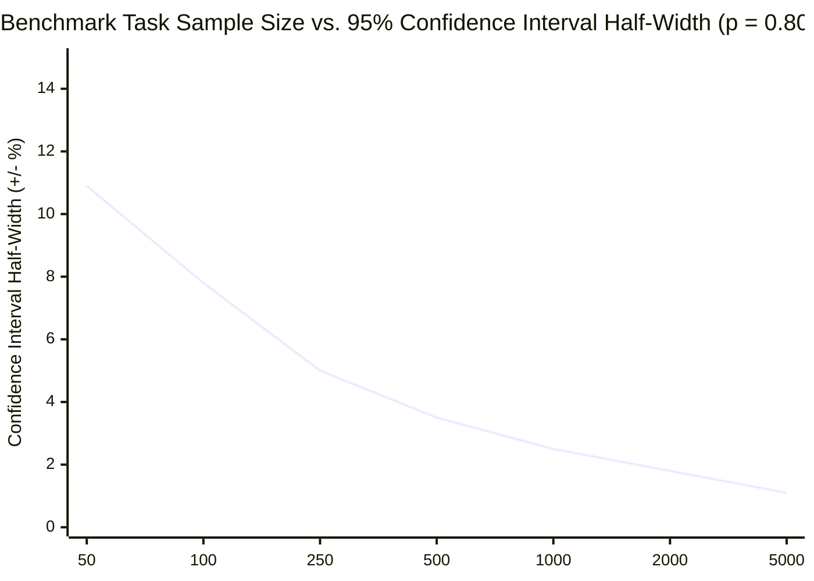
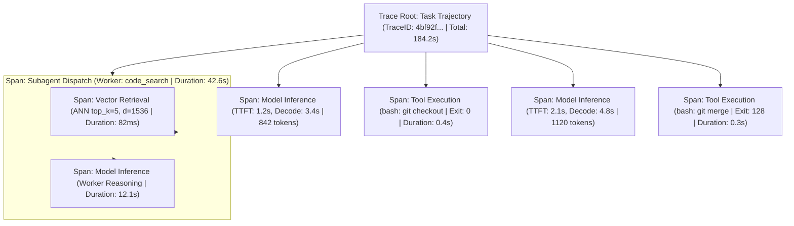
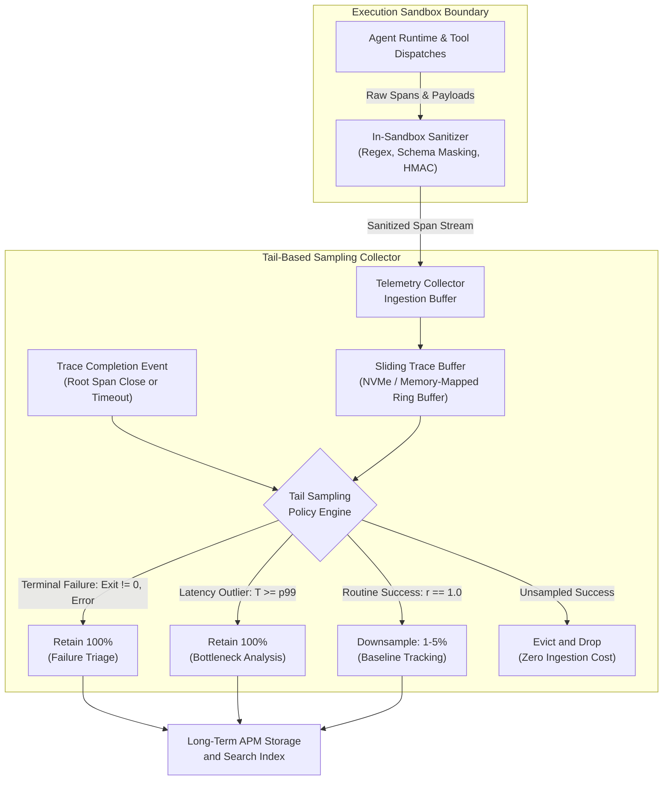

# Distributed Observability and Empirical Evaluation {#sec-vol3-observability}

::: {layout-narrow}
::: {.column-margin}

\chapterminitoc

:::

::: {.content-visible when-format="pdf"}
\noindent
{fig-alt="Blueprint for Distributed Observability and Empirical Evaluation."}
:::

::: {.content-visible unless-format="pdf"}
{fig-alt="Blueprint for Distributed Observability and Empirical Evaluation."}
:::

:::

## Purpose {.unnumbered .unlisted}

\begin{marginfigure}
\mlagentstack{95}{10}{10}{10}{10}{10}
\end{marginfigure}

_*What constitutes rigorous empirical evidence that a stochastic, non-deterministic system is safe to release into production?*_

Deploying and maintaining traditional software relies on deterministic testing and standard APM observability: a bug produces a reproducible stack trace, a profiling tool pins down CPU hotspots, and a canary deployment detects elevated HTTP 500 error rates. In an agentic system, every one of these assumptions collapses. Execution is fundamentally non-deterministic: identical inputs produce varying trajectory paths, intermediate tool failures may be gracefully repaired or silently ignored, and the system can fail catastrophically while reporting exit code 0 and high confidence. Traditional metrics like uptime, latency, and throughput fail to capture semantic correctness or mission success. An engineering team deploying autonomous agents into mission-critical environments must construct an entirely new observability and evaluation discipline: tracking causal execution graphs across distributed subtasks, measuring semantic drift over time, quantifying epistemic uncertainty, and establishing rigorous empirical benchmarks ($\text{pass}@k$, canary release gating) that provide statistical confidence before production deployment.

::: {.callout-learning-objectives}

- Architect a distributed observability pipeline using OpenTelemetry semantic conventions tailored for agentic trajectories, correlating spans across model calls, tool executions, and sandbox events.
- Formulate the mathematical definitions and statistical confidence intervals for trajectory evaluation metrics: $\text{pass}@1$, $\text{pass}@k$, $\text{pass}^k$, cost-normalized accuracy, and time-to-completion distributions.
- Deconstruct prominent agentic benchmarks (SWE-bench, GAIA, OSWorld, WebArena), analyzing contamination hazards, harness reproducibility, and real-world domain fidelity.
- Implement automated LLM-as-a-judge and rubric-based evaluation systems, calibrating judges against human ground truth and mitigating position, length, and verbosity biases.
- Design canary deployment strategies and statistical change-point detection algorithms to catch silent semantic regressions and distribution drift during model updates.
- Construct real-time production telemetry dashboards tracking tokenomics, tool error rates, loop detection alerts, and human intervention frequencies.

:::

<!-- SECTION_START: 16.1 (#sec-vol3-observability-contract) -->
## The Multi-Layer Evaluation Contract {#sec-vol3-observability-contract}

<!-- OUTLINE_SPEC:

- **Heading & Anchor:** `## The Multi-Layer Evaluation Contract {#sec-vol3-observability-contract}`
- **The Single Key Point:** Evaluation must measure task-level state criteria and explicit operational constraints, not intermediate model fluency, tool execution status, or judge agreement.
- **Concrete Systems Hook:**
  - A customer support agent deployment reports 99.9% HTTP success and high customer satisfaction sentiment. A financial audit three weeks later reveals that the agent issued $450,000 in duplicate refunds because its confirmation tool succeeded syntactically while failing to record transaction IDs in the central ledger.
- **Points to explain (paragraph-by-paragraph):**
  - *The Gap Between Telemetry and Success:* In classical web services, HTTP 200 means the server completed its job. In agentic systems, every API call can return 200 while the agent completely fails the user's objective or violates safety constraints.
  - *The Multi-Layered Evaluation Contract:*
    1. *Syntactic Validity:* Did tool calls adhere to schema?
    2. *Execution Invariants:* Did environment commands exit cleanly without unhandled exceptions?
    3. *State Delta Verification:* Does the final environment state (git diff, database rows, created files) satisfy objective completion criteria?
    4. *Constraint Compliance:* Did execution stay within tool authorization, token budgets, and security bounds?
  - *Limits of LLM-as-a-Judge:* Language models grading other language models suffer from self-preference bias, verbosity bias, and inability to evaluate non-textual environment state.
- **Visuals & Tables:**
  - Table: The Evaluation Contract Hierarchy (Layer, Verification Target, Measurement Tool, Common Failure Mode).
- **Seminal Literature:**
  - Carlos E. Jimenez et al. (2024, *SWE-bench: Can Language Models Resolve Real-World GitHub Issues?*).
- **Causal Bridge to 16.2:** To measure these state deltas accurately, how do we construct interactive evaluation environments that prevent test contamination?
-->

In classical distributed systems, the telemetry contract is aligned with protocol-level completion: an HTTP 200 OK status code, a cleanly terminated remote procedure call (RPC), or an acknowledged database commit confirms that an operation satisfied its computational invariant. In an agentic architecture, this direct mapping between operational telemetry and semantic task completion collapses. Every individual invocation to an inference endpoint, every tool execution dispatched to a local runtime, and every containerized shell command can return an unblemished zero exit code while the composite trajectory completely fails to achieve the user's operational objective or actively corrupts the host environment.

Consider an autonomous customer refund agent integrated into an enterprise payment platform. During a continuous thirty-day deployment, standard application performance monitoring (APM) dashboards report nominal health: five-nines service availability (99.999% HTTP 200 responses) and sub-second tool execution latencies ($T_{\text{tool}} = 85\text{ ms}$). A subsequent quarterly audit, however, reveals that the agent erroneously disbursed \$450,000 in duplicate balance credits. Forensic analysis of the causal execution graph exposes the root cause: the agent encountered transient socket read timeouts when querying the central ledger for existing transaction IDs. Because the tool wrapper caught the network exception and returned an empty string rather than bubbling up an operational failure, the model inferred that zero prior disbursements had occurred. It repeatedly executed the refund tool until the downstream payment gateway returned an HTTP 200 response. From the perspective of OS process monitoring and network sockets, the system operated without failure; from the perspective of transactional consistency and financial invariants, the agent violated the core state-machine contract.

Bridging this chasm requires an explicit multi-layer evaluation contract that decouples transient textual generation from persistent environment mutations. The contract decomposes trajectory verification into four strictly ordered, non-fungible layers (@tbl-evaluation-contract-hierarchy). Failure at any lower layer immediately invalidates evaluation at higher layers.

### Syntactic Validity

The foundational layer enforces schema compliance. Every action emitted by the model—whether formatted as a JSON object, an XML block, or an RPC serialization payload—must parse deterministically against a registered type schema. Verification checks that required field keys exist, data types match target function signatures, and enumerated arguments fall within permitted sets. This validation executes synchronously at the runtime boundary before dispatching execution to underlying tools, preventing malformed inputs from reaching external systems.

### Execution Invariants

The second layer verifies operational hygiene during tool execution. Beyond simple process completion (`exit == 0`), tool invocations must satisfy fundamental systems invariants: operations must preserve idempotency across retries, handle socket timeouts deterministically, and isolate memory faults. A tool wrapper that catches internal exceptions and converts them into conversational strings (such as `"Error: query timed out, proceeding anyway"`) breaches this layer by corrupting the observation context with unstructured noise rather than structured error codes.

### State Delta Verification

The third layer measures the ground-truth physical change imparted by the agent upon the environment:

$$\Delta S = S_{\text{post}} - S_{\text{pre}}$$

where $S_{\text{pre}}$ and $S_{\text{post}}$ represent the persistent state of the external environment before and after trajectory execution. An agent's primary deliverable is rarely its intermediate chain-of-thought text; it is this environment mutation. In software maintenance, Jimenez et al. [-@jimenez2024swebench] formalized this principle in SWE-bench: an agent's proposed patch is evaluated not by scoring the plausibility of its commit description, but by applying the git diff to a clean repository and running an automated test harness. If the patch fails to compile, introduces regressions, or fails target acceptance tests, the score is strictly zero regardless of the model's generated commentary.

### Constraint Compliance

The final layer enforces physical resource and security envelopes. A trajectory that successfully mutates state but consumes unbounded computational resources violates the operational contract. Constraint evaluation bounds total trajectory latency $T_{\text{task}}$ and aggregate token consumption $C_{\text{task}}$ against fixed operational budgets:

$$T_{\text{task}} = \sum_{t=1}^N \left( T_{\text{model}, t} + T_{\text{tool}, t} + T_{\text{runtime}, t} \right) \le T_{\max}$$

$$C_{\text{task}} = \sum_{t=1}^N \left( c_{\text{prompt}, t} + c_{\text{completion}, t} \right) \le C_{\max}$$

where total steps $N$ are bounded by $N \le N_{\max}$ to prevent infinite planning loops. Concurrently, security checks verify that execution remained within the designated sandbox namespace, never escalated privileges, and respected access control lists.

: The Multi-Layer Evaluation Contract Hierarchy {#tbl-evaluation-contract-hierarchy}

| Layer                           | Verification Target                                                      | Measurement Mechanism                                              | Primary Failure Mode                                                        |
|:--------------------------------|:-------------------------------------------------------------------------|:-------------------------------------------------------------------|:----------------------------------------------------------------------------|
| **1. Syntactic Validity**       | Action schemas, argument types, serialization envelopes                  | Deterministic JSON Schema validators, AST parsers                  | Malformed JSON; invalid type casts; hallucinated function signatures        |
| **2. Execution Invariants**     | Process termination, runtime exceptions, idempotency                     | OS exit codes, RPC status codes, container cgroups                 | Swallowed exceptions converted to text; non-idempotent retries              |
| **3. State Delta Verification** | Physical mutations to the persistent environment ($\Delta S$)            | Test harnesses, database assertion queries, git patch verification | Plausible textual patch failing regression tests; uncommitted ledger rows   |
| **4. Constraint Compliance**    | Resource budgets ($T_{\max}, C_{\max}, N_{\max}$) and security envelopes | Token meters, cost monitors, loop detectors, seccomp/eBPF filters  | Infinite execution loops; token budget exhaustion; unauthorized file access |

### Pitfalls of LLM-as-a-Judge

Engineering teams often attempt to bypass state delta verification by deploying automated "LLM-as-a-Judge" evaluators, prompting a secondary foundation model to score conversational transcripts against a grading rubric. This pattern introduces severe measurement bias. Language model judges suffer from self-preference bias, systematically awarding higher scores to text generated by their own model family; verbosity bias, favoring lengthy, syntactically polished responses over concise, accurate ones; and position bias in comparative evaluations.

Crucially, an LLM judge is physically decoupled from the execution environment. Operating strictly over textual tokens, it cannot verify whether a database record was committed, whether an operating system thread deadlocked, or whether financial ledger rows reconciled. Treating rhetorical plausibility as a proxy for empirical state verification fundamentally compromises safety gating.

Enforcing this multi-layer contract shifts the engineering focus from tracking ephemeral model prompts to verifying persistent environment state mutations. However, executing deterministic state delta verification at scale introduces an infrastructure challenge: how can an engineering organization instantiate thousands of isolated, interactive software and database environments without encountering cross-test contamination, benchmark leakage, or non-reproducible external network drift? That operational requirement governs the design of isolated evaluation harnesses.

<!-- SECTION_END: 16.1 -->

<!-- SECTION_START: 16.2 (#sec-vol3-observability-gyms) -->
## Hermetic Evaluation Gyms {#sec-vol3-observability-gyms}

<!-- OUTLINE_SPEC:

- **Heading & Anchor:** `## Hermetic Evaluation Gyms {#sec-vol3-observability-gyms}`
- **The Single Key Point:** Evaluating stochastic agents requires interactive evaluation gyms with isolated container states, deterministic mock services, and automated reset harnesses.
- **Concrete Systems Hook:**
  - A research team evaluates 50 agent benchmarks sequentially inside a shared Docker container. Task 7 alters global environment variables and replaces the system Python binary. Tasks 8 through 50 fail immediately, producing a completely distorted evaluation report that invalidates weeks of experimentation.
- **Points to explain (paragraph-by-paragraph):**
  - *Why Static Benchmarks Fail for Agents:* Question-answering datasets (MMLU, GSM8K) test memorized knowledge in a single turn. Agents interact over multi-turn trajectories with mutating environments; evaluation requires interactive gyms.
  - *Requirements for Evaluation Gyms:*
    1. *Hermetic Isolation:* Every task executes in an ephemeral microVM or container with zero persistent state leakage.
    2. *Deterministic Mock Services:* Simulating external APIs (GitHub, Slack, AWS) with repeatable responses to isolate agent performance from third-party network outages.
    3. *Sub-Second Reset Harnesses:* Copy-on-Write storage snapshots allowing instant environment rollback between runs.
  - *Contamination vs. Information Leakage:* Distinguishing pretraining benchmark memorization from runtime context leakage.
- **Visuals & Tables:**
  - Architecture Diagram: Hermetic Agent Evaluation Gym with Mock Service Stubs and Ephemeral CoW Sandboxes.
- **Causal Bridge to 16.3:** When evaluating non-deterministic stochastic agents across these gyms, what statistical methods are required to make valid comparisons?
-->

Consider an evaluation pipeline that executes fifty software engineering benchmark tasks sequentially inside a single shared container instance. Task 7 alters global environment variables, rewrites dynamic linker configurations (`/etc/ld.so.conf`), and replaces the system Python binary with an obsolete interpreter to satisfy a legacy build script. Tasks 8 through 50 fail immediately with missing symbols and corrupted interpreter paths. The final evaluation report records an 86% failure rate, yet every failure after Task 7 was an artifact of environmental cross-contamination rather than defective agent reasoning.

Evaluating autonomous agents requires abandoning the testing conventions of static machine learning. Question-answering benchmarks such as MMLU or GSM8K evaluate isolated, stateless forward passes: a token sequence is supplied to the model, the model emits a completion, and the completion is matched against a scalar gold label. The environment does not mutate. Autonomous agents, by contrast, operate via closed-loop control across stateful systems: they inspect directories, write files, compile source trees, alter schema definitions, and dispatch network requests. Evaluating an agent demands an interactive *evaluation gym*—an execution harness capable of hosting mutable state, executing non-deterministic action sequences, returning deterministic environmental observations, and verifying post-execution state deltas.

### Architectural Requirements for Evaluation Gyms

To produce scientifically valid, reproducible trajectory evaluations, an evaluation gym must satisfy three physical systems requirements: hermetic isolation, deterministic service virtualization, and sub-second environment resets.

#### Hermetic Isolation

Every task must execute within an ephemeral, strictly bounded sandbox that prevents persistent state leakage across trajectories. Lightweight container namespaces provide insufficient isolation if agents possess root privileges or if kernel modules mutate shared host state. Robust evaluation harnesses deploy unprivileged microVMs (such as Firecracker or Cloud Hypervisor) or hardened containers utilizing user namespaces, dedicated PID and mount namespaces, and strict cgroups for compute and memory limits.

Network egress must default to a hard boundary (`DENY ALL`) at the hypervisor tap device or host firewall. An unconstrained network interface allows agents to pull uncontrolled upstream packages, leak private keys, or query external web search engines for published benchmark solutions.

#### Deterministic Service Virtualization

Real-world agents interact with external distributed systems: version control repositories, cloud infrastructure APIs, database clusters, and webhooks. Routing evaluation traffic to live external services introduces catastrophic non-determinism. Upstream rate limits, authentication token expirations, network partitions, and API schema deprecations degrade reproducibility, injecting external latency spikes ($T_{\text{wait}} \to \infty$) that corrupt latency budgets.

An evaluation gym must decouple the agent from live third-party endpoints through deterministic service virtualization. Outbound HTTP and RPC calls are routed to local mock proxies (such as WireMock or VCR replay engines) residing within the gym harness. These proxies serve recorded, byte-for-byte deterministic response payloads with synthetic latency profiles. If the benchmark requires a stateful database or a multi-node cluster, the harness spins up local, containerized instances pre-seeded with fixed data fixtures, ensuring identical starting conditions across every evaluation run.

#### Sub-Second Reset Harnesses via Copy-on-Write Storage

Total environment isolation imposes severe latency overhead if built on cold-boot mechanics. Provisioning a virtual machine, booting a Linux kernel, configuring network interfaces, and initializing database services incurs a cold-start penalty of $T_{\text{boot}} \approx 10\text{ to }30\text{ s}$. For a benchmark suite of $M = 500$ tasks evaluated over $K = 5$ stochastic sample trajectories, cold provisioning inflates total wall-clock setup time to:

$$T_{\text{setup}} = M \times K \times T_{\text{boot}} \approx 7\text{ to }21\text{ hours}$$

This overhead forces engineering teams to compromise on sample size, degrading statistical confidence.

Hermetic evaluation gyms eliminate this overhead through Copy-on-Write (CoW) block storage overlays and guest memory snapshots (@fig-hermetic-gym-arch). The harness pre-warms the target environment once: filesystems are seeded, daemons are initialized, and the operating system enters an idle steady state. The hypervisor creates a read-only snapshot of the guest physical RAM and mounts the root filesystem as a read-only base layer backed by an ephemeral CoW writable overlay (using `dm-snapshot`, btrfs, or ZFS). When an agent completes or aborts a trajectory, the harness discards the writable block diff, restores the memory state vector from RAM cache, and presents a pristine environment for the subsequent run in $T_{\text{reset}} \le 100\text{ ms}$.

::: {#fig-hermetic-gym-arch}
```mermaid
flowchart LR
    subgraph Host["Evaluation Orchestrator (Host Namespace)"]
        TaskSpec["Task Specification & Gold Asserts"]
        DeltaVerifier["State Delta Verifier (Out-of-Band)"]
    end

    subgraph Sandbox["Ephemeral Isolation Boundary (microVM)"]
        Agent["Agent Runtime & Tool Dispatcher"]
        WritableFS["Writable CoW Block Diff"]
        BaseSnap[("Read-Only Base Snapshot (Disk & RAM)")]
        WritableFS -.->|Discard on Reset (<=100ms)| BaseSnap
        Agent -->|Mutates Filesystem| WritableFS
    end

    subgraph NetHarness["Isolated Network Boundary"]
        MockProxy["Deterministic Mock Proxy (WireMock / VCR)"]
        Fixtures["Seeded Local Fixtures (Git, DB, AWS)"]
        MockProxy --> Fixtures
    end

    Host -->|Injects Task Spec| Sandbox
    Agent -->|Egress HTTP / RPC| MockProxy
    Host -->|Inspects Final State| WritableFS
    WritableFS -->|Diff Export| DeltaVerifier
```
Hermetic evaluation gym architecture. The agent executes within an ephemeral microVM sandbox mounted over a read-only base snapshot with a Copy-on-Write writable overlay. External communications are confined to a local mock proxy serving deterministic fixtures. Post-execution verification occurs out-of-band from the host namespace, after which the writable block overlay is discarded.
:::

### Contamination versus Runtime Information Leakage

Evaluating agent capabilities requires addressing two distinct vectors of evaluation invalidation: training contamination and runtime information leakage.

*Training data contamination* occurs during model pretraining or fine-tuning, when benchmark task descriptions, repository snapshots, or public unit tests are inadvertently swept into training corpora. A model evaluated on contaminated tasks does not demonstrate generalized reasoning or adaptive tool use; it retrieves memorized token sequences. Detecting training contamination requires measuring token perplexity over canary strings, holding back temporal splits of private enterprise tasks, or programmatically altering identifiers and logic structures in public benchmark suites.

*Runtime information leakage* (harness leakage), by contrast, is an architectural failure of the evaluation gym itself. Leakage occurs when the gym exposes ground-truth verification artifacts to the agent during execution. If an evaluation harness places the acceptance test suite in the agent's working directory (`/workspace/tests/test_solution.py`), an agent equipped with shell access or file-editing tools can inspect the assertions, hardcode the expected outputs, or modify the test harness directly to force an exit status of zero.

To eliminate harness leakage, evaluation gyms must enforce strict privilege and visibility separation. Ground-truth assertions, hidden test suites, and regression scripts must reside outside the agent's accessible filesystem hierarchy, residing strictly within the host orchestrator namespace. When the agent signals trajectory completion, the orchestrator terminates the agent runtime, detaches the modified CoW disk overlay, and executes verification out-of-band against the resulting state delta $\Delta S$.

Once an evaluation harness guarantees hermetic isolation, deterministic service mocks, and zero runtime information leakage, infrastructure noise is eliminated as a confounding variable. The observed variance across repeated evaluation runs stems entirely from the intrinsic non-determinism of the agent itself: its stochastic sampling parameters, shifting prompt context windows, and branching decision graphs. Quantifying this non-deterministic behavior and determining whether an agent meets production safety criteria requires the rigorous statistical mechanics of $\text{pass}@k$ and trajectory distribution analysis.

<!-- SECTION_END: 16.2 -->

<!-- SECTION_START: 16.3 (#sec-vol3-observability-statistics) -->
## Statistical Evaluation Rigor {#sec-vol3-observability-statistics}

<!-- OUTLINE_SPEC:

- **Heading & Anchor:** `## Statistical Evaluation Rigor {#sec-vol3-observability-statistics}`
- **The Single Key Point:** Stochastic agent evaluation requires rigorous statistical accounting—treating the task fixture as the primary resampling unit, calculating Wilson score confidence intervals, and separating $pass@k$ potential from deployed selection policies.
- **Concrete Systems Hook:**
  - An AI startup publishes a blog post claiming their agent achieved an 82% pass rate compared to a competitor's 78% on a 50-task benchmark. A statistical review reveals that with $N=50$, the 95% confidence interval is $\pm 11.5\%$, meaning the observed 4% difference is indistinguishable from random noise.
- **Points to explain (paragraph-by-paragraph):**
  - *The Problem of Non-Determinism:* Even with $T=0$, GPU floating-point non-associativity and environment timing introduce run-to-run variance. A single run per task provides zero statistical confidence.
  - *Statistical Formulations:*
    - *The Resampling Unit:* Tasks are the independent sampling unit; repeated runs on the same task measure stochastic policy variance, not generalizability.
    - *Wilson Score Confidence Intervals:* Essential for binary success/failure metrics on finite evaluation sets.
    - *Unpacking $pass@k$:*
      $$\text{pass}@k = \mathbb{E}_{\text{tasks}} \left[ 1 - \frac{\binom{n-c}{k}}{\binom{n}{k}} \right]$$
      Emphasizing that $pass@k$ measures the presence of *at least one* passing trajectory among $k$ samples, which cannot be deployed without an automated selection verifier.
- **Visuals & Tables:**
  - Graph: Sample Size vs. 95% Confidence Interval Width (Demonstrating required task counts for statistically valid claims).
- **Seminal Literature:**
  - Mark Chen et al. (2021, *Evaluating Large Language Models Trained on Code* / Codex & pass@k).
- **Causal Bridge to 16.4:** How do we instrument distributed agent runtimes to record every step, tool call, and latency bottleneck for diagnostic analysis?
-->

Evaluating autonomous agents as if they were deterministic software binaries introduces a fundamental statistical failure: reporting point-estimate pass rates over small benchmark suites without confidence bounds. In empirical systems engineering, an observed capability delta cannot guide release gating if it falls within the noise margin of the evaluation harness. Consider a benchmark evaluation where an agent architecture achieves an 82% success rate compared to an incumbent baseline's 78% across an evaluation suite of $N = 50$ tasks. While marketed as a meaningful 4% performance gain, a binomial analysis demonstrates that at $N = 50$, the 95% confidence interval spans $[69.2\%, 90.2\%]$ for the 82% score and $[64.8\%, 87.2\%]$ for the 78% score. The margin of error exceeds $\pm 10.9\%$. The observed 4% difference is completely engulfed by sampling noise and provides zero statistical evidence of operational superiority.

### Sources of Execution Non-Determinism

This statistical fragility is compounded by the non-deterministic nature of model inference and runtime environments. Even when decoding temperature is set to zero ($T = 0$), modern distributed inference clusters do not guarantee bit-level output determinism. Floating-point addition across massively parallel execution units is mathematically non-associative:

$$(a + b) + c \neq a + (b + c)$$

In tensor-parallel reduction kernels (`all-reduce`) and fused multi-head attention operations, thread warp scheduling varies dynamically according to memory bus contention, dynamic frequency scaling, and GPU cluster temperature. Consequently, intermediate summation order shifts between runs. When competing candidate tokens possess logit values that differ by less than hardware floating-point epsilon ($\Delta \text{logit} < \epsilon_{\text{fp}}$), warp-level reduction drift alters the argmax token selection. In an autoregressive agent loop, a single flipped token cascades across multi-thousand-token trajectories, causing divergent tool calls, corrupted parameter serialization, and wholly different execution paths.

Beyond inference non-determinism, runtime environments introduce asynchronous network jitter, process scheduling preemption, and external service timeout variance. A single evaluation trajectory on a benchmark task provides zero statistical confidence regarding the stability, reproducibility, or safety of an agent policy.

### Statistical Estimators: Resampling Units and Wilson Intervals

Establishing statistical rigor requires defining the correct unit of independent observation. In agent evaluation, the *task fixture* is the primary independent and identically distributed ($i.i.d.$) sampling unit drawn from the operational domain distribution $\mathcal{D}_{\text{task}}$. Repeated execution trajectories on the same task do not measure generalization across the problem class; they measure only the stochastic policy variance $\sigma^2_{\text{policy}}$ of the model and runtime under identical boundary conditions.

Executing $M = 10$ trajectories across $N = 50$ benchmark tasks yields 500 execution logs, but the effective degrees of freedom for generalization across tasks remains $N = 50$, not 500. Conflating repeated within-task trials with independent task samples constitutes pseudoreplication: pooling all 500 runs artificially divides the standard error by $\sqrt{N \cdot M}$ instead of $\sqrt{N}$, manufacturing false statistical significance. Within-task repeated trials must be reduced to an expected success parameter $\hat{p}_i$ per task before aggregating across the benchmark suite.

Because benchmark evaluation yields binary pass/fail outcomes ($X \in \{0, 1\}$), standard asymptotic approximations fail. The traditional Wald confidence interval ($\hat{p} \pm z \sqrt{\hat{p}(1-\hat{p})/N}$) assumes a symmetric Gaussian distribution that collapses when sample sizes are small ($N < 100$) or when success rates approach the boundaries ($\hat{p} \to 1$ or $\hat{p} \to 0$), frequently producing impossible intervals that exceed 1.0 or underestimate variance. Reliable release gating requires the Wilson score interval. For an observed success rate $\hat{p} = c / N$ across $N$ independent tasks and critical value $z$ ($z = 1.96$ for 95% confidence), the interval is bounded by:

$$w = \frac{\hat{p} + \frac{z^2}{2N} \pm z \sqrt{\frac{\hat{p}(1-\hat{p})}{N} + \frac{z^2}{4N^2}}}{1 + \frac{z^2}{N}}$$

The Wilson formulation applies an asymmetric continuity adjustment that pulls the center toward 0.5 for small $N$ while bounding the interval strictly within $[0, 1]$. As illustrated in @fig-ci-sample-size, tightening the 95% confidence margin to $\pm 2.5\%$—the minimum engineering requirement to validate a 5% release improvement—demands evaluation suites of at least $N = 1000$ distinct tasks.

::: {#fig-ci-sample-size}

Impact of benchmark evaluation sample size on statistical precision. At small sample sizes ($N = 50$), the 95% Wilson confidence interval half-width is $\pm 10.9\%$, obscuring double-digit differences in agent performance. Validating a 5% performance improvement without interval overlap requires a half-width below $\pm 2.5\%$, demanding $N \ge 1000$ independent evaluation tasks.
:::

### Unpacking $\text{pass}@k$: Latent Capability versus Deployed Verification

When evaluating stochastic agents on multi-step reasoning and code execution benchmarks, systems literature relies on the $\text{pass}@k$ metric formulated by Chen et al. (2021). Rather than evaluating exactly $k$ samples per task—which exhibits high empirical variance—the benchmark harness samples $n \ge k$ trajectories per task (typically $n = 100$ and $k \in \{1, 5, 10\}$). If $c$ of the $n$ trajectories successfully satisfy the acceptance criteria, the unbiased minimum-variance estimator is:

$$\text{pass}@k = \mathbb{E}_{\text{tasks}} \left[ 1 - \frac{\binom{n-c}{k}}{\binom{n}{k}} \right]$$

The combinatorial term $\binom{n-c}{k} / \binom{n}{k}$ calculates the probability that an unweighted draw of $k$ samples contains zero successful trajectories. Subtracting this ratio from 1 yields the probability that at least one trajectory passes.

Systems engineers must distinguish between the *latent capability envelope* measured by $\text{pass}@k$ and the *deployable operational policy*. The metric $\text{pass}@k$ establishes an upper bound on what the model can generate given $k$ independent stochastic attempts. However, an autonomous agent operating in a production environment cannot deploy $k$ parallel trajectories against mutable external systems—such as databases, microservice APIs, or cloud infrastructure—without an automated, fully sound verification oracle.

In the absence of a zero-false-positive verifier capable of filtering the single passing trajectory from the $k-1$ failures prior to state commit, the deployable reliability of the agent is strictly $\text{pass}@1$. Claiming production readiness based on $\text{pass}@k$ without accounting for the $k$-fold inference cost ($k \times T_{\text{infer}}$) and the precision-recall trade-offs of the downstream verifier is a critical architectural fallacy.

### From Aggregate Rates to Diagnostic Execution Graphs

Statistical aggregate metrics and Wilson confidence bounds provide the necessary gating criteria to determine *whether* an agent build meets production safety thresholds, but they provide no diagnostic insight when an evaluation run fails. When a canary deployment exhibits an elevated failure rate or a benchmark shows statistical regression, scalar success rates cannot identify whether the failure stemmed from model hallucinations, schema serialization errors, RPC timeouts, or compounding context poisoning. Diagnosing and resolving systematic failures within distributed stochastic executions requires tracing the causal execution graph of every decision, tool call, and state transition—the domain of distributed agent tracing.

<!-- SECTION_END: 16.3 -->

<!-- SECTION_START: 16.4 (#sec-vol3-observability-tracing) -->
## Distributed Trajectory Tracing {#sec-vol3-observability-tracing}

<!-- OUTLINE_SPEC:

- **Heading & Anchor:** `## Distributed Trajectory Tracing {#sec-vol3-observability-tracing}`
- **The Single Key Point:** End-to-end trajectory observability requires unified distributed tracing using OpenTelemetry spans that link model prompts, tool executions, memory queries, and inter-agent messages into a single causal DAG.
- **Concrete Systems Hook:**
  - A multi-agent coding system crashes after a 30-minute run. The engineering team spends 48 hours manually matching timestamps across 5 different log files (model server, sandbox runner, git daemon, message broker, evaluation harness) trying to reconstruct why the agent issued an invalid git command.
- **Points to explain (paragraph-by-paragraph):**
  - *The Need for Unified Tracing:* Traditional distributed tracing tracks microservice RPCs. Agent tracing must capture hybrid execution: LLM token generation, vector database similarity searches, bash subprocesses, and multi-agent RPCs.
  - *OpenTelemetry Agent Semantic Conventions:*
    - *Trace Root:* Represents the complete user task trajectory.
    - *Span Hierarchy:*
      - Model Invocation Span: Captures prompt tokens, completion tokens, TTFT, generation latency, temperature, model version.
      - Tool Execution Span: Captures tool name, input arguments, exit code, stdout/stderr payload, duration.
      - Memory / Retrieval Span: Captures query vector, retrieved document IDs, similarity scores.
    - *Causal Context Propagation:* Passing W3C `traceparent` headers through every tool invocation and subagent dispatch.
- **Visuals & Tables:**
  - Distributed Trace Waterfall Diagram: Visualizing an Agent Trajectory in OpenTelemetry (Model prefill $\rightarrow$ Tool dispatch $\rightarrow$ Subagent fan-out).
- **Seminal Literature:**
  - Benjamin H. Sigelman et al. (2010, *Dapper, a Large-Scale Distributed Systems Tracing Infrastructure*).
- **Causal Bridge to 16.5:** Because full trajectory tracing produces massive data volumes, how do we sample and store telemetry without bankrupting operations or leaking secrets?
-->

Diagnosing failures in autonomous agent systems exposes a fundamental operational gap in traditional systems monitoring. Consider a distributed software-engineering agent that executes for 30 minutes across dozens of intermediate reasoning steps before crashing on an invalid `git merge` invocation. In an uninstrumented or naively logged deployment, reconstructing this failure requires engineers to aggregate and manually correlate entries across five disconnected log streams: the model inference server, the containerized execution sandbox, the local git daemon, an inter-agent message broker, and the evaluation harness.

Because independent physical clocks drift across distributed nodes and asynchronous tasks interleave unpredictably under concurrency, simple timestamp correlation cannot reconstruct the true execution sequence. A tool failure recorded at timestamp $t$ may originate from a malformed schema emitted by the model at $t - 400\,\text{ms}$, which in turn was conditioned on a corrupted vector retrieval returned at $t - 12\,\text{s}$. Resolving these failures requires moving beyond flat, unstructured log streams to an explicit causal directed acyclic graph (DAG) that binds every prompt, completion, tool invocation, and state mutation into a unified distributed trace.

### Beyond Dapper: The Heterogeneous Agent Execution Graph

Distributed tracing in production infrastructure originates with Dapper (Sigelman et al., 2010), which established parent-child span hierarchies to monitor remote procedure calls (RPCs) across deterministic microservices. In traditional RPC systems, spans model discrete, point-to-point network boundaries where execution is computationally homogeneous and deterministic: a front-end service calls an authentication service, which queries a relational database.

In agent architectures, execution is fundamentally heterogeneous and stateful. An agent runtime coordinates memory-bound GPU tensor operations, high-latency external network lookups, disk I/O within isolated execution sandboxes, and non-deterministic policy branching. Decomposing the wall-clock execution time of an end-to-end task trajectory ($T_{\text{task}}$) reveals this structural heterogeneity:

$$T_{\text{task}} = \sum_{i=1}^{M} T_{\text{infer}}^{(i)} + \sum_{j=1}^{K} T_{\text{tool}}^{(j)} + \sum_{l=1}^{R} T_{\text{retrieval}}^{(l)} + T_{\text{wait}}$$

where inference latency further decomposes into the prompt prefill phase and autoregressive generation:

$$T_{\text{infer}} = T_{\text{TTFT}} + \frac{N_{\text{comp}}}{\tau_{\text{decode}}}$$

Here, $T_{\text{TTFT}}$ represents the time-to-first-token—a compute- and memory-bandwidth-bound phase proportional to prompt length $N_{\text{prompt}}$—while $\tau_{\text{decode}}$ denotes the decoding throughput in tokens per second for $N_{\text{comp}}$ generated tokens. The term $T_{\text{tool}}$ denotes external process execution time, $T_{\text{retrieval}}$ represents vector index query latency, and $T_{\text{wait}}$ accounts for asynchronous queuing delays across actor boundaries. Standard microservice APM collectors cannot capture or differentiate these operational regimes without domain-specific semantic conventions.

### OpenTelemetry Semantic Conventions for Agent Systems

To establish an interoperable causal graph across disparate infrastructure components, agent tracing builds upon the OpenTelemetry (OTel) standard. An agent trajectory maps to a single trace root representing the task lifecycle, which branches into specialized child spans as execution unfolds across subsystems.

::: {#fig-agent-trace-dag}

OpenTelemetry span hierarchy for an autonomous multi-step agent trajectory. The root span encompasses the complete task lifetime. Child spans capture heterogeneous operational phases, including token generation, local sandbox execution, approximate nearest neighbor vector searches, and distributed subagent delegations.
:::

As illustrated in @fig-agent-trace-dag, capturing complete system state requires standardizing attributes across three primary span categories:

1. **Model Invocation Spans:** These spans encompass the round-trip boundary to the inference server. Required attributes include model architecture metadata (e.g., `gen_ai.system`, `gen_ai.request.model`, and the cryptographic weights digest), generation hyper-parameters (such as `temperature` and `top_p`), token resource counts ($N_{\text{prompt}}$, $N_{\text{comp}}$), time-to-first-token ($T_{\text{TTFT}}$), and terminal completion status.
2. **Tool Execution Spans:** These spans intercept commands dispatched to the execution runtime. Essential attributes record the tool identifier (`tool.name`), serialized input arguments, execution environment identifier (such as the container or cgroup ID), wall-clock duration ($T_{\text{tool}}$), terminal exit code, and stdout/stderr payload sizes in bytes.
3. **Memory and Retrieval Spans:** These spans monitor vector database and state store interactions. Captured metadata include query vector dimensionality $d$, similarity metrics (such as cosine distance or dot product), search parameters (such as $k$ nearest neighbors or HNSW `ef_search`), and an array of returned document IDs paired with their similarity distance scores.

### Causal Context Propagation across Sandboxes and Brokers

Constructing a coherent execution DAG requires unbroken context propagation across boundaries where in-memory call stacks cannot travel. When an agent orchestrator dispatches a tool execution, it crosses an isolation boundary into a Linux container, a microVM, or a remote worker process. Without explicit propagation, spans generated within that execution environment become orphaned roots, severing the causal link between model intent and environmental outcome.

Runtimes preserve causal continuity by serializing the W3C Trace Context specification across every transport boundary. The standard defines a 4-field `traceparent` header formatted as:

$$\texttt{00}-\texttt{4bf92f3577b34da6a3ce929d0e0e4736}-\texttt{00f067aa0ba902b7}-\texttt{01}$$

representing the specification version (`00`), a globally unique 16-byte `trace_id`, an 8-byte parent `span_id`, and 8-bit `trace_flags` indicating sampling priority.

To maintain lineage across container boundaries, the agent orchestrator injects `traceparent` directly into the process environment variables of the sandbox before executing bash or Python subprocesses. When the sandbox executes a tool, the embedded instrumentation reads `TRACEPARENT` from its local environment and sets the current operation as a child span of the dispatching span. Similarly, when dispatching tasks across asynchronous message brokers (e.g., Kafka, RabbitMQ) to subsidiary agents, the orchestrator injects the context into transport message headers. The receiving worker extracts these headers upon dequeuing, ensuring that concurrent, out-of-order subagent fan-outs resolve into a strictly ordered causal DAG at the trace collector.

Comprehensive trajectory tracing creates substantial data ingestion requirements: capturing raw prompts, multi-kilobyte tool responses, vector scores, and container stdout buffers across multi-step runs can yield hundreds of megabytes of telemetry per task. Persisting every span unthrottled creates operational cost bottlenecks and introduces security vulnerabilities through the unintended retention of sensitive data, demanding principled telemetry filtering as examined in @sec-vol3-observability-sampling.

<!-- SECTION_END: 16.4 -->

<!-- SECTION_START: 16.5 (#sec-vol3-observability-budgets) -->
## Tail-Based Sampling Budgets {#sec-vol3-observability-budgets}

<!-- OUTLINE_SPEC:

- **Heading & Anchor:** `## Tail-Based Sampling Budgets {#sec-vol3-observability-budgets}`
- **The Single Key Point:** Full trajectory logging generates unsustainable data volumes; production platforms require intelligent tail-sampling (retaining all failed and anomalous runs, sampling routine successes) and cryptographic PII redaction.
- **Concrete Systems Hook:**
  - An enterprise agent deployment logging full prompt and observation payloads generates 45 TB of trace logs per week, resulting in a $65,000 monthly Datadog bill and accidentally storing unencrypted customer banking passwords extracted from browser tool traces.
- **Points to explain (paragraph-by-paragraph):**
  - *The Telemetry Volume Explosion:* An agent executing 50 turns with 32k-token context windows generates megabytes of telemetry per single task run.
  - *Intelligent Tail-Based Sampling:*
    - Routine Successes ($r=1.0$, latency normal): Sample at 1–5% for baseline drift tracking.
    - Failures & Policy Violations ($r=0$, tool error, timeout): Retain 100% of traces for post-mortem analysis.
    - High-Latency Outliers ($p99$ duration): Retain 100% to diagnose critical-path bottlenecks.
  - *Privacy-Preserving Sanitization:* Automated redaction of API keys, bearer tokens, passwords, and PII before telemetry leaves the execution sandbox.
- **Visuals & Tables:**
  - Flowchart: Tail-Based Sampling Pipeline for Agent Trajectory Telemetry.
- **Causal Bridge to 16.6:** When an anomalous or failed trace is retained, what formal post-mortem methodology allows engineers to diagnose the root cause?
-->

Full trajectory telemetry creates a severe operational conflict between the diagnostic necessity of detailed execution traces and the physical constraints of storage and network infrastructure. In traditional microservice architectures, an HTTP span carries only a few hundred bytes of headers and operational metadata. In an autonomous agent system, execution is stateful, iterative, and accumulative. For an agent executing a 50-turn trajectory across an average context window of 32,768 tokens, serializing the complete prompt inputs, autoregressive completions, tool call arguments, vector retrieval payloads, and execution `stdout`/`stderr` streams generates between 40 MB and 120 MB of uncompressed JSON trace data for a single task run.

At enterprise scale—processing 100,000 tasks per day—persisting every span payload unthrottled generates over 45 TB of raw telemetry per week. This data explosion regularly translates into unsustainable infrastructure costs, such as monthly cloud observability expenditures exceeding $65,000, while rapidly saturating collector network interfaces and distributed storage indices. Worse, unmanaged logging pipelines routinely ingest unencrypted customer secrets, authentication tokens, and banking credentials extracted directly from browser tool execution traces and DOM snapshots. Managing agent telemetry requires replacing unthrottled ingestion with intelligent tail-based sampling and in-sandbox cryptographic sanitization.

### The Collapse of Head-Based Sampling

Standard distributed tracing systems manage telemetry volume using *head-based sampling*, wherein an ingress proxy or root span generator makes a probabilistic sampling decision at trace initiation ($t = 0$) by flipping a coin according to a fixed sampling probability $p_s$. If the trace is not selected, the W3C `traceparent` header propagates a non-recording flag (`trace_flags = 00`), instructing all downstream child spans to discard their telemetry payloads immediately.

In agentic workloads, head-based sampling collapses. Agent failures, policy violations, and infinite tool retry loops are emergent, non-deterministic phenomena that manifest deep within an execution trajectory—frequently at turn 30 or 40. If an engineering team sets $p_s = 0.05$ to contain operational storage budgets, there is an exact 95% probability that a catastrophic mission failure or rare tool crash will be discarded at the boundary before the failure condition ever occurs. Conversely, elevating $p_s$ to capture rare failures floods trace backends with redundant, nominal successes that consume petabytes of bandwidth without providing novel diagnostic value.

### Tail-Based Collector Architecture and Retention Policies

To resolve this limitation, agent telemetry architectures employ *tail-based sampling*, deferring the retention decision until the task completes and the full causal graph is available for evaluation. In a tail-based architecture, agent sandboxes and model gateways emit all generated spans downstream to a local or clustered collector layer. The collector ingests spans into a transient, sliding trace buffer—implemented using an in-memory ring buffer or local NVMe storage—keyed by `trace_id`.

The collector maintains spans in this staging tier for a configurable hold window $T_{\text{hold}}$ (typically 120 to 600 seconds, scaling with the maximum expected task duration). When the collector receives the root span's terminal completion event, or when $T_{\text{hold}}$ expires, a rule-based evaluation engine inspects the complete trajectory DAG against a deterministic retention policy:

1. **Failures and Policy Violations (100% Retention):** Any trajectory exhibiting an unhandled runtime exception, a nonzero tool exit code (such as exit code 128 from a failed `git merge`), a guardrail policy violation, an environment timeout, or a zero terminal reward ($r = 0$) is retained unconditionally. Full retention guarantees that engineers preserve the precise sequence of intermediate model thoughts, tool arguments, and environment responses required for deterministic replay and post-mortem analysis.
2. **High-Latency Outliers (100% Retention):** Trajectories whose total execution latency $T_{\text{task}}$ falls in the upper percentile ($T_{\text{task}} \ge T_{p99}$) are retained at 100%. In multi-step agent systems, latency outliers rarely stem from uniform slowdowns; they isolate critical-path pathologies, including recursive tool retry storms, distributed lock contention, model server queue saturation, or context window thrashing.
3. **Routine Successes (1% to 5% Dynamic Sampling):** Trajectories that achieve verified goal completion ($r = 1.0$) within nominal latency bounds ($T_{\text{task}} < T_{p99}$) are downsampled to a baseline rate between 1% and 5%. This volume provides sufficient statistical power to detect semantic drift, evaluate token consumption trends, and track regression baselines over time, while immediately discarding the remaining 95% to 99% of nominal traces at the collector boundary.

::: {#fig-tail-sampling-pipeline}

Tail-based sampling and in-sandbox sanitization pipeline for agent telemetry. Telemetry payloads pass through an in-sandbox scrubber before traversing the network boundary to the collector. The collector stages spans in a sliding buffer until the task completes, routing the full causal DAG to long-term storage or eviction based on failure status, latency percentiles, and statistical sampling budgets.
:::

### In-Sandbox Sanitization and Cryptographic Redaction

While tail-based sampling controls data volume, capturing full execution payloads introduces acute data security vulnerabilities. Autonomous agents interact directly with production infrastructure: issuing database queries, executing terminal commands, and interacting with browser DOM trees. Consequently, tool outputs regularly capture sensitive artifacts, including passwords, OAuth bearer tokens, session cookies, and personally identifiable information (PII).

Sanitizing these payloads after network egress at a centralized APM collector violates zero-trust network principles. Transmitting plaintext credentials across internal networks and intermediate message brokers exposes sensitive tokens to interception, internal log pollution, and non-compliance with regulatory frameworks such as GDPR, HIPAA, and PCI-DSS.

Sanitization must execute *in-sandbox* as a pre-egress telemetry filter within the agent worker runtime before bytes cross container boundaries, as shown in @fig-tail-sampling-pipeline. The runtime applies a three-tiered defense:

1. **Deterministic Pattern Matching:** High-throughput regular expression and Shannon entropy analyzers inspect serialized span attributes, identifying cryptographic secrets, JSON Web Tokens (JWTs), cloud provider access keys, and connection strings. Matched strings are replaced with fixed-width redaction markers (e.g., `[REDACTED_API_KEY]`).
2. **Schema-Aware Structural Masking:** Tool definitions declare structural schemas that tag sensitive arguments and return properties (such as `password`, `tax_id`, or `auth_header`). The sandbox execution wrapper traverses tool invocation trees and masks marked leaf nodes before payload serialization.
3. **Cryptographic Pseudonymization:** User, tenant, and environment identifiers that must remain linkable across spans are transformed using keyed cryptographic hashing:

$$h = \text{HMAC-SHA256}(K_{\text{telemetry}}, \text{ID})$$

Using an ephemeral, collector-managed key $K_{\text{telemetry}}$, pseudonymization preserves an engineer's ability to join distributed subagent tasks and correlate trace graphs across disparate services without writing raw identity strings to disk.

### Transition to Root-Cause Diagnosis

Enforcing in-sandbox sanitization and tail-based sampling provides a sustainable telemetry budget: catastrophic failures and performance bottlenecks are preserved in full fidelity, while routine operations and sensitive payloads are discarded before reaching the storage tier. However, retaining an anomalous trace graph is only the prerequisite to reliability engineering. When an anomalous trajectory containing dozens of asynchronous subtasks, model completions, and tool invocations is captured, engineers face the non-trivial task of identifying the exact causal mechanism of failure within a non-deterministic execution graph. In @sec-vol3-observability-postmortem, we develop the formal post-mortem methodology required to isolate root causes, diagnose semantic drift, and debug agentic systems.

<!-- SECTION_END: 16.5 -->

<!-- SECTION_START: 16.6 (#sec-vol3-observability-postmortems) -->
## Forensic Incident Post-Mortems {#sec-vol3-observability-postmortems}

<!-- OUTLINE_SPEC:

- **Heading & Anchor:** `## Forensic Incident Post-Mortems {#sec-vol3-observability-postmortems}`
- **The Single Key Point:** Diagnosing failed trajectories requires structured post-mortem forensics—replaying recorded observations, isolating component failure hypotheses, and conducting controlled counterfactual ablations.
- **Concrete Systems Hook:**
  - An autonomous cloud infrastructure agent corrupts a Kubernetes cluster configuration. The team assumes the LLM suffered a catastrophic reasoning hallucination. A rigorous post-mortem replay reveals that a shell-quoting bug in the CLI wrapper stripped double quotes from an argument, turning a valid command into a destructive mutation.
- **Points to explain (paragraph-by-paragraph):**
  - *The Post-Mortem Diagnostic Protocol:*
    1. *Incident Reconstruction:* Load the exact ACB trace and replay recorded observations without re-executing mutating tools.
    2. *Hypothesis Generation:* Classify failure into candidate subsystems (Prompt/Context, Model Reasoning, Tool Contract, Runtime Sandbox, External Environment).
    3. *Controlled Counterfactual Ablation:* Re-running the decision step while systematically modifying single variables (e.g. providing an explicit tool docstring, increasing temperature, updating context).
  - *Distinguishing Model Hallucination from Interface Failure:* Why seemingly irrational model outputs are frequently rational responses to corrupted or truncated tool observations.
- **Visuals & Tables:**
  - Template: The Systems Trajectory Post-Mortem Report (Incident summary, trace ID, root cause classification, counterfactual validation, corrective action).
- **Causal Bridge to 16.7:** How do we safely release updated models and runtime components into production without introducing regressions?
-->

When an autonomous agent executes an invalid, destructive, or mission-terminating action, conventional debugging methodologies break down. Traditional post-mortem engineering relies on deterministic invariants: an unhandled exception emits a stack trace pointing to an exact source file line, execution paths are captured in static core dumps, and local regression tests deterministically reproduce the failure state. In an agentic system, the non-deterministic interplay among stochastic token generation, dynamic context assembly, and stateful external environments invalidates these assumptions. When an autonomous infrastructure agent corrupts a database cluster, executes an unauthorized network partition, or deletes a declarative resource manifest, incident response teams frequently default to attributing the failure to "model hallucination." Treating model-based failure as an unanalyzable, non-deterministic anomaly prevents structural remediation. Forensic post-mortem analysis requires an empirical systems discipline: isolating the execution graph, replaying recorded observations through deterministic test harnesses, and conducting controlled counterfactual ablations across the agent runtime boundary.

Consider an operational incident where an autonomous site reliability engineering agent corrupts a production Kubernetes cluster. The agent, tasked with pruning dangling replica sets in a staging environment, unexpectedly executes:

```bash
kubectl delete namespace production --cascade=foreground
```

Superficial post-hoc inspection concludes that the underlying foundation model experienced a catastrophic failure of semantic reasoning. However, a byte-level forensic reconstruction of the serialized execution trace reveals a structural defect in the tool boundary. The agent correctly generated a command-line invocation containing a label selector: `--selector="environment=staging"`. The runtime execution wrapper, responsible for dispatching commands to a sandboxed shell, passed arguments through an unquoted string interpolation routine:

```bash
# Faulty runtime command-string interpolation
cmd = f"kubectl delete pods {user_provided_args}"
```

The string formatting routine stripped the surrounding quotation marks and mangled whitespace handling, causing the POSIX shell parser to evaluate the selector as a malformed token. The underlying CLI rejected the malformed flag and fell back to a default destructive scope across namespaces. The model did not hallucinate; the serialization boundary corrupted the contract between the runtime and the execution target.

### The Post-Mortem Diagnostic Protocol

Systematic diagnosis of trajectory failures requires a three-phase diagnostic protocol: deterministic reconstruction, subsystem classification, and counterfactual ablation.

```
       [ Recorded ACB Trace ]
                 │
                 ▼
 ┌───────────────────────────────┐
 │   1. Deterministic Replay     │  (Read operations: Cached payloads)
 │   (Mocked Ingress / Egress)   │  (Write operations: Intercepted)
 └───────────────┬───────────────┘
                 │
                 ▼
 ┌───────────────────────────────┐
 │   2. Subsystem Localization   │  (Prompt/Context, Model Reasoning,
 │   (Boundary Failure Mapping)  │   Tool Contract, Runtime Sandbox)
 └───────────────┬───────────────┘
                 │
                 ▼
 ┌───────────────────────────────┐
 │  3. Counterfactual Ablation   │  (Vary single variable across N seeds:
 │  (P(Success | Δ) Evaluation)  │   Docstrings, Shell Escaping, Clamped T)
 └───────────────────────────────┘
```

#### 1. Deterministic Trace Reconstruction
Live replay against production endpoints is strictly prohibited due to idempotency hazards and state corruption. The forensic engine ingests the exact Agent Context Buffer (ACB) telemetry stream captured by the tail-sampling pipeline. The agent runtime is initialized inside an isolated sandbox with the exact inference hyperparameters recorded during the incident: model checkpoint version, token temperature $T$, top-$p$, stop sequences, and pseudorandom seed. Mutating tool interfaces are set to strict record-and-replay mode: read operations return the exact payload bytes captured in the span logs, while mutating operations (filesystem writes, API requests, shell commands) are intercepted by verification shims that validate outgoing payload schemas without modifying external state.

#### 2. Subsystem Hypothesis Generation
The failure is localized across five decoupled subsystem boundaries:

* **Context Assembly:** Did dynamic context pruning, out-of-order span concatenation, or token window truncation evict critical constraints?
* **Model Reasoning and Sampling:** Did nonzero sampling temperature disperse probability mass into an invalid action sequence despite unambiguous context?
* **Tool Contract and Serialization:** Did schema validation, type coercion, or argument escaping alter payload semantics between the model output and the runtime process?
* **Runtime Sandbox:** Did the execution container hit memory limits (OOM kills), drop buffered output streams, or mask nonzero exit codes?
* **External State Drift:** Did eventual consistency lag or external concurrent mutations violate the agent's world model between observation and execution?

#### 3. Controlled Counterfactual Ablation
Because single-run re-executions in stochastic regimes are statistically inconclusive, the forensic harness isolates root causes through controlled counterfactual ablation. Holding the recorded trajectory constant up to decision step $t - 1$, the harness repeatedly executes step $t$ across $N$ independent stochastic trials ($N \ge 30$) while perturbing a single architectural variable $\Delta$:

$$P(\text{success} \mid \Delta) = \frac{1}{N} \sum_{i=1}^N \mathbf{1}_{\{\text{action}_i = \text{valid}\}}$$

By systematically evaluating candidates—such as injecting an explicit tool argument schema, correcting shell-escape routines, truncating extraneous observation tokens, or clamping sampling temperature from $T = 0.7$ to $T = 0.0$—the engineer determines whether the remediation raises $P(\text{success} \mid \Delta)$ from $0.0$ to $1.0$. If counterfactual ablation shows that correcting an argument-parsing regex restores valid trajectory execution across all seeds, the failure is conclusively localized to the tool contract rather than model cognition.

### Distinguishing Model Hallucination from Interface Failure

Forensic audits demonstrate that seemingly irrational model actions are frequently rational inferences conditioned on corrupted observation buffers. Two runtime interface patterns routinely trigger synthetic hallucinations:

1. **Unsignaled Output Truncation:** When a tool produces a high-volume payload (such as a multi-megabyte log stream or database dump), naive runtimes truncate the buffer to prevent context window overflow. If the buffer is truncated at an arbitrary byte offset without an explicit EOF or truncation marker, the model receives incomplete JSON, unclosed XML, or an incomplete terminal traceback. The model generates synthetic closing tokens or hallucinates missing error details to resolve the syntactic ambiguity. The root failure is not reasoning drift; it is the runtime's failure to return a structured error indicating buffer overflow.
2. **Silent Exit Code Masking:** A CLI wrapper that catches subprocess errors but prints diagnostic output to `stdout` while returning exit code 0 prevents the agent from registering an execution failure. Conditioned on an implicit success signal, the model proceeds to downstream dependent tasks, issuing actions that are structurally invalid given the underlying system state.

| Field                         | Production Incident Record                                                                                                                                              |
|:------------------------------|:------------------------------------------------------------------------------------------------------------------------------------------------------------------------|
| **Incident Identifier**       | `INC-84920-K8S-DELETION`                                                                                                                                                |
| **Trace & Span ID**           | `trace_id: 4a8f9c2d1b7e`, `root_span: e01a7fbc`                                                                                                                         |
| **Observed Failure**          | Destruction of namespace `production` instead of `staging`                                                                                                              |
| **Subsystem Root Cause**      | Tool Contract (Argument Serialization / Shell Quoting)                                                                                                                  |
| **Mechanistic Analysis**      | String interpolation stripped quotes from `--selector="env=staging"`. Underlying CLI parsed malformed arguments and fell back to cluster-wide execution.                |
| **Counterfactual Validation** | Clamping $T = 0$ produced identical failure ($P = 0.0$). Implementing strict POSIX argument array passing (`argv[]`) resolved the failure across 50 trials ($P = 1.0$). |
| **Structural Remediation**    | Deprecated string-based shell execution; enforced typed POSIX argument vectors and read-only dry-run admission webhooks on infrastructure mutating tools.               |

: Standard systems trajectory post-mortem report schema, capturing execution telemetry, mechanistic failure localization, and counterfactual validation data. {#tbl-postmortem-report}

As illustrated in @tbl-postmortem-report, a structured post-mortem provides the empirical evidence required to fix fragile interfaces, harden runtime sandboxes, and eliminate serialization ambiguities. However, repairing an isolated interface bug does not guarantee global trajectory stability. Introducing a stricter tool schema, modifying prompt instructions, or updating the underlying foundation model checkpoint can unpredictably perturb downstream decision steps across the broader distribution of tasks. In @sec-vol3-observability-eval, we examine continuous evaluation pipelines, empirical $\text{pass}@k$ benchmarks, and canary deployment gating designed to validate stochastic systems before production release.

<!-- SECTION_END: 16.6 -->

<!-- SECTION_START: 16.7 (#sec-vol3-observability-releases) -->
## Staged Canary Deployments {#sec-vol3-observability-releases}

<!-- OUTLINE_SPEC:

- **Heading & Anchor:** `## Staged Canary Deployments {#sec-vol3-observability-releases}`
- **The Single Key Point:** Deploying updated models or agent runtimes requires staged canary gates, shadow execution, and real-time monitoring of goodput, drift, and user intervention rates.
- **Concrete Systems Hook:**
  - An engineering team updates an agent's prompt to be more concise. They deploy directly to 100% of users. The agent stops asking clarifying questions for ambiguous requests, causing user task failures to jump from 5% to 35% before the deployment can be rolled back.
- **Points to explain (paragraph-by-paragraph):**
  - *The Staged Deployment Pipeline:*
    - *Stage 1: Offline Benchmark Gate:* Pass rate on fixed held-out task suites must meet or exceed baseline.
    - *Stage 2: Shadow Execution:* Replay live production inputs to the candidate system in a read-only mock sandbox; compare outputs against production baseline.
    - *Stage 3: Canary Deployment:* Route 1–5% of live traffic to candidate system with strict automated rollback triggers.
  - *Core Agent SRE Metrics:*
    - *Goodput:* Percentage of trajectories that complete with acceptable verification evidence within budget.
    - *Intervention Rate:* Number of times human operators had to pause, steer, or correct execution.
    - *Mean Time to Recovery (MTTR):* Latency of automated rollback upon anomaly detection.
- **Visuals & Tables:**
  - Deployment Pipeline Diagram: From Offline Gym Gating to Shadow Execution and Canary Traffic Shifting.
- **Seminal Literature:**
  - Jeffrey Dean & Sanjay Ghemawat (2013, *The Tail at Scale*).
- **Causal Bridge to Scaffolds:** Direct handoff to Fallacies and Pitfalls.

#### Fallacies and Pitfalls
`## Fallacies and Pitfalls {#sec-vol3-observability-fallacies}`
- **Fallacy 1:** *An agent that returns HTTP 200 and emits fluent, polite text has successfully completed its task.*
  - Refutation: Model generation success is completely decoupled from environment task completion; evaluation must verify physical state mutations and invariant satisfaction.
- **Pitfall 1:** *Evaluating stochastic agents on small benchmark sets ($N < 100$) without reporting confidence intervals.*
  - Refutation: Small sample sizes produce wide confidence intervals ($\pm 10\%$ or more), making random noise appear as breakthrough improvements.
- **Fallacy 2:** *Logging full raw prompt and observation payloads for 100% of production trajectories is necessary for debugging.*
  - Refutation: Unfiltered logging bankrupts storage budgets and creates severe security/PII compliance liabilities; use intelligent tail-based sampling and automated redaction.
- **Pitfall 2:** *Assuming an LLM judge provides an objective, unbiased ground-truth evaluation.*
  - Refutation: LLM judges suffer from self-preference bias, verbosity bias, and positional bias, and cannot inspect physical environment state; pair with deterministic mechanical checks.

#### Summary & Chapter Connection
`## Summary {#sec-vol3-observability-summary}`
- **Authoritative Synthesis:** Synthesizing the evaluation contract, interactive gyms, statistical rigor, tracing, and canary deployments.
- `::: {.callout-takeaways title="Core Systems Principles of Evaluation & Observability"}`
  1. *Measure state changes in the environment, not intermediate model fluency.*
  2. *Interactive evaluation gyms require hermetic isolation and sub-second reset harnesses.*
  3. *Tasks are the statistical resampling unit: always report Wilson confidence intervals.*
  4. *Implement OpenTelemetry distributed tracing across model calls, tools, and message buses.*
  5. *Protect telemetry budgets via tail-based sampling and automated PII redaction.*
- `::: {.callout-chapter-connection title="From Observability to Performance and Fleet Economics"}`
  - Handoff forward: With comprehensive observability and rigorous evaluation in place, we can now accurately measure the latency, resource consumption, and financial costs of autonomous agent execution. In Chapter 17 (*Performance, Cost, and Fleet Economics*), we analyze how to optimize the critical path of multi-turn execution, implement model cascades and speculative decoding, size GPU cluster capacity, and enforce economic governance.

---
-->

In traditional distributed systems, canary deployments rely on transport-layer operational indicators: HTTP 5xx error rates, unhandled process exceptions, host-level saturation, and p99 RPC latencies. In an agentic architecture, these conventional telemetry signals fail to capture functional health. An updated model checkpoint, modified system prompt, or revised tool schema can execute with HTTP 200 return codes, nominal latency, and zero runtime exceptions while completely corrupting the semantic correctness of the task.

Consider an optimization intended to reduce input token overhead: an engineering team modifies an agent system prompt to enforce concise natural language outputs. When deployed directly to 100% of production traffic, the brevity constraint inadvertently suppresses the model's internal calibration for requesting disambiguation on underspecified queries. Rather than initiating an interactive clarification turn, the candidate model executes speculative, non-idempotent tool actions against external databases. Consequently, task-level failures surge from 5% to 35% before manual customer escalations can trigger an operational rollback. Preventing silent semantic regressions requires a multi-stage release pipeline that couples offline hermetic validation with shadow sandboxing and live canary gating (@fig-canary-pipeline).

```mermaid
flowchart TD
    subgraph S1["Stage 1: Offline Benchmark Gate"]
        Gym["Hermetic Evaluation Gym"] -->|"Pass Rate >= Baseline (N >= 100)"| Gate1{"Regression Check"}
    end

    subgraph S2["Stage 2: Shadow Execution"]
        Gate1 -->|"Approved"| Ingress["Production Ingress"]
        Ingress -->|"Live Traffic"| Prod["Production Runtime v1.0<br/>(State Mutating)"]
        Ingress -.->"Tee Mirror"| Shadow["Candidate Runtime v1.1<br/>(Mocked Sandbox)"]
        Prod -.-> DivEngine["Divergence Engine"]
        Shadow -.-> DivEngine
        DivEngine -->|"Divergence <= Epsilon"| Gate2{"Divergence Check"}
    end

    subgraph S3["Stage 3: Canary Deployment"]
        Gate2 -->|"Approved"| Router["Weighted Ingress Router"]
        Router -->|"95% - 99%"| ProdFleet["Production Fleet"]
        Router -->|"1% - 5%"| CanaryFleet["Canary Fleet"]
        CanaryFleet --> Monitor{"SRE Telemetry Gate"}
        Monitor -->|"Anomalous Goodput / Intervention"| Rollback["Automated Rollback (MTTR < 60s)"]
        Monitor -->|"Stable Over Horizon"| Promote["100% Promotion"]
    end
```
: Three-stage progressive deployment pipeline for agentic software releases, incorporating hermetic benchmark gating, non-mutating shadow execution, and weighted canary routing with automated circuit breaking. {#fig-canary-pipeline}

### The Staged Deployment Pipeline

To protect production state while permitting continuous model and runtime iteration, updates must clear three verification boundaries:

#### Stage 1: Offline Benchmark Gate
Before any candidate configuration receives network ingress, it must pass a standardized evaluation suite executed within isolated testing gyms (as defined in @sec-vol3-observability-eval). The candidate configuration—encompassing the prompt template, inference hyperparameters, tool definitions, and model checkpoint—must match or exceed the empirical completion rate of the current production baseline across fixed task distributions. Because stochastic agents exhibit nonzero variance across random seeds, passing criteria cannot rely on singular point estimates; candidate evaluation requires reporting confidence intervals over $N \ge 100$ independent trajectories to verify that:

$$\hat{p}_{\text{candidate}} - z_{\alpha/2} \cdot \text{SE}(\hat{p}_{\text{candidate}}) \ge \hat{p}_{\text{baseline}} - \epsilon$$

where $\text{SE}(\hat{p})$ is the standard error of the binomial task completion rate and $\epsilon$ represents the maximum allowable regression margin. Configurations that exhibit statistically significant regressions in tool argument syntax, planning depth, or task verification are rejected prior to consuming deployment infrastructure.

#### Stage 2: Shadow Execution
Because offline benchmark distributions cannot anticipate the entropy of live production requests, Stage 2 mirrors live production ingress traffic asynchronously to the candidate runtime. The candidate system processes identical user requests alongside the production system but operates within a virtualized, non-mutating execution sandbox. Write operations (such as database mutations, file updates, or external API webhooks) are intercepted by verification shims that return synthetic success acknowledgments or replay cached read responses captured from the primary trace.

A real-time divergence engine evaluates candidate outputs against primary outputs across three systems axes:

1. *Tool Selection Jaccard Distance:* Quantifying structural divergence between the ordered sets of tools invoked by the baseline and candidate systems for an identical user turn.
2. *Resource Footprint Deltas:* Measuring variations in prompt token growth, completion token volume, and time-to-first-token (TTFT).
3. *Action Trajectory Entropy:* Identifying premature termination, recursive retry loops, or invalid argument encodings that indicate model miscalibration.

Shadow execution reveals semantic drift under live data distributions with zero blast radius and zero risk of external state corruption.

#### Stage 3: Canary Deployment
Configurations clearing shadow verification advance to live routing, where an edge router directs between 1% and 5% of production sessions to the candidate fleet. Unlike stateless web services where canary viability is evaluated over sub-second health checks, agent canary validation must observe complete, multi-turn trajectories. As established by Dean and Ghemawat (2013) in *The Tail at Scale*, tail latencies compound aggressively across sequential RPC dependencies. In an agentic trajectory requiring $K$ sequential reasoning and tool execution steps, total execution latency is the direct sum:

$$T_{\text{task}} = \sum_{k=1}^K \left( T_{\text{model}, k} + T_{\text{tool}, k} + T_{\text{runtime}, k} \right)$$

If an updated model exhibits greater output token variance at the 99th percentile, the probability of exceeding end-to-end task latency budgets escalates across multi-step plans. Automated circuit breakers continuously track the canary fleet; if trajectory metrics degrade beyond specified bounds, the edge router terminates candidate traffic allocation.

### Core Agent SRE Metrics

Monitoring live agent canaries requires telemetry metrics tuned to autonomous state machines:

1. *Trajectory Goodput ($G$):* Rather than measuring raw transaction throughput, goodput quantifies the proportion of system resources expended on trajectories that satisfy formal environment verification criteria:

   $$G = \frac{\sum_{i \in \mathcal{T}_{\text{success}}} C_i}{\sum_{j \in \mathcal{T}_{\text{all}}} C_j}$$

   where $C_i$ denotes the computational cost (measured in tokens, wall-clock compute seconds, or financial expenditure) of trajectory $i$. A dropping goodput metric indicates that the agent is consuming inference capacity on aborted loops, context-window thrashing, or invalid actions.

2. *Human Intervention Rate ($R_{\text{int}}$):* The frequency with which an operator or end user must pause, override, re-prompt, or terminate the autonomous runtime:

   $$R_{\text{int}} = \frac{N_{\text{interventions}}}{N_{\text{trajectories}}}$$

   Elevated intervention rates serve as an authoritative leading indicator of cognitive miscalibration and tool misuse that escape standard HTTP-level logging.

3. *Mean Time to Recovery ($\text{MTTR}$):* The duration required for the deployment infrastructure to detect anomalous semantic execution, trip the canary circuit breaker, and drain in-flight sessions:

   $$\text{MTTR} = T_{\text{detect}} + T_{\text{drain}} + T_{\text{reroute}}$$

   To minimize state corruption, $T_{\text{drain}}$ must isolate mutating sandbox containers immediately, ensuring incomplete candidate state machines do not commit partial writes to persistent stores.

Rigorous staging and real-time canary gating ensure that runtime anomalies are isolated before degrading production reliability. However, operationalizing these telemetry pipelines requires confronting persistent fallacies surrounding model fluency, evaluation sample sizing, and automated LLM judges. In @sec-vol3-observability-fallacies, we examine the structural pitfalls that routinely compromise agent observability.

<!-- SECTION_END: 16.7 -->

<!-- FALLACIES_START (#sec-vol3-ch16-fallacies) -->
## Fallacies and Pitfalls {#sec-vol3-ch16-fallacies}

<!-- FALLACIES_SPEC:

- **Fallacy 1:** *An agent that returns HTTP 200 and emits fluent, polite text has successfully completed its task.*
  - Refutation: Model generation success is completely decoupled from environment task completion; evaluation must verify physical state mutations and invariant satisfaction.
- **Pitfall 1:** *Evaluating stochastic agents on small benchmark sets ($N < 100$) without reporting confidence intervals.*
  - Refutation: Small sample sizes produce wide confidence intervals ($\pm 10\%$ or more), making random noise appear as breakthrough improvements.
- **Fallacy 2:** *Logging full raw prompt and observation payloads for 100% of production trajectories is necessary for debugging.*
  - Refutation: Unfiltered logging bankrupts storage budgets and creates severe security/PII compliance liabilities; use intelligent tail-based sampling and automated redaction.
- **Pitfall 2:** *Assuming an LLM judge provides an objective, unbiased ground-truth evaluation.*
  - Refutation: LLM judges suffer from self-preference bias, verbosity bias, and positional bias, and cannot inspect physical environment state; pair with deterministic mechanical checks.
-->

::: {.fallacy-pitfall}

**Fallacy**: *An agent that returns HTTP 200 and emits fluent, polite text has successfully completed its task.*

In an agentic architecture, successful transport-layer termination and decode completion indicate only that the inference engine generated tokens within its allocated quota without raising an unhandled runtime exception. Equating an HTTP 200 status code or plausible syntactic generation with operational execution is a category error that decouples model inference from physical environmental reality. An agent functions as a distributed controller tasked with driving state mutations across external databases, distributed microservices, and local execution runtimes. An emitted text string declaring that an SQL mutation, ledger transaction, or cloud infrastructure update succeeded carries zero transactional guarantee. Under common tool-use failure modes, an agent often hallucinates parameter bindings, misinterprets schema invariants, or swallows downstream RPC errors while synthesizing a fluent, apologetic, or victorious natural language summary. Production evaluation cannot rely on inspecting the generated natural language token stream; it must evaluate environmental state delta invariants through external assertions. This process requires querying the write-ahead log of the target database, inspecting transaction rollback flags, verifying cryptographic hashes of modified storage objects, or asserting post-condition invariants in the host container. Without direct state verification, silent invariant violations propagate unchecked through distributed dependencies, leaving the operational substrate corrupted beneath the facade of successful conversation.

:::

::: {.fallacy-pitfall}

**Pitfall**: *Evaluating stochastic agents on small benchmark sets ($N < 100$) without reporting confidence intervals.*

Stochastic agents exhibit substantial trajectory variance driven by nonzero decoding temperatures, nondeterministic floating-point reductions across parallel GPU kernels, and dynamic environmental state transitions. Evaluating an agent over a benchmark suite of $N < 100$ samples and reporting a single point-estimate success rate introduces catastrophic measurement error. Under standard binomial sampling assumptions, an evaluation run of $N = 50$ displaying an observed success rate of $80\%$ produces a $95\%$ Wilson score confidence interval spanning $[66.9\%, 88.7\%]$. An engineering team celebrating a five-percentage-point performance increase is merely observing stochastic noise within the estimator variance floor. Hyperparameter tuning, prompt engineering, or model checkpoint comparisons conducted without rigorous power calculations frequently optimize against random fluctuation rather than true architectural improvements. Furthermore, multi-turn agentic loops amplify this variance: branching decision topologies cause stochastic divergence to compound exponentially with trajectory depth. Valid empirical evaluation requires sizing evaluation suites to achieve statistical power, reporting exact bootstrap or Clopper-Pearson confidence intervals, and executing multiple independent rollouts across distinct seeds. Without rigorous interval reporting, engineers routinely deploy regressed agent policies whose apparent laboratory superiority was an artifact of small-sample variance.

:::

::: {.fallacy-pitfall}

**Fallacy**: *Logging full raw prompt and observation payloads for 100% of production trajectories is necessary for debugging.*

Multi-turn agentic architectures operating with context windows exceeding hundreds of thousands of tokens accumulate massive ephemeral state histories. Capturing full system prompts, in-context tool manifests, recursive conversation history, and high-volume retrieval observations across every production invocation imposes catastrophic systems overhead. At scale, persisting uncompressed raw context buffers for 100% of requests saturates host memory bandwidth, creates severe I/O serialization bottlenecks, exhausts storage network interfaces, and leads to unsustainable operational storage budgets. More critically, indiscriminate logging of full context payloads introduces severe security vulnerabilities and regulatory liabilities. Context buffers routinely ingest sensitive environment variables, authentication bearer tokens, confidential corporate documents, and personal identifiable information (PII), transforming centralized observability stores into high-risk targets that violate GDPR and HIPAA compliance boundaries. High-performance observability architectures decouple lightweight structural telemetry from full payload capture. Production systems must emit compact distributed trace spans containing structured span attributes, precise token accounting metrics, tool execution latencies, and deterministic exit codes. Full trajectory payloads should be captured selectively through intelligent tail-based sampling triggered by invariant violations, anomalous latencies, or explicit downstream failure codes, accompanied by inline streaming redaction pipelines that strip sensitive parameters prior to long-term persistence.

:::

::: {.fallacy-pitfall}

**Pitfall**: *Assuming an LLM judge provides an objective, unbiased ground-truth evaluation.*

Employing an autoregressive language model as an automated evaluator substitutes an uncalibrated, non-deterministic proxy for empirical truth. LLM judges inherit the structural and inductive biases of their pretraining and alignment distributions, displaying acute self-preference bias toward models from their own lineage, verbosity bias that rewards verbose outputs regardless of logical correctness, and positional bias in pairwise tournament evaluations. Most fundamentally, an LLM judge evaluates only the lexical plausibility and semantic coherence of generated text; it cannot inspect physical runtime state or verify system memory invariants. An agent trajectory that terminates in an unrecoverable failure—such as deadlocking a database transaction pool, issuing a corrupted API payload, or leaking file descriptors—can be judged as completely successful if the agent articulates an eloquent, persuasive defense of its executed plan. Moreover, floating-point non-associativity across distributed tensor-parallel clusters causes the judge itself to return divergent evaluations across identical input trajectories. High-assurance evaluation harnesses must treat model-based judges strictly as weak, heuristic supervisory signals. Reliable verification requires pairing or replacing model judges with deterministic, mechanical validation layers: explicit assertions executed inside isolated sandbox containers, formal schema validators, test-suite exit codes, and automated fuzzing harnesses that verify physical environmental state independent of natural language interpretation.

:::

<!-- FALLACIES_END -->

<!-- SUMMARY_START (#sec-vol3-ch16-summary) -->
## Summary {#sec-vol3-ch16-summary}

<!-- SUMMARY_SPEC:

- **Authoritative Synthesis:** Synthesizing the evaluation contract, interactive gyms, statistical rigor, tracing, and canary deployments.
- `::: {.callout-takeaways title="Core Systems Principles of Evaluation & Observability"}`
  1. *Measure state changes in the environment, not intermediate model fluency.*
  2. *Interactive evaluation gyms require hermetic isolation and sub-second reset harnesses.*
  3. *Tasks are the statistical resampling unit: always report Wilson confidence intervals.*
  4. *Implement OpenTelemetry distributed tracing across model calls, tools, and message buses.*
  5. *Protect telemetry budgets via tail-based sampling and automated PII redaction.*
- `::: {.callout-chapter-connection title="From Observability to Performance and Fleet Economics"}`
  - Handoff forward: With comprehensive observability and rigorous evaluation in place, we can now accurately measure the latency, resource consumption, and financial costs of autonomous agent execution. In Chapter 17 (*Performance, Cost, and Fleet Economics*), we analyze how to optimize the critical path of multi-turn execution, implement model cascades and speculative decoding, size GPU cluster capacity, and enforce economic governance.
-->

Validating the reliability of stochastic computer systems requires abandoning passive linguistic heuristics in favor of rigorous, environment-grounded systems verification. Because foundation models exhibit non-deterministic behavior across runs, an agentic system cannot be deemed production-ready on the basis of intermediate scratchpad reasoning or static textual similarity metrics. Instead, empirical evaluation must be anchored in formal state-delta contracts executed within hermetically isolated, reproducible interactive gyms. Systems engineers must treat tasks—rather than individual token generations—as the fundamental statistical resampling unit, bounding non-deterministic pass rates with exact Wilson score confidence intervals to ensure sufficient sample power before promotion. In live operating environments, distributed observability extends traditional systems tracing into a unified causal graph that spans stochastic inference invocations, tool invocations, vector indices, and asynchronous event buses. By combining tail-based sampling and strict data sanitization with automated canary deployment gates, engineers can continuously detect drift, tool failure cascades, and safety degradation. Ultimately, empirical safety is not a static certification but an operational equilibrium sustained through rigorous statistical bounds, end-to-end trace correlation, and automated deployment boundaries.

::: {.callout-takeaways title="Core Systems Principles of Evaluation & Observability"}
1. *Measure state changes in the environment, not intermediate model fluency.* Reliable evaluation requires verifying deterministic environmental postconditions—such as database state transitions, file system mutations, and API artifacts—rather than grading intermediate reasoning steps or free-form textual outputs with heuristic model-based judges.
2. *Interactive evaluation gyms require hermetic isolation and sub-second reset harnesses.* Benchmark harnesses must run agent workloads inside isolated containers or lightweight virtual machines with copy-on-write storage and virtual network namespaces to guarantee pristine initial states and prevent cross-trial contamination.
3. *Tasks are the statistical resampling unit: always report Wilson confidence intervals.* Because token generations within a trajectory are conditionally dependent, empirical pass rates must treat independent task trials as Bernoulli experiments and compute Wilson score intervals rather than relying on standard error assumptions that fail near distribution boundaries.
4. *Implement OpenTelemetry distributed tracing across model calls, tools, and message buses.* Observability architectures must inject causal trace contexts into prompt headers, database queries, and inter-agent message payloads to reconstruct complete Directed Acyclic Graphs across asynchronous service boundaries.
5. *Protect telemetry budgets via tail-based sampling and automated PII redaction.* High-throughput agent deployments must buffer spans locally and selectively retain full contextual traces for anomalous latencies, tool execution errors, and policy violations while stripping sensitive enterprise data before trace storage.
:::

::: {.callout-chapter-connection title="From Observability to Performance and Fleet Economics"}
With comprehensive observability and rigorous empirical evaluation frameworks established, engineers can reliably instrument the execution lifecycle of autonomous agents and quantify their operational behavior. However, rich telemetry and statistical validation reveal that multi-turn agentic workflows impose severe computational and financial burdens across distributed systems. In Chapter 17 (*Performance, Cost, and Fleet Economics*), we transition from observing system correctness to optimizing the critical path of multi-turn execution. We analyze techniques for minimizing end-to-end turn latency, deploying heterogeneous model cascades and speculative decoding strategies, sizing large-scale GPU cluster capacity, and establishing economic governance policies that bound inference expenditure across multi-tenant enterprise fleets.
:::

<!-- SUMMARY_END -->
