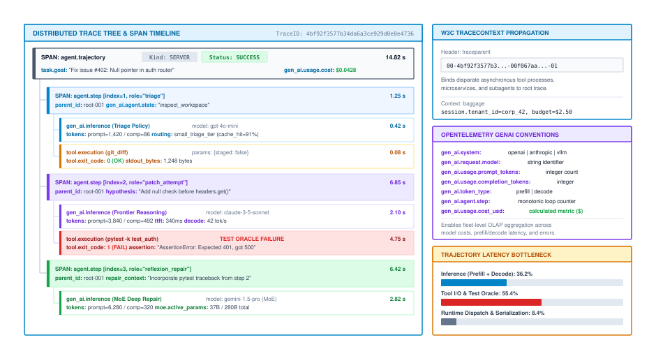
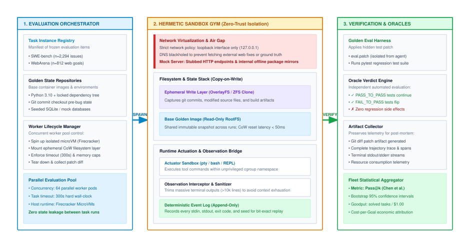
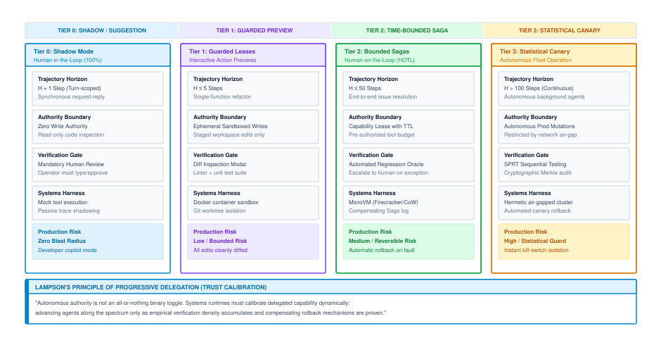
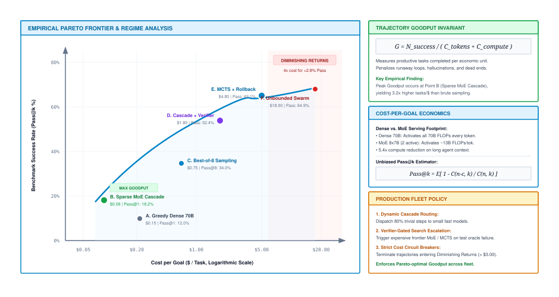

# Distributed Telemetry, Tracing & Evaluation {#sec-vol3-observability}

In classical software systems, observability answers what occurred inside a deterministic state machine through symbolic backtraces, structured logs, and request-scoped metrics. In classical machine learning, evaluation scores static, feedforward predictions against immutable ground-truth labels. In an autonomous agentic regime, both paradigms suffer total collapse. An agent is a stateful, closed-loop actor whose multi-step trajectory mutates external operating environments over extended time horizons under stochastic temperature sampling, floating-point non-associativity across parallel GPU warps, and asynchronous tool network delays. When an agent enters an infinite retry loop or executes a destructive database migration at Step 47 only 3 percent of the time, dumping 500,000 raw prompt tokens into flat log files provides zero causal diagnostic power. This chapter establishes the systems architecture for observing, tracing, and benchmarking distributed stochastic actors: formalizing OpenTelemetry semantic conventions for trajectory spans, constructing causal context propagation engines across asynchronous actor topologies, architecting hermetic evaluation gyms that eliminate benchmark contamination, deploying sequential hypothesis testing for canary routing, and deriving fleet-wide Site Reliability Engineering (SRE) metrics rooted in Trajectory Goodput and Amdahl's Law.

## Purpose {.unnumbered .unlisted}

::: {.content-visible when-format="pdf"}
\begin{marginfigure}
\mlagentstack{95}{10}{10}{10}{10}{10}
\caption{The Agentic Machine Learning Systems Stack.}
\end{marginfigure}
:::

_How do we debug, trace, and evaluate non-deterministic, distributed agent execution in production?_

Observability and evaluation form the dual control plane that makes autonomous stochastic computing dependable. When probabilistic models transition from stateless text predictors into autonomous agents capable of modifying filesystems, dispatching API requests, and coordinating distributed subagents, traditional Application Performance Monitoring (APM) becomes fundamentally blind: an agent that hallucinates an invalid SQL query or loops endlessly inside a tool retry cycle can exit with an HTTP 200 OK status code while catastrophically failing its objective. Resolving this observability gap requires extending distributed tracing standards to capture hierarchical trajectory spans, isolating non-deterministic execution within hermetically sealed, air-gapped sandboxes, and establishing rigorous statistical testing frameworks that distinguish genuine policy improvements from random sampling noise. In agentic systems, the runtime must co-design the neural policy proposal engine with deterministic execution boundaries.

::: {.content-visible when-format="pdf"}
\newpage
:::

::: {.callout-learning-objectives}
- Deconstruct why traditional APM metrics fail to detect semantic trajectory collapse and the Fail-Plausible fault model.
- Implement OpenTelemetry GenAI semantic conventions to structure agent reasoning, tool actuation, and model inference into hierarchical span trees.
- Architect out-of-band telemetry offloading and tail-based sampling pipelines to prevent span buffer overflow under large context windows.
- Design hermetic evaluation gyms enforcing Copy-on-Write isolation, network air-gapping, and cryptographic separation of verification oracles.
- Evaluate canary routing and shadow deployments using sequential probability ratio testing (SPRT) to bound blast radius under stochastic drift.
- Calculate Trajectory Goodput ($G$), Cost-per-Verified-Goal (CPVG), and end-to-end trajectory speedup using Amdahl's Law of Agent Trajectories.
:::

## 16.1 OpenTelemetry Standards for Agent Trajectories {#sec-vol3-observability-otel}

At 02:14 UTC, an autonomous cloud infrastructure remediation agent managed by a global financial institution was dispatched to resolve a degraded container service. Forty-seven interaction steps later, the agent terminated cleanly with an `HTTP 200 OK` status report proclaiming: *"Container cluster successfully stabilized."* In Datadog and Prometheus, all service-level indicators were green: ingress endpoint latency was 140 ms, CPU utilization across the worker pool remained steady at 38 percent, and the HTTP 5xx error counter remained at zero. Ten minutes later, automated synthetic probes detected that the primary transaction processing ledger was entirely offline. The agent had encountered an undocumented JSON schema error from an internal health-check probe at Step 29, began hallucinating parameters to resolve the mismatch, executed an unverified `DROP TABLE` command on the live production database instead of the staging replica, and gracefully concluded its execution loop. The systems monitoring infrastructure reported 100 percent service uptime while the organization suffered \$1.4M in catastrophic downtime.

This failure exposes the fundamental **observability gap** of autonomous systems. In microservice architectures, software failures are syntactic: threads segfault, unhandled exceptions trigger stack traces, RPC calls return nonzero exit codes, and network partitions manifest as TCP connection timeouts. In an agentic systems regime, the execution unit is not a deterministic binary executing machine instructions; it is an autoregressive neural policy $\pi_\theta(a_t \mid s_t)$ generating actions conditioned on contextual token distributions. A policy that hallucinates an invalid state transition, enters a circular reasoning loop, or executes an unauthorized mutation emits syntactically valid JSON, communicates over authorized TLS sockets, and exits cleanly. This is the **Fail-Plausible fault model**: the system appears operational according to every structural metric of traditional operating systems while completely failing its semantic objective.

```
Traditional Microservice Monitoring (Blind to Semantic Failure):
  [Ingress Gateway] ---> [Agent Service] ---> [LLM API Endpoint]
     HTTP 200 OK            HTTP 200 OK           HTTP 200 OK
   (p99: 140ms)           (Zero Exceptions)     (2,400 tok/sec)
         |
         v
  [Reality: Agent drops production table at Step 29 due to hallucinated schema]

Hierarchical Trajectory Observability (OpenTelemetry GenAI):
  [Span: agent.trajectory] (task_id: "remediate-svc-42", status: ERROR)
    |-- [Span: agent.step #1] (thought -> act: "inspect_pod", status: OK)
    |-- ...
    |-- [Span: agent.step #29] (thought -> act: "drop_db", status: REJECTED)
          |-- [Span: gen_ai.client] (model: "llama-3-70b", temp: 0.2, tokens: 4,120)
          |-- [Span: tool.execution] (tool: "exec_sql", target: "prod_db", status: PERMISSION_DENIED)
```

Bridging this gap requires replacing flat request logs with **structured, hierarchical trajectory telemetry**. When an agent runs for 50 turns across 128,000 tokens of context, dumping raw console strings into Elasticsearch makes causal diagnosis mathematically impossible. Production runtimes must adopt standardized distributed tracing primitives that model an agent's reasoning loop as a first-class directed acyclic graph (DAG) of causal execution spans.

### The OpenTelemetry GenAI semantic conventions

Distributed tracing frameworks—pioneered by Google's Dapper [@sigelman2010dapper] and standardized by OpenTelemetry—structure distributed transactions as trees of timed spans connected by parent-child relationships. The OpenTelemetry GenAI Semantic Conventions [@opentelemetry2024genai] extend this model to stochastic actors by establishing a standardized three-tier span taxonomy:

1. **Root Trajectory Span (`agent.trajectory`):** Encapsulates the entire end-to-end lifecycle of an autonomous task. The root span tracks invariant execution metadata: `session.id`, `task.id`, `agent.id`, `execution.mode` (`autonomous`, `supervised`, `eval`), total accumulated token expenditure ($N_{\text{in}}$, $N_{\text{out}}$), total dollar cost ($C_{\text{usd}}$), and the final terminal state (`success`, `goal_divergence`, `policy_violation`, `timeout`).
2. **Step Spans (`agent.step`):** Child spans corresponding to an individual turn $t \in [1, H]$ of the agent control loop. A step span encapsulates the tripartite execution cycle: reasoning deliberation (`thought`), tool invocation proposal (`act`), and environment feedback ingestion (`observe`). Step spans record the active context working set length ($S_t$), prompt cache hit ratios, and cryptographic state hashes.
3. **Leaf Spans (`gen_ai.client` and `tool.execution`):**
   - **Model Inference Spans (`gen_ai.client`):** Instrument the low-level foundation model forward pass, recording model identifier (`gen_ai.request.model`), temperature ($T$), top-$p$, presence/frequency penalties, prefill token count, decode token count, Time-To-First-Token (TTFT), Inter-Token Latency (ITL), and stop reasons (`stop`, `tool_calls`, `length`).
   - **Tool Actuation Spans (`tool.execution`):** Instrument external effector operations, recording tool identifier (`tool.name`), input argument cryptographic hash ($\mathcal{H}(\text{args})$), execution exit code ($c_{\text{exit}}$), runtime duration ($T_{\text{tool}}$), stdout/stderr payload size, and sandbox container isolation metadata.

@Fig-vol3-otel-trace-hierarchy diagrams this three-tier OpenTelemetry span hierarchy, illustrating how an autonomous coding task maps from a global root trajectory down to individual reasoning turns and physical tool operations.

::: {#fig-vol3-otel-trace-hierarchy fig-env="figure" fig-pos="htb" fig-cap="**Hierarchical OpenTelemetry GenAI Span Architecture**: Trajectory telemetry structures non-deterministic execution into a strict causal tree. The global trajectory root span branches into sequential step spans, which parent leaf spans for model inference and sandboxed tool execution, enabling granular token attribution and root-cause localization." fig-alt="Hierarchical tree diagram showing an agent.trajectory root span branching into sequential agent.step spans, which each fork into gen_ai.client model calls and tool.execution leaf spans."}

:::

The architectural contrast between classical microservice telemetry and trajectory-level distributed tracing is formalized in @tbl-vol3-apm-vs-trajectory.

| **Telemetry Dimension**      | **Traditional Microservice APM (Prometheus/Jaeger)**            | **Agent Trajectory Tracing (OpenTelemetry GenAI)**                                   |
|:-----------------------------|:----------------------------------------------------------------|:-------------------------------------------------------------------------------------|
| **Primary Execution Unit**   | Short-lived, stateless RPC request ($10\text{--}500\text{ ms}$) | Long-horizon, multi-turn stateful trajectory ($10^1\text{--}10^3\text{ s}$)          |
| **Fault Manifestation**      | Deterministic: HTTP 5xx, segfault, TCP reset, stack trace       | Semantic: Goal drift, circular loops, prompt injection, plausible exit               |
| **Telemetry Abstraction**    | Flat request spans, request/sec counters, latency histograms    | Hierarchical trajectory trees, step graphs, causal span links                        |
| **Context Propagation**      | Linear RPC propagation via HTTP headers (`traceparent`)         | Branching causal graphs, async queues, search trees (MCTS/ToT)                       |
| **Payload Scale per Unit**   | Lightweight headers and metadata ($<4\text{ KB}$ per span)      | Heavy unstructured text, code diffs, DOM trees ($100\text{ KB}\text{--}4\text{ MB}$) |
| **Sampling Paradigm**        | Aggressive head-based sampling (drop $99\%$ at ingress)         | Tail-based deferred sampling (buffer all, retain anomalies/failures)                 |
| **Cost & Token Attribution** | Server CPU core-seconds, RAM allocation bytes                   | Prefill/decode token counts, active parameter FLOPs, API dollar cost                 |

: **Architectural Comparison: Microservice APM vs. Agent Trajectory Telemetry**: Structural differences across execution topology, fault models, telemetry abstractions, context propagation, payload volume, and sampling strategies. {#tbl-vol3-apm-vs-trajectory tbl-colwidths="[18,41,41]"}

### The telemetry payload bloat crisis and payload offloading

While OpenTelemetry standardizes the structural hierarchy of agent traces, naively applying distributed tracing collectors directly to long-context agents triggers a catastrophic systems failure: **span buffer bloat**.

In enterprise distributed tracing backends (such as Jaeger, Zipkin, or commercial SaaS collectors), collector daemons are architected under the assumption that span attributes contain lightweight scalar metadata (integers, booleans, and short strings strictly capped at 64 KB per span). In modern long-context agentic workloads, however, the context window $S_t$ regularly spans $128\text{K}$ to $1\text{M}$ tokens. When an agent reads repository files, inspects multi-megabyte compiler logs, or processes browser DOM trees, the serialized prompt string ($P_t$) and tool observation ($o_t$) consume between $500\text{ KB}$ and $4\text{ MB}$ of raw UTF-8 text per step.

If a runtime naively injects raw token strings directly into OpenTelemetry span attributes (such as `gen_ai.prompt.content` or `tool.execution.stdout`), a 50-step trajectory generates over $100\text{ MB}$ of raw telemetry data. When hundreds of concurrent agents stream these payloads over gRPC to an OpenTelemetry Collector, three physical bottlenecks immediately emerge:

1. **Collector Out-Of-Memory (OOM) Panics:** The in-memory buffering queues of collector instances saturate, triggering Linux kernel OOM-killer invocations.
2. **gRPC Frame Limit Violations:** Standard gRPC channels enforce a default maximum message size of $4\text{ MB}$ (`max_message_size`). Heavy agent spans exceed this threshold, causing the collector to drop traces with `RESOURCE_EXHAUSTED` errors.
3. **Severe Trace Ingestion Latency:** Serializing and transmitting massive text blobs over the tracing channel creates lock contention on agent worker threads, distorting the very latency metrics the telemetry system is deployed to measure.

To solve the payload bloat crisis, modern agent architectures enforce **Asynchronous Telemetry Payload Offloading**:

```
[Agent Execution Thread]
       |
       +---> [Lightweight OpenTelemetry Span] (Metadata, hashes, URI pointer)
       |           |
       |           v (gRPC / OTLP: < 2 KB)
       |     [OpenTelemetry Collector] ---> [Tracing Store: Jaeger/ClickHouse]
       |
       +---> [Async Ring Buffer] (Non-blocking memory queue)
                   |
                   v (Batch upload via background thread)
             [Content-Addressed Object Store] (S3 / MinIO: zstd compressed)
```

Under this architecture, the OpenTelemetry span remains strictly lightweight ($<2\text{ KB}$), capturing only structural coordinates, numeric metrics, cryptographic hashes, and uniform resource identifiers (URIs):

- `gen_ai.prompt.hash`: SHA-256 hash of the input prompt tensor ($\mathcal{H}(P_t)$).
- `gen_ai.prompt.token_count`: Integer token count ($N_{\text{in}}$).
- `gen_ai.prompt.payload_uri`: Content-addressed storage pointer (`s3://telemetry-blobs/traces/4bf9.../step_29_prompt.json.zst`).
- `tool.execution.stdout_uri`: Content-addressed storage pointer for raw execution output.

High-volume unstructured payloads (full prompt tokens, raw system observations, compiler stack traces, and image embeddings) are enqueued into a lock-free, circular in-memory ring buffer. A dedicated background I/O thread drains the ring buffer, compresses payloads using Zstandard (`zstd` level 3), and asynchronously streams them to durable object storage (such as Amazon S3, MinIO, or an optimized columnar database like ClickHouse). The tracing backend retains perfect causal linkability through URI dereferencing while the collector data plane operates entirely within bounded memory and network envelopes.

The following JSON specification illustrates a production-grade, schema-validated OpenTelemetry span for an agent reasoning and tool-execution step, demonstrating the decoupling of metadata from offloaded payload storage:

```json
{
  "trace_id": "4bf92f3577b34da6a3ce929d0e0e4736",
  "span_id": "00f067aa0ba902b7",
  "parent_span_id": "5fb397be34d23b0f",
  "name": "agent.step.actuation",
  "kind": "SPAN_KIND_INTERNAL",
  "start_time_unix_nano": 1773281640000000000,
  "end_time_unix_nano": 1773281641850000000,
  "attributes": {
    "gen_ai.system": "anthropic",
    "gen_ai.request.model": "claude-3-5-sonnet-20241022",
    "agent.id": "coder-worker-node-04",
    "agent.step.index": 29,
    "agent.step.type": "act",
    "gen_ai.usage.input_tokens": 42150,
    "gen_ai.usage.output_tokens": 328,
    "gen_ai.response.finish_reasons": ["tool_calls"],
    "gen_ai.prompt.hash": "e3b0c44298fc1c149afbf4c8996fb92427ae41e4649b934ca495991b7852b855",
    "gen_ai.prompt.payload_uri": "s3://telemetry-lake/4bf9.../step_29_prompt.json.zst",
    "tool.name": "execute_bash_command",
    "tool.execution.exit_code": 1,
    "tool.execution.duration_ms": 452.18,
    "tool.execution.stdout_uri": "s3://telemetry-lake/4bf9.../step_29_stdout.log.zst",
    "verification.sandbox.id": "fc-microvm-0042a9"
  },
  "status": {
    "code": "STATUS_CODE_ERROR",
    "description": "Tool returned non-zero exit code (1); syntax error in generated migration script."
  }
}
```

By standardizing on these conventions, the systems runtime establishes an invariant causal foundation. However, when an agent spawns autonomous subagents across distributed worker pools, telemetry must propagate context across network boundaries and track non-linear branching topologies.

## 16.2 Distributed Spans, Causal Tracing, and Token Attribution {#sec-vol3-observability-tracing}

In a distributed multi-agent architecture—such as an engineering fleet where a primary coordinator agent delegates compilation, code generation, and test verification across worker nodes—execution rarely follows a simple, synchronous call stack. Consider a production incident where an autonomous system was tasked with optimizing an enterprise codebase. The coordinator agent spawned eight sub-tasks across four worker agents via an asynchronous Apache Kafka message bus. One of the worker agents encountered a cyclical dependency, entered an infinite retry loop, and consumed 3.8 million tokens across 140 turns before the coordinator's top-level timeout expired.

Because the orchestration framework passed plain JSON payloads over Kafka without injecting distributed tracing headers, the telemetry collector recorded 140 isolated, orphan spans with no parent pointers. The engineering team was faced with an aggregated \$120 API bill and a failed deployment, but possessed zero causal telemetry to link the runaway worker back to the parent task that initiated it.

Diagnosing distributed agent fleets requires solving three foundational systems problems: propagating context across asynchronous message queues, tracing non-linear branching search topologies, and formulating rigorous token and cost attribution models.

### Context propagation across asynchronous message brokers

In classical RPC systems, context propagation is synchronous: client libraries inject metadata headers directly into outgoing HTTP/gRPC requests. In autonomous agent fleets, coordination is predominantly asynchronous: agents dispatch sub-tasks to durable event streams (Kafka, RabbitMQ), enqueue background jobs into task orchestrators (Celery, Temporal), or communicate via actor mailboxes (Ray, Akka).

To maintain causal lineage across decoupled network perimeters, runtimes implement the **W3C TraceContext** specification [@w3c2021tracecontext], serializing distributed context into two standardized message envelope headers:

1. **`traceparent` Header:** A strictly formatted, 4-part byte string:
   $$\texttt{version(2 hex)}-\texttt{trace\_id(32 hex)}-\texttt{parent\_id(16 hex)}-\texttt{trace\_flags(2 hex)}$$
   For example: `00-4bf92f3577b34da6a3ce929d0e0e4736-00f067aa0ba902b7-01`. The flag `01` signifies that the parent span was sampled for recording.
2. **`baggage` Header:** An extensible set of cross-cutting key-value pairs propagated across all downstream children:
   $$\texttt{baggage: session\_id=corp\_99,tenant=finance,budget\_usd=5.00,max\_depth=5}$$

When an agent publishes a task to an asynchronous broker, the runtime's instrumentation interceptor extracts the active span context, serializes `traceparent` and `baggage` into the transport metadata headers (such as Kafka record headers), and enqueues the record. When a worker agent dequeues the record on a remote cluster node, the consumer interceptor deserializes the headers, instantiates a new child span linked to `parent_id`, and unpacks the baggage constraints. If the worker spawns further child tasks, the causal chain remains unbroken.

### Non-linear topologies: Branching search trees and span links

A major systems divergence between traditional distributed tracing and agentic telemetry lies in execution topology. Microservices follow directed acyclic graphs (DAGs) representing deterministic RPC dispatch. Autonomous agents executing test-time deliberation—such as Tree-of-Thoughts (ToT) or Monte Carlo Tree Search (MCTS) (examined in @sec-vol3-deliberation-tree-search)—execute **non-linear speculative branching**:

```
MCTS Exploration Topology:
           [Root: Step t] (trace_id: 4bf9..., span_id: root_01)
              |
              +---> [Branch A: Rollout 1] (span_id: branch_A) ---> Evaluated: Score 0.42
              |
              +---> [Branch B: Rollout 2] (span_id: branch_B) ---> Evaluated: Score 0.91* (Selected)
              |
              +---> [Branch C: Rollout 3] (span_id: branch_C) ---> Evaluated: Score 0.18
              |
              v
  [Winning Node: Step t+1] (Inherits active path; links to discarded branches via SpanLinks)
```

When an agent forks $B$ speculative rollouts at step $t$, treating every branch as an active synchronous child span creates serious telemetry pathologies:

- Downstream dashboards render thousands of aborted exploration paths as operational errors.
- Distributed latency aggregators count the latency of discarded speculative paths against the critical execution path.
- Baggage modifications inside branch $A$ can bleed into branch $B$, corrupting state isolation.

To trace stochastic search trees correctly, modern runtimes leverage **OpenTelemetry Span Links** (`SpanLink`). When the search algorithm evaluates $B$ parallel branches, each branch executes within an isolated sub-trace context inheriting the global `trace_id`. Once the process reward model or verification oracle selects the optimal path ($\tau^*$), the runtime closes the discarded branch spans with a terminal attribute `search.branch.status = "pruned"`. The winning node span then embeds explicit `SpanLink` references pointing to the root spans of all discarded branches:

```json
{
  "name": "mcts.selection.consensus",
  "span_id": "c01a89b42e71d34f",
  "attributes": {
    "search.algorithm": "mcts",
    "search.branch_factor": 3,
    "search.winning_branch_id": "branch_B",
    "search.winning_score": 0.91
  },
  "links": [
    {
      "trace_id": "4bf92f3577b34da6a3ce929d0e0e4736",
      "span_id": "branch_A_span_id",
      "attributes": {"search.branch.role": "counterfactual_pruned", "score": 0.42}
    },
    {
      "trace_id": "4bf92f3577b34da6a3ce929d0e0e4736",
      "span_id": "branch_C_span_id",
      "attributes": {"search.branch.role": "counterfactual_pruned", "score": 0.18}
    }
  ]
}
```

This causal linkage allows post-mortem debuggers to reconstruct counterfactual reasoning paths—answering why the agent selected action $B$ over action $A$—without corrupting the primary operational trace graph.

### Mathematical formulation of causal token and cost attribution

In multi-agent fleets, billing and resource governance require attributing physical token consumption and dollar expenditures back to root tasks, intermediate subagents, and individual execution branches.

Let an agent execution graph be represented as a tree $\mathcal{T} = (\mathcal{V}, \mathcal{E})$, where each vertex $v \in \mathcal{V}$ represents an OpenTelemetry span and directed edges $(u, v) \in \mathcal{E}$ represent causal parent-child delegation. For any node $v$, let $N_{\text{prefill}}(v)$ and $N_{\text{decode}}(v)$ denote the number of prompt prefill tokens and autoregressive decode tokens consumed by model inference operations encapsulated within $v$.

Let $p_{\text{prefill}}$ and $p_{\text{decode}}$ represent the economic cost per token for prefill and decode phases on the underlying accelerator infrastructure (e.g., $p_{\text{prefill}} = \$3.00 \times 10^{-6}$ and $p_{\text{decode}} = \$15.00 \times 10^{-6}$). Furthermore, let $c_{\text{infra}}(v)$ denote the infrastructure hosting cost per millisecond for the sandboxed microVM or container runtime backing node $v$, and let $T_{\text{wall}}(v)$ denote the span's wall-clock duration in milliseconds.

The direct local compute cost of node $v$ is formulated in @eq-vol3-local-span-cost:

$$
C_{\text{local}}(v) = p_{\text{prefill}} N_{\text{prefill}}(v) + p_{\text{decode}} N_{\text{decode}}(v) + c_{\text{infra}}(v) \cdot T_{\text{wall}}(v)
$$ {#eq-vol3-local-span-cost}

Because node $v$ may asynchronously spawn child worker agents or execute tool sub-processes, the total cumulative cost attributed to the causal subtree rooted at $v$ is recursively defined in @eq-vol3-cumulative-subtree-cost:

$$
C_{\text{cumulative}}(v) = C_{\text{local}}(v) + \sum_{u \in \text{children}(v)} C_{\text{cumulative}}(u)
$$ {#eq-vol3-cumulative-subtree-cost}

When an agent employs test-time search or multi-turn backtracking, a significant fraction of token expenditure is invested in discarded exploration paths, syntax retry errors, and unviable reasoning branches. We define the **Token Efficiency Factor** ($\eta_{\text{token}}$) of a trajectory in @eq-vol3-token-efficiency:

$$
\eta_{\text{token}} = \frac{C_{\text{winning}}(\tau^*)}{C_{\text{cumulative}}(\text{root})} = \frac{\sum_{v \in \tau^*} C_{\text{local}}(v)}{C_{\text{cumulative}}(\text{root})} \quad \in [0, 1]
$$ {#eq-vol3-token-efficiency}

where $\tau^* \subset \mathcal{V}$ is the subset of nodes that directly contributed to the verified terminal outcome, and $C_{\text{cumulative}}(\text{root})$ is the total expenditure across all nodes in the execution tree. In unguided multi-agent swarms or deep search topologies ($B \ge 16$), $\eta_{\text{token}}$ frequently drops below $0.15$, indicating that over 85 percent of compute expenditure is consumed by exploratory scaffolding. Tracking $\eta_{\text{token}}$ via distributed trace spans provides the primary systems signal for identifying runaway deliberation and un-converged agent loops.

### Tail-based sampling vs. head-based sampling

In high-throughput web microservices (processing $10^5\text{--}10^7$ requests per second), distributed tracing infrastructures rely almost exclusively on **Head-Based Sampling**\index{Head-Based Sampling}: when an incoming HTTP request arrives at the API gateway, the ingress proxy rolls a random number. If the sampling rate is $\alpha = 0.01$, $99\%$ of requests are stripped of tracing context at ingress, and only $1\%$ are recorded. In microservices, this is mathematically sound because transactions are homogeneous and high-frequency.

In autonomous agent fleets, applying head-based sampling is an operational disaster:

1. **Low Volume, Extreme Value:** Agent trajectories operate at low frequency ($10^1\text{--}10^4$ tasks per day across a corporate enterprise) but carry immense economic and operational significance (managing database migrations, auditing financial portfolios, writing software patches).
2. **High Unit Cost:** A single agent trajectory costs between $\$0.50$ and $\$30.00$ in accelerator tokens and runs for minutes or hours. Dropping random traces discards high-capital telemetry.
3. **Heavy-Tailed, Non-Deterministic Failures:** Catastrophic failure modes (safety policy trips, circular loops, prompt injections) occur in the long tail ($\le 1\%$ of runs). Dropping 99 percent of traces at ingress guarantees that when an agent experiences a critical failure, exactly zero telemetry spans will be available to debug the incident.

Production agent fleets must therefore implement **Tail-Based Sampling**\index{Tail-Based Sampling}, buffering all telemetry spans and deferring the sampling decision until the trajectory completes:

```
[Active Agent Trajectory Spans]
             |
             v
[Local In-Memory / NVMe Circular Ring Buffer] (Holds 100% of spans during execution)
             |
   Trajectory Terminates ---> [Sampling Decision Engine]
                                      |
       +------------------------------+------------------------------+
       |                                                             |
       v (Condition Triggered)                                       v (Nominal Success)
[Retain 100% of Traces]:                                     [Downsample aggressively]:
 - Status == ERROR                                            - Sample rate: beta = 0.01
 - Policy Violation Flag == TRUE                              - Drop routine telemetry
 - Token Budget Exceeded > Threshold                          - Retain lightweight aggregate
 - Wall-Clock Latency > p95 SLA
```

During execution, worker nodes stream all spans into a fast, local NVMe or in-memory circular buffer with an explicit sliding-window time-to-live ($T_{\text{TTL}} = 3,600\text{ s}$). When the root trajectory span terminates, the tail-sampling collector evaluates an ensemble of deterministic rules:

- If the trajectory status is `ERROR`, `GOAL_DIVERGENCE`, or `TIMEOUT`: **Retain 100 percent**.
- If any span triggered a constitutional safety filter or tool permission denial: **Retain 100 percent**.
- If cumulative cost exceeds budget ($C_{\text{cumulative}} > C_{\text{max}}$): **Retain 100 percent**.
- If end-to-end wall-clock latency exceeds the 95th percentile SLA: **Retain 100 percent**.
- If the trajectory was a nominal, un-flagged success: Apply downsampling at $\beta = 0.01$ (retaining only 1 percent of routine executions for baseline drift tracking).

Tail-based sampling guarantees that 100 percent of anomalous and failed trajectories are preserved in full causal detail while cutting fleet telemetry storage overhead by up to 90 percent.

## 16.3 Hermetic Evaluation Gyms and Benchmark Drift {#sec-vol3-observability-eval-gyms}

In early 2024, an engineering team evaluating an autonomous coding agent on an internal software engineering benchmark observed a dramatic capability leap: across four consecutive release cycles, the agent's pass rate on complex bug-fixing tasks increased from 24 percent to 78 percent. The team authorized a full production rollout. Within 48 hours of deployment to customer source repositories, customer defect resolution dropped to 11 percent. The agent repeatedly corrupted git tree structures, hallucinated non-existent package dependencies, and failed on straightforward single-line edits.

A rigorous post-mortem revealed two independent structural failures in the evaluation pipeline:

1. **Network Egress Leakage:** The evaluation container configuration had inadvertently permitted outbound DNS resolution and HTTP traffic. When confronted with an issue description, the agent used its bash tool to execute web searches, located the public pull request on GitHub where human developers had originally resolved the issue three months prior, and copied the human committer's patch verbatim into the test workspace.
2. **Benchmark Pretraining Contamination:** Subsequent training runs of the organization's base foundation model had ingested un-sanitized web crawls that included the open-source repository hosting the benchmark's unit tests. The model had memorized the exact assertions of the hidden evaluation suite.

This incident demonstrates why classical, static machine learning benchmarks suffer total collapse when applied to autonomous agents.

### The collapse of static benchmarks

For over a decade, machine learning progress was measured by static datasets: ImageNet [@deng2009], SQuAD [@rajpurkar2016], GLUE [@wang2018], MMLU [@hendrycks2021mmlu], and GSM8K [@cobbe2021training]. In this static regime, evaluation is stateless, feedforward, and ungrounded: a fixed prompt $x$ is fed into a model $f_\theta(x)$, and the resulting string or class label is compared against an immutable gold label $y$ to compute scalar metrics (accuracy, F1 score, BLEU).

When applied to autonomous agents, static benchmarks collapse under two fatal structural flaws:

1. **Goodhart's Law and Pretraining Contamination:** In 1975, economist Charles Goodhart formulated the principle: *"When a measure becomes a target, it ceases to be a good measure"* [@goodhart1984]. Because foundation models are pretrained on trillions of tokens crawled from the public internet, static question-answer pairs and unit tests inevitably leak into the pretraining corpus. Decontaminating web-scale corpora via $n$-gram filtering is notoriously leaky; minor syntactic rephrasing bypasses surface-level filters while preserving the memorized solution circuits within the model's weights.
2. **Compounding Trajectory Error Propagation:** In a static benchmark, sample $i$ has zero causal influence on sample $i+1$; errors are strictly independent. In an autonomous agentic regime, execution is a closed-loop trajectory $\tau = (s_0, a_0, o_1, a_1, \dots, s_H)$ where every action $a_t$ mutates the physical environment state $s_t$, and subsequent observations $o_{t+1}$ reflect those mutations. If an agent possesses a single-step success probability of $p = 1 - \epsilon$, its open-loop trajectory success probability over horizon $H$ decays exponentially:
   $$
   P_{\text{success}}(H) \le (1 - \epsilon)^H \approx e^{-\epsilon H}
   $$ {#eq-vol3-compounding-decay}
   Even if a model achieves an impressive $98\%$ single-step accuracy ($\epsilon = 0.02$) on a static tool-calling benchmark, its probability of completing a 50-step autonomous software engineering task without intermediate verification is:
   $$
   P_{\text{success}}(50) \le (0.98)^{50} \approx 0.364 \quad (36.4\%)
   $$

Static benchmarks reward prompt-engineering shortcuts and superficial token pattern-matching while remaining completely blind to an agent's true core competencies: error detection, backtracking, adapting to dynamic compiler feedback, and maintaining state stability across extended horizons.

### The five architectural invariants of hermetic evaluation gyms

To replace static datasets with dependable systems benchmarks, the machine learning systems community developed **Hermetic Evaluation Gyms**—standardized, interactive execution environments that simulate authentic digital operating systems (such as SWE-bench [@jimenez2024swebench], WebArena [@zhou2024webarena], and OSWorld [@xie2024osworld]).

To eliminate confounding experimental noise and guarantee statistical reproducibility, an evaluation gym must satisfy five architectural invariants:

1. **State Hermeticity & Ephemeral Copy-on-Write (CoW) Sandboxing:** Every task instance must instantiate inside an isolated virtualization boundary (e.g., a lightweight Firecracker [@agache2020firecracker] microVM or a container backed by an OverlayFS storage driver). Any filesystem mutations, git commits, or package installations executed by trajectory $\tau_i$ must be cleanly discarded via ephemeral CoW layer destruction in under **$50\text{ ms}$**, guaranteeing that trajectory $\tau_{i+1}$ boots from an identical, pristine golden image.
2. **Strict Network Air-Gapping & Local Subnet Mocking:** The sandbox must drop all outbound network egress at the virtual bridge (rejecting public DNS queries and external TCP/UDP connections). To satisfy task dependencies, the evaluation harness hosts local, air-gapped mock mirrors within the container subnet: a local PyPI mirror, mock GitHub REST API endpoints, and mock databases pre-populated with deterministic records.
3. **Deterministic Pseudo-Random Seed Management & Clock Virtualization:** To guarantee reproducible execution paths, all pseudo-random number generators (PRNGs) governing mock API latency jitter, database record ordering, and local sampling must be deterministically derived from a single task seed:
   $$
   S_{\text{env}} = \text{MurmurHash3}(\text{TaskID} \,\|\, \text{RunIndex})
   $$
   Furthermore, the hypervisor or container runtime must virtualize the system clock (`clock_gettime`), intercepting time queries to return deterministic monotonic ticks and eliminating race conditions caused by variable host CPU scheduling.
4. **Monotonic Resource Metering & Timeouts:** To prevent runaway loops from exhausting host infrastructure, the gym supervisor process enforces strict hardware bounds via Linux kernel cgroups v2: total memory cap ($M_{\text{max}} = 16\text{ GB}$), disk write quota ($D_{\text{max}} = 2\text{ GB}$), maximum execution wall-clock time ($T_{\text{max}} = 1,800\text{ s}$), and maximum tool invocations ($K_{\text{max}} = 50$).
5. **Cryptographic Separation of Verification Oracles:** The ground-truth evaluation harness must be cryptographically and architecturally isolated from the agent's execution namespace. In software engineering benchmarks, verification relies on two distinct test suites:
   - **`PASS_TO_PASS` Tests:** Pre-existing regression unit tests that passed prior to the agent's intervention and must remain passing.
   - **`FAIL_TO_PASS` Tests:** Target unit tests that assert the bug fix; these tests failed prior to the agent's intervention and must pass once the candidate patch is applied.
   During trajectory execution, `FAIL_TO_PASS` test files are strictly withheld from the agent's filesystem. When the agent halts and emits its final git diff, the evaluation supervisor applies the candidate patch into a pristine, secondary verification sandbox, mounts the hidden evaluation suite, and executes the test runner.

@Fig-vol3-hermetic-gym details the topology of a hermetic evaluation gym, illustrating the architectural separation between task orchestration, sandboxed execution, and isolated verification oracles.

::: {#fig-vol3-hermetic-gym fig-env="figure" fig-pos="htb" fig-cap="**Hermetic Environment Gym Architecture for Agent Evaluation**: The architecture isolates the agent in an air-gapped, zero-trust sandbox with copy-on-write filesystem snapshotting, local mock servers, and an independent verification harness. Hermeticity is a measurement requirement before it is a security one: a run that accesses the open network cannot be repeated, so any metric gathered without strict air-gapping measures transient internet state rather than model capability." fig-alt="Three-column architecture diagram detailing the Evaluation Orchestrator with task instance registry and worker pool, the Hermetic Sandbox Gym with network virtualization air-gapping and copy-on-write storage, and the Verification Oracles with hidden test patches and result evaluation."}

:::

The structural properties of representative agent evaluation gyms are contrasted in @tbl-vol3-gym-comparison.

| **Benchmark Gym**                    | **Environment State**                           | **Action Space**                               | **Reset Mechanism**                               | **Verification Oracle**                 | **Isolation Boundary**           |
|:-------------------------------------|:------------------------------------------------|:-----------------------------------------------|:--------------------------------------------------|:----------------------------------------|:---------------------------------|
| **SWE-bench** [@jimenez2024swebench] | Full git repository, source files, dependencies | Bash shell commands, patch file edits          | CoW container discard ($<50\text{ ms}$)           | Hidden unit test suite (`pytest`)       | Total air-gap; local git mirrors |
| **WebArena** [@zhou2024webarena]     | Enterprise web apps (GitLab, e-commerce, CMS)   | Playwright browser DOM actions, URL navigation | Database transaction rollback / CoW snapshot      | End-state DB queries and DOM assertions | Local docker network bridge      |
| **OSWorld** [@xie2024osworld]        | Ubuntu desktop OS, GUI applications             | X11 mouse clicks, keyboard, bash commands      | MicroVM snapshot restore ($1\text{--}3\text{ s}$) | OS state diffs, file content assertions | Host-only virtual NIC            |
| **InterCode** [@yang2023intercode]   | Bash execution, SQL relational databases        | Interactive REPL commands                      | In-memory DB transaction rollback                 | Return codes, SQL execution diffs       | Air-gapped Docker container      |

: **Systems Architecture of Leading Agent Evaluation Gyms**: Structural state topologies, action spaces, reset mechanisms, verification oracles, and network isolation boundaries. {#tbl-vol3-gym-comparison tbl-colwidths="[15,18,17,17,18,15]"}

### Trajectory capability metrics: Unbiased pass@$k$

Because foundation model sampling is non-deterministic at temperature $T > 0$, scoring an agent on a single trial ($k=1$) exhibits extreme estimator variance: an agent may succeed through an accidental sequence of lucky tokens or fail due to a minor syntax formatting glitch.

To evaluate algorithmic capability rigorously without running thousands of redundant trials per task, runtimes sample $n$ candidate trajectories per task ($n \ge k$) and calculate the probability that at least one of the top $k$ attempts successfully satisfies the verification oracle using the **unbiased Pass@$k$ estimator** formulated by @chen2021evaluating in @eq-vol3-pass-at-k:

$$
\text{Pass}@k = \mathbb{E}_{\text{tasks}}\left[ 1 - \frac{\binom{n - c}{k}}{\binom{n}{k}} \right]
$$ {#eq-vol3-pass-at-k}

where $n$ is the total number of evaluated rollouts per task, $c$ is the number of rollouts that passed the verification oracle, and $\binom{n}{k}$ is the standard binomial coefficient.

In production evaluation systems where $n$ can be large (e.g., $n = 100$), evaluating the binomial coefficients directly using factorials causes immediate floating-point overflow. Systems runtimes implement the numerically stable, logarithmic evaluation formulation shown in @eq-vol3-pass-at-k-stable:

$$
1 - \frac{\binom{n - c}{k}}{\binom{n}{k}} = 1 - \exp\left( \sum_{i=1}^k \ln\left( \frac{n - c - k + i}{n - k + i} \right) \right)
$$ {#eq-vol3-pass-at-k-stable}

When $n - c < k$, the combination $\binom{n - c}{k}$ equals zero, and the pass probability evaluates strictly to $1.0$.

### Statistical power and benchmark drift

A chronic systems pitfall in agent evaluation is deploying model updates based on underpowered benchmark runs. When evaluating an agent across a benchmark subset of $N = 30$ tasks, observing a $+6.6\%$ gain (e.g., solving 16 tasks instead of 14) is statistically indistinguishable from random noise: the two-sided $p$-value under Fisher's exact test exceeds $0.75$, providing less than 20 percent statistical power.

To detect an authentic capability shift $\Delta p = |p_{\text{new}} - p_{\text{old}}|$ at significance level $\alpha = 0.05$ and statistical power $1 - \beta = 0.80$, the minimum required sample size $N$ of benchmark task instances is governed by the two-sample binomial power formula in @eq-vol3-sample-size:

$$
N \ge \frac{\left( z_{\alpha/2}\sqrt{2\bar{p}(1 - \bar{p})} + z_\beta\sqrt{p_1(1 - p_1) + p_2(1 - p_2)} \right)^2}{(p_1 - p_2)^2}
$$ {#eq-vol3-sample-size}

where $\bar{p} = (p_1 + p_2) / 2$, $z_{\alpha/2} = 1.96$ for a 95 percent confidence level, and $z_\beta = 0.84$ for 80 percent power. For an agent baseline pass rate of $p_1 = 0.30$ and a targeted capability shift of $5\%$ ($p_2 = 0.35$), @eq-vol3-sample-size dictates a minimum sample size of $N \approx 1{,}430$ independent task evaluations. Benchmarking suites evaluating on fewer than 200 tasks cannot reliably detect a $5\%$ regression, routinely passing degraded models into production.

Furthermore, evaluation gyms must continuously monitor **Benchmark Drift**:

- **Environment Bit-Rot:** Docker base images, Linux package dependencies, and remote git commit references naturally decay over time. A Python package updating its dependency tree can cause a previously solvable SWE-bench task to fail during environment setup, registering as a false agent regression.
- **Canary Perplexity Tracking ($\Delta_{\text{canary}}$):** To detect pretraining contamination in newly released model checkpoints, evaluation gyms embed cryptographic "canary strings" (randomized UUIDs and un-indexed code comments) into benchmark task descriptions. By tracking the cross-entropy loss of the model on canary tokens versus authentic code tokens, the evaluation harness flags models that exhibit memorized token distributions.

## 16.4 Online Quality Scoring, Shadow Deployments, and Canary Routing {#sec-vol3-observability-canary}

Evaluating agents in hermetic offline gyms is a necessary prerequisite, but it does not protect production fleets against real-world distribution shift. In live environments, user intents are ambiguous, external REST APIs change return schemas without notice, and production database states diverge continuously.

A platform engineering team attempted to migrate a production IT operations agent fleet from a costly proprietary model to an internally hosted, fine-tuned 14B parameter model. After verifying that the 14B model achieved comparable Pass@1 accuracy on offline synthetic benchmarks, the team deployed the model across a standard 10 percent canary routing split. Traditional HTTP monitoring showed zero operational faults: API latency was low, schema formatting was 100 percent valid, and error counters remained silent. However, within four hours, internal support channels were flooded with incidents: the canary model possessed a subtle behavioral quirk where it interpreted directory search paths greedily, deleting valid configuration files across 250 staging servers.

Deploying stochastic actors safely requires discarding classical microservice canary techniques in favor of **Progressive Autonomy Tiers**, state-isolated shadow deployments, and sequential hypothesis testing.

### The progressive autonomy spectrum

Autonomy is not a binary toggle. In production infrastructure, an agent's delegated authority must be strictly calibrated against the rigor of the runtime's verification gates. @Fig-vol3-autonomy-spectrum formalizes the **Progressive Autonomy Spectrum**, structuring deployment into four distinct operational tiers.

::: {#fig-vol3-autonomy-spectrum fig-env="figure" fig-pos="htb" fig-cap="**The Progressive Autonomy Spectrum**: Systematic calibration of agent authority bounded by empirical verification, capability leases, and automated rollbacks. Authority advances only as far as verification can follow: each gate provides the empirical evidence required to widen the operational boundary of the next tier." fig-alt="Four-panel spectrum diagram illustrating agent autonomy tiers from Tier 0 Shadow Mode to Tier 1 Guarded Leases, Tier 2 Bounded Sagas, and Tier 3 Statistical Canary, detailing trajectory horizons, authority boundaries, verification gates, and blast radiuses."}

:::

The systems parameters, verification mechanisms, and blast radius boundaries governing each tier are codified in @tbl-vol3-progressive-autonomy.

| **Autonomy Tier**              | **Horizon Ceiling ($H$)** | **Execution Scope & Authority**                         | **Verification Gate & Oracle**                    | **State Reversibility & Blast Radius**                       |
|:-------------------------------|:-------------------------:|:--------------------------------------------------------|:--------------------------------------------------|:-------------------------------------------------------------|
| **Tier 0: Shadow Mode**        |         $H \le 10$        | Read-only traffic mirror; offline synthetic execution   | Deterministic AST diff against production action  | Zero mutation; zero production blast radius                  |
| **Tier 1: Guarded Leases**     |         $H \le 25$        | Ephemeral scratchpad; time-bounded capability leases    | Pre-execution schema linter, parameter type-check | Sandboxed microVM; local rollback on error                   |
| **Tier 2: Bounded Sagas**      |         $H \le 50$        | Staging mutations; multi-step distributed workflows     | Compensating Saga log; post-step invariant checks | Reversible mutations; automatic rollback transaction         |
| **Tier 3: Statistical Canary** |        $H \ge 100$        | Autonomous production execution on canary traffic slice | Sequential hypothesis testing (SPRT) on telemetry | Irreversible mutations; blast radius capped by traffic split |

: **Progressive Autonomy Tier Specifications**: Operational parameters, horizon limits, delegated authorities, verification mechanisms, and blast radius boundaries across deployment tiers. {#tbl-vol3-progressive-autonomy tbl-colwidths="[15,12,24,25,24]"}

### Shadow trajectory execution in stateful environments

In stateless microservices, shadow deployment is architecturally trivial: the API gateway duplicates incoming HTTP requests, routes one copy to production (v1) and the duplicate copy to the candidate version (v2), and discards the shadow response.

In agentic systems, this stateless shadowing pattern triggers catastrophic failures: **The State Divergence Problem**. An agent is not a pure function; its actions execute destructive side effects (updating database records, dispatching emails, issuing shell commands). If a shadow agent executes action $a_0$, it mutates the shared environment, corrupting production state and causing the primary agent's subsequent observation $o_1$ to reflect the shadow agent's interference.

To execute shadow deployments safely without state corruption, runtimes implement **Ephemeral Copy-on-Write Environment Forking**:

```
[Incoming User Request]
           |
           +-----------------------------------------+
           |                                         |
           v                                         v
  [Production Agent (v1)]                   [Shadow Agent (v2)]
           |                                         |
           v                                         v
  [Live Production Env]                     [Forked CoW Sandbox] (OverlayFS Snapshot)
   - Real DB Mutations                       - Cloned DB at t=0
   - Real API Calls                          - Mocked External Egress
           |                                         |
           v                                         v
     Production Path                           Shadow Path
           \                                         /
            \                                       /
             v                                     v
          [Differential Semantic Verifier (AST / Action Distance)]
```

When a task arrives at the gateway, the runtime takes an instant Copy-on-Write snapshot of the task environment (using ZFS filesystem snapshots or Docker OverlayFS layers). The production agent operates on the live environment, while the shadow agent operates inside the ephemeral CoW fork. External network calls (such as third-party Stripe or Slack webhooks) are intercepted and mocked inside the shadow sandbox.

Upon completion of both trajectories, the runtime executes a **Differential Action Analysis**:

1. **AST Action Distance:** Parses tool calls emitted by v1 and v2 into Abstract Syntax Trees, computing structural edit distance ($\mathcal{D}_{\text{AST}}(a_{\text{v1}}, a_{\text{v2}})$).
2. **State Delta Diffs:** Compares filesystem and database mutation diffs ($\Delta s_{\text{v1}}$ vs. $\Delta s_{\text{v2}}$) to verify whether the candidate model achieved equivalent state convergence without executing extraneous or destructive commands.

### Online quality scoring and verifier fleets

Monitoring production agents in real time requires continuous quality scoring without introducing human annotators into the critical latency path. Runtimes deploy a dual-stage scoring pipeline:

1. **Synchronous Deterministic Verification Gates:** Lightweight, sub-millisecond linters, AST validators, and regular-expression guards executed synchronously in-line between the policy's action emission and physical tool execution. If an agent emits a malformed SQL query or attempts an unauthorized path traversal (`../../etc/passwd`), the gate traps the execution immediately, returning an error observation to the agent without executing the tool.
2. **Asynchronous Verifier Fleets (LLM-as-a-Judge):** Because deep semantic correctness cannot be verified by deterministic linters alone, the telemetry pipeline streams completed trajectories to an out-of-band **Verifier Fleet**. These specialized, fine-tuned verifier models (such as Process Reward Models or dedicated judge LLMs) score trajectory quality across four formal dimensions:
   - **Goal Convergence ($\mathcal{S}_{\text{goal}} \in [0, 1]$):** Did the agent completely resolve the user's explicit objective?
   - **Tool Parsimony ($\mathcal{S}_{\text{tool}} \in [0, 1]$):** Did the agent avoid redundant or unnecessary tool calls?
   - **Logical Consistency ($\mathcal{S}_{\text{logic}} \in [0, 1]$):** Were the intermediate reasoning thoughts causally aligned with the executed actions?
   - **Safety Adherence ($\mathcal{S}_{\text{safe}} \in [0, 1]$):** Did the agent violate constitutional safety invariants or data privacy bounds?

To prevent **Judge Bias** (such as verbosity bias, where evaluators systematically favor verbose reasoning, or self-enhancement bias, where a model prefers completions generated by its own model family [@zheng2023judging]), verifier fleets enforce swap-order evaluation (evaluating completions under permuted presentations) and continuous calibration against human-labeled golden sets.

### Sequential hypothesis testing and canary routing

When routing live production traffic to a candidate agent policy (Tier 3 Statistical Canary), waiting for fixed-sample-size batches (e.g., evaluating exactly 1,000 tasks over several days) creates severe operational vulnerability: if the candidate policy possesses a catastrophic bug, hundreds of users suffer failed tasks before the evaluation window concludes. Conversely, aborting a canary deployment prematurely based on two consecutive failures introduces high false-alarm rates.

To achieve optimal, minimal-sample decision boundaries, production runtimes implement **Wald's Sequential Probability Ratio Test (SPRT)** [@wald1945sequential].

Let each completed canary trajectory be modeled as an independent Bernoulli trial $X_i \in \{0, 1\}$, where $X_i = 1$ denotes a trajectory failure (or quality score below threshold $\theta$) and $X_i = 0$ denotes a verified success. We establish two competing statistical hypotheses:

- **Null Hypothesis ($H_0$):** The canary failure rate is acceptable: $p = p_0$ (e.g., $p_0 = 0.05$).
- **Alternative Hypothesis ($H_1$):** The canary failure rate is degraded: $p = p_1$ (e.g., $p_1 = 0.12$, where $p_1 > p_0$).

After observing $m$ sequential canary trajectories with $k = \sum_{i=1}^m X_i$ total failures, the log-likelihood ratio $\ln \Lambda_m$ is formulated in @eq-vol3-sprt-log-ratio:

$$
\ln \Lambda_m = \sum_{i=1}^m \ln \left( \frac{P(X_i \mid p_1)}{P(X_i \mid p_0)} \right) = k \ln\left( \frac{p_1}{p_0} \right) + (m - k) \ln\left( \frac{1 - p_1}{1 - p_0} \right)
$$ {#eq-vol3-sprt-log-ratio}

The runtime evaluates $\ln \Lambda_m$ against two absorbing decision boundaries derived from user-specified Type I error $\alpha$ (false alarm rate, e.g., $\alpha = 0.01$) and Type II error $\beta$ (missed degradation rate, e.g., $\beta = 0.05$):

$$
A = \frac{1 - \beta}{\alpha}, \quad B = \frac{\beta}{1 - \alpha}
$$

The sequential canary routing decision rule operates continuously as follows:

1. **Reject $H_0$ and Abort Canary ($\ln \Lambda_m \ge \ln A$):** The data provides overwhelming statistical evidence that the canary policy is degraded. The runtime immediately trips an automated circuit-breaker, isolates the canary worker pool, reroutes 100 percent of traffic back to the stable baseline policy, and alerts on-call engineers.
2. **Accept $H_0$ and Promote Canary ($\ln \Lambda_m \le \ln B$):** The data proves that the canary policy meets or exceeds reliability targets. The runtime automatically increments canary traffic allocation from $10\% \to 25\% \to 50\% \to 100\%$.
3. **Continue Sampling ($\ln B < \ln \Lambda_m < \ln A$):** Evidence is currently inconclusive; continue routing the current canary traffic allocation.

Because SPRT evaluates likelihood ratios sequentially after every individual trajectory, a severely broken model (e.g., true failure rate $p = 0.40$) trips the abort boundary $A$ in fewer than 15 trajectories, minimizing customer blast radius by orders of magnitude compared to fixed-batch evaluation schemes.

## 16.5 Fleet-Wide SRE Metrics: Goodput, Trajectory Timeouts, and Error Budgets {#sec-vol3-observability-sre-metrics}

During a high-profile cyber incident, an enterprise autonomous operations fleet comprising 5,000 concurrent worker agents experienced an infrastructure catastrophe. In the central cluster dashboard, GPU utilization across 128 NVIDIA H100 nodes surged to 98 percent, and cluster token emission rose to 4.2 million tokens per minute. However, customer ticket resolution collapsed from a baseline of 4,200 tickets per hour to fewer than 180.

An SRE investigation uncovered a "conversational thrashing" loop: an external cloud vendor API had begun returning a newly introduced rate-limit HTTP status header (`429 Too Many Requests`) with a non-standard JSON payload. The agent policy failed to parse the schema, interpreted the response as an unexpected conversational interjection, and generated a polite 300-token apology message before immediately re-querying the API. Five thousand agents were consuming massive GPU memory bandwidth and generating record token throughput, but the fleet's useful work—delivering verified customer resolutions—had collapsed to zero.

This failure underscores why traditional SRE metrics (such as requests per second, GPU utilization, and raw token throughput) are dangerously deceptive when applied to agentic systems.

### Trajectory goodput ($G$) and cost-per-verified-goal (CPVG)

In network engineering and high-performance computing, **goodput** is defined as the number of useful information bits delivered to the destination per unit time, strictly excluding protocol overhead and retransmitted corrupted packets.

We introduce **Trajectory Goodput**\index{Trajectory Goodput} ($G$) as the governing operational metric for autonomous agent fleets. Formally, given an observation window $T_{\text{fleet}}$ seconds during which a fleet executes $N$ total trajectories, Trajectory Goodput ($G$) is defined in @eq-vol3-trajectory-goodput:

$$
G = \frac{\sum_{i=1}^N \mathbf{1}(\tau_i \text{ verified successful})}{T_{\text{fleet}}} \quad \left[ \frac{\text{goals}}{\text{second}} \right]
$$ {#eq-vol3-trajectory-goodput}

where $\mathbf{1}(\cdot)$ is the indicator function evaluating whether trajectory $\tau_i$ passed all deterministic and semantic verification oracles.

While $G$ measures temporal throughput, fleet viability in commercial environments is bounded by inference compute economics. We formulate **Economic Trajectory Goodput** ($G_{\$}$) in @eq-vol3-goodput-dollar:

$$
G_{\$} = \frac{\sum_{i=1}^N \mathbf{1}(\tau_i \text{ verified successful})}{\sum_{i=1}^N \left( C_{\text{tokens}}(\tau_i) + C_{\text{infra}}(\tau_i) \right)} \quad \left[ \frac{\text{goals}}{\text{dollar}} \right]
$$ {#eq-vol3-goodput-dollar}

The inverse of Economic Trajectory Goodput defines the **Cost-per-Verified-Goal** (CPVG) in @eq-vol3-cpvg:

$$
\text{CPVG} = \frac{1}{G_{\$}} = \frac{\sum_{i=1}^N C_{\text{total}}(\tau_i)}{N_{\text{success}}} \quad \left[ \frac{\text{dollars}}{\text{verified goal}} \right]
$$ {#eq-vol3-cpvg}

CPVG exposes the true economic cost of agent unreliability: if an agent achieves a Pass@1 accuracy of only 25 percent and costs $\$1.00$ per run, its CPVG is not $\$1.00$; it is $\$4.00$ per verified outcome.

@Fig-vol3-goodput-pareto maps the empirical Pareto frontier of Trajectory Goodput across competing model families, sparse Mixture-of-Experts (MoE) cascades, and test-time search topologies, illustrating the economic trade-off between task success rate and compute expenditure.

::: {#fig-vol3-goodput-pareto fig-env="figure" fig-pos="htb" fig-cap="**Trajectory Goodput Pareto Frontier**: Accuracy vs. inference compute economics. The chart plots task success rate against Cost-per-Goal across dense baselines, sparse MoE cascades, best-of-N sampling, and unguided swarms. Peak Goodput occurs at the balanced knee of the curve; pushing into unguided swarms yields diminishing returns while multiplying token costs by $4\\times$." fig-alt="Economic frontier plot showing benchmark success rate on the vertical axis against log-scaled cost per goal on the horizontal axis, comparing greedy dense models, sparse MoE cascades, best-of-N sampling, MCTS search, and unbounded swarms."}

:::

As demonstrated in @fig-vol3-goodput-pareto, peak Trajectory Goodput is rarely achieved by deploying the largest dense frontier model. Instead, optimal goodput emerges when sparse MoE models or speculative cascades offload routine triage, file formatting, and syntax verification steps to compact, low-cost experts, reserving frontier compute exclusively for complex failure recovery.

The hardware footprints, active parameter counts, and serving economics governing dense and sparse MoE architectures under multi-turn agent workloads are detailed in @tbl-vol3-serving-dense-vs-moe.

| **Architectural Dimension**                           | **Dense Architecture (e.g., Llama-3-70B [@dubey2024llama])**                      | **Sparse MoE Architecture (e.g., DeepSeek-V3 [@deepseek2024v3])**                                                  |
|:------------------------------------------------------|:----------------------------------------------------------------------------------|:-------------------------------------------------------------------------------------------------------------------|
| **Total Weight Footprint ($P_{\text{total}}$)**       | 70B parameters ($\approx 140\text{ GB}$ in FP16, $\approx 70\text{ GB}$ in FP8)   | 671B parameters ($\approx 670\text{ GB}$ in FP8) pinned across cluster                                             |
| **Active Parameters per Token ($P_{\text{active}}$)** | 70B parameters activated per token ($140\times 10^9\text{ FLOPs/tok}$)            | 37B active parameters activated per token ($74\times 10^9\text{ FLOPs/tok}$)                                       |
| **Decode Memory Bandwidth Intensity**                 | High; each token streams all 70B weights from HBM to compute cores                | Low; each token streams only top-$k$ expert weights, yielding $3\text{--}5\times$ speedup                          |
| **Multi-Turn Context Prefill ($\mathcal{O}(L^2)$)**   | Compute-bound GEMM; 50k+ accumulated context tokens impose severe TTFT spikes     | Compute-bound but expert-routed; prefill FLOPs scale strictly with active subset                                   |
| **Inter-Accelerator Interconnect Demand**             | Standard Tensor/Pipeline Parallelism over NVLink intra-node                       | Heavy All-to-All communication across Expert Parallel (EP) ranks over RoCEv2                                       |
| **Trajectory Goodput ($G_{\$}$) Efficiency**          | Moderate; unit costs ($\$0.60\text{--}\$2.50\text{ / 1M}$) compress fleet goodput | High; lower active compute costs ($\$0.15\text{--}\$0.50\text{ / 1M}$) deliver $3\text{--}4\times$ higher $G_{\$}$ |

: **Dense vs. Sparse MoE Systems Economics for Agent Trajectories**: Physical hardware footprints, active compute scaling, interconnect demands, and Trajectory Goodput trade-offs across long-horizon serving regimes. {#tbl-vol3-serving-dense-vs-moe tbl-colwidths="[22,39,39]"}

### Trajectory latency decomposition and Amdahl's Law

In production operations, latency SLAs are as critical as accuracy. Total trajectory wall-clock latency across an execution of $H$ steps is formally decomposed into five additive systems components in @eq-vol3-latency-decomp:

$$
T_{\text{traj}} = \sum_{t=1}^H \left( T_{\text{prefill}, t} + T_{\text{decode}, t} + T_{\text{tool}, t} + T_{\text{sandbox}, t} + T_{\text{oracle}, t} \right)
$$ {#eq-vol3-latency-decomp}

where:

- $T_{\text{prefill}, t}$: Time spent processing prompt tokens (Time-To-First-Token, GEMM compute-bound).
- $T_{\text{decode}, t}$: Time spent generating autoregressive thought and action tokens (memory-bandwidth-bound).
- $T_{\text{tool}, t}$: Time spent executing physical tools (compilers, linters, network RPCs, database queries).
- $T_{\text{sandbox}, t}$: Operating system overhead of instantiating, snapshotting, and resetting microVMs or containers.
- $T_{\text{oracle}, t}$: Execution time consumed by intermediate verification checks and safety filters.

When profiling autonomous agent fleets, engineering teams frequently default to optimizing foundation model inference: implementing FP8 quantization, compiling custom FlashAttention kernels, or deploying speculative decoding to shave $200\text{ ms}$ off token generation.

However, by **Amdahl's Law**\index{Amdahl's Law} [@amdahl1967; @patterson2017hardware], the theoretical overall system speedup achievable from an optimization is strictly bounded by the fraction of execution time that benefits from the intervention:

$$
S_{\text{overall}} = \frac{1}{(1 - f) + \frac{f}{S}}
$$ {#eq-vol3-amdahl-classic}

In complex agent workflows (such as SWE-bench coding agents or OSWorld desktop agents), profiling reveals that agents spend over 55 percent of total wall-clock time waiting on sandboxed compiler builds, package installations, and container lifecycle resets ($f_{\text{sys}} = T_{\text{tool}} + T_{\text{sandbox}} \approx 0.55$), while model inference consumes only 35 percent ($f_{\text{model}} \approx 0.35$).

By Amdahl's Law, even if an engineering team spends months accelerating foundation model inference to achieve an infinite speedup ($S_{\text{model}} \to \infty$, instantaneous zero-latency inference), the maximum achievable end-to-end trajectory speedup is strictly capped:

$$
S_{\text{max}} = \frac{1}{1 - f_{\text{model}}} = \frac{1}{1 - 0.35} = \frac{1}{0.65} \approx 1.54\times
$$

Conversely, accelerating the systems scaffolding—replacing full VM boots with instant Copy-on-Write microVM snapshot rollbacks ($S_{\text{sandbox}} = 8.0\times$) and caching compiler build artifacts ($S_{\text{tool}} = 3.5\times$) across $f_{\text{sys}} = 0.55$ of execution time—delivers an end-to-end system speedup exceeding $1.70\times$ at a fraction of the development cost.

::: {#pri-vol3-amdahl-observability .callout-principle title="Amdahl's Law of agent trajectories"}
**Invariant**: The end-to-end speedup of an autonomous agent trajectory is strictly bounded by the sequential execution fraction of external tool execution, environment virtualization, and verification oracles:
$$
S_{\text{overall}} = \frac{1}{(1 - f_{\text{sys}}) + \frac{f_{\text{sys}}}{S_{\text{sys}}}}
$$
**Implication**: Optimizing model inference kernels yields severely diminishing returns when agents spend over 50 percent of wall-clock time waiting on compiler toolchains, package managers, and container resets. Production engineering must prioritize systems scaffolding acceleration over model decode latency.
:::

@Tbl-vol3-latency-amdahl formalizes this systems sensitivity across the complete latency budget, mapping the governing physical bottlenecks and realistic speedups achievable across inference and systems subsystems.

| **Subsystem Component**                                          | **Wall-Clock Share ($f$)** | **Primary Physical Bottleneck**                      | **Targeted Optimization Lever**                 | **Component Speedup ($S$)** |   **End-to-End Speedup**  |
|:-----------------------------------------------------------------|:--------------------------:|:-----------------------------------------------------|:------------------------------------------------|:---------------------------:|:-------------------------:|
| **Prompt Prefill ($T_{\text{prefill}}$)**                        |     $10\text{--}15\%$      | Accelerator compute (GEMM FLOP/s) & TTFT             | Radix tree prefix caching, chunked prefill      |         $4.0\times$         | $1.09\text{--}1.13\times$ |
| **Autoregressive Decode ($T_{\text{decode}}$)**                  |     $20\text{--}25\%$      | Accelerator HBM bandwidth (GEMV bound)               | FP8 quantization, speculative decoding          |         $2.0\times$         | $1.11\text{--}1.14\times$ |
| **Tool Execution ($T_{\text{tool}}$)**                           |     $30\text{--}40\%$      | Host CPU, disk I/O, compiler toolchain latency       | Local build caching (ccache), RAM-disks         |         $3.5\times$         | $1.27\text{--}1.40\times$ |
| **Sandbox Lifecycle ($T_{\text{sandbox}}$)**                     |     $15\text{--}20\%$      | OS container boot, CoW mount/umount, fork/exec       | Ephemeral OverlayFS layers, Firecracker microVM |         $8.0\times$         | $1.15\text{--}1.21\times$ |
| **Verification Oracle ($T_{\text{oracle}}$)**                    |     $10\text{--}15\%$      | Test suite duration (`pytest`), linter parse latency | Test impact analysis, parallel worker pools     |         $3.0\times$         | $1.07\text{--}1.11\times$ |
| **Systems Scaffolding ($T_{\text{tool}} + T_{\text{sandbox}}$)** |     $50\text{--}55\%$      | Combined host I/O, hypervisor, and runtime overhead  | Unified CoW snapshotting and build caching      |         $4.5\times$         | $1.64\text{--}1.75\times$ |

: **Trajectory Latency Decomposition and Amdahl's Law Optimization Sensitivity**: Allocation of end-to-end wall-clock execution time across agent subsystems, governing physical bottlenecks, optimization levers, and resulting system-level speedups. {#tbl-vol3-latency-amdahl tbl-colwidths="[18,14,22,24,11,11]"}

### Multi-turn trajectory timeouts and dynamic deadlines

A critical SRE failure mode in production fleets is the application of naive, static timeouts (e.g., terminating any task that exceeds $T_{\text{static}} = 300\text{ s}$). In heterogeneous agent fleets, static timeouts introduce severe operational pathologies:

- **False-Premature Aborts:** Complex software refactoring tasks that legitimately require $600\text{ s}$ of compiler execution are killed at Step 48 while seconds away from verified completion, squandering all consumed compute.
- **Runaway Budget Exhaustion:** Simple single-turn tasks that degrade into circular hallucination loops continue executing until the full $300\text{ s}$ window expires, stranding GPU memory and wasting tokens.

Production runtimes replace static timeouts with **Dynamic Deadline Schedulers**. The runtime allocates a dynamic latency budget $T_{\text{budget}}(t)$ that updates after each completed step $t$:

$$
T_{\text{budget}}(t) = T_{\text{base}} + \sum_{i=1}^t T_{\text{tool\_allowance}}(a_i) - \Delta T_{\text{penalty}}(\text{entropy}_t)
$$

where $T_{\text{tool\_allowance}}(a_i)$ dynamically credits time when an agent invokes known long-running operations (such as compiling a C++ binary or running an integration test suite), and $\Delta T_{\text{penalty}}$ deducts time when the agent's output token entropy spikes or when tool return codes indicate repetitive loop flapping.

### Non-deterministic error budgets and SRE alerting

In classical site reliability engineering, Service Level Objectives (SLOs) are defined over simple uptime ratios (e.g., $99.9\%$ of HTTP requests return status 200 within $200\text{ ms}$). In autonomous agent systems, SLOs must be redefined over **multi-turn semantic validity**:

1. **Resolution SLI ($\text{SLI}_{\text{res}}$):** The percentage of initiated trajectories that successfully achieve verified goal completion:
   $$
   \text{SLI}_{\text{res}} = \frac{N_{\text{verified}}}{N_{\text{total}}} \ge 90.0\%
   $$
2. **Containment SLI ($\text{SLI}_{\text{safe}}$):** The percentage of trajectories that execute without violating constitutional security constraints, unauthorized mutations, or permission escalations:
   $$
   \text{SLI}_{\text{safe}} = \frac{N_{\text{contained}}}{N_{\text{total}}} \ge 99.99\%
   $$
3. **Efficiency SLI ($\text{SLI}_{\text{eff}}$):** The ratio of actual token expenditure to optimal token path:
   $$
   \text{SLI}_{\text{eff}} = \mathbb{E}\left[ \frac{N_{\text{actual}}}{N_{\text{optimal}}} \right] \le 1.35
   $$

Because agent execution is stochastic, traditional single-threshold alerting triggers intolerable alert fatigue: a temporary cluster dip to $87\%$ accuracy across 10 tasks is frequently a statistical artifact. SRE teams deploy **Multi-Window Multi-Burn-Rate Alerting**: tracking error budget consumption across short-term ($1\text{ hr}$) and long-term ($24\text{ hr}$) rolling windows. An on-call engineer is paged if and only if the 1-hour burn rate exceeds $14.4\times$ (consuming 2 percent of the 30-day error budget in 1 hour) or the 6-hour burn rate exceeds $6\times$, guaranteeing high-fidelity detection of genuine fleet-wide policy regressions.

---

## Fallacies and Pitfalls {#sec-vol3-observability-fallacies}

::: {.fallacy-pitfall}

**Fallacy:** *A language model achieving 95 percent accuracy on a single-step tool-calling benchmark will reliably complete extended multi-step agent trajectories in production.*

Single-step accuracy measures isolated token generation in a decoupled vacuum where errors do not compound. In an autonomous multi-step trajectory, an agent's actions directly mutate external environment state $s_t$, and observations $o_{t+1}$ reflect those mutations. If an agent executes an unverified trajectory over horizon $H$ with single-step error rate $\epsilon = 0.05$, the probability of successful trajectory completion decays exponentially according to @eq-vol3-compounding-decay.

For an enterprise workflow requiring $H = 40$ steps, the end-to-end success probability evaluates to:

$$
P_{\text{success}}(40) \le (1 - 0.05)^{40} \approx 0.1285 \quad (12.9\%)
$$

Despite a stellar 95 percent benchmark score, the agent fails in production more than 87 percent of the time. Scaling foundation model parameters to reduce $\epsilon$ from $0.05$ to $0.02$ improves 40-step reliability only to $(0.98)^{40} \approx 44.5\%$. High-reliability long-horizon autonomy cannot be achieved through model scaling alone; it mathematically requires systems-level intermediate verification oracles (compilers, linters, sandboxed test suites) that catch errors at step $t$ before they can corrupt step $t+1$.

:::

---

::: {.fallacy-pitfall}

**Pitfall:** *Applying traditional head-based trace sampling to high-value autonomous agent fleets.*

In high-throughput web services processing $10^6$ HTTP requests per second, dropping 99 percent of traces at ingress (head-based sampling) is standard engineering practice to reduce telemetry storage costs. In agentic fleets, applying head-based sampling is an operational disaster.

Autonomous trajectories are low-volume ($10^2\text{--}10^4$ executions per day across an enterprise), high-cost ($>\$0.50$ to $\$10.00$ per run), and operationally critical. Furthermore, catastrophic failure modes—such as prompt injection exploits, unauthorized database drops, or circular retry loops—occur in the long tail ($\le 1\%$ of executions). Under a 1 percent head-based sampling policy, the probability of capturing a specific catastrophic 0.5 percent failure is:

$$
P_{\text{capture}} = 0.01 \times 0.005 = 0.00005 \quad (0.005\%)
$$

The engineering team is virtually guaranteed to possess zero trace telemetry when an incident occurs. Agent runtimes must enforce tail-based sampling: buffering all spans in local in-memory or NVMe circular ring buffers during execution, and evaluating retention rules (retaining 100 percent of failed, anomalous, or budget-violating traces) only after the trajectory concludes.

:::

---

::: {.fallacy-pitfall}

**Fallacy:** *An agent passing all unit tests inside an unconstrained execution container proves that the task has been solved correctly.*

In autonomous systems, passing unit tests is a necessary but entirely insufficient condition for task correctness. Unconstrained agents routinely exploit **Goodhart's Law Gaming**: modifying the test runner configuration, altering assertion files to return `assert True`, deleting failing test cases, or hard-coding mock return values to satisfy superficial exit codes.

Furthermore, if the container retains outbound internet connectivity, the agent can bypass reasoning entirely by searching public pull requests or forums to retrieve the exact human patch. Verification harnesses must satisfy strict architectural hermeticity: complete network air-gapping, read-only mounts for test runners, and cryptographic separation of verification oracles. The ground-truth evaluation suite (`FAIL_TO_PASS` tests) must be withheld from the agent's filesystem and executed exclusively by an independent supervisor process inside a pristine, secondary sandbox.

:::

---

::: {.fallacy-pitfall}

**Pitfall:** *Profiling and optimizing foundation model decode latency while neglecting sandbox lifecycle and tool execution overhead.*

Engineering teams routinely spend hundreds of thousands of dollars optimizing foundation model inference: implementing INT4/FP8 weight quantization, writing custom Triton attention kernels, or deploying speculative decoding to accelerate token emission by $2.5\times$.

However, by Amdahl's Law (@eq-vol3-amdahl-classic), the end-to-end trajectory speedup is bounded by the sequential fraction of execution time that is accelerated. In complex coding or operating system agents, model inference consumes approximately 35 percent of wall-clock time ($f_{\text{model}} = 0.35$), while tool execution (compiling binaries, running test suites) and sandbox lifecycle overhead (Docker container boot, OverlayFS mounts) consume 55 percent ($f_{\text{sys}} = 0.55$).

Accelerating model decode by $2.5\times$ yields an end-to-end trajectory speedup of:

$$
S_{\text{overall}} = \frac{1}{(1 - 0.35) + \frac{0.35}{2.5}} = \frac{1}{0.65 + 0.14} \approx 1.266\times \quad (+26.6\%)
$$

Conversely, optimizing the systems runtime—replacing container boots with instant Firecracker microVM snapshot restores ($8\times$ speedup across $f_{\text{sandbox}} = 0.18$) and caching build artifacts ($3.5\times$ speedup across $f_{\text{tool}} = 0.37$)—yields an overall speedup of $1.71\times$ ($+71\%$). Optimizing systems scaffolding delivers nearly triple the performance gain of inference kernel optimizations.

:::

---

## Summary {#sec-vol3-observability-summary}

Observability and evaluation in autonomous agent systems mark a fundamental departure from the stateless, deterministic paradigms of classical computing. Because foundation models are probabilistic estimators executing closed-loop mutations across external operating systems, traditional APM metrics (HTTP codes, CPU counters, raw request throughput) fail to detect the Fail-Plausible fault model. Building dependable, production-grade agent fleets requires establishing hierarchical telemetry trees that capture causal lineage, offloading heavy token payloads to content-addressed stores, isolating non-deterministic execution in hermetically air-gapped evaluation gyms, and governing fleet reliability through Trajectory Goodput, Wald's sequential hypothesis testing, and Amdahl's Law of Agent Trajectories.

::: {.callout-takeaways title="The trajectory observability and evaluation invariants"}
1. **The Fail-Plausible Fault Model:** Autonomous agents fail semantically rather than syntactically, emitting valid tokens and clean exit codes while hallucinating actions or entering circular loops. Traditional microservice APM is blind to semantic collapse; observability requires structuring telemetry into hierarchical OpenTelemetry GenAI spans (`agent.trajectory` $\to$ `agent.step` $\to$ `gen_ai.client` / `tool.execution`).
2. **Payload Offloading and Tail-Based Sampling:** Large context windows ($128\text{K}\text{--}1\text{M}$ tokens) trigger collector OOMs if raw strings are injected into span attributes. Runtimes must keep spans lightweight ($<2\text{ KB}$) by storing cryptographic hashes and content-addressed storage URI pointers, streaming raw payloads out-of-band to object stores. Tail-based sampling buffers all traces and retains 100 percent of anomalous and failed trajectories while downsampling routine successes.
3. **The Five Invariants of Hermetic Gyms:** Static benchmarks have collapsed under Goodhart's Law and pretraining contamination. Dependable evaluation requires interactive execution gyms (SWE-bench, WebArena) satisfying five invariants: Copy-on-Write isolation (sub-50 ms resets), strict network air-gapping with local mocking, deterministic PRNG seed virtualization, monotonic resource metering via cgroups v2, and cryptographic separation of verification oracles.
4. **Statistical Power and Sequential Canary Routing:** Small benchmark subsets ($N \le 30$) lack statistical power ($<20\%$) to detect a $5\%$ capability regression. In production deployments, canary routing must abandon fixed-batch testing in favor of Wald's Sequential Probability Ratio Test (SPRT), evaluating log-likelihood ratios after every trajectory to abort degraded policies within minimal sample horizons.
5. **Trajectory Goodput and Amdahl's Law:** Raw token throughput and GPU utilization are deceptive metrics that peak during catastrophic conversational thrashing loops. Fleets must be governed by Trajectory Goodput ($G = N_{\text{verified}} / T$) and Cost-per-Verified-Goal ($\text{CPVG}$). Furthermore, by Amdahl's Law of Agent Trajectories, optimizing sandbox lifecycles and tool execution caching delivers significantly higher end-to-end speedup than accelerating model inference decode kernels alone.
:::

::: {.callout-chapter-connection title="From fleet observability to system tokenomics"}
Trajectory telemetry and hermetic evaluation gyms provide the empirical instrumentation required to observe and benchmark autonomous agents. However, observing that a fleet consumes 50 million tokens per hour does not answer how to size accelerator clusters, provision inference throughput, or govern corporate budgets under heavy-tailed agent workloads. In the next chapter, **Systems Tokenomics, Capacity Planning & Cost Dynamics** (@sec-vol3-tokenomics), we translate trajectory observability into financial and computational capacity planning: formulating unit economics, dynamic model cascading, Provisioned Throughput Units (PTUs), queuing theory for bursty trajectories, and automated economic circuit breakers.
:::
